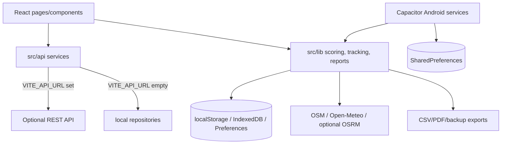

# Road Sage Technical Reference

Updated: 2026-05-24T16:29:49.264Z

This document is generated from the current repository. It keeps the reference readable by using tables and collapsible indexes, while still including actual code snippets for the calculation-heavy parts of the app.

## Table Of Contents

- [Coverage And Reading Guide](#coverage-and-reading-guide)
- [System Overview](#system-overview)
- [Architecture And Module Map](#architecture-and-module-map)
- [Import Export Map](#import-export-map)
- [Function And Method Catalogue](#function-and-method-catalogue)
- [Calculation Deep Dives With Actual Code](#calculation-deep-dives-with-actual-code)
- [Complete Calculation Snippet Index](#complete-calculation-snippet-index)
- [Hard-Coded Values And Constants Registry](#hard-coded-values-and-constants-registry)
- [Data Models State And Storage](#data-models-state-and-storage)
- [Routes And API Reference](#routes-and-api-reference)
- [Configuration And Environment](#configuration-and-environment)
- [Error Handling Catalogue](#error-handling-catalogue)
- [Security Analysis](#security-analysis)
- [Performance Characteristics](#performance-characteristics)
- [Testing Coverage Map](#testing-coverage-map)
- [Dependency Audit](#dependency-audit)
- [Deployment And Infra](#deployment-and-infra)

---
## Coverage And Reading Guide

- Text/code files scanned: 235
- App/source files scanned: 199
- Machine-local files excluded from scanning: `android/local.properties`
- Production calculation lines indexed: 1614
- Test calculation/assertion lines indexed separately: 189
- Hard-coded production literals indexed: 14776
- Functions/methods catalogued: 1238

> WARNING - ASSUMPTION: There is no server code in this repository. REST endpoints documented here are the optional backend contract called by the client when `VITE_API_URL` is configured; otherwise the app uses local repositories.

> NOTE: Scoring thresholds and domain-significant constants now live in named registries such as `DEFAULT_THRESHOLDS`, `ECO_DEFAULTS`, `SVI_DEFAULTS`, `src/lib/appConstants.js` clock/display/storage constants, `ROUTE_RISK_CONSTANTS`, `RISK_CONSTANTS`, `PRE_TRIP_RISK_SIGNAL_GATES`, `HABIT_CONSTANTS`, `DAILY_FATIGUE_THRESHOLDS`, and danger-zone constants. The literal registry below remains useful for auditing labels, keys, Android IDs, and remaining inline policy values.

---
## System Overview

| Item | Value |
| --- | --- |
| Application | Road Sage (`drivesense-app`) |
| Version | 1.0.0 |
| Purpose | Local-first driving tracker for trip recording, scoring, playback, reports, risk insights, coaching, backup/import, and Android background auto tracking. |
| Architecture | React/Vite single-page app plus Capacitor Android shell and native background services. Domain logic is concentrated in `src/lib/*`, API adapters in `src/api/*`, UI in `src/pages/*` and `src/components/*`. |
| Primary storage | IndexedDB/localStorage/sessionStorage/Capacitor Preferences/Android SharedPreferences. |
| Optional backend | `VITE_API_URL`; absent by default. |
| Shared numeric clamp | `src/lib/mathUtils.js` exports the canonical `clamp(value, min, max)` helper. Invalid numeric input returns `min`, preventing NaN from leaking through score, risk, report, and playback calculations. |
| Jerk score reliability | `calculateJerkScore` returns `null` with `jerk_score_confidence: insufficient_data` below 0.5 km or without usable movement samples. Trips from 0.5 km to under 3 km retain the 20-point noise floor with low confidence; trips of 3 km or more use the full 0-100 score range. |
| Intersection stop reliability | `analyzeIntersectionBehavior` counts traffic-stop windows from at least two valid sub-10 km/h samples spanning 4 seconds, with at most 10 seconds between samples; privacy-masked samples break a window. Routes under 0.5 km or with no observed traffic stops report a null intersection score; observed stops score across the full 0-100 range, with late approaches penalized more heavily than rolling stops. |
| Stop-start pattern proxy | `detectStopStartPatterns` emits low-confidence `stop_start_pattern` events from GPS speed only. `stop_start_pattern_score` is hidden until at least 5 km of highway evidence is present and contributes 5% of Safety; the app explicitly states it cannot measure lead-vehicle distance. |
| Brake onset smoothness | `calculateBrakeOnsetSmoothness` reports low-confidence `brake_onset_smoothness_*` fields only after five detected harsh-braking sequences and uses `100 - clamp(peakDecelerationMs2 / rampDurationSeconds, 0, 100)`. Public UI and CSV labels no longer claim human reaction time and Trip Detail displays the disclaimer. |
| Estimated brake-turn manoeuvre alert | New detections are low-confidence `close_proximity` events after at least 1.5 seconds of simultaneous braking and heading change at 30 km/h or above, with defaults of 4.0 m/s2 and 25 deg/s. They do not establish proximity or a near miss and have zero direct Safety/Smoothness event penalty. |
| Heading drift Beta | `detectHeadingDriftBeta` evaluates sustained five-minute highway-speed GPS-heading drift windows, marks confidence low, and applies a 2.5x circadian multiplier between 02:00 and 05:00. Public UI describes a GPS-only Beta pattern rather than drowsiness. |
| Heading event Beta | `detectHeadingDeviationEvents` emits low-confidence `heading_deviation` events labelled Heading Event (Beta) only within advanced-safety detection. These events are shown for review and no longer deduct from Safety scoring. |
| Overtake pattern Beta | `detectAggressiveOvertakes` is diagnostic only. It requires a baseline of at least 1 km of straight driving above 80 km/h, a minimum 3.0 m/s2 acceleration threshold, and a bilateral out-and-back heading pattern within 15 seconds. `calculateTripScores` excludes `aggressive_overtake` from Safety, Aggression, coaching, route risk, achievements, and ordinary phone/safety event scoring. |
| Eco score reliability | `ECO_DEFAULTS` supplies cruise and parked-idle scoring fallbacks when migrated settings omit or corrupt the relevant thresholds. `calculateEcoDrivingScore` clamps idle ratios to 0-1, reports `eco_score_confidence: invalid_thresholds` with a null component when both effective multipliers are zero, and `calculateTripScores` then blends only remaining eco evidence. |
| Speed variability reliability | `SVI_DEFAULTS` excludes stopped samples at or below 5 km/h, requires at least ten moving samples, applies separate city and highway variability penalties, and blends mixed routes by observed segment distance. Insufficient SVI evidence is null and neutral in smoothness, reports, coaching summaries, and week-to-week comparisons. |
| Driver signature braking confidence | `buildDriverSignature` excludes trips without measured braking efficiency from its braking dimension, keeps `dimensions.brakingStyle` null until at least three scored trips exist, and exposes `braking_confidence` from 0 to 1 based on up to ten observed braking trips. Driving Coach shows unavailable braking evidence as an em dash rather than a perfect score. |
| Predictive maintenance brake evidence | `calculatePredictiveMaintenance` excludes trips without finite braking efficiency from brake-stress averaging. `brake_stress_index` remains null until there are at least five completed trips and three observed braking scores; unavailable braking evidence is neutral in the combined service-interval adjustment. |
| Predictive route risk window | `estimatePredictiveRouteRisk` sorts completed trips newest-first by `startTime`/`start_time` before applying the recent-trip window, so callers do not need to pre-sort trip history. |
| Personal baseline confidence | `computePersonalBaseline` withholds a dashboard baseline until 10 completed trips are available in the recent window, then uses exponential recency weighting and displays a confidence interval rather than an unstable simple mean. |
| Context-aware score evidence | Braking-efficiency grades use urban or highway thresholds and display their driving context. Hill-driving returns `hill_route: false` with a null score when not applicable; null component evidence stays out of composite decisions and score confidence metadata supports low-data UI suppression. |
| Fatigue and playback time integrity | `calculateFatigueScore` stores a normalized 0-100 fatigue risk. Fatigue heatmaps use named 30-second segments and require 20 segments before display. Trip duration subtracts tracking gaps, including native Android stats, and map playback uses timestamp progress with index progress only as a missing-time fallback. |
| Phone-use scoring policy | Phone-use scoring requires Android Usage Access evidence. GPS micro-steering windows are collected only as diagnostics with a six-oscillation, 15-second threshold and GPS-accuracy gate; unavailable Usage Access produces `phone_use_score: null` / `usage_access_required`, and proxy events are excluded from Safety, coaching, live warnings, route risk, and normal trip events. |
| Predictive route normalization | `estimatePredictiveRouteRisk` normalizes and clamps baseline, event-density, danger-zone, weather, and time inputs before applying fractional weights. Estimated brake-turn manoeuvre alerts now contribute at 1.5x in predictive route and weather-risk adjustment rather than the former 2x alias path. Route-risk indexing snaps nearby GPS cells within 15 m to limit same-road fragmentation. |
| UBI minimum evidence and weighting | `computeUBIReport` returns insufficient data below 50 km, uses actual distance for event rates, and reduces GPS-heading-derived cornering weight to 5% while shifting weight toward braking. |
| Commute and coaching policy | `COMMUTE_MATCH_RADIUS_M` documents the 150 m commute route-match radius shown in Settings. Weekly coaching uses one focus metric and requires a score delta greater than 3 points; score tips require at least 2 km and confidence of at least 0.5. |
| UI section recovery | `src/components/SectionErrorBoundary.jsx` isolates calculation-heavy route maps, trip playback, Trip Detail score summaries, the Trip Detail page shell, and the Dashboard readiness/risk panel. Caught render errors are logged through `logError` and show a reloadable fallback instead of blanking the app. |
| Handled operation failures | `src/lib/errorReporting.js` exports `logError(context, error, extra)` for critical async failures. Post-trip notifications, achievement sync, odometer sync, and driver-signature persistence now write tracking diagnostics instead of disappearing behind bare catches. |
| Shared time-risk windows | `src/lib/appConstants.js` owns night (22:00-04:59), morning-rush (07:00-09:59 by hourly bucket), and evening-rush (16:00-18:59) boundaries used by habit, pre-trip, predictive route risk, automatic trip tagging, and fixed-hour trip-engine fallback behavior. Android fixed-hour night classification now evaluates that same 22:00-04:59 boundary in the device local timezone, matching JavaScript `Date#getHours()` semantics for native and JS rescoring agreement. Legacy sunset-mode settings migrate to this fallback; custom night hours remain configurable. |
| Backup migrations | `src/lib/dataBackup.js` migrates schema versions 1 through 5 before import, accepts trip notes up to 10,000 characters, counts affected truncated notes, and requires explicit confirmation in Settings before completing a truncating import. |
| Bounded UI lists | Risk hotspots initially show 6 and route history stretches initially show 3 through named constants, with a show-all control and hidden-item count. |

> GPS-ONLY SAFETY LIMITATION: Road Sage has no hazard-stimulus timestamp, lead-vehicle ranging sensor, lane camera/HD-lane geometry, phone gyroscope confirmation, foreground-app evidence unless Android Usage Access is granted, or driver-monitoring sensor. Brake onset smoothness, stop-start patterns, estimated brake-turn manoeuvre alerts, heading events, heading drift Beta, GPS phone-use proxy, and overtake-pattern outputs are low-confidence behavior proxies. Overtake and GPS phone-use proxy outputs are diagnostic only and excluded from overall Safety/coaching. Legacy stored identifiers remain readable for older trip records only.



| Technology | Exact project version |
| --- | --- |
| @capacitor/android | 8.3.4 |
| @capacitor/core | 8.3.4 |
| leaflet | 1.9.4 |
| react | 18.3.1 |
| react-dom | 18.3.1 |
| react-leaflet | 4.2.1 |
| typescript | 5.9.3 |
| vite | 6.4.2 |
| vitest | 4.1.6 |

Entry points: `index.html` loads `src/main.jsx`; `src/App.jsx` defines app routes and bootstraps theme, notifications, onboarding, and Android auto tracking; `android/app/src/main/java/com/drivesense/app/MainActivity.java` hosts the Capacitor app; `android/app/src/main/java/com/drivesense/app/DriveSenseAutoTrackingService.java` handles native tracking.

---
## Architecture And Module Map

| File | Responsibility | Imports | Exports | Functions/methods | Calc lines | Hard-coded values |
| --- | --- | --- | --- | --- | --- | --- |
| .github/workflows/security-ci.yml | Project configuration or static asset metadata. | none | none | 0 | 0 | 0 |
| android/.gradle/9.1.0/gc.properties | Android Capacitor shell, native service, resource, Gradle, or manifest file. | none | none | 0 | 0 | 0 |
| android/.gradle/buildOutputCleanup/cache.properties | Android Capacitor shell, native service, resource, Gradle, or manifest file. | none | none | 0 | 0 | 0 |
| android/.gradle/config.properties | Android Capacitor shell, native service, resource, Gradle, or manifest file. | none | none | 0 | 0 | 0 |
| android/.gradle/vcs-1/gc.properties | Android Capacitor shell, native service, resource, Gradle, or manifest file. | none | none | 0 | 0 | 0 |
| android/app/build.gradle | Android Capacitor shell, native service, resource, Gradle, or manifest file. | none | none | 0 | 0 | 0 |
| android/app/capacitor.build.gradle | Android Capacitor shell, native service, resource, Gradle, or manifest file. | none | none | 0 | 0 | 0 |
| android/app/src/androidTest/java/com/drivesense/app/DriveSenseNativeTripStoreInstrumentedTest.java | Android Capacitor shell, native service, resource, Gradle, or manifest file. | static org.junit.Assert.assertEquals, static org.junit.Assert.assertFalse, static org.junit.Assert.assertNotNull, static org.junit.Assert.assertNull, static org.junit.Assert.assertTrue, android.content.Context, android.content.SharedPreferences, androidx.test.ext.junit.runners.AndroidJUnit4 | none | 8 | 0 | 0 |
| android/app/src/main/AndroidManifest.xml | Android Capacitor shell, native service, resource, Gradle, or manifest file. | none | none | 0 | 0 | 0 |
| android/app/src/main/java/com/drivesense/app/DriveSenseActivityReceiver.java | Android Capacitor shell, native service, resource, Gradle, or manifest file. | android.content.BroadcastReceiver, android.content.Context, android.content.Intent, com.google.android.gms.location.ActivityRecognitionResult, com.google.android.gms.location.DetectedActivity | none | 1 | 0 | 0 |
| android/app/src/main/java/com/drivesense/app/DriveSenseActivityRecognitionPlugin.java | Android Capacitor shell, native service, resource, Gradle, or manifest file. | android.Manifest, android.app.PendingIntent, android.content.ContentResolver, android.content.ContentValues, android.content.ActivityNotFoundException, android.content.Context, android.content.Intent, android.content.pm.PackageManager | none | 39 | 0 | 95 |
| android/app/src/main/java/com/drivesense/app/DriveSenseAutoTrackingService.java | Android Capacitor shell, native service, resource, Gradle, or manifest file. | android.Manifest, android.app.Notification, android.app.NotificationChannel, android.app.NotificationManager, android.app.PendingIntent, android.app.Service, android.content.Context, android.content.Intent | none | 71 | 36 | 432 |
| android/app/src/main/java/com/drivesense/app/DriveSenseAutoTrackingTileService.java | Android Capacitor shell, native service, resource, Gradle, or manifest file. | android.Manifest, android.content.Context, android.content.SharedPreferences, android.content.pm.PackageManager, android.os.Build, android.service.quicksettings.Tile, android.service.quicksettings.TileService, androidx.core.content.ContextCompat | none | 12 | 0 | 31 |
| android/app/src/main/java/com/drivesense/app/DriveSenseNativeTripStore.java | Android Capacitor shell, native service, resource, Gradle, or manifest file. | android.content.Context, android.content.SharedPreferences, org.json.JSONArray, org.json.JSONException, org.json.JSONObject, java.util.UUID | none | 18 | 0 | 24 |
| android/app/src/main/java/com/drivesense/app/DriveSensePhoneUsageTracker.java | Android Capacitor shell, native service, resource, Gradle, or manifest file. | android.app.AppOpsManager, android.app.usage.UsageEvents, android.app.usage.UsageStatsManager, android.content.Context, android.os.Build, android.os.Process, org.json.JSONArray, org.json.JSONException | none | 7 | 3 | 50 |
| android/app/src/main/java/com/drivesense/app/MainActivity.java | Android Capacitor shell, native service, resource, Gradle, or manifest file. | android.os.Bundle, com.getcapacitor.BridgeActivity | none | 1 | 0 | 0 |
| android/app/src/main/res/drawable-v24/ic_launcher_foreground.xml | Android Capacitor shell, native service, resource, Gradle, or manifest file. | none | none | 0 | 0 | 0 |
| android/app/src/main/res/drawable/ic_launcher_background.xml | Android Capacitor shell, native service, resource, Gradle, or manifest file. | none | none | 0 | 0 | 0 |
| android/app/src/main/res/drawable/ic_qs_roadsage.xml | Android Capacitor shell, native service, resource, Gradle, or manifest file. | none | none | 0 | 0 | 0 |
| android/app/src/main/res/drawable/ic_stat_drivesense.xml | Android Capacitor shell, native service, resource, Gradle, or manifest file. | none | none | 0 | 0 | 0 |
| android/app/src/main/res/layout/activity_main.xml | Android Capacitor shell, native service, resource, Gradle, or manifest file. | none | none | 0 | 0 | 0 |
| android/app/src/main/res/mipmap-anydpi-v26/ic_launcher_round.xml | Android Capacitor shell, native service, resource, Gradle, or manifest file. | none | none | 0 | 0 | 0 |
| android/app/src/main/res/mipmap-anydpi-v26/ic_launcher.xml | Android Capacitor shell, native service, resource, Gradle, or manifest file. | none | none | 0 | 0 | 0 |
| android/app/src/main/res/values/ic_launcher_background.xml | Android Capacitor shell, native service, resource, Gradle, or manifest file. | none | none | 0 | 0 | 0 |
| android/app/src/main/res/values/strings.xml | Android Capacitor shell, native service, resource, Gradle, or manifest file. | none | none | 0 | 0 | 0 |
| android/app/src/main/res/values/styles.xml | Android Capacitor shell, native service, resource, Gradle, or manifest file. | none | none | 0 | 0 | 0 |
| android/app/src/main/res/xml/config.xml | Android Capacitor shell, native service, resource, Gradle, or manifest file. | none | none | 0 | 0 | 0 |
| android/app/src/main/res/xml/file_paths.xml | Android Capacitor shell, native service, resource, Gradle, or manifest file. | none | none | 0 | 0 | 0 |
| android/app/src/test/java/com/drivesense/app/DriveSenseAutoTrackingServiceTest.java | Android Capacitor shell, native service, resource, Gradle, or manifest file. | static org.junit.Assert.assertFalse, static org.junit.Assert.assertTrue, java.time.LocalDateTime, java.time.ZoneId, java.util.TimeZone, org.junit.Test | none | 1 | 0 | 0 |
| android/app/src/test/java/com/getcapacitor/myapp/ExampleUnitTest.java | Android Capacitor shell, native service, resource, Gradle, or manifest file. | static org.junit.Assert.*, org.junit.Test | none | 1 | 0 | 0 |
| android/build.gradle | Android Capacitor shell, native service, resource, Gradle, or manifest file. | none | none | 0 | 0 | 0 |
| android/capacitor-cordova-android-plugins/build.gradle | Android Capacitor shell, native service, resource, Gradle, or manifest file. | none | none | 0 | 0 | 0 |
| android/capacitor-cordova-android-plugins/cordova.variables.gradle | Android Capacitor shell, native service, resource, Gradle, or manifest file. | none | none | 0 | 0 | 0 |
| android/capacitor-cordova-android-plugins/src/main/AndroidManifest.xml | Android Capacitor shell, native service, resource, Gradle, or manifest file. | none | none | 0 | 0 | 0 |
| android/capacitor.settings.gradle | Android Capacitor shell, native service, resource, Gradle, or manifest file. | none | none | 0 | 0 | 0 |
| android/gradle.properties | Android Capacitor shell, native service, resource, Gradle, or manifest file. | none | none | 0 | 0 | 0 |
| android/gradle/wrapper/gradle-wrapper.properties | Android Capacitor shell, native service, resource, Gradle, or manifest file. | none | none | 0 | 0 | 0 |
| android/settings.gradle | Android Capacitor shell, native service, resource, Gradle, or manifest file. | none | none | 0 | 0 | 0 |
| android/variables.gradle | Android Capacitor shell, native service, resource, Gradle, or manifest file. | none | none | 0 | 0 | 0 |
| capacitor.config.ts | Project configuration or static asset metadata. | @capacitor/cli | config | 0 | 0 | 0 |
| components.json | Project configuration or static asset metadata. | none | none | 0 | 0 | 0 |
| e2e/app-smoke.spec.js | Playwright browser smoke test for the built application shell. | @playwright/test | none | 0 | 0 | 0 |
| eslint.config.js | Project configuration or static asset metadata. | globals, @eslint/js, eslint-plugin-react, eslint-plugin-react-hooks, eslint-plugin-unused-imports | ArrayExpression | 0 | 0 | 0 |
| index.html | Project configuration or static asset metadata. | none | none | 0 | 0 | 0 |
| jsconfig.json | Project configuration or static asset metadata. | none | none | 0 | 0 | 0 |
| package-lock.json | Project configuration or static asset metadata. | none | none | 0 | 0 | 0 |
| package.json | Node package metadata, scripts, and dependency declarations. | none | none | 0 | 0 | 0 |
| playwright.config.js | Project configuration or static asset metadata. | @playwright/test | CallExpression | 0 | 0 | 0 |
| postcss.config.js | Project configuration or static asset metadata. | none | ObjectExpression | 0 | 0 | 0 |
| README.md | Human entry-point documentation. | none | none | 0 | 0 | 0 |
| scripts/check-repository-hygiene.mjs | Repository automation script. | node:child_process | none | 1 | 0 | 0 |
| scripts/generate-technical-reference.mjs | Repository automation script. | node:fs, node:path, @babel/parser, @babel/traverse | none | 60 | 0 | 0 |
| scripts/patch-android-gradle.mjs | Repository automation script. | node:fs, node:path | none | 2 | 0 | 0 |
| scripts/run-live-contracts.mjs | Repository automation script. | node:child_process | none | 0 | 0 | 0 |
| src/api/__tests__/clientFallback.test.js | API service adapter with local-first fallback behavior. | vitest, @/api/client, @/api/trips, @/api/vehicles | none | 0 | 0 | 0 |
| src/api/auth.js | API service adapter with local-first fallback behavior. | @/api/client | migrateLegacyAuthTokens, authService | 1 | 0 | 5 |
| src/api/client.js | API service adapter with local-first fallback behavior. | none | API_BASE_URL, ApiError, getAuthToken, apiClient | 5 | 0 | 22 |
| src/api/trips.js | API service adapter with local-first fallback behavior. | @/api/client, @/lib/localTripRepository, @/lib/nativePlatform, @/lib/tripInsights, @/lib/tripMetadata | shouldUseLocalStore, tripService | 2 | 2 | 22 |
| src/api/vehicles.js | API service adapter with local-first fallback behavior. | @/api/client, @/lib/localVehicleRepository, @/lib/nativePlatform | shouldUseLocalStore, vehicleService | 2 | 1 | 9 |
| src/App.jsx | Project configuration or static asset metadata. | @/components/ui/toaster, @tanstack/react-query, @/lib/query-client, react-router-dom, @capacitor/local-notifications, ./lib/PageNotFound, @/lib/AuthContext, @/components/UserNotRegisteredError | App | 4 | 1 | 44 |
| src/components/__tests__/SectionErrorBoundary.test.jsx | Feature UI component for trips, maps, playback, cards, overlays, or layout. | react, vitest, @/components/SectionErrorBoundary, @/lib/errorReporting | none | 2 | 0 | 0 |
| src/components/EventBadge.jsx | Feature UI component for trips, maps, playback, cards, overlays, or layout. | lucide-react | EventBadge, EVENT_CONFIG | 1 | 0 | 22 |
| src/components/Layout.jsx | Feature UI component for trips, maps, playback, cards, overlays, or layout. | react-router-dom, react, lucide-react, framer-motion, @/lib/localTripRepository | Layout | 4 | 4 | 64 |
| src/components/LiveCoachOverlay.jsx | Feature UI component for trips, maps, playback, cards, overlays, or layout. | react, framer-motion, lucide-react, @/lib/tripEngine, @/lib/trackingStore, @/lib/notificationService, @/lib/nativePlatform, @/lib/activityRecognition | LiveCoachOverlay | 5 | 3 | 108 |
| src/components/ProtectedRoute.jsx | Feature UI component for trips, maps, playback, cards, overlays, or layout. | react, react-router-dom, @/lib/AuthContext, @/components/UserNotRegisteredError | ProtectedRoute | 2 | 0 | 1 |
| src/components/ScoreRing.jsx | Feature UI component for trips, maps, playback, cards, overlays, or layout. | @/lib/tripEngine, framer-motion | ScoreRing | 1 | 2 | 28 |
| src/components/SectionErrorBoundary.jsx | Feature UI component for trips, maps, playback, cards, overlays, or layout. | react, lucide-react, @/lib/errorReporting | DefaultSectionErrorFallback, SectionErrorBoundary | 5 | 0 | 8 |
| src/components/StatCard.jsx | Feature UI component for trips, maps, playback, cards, overlays, or layout. | framer-motion, lucide-react | StatCard | 1 | 0 | 7 |
| src/components/TripCard.jsx | Feature UI component for trips, maps, playback, cards, overlays, or layout. | framer-motion, lucide-react, @/lib/tripEngine, @/lib/tripMetadata, react-router-dom | TripCard | 1 | 1 | 52 |
| src/components/TripMap.jsx | Feature UI component for trips, maps, playback, cards, overlays, or layout. | react, leaflet, leaflet/dist/leaflet.css, lucide-react, @/lib/htmlUtils, @/lib/mapPlaybackInsights, @/lib/mapPopupHtml, @/lib/tripInsights | TripMap | 24 | 65 | 445 |
| src/components/TripPlayback.jsx | Feature UI component for trips, maps, playback, cards, overlays, or layout. | react, leaflet, leaflet/dist/leaflet.css, lucide-react, @/lib/htmlUtils, @/lib/mapPlaybackInsights, @/lib/mapPopupHtml, @/lib/mathUtils | TripPlayback | 20 | 67 | 344 |
| src/components/ui/accordion.jsx | Reusable shadcn/Radix UI wrapper component. | react, @radix-ui/react-accordion, lucide-react, @/lib/utils | Accordion, AccordionItem, AccordionTrigger, AccordionContent | 0 | 0 | 2 |
| src/components/ui/alert-dialog.jsx | Reusable shadcn/Radix UI wrapper component. | react, @radix-ui/react-alert-dialog, @/lib/utils, @/components/ui/button | AlertDialog, AlertDialogPortal, AlertDialogOverlay, AlertDialogTrigger, AlertDialogContent, AlertDialogHeader, AlertDialogFooter, AlertDialogTitle, AlertDialogDescription, AlertDialogAction | 2 | 1 | 12 |
| src/components/ui/alert.jsx | Reusable shadcn/Radix UI wrapper component. | react, class-variance-authority, @/lib/utils | Alert, AlertTitle, AlertDescription | 0 | 0 | 7 |
| src/components/ui/aspect-ratio.jsx | Reusable shadcn/Radix UI wrapper component. | @radix-ui/react-aspect-ratio | AspectRatio | 0 | 0 | 0 |
| src/components/ui/avatar.jsx | Reusable shadcn/Radix UI wrapper component. | react, @radix-ui/react-avatar, @/lib/utils | Avatar, AvatarImage, AvatarFallback | 0 | 0 | 2 |
| src/components/ui/badge.jsx | Reusable shadcn/Radix UI wrapper component. | react, class-variance-authority, @/lib/utils | Badge, badgeVariants | 1 | 0 | 5 |
| src/components/ui/breadcrumb.jsx | Reusable shadcn/Radix UI wrapper component. | react, @radix-ui/react-slot, lucide-react, @/lib/utils | Breadcrumb, BreadcrumbList, BreadcrumbItem, BreadcrumbLink, BreadcrumbPage, BreadcrumbSeparator, BreadcrumbEllipsis | 2 | 0 | 17 |
| src/components/ui/button.jsx | Reusable shadcn/Radix UI wrapper component. | react, @radix-ui/react-slot, class-variance-authority, @/lib/utils | Button, buttonVariants | 0 | 0 | 17 |
| src/components/ui/calendar.jsx | Reusable shadcn/Radix UI wrapper component. | react, lucide-react, react-day-picker, @/lib/utils, @/components/ui/button | Calendar | 1 | 0 | 27 |
| src/components/ui/card.jsx | Reusable shadcn/Radix UI wrapper component. | react, @/lib/utils | Card, CardHeader, CardFooter, CardTitle, CardDescription, CardContent | 0 | 0 | 6 |
| src/components/ui/carousel.jsx | Reusable shadcn/Radix UI wrapper component. | react, embla-carousel-react, lucide-react, @/lib/utils, @/components/ui/button | Carousel, CarouselContent, CarouselItem, CarouselPrevious, CarouselNext | 1 | 0 | 40 |
| src/components/ui/chart.jsx | Reusable shadcn/Radix UI wrapper component. | react, recharts, @/lib/utils | ChartContainer, ChartTooltip, ChartTooltipContent, ChartLegend, ChartLegendContent, ChartStyle | 3 | 4 | 50 |
| src/components/ui/checkbox.jsx | Reusable shadcn/Radix UI wrapper component. | react, @radix-ui/react-checkbox, lucide-react, @/lib/utils | Checkbox | 0 | 0 | 1 |
| src/components/ui/collapsible.jsx | Reusable shadcn/Radix UI wrapper component. | @radix-ui/react-collapsible | Collapsible, CollapsibleTrigger, CollapsibleContent | 0 | 0 | 1 |
| src/components/ui/command.jsx | Reusable shadcn/Radix UI wrapper component. | react, cmdk, lucide-react, @/lib/utils, @/components/ui/dialog | Command, CommandDialog, CommandInput, CommandList, CommandEmpty, CommandGroup, CommandItem, CommandShortcut, CommandSeparator | 2 | 1 | 5 |
| src/components/ui/context-menu.jsx | Reusable shadcn/Radix UI wrapper component. | react, @radix-ui/react-context-menu, lucide-react, @/lib/utils | ContextMenu, ContextMenuTrigger, ContextMenuContent, ContextMenuItem, ContextMenuCheckboxItem, ContextMenuRadioItem, ContextMenuLabel, ContextMenuSeparator, ContextMenuShortcut, ContextMenuGroup | 1 | 0 | 11 |
| src/components/ui/dialog.jsx | Reusable shadcn/Radix UI wrapper component. | react, @radix-ui/react-dialog, lucide-react, @/lib/utils | Dialog, DialogPortal, DialogOverlay, DialogTrigger, DialogClose, DialogContent, DialogHeader, DialogFooter, DialogTitle, DialogDescription | 2 | 1 | 11 |
| src/components/ui/drawer.jsx | Reusable shadcn/Radix UI wrapper component. | react, vaul, @/lib/utils | Drawer, DrawerPortal, DrawerOverlay, DrawerTrigger, DrawerClose, DrawerContent, DrawerHeader, DrawerFooter, DrawerTitle, DrawerDescription | 3 | 0 | 7 |
| src/components/ui/dropdown-menu.jsx | Reusable shadcn/Radix UI wrapper component. | react, @radix-ui/react-dropdown-menu, lucide-react, @/lib/utils | DropdownMenu, DropdownMenuTrigger, DropdownMenuContent, DropdownMenuItem, DropdownMenuCheckboxItem, DropdownMenuRadioItem, DropdownMenuLabel, DropdownMenuSeparator, DropdownMenuShortcut, DropdownMenuGroup | 1 | 0 | 11 |
| src/components/ui/form.jsx | Reusable shadcn/Radix UI wrapper component. | react, @radix-ui/react-slot, react-hook-form, @/lib/utils, @/components/ui/label | useFormField, Form, FormItem, FormLabel, FormControl, FormDescription, FormMessage, FormField | 2 | 0 | 12 |
| src/components/ui/hover-card.jsx | Reusable shadcn/Radix UI wrapper component. | react, @radix-ui/react-hover-card, @/lib/utils | HoverCard, HoverCardTrigger, HoverCardContent | 0 | 0 | 4 |
| src/components/ui/input-otp.jsx | Reusable shadcn/Radix UI wrapper component. | react, input-otp, lucide-react, @/lib/utils | InputOTP, InputOTPGroup, InputOTPSlot, InputOTPSeparator | 0 | 0 | 7 |
| src/components/ui/input.jsx | Reusable shadcn/Radix UI wrapper component. | react, @/lib/utils | Input | 0 | 0 | 2 |
| src/components/ui/label.jsx | Reusable shadcn/Radix UI wrapper component. | react, @radix-ui/react-label, class-variance-authority, @/lib/utils | Label | 0 | 0 | 1 |
| src/components/ui/menubar.jsx | Reusable shadcn/Radix UI wrapper component. | react, @radix-ui/react-menubar, lucide-react, @/lib/utils | Menubar, MenubarMenu, MenubarTrigger, MenubarContent, MenubarItem, MenubarSeparator, MenubarLabel, MenubarCheckboxItem, MenubarRadioGroup, MenubarRadioItem | 6 | 0 | 16 |
| src/components/ui/navigation-menu.jsx | Reusable shadcn/Radix UI wrapper component. | react, @radix-ui/react-navigation-menu, class-variance-authority, lucide-react, @/lib/utils | navigationMenuTriggerStyle, NavigationMenu, NavigationMenuList, NavigationMenuItem, NavigationMenuContent, NavigationMenuTrigger, NavigationMenuLink, NavigationMenuIndicator, NavigationMenuViewport | 0 | 0 | 8 |
| src/components/ui/pagination.jsx | Reusable shadcn/Radix UI wrapper component. | react, lucide-react, @/lib/utils, @/components/ui/button | Pagination, PaginationContent, PaginationLink, PaginationItem, PaginationPrevious, PaginationNext, PaginationEllipsis | 5 | 0 | 15 |
| src/components/ui/popover.jsx | Reusable shadcn/Radix UI wrapper component. | react, @radix-ui/react-popover, @/lib/utils | Popover, PopoverTrigger, PopoverContent, PopoverAnchor | 0 | 0 | 3 |
| src/components/ui/progress.jsx | Reusable shadcn/Radix UI wrapper component. | react, @radix-ui/react-progress, @/lib/utils | Progress | 0 | 0 | 2 |
| src/components/ui/radio-group.jsx | Reusable shadcn/Radix UI wrapper component. | react, @radix-ui/react-radio-group, lucide-react, @/lib/utils | RadioGroup, RadioGroupItem | 0 | 0 | 1 |
| src/components/ui/resizable.jsx | Reusable shadcn/Radix UI wrapper component. | lucide-react, react-resizable-panels, @/lib/utils | ResizablePanelGroup, ResizablePanel, ResizableHandle | 2 | 0 | 3 |
| src/components/ui/scroll-area.jsx | Reusable shadcn/Radix UI wrapper component. | react, @radix-ui/react-scroll-area, @/lib/utils | ScrollArea, ScrollBar | 0 | 1 | 6 |
| src/components/ui/select.jsx | Reusable shadcn/Radix UI wrapper component. | react, @radix-ui/react-select, lucide-react, @/lib/utils | Select, SelectGroup, SelectValue, SelectTrigger, SelectContent, SelectLabel, SelectItem, SelectSeparator, SelectScrollUpButton, SelectScrollDownButton | 0 | 1 | 8 |
| src/components/ui/separator.jsx | Reusable shadcn/Radix UI wrapper component. | react, @radix-ui/react-separator, @/lib/utils | Separator | 0 | 0 | 6 |
| src/components/ui/sheet.jsx | Reusable shadcn/Radix UI wrapper component. | react, @radix-ui/react-dialog, class-variance-authority, lucide-react, @/lib/utils | Sheet, SheetPortal, SheetOverlay, SheetTrigger, SheetClose, SheetContent, SheetHeader, SheetFooter, SheetTitle, SheetDescription | 2 | 1 | 11 |
| src/components/ui/sidebar.jsx | Reusable shadcn/Radix UI wrapper component. | react, @radix-ui/react-slot, class-variance-authority, lucide-react, @/hooks/use-mobile, @/lib/utils, @/components/ui/button, @/components/ui/input | Sidebar, SidebarContent, SidebarFooter, SidebarGroup, SidebarGroupAction, SidebarGroupContent, SidebarGroupLabel, SidebarHeader, SidebarInput, SidebarInset | 4 | 4 | 164 |
| src/components/ui/skeleton.jsx | Reusable shadcn/Radix UI wrapper component. | @/lib/utils | Skeleton | 1 | 0 | 0 |
| src/components/ui/slider.jsx | Reusable shadcn/Radix UI wrapper component. | react, @radix-ui/react-slider, @/lib/utils | Slider | 0 | 0 | 0 |
| src/components/ui/sonner.jsx | Reusable shadcn/Radix UI wrapper component. | next-themes, sonner | Toaster | 1 | 0 | 6 |
| src/components/ui/switch.jsx | Reusable shadcn/Radix UI wrapper component. | react, @radix-ui/react-switch, @/lib/utils | Switch | 0 | 0 | 2 |
| src/components/ui/table.jsx | Reusable shadcn/Radix UI wrapper component. | react, @/lib/utils | Table, TableHeader, TableBody, TableFooter, TableHead, TableRow, TableCell, TableCaption | 0 | 0 | 11 |
| src/components/ui/tabs.jsx | Reusable shadcn/Radix UI wrapper component. | react, @radix-ui/react-tabs, @/lib/utils | Tabs, TabsList, TabsTrigger, TabsContent | 0 | 0 | 3 |
| src/components/ui/textarea.jsx | Reusable shadcn/Radix UI wrapper component. | react, @/lib/utils | Textarea | 0 | 0 | 2 |
| src/components/ui/toast.jsx | Reusable shadcn/Radix UI wrapper component. | react, class-variance-authority, lucide-react, @/lib/utils | ToastProvider, ToastViewport, Toast, ToastTitle, ToastDescription, ToastClose, ToastAction | 0 | 0 | 13 |
| src/components/ui/toaster.jsx | Reusable shadcn/Radix UI wrapper component. | @/components/ui/use-toast, @/components/ui/toast | Toaster | 1 | 0 | 1 |
| src/components/ui/toggle-group.jsx | Reusable shadcn/Radix UI wrapper component. | react, @radix-ui/react-toggle-group, @/lib/utils, @/components/ui/toggle | ToggleGroup, ToggleGroupItem | 0 | 0 | 1 |
| src/components/ui/toggle.jsx | Reusable shadcn/Radix UI wrapper component. | react, @radix-ui/react-toggle, class-variance-authority, @/lib/utils | Toggle, toggleVariants | 0 | 0 | 6 |
| src/components/ui/tooltip.jsx | Reusable shadcn/Radix UI wrapper component. | react, @radix-ui/react-tooltip, @/lib/utils | Tooltip, TooltipTrigger, TooltipContent, TooltipProvider | 0 | 0 | 3 |
| src/components/ui/use-toast.jsx | Reusable shadcn/Radix UI wrapper component. | react | reducer, useToast, toast | 11 | 4 | 16 |
| src/components/UserNotRegisteredError.jsx | Feature UI component for trips, maps, playback, cards, overlays, or layout. | react | UserNotRegisteredError | 1 | 1 | 4 |
| src/components/VehicleCompare.jsx | Feature UI component for trips, maps, playback, cards, overlays, or layout. | react, recharts, lucide-react, @/lib/tripEngine | VehicleCompare | 3 | 11 | 52 |
| src/global.d.ts | Project configuration or static asset metadata. | none | App | 0 | 0 | 1 |
| src/hooks/use-mobile.jsx | Reusable React hook. | react | useIsMobile | 2 | 0 | 4 |
| src/index.css | Project configuration or static asset metadata. | none | none | 0 | 0 | 0 |
| src/lib/__tests__/activityRecognition.test.js | Domain/service library for scoring, tracking, storage, reports, context, or native integration. | vitest, @/lib/activityRecognition | none | 0 | 0 | 0 |
| src/lib/__tests__/advancedOpenSourceFeatures.test.js | Domain/service library for scoring, tracking, storage, reports, context, or native integration. | vitest, @/lib/driverAnomaly, @/lib/obdBluetooth, @/lib/sensorFusionModel, @/lib/predictiveRouteRisk, @/lib/weeklyCoaching, @/lib/habitProfile | none | 1 | 0 | 0 |
| src/lib/__tests__/brakeOnsetSmoothness.test.js | Domain/service library for scoring, tracking, storage, reports, context, or native integration. | vitest, @/lib/tripEngine | none | 3 | 0 | 0 |
| src/lib/__tests__/brakingEfficiency.test.js | Domain/service library for scoring, tracking, storage, reports, context, or native integration. | vitest, @/lib/tripEngine | none | 1 | 0 | 0 |
| src/lib/__tests__/corneringConsistency.test.js | Domain/service library for scoring, tracking, storage, reports, context, or native integration. | vitest, @/lib/tripEngine | none | 2 | 0 | 0 |
| src/lib/__tests__/currency.test.js | Domain/service library for scoring, tracking, storage, reports, context, or native integration. | vitest, node:fs, @/lib/currency | none | 0 | 0 | 0 |
| src/lib/__tests__/dailyFatigueEngine.test.js | Domain/service library for scoring, tracking, storage, reports, context, or native integration. | vitest, @/lib/dailyFatigueEngine | none | 1 | 0 | 0 |
| src/lib/__tests__/dangerZoneEngine.test.js | Domain/service library for scoring, tracking, storage, reports, context, or native integration. | vitest, @/lib/dangerZoneEngine | none | 2 | 0 | 0 |
| src/lib/__tests__/dataBackupImportSecurity.test.js | Domain/service library for scoring, tracking, storage, reports, context, or native integration. | vitest, @/lib/dataBackup | none | 1 | 0 | 0 |
| src/lib/__tests__/driverSignature.test.js | Domain/service library for scoring, tracking, storage, reports, context, or native integration. | vitest, @/lib/tripInsights | none | 1 | 0 | 0 |
| src/lib/__tests__/drivingConsistency.test.js | Domain/service library for scoring, tracking, storage, reports, context, or native integration. | vitest, @/lib/tripInsights | none | 1 | 0 | 0 |
| src/lib/__tests__/externalContracts.test.js | Domain/service library for scoring, tracking, storage, reports, context, or native integration. | vitest, @/lib/retry, @/lib/mapMatching, @/lib/speedLimitSource, @/lib/weatherContext | none | 1 | 0 | 0 |
| src/lib/__tests__/fatigueHeatmapData.test.js | Domain/service library for scoring, tracking, storage, reports, context, or native integration. | vitest, @/lib/tripInsights | none | 1 | 0 | 0 |
| src/lib/__tests__/feedbackRescore.test.js | Domain/service library for scoring, tracking, storage, reports, context, or native integration. | vitest, @/lib/localTripRepository, @/lib/tripEngine | none | 2 | 0 | 0 |
| src/lib/__tests__/htmlUtils.test.js | Domain/service library for scoring, tracking, storage, reports, context, or native integration. | vitest, @/lib/htmlUtils, @/lib/mapPopupHtml | none | 0 | 0 | 0 |
| src/lib/__tests__/liveExternalContracts.test.js | Domain/service library for scoring, tracking, storage, reports, context, or native integration. | vitest | none | 1 | 0 | 0 |
| src/lib/__tests__/localTripRepositoryIndexedDb.test.js | Domain/service library for scoring, tracking, storage, reports, context, or native integration. | vitest, @/lib/localTripRepository | none | 17 | 0 | 0 |
| src/lib/__tests__/mapMatching.test.js | Domain/service library for scoring, tracking, storage, reports, context, or native integration. | vitest, @/lib/mapMatching | none | 1 | 0 | 0 |
| src/lib/__tests__/mapPlaybackInsights.test.js | Domain/service library for scoring, tracking, storage, reports, context, or native integration. | vitest, @/lib/mapPlaybackInsights | none | 1 | 0 | 0 |
| src/lib/__tests__/mathUtils.test.js | Domain/service library for scoring, tracking, storage, reports, context, or native integration. | vitest, @/lib/mathUtils | none | 0 | 0 | 0 |
| src/lib/__tests__/mediumInsights.test.js | Domain/service library for scoring, tracking, storage, reports, context, or native integration. | vitest, @/lib/mediumInsights | none | 2 | 0 | 0 |
| src/lib/__tests__/notifications.test.js | Domain/service library for scoring, tracking, storage, reports, context, or native integration. | node:fs, vitest, @/lib/notificationService, @/lib/tripInsights | none | 2 | 0 | 0 |
| src/lib/__tests__/openSourceContext.test.js | Domain/service library for scoring, tracking, storage, reports, context, or native integration. | vitest, @/lib/speedLimitSource, @/lib/openSourceTripContext, @/lib/weatherContext, @/lib/privacyZones | none | 0 | 0 | 0 |
| src/lib/__tests__/overtakeQuality.test.js | Domain/service library for scoring, tracking, storage, reports, context, or native integration. | vitest, @/lib/tripEngine | none | 1 | 0 | 0 |
| src/lib/__tests__/phoneUsageAccess.test.js | Domain/service library for scoring, tracking, storage, reports, context, or native integration. | vitest, @/lib/phoneUsageAccess | none | 1 | 0 | 0 |
| src/lib/__tests__/phoneUseDetection.test.js | Domain/service library for scoring, tracking, storage, reports, context, or native integration. | vitest, @/lib/tripEngine | none | 2 | 0 | 0 |
| src/lib/__tests__/predictiveMaintenance.test.js | Domain/service library for scoring, tracking, storage, reports, context, or native integration. | vitest, @/lib/tripInsights | none | 1 | 0 | 0 |
| src/lib/__tests__/preTripRisk.test.js | Domain/service library for scoring, tracking, storage, reports, context, or native integration. | vitest, @/lib/preTripRisk, @/lib/habitProfile, @/lib/predictiveRouteRisk, @/lib/appConstants | none | 2 | 0 | 0 |
| src/lib/__tests__/privacyZones.test.js | Domain/service library for scoring, tracking, storage, reports, context, or native integration. | vitest, @/lib/tripEngine, @/lib/privacyZones | none | 1 | 0 | 0 |
| src/lib/__tests__/releaseBlockers.test.js | Domain/service library for scoring, tracking, storage, reports, context, or native integration. | vitest, node:fs, @/api/auth, @/api/client, @/lib/dataBackup, @/lib/driverAnomaly, @/lib/errorReporting, @/lib/localTripRepository | none | 2 | 0 | 0 |
| src/lib/__tests__/roadTypeSegmentedScoring.test.js | Domain/service library for scoring, tracking, storage, reports, context, or native integration. | vitest, @/lib/tripEngine | none | 2 | 0 | 0 |
| src/lib/__tests__/routeRiskIndex.test.js | Domain/service library for scoring, tracking, storage, reports, context, or native integration. | vitest, @/lib/routeRiskIndex | none | 1 | 0 | 0 |
| src/lib/__tests__/settingsImportSecurity.test.js | Domain/service library for scoring, tracking, storage, reports, context, or native integration. | vitest, @/lib/dataBackup, @/lib/trackingStore | none | 2 | 0 | 0 |
| src/lib/__tests__/slipperyConditionProxy.test.js | Domain/service library for scoring, tracking, storage, reports, context, or native integration. | vitest, @/lib/tripEngine | none | 2 | 0 | 0 |
| src/lib/__tests__/speedLimitCompliance.test.js | Domain/service library for scoring, tracking, storage, reports, context, or native integration. | vitest, @/lib/tripEngine | none | 1 | 0 | 0 |
| src/lib/__tests__/thresholdCalibration.test.js | Domain/service library for scoring, tracking, storage, reports, context, or native integration. | vitest, @/lib/thresholdCalibration | none | 2 | 0 | 0 |
| src/lib/__tests__/trackingDiagnostics.test.js | Domain/service library for scoring, tracking, storage, reports, context, or native integration. | vitest, @/lib/trackingDiagnostics | none | 0 | 0 | 0 |
| src/lib/__tests__/trackingStoreDefaults.test.js | Domain/service library for scoring, tracking, storage, reports, context, or native integration. | vitest, @/lib/trackingStore | none | 0 | 0 | 0 |
| src/lib/__tests__/tripEngineCalculationCoverage.test.js | Domain/service library for scoring, tracking, storage, reports, context, or native integration. | vitest, @/lib/tripEngine | none | 2 | 0 | 0 |
| src/lib/__tests__/ubiReport.test.js | Domain/service library for scoring, tracking, storage, reports, context, or native integration. | vitest, @/lib/ubiReport | none | 1 | 0 | 0 |
| src/lib/__tests__/voiceAlerts.test.js | Domain/service library for scoring, tracking, storage, reports, context, or native integration. | vitest, @/lib/voiceAlerts | none | 3 | 0 | 0 |
| src/lib/activityRecognition.js | Domain/service library for scoring, tracking, storage, reports, context, or native integration. | @capacitor/core, @/lib/nativePlatform, @/lib/permissions, @/lib/tripEngine | ACTIVITY_POLL_INTERVAL_MS, AUTO_START_IN_VEHICLE_CONFIDENCE, AUTO_START_SPEED_KMH, AUTO_START_IN_VEHICLE_SECONDS, AUTO_START_GPS_FALLBACK_SECONDS, WALKING_SPEED_CUTOFF_KMH, ACTIVITY_TYPES, startActivityRecognition, startNativeAutoTracking, stopNativeAutoTracking | 17 | 12 | 92 |
| src/lib/appConstants.js | Domain/service library for scoring, tracking, storage, reports, context, or native integration. | none | NIGHT_START_HOUR, NIGHT_END_HOUR, MORNING_RUSH_START_HOUR, MORNING_RUSH_END_HOUR, EVENING_RUSH_START_HOUR, EVENING_RUSH_END_HOUR, NIGHT_START_TIME, NIGHT_END_TIME, MAX_VISIBLE_DANGER_ZONES, MAX_ROUTE_RISK_SEGMENTS_SHOWN | 3 | 3 | 13 |
| src/lib/AuthContext.jsx | Domain/service library for scoring, tracking, storage, reports, context, or native integration. | react, @/api/auth, @/api/client | AuthProvider, useAuth | 6 | 0 | 25 |
| src/lib/commuteMatching.js | Domain/service library for scoring, tracking, storage, reports, context, or native integration. | none | COMMUTE_MATCH_RADIUS_M, routeKeyForTrip | 2 | 2 | 10 |
| src/lib/currency.js | Domain/service library for scoring, tracking, storage, reports, context, or native integration. | none | CURRENCY_SYMBOL_OPTIONS, normalizeCurrencySymbol, formatCurrencyAmount | 2 | 1 | 18 |
| src/lib/dailyFatigueEngine.js | Domain/service library for scoring, tracking, storage, reports, context, or native integration. | @/lib/mathUtils | DAILY_FATIGUE_THRESHOLDS, getTodayTrips, computeDailyFatigue | 6 | 8 | 51 |
| src/lib/dangerZoneEngine.js | Domain/service library for scoring, tracking, storage, reports, context, or native integration. | @/lib/mobileStorage, @/lib/tripEngine | DANGER_ZONES_KEY, buildDangerZones, checkDangerZoneProximity, saveDangerZones, loadDangerZones, invalidateDangerZoneCache | 9 | 12 | 44 |
| src/lib/dataBackup.js | Domain/service library for scoring, tracking, storage, reports, context, or native integration. | @/api/trips, @/api/vehicles, @/lib/nativeDownloads, @/lib/trackingStore, @/lib/privacyZones, @/lib/mobileStorage, @/lib/appConstants | BACKUP_VERSION, MAX_BACKUP_BYTES, BACKUP_TOO_LARGE_MESSAGE, MAX_IMPORTED_TRIP_ROUTE_POINTS, MAX_IMPORTED_TRIP_DRIVING_EVENTS, MAX_IMPORTED_STRING_LENGTH, MAX_IMPORTED_TRIP_NOTES_LENGTH, sanitizeImportedTrip, sanitizeSavedTripFilters, buildDriveSenseBackup | 13 | 10 | 346 |
| src/lib/driverAnomaly.js | Domain/service library for scoring, tracking, storage, reports, context, or native integration. | @/lib/mathUtils | tripFeatureVector, buildOnDeviceDriverModel, scoreTripAnomaly | 5 | 12 | 43 |
| src/lib/errorReporting.js | Domain/service library for scoring, tracking, storage, reports, context, or native integration. | @/lib/trackingDiagnostics | logError, initializeErrorReporting | 4 | 1 | 23 |
| src/lib/habitProfile.js | Domain/service library for scoring, tracking, storage, reports, context, or native integration. | @/lib/mathUtils, @/lib/appConstants | clamp, getTimeBucket, buildHabitProfile, getFallbackTimeRisk | 9 | 27 | 108 |
| src/lib/htmlUtils.js | Domain/service library for scoring, tracking, storage, reports, context, or native integration. | none | escapeHtml | 1 | 0 | 11 |
| src/lib/localTripRepository.js | Domain/service library for scoring, tracking, storage, reports, context, or native integration. | @/lib/mobileStorage, @/lib/activityRecognition, @/lib/nativePlatform, @/lib/tripEngine, @/lib/tripInsights, @/lib/trackingStore, @/lib/dangerZoneEngine, @/lib/routeRiskIndex | TRIP_SCHEMA_VERSION, RESCORE_PROGRESS_EVENT, createIndexedDbMigrationRunner, applyEventFeedbackToEvents, localTripRepository | 35 | 5 | 81 |
| src/lib/localVehicleRepository.js | Domain/service library for scoring, tracking, storage, reports, context, or native integration. | @/lib/mobileStorage, @/lib/tripInsights | localVehicleRepository | 11 | 7 | 35 |
| src/lib/mapMatching.js | Domain/service library for scoring, tracking, storage, reports, context, or native integration. | @/lib/mobileStorage, @/lib/retry | mapMatchRoute | 6 | 12 | 60 |
| src/lib/mapPlaybackInsights.js | Domain/service library for scoring, tracking, storage, reports, context, or native integration. | @/lib/tripEngine | SPEED_BANDS, pointTimeMs, cleanRoutePoints, speedBandForKmh, hasRecoverableOriginalRouteGeometry, restoreOriginalRouteGeometry, downsampleRoutePoints, prepareMapRoutePoints, eventIndexForRoute, buildPlaybackTimeline | 22 | 52 | 249 |
| src/lib/mapPopupHtml.js | Domain/service library for scoring, tracking, storage, reports, context, or native integration. | @/lib/htmlUtils | titleCase, routeLabelPopupPrefix, buildSpeedSegmentPopupHtml, buildRouteRiskSegmentPopupHtml, buildDangerZonePopupHtml | 5 | 2 | 26 |
| src/lib/mathUtils.js | Domain/service library for scoring, tracking, storage, reports, context, or native integration. | none | clamp | 1 | 0 | 0 |
| src/lib/mediumInsights.js | Domain/service library for scoring, tracking, storage, reports, context, or native integration. | @/lib/dangerZoneEngine, @/lib/commuteMatching | COMMUTE_MATCH_RADIUS_M, routeKeyForTrip, buildRouteComparisons, buildCommuteDetections, buildTripCalendarMonth, buildWeeklyDriverSummary, buildGoalStatus, buildRoadTypeBreakdown, buildRiskHotspots, buildVehicleCostSummary | 18 | 51 | 278 |
| src/lib/mobileStorage.js | Domain/service library for scoring, tracking, storage, reports, context, or native integration. | @/lib/nativePlatform | getJson, setJson, removeJson | 4 | 0 | 5 |
| src/lib/nativeDownloads.js | Domain/service library for scoring, tracking, storage, reports, context, or native integration. | @capacitor/core | saveExportToDownloads, openExportLocation | 2 | 0 | 1 |
| src/lib/nativePlatform.js | Domain/service library for scoring, tracking, storage, reports, context, or native integration. | @capacitor/core | isNativePlatform, isAndroid, openNativeSettings | 3 | 0 | 4 |
| src/lib/notificationService.js | Domain/service library for scoring, tracking, storage, reports, context, or native integration. | @capacitor/local-notifications, @/lib/nativePlatform, @/lib/permissions, @/lib/trackingStore, @/lib/tripInsights, @/lib/currency | TRACKING_CHANNEL_ID, SUMMARY_CHANNEL_ID, ACHIEVEMENT_CHANNEL_ID, SAFETY_ALERTS_CHANNEL_ID, COACHING_CHANNEL_ID, VEHICLE_CHANNEL_ID, NOTIFICATION_IDS, MAX_ACHIEVEMENT_NOTIF_IDS, isQuietHours, achievementNotificationId | 45 | 22 | 434 |
| src/lib/obdBluetooth.js | Domain/service library for scoring, tracking, storage, reports, context, or native integration. | none | parseObdPidResponse, getObdBluetoothSupport, getObdBluetoothPermissionStatus, connectObdBleAdapter | 4 | 5 | 55 |
| src/lib/openSourceTripContext.js | Domain/service library for scoring, tracking, storage, reports, context, or native integration. | @/lib/tripEngine, @/lib/trackingStore, @/lib/mapMatching, @/lib/speedLimitSource, @/lib/weatherContext, @/lib/phoneUsageAccess | PUBLIC_OSRM_DEMO_URL, isOsrmMapMatchingConfigured, isOsrmMapMatchingEnabled, isExternalContextAutoFetchEnabled, buildRoadContextPrivacyMessage, buildOpenSourceTripContextPatch, describeOsmSpeedLimitStatus, describeMapMatchingStatus | 9 | 7 | 90 |
| src/lib/PageNotFound.jsx | Domain/service library for scoring, tracking, storage, reports, context, or native integration. | react-router-dom, lucide-react | PageNotFound | 1 | 0 | 1 |
| src/lib/pdfExport.js | Domain/service library for scoring, tracking, storage, reports, context, or native integration. | jspdf, @/lib/nativeDownloads, @/lib/nativePlatform, @/lib/tripInsights, @/lib/tripEngine, @/lib/currency | exportMonthlyReportPDF, exportUBIReportPDF | 8 | 19 | 346 |
| src/lib/permissions.js | Domain/service library for scoring, tracking, storage, reports, context, or native integration. | @capacitor/core, @capacitor/geolocation, @capacitor/local-notifications, @/lib/nativePlatform, @/lib/trackingStore, @/lib/obdBluetooth, @/lib/sensorFusionModel | getPermissionStatus, requestForegroundLocationPermission, requestNotificationPermission, requestActivityRecognitionPermission, requestBackgroundLocationPermission, getPermissionExplanation, openNativeSettings | 7 | 0 | 55 |
| src/lib/phoneUsageAccess.js | Domain/service library for scoring, tracking, storage, reports, context, or native integration. | none | buildPhoneUseFromAndroidUsage, buildPhoneUseFromEvents, mergePhoneUseSignals, mergeManyPhoneUseSignals, buildPhoneUseFromTripEvidence, mergePhoneUseEventsIntoDrivingEvents | 17 | 19 | 215 |
| src/lib/predictiveRouteRisk.js | Domain/service library for scoring, tracking, storage, reports, context, or native integration. | @/lib/dangerZoneEngine, @/lib/habitProfile, @/lib/mathUtils, @/lib/appConstants | estimatePredictiveRouteRisk | 6 | 12 | 96 |
| src/lib/preTripRisk.js | Domain/service library for scoring, tracking, storage, reports, context, or native integration. | @/lib/tripInsights, @/lib/habitProfile, @/lib/mathUtils, @/lib/appConstants | PRE_TRIP_RISK_WEIGHTS, PRE_TRIP_RISK_SIGNAL_GATES, deriveWeights, deriveSignalGates, computePreTripRisk | 11 | 10 | 144 |
| src/lib/privacyZones.js | Domain/service library for scoring, tracking, storage, reports, context, or native integration. | @/lib/trackingStore | getPrivacyZones, isPointInPrivacyZone, privacyZonesForRoute, privacyBoundaryPoint, maskRoutePointsForPrivacy, maskEventsForPrivacy, maskTripForPrivacy, upsertPrivacyZone, removePrivacyZone | 17 | 8 | 35 |
| src/lib/query-client.js | Domain/service library for scoring, tracking, storage, reports, context, or native integration. | @tanstack/react-query | queryClientInstance | 0 | 0 | 2 |
| src/lib/retry.js | Domain/service library for scoring, tracking, storage, reports, context, or native integration. | none | withRetry, resetRetryCircuits | 4 | 0 | 16 |
| src/lib/routeRiskIndex.js | Domain/service library for scoring, tracking, storage, reports, context, or native integration. | @/lib/mobileStorage, @/lib/tripEngine | GRID_PRECISION, ROUTE_RISK_SNAP_DISTANCE_M, ROUTE_RISK_INDEX_KEY, segmentKey, speedRiskBonus, buildRouteRiskIndex, getSegmentsForTrip, saveRouteRiskIndex, loadRouteRiskIndex, invalidateRouteRiskIndex | 12 | 19 | 96 |
| src/lib/sensorFusionModel.js | Domain/service library for scoring, tracking, storage, reports, context, or native integration. | @/lib/tripEngine, @/lib/mathUtils | getMotionSensorSupport, requestMotionSensorPermission, normalizeMotionSample, buildSensorFusionSummary, enrichEventsWithSensorContext, detectCrashIncident, createMotionSensorFusion | 17 | 17 | 108 |
| src/lib/speedLimitSource.js | Domain/service library for scoring, tracking, storage, reports, context, or native integration. | @/lib/mobileStorage, @/lib/tripEngine, @/lib/retry | parseMaxspeedKmh, defaultSpeedLimitKmhForOsmHighway, loadOsmSpeedLimitWays, annotateRouteSpeedLimits | 18 | 36 | 130 |
| src/lib/thresholdCalibration.js | Domain/service library for scoring, tracking, storage, reports, context, or native integration. | @/lib/mobileStorage, @/lib/mathUtils, @/lib/tripEngine | CALIBRATION_PROFILE_KEY, computeCalibrationProfile, applyCalibrationProfile, saveCalibrationProfile, loadCalibrationProfile, clearCalibrationProfile | 11 | 14 | 102 |
| src/lib/trackingDiagnostics.js | Domain/service library for scoring, tracking, storage, reports, context, or native integration. | @/lib/activityRecognition | getTrackingDiagnostics, recordTrackingDiagnostic, clearTrackingDiagnostics, normalizeNativeDiagnosticEvents, buildParkingTimeline, buildTrackingHealth, buildDashboardTrackingExplanation | 13 | 5 | 260 |
| src/lib/trackingService.js | Domain/service library for scoring, tracking, storage, reports, context, or native integration. | @capacitor/core, @capacitor/geolocation, @/lib/tripEngine, @/lib/nativePlatform, @/lib/permissions | getCurrentLocation, createDrivingTrackingService | 7 | 0 | 21 |
| src/lib/trackingStore.js | Domain/service library for scoring, tracking, storage, reports, context, or native integration. | @/lib/mobileStorage, @/lib/mathUtils, @/lib/currency, @/lib/appConstants, @/lib/tripInsights | DEFAULT_SETTINGS, migrateDefaultSettings, sanitizeImportedSettings, validateSettingsPatch, getLastParkedLocation, saveLastParkedLocation, localSettings, applyThemeMode, activeTripStore, checkLocationPermission | 18 | 5 | 305 |
| src/lib/tripEngine.js | Domain/service library for scoring, tracking, storage, reports, context, or native integration. | ./nativeDownloads, ./mathUtils, ./tripInsights, ./privacyZones, ./appConstants | FUEL_BAND_FULL_SCORE_MULTIPLIER, FATIGUE_SEGMENT_SECONDS, PHONE_USE_SAFETY_WEIGHT, ECO_DEFAULTS, SVI_DEFAULTS, DEFAULT_THRESHOLDS, EVENT_TYPES, buildDrivingThresholds, haversineDistance, calculateBearing | 175 | 406 | 2724 |
| src/lib/tripEngine.test.js | Domain/service library for scoring, tracking, storage, reports, context, or native integration. | node:perf_hooks, vitest, @/lib/tripEngine, @/lib/trackingStore, @/lib/activityRecognition, @/lib/tripInsights | none | 5 | 0 | 0 |
| src/lib/tripInsights.js | Domain/service library for scoring, tracking, storage, reports, context, or native integration. | @/lib/mathUtils, @/lib/appConstants, @/lib/commuteMatching | DEFAULT_FUEL_PRICE_PER_LITER, DEFAULT_L_PER_100KM, DEFAULT_EV_KWH_PER_100KM, DEFAULT_GRID_CO2_KG_PER_KWH, DEFAULT_CO2_BASELINE_KG_PER_100KM, DEFAULT_TREE_CO2_KG_PER_YEAR, ECO_DRIVING_MAX_ECONOMY_ADJUSTMENT, GASOLINE_CO2_KG_PER_LITER, CO2_KG_PER_LITER, WEAR_KM_PER_STRESS_UNIT | 50 | 160 | 1148 |
| src/lib/tripMetadata.js | Domain/service library for scoring, tracking, storage, reports, context, or native integration. | none | TRIP_TAG_OPTIONS, normalizeTripTags, getTripTagOption, getTripTagLabel, getTripDisplayName, buildTripSearchText, isHighRiskTrip, buildScoreExplanation, calculateRecentBrakingImprovement, formatParkingReminder | 13 | 12 | 95 |
| src/lib/ubiReport.js | Domain/service library for scoring, tracking, storage, reports, context, or native integration. | @/lib/mathUtils | MIN_UBI_REPORT_DISTANCE_KM, UBI_CATEGORY_WEIGHTS, ubiGrade, computeUBIReport | 4 | 19 | 137 |
| src/lib/utils.js | Domain/service library for scoring, tracking, storage, reports, context, or native integration. | clsx, tailwind-merge | cn, isIframe | 1 | 0 | 0 |
| src/lib/voiceAlerts.js | Domain/service library for scoring, tracking, storage, reports, context, or native integration. | @capacitor/core, @/lib/nativePlatform, @/lib/trackingStore | canSpeakSafetyAlert, speakSafetyAlert, speakSafetyAlertOnce, resetSafetyAlertCooldowns, testVoiceAlert | 5 | 0 | 17 |
| src/lib/weatherContext.js | Domain/service library for scoring, tracking, storage, reports, context, or native integration. | @/lib/mathUtils, @/lib/mobileStorage, @/lib/retry | fetchWeatherContextForTrip, applyWeatherRiskToScores | 12 | 20 | 180 |
| src/lib/weeklyCoaching.js | Domain/service library for scoring, tracking, storage, reports, context, or native integration. | @/lib/tripInsights | WEEKLY_COACH_MIN_SCORE_DELTA, buildWeeklyCoachSummary | 3 | 12 | 106 |
| src/main.jsx | Project configuration or static asset metadata. | react, react-dom/client, @/App.jsx, @/index.css, @/lib/errorReporting, @/api/auth | none | 0 | 0 | 1 |
| src/pages/__tests__/corePages.render.test.jsx | Routed React page/view with data loading, derived presentation metrics, and user actions. | react, react-dom/server, vitest | none | 2 | 0 | 0 |
| src/pages/__tests__/Vehicles.test.jsx | Routed React page/view with data loading, derived presentation metrics, and user actions. | vitest, @/pages/Vehicles | none | 0 | 0 | 0 |
| src/pages/Achievements.jsx | Routed React page/view with data loading, derived presentation metrics, and user actions. | react, framer-motion, @tanstack/react-query, lucide-react, @/api/trips, @/lib/tripInsights, @/lib/notificationService | Achievements | 4 | 6 | 39 |
| src/pages/AndroidReference.jsx | Routed React page/view with data loading, derived presentation metrics, and user actions. | react, framer-motion, lucide-react, react-router-dom | AndroidReference | 3 | 22 | 0 |
| src/pages/Dashboard.jsx | Routed React page/view with data loading, derived presentation metrics, and user actions. | react, framer-motion, @/api/trips, @/api/vehicles, @tanstack/react-query, lucide-react, @/lib/tripEngine, @/lib/trackingStore | Dashboard | 12 | 34 | 649 |
| src/pages/Diagnostics.jsx | Routed React page/view with data loading, derived presentation metrics, and user actions. | react, @tanstack/react-query, framer-motion, lucide-react, @/api/trips, @/lib/permissions, @/lib/activityRecognition, @/lib/nativePlatform | Diagnostics | 6 | 6 | 40 |
| src/pages/DrivingCoach.jsx | Routed React page/view with data loading, derived presentation metrics, and user actions. | framer-motion, react, @tanstack/react-query, lucide-react, recharts, @/api/trips, @/lib/tripEngine, @/lib/trackingStore | DrivingCoach | 1 | 26 | 153 |
| src/pages/Insights.jsx | Routed React page/view with data loading, derived presentation metrics, and user actions. | react, framer-motion, @tanstack/react-query, react-router-dom, lucide-react, @/api/trips, @/lib/trackingStore, @/lib/tripEngine | Insights | 2 | 9 | 68 |
| src/pages/MapScreen.jsx | Routed React page/view with data loading, derived presentation metrics, and user actions. | react, framer-motion, @tanstack/react-query, @/api/trips, lucide-react, @/components/TripMap, @/components/TripPlayback, @/lib/tripEngine | MapScreen | 7 | 26 | 196 |
| src/pages/Onboarding.jsx | Routed React page/view with data loading, derived presentation metrics, and user actions. | react, framer-motion, lucide-react, @/lib/trackingStore, @/lib/permissions, @/lib/sensorFusionModel, @/lib/nativePlatform, @/lib/activityRecognition | Onboarding | 14 | 2 | 153 |
| src/pages/Report.jsx | Routed React page/view with data loading, derived presentation metrics, and user actions. | react, framer-motion, @tanstack/react-query, @/api/trips, @/api/vehicles, lucide-react, recharts, @/lib/tripEngine | Reports | 4 | 59 | 534 |
| src/pages/Settings.jsx | Routed React page/view with data loading, derived presentation metrics, and user actions. | react, framer-motion, @tanstack/react-query, @/api/trips, @/api/vehicles, lucide-react, @/components/ui/dialog, @/components/ui/use-toast | Settings | 42 | 72 | 949 |
| src/pages/TripDetail.jsx | Routed React page/view with data loading, derived presentation metrics, and user actions. | react, react-router-dom, @tanstack/react-query, @/api/trips, @/api/vehicles, framer-motion, lucide-react, recharts | TripDetail | 8 | 60 | 703 |
| src/pages/TripHistory.jsx | Routed React page/view with data loading, derived presentation metrics, and user actions. | react, framer-motion, @tanstack/react-query, @/api/trips, @/api/vehicles, lucide-react, @/components/TripCard, @/lib/trackingStore | TripHistory | 10 | 16 | 175 |
| src/pages/Vehicles.jsx | Routed React page/view with data loading, derived presentation metrics, and user actions. | react, framer-motion, @tanstack/react-query, @/api/trips, @/api/vehicles, lucide-react, @/components/VehicleCompare, @/lib/tripInsights | MAX_FUEL_PRICE_PER_UNIT, validateVehicleForm, getVehicleFormWarnings, calculateAverageVehicleScore, Vehicles | 16 | 17 | 234 |
| src/utils/index.ts | Project configuration or static asset metadata. | none | createPageUrl | 1 | 0 | 2 |
| tailwind.config.js | Project configuration or static asset metadata. | tailwindcss-animate | ObjectExpression | 0 | 0 | 0 |
| vite.config.js | Project configuration or static asset metadata. | @vitejs/plugin-react, vitest/config, node:path, node:url | CallExpression | 0 | 0 | 0 |

---
## Import Export Map

### android/app/src/androidTest/java/com/drivesense/app/DriveSenseNativeTripStoreInstrumentedTest.java

- android/app/src/androidTest/java/com/drivesense/app/DriveSenseNativeTripStoreInstrumentedTest.java:3 imports `Java import` from `static org.junit.Assert.assertEquals`
- android/app/src/androidTest/java/com/drivesense/app/DriveSenseNativeTripStoreInstrumentedTest.java:4 imports `Java import` from `static org.junit.Assert.assertFalse`
- android/app/src/androidTest/java/com/drivesense/app/DriveSenseNativeTripStoreInstrumentedTest.java:5 imports `Java import` from `static org.junit.Assert.assertNotNull`
- android/app/src/androidTest/java/com/drivesense/app/DriveSenseNativeTripStoreInstrumentedTest.java:6 imports `Java import` from `static org.junit.Assert.assertNull`
- android/app/src/androidTest/java/com/drivesense/app/DriveSenseNativeTripStoreInstrumentedTest.java:7 imports `Java import` from `static org.junit.Assert.assertTrue`
- android/app/src/androidTest/java/com/drivesense/app/DriveSenseNativeTripStoreInstrumentedTest.java:9 imports `Java import` from `android.content.Context`
- android/app/src/androidTest/java/com/drivesense/app/DriveSenseNativeTripStoreInstrumentedTest.java:10 imports `Java import` from `android.content.SharedPreferences`
- android/app/src/androidTest/java/com/drivesense/app/DriveSenseNativeTripStoreInstrumentedTest.java:12 imports `Java import` from `androidx.test.ext.junit.runners.AndroidJUnit4`
- android/app/src/androidTest/java/com/drivesense/app/DriveSenseNativeTripStoreInstrumentedTest.java:13 imports `Java import` from `androidx.test.platform.app.InstrumentationRegistry`
- android/app/src/androidTest/java/com/drivesense/app/DriveSenseNativeTripStoreInstrumentedTest.java:15 imports `Java import` from `org.json.JSONArray`
- android/app/src/androidTest/java/com/drivesense/app/DriveSenseNativeTripStoreInstrumentedTest.java:16 imports `Java import` from `org.json.JSONObject`
- android/app/src/androidTest/java/com/drivesense/app/DriveSenseNativeTripStoreInstrumentedTest.java:17 imports `Java import` from `org.junit.After`
- android/app/src/androidTest/java/com/drivesense/app/DriveSenseNativeTripStoreInstrumentedTest.java:18 imports `Java import` from `org.junit.Before`
- android/app/src/androidTest/java/com/drivesense/app/DriveSenseNativeTripStoreInstrumentedTest.java:19 imports `Java import` from `org.junit.Test`
- android/app/src/androidTest/java/com/drivesense/app/DriveSenseNativeTripStoreInstrumentedTest.java:20 imports `Java import` from `org.junit.runner.RunWith`

- No exports.

### android/app/src/main/java/com/drivesense/app/DriveSenseActivityReceiver.java

- android/app/src/main/java/com/drivesense/app/DriveSenseActivityReceiver.java:3 imports `Java import` from `android.content.BroadcastReceiver`
- android/app/src/main/java/com/drivesense/app/DriveSenseActivityReceiver.java:4 imports `Java import` from `android.content.Context`
- android/app/src/main/java/com/drivesense/app/DriveSenseActivityReceiver.java:5 imports `Java import` from `android.content.Intent`
- android/app/src/main/java/com/drivesense/app/DriveSenseActivityReceiver.java:7 imports `Java import` from `com.google.android.gms.location.ActivityRecognitionResult`
- android/app/src/main/java/com/drivesense/app/DriveSenseActivityReceiver.java:8 imports `Java import` from `com.google.android.gms.location.DetectedActivity`

- No exports.

### android/app/src/main/java/com/drivesense/app/DriveSenseActivityRecognitionPlugin.java

- android/app/src/main/java/com/drivesense/app/DriveSenseActivityRecognitionPlugin.java:3 imports `Java import` from `android.Manifest`
- android/app/src/main/java/com/drivesense/app/DriveSenseActivityRecognitionPlugin.java:4 imports `Java import` from `android.app.PendingIntent`
- android/app/src/main/java/com/drivesense/app/DriveSenseActivityRecognitionPlugin.java:5 imports `Java import` from `android.content.ContentResolver`
- android/app/src/main/java/com/drivesense/app/DriveSenseActivityRecognitionPlugin.java:6 imports `Java import` from `android.content.ContentValues`
- android/app/src/main/java/com/drivesense/app/DriveSenseActivityRecognitionPlugin.java:7 imports `Java import` from `android.content.ActivityNotFoundException`
- android/app/src/main/java/com/drivesense/app/DriveSenseActivityRecognitionPlugin.java:8 imports `Java import` from `android.content.Context`
- android/app/src/main/java/com/drivesense/app/DriveSenseActivityRecognitionPlugin.java:9 imports `Java import` from `android.content.Intent`
- android/app/src/main/java/com/drivesense/app/DriveSenseActivityRecognitionPlugin.java:10 imports `Java import` from `android.content.pm.PackageManager`
- android/app/src/main/java/com/drivesense/app/DriveSenseActivityRecognitionPlugin.java:11 imports `Java import` from `android.net.Uri`
- android/app/src/main/java/com/drivesense/app/DriveSenseActivityRecognitionPlugin.java:12 imports `Java import` from `android.os.Build`
- android/app/src/main/java/com/drivesense/app/DriveSenseActivityRecognitionPlugin.java:13 imports `Java import` from `android.os.Environment`
- android/app/src/main/java/com/drivesense/app/DriveSenseActivityRecognitionPlugin.java:14 imports `Java import` from `android.os.PowerManager`
- android/app/src/main/java/com/drivesense/app/DriveSenseActivityRecognitionPlugin.java:15 imports `Java import` from `android.provider.MediaStore`
- android/app/src/main/java/com/drivesense/app/DriveSenseActivityRecognitionPlugin.java:16 imports `Java import` from `android.provider.Settings`
- android/app/src/main/java/com/drivesense/app/DriveSenseActivityRecognitionPlugin.java:17 imports `Java import` from `android.speech.tts.TextToSpeech`
- android/app/src/main/java/com/drivesense/app/DriveSenseActivityRecognitionPlugin.java:18 imports `Java import` from `android.util.Base64`
- android/app/src/main/java/com/drivesense/app/DriveSenseActivityRecognitionPlugin.java:20 imports `Java import` from `com.getcapacitor.JSObject`
- android/app/src/main/java/com/drivesense/app/DriveSenseActivityRecognitionPlugin.java:21 imports `Java import` from `com.getcapacitor.PermissionState`
- android/app/src/main/java/com/drivesense/app/DriveSenseActivityRecognitionPlugin.java:22 imports `Java import` from `com.getcapacitor.Plugin`
- android/app/src/main/java/com/drivesense/app/DriveSenseActivityRecognitionPlugin.java:23 imports `Java import` from `com.getcapacitor.PluginCall`
- android/app/src/main/java/com/drivesense/app/DriveSenseActivityRecognitionPlugin.java:24 imports `Java import` from `com.getcapacitor.PluginMethod`
- android/app/src/main/java/com/drivesense/app/DriveSenseActivityRecognitionPlugin.java:25 imports `Java import` from `com.getcapacitor.annotation.CapacitorPlugin`
- android/app/src/main/java/com/drivesense/app/DriveSenseActivityRecognitionPlugin.java:26 imports `Java import` from `com.getcapacitor.annotation.Permission`
- android/app/src/main/java/com/drivesense/app/DriveSenseActivityRecognitionPlugin.java:27 imports `Java import` from `com.getcapacitor.annotation.PermissionCallback`
- android/app/src/main/java/com/drivesense/app/DriveSenseActivityRecognitionPlugin.java:28 imports `Java import` from `com.google.android.gms.location.ActivityRecognition`
- android/app/src/main/java/com/drivesense/app/DriveSenseActivityRecognitionPlugin.java:29 imports `Java import` from `com.google.android.gms.location.ActivityRecognitionClient`
- android/app/src/main/java/com/drivesense/app/DriveSenseActivityRecognitionPlugin.java:30 imports `Java import` from `com.google.android.gms.location.DetectedActivity`
- android/app/src/main/java/com/drivesense/app/DriveSenseActivityRecognitionPlugin.java:32 imports `Java import` from `androidx.core.content.ContextCompat`
- android/app/src/main/java/com/drivesense/app/DriveSenseActivityRecognitionPlugin.java:34 imports `Java import` from `org.json.JSONException`
- android/app/src/main/java/com/drivesense/app/DriveSenseActivityRecognitionPlugin.java:36 imports `Java import` from `java.io.File`
- android/app/src/main/java/com/drivesense/app/DriveSenseActivityRecognitionPlugin.java:37 imports `Java import` from `java.io.FileOutputStream`
- android/app/src/main/java/com/drivesense/app/DriveSenseActivityRecognitionPlugin.java:38 imports `Java import` from `java.io.OutputStream`
- android/app/src/main/java/com/drivesense/app/DriveSenseActivityRecognitionPlugin.java:39 imports `Java import` from `java.lang.ref.WeakReference`
- android/app/src/main/java/com/drivesense/app/DriveSenseActivityRecognitionPlugin.java:40 imports `Java import` from `java.nio.charset.StandardCharsets`
- android/app/src/main/java/com/drivesense/app/DriveSenseActivityRecognitionPlugin.java:41 imports `Java import` from `java.util.Locale`

- No exports.

### android/app/src/main/java/com/drivesense/app/DriveSenseAutoTrackingService.java

- android/app/src/main/java/com/drivesense/app/DriveSenseAutoTrackingService.java:3 imports `Java import` from `android.Manifest`
- android/app/src/main/java/com/drivesense/app/DriveSenseAutoTrackingService.java:4 imports `Java import` from `android.app.Notification`
- android/app/src/main/java/com/drivesense/app/DriveSenseAutoTrackingService.java:5 imports `Java import` from `android.app.NotificationChannel`
- android/app/src/main/java/com/drivesense/app/DriveSenseAutoTrackingService.java:6 imports `Java import` from `android.app.NotificationManager`
- android/app/src/main/java/com/drivesense/app/DriveSenseAutoTrackingService.java:7 imports `Java import` from `android.app.PendingIntent`
- android/app/src/main/java/com/drivesense/app/DriveSenseAutoTrackingService.java:8 imports `Java import` from `android.app.Service`
- android/app/src/main/java/com/drivesense/app/DriveSenseAutoTrackingService.java:9 imports `Java import` from `android.content.Context`
- android/app/src/main/java/com/drivesense/app/DriveSenseAutoTrackingService.java:10 imports `Java import` from `android.content.Intent`
- android/app/src/main/java/com/drivesense/app/DriveSenseAutoTrackingService.java:11 imports `Java import` from `android.content.SharedPreferences`
- android/app/src/main/java/com/drivesense/app/DriveSenseAutoTrackingService.java:12 imports `Java import` from `android.content.pm.PackageManager`
- android/app/src/main/java/com/drivesense/app/DriveSenseAutoTrackingService.java:13 imports `Java import` from `android.graphics.Color`
- android/app/src/main/java/com/drivesense/app/DriveSenseAutoTrackingService.java:14 imports `Java import` from `android.location.Location`
- android/app/src/main/java/com/drivesense/app/DriveSenseAutoTrackingService.java:15 imports `Java import` from `android.os.Build`
- android/app/src/main/java/com/drivesense/app/DriveSenseAutoTrackingService.java:16 imports `Java import` from `android.os.IBinder`
- android/app/src/main/java/com/drivesense/app/DriveSenseAutoTrackingService.java:17 imports `Java import` from `android.speech.tts.TextToSpeech`
- android/app/src/main/java/com/drivesense/app/DriveSenseAutoTrackingService.java:19 imports `Java import` from `androidx.annotation.Nullable`
- android/app/src/main/java/com/drivesense/app/DriveSenseAutoTrackingService.java:20 imports `Java import` from `androidx.core.app.NotificationCompat`
- android/app/src/main/java/com/drivesense/app/DriveSenseAutoTrackingService.java:21 imports `Java import` from `androidx.core.app.NotificationManagerCompat`
- android/app/src/main/java/com/drivesense/app/DriveSenseAutoTrackingService.java:22 imports `Java import` from `androidx.core.content.ContextCompat`
- android/app/src/main/java/com/drivesense/app/DriveSenseAutoTrackingService.java:24 imports `Java import` from `com.google.android.gms.location.ActivityRecognition`
- android/app/src/main/java/com/drivesense/app/DriveSenseAutoTrackingService.java:25 imports `Java import` from `com.google.android.gms.location.ActivityRecognitionClient`
- android/app/src/main/java/com/drivesense/app/DriveSenseAutoTrackingService.java:26 imports `Java import` from `com.google.android.gms.location.DetectedActivity`
- android/app/src/main/java/com/drivesense/app/DriveSenseAutoTrackingService.java:27 imports `Java import` from `com.google.android.gms.location.FusedLocationProviderClient`
- android/app/src/main/java/com/drivesense/app/DriveSenseAutoTrackingService.java:28 imports `Java import` from `com.google.android.gms.location.LocationCallback`
- android/app/src/main/java/com/drivesense/app/DriveSenseAutoTrackingService.java:29 imports `Java import` from `com.google.android.gms.location.LocationRequest`
- android/app/src/main/java/com/drivesense/app/DriveSenseAutoTrackingService.java:30 imports `Java import` from `com.google.android.gms.location.LocationResult`
- android/app/src/main/java/com/drivesense/app/DriveSenseAutoTrackingService.java:31 imports `Java import` from `com.google.android.gms.location.LocationServices`
- android/app/src/main/java/com/drivesense/app/DriveSenseAutoTrackingService.java:32 imports `Java import` from `com.google.android.gms.location.Priority`
- android/app/src/main/java/com/drivesense/app/DriveSenseAutoTrackingService.java:34 imports `Java import` from `org.json.JSONArray`
- android/app/src/main/java/com/drivesense/app/DriveSenseAutoTrackingService.java:35 imports `Java import` from `org.json.JSONException`
- android/app/src/main/java/com/drivesense/app/DriveSenseAutoTrackingService.java:36 imports `Java import` from `org.json.JSONObject`
- android/app/src/main/java/com/drivesense/app/DriveSenseAutoTrackingService.java:38 imports `Java import` from `java.time.Instant`
- android/app/src/main/java/com/drivesense/app/DriveSenseAutoTrackingService.java:39 imports `Java import` from `java.time.ZoneId`
- android/app/src/main/java/com/drivesense/app/DriveSenseAutoTrackingService.java:40 imports `Java import` from `java.time.format.DateTimeParseException`
- android/app/src/main/java/com/drivesense/app/DriveSenseAutoTrackingService.java:41 imports `Java import` from `java.util.ArrayDeque`
- android/app/src/main/java/com/drivesense/app/DriveSenseAutoTrackingService.java:42 imports `Java import` from `java.util.Deque`
- android/app/src/main/java/com/drivesense/app/DriveSenseAutoTrackingService.java:43 imports `Java import` from `java.util.Locale`

- No exports.

### android/app/src/main/java/com/drivesense/app/DriveSenseAutoTrackingTileService.java

- android/app/src/main/java/com/drivesense/app/DriveSenseAutoTrackingTileService.java:3 imports `Java import` from `android.Manifest`
- android/app/src/main/java/com/drivesense/app/DriveSenseAutoTrackingTileService.java:4 imports `Java import` from `android.content.Context`
- android/app/src/main/java/com/drivesense/app/DriveSenseAutoTrackingTileService.java:5 imports `Java import` from `android.content.SharedPreferences`
- android/app/src/main/java/com/drivesense/app/DriveSenseAutoTrackingTileService.java:6 imports `Java import` from `android.content.pm.PackageManager`
- android/app/src/main/java/com/drivesense/app/DriveSenseAutoTrackingTileService.java:7 imports `Java import` from `android.os.Build`
- android/app/src/main/java/com/drivesense/app/DriveSenseAutoTrackingTileService.java:8 imports `Java import` from `android.service.quicksettings.Tile`
- android/app/src/main/java/com/drivesense/app/DriveSenseAutoTrackingTileService.java:9 imports `Java import` from `android.service.quicksettings.TileService`
- android/app/src/main/java/com/drivesense/app/DriveSenseAutoTrackingTileService.java:11 imports `Java import` from `androidx.core.content.ContextCompat`
- android/app/src/main/java/com/drivesense/app/DriveSenseAutoTrackingTileService.java:13 imports `Java import` from `org.json.JSONObject`

- No exports.

### android/app/src/main/java/com/drivesense/app/DriveSenseNativeTripStore.java

- android/app/src/main/java/com/drivesense/app/DriveSenseNativeTripStore.java:3 imports `Java import` from `android.content.Context`
- android/app/src/main/java/com/drivesense/app/DriveSenseNativeTripStore.java:4 imports `Java import` from `android.content.SharedPreferences`
- android/app/src/main/java/com/drivesense/app/DriveSenseNativeTripStore.java:6 imports `Java import` from `org.json.JSONArray`
- android/app/src/main/java/com/drivesense/app/DriveSenseNativeTripStore.java:7 imports `Java import` from `org.json.JSONException`
- android/app/src/main/java/com/drivesense/app/DriveSenseNativeTripStore.java:8 imports `Java import` from `org.json.JSONObject`
- android/app/src/main/java/com/drivesense/app/DriveSenseNativeTripStore.java:10 imports `Java import` from `java.util.UUID`

- No exports.

### android/app/src/main/java/com/drivesense/app/DriveSensePhoneUsageTracker.java

- android/app/src/main/java/com/drivesense/app/DriveSensePhoneUsageTracker.java:3 imports `Java import` from `android.app.AppOpsManager`
- android/app/src/main/java/com/drivesense/app/DriveSensePhoneUsageTracker.java:4 imports `Java import` from `android.app.usage.UsageEvents`
- android/app/src/main/java/com/drivesense/app/DriveSensePhoneUsageTracker.java:5 imports `Java import` from `android.app.usage.UsageStatsManager`
- android/app/src/main/java/com/drivesense/app/DriveSensePhoneUsageTracker.java:6 imports `Java import` from `android.content.Context`
- android/app/src/main/java/com/drivesense/app/DriveSensePhoneUsageTracker.java:7 imports `Java import` from `android.os.Build`
- android/app/src/main/java/com/drivesense/app/DriveSensePhoneUsageTracker.java:8 imports `Java import` from `android.os.Process`
- android/app/src/main/java/com/drivesense/app/DriveSensePhoneUsageTracker.java:10 imports `Java import` from `org.json.JSONArray`
- android/app/src/main/java/com/drivesense/app/DriveSensePhoneUsageTracker.java:11 imports `Java import` from `org.json.JSONException`
- android/app/src/main/java/com/drivesense/app/DriveSensePhoneUsageTracker.java:12 imports `Java import` from `org.json.JSONObject`

- No exports.

### android/app/src/main/java/com/drivesense/app/MainActivity.java

- android/app/src/main/java/com/drivesense/app/MainActivity.java:3 imports `Java import` from `android.os.Bundle`
- android/app/src/main/java/com/drivesense/app/MainActivity.java:5 imports `Java import` from `com.getcapacitor.BridgeActivity`

- No exports.

### android/app/src/test/java/com/drivesense/app/DriveSenseAutoTrackingServiceTest.java

- android/app/src/test/java/com/drivesense/app/DriveSenseAutoTrackingServiceTest.java:3 imports `Java import` from `static org.junit.Assert.assertFalse`
- android/app/src/test/java/com/drivesense/app/DriveSenseAutoTrackingServiceTest.java:4 imports `Java import` from `static org.junit.Assert.assertTrue`
- android/app/src/test/java/com/drivesense/app/DriveSenseAutoTrackingServiceTest.java:6 imports `Java import` from `java.time.LocalDateTime`
- android/app/src/test/java/com/drivesense/app/DriveSenseAutoTrackingServiceTest.java:7 imports `Java import` from `java.time.ZoneId`
- android/app/src/test/java/com/drivesense/app/DriveSenseAutoTrackingServiceTest.java:8 imports `Java import` from `java.util.TimeZone`
- android/app/src/test/java/com/drivesense/app/DriveSenseAutoTrackingServiceTest.java:10 imports `Java import` from `org.junit.Test`

- No exports.

### android/app/src/test/java/com/getcapacitor/myapp/ExampleUnitTest.java

- android/app/src/test/java/com/getcapacitor/myapp/ExampleUnitTest.java:3 imports `Java import` from `static org.junit.Assert.*`
- android/app/src/test/java/com/getcapacitor/myapp/ExampleUnitTest.java:5 imports `Java import` from `org.junit.Test`

- No exports.

### capacitor.config.ts

- capacitor.config.ts:1 imports `CapacitorConfig as CapacitorConfig` from `@capacitor/cli`

- capacitor.config.ts:24 exports `config` (default export)

### e2e/app-smoke.spec.js

- e2e/app-smoke.spec.js:1 imports `expect as expect, test as test` from `@playwright/test`

- No exports.

### eslint.config.js

- eslint.config.js:1 imports `globals` from `globals`
- eslint.config.js:2 imports `pluginJs` from `@eslint/js`
- eslint.config.js:3 imports `pluginReact` from `eslint-plugin-react`
- eslint.config.js:4 imports `pluginReactHooks` from `eslint-plugin-react-hooks`
- eslint.config.js:5 imports `pluginUnusedImports` from `eslint-plugin-unused-imports`

- eslint.config.js:7 exports `ArrayExpression` (default export)

### playwright.config.js

- playwright.config.js:1 imports `defineConfig as defineConfig, devices as devices` from `@playwright/test`

- playwright.config.js:3 exports `CallExpression` (default export)

### postcss.config.js

- No imports.

- postcss.config.js:1 exports `ObjectExpression` (default export)

### scripts/check-repository-hygiene.mjs

- scripts/check-repository-hygiene.mjs:1 imports `execFileSync as execFileSync` from `node:child_process`

- No exports.

### scripts/generate-technical-reference.mjs

- scripts/generate-technical-reference.mjs:1 imports `fs` from `node:fs`
- scripts/generate-technical-reference.mjs:2 imports `path` from `node:path`
- scripts/generate-technical-reference.mjs:3 imports `parse as parse` from `@babel/parser`
- scripts/generate-technical-reference.mjs:4 imports `traverseModule` from `@babel/traverse`

- No exports.

### scripts/patch-android-gradle.mjs

- scripts/patch-android-gradle.mjs:1 imports `existsSync as existsSync, readFileSync as readFileSync, readdirSync as readdirSync, writeFileSync as writeFileSync` from `node:fs`
- scripts/patch-android-gradle.mjs:2 imports `resolve as resolve` from `node:path`

- No exports.

### scripts/run-live-contracts.mjs

- scripts/run-live-contracts.mjs:1 imports `spawnSync as spawnSync` from `node:child_process`

- No exports.

### src/api/__tests__/clientFallback.test.js

- src/api/__tests__/clientFallback.test.js:1 imports `describe as describe, expect as expect, it as it, vi as vi` from `vitest`
- src/api/__tests__/clientFallback.test.js:2 imports `API_BASE_URL as API_BASE_URL, apiClient as apiClient` from `@/api/client`
- src/api/__tests__/clientFallback.test.js:3 imports `shouldUseLocalStore as shouldUseLocalTripStore` from `@/api/trips`
- src/api/__tests__/clientFallback.test.js:4 imports `shouldUseLocalStore as shouldUseLocalVehicleStore` from `@/api/vehicles`

- No exports.

### src/api/auth.js

- src/api/auth.js:1 imports `apiClient as apiClient` from `@/api/client`

- src/api/auth.js:5 exports `migrateLegacyAuthTokens` (named const)
- src/api/auth.js:20 exports `authService` (named const)

### src/api/client.js

- No imports.

- src/api/client.js:1 exports `API_BASE_URL` (named const)
- src/api/client.js:3 exports `ApiError` (ClassDeclaration)
- src/api/client.js:17 exports `getAuthToken` (named const)
- src/api/client.js:94 exports `apiClient` (named const)

### src/api/trips.js

- src/api/trips.js:1 imports `API_BASE_URL as API_BASE_URL, apiClient as apiClient` from `@/api/client`
- src/api/trips.js:2 imports `localTripRepository as localTripRepository` from `@/lib/localTripRepository`
- src/api/trips.js:3 imports `isNativePlatform as isNativePlatform` from `@/lib/nativePlatform`
- src/api/trips.js:4 imports `suggestTripTag as suggestTripTag` from `@/lib/tripInsights`
- src/api/trips.js:5 imports `normalizeTripTags as normalizeTripTags` from `@/lib/tripMetadata`

- src/api/trips.js:7 exports `shouldUseLocalStore` (named const)
- src/api/trips.js:11 exports `tripService` (named const)

### src/api/vehicles.js

- src/api/vehicles.js:1 imports `API_BASE_URL as API_BASE_URL, apiClient as apiClient` from `@/api/client`
- src/api/vehicles.js:2 imports `localVehicleRepository as localVehicleRepository` from `@/lib/localVehicleRepository`
- src/api/vehicles.js:3 imports `isNativePlatform as isNativePlatform` from `@/lib/nativePlatform`

- src/api/vehicles.js:5 exports `shouldUseLocalStore` (named const)
- src/api/vehicles.js:9 exports `vehicleService` (named const)

### src/App.jsx

- src/App.jsx:1 imports `Toaster as Toaster` from `@/components/ui/toaster`
- src/App.jsx:2 imports `QueryClientProvider as QueryClientProvider` from `@tanstack/react-query`
- src/App.jsx:3 imports `queryClientInstance as queryClientInstance` from `@/lib/query-client`
- src/App.jsx:4 imports `BrowserRouter as Router, Route as Route, Routes as Routes, useNavigate as useNavigate` from `react-router-dom`
- src/App.jsx:5 imports `LocalNotifications as LocalNotifications` from `@capacitor/local-notifications`
- src/App.jsx:6 imports `PageNotFound` from `./lib/PageNotFound`
- src/App.jsx:7 imports `AuthProvider as AuthProvider, useAuth as useAuth` from `@/lib/AuthContext`
- src/App.jsx:8 imports `UserNotRegisteredError` from `@/components/UserNotRegisteredError`
- src/App.jsx:9 imports `lazy as lazy, Suspense as Suspense, useEffect as useEffect, useState as useState` from `react`
- src/App.jsx:10 imports `applyThemeMode as applyThemeMode, localSettings as localSettings` from `@/lib/trackingStore`
- src/App.jsx:11 imports `configureNotificationChannels as configureNotificationChannels, syncReminderNotifications as syncReminderNotifications` from `@/lib/notificationService`
- src/App.jsx:12 imports `startNativeAutoTracking as startNativeAutoTracking` from `@/lib/activityRecognition`
- src/App.jsx:13 imports `isAndroid as isAndroid` from `@/lib/nativePlatform`
- src/App.jsx:14 imports `openExportLocation as openExportLocation` from `@/lib/nativeDownloads`
- src/App.jsx:15 imports `Route as RouteIcon` from `lucide-react`
- src/App.jsx:17 imports `Layout` from `@/components/Layout`
- src/App.jsx:18 imports `SectionErrorBoundary` from `@/components/SectionErrorBoundary`

- src/App.jsx:147 exports `App` (default export)

### src/components/__tests__/SectionErrorBoundary.test.jsx

- src/components/__tests__/SectionErrorBoundary.test.jsx:1 imports `React` from `react`
- src/components/__tests__/SectionErrorBoundary.test.jsx:2 imports `describe as describe, expect as expect, it as it, vi as vi` from `vitest`
- src/components/__tests__/SectionErrorBoundary.test.jsx:3 imports `SectionErrorBoundary, DefaultSectionErrorFallback as DefaultSectionErrorFallback` from `@/components/SectionErrorBoundary`
- src/components/__tests__/SectionErrorBoundary.test.jsx:4 imports `logError as logError` from `@/lib/errorReporting`

- No exports.

### src/components/EventBadge.jsx

- src/components/EventBadge.jsx:1 imports `Zap as Zap, TrendingDown as TrendingDown, CornerUpRight as CornerUpRight, Gauge as Gauge, Clock as Clock` from `lucide-react`

- src/components/EventBadge.jsx:51 exports `EventBadge` (default export)
- src/components/EventBadge.jsx:77 exports `EVENT_CONFIG` (named export)

### src/components/Layout.jsx

- src/components/Layout.jsx:1 imports `Outlet as Outlet, NavLink as NavLink, useLocation as useLocation` from `react-router-dom`
- src/components/Layout.jsx:2 imports `useState as useState, useEffect as useEffect` from `react`
- src/components/Layout.jsx:3 imports `Activity as Activity, Award as Award, Brain as Brain, Car as Car, LayoutDashboard as LayoutDashboard, History as History, Map as Map, BarChart3 as BarChart3, Settings as Settings, Menu as Menu, X as X, TrendingUp as TrendingUp, Route as Route` from `lucide-react`
- src/components/Layout.jsx:4 imports `motion as motion, AnimatePresence as AnimatePresence` from `framer-motion`
- src/components/Layout.jsx:5 imports `RESCORE_PROGRESS_EVENT as RESCORE_PROGRESS_EVENT` from `@/lib/localTripRepository`

- src/components/Layout.jsx:29 exports `Layout` (default export)

### src/components/LiveCoachOverlay.jsx

- src/components/LiveCoachOverlay.jsx:1 imports `useEffect as useEffect, useRef as useRef, useState as useState` from `react`
- src/components/LiveCoachOverlay.jsx:2 imports `AnimatePresence as AnimatePresence, motion as motion` from `framer-motion`
- src/components/LiveCoachOverlay.jsx:3 imports `AlertTriangle as AlertTriangle, X as X` from `lucide-react`
- src/components/LiveCoachOverlay.jsx:4 imports `buildDrivingThresholds as buildDrivingThresholds, calculateTripStats as calculateTripStats, detectDrivingEvents as detectDrivingEvents, EVENT_TYPES as EVENT_TYPES` from `@/lib/tripEngine`
- src/components/LiveCoachOverlay.jsx:10 imports `localSettings as localSettings` from `@/lib/trackingStore`
- src/components/LiveCoachOverlay.jsx:11 imports `notifyHeadingDriftBetaWarning as notifyHeadingDriftBetaWarning, notifyFatigueBreakReminder as notifyFatigueBreakReminder, notifyPhoneUseDetected as notifyPhoneUseDetected, notifySpeedingAlert as notifySpeedingAlert` from `@/lib/notificationService`
- src/components/LiveCoachOverlay.jsx:17 imports `isAndroid as isAndroid` from `@/lib/nativePlatform`
- src/components/LiveCoachOverlay.jsx:18 imports `getAndroidPhoneUsageSummary as getAndroidPhoneUsageSummary` from `@/lib/activityRecognition`
- src/components/LiveCoachOverlay.jsx:19 imports `buildPhoneUseFromAndroidUsage as buildPhoneUseFromAndroidUsage, mergePhoneUseSignals as mergePhoneUseSignals` from `@/lib/phoneUsageAccess`
- src/components/LiveCoachOverlay.jsx:20 imports `speakSafetyAlert as speakSafetyAlert, speakSafetyAlertOnce as speakSafetyAlertOnce` from `@/lib/voiceAlerts`

- src/components/LiveCoachOverlay.jsx:50 exports `LiveCoachOverlay` (default export)

### src/components/ProtectedRoute.jsx

- src/components/ProtectedRoute.jsx:1 imports `useEffect as useEffect` from `react`
- src/components/ProtectedRoute.jsx:2 imports `Outlet as Outlet` from `react-router-dom`
- src/components/ProtectedRoute.jsx:3 imports `useAuth as useAuth` from `@/lib/AuthContext`
- src/components/ProtectedRoute.jsx:4 imports `UserNotRegisteredError` from `@/components/UserNotRegisteredError`

- src/components/ProtectedRoute.jsx:12 exports `ProtectedRoute` (default export)

### src/components/ScoreRing.jsx

- src/components/ScoreRing.jsx:1 imports `getScoreColor as getScoreColor` from `@/lib/tripEngine`
- src/components/ScoreRing.jsx:2 imports `motion as motion` from `framer-motion`

- src/components/ScoreRing.jsx:8 exports `ScoreRing` (default export)

### src/components/SectionErrorBoundary.jsx

- src/components/SectionErrorBoundary.jsx:1 imports `Component as Component` from `react`
- src/components/SectionErrorBoundary.jsx:2 imports `AlertTriangle as AlertTriangle, RefreshCw as RefreshCw` from `lucide-react`
- src/components/SectionErrorBoundary.jsx:3 imports `logError as logError` from `@/lib/errorReporting`

- src/components/SectionErrorBoundary.jsx:5 exports `DefaultSectionErrorFallback` (FunctionDeclaration)
- src/components/SectionErrorBoundary.jsx:31 exports `SectionErrorBoundary` (default export)

### src/components/StatCard.jsx

- src/components/StatCard.jsx:1 imports `motion as motion` from `framer-motion`
- src/components/StatCard.jsx:2 imports `TrendingUp as TrendingUp` from `lucide-react`

- src/components/StatCard.jsx:4 exports `StatCard` (default export)

### src/components/TripCard.jsx

- src/components/TripCard.jsx:1 imports `motion as motion` from `framer-motion`
- src/components/TripCard.jsx:2 imports `Clock as Clock, Gauge as Gauge, Navigation as Navigation, ChevronRight as ChevronRight, ShieldAlert as ShieldAlert, Flame as Flame, Star as Star, StickyNote as StickyNote, Moon as Moon` from `lucide-react`
- src/components/TripCard.jsx:3 imports `formatDistance as formatDistance, formatDuration as formatDuration, formatDate as formatDate, formatTime as formatTime, getScoreColor as getScoreColor, formatSpeed as formatSpeed` from `@/lib/tripEngine`
- src/components/TripCard.jsx:4 imports `buildScoreExplanation as buildScoreExplanation, getTripDisplayName as getTripDisplayName, getTripTagOption as getTripTagOption, normalizeTripTags as normalizeTripTags` from `@/lib/tripMetadata`
- src/components/TripCard.jsx:10 imports `useNavigate as useNavigate` from `react-router-dom`

- src/components/TripCard.jsx:12 exports `TripCard` (default export)

### src/components/TripMap.jsx

- src/components/TripMap.jsx:1 imports `useEffect as useEffect, useMemo as useMemo, useRef as useRef, useState as useState` from `react`
- src/components/TripMap.jsx:2 imports `L` from `leaflet`
- src/components/TripMap.jsx:3 imports `*` from `leaflet/dist/leaflet.css`
- src/components/TripMap.jsx:4 imports `Crosshair as Crosshair, Layers as Layers, Maximize2 as Maximize2` from `lucide-react`
- src/components/TripMap.jsx:5 imports `escapeHtml as escapeHtml` from `@/lib/htmlUtils`
- src/components/TripMap.jsx:6 imports `buildPlaybackTimeline as buildPlaybackTimeline, prepareMapRoutePoints as prepareMapRoutePoints` from `@/lib/mapPlaybackInsights`
- src/components/TripMap.jsx:7 imports `buildDangerZonePopupHtml as buildDangerZonePopupHtml, buildRouteRiskSegmentPopupHtml as buildRouteRiskSegmentPopupHtml, buildSpeedSegmentPopupHtml as buildSpeedSegmentPopupHtml, routeLabelPopupPrefix as routeLabelPopupPrefix, titleCase as titleCase` from `@/lib/mapPopupHtml`
- src/components/TripMap.jsx:14 imports `buildSpeedSegments as buildSpeedSegments` from `@/lib/tripInsights`
- src/components/TripMap.jsx:15 imports `calculateBearing as calculateBearing, formatDistance as formatDistance, formatDuration as formatDuration, headingDiff as headingDiff, haversineDistance as haversineDistance` from `@/lib/tripEngine`
- src/components/TripMap.jsx:16 imports `localSettings as localSettings` from `@/lib/trackingStore`
- src/components/TripMap.jsx:17 imports `getPrivacyZones as getPrivacyZones, isPointInPrivacyZone as isPointInPrivacyZone, maskEventsForPrivacy as maskEventsForPrivacy, maskRoutePointsForPrivacy as maskRoutePointsForPrivacy` from `@/lib/privacyZones`
- src/components/TripMap.jsx:18 imports `SectionErrorBoundary` from `@/components/SectionErrorBoundary`

- src/components/TripMap.jsx:288 exports `TripMap` (default export)

### src/components/TripPlayback.jsx

- src/components/TripPlayback.jsx:1 imports `useEffect as useEffect, useMemo as useMemo, useRef as useRef, useState as useState` from `react`
- src/components/TripPlayback.jsx:2 imports `L` from `leaflet`
- src/components/TripPlayback.jsx:3 imports `*` from `leaflet/dist/leaflet.css`
- src/components/TripPlayback.jsx:4 imports `Activity as Activity, Clock as Clock, Flag as Flag, Gauge as Gauge, LocateFixed as LocateFixed, Pause as Pause, Play as Play, Route as Route, SkipBack as SkipBack, SkipForward as SkipForward` from `lucide-react`
- src/components/TripPlayback.jsx:5 imports `escapeHtml as escapeHtml` from `@/lib/htmlUtils`
- src/components/TripPlayback.jsx:6 imports `buildRouteComparison as buildRouteComparison, buildPlaybackTimeline as buildPlaybackTimeline, playbackPositionAtElapsed as playbackPositionAtElapsed, prepareMapRoutePoints as prepareMapRoutePoints, routeDistanceAtPlaybackPosition as routeDistanceAtPlaybackPosition` from `@/lib/mapPlaybackInsights`
- src/components/TripPlayback.jsx:7 imports `buildSpeedSegmentPopupHtml as buildSpeedSegmentPopupHtml, titleCase as titleCase` from `@/lib/mapPopupHtml`
- src/components/TripPlayback.jsx:8 imports `clamp as clamp` from `@/lib/mathUtils`
- src/components/TripPlayback.jsx:9 imports `calculateBearing as calculateBearing, formatDistance as formatDistance, formatDuration as formatDuration, formatSpeed as formatSpeed` from `@/lib/tripEngine`
- src/components/TripPlayback.jsx:10 imports `localSettings as localSettings` from `@/lib/trackingStore`
- src/components/TripPlayback.jsx:11 imports `getPrivacyZones as getPrivacyZones, maskEventsForPrivacy as maskEventsForPrivacy, maskRoutePointsForPrivacy as maskRoutePointsForPrivacy` from `@/lib/privacyZones`
- src/components/TripPlayback.jsx:12 imports `SectionErrorBoundary` from `@/components/SectionErrorBoundary`

- src/components/TripPlayback.jsx:129 exports `TripPlayback` (default export)

### src/components/ui/accordion.jsx

- src/components/ui/accordion.jsx:1 imports `* as React` from `react`
- src/components/ui/accordion.jsx:2 imports `* as AccordionPrimitive` from `@radix-ui/react-accordion`
- src/components/ui/accordion.jsx:3 imports `ChevronDown as ChevronDown` from `lucide-react`
- src/components/ui/accordion.jsx:5 imports `cn as cn` from `@/lib/utils`

- src/components/ui/accordion.jsx:41 exports `Accordion` (named export)
- src/components/ui/accordion.jsx:41 exports `AccordionItem` (named export)
- src/components/ui/accordion.jsx:41 exports `AccordionTrigger` (named export)
- src/components/ui/accordion.jsx:41 exports `AccordionContent` (named export)

### src/components/ui/alert-dialog.jsx

- src/components/ui/alert-dialog.jsx:1 imports `* as React` from `react`
- src/components/ui/alert-dialog.jsx:2 imports `* as AlertDialogPrimitive` from `@radix-ui/react-alert-dialog`
- src/components/ui/alert-dialog.jsx:4 imports `cn as cn` from `@/lib/utils`
- src/components/ui/alert-dialog.jsx:5 imports `buttonVariants as buttonVariants` from `@/components/ui/button`

- src/components/ui/alert-dialog.jsx:105 exports `AlertDialog` (named export)
- src/components/ui/alert-dialog.jsx:105 exports `AlertDialogPortal` (named export)
- src/components/ui/alert-dialog.jsx:105 exports `AlertDialogOverlay` (named export)
- src/components/ui/alert-dialog.jsx:105 exports `AlertDialogTrigger` (named export)
- src/components/ui/alert-dialog.jsx:105 exports `AlertDialogContent` (named export)
- src/components/ui/alert-dialog.jsx:105 exports `AlertDialogHeader` (named export)
- src/components/ui/alert-dialog.jsx:105 exports `AlertDialogFooter` (named export)
- src/components/ui/alert-dialog.jsx:105 exports `AlertDialogTitle` (named export)
- src/components/ui/alert-dialog.jsx:105 exports `AlertDialogDescription` (named export)
- src/components/ui/alert-dialog.jsx:105 exports `AlertDialogAction` (named export)
- src/components/ui/alert-dialog.jsx:105 exports `AlertDialogCancel` (named export)

### src/components/ui/alert.jsx

- src/components/ui/alert.jsx:1 imports `* as React` from `react`
- src/components/ui/alert.jsx:2 imports `cva as cva` from `class-variance-authority`
- src/components/ui/alert.jsx:4 imports `cn as cn` from `@/lib/utils`

- src/components/ui/alert.jsx:47 exports `Alert` (named export)
- src/components/ui/alert.jsx:47 exports `AlertTitle` (named export)
- src/components/ui/alert.jsx:47 exports `AlertDescription` (named export)

### src/components/ui/aspect-ratio.jsx

- src/components/ui/aspect-ratio.jsx:1 imports `* as AspectRatioPrimitive` from `@radix-ui/react-aspect-ratio`

- src/components/ui/aspect-ratio.jsx:5 exports `AspectRatio` (named export)

### src/components/ui/avatar.jsx

- src/components/ui/avatar.jsx:3 imports `* as React` from `react`
- src/components/ui/avatar.jsx:4 imports `* as AvatarPrimitive` from `@radix-ui/react-avatar`
- src/components/ui/avatar.jsx:6 imports `cn as cn` from `@/lib/utils`

- src/components/ui/avatar.jsx:35 exports `Avatar` (named export)
- src/components/ui/avatar.jsx:35 exports `AvatarImage` (named export)
- src/components/ui/avatar.jsx:35 exports `AvatarFallback` (named export)

### src/components/ui/badge.jsx

- src/components/ui/badge.jsx:1 imports `* as React` from `react`
- src/components/ui/badge.jsx:2 imports `cva as cva` from `class-variance-authority`
- src/components/ui/badge.jsx:4 imports `cn as cn` from `@/lib/utils`

- src/components/ui/badge.jsx:34 exports `Badge` (named export)
- src/components/ui/badge.jsx:34 exports `badgeVariants` (named export)

### src/components/ui/breadcrumb.jsx

- src/components/ui/breadcrumb.jsx:1 imports `* as React` from `react`
- src/components/ui/breadcrumb.jsx:2 imports `Slot as Slot` from `@radix-ui/react-slot`
- src/components/ui/breadcrumb.jsx:3 imports `ChevronRight as ChevronRight, MoreHorizontal as MoreHorizontal` from `lucide-react`
- src/components/ui/breadcrumb.jsx:5 imports `cn as cn` from `@/lib/utils`

- src/components/ui/breadcrumb.jsx:84 exports `Breadcrumb` (named export)
- src/components/ui/breadcrumb.jsx:84 exports `BreadcrumbList` (named export)
- src/components/ui/breadcrumb.jsx:84 exports `BreadcrumbItem` (named export)
- src/components/ui/breadcrumb.jsx:84 exports `BreadcrumbLink` (named export)
- src/components/ui/breadcrumb.jsx:84 exports `BreadcrumbPage` (named export)
- src/components/ui/breadcrumb.jsx:84 exports `BreadcrumbSeparator` (named export)
- src/components/ui/breadcrumb.jsx:84 exports `BreadcrumbEllipsis` (named export)

### src/components/ui/button.jsx

- src/components/ui/button.jsx:1 imports `* as React` from `react`
- src/components/ui/button.jsx:2 imports `Slot as Slot` from `@radix-ui/react-slot`
- src/components/ui/button.jsx:3 imports `cva as cva` from `class-variance-authority`
- src/components/ui/button.jsx:5 imports `cn as cn` from `@/lib/utils`

- src/components/ui/button.jsx:50 exports `Button` (named export)
- src/components/ui/button.jsx:50 exports `buttonVariants` (named export)

### src/components/ui/calendar.jsx

- src/components/ui/calendar.jsx:1 imports `* as React` from `react`
- src/components/ui/calendar.jsx:2 imports `ChevronLeft as ChevronLeft, ChevronRight as ChevronRight` from `lucide-react`
- src/components/ui/calendar.jsx:3 imports `DayPicker as DayPicker` from `react-day-picker`
- src/components/ui/calendar.jsx:5 imports `cn as cn` from `@/lib/utils`
- src/components/ui/calendar.jsx:6 imports `buttonVariants as buttonVariants` from `@/components/ui/button`

- src/components/ui/calendar.jsx:71 exports `Calendar` (named export)

### src/components/ui/card.jsx

- src/components/ui/card.jsx:1 imports `* as React` from `react`
- src/components/ui/card.jsx:3 imports `cn as cn` from `@/lib/utils`

- src/components/ui/card.jsx:50 exports `Card` (named export)
- src/components/ui/card.jsx:50 exports `CardHeader` (named export)
- src/components/ui/card.jsx:50 exports `CardFooter` (named export)
- src/components/ui/card.jsx:50 exports `CardTitle` (named export)
- src/components/ui/card.jsx:50 exports `CardDescription` (named export)
- src/components/ui/card.jsx:50 exports `CardContent` (named export)

### src/components/ui/carousel.jsx

- src/components/ui/carousel.jsx:1 imports `* as React` from `react`
- src/components/ui/carousel.jsx:2 imports `useEmblaCarousel` from `embla-carousel-react`
- src/components/ui/carousel.jsx:3 imports `ArrowLeft as ArrowLeft, ArrowRight as ArrowRight` from `lucide-react`
- src/components/ui/carousel.jsx:5 imports `cn as cn` from `@/lib/utils`
- src/components/ui/carousel.jsx:6 imports `Button as Button` from `@/components/ui/button`

- src/components/ui/carousel.jsx:193 exports `Carousel` (named export)
- src/components/ui/carousel.jsx:193 exports `CarouselContent` (named export)
- src/components/ui/carousel.jsx:193 exports `CarouselItem` (named export)
- src/components/ui/carousel.jsx:193 exports `CarouselPrevious` (named export)
- src/components/ui/carousel.jsx:193 exports `CarouselNext` (named export)

### src/components/ui/chart.jsx

- src/components/ui/chart.jsx:2 imports `* as React` from `react`
- src/components/ui/chart.jsx:3 imports `* as RechartsPrimitive` from `recharts`
- src/components/ui/chart.jsx:5 imports `cn as cn` from `@/lib/utils`

- src/components/ui/chart.jsx:302 exports `ChartContainer` (named export)
- src/components/ui/chart.jsx:302 exports `ChartTooltip` (named export)
- src/components/ui/chart.jsx:302 exports `ChartTooltipContent` (named export)
- src/components/ui/chart.jsx:302 exports `ChartLegend` (named export)
- src/components/ui/chart.jsx:302 exports `ChartLegendContent` (named export)
- src/components/ui/chart.jsx:302 exports `ChartStyle` (named export)

### src/components/ui/checkbox.jsx

- src/components/ui/checkbox.jsx:1 imports `* as React` from `react`
- src/components/ui/checkbox.jsx:2 imports `* as CheckboxPrimitive` from `@radix-ui/react-checkbox`
- src/components/ui/checkbox.jsx:3 imports `Check as Check` from `lucide-react`
- src/components/ui/checkbox.jsx:5 imports `cn as cn` from `@/lib/utils`

- src/components/ui/checkbox.jsx:22 exports `Checkbox` (named export)

### src/components/ui/collapsible.jsx

- src/components/ui/collapsible.jsx:3 imports `* as CollapsiblePrimitive` from `@radix-ui/react-collapsible`

- src/components/ui/collapsible.jsx:11 exports `Collapsible` (named export)
- src/components/ui/collapsible.jsx:11 exports `CollapsibleTrigger` (named export)
- src/components/ui/collapsible.jsx:11 exports `CollapsibleContent` (named export)

### src/components/ui/command.jsx

- src/components/ui/command.jsx:1 imports `* as React` from `react`
- src/components/ui/command.jsx:2 imports `Command as CommandPrimitive` from `cmdk`
- src/components/ui/command.jsx:3 imports `Search as Search` from `lucide-react`
- src/components/ui/command.jsx:5 imports `cn as cn` from `@/lib/utils`
- src/components/ui/command.jsx:6 imports `Dialog as Dialog, DialogContent as DialogContent` from `@/components/ui/dialog`

- src/components/ui/command.jsx:106 exports `Command` (named export)
- src/components/ui/command.jsx:106 exports `CommandDialog` (named export)
- src/components/ui/command.jsx:106 exports `CommandInput` (named export)
- src/components/ui/command.jsx:106 exports `CommandList` (named export)
- src/components/ui/command.jsx:106 exports `CommandEmpty` (named export)
- src/components/ui/command.jsx:106 exports `CommandGroup` (named export)
- src/components/ui/command.jsx:106 exports `CommandItem` (named export)
- src/components/ui/command.jsx:106 exports `CommandShortcut` (named export)
- src/components/ui/command.jsx:106 exports `CommandSeparator` (named export)

### src/components/ui/context-menu.jsx

- src/components/ui/context-menu.jsx:1 imports `* as React` from `react`
- src/components/ui/context-menu.jsx:2 imports `* as ContextMenuPrimitive` from `@radix-ui/react-context-menu`
- src/components/ui/context-menu.jsx:3 imports `Check as Check, ChevronRight as ChevronRight, Circle as Circle` from `lucide-react`
- src/components/ui/context-menu.jsx:5 imports `cn as cn` from `@/lib/utils`

- src/components/ui/context-menu.jsx:140 exports `ContextMenu` (named export)
- src/components/ui/context-menu.jsx:140 exports `ContextMenuTrigger` (named export)
- src/components/ui/context-menu.jsx:140 exports `ContextMenuContent` (named export)
- src/components/ui/context-menu.jsx:140 exports `ContextMenuItem` (named export)
- src/components/ui/context-menu.jsx:140 exports `ContextMenuCheckboxItem` (named export)
- src/components/ui/context-menu.jsx:140 exports `ContextMenuRadioItem` (named export)
- src/components/ui/context-menu.jsx:140 exports `ContextMenuLabel` (named export)
- src/components/ui/context-menu.jsx:140 exports `ContextMenuSeparator` (named export)
- src/components/ui/context-menu.jsx:140 exports `ContextMenuShortcut` (named export)
- src/components/ui/context-menu.jsx:140 exports `ContextMenuGroup` (named export)
- src/components/ui/context-menu.jsx:140 exports `ContextMenuPortal` (named export)
- src/components/ui/context-menu.jsx:140 exports `ContextMenuSub` (named export)
- src/components/ui/context-menu.jsx:140 exports `ContextMenuSubContent` (named export)
- src/components/ui/context-menu.jsx:140 exports `ContextMenuSubTrigger` (named export)
- src/components/ui/context-menu.jsx:140 exports `ContextMenuRadioGroup` (named export)

### src/components/ui/dialog.jsx

- src/components/ui/dialog.jsx:3 imports `* as React` from `react`
- src/components/ui/dialog.jsx:4 imports `* as DialogPrimitive` from `@radix-ui/react-dialog`
- src/components/ui/dialog.jsx:5 imports `X as X` from `lucide-react`
- src/components/ui/dialog.jsx:7 imports `cn as cn` from `@/lib/utils`

- src/components/ui/dialog.jsx:101 exports `Dialog` (named export)
- src/components/ui/dialog.jsx:101 exports `DialogPortal` (named export)
- src/components/ui/dialog.jsx:101 exports `DialogOverlay` (named export)
- src/components/ui/dialog.jsx:101 exports `DialogTrigger` (named export)
- src/components/ui/dialog.jsx:101 exports `DialogClose` (named export)
- src/components/ui/dialog.jsx:101 exports `DialogContent` (named export)
- src/components/ui/dialog.jsx:101 exports `DialogHeader` (named export)
- src/components/ui/dialog.jsx:101 exports `DialogFooter` (named export)
- src/components/ui/dialog.jsx:101 exports `DialogTitle` (named export)
- src/components/ui/dialog.jsx:101 exports `DialogDescription` (named export)

### src/components/ui/drawer.jsx

- src/components/ui/drawer.jsx:3 imports `* as React` from `react`
- src/components/ui/drawer.jsx:4 imports `Drawer as DrawerPrimitive` from `vaul`
- src/components/ui/drawer.jsx:6 imports `cn as cn` from `@/lib/utils`

- src/components/ui/drawer.jsx:81 exports `Drawer` (named export)
- src/components/ui/drawer.jsx:81 exports `DrawerPortal` (named export)
- src/components/ui/drawer.jsx:81 exports `DrawerOverlay` (named export)
- src/components/ui/drawer.jsx:81 exports `DrawerTrigger` (named export)
- src/components/ui/drawer.jsx:81 exports `DrawerClose` (named export)
- src/components/ui/drawer.jsx:81 exports `DrawerContent` (named export)
- src/components/ui/drawer.jsx:81 exports `DrawerHeader` (named export)
- src/components/ui/drawer.jsx:81 exports `DrawerFooter` (named export)
- src/components/ui/drawer.jsx:81 exports `DrawerTitle` (named export)
- src/components/ui/drawer.jsx:81 exports `DrawerDescription` (named export)

### src/components/ui/dropdown-menu.jsx

- src/components/ui/dropdown-menu.jsx:1 imports `* as React` from `react`
- src/components/ui/dropdown-menu.jsx:2 imports `* as DropdownMenuPrimitive` from `@radix-ui/react-dropdown-menu`
- src/components/ui/dropdown-menu.jsx:3 imports `Check as Check, ChevronRight as ChevronRight, Circle as Circle` from `lucide-react`
- src/components/ui/dropdown-menu.jsx:5 imports `cn as cn` from `@/lib/utils`

- src/components/ui/dropdown-menu.jsx:140 exports `DropdownMenu` (named export)
- src/components/ui/dropdown-menu.jsx:140 exports `DropdownMenuTrigger` (named export)
- src/components/ui/dropdown-menu.jsx:140 exports `DropdownMenuContent` (named export)
- src/components/ui/dropdown-menu.jsx:140 exports `DropdownMenuItem` (named export)
- src/components/ui/dropdown-menu.jsx:140 exports `DropdownMenuCheckboxItem` (named export)
- src/components/ui/dropdown-menu.jsx:140 exports `DropdownMenuRadioItem` (named export)
- src/components/ui/dropdown-menu.jsx:140 exports `DropdownMenuLabel` (named export)
- src/components/ui/dropdown-menu.jsx:140 exports `DropdownMenuSeparator` (named export)
- src/components/ui/dropdown-menu.jsx:140 exports `DropdownMenuShortcut` (named export)
- src/components/ui/dropdown-menu.jsx:140 exports `DropdownMenuGroup` (named export)
- src/components/ui/dropdown-menu.jsx:140 exports `DropdownMenuPortal` (named export)
- src/components/ui/dropdown-menu.jsx:140 exports `DropdownMenuSub` (named export)
- src/components/ui/dropdown-menu.jsx:140 exports `DropdownMenuSubContent` (named export)
- src/components/ui/dropdown-menu.jsx:140 exports `DropdownMenuSubTrigger` (named export)
- src/components/ui/dropdown-menu.jsx:140 exports `DropdownMenuRadioGroup` (named export)

### src/components/ui/form.jsx

- src/components/ui/form.jsx:2 imports `* as React` from `react`
- src/components/ui/form.jsx:3 imports `Slot as Slot` from `@radix-ui/react-slot`
- src/components/ui/form.jsx:4 imports `Controller as Controller, FormProvider as FormProvider, useFormContext as useFormContext` from `react-hook-form`
- src/components/ui/form.jsx:6 imports `cn as cn` from `@/lib/utils`
- src/components/ui/form.jsx:7 imports `Label as Label` from `@/components/ui/label`

- src/components/ui/form.jsx:125 exports `useFormField` (named export)
- src/components/ui/form.jsx:125 exports `Form` (named export)
- src/components/ui/form.jsx:125 exports `FormItem` (named export)
- src/components/ui/form.jsx:125 exports `FormLabel` (named export)
- src/components/ui/form.jsx:125 exports `FormControl` (named export)
- src/components/ui/form.jsx:125 exports `FormDescription` (named export)
- src/components/ui/form.jsx:125 exports `FormMessage` (named export)
- src/components/ui/form.jsx:125 exports `FormField` (named export)

### src/components/ui/hover-card.jsx

- src/components/ui/hover-card.jsx:3 imports `* as React` from `react`
- src/components/ui/hover-card.jsx:4 imports `* as HoverCardPrimitive` from `@radix-ui/react-hover-card`
- src/components/ui/hover-card.jsx:6 imports `cn as cn` from `@/lib/utils`

- src/components/ui/hover-card.jsx:25 exports `HoverCard` (named export)
- src/components/ui/hover-card.jsx:25 exports `HoverCardTrigger` (named export)
- src/components/ui/hover-card.jsx:25 exports `HoverCardContent` (named export)

### src/components/ui/input-otp.jsx

- src/components/ui/input-otp.jsx:1 imports `* as React` from `react`
- src/components/ui/input-otp.jsx:2 imports `OTPInput as OTPInput, OTPInputContext as OTPInputContext` from `input-otp`
- src/components/ui/input-otp.jsx:3 imports `Minus as Minus` from `lucide-react`
- src/components/ui/input-otp.jsx:5 imports `cn as cn` from `@/lib/utils`

- src/components/ui/input-otp.jsx:53 exports `InputOTP` (named export)
- src/components/ui/input-otp.jsx:53 exports `InputOTPGroup` (named export)
- src/components/ui/input-otp.jsx:53 exports `InputOTPSlot` (named export)
- src/components/ui/input-otp.jsx:53 exports `InputOTPSeparator` (named export)

### src/components/ui/input.jsx

- src/components/ui/input.jsx:1 imports `* as React` from `react`
- src/components/ui/input.jsx:3 imports `cn as cn` from `@/lib/utils`

- src/components/ui/input.jsx:19 exports `Input` (named export)

### src/components/ui/label.jsx

- src/components/ui/label.jsx:1 imports `* as React` from `react`
- src/components/ui/label.jsx:2 imports `* as LabelPrimitive` from `@radix-ui/react-label`
- src/components/ui/label.jsx:3 imports `cva as cva` from `class-variance-authority`
- src/components/ui/label.jsx:5 imports `cn as cn` from `@/lib/utils`

- src/components/ui/label.jsx:16 exports `Label` (named export)

### src/components/ui/menubar.jsx

- src/components/ui/menubar.jsx:3 imports `* as React` from `react`
- src/components/ui/menubar.jsx:4 imports `* as MenubarPrimitive` from `@radix-ui/react-menubar`
- src/components/ui/menubar.jsx:5 imports `Check as Check, ChevronRight as ChevronRight, Circle as Circle` from `lucide-react`
- src/components/ui/menubar.jsx:7 imports `cn as cn` from `@/lib/utils`

- src/components/ui/menubar.jsx:183 exports `Menubar` (named export)
- src/components/ui/menubar.jsx:183 exports `MenubarMenu` (named export)
- src/components/ui/menubar.jsx:183 exports `MenubarTrigger` (named export)
- src/components/ui/menubar.jsx:183 exports `MenubarContent` (named export)
- src/components/ui/menubar.jsx:183 exports `MenubarItem` (named export)
- src/components/ui/menubar.jsx:183 exports `MenubarSeparator` (named export)
- src/components/ui/menubar.jsx:183 exports `MenubarLabel` (named export)
- src/components/ui/menubar.jsx:183 exports `MenubarCheckboxItem` (named export)
- src/components/ui/menubar.jsx:183 exports `MenubarRadioGroup` (named export)
- src/components/ui/menubar.jsx:183 exports `MenubarRadioItem` (named export)
- src/components/ui/menubar.jsx:183 exports `MenubarPortal` (named export)
- src/components/ui/menubar.jsx:183 exports `MenubarSubContent` (named export)
- src/components/ui/menubar.jsx:183 exports `MenubarSubTrigger` (named export)
- src/components/ui/menubar.jsx:183 exports `MenubarGroup` (named export)
- src/components/ui/menubar.jsx:183 exports `MenubarSub` (named export)
- src/components/ui/menubar.jsx:183 exports `MenubarShortcut` (named export)

### src/components/ui/navigation-menu.jsx

- src/components/ui/navigation-menu.jsx:1 imports `* as React` from `react`
- src/components/ui/navigation-menu.jsx:2 imports `* as NavigationMenuPrimitive` from `@radix-ui/react-navigation-menu`
- src/components/ui/navigation-menu.jsx:3 imports `cva as cva` from `class-variance-authority`
- src/components/ui/navigation-menu.jsx:4 imports `ChevronDown as ChevronDown` from `lucide-react`
- src/components/ui/navigation-menu.jsx:6 imports `cn as cn` from `@/lib/utils`

- src/components/ui/navigation-menu.jsx:94 exports `navigationMenuTriggerStyle` (named export)
- src/components/ui/navigation-menu.jsx:94 exports `NavigationMenu` (named export)
- src/components/ui/navigation-menu.jsx:94 exports `NavigationMenuList` (named export)
- src/components/ui/navigation-menu.jsx:94 exports `NavigationMenuItem` (named export)
- src/components/ui/navigation-menu.jsx:94 exports `NavigationMenuContent` (named export)
- src/components/ui/navigation-menu.jsx:94 exports `NavigationMenuTrigger` (named export)
- src/components/ui/navigation-menu.jsx:94 exports `NavigationMenuLink` (named export)
- src/components/ui/navigation-menu.jsx:94 exports `NavigationMenuIndicator` (named export)
- src/components/ui/navigation-menu.jsx:94 exports `NavigationMenuViewport` (named export)

### src/components/ui/pagination.jsx

- src/components/ui/pagination.jsx:1 imports `* as React` from `react`
- src/components/ui/pagination.jsx:2 imports `ChevronLeft as ChevronLeft, ChevronRight as ChevronRight, MoreHorizontal as MoreHorizontal` from `lucide-react`
- src/components/ui/pagination.jsx:4 imports `cn as cn` from `@/lib/utils`
- src/components/ui/pagination.jsx:5 imports `buttonVariants as buttonVariants` from `@/components/ui/button`

- src/components/ui/pagination.jsx:92 exports `Pagination` (named export)
- src/components/ui/pagination.jsx:92 exports `PaginationContent` (named export)
- src/components/ui/pagination.jsx:92 exports `PaginationLink` (named export)
- src/components/ui/pagination.jsx:92 exports `PaginationItem` (named export)
- src/components/ui/pagination.jsx:92 exports `PaginationPrevious` (named export)
- src/components/ui/pagination.jsx:92 exports `PaginationNext` (named export)
- src/components/ui/pagination.jsx:92 exports `PaginationEllipsis` (named export)

### src/components/ui/popover.jsx

- src/components/ui/popover.jsx:1 imports `* as React` from `react`
- src/components/ui/popover.jsx:2 imports `* as PopoverPrimitive` from `@radix-ui/react-popover`
- src/components/ui/popover.jsx:4 imports `cn as cn` from `@/lib/utils`

- src/components/ui/popover.jsx:27 exports `Popover` (named export)
- src/components/ui/popover.jsx:27 exports `PopoverTrigger` (named export)
- src/components/ui/popover.jsx:27 exports `PopoverContent` (named export)
- src/components/ui/popover.jsx:27 exports `PopoverAnchor` (named export)

### src/components/ui/progress.jsx

- src/components/ui/progress.jsx:3 imports `* as React` from `react`
- src/components/ui/progress.jsx:4 imports `* as ProgressPrimitive` from `@radix-ui/react-progress`
- src/components/ui/progress.jsx:6 imports `cn as cn` from `@/lib/utils`

- src/components/ui/progress.jsx:23 exports `Progress` (named export)

### src/components/ui/radio-group.jsx

- src/components/ui/radio-group.jsx:1 imports `* as React` from `react`
- src/components/ui/radio-group.jsx:2 imports `* as RadioGroupPrimitive` from `@radix-ui/react-radio-group`
- src/components/ui/radio-group.jsx:3 imports `Circle as Circle` from `lucide-react`
- src/components/ui/radio-group.jsx:5 imports `cn as cn` from `@/lib/utils`

- src/components/ui/radio-group.jsx:29 exports `RadioGroup` (named export)
- src/components/ui/radio-group.jsx:29 exports `RadioGroupItem` (named export)

### src/components/ui/resizable.jsx

- src/components/ui/resizable.jsx:3 imports `GripVertical as GripVertical` from `lucide-react`
- src/components/ui/resizable.jsx:4 imports `* as ResizablePrimitive` from `react-resizable-panels`
- src/components/ui/resizable.jsx:6 imports `cn as cn` from `@/lib/utils`

- src/components/ui/resizable.jsx:42 exports `ResizablePanelGroup` (named export)
- src/components/ui/resizable.jsx:42 exports `ResizablePanel` (named export)
- src/components/ui/resizable.jsx:42 exports `ResizableHandle` (named export)

### src/components/ui/scroll-area.jsx

- src/components/ui/scroll-area.jsx:1 imports `* as React` from `react`
- src/components/ui/scroll-area.jsx:2 imports `* as ScrollAreaPrimitive` from `@radix-ui/react-scroll-area`
- src/components/ui/scroll-area.jsx:4 imports `cn as cn` from `@/lib/utils`

- src/components/ui/scroll-area.jsx:38 exports `ScrollArea` (named export)
- src/components/ui/scroll-area.jsx:38 exports `ScrollBar` (named export)

### src/components/ui/select.jsx

- src/components/ui/select.jsx:3 imports `* as React` from `react`
- src/components/ui/select.jsx:4 imports `* as SelectPrimitive` from `@radix-ui/react-select`
- src/components/ui/select.jsx:5 imports `Check as Check, ChevronDown as ChevronDown, ChevronUp as ChevronUp` from `lucide-react`
- src/components/ui/select.jsx:7 imports `cn as cn` from `@/lib/utils`

- src/components/ui/select.jsx:110 exports `Select` (named export)
- src/components/ui/select.jsx:110 exports `SelectGroup` (named export)
- src/components/ui/select.jsx:110 exports `SelectValue` (named export)
- src/components/ui/select.jsx:110 exports `SelectTrigger` (named export)
- src/components/ui/select.jsx:110 exports `SelectContent` (named export)
- src/components/ui/select.jsx:110 exports `SelectLabel` (named export)
- src/components/ui/select.jsx:110 exports `SelectItem` (named export)
- src/components/ui/select.jsx:110 exports `SelectSeparator` (named export)
- src/components/ui/select.jsx:110 exports `SelectScrollUpButton` (named export)
- src/components/ui/select.jsx:110 exports `SelectScrollDownButton` (named export)

### src/components/ui/separator.jsx

- src/components/ui/separator.jsx:1 imports `* as React` from `react`
- src/components/ui/separator.jsx:2 imports `* as SeparatorPrimitive` from `@radix-ui/react-separator`
- src/components/ui/separator.jsx:4 imports `cn as cn` from `@/lib/utils`

- src/components/ui/separator.jsx:23 exports `Separator` (named export)

### src/components/ui/sheet.jsx

- src/components/ui/sheet.jsx:2 imports `* as React` from `react`
- src/components/ui/sheet.jsx:3 imports `* as SheetPrimitive` from `@radix-ui/react-dialog`
- src/components/ui/sheet.jsx:4 imports `cva as cva` from `class-variance-authority`
- src/components/ui/sheet.jsx:5 imports `X as X` from `lucide-react`
- src/components/ui/sheet.jsx:7 imports `cn as cn` from `@/lib/utils`

- src/components/ui/sheet.jsx:98 exports `Sheet` (named export)
- src/components/ui/sheet.jsx:98 exports `SheetPortal` (named export)
- src/components/ui/sheet.jsx:98 exports `SheetOverlay` (named export)
- src/components/ui/sheet.jsx:98 exports `SheetTrigger` (named export)
- src/components/ui/sheet.jsx:98 exports `SheetClose` (named export)
- src/components/ui/sheet.jsx:98 exports `SheetContent` (named export)
- src/components/ui/sheet.jsx:98 exports `SheetHeader` (named export)
- src/components/ui/sheet.jsx:98 exports `SheetFooter` (named export)
- src/components/ui/sheet.jsx:98 exports `SheetTitle` (named export)
- src/components/ui/sheet.jsx:98 exports `SheetDescription` (named export)

### src/components/ui/sidebar.jsx

- src/components/ui/sidebar.jsx:1 imports `* as React` from `react`
- src/components/ui/sidebar.jsx:2 imports `Slot as Slot` from `@radix-ui/react-slot`
- src/components/ui/sidebar.jsx:3 imports `cva as cva` from `class-variance-authority`
- src/components/ui/sidebar.jsx:4 imports `PanelLeft as PanelLeft` from `lucide-react`
- src/components/ui/sidebar.jsx:6 imports `useIsMobile as useIsMobile` from `@/hooks/use-mobile`
- src/components/ui/sidebar.jsx:7 imports `cn as cn` from `@/lib/utils`
- src/components/ui/sidebar.jsx:8 imports `Button as Button` from `@/components/ui/button`
- src/components/ui/sidebar.jsx:9 imports `Input as Input` from `@/components/ui/input`
- src/components/ui/sidebar.jsx:10 imports `Separator as Separator` from `@/components/ui/separator`
- src/components/ui/sidebar.jsx:11 imports `Sheet as Sheet, SheetContent as SheetContent` from `@/components/ui/sheet`
- src/components/ui/sidebar.jsx:12 imports `Skeleton as Skeleton` from `@/components/ui/skeleton`
- src/components/ui/sidebar.jsx:13 imports `Tooltip as Tooltip, TooltipContent as TooltipContent, TooltipProvider as TooltipProvider, TooltipTrigger as TooltipTrigger` from `@/components/ui/tooltip`

- src/components/ui/sidebar.jsx:621 exports `Sidebar` (named export)
- src/components/ui/sidebar.jsx:621 exports `SidebarContent` (named export)
- src/components/ui/sidebar.jsx:621 exports `SidebarFooter` (named export)
- src/components/ui/sidebar.jsx:621 exports `SidebarGroup` (named export)
- src/components/ui/sidebar.jsx:621 exports `SidebarGroupAction` (named export)
- src/components/ui/sidebar.jsx:621 exports `SidebarGroupContent` (named export)
- src/components/ui/sidebar.jsx:621 exports `SidebarGroupLabel` (named export)
- src/components/ui/sidebar.jsx:621 exports `SidebarHeader` (named export)
- src/components/ui/sidebar.jsx:621 exports `SidebarInput` (named export)
- src/components/ui/sidebar.jsx:621 exports `SidebarInset` (named export)
- src/components/ui/sidebar.jsx:621 exports `SidebarMenu` (named export)
- src/components/ui/sidebar.jsx:621 exports `SidebarMenuAction` (named export)
- src/components/ui/sidebar.jsx:621 exports `SidebarMenuBadge` (named export)
- src/components/ui/sidebar.jsx:621 exports `SidebarMenuButton` (named export)
- src/components/ui/sidebar.jsx:621 exports `SidebarMenuItem` (named export)
- src/components/ui/sidebar.jsx:621 exports `SidebarMenuSkeleton` (named export)
- src/components/ui/sidebar.jsx:621 exports `SidebarMenuSub` (named export)
- src/components/ui/sidebar.jsx:621 exports `SidebarMenuSubButton` (named export)
- src/components/ui/sidebar.jsx:621 exports `SidebarMenuSubItem` (named export)
- src/components/ui/sidebar.jsx:621 exports `SidebarProvider` (named export)
- src/components/ui/sidebar.jsx:621 exports `SidebarRail` (named export)
- src/components/ui/sidebar.jsx:621 exports `SidebarSeparator` (named export)
- src/components/ui/sidebar.jsx:621 exports `SidebarTrigger` (named export)
- src/components/ui/sidebar.jsx:621 exports `useSidebar` (named export)

### src/components/ui/skeleton.jsx

- src/components/ui/skeleton.jsx:1 imports `cn as cn` from `@/lib/utils`

- src/components/ui/skeleton.jsx:14 exports `Skeleton` (named export)

### src/components/ui/slider.jsx

- src/components/ui/slider.jsx:1 imports `* as React` from `react`
- src/components/ui/slider.jsx:2 imports `* as SliderPrimitive` from `@radix-ui/react-slider`
- src/components/ui/slider.jsx:4 imports `cn as cn` from `@/lib/utils`

- src/components/ui/slider.jsx:21 exports `Slider` (named export)

### src/components/ui/sonner.jsx

- src/components/ui/sonner.jsx:2 imports `useTheme as useTheme` from `next-themes`
- src/components/ui/sonner.jsx:3 imports `Toaster as Sonner` from `sonner`

- src/components/ui/sonner.jsx:29 exports `Toaster` (named export)

### src/components/ui/switch.jsx

- src/components/ui/switch.jsx:1 imports `* as React` from `react`
- src/components/ui/switch.jsx:2 imports `* as SwitchPrimitives` from `@radix-ui/react-switch`
- src/components/ui/switch.jsx:4 imports `cn as cn` from `@/lib/utils`

- src/components/ui/switch.jsx:22 exports `Switch` (named export)

### src/components/ui/table.jsx

- src/components/ui/table.jsx:1 imports `* as React` from `react`
- src/components/ui/table.jsx:3 imports `cn as cn` from `@/lib/utils`

- src/components/ui/table.jsx:77 exports `Table` (named export)
- src/components/ui/table.jsx:77 exports `TableHeader` (named export)
- src/components/ui/table.jsx:77 exports `TableBody` (named export)
- src/components/ui/table.jsx:77 exports `TableFooter` (named export)
- src/components/ui/table.jsx:77 exports `TableHead` (named export)
- src/components/ui/table.jsx:77 exports `TableRow` (named export)
- src/components/ui/table.jsx:77 exports `TableCell` (named export)
- src/components/ui/table.jsx:77 exports `TableCaption` (named export)

### src/components/ui/tabs.jsx

- src/components/ui/tabs.jsx:1 imports `* as React` from `react`
- src/components/ui/tabs.jsx:2 imports `* as TabsPrimitive` from `@radix-ui/react-tabs`
- src/components/ui/tabs.jsx:4 imports `cn as cn` from `@/lib/utils`

- src/components/ui/tabs.jsx:41 exports `Tabs` (named export)
- src/components/ui/tabs.jsx:41 exports `TabsList` (named export)
- src/components/ui/tabs.jsx:41 exports `TabsTrigger` (named export)
- src/components/ui/tabs.jsx:41 exports `TabsContent` (named export)

### src/components/ui/textarea.jsx

- src/components/ui/textarea.jsx:1 imports `* as React` from `react`
- src/components/ui/textarea.jsx:3 imports `cn as cn` from `@/lib/utils`

- src/components/ui/textarea.jsx:18 exports `Textarea` (named export)

### src/components/ui/toast.jsx

- src/components/ui/toast.jsx:1 imports `* as React` from `react`
- src/components/ui/toast.jsx:2 imports `cva as cva` from `class-variance-authority`
- src/components/ui/toast.jsx:3 imports `X as X` from `lucide-react`
- src/components/ui/toast.jsx:4 imports `cn as cn` from `@/lib/utils`

- src/components/ui/toast.jsx:96 exports `ToastProvider` (named export)
- src/components/ui/toast.jsx:96 exports `ToastViewport` (named export)
- src/components/ui/toast.jsx:96 exports `Toast` (named export)
- src/components/ui/toast.jsx:96 exports `ToastTitle` (named export)
- src/components/ui/toast.jsx:96 exports `ToastDescription` (named export)
- src/components/ui/toast.jsx:96 exports `ToastClose` (named export)
- src/components/ui/toast.jsx:96 exports `ToastAction` (named export)

### src/components/ui/toaster.jsx

- src/components/ui/toaster.jsx:1 imports `useToast as useToast` from `@/components/ui/use-toast`
- src/components/ui/toaster.jsx:2 imports `Toast as Toast, ToastClose as ToastClose, ToastDescription as ToastDescription, ToastProvider as ToastProvider, ToastTitle as ToastTitle, ToastViewport as ToastViewport` from `@/components/ui/toast`

- src/components/ui/toaster.jsx:11 exports `Toaster` (FunctionDeclaration)

### src/components/ui/toggle-group.jsx

- src/components/ui/toggle-group.jsx:2 imports `* as React` from `react`
- src/components/ui/toggle-group.jsx:3 imports `* as ToggleGroupPrimitive` from `@radix-ui/react-toggle-group`
- src/components/ui/toggle-group.jsx:5 imports `cn as cn` from `@/lib/utils`
- src/components/ui/toggle-group.jsx:6 imports `toggleVariants as toggleVariants` from `@/components/ui/toggle`

- src/components/ui/toggle-group.jsx:44 exports `ToggleGroup` (named export)
- src/components/ui/toggle-group.jsx:44 exports `ToggleGroupItem` (named export)

### src/components/ui/toggle.jsx

- src/components/ui/toggle.jsx:1 imports `* as React` from `react`
- src/components/ui/toggle.jsx:2 imports `* as TogglePrimitive` from `@radix-ui/react-toggle`
- src/components/ui/toggle.jsx:3 imports `cva as cva` from `class-variance-authority`
- src/components/ui/toggle.jsx:5 imports `cn as cn` from `@/lib/utils`

- src/components/ui/toggle.jsx:38 exports `Toggle` (named export)
- src/components/ui/toggle.jsx:38 exports `toggleVariants` (named export)

### src/components/ui/tooltip.jsx

- src/components/ui/tooltip.jsx:3 imports `* as React` from `react`
- src/components/ui/tooltip.jsx:4 imports `* as TooltipPrimitive` from `@radix-ui/react-tooltip`
- src/components/ui/tooltip.jsx:6 imports `cn as cn` from `@/lib/utils`

- src/components/ui/tooltip.jsx:28 exports `Tooltip` (named export)
- src/components/ui/tooltip.jsx:28 exports `TooltipTrigger` (named export)
- src/components/ui/tooltip.jsx:28 exports `TooltipContent` (named export)
- src/components/ui/tooltip.jsx:28 exports `TooltipProvider` (named export)

### src/components/ui/use-toast.jsx

- src/components/ui/use-toast.jsx:2 imports `useState as useState, useEffect as useEffect` from `react`

- src/components/ui/use-toast.jsx:70 exports `reducer` (named const)
- src/components/ui/use-toast.jsx:195 exports `useToast` (named export)
- src/components/ui/use-toast.jsx:195 exports `toast` (named export)

### src/components/UserNotRegisteredError.jsx

- src/components/UserNotRegisteredError.jsx:1 imports `React` from `react`

- src/components/UserNotRegisteredError.jsx:31 exports `UserNotRegisteredError` (default export)

### src/components/VehicleCompare.jsx

- src/components/VehicleCompare.jsx:1 imports `useMemo as useMemo` from `react`
- src/components/VehicleCompare.jsx:2 imports `BarChart as BarChart, Bar as Bar, XAxis as XAxis, YAxis as YAxis, Tooltip as Tooltip, ResponsiveContainer as ResponsiveContainer, Cell as Cell` from `recharts`
- src/components/VehicleCompare.jsx:3 imports `Gauge as Gauge, Navigation as Navigation, Activity as Activity` from `lucide-react`
- src/components/VehicleCompare.jsx:4 imports `getScoreColor as getScoreColor` from `@/lib/tripEngine`

- src/components/VehicleCompare.jsx:30 exports `VehicleCompare` (default export)

### src/global.d.ts

- No imports.

- src/global.d.ts:15 exports `App` (named const)

### src/hooks/use-mobile.jsx

- src/hooks/use-mobile.jsx:1 imports `* as React` from `react`

- src/hooks/use-mobile.jsx:5 exports `useIsMobile` (FunctionDeclaration)

### src/lib/__tests__/activityRecognition.test.js

- src/lib/__tests__/activityRecognition.test.js:1 imports `describe as describe, expect as expect, it as it` from `vitest`
- src/lib/__tests__/activityRecognition.test.js:2 imports `ACTIVITY_TYPES as ACTIVITY_TYPES, computeGpsPositionDrift as computeGpsPositionDrift, shouldAutoStartTracking as shouldAutoStartTracking, shouldAutoStopTracking as shouldAutoStopTracking` from `@/lib/activityRecognition`

- No exports.

### src/lib/__tests__/advancedOpenSourceFeatures.test.js

- src/lib/__tests__/advancedOpenSourceFeatures.test.js:1 imports `describe as describe, expect as expect, it as it, vi as vi` from `vitest`
- src/lib/__tests__/advancedOpenSourceFeatures.test.js:2 imports `buildOnDeviceDriverModel as buildOnDeviceDriverModel, scoreTripAnomaly as scoreTripAnomaly` from `@/lib/driverAnomaly`
- src/lib/__tests__/advancedOpenSourceFeatures.test.js:3 imports `parseObdPidResponse as parseObdPidResponse` from `@/lib/obdBluetooth`
- src/lib/__tests__/advancedOpenSourceFeatures.test.js:4 imports `buildSensorFusionSummary as buildSensorFusionSummary, detectCrashIncident as detectCrashIncident, enrichEventsWithSensorContext as enrichEventsWithSensorContext, getMotionSensorSupport as getMotionSensorSupport` from `@/lib/sensorFusionModel`
- src/lib/__tests__/advancedOpenSourceFeatures.test.js:5 imports `estimatePredictiveRouteRisk as estimatePredictiveRouteRisk` from `@/lib/predictiveRouteRisk`
- src/lib/__tests__/advancedOpenSourceFeatures.test.js:6 imports `buildWeeklyCoachSummary as buildWeeklyCoachSummary` from `@/lib/weeklyCoaching`
- src/lib/__tests__/advancedOpenSourceFeatures.test.js:7 imports `buildHabitProfile as buildHabitProfile` from `@/lib/habitProfile`

- No exports.

### src/lib/__tests__/brakeOnsetSmoothness.test.js

- src/lib/__tests__/brakeOnsetSmoothness.test.js:1 imports `describe as describe, expect as expect, it as it` from `vitest`
- src/lib/__tests__/brakeOnsetSmoothness.test.js:2 imports `calculateBrakeOnsetSmoothness as calculateBrakeOnsetSmoothness, EVENT_TYPES as EVENT_TYPES, scoreBrakeOnsetSmoothness as scoreBrakeOnsetSmoothness` from `@/lib/tripEngine`

- No exports.

### src/lib/__tests__/brakingEfficiency.test.js

- src/lib/__tests__/brakingEfficiency.test.js:1 imports `describe as describe, expect as expect, it as it` from `vitest`
- src/lib/__tests__/brakingEfficiency.test.js:2 imports `calculateBrakingEfficiency as calculateBrakingEfficiency, extractBrakingSequences as extractBrakingSequences` from `@/lib/tripEngine`

- No exports.

### src/lib/__tests__/corneringConsistency.test.js

- src/lib/__tests__/corneringConsistency.test.js:1 imports `describe as describe, expect as expect, it as it` from `vitest`
- src/lib/__tests__/corneringConsistency.test.js:2 imports `calculateCorneringConsistency as calculateCorneringConsistency` from `@/lib/tripEngine`

- No exports.

### src/lib/__tests__/currency.test.js

- src/lib/__tests__/currency.test.js:1 imports `describe as describe, expect as expect, it as it` from `vitest`
- src/lib/__tests__/currency.test.js:2 imports `readFileSync as readFileSync` from `node:fs`
- src/lib/__tests__/currency.test.js:3 imports `formatCurrencyAmount as formatCurrencyAmount, normalizeCurrencySymbol as normalizeCurrencySymbol` from `@/lib/currency`

- No exports.

### src/lib/__tests__/dailyFatigueEngine.test.js

- src/lib/__tests__/dailyFatigueEngine.test.js:1 imports `describe as describe, expect as expect, it as it, vi as vi` from `vitest`
- src/lib/__tests__/dailyFatigueEngine.test.js:2 imports `computeDailyFatigue as computeDailyFatigue, getTodayTrips as getTodayTrips` from `@/lib/dailyFatigueEngine`

- No exports.

### src/lib/__tests__/dangerZoneEngine.test.js

- src/lib/__tests__/dangerZoneEngine.test.js:1 imports `describe as describe, expect as expect, it as it` from `vitest`
- src/lib/__tests__/dangerZoneEngine.test.js:2 imports `buildDangerZones as buildDangerZones, checkDangerZoneProximity as checkDangerZoneProximity` from `@/lib/dangerZoneEngine`

- No exports.

### src/lib/__tests__/dataBackupImportSecurity.test.js

- src/lib/__tests__/dataBackupImportSecurity.test.js:1 imports `afterEach as afterEach, describe as describe, expect as expect, it as it, vi as vi` from `vitest`
- src/lib/__tests__/dataBackupImportSecurity.test.js:2 imports `importDriveSenseBackup as importDriveSenseBackup, BACKUP_VERSION as BACKUP_VERSION, MAX_BACKUP_BYTES as MAX_BACKUP_BYTES, MAX_IMPORTED_TRIP_DRIVING_EVENTS as MAX_IMPORTED_TRIP_DRIVING_EVENTS, MAX_IMPORTED_TRIP_NOTES_LENGTH as MAX_IMPORTED_TRIP_NOTES_LENGTH, MAX_IMPORTED_TRIP_ROUTE_POINTS as MAX_IMPORTED_TRIP_ROUTE_POINTS, migrateBackup as migrateBackup, parseDriveSenseBackup as parseDriveSenseBackup` from `@/lib/dataBackup`

- No exports.

### src/lib/__tests__/driverSignature.test.js

- src/lib/__tests__/driverSignature.test.js:1 imports `describe as describe, expect as expect, it as it` from `vitest`
- src/lib/__tests__/driverSignature.test.js:2 imports `buildDriverSignature as buildDriverSignature` from `@/lib/tripInsights`

- No exports.

### src/lib/__tests__/drivingConsistency.test.js

- src/lib/__tests__/drivingConsistency.test.js:1 imports `describe as describe, expect as expect, it as it` from `vitest`
- src/lib/__tests__/drivingConsistency.test.js:2 imports `calculateDrivingConsistency as calculateDrivingConsistency` from `@/lib/tripInsights`

- No exports.

### src/lib/__tests__/externalContracts.test.js

- src/lib/__tests__/externalContracts.test.js:1 imports `afterEach as afterEach, beforeEach as beforeEach, describe as describe, expect as expect, it as it, vi as vi` from `vitest`
- src/lib/__tests__/externalContracts.test.js:2 imports `resetRetryCircuits as resetRetryCircuits` from `@/lib/retry`
- src/lib/__tests__/externalContracts.test.js:3 imports `mapMatchRoute as mapMatchRoute` from `@/lib/mapMatching`
- src/lib/__tests__/externalContracts.test.js:4 imports `annotateRouteSpeedLimits as annotateRouteSpeedLimits` from `@/lib/speedLimitSource`
- src/lib/__tests__/externalContracts.test.js:5 imports `fetchWeatherContextForTrip as fetchWeatherContextForTrip` from `@/lib/weatherContext`

- No exports.

### src/lib/__tests__/fatigueHeatmapData.test.js

- src/lib/__tests__/fatigueHeatmapData.test.js:1 imports `describe as describe, expect as expect, it as it` from `vitest`
- src/lib/__tests__/fatigueHeatmapData.test.js:2 imports `buildFatigueHeatmapData as buildFatigueHeatmapData` from `@/lib/tripInsights`

- No exports.

### src/lib/__tests__/feedbackRescore.test.js

- src/lib/__tests__/feedbackRescore.test.js:1 imports `describe as describe, expect as expect, it as it` from `vitest`
- src/lib/__tests__/feedbackRescore.test.js:2 imports `applyEventFeedbackToEvents as applyEventFeedbackToEvents, localTripRepository as localTripRepository` from `@/lib/localTripRepository`
- src/lib/__tests__/feedbackRescore.test.js:3 imports `detectDrivingEvents as detectDrivingEvents` from `@/lib/tripEngine`

- No exports.

### src/lib/__tests__/htmlUtils.test.js

- src/lib/__tests__/htmlUtils.test.js:1 imports `describe as describe, expect as expect, it as it` from `vitest`
- src/lib/__tests__/htmlUtils.test.js:2 imports `escapeHtml as escapeHtml` from `@/lib/htmlUtils`
- src/lib/__tests__/htmlUtils.test.js:3 imports `buildDangerZonePopupHtml as buildDangerZonePopupHtml, buildRouteRiskSegmentPopupHtml as buildRouteRiskSegmentPopupHtml, buildSpeedSegmentPopupHtml as buildSpeedSegmentPopupHtml` from `@/lib/mapPopupHtml`

- No exports.

### src/lib/__tests__/liveExternalContracts.test.js

- src/lib/__tests__/liveExternalContracts.test.js:1 imports `describe as describe, expect as expect, it as it` from `vitest`

- No exports.

### src/lib/__tests__/localTripRepositoryIndexedDb.test.js

- src/lib/__tests__/localTripRepositoryIndexedDb.test.js:1 imports `afterEach as afterEach, describe as describe, expect as expect, it as it, vi as vi` from `vitest`
- src/lib/__tests__/localTripRepositoryIndexedDb.test.js:2 imports `createIndexedDbMigrationRunner as createIndexedDbMigrationRunner, localTripRepository as localTripRepository` from `@/lib/localTripRepository`

- No exports.

### src/lib/__tests__/mapMatching.test.js

- src/lib/__tests__/mapMatching.test.js:1 imports `afterEach as afterEach, describe as describe, expect as expect, it as it, vi as vi` from `vitest`
- src/lib/__tests__/mapMatching.test.js:2 imports `mapMatchRoute as mapMatchRoute` from `@/lib/mapMatching`

- No exports.

### src/lib/__tests__/mapPlaybackInsights.test.js

- src/lib/__tests__/mapPlaybackInsights.test.js:1 imports `describe as describe, expect as expect, it as it` from `vitest`
- src/lib/__tests__/mapPlaybackInsights.test.js:2 imports `buildPlaybackTimeline as buildPlaybackTimeline, buildRouteComparison as buildRouteComparison, downsampleRoutePoints as downsampleRoutePoints, hasRecoverableOriginalRouteGeometry as hasRecoverableOriginalRouteGeometry, playbackPositionAtElapsed as playbackPositionAtElapsed, prepareMapRoutePoints as prepareMapRoutePoints, restoreOriginalRouteGeometry as restoreOriginalRouteGeometry, routeDistanceAtPlaybackPosition as routeDistanceAtPlaybackPosition` from `@/lib/mapPlaybackInsights`

- No exports.

### src/lib/__tests__/mathUtils.test.js

- src/lib/__tests__/mathUtils.test.js:1 imports `describe as describe, expect as expect, it as it` from `vitest`
- src/lib/__tests__/mathUtils.test.js:2 imports `clamp as clamp` from `@/lib/mathUtils`

- No exports.

### src/lib/__tests__/mediumInsights.test.js

- src/lib/__tests__/mediumInsights.test.js:1 imports `describe as describe, expect as expect, it as it` from `vitest`
- src/lib/__tests__/mediumInsights.test.js:2 imports `buildCommuteDetections as buildCommuteDetections, buildMaintenanceReminders as buildMaintenanceReminders, buildRiskHotspots as buildRiskHotspots, buildRouteComparisons as buildRouteComparisons, buildWeeklyDriverSummary as buildWeeklyDriverSummary, COMMUTE_MATCH_RADIUS_M as COMMUTE_MATCH_RADIUS_M, routeKeyForTrip as routeKeyForTrip` from `@/lib/mediumInsights`

- No exports.

### src/lib/__tests__/notifications.test.js

- src/lib/__tests__/notifications.test.js:1 imports `readFileSync as readFileSync` from `node:fs`
- src/lib/__tests__/notifications.test.js:2 imports `afterEach as afterEach, describe as describe, expect as expect, it as it, vi as vi` from `vitest`
- src/lib/__tests__/notifications.test.js:3 imports `MAX_ACHIEVEMENT_NOTIF_IDS as MAX_ACHIEVEMENT_NOTIF_IDS, NOTIFICATION_IDS as NOTIFICATION_IDS, achievementNotificationId as achievementNotificationId, dispatchPostTripNotification as dispatchPostTripNotification, isQuietHours as isQuietHours` from `@/lib/notificationService`
- src/lib/__tests__/notifications.test.js:10 imports `calculateAchievementBadges as calculateAchievementBadges` from `@/lib/tripInsights`

- No exports.

### src/lib/__tests__/openSourceContext.test.js

- src/lib/__tests__/openSourceContext.test.js:1 imports `describe as describe, expect as expect, it as it` from `vitest`
- src/lib/__tests__/openSourceContext.test.js:2 imports `defaultSpeedLimitKmhForOsmHighway as defaultSpeedLimitKmhForOsmHighway, parseMaxspeedKmh as parseMaxspeedKmh` from `@/lib/speedLimitSource`
- src/lib/__tests__/openSourceContext.test.js:3 imports `buildRoadContextPrivacyMessage as buildRoadContextPrivacyMessage, describeMapMatchingStatus as describeMapMatchingStatus, describeOsmSpeedLimitStatus as describeOsmSpeedLimitStatus, isExternalContextAutoFetchEnabled as isExternalContextAutoFetchEnabled, isOsrmMapMatchingConfigured as isOsrmMapMatchingConfigured` from `@/lib/openSourceTripContext`
- src/lib/__tests__/openSourceContext.test.js:10 imports `applyWeatherRiskToScores as applyWeatherRiskToScores` from `@/lib/weatherContext`
- src/lib/__tests__/openSourceContext.test.js:11 imports `maskTripForPrivacy as maskTripForPrivacy` from `@/lib/privacyZones`

- No exports.

### src/lib/__tests__/overtakeQuality.test.js

- src/lib/__tests__/overtakeQuality.test.js:1 imports `describe as describe, expect as expect, it as it` from `vitest`
- src/lib/__tests__/overtakeQuality.test.js:2 imports `calculateOvertakeQualityScore as calculateOvertakeQualityScore, calculateTripScores as calculateTripScores, DEFAULT_THRESHOLDS as DEFAULT_THRESHOLDS, EVENT_TYPES as EVENT_TYPES` from `@/lib/tripEngine`

- No exports.

### src/lib/__tests__/phoneUsageAccess.test.js

- src/lib/__tests__/phoneUsageAccess.test.js:1 imports `describe as describe, expect as expect, it as it` from `vitest`
- src/lib/__tests__/phoneUsageAccess.test.js:2 imports `buildPhoneUseFromAndroidUsage as buildPhoneUseFromAndroidUsage, buildPhoneUseFromTripEvidence as buildPhoneUseFromTripEvidence, mergePhoneUseEventsIntoDrivingEvents as mergePhoneUseEventsIntoDrivingEvents, mergePhoneUseSignals as mergePhoneUseSignals` from `@/lib/phoneUsageAccess`

- No exports.

### src/lib/__tests__/phoneUseDetection.test.js

- src/lib/__tests__/phoneUseDetection.test.js:1 imports `describe as describe, expect as expect, it as it` from `vitest`
- src/lib/__tests__/phoneUseDetection.test.js:2 imports `DEFAULT_THRESHOLDS as DEFAULT_THRESHOLDS, detectPhoneUseWindows as detectPhoneUseWindows` from `@/lib/tripEngine`

- No exports.

### src/lib/__tests__/predictiveMaintenance.test.js

- src/lib/__tests__/predictiveMaintenance.test.js:1 imports `describe as describe, expect as expect, it as it` from `vitest`
- src/lib/__tests__/predictiveMaintenance.test.js:2 imports `calculateAverageEngineStressScore as calculateAverageEngineStressScore, calculatePredictiveMaintenance as calculatePredictiveMaintenance` from `@/lib/tripInsights`

- No exports.

### src/lib/__tests__/preTripRisk.test.js

- src/lib/__tests__/preTripRisk.test.js:1 imports `describe as describe, expect as expect, it as it, vi as vi` from `vitest`
- src/lib/__tests__/preTripRisk.test.js:2 imports `computePreTripRisk as computePreTripRisk, deriveSignalGates as deriveSignalGates, deriveWeights as deriveWeights, PRE_TRIP_RISK_WEIGHTS as PRE_TRIP_RISK_WEIGHTS` from `@/lib/preTripRisk`
- src/lib/__tests__/preTripRisk.test.js:3 imports `getFallbackTimeRisk as getFallbackTimeRisk` from `@/lib/habitProfile`
- src/lib/__tests__/preTripRisk.test.js:4 imports `estimatePredictiveRouteRisk as estimatePredictiveRouteRisk` from `@/lib/predictiveRouteRisk`
- src/lib/__tests__/preTripRisk.test.js:5 imports `isEveningRushHour as isEveningRushHour, isNightRiskHour as isNightRiskHour` from `@/lib/appConstants`

- No exports.

### src/lib/__tests__/privacyZones.test.js

- src/lib/__tests__/privacyZones.test.js:1 imports `describe as describe, expect as expect, it as it` from `vitest`
- src/lib/__tests__/privacyZones.test.js:2 imports `haversineDistance as haversineDistance` from `@/lib/tripEngine`
- src/lib/__tests__/privacyZones.test.js:3 imports `maskEventsForPrivacy as maskEventsForPrivacy, maskRoutePointsForPrivacy as maskRoutePointsForPrivacy, privacyBoundaryPoint as privacyBoundaryPoint, privacyZonesForRoute as privacyZonesForRoute` from `@/lib/privacyZones`

- No exports.

### src/lib/__tests__/releaseBlockers.test.js

- src/lib/__tests__/releaseBlockers.test.js:1 imports `describe as describe, expect as expect, it as it, vi as vi, afterEach as afterEach` from `vitest`
- src/lib/__tests__/releaseBlockers.test.js:2 imports `readFileSync as readFileSync` from `node:fs`
- src/lib/__tests__/releaseBlockers.test.js:3 imports `authService as authService, migrateLegacyAuthTokens as migrateLegacyAuthTokens` from `@/api/auth`
- src/lib/__tests__/releaseBlockers.test.js:4 imports `apiClient as apiClient, getAuthToken as getAuthToken` from `@/api/client`
- src/lib/__tests__/releaseBlockers.test.js:5 imports `importDriveSenseBackup as importDriveSenseBackup, MAX_BACKUP_BYTES as MAX_BACKUP_BYTES, parseDriveSenseBackup as parseDriveSenseBackup` from `@/lib/dataBackup`
- src/lib/__tests__/releaseBlockers.test.js:6 imports `scoreTripAnomaly as scoreTripAnomaly` from `@/lib/driverAnomaly`
- src/lib/__tests__/releaseBlockers.test.js:7 imports `logError as logError` from `@/lib/errorReporting`
- src/lib/__tests__/releaseBlockers.test.js:8 imports `localTripRepository as localTripRepository` from `@/lib/localTripRepository`
- src/lib/__tests__/releaseBlockers.test.js:9 imports `mapMatchRoute as mapMatchRoute` from `@/lib/mapMatching`
- src/lib/__tests__/releaseBlockers.test.js:10 imports `buildOpenSourceTripContextPatch as buildOpenSourceTripContextPatch` from `@/lib/openSourceTripContext`
- src/lib/__tests__/releaseBlockers.test.js:11 imports `mergePhoneUseSignals as mergePhoneUseSignals` from `@/lib/phoneUsageAccess`
- src/lib/__tests__/releaseBlockers.test.js:12 imports `resetRetryCircuits as resetRetryCircuits, withRetry as withRetry` from `@/lib/retry`
- src/lib/__tests__/releaseBlockers.test.js:13 imports `buildSensorFusionSummary as buildSensorFusionSummary` from `@/lib/sensorFusionModel`
- src/lib/__tests__/releaseBlockers.test.js:14 imports `sanitizeImportedSettings as sanitizeImportedSettings, validateSettingsPatch as validateSettingsPatch` from `@/lib/trackingStore`
- src/lib/__tests__/releaseBlockers.test.js:15 imports `calculateRouteSummary as calculateRouteSummary, calculateTripScores as calculateTripScores, DEFAULT_THRESHOLDS as DEFAULT_THRESHOLDS, detectDrivingEvents as detectDrivingEvents, PHONE_USE_SAFETY_WEIGHT as PHONE_USE_SAFETY_WEIGHT` from `@/lib/tripEngine`
- src/lib/__tests__/releaseBlockers.test.js:22 imports `calculateCarbonImpact as calculateCarbonImpact, estimateTripEconomics as estimateTripEconomics` from `@/lib/tripInsights`

- No exports.

### src/lib/__tests__/roadTypeSegmentedScoring.test.js

- src/lib/__tests__/roadTypeSegmentedScoring.test.js:1 imports `describe as describe, expect as expect, it as it` from `vitest`
- src/lib/__tests__/roadTypeSegmentedScoring.test.js:2 imports `calculateRoadTypeSegmentedScores as calculateRoadTypeSegmentedScores, calculateTripStats as calculateTripStats, detectDrivingEvents as detectDrivingEvents, DEFAULT_THRESHOLDS as DEFAULT_THRESHOLDS` from `@/lib/tripEngine`

- No exports.

### src/lib/__tests__/routeRiskIndex.test.js

- src/lib/__tests__/routeRiskIndex.test.js:1 imports `describe as describe, expect as expect, it as it` from `vitest`
- src/lib/__tests__/routeRiskIndex.test.js:2 imports `buildRouteRiskIndex as buildRouteRiskIndex, getSegmentsForTrip as getSegmentsForTrip, loadRouteRiskIndex as loadRouteRiskIndex, saveRouteRiskIndex as saveRouteRiskIndex, segmentKey as segmentKey, speedRiskBonus as speedRiskBonus` from `@/lib/routeRiskIndex`

- No exports.

### src/lib/__tests__/settingsImportSecurity.test.js

- src/lib/__tests__/settingsImportSecurity.test.js:1 imports `afterEach as afterEach, describe as describe, expect as expect, it as it, vi as vi` from `vitest`
- src/lib/__tests__/settingsImportSecurity.test.js:20 imports `importDriveSenseBackup as importDriveSenseBackup` from `@/lib/dataBackup`
- src/lib/__tests__/settingsImportSecurity.test.js:21 imports `localSettings as localSettings, sanitizeImportedSettings as sanitizeImportedSettings` from `@/lib/trackingStore`

- No exports.

### src/lib/__tests__/slipperyConditionProxy.test.js

- src/lib/__tests__/slipperyConditionProxy.test.js:1 imports `describe as describe, expect as expect, it as it` from `vitest`
- src/lib/__tests__/slipperyConditionProxy.test.js:2 imports `detectSlipperyConditionProxy as detectSlipperyConditionProxy` from `@/lib/tripEngine`

- No exports.

### src/lib/__tests__/speedLimitCompliance.test.js

- src/lib/__tests__/speedLimitCompliance.test.js:1 imports `describe as describe, expect as expect, it as it` from `vitest`
- src/lib/__tests__/speedLimitCompliance.test.js:2 imports `calculateSpeedLimitCompliance as calculateSpeedLimitCompliance, calculateTripStats as calculateTripStats, DEFAULT_THRESHOLDS as DEFAULT_THRESHOLDS` from `@/lib/tripEngine`

- No exports.

### src/lib/__tests__/thresholdCalibration.test.js

- src/lib/__tests__/thresholdCalibration.test.js:1 imports `describe as describe, expect as expect, it as it` from `vitest`
- src/lib/__tests__/thresholdCalibration.test.js:2 imports `applyCalibrationProfile as applyCalibrationProfile, computeCalibrationProfile as computeCalibrationProfile` from `@/lib/thresholdCalibration`

- No exports.

### src/lib/__tests__/trackingDiagnostics.test.js

- src/lib/__tests__/trackingDiagnostics.test.js:1 imports `describe as describe, expect as expect, it as it` from `vitest`
- src/lib/__tests__/trackingDiagnostics.test.js:2 imports `buildDashboardTrackingExplanation as buildDashboardTrackingExplanation, buildParkingTimeline as buildParkingTimeline, buildTrackingHealth as buildTrackingHealth, normalizeNativeDiagnosticEvents as normalizeNativeDiagnosticEvents` from `@/lib/trackingDiagnostics`

- No exports.

### src/lib/__tests__/trackingStoreDefaults.test.js

- src/lib/__tests__/trackingStoreDefaults.test.js:1 imports `describe as describe, expect as expect, it as it` from `vitest`
- src/lib/__tests__/trackingStoreDefaults.test.js:2 imports `DEFAULT_SETTINGS as DEFAULT_SETTINGS, migrateDefaultSettings as migrateDefaultSettings, sanitizeImportedSettings as sanitizeImportedSettings` from `@/lib/trackingStore`

- No exports.

### src/lib/__tests__/tripEngineCalculationCoverage.test.js

- src/lib/__tests__/tripEngineCalculationCoverage.test.js:1 imports `describe as describe, expect as expect, it as it` from `vitest`
- src/lib/__tests__/tripEngineCalculationCoverage.test.js:2 imports `DEFAULT_THRESHOLDS as DEFAULT_THRESHOLDS, calculateAcceleration as calculateAcceleration, calculateAggressiveDrivingScore as calculateAggressiveDrivingScore, calculateBearing as calculateBearing, calculateDefensiveDrivingScore as calculateDefensiveDrivingScore, calculateEcoDrivingScore as calculateEcoDrivingScore, calculateFuelBandScore as calculateFuelBandScore, calculateJerkScore as calculateJerkScore, calculateNightPenalty as calculateNightPenalty, calculateRouteSummary as calculateRouteSummary, calculateSpeedKmh as calculateSpeedKmh, calculateTripScores as calculateTripScores, calculateTripStats as calculateTripStats, classifyRoadType as classifyRoadType, detectDrivingEvents as detectDrivingEvents, extractBrakingSequences as extractBrakingSequences, headingDiff as headingDiff, inferSpeedZones as inferSpeedZones, splitTripAtStops as splitTripAtStops, trimParkedTail as trimParkedTail, validateCandidateTrip as validateCandidateTrip` from `@/lib/tripEngine`

- No exports.

### src/lib/__tests__/ubiReport.test.js

- src/lib/__tests__/ubiReport.test.js:1 imports `afterEach as afterEach, describe as describe, expect as expect, it as it, vi as vi` from `vitest`
- src/lib/__tests__/ubiReport.test.js:2 imports `computeUBIReport as computeUBIReport, UBI_CATEGORY_WEIGHTS as UBI_CATEGORY_WEIGHTS` from `@/lib/ubiReport`

- No exports.

### src/lib/__tests__/voiceAlerts.test.js

- src/lib/__tests__/voiceAlerts.test.js:1 imports `afterEach as afterEach, describe as describe, expect as expect, it as it, vi as vi` from `vitest`
- src/lib/__tests__/voiceAlerts.test.js:2 imports `canSpeakSafetyAlert as canSpeakSafetyAlert, resetSafetyAlertCooldowns as resetSafetyAlertCooldowns, speakSafetyAlertOnce as speakSafetyAlertOnce` from `@/lib/voiceAlerts`

- No exports.

### src/lib/activityRecognition.js

- src/lib/activityRecognition.js:1 imports `registerPlugin as registerPlugin` from `@capacitor/core`
- src/lib/activityRecognition.js:2 imports `isAndroid as isAndroid` from `@/lib/nativePlatform`
- src/lib/activityRecognition.js:3 imports `requestActivityRecognitionPermission as requestActivityRecognitionPermission` from `@/lib/permissions`
- src/lib/activityRecognition.js:4 imports `haversineDistance as haversineDistance` from `@/lib/tripEngine`

- src/lib/activityRecognition.js:10 exports `ACTIVITY_POLL_INTERVAL_MS` (named const)
- src/lib/activityRecognition.js:11 exports `AUTO_START_IN_VEHICLE_CONFIDENCE` (named const)
- src/lib/activityRecognition.js:12 exports `AUTO_START_SPEED_KMH` (named const)
- src/lib/activityRecognition.js:13 exports `AUTO_START_IN_VEHICLE_SECONDS` (named const)
- src/lib/activityRecognition.js:14 exports `AUTO_START_GPS_FALLBACK_SECONDS` (named const)
- src/lib/activityRecognition.js:15 exports `WALKING_SPEED_CUTOFF_KMH` (named const)
- src/lib/activityRecognition.js:17 exports `ACTIVITY_TYPES` (named const)
- src/lib/activityRecognition.js:28 exports `startActivityRecognition` (FunctionDeclaration)
- src/lib/activityRecognition.js:50 exports `startNativeAutoTracking` (FunctionDeclaration)
- src/lib/activityRecognition.js:56 exports `stopNativeAutoTracking` (FunctionDeclaration)
- src/lib/activityRecognition.js:62 exports `getNativeAutoTrackingStatus` (FunctionDeclaration)
- src/lib/activityRecognition.js:67 exports `getNativeDiagnostics` (FunctionDeclaration)
- src/lib/activityRecognition.js:76 exports `clearNativeDiagnostics` (FunctionDeclaration)
- src/lib/activityRecognition.js:81 exports `openAndroidLocationSettings` (FunctionDeclaration)
- src/lib/activityRecognition.js:87 exports `openAndroidBatteryOptimizationSettings` (FunctionDeclaration)
- src/lib/activityRecognition.js:93 exports `getAndroidBatteryOptimizationStatus` (FunctionDeclaration)
- src/lib/activityRecognition.js:98 exports `getAndroidUsageAccessStatus` (FunctionDeclaration)
- src/lib/activityRecognition.js:103 exports `openAndroidUsageAccessSettings` (FunctionDeclaration)
- src/lib/activityRecognition.js:109 exports `getAndroidPhoneUsageSummary` (FunctionDeclaration)
- src/lib/activityRecognition.js:121 exports `getNativeCompletedTrips` (FunctionDeclaration)
- src/lib/activityRecognition.js:127 exports `clearNativeCompletedTrips` (FunctionDeclaration)
- src/lib/activityRecognition.js:132 exports `shouldAutoStartTracking` (FunctionDeclaration)
- src/lib/activityRecognition.js:148 exports `computeGpsPositionDrift` (FunctionDeclaration)
- src/lib/activityRecognition.js:163 exports `shouldAutoStopTracking` (FunctionDeclaration)

### src/lib/appConstants.js

- No imports.

- src/lib/appConstants.js:1 exports `NIGHT_START_HOUR` (named const)
- src/lib/appConstants.js:2 exports `NIGHT_END_HOUR` (named const)
- src/lib/appConstants.js:3 exports `MORNING_RUSH_START_HOUR` (named const)
- src/lib/appConstants.js:4 exports `MORNING_RUSH_END_HOUR` (named const)
- src/lib/appConstants.js:5 exports `EVENING_RUSH_START_HOUR` (named const)
- src/lib/appConstants.js:6 exports `EVENING_RUSH_END_HOUR` (named const)
- src/lib/appConstants.js:7 exports `NIGHT_START_TIME` (named const)
- src/lib/appConstants.js:8 exports `NIGHT_END_TIME` (named const)
- src/lib/appConstants.js:10 exports `MAX_VISIBLE_DANGER_ZONES` (named const)
- src/lib/appConstants.js:11 exports `MAX_ROUTE_RISK_SEGMENTS_SHOWN` (named const)
- src/lib/appConstants.js:13 exports `SAVED_FILTERS_KEY` (named const)
- src/lib/appConstants.js:14 exports `DISMISSED_TAG_SUGGESTIONS_KEY` (named const)
- src/lib/appConstants.js:15 exports `FIRST_LAUNCH_PERMISSION_PROMPTED_KEY` (named const)
- src/lib/appConstants.js:17 exports `isNightRiskHour` (FunctionDeclaration)
- src/lib/appConstants.js:21 exports `isMorningRushHour` (FunctionDeclaration)
- src/lib/appConstants.js:25 exports `isEveningRushHour` (FunctionDeclaration)

### src/lib/AuthContext.jsx

- src/lib/AuthContext.jsx:1 imports `React, createContext as createContext, useState as useState, useContext as useContext, useEffect as useEffect` from `react`
- src/lib/AuthContext.jsx:2 imports `authService as authService` from `@/api/auth`
- src/lib/AuthContext.jsx:3 imports `getAuthToken as getAuthToken` from `@/api/client`

- src/lib/AuthContext.jsx:7 exports `AuthProvider` (named const)
- src/lib/AuthContext.jsx:93 exports `useAuth` (named const)

### src/lib/commuteMatching.js

- No imports.

- src/lib/commuteMatching.js:1 exports `COMMUTE_MATCH_RADIUS_M` (named const)
- src/lib/commuteMatching.js:12 exports `routeKeyForTrip` (FunctionDeclaration)

### src/lib/currency.js

- No imports.

- src/lib/currency.js:1 exports `CURRENCY_SYMBOL_OPTIONS` (named const)
- src/lib/currency.js:14 exports `normalizeCurrencySymbol` (FunctionDeclaration)
- src/lib/currency.js:23 exports `formatCurrencyAmount` (FunctionDeclaration)

### src/lib/dailyFatigueEngine.js

- src/lib/dailyFatigueEngine.js:1 imports `clamp as clamp` from `@/lib/mathUtils`

- src/lib/dailyFatigueEngine.js:4 exports `DAILY_FATIGUE_THRESHOLDS` (named const)
- src/lib/dailyFatigueEngine.js:35 exports `getTodayTrips` (FunctionDeclaration)
- src/lib/dailyFatigueEngine.js:53 exports `computeDailyFatigue` (FunctionDeclaration)

### src/lib/dangerZoneEngine.js

- src/lib/dangerZoneEngine.js:1 imports `getJson as getJson, removeJson as removeJson, setJson as setJson` from `@/lib/mobileStorage`
- src/lib/dangerZoneEngine.js:2 imports `haversineDistance as haversineDistance` from `@/lib/tripEngine`

- src/lib/dangerZoneEngine.js:4 exports `DANGER_ZONES_KEY` (named const)
- src/lib/dangerZoneEngine.js:37 exports `buildDangerZones` (FunctionDeclaration)
- src/lib/dangerZoneEngine.js:92 exports `checkDangerZoneProximity` (FunctionDeclaration)
- src/lib/dangerZoneEngine.js:106 exports `saveDangerZones` (FunctionDeclaration)
- src/lib/dangerZoneEngine.js:110 exports `loadDangerZones` (FunctionDeclaration)
- src/lib/dangerZoneEngine.js:115 exports `invalidateDangerZoneCache` (FunctionDeclaration)

### src/lib/dataBackup.js

- src/lib/dataBackup.js:1 imports `tripService as tripService` from `@/api/trips`
- src/lib/dataBackup.js:2 imports `vehicleService as vehicleService` from `@/api/vehicles`
- src/lib/dataBackup.js:3 imports `saveExportToDownloads as saveExportToDownloads` from `@/lib/nativeDownloads`
- src/lib/dataBackup.js:4 imports `localSettings as localSettings, sanitizeImportedSettings as sanitizeImportedSettings` from `@/lib/trackingStore`
- src/lib/dataBackup.js:5 imports `getPrivacyZones as getPrivacyZones, maskTripForPrivacy as maskTripForPrivacy` from `@/lib/privacyZones`
- src/lib/dataBackup.js:6 imports `getJson as getJson, setJson as setJson` from `@/lib/mobileStorage`
- src/lib/dataBackup.js:7 imports `SAVED_FILTERS_KEY as SAVED_FILTERS_KEY` from `@/lib/appConstants`

- src/lib/dataBackup.js:20 exports `BACKUP_VERSION` (named const)
- src/lib/dataBackup.js:21 exports `MAX_BACKUP_BYTES` (named const)
- src/lib/dataBackup.js:22 exports `BACKUP_TOO_LARGE_MESSAGE` (named const)
- src/lib/dataBackup.js:23 exports `MAX_IMPORTED_TRIP_ROUTE_POINTS` (named const)
- src/lib/dataBackup.js:24 exports `MAX_IMPORTED_TRIP_DRIVING_EVENTS` (named const)
- src/lib/dataBackup.js:25 exports `MAX_IMPORTED_STRING_LENGTH` (named const)
- src/lib/dataBackup.js:26 exports `MAX_IMPORTED_TRIP_NOTES_LENGTH` (named const)
- src/lib/dataBackup.js:359 exports `sanitizeImportedTrip` (FunctionDeclaration)
- src/lib/dataBackup.js:388 exports `sanitizeSavedTripFilters` (named const)
- src/lib/dataBackup.js:404 exports `buildDriveSenseBackup` (FunctionDeclaration)
- src/lib/dataBackup.js:439 exports `exportDriveSenseBackup` (FunctionDeclaration)
- src/lib/dataBackup.js:474 exports `migrateBackup` (FunctionDeclaration)
- src/lib/dataBackup.js:522 exports `parseDriveSenseBackup` (FunctionDeclaration)
- src/lib/dataBackup.js:553 exports `importDriveSenseBackup` (FunctionDeclaration)

### src/lib/driverAnomaly.js

- src/lib/driverAnomaly.js:1 imports `clamp as clamp` from `@/lib/mathUtils`

- src/lib/driverAnomaly.js:10 exports `tripFeatureVector` (FunctionDeclaration)
- src/lib/driverAnomaly.js:24 exports `buildOnDeviceDriverModel` (FunctionDeclaration)
- src/lib/driverAnomaly.js:39 exports `scoreTripAnomaly` (FunctionDeclaration)

### src/lib/errorReporting.js

- src/lib/errorReporting.js:1 imports `recordTrackingDiagnostic as recordTrackingDiagnostic` from `@/lib/trackingDiagnostics`

- src/lib/errorReporting.js:18 exports `logError` (FunctionDeclaration)
- src/lib/errorReporting.js:31 exports `initializeErrorReporting` (FunctionDeclaration)

### src/lib/habitProfile.js

- src/lib/habitProfile.js:1 imports `clamp as clamp` from `@/lib/mathUtils`
- src/lib/habitProfile.js:2 imports `isEveningRushHour as isEveningRushHour, isMorningRushHour as isMorningRushHour, isNightRiskHour as isNightRiskHour` from `@/lib/appConstants`

- src/lib/habitProfile.js:31 exports `clamp` (named export)
- src/lib/habitProfile.js:87 exports `getTimeBucket` (FunctionDeclaration)
- src/lib/habitProfile.js:108 exports `buildHabitProfile` (FunctionDeclaration)
- src/lib/habitProfile.js:219 exports `getFallbackTimeRisk` (FunctionDeclaration)

### src/lib/htmlUtils.js

- No imports.

- src/lib/htmlUtils.js:1 exports `escapeHtml` (named const)

### src/lib/localTripRepository.js

- src/lib/localTripRepository.js:1 imports `getJson as getJson, removeJson as removeJson, setJson as setJson` from `@/lib/mobileStorage`
- src/lib/localTripRepository.js:2 imports `clearNativeCompletedTrips as clearNativeCompletedTrips, getNativeCompletedTrips as getNativeCompletedTrips` from `@/lib/activityRecognition`
- src/lib/localTripRepository.js:3 imports `isAndroid as isAndroid` from `@/lib/nativePlatform`
- src/lib/localTripRepository.js:4 imports `buildDrivingThresholds as buildDrivingThresholds, calculateTripScores as calculateTripScores, calculateTripStats as calculateTripStats, detectDrivingEvents as detectDrivingEvents` from `@/lib/tripEngine`
- src/lib/localTripRepository.js:5 imports `estimateTripEconomics as estimateTripEconomics` from `@/lib/tripInsights`
- src/lib/localTripRepository.js:6 imports `localSettings as localSettings, saveLastParkedLocation as saveLastParkedLocation` from `@/lib/trackingStore`
- src/lib/localTripRepository.js:7 imports `invalidateDangerZoneCache as invalidateDangerZoneCache` from `@/lib/dangerZoneEngine`
- src/lib/localTripRepository.js:8 imports `invalidateRouteRiskIndex as invalidateRouteRiskIndex` from `@/lib/routeRiskIndex`
- src/lib/localTripRepository.js:9 imports `buildPhoneUseFromTripEvidence as buildPhoneUseFromTripEvidence, mergePhoneUseEventsIntoDrivingEvents as mergePhoneUseEventsIntoDrivingEvents` from `@/lib/phoneUsageAccess`
- src/lib/localTripRepository.js:13 imports `hasRecoverableOriginalRouteGeometry as hasRecoverableOriginalRouteGeometry, restoreOriginalRouteGeometry as restoreOriginalRouteGeometry` from `@/lib/mapPlaybackInsights`

- src/lib/localTripRepository.js:19 exports `TRIP_SCHEMA_VERSION` (named const)
- src/lib/localTripRepository.js:20 exports `RESCORE_PROGRESS_EVENT` (named const)
- src/lib/localTripRepository.js:103 exports `createIndexedDbMigrationRunner` (named const)
- src/lib/localTripRepository.js:229 exports `applyEventFeedbackToEvents` (named const)
- src/lib/localTripRepository.js:418 exports `localTripRepository` (named const)

### src/lib/localVehicleRepository.js

- src/lib/localVehicleRepository.js:1 imports `getJson as getJson, setJson as setJson` from `@/lib/mobileStorage`
- src/lib/localVehicleRepository.js:2 imports `DEFAULT_EV_KWH_PER_100KM as DEFAULT_EV_KWH_PER_100KM, DEFAULT_MAINTENANCE_ITEMS as DEFAULT_MAINTENANCE_ITEMS` from `@/lib/tripInsights`

- src/lib/localVehicleRepository.js:62 exports `localVehicleRepository` (named const)

### src/lib/mapMatching.js

- src/lib/mapMatching.js:1 imports `getJson as getJson, setJson as setJson` from `@/lib/mobileStorage`
- src/lib/mapMatching.js:2 imports `withRetry as withRetry` from `@/lib/retry`

- src/lib/mapMatching.js:52 exports `mapMatchRoute` (FunctionDeclaration)

### src/lib/mapPlaybackInsights.js

- src/lib/mapPlaybackInsights.js:1 imports `calculateBearing as calculateBearing, haversineDistance as haversineDistance` from `@/lib/tripEngine`

- src/lib/mapPlaybackInsights.js:11 exports `SPEED_BANDS` (named const)
- src/lib/mapPlaybackInsights.js:25 exports `pointTimeMs` (named const)
- src/lib/mapPlaybackInsights.js:72 exports `cleanRoutePoints` (named const)
- src/lib/mapPlaybackInsights.js:111 exports `speedBandForKmh` (FunctionDeclaration)
- src/lib/mapPlaybackInsights.js:142 exports `hasRecoverableOriginalRouteGeometry` (FunctionDeclaration)
- src/lib/mapPlaybackInsights.js:154 exports `restoreOriginalRouteGeometry` (FunctionDeclaration)
- src/lib/mapPlaybackInsights.js:171 exports `downsampleRoutePoints` (FunctionDeclaration)
- src/lib/mapPlaybackInsights.js:185 exports `prepareMapRoutePoints` (FunctionDeclaration)
- src/lib/mapPlaybackInsights.js:196 exports `eventIndexForRoute` (FunctionDeclaration)
- src/lib/mapPlaybackInsights.js:254 exports `buildPlaybackTimeline` (FunctionDeclaration)
- src/lib/mapPlaybackInsights.js:385 exports `playbackPositionAtElapsed` (FunctionDeclaration)
- src/lib/mapPlaybackInsights.js:441 exports `routeDistanceAtPlaybackPosition` (FunctionDeclaration)
- src/lib/mapPlaybackInsights.js:451 exports `buildRouteComparison` (FunctionDeclaration)

### src/lib/mapPopupHtml.js

- src/lib/mapPopupHtml.js:1 imports `escapeHtml as escapeHtml` from `@/lib/htmlUtils`

- src/lib/mapPopupHtml.js:3 exports `titleCase` (named const)
- src/lib/mapPopupHtml.js:7 exports `routeLabelPopupPrefix` (named const)
- src/lib/mapPopupHtml.js:14 exports `buildSpeedSegmentPopupHtml` (named const)
- src/lib/mapPopupHtml.js:19 exports `buildRouteRiskSegmentPopupHtml` (named const)
- src/lib/mapPopupHtml.js:33 exports `buildDangerZonePopupHtml` (named const)

### src/lib/mathUtils.js

- No imports.

- src/lib/mathUtils.js:10 exports `clamp` (FunctionDeclaration)

### src/lib/mediumInsights.js

- src/lib/mediumInsights.js:1 imports `buildDangerZones as buildDangerZones` from `@/lib/dangerZoneEngine`
- src/lib/mediumInsights.js:2 imports `routeKeyForTrip as routeKeyForTrip` from `@/lib/commuteMatching`

- src/lib/mediumInsights.js:3 exports `COMMUTE_MATCH_RADIUS_M` (named export)
- src/lib/mediumInsights.js:3 exports `routeKeyForTrip` (named export)
- src/lib/mediumInsights.js:66 exports `buildRouteComparisons` (FunctionDeclaration)
- src/lib/mediumInsights.js:116 exports `buildCommuteDetections` (FunctionDeclaration)
- src/lib/mediumInsights.js:139 exports `buildTripCalendarMonth` (FunctionDeclaration)
- src/lib/mediumInsights.js:190 exports `buildWeeklyDriverSummary` (FunctionDeclaration)
- src/lib/mediumInsights.js:252 exports `buildGoalStatus` (FunctionDeclaration)
- src/lib/mediumInsights.js:302 exports `buildRoadTypeBreakdown` (FunctionDeclaration)
- src/lib/mediumInsights.js:335 exports `buildRiskHotspots` (FunctionDeclaration)
- src/lib/mediumInsights.js:342 exports `buildVehicleCostSummary` (FunctionDeclaration)
- src/lib/mediumInsights.js:374 exports `buildMaintenanceReminders` (FunctionDeclaration)

### src/lib/mobileStorage.js

- src/lib/mobileStorage.js:1 imports `isNativePlatform as isNativePlatform` from `@/lib/nativePlatform`

- src/lib/mobileStorage.js:13 exports `getJson` (FunctionDeclaration)
- src/lib/mobileStorage.js:32 exports `setJson` (FunctionDeclaration)
- src/lib/mobileStorage.js:49 exports `removeJson` (FunctionDeclaration)

### src/lib/nativeDownloads.js

- src/lib/nativeDownloads.js:1 imports `registerPlugin as registerPlugin` from `@capacitor/core`

- src/lib/nativeDownloads.js:9 exports `saveExportToDownloads` (FunctionDeclaration)
- src/lib/nativeDownloads.js:13 exports `openExportLocation` (FunctionDeclaration)

### src/lib/nativePlatform.js

- src/lib/nativePlatform.js:1 imports `Capacitor as Capacitor` from `@capacitor/core`

- src/lib/nativePlatform.js:6 exports `isNativePlatform` (named const)
- src/lib/nativePlatform.js:8 exports `isAndroid` (named const)
- src/lib/nativePlatform.js:10 exports `openNativeSettings` (named const)

### src/lib/notificationService.js

- src/lib/notificationService.js:1 imports `LocalNotifications as LocalNotifications` from `@capacitor/local-notifications`
- src/lib/notificationService.js:2 imports `isNativePlatform as isNativePlatform` from `@/lib/nativePlatform`
- src/lib/notificationService.js:3 imports `requestNotificationPermission as requestNotificationPermission` from `@/lib/permissions`
- src/lib/notificationService.js:4 imports `localSettings as localSettings` from `@/lib/trackingStore`
- src/lib/notificationService.js:5 imports `DEFAULT_FUEL_PRICE_PER_LITER as DEFAULT_FUEL_PRICE_PER_LITER` from `@/lib/tripInsights`
- src/lib/notificationService.js:6 imports `formatCurrencyAmount as formatCurrencyAmount` from `@/lib/currency`

- src/lib/notificationService.js:8 exports `TRACKING_CHANNEL_ID` (named const)
- src/lib/notificationService.js:9 exports `SUMMARY_CHANNEL_ID` (named const)
- src/lib/notificationService.js:10 exports `ACHIEVEMENT_CHANNEL_ID` (named const)
- src/lib/notificationService.js:11 exports `SAFETY_ALERTS_CHANNEL_ID` (named const)
- src/lib/notificationService.js:12 exports `COACHING_CHANNEL_ID` (named const)
- src/lib/notificationService.js:13 exports `VEHICLE_CHANNEL_ID` (named const)
- src/lib/notificationService.js:14 exports `NOTIFICATION_IDS` (named const)
- src/lib/notificationService.js:66 exports `MAX_ACHIEVEMENT_NOTIF_IDS` (named const)
- src/lib/notificationService.js:249 exports `isQuietHours` (FunctionDeclaration)
- src/lib/notificationService.js:268 exports `achievementNotificationId` (named const)
- src/lib/notificationService.js:280 exports `configureNotificationChannels` (FunctionDeclaration)
- src/lib/notificationService.js:341 exports `scheduleLongTripReminder` (FunctionDeclaration)
- src/lib/notificationService.js:362 exports `cancelLongTripReminder` (FunctionDeclaration)
- src/lib/notificationService.js:367 exports `notifyTripStarted` (FunctionDeclaration)
- src/lib/notificationService.js:386 exports `notifyTripCompleted` (FunctionDeclaration)
- src/lib/notificationService.js:412 exports `notifyExportSaved` (FunctionDeclaration)
- src/lib/notificationService.js:432 exports `notifyStayAlert` (FunctionDeclaration)
- src/lib/notificationService.js:452 exports `notifyDailyFatigueWarning` (FunctionDeclaration)
- src/lib/notificationService.js:466 exports `notifyPhoneUseDetected` (FunctionDeclaration)
- src/lib/notificationService.js:488 exports `notifyHeadingDriftBetaWarning` (FunctionDeclaration)
- src/lib/notificationService.js:511 exports `notifyDrowsyWarning` (named const)
- src/lib/notificationService.js:513 exports `notifySpeedingAlert` (FunctionDeclaration)
- src/lib/notificationService.js:536 exports `notifyFatigueBreakReminder` (FunctionDeclaration)
- src/lib/notificationService.js:560 exports `dispatchPostTripNotification` (FunctionDeclaration)
- src/lib/notificationService.js:681 exports `dispatchTripCompletedNotification` (FunctionDeclaration)
- src/lib/notificationService.js:702 exports `scheduleWeeklyPatternNotification` (FunctionDeclaration)
- src/lib/notificationService.js:728 exports `notifyHarshBrakeStreak` (FunctionDeclaration)
- src/lib/notificationService.js:747 exports `checkAndNotifyPhoneUsePattern` (FunctionDeclaration)
- src/lib/notificationService.js:767 exports `notifyStyleShift` (FunctionDeclaration)
- src/lib/notificationService.js:780 exports `notifyMaintenanceDue` (FunctionDeclaration)
- src/lib/notificationService.js:797 exports `scheduleInactiveDriverNudge` (FunctionDeclaration)
- src/lib/notificationService.js:814 exports `syncReminderNotifications` (FunctionDeclaration)
- src/lib/notificationService.js:873 exports `syncAchievementNotifications` (FunctionDeclaration)
- src/lib/notificationService.js:914 exports `getNotifiedAchievementIds` (FunctionDeclaration)

### src/lib/obdBluetooth.js

- No imports.

- src/lib/obdBluetooth.js:1 exports `parseObdPidResponse` (FunctionDeclaration)
- src/lib/obdBluetooth.js:28 exports `getObdBluetoothSupport` (FunctionDeclaration)
- src/lib/obdBluetooth.js:40 exports `getObdBluetoothPermissionStatus` (FunctionDeclaration)
- src/lib/obdBluetooth.js:48 exports `connectObdBleAdapter` (FunctionDeclaration)

### src/lib/openSourceTripContext.js

- src/lib/openSourceTripContext.js:1 imports `buildDrivingThresholds as buildDrivingThresholds, calculateTripScores as calculateTripScores, calculateTripStats as calculateTripStats, detectDrivingEvents as detectDrivingEvents` from `@/lib/tripEngine`
- src/lib/openSourceTripContext.js:7 imports `localSettings as localSettings` from `@/lib/trackingStore`
- src/lib/openSourceTripContext.js:8 imports `mapMatchRoute as mapMatchRoute` from `@/lib/mapMatching`
- src/lib/openSourceTripContext.js:9 imports `annotateRouteSpeedLimits as annotateRouteSpeedLimits` from `@/lib/speedLimitSource`
- src/lib/openSourceTripContext.js:10 imports `applyWeatherRiskToScores as applyWeatherRiskToScores, fetchWeatherContextForTrip as fetchWeatherContextForTrip` from `@/lib/weatherContext`
- src/lib/openSourceTripContext.js:11 imports `buildPhoneUseFromTripEvidence as buildPhoneUseFromTripEvidence, mergePhoneUseEventsIntoDrivingEvents as mergePhoneUseEventsIntoDrivingEvents` from `@/lib/phoneUsageAccess`

- src/lib/openSourceTripContext.js:22 exports `PUBLIC_OSRM_DEMO_URL` (named const)
- src/lib/openSourceTripContext.js:24 exports `isOsrmMapMatchingConfigured` (named const)
- src/lib/openSourceTripContext.js:28 exports `isOsrmMapMatchingEnabled` (named const)
- src/lib/openSourceTripContext.js:32 exports `isExternalContextAutoFetchEnabled` (named const)
- src/lib/openSourceTripContext.js:36 exports `buildRoadContextPrivacyMessage` (FunctionDeclaration)
- src/lib/openSourceTripContext.js:58 exports `buildOpenSourceTripContextPatch` (FunctionDeclaration)
- src/lib/openSourceTripContext.js:163 exports `describeOsmSpeedLimitStatus` (FunctionDeclaration)
- src/lib/openSourceTripContext.js:179 exports `describeMapMatchingStatus` (FunctionDeclaration)

### src/lib/PageNotFound.jsx

- src/lib/PageNotFound.jsx:1 imports `Link as Link` from `react-router-dom`
- src/lib/PageNotFound.jsx:2 imports `Car as Car, Home as Home` from `lucide-react`

- src/lib/PageNotFound.jsx:4 exports `PageNotFound` (default export)

### src/lib/pdfExport.js

- src/lib/pdfExport.js:1 imports `jsPDF as jsPDF` from `jspdf`
- src/lib/pdfExport.js:2 imports `saveExportToDownloads as saveExportToDownloads` from `@/lib/nativeDownloads`
- src/lib/pdfExport.js:3 imports `isNativePlatform as isNativePlatform` from `@/lib/nativePlatform`
- src/lib/pdfExport.js:4 imports `calculateNoHarshBrakeStreak as calculateNoHarshBrakeStreak, estimateTripEconomics as estimateTripEconomics` from `@/lib/tripInsights`
- src/lib/pdfExport.js:5 imports `formatDate as formatDate, formatDistance as formatDistance, formatDuration as formatDuration, generateReportSummary as generateReportSummary` from `@/lib/tripEngine`
- src/lib/pdfExport.js:6 imports `formatCurrencyAmount as formatCurrencyAmount` from `@/lib/currency`

- src/lib/pdfExport.js:110 exports `exportMonthlyReportPDF` (FunctionDeclaration)
- src/lib/pdfExport.js:240 exports `exportUBIReportPDF` (FunctionDeclaration)

### src/lib/permissions.js

- src/lib/permissions.js:1 imports `registerPlugin as registerPlugin` from `@capacitor/core`
- src/lib/permissions.js:2 imports `Geolocation as Geolocation` from `@capacitor/geolocation`
- src/lib/permissions.js:3 imports `LocalNotifications as LocalNotifications` from `@capacitor/local-notifications`
- src/lib/permissions.js:4 imports `isAndroid as isAndroid, isNativePlatform as isNativePlatform, openNativeSettings as openNativeSettings` from `@/lib/nativePlatform`
- src/lib/permissions.js:5 imports `localSettings as localSettings` from `@/lib/trackingStore`
- src/lib/permissions.js:6 imports `getObdBluetoothSupport as getObdBluetoothSupport` from `@/lib/obdBluetooth`
- src/lib/permissions.js:7 imports `getMotionSensorSupport as getMotionSensorSupport` from `@/lib/sensorFusionModel`

- src/lib/permissions.js:13 exports `getPermissionStatus` (FunctionDeclaration)
- src/lib/permissions.js:74 exports `requestForegroundLocationPermission` (FunctionDeclaration)
- src/lib/permissions.js:94 exports `requestNotificationPermission` (FunctionDeclaration)
- src/lib/permissions.js:106 exports `requestActivityRecognitionPermission` (FunctionDeclaration)
- src/lib/permissions.js:118 exports `requestBackgroundLocationPermission` (FunctionDeclaration)
- src/lib/permissions.js:152 exports `getPermissionExplanation` (FunctionDeclaration)
- src/lib/permissions.js:165 exports `openNativeSettings` (named export)

### src/lib/phoneUsageAccess.js

- No imports.

- src/lib/phoneUsageAccess.js:86 exports `buildPhoneUseFromAndroidUsage` (FunctionDeclaration)
- src/lib/phoneUsageAccess.js:160 exports `buildPhoneUseFromEvents` (FunctionDeclaration)
- src/lib/phoneUsageAccess.js:244 exports `mergePhoneUseSignals` (FunctionDeclaration)
- src/lib/phoneUsageAccess.js:315 exports `mergeManyPhoneUseSignals` (FunctionDeclaration)
- src/lib/phoneUsageAccess.js:322 exports `buildPhoneUseFromTripEvidence` (FunctionDeclaration)
- src/lib/phoneUsageAccess.js:353 exports `mergePhoneUseEventsIntoDrivingEvents` (FunctionDeclaration)

### src/lib/predictiveRouteRisk.js

- src/lib/predictiveRouteRisk.js:1 imports `checkDangerZoneProximity as checkDangerZoneProximity` from `@/lib/dangerZoneEngine`
- src/lib/predictiveRouteRisk.js:2 imports `getFallbackTimeRisk as getFallbackTimeRisk` from `@/lib/habitProfile`
- src/lib/predictiveRouteRisk.js:3 imports `clamp as clamp` from `@/lib/mathUtils`
- src/lib/predictiveRouteRisk.js:4 imports `isEveningRushHour as isEveningRushHour, isNightRiskHour as isNightRiskHour` from `@/lib/appConstants`

- src/lib/predictiveRouteRisk.js:110 exports `estimatePredictiveRouteRisk` (FunctionDeclaration)

### src/lib/preTripRisk.js

- src/lib/preTripRisk.js:1 imports `analyzeDayOfWeek as analyzeDayOfWeek, analyzeTimeOfDay as analyzeTimeOfDay, computePersonalBaseline as computePersonalBaseline` from `@/lib/tripInsights`
- src/lib/preTripRisk.js:2 imports `getFallbackTimeRisk as getFallbackTimeRisk, getTimeBucket as getTimeBucket` from `@/lib/habitProfile`
- src/lib/preTripRisk.js:3 imports `clamp as clamp` from `@/lib/mathUtils`
- src/lib/preTripRisk.js:4 imports `isEveningRushHour as isEveningRushHour, isMorningRushHour as isMorningRushHour, isNightRiskHour as isNightRiskHour` from `@/lib/appConstants`

- src/lib/preTripRisk.js:34 exports `PRE_TRIP_RISK_WEIGHTS` (named const)
- src/lib/preTripRisk.js:36 exports `PRE_TRIP_RISK_SIGNAL_GATES` (named const)
- src/lib/preTripRisk.js:127 exports `deriveWeights` (FunctionDeclaration)
- src/lib/preTripRisk.js:159 exports `deriveSignalGates` (FunctionDeclaration)
- src/lib/preTripRisk.js:212 exports `computePreTripRisk` (FunctionDeclaration)

### src/lib/privacyZones.js

- src/lib/privacyZones.js:1 imports `localSettings as localSettings` from `@/lib/trackingStore`

- src/lib/privacyZones.js:55 exports `getPrivacyZones` (FunctionDeclaration)
- src/lib/privacyZones.js:65 exports `isPointInPrivacyZone` (FunctionDeclaration)
- src/lib/privacyZones.js:70 exports `privacyZonesForRoute` (FunctionDeclaration)
- src/lib/privacyZones.js:79 exports `privacyBoundaryPoint` (FunctionDeclaration)
- src/lib/privacyZones.js:128 exports `maskRoutePointsForPrivacy` (FunctionDeclaration)
- src/lib/privacyZones.js:156 exports `maskEventsForPrivacy` (FunctionDeclaration)
- src/lib/privacyZones.js:162 exports `maskTripForPrivacy` (FunctionDeclaration)
- src/lib/privacyZones.js:172 exports `upsertPrivacyZone` (FunctionDeclaration)
- src/lib/privacyZones.js:185 exports `removePrivacyZone` (FunctionDeclaration)

### src/lib/query-client.js

- src/lib/query-client.js:1 imports `QueryClient as QueryClient` from `@tanstack/react-query`

- src/lib/query-client.js:4 exports `queryClientInstance` (named const)

### src/lib/retry.js

- No imports.

- src/lib/retry.js:13 exports `withRetry` (FunctionDeclaration)
- src/lib/retry.js:43 exports `resetRetryCircuits` (FunctionDeclaration)

### src/lib/routeRiskIndex.js

- src/lib/routeRiskIndex.js:1 imports `getJson as getJson, removeJson as removeJson, setJson as setJson` from `@/lib/mobileStorage`
- src/lib/routeRiskIndex.js:2 imports `calculateSegmentMetrics as calculateSegmentMetrics, cleanRoutePoints as cleanRoutePoints, haversineDistance as haversineDistance` from `@/lib/tripEngine`

- src/lib/routeRiskIndex.js:4 exports `GRID_PRECISION` (named const)
- src/lib/routeRiskIndex.js:5 exports `ROUTE_RISK_SNAP_DISTANCE_M` (named const)
- src/lib/routeRiskIndex.js:6 exports `ROUTE_RISK_INDEX_KEY` (named const)
- src/lib/routeRiskIndex.js:29 exports `segmentKey` (FunctionDeclaration)
- src/lib/routeRiskIndex.js:48 exports `speedRiskBonus` (named const)
- src/lib/routeRiskIndex.js:55 exports `buildRouteRiskIndex` (FunctionDeclaration)
- src/lib/routeRiskIndex.js:116 exports `getSegmentsForTrip` (FunctionDeclaration)
- src/lib/routeRiskIndex.js:152 exports `saveRouteRiskIndex` (FunctionDeclaration)
- src/lib/routeRiskIndex.js:162 exports `loadRouteRiskIndex` (FunctionDeclaration)
- src/lib/routeRiskIndex.js:210 exports `invalidateRouteRiskIndex` (FunctionDeclaration)

### src/lib/sensorFusionModel.js

- src/lib/sensorFusionModel.js:1 imports `EVENT_TYPES as EVENT_TYPES` from `@/lib/tripEngine`
- src/lib/sensorFusionModel.js:2 imports `clamp as clamp` from `@/lib/mathUtils`

- src/lib/sensorFusionModel.js:11 exports `getMotionSensorSupport` (FunctionDeclaration)
- src/lib/sensorFusionModel.js:27 exports `requestMotionSensorPermission` (FunctionDeclaration)
- src/lib/sensorFusionModel.js:36 exports `normalizeMotionSample` (FunctionDeclaration)
- src/lib/sensorFusionModel.js:64 exports `buildSensorFusionSummary` (FunctionDeclaration)
- src/lib/sensorFusionModel.js:109 exports `enrichEventsWithSensorContext` (FunctionDeclaration)
- src/lib/sensorFusionModel.js:133 exports `detectCrashIncident` (FunctionDeclaration)
- src/lib/sensorFusionModel.js:174 exports `createMotionSensorFusion` (FunctionDeclaration)

### src/lib/speedLimitSource.js

- src/lib/speedLimitSource.js:1 imports `getJson as getJson, setJson as setJson` from `@/lib/mobileStorage`
- src/lib/speedLimitSource.js:2 imports `haversineDistance as haversineDistance` from `@/lib/tripEngine`
- src/lib/speedLimitSource.js:3 imports `withRetry as withRetry` from `@/lib/retry`

- src/lib/speedLimitSource.js:21 exports `parseMaxspeedKmh` (FunctionDeclaration)
- src/lib/speedLimitSource.js:157 exports `defaultSpeedLimitKmhForOsmHighway` (FunctionDeclaration)
- src/lib/speedLimitSource.js:231 exports `loadOsmSpeedLimitWays` (FunctionDeclaration)
- src/lib/speedLimitSource.js:283 exports `annotateRouteSpeedLimits` (FunctionDeclaration)

### src/lib/thresholdCalibration.js

- src/lib/thresholdCalibration.js:1 imports `getJson as getJson, removeJson as removeJson, setJson as setJson` from `@/lib/mobileStorage`
- src/lib/thresholdCalibration.js:2 imports `clamp as clamp` from `@/lib/mathUtils`
- src/lib/thresholdCalibration.js:3 imports `calculateAcceleration as calculateAcceleration, calculateSegmentMetrics as calculateSegmentMetrics` from `@/lib/tripEngine`

- src/lib/thresholdCalibration.js:5 exports `CALIBRATION_PROFILE_KEY` (named const)
- src/lib/thresholdCalibration.js:67 exports `computeCalibrationProfile` (FunctionDeclaration)
- src/lib/thresholdCalibration.js:165 exports `applyCalibrationProfile` (FunctionDeclaration)
- src/lib/thresholdCalibration.js:180 exports `saveCalibrationProfile` (FunctionDeclaration)
- src/lib/thresholdCalibration.js:184 exports `loadCalibrationProfile` (FunctionDeclaration)
- src/lib/thresholdCalibration.js:188 exports `clearCalibrationProfile` (FunctionDeclaration)

### src/lib/trackingDiagnostics.js

- src/lib/trackingDiagnostics.js:1 imports `AUTO_START_GPS_FALLBACK_SECONDS as AUTO_START_GPS_FALLBACK_SECONDS, AUTO_START_SPEED_KMH as AUTO_START_SPEED_KMH` from `@/lib/activityRecognition`

- src/lib/trackingDiagnostics.js:19 exports `getTrackingDiagnostics` (FunctionDeclaration)
- src/lib/trackingDiagnostics.js:30 exports `recordTrackingDiagnostic` (FunctionDeclaration)
- src/lib/trackingDiagnostics.js:47 exports `clearTrackingDiagnostics` (FunctionDeclaration)
- src/lib/trackingDiagnostics.js:53 exports `normalizeNativeDiagnosticEvents` (FunctionDeclaration)
- src/lib/trackingDiagnostics.js:86 exports `buildParkingTimeline` (FunctionDeclaration)
- src/lib/trackingDiagnostics.js:161 exports `buildTrackingHealth` (FunctionDeclaration)
- src/lib/trackingDiagnostics.js:268 exports `buildDashboardTrackingExplanation` (FunctionDeclaration)

### src/lib/trackingService.js

- src/lib/trackingService.js:1 imports `registerPlugin as registerPlugin` from `@capacitor/core`
- src/lib/trackingService.js:2 imports `Geolocation as Geolocation` from `@capacitor/geolocation`
- src/lib/trackingService.js:3 imports `calculateSegmentMetrics as calculateSegmentMetrics, normalizeLocationPoint as normalizeLocationPoint, shouldAcceptLocationPoint as shouldAcceptLocationPoint` from `@/lib/tripEngine`
- src/lib/trackingService.js:4 imports `isNativePlatform as isNativePlatform` from `@/lib/nativePlatform`
- src/lib/trackingService.js:5 imports `requestBackgroundLocationPermission as requestBackgroundLocationPermission, requestForegroundLocationPermission as requestForegroundLocationPermission` from `@/lib/permissions`

- src/lib/trackingService.js:20 exports `getCurrentLocation` (FunctionDeclaration)
- src/lib/trackingService.js:38 exports `createDrivingTrackingService` (FunctionDeclaration)

### src/lib/trackingStore.js

- src/lib/trackingStore.js:6 imports `getJson as getJson, setJson as setJson` from `@/lib/mobileStorage`
- src/lib/trackingStore.js:7 imports `clamp as clampNumber` from `@/lib/mathUtils`
- src/lib/trackingStore.js:8 imports `CURRENCY_SYMBOL_OPTIONS as CURRENCY_SYMBOL_OPTIONS` from `@/lib/currency`
- src/lib/trackingStore.js:9 imports `NIGHT_END_TIME as NIGHT_END_TIME, NIGHT_START_TIME as NIGHT_START_TIME` from `@/lib/appConstants`
- src/lib/trackingStore.js:10 imports `DEFAULT_CO2_BASELINE_KG_PER_100KM as DEFAULT_CO2_BASELINE_KG_PER_100KM, DEFAULT_EV_KWH_PER_100KM as DEFAULT_EV_KWH_PER_100KM, DEFAULT_GRID_CO2_KG_PER_KWH as DEFAULT_GRID_CO2_KG_PER_KWH, DEFAULT_TREE_CO2_KG_PER_YEAR as DEFAULT_TREE_CO2_KG_PER_YEAR` from `@/lib/tripInsights`

- src/lib/trackingStore.js:41 exports `DEFAULT_SETTINGS` (named const)
- src/lib/trackingStore.js:155 exports `migrateDefaultSettings` (FunctionDeclaration)
- src/lib/trackingStore.js:309 exports `sanitizeImportedSettings` (FunctionDeclaration)
- src/lib/trackingStore.js:371 exports `validateSettingsPatch` (FunctionDeclaration)
- src/lib/trackingStore.js:395 exports `getLastParkedLocation` (FunctionDeclaration)
- src/lib/trackingStore.js:399 exports `saveLastParkedLocation` (FunctionDeclaration)
- src/lib/trackingStore.js:417 exports `localSettings` (named const)
- src/lib/trackingStore.js:474 exports `applyThemeMode` (FunctionDeclaration)
- src/lib/trackingStore.js:493 exports `activeTripStore` (named const)
- src/lib/trackingStore.js:520 exports `checkLocationPermission` (FunctionDeclaration)
- src/lib/trackingStore.js:530 exports `requestLocationPermission` (FunctionDeclaration)

### src/lib/tripEngine.js

- src/lib/tripEngine.js:1 imports `saveExportToDownloads as saveExportToDownloads` from `./nativeDownloads`
- src/lib/tripEngine.js:2 imports `clamp as clamp` from `./mathUtils`
- src/lib/tripEngine.js:3 imports `detectTripStops as detectTripStops, estimateTripEconomics as estimateTripEconomics, FATIGUE_HEATMAP_SEGMENT_SECONDS as FATIGUE_HEATMAP_SEGMENT_SECONDS` from `./tripInsights`
- src/lib/tripEngine.js:4 imports `maskTripForPrivacy as maskTripForPrivacy` from `./privacyZones`
- src/lib/tripEngine.js:5 imports `NIGHT_END_HOUR as NIGHT_END_HOUR, NIGHT_END_TIME as NIGHT_END_TIME, NIGHT_START_HOUR as NIGHT_START_HOUR, NIGHT_START_TIME as NIGHT_START_TIME` from `./appConstants`

- src/lib/tripEngine.js:9 exports `FUEL_BAND_FULL_SCORE_MULTIPLIER` (named const)
- src/lib/tripEngine.js:12 exports `FATIGUE_SEGMENT_SECONDS` (named const)
- src/lib/tripEngine.js:13 exports `PHONE_USE_SAFETY_WEIGHT` (named const)
- src/lib/tripEngine.js:14 exports `ECO_DEFAULTS` (named const)
- src/lib/tripEngine.js:19 exports `SVI_DEFAULTS` (named const)
- src/lib/tripEngine.js:36 exports `DEFAULT_THRESHOLDS` (named const)
- src/lib/tripEngine.js:134 exports `EVENT_TYPES` (named const)
- src/lib/tripEngine.js:184 exports `buildDrivingThresholds` (FunctionDeclaration)
- src/lib/tripEngine.js:247 exports `haversineDistance` (FunctionDeclaration)
- src/lib/tripEngine.js:287 exports `calculateBearing` (FunctionDeclaration)
- src/lib/tripEngine.js:306 exports `headingDiff` (FunctionDeclaration)
- src/lib/tripEngine.js:311 exports `headingStdDev` (FunctionDeclaration)
- src/lib/tripEngine.js:322 exports `speedStdDev` (FunctionDeclaration)
- src/lib/tripEngine.js:338 exports `calculateSpeedKmh` (FunctionDeclaration)
- src/lib/tripEngine.js:352 exports `calculateAcceleration` (FunctionDeclaration)
- src/lib/tripEngine.js:382 exports `calculateSegmentMetrics` (FunctionDeclaration)
- src/lib/tripEngine.js:454 exports `computeSmoothedAccelerations` (FunctionDeclaration)
- src/lib/tripEngine.js:483 exports `normalizeLocationPoint` (FunctionDeclaration)
- src/lib/tripEngine.js:504 exports `shouldAcceptLocationPoint` (FunctionDeclaration)
- src/lib/tripEngine.js:522 exports `cleanRoutePoints` (FunctionDeclaration)
- src/lib/tripEngine.js:531 exports `TRIP_STATES` (named const)
- src/lib/tripEngine.js:540 exports `CANDIDATE_TRIP_DEFAULTS` (named const)
- src/lib/tripEngine.js:580 exports `isNearRecentParkedLocation` (FunctionDeclaration)
- src/lib/tripEngine.js:599 exports `validateCandidateTrip` (FunctionDeclaration)
- src/lib/tripEngine.js:697 exports `trimParkedTail` (FunctionDeclaration)
- src/lib/tripEngine.js:789 exports `simplifyRoute` (FunctionDeclaration)
- src/lib/tripEngine.js:844 exports `calculateRouteSummary` (FunctionDeclaration)
- src/lib/tripEngine.js:857 exports `splitTripAtStops` (FunctionDeclaration)
- src/lib/tripEngine.js:1029 exports `classifyRoadType` (FunctionDeclaration)
- src/lib/tripEngine.js:1207 exports `inferSpeedZones` (FunctionDeclaration)
- src/lib/tripEngine.js:1284 exports `calculateJerkScore` (FunctionDeclaration)
- src/lib/tripEngine.js:1360 exports `calculateHillDrivingScore` (FunctionDeclaration)
- src/lib/tripEngine.js:1458 exports `calculateEcoDrivingScore` (FunctionDeclaration)
- src/lib/tripEngine.js:1534 exports `calculateSpeedVariabilityIndex` (FunctionDeclaration)
- src/lib/tripEngine.js:1592 exports `calculateFuelBandScore` (FunctionDeclaration)
- src/lib/tripEngine.js:1650 exports `detectHeadingDeviationEvents` (FunctionDeclaration)
- src/lib/tripEngine.js:1786 exports `detectLaneChanges` (named const)
- src/lib/tripEngine.js:1788 exports `detectHighwayMergeBehavior` (FunctionDeclaration)
- src/lib/tripEngine.js:1850 exports `detectStopStartPatterns` (FunctionDeclaration)
- src/lib/tripEngine.js:1951 exports `calculateWindowStats` (FunctionDeclaration)
- src/lib/tripEngine.js:2107 exports `calculateAngularStdDev` (FunctionDeclaration)
- src/lib/tripEngine.js:2122 exports `detectErraticSpeedWindows` (FunctionDeclaration)
- src/lib/tripEngine.js:2234 exports `detectSpeedCreepWithThresholds` (FunctionDeclaration)
- src/lib/tripEngine.js:2348 exports `detectPhoneUseWindows` (FunctionDeclaration)
- src/lib/tripEngine.js:2609 exports `detectPhoneUsageProxy` (FunctionDeclaration)
- src/lib/tripEngine.js:2617 exports `detectPhoneProxy` (FunctionDeclaration)
- src/lib/tripEngine.js:2621 exports `analyzeIntersectionBehavior` (FunctionDeclaration)
- src/lib/tripEngine.js:2752 exports `calculateSmoothBrakingRatio` (FunctionDeclaration)
- src/lib/tripEngine.js:2830 exports `extractBrakingSequences` (FunctionDeclaration)
- src/lib/tripEngine.js:2911 exports `scoreBrakeOnsetSmoothness` (FunctionDeclaration)
- src/lib/tripEngine.js:2922 exports `calculateBrakeOnsetSmoothness` (FunctionDeclaration)
- src/lib/tripEngine.js:2991 exports `calculateReactionTimeProxy` (FunctionDeclaration)
- src/lib/tripEngine.js:3031 exports `calculateCorneringConsistency` (FunctionDeclaration)
- src/lib/tripEngine.js:3089 exports `calculateBrakingEfficiency` (FunctionDeclaration)
- src/lib/tripEngine.js:3186 exports `calculateSpeedLimitCompliance` (FunctionDeclaration)
- src/lib/tripEngine.js:3268 exports `calculateOvertakeQualityScore` (FunctionDeclaration)
- src/lib/tripEngine.js:3360 exports `detectSlipperyConditionProxy` (FunctionDeclaration)
- src/lib/tripEngine.js:3407 exports `calculateRoadTypeSegmentedScores` (FunctionDeclaration)
- src/lib/tripEngine.js:3473 exports `analyzeParkingApproach` (FunctionDeclaration)
- src/lib/tripEngine.js:3547 exports `scoreSegmentPoints` (FunctionDeclaration)
- src/lib/tripEngine.js:3593 exports `analyzeFatigueProgression` (FunctionDeclaration)
- src/lib/tripEngine.js:3645 exports `detectHeadingDriftBeta` (FunctionDeclaration)
- src/lib/tripEngine.js:3736 exports `detectDrowsyDriving` (named const)
- src/lib/tripEngine.js:3738 exports `detectAggressiveOvertakes` (FunctionDeclaration)
- src/lib/tripEngine.js:3866 exports `detectDrivingEvents` (FunctionDeclaration)
- src/lib/tripEngine.js:4141 exports `detectCloseProximityManeuverAlerts` (FunctionDeclaration)
- src/lib/tripEngine.js:4203 exports `detectTailgateCycles` (named const)
- src/lib/tripEngine.js:4206 exports `detectNearMisses` (named const)
- src/lib/tripEngine.js:4208 exports `calculateFatigueScore` (FunctionDeclaration)
- src/lib/tripEngine.js:4373 exports `isNightDrivingTime` (FunctionDeclaration)
- src/lib/tripEngine.js:4399 exports `calculateNightPenalty` (FunctionDeclaration)
- src/lib/tripEngine.js:4427 exports `calculateTripStats` (FunctionDeclaration)
- src/lib/tripEngine.js:4620 exports `calculateEngineStressScore` (FunctionDeclaration)
- src/lib/tripEngine.js:4644 exports `calculateTireWearUnits` (FunctionDeclaration)
- src/lib/tripEngine.js:4658 exports `calculateAggressiveDrivingScore` (FunctionDeclaration)
- src/lib/tripEngine.js:4679 exports `calculateDefensiveDrivingScore` (FunctionDeclaration)
- src/lib/tripEngine.js:4705 exports `calculateTripScores` (FunctionDeclaration)
- src/lib/tripEngine.js:5020 exports `getScoreColor` (FunctionDeclaration)
- src/lib/tripEngine.js:5028 exports `getScoreGradient` (FunctionDeclaration)
- src/lib/tripEngine.js:5037 exports `formatDuration` (FunctionDeclaration)
- src/lib/tripEngine.js:5047 exports `formatDistance` (FunctionDeclaration)
- src/lib/tripEngine.js:5056 exports `formatSpeed` (FunctionDeclaration)
- src/lib/tripEngine.js:5061 exports `formatDate` (FunctionDeclaration)
- src/lib/tripEngine.js:5068 exports `formatTime` (FunctionDeclaration)
- src/lib/tripEngine.js:5075 exports `formatDateTime` (FunctionDeclaration)
- src/lib/tripEngine.js:5100 exports `generateReportSummary` (FunctionDeclaration)
- src/lib/tripEngine.js:5173 exports `createLocationService` (FunctionDeclaration)
- src/lib/tripEngine.js:5219 exports `tripsToCSV` (FunctionDeclaration)
- src/lib/tripEngine.js:5328 exports `downloadCSV` (FunctionDeclaration)

### src/lib/tripEngine.test.js

- src/lib/tripEngine.test.js:1 imports `performance as performance` from `node:perf_hooks`
- src/lib/tripEngine.test.js:2 imports `describe as describe, expect as expect, it as it, vi as vi` from `vitest`
- src/lib/tripEngine.test.js:3 imports `analyzeIntersectionBehavior as analyzeIntersectionBehavior, calculateNightPenalty as calculateNightPenalty, calculateJerkScore as calculateJerkScore, calculateFuelBandScore as calculateFuelBandScore, calculateSegmentMetrics as calculateSegmentMetrics, calculateSmoothBrakingRatio as calculateSmoothBrakingRatio, calculateSpeedVariabilityIndex as calculateSpeedVariabilityIndex, classifyRoadType as classifyRoadType, calculateRouteSummary as calculateRouteSummary, calculateTripScores as calculateTripScores, calculateTripStats as calculateTripStats, calculateHillDrivingScore as calculateHillDrivingScore, calculateEcoDrivingScore as calculateEcoDrivingScore, calculateBrakeOnsetSmoothness as calculateBrakeOnsetSmoothness, calculateSpeedLimitCompliance as calculateSpeedLimitCompliance, cleanRoutePoints as cleanRoutePoints, computeSmoothedAccelerations as computeSmoothedAccelerations, detectDrivingEvents as detectDrivingEvents, detectSpeedCreepWithThresholds as detectSpeedCreepWithThresholds, detectHighwayMergeBehavior as detectHighwayMergeBehavior, inferSpeedZones as inferSpeedZones, detectHeadingDeviationEvents as detectHeadingDeviationEvents, detectErraticSpeedWindows as detectErraticSpeedWindows, detectStopStartPatterns as detectStopStartPatterns, detectCloseProximityManeuverAlerts as detectCloseProximityManeuverAlerts, DEFAULT_THRESHOLDS as DEFAULT_THRESHOLDS, ECO_DEFAULTS as ECO_DEFAULTS, SVI_DEFAULTS as SVI_DEFAULTS, EVENT_TYPES as EVENT_TYPES, getScoreColor as getScoreColor, TRIP_STATES as TRIP_STATES, haversineDistance as haversineDistance, isNearRecentParkedLocation as isNearRecentParkedLocation, isNightDrivingTime as isNightDrivingTime, shouldAcceptLocationPoint as shouldAcceptLocationPoint, simplifyRoute as simplifyRoute, splitTripAtStops as splitTripAtStops, trimParkedTail as trimParkedTail, validateCandidateTrip as validateCandidateTrip, tripsToCSV as tripsToCSV` from `@/lib/tripEngine`
- src/lib/tripEngine.test.js:45 imports `getLastParkedLocation as getLastParkedLocation, saveLastParkedLocation as saveLastParkedLocation` from `@/lib/trackingStore`
- src/lib/tripEngine.test.js:46 imports `shouldAutoStartTracking as shouldAutoStartTracking, shouldAutoStopTracking as shouldAutoStopTracking, ACTIVITY_TYPES as ACTIVITY_TYPES` from `@/lib/activityRecognition`
- src/lib/tripEngine.test.js:51 imports `buildScoreTips as buildScoreTips, buildSpeedSegments as buildSpeedSegments, buildDrivingCoachInsights as buildDrivingCoachInsights, calculateAchievementBadges as calculateAchievementBadges, calculateFatigueRisk as calculateFatigueRisk, calculateDrivingConsistency as calculateDrivingConsistency, calculateNoHarshBrakeStreak as calculateNoHarshBrakeStreak, calculateRiskEventRate as calculateRiskEventRate, calculatePeakHourStress as calculatePeakHourStress, calculateSpeedDiscipline as calculateSpeedDiscipline, calculateWeeklyDrivingGoals as calculateWeeklyDrivingGoals, calculateVehicleHealthImpact as calculateVehicleHealthImpact, computePersonalBaseline as computePersonalBaseline, detectTripStops as detectTripStops, estimateTripEconomics as estimateTripEconomics, suggestTripTag as suggestTripTag, analyzeDayOfWeek as analyzeDayOfWeek, analyzeTimeOfDay as analyzeTimeOfDay, getMaintenanceStatus as getMaintenanceStatus, getVehicleOdometerKm as getVehicleOdometerKm` from `@/lib/tripInsights`

- No exports.

### src/lib/tripInsights.js

- src/lib/tripInsights.js:1 imports `clamp as clamp` from `@/lib/mathUtils`
- src/lib/tripInsights.js:2 imports `isEveningRushHour as isEveningRushHour, isMorningRushHour as isMorningRushHour, isNightRiskHour as isNightRiskHour, NIGHT_END_HOUR as NIGHT_END_HOUR, NIGHT_START_HOUR as NIGHT_START_HOUR` from `@/lib/appConstants`
- src/lib/tripInsights.js:9 imports `routeKeyForTrip as commuteRouteKeyForTrip` from `@/lib/commuteMatching`

- src/lib/tripInsights.js:11 exports `DEFAULT_FUEL_PRICE_PER_LITER` (named const)
- src/lib/tripInsights.js:12 exports `DEFAULT_L_PER_100KM` (named const)
- src/lib/tripInsights.js:13 exports `DEFAULT_EV_KWH_PER_100KM` (named const)
- src/lib/tripInsights.js:14 exports `DEFAULT_GRID_CO2_KG_PER_KWH` (named const)
- src/lib/tripInsights.js:15 exports `DEFAULT_CO2_BASELINE_KG_PER_100KM` (named const)
- src/lib/tripInsights.js:17 exports `DEFAULT_TREE_CO2_KG_PER_YEAR` (named const)
- src/lib/tripInsights.js:18 exports `ECO_DRIVING_MAX_ECONOMY_ADJUSTMENT` (named const)
- src/lib/tripInsights.js:19 exports `GASOLINE_CO2_KG_PER_LITER` (named const)
- src/lib/tripInsights.js:20 exports `CO2_KG_PER_LITER` (named const)
- src/lib/tripInsights.js:30 exports `WEAR_KM_PER_STRESS_UNIT` (named const)
- src/lib/tripInsights.js:31 exports `PERSONAL_BASELINE_MIN_TRIPS` (named const)
- src/lib/tripInsights.js:32 exports `PERSONAL_BASELINE_DECAY` (named const)
- src/lib/tripInsights.js:33 exports `PEAK_STRESS_MIN_TRIP_KM` (named const)
- src/lib/tripInsights.js:34 exports `RISK_EVENT_RATE_MIN_DISTANCE_KM` (named const)
- src/lib/tripInsights.js:35 exports `SCORE_TIP_MIN_TRIP_KM` (named const)
- src/lib/tripInsights.js:36 exports `SCORE_TIP_MIN_CONFIDENCE` (named const)
- src/lib/tripInsights.js:37 exports `FATIGUE_HEATMAP_SEGMENT_SECONDS` (named const)
- src/lib/tripInsights.js:38 exports `FATIGUE_HEATMAP_MIN_SEGMENTS` (named const)
- src/lib/tripInsights.js:40 exports `STRESS_UNITS` (named const)
- src/lib/tripInsights.js:48 exports `DEFAULT_MAINTENANCE_ITEMS` (named const)
- src/lib/tripInsights.js:70 exports `DRIVING_CONSISTENCY_IQR_MULTIPLIERS` (named const)
- src/lib/tripInsights.js:92 exports `percentile` (FunctionDeclaration)
- src/lib/tripInsights.js:101 exports `getSpeedColor` (FunctionDeclaration)
- src/lib/tripInsights.js:109 exports `getSpeedLabel` (FunctionDeclaration)
- src/lib/tripInsights.js:117 exports `buildSpeedSegments` (FunctionDeclaration)
- src/lib/tripInsights.js:137 exports `detectTripStops` (FunctionDeclaration)
- src/lib/tripInsights.js:186 exports `getVehicleTripDistanceKm` (FunctionDeclaration)
- src/lib/tripInsights.js:196 exports `getVehicleOdometerKm` (FunctionDeclaration)
- src/lib/tripInsights.js:203 exports `getMaintenanceItems` (FunctionDeclaration)
- src/lib/tripInsights.js:214 exports `getMaintenanceStatus` (FunctionDeclaration)
- src/lib/tripInsights.js:235 exports `buildFatigueHeatmapData` (FunctionDeclaration)
- src/lib/tripInsights.js:300 exports `buildDriverSignature` (FunctionDeclaration)
- src/lib/tripInsights.js:384 exports `calculatePredictiveMaintenance` (FunctionDeclaration)
- src/lib/tripInsights.js:433 exports `calculateAverageEngineStressScore` (FunctionDeclaration)
- src/lib/tripInsights.js:443 exports `estimateTripEconomics` (FunctionDeclaration)
- src/lib/tripInsights.js:532 exports `suggestTripTag` (FunctionDeclaration)
- src/lib/tripInsights.js:569 exports `buildScoreTips` (FunctionDeclaration)
- src/lib/tripInsights.js:616 exports `calculateWeeklyDrivingGoals` (FunctionDeclaration)
- src/lib/tripInsights.js:676 exports `calculateNoHarshBrakeStreak` (FunctionDeclaration)
- src/lib/tripInsights.js:709 exports `analyzeTimeOfDay` (FunctionDeclaration)
- src/lib/tripInsights.js:741 exports `analyzeDayOfWeek` (FunctionDeclaration)
- src/lib/tripInsights.js:762 exports `calculateFatigueRisk` (FunctionDeclaration)
- src/lib/tripInsights.js:776 exports `calculateRiskEventRate` (FunctionDeclaration)
- src/lib/tripInsights.js:815 exports `computePersonalBaseline` (FunctionDeclaration)
- src/lib/tripInsights.js:883 exports `calculatePeakHourStress` (FunctionDeclaration)
- src/lib/tripInsights.js:929 exports `identifyCommutePatterns` (FunctionDeclaration)
- src/lib/tripInsights.js:972 exports `calculateTireWearUnits` (FunctionDeclaration)
- src/lib/tripInsights.js:982 exports `calculateCarbonImpact` (FunctionDeclaration)
- src/lib/tripInsights.js:1019 exports `calculateVehicleHealthImpact` (FunctionDeclaration)
- src/lib/tripInsights.js:1070 exports `calculateSpeedDiscipline` (FunctionDeclaration)
- src/lib/tripInsights.js:1139 exports `calculateDrivingConsistency` (FunctionDeclaration)
- src/lib/tripInsights.js:1180 exports `buildDrivingCoachInsights` (FunctionDeclaration)
- src/lib/tripInsights.js:1318 exports `calculateAchievementBadges` (FunctionDeclaration)

### src/lib/tripMetadata.js

- No imports.

- src/lib/tripMetadata.js:1 exports `TRIP_TAG_OPTIONS` (named const)
- src/lib/tripMetadata.js:38 exports `normalizeTripTags` (FunctionDeclaration)
- src/lib/tripMetadata.js:54 exports `getTripTagOption` (FunctionDeclaration)
- src/lib/tripMetadata.js:61 exports `getTripTagLabel` (FunctionDeclaration)
- src/lib/tripMetadata.js:68 exports `getTripDisplayName` (FunctionDeclaration)
- src/lib/tripMetadata.js:81 exports `buildTripSearchText` (FunctionDeclaration)
- src/lib/tripMetadata.js:111 exports `isHighRiskTrip` (FunctionDeclaration)
- src/lib/tripMetadata.js:130 exports `buildScoreExplanation` (FunctionDeclaration)
- src/lib/tripMetadata.js:168 exports `calculateRecentBrakingImprovement` (FunctionDeclaration)
- src/lib/tripMetadata.js:201 exports `formatParkingReminder` (FunctionDeclaration)

### src/lib/ubiReport.js

- src/lib/ubiReport.js:1 imports `clamp as clamp` from `@/lib/mathUtils`

- src/lib/ubiReport.js:7 exports `MIN_UBI_REPORT_DISTANCE_KM` (named const)
- src/lib/ubiReport.js:9 exports `UBI_CATEGORY_WEIGHTS` (named const)
- src/lib/ubiReport.js:18 exports `ubiGrade` (FunctionDeclaration)
- src/lib/ubiReport.js:33 exports `computeUBIReport` (FunctionDeclaration)

### src/lib/utils.js

- src/lib/utils.js:1 imports `clsx as clsx` from `clsx`
- src/lib/utils.js:2 imports `twMerge as twMerge` from `tailwind-merge`

- src/lib/utils.js:4 exports `cn` (FunctionDeclaration)
- src/lib/utils.js:9 exports `isIframe` (named const)

### src/lib/voiceAlerts.js

- src/lib/voiceAlerts.js:1 imports `registerPlugin as registerPlugin` from `@capacitor/core`
- src/lib/voiceAlerts.js:2 imports `isNativePlatform as isNativePlatform` from `@/lib/nativePlatform`
- src/lib/voiceAlerts.js:3 imports `localSettings as localSettings` from `@/lib/trackingStore`

- src/lib/voiceAlerts.js:8 exports `canSpeakSafetyAlert` (FunctionDeclaration)
- src/lib/voiceAlerts.js:15 exports `speakSafetyAlert` (FunctionDeclaration)
- src/lib/voiceAlerts.js:40 exports `speakSafetyAlertOnce` (FunctionDeclaration)
- src/lib/voiceAlerts.js:47 exports `resetSafetyAlertCooldowns` (FunctionDeclaration)
- src/lib/voiceAlerts.js:51 exports `testVoiceAlert` (FunctionDeclaration)

### src/lib/weatherContext.js

- src/lib/weatherContext.js:1 imports `clamp as clamp` from `@/lib/mathUtils`
- src/lib/weatherContext.js:2 imports `getJson as getJson, setJson as setJson` from `@/lib/mobileStorage`
- src/lib/weatherContext.js:3 imports `withRetry as withRetry` from `@/lib/retry`

- src/lib/weatherContext.js:186 exports `fetchWeatherContextForTrip` (FunctionDeclaration)
- src/lib/weatherContext.js:222 exports `applyWeatherRiskToScores` (FunctionDeclaration)

### src/lib/weeklyCoaching.js

- src/lib/weeklyCoaching.js:1 imports `analyzeTimeOfDay as analyzeTimeOfDay` from `@/lib/tripInsights`

- src/lib/weeklyCoaching.js:3 exports `WEEKLY_COACH_MIN_SCORE_DELTA` (named const)
- src/lib/weeklyCoaching.js:20 exports `buildWeeklyCoachSummary` (FunctionDeclaration)

### src/main.jsx

- src/main.jsx:1 imports `React` from `react`
- src/main.jsx:2 imports `ReactDOM` from `react-dom/client`
- src/main.jsx:3 imports `App` from `@/App.jsx`
- src/main.jsx:4 imports `*` from `@/index.css`
- src/main.jsx:5 imports `initializeErrorReporting as initializeErrorReporting` from `@/lib/errorReporting`
- src/main.jsx:6 imports `migrateLegacyAuthTokens as migrateLegacyAuthTokens` from `@/api/auth`

- No exports.

### src/pages/__tests__/corePages.render.test.jsx

- src/pages/__tests__/corePages.render.test.jsx:1 imports `React` from `react`
- src/pages/__tests__/corePages.render.test.jsx:2 imports `renderToStaticMarkup as renderToStaticMarkup` from `react-dom/server`
- src/pages/__tests__/corePages.render.test.jsx:3 imports `beforeEach as beforeEach, describe as describe, expect as expect, it as it, vi as vi` from `vitest`

- No exports.

### src/pages/__tests__/Vehicles.test.jsx

- src/pages/__tests__/Vehicles.test.jsx:1 imports `describe as describe, expect as expect, it as it` from `vitest`
- src/pages/__tests__/Vehicles.test.jsx:2 imports `calculateAverageVehicleScore as calculateAverageVehicleScore, getVehicleFormWarnings as getVehicleFormWarnings, MAX_FUEL_PRICE_PER_UNIT as MAX_FUEL_PRICE_PER_UNIT, validateVehicleForm as validateVehicleForm` from `@/pages/Vehicles`

- No exports.

### src/pages/Achievements.jsx

- src/pages/Achievements.jsx:1 imports `useEffect as useEffect` from `react`
- src/pages/Achievements.jsx:2 imports `motion as motion` from `framer-motion`
- src/pages/Achievements.jsx:3 imports `useQuery as useQuery` from `@tanstack/react-query`
- src/pages/Achievements.jsx:4 imports `Award as Award, CheckCircle2 as CheckCircle2, Lock as Lock, Trophy as Trophy` from `lucide-react`
- src/pages/Achievements.jsx:5 imports `tripService as tripService` from `@/api/trips`
- src/pages/Achievements.jsx:6 imports `calculateAchievementBadges as calculateAchievementBadges` from `@/lib/tripInsights`
- src/pages/Achievements.jsx:7 imports `syncAchievementNotifications as syncAchievementNotifications` from `@/lib/notificationService`

- src/pages/Achievements.jsx:37 exports `Achievements` (default export)

### src/pages/AndroidReference.jsx

- src/pages/AndroidReference.jsx:1 imports `useState as useState` from `react`
- src/pages/AndroidReference.jsx:2 imports `motion as motion` from `framer-motion`
- src/pages/AndroidReference.jsx:3 imports `ArrowLeft as ArrowLeft, ChevronDown as ChevronDown, ChevronRight as ChevronRight, Copy as Copy, Check as Check` from `lucide-react`
- src/pages/AndroidReference.jsx:4 imports `useNavigate as useNavigate` from `react-router-dom`

- src/pages/AndroidReference.jsx:899 exports `AndroidReference` (default export)

### src/pages/Dashboard.jsx

- src/pages/Dashboard.jsx:1 imports `useState as useState, useEffect as useEffect, useRef as useRef, useCallback as useCallback, useMemo as useMemo` from `react`
- src/pages/Dashboard.jsx:2 imports `motion as motion, AnimatePresence as AnimatePresence` from `framer-motion`
- src/pages/Dashboard.jsx:3 imports `tripService as tripService` from `@/api/trips`
- src/pages/Dashboard.jsx:4 imports `vehicleService as vehicleService` from `@/api/vehicles`
- src/pages/Dashboard.jsx:5 imports `useQuery as useQuery` from `@tanstack/react-query`
- src/pages/Dashboard.jsx:6 imports `Car as Car, Play as Play, Square as Square, Navigation as Navigation, Gauge as Gauge, AlertTriangle as AlertTriangle, Zap as Zap, TrendingDown as TrendingDown, CornerUpRight as CornerUpRight, RefreshCw as RefreshCw, MapPin as MapPin, Target as Target, Flame as Flame, TrafficCone as TrafficCone, X as X, ParkingSquare as ParkingSquare, CheckCircle2 as CheckCircle2, PhoneCall as PhoneCall` from `lucide-react`
- src/pages/Dashboard.jsx:11 imports `DEFAULT_THRESHOLDS as DEFAULT_THRESHOLDS, TRIP_STATES as TRIP_STATES, buildDrivingThresholds as buildDrivingThresholds, calculateAngularStdDev as calculateAngularStdDev, cleanRoutePoints as cleanRoutePoints, calculateTripStats as calculateTripStats, detectDrivingEvents as detectDrivingEvents, calculateTripScores as calculateTripScores, formatDistance as formatDistance, formatDuration as formatDuration, formatSpeed as formatSpeed, isNearRecentParkedLocation as isNearRecentParkedLocation, trimParkedTail as trimParkedTail, validateCandidateTrip as validateCandidateTrip` from `@/lib/tripEngine`
- src/pages/Dashboard.jsx:23 imports `activeTripStore as activeTripStore, getLastParkedLocation as getLastParkedLocation, localSettings as localSettings, saveLastParkedLocation as saveLastParkedLocation` from `@/lib/trackingStore`
- src/pages/Dashboard.jsx:24 imports `createDrivingTrackingService as createDrivingTrackingService` from `@/lib/trackingService`
- src/pages/Dashboard.jsx:25 imports `scheduleLongTripReminder as scheduleLongTripReminder, cancelLongTripReminder as cancelLongTripReminder, notifyStayAlert as notifyStayAlert, notifyTripStarted as notifyTripStarted, syncAchievementNotifications as syncAchievementNotifications, dispatchTripCompletedNotification as dispatchTripCompletedNotification, checkAndNotifyPhoneUsePattern as checkAndNotifyPhoneUsePattern, notifyStyleShift as notifyStyleShift, notifyDailyFatigueWarning as notifyDailyFatigueWarning` from `@/lib/notificationService`
- src/pages/Dashboard.jsx:36 imports `getPermissionStatus as getPermissionStatus, requestActivityRecognitionPermission as requestActivityRecognitionPermission, requestBackgroundLocationPermission as requestBackgroundLocationPermission, requestForegroundLocationPermission as requestForegroundLocationPermission, requestNotificationPermission as requestNotificationPermission` from `@/lib/permissions`
- src/pages/Dashboard.jsx:37 imports `startActivityRecognition as startActivityRecognition, startNativeAutoTracking as startNativeAutoTracking, stopNativeAutoTracking as stopNativeAutoTracking, getAndroidBatteryOptimizationStatus as getAndroidBatteryOptimizationStatus, getNativeAutoTrackingStatus as getNativeAutoTrackingStatus, openAndroidBatteryOptimizationSettings as openAndroidBatteryOptimizationSettings, computeGpsPositionDrift as computeGpsPositionDrift, shouldAutoStartTracking as shouldAutoStartTracking, shouldAutoStopTracking as shouldAutoStopTracking, getAndroidPhoneUsageSummary as getAndroidPhoneUsageSummary` from `@/lib/activityRecognition`
- src/pages/Dashboard.jsx:49 imports `isAndroid as isAndroid` from `@/lib/nativePlatform`
- src/pages/Dashboard.jsx:50 imports `buildPhoneUseFromAndroidUsage as buildPhoneUseFromAndroidUsage, mergePhoneUseEventsIntoDrivingEvents as mergePhoneUseEventsIntoDrivingEvents, mergePhoneUseSignals as mergePhoneUseSignals` from `@/lib/phoneUsageAccess`
- src/pages/Dashboard.jsx:55 imports `ScoreRing` from `@/components/ScoreRing`
- src/pages/Dashboard.jsx:56 imports `StatCard` from `@/components/StatCard`
- src/pages/Dashboard.jsx:57 imports `TripCard` from `@/components/TripCard`
- src/pages/Dashboard.jsx:58 imports `TripMap` from `@/components/TripMap`
- src/pages/Dashboard.jsx:59 imports `SectionErrorBoundary` from `@/components/SectionErrorBoundary`
- src/pages/Dashboard.jsx:60 imports `LiveCoachOverlay` from `@/components/LiveCoachOverlay`
- src/pages/Dashboard.jsx:61 imports `LineChart as LineChart, Line as Line, ResponsiveContainer as ResponsiveContainer, Tooltip as Tooltip` from `recharts`
- src/pages/Dashboard.jsx:62 imports `buildScoreTips as buildScoreTips, calculateAchievementBadges as calculateAchievementBadges, calculateFatigueRisk as calculateFatigueRisk, calculateNoHarshBrakeStreak as calculateNoHarshBrakeStreak, computePersonalBaseline as computePersonalBaseline, calculatePeakHourStress as calculatePeakHourStress, estimateTripEconomics as estimateTripEconomics, calculateWeeklyDrivingGoals as calculateWeeklyDrivingGoals, buildDriverSignature as buildDriverSignature` from `@/lib/tripInsights`
- src/pages/Dashboard.jsx:73 imports `checkDangerZoneProximity as checkDangerZoneProximity, invalidateDangerZoneCache as invalidateDangerZoneCache, loadDangerZones as loadDangerZones` from `@/lib/dangerZoneEngine`
- src/pages/Dashboard.jsx:74 imports `computeDailyFatigue as computeDailyFatigue, getTodayTrips as getTodayTrips` from `@/lib/dailyFatigueEngine`
- src/pages/Dashboard.jsx:75 imports `buildHabitProfile as buildHabitProfile` from `@/lib/habitProfile`
- src/pages/Dashboard.jsx:76 imports `computePreTripRisk as computePreTripRisk` from `@/lib/preTripRisk`
- src/pages/Dashboard.jsx:77 imports `invalidateRouteRiskIndex as invalidateRouteRiskIndex` from `@/lib/routeRiskIndex`
- src/pages/Dashboard.jsx:78 imports `buildDashboardTrackingExplanation as buildDashboardTrackingExplanation, getTrackingDiagnostics as getTrackingDiagnostics, recordTrackingDiagnostic as recordTrackingDiagnostic` from `@/lib/trackingDiagnostics`
- src/pages/Dashboard.jsx:83 imports `logError as logError` from `@/lib/errorReporting`
- src/pages/Dashboard.jsx:84 imports `calculateRecentBrakingImprovement as calculateRecentBrakingImprovement, formatParkingReminder as formatParkingReminder` from `@/lib/tripMetadata`
- src/pages/Dashboard.jsx:85 imports `annotateRouteSpeedLimits as annotateRouteSpeedLimits` from `@/lib/speedLimitSource`
- src/pages/Dashboard.jsx:86 imports `applyWeatherRiskToScores as applyWeatherRiskToScores, fetchWeatherContextForTrip as fetchWeatherContextForTrip` from `@/lib/weatherContext`
- src/pages/Dashboard.jsx:87 imports `speakSafetyAlert as speakSafetyAlert, speakSafetyAlertOnce as speakSafetyAlertOnce` from `@/lib/voiceAlerts`
- src/pages/Dashboard.jsx:88 imports `buildSensorFusionSummary as buildSensorFusionSummary, createMotionSensorFusion as createMotionSensorFusion, detectCrashIncident as detectCrashIncident, enrichEventsWithSensorContext as enrichEventsWithSensorContext` from `@/lib/sensorFusionModel`
- src/pages/Dashboard.jsx:94 imports `buildOnDeviceDriverModel as buildOnDeviceDriverModel, scoreTripAnomaly as scoreTripAnomaly` from `@/lib/driverAnomaly`
- src/pages/Dashboard.jsx:95 imports `estimatePredictiveRouteRisk as estimatePredictiveRouteRisk` from `@/lib/predictiveRouteRisk`
- src/pages/Dashboard.jsx:96 imports `isExternalContextAutoFetchEnabled as isExternalContextAutoFetchEnabled` from `@/lib/openSourceTripContext`

- src/pages/Dashboard.jsx:101 exports `Dashboard` (default export)

### src/pages/Diagnostics.jsx

- src/pages/Diagnostics.jsx:1 imports `useEffect as useEffect, useMemo as useMemo, useState as useState` from `react`
- src/pages/Diagnostics.jsx:2 imports `useQuery as useQuery` from `@tanstack/react-query`
- src/pages/Diagnostics.jsx:3 imports `motion as motion` from `framer-motion`
- src/pages/Diagnostics.jsx:4 imports `Activity as Activity, AlertTriangle as AlertTriangle, Battery as Battery, Bluetooth as Bluetooth, Car as Car, CheckCircle2 as CheckCircle2, Clock as Clock, MapPin as MapPin, RefreshCw as RefreshCw, Satellite as Satellite, Shield as Shield, Smartphone as Smartphone, SlidersHorizontal as SlidersHorizontal, Trash2 as Trash2` from `lucide-react`
- src/pages/Diagnostics.jsx:20 imports `tripService as tripService` from `@/api/trips`
- src/pages/Diagnostics.jsx:21 imports `getPermissionStatus as getPermissionStatus` from `@/lib/permissions`
- src/pages/Diagnostics.jsx:22 imports `clearNativeDiagnostics as clearNativeDiagnostics, getAndroidBatteryOptimizationStatus as getAndroidBatteryOptimizationStatus, getNativeAutoTrackingStatus as getNativeAutoTrackingStatus, getNativeDiagnostics as getNativeDiagnostics, startNativeAutoTracking as startNativeAutoTracking` from `@/lib/activityRecognition`
- src/pages/Diagnostics.jsx:29 imports `isAndroid as isAndroid` from `@/lib/nativePlatform`
- src/pages/Diagnostics.jsx:30 imports `buildParkingTimeline as buildParkingTimeline, buildTrackingHealth as buildTrackingHealth, clearTrackingDiagnostics as clearTrackingDiagnostics, getTrackingDiagnostics as getTrackingDiagnostics, normalizeNativeDiagnosticEvents as normalizeNativeDiagnosticEvents` from `@/lib/trackingDiagnostics`
- src/pages/Diagnostics.jsx:37 imports `localSettings as localSettings` from `@/lib/trackingStore`
- src/pages/Diagnostics.jsx:38 imports `formatDateTime as formatDateTime` from `@/lib/tripEngine`

- src/pages/Diagnostics.jsx:112 exports `Diagnostics` (default export)

### src/pages/DrivingCoach.jsx

- src/pages/DrivingCoach.jsx:1 imports `motion as motion` from `framer-motion`
- src/pages/DrivingCoach.jsx:2 imports `useEffect as useEffect, useMemo as useMemo` from `react`
- src/pages/DrivingCoach.jsx:3 imports `useQuery as useQuery` from `@tanstack/react-query`
- src/pages/DrivingCoach.jsx:4 imports `AlertTriangle as AlertTriangle, Brain as Brain, Gauge as Gauge, MapPinned as MapPinned, ShieldCheck as ShieldCheck, Target as Target` from `lucide-react`
- src/pages/DrivingCoach.jsx:5 imports `Bar as Bar, BarChart as BarChart, CartesianGrid as CartesianGrid, PolarAngleAxis as PolarAngleAxis, PolarGrid as PolarGrid, Radar as Radar, RadarChart as RadarChart, ResponsiveContainer as ResponsiveContainer, Tooltip as Tooltip, XAxis as XAxis, YAxis as YAxis` from `recharts`
- src/pages/DrivingCoach.jsx:6 imports `tripService as tripService` from `@/api/trips`
- src/pages/DrivingCoach.jsx:7 imports `formatDistance as formatDistance, formatSpeed as formatSpeed` from `@/lib/tripEngine`
- src/pages/DrivingCoach.jsx:8 imports `localSettings as localSettings` from `@/lib/trackingStore`
- src/pages/DrivingCoach.jsx:9 imports `analyzeDayOfWeek as analyzeDayOfWeek, analyzeTimeOfDay as analyzeTimeOfDay, buildDrivingCoachInsights as buildDrivingCoachInsights, buildDriverSignature as buildDriverSignature` from `@/lib/tripInsights`
- src/pages/DrivingCoach.jsx:15 imports `setJson as setJson` from `@/lib/mobileStorage`
- src/pages/DrivingCoach.jsx:16 imports `buildWeeklyCoachSummary as buildWeeklyCoachSummary` from `@/lib/weeklyCoaching`
- src/pages/DrivingCoach.jsx:17 imports `buildOnDeviceDriverModel as buildOnDeviceDriverModel, scoreTripAnomaly as scoreTripAnomaly` from `@/lib/driverAnomaly`
- src/pages/DrivingCoach.jsx:18 imports `logError as logError` from `@/lib/errorReporting`

- src/pages/DrivingCoach.jsx:37 exports `DrivingCoach` (default export)

### src/pages/Insights.jsx

- src/pages/Insights.jsx:1 imports `useMemo as useMemo, useState as useState` from `react`
- src/pages/Insights.jsx:2 imports `motion as motion` from `framer-motion`
- src/pages/Insights.jsx:3 imports `useQuery as useQuery` from `@tanstack/react-query`
- src/pages/Insights.jsx:4 imports `useNavigate as useNavigate` from `react-router-dom`
- src/pages/Insights.jsx:5 imports `Award as Award, CalendarDays as CalendarDays, CheckCircle2 as CheckCircle2, Clock as Clock, Flag as Flag, MapPinned as MapPinned, Route as Route, ShieldAlert as ShieldAlert, Target as Target, TrendingUp as TrendingUp` from `lucide-react`
- src/pages/Insights.jsx:6 imports `tripService as tripService` from `@/api/trips`
- src/pages/Insights.jsx:7 imports `localSettings as localSettings` from `@/lib/trackingStore`
- src/pages/Insights.jsx:8 imports `formatDistance as formatDistance, getScoreColor as getScoreColor` from `@/lib/tripEngine`
- src/pages/Insights.jsx:9 imports `buildCommuteDetections as buildCommuteDetections, buildGoalStatus as buildGoalStatus, buildRoadTypeBreakdown as buildRoadTypeBreakdown, buildRouteComparisons as buildRouteComparisons, buildTripCalendarMonth as buildTripCalendarMonth, buildWeeklyDriverSummary as buildWeeklyDriverSummary` from `@/lib/mediumInsights`

- src/pages/Insights.jsx:20 exports `Insights` (default export)

### src/pages/MapScreen.jsx

- src/pages/MapScreen.jsx:1 imports `useEffect as useEffect, useMemo as useMemo, useState as useState` from `react`
- src/pages/MapScreen.jsx:2 imports `motion as motion` from `framer-motion`
- src/pages/MapScreen.jsx:3 imports `useMutation as useMutation, useQuery as useQuery, useQueryClient as useQueryClient` from `@tanstack/react-query`
- src/pages/MapScreen.jsx:4 imports `tripService as tripService` from `@/api/trips`
- src/pages/MapScreen.jsx:5 imports `MapPin as MapPin, Crosshair as Crosshair, Car as Car, AlertCircle as AlertCircle, Play as Play, Filter as Filter, Gauge as Gauge, Layers as Layers` from `lucide-react`
- src/pages/MapScreen.jsx:6 imports `TripMap` from `@/components/TripMap`
- src/pages/MapScreen.jsx:7 imports `TripPlayback` from `@/components/TripPlayback`
- src/pages/MapScreen.jsx:8 imports `formatDistance as formatDistance, formatDate as formatDate, getScoreColor as getScoreColor` from `@/lib/tripEngine`
- src/pages/MapScreen.jsx:9 imports `getLastParkedLocation as getLastParkedLocation, localSettings as localSettings, saveLastParkedLocation as saveLastParkedLocation` from `@/lib/trackingStore`
- src/pages/MapScreen.jsx:10 imports `getCurrentLocation as getCurrentLocation` from `@/lib/trackingService`
- src/pages/MapScreen.jsx:11 imports `identifyCommutePatterns as identifyCommutePatterns` from `@/lib/tripInsights`
- src/pages/MapScreen.jsx:12 imports `saveDangerZones as saveDangerZones` from `@/lib/dangerZoneEngine`
- src/pages/MapScreen.jsx:13 imports `buildRouteRiskIndex as buildRouteRiskIndex, getSegmentsForTrip as getSegmentsForTrip, loadRouteRiskIndex as loadRouteRiskIndex, saveRouteRiskIndex as saveRouteRiskIndex` from `@/lib/routeRiskIndex`
- src/pages/MapScreen.jsx:14 imports `buildRiskHotspots as buildRiskHotspots, routeKeyForTrip as routeKeyForTrip` from `@/lib/mediumInsights`
- src/pages/MapScreen.jsx:15 imports `buildOpenSourceTripContextPatch as buildOpenSourceTripContextPatch, buildRoadContextPrivacyMessage as buildRoadContextPrivacyMessage, describeMapMatchingStatus as describeMapMatchingStatus, describeOsmSpeedLimitStatus as describeOsmSpeedLimitStatus, isOsrmMapMatchingConfigured as isOsrmMapMatchingConfigured` from `@/lib/openSourceTripContext`
- src/pages/MapScreen.jsx:22 imports `getPrivacyZones as getPrivacyZones, isPointInPrivacyZone as isPointInPrivacyZone` from `@/lib/privacyZones`
- src/pages/MapScreen.jsx:23 imports `MAX_VISIBLE_DANGER_ZONES as MAX_VISIBLE_DANGER_ZONES` from `@/lib/appConstants`

- src/pages/MapScreen.jsx:51 exports `MapScreen` (default export)

### src/pages/Onboarding.jsx

- src/pages/Onboarding.jsx:1 imports `useEffect as useEffect, useState as useState` from `react`
- src/pages/Onboarding.jsx:2 imports `motion as motion, AnimatePresence as AnimatePresence` from `framer-motion`
- src/pages/Onboarding.jsx:3 imports `Activity as Activity, Bell as Bell, Car as Car, Check as Check, ChevronRight as ChevronRight, Globe2 as Globe2, MapPin as MapPin, Play as Play, Search as Search, Shield as Shield` from `lucide-react`
- src/pages/Onboarding.jsx:4 imports `localSettings as localSettings` from `@/lib/trackingStore`
- src/pages/Onboarding.jsx:5 imports `getPermissionStatus as getPermissionStatus, requestActivityRecognitionPermission as requestActivityRecognitionPermission, requestBackgroundLocationPermission as requestBackgroundLocationPermission, requestForegroundLocationPermission as requestForegroundLocationPermission, requestNotificationPermission as requestNotificationPermission` from `@/lib/permissions`
- src/pages/Onboarding.jsx:12 imports `getMotionSensorSupport as getMotionSensorSupport, requestMotionSensorPermission as requestMotionSensorPermission` from `@/lib/sensorFusionModel`
- src/pages/Onboarding.jsx:13 imports `isAndroid as isAndroid` from `@/lib/nativePlatform`
- src/pages/Onboarding.jsx:14 imports `getAndroidBatteryOptimizationStatus as getAndroidBatteryOptimizationStatus, openAndroidBatteryOptimizationSettings as openAndroidBatteryOptimizationSettings, openAndroidUsageAccessSettings as openAndroidUsageAccessSettings, startNativeAutoTracking as startNativeAutoTracking` from `@/lib/activityRecognition`
- src/pages/Onboarding.jsx:15 imports `useNavigate as useNavigate` from `react-router-dom`
- src/pages/Onboarding.jsx:16 imports `getJson as getJson, setJson as setJson` from `@/lib/mobileStorage`
- src/pages/Onboarding.jsx:17 imports `FIRST_LAUNCH_PERMISSION_PROMPTED_KEY as FIRST_LAUNCH_PERMISSION_PROMPTED_KEY` from `@/lib/appConstants`

- src/pages/Onboarding.jsx:120 exports `Onboarding` (default export)

### src/pages/Report.jsx

- src/pages/Report.jsx:1 imports `useState as useState` from `react`
- src/pages/Report.jsx:2 imports `motion as motion` from `framer-motion`
- src/pages/Report.jsx:3 imports `useQuery as useQuery` from `@tanstack/react-query`
- src/pages/Report.jsx:4 imports `tripService as tripService` from `@/api/trips`
- src/pages/Report.jsx:5 imports `vehicleService as vehicleService` from `@/api/vehicles`
- src/pages/Report.jsx:6 imports `BarChart3 as BarChart3, TrendingUp as TrendingUp, AlertTriangle as AlertTriangle, Download as Download, Car as Car, Clock as Clock, Navigation as Navigation, Fuel as Fuel, Leaf as Leaf, Gauge as Gauge, Award as Award, FileText as FileText` from `lucide-react`
- src/pages/Report.jsx:10 imports `AreaChart as AreaChart, Area as Area, BarChart as BarChart, Bar as Bar, XAxis as XAxis, YAxis as YAxis, Tooltip as Tooltip, ResponsiveContainer as ResponsiveContainer, CartesianGrid as CartesianGrid, LineChart as LineChart, Line as Line, PieChart as PieChart, Pie as Pie, Cell as Cell, RadarChart as RadarChart, Radar as Radar, PolarGrid as PolarGrid, PolarAngleAxis as PolarAngleAxis` from `recharts`
- src/pages/Report.jsx:15 imports `generateReportSummary as generateReportSummary, formatDistance as formatDistance, formatDuration as formatDuration, formatDate as formatDate, formatSpeed as formatSpeed, getScoreColor as getScoreColor, tripsToCSV as tripsToCSV, downloadCSV as downloadCSV` from `@/lib/tripEngine`
- src/pages/Report.jsx:16 imports `ScoreRing` from `@/components/ScoreRing`
- src/pages/Report.jsx:17 imports `localSettings as localSettings` from `@/lib/trackingStore`
- src/pages/Report.jsx:18 imports `formatCurrencyAmount as formatCurrencyAmount` from `@/lib/currency`
- src/pages/Report.jsx:19 imports `exportMonthlyReportPDF as exportMonthlyReportPDF, exportUBIReportPDF as exportUBIReportPDF` from `@/lib/pdfExport`
- src/pages/Report.jsx:20 imports `computeUBIReport as computeUBIReport` from `@/lib/ubiReport`
- src/pages/Report.jsx:21 imports `notifyExportSaved as notifyExportSaved` from `@/lib/notificationService`
- src/pages/Report.jsx:22 imports `toast as toast` from `@/components/ui/use-toast`
- src/pages/Report.jsx:23 imports `analyzeDayOfWeek as analyzeDayOfWeek, analyzeTimeOfDay as analyzeTimeOfDay, buildScoreTips as buildScoreTips, calculateFatigueRisk as calculateFatigueRisk, calculateCarbonImpact as calculateCarbonImpact, computePersonalBaseline as computePersonalBaseline, estimateTripEconomics as estimateTripEconomics, identifyCommutePatterns as identifyCommutePatterns, calculatePeakHourStress as calculatePeakHourStress` from `@/lib/tripInsights`

- src/pages/Report.jsx:41 exports `Reports` (default export)

### src/pages/Settings.jsx

- src/pages/Settings.jsx:1 imports `useEffect as useEffect, useRef as useRef, useState as useState` from `react`
- src/pages/Settings.jsx:2 imports `motion as motion` from `framer-motion`
- src/pages/Settings.jsx:3 imports `useQueryClient as useQueryClient` from `@tanstack/react-query`
- src/pages/Settings.jsx:4 imports `tripService as tripService` from `@/api/trips`
- src/pages/Settings.jsx:5 imports `vehicleService as vehicleService` from `@/api/vehicles`
- src/pages/Settings.jsx:6 imports `Moon as Moon, Sun as Sun, Monitor as Monitor, Trash2 as Trash2, Download as Download, Upload as Upload, Shield as Shield, ChevronRight as ChevronRight, Info as Info, AlertTriangle as AlertTriangle, Check as Check, Bell as Bell, Clock as Clock, Lock as Lock, Unlock as Unlock, SlidersHorizontal as SlidersHorizontal, Focus as Focus, MapPin as MapPin, Plus as Plus, LocateFixed as LocateFixed, Gauge as Gauge, Droplets as Droplets, Bluetooth as Bluetooth, Volume2 as Volume2, Route as Route, Target as Target, Search as Search, X as X, Leaf as Leaf, Zap as Zap, Banknote as Banknote` from `lucide-react`
- src/pages/Settings.jsx:9 imports `Dialog as Dialog, DialogContent as DialogContent, DialogDescription as DialogDescription, DialogHeader as DialogHeader, DialogTitle as DialogTitle` from `@/components/ui/dialog`
- src/pages/Settings.jsx:16 imports `toast as toast` from `@/components/ui/use-toast`
- src/pages/Settings.jsx:17 imports `applyThemeMode as applyThemeMode, getLastParkedLocation as getLastParkedLocation, localSettings as localSettings, validateSettingsPatch as validateSettingsPatch` from `@/lib/trackingStore`
- src/pages/Settings.jsx:18 imports `NIGHT_END_TIME as NIGHT_END_TIME, NIGHT_START_TIME as NIGHT_START_TIME` from `@/lib/appConstants`
- src/pages/Settings.jsx:19 imports `tripsToCSV as tripsToCSV, downloadCSV as downloadCSV` from `@/lib/tripEngine`
- src/pages/Settings.jsx:20 imports `buildDrivingThresholds as buildDrivingThresholds` from `@/lib/tripEngine`
- src/pages/Settings.jsx:21 imports `useQuery as useQuery` from `@tanstack/react-query`
- src/pages/Settings.jsx:22 imports `getPermissionExplanation as getPermissionExplanation, getPermissionStatus as getPermissionStatus, requestActivityRecognitionPermission as requestActivityRecognitionPermission, requestBackgroundLocationPermission as requestBackgroundLocationPermission, requestForegroundLocationPermission as requestForegroundLocationPermission, requestNotificationPermission as requestNotificationPermission` from `@/lib/permissions`
- src/pages/Settings.jsx:30 imports `isAndroid as isAndroid` from `@/lib/nativePlatform`
- src/pages/Settings.jsx:31 imports `getAndroidBatteryOptimizationStatus as getAndroidBatteryOptimizationStatus, openAndroidUsageAccessSettings as openAndroidUsageAccessSettings, getNativeAutoTrackingStatus as getNativeAutoTrackingStatus, openAndroidBatteryOptimizationSettings as openAndroidBatteryOptimizationSettings, startNativeAutoTracking as startNativeAutoTracking, stopNativeAutoTracking as stopNativeAutoTracking` from `@/lib/activityRecognition`
- src/pages/Settings.jsx:39 imports `syncReminderNotifications as syncReminderNotifications` from `@/lib/notificationService`
- src/pages/Settings.jsx:40 imports `BACKUP_TOO_LARGE_MESSAGE as BACKUP_TOO_LARGE_MESSAGE, exportDriveSenseBackup as exportDriveSenseBackup, importDriveSenseBackup as importDriveSenseBackup, MAX_BACKUP_BYTES as MAX_BACKUP_BYTES` from `@/lib/dataBackup`
- src/pages/Settings.jsx:46 imports `COMMUTE_MATCH_RADIUS_M as COMMUTE_MATCH_RADIUS_M` from `@/lib/mediumInsights`
- src/pages/Settings.jsx:47 imports `applyCalibrationProfile as applyCalibrationProfile, clearCalibrationProfile as clearCalibrationProfile, computeCalibrationProfile as computeCalibrationProfile, loadCalibrationProfile as loadCalibrationProfile, saveCalibrationProfile as saveCalibrationProfile` from `@/lib/thresholdCalibration`
- src/pages/Settings.jsx:54 imports `getCurrentLocation as getCurrentLocation` from `@/lib/trackingService`
- src/pages/Settings.jsx:55 imports `getPrivacyZones as getPrivacyZones, removePrivacyZone as removePrivacyZone, upsertPrivacyZone as upsertPrivacyZone` from `@/lib/privacyZones`
- src/pages/Settings.jsx:56 imports `connectObdBleAdapter as connectObdBleAdapter, getObdBluetoothSupport as getObdBluetoothSupport` from `@/lib/obdBluetooth`
- src/pages/Settings.jsx:57 imports `getMotionSensorSupport as getMotionSensorSupport, requestMotionSensorPermission as requestMotionSensorPermission` from `@/lib/sensorFusionModel`
- src/pages/Settings.jsx:58 imports `testVoiceAlert as testVoiceAlert` from `@/lib/voiceAlerts`
- src/pages/Settings.jsx:59 imports `PUBLIC_OSRM_DEMO_URL as PUBLIC_OSRM_DEMO_URL` from `@/lib/openSourceTripContext`
- src/pages/Settings.jsx:60 imports `CURRENCY_SYMBOL_OPTIONS as CURRENCY_SYMBOL_OPTIONS` from `@/lib/currency`

- src/pages/Settings.jsx:192 exports `Settings` (default export)

### src/pages/TripDetail.jsx

- src/pages/TripDetail.jsx:1 imports `useEffect as useEffect, useMemo as useMemo, useRef as useRef, useState as useState` from `react`
- src/pages/TripDetail.jsx:2 imports `useParams as useParams, useNavigate as useNavigate` from `react-router-dom`
- src/pages/TripDetail.jsx:3 imports `useQuery as useQuery, useMutation as useMutation, useQueryClient as useQueryClient` from `@tanstack/react-query`
- src/pages/TripDetail.jsx:4 imports `tripService as tripService` from `@/api/trips`
- src/pages/TripDetail.jsx:5 imports `vehicleService as vehicleService` from `@/api/vehicles`
- src/pages/TripDetail.jsx:6 imports `motion as motion` from `framer-motion`
- src/pages/TripDetail.jsx:7 imports `ArrowLeft as ArrowLeft, Navigation as Navigation, Clock as Clock, Gauge as Gauge, TrendingDown as TrendingDown, Zap as Zap, Car as Car, MapPin as MapPin, CornerUpRight as CornerUpRight, AlertTriangle as AlertTriangle, Moon as Moon, Trash2 as Trash2, Fuel as Fuel, Leaf as Leaf, Milestone as Milestone, Building as Building, Shuffle as Shuffle, Home as Home, Waves as Waves, ShieldCheck as ShieldCheck, Focus as Focus, TimerReset as TimerReset, Tag as Tag, ParkingSquare as ParkingSquare, Droplets as Droplets, GitBranch as GitBranch, Route as Route, Smartphone as Smartphone, Pencil as Pencil, Save as Save, Star as Star, StickyNote as StickyNote, X as X` from `lucide-react`
- src/pages/TripDetail.jsx:14 imports `Area as Area, AreaChart as AreaChart, ResponsiveContainer as ResponsiveContainer, Tooltip as Tooltip, XAxis as XAxis, YAxis as YAxis` from `recharts`
- src/pages/TripDetail.jsx:15 imports `ScoreRing` from `@/components/ScoreRing`
- src/pages/TripDetail.jsx:16 imports `TripMap` from `@/components/TripMap`
- src/pages/TripDetail.jsx:17 imports `SectionErrorBoundary` from `@/components/SectionErrorBoundary`
- src/pages/TripDetail.jsx:18 imports `calculateSegmentMetrics as calculateSegmentMetrics, formatDistance as formatDistance, formatDuration as formatDuration, formatDateTime as formatDateTime, formatSpeed as formatSpeed, getScoreColor as getScoreColor, inferSpeedZones as inferSpeedZones, PHONE_USE_SAFETY_WEIGHT as PHONE_USE_SAFETY_WEIGHT, splitTripAtStops as splitTripAtStops` from `@/lib/tripEngine`
- src/pages/TripDetail.jsx:29 imports `localSettings as localSettings` from `@/lib/trackingStore`
- src/pages/TripDetail.jsx:30 imports `formatCurrencyAmount as formatCurrencyAmount` from `@/lib/currency`
- src/pages/TripDetail.jsx:31 imports `getJson as getJson, setJson as setJson` from `@/lib/mobileStorage`
- src/pages/TripDetail.jsx:32 imports `DAILY_FATIGUE_THRESHOLDS as DAILY_FATIGUE_THRESHOLDS` from `@/lib/dailyFatigueEngine`
- src/pages/TripDetail.jsx:33 imports `buildFatigueHeatmapData as buildFatigueHeatmapData, calculateFatigueRisk as calculateFatigueRisk, detectTripStops as detectTripStops, estimateTripEconomics as estimateTripEconomics, suggestTripTag as suggestTripTag` from `@/lib/tripInsights`
- src/pages/TripDetail.jsx:34 imports `getSegmentsForTrip as getSegmentsForTrip, loadRouteRiskIndex as loadRouteRiskIndex` from `@/lib/routeRiskIndex`
- src/pages/TripDetail.jsx:35 imports `buildOpenSourceTripContextPatch as buildOpenSourceTripContextPatch, buildRoadContextPrivacyMessage as buildRoadContextPrivacyMessage, describeMapMatchingStatus as describeMapMatchingStatus, describeOsmSpeedLimitStatus as describeOsmSpeedLimitStatus` from `@/lib/openSourceTripContext`
- src/pages/TripDetail.jsx:41 imports `buildPhoneUseFromTripEvidence as buildPhoneUseFromTripEvidence, mergePhoneUseEventsIntoDrivingEvents as mergePhoneUseEventsIntoDrivingEvents` from `@/lib/phoneUsageAccess`
- src/pages/TripDetail.jsx:42 imports `TRIP_TAG_OPTIONS as TRIP_TAG_OPTIONS, buildScoreExplanation as buildScoreExplanation, getTripDisplayName as getTripDisplayName, getTripTagOption as getTripTagOption, normalizeTripTags as normalizeTripTags` from `@/lib/tripMetadata`
- src/pages/TripDetail.jsx:49 imports `AlertDialog as AlertDialog, AlertDialogAction as AlertDialogAction, AlertDialogCancel as AlertDialogCancel, AlertDialogContent as AlertDialogContent, AlertDialogDescription as AlertDialogDescription, AlertDialogFooter as AlertDialogFooter, AlertDialogHeader as AlertDialogHeader, AlertDialogTitle as AlertDialogTitle, AlertDialogTrigger as AlertDialogTrigger` from `@/components/ui/alert-dialog`
- src/pages/TripDetail.jsx:60 imports `DISMISSED_TAG_SUGGESTIONS_KEY as DISMISSED_TAG_SUGGESTIONS_KEY, MAX_ROUTE_RISK_SEGMENTS_SHOWN as MAX_ROUTE_RISK_SEGMENTS_SHOWN` from `@/lib/appConstants`

- src/pages/TripDetail.jsx:77 exports `TripDetail` (default export)

### src/pages/TripHistory.jsx

- src/pages/TripHistory.jsx:1 imports `useEffect as useEffect, useState as useState` from `react`
- src/pages/TripHistory.jsx:2 imports `motion as motion` from `framer-motion`
- src/pages/TripHistory.jsx:3 imports `useQuery as useQuery, useMutation as useMutation, useQueryClient as useQueryClient` from `@tanstack/react-query`
- src/pages/TripHistory.jsx:4 imports `tripService as tripService` from `@/api/trips`
- src/pages/TripHistory.jsx:5 imports `vehicleService as vehicleService` from `@/api/vehicles`
- src/pages/TripHistory.jsx:6 imports `Search as Search, Filter as Filter, Car as Car, Tag as Tag, Star as Star, CalendarDays as CalendarDays, TrendingUp as TrendingUp` from `lucide-react`
- src/pages/TripHistory.jsx:7 imports `TripCard` from `@/components/TripCard`
- src/pages/TripHistory.jsx:8 imports `localSettings as localSettings` from `@/lib/trackingStore`
- src/pages/TripHistory.jsx:9 imports `getScoreColor as getScoreColor` from `@/lib/tripEngine`
- src/pages/TripHistory.jsx:10 imports `getJson as getJson, setJson as setJson` from `@/lib/mobileStorage`
- src/pages/TripHistory.jsx:11 imports `SAVED_FILTERS_KEY as SAVED_FILTERS_KEY` from `@/lib/appConstants`
- src/pages/TripHistory.jsx:12 imports `Line as Line, LineChart as LineChart, ResponsiveContainer as ResponsiveContainer` from `recharts`
- src/pages/TripHistory.jsx:13 imports `TRIP_TAG_OPTIONS as TRIP_TAG_OPTIONS, buildTripSearchText as buildTripSearchText, calculateRecentBrakingImprovement as calculateRecentBrakingImprovement, isHighRiskTrip as isHighRiskTrip, normalizeTripTags as normalizeTripTags` from `@/lib/tripMetadata`

- src/pages/TripHistory.jsx:75 exports `TripHistory` (default export)

### src/pages/Vehicles.jsx

- src/pages/Vehicles.jsx:1 imports `useEffect as useEffect, useState as useState` from `react`
- src/pages/Vehicles.jsx:2 imports `motion as motion, AnimatePresence as AnimatePresence` from `framer-motion`
- src/pages/Vehicles.jsx:3 imports `useQuery as useQuery, useMutation as useMutation, useQueryClient as useQueryClient` from `@tanstack/react-query`
- src/pages/Vehicles.jsx:4 imports `tripService as tripService` from `@/api/trips`
- src/pages/Vehicles.jsx:5 imports `vehicleService as vehicleService` from `@/api/vehicles`
- src/pages/Vehicles.jsx:6 imports `Car as Car, Plus as Plus, Pencil as Pencil, Trash2 as Trash2, Check as Check, Star as Star, X as X, Wrench as Wrench, Fuel as Fuel, Activity as Activity, AlertTriangle as AlertTriangle, Zap as Zap` from `lucide-react`
- src/pages/Vehicles.jsx:7 imports `VehicleCompare` from `@/components/VehicleCompare`
- src/pages/Vehicles.jsx:8 imports `calculateAverageEngineStressScore as calculateAverageEngineStressScore, calculatePredictiveMaintenance as calculatePredictiveMaintenance, calculateVehicleHealthImpact as calculateVehicleHealthImpact, estimateTripEconomics as estimateTripEconomics, getMaintenanceStatus as getMaintenanceStatus, getVehicleOdometerKm as getVehicleOdometerKm, getVehicleTripDistanceKm as getVehicleTripDistanceKm` from `@/lib/tripInsights`
- src/pages/Vehicles.jsx:9 imports `buildMaintenanceReminders as buildMaintenanceReminders, buildVehicleCostSummary as buildVehicleCostSummary` from `@/lib/mediumInsights`
- src/pages/Vehicles.jsx:10 imports `toast as toast` from `@/components/ui/use-toast`
- src/pages/Vehicles.jsx:11 imports `logError as logError` from `@/lib/errorReporting`
- src/pages/Vehicles.jsx:12 imports `localSettings as localSettings` from `@/lib/trackingStore`
- src/pages/Vehicles.jsx:13 imports `formatCurrencyAmount as formatCurrencyAmount, normalizeCurrencySymbol as normalizeCurrencySymbol` from `@/lib/currency`

- src/pages/Vehicles.jsx:18 exports `MAX_FUEL_PRICE_PER_UNIT` (named const)
- src/pages/Vehicles.jsx:27 exports `validateVehicleForm` (FunctionDeclaration)
- src/pages/Vehicles.jsx:52 exports `getVehicleFormWarnings` (FunctionDeclaration)
- src/pages/Vehicles.jsx:61 exports `calculateAverageVehicleScore` (FunctionDeclaration)
- src/pages/Vehicles.jsx:214 exports `Vehicles` (default export)

### src/utils/index.ts

- No imports.

- src/utils/index.ts:1 exports `createPageUrl` (FunctionDeclaration)

### tailwind.config.js

- tailwind.config.js:1 imports `tailwindcssAnimate` from `tailwindcss-animate`

- tailwind.config.js:4 exports `ObjectExpression` (default export)

### vite.config.js

- vite.config.js:1 imports `react` from `@vitejs/plugin-react`
- vite.config.js:2 imports `configDefaults as configDefaults, defineConfig as defineConfig` from `vitest/config`
- vite.config.js:3 imports `path` from `node:path`
- vite.config.js:4 imports `fileURLToPath as fileURLToPath` from `node:url`

- vite.config.js:8 exports `CallExpression` (default export)

---
## Function And Method Catalogue

### android/app/src/androidTest/java/com/drivesense/app/DriveSenseNativeTripStoreInstrumentedTest.java

| Line | Kind | Signature | Side effects / I/O | Complexity |
| --- | --- | --- | --- | --- |
| 27 | java method | `public void setUp()` | none detected | Time: inspect method body; Space: inspect method body |
| 34 | java method | `public void tearDown()` | none detected | Time: inspect method body; Space: inspect method body |
| 40 | java method | `public void packageNameMatchesConfiguredApplicationId()` | none detected | Time: inspect method body; Space: inspect method body |
| 45 | java method | `public void serviceEnabledFlagPersists()` | none detected | Time: inspect method body; Space: inspect method body |
| 54 | java method | `public void completedTripsRecoverFromMalformedStorage()` | none detected | Time: inspect method body; Space: inspect method body |
| 70 | java method | `public void diagnosticEventsArePrependedAndCapped()` | none detected | Time: inspect method body; Space: inspect method body |
| 83 | java method | `public void lastParkedLocationFallsBackToSharedCapacitorStorage()` | native/storage I/O candidate | Time: inspect method body; Space: inspect method body |
| 100 | java method | `public void invalidLastParkedPayloadReturnsNull()` | none detected | Time: inspect method body; Space: inspect method body |

### android/app/src/main/java/com/drivesense/app/DriveSenseActivityReceiver.java

| Line | Kind | Signature | Side effects / I/O | Complexity |
| --- | --- | --- | --- | --- |
| 12 | java method | `public void onReceive(Context context, Intent intent)` | none detected | Time: inspect method body; Space: inspect method body |

### android/app/src/main/java/com/drivesense/app/DriveSenseActivityRecognitionPlugin.java

| Line | Kind | Signature | Side effects / I/O | Complexity |
| --- | --- | --- | --- | --- |
| 64 | java method | `public void load()` | none detected | Time: inspect method body; Space: inspect method body |
| 77 | java method | `protected void handleOnDestroy()` | none detected | Time: inspect method body; Space: inspect method body |
| 88 | java method | `public void checkPermissions(PluginCall call)` | none detected | Time: inspect method body; Space: inspect method body |
| 93 | java method | `public void requestPermissions(PluginCall call)` | none detected | Time: inspect method body; Space: inspect method body |
| 102 | java method | `public void requestBackgroundLocation(PluginCall call)` | native/storage I/O candidate | Time: inspect method body; Space: inspect method body |
| 111 | java method | `private void activityPermissionCallback(PluginCall call)` | none detected | Time: inspect method body; Space: inspect method body |
| 116 | java method | `private void backgroundLocationPermissionCallback(PluginCall call)` | native/storage I/O candidate | Time: inspect method body; Space: inspect method body |
| 121 | java method | `public void start(PluginCall call)` | none detected | Time: inspect method body; Space: inspect method body |
| 135 | java method | `public void stop(PluginCall call)` | none detected | Time: inspect method body; Space: inspect method body |
| 142 | java method | `public void startNativeAutoTracking(PluginCall call)` | none detected | Time: inspect method body; Space: inspect method body |
| 161 | java method | `public void stopNativeAutoTracking(PluginCall call)` | none detected | Time: inspect method body; Space: inspect method body |
| 169 | java method | `public void speakText(PluginCall call)` | none detected | Time: inspect method body; Space: inspect method body |
| 196 | java method | `public void openAppLocationSettings(PluginCall call)` | native/storage I/O candidate | Time: inspect method body; Space: inspect method body |
| 208 | java method | `private void speakNow(String text)` | none detected | Time: inspect method body; Space: inspect method body |
| 219 | java method | `public void openBatteryOptimizationSettings(PluginCall call)` | none detected | Time: inspect method body; Space: inspect method body |
| 247 | java method | `public void usageAccessStatus(PluginCall call)` | none detected | Time: inspect method body; Space: inspect method body |
| 254 | java method | `public void openUsageAccessSettings(PluginCall call)` | none detected | Time: inspect method body; Space: inspect method body |
| 275 | java method | `public void getPhoneUsageSummary(PluginCall call)` | native/storage I/O candidate | Time: inspect method body; Space: inspect method body |
| 294 | java method | `public void batteryOptimizationStatus(PluginCall call)` | none detected | Time: inspect method body; Space: inspect method body |
| 301 | java method | `public void nativeAutoTrackingStatus(PluginCall call)` | none detected | Time: inspect method body; Space: inspect method body |
| 310 | java method | `public void getNativeDiagnostics(PluginCall call)` | native/storage I/O candidate | Time: inspect method body; Space: inspect method body |
| 318 | java method | `public void clearNativeDiagnostics(PluginCall call)` | none detected | Time: inspect method body; Space: inspect method body |
| 324 | java method | `public void getNativeCompletedTrips(PluginCall call)` | native/storage I/O candidate | Time: inspect method body; Space: inspect method body |
| 331 | java method | `public void clearNativeCompletedTrips(PluginCall call)` | none detected | Time: inspect method body; Space: inspect method body |
| 337 | java method | `public void saveExportToDownloads(PluginCall call)` | none detected | Time: inspect method body; Space: inspect method body |
| 361 | java method | `public void openExportLocation(PluginCall call)` | native/storage I/O candidate | Time: inspect method body; Space: inspect method body |
| 395 | java method | `package static void publishActivity(DetectedActivity activity)` | none detected | Time: inspect method body; Space: inspect method body |
| 406 | java method | `private JSObject permissionPayload()` | none detected | Time: inspect method body; Space: inspect method body |
| 413 | java method | `private String permissionString()` | none detected | Time: inspect method body; Space: inspect method body |
| 421 | java method | `private String backgroundPermissionString()` | none detected | Time: inspect method body; Space: inspect method body |
| 429 | java method | `private boolean hasNativeAutoTrackingPermissions()` | none detected | Time: inspect method body; Space: inspect method body |
| 440 | java method | `private boolean isBatteryOptimizationIgnored()` | none detected | Time: inspect method body; Space: inspect method body |
| 446 | java method | `private JSObject saveDownload(String filename, byte[] data, String mimeType)` | none detected | Time: inspect method body; Space: inspect method body |
| 448 | java method | `package return saveDownloadWithMediaStore(filename, data, mimeType)` | none detected | Time: inspect method body; Space: inspect method body |
| 450 | java method | `package return saveDownloadWithPublicFile(filename, data)` | none detected | Time: inspect method body; Space: inspect method body |
| 453 | java method | `private JSObject saveDownloadWithMediaStore(String filename, byte[] data, String mimeType)` | none detected | Time: inspect method body; Space: inspect method body |
| 482 | java method | `private JSObject saveDownloadWithPublicFile(String filename, byte[] data)` | none detected | Time: inspect method body; Space: inspect method body |
| 485 | java method | `package throw new Exception("Unable to open Downloads folder.")` | none detected | Time: inspect method body; Space: inspect method body |
| 499 | java method | `private static String mapType(int type)` | none detected | Time: inspect method body; Space: inspect method body |

### android/app/src/main/java/com/drivesense/app/DriveSenseAutoTrackingService.java

| Line | Kind | Signature | Side effects / I/O | Complexity |
| --- | --- | --- | --- | --- |
| 154 | java method | `public void onCreate()` | none detected | Time: inspect method body; Space: inspect method body |
| 163 | java method | `package new Intent(this, DriveSenseActivityReceiver.class)` | none detected | Time: inspect method body; Space: inspect method body |
| 168 | java method | `public void onLocationResult(LocationResult result)` | native/storage I/O candidate | Time: inspect method body; Space: inspect method body |
| 178 | java method | `public int onStartCommand(Intent intent, int flags, int startId)` | none detected | Time: inspect method body; Space: inspect method body |
| 213 | java method | `public void onDestroy()` | none detected | Time: inspect method body; Space: inspect method body |
| 229 | java method | `public IBinder onBind(Intent intent)` | none detected | Time: inspect method body; Space: inspect method body |
| 233 | java method | `package static void start(Context context)` | none detected | Time: inspect method body; Space: inspect method body |
| 242 | java method | `package static void stop(Context context)` | none detected | Time: inspect method body; Space: inspect method body |
| 254 | java method | `package static void showAutoTrackingOffNotification(Context context)` | native/storage I/O candidate | Time: inspect method body; Space: inspect method body |
| 283 | java method | `private static void cancelAutoTrackingOffNotification(Context context)` | native/storage I/O candidate | Time: inspect method body; Space: inspect method body |
| 287 | java method | `private static void ensureAutoStatusChannel(Context context)` | none detected | Time: inspect method body; Space: inspect method body |
| 299 | java method | `package static void handleActivityBroadcast(Context context, DetectedActivity activity)` | none detected | Time: inspect method body; Space: inspect method body |
| 312 | java method | `private void handleActivity(int type, int confidence)` | none detected | Time: inspect method body; Space: inspect method body |
| 428 | java method | `private void requestActivityUpdates()` | none detected | Time: inspect method body; Space: inspect method body |
| 437 | java method | `private void removeActivityUpdates()` | native/storage I/O candidate | Time: inspect method body; Space: inspect method body |
| 441 | java method | `private void startTripIfNeeded()` | none detected | Time: inspect method body; Space: inspect method body |
| 445 | java method | `private void startTripIfNeeded(String reason)` | none detected | Time: inspect method body; Space: inspect method body |
| 449 | java method | `private void startCandidateTrip(String reason, @Nullable Location triggerLocation)` | native/storage I/O candidate | Time: inspect method body; Space: inspect method body |
| 496 | java method | `private boolean isTripActive()` | none detected | Time: inspect method body; Space: inspect method body |
| 500 | java method | `private void startTripLocationUpdates()` | native/storage I/O candidate | Time: inspect method body; Space: inspect method body |
| 516 | java method | `private void startArmedLocationUpdates()` | native/storage I/O candidate | Time: inspect method body; Space: inspect method body |
| 531 | java method | `private void stopLocationUpdates()` | native/storage I/O candidate | Time: inspect method body; Space: inspect method body |
| 537 | java method | `private void recordLocation(Location location)` | native/storage I/O candidate | Time: inspect method body; Space: inspect method body |
| 562 | java method | `package else if(previousLocation != null)` | native/storage I/O candidate | Time: inspect method body; Space: inspect method body |
| 595 | java method | `private void handleArmedLocation(Location location)` | native/storage I/O candidate | Time: inspect method body; Space: inspect method body |
| 624 | java method | `private JSONObject locationToJson(Location location, double speedKmh)` | native/storage I/O candidate | Time: inspect method body; Space: inspect method body |
| 641 | java method | `private boolean keepServiceArmed()` | none detected | Time: inspect method body; Space: inspect method body |
| 645 | java method | `private boolean isStrongOnFootSignal()` | none detected | Time: inspect method body; Space: inspect method body |
| 652 | java method | `private boolean isVehicleSignal()` | none detected | Time: inspect method body; Space: inspect method body |
| 656 | java method | `private boolean isInParkingCooldown(@Nullable Location triggerLocation)` | native/storage I/O candidate | Time: inspect method body; Space: inspect method body |
| 672 | java method | `private void reviewCandidate(boolean forceFinal)` | none detected | Time: inspect method body; Space: inspect method body |
| 717 | java method | `private int countStablePoints(JSONArray points)` | none detected | Time: inspect method body; Space: inspect method body |
| 729 | java method | `private void discardCandidate(String reason, String title, boolean keepArmed)` | none detected | Time: inspect method body; Space: inspect method body |
| 760 | java method | `private TailTrimResult trimParkedTail(JSONArray points, String reason, long endMs)` | none detected | Time: inspect method body; Space: inspect method body |
| 800 | java method | `private void finishTrip()` | none detected | Time: inspect method body; Space: inspect method body |
| 804 | java method | `private void finishTrip(boolean keepArmed)` | none detected | Time: inspect method body; Space: inspect method body |
| 808 | java method | `private void finishTrip(String reason, boolean keepArmed)` | none detected | Time: inspect method body; Space: inspect method body |
| 924 | java method | `private TripStats calculateStats(JSONArray points, long startMs, long endMs)` | none detected | Time: inspect method body; Space: inspect method body |
| 990 | java method | `private double accuracyOf(Location location)` | native/storage I/O candidate | Time: inspect method body; Space: inspect method body |
| 994 | java method | `private double noiseFloor(double previousAccuracy, double currentAccuracy)` | none detected | Time: inspect method body; Space: inspect method body |
| 1001 | java method | `private boolean isNoise(double distanceM, double impliedSpeedKmh, double reportedSpeedKmh, double previousAccuracy, double currentAccuracy)` | none detected | Time: inspect method body; Space: inspect method body |
| 1009 | java method | `private double reliableSpeed(double impliedSpeedKmh, double reportedSpeedKmh)` | none detected | Time: inspect method body; Space: inspect method body |
| 1016 | java method | `private double haversineKm(double lat1, double lng1, double lat2, double lng2)` | none detected | Time: inspect method body; Space: inspect method body |
| 1027 | java method | `private void updatePhoneUseProxy(double bearing, double speedKmh, float accuracyM, long timestampMs)` | none detected | Time: inspect method body; Space: inspect method body |
| 1069 | java method | `private void speakNativeAlert(String text)` | none detected | Time: inspect method body; Space: inspect method body |
| 1087 | java method | `private void speakNativeAlertNow(String text)` | none detected | Time: inspect method body; Space: inspect method body |
| 1097 | java method | `private double signedHeadingDiff(double h1, double h2)` | none detected | Time: inspect method body; Space: inspect method body |
| 1104 | java method | `private void sendPhoneUseWarningNotification()` | native/storage I/O candidate | Time: inspect method body; Space: inspect method body |
| 1145 | java method | `private void sendTripCompletedNotification(JSONObject trip, TripStats stats)` | native/storage I/O candidate | Time: inspect method body; Space: inspect method body |
| 1193 | java method | `private void ensureSafetyAlertsChannel()` | none detected | Time: inspect method body; Space: inspect method body |
| 1208 | java method | `private void ensureSummaryChannel()` | none detected | Time: inspect method body; Space: inspect method body |
| 1220 | java method | `private void stopEverything()` | none detected | Time: inspect method body; Space: inspect method body |
| 1228 | java method | `private Notification buildNotification(String text)` | native/storage I/O candidate | Time: inspect method body; Space: inspect method body |
| 1272 | java method | `private void updateNotification(String text)` | native/storage I/O candidate | Time: inspect method body; Space: inspect method body |
| 1277 | java method | `private boolean isParkedStopReason(String reason)` | none detected | Time: inspect method body; Space: inspect method body |
| 1282 | java method | `private void updateLiveTripNotification(boolean force)` | native/storage I/O candidate | Time: inspect method body; Space: inspect method body |
| 1291 | java method | `private void checkAndroidUsageAccessPhoneUse(long nowMs)` | none detected | Time: inspect method body; Space: inspect method body |
| 1314 | java method | `private boolean isSettingEnabled(String key, boolean defaultValue)` | none detected | Time: inspect method body; Space: inspect method body |
| 1326 | java method | `private SharedPreferences notificationPrefs()` | native/storage I/O candidate | Time: inspect method body; Space: inspect method body |
| 1327 | java method | `package return getSharedPreferences(NOTIFICATION_PREFS, Context.MODE_PRIVATE)` | native/storage I/O candidate | Time: inspect method body; Space: inspect method body |
| 1330 | java method | `private String buildLiveTripStatus(long nowMs)` | none detected | Time: inspect method body; Space: inspect method body |
| 1362 | java method | `private void recordTimeline(String type, String title, String reason, double speedKmh, long stoppedSeconds, double driftM)` | none detected | Time: inspect method body; Space: inspect method body |
| 1367 | java method | `private void recordDiagnostic(String type, String title, String reason, double speedKmh, long stoppedSeconds, double driftM)` | none detected | Time: inspect method body; Space: inspect method body |
| 1371 | java method | `private JSONObject diagnosticEvent(String type, String title, String reason, double speedKmh, long stoppedSeconds, double driftM)` | none detected | Time: inspect method body; Space: inspect method body |
| 1388 | java method | `private void ensureChannel()` | none detected | Time: inspect method body; Space: inspect method body |
| 1400 | java method | `package static String iso(long timeMs)` | none detected | Time: inspect method body; Space: inspect method body |
| 1404 | java method | `package static boolean isNightDrivingEpochMs(long timeMs)` | none detected | Time: inspect method body; Space: inspect method body |
| 1409 | java method | `private static long parseIso(String value)` | none detected | Time: inspect method body; Space: inspect method body |
| 1417 | java method | `private static double round(double value, int digits)` | none detected | Time: inspect method body; Space: inspect method body |
| 1422 | java method | `private static int mutableFlag()` | none detected | Time: inspect method body; Space: inspect method body |
| 1426 | java method | `private static int immutableFlag()` | none detected | Time: inspect method body; Space: inspect method body |

### android/app/src/main/java/com/drivesense/app/DriveSenseAutoTrackingTileService.java

| Line | Kind | Signature | Side effects / I/O | Complexity |
| --- | --- | --- | --- | --- |
| 20 | java method | `public void onStartListening()` | none detected | Time: inspect method body; Space: inspect method body |
| 26 | java method | `public void onClick()` | none detected | Time: inspect method body; Space: inspect method body |
| 45 | java method | `private void updateTile()` | none detected | Time: inspect method body; Space: inspect method body |
| 50 | java method | `private void updateTile(String label, int state)` | none detected | Time: inspect method body; Space: inspect method body |
| 58 | java method | `private JSONObject getSettings()` | native/storage I/O candidate | Time: inspect method body; Space: inspect method body |
| 63 | java method | `package return new JSONObject(raw)` | none detected | Time: inspect method body; Space: inspect method body |
| 65 | java method | `package return new JSONObject()` | none detected | Time: inspect method body; Space: inspect method body |
| 69 | java method | `private void setBackgroundAutoEnabled()` | none detected | Time: inspect method body; Space: inspect method body |
| 83 | java method | `private void setBackgroundAutoPaused()` | none detected | Time: inspect method body; Space: inspect method body |
| 97 | java method | `private boolean isBackgroundAutoActive()` | none detected | Time: inspect method body; Space: inspect method body |
| 104 | java method | `private boolean hasNativeAutoTrackingPermissions()` | none detected | Time: inspect method body; Space: inspect method body |
| 113 | java method | `private boolean hasPermission(String permission)` | none detected | Time: inspect method body; Space: inspect method body |

### android/app/src/main/java/com/drivesense/app/DriveSenseNativeTripStore.java

| Line | Kind | Signature | Side effects / I/O | Complexity |
| --- | --- | --- | --- | --- |
| 22 | java method | `package static SharedPreferences prefs(Context context)` | native/storage I/O candidate | Time: inspect method body; Space: inspect method body |
| 26 | java method | `package static boolean isServiceEnabled(Context context)` | none detected | Time: inspect method body; Space: inspect method body |
| 27 | java method | `package return prefs(context)` | native/storage I/O candidate | Time: inspect method body; Space: inspect method body |
| 30 | java method | `package static void setServiceEnabled(Context context, boolean enabled)` | none detected | Time: inspect method body; Space: inspect method body |
| 34 | java method | `package static JSONArray getCompletedTrips(Context context)` | native/storage I/O candidate | Time: inspect method body; Space: inspect method body |
| 37 | java method | `package return new JSONArray(raw)` | none detected | Time: inspect method body; Space: inspect method body |
| 39 | java method | `package return new JSONArray()` | none detected | Time: inspect method body; Space: inspect method body |
| 43 | java method | `package static void addCompletedTrip(Context context, JSONObject trip)` | none detected | Time: inspect method body; Space: inspect method body |
| 49 | java method | `package static void clearCompletedTrips(Context context)` | none detected | Time: inspect method body; Space: inspect method body |
| 53 | java method | `package static JSONArray getDiagnosticEvents(Context context)` | native/storage I/O candidate | Time: inspect method body; Space: inspect method body |
| 56 | java method | `package return new JSONArray(raw)` | none detected | Time: inspect method body; Space: inspect method body |
| 58 | java method | `package return new JSONArray()` | none detected | Time: inspect method body; Space: inspect method body |
| 62 | java method | `package static void addDiagnosticEvent(Context context, JSONObject event)` | none detected | Time: inspect method body; Space: inspect method body |
| 73 | java method | `package static void clearDiagnosticEvents(Context context)` | none detected | Time: inspect method body; Space: inspect method body |
| 77 | java method | `package static JSONObject getLastParkedLocation(Context context)` | native/storage I/O candidate | Time: inspect method body; Space: inspect method body |
| 84 | java method | `package return new JSONObject(raw)` | none detected | Time: inspect method body; Space: inspect method body |
| 90 | java method | `package static void saveLastParkedLocation(Context context, double lat, double lng, long timestampMs, String tripId, String source)` | native/storage I/O candidate | Time: inspect method body; Space: inspect method body |
| 103 | java method | `package static String newTripId()` | none detected | Time: inspect method body; Space: inspect method body |

### android/app/src/main/java/com/drivesense/app/DriveSensePhoneUsageTracker.java

| Line | Kind | Signature | Side effects / I/O | Complexity |
| --- | --- | --- | --- | --- |
| 19 | java method | `package static boolean hasUsageAccess(Context context)` | none detected | Time: inspect method body; Space: inspect method body |
| 39 | java method | `package static JSONObject queryTripUsage(Context context, long startMs, long endMs)` | none detected | Time: inspect method body; Space: inspect method body |
| 94 | java method | `private static JSONObject emptyResult(boolean granted)` | none detected | Time: inspect method body; Space: inspect method body |
| 105 | java method | `private static boolean isForegroundEvent(int type)` | none detected | Time: inspect method body; Space: inspect method body |
| 110 | java method | `private static boolean isBackgroundEvent(int type)` | none detected | Time: inspect method body; Space: inspect method body |
| 118 | java method | `private static boolean isIgnoredPackage(String packageName, String ownPackage)` | none detected | Time: inspect method body; Space: inspect method body |
| 140 | java method | `private static long appendSession(JSONArray sessions, String packageName, long startMs, long endMs, long lastClosedEndMs)` | none detected | Time: inspect method body; Space: inspect method body |

### android/app/src/main/java/com/drivesense/app/MainActivity.java

| Line | Kind | Signature | Side effects / I/O | Complexity |
| --- | --- | --- | --- | --- |
| 9 | java method | `public void onCreate(Bundle savedInstanceState)` | none detected | Time: inspect method body; Space: inspect method body |

### android/app/src/test/java/com/drivesense/app/DriveSenseAutoTrackingServiceTest.java

| Line | Kind | Signature | Side effects / I/O | Complexity |
| --- | --- | --- | --- | --- |
| 15 | java method | `public void nightDrivingUsesDeviceLocalTimeAcrossMidnight()` | none detected | Time: inspect method body; Space: inspect method body |

### android/app/src/test/java/com/getcapacitor/myapp/ExampleUnitTest.java

| Line | Kind | Signature | Side effects / I/O | Complexity |
| --- | --- | --- | --- | --- |
| 15 | java method | `public void addition_isCorrect()` | none detected | Time: inspect method body; Space: inspect method body |

### scripts/check-repository-hygiene.mjs

| Line | Kind | Signature | Side effects / I/O | Complexity |
| --- | --- | --- | --- | --- |
| 7 | function | `git(args)` | none detected | Time: O(1) candidate; Space: O(1) candidate |

### scripts/generate-technical-reference.mjs

| Line | Kind | Signature | Side effects / I/O | Complexity |
| --- | --- | --- | --- | --- |
| 20 | function | `rel(file)` | none detected | Time: O(1) candidate; Space: O(1) candidate |
| 24 | function | `walk(dir, out = out = [])` | mutation | Time: O(n) candidate; Space: context dependent |
| 57 | function | `read(file)` | none detected | Time: O(1) candidate; Space: O(1) candidate |
| 61 | function | `linesOf(file)` | none detected | Time: O(1) candidate; Space: O(1) candidate |
| 65 | function | `lineAt(lines, line)` | none detected | Time: O(1) candidate; Space: O(1) candidate |
| 69 | function | `escapeCell(value)` | none detected | Time: O(1) candidate; Space: O(1) candidate |
| 75 | function | `mdLink(file, line = line = null)` | none detected | Time: O(1) candidate; Space: O(1) candidate |
| 80 | function | `headingId(text)` | none detected | Time: O(1) candidate; Space: O(1) candidate |
| 84 | function | `parseJs(file)` | none detected | Time: O(1) candidate; Space: O(1) candidate |
| 110 | function | `nodeName(node)` | none detected | Time: O(1) candidate; Space: O(1) candidate |
| 123 | function | `paramsOf(node, sourceLines)` | none detected | Time: O(n) candidate; Space: context dependent |
| 135 | function | `nearestFunction(functions, line)` | none detected | Time: O(1) candidate; Space: O(1) candidate |
| 139 | function | `collectJsFacts(file)` | storage/network/native I/O, mutation | Time: O(n^2) candidate; Space: context dependent |
| 153 | object method | `ImportDeclaration(p)` | mutation | Time: O(n) candidate; Space: context dependent |
| 161 | object method | `ExportNamedDeclaration(p)` | mutation | Time: O(n^2) candidate; Space: context dependent |
| 172 | object method | `ExportDefaultDeclaration(p)` | mutation | Time: O(1) candidate; Space: O(1) candidate |
| 175 | object method | `FunctionDeclaration(p)` | mutation | Time: O(1) candidate; Space: O(1) candidate |
| 178 | object method | `VariableDeclarator(p)` | mutation | Time: O(1) candidate; Space: O(1) candidate |
| 183 | object method | `ObjectMethod(p)` | mutation | Time: O(1) candidate; Space: O(1) candidate |
| 186 | object method | `ClassMethod(p)` | mutation | Time: O(1) candidate; Space: O(1) candidate |
| 189 | object method | `CallExpression(p)` | storage/network/native I/O, mutation | Time: O(1) candidate; Space: O(1) candidate |
| 199 | object method | `JSXOpeningElement(p)` | mutation | Time: O(1) candidate; Space: O(1) candidate |
| 205 | object method | `MemberExpression(p)` | mutation | Time: O(1) candidate; Space: O(1) candidate |
| 216 | function | `sourceText(lines, node)` | none detected | Time: O(1) candidate; Space: O(1) candidate |
| 224 | function | `stripComments(text)` | none detected | Time: O(1) candidate; Space: O(1) candidate |
| 230 | function | `functionFact(file, sourceLines, node, name, kind)` | storage/network/native I/O, mutation | Time: O(n^2) candidate; Space: context dependent |
| 255 | function | `collectJavaFacts(file)` | storage/network/native I/O, mutation | Time: O(n) candidate; Space: context dependent |
| 285 | function | `calculationKind(code)` | none detected | Time: O(n^2) candidate; Space: context dependent |
| 296 | function | `extractFormula(code)` | none detected | Time: O(n^2) candidate; Space: context dependent |
| 312 | function | `isCalculationLine(line)` | none detected | Time: O(n) candidate; Space: context dependent |
| 322 | function | `collectCalculations(includeTests = includeTests = false)` | mutation | Time: O(n^2) candidate; Space: context dependent |
| 348 | function | `literalKind(value)` | none detected | Time: O(1) candidate; Space: O(1) candidate |
| 358 | function | `semanticName(code, value)` | none detected | Time: O(1) candidate; Space: O(1) candidate |
| 367 | function | `collectLiterals()` | mutation | Time: O(n^2) candidate; Space: context dependent |
| 397 | function | `collectEnv()` | mutation | Time: O(n^2) candidate; Space: context dependent |
| 411 | function | `collectTests()` | mutation | Time: O(n^2) candidate; Space: context dependent |
| 425 | function | `packageFacts()` | mutation | Time: O(n) candidate; Space: context dependent |
| 440 | function | `purposeFor(file)` | none detected | Time: O(n^2) candidate; Space: context dependent |
| 456 | function | `table(headers, rows)` | none detected | Time: O(n) candidate; Space: context dependent |
| 464 | function | `groupedDetails(title, rows, renderRow, empty = empty = 'None found.')` | none detected | Time: O(1) candidate; Space: O(1) candidate |
| 469 | function | `codeBlock(code, lang = lang = '')` | none detected | Time: O(1) candidate; Space: O(1) candidate |
| 473 | function | `extractSnippet(file, start, end)` | none detected | Time: O(1) candidate; Space: O(1) candidate |
| 478 | function | `calcRowsByKind(kind)` | none detected | Time: O(n) candidate; Space: context dependent |
| 482 | function | `renderCalcIndex(rows)` | none detected | Time: O(n) candidate; Space: context dependent |
| 490 | function | `moduleMap()` | none detected | Time: O(n) candidate; Space: context dependent |
| 503 | function | `importExportMap()` | none detected | Time: O(n) candidate; Space: context dependent |
| 517 | function | `functionCatalog()` | none detected | Time: O(n) candidate; Space: context dependent |
| 527 | function | `literalRegistry()` | none detected | Time: O(n) candidate; Space: context dependent |
| 545 | function | `reasonForLiteral(row)` | none detected | Time: O(1) candidate; Space: O(1) candidate |
| 558 | function | `constantsRegistry()` | none detected | Time: O(n) candidate; Space: context dependent |
| 577 | function | `dependencyTable()` | none detected | Time: O(n^2) candidate; Space: context dependent |
| 595 | function | `testCoverage()` | none detected | Time: O(n) candidate; Space: context dependent |
| 602 | function | `envTable()` | none detected | Time: O(n) candidate; Space: context dependent |
| 617 | function | `routeReference()` | none detected | Time: O(n) candidate; Space: context dependent |
| 631 | function | `apiReference()` | mutation | Time: O(n^2) candidate; Space: context dependent |
| 643 | function | `topCalculationSnippets()` | none detected | Time: O(n) candidate; Space: context dependent |
| 664 | function | `storageCatalogue()` | storage/network/native I/O, mutation | Time: O(n^2) candidate; Space: context dependent |
| 676 | function | `errorCatalogue()` | mutation, throws | Time: O(n^2) candidate; Space: context dependent |
| 699 | function | `buildDoc()` | storage/network/native I/O, mutation | Time: O(n^2) candidate; Space: context dependent |
| 945 | function | `buildReadme()` | none detected | Time: O(n^2) candidate; Space: context dependent |

### scripts/patch-android-gradle.mjs

| Line | Kind | Signature | Side effects / I/O | Complexity |
| --- | --- | --- | --- | --- |
| 4 | arrow function | `replaceInFile(file, transforms)` | none detected | Time: O(n^2) candidate; Space: context dependent |
| 17 | arrow function | `containsLocalLibrary(directories)` | none detected | Time: O(1) candidate; Space: O(1) candidate |

### src/api/auth.js

| Line | Kind | Signature | Side effects / I/O | Complexity |
| --- | --- | --- | --- | --- |
| 5 | arrow function | `migrateLegacyAuthTokens()` | storage/network/native I/O, mutation | Time: O(n) candidate; Space: context dependent |

### src/api/client.js

| Line | Kind | Signature | Side effects / I/O | Complexity |
| --- | --- | --- | --- | --- |
| 8 | class method | `constructor(message, ObjectPattern = { status, data, response } = {})` | none detected | Time: O(1) candidate; Space: O(1) candidate |
| 17 | arrow function | `getAuthToken()` | storage/network/native I/O | Time: O(1) candidate; Space: O(1) candidate |
| 27 | arrow function | `buildUrl(path, query)` | mutation, throws | Time: O(n) candidate; Space: context dependent |
| 45 | arrow function | `async parseJsonSafely(response)` | none detected | Time: O(1) candidate; Space: O(1) candidate |
| 60 | function | `async request(path, ObjectPattern = { method = "GET", body, headers, query, ...options } = {})` | storage/network/native I/O, throws | Time: O(1) candidate; Space: O(1) candidate |

### src/api/trips.js

| Line | Kind | Signature | Side effects / I/O | Complexity |
| --- | --- | --- | --- | --- |
| 7 | arrow function | `shouldUseLocalStore()` | none detected | Time: O(1) candidate; Space: O(1) candidate |
| 9 | arrow function | `repository()` | none detected | Time: O(1) candidate; Space: O(1) candidate |

### src/api/vehicles.js

| Line | Kind | Signature | Side effects / I/O | Complexity |
| --- | --- | --- | --- | --- |
| 5 | arrow function | `shouldUseLocalStore()` | none detected | Time: O(1) candidate; Space: O(1) candidate |
| 7 | arrow function | `repository()` | none detected | Time: O(1) candidate; Space: O(1) candidate |

### src/App.jsx

| Line | Kind | Signature | Side effects / I/O | Complexity |
| --- | --- | --- | --- | --- |
| 35 | function | `AppLoading()` | none detected | Time: O(1) candidate; Space: O(1) candidate |
| 48 | arrow function | `AuthenticatedApp()` | storage/network/native I/O, mutation | Time: O(1) candidate; Space: O(1) candidate |
| 54 | arrow function | `async bootstrapSettings()` | mutation | Time: O(1) candidate; Space: O(1) candidate |
| 134 | function | `App()` | none detected | Time: O(1) candidate; Space: O(1) candidate |

### src/components/__tests__/SectionErrorBoundary.test.jsx

| Line | Kind | Signature | Side effects / I/O | Complexity |
| --- | --- | --- | --- | --- |
| 10 | arrow function | `textOf(node)` | none detected | Time: O(n) candidate; Space: context dependent |
| 17 | arrow function | `findElement(node, type)` | none detected | Time: O(n) candidate; Space: context dependent |

### src/components/EventBadge.jsx

| Line | Kind | Signature | Side effects / I/O | Complexity |
| --- | --- | --- | --- | --- |
| 51 | function | `EventBadge({...})` | none detected | Time: O(1) candidate; Space: O(1) candidate |

### src/components/Layout.jsx

| Line | Kind | Signature | Side effects / I/O | Complexity |
| --- | --- | --- | --- | --- |
| 20 | function | `BrandMark({...})` | none detected | Time: O(1) candidate; Space: O(1) candidate |
| 29 | function | `Layout()` | storage/network/native I/O, mutation | Time: O(1) candidate; Space: O(1) candidate |
| 37 | arrow function | `checkTracking()` | storage/network/native I/O, mutation | Time: O(1) candidate; Space: O(1) candidate |
| 54 | arrow function | `onProgress(event)` | mutation | Time: O(1) candidate; Space: O(1) candidate |

### src/components/LiveCoachOverlay.jsx

| Line | Kind | Signature | Side effects / I/O | Complexity |
| --- | --- | --- | --- | --- |
| 38 | arrow function | `plainText(message)` | none detected | Time: O(n) candidate; Space: context dependent |
| 50 | function | `LiveCoachOverlay({...})` | mutation | Time: O(n) candidate; Space: context dependent |
| 63 | arrow function | `showNext()` | mutation | Time: O(1) candidate; Space: O(1) candidate |
| 96 | arrow function | `async evaluate()` | mutation | Time: O(n) candidate; Space: context dependent |
| 103 | arrow function | `canDisplayAlert(key, cooldownMs)` | none detected | Time: O(1) candidate; Space: O(1) candidate |

### src/components/ProtectedRoute.jsx

| Line | Kind | Signature | Side effects / I/O | Complexity |
| --- | --- | --- | --- | --- |
| 6 | arrow function | `DefaultFallback()` | none detected | Time: O(1) candidate; Space: O(1) candidate |
| 12 | function | `ProtectedRoute({...})` | none detected | Time: O(1) candidate; Space: O(1) candidate |

### src/components/ScoreRing.jsx

| Line | Kind | Signature | Side effects / I/O | Complexity |
| --- | --- | --- | --- | --- |
| 8 | function | `ScoreRing({...})` | none detected | Time: O(n^2) candidate; Space: context dependent |

### src/components/SectionErrorBoundary.jsx

| Line | Kind | Signature | Side effects / I/O | Complexity |
| --- | --- | --- | --- | --- |
| 5 | function | `DefaultSectionErrorFallback({...})` | none detected | Time: O(1) candidate; Space: O(1) candidate |
| 34 | class method | `getDerivedStateFromError(error)` | none detected | Time: O(1) candidate; Space: O(1) candidate |
| 38 | class method | `componentDidCatch(error, info)` | none detected | Time: O(1) candidate; Space: O(1) candidate |
| 45 | class method | `componentDidUpdate(previousProps)` | mutation | Time: O(1) candidate; Space: O(1) candidate |
| 59 | class method | `render()` | none detected | Time: O(1) candidate; Space: O(1) candidate |

### src/components/StatCard.jsx

| Line | Kind | Signature | Side effects / I/O | Complexity |
| --- | --- | --- | --- | --- |
| 4 | function | `StatCard({...})` | none detected | Time: O(1) candidate; Space: O(1) candidate |

### src/components/TripCard.jsx

| Line | Kind | Signature | Side effects / I/O | Complexity |
| --- | --- | --- | --- | --- |
| 12 | function | `TripCard({...})` | none detected | Time: O(n^2) candidate; Space: context dependent |

### src/components/TripMap.jsx

| Line | Kind | Signature | Side effects / I/O | Complexity |
| --- | --- | --- | --- | --- |
| 73 | arrow function | `privacyZonePopupHtml(zone)` | none detected | Time: O(1) candidate; Space: O(1) candidate |
| 84 | arrow function | `phoneUseColor(event)` | none detected | Time: O(1) candidate; Space: O(1) candidate |
| 91 | arrow function | `phoneUseIconHtml(color)` | none detected | Time: O(1) candidate; Space: O(1) candidate |
| 100 | arrow function | `eventMarkerHtml(event, color)` | none detected | Time: O(1) candidate; Space: O(1) candidate |
| 113 | arrow function | `corneringBandForG(lateralG)` | none detected | Time: O(1) candidate; Space: O(1) candidate |
| 117 | arrow function | `formatEventTime(value)` | none detected | Time: O(1) candidate; Space: O(1) candidate |
| 124 | arrow function | `timeMs(value)` | none detected | Time: O(1) candidate; Space: O(1) candidate |
| 129 | arrow function | `routeTelemetry(points = points = [])` | none detected | Time: O(n) candidate; Space: context dependent |
| 152 | arrow function | `detectStops(points = points = [])` | mutation | Time: O(n) candidate; Space: context dependent |
| 189 | arrow function | `clusterEvents(events = events = [])` | mutation | Time: O(n) candidate; Space: context dependent |
| 217 | arrow function | `clusterPopupHtml(events = events = [])` | none detected | Time: O(n) candidate; Space: context dependent |
| 227 | arrow function | `eventPopupHtml(event)` | none detected | Time: O(n) candidate; Space: context dependent |
| 258 | function | `loadLeaflet()` | none detected | Time: O(1) candidate; Space: O(1) candidate |
| 288 | function | `TripMap(props)` | none detected | Time: O(n) candidate; Space: context dependent |
| 305 | function | `TripMapContent({...})` | mutation | Time: O(n) candidate; Space: context dependent |
| 443 | arrow function | `isPrivatePoint(point)` | none detected | Time: O(1) candidate; Space: O(1) candidate |
| 444 | arrow function | `segmentTouchesPrivacy(segment)` | none detected | Time: O(1) candidate; Space: O(1) candidate |
| 455 | arrow function | `drawPrivacyZones(bounds = bounds = null)` | none detected | Time: O(n) candidate; Space: context dependent |
| 776 | arrow function | `handleFitRoute()` | none detected | Time: O(1) candidate; Space: O(1) candidate |
| 782 | arrow function | `handleCenterLive()` | mutation | Time: O(1) candidate; Space: O(1) candidate |
| 913 | function | `OfflineRoutePreview({...})` | none detected | Time: O(n) candidate; Space: context dependent |
| 961 | arrow function | `scalePoint(point)` | none detected | Time: O(1) candidate; Space: O(1) candidate |
| 966 | arrow function | `scale(point)` | none detected | Time: O(1) candidate; Space: O(1) candidate |
| 970 | arrow function | `zoneEllipse(zone)` | none detected | Time: O(1) candidate; Space: O(1) candidate |

### src/components/TripPlayback.jsx

| Line | Kind | Signature | Side effects / I/O | Complexity |
| --- | --- | --- | --- | --- |
| 45 | arrow function | `privacyZonePopupHtml(zone)` | none detected | Time: O(1) candidate; Space: O(1) candidate |
| 49 | arrow function | `formatEventTime(value)` | none detected | Time: O(1) candidate; Space: O(1) candidate |
| 56 | arrow function | `eventPopupHtml(event)` | none detected | Time: O(n) candidate; Space: context dependent |
| 85 | function | `loadLeaflet()` | none detected | Time: O(1) candidate; Space: O(1) candidate |
| 106 | arrow function | `carIconHtml(color, heading, label = label = '')` | none detected | Time: O(1) candidate; Space: O(1) candidate |
| 112 | arrow function | `eventMarkerHtml(event, color)` | none detected | Time: O(1) candidate; Space: O(1) candidate |
| 125 | arrow function | `endpointIconHtml(label, color)` | none detected | Time: O(1) candidate; Space: O(1) candidate |
| 129 | function | `TripPlayback(props)` | none detected | Time: O(n) candidate; Space: context dependent |
| 142 | function | `TripPlaybackContent({...})` | none detected | Time: O(n) candidate; Space: context dependent |
| 452 | arrow function | `step(ts)` | mutation | Time: O(1) candidate; Space: O(1) candidate |
| 473 | arrow function | `handleReset()` | mutation | Time: O(1) candidate; Space: O(1) candidate |
| 480 | arrow function | `elapsedForIndex(index)` | none detected | Time: O(1) candidate; Space: O(1) candidate |
| 484 | arrow function | `seekToIndex(index)` | mutation | Time: O(1) candidate; Space: O(1) candidate |
| 491 | arrow function | `seekToElapsed(seconds)` | mutation | Time: O(1) candidate; Space: O(1) candidate |
| 499 | arrow function | `jumpToNextEvent()` | mutation | Time: O(1) candidate; Space: O(1) candidate |
| 507 | arrow function | `jumpToPreviousEvent()` | mutation | Time: O(1) candidate; Space: O(1) candidate |
| 801 | function | `PlaybackRoutePreview({...})` | none detected | Time: O(n) candidate; Space: context dependent |
| 835 | arrow function | `scalePoint(point)` | none detected | Time: O(1) candidate; Space: O(1) candidate |
| 840 | arrow function | `scale(point)` | none detected | Time: O(1) candidate; Space: O(1) candidate |
| 844 | arrow function | `zoneEllipse(zone)` | none detected | Time: O(1) candidate; Space: O(1) candidate |

### src/components/ui/alert-dialog.jsx

| Line | Kind | Signature | Side effects / I/O | Complexity |
| --- | --- | --- | --- | --- |
| 46 | arrow function | `AlertDialogHeader({...})` | none detected | Time: O(1) candidate; Space: O(1) candidate |
| 56 | arrow function | `AlertDialogFooter({...})` | none detected | Time: O(1) candidate; Space: O(1) candidate |

### src/components/ui/badge.jsx

| Line | Kind | Signature | Side effects / I/O | Complexity |
| --- | --- | --- | --- | --- |
| 26 | function | `Badge({...})` | none detected | Time: O(1) candidate; Space: O(1) candidate |

### src/components/ui/breadcrumb.jsx

| Line | Kind | Signature | Side effects / I/O | Complexity |
| --- | --- | --- | --- | --- |
| 54 | arrow function | `BreadcrumbSeparator({...})` | none detected | Time: O(1) candidate; Space: O(1) candidate |
| 69 | arrow function | `BreadcrumbEllipsis({...})` | none detected | Time: O(1) candidate; Space: O(1) candidate |

### src/components/ui/calendar.jsx

| Line | Kind | Signature | Side effects / I/O | Complexity |
| --- | --- | --- | --- | --- |
| 8 | function | `Calendar({...})` | none detected | Time: O(n^2) candidate; Space: context dependent |

### src/components/ui/carousel.jsx

| Line | Kind | Signature | Side effects / I/O | Complexity |
| --- | --- | --- | --- | --- |
| 10 | function | `useCarousel()` | throws | Time: O(1) candidate; Space: O(1) candidate |

### src/components/ui/chart.jsx

| Line | Kind | Signature | Side effects / I/O | Complexity |
| --- | --- | --- | --- | --- |
| 15 | function | `useChart()` | throws | Time: O(1) candidate; Space: O(1) candidate |
| 49 | arrow function | `ChartStyle({...})` | none detected | Time: O(n) candidate; Space: context dependent |
| 266 | function | `getPayloadConfigFromPayload(config, payload, key)` | none detected | Time: O(1) candidate; Space: O(1) candidate |

### src/components/ui/command.jsx

| Line | Kind | Signature | Side effects / I/O | Complexity |
| --- | --- | --- | --- | --- |
| 19 | arrow function | `CommandDialog({...})` | none detected | Time: O(1) candidate; Space: O(1) candidate |
| 94 | arrow function | `CommandShortcut({...})` | none detected | Time: O(1) candidate; Space: O(1) candidate |

### src/components/ui/context-menu.jsx

| Line | Kind | Signature | Side effects / I/O | Complexity |
| --- | --- | --- | --- | --- |
| 128 | arrow function | `ContextMenuShortcut({...})` | none detected | Time: O(1) candidate; Space: O(1) candidate |

### src/components/ui/dialog.jsx

| Line | Kind | Signature | Side effects / I/O | Complexity |
| --- | --- | --- | --- | --- |
| 57 | arrow function | `DialogHeader({...})` | none detected | Time: O(1) candidate; Space: O(1) candidate |
| 67 | arrow function | `DialogFooter({...})` | none detected | Time: O(1) candidate; Space: O(1) candidate |

### src/components/ui/drawer.jsx

| Line | Kind | Signature | Side effects / I/O | Complexity |
| --- | --- | --- | --- | --- |
| 8 | arrow function | `Drawer({...})` | none detected | Time: O(1) candidate; Space: O(1) candidate |
| 47 | arrow function | `DrawerHeader({...})` | none detected | Time: O(1) candidate; Space: O(1) candidate |
| 57 | arrow function | `DrawerFooter({...})` | none detected | Time: O(1) candidate; Space: O(1) candidate |

### src/components/ui/dropdown-menu.jsx

| Line | Kind | Signature | Side effects / I/O | Complexity |
| --- | --- | --- | --- | --- |
| 128 | arrow function | `DropdownMenuShortcut({...})` | none detected | Time: O(1) candidate; Space: O(1) candidate |

### src/components/ui/form.jsx

| Line | Kind | Signature | Side effects / I/O | Complexity |
| --- | --- | --- | --- | --- |
| 13 | arrow function | `FormField({...})` | none detected | Time: O(1) candidate; Space: O(1) candidate |
| 25 | arrow function | `useFormField()` | throws | Time: O(n^2) candidate; Space: context dependent |

### src/components/ui/menubar.jsx

| Line | Kind | Signature | Side effects / I/O | Complexity |
| --- | --- | --- | --- | --- |
| 9 | function | `MenubarMenu({...})` | none detected | Time: O(1) candidate; Space: O(1) candidate |
| 15 | function | `MenubarGroup({...})` | none detected | Time: O(1) candidate; Space: O(1) candidate |
| 21 | function | `MenubarPortal({...})` | none detected | Time: O(1) candidate; Space: O(1) candidate |
| 27 | function | `MenubarRadioGroup({...})` | none detected | Time: O(1) candidate; Space: O(1) candidate |
| 33 | function | `MenubarSub({...})` | none detected | Time: O(1) candidate; Space: O(1) candidate |
| 171 | arrow function | `MenubarShortcut({...})` | none detected | Time: O(1) candidate; Space: O(1) candidate |

### src/components/ui/pagination.jsx

| Line | Kind | Signature | Side effects / I/O | Complexity |
| --- | --- | --- | --- | --- |
| 7 | arrow function | `Pagination({...})` | none detected | Time: O(1) candidate; Space: O(1) candidate |
| 32 | arrow function | `PaginationLink({...})` | none detected | Time: O(1) candidate; Space: O(1) candidate |
| 48 | arrow function | `PaginationPrevious({...})` | none detected | Time: O(1) candidate; Space: O(1) candidate |
| 63 | arrow function | `PaginationNext({...})` | none detected | Time: O(1) candidate; Space: O(1) candidate |
| 78 | arrow function | `PaginationEllipsis({...})` | none detected | Time: O(1) candidate; Space: O(1) candidate |

### src/components/ui/resizable.jsx

| Line | Kind | Signature | Side effects / I/O | Complexity |
| --- | --- | --- | --- | --- |
| 8 | arrow function | `ResizablePanelGroup({...})` | none detected | Time: O(1) candidate; Space: O(1) candidate |
| 22 | arrow function | `ResizableHandle({...})` | none detected | Time: O(1) candidate; Space: O(1) candidate |

### src/components/ui/sheet.jsx

| Line | Kind | Signature | Side effects / I/O | Complexity |
| --- | --- | --- | --- | --- |
| 62 | arrow function | `SheetHeader({...})` | none detected | Time: O(1) candidate; Space: O(1) candidate |
| 72 | arrow function | `SheetFooter({...})` | none detected | Time: O(1) candidate; Space: O(1) candidate |

### src/components/ui/sidebar.jsx

| Line | Kind | Signature | Side effects / I/O | Complexity |
| --- | --- | --- | --- | --- |
| 28 | function | `readSidebarPreference(defaultOpen)` | storage/network/native I/O | Time: O(1) candidate; Space: O(1) candidate |
| 40 | function | `writeSidebarPreference(openState)` | storage/network/native I/O, mutation | Time: O(1) candidate; Space: O(1) candidate |
| 49 | function | `useSidebar()` | throws | Time: O(1) candidate; Space: O(1) candidate |
| 98 | arrow function | `handleKeyDown(event)` | none detected | Time: O(1) candidate; Space: O(1) candidate |

### src/components/ui/skeleton.jsx

| Line | Kind | Signature | Side effects / I/O | Complexity |
| --- | --- | --- | --- | --- |
| 3 | function | `Skeleton({...})` | none detected | Time: O(1) candidate; Space: O(1) candidate |

### src/components/ui/sonner.jsx

| Line | Kind | Signature | Side effects / I/O | Complexity |
| --- | --- | --- | --- | --- |
| 5 | arrow function | `Toaster({...})` | none detected | Time: O(n^2) candidate; Space: context dependent |

### src/components/ui/toaster.jsx

| Line | Kind | Signature | Side effects / I/O | Complexity |
| --- | --- | --- | --- | --- |
| 11 | function | `Toaster()` | none detected | Time: O(n) candidate; Space: context dependent |

### src/components/ui/use-toast.jsx

| Line | Kind | Signature | Side effects / I/O | Complexity |
| --- | --- | --- | --- | --- |
| 17 | function | `genId()` | none detected | Time: O(1) candidate; Space: O(1) candidate |
| 25 | arrow function | `clearAutoDismiss(toastId)` | mutation | Time: O(1) candidate; Space: O(1) candidate |
| 33 | arrow function | `addToRemoveQueue(toastId)` | mutation | Time: O(1) candidate; Space: O(1) candidate |
| 49 | arrow function | `_clearFromRemoveQueue(toastId)` | mutation | Time: O(1) candidate; Space: O(1) candidate |
| 57 | arrow function | `scheduleAutoDismiss(toastId, duration = duration = DEFAULT_TOAST_DURATION)` | mutation | Time: O(1) candidate; Space: O(1) candidate |
| 70 | arrow function | `reducer(state, action)` | none detected | Time: O(n^2) candidate; Space: context dependent |
| 137 | function | `dispatch(action)` | none detected | Time: O(n) candidate; Space: context dependent |
| 144 | function | `toast({...})` | none detected | Time: O(1) candidate; Space: O(1) candidate |
| 147 | arrow function | `update(props)` | none detected | Time: O(1) candidate; Space: O(1) candidate |
| 153 | arrow function | `dismiss()` | none detected | Time: O(1) candidate; Space: O(1) candidate |
| 175 | function | `useToast()` | mutation | Time: O(1) candidate; Space: O(1) candidate |

### src/components/UserNotRegisteredError.jsx

| Line | Kind | Signature | Side effects / I/O | Complexity |
| --- | --- | --- | --- | --- |
| 3 | arrow function | `UserNotRegisteredError()` | none detected | Time: O(n) candidate; Space: context dependent |

### src/components/VehicleCompare.jsx

| Line | Kind | Signature | Side effects / I/O | Complexity |
| --- | --- | --- | --- | --- |
| 6 | function | `ScoreBar({...})` | none detected | Time: O(1) candidate; Space: O(1) candidate |
| 23 | arrow function | `distanceWeightedScore(trips = trips = [])` | none detected | Time: O(n) candidate; Space: context dependent |
| 30 | function | `VehicleCompare({...})` | none detected | Time: O(n^2) candidate; Space: context dependent |

### src/hooks/use-mobile.jsx

| Line | Kind | Signature | Side effects / I/O | Complexity |
| --- | --- | --- | --- | --- |
| 5 | function | `useIsMobile()` | mutation | Time: O(1) candidate; Space: O(1) candidate |
| 10 | arrow function | `onChange()` | mutation | Time: O(1) candidate; Space: O(1) candidate |

### src/lib/__tests__/advancedOpenSourceFeatures.test.js

| Line | Kind | Signature | Side effects / I/O | Complexity |
| --- | --- | --- | --- | --- |
| 9 | arrow function | `trip(score, index = index = 0, patch = patch = {})` | none detected | Time: O(1) candidate; Space: O(1) candidate |

### src/lib/__tests__/brakeOnsetSmoothness.test.js

| Line | Kind | Signature | Side effects / I/O | Complexity |
| --- | --- | --- | --- | --- |
| 4 | arrow function | `p(seconds, speed)` | none detected | Time: O(1) candidate; Space: O(1) candidate |
| 11 | arrow function | `brakingSequences(count = count = 5)` | none detected | Time: O(1) candidate; Space: O(1) candidate |
| 16 | arrow function | `harshBrakeEvents(points)` | none detected | Time: O(n) candidate; Space: context dependent |

### src/lib/__tests__/brakingEfficiency.test.js

| Line | Kind | Signature | Side effects / I/O | Complexity |
| --- | --- | --- | --- | --- |
| 4 | arrow function | `p(index, speed)` | none detected | Time: O(1) candidate; Space: O(1) candidate |

### src/lib/__tests__/corneringConsistency.test.js

| Line | Kind | Signature | Side effects / I/O | Complexity |
| --- | --- | --- | --- | --- |
| 4 | arrow function | `p(index, lat, lng, speed = speed = 70)` | none detected | Time: O(1) candidate; Space: O(1) candidate |
| 11 | arrow function | `bend(count, radius = radius = 0.003)` | none detected | Time: O(1) candidate; Space: O(1) candidate |

### src/lib/__tests__/dailyFatigueEngine.test.js

| Line | Kind | Signature | Side effects / I/O | Complexity |
| --- | --- | --- | --- | --- |
| 6 | arrow function | `trip(start, end, durationSeconds, idleSeconds = idleSeconds = 0)` | none detected | Time: O(1) candidate; Space: O(1) candidate |

### src/lib/__tests__/dangerZoneEngine.test.js

| Line | Kind | Signature | Side effects / I/O | Complexity |
| --- | --- | --- | --- | --- |
| 4 | arrow function | `event(lat, lng, severity = severity = 'low', type = type = 'harsh_brake')` | none detected | Time: O(1) candidate; Space: O(1) candidate |
| 12 | arrow function | `trip(events)` | none detected | Time: O(1) candidate; Space: O(1) candidate |

### src/lib/__tests__/dataBackupImportSecurity.test.js

| Line | Kind | Signature | Side effects / I/O | Complexity |
| --- | --- | --- | --- | --- |
| 25 | arrow function | `parseTrips(trips)` | none detected | Time: O(1) candidate; Space: O(1) candidate |

### src/lib/__tests__/driverSignature.test.js

| Line | Kind | Signature | Side effects / I/O | Complexity |
| --- | --- | --- | --- | --- |
| 4 | arrow function | `trip(index, overrides = overrides = {})` | none detected | Time: O(1) candidate; Space: O(1) candidate |

### src/lib/__tests__/drivingConsistency.test.js

| Line | Kind | Signature | Side effects / I/O | Complexity |
| --- | --- | --- | --- | --- |
| 4 | arrow function | `trip(score, roadType)` | none detected | Time: O(1) candidate; Space: O(1) candidate |

### src/lib/__tests__/externalContracts.test.js

| Line | Kind | Signature | Side effects / I/O | Complexity |
| --- | --- | --- | --- | --- |
| 13 | function | `stubStorage()` | storage/network/native I/O, mutation | Time: O(1) candidate; Space: O(1) candidate |

### src/lib/__tests__/fatigueHeatmapData.test.js

| Line | Kind | Signature | Side effects / I/O | Complexity |
| --- | --- | --- | --- | --- |
| 4 | arrow function | `p(index)` | none detected | Time: O(1) candidate; Space: O(1) candidate |

### src/lib/__tests__/feedbackRescore.test.js

| Line | Kind | Signature | Side effects / I/O | Complexity |
| --- | --- | --- | --- | --- |
| 5 | arrow function | `feedbackKey(event, index)` | none detected | Time: O(1) candidate; Space: O(1) candidate |
| 11 | arrow function | `completedTrip(routePoints, patch = patch = {})` | none detected | Time: O(1) candidate; Space: O(1) candidate |

### src/lib/__tests__/liveExternalContracts.test.js

| Line | Kind | Signature | Side effects / I/O | Complexity |
| --- | --- | --- | --- | --- |
| 6 | function | `async fetchJson(url, options = options = {})` | storage/network/native I/O, mutation, throws | Time: O(1) candidate; Space: O(1) candidate |

### src/lib/__tests__/localTripRepositoryIndexedDb.test.js

| Line | Kind | Signature | Side effects / I/O | Complexity |
| --- | --- | --- | --- | --- |
| 4 | arrow function | `makeDomStringList(items)` | none detected | Time: O(1) candidate; Space: O(1) candidate |
| 8 | arrow function | `makeIdbRequest(run)` | none detected | Time: O(1) candidate; Space: O(1) candidate |
| 30 | class method | `constructor(state)` | none detected | Time: O(1) candidate; Space: O(1) candidate |
| 35 | class method | `indexNames()` | none detected | Time: O(1) candidate; Space: O(1) candidate |
| 39 | class method | `createIndex(name, keyPath)` | mutation, throws | Time: O(1) candidate; Space: O(1) candidate |
| 48 | class method | `put(value)` | mutation | Time: O(1) candidate; Space: O(1) candidate |
| 55 | class method | `getAll()` | none detected | Time: O(1) candidate; Space: O(1) candidate |
| 59 | class method | `delete(id)` | mutation | Time: O(1) candidate; Space: O(1) candidate |
| 68 | class method | `constructor(databaseState)` | none detected | Time: O(1) candidate; Space: O(1) candidate |
| 73 | class method | `objectStore(name)` | throws | Time: O(1) candidate; Space: O(1) candidate |
| 81 | class method | `constructor(state)` | none detected | Time: O(1) candidate; Space: O(1) candidate |
| 85 | class method | `objectStoreNames()` | none detected | Time: O(1) candidate; Space: O(1) candidate |
| 89 | class method | `createObjectStore(name, options)` | mutation, throws | Time: O(1) candidate; Space: O(1) candidate |
| 103 | class method | `transaction(name)` | throws | Time: O(1) candidate; Space: O(1) candidate |
| 110 | class method | `close()` | none detected | Time: O(1) candidate; Space: O(1) candidate |
| 114 | class method | `constructor()` | none detected | Time: O(1) candidate; Space: O(1) candidate |
| 118 | class method | `open(name, version)` | mutation | Time: O(1) candidate; Space: O(1) candidate |

### src/lib/__tests__/mapMatching.test.js

| Line | Kind | Signature | Side effects / I/O | Complexity |
| --- | --- | --- | --- | --- |
| 4 | arrow function | `point(index)` | none detected | Time: O(1) candidate; Space: O(1) candidate |

### src/lib/__tests__/mapPlaybackInsights.test.js

| Line | Kind | Signature | Side effects / I/O | Complexity |
| --- | --- | --- | --- | --- |
| 13 | arrow function | `point(index, speed = speed = 40, extra = extra = {})` | none detected | Time: O(1) candidate; Space: O(1) candidate |

### src/lib/__tests__/mediumInsights.test.js

| Line | Kind | Signature | Side effects / I/O | Complexity |
| --- | --- | --- | --- | --- |
| 12 | arrow function | `point(lat, lng)` | none detected | Time: O(1) candidate; Space: O(1) candidate |
| 14 | arrow function | `trip(overrides = overrides = {})` | none detected | Time: O(1) candidate; Space: O(1) candidate |

### src/lib/__tests__/notifications.test.js

| Line | Kind | Signature | Side effects / I/O | Complexity |
| --- | --- | --- | --- | --- |
| 21 | arrow function | `trip(patch = patch = {})` | none detected | Time: O(1) candidate; Space: O(1) candidate |
| 36 | arrow function | `stubLocalStorage()` | storage/network/native I/O, mutation | Time: O(1) candidate; Space: O(1) candidate |

### src/lib/__tests__/overtakeQuality.test.js

| Line | Kind | Signature | Side effects / I/O | Complexity |
| --- | --- | --- | --- | --- |
| 4 | arrow function | `p(index, speed, heading = heading = 0)` | none detected | Time: O(1) candidate; Space: O(1) candidate |

### src/lib/__tests__/phoneUsageAccess.test.js

| Line | Kind | Signature | Side effects / I/O | Complexity |
| --- | --- | --- | --- | --- |
| 11 | arrow function | `routePoint(index, speed = speed = 55)` | none detected | Time: O(1) candidate; Space: O(1) candidate |

### src/lib/__tests__/phoneUseDetection.test.js

| Line | Kind | Signature | Side effects / I/O | Complexity |
| --- | --- | --- | --- | --- |
| 6 | arrow function | `straightPoint(index, speed = speed = 60)` | none detected | Time: O(1) candidate; Space: O(1) candidate |
| 13 | function | `oscillationBlock(startIndex, count = count = 14, speed = speed = 70, amplitude = amplitude = 0.000015)` | none detected | Time: O(1) candidate; Space: O(1) candidate |

### src/lib/__tests__/predictiveMaintenance.test.js

| Line | Kind | Signature | Side effects / I/O | Complexity |
| --- | --- | --- | --- | --- |
| 12 | arrow function | `trip(index, overrides = overrides = {})` | none detected | Time: O(1) candidate; Space: O(1) candidate |

### src/lib/__tests__/preTripRisk.test.js

| Line | Kind | Signature | Side effects / I/O | Complexity |
| --- | --- | --- | --- | --- |
| 7 | arrow function | `trip(score, offsetDays = offsetDays = 0)` | none detected | Time: O(1) candidate; Space: O(1) candidate |
| 17 | arrow function | `profile(patch = patch = {})` | none detected | Time: O(1) candidate; Space: O(1) candidate |

### src/lib/__tests__/privacyZones.test.js

| Line | Kind | Signature | Side effects / I/O | Complexity |
| --- | --- | --- | --- | --- |
| 6 | arrow function | `point(lat, lng, seconds = seconds = 0, speedKmh = speedKmh = 30)` | none detected | Time: O(1) candidate; Space: O(1) candidate |

### src/lib/__tests__/releaseBlockers.test.js

| Line | Kind | Signature | Side effects / I/O | Complexity |
| --- | --- | --- | --- | --- |
| 31 | arrow function | `completedTrip(patch = patch = {})` | none detected | Time: O(1) candidate; Space: O(1) candidate |
| 42 | arrow function | `expectFiniteTripScores(value)` | none detected | Time: O(n) candidate; Space: context dependent |

### src/lib/__tests__/roadTypeSegmentedScoring.test.js

| Line | Kind | Signature | Side effects / I/O | Complexity |
| --- | --- | --- | --- | --- |
| 9 | arrow function | `point(index, speedKmh = speedKmh = 95, latStep = latStep = 0.00025)` | none detected | Time: O(1) candidate; Space: O(1) candidate |
| 17 | arrow function | `route(count, speedKmh, latStep)` | none detected | Time: O(1) candidate; Space: O(1) candidate |

### src/lib/__tests__/routeRiskIndex.test.js

| Line | Kind | Signature | Side effects / I/O | Complexity |
| --- | --- | --- | --- | --- |
| 17 | arrow function | `trip(events = events = [])` | none detected | Time: O(1) candidate; Space: O(1) candidate |

### src/lib/__tests__/settingsImportSecurity.test.js

| Line | Kind | Signature | Side effects / I/O | Complexity |
| --- | --- | --- | --- | --- |
| 23 | function | `makeMemoryStorage(initial = initial = {})` | mutation | Time: O(1) candidate; Space: O(1) candidate |
| 33 | function | `backupFile(settings)` | none detected | Time: O(1) candidate; Space: O(1) candidate |

### src/lib/__tests__/slipperyConditionProxy.test.js

| Line | Kind | Signature | Side effects / I/O | Complexity |
| --- | --- | --- | --- | --- |
| 4 | arrow function | `p(index, speed, latStep = latStep = 0.00025)` | none detected | Time: O(1) candidate; Space: O(1) candidate |
| 11 | arrow function | `stop(offset, latStep = latStep = 0.00035)` | none detected | Time: O(n) candidate; Space: context dependent |

### src/lib/__tests__/speedLimitCompliance.test.js

| Line | Kind | Signature | Side effects / I/O | Complexity |
| --- | --- | --- | --- | --- |
| 4 | arrow function | `p(index, speed)` | none detected | Time: O(1) candidate; Space: O(1) candidate |

### src/lib/__tests__/thresholdCalibration.test.js

| Line | Kind | Signature | Side effects / I/O | Complexity |
| --- | --- | --- | --- | --- |
| 4 | arrow function | `point(seconds, speedKmh)` | none detected | Time: O(1) candidate; Space: O(1) candidate |
| 12 | arrow function | `trip(index, distanceKm = distanceKm = 15, speeds = speeds = [20, 80, 20])` | none detected | Time: O(n) candidate; Space: context dependent |

### src/lib/__tests__/tripEngineCalculationCoverage.test.js

| Line | Kind | Signature | Side effects / I/O | Complexity |
| --- | --- | --- | --- | --- |
| 26 | arrow function | `at(seconds)` | none detected | Time: O(1) candidate; Space: O(1) candidate |
| 27 | arrow function | `point(index, patch = patch = {})` | none detected | Time: O(1) candidate; Space: O(1) candidate |

### src/lib/__tests__/ubiReport.test.js

| Line | Kind | Signature | Side effects / I/O | Complexity |
| --- | --- | --- | --- | --- |
| 4 | arrow function | `trip(distanceKm, overrides = overrides = {})` | none detected | Time: O(1) candidate; Space: O(1) candidate |

### src/lib/__tests__/voiceAlerts.test.js

| Line | Kind | Signature | Side effects / I/O | Complexity |
| --- | --- | --- | --- | --- |
| 17 | class method | `constructor(text)` | none detected | Time: O(1) candidate; Space: O(1) candidate |
| 24 | object method | `cancel()` | none detected | Time: O(1) candidate; Space: O(1) candidate |
| 25 | object method | `speak()` | none detected | Time: O(1) candidate; Space: O(1) candidate |

### src/lib/activityRecognition.js

| Line | Kind | Signature | Side effects / I/O | Complexity |
| --- | --- | --- | --- | --- |
| 28 | function | `async startActivityRecognition(onActivity, onError)` | mutation | Time: O(1) candidate; Space: O(1) candidate |
| 50 | function | `async startNativeAutoTracking()` | none detected | Time: O(1) candidate; Space: O(1) candidate |
| 56 | function | `async stopNativeAutoTracking()` | none detected | Time: O(1) candidate; Space: O(1) candidate |
| 62 | function | `async getNativeAutoTrackingStatus()` | none detected | Time: O(1) candidate; Space: O(1) candidate |
| 67 | function | `async getNativeDiagnostics()` | none detected | Time: O(1) candidate; Space: O(1) candidate |
| 76 | function | `async clearNativeDiagnostics()` | none detected | Time: O(1) candidate; Space: O(1) candidate |
| 81 | function | `async openAndroidLocationSettings()` | none detected | Time: O(1) candidate; Space: O(1) candidate |
| 87 | function | `async openAndroidBatteryOptimizationSettings()` | none detected | Time: O(1) candidate; Space: O(1) candidate |
| 93 | function | `async getAndroidBatteryOptimizationStatus()` | none detected | Time: O(1) candidate; Space: O(1) candidate |
| 98 | function | `async getAndroidUsageAccessStatus()` | none detected | Time: O(1) candidate; Space: O(1) candidate |
| 103 | function | `async openAndroidUsageAccessSettings()` | none detected | Time: O(1) candidate; Space: O(1) candidate |
| 109 | function | `async getAndroidPhoneUsageSummary(startMs, endMs)` | none detected | Time: O(1) candidate; Space: O(1) candidate |
| 121 | function | `async getNativeCompletedTrips()` | none detected | Time: O(1) candidate; Space: O(1) candidate |
| 127 | function | `async clearNativeCompletedTrips()` | none detected | Time: O(1) candidate; Space: O(1) candidate |
| 132 | function | `shouldAutoStartTracking({...})` | none detected | Time: O(1) candidate; Space: O(1) candidate |
| 148 | function | `computeGpsPositionDrift(stoppedLat, stoppedLng, recentPoints = recentPoints = [])` | none detected | Time: O(n) candidate; Space: context dependent |
| 163 | function | `shouldAutoStopTracking({...})` | none detected | Time: O(1) candidate; Space: O(1) candidate |

### src/lib/appConstants.js

| Line | Kind | Signature | Side effects / I/O | Complexity |
| --- | --- | --- | --- | --- |
| 17 | function | `isNightRiskHour(hour)` | none detected | Time: O(1) candidate; Space: O(1) candidate |
| 21 | function | `isMorningRushHour(hour)` | none detected | Time: O(1) candidate; Space: O(1) candidate |
| 25 | function | `isEveningRushHour(hour)` | none detected | Time: O(1) candidate; Space: O(1) candidate |

### src/lib/AuthContext.jsx

| Line | Kind | Signature | Side effects / I/O | Complexity |
| --- | --- | --- | --- | --- |
| 7 | arrow function | `AuthProvider({...})` | mutation | Time: O(1) candidate; Space: O(1) candidate |
| 22 | arrow function | `async checkAppState()` | mutation | Time: O(1) candidate; Space: O(1) candidate |
| 36 | arrow function | `async checkUserAuth()` | mutation | Time: O(1) candidate; Space: O(1) candidate |
| 60 | arrow function | `logout(shouldRedirect = shouldRedirect = true)` | mutation | Time: O(1) candidate; Space: O(1) candidate |
| 70 | arrow function | `navigateToLogin()` | none detected | Time: O(1) candidate; Space: O(1) candidate |
| 93 | arrow function | `useAuth()` | throws | Time: O(1) candidate; Space: O(1) candidate |

### src/lib/commuteMatching.js

| Line | Kind | Signature | Side effects / I/O | Complexity |
| --- | --- | --- | --- | --- |
| 3 | arrow function | `routeCell(point)` | none detected | Time: O(1) candidate; Space: O(1) candidate |
| 12 | function | `routeKeyForTrip(trip = trip = {})` | none detected | Time: O(1) candidate; Space: O(1) candidate |

### src/lib/currency.js

| Line | Kind | Signature | Side effects / I/O | Complexity |
| --- | --- | --- | --- | --- |
| 14 | function | `normalizeCurrencySymbol(value, fallback = fallback = DEFAULT_CURRENCY_SYMBOL)` | none detected | Time: O(1) candidate; Space: O(1) candidate |
| 23 | function | `formatCurrencyAmount(amount, settingsOrSymbol = settingsOrSymbol = DEFAULT_CURRENCY_SYMBOL)` | none detected | Time: O(1) candidate; Space: O(1) candidate |

### src/lib/dailyFatigueEngine.js

| Line | Kind | Signature | Side effects / I/O | Complexity |
| --- | --- | --- | --- | --- |
| 3 | arrow function | `startOfLocalDay(date = date = new Date())` | none detected | Time: O(1) candidate; Space: O(1) candidate |
| 14 | arrow function | `getTimeMs(value)` | none detected | Time: O(1) candidate; Space: O(1) candidate |
| 19 | arrow function | `getActiveDrivingMinutes(trip)` | none detected | Time: O(1) candidate; Space: O(1) candidate |
| 24 | arrow function | `applyBreakRecovery(fatigueMinutes, breakMinutes)` | none detected | Time: O(1) candidate; Space: O(1) candidate |
| 35 | function | `getTodayTrips(trips = trips = [])` | none detected | Time: O(n) candidate; Space: context dependent |
| 53 | function | `computeDailyFatigue(todayTrips = todayTrips = [], settings = settings = {}, fatigueOnsetMinutes = fatigueOnsetMinutes = DEFAULT_FATIGUE_ONSET_MINUTES)` | mutation | Time: O(n) candidate; Space: context dependent |

### src/lib/dangerZoneEngine.js

| Line | Kind | Signature | Side effects / I/O | Complexity |
| --- | --- | --- | --- | --- |
| 9 | arrow function | `hashKey(key)` | none detected | Time: O(n) candidate; Space: context dependent |
| 17 | arrow function | `formatCellKey(lat, lng, cellSizeM)` | none detected | Time: O(1) candidate; Space: O(1) candidate |
| 26 | arrow function | `riskLevelForSeverity(severityScore)` | none detected | Time: O(1) candidate; Space: O(1) candidate |
| 33 | arrow function | `dominantType(breakdown = breakdown = {})` | mutation | Time: O(n) candidate; Space: context dependent |
| 37 | function | `buildDangerZones(trips = trips = [], options = options = {})` | mutation | Time: O(n^2) candidate; Space: context dependent |
| 92 | function | `checkDangerZoneProximity(currentLat, currentLng, zones = zones = [], alertRadiusM = alertRadiusM = 200)` | mutation | Time: O(n) candidate; Space: context dependent |
| 106 | function | `async saveDangerZones(zones = zones = [])` | mutation | Time: O(1) candidate; Space: O(1) candidate |
| 110 | function | `async loadDangerZones()` | none detected | Time: O(1) candidate; Space: O(1) candidate |
| 115 | function | `async invalidateDangerZoneCache()` | none detected | Time: O(1) candidate; Space: O(1) candidate |

### src/lib/dataBackup.js

| Line | Kind | Signature | Side effects / I/O | Complexity |
| --- | --- | --- | --- | --- |
| 28 | arrow function | `safeFilename(filename)` | none detected | Time: O(1) candidate; Space: O(1) candidate |
| 29 | arrow function | `filterString(value, fallback = fallback = '')` | none detected | Time: O(1) candidate; Space: O(1) candidate |
| 304 | arrow function | `isPlainObject(value)` | none detected | Time: O(1) candidate; Space: O(1) candidate |
| 311 | arrow function | `addTruncationWarning(warnings, field, limit)` | mutation | Time: O(1) candidate; Space: O(1) candidate |
| 317 | arrow function | `sanitizeJsonValue(value, depth = depth = 0, ObjectPattern = { maxStringLength = MAX_IMPORTED_STRING_LENGTH, warnings = null, field = '' } = {})` | none detected | Time: O(n) candidate; Space: context dependent |
| 344 | arrow function | `sanitizeWhitelistedObject(value, allowedFields, warnings = warnings = null)` | none detected | Time: O(n) candidate; Space: context dependent |
| 359 | function | `sanitizeImportedTrip(trip, warnings = warnings = null)` | throws | Time: O(n) candidate; Space: context dependent |
| 388 | arrow function | `sanitizeSavedTripFilters(filters)` | none detected | Time: O(n) candidate; Space: context dependent |
| 404 | function | `buildDriveSenseBackup(ObjectPattern = { trips = [], vehicles = [], settings = localSettings.get(), savedFilters = [] } = {})` | none detected | Time: O(n) candidate; Space: context dependent |
| 439 | function | `async exportDriveSenseBackup(ObjectPattern = { trips, vehicles, settings, filename } = {})` | mutation | Time: O(1) candidate; Space: O(1) candidate |
| 474 | function | `migrateBackup(data, fromVersion = fromVersion = Number(data?.version) \|\| 1)` | throws | Time: O(n) candidate; Space: context dependent |
| 522 | function | `parseDriveSenseBackup(text)` | throws | Time: O(n) candidate; Space: context dependent |
| 553 | function | `async importDriveSenseBackup(file, ObjectPattern = { includeSettings = true, acknowledgeTruncation = false } = {})` | mutation, throws | Time: O(n) candidate; Space: context dependent |

### src/lib/driverAnomaly.js

| Line | Kind | Signature | Side effects / I/O | Complexity |
| --- | --- | --- | --- | --- |
| 3 | arrow function | `mean(values)` | none detected | Time: O(n) candidate; Space: context dependent |
| 4 | arrow function | `std(values)` | none detected | Time: O(n) candidate; Space: context dependent |
| 10 | function | `tripFeatureVector(trip = trip = {})` | none detected | Time: O(1) candidate; Space: O(1) candidate |
| 24 | function | `buildOnDeviceDriverModel(trips = trips = [])` | none detected | Time: O(n) candidate; Space: context dependent |
| 39 | function | `scoreTripAnomaly(trip = trip = {}, model = model = null)` | mutation | Time: O(n) candidate; Space: context dependent |

### src/lib/errorReporting.js

| Line | Kind | Signature | Side effects / I/O | Complexity |
| --- | --- | --- | --- | --- |
| 3 | arrow function | `sanitizeError(error)` | none detected | Time: O(n) candidate; Space: context dependent |
| 18 | function | `logError(context, error, extra = extra = {})` | none detected | Time: O(1) candidate; Space: O(1) candidate |
| 31 | function | `initializeErrorReporting()` | none detected | Time: O(1) candidate; Space: O(1) candidate |
| 35 | arrow function | `report(type, event)` | none detected | Time: O(1) candidate; Space: O(1) candidate |

### src/lib/habitProfile.js

| Line | Kind | Signature | Side effects / I/O | Complexity |
| --- | --- | --- | --- | --- |
| 33 | arrow function | `getTripStartDate(trip)` | none detected | Time: O(1) candidate; Space: O(1) candidate |
| 39 | arrow function | `getTripScore(trip)` | none detected | Time: O(1) candidate; Space: O(1) candidate |
| 44 | arrow function | `getTripDurationMinutes(trip)` | none detected | Time: O(1) candidate; Space: O(1) candidate |
| 54 | arrow function | `getLocalDayKey(date)` | none detected | Time: O(1) candidate; Space: O(1) candidate |
| 60 | arrow function | `getStats(scores)` | none detected | Time: O(n) candidate; Space: context dependent |
| 87 | function | `getTimeBucket(hour)` | none detected | Time: O(1) candidate; Space: O(1) candidate |
| 95 | arrow function | `hardcodedFallback(hour)` | none detected | Time: O(1) candidate; Space: O(1) candidate |
| 108 | function | `buildHabitProfile(trips = trips = [])` | mutation | Time: O(n) candidate; Space: context dependent |
| 219 | function | `getFallbackTimeRisk(hour, profile = profile = null)` | none detected | Time: O(1) candidate; Space: O(1) candidate |

### src/lib/htmlUtils.js

| Line | Kind | Signature | Side effects / I/O | Complexity |
| --- | --- | --- | --- | --- |
| 1 | arrow function | `escapeHtml(value)` | none detected | Time: O(1) candidate; Space: O(1) candidate |

### src/lib/localTripRepository.js

| Line | Kind | Signature | Side effects / I/O | Complexity |
| --- | --- | --- | --- | --- |
| 84 | arrow function | `canUseIndexedDb()` | storage/network/native I/O | Time: O(1) candidate; Space: O(1) candidate |
| 86 | arrow function | `hasStore(db, storeName)` | none detected | Time: O(1) candidate; Space: O(1) candidate |
| 88 | arrow function | `hasIndex(store, indexName)` | none detected | Time: O(1) candidate; Space: O(1) candidate |
| 90 | arrow function | `ensureTripIndex(store, indexName, keyPath)` | none detected | Time: O(1) candidate; Space: O(1) candidate |
| 96 | arrow function | `getTripStoreForUpgrade(db, transaction)` | none detected | Time: O(1) candidate; Space: O(1) candidate |
| 103 | arrow function | `createIndexedDbMigrationRunner(migrations)` | mutation | Time: O(n) candidate; Space: context dependent |
| 109 | object method | `migrate({...})` | none detected | Time: O(n) candidate; Space: context dependent |
| 120 | object method | `migrate({...})` | none detected | Time: O(1) candidate; Space: O(1) candidate |
| 130 | arrow function | `openDb()` | storage/network/native I/O | Time: O(1) candidate; Space: O(1) candidate |
| 148 | arrow function | `idbRequest(request)` | none detected | Time: O(1) candidate; Space: O(1) candidate |
| 153 | arrow function | `idbTransactionDone(tx)` | none detected | Time: O(1) candidate; Space: O(1) candidate |
| 159 | arrow function | `async getAllTrips()` | none detected | Time: O(1) candidate; Space: O(1) candidate |
| 171 | arrow function | `async putTrip(trip)` | mutation | Time: O(n) candidate; Space: context dependent |
| 184 | arrow function | `async putTrips(incomingTrips)` | mutation | Time: O(n) candidate; Space: context dependent |
| 204 | arrow function | `async invalidateTripDerivedCaches()` | none detected | Time: O(1) candidate; Space: O(1) candidate |
| 214 | arrow function | `emitRescoreProgress(detail)` | none detected | Time: O(1) candidate; Space: O(1) candidate |
| 219 | arrow function | `mergedPhoneUseForTrip(trip, routePoints, stats, detectionPhoneUse)` | none detected | Time: O(1) candidate; Space: O(1) candidate |
| 223 | arrow function | `eventFeedbackKey(event, index)` | none detected | Time: O(1) candidate; Space: O(1) candidate |
| 229 | arrow function | `applyEventFeedbackToEvents(events = events = [], feedback = feedback = {})` | none detected | Time: O(n) candidate; Space: context dependent |
| 243 | arrow function | `rescoreTrip(trip)` | none detected | Time: O(1) candidate; Space: O(1) candidate |
| 269 | arrow function | `needsRescore(trip)` | none detected | Time: O(1) candidate; Space: O(1) candidate |
| 289 | arrow function | `async rescoreTripsIfNeeded(trips = trips = [])` | mutation | Time: O(n) candidate; Space: context dependent |
| 313 | arrow function | `async importNativeCompletedTrips()` | none detected | Time: O(n) candidate; Space: context dependent |
| 373 | arrow function | `async deleteTrip(id)` | mutation | Time: O(n) candidate; Space: context dependent |
| 385 | arrow function | `async pruneExpiredTrips()` | none detected | Time: O(n) candidate; Space: context dependent |
| 401 | arrow function | `sortTrips(trips, sort)` | mutation | Time: O(n) candidate; Space: context dependent |
| 411 | arrow function | `withId(trip)` | none detected | Time: O(1) candidate; Space: O(1) candidate |
| 419 | object method | `async list(ObjectPattern = { sort = '-start_time', limit = 100 } = {})` | none detected | Time: O(n) candidate; Space: context dependent |
| 426 | object method | `async listAll(ObjectPattern = { sort = '-start_time' } = {})` | none detected | Time: O(n) candidate; Space: context dependent |
| 433 | object method | `async getById(id)` | throws | Time: O(1) candidate; Space: O(1) candidate |
| 442 | object method | `async create(trip)` | none detected | Time: O(1) candidate; Space: O(1) candidate |
| 450 | object method | `async update(id, patch)` | none detected | Time: O(1) candidate; Space: O(1) candidate |
| 458 | object method | `async delete(id)` | none detected | Time: O(1) candidate; Space: O(1) candidate |
| 463 | object method | `async upsertMany(trips = trips = [])` | none detected | Time: O(n) candidate; Space: context dependent |
| 477 | object method | `async markCompletedForRescore()` | none detected | Time: O(n) candidate; Space: context dependent |

### src/lib/localVehicleRepository.js

| Line | Kind | Signature | Side effects / I/O | Complexity |
| --- | --- | --- | --- | --- |
| 6 | arrow function | `mergeMaintenanceItems(items = items = [])` | none detected | Time: O(n) candidate; Space: context dependent |
| 14 | arrow function | `normalizeVehicle(vehicle)` | none detected | Time: O(1) candidate; Space: O(1) candidate |
| 38 | arrow function | `sortVehicles(vehicles, sort)` | mutation | Time: O(n) candidate; Space: context dependent |
| 48 | arrow function | `ensureOneDefault(vehicles)` | none detected | Time: O(n) candidate; Space: context dependent |
| 54 | arrow function | `async readVehicles()` | none detected | Time: O(1) candidate; Space: O(1) candidate |
| 56 | arrow function | `async writeVehicles(vehicles)` | mutation | Time: O(1) candidate; Space: O(1) candidate |
| 63 | object method | `async list(ObjectPattern = { sort = '-created_date', limit = 50 } = {})` | none detected | Time: O(n) candidate; Space: context dependent |
| 68 | object method | `async create(vehicle)` | none detected | Time: O(n) candidate; Space: context dependent |
| 81 | object method | `async update(id, patch)` | throws | Time: O(n) candidate; Space: context dependent |
| 97 | object method | `async delete(id)` | none detected | Time: O(n) candidate; Space: context dependent |
| 103 | object method | `async upsertMany(vehicles = vehicles = [])` | none detected | Time: O(n) candidate; Space: context dependent |

### src/lib/mapMatching.js

| Line | Kind | Signature | Side effects / I/O | Complexity |
| --- | --- | --- | --- | --- |
| 8 | arrow function | `round(value, places = places = 5)` | none detected | Time: O(1) candidate; Space: O(1) candidate |
| 10 | function | `routeCacheKey(points = points = [])` | none detected | Time: O(1) candidate; Space: O(1) candidate |
| 22 | function | `samplePoints(points = points = [])` | none detected | Time: O(n) candidate; Space: context dependent |
| 31 | function | `osrmMatchUrl(points = points = [], baseUrl)` | mutation | Time: O(n) candidate; Space: context dependent |
| 40 | function | `nearestMatchedPoint(original, geometry = geometry = [])` | none detected | Time: O(n) candidate; Space: context dependent |
| 52 | function | `async mapMatchRoute(routePoints = routePoints = [], settings = settings = {})` | storage/network/native I/O, mutation, throws | Time: O(n) candidate; Space: context dependent |

### src/lib/mapPlaybackInsights.js

| Line | Kind | Signature | Side effects / I/O | Complexity |
| --- | --- | --- | --- | --- |
| 19 | arrow function | `finiteNumber(value)` | none detected | Time: O(1) candidate; Space: O(1) candidate |
| 25 | arrow function | `pointTimeMs(point)` | none detected | Time: O(1) candidate; Space: O(1) candidate |
| 32 | arrow function | `normalizeRoutePoint(point)` | none detected | Time: O(1) candidate; Space: O(1) candidate |
| 44 | arrow function | `segmentImpliedSpeedKmh(prev, curr)` | none detected | Time: O(1) candidate; Space: O(1) candidate |
| 52 | arrow function | `shouldKeepVisualPoint(point, previous)` | none detected | Time: O(1) candidate; Space: O(1) candidate |
| 72 | arrow function | `cleanRoutePoints(points = points = [])` | mutation | Time: O(n) candidate; Space: context dependent |
| 82 | arrow function | `smoothRoutePoints(points = points = [])` | none detected | Time: O(n) candidate; Space: context dependent |
| 111 | function | `speedBandForKmh(speedKmh = speedKmh = 0)` | none detected | Time: O(1) candidate; Space: O(1) candidate |
| 116 | arrow function | `progressForIndex(index, total)` | none detected | Time: O(1) candidate; Space: O(1) candidate |
| 120 | arrow function | `progressForTime(point, firstMs, lastMs, fallback = fallback = 0)` | none detected | Time: O(1) candidate; Space: O(1) candidate |
| 127 | arrow function | `distanceForKeys(points = points = [], latKey = latKey = 'lat', lngKey = lngKey = 'lng')` | none detected | Time: O(n) candidate; Space: context dependent |
| 142 | function | `hasRecoverableOriginalRouteGeometry(points = points = [])` | none detected | Time: O(n) candidate; Space: context dependent |
| 154 | function | `restoreOriginalRouteGeometry(points = points = [])` | none detected | Time: O(n) candidate; Space: context dependent |
| 171 | function | `downsampleRoutePoints(points = points = [], maxPoints = maxPoints = 250)` | mutation | Time: O(n) candidate; Space: context dependent |
| 185 | function | `prepareMapRoutePoints(points = points = [], options = options = {})` | none detected | Time: O(1) candidate; Space: O(1) candidate |
| 196 | function | `eventIndexForRoute(event, points = points = [])` | none detected | Time: O(n) candidate; Space: context dependent |
| 229 | arrow function | `segmentSpeed(prev, curr, distanceKm, durationSeconds)` | none detected | Time: O(1) candidate; Space: O(1) candidate |
| 235 | arrow function | `collectStops(segments = segments = [])` | mutation | Time: O(n) candidate; Space: context dependent |
| 254 | function | `buildPlaybackTimeline(points = points = [], events = events = [])` | mutation | Time: O(n) candidate; Space: context dependent |
| 385 | function | `playbackPositionAtElapsed(points = points = [], elapsedSeconds = elapsedSeconds = 0)` | none detected | Time: O(n) candidate; Space: context dependent |
| 441 | function | `routeDistanceAtPlaybackPosition(timeline = timeline = {}, playbackPosition = playbackPosition = {}, fallbackIndex = fallbackIndex = 0)` | none detected | Time: O(1) candidate; Space: O(1) candidate |
| 451 | function | `buildRouteComparison(currentTrip = currentTrip = {}, secondaryTrip = secondaryTrip = {})` | mutation | Time: O(1) candidate; Space: O(1) candidate |

### src/lib/mapPopupHtml.js

| Line | Kind | Signature | Side effects / I/O | Complexity |
| --- | --- | --- | --- | --- |
| 3 | arrow function | `titleCase(value)` | none detected | Time: O(1) candidate; Space: O(1) candidate |
| 7 | arrow function | `routeLabelPopupPrefix(label)` | none detected | Time: O(1) candidate; Space: O(1) candidate |
| 14 | arrow function | `buildSpeedSegmentPopupHtml(ObjectPattern = { routeLabel = null, label = 'Segment', speedKmh = 0, speedLimitKmh } = {})` | none detected | Time: O(1) candidate; Space: O(1) candidate |
| 19 | arrow function | `buildRouteRiskSegmentPopupHtml(segment = segment = {})` | none detected | Time: O(1) candidate; Space: O(1) candidate |
| 33 | arrow function | `buildDangerZonePopupHtml(zone = zone = {})` | none detected | Time: O(1) candidate; Space: O(1) candidate |

### src/lib/mathUtils.js

| Line | Kind | Signature | Side effects / I/O | Complexity |
| --- | --- | --- | --- | --- |
| 10 | function | `clamp(value, min, max)` | none detected | Time: O(1) candidate; Space: O(1) candidate |

### src/lib/mediumInsights.js

| Line | Kind | Signature | Side effects / I/O | Complexity |
| --- | --- | --- | --- | --- |
| 7 | arrow function | `startOfDay(value = value = new Date())` | mutation | Time: O(1) candidate; Space: O(1) candidate |
| 13 | arrow function | `startOfWeek(value = value = new Date())` | mutation | Time: O(1) candidate; Space: O(1) candidate |
| 19 | arrow function | `average(values)` | none detected | Time: O(n) candidate; Space: context dependent |
| 23 | arrow function | `distanceWeightedScore(trips = trips = [], field = field = 'score_overall')` | none detected | Time: O(n) candidate; Space: context dependent |
| 36 | arrow function | `timeBucketLabel(dateInput)` | mutation | Time: O(1) candidate; Space: O(1) candidate |
| 48 | arrow function | `inferRouteLabel(trips = trips = [])` | none detected | Time: O(n) candidate; Space: context dependent |
| 66 | function | `buildRouteComparisons(trips = trips = [])` | mutation | Time: O(n) candidate; Space: context dependent |
| 116 | function | `buildCommuteDetections(trips = trips = [])` | none detected | Time: O(n) candidate; Space: context dependent |
| 139 | function | `buildTripCalendarMonth(trips = trips = [], monthDate = monthDate = new Date())` | mutation | Time: O(n) candidate; Space: context dependent |
| 190 | function | `buildWeeklyDriverSummary(trips = trips = [], settings = settings = {})` | mutation | Time: O(n) candidate; Space: context dependent |
| 221 | arrow function | `avgFor(items, field)` | none detected | Time: O(n) candidate; Space: context dependent |
| 228 | arrow function | `improvementFor(label, field)` | none detected | Time: O(1) candidate; Space: O(1) candidate |
| 252 | function | `buildGoalStatus(weekTrips = weekTrips = [], settings = settings = {})` | none detected | Time: O(n) candidate; Space: context dependent |
| 293 | arrow function | `roadTypeForTrip(trip = trip = {})` | none detected | Time: O(1) candidate; Space: O(1) candidate |
| 302 | function | `buildRoadTypeBreakdown(trips = trips = [])` | mutation | Time: O(n) candidate; Space: context dependent |
| 335 | function | `buildRiskHotspots(trips = trips = [])` | none detected | Time: O(1) candidate; Space: O(1) candidate |
| 342 | function | `buildVehicleCostSummary(vehicle = vehicle = {}, trips = trips = [])` | mutation | Time: O(n) candidate; Space: context dependent |
| 374 | function | `buildMaintenanceReminders(vehicle = vehicle = {}, trips = trips = [])` | mutation | Time: O(n) candidate; Space: context dependent |

### src/lib/mobileStorage.js

| Line | Kind | Signature | Side effects / I/O | Complexity |
| --- | --- | --- | --- | --- |
| 5 | arrow function | `hasLocalStorage()` | storage/network/native I/O | Time: O(1) candidate; Space: O(1) candidate |
| 13 | function | `async getJson(key, fallback)` | storage/network/native I/O | Time: O(1) candidate; Space: O(1) candidate |
| 32 | function | `async setJson(key, value)` | storage/network/native I/O, mutation | Time: O(1) candidate; Space: O(1) candidate |
| 49 | function | `async removeJson(key)` | storage/network/native I/O, mutation | Time: O(1) candidate; Space: O(1) candidate |

### src/lib/nativeDownloads.js

| Line | Kind | Signature | Side effects / I/O | Complexity |
| --- | --- | --- | --- | --- |
| 9 | function | `async saveExportToDownloads({...})` | none detected | Time: O(1) candidate; Space: O(1) candidate |
| 13 | function | `async openExportLocation(ObjectPattern = { uri, mimeType } = {})` | none detected | Time: O(1) candidate; Space: O(1) candidate |

### src/lib/nativePlatform.js

| Line | Kind | Signature | Side effects / I/O | Complexity |
| --- | --- | --- | --- | --- |
| 6 | arrow function | `isNativePlatform()` | none detected | Time: O(1) candidate; Space: O(1) candidate |
| 8 | arrow function | `isAndroid()` | none detected | Time: O(1) candidate; Space: O(1) candidate |
| 10 | arrow function | `async openNativeSettings()` | none detected | Time: O(1) candidate; Space: O(1) candidate |

### src/lib/notificationService.js

| Line | Kind | Signature | Side effects / I/O | Complexity |
| --- | --- | --- | --- | --- |
| 87 | arrow function | `notificationsEnabled(key)` | none detected | Time: O(1) candidate; Space: O(1) candidate |
| 92 | arrow function | `todaysSafeDrivingTip()` | none detected | Time: O(1) candidate; Space: O(1) candidate |
| 97 | arrow function | `readNotifiedAchievementIds()` | storage/network/native I/O | Time: O(1) candidate; Space: O(1) candidate |
| 107 | arrow function | `writeNotifiedAchievementIds(ids)` | storage/network/native I/O, mutation | Time: O(1) candidate; Space: O(1) candidate |
| 113 | arrow function | `readNumber(key, fallback = fallback = 0)` | storage/network/native I/O | Time: O(1) candidate; Space: O(1) candidate |
| 122 | arrow function | `writeNumber(key, value)` | storage/network/native I/O, mutation | Time: O(1) candidate; Space: O(1) candidate |
| 128 | arrow function | `readDedupeState()` | storage/network/native I/O | Time: O(n) candidate; Space: context dependent |
| 141 | arrow function | `writeDedupeState(state)` | storage/network/native I/O, mutation | Time: O(1) candidate; Space: O(1) candidate |
| 147 | arrow function | `wasRecentlySent(key, cooldownMs)` | none detected | Time: O(1) candidate; Space: O(1) candidate |
| 154 | arrow function | `markSent(key)` | none detected | Time: O(1) candidate; Space: O(1) candidate |
| 161 | arrow function | `async cancelNotificationIds(ids = ids = [])` | storage/network/native I/O | Time: O(n) candidate; Space: context dependent |
| 170 | arrow function | `async scheduleNotification(notification, ObjectPattern = { requestPermission = true, dedupeKey = null, cooldownMs = 0, replaceIds = [] } = {})` | storage/network/native I/O | Time: O(n^2) candidate; Space: context dependent |
| 187 | function | `scoreOf(trip = trip = {})` | none detected | Time: O(1) candidate; Space: O(1) candidate |
| 193 | arrow function | `isAchievementNotificationId(id)` | none detected | Time: O(1) candidate; Space: O(1) candidate |
| 199 | arrow function | `readAchievementNotificationIds()` | storage/network/native I/O | Time: O(1) candidate; Space: O(1) candidate |
| 209 | arrow function | `writeAchievementNotificationIds(ids)` | storage/network/native I/O, mutation | Time: O(1) candidate; Space: O(1) candidate |
| 216 | arrow function | `nextAchievementNotificationId(assignedIds)` | throws | Time: O(n) candidate; Space: context dependent |
| 231 | function | `resolveFuelPricePerLiter(trip = trip = {}, settings = settings = {})` | none detected | Time: O(n) candidate; Space: context dependent |
| 249 | function | `isQuietHours(settings = settings = localSettings.get(), isSafetyAlert = isSafetyAlert = false)` | none detected | Time: O(1) candidate; Space: O(1) candidate |
| 253 | arrow function | `parse(value, fallback)` | none detected | Time: O(1) candidate; Space: O(1) candidate |
| 268 | arrow function | `achievementNotificationId(achievementId)` | none detected | Time: O(1) candidate; Space: O(1) candidate |
| 280 | function | `async configureNotificationChannels()` | storage/network/native I/O | Time: O(n) candidate; Space: context dependent |
| 341 | function | `async scheduleLongTripReminder(startTime)` | storage/network/native I/O | Time: O(n) candidate; Space: context dependent |
| 362 | function | `async cancelLongTripReminder()` | storage/network/native I/O | Time: O(1) candidate; Space: O(1) candidate |
| 367 | function | `async notifyTripStarted(trip = trip = {})` | none detected | Time: O(1) candidate; Space: O(1) candidate |
| 386 | function | `async notifyTripCompleted(trip, ObjectPattern = { dedupeKey = null, replaceIds = [] } = {})` | mutation | Time: O(1) candidate; Space: O(1) candidate |
| 412 | function | `async notifyExportSaved(ObjectPattern = { filename, uri, mimeType, label = 'Export' } = {})` | none detected | Time: O(1) candidate; Space: O(1) candidate |
| 432 | function | `async notifyStayAlert(opts = opts = {})` | none detected | Time: O(1) candidate; Space: O(1) candidate |
| 452 | function | `async notifyDailyFatigueWarning(fatigueState)` | none detected | Time: O(n^2) candidate; Space: context dependent |
| 466 | function | `async notifyPhoneUseDetected(opts = opts = {}, settings = settings = localSettings.get())` | none detected | Time: O(1) candidate; Space: O(1) candidate |
| 488 | function | `async notifyHeadingDriftBetaWarning(opts = opts = {}, settings = settings = localSettings.get())` | none detected | Time: O(n) candidate; Space: context dependent |
| 513 | function | `async notifySpeedingAlert(opts = opts = {}, settings = settings = localSettings.get())` | none detected | Time: O(1) candidate; Space: O(1) candidate |
| 536 | function | `async notifyFatigueBreakReminder(opts = opts = {}, settings = settings = localSettings.get())` | storage/network/native I/O, mutation | Time: O(n) candidate; Space: context dependent |
| 560 | function | `async dispatchPostTripNotification(trip, recentTrips = recentTrips = [], settings = settings = localSettings.get())` | none detected | Time: O(n) candidate; Space: context dependent |
| 575 | arrow function | `later()` | none detected | Time: O(1) candidate; Space: O(1) candidate |
| 681 | function | `async dispatchTripCompletedNotification(trip, recentTrips = recentTrips = [], settings = settings = localSettings.get())` | none detected | Time: O(n) candidate; Space: context dependent |
| 702 | function | `async scheduleWeeklyPatternNotification(lastWeekTrips = lastWeekTrips = [], settings = settings = localSettings.get())` | none detected | Time: O(n) candidate; Space: context dependent |
| 728 | function | `async notifyHarshBrakeStreak(streakDays, settings = settings = localSettings.get())` | none detected | Time: O(1) candidate; Space: O(1) candidate |
| 747 | function | `async checkAndNotifyPhoneUsePattern(recentTrips = recentTrips = [], settings = settings = localSettings.get())` | none detected | Time: O(n) candidate; Space: context dependent |
| 767 | function | `async notifyStyleShift(styleShifts = styleShifts = [], settings = settings = localSettings.get())` | none detected | Time: O(n) candidate; Space: context dependent |
| 780 | function | `async notifyMaintenanceDue(vehicleName, dueItems = dueItems = [], settings = settings = localSettings.get())` | none detected | Time: O(1) candidate; Space: O(1) candidate |
| 797 | function | `async scheduleInactiveDriverNudge(daysSinceLastTrip = daysSinceLastTrip = 0, settings = settings = localSettings.get())` | none detected | Time: O(1) candidate; Space: O(1) candidate |
| 814 | function | `async syncReminderNotifications(settings = settings = localSettings.get(), ObjectPattern = { requestPermission = true, lastTripTimestamp = 0, lastWeekTrips = null, maintenanceAlerts = null } = {})` | storage/network/native I/O, mutation | Time: O(n) candidate; Space: context dependent |
| 873 | function | `async syncAchievementNotifications(achievements = achievements = [], ObjectPattern = { requestPermission = true } = {})` | storage/network/native I/O | Time: O(n) candidate; Space: context dependent |
| 914 | function | `getNotifiedAchievementIds()` | none detected | Time: O(1) candidate; Space: O(1) candidate |

### src/lib/obdBluetooth.js

| Line | Kind | Signature | Side effects / I/O | Complexity |
| --- | --- | --- | --- | --- |
| 1 | function | `parseObdPidResponse(raw = raw = '')` | none detected | Time: O(n) candidate; Space: context dependent |
| 28 | function | `getObdBluetoothSupport()` | none detected | Time: O(1) candidate; Space: O(1) candidate |
| 40 | function | `getObdBluetoothPermissionStatus()` | none detected | Time: O(1) candidate; Space: O(1) candidate |
| 48 | function | `async connectObdBleAdapter()` | throws | Time: O(1) candidate; Space: O(1) candidate |

### src/lib/openSourceTripContext.js

| Line | Kind | Signature | Side effects / I/O | Complexity |
| --- | --- | --- | --- | --- |
| 13 | arrow function | `stage(onProgress, message)` | none detected | Time: O(1) candidate; Space: O(1) candidate |
| 17 | arrow function | `timeout(promise, ms, message)` | mutation | Time: O(1) candidate; Space: O(1) candidate |
| 24 | arrow function | `isOsrmMapMatchingConfigured(settings = settings = {})` | none detected | Time: O(1) candidate; Space: O(1) candidate |
| 28 | arrow function | `isOsrmMapMatchingEnabled(settings = settings = {})` | none detected | Time: O(1) candidate; Space: O(1) candidate |
| 32 | arrow function | `isExternalContextAutoFetchEnabled(settings = settings = {})` | none detected | Time: O(1) candidate; Space: O(1) candidate |
| 36 | function | `buildRoadContextPrivacyMessage(settings = settings = {})` | mutation | Time: O(n) candidate; Space: context dependent |
| 58 | function | `async buildOpenSourceTripContextPatch(trip, settings = settings = localSettings.get(), options = options = {})` | throws | Time: O(1) candidate; Space: O(1) candidate |
| 163 | function | `describeOsmSpeedLimitStatus(context = context = {})` | storage/network/native I/O | Time: O(n) candidate; Space: context dependent |
| 179 | function | `describeMapMatchingStatus(context = context = {})` | none detected | Time: O(n^2) candidate; Space: context dependent |

### src/lib/PageNotFound.jsx

| Line | Kind | Signature | Side effects / I/O | Complexity |
| --- | --- | --- | --- | --- |
| 4 | function | `PageNotFound()` | none detected | Time: O(1) candidate; Space: O(1) candidate |

### src/lib/pdfExport.js

| Line | Kind | Signature | Side effects / I/O | Complexity |
| --- | --- | --- | --- | --- |
| 8 | function | `periodLabel(period)` | none detected | Time: O(1) candidate; Space: O(1) candidate |
| 15 | function | `writeRow(doc, columns, y, widths)` | none detected | Time: O(n) candidate; Space: context dependent |
| 23 | function | `arrayBufferToBase64(buffer)` | none detected | Time: O(n) candidate; Space: context dependent |
| 30 | function | `mostImprovedWeek(trips = trips = [])` | mutation | Time: O(n) candidate; Space: context dependent |
| 63 | function | `drawHorizontalBars(doc, title, rows, startY, options = options = {})` | mutation | Time: O(n) candidate; Space: context dependent |
| 93 | function | `recentTripTrendRows(trips = trips = [])` | mutation | Time: O(n) candidate; Space: context dependent |
| 110 | function | `async exportMonthlyReportPDF(trips = trips = [], period = period = 'month', settings = settings = {})` | mutation | Time: O(n^2) candidate; Space: context dependent |
| 240 | function | `async exportUBIReportPDF(ubiReport, settings = settings = {})` | mutation | Time: O(n^2) candidate; Space: context dependent |

### src/lib/permissions.js

| Line | Kind | Signature | Side effects / I/O | Complexity |
| --- | --- | --- | --- | --- |
| 11 | arrow function | `asState(value)` | none detected | Time: O(1) candidate; Space: O(1) candidate |
| 13 | function | `async getPermissionStatus()` | storage/network/native I/O, mutation | Time: O(n^2) candidate; Space: context dependent |
| 74 | function | `async requestForegroundLocationPermission()` | storage/network/native I/O, mutation | Time: O(1) candidate; Space: O(1) candidate |
| 94 | function | `async requestNotificationPermission()` | storage/network/native I/O, mutation | Time: O(1) candidate; Space: O(1) candidate |
| 106 | function | `async requestActivityRecognitionPermission()` | mutation | Time: O(1) candidate; Space: O(1) candidate |
| 118 | function | `async requestBackgroundLocationPermission()` | mutation | Time: O(n^2) candidate; Space: context dependent |
| 152 | function | `getPermissionExplanation(kind)` | none detected | Time: O(n^2) candidate; Space: context dependent |

### src/lib/phoneUsageAccess.js

| Line | Kind | Signature | Side effects / I/O | Complexity |
| --- | --- | --- | --- | --- |
| 1 | arrow function | `round2(value)` | none detected | Time: O(1) candidate; Space: O(1) candidate |
| 3 | arrow function | `timestampMs(value)` | none detected | Time: O(1) candidate; Space: O(1) candidate |
| 21 | arrow function | `emptyPhoneUse()` | none detected | Time: O(1) candidate; Space: O(1) candidate |
| 37 | function | `isPassiveUsagePackage(packageName = packageName = '')` | none detected | Time: O(1) candidate; Space: O(1) candidate |
| 41 | function | `nearestRoutePoint(routePoints = routePoints = [], targetMs = targetMs = null)` | none detected | Time: O(n) candidate; Space: context dependent |
| 57 | function | `eventKey(event = event = {})` | none detected | Time: O(1) candidate; Space: O(1) candidate |
| 66 | arrow function | `eventInterval(event = event = {})` | none detected | Time: O(1) candidate; Space: O(1) candidate |
| 73 | arrow function | `isAndroidSignal(event = event = {})` | none detected | Time: O(1) candidate; Space: O(1) candidate |
| 75 | arrow function | `competingSignalsOverlap(left = left = {}, right = right = {})` | none detected | Time: O(1) candidate; Space: O(1) candidate |
| 84 | arrow function | `eventConfidence(event = event = {})` | none detected | Time: O(1) candidate; Space: O(1) candidate |
| 86 | function | `buildPhoneUseFromAndroidUsage(summary = summary = {}, routePoints = routePoints = [], tripDurationSeconds = tripDurationSeconds = 0)` | none detected | Time: O(n) candidate; Space: context dependent |
| 160 | function | `buildPhoneUseFromEvents(events = events = [], tripDurationSeconds = tripDurationSeconds = 0, fallbackRisk = fallbackRisk = 'none')` | mutation | Time: O(n) candidate; Space: context dependent |
| 230 | arrow function | `dataSourcesForSignal(signal = signal = {}, fallback = fallback = null)` | none detected | Time: O(n) candidate; Space: context dependent |
| 244 | function | `mergePhoneUseSignals(gpsPhoneUse = gpsPhoneUse = {}, usagePhoneUse = usagePhoneUse = {}, tripDurationSeconds = tripDurationSeconds = 0)` | mutation | Time: O(n) candidate; Space: context dependent |
| 315 | function | `mergeManyPhoneUseSignals(signals = signals = [], tripDurationSeconds = tripDurationSeconds = 0)` | none detected | Time: O(n) candidate; Space: context dependent |
| 322 | function | `buildPhoneUseFromTripEvidence(trip = trip = {}, routePoints = routePoints = [], tripDurationSeconds = tripDurationSeconds = 0, detectionPhoneUse = detectionPhoneUse = {})` | none detected | Time: O(n) candidate; Space: context dependent |
| 353 | function | `mergePhoneUseEventsIntoDrivingEvents(drivingEvents = drivingEvents = [], phoneUse = phoneUse = {})` | none detected | Time: O(n) candidate; Space: context dependent |

### src/lib/predictiveRouteRisk.js

| Line | Kind | Signature | Side effects / I/O | Complexity |
| --- | --- | --- | --- | --- |
| 29 | function | `personalTimeRisk(hour, profile)` | none detected | Time: O(1) candidate; Space: O(1) candidate |
| 44 | function | `formatHour(hour)` | none detected | Time: O(1) candidate; Space: O(1) candidate |
| 51 | function | `saferWindowText(currentHour, profile)` | mutation | Time: O(n^2) candidate; Space: context dependent |
| 84 | function | `dangerZoneRisk(zoneCount)` | none detected | Time: O(1) candidate; Space: O(1) candidate |
| 91 | function | `dangerZonePrimaryFactor(zoneCount)` | none detected | Time: O(1) candidate; Space: O(1) candidate |
| 110 | function | `estimatePredictiveRouteRisk(ObjectPattern = )` | mutation | Time: O(n) candidate; Space: context dependent |

### src/lib/preTripRisk.js

| Line | Kind | Signature | Side effects / I/O | Complexity |
| --- | --- | --- | --- | --- |
| 72 | arrow function | `last90Days(trips = trips = [], now = now = new Date())` | none detected | Time: O(n) candidate; Space: context dependent |
| 77 | arrow function | `fallbackTimeRisk(hour)` | none detected | Time: O(1) candidate; Space: O(1) candidate |
| 84 | arrow function | `routeRiskFromContext(context = context = {})` | none detected | Time: O(1) candidate; Space: O(1) candidate |
| 95 | arrow function | `recentRestRisk(lastTrip, nowMs)` | none detected | Time: O(1) candidate; Space: O(1) candidate |
| 107 | arrow function | `dailyFatigueRisk(dailyFatigueState)` | none detected | Time: O(1) candidate; Space: O(1) candidate |
| 115 | arrow function | `normalizeWeights(weights)` | none detected | Time: O(n) candidate; Space: context dependent |
| 127 | function | `deriveWeights(profile = profile = null, now = now = new Date())` | none detected | Time: O(1) candidate; Space: O(1) candidate |
| 159 | function | `deriveSignalGates(profile = profile = null)` | none detected | Time: O(1) candidate; Space: O(1) candidate |
| 176 | arrow function | `riskFloorFromSignalGates(signals, profile)` | none detected | Time: O(1) candidate; Space: O(1) candidate |
| 197 | arrow function | `weightedRisk(signals, weights)` | none detected | Time: O(n) candidate; Space: context dependent |
| 212 | function | `computePreTripRisk(trips = trips = [], settings = settings = {}, dailyFatigueState = dailyFatigueState = null, context = context = {}, habitProfile = habitProfile = null)` | mutation | Time: O(n) candidate; Space: context dependent |

### src/lib/privacyZones.js

| Line | Kind | Signature | Side effects / I/O | Complexity |
| --- | --- | --- | --- | --- |
| 5 | arrow function | `finiteNumber(value)` | none detected | Time: O(1) candidate; Space: O(1) candidate |
| 11 | function | `distanceM(a, b)` | none detected | Time: O(1) candidate; Space: O(1) candidate |
| 18 | arrow function | `toRad(value)` | none detected | Time: O(1) candidate; Space: O(1) candidate |
| 28 | arrow function | `timestampMs(point)` | none detected | Time: O(1) candidate; Space: O(1) candidate |
| 35 | arrow function | `interpolateValue(a, b, ratio)` | none detected | Time: O(1) candidate; Space: O(1) candidate |
| 41 | arrow function | `interpolateTimestamp(a, b, ratio)` | none detected | Time: O(1) candidate; Space: O(1) candidate |
| 48 | arrow function | `privacyMetadata(zone, boundary = boundary = false)` | none detected | Time: O(1) candidate; Space: O(1) candidate |
| 55 | function | `getPrivacyZones(settings = settings = localSettings.get())` | none detected | Time: O(n) candidate; Space: context dependent |
| 65 | function | `isPointInPrivacyZone(point, zones = zones = getPrivacyZones())` | none detected | Time: O(1) candidate; Space: O(1) candidate |
| 70 | function | `privacyZonesForRoute(routePoints = routePoints = [], settings = settings = localSettings.get())` | none detected | Time: O(n) candidate; Space: context dependent |
| 79 | function | `privacyBoundaryPoint(insidePoint, outsidePoint, zone)` | none detected | Time: O(n) candidate; Space: context dependent |
| 115 | arrow function | `pushBoundary(masked, insidePoint, outsidePoint, zone)` | mutation | Time: O(1) candidate; Space: O(1) candidate |
| 128 | function | `maskRoutePointsForPrivacy(routePoints = routePoints = [], settings = settings = localSettings.get())` | mutation | Time: O(n) candidate; Space: context dependent |
| 156 | function | `maskEventsForPrivacy(events = events = [], settings = settings = localSettings.get())` | none detected | Time: O(n) candidate; Space: context dependent |
| 162 | function | `maskTripForPrivacy(trip = trip = {}, settings = settings = localSettings.get())` | none detected | Time: O(1) candidate; Space: O(1) candidate |
| 172 | function | `upsertPrivacyZone(zone, settings = settings = localSettings.get())` | mutation | Time: O(n) candidate; Space: context dependent |
| 185 | function | `removePrivacyZone(id, settings = settings = localSettings.get())` | mutation | Time: O(n) candidate; Space: context dependent |

### src/lib/retry.js

| Line | Kind | Signature | Side effects / I/O | Complexity |
| --- | --- | --- | --- | --- |
| 3 | arrow function | `sleep(ms)` | mutation | Time: O(1) candidate; Space: O(1) candidate |
| 5 | arrow function | `circuitFor(key)` | none detected | Time: O(1) candidate; Space: O(1) candidate |
| 13 | function | `async withRetry(key, operation, ObjectPattern = )` | mutation | Time: O(n) candidate; Space: context dependent |
| 43 | function | `resetRetryCircuits()` | none detected | Time: O(1) candidate; Space: O(1) candidate |

### src/lib/routeRiskIndex.js

| Line | Kind | Signature | Side effects / I/O | Complexity |
| --- | --- | --- | --- | --- |
| 15 | arrow function | `roundCoord(value)` | none detected | Time: O(1) candidate; Space: O(1) candidate |
| 16 | arrow function | `snapBucketKey(lat, lng)` | none detected | Time: O(1) candidate; Space: O(1) candidate |
| 18 | arrow function | `neighboringBucketKeys(lat, lng)` | mutation | Time: O(n^2) candidate; Space: context dependent |
| 29 | function | `segmentKey(lat1, lng1, lat2, lng2)` | none detected | Time: O(1) candidate; Space: O(1) candidate |
| 35 | arrow function | `dominantEventType(eventTypes = eventTypes = {})` | mutation | Time: O(n) candidate; Space: context dependent |
| 39 | arrow function | `nearestSegmentKey(lat, lng, midpoints = midpoints = [])` | none detected | Time: O(n) candidate; Space: context dependent |
| 48 | arrow function | `speedRiskBonus(avgSpeedKmh = avgSpeedKmh = 0)` | none detected | Time: O(1) candidate; Space: O(1) candidate |
| 55 | function | `buildRouteRiskIndex(trips = trips = [])` | mutation | Time: O(n^2) candidate; Space: context dependent |
| 116 | function | `getSegmentsForTrip(trip, riskIndex = riskIndex = new Map())` | mutation | Time: O(n^2) candidate; Space: context dependent |
| 152 | function | `async saveRouteRiskIndex(index = index = new Map())` | mutation | Time: O(n) candidate; Space: context dependent |
| 162 | function | `async loadRouteRiskIndex()` | mutation | Time: O(n) candidate; Space: context dependent |
| 210 | function | `async invalidateRouteRiskIndex()` | none detected | Time: O(1) candidate; Space: O(1) candidate |

### src/lib/sensorFusionModel.js

| Line | Kind | Signature | Side effects / I/O | Complexity |
| --- | --- | --- | --- | --- |
| 7 | arrow function | `avg(values)` | none detected | Time: O(n) candidate; Space: context dependent |
| 8 | arrow function | `round2(value)` | none detected | Time: O(1) candidate; Space: O(1) candidate |
| 9 | arrow function | `safeMax(values = values = [], fallback = fallback = 0)` | none detected | Time: O(1) candidate; Space: O(1) candidate |
| 11 | function | `getMotionSensorSupport()` | none detected | Time: O(1) candidate; Space: O(1) candidate |
| 27 | function | `async requestMotionSensorPermission()` | none detected | Time: O(1) candidate; Space: O(1) candidate |
| 36 | function | `normalizeMotionSample(input = input = {})` | none detected | Time: O(1) candidate; Space: O(1) candidate |
| 64 | function | `buildSensorFusionSummary(samples = samples = [], routePoints = routePoints = [], activity = activity = null)` | none detected | Time: O(n) candidate; Space: context dependent |
| 109 | function | `enrichEventsWithSensorContext(events = events = [], samples = samples = [])` | none detected | Time: O(n) candidate; Space: context dependent |
| 133 | function | `detectCrashIncident(ObjectPattern = { routePoints = [], motionSamples = [], activity = null, settings = {} } = {})` | none detected | Time: O(n) candidate; Space: context dependent |
| 174 | function | `createMotionSensorFusion(ObjectPattern = { maxSamples = 5000, onIncidentSample = null } = {})` | mutation | Time: O(1) candidate; Space: O(1) candidate |
| 178 | arrow function | `onMotion(event)` | mutation | Time: O(1) candidate; Space: O(1) candidate |
| 191 | object method | `async start()` | none detected | Time: O(1) candidate; Space: O(1) candidate |
| 198 | object method | `stop()` | none detected | Time: O(1) candidate; Space: O(1) candidate |
| 202 | object method | `addSample(sample)` | mutation | Time: O(1) candidate; Space: O(1) candidate |
| 206 | object method | `getSamples()` | none detected | Time: O(1) candidate; Space: O(1) candidate |
| 209 | object method | `clear()` | none detected | Time: O(1) candidate; Space: O(1) candidate |
| 212 | object method | `isActive()` | none detected | Time: O(1) candidate; Space: O(1) candidate |

### src/lib/speedLimitSource.js

| Line | Kind | Signature | Side effects / I/O | Complexity |
| --- | --- | --- | --- | --- |
| 19 | arrow function | `round(value, places = places = 4)` | none detected | Time: O(1) candidate; Space: O(1) candidate |
| 21 | function | `parseMaxspeedKmh(value)` | none detected | Time: O(1) candidate; Space: O(1) candidate |
| 33 | function | `routeBounds(points = points = [], pad = pad = 0.01)` | none detected | Time: O(n) candidate; Space: context dependent |
| 46 | function | `cacheKeyForBounds(bounds)` | none detected | Time: O(1) candidate; Space: O(1) candidate |
| 55 | function | `bboxSpan(bounds)` | none detected | Time: O(1) candidate; Space: O(1) candidate |
| 62 | function | `uniqueBy(items = items = [], keyFor)` | none detected | Time: O(n) candidate; Space: context dependent |
| 72 | function | `sampleRoutePoints(points = points = [], maxPoints = maxPoints = MAX_CORRIDOR_SAMPLE_POINTS)` | none detected | Time: O(n) candidate; Space: context dependent |
| 79 | function | `corridorBounds(routePoints = routePoints = [])` | mutation | Time: O(n) candidate; Space: context dependent |
| 92 | function | `overpassQuery(bounds)` | none detected | Time: O(1) candidate; Space: O(1) candidate |
| 103 | function | `async fetchOverpassWays(bounds, settings = settings = {})` | none detected | Time: O(n) candidate; Space: context dependent |
| 120 | function | `async fetchOverpassWaysFromUrl(bounds, url)` | storage/network/native I/O, mutation, throws | Time: O(1) candidate; Space: O(1) candidate |
| 138 | function | `async loadCachedWaysForBounds(bounds, settings, cache, nextCache)` | none detected | Time: O(1) candidate; Space: O(1) candidate |
| 157 | function | `defaultSpeedLimitKmhForOsmHighway(highway)` | none detected | Time: O(1) candidate; Space: O(1) candidate |
| 170 | function | `normalizeWays(elements = elements = [])` | none detected | Time: O(n) candidate; Space: context dependent |
| 198 | function | `pointToSegmentDistanceM(point, start, end)` | none detected | Time: O(1) candidate; Space: O(1) candidate |
| 216 | function | `nearestWayLimit(point, ways = ways = [], maxDistanceM = maxDistanceM = 75)` | none detected | Time: O(n^2) candidate; Space: context dependent |
| 231 | function | `async loadOsmSpeedLimitWays(routePoints = routePoints = [], settings = settings = {})` | mutation | Time: O(n) candidate; Space: context dependent |
| 283 | function | `async annotateRouteSpeedLimits(routePoints = routePoints = [], settings = settings = {})` | none detected | Time: O(n) candidate; Space: context dependent |

### src/lib/thresholdCalibration.js

| Line | Kind | Signature | Side effects / I/O | Complexity |
| --- | --- | --- | --- | --- |
| 7 | arrow function | `round1(value)` | none detected | Time: O(1) candidate; Space: O(1) candidate |
| 8 | arrow function | `round2(value)` | none detected | Time: O(1) candidate; Space: O(1) candidate |
| 17 | arrow function | `percentile(values, p)` | mutation | Time: O(n) candidate; Space: context dependent |
| 27 | arrow function | `currentValue(thresholds, lowerKey, upperKey)` | none detected | Time: O(1) candidate; Space: O(1) candidate |
| 35 | arrow function | `roundThreshold(key, value)` | none detected | Time: O(1) candidate; Space: O(1) candidate |
| 45 | arrow function | `summarizeEventFeedback(trips = trips = [])` | mutation | Time: O(n^2) candidate; Space: context dependent |
| 67 | function | `computeCalibrationProfile(trips = trips = [], currentThresholds = currentThresholds = {})` | mutation | Time: O(n^2) candidate; Space: context dependent |
| 165 | function | `async applyCalibrationProfile(profile, currentSettings = currentSettings = {}, saveSettings)` | none detected | Time: O(n) candidate; Space: context dependent |
| 180 | function | `async saveCalibrationProfile(profile)` | mutation | Time: O(1) candidate; Space: O(1) candidate |
| 184 | function | `async loadCalibrationProfile()` | none detected | Time: O(1) candidate; Space: O(1) candidate |
| 188 | function | `async clearCalibrationProfile()` | none detected | Time: O(1) candidate; Space: O(1) candidate |

### src/lib/trackingDiagnostics.js

| Line | Kind | Signature | Side effects / I/O | Complexity |
| --- | --- | --- | --- | --- |
| 9 | arrow function | `safeJsonParse(raw, fallback)` | none detected | Time: O(1) candidate; Space: O(1) candidate |
| 17 | arrow function | `asArray(value)` | none detected | Time: O(1) candidate; Space: O(1) candidate |
| 19 | function | `getTrackingDiagnostics()` | storage/network/native I/O | Time: O(1) candidate; Space: O(1) candidate |
| 30 | function | `recordTrackingDiagnostic(event = event = {})` | storage/network/native I/O, mutation | Time: O(1) candidate; Space: O(1) candidate |
| 47 | function | `clearTrackingDiagnostics()` | storage/network/native I/O | Time: O(1) candidate; Space: O(1) candidate |
| 53 | function | `normalizeNativeDiagnosticEvents(nativePayload = nativePayload = {})` | none detected | Time: O(n) candidate; Space: context dependent |
| 69 | function | `nativeEventTitle(type)` | none detected | Time: O(1) candidate; Space: O(1) candidate |
| 86 | function | `buildParkingTimeline(trip = trip = {})` | mutation | Time: O(n) candidate; Space: context dependent |
| 161 | function | `buildTrackingHealth(ObjectPattern = { permissionStatus = {}, nativeStatus = {}, batteryStatus = {}, latestTrip = null } = {})` | none detected | Time: O(n^2) candidate; Space: context dependent |
| 237 | function | `formatDecisionTime(value)` | none detected | Time: O(1) candidate; Space: O(1) candidate |
| 243 | function | `humanReason(reason)` | none detected | Time: O(1) candidate; Space: O(1) candidate |
| 247 | function | `latestTrackingDecision(events = events = [])` | mutation | Time: O(n) candidate; Space: context dependent |
| 268 | function | `buildDashboardTrackingExplanation(ObjectPattern = )` | mutation | Time: O(n^2) candidate; Space: context dependent |

### src/lib/trackingService.js

| Line | Kind | Signature | Side effects / I/O | Complexity |
| --- | --- | --- | --- | --- |
| 20 | function | `async getCurrentLocation()` | storage/network/native I/O, throws | Time: O(1) candidate; Space: O(1) candidate |
| 38 | function | `createDrivingTrackingService(ObjectPattern = { background = false } = {})` | storage/network/native I/O | Time: O(1) candidate; Space: O(1) candidate |
| 43 | arrow function | `emitPoint(rawPoint, onPoint)` | none detected | Time: O(1) candidate; Space: O(1) candidate |
| 54 | arrow function | `async emitInitialPoint(onPoint)` | storage/network/native I/O | Time: O(1) candidate; Space: O(1) candidate |
| 68 | object method | `async start(onPoint, onError)` | storage/network/native I/O | Time: O(1) candidate; Space: O(1) candidate |
| 127 | object method | `async stop()` | storage/network/native I/O | Time: O(1) candidate; Space: O(1) candidate |
| 141 | object method | `isActive()` | none detected | Time: O(1) candidate; Space: O(1) candidate |

### src/lib/trackingStore.js

| Line | Kind | Signature | Side effects / I/O | Complexity |
| --- | --- | --- | --- | --- |
| 23 | arrow function | `syncSettingsForNative(settings)` | storage/network/native I/O, mutation | Time: O(1) candidate; Space: O(1) candidate |
| 155 | function | `migrateDefaultSettings(parsed = parsed = {})` | none detected | Time: O(n) candidate; Space: context dependent |
| 279 | arrow function | `sanitizeImportedPrivacyZones(zones)` | none detected | Time: O(n^2) candidate; Space: context dependent |
| 309 | function | `sanitizeImportedSettings(raw = raw = {})` | none detected | Time: O(n) candidate; Space: context dependent |
| 371 | function | `validateSettingsPatch(patch = patch = {})` | mutation | Time: O(n) candidate; Space: context dependent |
| 395 | function | `async getLastParkedLocation()` | none detected | Time: O(1) candidate; Space: O(1) candidate |
| 399 | function | `async saveLastParkedLocation({...})` | mutation | Time: O(1) candidate; Space: O(1) candidate |
| 418 | object method | `async hydrateFromNative()` | storage/network/native I/O, mutation | Time: O(1) candidate; Space: O(1) candidate |
| 438 | object method | `get()` | storage/network/native I/O, mutation | Time: O(1) candidate; Space: O(1) candidate |
| 460 | object method | `set(data)` | storage/network/native I/O, mutation | Time: O(1) candidate; Space: O(1) candidate |
| 466 | object method | `update(patch)` | mutation | Time: O(1) candidate; Space: O(1) candidate |
| 474 | function | `applyThemeMode(mode = mode = localSettings.get().dark_mode \|\| 'system')` | mutation | Time: O(1) candidate; Space: O(1) candidate |
| 494 | object method | `get()` | storage/network/native I/O | Time: O(1) candidate; Space: O(1) candidate |
| 502 | object method | `set(trip)` | storage/network/native I/O, mutation | Time: O(1) candidate; Space: O(1) candidate |
| 507 | object method | `clear()` | storage/network/native I/O | Time: O(1) candidate; Space: O(1) candidate |
| 510 | object method | `addPoint(point)` | mutation | Time: O(1) candidate; Space: O(1) candidate |
| 520 | function | `async checkLocationPermission()` | none detected | Time: O(1) candidate; Space: O(1) candidate |
| 530 | function | `async requestLocationPermission()` | none detected | Time: O(1) candidate; Space: O(1) candidate |

### src/lib/tripEngine.js

| Line | Kind | Signature | Side effects / I/O | Complexity |
| --- | --- | --- | --- | --- |
| 151 | function | `settingNumber(value, fallback)` | none detected | Time: O(1) candidate; Space: O(1) candidate |
| 156 | function | `ecoSettingNumber(value, fallback)` | none detected | Time: O(1) candidate; Space: O(1) candidate |
| 160 | function | `resolveEcoScoringConfig(thresholds)` | none detected | Time: O(1) candidate; Space: O(1) candidate |
| 184 | function | `buildDrivingThresholds(settings = settings = {})` | none detected | Time: O(1) candidate; Space: O(1) candidate |
| 247 | function | `haversineDistance(lat1, lng1, lat2, lng2)` | none detected | Time: O(1) candidate; Space: O(1) candidate |
| 264 | function | `haversineMeters(lat1, lng1, lat2, lng2)` | none detected | Time: O(1) candidate; Space: O(1) candidate |
| 268 | function | `toRad(deg)` | none detected | Time: O(1) candidate; Space: O(1) candidate |
| 272 | function | `finiteCoordinate(value)` | none detected | Time: O(1) candidate; Space: O(1) candidate |
| 278 | function | `hasValidCoordinates(point)` | none detected | Time: O(1) candidate; Space: O(1) candidate |
| 287 | function | `calculateBearing(lat1, lng1, lat2, lng2)` | none detected | Time: O(1) candidate; Space: O(1) candidate |
| 306 | function | `headingDiff(h1, h2)` | none detected | Time: O(1) candidate; Space: O(1) candidate |
| 311 | function | `headingStdDev(headings)` | none detected | Time: O(n) candidate; Space: context dependent |
| 322 | function | `speedStdDev(speeds)` | none detected | Time: O(n) candidate; Space: context dependent |
| 338 | function | `calculateSpeedKmh(distKm, durationSeconds)` | none detected | Time: O(1) candidate; Space: O(1) candidate |
| 352 | function | `calculateAcceleration(speed1Kmh, speed2Kmh, durationSeconds)` | none detected | Time: O(1) candidate; Space: O(1) candidate |
| 359 | function | `timestampMs(point)` | none detected | Time: O(1) candidate; Space: O(1) candidate |
| 365 | function | `parseTimestampMs(value)` | none detected | Time: O(1) candidate; Space: O(1) candidate |
| 370 | function | `accuracyMeters(point)` | none detected | Time: O(1) candidate; Space: O(1) candidate |
| 374 | function | `movementNoiseFloorMeters(point, previousPoint, thresholds = thresholds = DEFAULT_THRESHOLDS)` | none detected | Time: O(1) candidate; Space: O(1) candidate |
| 382 | function | `calculateSegmentMetrics(previousPoint, point, thresholds = thresholds = DEFAULT_THRESHOLDS)` | none detected | Time: O(1) candidate; Space: O(1) candidate |
| 454 | function | `computeSmoothedAccelerations(points, thresholds = thresholds = DEFAULT_THRESHOLDS)` | none detected | Time: O(n) candidate; Space: context dependent |
| 483 | function | `normalizeLocationPoint(input)` | none detected | Time: O(1) candidate; Space: O(1) candidate |
| 504 | function | `shouldAcceptLocationPoint(point, previousPoint = previousPoint = null, thresholds = thresholds = DEFAULT_THRESHOLDS)` | none detected | Time: O(1) candidate; Space: O(1) candidate |
| 522 | function | `cleanRoutePoints(points, thresholds = thresholds = DEFAULT_THRESHOLDS)` | mutation | Time: O(n) candidate; Space: context dependent |
| 554 | function | `activityTypeOf(activity)` | none detected | Time: O(1) candidate; Space: O(1) candidate |
| 558 | function | `activityConfidenceOf(activity)` | none detected | Time: O(1) candidate; Space: O(1) candidate |
| 563 | function | `isStrongFootActivity(activity)` | none detected | Time: O(1) candidate; Space: O(1) candidate |
| 569 | function | `isVehicleActivity(activity)` | none detected | Time: O(1) candidate; Space: O(1) candidate |
| 573 | function | `countStableGpsPoints(points = points = [], maxAccuracyM = maxAccuracyM = DEFAULT_THRESHOLDS.MAX_GPS_ACCURACY_M)` | none detected | Time: O(n) candidate; Space: context dependent |
| 580 | function | `isNearRecentParkedLocation(point, parkedLocation, options = options = {})` | none detected | Time: O(1) candidate; Space: O(1) candidate |
| 599 | function | `validateCandidateTrip(ObjectPattern = )` | none detected | Time: O(1) candidate; Space: O(1) candidate |
| 697 | function | `trimParkedTail(points = points = [], ObjectPattern = )` | none detected | Time: O(n) candidate; Space: context dependent |
| 775 | function | `perpendicularDistanceMeters(point, lineStart, lineEnd)` | none detected | Time: O(1) candidate; Space: O(1) candidate |
| 789 | function | `simplifyRoute(points = points = [], toleranceMeters = toleranceMeters = 10, events = events = [])` | mutation | Time: O(n^2) candidate; Space: context dependent |
| 811 | arrow function | `reduce(start, end)` | none detected | Time: O(n) candidate; Space: context dependent |
| 844 | function | `calculateRouteSummary(points, startTime, endTime, thresholds = thresholds = DEFAULT_THRESHOLDS)` | none detected | Time: O(1) candidate; Space: O(1) candidate |
| 852 | function | `generatedTripId(prefix = prefix = 'trip')` | none detected | Time: O(1) candidate; Space: O(1) candidate |
| 857 | function | `splitTripAtStops(trip, minParkMinutes = minParkMinutes = 5, thresholds = thresholds = DEFAULT_THRESHOLDS)` | mutation | Time: O(n^2) candidate; Space: context dependent |
| 933 | function | `finiteSpeed(point)` | none detected | Time: O(1) candidate; Space: O(1) candidate |
| 937 | function | `pointSpeedKmh(point)` | none detected | Time: O(1) candidate; Space: O(1) candidate |
| 941 | function | `isLikelySpeedSpike(points = points = [], index = index = 0, thresholds = thresholds = DEFAULT_THRESHOLDS)` | none detected | Time: O(n) candidate; Space: context dependent |
| 972 | function | `reliablePointSpeed(points = points = [], index = index = 0, thresholds = thresholds = DEFAULT_THRESHOLDS)` | none detected | Time: O(1) candidate; Space: O(1) candidate |
| 976 | function | `round1(value)` | none detected | Time: O(1) candidate; Space: O(1) candidate |
| 980 | function | `round2(value)` | none detected | Time: O(1) candidate; Space: O(1) candidate |
| 984 | function | `average(values)` | none detected | Time: O(n) candidate; Space: context dependent |
| 988 | function | `safeMax(values = values = [], fallback = fallback = 0)` | none detected | Time: O(1) candidate; Space: O(1) candidate |
| 992 | function | `percentileValue(values, p)` | mutation | Time: O(n) candidate; Space: context dependent |
| 1004 | function | `calculateRouteDistanceKm(points = points = [], thresholds = thresholds = DEFAULT_THRESHOLDS)` | none detected | Time: O(n) candidate; Space: context dependent |
| 1013 | function | `calculateTerminalStoppedSeconds(points = points = [], endTime = endTime = null, thresholds = thresholds = DEFAULT_THRESHOLDS)` | none detected | Time: O(1) candidate; Space: O(1) candidate |
| 1029 | function | `classifyRoadType(cleanPoints = cleanPoints = [])` | none detected | Time: O(n) candidate; Space: context dependent |
| 1065 | function | `normalizeRoadTypeLabel(roadType, point = point = {})` | none detected | Time: O(1) candidate; Space: O(1) candidate |
| 1073 | function | `classifyRoadTypesByPoint(routePoints = routePoints = [], windowSize = windowSize = 30)` | none detected | Time: O(n) candidate; Space: context dependent |
| 1083 | function | `nearestPointIndexByTimestamp(routePoints = routePoints = [], event = event = {})` | none detected | Time: O(n) candidate; Space: context dependent |
| 1106 | function | `zoneFromP85(p85Speed)` | none detected | Time: O(1) candidate; Space: O(1) candidate |
| 1114 | function | `sortedInsert(values, value)` | mutation | Time: O(n) candidate; Space: context dependent |
| 1125 | function | `sortedRemove(values, value)` | mutation | Time: O(n) candidate; Space: context dependent |
| 1139 | function | `percentileFromSorted(sortedValues, p)` | none detected | Time: O(1) candidate; Space: O(1) candidate |
| 1148 | function | `speedStdDevFromSummary(count, sum, sumSq)` | none detected | Time: O(1) candidate; Space: O(1) candidate |
| 1155 | function | `createRoadTypeWindowSummary()` | none detected | Time: O(1) candidate; Space: O(1) candidate |
| 1165 | function | `updateRoadTypeWindowSummary(summary, point, direction)` | none detected | Time: O(1) candidate; Space: O(1) candidate |
| 1175 | function | `roadTypeFromWindowSummary(summary)` | none detected | Time: O(1) candidate; Space: O(1) candidate |
| 1198 | function | `createZoneLookup(zones = zones = [])` | none detected | Time: O(n) candidate; Space: context dependent |
| 1207 | function | `inferSpeedZones(routePoints = routePoints = [], thresholds = thresholds = DEFAULT_THRESHOLDS)` | mutation | Time: O(n) candidate; Space: context dependent |
| 1221 | arrow function | `addEntry(entry)` | none detected | Time: O(1) candidate; Space: O(1) candidate |
| 1231 | arrow function | `removeEntry(entry)` | none detected | Time: O(1) candidate; Space: O(1) candidate |
| 1284 | function | `calculateJerkScore(cleanPoints = cleanPoints = [], distanceKmOrThresholds = distanceKmOrThresholds = DEFAULT_THRESHOLDS)` | none detected | Time: O(n) candidate; Space: context dependent |
| 1360 | function | `calculateHillDrivingScore(cleanPoints = cleanPoints = [], thresholds = thresholds = DEFAULT_THRESHOLDS)` | none detected | Time: O(n) candidate; Space: context dependent |
| 1362 | arrow function | `hasReliableAltitude(point)` | none detected | Time: O(1) candidate; Space: O(1) candidate |
| 1458 | function | `calculateEcoDrivingScore(cleanPoints = cleanPoints = [], stats = stats = {}, thresholds = thresholds = DEFAULT_THRESHOLDS)` | none detected | Time: O(n) candidate; Space: context dependent |
| 1511 | function | `unavailableSvi(sampleCount)` | none detected | Time: O(1) candidate; Space: O(1) candidate |
| 1521 | function | `standardDeviation(samples)` | none detected | Time: O(n) candidate; Space: context dependent |
| 1526 | function | `sviDistanceKm(samples, cleanPoints, thresholds)` | none detected | Time: O(n) candidate; Space: context dependent |
| 1534 | function | `calculateSpeedVariabilityIndex(cleanPoints = cleanPoints = [], thresholds = thresholds = DEFAULT_THRESHOLDS)` | none detected | Time: O(n) candidate; Space: context dependent |
| 1567 | arrow function | `weightFor(group)` | none detected | Time: O(1) candidate; Space: O(1) candidate |
| 1592 | function | `calculateFuelBandScore(cleanPoints = cleanPoints = [], thresholds = thresholds = DEFAULT_THRESHOLDS)` | none detected | Time: O(n) candidate; Space: context dependent |
| 1635 | function | `headingBetweenPair(prev, curr, fallbackPrev = fallbackPrev = null)` | none detected | Time: O(1) candidate; Space: O(1) candidate |
| 1650 | function | `detectHeadingDeviationEvents(points = points = [], thresholds = thresholds = DEFAULT_THRESHOLDS)` | mutation | Time: O(n) candidate; Space: context dependent |
| 1788 | function | `detectHighwayMergeBehavior(cleanPoints = cleanPoints = [], thresholds = thresholds = DEFAULT_THRESHOLDS)` | none detected | Time: O(n) candidate; Space: context dependent |
| 1850 | function | `detectStopStartPatterns(cleanPoints = cleanPoints = [], thresholds = thresholds = DEFAULT_THRESHOLDS)` | none detected | Time: O(n^2) candidate; Space: context dependent |
| 1863 | arrow function | `resetState()` | none detected | Time: O(1) candidate; Space: O(1) candidate |
| 1951 | function | `calculateWindowStats(speedArray = speedArray = [])` | none detected | Time: O(n) candidate; Space: context dependent |
| 1962 | function | `stddev(values = values = [])` | none detected | Time: O(n) candidate; Space: context dependent |
| 1968 | function | `pearsonCorrelation(xs = xs = [], ys = ys = [])` | none detected | Time: O(n) candidate; Space: context dependent |
| 1989 | function | `signedHeadingDelta(from, to)` | none detected | Time: O(1) candidate; Space: O(1) candidate |
| 1995 | function | `headingForIndex(points, index)` | none detected | Time: O(1) candidate; Space: O(1) candidate |
| 2009 | function | `usableHeadingSegment(a, b)` | none detected | Time: O(1) candidate; Space: O(1) candidate |
| 2015 | function | `geometryHeadingForIndex(points, index)` | none detected | Time: O(1) candidate; Space: O(1) candidate |
| 2032 | function | `smoothHeading(points, index)` | none detected | Time: O(n) candidate; Space: context dependent |
| 2047 | function | `headingVarianceForRange(points, startIndex, endIndex)` | mutation | Time: O(n) candidate; Space: context dependent |
| 2056 | function | `pointHasIntersectionOrRampContext(point = point = {})` | none detected | Time: O(n) candidate; Space: context dependent |
| 2075 | function | `isNearIntersectionOrRampContext(points = points = [], index = index = 0, radiusM = radiusM = 200)` | none detected | Time: O(n^2) candidate; Space: context dependent |
| 2107 | function | `calculateAngularStdDev(headings = headings = [])` | none detected | Time: O(n) candidate; Space: context dependent |
| 2122 | function | `detectErraticSpeedWindows(cleanPoints = cleanPoints = [], thresholds = thresholds = DEFAULT_THRESHOLDS)` | mutation | Time: O(n^2) candidate; Space: context dependent |
| 2234 | function | `detectSpeedCreepWithThresholds(cleanPoints = cleanPoints = [], thresholds = thresholds = DEFAULT_THRESHOLDS)` | none detected | Time: O(n) candidate; Space: context dependent |
| 2280 | function | `emptyPhoneUseResult()` | none detected | Time: O(1) candidate; Space: O(1) candidate |
| 2298 | function | `summarizePhoneUseEvents(events = events = [], durationSeconds = durationSeconds = 0)` | none detected | Time: O(n) candidate; Space: context dependent |
| 2348 | function | `detectPhoneUseWindows(routePoints = routePoints = [], thresholds = thresholds = DEFAULT_THRESHOLDS)` | mutation | Time: O(n) candidate; Space: context dependent |
| 2365 | arrow function | `addVote(signal, startIndex, endIndex, strength)` | mutation | Time: O(1) candidate; Space: O(1) candidate |
| 2609 | function | `detectPhoneUsageProxy(cleanPoints = cleanPoints = [], thresholds = thresholds = DEFAULT_THRESHOLDS)` | none detected | Time: O(1) candidate; Space: O(1) candidate |
| 2617 | function | `detectPhoneProxy(cleanPoints = cleanPoints = [], thresholds = thresholds = DEFAULT_THRESHOLDS)` | none detected | Time: O(1) candidate; Space: O(1) candidate |
| 2621 | function | `analyzeIntersectionBehavior(cleanPoints = cleanPoints = [], thresholds = thresholds = DEFAULT_THRESHOLDS)` | mutation | Time: O(n^2) candidate; Space: context dependent |
| 2632 | arrow function | `closeLowSpeedWindow(exitPoint)` | mutation | Time: O(1) candidate; Space: O(1) candidate |
| 2752 | function | `calculateSmoothBrakingRatio(cleanPoints = cleanPoints = [], thresholds = thresholds = DEFAULT_THRESHOLDS)` | mutation | Time: O(n) candidate; Space: context dependent |
| 2759 | arrow function | `closeWindow()` | none detected | Time: O(n) candidate; Space: context dependent |
| 2830 | function | `extractBrakingSequences(routePoints, thresholds = thresholds = DEFAULT_THRESHOLDS, ObjectPattern = )` | mutation | Time: O(n) candidate; Space: context dependent |
| 2842 | arrow function | `finishSequence(includePoint = includePoint = null)` | mutation | Time: O(n) candidate; Space: context dependent |
| 2911 | function | `scoreBrakeOnsetSmoothness(peakDecelerationMs2, rampDurationSeconds)` | none detected | Time: O(1) candidate; Space: O(1) candidate |
| 2922 | function | `calculateBrakeOnsetSmoothness(routePoints, drivingEvents = drivingEvents = [], thresholds = thresholds = DEFAULT_THRESHOLDS)` | mutation | Time: O(n) candidate; Space: context dependent |
| 2925 | arrow function | `insufficient(count = count = 0)` | none detected | Time: O(1) candidate; Space: O(1) candidate |
| 2991 | function | `calculateReactionTimeProxy(routePoints, drivingEvents = drivingEvents = [], thresholds = thresholds = DEFAULT_THRESHOLDS)` | none detected | Time: O(1) candidate; Space: O(1) candidate |
| 2995 | function | `lateralGForTriplet(points, index, thresholds = thresholds = DEFAULT_THRESHOLDS)` | none detected | Time: O(1) candidate; Space: O(1) candidate |
| 3016 | function | `hasSustainedLateralG(points, index, thresholdG, thresholds = thresholds = DEFAULT_THRESHOLDS)` | none detected | Time: O(1) candidate; Space: O(1) candidate |
| 3031 | function | `calculateCorneringConsistency(routePoints, thresholds = thresholds = DEFAULT_THRESHOLDS)` | mutation | Time: O(n) candidate; Space: context dependent |
| 3070 | function | `brakingEfficiencyGrade(score, roadType = roadType = 'urban')` | none detected | Time: O(1) candidate; Space: O(1) candidate |
| 3089 | function | `calculateBrakingEfficiency(routePoints, drivingEvents = drivingEvents = [], thresholds = thresholds = DEFAULT_THRESHOLDS)` | mutation | Time: O(n^2) candidate; Space: context dependent |
| 3144 | function | `complianceFallbackLimit(roadType, thresholds = thresholds = DEFAULT_THRESHOLDS)` | none detected | Time: O(1) candidate; Space: O(1) candidate |
| 3150 | function | `contextualFallbackLimitKmh(points = points = [], index = index = 0, zone = zone = null, thresholds = thresholds = DEFAULT_THRESHOLDS, roadTypes = roadTypes = null)` | none detected | Time: O(1) candidate; Space: O(1) candidate |
| 3159 | function | `speedLimitForIndex(points = points = [], index)` | none detected | Time: O(n) candidate; Space: context dependent |
| 3186 | function | `calculateSpeedLimitCompliance(routePoints, stats = stats = {}, thresholds = thresholds = DEFAULT_THRESHOLDS)` | none detected | Time: O(n) candidate; Space: context dependent |
| 3218 | arrow function | `build(bucket)` | none detected | Time: O(1) candidate; Space: O(1) candidate |
| 3268 | function | `calculateOvertakeQualityScore(routePoints, drivingEvents = drivingEvents = [], thresholds = thresholds = DEFAULT_THRESHOLDS)` | mutation | Time: O(n) candidate; Space: context dependent |
| 3360 | function | `detectSlipperyConditionProxy(routePoints, drivingEvents = drivingEvents = [], thresholds = thresholds = DEFAULT_THRESHOLDS)` | mutation | Time: O(n) candidate; Space: context dependent |
| 3407 | function | `calculateRoadTypeSegmentedScores(routePoints, drivingEvents = drivingEvents = [], stats = stats = {}, thresholds = thresholds = DEFAULT_THRESHOLDS)` | mutation | Time: O(n^2) candidate; Space: context dependent |
| 3473 | function | `analyzeParkingApproach(cleanPoints = cleanPoints = [], thresholds = thresholds = DEFAULT_THRESHOLDS, endTime = endTime = null)` | none detected | Time: O(n) candidate; Space: context dependent |
| 3532 | function | `calculateSegmentStats(points = points = [], thresholds = thresholds = DEFAULT_THRESHOLDS)` | none detected | Time: O(1) candidate; Space: O(1) candidate |
| 3547 | function | `scoreSegmentPoints(points = points = [], thresholds = thresholds = DEFAULT_THRESHOLDS)` | none detected | Time: O(1) candidate; Space: O(1) candidate |
| 3554 | function | `scoreFatigueSegment(points = points = [], thresholds = thresholds = DEFAULT_THRESHOLDS)` | mutation | Time: O(n) candidate; Space: context dependent |
| 3593 | function | `analyzeFatigueProgression(cleanPoints = cleanPoints = [], startTimeMs, endTimeMs, thresholds = thresholds = DEFAULT_THRESHOLDS)` | mutation | Time: O(n) candidate; Space: context dependent |
| 3645 | function | `detectHeadingDriftBeta(cleanPoints = cleanPoints = [], durationSeconds = durationSeconds = 0, thresholds = thresholds = DEFAULT_THRESHOLDS)` | none detected | Time: O(n) candidate; Space: context dependent |
| 3664 | arrow function | `addIndex(index)` | none detected | Time: O(1) candidate; Space: O(1) candidate |
| 3673 | arrow function | `removeIndex(index)` | none detected | Time: O(1) candidate; Space: O(1) candidate |
| 3738 | function | `detectAggressiveOvertakes(cleanPoints = cleanPoints = [], thresholds = thresholds = DEFAULT_THRESHOLDS)` | none detected | Time: O(n^2) candidate; Space: context dependent |
| 3858 | function | `attachEventResult(events = events = [], phoneUse = phoneUse = emptyPhoneUseResult())` | none detected | Time: O(1) candidate; Space: O(1) candidate |
| 3866 | function | `detectDrivingEvents(points, thresholds = thresholds = DEFAULT_THRESHOLDS, endTime = endTime = null)` | mutation | Time: O(1) candidate; Space: O(1) candidate |
| 3901 | arrow function | `canEmitEvent(eventType, timestamp)` | none detected | Time: O(1) candidate; Space: O(1) candidate |
| 3915 | arrow function | `pushEvent(event)` | mutation | Time: O(1) candidate; Space: O(1) candidate |
| 3921 | arrow function | `speedingSeverity(speed, limit = limit = null)` | none detected | Time: O(1) candidate; Space: O(1) candidate |
| 3927 | arrow function | `flushSpeedingWindow()` | none detected | Time: O(1) candidate; Space: O(1) candidate |
| 4141 | function | `detectCloseProximityManeuverAlerts(cleanPoints = cleanPoints = [], thresholds = thresholds = DEFAULT_THRESHOLDS)` | mutation | Time: O(n) candidate; Space: context dependent |
| 4208 | function | `calculateFatigueScore(durationSeconds, routePoints = routePoints = [])` | mutation | Time: O(n) candidate; Space: context dependent |
| 4252 | function | `parseClockMinutes(value, fallbackHour)` | none detected | Time: O(1) candidate; Space: O(1) candidate |
| 4262 | function | `isWithinClockWindow(minutes, startMinutes, endMinutes)` | none detected | Time: O(1) candidate; Space: O(1) candidate |
| 4273 | function | `localDateKey(date)` | none detected | Time: O(1) candidate; Space: O(1) candidate |
| 4277 | function | `dayOfYear(date)` | none detected | Time: O(1) candidate; Space: O(1) candidate |
| 4283 | function | `sunEventMinutes(date, lat, lng, isSunrise)` | none detected | Time: O(1) candidate; Space: O(1) candidate |
| 4316 | function | `createTripNightChecker(routePoints = routePoints = [], thresholds = thresholds = DEFAULT_THRESHOLDS)` | mutation | Time: O(n) candidate; Space: context dependent |
| 4373 | function | `isNightDrivingTime(point, thresholds = thresholds = DEFAULT_THRESHOLDS)` | none detected | Time: O(1) candidate; Space: O(1) candidate |
| 4399 | function | `calculateNightPenalty(routePoints = routePoints = [], thresholds = thresholds = DEFAULT_THRESHOLDS)` | none detected | Time: O(n) candidate; Space: context dependent |
| 4427 | function | `calculateTripStats(points, startTime, endTime, thresholds = thresholds = DEFAULT_THRESHOLDS)` | none detected | Time: O(n) candidate; Space: context dependent |
| 4491 | arrow function | `flushIdleRun()` | none detected | Time: O(1) candidate; Space: O(1) candidate |
| 4620 | function | `calculateEngineStressScore(events = events = [], stats = stats = {})` | none detected | Time: O(n) candidate; Space: context dependent |
| 4622 | arrow function | `speedMultiplier(speedKmh)` | none detected | Time: O(1) candidate; Space: O(1) candidate |
| 4644 | function | `calculateTireWearUnits(events = events = [])` | none detected | Time: O(n) candidate; Space: context dependent |
| 4658 | function | `calculateAggressiveDrivingScore(events = events = [], stats = stats = {})` | none detected | Time: O(n) candidate; Space: context dependent |
| 4679 | function | `calculateDefensiveDrivingScore(scores = scores = {})` | none detected | Time: O(1) candidate; Space: O(1) candidate |
| 4692 | function | `highwayEvidenceDistanceKm(routePoints = routePoints = [], thresholds = thresholds = DEFAULT_THRESHOLDS)` | none detected | Time: O(n) candidate; Space: context dependent |
| 4705 | function | `calculateTripScores(events, stats, routePoints = routePoints = [], thresholds = thresholds = DEFAULT_THRESHOLDS, durationSeconds = durationSeconds = stats?.duration_seconds \|\| 0, phoneUseOrOptions = phoneUseOrOptions = {}, maybeOptions = maybeOptions = {})` | none detected | Time: O(n) candidate; Space: context dependent |
| 4846 | arrow function | `normalize(totalPenalty)` | none detected | Time: O(1) candidate; Space: O(1) candidate |
| 4890 | arrow function | `measuredRouteConfidence(score)` | none detected | Time: O(1) candidate; Space: O(1) candidate |
| 5020 | function | `getScoreColor(score)` | none detected | Time: O(1) candidate; Space: O(1) candidate |
| 5028 | function | `getScoreGradient(score)` | none detected | Time: O(1) candidate; Space: O(1) candidate |
| 5037 | function | `formatDuration(seconds)` | none detected | Time: O(1) candidate; Space: O(1) candidate |
| 5047 | function | `formatDistance(km, units = units = 'metric')` | none detected | Time: O(1) candidate; Space: O(1) candidate |
| 5056 | function | `formatSpeed(kmh, units = units = 'metric')` | none detected | Time: O(1) candidate; Space: O(1) candidate |
| 5061 | function | `formatDate(dateStr)` | none detected | Time: O(1) candidate; Space: O(1) candidate |
| 5068 | function | `formatTime(dateStr)` | none detected | Time: O(1) candidate; Space: O(1) candidate |
| 5075 | function | `formatDateTime(dateStr)` | none detected | Time: O(n^2) candidate; Space: context dependent |
| 5081 | function | `distanceWeightedTripScore(trips = trips = [], field = field = 'score_overall')` | none detected | Time: O(n) candidate; Space: context dependent |
| 5100 | function | `generateReportSummary(trips)` | mutation | Time: O(n) candidate; Space: context dependent |
| 5173 | function | `createLocationService()` | storage/network/native I/O | Time: O(1) candidate; Space: O(1) candidate |
| 5179 | object method | `start(onPointCb, onErrorCb)` | storage/network/native I/O | Time: O(1) candidate; Space: O(1) candidate |
| 5208 | object method | `stop()` | none detected | Time: O(1) candidate; Space: O(1) candidate |
| 5219 | function | `tripsToCSV(trips)` | none detected | Time: O(n) candidate; Space: context dependent |
| 5324 | arrow function | `escape(v)` | none detected | Time: O(1) candidate; Space: O(1) candidate |
| 5328 | function | `async downloadCSV(content, filename)` | mutation | Time: O(1) candidate; Space: O(1) candidate |

### src/lib/tripEngine.test.js

| Line | Kind | Signature | Side effects / I/O | Complexity |
| --- | --- | --- | --- | --- |
| 74 | arrow function | `point(lat, lng, seconds, speedKmh = speedKmh = 40, accuracy = accuracy = 8)` | none detected | Time: O(1) candidate; Space: O(1) candidate |
| 411 | arrow function | `patternEvents(count, speedKmh, severity)` | none detected | Time: O(1) candidate; Space: O(1) candidate |
| 416 | arrow function | `stats(distanceKm)` | none detected | Time: O(1) candidate; Space: O(1) candidate |
| 651 | arrow function | `trafficStopRoute(minimumSpeeds = minimumSpeeds = [], includeLateStops = includeLateStops = 0)` | mutation | Time: O(n^2) candidate; Space: context dependent |
| 655 | arrow function | `add(speed, elapsed = elapsed = 5)` | mutation | Time: O(1) candidate; Space: O(1) candidate |

### src/lib/tripInsights.js

| Line | Kind | Signature | Side effects / I/O | Complexity |
| --- | --- | --- | --- | --- |
| 57 | arrow function | `distanceWeightedScore(trips = trips = [], field = field = 'score_overall')` | none detected | Time: O(n) candidate; Space: context dependent |
| 79 | arrow function | `startOfDay(date)` | mutation | Time: O(1) candidate; Space: O(1) candidate |
| 85 | arrow function | `startOfWeek(date = date = new Date())` | mutation | Time: O(1) candidate; Space: O(1) candidate |
| 92 | function | `percentile(sortedArr, p)` | none detected | Time: O(1) candidate; Space: O(1) candidate |
| 101 | function | `getSpeedColor(speedKmh = speedKmh = 0)` | none detected | Time: O(1) candidate; Space: O(1) candidate |
| 109 | function | `getSpeedLabel(speedKmh = speedKmh = 0)` | none detected | Time: O(1) candidate; Space: O(1) candidate |
| 117 | function | `buildSpeedSegments(points = points = [])` | mutation | Time: O(n) candidate; Space: context dependent |
| 137 | function | `detectTripStops(points = points = [], ObjectPattern = { minStopSeconds = 90, maxSpeedKmh = 5 } = {})` | mutation | Time: O(n) candidate; Space: context dependent |
| 186 | function | `getVehicleTripDistanceKm(vehicle, trips = trips = [])` | none detected | Time: O(n) candidate; Space: context dependent |
| 196 | function | `getVehicleOdometerKm(vehicle, trips = trips = [])` | none detected | Time: O(1) candidate; Space: O(1) candidate |
| 203 | function | `getMaintenanceItems(vehicle)` | none detected | Time: O(n) candidate; Space: context dependent |
| 214 | function | `getMaintenanceStatus(vehicle, trips = trips = [])` | none detected | Time: O(n) candidate; Space: context dependent |
| 235 | function | `buildFatigueHeatmapData(trip)` | mutation | Time: O(n) candidate; Space: context dependent |
| 287 | function | `iqr(values = values = [])` | mutation | Time: O(n) candidate; Space: context dependent |
| 300 | function | `buildDriverSignature(trips)` | mutation | Time: O(n) candidate; Space: context dependent |
| 348 | arrow function | `avgDim(rows, key)` | none detected | Time: O(n) candidate; Space: context dependent |
| 384 | function | `calculatePredictiveMaintenance(trips, vehicle = vehicle = {}, settings = settings = {})` | none detected | Time: O(n) candidate; Space: context dependent |
| 386 | arrow function | `mean(values, fallback = fallback = 0)` | none detected | Time: O(n) candidate; Space: context dependent |
| 405 | arrow function | `itemFor(ids, fallbackInterval)` | none detected | Time: O(n) candidate; Space: context dependent |
| 406 | arrow function | `build(item, baseInterval)` | none detected | Time: O(1) candidate; Space: O(1) candidate |
| 433 | function | `calculateAverageEngineStressScore(trips = trips = [])` | none detected | Time: O(n) candidate; Space: context dependent |
| 443 | function | `estimateTripEconomics(trip, vehicle = vehicle = {}, settings = settings = {})` | none detected | Time: O(1) candidate; Space: O(1) candidate |
| 532 | function | `suggestTripTag(trip = trip = {})` | none detected | Time: O(1) candidate; Space: O(1) candidate |
| 569 | function | `buildScoreTips(trips = trips = [])` | mutation | Time: O(n^2) candidate; Space: context dependent |
| 616 | function | `calculateWeeklyDrivingGoals(trips = trips = [], settings = settings = {})` | none detected | Time: O(n) candidate; Space: context dependent |
| 676 | function | `calculateNoHarshBrakeStreak(trips = trips = [])` | mutation | Time: O(n) candidate; Space: context dependent |
| 709 | function | `analyzeTimeOfDay(trips = trips = [])` | none detected | Time: O(n) candidate; Space: context dependent |
| 741 | function | `analyzeDayOfWeek(trips = trips = [])` | none detected | Time: O(n) candidate; Space: context dependent |
| 762 | function | `calculateFatigueRisk(trips = trips = [], settings = settings = {})` | none detected | Time: O(n) candidate; Space: context dependent |
| 776 | function | `calculateRiskEventRate(trips = trips = [])` | mutation | Time: O(n) candidate; Space: context dependent |
| 806 | function | `isoWeekKey(dateInput)` | mutation | Time: O(1) candidate; Space: O(1) candidate |
| 815 | function | `computePersonalBaseline(completedTrips = completedTrips = [])` | mutation | Time: O(n) candidate; Space: context dependent |
| 819 | arrow function | `avg(items)` | none detected | Time: O(1) candidate; Space: O(1) candidate |
| 823 | arrow function | `exponentiallyWeighted(items)` | none detected | Time: O(n) candidate; Space: context dependent |
| 883 | function | `calculatePeakHourStress(completedTrips = completedTrips = [])` | mutation | Time: O(n) candidate; Space: context dependent |
| 902 | arrow function | `mean(values)` | none detected | Time: O(n) candidate; Space: context dependent |
| 929 | function | `identifyCommutePatterns(completedTrips = completedTrips = [])` | mutation | Time: O(n) candidate; Space: context dependent |
| 931 | arrow function | `mean(values)` | none detected | Time: O(n) candidate; Space: context dependent |
| 972 | function | `calculateTireWearUnits(events = events = [])` | none detected | Time: O(n) candidate; Space: context dependent |
| 982 | function | `calculateCarbonImpact(completedTrips = completedTrips = [], settings = settings = {}, vehicles = vehicles = null)` | none detected | Time: O(n) candidate; Space: context dependent |
| 983 | arrow function | `vehicleForTrip(trip)` | none detected | Time: O(1) candidate; Space: O(1) candidate |
| 1019 | function | `calculateVehicleHealthImpact(vehicleTrips = vehicleTrips = [], vehicle = vehicle = {})` | none detected | Time: O(n) candidate; Space: context dependent |
| 1041 | arrow function | `downgrade(grade)` | none detected | Time: O(1) candidate; Space: O(1) candidate |
| 1070 | function | `calculateSpeedDiscipline(trips = trips = [], settings = settings = {})` | mutation | Time: O(n) candidate; Space: context dependent |
| 1120 | function | `consistencyRoadTypeForTrip(trip = trip = {})` | none detected | Time: O(1) candidate; Space: O(1) candidate |
| 1126 | function | `calculateConsistencyIqrMultiplier(trips = trips = [])` | mutation | Time: O(n) candidate; Space: context dependent |
| 1139 | function | `calculateDrivingConsistency(trips = trips = [])` | mutation | Time: O(n) candidate; Space: context dependent |
| 1180 | function | `buildDrivingCoachInsights(trips = trips = [], settings = settings = {})` | mutation | Time: O(n) candidate; Space: context dependent |
| 1219 | arrow function | `common(field)` | mutation | Time: O(n) candidate; Space: context dependent |
| 1318 | function | `calculateAchievementBadges(trips = trips = [], settings = settings = {})` | mutation | Time: O(n) candidate; Space: context dependent |

### src/lib/tripMetadata.js

| Line | Kind | Signature | Side effects / I/O | Complexity |
| --- | --- | --- | --- | --- |
| 38 | function | `normalizeTripTags(tripOrTags = tripOrTags = [])` | none detected | Time: O(n) candidate; Space: context dependent |
| 54 | function | `getTripTagOption(id)` | none detected | Time: O(1) candidate; Space: O(1) candidate |
| 61 | function | `getTripTagLabel(id)` | none detected | Time: O(1) candidate; Space: O(1) candidate |
| 68 | function | `getTripDisplayName(trip = trip = {})` | none detected | Time: O(1) candidate; Space: O(1) candidate |
| 81 | function | `buildTripSearchText(trip = trip = {}, vehicle = vehicle = null)` | none detected | Time: O(n) candidate; Space: context dependent |
| 111 | function | `isHighRiskTrip(trip = trip = {})` | none detected | Time: O(1) candidate; Space: O(1) candidate |
| 124 | arrow function | `plural(count, label)` | none detected | Time: O(1) candidate; Space: O(1) candidate |
| 130 | function | `buildScoreExplanation(trip = trip = {}, scoreKey = scoreKey = 'overall')` | mutation | Time: O(1) candidate; Space: O(1) candidate |
| 154 | arrow function | `startOfWeek(date = date = new Date())` | mutation | Time: O(1) candidate; Space: O(1) candidate |
| 161 | arrow function | `average(values)` | none detected | Time: O(n) candidate; Space: context dependent |
| 168 | function | `calculateRecentBrakingImprovement(trips = trips = [])` | none detected | Time: O(n) candidate; Space: context dependent |
| 172 | arrow function | `scoreFor(trip)` | none detected | Time: O(1) candidate; Space: O(1) candidate |
| 201 | function | `formatParkingReminder(parkedLocation)` | none detected | Time: O(1) candidate; Space: O(1) candidate |

### src/lib/ubiReport.js

| Line | Kind | Signature | Side effects / I/O | Complexity |
| --- | --- | --- | --- | --- |
| 18 | function | `ubiGrade(score)` | none detected | Time: O(1) candidate; Space: O(1) candidate |
| 26 | arrow function | `category(score, label, value)` | none detected | Time: O(1) candidate; Space: O(1) candidate |
| 33 | function | `computeUBIReport(trips = trips = [], settings = settings = {}, vehicles = vehicles = [])` | none detected | Time: O(n) candidate; Space: context dependent |
| 97 | arrow function | `per100(count)` | none detected | Time: O(1) candidate; Space: O(1) candidate |

### src/lib/utils.js

| Line | Kind | Signature | Side effects / I/O | Complexity |
| --- | --- | --- | --- | --- |
| 4 | function | `cn(...inputs)` | none detected | Time: O(1) candidate; Space: O(1) candidate |

### src/lib/voiceAlerts.js

| Line | Kind | Signature | Side effects / I/O | Complexity |
| --- | --- | --- | --- | --- |
| 8 | function | `canSpeakSafetyAlert(key, cooldownMs = cooldownMs = 0, now = now = Date.now())` | none detected | Time: O(1) candidate; Space: O(1) candidate |
| 15 | function | `async speakSafetyAlert(text, settings = settings = localSettings.get())` | none detected | Time: O(1) candidate; Space: O(1) candidate |
| 40 | function | `async speakSafetyAlertOnce(key, text, settings = settings = localSettings.get(), cooldownMs = cooldownMs = 0, now = now = Date.now())` | mutation | Time: O(1) candidate; Space: O(1) candidate |
| 47 | function | `resetSafetyAlertCooldowns()` | none detected | Time: O(1) candidate; Space: O(1) candidate |
| 51 | function | `testVoiceAlert(settings = settings = localSettings.get())` | none detected | Time: O(1) candidate; Space: O(1) candidate |

### src/lib/weatherContext.js

| Line | Kind | Signature | Side effects / I/O | Complexity |
| --- | --- | --- | --- | --- |
| 9 | arrow function | `avg(values)` | none detected | Time: O(n) candidate; Space: context dependent |
| 10 | arrow function | `round1(value)` | none detected | Time: O(1) candidate; Space: O(1) candidate |
| 12 | function | `midpoint(points = points = [])` | none detected | Time: O(n) candidate; Space: context dependent |
| 21 | function | `dayKey(dateValue)` | none detected | Time: O(1) candidate; Space: O(1) candidate |
| 26 | function | `weatherCodeLabel(code)` | none detected | Time: O(1) candidate; Space: O(1) candidate |
| 35 | function | `isRainCode(code)` | none detected | Time: O(1) candidate; Space: O(1) candidate |
| 39 | function | `classifyWeather(samples = samples = [])` | mutation | Time: O(n) candidate; Space: context dependent |
| 96 | function | `parseOpenMeteoHourlyTime(time, utcOffsetSeconds)` | none detected | Time: O(1) candidate; Space: O(1) candidate |
| 115 | function | `async fetchOpenMeteoWeather({...})` | storage/network/native I/O, mutation, throws | Time: O(1) candidate; Space: O(1) candidate |
| 139 | function | `samplesForTrip(data, startTime, endTime)` | none detected | Time: O(n) candidate; Space: context dependent |
| 186 | function | `async fetchWeatherContextForTrip(routePoints = routePoints = [], startTime, endTime, settings = settings = {})` | mutation | Time: O(1) candidate; Space: O(1) candidate |
| 222 | function | `applyWeatherRiskToScores(scores = scores = {}, weatherContext = weatherContext = null)` | none detected | Time: O(1) candidate; Space: O(1) candidate |

### src/lib/weeklyCoaching.js

| Line | Kind | Signature | Side effects / I/O | Complexity |
| --- | --- | --- | --- | --- |
| 5 | arrow function | `eventTotal(trips, key)` | none detected | Time: O(n) candidate; Space: context dependent |
| 7 | arrow function | `distanceWeightedScore(trips = trips = [])` | none detected | Time: O(n) candidate; Space: context dependent |
| 20 | function | `buildWeeklyCoachSummary(trips = trips = [])` | mutation | Time: O(n^2) candidate; Space: context dependent |

### src/pages/__tests__/corePages.render.test.jsx

| Line | Kind | Signature | Side effects / I/O | Complexity |
| --- | --- | --- | --- | --- |
| 67 | arrow function | `passthrough(tag)` | none detected | Time: O(1) candidate; Space: O(1) candidate |
| 75 | arrow function | `Box({...})` | none detected | Time: O(1) candidate; Space: O(1) candidate |

### src/pages/Achievements.jsx

| Line | Kind | Signature | Side effects / I/O | Complexity |
| --- | --- | --- | --- | --- |
| 9 | arrow function | `progressLabel(badge)` | none detected | Time: O(1) candidate; Space: O(1) candidate |
| 19 | arrow function | `progressValue(badge)` | none detected | Time: O(1) candidate; Space: O(1) candidate |
| 26 | arrow function | `nextStepLabel(badge)` | none detected | Time: O(1) candidate; Space: O(1) candidate |
| 37 | function | `Achievements()` | none detected | Time: O(n^2) candidate; Space: context dependent |

### src/pages/AndroidReference.jsx

| Line | Kind | Signature | Side effects / I/O | Complexity |
| --- | --- | --- | --- | --- |
| 870 | function | `CodeBlock({...})` | mutation | Time: O(1) candidate; Space: O(1) candidate |
| 873 | arrow function | `handleCopy()` | mutation | Time: O(1) candidate; Space: O(1) candidate |
| 899 | function | `AndroidReference()` | mutation | Time: O(n^2) candidate; Space: context dependent |

### src/pages/Dashboard.jsx

| Line | Kind | Signature | Side effects / I/O | Complexity |
| --- | --- | --- | --- | --- |
| 101 | function | `Dashboard()` | mutation | Time: O(1) candidate; Space: O(1) candidate |
| 164 | arrow function | `handleFocus()` | none detected | Time: O(1) candidate; Space: O(1) candidate |
| 165 | arrow function | `handleVisibility()` | none detected | Time: O(1) candidate; Space: O(1) candidate |
| 267 | arrow function | `startTimer(startTime)` | mutation | Time: O(1) candidate; Space: O(1) candidate |
| 274 | arrow function | `stopTimer()` | none detected | Time: O(1) candidate; Space: O(1) candidate |
| 649 | arrow function | `acknowledgeEmergencyWorkflow(action = action = 'ok')` | mutation | Time: O(n) candidate; Space: context dependent |
| 680 | arrow function | `async handleEndTrip()` | mutation | Time: O(1) candidate; Space: O(1) candidate |
| 1022 | arrow function | `async stopAutoWatchers()` | none detected | Time: O(1) candidate; Space: O(1) candidate |
| 1032 | arrow function | `async maybeAutoStart(point)` | none detected | Time: O(1) candidate; Space: O(1) candidate |
| 1078 | arrow function | `async startAutoWatchers()` | mutation | Time: O(n) candidate; Space: context dependent |
| 1179 | arrow function | `async handleTrackingSetupAction(action)` | none detected | Time: O(1) candidate; Space: O(1) candidate |
| 1910 | function | `DashboardRiskPanel({...})` | none detected | Time: O(n^2) candidate; Space: context dependent |

### src/pages/Diagnostics.jsx

| Line | Kind | Signature | Side effects / I/O | Complexity |
| --- | --- | --- | --- | --- |
| 65 | function | `EventRow({...})` | none detected | Time: O(n^2) candidate; Space: context dependent |
| 95 | function | `HealthIcon({...})` | none detected | Time: O(1) candidate; Space: O(1) candidate |
| 112 | function | `Diagnostics()` | mutation | Time: O(n) candidate; Space: context dependent |
| 126 | arrow function | `async refresh()` | mutation | Time: O(1) candidate; Space: O(1) candidate |
| 169 | arrow function | `async clearLogs()` | none detected | Time: O(1) candidate; Space: O(1) candidate |
| 175 | arrow function | `async armNative()` | none detected | Time: O(1) candidate; Space: O(1) candidate |

### src/pages/DrivingCoach.jsx

| Line | Kind | Signature | Side effects / I/O | Complexity |
| --- | --- | --- | --- | --- |
| 37 | function | `DrivingCoach()` | mutation | Time: O(n) candidate; Space: context dependent |

### src/pages/Insights.jsx

| Line | Kind | Signature | Side effects / I/O | Complexity |
| --- | --- | --- | --- | --- |
| 20 | function | `Insights()` | mutation | Time: O(n^2) candidate; Space: context dependent |
| 299 | function | `SummaryLine({...})` | none detected | Time: O(1) candidate; Space: O(1) candidate |

### src/pages/MapScreen.jsx

| Line | Kind | Signature | Side effects / I/O | Complexity |
| --- | --- | --- | --- | --- |
| 32 | arrow function | `relativeTime(value)` | none detected | Time: O(1) candidate; Space: O(1) candidate |
| 43 | arrow function | `tripPointSummary(trip)` | none detected | Time: O(n) candidate; Space: context dependent |
| 51 | function | `MapScreen()` | mutation, throws | Time: O(n) candidate; Space: context dependent |
| 180 | arrow function | `confirmAndFetchRoadContext()` | none detected | Time: O(1) candidate; Space: O(1) candidate |
| 189 | arrow function | `async handleShowMyLocation()` | mutation | Time: O(1) candidate; Space: O(1) candidate |
| 206 | arrow function | `async rebuildOverlays()` | mutation | Time: O(1) candidate; Space: O(1) candidate |
| 232 | arrow function | `async handleWhereParked()` | storage/network/native I/O, mutation | Time: O(1) candidate; Space: O(1) candidate |

### src/pages/Onboarding.jsx

| Line | Kind | Signature | Side effects / I/O | Complexity |
| --- | --- | --- | --- | --- |
| 94 | function | `SetupChecklistRow({...})` | none detected | Time: O(1) candidate; Space: O(1) candidate |
| 120 | function | `Onboarding({...})` | mutation | Time: O(1) candidate; Space: O(1) candidate |
| 137 | arrow function | `async refreshSetupStatus()` | mutation | Time: O(1) candidate; Space: O(1) candidate |
| 150 | arrow function | `async handleLocationRequest()` | mutation | Time: O(1) candidate; Space: O(1) candidate |
| 159 | arrow function | `async handleMotionActivityRequest()` | mutation | Time: O(1) candidate; Space: O(1) candidate |
| 170 | arrow function | `async handleNotificationRequest()` | mutation | Time: O(1) candidate; Space: O(1) candidate |
| 179 | arrow function | `async handleBackgroundLocationRequest()` | mutation | Time: O(1) candidate; Space: O(1) candidate |
| 187 | arrow function | `async handleBatterySetup()` | none detected | Time: O(1) candidate; Space: O(1) candidate |
| 192 | arrow function | `async requestTrackingModePermissions(mode = mode = trackingMode)` | none detected | Time: O(1) candidate; Space: O(1) candidate |
| 209 | arrow function | `async handleRecommendedSetup(ObjectPattern = { autoOpenUsageAccess = false } = {})` | mutation | Time: O(1) candidate; Space: O(1) candidate |
| 246 | arrow function | `onVisible()` | none detected | Time: O(1) candidate; Space: O(1) candidate |
| 249 | arrow function | `onFocus()` | none detected | Time: O(1) candidate; Space: O(1) candidate |
| 258 | arrow function | `async handleNext()` | mutation | Time: O(1) candidate; Space: O(1) candidate |
| 281 | arrow function | `handleSkip()` | mutation | Time: O(1) candidate; Space: O(1) candidate |

### src/pages/Report.jsx

| Line | Kind | Signature | Side effects / I/O | Complexity |
| --- | --- | --- | --- | --- |
| 41 | function | `Reports()` | none detected | Time: O(n) candidate; Space: context dependent |
| 193 | arrow function | `async handleExport()` | none detected | Time: O(1) candidate; Space: O(1) candidate |
| 212 | arrow function | `async handlePdfExport()` | none detected | Time: O(1) candidate; Space: O(1) candidate |
| 230 | arrow function | `async handleUbiExport()` | mutation | Time: O(1) candidate; Space: O(1) candidate |

### src/pages/Settings.jsx

| Line | Kind | Signature | Side effects / I/O | Complexity |
| --- | --- | --- | --- | --- |
| 62 | function | `SectionTitle({...})` | none detected | Time: O(1) candidate; Space: O(1) candidate |
| 66 | function | `SettingRow({...})` | none detected | Time: O(n^2) candidate; Space: context dependent |
| 88 | function | `Toggle({...})` | none detected | Time: O(1) candidate; Space: O(1) candidate |
| 100 | function | `PermissionBadge({...})` | none detected | Time: O(1) candidate; Space: O(1) candidate |
| 116 | function | `FeaturePermissionBadge({...})` | none detected | Time: O(1) candidate; Space: O(1) candidate |
| 174 | function | `validatePrivacyRadius(value)` | none detected | Time: O(1) candidate; Space: O(1) candidate |
| 192 | function | `Settings()` | mutation | Time: O(n) candidate; Space: context dependent |
| 226 | arrow function | `updateCfg(patch)` | mutation | Time: O(1) candidate; Space: O(1) candidate |
| 243 | arrow function | `enableOsrmMapMatching(enabled)` | none detected | Time: O(1) candidate; Space: O(1) candidate |
| 255 | arrow function | `usePublicOsrmDemo()` | none detected | Time: O(1) candidate; Space: O(1) candidate |
| 263 | arrow function | `updateExternalContextAutoFetch(enabled)` | none detected | Time: O(1) candidate; Space: O(1) candidate |
| 275 | arrow function | `updateNightMode(mode)` | none detected | Time: O(1) candidate; Space: O(1) candidate |
| 279 | arrow function | `sliderWarning(value, min, max)` | none detected | Time: O(1) candidate; Space: O(1) candidate |
| 288 | arrow function | `updateTheme(mode)` | none detected | Time: O(1) candidate; Space: O(1) candidate |
| 293 | arrow function | `async runVoiceTest()` | mutation | Time: O(1) candidate; Space: O(1) candidate |
| 299 | arrow function | `async runCalibration()` | mutation | Time: O(n) candidate; Space: context dependent |
| 308 | arrow function | `async applyCalibration()` | mutation | Time: O(n) candidate; Space: context dependent |
| 322 | arrow function | `async rescoreTrips()` | mutation | Time: O(1) candidate; Space: O(1) candidate |
| 329 | arrow function | `async dismissCalibration()` | mutation | Time: O(1) candidate; Space: O(1) candidate |
| 334 | arrow function | `async updateNotificationSetting(patch)` | none detected | Time: O(1) candidate; Space: O(1) candidate |
| 356 | arrow function | `async updateRetention(days)` | none detected | Time: O(1) candidate; Space: O(1) candidate |
| 361 | arrow function | `showPrivacyPolicy()` | none detected | Time: O(1) candidate; Space: O(1) candidate |
| 369 | arrow function | `async stopNativeAutoTrackingSafely(title = title = 'Auto tracking could not be turned off')` | throws | Time: O(1) candidate; Space: O(1) candidate |
| 390 | arrow function | `async updateTrackingPaused(paused)` | none detected | Time: O(1) candidate; Space: O(1) candidate |
| 416 | arrow function | `async enableTrackingMode(mode)` | none detected | Time: O(n) candidate; Space: context dependent |
| 496 | arrow function | `async refreshPermissions()` | mutation | Time: O(1) candidate; Space: O(1) candidate |
| 510 | arrow function | `async refreshSettingsFromNative(ObjectPattern = { restartIfReady = false } = {})` | mutation | Time: O(1) candidate; Space: O(1) candidate |
| 534 | arrow function | `commitPrivacyDraftRadius()` | mutation | Time: O(1) candidate; Space: O(1) candidate |
| 549 | arrow function | `savePrivacyZone(location, sourceLabel)` | mutation | Time: O(1) candidate; Space: O(1) candidate |
| 583 | arrow function | `async addCurrentPrivacyZone()` | none detected | Time: O(1) candidate; Space: O(1) candidate |
| 596 | arrow function | `deletePrivacyZone(id)` | mutation | Time: O(1) candidate; Space: O(1) candidate |
| 613 | arrow function | `updatePrivacyZoneRadius(zone, rawValue)` | mutation | Time: O(1) candidate; Space: O(1) candidate |
| 641 | arrow function | `async refreshAndRestartIfReady()` | none detected | Time: O(1) candidate; Space: O(1) candidate |
| 645 | arrow function | `onVisibility()` | none detected | Time: O(1) candidate; Space: O(1) candidate |
| 658 | arrow function | `async handleBatteryOptimization()` | none detected | Time: O(1) candidate; Space: O(1) candidate |
| 671 | arrow function | `async handleMotionPermission()` | none detected | Time: O(1) candidate; Space: O(1) candidate |
| 683 | arrow function | `async handleObdPairing()` | mutation | Time: O(n) candidate; Space: context dependent |
| 697 | arrow function | `async handleDeleteAllTrips()` | mutation | Time: O(n) candidate; Space: context dependent |
| 710 | arrow function | `async handleExportAll()` | none detected | Time: O(n) candidate; Space: context dependent |
| 722 | arrow function | `async handleExportBackup()` | none detected | Time: O(1) candidate; Space: O(1) candidate |
| 739 | arrow function | `async handleImportBackup(event)` | mutation | Time: O(1) candidate; Space: O(1) candidate |
| 812 | arrow function | `scrollSettingSection(sectionId)` | mutation | Time: O(1) candidate; Space: O(1) candidate |

### src/pages/TripDetail.jsx

| Line | Kind | Signature | Side effects / I/O | Complexity |
| --- | --- | --- | --- | --- |
| 77 | function | `TripDetail()` | mutation | Time: O(n) candidate; Space: context dependent |
| 211 | arrow function | `confirmAndFetchRoadContext()` | none detected | Time: O(1) candidate; Space: O(1) candidate |
| 324 | arrow function | `toggleDraftTag(tagId)` | mutation | Time: O(n) candidate; Space: context dependent |
| 332 | arrow function | `saveMetadata()` | none detected | Time: O(1) candidate; Space: O(1) candidate |
| 342 | arrow function | `dismissTagSuggestion()` | mutation | Time: O(1) candidate; Space: O(1) candidate |
| 347 | arrow function | `openTagEditorWithSuggestion()` | mutation | Time: O(1) candidate; Space: O(1) candidate |
| 410 | arrow function | `eventFeedbackKey(event, index)` | none detected | Time: O(1) candidate; Space: O(1) candidate |
| 1499 | function | `TripScoreOverview({...})` | none detected | Time: O(n) candidate; Space: context dependent |

### src/pages/TripHistory.jsx

| Line | Kind | Signature | Side effects / I/O | Complexity |
| --- | --- | --- | --- | --- |
| 48 | arrow function | `startOfWeek()` | mutation | Time: O(1) candidate; Space: O(1) candidate |
| 55 | arrow function | `startOfMonth()` | mutation | Time: O(1) candidate; Space: O(1) candidate |
| 62 | arrow function | `matchesQuickFilter(trip, filter)` | none detected | Time: O(n) candidate; Space: context dependent |
| 75 | function | `TripHistory()` | mutation | Time: O(n) candidate; Space: context dependent |
| 99 | arrow function | `invalidateTrips()` | none detected | Time: O(1) candidate; Space: O(1) candidate |
| 122 | arrow function | `scoreDeltaForTrip(trip)` | none detected | Time: O(n) candidate; Space: context dependent |
| 156 | arrow function | `clearFilters()` | mutation | Time: O(1) candidate; Space: O(1) candidate |
| 180 | arrow function | `saveCurrentFilter()` | mutation | Time: O(n) candidate; Space: context dependent |
| 195 | arrow function | `applySavedFilter(preset)` | mutation | Time: O(1) candidate; Space: O(1) candidate |
| 202 | arrow function | `removeSavedFilter(id)` | mutation | Time: O(n) candidate; Space: context dependent |

### src/pages/Vehicles.jsx

| Line | Kind | Signature | Side effects / I/O | Complexity |
| --- | --- | --- | --- | --- |
| 27 | function | `validateVehicleForm(form)` | mutation | Time: O(n^2) candidate; Space: context dependent |
| 52 | function | `getVehicleFormWarnings(form)` | none detected | Time: O(n^2) candidate; Space: context dependent |
| 61 | function | `calculateAverageVehicleScore(trips = trips = [])` | none detected | Time: O(n) candidate; Space: context dependent |
| 69 | function | `VehicleForm({...})` | mutation | Time: O(n^2) candidate; Space: context dependent |
| 87 | arrow function | `set(k, v)` | mutation | Time: O(1) candidate; Space: O(1) candidate |
| 214 | function | `Vehicles()` | mutation | Time: O(n) candidate; Space: context dependent |
| 231 | arrow function | `invalidate()` | none detected | Time: O(1) candidate; Space: O(1) candidate |
| 251 | arrow function | `handleDeleteVehicle(vehicle)` | none detected | Time: O(1) candidate; Space: O(1) candidate |
| 256 | arrow function | `async handleSetDefault(id)` | mutation | Time: O(n) candidate; Space: context dependent |
| 263 | arrow function | `async handleServiceDone(vehicle, item, odometerKm)` | mutation | Time: O(n) candidate; Space: context dependent |
| 276 | arrow function | `async syncOdometers()` | mutation | Time: O(n) candidate; Space: context dependent |
| 314 | arrow function | `async handleRenewalDone(vehicle, reminder)` | mutation | Time: O(1) candidate; Space: O(1) candidate |
| 322 | arrow function | `tripListFor(vehicle)` | none detected | Time: O(n) candidate; Space: context dependent |
| 326 | arrow function | `tripCountFor(vehicle)` | none detected | Time: O(1) candidate; Space: O(1) candidate |
| 327 | arrow function | `avgScoreFor(vehicle)` | none detected | Time: O(1) candidate; Space: O(1) candidate |
| 330 | arrow function | `fuelTotalsFor(vehicle)` | none detected | Time: O(n) candidate; Space: context dependent |

### src/utils/index.ts

| Line | Kind | Signature | Side effects / I/O | Complexity |
| --- | --- | --- | --- | --- |
| 1 | function | `createPageUrl(pageName)` | none detected | Time: O(1) candidate; Space: O(1) candidate |

---
## Calculation Deep Dives With Actual Code

These are the main production calculations that drive trip physics, scoring, route playback, prediction, reports, and Android tracking. The complete line-by-line index follows in the next section.

### Trip scoring weights, confidence, diagnostic gates, and final score

Source: `src/lib/tripEngine.js:4660-5010`

```js
    [EVENT_TYPES.HARSH_BRAKE]: { low: 3, medium: 7, high: 15 },
    [EVENT_TYPES.RAPID_ACCELERATION]: { low: 2, medium: 5, high: 10 },
    [EVENT_TYPES.SHARP_TURN]: { low: 2, medium: 5, high: 10 },
    [EVENT_TYPES.SPEEDING]: { low: 5, medium: 10, high: 20 },
  };
  const rawPenalty = events.reduce((sum, event) => sum + (weights[event.type]?.[event.severity] || 0), 0);
  const avgJerkMs3 = stats.avg_jerk_ms3 ?? 0;
  const jerkPenalty = Math.min(Math.max((avgJerkMs3 - 0.3) * 20, 0), 25);
  const combinedPenalty = rawPenalty + jerkPenalty;
  const distFactor = Math.max(1, stats.distance_km || 1);
  const normalizedPenalty = Math.min(combinedPenalty * (5 / distFactor), 100);
  const score = Math.max(0, Math.round(100 - normalizedPenalty));
  return {
    aggressive_driving_score: score,
    aggressive_grade: score >= 90 ? 'calm' : score >= 75 ? 'moderate' : score >= 55 ? 'assertive' : 'aggressive',
    aggression_penalty_raw: rawPenalty,
  };
}

export function calculateDefensiveDrivingScore(scores = {}) {
  const defensiveScore = Math.round(
    (scores.smooth_braking_ratio ?? 100) * 0.30 +
    (scores.intersection_score ?? 100) * 0.20 +
    (scores.svi_score ?? 100) * 0.20 +
    (scores.stop_start_pattern_score ?? scores.following_distance_score ?? 100) * 0.30
  );
  return {
    defensive_driving_score: defensiveScore,
    defensive_grade: defensiveScore >= 90 ? 'exemplary' : defensiveScore >= 75 ? 'defensive' : defensiveScore >= 55 ? 'average' : 'reactive',
  };
}

function highwayEvidenceDistanceKm(routePoints = [], thresholds = DEFAULT_THRESHOLDS) {
  const points = routePoints || [];
  if (points.length < 2) return 0;
  const roadTypes = classifyRoadTypesByPoint(points);
  let distanceKm = 0;
  for (let i = 1; i < points.length; i++) {
    if (roadTypes[i] !== 'highway' && roadTypes[i - 1] !== 'highway') continue;
    const segment = calculateSegmentMetrics(points[i - 1], points[i], thresholds);
    if (segment.dt > 0 && !segment.isNoise) distanceKm += segment.distanceM / 1000;
  }
  return distanceKm;
}

export function calculateTripScores(
  events,
  stats,
  routePoints = [],
  thresholds = DEFAULT_THRESHOLDS,
  durationSeconds = stats?.duration_seconds || 0,
  phoneUseOrOptions = {},
  maybeOptions = {}
) {
  const eventsList = Array.isArray(events) ? events : events?.events || [];
  const serializableEventList = eventsList.filter((event) => event?.masked_for_privacy !== true);
  const scoringEvents = serializableEventList.filter((event) => (
    event?.type !== EVENT_TYPES.AGGRESSIVE_OVERTAKE &&
    !(event?.type === EVENT_TYPES.PHONE_USE && (event.source === 'gps_proxy' || event.diagnostic_only === true))
  ));
  const serializableEvents = serializableEventList
    .filter((event) => !(event?.type === EVENT_TYPES.PHONE_USE && (event.source === 'gps_proxy' || event.diagnostic_only === true)))
    .map((event) => ({ ...event }));
  const phoneUseFromEvents = events?.phoneUse || {};
  const options = phoneUseOrOptions?.includeRoadTypeSegments != null
    ? phoneUseOrOptions
    : maybeOptions;
  const phoneUse = phoneUseOrOptions?.includeRoadTypeSegments != null
    ? phoneUseFromEvents
    : { ...phoneUseFromEvents, ...(phoneUseOrOptions || {}) };
  const advancedSafetyEnabled = thresholds.ADVANCED_SAFETY_DETECTION_ENABLED !== false;
  const penalties = {
    [EVENT_TYPES.HARSH_BRAKE]: { low: 3, medium: 6, high: 12 },
    [EVENT_TYPES.RAPID_ACCELERATION]: { low: 2, medium: 5, high: 10 },
    [EVENT_TYPES.SHARP_TURN]: { low: 2, medium: 5, high: 10 },
    [EVENT_TYPES.SPEEDING]: { low: 5, medium: 10, high: 20 },
    [EVENT_TYPES.IDLE]: { low: 1, medium: 3, high: 5 },
    [EVENT_TYPES.HEADING_DEVIATION]: { low: 0, medium: 0, high: 0 },
    [EVENT_TYPES.LANE_CHANGE]: { low: 0, medium: 0, high: 0 },
    [EVENT_TYPES.STOP_START_PATTERN]: { low: 3, medium: 8, high: 15 },
    [EVENT_TYPES.TAILGATE_CYCLE]: { low: 3, medium: 8, high: 15 },
    [EVENT_TYPES.ERRATIC_SPEED]: { low: 2, medium: 5, high: 10 },
    [EVENT_TYPES.NEAR_MISS]: { low: 0, medium: 0, high: 0 },
    [EVENT_TYPES.CLOSE_PROXIMITY]: { low: 0, medium: 0, high: 0 },
    [EVENT_TYPES.AGGRESSIVE_OVERTAKE]: { low: 12, medium: 25, high: 45 },
    [EVENT_TYPES.PHONE_USE]: { low: 5, medium: 12, high: 20 },
  };

  // Count events
  const counts = {
    [EVENT_TYPES.HARSH_BRAKE]: 0,
    [EVENT_TYPES.RAPID_ACCELERATION]: 0,
    [EVENT_TYPES.SHARP_TURN]: 0,
    [EVENT_TYPES.SPEEDING]: 0,
    [EVENT_TYPES.IDLE]: 0,
    [EVENT_TYPES.HEADING_DEVIATION]: 0,
    [EVENT_TYPES.LANE_CHANGE]: 0,
    [EVENT_TYPES.STOP_START_PATTERN]: 0,
    [EVENT_TYPES.TAILGATE_CYCLE]: 0,
    [EVENT_TYPES.ERRATIC_SPEED]: 0,
    [EVENT_TYPES.NEAR_MISS]: 0,
    [EVENT_TYPES.CLOSE_PROXIMITY]: 0,
    [EVENT_TYPES.AGGRESSIVE_OVERTAKE]: 0,
    [EVENT_TYPES.PHONE_USE]: 0,
  };
  let safetyPenalty = 0;
  let smoothnessPenalty = 0;
  let ecoPenalty = 0;
  let distractionPenalty = 0;

  for (const evt of scoringEvents) {
    let p = penalties[evt.type]?.[evt.severity] ?? 0;
    if (
      [EVENT_TYPES.HARSH_BRAKE, EVENT_TYPES.SHARP_TURN].includes(evt.type) &&
      evt.speed_kmh != null
    ) {
      const speedFactor = 1 + Math.max(0, Math.min(1.5, (evt.speed_kmh - 30) / 60));
      p *= speedFactor;
    }
    if (counts[evt.type] !== undefined) counts[evt.type]++;

    // Safety: deducts from harsh_brake, speeding, sharp_turn
    if ([
      EVENT_TYPES.HARSH_BRAKE,
      EVENT_TYPES.SPEEDING,
      EVENT_TYPES.SHARP_TURN,
      EVENT_TYPES.ERRATIC_SPEED,
      EVENT_TYPES.AGGRESSIVE_OVERTAKE,
      EVENT_TYPES.PHONE_USE,
    ].includes(evt.type)) safetyPenalty += p;
    // Smoothness: deducts from harsh_brake, rapid_acceleration, sharp_turn
    if ([EVENT_TYPES.HARSH_BRAKE, EVENT_TYPES.RAPID_ACCELERATION, EVENT_TYPES.SHARP_TURN].includes(evt.type)) smoothnessPenalty += p;
    // Eco: deducts from speeding, rapid_acceleration, idle
    if ([EVENT_TYPES.SPEEDING, EVENT_TYPES.RAPID_ACCELERATION, EVENT_TYPES.IDLE].includes(evt.type)) ecoPenalty += p;
    if ([EVENT_TYPES.ERRATIC_SPEED, EVENT_TYPES.PHONE_USE].includes(evt.type)) distractionPenalty += p;
  }

  const speedCreep = advancedSafetyEnabled
    ? detectSpeedCreepWithThresholds(routePoints, thresholds)
    : {
      speed_creep_event_count: 0,
      max_speed_creep_kmh: 0,
      speed_creep_score: 100,
      speed_creep_severity_counts: { low: 0, medium: 0, high: 0 },
    };
  const phoneUseResult = {
    ...emptyPhoneUseResult(),
    ...(advancedSafetyEnabled ? phoneUse : {}),
  };
  const confirmedPhoneScoreAvailable = phoneUseResult.phone_use_score_available !== false;
  const diagnosticOvertakeCount = serializableEventList.filter((event) => event.type === EVENT_TYPES.AGGRESSIVE_OVERTAKE).length;
  const proxyEvents = phoneUseResult.phone_proxy_events || (
    confirmedPhoneScoreAvailable
      ? []
      : phoneUseResult.phone_use_events || []
  );
  const phoneProxy = {
    phone_proxy_count: phoneUseResult.phone_proxy_count ?? proxyEvents.length,
    phone_proxy_risk: phoneUseResult.phone_proxy_risk || 'none',
  };
  ecoPenalty += (speedCreep.speed_creep_severity_counts?.low || 0) * 2;
  ecoPenalty += (speedCreep.speed_creep_severity_counts?.medium || 0) * 5;
  ecoPenalty += (speedCreep.speed_creep_severity_counts?.high || 0) * 10;
  safetyPenalty += calculateNightPenalty(routePoints, thresholds);

  // Fatigue is stored on a 0-100 scale; preserve the former 0-10 penalty calibration.
  safetyPenalty += (stats.fatigue_risk_score || 0) * 0.12;

  const distKm = Math.max(1, stats.distance_km || 1);
  const phoneUseScoreDeduction = Math.max(0, Math.min(100, 100 - (phoneUseResult.phone_use_score ?? 100)));
  const phoneUseRiskDeduction = {
    none: 0,
    low: 10,
    medium: 35,
    high: 55,
  }[phoneUseResult.phone_use_risk] ?? 0;
  const phoneUsePctDeduction = Math.max(0, Math.min(70, (phoneUseResult.phone_use_pct_of_trip || 0) * 0.5));
  const phoneUseDeduction = confirmedPhoneScoreAvailable
    ? Math.max(phoneUseScoreDeduction, phoneUseRiskDeduction, phoneUsePctDeduction)
    : 0;
  if (phoneUseDeduction > 0) {
    distractionPenalty = Math.max(distractionPenalty, phoneUseDeduction * (distKm / 3));
  }
  const SCORE_FLOOR = 20;
  const MAX_DEDUCTION = 80;
  const SCALE_FACTOR = 40.0;
  const normalize = (totalPenalty) => {
    const penaltyRate = totalPenalty / distKm;
    const deduction = Math.min(penaltyRate * SCALE_FACTOR, MAX_DEDUCTION);
    return Math.max(SCORE_FLOOR, Math.round(100 - deduction));
  };

  const baseSafety = Math.round(normalize(safetyPenalty));
  const baseSmoothness = Math.round(normalize(smoothnessPenalty));
  const baseEco = Math.round(normalize(ecoPenalty));
  const jerk = calculateJerkScore(routePoints, stats.distance_km || distKm);
  const ecoDriving = calculateEcoDrivingScore(routePoints, stats, thresholds);
  const svi = calculateSpeedVariabilityIndex(routePoints, thresholds);
  const fuelBand = calculateFuelBandScore(routePoints, thresholds);
  const merge = detectHighwayMergeBehavior(routePoints, thresholds);
  const smoothBraking = calculateSmoothBrakingRatio(routePoints, thresholds);
  const engineStress = calculateEngineStressScore(scoringEvents, stats);
  const tireWear = calculateTireWearUnits(scoringEvents);
  const headingDrift = advancedSafetyEnabled
    ? detectHeadingDriftBeta(routePoints, durationSeconds, thresholds)
    : { heading_drift_beta_window_count: 0, heading_drift_beta_score: 0, heading_drift_beta_level: 'none', heading_drift_beta_confidence: 'low' };
  const hill = calculateHillDrivingScore(routePoints, thresholds);
  const parking = analyzeParkingApproach(routePoints, thresholds, options.endTime ?? null);
  const closeProximityCount = counts[EVENT_TYPES.NEAR_MISS] + counts[EVENT_TYPES.CLOSE_PROXIMITY];
  const closeProximityScore = closeProximityCount === 0
    ? 100
    : Math.max(0, Math.round(100 * Math.pow(0.60, closeProximityCount)));
  const aggressive = calculateAggressiveDrivingScore(scoringEvents, { ...stats, ...jerk });
  const tripDistanceKm = Number(stats.distance_km) || 0;
  const highwayDistanceKm = highwayEvidenceDistanceKm(routePoints, thresholds);
  const stopStartPatternCount = counts[EVENT_TYPES.STOP_START_PATTERN] + counts[EVENT_TYPES.TAILGATE_CYCLE];
  const maxObservedPatternCycles = (highwayDistanceKm / 5) * STOP_START_MAX_CYCLES_PER_5_KM;
  const stopStartPatternScore = highwayDistanceKm < STOP_START_MIN_HIGHWAY_DISTANCE_KM
    ? null
    : Math.round(100 - clamp((stopStartPatternCount / Math.max(1, maxObservedPatternCycles)) * 100, 0, 100));
  const distractionDeductionCap = thresholds.DISTRACTION_DEDUCTION_CAP ?? 70;
  const distractionScore = Math.max(0, 100 - Math.min(distractionPenalty * (3 / distKm), distractionDeductionCap));
  const brakeOnset = calculateBrakeOnsetSmoothness(routePoints, scoringEvents, thresholds);
  const cornering = calculateCorneringConsistency(routePoints, thresholds);
  const brakingEfficiency = calculateBrakingEfficiency(routePoints, scoringEvents, thresholds);
  const compliance = calculateSpeedLimitCompliance(routePoints, stats, thresholds);
  const overtakeQuality = calculateOvertakeQualityScore(routePoints, serializableEventList, thresholds);
  const slippery = detectSlipperyConditionProxy(routePoints, scoringEvents, thresholds);
  const scoreConfidence = round2(clamp(tripDistanceKm / 5, 0, 1));
  const routeEvidenceConfidence = routePoints.length >= 2 ? scoreConfidence : 0;
  const measuredRouteConfidence = (score) => (score == null ? 0 : routeEvidenceConfidence);

  const brakingScoreForSafety = brakingEfficiency.braking_efficiency_score ?? 100;
  const complianceScoreForSafety = compliance.overall_compliance_score ?? 100;
  const phoneUseScoreForSafety = thresholds.PHONE_USE_AFFECTS_SCORE === false || !confirmedPhoneScoreAvailable
    ? 100
    : (phoneUseResult.phone_use_score ?? 100);
  const jerkScoreForSmoothness = jerk.jerk_score ?? 100;
  const sviScoreForSmoothness = svi.svi_score ?? 100;
  const stopStartPatternScoreForSafety = stopStartPatternScore ?? 100;
  const safetyWithoutOvertake = Math.round(
    baseSafety * 0.65 +
    stopStartPatternScoreForSafety * 0.05 +
    brakingScoreForSafety * 0.15 +
    complianceScoreForSafety * 0.10 +
    phoneUseScoreForSafety * PHONE_USE_SAFETY_WEIGHT
  );
  let safety = safetyWithoutOvertake;
  safety = Math.min(100, safety + (slippery.safety_condition_bonus || 0));
  const smoothness = Math.round(
    baseSmoothness * 0.45 +
    jerkScoreForSmoothness * 0.25 +
    sviScoreForSmoothness * 0.10 +
    (brakeOnset.brake_onset_smoothness_score ?? 100) * 0.10 +
    (cornering.cornering_consistency_score ?? 100) * 0.10
  );
  const eco = ecoDriving.eco_driving_score == null
    ? Math.round((baseEco * 0.40 + fuelBand.fuel_band_score * 0.20) / 0.60)
    : Math.round(baseEco * 0.40 + ecoDriving.eco_driving_score * 0.40 + fuelBand.fuel_band_score * 0.20);
  const intersectionScore = Number.isFinite(stats.intersection_score) ? stats.intersection_score : null;
  const intersectionScoreForOverall = intersectionScore ?? 100;

  // Overall = weighted combination
  const overall = Math.min(100, Math.round(
    safety * 0.35 + smoothness * 0.30 + eco * 0.20 + intersectionScoreForOverall * 0.15
  ));

  const componentScores = {
    score_overall: overall,
    score_confidence: scoreConfidence,
    score_confidence_label: scoreConfidence < 0.5 ? 'low' : scoreConfidence < 0.8 ? 'developing' : 'high',
    score_safety: safety,
    score_safety_confidence: scoreConfidence,
    score_smoothness: smoothness,
    score_smoothness_confidence: scoreConfidence,
    score_eco: eco,
    score_eco_confidence: scoreConfidence,
    harsh_brakes_count: counts[EVENT_TYPES.HARSH_BRAKE],
    rapid_accel_count: counts[EVENT_TYPES.RAPID_ACCELERATION],
    sharp_turns_count: counts[EVENT_TYPES.SHARP_TURN],
    speeding_events_count: counts[EVENT_TYPES.SPEEDING],
    heading_deviation_count: counts[EVENT_TYPES.HEADING_DEVIATION] + counts[EVENT_TYPES.LANE_CHANGE],
    heading_deviations_per_10km: round1(((counts[EVENT_TYPES.HEADING_DEVIATION] + counts[EVENT_TYPES.LANE_CHANGE]) / distKm) * 10),
    heading_deviation_available: advancedSafetyEnabled,
    stop_start_pattern_count: stopStartPatternCount,
    stop_start_pattern_score: stopStartPatternScore,
    stop_start_pattern_score_confidence: stopStartPatternScore == null ? 'insufficient_highway_distance' : 'low',
    distraction_events_count: counts[EVENT_TYPES.ERRATIC_SPEED],
    distraction_score: Math.round(distractionScore),
    distraction_score_confidence: scoreConfidence,
    close_proximity_count: closeProximityCount,
    close_proximity_score: closeProximityScore,
    close_proximity_score_confidence: 'low',
    overtake_event_count: diagnosticOvertakeCount,
    overtake_score: null,
    overtake_score_confidence: 'beta_diagnostic_only',
    overtake_affects_score: false,
    intersection_score: intersectionScore,
    intersection_score_confidence: stats.intersection_score_confidence ?? (intersectionScore == null ? 'insufficient_data' : 'observed_stops'),
    ...jerk,
    ...ecoDriving,
    eco_driving_score_confidence: ecoDriving.eco_score_confidence === 'observed' ? routeEvidenceConfidence : 0,
    ...svi,
    ...fuelBand,
    fuel_band_score_confidence: routeEvidenceConfidence,
    ...merge,
    merge_score_confidence: measuredRouteConfidence(merge.merge_score),
    ...smoothBraking,
    smooth_braking_score_confidence: smoothBraking.total_stops_detected > 0 ? routeEvidenceConfidence : 0,
    ...engineStress,
    engine_stress_score_confidence: scoreConfidence,
    ...tireWear,
    ...speedCreep,
    speed_creep_score_confidence: routeEvidenceConfidence,
    ...phoneProxy,
    phone_use_events: confirmedPhoneScoreAvailable ? (phoneUseResult.phone_use_events || []) : [],
    phone_use_window_count: confirmedPhoneScoreAvailable ? (phoneUseResult.phone_use_window_count || 0) : 0,
    phone_use_total_seconds: confirmedPhoneScoreAvailable ? (phoneUseResult.phone_use_total_seconds || 0) : 0,
    phone_use_risk: confirmedPhoneScoreAvailable ? (phoneUseResult.phone_use_risk || 'none') : 'none',
    phone_use_score: confirmedPhoneScoreAvailable ? (phoneUseResult.phone_use_score ?? 100) : null,
    phone_use_score_available: confirmedPhoneScoreAvailable,
    phone_use_score_status: confirmedPhoneScoreAvailable ? (phoneUseResult.phone_use_score_status || 'confirmed_signal') : 'usage_access_required',
    phone_use_score_confidence: confirmedPhoneScoreAvailable ? scoreConfidence : 'usage_access_required',
    phone_use_pct_of_trip: confirmedPhoneScoreAvailable ? (phoneUseResult.phone_use_pct_of_trip || 0) : 0,
    phone_use_high_confidence_count: confirmedPhoneScoreAvailable ? (phoneUseResult.phone_use_high_confidence_count || 0) : 0,
    phone_proxy_events: proxyEvents,
    ...headingDrift,
    heading_drift_beta_available: advancedSafetyEnabled,
    ...hill,
    hill_driving_score_confidence: measuredRouteConfidence(hill.hill_driving_score),
    ...parking,
    parking_approach_score_confidence: routeEvidenceConfidence,
    ...brakeOnset,
    ...cornering,
    cornering_consistency_score_confidence: measuredRouteConfidence(cornering.cornering_consistency_score),
    ...brakingEfficiency,
    braking_efficiency_score_confidence: measuredRouteConfidence(brakingEfficiency.braking_efficiency_score),
    ...compliance,
    overall_compliance_score_confidence: [compliance.highway_compliance, compliance.urban_compliance, compliance.residential_compliance].some(Boolean)
      ? routeEvidenceConfidence
      : 0,
    ...overtakeQuality,
    overtake_quality_score_confidence: 'beta_diagnostic_only',
    overtake_quality_beta: true,
    ...slippery,
    ...(options.includeRoadTypeSegments === false ? {} : calculateRoadTypeSegmentedScores(routePoints, scoringEvents, stats, thresholds)),
    ...aggressive,
    aggressive_driving_score_confidence: scoreConfidence,
    driving_events: serializableEvents,
  };
  delete componentScores.speed_creep_severity_counts;
```

### Eco score, cruise band, idle penalty

Source: `src/lib/tripEngine.js:1448-1620`

```js

  return {
    climb_distance_km: Math.round(climbDistanceKm * 100) / 100,
    descent_distance_km: Math.round(descentDistanceKm * 100) / 100,
    hill_infraction_count: infractionCount,
    hill_driving_score: Math.max(0, 100 - infractionCount * 10),
    hill_route: true,
  };
}

export function calculateEcoDrivingScore(cleanPoints = [], stats = {}, thresholds = DEFAULT_THRESHOLDS) {
  const ecoConfig = resolveEcoScoringConfig(thresholds);
  if (ecoConfig.invalid) {
    return {
      eco_driving_score: null,
      eco_score_confidence: 'invalid_thresholds',
      speed_stability: null,
      cruise_score: null,
      idle_penalty_points: null,
    };
  }

  const { configured, cruiseScoreMultiplier, idlePenaltyMultiplier, idleMaxPenalty } = ecoConfig;
  const minMovingKmh = Math.max(0, settingNumber(configured.ECO_MIN_MOVING_KMH, DEFAULT_THRESHOLDS.ECO_MIN_MOVING_KMH));
  const movingSpeeds = cleanPoints
    .map((_, index) => reliablePointSpeed(cleanPoints, index))
    .filter((speed) => Number.isFinite(speed) && speed >= minMovingKmh);

  if (movingSpeeds.length < 3) {
    return { eco_driving_score: 50, eco_score_confidence: 'insufficient_data', speed_stability: 50, cruise_score: 50, idle_penalty_points: 0 };
  }

  const mean = average(movingSpeeds);
  const variance = average(movingSpeeds.map((speed) => (speed - mean) ** 2));
  const cv = Math.sqrt(variance) / Math.max(1, mean);
  // CV is scale-normalized variability; 0.5 is already highly uneven, so this scores it near 25.
  const speedStability = Math.max(0, 100 - cv * ECO_SPEED_STABILITY_CV_MULTIPLIER);
  const configuredCruiseMin = settingNumber(configured.ECO_CRUISE_MIN_KMH, DEFAULT_THRESHOLDS.ECO_CRUISE_MIN_KMH);
  const configuredCruiseMax = settingNumber(configured.ECO_CRUISE_MAX_KMH, DEFAULT_THRESHOLDS.ECO_CRUISE_MAX_KMH);
  const cruiseMin = Math.min(configuredCruiseMin, configuredCruiseMax);
  const cruiseMax = Math.max(configuredCruiseMin, configuredCruiseMax);
  const cruiseRatio = movingSpeeds.filter((speed) => speed >= cruiseMin && speed <= cruiseMax).length / movingSpeeds.length;
  const cruiseScore = Math.min(100, cruiseRatio * cruiseScoreMultiplier);
  const avoidableIdleSeconds = stats.sustained_idle_seconds ?? stats.idle_time_seconds ?? 0;
  // FIX: Penalize sustained parked idle instead of unavoidable traffic-stop idle.
  const idleRatio = clamp(avoidableIdleSeconds / Math.max(1, stats.duration_seconds || 0), 0, 1);
  const idlePenalty = Math.min(idleMaxPenalty, idleRatio * idlePenaltyMultiplier);
  // FIX: Use a gentler eco idle curve capped at 25 points for avoidable idling.
  const ecoDrivingScore = Math.round(
    speedStability * 0.40 +
    cruiseScore * 0.35 +
    Math.max(0, 100 - idlePenalty) * 0.25
  );

  return {
    eco_driving_score: ecoDrivingScore,
    eco_score_confidence: 'observed',
    speed_stability: Math.round(speedStability),
    cruise_score: Math.round(cruiseScore),
    idle_penalty_points: round1(idlePenalty),
  };
}

function unavailableSvi(sampleCount) {
  return {
    speed_variability_index: null,
    svi_score: null,
    svi_label: 'unknown',
    svi_score_confidence: 'insufficient_data',
    svi_moving_sample_count: sampleCount,
  };
}

function standardDeviation(samples) {
  const mean = average(samples);
  return Math.sqrt(average(samples.map((speed) => (speed - mean) ** 2)));
}

function sviDistanceKm(samples, cleanPoints, thresholds) {
  return samples.reduce((distance, sample) => {
    if (sample.index === 0) return distance;
    const segment = calculateSegmentMetrics(cleanPoints[sample.index - 1], cleanPoints[sample.index], thresholds);
    return segment.dt > 0 && segment.dt <= 120 && !segment.isNoise ? distance + segment.distanceKm : distance;
  }, 0);
}

export function calculateSpeedVariabilityIndex(cleanPoints = [], thresholds = DEFAULT_THRESHOLDS) {
  const samples = cleanPoints
    .map((_, index) => ({ index, speed: reliablePointSpeed(cleanPoints, index, thresholds) }))
    .filter((sample) => Number.isFinite(sample.speed) && sample.speed > SVI_DEFAULTS.MOVING_SPEED_FLOOR_KMH);

  if (samples.length < SVI_DEFAULTS.MIN_MOVING_SAMPLES) return unavailableSvi(samples.length);

  const groupedSamples = [
    {
      multiplier: SVI_DEFAULTS.CITY_MULTIPLIER,
      samples: samples.filter((sample) => sample.speed < SVI_DEFAULTS.HIGHWAY_MIN_KMH),
    },
    {
      multiplier: SVI_DEFAULTS.HIGHWAY_MULTIPLIER,
      samples: samples.filter((sample) => sample.speed >= SVI_DEFAULTS.HIGHWAY_MIN_KMH),
    },
  ];
  const scorableGroups = groupedSamples
    .filter((group) => group.samples.length >= SVI_DEFAULTS.MIN_STRATUM_SAMPLES)
    .map((group) => {
      const deviation = standardDeviation(group.samples.map((sample) => sample.speed));
      return {
        ...group,
        deviation,
        distanceKm: sviDistanceKm(group.samples, cleanPoints, thresholds),
        score: clamp(Math.round(100 - deviation * group.multiplier), 0, 100),
      };
    });

  if (!scorableGroups.length) return unavailableSvi(samples.length);

  const scoredDistanceKm = scorableGroups.reduce((sum, group) => sum + group.distanceKm, 0);
  const scoredSampleCount = scorableGroups.reduce((sum, group) => sum + group.samples.length, 0);
  const weightFor = (group) => (
    scoredDistanceKm > 0 ? group.distanceKm / scoredDistanceKm : group.samples.length / scoredSampleCount
  );
  const svi = round1(scorableGroups.reduce((sum, group) => sum + group.deviation * weightFor(group), 0));
  const sviScore = Math.round(scorableGroups.reduce((sum, group) => sum + group.score * weightFor(group), 0));
  const sviLabel = sviScore >= 85
    ? 'very smooth'
    : sviScore >= 70
      ? 'smooth'
      : sviScore >= 50
        ? 'variable'
        : sviScore >= 25
          ? 'erratic'
          : 'very erratic';
  const scoredSamples = scorableGroups.reduce((sum, group) => sum + group.samples.length, 0);

  return {
    speed_variability_index: svi,
    svi_score: sviScore,
    svi_label: sviLabel,
    svi_score_confidence: scoredSamples === samples.length ? 'road_type_stratified' : 'partial_road_type_data',
    svi_moving_sample_count: samples.length,
  };
}

export function calculateFuelBandScore(cleanPoints = [], thresholds = DEFAULT_THRESHOLDS) {
  let totalMovingSeconds = 0;
  let optimalBandSeconds = 0;
  let highSpeedSeconds = 0;
  let cityCrawlSeconds = 0;

  for (let i = 1; i < cleanPoints.length; i++) {
    const prev = cleanPoints[i - 1];
    const curr = cleanPoints[i];
    const segment = calculateSegmentMetrics(prev, curr, thresholds);
    if (segment.dt <= 0 || segment.dt > 120 || segment.isNoise) continue;

    const pointSpeed = reliablePointSpeed(cleanPoints, i, thresholds);
    const rawSpeed = pointSpeedKmh(curr);
    const speed = pointSpeed ?? (rawSpeed == null ? segment.reliableSpeedKmh : segment.impliedSpeedKmh);
    const previousPointSpeed = reliablePointSpeed(cleanPoints, i - 1, thresholds) ?? finiteSpeed(prev);
    const accelMs2 = calculateAcceleration(previousPointSpeed, speed, segment.dt);
    if (speed > 5) totalMovingSeconds += segment.dt;
    if (speed >= 60 && speed <= 90 && accelMs2 >= -0.5 && accelMs2 <= 0.5) optimalBandSeconds += segment.dt;
    if (speed > 100) highSpeedSeconds += segment.dt;
    if (speed > 5 && speed < 30) cityCrawlSeconds += segment.dt;
  }

  const optimalBandRatio = totalMovingSeconds > 0 ? Math.round((optimalBandSeconds / totalMovingSeconds) * 100) : 0;
  // Full credit starts at about 91% optimal-band time.
  const fuelBandScore = Math.min(100, Math.round(optimalBandRatio * FUEL_BAND_FULL_SCORE_MULTIPLIER));
  const bandLabel = fuelBandScore >= 80
    ? 'excellent cruise'
    : fuelBandScore >= 55
```

### Map playback position interpolation

Source: `src/lib/mapPlaybackInsights.js:254-450`

```js
export function buildPlaybackTimeline(points = [], events = []) {
  const clean = cleanRoutePoints(restoreOriginalRouteGeometry(points));
  const firstMs = pointTimeMs(clean[0]);
  const lastMs = pointTimeMs(clean[clean.length - 1]);
  const totalDurationSeconds = firstMs != null && lastMs != null && lastMs > firstMs
    ? Math.round((lastMs - firstMs) / 1000)
    : 0;

  let totalDistanceKm = 0;
  let maxSpeedKmh = 0;
  const cumulativeDistancesKm = [0];
  const segments = [];

  for (let i = 1; i < clean.length; i++) {
    const prev = clean[i - 1];
    const curr = clean[i];
    const distanceKm = haversineDistance(prev.lat, prev.lng, curr.lat, curr.lng);
    totalDistanceKm += distanceKm;

    const prevMs = pointTimeMs(prev);
    const currMs = pointTimeMs(curr);
    const durationSeconds = prevMs != null && currMs != null && currMs > prevMs
      ? (currMs - prevMs) / 1000
      : 0;
    const speedKmh = segmentSpeed(prev, curr, distanceKm, durationSeconds);
    maxSpeedKmh = Math.max(maxSpeedKmh, speedKmh);

    const speedLimitKmh = finiteNumber(curr.speed_limit_kmh ?? prev.speed_limit_kmh);
    const overLimitKmh = speedLimitKmh != null ? Math.max(0, speedKmh - speedLimitKmh) : 0;
    const band = speedBandForKmh(speedKmh);
    const heading = calculateBearing(prev.lat, prev.lng, curr.lat, curr.lng);
    const segment = {
      id: `seg-${i - 1}`,
      fromIndex: i - 1,
      toIndex: i,
      from: prev,
      to: curr,
      distanceKm,
      durationSeconds,
      speedKmh,
      speedLimitKmh,
      overLimitKmh,
      speedLimitSource: curr.speed_limit_source || prev.speed_limit_source || null,
      roadName: curr.speed_limit_road_name || prev.speed_limit_road_name || null,
      heading,
      band,
      color: overLimitKmh > 10 ? '#ef4444' : overLimitKmh > 0 ? '#f97316' : band.color,
      progressStart: progressForTime(prev, firstMs, lastMs, progressForIndex(i - 1, clean.length)),
      progressEnd: progressForTime(curr, firstMs, lastMs, progressForIndex(i, clean.length)),
      startOffsetSeconds: firstMs != null && prevMs != null ? Math.max(0, (prevMs - firstMs) / 1000) : 0,
      endOffsetSeconds: firstMs != null && currMs != null ? Math.max(0, (currMs - firstMs) / 1000) : 0,
    };
    segment.timeProgressStart = totalDurationSeconds > 0
      ? Math.max(0, Math.min(100, (segment.startOffsetSeconds / totalDurationSeconds) * 100))
      : segment.progressStart;
    segment.timeProgressEnd = totalDurationSeconds > 0
      ? Math.max(0, Math.min(100, (segment.endOffsetSeconds / totalDurationSeconds) * 100))
      : segment.progressEnd;
    segments.push(segment);
    cumulativeDistancesKm.push(totalDistanceKm);
  }

  clean.forEach((point) => {
    maxSpeedKmh = Math.max(maxSpeedKmh, Number(point.speed_kmh) || 0);
  });

  const timelineEvents = (Array.isArray(events) ? events : [])
    .filter((event) => finiteNumber(event?.lat) != null && finiteNumber(event?.lng) != null)
    .map((event) => {
      const playbackIndex = eventIndexForRoute(event, clean);
      const eventMs = new Date(event.timestamp || event.startTime || 0).getTime();
      return {
        ...event,
        playbackIndex,
        progress: firstMs != null && lastMs != null && Number.isFinite(eventMs) && lastMs > firstMs
          ? Math.max(0, Math.min(100, ((eventMs - firstMs) / (lastMs - firstMs)) * 100))
          : progressForIndex(playbackIndex, clean.length),
        offsetSeconds: firstMs != null && Number.isFinite(eventMs) ? Math.max(0, Math.round((eventMs - firstMs) / 1000)) : 0,
      };
    })
    .sort((a, b) => a.playbackIndex - b.playbackIndex);

  const stops = collectStops(segments).map((stop, index) => ({
      ...stop,
      id: `stop-${index}`,
      progressStart: progressForTime(clean[stop.startIndex], firstMs, lastMs, progressForIndex(stop.startIndex, clean.length)),
      progressEnd: progressForTime(clean[stop.endIndex], firstMs, lastMs, progressForIndex(stop.endIndex, clean.length)),
      timeProgressStart: totalDurationSeconds > 0
        ? Math.max(0, Math.min(100, ((segments.find((segment) => segment.fromIndex === stop.startIndex)?.startOffsetSeconds || 0) / totalDurationSeconds) * 100))
        : progressForIndex(stop.startIndex, clean.length),
      timeProgressEnd: totalDurationSeconds > 0
        ? Math.max(0, Math.min(100, ((segments.find((segment) => segment.toIndex === stop.endIndex)?.endOffsetSeconds || 0) / totalDurationSeconds) * 100))
        : progressForIndex(stop.endIndex, clean.length),
      point: clean[stop.startIndex],
    }));

  const violations = segments.filter((segment) => segment.overLimitKmh > 0);
  const avgSpeedKmh = totalDurationSeconds > 0 ? (totalDistanceKm / totalDurationSeconds) * 3600 : 0;
  const longestStop = stops.reduce((best, stop) => (
    stop.durationSeconds > (best?.durationSeconds || 0) ? stop : best
  ), null);
  const firstEvent = timelineEvents[0] || null;
  const story = [
    clean.length > 1 ? `Covered ${totalDistanceKm.toFixed(1)} km in ${Math.round(totalDurationSeconds / 60)} min.` : null,
    maxSpeedKmh > 0 ? `Peak speed reached ${Math.round(maxSpeedKmh)} km/h.` : null,
    firstEvent ? `First event was ${String(firstEvent.type || 'event').replace(/_/g, ' ')} at ${Math.round(firstEvent.offsetSeconds / 60)} min.` : null,
    longestStop ? `Longest stop lasted ${Math.round(longestStop.durationSeconds / 60)} min.` : null,
    violations.length ? `${violations.length} route segments were above the known/default limit.` : null,
  ].filter(Boolean);

  return {
    points: clean,
    segments,
    events: timelineEvents,
    stops,
    violations,
    story,
    cumulativeDistancesKm,
    stats: {
      pointCount: clean.length,
      distanceKm: totalDistanceKm,
      durationSeconds: totalDurationSeconds,
      avgSpeedKmh,
      maxSpeedKmh,
      eventCount: timelineEvents.length,
      stopCount: stops.length,
      violationCount: violations.length,
    },
  };
}

export function playbackPositionAtElapsed(points = [], elapsedSeconds = 0) {
  const clean = cleanRoutePoints(restoreOriginalRouteGeometry(points));
  if (!clean.length) return { index: 0, point: null, heading: 0, ratio: 0, fromIndex: 0, toIndex: 0 };
  if (clean.length === 1) return { index: 0, point: clean[0], heading: Number(clean[0].heading ?? clean[0].bearing ?? 0) || 0, ratio: 0, fromIndex: 0, toIndex: 0 };

  const firstMs = pointTimeMs(clean[0]);
  if (firstMs == null) {
    const fallbackIndex = Math.max(0, Math.min(clean.length - 1, Math.round(elapsedSeconds)));
    return { index: fallbackIndex, point: clean[fallbackIndex], heading: 0, ratio: 0, fromIndex: Math.max(0, fallbackIndex - 1), toIndex: fallbackIndex };
  }
  if (elapsedSeconds <= 0) {
    return {
      index: 0,
      point: clean[0],
      heading: Number(clean[0].heading ?? clean[0].bearing ?? 0) || 0,
      ratio: 0,
      fromIndex: 0,
      toIndex: 0,
    };
  }

  const targetMs = firstMs + Math.max(0, elapsedSeconds) * 1000;
  let index = clean.length - 1;
  for (let i = 1; i < clean.length; i++) {
    const currMs = pointTimeMs(clean[i]);
    if (currMs == null || currMs < targetMs) continue;
    index = i;
    break;
  }

  const prev = clean[Math.max(0, index - 1)];
  const curr = clean[index];
  const prevMs = pointTimeMs(prev);
  const currMs = pointTimeMs(curr);
  const ratio = prevMs != null && currMs != null && currMs > prevMs
    ? Math.max(0, Math.min(1, (targetMs - prevMs) / (currMs - prevMs)))
    : 1;
  const point = {
    ...curr,
    lat: prev.lat + (curr.lat - prev.lat) * ratio,
    lng: prev.lng + (curr.lng - prev.lng) * ratio,
    speed_kmh: prev.speed_kmh != null && curr.speed_kmh != null
      ? Number(prev.speed_kmh) + (Number(curr.speed_kmh) - Number(prev.speed_kmh)) * ratio
      : curr.speed_kmh,
  };

  return {
    index,
    point,
    heading: calculateBearing(prev.lat, prev.lng, curr.lat, curr.lng),
    ratio,
    fromIndex: Math.max(0, index - 1),
    toIndex: index,
  };
}

export function routeDistanceAtPlaybackPosition(timeline = {}, playbackPosition = {}, fallbackIndex = 0) {
  const cumulativeDistancesKm = Array.isArray(timeline.cumulativeDistancesKm) ? timeline.cumulativeDistancesKm : [];
  const segments = Array.isArray(timeline.segments) ? timeline.segments : [];
  const fromIndex = Math.max(0, playbackPosition.fromIndex ?? Math.max(0, fallbackIndex - 1));
  const toIndex = Math.max(fromIndex, playbackPosition.toIndex ?? fallbackIndex);
  const segment = segments.find((item) => item.fromIndex === fromIndex && item.toIndex === toIndex);
  const baseDistanceKm = cumulativeDistancesKm[fromIndex] || 0;
  return baseDistanceKm + (segment?.distanceKm || 0) * (playbackPosition.ratio ?? 0);
}

```

### Predictive route risk

Source: `src/lib/predictiveRouteRisk.js:110-174`

```js
export function estimatePredictiveRouteRisk({
  trips = [],
  dangerZones = [],
  weatherRiskScore = 0,
  currentLocation = null,
  habitProfile = null,
  now: nowInput = null,
} = {}) {
  const completed = (trips || []).filter((trip) => trip.status === 'completed');
  const sorted = [...completed].sort((a, b) => (
    new Date(b.startTime || b.start_time || 0).getTime() - new Date(a.startTime || a.start_time || 0).getTime()
  ));
  const recent = sorted.slice(0, ROUTE_RISK_CONSTANTS.RECENT_TRIP_WINDOW);
  const recentKm = recent.reduce((sum, trip) => sum + (Number(trip.distance_km) || 0), 0);
  const avgScore = recentKm > 0
    ? recent.reduce((sum, trip) => sum + (Number(trip.score_overall ?? trip.score) || 0) * (Number(trip.distance_km) || 0), 0) / recentKm
    : ROUTE_RISK_CONSTANTS.DEFAULT_AVG_SCORE;
  const densityTrips = recent.filter((trip) => (Number(trip.distance_km) || 0) >= ROUTE_RISK_CONSTANTS.MIN_EVENT_DENSITY_TRIP_KM);
  const densityKm = densityTrips.reduce((sum, trip) => sum + (Number(trip.distance_km) || 0), 0);
  const riskEvents = densityTrips.reduce((sum, trip) => {
    const events = (Number(trip.harsh_brakes_count) || 0) +
      (Number(trip.speeding_events_count) || 0) +
      (Number(trip.close_proximity_count ?? trip.near_miss_count) || 0) * 1.5 +
      (Number(trip.sharp_turns_count) || 0);
    return sum + events;
  }, 0);
  const eventDensity = densityKm > 0 ? riskEvents / densityKm : 0;
  const nearbyZones = currentLocation
    ? checkDangerZoneProximity(currentLocation.lat, currentLocation.lng, dangerZones, ROUTE_RISK_CONSTANTS.PROXIMITY_METERS)
    : [];
  const now = nowInput instanceof Date
    ? nowInput
    : nowInput != null
      ? new Date(nowInput)
      : new Date();
  const hour = now.getHours();
  const timeRisk = personalTimeRisk(hour, habitProfile);
  const zoneRisk = dangerZoneRisk(nearbyZones.length);
  const normalizedBaselineRisk = clamp(100 - avgScore, 0, 100);
  const normalizedEventDensity = clamp(eventDensity * 20, 0, 100);
  const normalizedZoneRisk = clamp((nearbyZones.length / 5) * 100, 0, 100);
  const normalizedWeatherRisk = clamp(Number(weatherRiskScore) || 0, 0, 100);
  const riskScore = clamp(Math.round(
    normalizedBaselineRisk * ROUTE_RISK_CONSTANTS.BASELINE_SCORE_WEIGHT +
    normalizedEventDensity * ROUTE_RISK_CONSTANTS.EVENT_DENSITY_WEIGHT +
    normalizedZoneRisk * ROUTE_RISK_CONSTANTS.DANGER_ZONE_WEIGHT +
    normalizedWeatherRisk * ROUTE_RISK_CONSTANTS.WEATHER_WEIGHT +
    timeRisk * ROUTE_RISK_CONSTANTS.TIME_WEIGHT
  ), 0, 100);

  return {
    riskScore,
    riskLevel: riskScore >= 65 ? 'high' : riskScore >= 40 ? 'moderate' : 'low',
    safestWindow: saferWindowText(hour, habitProfile),
    nearbyDangerZoneCount: nearbyZones.length,
    dangerZoneRisk: zoneRisk,
    primaryFactor: nearbyZones.length
      ? dangerZonePrimaryFactor(nearbyZones.length)
      : normalizedWeatherRisk >= 40
        ? 'Weather risk'
        : eventDensity >= 0.6
          ? 'Recent route event density'
          : 'Personal baseline',
  };
}
```

### Pre-trip readiness risk

Source: `src/lib/preTripRisk.js:118-202`

```js
};

/**
 * Derive readiness signal weights from profile confidence and bucket data quality.
 * @param {object|null} profile - Optional habit profile returned by buildHabitProfile.
 * @param {Date} now - Clock used to resolve current time and day buckets.
 * @returns {object} Normalized signal weight map that sums to 1.
 * @example deriveWeights(habitProfile, new Date())
 */
export function deriveWeights(profile = null, now = new Date()) {
  if (!profile || Number(profile.confidence) < 0.3) {
    return DEFAULT_WEIGHTS;
  }

  const adjusted = { ...DEFAULT_WEIGHTS };
  const currentBucket = getTimeBucket(now.getHours());
  const currentDow = now.getDay();

  if (profile.timeBuckets?.[currentBucket]?.insufficient) {
    const freed = adjusted.timeOfDay * 0.5;
    adjusted.timeOfDay -= freed;
    adjusted.recentTrend += freed * 0.6;
    adjusted.dailyFatigue += freed * 0.4;
  }

  if (profile.dayOfWeek?.[currentDow]?.insufficient) {
    const freed = adjusted.dayOfWeek * 0.5;
    adjusted.dayOfWeek -= freed;
    adjusted.recentTrend += freed * 0.6;
    adjusted.dailyFatigue += freed * 0.4;
  }

  return normalizeWeights(adjusted);
}

/**
 * Derive signal-gate floors from a driver's calibrated all-time average.
 * @param {object|null} profile - Optional habit profile returned by buildHabitProfile.
 * @returns {{highFloor: number, moderateFloor: number}} Adaptive gate floors.
 * @example deriveSignalGates(habitProfile)
 */
export function deriveSignalGates(profile = null) {
  if (!profile || Number(profile.confidence) < 0.3) {
    return {
      highFloor: RISK_CONSTANTS.HIGH_RISK_FLOOR,
      moderateFloor: RISK_CONSTANTS.MODERATE_RISK_FLOOR,
    };
  }

  const baseline = Number.isFinite(Number(profile.allTimeAvgScore)) ? Number(profile.allTimeAvgScore) : 70;
  const adjustment = clamp((baseline - 70) / 10, -RISK_CONSTANTS.GATE_ADJUSTMENT_MAX, RISK_CONSTANTS.GATE_ADJUSTMENT_MAX);

  return {
    highFloor: RISK_CONSTANTS.HIGH_RISK_FLOOR - adjustment,
    moderateFloor: RISK_CONSTANTS.MODERATE_RISK_FLOOR - adjustment,
  };
}

const riskFloorFromSignalGates = (signals, profile) => {
  const gates = PRE_TRIP_RISK_SIGNAL_GATES;
  const floors = deriveSignalGates(profile);
  const highSignal =
    signals.timeOfDay >= gates.highTimeOfDay ||
    signals.routeForecast >= gates.highRouteForecast ||
    (signals.dailyFatigue >= gates.highDailyFatigue && signals.lastTripOutcome >= 70);

  if (highSignal) return floors.highFloor;

  const moderateSignal =
    signals.timeOfDay >= gates.moderateTimeOfDay ||
    signals.routeForecast >= gates.moderateRouteForecast ||
    signals.dailyFatigue >= gates.moderateDailyFatigue ||
    signals.recentRest >= gates.moderateRecentRest ||
    signals.weather >= gates.moderateWeather ||
    signals.dangerZones >= gates.moderateDangerZones;

  return moderateSignal ? floors.moderateFloor : 0;
};

const weightedRisk = (signals, weights) => Math.round(Object.entries(weights).reduce(
  (sum, [key, weight]) => sum + clamp(signals[key], 0, 100) * weight,
  0
));

/**
```

### Daily fatigue readiness accumulation

Source: `src/lib/dailyFatigueEngine.js:1-126`

```js
import { clamp } from '@/lib/mathUtils';

const startOfLocalDay = (date = new Date()) => new Date(date.getFullYear(), date.getMonth(), date.getDate());
export const DAILY_FATIGUE_THRESHOLDS = Object.freeze({
  MODERATE: 3,
  HIGH: 5,
  CRITICAL: 7,
});
const DEFAULT_FATIGUE_ONSET_MINUTES = 90;
const RECOVERY_BREAK_MINUTES = 30;
const FULL_RECOVERY_BREAK_MINUTES = 180;
const FATIGUE_SCORE_AT_ONSET = 5;

const getTimeMs = (value) => {
  const time = Date.parse(value);
  return Number.isFinite(time) ? time : null;
};

const getActiveDrivingMinutes = (trip) => {
  const movingSeconds = Math.max(0, (Number(trip?.duration_seconds) || 0) - (Number(trip?.idle_time_seconds) || 0));
  return movingSeconds / 60;
};

const applyBreakRecovery = (fatigueMinutes, breakMinutes) => {
  if (!(breakMinutes > RECOVERY_BREAK_MINUTES)) return fatigueMinutes;
  return fatigueMinutes * Math.max(0, 1 - breakMinutes / FULL_RECOVERY_BREAK_MINUTES);
};

/**
 * Return completed trips that started during the current local day.
 * @param {Array<object>} trips - Trip records to filter.
 * @returns {Array<object>} Completed trips from today.
 * @example getTodayTrips(completedTrips)
 */
export function getTodayTrips(trips = []) {
  const start = startOfLocalDay();
  const end = new Date(start.getTime() + 24 * 60 * 60 * 1000);
  return (trips || []).filter((trip) => {
    if (trip?.status !== 'completed') return false;
    const startTime = new Date(trip.start_time);
    return startTime >= start && startTime < end;
  });
}

/**
 * Compute cumulative daily fatigue from today's trips and recovery time.
 * @param {Array<object>} todayTrips - Completed trips from the current local day.
 * @param {object} settings - User settings; may include a test-only now clock.
 * @param {number} fatigueOnsetMinutes - Learned minute threshold where fatigue starts rising.
 * @returns {object} Fatigue totals, level, break recommendation, and warning state.
 * @example computeDailyFatigue(todayTrips, settings, habitProfile?.fatigueOnsetMinutes)
 */
export function computeDailyFatigue(todayTrips = [], settings = {}, fatigueOnsetMinutes = DEFAULT_FATIGUE_ONSET_MINUTES) {
  const trips = [...(todayTrips || [])]
    .filter((trip) => trip?.status === 'completed')
    .sort((a, b) => (getTimeMs(a.start_time) ?? 0) - (getTimeMs(b.start_time) ?? 0));
  const now = settings?.now instanceof Date
    ? settings.now
    : settings?.now != null
      ? new Date(settings.now)
      : new Date();
  const onsetMinutes = Number.isFinite(Number(fatigueOnsetMinutes)) && Number(fatigueOnsetMinutes) > 0
    ? Number(fatigueOnsetMinutes)
    : DEFAULT_FATIGUE_ONSET_MINUTES;
  const totalDrivingMinutes = Math.max(0, trips.reduce((sum, trip) => sum + getActiveDrivingMinutes(trip), 0));
  const tripCount = trips.length;

  let longestBreakMinutes = 0;
  let accumulatedFatigueMinutes = 0;
  let lastEndTimeMs = null;

  for (const trip of trips) {
    const currentStart = getTimeMs(trip.start_time);
    if (lastEndTimeMs != null && currentStart != null) {
      const breakMinutes = Math.max(0, (currentStart - lastEndTimeMs) / 60000);
      longestBreakMinutes = Math.max(longestBreakMinutes, breakMinutes);
      accumulatedFatigueMinutes = applyBreakRecovery(accumulatedFatigueMinutes, breakMinutes);
    }

    accumulatedFatigueMinutes += getActiveDrivingMinutes(trip);
    lastEndTimeMs = getTimeMs(trip.end_time) ?? currentStart ?? lastEndTimeMs;
  }

  const lastTrip = trips[trips.length - 1] || null;
  const lastTripEndTime = lastTrip ? (getTimeMs(lastTrip.end_time) ?? getTimeMs(lastTrip.start_time)) : null;
  const minutesSinceLastTrip = lastTripEndTime != null && Number.isFinite(now.getTime())
    ? Math.max(0, (now.getTime() - lastTripEndTime) / 60000)
    : null;
  if (minutesSinceLastTrip != null) {
    accumulatedFatigueMinutes = applyBreakRecovery(accumulatedFatigueMinutes, minutesSinceLastTrip);
  }

  const fatigueRatio = clamp(accumulatedFatigueMinutes / onsetMinutes, 0, 2);
  const cumulativeFatigueScore = clamp(
    Math.round((fatigueRatio * FATIGUE_SCORE_AT_ONSET) * 10) / 10,
    0,
    10
  );
  const fatigueLevel = cumulativeFatigueScore >= DAILY_FATIGUE_THRESHOLDS.CRITICAL
    ? 'critical'
    : cumulativeFatigueScore >= DAILY_FATIGUE_THRESHOLDS.HIGH
      ? 'high'
      : cumulativeFatigueScore >= DAILY_FATIGUE_THRESHOLDS.MODERATE
        ? 'moderate'
        : 'low';
  const recommendedBreakMinutes = fatigueLevel === 'critical'
    ? 30
    : fatigueLevel === 'high'
      ? 20
      : fatigueLevel === 'moderate'
        ? 10
        : 0;

  return {
    totalDrivingMinutes: Math.round(totalDrivingMinutes),
    accumulatedFatigueMinutes: Math.round(accumulatedFatigueMinutes),
    tripCount,
    longestBreakMinutes: Math.round(longestBreakMinutes),
    minutesSinceLastTrip: minutesSinceLastTrip == null ? null : Math.round(minutesSinceLastTrip),
    cumulativeFatigueScore,
    fatigueLevel,
    recommendedBreakMinutes,
    shouldWarnBeforeTrip: fatigueLevel === 'high' || fatigueLevel === 'critical',
  };
}

```

### Route risk segment index and GPS snapping

Source: `src/lib/routeRiskIndex.js:1-185`

```js
import { getJson, removeJson, setJson } from '@/lib/mobileStorage';
import { calculateSegmentMetrics, cleanRoutePoints, haversineDistance } from '@/lib/tripEngine';

export const GRID_PRECISION = 3;
export const ROUTE_RISK_SNAP_DISTANCE_M = 15;
export const ROUTE_RISK_INDEX_KEY = 'drivesense_route_risk_index';
const MAX_SERIALIZED_LENGTH = 2_000_000;
const MAX_STORED_SEGMENTS = 5000;
const HARSH_EVENT_TYPES = new Set(['harsh_brake', 'near_miss', 'close_proximity']);
const SPEED_RISK_START_KMH = 100;
const SPEED_RISK_FULL_KMH = 160;
const SPEED_RISK_MAX_POINTS = 15;
const SNAP_BUCKET_DEGREES = ROUTE_RISK_SNAP_DISTANCE_M / 80000;

const roundCoord = (value) => Number(value).toFixed(GRID_PRECISION);
const snapBucketKey = (lat, lng) => `${Math.floor(Number(lat) / SNAP_BUCKET_DEGREES)},${Math.floor(Number(lng) / SNAP_BUCKET_DEGREES)}`;

const neighboringBucketKeys = (lat, lng) => {
  const [row, col] = snapBucketKey(lat, lng).split(',').map(Number);
  const keys = [];
  for (let rowOffset = -1; rowOffset <= 1; rowOffset++) {
    for (let colOffset = -1; colOffset <= 1; colOffset++) {
      keys.push(`${row + rowOffset},${col + colOffset}`);
    }
  }
  return keys;
};

export function segmentKey(lat1, lng1, lat2, lng2) {
  const a = `${roundCoord(lat1)},${roundCoord(lng1)}`;
  const b = `${roundCoord(lat2)},${roundCoord(lng2)}`;
  return a <= b ? `${a}|${b}` : `${b}|${a}`;
}

const dominantEventType = (eventTypes = {}) => (
  Object.entries(eventTypes).sort((a, b) => b[1] - a[1])[0]?.[0] || null
);

const nearestSegmentKey = (lat, lng, midpoints = []) => {
  let best = null;
  for (const midpoint of midpoints) {
    const distanceM = haversineDistance(lat, lng, midpoint.lat, midpoint.lng) * 1000;
    if (!best || distanceM < best.distanceM) best = { key: midpoint.key, distanceM };
  }
  return best?.key || null;
};

export const speedRiskBonus = (avgSpeedKmh = 0) => {
  const speed = Number(avgSpeedKmh) || 0;
  if (speed <= SPEED_RISK_START_KMH) return 0;
  const ratio = Math.min(1, (speed - SPEED_RISK_START_KMH) / (SPEED_RISK_FULL_KMH - SPEED_RISK_START_KMH));
  return Math.round(ratio * SPEED_RISK_MAX_POINTS);
};

export function buildRouteRiskIndex(trips = []) {
  const index = new Map();

  for (const trip of trips || []) {
    if (trip?.status !== 'completed') continue;
    const points = cleanRoutePoints(trip.route_points || []);
    if (points.length < 2) continue;
    const midpoints = [];

    for (let i = 1; i < points.length; i++) {
      const prev = points[i - 1];
      const curr = points[i];
      const key = segmentKey(prev.lat, prev.lng, curr.lat, curr.lng);
      const segment = calculateSegmentMetrics(prev, curr);
      const item = index.get(key) || {
        tripCount: 0,
        totalEvents: 0,
        eventTypes: {},
        avgSpeed: 0,
        speedSum: 0,
        harshCount: 0,
        riskScore: 0,
        riskLevel: 'low',
        lat: (Number(prev.lat) + Number(curr.lat)) / 2,
        lng: (Number(prev.lng) + Number(curr.lng)) / 2,
      };
      item.tripCount += 1;
      item.speedSum += Number(segment.reliableSpeedKmh) || 0;
      index.set(key, item);
      midpoints.push({ key, lat: item.lat, lng: item.lng });
    }

    for (const event of trip.driving_events || []) {
      if (event?.diagnostic_only === true) continue;
      const lat = Number(event.lat);
      const lng = Number(event.lng);
      if (!Number.isFinite(lat) || !Number.isFinite(lng)) continue;
      const key = nearestSegmentKey(lat, lng, midpoints);
      if (!key || !index.has(key)) continue;
      const item = index.get(key);
      item.totalEvents += 1;
      item.eventTypes[event.type] = (item.eventTypes[event.type] || 0) + 1;
      if (HARSH_EVENT_TYPES.has(event.type)) item.harshCount += 1;
    }
  }

  for (const item of index.values()) {
    item.avgSpeed = item.tripCount ? item.speedSum / item.tripCount : 0;
    const eventRate = item.totalEvents / Math.max(1, item.tripCount);
    const harshRate = item.harshCount / Math.max(1, item.tripCount);
    item.riskScore = Math.min(100, Math.round(
      eventRate * 20 +
      harshRate * 40 +
      speedRiskBonus(item.avgSpeed)
    ));
    item.riskLevel = item.riskScore >= 60 ? 'high' : item.riskScore >= 30 ? 'moderate' : 'low';
  }

  return index;
}

export function getSegmentsForTrip(trip, riskIndex = new Map()) {
  const points = cleanRoutePoints(trip?.route_points || []);
  const segments = [];
  const bucketIndex = new Map();
  for (const risk of riskIndex.values()) {
    if (!Number.isFinite(Number(risk?.lat)) || !Number.isFinite(Number(risk?.lng))) continue;
    const key = snapBucketKey(risk.lat, risk.lng);
    const bucket = bucketIndex.get(key) || [];
    bucket.push(risk);
    bucketIndex.set(key, bucket);
  }
  for (let i = 1; i < points.length; i++) {
    const key = segmentKey(points[i - 1].lat, points[i - 1].lng, points[i].lat, points[i].lng);
    const midpoint = {
      lat: (Number(points[i - 1].lat) + Number(points[i].lat)) / 2,
      lng: (Number(points[i - 1].lng) + Number(points[i].lng)) / 2,
    };
    const nearbyCandidates = neighboringBucketKeys(midpoint.lat, midpoint.lng)
      .flatMap((bucketKey) => bucketIndex.get(bucketKey) || []);
    const risk = riskIndex.get(key) || nearbyCandidates.find((candidate) => (
      haversineDistance(midpoint.lat, midpoint.lng, candidate.lat, candidate.lng) * 1000 <= ROUTE_RISK_SNAP_DISTANCE_M
    ));
    if (!risk || risk.tripCount < 2) continue;
    segments.push({
      from: { lat: points[i - 1].lat, lng: points[i - 1].lng },
      to: { lat: points[i].lat, lng: points[i].lng },
      riskScore: risk.riskScore,
      riskLevel: risk.riskLevel,
      tripCount: risk.tripCount,
      totalEvents: risk.totalEvents,
      dominantEventType: dominantEventType(risk.eventTypes),
    });
  }
  return segments;
}

export async function saveRouteRiskIndex(index = new Map()) {
  let entries = [...index.entries()];
  if (JSON.stringify(entries).length > MAX_SERIALIZED_LENGTH) {
    entries = entries
      .sort((a, b) => (b[1].tripCount || 0) - (a[1].tripCount || 0))
      .slice(0, MAX_STORED_SEGMENTS);
  }
  await setJson(ROUTE_RISK_INDEX_KEY, entries);
}

export async function loadRouteRiskIndex() {
  const entries = await getJson(ROUTE_RISK_INDEX_KEY, []);
  const merged = new Map();
  const bucketIndex = new Map();
  for (const [key, item] of Array.isArray(entries) ? entries : []) {
    const hasMidpoint = Number.isFinite(Number(item?.lat)) && Number.isFinite(Number(item?.lng));
    const nearby = hasMidpoint
      ? neighboringBucketKeys(item.lat, item.lng)
        .flatMap((bucketKey) => bucketIndex.get(bucketKey) || [])
        .find(([, candidate]) => (
          haversineDistance(item.lat, item.lng, candidate.lat, candidate.lng) * 1000 <= ROUTE_RISK_SNAP_DISTANCE_M
        ))
      : null;
    if (!nearby) {
      merged.set(key, item);
      if (hasMidpoint) {
        const bucketKey = snapBucketKey(item.lat, item.lng);
        const bucket = bucketIndex.get(bucketKey) || [];
        bucket.push([key, item]);
        bucketIndex.set(bucketKey, bucket);
      }
      continue;
    }
    const [targetKey, target] = nearby;
```

### Phone-use Usage Access scoring and GPS proxy diagnostics

Source: `src/lib/phoneUsageAccess.js:1-355`

```js
const round2 = (value) => Math.round(value * 100) / 100;

const timestampMs = (value) => {
  const ms = value ? new Date(value).getTime() : NaN;
  return Number.isFinite(ms) ? ms : null;
};

const riskRank = { none: 0, low: 1, medium: 2, high: 3 };
const MOVING_USAGE_SPEED_KMH = 15;
const MAX_ROUTE_EVENT_DELTA_MS = 20_000;
const MIN_USAGE_SESSION_SECONDS = 5;
const PASSIVE_USAGE_PACKAGE_PATTERNS = [
  /^android$/,
  /^com\.android\.(systemui|launcher|settings|permissioncontroller|inputmethod|providers|phone|server\.telecom)/,
  /^com\.google\.android\.(apps\.maps|apps\.youtube\.music|googlequicksearchbox|projection\.gearhead)$/,
  /^com\.waze$/,
  /^com\.spotify\.music$/,
  /launcher/i,
  /(keyboard|inputmethod|\.ime$)/i,
];
const emptyPhoneUse = () => ({
  phone_use_events: [],
  phone_use_window_count: 0,
  phone_use_total_seconds: 0,
  phone_use_high_confidence_count: 0,
  phone_use_risk: 'none',
  phone_use_score: null,
  phone_use_score_available: false,
  phone_use_score_status: 'usage_access_required',
  phone_use_pct_of_trip: 0,
  phone_proxy_events: [],
  phone_proxy_count: 0,
  phone_proxy_risk: 'none',
  data_sources: [],
});

function isPassiveUsagePackage(packageName = '') {
  return PASSIVE_USAGE_PACKAGE_PATTERNS.some((pattern) => pattern.test(packageName));
}

function nearestRoutePoint(routePoints = [], targetMs = null) {
  if (!routePoints.length || targetMs == null) return { point: null, deltaMs: Number.POSITIVE_INFINITY };
  let bestPoint = null;
  let bestDelta = Number.POSITIVE_INFINITY;
  for (const point of routePoints) {
    const pointMs = timestampMs(point?.timestamp);
    if (pointMs == null) continue;
    const delta = Math.abs(pointMs - targetMs);
    if (delta < bestDelta) {
      bestPoint = point;
      bestDelta = delta;
    }
  }
  return { point: bestPoint, deltaMs: bestDelta };
}

function eventKey(event = {}) {
  return [
    event.source || 'gps',
    event.startTime || event.timestamp || '',
    event.endTime || '',
    Math.round(Number(event.durationS ?? event.duration_seconds) || 0),
  ].join('|');
}

const eventInterval = (event = {}) => {
  const start = timestampMs(event.startTime || event.timestamp);
  const durationMs = Math.max(0, Number(event.durationS ?? event.duration_seconds) || 0) * 1000;
  const end = timestampMs(event.endTime) ?? (start == null ? null : start + durationMs);
  return { start, end };
};

const isAndroidSignal = (event = {}) => event.source === 'android_usage_access';

const competingSignalsOverlap = (left = {}, right = {}) => {
  if (isAndroidSignal(left) === isAndroidSignal(right)) return false;
  const a = eventInterval(left);
  const b = eventInterval(right);
  if (a.start == null || a.end == null || b.start == null || b.end == null) return false;
  const overlapToleranceMs = 30_000;
  return a.start <= b.end + overlapToleranceMs && b.start <= a.end + overlapToleranceMs;
};

const eventConfidence = (event = {}) => Number(event.confidence ?? event.value) || 0;

export function buildPhoneUseFromAndroidUsage(summary = {}, routePoints = [], tripDurationSeconds = 0) {
  const sessions = Array.isArray(summary?.events) ? summary.events : [];
  const events = sessions
    .map((session, index) => {
      if (isPassiveUsagePackage(session.package_name || '')) return null;
      const startMs = Number(session.start_ms) || timestampMs(session.start_time);
      const endMs = Number(session.end_ms) || timestampMs(session.end_time);
      if (!Number.isFinite(startMs) || !Number.isFinite(endMs) || endMs <= startMs) return null;

      const durationS = Math.max(1, Math.round(Number(session.duration_seconds) || ((endMs - startMs) / 1000)));
      if (durationS < MIN_USAGE_SESSION_SECONDS) return null;

      const midpointMs = startMs + (endMs - startMs) / 2;
      const nearest = nearestRoutePoint(routePoints, midpointMs);
      const routePoint = nearest.point || routePoints[Math.min(routePoints.length - 1, Math.max(0, index))] || {};
      if (!nearest.point || nearest.deltaMs > MAX_ROUTE_EVENT_DELTA_MS) return null;
      const speedKmh = Number(routePoint.speed_kmh) || 0;
      if (speedKmh < MOVING_USAGE_SPEED_KMH) return null;
      const confidence = durationS >= 20 ? 0.92 : 0.82;
      const severity = durationS >= 90 || speedKmh >= 100
        ? 'high'
        : durationS >= 20 || speedKmh >= 50
          ? 'medium'
          : 'low';

      return {
        type: 'phone_use',
        source: 'android_usage_access',
        package_name: session.package_name,
        startTime: new Date(startMs).toISOString(),
        endTime: new Date(endMs).toISOString(),
        timestamp: new Date(startMs).toISOString(),
        durationS,
        duration_seconds: durationS,
        lat: routePoint.lat,
        lng: routePoint.lng,
        speed_kmh: Math.round(speedKmh),
        confidence,
        confidence_level: 'high',
        signals_triggered: ['android_usage_access', 'moving_trip_overlap'],
        severity,
        value: confidence,
      };
    })
    .filter(Boolean);

  const totalSeconds = events.reduce((sum, event) => sum + (event.durationS || 0), 0);
  const highConfidenceCount = events.length;
  const phoneUseRisk = events.length === 0
    ? 'none'
    : totalSeconds >= 60 || events.length >= 3
      ? 'high'
      : totalSeconds >= 10
        ? 'medium'
        : 'low';
  const penalty = events.reduce((sum, event) => (
    sum + (event.severity === 'high' ? 20 : event.severity === 'medium' ? 10 : 4)
  ), 0);
  const duration = Math.max(1, Number(tripDurationSeconds) || 1);

  return {
    phone_use_events: events,
    phone_use_window_count: events.length,
    phone_use_total_seconds: totalSeconds,
    phone_use_high_confidence_count: highConfidenceCount,
    phone_use_risk: phoneUseRisk,
    phone_use_score: Math.max(0, Math.round(100 - penalty)),
    phone_use_score_available: summary?.usage_access_granted === true,
    phone_use_score_status: summary?.usage_access_granted === true ? 'android_usage_access' : 'usage_access_required',
    phone_use_pct_of_trip: round2((totalSeconds / duration) * 100),
    data_sources: summary?.usage_access_granted === true ? ['android_usage_access'] : [],
  };
}

export function buildPhoneUseFromEvents(events = [], tripDurationSeconds = 0, fallbackRisk = 'none') {
  const phoneEvents = (events || [])
    .filter((event) => event?.type === 'phone_use')
    .map((event) => {
      const startMs = timestampMs(event.startTime || event.timestamp);
      const endMs = timestampMs(event.endTime);
      const durationS = Number(event.durationS ?? event.duration_seconds) ||
        (startMs != null && endMs != null && endMs > startMs ? Math.round((endMs - startMs) / 1000) : 0);
      const confidence = Number(event.confidence ?? event.value) || (event.confidence_level === 'high' ? 0.9 : event.confidence_level === 'medium' ? 0.65 : 0.45);
      return {
        ...event,
        type: 'phone_use',
        source: event.source || 'legacy_unverified',
        diagnostic_only: event.source !== 'android_usage_access',
        timestamp: event.timestamp || event.startTime || new Date().toISOString(),
        startTime: event.startTime || event.timestamp,
        durationS: Math.max(0, Math.round(durationS)),
        duration_seconds: Math.max(0, Math.round(durationS)),
        confidence,
        confidence_level: event.confidence_level || (confidence >= 0.75 ? 'high' : confidence >= 0.55 ? 'medium' : 'low'),
        severity: event.severity || (confidence >= 0.75 ? 'high' : confidence >= 0.55 ? 'medium' : 'low'),
      };
    });

  if (!phoneEvents.length) return emptyPhoneUse();

  const confirmedEvents = phoneEvents.filter((event) => event.source === 'android_usage_access');
  const proxyEvents = phoneEvents.filter((event) => event.source !== 'android_usage_access');
  if (!confirmedEvents.length) {
    return {
      ...emptyPhoneUse(),
      phone_proxy_events: proxyEvents,
      phone_proxy_count: proxyEvents.length,
      phone_proxy_risk: proxyEvents.length > 0 ? 'possible' : 'none',
      data_sources: [...new Set(proxyEvents.map((event) => event.source === 'gps_proxy' ? 'gps_proxy' : 'legacy_unverified'))],
    };
  }
  const totalSeconds = confirmedEvents.reduce((sum, event) => sum + (Number(event.durationS ?? event.duration_seconds) || 0), 0);
  const highConfidenceCount = confirmedEvents.filter((event) => (
    event.confidence_level === 'high' || Number(event.confidence) >= 0.75
  )).length;
  const duration = Math.max(1, Number(tripDurationSeconds) || 1);
  const calculatedRisk = totalSeconds >= 60 || highConfidenceCount >= 2
    ? 'high'
    : totalSeconds >= 10 || highConfidenceCount >= 1
      ? 'medium'
      : 'low';
  const phoneUseRisk = [fallbackRisk || 'none', calculatedRisk]
    .sort((a, b) => (riskRank[b] || 0) - (riskRank[a] || 0))[0] || 'none';
  const penalty = confirmedEvents.reduce((sum, event) => (
    sum + (event.severity === 'high' ? 20 : event.severity === 'medium' ? 10 : 4)
  ), 0);

  return {
    phone_use_events: confirmedEvents,
    phone_use_window_count: confirmedEvents.length,
    phone_use_total_seconds: Math.round(totalSeconds),
    phone_use_high_confidence_count: highConfidenceCount,
    phone_use_risk: phoneUseRisk,
    phone_use_score: Math.max(0, Math.round(100 - penalty)),
    phone_use_score_available: true,
    phone_use_score_status: 'android_usage_access',
    phone_use_pct_of_trip: round2((totalSeconds / duration) * 100),
    phone_proxy_events: proxyEvents,
    phone_proxy_count: proxyEvents.length,
    phone_proxy_risk: proxyEvents.length > 0 ? 'possible' : 'none',
    data_sources: [...new Set(['android_usage_access', ...proxyEvents.map((event) => event.source === 'gps_proxy' ? 'gps_proxy' : 'legacy_unverified')])],
  };
}

const dataSourcesForSignal = (signal = {}, fallback = null) => {
  const sources = new Set(Array.isArray(signal.data_sources) ? signal.data_sources.filter(Boolean) : []);
  (signal.phone_use_events || []).forEach((event) => {
    if (event?.source === 'android_usage_access') sources.add('android_usage_access');
    else if (event?.source) sources.add(event.source);
  });
  const scoreIndicatesSignal = Number.isFinite(Number(signal.phone_use_score)) && Number(signal.phone_use_score) < 100;
  const riskIndicatesSignal = signal.phone_use_risk && signal.phone_use_risk !== 'none';
  if (!sources.size && fallback && (Number(signal.phone_use_window_count || 0) > 0 || scoreIndicatesSignal || riskIndicatesSignal)) {
    sources.add(fallback);
  }
  return [...sources];
};

export function mergePhoneUseSignals(gpsPhoneUse = {}, usagePhoneUse = {}, tripDurationSeconds = 0) {
  const events = [
    ...(gpsPhoneUse.phone_use_events || []),
    ...(usagePhoneUse.phone_use_events || []),
    ...(gpsPhoneUse.phone_proxy_events || []),
    ...(usagePhoneUse.phone_proxy_events || []),
  ];
  const deduped = [];
  const seen = new Set();
  for (const event of events) {
    const key = eventKey(event);
    if (seen.has(key)) continue;
    seen.add(key);
    const overlapIndex = deduped.findIndex((existing) => competingSignalsOverlap(existing, event));
    if (overlapIndex >= 0) {
      if (eventConfidence(event) > eventConfidence(deduped[overlapIndex])) {
        deduped[overlapIndex] = event;
      }
      continue;
    }
    deduped.push(event);
  }
  deduped.sort((a, b) => timestampMs(a.startTime || a.timestamp) - timestampMs(b.startTime || b.timestamp));

  const confirmedEvents = deduped.filter((event) => event.source === 'android_usage_access');
  const proxyEvents = deduped.filter((event) => event.source !== 'android_usage_access');
  const totalSeconds = confirmedEvents.reduce((sum, event) => sum + (Number(event.durationS ?? event.duration_seconds) || 0), 0);
  const highConfidenceCount = confirmedEvents.filter((event) => (
    event.confidence_level === 'high' || Number(event.confidence) >= 0.75
  )).length;
  const duration = Math.max(1, Number(tripDurationSeconds) || 1);
  const dataSources = [
    ...dataSourcesForSignal(gpsPhoneUse, 'gps_proxy'),
    ...dataSourcesForSignal(usagePhoneUse, 'android_usage_access'),
  ];
  const hasUsageAccess = dataSources.includes('android_usage_access') ||
    gpsPhoneUse.phone_use_score_available === true ||
    usagePhoneUse.phone_use_score_available === true;
  const risk = confirmedEvents.length === 0
    ? 'none'
    : totalSeconds >= 60 || confirmedEvents.length >= 3
      ? 'high'
      : totalSeconds >= 10
        ? 'medium'
        : 'low';
  const penalty = confirmedEvents.reduce((sum, event) => (
    sum + (event.severity === 'high' ? 20 : event.severity === 'medium' ? 10 : 4)
  ), 0);
  const proxyRisk = proxyEvents.length === 0
    ? 'none'
    : proxyEvents.some((event) => event.confidence_level === 'high' || Number(event.confidence) >= 0.75)
      ? 'likely'
      : 'possible';

  return {
    phone_use_events: confirmedEvents,
    phone_use_window_count: confirmedEvents.length,
    phone_use_total_seconds: Math.round(totalSeconds),
    phone_use_high_confidence_count: highConfidenceCount,
    phone_use_risk: risk,
    phone_use_score: hasUsageAccess ? Math.max(0, Math.round(100 - penalty)) : null,
    phone_use_score_available: hasUsageAccess,
    phone_use_score_status: hasUsageAccess ? 'android_usage_access' : 'usage_access_required',
    phone_use_pct_of_trip: round2((totalSeconds / duration) * 100),
    phone_proxy_events: proxyEvents,
    phone_proxy_count: proxyEvents.length,
    phone_proxy_risk: proxyRisk,
    data_sources: [...new Set(dataSources)],
  };
}

export function mergeManyPhoneUseSignals(signals = [], tripDurationSeconds = 0) {
  return signals.reduce(
    (merged, signal) => mergePhoneUseSignals(merged, signal || {}, tripDurationSeconds),
    emptyPhoneUse()
  );
}

export function buildPhoneUseFromTripEvidence(trip = {}, routePoints = [], tripDurationSeconds = 0, detectionPhoneUse = {}) {
  const nativeUsage = buildPhoneUseFromAndroidUsage({
    usage_access_granted: trip.native_phone_usage_access_granted === true,
    events: Array.isArray(trip.native_phone_usage_events) ? trip.native_phone_usage_events : [],
    event_count: Number(trip.native_phone_usage_event_count) || 0,
    total_seconds: Number(trip.native_phone_usage_total_seconds) || 0,
  }, routePoints, tripDurationSeconds);
  const storedEvents = buildPhoneUseFromEvents([
    ...(Array.isArray(trip.phone_use_events) ? trip.phone_use_events : []),
    ...(Array.isArray(trip.driving_events) ? trip.driving_events.filter((event) => event?.type === 'phone_use') : []),
  ], tripDurationSeconds, trip.phone_use_risk || 'none');
  const summaryOnly = Number(trip.phone_use_window_count) > 0 && !storedEvents.phone_use_events.length
    ? {
      phone_use_events: [],
      phone_use_window_count: Number(trip.phone_use_window_count) || 0,
      phone_use_total_seconds: Number(trip.phone_use_total_seconds) || 0,
      phone_use_high_confidence_count: Number(trip.phone_use_high_confidence_count) || 0,
      phone_use_risk: trip.phone_use_risk || 'low',
      phone_use_score: null,
      phone_use_score_available: false,
      phone_use_score_status: 'usage_access_required',
      phone_use_pct_of_trip: Number(trip.phone_use_pct_of_trip) || 0,
      phone_proxy_count: Number(trip.phone_use_window_count) || 0,
      phone_proxy_risk: 'possible',
      data_sources: ['legacy_unverified'],
    }
    : emptyPhoneUse();

  return mergeManyPhoneUseSignals([detectionPhoneUse, nativeUsage, storedEvents, summaryOnly], tripDurationSeconds);
}

export function mergePhoneUseEventsIntoDrivingEvents(drivingEvents = [], phoneUse = {}) {
  const retained = (drivingEvents || []).filter((event) => event?.type !== 'phone_use');
  const stored = buildPhoneUseFromEvents((drivingEvents || []).filter((event) => event?.type === 'phone_use'));
```

### UBI report category scoring and minimum-distance gate

Source: `src/lib/ubiReport.js:1-142`

```js
import { clamp } from '@/lib/mathUtils';

const MILEAGE_SCORE_WINDOW_DAYS = 365;
const MILEAGE_SCORE_WINDOW_MS = MILEAGE_SCORE_WINDOW_DAYS * 24 * 60 * 60 * 1000;
const OPTIMAL_ANNUAL_KM = 10000;
const MILEAGE_SCORE_SPREAD_KM = 8000;
export const MIN_UBI_REPORT_DISTANCE_KM = 50;

export const UBI_CATEGORY_WEIGHTS = {
  mileage: 0.15,
  timeOfDay: 0.20,
  hardBraking: 0.30,
  acceleration: 0.20,
  cornering: 0.05,
  speedCompliance: 0.10,
};

export function ubiGrade(score) {
  if (score >= 90) return 'A+';
  if (score >= 80) return 'A';
  if (score >= 70) return 'B';
  if (score >= 60) return 'C';
  return 'D';
}

const category = (score, label, value) => ({
  score,
  grade: ubiGrade(score),
  label,
  value,
});

export function computeUBIReport(trips = [], settings = {}, vehicles = []) {
  const completed = (trips || []).filter((trip) => trip?.status === 'completed');
  const totalKm = completed.reduce((sum, trip) => sum + (Number(trip.distance_km) || 0), 0);
  const totalDrivingMinutes = completed.reduce((sum, trip) => sum + (Number(trip.duration_seconds) || 0) / 60, 0);
  const starts = completed.map((trip) => new Date(trip.start_time).getTime()).filter(Number.isFinite);
  const ends = completed.map((trip) => new Date(trip.end_time || trip.start_time).getTime()).filter(Number.isFinite);

  if (!completed.length) {
    return {
      generatedAt: new Date().toISOString(),
      periodStart: starts.length ? new Date(Math.min(...starts)).toISOString() : null,
      periodEnd: ends.length ? new Date(Math.max(...ends)).toISOString() : null,
      tripCount: 0,
      totalKm: 0,
      totalDrivingMinutes: 0,
      ubiScore: 0,
      ubiGrade: 'D',
      ubiTier: 'Non-preferred',
      insufficientData: true,
      categories: {
        mileage: category(0, 'Total mileage', '0.0 km'),
        timeOfDay: category(0, 'Time of day', '0% night'),
        hardBraking: category(0, 'Hard braking', '0.0/100 km'),
        acceleration: category(0, 'Rapid acceleration', '0.0/100 km'),
        cornering: category(0, 'Cornering', '0.0/100 km'),
        speedCompliance: category(0, 'Speed compliance', '0.0/100 km'),
      },
      disclaimer: 'This score is estimated from GPS data collected by Road Sage. It is not an official insurance rating.',
    };
  }

  if (totalKm < MIN_UBI_REPORT_DISTANCE_KM) {
    return {
      generatedAt: new Date().toISOString(),
      periodStart: starts.length ? new Date(Math.min(...starts)).toISOString() : null,
      periodEnd: ends.length ? new Date(Math.max(...ends)).toISOString() : null,
      tripCount: completed.length,
      totalKm: Math.round(totalKm * 10) / 10,
      totalDrivingMinutes: Math.round(totalDrivingMinutes),
      ubiScore: null,
      ubiGrade: 'N/A',
      ubiTier: 'Insufficient data',
      insufficientData: true,
      minimumDistanceKm: MIN_UBI_REPORT_DISTANCE_KM,
      categories: {
        mileage: category(0, 'Total mileage', `${totalKm.toFixed(1)} km`),
        timeOfDay: category(0, 'Time of day', 'Insufficient data'),
        hardBraking: category(0, 'Hard braking', 'Insufficient data'),
        acceleration: category(0, 'Rapid acceleration', 'Insufficient data'),
        cornering: category(0, 'Cornering', 'Insufficient data'),
        speedCompliance: category(0, 'Speed compliance', 'Insufficient data'),
      },
      disclaimer: `Complete at least ${MIN_UBI_REPORT_DISTANCE_KM} km before generating a UBI-style score.`,
    };
  }

  const nightDrivingMinutes = completed
    .filter((trip) => trip.night_driving === true)
    .reduce((sum, trip) => sum + (Number(trip.duration_seconds) || 0) / 60, 0);
  const nightRatio = totalDrivingMinutes > 0 ? nightDrivingMinutes / totalDrivingMinutes : 0;
  const totalHarshBrakes = completed.reduce((sum, trip) => sum + (Number(trip.harsh_brakes_count) || 0), 0);
  const totalRapidAccel = completed.reduce((sum, trip) => sum + (Number(trip.rapid_accel_count) || 0), 0);
  const totalSharpTurns = completed.reduce((sum, trip) => sum + (Number(trip.sharp_turns_count) || 0), 0);
  const speedingEvents = completed.reduce((sum, trip) => sum + (Number(trip.speeding_events_count) || 0), 0);
  const per100 = (count) => (count / totalKm) * 100;
  const brakesPer100Km = per100(totalHarshBrakes);
  const accelPer100Km = per100(totalRapidAccel);
  const turnsPer100Km = per100(totalSharpTurns);
  const speedingPer100Km = per100(speedingEvents);

  const generatedAt = new Date();
  const mileageWindowEnd = generatedAt.getTime();
  const mileageWindowStart = mileageWindowEnd - MILEAGE_SCORE_WINDOW_MS;
  const mileageWindowKm = completed
    .filter((trip) => {
      const tripTime = new Date(trip.end_time || trip.start_time).getTime();
      return Number.isFinite(tripTime) && tripTime >= mileageWindowStart && tripTime <= mileageWindowEnd;
    })
    .reduce((sum, trip) => sum + (Number(trip.distance_km) || 0), 0);

  const mileageScore = clamp(Math.round(
    100 * Math.exp(-0.5 * ((mileageWindowKm - OPTIMAL_ANNUAL_KM) / MILEAGE_SCORE_SPREAD_KM) ** 2)
  ), 0, 100);
  const timeOfDayScore = Math.round(Math.max(0, 100 - nightRatio * 150));
  const brakingScore = Math.max(0, Math.round(100 - brakesPer100Km * 8));
  const accelScore = Math.max(0, Math.round(100 - accelPer100Km * 8));
  const corneringScore = Math.max(0, Math.round(100 - turnsPer100Km * 6));
  const speedScore = Math.max(0, Math.round(100 - speedingPer100Km * 10));
  const ubiScore = Math.round(
    mileageScore * UBI_CATEGORY_WEIGHTS.mileage +
    timeOfDayScore * UBI_CATEGORY_WEIGHTS.timeOfDay +
    brakingScore * UBI_CATEGORY_WEIGHTS.hardBraking +
    accelScore * UBI_CATEGORY_WEIGHTS.acceleration +
    corneringScore * UBI_CATEGORY_WEIGHTS.cornering +
    speedScore * UBI_CATEGORY_WEIGHTS.speedCompliance
  );
  return {
    generatedAt: generatedAt.toISOString(),
    periodStart: starts.length ? new Date(Math.min(...starts)).toISOString() : null,
    periodEnd: ends.length ? new Date(Math.max(...ends)).toISOString() : null,
    tripCount: completed.length,
    totalKm: Math.round(totalKm * 10) / 10,
    totalDrivingMinutes: Math.round(totalDrivingMinutes),
    ubiScore,
    ubiGrade: ubiGrade(ubiScore),
    ubiTier: ubiScore >= 85 ? 'Preferred' : ubiScore >= 70 ? 'Standard' : 'Non-preferred',
    insufficientData: false,
    categories: {
      mileage: category(mileageScore, '12-month mileage', `${mileageWindowKm.toFixed(1)} km`),
      timeOfDay: category(timeOfDayScore, 'Time of day', `${(nightRatio * 100).toFixed(0)}% night`),
```

### Threshold calibration suggestions

Source: `src/lib/thresholdCalibration.js:1-135`

```js
import { getJson, removeJson, setJson } from '@/lib/mobileStorage';
import { clamp } from '@/lib/mathUtils';
import { calculateAcceleration, calculateSegmentMetrics } from '@/lib/tripEngine';

export const CALIBRATION_PROFILE_KEY = 'drivesense_calibration_profile';

const round1 = (value) => Math.round(value * 10) / 10;
const round2 = (value) => Math.round(value * 100) / 100;
const DEFAULT_THRESHOLDS = {
  threshold_harsh_brake_ms2: 4.5,
  threshold_rapid_accel_ms2: 3.5,
  threshold_sharp_turn_g_low: 0.3,
  threshold_sharp_turn_g_medium: 0.45,
  threshold_sharp_turn_g_high: 0.6,
};

const percentile = (values, p) => {
  if (!values.length) return null;
  const sorted = [...values].sort((a, b) => a - b);
  const index = (sorted.length - 1) * p;
  const lower = Math.floor(index);
  const upper = Math.ceil(index);
  if (lower === upper) return sorted[lower];
  return sorted[lower] + (sorted[upper] - sorted[lower]) * (index - lower);
};

const currentValue = (thresholds, lowerKey, upperKey) => {
  const localValue = Number(thresholds?.[lowerKey]);
  if (Number.isFinite(localValue) && localValue > 0) return localValue;
  const legacyValue = Number(thresholds?.[upperKey]);
  if (Number.isFinite(legacyValue) && legacyValue > 0) return legacyValue;
  return DEFAULT_THRESHOLDS[lowerKey] || 0;
};

const roundThreshold = (key, value) => (
  key.includes('_g_') ? round2(value) : round1(value)
);

const feedbackThresholdMap = {
  harsh_brake: { key: 'threshold_harsh_brake_ms2', margin: 0.3, min: 3.0, max: 7.0 },
  rapid_acceleration: { key: 'threshold_rapid_accel_ms2', margin: 0.3, min: 2.0, max: 6.0 },
  sharp_turn: { key: 'threshold_sharp_turn_g_medium', margin: 0.05, min: 0.25, max: 0.70 },
};

const summarizeEventFeedback = (trips = []) => {
  const byType = {};
  for (const trip of trips) {
    for (const item of Object.values(trip?.event_feedback || {})) {
      const type = item?.type;
      const config = feedbackThresholdMap[type];
      if (!config) continue;
      byType[type] ??= { accurate: 0, wrong: 0, wrongValues: [], accurateValues: [] };
      if (item.verdict === 'wrong') {
        byType[type].wrong += 1;
        if (Number.isFinite(Number(item.value))) byType[type].wrongValues.push(Math.abs(Number(item.value)));
      }
      if (item.verdict === 'accurate') {
        byType[type].accurate += 1;
        if (Number.isFinite(Number(item.value))) byType[type].accurateValues.push(Math.abs(Number(item.value)));
      }
    }
  }
  const total = Object.values(byType).reduce((sum, item) => sum + item.accurate + item.wrong, 0);
  return { total, byType };
};

export function computeCalibrationProfile(trips = [], /** @type {any} */ currentThresholds = {}) {
  const completed = (trips || []).filter((trip) => trip?.status === 'completed');
  const tripsAnalyzed = completed.length;
  const kmAnalyzedRaw = completed.reduce((sum, trip) => sum + (Number(trip.distance_km) || 0), 0);
  const feedbackSummary = summarizeEventFeedback(completed);

  if (tripsAnalyzed < 15 && kmAnalyzedRaw < 200 && feedbackSummary.total < 3) {
    return {
      insufficient: true,
      tripsNeeded: Math.max(0, 15 - tripsAnalyzed),
      kmNeeded: Math.max(0, Math.ceil(200 - kmAnalyzedRaw)),
      feedbackSummary,
    };
  }

  const accelValues = [];
  const decelValues = [];
  const lateralGValues = [];

  for (const trip of completed) {
    const points = Array.isArray(trip.route_points) ? trip.route_points : [];
    for (let i = 1; i < points.length; i++) {
      const segment = calculateSegmentMetrics(points[i - 1], points[i], currentThresholds);
      if (segment.dt <= 0 || segment.dt > 60 || segment.isNoise) continue;
      const previousSpeed = Number(points[i - 1]?.speed_kmh);
      const baselineSpeed = Number.isFinite(previousSpeed) ? previousSpeed : segment.reliableSpeedKmh;
      const accel = calculateAcceleration(baselineSpeed, segment.reliableSpeedKmh, segment.dt);
      if (!Number.isFinite(accel) || Math.max(baselineSpeed, segment.reliableSpeedKmh) <= 15) continue;
      if (accel > 0) accelValues.push(accel);
      if (accel < 0) decelValues.push(Math.abs(accel));
    }

    for (const event of trip.driving_events || []) {
      const lateralG = Number(event.value);
      if (event.type === 'sharp_turn' && Number.isFinite(lateralG)) lateralGValues.push(Math.abs(lateralG));
    }
  }

  const suggested = {
    threshold_harsh_brake_ms2: round1(clamp(percentile(decelValues, 0.90) ?? currentValue(currentThresholds, 'threshold_harsh_brake_ms2', 'HARSH_BRAKE_MS2'), 3.0, 7.0)),
    threshold_rapid_accel_ms2: round1(clamp(percentile(accelValues, 0.88) ?? currentValue(currentThresholds, 'threshold_rapid_accel_ms2', 'RAPID_ACCEL_MS2'), 2.0, 6.0)),
    threshold_sharp_turn_g_low: null,
    threshold_sharp_turn_g_medium: null,
    threshold_sharp_turn_g_high: null,
  };

  if (lateralGValues.length >= 20) {
    suggested.threshold_sharp_turn_g_low = round2(clamp(percentile(lateralGValues, 0.70), 0.20, 0.50));
    suggested.threshold_sharp_turn_g_medium = round2(clamp(percentile(lateralGValues, 0.85), 0.25, 0.70));
    suggested.threshold_sharp_turn_g_high = round2(clamp(percentile(lateralGValues, 0.95), 0.35, 0.90));
  }

  const current = {
    threshold_harsh_brake_ms2: currentValue(currentThresholds, 'threshold_harsh_brake_ms2', 'HARSH_BRAKE_MS2'),
    threshold_rapid_accel_ms2: currentValue(currentThresholds, 'threshold_rapid_accel_ms2', 'RAPID_ACCEL_MS2'),
    threshold_sharp_turn_g_low: currentValue(currentThresholds, 'threshold_sharp_turn_g_low', 'SHARP_TURN_G_LOW'),
    threshold_sharp_turn_g_medium: currentValue(currentThresholds, 'threshold_sharp_turn_g_medium', 'SHARP_TURN_G_MEDIUM'),
    threshold_sharp_turn_g_high: currentValue(currentThresholds, 'threshold_sharp_turn_g_high', 'SHARP_TURN_G_HIGH'),
  };

  for (const [type, feedback] of Object.entries(feedbackSummary.byType)) {
    const config = feedbackThresholdMap[type];
    if (!config || feedback.wrong < 2 || feedback.wrongValues.length === 0) continue;
    const wrongTarget = (percentile(feedback.wrongValues, 0.75) || current[config.key]) + config.margin;
    const accurateCeiling = feedback.accurateValues.length >= 3
      ? (percentile(feedback.accurateValues, 0.95) || wrongTarget) + config.margin
      : wrongTarget;
    const feedbackTarget = roundThreshold(config.key, clamp(Math.min(wrongTarget, accurateCeiling), config.min, config.max));
    suggested[config.key] = Math.max(Number(suggested[config.key] || current[config.key]), feedbackTarget);
```

### Android native distance, gap-corrected duration, and speed service math

Source: `android/app/src/main/java/com/drivesense/app/DriveSenseAutoTrackingService.java:921-1115`

```java
        sendTripCompletedNotification(trip, stats);
    }

    private TripStats calculateStats(JSONArray points, long startMs, long endMs) {
        TripStats stats = new TripStats();
        stats.wallClockDurationSeconds = Math.max(0L, (endMs - startMs) / 1000L);
        stats.durationSeconds = stats.wallClockDurationSeconds;
        if (points == null || points.length() < 2) return stats;

        for (int i = 1; i < points.length(); i++) {
            JSONObject prev = points.optJSONObject(i - 1);
            JSONObject curr = points.optJSONObject(i);
            if (prev == null || curr == null) continue;

            double distance = haversineKm(
                prev.optDouble("lat"),
                prev.optDouble("lng"),
                curr.optDouble("lat"),
                curr.optDouble("lng")
            );
            if (!Double.isFinite(distance)) continue;
            long prevMs = parseIso(prev.optString("timestamp"));
            long currMs = parseIso(curr.optString("timestamp"));
            long dt = (currMs - prevMs) / 1000L;
            if (dt <= 0L) continue;
            if (dt > STATS_MAX_SAMPLE_GAP_SECONDS) {
                stats.gapSeconds += dt;
                continue;
            }

            double impliedSpeed = distance / (dt / 3600d);
            double reportedSpeed = curr.optDouble("speed_kmh", impliedSpeed);
            double distanceM = distance * 1000d;
            if (isNoise(distanceM, impliedSpeed, reportedSpeed, prev.optDouble("accuracy", 0d), curr.optDouble("accuracy", 0d))) {
                continue;
            }

            double speed = reliableSpeed(impliedSpeed, reportedSpeed);
            stats.distanceKm += distance;
            stats.speedSamples += 1;
            stats.maxSpeedKmh = Math.max(stats.maxSpeedKmh, speed);

            if (speed >= STATIONARY_SPEED_KMH) stats.movingSeconds += dt;
            else stats.idleSeconds += dt;

            if (isNightDrivingEpochMs(currMs)) stats.nightDriving = true;
        }

        JSONObject last = points.optJSONObject(points.length() - 1);
        if (last != null) {
            long lastMs = parseIso(last.optString("timestamp"));
            long terminalIdleSeconds = Math.max(0L, (endMs - lastMs) / 1000L);
            double lastSpeed = last.optDouble("speed_kmh", 0d);
            if (lastSpeed < STATIONARY_SPEED_KMH && terminalIdleSeconds > 0L) {
                stats.idleSeconds += Math.min(terminalIdleSeconds, MAX_TERMINAL_IDLE_SECONDS);
            }
        }

        stats.durationSeconds = Math.max(0L, stats.wallClockDurationSeconds - stats.gapSeconds);
        stats.avgSpeedKmh = stats.durationSeconds > 0L && stats.distanceKm > 0d
            ? stats.distanceKm / (stats.durationSeconds / 3600d)
            : 0d;
        stats.avgRunningSpeedKmh = stats.movingSeconds > 0L && stats.distanceKm > 0d
            ? stats.distanceKm / (stats.movingSeconds / 3600d)
            : 0d;
        if (stats.speedSamples == 0) stats.maxSpeedKmh = 0d;
        return stats;
    }

    private double accuracyOf(Location location) {
        return location != null && location.hasAccuracy() ? location.getAccuracy() : 0d;
    }

    private double noiseFloor(double previousAccuracy, double currentAccuracy) {
        double bestAccuracy = (previousAccuracy > 0d && currentAccuracy > 0d)
            ? Math.min(previousAccuracy, currentAccuracy)
            : Math.max(previousAccuracy, currentAccuracy);
        return Math.max(MIN_POINT_DISTANCE_M, Math.min(25d, bestAccuracy * 0.6d));
    }

    private boolean isNoise(double distanceM, double impliedSpeedKmh, double reportedSpeedKmh, double previousAccuracy, double currentAccuracy) {
        double floor = noiseFloor(previousAccuracy, currentAccuracy);
        boolean tinyMovement = distanceM < floor;
        boolean displacementSaysStill = impliedSpeedKmh < STATIONARY_SPEED_KMH && distanceM < floor * 1.5d;
        boolean reportedDisagrees = reportedSpeedKmh < MIN_TRUSTED_SPEED_KMH && displacementSaysStill;
        return tinyMovement || reportedDisagrees;
    }

    private double reliableSpeed(double impliedSpeedKmh, double reportedSpeedKmh) {
        boolean reportedCloseToImplied = impliedSpeedKmh >= STATIONARY_SPEED_KMH ||
            reportedSpeedKmh >= MIN_TRUSTED_SPEED_KMH ||
            Math.abs(reportedSpeedKmh - impliedSpeedKmh) <= 12d;
        return Math.max(0d, reportedCloseToImplied ? reportedSpeedKmh : impliedSpeedKmh);
    }

    private double haversineKm(double lat1, double lng1, double lat2, double lng2) {
        double earthKm = 6371d;
        double dLat = Math.toRadians(lat2 - lat1);
        double dLng = Math.toRadians(lng2 - lng1);
        double a = Math.pow(Math.sin(dLat / 2d), 2d) +
            Math.cos(Math.toRadians(lat1)) * Math.cos(Math.toRadians(lat2)) *
            Math.pow(Math.sin(dLng / 2d), 2d);
        double c = 2d * Math.atan2(Math.sqrt(a), Math.sqrt(Math.max(0d, 1d - a)));
        return earthKm * c;
    }

    private void updatePhoneUseProxy(double bearing, double speedKmh, float accuracyM, long timestampMs) {
        if (!isSettingEnabled("phone_use_detection_enabled", true) || accuracyM > PHONE_PROXY_MAX_ACCURACY_M) return;
        while (!recentHeadings.isEmpty() && timestampMs - recentHeadings.peekFirst()[1] > PHONE_MICRO_STEER_WINDOW_MS) {
            recentHeadings.pollFirst();
        }
        recentHeadings.addLast(new double[]{ bearing, timestampMs });

        if (speedKmh < PHONE_DETECT_MIN_SPEED_KMH || recentHeadings.size() < 3) return;

        int oscillations = 0;
        double[] prev2 = null;
        double[] prev1 = null;
        double[] first = null;
        double[] last = null;
        for (double[] entry : recentHeadings) {
            if (first == null) first = entry;
            last = entry;
            if (prev2 != null && prev1 != null) {
                double d1 = signedHeadingDiff(prev2[0], prev1[0]);
                double d2 = signedHeadingDiff(prev1[0], entry[0]);
                double abs1 = Math.abs(d1);
                double abs2 = Math.abs(d2);
                boolean bothMicro = abs1 >= PHONE_MICRO_STEER_MIN_DEG && abs1 <= PHONE_MICRO_STEER_MAX_DEG
                    && abs2 >= PHONE_MICRO_STEER_MIN_DEG && abs2 <= PHONE_MICRO_STEER_MAX_DEG;
                boolean reversed = (d1 > 0d && d2 < 0d) || (d1 < 0d && d2 > 0d);
                if (bothMicro && reversed) oscillations++;
            }
            prev2 = prev1;
            prev1 = entry;
        }

        double netHeadingChange = first != null && last != null ? Math.abs(signedHeadingDiff(first[0], last[0])) : 0.0d;
        boolean sustainedTurnLike = netHeadingChange >= SUSTAINED_TURN_HEADING_CHANGE_DEG && oscillations < PHONE_MICRO_STEER_MIN_COUNT;
        if (sustainedTurnLike) return;

        if (oscillations >= PHONE_MICRO_STEER_MIN_COUNT) {
            if (timestampMs - lastNativeProxyWindowMs < PHONE_WINDOW_COUNT_COOLDOWN_MS) return;
            lastNativeProxyWindowMs = timestampMs;
            nativeMicroSteerCount++;
        }
    }

    private void speakNativeAlert(String text) {
        if (text == null || text.trim().isEmpty()) return;
        if (textToSpeech != null && textToSpeechReady) {
            speakNativeAlertNow(text);
            return;
        }
        if (textToSpeech == null) {
            textToSpeech = new TextToSpeech(this, status -> {
                if (status == TextToSpeech.SUCCESS && textToSpeech != null) {
                    textToSpeech.setLanguage(Locale.getDefault());
                    textToSpeech.setSpeechRate(TTS_SPEECH_RATE);
                    textToSpeechReady = true;
                    speakNativeAlertNow(text);
                }
            });
        }
    }

    private void speakNativeAlertNow(String text) {
        if (textToSpeech == null) return;
        String utteranceId = "drivesense_phone_use_" + System.currentTimeMillis();
        if (Build.VERSION.SDK_INT >= Build.VERSION_CODES.LOLLIPOP) {
            textToSpeech.speak(text, TextToSpeech.QUEUE_FLUSH, null, utteranceId);
        } else {
            textToSpeech.speak(text, TextToSpeech.QUEUE_FLUSH, null);
        }
    }

    private double signedHeadingDiff(double h1, double h2) {
        double diff = h2 - h1;
        while (diff > 180d) diff -= 360d;
        while (diff <= -180d) diff += 360d;
        return diff;
    }

    private void sendPhoneUseWarningNotification() {
        if (!isSettingEnabled("notifications_enabled", true) ||
            !isSettingEnabled("notif_safety_alerts_enabled", true) ||
            !isSettingEnabled("notif_phone_use_alert_enabled", true) ||
            !isSettingEnabled("phone_use_live_alert_enabled", true)) {
            return;
        }
        long now = System.currentTimeMillis();
        if (now - notificationPrefs().getLong(KEY_LAST_PHONE_USE_NOTIFICATION_MS, 0L) < PHONE_NOTIFY_COOLDOWN_MS) {
            return;
        }
        if (Build.VERSION.SDK_INT >= Build.VERSION_CODES.TIRAMISU &&
```

---
## Complete Calculation Snippet Index

Every production calculation-like line found by the scanner is grouped by domain below. Each row includes the exact line of code. Test calculations are listed at the end so expected-value math is not mixed with production behavior.

<details>
<summary>scoring calculations (258)</summary>

#### android/app/src/main/java/com/drivesense/app/DriveSenseAutoTrackingService.java

| Line | Function | Formula / derived value | Exact code |
|---|---|---|---|
| 1173 | (module scope) | : "%.1f km recorded in %d min. Open Road Sage to review events and score.", | `: "%.1f km recorded in %d min. Open Road Sage to review events and score.",` |

#### src/components/ScoreRing.jsx

| Line | Function | Formula / derived value | Exact code |
|---|---|---|---|
| 45 | ScoreRing | { / x Score text x / } | `{/* Score text */}` |

#### src/components/VehicleCompare.jsx

| Line | Function | Formula / derived value | Exact code |
|---|---|---|---|
| 54 | VehicleCompare | maxScore = Math.max(...stats.map(s => s.avgScore), 1) | `const maxScore = Math.max(...stats.map(s => s.avgScore), 1);` |
| 61 | VehicleCompare | { / x Score comparison bar chart x / } | `{/* Score comparison bar chart */}` |
| 72 | VehicleCompare | formatter={(v) => [v, 'Avg Score']} | `formatter={(v) => [v, 'Avg Score']}` |
| 95 | VehicleCompare | { / x Score ranking x / } | `{/* Score ranking */}` |
| 102 | VehicleCompare | {[...stats].sort((a, b) => b.avgScore - a.avgScore).map((s, i) => { | `{[...stats].sort((a, b) => b.avgScore - a.avgScore).map((s, i) => {` |

#### src/lib/dailyFatigueEngine.js

| Line | Function | Formula / derived value | Exact code |
|---|---|---|---|
| 95 | computeDailyFatigue | Math.round((fatigueRatio x FATIGUE_SCORE_AT_ONSET) x 10) / 10, | `Math.round((fatigueRatio * FATIGUE_SCORE_AT_ONSET) * 10) / 10,` |

#### src/lib/driverAnomaly.js

| Line | Function | Formula / derived value | Exact code |
|---|---|---|---|
| 44 | scoreTripAnomaly | zScores = Object.entries(vector).map(([key, value]) => { | `const zScores = Object.entries(vector).map(([key, value]) => {` |
| 50 | scoreTripAnomaly | score = clamp(Math.round(mean(zScores.map((item) => Math.min(item.z, 4))) x 25), 0, 100) | `const score = clamp(Math.round(mean(zScores.map((item) => Math.min(item.z, 4))) * 25), 0, 100);` |
| 58 | scoreTripAnomaly | anomaly_level: score >= 70 ? 'high' : score >= 45 ? 'moderate' : 'normal', | `anomaly_level: score >= 70 ? 'high' : score >= 45 ? 'moderate' : 'normal',` |

#### src/lib/habitProfile.js

| Line | Function | Formula / derived value | Exact code |
|---|---|---|---|
| 70 | getStats | avgScore = scores.reduce((sum, score) => sum + score, 0) / scores.length | `const avgScore = scores.reduce((sum, score) => sum + score, 0) / scores.length;` |
| 71 | getStats | variance = scores.reduce((sum, score) => sum + (score - avgScore) ^ 2, 0) / scores.length | `const variance = scores.reduce((sum, score) => sum + (score - avgScore) ** 2, 0) / scores.length;` |
| 74 | getStats | avgScore: Math.round(avgScore x 10) / 10, | `avgScore: Math.round(avgScore * 10) / 10,` |
| 75 | getStats | riskScore: clamp(Math.round(100 - avgScore), 0, 100), | `riskScore: clamp(Math.round(100 - avgScore), 0, 100),` |
| 111 | buildHabitProfile | .map((trip) => ({ trip, start: getTripStartDate(trip), score: getTripScore(trip) })) | `.map((trip) => ({ trip, start: getTripStartDate(trip), score: getTripScore(trip) }))` |
| 112 | buildHabitProfile | .filter((entry) => entry.start AND entry.score != null) | `.filter((entry) => entry.start && entry.score != null);` |
| 114 | buildHabitProfile | allScores = completed.map((entry) => entry.score) | `const allScores = completed.map((entry) => entry.score);` |
| 116 | buildHabitProfile | ? Math.round((allScores.reduce((sum, score) => sum + score, 0) / allScores.length) x 10) / 10 | `? Math.round((allScores.reduce((sum, score) => sum + score, 0) / allScores.length) * 10) / 10` |
| 119 | buildHabitProfile | recentScores = sortedRecent.slice(0, HABIT_CONSTANTS.TREND_WINDOW).map((entry) => entry.score) | `const recentScores = sortedRecent.slice(0, HABIT_CONSTANTS.TREND_WINDOW).map((entry) => entry.score);` |
| 121 | buildHabitProfile | ? Math.round((recentScores.reduce((sum, score) => sum + score, 0) / recentScores.length) x 10) / 10 | `? Math.round((recentScores.reduce((sum, score) => sum + score, 0) / recentScores.length) * 10) / 10` |
| 124 | buildHabitProfile | bucketScores = Object.fromEntries(TIME_BUCKETS.map((bucket) => [bucket, []])) | `const bucketScores = Object.fromEntries(TIME_BUCKETS.map((bucket) => [bucket, []]));` |
| 126 | buildHabitProfile | hourScores = Object.fromEntries(Array.from({ length: 24 }, (_, hour) => [hour, []])) | `const hourScores = Object.fromEntries(Array.from({ length: 24 }, (_, hour) => [hour, []]));` |
| 161 | buildHabitProfile | .map(([hour, scores]) => { | `.map(([hour, scores]) => {` |
| 175 | buildHabitProfile | fatigueBandScores = FATIGUE_BANDS.map(() => []) | `const fatigueBandScores = FATIGUE_BANDS.map(() => []);` |
| 191 | buildHabitProfile | avgScore = scores.reduce((sum, score) => sum + score, 0) / scores.length | `const avgScore = scores.reduce((sum, score) => sum + score, 0) / scores.length;` |
| 204 | buildHabitProfile | trendRisk: clamp(Math.round(100 - recentAvgScore), 0, 100), | `trendRisk: clamp(Math.round(100 - recentAvgScore), 0, 100),` |
| 207 | buildHabitProfile | trendDelta: Math.round((recentAvgScore - allTimeAvgScore) x 10) / 10, | `trendDelta: Math.round((recentAvgScore - allTimeAvgScore) * 10) / 10,` |

#### src/lib/mapMatching.js

| Line | Function | Formula / derived value | Exact code |
|---|---|---|---|
| 46 | nearestMatchedPoint | score = Math.abs(lat - original.lat) + Math.abs(lng - original.lng) | `const score = Math.abs(lat - original.lat) + Math.abs(lng - original.lng);` |
| 47 | nearestMatchedPoint | if (!best OR score < best.score) best = { lat, lng, score } | `if (!best \|\| score < best.score) best = { lat, lng, score };` |

#### src/lib/mediumInsights.js

| Line | Function | Formula / derived value | Exact code |
|---|---|---|---|
| 29 | distanceWeightedScore | .filter((item) => Number.isFinite(item.score)) | `.filter((item) => Number.isFinite(item.score));` |
| 30 | distanceWeightedScore | totalKm = scored.reduce((sum, item) => sum + item.distance, 0) | `const totalKm = scored.reduce((sum, item) => sum + item.distance, 0);` |
| 32 | distanceWeightedScore | ? scored.reduce((sum, item) => sum + item.score x item.distance, 0) / totalKm | `? scored.reduce((sum, item) => sum + item.score * item.distance, 0) / totalKm` |
| 82 | buildRouteComparisons | scores = sorted.map((trip) => Number(trip.score_overall)).filter(Number.isFinite) | `const scores = sorted.map((trip) => Number(trip.score_overall)).filter(Number.isFinite);` |
| 150 | buildTripCalendarMonth | scores = dayTrips.map((trip) => Number(trip.score_overall)).filter(Number.isFinite) | `const scores = dayTrips.map((trip) => Number(trip.score_overall)).filter(Number.isFinite);` |
| 209 | buildWeeklyDriverSummary | dayScores = [...byDay.entries()].map(([day, dayTrips]) => ({ | `const dayScores = [...byDay.entries()].map(([day, dayTrips]) => ({` |
| 280 | buildGoalStatus | display: weightedScore != null ? `${avgScore} / ${minAverageScore}` : 'No distance', | `display: weightedScore != null ? `${avgScore}/${minAverageScore}` : 'No distance',` |
| 325 | buildRoadTypeBreakdown | avg_safety: Math.round(average(group.map((trip) => Number(trip.score_safety) OR 0)) OR 0), | `avg_safety: Math.round(average(group.map((trip) => Number(trip.score_safety) \|\| 0)) \|\| 0),` |

#### src/lib/notificationService.js

| Line | Function | Formula / derived value | Exact code |
|---|---|---|---|
| 566 | dispatchPostTripNotification | stopStartPatternRisk = stopStartPatternCount >= 2 OR (Number.isFinite(stopStartPatternScore) AND stopStartPatternScore < 70) | `const stopStartPatternRisk = stopStartPatternCount >= 2 \|\| (Number.isFinite(stopStartPatternScore) && stopStartPatternScore < 70);` |
| 628 | dispatchPostTripNotification | recentAvg = recent.length ? Math.round(recent.reduce((sum, score) => sum + score, 0) / recent.length) : 0 | `const recentAvg = recent.length ? Math.round(recent.reduce((sum, score) => sum + score, 0) / recent.length) : 0;` |
| 633 | dispatchPostTripNotification | body: `Score: ${currentScore} / 100 - your best trip yet. Keep it up!`, | `body: `Score: ${currentScore}/100 - your best trip yet. Keep it up!`,` |
| 642 | dispatchPostTripNotification | body: `Score ${currentScore} - ${currentScore - recentAvg} points above your recent average.`, | `body: `Score ${currentScore} - ${currentScore - recentAvg} points above your recent average.`,` |
| 661 | dispatchPostTripNotification | body: `Wet road patterns detected. Your safety score includes a +${trip.safety_condition_bonus} condition adjustment.`, | `body: `Wet road patterns detected. Your safety score includes a +${trip.safety_condition_bonus} condition adjustment.`,` |
| 670 | dispatchPostTripNotification | body: `Score ${currentScore} - below your recent average. Open Road Sage to see what happened.`, | `body: `Score ${currentScore} - below your recent average. Open Road Sage to see what happened.`,` |
| 706 | scheduleWeeklyPatternNotification | avgScore = trips.length ? Math.round(trips.reduce((sum, trip) => sum + scoreOf(trip), 0) / trips.length) : 0 | `const avgScore = trips.length ? Math.round(trips.reduce((sum, trip) => sum + scoreOf(trip), 0) / trips.length) : 0;` |

#### src/lib/pdfExport.js

| Line | Function | Formula / derived value | Exact code |
|---|---|---|---|
| 47 | mostImprovedWeek | .map(([key, scores]) => { | `.map(([key, scores]) => {` |
| 48 | mostImprovedWeek | totalKm = scores.reduce((sum, item) => sum + item.distance, 0) | `const totalKm = scores.reduce((sum, item) => sum + item.distance, 0);` |
| 51 | mostImprovedWeek | avg: totalKm > 0 ? scores.reduce((sum, item) => sum + item.score x item.distance, 0) / totalKm : 0, | `avg: totalKm > 0 ? scores.reduce((sum, item) => sum + item.score * item.distance, 0) / totalKm : 0,` |
| 127 | exportMonthlyReportPDF | 'GPS proxy limitation: score components may include low-confidence brake onset smoothness and stop-start patterns. They do not measure human reaction time or following distance.', | `'GPS proxy limitation: score components may include low-confidence brake onset smoothness and stop-start patterns. They do not measure human reaction time or following distance.',` |
| 243 | exportUBIReportPDF | filename = `road-sage-driver-score-card-${now.toISOString().slice(0, 10)}.pdf` | `const filename = `road-sage-driver-score-card-${now.toISOString().slice(0, 10)}.pdf`;` |
| 250 | exportUBIReportPDF | doc.text('Road Sage - Driver Score Card', 14, 22) | `doc.text('Road Sage - Driver Score Card', 14, 22);` |
| 282 | exportUBIReportPDF | color = score >= 80 ? [34, 197, 94] : score >= 60 ? [234, 179, 8] : [239, 68, 68] | `const color = score >= 80 ? [34, 197, 94] : score >= 60 ? [234, 179, 8] : [239, 68, 68];` |
| 285 | exportUBIReportPDF | doc.rect(72, y + 2, Math.max(1, score / 5), 2, 'F') | `doc.rect(72, y + 2, Math.max(1, score / 5), 2, 'F');` |

#### src/lib/phoneUsageAccess.js

| Line | Function | Formula / derived value | Exact code |
|---|---|---|---|
| 152 | buildPhoneUseFromAndroidUsage | phone_use_score: Math.max(0, Math.round(100 - penalty)), | `phone_use_score: Math.max(0, Math.round(100 - penalty)),` |
| 219 | buildPhoneUseFromEvents | phone_use_score: Math.max(0, Math.round(100 - penalty)), | `phone_use_score: Math.max(0, Math.round(100 - penalty)),` |
| 236 | dataSourcesForSignal | scoreIndicatesSignal = Number.isFinite(Number(signal.phone_use_score)) AND Number(signal.phone_use_score) < 100 | `const scoreIndicatesSignal = Number.isFinite(Number(signal.phone_use_score)) && Number(signal.phone_use_score) < 100;` |
| 304 | mergePhoneUseSignals | phone_use_score: hasUsageAccess ? Math.max(0, Math.round(100 - penalty)) : null, | `phone_use_score: hasUsageAccess ? Math.max(0, Math.round(100 - penalty)) : null,` |

#### src/lib/predictiveRouteRisk.js

| Line | Function | Formula / derived value | Exact code |
|---|---|---|---|
| 41 | personalTimeRisk | return clamp(Math.round(hourData.riskScore x ROUTE_RISK_CONSTANTS.PERSONAL_TIME_RISK_SCALE), 0, ROUTE_RISK_CONSTANTS.LATE_NIGHT_TIME_RISK) | `return clamp(Math.round(hourData.riskScore * ROUTE_RISK_CONSTANTS.PERSONAL_TIME_RISK_SCALE), 0, ROUTE_RISK_CONSTANTS.LATE_NIGHT_TIME_RISK);` |
| 125 | estimatePredictiveRouteRisk | ? recent.reduce((sum, trip) => sum + (Number(trip.score_overall default trip.score) OR 0) x (Number(trip.distance_km) OR 0), 0) / recentKm | `? recent.reduce((sum, trip) => sum + (Number(trip.score_overall ?? trip.score) \|\| 0) * (Number(trip.distance_km) \|\| 0), 0) / recentKm` |
| 148 | estimatePredictiveRouteRisk | normalizedBaselineRisk = clamp(100 - avgScore, 0, 100) | `const normalizedBaselineRisk = clamp(100 - avgScore, 0, 100);` |

#### src/lib/preTripRisk.js

| Line | Function | Formula / derived value | Exact code |
|---|---|---|---|
| 260 | computePreTripRisk | lastTripOutcome: lastTrip ? 100 - (lastTrip.score_overall default lastTrip.overall_score default lastTrip.score default 50) : 25, | `lastTripOutcome: lastTrip ? 100 - (lastTrip.score_overall ?? lastTrip.overall_score ?? lastTrip.score ?? 50) : 25,` |

#### src/lib/tripEngine.js

| Line | Function | Formula / derived value | Exact code |
|---|---|---|---|
| 1350 | calculateJerkScore | penaltyContribution = Math.min(totalJerkPenalty x (4 / distFactor), penaltyCap) | `const penaltyContribution = Math.min(totalJerkPenalty * (4 / distFactor), penaltyCap);` |
| 1351 | calculateJerkScore | jerkScore = Math.max(0, 100 - penaltyContribution) | `const jerkScore = Math.max(0, 100 - penaltyContribution);` |
| 1453 | calculateHillDrivingScore | hill_driving_score: Math.max(0, 100 - infractionCount x 10), | `hill_driving_score: Math.max(0, 100 - infractionCount * 10),` |
| 1490 | calculateEcoDrivingScore | cruiseScore = Math.min(100, cruiseRatio x cruiseScoreMultiplier) | `const cruiseScore = Math.min(100, cruiseRatio * cruiseScoreMultiplier);` |
| 1494 | calculateEcoDrivingScore | idlePenalty = Math.min(idleMaxPenalty, idleRatio x idlePenaltyMultiplier) | `const idlePenalty = Math.min(idleMaxPenalty, idleRatio * idlePenaltyMultiplier);` |
| 1499 | calculateEcoDrivingScore | Math.max(0, 100 - idlePenalty) x 0.25 | `Math.max(0, 100 - idlePenalty) * 0.25` |
| 1559 | calculateSpeedVariabilityIndex | score: clamp(Math.round(100 - deviation x group.multiplier), 0, 100), | `score: clamp(Math.round(100 - deviation * group.multiplier), 0, 100),` |
| 1571 | calculateSpeedVariabilityIndex | sviScore = Math.round(scorableGroups.reduce((sum, group) => sum + group.score x weightFor(group), 0)) | `const sviScore = Math.round(scorableGroups.reduce((sum, group) => sum + group.score * weightFor(group), 0));` |
| 1617 | calculateFuelBandScore | fuelBandScore = Math.min(100, Math.round(optimalBandRatio x FUEL_BAND_FULL_SCORE_MULTIPLIER)) | `const fuelBandScore = Math.min(100, Math.round(optimalBandRatio * FUEL_BAND_FULL_SCORE_MULTIPLIER));` |
| 1846 | detectHighwayMergeBehavior | merge_score: Math.max(0, 100 - poorMergeCount x 8 - harshMergeCount x 6), | `merge_score: Math.max(0, 100 - poorMergeCount * 8 - harshMergeCount * 6),` |
| 2275 | detectSpeedCreepWithThresholds | speed_creep_score: Math.max(0, 100 - count x 12), | `speed_creep_score: Math.max(0, 100 - count * 12),` |
| 2329 | summarizePhoneUseEvents | phone_use_score: Math.max(0, Math.round(100 - scorePenalty)), | `phone_use_score: Math.max(0, Math.round(100 - scorePenalty)),` |
| 2604 | detectPhoneUseWindows | phone_proxy_diagnostic_score: Math.max(0, Math.round(100 - scorePenalty)), | `phone_proxy_diagnostic_score: Math.max(0, Math.round(100 - scorePenalty)),` |
| 2734 | analyzeIntersectionBehavior | ? Math.max(0, 100 - penalty x (3 / distFactor)) | `? Math.max(0, 100 - penalty * (3 / distFactor))` |
| 2885 | extractBrakingSequences | decelerating = accel < -0.05 AND currSpeed <= prevSpeed | `const decelerating = accel < -0.05 && currSpeed <= prevSpeed;` |
| 2983 | calculateBrakeOnsetSmoothness | brake_onset_smoothness_grade: score >= 85 ? 'smooth' : score >= 70 ? 'controlled' : score >= 50 ? 'abrupt' : 'very_abrupt', | `brake_onset_smoothness_grade: score >= 85 ? 'smooth' : score >= 70 ? 'controlled' : score >= 50 ? 'abrupt' : 'very_abrupt',` |
| 3054 | calculateCorneringConsistency | peakPenalty = Math.max(0, (peakG - 0.50) x 60) | `const peakPenalty = Math.max(0, (peakG - 0.50) * 60);` |
| 3055 | calculateCorneringConsistency | score = Math.max(0, Math.round(consistencyBase - peakPenalty)) | `const score = Math.max(0, Math.round(consistencyBase - peakPenalty));` |
| 3058 | calculateCorneringConsistency | cornering_grade: score >= 85 ? 'fluid' : score >= 70 ? 'controlled' : score >= 50 ? 'variable' : 'erratic', | `cornering_grade: score >= 85 ? 'fluid' : score >= 70 ? 'controlled' : score >= 50 ? 'variable' : 'erratic',` |
| 3074 | brakingEfficiencyGrade | if (score >= thresholds.progressive) return 'progressive' | `if (score >= thresholds.progressive) return 'progressive';` |
| 3075 | brakingEfficiencyGrade | if (score >= thresholds.adequate) return 'adequate' | `if (score >= thresholds.adequate) return 'adequate';` |
| 3076 | brakingEfficiencyGrade | if (score >= thresholds.abrupt) return 'abrupt' | `if (score >= thresholds.abrupt) return 'abrupt';` |
| 3229 | calculateSpeedLimitCompliance | score: clamp(Math.round(rate x 100 - maxExcessKmh x 0.5), 0, 100), | `score: clamp(Math.round(rate * 100 - maxExcessKmh * 0.5), 0, 100),` |
| 3248 | calculateSpeedLimitCompliance | ? Math.round(weighted.reduce((sum, item) => sum + item.score x item.point_count, 0) / totalPoints) | `? Math.round(weighted.reduce((sum, item) => sum + item.score * item.point_count, 0) / totalPoints)` |
| 3345 | calculateOvertakeQualityScore | overtake_quality_grade: score == null ? 'none' : score >= 80 ? 'confident' : score >= 60 ? 'adequate' : score >= 40 ? 'borderline' : 'dangerous', | `overtake_quality_grade: score == null ? 'none' : score >= 80 ? 'confident' : score >= 60 ? 'adequate' : score >= 40 ? 'borderline' : 'dangerous',` |
| 3523 | analyzeParkingApproach | score = Math.max(0, 100 - penalty) | `const score = Math.max(0, 100 - penalty);` |
| 3526 | analyzeParkingApproach | parking_approach_grade: score >= 90 ? 'smooth' : score >= 70 ? 'acceptable' : 'rough', | `parking_approach_grade: score >= 90 ? 'smooth' : score >= 70 ? 'acceptable' : 'rough',` |
| 3590 | scoreFatigueSegment | return Math.max(20, Math.round(100 - Math.min((penalty / distFactor) x 8, 80))) | `return Math.max(20, Math.round(100 - Math.min((penalty / distFactor) * 8, 80)));` |
| 3626 | analyzeFatigueProgression | earlyScore = average(observed.slice(0, third).map((segment) => segment.score)) | `const earlyScore = average(observed.slice(0, third).map((segment) => segment.score));` |
| 3627 | analyzeFatigueProgression | lateScore = average(observed.slice(-third).map((segment) => segment.score)) | `const lateScore = average(observed.slice(-third).map((segment) => segment.score));` |
| 3640 | analyzeFatigueProgression | segment_scores: observed.map((segment) => segment.score), | `segment_scores: observed.map((segment) => segment.score),` |
| 3726 | detectHeadingDriftBeta | riskScore = Math.min(100, Math.round(weightedScore x 15)) | `const riskScore = Math.min(100, Math.round(weightedScore * 15));` |
| 4210 | calculateFatigueScore | durationScore = Math.min(5, durationMinutes / 30) | `const durationScore = Math.min(5, durationMinutes / 30);` |
| 4248 | calculateFatigueScore | riskOnTenPointScale = Math.min(10, durationScore + timeScore + speedVarianceScore + headingDriftScore) | `const riskOnTenPointScale = Math.min(10, durationScore + timeScore + speedVarianceScore + headingDriftScore);` |
| 4590 | calculateTripStats | fatigue_risk_score_confidence: round2(clamp(totalDistance / 5, 0, 1)), | `fatigue_risk_score_confidence: round2(clamp(totalDistance / 5, 0, 1)),` |
| 4631 | calculateEngineStressScore | engineStressRaw += (basePenalty[event.severity] OR 0) x speedMultiplier(speed) | `engineStressRaw += (basePenalty[event.severity] \|\| 0) * speedMultiplier(speed);` |
| 4636 | calculateEngineStressScore | score = Math.max(0, Math.round(100 - Math.min(engineStressRaw x (5 / distFactor), 100))) | `const score = Math.max(0, Math.round(100 - Math.min(engineStressRaw * (5 / distFactor), 100)));` |
| 4639 | calculateEngineStressScore | engine_stress_grade: score >= 90 ? 'low stress' : score >= 70 ? 'moderate' : score >= 50 ? 'high' : 'critical', | `engine_stress_grade: score >= 90 ? 'low stress' : score >= 70 ? 'moderate' : score >= 50 ? 'high' : 'critical',` |
| 4667 | calculateAggressiveDrivingScore | jerkPenalty = Math.min(Math.max((avgJerkMs3 - 0.3) x 20, 0), 25) | `const jerkPenalty = Math.min(Math.max((avgJerkMs3 - 0.3) * 20, 0), 25);` |
| 4670 | calculateAggressiveDrivingScore | normalizedPenalty = Math.min(combinedPenalty x (5 / distFactor), 100) | `const normalizedPenalty = Math.min(combinedPenalty * (5 / distFactor), 100);` |
| 4671 | calculateAggressiveDrivingScore | score = Math.max(0, Math.round(100 - normalizedPenalty)) | `const score = Math.max(0, Math.round(100 - normalizedPenalty));` |
| 4674 | calculateAggressiveDrivingScore | aggressive_grade: score >= 90 ? 'calm' : score >= 75 ? 'moderate' : score >= 55 ? 'assertive' : 'aggressive', | `aggressive_grade: score >= 90 ? 'calm' : score >= 75 ? 'moderate' : score >= 55 ? 'assertive' : 'aggressive',` |
| 4688 | calculateDefensiveDrivingScore | defensive_grade: defensiveScore >= 90 ? 'exemplary' : defensiveScore >= 75 ? 'defensive' : defensiveScore >= 55 ? 'average' : 'reactive', | `defensive_grade: defensiveScore >= 90 ? 'exemplary' : defensiveScore >= 75 ? 'defensive' : defensiveScore >= 55 ? 'average' : 'reactive',` |
| 4829 | calculateTripScores | phoneUseScoreDeduction = Math.max(0, Math.min(100, 100 - (phoneUseResult.phone_use_score default 100))) | `const phoneUseScoreDeduction = Math.max(0, Math.min(100, 100 - (phoneUseResult.phone_use_score ?? 100)));` |
| 4836 | calculateTripScores | phoneUsePctDeduction = Math.max(0, Math.min(70, (phoneUseResult.phone_use_pct_of_trip OR 0) x 0.5)) | `const phoneUsePctDeduction = Math.max(0, Math.min(70, (phoneUseResult.phone_use_pct_of_trip \|\| 0) * 0.5));` |
| 4841 | calculateTripScores | distractionPenalty = Math.max(distractionPenalty, phoneUseDeduction x (distKm / 3)) | `distractionPenalty = Math.max(distractionPenalty, phoneUseDeduction * (distKm / 3));` |
| 4848 | calculateTripScores | deduction = Math.min(penaltyRate x SCALE_FACTOR, MAX_DEDUCTION) | `const deduction = Math.min(penaltyRate * SCALE_FACTOR, MAX_DEDUCTION);` |
| 4849 | calculateTripScores | return Math.max(SCORE_FLOOR, Math.round(100 - deduction)) | `return Math.max(SCORE_FLOOR, Math.round(100 - deduction));` |
| 4881 | calculateTripScores | distractionScore = Math.max(0, 100 - Math.min(distractionPenalty x (3 / distKm), distractionDeductionCap)) | `const distractionScore = Math.max(0, 100 - Math.min(distractionPenalty * (3 / distKm), distractionDeductionCap));` |
| 4888 | calculateTripScores | scoreConfidence = round2(clamp(tripDistanceKm / 5, 0, 1)) | `const scoreConfidence = round2(clamp(tripDistanceKm / 5, 0, 1));` |
| 4890 | calculateTripScores | measuredRouteConfidence = (score) => (score == null ? 0 : routeEvidenceConfidence) | `const measuredRouteConfidence = (score) => (score == null ? 0 : routeEvidenceConfidence);` |
| 4917 | calculateTripScores | ? Math.round((baseEco x 0.40 + fuelBand.fuel_band_score x 0.20) / 0.60) | `? Math.round((baseEco * 0.40 + fuelBand.fuel_band_score * 0.20) / 0.60)` |
| 4918 | calculateTripScores | : Math.round(baseEco x 0.40 + ecoDriving.eco_driving_score x 0.40 + fuelBand.fuel_band_score x 0.20) | `: Math.round(baseEco * 0.40 + ecoDriving.eco_driving_score * 0.40 + fuelBand.fuel_band_score * 0.20);` |
| 5021 | getScoreColor | if (score >= 85) return { color: 'text-green-500', fill: 'bg-green-500', stroke: '#22c55e', bg: 'bg-green-50 dark:bg-green-950 / 30', label: 'Excellent' } | `if (score >= 85) return { color: 'text-green-500', fill: 'bg-green-500', stroke: '#22c55e', bg: 'bg-green-50 dark:bg-green-950/30', label: 'Excellent' };` |
| 5022 | getScoreColor | if (score >= 70) return { color: 'text-blue-500', fill: 'bg-blue-500', stroke: '#3b82f6', bg: 'bg-blue-50 dark:bg-blue-950 / 30', label: 'Good' } | `if (score >= 70) return { color: 'text-blue-500', fill: 'bg-blue-500', stroke: '#3b82f6', bg: 'bg-blue-50 dark:bg-blue-950/30', label: 'Good' };` |
| 5023 | getScoreColor | if (score >= 55) return { color: 'text-yellow-500', fill: 'bg-yellow-500', stroke: '#eab308', bg: 'bg-yellow-50 dark:bg-yellow-950 / 30', label: 'Fair' } | `if (score >= 55) return { color: 'text-yellow-500', fill: 'bg-yellow-500', stroke: '#eab308', bg: 'bg-yellow-50 dark:bg-yellow-950/30', label: 'Fair' };` |
| 5024 | getScoreColor | if (score >= 40) return { color: 'text-orange-500', fill: 'bg-orange-500', stroke: '#f97316', bg: 'bg-orange-50 dark:bg-orange-950 / 30', label: 'Poor' } | `if (score >= 40) return { color: 'text-orange-500', fill: 'bg-orange-500', stroke: '#f97316', bg: 'bg-orange-50 dark:bg-orange-950/30', label: 'Poor' };` |
| 5029 | getScoreGradient | if (score >= 85) return 'from-green-400 to-emerald-500' | `if (score >= 85) return 'from-green-400 to-emerald-500';` |
| 5030 | getScoreGradient | if (score >= 70) return 'from-blue-400 to-blue-600' | `if (score >= 70) return 'from-blue-400 to-blue-600';` |
| 5031 | getScoreGradient | if (score >= 55) return 'from-yellow-400 to-orange-400' | `if (score >= 55) return 'from-yellow-400 to-orange-400';` |
| 5032 | getScoreGradient | if (score >= 40) return 'from-orange-400 to-red-400' | `if (score >= 40) return 'from-orange-400 to-red-400';` |
| 5087 | distanceWeightedTripScore | .filter((item) => Number.isFinite(item.score)) | `.filter((item) => Number.isFinite(item.score));` |
| 5088 | distanceWeightedTripScore | totalKm = scored.reduce((sum, item) => sum + item.distance, 0) | `const totalKm = scored.reduce((sum, item) => sum + item.distance, 0);` |
| 5090 | distanceWeightedTripScore | ? scored.reduce((sum, item) => sum + item.score x item.distance, 0) / totalKm | `? scored.reduce((sum, item) => sum + item.score * item.distance, 0) / totalKm` |
| 5123 | generateReportSummary | scores = completed.filter(t => t.score_overall > 0).map(t => t.score_overall) | `const scores = completed.filter(t => t.score_overall > 0).map(t => t.score_overall);` |
| 5222 | tripsToCSV | 'Avg Speed (km / h)', 'Avg Moving Speed (km / h)', 'Max Speed (km / h)', 'Score', 'Safety', 'Smoothness', | `'Avg Speed (km/h)', 'Avg Moving Speed (km/h)', 'Max Speed (km/h)', 'Score', 'Safety', 'Smoothness',` |
| 5224 | tripsToCSV | 'Eco', 'Jerk Score', 'Eco Driving Score', 'Stop-Start Pattern Score', 'Focus Score', 'Intersection Score', | `'Eco', 'Jerk Score', 'Eco Driving Score', 'Stop-Start Pattern Score', 'Focus Score', 'Intersection Score',` |
| 5233 | tripsToCSV | 'Overtake Quality Score (Beta Diagnostic)', 'Overtake Pattern Count (Beta Diagnostic)', 'Unsafe Re-entry Count (Beta Diagnostic)', | `'Overtake Quality Score (Beta Diagnostic)', 'Overtake Pattern Count (Beta Diagnostic)', 'Unsafe Re-entry Count (Beta Diagnostic)',` |

#### src/lib/tripInsights.js

| Line | Function | Formula / derived value | Exact code |
|---|---|---|---|
| 63 | distanceWeightedScore | .filter((item) => Number.isFinite(item.score)) | `.filter((item) => Number.isFinite(item.score));` |
| 64 | distanceWeightedScore | totalKm = scored.reduce((sum, item) => sum + item.distance, 0) | `const totalKm = scored.reduce((sum, item) => sum + item.distance, 0);` |
| 66 | distanceWeightedScore | ? scored.reduce((sum, item) => sum + item.score x item.distance, 0) / totalKm | `? scored.reduce((sum, item) => sum + item.score * item.distance, 0) / totalKm` |
| 245 | buildFatigueHeatmapData | segmentSize = Math.max(1, Math.floor(points.length / trip.segment_scores.length)) | `const segmentSize = Math.max(1, Math.floor(points.length / trip.segment_scores.length));` |
| 246 | buildFatigueHeatmapData | segments = trip.segment_scores.map((score, index) => ({ | `segments = trip.segment_scores.map((score, index) => ({` |
| 248 | buildFatigueHeatmapData | end_index: index === trip.segment_scores.length - 1 ? points.length - 1 : Math.min(points.length - 1, (index + 1) x segmentSize - 1), | `end_index: index === trip.segment_scores.length - 1 ? points.length - 1 : Math.min(points.length - 1, (index + 1) * segmentSize - 1),` |
| 264 | buildFatigueHeatmapData | fatigueLevel = clamp(100 - (Number(segment.score) OR 0), 0, 100) | `const fatigueLevel = clamp(100 - (Number(segment.score) \|\| 0), 0, 100);` |
| 307 | buildDriverSignature | scoreIqr = iqr(completed.map((trip) => Number(trip.score_overall)).filter(Number.isFinite)) | `const scoreIqr = iqr(completed.map((trip) => Number(trip.score_overall)).filter(Number.isFinite));` |
| 308 | buildDriverSignature | consistencyIdx = clamp(1 - scoreIqr / 100, 0, 1) | `const consistencyIdx = clamp(1 - scoreIqr / 100, 0, 1);` |
| 310 | buildDriverSignature | .map((trip) => trip.braking_efficiency_score) | `.map((trip) => trip.braking_efficiency_score)` |
| 311 | buildDriverSignature | .filter((score) => score != null AND Number.isFinite(Number(score))) | `.filter((score) => score != null && Number.isFinite(Number(score)))` |
| 312 | buildDriverSignature | .map((score) => Number(score)) | `.map((score) => Number(score));` |
| 314 | buildDriverSignature | ? clamp(brakingScores.reduce((sum, score) => sum + score, 0) / brakingScores.length / 100, 0, 1) | `? clamp(brakingScores.reduce((sum, score) => sum + score, 0) / brakingScores.length / 100, 0, 1)` |
| 316 | buildDriverSignature | brakingConfidence = clamp(brakingScores.length / 10, 0, 1) | `const brakingConfidence = clamp(brakingScores.length / 10, 0, 1);` |
| 318 | buildDriverSignature | aggression: clamp(1 - (Number(trip.aggressive_driving_score default 100) / 100), 0, 1), | `aggression: clamp(1 - (Number(trip.aggressive_driving_score ?? 100) / 100), 0, 1),` |
| 319 | buildDriverSignature | smoothness: clamp(Number(trip.score_smoothness default trip.smoothness_score default 0) / 100, 0, 1), | `smoothness: clamp(Number(trip.score_smoothness ?? trip.smoothness_score ?? 0) / 100, 0, 1),` |
| 320 | buildDriverSignature | ecoMindedness: clamp(Number(trip.score_eco default trip.eco_score default 0) / 100, 0, 1), | `ecoMindedness: clamp(Number(trip.score_eco ?? trip.eco_score ?? 0) / 100, 0, 1),` |
| 323 | buildDriverSignature | ? clamp(Number(trip.braking_efficiency_score) / 100, 0, 1) | `? clamp(Number(trip.braking_efficiency_score) / 100, 0, 1)` |
| 390 | calculatePredictiveMaintenance | aggressionIndex = clamp(1 - mean(completed.map((trip) => Number(trip.aggressive_driving_score)), 100) / 100, 0, 1) | `const aggressionIndex = clamp(1 - mean(completed.map((trip) => Number(trip.aggressive_driving_score)), 100) / 100, 0, 1);` |
| 392 | calculatePredictiveMaintenance | .map((trip) => trip.braking_efficiency_score) | `.map((trip) => trip.braking_efficiency_score)` |
| 393 | calculatePredictiveMaintenance | .filter((score) => score != null AND Number.isFinite(Number(score))) | `.filter((score) => score != null && Number.isFinite(Number(score)))` |
| 394 | calculatePredictiveMaintenance | .map((score) => Number(score)) | `.map((score) => Number(score));` |
| 396 | calculatePredictiveMaintenance | ? clamp(1 - mean(brakingScores) / 100, 0, 1) | `? clamp(1 - mean(brakingScores) / 100, 0, 1)` |
| 435 | calculateAverageEngineStressScore | .map((trip) => trip?.engine_stress_score) | `.map((trip) => trip?.engine_stress_score)` |
| 436 | calculateAverageEngineStressScore | .filter((score) => Number.isFinite(score)) | `.filter((score) => Number.isFinite(score));` |
| 439 | calculateAverageEngineStressScore | ? scores.reduce((sum, score) => sum + score, 0) / scores.length | `? scores.reduce((sum, score) => sum + score, 0) / scores.length` |
| 824 | computePersonalBaseline | valid = items.filter((trip) => Number.isFinite(Number(trip.score_overall))) | `const valid = items.filter((trip) => Number.isFinite(Number(trip.score_overall)));` |
| 831 | computePersonalBaseline | averageScore = weighted.reduce((sum, item) => sum + item.score x item.weight, 0) / weightSum | `const averageScore = weighted.reduce((sum, item) => sum + item.score * item.weight, 0) / weightSum;` |
| 832 | computePersonalBaseline | variance = weighted.reduce((sum, item) => sum + item.weight x ((item.score - averageScore) ^ 2), 0) / weightSum | `const variance = weighted.reduce((sum, item) => sum + item.weight * ((item.score - averageScore) ** 2), 0) / weightSum;` |
| 863 | computePersonalBaseline | .filter((score) => score != null) | `.filter((score) => score != null)` |
| 865 | computePersonalBaseline | weeksBelow = thisWeekAvg == null ? 0 : weeklyAverages.filter((score) => score < thisWeekAvg).length | `const weeksBelow = thisWeekAvg == null ? 0 : weeklyAverages.filter((score) => score < thisWeekAvg).length;` |
| 878 | computePersonalBaseline | personal_best_trip_score: completed.length ? Math.max(...completed.map((trip) => Number(trip.score_overall) OR 0)) : null, | `personal_best_trip_score: completed.length ? Math.max(...completed.map((trip) => Number(trip.score_overall) \|\| 0)) : null,` |
| 907 | calculatePeakHourStress | peakStressScore = Math.max(0, Math.round(100 - (stressRatio - 1) x 40)) | `const peakStressScore = Math.max(0, Math.round(100 - (stressRatio - 1) * 40));` |
| 947 | identifyCommutePatterns | scores = sorted.map((trip) => Number(trip.score_overall) OR 0) | `const scores = sorted.map((trip) => Number(trip.score_overall) \|\| 0);` |
| 1143 | calculateDrivingConsistency | .map((trip) => Number(trip.score_overall)) | `.map((trip) => Number(trip.score_overall))` |
| 1160 | calculateDrivingConsistency | avg = distanceWeightedScore(completedWithScores) default (scores.reduce((sum, score) => sum + score, 0) / scores.length) | `const avg = distanceWeightedScore(completedWithScores) ?? (scores.reduce((sum, score) => sum + score, 0) / scores.length);` |
| 1165 | calculateDrivingConsistency | consistencyScore = Math.max(0, Math.round(100 - iqr x iqrMultiplier)) | `const consistencyScore = Math.max(0, Math.round(100 - iqr * iqrMultiplier));` |
| 1393 | calculateAchievementBadges | description: 'Complete a 95+ score trip with no risky events.', | `description: 'Complete a 95+ score trip with no risky events.',` |

#### src/lib/tripMetadata.js

| Line | Function | Formula / derived value | Exact code |
|---|---|---|---|
| 88 | buildTripSearchText | ].filter((score) => score != null) | `].filter((score) => score != null);` |
| 142 | buildScoreExplanation | if (score >= 85 AND reasons.length === 0) { | `if (score >= 85 && reasons.length === 0) {` |
| 150 | buildScoreExplanation | verb = score < 70 ? 'dropped' : 'changed' | `const verb = score < 70 ? 'dropped' : 'changed';` |
| 172 | calculateRecentBrakingImprovement | scoreFor = (trip) => Number.isFinite(Number(trip.braking_efficiency_score)) | `const scoreFor = (trip) => Number.isFinite(Number(trip.braking_efficiency_score))` |

#### src/lib/ubiReport.js

| Line | Function | Formula / derived value | Exact code |
|---|---|---|---|
| 19 | ubiGrade | if (score >= 90) return 'A+' | `if (score >= 90) return 'A+';` |
| 20 | ubiGrade | if (score >= 80) return 'A' | `if (score >= 80) return 'A';` |
| 21 | ubiGrade | if (score >= 70) return 'B' | `if (score >= 70) return 'B';` |
| 22 | ubiGrade | if (score >= 60) return 'C' | `if (score >= 60) return 'C';` |
| 26 | category | category = (score, label, value) => ({ | `const category = (score, label, value) => ({` |
| 85 | computeUBIReport | disclaimer: `Complete at least ${MIN_UBI_REPORT_DISTANCE_KM} km before generating a UBI-style score.`, | `disclaimer: `Complete at least ${MIN_UBI_REPORT_DISTANCE_KM} km before generating a UBI-style score.`,` |
| 114 | computeUBIReport | 100 x Math.exp(-0.5 x ((mileageWindowKm - OPTIMAL_ANNUAL_KM) / MILEAGE_SCORE_SPREAD_KM) ^ 2) | `100 * Math.exp(-0.5 * ((mileageWindowKm - OPTIMAL_ANNUAL_KM) / MILEAGE_SCORE_SPREAD_KM) ** 2)` |
| 116 | computeUBIReport | timeOfDayScore = Math.round(Math.max(0, 100 - nightRatio x 150)) | `const timeOfDayScore = Math.round(Math.max(0, 100 - nightRatio * 150));` |
| 117 | computeUBIReport | brakingScore = Math.max(0, Math.round(100 - brakesPer100Km x 8)) | `const brakingScore = Math.max(0, Math.round(100 - brakesPer100Km * 8));` |
| 118 | computeUBIReport | accelScore = Math.max(0, Math.round(100 - accelPer100Km x 8)) | `const accelScore = Math.max(0, Math.round(100 - accelPer100Km * 8));` |
| 119 | computeUBIReport | corneringScore = Math.max(0, Math.round(100 - turnsPer100Km x 6)) | `const corneringScore = Math.max(0, Math.round(100 - turnsPer100Km * 6));` |
| 120 | computeUBIReport | speedScore = Math.max(0, Math.round(100 - speedingPer100Km x 10)) | `const speedScore = Math.max(0, Math.round(100 - speedingPer100Km * 10));` |
| 146 | computeUBIReport | speedCompliance: category(speedScore, 'Speed compliance', `${speedingPer100Km.toFixed(1)} / 100 km`), | `speedCompliance: category(speedScore, 'Speed compliance', `${speedingPer100Km.toFixed(1)}/100 km`),` |

#### src/lib/weatherContext.js

| Line | Function | Formula / derived value | Exact code |
|---|---|---|---|
| 229 | applyWeatherRiskToScores | weatherPenalty = Math.min(12, Math.round(eventCount x ((weatherContext.riskMultiplier OR 1) - 1) x 6)) | `const weatherPenalty = Math.min(12, Math.round(eventCount * ((weatherContext.riskMultiplier \|\| 1) - 1) * 6));` |
| 239 | applyWeatherRiskToScores | scoreSafety = clamp((scores.score_safety default 100) - weatherPenalty, 0, 100) | `const scoreSafety = clamp((scores.score_safety ?? 100) - weatherPenalty, 0, 100);` |

#### src/lib/weeklyCoaching.js

| Line | Function | Formula / derived value | Exact code |
|---|---|---|---|
| 13 | distanceWeightedScore | .filter((item) => Number.isFinite(item.score)) | `.filter((item) => Number.isFinite(item.score));` |
| 14 | distanceWeightedScore | totalKm = scored.reduce((sum, item) => sum + item.distance, 0) | `const totalKm = scored.reduce((sum, item) => sum + item.distance, 0);` |
| 16 | distanceWeightedScore | ? scored.reduce((sum, item) => sum + item.score x item.distance, 0) / totalKm | `? scored.reduce((sum, item) => sum + item.score * item.distance, 0) / totalKm` |
| 62 | buildWeeklyCoachSummary | scoreDelta = priorScore == null ? null : Math.round(avgScore - priorScore) | `const scoreDelta = priorScore == null ? null : Math.round(avgScore - priorScore);` |
| 63 | buildWeeklyCoachSummary | meaningfulScoreChange = scoreDelta != null AND Math.abs(scoreDelta) > WEEKLY_COACH_MIN_SCORE_DELTA | `const meaningfulScoreChange = scoreDelta != null && Math.abs(scoreDelta) > WEEKLY_COACH_MIN_SCORE_DELTA;` |
| 92 | buildWeeklyCoachSummary | insight: `Local rules analyzed ${scope.length} trip${scope.length === 1 ? '' : 's'} with average score ${avgScore}.${meaningfulScoreChange ? ` Score changed ${scoreDelta > 0 ? '... | `insight: `Local rules analyzed ${scope.length} trip${scope.length === 1 ? '' : 's'} with average score ${avgScore}.${meaningfulScoreChange ? ` Score changed ${scoreDelta > 0 ? '+' : ''}${scoreDelta} points from the comparison period.` : ''} No AI service was used.`,` |
| 97 | buildWeeklyCoachSummary | decisionRule: `One focus metric per week; score-change commentary requires more than ${WEEKLY_COACH_MIN_SCORE_DELTA} points.`, | `decisionRule: `One focus metric per week; score-change commentary requires more than ${WEEKLY_COACH_MIN_SCORE_DELTA} points.`,` |

#### src/pages/AndroidReference.jsx

| Line | Function | Formula / derived value | Exact code |
|---|---|---|---|
| 694 | (module scope) | fun score(events: List<DrivingEventEntity>, distanceKm: Float, durationSec: Long, nightDriving: Boolean): TripScores { | `fun score(events: List<DrivingEventEntity>, distanceKm: Float, durationSec: Long, nightDriving: Boolean): TripScores {` |
| 847 | (module scope) | assertTrue("Night driving should reduce safety score", nightScore.safety < dayScore.safety) | `assertTrue("Night driving should reduce safety score", nightScore.safety < dayScore.safety)` |

#### src/pages/Dashboard.jsx

| Line | Function | Formula / derived value | Exact code |
|---|---|---|---|
| 1147 | Dashboard | ? Math.round(totalScoredKm > 0 | `? Math.round(totalScoredKm > 0` |
| 1152 | Dashboard | scoreTrend = completedTrips.slice(0, 10).reverse().map((t, i) => ({ i, score: t.score_overall OR 0 })) | `const scoreTrend = completedTrips.slice(0, 10).reverse().map((t, i) => ({ i, score: t.score_overall \|\| 0 }));` |
| 1775 | Dashboard | width: `${Math.min(100, dailyFatigue.cumulativeFatigueScore x 10)}%`, | `width: `${Math.min(100, dailyFatigue.cumulativeFatigueScore * 10)}%`,` |
| 1794 | Dashboard | { / x Score & Trend x / } | `{/* Score & Trend */}` |
| 1802 | Dashboard | <ScoreRing score={avgScore} size={72} strokeWidth={6} sublabel="avg" / > | `<ScoreRing score={avgScore} size={72} strokeWidth={6} sublabel="avg" />` |
| 1818 | Dashboard | formatter={(v) => [v, 'Score']} | `formatter={(v) => [v, 'Score']}` |
| 1959 | DashboardRiskPanel | {preTripRisk.readinessScore} / 100 - {preTripRisk.riskLevel} risk | `{preTripRisk.readinessScore}/100 - {preTripRisk.riskLevel} risk` |

#### src/pages/DrivingCoach.jsx

| Line | Function | Formula / derived value | Exact code |
|---|---|---|---|
| 79 | DrivingCoach | ? Math.round(completed.reduce((sum, trip) => sum + (trip.merge_score default 100), 0) / completed.length) | `? Math.round(completed.reduce((sum, trip) => sum + (trip.merge_score ?? 100), 0) / completed.length)` |
| 222 | DrivingCoach | Anomaly score {latestAnomaly.anomaly_score} / 100 | `Anomaly score {latestAnomaly.anomaly_score}/100` |
| 369 | DrivingCoach | <Bar dataKey="avgScore" fill="hsl(var(--primary))" radius={[4, 4, 0, 0]} name="Avg score" / > | `<Bar dataKey="avgScore" fill="hsl(var(--primary))" radius={[4, 4, 0, 0]} name="Avg score" />` |
| 385 | DrivingCoach | <Bar dataKey="avgScore" fill="#22c55e" radius={[4, 4, 0, 0]} name="Avg score" / > | `<Bar dataKey="avgScore" fill="#22c55e" radius={[4, 4, 0, 0]} name="Avg score" />` |

#### src/pages/Insights.jsx

| Line | Function | Formula / derived value | Exact code |
|---|---|---|---|
| 130 | Insights | scoreColor = score >= 85 ? 'bg-emerald-500' : score >= 70 ? 'bg-blue-500' : score >= 55 ? 'bg-yellow-500' : 'bg-red-500' | `const scoreColor = score >= 85 ? 'bg-emerald-500' : score >= 70 ? 'bg-blue-500' : score >= 55 ? 'bg-yellow-500' : 'bg-red-500';` |

#### src/pages/MapScreen.jsx

| Line | Function | Formula / derived value | Exact code |
|---|---|---|---|
| 156 | MapScreen | ...(bestRun ? [{ ...bestRun, compareLabel: `Best run - score ${bestRun.score_overall default '-'}` }] : []), | `...(bestRun ? [{ ...bestRun, compareLabel: `Best run - score ${bestRun.score_overall ?? '-'}` }] : []),` |

#### src/pages/Report.jsx

| Line | Function | Formula / derived value | Exact code |
|---|---|---|---|
| 162 | Reports | map[key].score += t.score_overall x distance | `map[key].score += t.score_overall * distance;` |
| 163 | Reports | map[key].scoreDistance += distance | `map[key].scoreDistance += distance;` |
| 166 | Reports | map[key].svi += Number(t.svi_score) | `map[key].svi += Number(t.svi_score);` |
| 174 | Reports | avgScore: d.scoreDistance > 0 ? Math.round(d.score / d.scoreDistance) : null, | `avgScore: d.scoreDistance > 0 ? Math.round(d.score / d.scoreDistance) : null,` |
| 175 | Reports | avgSviScore: d.sviCount > 0 ? Math.round(d.svi / d.sviCount) : null, | `avgSviScore: d.sviCount > 0 ? Math.round(d.svi / d.sviCount) : null,` |
| 273 | Reports | ? `Compared with the previous period, score ${summary.avg_score >= previousSummary.avg_score ? 'improved' : 'dropped'} by ${Math.abs(summary.avg_score - previousSummary.avg_scor... | `? `Compared with the previous period, score ${summary.avg_score >= previousSummary.avg_score ? 'improved' : 'dropped'} by ${Math.abs(summary.avg_score - previousSummary.avg_score)} points.`` |
| 366 | Reports | { icon: TrendingUp, label: 'Avg Score', value: summary.avg_score, gradient: getScoreColor(summary.avg_score).color.includes('green') ? 'gradient-success' : 'gradient-warning' }, | `{ icon: TrendingUp, label: 'Avg Score', value: summary.avg_score, gradient: getScoreColor(summary.avg_score).color.includes('green') ? 'gradient-success' : 'gradient-warning' },` |
| 407 | Reports | Complete at least {ubiReport.minimumDistanceKm default 50} km to calculate rate-based score-card grades. | `Complete at least {ubiReport.minimumDistanceKm ?? 50} km to calculate rate-based score-card grades.` |
| 414 | Reports | <Radar dataKey="score" stroke="#3b82f6" fill="#3b82f6" fillOpacity={0.28} / > | `<Radar dataKey="score" stroke="#3b82f6" fill="#3b82f6" fillOpacity={0.28} />` |
| 551 | Reports | <ScoreRing score={pattern.avg_score} size={56} strokeWidth={5} sublabel="avg" / > | `<ScoreRing score={pattern.avg_score} size={56} strokeWidth={5} sublabel="avg" />` |
| 631 | Reports | <Bar dataKey="avgScore" fill="hsl(var(--primary))" radius={[4, 4, 0, 0]} name="Avg score" / > | `<Bar dataKey="avgScore" fill="hsl(var(--primary))" radius={[4, 4, 0, 0]} name="Avg score" />` |
| 675 | Reports | <Bar dataKey="avgScore" fill="#22c55e" radius={[4, 4, 0, 0]} name="Avg score" / > | `<Bar dataKey="avgScore" fill="#22c55e" radius={[4, 4, 0, 0]} name="Avg score" />` |
| 681 | Reports | { / x Score trend chart x / } | `{/* Score trend chart */}` |
| 710 | Reports | { / x Score trend x / } | `{/* Score trend */}` |
| 726 | Reports | formatter={(v) => [v, 'Score']} | `formatter={(v) => [v, 'Score']}` |
| 729 | Reports | <Line type="monotone" dataKey="avgSviScore" stroke="#14b8a6" strokeWidth={2} dot={false} name="Speed Smoothness" / > | `<Line type="monotone" dataKey="avgSviScore" stroke="#14b8a6" strokeWidth={2} dot={false} name="Speed Smoothness" />` |

#### src/pages/Settings.jsx

| Line | Function | Formula / derived value | Exact code |
|---|---|---|---|
| 149 | (module scope) | term: 'Stop-start pattern score', | `term: 'Stop-start pattern score',` |
| 154 | (module scope) | definition: 'Uses Android Usage Access evidence for phone-use scoring. GPS micro-steering patterns are diagnostic only and never reduce this score.', | `definition: 'Uses Android Usage Access evidence for phone-use scoring. GPS micro-steering patterns are diagnostic only and never reduce this score.',` |
| 158 | (module scope) | definition: 'Scores observed traffic stops lasting at least four seconds below 10 km / h, including rolling stops. Trips without enough evidence show no intersection score.', | `definition: 'Scores observed traffic stops lasting at least four seconds below 10 km/h, including rolling stops. Trips without enough evidence show no intersection score.',` |
| 166 | (module scope) | definition: 'Scores the final low-speed part of a trip for smooth deceleration instead of abrupt stopping near the destination.', | `definition: 'Scores the final low-speed part of a trip for smooth deceleration instead of abrupt stopping near the destination.',` |
| 315 | Settings | setRescoreStatus(count ? `${count} completed trips queued for re-score.` : 'Calibration applied.') | `setRescoreStatus(count ? `${count} completed trips queued for re-score.` : 'Calibration applied.');` |
| 795 | Settings | { label: 'Driving goals', section: 'Driving Goals', sectionId: 'settings-driving-goals', detail: 'Weekly score and behavior targets used by dashboard goals.', keywords: 'weekly ... | `{ label: 'Driving goals', section: 'Driving Goals', sectionId: 'settings-driving-goals', detail: 'Weekly score and behavior targets used by dashboard goals.', keywords: 'weekly score harsh brake speeding night goals target' },` |
| 796 | Settings | { label: 'Detection thresholds', section: 'Detection Thresholds', sectionId: 'settings-detection-thresholds', detail: 'Sensitivity, calibration, re-score, and event feedback beh... | `{ label: 'Detection thresholds', section: 'Detection Thresholds', sectionId: 'settings-detection-thresholds', detail: 'Sensitivity, calibration, re-score, and event feedback behavior.', keywords: 'harsh braking rapid acceleration speeding idle brake turn heading drift calibration rescore feedback accurate wrong false positive' },` |
| 798 | Settings | { label: 'Phone use detection', section: 'Phone Use Detection', sectionId: 'settings-phone-use', detail: 'Phone distraction detection, map display, and scoring impact.', keyword... | `{ label: 'Phone use detection', section: 'Phone Use Detection', sectionId: 'settings-phone-use', detail: 'Phone distraction detection, map display, and scoring impact.', keywords: 'distraction usage access phone score map foreground app' },` |
| 805 | Settings | score = terms.reduce((sum, term) => ( | `const score = terms.reduce((sum, term) => (` |
| 811 | Settings | }).filter((item) => item.score > 0).sort((a, b) => b.score - a.score).slice(0, 6) | `}).filter((item) => item.score > 0).sort((a, b) => b.score - a.score).slice(0, 6);` |
| 1545 | Settings | Re-score completed trips | `Re-score completed trips` |
| 1607 | Settings | { key: 'threshold_overtake_accel_ms2', label: 'Overtake Detection Sensitivity (Beta)', unit: 'm / s²', min: 3.0, max: 5.0, step: 0.5, help: 'Diagnostic only: requires prior stra... | `{ key: 'threshold_overtake_accel_ms2', label: 'Overtake Detection Sensitivity (Beta)', unit: 'm/s²', min: 3.0, max: 5.0, step: 0.5, help: 'Diagnostic only: requires prior straight highway travel and an out-and-back heading pattern; it does not affect scores or coaching.' },` |
| 1866 | Settings | <SettingRow label="Include in trip score" sublabel="Apply confirmed Android Usage Access phone-use penalties to Safety"> | `<SettingRow label="Include in trip score" sublabel="Apply confirmed Android Usage Access phone-use penalties to Safety">` |
| 1875 | Settings | Usage Access is needed for accurate phone detection. Without it, no phone-use score is shown; GPS proxy counts appear in diagnostics only. | `Usage Access is needed for accurate phone detection. Without it, no phone-use score is shown; GPS proxy counts appear in diagnostics only.` |

#### src/pages/TripDetail.jsx

| Line | Function | Formula / derived value | Exact code |
|---|---|---|---|
| 397 | TripDetail | phoneUseSafetyImpactPoints = Math.max(1, Math.round(Math.max(0, 100 - phoneUseScoreForImpact) x PHONE_USE_SAFETY_WEIGHT)) | `const phoneUseSafetyImpactPoints = Math.max(1, Math.round(Math.max(0, 100 - phoneUseScoreForImpact) * PHONE_USE_SAFETY_WEIGHT));` |
| 600 | TripDetail | Usage Access needed for accurate phone detection. No phone-use score is available for this trip. | `Usage Access needed for accurate phone detection. No phone-use score is available for this trip.` |
| 707 | TripDetail | Anomaly score {driverAnomaly.anomaly_score default 0} / 100 | `Anomaly score {driverAnomaly.anomaly_score ?? 0}/100` |
| 1008 | TripDetail | { / x Score overview x / } | `{/* Score overview */}` |
| 1027 | TripDetail | {roadTypeScores.map(({ key, label, data }) => { | `{roadTypeScores.map(({ key, label, data }) => {` |
| 1164 | TripDetail | {data.limit_source === 'openstreetmap' ? 'OSM maxspeed' : data.limit_source === 'osm_highway_default' ? 'OSM road-type default' : 'Inferred limit'} {data.inferred_limit_kmh} km ... | `{data.limit_source === 'openstreetmap' ? 'OSM maxspeed' : data.limit_source === 'osm_highway_default' ? 'OSM road-type default' : 'Inferred limit'} {data.inferred_limit_kmh} km/h, max excess {data.max_excess_kmh} km/h, score {data.score}` |
| 1184 | TripDetail | { icon: Waves, label: 'jerk score', value: trip.jerk_score default '-', color: 'text-sky-500' }, | `{ icon: Waves, label: 'jerk score', value: trip.jerk_score ?? '-', color: 'text-sky-500' },` |
| 1188 | TripDetail | { icon: Focus, label: 'focus score', value: trip.distraction_score default '-', color: 'text-violet-500' }, | `{ icon: Focus, label: 'focus score', value: trip.distraction_score ?? '-', color: 'text-violet-500' },` |
| 1189 | TripDetail | { icon: TimerReset, label: 'intersection score', value: trip.intersection_score default '-', color: 'text-amber-500' }, | `{ icon: TimerReset, label: 'intersection score', value: trip.intersection_score ?? '-', color: 'text-amber-500' },` |
| 1191 | TripDetail | { icon: Fuel, label: 'fuel band', value: trip.fuel_band_score default '-', color: 'text-lime-500' }, | `{ icon: Fuel, label: 'fuel band', value: trip.fuel_band_score ?? '-', color: 'text-lime-500' },` |
| 1255 | TripDetail | <Area type="monotone" dataKey="score" stroke={fatigueColor} fill={fatigueColor} fillOpacity={0.18} strokeWidth={2} / > | `<Area type="monotone" dataKey="score" stroke={fatigueColor} fill={fatigueColor} fillOpacity={0.18} strokeWidth={2} />` |
| 1535 | TripScoreOverview | ].map(({ label, score, grade }) => ( | `].map(({ label, score, grade }) => (` |

#### src/pages/TripHistory.jsx

| Line | Function | Formula / derived value | Exact code |
|---|---|---|---|
| 124 | TripHistory | previousFive = tripsByRecentOrder.slice(index + 1, index + 6).map((item) => Number(item.score_overall)).filter(Number.isFinite) | `const previousFive = tripsByRecentOrder.slice(index + 1, index + 6).map((item) => Number(item.score_overall)).filter(Number.isFinite);` |
| 125 | TripHistory | if (index < 0 OR previousFive.length === 0 OR !Number.isFinite(Number(trip.score_overall))) return null | `if (index < 0 \|\| previousFive.length === 0 \|\| !Number.isFinite(Number(trip.score_overall))) return null;` |
| 126 | TripHistory | avg = previousFive.reduce((sum, score) => sum + score, 0) / previousFive.length | `const avg = previousFive.reduce((sum, score) => sum + score, 0) / previousFive.length;` |
| 127 | TripHistory | delta = Number(trip.score_overall) - avg | `const delta = Number(trip.score_overall) - avg;` |
| 233 | TripHistory | {SCORE_SPARKLINES.map((score, index) => { | `{SCORE_SPARKLINES.map((score, index) => {` |
| 234 | TripHistory | latest = sparklineData[sparklineData.length - 1]?.[score.key] OR 0 | `const latest = sparklineData[sparklineData.length - 1]?.[score.key] \|\| 0;` |
| 260 | TripHistory | <Line type="monotone" dataKey={score.key} stroke={color} strokeWidth={2} dot={false} isAnimationActive={false} / > | `<Line type="monotone" dataKey={score.key} stroke={color} strokeWidth={2} dot={false} isAnimationActive={false} />` |

#### src/pages/Vehicles.jsx

| Line | Function | Formula / derived value | Exact code |
|---|---|---|---|
| 65 | calculateAverageVehicleScore | ? Math.round(trips.reduce((sum, trip) => sum + (Number(trip.score_overall) OR 0) x (Number(trip.distance_km) OR 0), 0) / totalKm) | `? Math.round(trips.reduce((sum, trip) => sum + (Number(trip.score_overall) \|\| 0) * (Number(trip.distance_km) \|\| 0), 0) / totalKm)` |

</details>

<details>
<summary>risk/prediction calculations (37)</summary>

#### src/lib/mapPopupHtml.js

| Line | Function | Formula / derived value | Exact code |
|---|---|---|---|
| 25 | buildRouteRiskSegmentPopupHtml | `<b>${escapeHtml(titleCase(segment.riskLevel))} risk segment< / b>`, | ``<b>${escapeHtml(titleCase(segment.riskLevel))} risk segment</b>`,` |

#### src/lib/mediumInsights.js

| Line | Function | Formula / derived value | Exact code |
|---|---|---|---|
| 244 | buildWeeklyDriverSummary | main_issue: mainIssue?.[1] > 0 ? mainIssue[0] : 'no major risk pattern', | `main_issue: mainIssue?.[1] > 0 ? mainIssue[0] : 'no major risk pattern',` |

#### src/lib/pdfExport.js

| Line | Function | Formula / derived value | Exact code |
|---|---|---|---|
| 223 | exportMonthlyReportPDF | drawHorizontalBars(doc, 'Risk Event Breakdown', riskRows, y + 12, { barWidth: 82, barX: 78 }) | `drawHorizontalBars(doc, 'Risk Event Breakdown', riskRows, y + 12, { barWidth: 82, barX: 78 });` |

#### src/lib/predictiveRouteRisk.js

| Line | Function | Formula / derived value | Exact code |
|---|---|---|---|
| 38 | personalTimeRisk | return clamp(Math.round(getFallbackTimeRisk(hour, profile) x ROUTE_RISK_CONSTANTS.FALLBACK_TIME_RISK_SCALE), 0, ROUTE_RISK_CONSTANTS.LATE_NIGHT_TIME_RISK) | `return clamp(Math.round(getFallbackTimeRisk(hour, profile) * ROUTE_RISK_CONSTANTS.FALLBACK_TIME_RISK_SCALE), 0, ROUTE_RISK_CONSTANTS.LATE_NIGHT_TIME_RISK);` |
| 73 | saferWindowText | upcoming.sort((a, b) => a.risk - b.risk) | `upcoming.sort((a, b) => a.risk - b.risk);` |
| 77 | saferWindowText | if (best.risk >= currentRisk - ROUTE_RISK_CONSTANTS.RISK_EQUIVALENT_MARGIN) { | `if (best.risk >= currentRisk - ROUTE_RISK_CONSTANTS.RISK_EQUIVALENT_MARGIN) {` |
| 81 | saferWindowText | return `Based on your history, ${formatHour(best.hour)} tends to be a lower-risk window for you.` | `return `Based on your history, ${formatHour(best.hour)} tends to be a lower-risk window for you.`;` |
| 87 | dangerZoneRisk | (1 - Math.exp(-Math.max(0, zoneCount) / ROUTE_RISK_CONSTANTS.DANGER_ZONE_DECAY_COUNT)) | `(1 - Math.exp(-Math.max(0, zoneCount) / ROUTE_RISK_CONSTANTS.DANGER_ZONE_DECAY_COUNT))` |
| 150 | estimatePredictiveRouteRisk | normalizedZoneRisk = clamp((nearbyZones.length / 5) x 100, 0, 100) | `const normalizedZoneRisk = clamp((nearbyZones.length / 5) * 100, 0, 100);` |

#### src/lib/preTripRisk.js

| Line | Function | Formula / derived value | Exact code |
|---|---|---|---|
| 49 | (module scope) | timeOfDay: 'Higher-risk time of day for you', | `timeOfDay: 'Higher-risk time of day for you',` |
| 77 | fallbackTimeRisk | fallbackTimeRisk = (hour) => { | `const fallbackTimeRisk = (hour) => {` |
| 168 | deriveSignalGates | adjustment = clamp((baseline - 70) / 10, -RISK_CONSTANTS.GATE_ADJUSTMENT_MAX, RISK_CONSTANTS.GATE_ADJUSTMENT_MAX) | `const adjustment = clamp((baseline - 70) / 10, -RISK_CONSTANTS.GATE_ADJUSTMENT_MAX, RISK_CONSTANTS.GATE_ADJUSTMENT_MAX);` |
| 197 | weightedRisk | weightedRisk = (signals, weights) => Math.round(Object.entries(weights).reduce( | `const weightedRisk = (signals, weights) => Math.round(Object.entries(weights).reduce(` |

#### src/lib/routeRiskIndex.js

| Line | Function | Formula / derived value | Exact code |
|---|---|---|---|
| 50 | speedRiskBonus | if (speed <= SPEED_RISK_START_KMH) return 0 | `if (speed <= SPEED_RISK_START_KMH) return 0;` |
| 51 | speedRiskBonus | ratio = Math.min(1, (speed - SPEED_RISK_START_KMH) / (SPEED_RISK_FULL_KMH - SPEED_RISK_START_KMH)) | `const ratio = Math.min(1, (speed - SPEED_RISK_START_KMH) / (SPEED_RISK_FULL_KMH - SPEED_RISK_START_KMH));` |
| 52 | speedRiskBonus | return Math.round(ratio x SPEED_RISK_MAX_POINTS) | `return Math.round(ratio * SPEED_RISK_MAX_POINTS);` |
| 135 | getSegmentsForTrip | risk = riskIndex.get(key) OR nearbyCandidates.find((candidate) => ( | `const risk = riskIndex.get(key) \|\| nearbyCandidates.find((candidate) => (` |
| 136 | getSegmentsForTrip | haversineDistance(midpoint.lat, midpoint.lng, candidate.lat, candidate.lng) x 1000 <= ROUTE_RISK_SNAP_DISTANCE_M | `haversineDistance(midpoint.lat, midpoint.lng, candidate.lat, candidate.lng) * 1000 <= ROUTE_RISK_SNAP_DISTANCE_M` |
| 138 | getSegmentsForTrip | if (!risk OR risk.tripCount < 2) continue | `if (!risk \|\| risk.tripCount < 2) continue;` |
| 172 | loadRouteRiskIndex | haversineDistance(item.lat, item.lng, candidate.lat, candidate.lng) x 1000 <= ROUTE_RISK_SNAP_DISTANCE_M | `haversineDistance(item.lat, item.lng, candidate.lat, candidate.lng) * 1000 <= ROUTE_RISK_SNAP_DISTANCE_M` |

#### src/lib/tripEngine.js

| Line | Function | Formula / derived value | Exact code |
|---|---|---|---|
| 4249 | calculateFatigueScore | return Math.round(riskOnTenPointScale x 10) | `return Math.round(riskOnTenPointScale * 10);` |

#### src/lib/tripInsights.js

| Line | Function | Formula / derived value | Exact code |
|---|---|---|---|
| 110 | getSpeedLabel | if (speedKmh >= 120) return 'Risk' | `if (speedKmh >= 120) return 'Risk';` |
| 1511 | calculateAchievementBadges | description: 'Complete a 60+ minute trip with no risky events.', | `description: 'Complete a 60+ minute trip with no risky events.',` |

#### src/pages/Dashboard.jsx

| Line | Function | Formula / derived value | Exact code |
|---|---|---|---|
| 368 | Dashboard | typeLabel = String(zone.dominantType OR 'risk event').replace( / _ / g, ' ') | `const typeLabel = String(zone.dominantType \|\| 'risk event').replace(/_/g, ' ');` |
| 1987 | DashboardRiskPanel | {preTripRisk.topSignals.map((signal) => ( | `{preTripRisk.topSignals.map((signal) => (` |

#### src/pages/DrivingCoach.jsx

| Line | Function | Formula / derived value | Exact code |
|---|---|---|---|
| 370 | DrivingCoach | <Bar dataKey="events" fill="#f97316" radius={[4, 4, 0, 0]} name="Risk events" / > | `<Bar dataKey="events" fill="#f97316" radius={[4, 4, 0, 0]} name="Risk events" />` |
| 384 | DrivingCoach | <Bar dataKey="events" fill="#ef4444" radius={[4, 4, 0, 0]} name="Risk events" / > | `<Bar dataKey="events" fill="#ef4444" radius={[4, 4, 0, 0]} name="Risk events" />` |

#### src/pages/MapScreen.jsx

| Line | Function | Formula / derived value | Exact code |
|---|---|---|---|
| 503 | MapScreen | {displayedDangerZones.map((zone) => ( | `{displayedDangerZones.map((zone) => (` |

#### src/pages/Report.jsx

| Line | Function | Formula / derived value | Exact code |
|---|---|---|---|
| 632 | Reports | <Bar dataKey="events" fill="#f97316" radius={[4, 4, 0, 0]} name="Risk events" / > | `<Bar dataKey="events" fill="#f97316" radius={[4, 4, 0, 0]} name="Risk events" />` |
| 676 | Reports | <Bar dataKey="events" fill="#ef4444" radius={[4, 4, 0, 0]} name="Risk events" / > | `<Bar dataKey="events" fill="#ef4444" radius={[4, 4, 0, 0]} name="Risk events" />` |
| 762 | Reports | { / x Risk breakdown x / } | `{/* Risk breakdown */}` |

#### src/pages/Settings.jsx

| Line | Function | Formula / derived value | Exact code |
|---|---|---|---|
| 797 | Settings | { label: 'Advanced models', section: 'Advanced Models', sectionId: 'settings-advanced-models', detail: 'Weather, OSRM, route risk, voice alerts, OBD, sensor fusion, and crash si... | `{ label: 'Advanced models', section: 'Advanced Models', sectionId: 'settings-advanced-models', detail: 'Weather, OSRM, route risk, voice alerts, OBD, sensor fusion, and crash signals.', keywords: 'weather osrm route risk voice alerts obd bluetooth sensor fusion crash map line event marker cornering heatmap' },` |
| 1262 | Settings | { key: 'notif_post_trip_phone_use', label: 'Phone use report', sub: 'Post-trip report for high phone-use risk' }, | `{ key: 'notif_post_trip_phone_use', label: 'Phone use report', sub: 'Post-trip report for high phone-use risk' },` |
| 1753 | Settings | sublabel="Speaks during active trips for live coaching, phone use, speeding, heading drift beta, long-drive, danger-zone, and incident alerts" | `sublabel="Speaks during active trips for live coaching, phone use, speeding, heading drift beta, long-drive, danger-zone, and incident alerts"` |

#### src/pages/TripDetail.jsx

| Line | Function | Formula / derived value | Exact code |
|---|---|---|---|
| 981 | TripDetail | {displayedRouteRiskSegments.map((segment, index) => { | `{displayedRouteRiskSegments.map((segment, index) => {` |
| 989 | TripDetail | You've driven through this area {segment.tripCount} times. Average {perPass.toFixed(1)} events per pass · mostly {(segment.dominantEventType OR 'risk events').replace( / _ / g, ... | `You've driven through this area {segment.tripCount} times. Average {perPass.toFixed(1)} events per pass · mostly {(segment.dominantEventType \|\| 'risk events').replace(/_/g, ' ')}` |
| 1183 | TripDetail | { icon: AlertTriangle, label: 'fatigue risk', value: fatigueRisk.level, color: fatigueRisk.level === 'high' ? 'text-red-500' : fatigueRisk.level === 'medium' ? 'text-orange-500'... | `{ icon: AlertTriangle, label: 'fatigue risk', value: fatigueRisk.level, color: fatigueRisk.level === 'high' ? 'text-red-500' : fatigueRisk.level === 'medium' ? 'text-orange-500' : 'text-emerald-500', capitalize: true },` |

</details>

<details>
<summary>map/route calculations (675)</summary>

#### android/app/src/main/java/com/drivesense/app/DriveSenseAutoTrackingService.java

| Line | Function | Formula / derived value | Exact code |
|---|---|---|---|
| 563 | (module scope) | if (!candidateTrip AND !Double.isNaN(bearing)) updatePhoneUseProxy(bearing, speedKmh, location.getAccuracy(), location.getTime() > 0L ? location.getTime() : System.currentTimeMi... | `if (!candidateTrip && !Double.isNaN(bearing)) updatePhoneUseProxy(bearing, speedKmh, location.getAccuracy(), location.getTime() > 0L ? location.getTime() : System.currentTimeMillis());` |
| 668 | (module scope) | double distanceM = haversineKm(lat, lng, triggerLocation.getLatitude(), triggerLocation.getLongitude()) x 1000d | `double distanceM = haversineKm(lat, lng, triggerLocation.getLatitude(), triggerLocation.getLongitude()) * 1000d;` |
| 708 | (module scope) | title = "Candidate discarded: no vehicle-speed segment" | `title = "Candidate discarded: no vehicle-speed segment";` |
| 951 | (module scope) | double impliedSpeed = distance / (dt / 3600d) | `double impliedSpeed = distance / (dt / 3600d);` |
| 953 | (module scope) | double distanceM = distance x 1000d | `double distanceM = distance * 1000d;` |
| 959 | (module scope) | stats.distanceKm += distance | `stats.distanceKm += distance;` |
| 998 | (module scope) | return Math.max(MIN_POINT_DISTANCE_M, Math.min(25d, bestAccuracy x 0.6d)) | `return Math.max(MIN_POINT_DISTANCE_M, Math.min(25d, bestAccuracy * 0.6d));` |
| 1018 | (module scope) | double dLat = Math.toRadians(lat2 - lat1) | `double dLat = Math.toRadians(lat2 - lat1);` |
| 1019 | (module scope) | double dLng = Math.toRadians(lng2 - lng1) | `double dLng = Math.toRadians(lng2 - lng1);` |
| 1020 | (module scope) | double a = Math.pow(Math.sin(dLat / 2d), 2d) + | `double a = Math.pow(Math.sin(dLat / 2d), 2d) +` |
| 1021 | (module scope) | Math.cos(Math.toRadians(lat1)) x Math.cos(Math.toRadians(lat2)) x | `Math.cos(Math.toRadians(lat1)) * Math.cos(Math.toRadians(lat2)) *` |
| 1022 | (module scope) | Math.pow(Math.sin(dLng / 2d), 2d) | `Math.pow(Math.sin(dLng / 2d), 2d);` |

#### src/api/trips.js

| Line | Function | Formula / derived value | Exact code |
|---|---|---|---|
| 57 | (module scope) | return Promise.all(trips.map((trip) => ( | `return Promise.all(trips.map((trip) => (` |
| 69 | (module scope) | await Promise.all(completed.map((trip) => ( | `await Promise.all(completed.map((trip) => (` |

#### src/api/vehicles.js

| Line | Function | Formula / derived value | Exact code |
|---|---|---|---|
| 33 | (module scope) | return Promise.all(vehicles.map((vehicle) => ( | `return Promise.all(vehicles.map((vehicle) => (` |

#### src/App.jsx

| Line | Function | Formula / derived value | Exact code |
|---|---|---|---|
| 117 | AuthenticatedApp | <Route path=" / map" element={<MapScreen / >} / > | `<Route path="/map" element={<MapScreen />} />` |

#### src/components/Layout.jsx

| Line | Function | Formula / derived value | Exact code |
|---|---|---|---|
| 10 | (module scope) | { path: ' / map', label: 'Map', icon: Map }, | `{ path: '/map', label: 'Map', icon: Map },` |
| 102 | Layout | {navItems.map(item => { | `{navItems.map(item => {` |
| 153 | Layout | {navItems.map(item => { | `{navItems.map(item => {` |

#### src/components/LiveCoachOverlay.jsx

| Line | Function | Formula / derived value | Exact code |
|---|---|---|---|
| 43 | plainText | .map((child) => plainText(child)) | `.map((child) => plainText(child))` |

#### src/components/ScoreRing.jsx

| Line | Function | Formula / derived value | Exact code |
|---|---|---|---|
| 10 | ScoreRing | circumference = 2 x Math.PI x radius | `const circumference = 2 * Math.PI * radius;` |

#### src/components/TripCard.jsx

| Line | Function | Formula / derived value | Exact code |
|---|---|---|---|
| 98 | TripCard | {displayTags.map((tagId) => { | `{displayTags.map((tagId) => {` |

#### src/components/TripMap.jsx

| Line | Function | Formula / derived value | Exact code |
|---|---|---|---|
| 74 | privacyZonePopupHtml | `<b>Privacy zone< / b><br>${escapeHtml(zone.label OR 'Private place')}<br>${Math.round(Number(zone.radius_m) OR 150)} m radius<br>Route coordinates inside this circle are hidden.` | ``<b>Privacy zone</b><br>${escapeHtml(zone.label \|\| 'Private place')}<br>${Math.round(Number(zone.radius_m) \|\| 150)} m radius<br>Route coordinates inside this circle are hidden.`` |
| 130 | routeTelemetry | clean = points.filter((point) => Number.isFinite(point.lat) AND Number.isFinite(point.lng)) | `const clean = points.filter((point) => Number.isFinite(point.lat) && Number.isFinite(point.lng));` |
| 137 | routeTelemetry | distanceKm += haversineDistance(clean[i - 1].lat, clean[i - 1].lng, clean[i].lat, clean[i].lng) | `distanceKm += haversineDistance(clean[i - 1].lat, clean[i - 1].lng, clean[i].lat, clean[i].lng);` |
| 140 | routeTelemetry | speeds = clean.map((point) => Number(point.speed_kmh)).filter(Number.isFinite) | `const speeds = clean.map((point) => Number(point.speed_kmh)).filter(Number.isFinite);` |
| 192 | clusterEvents | .filter((event) => Number.isFinite(Number(event.lat)) AND Number.isFinite(Number(event.lng))) | `.filter((event) => Number.isFinite(Number(event.lat)) && Number.isFinite(Number(event.lng)))` |
| 194 | clusterEvents | key = `${Math.round(Number(event.lat) x 1200)},${Math.round(Number(event.lng) x 1200)}` | `const key = `${Math.round(Number(event.lat) * 1200)},${Math.round(Number(event.lng) * 1200)}`;` |
| 196 | clusterEvents | group.latSum += Number(event.lat) | `group.latSum += Number(event.lat);` |
| 197 | clusterEvents | group.lngSum += Number(event.lng) | `group.lngSum += Number(event.lng);` |
| 202 | clusterEvents | return [...groups.values()].map((group) => { | `return [...groups.values()].map((group) => {` |
| 208 | clusterEvents | lat: group.latSum / group.events.length, | `lat: group.latSum / group.events.length,` |
| 209 | clusterEvents | lng: group.lngSum / group.events.length, | `lng: group.lngSum / group.events.length,` |
| 290 | TripMap | ? props.routes.map((route) => `${route.id OR route.label OR 'route'}:${route.selected ? '1' : '0'}:${route.route_points?.length OR 0}`).join('\|') | `? props.routes.map((route) => `${route.id \|\| route.label \|\| 'route'}:${route.selected ? '1' : '0'}:${route.route_points?.length \|\| 0}`).join('\|')` |
| 380 | TripMapContent | setTimeout(() => map.invalidateSize(), 0) | `setTimeout(() => map.invalidateSize(), 0);` |
| 429 | TripMapContent | .map((route) => { | `.map((route) => {` |
| 447 | TripMapContent | lat: (Number(segment.from.lat) + Number(segment.to.lat)) / 2, | `lat: (Number(segment.from.lat) + Number(segment.to.lat)) / 2,` |
| 448 | TripMapContent | lng: (Number(segment.from.lng) + Number(segment.to.lng)) / 2, | `lng: (Number(segment.from.lng) + Number(segment.to.lng)) / 2,` |
| 477 | TripMapContent | latLngs = route.route_points.map(p => [p.lat, p.lng]) | `const latLngs = route.route_points.map(p => [p.lat, p.lng]);` |
| 515 | TripMapContent | if (speed < 15 OR headingChange < 1.5) continue | `if (speed < 15 \|\| headingChange < 1.5) continue;` |
| 516 | TripMapContent | lateralG = ((speed / 3.6) x ((headingChange x Math.PI / 180) / Math.max(1.5, (dtPrev + dtNext) / 2))) / 9.81 | `const lateralG = ((speed / 3.6) * ((headingChange * Math.PI / 180) / Math.max(1.5, (dtPrev + dtNext) / 2))) / 9.81;` |
| 519 | TripMapContent | intensityWeight = band.weight + Math.min(5, Math.max(0, (lateralG - band.min) x 10)) | `const intensityWeight = band.weight + Math.min(5, Math.max(0, (lateralG - band.min) * 10));` |
| 533 | TripMapContent | radius: Math.min(14, 4 + lateralG x 12), | `radius: Math.min(14, 4 + lateralG * 12),` |
| 602 | TripMapContent | .bindPopup(`${routeLabelPopupPrefix(route.label)}${escapeHtml(roadName)}<br>Limit: ${escapeHtml(Math.round(limit))} km / h (${escapeHtml(source)})<br>Speed: ${escapeHtml(Math.ro... | `.bindPopup(`${routeLabelPopupPrefix(route.label)}${escapeHtml(roadName)}<br>Limit: ${escapeHtml(Math.round(limit))} km/h (${escapeHtml(source)})<br>Speed: ${escapeHtml(Math.round(speed))} km/h`)` |
| 626 | TripMapContent | latLngs = primaryRoute.route_points.map(p => [p.lat, p.lng]) | `const latLngs = primaryRoute.route_points.map(p => [p.lat, p.lng]);` |
| 747 | TripMapContent | .bindPopup(`<b>Parked here< / b><br>${escapeHtml(safeParkedLocation.address OR `${safeParkedLocation.lat.toFixed(5)}, ${safeParkedLocation.lng.toFixed(5)}`)}`) | `.bindPopup(`<b>Parked here</b><br>${escapeHtml(safeParkedLocation.address \|\| `${safeParkedLocation.lat.toFixed(5)}, ${safeParkedLocation.lng.toFixed(5)}`)}`)` |
| 810 | TripMapContent | aria-label="Toggle map style" | `aria-label="Toggle map style"` |
| 856 | TripMapContent | {selectedSegment.overLimitKmh > 0 ? ` - ${Math.round(selectedSegment.overLimitKmh)} km / h over` : ''} | `{selectedSegment.overLimitKmh > 0 ? ` - ${Math.round(selectedSegment.overLimitKmh)} km/h over` : ''}` |
| 866 | TripMapContent | aria-label="Hide map trip summary" | `aria-label="Hide map trip summary"` |
| 895 | TripMapContent | {recordedPointCount !== telemetry.pointCount AND <span>{telemetry.pointCount} map pts< / span>} | `{recordedPointCount !== telemetry.pointCount && <span>{telemetry.pointCount} map pts</span>}` |
| 918 | OfflineRoutePreview | maskedRoutes = routeSets.map((route) => ({ | `const maskedRoutes = routeSets.map((route) => ({` |
| 928 | OfflineRoutePreview | .map((zone) => ({ | `.map((zone) => ({` |
| 934 | OfflineRoutePreview | .filter((zone) => Number.isFinite(zone.lat) AND Number.isFinite(zone.lng)) | `.filter((zone) => Number.isFinite(zone.lat) && Number.isFinite(zone.lng));` |
| 937 | OfflineRoutePreview | lngDelta = zone.radius_m / (111320 x Math.max(0.2, Math.cos(zone.lat x Math.PI / 180))) | `const lngDelta = zone.radius_m / (111320 * Math.max(0.2, Math.cos(zone.lat * Math.PI / 180)));` |
| 939 | OfflineRoutePreview | { lat: zone.lat - latDelta, lng: zone.lng }, | `{ lat: zone.lat - latDelta, lng: zone.lng },` |
| 940 | OfflineRoutePreview | { lat: zone.lat + latDelta, lng: zone.lng }, | `{ lat: zone.lat + latDelta, lng: zone.lng },` |
| 941 | OfflineRoutePreview | { lat: zone.lat, lng: zone.lng - lngDelta }, | `{ lat: zone.lat, lng: zone.lng - lngDelta },` |
| 942 | OfflineRoutePreview | { lat: zone.lat, lng: zone.lng + lngDelta }, | `{ lat: zone.lat, lng: zone.lng + lngDelta },` |
| 947 | OfflineRoutePreview | .filter((event) => Number.isFinite(event.lat) AND Number.isFinite(event.lng)) | `.filter((event) => Number.isFinite(event.lat) && Number.isFinite(event.lng));` |
| 957 | OfflineRoutePreview | minLat = Math.min(...referencePoints.map((point) => point.lat)) | `const minLat = Math.min(...referencePoints.map((point) => point.lat));` |
| 958 | OfflineRoutePreview | maxLat = Math.max(...referencePoints.map((point) => point.lat)) | `const maxLat = Math.max(...referencePoints.map((point) => point.lat));` |
| 959 | OfflineRoutePreview | minLng = Math.min(...referencePoints.map((point) => point.lng)) | `const minLng = Math.min(...referencePoints.map((point) => point.lng));` |
| 960 | OfflineRoutePreview | maxLng = Math.max(...referencePoints.map((point) => point.lng)) | `const maxLng = Math.max(...referencePoints.map((point) => point.lng));` |
| 962 | OfflineRoutePreview | x = ((point.lng - minLng) / Math.max(0.00001, maxLng - minLng)) x 92 + 4 | `const x = ((point.lng - minLng) / Math.max(0.00001, maxLng - minLng)) * 92 + 4;` |
| 963 | OfflineRoutePreview | y = 96 - (((point.lat - minLat) / Math.max(0.00001, maxLat - minLat)) x 92 + 4) | `const y = 96 - (((point.lat - minLat) / Math.max(0.00001, maxLat - minLat)) * 92 + 4);` |
| 973 | OfflineRoutePreview | lngDelta = zone.radius_m / (111320 x Math.max(0.2, Math.cos(zone.lat x Math.PI / 180))) | `const lngDelta = zone.radius_m / (111320 * Math.max(0.2, Math.cos(zone.lat * Math.PI / 180)));` |
| 974 | OfflineRoutePreview | latEdge = scalePoint({ lat: zone.lat + latDelta, lng: zone.lng }) | `const latEdge = scalePoint({ lat: zone.lat + latDelta, lng: zone.lng });` |
| 975 | OfflineRoutePreview | lngEdge = scalePoint({ lat: zone.lat, lng: zone.lng + lngDelta }) | `const lngEdge = scalePoint({ lat: zone.lat, lng: zone.lng + lngDelta });` |
| 979 | OfflineRoutePreview | rx: Math.max(1, Math.abs(lngEdge.x - center.x)), | `rx: Math.max(1, Math.abs(lngEdge.x - center.x)),` |
| 980 | OfflineRoutePreview | ry: Math.max(1, Math.abs(latEdge.y - center.y)), | `ry: Math.max(1, Math.abs(latEdge.y - center.y)),` |
| 988 | OfflineRoutePreview | {validPrivacyZones.map((zone) => { | `{validPrivacyZones.map((zone) => {` |
| 992 | OfflineRoutePreview | key={zone.id OR `${zone.lat}-${zone.lng}`} | `key={zone.id \|\| `${zone.lat}-${zone.lng}`}` |
| 1006 | OfflineRoutePreview | {maskedRoutes.map((route) => ( | `{maskedRoutes.map((route) => (` |
| 1017 | OfflineRoutePreview | {safeEvents.slice(0, 40).map((event, index) => { | `{safeEvents.slice(0, 40).map((event, index) => {` |
| 1023 | OfflineRoutePreview | Offline route preview - map tiles unavailable | `Offline route preview - map tiles unavailable` |

#### src/components/TripPlayback.jsx

| Line | Function | Formula / derived value | Exact code |
|---|---|---|---|
| 46 | privacyZonePopupHtml | `<b>Privacy zone< / b><br>${escapeHtml(zone.label OR 'Private place')}<br>${Math.round(Number(zone.radius_m) OR 150)} m radius<br>Playback starts at the circle edge to hide the ... | ``<b>Privacy zone</b><br>${escapeHtml(zone.label \|\| 'Private place')}<br>${Math.round(Number(zone.radius_m) \|\| 150)} m radius<br>Playback starts at the circle edge to hide the exact private location.`` |
| 106 | carIconHtml | carIconHtml = (color, heading, label = '') => ` | `const carIconHtml = (color, heading, label = '') => `` |
| 173 | TripPlaybackContent | ? `${rawPointCount} GPS readings - ${totalPoints} map / playback points` | `? `${rawPointCount} GPS readings - ${totalPoints} map/playback points`` |
| 181 | TripPlaybackContent | playbackDurationSeconds = stats.durationSeconds OR Math.max(1, totalPoints - 1) | `const playbackDurationSeconds = stats.durationSeconds \|\| Math.max(1, totalPoints - 1);` |
| 191 | TripPlaybackContent | displayRouteDistanceKm = Number.isFinite(savedDistanceKm) AND savedDistanceKm > 0 ? savedDistanceKm : stats.distanceKm | `const displayRouteDistanceKm = Number.isFinite(savedDistanceKm) && savedDistanceKm > 0 ? savedDistanceKm : stats.distanceKm;` |
| 199 | TripPlaybackContent | ? displayRouteDistanceKm x Math.max(0, Math.min(1, currentMaskedDistanceKm / stats.distanceKm)) | `? displayRouteDistanceKm * Math.max(0, Math.min(1, currentMaskedDistanceKm / stats.distanceKm))` |
| 223 | TripPlaybackContent | firstPoint = points.find((point) => Number.isFinite(point.lat) AND Number.isFinite(point.lng)) | `const firstPoint = points.find((point) => Number.isFinite(point.lat) && Number.isFinite(point.lng));` |
| 229 | TripPlaybackContent | latLngs = points.map(p => [p.lat, p.lng]) | `const latLngs = points.map(p => [p.lat, p.lng]);` |
| 262 | TripPlaybackContent | window.L.polyline(secondaryPoints.map((point) => [point.lat, point.lng]), { | `window.L.polyline(secondaryPoints.map((point) => [point.lat, point.lng]), {` |
| 283 | TripPlaybackContent | .bindPopup(`Comparison: ${Math.round(segment.speedKmh)} km / h`) | `.bindPopup(`Comparison: ${Math.round(segment.speedKmh)} km/h`)` |
| 305 | TripPlaybackContent | window.L.marker(latLngs[0], { icon: startIcon }).bindPopup('<b>Start< / b>').addTo(map) | `window.L.marker(latLngs[0], { icon: startIcon }).bindPopup('<b>Start</b>').addTo(map);` |
| 306 | TripPlaybackContent | window.L.marker(latLngs[points.length - 1], { icon: endIcon }).bindPopup('<b>End< / b>').addTo(map) | `window.L.marker(latLngs[points.length - 1], { icon: endIcon }).bindPopup('<b>End</b>').addTo(map);` |
| 352 | TripPlaybackContent | setTimeout(() => map.invalidateSize(), 50) | `setTimeout(() => map.invalidateSize(), 50);` |
| 354 | TripPlaybackContent | map.setView([51.505, -0.09], 13) | `map.setView([51.505, -0.09], 13);` |
| 355 | TripPlaybackContent | setTimeout(() => map.invalidateSize(), 50) | `setTimeout(() => map.invalidateSize(), 50);` |
| 381 | TripPlaybackContent | heading = playbackPosition.heading OR (currentIdx > 0 | `const heading = playbackPosition.heading \|\| (currentIdx > 0` |
| 382 | TripPlaybackContent | ? calculateBearing(points[currentIdx - 1].lat, points[currentIdx - 1].lng, pt.lat, pt.lng) | `? calculateBearing(points[currentIdx - 1].lat, points[currentIdx - 1].lng, pt.lat, pt.lng)` |
| 439 | TripPlaybackContent | nearEvt = timelineEvents.find((event) => Math.abs(event.playbackIndex - currentIdx) <= 1) | `const nearEvt = timelineEvents.find((event) => Math.abs(event.playbackIndex - currentIdx) <= 1);` |
| 516 | TripPlaybackContent | ? Math.max(0, Math.min(100, (playbackElapsedSeconds / playbackDurationSeconds) x 100)) | `? Math.max(0, Math.min(100, (playbackElapsedSeconds / playbackDurationSeconds) * 100))` |
| 596 | TripPlaybackContent | {speedSegments.map((segment) => ( | `{speedSegments.map((segment) => (` |
| 604 | TripPlaybackContent | width: `${Math.max(0.8, (segment.timeProgressEnd default segment.progressEnd) - (segment.timeProgressStart default segment.progressStart))}%`, | `width: `${Math.max(0.8, (segment.timeProgressEnd ?? segment.progressEnd) - (segment.timeProgressStart ?? segment.progressStart))}%`,` |
| 615 | TripPlaybackContent | {timeline.stops.map((stop) => ( | `{timeline.stops.map((stop) => (` |
| 626 | TripPlaybackContent | {timelineEvents.map((event, index) => ( | `{timelineEvents.map((event, index) => (` |
| 631 | TripPlaybackContent | left: `${playbackDurationSeconds > 0 ? Math.max(0, Math.min(100, (event.offsetSeconds / playbackDurationSeconds) x 100)) : event.progress}%`, | `left: `${playbackDurationSeconds > 0 ? Math.max(0, Math.min(100, (event.offsetSeconds / playbackDurationSeconds) * 100)) : event.progress}%`,` |
| 641 | TripPlaybackContent | aria-label="Restart playback" | `aria-label="Restart playback"` |
| 743 | TripPlaybackContent | {selectedSegment.overLimitKmh > 0 ? ` - ${Math.round(selectedSegment.overLimitKmh)} km / h over` : ''} | `{selectedSegment.overLimitKmh > 0 ? ` - ${Math.round(selectedSegment.overLimitKmh)} km/h over` : ''}` |
| 753 | TripPlaybackContent | {timeline.story.map((item) => ( | `{timeline.story.map((item) => (` |
| 770 | TripPlaybackContent | {comparisonRows.map((row) => { | `{comparisonRows.map((row) => {` |
| 792 | TripPlaybackContent | {routeComparison.notes.map((note) => <div key={note}>{note}< / div>)} | `{routeComparison.notes.map((note) => <div key={note}>{note}</div>)}` |
| 803 | PlaybackRoutePreview | .filter((point) => Number.isFinite(point.lat) AND Number.isFinite(point.lng)) | `.filter((point) => Number.isFinite(point.lat) && Number.isFinite(point.lng));` |
| 805 | PlaybackRoutePreview | .map((zone) => ({ | `.map((zone) => ({` |
| 811 | PlaybackRoutePreview | .filter((zone) => Number.isFinite(zone.lat) AND Number.isFinite(zone.lng)) | `.filter((zone) => Number.isFinite(zone.lat) && Number.isFinite(zone.lng));` |
| 814 | PlaybackRoutePreview | lngDelta = zone.radius_m / (111320 x Math.max(0.2, Math.cos(zone.lat x Math.PI / 180))) | `const lngDelta = zone.radius_m / (111320 * Math.max(0.2, Math.cos(zone.lat * Math.PI / 180)));` |
| 816 | PlaybackRoutePreview | { lat: zone.lat - latDelta, lng: zone.lng }, | `{ lat: zone.lat - latDelta, lng: zone.lng },` |
| 817 | PlaybackRoutePreview | { lat: zone.lat + latDelta, lng: zone.lng }, | `{ lat: zone.lat + latDelta, lng: zone.lng },` |
| 818 | PlaybackRoutePreview | { lat: zone.lat, lng: zone.lng - lngDelta }, | `{ lat: zone.lat, lng: zone.lng - lngDelta },` |
| 819 | PlaybackRoutePreview | { lat: zone.lat, lng: zone.lng + lngDelta }, | `{ lat: zone.lat, lng: zone.lng + lngDelta },` |
| 831 | PlaybackRoutePreview | minLat = Math.min(...referencePoints.map((point) => point.lat)) | `const minLat = Math.min(...referencePoints.map((point) => point.lat));` |
| 832 | PlaybackRoutePreview | maxLat = Math.max(...referencePoints.map((point) => point.lat)) | `const maxLat = Math.max(...referencePoints.map((point) => point.lat));` |
| 833 | PlaybackRoutePreview | minLng = Math.min(...referencePoints.map((point) => point.lng)) | `const minLng = Math.min(...referencePoints.map((point) => point.lng));` |
| 834 | PlaybackRoutePreview | maxLng = Math.max(...referencePoints.map((point) => point.lng)) | `const maxLng = Math.max(...referencePoints.map((point) => point.lng));` |
| 836 | PlaybackRoutePreview | x = ((point.lng - minLng) / Math.max(0.00001, maxLng - minLng)) x 92 + 4 | `const x = ((point.lng - minLng) / Math.max(0.00001, maxLng - minLng)) * 92 + 4;` |
| 837 | PlaybackRoutePreview | y = 96 - (((point.lat - minLat) / Math.max(0.00001, maxLat - minLat)) x 92 + 4) | `const y = 96 - (((point.lat - minLat) / Math.max(0.00001, maxLat - minLat)) * 92 + 4);` |
| 847 | PlaybackRoutePreview | lngDelta = zone.radius_m / (111320 x Math.max(0.2, Math.cos(zone.lat x Math.PI / 180))) | `const lngDelta = zone.radius_m / (111320 * Math.max(0.2, Math.cos(zone.lat * Math.PI / 180)));` |
| 848 | PlaybackRoutePreview | latEdge = scalePoint({ lat: zone.lat + latDelta, lng: zone.lng }) | `const latEdge = scalePoint({ lat: zone.lat + latDelta, lng: zone.lng });` |
| 849 | PlaybackRoutePreview | lngEdge = scalePoint({ lat: zone.lat, lng: zone.lng + lngDelta }) | `const lngEdge = scalePoint({ lat: zone.lat, lng: zone.lng + lngDelta });` |
| 853 | PlaybackRoutePreview | rx: Math.max(1, Math.abs(lngEdge.x - center.x)), | `rx: Math.max(1, Math.abs(lngEdge.x - center.x)),` |
| 854 | PlaybackRoutePreview | ry: Math.max(1, Math.abs(latEdge.y - center.y)), | `ry: Math.max(1, Math.abs(latEdge.y - center.y)),` |
| 862 | PlaybackRoutePreview | {validPrivacyZones.map((zone) => { | `{validPrivacyZones.map((zone) => {` |
| 866 | PlaybackRoutePreview | key={zone.id OR `${zone.lat}-${zone.lng}`} | `key={zone.id \|\| `${zone.lat}-${zone.lng}`}` |
| 897 | PlaybackRoutePreview | {events.slice(0, 40).map((event, index) => { | `{events.slice(0, 40).map((event, index) => {` |
| 904 | PlaybackRoutePreview | Offline playback preview - map assets unavailable | `Offline playback preview - map assets unavailable` |

#### src/components/ui/alert-dialog.jsx

| Line | Function | Formula / derived value | Exact code |
|---|---|---|---|
| 37 | (module scope) | "fixed left-[50%] top-[50%] z-50 grid w-full max-w-lg translate-x-[-50%] translate-y-[-50%] gap-4 border bg-background p-6 shadow-lg duration-200 data-[state=open]:animate-in da... | `"fixed left-[50%] top-[50%] z-50 grid w-full max-w-lg translate-x-[-50%] translate-y-[-50%] gap-4 border bg-background p-6 shadow-lg duration-200 data-[state=open]:animate-in data-[state=closed]:animate-out data-[state=closed]:fade-out-0 data-[state=open]:fade-in-0 data-[state=closed]:zoom-out-95 data-[state=open]:zoom-in-95 data-[state=closed]:slide-out-to-left-1/2 data-[state=closed]:slide-out-to-top-[48%] data-[state=open]:slide-in-from-left-1/2 data-[state=open]:slide-in-from-top-[48%] sm:rounded-lg",` |

#### src/components/ui/chart.jsx

| Line | Function | Formula / derived value | Exact code |
|---|---|---|---|
| 63 | ChartStyle | .map(([theme, prefix]) => ` | `.map(([theme, prefix]) => `` |
| 66 | ChartStyle | .map(([key, itemConfig]) => { | `.map(([key, itemConfig]) => {` |
| 153 | (module scope) | {payload.map((item, index) => { | `{payload.map((item, index) => {` |
| 237 | (module scope) | {payload.map((item) => { | `{payload.map((item) => {` |

#### src/components/ui/command.jsx

| Line | Function | Formula / derived value | Exact code |
|---|---|---|---|
| 69 | (module scope) | "overflow-hidden p-1 text-foreground [&_[cmdk-group-heading]]:px-2 [&_[cmdk-group-heading]]:py-1.5 [&_[cmdk-group-heading]]:text-xs [&_[cmdk-group-heading]]:font-medium [&_[cmdk... | `"overflow-hidden p-1 text-foreground [&_[cmdk-group-heading]]:px-2 [&_[cmdk-group-heading]]:py-1.5 [&_[cmdk-group-heading]]:text-xs [&_[cmdk-group-heading]]:font-medium [&_[cmdk-group-heading]]:text-muted-foreground",` |

#### src/components/ui/dialog.jsx

| Line | Function | Formula / derived value | Exact code |
|---|---|---|---|
| 41 | (module scope) | "fixed left-[50%] top-[50%] z-50 grid w-full max-w-lg translate-x-[-50%] translate-y-[-50%] gap-4 border bg-background p-6 shadow-lg duration-200 data-[state=open]:animate-in da... | `"fixed left-[50%] top-[50%] z-50 grid w-full max-w-lg translate-x-[-50%] translate-y-[-50%] gap-4 border bg-background p-6 shadow-lg duration-200 data-[state=open]:animate-in data-[state=closed]:animate-out data-[state=closed]:fade-out-0 data-[state=open]:fade-in-0 data-[state=closed]:zoom-out-95 data-[state=open]:zoom-in-95 data-[state=closed]:slide-out-to-left-1/2 data-[state=closed]:slide-out-to-top-[48%] data-[state=open]:slide-in-from-left-1/2 data-[state=open]:slide-in-from-top-[48%] sm:rounded-lg",` |

#### src/components/ui/sidebar.jsx

| Line | Function | Formula / derived value | Exact code |
|---|---|---|---|
| 208 | (module scope) | "relative h-svh w-[--sidebar-width] bg-transparent transition-[width] duration-200 ease-linear", | `"relative h-svh w-[--sidebar-width] bg-transparent transition-[width] duration-200 ease-linear",` |

#### src/components/ui/use-toast.jsx

| Line | Function | Formula / derived value | Exact code |
|---|---|---|---|
| 82 | reducer | toasts: state.toasts.map((t) => | `toasts: state.toasts.map((t) =>` |
| 104 | reducer | toasts: state.toasts.map((t) => | `toasts: state.toasts.map((t) =>` |

#### src/components/VehicleCompare.jsx

| Line | Function | Formula / derived value | Exact code |
|---|---|---|---|
| 32 | VehicleCompare | return vehicles.map((v, i) => { | `return vehicles.map((v, i) => {` |
| 36 | VehicleCompare | totalKm = Math.round(vTrips.reduce((s, t) => s + (t.distance_km OR 0), 0)) | `const totalKm = Math.round(vTrips.reduce((s, t) => s + (t.distance_km \|\| 0), 0));` |
| 55 | VehicleCompare | maxKm = Math.max(...stats.map(s => s.totalKm), 1) | `const maxKm = Math.max(...stats.map(s => s.totalKm), 1);` |
| 76 | VehicleCompare | {stats.map((s) => <Cell key={s.id} fill={s.color} / >)} | `{stats.map((s) => <Cell key={s.id} fill={s.color} />)}` |
| 82 | VehicleCompare | { / x Distance comparison x / } | `{/* Distance comparison */}` |
| 89 | VehicleCompare | {stats.map(s => ( | `{stats.map(s => (` |

#### src/lib/activityRecognition.js

| Line | Function | Formula / derived value | Exact code |
|---|---|---|---|
| 159 | computeGpsPositionDrift | return Math.max(maxDrift, haversineDistance(anchorLat, anchorLng, lat, lng) x 1000) | `return Math.max(maxDrift, haversineDistance(anchorLat, anchorLng, lat, lng) * 1000);` |

#### src/lib/commuteMatching.js

| Line | Function | Formula / derived value | Exact code |
|---|---|---|---|
| 8 | routeCell | lngCellDegrees = COMMUTE_MATCH_RADIUS_M / (111320 x Math.max(0.2, Math.cos(lat x Math.PI / 180))) | `const lngCellDegrees = COMMUTE_MATCH_RADIUS_M / (111320 * Math.max(0.2, Math.cos(lat * Math.PI / 180)));` |
| 9 | routeCell | return `${Math.round(lat / latCellDegrees)},${Math.round(lng / lngCellDegrees)}` | `return `${Math.round(lat / latCellDegrees)},${Math.round(lng / lngCellDegrees)}`;` |

#### src/lib/currency.js

| Line | Function | Formula / derived value | Exact code |
|---|---|---|---|
| 12 | (module scope) | ALLOWED_SYMBOLS = new Set(CURRENCY_SYMBOL_OPTIONS.map((option) => option.value)) | `const ALLOWED_SYMBOLS = new Set(CURRENCY_SYMBOL_OPTIONS.map((option) => option.value));` |

#### src/lib/dailyFatigueEngine.js

| Line | Function | Formula / derived value | Exact code |
|---|---|---|---|
| 93 | computeDailyFatigue | fatigueRatio = clamp(accumulatedFatigueMinutes / onsetMinutes, 0, 2) | `const fatigueRatio = clamp(accumulatedFatigueMinutes / onsetMinutes, 0, 2);` |

#### src/lib/dangerZoneEngine.js

| Line | Function | Formula / derived value | Exact code |
|---|---|---|---|
| 17 | formatCellKey | formatCellKey = (lat, lng, cellSizeM) => { | `const formatCellKey = (lat, lng, cellSizeM) => {` |
| 19 | formatCellKey | lngDenominator = EARTH_M_PER_DEG x Math.max(0.01, Math.cos(lat x Math.PI / 180)) | `const lngDenominator = EARTH_M_PER_DEG * Math.max(0.01, Math.cos(lat * Math.PI / 180));` |
| 21 | formatCellKey | cellLat = Math.round(lat / latStep) x latStep | `const cellLat = Math.round(lat / latStep) * latStep;` |
| 22 | formatCellKey | cellLng = Math.round(lng / lngStep) x lngStep | `const cellLng = Math.round(lng / lngStep) * lngStep;` |
| 63 | buildDangerZones | current.latSum += lat | `current.latSum += lat;` |
| 64 | buildDangerZones | current.lngSum += lng | `current.lngSum += lng;` |
| 77 | buildDangerZones | .map((group) => ({ | `.map((group) => ({` |
| 79 | buildDangerZones | lat: group.latSum / group.count, | `lat: group.latSum / group.count,` |
| 80 | buildDangerZones | lng: group.lngSum / group.count, | `lng: group.lngSum / group.count,` |
| 98 | checkDangerZoneProximity | .map((zone) => ({ | `.map((zone) => ({` |
| 100 | checkDangerZoneProximity | distanceM: haversineDistance(lat, lng, Number(zone.lat), Number(zone.lng)) x 1000, | `distanceM: haversineDistance(lat, lng, Number(zone.lat), Number(zone.lng)) * 1000,` |
| 102 | checkDangerZoneProximity | .filter((zone) => Number.isFinite(zone.distanceM) AND zone.distanceM <= alertRadiusM) | `.filter((zone) => Number.isFinite(zone.distanceM) && zone.distanceM <= alertRadiusM)` |

#### src/lib/dataBackup.js

| Line | Function | Formula / derived value | Exact code |
|---|---|---|---|
| 327 | sanitizeJsonValue | .map((item) => sanitizeJsonValue(item, depth + 1, { maxStringLength, warnings, field })) | `.map((item) => sanitizeJsonValue(item, depth + 1, { maxStringLength, warnings, field }))` |
| 335 | sanitizeJsonValue | .map(([key, item]) => [key, sanitizeJsonValue(item, depth + 1, { | `.map(([key, item]) => [key, sanitizeJsonValue(item, depth + 1, {` |
| 375 | sanitizeImportedTrip | .map((point) => sanitizeWhitelistedObject(point, IMPORTED_ROUTE_POINT_FIELDS, warnings)) | `.map((point) => sanitizeWhitelistedObject(point, IMPORTED_ROUTE_POINT_FIELDS, warnings))` |
| 381 | sanitizeImportedTrip | .map((event) => sanitizeWhitelistedObject(event, IMPORTED_DRIVING_EVENT_FIELDS, warnings)) | `.map((event) => sanitizeWhitelistedObject(event, IMPORTED_DRIVING_EVENT_FIELDS, warnings))` |
| 393 | sanitizeSavedTripFilters | .map((item, index) => ({ | `.map((item, index) => ({` |
| 408 | buildDriveSenseBackup | privacy_zones: getPrivacyZones(settings).map((zone) => ({ | `privacy_zones: getPrivacyZones(settings).map((zone) => ({` |
| 424 | buildDriveSenseBackup | trips: trips.map((trip) => { | `trips: trips.map((trip) => {` |
| 496 | migrateBackup | trips: (migrated.trips OR []).map((trip) => ({ | `trips: (migrated.trips \|\| []).map((trip) => ({` |
| 506 | migrateBackup | trips: (migrated.trips OR []).map((trip) => ( | `trips: (migrated.trips \|\| []).map((trip) => (` |
| 547 | parseDriveSenseBackup | trips: migrated.trips.map((trip) => sanitizeImportedTrip(trip, warnings)), | `trips: migrated.trips.map((trip) => sanitizeImportedTrip(trip, warnings)),` |

#### src/lib/driverAnomaly.js

| Line | Function | Formula / derived value | Exact code |
|---|---|---|---|
| 14 | tripFeatureVector | harsh_per_10km: ((Number(trip.harsh_brakes_count) OR 0) / distance) x 10, | `harsh_per_10km: ((Number(trip.harsh_brakes_count) \|\| 0) / distance) * 10,` |
| 15 | tripFeatureVector | accel_per_10km: ((Number(trip.rapid_accel_count) OR 0) / distance) x 10, | `accel_per_10km: ((Number(trip.rapid_accel_count) \|\| 0) / distance) * 10,` |
| 16 | tripFeatureVector | turn_per_10km: ((Number(trip.sharp_turns_count) OR 0) / distance) x 10, | `turn_per_10km: ((Number(trip.sharp_turns_count) \|\| 0) / distance) * 10,` |
| 17 | tripFeatureVector | speed_per_10km: ((Number(trip.speeding_events_count) OR 0) / distance) x 10, | `speed_per_10km: ((Number(trip.speeding_events_count) \|\| 0) / distance) * 10,` |
| 32 | buildOnDeviceDriverModel | features: Object.fromEntries(keys.map((key) => { | `features: Object.fromEntries(keys.map((key) => {` |
| 33 | buildOnDeviceDriverModel | values = rows.map((row) => row[key]).filter(Number.isFinite) | `const values = rows.map((row) => row[key]).filter(Number.isFinite);` |
| 55 | scoreTripAnomaly | .map((item) => item.key) | `.map((item) => item.key);` |

#### src/lib/errorReporting.js

| Line | Function | Formula / derived value | Exact code |
|---|---|---|---|
| 11 | sanitizeError | .map((line) => line.replace( / https?:\ / \ / [^)\s]+ / g, '[url]').replace( / [A-Z]:\\[^)\s]+ / gi, '[path]')) | `.map((line) => line.replace(/https?:\/\/[^)\s]+/g, '[url]').replace(/[A-Z]:\\[^)\s]+/gi, '[path]'))` |

#### src/lib/habitProfile.js

| Line | Function | Formula / derived value | Exact code |
|---|---|---|---|
| 135 | buildHabitProfile | timeBuckets = Object.fromEntries(TIME_BUCKETS.map((bucket) => { | `const timeBuckets = Object.fromEntries(TIME_BUCKETS.map((bucket) => {` |

#### src/lib/localTripRepository.js

| Line | Function | Formula / derived value | Exact code |
|---|---|---|---|
| 195 | putTrips | incomingIds = new Set(incomingTrips.map((trip) => String(trip.id))) | `const incomingIds = new Set(incomingTrips.map((trip) => String(trip.id)));` |
| 348 | importNativeCompletedTrips | finalPoint = [...routePoints].reverse().find((point) => point?.lat != null AND point?.lng != null) | `const finalPoint = [...routePoints].reverse().find((point) => point?.lat != null && point?.lng != null);` |
| 464 | upsertMany | normalized = trips.map((trip) => { | `const normalized = trips.map((trip) => {` |
| 479 | markCompletedForRescore | updated = trips.map((trip) => ( | `const updated = trips.map((trip) => (` |

#### src/lib/localVehicleRepository.js

| Line | Function | Formula / derived value | Exact code |
|---|---|---|---|
| 7 | mergeMaintenanceItems | byId = new Map((Array.isArray(items) ? items : []).map((item) => [item.id, item])) | `const byId = new Map((Array.isArray(items) ? items : []).map((item) => [item.id, item]));` |
| 8 | mergeMaintenanceItems | return DEFAULT_MAINTENANCE_ITEMS.map((item) => ({ | `return DEFAULT_MAINTENANCE_ITEMS.map((item) => ({` |
| 51 | ensureOneDefault | return vehicles.map((vehicle, index) => ({ ...vehicle, is_default: index === 0 })) | `return vehicles.map((vehicle, index) => ({ ...vehicle, is_default: index === 0 }));` |
| 75 | create | ? current.map((item) => ({ ...item, is_default: false })) | `? current.map((item) => ({ ...item, is_default: false }))` |
| 87 | update | next = current.map((vehicle) => { | `const next = current.map((vehicle) => {` |
| 105 | upsertMany | incoming = vehicles.filter((vehicle) => vehicle?.name).map(normalizeVehicle) | `const incoming = vehicles.filter((vehicle) => vehicle?.name).map(normalizeVehicle);` |
| 106 | upsertMany | incomingIds = new Set(incoming.map((vehicle) => String(vehicle.id))) | `const incomingIds = new Set(incoming.map((vehicle) => String(vehicle.id)));` |

#### src/lib/mapMatching.js

| Line | Function | Formula / derived value | Exact code |
|---|---|---|---|
| 23 | samplePoints | if (points.length <= MAX_MATCH_POINTS) return points.map((point, index) => ({ point, index })) | `if (points.length <= MAX_MATCH_POINTS) return points.map((point, index) => ({ point, index }));` |
| 32 | osrmMatchUrl | url = new URL(' / match / v1 / driving / ' + points.map(({ point }) => `${point.lng},${point.lat}`).join(';'), baseUrl) | `const url = new URL('/match/v1/driving/' + points.map(({ point }) => `${point.lng},${point.lat}`).join(';'), baseUrl);` |
| 36 | osrmMatchUrl | url.searchParams.set('radiuses', points.map(({ point }) => Math.max(10, Math.min(75, Number(point.accuracy) OR 25))).join(';')) | `url.searchParams.set('radiuses', points.map(({ point }) => Math.max(10, Math.min(75, Number(point.accuracy) \|\| 25))).join(';'));` |
| 64 | mapMatchRoute | valid = (routePoints OR []).filter((point) => Number.isFinite(point.lat) AND Number.isFinite(point.lng)) | `const valid = (routePoints \|\| []).filter((point) => Number.isFinite(point.lat) && Number.isFinite(point.lng));` |
| 84 | mapMatchRoute | response = await withRetry('osrm-map-matching', async () => { | `const response = await withRetry('osrm-map-matching', async () => {` |
| 97 | mapMatchRoute | matched = valid.map((point) => { | `const matched = valid.map((point) => {` |

#### src/lib/mapPlaybackInsights.js

| Line | Function | Formula / derived value | Exact code |
|---|---|---|---|
| 85 | smoothRoutePoints | return points.map((point, index) => { | `return points.map((point, index) => {` |
| 98 | smoothRoutePoints | midLat = (prev.lat + next.lat) / 2 | `const midLat = (prev.lat + next.lat) / 2;` |
| 99 | smoothRoutePoints | midLng = (prev.lng + next.lng) / 2 | `const midLng = (prev.lng + next.lng) / 2;` |
| 104 | smoothRoutePoints | lat: point.lat + (midLat - point.lat) x strength, | `lat: point.lat + (midLat - point.lat) * strength,` |
| 105 | smoothRoutePoints | lng: point.lng + (midLng - point.lng) x strength, | `lng: point.lng + (midLng - point.lng) * strength,` |
| 127 | distanceForKeys | distanceForKeys = (points = [], latKey = 'lat', lngKey = 'lng') => { | `const distanceForKeys = (points = [], latKey = 'lat', lngKey = 'lng') => {` |
| 129 | distanceForKeys | .map((point) => ({ | `.map((point) => ({` |
| 133 | distanceForKeys | .filter((point) => point.lat != null AND point.lng != null) | `.filter((point) => point.lat != null && point.lng != null);` |
| 137 | distanceForKeys | distanceKm += haversineDistance(clean[i - 1].lat, clean[i - 1].lng, clean[i].lat, clean[i].lng) | `distanceKm += haversineDistance(clean[i - 1].lat, clean[i - 1].lng, clean[i].lat, clean[i].lng);` |
| 151 | hasRecoverableOriginalRouteGeometry | return originalDistanceKm > 0.1 AND originalDistanceKm > Math.max(0.1, currentDistanceKm x 2) | `return originalDistanceKm > 0.1 && originalDistanceKm > Math.max(0.1, currentDistanceKm * 2);` |
| 156 | restoreOriginalRouteGeometry | return points.map((point) => { | `return points.map((point) => {` |
| 220 | eventIndexForRoute | distance = Math.abs(lat - point.lat) + Math.abs(lng - point.lng) | `const distance = Math.abs(lat - point.lat) + Math.abs(lng - point.lng);` |
| 221 | eventIndexForRoute | if (distance < bestDistance) { | `if (distance < bestDistance) {` |
| 307 | buildPlaybackTimeline | ? Math.max(0, Math.min(100, (segment.startOffsetSeconds / totalDurationSeconds) x 100)) | `? Math.max(0, Math.min(100, (segment.startOffsetSeconds / totalDurationSeconds) * 100))` |
| 310 | buildPlaybackTimeline | ? Math.max(0, Math.min(100, (segment.endOffsetSeconds / totalDurationSeconds) x 100)) | `? Math.max(0, Math.min(100, (segment.endOffsetSeconds / totalDurationSeconds) * 100))` |
| 321 | buildPlaybackTimeline | .filter((event) => finiteNumber(event?.lat) != null AND finiteNumber(event?.lng) != null) | `.filter((event) => finiteNumber(event?.lat) != null && finiteNumber(event?.lng) != null)` |
| 322 | buildPlaybackTimeline | .map((event) => { | `.map((event) => {` |
| 336 | buildPlaybackTimeline | stops = collectStops(segments).map((stop, index) => ({ | `const stops = collectStops(segments).map((stop, index) => ({` |
| 342 | buildPlaybackTimeline | ? Math.max(0, Math.min(100, ((segments.find((segment) => segment.fromIndex === stop.startIndex)?.startOffsetSeconds OR 0) / totalDurationSeconds) x 100)) | `? Math.max(0, Math.min(100, ((segments.find((segment) => segment.fromIndex === stop.startIndex)?.startOffsetSeconds \|\| 0) / totalDurationSeconds) * 100))` |
| 345 | buildPlaybackTimeline | ? Math.max(0, Math.min(100, ((segments.find((segment) => segment.toIndex === stop.endIndex)?.endOffsetSeconds OR 0) / totalDurationSeconds) x 100)) | `? Math.max(0, Math.min(100, ((segments.find((segment) => segment.toIndex === stop.endIndex)?.endOffsetSeconds \|\| 0) / totalDurationSeconds) * 100))` |
| 357 | buildPlaybackTimeline | clean.length > 1 ? `Covered ${totalDistanceKm.toFixed(1)} km in ${Math.round(totalDurationSeconds / 60)} min.` : null, | `clean.length > 1 ? `Covered ${totalDistanceKm.toFixed(1)} km in ${Math.round(totalDurationSeconds / 60)} min.` : null,` |
| 393 | playbackPositionAtElapsed | return { index: fallbackIndex, point: clean[fallbackIndex], heading: 0, ratio: 0, fromIndex: Math.max(0, fallbackIndex - 1), toIndex: fallbackIndex } | `return { index: fallbackIndex, point: clean[fallbackIndex], heading: 0, ratio: 0, fromIndex: Math.max(0, fallbackIndex - 1), toIndex: fallbackIndex };` |
| 424 | playbackPositionAtElapsed | lat: prev.lat + (curr.lat - prev.lat) x ratio, | `lat: prev.lat + (curr.lat - prev.lat) * ratio,` |
| 425 | playbackPositionAtElapsed | lng: prev.lng + (curr.lng - prev.lng) x ratio, | `lng: prev.lng + (curr.lng - prev.lng) * ratio,` |
| 444 | routeDistanceAtPlaybackPosition | fromIndex = Math.max(0, playbackPosition.fromIndex default Math.max(0, fallbackIndex - 1)) | `const fromIndex = Math.max(0, playbackPosition.fromIndex ?? Math.max(0, fallbackIndex - 1));` |
| 448 | routeDistanceAtPlaybackPosition | return baseDistanceKm + (segment?.distanceKm OR 0) x (playbackPosition.ratio default 0) | `return baseDistanceKm + (segment?.distanceKm \|\| 0) * (playbackPosition.ratio ?? 0);` |

#### src/lib/mapPopupHtml.js

| Line | Function | Formula / derived value | Exact code |
|---|---|---|---|
| 16 | buildSpeedSegmentPopupHtml | return `${routeLabelPopupPrefix(routeLabel)}${escapeHtml(label)}: ${escapeHtml(Math.round(Number(speedKmh) OR 0))} km / h${speedLimitKmh != null AND Number.isFinite(limit) ? `<b... | `return `${routeLabelPopupPrefix(routeLabel)}${escapeHtml(label)}: ${escapeHtml(Math.round(Number(speedKmh) \|\| 0))} km/h${speedLimitKmh != null && Number.isFinite(limit) ? `<br>Limit: ${escapeHtml(Math.round(limit))} km/h` : ''}`;` |

#### src/lib/mediumInsights.js

| Line | Function | Formula / derived value | Exact code |
|---|---|---|---|
| 25 | distanceWeightedScore | .map((trip) => ({ | `.map((trip) => ({` |
| 50 | inferRouteLabel | .map((trip) => new Date(trip.start_time).getHours()) | `.map((trip) => new Date(trip.start_time).getHours())` |
| 57 | inferRouteLabel | avgDistance = average(trips.map((trip) => Number(trip.distance_km) OR 0)) default 0 | `const avgDistance = average(trips.map((trip) => Number(trip.distance_km) \|\| 0)) ?? 0;` |
| 80 | buildRouteComparisons | .map(([routeKey, group]) => { | `.map(([routeKey, group]) => {` |
| 83 | buildRouteComparisons | distanceValues = sorted.map((trip) => Number(trip.distance_km) OR 0) | `const distanceValues = sorted.map((trip) => Number(trip.distance_km) \|\| 0);` |
| 84 | buildRouteComparisons | durationValues = sorted.map((trip) => Number(trip.duration_seconds) OR 0) | `const durationValues = sorted.map((trip) => Number(trip.duration_seconds) \|\| 0);` |
| 93 | buildRouteComparisons | .map(([label, values]) => ({ label, avg: average(values) OR 0, count: values.length })) | `.map(([label, values]) => ({ label, avg: average(values) \|\| 0, count: values.length }))` |
| 105 | buildRouteComparisons | avg_distance_km: Math.round((average(distanceValues) OR 0) x 10) / 10, | `avg_distance_km: Math.round((average(distanceValues) \|\| 0) * 10) / 10,` |
| 123 | buildCommuteDetections | .map((route) => ({ | `.map((route) => ({` |
| 156 | buildTripCalendarMonth | distance_km: Math.round(dayTrips.reduce((sum, trip) => sum + (Number(trip.distance_km) OR 0), 0) x 10) / 10, | `distance_km: Math.round(dayTrips.reduce((sum, trip) => sum + (Number(trip.distance_km) \|\| 0), 0) * 10) / 10,` |
| 183 | buildTripCalendarMonth | total_distance_km: Math.round(driveDays.reduce((sum, day) => sum + day.distance_km, 0) x 10) / 10, | `total_distance_km: Math.round(driveDays.reduce((sum, day) => sum + day.distance_km, 0) * 10) / 10,` |
| 223 | buildWeeklyDriverSummary | .map((trip) => trip[field]) | `.map((trip) => trip[field])` |
| 242 | buildWeeklyDriverSummary | distance_km: Math.round(totalDistance x 10) / 10, | `distance_km: Math.round(totalDistance * 10) / 10,` |
| 247 | buildWeeklyDriverSummary | night_distance_km: Math.round(completed.filter((trip) => trip.night_driving).reduce((sum, trip) => sum + (Number(trip.distance_km) OR 0), 0) x 10) / 10, | `night_distance_km: Math.round(completed.filter((trip) => trip.night_driving).reduce((sum, trip) => sum + (Number(trip.distance_km) \|\| 0), 0) * 10) / 10,` |
| 320 | buildRoadTypeBreakdown | return [...groups.entries()].map(([key, group]) => ({ | `return [...groups.entries()].map(([key, group]) => ({` |
| 326 | buildRoadTypeBreakdown | distance_km: Math.round(group.reduce((sum, trip) => sum + (Number(trip.distance_km) OR 0), 0) x 10) / 10, | `distance_km: Math.round(group.reduce((sum, trip) => sum + (Number(trip.distance_km) \|\| 0), 0) * 10) / 10,` |
| 362 | buildVehicleCostSummary | total_distance_km: Math.round(totalDistance x 10) / 10, | `total_distance_km: Math.round(totalDistance * 10) / 10,` |
| 367 | buildVehicleCostSummary | cost_per_km: totalDistance > 0 ? Math.round((totalCost / totalDistance) x 100) / 100 : 0, | `cost_per_km: totalDistance > 0 ? Math.round((totalCost / totalDistance) * 100) / 100 : 0,` |
| 369 | buildVehicleCostSummary | monthly_distance_km: Math.round(monthlyDistance x 10) / 10, | `monthly_distance_km: Math.round(monthlyDistance * 10) / 10,` |
| 378 | buildMaintenanceReminders | distanceReminders = items.filter((item) => Number(item.interval_km) > 0).map((item) => { | `const distanceReminders = items.filter((item) => Number(item.interval_km) > 0).map((item) => {` |
| 394 | buildMaintenanceReminders | dateReminders = dateItems.map((item) => { | `const dateReminders = dateItems.map((item) => {` |

#### src/lib/notificationService.js

| Line | Function | Formula / derived value | Exact code |
|---|---|---|---|
| 165 | cancelNotificationIds | .map((id) => ({ id: Number(id) })) | `.map((id) => ({ id: Number(id) }));` |
| 219 | nextAchievementNotificationId | .map((id) => Number(id)) | `.map((id) => Number(id))` |
| 239 | resolveFuelPricePerLiter | price = candidates.map(Number).find((value) => Number.isFinite(value) AND value > 0) | `const price = candidates.map(Number).find((value) => Number.isFinite(value) && value > 0);` |
| 442 | notifyStayAlert | body: opts.body OR 'Heading drift detected - take a break if you can.', | `body: opts.body \|\| 'Heading drift detected - take a break if you can.',` |
| 600 | dispatchPostTripNotification | body: `${stopStartPatternCount OR 'Multiple'} stop-start pattern${stopStartPatternCount === 1 ? '' : 's'} detected from speed data. This does not measure following distance.`, | `body: `${stopStartPatternCount \|\| 'Multiple'} stop-start pattern${stopStartPatternCount === 1 ? '' : 's'} detected from speed data. This does not measure following distance.`,` |
| 901 | syncAchievementNotifications | ? `${newAchievements.slice(0, 6).map((achievement) => achievement.label).join(', ')}, and ${newAchievements.length - 6} more` | `? `${newAchievements.slice(0, 6).map((achievement) => achievement.label).join(', ')}, and ${newAchievements.length - 6} more`` |
| 902 | syncAchievementNotifications | : newAchievements.map((achievement) => achievement.label).join(', '), | `: newAchievements.map((achievement) => achievement.label).join(', '),` |
| 904 | syncAchievementNotifications | extra: { type: 'achievement_batch', achievementIds: newAchievements.map((achievement) => achievement.id) }, | `extra: { type: 'achievement_batch', achievementIds: newAchievements.map((achievement) => achievement.id) },` |

#### src/lib/obdBluetooth.js

| Line | Function | Formula / derived value | Exact code |
|---|---|---|---|
| 7 | parseObdPidResponse | data = bytes.slice(modeIndex + 2).map((byte) => Number.parseInt(byte, 16)) | `const data = bytes.slice(modeIndex + 2).map((byte) => Number.parseInt(byte, 16));` |

#### src/lib/openSourceTripContext.js

| Line | Function | Formula / derived value | Exact code |
|---|---|---|---|
| 42 | buildRoadContextPrivacyMessage | lines.push('- Speed limits: sends route-area boxes to OpenStreetMap Overpass and gets road names, road geometry, and maxspeed tags.') | `lines.push('- Speed limits: sends route-area boxes to OpenStreetMap Overpass and gets road names, road geometry, and maxspeed tags.');` |
| 113 | buildOpenSourceTripContextPatch | 'OpenStreetMap speed-limit lookup timed out' | `'OpenStreetMap speed-limit lookup timed out'` |
| 167 | describeOsmSpeedLimitStatus | if (context.status === 'manual_required') return 'Speed limits have not been fetched. Tap Get Road Data when you want to send route-area boxes to OpenStreetMap.' | `if (context.status === 'manual_required') return 'Speed limits have not been fetched. Tap Get Road Data when you want to send route-area boxes to OpenStreetMap.';` |
| 168 | describeOsmSpeedLimitStatus | if (context.status === 'disabled') return 'OpenStreetMap speed-limit lookup is disabled in Settings.' | `if (context.status === 'disabled') return 'OpenStreetMap speed-limit lookup is disabled in Settings.';` |
| 170 | describeOsmSpeedLimitStatus | if (context.status === 'bbox_too_large') return 'This route is too large for one Overpass speed-limit request. Split the trip or refresh a shorter route.' | `if (context.status === 'bbox_too_large') return 'This route is too large for one Overpass speed-limit request. Split the trip or refresh a shorter route.';` |
| 172 | describeOsmSpeedLimitStatus | if (context.status === 'unavailable') return context.error OR 'OpenStreetMap speed-limit lookup is unavailable. Check internet access and try refresh again.' | `if (context.status === 'unavailable') return context.error \|\| 'OpenStreetMap speed-limit lookup is unavailable. Check internet access and try refresh again.';` |
| 174 | describeOsmSpeedLimitStatus | if (context.status === 'partial_fetched') return `${context.coverage}% of route points have speed limits from partial OpenStreetMap results.` | `if (context.status === 'partial_fetched') return `${context.coverage}% of route points have speed limits from partial OpenStreetMap results.`;` |

#### src/lib/pdfExport.js

| Line | Function | Formula / derived value | Exact code |
|---|---|---|---|
| 64 | drawHorizontalBars | maxValue = Math.max(1, ...rows.map((row) => Number(row.value) OR 0)) | `const maxValue = Math.max(1, ...rows.map((row) => Number(row.value) \|\| 0));` |
| 97 | recentTripTrendRows | .map((trip) => ({ | `.map((trip) => ({` |

#### src/lib/phoneUsageAccess.js

| Line | Function | Formula / derived value | Exact code |
|---|---|---|---|
| 89 | buildPhoneUseFromAndroidUsage | .map((session, index) => { | `.map((session, index) => {` |
| 100 | buildPhoneUseFromAndroidUsage | routePoint = nearest.point OR routePoints[Math.min(routePoints.length - 1, Math.max(0, index))] OR {} | `const routePoint = nearest.point \|\| routePoints[Math.min(routePoints.length - 1, Math.max(0, index))] \|\| {};` |
| 163 | buildPhoneUseFromEvents | .map((event) => { | `.map((event) => {` |
| 194 | buildPhoneUseFromEvents | data_sources: [...new Set(proxyEvents.map((event) => event.source === 'gps_proxy' ? 'gps_proxy' : 'legacy_unverified'))], | `data_sources: [...new Set(proxyEvents.map((event) => event.source === 'gps_proxy' ? 'gps_proxy' : 'legacy_unverified'))],` |
| 226 | buildPhoneUseFromEvents | data_sources: [...new Set(['android_usage_access', ...proxyEvents.map((event) => event.source === 'gps_proxy' ? 'gps_proxy' : 'legacy_unverified')])], | `data_sources: [...new Set(['android_usage_access', ...proxyEvents.map((event) => event.source === 'gps_proxy' ? 'gps_proxy' : 'legacy_unverified')])],` |

#### src/lib/preTripRisk.js

| Line | Function | Formula / derived value | Exact code |
|---|---|---|---|
| 117 | normalizeWeights | return Object.fromEntries(Object.entries(weights).map(([key, value]) => [key, value / total])) | `return Object.fromEntries(Object.entries(weights).map(([key, value]) => [key, value / total]));` |
| 267 | computePreTripRisk | clampedSignals = Object.fromEntries(Object.entries(signals).map(([key, value]) => [key, clamp(value, 0, 100)])) | `const clampedSignals = Object.fromEntries(Object.entries(signals).map(([key, value]) => [key, clamp(value, 0, 100)]));` |
| 278 | computePreTripRisk | .map(([key, value]) => ({ | `.map(([key, value]) => ({` |

#### src/lib/privacyZones.js

| Line | Function | Formula / derived value | Exact code |
|---|---|---|---|
| 23 | distanceM | h = Math.sin(dLat / 2) ^ 2 + | `const h = Math.sin(dLat / 2) ** 2 +` |
| 24 | distanceM | Math.cos(lat1) x Math.cos(lat2) x Math.sin(dLng / 2) ^ 2 | `Math.cos(lat1) * Math.cos(lat2) * Math.sin(dLng / 2) ** 2;` |
| 25 | distanceM | return 2 x EARTH_RADIUS_M x Math.atan2(Math.sqrt(h), Math.sqrt(Math.max(0, 1 - h))) | `return 2 * EARTH_RADIUS_M * Math.atan2(Math.sqrt(h), Math.sqrt(Math.max(0, 1 - h)));` |
| 35 | interpolateValue | interpolateValue = (a, b, ratio) => { | `const interpolateValue = (a, b, ratio) => {` |
| 41 | interpolateTimestamp | interpolateTimestamp = (a, b, ratio) => { | `const interpolateTimestamp = (a, b, ratio) => {` |

#### src/lib/routeRiskIndex.js

| Line | Function | Formula / derived value | Exact code |
|---|---|---|---|
| 16 | snapBucketKey | snapBucketKey = (lat, lng) => `${Math.floor(Number(lat) / SNAP_BUCKET_DEGREES)},${Math.floor(Number(lng) / SNAP_BUCKET_DEGREES)}` | `const snapBucketKey = (lat, lng) => `${Math.floor(Number(lat) / SNAP_BUCKET_DEGREES)},${Math.floor(Number(lng) / SNAP_BUCKET_DEGREES)}`;` |
| 18 | neighboringBucketKeys | neighboringBucketKeys = (lat, lng) => { | `const neighboringBucketKeys = (lat, lng) => {` |
| 39 | nearestSegmentKey | nearestSegmentKey = (lat, lng, midpoints = []) => { | `const nearestSegmentKey = (lat, lng, midpoints = []) => {` |
| 42 | nearestSegmentKey | distanceM = haversineDistance(lat, lng, midpoint.lat, midpoint.lng) x 1000 | `const distanceM = haversineDistance(lat, lng, midpoint.lat, midpoint.lng) * 1000;` |
| 78 | buildRouteRiskIndex | lat: (Number(prev.lat) + Number(curr.lat)) / 2, | `lat: (Number(prev.lat) + Number(curr.lat)) / 2,` |
| 79 | buildRouteRiskIndex | lng: (Number(prev.lng) + Number(curr.lng)) / 2, | `lng: (Number(prev.lng) + Number(curr.lng)) / 2,` |
| 128 | getSegmentsForTrip | key = segmentKey(points[i - 1].lat, points[i - 1].lng, points[i].lat, points[i].lng) | `const key = segmentKey(points[i - 1].lat, points[i - 1].lng, points[i].lat, points[i].lng);` |
| 130 | getSegmentsForTrip | lat: (Number(points[i - 1].lat) + Number(points[i].lat)) / 2, | `lat: (Number(points[i - 1].lat) + Number(points[i].lat)) / 2,` |
| 131 | getSegmentsForTrip | lng: (Number(points[i - 1].lng) + Number(points[i].lng)) / 2, | `lng: (Number(points[i - 1].lng) + Number(points[i].lng)) / 2,` |
| 140 | getSegmentsForTrip | from: { lat: points[i - 1].lat, lng: points[i - 1].lng }, | `from: { lat: points[i - 1].lat, lng: points[i - 1].lng },` |

#### src/lib/sensorFusionModel.js

| Line | Function | Formula / derived value | Exact code |
|---|---|---|---|
| 83 | buildSensorFusionSummary | linear = valid.map((sample) => sample.linear_magnitude_ms2) | `const linear = valid.map((sample) => sample.linear_magnitude_ms2);` |
| 84 | buildSensorFusionSummary | rotation = valid.map((sample) => sample.rotation_magnitude_deg_s) | `const rotation = valid.map((sample) => sample.rotation_magnitude_deg_s);` |
| 105 | buildSensorFusionSummary | quality: valid.length >= Math.min(120, Math.max(20, routePointCount x 2)) ? 'good' : 'partial', | `quality: valid.length >= Math.min(120, Math.max(20, routePointCount * 2)) ? 'good' : 'partial',` |
| 112 | enrichEventsWithSensorContext | return (events OR []).map((event) => { | `return (events \|\| []).map((event) => {` |
| 117 | enrichEventsWithSensorContext | peakLinear = safeMax(nearby.map((sample) => sample.linear_magnitude_ms2)) | `const peakLinear = safeMax(nearby.map((sample) => sample.linear_magnitude_ms2));` |
| 118 | enrichEventsWithSensorContext | peakRotation = safeMax(nearby.map((sample) => sample.rotation_magnitude_deg_s)) | `const peakRotation = safeMax(nearby.map((sample) => sample.rotation_magnitude_deg_s));` |
| 142 | detectCrashIncident | recentSpeeds = recentPoints.map((point) => Number(point.speed_kmh) OR 0) | `const recentSpeeds = recentPoints.map((point) => Number(point.speed_kmh) \|\| 0);` |
| 151 | detectCrashIncident | Math.abs(new Date(sample.timestamp).getTime() - new Date(latestPoint.timestamp OR Date.now()).getTime()) <= 12000 | `Math.abs(new Date(sample.timestamp).getTime() - new Date(latestPoint.timestamp \|\| Date.now()).getTime()) <= 12000` |
| 153 | detectCrashIncident | peakLinear = safeMax(recentSamples.map((sample) => sample.linear_magnitude_ms2)) | `const peakLinear = safeMax(recentSamples.map((sample) => sample.linear_magnitude_ms2));` |
| 154 | detectCrashIncident | peakRotation = safeMax(recentSamples.map((sample) => sample.rotation_magnitude_deg_s)) | `const peakRotation = safeMax(recentSamples.map((sample) => sample.rotation_magnitude_deg_s));` |

#### src/lib/speedLimitSource.js

| Line | Function | Formula / derived value | Exact code |
|---|---|---|---|
| 34 | routeBounds | valid = points.filter((point) => Number.isFinite(point.lat) AND Number.isFinite(point.lng)) | `const valid = points.filter((point) => Number.isFinite(point.lat) && Number.isFinite(point.lng));` |
| 36 | routeBounds | lats = valid.map((point) => point.lat) | `const lats = valid.map((point) => point.lat);` |
| 37 | routeBounds | lngs = valid.map((point) => point.lng) | `const lngs = valid.map((point) => point.lng);` |
| 39 | routeBounds | south: Math.min(...lats) - pad, | `south: Math.min(...lats) - pad,` |
| 40 | routeBounds | west: Math.min(...lngs) - pad, | `west: Math.min(...lngs) - pad,` |
| 41 | routeBounds | north: Math.max(...lats) + pad, | `north: Math.max(...lats) + pad,` |
| 42 | routeBounds | east: Math.max(...lngs) + pad, | `east: Math.max(...lngs) + pad,` |
| 57 | bboxSpan | lat: bounds ? bounds.north - bounds.south : 0, | `lat: bounds ? bounds.north - bounds.south : 0,` |
| 58 | bboxSpan | lng: bounds ? bounds.east - bounds.west : 0, | `lng: bounds ? bounds.east - bounds.west : 0,` |
| 73 | sampleRoutePoints | valid = points.filter((point) => Number.isFinite(point.lat) AND Number.isFinite(point.lng)) | `const valid = points.filter((point) => Number.isFinite(point.lat) && Number.isFinite(point.lng));` |
| 152 | loadCachedWaysForBounds | error: error?.name === 'AbortError' ? 'OpenStreetMap speed-limit lookup timed out.' : error?.message, | `error: error?.name === 'AbortError' ? 'OpenStreetMap speed-limit lookup timed out.' : error?.message,` |
| 172 | normalizeWays | .map((element) => { | `.map((element) => {` |
| 181 | normalizeWays | .filter((point) => Number.isFinite(point.lat) AND Number.isFinite(point.lon)) | `.filter((point) => Number.isFinite(point.lat) && Number.isFinite(point.lon))` |
| 183 | normalizeWays | .map((point) => ({ lat: point.lat, lng: point.lon })) | `.map((point) => ({ lat: point.lat, lng: point.lon }))` |
| 200 | pointToSegmentDistanceM | lngScale = 111320 x Math.cos((Number(point.lat) OR 0) x Math.PI / 180) | `const lngScale = 111320 * Math.cos((Number(point.lat) \|\| 0) * Math.PI / 180);` |
| 201 | pointToSegmentDistanceM | px = point.lng x lngScale | `const px = point.lng * lngScale;` |
| 202 | pointToSegmentDistanceM | py = point.lat x latScale | `const py = point.lat * latScale;` |
| 203 | pointToSegmentDistanceM | ax = start.lng x lngScale | `const ax = start.lng * lngScale;` |
| 204 | pointToSegmentDistanceM | ay = start.lat x latScale | `const ay = start.lat * latScale;` |
| 205 | pointToSegmentDistanceM | bx = end.lng x lngScale | `const bx = end.lng * lngScale;` |
| 206 | pointToSegmentDistanceM | by = end.lat x latScale | `const by = end.lat * latScale;` |
| 209 | pointToSegmentDistanceM | if (dx === 0 AND dy === 0) return haversineDistance(point.lat, point.lng, start.lat, start.lng) x 1000 | `if (dx === 0 && dy === 0) return haversineDistance(point.lat, point.lng, start.lat, start.lng) * 1000;` |
| 244 | loadOsmSpeedLimitWays | queryBounds = span.lat <= DIRECT_BBOX_SPAN_DEG AND span.lng <= DIRECT_BBOX_SPAN_DEG | `const queryBounds = span.lat <= DIRECT_BBOX_SPAN_DEG && span.lng <= DIRECT_BBOX_SPAN_DEG` |
| 252 | loadOsmSpeedLimitWays | results = await Promise.all(queryBounds.map((item) => loadCachedWaysForBounds(item, settings, cache, nextCache))) | `const results = await Promise.all(queryBounds.map((item) => loadCachedWaysForBounds(item, settings, cache, nextCache)));` |
| 260 | loadOsmSpeedLimitWays | error = failures.map((result) => result.error).find(Boolean) OR null | `const error = failures.map((result) => result.error).find(Boolean) \|\| null;` |
| 298 | annotateRouteSpeedLimits | annotated = routePoints.map((point) => { | `const annotated = routePoints.map((point) => {` |
| 315 | annotateRouteSpeedLimits | coverage: routePoints.length ? Math.round((matched / routePoints.length) x 100) : 0, | `coverage: routePoints.length ? Math.round((matched / routePoints.length) * 100) : 0,` |

#### src/lib/thresholdCalibration.js

| Line | Function | Formula / derived value | Exact code |
|---|---|---|---|
| 94 | computeCalibrationProfile | if (!Number.isFinite(accel) OR Math.max(baselineSpeed, segment.reliableSpeedKmh) <= 15) continue | `if (!Number.isFinite(accel) \|\| Math.max(baselineSpeed, segment.reliableSpeedKmh) <= 15) continue;` |
| 138 | computeCalibrationProfile | delta = Object.fromEntries(Object.entries(suggested).map(([key, value]) => [ | `const delta = Object.fromEntries(Object.entries(suggested).map(([key, value]) => [` |

#### src/lib/trackingDiagnostics.js

| Line | Function | Formula / derived value | Exact code |
|---|---|---|---|
| 55 | normalizeNativeDiagnosticEvents | return events.map((event, index) => ({ | `return events.map((event, index) => ({` |

#### src/lib/trackingStore.js

| Line | Function | Formula / derived value | Exact code |
|---|---|---|---|
| 264 | (module scope) | currencySymbol: CURRENCY_SYMBOL_OPTIONS.map((option) => option.value), | `currencySymbol: CURRENCY_SYMBOL_OPTIONS.map((option) => option.value),` |
| 284 | sanitizeImportedPrivacyZones | .map((zone, index) => { | `.map((zone, index) => {` |
| 286 | sanitizeImportedPrivacyZones | / ^ @type {{id:string,label:string,radius_m:number,masked_for_privacy?:boolean,lat?:number,lng?:number}} x / | `/** @type {{id:string,label:string,radius_m:number,masked_for_privacy?:boolean,lat?:number,lng?:number}} */` |
| 297 | sanitizeImportedPrivacyZones | if (Number.isFinite(lat) AND Number.isFinite(lng) AND Math.abs(lat) <= 90 AND Math.abs(lng) <= 180) { | `if (Number.isFinite(lat) && Number.isFinite(lng) && Math.abs(lat) <= 90 && Math.abs(lng) <= 180) {` |

#### src/lib/tripEngine.js

| Line | Function | Formula / derived value | Exact code |
|---|---|---|---|
| 258 | haversineDistance | Math.sin(dLat / 2) ^ 2 + | `Math.sin(dLat / 2) ** 2 +` |
| 259 | haversineDistance | Math.cos(toRad(startLat)) x Math.cos(toRad(endLat)) x Math.sin(dLng / 2) ^ 2 | `Math.cos(toRad(startLat)) * Math.cos(toRad(endLat)) * Math.sin(dLng / 2) ** 2;` |
| 297 | calculateBearing | y = Math.sin(dLng) x Math.cos(rlat2) | `const y = Math.sin(dLng) * Math.cos(rlat2);` |
| 298 | calculateBearing | x = Math.cos(rlat1) x Math.sin(rlat2) - Math.sin(rlat1) x Math.cos(rlat2) x Math.cos(dLng) | `const x = Math.cos(rlat1) * Math.sin(rlat2) - Math.sin(rlat1) * Math.cos(rlat2) * Math.cos(dLng);` |
| 313 | headingStdDev | valid = headings.filter(h => h != null AND Number.isFinite(h)) | `const valid = headings.filter(h => h != null && Number.isFinite(h));` |
| 633 | validateCandidateTrip | distance_m: Math.round((stats.distance_km OR 0) x 1000), | `distance_m: Math.round((stats.distance_km \|\| 0) * 1000),` |
| 673 | validateCandidateTrip | title: 'Candidate discarded: no vehicle-speed segment', | `title: 'Candidate discarded: no vehicle-speed segment',` |
| 776 | perpendicularDistanceMeters | dx = lineEnd.lng - lineStart.lng | `const dx = lineEnd.lng - lineStart.lng;` |
| 777 | perpendicularDistanceMeters | dy = lineEnd.lat - lineStart.lat | `const dy = lineEnd.lat - lineStart.lat;` |
| 782 | perpendicularDistanceMeters | t = ((point.lng - lineStart.lng) x dx + (point.lat - lineStart.lat) x dy) / (dx x dx + dy x dy) | `const t = ((point.lng - lineStart.lng) * dx + (point.lat - lineStart.lat) * dy) / (dx * dx + dy * dy);` |
| 784 | perpendicularDistanceMeters | closestLat = lineStart.lat + tClamped x dy | `const closestLat = lineStart.lat + tClamped * dy;` |
| 785 | perpendicularDistanceMeters | closestLng = lineStart.lng + tClamped x dx | `const closestLng = lineStart.lng + tClamped * dx;` |
| 790 | simplifyRoute | validPoints = points.filter((point) => Number.isFinite(point?.lat) AND Number.isFinite(point?.lng)) | `const validPoints = points.filter((point) => Number.isFinite(point?.lat) && Number.isFinite(point?.lng));` |
| 819 | simplifyRoute | if (distance > maxDistance) { | `if (distance > maxDistance) {` |
| 833 | simplifyRoute | .map((keep, index) => keep ? index : null) | `.map((keep, index) => keep ? index : null)` |
| 895 | splitTripAtStops | return splitRanges.map(([startIndex, endIndex], index) => { | `return splitRanges.map(([startIndex, endIndex], index) => {` |
| 1008 | calculateRouteDistanceKm | if (segment.dt > 0 AND segment.dt <= 120 AND !segment.isNoise) distance += segment.distanceKm | `if (segment.dt > 0 && segment.dt <= 120 && !segment.isNoise) distance += segment.distanceKm;` |
| 1031 | classifyRoadType | .map((point) => Number(point?.speed_kmh)) | `.map((point) => Number(point?.speed_kmh))` |
| 1076 | classifyRoadTypesByPoint | return points.map((point, index) => { | `return points.map((point, index) => {` |
| 1100 | nearestPointIndexByTimestamp | nearest < 0 OR Math.abs(timestampMs(routePoints[index]) - eventMs) < Math.abs(timestampMs(routePoints[nearest]) - eventMs) | `nearest < 0 \|\| Math.abs(timestampMs(routePoints[index]) - eventMs) < Math.abs(timestampMs(routePoints[nearest]) - eventMs)` |
| 1209 | inferSpeedZones | .map((point, index) => ({ point, index, ts: timestampMs(point), speed: reliablePointSpeed(routePoints, index, thresholds) })) | `.map((point, index) => ({ point, index, ts: timestampMs(point), speed: reliablePointSpeed(routePoints, index, thresholds) }))` |
| 1419 | calculateHillDrivingScore | if (!segment.isNoise AND speed >= 15 AND accelMs2 > 2.5) infractionCount++ | `if (!segment.isNoise && speed >= 15 && accelMs2 > 2.5) infractionCount++;` |
| 1423 | calculateHillDrivingScore | if (!segment.isNoise AND speed >= 15 AND accelMs2 < -harshBrakeThreshold) infractionCount++ | `if (!segment.isNoise && speed >= 15 && accelMs2 < -harshBrakeThreshold) infractionCount++;` |
| 1428 | calculateHillDrivingScore | } else if (!segment.isNoise AND speed >= 15 AND speed - descentWindowSpeed > 15) { | `} else if (!segment.isNoise && speed >= 15 && speed - descentWindowSpeed > 15) {` |
| 1450 | calculateHillDrivingScore | climb_distance_km: Math.round(climbDistanceKm x 100) / 100, | `climb_distance_km: Math.round(climbDistanceKm * 100) / 100,` |
| 1451 | calculateHillDrivingScore | descent_distance_km: Math.round(descentDistanceKm x 100) / 100, | `descent_distance_km: Math.round(descentDistanceKm * 100) / 100,` |
| 1473 | calculateEcoDrivingScore | .map((_, index) => reliablePointSpeed(cleanPoints, index)) | `.map((_, index) => reliablePointSpeed(cleanPoints, index))` |
| 1481 | calculateEcoDrivingScore | variance = average(movingSpeeds.map((speed) => (speed - mean) ^ 2)) | `const variance = average(movingSpeeds.map((speed) => (speed - mean) ** 2));` |
| 1523 | standardDeviation | return Math.sqrt(average(samples.map((speed) => (speed - mean) ^ 2))) | `return Math.sqrt(average(samples.map((speed) => (speed - mean) ** 2)));` |
| 1527 | sviDistanceKm | return samples.reduce((distance, sample) => { | `return samples.reduce((distance, sample) => {` |
| 1530 | sviDistanceKm | return segment.dt > 0 AND segment.dt <= 120 AND !segment.isNoise ? distance + segment.distanceKm : distance | `return segment.dt > 0 && segment.dt <= 120 && !segment.isNoise ? distance + segment.distanceKm : distance;` |
| 1536 | calculateSpeedVariabilityIndex | .map((_, index) => ({ index, speed: reliablePointSpeed(cleanPoints, index, thresholds) })) | `.map((_, index) => ({ index, speed: reliablePointSpeed(cleanPoints, index, thresholds) }))` |
| 1553 | calculateSpeedVariabilityIndex | .map((group) => { | `.map((group) => {` |
| 1554 | calculateSpeedVariabilityIndex | deviation = standardDeviation(group.samples.map((sample) => sample.speed)) | `const deviation = standardDeviation(group.samples.map((sample) => sample.speed));` |
| 1609 | calculateFuelBandScore | if (speed > 5) totalMovingSeconds += segment.dt | `if (speed > 5) totalMovingSeconds += segment.dt;` |
| 1610 | calculateFuelBandScore | if (speed >= 60 AND speed <= 90 AND accelMs2 >= -0.5 AND accelMs2 <= 0.5) optimalBandSeconds += segment.dt | `if (speed >= 60 && speed <= 90 && accelMs2 >= -0.5 && accelMs2 <= 0.5) optimalBandSeconds += segment.dt;` |
| 1611 | calculateFuelBandScore | if (speed > 100) highSpeedSeconds += segment.dt | `if (speed > 100) highSpeedSeconds += segment.dt;` |
| 1612 | calculateFuelBandScore | if (speed > 5 AND speed < 30) cityCrawlSeconds += segment.dt | `if (speed > 5 && speed < 30) cityCrawlSeconds += segment.dt;` |
| 1682 | detectHeadingDeviationEvents | approachHeadingStd = headingVarianceForRange(points, windowStart, Math.max(windowStart, i - 1)) | `const approachHeadingStd = headingVarianceForRange(points, windowStart, Math.max(windowStart, i - 1));` |
| 1698 | detectHeadingDeviationEvents | if (deltaSeconds <= 8 AND absDelta >= 1.5 AND absDelta <= 20) nearbyHeadingDeltas.push(delta) | `if (deltaSeconds <= 8 && absDelta >= 1.5 && absDelta <= 20) nearbyHeadingDeltas.push(delta);` |
| 1702 | detectHeadingDeviationEvents | hasCounterSteer = nearbyHeadingDeltas.some((delta) => ( | `const hasCounterSteer = nearbyHeadingDeltas.some((delta) => (` |
| 1706 | detectHeadingDeviationEvents | headings = windowPoints.map((_, offset) => headingForIndex(points, windowStart + offset)) | `const headings = windowPoints.map((_, offset) => headingForIndex(points, windowStart + offset));` |
| 1710 | detectHeadingDeviationEvents | peakExcursion = headings.reduce((peak, heading) => Math.max(peak, Math.abs(signedHeadingDelta(startHeading, heading))), 0) | `const peakExcursion = headings.reduce((peak, heading) => Math.max(peak, Math.abs(signedHeadingDelta(startHeading, heading))), 0);` |
| 1711 | detectHeadingDeviationEvents | windowSpeeds = windowPoints.map((_, offset) => reliablePointSpeed(points, windowStart + offset, thresholds) default finiteSpeed(points[windowStart + offset])) | `const windowSpeeds = windowPoints.map((_, offset) => reliablePointSpeed(points, windowStart + offset, thresholds) ?? finiteSpeed(points[windowStart + offset]));` |
| 1771 | detectHeadingDeviationEvents | return merged.map(({ point, turnRate, speed, pointIndex }) => ({ | `return merged.map(({ point, turnRate, speed, pointIndex }) => ({` |
| 1953 | calculateWindowStats | variance = speedArray.length ? average(speedArray.map((speed) => (speed - mean) ^ 2)) : 0 | `const variance = speedArray.length ? average(speedArray.map((speed) => (speed - mean) ** 2)) : 0;` |
| 1958 | calculateWindowStats | oscillationRatio: stddev / Math.max(1, mean), | `oscillationRatio: stddev / Math.max(1, mean),` |
| 1965 | stddev | return Math.sqrt(average(values.map((value) => (value - mean) ^ 2))) | `return Math.sqrt(average(values.map((value) => (value - mean) ** 2)));` |
| 2039 | smoothHeading | .map((candidateIndex) => geometryHeadingForIndex(points, candidateIndex)) | `.map((candidateIndex) => geometryHeadingForIndex(points, candidateIndex))` |
| 2042 | smoothHeading | sin = headings.reduce((sum, heading) => sum + Math.sin(heading x Math.PI / 180), 0) / headings.length | `const sin = headings.reduce((sum, heading) => sum + Math.sin(heading * Math.PI / 180), 0) / headings.length;` |
| 2043 | smoothHeading | cos = headings.reduce((sum, heading) => sum + Math.cos(heading x Math.PI / 180), 0) / headings.length | `const cos = headings.reduce((sum, heading) => sum + Math.cos(heading * Math.PI / 180), 0) / headings.length;` |
| 2064 | pointHasIntersectionOrRampContext | ].map((value) => String(value OR '').toLowerCase()) | `].map((value) => String(value \|\| '').toLowerCase());` |
| 2083 | isNearIntersectionOrRampContext | if (haversineMeters(current.lat, current.lng, point.lat, point.lng) <= radiusM) return true | `if (haversineMeters(current.lat, current.lng, point.lat, point.lng) <= radiusM) return true;` |
| 2108 | calculateAngularStdDev | finite = headings.filter((heading) => Number.isFinite(heading)) | `const finite = headings.filter((heading) => Number.isFinite(heading));` |
| 2111 | calculateAngularStdDev | vectors = finite.map((heading) => { | `const vectors = finite.map((heading) => {` |
| 2115 | calculateAngularStdDev | meanX = average(vectors.map((vector) => vector.x)) | `const meanX = average(vectors.map((vector) => vector.x));` |
| 2116 | calculateAngularStdDev | meanY = average(vectors.map((vector) => vector.y)) | `const meanY = average(vectors.map((vector) => vector.y));` |
| 2118 | calculateAngularStdDev | deltas = finite.map((heading) => signedHeadingDelta(meanAngle, heading)) | `const deltas = finite.map((heading) => signedHeadingDelta(meanAngle, heading));` |
| 2124 | detectErraticSpeedWindows | .map((point, index) => ({ | `.map((point, index) => ({` |
| 2196 | detectErraticSpeedWindows | oscillationRatio = deviation / Math.max(1, mean) | `const oscillationRatio = deviation / Math.max(1, mean);` |
| 2237 | detectSpeedCreepWithThresholds | .map((point, index) => ({ | `.map((point, index) => ({` |
| 2259 | detectSpeedCreepWithThresholds | headingStdDev = calculateAngularStdDev(window.map((sample) => sample.heading)) | `const headingStdDev = calculateAngularStdDev(window.map((sample) => sample.heading));` |
| 2354 | detectPhoneUseWindows | .map((point, index) => ({ | `.map((point, index) => ({` |
| 2375 | detectPhoneUseWindows | signedHeadingDeltas = samples.map((sample, index) => { | `const signedHeadingDeltas = samples.map((sample, index) => {` |
| 2377 | detectPhoneUseWindows | return signedHeadingDelta(samples[index - 1].heading, sample.heading) | `return signedHeadingDelta(samples[index - 1].heading, sample.heading);` |
| 2379 | detectPhoneUseWindows | speedDeltas = samples.map((sample, index) => { | `const speedDeltas = samples.map((sample, index) => {` |
| 2383 | detectPhoneUseWindows | accelSamples = samples.map((sample, index) => { | `const accelSamples = samples.map((sample, index) => {` |
| 2401 | detectPhoneUseWindows | d1 = signedHeadingDeltas[Math.max(0, globalIndex - 1)] | `const d1 = signedHeadingDeltas[Math.max(0, globalIndex - 1)];` |
| 2404 | detectPhoneUseWindows | if (bothMicro AND Math.sign(d1) !== Math.sign(d2)) oscillations++ | `if (bothMicro && Math.sign(d1) !== Math.sign(d2)) oscillations++;` |
| 2407 | detectPhoneUseWindows | addVote('micro_steer', window[0].index, window[window.length - 1].index, Math.min(1, oscillations / 8)) | `addVote('micro_steer', window[0].index, window[window.length - 1].index, Math.min(1, oscillations / 8));` |
| 2420 | detectPhoneUseWindows | speeds = window.map((sample) => sample.speed_kmh) | `const speeds = window.map((sample) => sample.speed_kmh);` |
| 2424 | detectPhoneUseWindows | Math.max(...window.map((sample) => Math.abs(accelSamples[sample.index] OR 0))) < 2.5 | `Math.max(...window.map((sample) => Math.abs(accelSamples[sample.index] \|\| 0))) < 2.5;` |
| 2438 | detectPhoneUseWindows | rollingSpeed = average(history.map((entry) => entry.speed_kmh)) | `const rollingSpeed = average(history.map((entry) => entry.speed_kmh));` |
| 2454 | detectPhoneUseWindows | driftValues = firstHalf.map((sample) => signedHeadingDelta(firstHalf[0].heading, sample.heading)) | `const driftValues = firstHalf.map((sample) => signedHeadingDelta(firstHalf[0].heading, sample.heading));` |
| 2460 | detectPhoneUseWindows | recoverySpeed = headingDiff(recovery.heading, peak.heading) / timeToRecover | `const recoverySpeed = headingDiff(recovery.heading, peak.heading) / timeToRecover;` |
| 2472 | detectPhoneUseWindows | headingChanges = window.map((sample) => Math.abs(signedHeadingDeltas[sample.index] OR 0)) | `const headingChanges = window.map((sample) => Math.abs(signedHeadingDeltas[sample.index] \|\| 0));` |
| 2473 | detectPhoneUseWindows | speedChanges = window.map((sample) => Math.abs(speedDeltas[sample.index] OR 0)) | `const speedChanges = window.map((sample) => Math.abs(speedDeltas[sample.index] \|\| 0));` |
| 2474 | detectPhoneUseWindows | if (average(headingChanges) < 1 OR average(speedChanges) < 0.2) continue | `if (average(headingChanges) < 1 \|\| average(speedChanges) < 0.2) continue;` |
| 2478 | detectPhoneUseWindows | addVote('speed_heading_decoupling', window[0].index, window[window.length - 1].index, Math.min(1, (threshold - correlation) x 5)) | `addVote('speed_heading_decoupling', window[0].index, window[window.length - 1].index, Math.min(1, (threshold - correlation) * 5));` |
| 2489 | detectPhoneUseWindows | smoothed = timeline.map((_, index) => kernel.reduce((sum, weight, kernelIndex) => { | `const smoothed = timeline.map((_, index) => kernel.reduce((sum, weight, kernelIndex) => {` |
| 2516 | detectPhoneUseWindows | .map((run) => { | `.map((run) => {` |
| 2524 | detectPhoneUseWindows | .map((vote) => vote.signal))] | `.map((vote) => vote.signal))];` |
| 2528 | detectPhoneUseWindows | .map((sample, offset) => signedHeadingDelta(windowSamples[offset].heading, sample.heading)) | `.map((sample, offset) => signedHeadingDelta(windowSamples[offset].heading, sample.heading));` |
| 2529 | detectPhoneUseWindows | cumulativeHeadingChange = windowDeltas.reduce((sum, delta) => sum + Math.abs(delta), 0) | `const cumulativeHeadingChange = windowDeltas.reduce((sum, delta) => sum + Math.abs(delta), 0);` |
| 2531 | detectPhoneUseWindows | ? headingDiff(windowSamples[0].heading, windowSamples[windowSamples.length - 1].heading) | `? headingDiff(windowSamples[0].heading, windowSamples[windowSamples.length - 1].heading)` |
| 2540 | detectPhoneUseWindows | meanSpeed = average(windowSamples.map((sample) => sample.speed_kmh)) | `const meanSpeed = average(windowSamples.map((sample) => sample.speed_kmh));` |
| 2857 | extractBrakingSequences | distanceM += haversineMeters(sequencePoints[j - 1].lat, sequencePoints[j - 1].lng, sequencePoints[j].lat, sequencePoints[j].lng) | `distanceM += haversineMeters(sequencePoints[j - 1].lat, sequencePoints[j - 1].lng, sequencePoints[j].lat, sequencePoints[j].lng);` |
| 3011 | lateralGForTriplet | effectiveDt = Math.max(1.5, prevSegment.dt + nextSegment.dt) | `const effectiveDt = Math.max(1.5, prevSegment.dt + nextSegment.dt);` |
| 3012 | lateralGForTriplet | omegaRadPerSec = (rawHeadingChange x Math.PI / 180) / effectiveDt | `const omegaRadPerSec = (rawHeadingChange * Math.PI / 180) / effectiveDt;` |
| 3019 | hasSustainedLateralG | return Number.isFinite(lateralG) AND lateralG >= thresholdG | `return Number.isFinite(lateralG) && lateralG >= thresholdG;` |
| 3036 | calculateCorneringConsistency | if (Number.isFinite(lateralG) AND lateralG > 0.05) cornerSamples.push(lateralG) | `if (Number.isFinite(lateralG) && lateralG > 0.05) cornerSamples.push(lateralG);` |
| 3309 | calculateOvertakeQualityScore | .map((event) => timestampMs(event)) | `.map((event) => timestampMs(event))` |
| 3320 | calculateOvertakeQualityScore | speeds = samples.map((point, index) => reliablePointSpeed(samples, index, thresholds) default finiteSpeed(point)) | `const speeds = samples.map((point, index) => reliablePointSpeed(samples, index, thresholds) ?? finiteSpeed(point));` |
| 3325 | calculateOvertakeQualityScore | headings = samples.map((point, index) => ( | `const headings = samples.map((point, index) => (` |
| 3430 | calculateRoadTypeSegmentedScores | typeMetrics[type].distance += segment.distanceKm | `typeMetrics[type].distance += segment.distanceKm;` |
| 3434 | calculateRoadTypeSegmentedScores | distances = Object.entries(typeMetrics).sort((a, b) => b[1].distance - a[1].distance) | `const distances = Object.entries(typeMetrics).sort((a, b) => b[1].distance - a[1].distance);` |
| 3435 | calculateRoadTypeSegmentedScores | if (distances[0]?.[1].distance > 0) { | `if (distances[0]?.[1].distance > 0) {` |
| 3438 | calculateRoadTypeSegmentedScores | result.dominant_road_type = second AND second[1].distance / top[1].distance > 0.55 ? 'mixed' : top[0] | `result.dominant_road_type = second && second[1].distance / top[1].distance > 0.55 ? 'mixed' : top[0];` |
| 3443 | calculateRoadTypeSegmentedScores | if (metric.distance < 2 OR metric.seconds < 60) continue | `if (metric.distance < 2 \|\| metric.seconds < 60) continue;` |
| 3449 | calculateRoadTypeSegmentedScores | avg_speed_kmh: metric.seconds > 0 ? round1(calculateSpeedKmh(metric.distance, metric.seconds)) : 0, | `avg_speed_kmh: metric.seconds > 0 ? round1(calculateSpeedKmh(metric.distance, metric.seconds)) : 0,` |
| 3602 | analyzeFatigueProgression | segmentCount = Math.ceil(totalDuration / segmentDurationMs) | `const segmentCount = Math.ceil(totalDuration / segmentDurationMs);` |
| 3606 | analyzeFatigueProgression | index = Math.min(segmentCount - 1, Math.max(0, Math.floor(offset / segmentDurationMs))) | `const index = Math.min(segmentCount - 1, Math.max(0, Math.floor(offset / segmentDurationMs)));` |
| 3610 | analyzeFatigueProgression | pointIndexes = new Map(cleanPoints.map((point, index) => [point, index])) | `const pointIndexes = new Map(cleanPoints.map((point, index) => [point, index]));` |
| 3612 | analyzeFatigueProgression | .map((segment, index) => segment.length >= 3 | `.map((segment, index) => segment.length >= 3` |
| 3616 | analyzeFatigueProgression | minute_offset: Math.round((index x FATIGUE_SEGMENT_SECONDS / 60) x 10) / 10, | `minute_offset: Math.round((index * FATIGUE_SEGMENT_SECONDS / 60) * 10) / 10,` |
| 3652 | detectHeadingDriftBeta | timestamps = cleanPoints.map((point) => timestampMs(point)) | `const timestamps = cleanPoints.map((point) => timestampMs(point));` |
| 3653 | detectHeadingDriftBeta | speeds = cleanPoints.map((point) => finiteSpeed(point)) | `const speeds = cleanPoints.map((point) => finiteSpeed(point));` |
| 3654 | detectHeadingDriftBeta | headingRadians = cleanPoints.map((_, index) => toRad(headingForIndex(cleanPoints, index))) | `const headingRadians = cleanPoints.map((_, index) => toRad(headingForIndex(cleanPoints, index)));` |
| 3669 | detectHeadingDriftBeta | sinSum += Math.sin(headingRadians[index]) | `sinSum += Math.sin(headingRadians[index]);` |
| 3670 | detectHeadingDriftBeta | cosSum += Math.cos(headingRadians[index]) | `cosSum += Math.cos(headingRadians[index]);` |
| 3678 | detectHeadingDriftBeta | sinSum -= Math.sin(headingRadians[index]) | `sinSum -= Math.sin(headingRadians[index]);` |
| 3679 | detectHeadingDriftBeta | cosSum -= Math.cos(headingRadians[index]) | `cosSum -= Math.cos(headingRadians[index]);` |
| 3706 | detectHeadingDriftBeta | windowHeadingStdDev = (R < 1 ? Math.sqrt(-2 x Math.log(Math.max(R, 1e-9))) : 0) x 180 / Math.PI | `const windowHeadingStdDev = (R < 1 ? Math.sqrt(-2 * Math.log(Math.max(R, 1e-9))) : 0) * 180 / Math.PI;` |
| 3763 | detectAggressiveOvertakes | baselineHeadings = baselinePoints.map((point, index) => headingForIndex(baselinePoints, index)) | `const baselineHeadings = baselinePoints.map((point, index) => headingForIndex(baselinePoints, index));` |
| 3820 | detectAggressiveOvertakes | if (outboundDirection !== 0 AND Math.sign(signedTurnRate) === -outboundDirection AND headingRate > 15 AND returnedHeading) { | `if (outboundDirection !== 0 && Math.sign(signedTurnRate) === -outboundDirection && headingRate > 15 && returnedHeading) {` |
| 3824 | detectAggressiveOvertakes | if (returnDetected AND accel < -2.5 AND peakSpeedDelta >= 12 AND headingRatePeak >= 18) { | `if (returnDetected && accel < -2.5 && peakSpeedDelta >= 12 && headingRatePeak >= 18) {` |
| 4037 | detectDrivingEvents | value: Math.round(lateralG x 100) / 100, | `value: Math.round(lateralG * 100) / 100,` |
| 4224 | calculateFatigueScore | .map((point) => Number(point?.speed_kmh)) | `.map((point) => Number(point?.speed_kmh))` |
| 4236 | calculateFatigueScore | prevHeading = Number(points[i - 1]?.heading default points[i - 1]?.bearing) | `const prevHeading = Number(points[i - 1]?.heading ?? points[i - 1]?.bearing);` |
| 4239 | calculateFatigueScore | if (Number.isFinite(prevHeading) AND Number.isFinite(currHeading) AND Number.isFinite(speed) AND speed >= 30) { | `if (Number.isFinite(prevHeading) && Number.isFinite(currHeading) && Number.isFinite(speed) && speed >= 30) {` |
| 4244 | calculateFatigueScore | ? headingDeltas.reduce((sum, delta) => sum + delta, 0) / headingDeltas.length | `? headingDeltas.reduce((sum, delta) => sum + delta, 0) / headingDeltas.length` |
| 4284 | sunEventMinutes | if (!Number.isFinite(lat) OR !Number.isFinite(lng) OR Math.abs(lat) > 89.8) return null | `if (!Number.isFinite(lat) \|\| !Number.isFinite(lng) \|\| Math.abs(lat) > 89.8) return null;` |
| 4288 | sunEventMinutes | lngHour = lng / 15 | `const lngHour = lng / 15;` |
| 4305 | sunEventMinutes | cosHour = (Math.cos(toRad(zenith)) - (sinDec x Math.sin(toRad(lat)))) / (cosDec x Math.cos(toRad(lat))) | `const cosHour = (Math.cos(toRad(zenith)) - (sinDec * Math.sin(toRad(lat)))) / (cosDec * Math.cos(toRad(lat)));` |
| 4508 | calculateTripStats | if (Number.isFinite(rawDistance)) totalDistance += rawDistance | `if (Number.isFinite(rawDistance)) totalDistance += rawDistance;` |
| 4576 | calculateTripStats | distance_km: Math.round(totalDistance x 1000) / 1000, | `distance_km: Math.round(totalDistance * 1000) / 1000,` |
| 4722 | calculateTripScores | .map((event) => ({ ...event })) | `.map((event) => ({ ...event }));` |
| 5083 | distanceWeightedTripScore | .map((trip) => ({ | `.map((trip) => ({` |
| 5151 | generateReportSummary | total_distance_km: Math.round(totalDistance x 10) / 10, | `total_distance_km: Math.round(totalDistance * 10) / 10,` |
| 5236 | tripsToCSV | 'Heading Deviation Events (Beta)', 'Stop-Start Patterns', 'Distraction Events', 'Close-Proximity Manoeuvre Alerts', 'Overtake Patterns (Beta Diagnostic)', 'Night Driving', | `'Heading Deviation Events (Beta)', 'Stop-Start Patterns', 'Distraction Events', 'Close-Proximity Manoeuvre Alerts', 'Overtake Patterns (Beta Diagnostic)', 'Night Driving',` |
| 5241 | tripsToCSV | rows = trips.map((rawTrip) => { | `const rows = trips.map((rawTrip) => {` |
| 5325 | tripsToCSV | return [headers, ...rows].map(r => r.map(escape).join(',')).join('\n') | `return [headers, ...rows].map(r => r.map(escape).join(',')).join('\n');` |

#### src/lib/tripInsights.js

| Line | Function | Formula / derived value | Exact code |
|---|---|---|---|
| 59 | distanceWeightedScore | .map((trip) => ({ | `.map((trip) => ({` |
| 118 | buildSpeedSegments | clean = points.filter((point) => Number.isFinite(point.lat) AND Number.isFinite(point.lng)) | `const clean = points.filter((point) => Number.isFinite(point.lat) && Number.isFinite(point.lng));` |
| 200 | getVehicleOdometerKm | return Math.round(baseOdometer + Math.max(0, tripDistance - anchoredDistance)) | `return Math.round(baseOdometer + Math.max(0, tripDistance - anchoredDistance));` |
| 205 | getMaintenanceItems | byId = new Map(current.map((item) => [item.id, item])) | `const byId = new Map(current.map((item) => [item.id, item]));` |
| 206 | getMaintenanceItems | return DEFAULT_MAINTENANCE_ITEMS.map((item) => ({ | `return DEFAULT_MAINTENANCE_ITEMS.map((item) => ({` |
| 216 | getMaintenanceStatus | return getMaintenanceItems(vehicle).map((item) => { | `return getMaintenanceItems(vehicle).map((item) => {` |
| 256 | buildFatigueHeatmapData | .map((segment) => { | `.map((segment) => {` |
| 258 | buildFatigueHeatmapData | Math.round(((Number(segment.start_index) OR 0) + (Number(segment.end_index) OR 0)) / 2), | `Math.round(((Number(segment.start_index) \|\| 0) + (Number(segment.end_index) \|\| 0)) / 2),` |
| 276 | buildFatigueHeatmapData | return raw.map((entry, index) => { | `return raw.map((entry, index) => {` |
| 317 | buildDriverSignature | featureRows = completed.map((trip) => ({ | `const featureRows = completed.map((trip) => ({` |
| 330 | buildDriverSignature | dimensions = Object.fromEntries(numericKeys.map((key) => [ | `const dimensions = Object.fromEntries(numericKeys.map((key) => [` |
| 349 | buildDriverSignature | validValues = rows.map((row) => row[key]).filter(Number.isFinite) | `const validValues = rows.map((row) => row[key]).filter(Number.isFinite);` |
| 354 | buildDriverSignature | .map((key) => { | `.map((key) => {` |
| 398 | calculatePredictiveMaintenance | cornerStressIndex = clamp(mean(completed.map((trip) => Number(trip.trip_tire_wear_units)), 0) / 10, 0, 1) | `const cornerStressIndex = clamp(mean(completed.map((trip) => Number(trip.trip_tire_wear_units)), 0) / 10, 0, 1);` |
| 403 | calculatePredictiveMaintenance | byId = new Map(items.map((item) => [item.id, item])) | `const byId = new Map(items.map((item) => [item.id, item]));` |
| 405 | calculatePredictiveMaintenance | itemFor = (ids, fallbackInterval) => ids.map((id) => byId.get(id)).find(Boolean) OR { interval_km: fallbackInterval, last_service_km: 0 } | `const itemFor = (ids, fallbackInterval) => ids.map((id) => byId.get(id)).find(Boolean) \|\| { interval_km: fallbackInterval, last_service_km: 0 };` |
| 560 | suggestTripTag | if (weekend AND hour >= 9 AND hour <= 17 AND distanceKm < 20) { | `if (weekend && hour >= 9 && hour <= 17 && distanceKm < 20) {` |
| 692 | calculateNoHarshBrakeStreak | .map((trip) => startOfDay(trip.start_time).getTime()) | `.map((trip) => startOfDay(trip.start_time).getTime())` |
| 717 | analyzeTimeOfDay | return buckets.map((bucket) => { | `return buckets.map((bucket) => {` |
| 743 | analyzeDayOfWeek | return labels.map((label, index) => { | `return labels.map((label, index) => {` |
| 791 | calculateRiskEventRate | per100Km = sufficientData ? Math.round((totalEvents / distanceKm) x 1000) / 10 : null | `const per100Km = sufficientData ? Math.round((totalEvents / distanceKm) * 1000) / 10 : null;` |
| 795 | calculateRiskEventRate | distance_km: Math.round(distanceKm x 10) / 10, | `distance_km: Math.round(distanceKm * 10) / 10,` |
| 826 | computePersonalBaseline | weighted = valid.map((trip, index) => ({ | `const weighted = valid.map((trip, index) => ({` |
| 862 | computePersonalBaseline | .map((trips) => avg(trips)) | `.map((trips) => avg(trips))` |
| 945 | identifyCommutePatterns | .map(([routeKey, trips]) => { | `.map(([routeKey, trips]) => {` |
| 953 | identifyCommutePatterns | avgDurationMinutes = mean(sorted.map((trip) => (trip.duration_seconds OR 0) / 60)) | `const avgDurationMinutes = mean(sorted.map((trip) => (trip.duration_seconds \|\| 0) / 60));` |
| 958 | identifyCommutePatterns | avg_distance_km: Math.round(mean(sorted.map((trip) => trip.distance_km OR 0)) x 10) / 10, | `avg_distance_km: Math.round(mean(sorted.map((trip) => trip.distance_km \|\| 0)) * 10) / 10,` |
| 1076 | calculateSpeedDiscipline | .map((point) => Number(point.speed_kmh)) | `.map((point) => Number(point.speed_kmh))` |
| 1259 | buildDrivingCoachInsights | actions.push('Review route replay for red / orange speed segments and find the roads where speed climbs most often.') | `actions.push('Review route replay for red/orange speed segments and find the roads where speed climbs most often.');` |
| 1271 | buildDrivingCoachInsights | actions.push('On city routes, keep a steadier throttle through low-speed stretches.') | `actions.push('On city routes, keep a steadier throttle through low-speed stretches.');` |

#### src/lib/tripMetadata.js

| Line | Function | Formula / derived value | Exact code |
|---|---|---|---|
| 32 | (module scope) | TAG_BY_ID = new Map(TRIP_TAG_OPTIONS.map((tag) => [tag.id, tag])) | `const TAG_BY_ID = new Map(TRIP_TAG_OPTIONS.map((tag) => [tag.id, tag]));` |
| 47 | normalizeTripTags | .map((tag) => LEGACY_TAG_MAP[String(tag OR '').toLowerCase()] OR String(tag OR '').toLowerCase()) | `.map((tag) => LEGACY_TAG_MAP[String(tag \|\| '').toLowerCase()] \|\| String(tag \|\| '').toLowerCase())` |

#### src/lib/ubiReport.js

| Line | Function | Formula / derived value | Exact code |
|---|---|---|---|
| 37 | computeUBIReport | starts = completed.map((trip) => new Date(trip.start_time).getTime()).filter(Number.isFinite) | `const starts = completed.map((trip) => new Date(trip.start_time).getTime()).filter(Number.isFinite);` |
| 38 | computeUBIReport | ends = completed.map((trip) => new Date(trip.end_time OR trip.start_time).getTime()).filter(Number.isFinite) | `const ends = completed.map((trip) => new Date(trip.end_time \|\| trip.start_time).getTime()).filter(Number.isFinite);` |

#### src/lib/weatherContext.js

| Line | Function | Formula / derived value | Exact code |
|---|---|---|---|
| 13 | midpoint | valid = points.filter((point) => Number.isFinite(point.lat) AND Number.isFinite(point.lng)) | `const valid = points.filter((point) => Number.isFinite(point.lat) && Number.isFinite(point.lng));` |
| 16 | midpoint | lat: avg(valid.map((point) => point.lat)), | `lat: avg(valid.map((point) => point.lat)),` |
| 17 | midpoint | lng: avg(valid.map((point) => point.lng)), | `lng: avg(valid.map((point) => point.lng)),` |
| 40 | classifyWeather | temperatures = samples.map((sample) => sample.temperature_2m).filter(Number.isFinite) | `const temperatures = samples.map((sample) => sample.temperature_2m).filter(Number.isFinite);` |
| 41 | classifyWeather | precipitation = samples.map((sample) => sample.precipitation).filter(Number.isFinite) | `const precipitation = samples.map((sample) => sample.precipitation).filter(Number.isFinite);` |
| 42 | classifyWeather | rain = samples.map((sample) => sample.rain).filter(Number.isFinite) | `const rain = samples.map((sample) => sample.rain).filter(Number.isFinite);` |
| 43 | classifyWeather | snow = samples.map((sample) => sample.snowfall).filter(Number.isFinite) | `const snow = samples.map((sample) => sample.snowfall).filter(Number.isFinite);` |
| 44 | classifyWeather | visibility = samples.map((sample) => sample.visibility).filter(Number.isFinite) | `const visibility = samples.map((sample) => sample.visibility).filter(Number.isFinite);` |
| 45 | classifyWeather | codes = samples.map((sample) => sample.weather_code).filter(Number.isFinite) | `const codes = samples.map((sample) => sample.weather_code).filter(Number.isFinite);` |
| 145 | samplesForTrip | samples = times.map((time, index) => { | `const samples = times.map((time, index) => {` |

#### src/lib/weeklyCoaching.js

| Line | Function | Formula / derived value | Exact code |
|---|---|---|---|
| 9 | distanceWeightedScore | .map((trip) => ({ | `.map((trip) => ({` |
| 30 | buildWeeklyCoachSummary | plan: actions.map((action, index) => ({ | `plan: actions.map((action, index) => ({` |
| 59 | buildWeeklyCoachSummary | scopeIds = new Set(scope.map((trip) => trip.id).filter(Boolean)) | `const scopeIds = new Set(scope.map((trip) => trip.id).filter(Boolean));` |
| 81 | buildWeeklyCoachSummary | plan = actions.map((action, index) => ({ | `const plan = actions.map((action, index) => ({` |

#### src/pages/Achievements.jsx

| Line | Function | Formula / derived value | Exact code |
|---|---|---|---|
| 78 | Achievements | {[1, 2, 3].map((item) => ( | `{[1, 2, 3].map((item) => (` |
| 87 | Achievements | Finish your first tracked trip to start earning safe-driving, distance, consistency, and improvement badges. | `Finish your first tracked trip to start earning safe-driving, distance, consistency, and improvement badges.` |
| 92 | Achievements | {badges.map((badge, index) => { | `{badges.map((badge, index) => {` |

#### src/pages/AndroidReference.jsx

| Line | Function | Formula / derived value | Exact code |
|---|---|---|---|
| 532 | (module scope) | val dLat = Math.toRadians(lat2 - lat1) | `val dLat = Math.toRadians(lat2 - lat1)` |
| 535 | (module scope) | cos(Math.toRadians(lat1)) x cos(Math.toRadians(lat2)) x sin(dLon / 2).pow(2) | `cos(Math.toRadians(lat1)) * cos(Math.toRadians(lat2)) * sin(dLon / 2).pow(2)` |
| 623 | (module scope) | val h1 = if (i >= 2) bearingDeg(points[i-2].lat, points[i-2].lng, prev.lat, prev.lng) | `val h1 = if (i >= 2) bearingDeg(points[i-2].lat, points[i-2].lng, prev.lat, prev.lng)` |
| 628 | (module scope) | val lateralG = ((spd2 / 3.6f) x Math.toRadians(turnRate.toDouble()).toFloat()) / 9.81f | `val lateralG = ((spd2 / 3.6f) * Math.toRadians(turnRate.toDouble()).toFloat()) / 9.81f` |
| 924 | AndroidReference | {ANDROID_CODE.map((section, i) => ( | `{ANDROID_CODE.map((section, i) => (` |

#### src/pages/Dashboard.jsx

| Line | Function | Formula / derived value | Exact code |
|---|---|---|---|
| 203 | Dashboard | .map((point) => Number(point.heading)) | `.map((point) => Number(point.heading))` |
| 204 | Dashboard | .filter((heading) => Number.isFinite(heading)) | `.filter((heading) => Number.isFinite(heading));` |
| 213 | Dashboard | speakSafetyAlert('Heading drift detected. Take a break when it is safe.', cfg).catch(() => {}) | `speakSafetyAlert('Heading drift detected. Take a break when it is safe.', cfg).catch(() => {});` |
| 657 | Dashboard | driving_events: (current.driving_events OR []).map((event) => ( | `driving_events: (current.driving_events \|\| []).map((event) => (` |
| 1322 | Dashboard | {trackingExplanation.facts.slice(0, 9).map((fact) => ( | `{trackingExplanation.facts.slice(0, 9).map((fact) => (` |
| 1348 | Dashboard | {trackingReadiness.checks.map((item) => ( | `{trackingReadiness.checks.map((item) => (` |
| 1716 | Dashboard | {weeklyGoals.map((goal) => { | `{weeklyGoals.map((goal) => {` |
| 1834 | Dashboard | {tips.map((tip) => ( | `{tips.map((tip) => (` |
| 1858 | Dashboard | ].map(({ label, value, icon: Icon, color, bg }) => ( | `].map(({ label, value, icon: Icon, color, bg }) => (` |
| 1889 | Dashboard | {completedTrips.slice(0, 5).map((trip, i) => ( | `{completedTrips.slice(0, 5).map((trip, i) => (` |

#### src/pages/Diagnostics.jsx

| Line | Function | Formula / derived value | Exact code |
|---|---|---|---|
| 218 | Diagnostics | {health.map((item, index) => ( | `{health.map((item, index) => (` |
| 249 | Diagnostics | parkingTimeline.map((event, index) => <EventRow key={`${event.type}-${event.timestamp}-${index}`} event={event} / >) | `parkingTimeline.map((event, index) => <EventRow key={`${event.type}-${event.timestamp}-${index}`} event={event} />)` |
| 271 | Diagnostics | combinedEvents.map((event) => <EventRow key={event.id} event={event} / >) | `combinedEvents.map((event) => <EventRow key={event.id} event={event} />)` |

#### src/pages/DrivingCoach.jsx

| Line | Function | Formula / derived value | Exact code |
|---|---|---|---|
| 82 | DrivingCoach | .map((trip) => trip.speed_variability_index) | `.map((trip) => trip.speed_variability_index)` |
| 104 | DrivingCoach | {[1, 2, 3].map((item) => ( | `{[1, 2, 3].map((item) => (` |
| 155 | DrivingCoach | {driverSignature.style_shifts.map((shift) => ( | `{driverSignature.style_shifts.map((shift) => (` |
| 175 | DrivingCoach | {weeklySummary.actions.map((action) => ( | `{weeklySummary.actions.map((action) => (` |
| 191 | DrivingCoach | {weeklySummary.plan.map((item) => ( | `{weeklySummary.plan.map((item) => (` |
| 308 | DrivingCoach | {coach.actions.map((action) => ( | `{coach.actions.map((action) => (` |
| 319 | DrivingCoach | {coach.speed_discipline.over_limit_percent}% of sampled route points were above the configured speed threshold. | `{coach.speed_discipline.over_limit_percent}% of sampled route points were above the configured speed threshold.` |

#### src/pages/Insights.jsx

| Line | Function | Formula / derived value | Exact code |
|---|---|---|---|
| 71 | Insights | {['Weekly Driver Summary', 'Trip Calendar', 'Route Comparison', 'Commute Detection', 'Custom Goals', 'Road Type Breakdown'].map((label) => ( | `{['Weekly Driver Summary', 'Trip Calendar', 'Route Comparison', 'Commute Detection', 'Custom Goals', 'Road Type Breakdown'].map((label) => (` |
| 86 | Insights | ].map(({ icon: Icon, label, value }) => ( | `].map(({ icon: Icon, label, value }) => (` |
| 104 | Insights | <SummaryLine label="Distance" value={formatDistance(weekly.distance_km, units)} / > | `<SummaryLine label="Distance" value={formatDistance(weekly.distance_km, units)} />` |
| 128 | Insights | {calendar.days.map((day) => { | `{calendar.days.map((day) => {` |
| 171 | Insights | {commutes.slice(0, 4).map((commute) => { | `{commutes.slice(0, 4).map((commute) => {` |
| 210 | Insights | {routes.slice(0, 6).map((route) => { | `{routes.slice(0, 6).map((route) => {` |
| 251 | Insights | {goalStatus.map((goal) => ( | `{goalStatus.map((goal) => (` |
| 275 | Insights | {roadTypes.map((road) => { | `{roadTypes.map((road) => {` |

#### src/pages/MapScreen.jsx

| Line | Function | Formula / derived value | Exact code |
|---|---|---|---|
| 47 | tripPointSummary | ? `${recorded} GPS readings - ${mapPoints} map / playback points` | `? `${recorded} GPS readings - ${mapPoints} map/playback points`` |
| 76 | MapScreen | queryKey: ['map-trips'], | `queryKey: ['map-trips'],` |
| 90 | MapScreen | qc.setQueryData(['map-trips'], (old = []) => ( | `qc.setQueryData(['map-trips'], (old = []) => (` |
| 91 | MapScreen | Array.isArray(old) ? old.map((trip) => String(trip.id) === String(updatedTrip.id) ? updatedTrip : trip) : old | `Array.isArray(old) ? old.map((trip) => String(trip.id) === String(updatedTrip.id) ? updatedTrip : trip) : old` |
| 94 | MapScreen | qc.invalidateQueries({ queryKey: ['map-trips'] }) | `qc.invalidateQueries({ queryKey: ['map-trips'] });` |
| 98 | MapScreen | hasSpeedLimits = (updatedTrip?.route_points OR []).some((point) => Number.isFinite(Number(point.speed_limit_kmh))) | `const hasSpeedLimits = (updatedTrip?.route_points \|\| []).some((point) => Number.isFinite(Number(point.speed_limit_kmh)));` |
| 121 | MapScreen | selectedHasSpeedLimits = (selectedTrip?.route_points OR []).some((point) => Number.isFinite(Number(point.speed_limit_kmh))) | `const selectedHasSpeedLimits = (selectedTrip?.route_points \|\| []).some((point) => Number.isFinite(Number(point.speed_limit_kmh)));` |
| 129 | MapScreen | ? selectedTrip.speed_limit_context?.error OR 'The OSM speed-limit lookup failed, so the map is still using GPS speed bands and fallback scoring thresholds.' | `? selectedTrip.speed_limit_context?.error \|\| 'The OSM speed-limit lookup failed, so the map is still using GPS speed bands and fallback scoring thresholds.'` |
| 132 | MapScreen | : 'No speed-limit layer is available for this trip, so the map will not visibly change until OSM returns matched limits.' | `: 'No speed-limit layer is available for this trip, so the map will not visibly change until OSM returns matched limits.';` |
| 159 | MapScreen | .map((trip) => ({ ...trip, compareLabel: `${formatDate(trip.start_time)} - ${formatDistance(trip.distance_km OR 0, units)}` })), | `.map((trip) => ({ ...trip, compareLabel: `${formatDate(trip.start_time)} - ${formatDistance(trip.distance_km \|\| 0, units)}` })),` |
| 171 | MapScreen | : completed.map((trip, index) => ({ | `: completed.map((trip, index) => ({` |
| 242 | MapScreen | url = `https: / / nominatim.openstreetmap.org / reverse?format=jsonv2&lat=${encodeURIComponent(stored.lat)}&lon=${encodeURIComponent(stored.lng)}` | `const url = `https://nominatim.openstreetmap.org/reverse?format=jsonv2&lat=${encodeURIComponent(stored.lat)}&lon=${encodeURIComponent(stored.lng)}`;` |
| 300 | MapScreen | {compareOptions.map((trip) => ( | `{compareOptions.map((trip) => (` |
| 444 | MapScreen | <div>Speed limits {settings.speed_limit_lookup_enabled === false ? 'OFF' : 'ON'}: {settings.speed_limit_lookup_enabled === false ? 'skipped; map uses GPS / fallback limits.' : '... | `<div>Speed limits {settings.speed_limit_lookup_enabled === false ? 'OFF' : 'ON'}: {settings.speed_limit_lookup_enabled === false ? 'skipped; map uses GPS/fallback limits.' : 'asks OpenStreetMap for road names and posted/default limits near the route.'}</div>` |
| 446 | MapScreen | <div>Snap to roads {settings.map_matching_enabled === false ? 'OFF' : settings.osrm_map_matching_url ? 'ON' : 'NEEDS LINK'}: {settings.map_matching_enabled === false ? 'skipped;... | `<div>Snap to roads {settings.map_matching_enabled === false ? 'OFF' : settings.osrm_map_matching_url ? 'ON' : 'NEEDS LINK'}: {settings.map_matching_enabled === false ? 'skipped; map/playback keep GPS shape.' : settings.osrm_map_matching_url ? 'sends sampled GPS points to OSRM to clean up the route line.' : 'skipped until an OSRM endpoint is set in Settings.'}</div>` |
| 453 | MapScreen | <span>Map matching: {selectedMapMatchingStatus.replace( / _ / g, ' ')}{osrmConfigured ? '' : ' (off)'}< / span> | `<span>Map matching: {selectedMapMatchingStatus.replace(/_/g, ' ')}{osrmConfigured ? '' : ' (off)'}</span>` |
| 542 | MapScreen | {MAP_FILTERS.map(f => ( | `{MAP_FILTERS.map(f => (` |
| 606 | MapScreen | {completed.slice(0, 30).map(trip => { | `{completed.slice(0, 30).map(trip => {` |
| 638 | MapScreen | Map tiles provided by <strong>OpenStreetMap< / strong> contributors via Leaflet. Event markers appear when a single trip is selected. | `Map tiles provided by <strong>OpenStreetMap</strong> contributors via Leaflet. Event markers appear when a single trip is selected.` |

#### src/pages/Onboarding.jsx

| Line | Function | Formula / derived value | Exact code |
|---|---|---|---|
| 291 | Onboarding | {STEPS.map((_, i) => ( | `{STEPS.map((_, i) => (` |
| 411 | Onboarding | {TRACKING_OPTIONS.map(opt => ( | `{TRACKING_OPTIONS.map(opt => (` |

#### src/pages/Report.jsx

| Line | Function | Formula / derived value | Exact code |
|---|---|---|---|
| 58 | Reports | vehicleById = new Map(vehicles.map((vehicle) => [String(vehicle.id), vehicle])) | `const vehicleById = new Map(vehicles.map((vehicle) => [String(vehicle.id), vehicle]));` |
| 89 | Reports | .map((type) => ({ | `.map((type) => ({` |
| 96 | Reports | .map((type) => { | `.map((type) => {` |
| 98 | Reports | .map((trip) => trip[`${type}_compliance`]?.rate) | `.map((trip) => trip[`${type}_compliance`]?.rate)` |
| 118 | Reports | ubiRadarData = Object.values(ubiReport.categories).map((item) => ({ | `const ubiRadarData = Object.values(ubiReport.categories).map((item) => ({` |
| 158 | Reports | map[key].distance += t.distance_km OR 0 | `map[key].distance += t.distance_km \|\| 0;` |
| 159 | Reports | map[key].trips += 1 | `map[key].trips += 1;` |
| 167 | Reports | map[key].sviCount += 1 | `map[key].sviCount += 1;` |
| 171 | Reports | return Object.values(map).map(d => ({ | `return Object.values(map).map(d => ({` |
| 173 | Reports | distance: Math.round(d.distance x 10) / 10, | `distance: Math.round(d.distance * 10) / 10,` |
| 262 | Reports | .map(([type, label]) => ({ | `.map(([type, label]) => ({` |
| 316 | Reports | {PERIODS.map(p => ( | `{PERIODS.map(p => (` |
| 352 | Reports | {reportTakeaways.map((takeaway) => ( | `{reportTakeaways.map((takeaway) => (` |
| 364 | Reports | { icon: Navigation, label: 'Distance', value: formatDistance(summary.total_distance_km, units), gradient: 'gradient-success' }, | `{ icon: Navigation, label: 'Distance', value: formatDistance(summary.total_distance_km, units), gradient: 'gradient-success' },` |
| 372 | Reports | ].map(({ icon: Icon, label, value, gradient }, i) => ( | `].map(({ icon: Icon, label, value, gradient }, i) => (` |
| 455 | Reports | {roadTypeData.map((entry, index) => ( | `{roadTypeData.map((entry, index) => (` |
| 463 | Reports | {roadTypeData.map((item, index) => ( | `{roadTypeData.map((item, index) => (` |
| 488 | Reports | <Bar dataKey="rate" fill="#22c55e" radius={[4, 4, 0, 0]} name="Compliance" / > | `<Bar dataKey="rate" fill="#22c55e" radius={[4, 4, 0, 0]} name="Compliance" />` |
| 549 | Reports | {commutePatterns.map((pattern) => ( | `{commutePatterns.map((pattern) => (` |
| 577 | Reports | {tips.map((tip) => ( | `{tips.map((tip) => (` |
| 654 | Reports | <Bar dataKey="rate" fill="#f97316" radius={[4, 4, 0, 0]} name="Events / km" / > | `<Bar dataKey="rate" fill="#f97316" radius={[4, 4, 0, 0]} name="Events/km" />` |
| 705 | Reports | <Area type="monotone" dataKey="distance" stroke="hsl(var(--primary))" fill="url(#distGrad)" strokeWidth={2} dot={false} / > | `<Area type="monotone" dataKey="distance" stroke="hsl(var(--primary))" fill="url(#distGrad)" strokeWidth={2} dot={false} />` |
| 776 | Reports | ].map(({ key, count, color, bg }) => { | `].map(({ key, count, color, bg }) => {` |

#### src/pages/Settings.jsx

| Line | Function | Formula / derived value | Exact code |
|---|---|---|---|
| 162 | (module scope) | definition: 'Flags sustained GPS heading-drift patterns during highway-speed travel. It is low confidence and is not a drowsiness diagnosis.', | `definition: 'Flags sustained GPS heading-drift patterns during highway-speed travel. It is low confidence and is not a drowsiness diagnosis.',` |
| 799 | Settings | { label: 'Speed warning', section: 'Speed Warning', sectionId: 'settings-speed-warning', detail: 'Live speed warnings and OpenStreetMap limit margin.', keywords: 'speed limits o... | `{ label: 'Speed warning', section: 'Speed Warning', sectionId: 'settings-speed-warning', detail: 'Live speed warnings and OpenStreetMap limit margin.', keywords: 'speed limits overpass osm warning margin over limit' },` |
| 801 | Settings | ].map((item) => { | `].map((item) => {` |
| 860 | Settings | {settingSearchResults.length > 0 ? settingSearchResults.map((item) => ( | `{settingSearchResults.length > 0 ? settingSearchResults.map((item) => (` |
| 890 | Settings | ].map(opt => ( | `].map(opt => (` |
| 968 | Settings | ].map(({ key, label, sub, action }) => ( | `].map(({ key, label, sub, action }) => (` |
| 1037 | Settings | sub: 'Uses open-source map / weather data over the network or cached local route data. OSRM route matching stays off unless you add an endpoint.', | `sub: 'Uses open-source map/weather data over the network or cached local route data. OSRM route matching stays off unless you add an endpoint.',` |
| 1051 | Settings | ].map(({ label, sub, value, action }) => ( | `].map(({ label, sub, value, action }) => (` |
| 1082 | Settings | ].map(({ id, icon: Icon, label }) => ( | `].map(({ id, icon: Icon, label }) => (` |
| 1103 | Settings | ].map(opt => ( | `].map(opt => (` |
| 1131 | Settings | {CURRENCY_SYMBOL_OPTIONS.map((option) => ( | `{CURRENCY_SYMBOL_OPTIONS.map((option) => (` |
| 1244 | Settings | { key: 'notif_heading_drift_alert_enabled', label: 'Heading drift / fatigue warning', sub: 'Beta GPS heading patterns and long-drive break alerts' }, | `{ key: 'notif_heading_drift_alert_enabled', label: 'Heading drift / fatigue warning', sub: 'Beta GPS heading patterns and long-drive break alerts' },` |
| 1248 | Settings | ].map(({ key, label, sub }) => ( | `].map(({ key, label, sub }) => (` |
| 1264 | Settings | ].map(({ key, label, sub }) => ( | `].map(({ key, label, sub }) => (` |
| 1297 | Settings | ].map(({ key, label, sub }) => ( | `].map(({ key, label, sub }) => (` |
| 1319 | Settings | {[3, 5, 7, 14].map((days) => <option key={days} value={days}>{days} days< / option>)} | `{[3, 5, 7, 14].map((days) => <option key={days} value={days}>{days} days</option>)}` |
| 1338 | Settings | ].map(({ key, label, min, max, step }) => ( | `].map(({ key, label, min, max, step }) => (` |
| 1367 | Settings | ].map(opt => ( | `].map(opt => (` |
| 1423 | Settings | ].map(({ key, label, min, max }) => ( | `].map(({ key, label, min, max }) => (` |
| 1519 | Settings | {Object.entries(calibProfile.suggested).filter(([, value]) => value != null).map(([key, value]) => ( | `{Object.entries(calibProfile.suggested).filter(([, value]) => value != null).map(([key, value]) => (` |
| 1568 | Settings | ].map(({ key, label, unit, min, max, step }) => ( | `].map(({ key, label, unit, min, max, step }) => (` |
| 1593 | Settings | sublabel={cfg.advanced_safety_detection_enabled === false ? 'Heading-drift beta, brake-turn alert, phone-proxy, speed-creep, and overtake detection are off' : 'Low-confidence GP... | `sublabel={cfg.advanced_safety_detection_enabled === false ? 'Heading-drift beta, brake-turn alert, phone-proxy, speed-creep, and overtake detection are off' : 'Low-confidence GPS safety signatures are enabled'}` |
| 1603 | Settings | { key: 'threshold_manoeuvre_alert_turn_degs', label: 'Brake-Turn Alert Heading Rate', unit: 'deg / s', min: 15, max: 60, step: 5, help: 'Heading-change threshold for a low-confi... | `{ key: 'threshold_manoeuvre_alert_turn_degs', label: 'Brake-Turn Alert Heading Rate', unit: 'deg/s', min: 15, max: 60, step: 5, help: 'Heading-change threshold for a low-confidence combined brake-and-turn manoeuvre alert.' },` |
| 1604 | Settings | { key: 'threshold_heading_drift_std_degs', label: 'Heading Drift Beta Threshold', unit: 'degrees', min: 5, max: 15, step: 1, help: 'GPS-only heading-drift sensitivity. Curving r... | `{ key: 'threshold_heading_drift_std_degs', label: 'Heading Drift Beta Threshold', unit: 'degrees', min: 5, max: 15, step: 1, help: 'GPS-only heading-drift sensitivity. Curving roads and GPS noise can produce alerts; this is not a fatigue diagnosis.' },` |
| 1608 | Settings | ].map(({ key, label, unit, min, max, step, help }) => ( | `].map(({ key, label, unit, min, max, step, help }) => (` |
| 1734 | Settings | ? 'Off: Get Road Data will not contact OSRM, and map / playback use the original GPS line.' | `? 'Off: Get Road Data will not contact OSRM, and map/playback use the original GPS line.'` |
| 1838 | Settings | ].map((option) => ( | `].map((option) => (` |
| 1859 | Settings | <SettingRow label="Show on trip map" sublabel="Mark suspected phone-use windows on route maps"> | `<SettingRow label="Show on trip map" sublabel="Mark suspected phone-use windows on route maps">` |
| 1895 | Settings | ].map(({ key, label, min, max, step, unit }) => ( | `].map(({ key, label, min, max, step, unit }) => (` |
| 1933 | Settings | sublabel="When you tap Get Road Data, sends route-area boxes to OpenStreetMap for road names and speed limits" | `sublabel="When you tap Get Road Data, sends route-area boxes to OpenStreetMap for road names and speed limits"` |
| 1953 | Settings | sublabel="Off by default. When on, each saved trip fetches OpenStreetMap speed limits and Open-Meteo weather. OSRM snapping still stays manual." | `sublabel="Off by default. When on, each saved trip fetches OpenStreetMap speed limits and Open-Meteo weather. OSRM snapping still stays manual."` |
| 1966 | Settings | ? 'skips OpenStreetMap; scoring and map colors use GPS / fallback limits only.' | `? 'skips OpenStreetMap; scoring and map colors use GPS/fallback limits only.'` |
| 1978 | Settings | ? 'skips OSRM; map / playback keep the original GPS line.' | `? 'skips OSRM; map/playback keep the original GPS line.'` |
| 1980 | Settings | ? 'sends sampled GPS points to OSRM and may make map / playback follow roads more cleanly.' | `? 'sends sampled GPS points to OSRM and may make map/playback follow roads more cleanly.'` |
| 1986 | Settings | ? 'new saved trips fetch OpenStreetMap speed limits and Open-Meteo weather automatically; OSRM still waits for manual Get Road Data.' | `? 'new saved trips fetch OpenStreetMap speed limits and Open-Meteo weather automatically; OSRM still waits for manual Get Road Data.'` |
| 1987 | Settings | : 'new saved trips stay local for map / weather services until the user taps Get Road Data.'} | `: 'new saved trips stay local for map/weather services until the user taps Get Road Data.'}` |
| 2072 | Settings | Radius can be 50-1000 m. Maps and playback draw this circle and clip the visible route to its edge, while full raw GPS still powers distance, speed, and scoring. Events inside t... | `Radius can be 50-1000 m. Maps and playback draw this circle and clip the visible route to its edge, while full raw GPS still powers distance, speed, and scoring. Events inside the circle stay hidden from maps and exports.` |
| 2095 | Settings | {privacyZones.map((zone) => ( | `{privacyZones.map((zone) => (` |
| 2215 | Settings | {DRIVING_PATTERN_DEFINITIONS.map(({ term, definition }) => ( | `{DRIVING_PATTERN_DEFINITIONS.map(({ term, definition }) => (` |
| 2229 | Settings | <div>Map: OpenStreetMap + Leaflet (free, open-source)< / div> | `<div>Map: OpenStreetMap + Leaflet (free, open-source)</div>` |

#### src/pages/TripDetail.jsx

| Line | Function | Formula / derived value | Exact code |
|---|---|---|---|
| 116 | TripDetail | await Promise.all(subTrips.map((subTrip) => tripService.create(subTrip))) | `await Promise.all(subTrips.map((subTrip) => tripService.create(subTrip)));` |
| 200 | TripDetail | qc.invalidateQueries({ queryKey: ['map-trips'] }) | `qc.invalidateQueries({ queryKey: ['map-trips'] });` |
| 384 | TripDetail | osmSpeedLimits = [...new Set(osmSpeedLimitPoints.map((point) => Number(point.speed_limit_kmh)).filter(Number.isFinite))] | `const osmSpeedLimits = [...new Set(osmSpeedLimitPoints.map((point) => Number(point.speed_limit_kmh)).filter(Number.isFinite))]` |
| 457 | TripDetail | ? `${tripRawPointCount} recorded GPS readings - ${tripMapPointCount} map / playback points` | `? `${tripRawPointCount} recorded GPS readings - ${tripMapPointCount} map/playback points`` |
| 460 | TripDetail | ? 'The speed-limit layer recolors this route: green is within the matched / default limit, orange is over, red is well over.' | `? 'The speed-limit layer recolors this route: green is within the matched/default limit, orange is over, red is well over.'` |
| 462 | TripDetail | ? speedLimitContext.error OR 'The OSM speed-limit lookup failed, so this map is still using GPS speed bands and fallback scoring thresholds.' | `? speedLimitContext.error \|\| 'The OSM speed-limit lookup failed, so this map is still using GPS speed bands and fallback scoring thresholds.'` |
| 464 | TripDetail | ? 'Road data was checked, but no usable speed limits are available for this trip, so the speed-limit layer cannot visibly change the map yet.' | `? 'Road data was checked, but no usable speed limits are available for this trip, so the speed-limit layer cannot visibly change the map yet.'` |
| 494 | TripDetail | {splitPreviewTrips.map((subTrip, index) => ( | `{splitPreviewTrips.map((subTrip, index) => (` |
| 606 | TripDetail | title="Road condition is inferred from stopping-distance patterns and is not a weather measurement." | `title="Road condition is inferred from stopping-distance patterns and is not a weather measurement."` |
| 765 | TripDetail | {phoneUseWindows.map((event, index) => ( | `{phoneUseWindows.map((event, index) => (` |
| 784 | TripDetail | onClick={() => document.querySelector('.map-container')?.scrollIntoView({ behavior: 'smooth', block: 'center' })} | `onClick={() => document.querySelector('.map-container')?.scrollIntoView({ behavior: 'smooth', block: 'center' })}` |
| 804 | TripDetail | { / x Map x / } | `{/* Map */}` |
| 823 | TripDetail | {showSpeedLimitsOnMap ? 'Hide Speed-Limit Layer' : 'Show Speed-Limit Layer'} | `{showSpeedLimitsOnMap ? 'Hide Speed-Limit Layer' : 'Show Speed-Limit Layer'}` |
| 843 | TripDetail | {tripPointSummary}. Get Road Data checks online map / weather services for this trip. Show Speed-Limit Layer only changes the colors after speed limits are available. | `{tripPointSummary}. Get Road Data checks online map/weather services for this trip. Show Speed-Limit Layer only changes the colors after speed limits are available.` |
| 847 | TripDetail | <div>Speed limits {settings.speed_limit_lookup_enabled === false ? 'OFF' : 'ON'}: {settings.speed_limit_lookup_enabled === false ? 'skips OpenStreetMap; the app uses GPS / fallb... | `<div>Speed limits {settings.speed_limit_lookup_enabled === false ? 'OFF' : 'ON'}: {settings.speed_limit_lookup_enabled === false ? 'skips OpenStreetMap; the app uses GPS/fallback limits.' : 'sends route-area boxes to OpenStreetMap for road names and posted/default limits.'}</div>` |
| 849 | TripDetail | <div>Snap to roads {settings.map_matching_enabled === false ? 'OFF' : settings.osrm_map_matching_url ? 'ON' : 'NEEDS LINK'}: {settings.map_matching_enabled === false ? 'skips OS... | `<div>Snap to roads {settings.map_matching_enabled === false ? 'OFF' : settings.osrm_map_matching_url ? 'ON' : 'NEEDS LINK'}: {settings.map_matching_enabled === false ? 'skips OSRM; map/playback keep the GPS line.' : settings.osrm_map_matching_url ? 'sends sampled GPS points to OSRM to clean up the route line.' : 'skips OSRM until an endpoint is set in Settings.'}</div>` |
| 925 | TripDetail | {TRIP_TAG_OPTIONS.map((option) => ( | `{TRIP_TAG_OPTIONS.map((option) => (` |
| 953 | TripDetail | {tripTags.map((tagId) => { | `{tripTags.map((tagId) => {` |
| 1080 | TripDetail | ].map(({ icon: Icon, label, value, subValue }) => ( | `].map(({ icon: Icon, label, value, subValue }) => (` |
| 1142 | TripDetail | {speedZoneSummary.map((zone) => ( | `{speedZoneSummary.map((zone) => (` |
| 1151 | TripDetail | {complianceRows.map(({ key, label, data }) => ( | `{complianceRows.map(({ key, label, data }) => (` |
| 1194 | TripDetail | { icon: AlertTriangle, label: 'heading drift (beta)', value: trip.heading_drift_beta_level default 'none', color: trip.heading_drift_beta_level === 'high' ? 'text-red-500' : tri... | `{ icon: AlertTriangle, label: 'heading drift (beta)', value: trip.heading_drift_beta_level ?? 'none', color: trip.heading_drift_beta_level === 'high' ? 'text-red-500' : trip.heading_drift_beta_level === 'medium' ? 'text-orange-500' : 'text-emerald-500', capitalize: true, show: trip.heading_drift_beta_available === true },` |
| 1196 | TripDetail | ].filter(({ show = true }) => show).map(({ icon: Icon, label, value, color, capitalize }) => ( | `].filter(({ show = true }) => show).map(({ icon: Icon, label, value, color, capitalize }) => (` |
| 1332 | TripDetail | {stops.slice(0, 8).map((stop, index) => ( | `{stops.slice(0, 8).map((stop, index) => (` |
| 1390 | TripDetail | ...(trip.heading_deviation_available === true ? [{ label: 'Heading Events (Beta)', value: trip.heading_deviation_count default 0, icon: Shuffle, color: 'text-slate-500', bg: 'bg... | `...(trip.heading_deviation_available === true ? [{ label: 'Heading Events (Beta)', value: trip.heading_deviation_count ?? 0, icon: Shuffle, color: 'text-slate-500', bg: 'bg-slate-100 dark:bg-slate-800/50' }] : []),` |
| 1396 | TripDetail | ].map(({ label, value, icon: Icon, color, bg }) => ( | `].map(({ label, value, icon: Icon, color, bg }) => (` |
| 1409 | TripDetail | {displayEvents.map((evt, i) => { | `{displayEvents.map((evt, i) => {` |
| 1421 | TripDetail | lane_change: { label: 'Heading Event (Legacy)', icon: '<>', color: 'text-sky-600' }, | `lane_change: { label: 'Heading Event (Legacy)', icon: '<>', color: 'text-sky-600' },` |
| 1422 | TripDetail | heading_deviation: { label: 'Heading Event (Beta)', icon: '<>', color: 'text-sky-600' }, | `heading_deviation: { label: 'Heading Event (Beta)', icon: '<>', color: 'text-sky-600' },` |
| 1465 | TripDetail | ].map((option) => ( | `].map((option) => (` |
| 1520 | TripScoreOverview | ].map(({ label, key, value }) => { | `].map(({ label, key, value }) => {` |

#### src/pages/TripHistory.jsx

| Line | Function | Formula / derived value | Exact code |
|---|---|---|---|
| 98 | TripHistory | vehicleById = new Map(vehicles.map((vehicle) => [String(vehicle.id), vehicle])) | `const vehicleById = new Map(vehicles.map((vehicle) => [String(vehicle.id), vehicle]));` |
| 113 | TripHistory | sparklineData = recentChronological.map((trip, index) => ({ | `const sparklineData = recentChronological.map((trip, index) => ({` |
| 130 | TripHistory | direction: delta >= 3 ? 'up' : delta <= -3 ? 'down' : 'flat', | `direction: delta >= 3 ? 'up' : delta <= -3 ? 'down' : 'flat',` |
| 287 | TripHistory | {SORT_OPTIONS.map(option => ( | `{SORT_OPTIONS.map(option => (` |
| 292 | TripHistory | {QUICK_FILTERS.map(option => ( | `{QUICK_FILTERS.map(option => (` |
| 322 | TripHistory | {TRIP_TAG_OPTIONS.map(option => ( | `{TRIP_TAG_OPTIONS.map(option => (` |
| 358 | TripHistory | {savedFilters.map((preset) => ( | `{savedFilters.map((preset) => (` |
| 376 | TripHistory | {[1, 2, 3].map(i => ( | `{[1, 2, 3].map(i => (` |
| 405 | TripHistory | {sorted.map((trip, index) => ( | `{sorted.map((trip, index) => (` |

#### src/pages/Vehicles.jsx

| Line | Function | Formula / derived value | Exact code |
|---|---|---|---|
| 134 | VehicleForm | {FUEL_TYPES.map((type) => <option key={type.value} value={type.value}>{type.label}< / option>)} | `{FUEL_TYPES.map((type) => <option key={type.value} value={type.value}>{type.label}</option>)}` |
| 172 | VehicleForm | {COLORS.map(c => ( | `{COLORS.map(c => (` |
| 264 | Vehicles | items = getMaintenanceStatus(vehicle, trips).map((entry) => ( | `const items = getMaintenanceStatus(vehicle, trips).map((entry) => (` |
| 389 | Vehicles | {vehicles.map((v, i) => { | `{vehicles.map((v, i) => {` |
| 585 | Vehicles | {reminders.map((reminder) => ( | `{reminders.map((reminder) => (` |
| 615 | Vehicles | {maintenance.map((item) => { | `{maintenance.map((item) => {` |

</details>

<details>
<summary>driving physics calculations (389)</summary>

#### android/app/src/main/java/com/drivesense/app/DriveSenseAutoTrackingService.java

| Line | Function | Formula / derived value | Exact code |
|---|---|---|---|
| 479 | (module scope) | ? Math.max(0d, triggerLocation.getSpeed() x 3.6d) | `? Math.max(0d, triggerLocation.getSpeed() * 3.6d)` |
| 486 | (module scope) | recordTimeline("candidate_started", "Candidate started: speed >= 5 km / h for 2 seconds", reason, lastKnownSpeedKmh, 0L, maxDriftSinceStopM) | `recordTimeline("candidate_started", "Candidate started: speed >= 5 km/h for 2 seconds", reason, lastKnownSpeedKmh, 0L, maxDriftSinceStopM);` |
| 487 | (module scope) | recordDiagnostic("candidate_started", "Candidate started: speed >= 5 km / h for 2 seconds", reason, lastKnownSpeedKmh, 0L, maxDriftSinceStopM) | `recordDiagnostic("candidate_started", "Candidate started: speed >= 5 km/h for 2 seconds", reason, lastKnownSpeedKmh, 0L, maxDriftSinceStopM);` |
| 546 | (module scope) | double speedKmh = location.hasSpeed() ? Math.max(0d, location.getSpeed() x 3.6d) : 0d | `double speedKmh = location.hasSpeed() ? Math.max(0d, location.getSpeed() * 3.6d) : 0d;` |
| 548 | (module scope) | long dtMs = Math.max(1L, location.getTime() - previousLocation.getTime()) | `long dtMs = Math.max(1L, location.getTime() - previousLocation.getTime());` |
| 597 | (module scope) | double speedKmh = location.hasSpeed() ? Math.max(0d, location.getSpeed() x 3.6d) : 0d | `double speedKmh = location.hasSpeed() ? Math.max(0d, location.getSpeed() * 3.6d) : 0d;` |
| 599 | (module scope) | long dtMs = Math.max(1L, location.getTime() - armedPreviousLocation.getTime()) | `long dtMs = Math.max(1L, location.getTime() - armedPreviousLocation.getTime());` |
| 821 | (module scope) | long stoppedSeconds = stillSinceMs > 0L ? Math.max(0L, (endMs - stillSinceMs) / 1000L) : 0L | `long stoppedSeconds = stillSinceMs > 0L ? Math.max(0L, (endMs - stillSinceMs) / 1000L) : 0L;` |
| 926 | (module scope) | stats.wallClockDurationSeconds = Math.max(0L, (endMs - startMs) / 1000L) | `stats.wallClockDurationSeconds = Math.max(0L, (endMs - startMs) / 1000L);` |
| 963 | (module scope) | if (speed >= STATIONARY_SPEED_KMH) stats.movingSeconds += dt | `if (speed >= STATIONARY_SPEED_KMH) stats.movingSeconds += dt;` |
| 972 | (module scope) | long terminalIdleSeconds = Math.max(0L, (endMs - lastMs) / 1000L) | `long terminalIdleSeconds = Math.max(0L, (endMs - lastMs) / 1000L);` |
| 975 | (module scope) | stats.idleSeconds += Math.min(terminalIdleSeconds, MAX_TERMINAL_IDLE_SECONDS) | `stats.idleSeconds += Math.min(terminalIdleSeconds, MAX_TERMINAL_IDLE_SECONDS);` |
| 979 | (module scope) | stats.durationSeconds = Math.max(0L, stats.wallClockDurationSeconds - stats.gapSeconds) | `stats.durationSeconds = Math.max(0L, stats.wallClockDurationSeconds - stats.gapSeconds);` |
| 1012 | (module scope) | Math.abs(reportedSpeedKmh - impliedSpeedKmh) <= 12d | `Math.abs(reportedSpeedKmh - impliedSpeedKmh) <= 12d;` |
| 1175 | (module scope) | Math.max(1L, stats.durationSeconds / 60L) | `Math.max(1L, stats.durationSeconds / 60L)` |
| 1341 | (module scope) | long durationMinutes = Math.max(0L, stats.durationSeconds / 60L) | `long durationMinutes = Math.max(0L, stats.durationSeconds / 60L);` |
| 1351 | (module scope) | long stoppedSeconds = Math.max(0L, (nowMs - stillSinceMs) / 1000L) | `long stoppedSeconds = Math.max(0L, (nowMs - stillSinceMs) / 1000L);` |
| 1406 | (module scope) | return hour >= NIGHT_START_HOUR OR hour < NIGHT_END_HOUR | `return hour >= NIGHT_START_HOUR \|\| hour < NIGHT_END_HOUR;` |
| 1419 | (module scope) | return Math.round(value x factor) / factor | `return Math.round(value * factor) / factor;` |

#### android/app/src/main/java/com/drivesense/app/DriveSensePhoneUsageTracker.java

| Line | Function | Formula / derived value | Exact code |
|---|---|---|---|
| 141 | (module scope) | long durationMs = Math.min(Math.max(0L, endMs - startMs), MAX_SESSION_MS) | `long durationMs = Math.min(Math.max(0L, endMs - startMs), MAX_SESSION_MS);` |
| 147 | (module scope) | long mergedDurationSeconds = Math.max(1L, Math.min(MAX_SESSION_MS, endMs - previousStartMs) / 1000L) | `long mergedDurationSeconds = Math.max(1L, Math.min(MAX_SESSION_MS, endMs - previousStartMs) / 1000L);` |
| 163 | (module scope) | session.put("duration_seconds", Math.max(1L, durationMs / 1000L)) | `session.put("duration_seconds", Math.max(1L, durationMs / 1000L));` |

#### src/components/Layout.jsx

| Line | Function | Formula / derived value | Exact code |
|---|---|---|---|
| 110 | Layout | `flex items-center gap-2 px-3 py-2 rounded-lg text-sm font-medium transition-all duration-200 ${ | ``flex items-center gap-2 px-3 py-2 rounded-lg text-sm font-medium transition-all duration-200 ${` |

#### src/components/LiveCoachOverlay.jsx

| Line | Function | Formula / derived value | Exact code |
|---|---|---|---|
| 124 | LiveCoachOverlay | return Number.isFinite(startMs) AND startMs > lastCoachCheckTime | `return Number.isFinite(startMs) && startMs > lastCoachCheckTime;` |
| 136 | LiveCoachOverlay | durationMins = Number.isFinite(tripStartMs) ? (now - tripStartMs) / 60000 : 0 | `const durationMins = Number.isFinite(tripStartMs) ? (now - tripStartMs) / 60000 : 0;` |

#### src/components/TripMap.jsx

| Line | Function | Formula / derived value | Exact code |
|---|---|---|---|
| 120 | formatEventTime | ? date.toLocaleString([], { month: 'short', day: 'numeric', hour: '2-digit', minute: '2-digit' }) | `? date.toLocaleString([], { month: 'short', day: 'numeric', hour: '2-digit', minute: '2-digit' })` |
| 145 | routeTelemetry | durationSeconds: firstTime != null AND lastTime != null AND lastTime > firstTime ? Math.round((lastTime - firstTime) / 1000) : 0, | `durationSeconds: firstTime != null && lastTime != null && lastTime > firstTime ? Math.round((lastTime - firstTime) / 1000) : 0,` |
| 146 | routeTelemetry | avgSpeedKmh: speeds.length ? Math.round(speeds.reduce((sum, speed) => sum + speed, 0) / speeds.length) : 0, | `avgSpeedKmh: speeds.length ? Math.round(speeds.reduce((sum, speed) => sum + speed, 0) / speeds.length) : 0,` |
| 163 | detectStops | if (speed <= 5) { | `if (speed <= 5) {` |
| 172 | detectStops | durationSeconds = startTs != null AND lastTs != null ? Math.round((lastTs - startTs) / 1000) : 0 | `const durationSeconds = startTs != null && lastTs != null ? Math.round((lastTs - startTs) / 1000) : 0;` |
| 182 | detectStops | durationSeconds = startTs != null AND lastTs != null ? Math.round((lastTs - startTs) / 1000) : 0 | `const durationSeconds = startTs != null && lastTs != null ? Math.round((lastTs - startTs) / 1000) : 0;` |
| 232 | eventPopupHtml | ['Speed', Number.isFinite(Number(event.speed_kmh)) ? `${Math.round(Number(event.speed_kmh))} km / h` : null], | `['Speed', Number.isFinite(Number(event.speed_kmh)) ? `${Math.round(Number(event.speed_kmh))} km/h` : null],` |
| 233 | eventPopupHtml | ['Limit', Number.isFinite(Number(event.speed_limit_kmh default event.inferred_zone_kmh)) ? `${Math.round(Number(event.speed_limit_kmh default event.inferred_zone_kmh))} km / h` ... | `['Limit', Number.isFinite(Number(event.speed_limit_kmh ?? event.inferred_zone_kmh)) ? `${Math.round(Number(event.speed_limit_kmh ?? event.inferred_zone_kmh))} km/h` : null],` |
| 235 | eventPopupHtml | ? `${Math.max(0, Math.round(Number(event.speed_kmh) - Number(event.speed_limit_kmh default event.inferred_zone_kmh)))} km / h` | `? `${Math.max(0, Math.round(Number(event.speed_kmh) - Number(event.speed_limit_kmh ?? event.inferred_zone_kmh)))} km/h`` |
| 587 | TripMapContent | overBy = speed - limit | `const overBy = speed - limit;` |

#### src/components/TripPlayback.jsx

| Line | Function | Formula / derived value | Exact code |
|---|---|---|---|
| 52 | formatEventTime | ? date.toLocaleString([], { month: 'short', day: 'numeric', hour: '2-digit', minute: '2-digit' }) | `? date.toLocaleString([], { month: 'short', day: 'numeric', hour: '2-digit', minute: '2-digit' })` |
| 61 | eventPopupHtml | ['Speed', Number.isFinite(Number(event.speed_kmh)) ? `${Math.round(Number(event.speed_kmh))} km / h` : null], | `['Speed', Number.isFinite(Number(event.speed_kmh)) ? `${Math.round(Number(event.speed_kmh))} km/h` : null],` |
| 64 | eventPopupHtml | ? `${Math.max(0, Math.round(Number(event.speed_kmh) - Number(limit)))} km / h` | `? `${Math.max(0, Math.round(Number(event.speed_kmh) - Number(limit)))} km/h`` |
| 192 | TripPlaybackContent | displayDurationSeconds = Number.isFinite(savedDurationSeconds) AND savedDurationSeconds > 0 ? savedDurationSeconds : stats.durationSeconds | `const displayDurationSeconds = Number.isFinite(savedDurationSeconds) && savedDurationSeconds > 0 ? savedDurationSeconds : stats.durationSeconds;` |
| 193 | TripPlaybackContent | displayMaxSpeedKmh = Number.isFinite(savedMaxSpeedKmh) AND savedMaxSpeedKmh > 0 ? savedMaxSpeedKmh : stats.maxSpeedKmh | `const displayMaxSpeedKmh = Number.isFinite(savedMaxSpeedKmh) && savedMaxSpeedKmh > 0 ? savedMaxSpeedKmh : stats.maxSpeedKmh;` |
| 377 | TripPlaybackContent | ? Math.min(secondaryPoints.length - 1, Math.round((currentIdx / Math.max(1, totalPoints - 1)) x (secondaryPoints.length - 1))) | `? Math.min(secondaryPoints.length - 1, Math.round((currentIdx / Math.max(1, totalPoints - 1)) * (secondaryPoints.length - 1)))` |
| 395 | TripPlaybackContent | secondaryPrev = secondaryPoints[Math.max(0, secondaryIdx - 1)] | `const secondaryPrev = secondaryPoints[Math.max(0, secondaryIdx - 1)];` |
| 448 | TripPlaybackContent | totalSeconds = stats.durationSeconds OR Math.max(1, totalPoints - 1) | `const totalSeconds = stats.durationSeconds \|\| Math.max(1, totalPoints - 1);` |
| 449 | TripPlaybackContent | reviewDurationSeconds = Math.max(8, totalPoints x REVIEW_SECONDS_PER_POINT) | `const reviewDurationSeconds = Math.max(8, totalPoints * REVIEW_SECONDS_PER_POINT);` |
| 457 | TripPlaybackContent | next = previous + (elapsedMs / 1000) x speed x timelineScale | `const next = previous + (elapsedMs / 1000) * speed * timelineScale;` |
| 621 | TripPlaybackContent | width: `${Math.max(1, (stop.timeProgressEnd default stop.progressEnd) - (stop.timeProgressStart default stop.progressStart))}%`, | `width: `${Math.max(1, (stop.timeProgressEnd ?? stop.progressEnd) - (stop.timeProgressStart ?? stop.progressStart))}%`,` |
| 686 | TripPlaybackContent | <span>{Math.round(currentPt.speed_kmh OR 0)} km / h - sample {currentIdx + 1} / {totalPoints}< / span> | `<span>{Math.round(currentPt.speed_kmh \|\| 0)} km/h - sample {currentIdx + 1}/{totalPoints}</span>` |

#### src/components/ui/scroll-area.jsx

| Line | Function | Formula / derived value | Exact code |
|---|---|---|---|
| 15 | (module scope) | <ScrollAreaPrimitive.Corner / > | `<ScrollAreaPrimitive.Corner />` |

#### src/components/ui/sheet.jsx

| Line | Function | Formula / derived value | Exact code |
|---|---|---|---|
| 29 | (module scope) | "fixed z-50 gap-4 bg-background p-6 shadow-lg transition ease-in-out data-[state=closed]:duration-300 data-[state=open]:duration-500 data-[state=open]:animate-in data-[state=clo... | `"fixed z-50 gap-4 bg-background p-6 shadow-lg transition ease-in-out data-[state=closed]:duration-300 data-[state=open]:duration-500 data-[state=open]:animate-in data-[state=closed]:animate-out",` |

#### src/components/ui/sidebar.jsx

| Line | Function | Formula / derived value | Exact code |
|---|---|---|---|
| 217 | (module scope) | "fixed inset-y-0 z-10 hidden h-svh w-[--sidebar-width] transition-[left,right,width] duration-200 ease-linear md:flex", | `"fixed inset-y-0 z-10 hidden h-svh w-[--sidebar-width] transition-[left,right,width] duration-200 ease-linear md:flex",` |
| 387 | (module scope) | "flex h-8 shrink-0 items-center rounded-md px-2 text-xs font-medium text-sidebar-foreground / 70 outline-none ring-sidebar-ring transition-[margin,opacity] duration-200 ease-lin... | `"flex h-8 shrink-0 items-center rounded-md px-2 text-xs font-medium text-sidebar-foreground/70 outline-none ring-sidebar-ring transition-[margin,opacity] duration-200 ease-linear focus-visible:ring-2 [&>svg]:size-4 [&>svg]:shrink-0",` |
| 556 | (module scope) | return `${Math.floor(Math.random() x 40) + 50}%` | `return `${Math.floor(Math.random() * 40) + 50}%`;` |

#### src/components/ui/use-toast.jsx

| Line | Function | Formula / derived value | Exact code |
|---|---|---|---|
| 57 | scheduleAutoDismiss | scheduleAutoDismiss = (toastId, / ^ @type {any} x / duration = DEFAULT_TOAST_DURATION) => { | `const scheduleAutoDismiss = (toastId, /** @type {any} */ duration = DEFAULT_TOAST_DURATION) => {` |
| 61 | scheduleAutoDismiss | if (!Number.isFinite(ms) OR ms <= 0) return | `if (!Number.isFinite(ms) \|\| ms <= 0) return;` |

#### src/lib/activityRecognition.js

| Line | Function | Formula / derived value | Exact code |
|---|---|---|---|
| 139 | shouldAutoStartTracking | speed >= AUTO_START_SPEED_KMH AND | `speed >= AUTO_START_SPEED_KMH &&` |
| 145 | shouldAutoStartTracking | return activityMissingOrUncertain AND speed >= AUTO_START_SPEED_KMH AND movingSeconds >= AUTO_START_GPS_FALLBACK_SECONDS | `return activityMissingOrUncertain && speed >= AUTO_START_SPEED_KMH && movingSeconds >= AUTO_START_GPS_FALLBACK_SECONDS;` |
| 183 | shouldAutoStopTracking | if (onFoot AND speed <= WALKING_SPEED_CUTOFF_KMH AND secondsStopped >= 10) return true | `if (onFoot && speed <= WALKING_SPEED_CUTOFF_KMH && secondsStopped >= 10) return true;` |
| 186 | shouldAutoStopTracking | if (isStill AND speed < 5 AND driftM < 8 AND secondsStopped >= 90) return true | `if (isStill && speed < 5 && driftM < 8 && secondsStopped >= 90) return true;` |
| 188 | shouldAutoStopTracking | if (isStill AND speed < 5 AND driftM >= 8 AND secondsStopped >= 150) return true | `if (isStill && speed < 5 && driftM >= 8 && secondsStopped >= 150) return true;` |
| 191 | shouldAutoStopTracking | if (inVehicle AND speed < 2 AND secondsStopped >= 90 AND driftM < VERY_STABLE_PARKED_DRIFT_M) return true | `if (inVehicle && speed < 2 && secondsStopped >= 90 && driftM < VERY_STABLE_PARKED_DRIFT_M) return true;` |
| 192 | shouldAutoStopTracking | if (inVehicle AND speed < 2 AND secondsStopped >= 300 AND driftM < PARKED_GPS_DRIFT_M) return true | `if (inVehicle && speed < 2 && secondsStopped >= 300 && driftM < PARKED_GPS_DRIFT_M) return true;` |
| 193 | shouldAutoStopTracking | if (inVehicle AND speed < 5 AND secondsStopped >= 120) { | `if (inVehicle && speed < 5 && secondsStopped >= 120) {` |
| 198 | shouldAutoStopTracking | if (secondsStopped >= 300 AND speed < 2 AND driftM < PARKED_GPS_DRIFT_M) return true | `if (secondsStopped >= 300 && speed < 2 && driftM < PARKED_GPS_DRIFT_M) return true;` |
| 199 | shouldAutoStopTracking | if (secondsStopped >= 420 AND speed < 2 AND lastMovingSpeed < 5) return true | `if (secondsStopped >= 420 && speed < 2 && lastMovingSpeed < 5) return true;` |
| 204 | shouldAutoStopTracking | if (activityUnknown AND speed < 5 AND secondsStopped >= 180) { | `if (activityUnknown && speed < 5 && secondsStopped >= 180) {` |

#### src/lib/appConstants.js

| Line | Function | Formula / derived value | Exact code |
|---|---|---|---|
| 18 | isNightRiskHour | return hour >= NIGHT_START_HOUR OR hour < NIGHT_END_HOUR | `return hour >= NIGHT_START_HOUR \|\| hour < NIGHT_END_HOUR;` |
| 22 | isMorningRushHour | return hour >= MORNING_RUSH_START_HOUR AND hour <= MORNING_RUSH_END_HOUR | `return hour >= MORNING_RUSH_START_HOUR && hour <= MORNING_RUSH_END_HOUR;` |
| 26 | isEveningRushHour | return hour >= EVENING_RUSH_START_HOUR AND hour < EVENING_RUSH_END_HOUR | `return hour >= EVENING_RUSH_START_HOUR && hour < EVENING_RUSH_END_HOUR;` |

#### src/lib/dailyFatigueEngine.js

| Line | Function | Formula / derived value | Exact code |
|---|---|---|---|
| 20 | getActiveDrivingMinutes | movingSeconds = Math.max(0, (Number(trip?.duration_seconds) OR 0) - (Number(trip?.idle_time_seconds) OR 0)) | `const movingSeconds = Math.max(0, (Number(trip?.duration_seconds) \|\| 0) - (Number(trip?.idle_time_seconds) \|\| 0));` |
| 26 | applyBreakRecovery | return fatigueMinutes x Math.max(0, 1 - breakMinutes / FULL_RECOVERY_BREAK_MINUTES) | `return fatigueMinutes * Math.max(0, 1 - breakMinutes / FULL_RECOVERY_BREAK_MINUTES);` |
| 62 | computeDailyFatigue | onsetMinutes = Number.isFinite(Number(fatigueOnsetMinutes)) AND Number(fatigueOnsetMinutes) > 0 | `const onsetMinutes = Number.isFinite(Number(fatigueOnsetMinutes)) && Number(fatigueOnsetMinutes) > 0` |
| 65 | computeDailyFatigue | totalDrivingMinutes = Math.max(0, trips.reduce((sum, trip) => sum + getActiveDrivingMinutes(trip), 0)) | `const totalDrivingMinutes = Math.max(0, trips.reduce((sum, trip) => sum + getActiveDrivingMinutes(trip), 0));` |
| 75 | computeDailyFatigue | breakMinutes = Math.max(0, (currentStart - lastEndTimeMs) / 60000) | `const breakMinutes = Math.max(0, (currentStart - lastEndTimeMs) / 60000);` |
| 87 | computeDailyFatigue | ? Math.max(0, (now.getTime() - lastTripEndTime) / 60000) | `? Math.max(0, (now.getTime() - lastTripEndTime) / 60000)` |

#### src/lib/driverAnomaly.js

| Line | Function | Formula / derived value | Exact code |
|---|---|---|---|
| 7 | std | return Math.sqrt(values.reduce((sum, value) => sum + (value - m) ^ 2, 0) / values.length) | `return Math.sqrt(values.reduce((sum, value) => sum + (value - m) ** 2, 0) / values.length);` |

#### src/lib/habitProfile.js

| Line | Function | Formula / derived value | Exact code |
|---|---|---|---|
| 36 | getTripStartDate | return Number.isFinite(date.getTime()) AND date.getTime() > 0 ? date : null | `return Number.isFinite(date.getTime()) && date.getTime() > 0 ? date : null;` |
| 46 | getTripDurationMinutes | if (Number.isFinite(movingSeconds) AND movingSeconds > 0) return movingSeconds / 60 | `if (Number.isFinite(movingSeconds) && movingSeconds > 0) return movingSeconds / 60;` |
| 50 | getTripDurationMinutes | if (!start OR !Number.isFinite(end.getTime()) OR end <= start) return 0 | `if (!start \|\| !Number.isFinite(end.getTime()) \|\| end <= start) return 0;` |
| 51 | getTripDurationMinutes | return Math.max(0, (end.getTime() - start.getTime()) / 60000) | `return Math.max(0, (end.getTime() - start.getTime()) / 60000);` |
| 95 | hardcodedFallback | hardcodedFallback = (hour) => { | `const hardcodedFallback = (hour) => {` |
| 220 | getFallbackTimeRisk | normalizedHour = ((Math.trunc(Number(hour) OR 0) % 24) + 24) % 24 | `const normalizedHour = ((Math.trunc(Number(hour) \|\| 0) % 24) + 24) % 24;` |
| 228 | getFallbackTimeRisk | return clamp(Math.round(baseFallback x personalScale), 0, 100) | `return clamp(Math.round(baseFallback * personalScale), 0, 100);` |

#### src/lib/localTripRepository.js

| Line | Function | Formula / derived value | Exact code |
|---|---|---|---|
| 393 | pruneExpiredTrips | return Number.isFinite(when) AND when > 0 AND when < cutoff | `return Number.isFinite(when) && when > 0 && when < cutoff;` |

#### src/lib/mapPlaybackInsights.js

| Line | Function | Formula / derived value | Exact code |
|---|---|---|---|
| 55 | shouldKeepVisualPoint | if (Number.isFinite(point.speed_kmh) AND point.speed_kmh > MAX_VISUAL_SPEED_KMH) return false | `if (Number.isFinite(point.speed_kmh) && point.speed_kmh > MAX_VISUAL_SPEED_KMH) return false;` |
| 113 | speedBandForKmh | return [...SPEED_BANDS].reverse().find((band) => speed >= band.min) OR SPEED_BANDS[0] | `return [...SPEED_BANDS].reverse().find((band) => speed >= band.min) \|\| SPEED_BANDS[0];` |
| 282 | buildPlaybackTimeline | overLimitKmh = speedLimitKmh != null ? Math.max(0, speedKmh - speedLimitKmh) : 0 | `const overLimitKmh = speedLimitKmh != null ? Math.max(0, speedKmh - speedLimitKmh) : 0;` |
| 303 | buildPlaybackTimeline | startOffsetSeconds: firstMs != null AND prevMs != null ? Math.max(0, (prevMs - firstMs) / 1000) : 0, | `startOffsetSeconds: firstMs != null && prevMs != null ? Math.max(0, (prevMs - firstMs) / 1000) : 0,` |
| 304 | buildPlaybackTimeline | endOffsetSeconds: firstMs != null AND currMs != null ? Math.max(0, (currMs - firstMs) / 1000) : 0, | `endOffsetSeconds: firstMs != null && currMs != null ? Math.max(0, (currMs - firstMs) / 1000) : 0,` |
| 331 | buildPlaybackTimeline | offsetSeconds: firstMs != null AND Number.isFinite(eventMs) ? Math.max(0, Math.round((eventMs - firstMs) / 1000)) : 0, | `offsetSeconds: firstMs != null && Number.isFinite(eventMs) ? Math.max(0, Math.round((eventMs - firstMs) / 1000)) : 0,` |
| 358 | buildPlaybackTimeline | maxSpeedKmh > 0 ? `Peak speed reached ${Math.round(maxSpeedKmh)} km / h.` : null, | `maxSpeedKmh > 0 ? `Peak speed reached ${Math.round(maxSpeedKmh)} km/h.` : null,` |
| 359 | buildPlaybackTimeline | firstEvent ? `First event was ${String(firstEvent.type OR 'event').replace( / _ / g, ' ')} at ${Math.round(firstEvent.offsetSeconds / 60)} min.` : null, | `firstEvent ? `First event was ${String(firstEvent.type \|\| 'event').replace(/_/g, ' ')} at ${Math.round(firstEvent.offsetSeconds / 60)} min.` : null,` |
| 360 | buildPlaybackTimeline | longestStop ? `Longest stop lasted ${Math.round(longestStop.durationSeconds / 60)} min.` : null, | `longestStop ? `Longest stop lasted ${Math.round(longestStop.durationSeconds / 60)} min.` : null,` |
| 392 | playbackPositionAtElapsed | fallbackIndex = Math.max(0, Math.min(clean.length - 1, Math.round(elapsedSeconds))) | `const fallbackIndex = Math.max(0, Math.min(clean.length - 1, Math.round(elapsedSeconds)));` |
| 406 | playbackPositionAtElapsed | targetMs = firstMs + Math.max(0, elapsedSeconds) x 1000 | `const targetMs = firstMs + Math.max(0, elapsedSeconds) * 1000;` |
| 427 | playbackPositionAtElapsed | ? Number(prev.speed_kmh) + (Number(curr.speed_kmh) - Number(prev.speed_kmh)) x ratio | `? Number(prev.speed_kmh) + (Number(curr.speed_kmh) - Number(prev.speed_kmh)) * ratio` |
| 468 | buildRouteComparison | if (Math.abs(speedDelta) >= 5) notes.push(`${Math.abs(Math.round(speedDelta))} km / h ${speedDelta > 0 ? 'faster' : 'slower'} average pace.`) | `if (Math.abs(speedDelta) >= 5) notes.push(`${Math.abs(Math.round(speedDelta))} km/h ${speedDelta > 0 ? 'faster' : 'slower'} average pace.`);` |

#### src/lib/mediumInsights.js

| Line | Function | Formula / derived value | Exact code |
|---|---|---|---|
| 40 | timeBucketLabel | bucket = Math.round(minutes / 30) x 30 | `const bucket = Math.round(minutes / 30) * 30;` |
| 45 | timeBucketLabel | return labelDate.toLocaleTimeString(undefined, { hour: 'numeric', minute: '2-digit' }) | `return labelDate.toLocaleTimeString(undefined, { hour: 'numeric', minute: '2-digit' });` |
| 51 | inferRouteLabel | .filter((hour) => Number.isFinite(hour)) | `.filter((hour) => Number.isFinite(hour));` |
| 59 | inferRouteLabel | if (weekdays / Math.max(1, trips.length) >= 0.65 AND avgHour >= 5 AND avgHour < 11) return 'Morning commute' | `if (weekdays / Math.max(1, trips.length) >= 0.65 && avgHour >= 5 && avgHour < 11) return 'Morning commute';` |
| 60 | inferRouteLabel | if (weekdays / Math.max(1, trips.length) >= 0.65 AND avgHour >= 15 AND avgHour < 20) return 'Evening commute' | `if (weekdays / Math.max(1, trips.length) >= 0.65 && avgHour >= 15 && avgHour < 20) return 'Evening commute';` |
| 106 | buildRouteComparisons | avg_duration_minutes: Math.round((average(durationValues) OR 0) / 60), | `avg_duration_minutes: Math.round((average(durationValues) \|\| 0) / 60),` |
| 231 | buildWeeklyDriverSummary | return current == null OR baseline == null ? null : { label, delta: current - baseline } | `return current == null \|\| baseline == null ? null : { label, delta: current - baseline };` |
| 395 | buildMaintenanceReminders | days = Math.ceil((new Date(item.date).getTime() - Date.now()) / DAY_MS) | `const days = Math.ceil((new Date(item.date).getTime() - Date.now()) / DAY_MS);` |

#### src/lib/notificationService.js

| Line | Function | Formula / derived value | Exact code |
|---|---|---|---|
| 257 | isQuietHours | return Number.isFinite(hours) AND Number.isFinite(minutes) ? hours x 60 + minutes : 0 | `return Number.isFinite(hours) && Number.isFinite(minutes) ? hours * 60 + minutes : 0;` |
| 525 | notifySpeedingAlert | title: durationS >= 60 ? 'Continued Speeding' : 'Speed Warning', | `title: durationS >= 60 ? 'Continued Speeding' : 'Speed Warning',` |
| 526 | notifySpeedingAlert | body: `${Math.round(currentSpeed)} km / h - ${Math.max(0, Math.round(currentSpeed - limit))} km / h over the estimated limit.`, | `body: `${Math.round(currentSpeed)} km/h - ${Math.max(0, Math.round(currentSpeed - limit))} km/h over the estimated limit.`,` |
| 587 | dispatchPostTripNotification | minutes = Math.round(((trip.phone_use_total_seconds default 0) / 60) x 10) / 10 | `const minutes = Math.round(((trip.phone_use_total_seconds ?? 0) / 60) * 10) / 10;` |

#### src/lib/obdBluetooth.js

| Line | Function | Formula / derived value | Exact code |
|---|---|---|---|
| 8 | parseObdPidResponse | if (data.some((value) => !Number.isFinite(value))) return null | `if (data.some((value) => !Number.isFinite(value))) return null;` |
| 14 | parseObdPidResponse | return { pid, label: 'Throttle', value: Math.round((data[0] x 100) / 255), unit: '%' } | `return { pid, label: 'Throttle', value: Math.round((data[0] * 100) / 255), unit: '%' };` |
| 17 | parseObdPidResponse | return { pid, label: 'Engine Load', value: Math.round((data[0] x 100) / 255), unit: '%' } | `return { pid, label: 'Engine Load', value: Math.round((data[0] * 100) / 255), unit: '%' };` |
| 20 | parseObdPidResponse | return { pid, label: 'Vehicle Speed', value: data[0], unit: 'km / h' } | `return { pid, label: 'Vehicle Speed', value: data[0], unit: 'km/h' };` |

#### src/lib/pdfExport.js

| Line | Function | Formula / derived value | Exact code |
|---|---|---|---|
| 60 | mostImprovedWeek | return best ? `${best.key} (${best.delta >= 0 ? '+' : ''}${Math.round(best.delta)} pts)` : 'Not enough weekly history' | `return best ? `${best.key} (${best.delta >= 0 ? '+' : ''}${Math.round(best.delta)} pts)` : 'Not enough weekly history';` |
| 265 | exportUBIReportPDF | hours = Math.floor((ubiReport.totalDrivingMinutes OR 0) / 60) | `const hours = Math.floor((ubiReport.totalDrivingMinutes \|\| 0) / 60);` |
| 266 | exportUBIReportPDF | minutes = Math.round((ubiReport.totalDrivingMinutes OR 0) % 60) | `const minutes = Math.round((ubiReport.totalDrivingMinutes \|\| 0) % 60);` |

#### src/lib/phoneUsageAccess.js

| Line | Function | Formula / derived value | Exact code |
|---|---|---|---|
| 68 | eventInterval | durationMs = Math.max(0, Number(event.durationS default event.duration_seconds) OR 0) x 1000 | `const durationMs = Math.max(0, Number(event.durationS ?? event.duration_seconds) \|\| 0) * 1000;` |
| 93 | buildPhoneUseFromAndroidUsage | if (!Number.isFinite(startMs) OR !Number.isFinite(endMs) OR endMs <= startMs) return null | `if (!Number.isFinite(startMs) \|\| !Number.isFinite(endMs) \|\| endMs <= startMs) return null;` |
| 95 | buildPhoneUseFromAndroidUsage | durationS = Math.max(1, Math.round(Number(session.duration_seconds) OR ((endMs - startMs) / 1000))) | `const durationS = Math.max(1, Math.round(Number(session.duration_seconds) \|\| ((endMs - startMs) / 1000)));` |
| 155 | buildPhoneUseFromAndroidUsage | phone_use_pct_of_trip: round2((totalSeconds / duration) x 100), | `phone_use_pct_of_trip: round2((totalSeconds / duration) * 100),` |
| 222 | buildPhoneUseFromEvents | phone_use_pct_of_trip: round2((totalSeconds / duration) x 100), | `phone_use_pct_of_trip: round2((totalSeconds / duration) * 100),` |
| 307 | mergePhoneUseSignals | phone_use_pct_of_trip: round2((totalSeconds / duration) x 100), | `phone_use_pct_of_trip: round2((totalSeconds / duration) * 100),` |

#### src/lib/predictiveRouteRisk.js

| Line | Function | Formula / derived value | Exact code |
|---|---|---|---|
| 45 | formatHour | normalized = ((Math.trunc(Number(hour) OR 0) % 24) + 24) % 24 | `const normalized = ((Math.trunc(Number(hour) \|\| 0) % 24) + 24) % 24;` |
| 68 | saferWindowText | hour = (currentHour + offset) % 24 | `const hour = (currentHour + offset) % 24;` |

#### src/lib/preTripRisk.js

| Line | Function | Formula / derived value | Exact code |
|---|---|---|---|
| 98 | recentRestRisk | if (!Number.isFinite(endMs) OR endMs <= 0 OR endMs > nowMs) return 10 | `if (!Number.isFinite(endMs) \|\| endMs <= 0 \|\| endMs > nowMs) return 10;` |

#### src/lib/privacyZones.js

| Line | Function | Formula / derived value | Exact code |
|---|---|---|---|
| 38 | interpolateValue | return start != null AND end != null ? start + (end - start) x ratio : undefined | `return start != null && end != null ? start + (end - start) * ratio : undefined;` |
| 45 | interpolateTimestamp | return new Date(start + (end - start) x ratio).toISOString() | `return new Date(start + (end - start) * ratio).toISOString();` |

#### src/lib/sensorFusionModel.js

| Line | Function | Formula / derived value | Exact code |
|---|---|---|---|
| 115 | enrichEventsWithSensorContext | nearby = normalized.filter((sample) => Math.abs(new Date(sample.timestamp).getTime() - eventMs) <= 2500) | `const nearby = normalized.filter((sample) => Math.abs(new Date(sample.timestamp).getTime() - eventMs) <= 2500);` |
| 148 | detectCrashIncident | return sum + Math.max(0, (new Date(point.timestamp).getTime() - new Date(list[index - 1].timestamp).getTime()) / 1000) | `return sum + Math.max(0, (new Date(point.timestamp).getTime() - new Date(list[index - 1].timestamp).getTime()) / 1000);` |

#### src/lib/speedLimitSource.js

| Line | Function | Formula / derived value | Exact code |
|---|---|---|---|
| 29 | parseMaxspeedKmh | if (!Number.isFinite(parsed) OR parsed <= 0) return null | `if (!Number.isFinite(parsed) \|\| parsed <= 0) return null;` |
| 30 | parseMaxspeedKmh | return Math.round(mph ? parsed x 1.60934 : parsed) | `return Math.round(mph ? parsed * 1.60934 : parsed);` |
| 76 | sampleRoutePoints | return Array.from({ length: maxPoints }, (_, index) => valid[Math.round(index x step)]) | `return Array.from({ length: maxPoints }, (_, index) => valid[Math.round(index * step)]);` |
| 124 | fetchOverpassWaysFromUrl | response = await withRetry(`overpass-speed-limit:${url}`, () => fetch(url, { | `const response = await withRetry(`overpass-speed-limit:${url}`, () => fetch(url, {` |
| 213 | pointToSegmentDistanceM | return Math.sqrt((px - nearestX) ^ 2 + (py - nearestY) ^ 2) | `return Math.sqrt((px - nearestX) ** 2 + (py - nearestY) ** 2);` |

#### src/lib/thresholdCalibration.js

| Line | Function | Formula / derived value | Exact code |
|---|---|---|---|
| 29 | currentValue | if (Number.isFinite(localValue) AND localValue > 0) return localValue | `if (Number.isFinite(localValue) && localValue > 0) return localValue;` |
| 31 | currentValue | if (Number.isFinite(legacyValue) AND legacyValue > 0) return legacyValue | `if (Number.isFinite(legacyValue) && legacyValue > 0) return legacyValue;` |
| 95 | computeCalibrationProfile | if (accel > 0) accelValues.push(accel) | `if (accel > 0) accelValues.push(accel);` |
| 96 | computeCalibrationProfile | if (accel < 0) decelValues.push(Math.abs(accel)) | `if (accel < 0) decelValues.push(Math.abs(accel));` |

#### src/lib/trackingDiagnostics.js

| Line | Function | Formula / derived value | Exact code |
|---|---|---|---|
| 118 | buildParkingTimeline | parkedIdle = Number(trip.sustained_idle_seconds) OR Math.max(0, (Number(trip.idle_time_seconds) OR 0) - trafficIdle) | `const parkedIdle = Number(trip.sustained_idle_seconds) \|\| Math.max(0, (Number(trip.idle_time_seconds) \|\| 0) - trafficIdle);` |
| 124 | buildParkingTimeline | detail: `${Math.round(trafficIdle)} seconds classified as short traffic-stop idle.`, | `detail: `${Math.round(trafficIdle)} seconds classified as short traffic-stop idle.`,` |
| 140 | buildParkingTimeline | detail: `Trip ended from a parked / stopped state after ${Math.round(trip.parking_stop_duration_seconds OR 0)} seconds.`, | `detail: `Trip ended from a parked/stopped state after ${Math.round(trip.parking_stop_duration_seconds \|\| 0)} seconds.`,` |
| 319 | buildDashboardTrackingExplanation | ? `${Math.round(Number(currentSpeedKmh))} km / h` | `? `${Math.round(Number(currentSpeedKmh))} km/h`` |

#### src/lib/tripEngine.js

| Line | Function | Formula / derived value | Exact code |
|---|---|---|---|
| 269 | toRad | return (deg x Math.PI) / 180 | `return (deg * Math.PI) / 180;` |
| 299 | calculateBearing | return ((Math.atan2(y, x) x 180) / Math.PI + 360) % 360 | `return ((Math.atan2(y, x) * 180) / Math.PI + 360) % 360;` |
| 319 | headingStdDev | return stdRad x 180 / Math.PI | `return stdRad * 180 / Math.PI;` |
| 324 | speedStdDev | valid = speeds.filter(s => Number.isFinite(s)) | `const valid = speeds.filter(s => Number.isFinite(s));` |
| 439 | calculateSegmentMetrics | Math.abs(reportedSpeedKmh - impliedSpeedKmh) <= 12 | `Math.abs(reportedSpeedKmh - impliedSpeedKmh) <= 12;` |
| 495 | normalizeLocationPoint | speed_kmh: coords.speed != null ? Math.max(0, coords.speed x 3.6) : input.speed_kmh default null, | `speed_kmh: coords.speed != null ? Math.max(0, coords.speed * 3.6) : input.speed_kmh ?? null,` |
| 576 | countStableGpsPoints | return !Number.isFinite(accuracy) OR accuracy <= maxAccuracyM | `return !Number.isFinite(accuracy) \|\| accuracy <= maxAccuracyM;` |
| 861 | splitTripAtStops | minStopSeconds = Math.max(0, Number(minParkMinutes) OR 0) x 60 | `const minStopSeconds = Math.max(0, Number(minParkMinutes) \|\| 0) * 60;` |
| 953 | isLikelySpeedSpike | if (speed - neighborMax <= spikeDelta OR speed <= Math.max(1, neighborMax) x spikeRatio) return false | `if (speed - neighborMax <= spikeDelta \|\| speed <= Math.max(1, neighborMax) * spikeRatio) return false;` |
| 969 | isLikelySpeedSpike | return speed - maxAdjacentImplied > spikeDelta | `return speed - maxAdjacentImplied > spikeDelta;` |
| 977 | round1 | return Math.round(value x 10) / 10 | `return Math.round(value * 10) / 10;` |
| 981 | round2 | return Math.round(value x 100) / 100 | `return Math.round(value * 100) / 100;` |
| 1026 | calculateTerminalStoppedSeconds | return Math.min(maxTerminalIdle, (endMs - lastMs) / 1000) | `return Math.min(maxTerminalIdle, (endMs - lastMs) / 1000);` |
| 1032 | classifyRoadType | .filter((speed) => Number.isFinite(speed) AND speed > 0) | `.filter((speed) => Number.isFinite(speed) && speed > 0);` |
| 1043 | classifyRoadType | highwaySpeeds = speeds.filter((speed) => speed >= 80) | `const highwaySpeeds = speeds.filter((speed) => speed >= 80);` |
| 1044 | classifyRoadType | urbanSpeeds = speeds.filter((speed) => speed >= 20 AND speed < 80) | `const urbanSpeeds = speeds.filter((speed) => speed >= 20 && speed < 80);` |
| 1045 | classifyRoadType | residentialSpeeds = speeds.filter((speed) => speed < 20) | `const residentialSpeeds = speeds.filter((speed) => speed < 20);` |
| 1068 | normalizeRoadTypeLabel | if (speed >= 80) return 'highway' | `if (speed >= 80) return 'highway';` |
| 1069 | normalizeRoadTypeLabel | if (speed < 30) return 'residential' | `if (speed < 30) return 'residential';` |
| 1088 | nearestPointIndexByTimestamp | if (!Number.isFinite(eventMs)) return -1 | `if (!Number.isFinite(eventMs)) return -1;` |
| 1167 | updateRoadTypeWindowSummary | if (!Number.isFinite(speed) OR speed <= 0) return | `if (!Number.isFinite(speed) \|\| speed <= 0) return;` |
| 1169 | updateRoadTypeWindowSummary | summary.sum += speed x direction | `summary.sum += speed * direction;` |
| 1170 | updateRoadTypeWindowSummary | if (speed >= 80) summary.highway += direction | `if (speed >= 80) summary.highway += direction;` |
| 1171 | updateRoadTypeWindowSummary | else if (speed >= 20) summary.urban += direction | `else if (speed >= 20) summary.urban += direction;` |
| 1224 | inferSpeedZones | speedSum += entry.speed | `speedSum += entry.speed;` |
| 1225 | inferSpeedZones | speedSumSq += entry.speed x entry.speed | `speedSumSq += entry.speed * entry.speed;` |
| 1234 | inferSpeedZones | speedSum -= entry.speed | `speedSum -= entry.speed;` |
| 1235 | inferSpeedZones | speedSumSq -= entry.speed x entry.speed | `speedSumSq -= entry.speed * entry.speed;` |
| 1474 | calculateEcoDrivingScore | .filter((speed) => Number.isFinite(speed) AND speed >= minMovingKmh) | `.filter((speed) => Number.isFinite(speed) && speed >= minMovingKmh);` |
| 1484 | calculateEcoDrivingScore | speedStability = Math.max(0, 100 - cv x ECO_SPEED_STABILITY_CV_MULTIPLIER) | `const speedStability = Math.max(0, 100 - cv * ECO_SPEED_STABILITY_CV_MULTIPLIER);` |
| 1489 | calculateEcoDrivingScore | cruiseRatio = movingSpeeds.filter((speed) => speed >= cruiseMin AND speed <= cruiseMax).length / movingSpeeds.length | `const cruiseRatio = movingSpeeds.filter((speed) => speed >= cruiseMin && speed <= cruiseMax).length / movingSpeeds.length;` |
| 1493 | calculateEcoDrivingScore | idleRatio = clamp(avoidableIdleSeconds / Math.max(1, stats.duration_seconds OR 0), 0, 1) | `const idleRatio = clamp(avoidableIdleSeconds / Math.max(1, stats.duration_seconds \|\| 0), 0, 1);` |
| 1537 | calculateSpeedVariabilityIndex | .filter((sample) => Number.isFinite(sample.speed) AND sample.speed > SVI_DEFAULTS.MOVING_SPEED_FLOOR_KMH) | `.filter((sample) => Number.isFinite(sample.speed) && sample.speed > SVI_DEFAULTS.MOVING_SPEED_FLOOR_KMH);` |
| 1544 | calculateSpeedVariabilityIndex | samples: samples.filter((sample) => sample.speed < SVI_DEFAULTS.HIGHWAY_MIN_KMH), | `samples: samples.filter((sample) => sample.speed < SVI_DEFAULTS.HIGHWAY_MIN_KMH),` |
| 1548 | calculateSpeedVariabilityIndex | samples: samples.filter((sample) => sample.speed >= SVI_DEFAULTS.HIGHWAY_MIN_KMH), | `samples: samples.filter((sample) => sample.speed >= SVI_DEFAULTS.HIGHWAY_MIN_KMH),` |
| 1615 | calculateFuelBandScore | optimalBandRatio = totalMovingSeconds > 0 ? Math.round((optimalBandSeconds / totalMovingSeconds) x 100) : 0 | `const optimalBandRatio = totalMovingSeconds > 0 ? Math.round((optimalBandSeconds / totalMovingSeconds) * 100) : 0;` |
| 1630 | calculateFuelBandScore | high_speed_ratio: totalMovingSeconds > 0 ? Math.round((highSpeedSeconds / totalMovingSeconds) x 100) : 0, | `high_speed_ratio: totalMovingSeconds > 0 ? Math.round((highSpeedSeconds / totalMovingSeconds) * 100) : 0,` |
| 1631 | calculateFuelBandScore | city_crawl_ratio: totalMovingSeconds > 0 ? Math.round((cityCrawlSeconds / totalMovingSeconds) x 100) : 0, | `city_crawl_ratio: totalMovingSeconds > 0 ? Math.round((cityCrawlSeconds / totalMovingSeconds) * 100) : 0,` |
| 1662 | detectHeadingDeviationEvents | if (speed <= minSpeed) continue | `if (speed <= minSpeed) continue;` |
| 1669 | detectHeadingDeviationEvents | turnRate = Math.abs(signedDelta) / dt | `const turnRate = Math.abs(signedDelta) / dt;` |
| 1695 | detectHeadingDeviationEvents | deltaSeconds = Math.abs(timestampMs(points[j]) - timestampMs(curr)) / 1000 | `const deltaSeconds = Math.abs(timestampMs(points[j]) - timestampMs(curr)) / 1000;` |
| 1712 | detectHeadingDeviationEvents | stableSpeed = speedStdDev(windowSpeeds) <= (speed >= highwaySpeed ? 12 : 8) | `const stableSpeed = speedStdDev(windowSpeeds) <= (speed >= highwaySpeed ? 12 : 8);` |
| 1727 | detectHeadingDeviationEvents | highwayLaneShift = speed >= highwaySpeed AND | `const highwayLaneShift = speed >= highwaySpeed &&` |
| 1746 | detectHeadingDeviationEvents | candidates.push({ point: curr, turnRate: Math.max(turnRate, totalAbsChange / windowDurationS), speed, pointIndex: i }) | `candidates.push({ point: curr, turnRate: Math.max(turnRate, totalAbsChange / windowDurationS), speed, pointIndex: i });` |
| 1800 | detectHighwayMergeBehavior | if (!windowStart AND speed > 20 AND speed < entrySpeedThreshold) { | `if (!windowStart && speed > 20 && speed < entrySpeedThreshold) {` |
| 1808 | detectHighwayMergeBehavior | duration = (timestampMs(point) - timestampMs(windowStart)) / 1000 | `const duration = (timestampMs(point) - timestampMs(windowStart)) / 1000;` |
| 1809 | detectHighwayMergeBehavior | if (duration <= 0) continue | `if (duration <= 0) continue;` |
| 1810 | detectHighwayMergeBehavior | if (duration > 20) { | `if (duration > 20) {` |
| 1811 | detectHighwayMergeBehavior | windowStart = speed > 20 AND speed < entrySpeedThreshold ? point : null | `windowStart = speed > 20 && speed < entrySpeedThreshold ? point : null;` |
| 1824 | detectHighwayMergeBehavior | if (speed >= exitSpeedThreshold) { | `if (speed >= exitSpeedThreshold) {` |
| 1827 | detectHighwayMergeBehavior | accelMs2 = ((exitSpeed / 3.6) - (entrySpeed / 3.6)) / duration | `const accelMs2 = ((exitSpeed / 3.6) - (entrySpeed / 3.6)) / duration;` |
| 1828 | detectHighwayMergeBehavior | quality = exitSpeed < exitSpeedThreshold OR duration < 5 | `const quality = exitSpeed < exitSpeedThreshold \|\| duration < 5` |
| 1911 | detectStopStartPatterns | harshBrake = accel <= -(thresholds.HARSH_BRAKE_MS2 default DEFAULT_THRESHOLDS.HARSH_BRAKE_MS2) | `const harshBrake = accel <= -(thresholds.HARSH_BRAKE_MS2 ?? DEFAULT_THRESHOLDS.HARSH_BRAKE_MS2);` |
| 1912 | detectStopStartPatterns | if (accel < -decelThreshold AND !harshBrake) { | `if (accel < -decelThreshold && !harshBrake) {` |
| 1940 | detectStopStartPatterns | } else if (elapsed > 12 OR currSpeed < Math.max(25, stopStartMinSpeed - 20)) { | `} else if (elapsed > 12 \|\| currSpeed < Math.max(25, stopStartMinSpeed - 20)) {` |
| 2044 | smoothHeading | return ((Math.atan2(sin, cos) x 180) / Math.PI + 360) % 360 | `return ((Math.atan2(sin, cos) * 180) / Math.PI + 360) % 360;` |
| 2148 | detectErraticSpeedWindows | delta = samples[i].speed_kmh - samples[i - 1].speed_kmh | `const delta = samples[i].speed_kmh - samples[i - 1].speed_kmh;` |
| 2172 | detectErraticSpeedWindows | sum += speed | `sum += speed;` |
| 2173 | detectErraticSpeedWindows | sumSquares += speed x speed | `sumSquares += speed * speed;` |
| 2174 | detectErraticSpeedWindows | while (minDeque.length > minHead AND samples[minDeque[minDeque.length - 1]].speed_kmh >= speed) minDeque.pop() | `while (minDeque.length > minHead && samples[minDeque[minDeque.length - 1]].speed_kmh >= speed) minDeque.pop();` |
| 2175 | detectErraticSpeedWindows | while (maxDeque.length > maxHead AND samples[maxDeque[maxDeque.length - 1]].speed_kmh <= speed) maxDeque.pop() | `while (maxDeque.length > maxHead && samples[maxDeque[maxDeque.length - 1]].speed_kmh <= speed) maxDeque.pop();` |
| 2182 | detectErraticSpeedWindows | sum -= speed | `sum -= speed;` |
| 2183 | detectErraticSpeedWindows | sumSquares -= speed x speed | `sumSquares -= speed * speed;` |
| 2218 | detectErraticSpeedWindows | durationSeconds = Math.round((episode.end - episode.start) / 1000) | `const durationSeconds = Math.round((episode.end - episode.start) / 1000);` |
| 2244 | detectSpeedCreepWithThresholds | .filter((sample) => Number.isFinite(sample.timestamp) AND Number.isFinite(sample.speed_kmh) AND sample.speed_kmh > 0) | `.filter((sample) => Number.isFinite(sample.timestamp) && Number.isFinite(sample.speed_kmh) && sample.speed_kmh > 0);` |
| 2332 | summarizePhoneUseEvents | phone_use_pct_of_trip: round2((totalSeconds / Math.max(1, durationSeconds)) x 100), | `phone_use_pct_of_trip: round2((totalSeconds / Math.max(1, durationSeconds)) * 100),` |
| 2361 | detectPhoneUseWindows | .filter((sample) => Number.isFinite(sample.timestamp)) | `.filter((sample) => Number.isFinite(sample.timestamp));` |
| 2366 | detectPhoneUseWindows | if (startIndex < 0 OR endIndex <= startIndex OR !Number.isFinite(strength) OR strength <= 0) return | `if (startIndex < 0 \|\| endIndex <= startIndex \|\| !Number.isFinite(strength) \|\| strength <= 0) return;` |
| 2421 | detectPhoneUseWindows | driftRate = (Math.max(...speeds) - Math.min(...speeds)) / durationS | `const driftRate = (Math.max(...speeds) - Math.min(...speeds)) / durationS;` |
| 2422 | detectPhoneUseWindows | risingPairs = speeds.slice(1).filter((speed, index) => speed >= speeds[index] - 0.5).length | `const risingPairs = speeds.slice(1).filter((speed, index) => speed >= speeds[index] - 0.5).length;` |
| 2423 | detectPhoneUseWindows | trendIsMonotonic = risingPairs / Math.max(1, speeds.length - 1) >= 0.75 AND | `const trendIsMonotonic = risingPairs / Math.max(1, speeds.length - 1) >= 0.75 &&` |
| 2439 | detectPhoneUseWindows | if (Math.abs(sample.speed_kmh - rollingSpeed) < 8) continue | `if (Math.abs(sample.speed_kmh - rollingSpeed) < 8) continue;` |
| 2442 | detectPhoneUseWindows | noInput = gap.every((entry) => Math.abs(accelSamples[entry.index] OR 0) <= 0.4) | `const noInput = gap.every((entry) => Math.abs(accelSamples[entry.index] \|\| 0) <= 0.4);` |
| 2459 | detectPhoneUseWindows | timeToRecover = Math.max(0.5, (recovery.timestamp - peak.timestamp) / 1000) | `const timeToRecover = Math.max(0.5, (recovery.timestamp - peak.timestamp) / 1000);` |
| 2519 | detectPhoneUseWindows | durationS = Math.max(0, (endTimeMs - startTimeMs) / 1000) | `const durationS = Math.max(0, (endTimeMs - startTimeMs) / 1000);` |
| 2589 | detectPhoneUseWindows | tripDurationS = Math.max(1, (timestampMs(points[points.length - 1]) - timestampMs(points[0])) / 1000) | `const tripDurationS = Math.max(1, (timestampMs(points[points.length - 1]) - timestampMs(points[0])) / 1000);` |
| 2647 | analyzeIntersectionBehavior | decel = Math.max(0, ((finiteSpeed(approachPoint) - lowSpeedWindow.minSpeed) / 3.6) / approachGapSeconds) | `const decel = Math.max(0, ((finiteSpeed(approachPoint) - lowSpeedWindow.minSpeed) / 3.6) / approachGapSeconds);` |
| 2779 | calculateSmoothBrakingRatio | if (speed >= 20) windowPoints = [point] | `if (speed >= 20) windowPoints = [point];` |
| 2780 | calculateSmoothBrakingRatio | else if (windowPoints.length AND speed <= 5) { | `else if (windowPoints.length && speed <= 5) {` |
| 2785 | calculateSmoothBrakingRatio | else if (windowPoints.length AND speed < 20 AND speed > 5) { | `else if (windowPoints.length && speed < 20 && speed > 5) {` |
| 2794 | calculateSmoothBrakingRatio | if (speed <= 5) { | `if (speed <= 5) {` |
| 2797 | calculateSmoothBrakingRatio | } else if (speed >= 25) { | `} else if (speed >= 25) {` |
| 2804 | calculateSmoothBrakingRatio | if (state === 'STOPPED' AND speed >= 10) { | `if (state === 'STOPPED' && speed >= 10) {` |
| 2806 | calculateSmoothBrakingRatio | windowPoints = speed >= 20 ? [point] : [] | `windowPoints = speed >= 20 ? [point] : [];` |
| 2811 | calculateSmoothBrakingRatio | smoothBrakingRatio = totalStops > 0 ? Math.round((smoothStops / totalStops) x 100) : 100 | `const smoothBrakingRatio = totalStops > 0 ? Math.round((smoothStops / totalStops) * 100) : 100;` |
| 2854 | extractBrakingSequences | durationS = Math.max(0, (timestampMs(sequencePoints[sequencePoints.length - 1]) - timestampMs(sequencePoints[0])) / 1000) | `const durationS = Math.max(0, (timestampMs(sequencePoints[sequencePoints.length - 1]) - timestampMs(sequencePoints[0])) / 1000);` |
| 2912 | scoreBrakeOnsetSmoothness | if (!Number.isFinite(peakDecelerationMs2) OR peakDecelerationMs2 < 0) return null | `if (!Number.isFinite(peakDecelerationMs2) \|\| peakDecelerationMs2 < 0) return null;` |
| 2913 | scoreBrakeOnsetSmoothness | if (!Number.isFinite(rampDurationSeconds) OR rampDurationSeconds <= 0) return 0 | `if (!Number.isFinite(rampDurationSeconds) \|\| rampDurationSeconds <= 0) return 0;` |
| 2914 | scoreBrakeOnsetSmoothness | return Math.round(100 - clamp(peakDecelerationMs2 / rampDurationSeconds, 0, 100)) | `return Math.round(100 - clamp(peakDecelerationMs2 / rampDurationSeconds, 0, 100));` |
| 2960 | calculateBrakeOnsetSmoothness | rampDurationSeconds = Math.max(0, (eventMs - timestampMs(points[startIndex])) / 1000) | `const rampDurationSeconds = Math.max(0, (eventMs - timestampMs(points[startIndex])) / 1000);` |
| 2999 | lateralGForTriplet | if (!speed OR speed < minSpeed) return null | `if (!speed \|\| speed < minSpeed) return null;` |
| 3013 | lateralGForTriplet | return (speed / 3.6 x omegaRadPerSec) / 9.81 | `return (speed / 3.6 * omegaRadPerSec) / 9.81;` |
| 3118 | calculateBrakingEfficiency | if (accel < 0) decelSamples.push(Math.abs(accel)) | `if (accel < 0) decelSamples.push(Math.abs(accel));` |
| 3201 | calculateSpeedLimitCompliance | if (speed <= (thresholds.STATIONARY_SPEED_KMH default DEFAULT_THRESHOLDS.STATIONARY_SPEED_KMH)) return | `if (speed <= (thresholds.STATIONARY_SPEED_KMH ?? DEFAULT_THRESHOLDS.STATIONARY_SPEED_KMH)) return;` |
| 3215 | calculateSpeedLimitCompliance | if (speed > limit + speedOver) bucket.overLimitPoints++ | `if (speed > limit + speedOver) bucket.overLimitPoints++;` |
| 3222 | calculateSpeedLimitCompliance | maxExcessKmh = Math.max(0, bucket.maxSpeed - inferredLimit) | `const maxExcessKmh = Math.max(0, bucket.maxSpeed - inferredLimit);` |
| 3310 | calculateOvertakeQualityScore | .filter((time) => Number.isFinite(time)) | `.filter((time) => Number.isFinite(time));` |
| 3536 | calculateSegmentStats | durationSeconds = Math.max(0, (end - start) / 1000) | `const durationSeconds = Math.max(0, (end - start) / 1000);` |
| 3595 | analyzeFatigueProgression | end = Number.isFinite(endTimeMs) ? endTimeMs : timestampMs(cleanPoints[cleanPoints.length - 1]) | `const end = Number.isFinite(endTimeMs) ? endTimeMs : timestampMs(cleanPoints[cleanPoints.length - 1]);` |
| 3666 | detectHeadingDriftBeta | speedSum += speed | `speedSum += speed;` |
| 3667 | detectHeadingDriftBeta | speedSumSq += speed x speed | `speedSumSq += speed * speed;` |
| 3668 | detectHeadingDriftBeta | if (speed > 80) fastSpeedCount++ | `if (speed > 80) fastSpeedCount++;` |
| 3675 | detectHeadingDriftBeta | speedSum -= speed | `speedSum -= speed;` |
| 3676 | detectHeadingDriftBeta | speedSumSq -= speed x speed | `speedSumSq -= speed * speed;` |
| 3677 | detectHeadingDriftBeta | if (speed > 80) fastSpeedCount-- | `if (speed > 80) fastSpeedCount--;` |
| 3709 | detectHeadingDriftBeta | elapsedFraction = Math.max(0, (startMs - startTime) / 1000) / Math.max(1, durationSeconds) | `const elapsedFraction = Math.max(0, (startMs - startTime) / 1000) / Math.max(1, durationSeconds);` |
| 3794 | detectAggressiveOvertakes | peakSpeedDelta = Math.max(peakSpeedDelta, currSpeed - finiteSpeed(start)) | `peakSpeedDelta = Math.max(peakSpeedDelta, currSpeed - finiteSpeed(start));` |
| 3797 | detectAggressiveOvertakes | if (accel > accelThreshold) { | `if (accel > accelThreshold) {` |
| 3921 | detectDrivingEvents | speedingSeverity = (speed, limit = null) => ( | `const speedingSeverity = (speed, limit = null) => (` |
| 3923 | detectDrivingEvents | ? speed > limit + 30 ? 'high' : speed > limit + 20 ? 'medium' : 'low' | `? speed > limit + 30 ? 'high' : speed > limit + 20 ? 'medium' : 'low'` |
| 3924 | detectDrivingEvents | : speed > 160 ? 'high' : speed > 140 ? 'medium' : 'low' | `: speed > 160 ? 'high' : speed > 140 ? 'medium' : 'low'` |
| 3985 | detectDrivingEvents | if (accel != null AND accel < -thresholds.HARSH_BRAKE_MS2 AND speed1 >= (thresholds.MIN_SPEED_HARSH_BRAKE_KMH default 25)) { | `if (accel != null && accel < -thresholds.HARSH_BRAKE_MS2 && speed1 >= (thresholds.MIN_SPEED_HARSH_BRAKE_KMH ?? 25)) {` |
| 3988 | detectDrivingEvents | severity: Math.abs(accel) > 6 ? 'high' : Math.abs(accel) > 5 ? 'medium' : 'low', | `severity: Math.abs(accel) > 6 ? 'high' : Math.abs(accel) > 5 ? 'medium' : 'low',` |
| 4000 | detectDrivingEvents | if (accel != null AND accel > thresholds.RAPID_ACCEL_MS2 AND speed1 >= (thresholds.MIN_SPEED_RAPID_ACCEL_KMH default DEFAULT_THRESHOLDS.MIN_SPEED_RAPID_ACCEL_KMH)) { | `if (accel != null && accel > thresholds.RAPID_ACCEL_MS2 && speed1 >= (thresholds.MIN_SPEED_RAPID_ACCEL_KMH ?? DEFAULT_THRESHOLDS.MIN_SPEED_RAPID_ACCEL_KMH)) {` |
| 4003 | detectDrivingEvents | severity: accel > 5 ? 'high' : accel > 4 ? 'medium' : 'low', | `severity: accel > 5 ? 'high' : accel > 4 ? 'medium' : 'low',` |
| 4225 | calculateFatigueScore | .filter((speed) => Number.isFinite(speed) AND speed >= 15) | `.filter((speed) => Number.isFinite(speed) && speed >= 15);` |
| 4227 | calculateFatigueScore | ? movingSpeeds.reduce((sum, speed) => sum + speed, 0) / movingSpeeds.length | `? movingSpeeds.reduce((sum, speed) => sum + speed, 0) / movingSpeeds.length` |
| 4257 | parseClockMinutes | if (Number.isFinite(h) AND Number.isFinite(m)) return h x 60 + m | `if (Number.isFinite(h) && Number.isFinite(m)) return h * 60 + m;` |
| 4280 | dayOfYear | return Math.floor((current - start) / 86400000) | `return Math.floor((current - start) / 86400000);` |
| 4309 | sunEventMinutes | ? 360 - (Math.acos(cosHour) x 180 / Math.PI) | `? 360 - (Math.acos(cosHour) * 180 / Math.PI)` |
| 4310 | sunEventMinutes | : Math.acos(cosHour) x 180 / Math.PI | `: Math.acos(cosHour) * 180 / Math.PI;` |
| 4408 | calculateNightPenalty | if (hour >= 2 AND hour < 5) deepNightPoints++ | `if (hour >= 2 && hour < 5) deepNightPoints++;` |
| 4431 | calculateTripStats | wallClockDurationSeconds = Math.max(0, (end.getTime() - start.getTime()) / 1000) | `const wallClockDurationSeconds = Math.max(0, (end.getTime() - start.getTime()) / 1000);` |
| 4553 | calculateTripStats | durationSeconds = Math.max(0, wallClockDurationSeconds - gapSeconds) | `const durationSeconds = Math.max(0, wallClockDurationSeconds - gapSeconds);` |
| 4577 | calculateTripStats | avg_speed_kmh: Math.round(avgSpeed x 10) / 10, | `avg_speed_kmh: Math.round(avgSpeed * 10) / 10,` |
| 4578 | calculateTripStats | avg_running_speed_kmh: Math.round(avgRunningSpeed x 10) / 10, | `avg_running_speed_kmh: Math.round(avgRunningSpeed * 10) / 10,` |
| 4579 | calculateTripStats | max_speed_kmh: Math.round(maxSpeed x 10) / 10, | `max_speed_kmh: Math.round(maxSpeed * 10) / 10,` |
| 4632 | calculateEngineStressScore | if (speed >= 70) highSpeedAccelCount++ | `if (speed >= 70) highSpeedAccelCount++;` |
| 4776 | calculateTripScores | speedFactor = 1 + Math.max(0, Math.min(1.5, (evt.speed_kmh - 30) / 60)) | `const speedFactor = 1 + Math.max(0, Math.min(1.5, (evt.speed_kmh - 30) / 60));` |
| 5039 | formatDuration | h = Math.floor(seconds / 3600) | `const h = Math.floor(seconds / 3600);` |
| 5040 | formatDuration | m = Math.floor((seconds % 3600) / 60) | `const m = Math.floor((seconds % 3600) / 60);` |
| 5041 | formatDuration | s = Math.floor(seconds % 60) | `const s = Math.floor(seconds % 60);` |
| 5052 | formatDistance | if (km < 1) return `${Math.round(km x 1000)} m` | `if (km < 1) return `${Math.round(km * 1000)} m`;` |
| 5057 | formatSpeed | if (units === 'imperial') return `${Math.round(kmh x 0.621371)} mph` | `if (units === 'imperial') return `${Math.round(kmh * 0.621371)} mph`;` |
| 5058 | formatSpeed | return `${Math.round(kmh)} km / h` | `return `${Math.round(kmh)} km/h`;` |
| 5072 | formatTime | return d.toLocaleTimeString(undefined, { hour: '2-digit', minute: '2-digit' }) | `return d.toLocaleTimeString(undefined, { hour: '2-digit', minute: '2-digit' });` |
| 5194 | createLocationService | speed_kmh: pos.coords.speed != null ? pos.coords.speed x 3.6 : null, | `speed_kmh: pos.coords.speed != null ? pos.coords.speed * 3.6 : null,` |

#### src/lib/tripInsights.js

| Line | Function | Formula / derived value | Exact code |
|---|---|---|---|
| 146 | detectTripStops | stopped = speed <= maxSpeedKmh | `const stopped = speed <= maxSpeedKmh;` |
| 155 | detectTripStops | durationSeconds = Math.round((new Date(lastStoppedPoint.timestamp).getTime() - new Date(stopStart.timestamp).getTime()) / 1000) | `const durationSeconds = Math.round((new Date(lastStoppedPoint.timestamp).getTime() - new Date(stopStart.timestamp).getTime()) / 1000);` |
| 171 | detectTripStops | durationSeconds = Math.round((new Date(lastStoppedPoint.timestamp).getTime() - new Date(stopStart.timestamp).getTime()) / 1000) | `const durationSeconds = Math.round((new Date(lastStoppedPoint.timestamp).getTime() - new Date(stopStart.timestamp).getTime()) / 1000);` |
| 266 | buildFatigueHeatmapData | minuteOffset: Math.round(((new Date(point.timestamp).getTime() - tripStart) / 60000) x 10) / 10, | `minuteOffset: Math.round(((new Date(point.timestamp).getTime() - tripStart) / 60000) * 10) / 10,` |
| 290 | iqr | return percentile(sorted, 75) - percentile(sorted, 25) | `return percentile(sorted, 75) - percentile(sorted, 25);` |
| 321 | buildDriverSignature | speedTolerance: clamp(((Number(trip.avg_speed_kmh) OR 0) - 40) / 80, 0, 1), | `speedTolerance: clamp(((Number(trip.avg_speed_kmh) \|\| 0) - 40) / 80, 0, 1),` |
| 334 | buildDriverSignature | dimensions.brakingStyle = brakingStyle == null ? null : Math.round(brakingStyle x 100) / 100 | `dimensions.brakingStyle = brakingStyle == null ? null : Math.round(brakingStyle * 100) / 100;` |
| 359 | buildDriverSignature | return Math.abs(delta) > 0.20 | `return Math.abs(delta) > 0.20` |
| 369 | buildDriverSignature | braking_confidence: Math.round(brakingConfidence x 100) / 100, | `braking_confidence: Math.round(brakingConfidence * 100) / 100,` |
| 400 | calculatePredictiveMaintenance | stressIndex = clamp(aggressionIndex x 0.40 + brakeStressForComposite x 0.35 + cornerStressIndex x 0.25, 0, 1) | `const stressIndex = clamp(aggressionIndex * 0.40 + brakeStressForComposite * 0.35 + cornerStressIndex * 0.25, 0, 1);` |
| 425 | calculatePredictiveMaintenance | brake_stress_index: brakeStressIndex == null ? null : Math.round(brakeStressIndex x 100) / 100, | `brake_stress_index: brakeStressIndex == null ? null : Math.round(brakeStressIndex * 100) / 100,` |
| 426 | calculatePredictiveMaintenance | corner_stress_index: Math.round(cornerStressIndex x 100) / 100, | `corner_stress_index: Math.round(cornerStressIndex * 100) / 100,` |
| 554 | suggestTripTag | if (weekday AND hour >= 6 AND hour <= 18 AND durationMin >= 15) { | `if (weekday && hour >= 6 && hour <= 18 && durationMin >= 15) {` |
| 721 | analyzeTimeOfDay | normalized = hour < NIGHT_END_HOUR ? hour + 24 : hour | `const normalized = hour < NIGHT_END_HOUR ? hour + 24 : hour;` |
| 766 | calculateFatigueRisk | longestTripMinutes = trips.reduce((max, trip) => Math.max(max, (trip.duration_seconds OR 0) / 60), 0) | `const longestTripMinutes = trips.reduce((max, trip) => Math.max(max, (trip.duration_seconds \|\| 0) / 60), 0);` |
| 811 | isoWeekKey | week = Math.ceil((((date.getTime() - yearStart.getTime()) / DAY_MS) + 1) / 7) | `const week = Math.ceil((((date.getTime() - yearStart.getTime()) / DAY_MS) + 1) / 7);` |
| 965 | identifyCommutePatterns | weekly_minutes_estimate: Math.round((sorted.length / weeksInRange) x avgDurationMinutes), | `weekly_minutes_estimate: Math.round((sorted.length / weeksInRange) * avgDurationMinutes),` |
| 975 | calculateTireWearUnits | if (event.type === 'harsh_brake') return sum + (severityBase[event.severity] OR 0) x Math.pow((event.speed_kmh default 50) / 50, 2) | `if (event.type === 'harsh_brake') return sum + (severityBase[event.severity] \|\| 0) * Math.pow((event.speed_kmh ?? 50) / 50, 2);` |
| 976 | calculateTireWearUnits | if (event.type === 'sharp_turn') return sum + (severityBase[event.severity] OR 0) x Math.pow((event.speed_kmh default 40) / 40, 2) | `if (event.type === 'sharp_turn') return sum + (severityBase[event.severity] \|\| 0) * Math.pow((event.speed_kmh ?? 40) / 40, 2);` |
| 979 | calculateTireWearUnits | return { trip_tire_wear_units: Math.round(units x 10) / 10 } | `return { trip_tire_wear_units: Math.round(units * 10) / 10 };` |
| 995 | calculateCarbonImpact | if (Number.isFinite(saved)) return sum + saved | `if (Number.isFinite(saved)) return sum + saved;` |
| 997 | calculateCarbonImpact | return sum + (Number.isFinite(estimatedSaved) ? estimatedSaved : 0) | `return sum + (Number.isFinite(estimatedSaved) ? estimatedSaved : 0);` |
| 1077 | calculateSpeedDiscipline | .filter((speed) => Number.isFinite(speed) AND speed > 5) | `.filter((speed) => Number.isFinite(speed) && speed > 5)` |
| 1095 | calculateSpeedDiscipline | overLimit = speeds.filter((speed) => speed > speedLimit).length | `const overLimit = speeds.filter((speed) => speed > speedLimit).length;` |
| 1096 | calculateSpeedDiscipline | overWarn = speeds.filter((speed) => speed > warnLimit).length | `const overWarn = speeds.filter((speed) => speed > warnLimit).length;` |
| 1097 | calculateSpeedDiscipline | overLimitPercent = Math.round((overLimit / speeds.length) x 100) | `const overLimitPercent = Math.round((overLimit / speeds.length) * 100);` |
| 1099 | calculateSpeedDiscipline | avgSpeed = speeds.reduce((sum, speed) => sum + speed, 0) / speeds.length | `const avgSpeed = speeds.reduce((sum, speed) => sum + speed, 0) / speeds.length;` |
| 1109 | calculateSpeedDiscipline | avg_speed_kmh: Math.round(avgSpeed x 10) / 10, | `avg_speed_kmh: Math.round(avgSpeed * 10) / 10,` |
| 1110 | calculateSpeedDiscipline | p85_speed_kmh: Math.round(p85Speed x 10) / 10, | `p85_speed_kmh: Math.round(p85Speed * 10) / 10,` |
| 1251 | buildDrivingCoachInsights | actions.push('Use a three-second throttle ramp after each stop instead of jumping to cruising speed.') | `actions.push('Use a three-second throttle ramp after each stop instead of jumping to cruising speed.');` |
| 1279 | buildDrivingCoachInsights | maxSpeedCreep = completed.reduce((max, trip) => Math.max(max, trip.max_speed_creep_kmh OR 0), 0) | `const maxSpeedCreep = completed.reduce((max, trip) => Math.max(max, trip.max_speed_creep_kmh \|\| 0), 0);` |
| 1288 | buildDrivingCoachInsights | actions.push('Accelerate to highway speed before merging; aim for 100 km / h before joining traffic.') | `actions.push('Accelerate to highway speed before merging; aim for 100 km/h before joining traffic.');` |
| 1501 | calculateAchievementBadges | description: 'Record a trip with 20+ GPS points and speed data.', | `description: 'Record a trip with 20+ GPS points and speed data.',` |
| 1531 | calculateAchievementBadges | description: '100% smooth braking ratio on 3 separate trips.', | `description: '100% smooth braking ratio on 3 separate trips.',` |

#### src/lib/tripMetadata.js

| Line | Function | Formula / derived value | Exact code |
|---|---|---|---|
| 174 | calculateRecentBrakingImprovement | : Math.max(0, 100 - (Number(trip.harsh_brakes_count) OR 0) x 12) | `: Math.max(0, 100 - (Number(trip.harsh_brakes_count) \|\| 0) * 12);` |
| 205 | formatParkingReminder | elapsedMinutes = Math.max(0, Math.floor((Date.now() - parkedAt) / 60000)) | `const elapsedMinutes = Math.max(0, Math.floor((Date.now() - parkedAt) / 60000));` |
| 206 | formatParkingReminder | hours = Math.floor(elapsedMinutes / 60) | `const hours = Math.floor(elapsedMinutes / 60);` |
| 208 | formatParkingReminder | duration = hours > 0 ? `${hours}h ${minutes}m` : `${minutes}m` | `const duration = hours > 0 ? `${hours}h ${minutes}m` : `${minutes}m`;` |

#### src/lib/ubiReport.js

| Line | Function | Formula / derived value | Exact code |
|---|---|---|---|
| 58 | computeUBIReport | speedCompliance: category(0, 'Speed compliance', '0.0 / 100 km'), | `speedCompliance: category(0, 'Speed compliance', '0.0/100 km'),` |
| 109 | computeUBIReport | return Number.isFinite(tripTime) AND tripTime >= mileageWindowStart AND tripTime <= mileageWindowEnd | `return Number.isFinite(tripTime) && tripTime >= mileageWindowStart && tripTime <= mileageWindowEnd;` |

#### src/lib/weatherContext.js

| Line | Function | Formula / derived value | Exact code |
|---|---|---|---|
| 119 | fetchOpenMeteoWeather | useArchive = Number.isFinite(tripDate.getTime()) AND tripDate < today | `const useArchive = Number.isFinite(tripDate.getTime()) && tripDate < today;` |
| 147 | samplesForTrip | if (!Number.isFinite(ms) OR ms < startMs OR ms > endMs) return null | `if (!Number.isFinite(ms) \|\| ms < startMs \|\| ms > endMs) return null;` |
| 163 | samplesForTrip | / ^ @type {{ time: string, index: number, delta: number } \| null} x / | `/** @type {{ time: string, index: number, delta: number } \| null} */` |
| 169 | samplesForTrip | if (delta > 60 x 60 x 1000) return | `if (delta > 60 * 60 * 1000) return;` |
| 200 | fetchWeatherContextForTrip | historical = Number.isFinite(tripDate.getTime()) AND tripDate < today | `const historical = Number.isFinite(tripDate.getTime()) && tripDate < today;` |

#### src/lib/weeklyCoaching.js

| Line | Function | Formula / derived value | Exact code |
|---|---|---|---|
| 77 | buildWeeklyCoachSummary | ? ['Set cruise slightly below the limit.', 'Use the first minute of each trip to settle speed.', 'Review OSM speed-limit coverage after trips.'] | `? ['Set cruise slightly below the limit.', 'Use the first minute of each trip to settle speed.', 'Review OSM speed-limit coverage after trips.']` |

#### src/pages/Achievements.jsx

| Line | Function | Formula / derived value | Exact code |
|---|---|---|---|
| 21 | progressValue | if (badge.target) return Math.min(100, ((badge.current OR 0) / badge.target) x 100) | `if (badge.target) return Math.min(100, ((badge.current \|\| 0) / badge.target) * 100);` |
| 33 | nextStepLabel | if (badge.progress !== undefined) return `${Math.max(0, 100 - Math.round(badge.progress))}% left` | `if (badge.progress !== undefined) return `${Math.max(0, 100 - Math.round(badge.progress))}% left`;` |

#### src/pages/AndroidReference.jsx

| Line | Function | Formula / derived value | Exact code |
|---|---|---|---|
| 280 | (module scope) | val value: Float, / / e.g. deceleration m / s², speed km / h | `val value: Float,                 // e.g. deceleration m/s², speed km/h` |
| 333 | (module scope) | val LOCATION_FASTEST_INTERVAL_MS = 1000L / / 1 second | `const val LOCATION_FASTEST_INTERVAL_MS = 1000L    // 1 second` |
| 377 | (module scope) | val speedKmh = if (location.hasSpeed()) location.speed x 3.6f else 0f | `val speedKmh = if (location.hasSpeed()) location.speed * 3.6f else 0f` |
| 498 | (module scope) | / ^ Speed above which speeding is flagged when road context is unknown x / | `/** Speed above which speeding is flagged when road context is unknown */` |
| 500 | (module scope) | / ^ Speed below which a vehicle is considered idle x / | `/** Speed below which a vehicle is considered idle */` |
| 559 | (module scope) | return ((Math.toDegrees(atan2(y, x)) + 360) % 360).toFloat() | `return ((Math.toDegrees(atan2(y, x)) + 360) % 360).toFloat()` |
| 589 | (module scope) | if (accel < -thresholds.harshBrakeMs2 AND spd1 > 20f) { | `if (accel < -thresholds.harshBrakeMs2 && spd1 > 20f) {` |
| 594 | (module scope) | abs(accel) > 6f -> "high" | `abs(accel) > 6f -> "high"` |
| 595 | (module scope) | abs(accel) > 5f -> "medium" | `abs(accel) > 5f -> "medium"` |
| 605 | (module scope) | if (accel > thresholds.rapidAccelMs2 AND spd1 > 5f) { | `if (accel > thresholds.rapidAccelMs2 && spd1 > 5f) {` |
| 610 | (module scope) | accel > 5f -> "high" | `accel > 5f -> "high"` |
| 611 | (module scope) | accel > 4f -> "medium" | `accel > 4f -> "medium"` |
| 772 | (module scope) | assertEquals(-5.0f, accel, 0.01f) | `assertEquals(-5.0f, accel, 0.01f)` |

#### src/pages/Dashboard.jsx

| Line | Function | Formula / derived value | Exact code |
|---|---|---|---|
| 270 | Dashboard | setElapsed(Math.floor((Date.now() - startTime.getTime()) / 1000)) | `setElapsed(Math.floor((Date.now() - startTime.getTime()) / 1000));` |
| 296 | Dashboard | duration_seconds: Math.round((decision?.metrics?.candidate_age_ms OR 0) / 1000), | `duration_seconds: Math.round((decision?.metrics?.candidate_age_ms \|\| 0) / 1000),` |
| 387 | Dashboard | speed > speedLimitKmh + speedMarginKmh | `speed > speedLimitKmh + speedMarginKmh` |
| 460 | Dashboard | if (speed >= 15) { | `if (speed >= 15) {` |
| 466 | Dashboard | if (speed >= 5) { | `if (speed >= 5) {` |
| 489 | Dashboard | gpsParked = speed < 2 AND ( | `const gpsParked = speed < 2 && (` |
| 600 | Dashboard | title: 'Candidate started: speed >= 5 km / h for 2 seconds', | `title: 'Candidate started: speed >= 5 km/h for 2 seconds',` |
| 712 | Dashboard | duration_seconds: Math.round((decision.metrics?.candidate_age_ms OR 0) / 1000), | `duration_seconds: Math.round((decision.metrics?.candidate_age_ms \|\| 0) / 1000),` |
| 1036 | Dashboard | if (speed >= 5) { | `if (speed >= 5) {` |
| 1042 | Dashboard | if (speed < 5) { | `if (speed < 5) {` |
| 1056 | Dashboard | speedTriggerDrive = speed >= 5 AND recentMovingSeconds >= AUTO_START_TRIGGER_SECONDS | `const speedTriggerDrive = speed >= 5 && recentMovingSeconds >= AUTO_START_TRIGGER_SECONDS;` |
| 1855 | Dashboard | { label: 'Rapid Accel', value: ra, icon: Zap, color: 'text-yellow-500', bg: 'bg-yellow-50 dark:bg-yellow-950 / 30' }, | `{ label: 'Rapid Accel', value: ra, icon: Zap, color: 'text-yellow-500', bg: 'bg-yellow-50 dark:bg-yellow-950/30' },` |

#### src/pages/Diagnostics.jsx

| Line | Function | Formula / derived value | Exact code |
|---|---|---|---|
| 69 | EventRow | event.speed_kmh != null ? `${Math.round(event.speed_kmh)} km / h` : null, | `event.speed_kmh != null ? `${Math.round(event.speed_kmh)} km/h` : null,` |
| 70 | EventRow | event.stopped_seconds != null AND event.stopped_seconds > 0 ? `stopped ${Math.round(event.stopped_seconds)}s` : null, | `event.stopped_seconds != null && event.stopped_seconds > 0 ? `stopped ${Math.round(event.stopped_seconds)}s` : null,` |

#### src/pages/DrivingCoach.jsx

| Line | Function | Formula / derived value | Exact code |
|---|---|---|---|
| 58 | DrivingCoach | { dimension: 'Speed', value: Math.round(driverSignature.dimensions.speedTolerance x 100) }, | `{ dimension: 'Speed', value: Math.round(driverSignature.dimensions.speedTolerance * 100) },` |
| 59 | DrivingCoach | { dimension: 'Braking', value: brakingStyle == null ? null : Math.round(brakingStyle x 100) }, | `{ dimension: 'Braking', value: brakingStyle == null ? null : Math.round(brakingStyle * 100) },` |
| 148 | DrivingCoach | <span>{brakingStyle == null ? '—' : `${Math.round(brakingStyle x 100)}%`}< / span> | `<span>{brakingStyle == null ? '—' : `${Math.round(brakingStyle * 100)}%`}</span>` |
| 150 | DrivingCoach | {brakingConfidence < 1 ? 'Low confidence' : 'High confidence'} ({Math.round(brakingConfidence x 100)}% braking evidence) | `{brakingConfidence < 1 ? 'Low confidence' : 'High confidence'} ({Math.round(brakingConfidence * 100)}% braking evidence)` |

#### src/pages/MapScreen.jsx

| Line | Function | Formula / derived value | Exact code |
|---|---|---|---|
| 35 | relativeTime | minutes = Math.max(0, Math.round(elapsed / 60000)) | `const minutes = Math.max(0, Math.round(elapsed / 60000));` |
| 38 | relativeTime | hours = Math.round(minutes / 60) | `const hours = Math.round(minutes / 60);` |
| 40 | relativeTime | return `${Math.round(hours / 24)}d ago` | `return `${Math.round(hours / 24)}d ago`;` |
| 407 | MapScreen | Speed-limit layer | `Speed-limit layer` |
| 452 | MapScreen | <span>Speed limits: {selectedSpeedLimitStatus.replace( / _ / g, ' ')}< / span> | `<span>Speed limits: {selectedSpeedLimitStatus.replace(/_/g, ' ')}</span>` |

#### src/pages/Report.jsx

| Line | Function | Formula / derived value | Exact code |
|---|---|---|---|
| 110 | Reports | highSpeed: trips.length ? Math.round(trips.reduce((sum, trip) => sum + (trip.high_speed_ratio OR 0), 0) / trips.length) : 0, | `highSpeed: trips.length ? Math.round(trips.reduce((sum, trip) => sum + (trip.high_speed_ratio \|\| 0), 0) / trips.length) : 0,` |
| 112 | Reports | efficiencyBandsData[0].city = Math.max(0, 100 - efficiencyBandsData[0].cityCrawl - efficiencyBandsData[0].cruise - efficiencyBandsData[0].highSpeed) | `efficiencyBandsData[0].city = Math.max(0, 100 - efficiencyBandsData[0].cityCrawl - efficiencyBandsData[0].cruise - efficiencyBandsData[0].highSpeed);` |
| 115 | Reports | { label: 'Off-peak', rate: peakHourStress.off_peak_trips_event_rate }, | `{ label: 'Off-peak', rate: peakHourStress.off_peak_trips_event_rate },` |
| 367 | Reports | { icon: Gauge, label: 'Avg Moving Speed', value: formatSpeed(avgMovingSpeedKmh OR 0, units), gradient: 'bg-gradient-to-br from-sky-500 to-blue-700' }, | `{ icon: Gauge, label: 'Avg Moving Speed', value: formatSpeed(avgMovingSpeedKmh \|\| 0, units), gradient: 'bg-gradient-to-br from-sky-500 to-blue-700' },` |
| 510 | Reports | <Bar dataKey="highSpeed" stackId="a" fill="#dc2626" name="High speed" / > | `<Bar dataKey="highSpeed" stackId="a" fill="#dc2626" name="High speed" />` |

#### src/pages/Settings.jsx

| Line | Function | Formula / derived value | Exact code |
|---|---|---|---|
| 134 | (module scope) | definition: 'Rewards steady speed, smoother stop-start patterns, fewer estimated brake-turn alerts, fewer distraction signals, and consistent control.', | `definition: 'Rewards steady speed, smoother stop-start patterns, fewer estimated brake-turn alerts, fewer distraction signals, and consistent control.',` |
| 146 | (module scope) | definition: 'Checks how much driving happened in efficient cruising ranges versus stop-and-go, very slow crawling, or high-speed driving.', | `definition: 'Checks how much driving happened in efficient cruising ranges versus stop-and-go, very slow crawling, or high-speed driving.',` |
| 1566 | Settings | { key: 'min_speed_harsh_brake_kmh', label: 'Harsh Brake Min Speed', unit: 'km / h', min: 5, max: 60, step: 5 }, | `{ key: 'min_speed_harsh_brake_kmh', label: 'Harsh Brake Min Speed', unit: 'km/h', min: 5, max: 60, step: 5 },` |
| 1567 | Settings | { key: 'min_speed_rapid_accel_kmh', label: 'Rapid Accel Min Speed', unit: 'km / h', min: 0, max: 40, step: 5 }, | `{ key: 'min_speed_rapid_accel_kmh', label: 'Rapid Accel Min Speed', unit: 'km/h', min: 0, max: 40, step: 5 },` |
| 1606 | Settings | { key: 'threshold_speed_creep_kmh', label: 'Speed Creep Alert', unit: 'km / h', min: 5, max: 25, step: 5, help: 'How much speed can rise on straight highway sections before Road... | `{ key: 'threshold_speed_creep_kmh', label: 'Speed Creep Alert', unit: 'km/h', min: 5, max: 25, step: 5, help: 'How much speed can rise on straight highway sections before Road Sage logs speed creep.' },` |
| 1890 | Settings | { key: 'phone_creep_rate_kmh_s', label: 'Speed creep rate', min: 0.5, max: 4, step: 0.25, unit: 'km / h / s' }, | `{ key: 'phone_creep_rate_kmh_s', label: 'Speed creep rate', min: 0.5, max: 4, step: 0.25, unit: 'km/h/s' },` |
| 1918 | Settings | { / x Speed Warning x / } | `{/* Speed Warning */}` |
| 1919 | Settings | <SectionTitle id="settings-speed-warning">Speed Warning< / SectionTitle> | `<SectionTitle id="settings-speed-warning">Speed Warning</SectionTitle>` |
| 1952 | Settings | label="Automatically get speed limits + weather" | `label="Automatically get speed limits + weather"` |
| 2000 | Settings | onChange={e => updateCfg({ threshold_speed_over_kmh: parseFloat(e.target.value) })} | `onChange={e => updateCfg({ threshold_speed_over_kmh: parseFloat(e.target.value) })}` |

#### src/pages/TripDetail.jsx

| Line | Function | Formula / derived value | Exact code |
|---|---|---|---|
| 399 | TripDetail | ? Math.round(phoneUseWindows.reduce((sum, event) => sum + (Number(event.speed_kmh) OR 0), 0) / phoneUseWindows.length) | `? Math.round(phoneUseWindows.reduce((sum, event) => sum + (Number(event.speed_kmh) \|\| 0), 0) / phoneUseWindows.length)` |
| 439 | TripDetail | trafficIdleSeconds = trip.traffic_idle_seconds default Math.max(0, (trip.idle_time_seconds OR 0) - (trip.sustained_idle_seconds OR 0)) | `const trafficIdleSeconds = trip.traffic_idle_seconds ?? Math.max(0, (trip.idle_time_seconds \|\| 0) - (trip.sustained_idle_seconds \|\| 0));` |
| 440 | TripDetail | parkedIdleSeconds = trip.sustained_idle_seconds default Math.max(0, (trip.idle_time_seconds OR 0) - trafficIdleSeconds) | `const parkedIdleSeconds = trip.sustained_idle_seconds ?? Math.max(0, (trip.idle_time_seconds \|\| 0) - trafficIdleSeconds);` |
| 776 | TripDetail | {Math.round(event.durationS default event.duration_seconds default 0)} seconds - {Math.round(event.speed_kmh OR 0)} km / h | `{Math.round(event.durationS ?? event.duration_seconds ?? 0)} seconds - {Math.round(event.speed_kmh \|\| 0)} km/h` |
| 850 | TripDetail | <div>Show Speed-Limit Layer: only changes colors after speed limits are available.< / div> | `<div>Show Speed-Limit Layer: only changes colors after speed limits are available.</div>` |
| 1276 | TripDetail | {trip.braking_sequence_count OR 0} stop sequence{(trip.braking_sequence_count OR 0) === 1 ? '' : 's'}, smoothness {Math.round((trip.avg_braking_smoothness OR 0) x 100)}% | `{trip.braking_sequence_count \|\| 0} stop sequence{(trip.braking_sequence_count \|\| 0) === 1 ? '' : 's'}, smoothness {Math.round((trip.avg_braking_smoothness \|\| 0) * 100)}%` |
| 1387 | TripDetail | { label: 'Rapid Accel', value: trip.rapid_accel_count, icon: Zap, color: 'text-yellow-500', bg: 'bg-yellow-50 dark:bg-yellow-950 / 30' }, | `{ label: 'Rapid Accel', value: trip.rapid_accel_count, icon: Zap, color: 'text-yellow-500', bg: 'bg-yellow-50 dark:bg-yellow-950/30' },` |
| 1392 | TripDetail | { label: 'Erratic Speed', value: trip.distraction_events_count, icon: Focus, color: 'text-cyan-500', bg: 'bg-cyan-50 dark:bg-cyan-950 / 30' }, | `{ label: 'Erratic Speed', value: trip.distraction_events_count, icon: Focus, color: 'text-cyan-500', bg: 'bg-cyan-50 dark:bg-cyan-950/30' },` |
| 1425 | TripDetail | erratic_speed: { label: 'Erratic Speed', icon: '~', color: 'text-yellow-600' }, | `erratic_speed: { label: 'Erratic Speed', icon: '~', color: 'text-yellow-600' },` |
| 1431 | TripDetail | ? `${Math.round(evt.speed_before_kmh OR 0)} km / h before - ${evt.peak_linear_ms2 OR 0} m / s2 peak` | `? `${Math.round(evt.speed_before_kmh \|\| 0)} km/h before - ${evt.peak_linear_ms2 \|\| 0} m/s2 peak`` |
| 1433 | TripDetail | ? `${Math.round(evt.durationS default evt.duration_seconds default 0)}s at ${Math.round(evt.speed_kmh OR 0)} km / h` | `? `${Math.round(evt.durationS ?? evt.duration_seconds ?? 0)}s at ${Math.round(evt.speed_kmh \|\| 0)} km/h`` |

#### src/pages/Vehicles.jsx

| Line | Function | Formula / derived value | Exact code |
|---|---|---|---|
| 56 | getVehicleFormWarnings | return ['Fuel efficiency above 25 L / 100km is unusual. Confirm this value before saving.'] | `return ['Fuel efficiency above 25 L/100km is unusual. Confirm this value before saving.'];` |

</details>

<details>
<summary>economics calculations (43)</summary>

#### src/lib/mediumInsights.js

| Line | Function | Formula / derived value | Exact code |
|---|---|---|---|
| 363 | buildVehicleCostSummary | fuel_liters: Math.round(fuelLiters x 10) / 10, | `fuel_liters: Math.round(fuelLiters * 10) / 10,` |
| 364 | buildVehicleCostSummary | fuel_cost: Math.round(fuelCost x 100) / 100, | `fuel_cost: Math.round(fuelCost * 100) / 100,` |
| 366 | buildVehicleCostSummary | total_cost: Math.round(totalCost x 100) / 100, | `total_cost: Math.round(totalCost * 100) / 100,` |
| 368 | buildVehicleCostSummary | monthly_cost: Math.round((monthlyFuelCost + monthlyReserve) x 100) / 100, | `monthly_cost: Math.round((monthlyFuelCost + monthlyReserve) * 100) / 100,` |

#### src/lib/pdfExport.js

| Line | Function | Formula / derived value | Exact code |
|---|---|---|---|
| 195 | exportMonthlyReportPDF | cost: totals.cost + estimate.cost, | `cost: totals.cost + estimate.cost,` |
| 196 | exportMonthlyReportPDF | co2: totals.co2 + estimate.co2_kg, | `co2: totals.co2 + estimate.co2_kg,` |

#### src/lib/tripInsights.js

| Line | Function | Formula / derived value | Exact code |
|---|---|---|---|
| 471 | estimateTripEconomics | cost = isElectric ? adjustedKwh x fuelPrice : adjustedLiters x fuelPrice | `const cost = isElectric ? adjustedKwh * fuelPrice : adjustedLiters * fuelPrice;` |
| 477 | estimateTripEconomics | fuelSavedLiters = Math.max(0, baselineLiters - adjustedLiters) | `const fuelSavedLiters = Math.max(0, baselineLiters - adjustedLiters);` |
| 478 | estimateTripEconomics | roundedCo2Kg = Math.round(co2Kg x 100) / 100 | `const roundedCo2Kg = Math.round(co2Kg * 100) / 100;` |
| 479 | estimateTripEconomics | roundedFuelCo2Kg = Math.round(fuelCo2Kg x 100) / 100 | `const roundedFuelCo2Kg = Math.round(fuelCo2Kg * 100) / 100;` |
| 480 | estimateTripEconomics | roundedGridCo2Kg = Math.round(gridCo2Kg x 100) / 100 | `const roundedGridCo2Kg = Math.round(gridCo2Kg * 100) / 100;` |
| 495 | estimateTripEconomics | ? Math.max(0, Math.round((avgCo2Kg - roundedCo2Kg) x 100) / 100) | `? Math.max(0, Math.round((avgCo2Kg - roundedCo2Kg) * 100) / 100)` |
| 499 | estimateTripEconomics | liters: Math.round(adjustedLiters x 100) / 100, | `liters: Math.round(adjustedLiters * 100) / 100,` |
| 500 | estimateTripEconomics | baseline_liters: Math.round(baselineLiters x 100) / 100, | `baseline_liters: Math.round(baselineLiters * 100) / 100,` |
| 501 | estimateTripEconomics | cost: Math.round(cost x 100) / 100, | `cost: Math.round(cost * 100) / 100,` |
| 502 | estimateTripEconomics | baseline_cost: Math.round(baselineCost x 100) / 100, | `baseline_cost: Math.round(baselineCost * 100) / 100,` |
| 519 | estimateTripEconomics | economy_adjustment_multiplier: Math.round(economyAdjustmentMultiplier x 1000) / 1000, | `economy_adjustment_multiplier: Math.round(economyAdjustmentMultiplier * 1000) / 1000,` |
| 522 | estimateTripEconomics | kwh: Math.round(adjustedKwh x 100) / 100, | `kwh: Math.round(adjustedKwh * 100) / 100,` |
| 523 | estimateTripEconomics | baseline_kwh: Math.round(baselineKwh x 100) / 100, | `baseline_kwh: Math.round(baselineKwh * 100) / 100,` |
| 525 | estimateTripEconomics | actual_ev_kwh_per_100km: Math.round(actualEvKwhPer100Km x 10) / 10, | `actual_ev_kwh_per_100km: Math.round(actualEvKwhPer100Km * 10) / 10,` |
| 527 | estimateTripEconomics | fuel_saved_liters: Math.round(fuelSavedLiters x 100) / 100, | `fuel_saved_liters: Math.round(fuelSavedLiters * 100) / 100,` |
| 991 | calculateCarbonImpact | totalCo2SavedKg = Math.round(completedTrips.reduce((sum, trip) => { | `const totalCo2SavedKg = Math.round(completedTrips.reduce((sum, trip) => {` |
| 1000 | calculateCarbonImpact | effectiveTreeCo2KgPerYear = Number.isFinite(treeCo2KgPerYear) AND treeCo2KgPerYear > 0 | `const effectiveTreeCo2KgPerYear = Number.isFinite(treeCo2KgPerYear) && treeCo2KgPerYear > 0` |
| 1003 | calculateCarbonImpact | treesEquivalent = Math.round((totalCo2SavedKg / effectiveTreeCo2KgPerYear) x 10) / 10 | `const treesEquivalent = Math.round((totalCo2SavedKg / effectiveTreeCo2KgPerYear) * 10) / 10;` |
| 1561 | calculateAchievementBadges | description: 'Save at least one tree-year of estimated CO2 versus the baseline.', | `description: 'Save at least one tree-year of estimated CO2 versus the baseline.',` |
| 1571 | calculateAchievementBadges | description: 'Save five tree-years of estimated CO2 versus the baseline.', | `description: 'Save five tree-years of estimated CO2 versus the baseline.',` |

#### src/pages/Report.jsx

| Line | Function | Formula / derived value | Exact code |
|---|---|---|---|
| 70 | Reports | cost: totals.cost + estimate.cost, | `cost: totals.cost + estimate.cost,` |
| 72 | Reports | co2: totals.co2 + estimate.co2_kg, | `co2: totals.co2 + estimate.co2_kg,` |
| 369 | Reports | { icon: Fuel, label: 'Fuel Cost', value: formatCurrencyAmount(economics.cost, settings), gradient: 'bg-gradient-to-br from-cyan-500 to-blue-600' }, | `{ icon: Fuel, label: 'Fuel Cost', value: formatCurrencyAmount(economics.cost, settings), gradient: 'bg-gradient-to-br from-cyan-500 to-blue-600' },` |
| 370 | Reports | { icon: Leaf, label: 'Fuel Saved', value: `${economics.saved.toFixed(2)} L`, gradient: 'bg-gradient-to-br from-lime-500 to-emerald-700' }, | `{ icon: Leaf, label: 'Fuel Saved', value: `${economics.saved.toFixed(2)} L`, gradient: 'bg-gradient-to-br from-lime-500 to-emerald-700' },` |
| 371 | Reports | { icon: Leaf, label: 'CO2', value: `${economics.co2.toFixed(1)} kg`, gradient: 'bg-gradient-to-br from-emerald-500 to-teal-700' }, | `{ icon: Leaf, label: 'CO2', value: `${economics.co2.toFixed(1)} kg`, gradient: 'bg-gradient-to-br from-emerald-500 to-teal-700' },` |
| 528 | Reports | ? `You saved ${carbonImpact.total_co2_saved_kg} kg CO2 vs. a vehicle / fleet baseline estimate.` | `? `You saved ${carbonImpact.total_co2_saved_kg} kg CO2 vs. a vehicle/fleet baseline estimate.`` |

#### src/pages/Settings.jsx

| Line | Function | Formula / derived value | Exact code |
|---|---|---|---|
| 793 | Settings | { label: 'Economics', section: 'Economics', sectionId: 'settings-economics', detail: 'Currency, fuel, EV grid emissions, CO2 baseline, and tree-year equivalents used in savings ... | `{ label: 'Economics', section: 'Economics', sectionId: 'settings-economics', detail: 'Currency, fuel, EV grid emissions, CO2 baseline, and tree-year equivalents used in savings estimates.', keywords: 'currency symbol money cost price co2 carbon emissions average vehicle baseline electric ev grid intensity kwh tree fuel savings economics' },` |
| 1139 | Settings | sublabel="kg CO2 per 100 km used for fleet-average estimate comparisons" | `sublabel="kg CO2 per 100 km used for fleet-average estimate comparisons"` |
| 1169 | Settings | sublabel="kg CO2 per kWh used for electric-vehicle trip emissions" | `sublabel="kg CO2 per kWh used for electric-vehicle trip emissions"` |

#### src/pages/TripDetail.jsx

| Line | Function | Formula / derived value | Exact code |
|---|---|---|---|
| 1073 | TripDetail | { icon: Leaf, label: 'Fuel Saved', value: fuelSavedValue, subValue: economics.vehicle_profile_available ? 'Eco-driving effect capped at 8%.' : 'Assign a vehicle to estimate savi... | `{ icon: Leaf, label: 'Fuel Saved', value: fuelSavedValue, subValue: economics.vehicle_profile_available ? 'Eco-driving effect capped at 8%.' : 'Assign a vehicle to estimate savings.' },` |

#### src/pages/Vehicles.jsx

| Line | Function | Formula / derived value | Exact code |
|---|---|---|---|
| 42 | validateVehicleForm | if (!FUEL_TYPES.some((type) => type.value === fuelType)) errors.push('Fuel type is not supported.') | `if (!FUEL_TYPES.some((type) => type.value === fuelType)) errors.push('Fuel type is not supported.');` |
| 43 | validateVehicleForm | if (!isElectric AND (!Number.isFinite(efficiency) OR efficiency < 3 OR efficiency > 40)) errors.push('Fuel efficiency must be between 3 and 40 L / 100km.') | `if (!isElectric && (!Number.isFinite(efficiency) \|\| efficiency < 3 \|\| efficiency > 40)) errors.push('Fuel efficiency must be between 3 and 40 L/100km.');` |
| 44 | validateVehicleForm | if (isElectric AND (!Number.isFinite(evEfficiency) OR evEfficiency < 5 OR evEfficiency > 40)) errors.push('EV efficiency must be between 5 and 40 kWh / 100km.') | `if (isElectric && (!Number.isFinite(evEfficiency) \|\| evEfficiency < 5 \|\| evEfficiency > 40)) errors.push('EV efficiency must be between 5 and 40 kWh/100km.');` |
| 45 | validateVehicleForm | if (!Number.isFinite(fuelPrice) OR fuelPrice < 0 OR fuelPrice > MAX_FUEL_PRICE_PER_UNIT) { | `if (!Number.isFinite(fuelPrice) \|\| fuelPrice < 0 \|\| fuelPrice > MAX_FUEL_PRICE_PER_UNIT) {` |
| 55 | getVehicleFormWarnings | if (!['electric', 'ev'].includes(fuelType) AND Number.isFinite(efficiency) AND efficiency > 25 AND efficiency <= 40) { | `if (!['electric', 'ev'].includes(fuelType) && Number.isFinite(efficiency) && efficiency > 25 && efficiency <= 40) {` |
| 333 | Vehicles | cost: totals.cost + estimate.cost, | `cost: totals.cost + estimate.cost,` |
| 334 | Vehicles | co2: totals.co2 + estimate.co2_kg, | `co2: totals.co2 + estimate.co2_kg,` |

</details>

<details>
<summary>timing/control calculations (6)</summary>

#### src/lib/mediumInsights.js

| Line | Function | Formula / derived value | Exact code |
|---|---|---|---|
| 387 | buildMaintenanceReminders | status: remaining <= 0 ? 'due' : remaining <= Math.max(500, interval x 0.1) ? 'soon' : 'ok', | `status: remaining <= 0 ? 'due' : remaining <= Math.max(500, interval * 0.1) ? 'soon' : 'ok',` |

#### src/lib/tripInsights.js

| Line | Function | Formula / derived value | Exact code |
|---|---|---|---|
| 407 | calculatePredictiveMaintenance | adjustedInterval = Math.round(baseInterval x adjustmentFactor) | `const adjustedInterval = Math.round(baseInterval * adjustmentFactor);` |
| 409 | calculatePredictiveMaintenance | remainingKm = Math.round(adjustedInterval - usedKm) | `const remainingKm = Math.round(adjustedInterval - usedKm);` |
| 835 | computePersonalBaseline | interval = Math.ceil(1.96 x Math.sqrt(variance / Math.max(1, effectiveSamples))) | `const interval = Math.ceil(1.96 * Math.sqrt(variance / Math.max(1, effectiveSamples)));` |

#### src/pages/Dashboard.jsx

| Line | Function | Formula / derived value | Exact code |
|---|---|---|---|
| 1670 | Dashboard | : `Your baseline is ${baseline.baseline_avg} + / - ${baseline.baseline_confidence_interval}; this week is ${baseline.delta >= 0 ? '+' : ''}${baseline.delta}.`} | `: `Your baseline is ${baseline.baseline_avg} +/- ${baseline.baseline_confidence_interval}; this week is ${baseline.delta >= 0 ? '+' : ''}${baseline.delta}.`}` |

#### src/pages/Report.jsx

| Line | Function | Formula / derived value | Exact code |
|---|---|---|---|
| 425 | Reports | : `Your baseline is ${baseline.baseline_avg} + / - ${baseline.baseline_confidence_interval}; this week is ${baseline.delta >= 0 ? '+' : ''}${baseline.delta} points from it.`} | `: `Your baseline is ${baseline.baseline_avg} +/- ${baseline.baseline_confidence_interval}; this week is ${baseline.delta >= 0 ? '+' : ''}${baseline.delta} points from it.`}` |

</details>

<details>
<summary>general calculation calculations (206)</summary>

#### android/app/src/main/java/com/drivesense/app/DriveSenseAutoTrackingService.java

| Line | Function | Formula / derived value | Exact code |
|---|---|---|---|
| 702 | (module scope) | long candidateAgeMs = Math.max(0L, now - activeStartMs) | `long candidateAgeMs = Math.max(0L, now - activeStartMs);` |
| 776 | (module scope) | int keepThrough = Math.min(lastVehicleIndex + 1, points.length() - 1) | `int keepThrough = Math.min(lastVehicleIndex + 1, points.length() - 1);` |
| 1023 | (module scope) | double c = 2d x Math.atan2(Math.sqrt(a), Math.sqrt(Math.max(0d, 1d - a))) | `double c = 2d * Math.atan2(Math.sqrt(a), Math.sqrt(Math.max(0d, 1d - a)));` |
| 1294 | (module scope) | JSONObject usage = DriveSensePhoneUsageTracker.queryTripUsage(this, Math.max(activeStartMs, nowMs - ANDROID_USAGE_ACCESS_LOOKBACK_MS), nowMs) | `JSONObject usage = DriveSensePhoneUsageTracker.queryTripUsage(this, Math.max(activeStartMs, nowMs - ANDROID_USAGE_ACCESS_LOOKBACK_MS), nowMs);` |

#### src/components/TripMap.jsx

| Line | Function | Formula / derived value | Exact code |
|---|---|---|---|
| 93 | phoneUseIconHtml | <svg width="15" height="15" viewBox="0 0 24 24" fill="none" stroke="white" stroke-width="2.4" stroke-linecap="round" stroke-linejoin="round" aria-hidden="true"> | `<svg width="15" height="15" viewBox="0 0 24 24" fill="none" stroke="white" stroke-width="2.4" stroke-linecap="round" stroke-linejoin="round" aria-hidden="true">` |
| 585 | TripMapContent | if (!Number.isFinite(limit) OR limit <= 0) continue | `if (!Number.isFinite(limit) \|\| limit <= 0) continue;` |

#### src/components/TripPlayback.jsx

| Line | Function | Formula / derived value | Exact code |
|---|---|---|---|
| 62 | eventPopupHtml | ['Limit', Number.isFinite(Number(limit)) ? `${Math.round(Number(limit))} km / h` : null], | `['Limit', Number.isFinite(Number(limit)) ? `${Math.round(Number(limit))} km/h` : null],` |
| 184 | TripPlaybackContent | previousPt = points[Math.max(0, currentIdx - 1)] | `const previousPt = points[Math.max(0, currentIdx - 1)];` |
| 485 | TripPlaybackContent | safeIndex = clamp(index, 0, totalPoints - 1) | `const safeIndex = clamp(index, 0, totalPoints - 1);` |

#### src/components/ui/select.jsx

| Line | Function | Formula / derived value | Exact code |
|---|---|---|---|
| 19 | (module scope) | "flex h-9 w-full items-center justify-between whitespace-nowrap rounded-md border border-input bg-transparent px-3 py-2 text-sm shadow-sm ring-offset-background data-[placeholde... | `"flex h-9 w-full items-center justify-between whitespace-nowrap rounded-md border border-input bg-transparent px-3 py-2 text-sm shadow-sm ring-offset-background data-[placeholder]:text-muted-foreground focus:outline-none focus:ring-1 focus:ring-ring disabled:cursor-not-allowed disabled:opacity-50 [&>span]:line-clamp-1",` |

#### src/components/UserNotRegisteredError.jsx

| Line | Function | Formula / derived value | Exact code |
|---|---|---|---|
| 10 | UserNotRegisteredError | <path strokeLinecap="round" strokeLinejoin="round" strokeWidth="2" d="M12 9v2m0 4h.01m-6.938 4h13.856c1.54 0 2.502-1.667 1.732-3L13.732 4c-.77-1.333-2.694-1.333-3.464 0L3.34 16c... | `<path strokeLinecap="round" strokeLinejoin="round" strokeWidth="2" d="M12 9v2m0 4h.01m-6.938 4h13.856c1.54 0 2.502-1.667 1.732-3L13.732 4c-.77-1.333-2.694-1.333-3.464 0L3.34 16c-.77 1.333.192 3 1.732 3z" />` |

#### src/lib/driverAnomaly.js

| Line | Function | Formula / derived value | Exact code |
|---|---|---|---|
| 47 | scoreTripAnomaly | z = baseline.std > 0 ? Math.abs((value - baseline.mean) / baseline.std) : 0 | `const z = baseline.std > 0 ? Math.abs((value - baseline.mean) / baseline.std) : 0;` |

#### src/lib/habitProfile.js

| Line | Function | Formula / derived value | Exact code |
|---|---|---|---|
| 76 | getStats | stdDev: Math.round(Math.sqrt(variance) x 10) / 10, | `stdDev: Math.round(Math.sqrt(variance) * 10) / 10,` |
| 200 | buildHabitProfile | confidence: clamp(completed.length / HABIT_CONSTANTS.FULL_CALIBRATION_TRIPS, 0, 1), | `confidence: clamp(completed.length / HABIT_CONSTANTS.FULL_CALIBRATION_TRIPS, 0, 1),` |

#### src/lib/mapMatching.js

| Line | Function | Formula / derived value | Exact code |
|---|---|---|---|
| 8 | round | round = (value, places = 5) => +Number(value).toFixed(places) | `const round = (value, places = 5) => +Number(value).toFixed(places);` |
| 26 | samplePoints | index = Math.round(sampleIndex x step) | `const index = Math.round(sampleIndex * step);` |
| 119 | mapMatchRoute | confidence: Math.round(rawConfidence x 100) / 100, | `confidence: Math.round(rawConfidence * 100) / 100,` |
| 120 | mapMatchRoute | snapped_coverage: Math.round((snappedCount / valid.length) x 100), | `snapped_coverage: Math.round((snappedCount / valid.length) * 100),` |

#### src/lib/mapPlaybackInsights.js

| Line | Function | Formula / derived value | Exact code |
|---|---|---|---|
| 117 | progressForIndex | total > 1 ? Math.max(0, Math.min(100, (index / (total - 1)) x 100)) : 0 | `total > 1 ? Math.max(0, Math.min(100, (index / (total - 1)) * 100)) : 0` |
| 123 | progressForTime | ? Math.max(0, Math.min(100, ((currentMs - firstMs) / (lastMs - firstMs)) x 100)) | `? Math.max(0, Math.min(100, ((currentMs - firstMs) / (lastMs - firstMs)) * 100))` |
| 179 | downsampleRoutePoints | result.push(clean[Math.round(i x step)]) | `result.push(clean[Math.round(i * step)]);` |
| 205 | eventIndexForRoute | delta = Math.abs(pointMs - eventMs) | `const delta = Math.abs(pointMs - eventMs);` |
| 206 | eventIndexForRoute | if (delta < bestDelta) { | `if (delta < bestDelta) {` |
| 259 | buildPlaybackTimeline | ? Math.round((lastMs - firstMs) / 1000) | `? Math.round((lastMs - firstMs) / 1000)` |
| 328 | buildPlaybackTimeline | progress: firstMs != null AND lastMs != null AND Number.isFinite(eventMs) AND lastMs > firstMs | `progress: firstMs != null && lastMs != null && Number.isFinite(eventMs) && lastMs > firstMs` |
| 329 | buildPlaybackTimeline | ? Math.max(0, Math.min(100, ((eventMs - firstMs) / (lastMs - firstMs)) x 100)) | `? Math.max(0, Math.min(100, ((eventMs - firstMs) / (lastMs - firstMs)) * 100))` |
| 415 | playbackPositionAtElapsed | prev = clean[Math.max(0, index - 1)] | `const prev = clean[Math.max(0, index - 1)];` |
| 419 | playbackPositionAtElapsed | ratio = prevMs != null AND currMs != null AND currMs > prevMs | `const ratio = prevMs != null && currMs != null && currMs > prevMs` |
| 420 | playbackPositionAtElapsed | ? Math.max(0, Math.min(1, (targetMs - prevMs) / (currMs - prevMs))) | `? Math.max(0, Math.min(1, (targetMs - prevMs) / (currMs - prevMs)))` |
| 436 | playbackPositionAtElapsed | fromIndex: Math.max(0, index - 1), | `fromIndex: Math.max(0, index - 1),` |
| 466 | buildRouteComparison | if (eventDelta < 0) notes.push(`${Math.abs(eventDelta)} fewer recorded events than the comparison trip.`) | `if (eventDelta < 0) notes.push(`${Math.abs(eventDelta)} fewer recorded events than the comparison trip.`);` |

#### src/lib/mediumInsights.js

| Line | Function | Formula / derived value | Exact code |
|---|---|---|---|
| 19 | average | average = (values) => values.length | `const average = (values) => values.length` |
| 41 | timeBucketLabel | h = Math.floor(bucket / 60) % 24 | `const h = Math.floor(bucket / 60) % 24;` |
| 221 | buildWeeklyDriverSummary | avgFor = (items, field) => average( | `const avgFor = (items, field) => average(` |
| 238 | buildWeeklyDriverSummary | ].filter(Boolean).sort((a, b) => b.delta - a.delta) | `].filter(Boolean).sort((a, b) => b.delta - a.delta);` |
| 245 | buildWeeklyDriverSummary | biggest_improvement: improvements[0]?.delta > 0 ? improvements[0].label : 'more trips needed', | `biggest_improvement: improvements[0]?.delta > 0 ? improvements[0].label : 'more trips needed',` |
| 285 | buildGoalStatus | value: Math.round(nightKm x 10) / 10, | `value: Math.round(nightKm * 10) / 10,` |
| 288 | buildGoalStatus | display: `${Math.round(nightKm x 10) / 10} / ${maxNightKm} km`, | `display: `${Math.round(nightKm * 10) / 10}/${maxNightKm} km`,` |
| 365 | buildVehicleCostSummary | maintenance_reserve: Math.round(maintenanceReserve x 100) / 100, | `maintenance_reserve: Math.round(maintenanceReserve * 100) / 100,` |

#### src/lib/notificationService.js

| Line | Function | Formula / derived value | Exact code |
|---|---|---|---|
| 93 | todaysSafeDrivingTip | dayIndex = Math.floor(Date.now() / 86400000) | `const dayIndex = Math.floor(Date.now() / 86400000);` |
| 164 | cancelNotificationIds | .filter((id) => Number.isFinite(Number(id))) | `.filter((id) => Number.isFinite(Number(id)))` |
| 348 | scheduleLongTripReminder | ? Math.max(originalReminderAt, Date.now() + 15 x 60 x 1000) | `? Math.max(originalReminderAt, Date.now() + 15 * 60 * 1000)` |

#### src/lib/pdfExport.js

| Line | Function | Formula / derived value | Exact code |
|---|---|---|---|
| 57 | mostImprovedWeek | delta = weeks[i].avg - weeks[i - 1].avg | `const delta = weeks[i].avg - weeks[i - 1].avg;` |
| 58 | mostImprovedWeek | if (!best OR delta > best.delta) best = { ...weeks[i], delta } | `if (!best \|\| delta > best.delta) best = { ...weeks[i], delta };` |
| 75 | drawHorizontalBars | width = Math.max(1, (value / maxValue) x barWidth) | `const width = Math.max(1, (value / maxValue) * barWidth);` |

#### src/lib/phoneUsageAccess.js

| Line | Function | Formula / derived value | Exact code |
|---|---|---|---|
| 1 | round2 | round2 = (value) => Math.round(value x 100) / 100 | `const round2 = (value) => Math.round(value * 100) / 100;` |
| 48 | nearestRoutePoint | delta = Math.abs(pointMs - targetMs) | `const delta = Math.abs(pointMs - targetMs);` |
| 49 | nearestRoutePoint | if (delta < bestDelta) { | `if (delta < bestDelta) {` |
| 167 | buildPhoneUseFromEvents | (startMs != null AND endMs != null AND endMs > startMs ? Math.round((endMs - startMs) / 1000) : 0) | `(startMs != null && endMs != null && endMs > startMs ? Math.round((endMs - startMs) / 1000) : 0);` |

#### src/lib/predictiveRouteRisk.js

| Line | Function | Formula / derived value | Exact code |
|---|---|---|---|
| 149 | estimatePredictiveRouteRisk | normalizedEventDensity = clamp(eventDensity x 20, 0, 100) | `const normalizedEventDensity = clamp(eventDensity * 20, 0, 100);` |

#### src/lib/preTripRisk.js

| Line | Function | Formula / derived value | Exact code |
|---|---|---|---|
| 198 | weightedRisk | (sum, [key, weight]) => sum + clamp(signals[key], 0, 100) x weight, | `(sum, [key, weight]) => sum + clamp(signals[key], 0, 100) * weight,` |

#### src/lib/privacyZones.js

| Line | Function | Formula / derived value | Exact code |
|---|---|---|---|
| 18 | distanceM | toRad = (value) => value x Math.PI / 180 | `const toRad = (value) => value * Math.PI / 180;` |

#### src/lib/routeRiskIndex.js

| Line | Function | Formula / derived value | Exact code |
|---|---|---|---|
| 103 | buildRouteRiskIndex | eventRate = item.totalEvents / Math.max(1, item.tripCount) | `const eventRate = item.totalEvents / Math.max(1, item.tripCount);` |
| 104 | buildRouteRiskIndex | harshRate = item.harshCount / Math.max(1, item.tripCount) | `const harshRate = item.harshCount / Math.max(1, item.tripCount);` |

#### src/lib/sensorFusionModel.js

| Line | Function | Formula / derived value | Exact code |
|---|---|---|---|
| 8 | round2 | round2 = (value) => Math.round(value x 100) / 100 | `const round2 = (value) => Math.round(value * 100) / 100;` |
| 9 | safeMax | safeMax = (values = [], fallback = 0) => values.length ? Math.max(...values) : fallback | `const safeMax = (values = [], fallback = 0) => values.length ? Math.max(...values) : fallback;` |
| 46 | normalizeMotionSample | magnitudeMs2 = Math.sqrt(ax x ax + ay x ay + az x az) | `const magnitudeMs2 = Math.sqrt(ax * ax + ay * ay + az * az);` |
| 47 | normalizeMotionSample | linearMagnitudeMs2 = Math.abs(magnitudeMs2 - MS2_PER_G) | `const linearMagnitudeMs2 = Math.abs(magnitudeMs2 - MS2_PER_G);` |
| 48 | normalizeMotionSample | rotationMagnitudeDegS = Math.sqrt(alpha x alpha + beta x beta + gamma x gamma) | `const rotationMagnitudeDegS = Math.sqrt(alpha * alpha + beta * beta + gamma * gamma);` |

#### src/lib/speedLimitSource.js

| Line | Function | Formula / derived value | Exact code |
|---|---|---|---|
| 19 | round | round = (value, places = 4) => Number(value).toFixed(places) | `const round = (value, places = 4) => Number(value).toFixed(places);` |
| 82 | corridorBounds | chunkSize = Math.max(8, Math.ceil(sampled.length / MAX_CORRIDOR_QUERIES)) | `const chunkSize = Math.max(8, Math.ceil(sampled.length / MAX_CORRIDOR_QUERIES));` |
| 85 | corridorBounds | end = Math.min(sampled.length, start + chunkSize + 1) | `const end = Math.min(sampled.length, start + chunkSize + 1);` |
| 210 | pointToSegmentDistanceM | t = Math.max(0, Math.min(1, ((px - ax) x dx + (py - ay) x dy) / (dx x dx + dy x dy))) | `const t = Math.max(0, Math.min(1, ((px - ax) * dx + (py - ay) * dy) / (dx * dx + dy * dy)));` |

#### src/lib/thresholdCalibration.js

| Line | Function | Formula / derived value | Exact code |
|---|---|---|---|
| 7 | round1 | round1 = (value) => Math.round(value x 10) / 10 | `const round1 = (value) => Math.round(value * 10) / 10;` |
| 8 | round2 | round2 = (value) => Math.round(value x 100) / 100 | `const round2 = (value) => Math.round(value * 100) / 100;` |
| 17 | percentile | percentile = (values, p) => { | `const percentile = (values, p) => {` |
| 76 | computeCalibrationProfile | tripsNeeded: Math.max(0, 15 - tripsAnalyzed), | `tripsNeeded: Math.max(0, 15 - tripsAnalyzed),` |
| 77 | computeCalibrationProfile | kmNeeded: Math.max(0, Math.ceil(200 - kmAnalyzedRaw)), | `kmNeeded: Math.max(0, Math.ceil(200 - kmAnalyzedRaw)),` |
| 130 | computeCalibrationProfile | wrongTarget = (percentile(feedback.wrongValues, 0.75) OR current[config.key]) + config.margin | `const wrongTarget = (percentile(feedback.wrongValues, 0.75) \|\| current[config.key]) + config.margin;` |
| 132 | computeCalibrationProfile | ? (percentile(feedback.accurateValues, 0.95) OR wrongTarget) + config.margin | `? (percentile(feedback.accurateValues, 0.95) \|\| wrongTarget) + config.margin` |
| 142 | computeCalibrationProfile | kmAnalyzed = Math.round(kmAnalyzedRaw x 10) / 10 | `const kmAnalyzed = Math.round(kmAnalyzedRaw * 10) / 10;` |

#### src/lib/trackingStore.js

| Line | Function | Formula / derived value | Exact code |
|---|---|---|---|
| 386 | validateSettingsPatch | if (!Number.isFinite(number) OR number < min OR number > max) { | `if (!Number.isFinite(number) \|\| number < min \|\| number > max) {` |

#### src/lib/tripEngine.js

| Line | Function | Formula / derived value | Exact code |
|---|---|---|---|
| 260 | haversineDistance | c = 2 x Math.atan2(Math.sqrt(a), Math.sqrt(Math.max(0, 1 - a))) | `const c = 2 * Math.atan2(Math.sqrt(a), Math.sqrt(Math.max(0, 1 - a)));` |
| 307 | headingDiff | diff = Math.abs(h1 - h2) % 360 | `let diff = Math.abs(h1 - h2) % 360;` |
| 315 | headingStdDev | sinMean = valid.reduce((s, h) => s + Math.sin(h x Math.PI / 180), 0) / valid.length | `const sinMean = valid.reduce((s, h) => s + Math.sin(h * Math.PI / 180), 0) / valid.length;` |
| 316 | headingStdDev | cosMean = valid.reduce((s, h) => s + Math.cos(h x Math.PI / 180), 0) / valid.length | `const cosMean = valid.reduce((s, h) => s + Math.cos(h * Math.PI / 180), 0) / valid.length;` |
| 317 | headingStdDev | R = Math.sqrt(sinMean x sinMean + cosMean x cosMean) | `const R = Math.sqrt(sinMean * sinMean + cosMean * cosMean);` |
| 318 | headingStdDev | stdRad = R < 1 ? Math.sqrt(-2 x Math.log(Math.max(R, 1e-9))) : 0 | `const stdRad = R < 1 ? Math.sqrt(-2 * Math.log(Math.max(R, 1e-9))) : 0;` |
| 327 | speedStdDev | variance = valid.reduce((s, v) => s + Math.pow(v - mean, 2), 0) / valid.length | `const variance = valid.reduce((s, v) => s + Math.pow(v - mean, 2), 0) / valid.length;` |
| 378 | movementNoiseFloorMeters | Math.min(25, bestAccuracy x 0.6) | `Math.min(25, bestAccuracy * 0.6)` |
| 623 | validateCandidateTrip | candidateAgeMs = startMs == null ? 0 : Math.max(0, nowMs - startMs) | `const candidateAgeMs = startMs == null ? 0 : Math.max(0, nowMs - startMs);` |
| 746 | trimParkedTail | keepThrough = Math.min(lastVehicleIndex + 1, cleanPoints.length - 1) | `let keepThrough = Math.min(lastVehicleIndex + 1, cleanPoints.length - 1);` |
| 994 | percentileValue | .filter((value) => Number.isFinite(value)) | `.filter((value) => Number.isFinite(value))` |
| 1075 | classifyRoadTypesByPoint | halfWindow = Math.max(1, Math.floor(windowSize / 2)) | `const halfWindow = Math.max(1, Math.floor(windowSize / 2));` |
| 1077 | classifyRoadTypesByPoint | start = Math.max(0, index - halfWindow) | `const start = Math.max(0, index - halfWindow);` |
| 1078 | classifyRoadTypesByPoint | end = Math.min(points.length, index + halfWindow + 1) | `const end = Math.min(points.length, index + halfWindow + 1);` |
| 1092 | nearestPointIndexByTimestamp | middle = Math.floor((low + high) / 2) | `const middle = Math.floor((low + high) / 2);` |
| 1118 | sortedInsert | mid = Math.floor((low + high) / 2) | `const mid = Math.floor((low + high) / 2);` |
| 1129 | sortedRemove | mid = Math.floor((low + high) / 2) | `const mid = Math.floor((low + high) / 2);` |
| 1151 | speedStdDevFromSummary | variance = Math.max(0, (sumSq / count) - (mean x mean)) | `const variance = Math.max(0, (sumSq / count) - (mean * mean));` |
| 1210 | inferSpeedZones | .filter((entry) => Number.isFinite(entry.ts) AND hasValidCoordinates(entry.point)) | `.filter((entry) => Number.isFinite(entry.ts) && hasValidCoordinates(entry.point));` |
| 1364 | calculateHillDrivingScore | (!Number.isFinite(point?.altitude_accuracy) OR point.altitude_accuracy <= maxAltitudeAccuracy) | `(!Number.isFinite(point?.altitude_accuracy) \|\| point.altitude_accuracy <= maxAltitudeAccuracy)` |
| 1482 | calculateEcoDrivingScore | cv = Math.sqrt(variance) / Math.max(1, mean) | `const cv = Math.sqrt(variance) / Math.max(1, mean);` |
| 1674 | detectHeadingDeviationEvents | windowStart = Math.max(0, i - 3) | `const windowStart = Math.max(0, i - 3);` |
| 1675 | detectHeadingDeviationEvents | windowEnd = Math.min(points.length - 1, i + 3) | `const windowEnd = Math.min(points.length - 1, i + 3);` |
| 1691 | detectHeadingDeviationEvents | for (let j = Math.max(1, windowStart + 1); j <= windowEnd; j++) { | `for (let j = Math.max(1, windowStart + 1); j <= windowEnd; j++) {` |
| 1699 | detectHeadingDeviationEvents | if (delta > 0) rightChange += delta | `if (delta > 0) rightChange += delta;` |
| 1700 | detectHeadingDeviationEvents | if (delta < 0) leftChange += Math.abs(delta) | `if (delta < 0) leftChange += Math.abs(delta);` |
| 1703 | detectHeadingDeviationEvents | (signedDelta > 0 AND delta < 0) OR (signedDelta < 0 AND delta > 0) | `(signedDelta > 0 && delta < 0) \|\| (signedDelta < 0 && delta > 0)` |
| 1985 | pearsonCorrelation | denominator = Math.sqrt(denomX x denomY) | `const denominator = Math.sqrt(denomX * denomY);` |
| 2049 | headingVarianceForRange | for (let i = Math.max(0, startIndex); i <= Math.min(points.length - 1, endIndex); i++) { | `for (let i = Math.max(0, startIndex); i <= Math.min(points.length - 1, endIndex); i++) {` |
| 2117 | calculateAngularStdDev | meanAngle = Math.atan2(meanY, meanX) x 180 / Math.PI | `const meanAngle = Math.atan2(meanY, meanX) * 180 / Math.PI;` |
| 2149 | detectErraticSpeedWindows | direction = Math.abs(delta) >= 4 ? Math.sign(delta) : 0 | `const direction = Math.abs(delta) >= 4 ? Math.sign(delta) : 0;` |
| 2195 | detectErraticSpeedWindows | deviation = Math.sqrt(Math.max(0, sumSquares / count - mean x mean)) | `const deviation = Math.sqrt(Math.max(0, sumSquares / count - mean * mean));` |
| 2370 | detectPhoneUseWindows | endIndex: Math.min(points.length - 1, endIndex), | `endIndex: Math.min(points.length - 1, endIndex),` |
| 2397 | detectPhoneUseWindows | if (window.some((sample) => Number.isFinite(Number(sample.point?.accuracy)) AND Number(sample.point.accuracy) > maxAccuracy)) continue | `if (window.some((sample) => Number.isFinite(Number(sample.point?.accuracy)) && Number(sample.point.accuracy) > maxAccuracy)) continue;` |
| 2403 | detectPhoneUseWindows | bothMicro = Math.abs(d1) >= 3 AND Math.abs(d1) <= 18 AND Math.abs(d2) >= 3 AND Math.abs(d2) <= 18 | `const bothMicro = Math.abs(d1) >= 3 && Math.abs(d1) <= 18 && Math.abs(d2) >= 3 && Math.abs(d2) <= 18;` |
| 2408 | detectPhoneUseWindows | i += Math.max(1, Math.floor(window.length / 2)) | `i += Math.max(1, Math.floor(window.length / 2));` |
| 2456 | detectPhoneUseWindows | peakOffset = driftValues.findIndex((value) => Math.abs(value) === driftMagnitude) | `const peakOffset = driftValues.findIndex((value) => Math.abs(value) === driftMagnitude);` |
| 2462 | detectPhoneUseWindows | addVote('lane_drift', window[0].index, window[window.length - 1].index, Math.min(1, driftMagnitude / 20)) | `addVote('lane_drift', window[0].index, window[window.length - 1].index, Math.min(1, driftMagnitude / 20));` |
| 2521 | detectPhoneUseWindows | midpointIndex = Math.round((run.startIndex + run.endIndex) / 2) | `const midpointIndex = Math.round((run.startIndex + run.endIndex) / 2);` |
| 2541 | detectPhoneUseWindows | confidence = Math.min(1, average(smoothed.slice(run.startIndex, run.endIndex + 1))) | `const confidence = Math.min(1, average(smoothed.slice(run.startIndex, run.endIndex + 1)));` |
| 2731 | analyzeIntersectionBehavior | distFactor = Math.max(1, stopCount / 5) | `const distFactor = Math.max(1, stopCount / 5);` |
| 2810 | calculateSmoothBrakingRatio | smoothStops = Math.max(0, totalStops - harshStops) | `const smoothStops = Math.max(0, totalStops - harshStops);` |
| 3051 | calculateCorneringConsistency | cv = stdG / Math.max(0.01, meanG) | `const cv = stdG / Math.max(0.01, meanG);` |
| 3053 | calculateCorneringConsistency | consistencyBase = Math.max(0, 100 - cv x 120) | `const consistencyBase = Math.max(0, 100 - cv * 120);` |
| 3123 | calculateBrakingEfficiency | smoothnessIndex = clamp(1 - (stddev(decelSamples) / Math.max(0.1, meanDecel)), 0, 1) | `const smoothnessIndex = clamp(1 - (stddev(decelSamples) / Math.max(0.1, meanDecel)), 0, 1);` |
| 3127 | calculateBrakingEfficiency | Math.min(1, efficiencyRatio / 3) x 50 + | `Math.min(1, efficiencyRatio / 3) * 50 +` |
| 3151 | contextualFallbackLimitKmh | roadType = roadTypes?.[index] OR normalizeRoadTypeLabel(classifyRoadType(points.slice(Math.max(0, index - 15), index + 16)).road_type, points[index]) | `const roadType = roadTypes?.[index] \|\| normalizeRoadTypeLabel(classifyRoadType(points.slice(Math.max(0, index - 15), index + 16)).road_type, points[index]);` |
| 3153 | contextualFallbackLimitKmh | if (Number.isFinite(Number(zone?.inferredZoneKmh)) AND Number(zone.inferredZoneKmh) > 0) { | `if (Number.isFinite(Number(zone?.inferredZoneKmh)) && Number(zone.inferredZoneKmh) > 0) {` |
| 3167 | speedLimitForIndex | if (Number.isFinite(limitKmh) AND limitKmh > 0) { | `if (Number.isFinite(limitKmh) && limitKmh > 0) {` |
| 3220 | calculateSpeedLimitCompliance | inferredLimit = Math.round(bucket.limitTotal / bucket.totalPoints) | `const inferredLimit = Math.round(bucket.limitTotal / bucket.totalPoints);` |
| 3221 | calculateSpeedLimitCompliance | rate = 1 - bucket.overLimitPoints / bucket.totalPoints | `const rate = 1 - bucket.overLimitPoints / bucket.totalPoints;` |
| 3230 | calculateSpeedLimitCompliance | confidence: round2(clamp(bucket.totalPoints / 30, 0, 1)), | `confidence: round2(clamp(bucket.totalPoints / 30, 0, 1)),` |
| 3294 | calculateOvertakeQualityScore | if (previous AND window.start <= previous.end) previous.end = Math.max(previous.end, window.end) | `if (previous && window.start <= previous.end) previous.end = Math.max(previous.end, window.end);` |
| 3385 | detectSlipperyConditionProxy | wetSignalCount = ratios.filter((ratio) => ratio > 1.5).length | `const wetSignalCount = ratios.filter((ratio) => ratio > 1.5).length;` |
| 3488 | analyzeParkingApproach | if (startIndex < 0) startIndex = Math.max(0, cleanPoints.length - 3) | `if (startIndex < 0) startIndex = Math.max(0, cleanPoints.length - 3);` |
| 3492 | analyzeParkingApproach | startIndex = Math.min(startIndex, i - 1) | `startIndex = Math.min(startIndex, i - 1);` |
| 3625 | analyzeFatigueProgression | third = Math.max(1, Math.floor(observed.length / 3)) | `const third = Math.max(1, Math.floor(observed.length / 3));` |
| 3705 | detectHeadingDriftBeta | R = Math.sqrt(sinMean x sinMean + cosMean x cosMean) | `const R = Math.sqrt(sinMean * sinMean + cosMean * cosMean);` |
| 3714 | detectHeadingDriftBeta | nextIndex = i + Math.max(1, windowLength - 1) | `const nextIndex = i + Math.max(1, windowLength - 1);` |
| 4292 | sunEventMinutes | + (1.916 x Math.sin(toRad(meanAnomaly))) | `+ (1.916 * Math.sin(toRad(meanAnomaly)))` |
| 4293 | sunEventMinutes | + (0.020 x Math.sin(toRad(2 x meanAnomaly))) | `+ (0.020 * Math.sin(toRad(2 * meanAnomaly)))` |
| 4297 | sunEventMinutes | rightAscension = Math.atan(0.91764 x Math.tan(toRad(trueLongitude))) x 180 / Math.PI | `let rightAscension = Math.atan(0.91764 * Math.tan(toRad(trueLongitude))) * 180 / Math.PI;` |
| 4299 | sunEventMinutes | longitudeQuadrant = Math.floor(trueLongitude / 90) x 90 | `const longitudeQuadrant = Math.floor(trueLongitude / 90) * 90;` |
| 4300 | sunEventMinutes | ascensionQuadrant = Math.floor(rightAscension / 90) x 90 | `const ascensionQuadrant = Math.floor(rightAscension / 90) * 90;` |
| 4303 | sunEventMinutes | sinDec = 0.39782 x Math.sin(toRad(trueLongitude)) | `const sinDec = 0.39782 * Math.sin(toRad(trueLongitude));` |
| 4871 | calculateTripScores | : Math.max(0, Math.round(100 x Math.pow(0.60, closeProximityCount))) | `: Math.max(0, Math.round(100 * Math.pow(0.60, closeProximityCount)));` |
| 4879 | calculateTripScores | : Math.round(100 - clamp((stopStartPatternCount / Math.max(1, maxObservedPatternCycles)) x 100, 0, 100)) | `: Math.round(100 - clamp((stopStartPatternCount / Math.max(1, maxObservedPatternCycles)) * 100, 0, 100));` |
| 4908 | calculateTripScores | safety = Math.min(100, safety + (slippery.safety_condition_bonus OR 0)) | `safety = Math.min(100, safety + (slippery.safety_condition_bonus \|\| 0));` |

#### src/lib/tripInsights.js

| Line | Function | Formula / derived value | Exact code |
|---|---|---|---|
| 277 | buildFatigueHeatmapData | window = raw.slice(Math.max(0, index - 1), Math.min(raw.length, index + 2)) | `const window = raw.slice(Math.max(0, index - 1), Math.min(raw.length, index + 2));` |
| 278 | buildFatigueHeatmapData | smoothed = Math.round(window.reduce((sum, item) => sum + item.fatigueLevel, 0) / window.length) | `const smoothed = Math.round(window.reduce((sum, item) => sum + item.fatigueLevel, 0) / window.length);` |
| 288 | iqr | sorted = values.filter((value) => Number.isFinite(value)).sort((a, b) => a - b) | `const sorted = values.filter((value) => Number.isFinite(value)).sort((a, b) => a - b);` |
| 332 | buildDriverSignature | Math.round((featureRows.reduce((sum, row) => sum + row[key], 0) / featureRows.length) x 100) / 100, | `Math.round((featureRows.reduce((sum, row) => sum + row[key], 0) / featureRows.length) * 100) / 100,` |
| 358 | buildDriverSignature | delta = recentAvg - priorAvg | `const delta = recentAvg - priorAvg;` |
| 360 | buildDriverSignature | ? { dimension: key, direction: delta > 0 ? 'increasing' : 'decreasing', delta: Math.round(Math.abs(delta) x 100) / 100 } | `? { dimension: key, direction: delta > 0 ? 'increasing' : 'decreasing', delta: Math.round(Math.abs(delta) * 100) / 100 }` |
| 387 | calculatePredictiveMaintenance | finite = values.filter((value) => Number.isFinite(value)) | `const finite = values.filter((value) => Number.isFinite(value));` |
| 423 | calculatePredictiveMaintenance | stress_index: Math.round(stressIndex x 100) / 100, | `stress_index: Math.round(stressIndex * 100) / 100,` |
| 424 | calculatePredictiveMaintenance | aggression_index: Math.round(aggressionIndex x 100) / 100, | `aggression_index: Math.round(aggressionIndex * 100) / 100,` |
| 521 | estimateTripEconomics | actual_l_per_100km: Math.round(actualLPer100Km x 10) / 10, | `actual_l_per_100km: Math.round(actualLPer100Km * 10) / 10,` |
| 834 | computePersonalBaseline | effectiveSamples = weightSum ^ 2 / Math.max(weightSquares, 1) | `const effectiveSamples = weightSum ** 2 / Math.max(weightSquares, 1);` |
| 845 | computePersonalBaseline | baselineAvg = baselineTrips.length >= PERSONAL_BASELINE_MIN_TRIPS ? weightedBaseline.average : null | `const baselineAvg = baselineTrips.length >= PERSONAL_BASELINE_MIN_TRIPS ? weightedBaseline.average : null;` |
| 848 | computePersonalBaseline | delta = thisWeekAvg != null AND baselineAvg != null ? thisWeekAvg - baselineAvg : null | `const delta = thisWeekAvg != null && baselineAvg != null ? thisWeekAvg - baselineAvg : null;` |
| 849 | computePersonalBaseline | trend = delta == null ? 'unknown' : delta >= 5 ? 'improving' : delta <= -5 ? 'declining' : 'steady' | `const trend = delta == null ? 'unknown' : delta >= 5 ? 'improving' : delta <= -5 ? 'declining' : 'steady';` |
| 906 | calculatePeakHourStress | stressRatio = Math.min(5, offPeakAvg > 0.01 ? peakAvg / offPeakAvg : 1.0) | `const stressRatio = Math.min(5, offPeakAvg > 0.01 ? peakAvg / offPeakAvg : 1.0);` |
| 910 | calculatePeakHourStress | peak_trips_event_rate: insufficientData ? null : Math.round(peakAvg x 100) / 100, | `peak_trips_event_rate: insufficientData ? null : Math.round(peakAvg * 100) / 100,` |
| 911 | calculatePeakHourStress | off_peak_trips_event_rate: insufficientData ? null : Math.round(offPeakAvg x 100) / 100, | `off_peak_trips_event_rate: insufficientData ? null : Math.round(offPeakAvg * 100) / 100,` |
| 912 | calculatePeakHourStress | stress_ratio: insufficientData ? null : Math.round(stressRatio x 10) / 10, | `stress_ratio: insufficientData ? null : Math.round(stressRatio * 10) / 10,` |
| 952 | identifyCommutePatterns | weeksInRange = Math.max(1, (lastDriven - firstDriven) / (7 x DAY_MS)) | `const weeksInRange = Math.max(1, (lastDriven - firstDriven) / (7 * DAY_MS));` |
| 1056 | calculateVehicleHealthImpact | total_stress_units: Math.round(totalStressUnits x 10) / 10, | `total_stress_units: Math.round(totalStressUnits * 10) / 10,` |
| 1057 | calculateVehicleHealthImpact | extra_wear_km: Math.round(totalStressUnits x WEAR_KM_PER_STRESS_UNIT), | `extra_wear_km: Math.round(totalStressUnits * WEAR_KM_PER_STRESS_UNIT),` |
| 1058 | calculateVehicleHealthImpact | aggressive_ratio: Math.round(aggressiveRatio x 100), | `aggressive_ratio: Math.round(aggressiveRatio * 100),` |
| 1059 | calculateVehicleHealthImpact | adjusted_oil_change_km: aggressiveRatio > 0.3 ? Math.round(oilBase x 0.85) : oilBase, | `adjusted_oil_change_km: aggressiveRatio > 0.3 ? Math.round(oilBase * 0.85) : oilBase,` |
| 1060 | calculateVehicleHealthImpact | adjusted_tire_rotation_km: aggressiveRatio > 0.3 ? Math.round(tireBase x 0.80) : tireBase, | `adjusted_tire_rotation_km: aggressiveRatio > 0.3 ? Math.round(tireBase * 0.80) : tireBase,` |
| 1064 | calculateVehicleHealthImpact | vehicle_tire_wear_total: Math.round(totalTireWear x 10) / 10, | `vehicle_tire_wear_total: Math.round(totalTireWear * 10) / 10,` |
| 1066 | calculateVehicleHealthImpact | tire_life_impact_km: Math.round(totalTireWear x 0.5), | `tire_life_impact_km: Math.round(totalTireWear * 0.5),` |
| 1172 | calculateDrivingConsistency | iqr: Math.round(iqr x 10) / 10, | `iqr: Math.round(iqr * 10) / 10,` |
| 1173 | calculateDrivingConsistency | q1: Math.round(q1 x 10) / 10, | `q1: Math.round(q1 * 10) / 10,` |
| 1174 | calculateDrivingConsistency | q3: Math.round(q3 x 10) / 10, | `q3: Math.round(q3 * 10) / 10,` |
| 1295 | buildDrivingCoachInsights | actions.push(`This week is ${baseline.delta} points above your 4-week baseline. Protect that pattern.`) | `actions.push(`This week is ${baseline.delta} points above your 4-week baseline. Protect that pattern.`);` |
| 1431 | calculateAchievementBadges | description: 'Average 85+ over at least 10 trips.', | `description: 'Average 85+ over at least 10 trips.',` |
| 1441 | calculateAchievementBadges | description: 'Average 85+ across your last 5 trips.', | `description: 'Average 85+ across your last 5 trips.',` |
| 1544 | calculateAchievementBadges | current: defensiveStreak ? 10 : Math.min(10, lastTenDefensive.filter((trip) => ['defensive', 'exemplary'].includes(trip.defensive_grade)).length), | `current: defensiveStreak ? 10 : Math.min(10, lastTenDefensive.filter((trip) => ['defensive', 'exemplary'].includes(trip.defensive_grade)).length),` |

#### src/lib/tripMetadata.js

| Line | Function | Formula / derived value | Exact code |
|---|---|---|---|
| 161 | average | average = (values) => values.length | `const average = (values) => values.length` |
| 188 | calculateRecentBrakingImprovement | percent = Math.round(((current - previous) / previous) x 100) | `const percent = Math.round(((current - previous) / previous) * 100);` |

#### src/lib/ubiReport.js

| Line | Function | Formula / derived value | Exact code |
|---|---|---|---|
| 70 | computeUBIReport | totalKm: Math.round(totalKm x 10) / 10, | `totalKm: Math.round(totalKm * 10) / 10,` |
| 134 | computeUBIReport | totalKm: Math.round(totalKm x 10) / 10, | `totalKm: Math.round(totalKm * 10) / 10,` |

#### src/lib/weatherContext.js

| Line | Function | Formula / derived value | Exact code |
|---|---|---|---|
| 10 | round1 | round1 = (value) => Math.round(value x 10) / 10 | `const round1 = (value) => Math.round(value * 10) / 10;` |
| 168 | samplesForTrip | delta = Math.abs(ms - midpointMs) | `const delta = Math.abs(ms - midpointMs);` |
| 170 | samplesForTrip | if (!nearest OR delta < nearest.delta) { | `if (!nearest \|\| delta < nearest.delta) {` |

#### src/pages/Achievements.jsx

| Line | Function | Formula / derived value | Exact code |
|---|---|---|---|
| 29 | nextStepLabel | remaining = Math.max(0, (badge.target OR 0) - (badge.current OR 0)) | `const remaining = Math.max(0, (badge.target \|\| 0) - (badge.current \|\| 0));` |

#### src/pages/AndroidReference.jsx

| Line | Function | Formula / derived value | Exact code |
|---|---|---|---|
| 533 | (module scope) | val dLon = Math.toRadians(lon2 - lon1) | `val dLon = Math.toRadians(lon2 - lon1)` |
| 554 | (module scope) | val dLon = Math.toRadians(lon2 - lon1) | `val dLon = Math.toRadians(lon2 - lon1)` |

#### src/pages/Dashboard.jsx

| Line | Function | Formula / derived value | Exact code |
|---|---|---|---|
| 1718 | Dashboard | ? Math.min(100, goal.target > 0 ? (goal.value / goal.target) x 100 : 100) | `? Math.min(100, goal.target > 0 ? (goal.value / goal.target) * 100 : 100)` |
| 1719 | Dashboard | : Math.min(100, goal.target > 0 ? (goal.value / goal.target) x 100 : 0) | `: Math.min(100, goal.target > 0 ? (goal.value / goal.target) * 100 : 0);` |

#### src/pages/Diagnostics.jsx

| Line | Function | Formula / derived value | Exact code |
|---|---|---|---|
| 71 | EventRow | event.drift_m != null AND event.drift_m > 0 ? `drift ${Math.round(event.drift_m)}m` : null, | `event.drift_m != null && event.drift_m > 0 ? `drift ${Math.round(event.drift_m)}m` : null,` |

#### src/pages/DrivingCoach.jsx

| Line | Function | Formula / derived value | Exact code |
|---|---|---|---|
| 55 | DrivingCoach | { dimension: 'Aggression', value: Math.round(driverSignature.dimensions.aggression x 100) }, | `{ dimension: 'Aggression', value: Math.round(driverSignature.dimensions.aggression * 100) },` |
| 56 | DrivingCoach | { dimension: 'Smooth', value: Math.round(driverSignature.dimensions.smoothness x 100) }, | `{ dimension: 'Smooth', value: Math.round(driverSignature.dimensions.smoothness * 100) },` |
| 57 | DrivingCoach | { dimension: 'Eco', value: Math.round(driverSignature.dimensions.ecoMindedness x 100) }, | `{ dimension: 'Eco', value: Math.round(driverSignature.dimensions.ecoMindedness * 100) },` |
| 60 | DrivingCoach | { dimension: 'Consistent', value: Math.round(driverSignature.dimensions.consistencyIdx x 100) }, | `{ dimension: 'Consistent', value: Math.round(driverSignature.dimensions.consistencyIdx * 100) },` |
| 61 | DrivingCoach | ].filter((item) => Number.isFinite(item.value)) | `].filter((item) => Number.isFinite(item.value))` |
| 83 | DrivingCoach | .filter((value) => value != null AND value !== '' AND Number.isFinite(Number(value))) | `.filter((value) => value != null && value !== '' && Number.isFinite(Number(value)))` |
| 86 | DrivingCoach | ? Math.round(sviValues.reduce((sum, value) => sum + value, 0) / sviValues.length x 10) / 10 | `? Math.round(sviValues.reduce((sum, value) => sum + value, 0) / sviValues.length * 10) / 10` |
| 120 | DrivingCoach | Your driving has become more aggressive in the last 5 trips. The shift is +{Math.round(increasingAggressionShift.delta x 100)} percentage points from your prior baseline. | `Your driving has become more aggressive in the last 5 trips. The shift is +{Math.round(increasingAggressionShift.delta * 100)} percentage points from your prior baseline.` |
| 157 | DrivingCoach | {shift.dimension}: {shift.direction} {Math.round(shift.delta x 100)}% | `{shift.dimension}: {shift.direction} {Math.round(shift.delta * 100)}%` |

#### src/pages/Report.jsx

| Line | Function | Formula / derived value | Exact code |
|---|---|---|---|
| 99 | Reports | .filter((value) => Number.isFinite(value)) | `.filter((value) => Number.isFinite(value));` |
| 102 | Reports | rate: values.length ? Math.round((values.reduce((sum, value) => sum + value, 0) / values.length) x 100) : null, | `rate: values.length ? Math.round((values.reduce((sum, value) => sum + value, 0) / values.length) * 100) : null,` |
| 105 | Reports | .filter((item) => item.rate != null) | `.filter((item) => item.rate != null);` |
| 108 | Reports | cityCrawl: trips.length ? Math.round(trips.reduce((sum, trip) => sum + (trip.city_crawl_ratio OR 0), 0) / trips.length) : 0, | `cityCrawl: trips.length ? Math.round(trips.reduce((sum, trip) => sum + (trip.city_crawl_ratio \|\| 0), 0) / trips.length) : 0,` |
| 109 | Reports | cruise: trips.length ? Math.round(trips.reduce((sum, trip) => sum + (trip.optimal_band_ratio OR 0), 0) / trips.length) : 0, | `cruise: trips.length ? Math.round(trips.reduce((sum, trip) => sum + (trip.optimal_band_ratio \|\| 0), 0) / trips.length) : 0,` |

#### src/pages/Settings.jsx

| Line | Function | Formula / derived value | Exact code |
|---|---|---|---|
| 1584 | Settings | onChange={e => updateCfg({ [key]: parseFloat(e.target.value) })} | `onChange={e => updateCfg({ [key]: parseFloat(e.target.value) })}` |
| 1624 | Settings | onChange={e => updateCfg({ [key]: parseFloat(e.target.value) })} | `onChange={e => updateCfg({ [key]: parseFloat(e.target.value) })}` |

#### src/pages/TripDetail.jsx

| Line | Function | Formula / derived value | Exact code |
|---|---|---|---|
| 365 | TripDetail | ].filter((item) => item.data AND Number.isFinite(item.data.overall)) | `].filter((item) => item.data && Number.isFinite(item.data.overall));` |
| 1550 | TripScoreOverview | ['assertive', 'average'].includes(grade) ? 'bg-yellow-100 text-yellow-700 dark:bg-yellow-950 / 40 dark:text-yellow-300' : | `['assertive', 'average'].includes(grade) ? 'bg-yellow-100 text-yellow-700 dark:bg-yellow-950/40 dark:text-yellow-300' :` |

#### src/pages/Vehicles.jsx

| Line | Function | Formula / derived value | Exact code |
|---|---|---|---|
| 41 | validateVehicleForm | if (!Number.isFinite(odometer) OR odometer < 0) errors.push('Odometer must be zero or higher.') | `if (!Number.isFinite(odometer) \|\| odometer < 0) errors.push('Odometer must be zero or higher.');` |
| 48 | validateVehicleForm | if (!Number.isFinite(reserve) OR reserve < 0 OR reserve > 5) errors.push('Maintenance reserve must be between 0 and 5 per km.') | `if (!Number.isFinite(reserve) \|\| reserve < 0 \|\| reserve > 5) errors.push('Maintenance reserve must be between 0 and 5 per km.');` |

</details>

<details>
<summary>test calculation/assertion lines (189)</summary>

#### src/components/__tests__/SectionErrorBoundary.test.jsx

| Line | Function | Formula / derived value | Exact code |
|---|---|---|---|
| 52 | (module scope) | children: <section>Explosive map< / section>, | `children: <section>Explosive map</section>,` |

#### src/lib/__tests__/activityRecognition.test.js

| Line | Function | Formula / derived value | Exact code |
|---|---|---|---|
| 176 | (module scope) | { lat: 43.6532, lng: -79.3832 }, | `{ lat: 43.6532, lng: -79.3832 },` |
| 177 | (module scope) | { lat: 43.65325, lng: -79.3832 }, | `{ lat: 43.65325, lng: -79.3832 },` |
| 178 | (module scope) | { lat: 43.6533, lng: -79.3832 }, | `{ lat: 43.6533, lng: -79.3832 },` |

#### src/lib/__tests__/advancedOpenSourceFeatures.test.js

| Line | Function | Formula / derived value | Exact code |
|---|---|---|---|
| 9 | trip | trip = (score, index = 0, patch = {}) => ({ | `const trip = (score, index = 0, patch = {}) => ({` |
| 31 | (module scope) | { lat: 43.65, lng: -79.38, speed_kmh: 45, timestamp: new Date(now - 12000).toISOString() }, | `{ lat: 43.65, lng: -79.38, speed_kmh: 45, timestamp: new Date(now - 12000).toISOString() },` |
| 32 | (module scope) | { lat: 43.6501, lng: -79.38, speed_kmh: 0, timestamp: new Date(now - 10000).toISOString() }, | `{ lat: 43.6501, lng: -79.38, speed_kmh: 0, timestamp: new Date(now - 10000).toISOString() },` |
| 33 | (module scope) | { lat: 43.6501, lng: -79.38, speed_kmh: 0, timestamp: new Date(now).toISOString() }, | `{ lat: 43.6501, lng: -79.38, speed_kmh: 0, timestamp: new Date(now).toISOString() },` |
| 66 | (module scope) | currentLocation: { lat: 43.65, lng: -79.38 }, | `currentLocation: { lat: 43.65, lng: -79.38 },` |
| 67 | (module scope) | dangerZones: [{ id: 'dz1', lat: 43.6501, lng: -79.3801, riskLevel: 'high' }], | `dangerZones: [{ id: 'dz1', lat: 43.6501, lng: -79.3801, riskLevel: 'high' }],` |
| 77 | (module scope) | lat: 43.65 + index x 0.00001, | `lat: 43.65 + index * 0.00001,` |
| 78 | (module scope) | lng: -79.38, | `lng: -79.38,` |
| 84 | (module scope) | currentLocation: { lat: 43.65, lng: -79.38 }, | `currentLocation: { lat: 43.65, lng: -79.38 },` |
| 224 | (module scope) | trips = scores.map((score, index) => trip(score, index, { | `const trips = scores.map((score, index) => trip(score, index, {` |
| 228 | (module scope) | mean = scores.reduce((sum, score) => sum + score, 0) / scores.length | `const mean = scores.reduce((sum, score) => sum + score, 0) / scores.length;` |

#### src/lib/__tests__/brakeOnsetSmoothness.test.js

| Line | Function | Formula / derived value | Exact code |
|---|---|---|---|
| 4 | p | p = (seconds, speed) => ({ | `const p = (seconds, speed) => ({` |
| 5 | p | lat: 43.65 + seconds x 0.0002, | `lat: 43.65 + seconds * 0.0002,` |
| 6 | p | lng: -79.38, | `lng: -79.38,` |
| 18 | harshBrakeEvents | .map((point) => ({ type: EVENT_TYPES.HARSH_BRAKE, timestamp: point.timestamp, speed_kmh: 60 })) | `.map((point) => ({ type: EVENT_TYPES.HARSH_BRAKE, timestamp: point.timestamp, speed_kmh: 60 }));` |

#### src/lib/__tests__/brakingEfficiency.test.js

| Line | Function | Formula / derived value | Exact code |
|---|---|---|---|
| 4 | p | p = (index, speed) => ({ | `const p = (index, speed) => ({` |
| 5 | p | lat: 43.65 + index x 0.00018, | `lat: 43.65 + index * 0.00018,` |
| 6 | p | lng: -79.38, | `lng: -79.38,` |
| 45 | (module scope) | doubled = [...stop, ...stop.map((point, index) => ({ ...point, lat: point.lat + 0.01, timestamp: p(index + 10, point.speed_kmh).timestamp }))] | `const doubled = [...stop, ...stop.map((point, index) => ({ ...point, lat: point.lat + 0.01, timestamp: p(index + 10, point.speed_kmh).timestamp }))];` |

#### src/lib/__tests__/corneringConsistency.test.js

| Line | Function | Formula / derived value | Exact code |
|---|---|---|---|
| 4 | p | p = (index, lat, lng, speed = 70) => ({ | `const p = (index, lat, lng, speed = 70) => ({` |
| 13 | bend | return p(index, 43.65 + Math.sin(theta) x radius, -79.38 + Math.cos(theta) x radius, 65) | `return p(index, 43.65 + Math.sin(theta) * radius, -79.38 + Math.cos(theta) * radius, 65);` |
| 33 | (module scope) | erratic = calculateCorneringConsistency(bend(30, 0.0005).map((point, index) => ({ | `const erratic = calculateCorneringConsistency(bend(30, 0.0005).map((point, index) => ({` |
| 42 | (module scope) | second = [...first, ...bend(30).map((point, index) => ({ | `const second = [...first, ...bend(30).map((point, index) => ({` |
| 44 | (module scope) | lat: point.lat + 0.02, | `lat: point.lat + 0.02,` |

#### src/lib/__tests__/dangerZoneEngine.test.js

| Line | Function | Formula / derived value | Exact code |
|---|---|---|---|
| 4 | event | event = (lat, lng, severity = 'low', type = 'harsh_brake') => ({ | `const event = (lat, lng, severity = 'low', type = 'harsh_brake') => ({` |
| 62 | (module scope) | { id: 'near', lat: 43.65321, lng: -79.3832 }, | `{ id: 'near', lat: 43.65321, lng: -79.3832 },` |
| 63 | (module scope) | { id: 'far', lat: 43.7, lng: -79.4 }, | `{ id: 'far', lat: 43.7, lng: -79.4 },` |
| 71 | (module scope) | zones = [{ id: 'far', lat: 43.7, lng: -79.4 }] | `const zones = [{ id: 'far', lat: 43.7, lng: -79.4 }];` |

#### src/lib/__tests__/dataBackupImportSecurity.test.js

| Line | Function | Formula / derived value | Exact code |
|---|---|---|---|
| 75 | (module scope) | lat: 43 + index / 100000, | `lat: 43 + index / 100000,` |
| 76 | (module scope) | lng: -79, | `lng: -79,` |
| 184 | (module scope) | id: 'trip-score-confidence', | `id: 'trip-score-confidence',` |

#### src/lib/__tests__/drivingConsistency.test.js

| Line | Function | Formula / derived value | Exact code |
|---|---|---|---|
| 4 | trip | trip = (score, roadType) => ({ | `const trip = (score, roadType) => ({` |
| 17 | (module scope) | ])('documents urban IQR %s as a %s consistency score', (spread, expected) => { | `])('documents urban IQR %s as a %s consistency score', (spread, expected) => {` |

#### src/lib/__tests__/externalContracts.test.js

| Line | Function | Formula / derived value | Exact code |
|---|---|---|---|
| 8 | (module scope) | { lat: 43.6500, lng: -79.3800, accuracy: 8, speed_kmh: 45, timestamp: '2026-05-23T14:00:00.000Z' }, | `{ lat: 43.6500, lng: -79.3800, accuracy: 8, speed_kmh: 45, timestamp: '2026-05-23T14:00:00.000Z' },` |
| 9 | (module scope) | { lat: 43.6504, lng: -79.3801, accuracy: 12, speed_kmh: 47, timestamp: '2026-05-23T14:05:00.000Z' }, | `{ lat: 43.6504, lng: -79.3801, accuracy: 12, speed_kmh: 47, timestamp: '2026-05-23T14:05:00.000Z' },` |
| 10 | (module scope) | { lat: 43.6508, lng: -79.3802, accuracy: 9, speed_kmh: 44, timestamp: '2026-05-23T14:10:00.000Z' }, | `{ lat: 43.6508, lng: -79.3802, accuracy: 9, speed_kmh: 44, timestamp: '2026-05-23T14:10:00.000Z' },` |
| 43 | (module scope) | { lat: 43.6499, lon: -79.3801 }, | `{ lat: 43.6499, lon: -79.3801 },` |
| 44 | (module scope) | { lat: 43.6510, lon: -79.3803 }, | `{ lat: 43.6510, lon: -79.3803 },` |

#### src/lib/__tests__/fatigueHeatmapData.test.js

| Line | Function | Formula / derived value | Exact code |
|---|---|---|---|
| 5 | p | lat: 43.65 + index x 0.001, | `lat: 43.65 + index * 0.001,` |
| 6 | p | lng: -79.38, | `lng: -79.38,` |
| 26 | (module scope) | score: index < 7 ? 80 : index < 14 ? 50 : 20, | `score: index < 7 ? 80 : index < 14 ? 50 : 20,` |
| 39 | (module scope) | segments: Array.from({ length: 20 }, (_, index) => ({ start_index: index, end_index: index, score: 30 })), | `segments: Array.from({ length: 20 }, (_, index) => ({ start_index: index, end_index: index, score: 30 })),` |
| 49 | (module scope) | segments: Array.from({ length: 20 }, (_, index) => ({ start_index: 19 - index, end_index: 19 - index, score: 50 })), | `segments: Array.from({ length: 20 }, (_, index) => ({ start_index: 19 - index, end_index: 19 - index, score: 50 })),` |
| 58 | (module scope) | fatigue_progression: Array.from({ length: 19 }, (_, index) => ({ start_index: index, end_index: index, score: 70 })), | `fatigue_progression: Array.from({ length: 19 }, (_, index) => ({ start_index: index, end_index: index, score: 70 })),` |

#### src/lib/__tests__/feedbackRescore.test.js

| Line | Function | Formula / derived value | Exact code |
|---|---|---|---|
| 42 | (module scope) | { lat: 43.6500, lng: -79.3800, speed_kmh: 80, accuracy: 5, timestamp: '2026-01-01T12:00:00.000Z' }, | `{ lat: 43.6500, lng: -79.3800, speed_kmh: 80, accuracy: 5, timestamp: '2026-01-01T12:00:00.000Z' },` |
| 43 | (module scope) | { lat: 43.6502, lng: -79.3800, speed_kmh: 80, accuracy: 5, timestamp: '2026-01-01T12:00:01.000Z' }, | `{ lat: 43.6502, lng: -79.3800, speed_kmh: 80, accuracy: 5, timestamp: '2026-01-01T12:00:01.000Z' },` |
| 44 | (module scope) | { lat: 43.65028, lng: -79.3800, speed_kmh: 20, accuracy: 5, timestamp: '2026-01-01T12:00:02.000Z' }, | `{ lat: 43.65028, lng: -79.3800, speed_kmh: 20, accuracy: 5, timestamp: '2026-01-01T12:00:02.000Z' },` |
| 45 | (module scope) | { lat: 43.65036, lng: -79.3800, speed_kmh: 20, accuracy: 5, timestamp: '2026-01-01T12:00:03.000Z' }, | `{ lat: 43.65036, lng: -79.3800, speed_kmh: 20, accuracy: 5, timestamp: '2026-01-01T12:00:03.000Z' },` |
| 72 | (module scope) | { lat: 43.6500, lng: -79.3800, speed_kmh: 30, accuracy: 5, timestamp: '2026-01-01T12:00:00.000Z' }, | `{ lat: 43.6500, lng: -79.3800, speed_kmh: 30, accuracy: 5, timestamp: '2026-01-01T12:00:00.000Z' },` |
| 73 | (module scope) | { lat: 43.6502, lng: -79.3800, speed_kmh: 30, accuracy: 5, timestamp: '2026-01-01T12:00:20.000Z' }, | `{ lat: 43.6502, lng: -79.3800, speed_kmh: 30, accuracy: 5, timestamp: '2026-01-01T12:00:20.000Z' },` |
| 74 | (module scope) | { lat: 43.6504, lng: -79.3800, speed_kmh: 30, accuracy: 5, timestamp: '2026-01-01T12:00:40.000Z' }, | `{ lat: 43.6504, lng: -79.3800, speed_kmh: 30, accuracy: 5, timestamp: '2026-01-01T12:00:40.000Z' },` |

#### src/lib/__tests__/mapMatching.test.js

| Line | Function | Formula / derived value | Exact code |
|---|---|---|---|
| 5 | point | lat: 43.65 + index x 0.001, | `lat: 43.65 + index * 0.001,` |
| 6 | point | lng: -79.38, | `lng: -79.38,` |

#### src/lib/__tests__/mapPlaybackInsights.test.js

| Line | Function | Formula / derived value | Exact code |
|---|---|---|---|
| 13 | point | point = (index, speed = 40, extra = {}) => ({ | `const point = (index, speed = 40, extra = {}) => ({` |
| 14 | point | lat: 43.65 + index x 0.001, | `lat: 43.65 + index * 0.001,` |
| 15 | point | lng: -79.38, | `lng: -79.38,` |
| 100 | (module scope) | { lat: 43.65, lng: -79.38 }, | `{ lat: 43.65, lng: -79.38 },` |
| 101 | (module scope) | { lat: 43.66, lng: -79.39 }, | `{ lat: 43.66, lng: -79.39 },` |
| 125 | (module scope) | damaged = [0, 1, 2].map((index) => ({ | `const damaged = [0, 1, 2].map((index) => ({` |
| 127 | (module scope) | lng: -79.4, | `lng: -79.4,` |

#### src/lib/__tests__/mediumInsights.test.js

| Line | Function | Formula / derived value | Exact code |
|---|---|---|---|
| 12 | point | point = (lat, lng) => ({ lat, lng }) | `const point = (lat, lng) => ({ lat, lng });` |
| 98 | (module scope) | { type: 'harsh_brake', severity: 'high', lat: 43.65, lng: -79.38, timestamp: '2026-05-12T08:40:00.000Z' }, | `{ type: 'harsh_brake', severity: 'high', lat: 43.65, lng: -79.38, timestamp: '2026-05-12T08:40:00.000Z' },` |
| 99 | (module scope) | { type: 'speeding', severity: 'medium', lat: 43.65, lng: -79.38, timestamp: '2026-05-12T08:41:00.000Z' }, | `{ type: 'speeding', severity: 'medium', lat: 43.65, lng: -79.38, timestamp: '2026-05-12T08:41:00.000Z' },` |

#### src/lib/__tests__/notifications.test.js

| Line | Function | Formula / derived value | Exact code |
|---|---|---|---|
| 85 | (module scope) | achievementIds = calculateAchievementBadges([]).map((badge) => badge.id) | `const achievementIds = calculateAchievementBadges([]).map((badge) => badge.id);` |
| 171 | (module scope) | id: 'fuel-settings-trip', | `id: 'fuel-settings-trip',` |

#### src/lib/__tests__/openSourceContext.test.js

| Line | Function | Formula / derived value | Exact code |
|---|---|---|---|
| 73 | (module scope) | route_points: [{ lat: 43.65, lng: -79.38 }, { lat: 43.66, lng: -79.39 }], | `route_points: [{ lat: 43.65, lng: -79.38 }, { lat: 43.66, lng: -79.39 }],` |
| 74 | (module scope) | driving_events: [{ type: 'harsh_brake', lat: 43.65, lng: -79.38 }], | `driving_events: [{ type: 'harsh_brake', lat: 43.65, lng: -79.38 }],` |
| 77 | (module scope) | privacy_zones: [{ id: 'home', label: 'Home', lat: 43.65, lng: -79.38, radius_m: 250 }], | `privacy_zones: [{ id: 'home', label: 'Home', lat: 43.65, lng: -79.38, radius_m: 250 }],` |

#### src/lib/__tests__/overtakeQuality.test.js

| Line | Function | Formula / derived value | Exact code |
|---|---|---|---|
| 4 | p | p = (index, speed, heading = 0) => ({ | `const p = (index, speed, heading = 0) => ({` |
| 5 | p | lat: 43.65 + index x 0.0002, | `lat: 43.65 + index * 0.0002,` |
| 6 | p | lng: -79.38, | `lng: -79.38,` |
| 22 | (module scope) | points = Array.from({ length: 8 }, (_, index) => p(index, 90 + Math.min(index, 3) x 4, index)) | `const points = Array.from({ length: 8 }, (_, index) => p(index, 90 + Math.min(index, 3) * 4, index));` |
| 29 | (module scope) | points = Array.from({ length: 12 }, (_, index) => p(index, 90 + Math.min(index, 3) x 5, index)) | `const points = Array.from({ length: 12 }, (_, index) => p(index, 90 + Math.min(index, 3) * 5, index));` |
| 57 | (module scope) | points = Array.from({ length: 12 }, (_, index) => p(index, 95 + Math.min(index, 3) x 5, index)) | `const points = Array.from({ length: 12 }, (_, index) => p(index, 95 + Math.min(index, 3) * 5, index));` |

#### src/lib/__tests__/phoneUsageAccess.test.js

| Line | Function | Formula / derived value | Exact code |
|---|---|---|---|
| 11 | routePoint | routePoint = (index, speed = 55) => ({ | `const routePoint = (index, speed = 55) => ({` |
| 12 | routePoint | lat: 43.65 + index x 0.0001, | `lat: 43.65 + index * 0.0001,` |
| 13 | routePoint | lng: -79.38, | `lng: -79.38,` |

#### src/lib/__tests__/phoneUseDetection.test.js

| Line | Function | Formula / derived value | Exact code |
|---|---|---|---|
| 6 | straightPoint | straightPoint = (index, speed = 60) => ({ | `const straightPoint = (index, speed = 60) => ({` |
| 7 | straightPoint | lat: 43.65 + index x 0.00015, | `lat: 43.65 + index * 0.00015,` |
| 8 | straightPoint | lng: -79.38, | `lng: -79.38,` |
| 15 | oscillationBlock | lat: 43.65 + (startIndex + offset) x 0.00015, | `lat: 43.65 + (startIndex + offset) * 0.00015,` |
| 16 | oscillationBlock | lng: -79.38 + (offset % 2 === 0 ? -amplitude : amplitude), | `lng: -79.38 + (offset % 2 === 0 ? -amplitude : amplitude),` |
| 37 | (module scope) | lat: 43.65 + index x 0.00008, | `lat: 43.65 + index * 0.00008,` |
| 38 | (module scope) | lng: -79.38 + index x index x 0.000008, | `lng: -79.38 + index * index * 0.000008,` |
| 40 | (module scope) | heading: index x 5, | `heading: index * 5,` |
| 54 | (module scope) | lat: 43.65 + index x 0.00012, | `lat: 43.65 + index * 0.00012,` |
| 55 | (module scope) | lng: -79.38 + Math.sin(index / 5) x 0.00006, | `lng: -79.38 + Math.sin(index / 5) * 0.00006,` |
| 56 | (module scope) | speed_kmh: 58 + Math.sin(index / 3) x 7, | `speed_kmh: 58 + Math.sin(index / 3) * 7,` |
| 158 | (module scope) | points = oscillationBlock(0).map((point) => ({ ...point, accuracy: 35 })) | `const points = oscillationBlock(0).map((point) => ({ ...point, accuracy: 35 }));` |

#### src/lib/__tests__/preTripRisk.test.js

| Line | Function | Formula / derived value | Exact code |
|---|---|---|---|
| 7 | trip | trip = (score, offsetDays = 0) => { | `const trip = (score, offsetDays = 0) => {` |

#### src/lib/__tests__/privacyZones.test.js

| Line | Function | Formula / derived value | Exact code |
|---|---|---|---|
| 5 | (module scope) | zone = { id: 'home', label: 'Home', lat: 43.65, lng: -79.38, radius_m: 100 } | `const zone = { id: 'home', label: 'Home', lat: 43.65, lng: -79.38, radius_m: 100 };` |
| 6 | point | point = (lat, lng, seconds = 0, speedKmh = 30) => ({ | `const point = (lat, lng, seconds = 0, speedKmh = 30) => ({` |
| 49 | (module scope) | { type: 'speeding', lat: 43.65, lng: -79.38 }, | `{ type: 'speeding', lat: 43.65, lng: -79.38 },` |
| 50 | (module scope) | { type: 'sharp_turn', lat: 43.6532, lng: -79.38 }, | `{ type: 'sharp_turn', lat: 43.6532, lng: -79.38 },` |
| 59 | (module scope) | work = { id: 'work', label: 'Work', lat: 43.72, lng: -79.42, radius_m: 100 } | `const work = { id: 'work', label: 'Work', lat: 43.72, lng: -79.42, radius_m: 100 };` |

#### src/lib/__tests__/releaseBlockers.test.js

| Line | Function | Formula / derived value | Exact code |
|---|---|---|---|
| 25 | (module scope) | { lat: 43.6500, lng: -79.3800, speed_kmh: 20, accuracy: 8, timestamp: '2026-01-01T12:00:00.000Z' }, | `{ lat: 43.6500, lng: -79.3800, speed_kmh: 20, accuracy: 8, timestamp: '2026-01-01T12:00:00.000Z' },` |
| 26 | (module scope) | { lat: 43.6504, lng: -79.3800, speed_kmh: 30, accuracy: 8, timestamp: '2026-01-01T12:00:20.000Z' }, | `{ lat: 43.6504, lng: -79.3800, speed_kmh: 30, accuracy: 8, timestamp: '2026-01-01T12:00:20.000Z' },` |
| 27 | (module scope) | { lat: 43.6509, lng: -79.3802, speed_kmh: 35, accuracy: 8, timestamp: '2026-01-01T12:00:40.000Z' }, | `{ lat: 43.6509, lng: -79.3802, speed_kmh: 35, accuracy: 8, timestamp: '2026-01-01T12:00:40.000Z' },` |
| 28 | (module scope) | { lat: 43.6514, lng: -79.3804, speed_kmh: 30, accuracy: 8, timestamp: '2026-01-01T12:01:00.000Z' }, | `{ lat: 43.6514, lng: -79.3804, speed_kmh: 30, accuracy: 8, timestamp: '2026-01-01T12:01:00.000Z' },` |
| 98 | (module scope) | legacyTokens = new Map([['token', 'legacy-token']]) | `const legacyTokens = new Map([['token', 'legacy-token']]);` |
| 226 | (module scope) | { lat: 43.65, lng: -79.38 }, | `{ lat: 43.65, lng: -79.38 },` |
| 227 | (module scope) | { lat: 43.651, lng: -79.38 }, | `{ lat: 43.651, lng: -79.38 },` |
| 228 | (module scope) | { lat: 43.652, lng: -79.38 }, | `{ lat: 43.652, lng: -79.38 },` |
| 270 | (module scope) | expectedImpact = Math.max(1, Math.round((100 - scores.phone_use_score) x PHONE_USE_SAFETY_WEIGHT)) | `const expectedImpact = Math.max(1, Math.round((100 - scores.phone_use_score) * PHONE_USE_SAFETY_WEIGHT));` |

#### src/lib/__tests__/roadTypeSegmentedScoring.test.js

| Line | Function | Formula / derived value | Exact code |
|---|---|---|---|
| 10 | point | lat: 43.65 + index x latStep, | `lat: 43.65 + index * latStep,` |
| 11 | point | lng: -79.38, | `lng: -79.38,` |

#### src/lib/__tests__/routeRiskIndex.test.js

| Line | Function | Formula / derived value | Exact code |
|---|---|---|---|
| 12 | (module scope) | { lat: 43.6532, lng: -79.3832, speed_kmh: 40, accuracy: 5, timestamp: '2026-01-01T12:00:00.000Z' }, | `{ lat: 43.6532, lng: -79.3832, speed_kmh: 40, accuracy: 5, timestamp: '2026-01-01T12:00:00.000Z' },` |
| 13 | (module scope) | { lat: 43.6542, lng: -79.3832, speed_kmh: 40, accuracy: 5, timestamp: '2026-01-01T12:00:10.000Z' }, | `{ lat: 43.6542, lng: -79.3832, speed_kmh: 40, accuracy: 5, timestamp: '2026-01-01T12:00:10.000Z' },` |
| 14 | (module scope) | { lat: 43.6552, lng: -79.3832, speed_kmh: 40, accuracy: 5, timestamp: '2026-01-01T12:00:20.000Z' }, | `{ lat: 43.6552, lng: -79.3832, speed_kmh: 40, accuracy: 5, timestamp: '2026-01-01T12:00:20.000Z' },` |
| 56 | (module scope) | index = buildRouteRiskIndex([trip([{ type: 'harsh_brake', lat: 43.6537, lng: -79.3832 }]), trip()]) | `const index = buildRouteRiskIndex([trip([{ type: 'harsh_brake', lat: 43.6537, lng: -79.3832 }]), trip()]);` |
| 64 | (module scope) | ['a', { lat: 43.6532, lng: -79.3832, tripCount: 1, totalEvents: 1, harshCount: 1, speedSum: 40, eventTypes: { harsh_brake: 1 }, riskScore: 50, riskLevel: 'moderate' }], | `['a', { lat: 43.6532, lng: -79.3832, tripCount: 1, totalEvents: 1, harshCount: 1, speedSum: 40, eventTypes: { harsh_brake: 1 }, riskScore: 50, riskLevel: 'moderate' }],` |
| 65 | (module scope) | ['b', { lat: 43.65327, lng: -79.3832, tripCount: 1, totalEvents: 0, harshCount: 0, speedSum: 40, eventTypes: {}, riskScore: 0, riskLevel: 'low' }], | `['b', { lat: 43.65327, lng: -79.3832, tripCount: 1, totalEvents: 0, harshCount: 0, speedSum: 40, eventTypes: {}, riskScore: 0, riskLevel: 'low' }],` |

#### src/lib/__tests__/slipperyConditionProxy.test.js

| Line | Function | Formula / derived value | Exact code |
|---|---|---|---|
| 4 | p | p = (index, speed, latStep = 0.00025) => ({ | `const p = (index, speed, latStep = 0.00025) => ({` |
| 5 | p | lat: 43.65 + index x latStep, | `lat: 43.65 + index * latStep,` |
| 6 | p | lng: -79.38, | `lng: -79.38,` |
| 11 | stop | stop = (offset, latStep = 0.00035) => [50, 40, 30, 20, 10, 4].map((speed, index) => ({ | `const stop = (offset, latStep = 0.00035) => [50, 40, 30, 20, 10, 4].map((speed, index) => ({` |
| 12 | stop | ...p(offset + index, speed, latStep), | `...p(offset + index, speed, latStep),` |

#### src/lib/__tests__/speedLimitCompliance.test.js

| Line | Function | Formula / derived value | Exact code |
|---|---|---|---|
| 4 | p | p = (index, speed) => ({ | `const p = (index, speed) => ({` |
| 5 | p | lat: 43.65 + index x 0.00008, | `lat: 43.65 + index * 0.00008,` |
| 6 | p | lng: -79.38, | `lng: -79.38,` |
| 37 | (module scope) | doubled = points.concat(points.map((point, index) => ({ ...point, lat: point.lat + 0.01, timestamp: p(index + 30, point.speed_kmh).timestamp }))) | `const doubled = points.concat(points.map((point, index) => ({ ...point, lat: point.lat + 0.01, timestamp: p(index + 30, point.speed_kmh).timestamp })));` |

#### src/lib/__tests__/thresholdCalibration.test.js

| Line | Function | Formula / derived value | Exact code |
|---|---|---|---|
| 5 | point | lat: 43.6532 + seconds x 0.0001, | `lat: 43.6532 + seconds * 0.0001,` |
| 6 | point | lng: -79.3832, | `lng: -79.3832,` |
| 18 | trip | route_points: speeds.map((speed, i) => point(i x 5, speed)), | `route_points: speeds.map((speed, i) => point(i * 5, speed)),` |

#### src/lib/__tests__/tripEngineCalculationCoverage.test.js

| Line | Function | Formula / derived value | Exact code |
|---|---|---|---|
| 28 | point | lat: 43.65 + index x 0.00018, | `lat: 43.65 + index * 0.00018,` |
| 29 | point | lng: -79.38, | `lng: -79.38,` |
| 48 | (module scope) | lat: moving.at(-1).lat + index x 0.000001, | `lat: moving.at(-1).lat + index * 0.000001,` |
| 151 | (module scope) | lat: firstLeg.at(-1).lat, | `lat: firstLeg.at(-1).lat,` |

#### src/lib/tripEngine.test.js

| Line | Function | Formula / derived value | Exact code |
|---|---|---|---|
| 74 | point | point = (lat, lng, seconds, speedKmh = 40, accuracy = 8) => ({ | `const point = (lat, lng, seconds, speedKmh = 40, accuracy = 8) => ({` |
| 91 | (module scope) | { lat: null, lng: null, speed_kmh: 30, timestamp: point(43.6532, -79.3832, 0).timestamp, masked_for_privacy: true }, | `{ lat: null, lng: null, speed_kmh: 30, timestamp: point(43.6532, -79.3832, 0).timestamp, masked_for_privacy: true },` |
| 94 | (module scope) | { lat: null, lng: null, speed_kmh: 0, timestamp: point(43.6542, -79.3832, 30).timestamp, masked_for_privacy: true }, | `{ lat: null, lng: null, speed_kmh: 0, timestamp: point(43.6542, -79.3832, 30).timestamp, masked_for_privacy: true },` |
| 184 | (module scope) | points = [40, 42, 180, 43, 41].map((speed, index) => ( | `const points = [40, 42, 180, 43, 41].map((speed, index) => (` |
| 185 | (module scope) | point(43.6532 + index x 0.001, -79.3832, index x 10, speed, 6) | `point(43.6532 + index * 0.001, -79.3832, index * 10, speed, 6)` |
| 311 | (module scope) | points = [40, 45, 50, 45, 40].map((speed, index) => ({ | `const points = [40, 45, 50, 45, 40].map((speed, index) => ({` |
| 312 | (module scope) | ...point(43.6532 + index x 0.001, -79.3832, index x 10, speed, 6), | `...point(43.6532 + index * 0.001, -79.3832, index * 10, speed, 6),` |
| 344 | (module scope) | points = [90, 91, 92, 170].map((speed, index) => ( | `const points = [90, 91, 92, 170].map((speed, index) => (` |
| 345 | (module scope) | point(43.6532 + index x 0.0025, -79.3832, index x 10, speed, 6) | `point(43.6532 + index * 0.0025, -79.3832, index * 10, speed, 6)` |
| 372 | (module scope) | { ...point(43.6532, -79.3832, 0, 60), heading: 0 }, | `{ ...point(43.6532, -79.3832, 0, 60), heading: 0 },` |
| 373 | (module scope) | { ...point(43.6534, -79.3832, 1, 60), heading: 0 }, | `{ ...point(43.6534, -79.3832, 1, 60), heading: 0 },` |
| 374 | (module scope) | { ...point(43.6536, -79.3832, 2, 60), heading: 80 }, | `{ ...point(43.6536, -79.3832, 2, 60), heading: 80 },` |
| 375 | (module scope) | { ...point(43.6538, -79.3832, 3, 60), heading: 85 }, | `{ ...point(43.6538, -79.3832, 3, 60), heading: 85 },` |
| 655 | trafficStopRoute | add = (speed, elapsed = 5) => { | `const add = (speed, elapsed = 5) => {` |
| 657 | trafficStopRoute | route.push(point(43.6532 + index x 0.001, -79.3832, seconds, speed)) | `route.push(point(43.6532 + index * 0.001, -79.3832, seconds, speed));` |
| 718 | (module scope) | { ...point(43.6622, -79.3832, 15, 8), lat: null, lng: null, masked_for_privacy: true }, | `{ ...point(43.6622, -79.3832, 15, 8), lat: null, lng: null, masked_for_privacy: true },` |
| 818 | (module scope) | mixed = speeds.map((speed, index) => { | `const mixed = speeds.map((speed, index) => {` |
| 819 | (module scope) | if (index > 0) lat += speed >= SVI_DEFAULTS.HIGHWAY_MIN_KMH ? 0.001 : 0.0001 | `if (index > 0) lat += speed >= SVI_DEFAULTS.HIGHWAY_MIN_KMH ? 0.001 : 0.0001;` |
| 820 | (module scope) | return point(lat, -79.3832, index x 5, speed, 6) | `return point(lat, -79.3832, index * 5, speed, 6);` |
| 884 | (module scope) | lng: -79.3832, | `lng: -79.3832,` |
| 908 | (module scope) | lat: 43.6532 + index x 0.0001497, | `lat: 43.6532 + index * 0.0001497,` |
| 909 | (module scope) | lng: -79.3832, | `lng: -79.3832,` |
| 959 | (module scope) | osmTaggedUrbanRoad = urbanFast.map((routePoint) => ({ | `const osmTaggedUrbanRoad = urbanFast.map((routePoint) => ({` |
| 983 | (module scope) | parkedJitter = [0, 4, 0, 5, 0].map((speed, index) => ({ | `const parkedJitter = [0, 4, 0, 5, 0].map((speed, index) => ({` |
| 984 | (module scope) | ...point(43.6532 + index x 0.00001, -79.3832, index x 5, speed, 6), | `...point(43.6532 + index * 0.00001, -79.3832, index * 5, speed, 6),` |
| 1045 | (module scope) | lanePoints = [0, 5, 10, 5, 0].map((heading, index) => ({ | `const lanePoints = [0, 5, 10, 5, 0].map((heading, index) => ({` |
| 1049 | (module scope) | followingPoints = [65, 66, 65, 45, 42].map((speed, index) => ( | `const followingPoints = [65, 66, 65, 45, 42].map((speed, index) => (` |
| 1050 | (module scope) | point(43.6532 + index x 0.00035, -79.3832, index x 2, speed) | `point(43.6532 + index * 0.00035, -79.3832, index * 2, speed)` |
| 1052 | (module scope) | cityFollowingPoints = [50, 51, 50, 30, 28].map((speed, index) => ( | `const cityFollowingPoints = [50, 51, 50, 30, 28].map((speed, index) => (` |
| 1053 | (module scope) | point(43.6532 + index x 0.00035, -79.3832, index x 2, speed) | `point(43.6532 + index * 0.00035, -79.3832, index * 2, speed)` |
| 1055 | (module scope) | maskedFollowingPoints = [65, 66, 65, 45, 42].map((speed, index) => ( | `const maskedFollowingPoints = [65, 66, 65, 45, 42].map((speed, index) => (` |
| 1057 | (module scope) | ? { ...point(43.6532 + index x 0.00035, -79.3832, index x 2, speed), lat: null, lng: null, masked_for_privacy: true } | `? { ...point(43.6532 + index * 0.00035, -79.3832, index * 2, speed), lat: null, lng: null, masked_for_privacy: true }` |
| 1058 | (module scope) | : point(43.6532 + index x 0.00035, -79.3832, index x 2, speed) | `: point(43.6532 + index * 0.00035, -79.3832, index * 2, speed)` |
| 1060 | (module scope) | mergePoints = [45, 58, 72, 88].map((speed, index) => ( | `const mergePoints = [45, 58, 72, 88].map((speed, index) => (` |
| 1061 | (module scope) | point(43.6532 + index x 0.00045, -79.3832, index x 5, speed) | `point(43.6532 + index * 0.00045, -79.3832, index * 5, speed)` |
| 1072 | (module scope) | gentleLaneSwitch = [0, 2, 5, 7, 5, 2, 0].map((heading, index) => ({ | `const gentleLaneSwitch = [0, 2, 5, 7, 5, 2, 0].map((heading, index) => ({` |
| 1076 | (module scope) | roadCurve = [0, 4, 8, 12, 16, 20, 24].map((heading, index) => ({ | `const roadCurve = [0, 4, 8, 12, 16, 20, 24].map((heading, index) => ({` |
| 1095 | (module scope) | { ...point(43.6532, -79.3832, 0, 60), heading: 0 }, | `{ ...point(43.6532, -79.3832, 0, 60), heading: 0 },` |
| 1096 | (module scope) | { ...point(43.6533, -79.3832, 1, 40), heading: 30 }, | `{ ...point(43.6533, -79.3832, 1, 40), heading: 30 },` |
| 1099 | (module scope) | { ...point(43.6532, -79.3832, 0, 80), heading: 0 }, | `{ ...point(43.6532, -79.3832, 0, 80), heading: 0 },` |
| 1100 | (module scope) | { ...point(43.6533, -79.3832, 1, 60), heading: 30 }, | `{ ...point(43.6533, -79.3832, 1, 60), heading: 30 },` |
| 1101 | (module scope) | { ...point(43.6534, -79.3832, 2, 40), heading: 60 }, | `{ ...point(43.6534, -79.3832, 2, 40), heading: 60 },` |
| 1126 | (module scope) | oscillating = [20, 60, 20, 60, 20, 60, 20].map((speed, index) => ( | `const oscillating = [20, 60, 20, 60, 20, 60, 20].map((speed, index) => (` |
| 1127 | (module scope) | point(43.6532 + index x 0.00022, -79.3832, index x 5, speed) | `point(43.6532 + index * 0.00022, -79.3832, index * 5, speed)` |
| 1135 | (module scope) | corner = point(43.6542, -79.3822, 10, 40) | `const corner = point(43.6542, -79.3822, 10, 40);` |
| 1192 | (module scope) | lng: -79.3832, | `lng: -79.3832,` |
| 1320 | (module scope) | lng: -79.3832, | `lng: -79.3832,` |
| 1462 | (module scope) | lat: 43.6532 + index x 0.0001, | `lat: 43.6532 + index * 0.0001,` |
| 1463 | (module scope) | lng: -79.3832, | `lng: -79.3832,` |
| 1594 | (module scope) | longOldTrip = trips.map((trip, index) => (index === 9 ? { ...trip, distance_km: 1000 } : trip)) | `const longOldTrip = trips.map((trip, index) => (index === 9 ? { ...trip, distance_km: 1000 } : trip));` |

#### src/pages/__tests__/corePages.render.test.jsx

| Line | Function | Formula / derived value | Exact code |
|---|---|---|---|
| 47 | (module scope) | { lat: 43.65, lng: -79.38, speed_kmh: 42, timestamp: '2026-01-01T12:00:00.000Z' }, | `{ lat: 43.65, lng: -79.38, speed_kmh: 42, timestamp: '2026-01-01T12:00:00.000Z' },` |
| 48 | (module scope) | { lat: 43.651, lng: -79.381, speed_kmh: 46, timestamp: '2026-01-01T12:06:00.000Z' }, | `{ lat: 43.651, lng: -79.381, speed_kmh: 46, timestamp: '2026-01-01T12:06:00.000Z' },` |
| 49 | (module scope) | { lat: 43.652, lng: -79.382, speed_kmh: 40, timestamp: '2026-01-01T12:12:00.000Z' }, | `{ lat: 43.652, lng: -79.382, speed_kmh: 40, timestamp: '2026-01-01T12:12:00.000Z' },` |
| 107 | (module scope) | default: ({ score, label }) => <div>{label OR 'Score'} {score}< / div>, | `default: ({ score, label }) => <div>{label \|\| 'Score'} {score}</div>,` |
| 111 | (module scope) | default: () => <div>Trip map placeholder< / div>, | `default: () => <div>Trip map placeholder</div>,` |

#### src/pages/__tests__/Vehicles.test.jsx

| Line | Function | Formula / derived value | Exact code |
|---|---|---|---|
| 27 | (module scope) | .toContain('Fuel efficiency must be between 3 and 40 L / 100km.') | `.toContain('Fuel efficiency must be between 3 and 40 L/100km.');` |
| 34 | (module scope) | .toContain('Fuel efficiency above 25 L / 100km is unusual. Confirm this value before saving.') | `.toContain('Fuel efficiency above 25 L/100km is unusual. Confirm this value before saving.');` |

</details>

---
## Hard-Coded Values And Constants Registry

Named thresholds and policies are centralized around `DEFAULT_THRESHOLDS`, `ECO_DEFAULTS`, `SVI_DEFAULTS`, `src/lib/appConstants.js`, `PERSONAL_BASELINE_MIN_TRIPS`, `FATIGUE_HEATMAP_SEGMENT_SECONDS`, `COMMUTE_MATCH_RADIUS_M`, `MIN_UBI_REPORT_DISTANCE_KM`, daily-fatigue, route-risk, pre-trip-risk, habit-profile, and danger-zone constants. The app also contains intentional literals for route labels, feature flags, UI labels, named Android notification IDs, and tests; these are grouped by file so reviewers can see why each value exists.

<details>
<summary>android/app/src/main/java/com/drivesense/app/DriveSenseActivityRecognitionPlugin.java (95)</summary>

| Line | Value | Type | Semantic name | Why hard-coded / risk if changed |
| --- | --- | --- | --- | --- |
| 44 | `"DriveSenseActivityRecognition"` | string literal | name | Label, key, enum, event name, route, selector, or message; changing can break storage/API/UI contracts. |
| 47 | `"activityRecognition"` | string literal | alias | Label, key, enum, event name, route, selector, or message; changing can break storage/API/UI contracts. |
| 51 | `"backgroundLocation"` | string literal | alias | Label, key, enum, event name, route, selector, or message; changing can break storage/API/UI contracts. |
| 61 | `false` | boolean flag | textToSpeechReady | Inline state/default flag; changing can flip behavior. |
| 70 | `42` | numeric literal | inline_value | Named or inline threshold, weight, scale, limit, timing value, or native constant; changing can alter scoring, risk classification, UX timing, or Android behavior. |
| 82 | `false` | boolean flag | textToSpeechReady | Inline state/default flag; changing can flip behavior. |
| 98 | `"activityRecognition"` | string literal | inline_value | Label, key, enum, event name, route, selector, or message; changing can break storage/API/UI contracts. |
| 98 | `"activityPermissionCallback"` | string literal | inline_value | Label, key, enum, event name, route, selector, or message; changing can break storage/API/UI contracts. |
| 107 | `"backgroundLocation"` | string literal | inline_value | Label, key, enum, event name, route, selector, or message; changing can break storage/API/UI contracts. |
| 107 | `"backgroundLocationPermissionCallback"` | string literal | inline_value | Label, key, enum, event name, route, selector, or message; changing can break storage/API/UI contracts. |
| 122 | `"intervalMs"` | string literal | intervalMs | Label, key, enum, event name, route, selector, or message; changing can break storage/API/UI contracts. |
| 122 | `15000` | numeric literal | intervalMs | Named or inline threshold, weight, scale, limit, timing value, or native constant; changing can alter scoring, risk classification, UX timing, or Android behavior. |
| 124 | `"activityRecognition"` | string literal | inline_value | Label, key, enum, event name, route, selector, or message; changing can break storage/API/UI contracts. |
| 125 | `"ACTIVITY_RECOGNITION permission is not granted."` | string constant/key | inline_value | Label, key, enum, event name, route, selector, or message; changing can break storage/API/UI contracts. |
| 144 | `"Location, background location, notification, and physical activity permissions are required for native auto tracking."` | string literal | inline_value | Label, key, enum, event name, route, selector, or message; changing can break storage/API/UI contracts. |
| 155 | `"enabled"` | string literal | inline_value | Label, key, enum, event name, route, selector, or message; changing can break storage/API/UI contracts. |
| 155 | `true` | boolean flag | inline_value | Inline state/default flag; changing can flip behavior. |
| 156 | `"batteryOptimizationIgnored"` | string literal | inline_value | Label, key, enum, event name, route, selector, or message; changing can break storage/API/UI contracts. |
| 164 | `"enabled"` | string literal | inline_value | Label, key, enum, event name, route, selector, or message; changing can break storage/API/UI contracts. |
| 164 | `false` | boolean flag | inline_value | Inline state/default flag; changing can flip behavior. |
| 170 | `"text"` | string literal | text | Label, key, enum, event name, route, selector, or message; changing can break storage/API/UI contracts. |
| 170 | `""` | string literal | text | Label, key, enum, event name, route, selector, or message; changing can break storage/API/UI contracts. |
| 172 | `"text is required."` | string literal | inline_value | Label, key, enum, event name, route, selector, or message; changing can break storage/API/UI contracts. |
| 184 | `"Android text-to-speech is unavailable."` | string literal | text | Label, key, enum, event name, route, selector, or message; changing can break storage/API/UI contracts. |
| 188 | `0` | numeric literal | inline_value | Named or inline threshold, weight, scale, limit, timing value, or native constant; changing can alter scoring, risk classification, UX timing, or Android behavior. |
| 189 | `true` | boolean flag | textToSpeechReady | Inline state/default flag; changing can flip behavior. |
| 198 | `"package:"` | string literal | package | Label, key, enum, event name, route, selector, or message; changing can break storage/API/UI contracts. |
| 210 | `"roadsage_"` | string literal | utteranceId | Label, key, enum, event name, route, selector, or message; changing can break storage/API/UI contracts. |
| 223 | `"package:"` | string literal | package | Label, key, enum, event name, route, selector, or message; changing can break storage/API/UI contracts. |
| 232 | `"batteryOptimizationIgnored"` | string literal | inline_value | Label, key, enum, event name, route, selector, or message; changing can break storage/API/UI contracts. |
| 249 | `"usageAccessGranted"` | string literal | inline_value | Label, key, enum, event name, route, selector, or message; changing can break storage/API/UI contracts. |
| 260 | `"usageAccessGranted"` | string literal | inline_value | Label, key, enum, event name, route, selector, or message; changing can break storage/API/UI contracts. |
| 276 | `"startMs"` | string literal | startMsValue | Label, key, enum, event name, route, selector, or message; changing can break storage/API/UI contracts. |
| 277 | `"endMs"` | string literal | endMsValue | Label, key, enum, event name, route, selector, or message; changing can break storage/API/UI contracts. |
| 279 | `"startMs and endMs are required."` | string literal | inline_value | Label, key, enum, event name, route, selector, or message; changing can break storage/API/UI contracts. |
| 296 | `"batteryOptimizationIgnored"` | string literal | inline_value | Label, key, enum, event name, route, selector, or message; changing can break storage/API/UI contracts. |
| 303 | `"enabled"` | string literal | inline_value | Label, key, enum, event name, route, selector, or message; changing can break storage/API/UI contracts. |
| 304 | `"completedTripsCount"` | string literal | inline_value | Label, key, enum, event name, route, selector, or message; changing can break storage/API/UI contracts. |
| 305 | `"diagnosticEventsCount"` | string literal | inline_value | Label, key, enum, event name, route, selector, or message; changing can break storage/API/UI contracts. |
| 312 | `"enabled"` | string literal | inline_value | Label, key, enum, event name, route, selector, or message; changing can break storage/API/UI contracts. |
| 313 | `"events"` | string literal | inline_value | Label, key, enum, event name, route, selector, or message; changing can break storage/API/UI contracts. |
| 326 | `"trips"` | string literal | inline_value | Label, key, enum, event name, route, selector, or message; changing can break storage/API/UI contracts. |
| 338 | `"filename"` | string literal | filename | Label, key, enum, event name, route, selector, or message; changing can break storage/API/UI contracts. |
| 339 | `"data"` | string literal | data | Label, key, enum, event name, route, selector, or message; changing can break storage/API/UI contracts. |
| 340 | `"mimeType"` | string literal | mimeType | Label, key, enum, event name, route, selector, or message; changing can break storage/API/UI contracts. |
| 340 | `"application/octet-stream"` | string literal | mimeType | Label, key, enum, event name, route, selector, or message; changing can break storage/API/UI contracts. |
| 341 | `"base64"` | string literal | isBase64 | Label, key, enum, event name, route, selector, or message; changing can break storage/API/UI contracts. |
| 341 | `false` | boolean flag | isBase64 | Inline state/default flag; changing can flip behavior. |
| 343 | `"filename is required."` | string literal | inline_value | Label, key, enum, event name, route, selector, or message; changing can break storage/API/UI contracts. |
| 347 | `"data is required."` | string literal | inline_value | Label, key, enum, event name, route, selector, or message; changing can break storage/API/UI contracts. |
| 362 | `"uri"` | string literal | uriString | Label, key, enum, event name, route, selector, or message; changing can break storage/API/UI contracts. |
| 363 | `"mimeType"` | string literal | mimeType | Label, key, enum, event name, route, selector, or message; changing can break storage/API/UI contracts. |
| 363 | `"*/*"` | string literal | mimeType | Label, key, enum, event name, route, selector, or message; changing can break storage/API/UI contracts. |
| 372 | `"content://com.android.providers.downloads.documents/root/downloads"` | string literal | content | Label, key, enum, event name, route, selector, or message; changing can break storage/API/UI contracts. |
| 376 | `"opened"` | string literal | inline_value | Label, key, enum, event name, route, selector, or message; changing can break storage/API/UI contracts. |
| 376 | `true` | boolean flag | inline_value | Inline state/default flag; changing can flip behavior. |
| 381 | `"content://com.android.externalstorage.documents/root/primary"` | string literal | content | Label, key, enum, event name, route, selector, or message; changing can break storage/API/UI contracts. |
| 385 | `"opened"` | string literal | inline_value | Label, key, enum, event name, route, selector, or message; changing can break storage/API/UI contracts. |
| 385 | `true` | boolean flag | inline_value | Inline state/default flag; changing can flip behavior. |
| 388 | `"No app is available to open the exported file or Downloads folder."` | string literal | inline_value | Label, key, enum, event name, route, selector, or message; changing can break storage/API/UI contracts. |
| 400 | `"type"` | string literal | inline_value | Label, key, enum, event name, route, selector, or message; changing can break storage/API/UI contracts. |
| 401 | `"confidence"` | string literal | inline_value | Label, key, enum, event name, route, selector, or message; changing can break storage/API/UI contracts. |
| 402 | `"timestamp"` | string literal | inline_value | Label, key, enum, event name, route, selector, or message; changing can break storage/API/UI contracts. |
| 403 | `"activityChanged"` | string literal | inline_value | Label, key, enum, event name, route, selector, or message; changing can break storage/API/UI contracts. |
| 403 | `true` | boolean flag | inline_value | Inline state/default flag; changing can flip behavior. |
| 408 | `"activityRecognition"` | string literal | inline_value | Label, key, enum, event name, route, selector, or message; changing can break storage/API/UI contracts. |
| 409 | `"backgroundLocation"` | string literal | inline_value | Label, key, enum, event name, route, selector, or message; changing can break storage/API/UI contracts. |
| 414 | `"granted"` | string literal | SDK_INT | Label, key, enum, event name, route, selector, or message; changing can break storage/API/UI contracts. |
| 415 | `"activityRecognition"` | string literal | state | Label, key, enum, event name, route, selector, or message; changing can break storage/API/UI contracts. |
| 416 | `"granted"` | string literal | state | Label, key, enum, event name, route, selector, or message; changing can break storage/API/UI contracts. |
| 417 | `"denied"` | string literal | state | Label, key, enum, event name, route, selector, or message; changing can break storage/API/UI contracts. |
| 418 | `"prompt"` | string literal | inline_value | Label, key, enum, event name, route, selector, or message; changing can break storage/API/UI contracts. |
| 422 | `"granted"` | string literal | SDK_INT | Label, key, enum, event name, route, selector, or message; changing can break storage/API/UI contracts. |
| 423 | `"backgroundLocation"` | string literal | state | Label, key, enum, event name, route, selector, or message; changing can break storage/API/UI contracts. |
| 424 | `"granted"` | string literal | state | Label, key, enum, event name, route, selector, or message; changing can break storage/API/UI contracts. |
| 425 | `"denied"` | string literal | state | Label, key, enum, event name, route, selector, or message; changing can break storage/API/UI contracts. |
| 426 | `"prompt"` | string literal | inline_value | Label, key, enum, event name, route, selector, or message; changing can break storage/API/UI contracts. |
| 441 | `true` | boolean flag | SDK_INT | Inline state/default flag; changing can flip behavior. |
| 459 | `1` | numeric literal | inline_value | Named or inline threshold, weight, scale, limit, timing value, or native constant; changing can alter scoring, risk classification, UX timing, or Android behavior. |
| 462 | `"Unable to create Downloads file."` | string literal | uri | Label, key, enum, event name, route, selector, or message; changing can break storage/API/UI contracts. |
| 465 | `"Unable to open Downloads file."` | string literal | output | Label, key, enum, event name, route, selector, or message; changing can break storage/API/UI contracts. |
| 473 | `0` | numeric literal | inline_value | Named or inline threshold, weight, scale, limit, timing value, or native constant; changing can alter scoring, risk classification, UX timing, or Android behavior. |
| 477 | `"uri"` | string literal | inline_value | Label, key, enum, event name, route, selector, or message; changing can break storage/API/UI contracts. |
| 478 | `"filename"` | string literal | inline_value | Label, key, enum, event name, route, selector, or message; changing can break storage/API/UI contracts. |
| 485 | `"Unable to open Downloads folder."` | string literal | inline_value | Label, key, enum, event name, route, selector, or message; changing can break storage/API/UI contracts. |
| 489 | `false` | boolean flag | output | Inline state/default flag; changing can flip behavior. |
| 494 | `"uri"` | string literal | inline_value | Label, key, enum, event name, route, selector, or message; changing can break storage/API/UI contracts. |
| 495 | `"filename"` | string literal | inline_value | Label, key, enum, event name, route, selector, or message; changing can break storage/API/UI contracts. |
| 502 | `"in_vehicle"` | string literal | inline_value | Label, key, enum, event name, route, selector, or message; changing can break storage/API/UI contracts. |
| 504 | `"on_bicycle"` | string literal | inline_value | Label, key, enum, event name, route, selector, or message; changing can break storage/API/UI contracts. |
| 506 | `"on_foot"` | string literal | inline_value | Label, key, enum, event name, route, selector, or message; changing can break storage/API/UI contracts. |
| 508 | `"running"` | string literal | inline_value | Label, key, enum, event name, route, selector, or message; changing can break storage/API/UI contracts. |
| 510 | `"still"` | string literal | inline_value | Label, key, enum, event name, route, selector, or message; changing can break storage/API/UI contracts. |
| 512 | `"walking"` | string literal | inline_value | Label, key, enum, event name, route, selector, or message; changing can break storage/API/UI contracts. |
| 514 | `"unknown"` | string literal | inline_value | Label, key, enum, event name, route, selector, or message; changing can break storage/API/UI contracts. |

</details>

<details>
<summary>android/app/src/main/java/com/drivesense/app/DriveSenseAutoTrackingService.java (432)</summary>

| Line | Value | Type | Semantic name | Why hard-coded / risk if changed |
| --- | --- | --- | --- | --- |
| 46 | `"com.drivesense.app.action.START_NATIVE_AUTO"` | string constant/key | ACTION_START | Label, key, enum, event name, route, selector, or message; changing can break storage/API/UI contracts. |
| 47 | `"com.drivesense.app.action.STOP_NATIVE_AUTO"` | string constant/key | ACTION_STOP | Label, key, enum, event name, route, selector, or message; changing can break storage/API/UI contracts. |
| 48 | `"com.drivesense.app.action.END_NATIVE_TRIP"` | string constant/key | ACTION_END_TRIP | Label, key, enum, event name, route, selector, or message; changing can break storage/API/UI contracts. |
| 49 | `"com.drivesense.app.action.ACTIVITY_UPDATE"` | string constant/key | ACTION_ACTIVITY | Label, key, enum, event name, route, selector, or message; changing can break storage/API/UI contracts. |
| 50 | `"activityType"` | string literal | EXTRA_ACTIVITY_TYPE | Label, key, enum, event name, route, selector, or message; changing can break storage/API/UI contracts. |
| 51 | `"activityConfidence"` | string literal | EXTRA_ACTIVITY_CONFIDENCE | Label, key, enum, event name, route, selector, or message; changing can break storage/API/UI contracts. |
| 53 | `4101` | numeric literal | NOTIF_ID_TRACKING_START | Named or inline threshold, weight, scale, limit, timing value, or native constant; changing can alter scoring, risk classification, UX timing, or Android behavior. |
| 54 | `4102` | numeric literal | ACTIVITY_RECOGNITION_REQUEST_CODE | Named or inline threshold, weight, scale, limit, timing value, or native constant; changing can alter scoring, risk classification, UX timing, or Android behavior. |
| 55 | `4103` | numeric literal | NOTIF_ID_AUTO_STATUS | Named or inline threshold, weight, scale, limit, timing value, or native constant; changing can alter scoring, risk classification, UX timing, or Android behavior. |
| 56 | `22` | numeric literal | NIGHT_START_HOUR | Named or inline threshold, weight, scale, limit, timing value, or native constant; changing can alter scoring, risk classification, UX timing, or Android behavior. |
| 57 | `5` | numeric literal | NIGHT_END_HOUR | Named or inline threshold, weight, scale, limit, timing value, or native constant; changing can alter scoring, risk classification, UX timing, or Android behavior. |
| 58 | `"drivesense_native_auto_tracking"` | string literal | CHANNEL_ID | Label, key, enum, event name, route, selector, or message; changing can break storage/API/UI contracts. |
| 59 | `"drivesense_auto_status"` | string literal | AUTO_STATUS_CHANNEL_ID | Label, key, enum, event name, route, selector, or message; changing can break storage/API/UI contracts. |
| 60 | `65` | numeric literal | MIN_VEHICLE_CONFIDENCE | Named or inline threshold, weight, scale, limit, timing value, or native constant; changing can alter scoring, risk classification, UX timing, or Android behavior. |
| 61 | `70` | numeric literal | MIN_STILL_CONFIDENCE | Named or inline threshold, weight, scale, limit, timing value, or native constant; changing can alter scoring, risk classification, UX timing, or Android behavior. |
| 62 | `2` | numeric literal | MIN_POINTS_TO_SAVE | Named or inline threshold, weight, scale, limit, timing value, or native constant; changing can alter scoring, risk classification, UX timing, or Android behavior. |
| 64 | `0` | numeric literal | MIN_TRIP_KM | Named or inline threshold, weight, scale, limit, timing value, or native constant; changing can alter scoring, risk classification, UX timing, or Android behavior. |
| 75 | `8` | numeric literal | GPS_STILL_DRIFT_M | Named or inline threshold, weight, scale, limit, timing value, or native constant; changing can alter scoring, risk classification, UX timing, or Android behavior. |
| 76 | `5` | numeric literal | GPS_VEHICLE_DRIFT_M | Named or inline threshold, weight, scale, limit, timing value, or native constant; changing can alter scoring, risk classification, UX timing, or Android behavior. |
| 77 | `20` | numeric literal | GPS_VEHICLE_DRIFT_RELAXED_M | Named or inline threshold, weight, scale, limit, timing value, or native constant; changing can alter scoring, risk classification, UX timing, or Android behavior. |
| 86 | `5` | numeric literal | PARKING_COOLDOWN_MS | Named or inline threshold, weight, scale, limit, timing value, or native constant; changing can alter scoring, risk classification, UX timing, or Android behavior. |
| 87 | `75` | numeric literal | PARKING_COOLDOWN_RADIUS_M | Named or inline threshold, weight, scale, limit, timing value, or native constant; changing can alter scoring, risk classification, UX timing, or Android behavior. |
| 88 | `150` | numeric literal | CANDIDATE_CONFIRM_DISTANCE_M | Named or inline threshold, weight, scale, limit, timing value, or native constant; changing can alter scoring, risk classification, UX timing, or Android behavior. |
| 89 | `250` | numeric literal | CANDIDATE_CONFIRM_DISTANCE_COOLDOWN_M | Named or inline threshold, weight, scale, limit, timing value, or native constant; changing can alter scoring, risk classification, UX timing, or Android behavior. |
| 90 | `10` | numeric literal | CANDIDATE_CONFIRM_SPEED_KMH | Named or inline threshold, weight, scale, limit, timing value, or native constant; changing can alter scoring, risk classification, UX timing, or Android behavior. |
| 91 | `10` | numeric literal | CANDIDATE_CONFIRM_SPEED_COOLDOWN_KMH | Named or inline threshold, weight, scale, limit, timing value, or native constant; changing can alter scoring, risk classification, UX timing, or Android behavior. |
| 92 | `10` | numeric literal | WALKING_SPEED_CUTOFF_KMH | Named or inline threshold, weight, scale, limit, timing value, or native constant; changing can alter scoring, risk classification, UX timing, or Android behavior. |
| 93 | `4` | numeric literal | CANDIDATE_MIN_STABLE_POINTS | Named or inline threshold, weight, scale, limit, timing value, or native constant; changing can alter scoring, risk classification, UX timing, or Android behavior. |
| 94 | `5` | numeric literal | CANDIDATE_MIN_STABLE_POINTS_COOLDOWN | Named or inline threshold, weight, scale, limit, timing value, or native constant; changing can alter scoring, risk classification, UX timing, or Android behavior. |
| 96 | `"drivesense_safety_alerts"` | string literal | SAFETY_ALERTS_CHANNEL_ID | Label, key, enum, event name, route, selector, or message; changing can break storage/API/UI contracts. |
| 97 | `"drivesense_summary"` | string literal | SUMMARY_CHANNEL_ID | Label, key, enum, event name, route, selector, or message; changing can break storage/API/UI contracts. |
| 98 | `"CapacitorStorage"` | string literal | CAPACITOR_PREFS | Label, key, enum, event name, route, selector, or message; changing can break storage/API/UI contracts. |
| 99 | `"drivesense_settings"` | string literal | SETTINGS_KEY | Label, key, enum, event name, route, selector, or message; changing can break storage/API/UI contracts. |
| 100 | `"drivesense_native_notification_state"` | string literal | NOTIFICATION_PREFS | Label, key, enum, event name, route, selector, or message; changing can break storage/API/UI contracts. |
| 101 | `"last_phone_use_notification_ms"` | string literal | KEY_LAST_PHONE_USE_NOTIFICATION_MS | Label, key, enum, event name, route, selector, or message; changing can break storage/API/UI contracts. |
| 102 | `"last_trip_completed_notification_id"` | string literal | KEY_LAST_TRIP_COMPLETED_NOTIFICATION_ID | Label, key, enum, event name, route, selector, or message; changing can break storage/API/UI contracts. |
| 103 | `4001` | numeric literal | PHONE_USE_NOTIFICATION_ID | Named or inline threshold, weight, scale, limit, timing value, or native constant; changing can alter scoring, risk classification, UX timing, or Android behavior. |
| 104 | `2002` | numeric literal | TRIP_COMPLETED_NOTIFICATION_ID | Named or inline threshold, weight, scale, limit, timing value, or native constant; changing can alter scoring, risk classification, UX timing, or Android behavior. |
| 106 | `6` | numeric literal | PHONE_MICRO_STEER_MIN_COUNT | Named or inline threshold, weight, scale, limit, timing value, or native constant; changing can alter scoring, risk classification, UX timing, or Android behavior. |
| 108 | `3` | numeric literal | PHONE_MICRO_STEER_MIN_DEG | Named or inline threshold, weight, scale, limit, timing value, or native constant; changing can alter scoring, risk classification, UX timing, or Android behavior. |
| 109 | `18` | numeric literal | PHONE_MICRO_STEER_MAX_DEG | Named or inline threshold, weight, scale, limit, timing value, or native constant; changing can alter scoring, risk classification, UX timing, or Android behavior. |
| 110 | `30` | numeric literal | PHONE_DETECT_MIN_SPEED_KMH | Named or inline threshold, weight, scale, limit, timing value, or native constant; changing can alter scoring, risk classification, UX timing, or Android behavior. |
| 116 | `35` | numeric literal | SUSTAINED_TURN_HEADING_CHANGE_DEG | Named or inline threshold, weight, scale, limit, timing value, or native constant; changing can alter scoring, risk classification, UX timing, or Android behavior. |
| 117 | `0` | numeric literal | TTS_SPEECH_RATE | Named or inline threshold, weight, scale, limit, timing value, or native constant; changing can alter scoring, risk classification, UX timing, or Android behavior. |
| 133 | `0` | numeric literal | lastKnownSpeedKmh | Named or inline threshold, weight, scale, limit, timing value, or native constant; changing can alter scoring, risk classification, UX timing, or Android behavior. |
| 136 | `0` | numeric literal | maxDriftSinceStopM | Named or inline threshold, weight, scale, limit, timing value, or native constant; changing can alter scoring, risk classification, UX timing, or Android behavior. |
| 138 | `0` | numeric literal | nativeMicroSteerCount | Named or inline threshold, weight, scale, limit, timing value, or native constant; changing can alter scoring, risk classification, UX timing, or Android behavior. |
| 144 | `false` | boolean flag | textToSpeechReady | Inline state/default flag; changing can flip behavior. |
| 145 | `""` | string literal | nativeAutoStartReason | Label, key, enum, event name, route, selector, or message; changing can break storage/API/UI contracts. |
| 146 | `""` | string literal | lastNativeAutoStopReason | Label, key, enum, event name, route, selector, or message; changing can break storage/API/UI contracts. |
| 147 | `false` | boolean flag | candidateTrip | Inline state/default flag; changing can flip behavior. |
| 148 | `false` | boolean flag | candidateNearParked | Inline state/default flag; changing can flip behavior. |
| 151 | `0` | numeric literal | lastActivityConfidence | Named or inline threshold, weight, scale, limit, timing value, or native constant; changing can alter scoring, risk classification, UX timing, or Android behavior. |
| 156 | `"Ready when you start moving"` | string literal | inline_value | Label, key, enum, event name, route, selector, or message; changing can break storage/API/UI contracts. |
| 182 | `"Ready when you start moving"` | string literal | inline_value | Label, key, enum, event name, route, selector, or message; changing can break storage/API/UI contracts. |
| 191 | `true` | boolean flag | inline_value | Inline state/default flag; changing can flip behavior. |
| 193 | `"notification_end_trip"` | string literal | inline_value | Label, key, enum, event name, route, selector, or message; changing can break storage/API/UI contracts. |
| 193 | `true` | boolean flag | inline_value | Inline state/default flag; changing can flip behavior. |
| 194 | `"service_armed"` | string literal | inline_value | Label, key, enum, event name, route, selector, or message; changing can break storage/API/UI contracts. |
| 194 | `"Native service is armed for auto tracking."` | string literal | inline_value | Label, key, enum, event name, route, selector, or message; changing can break storage/API/UI contracts. |
| 194 | `"notification_end_trip"` | string literal | inline_value | Label, key, enum, event name, route, selector, or message; changing can break storage/API/UI contracts. |
| 197 | `"service_armed"` | string literal | inline_value | Label, key, enum, event name, route, selector, or message; changing can break storage/API/UI contracts. |
| 197 | `"Native service is armed for auto tracking."` | string literal | inline_value | Label, key, enum, event name, route, selector, or message; changing can break storage/API/UI contracts. |
| 197 | `"service_start"` | string literal | inline_value | Label, key, enum, event name, route, selector, or message; changing can break storage/API/UI contracts. |
| 205 | `0` | numeric literal | inline_value | Named or inline threshold, weight, scale, limit, timing value, or native constant; changing can alter scoring, risk classification, UX timing, or Android behavior. |
| 214 | `"service_destroyed"` | string literal | inline_value | Label, key, enum, event name, route, selector, or message; changing can break storage/API/UI contracts. |
| 214 | `false` | boolean flag | inline_value | Inline state/default flag; changing can flip behavior. |
| 217 | `false` | boolean flag | inline_value | Inline state/default flag; changing can flip behavior. |
| 222 | `false` | boolean flag | textToSpeechReady | Inline state/default flag; changing can flip behavior. |
| 245 | `false` | boolean flag | inline_value | Inline state/default flag; changing can flip behavior. |
| 249 | `false` | boolean flag | inline_value | Inline state/default flag; changing can flip behavior. |
| 262 | `"deeplink"` | string literal | drivesense | Label, key, enum, event name, route, selector, or message; changing can break storage/API/UI contracts. |
| 262 | `"drivesense://settings"` | string literal | drivesense | Label, key, enum, event name, route, selector, or message; changing can break storage/API/UI contracts. |
| 265 | `3` | numeric literal | inline_value | Named or inline threshold, weight, scale, limit, timing value, or native constant; changing can alter scoring, risk classification, UX timing, or Android behavior. |
| 271 | `"ic_stat_drivesense"` | string literal | inline_value | Label, key, enum, event name, route, selector, or message; changing can break storage/API/UI contracts. |
| 271 | `"drawable"` | string literal | inline_value | Label, key, enum, event name, route, selector, or message; changing can break storage/API/UI contracts. |
| 272 | `"Auto tracking off"` | string literal | inline_value | Label, key, enum, event name, route, selector, or message; changing can break storage/API/UI contracts. |
| 273 | `"Road Sage will not start trips until auto tracking is turned back on."` | string literal | inline_value | Label, key, enum, event name, route, selector, or message; changing can break storage/API/UI contracts. |
| 274 | `"Road Sage will not start trips until auto tracking is turned back on."` | string literal | inline_value | Label, key, enum, event name, route, selector, or message; changing can break storage/API/UI contracts. |
| 277 | `true` | boolean flag | inline_value | Inline state/default flag; changing can flip behavior. |
| 291 | `"Auto Tracking Status"` | string literal | inline_value | Label, key, enum, event name, route, selector, or message; changing can break storage/API/UI contracts. |
| 294 | `"Status updates when Road Sage auto tracking is turned on or off."` | string literal | inline_value | Label, key, enum, event name, route, selector, or message; changing can break storage/API/UI contracts. |
| 320 | `75` | numeric literal | confidence | Named or inline threshold, weight, scale, limit, timing value, or native constant; changing can alter scoring, risk classification, UX timing, or Android behavior. |
| 340 | `"activity_in_vehicle_moving"` | string literal | inline_value | Label, key, enum, event name, route, selector, or message; changing can break storage/API/UI contracts. |
| 347 | `"movement_looked_like_walking"` | string literal | discarded | Label, key, enum, event name, route, selector, or message; changing can break storage/API/UI contracts. |
| 347 | `"Candidate discarded: walking/running signal detected"` | string literal | discarded | Label, key, enum, event name, route, selector, or message; changing can break storage/API/UI contracts. |
| 357 | `0` | numeric literal | maxDriftSinceStopM | Named or inline threshold, weight, scale, limit, timing value, or native constant; changing can alter scoring, risk classification, UX timing, or Android behavior. |
| 362 | `2` | numeric literal | speedKmh | Named or inline threshold, weight, scale, limit, timing value, or native constant; changing can alter scoring, risk classification, UX timing, or Android behavior. |
| 365 | `"parked_gps_stable"` | string literal | inline_value | Label, key, enum, event name, route, selector, or message; changing can break storage/API/UI contracts. |
| 365 | `true` | boolean flag | inline_value | Inline state/default flag; changing can flip behavior. |
| 372 | `"left_vehicle_on_foot"` | string literal | inline_value | Label, key, enum, event name, route, selector, or message; changing can break storage/API/UI contracts. |
| 372 | `true` | boolean flag | inline_value | Inline state/default flag; changing can flip behavior. |
| 383 | `"still_activity_stable_gps"` | string literal | inline_value | Label, key, enum, event name, route, selector, or message; changing can break storage/API/UI contracts. |
| 383 | `"still_activity_timeout"` | string literal | inline_value | Label, key, enum, event name, route, selector, or message; changing can break storage/API/UI contracts. |
| 383 | `true` | boolean flag | inline_value | Inline state/default flag; changing can flip behavior. |
| 393 | `"in_vehicle_parked_stable"` | string literal | inline_value | Label, key, enum, event name, route, selector, or message; changing can break storage/API/UI contracts. |
| 393 | `true` | boolean flag | inline_value | Inline state/default flag; changing can flip behavior. |
| 400 | `"in_vehicle_parked_relaxed_drift"` | string literal | inline_value | Label, key, enum, event name, route, selector, or message; changing can break storage/API/UI contracts. |
| 400 | `true` | boolean flag | inline_value | Inline state/default flag; changing can flip behavior. |
| 404 | `2` | numeric literal | elapsed | Named or inline threshold, weight, scale, limit, timing value, or native constant; changing can alter scoring, risk classification, UX timing, or Android behavior. |
| 405 | `"in_vehicle_zero_speed_timeout"` | string literal | inline_value | Label, key, enum, event name, route, selector, or message; changing can break storage/API/UI contracts. |
| 405 | `true` | boolean flag | inline_value | Inline state/default flag; changing can flip behavior. |
| 416 | `"unknown_activity_stable_gps"` | string literal | inline_value | Label, key, enum, event name, route, selector, or message; changing can break storage/API/UI contracts. |
| 416 | `true` | boolean flag | inline_value | Inline state/default flag; changing can flip behavior. |
| 442 | `"activity_in_vehicle"` | string literal | inline_value | Label, key, enum, event name, route, selector, or message; changing can break storage/API/UI contracts. |
| 462 | `0` | numeric literal | lastKnownSpeedKmh | Named or inline threshold, weight, scale, limit, timing value, or native constant; changing can alter scoring, risk classification, UX timing, or Android behavior. |
| 466 | `0` | numeric literal | maxDriftSinceStopM | Named or inline threshold, weight, scale, limit, timing value, or native constant; changing can alter scoring, risk classification, UX timing, or Android behavior. |
| 467 | `0` | numeric literal | nativeMicroSteerCount | Named or inline threshold, weight, scale, limit, timing value, or native constant; changing can alter scoring, risk classification, UX timing, or Android behavior. |
| 472 | `""` | string literal | lastNativeAutoStopReason | Label, key, enum, event name, route, selector, or message; changing can break storage/API/UI contracts. |
| 473 | `true` | boolean flag | candidateTrip | Inline state/default flag; changing can flip behavior. |
| 479 | `3` | numeric literal | inline_value | Named or inline threshold, weight, scale, limit, timing value, or native constant; changing can alter scoring, risk classification, UX timing, or Android behavior. |
| 486 | `"candidate_started"` | string literal | started | Label, key, enum, event name, route, selector, or message; changing can break storage/API/UI contracts. |
| 486 | `"Candidate started: speed >= 5 km/h for 2 seconds"` | string literal | started | Label, key, enum, event name, route, selector, or message; changing can break storage/API/UI contracts. |
| 487 | `"candidate_started"` | string literal | started | Label, key, enum, event name, route, selector, or message; changing can break storage/API/UI contracts. |
| 487 | `"Candidate started: speed >= 5 km/h for 2 seconds"` | string literal | started | Label, key, enum, event name, route, selector, or message; changing can break storage/API/UI contracts. |
| 489 | `"candidate_hidden_parking_cooldown"` | string literal | inline_value | Label, key, enum, event name, route, selector, or message; changing can break storage/API/UI contracts. |
| 489 | `"Candidate hidden due to parking cooldown zone"` | string literal | inline_value | Label, key, enum, event name, route, selector, or message; changing can break storage/API/UI contracts. |
| 489 | `"near_last_parked_location"` | string literal | inline_value | Label, key, enum, event name, route, selector, or message; changing can break storage/API/UI contracts. |
| 490 | `"candidate_hidden_parking_cooldown"` | string literal | inline_value | Label, key, enum, event name, route, selector, or message; changing can break storage/API/UI contracts. |
| 490 | `"Candidate hidden due to parking cooldown zone"` | string literal | inline_value | Label, key, enum, event name, route, selector, or message; changing can break storage/API/UI contracts. |
| 490 | `"near_last_parked_location"` | string literal | inline_value | Label, key, enum, event name, route, selector, or message; changing can break storage/API/UI contracts. |
| 492 | `"Checking movement near parked car"` | string literal | inline_value | Label, key, enum, event name, route, selector, or message; changing can break storage/API/UI contracts. |
| 492 | `"Checking movement"` | string literal | inline_value | Label, key, enum, event name, route, selector, or message; changing can break storage/API/UI contracts. |
| 513 | `"armed_location_watch"` | string literal | inline_value | Label, key, enum, event name, route, selector, or message; changing can break storage/API/UI contracts. |
| 513 | `"Waiting for movement after a parked or ended trip."` | string literal | inline_value | Label, key, enum, event name, route, selector, or message; changing can break storage/API/UI contracts. |
| 513 | `"armed_gps_backup"` | string literal | inline_value | Label, key, enum, event name, route, selector, or message; changing can break storage/API/UI contracts. |
| 546 | `3` | numeric literal | speedKmh | Named or inline threshold, weight, scale, limit, timing value, or native constant; changing can alter scoring, risk classification, UX timing, or Android behavior. |
| 568 | `false` | boolean flag | inline_value | Inline state/default flag; changing can flip behavior. |
| 575 | `0` | numeric literal | maxDriftSinceStopM | Named or inline threshold, weight, scale, limit, timing value, or native constant; changing can alter scoring, risk classification, UX timing, or Android behavior. |
| 585 | `0` | numeric literal | maxDriftSinceStopM | Named or inline threshold, weight, scale, limit, timing value, or native constant; changing can alter scoring, risk classification, UX timing, or Android behavior. |
| 592 | `false` | boolean flag | inline_value | Inline state/default flag; changing can flip behavior. |
| 597 | `3` | numeric literal | speedKmh | Named or inline threshold, weight, scale, limit, timing value, or native constant; changing can alter scoring, risk classification, UX timing, or Android behavior. |
| 614 | `"armed_gps_movement"` | string literal | inline_value | Label, key, enum, event name, route, selector, or message; changing can break storage/API/UI contracts. |
| 627 | `"lat"` | string literal | inline_value | Label, key, enum, event name, route, selector, or message; changing can break storage/API/UI contracts. |
| 628 | `"lng"` | string literal | inline_value | Label, key, enum, event name, route, selector, or message; changing can break storage/API/UI contracts. |
| 629 | `"speed_kmh"` | string literal | inline_value | Label, key, enum, event name, route, selector, or message; changing can break storage/API/UI contracts. |
| 630 | `"heading"` | string literal | inline_value | Label, key, enum, event name, route, selector, or message; changing can break storage/API/UI contracts. |
| 631 | `"heading"` | string literal | inline_value | Label, key, enum, event name, route, selector, or message; changing can break storage/API/UI contracts. |
| 632 | `"accuracy"` | string literal | inline_value | Label, key, enum, event name, route, selector, or message; changing can break storage/API/UI contracts. |
| 633 | `"accuracy"` | string literal | inline_value | Label, key, enum, event name, route, selector, or message; changing can break storage/API/UI contracts. |
| 634 | `"altitude"` | string literal | inline_value | Label, key, enum, event name, route, selector, or message; changing can break storage/API/UI contracts. |
| 635 | `"altitude"` | string literal | inline_value | Label, key, enum, event name, route, selector, or message; changing can break storage/API/UI contracts. |
| 636 | `"timestamp"` | string literal | inline_value | Label, key, enum, event name, route, selector, or message; changing can break storage/API/UI contracts. |
| 649 | `75` | numeric literal | lastActivityConfidence | Named or inline threshold, weight, scale, limit, timing value, or native constant; changing can alter scoring, risk classification, UX timing, or Android behavior. |
| 657 | `false` | boolean flag | triggerLocation | Inline state/default flag; changing can flip behavior. |
| 659 | `false` | boolean flag | parked | Inline state/default flag; changing can flip behavior. |
| 660 | `"timestamp_ms"` | string literal | parkedMs | Label, key, enum, event name, route, selector, or message; changing can break storage/API/UI contracts. |
| 661 | `"timestamp"` | string literal | parkedMs | Label, key, enum, event name, route, selector, or message; changing can break storage/API/UI contracts. |
| 662 | `"timestamp"` | string literal | parkedMs | Label, key, enum, event name, route, selector, or message; changing can break storage/API/UI contracts. |
| 662 | `""` | string literal | parkedMs | Label, key, enum, event name, route, selector, or message; changing can break storage/API/UI contracts. |
| 664 | `false` | boolean flag | parkedMs | Inline state/default flag; changing can flip behavior. |
| 665 | `"lat"` | string literal | lat | Label, key, enum, event name, route, selector, or message; changing can break storage/API/UI contracts. |
| 666 | `"lng"` | string literal | lng | Label, key, enum, event name, route, selector, or message; changing can break storage/API/UI contracts. |
| 667 | `false` | boolean flag | inline_value | Inline state/default flag; changing can flip behavior. |
| 682 | `"movement_looked_like_walking"` | string literal | discarded | Label, key, enum, event name, route, selector, or message; changing can break storage/API/UI contracts. |
| 682 | `"Candidate discarded: walking/running signal detected"` | string literal | discarded | Label, key, enum, event name, route, selector, or message; changing can break storage/API/UI contracts. |
| 692 | `false` | boolean flag | candidateTrip | Inline state/default flag; changing can flip behavior. |
| 694 | `"candidate_confirmed"` | string literal | confirmed | Label, key, enum, event name, route, selector, or message; changing can break storage/API/UI contracts. |
| 694 | `"Candidate confirmed: vehicle-like movement detected"` | string literal | confirmed | Label, key, enum, event name, route, selector, or message; changing can break storage/API/UI contracts. |
| 694 | `"activity_in_vehicle"` | string literal | confirmed | Label, key, enum, event name, route, selector, or message; changing can break storage/API/UI contracts. |
| 694 | `"vehicle_speed_distance"` | string literal | confirmed | Label, key, enum, event name, route, selector, or message; changing can break storage/API/UI contracts. |
| 695 | `"candidate_confirmed"` | string literal | confirmed | Label, key, enum, event name, route, selector, or message; changing can break storage/API/UI contracts. |
| 695 | `"Candidate confirmed: vehicle-like movement detected"` | string literal | confirmed | Label, key, enum, event name, route, selector, or message; changing can break storage/API/UI contracts. |
| 695 | `"activity_in_vehicle"` | string literal | confirmed | Label, key, enum, event name, route, selector, or message; changing can break storage/API/UI contracts. |
| 695 | `"vehicle_speed_distance"` | string literal | confirmed | Label, key, enum, event name, route, selector, or message; changing can break storage/API/UI contracts. |
| 696 | `"auto_start"` | string literal | inline_value | Label, key, enum, event name, route, selector, or message; changing can break storage/API/UI contracts. |
| 696 | `"Native trip started."` | string literal | inline_value | Label, key, enum, event name, route, selector, or message; changing can break storage/API/UI contracts. |
| 697 | `"auto_start"` | string literal | inline_value | Label, key, enum, event name, route, selector, or message; changing can break storage/API/UI contracts. |
| 697 | `"Native trip started."` | string literal | inline_value | Label, key, enum, event name, route, selector, or message; changing can break storage/API/UI contracts. |
| 698 | `true` | boolean flag | inline_value | Inline state/default flag; changing can flip behavior. |
| 704 | `"gps_movement_too_short"` | string literal | discardReason | Label, key, enum, event name, route, selector, or message; changing can break storage/API/UI contracts. |
| 705 | `"Candidate discarded: GPS movement too short"` | string constant/key | title | Label, key, enum, event name, route, selector, or message; changing can break storage/API/UI contracts. |
| 707 | `"no_vehicle_speed_segment"` | string literal | discardReason | Label, key, enum, event name, route, selector, or message; changing can break storage/API/UI contracts. |
| 708 | `"Candidate discarded: no vehicle-speed segment"` | string literal | title | Label, key, enum, event name, route, selector, or message; changing can break storage/API/UI contracts. |
| 710 | `"unstable_gps_drift"` | string literal | discardReason | Label, key, enum, event name, route, selector, or message; changing can break storage/API/UI contracts. |
| 711 | `"Candidate discarded: unstable GPS drift"` | string constant/key | title | Label, key, enum, event name, route, selector, or message; changing can break storage/API/UI contracts. |
| 718 | `0` | numeric literal | count | Named or inline threshold, weight, scale, limit, timing value, or native constant; changing can alter scoring, risk classification, UX timing, or Android behavior. |
| 720 | `0` | numeric literal | i | Named or inline threshold, weight, scale, limit, timing value, or native constant; changing can alter scoring, risk classification, UX timing, or Android behavior. |
| 723 | `"accuracy"` | string literal | accuracy | Label, key, enum, event name, route, selector, or message; changing can break storage/API/UI contracts. |
| 733 | `"trip_discarded"` | string literal | inline_value | Label, key, enum, event name, route, selector, or message; changing can break storage/API/UI contracts. |
| 734 | `"trip_discarded"` | string literal | inline_value | Label, key, enum, event name, route, selector, or message; changing can break storage/API/UI contracts. |
| 743 | `0` | numeric literal | lastKnownSpeedKmh | Named or inline threshold, weight, scale, limit, timing value, or native constant; changing can alter scoring, risk classification, UX timing, or Android behavior. |
| 747 | `0` | numeric literal | maxDriftSinceStopM | Named or inline threshold, weight, scale, limit, timing value, or native constant; changing can alter scoring, risk classification, UX timing, or Android behavior. |
| 748 | `false` | boolean flag | candidateTrip | Inline state/default flag; changing can flip behavior. |
| 749 | `false` | boolean flag | candidateNearParked | Inline state/default flag; changing can flip behavior. |
| 757 | `"Ready when you start moving"` | string literal | inline_value | Label, key, enum, event name, route, selector, or message; changing can break storage/API/UI contracts. |
| 764 | `4` | numeric literal | points | Named or inline threshold, weight, scale, limit, timing value, or native constant; changing can alter scoring, risk classification, UX timing, or Android behavior. |
| 766 | `-1` | numeric literal | lastVehicleIndex | Named or inline threshold, weight, scale, limit, timing value, or native constant; changing can alter scoring, risk classification, UX timing, or Android behavior. |
| 767 | `1` | numeric literal | i | Named or inline threshold, weight, scale, limit, timing value, or native constant; changing can alter scoring, risk classification, UX timing, or Android behavior. |
| 767 | `0` | numeric literal | i | Named or inline threshold, weight, scale, limit, timing value, or native constant; changing can alter scoring, risk classification, UX timing, or Android behavior. |
| 769 | `"speed_kmh"` | string literal | point | Label, key, enum, event name, route, selector, or message; changing can break storage/API/UI contracts. |
| 774 | `0` | numeric literal | lastVehicleIndex | Named or inline threshold, weight, scale, limit, timing value, or native constant; changing can alter scoring, risk classification, UX timing, or Android behavior. |
| 774 | `1` | numeric literal | lastVehicleIndex | Named or inline threshold, weight, scale, limit, timing value, or native constant; changing can alter scoring, risk classification, UX timing, or Android behavior. |
| 776 | `1` | numeric literal | keepThrough | Named or inline threshold, weight, scale, limit, timing value, or native constant; changing can alter scoring, risk classification, UX timing, or Android behavior. |
| 776 | `1` | numeric literal | keepThrough | Named or inline threshold, weight, scale, limit, timing value, or native constant; changing can alter scoring, risk classification, UX timing, or Android behavior. |
| 777 | `1` | numeric literal | i | Named or inline threshold, weight, scale, limit, timing value, or native constant; changing can alter scoring, risk classification, UX timing, or Android behavior. |
| 779 | `"speed_kmh"` | string literal | point | Label, key, enum, event name, route, selector, or message; changing can break storage/API/UI contracts. |
| 785 | `1` | numeric literal | removed | Named or inline threshold, weight, scale, limit, timing value, or native constant; changing can alter scoring, risk classification, UX timing, or Android behavior. |
| 786 | `0` | numeric literal | removed | Named or inline threshold, weight, scale, limit, timing value, or native constant; changing can alter scoring, risk classification, UX timing, or Android behavior. |
| 789 | `0` | numeric literal | i | Named or inline threshold, weight, scale, limit, timing value, or native constant; changing can alter scoring, risk classification, UX timing, or Android behavior. |
| 793 | `1` | numeric literal | finalPoint | Named or inline threshold, weight, scale, limit, timing value, or native constant; changing can alter scoring, risk classification, UX timing, or Android behavior. |
| 796 | `"timestamp"` | string literal | endMs | Label, key, enum, event name, route, selector, or message; changing can break storage/API/UI contracts. |
| 801 | `"service_finish"` | string literal | inline_value | Label, key, enum, event name, route, selector, or message; changing can break storage/API/UI contracts. |
| 801 | `true` | boolean flag | inline_value | Inline state/default flag; changing can flip behavior. |
| 805 | `"service_finish"` | string literal | inline_value | Label, key, enum, event name, route, selector, or message; changing can break storage/API/UI contracts. |
| 811 | `true` | boolean flag | inline_value | Inline state/default flag; changing can flip behavior. |
| 823 | `"ending_review"` | string literal | inline_value | Label, key, enum, event name, route, selector, or message; changing can break storage/API/UI contracts. |
| 823 | `"Ending review started."` | string literal | inline_value | Label, key, enum, event name, route, selector, or message; changing can break storage/API/UI contracts. |
| 827 | `0` | numeric literal | removedPoints | Named or inline threshold, weight, scale, limit, timing value, or native constant; changing can alter scoring, risk classification, UX timing, or Android behavior. |
| 828 | `"tail_trimmed"` | string literal | trimmed | Label, key, enum, event name, route, selector, or message; changing can break storage/API/UI contracts. |
| 828 | `"Trip tail trimmed: walking detected after parking"` | string literal | trimmed | Label, key, enum, event name, route, selector, or message; changing can break storage/API/UI contracts. |
| 829 | `"tail_trimmed"` | string literal | trimmed | Label, key, enum, event name, route, selector, or message; changing can break storage/API/UI contracts. |
| 829 | `"Trip tail trimmed: walking detected after parking"` | string literal | trimmed | Label, key, enum, event name, route, selector, or message; changing can break storage/API/UI contracts. |
| 831 | `"trip_ended"` | string literal | inline_value | Label, key, enum, event name, route, selector, or message; changing can break storage/API/UI contracts. |
| 831 | `"Native trip ended."` | string literal | inline_value | Label, key, enum, event name, route, selector, or message; changing can break storage/API/UI contracts. |
| 832 | `"trip_ended"` | string literal | inline_value | Label, key, enum, event name, route, selector, or message; changing can break storage/API/UI contracts. |
| 832 | `"Native trip ended."` | string literal | inline_value | Label, key, enum, event name, route, selector, or message; changing can break storage/API/UI contracts. |
| 841 | `0` | numeric literal | lastKnownSpeedKmh | Named or inline threshold, weight, scale, limit, timing value, or native constant; changing can alter scoring, risk classification, UX timing, or Android behavior. |
| 845 | `0` | numeric literal | maxDriftSinceStopM | Named or inline threshold, weight, scale, limit, timing value, or native constant; changing can alter scoring, risk classification, UX timing, or Android behavior. |
| 846 | `false` | boolean flag | candidateTrip | Inline state/default flag; changing can flip behavior. |
| 853 | `"Parked - waiting for movement"` | string literal | Parked | Label, key, enum, event name, route, selector, or message; changing can break storage/API/UI contracts. |
| 853 | `"Ready when you start moving"` | string literal | Parked | Label, key, enum, event name, route, selector, or message; changing can break storage/API/UI contracts. |
| 857 | `"trip_discarded"` | string literal | inline_value | Label, key, enum, event name, route, selector, or message; changing can break storage/API/UI contracts. |
| 857 | `"Native trip was too short to save."` | string literal | inline_value | Label, key, enum, event name, route, selector, or message; changing can break storage/API/UI contracts. |
| 865 | `"id"` | string literal | inline_value | Label, key, enum, event name, route, selector, or message; changing can break storage/API/UI contracts. |
| 866 | `"start_time"` | string literal | inline_value | Label, key, enum, event name, route, selector, or message; changing can break storage/API/UI contracts. |
| 867 | `"end_time"` | string literal | inline_value | Label, key, enum, event name, route, selector, or message; changing can break storage/API/UI contracts. |
| 868 | `"duration_seconds"` | string literal | inline_value | Label, key, enum, event name, route, selector, or message; changing can break storage/API/UI contracts. |
| 869 | `"wall_clock_duration_seconds"` | string literal | inline_value | Label, key, enum, event name, route, selector, or message; changing can break storage/API/UI contracts. |
| 870 | `"gap_seconds"` | string literal | inline_value | Label, key, enum, event name, route, selector, or message; changing can break storage/API/UI contracts. |
| 871 | `"distance_km"` | string literal | inline_value | Label, key, enum, event name, route, selector, or message; changing can break storage/API/UI contracts. |
| 871 | `3` | numeric literal | inline_value | Named or inline threshold, weight, scale, limit, timing value, or native constant; changing can alter scoring, risk classification, UX timing, or Android behavior. |
| 872 | `"avg_speed_kmh"` | string literal | inline_value | Label, key, enum, event name, route, selector, or message; changing can break storage/API/UI contracts. |
| 872 | `1` | numeric literal | inline_value | Named or inline threshold, weight, scale, limit, timing value, or native constant; changing can alter scoring, risk classification, UX timing, or Android behavior. |
| 873 | `"avg_running_speed_kmh"` | string literal | inline_value | Label, key, enum, event name, route, selector, or message; changing can break storage/API/UI contracts. |
| 873 | `1` | numeric literal | inline_value | Named or inline threshold, weight, scale, limit, timing value, or native constant; changing can alter scoring, risk classification, UX timing, or Android behavior. |
| 874 | `"max_speed_kmh"` | string literal | inline_value | Label, key, enum, event name, route, selector, or message; changing can break storage/API/UI contracts. |
| 874 | `1` | numeric literal | inline_value | Named or inline threshold, weight, scale, limit, timing value, or native constant; changing can alter scoring, risk classification, UX timing, or Android behavior. |
| 875 | `"idle_time_seconds"` | string literal | inline_value | Label, key, enum, event name, route, selector, or message; changing can break storage/API/UI contracts. |
| 876 | `"night_driving"` | string literal | inline_value | Label, key, enum, event name, route, selector, or message; changing can break storage/API/UI contracts. |
| 877 | `"route_points"` | string literal | inline_value | Label, key, enum, event name, route, selector, or message; changing can break storage/API/UI contracts. |
| 878 | `"driving_events"` | string literal | inline_value | Label, key, enum, event name, route, selector, or message; changing can break storage/API/UI contracts. |
| 879 | `"score_overall"` | string literal | inline_value | Label, key, enum, event name, route, selector, or message; changing can break storage/API/UI contracts. |
| 879 | `100` | numeric literal | inline_value | Named or inline threshold, weight, scale, limit, timing value, or native constant; changing can alter scoring, risk classification, UX timing, or Android behavior. |
| 880 | `"score_safety"` | string literal | inline_value | Label, key, enum, event name, route, selector, or message; changing can break storage/API/UI contracts. |
| 880 | `100` | numeric literal | inline_value | Named or inline threshold, weight, scale, limit, timing value, or native constant; changing can alter scoring, risk classification, UX timing, or Android behavior. |
| 881 | `"score_smoothness"` | string literal | inline_value | Label, key, enum, event name, route, selector, or message; changing can break storage/API/UI contracts. |
| 881 | `100` | numeric literal | inline_value | Named or inline threshold, weight, scale, limit, timing value, or native constant; changing can alter scoring, risk classification, UX timing, or Android behavior. |
| 882 | `"score_eco"` | string literal | inline_value | Label, key, enum, event name, route, selector, or message; changing can break storage/API/UI contracts. |
| 882 | `100` | numeric literal | inline_value | Named or inline threshold, weight, scale, limit, timing value, or native constant; changing can alter scoring, risk classification, UX timing, or Android behavior. |
| 883 | `"harsh_brakes_count"` | string literal | inline_value | Label, key, enum, event name, route, selector, or message; changing can break storage/API/UI contracts. |
| 883 | `0` | numeric literal | inline_value | Named or inline threshold, weight, scale, limit, timing value, or native constant; changing can alter scoring, risk classification, UX timing, or Android behavior. |
| 884 | `"rapid_accel_count"` | string literal | inline_value | Label, key, enum, event name, route, selector, or message; changing can break storage/API/UI contracts. |
| 884 | `0` | numeric literal | inline_value | Named or inline threshold, weight, scale, limit, timing value, or native constant; changing can alter scoring, risk classification, UX timing, or Android behavior. |
| 885 | `"sharp_turns_count"` | string literal | inline_value | Label, key, enum, event name, route, selector, or message; changing can break storage/API/UI contracts. |
| 885 | `0` | numeric literal | inline_value | Named or inline threshold, weight, scale, limit, timing value, or native constant; changing can alter scoring, risk classification, UX timing, or Android behavior. |
| 886 | `"speeding_events_count"` | string literal | inline_value | Label, key, enum, event name, route, selector, or message; changing can break storage/API/UI contracts. |
| 886 | `0` | numeric literal | inline_value | Named or inline threshold, weight, scale, limit, timing value, or native constant; changing can alter scoring, risk classification, UX timing, or Android behavior. |
| 887 | `"status"` | string literal | inline_value | Label, key, enum, event name, route, selector, or message; changing can break storage/API/UI contracts. |
| 887 | `"completed"` | string literal | inline_value | Label, key, enum, event name, route, selector, or message; changing can break storage/API/UI contracts. |
| 888 | `"background_tracking"` | string literal | inline_value | Label, key, enum, event name, route, selector, or message; changing can break storage/API/UI contracts. |
| 888 | `true` | boolean flag | inline_value | Inline state/default flag; changing can flip behavior. |
| 889 | `"start_source"` | string literal | inline_value | Label, key, enum, event name, route, selector, or message; changing can break storage/API/UI contracts. |
| 889 | `"native_auto"` | string literal | inline_value | Label, key, enum, event name, route, selector, or message; changing can break storage/API/UI contracts. |
| 890 | `"native_trip_state"` | string literal | inline_value | Label, key, enum, event name, route, selector, or message; changing can break storage/API/UI contracts. |
| 890 | `"confirmed"` | string literal | inline_value | Label, key, enum, event name, route, selector, or message; changing can break storage/API/UI contracts. |
| 891 | `"native_candidate_started_at"` | string literal | inline_value | Label, key, enum, event name, route, selector, or message; changing can break storage/API/UI contracts. |
| 892 | `"native_candidate_confirmed_at"` | string literal | confirmedMs | Label, key, enum, event name, route, selector, or message; changing can break storage/API/UI contracts. |
| 893 | `"native_candidate_near_parked"` | string literal | inline_value | Label, key, enum, event name, route, selector, or message; changing can break storage/API/UI contracts. |
| 894 | `"native_tail_trimmed_points"` | string literal | inline_value | Label, key, enum, event name, route, selector, or message; changing can break storage/API/UI contracts. |
| 895 | `"native_auto_start_reason"` | string literal | inline_value | Label, key, enum, event name, route, selector, or message; changing can break storage/API/UI contracts. |
| 896 | `"native_auto_stop_reason"` | string literal | inline_value | Label, key, enum, event name, route, selector, or message; changing can break storage/API/UI contracts. |
| 897 | `"native_tracking_timeline"` | string literal | inline_value | Label, key, enum, event name, route, selector, or message; changing can break storage/API/UI contracts. |
| 898 | `"native_phone_proxy_count"` | string literal | inline_value | Label, key, enum, event name, route, selector, or message; changing can break storage/API/UI contracts. |
| 899 | `"native_phone_usage_access_granted"` | string literal | inline_value | Label, key, enum, event name, route, selector, or message; changing can break storage/API/UI contracts. |
| 899 | `"usage_access_granted"` | string literal | inline_value | Label, key, enum, event name, route, selector, or message; changing can break storage/API/UI contracts. |
| 899 | `false` | boolean flag | inline_value | Inline state/default flag; changing can flip behavior. |
| 900 | `"native_phone_usage_events"` | string literal | inline_value | Label, key, enum, event name, route, selector, or message; changing can break storage/API/UI contracts. |
| 900 | `"events"` | string literal | inline_value | Label, key, enum, event name, route, selector, or message; changing can break storage/API/UI contracts. |
| 900 | `"events"` | string literal | inline_value | Label, key, enum, event name, route, selector, or message; changing can break storage/API/UI contracts. |
| 901 | `"native_phone_usage_event_count"` | string literal | inline_value | Label, key, enum, event name, route, selector, or message; changing can break storage/API/UI contracts. |
| 901 | `"event_count"` | string literal | inline_value | Label, key, enum, event name, route, selector, or message; changing can break storage/API/UI contracts. |
| 901 | `0` | numeric literal | inline_value | Named or inline threshold, weight, scale, limit, timing value, or native constant; changing can alter scoring, risk classification, UX timing, or Android behavior. |
| 902 | `"native_phone_usage_total_seconds"` | string literal | inline_value | Label, key, enum, event name, route, selector, or message; changing can break storage/API/UI contracts. |
| 902 | `"total_seconds"` | string literal | inline_value | Label, key, enum, event name, route, selector, or message; changing can break storage/API/UI contracts. |
| 903 | `"created_at"` | string literal | inline_value | Label, key, enum, event name, route, selector, or message; changing can break storage/API/UI contracts. |
| 904 | `"updated_at"` | string literal | inline_value | Label, key, enum, event name, route, selector, or message; changing can break storage/API/UI contracts. |
| 908 | `1` | numeric literal | finalPoint | Named or inline threshold, weight, scale, limit, timing value, or native constant; changing can alter scoring, risk classification, UX timing, or Android behavior. |
| 912 | `"lat"` | string literal | inline_value | Label, key, enum, event name, route, selector, or message; changing can break storage/API/UI contracts. |
| 913 | `"lng"` | string literal | inline_value | Label, key, enum, event name, route, selector, or message; changing can break storage/API/UI contracts. |
| 916 | `0` | numeric literal | removedPoints | Named or inline threshold, weight, scale, limit, timing value, or native constant; changing can alter scoring, risk classification, UX timing, or Android behavior. |
| 916 | `"native_trimmed_parked_tail"` | string literal | removedPoints | Label, key, enum, event name, route, selector, or message; changing can break storage/API/UI contracts. |
| 916 | `"native_parking_stop"` | string literal | removedPoints | Label, key, enum, event name, route, selector, or message; changing can break storage/API/UI contracts. |
| 920 | `false` | boolean flag | candidateNearParked | Inline state/default flag; changing can flip behavior. |
| 928 | `2` | numeric literal | points | Named or inline threshold, weight, scale, limit, timing value, or native constant; changing can alter scoring, risk classification, UX timing, or Android behavior. |
| 930 | `1` | numeric literal | i | Named or inline threshold, weight, scale, limit, timing value, or native constant; changing can alter scoring, risk classification, UX timing, or Android behavior. |
| 931 | `1` | numeric literal | prev | Named or inline threshold, weight, scale, limit, timing value, or native constant; changing can alter scoring, risk classification, UX timing, or Android behavior. |
| 936 | `"lat"` | string literal | inline_value | Label, key, enum, event name, route, selector, or message; changing can break storage/API/UI contracts. |
| 937 | `"lng"` | string literal | inline_value | Label, key, enum, event name, route, selector, or message; changing can break storage/API/UI contracts. |
| 938 | `"lat"` | string literal | inline_value | Label, key, enum, event name, route, selector, or message; changing can break storage/API/UI contracts. |
| 939 | `"lng"` | string literal | inline_value | Label, key, enum, event name, route, selector, or message; changing can break storage/API/UI contracts. |
| 942 | `"timestamp"` | string literal | prevMs | Label, key, enum, event name, route, selector, or message; changing can break storage/API/UI contracts. |
| 943 | `"timestamp"` | string literal | currMs | Label, key, enum, event name, route, selector, or message; changing can break storage/API/UI contracts. |
| 952 | `"speed_kmh"` | string literal | reportedSpeed | Label, key, enum, event name, route, selector, or message; changing can break storage/API/UI contracts. |
| 954 | `"accuracy"` | string literal | inline_value | Label, key, enum, event name, route, selector, or message; changing can break storage/API/UI contracts. |
| 954 | `"accuracy"` | string literal | inline_value | Label, key, enum, event name, route, selector, or message; changing can break storage/API/UI contracts. |
| 960 | `1` | numeric literal | speedSamples | Named or inline threshold, weight, scale, limit, timing value, or native constant; changing can alter scoring, risk classification, UX timing, or Android behavior. |
| 966 | `true` | boolean flag | nightDriving | Inline state/default flag; changing can flip behavior. |
| 969 | `1` | numeric literal | last | Named or inline threshold, weight, scale, limit, timing value, or native constant; changing can alter scoring, risk classification, UX timing, or Android behavior. |
| 971 | `"timestamp"` | string literal | lastMs | Label, key, enum, event name, route, selector, or message; changing can break storage/API/UI contracts. |
| 973 | `"speed_kmh"` | string literal | lastSpeed | Label, key, enum, event name, route, selector, or message; changing can break storage/API/UI contracts. |
| 986 | `0` | numeric literal | speedSamples | Named or inline threshold, weight, scale, limit, timing value, or native constant; changing can alter scoring, risk classification, UX timing, or Android behavior. |
| 998 | `0` | numeric literal | bestAccuracy | Named or inline threshold, weight, scale, limit, timing value, or native constant; changing can alter scoring, risk classification, UX timing, or Android behavior. |
| 1004 | `1` | numeric literal | displacementSaysStill | Named or inline threshold, weight, scale, limit, timing value, or native constant; changing can alter scoring, risk classification, UX timing, or Android behavior. |
| 1028 | `"phone_use_detection_enabled"` | string literal | accuracyM | Label, key, enum, event name, route, selector, or message; changing can break storage/API/UI contracts. |
| 1028 | `true` | boolean flag | accuracyM | Inline state/default flag; changing can flip behavior. |
| 1029 | `1` | numeric literal | timestampMs | Named or inline threshold, weight, scale, limit, timing value, or native constant; changing can alter scoring, risk classification, UX timing, or Android behavior. |
| 1034 | `3` | numeric literal | speedKmh | Named or inline threshold, weight, scale, limit, timing value, or native constant; changing can alter scoring, risk classification, UX timing, or Android behavior. |
| 1036 | `0` | numeric literal | oscillations | Named or inline threshold, weight, scale, limit, timing value, or native constant; changing can alter scoring, risk classification, UX timing, or Android behavior. |
| 1045 | `0` | numeric literal | d1 | Named or inline threshold, weight, scale, limit, timing value, or native constant; changing can alter scoring, risk classification, UX timing, or Android behavior. |
| 1045 | `0` | numeric literal | d1 | Named or inline threshold, weight, scale, limit, timing value, or native constant; changing can alter scoring, risk classification, UX timing, or Android behavior. |
| 1046 | `0` | numeric literal | d2 | Named or inline threshold, weight, scale, limit, timing value, or native constant; changing can alter scoring, risk classification, UX timing, or Android behavior. |
| 1046 | `0` | numeric literal | d2 | Named or inline threshold, weight, scale, limit, timing value, or native constant; changing can alter scoring, risk classification, UX timing, or Android behavior. |
| 1058 | `0` | numeric literal | netHeadingChange | Named or inline threshold, weight, scale, limit, timing value, or native constant; changing can alter scoring, risk classification, UX timing, or Android behavior. |
| 1058 | `0` | numeric literal | netHeadingChange | Named or inline threshold, weight, scale, limit, timing value, or native constant; changing can alter scoring, risk classification, UX timing, or Android behavior. |
| 1058 | `0` | numeric literal | netHeadingChange | Named or inline threshold, weight, scale, limit, timing value, or native constant; changing can alter scoring, risk classification, UX timing, or Android behavior. |
| 1080 | `true` | boolean flag | textToSpeechReady | Inline state/default flag; changing can flip behavior. |
| 1089 | `"drivesense_phone_use_"` | string literal | utteranceId | Label, key, enum, event name, route, selector, or message; changing can break storage/API/UI contracts. |
| 1105 | `"notifications_enabled"` | string literal | inline_value | Label, key, enum, event name, route, selector, or message; changing can break storage/API/UI contracts. |
| 1105 | `true` | boolean flag | inline_value | Inline state/default flag; changing can flip behavior. |
| 1106 | `"notif_safety_alerts_enabled"` | string literal | inline_value | Label, key, enum, event name, route, selector, or message; changing can break storage/API/UI contracts. |
| 1106 | `true` | boolean flag | inline_value | Inline state/default flag; changing can flip behavior. |
| 1107 | `"notif_phone_use_alert_enabled"` | string literal | inline_value | Label, key, enum, event name, route, selector, or message; changing can break storage/API/UI contracts. |
| 1107 | `true` | boolean flag | inline_value | Inline state/default flag; changing can flip behavior. |
| 1108 | `"phone_use_live_alert_enabled"` | string literal | inline_value | Label, key, enum, event name, route, selector, or message; changing can break storage/API/UI contracts. |
| 1108 | `true` | boolean flag | inline_value | Inline state/default flag; changing can flip behavior. |
| 1122 | `"deeplink"` | string literal | drivesense | Label, key, enum, event name, route, selector, or message; changing can break storage/API/UI contracts. |
| 1122 | `"drivesense://dashboard"` | string literal | drivesense | Label, key, enum, event name, route, selector, or message; changing can break storage/API/UI contracts. |
| 1125 | `0` | numeric literal | inline_value | Named or inline threshold, weight, scale, limit, timing value, or native constant; changing can alter scoring, risk classification, UX timing, or Android behavior. |
| 1131 | `"ic_stat_drivesense"` | string literal | inline_value | Label, key, enum, event name, route, selector, or message; changing can break storage/API/UI contracts. |
| 1131 | `"drawable"` | string literal | inline_value | Label, key, enum, event name, route, selector, or message; changing can break storage/API/UI contracts. |
| 1132 | `"Eyes on the Road"` | string literal | inline_value | Label, key, enum, event name, route, selector, or message; changing can break storage/API/UI contracts. |
| 1133 | `"Possible distracted driving detected. Stay focused."` | string literal | inline_value | Label, key, enum, event name, route, selector, or message; changing can break storage/API/UI contracts. |
| 1136 | `true` | boolean flag | inline_value | Inline state/default flag; changing can flip behavior. |
| 1138 | `true` | boolean flag | inline_value | Inline state/default flag; changing can flip behavior. |
| 1139 | `0` | numeric literal | inline_value | Named or inline threshold, weight, scale, limit, timing value, or native constant; changing can alter scoring, risk classification, UX timing, or Android behavior. |
| 1139 | `300` | numeric literal | inline_value | Named or inline threshold, weight, scale, limit, timing value, or native constant; changing can alter scoring, risk classification, UX timing, or Android behavior. |
| 1139 | `100` | numeric literal | inline_value | Named or inline threshold, weight, scale, limit, timing value, or native constant; changing can alter scoring, risk classification, UX timing, or Android behavior. |
| 1139 | `300` | numeric literal | inline_value | Named or inline threshold, weight, scale, limit, timing value, or native constant; changing can alter scoring, risk classification, UX timing, or Android behavior. |
| 1146 | `"notifications_enabled"` | string literal | inline_value | Label, key, enum, event name, route, selector, or message; changing can break storage/API/UI contracts. |
| 1146 | `true` | boolean flag | inline_value | Inline state/default flag; changing can flip behavior. |
| 1147 | `"trip_end_notification"` | string literal | inline_value | Label, key, enum, event name, route, selector, or message; changing can break storage/API/UI contracts. |
| 1147 | `true` | boolean flag | inline_value | Inline state/default flag; changing can flip behavior. |
| 1154 | `"id"` | string literal | tripId | Label, key, enum, event name, route, selector, or message; changing can break storage/API/UI contracts. |
| 1154 | `""` | string literal | tripId | Label, key, enum, event name, route, selector, or message; changing can break storage/API/UI contracts. |
| 1155 | `""` | string literal | inline_value | Label, key, enum, event name, route, selector, or message; changing can break storage/API/UI contracts. |
| 1161 | `"deeplink"` | string literal | drivesense | Label, key, enum, event name, route, selector, or message; changing can break storage/API/UI contracts. |
| 1161 | `"drivesense://trips/"` | string literal | drivesense | Label, key, enum, event name, route, selector, or message; changing can break storage/API/UI contracts. |
| 1164 | `1` | numeric literal | inline_value | Named or inline threshold, weight, scale, limit, timing value, or native constant; changing can alter scoring, risk classification, UX timing, or Android behavior. |
| 1172 | `"%.1f km recorded in %d min. Trip ended parked."` | string literal | inline_value | Label, key, enum, event name, route, selector, or message; changing can break storage/API/UI contracts. |
| 1173 | `"%.1f km recorded in %d min. Open Road Sage to review events and score."` | string literal | inline_value | Label, key, enum, event name, route, selector, or message; changing can break storage/API/UI contracts. |
| 1178 | `"ic_stat_drivesense"` | string literal | inline_value | Label, key, enum, event name, route, selector, or message; changing can break storage/API/UI contracts. |
| 1178 | `"drawable"` | string literal | inline_value | Label, key, enum, event name, route, selector, or message; changing can break storage/API/UI contracts. |
| 1179 | `"Trip saved"` | string literal | inline_value | Label, key, enum, event name, route, selector, or message; changing can break storage/API/UI contracts. |
| 1184 | `true` | boolean flag | inline_value | Inline state/default flag; changing can flip behavior. |
| 1197 | `"Safety Alerts"` | string literal | inline_value | Label, key, enum, event name, route, selector, or message; changing can break storage/API/UI contracts. |
| 1200 | `"Urgent warnings while driving"` | string literal | inline_value | Label, key, enum, event name, route, selector, or message; changing can break storage/API/UI contracts. |
| 1201 | `true` | boolean flag | inline_value | Inline state/default flag; changing can flip behavior. |
| 1203 | `true` | boolean flag | inline_value | Inline state/default flag; changing can flip behavior. |
| 1212 | `"Trip Summaries"` | string literal | inline_value | Label, key, enum, event name, route, selector, or message; changing can break storage/API/UI contracts. |
| 1215 | `"Trip completion and driving summary notifications."` | string literal | inline_value | Label, key, enum, event name, route, selector, or message; changing can break storage/API/UI contracts. |
| 1221 | `"service_stopped_by_user"` | string literal | inline_value | Label, key, enum, event name, route, selector, or message; changing can break storage/API/UI contracts. |
| 1221 | `false` | boolean flag | inline_value | Inline state/default flag; changing can flip behavior. |
| 1224 | `false` | boolean flag | inline_value | Inline state/default flag; changing can flip behavior. |
| 1231 | `0` | numeric literal | contentIntent | Named or inline threshold, weight, scale, limit, timing value, or native constant; changing can alter scoring, risk classification, UX timing, or Android behavior. |
| 1233 | `"ic_stat_drivesense"` | string literal | inline_value | Label, key, enum, event name, route, selector, or message; changing can break storage/API/UI contracts. |
| 1233 | `"drawable"` | string literal | inline_value | Label, key, enum, event name, route, selector, or message; changing can break storage/API/UI contracts. |
| 1234 | `"Road Sage ready"` | string literal | inline_value | Label, key, enum, event name, route, selector, or message; changing can break storage/API/UI contracts. |
| 1236 | `true` | boolean flag | inline_value | Inline state/default flag; changing can flip behavior. |
| 1238 | `true` | boolean flag | inline_value | Inline state/default flag; changing can flip behavior. |
| 1239 | `true` | boolean flag | inline_value | Inline state/default flag; changing can flip behavior. |
| 1245 | `"Road Sage checking movement"` | string literal | inline_value | Label, key, enum, event name, route, selector, or message; changing can break storage/API/UI contracts. |
| 1253 | `2` | numeric literal | inline_value | Named or inline threshold, weight, scale, limit, timing value, or native constant; changing can alter scoring, risk classification, UX timing, or Android behavior. |
| 1258 | `"Road Sage trip live"` | string literal | inline_value | Label, key, enum, event name, route, selector, or message; changing can break storage/API/UI contracts. |
| 1259 | `true` | boolean flag | inline_value | Inline state/default flag; changing can flip behavior. |
| 1263 | `"ic_stat_drivesense"` | string literal | inline_value | Label, key, enum, event name, route, selector, or message; changing can break storage/API/UI contracts. |
| 1263 | `"drawable"` | string literal | inline_value | Label, key, enum, event name, route, selector, or message; changing can break storage/API/UI contracts. |
| 1264 | `"End trip"` | string literal | inline_value | Label, key, enum, event name, route, selector, or message; changing can break storage/API/UI contracts. |
| 1278 | `false` | boolean flag | reason | Inline state/default flag; changing can flip behavior. |
| 1279 | `"parked"` | string literal | inline_value | Label, key, enum, event name, route, selector, or message; changing can break storage/API/UI contracts. |
| 1279 | `"still"` | string literal | inline_value | Label, key, enum, event name, route, selector, or message; changing can break storage/API/UI contracts. |
| 1279 | `"on_foot"` | string literal | inline_value | Label, key, enum, event name, route, selector, or message; changing can break storage/API/UI contracts. |
| 1292 | `"phone_use_detection_enabled"` | string literal | inline_value | Label, key, enum, event name, route, selector, or message; changing can break storage/API/UI contracts. |
| 1292 | `true` | boolean flag | inline_value | Inline state/default flag; changing can flip behavior. |
| 1292 | `"phone_use_live_alert_enabled"` | string literal | inline_value | Label, key, enum, event name, route, selector, or message; changing can break storage/API/UI contracts. |
| 1292 | `true` | boolean flag | inline_value | Inline state/default flag; changing can flip behavior. |
| 1295 | `"events"` | string literal | sessions | Label, key, enum, event name, route, selector, or message; changing can break storage/API/UI contracts. |
| 1296 | `0` | numeric literal | sessions | Named or inline threshold, weight, scale, limit, timing value, or native constant; changing can alter scoring, risk classification, UX timing, or Android behavior. |
| 1298 | `1` | numeric literal | latest | Named or inline threshold, weight, scale, limit, timing value, or native constant; changing can alter scoring, risk classification, UX timing, or Android behavior. |
| 1300 | `"start_ms"` | string literal | startMs | Label, key, enum, event name, route, selector, or message; changing can break storage/API/UI contracts. |
| 1301 | `"duration_seconds"` | string literal | durationSeconds | Label, key, enum, event name, route, selector, or message; changing can break storage/API/UI contracts. |
| 1307 | `"voice_alerts_enabled"` | string literal | inline_value | Label, key, enum, event name, route, selector, or message; changing can break storage/API/UI contracts. |
| 1307 | `true` | boolean flag | inline_value | Inline state/default flag; changing can flip behavior. |
| 1308 | `"Put your phone down. Keep your eyes on the road."` | string literal | inline_value | Label, key, enum, event name, route, selector, or message; changing can break storage/API/UI contracts. |
| 1335 | `"Checking movement - %.1f km - %.0f km/h"` | string literal | movement | Label, key, enum, event name, route, selector, or message; changing can break storage/API/UI contracts. |
| 1344 | `"%.1f km - %.0f km/h - %d min"` | string literal | km | Label, key, enum, event name, route, selector, or message; changing can break storage/API/UI contracts. |
| 1352 | `"Stopped %d:%02d"` | string literal | stoppedText | Label, key, enum, event name, route, selector, or message; changing can break storage/API/UI contracts. |
| 1354 | `" - "` | string literal | base | Label, key, enum, event name, route, selector, or message; changing can break storage/API/UI contracts. |
| 1354 | `" - will end if parked"` | string literal | base | Label, key, enum, event name, route, selector, or message; changing can break storage/API/UI contracts. |
| 1356 | `" - "` | string literal | base | Label, key, enum, event name, route, selector, or message; changing can break storage/API/UI contracts. |
| 1359 | `" - recording"` | string literal | base | Label, key, enum, event name, route, selector, or message; changing can break storage/API/UI contracts. |
| 1375 | `"id"` | string literal | inline_value | Label, key, enum, event name, route, selector, or message; changing can break storage/API/UI contracts. |
| 1375 | `"native_"` | string literal | inline_value | Label, key, enum, event name, route, selector, or message; changing can break storage/API/UI contracts. |
| 1375 | `"_"` | string literal | inline_value | Label, key, enum, event name, route, selector, or message; changing can break storage/API/UI contracts. |
| 1376 | `"timestamp"` | string literal | inline_value | Label, key, enum, event name, route, selector, or message; changing can break storage/API/UI contracts. |
| 1377 | `"type"` | string literal | inline_value | Label, key, enum, event name, route, selector, or message; changing can break storage/API/UI contracts. |
| 1378 | `"title"` | string literal | inline_value | Label, key, enum, event name, route, selector, or message; changing can break storage/API/UI contracts. |
| 1379 | `"reason"` | string literal | inline_value | Label, key, enum, event name, route, selector, or message; changing can break storage/API/UI contracts. |
| 1380 | `"detail"` | string literal | reason | Label, key, enum, event name, route, selector, or message; changing can break storage/API/UI contracts. |
| 1380 | `""` | string literal | reason | Label, key, enum, event name, route, selector, or message; changing can break storage/API/UI contracts. |
| 1380 | `'_'` | string literal | reason | Label, key, enum, event name, route, selector, or message; changing can break storage/API/UI contracts. |
| 1380 | `' '` | string literal | reason | Label, key, enum, event name, route, selector, or message; changing can break storage/API/UI contracts. |
| 1381 | `"speed_kmh"` | string literal | inline_value | Label, key, enum, event name, route, selector, or message; changing can break storage/API/UI contracts. |
| 1382 | `"stopped_seconds"` | string literal | inline_value | Label, key, enum, event name, route, selector, or message; changing can break storage/API/UI contracts. |
| 1383 | `"drift_m"` | string literal | inline_value | Label, key, enum, event name, route, selector, or message; changing can break storage/API/UI contracts. |
| 1392 | `"Native Auto Tracking"` | string literal | inline_value | Label, key, enum, event name, route, selector, or message; changing can break storage/API/UI contracts. |
| 1395 | `"Keeps Road Sage ready to detect and record driving trips."` | string literal | inline_value | Label, key, enum, event name, route, selector, or message; changing can break storage/API/UI contracts. |
| 1423 | `0` | numeric literal | FLAG_MUTABLE | Named or inline threshold, weight, scale, limit, timing value, or native constant; changing can alter scoring, risk classification, UX timing, or Android behavior. |
| 1427 | `0` | numeric literal | FLAG_IMMUTABLE | Named or inline threshold, weight, scale, limit, timing value, or native constant; changing can alter scoring, risk classification, UX timing, or Android behavior. |
| 1440 | `0` | numeric literal | speedSamples | Named or inline threshold, weight, scale, limit, timing value, or native constant; changing can alter scoring, risk classification, UX timing, or Android behavior. |
| 1441 | `false` | boolean flag | nightDriving | Inline state/default flag; changing can flip behavior. |
| 1447 | `0` | numeric literal | removedPoints | Named or inline threshold, weight, scale, limit, timing value, or native constant; changing can alter scoring, risk classification, UX timing, or Android behavior. |

</details>

<details>
<summary>android/app/src/main/java/com/drivesense/app/DriveSenseAutoTrackingTileService.java (31)</summary>

| Line | Value | Type | Semantic name | Why hard-coded / risk if changed |
| --- | --- | --- | --- | --- |
| 16 | `"CapacitorStorage"` | string literal | CAPACITOR_PREFS | Label, key, enum, event name, route, selector, or message; changing can break storage/API/UI contracts. |
| 17 | `"drivesense_settings"` | string literal | SETTINGS_KEY | Label, key, enum, event name, route, selector, or message; changing can break storage/API/UI contracts. |
| 31 | `"Auto off"` | string literal | inline_value | Label, key, enum, event name, route, selector, or message; changing can break storage/API/UI contracts. |
| 36 | `"Setup needed"` | string literal | inline_value | Label, key, enum, event name, route, selector, or message; changing can break storage/API/UI contracts. |
| 42 | `"Auto on"` | string literal | inline_value | Label, key, enum, event name, route, selector, or message; changing can break storage/API/UI contracts. |
| 47 | `"Auto on"` | string literal | STATE_ACTIVE | Label, key, enum, event name, route, selector, or message; changing can break storage/API/UI contracts. |
| 47 | `"Auto off"` | string literal | STATE_ACTIVE | Label, key, enum, event name, route, selector, or message; changing can break storage/API/UI contracts. |
| 72 | `"tracking_mode"` | string literal | inline_value | Label, key, enum, event name, route, selector, or message; changing can break storage/API/UI contracts. |
| 72 | `"background_auto"` | string literal | inline_value | Label, key, enum, event name, route, selector, or message; changing can break storage/API/UI contracts. |
| 73 | `"auto_tracking_enabled"` | string literal | inline_value | Label, key, enum, event name, route, selector, or message; changing can break storage/API/UI contracts. |
| 73 | `true` | boolean flag | inline_value | Inline state/default flag; changing can flip behavior. |
| 74 | `"background_tracking_enabled"` | string literal | inline_value | Label, key, enum, event name, route, selector, or message; changing can break storage/API/UI contracts. |
| 74 | `true` | boolean flag | inline_value | Inline state/default flag; changing can flip behavior. |
| 75 | `"tracking_paused"` | string literal | inline_value | Label, key, enum, event name, route, selector, or message; changing can break storage/API/UI contracts. |
| 75 | `false` | boolean flag | inline_value | Inline state/default flag; changing can flip behavior. |
| 86 | `"tracking_mode"` | string literal | inline_value | Label, key, enum, event name, route, selector, or message; changing can break storage/API/UI contracts. |
| 86 | `"background_auto"` | string literal | inline_value | Label, key, enum, event name, route, selector, or message; changing can break storage/API/UI contracts. |
| 87 | `"auto_tracking_enabled"` | string literal | inline_value | Label, key, enum, event name, route, selector, or message; changing can break storage/API/UI contracts. |
| 87 | `true` | boolean flag | inline_value | Inline state/default flag; changing can flip behavior. |
| 88 | `"background_tracking_enabled"` | string literal | inline_value | Label, key, enum, event name, route, selector, or message; changing can break storage/API/UI contracts. |
| 88 | `true` | boolean flag | inline_value | Inline state/default flag; changing can flip behavior. |
| 89 | `"tracking_paused"` | string literal | inline_value | Label, key, enum, event name, route, selector, or message; changing can break storage/API/UI contracts. |
| 89 | `true` | boolean flag | inline_value | Inline state/default flag; changing can flip behavior. |
| 99 | `"background_auto"` | string literal | backgroundAuto | Label, key, enum, event name, route, selector, or message; changing can break storage/API/UI contracts. |
| 99 | `"tracking_mode"` | string literal | backgroundAuto | Label, key, enum, event name, route, selector, or message; changing can break storage/API/UI contracts. |
| 99 | `"manual"` | string literal | backgroundAuto | Label, key, enum, event name, route, selector, or message; changing can break storage/API/UI contracts. |
| 100 | `"tracking_paused"` | string literal | paused | Label, key, enum, event name, route, selector, or message; changing can break storage/API/UI contracts. |
| 100 | `false` | boolean flag | paused | Inline state/default flag; changing can flip behavior. |
| 105 | `false` | boolean flag | inline_value | Inline state/default flag; changing can flip behavior. |
| 106 | `false` | boolean flag | inline_value | Inline state/default flag; changing can flip behavior. |
| 108 | `false` | boolean flag | inline_value | Inline state/default flag; changing can flip behavior. |

</details>

<details>
<summary>android/app/src/main/java/com/drivesense/app/DriveSenseNativeTripStore.java (24)</summary>

| Line | Value | Type | Semantic name | Why hard-coded / risk if changed |
| --- | --- | --- | --- | --- |
| 13 | `"drivesense_native_tracking"` | string literal | PREFS | Label, key, enum, event name, route, selector, or message; changing can break storage/API/UI contracts. |
| 14 | `"CapacitorStorage"` | string literal | CAPACITOR_PREFS | Label, key, enum, event name, route, selector, or message; changing can break storage/API/UI contracts. |
| 15 | `"completed_trips"` | string literal | KEY_COMPLETED_TRIPS | Label, key, enum, event name, route, selector, or message; changing can break storage/API/UI contracts. |
| 16 | `"service_enabled"` | string literal | KEY_SERVICE_ENABLED | Label, key, enum, event name, route, selector, or message; changing can break storage/API/UI contracts. |
| 17 | `"diagnostic_events"` | string literal | KEY_DIAGNOSTIC_EVENTS | Label, key, enum, event name, route, selector, or message; changing can break storage/API/UI contracts. |
| 18 | `"last_parked_location"` | string literal | KEY_LAST_PARKED | Label, key, enum, event name, route, selector, or message; changing can break storage/API/UI contracts. |
| 19 | `"drivesense_last_parked"` | string literal | SHARED_LAST_PARKED_KEY | Label, key, enum, event name, route, selector, or message; changing can break storage/API/UI contracts. |
| 20 | `120` | numeric literal | MAX_DIAGNOSTIC_EVENTS | Named or inline threshold, weight, scale, limit, timing value, or native constant; changing can alter scoring, risk classification, UX timing, or Android behavior. |
| 27 | `false` | boolean flag | inline_value | Inline state/default flag; changing can flip behavior. |
| 35 | `"[]"` | string literal | raw | Label, key, enum, event name, route, selector, or message; changing can break storage/API/UI contracts. |
| 50 | `"[]"` | string literal | inline_value | Label, key, enum, event name, route, selector, or message; changing can break storage/API/UI contracts. |
| 54 | `"[]"` | string literal | raw | Label, key, enum, event name, route, selector, or message; changing can break storage/API/UI contracts. |
| 66 | `0` | numeric literal | i | Named or inline threshold, weight, scale, limit, timing value, or native constant; changing can alter scoring, risk classification, UX timing, or Android behavior. |
| 74 | `"[]"` | string literal | inline_value | Label, key, enum, event name, route, selector, or message; changing can break storage/API/UI contracts. |
| 93 | `"lat"` | string literal | inline_value | Label, key, enum, event name, route, selector, or message; changing can break storage/API/UI contracts. |
| 94 | `"lng"` | string literal | inline_value | Label, key, enum, event name, route, selector, or message; changing can break storage/API/UI contracts. |
| 95 | `"timestamp"` | string literal | inline_value | Label, key, enum, event name, route, selector, or message; changing can break storage/API/UI contracts. |
| 96 | `"timestamp_ms"` | string literal | inline_value | Label, key, enum, event name, route, selector, or message; changing can break storage/API/UI contracts. |
| 97 | `"tripId"` | string literal | inline_value | Label, key, enum, event name, route, selector, or message; changing can break storage/API/UI contracts. |
| 98 | `"source"` | string literal | inline_value | Label, key, enum, event name, route, selector, or message; changing can break storage/API/UI contracts. |
| 104 | `"native_trip_"` | string literal | inline_value | Label, key, enum, event name, route, selector, or message; changing can break storage/API/UI contracts. |
| 104 | `"_"` | string literal | inline_value | Label, key, enum, event name, route, selector, or message; changing can break storage/API/UI contracts. |
| 104 | `0` | numeric literal | inline_value | Named or inline threshold, weight, scale, limit, timing value, or native constant; changing can alter scoring, risk classification, UX timing, or Android behavior. |
| 104 | `8` | numeric literal | inline_value | Named or inline threshold, weight, scale, limit, timing value, or native constant; changing can alter scoring, risk classification, UX timing, or Android behavior. |

</details>

<details>
<summary>android/app/src/main/java/com/drivesense/app/DriveSensePhoneUsageTracker.java (50)</summary>

| Line | Value | Type | Semantic name | Why hard-coded / risk if changed |
| --- | --- | --- | --- | --- |
| 17 | `30` | numeric literal | MAX_SESSION_MS | Named or inline threshold, weight, scale, limit, timing value, or native constant; changing can alter scoring, risk classification, UX timing, or Android behavior. |
| 21 | `false` | boolean flag | appOps | Inline state/default flag; changing can flip behavior. |
| 40 | `false` | boolean flag | result | Inline state/default flag; changing can flip behavior. |
| 79 | `0` | numeric literal | i | Named or inline threshold, weight, scale, limit, timing value, or native constant; changing can alter scoring, risk classification, UX timing, or Android behavior. |
| 82 | `"duration_seconds"` | string literal | totalSeconds | Label, key, enum, event name, route, selector, or message; changing can break storage/API/UI contracts. |
| 86 | `"usage_access_granted"` | string literal | inline_value | Label, key, enum, event name, route, selector, or message; changing can break storage/API/UI contracts. |
| 86 | `true` | boolean flag | inline_value | Inline state/default flag; changing can flip behavior. |
| 87 | `"events"` | string literal | inline_value | Label, key, enum, event name, route, selector, or message; changing can break storage/API/UI contracts. |
| 88 | `"event_count"` | string literal | inline_value | Label, key, enum, event name, route, selector, or message; changing can break storage/API/UI contracts. |
| 89 | `"total_seconds"` | string literal | inline_value | Label, key, enum, event name, route, selector, or message; changing can break storage/API/UI contracts. |
| 97 | `"usage_access_granted"` | string literal | inline_value | Label, key, enum, event name, route, selector, or message; changing can break storage/API/UI contracts. |
| 98 | `"events"` | string literal | inline_value | Label, key, enum, event name, route, selector, or message; changing can break storage/API/UI contracts. |
| 99 | `"event_count"` | string literal | inline_value | Label, key, enum, event name, route, selector, or message; changing can break storage/API/UI contracts. |
| 99 | `0` | numeric literal | inline_value | Named or inline threshold, weight, scale, limit, timing value, or native constant; changing can alter scoring, risk classification, UX timing, or Android behavior. |
| 100 | `"total_seconds"` | string literal | inline_value | Label, key, enum, event name, route, selector, or message; changing can break storage/API/UI contracts. |
| 100 | `0` | numeric literal | inline_value | Named or inline threshold, weight, scale, limit, timing value, or native constant; changing can alter scoring, risk classification, UX timing, or Android behavior. |
| 119 | `true` | boolean flag | packageName | Inline state/default flag; changing can flip behavior. |
| 120 | `"android"` | string literal | inline_value | Label, key, enum, event name, route, selector, or message; changing can break storage/API/UI contracts. |
| 121 | `"com.android.systemui"` | string literal | inline_value | Label, key, enum, event name, route, selector, or message; changing can break storage/API/UI contracts. |
| 122 | `"com.android.launcher"` | string literal | inline_value | Label, key, enum, event name, route, selector, or message; changing can break storage/API/UI contracts. |
| 123 | `"com.android.settings"` | string literal | inline_value | Label, key, enum, event name, route, selector, or message; changing can break storage/API/UI contracts. |
| 124 | `"com.android.permissioncontroller"` | string literal | inline_value | Label, key, enum, event name, route, selector, or message; changing can break storage/API/UI contracts. |
| 125 | `"com.android.inputmethod"` | string literal | inline_value | Label, key, enum, event name, route, selector, or message; changing can break storage/API/UI contracts. |
| 126 | `"com.android.providers"` | string literal | inline_value | Label, key, enum, event name, route, selector, or message; changing can break storage/API/UI contracts. |
| 127 | `"com.android.phone"` | string literal | inline_value | Label, key, enum, event name, route, selector, or message; changing can break storage/API/UI contracts. |
| 128 | `"com.android.server.telecom"` | string literal | inline_value | Label, key, enum, event name, route, selector, or message; changing can break storage/API/UI contracts. |
| 129 | `"com.google.android.apps.maps"` | string literal | inline_value | Label, key, enum, event name, route, selector, or message; changing can break storage/API/UI contracts. |
| 130 | `"com.google.android.projection.gearhead"` | string literal | inline_value | Label, key, enum, event name, route, selector, or message; changing can break storage/API/UI contracts. |
| 131 | `"com.google.android.apps.youtube.music"` | string literal | inline_value | Label, key, enum, event name, route, selector, or message; changing can break storage/API/UI contracts. |
| 132 | `"com.google.android.googlequicksearchbox"` | string literal | inline_value | Label, key, enum, event name, route, selector, or message; changing can break storage/API/UI contracts. |
| 133 | `"com.spotify.music"` | string literal | inline_value | Label, key, enum, event name, route, selector, or message; changing can break storage/API/UI contracts. |
| 134 | `"com.waze"` | string literal | inline_value | Label, key, enum, event name, route, selector, or message; changing can break storage/API/UI contracts. |
| 135 | `"launcher"` | string literal | inline_value | Label, key, enum, event name, route, selector, or message; changing can break storage/API/UI contracts. |
| 136 | `"keyboard"` | string literal | inline_value | Label, key, enum, event name, route, selector, or message; changing can break storage/API/UI contracts. |
| 137 | `"inputmethod"` | string literal | inline_value | Label, key, enum, event name, route, selector, or message; changing can break storage/API/UI contracts. |
| 144 | `0` | numeric literal | previous | Named or inline threshold, weight, scale, limit, timing value, or native constant; changing can alter scoring, risk classification, UX timing, or Android behavior. |
| 144 | `1` | numeric literal | previous | Named or inline threshold, weight, scale, limit, timing value, or native constant; changing can alter scoring, risk classification, UX timing, or Android behavior. |
| 145 | `"package_name"` | string literal | previous | Label, key, enum, event name, route, selector, or message; changing can break storage/API/UI contracts. |
| 146 | `"start_ms"` | string literal | previousStartMs | Label, key, enum, event name, route, selector, or message; changing can break storage/API/UI contracts. |
| 149 | `"end_ms"` | string literal | inline_value | Label, key, enum, event name, route, selector, or message; changing can break storage/API/UI contracts. |
| 150 | `"end_time"` | string literal | inline_value | Label, key, enum, event name, route, selector, or message; changing can break storage/API/UI contracts. |
| 151 | `"duration_seconds"` | string literal | inline_value | Label, key, enum, event name, route, selector, or message; changing can break storage/API/UI contracts. |
| 158 | `"package_name"` | string literal | inline_value | Label, key, enum, event name, route, selector, or message; changing can break storage/API/UI contracts. |
| 159 | `"start_ms"` | string literal | inline_value | Label, key, enum, event name, route, selector, or message; changing can break storage/API/UI contracts. |
| 160 | `"end_ms"` | string literal | inline_value | Label, key, enum, event name, route, selector, or message; changing can break storage/API/UI contracts. |
| 161 | `"start_time"` | string literal | inline_value | Label, key, enum, event name, route, selector, or message; changing can break storage/API/UI contracts. |
| 162 | `"end_time"` | string literal | inline_value | Label, key, enum, event name, route, selector, or message; changing can break storage/API/UI contracts. |
| 163 | `"duration_seconds"` | string literal | durationMs | Label, key, enum, event name, route, selector, or message; changing can break storage/API/UI contracts. |
| 164 | `"source"` | string literal | inline_value | Label, key, enum, event name, route, selector, or message; changing can break storage/API/UI contracts. |
| 164 | `"android_usage_access"` | string literal | inline_value | Label, key, enum, event name, route, selector, or message; changing can break storage/API/UI contracts. |

</details>

<details>
<summary>src/api/auth.js (5)</summary>

| Line | Value | Type | Semantic name | Why hard-coded / risk if changed |
| --- | --- | --- | --- | --- |
| 3 | `"token"` | string literal | AUTH_STORAGE_KEYS | Label, key, enum, event name, route, selector, or message; changing can break storage/API/UI contracts. |
| 3 | `"access_token"` | string literal | AUTH_STORAGE_KEYS | Label, key, enum, event name, route, selector, or message; changing can break storage/API/UI contracts. |
| 21 | `"/auth/me"` | string constant/key | me | Label, key, enum, event name, route, selector, or message; changing can break storage/API/UI contracts. |
| 32 | `"/login"` | string constant/key | loginUrl | Label, key, enum, event name, route, selector, or message; changing can break storage/API/UI contracts. |
| 33 | `"returnTo"` | string literal | inline_value | Label, key, enum, event name, route, selector, or message; changing can break storage/API/UI contracts. |

</details>

<details>
<summary>src/api/client.js (22)</summary>

| Line | Value | Type | Semantic name | Why hard-coded / risk if changed |
| --- | --- | --- | --- | --- |
| 1 | `""` | string literal | API_BASE_URL | Label, key, enum, event name, route, selector, or message; changing can break storage/API/UI contracts. |
| 10 | `"ApiError"` | string literal | name | Label, key, enum, event name, route, selector, or message; changing can break storage/API/UI contracts. |
| 21 | `"token"` | string literal | inline_value | Label, key, enum, event name, route, selector, or message; changing can break storage/API/UI contracts. |
| 21 | `"access_token"` | string literal | inline_value | Label, key, enum, event name, route, selector, or message; changing can break storage/API/UI contracts. |
| 29 | `"No backend API configured."` | string constant/key | inline_value | Label, key, enum, event name, route, selector, or message; changing can break storage/API/UI contracts. |
| 31 | `""` | string literal | normalizedBase | Label, key, enum, event name, route, selector, or message; changing can break storage/API/UI contracts. |
| 32 | `"/"` | string constant/key | normalizedPath | Label, key, enum, event name, route, selector, or message; changing can break storage/API/UI contracts. |
| 32 | ``/${path}`` | string constant/key | normalizedPath | Label, key, enum, event name, route, selector, or message; changing can break storage/API/UI contracts. |
| 33 | ``${normalizedBase}${normalizedPath}`` | string literal | url | Label, key, enum, event name, route, selector, or message; changing can break storage/API/UI contracts. |
| 37 | `""` | string literal | value | Label, key, enum, event name, route, selector, or message; changing can break storage/API/UI contracts. |
| 60 | `"GET"` | string constant/key | method | Label, key, enum, event name, route, selector, or message; changing can break storage/API/UI contracts. |
| 68 | `"application/json"` | string literal | Accept | Label, key, enum, event name, route, selector, or message; changing can break storage/API/UI contracts. |
| 69 | `"Content-Type"` | string literal | Content | Label, key, enum, event name, route, selector, or message; changing can break storage/API/UI contracts. |
| 69 | `"application/json"` | string literal | Content | Label, key, enum, event name, route, selector, or message; changing can break storage/API/UI contracts. |
| 70 | ``Bearer ${token}`` | string literal | Authorization | Label, key, enum, event name, route, selector, or message; changing can break storage/API/UI contracts. |
| 80 | `"object"` | string literal | data | Label, key, enum, event name, route, selector, or message; changing can break storage/API/UI contracts. |
| 82 | `"Request failed"` | string literal | inline_value | Label, key, enum, event name, route, selector, or message; changing can break storage/API/UI contracts. |
| 95 | `"GET"` | string constant/key | get | Label, key, enum, event name, route, selector, or message; changing can break storage/API/UI contracts. |
| 96 | `"POST"` | string constant/key | post | Label, key, enum, event name, route, selector, or message; changing can break storage/API/UI contracts. |
| 97 | `"PUT"` | string constant/key | put | Label, key, enum, event name, route, selector, or message; changing can break storage/API/UI contracts. |
| 98 | `"PATCH"` | string constant/key | patch | Label, key, enum, event name, route, selector, or message; changing can break storage/API/UI contracts. |
| 99 | `"DELETE"` | string constant/key | delete | Label, key, enum, event name, route, selector, or message; changing can break storage/API/UI contracts. |

</details>

<details>
<summary>src/api/trips.js (22)</summary>

| Line | Value | Type | Semantic name | Why hard-coded / risk if changed |
| --- | --- | --- | --- | --- |
| 12 | `"-start_time"` | string literal | list | Label, key, enum, event name, route, selector, or message; changing can break storage/API/UI contracts. |
| 12 | `100` | numeric literal | list | Named or inline threshold, weight, scale, limit, timing value, or native constant; changing can alter scoring, risk classification, UX timing, or Android behavior. |
| 14 | `"/trips"` | string constant/key | query | Label, key, enum, event name, route, selector, or message; changing can break storage/API/UI contracts. |
| 17 | `"-start_time"` | string literal | listAll | Label, key, enum, event name, route, selector, or message; changing can break storage/API/UI contracts. |
| 19 | `"/trips"` | string constant/key | query | Label, key, enum, event name, route, selector, or message; changing can break storage/API/UI contracts. |
| 19 | `10000` | numeric literal | query | Named or inline threshold, weight, scale, limit, timing value, or native constant; changing can alter scoring, risk classification, UX timing, or Android behavior. |
| 24 | ``/trips/${encodeURIComponent(id)}`` | string constant/key | trips | Label, key, enum, event name, route, selector, or message; changing can break storage/API/UI contracts. |
| 34 | `""` | string literal | nickname | Label, key, enum, event name, route, selector, or message; changing can break storage/API/UI contracts. |
| 35 | `""` | string literal | notes | Label, key, enum, event name, route, selector, or message; changing can break storage/API/UI contracts. |
| 36 | `true` | boolean flag | is_favorite | Inline state/default flag; changing can flip behavior. |
| 41 | `"/trips"` | string constant/key | inline_value | Label, key, enum, event name, route, selector, or message; changing can break storage/API/UI contracts. |
| 46 | ``/trips/${encodeURIComponent(id)}`` | string constant/key | trips | Label, key, enum, event name, route, selector, or message; changing can break storage/API/UI contracts. |
| 51 | ``/trips/${encodeURIComponent(id)}`` | string constant/key | trips | Label, key, enum, event name, route, selector, or message; changing can break storage/API/UI contracts. |
| 59 | ``/trips/${encodeURIComponent(trip.id)}`` | string constant/key | trips | Label, key, enum, event name, route, selector, or message; changing can break storage/API/UI contracts. |
| 59 | `"/trips"` | string constant/key | trips | Label, key, enum, event name, route, selector, or message; changing can break storage/API/UI contracts. |
| 60 | `"/trips"` | string constant/key | inline_value | Label, key, enum, event name, route, selector, or message; changing can break storage/API/UI contracts. |
| 67 | `"/trips"` | string constant/key | trips | Label, key, enum, event name, route, selector, or message; changing can break storage/API/UI contracts. |
| 67 | `"-start_time"` | string literal | trips | Label, key, enum, event name, route, selector, or message; changing can break storage/API/UI contracts. |
| 67 | `5000` | numeric literal | trips | Named or inline threshold, weight, scale, limit, timing value, or native constant; changing can alter scoring, risk classification, UX timing, or Android behavior. |
| 68 | `"completed"` | string literal | completed | Label, key, enum, event name, route, selector, or message; changing can break storage/API/UI contracts. |
| 70 | ``/trips/${encodeURIComponent(trip.id)}`` | string constant/key | needs_rescore | Label, key, enum, event name, route, selector, or message; changing can break storage/API/UI contracts. |
| 70 | `true` | boolean flag | needs_rescore | Inline state/default flag; changing can flip behavior. |

</details>

<details>
<summary>src/api/vehicles.js (9)</summary>

| Line | Value | Type | Semantic name | Why hard-coded / risk if changed |
| --- | --- | --- | --- | --- |
| 10 | `"-created_date"` | string literal | list | Label, key, enum, event name, route, selector, or message; changing can break storage/API/UI contracts. |
| 10 | `50` | numeric literal | list | Named or inline threshold, weight, scale, limit, timing value, or native constant; changing can alter scoring, risk classification, UX timing, or Android behavior. |
| 12 | `"/vehicles"` | string constant/key | query | Label, key, enum, event name, route, selector, or message; changing can break storage/API/UI contracts. |
| 17 | `"/vehicles"` | string constant/key | inline_value | Label, key, enum, event name, route, selector, or message; changing can break storage/API/UI contracts. |
| 22 | ``/vehicles/${encodeURIComponent(id)}`` | string constant/key | vehicles | Label, key, enum, event name, route, selector, or message; changing can break storage/API/UI contracts. |
| 27 | ``/vehicles/${encodeURIComponent(id)}`` | string constant/key | vehicles | Label, key, enum, event name, route, selector, or message; changing can break storage/API/UI contracts. |
| 35 | ``/vehicles/${encodeURIComponent(vehicle.id)}`` | string constant/key | vehicles | Label, key, enum, event name, route, selector, or message; changing can break storage/API/UI contracts. |
| 35 | `"/vehicles"` | string constant/key | vehicles | Label, key, enum, event name, route, selector, or message; changing can break storage/API/UI contracts. |
| 36 | `"/vehicles"` | string constant/key | inline_value | Label, key, enum, event name, route, selector, or message; changing can break storage/API/UI contracts. |

</details>

<details>
<summary>src/App.jsx (44)</summary>

| Line | Value | Type | Semantic name | Why hard-coded / risk if changed |
| --- | --- | --- | --- | --- |
| 20 | `'true'` | string literal | showDebugRoutes | Label, key, enum, event name, route, selector, or message; changing can break storage/API/UI contracts. |
| 21 | `'@/pages/Onboarding'` | string literal | Onboarding | Label, key, enum, event name, route, selector, or message; changing can break storage/API/UI contracts. |
| 22 | `'@/pages/Dashboard'` | string literal | Dashboard | Label, key, enum, event name, route, selector, or message; changing can break storage/API/UI contracts. |
| 23 | `'@/pages/TripHistory'` | string literal | TripHistory | Label, key, enum, event name, route, selector, or message; changing can break storage/API/UI contracts. |
| 24 | `'@/pages/TripDetail'` | string literal | TripDetail | Label, key, enum, event name, route, selector, or message; changing can break storage/API/UI contracts. |
| 25 | `'@/pages/MapScreen'` | string literal | MapScreen | Label, key, enum, event name, route, selector, or message; changing can break storage/API/UI contracts. |
| 26 | `'@/pages/Report'` | string literal | Reports | Label, key, enum, event name, route, selector, or message; changing can break storage/API/UI contracts. |
| 27 | `'@/pages/Settings'` | string literal | Settings | Label, key, enum, event name, route, selector, or message; changing can break storage/API/UI contracts. |
| 28 | `'@/pages/AndroidReference'` | string literal | AndroidReference | Label, key, enum, event name, route, selector, or message; changing can break storage/API/UI contracts. |
| 29 | `'@/pages/Vehicles'` | string literal | Vehicles | Label, key, enum, event name, route, selector, or message; changing can break storage/API/UI contracts. |
| 30 | `'@/pages/Achievements'` | string literal | Achievements | Label, key, enum, event name, route, selector, or message; changing can break storage/API/UI contracts. |
| 31 | `'@/pages/DrivingCoach'` | string literal | DrivingCoach | Label, key, enum, event name, route, selector, or message; changing can break storage/API/UI contracts. |
| 32 | `'@/pages/Diagnostics'` | string literal | Diagnostics | Label, key, enum, event name, route, selector, or message; changing can break storage/API/UI contracts. |
| 33 | `'@/pages/Insights'` | string literal | Insights | Label, key, enum, event name, route, selector, or message; changing can break storage/API/UI contracts. |
| 57 | `false` | boolean flag | requestPermission | Inline state/default flag; changing can flip behavior. |
| 59 | `'background_auto'` | string literal | tracking_mode | Label, key, enum, event name, route, selector, or message; changing can break storage/API/UI contracts. |
| 70 | `'localNotificationActionPerformed'` | string literal | inline_value | Label, key, enum, event name, route, selector, or message; changing can break storage/API/UI contracts. |
| 72 | ``/trips/${extra.tripId}`` | string constant/key | trips | Label, key, enum, event name, route, selector, or message; changing can break storage/API/UI contracts. |
| 73 | `'phone_use_pattern'` | string literal | type | Label, key, enum, event name, route, selector, or message; changing can break storage/API/UI contracts. |
| 73 | `'/coach'` | string constant/key | type | Label, key, enum, event name, route, selector, or message; changing can break storage/API/UI contracts. |
| 74 | `'maintenance'` | string literal | type | Label, key, enum, event name, route, selector, or message; changing can break storage/API/UI contracts. |
| 74 | `'/vehicles'` | string constant/key | type | Label, key, enum, event name, route, selector, or message; changing can break storage/API/UI contracts. |
| 75 | `'export_saved'` | string literal | type | Label, key, enum, event name, route, selector, or message; changing can break storage/API/UI contracts. |
| 77 | `'/reports'` | string constant/key | inline_value | Label, key, enum, event name, route, selector, or message; changing can break storage/API/UI contracts. |
| 93 | `'user_not_registered'` | string literal | type | Label, key, enum, event name, route, selector, or message; changing can break storage/API/UI contracts. |
| 94 | `'auth_required'` | string literal | type | Label, key, enum, event name, route, selector, or message; changing can break storage/API/UI contracts. |
| 102 | `"*"` | string literal | path | Label, key, enum, event name, route, selector, or message; changing can break storage/API/UI contracts. |
| 102 | `true` | boolean flag | path | Inline state/default flag; changing can flip behavior. |
| 106 | `"/"` | string constant/key | path | Label, key, enum, event name, route, selector, or message; changing can break storage/API/UI contracts. |
| 107 | `"/trips"` | string constant/key | path | Label, key, enum, event name, route, selector, or message; changing can break storage/API/UI contracts. |
| 108 | `"/trips/:id"` | string constant/key | path | Label, key, enum, event name, route, selector, or message; changing can break storage/API/UI contracts. |
| 110 | `"trip_detail_page"` | string literal | context | Label, key, enum, event name, route, selector, or message; changing can break storage/API/UI contracts. |
| 111 | `"Trip detail unavailable"` | string literal | title | Label, key, enum, event name, route, selector, or message; changing can break storage/API/UI contracts. |
| 112 | `"Something went wrong while opening this trip. Reload to try again."` | string literal | message | Label, key, enum, event name, route, selector, or message; changing can break storage/API/UI contracts. |
| 117 | `"/map"` | string constant/key | path | Label, key, enum, event name, route, selector, or message; changing can break storage/API/UI contracts. |
| 118 | `"/coach"` | string constant/key | path | Label, key, enum, event name, route, selector, or message; changing can break storage/API/UI contracts. |
| 119 | `"/insights"` | string constant/key | path | Label, key, enum, event name, route, selector, or message; changing can break storage/API/UI contracts. |
| 120 | `"/achievements"` | string constant/key | path | Label, key, enum, event name, route, selector, or message; changing can break storage/API/UI contracts. |
| 121 | `"/reports"` | string constant/key | path | Label, key, enum, event name, route, selector, or message; changing can break storage/API/UI contracts. |
| 122 | `"/diagnostics"` | string constant/key | path | Label, key, enum, event name, route, selector, or message; changing can break storage/API/UI contracts. |
| 123 | `"/settings"` | string constant/key | path | Label, key, enum, event name, route, selector, or message; changing can break storage/API/UI contracts. |
| 124 | `"/android"` | string constant/key | path | Label, key, enum, event name, route, selector, or message; changing can break storage/API/UI contracts. |
| 125 | `"/vehicles"` | string constant/key | path | Label, key, enum, event name, route, selector, or message; changing can break storage/API/UI contracts. |
| 128 | `"*"` | string literal | path | Label, key, enum, event name, route, selector, or message; changing can break storage/API/UI contracts. |

</details>

<details>
<summary>src/components/EventBadge.jsx (22)</summary>

| Line | Value | Type | Semantic name | Why hard-coded / risk if changed |
| --- | --- | --- | --- | --- |
| 5 | `'Harsh Brake'` | string literal | label | Label, key, enum, event name, route, selector, or message; changing can break storage/API/UI contracts. |
| 8 | `'bg-orange-50 text-orange-600 border-orange-200 dark:bg-orange-950/30 dark:border-orange-800/50 dark:text-orange-400'` | string constant/key | low | Label, key, enum, event name, route, selector, or message; changing can break storage/API/UI contracts. |
| 9 | `'bg-orange-100 text-orange-700 border-orange-300 dark:bg-orange-950/50 dark:border-orange-800 dark:text-orange-300'` | string constant/key | medium | Label, key, enum, event name, route, selector, or message; changing can break storage/API/UI contracts. |
| 10 | `'bg-red-50 text-red-600 border-red-200 dark:bg-red-950/30 dark:border-red-800/50 dark:text-red-400'` | string constant/key | high | Label, key, enum, event name, route, selector, or message; changing can break storage/API/UI contracts. |
| 14 | `'Rapid Accel'` | string literal | label | Label, key, enum, event name, route, selector, or message; changing can break storage/API/UI contracts. |
| 17 | `'bg-yellow-50 text-yellow-600 border-yellow-200 dark:bg-yellow-950/30 dark:border-yellow-800/50 dark:text-yellow-400'` | string constant/key | low | Label, key, enum, event name, route, selector, or message; changing can break storage/API/UI contracts. |
| 18 | `'bg-yellow-100 text-yellow-700 border-yellow-300 dark:bg-yellow-950/50 dark:text-yellow-300'` | string constant/key | medium | Label, key, enum, event name, route, selector, or message; changing can break storage/API/UI contracts. |
| 19 | `'bg-orange-50 text-orange-600 border-orange-200 dark:bg-orange-950/30 dark:text-orange-400'` | string constant/key | high | Label, key, enum, event name, route, selector, or message; changing can break storage/API/UI contracts. |
| 23 | `'Sharp Turn'` | string literal | label | Label, key, enum, event name, route, selector, or message; changing can break storage/API/UI contracts. |
| 26 | `'bg-blue-50 text-blue-600 border-blue-200 dark:bg-blue-950/30 dark:border-blue-800/50 dark:text-blue-400'` | string constant/key | low | Label, key, enum, event name, route, selector, or message; changing can break storage/API/UI contracts. |
| 27 | `'bg-blue-100 text-blue-700 border-blue-300 dark:bg-blue-950/50 dark:text-blue-300'` | string constant/key | medium | Label, key, enum, event name, route, selector, or message; changing can break storage/API/UI contracts. |
| 28 | `'bg-purple-50 text-purple-600 border-purple-200 dark:bg-purple-950/30 dark:text-purple-400'` | string constant/key | high | Label, key, enum, event name, route, selector, or message; changing can break storage/API/UI contracts. |
| 32 | `'Speeding'` | string literal | label | Label, key, enum, event name, route, selector, or message; changing can break storage/API/UI contracts. |
| 35 | `'bg-red-50 text-red-500 border-red-200 dark:bg-red-950/30 dark:text-red-400'` | string constant/key | low | Label, key, enum, event name, route, selector, or message; changing can break storage/API/UI contracts. |
| 36 | `'bg-red-100 text-red-600 border-red-300 dark:bg-red-950/50 dark:text-red-300'` | string constant/key | medium | Label, key, enum, event name, route, selector, or message; changing can break storage/API/UI contracts. |
| 37 | `'bg-red-200 text-red-700 border-red-400 dark:bg-red-900/50 dark:text-red-300'` | string constant/key | high | Label, key, enum, event name, route, selector, or message; changing can break storage/API/UI contracts. |
| 41 | `'Idle'` | string literal | label | Label, key, enum, event name, route, selector, or message; changing can break storage/API/UI contracts. |
| 44 | `'bg-slate-50 text-slate-500 border-slate-200 dark:bg-slate-800/30 dark:text-slate-400'` | string constant/key | low | Label, key, enum, event name, route, selector, or message; changing can break storage/API/UI contracts. |
| 45 | `'bg-slate-100 text-slate-600 border-slate-300 dark:bg-slate-800/50 dark:text-slate-300'` | string constant/key | medium | Label, key, enum, event name, route, selector, or message; changing can break storage/API/UI contracts. |
| 46 | `'bg-slate-200 text-slate-700 border-slate-400 dark:bg-slate-700/50 dark:text-slate-200'` | string constant/key | high | Label, key, enum, event name, route, selector, or message; changing can break storage/API/UI contracts. |
| 51 | `'low'` | string literal | severity | Label, key, enum, event name, route, selector, or message; changing can break storage/API/UI contracts. |
| 51 | `false` | boolean flag | severity | Inline state/default flag; changing can flip behavior. |

</details>

<details>
<summary>src/components/Layout.jsx (64)</summary>

| Line | Value | Type | Semantic name | Why hard-coded / risk if changed |
| --- | --- | --- | --- | --- |
| 8 | `'/'` | string constant/key | path | Label, key, enum, event name, route, selector, or message; changing can break storage/API/UI contracts. |
| 8 | `'Dashboard'` | string literal | path | Label, key, enum, event name, route, selector, or message; changing can break storage/API/UI contracts. |
| 9 | `'/trips'` | string constant/key | path | Label, key, enum, event name, route, selector, or message; changing can break storage/API/UI contracts. |
| 9 | `'Trips'` | string literal | path | Label, key, enum, event name, route, selector, or message; changing can break storage/API/UI contracts. |
| 10 | `'/map'` | string constant/key | path | Label, key, enum, event name, route, selector, or message; changing can break storage/API/UI contracts. |
| 10 | `'Map'` | string literal | path | Label, key, enum, event name, route, selector, or message; changing can break storage/API/UI contracts. |
| 11 | `'/coach'` | string constant/key | path | Label, key, enum, event name, route, selector, or message; changing can break storage/API/UI contracts. |
| 11 | `'Coach'` | string literal | path | Label, key, enum, event name, route, selector, or message; changing can break storage/API/UI contracts. |
| 12 | `'/insights'` | string constant/key | path | Label, key, enum, event name, route, selector, or message; changing can break storage/API/UI contracts. |
| 12 | `'Insights'` | string literal | path | Label, key, enum, event name, route, selector, or message; changing can break storage/API/UI contracts. |
| 13 | `'/achievements'` | string constant/key | path | Label, key, enum, event name, route, selector, or message; changing can break storage/API/UI contracts. |
| 13 | `'Awards'` | string literal | path | Label, key, enum, event name, route, selector, or message; changing can break storage/API/UI contracts. |
| 14 | `'/reports'` | string constant/key | path | Label, key, enum, event name, route, selector, or message; changing can break storage/API/UI contracts. |
| 14 | `'Reports'` | string literal | path | Label, key, enum, event name, route, selector, or message; changing can break storage/API/UI contracts. |
| 15 | `'/diagnostics'` | string constant/key | path | Label, key, enum, event name, route, selector, or message; changing can break storage/API/UI contracts. |
| 15 | `'Diagnostics'` | string literal | path | Label, key, enum, event name, route, selector, or message; changing can break storage/API/UI contracts. |
| 16 | `'/vehicles'` | string constant/key | path | Label, key, enum, event name, route, selector, or message; changing can break storage/API/UI contracts. |
| 16 | `'Vehicles'` | string literal | path | Label, key, enum, event name, route, selector, or message; changing can break storage/API/UI contracts. |
| 17 | `'/settings'` | string constant/key | path | Label, key, enum, event name, route, selector, or message; changing can break storage/API/UI contracts. |
| 17 | `'Settings'` | string literal | path | Label, key, enum, event name, route, selector, or message; changing can break storage/API/UI contracts. |
| 20 | `''` | string literal | className | Label, key, enum, event name, route, selector, or message; changing can break storage/API/UI contracts. |
| 30 | `false` | boolean flag | inline_value | Inline state/default flag; changing can flip behavior. |
| 31 | `false` | boolean flag | inline_value | Inline state/default flag; changing can flip behavior. |
| 39 | `'drivesense_active_trip'` | string literal | raw | Label, key, enum, event name, route, selector, or message; changing can break storage/API/UI contracts. |
| 44 | `2000` | numeric literal | interval | Named or inline threshold, weight, scale, limit, timing value, or native constant; changing can alter scoring, risk classification, UX timing, or Android behavior. |
| 49 | `false` | boolean flag | inline_value | Inline state/default flag; changing can flip behavior. |
| 57 | `'complete'` | string literal | status | Label, key, enum, event name, route, selector, or message; changing can break storage/API/UI contracts. |
| 59 | `2500` | numeric literal | clearTimer | Named or inline threshold, weight, scale, limit, timing value, or native constant; changing can alter scoring, risk classification, UX timing, or Android behavior. |
| 78 | `0` | numeric literal | initial | Named or inline threshold, weight, scale, limit, timing value, or native constant; changing can alter scoring, risk classification, UX timing, or Android behavior. |
| 78 | `0.8` | numeric literal | initial | Named or inline threshold, weight, scale, limit, timing value, or native constant; changing can alter scoring, risk classification, UX timing, or Android behavior. |
| 79 | `1` | numeric literal | animate | Named or inline threshold, weight, scale, limit, timing value, or native constant; changing can alter scoring, risk classification, UX timing, or Android behavior. |
| 79 | `1` | numeric literal | animate | Named or inline threshold, weight, scale, limit, timing value, or native constant; changing can alter scoring, risk classification, UX timing, or Android behavior. |
| 88 | `0` | numeric literal | initial | Named or inline threshold, weight, scale, limit, timing value, or native constant; changing can alter scoring, risk classification, UX timing, or Android behavior. |
| 88 | `0.95` | numeric literal | initial | Named or inline threshold, weight, scale, limit, timing value, or native constant; changing can alter scoring, risk classification, UX timing, or Android behavior. |
| 89 | `1` | numeric literal | animate | Named or inline threshold, weight, scale, limit, timing value, or native constant; changing can alter scoring, risk classification, UX timing, or Android behavior. |
| 89 | `1` | numeric literal | animate | Named or inline threshold, weight, scale, limit, timing value, or native constant; changing can alter scoring, risk classification, UX timing, or Android behavior. |
| 93 | `'complete'` | string literal | status | Label, key, enum, event name, route, selector, or message; changing can break storage/API/UI contracts. |
| 94 | `'Trip history updated'` | string literal | inline_value | Label, key, enum, event name, route, selector, or message; changing can break storage/API/UI contracts. |
| 95 | ``Updating trips ${rescoreProgress.completed \|\| 0}/${rescoreProgress.total \|\| 0}`` | string literal | inline_value | Label, key, enum, event name, route, selector, or message; changing can break storage/API/UI contracts. |
| 108 | `'/'` | string constant/key | end | Label, key, enum, event name, route, selector, or message; changing can break storage/API/UI contracts. |
| 110 | `-2` | numeric literal | items | Named or inline threshold, weight, scale, limit, timing value, or native constant; changing can alter scoring, risk classification, UX timing, or Android behavior. |
| 110 | `-3` | numeric literal | items | Named or inline threshold, weight, scale, limit, timing value, or native constant; changing can alter scoring, risk classification, UX timing, or Android behavior. |
| 110 | `-2` | numeric literal | items | Named or inline threshold, weight, scale, limit, timing value, or native constant; changing can alter scoring, risk classification, UX timing, or Android behavior. |
| 110 | `-200` | numeric literal | items | Named or inline threshold, weight, scale, limit, timing value, or native constant; changing can alter scoring, risk classification, UX timing, or Android behavior. |
| 112 | `'bg-primary text-primary-foreground shadow-sm'` | string literal | bg | Label, key, enum, event name, route, selector, or message; changing can break storage/API/UI contracts. |
| 113 | `'text-muted-foreground hover:text-foreground hover:bg-secondary'` | string literal | hover | Label, key, enum, event name, route, selector, or message; changing can break storage/API/UI contracts. |
| 128 | `'Close navigation menu'` | string literal | label | Label, key, enum, event name, route, selector, or message; changing can break storage/API/UI contracts. |
| 128 | `'Open navigation menu'` | string literal | label | Label, key, enum, event name, route, selector, or message; changing can break storage/API/UI contracts. |
| 139 | `0` | numeric literal | initial | Named or inline threshold, weight, scale, limit, timing value, or native constant; changing can alter scoring, risk classification, UX timing, or Android behavior. |
| 140 | `1` | numeric literal | animate | Named or inline threshold, weight, scale, limit, timing value, or native constant; changing can alter scoring, risk classification, UX timing, or Android behavior. |
| 141 | `0` | numeric literal | exit | Named or inline threshold, weight, scale, limit, timing value, or native constant; changing can alter scoring, risk classification, UX timing, or Android behavior. |
| 143 | `false` | boolean flag | onClick | Inline state/default flag; changing can flip behavior. |
| 146 | `'100%'` | string constant/key | initial | Label, key, enum, event name, route, selector, or message; changing can break storage/API/UI contracts. |
| 147 | `0` | numeric literal | animate | Named or inline threshold, weight, scale, limit, timing value, or native constant; changing can alter scoring, risk classification, UX timing, or Android behavior. |
| 148 | `'100%'` | string constant/key | exit | Label, key, enum, event name, route, selector, or message; changing can break storage/API/UI contracts. |
| 149 | `'spring'` | string literal | transition | Label, key, enum, event name, route, selector, or message; changing can break storage/API/UI contracts. |
| 149 | `25` | numeric literal | transition | Named or inline threshold, weight, scale, limit, timing value, or native constant; changing can alter scoring, risk classification, UX timing, or Android behavior. |
| 149 | `200` | numeric literal | transition | Named or inline threshold, weight, scale, limit, timing value, or native constant; changing can alter scoring, risk classification, UX timing, or Android behavior. |
| 159 | `'/'` | string constant/key | end | Label, key, enum, event name, route, selector, or message; changing can break storage/API/UI contracts. |
| 161 | `-3` | numeric literal | items | Named or inline threshold, weight, scale, limit, timing value, or native constant; changing can alter scoring, risk classification, UX timing, or Android behavior. |
| 161 | `-4` | numeric literal | items | Named or inline threshold, weight, scale, limit, timing value, or native constant; changing can alter scoring, risk classification, UX timing, or Android behavior. |
| 161 | `-3` | numeric literal | items | Named or inline threshold, weight, scale, limit, timing value, or native constant; changing can alter scoring, risk classification, UX timing, or Android behavior. |
| 163 | `'bg-primary text-primary-foreground'` | string literal | bg | Label, key, enum, event name, route, selector, or message; changing can break storage/API/UI contracts. |
| 164 | `'text-muted-foreground hover:text-foreground hover:bg-secondary'` | string literal | hover | Label, key, enum, event name, route, selector, or message; changing can break storage/API/UI contracts. |

</details>

<details>
<summary>src/components/LiveCoachOverlay.jsx (108)</summary>

| Line | Value | Type | Semantic name | Why hard-coded / risk if changed |
| --- | --- | --- | --- | --- |
| 9 | `'@/lib/tripEngine'` | string literal | lib | Label, key, enum, event name, route, selector, or message; changing can break storage/API/UI contracts. |
| 16 | `'@/lib/notificationService'` | string literal | lib | Label, key, enum, event name, route, selector, or message; changing can break storage/API/UI contracts. |
| 22 | `120000` | numeric literal | RECENT_WINDOW_MS | Named or inline threshold, weight, scale, limit, timing value, or native constant; changing can alter scoring, risk classification, UX timing, or Android behavior. |
| 23 | `15000` | numeric literal | CHECK_INTERVAL_MS | Named or inline threshold, weight, scale, limit, timing value, or native constant; changing can alter scoring, risk classification, UX timing, or Android behavior. |
| 24 | `8000` | numeric literal | DISPLAY_MS | Named or inline threshold, weight, scale, limit, timing value, or native constant; changing can alter scoring, risk classification, UX timing, or Android behavior. |
| 25 | `15000` | numeric literal | PHONE_DISPLAY_MS | Named or inline threshold, weight, scale, limit, timing value, or native constant; changing can alter scoring, risk classification, UX timing, or Android behavior. |
| 27 | `120000` | numeric literal | phone_use | Named or inline threshold, weight, scale, limit, timing value, or native constant; changing can alter scoring, risk classification, UX timing, or Android behavior. |
| 28 | `120000` | numeric literal | close_proximity | Named or inline threshold, weight, scale, limit, timing value, or native constant; changing can alter scoring, risk classification, UX timing, or Android behavior. |
| 29 | `30000` | numeric literal | harsh_brake | Named or inline threshold, weight, scale, limit, timing value, or native constant; changing can alter scoring, risk classification, UX timing, or Android behavior. |
| 30 | `60000` | numeric literal | stop_start_pattern | Named or inline threshold, weight, scale, limit, timing value, or native constant; changing can alter scoring, risk classification, UX timing, or Android behavior. |
| 31 | `60000` | numeric literal | speeding | Named or inline threshold, weight, scale, limit, timing value, or native constant; changing can alter scoring, risk classification, UX timing, or Android behavior. |
| 32 | `10` | numeric literal | heading_drift_beta | Named or inline threshold, weight, scale, limit, timing value, or native constant; changing can alter scoring, risk classification, UX timing, or Android behavior. |
| 32 | `60` | numeric literal | heading_drift_beta | Named or inline threshold, weight, scale, limit, timing value, or native constant; changing can alter scoring, risk classification, UX timing, or Android behavior. |
| 32 | `1000` | numeric literal | heading_drift_beta | Named or inline threshold, weight, scale, limit, timing value, or native constant; changing can alter scoring, risk classification, UX timing, or Android behavior. |
| 33 | `30000` | numeric literal | rapid_accel | Named or inline threshold, weight, scale, limit, timing value, or native constant; changing can alter scoring, risk classification, UX timing, or Android behavior. |
| 34 | `30` | numeric literal | long_drive | Named or inline threshold, weight, scale, limit, timing value, or native constant; changing can alter scoring, risk classification, UX timing, or Android behavior. |
| 34 | `60` | numeric literal | long_drive | Named or inline threshold, weight, scale, limit, timing value, or native constant; changing can alter scoring, risk classification, UX timing, or Android behavior. |
| 34 | `1000` | numeric literal | long_drive | Named or inline threshold, weight, scale, limit, timing value, or native constant; changing can alter scoring, risk classification, UX timing, or Android behavior. |
| 35 | `5` | numeric literal | idle | Named or inline threshold, weight, scale, limit, timing value, or native constant; changing can alter scoring, risk classification, UX timing, or Android behavior. |
| 35 | `60` | numeric literal | idle | Named or inline threshold, weight, scale, limit, timing value, or native constant; changing can alter scoring, risk classification, UX timing, or Android behavior. |
| 35 | `1000` | numeric literal | idle | Named or inline threshold, weight, scale, limit, timing value, or native constant; changing can alter scoring, risk classification, UX timing, or Android behavior. |
| 39 | `'string'` | string literal | message | Label, key, enum, event name, route, selector, or message; changing can break storage/API/UI contracts. |
| 40 | `'string'` | string literal | children | Label, key, enum, event name, route, selector, or message; changing can break storage/API/UI contracts. |
| 44 | `' '` | string literal | inline_value | Label, key, enum, event name, route, selector, or message; changing can break storage/API/UI contracts. |
| 47 | `'Road Sage safety alert'` | string literal | inline_value | Label, key, enum, event name, route, selector, or message; changing can break storage/API/UI contracts. |
| 52 | `false` | boolean flag | inline_value | Inline state/default flag; changing can flip behavior. |
| 53 | `false` | boolean flag | visibleRef | Inline state/default flag; changing can flip behavior. |
| 55 | `0` | numeric literal | lastCoachCheckRef | Named or inline threshold, weight, scale, limit, timing value, or native constant; changing can alter scoring, risk classification, UX timing, or Android behavior. |
| 64 | `0` | numeric literal | length | Named or inline threshold, weight, scale, limit, timing value, or native constant; changing can alter scoring, risk classification, UX timing, or Android behavior. |
| 65 | `true` | boolean flag | current | Inline state/default flag; changing can flip behavior. |
| 67 | `'string'` | string literal | normalized | Label, key, enum, event name, route, selector, or message; changing can break storage/API/UI contracts. |
| 67 | `'default'` | string literal | normalized | Label, key, enum, event name, route, selector, or message; changing can break storage/API/UI contracts. |
| 76 | `false` | boolean flag | current | Inline state/default flag; changing can flip behavior. |
| 83 | `false` | boolean flag | inline_value | Inline state/default flag; changing can flip behavior. |
| 85 | `0` | numeric literal | inline_value | Named or inline threshold, weight, scale, limit, timing value, or native constant; changing can alter scoring, risk classification, UX timing, or Android behavior. |
| 86 | `0` | numeric literal | inline_value | Named or inline threshold, weight, scale, limit, timing value, or native constant; changing can alter scoring, risk classification, UX timing, or Android behavior. |
| 87 | `0` | numeric literal | inline_value | Named or inline threshold, weight, scale, limit, timing value, or native constant; changing can alter scoring, risk classification, UX timing, or Android behavior. |
| 94 | `2` | numeric literal | length | Named or inline threshold, weight, scale, limit, timing value, or native constant; changing can alter scoring, risk classification, UX timing, or Android behavior. |
| 98 | `false` | boolean flag | live_coaching_enabled | Inline state/default flag; changing can flip behavior. |
| 104 | `true` | boolean flag | inline_value | Inline state/default flag; changing can flip behavior. |
| 105 | `0` | numeric literal | last | Named or inline threshold, weight, scale, limit, timing value, or native constant; changing can alter scoring, risk classification, UX timing, or Android behavior. |
| 106 | `false` | boolean flag | now | Inline state/default flag; changing can flip behavior. |
| 108 | `true` | boolean flag | inline_value | Inline state/default flag; changing can flip behavior. |
| 112 | `false` | boolean flag | phoneUse | Inline state/default flag; changing can flip behavior. |
| 116 | `false` | boolean flag | phone_use_detection_enabled | Inline state/default flag; changing can flip behavior. |
| 123 | `0` | numeric literal | startMs | Named or inline threshold, weight, scale, limit, timing value, or native constant; changing can alter scoring, risk classification, UX timing, or Android behavior. |
| 134 | `1` | numeric literal | latestSpeeding | Named or inline threshold, weight, scale, limit, timing value, or native constant; changing can alter scoring, risk classification, UX timing, or Android behavior. |
| 135 | `1` | numeric literal | latestSpeed | Named or inline threshold, weight, scale, limit, timing value, or native constant; changing can alter scoring, risk classification, UX timing, or Android behavior. |
| 135 | `0` | numeric literal | latestSpeed | Named or inline threshold, weight, scale, limit, timing value, or native constant; changing can alter scoring, risk classification, UX timing, or Android behavior. |
| 136 | `60000` | numeric literal | durationMins | Named or inline threshold, weight, scale, limit, timing value, or native constant; changing can alter scoring, risk classification, UX timing, or Android behavior. |
| 136 | `0` | numeric literal | durationMins | Named or inline threshold, weight, scale, limit, timing value, or native constant; changing can alter scoring, risk classification, UX timing, or Android behavior. |
| 139 | `false` | boolean flag | livePhoneAlertsEnabled | Inline state/default flag; changing can flip behavior. |
| 139 | `false` | boolean flag | livePhoneAlertsEnabled | Inline state/default flag; changing can flip behavior. |
| 140 | `0` | numeric literal | length | Named or inline threshold, weight, scale, limit, timing value, or native constant; changing can alter scoring, risk classification, UX timing, or Android behavior. |
| 141 | `0` | numeric literal | highestConfidence | Named or inline threshold, weight, scale, limit, timing value, or native constant; changing can alter scoring, risk classification, UX timing, or Android behavior. |
| 141 | `0` | numeric literal | highestConfidence | Named or inline threshold, weight, scale, limit, timing value, or native constant; changing can alter scoring, risk classification, UX timing, or Android behavior. |
| 141 | `0` | numeric literal | highestConfidence | Named or inline threshold, weight, scale, limit, timing value, or native constant; changing can alter scoring, risk classification, UX timing, or Android behavior. |
| 149 | `'danger'` | string literal | tone | Label, key, enum, event name, route, selector, or message; changing can break storage/API/UI contracts. |
| 151 | `'phone_use'` | string literal | voiceKey | Label, key, enum, event name, route, selector, or message; changing can break storage/API/UI contracts. |
| 154 | `false` | boolean flag | notif_phone_use_alert_enabled | Inline state/default flag; changing can flip behavior. |
| 162 | `'Estimated brake-turn manoeuvre alert. Review conditions when safe.'` | string literal | text | Label, key, enum, event name, route, selector, or message; changing can break storage/API/UI contracts. |
| 163 | `'close_proximity'` | string literal | voiceKey | Label, key, enum, event name, route, selector, or message; changing can break storage/API/UI contracts. |
| 166 | `'high'` | string literal | heading_drift_beta_level | Label, key, enum, event name, route, selector, or message; changing can break storage/API/UI contracts. |
| 168 | `'Heading drift pattern detected. Take a break if you feel tired.'` | string literal | text | Label, key, enum, event name, route, selector, or message; changing can break storage/API/UI contracts. |
| 169 | `'heading_drift_beta'` | string literal | voiceKey | Label, key, enum, event name, route, selector, or message; changing can break storage/API/UI contracts. |
| 172 | `false` | boolean flag | speed_warning_enabled | Inline state/default flag; changing can flip behavior. |
| 172 | `100` | numeric literal | speed_warning_enabled | Named or inline threshold, weight, scale, limit, timing value, or native constant; changing can alter scoring, risk classification, UX timing, or Android behavior. |
| 172 | `5` | numeric literal | speed_warning_enabled | Named or inline threshold, weight, scale, limit, timing value, or native constant; changing can alter scoring, risk classification, UX timing, or Android behavior. |
| 174 | ``Speed warning. ${Math.round(latestSpeed)} kilometers per hour.`` | string literal | text | Label, key, enum, event name, route, selector, or message; changing can break storage/API/UI contracts. |
| 175 | `'speeding'` | string literal | voiceKey | Label, key, enum, event name, route, selector, or message; changing can break storage/API/UI contracts. |
| 180 | `'Brake earlier and more gradually'` | string literal | text | Label, key, enum, event name, route, selector, or message; changing can break storage/API/UI contracts. |
| 181 | `'harsh_brake'` | string literal | voiceKey | Label, key, enum, event name, route, selector, or message; changing can break storage/API/UI contracts. |
| 186 | `'Repeated stop-start pattern detected'` | string literal | text | Label, key, enum, event name, route, selector, or message; changing can break storage/API/UI contracts. |
| 187 | `'stop_start_pattern'` | string literal | voiceKey | Label, key, enum, event name, route, selector, or message; changing can break storage/API/UI contracts. |
| 192 | `'Accelerate more smoothly'` | string literal | text | Label, key, enum, event name, route, selector, or message; changing can break storage/API/UI contracts. |
| 193 | `'rapid_accel'` | string literal | voiceKey | Label, key, enum, event name, route, selector, or message; changing can break storage/API/UI contracts. |
| 196 | `120` | numeric literal | durationMins | Named or inline threshold, weight, scale, limit, timing value, or native constant; changing can alter scoring, risk classification, UX timing, or Android behavior. |
| 198 | ``Long drive reminder. You have been driving for ${Math.round(durationMins)} minutes.`` | string literal | text | Label, key, enum, event name, route, selector, or message; changing can break storage/API/UI contracts. |
| 199 | `'long_drive'` | string literal | voiceKey | Label, key, enum, event name, route, selector, or message; changing can break storage/API/UI contracts. |
| 202 | `0` | numeric literal | inline_value | Named or inline threshold, weight, scale, limit, timing value, or native constant; changing can alter scoring, risk classification, UX timing, or Android behavior. |
| 202 | `300` | numeric literal | inline_value | Named or inline threshold, weight, scale, limit, timing value, or native constant; changing can alter scoring, risk classification, UX timing, or Android behavior. |
| 204 | `'Extended idling detected'` | string literal | text | Label, key, enum, event name, route, selector, or message; changing can break storage/API/UI contracts. |
| 205 | `'idle'` | string literal | voiceKey | Label, key, enum, event name, route, selector, or message; changing can break storage/API/UI contracts. |
| 210 | `false` | boolean flag | notif_speeding_alert_enabled | Inline state/default flag; changing can flip behavior. |
| 214 | `0` | numeric literal | durationS | Named or inline threshold, weight, scale, limit, timing value, or native constant; changing can alter scoring, risk classification, UX timing, or Android behavior. |
| 216 | `false` | boolean flag | voice_alerts_enabled | Inline state/default flag; changing can flip behavior. |
| 218 | ``Speed warning. ${Math.round(latestSpeeding.speed_kmh \|\| latestSpeed)} kilometers per hour.`` | string literal | text | Label, key, enum, event name, route, selector, or message; changing can break storage/API/UI contracts. |
| 219 | `'speeding'` | string literal | voiceKey | Label, key, enum, event name, route, selector, or message; changing can break storage/API/UI contracts. |
| 224 | `'high'` | string literal | heading_drift_beta_level | Label, key, enum, event name, route, selector, or message; changing can break storage/API/UI contracts. |
| 224 | `false` | boolean flag | heading_drift_beta_level | Inline state/default flag; changing can flip behavior. |
| 226 | `'high'` | string literal | headingDriftBetaLevel | Label, key, enum, event name, route, selector, or message; changing can break storage/API/UI contracts. |
| 227 | `0` | numeric literal | tripDurationMinutes | Named or inline threshold, weight, scale, limit, timing value, or native constant; changing can alter scoring, risk classification, UX timing, or Android behavior. |
| 227 | `60` | numeric literal | tripDurationMinutes | Named or inline threshold, weight, scale, limit, timing value, or native constant; changing can alter scoring, risk classification, UX timing, or Android behavior. |
| 230 | `120` | numeric literal | durationMins | Named or inline threshold, weight, scale, limit, timing value, or native constant; changing can alter scoring, risk classification, UX timing, or Android behavior. |
| 233 | `120` | numeric literal | thresholdMinutes | Named or inline threshold, weight, scale, limit, timing value, or native constant; changing can alter scoring, risk classification, UX timing, or Android behavior. |
| 262 | `0` | numeric literal | initial | Named or inline threshold, weight, scale, limit, timing value, or native constant; changing can alter scoring, risk classification, UX timing, or Android behavior. |
| 262 | `28` | numeric literal | initial | Named or inline threshold, weight, scale, limit, timing value, or native constant; changing can alter scoring, risk classification, UX timing, or Android behavior. |
| 263 | `1` | numeric literal | animate | Named or inline threshold, weight, scale, limit, timing value, or native constant; changing can alter scoring, risk classification, UX timing, or Android behavior. |
| 263 | `0` | numeric literal | animate | Named or inline threshold, weight, scale, limit, timing value, or native constant; changing can alter scoring, risk classification, UX timing, or Android behavior. |
| 264 | `0` | numeric literal | exit | Named or inline threshold, weight, scale, limit, timing value, or native constant; changing can alter scoring, risk classification, UX timing, or Android behavior. |
| 264 | `28` | numeric literal | exit | Named or inline threshold, weight, scale, limit, timing value, or native constant; changing can alter scoring, risk classification, UX timing, or Android behavior. |
| 266 | `'danger'` | string literal | tone | Label, key, enum, event name, route, selector, or message; changing can break storage/API/UI contracts. |
| 267 | `'border-red-300 bg-gradient-to-r from-red-600 to-red-500 text-white dark:border-red-700'` | string constant/key | dark | Label, key, enum, event name, route, selector, or message; changing can break storage/API/UI contracts. |
| 268 | `'border-amber-200 bg-amber-50 text-amber-900 dark:border-amber-800/60 dark:bg-amber-950 dark:text-amber-100'` | string constant/key | dark | Label, key, enum, event name, route, selector, or message; changing can break storage/API/UI contracts. |
| 275 | `"button"` | string literal | type | Label, key, enum, event name, route, selector, or message; changing can break storage/API/UI contracts. |
| 278 | `false` | boolean flag | current | Inline state/default flag; changing can flip behavior. |
| 280 | `true` | boolean flag | inline_value | Inline state/default flag; changing can flip behavior. |
| 283 | `"Dismiss live coaching"` | string literal | label | Label, key, enum, event name, route, selector, or message; changing can break storage/API/UI contracts. |

</details>

<details>
<summary>src/components/ProtectedRoute.jsx (1)</summary>

| Line | Value | Type | Semantic name | Why hard-coded / risk if changed |
| --- | --- | --- | --- | --- |
| 26 | `'user_not_registered'` | string literal | type | Label, key, enum, event name, route, selector, or message; changing can break storage/API/UI contracts. |

</details>

<details>
<summary>src/components/ScoreRing.jsx (28)</summary>

| Line | Value | Type | Semantic name | Why hard-coded / risk if changed |
| --- | --- | --- | --- | --- |
| 8 | `0` | numeric literal | score | Named or inline threshold, weight, scale, limit, timing value, or native constant; changing can alter scoring, risk classification, UX timing, or Android behavior. |
| 8 | `120` | numeric literal | score | Named or inline threshold, weight, scale, limit, timing value, or native constant; changing can alter scoring, risk classification, UX timing, or Android behavior. |
| 8 | `8` | numeric literal | score | Named or inline threshold, weight, scale, limit, timing value, or native constant; changing can alter scoring, risk classification, UX timing, or Android behavior. |
| 8 | `''` | string literal | score | Label, key, enum, event name, route, selector, or message; changing can break storage/API/UI contracts. |
| 8 | `''` | string literal | score | Label, key, enum, event name, route, selector, or message; changing can break storage/API/UI contracts. |
| 8 | `true` | boolean flag | score | Inline state/default flag; changing can flip behavior. |
| 8 | `''` | string literal | score | Label, key, enum, event name, route, selector, or message; changing can break storage/API/UI contracts. |
| 9 | `2` | numeric literal | radius | Named or inline threshold, weight, scale, limit, timing value, or native constant; changing can alter scoring, risk classification, UX timing, or Android behavior. |
| 9 | `2` | numeric literal | radius | Named or inline threshold, weight, scale, limit, timing value, or native constant; changing can alter scoring, risk classification, UX timing, or Android behavior. |
| 10 | `2` | numeric literal | circumference | Named or inline threshold, weight, scale, limit, timing value, or native constant; changing can alter scoring, risk classification, UX timing, or Android behavior. |
| 11 | `0` | numeric literal | progress | Named or inline threshold, weight, scale, limit, timing value, or native constant; changing can alter scoring, risk classification, UX timing, or Android behavior. |
| 11 | `100` | numeric literal | progress | Named or inline threshold, weight, scale, limit, timing value, or native constant; changing can alter scoring, risk classification, UX timing, or Android behavior. |
| 12 | `100` | numeric literal | offset | Named or inline threshold, weight, scale, limit, timing value, or native constant; changing can alter scoring, risk classification, UX timing, or Android behavior. |
| 21 | `2` | numeric literal | cx | Named or inline threshold, weight, scale, limit, timing value, or native constant; changing can alter scoring, risk classification, UX timing, or Android behavior. |
| 22 | `2` | numeric literal | cy | Named or inline threshold, weight, scale, limit, timing value, or native constant; changing can alter scoring, risk classification, UX timing, or Android behavior. |
| 24 | `"none"` | string literal | fill | Label, key, enum, event name, route, selector, or message; changing can break storage/API/UI contracts. |
| 25 | `"currentColor"` | string literal | stroke | Label, key, enum, event name, route, selector, or message; changing can break storage/API/UI contracts. |
| 31 | `2` | numeric literal | cx | Named or inline threshold, weight, scale, limit, timing value, or native constant; changing can alter scoring, risk classification, UX timing, or Android behavior. |
| 32 | `2` | numeric literal | cy | Named or inline threshold, weight, scale, limit, timing value, or native constant; changing can alter scoring, risk classification, UX timing, or Android behavior. |
| 34 | `"none"` | string literal | fill | Label, key, enum, event name, route, selector, or message; changing can break storage/API/UI contracts. |
| 37 | `"round"` | string literal | strokeLinecap | Label, key, enum, event name, route, selector, or message; changing can break storage/API/UI contracts. |
| 41 | `1.2` | numeric literal | transition | Named or inline threshold, weight, scale, limit, timing value, or native constant; changing can alter scoring, risk classification, UX timing, or Android behavior. |
| 41 | `'easeOut'` | string literal | transition | Label, key, enum, event name, route, selector, or message; changing can break storage/API/UI contracts. |
| 41 | `0.1` | numeric literal | transition | Named or inline threshold, weight, scale, limit, timing value, or native constant; changing can alter scoring, risk classification, UX timing, or Android behavior. |
| 50 | `0` | numeric literal | initial | Named or inline threshold, weight, scale, limit, timing value, or native constant; changing can alter scoring, risk classification, UX timing, or Android behavior. |
| 50 | `1` | numeric literal | initial | Named or inline threshold, weight, scale, limit, timing value, or native constant; changing can alter scoring, risk classification, UX timing, or Android behavior. |
| 51 | `1` | numeric literal | animate | Named or inline threshold, weight, scale, limit, timing value, or native constant; changing can alter scoring, risk classification, UX timing, or Android behavior. |
| 52 | `0.5` | numeric literal | transition | Named or inline threshold, weight, scale, limit, timing value, or native constant; changing can alter scoring, risk classification, UX timing, or Android behavior. |

</details>

<details>
<summary>src/components/SectionErrorBoundary.jsx (8)</summary>

| Line | Value | Type | Semantic name | Why hard-coded / risk if changed |
| --- | --- | --- | --- | --- |
| 6 | `'Something went wrong'` | string literal | title | Label, key, enum, event name, route, selector, or message; changing can break storage/API/UI contracts. |
| 7 | `'This section could not be displayed. Reload to try again.'` | string literal | message | Label, key, enum, event name, route, selector, or message; changing can break storage/API/UI contracts. |
| 18 | `"button"` | string literal | type | Label, key, enum, event name, route, selector, or message; changing can break storage/API/UI contracts. |
| 39 | `'react_section_error'` | string literal | inline_value | Label, key, enum, event name, route, selector, or message; changing can break storage/API/UI contracts. |
| 40 | `''` | string literal | component_stack | Label, key, enum, event name, route, selector, or message; changing can break storage/API/UI contracts. |
| 41 | `'unknown'` | string literal | section | Label, key, enum, event name, route, selector, or message; changing can break storage/API/UI contracts. |
| 52 | `'undefined'` | string literal | window | Label, key, enum, event name, route, selector, or message; changing can break storage/API/UI contracts. |
| 62 | `'function'` | string literal | fallback | Label, key, enum, event name, route, selector, or message; changing can break storage/API/UI contracts. |

</details>

<details>
<summary>src/components/StatCard.jsx (7)</summary>

| Line | Value | Type | Semantic name | Why hard-coded / risk if changed |
| --- | --- | --- | --- | --- |
| 4 | `''` | string literal | icon | Label, key, enum, event name, route, selector, or message; changing can break storage/API/UI contracts. |
| 4 | `0` | numeric literal | icon | Named or inline threshold, weight, scale, limit, timing value, or native constant; changing can alter scoring, risk classification, UX timing, or Android behavior. |
| 8 | `0` | numeric literal | initial | Named or inline threshold, weight, scale, limit, timing value, or native constant; changing can alter scoring, risk classification, UX timing, or Android behavior. |
| 8 | `20` | numeric literal | initial | Named or inline threshold, weight, scale, limit, timing value, or native constant; changing can alter scoring, risk classification, UX timing, or Android behavior. |
| 9 | `1` | numeric literal | animate | Named or inline threshold, weight, scale, limit, timing value, or native constant; changing can alter scoring, risk classification, UX timing, or Android behavior. |
| 9 | `0` | numeric literal | animate | Named or inline threshold, weight, scale, limit, timing value, or native constant; changing can alter scoring, risk classification, UX timing, or Android behavior. |
| 10 | `0.07` | numeric literal | transition | Named or inline threshold, weight, scale, limit, timing value, or native constant; changing can alter scoring, risk classification, UX timing, or Android behavior. |

</details>

<details>
<summary>src/components/TripCard.jsx (52)</summary>

| Line | Value | Type | Semantic name | Why hard-coded / risk if changed |
| --- | --- | --- | --- | --- |
| 9 | `'@/lib/tripMetadata'` | string literal | lib | Label, key, enum, event name, route, selector, or message; changing can break storage/API/UI contracts. |
| 14 | `'metric'` | string literal | units | Label, key, enum, event name, route, selector, or message; changing can break storage/API/UI contracts. |
| 15 | `0` | numeric literal | index | Named or inline threshold, weight, scale, limit, timing value, or native constant; changing can alter scoring, risk classification, UX timing, or Android behavior. |
| 20 | `0` | numeric literal | label | Named or inline threshold, weight, scale, limit, timing value, or native constant; changing can alter scoring, risk classification, UX timing, or Android behavior. |
| 22 | `'night'` | string literal | displayTags | Label, key, enum, event name, route, selector, or message; changing can break storage/API/UI contracts. |
| 22 | `'night'` | string literal | displayTags | Label, key, enum, event name, route, selector, or message; changing can break storage/API/UI contracts. |
| 27 | `0` | numeric literal | initial | Named or inline threshold, weight, scale, limit, timing value, or native constant; changing can alter scoring, risk classification, UX timing, or Android behavior. |
| 27 | `16` | numeric literal | initial | Named or inline threshold, weight, scale, limit, timing value, or native constant; changing can alter scoring, risk classification, UX timing, or Android behavior. |
| 28 | `1` | numeric literal | animate | Named or inline threshold, weight, scale, limit, timing value, or native constant; changing can alter scoring, risk classification, UX timing, or Android behavior. |
| 28 | `0` | numeric literal | animate | Named or inline threshold, weight, scale, limit, timing value, or native constant; changing can alter scoring, risk classification, UX timing, or Android behavior. |
| 29 | `0.05` | numeric literal | transition | Named or inline threshold, weight, scale, limit, timing value, or native constant; changing can alter scoring, risk classification, UX timing, or Android behavior. |
| 30 | ``/trips/${trip.id}`` | string constant/key | onClick | Label, key, enum, event name, route, selector, or message; changing can break storage/API/UI contracts. |
| 46 | `"button"` | string literal | type | Label, key, enum, event name, route, selector, or message; changing can break storage/API/UI contracts. |
| 51 | `'Remove favorite'` | string literal | title | Label, key, enum, event name, route, selector, or message; changing can break storage/API/UI contracts. |
| 51 | `'Favorite trip'` | string literal | title | Label, key, enum, event name, route, selector, or message; changing can break storage/API/UI contracts. |
| 53 | `'text-amber-500'` | string constant/key | hover | Label, key, enum, event name, route, selector, or message; changing can break storage/API/UI contracts. |
| 53 | `'text-muted-foreground hover:bg-secondary'` | string literal | hover | Label, key, enum, event name, route, selector, or message; changing can break storage/API/UI contracts. |
| 86 | `0` | numeric literal | span | Named or inline threshold, weight, scale, limit, timing value, or native constant; changing can alter scoring, risk classification, UX timing, or Android behavior. |
| 96 | `0` | numeric literal | length | Named or inline threshold, weight, scale, limit, timing value, or native constant; changing can alter scoring, risk classification, UX timing, or Android behavior. |
| 110 | `0` | numeric literal | harsh_brakes_count | Named or inline threshold, weight, scale, limit, timing value, or native constant; changing can alter scoring, risk classification, UX timing, or Android behavior. |
| 110 | `0` | numeric literal | harsh_brakes_count | Named or inline threshold, weight, scale, limit, timing value, or native constant; changing can alter scoring, risk classification, UX timing, or Android behavior. |
| 110 | `0` | numeric literal | harsh_brakes_count | Named or inline threshold, weight, scale, limit, timing value, or native constant; changing can alter scoring, risk classification, UX timing, or Android behavior. |
| 110 | `0` | numeric literal | harsh_brakes_count | Named or inline threshold, weight, scale, limit, timing value, or native constant; changing can alter scoring, risk classification, UX timing, or Android behavior. |
| 112 | `0` | numeric literal | harsh_brakes_count | Named or inline threshold, weight, scale, limit, timing value, or native constant; changing can alter scoring, risk classification, UX timing, or Android behavior. |
| 114 | `1` | numeric literal | harsh_brakes_count | Named or inline threshold, weight, scale, limit, timing value, or native constant; changing can alter scoring, risk classification, UX timing, or Android behavior. |
| 114 | `'s'` | string literal | harsh_brakes_count | Label, key, enum, event name, route, selector, or message; changing can break storage/API/UI contracts. |
| 114 | `''` | string literal | harsh_brakes_count | Label, key, enum, event name, route, selector, or message; changing can break storage/API/UI contracts. |
| 117 | `0` | numeric literal | rapid_accel_count | Named or inline threshold, weight, scale, limit, timing value, or native constant; changing can alter scoring, risk classification, UX timing, or Android behavior. |
| 122 | `0` | numeric literal | sharp_turns_count | Named or inline threshold, weight, scale, limit, timing value, or native constant; changing can alter scoring, risk classification, UX timing, or Android behavior. |
| 124 | `1` | numeric literal | sharp_turns_count | Named or inline threshold, weight, scale, limit, timing value, or native constant; changing can alter scoring, risk classification, UX timing, or Android behavior. |
| 124 | `'s'` | string literal | sharp_turns_count | Label, key, enum, event name, route, selector, or message; changing can break storage/API/UI contracts. |
| 124 | `''` | string literal | sharp_turns_count | Label, key, enum, event name, route, selector, or message; changing can break storage/API/UI contracts. |
| 127 | `0` | numeric literal | speeding_events_count | Named or inline threshold, weight, scale, limit, timing value, or native constant; changing can alter scoring, risk classification, UX timing, or Android behavior. |
| 135 | `0` | numeric literal | aggressive_grade | Named or inline threshold, weight, scale, limit, timing value, or native constant; changing can alter scoring, risk classification, UX timing, or Android behavior. |
| 135 | `0` | numeric literal | aggressive_grade | Named or inline threshold, weight, scale, limit, timing value, or native constant; changing can alter scoring, risk classification, UX timing, or Android behavior. |
| 135 | `'aggressive'` | string literal | aggressive_grade | Label, key, enum, event name, route, selector, or message; changing can break storage/API/UI contracts. |
| 137 | `0` | numeric literal | inline_value | Named or inline threshold, weight, scale, limit, timing value, or native constant; changing can alter scoring, risk classification, UX timing, or Android behavior. |
| 137 | `0` | numeric literal | inline_value | Named or inline threshold, weight, scale, limit, timing value, or native constant; changing can alter scoring, risk classification, UX timing, or Android behavior. |
| 142 | `'aggressive'` | string literal | aggressive_grade | Label, key, enum, event name, route, selector, or message; changing can break storage/API/UI contracts. |
| 154 | `'score_overall'` | string literal | title | Label, key, enum, event name, route, selector, or message; changing can break storage/API/UI contracts. |
| 157 | `'-'` | string literal | inline_value | Label, key, enum, event name, route, selector, or message; changing can break storage/API/UI contracts. |
| 162 | `'up'` | string literal | direction | Label, key, enum, event name, route, selector, or message; changing can break storage/API/UI contracts. |
| 163 | `'bg-emerald-50 text-emerald-700 dark:bg-emerald-950/30 dark:text-emerald-300'` | string constant/key | dark | Label, key, enum, event name, route, selector, or message; changing can break storage/API/UI contracts. |
| 164 | `'down'` | string literal | direction | Label, key, enum, event name, route, selector, or message; changing can break storage/API/UI contracts. |
| 165 | `'bg-red-50 text-red-700 dark:bg-red-950/30 dark:text-red-300'` | string constant/key | dark | Label, key, enum, event name, route, selector, or message; changing can break storage/API/UI contracts. |
| 166 | `'bg-secondary text-muted-foreground'` | string literal | bg | Label, key, enum, event name, route, selector, or message; changing can break storage/API/UI contracts. |
| 168 | `'up'` | string literal | direction | Label, key, enum, event name, route, selector, or message; changing can break storage/API/UI contracts. |
| 168 | `'Up'` | string literal | direction | Label, key, enum, event name, route, selector, or message; changing can break storage/API/UI contracts. |
| 168 | `'down'` | string literal | direction | Label, key, enum, event name, route, selector, or message; changing can break storage/API/UI contracts. |
| 168 | `'Down'` | string literal | direction | Label, key, enum, event name, route, selector, or message; changing can break storage/API/UI contracts. |
| 168 | `'Flat'` | string literal | direction | Label, key, enum, event name, route, selector, or message; changing can break storage/API/UI contracts. |
| 168 | `5` | numeric literal | direction | Named or inline threshold, weight, scale, limit, timing value, or native constant; changing can alter scoring, risk classification, UX timing, or Android behavior. |

</details>

<details>
<summary>src/components/TripMap.jsx (445)</summary>

| Line | Value | Type | Semantic name | Why hard-coded / risk if changed |
| --- | --- | --- | --- | --- |
| 13 | `'@/lib/mapPopupHtml'` | string literal | lib | Label, key, enum, event name, route, selector, or message; changing can break storage/API/UI contracts. |
| 20 | `'https://{s}.tile.openstreetmap.org/{z}/{x}/{y}.png'` | inline URL | TILE_URL | External service endpoint or help text; changing may redirect data or break integration. |
| 21 | `'&copy; <a href="https://www.openstreetmap.org/copyright">OpenStreetMap</a> contributors'` | inline URL | TILE_ATTRIBUTION | External service endpoint or help text; changing may redirect data or break integration. |
| 22 | `43.6532` | numeric literal | TORONTO_CENTER | Named or inline threshold, weight, scale, limit, timing value, or native constant; changing can alter scoring, risk classification, UX timing, or Android behavior. |
| 22 | `-79.3832` | numeric literal | TORONTO_CENTER | Named or inline threshold, weight, scale, limit, timing value, or native constant; changing can alter scoring, risk classification, UX timing, or Android behavior. |
| 25 | `'Standard'` | string literal | label | Label, key, enum, event name, route, selector, or message; changing can break storage/API/UI contracts. |
| 28 | `19` | numeric literal | maxZoom | Named or inline threshold, weight, scale, limit, timing value, or native constant; changing can alter scoring, risk classification, UX timing, or Android behavior. |
| 31 | `'Detail'` | string literal | label | Label, key, enum, event name, route, selector, or message; changing can break storage/API/UI contracts. |
| 32 | `'https://{s}.tile.openstreetmap.fr/hot/{z}/{x}/{y}.png'` | inline URL | url | External service endpoint or help text; changing may redirect data or break integration. |
| 33 | ``${TILE_ATTRIBUTION}, Tiles style by Humanitarian OpenStreetMap Team`` | string constant/key | attribution | Label, key, enum, event name, route, selector, or message; changing can break storage/API/UI contracts. |
| 34 | `19` | numeric literal | maxZoom | Named or inline threshold, weight, scale, limit, timing value, or native constant; changing can alter scoring, risk classification, UX timing, or Android behavior. |
| 39 | `'#ef4444'` | string constant/key | harsh_brake | Label, key, enum, event name, route, selector, or message; changing can break storage/API/UI contracts. |
| 40 | `'#f59e0b'` | string literal | rapid_acceleration | Label, key, enum, event name, route, selector, or message; changing can break storage/API/UI contracts. |
| 41 | `'#3b82f6'` | string literal | sharp_turn | Label, key, enum, event name, route, selector, or message; changing can break storage/API/UI contracts. |
| 42 | `'#f97316'` | string constant/key | speeding | Label, key, enum, event name, route, selector, or message; changing can break storage/API/UI contracts. |
| 43 | `'#6b7280'` | string constant/key | idle | Label, key, enum, event name, route, selector, or message; changing can break storage/API/UI contracts. |
| 44 | `'#0ea5e9'` | string literal | lane_change | Label, key, enum, event name, route, selector, or message; changing can break storage/API/UI contracts. |
| 45 | `'#f97316'` | string constant/key | aggressive_overtake | Label, key, enum, event name, route, selector, or message; changing can break storage/API/UI contracts. |
| 46 | `'#dc2626'` | string constant/key | near_miss | Label, key, enum, event name, route, selector, or message; changing can break storage/API/UI contracts. |
| 47 | `'#dc2626'` | string constant/key | close_proximity | Label, key, enum, event name, route, selector, or message; changing can break storage/API/UI contracts. |
| 48 | `'#dc2626'` | string constant/key | phone_use | Label, key, enum, event name, route, selector, or message; changing can break storage/API/UI contracts. |
| 49 | `'#991b1b'` | string constant/key | possible_crash | Label, key, enum, event name, route, selector, or message; changing can break storage/API/UI contracts. |
| 53 | `'!'` | string literal | harsh_brake | Label, key, enum, event name, route, selector, or message; changing can break storage/API/UI contracts. |
| 54 | `'+'` | string literal | rapid_acceleration | Label, key, enum, event name, route, selector, or message; changing can break storage/API/UI contracts. |
| 55 | `'<'` | string literal | sharp_turn | Label, key, enum, event name, route, selector, or message; changing can break storage/API/UI contracts. |
| 56 | `'>'` | string literal | speeding | Label, key, enum, event name, route, selector, or message; changing can break storage/API/UI contracts. |
| 57 | `'P'` | string literal | idle | Label, key, enum, event name, route, selector, or message; changing can break storage/API/UI contracts. |
| 58 | `'<>'` | string literal | lane_change | Label, key, enum, event name, route, selector, or message; changing can break storage/API/UI contracts. |
| 59 | `'>>'` | string literal | aggressive_overtake | Label, key, enum, event name, route, selector, or message; changing can break storage/API/UI contracts. |
| 60 | `'!'` | string literal | near_miss | Label, key, enum, event name, route, selector, or message; changing can break storage/API/UI contracts. |
| 61 | `'!'` | string literal | close_proximity | Label, key, enum, event name, route, selector, or message; changing can break storage/API/UI contracts. |
| 62 | `'P'` | string literal | phone_use | Label, key, enum, event name, route, selector, or message; changing can break storage/API/UI contracts. |
| 63 | `'!!'` | string literal | possible_crash | Label, key, enum, event name, route, selector, or message; changing can break storage/API/UI contracts. |
| 67 | `'#ef4444'` | string constant/key | critical | Label, key, enum, event name, route, selector, or message; changing can break storage/API/UI contracts. |
| 68 | `'#f97316'` | string constant/key | high | Label, key, enum, event name, route, selector, or message; changing can break storage/API/UI contracts. |
| 69 | `'#eab308'` | string constant/key | medium | Label, key, enum, event name, route, selector, or message; changing can break storage/API/UI contracts. |
| 70 | `'#3b82f6'` | string literal | low | Label, key, enum, event name, route, selector, or message; changing can break storage/API/UI contracts. |
| 74 | ``<b>Privacy zone</b><br>${escapeHtml(zone.label \|\| 'Private place')}<br>${Math.round(Number(zone.radius_m) \|\| 150)} m radius<br>Route coordinates inside this circle are hidden.`` | string constant/key | b | Label, key, enum, event name, route, selector, or message; changing can break storage/API/UI contracts. |
| 78 | `0.40` | numeric literal | min | Named or inline threshold, weight, scale, limit, timing value, or native constant; changing can alter scoring, risk classification, UX timing, or Android behavior. |
| 78 | `'Hard'` | string literal | min | Label, key, enum, event name, route, selector, or message; changing can break storage/API/UI contracts. |
| 78 | `'#dc2626'` | string constant/key | min | Label, key, enum, event name, route, selector, or message; changing can break storage/API/UI contracts. |
| 78 | `8` | numeric literal | min | Named or inline threshold, weight, scale, limit, timing value, or native constant; changing can alter scoring, risk classification, UX timing, or Android behavior. |
| 79 | `0.28` | numeric literal | min | Named or inline threshold, weight, scale, limit, timing value, or native constant; changing can alter scoring, risk classification, UX timing, or Android behavior. |
| 79 | `'Firm'` | string literal | min | Label, key, enum, event name, route, selector, or message; changing can break storage/API/UI contracts. |
| 79 | `'#f97316'` | string constant/key | min | Label, key, enum, event name, route, selector, or message; changing can break storage/API/UI contracts. |
| 79 | `7` | numeric literal | min | Named or inline threshold, weight, scale, limit, timing value, or native constant; changing can alter scoring, risk classification, UX timing, or Android behavior. |
| 80 | `0.16` | numeric literal | min | Named or inline threshold, weight, scale, limit, timing value, or native constant; changing can alter scoring, risk classification, UX timing, or Android behavior. |
| 80 | `'Active'` | string literal | min | Label, key, enum, event name, route, selector, or message; changing can break storage/API/UI contracts. |
| 80 | `'#eab308'` | string constant/key | min | Label, key, enum, event name, route, selector, or message; changing can break storage/API/UI contracts. |
| 80 | `6` | numeric literal | min | Named or inline threshold, weight, scale, limit, timing value, or native constant; changing can alter scoring, risk classification, UX timing, or Android behavior. |
| 81 | `0.06` | numeric literal | min | Named or inline threshold, weight, scale, limit, timing value, or native constant; changing can alter scoring, risk classification, UX timing, or Android behavior. |
| 81 | `'Light'` | string literal | min | Label, key, enum, event name, route, selector, or message; changing can break storage/API/UI contracts. |
| 81 | `'#22c55e'` | string literal | min | Label, key, enum, event name, route, selector, or message; changing can break storage/API/UI contracts. |
| 81 | `5` | numeric literal | min | Named or inline threshold, weight, scale, limit, timing value, or native constant; changing can alter scoring, risk classification, UX timing, or Android behavior. |
| 85 | `'medium'` | string literal | level | Label, key, enum, event name, route, selector, or message; changing can break storage/API/UI contracts. |
| 86 | `'high'` | string literal | level | Label, key, enum, event name, route, selector, or message; changing can break storage/API/UI contracts. |
| 86 | `'#dc2626'` | string constant/key | level | Label, key, enum, event name, route, selector, or message; changing can break storage/API/UI contracts. |
| 87 | `'medium'` | string literal | level | Label, key, enum, event name, route, selector, or message; changing can break storage/API/UI contracts. |
| 87 | `'#ea580c'` | string constant/key | level | Label, key, enum, event name, route, selector, or message; changing can break storage/API/UI contracts. |
| 88 | `'#f97316'` | string constant/key | inline_value | Label, key, enum, event name, route, selector, or message; changing can break storage/API/UI contracts. |
| 93 | `"15"` | string literal | width | Label, key, enum, event name, route, selector, or message; changing can break storage/API/UI contracts. |
| 93 | `"15"` | string literal | width | Label, key, enum, event name, route, selector, or message; changing can break storage/API/UI contracts. |
| 93 | `"0 0 24 24"` | string literal | width | Label, key, enum, event name, route, selector, or message; changing can break storage/API/UI contracts. |
| 93 | `"none"` | string literal | width | Label, key, enum, event name, route, selector, or message; changing can break storage/API/UI contracts. |
| 93 | `"white"` | string literal | width | Label, key, enum, event name, route, selector, or message; changing can break storage/API/UI contracts. |
| 93 | `"2.4"` | string literal | width | Label, key, enum, event name, route, selector, or message; changing can break storage/API/UI contracts. |
| 93 | `"round"` | string literal | width | Label, key, enum, event name, route, selector, or message; changing can break storage/API/UI contracts. |
| 93 | `"round"` | string literal | width | Label, key, enum, event name, route, selector, or message; changing can break storage/API/UI contracts. |
| 93 | `"true"` | string literal | width | Label, key, enum, event name, route, selector, or message; changing can break storage/API/UI contracts. |
| 94 | `"7"` | string literal | x | Label, key, enum, event name, route, selector, or message; changing can break storage/API/UI contracts. |
| 94 | `"2"` | string literal | x | Label, key, enum, event name, route, selector, or message; changing can break storage/API/UI contracts. |
| 94 | `"10"` | string literal | x | Label, key, enum, event name, route, selector, or message; changing can break storage/API/UI contracts. |
| 94 | `"20"` | string literal | x | Label, key, enum, event name, route, selector, or message; changing can break storage/API/UI contracts. |
| 94 | `"2"` | string literal | x | Label, key, enum, event name, route, selector, or message; changing can break storage/API/UI contracts. |
| 95 | `"M11 18h2"` | string constant/key | d | Label, key, enum, event name, route, selector, or message; changing can break storage/API/UI contracts. |
| 101 | `'!'` | string literal | label | Label, key, enum, event name, route, selector, or message; changing can break storage/API/UI contracts. |
| 102 | `'high'` | string literal | border | Label, key, enum, event name, route, selector, or message; changing can break storage/API/UI contracts. |
| 102 | `'possible_crash'` | string literal | border | Label, key, enum, event name, route, selector, or message; changing can break storage/API/UI contracts. |
| 102 | `'near_miss'` | string literal | border | Label, key, enum, event name, route, selector, or message; changing can break storage/API/UI contracts. |
| 102 | `'close_proximity'` | string literal | border | Label, key, enum, event name, route, selector, or message; changing can break storage/API/UI contracts. |
| 103 | `'rgba(220,38,38,0.34)'` | string constant/key | inline_value | Label, key, enum, event name, route, selector, or message; changing can break storage/API/UI contracts. |
| 104 | `'rgba(15,23,42,0.18)'` | string literal | inline_value | Label, key, enum, event name, route, selector, or message; changing can break storage/API/UI contracts. |
| 120 | `'short'` | string literal | month | Label, key, enum, event name, route, selector, or message; changing can break storage/API/UI contracts. |
| 120 | `'numeric'` | string literal | month | Label, key, enum, event name, route, selector, or message; changing can break storage/API/UI contracts. |
| 120 | `'2-digit'` | string literal | month | Label, key, enum, event name, route, selector, or message; changing can break storage/API/UI contracts. |
| 120 | `'2-digit'` | string literal | month | Label, key, enum, event name, route, selector, or message; changing can break storage/API/UI contracts. |
| 125 | `0` | numeric literal | ts | Named or inline threshold, weight, scale, limit, timing value, or native constant; changing can alter scoring, risk classification, UX timing, or Android behavior. |
| 132 | `0` | numeric literal | distanceKm | Named or inline threshold, weight, scale, limit, timing value, or native constant; changing can alter scoring, risk classification, UX timing, or Android behavior. |
| 132 | `0` | numeric literal | distanceKm | Named or inline threshold, weight, scale, limit, timing value, or native constant; changing can alter scoring, risk classification, UX timing, or Android behavior. |
| 132 | `0` | numeric literal | distanceKm | Named or inline threshold, weight, scale, limit, timing value, or native constant; changing can alter scoring, risk classification, UX timing, or Android behavior. |
| 132 | `0` | numeric literal | distanceKm | Named or inline threshold, weight, scale, limit, timing value, or native constant; changing can alter scoring, risk classification, UX timing, or Android behavior. |
| 132 | `0` | numeric literal | distanceKm | Named or inline threshold, weight, scale, limit, timing value, or native constant; changing can alter scoring, risk classification, UX timing, or Android behavior. |
| 135 | `0` | numeric literal | distanceKm | Named or inline threshold, weight, scale, limit, timing value, or native constant; changing can alter scoring, risk classification, UX timing, or Android behavior. |
| 136 | `1` | numeric literal | i | Named or inline threshold, weight, scale, limit, timing value, or native constant; changing can alter scoring, risk classification, UX timing, or Android behavior. |
| 137 | `1` | numeric literal | distanceKm | Named or inline threshold, weight, scale, limit, timing value, or native constant; changing can alter scoring, risk classification, UX timing, or Android behavior. |
| 137 | `1` | numeric literal | distanceKm | Named or inline threshold, weight, scale, limit, timing value, or native constant; changing can alter scoring, risk classification, UX timing, or Android behavior. |
| 141 | `0` | numeric literal | firstTime | Named or inline threshold, weight, scale, limit, timing value, or native constant; changing can alter scoring, risk classification, UX timing, or Android behavior. |
| 142 | `1` | numeric literal | lastTime | Named or inline threshold, weight, scale, limit, timing value, or native constant; changing can alter scoring, risk classification, UX timing, or Android behavior. |
| 145 | `1000` | numeric literal | durationSeconds | Named or inline threshold, weight, scale, limit, timing value, or native constant; changing can alter scoring, risk classification, UX timing, or Android behavior. |
| 145 | `0` | numeric literal | durationSeconds | Named or inline threshold, weight, scale, limit, timing value, or native constant; changing can alter scoring, risk classification, UX timing, or Android behavior. |
| 146 | `0` | numeric literal | avgSpeedKmh | Named or inline threshold, weight, scale, limit, timing value, or native constant; changing can alter scoring, risk classification, UX timing, or Android behavior. |
| 146 | `0` | numeric literal | avgSpeedKmh | Named or inline threshold, weight, scale, limit, timing value, or native constant; changing can alter scoring, risk classification, UX timing, or Android behavior. |
| 147 | `0` | numeric literal | maxSpeedKmh | Named or inline threshold, weight, scale, limit, timing value, or native constant; changing can alter scoring, risk classification, UX timing, or Android behavior. |
| 162 | `0` | numeric literal | speed | Named or inline threshold, weight, scale, limit, timing value, or native constant; changing can alter scoring, risk classification, UX timing, or Android behavior. |
| 163 | `5` | numeric literal | speed | Named or inline threshold, weight, scale, limit, timing value, or native constant; changing can alter scoring, risk classification, UX timing, or Android behavior. |
| 172 | `1000` | numeric literal | durationSeconds | Named or inline threshold, weight, scale, limit, timing value, or native constant; changing can alter scoring, risk classification, UX timing, or Android behavior. |
| 172 | `0` | numeric literal | durationSeconds | Named or inline threshold, weight, scale, limit, timing value, or native constant; changing can alter scoring, risk classification, UX timing, or Android behavior. |
| 173 | `60` | numeric literal | durationSeconds | Named or inline threshold, weight, scale, limit, timing value, or native constant; changing can alter scoring, risk classification, UX timing, or Android behavior. |
| 182 | `1000` | numeric literal | durationSeconds | Named or inline threshold, weight, scale, limit, timing value, or native constant; changing can alter scoring, risk classification, UX timing, or Android behavior. |
| 182 | `0` | numeric literal | durationSeconds | Named or inline threshold, weight, scale, limit, timing value, or native constant; changing can alter scoring, risk classification, UX timing, or Android behavior. |
| 183 | `60` | numeric literal | durationSeconds | Named or inline threshold, weight, scale, limit, timing value, or native constant; changing can alter scoring, risk classification, UX timing, or Android behavior. |
| 194 | ``${Math.round(Number(event.lat) * 1200)},${Math.round(Number(event.lng) * 1200)}`` | string constant/key | key | Label, key, enum, event name, route, selector, or message; changing can break storage/API/UI contracts. |
| 195 | `0` | numeric literal | group | Named or inline threshold, weight, scale, limit, timing value, or native constant; changing can alter scoring, risk classification, UX timing, or Android behavior. |
| 195 | `0` | numeric literal | group | Named or inline threshold, weight, scale, limit, timing value, or native constant; changing can alter scoring, risk classification, UX timing, or Android behavior. |
| 206 | `0` | numeric literal | inline_value | Named or inline threshold, weight, scale, limit, timing value, or native constant; changing can alter scoring, risk classification, UX timing, or Android behavior. |
| 228 | `'event'` | string literal | label | Label, key, enum, event name, route, selector, or message; changing can break storage/API/UI contracts. |
| 230 | `'Severity'` | string literal | inline_value | Label, key, enum, event name, route, selector, or message; changing can break storage/API/UI contracts. |
| 230 | `'medium'` | string literal | inline_value | Label, key, enum, event name, route, selector, or message; changing can break storage/API/UI contracts. |
| 231 | `'Time'` | string literal | inline_value | Label, key, enum, event name, route, selector, or message; changing can break storage/API/UI contracts. |
| 232 | `'Speed'` | string literal | km | Label, key, enum, event name, route, selector, or message; changing can break storage/API/UI contracts. |
| 232 | ``${Math.round(Number(event.speed_kmh))} km/h`` | string literal | km | Label, key, enum, event name, route, selector, or message; changing can break storage/API/UI contracts. |
| 233 | `'Limit'` | string literal | km | Label, key, enum, event name, route, selector, or message; changing can break storage/API/UI contracts. |
| 233 | ``${Math.round(Number(event.speed_limit_kmh ?? event.inferred_zone_kmh))} km/h`` | string literal | km | Label, key, enum, event name, route, selector, or message; changing can break storage/API/UI contracts. |
| 234 | `'Over by'` | string literal | inline_value | Label, key, enum, event name, route, selector, or message; changing can break storage/API/UI contracts. |
| 235 | ``${Math.max(0, Math.round(Number(event.speed_kmh) - Number(event.speed_limit_kmh ?? event.inferred_zone_kmh)))} km/h`` | string literal | km | Label, key, enum, event name, route, selector, or message; changing can break storage/API/UI contracts. |
| 237 | `'Duration'` | string literal | type | Label, key, enum, event name, route, selector, or message; changing can break storage/API/UI contracts. |
| 237 | `'phone_use'` | string literal | type | Label, key, enum, event name, route, selector, or message; changing can break storage/API/UI contracts. |
| 237 | `'idle'` | string literal | type | Label, key, enum, event name, route, selector, or message; changing can break storage/API/UI contracts. |
| 238 | ``${Math.round(Number(event.durationS ?? event.duration_seconds ?? event.value))}s`` | string literal | inline_value | Label, key, enum, event name, route, selector, or message; changing can break storage/API/UI contracts. |
| 240 | `'Source'` | string literal | inline_value | Label, key, enum, event name, route, selector, or message; changing can break storage/API/UI contracts. |
| 241 | `'Confidence'` | string literal | inline_value | Label, key, enum, event name, route, selector, or message; changing can break storage/API/UI contracts. |
| 242 | `'Signals'` | string literal | inline_value | Label, key, enum, event name, route, selector, or message; changing can break storage/API/UI contracts. |
| 242 | `', '` | string literal | inline_value | Label, key, enum, event name, route, selector, or message; changing can break storage/API/UI contracts. |
| 243 | `''` | string literal | value | Label, key, enum, event name, route, selector, or message; changing can break storage/API/UI contracts. |
| 255 | `false` | boolean flag | leafletLoaded | Inline state/default flag; changing can flip behavior. |
| 259 | `'undefined'` | string literal | L | Label, key, enum, event name, route, selector, or message; changing can break storage/API/UI contracts. |
| 265 | `true` | boolean flag | leafletLoaded | Inline state/default flag; changing can flip behavior. |
| 270 | `'link'` | string literal | css | Label, key, enum, event name, route, selector, or message; changing can break storage/API/UI contracts. |
| 271 | `'stylesheet'` | string literal | rel | Label, key, enum, event name, route, selector, or message; changing can break storage/API/UI contracts. |
| 272 | `'https://unpkg.com/leaflet@1.9.4/dist/leaflet.css'` | inline URL | href | External service endpoint or help text; changing may redirect data or break integration. |
| 275 | `'script'` | string literal | script | Label, key, enum, event name, route, selector, or message; changing can break storage/API/UI contracts. |
| 276 | `'https://unpkg.com/leaflet@1.9.4/dist/leaflet.js'` | inline URL | src | External service endpoint or help text; changing may redirect data or break integration. |
| 278 | `true` | boolean flag | leafletLoaded | Inline state/default flag; changing can flip behavior. |
| 281 | `'Leaflet could not be loaded'` | string literal | could | Label, key, enum, event name, route, selector, or message; changing can break storage/API/UI contracts. |
| 290 | ``${route.id \|\| route.label \|\| 'route'}:${route.selected ? '1' : '0'}:${route.route_points?.length \|\| 0}`` | string literal | inline_value | Label, key, enum, event name, route, selector, or message; changing can break storage/API/UI contracts. |
| 290 | `'\|'` | string literal | inline_value | Label, key, enum, event name, route, selector, or message; changing can break storage/API/UI contracts. |
| 291 | ``${props.routePoints?.length \|\| 0}:${props.currentLocation?.timestamp \|\| ''}`` | string literal | inline_value | Label, key, enum, event name, route, selector, or message; changing can break storage/API/UI contracts. |
| 295 | `"trip_map"` | string literal | context | Label, key, enum, event name, route, selector, or message; changing can break storage/API/UI contracts. |
| 296 | `"Map unavailable"` | string literal | title | Label, key, enum, event name, route, selector, or message; changing can break storage/API/UI contracts. |
| 297 | `"Something went wrong while drawing this route. Reload to try again."` | string literal | message | Label, key, enum, event name, route, selector, or message; changing can break storage/API/UI contracts. |
| 309 | `false` | boolean flag | showCurrentLocation | Inline state/default flag; changing can flip behavior. |
| 312 | `false` | boolean flag | showCorneringHeatmap | Inline state/default flag; changing can flip behavior. |
| 313 | `false` | boolean flag | showDangerZones | Inline state/default flag; changing can flip behavior. |
| 315 | `false` | boolean flag | showRouteRisk | Inline state/default flag; changing can flip behavior. |
| 317 | `false` | boolean flag | showSpeedLimits | Inline state/default flag; changing can flip behavior. |
| 319 | `true` | boolean flag | smoothRoute | Inline state/default flag; changing can flip behavior. |
| 320 | `'350px'` | string constant/key | height | Label, key, enum, event name, route, selector, or message; changing can break storage/API/UI contracts. |
| 321 | `''` | string literal | className | Label, key, enum, event name, route, selector, or message; changing can break storage/API/UI contracts. |
| 328 | `false` | boolean flag | inline_value | Inline state/default flag; changing can flip behavior. |
| 329 | `false` | boolean flag | inline_value | Inline state/default flag; changing can flip behavior. |
| 330 | `'standard'` | string literal | inline_value | Label, key, enum, event name, route, selector, or message; changing can break storage/API/UI contracts. |
| 331 | `0` | numeric literal | inline_value | Named or inline threshold, weight, scale, limit, timing value, or native constant; changing can alter scoring, risk classification, UX timing, or Android behavior. |
| 332 | `true` | boolean flag | inline_value | Inline state/default flag; changing can flip behavior. |
| 338 | `'selected'` | string literal | id | Label, key, enum, event name, route, selector, or message; changing can break storage/API/UI contracts. |
| 338 | `true` | boolean flag | id | Inline state/default flag; changing can flip behavior. |
| 339 | `0` | numeric literal | inline_value | Named or inline threshold, weight, scale, limit, timing value, or native constant; changing can alter scoring, risk classification, UX timing, or Android behavior. |
| 350 | `1` | numeric literal | hasRoute | Named or inline threshold, weight, scale, limit, timing value, or native constant; changing can alter scoring, risk classification, UX timing, or Android behavior. |
| 357 | `false` | boolean flag | cancelled | Inline state/default flag; changing can flip behavior. |
| 363 | `true` | boolean flag | zoomControl | Inline state/default flag; changing can flip behavior. |
| 364 | `true` | boolean flag | attributionControl | Inline state/default flag; changing can flip behavior. |
| 374 | `'tileerror'` | string literal | count | Label, key, enum, event name, route, selector, or message; changing can break storage/API/UI contracts. |
| 374 | `1` | numeric literal | count | Named or inline threshold, weight, scale, limit, timing value, or native constant; changing can alter scoring, risk classification, UX timing, or Android behavior. |
| 378 | `12` | numeric literal | inline_value | Named or inline threshold, weight, scale, limit, timing value, or native constant; changing can alter scoring, risk classification, UX timing, or Android behavior. |
| 379 | `true` | boolean flag | inline_value | Inline state/default flag; changing can flip behavior. |
| 380 | `0` | numeric literal | inline_value | Named or inline threshold, weight, scale, limit, timing value, or native constant; changing can alter scoring, risk classification, UX timing, or Android behavior. |
| 382 | `true` | boolean flag | inline_value | Inline state/default flag; changing can flip behavior. |
| 386 | `true` | boolean flag | cancelled | Inline state/default flag; changing can flip behavior. |
| 402 | `0` | numeric literal | inline_value | Named or inline threshold, weight, scale, limit, timing value, or native constant; changing can alter scoring, risk classification, UX timing, or Android behavior. |
| 408 | `'tileerror'` | string literal | count | Label, key, enum, event name, route, selector, or message; changing can break storage/API/UI contracts. |
| 408 | `1` | numeric literal | count | Named or inline threshold, weight, scale, limit, timing value, or native constant; changing can alter scoring, risk classification, UX timing, or Android behavior. |
| 413 | `4` | numeric literal | tileErrorCount | Named or inline threshold, weight, scale, limit, timing value, or native constant; changing can alter scoring, risk classification, UX timing, or Android behavior. |
| 413 | `true` | boolean flag | tileErrorCount | Inline state/default flag; changing can flip behavior. |
| 426 | `'selected'` | string literal | id | Label, key, enum, event name, route, selector, or message; changing can break storage/API/UI contracts. |
| 426 | `'#3b82f6'` | string literal | id | Label, key, enum, event name, route, selector, or message; changing can break storage/API/UI contracts. |
| 426 | `true` | boolean flag | id | Inline state/default flag; changing can flip behavior. |
| 433 | `'#3b82f6'` | string literal | color | Label, key, enum, event name, route, selector, or message; changing can break storage/API/UI contracts. |
| 433 | `'#64748b'` | string constant/key | color | Label, key, enum, event name, route, selector, or message; changing can break storage/API/UI contracts. |
| 434 | `0.9` | numeric literal | opacity | Named or inline threshold, weight, scale, limit, timing value, or native constant; changing can alter scoring, risk classification, UX timing, or Android behavior. |
| 434 | `0.45` | numeric literal | opacity | Named or inline threshold, weight, scale, limit, timing value, or native constant; changing can alter scoring, risk classification, UX timing, or Android behavior. |
| 436 | `900` | numeric literal | maxPoints | Named or inline threshold, weight, scale, limit, timing value, or native constant; changing can alter scoring, risk classification, UX timing, or Android behavior. |
| 436 | `450` | numeric literal | maxPoints | Named or inline threshold, weight, scale, limit, timing value, or native constant; changing can alter scoring, risk classification, UX timing, or Android behavior. |
| 441 | `1` | numeric literal | length | Named or inline threshold, weight, scale, limit, timing value, or native constant; changing can alter scoring, risk classification, UX timing, or Android behavior. |
| 447 | `2` | numeric literal | lat | Named or inline threshold, weight, scale, limit, timing value, or native constant; changing can alter scoring, risk classification, UX timing, or Android behavior. |
| 448 | `2` | numeric literal | lng | Named or inline threshold, weight, scale, limit, timing value, or native constant; changing can alter scoring, risk classification, UX timing, or Android behavior. |
| 457 | `50` | numeric literal | radius | Named or inline threshold, weight, scale, limit, timing value, or native constant; changing can alter scoring, risk classification, UX timing, or Android behavior. |
| 457 | `1000` | numeric literal | radius | Named or inline threshold, weight, scale, limit, timing value, or native constant; changing can alter scoring, risk classification, UX timing, or Android behavior. |
| 457 | `150` | numeric literal | radius | Named or inline threshold, weight, scale, limit, timing value, or native constant; changing can alter scoring, risk classification, UX timing, or Android behavior. |
| 460 | `'#2563eb'` | string constant/key | color | Label, key, enum, event name, route, selector, or message; changing can break storage/API/UI contracts. |
| 461 | `'#3b82f6'` | string literal | fillColor | Label, key, enum, event name, route, selector, or message; changing can break storage/API/UI contracts. |
| 462 | `0.08` | numeric literal | fillOpacity | Named or inline threshold, weight, scale, limit, timing value, or native constant; changing can alter scoring, risk classification, UX timing, or Android behavior. |
| 463 | `0.72` | numeric literal | opacity | Named or inline threshold, weight, scale, limit, timing value, or native constant; changing can alter scoring, risk classification, UX timing, or Android behavior. |
| 464 | `2` | numeric literal | weight | Named or inline threshold, weight, scale, limit, timing value, or native constant; changing can alter scoring, risk classification, UX timing, or Android behavior. |
| 465 | `'8 6'` | string literal | dashArray | Label, key, enum, event name, route, selector, or message; changing can break storage/API/UI contracts. |
| 473 | `0` | numeric literal | length | Named or inline threshold, weight, scale, limit, timing value, or native constant; changing can alter scoring, risk classification, UX timing, or Android behavior. |
| 489 | `2` | numeric literal | length | Named or inline threshold, weight, scale, limit, timing value, or native constant; changing can alter scoring, risk classification, UX timing, or Android behavior. |
| 491 | `'#0f172a'` | string constant/key | color | Label, key, enum, event name, route, selector, or message; changing can break storage/API/UI contracts. |
| 492 | `7` | numeric literal | weight | Named or inline threshold, weight, scale, limit, timing value, or native constant; changing can alter scoring, risk classification, UX timing, or Android behavior. |
| 493 | `0.16` | numeric literal | opacity | Named or inline threshold, weight, scale, limit, timing value, or native constant; changing can alter scoring, risk classification, UX timing, or Android behavior. |
| 494 | `1.5` | numeric literal | smoothFactor | Named or inline threshold, weight, scale, limit, timing value, or native constant; changing can alter scoring, risk classification, UX timing, or Android behavior. |
| 495 | `'round'` | string literal | lineCap | Label, key, enum, event name, route, selector, or message; changing can break storage/API/UI contracts. |
| 496 | `'round'` | string literal | lineJoin | Label, key, enum, event name, route, selector, or message; changing can break storage/API/UI contracts. |
| 499 | `1` | numeric literal | i | Named or inline threshold, weight, scale, limit, timing value, or native constant; changing can alter scoring, risk classification, UX timing, or Android behavior. |
| 499 | `1` | numeric literal | i | Named or inline threshold, weight, scale, limit, timing value, or native constant; changing can alter scoring, risk classification, UX timing, or Android behavior. |
| 500 | `1` | numeric literal | prev | Named or inline threshold, weight, scale, limit, timing value, or native constant; changing can alter scoring, risk classification, UX timing, or Android behavior. |
| 502 | `1` | numeric literal | next | Named or inline threshold, weight, scale, limit, timing value, or native constant; changing can alter scoring, risk classification, UX timing, or Android behavior. |
| 503 | `1000` | numeric literal | dtPrev | Named or inline threshold, weight, scale, limit, timing value, or native constant; changing can alter scoring, risk classification, UX timing, or Android behavior. |
| 504 | `1000` | numeric literal | dtNext | Named or inline threshold, weight, scale, limit, timing value, or native constant; changing can alter scoring, risk classification, UX timing, or Android behavior. |
| 505 | `0` | numeric literal | dtPrev | Named or inline threshold, weight, scale, limit, timing value, or native constant; changing can alter scoring, risk classification, UX timing, or Android behavior. |
| 505 | `0` | numeric literal | dtPrev | Named or inline threshold, weight, scale, limit, timing value, or native constant; changing can alter scoring, risk classification, UX timing, or Android behavior. |
| 505 | `15` | numeric literal | dtPrev | Named or inline threshold, weight, scale, limit, timing value, or native constant; changing can alter scoring, risk classification, UX timing, or Android behavior. |
| 505 | `15` | numeric literal | dtPrev | Named or inline threshold, weight, scale, limit, timing value, or native constant; changing can alter scoring, risk classification, UX timing, or Android behavior. |
| 513 | `0` | numeric literal | sum | Named or inline threshold, weight, scale, limit, timing value, or native constant; changing can alter scoring, risk classification, UX timing, or Android behavior. |
| 514 | `0` | numeric literal | inline_value | Named or inline threshold, weight, scale, limit, timing value, or native constant; changing can alter scoring, risk classification, UX timing, or Android behavior. |
| 515 | `15` | numeric literal | speed | Named or inline threshold, weight, scale, limit, timing value, or native constant; changing can alter scoring, risk classification, UX timing, or Android behavior. |
| 515 | `1.5` | numeric literal | speed | Named or inline threshold, weight, scale, limit, timing value, or native constant; changing can alter scoring, risk classification, UX timing, or Android behavior. |
| 516 | `3.6` | numeric literal | lateralG | Named or inline threshold, weight, scale, limit, timing value, or native constant; changing can alter scoring, risk classification, UX timing, or Android behavior. |
| 516 | `180` | numeric literal | lateralG | Named or inline threshold, weight, scale, limit, timing value, or native constant; changing can alter scoring, risk classification, UX timing, or Android behavior. |
| 516 | `1.5` | numeric literal | lateralG | Named or inline threshold, weight, scale, limit, timing value, or native constant; changing can alter scoring, risk classification, UX timing, or Android behavior. |
| 516 | `2` | numeric literal | lateralG | Named or inline threshold, weight, scale, limit, timing value, or native constant; changing can alter scoring, risk classification, UX timing, or Android behavior. |
| 516 | `9.81` | numeric literal | lateralG | Named or inline threshold, weight, scale, limit, timing value, or native constant; changing can alter scoring, risk classification, UX timing, or Android behavior. |
| 519 | `5` | numeric literal | intensityWeight | Named or inline threshold, weight, scale, limit, timing value, or native constant; changing can alter scoring, risk classification, UX timing, or Android behavior. |
| 519 | `0` | numeric literal | intensityWeight | Named or inline threshold, weight, scale, limit, timing value, or native constant; changing can alter scoring, risk classification, UX timing, or Android behavior. |
| 519 | `10` | numeric literal | intensityWeight | Named or inline threshold, weight, scale, limit, timing value, or native constant; changing can alter scoring, risk classification, UX timing, or Android behavior. |
| 525 | `0.72` | numeric literal | opacity | Named or inline threshold, weight, scale, limit, timing value, or native constant; changing can alter scoring, risk classification, UX timing, or Android behavior. |
| 526 | `1.5` | numeric literal | smoothFactor | Named or inline threshold, weight, scale, limit, timing value, or native constant; changing can alter scoring, risk classification, UX timing, or Android behavior. |
| 527 | `'round'` | string literal | lineCap | Label, key, enum, event name, route, selector, or message; changing can break storage/API/UI contracts. |
| 528 | `'round'` | string literal | lineJoin | Label, key, enum, event name, route, selector, or message; changing can break storage/API/UI contracts. |
| 531 | `0.28` | numeric literal | lateralG | Named or inline threshold, weight, scale, limit, timing value, or native constant; changing can alter scoring, risk classification, UX timing, or Android behavior. |
| 533 | `14` | numeric literal | radius | Named or inline threshold, weight, scale, limit, timing value, or native constant; changing can alter scoring, risk classification, UX timing, or Android behavior. |
| 533 | `4` | numeric literal | radius | Named or inline threshold, weight, scale, limit, timing value, or native constant; changing can alter scoring, risk classification, UX timing, or Android behavior. |
| 533 | `12` | numeric literal | radius | Named or inline threshold, weight, scale, limit, timing value, or native constant; changing can alter scoring, risk classification, UX timing, or Android behavior. |
| 536 | `0.20` | numeric literal | fillOpacity | Named or inline threshold, weight, scale, limit, timing value, or native constant; changing can alter scoring, risk classification, UX timing, or Android behavior. |
| 537 | `0.34` | numeric literal | opacity | Named or inline threshold, weight, scale, limit, timing value, or native constant; changing can alter scoring, risk classification, UX timing, or Android behavior. |
| 538 | `1` | numeric literal | weight | Named or inline threshold, weight, scale, limit, timing value, or native constant; changing can alter scoring, risk classification, UX timing, or Android behavior. |
| 539 | `false` | boolean flag | interactive | Inline state/default flag; changing can flip behavior. |
| 543 | `0` | numeric literal | length | Named or inline threshold, weight, scale, limit, timing value, or native constant; changing can alter scoring, risk classification, UX timing, or Android behavior. |
| 545 | `'#0f172a'` | string constant/key | color | Label, key, enum, event name, route, selector, or message; changing can break storage/API/UI contracts. |
| 546 | `9` | numeric literal | weight | Named or inline threshold, weight, scale, limit, timing value, or native constant; changing can alter scoring, risk classification, UX timing, or Android behavior. |
| 546 | `6` | numeric literal | weight | Named or inline threshold, weight, scale, limit, timing value, or native constant; changing can alter scoring, risk classification, UX timing, or Android behavior. |
| 547 | `0.18` | numeric literal | opacity | Named or inline threshold, weight, scale, limit, timing value, or native constant; changing can alter scoring, risk classification, UX timing, or Android behavior. |
| 547 | `0.10` | numeric literal | opacity | Named or inline threshold, weight, scale, limit, timing value, or native constant; changing can alter scoring, risk classification, UX timing, or Android behavior. |
| 548 | `1.5` | numeric literal | smoothFactor | Named or inline threshold, weight, scale, limit, timing value, or native constant; changing can alter scoring, risk classification, UX timing, or Android behavior. |
| 549 | `'round'` | string literal | lineCap | Label, key, enum, event name, route, selector, or message; changing can break storage/API/UI contracts. |
| 550 | `'round'` | string literal | lineJoin | Label, key, enum, event name, route, selector, or message; changing can break storage/API/UI contracts. |
| 556 | `'Segment'` | string literal | label | Label, key, enum, event name, route, selector, or message; changing can break storage/API/UI contracts. |
| 557 | `0` | numeric literal | speedKmh | Named or inline threshold, weight, scale, limit, timing value, or native constant; changing can alter scoring, risk classification, UX timing, or Android behavior. |
| 562 | `6` | numeric literal | weight | Named or inline threshold, weight, scale, limit, timing value, or native constant; changing can alter scoring, risk classification, UX timing, or Android behavior. |
| 562 | `4` | numeric literal | weight | Named or inline threshold, weight, scale, limit, timing value, or native constant; changing can alter scoring, risk classification, UX timing, or Android behavior. |
| 564 | `1.5` | numeric literal | smoothFactor | Named or inline threshold, weight, scale, limit, timing value, or native constant; changing can alter scoring, risk classification, UX timing, or Android behavior. |
| 565 | `'round'` | string literal | lineCap | Label, key, enum, event name, route, selector, or message; changing can break storage/API/UI contracts. |
| 566 | `'round'` | string literal | lineJoin | Label, key, enum, event name, route, selector, or message; changing can break storage/API/UI contracts. |
| 575 | `'click'` | string literal | inline_value | Label, key, enum, event name, route, selector, or message; changing can break storage/API/UI contracts. |
| 581 | `1` | numeric literal | i | Named or inline threshold, weight, scale, limit, timing value, or native constant; changing can alter scoring, risk classification, UX timing, or Android behavior. |
| 582 | `1` | numeric literal | prev | Named or inline threshold, weight, scale, limit, timing value, or native constant; changing can alter scoring, risk classification, UX timing, or Android behavior. |
| 585 | `0` | numeric literal | limit | Named or inline threshold, weight, scale, limit, timing value, or native constant; changing can alter scoring, risk classification, UX timing, or Android behavior. |
| 586 | `0` | numeric literal | speed | Named or inline threshold, weight, scale, limit, timing value, or native constant; changing can alter scoring, risk classification, UX timing, or Android behavior. |
| 588 | `10` | numeric literal | color | Named or inline threshold, weight, scale, limit, timing value, or native constant; changing can alter scoring, risk classification, UX timing, or Android behavior. |
| 588 | `'#ef4444'` | string constant/key | color | Label, key, enum, event name, route, selector, or message; changing can break storage/API/UI contracts. |
| 588 | `0` | numeric literal | color | Named or inline threshold, weight, scale, limit, timing value, or native constant; changing can alter scoring, risk classification, UX timing, or Android behavior. |
| 588 | `'#f97316'` | string constant/key | color | Label, key, enum, event name, route, selector, or message; changing can break storage/API/UI contracts. |
| 588 | `'#22c55e'` | string literal | color | Label, key, enum, event name, route, selector, or message; changing can break storage/API/UI contracts. |
| 589 | `'openstreetmap'` | string literal | source | Label, key, enum, event name, route, selector, or message; changing can break storage/API/UI contracts. |
| 590 | `'matched road'` | string literal | roadName | Label, key, enum, event name, route, selector, or message; changing can break storage/API/UI contracts. |
| 595 | `8` | numeric literal | weight | Named or inline threshold, weight, scale, limit, timing value, or native constant; changing can alter scoring, risk classification, UX timing, or Android behavior. |
| 595 | `5` | numeric literal | weight | Named or inline threshold, weight, scale, limit, timing value, or native constant; changing can alter scoring, risk classification, UX timing, or Android behavior. |
| 596 | `0.48` | numeric literal | opacity | Named or inline threshold, weight, scale, limit, timing value, or native constant; changing can alter scoring, risk classification, UX timing, or Android behavior. |
| 597 | `1.5` | numeric literal | smoothFactor | Named or inline threshold, weight, scale, limit, timing value, or native constant; changing can alter scoring, risk classification, UX timing, or Android behavior. |
| 598 | `'round'` | string literal | lineCap | Label, key, enum, event name, route, selector, or message; changing can break storage/API/UI contracts. |
| 599 | `'round'` | string literal | lineJoin | Label, key, enum, event name, route, selector, or message; changing can break storage/API/UI contracts. |
| 602 | ``${routeLabelPopupPrefix(route.label)}${escapeHtml(roadName)}<br>Limit: ${escapeHtml(Math.round(limit))} km/h (${escapeHtml(source)})<br>Speed: ${escapeHtml(Math.round(speed))} km/h`` | string literal | Limit | Label, key, enum, event name, route, selector, or message; changing can break storage/API/UI contracts. |
| 609 | `6` | numeric literal | weight | Named or inline threshold, weight, scale, limit, timing value, or native constant; changing can alter scoring, risk classification, UX timing, or Android behavior. |
| 609 | `4` | numeric literal | weight | Named or inline threshold, weight, scale, limit, timing value, or native constant; changing can alter scoring, risk classification, UX timing, or Android behavior. |
| 611 | `1.5` | numeric literal | smoothFactor | Named or inline threshold, weight, scale, limit, timing value, or native constant; changing can alter scoring, risk classification, UX timing, or Android behavior. |
| 612 | `'round'` | string literal | lineCap | Label, key, enum, event name, route, selector, or message; changing can break storage/API/UI contracts. |
| 613 | `'round'` | string literal | lineJoin | Label, key, enum, event name, route, selector, or message; changing can break storage/API/UI contracts. |
| 615 | ``<b>${escapeHtml(route.label)}</b>`` | string literal | b | Label, key, enum, event name, route, selector, or message; changing can break storage/API/UI contracts. |
| 615 | `'Trip route'` | string literal | b | Label, key, enum, event name, route, selector, or message; changing can break storage/API/UI contracts. |
| 623 | `20` | numeric literal | padding | Named or inline threshold, weight, scale, limit, timing value, or native constant; changing can alter scoring, risk classification, UX timing, or Android behavior. |
| 623 | `20` | numeric literal | padding | Named or inline threshold, weight, scale, limit, timing value, or native constant; changing can alter scoring, risk classification, UX timing, or Android behavior. |
| 625 | `0` | numeric literal | primaryRoute | Named or inline threshold, weight, scale, limit, timing value, or native constant; changing can alter scoring, risk classification, UX timing, or Android behavior. |
| 629 | `0` | numeric literal | inline_value | Named or inline threshold, weight, scale, limit, timing value, or native constant; changing can alter scoring, risk classification, UX timing, or Android behavior. |
| 629 | `12` | numeric literal | inline_value | Named or inline threshold, weight, scale, limit, timing value, or native constant; changing can alter scoring, risk classification, UX timing, or Android behavior. |
| 631 | `8` | numeric literal | radius | Named or inline threshold, weight, scale, limit, timing value, or native constant; changing can alter scoring, risk classification, UX timing, or Android behavior. |
| 632 | `'#0f172a'` | string constant/key | color | Label, key, enum, event name, route, selector, or message; changing can break storage/API/UI contracts. |
| 633 | `'#f8fafc'` | string literal | fillColor | Label, key, enum, event name, route, selector, or message; changing can break storage/API/UI contracts. |
| 634 | `0.92` | numeric literal | fillOpacity | Named or inline threshold, weight, scale, limit, timing value, or native constant; changing can alter scoring, risk classification, UX timing, or Android behavior. |
| 635 | `2` | numeric literal | weight | Named or inline threshold, weight, scale, limit, timing value, or native constant; changing can alter scoring, risk classification, UX timing, or Android behavior. |
| 637 | ``<b>Stop ${index + 1}</b><br>${formatDuration(stop.durationSeconds)}`` | string literal | b | Label, key, enum, event name, route, selector, or message; changing can break storage/API/UI contracts. |
| 644 | `14` | numeric literal | iconSize | Named or inline threshold, weight, scale, limit, timing value, or native constant; changing can alter scoring, risk classification, UX timing, or Android behavior. |
| 644 | `14` | numeric literal | iconSize | Named or inline threshold, weight, scale, limit, timing value, or native constant; changing can alter scoring, risk classification, UX timing, or Android behavior. |
| 645 | `7` | numeric literal | iconAnchor | Named or inline threshold, weight, scale, limit, timing value, or native constant; changing can alter scoring, risk classification, UX timing, or Android behavior. |
| 645 | `7` | numeric literal | iconAnchor | Named or inline threshold, weight, scale, limit, timing value, or native constant; changing can alter scoring, risk classification, UX timing, or Android behavior. |
| 647 | `0` | numeric literal | icon | Named or inline threshold, weight, scale, limit, timing value, or native constant; changing can alter scoring, risk classification, UX timing, or Android behavior. |
| 648 | `'<b>Start</b>'` | string literal | b | Label, key, enum, event name, route, selector, or message; changing can break storage/API/UI contracts. |
| 651 | `1` | numeric literal | endPoint | Named or inline threshold, weight, scale, limit, timing value, or native constant; changing can alter scoring, risk classification, UX timing, or Android behavior. |
| 652 | `0` | numeric literal | endedStopped | Named or inline threshold, weight, scale, limit, timing value, or native constant; changing can alter scoring, risk classification, UX timing, or Android behavior. |
| 652 | `5` | numeric literal | endedStopped | Named or inline threshold, weight, scale, limit, timing value, or native constant; changing can alter scoring, risk classification, UX timing, or Android behavior. |
| 658 | `22` | numeric literal | iconSize | Named or inline threshold, weight, scale, limit, timing value, or native constant; changing can alter scoring, risk classification, UX timing, or Android behavior. |
| 658 | `22` | numeric literal | iconSize | Named or inline threshold, weight, scale, limit, timing value, or native constant; changing can alter scoring, risk classification, UX timing, or Android behavior. |
| 658 | `14` | numeric literal | iconSize | Named or inline threshold, weight, scale, limit, timing value, or native constant; changing can alter scoring, risk classification, UX timing, or Android behavior. |
| 658 | `14` | numeric literal | iconSize | Named or inline threshold, weight, scale, limit, timing value, or native constant; changing can alter scoring, risk classification, UX timing, or Android behavior. |
| 659 | `11` | numeric literal | iconAnchor | Named or inline threshold, weight, scale, limit, timing value, or native constant; changing can alter scoring, risk classification, UX timing, or Android behavior. |
| 659 | `11` | numeric literal | iconAnchor | Named or inline threshold, weight, scale, limit, timing value, or native constant; changing can alter scoring, risk classification, UX timing, or Android behavior. |
| 659 | `7` | numeric literal | iconAnchor | Named or inline threshold, weight, scale, limit, timing value, or native constant; changing can alter scoring, risk classification, UX timing, or Android behavior. |
| 659 | `7` | numeric literal | iconAnchor | Named or inline threshold, weight, scale, limit, timing value, or native constant; changing can alter scoring, risk classification, UX timing, or Android behavior. |
| 661 | `1` | numeric literal | icon | Named or inline threshold, weight, scale, limit, timing value, or native constant; changing can alter scoring, risk classification, UX timing, or Android behavior. |
| 662 | `'<b>Parked / trip ended</b>'` | string literal | b | Label, key, enum, event name, route, selector, or message; changing can break storage/API/UI contracts. |
| 662 | `'<b>End</b>'` | string literal | b | Label, key, enum, event name, route, selector, or message; changing can break storage/API/UI contracts. |
| 664 | `0` | numeric literal | length | Named or inline threshold, weight, scale, limit, timing value, or native constant; changing can alter scoring, risk classification, UX timing, or Android behavior. |
| 668 | `20` | numeric literal | padding | Named or inline threshold, weight, scale, limit, timing value, or native constant; changing can alter scoring, risk classification, UX timing, or Android behavior. |
| 668 | `20` | numeric literal | padding | Named or inline threshold, weight, scale, limit, timing value, or native constant; changing can alter scoring, risk classification, UX timing, or Android behavior. |
| 670 | `15` | numeric literal | inline_value | Named or inline threshold, weight, scale, limit, timing value, or native constant; changing can alter scoring, risk classification, UX timing, or Android behavior. |
| 672 | `12` | numeric literal | inline_value | Named or inline threshold, weight, scale, limit, timing value, or native constant; changing can alter scoring, risk classification, UX timing, or Android behavior. |
| 675 | `0` | numeric literal | length | Named or inline threshold, weight, scale, limit, timing value, or native constant; changing can alter scoring, risk classification, UX timing, or Android behavior. |
| 678 | `'phone_use'` | string literal | isPhoneUse | Label, key, enum, event name, route, selector, or message; changing can break storage/API/UI contracts. |
| 679 | `'#6b7280'` | string constant/key | color | Label, key, enum, event name, route, selector, or message; changing can break storage/API/UI contracts. |
| 680 | `1` | numeric literal | isCluster | Named or inline threshold, weight, scale, limit, timing value, or native constant; changing can alter scoring, risk classification, UX timing, or Android behavior. |
| 688 | `34` | numeric literal | iconSize | Named or inline threshold, weight, scale, limit, timing value, or native constant; changing can alter scoring, risk classification, UX timing, or Android behavior. |
| 688 | `34` | numeric literal | iconSize | Named or inline threshold, weight, scale, limit, timing value, or native constant; changing can alter scoring, risk classification, UX timing, or Android behavior. |
| 688 | `28` | numeric literal | iconSize | Named or inline threshold, weight, scale, limit, timing value, or native constant; changing can alter scoring, risk classification, UX timing, or Android behavior. |
| 688 | `28` | numeric literal | iconSize | Named or inline threshold, weight, scale, limit, timing value, or native constant; changing can alter scoring, risk classification, UX timing, or Android behavior. |
| 688 | `30` | numeric literal | iconSize | Named or inline threshold, weight, scale, limit, timing value, or native constant; changing can alter scoring, risk classification, UX timing, or Android behavior. |
| 688 | `30` | numeric literal | iconSize | Named or inline threshold, weight, scale, limit, timing value, or native constant; changing can alter scoring, risk classification, UX timing, or Android behavior. |
| 689 | `17` | numeric literal | iconAnchor | Named or inline threshold, weight, scale, limit, timing value, or native constant; changing can alter scoring, risk classification, UX timing, or Android behavior. |
| 689 | `17` | numeric literal | iconAnchor | Named or inline threshold, weight, scale, limit, timing value, or native constant; changing can alter scoring, risk classification, UX timing, or Android behavior. |
| 689 | `14` | numeric literal | iconAnchor | Named or inline threshold, weight, scale, limit, timing value, or native constant; changing can alter scoring, risk classification, UX timing, or Android behavior. |
| 689 | `14` | numeric literal | iconAnchor | Named or inline threshold, weight, scale, limit, timing value, or native constant; changing can alter scoring, risk classification, UX timing, or Android behavior. |
| 689 | `15` | numeric literal | iconAnchor | Named or inline threshold, weight, scale, limit, timing value, or native constant; changing can alter scoring, risk classification, UX timing, or Android behavior. |
| 689 | `15` | numeric literal | iconAnchor | Named or inline threshold, weight, scale, limit, timing value, or native constant; changing can alter scoring, risk classification, UX timing, or Android behavior. |
| 699 | `'low'` | string literal | riskLevel | Label, key, enum, event name, route, selector, or message; changing can break storage/API/UI contracts. |
| 701 | `'high'` | string literal | color | Label, key, enum, event name, route, selector, or message; changing can break storage/API/UI contracts. |
| 701 | `'#ef4444'` | string constant/key | color | Label, key, enum, event name, route, selector, or message; changing can break storage/API/UI contracts. |
| 701 | `'#f97316'` | string constant/key | color | Label, key, enum, event name, route, selector, or message; changing can break storage/API/UI contracts. |
| 704 | `5` | numeric literal | weight | Named or inline threshold, weight, scale, limit, timing value, or native constant; changing can alter scoring, risk classification, UX timing, or Android behavior. |
| 704 | `0.55` | numeric literal | weight | Named or inline threshold, weight, scale, limit, timing value, or native constant; changing can alter scoring, risk classification, UX timing, or Android behavior. |
| 704 | `1.5` | numeric literal | weight | Named or inline threshold, weight, scale, limit, timing value, or native constant; changing can alter scoring, risk classification, UX timing, or Android behavior. |
| 716 | `100` | numeric literal | radius | Named or inline threshold, weight, scale, limit, timing value, or native constant; changing can alter scoring, risk classification, UX timing, or Android behavior. |
| 719 | `0.18` | numeric literal | fillOpacity | Named or inline threshold, weight, scale, limit, timing value, or native constant; changing can alter scoring, risk classification, UX timing, or Android behavior. |
| 720 | `1.5` | numeric literal | weight | Named or inline threshold, weight, scale, limit, timing value, or native constant; changing can alter scoring, risk classification, UX timing, or Android behavior. |
| 721 | `0.6` | numeric literal | opacity | Named or inline threshold, weight, scale, limit, timing value, or native constant; changing can alter scoring, risk classification, UX timing, or Android behavior. |
| 732 | `16` | numeric literal | iconSize | Named or inline threshold, weight, scale, limit, timing value, or native constant; changing can alter scoring, risk classification, UX timing, or Android behavior. |
| 732 | `16` | numeric literal | iconSize | Named or inline threshold, weight, scale, limit, timing value, or native constant; changing can alter scoring, risk classification, UX timing, or Android behavior. |
| 733 | `8` | numeric literal | iconAnchor | Named or inline threshold, weight, scale, limit, timing value, or native constant; changing can alter scoring, risk classification, UX timing, or Android behavior. |
| 733 | `8` | numeric literal | iconAnchor | Named or inline threshold, weight, scale, limit, timing value, or native constant; changing can alter scoring, risk classification, UX timing, or Android behavior. |
| 736 | `'<b>You are here</b>'` | string literal | b | Label, key, enum, event name, route, selector, or message; changing can break storage/API/UI contracts. |
| 743 | `22` | numeric literal | iconSize | Named or inline threshold, weight, scale, limit, timing value, or native constant; changing can alter scoring, risk classification, UX timing, or Android behavior. |
| 743 | `22` | numeric literal | iconSize | Named or inline threshold, weight, scale, limit, timing value, or native constant; changing can alter scoring, risk classification, UX timing, or Android behavior. |
| 744 | `11` | numeric literal | iconAnchor | Named or inline threshold, weight, scale, limit, timing value, or native constant; changing can alter scoring, risk classification, UX timing, or Android behavior. |
| 744 | `11` | numeric literal | iconAnchor | Named or inline threshold, weight, scale, limit, timing value, or native constant; changing can alter scoring, risk classification, UX timing, or Android behavior. |
| 747 | ``<b>Parked here</b><br>${escapeHtml(safeParkedLocation.address \|\| `` | string literal | b | Label, key, enum, event name, route, selector, or message; changing can break storage/API/UI contracts. |
| 747 | `5` | numeric literal | b | Named or inline threshold, weight, scale, limit, timing value, or native constant; changing can alter scoring, risk classification, UX timing, or Android behavior. |
| 747 | `5` | numeric literal | b | Named or inline threshold, weight, scale, limit, timing value, or native constant; changing can alter scoring, risk classification, UX timing, or Android behavior. |
| 747 | ``)}`` | string literal | b | Label, key, enum, event name, route, selector, or message; changing can break storage/API/UI contracts. |
| 761 | `17` | numeric literal | inline_value | Named or inline threshold, weight, scale, limit, timing value, or native constant; changing can alter scoring, risk classification, UX timing, or Android behavior. |
| 778 | `24` | numeric literal | padding | Named or inline threshold, weight, scale, limit, timing value, or native constant; changing can alter scoring, risk classification, UX timing, or Android behavior. |
| 778 | `24` | numeric literal | padding | Named or inline threshold, weight, scale, limit, timing value, or native constant; changing can alter scoring, risk classification, UX timing, or Android behavior. |
| 784 | `16` | numeric literal | inline_value | Named or inline threshold, weight, scale, limit, timing value, or native constant; changing can alter scoring, risk classification, UX timing, or Android behavior. |
| 797 | `"button"` | string literal | type | Label, key, enum, event name, route, selector, or message; changing can break storage/API/UI contracts. |
| 800 | `"Fit route"` | string literal | title | Label, key, enum, event name, route, selector, or message; changing can break storage/API/UI contracts. |
| 801 | `"Fit route"` | string literal | label | Label, key, enum, event name, route, selector, or message; changing can break storage/API/UI contracts. |
| 807 | `"button"` | string literal | type | Label, key, enum, event name, route, selector, or message; changing can break storage/API/UI contracts. |
| 808 | `'standard'` | string literal | onClick | Label, key, enum, event name, route, selector, or message; changing can break storage/API/UI contracts. |
| 808 | `'detail'` | string literal | onClick | Label, key, enum, event name, route, selector, or message; changing can break storage/API/UI contracts. |
| 808 | `'standard'` | string literal | onClick | Label, key, enum, event name, route, selector, or message; changing can break storage/API/UI contracts. |
| 810 | `"Toggle map style"` | string literal | label | Label, key, enum, event name, route, selector, or message; changing can break storage/API/UI contracts. |
| 817 | `"button"` | string literal | type | Label, key, enum, event name, route, selector, or message; changing can break storage/API/UI contracts. |
| 819 | `"Center current location"` | string literal | title | Label, key, enum, event name, route, selector, or message; changing can break storage/API/UI contracts. |
| 820 | `"Center current location"` | string literal | label | Label, key, enum, event name, route, selector, or message; changing can break storage/API/UI contracts. |
| 832 | `"button"` | string literal | type | Label, key, enum, event name, route, selector, or message; changing can break storage/API/UI contracts. |
| 853 | `0` | numeric literal | overLimitKmh | Named or inline threshold, weight, scale, limit, timing value, or native constant; changing can alter scoring, risk classification, UX timing, or Android behavior. |
| 855 | `'Matched route segment'` | string literal | inline_value | Label, key, enum, event name, route, selector, or message; changing can break storage/API/UI contracts. |
| 856 | `0` | numeric literal | overLimitKmh | Named or inline threshold, weight, scale, limit, timing value, or native constant; changing can alter scoring, risk classification, UX timing, or Android behavior. |
| 856 | `` - ${Math.round(selectedSegment.overLimitKmh)} km/h over`` | string literal | overLimitKmh | Label, key, enum, event name, route, selector, or message; changing can break storage/API/UI contracts. |
| 856 | `''` | string literal | overLimitKmh | Label, key, enum, event name, route, selector, or message; changing can break storage/API/UI contracts. |
| 863 | `"button"` | string literal | type | Label, key, enum, event name, route, selector, or message; changing can break storage/API/UI contracts. |
| 864 | `false` | boolean flag | onClick | Inline state/default flag; changing can flip behavior. |
| 866 | `"Hide map trip summary"` | string literal | label | Label, key, enum, event name, route, selector, or message; changing can break storage/API/UI contracts. |
| 890 | `0` | numeric literal | durationSeconds | Named or inline threshold, weight, scale, limit, timing value, or native constant; changing can alter scoring, risk classification, UX timing, or Android behavior. |
| 902 | `"button"` | string literal | type | Label, key, enum, event name, route, selector, or message; changing can break storage/API/UI contracts. |
| 903 | `true` | boolean flag | onClick | Inline state/default flag; changing can flip behavior. |
| 913 | `'350px'` | string constant/key | routePoints | Label, key, enum, event name, route, selector, or message; changing can break storage/API/UI contracts. |
| 913 | `''` | string literal | routePoints | Label, key, enum, event name, route, selector, or message; changing can break storage/API/UI contracts. |
| 917 | `'selected'` | string literal | id | Label, key, enum, event name, route, selector, or message; changing can break storage/API/UI contracts. |
| 917 | `'#3b82f6'` | string literal | id | Label, key, enum, event name, route, selector, or message; changing can break storage/API/UI contracts. |
| 917 | `true` | boolean flag | id | Inline state/default flag; changing can flip behavior. |
| 922 | `900` | numeric literal | maxPoints | Named or inline threshold, weight, scale, limit, timing value, or native constant; changing can alter scoring, risk classification, UX timing, or Android behavior. |
| 922 | `450` | numeric literal | maxPoints | Named or inline threshold, weight, scale, limit, timing value, or native constant; changing can alter scoring, risk classification, UX timing, or Android behavior. |
| 924 | `1` | numeric literal | length | Named or inline threshold, weight, scale, limit, timing value, or native constant; changing can alter scoring, risk classification, UX timing, or Android behavior. |
| 932 | `50` | numeric literal | radius_m | Named or inline threshold, weight, scale, limit, timing value, or native constant; changing can alter scoring, risk classification, UX timing, or Android behavior. |
| 932 | `1000` | numeric literal | radius_m | Named or inline threshold, weight, scale, limit, timing value, or native constant; changing can alter scoring, risk classification, UX timing, or Android behavior. |
| 932 | `150` | numeric literal | radius_m | Named or inline threshold, weight, scale, limit, timing value, or native constant; changing can alter scoring, risk classification, UX timing, or Android behavior. |
| 936 | `111320` | numeric literal | latDelta | Named or inline threshold, weight, scale, limit, timing value, or native constant; changing can alter scoring, risk classification, UX timing, or Android behavior. |
| 937 | `111320` | numeric literal | lngDelta | Named or inline threshold, weight, scale, limit, timing value, or native constant; changing can alter scoring, risk classification, UX timing, or Android behavior. |
| 937 | `0.2` | numeric literal | lngDelta | Named or inline threshold, weight, scale, limit, timing value, or native constant; changing can alter scoring, risk classification, UX timing, or Android behavior. |
| 937 | `180` | numeric literal | lngDelta | Named or inline threshold, weight, scale, limit, timing value, or native constant; changing can alter scoring, risk classification, UX timing, or Android behavior. |
| 962 | `0.00001` | numeric literal | x | Named or inline threshold, weight, scale, limit, timing value, or native constant; changing can alter scoring, risk classification, UX timing, or Android behavior. |
| 962 | `92` | numeric literal | x | Named or inline threshold, weight, scale, limit, timing value, or native constant; changing can alter scoring, risk classification, UX timing, or Android behavior. |
| 962 | `4` | numeric literal | x | Named or inline threshold, weight, scale, limit, timing value, or native constant; changing can alter scoring, risk classification, UX timing, or Android behavior. |
| 963 | `96` | numeric literal | y | Named or inline threshold, weight, scale, limit, timing value, or native constant; changing can alter scoring, risk classification, UX timing, or Android behavior. |
| 963 | `0.00001` | numeric literal | y | Named or inline threshold, weight, scale, limit, timing value, or native constant; changing can alter scoring, risk classification, UX timing, or Android behavior. |
| 963 | `92` | numeric literal | y | Named or inline threshold, weight, scale, limit, timing value, or native constant; changing can alter scoring, risk classification, UX timing, or Android behavior. |
| 963 | `4` | numeric literal | y | Named or inline threshold, weight, scale, limit, timing value, or native constant; changing can alter scoring, risk classification, UX timing, or Android behavior. |
| 968 | ``${x},${y}`` | string literal | inline_value | Label, key, enum, event name, route, selector, or message; changing can break storage/API/UI contracts. |
| 972 | `111320` | numeric literal | latDelta | Named or inline threshold, weight, scale, limit, timing value, or native constant; changing can alter scoring, risk classification, UX timing, or Android behavior. |
| 973 | `111320` | numeric literal | lngDelta | Named or inline threshold, weight, scale, limit, timing value, or native constant; changing can alter scoring, risk classification, UX timing, or Android behavior. |
| 973 | `0.2` | numeric literal | lngDelta | Named or inline threshold, weight, scale, limit, timing value, or native constant; changing can alter scoring, risk classification, UX timing, or Android behavior. |
| 973 | `180` | numeric literal | lngDelta | Named or inline threshold, weight, scale, limit, timing value, or native constant; changing can alter scoring, risk classification, UX timing, or Android behavior. |
| 979 | `1` | numeric literal | rx | Named or inline threshold, weight, scale, limit, timing value, or native constant; changing can alter scoring, risk classification, UX timing, or Android behavior. |
| 980 | `1` | numeric literal | ry | Named or inline threshold, weight, scale, limit, timing value, or native constant; changing can alter scoring, risk classification, UX timing, or Android behavior. |
| 987 | `"100"` | string constant/key | width | Label, key, enum, event name, route, selector, or message; changing can break storage/API/UI contracts. |
| 987 | `"100"` | string constant/key | width | Label, key, enum, event name, route, selector, or message; changing can break storage/API/UI contracts. |
| 987 | `"hsl(var(--secondary))"` | string literal | width | Label, key, enum, event name, route, selector, or message; changing can break storage/API/UI contracts. |
| 987 | `"0.45"` | string literal | width | Label, key, enum, event name, route, selector, or message; changing can break storage/API/UI contracts. |
| 992 | ``${zone.lat}-${zone.lng}`` | string literal | key | Label, key, enum, event name, route, selector, or message; changing can break storage/API/UI contracts. |
| 997 | `"#3b82f6"` | string literal | fill | Label, key, enum, event name, route, selector, or message; changing can break storage/API/UI contracts. |
| 998 | `"0.08"` | string literal | fillOpacity | Label, key, enum, event name, route, selector, or message; changing can break storage/API/UI contracts. |
| 999 | `"#2563eb"` | string constant/key | stroke | Label, key, enum, event name, route, selector, or message; changing can break storage/API/UI contracts. |
| 1000 | `"3 2"` | string literal | strokeDasharray | Label, key, enum, event name, route, selector, or message; changing can break storage/API/UI contracts. |
| 1001 | `"1.2"` | string literal | strokeWidth | Label, key, enum, event name, route, selector, or message; changing can break storage/API/UI contracts. |
| 1002 | `"non-scaling-stroke"` | string literal | vectorEffect | Label, key, enum, event name, route, selector, or message; changing can break storage/API/UI contracts. |
| 1009 | `' '` | string literal | points | Label, key, enum, event name, route, selector, or message; changing can break storage/API/UI contracts. |
| 1010 | `"none"` | string literal | fill | Label, key, enum, event name, route, selector, or message; changing can break storage/API/UI contracts. |
| 1011 | `'#3b82f6'` | string literal | stroke | Label, key, enum, event name, route, selector, or message; changing can break storage/API/UI contracts. |
| 1011 | `'#64748b'` | string constant/key | stroke | Label, key, enum, event name, route, selector, or message; changing can break storage/API/UI contracts. |
| 1012 | `1.8` | numeric literal | strokeWidth | Named or inline threshold, weight, scale, limit, timing value, or native constant; changing can alter scoring, risk classification, UX timing, or Android behavior. |
| 1012 | `1.1` | numeric literal | strokeWidth | Named or inline threshold, weight, scale, limit, timing value, or native constant; changing can alter scoring, risk classification, UX timing, or Android behavior. |
| 1013 | `0.9` | numeric literal | opacity | Named or inline threshold, weight, scale, limit, timing value, or native constant; changing can alter scoring, risk classification, UX timing, or Android behavior. |
| 1014 | `"non-scaling-stroke"` | string literal | vectorEffect | Label, key, enum, event name, route, selector, or message; changing can break storage/API/UI contracts. |
| 1017 | `0` | numeric literal | inline_value | Named or inline threshold, weight, scale, limit, timing value, or native constant; changing can alter scoring, risk classification, UX timing, or Android behavior. |
| 1017 | `40` | numeric literal | inline_value | Named or inline threshold, weight, scale, limit, timing value, or native constant; changing can alter scoring, risk classification, UX timing, or Android behavior. |
| 1018 | `','` | string literal | inline_value | Label, key, enum, event name, route, selector, or message; changing can break storage/API/UI contracts. |
| 1019 | ``${event.timestamp}-${index}`` | string literal | key | Label, key, enum, event name, route, selector, or message; changing can break storage/API/UI contracts. |
| 1019 | `"1.4"` | string literal | key | Label, key, enum, event name, route, selector, or message; changing can break storage/API/UI contracts. |
| 1019 | `'#ef4444'` | string constant/key | key | Label, key, enum, event name, route, selector, or message; changing can break storage/API/UI contracts. |
| 1019 | `"non-scaling-stroke"` | string literal | key | Label, key, enum, event name, route, selector, or message; changing can break storage/API/UI contracts. |

</details>

<details>
<summary>src/components/TripPlayback.jsx (344)</summary>

| Line | Value | Type | Semantic name | Why hard-coded / risk if changed |
| --- | --- | --- | --- | --- |
| 14 | `'https://{s}.tile.openstreetmap.org/{z}/{x}/{y}.png'` | inline URL | TILE_URL | External service endpoint or help text; changing may redirect data or break integration. |
| 15 | `'&copy; <a href="https://www.openstreetmap.org/copyright">OpenStreetMap</a> contributors'` | inline URL | TILE_ATTRIBUTION | External service endpoint or help text; changing may redirect data or break integration. |
| 18 | `'#ef4444'` | string constant/key | harsh_brake | Label, key, enum, event name, route, selector, or message; changing can break storage/API/UI contracts. |
| 19 | `'#f59e0b'` | string literal | rapid_acceleration | Label, key, enum, event name, route, selector, or message; changing can break storage/API/UI contracts. |
| 20 | `'#3b82f6'` | string literal | sharp_turn | Label, key, enum, event name, route, selector, or message; changing can break storage/API/UI contracts. |
| 21 | `'#f97316'` | string constant/key | speeding | Label, key, enum, event name, route, selector, or message; changing can break storage/API/UI contracts. |
| 22 | `'#6b7280'` | string constant/key | idle | Label, key, enum, event name, route, selector, or message; changing can break storage/API/UI contracts. |
| 23 | `'#0ea5e9'` | string literal | lane_change | Label, key, enum, event name, route, selector, or message; changing can break storage/API/UI contracts. |
| 24 | `'#f97316'` | string constant/key | aggressive_overtake | Label, key, enum, event name, route, selector, or message; changing can break storage/API/UI contracts. |
| 25 | `'#dc2626'` | string constant/key | near_miss | Label, key, enum, event name, route, selector, or message; changing can break storage/API/UI contracts. |
| 26 | `'#dc2626'` | string constant/key | close_proximity | Label, key, enum, event name, route, selector, or message; changing can break storage/API/UI contracts. |
| 27 | `'#dc2626'` | string constant/key | phone_use | Label, key, enum, event name, route, selector, or message; changing can break storage/API/UI contracts. |
| 28 | `'#991b1b'` | string constant/key | possible_crash | Label, key, enum, event name, route, selector, or message; changing can break storage/API/UI contracts. |
| 32 | `'!'` | string literal | harsh_brake | Label, key, enum, event name, route, selector, or message; changing can break storage/API/UI contracts. |
| 33 | `'+'` | string literal | rapid_acceleration | Label, key, enum, event name, route, selector, or message; changing can break storage/API/UI contracts. |
| 34 | `'<'` | string literal | sharp_turn | Label, key, enum, event name, route, selector, or message; changing can break storage/API/UI contracts. |
| 35 | `'>'` | string literal | speeding | Label, key, enum, event name, route, selector, or message; changing can break storage/API/UI contracts. |
| 36 | `'P'` | string literal | idle | Label, key, enum, event name, route, selector, or message; changing can break storage/API/UI contracts. |
| 37 | `'<>'` | string literal | lane_change | Label, key, enum, event name, route, selector, or message; changing can break storage/API/UI contracts. |
| 38 | `'>>'` | string literal | aggressive_overtake | Label, key, enum, event name, route, selector, or message; changing can break storage/API/UI contracts. |
| 39 | `'!'` | string literal | near_miss | Label, key, enum, event name, route, selector, or message; changing can break storage/API/UI contracts. |
| 40 | `'!'` | string literal | close_proximity | Label, key, enum, event name, route, selector, or message; changing can break storage/API/UI contracts. |
| 41 | `'P'` | string literal | phone_use | Label, key, enum, event name, route, selector, or message; changing can break storage/API/UI contracts. |
| 42 | `'!!'` | string literal | possible_crash | Label, key, enum, event name, route, selector, or message; changing can break storage/API/UI contracts. |
| 46 | ``<b>Privacy zone</b><br>${escapeHtml(zone.label \|\| 'Private place')}<br>${Math.round(Number(zone.radius_m) \|\| 150)} m radius<br>Playback starts at the circle edge to hide the exact private location.`` | string constant/key | b | Label, key, enum, event name, route, selector, or message; changing can break storage/API/UI contracts. |
| 52 | `'short'` | string literal | month | Label, key, enum, event name, route, selector, or message; changing can break storage/API/UI contracts. |
| 52 | `'numeric'` | string literal | month | Label, key, enum, event name, route, selector, or message; changing can break storage/API/UI contracts. |
| 52 | `'2-digit'` | string literal | month | Label, key, enum, event name, route, selector, or message; changing can break storage/API/UI contracts. |
| 52 | `'2-digit'` | string literal | month | Label, key, enum, event name, route, selector, or message; changing can break storage/API/UI contracts. |
| 59 | `'Severity'` | string literal | inline_value | Label, key, enum, event name, route, selector, or message; changing can break storage/API/UI contracts. |
| 59 | `'medium'` | string literal | inline_value | Label, key, enum, event name, route, selector, or message; changing can break storage/API/UI contracts. |
| 60 | `'Time'` | string literal | inline_value | Label, key, enum, event name, route, selector, or message; changing can break storage/API/UI contracts. |
| 61 | `'Speed'` | string literal | km | Label, key, enum, event name, route, selector, or message; changing can break storage/API/UI contracts. |
| 61 | ``${Math.round(Number(event.speed_kmh))} km/h`` | string literal | km | Label, key, enum, event name, route, selector, or message; changing can break storage/API/UI contracts. |
| 62 | `'Limit'` | string literal | km | Label, key, enum, event name, route, selector, or message; changing can break storage/API/UI contracts. |
| 62 | ``${Math.round(Number(limit))} km/h`` | string literal | km | Label, key, enum, event name, route, selector, or message; changing can break storage/API/UI contracts. |
| 63 | `'Over by'` | string literal | inline_value | Label, key, enum, event name, route, selector, or message; changing can break storage/API/UI contracts. |
| 64 | ``${Math.max(0, Math.round(Number(event.speed_kmh) - Number(limit)))} km/h`` | string literal | km | Label, key, enum, event name, route, selector, or message; changing can break storage/API/UI contracts. |
| 66 | `'Duration'` | string literal | inline_value | Label, key, enum, event name, route, selector, or message; changing can break storage/API/UI contracts. |
| 66 | ``${Math.round(Number(event.durationS ?? event.duration_seconds))}s`` | string literal | inline_value | Label, key, enum, event name, route, selector, or message; changing can break storage/API/UI contracts. |
| 67 | `'Value'` | string literal | type | Label, key, enum, event name, route, selector, or message; changing can break storage/API/UI contracts. |
| 67 | `'sharp_turn'` | string literal | type | Label, key, enum, event name, route, selector, or message; changing can break storage/API/UI contracts. |
| 67 | `2` | numeric literal | type | Named or inline threshold, weight, scale, limit, timing value, or native constant; changing can alter scoring, risk classification, UX timing, or Android behavior. |
| 67 | `1` | numeric literal | type | Named or inline threshold, weight, scale, limit, timing value, or native constant; changing can alter scoring, risk classification, UX timing, or Android behavior. |
| 68 | `'Source'` | string literal | inline_value | Label, key, enum, event name, route, selector, or message; changing can break storage/API/UI contracts. |
| 69 | `'Confidence'` | string literal | inline_value | Label, key, enum, event name, route, selector, or message; changing can break storage/API/UI contracts. |
| 70 | `'Signals'` | string literal | inline_value | Label, key, enum, event name, route, selector, or message; changing can break storage/API/UI contracts. |
| 70 | `', '` | string literal | inline_value | Label, key, enum, event name, route, selector, or message; changing can break storage/API/UI contracts. |
| 71 | `''` | string literal | value | Label, key, enum, event name, route, selector, or message; changing can break storage/API/UI contracts. |
| 75 | `'event'` | string literal | b | Label, key, enum, event name, route, selector, or message; changing can break storage/API/UI contracts. |
| 83 | `false` | boolean flag | leafletLoaded | Inline state/default flag; changing can flip behavior. |
| 86 | `'undefined'` | string literal | L | Label, key, enum, event name, route, selector, or message; changing can break storage/API/UI contracts. |
| 87 | `true` | boolean flag | leafletLoaded | Inline state/default flag; changing can flip behavior. |
| 90 | `'link'` | string literal | css | Label, key, enum, event name, route, selector, or message; changing can break storage/API/UI contracts. |
| 91 | `'stylesheet'` | string literal | rel | Label, key, enum, event name, route, selector, or message; changing can break storage/API/UI contracts. |
| 92 | `'https://unpkg.com/leaflet@1.9.4/dist/leaflet.css'` | inline URL | href | External service endpoint or help text; changing may redirect data or break integration. |
| 94 | `'script'` | string literal | script | Label, key, enum, event name, route, selector, or message; changing can break storage/API/UI contracts. |
| 95 | `'https://unpkg.com/leaflet@1.9.4/dist/leaflet.js'` | inline URL | src | External service endpoint or help text; changing may redirect data or break integration. |
| 96 | `true` | boolean flag | onload | Inline state/default flag; changing can flip behavior. |
| 97 | `'Leaflet could not be loaded'` | string literal | could | Label, key, enum, event name, route, selector, or message; changing can break storage/API/UI contracts. |
| 103 | `1` | numeric literal | SPEEDS | Named or inline threshold, weight, scale, limit, timing value, or native constant; changing can alter scoring, risk classification, UX timing, or Android behavior. |
| 103 | `2` | numeric literal | SPEEDS | Named or inline threshold, weight, scale, limit, timing value, or native constant; changing can alter scoring, risk classification, UX timing, or Android behavior. |
| 103 | `4` | numeric literal | SPEEDS | Named or inline threshold, weight, scale, limit, timing value, or native constant; changing can alter scoring, risk classification, UX timing, or Android behavior. |
| 103 | `8` | numeric literal | SPEEDS | Named or inline threshold, weight, scale, limit, timing value, or native constant; changing can alter scoring, risk classification, UX timing, or Android behavior. |
| 104 | `0.6` | numeric literal | REVIEW_SECONDS_PER_POINT | Named or inline threshold, weight, scale, limit, timing value, or native constant; changing can alter scoring, risk classification, UX timing, or Android behavior. |
| 106 | `''` | string literal | carIconHtml | Label, key, enum, event name, route, selector, or message; changing can break storage/API/UI contracts. |
| 113 | `'!'` | string literal | label | Label, key, enum, event name, route, selector, or message; changing can break storage/API/UI contracts. |
| 114 | `'high'` | string literal | halo | Label, key, enum, event name, route, selector, or message; changing can break storage/API/UI contracts. |
| 114 | `'near_miss'` | string literal | halo | Label, key, enum, event name, route, selector, or message; changing can break storage/API/UI contracts. |
| 114 | `'close_proximity'` | string literal | halo | Label, key, enum, event name, route, selector, or message; changing can break storage/API/UI contracts. |
| 114 | `'possible_crash'` | string literal | halo | Label, key, enum, event name, route, selector, or message; changing can break storage/API/UI contracts. |
| 115 | `'rgba(220,38,38,.24)'` | string constant/key | inline_value | Label, key, enum, event name, route, selector, or message; changing can break storage/API/UI contracts. |
| 116 | `'rgba(15,23,42,.14)'` | string literal | inline_value | Label, key, enum, event name, route, selector, or message; changing can break storage/API/UI contracts. |
| 132 | `"trip_playback"` | string literal | context | Label, key, enum, event name, route, selector, or message; changing can break storage/API/UI contracts. |
| 133 | `"Playback unavailable"` | string literal | title | Label, key, enum, event name, route, selector, or message; changing can break storage/API/UI contracts. |
| 134 | `"Something went wrong while preparing this trip playback. Reload to try again."` | string literal | message | Label, key, enum, event name, route, selector, or message; changing can break storage/API/UI contracts. |
| 135 | ``${props.trip?.id \|\| 'trip'}:${props.secondaryTrip?.id \|\| 'none'}`` | string literal | resetKey | Label, key, enum, event name, route, selector, or message; changing can break storage/API/UI contracts. |
| 142 | `'380px'` | string constant/key | secondaryTrip | Label, key, enum, event name, route, selector, or message; changing can break storage/API/UI contracts. |
| 150 | `0` | numeric literal | inline_value | Named or inline threshold, weight, scale, limit, timing value, or native constant; changing can alter scoring, risk classification, UX timing, or Android behavior. |
| 151 | `false` | boolean flag | inline_value | Inline state/default flag; changing can flip behavior. |
| 152 | `0` | numeric literal | inline_value | Named or inline threshold, weight, scale, limit, timing value, or native constant; changing can alter scoring, risk classification, UX timing, or Android behavior. |
| 154 | `true` | boolean flag | inline_value | Inline state/default flag; changing can flip behavior. |
| 155 | `0` | numeric literal | inline_value | Named or inline threshold, weight, scale, limit, timing value, or native constant; changing can alter scoring, risk classification, UX timing, or Android behavior. |
| 157 | `false` | boolean flag | inline_value | Inline state/default flag; changing can flip behavior. |
| 162 | `900` | numeric literal | maxPoints | Named or inline threshold, weight, scale, limit, timing value, or native constant; changing can alter scoring, risk classification, UX timing, or Android behavior. |
| 166 | `700` | numeric literal | maxPoints | Named or inline threshold, weight, scale, limit, timing value, or native constant; changing can alter scoring, risk classification, UX timing, or Android behavior. |
| 173 | ``${rawPointCount} GPS readings - ${totalPoints} map/playback points`` | string constant/key | readings | Label, key, enum, event name, route, selector, or message; changing can break storage/API/UI contracts. |
| 174 | ``${totalPoints} GPS readings`` | string constant/key | inline_value | Label, key, enum, event name, route, selector, or message; changing can break storage/API/UI contracts. |
| 181 | `1` | numeric literal | playbackDurationSeconds | Named or inline threshold, weight, scale, limit, timing value, or native constant; changing can alter scoring, risk classification, UX timing, or Android behavior. |
| 181 | `1` | numeric literal | playbackDurationSeconds | Named or inline threshold, weight, scale, limit, timing value, or native constant; changing can alter scoring, risk classification, UX timing, or Android behavior. |
| 184 | `0` | numeric literal | previousPt | Named or inline threshold, weight, scale, limit, timing value, or native constant; changing can alter scoring, risk classification, UX timing, or Android behavior. |
| 184 | `1` | numeric literal | previousPt | Named or inline threshold, weight, scale, limit, timing value, or native constant; changing can alter scoring, risk classification, UX timing, or Android behavior. |
| 185 | `0` | numeric literal | currentHeading | Named or inline threshold, weight, scale, limit, timing value, or native constant; changing can alter scoring, risk classification, UX timing, or Android behavior. |
| 187 | `0` | numeric literal | inline_value | Named or inline threshold, weight, scale, limit, timing value, or native constant; changing can alter scoring, risk classification, UX timing, or Android behavior. |
| 187 | `0` | numeric literal | inline_value | Named or inline threshold, weight, scale, limit, timing value, or native constant; changing can alter scoring, risk classification, UX timing, or Android behavior. |
| 191 | `0` | numeric literal | displayRouteDistanceKm | Named or inline threshold, weight, scale, limit, timing value, or native constant; changing can alter scoring, risk classification, UX timing, or Android behavior. |
| 192 | `0` | numeric literal | displayDurationSeconds | Named or inline threshold, weight, scale, limit, timing value, or native constant; changing can alter scoring, risk classification, UX timing, or Android behavior. |
| 193 | `0` | numeric literal | displayMaxSpeedKmh | Named or inline threshold, weight, scale, limit, timing value, or native constant; changing can alter scoring, risk classification, UX timing, or Android behavior. |
| 198 | `0` | numeric literal | displayCurrentDistanceKm | Named or inline threshold, weight, scale, limit, timing value, or native constant; changing can alter scoring, risk classification, UX timing, or Android behavior. |
| 199 | `0` | numeric literal | displayRouteDistanceKm | Named or inline threshold, weight, scale, limit, timing value, or native constant; changing can alter scoring, risk classification, UX timing, or Android behavior. |
| 199 | `1` | numeric literal | displayRouteDistanceKm | Named or inline threshold, weight, scale, limit, timing value, or native constant; changing can alter scoring, risk classification, UX timing, or Android behavior. |
| 207 | `0` | numeric literal | inline_value | Named or inline threshold, weight, scale, limit, timing value, or native constant; changing can alter scoring, risk classification, UX timing, or Android behavior. |
| 208 | `false` | boolean flag | inline_value | Inline state/default flag; changing can flip behavior. |
| 210 | `true` | boolean flag | inline_value | Inline state/default flag; changing can flip behavior. |
| 211 | `0` | numeric literal | inline_value | Named or inline threshold, weight, scale, limit, timing value, or native constant; changing can alter scoring, risk classification, UX timing, or Android behavior. |
| 213 | `false` | boolean flag | inline_value | Inline state/default flag; changing can flip behavior. |
| 217 | `false` | boolean flag | cancelled | Inline state/default flag; changing can flip behavior. |
| 220 | `true` | boolean flag | map | Inline state/default flag; changing can flip behavior. |
| 220 | `true` | boolean flag | map | Inline state/default flag; changing can flip behavior. |
| 222 | `19` | numeric literal | attribution | Named or inline threshold, weight, scale, limit, timing value, or native constant; changing can alter scoring, risk classification, UX timing, or Android behavior. |
| 225 | `15` | numeric literal | inline_value | Named or inline threshold, weight, scale, limit, timing value, or native constant; changing can alter scoring, risk classification, UX timing, or Android behavior. |
| 228 | `1` | numeric literal | length | Named or inline threshold, weight, scale, limit, timing value, or native constant; changing can alter scoring, risk classification, UX timing, or Android behavior. |
| 232 | `'#0f172a'` | string constant/key | color | Label, key, enum, event name, route, selector, or message; changing can break storage/API/UI contracts. |
| 233 | `10` | numeric literal | weight | Named or inline threshold, weight, scale, limit, timing value, or native constant; changing can alter scoring, risk classification, UX timing, or Android behavior. |
| 234 | `0.18` | numeric literal | opacity | Named or inline threshold, weight, scale, limit, timing value, or native constant; changing can alter scoring, risk classification, UX timing, or Android behavior. |
| 235 | `1.5` | numeric literal | smoothFactor | Named or inline threshold, weight, scale, limit, timing value, or native constant; changing can alter scoring, risk classification, UX timing, or Android behavior. |
| 236 | `'round'` | string literal | lineCap | Label, key, enum, event name, route, selector, or message; changing can break storage/API/UI contracts. |
| 237 | `'round'` | string literal | lineJoin | Label, key, enum, event name, route, selector, or message; changing can break storage/API/UI contracts. |
| 245 | `6` | numeric literal | weight | Named or inline threshold, weight, scale, limit, timing value, or native constant; changing can alter scoring, risk classification, UX timing, or Android behavior. |
| 246 | `0.62` | numeric literal | opacity | Named or inline threshold, weight, scale, limit, timing value, or native constant; changing can alter scoring, risk classification, UX timing, or Android behavior. |
| 247 | `1.5` | numeric literal | smoothFactor | Named or inline threshold, weight, scale, limit, timing value, or native constant; changing can alter scoring, risk classification, UX timing, or Android behavior. |
| 248 | `'round'` | string literal | lineCap | Label, key, enum, event name, route, selector, or message; changing can break storage/API/UI contracts. |
| 249 | `'round'` | string literal | lineJoin | Label, key, enum, event name, route, selector, or message; changing can break storage/API/UI contracts. |
| 257 | `'click'` | string literal | inline_value | Label, key, enum, event name, route, selector, or message; changing can break storage/API/UI contracts. |
| 261 | `1` | numeric literal | length | Named or inline threshold, weight, scale, limit, timing value, or native constant; changing can alter scoring, risk classification, UX timing, or Android behavior. |
| 263 | `'#0f172a'` | string constant/key | color | Label, key, enum, event name, route, selector, or message; changing can break storage/API/UI contracts. |
| 264 | `8` | numeric literal | weight | Named or inline threshold, weight, scale, limit, timing value, or native constant; changing can alter scoring, risk classification, UX timing, or Android behavior. |
| 265 | `0.12` | numeric literal | opacity | Named or inline threshold, weight, scale, limit, timing value, or native constant; changing can alter scoring, risk classification, UX timing, or Android behavior. |
| 266 | `1.5` | numeric literal | smoothFactor | Named or inline threshold, weight, scale, limit, timing value, or native constant; changing can alter scoring, risk classification, UX timing, or Android behavior. |
| 267 | `'round'` | string literal | lineCap | Label, key, enum, event name, route, selector, or message; changing can break storage/API/UI contracts. |
| 268 | `'round'` | string literal | lineJoin | Label, key, enum, event name, route, selector, or message; changing can break storage/API/UI contracts. |
| 274 | `'#f97316'` | string constant/key | color | Label, key, enum, event name, route, selector, or message; changing can break storage/API/UI contracts. |
| 275 | `5` | numeric literal | weight | Named or inline threshold, weight, scale, limit, timing value, or native constant; changing can alter scoring, risk classification, UX timing, or Android behavior. |
| 276 | `0.55` | numeric literal | opacity | Named or inline threshold, weight, scale, limit, timing value, or native constant; changing can alter scoring, risk classification, UX timing, or Android behavior. |
| 277 | `'7 7'` | string literal | dashArray | Label, key, enum, event name, route, selector, or message; changing can break storage/API/UI contracts. |
| 278 | `1.5` | numeric literal | smoothFactor | Named or inline threshold, weight, scale, limit, timing value, or native constant; changing can alter scoring, risk classification, UX timing, or Android behavior. |
| 279 | `'round'` | string literal | lineCap | Label, key, enum, event name, route, selector, or message; changing can break storage/API/UI contracts. |
| 280 | `'round'` | string literal | lineJoin | Label, key, enum, event name, route, selector, or message; changing can break storage/API/UI contracts. |
| 283 | ``Comparison: ${Math.round(segment.speedKmh)} km/h`` | string literal | Comparison | Label, key, enum, event name, route, selector, or message; changing can break storage/API/UI contracts. |
| 294 | `'S'` | string literal | html | Label, key, enum, event name, route, selector, or message; changing can break storage/API/UI contracts. |
| 294 | `'#16a34a'` | string literal | html | Label, key, enum, event name, route, selector, or message; changing can break storage/API/UI contracts. |
| 296 | `24` | numeric literal | iconSize | Named or inline threshold, weight, scale, limit, timing value, or native constant; changing can alter scoring, risk classification, UX timing, or Android behavior. |
| 296 | `24` | numeric literal | iconSize | Named or inline threshold, weight, scale, limit, timing value, or native constant; changing can alter scoring, risk classification, UX timing, or Android behavior. |
| 297 | `12` | numeric literal | iconAnchor | Named or inline threshold, weight, scale, limit, timing value, or native constant; changing can alter scoring, risk classification, UX timing, or Android behavior. |
| 297 | `12` | numeric literal | iconAnchor | Named or inline threshold, weight, scale, limit, timing value, or native constant; changing can alter scoring, risk classification, UX timing, or Android behavior. |
| 300 | `'E'` | string literal | html | Label, key, enum, event name, route, selector, or message; changing can break storage/API/UI contracts. |
| 300 | `'#ef4444'` | string constant/key | html | Label, key, enum, event name, route, selector, or message; changing can break storage/API/UI contracts. |
| 302 | `24` | numeric literal | iconSize | Named or inline threshold, weight, scale, limit, timing value, or native constant; changing can alter scoring, risk classification, UX timing, or Android behavior. |
| 302 | `24` | numeric literal | iconSize | Named or inline threshold, weight, scale, limit, timing value, or native constant; changing can alter scoring, risk classification, UX timing, or Android behavior. |
| 303 | `12` | numeric literal | iconAnchor | Named or inline threshold, weight, scale, limit, timing value, or native constant; changing can alter scoring, risk classification, UX timing, or Android behavior. |
| 303 | `12` | numeric literal | iconAnchor | Named or inline threshold, weight, scale, limit, timing value, or native constant; changing can alter scoring, risk classification, UX timing, or Android behavior. |
| 305 | `0` | numeric literal | icon | Named or inline threshold, weight, scale, limit, timing value, or native constant; changing can alter scoring, risk classification, UX timing, or Android behavior. |
| 305 | `'<b>Start</b>'` | string literal | icon | Label, key, enum, event name, route, selector, or message; changing can break storage/API/UI contracts. |
| 306 | `1` | numeric literal | icon | Named or inline threshold, weight, scale, limit, timing value, or native constant; changing can alter scoring, risk classification, UX timing, or Android behavior. |
| 306 | `'<b>End</b>'` | string literal | icon | Label, key, enum, event name, route, selector, or message; changing can break storage/API/UI contracts. |
| 310 | `'#6b7280'` | string constant/key | color | Label, key, enum, event name, route, selector, or message; changing can break storage/API/UI contracts. |
| 321 | `'#2563eb'` | string constant/key | html | Label, key, enum, event name, route, selector, or message; changing can break storage/API/UI contracts. |
| 321 | `0` | numeric literal | html | Named or inline threshold, weight, scale, limit, timing value, or native constant; changing can alter scoring, risk classification, UX timing, or Android behavior. |
| 324 | `0` | numeric literal | current | Named or inline threshold, weight, scale, limit, timing value, or native constant; changing can alter scoring, risk classification, UX timing, or Android behavior. |
| 326 | `0` | numeric literal | length | Named or inline threshold, weight, scale, limit, timing value, or native constant; changing can alter scoring, risk classification, UX timing, or Android behavior. |
| 328 | `'#f97316'` | string constant/key | html | Label, key, enum, event name, route, selector, or message; changing can break storage/API/UI contracts. |
| 328 | `0` | numeric literal | html | Named or inline threshold, weight, scale, limit, timing value, or native constant; changing can alter scoring, risk classification, UX timing, or Android behavior. |
| 328 | `'2'` | string literal | html | Label, key, enum, event name, route, selector, or message; changing can break storage/API/UI contracts. |
| 331 | `0` | numeric literal | current | Named or inline threshold, weight, scale, limit, timing value, or native constant; changing can alter scoring, risk classification, UX timing, or Android behavior. |
| 331 | `0` | numeric literal | current | Named or inline threshold, weight, scale, limit, timing value, or native constant; changing can alter scoring, risk classification, UX timing, or Android behavior. |
| 336 | `50` | numeric literal | radius | Named or inline threshold, weight, scale, limit, timing value, or native constant; changing can alter scoring, risk classification, UX timing, or Android behavior. |
| 336 | `1000` | numeric literal | radius | Named or inline threshold, weight, scale, limit, timing value, or native constant; changing can alter scoring, risk classification, UX timing, or Android behavior. |
| 336 | `150` | numeric literal | radius | Named or inline threshold, weight, scale, limit, timing value, or native constant; changing can alter scoring, risk classification, UX timing, or Android behavior. |
| 339 | `'#2563eb'` | string constant/key | color | Label, key, enum, event name, route, selector, or message; changing can break storage/API/UI contracts. |
| 340 | `'#3b82f6'` | string literal | fillColor | Label, key, enum, event name, route, selector, or message; changing can break storage/API/UI contracts. |
| 341 | `0.08` | numeric literal | fillOpacity | Named or inline threshold, weight, scale, limit, timing value, or native constant; changing can alter scoring, risk classification, UX timing, or Android behavior. |
| 342 | `0.72` | numeric literal | opacity | Named or inline threshold, weight, scale, limit, timing value, or native constant; changing can alter scoring, risk classification, UX timing, or Android behavior. |
| 343 | `2` | numeric literal | weight | Named or inline threshold, weight, scale, limit, timing value, or native constant; changing can alter scoring, risk classification, UX timing, or Android behavior. |
| 344 | `'8 6'` | string literal | dashArray | Label, key, enum, event name, route, selector, or message; changing can break storage/API/UI contracts. |
| 351 | `24` | numeric literal | padding | Named or inline threshold, weight, scale, limit, timing value, or native constant; changing can alter scoring, risk classification, UX timing, or Android behavior. |
| 351 | `24` | numeric literal | padding | Named or inline threshold, weight, scale, limit, timing value, or native constant; changing can alter scoring, risk classification, UX timing, or Android behavior. |
| 352 | `50` | numeric literal | inline_value | Named or inline threshold, weight, scale, limit, timing value, or native constant; changing can alter scoring, risk classification, UX timing, or Android behavior. |
| 354 | `51.505` | numeric literal | inline_value | Named or inline threshold, weight, scale, limit, timing value, or native constant; changing can alter scoring, risk classification, UX timing, or Android behavior. |
| 354 | `-0.09` | numeric literal | inline_value | Named or inline threshold, weight, scale, limit, timing value, or native constant; changing can alter scoring, risk classification, UX timing, or Android behavior. |
| 354 | `13` | numeric literal | inline_value | Named or inline threshold, weight, scale, limit, timing value, or native constant; changing can alter scoring, risk classification, UX timing, or Android behavior. |
| 355 | `50` | numeric literal | inline_value | Named or inline threshold, weight, scale, limit, timing value, or native constant; changing can alter scoring, risk classification, UX timing, or Android behavior. |
| 358 | `'Playback map failed to initialize'` | string literal | inline_value | Label, key, enum, event name, route, selector, or message; changing can break storage/API/UI contracts. |
| 359 | `true` | boolean flag | inline_value | Inline state/default flag; changing can flip behavior. |
| 362 | `true` | boolean flag | cancelled | Inline state/default flag; changing can flip behavior. |
| 376 | `1` | numeric literal | secondaryIdx | Named or inline threshold, weight, scale, limit, timing value, or native constant; changing can alter scoring, risk classification, UX timing, or Android behavior. |
| 377 | `1` | numeric literal | length | Named or inline threshold, weight, scale, limit, timing value, or native constant; changing can alter scoring, risk classification, UX timing, or Android behavior. |
| 377 | `1` | numeric literal | length | Named or inline threshold, weight, scale, limit, timing value, or native constant; changing can alter scoring, risk classification, UX timing, or Android behavior. |
| 377 | `1` | numeric literal | length | Named or inline threshold, weight, scale, limit, timing value, or native constant; changing can alter scoring, risk classification, UX timing, or Android behavior. |
| 377 | `1` | numeric literal | length | Named or inline threshold, weight, scale, limit, timing value, or native constant; changing can alter scoring, risk classification, UX timing, or Android behavior. |
| 378 | `0` | numeric literal | inline_value | Named or inline threshold, weight, scale, limit, timing value, or native constant; changing can alter scoring, risk classification, UX timing, or Android behavior. |
| 381 | `0` | numeric literal | heading | Named or inline threshold, weight, scale, limit, timing value, or native constant; changing can alter scoring, risk classification, UX timing, or Android behavior. |
| 382 | `1` | numeric literal | currentIdx | Named or inline threshold, weight, scale, limit, timing value, or native constant; changing can alter scoring, risk classification, UX timing, or Android behavior. |
| 382 | `1` | numeric literal | currentIdx | Named or inline threshold, weight, scale, limit, timing value, or native constant; changing can alter scoring, risk classification, UX timing, or Android behavior. |
| 383 | `0` | numeric literal | inline_value | Named or inline threshold, weight, scale, limit, timing value, or native constant; changing can alter scoring, risk classification, UX timing, or Android behavior. |
| 383 | `0` | numeric literal | inline_value | Named or inline threshold, weight, scale, limit, timing value, or native constant; changing can alter scoring, risk classification, UX timing, or Android behavior. |
| 388 | `'#2563eb'` | string constant/key | html | Label, key, enum, event name, route, selector, or message; changing can break storage/API/UI contracts. |
| 390 | `34` | numeric literal | iconSize | Named or inline threshold, weight, scale, limit, timing value, or native constant; changing can alter scoring, risk classification, UX timing, or Android behavior. |
| 390 | `34` | numeric literal | iconSize | Named or inline threshold, weight, scale, limit, timing value, or native constant; changing can alter scoring, risk classification, UX timing, or Android behavior. |
| 391 | `17` | numeric literal | iconAnchor | Named or inline threshold, weight, scale, limit, timing value, or native constant; changing can alter scoring, risk classification, UX timing, or Android behavior. |
| 391 | `17` | numeric literal | iconAnchor | Named or inline threshold, weight, scale, limit, timing value, or native constant; changing can alter scoring, risk classification, UX timing, or Android behavior. |
| 395 | `0` | numeric literal | secondaryPrev | Named or inline threshold, weight, scale, limit, timing value, or native constant; changing can alter scoring, risk classification, UX timing, or Android behavior. |
| 395 | `1` | numeric literal | secondaryPrev | Named or inline threshold, weight, scale, limit, timing value, or native constant; changing can alter scoring, risk classification, UX timing, or Android behavior. |
| 396 | `0` | numeric literal | secondaryHeading | Named or inline threshold, weight, scale, limit, timing value, or native constant; changing can alter scoring, risk classification, UX timing, or Android behavior. |
| 398 | `0` | numeric literal | inline_value | Named or inline threshold, weight, scale, limit, timing value, or native constant; changing can alter scoring, risk classification, UX timing, or Android behavior. |
| 398 | `0` | numeric literal | inline_value | Named or inline threshold, weight, scale, limit, timing value, or native constant; changing can alter scoring, risk classification, UX timing, or Android behavior. |
| 401 | `'#f97316'` | string constant/key | html | Label, key, enum, event name, route, selector, or message; changing can break storage/API/UI contracts. |
| 401 | `'2'` | string literal | html | Label, key, enum, event name, route, selector, or message; changing can break storage/API/UI contracts. |
| 403 | `34` | numeric literal | iconSize | Named or inline threshold, weight, scale, limit, timing value, or native constant; changing can alter scoring, risk classification, UX timing, or Android behavior. |
| 403 | `34` | numeric literal | iconSize | Named or inline threshold, weight, scale, limit, timing value, or native constant; changing can alter scoring, risk classification, UX timing, or Android behavior. |
| 404 | `17` | numeric literal | iconAnchor | Named or inline threshold, weight, scale, limit, timing value, or native constant; changing can alter scoring, risk classification, UX timing, or Android behavior. |
| 404 | `17` | numeric literal | iconAnchor | Named or inline threshold, weight, scale, limit, timing value, or native constant; changing can alter scoring, risk classification, UX timing, or Android behavior. |
| 407 | `true` | boolean flag | animate | Inline state/default flag; changing can flip behavior. |
| 407 | `0.25` | numeric literal | animate | Named or inline threshold, weight, scale, limit, timing value, or native constant; changing can alter scoring, risk classification, UX timing, or Android behavior. |
| 410 | `0` | numeric literal | inline_value | Named or inline threshold, weight, scale, limit, timing value, or native constant; changing can alter scoring, risk classification, UX timing, or Android behavior. |
| 415 | `8` | numeric literal | weight | Named or inline threshold, weight, scale, limit, timing value, or native constant; changing can alter scoring, risk classification, UX timing, or Android behavior. |
| 416 | `0.98` | numeric literal | opacity | Named or inline threshold, weight, scale, limit, timing value, or native constant; changing can alter scoring, risk classification, UX timing, or Android behavior. |
| 417 | `1.5` | numeric literal | smoothFactor | Named or inline threshold, weight, scale, limit, timing value, or native constant; changing can alter scoring, risk classification, UX timing, or Android behavior. |
| 418 | `'round'` | string literal | lineCap | Label, key, enum, event name, route, selector, or message; changing can break storage/API/UI contracts. |
| 419 | `'round'` | string literal | lineJoin | Label, key, enum, event name, route, selector, or message; changing can break storage/API/UI contracts. |
| 423 | `0` | numeric literal | inline_value | Named or inline threshold, weight, scale, limit, timing value, or native constant; changing can alter scoring, risk classification, UX timing, or Android behavior. |
| 427 | `'#f97316'` | string constant/key | color | Label, key, enum, event name, route, selector, or message; changing can break storage/API/UI contracts. |
| 428 | `7` | numeric literal | weight | Named or inline threshold, weight, scale, limit, timing value, or native constant; changing can alter scoring, risk classification, UX timing, or Android behavior. |
| 429 | `0.90` | numeric literal | opacity | Named or inline threshold, weight, scale, limit, timing value, or native constant; changing can alter scoring, risk classification, UX timing, or Android behavior. |
| 430 | `'7 7'` | string literal | dashArray | Label, key, enum, event name, route, selector, or message; changing can break storage/API/UI contracts. |
| 431 | `1.5` | numeric literal | smoothFactor | Named or inline threshold, weight, scale, limit, timing value, or native constant; changing can alter scoring, risk classification, UX timing, or Android behavior. |
| 432 | `'round'` | string literal | lineCap | Label, key, enum, event name, route, selector, or message; changing can break storage/API/UI contracts. |
| 433 | `'round'` | string literal | lineJoin | Label, key, enum, event name, route, selector, or message; changing can break storage/API/UI contracts. |
| 439 | `1` | numeric literal | nearEvt | Named or inline threshold, weight, scale, limit, timing value, or native constant; changing can alter scoring, risk classification, UX timing, or Android behavior. |
| 448 | `1` | numeric literal | totalSeconds | Named or inline threshold, weight, scale, limit, timing value, or native constant; changing can alter scoring, risk classification, UX timing, or Android behavior. |
| 448 | `1` | numeric literal | totalSeconds | Named or inline threshold, weight, scale, limit, timing value, or native constant; changing can alter scoring, risk classification, UX timing, or Android behavior. |
| 449 | `8` | numeric literal | reviewDurationSeconds | Named or inline threshold, weight, scale, limit, timing value, or native constant; changing can alter scoring, risk classification, UX timing, or Android behavior. |
| 450 | `0` | numeric literal | timelineScale | Named or inline threshold, weight, scale, limit, timing value, or native constant; changing can alter scoring, risk classification, UX timing, or Android behavior. |
| 450 | `1` | numeric literal | timelineScale | Named or inline threshold, weight, scale, limit, timing value, or native constant; changing can alter scoring, risk classification, UX timing, or Android behavior. |
| 457 | `1000` | numeric literal | next | Named or inline threshold, weight, scale, limit, timing value, or native constant; changing can alter scoring, risk classification, UX timing, or Android behavior. |
| 459 | `false` | boolean flag | inline_value | Inline state/default flag; changing can flip behavior. |
| 460 | `1` | numeric literal | totalPoints | Named or inline threshold, weight, scale, limit, timing value, or native constant; changing can alter scoring, risk classification, UX timing, or Android behavior. |
| 474 | `false` | boolean flag | inline_value | Inline state/default flag; changing can flip behavior. |
| 475 | `0` | numeric literal | inline_value | Named or inline threshold, weight, scale, limit, timing value, or native constant; changing can alter scoring, risk classification, UX timing, or Android behavior. |
| 476 | `0` | numeric literal | inline_value | Named or inline threshold, weight, scale, limit, timing value, or native constant; changing can alter scoring, risk classification, UX timing, or Android behavior. |
| 485 | `0` | numeric literal | safeIndex | Named or inline threshold, weight, scale, limit, timing value, or native constant; changing can alter scoring, risk classification, UX timing, or Android behavior. |
| 485 | `1` | numeric literal | safeIndex | Named or inline threshold, weight, scale, limit, timing value, or native constant; changing can alter scoring, risk classification, UX timing, or Android behavior. |
| 486 | `false` | boolean flag | inline_value | Inline state/default flag; changing can flip behavior. |
| 492 | `0` | numeric literal | safeElapsed | Named or inline threshold, weight, scale, limit, timing value, or native constant; changing can alter scoring, risk classification, UX timing, or Android behavior. |
| 494 | `false` | boolean flag | inline_value | Inline state/default flag; changing can flip behavior. |
| 502 | `false` | boolean flag | inline_value | Inline state/default flag; changing can flip behavior. |
| 510 | `false` | boolean flag | inline_value | Inline state/default flag; changing can flip behavior. |
| 515 | `0` | numeric literal | progress | Named or inline threshold, weight, scale, limit, timing value, or native constant; changing can alter scoring, risk classification, UX timing, or Android behavior. |
| 516 | `0` | numeric literal | playbackElapsedSeconds | Named or inline threshold, weight, scale, limit, timing value, or native constant; changing can alter scoring, risk classification, UX timing, or Android behavior. |
| 516 | `100` | numeric literal | playbackElapsedSeconds | Named or inline threshold, weight, scale, limit, timing value, or native constant; changing can alter scoring, risk classification, UX timing, or Android behavior. |
| 516 | `100` | numeric literal | playbackElapsedSeconds | Named or inline threshold, weight, scale, limit, timing value, or native constant; changing can alter scoring, risk classification, UX timing, or Android behavior. |
| 517 | `1` | numeric literal | 100 | Named or inline threshold, weight, scale, limit, timing value, or native constant; changing can alter scoring, risk classification, UX timing, or Android behavior. |
| 517 | `1` | numeric literal | 100 | Named or inline threshold, weight, scale, limit, timing value, or native constant; changing can alter scoring, risk classification, UX timing, or Android behavior. |
| 517 | `100` | numeric literal | 100 | Named or inline threshold, weight, scale, limit, timing value, or native constant; changing can alter scoring, risk classification, UX timing, or Android behavior. |
| 517 | `0` | numeric literal | 100 | Named or inline threshold, weight, scale, limit, timing value, or native constant; changing can alter scoring, risk classification, UX timing, or Android behavior. |
| 574 | `'!'` | string literal | inline_value | Label, key, enum, event name, route, selector, or message; changing can break storage/API/UI contracts. |
| 599 | `"button"` | string literal | type | Label, key, enum, event name, route, selector, or message; changing can break storage/API/UI contracts. |
| 600 | ``Inspect ${segment.band.label} segment`` | string literal | label | Label, key, enum, event name, route, selector, or message; changing can break storage/API/UI contracts. |
| 603 | ``${segment.timeProgressStart ?? segment.progressStart}%`` | string literal | left | Label, key, enum, event name, route, selector, or message; changing can break storage/API/UI contracts. |
| 604 | ``${Math.max(0.8, (segment.timeProgressEnd ?? segment.progressEnd) - (segment.timeProgressStart ?? segment.progressStart))}%`` | string literal | width | Label, key, enum, event name, route, selector, or message; changing can break storage/API/UI contracts. |
| 606 | `1` | numeric literal | opacity | Named or inline threshold, weight, scale, limit, timing value, or native constant; changing can alter scoring, risk classification, UX timing, or Android behavior. |
| 606 | `0.42` | numeric literal | opacity | Named or inline threshold, weight, scale, limit, timing value, or native constant; changing can alter scoring, risk classification, UX timing, or Android behavior. |
| 620 | ``${stop.timeProgressStart ?? stop.progressStart}%`` | string literal | left | Label, key, enum, event name, route, selector, or message; changing can break storage/API/UI contracts. |
| 621 | ``${Math.max(1, (stop.timeProgressEnd ?? stop.progressEnd) - (stop.timeProgressStart ?? stop.progressStart))}%`` | string literal | width | Label, key, enum, event name, route, selector, or message; changing can break storage/API/UI contracts. |
| 628 | ``${event.timestamp \|\| event.type}-${index}`` | string literal | key | Label, key, enum, event name, route, selector, or message; changing can break storage/API/UI contracts. |
| 631 | ``${playbackDurationSeconds > 0 ? Math.max(0, Math.min(100, (event.offsetSeconds / playbackDurationSeconds) * 100)) : event.progress}%`` | string constant/key | left | Label, key, enum, event name, route, selector, or message; changing can break storage/API/UI contracts. |
| 632 | `'#6b7280'` | string constant/key | backgroundColor | Label, key, enum, event name, route, selector, or message; changing can break storage/API/UI contracts. |
| 640 | `"Restart"` | string literal | title | Label, key, enum, event name, route, selector, or message; changing can break storage/API/UI contracts. |
| 641 | `"Restart playback"` | string literal | label | Label, key, enum, event name, route, selector, or message; changing can break storage/API/UI contracts. |
| 647 | `"Previous event"` | string literal | title | Label, key, enum, event name, route, selector, or message; changing can break storage/API/UI contracts. |
| 648 | `"Previous event"` | string literal | label | Label, key, enum, event name, route, selector, or message; changing can break storage/API/UI contracts. |
| 657 | `'Pause'` | string literal | inline_value | Label, key, enum, event name, route, selector, or message; changing can break storage/API/UI contracts. |
| 657 | `'Play'` | string literal | inline_value | Label, key, enum, event name, route, selector, or message; changing can break storage/API/UI contracts. |
| 661 | `1` | numeric literal | onClick | Named or inline threshold, weight, scale, limit, timing value, or native constant; changing can alter scoring, risk classification, UX timing, or Android behavior. |
| 670 | `'bg-blue-50 text-blue-700 dark:bg-blue-950/30 dark:text-blue-300'` | string constant/key | dark | Label, key, enum, event name, route, selector, or message; changing can break storage/API/UI contracts. |
| 670 | `'bg-secondary hover:bg-border'` | string literal | dark | Label, key, enum, event name, route, selector, or message; changing can break storage/API/UI contracts. |
| 678 | `"Next event"` | string literal | title | Label, key, enum, event name, route, selector, or message; changing can break storage/API/UI contracts. |
| 679 | `"Next event"` | string literal | label | Label, key, enum, event name, route, selector, or message; changing can break storage/API/UI contracts. |
| 686 | `0` | numeric literal | span | Named or inline threshold, weight, scale, limit, timing value, or native constant; changing can alter scoring, risk classification, UX timing, or Android behavior. |
| 686 | `1` | numeric literal | span | Named or inline threshold, weight, scale, limit, timing value, or native constant; changing can alter scoring, risk classification, UX timing, or Android behavior. |
| 715 | `"button"` | string literal | type | Label, key, enum, event name, route, selector, or message; changing can break storage/API/UI contracts. |
| 740 | `0` | numeric literal | overLimitKmh | Named or inline threshold, weight, scale, limit, timing value, or native constant; changing can alter scoring, risk classification, UX timing, or Android behavior. |
| 742 | `'Matched segment'` | string literal | inline_value | Label, key, enum, event name, route, selector, or message; changing can break storage/API/UI contracts. |
| 743 | `0` | numeric literal | overLimitKmh | Named or inline threshold, weight, scale, limit, timing value, or native constant; changing can alter scoring, risk classification, UX timing, or Android behavior. |
| 743 | `` - ${Math.round(selectedSegment.overLimitKmh)} km/h over`` | string literal | overLimitKmh | Label, key, enum, event name, route, selector, or message; changing can break storage/API/UI contracts. |
| 743 | `''` | string literal | overLimitKmh | Label, key, enum, event name, route, selector, or message; changing can break storage/API/UI contracts. |
| 749 | `0` | numeric literal | length | Named or inline threshold, weight, scale, limit, timing value, or native constant; changing can alter scoring, risk classification, UX timing, or Android behavior. |
| 784 | `true` | boolean flag | currentWins | Inline state/default flag; changing can flip behavior. |
| 784 | `'▼'` | string literal | currentWins | Label, key, enum, event name, route, selector, or message; changing can break storage/API/UI contracts. |
| 784 | `false` | boolean flag | currentWins | Inline state/default flag; changing can flip behavior. |
| 784 | `'▲'` | string literal | currentWins | Label, key, enum, event name, route, selector, or message; changing can break storage/API/UI contracts. |
| 784 | `''` | string literal | currentWins | Label, key, enum, event name, route, selector, or message; changing can break storage/API/UI contracts. |
| 790 | `0` | numeric literal | length | Named or inline threshold, weight, scale, limit, timing value, or native constant; changing can alter scoring, risk classification, UX timing, or Android behavior. |
| 801 | `'380px'` | string constant/key | points | Label, key, enum, event name, route, selector, or message; changing can break storage/API/UI contracts. |
| 809 | `50` | numeric literal | radius_m | Named or inline threshold, weight, scale, limit, timing value, or native constant; changing can alter scoring, risk classification, UX timing, or Android behavior. |
| 809 | `1000` | numeric literal | radius_m | Named or inline threshold, weight, scale, limit, timing value, or native constant; changing can alter scoring, risk classification, UX timing, or Android behavior. |
| 809 | `150` | numeric literal | radius_m | Named or inline threshold, weight, scale, limit, timing value, or native constant; changing can alter scoring, risk classification, UX timing, or Android behavior. |
| 813 | `111320` | numeric literal | latDelta | Named or inline threshold, weight, scale, limit, timing value, or native constant; changing can alter scoring, risk classification, UX timing, or Android behavior. |
| 814 | `111320` | numeric literal | lngDelta | Named or inline threshold, weight, scale, limit, timing value, or native constant; changing can alter scoring, risk classification, UX timing, or Android behavior. |
| 814 | `0.2` | numeric literal | lngDelta | Named or inline threshold, weight, scale, limit, timing value, or native constant; changing can alter scoring, risk classification, UX timing, or Android behavior. |
| 814 | `180` | numeric literal | lngDelta | Named or inline threshold, weight, scale, limit, timing value, or native constant; changing can alter scoring, risk classification, UX timing, or Android behavior. |
| 836 | `0.00001` | numeric literal | x | Named or inline threshold, weight, scale, limit, timing value, or native constant; changing can alter scoring, risk classification, UX timing, or Android behavior. |
| 836 | `92` | numeric literal | x | Named or inline threshold, weight, scale, limit, timing value, or native constant; changing can alter scoring, risk classification, UX timing, or Android behavior. |
| 836 | `4` | numeric literal | x | Named or inline threshold, weight, scale, limit, timing value, or native constant; changing can alter scoring, risk classification, UX timing, or Android behavior. |
| 837 | `96` | numeric literal | y | Named or inline threshold, weight, scale, limit, timing value, or native constant; changing can alter scoring, risk classification, UX timing, or Android behavior. |
| 837 | `0.00001` | numeric literal | y | Named or inline threshold, weight, scale, limit, timing value, or native constant; changing can alter scoring, risk classification, UX timing, or Android behavior. |
| 837 | `92` | numeric literal | y | Named or inline threshold, weight, scale, limit, timing value, or native constant; changing can alter scoring, risk classification, UX timing, or Android behavior. |
| 837 | `4` | numeric literal | y | Named or inline threshold, weight, scale, limit, timing value, or native constant; changing can alter scoring, risk classification, UX timing, or Android behavior. |
| 842 | ``${x},${y}`` | string literal | inline_value | Label, key, enum, event name, route, selector, or message; changing can break storage/API/UI contracts. |
| 846 | `111320` | numeric literal | latDelta | Named or inline threshold, weight, scale, limit, timing value, or native constant; changing can alter scoring, risk classification, UX timing, or Android behavior. |
| 847 | `111320` | numeric literal | lngDelta | Named or inline threshold, weight, scale, limit, timing value, or native constant; changing can alter scoring, risk classification, UX timing, or Android behavior. |
| 847 | `0.2` | numeric literal | lngDelta | Named or inline threshold, weight, scale, limit, timing value, or native constant; changing can alter scoring, risk classification, UX timing, or Android behavior. |
| 847 | `180` | numeric literal | lngDelta | Named or inline threshold, weight, scale, limit, timing value, or native constant; changing can alter scoring, risk classification, UX timing, or Android behavior. |
| 853 | `1` | numeric literal | rx | Named or inline threshold, weight, scale, limit, timing value, or native constant; changing can alter scoring, risk classification, UX timing, or Android behavior. |
| 854 | `1` | numeric literal | ry | Named or inline threshold, weight, scale, limit, timing value, or native constant; changing can alter scoring, risk classification, UX timing, or Android behavior. |
| 861 | `"100"` | string constant/key | width | Label, key, enum, event name, route, selector, or message; changing can break storage/API/UI contracts. |
| 861 | `"100"` | string constant/key | width | Label, key, enum, event name, route, selector, or message; changing can break storage/API/UI contracts. |
| 861 | `"hsl(var(--secondary))"` | string literal | width | Label, key, enum, event name, route, selector, or message; changing can break storage/API/UI contracts. |
| 861 | `"0.45"` | string literal | width | Label, key, enum, event name, route, selector, or message; changing can break storage/API/UI contracts. |
| 866 | ``${zone.lat}-${zone.lng}`` | string literal | key | Label, key, enum, event name, route, selector, or message; changing can break storage/API/UI contracts. |
| 871 | `"#3b82f6"` | string literal | fill | Label, key, enum, event name, route, selector, or message; changing can break storage/API/UI contracts. |
| 872 | `"0.08"` | string literal | fillOpacity | Label, key, enum, event name, route, selector, or message; changing can break storage/API/UI contracts. |
| 873 | `"#2563eb"` | string constant/key | stroke | Label, key, enum, event name, route, selector, or message; changing can break storage/API/UI contracts. |
| 874 | `"3 2"` | string literal | strokeDasharray | Label, key, enum, event name, route, selector, or message; changing can break storage/API/UI contracts. |
| 875 | `"1.2"` | string literal | strokeWidth | Label, key, enum, event name, route, selector, or message; changing can break storage/API/UI contracts. |
| 876 | `"non-scaling-stroke"` | string literal | vectorEffect | Label, key, enum, event name, route, selector, or message; changing can break storage/API/UI contracts. |
| 881 | `' '` | string literal | points | Label, key, enum, event name, route, selector, or message; changing can break storage/API/UI contracts. |
| 882 | `"none"` | string literal | fill | Label, key, enum, event name, route, selector, or message; changing can break storage/API/UI contracts. |
| 883 | `"#2563eb"` | string constant/key | stroke | Label, key, enum, event name, route, selector, or message; changing can break storage/API/UI contracts. |
| 884 | `"1.8"` | string literal | strokeWidth | Label, key, enum, event name, route, selector, or message; changing can break storage/API/UI contracts. |
| 885 | `"non-scaling-stroke"` | string literal | vectorEffect | Label, key, enum, event name, route, selector, or message; changing can break storage/API/UI contracts. |
| 887 | `1` | numeric literal | length | Named or inline threshold, weight, scale, limit, timing value, or native constant; changing can alter scoring, risk classification, UX timing, or Android behavior. |
| 889 | `' '` | string literal | points | Label, key, enum, event name, route, selector, or message; changing can break storage/API/UI contracts. |
| 890 | `"none"` | string literal | fill | Label, key, enum, event name, route, selector, or message; changing can break storage/API/UI contracts. |
| 891 | `"#f97316"` | string constant/key | stroke | Label, key, enum, event name, route, selector, or message; changing can break storage/API/UI contracts. |
| 892 | `"3 2"` | string literal | strokeDasharray | Label, key, enum, event name, route, selector, or message; changing can break storage/API/UI contracts. |
| 893 | `"1.4"` | string literal | strokeWidth | Label, key, enum, event name, route, selector, or message; changing can break storage/API/UI contracts. |
| 894 | `"non-scaling-stroke"` | string literal | vectorEffect | Label, key, enum, event name, route, selector, or message; changing can break storage/API/UI contracts. |
| 897 | `0` | numeric literal | inline_value | Named or inline threshold, weight, scale, limit, timing value, or native constant; changing can alter scoring, risk classification, UX timing, or Android behavior. |
| 897 | `40` | numeric literal | inline_value | Named or inline threshold, weight, scale, limit, timing value, or native constant; changing can alter scoring, risk classification, UX timing, or Android behavior. |
| 899 | `','` | string literal | inline_value | Label, key, enum, event name, route, selector, or message; changing can break storage/API/UI contracts. |
| 900 | ``${event.timestamp \|\| event.type}-${index}`` | string literal | key | Label, key, enum, event name, route, selector, or message; changing can break storage/API/UI contracts. |
| 900 | `"1.3"` | string literal | key | Label, key, enum, event name, route, selector, or message; changing can break storage/API/UI contracts. |
| 900 | `'#ef4444'` | string constant/key | key | Label, key, enum, event name, route, selector, or message; changing can break storage/API/UI contracts. |
| 900 | `"non-scaling-stroke"` | string literal | key | Label, key, enum, event name, route, selector, or message; changing can break storage/API/UI contracts. |

</details>

<details>
<summary>src/components/ui/accordion.jsx (2)</summary>

| Line | Value | Type | Semantic name | Why hard-coded / risk if changed |
| --- | --- | --- | --- | --- |
| 12 | `"AccordionItem"` | string literal | displayName | Label, key, enum, event name, route, selector, or message; changing can break storage/API/UI contracts. |
| 19 | `"flex flex-1 items-center justify-between py-4 text-sm font-medium transition-all hover:underline text-left [&[data-state=open]>svg]:rotate-180"` | string constant/key | hover | Label, key, enum, event name, route, selector, or message; changing can break storage/API/UI contracts. |

</details>

<details>
<summary>src/components/ui/alert-dialog.jsx (12)</summary>

| Line | Value | Type | Semantic name | Why hard-coded / risk if changed |
| --- | --- | --- | --- | --- |
| 15 | `""` | string literal | className | Label, key, enum, event name, route, selector, or message; changing can break storage/API/UI contracts. |
| 19 | `"fixed inset-0 z-50 bg-black/80 data-[state=open]:animate-in data-[state=closed]:animate-out data-[state=closed]:fade-out-0 data-[state=open]:fade-in-0"` | string literal | state | Label, key, enum, event name, route, selector, or message; changing can break storage/API/UI contracts. |
| 30 | `""` | string literal | className | Label, key, enum, event name, route, selector, or message; changing can break storage/API/UI contracts. |
| 37 | `"fixed left-[50%] top-[50%] z-50 grid w-full max-w-lg translate-x-[-50%] translate-y-[-50%] gap-4 border bg-background p-6 shadow-lg duration-200 data-[state=open]:animate-in data-[state=closed]:animate-out data-[state=closed]:fade-out-0 data-[state=open]:fade-in-0 data-[state=closed]:zoom-out-95 data-[state=open]:zoom-in-95 data-[state=closed]:slide-out-to-left-1/2 data-[state=closed]:slide-out-to-top-[48%] data-[state=open]:slide-in-from-left-1/2 data-[state=open]:slide-in-from-top-[48%] sm:rounded-lg"` | string constant/key | state | Label, key, enum, event name, route, selector, or message; changing can break storage/API/UI contracts. |
| 47 | `""` | string literal | className | Label, key, enum, event name, route, selector, or message; changing can break storage/API/UI contracts. |
| 54 | `"AlertDialogHeader"` | string literal | displayName | Label, key, enum, event name, route, selector, or message; changing can break storage/API/UI contracts. |
| 57 | `""` | string literal | className | Label, key, enum, event name, route, selector, or message; changing can break storage/API/UI contracts. |
| 64 | `"AlertDialogFooter"` | string literal | displayName | Label, key, enum, event name, route, selector, or message; changing can break storage/API/UI contracts. |
| 68 | `""` | string literal | className | Label, key, enum, event name, route, selector, or message; changing can break storage/API/UI contracts. |
| 75 | `""` | string literal | className | Label, key, enum, event name, route, selector, or message; changing can break storage/API/UI contracts. |
| 88 | `""` | string literal | className | Label, key, enum, event name, route, selector, or message; changing can break storage/API/UI contracts. |
| 95 | `""` | string literal | className | Label, key, enum, event name, route, selector, or message; changing can break storage/API/UI contracts. |

</details>

<details>
<summary>src/components/ui/alert.jsx (7)</summary>

| Line | Value | Type | Semantic name | Why hard-coded / risk if changed |
| --- | --- | --- | --- | --- |
| 7 | `"relative w-full rounded-lg border px-4 py-3 text-sm [&>svg+div]:translate-y-[-3px] [&>svg]:absolute [&>svg]:left-4 [&>svg]:top-4 [&>svg]:text-foreground [&>svg~*]:pl-7"` | string literal | w | Label, key, enum, event name, route, selector, or message; changing can break storage/API/UI contracts. |
| 11 | `"bg-background text-foreground"` | string literal | default | Label, key, enum, event name, route, selector, or message; changing can break storage/API/UI contracts. |
| 13 | `"border-destructive/50 text-destructive dark:border-destructive [&>svg]:text-destructive"` | string literal | dark | Label, key, enum, event name, route, selector, or message; changing can break storage/API/UI contracts. |
| 25 | `"alert"` | string literal | role | Label, key, enum, event name, route, selector, or message; changing can break storage/API/UI contracts. |
| 29 | `"Alert"` | string literal | displayName | Label, key, enum, event name, route, selector, or message; changing can break storage/API/UI contracts. |
| 37 | `"AlertTitle"` | string literal | displayName | Label, key, enum, event name, route, selector, or message; changing can break storage/API/UI contracts. |
| 45 | `"AlertDescription"` | string literal | displayName | Label, key, enum, event name, route, selector, or message; changing can break storage/API/UI contracts. |

</details>

<details>
<summary>src/components/ui/avatar.jsx (2)</summary>

| Line | Value | Type | Semantic name | Why hard-coded / risk if changed |
| --- | --- | --- | --- | --- |
| 1 | `"use client"` | string literal | inline_value | Label, key, enum, event name, route, selector, or message; changing can break storage/API/UI contracts. |
| 28 | `"flex h-full w-full items-center justify-center rounded-full bg-muted"` | string literal | h | Label, key, enum, event name, route, selector, or message; changing can break storage/API/UI contracts. |

</details>

<details>
<summary>src/components/ui/badge.jsx (5)</summary>

| Line | Value | Type | Semantic name | Why hard-coded / risk if changed |
| --- | --- | --- | --- | --- |
| 7 | `"inline-flex items-center rounded-md border px-2.5 py-0.5 text-xs font-semibold transition-colors focus:outline-none focus:ring-2 focus:ring-ring focus:ring-offset-2"` | string literal | focus | Label, key, enum, event name, route, selector, or message; changing can break storage/API/UI contracts. |
| 12 | `"border-transparent bg-primary text-primary-foreground shadow hover:bg-primary/80"` | string literal | hover | Label, key, enum, event name, route, selector, or message; changing can break storage/API/UI contracts. |
| 14 | `"border-transparent bg-secondary text-secondary-foreground hover:bg-secondary/80"` | string literal | hover | Label, key, enum, event name, route, selector, or message; changing can break storage/API/UI contracts. |
| 16 | `"border-transparent bg-destructive text-destructive-foreground shadow hover:bg-destructive/80"` | string literal | hover | Label, key, enum, event name, route, selector, or message; changing can break storage/API/UI contracts. |
| 17 | `"text-foreground"` | string literal | outline | Label, key, enum, event name, route, selector, or message; changing can break storage/API/UI contracts. |

</details>

<details>
<summary>src/components/ui/breadcrumb.jsx (17)</summary>

| Line | Value | Type | Semantic name | Why hard-coded / risk if changed |
| --- | --- | --- | --- | --- |
| 8 | `"breadcrumb"` | string literal | ref | Label, key, enum, event name, route, selector, or message; changing can break storage/API/UI contracts. |
| 10 | `"Breadcrumb"` | string literal | displayName | Label, key, enum, event name, route, selector, or message; changing can break storage/API/UI contracts. |
| 16 | `"flex flex-wrap items-center gap-1.5 break-words text-sm text-muted-foreground sm:gap-2.5"` | string literal | sm | Label, key, enum, event name, route, selector, or message; changing can break storage/API/UI contracts. |
| 21 | `"BreadcrumbList"` | string literal | displayName | Label, key, enum, event name, route, selector, or message; changing can break storage/API/UI contracts. |
| 29 | `"BreadcrumbItem"` | string literal | displayName | Label, key, enum, event name, route, selector, or message; changing can break storage/API/UI contracts. |
| 32 | `"a"` | string literal | Comp | Label, key, enum, event name, route, selector, or message; changing can break storage/API/UI contracts. |
| 41 | `"BreadcrumbLink"` | string literal | displayName | Label, key, enum, event name, route, selector, or message; changing can break storage/API/UI contracts. |
| 46 | `"link"` | string literal | role | Label, key, enum, event name, route, selector, or message; changing can break storage/API/UI contracts. |
| 47 | `"true"` | string literal | disabled | Label, key, enum, event name, route, selector, or message; changing can break storage/API/UI contracts. |
| 48 | `"page"` | string literal | current | Label, key, enum, event name, route, selector, or message; changing can break storage/API/UI contracts. |
| 52 | `"BreadcrumbPage"` | string literal | displayName | Label, key, enum, event name, route, selector, or message; changing can break storage/API/UI contracts. |
| 60 | `"presentation"` | string literal | role | Label, key, enum, event name, route, selector, or message; changing can break storage/API/UI contracts. |
| 61 | `"true"` | string literal | hidden | Label, key, enum, event name, route, selector, or message; changing can break storage/API/UI contracts. |
| 67 | `"BreadcrumbSeparator"` | string literal | displayName | Label, key, enum, event name, route, selector, or message; changing can break storage/API/UI contracts. |
| 74 | `"presentation"` | string literal | role | Label, key, enum, event name, route, selector, or message; changing can break storage/API/UI contracts. |
| 75 | `"true"` | string literal | hidden | Label, key, enum, event name, route, selector, or message; changing can break storage/API/UI contracts. |
| 82 | `"BreadcrumbElipssis"` | string literal | displayName | Label, key, enum, event name, route, selector, or message; changing can break storage/API/UI contracts. |

</details>

<details>
<summary>src/components/ui/button.jsx (17)</summary>

| Line | Value | Type | Semantic name | Why hard-coded / risk if changed |
| --- | --- | --- | --- | --- |
| 8 | `"inline-flex items-center justify-center gap-2 whitespace-nowrap rounded-md text-sm font-medium transition-colors focus-visible:outline-none focus-visible:ring-1 focus-visible:ring-ring disabled:pointer-events-none disabled:opacity-50 [&_svg]:pointer-events-none [&_svg]:size-4 [&_svg]:shrink-0"` | string literal | visible | Label, key, enum, event name, route, selector, or message; changing can break storage/API/UI contracts. |
| 13 | `"bg-primary text-primary-foreground shadow hover:bg-primary/90"` | string literal | hover | Label, key, enum, event name, route, selector, or message; changing can break storage/API/UI contracts. |
| 15 | `"bg-destructive text-destructive-foreground shadow-sm hover:bg-destructive/90"` | string literal | hover | Label, key, enum, event name, route, selector, or message; changing can break storage/API/UI contracts. |
| 17 | `"border border-input bg-transparent shadow-sm hover:bg-accent hover:text-accent-foreground"` | string literal | hover | Label, key, enum, event name, route, selector, or message; changing can break storage/API/UI contracts. |
| 19 | `"bg-secondary text-secondary-foreground shadow-sm hover:bg-secondary/80"` | string literal | hover | Label, key, enum, event name, route, selector, or message; changing can break storage/API/UI contracts. |
| 20 | `"hover:bg-accent hover:text-accent-foreground"` | string literal | ghost | Label, key, enum, event name, route, selector, or message; changing can break storage/API/UI contracts. |
| 21 | `"text-primary underline-offset-4 hover:underline"` | string literal | link | Label, key, enum, event name, route, selector, or message; changing can break storage/API/UI contracts. |
| 24 | `"h-9 px-4 py-2"` | string literal | default | Label, key, enum, event name, route, selector, or message; changing can break storage/API/UI contracts. |
| 25 | `"h-8 rounded-md px-3 text-xs"` | string literal | sm | Label, key, enum, event name, route, selector, or message; changing can break storage/API/UI contracts. |
| 26 | `"h-10 rounded-md px-8"` | string literal | lg | Label, key, enum, event name, route, selector, or message; changing can break storage/API/UI contracts. |
| 27 | `"h-9 w-9"` | string literal | icon | Label, key, enum, event name, route, selector, or message; changing can break storage/API/UI contracts. |
| 39 | `""` | string literal | className | Label, key, enum, event name, route, selector, or message; changing can break storage/API/UI contracts. |
| 39 | `"default"` | string literal | className | Label, key, enum, event name, route, selector, or message; changing can break storage/API/UI contracts. |
| 39 | `"default"` | string literal | className | Label, key, enum, event name, route, selector, or message; changing can break storage/API/UI contracts. |
| 39 | `false` | boolean flag | className | Inline state/default flag; changing can flip behavior. |
| 40 | `"button"` | string literal | Comp | Label, key, enum, event name, route, selector, or message; changing can break storage/API/UI contracts. |
| 48 | `"Button"` | string literal | displayName | Label, key, enum, event name, route, selector, or message; changing can break storage/API/UI contracts. |

</details>

<details>
<summary>src/components/ui/calendar.jsx (27)</summary>

| Line | Value | Type | Semantic name | Why hard-coded / risk if changed |
| --- | --- | --- | --- | --- |
| 11 | `true` | boolean flag | showOutsideDays | Inline state/default flag; changing can flip behavior. |
| 19 | `"flex flex-col sm:flex-row space-y-4 sm:space-x-4 sm:space-y-0"` | string literal | months | Label, key, enum, event name, route, selector, or message; changing can break storage/API/UI contracts. |
| 20 | `"space-y-4"` | string literal | month | Label, key, enum, event name, route, selector, or message; changing can break storage/API/UI contracts. |
| 21 | `"flex justify-center pt-1 relative items-center"` | string literal | caption | Label, key, enum, event name, route, selector, or message; changing can break storage/API/UI contracts. |
| 22 | `"text-sm font-medium"` | string literal | caption_label | Label, key, enum, event name, route, selector, or message; changing can break storage/API/UI contracts. |
| 23 | `"space-x-1 flex items-center"` | string literal | nav | Label, key, enum, event name, route, selector, or message; changing can break storage/API/UI contracts. |
| 26 | `"h-7 w-7 bg-transparent p-0 opacity-50 hover:opacity-100"` | string constant/key | hover | Label, key, enum, event name, route, selector, or message; changing can break storage/API/UI contracts. |
| 28 | `"absolute left-1"` | string literal | nav_button_previous | Label, key, enum, event name, route, selector, or message; changing can break storage/API/UI contracts. |
| 29 | `"absolute right-1"` | string literal | nav_button_next | Label, key, enum, event name, route, selector, or message; changing can break storage/API/UI contracts. |
| 30 | `"w-full border-collapse space-y-1"` | string literal | table | Label, key, enum, event name, route, selector, or message; changing can break storage/API/UI contracts. |
| 31 | `"flex"` | string literal | head_row | Label, key, enum, event name, route, selector, or message; changing can break storage/API/UI contracts. |
| 33 | `"text-muted-foreground rounded-md w-8 font-normal text-[0.8rem]"` | string literal | text | Label, key, enum, event name, route, selector, or message; changing can break storage/API/UI contracts. |
| 34 | `"flex w-full mt-2"` | string literal | row | Label, key, enum, event name, route, selector, or message; changing can break storage/API/UI contracts. |
| 36 | `"relative p-0 text-center text-sm focus-within:relative focus-within:z-20 [&:has([aria-selected])]:bg-accent [&:has([aria-selected].day-outside)]:bg-accent/50 [&:has([aria-selected].day-range-end)]:rounded-r-md"` | string literal | within | Label, key, enum, event name, route, selector, or message; changing can break storage/API/UI contracts. |
| 37 | `"range"` | string literal | mode | Label, key, enum, event name, route, selector, or message; changing can break storage/API/UI contracts. |
| 38 | `"[&:has(>.day-range-end)]:rounded-r-md [&:has(>.day-range-start)]:rounded-l-md first:[&:has([aria-selected])]:rounded-l-md last:[&:has([aria-selected])]:rounded-r-md"` | string literal | first | Label, key, enum, event name, route, selector, or message; changing can break storage/API/UI contracts. |
| 39 | `"[&:has([aria-selected])]:rounded-md"` | string literal | aria | Label, key, enum, event name, route, selector, or message; changing can break storage/API/UI contracts. |
| 43 | `"h-8 w-8 p-0 font-normal aria-selected:opacity-100"` | string constant/key | selected | Label, key, enum, event name, route, selector, or message; changing can break storage/API/UI contracts. |
| 45 | `"day-range-start"` | string literal | day_range_start | Label, key, enum, event name, route, selector, or message; changing can break storage/API/UI contracts. |
| 46 | `"day-range-end"` | string literal | day_range_end | Label, key, enum, event name, route, selector, or message; changing can break storage/API/UI contracts. |
| 48 | `"bg-primary text-primary-foreground hover:bg-primary hover:text-primary-foreground focus:bg-primary focus:text-primary-foreground"` | string literal | hover | Label, key, enum, event name, route, selector, or message; changing can break storage/API/UI contracts. |
| 49 | `"bg-accent text-accent-foreground"` | string literal | day_today | Label, key, enum, event name, route, selector, or message; changing can break storage/API/UI contracts. |
| 51 | `"day-outside text-muted-foreground aria-selected:bg-accent/50 aria-selected:text-muted-foreground"` | string literal | selected | Label, key, enum, event name, route, selector, or message; changing can break storage/API/UI contracts. |
| 52 | `"text-muted-foreground opacity-50"` | string literal | day_disabled | Label, key, enum, event name, route, selector, or message; changing can break storage/API/UI contracts. |
| 54 | `"aria-selected:bg-accent aria-selected:text-accent-foreground"` | string literal | selected | Label, key, enum, event name, route, selector, or message; changing can break storage/API/UI contracts. |
| 55 | `"invisible"` | string literal | day_hidden | Label, key, enum, event name, route, selector, or message; changing can break storage/API/UI contracts. |
| 69 | `"Calendar"` | string literal | displayName | Label, key, enum, event name, route, selector, or message; changing can break storage/API/UI contracts. |

</details>

<details>
<summary>src/components/ui/card.jsx (6)</summary>

| Line | Value | Type | Semantic name | Why hard-coded / risk if changed |
| --- | --- | --- | --- | --- |
| 11 | `"Card"` | string literal | displayName | Label, key, enum, event name, route, selector, or message; changing can break storage/API/UI contracts. |
| 19 | `"CardHeader"` | string literal | displayName | Label, key, enum, event name, route, selector, or message; changing can break storage/API/UI contracts. |
| 27 | `"CardTitle"` | string literal | displayName | Label, key, enum, event name, route, selector, or message; changing can break storage/API/UI contracts. |
| 35 | `"CardDescription"` | string literal | displayName | Label, key, enum, event name, route, selector, or message; changing can break storage/API/UI contracts. |
| 40 | `"CardContent"` | string literal | displayName | Label, key, enum, event name, route, selector, or message; changing can break storage/API/UI contracts. |
| 48 | `"CardFooter"` | string literal | displayName | Label, key, enum, event name, route, selector, or message; changing can break storage/API/UI contracts. |

</details>

<details>
<summary>src/components/ui/carousel.jsx (40)</summary>

| Line | Value | Type | Semantic name | Why hard-coded / risk if changed |
| --- | --- | --- | --- | --- |
| 14 | `"useCarousel must be used within a <Carousel />"` | string literal | a | Label, key, enum, event name, route, selector, or message; changing can break storage/API/UI contracts. |
| 22 | `"horizontal"` | string literal | orientation | Label, key, enum, event name, route, selector, or message; changing can break storage/API/UI contracts. |
| 34 | `"horizontal"` | string literal | axis | Label, key, enum, event name, route, selector, or message; changing can break storage/API/UI contracts. |
| 34 | `"x"` | string literal | axis | Label, key, enum, event name, route, selector, or message; changing can break storage/API/UI contracts. |
| 34 | `"y"` | string literal | axis | Label, key, enum, event name, route, selector, or message; changing can break storage/API/UI contracts. |
| 36 | `false` | boolean flag | inline_value | Inline state/default flag; changing can flip behavior. |
| 37 | `false` | boolean flag | inline_value | Inline state/default flag; changing can flip behavior. |
| 57 | `"ArrowLeft"` | string literal | key | Label, key, enum, event name, route, selector, or message; changing can break storage/API/UI contracts. |
| 60 | `"ArrowRight"` | string literal | key | Label, key, enum, event name, route, selector, or message; changing can break storage/API/UI contracts. |
| 80 | `"reInit"` | string literal | inline_value | Label, key, enum, event name, route, selector, or message; changing can break storage/API/UI contracts. |
| 81 | `"select"` | string literal | inline_value | Label, key, enum, event name, route, selector, or message; changing can break storage/API/UI contracts. |
| 84 | `"select"` | string literal | inline_value | Label, key, enum, event name, route, selector, or message; changing can break storage/API/UI contracts. |
| 95 | `"y"` | string literal | axis | Label, key, enum, event name, route, selector, or message; changing can break storage/API/UI contracts. |
| 95 | `"vertical"` | string literal | axis | Label, key, enum, event name, route, selector, or message; changing can break storage/API/UI contracts. |
| 95 | `"horizontal"` | string literal | axis | Label, key, enum, event name, route, selector, or message; changing can break storage/API/UI contracts. |
| 105 | `"region"` | string literal | role | Label, key, enum, event name, route, selector, or message; changing can break storage/API/UI contracts. |
| 106 | `"carousel"` | string literal | roledescription | Label, key, enum, event name, route, selector, or message; changing can break storage/API/UI contracts. |
| 113 | `"Carousel"` | string literal | displayName | Label, key, enum, event name, route, selector, or message; changing can break storage/API/UI contracts. |
| 123 | `"flex"` | string literal | inline_value | Label, key, enum, event name, route, selector, or message; changing can break storage/API/UI contracts. |
| 124 | `"horizontal"` | string literal | orientation | Label, key, enum, event name, route, selector, or message; changing can break storage/API/UI contracts. |
| 124 | `"-ml-4"` | string literal | orientation | Label, key, enum, event name, route, selector, or message; changing can break storage/API/UI contracts. |
| 124 | `"-mt-4 flex-col"` | string literal | orientation | Label, key, enum, event name, route, selector, or message; changing can break storage/API/UI contracts. |
| 131 | `"CarouselContent"` | string literal | displayName | Label, key, enum, event name, route, selector, or message; changing can break storage/API/UI contracts. |
| 139 | `"group"` | string literal | role | Label, key, enum, event name, route, selector, or message; changing can break storage/API/UI contracts. |
| 140 | `"slide"` | string literal | roledescription | Label, key, enum, event name, route, selector, or message; changing can break storage/API/UI contracts. |
| 142 | `"min-w-0 shrink-0 grow-0 basis-full"` | string literal | min | Label, key, enum, event name, route, selector, or message; changing can break storage/API/UI contracts. |
| 143 | `"horizontal"` | string literal | orientation | Label, key, enum, event name, route, selector, or message; changing can break storage/API/UI contracts. |
| 143 | `"pl-4"` | string literal | orientation | Label, key, enum, event name, route, selector, or message; changing can break storage/API/UI contracts. |
| 143 | `"pt-4"` | string literal | orientation | Label, key, enum, event name, route, selector, or message; changing can break storage/API/UI contracts. |
| 149 | `"CarouselItem"` | string literal | displayName | Label, key, enum, event name, route, selector, or message; changing can break storage/API/UI contracts. |
| 151 | `"outline"` | string literal | CarouselPrevious | Label, key, enum, event name, route, selector, or message; changing can break storage/API/UI contracts. |
| 151 | `"icon"` | string literal | CarouselPrevious | Label, key, enum, event name, route, selector, or message; changing can break storage/API/UI contracts. |
| 160 | `"-left-12 top-1/2 -translate-y-1/2"` | string literal | left | Label, key, enum, event name, route, selector, or message; changing can break storage/API/UI contracts. |
| 161 | `"-top-12 left-1/2 -translate-x-1/2 rotate-90"` | string literal | top | Label, key, enum, event name, route, selector, or message; changing can break storage/API/UI contracts. |
| 170 | `"CarouselPrevious"` | string literal | displayName | Label, key, enum, event name, route, selector, or message; changing can break storage/API/UI contracts. |
| 172 | `"outline"` | string literal | CarouselNext | Label, key, enum, event name, route, selector, or message; changing can break storage/API/UI contracts. |
| 172 | `"icon"` | string literal | CarouselNext | Label, key, enum, event name, route, selector, or message; changing can break storage/API/UI contracts. |
| 181 | `"-right-12 top-1/2 -translate-y-1/2"` | string literal | right | Label, key, enum, event name, route, selector, or message; changing can break storage/API/UI contracts. |
| 182 | `"-bottom-12 left-1/2 -translate-x-1/2 rotate-90"` | string literal | bottom | Label, key, enum, event name, route, selector, or message; changing can break storage/API/UI contracts. |
| 191 | `"CarouselNext"` | string literal | displayName | Label, key, enum, event name, route, selector, or message; changing can break storage/API/UI contracts. |

</details>

<details>
<summary>src/components/ui/chart.jsx (50)</summary>

| Line | Value | Type | Semantic name | Why hard-coded / risk if changed |
| --- | --- | --- | --- | --- |
| 1 | `"use client"` | string literal | inline_value | Label, key, enum, event name, route, selector, or message; changing can break storage/API/UI contracts. |
| 9 | `""` | string literal | light | Label, key, enum, event name, route, selector, or message; changing can break storage/API/UI contracts. |
| 10 | `".dark"` | string literal | dark | Label, key, enum, event name, route, selector, or message; changing can break storage/API/UI contracts. |
| 19 | `"useChart must be used within a <ChartContainer />"` | string literal | a | Label, key, enum, event name, route, selector, or message; changing can break storage/API/UI contracts. |
| 27 | ``chart-${id \|\| uniqueId.replace(/:/g, "")}`` | string literal | chartId | Label, key, enum, event name, route, selector, or message; changing can break storage/API/UI contracts. |
| 35 | `"flex aspect-video justify-center text-xs [&_.recharts-cartesian-axis-tick_text]:fill-muted-foreground [&_.recharts-cartesian-grid_line[stroke='#ccc']]:stroke-border/50 [&_.recharts-curve.recharts-tooltip-cursor]:stroke-border [&_.recharts-dot[stroke='#fff']]:stroke-transparent [&_.recharts-layer]:outline-none [&_.recharts-polar-grid_[stroke='#ccc']]:stroke-border [&_.recharts-radial-bar-background-sector]:fill-muted [&_.recharts-rectangle.recharts-tooltip-cursor]:fill-muted [&_.recharts-reference-line_[stroke='#ccc']]:stroke-border [&_.recharts-sector[stroke='#fff']]:stroke-transparent [&_.recharts-sector]:outline-none [&_.recharts-surface]:outline-none"` | string literal | stroke | Label, key, enum, event name, route, selector, or message; changing can break storage/API/UI contracts. |
| 47 | `"Chart"` | string literal | displayName | Label, key, enum, event name, route, selector, or message; changing can break storage/API/UI contracts. |
| 70 | ``  --color-${key}: ${color};`` | string literal | color | Label, key, enum, event name, route, selector, or message; changing can break storage/API/UI contracts. |
| 72 | `"\n"` | string literal | inline_value | Label, key, enum, event name, route, selector, or message; changing can break storage/API/UI contracts. |
| 75 | `"\n"` | string literal | inline_value | Label, key, enum, event name, route, selector, or message; changing can break storage/API/UI contracts. |
| 87 | `"dot"` | string literal | indicator | Label, key, enum, event name, route, selector, or message; changing can break storage/API/UI contracts. |
| 88 | `false` | boolean flag | hideLabel | Inline state/default flag; changing can flip behavior. |
| 89 | `false` | boolean flag | hideIndicator | Inline state/default flag; changing can flip behavior. |
| 108 | ``${labelKey \|\| item.dataKey \|\| item.name \|\| "value"}`` | string literal | key | Label, key, enum, event name, route, selector, or message; changing can break storage/API/UI contracts. |
| 111 | `"string"` | string literal | label | Label, key, enum, event name, route, selector, or message; changing can break storage/API/UI contracts. |
| 142 | `1` | numeric literal | nestLabel | Named or inline threshold, weight, scale, limit, timing value, or native constant; changing can alter scoring, risk classification, UX timing, or Android behavior. |
| 142 | `"dot"` | string literal | nestLabel | Label, key, enum, event name, route, selector, or message; changing can break storage/API/UI contracts. |
| 148 | `"grid min-w-[8rem] items-start gap-1.5 rounded-lg border border-border/50 bg-background px-2.5 py-1.5 text-xs shadow-xl"` | string literal | min | Label, key, enum, event name, route, selector, or message; changing can break storage/API/UI contracts. |
| 154 | ``${nameKey \|\| item.name \|\| item.dataKey \|\| "value"}`` | string literal | key | Label, key, enum, event name, route, selector, or message; changing can break storage/API/UI contracts. |
| 162 | `"flex w-full flex-wrap items-stretch gap-2 [&>svg]:h-2.5 [&>svg]:w-2.5 [&>svg]:text-muted-foreground"` | string literal | w | Label, key, enum, event name, route, selector, or message; changing can break storage/API/UI contracts. |
| 163 | `"dot"` | string literal | indicator | Label, key, enum, event name, route, selector, or message; changing can break storage/API/UI contracts. |
| 163 | `"items-center"` | string literal | indicator | Label, key, enum, event name, route, selector, or message; changing can break storage/API/UI contracts. |
| 175 | `"h-2.5 w-2.5"` | string literal | indicator | Label, key, enum, event name, route, selector, or message; changing can break storage/API/UI contracts. |
| 175 | `"dot"` | string literal | indicator | Label, key, enum, event name, route, selector, or message; changing can break storage/API/UI contracts. |
| 176 | `"w-1"` | string literal | indicator | Label, key, enum, event name, route, selector, or message; changing can break storage/API/UI contracts. |
| 176 | `"line"` | string literal | indicator | Label, key, enum, event name, route, selector, or message; changing can break storage/API/UI contracts. |
| 177 | `"w-0 border-[1.5px] border-dashed bg-transparent"` | string literal | w | Label, key, enum, event name, route, selector, or message; changing can break storage/API/UI contracts. |
| 178 | `"dashed"` | string literal | indicator | Label, key, enum, event name, route, selector, or message; changing can break storage/API/UI contracts. |
| 179 | `"my-0.5"` | string literal | indicator | Label, key, enum, event name, route, selector, or message; changing can break storage/API/UI contracts. |
| 179 | `"dashed"` | string literal | indicator | Label, key, enum, event name, route, selector, or message; changing can break storage/API/UI contracts. |
| 183 | `"--color-bg"` | string literal | color | Label, key, enum, event name, route, selector, or message; changing can break storage/API/UI contracts. |
| 184 | `"--color-border"` | string literal | color | Label, key, enum, event name, route, selector, or message; changing can break storage/API/UI contracts. |
| 191 | `"flex flex-1 justify-between leading-none"` | string literal | flex | Label, key, enum, event name, route, selector, or message; changing can break storage/API/UI contracts. |
| 192 | `"items-end"` | string literal | items | Label, key, enum, event name, route, selector, or message; changing can break storage/API/UI contracts. |
| 192 | `"items-center"` | string literal | items | Label, key, enum, event name, route, selector, or message; changing can break storage/API/UI contracts. |
| 215 | `"ChartTooltip"` | string literal | displayName | Label, key, enum, event name, route, selector, or message; changing can break storage/API/UI contracts. |
| 220 | `false` | boolean flag | hideIcon | Inline state/default flag; changing can flip behavior. |
| 220 | `"bottom"` | string literal | hideIcon | Label, key, enum, event name, route, selector, or message; changing can break storage/API/UI contracts. |
| 233 | `"flex items-center justify-center gap-4"` | string literal | items | Label, key, enum, event name, route, selector, or message; changing can break storage/API/UI contracts. |
| 234 | `"top"` | string literal | verticalAlign | Label, key, enum, event name, route, selector, or message; changing can break storage/API/UI contracts. |
| 234 | `"pb-3"` | string literal | verticalAlign | Label, key, enum, event name, route, selector, or message; changing can break storage/API/UI contracts. |
| 234 | `"pt-3"` | string literal | verticalAlign | Label, key, enum, event name, route, selector, or message; changing can break storage/API/UI contracts. |
| 238 | ``${nameKey \|\| item.dataKey \|\| "value"}`` | string literal | key | Label, key, enum, event name, route, selector, or message; changing can break storage/API/UI contracts. |
| 245 | `"flex items-center gap-1.5 [&>svg]:h-3 [&>svg]:w-3 [&>svg]:text-muted-foreground"` | string literal | items | Label, key, enum, event name, route, selector, or message; changing can break storage/API/UI contracts. |
| 263 | `"ChartLegend"` | string literal | displayName | Label, key, enum, event name, route, selector, or message; changing can break storage/API/UI contracts. |
| 271 | `"object"` | string literal | payload | Label, key, enum, event name, route, selector, or message; changing can break storage/API/UI contracts. |
| 276 | `"payload"` | string literal | inline_value | Label, key, enum, event name, route, selector, or message; changing can break storage/API/UI contracts. |
| 277 | `"object"` | string literal | payload | Label, key, enum, event name, route, selector, or message; changing can break storage/API/UI contracts. |
| 286 | `"string"` | string literal | inline_value | Label, key, enum, event name, route, selector, or message; changing can break storage/API/UI contracts. |
| 292 | `"string"` | string literal | inline_value | Label, key, enum, event name, route, selector, or message; changing can break storage/API/UI contracts. |

</details>

<details>
<summary>src/components/ui/checkbox.jsx (1)</summary>

| Line | Value | Type | Semantic name | Why hard-coded / risk if changed |
| --- | --- | --- | --- | --- |
| 11 | `"peer h-4 w-4 shrink-0 rounded-sm border border-primary shadow focus-visible:outline-none focus-visible:ring-1 focus-visible:ring-ring disabled:cursor-not-allowed disabled:opacity-50 data-[state=checked]:bg-primary data-[state=checked]:text-primary-foreground"` | string literal | visible | Label, key, enum, event name, route, selector, or message; changing can break storage/API/UI contracts. |

</details>

<details>
<summary>src/components/ui/collapsible.jsx (1)</summary>

| Line | Value | Type | Semantic name | Why hard-coded / risk if changed |
| --- | --- | --- | --- | --- |
| 1 | `"use client"` | string literal | inline_value | Label, key, enum, event name, route, selector, or message; changing can break storage/API/UI contracts. |

</details>

<details>
<summary>src/components/ui/command.jsx (5)</summary>

| Line | Value | Type | Semantic name | Why hard-coded / risk if changed |
| --- | --- | --- | --- | --- |
| 12 | `"flex h-full w-full flex-col overflow-hidden rounded-md bg-popover text-popover-foreground"` | string literal | h | Label, key, enum, event name, route, selector, or message; changing can break storage/API/UI contracts. |
| 41 | `"flex h-10 w-full rounded-md bg-transparent py-3 text-sm outline-none placeholder:text-muted-foreground disabled:cursor-not-allowed disabled:opacity-50"` | string literal | placeholder | Label, key, enum, event name, route, selector, or message; changing can break storage/API/UI contracts. |
| 69 | `"overflow-hidden p-1 text-foreground [&_[cmdk-group-heading]]:px-2 [&_[cmdk-group-heading]]:py-1.5 [&_[cmdk-group-heading]]:text-xs [&_[cmdk-group-heading]]:font-medium [&_[cmdk-group-heading]]:text-muted-foreground"` | string literal | overflow | Label, key, enum, event name, route, selector, or message; changing can break storage/API/UI contracts. |
| 86 | `"relative flex cursor-default gap-2 select-none items-center rounded-sm px-2 py-1.5 text-sm outline-none data-[disabled=true]:pointer-events-none data-[selected=true]:bg-accent data-[selected=true]:text-accent-foreground data-[disabled=true]:opacity-50 [&_svg]:pointer-events-none [&_svg]:size-4 [&_svg]:shrink-0"` | string literal | disabled | Label, key, enum, event name, route, selector, or message; changing can break storage/API/UI contracts. |
| 104 | `"CommandShortcut"` | string literal | displayName | Label, key, enum, event name, route, selector, or message; changing can break storage/API/UI contracts. |

</details>

<details>
<summary>src/components/ui/context-menu.jsx (11)</summary>

| Line | Value | Type | Semantic name | Why hard-coded / risk if changed |
| --- | --- | --- | --- | --- |
| 23 | `"flex cursor-default select-none items-center rounded-sm px-2 py-1.5 text-sm outline-none focus:bg-accent focus:text-accent-foreground data-[state=open]:bg-accent data-[state=open]:text-accent-foreground"` | string literal | focus | Label, key, enum, event name, route, selector, or message; changing can break storage/API/UI contracts. |
| 24 | `"pl-8"` | string literal | pl | Label, key, enum, event name, route, selector, or message; changing can break storage/API/UI contracts. |
| 38 | `"z-50 min-w-[8rem] overflow-hidden rounded-md border bg-popover p-1 text-popover-foreground shadow-lg data-[state=open]:animate-in data-[state=closed]:animate-out data-[state=closed]:fade-out-0 data-[state=open]:fade-in-0 data-[state=closed]:zoom-out-95 data-[state=open]:zoom-in-95 data-[side=bottom]:slide-in-from-top-2 data-[side=left]:slide-in-from-right-2 data-[side=right]:slide-in-from-left-2 data-[side=top]:slide-in-from-bottom-2"` | string literal | state | Label, key, enum, event name, route, selector, or message; changing can break storage/API/UI contracts. |
| 50 | `"z-50 min-w-[8rem] overflow-hidden rounded-md border bg-popover p-1 text-popover-foreground shadow-md data-[state=open]:animate-in data-[state=closed]:animate-out data-[state=closed]:fade-out-0 data-[state=open]:fade-in-0 data-[state=closed]:zoom-out-95 data-[state=open]:zoom-in-95 data-[side=bottom]:slide-in-from-top-2 data-[side=left]:slide-in-from-right-2 data-[side=right]:slide-in-from-left-2 data-[side=top]:slide-in-from-bottom-2"` | string literal | state | Label, key, enum, event name, route, selector, or message; changing can break storage/API/UI contracts. |
| 62 | `"relative flex cursor-default select-none items-center rounded-sm px-2 py-1.5 text-sm outline-none focus:bg-accent focus:text-accent-foreground data-[disabled]:pointer-events-none data-[disabled]:opacity-50"` | string literal | focus | Label, key, enum, event name, route, selector, or message; changing can break storage/API/UI contracts. |
| 63 | `"pl-8"` | string literal | pl | Label, key, enum, event name, route, selector, or message; changing can break storage/API/UI contracts. |
| 74 | `"relative flex cursor-default select-none items-center rounded-sm py-1.5 pl-8 pr-2 text-sm outline-none focus:bg-accent focus:text-accent-foreground data-[disabled]:pointer-events-none data-[disabled]:opacity-50"` | string literal | focus | Label, key, enum, event name, route, selector, or message; changing can break storage/API/UI contracts. |
| 94 | `"relative flex cursor-default select-none items-center rounded-sm py-1.5 pl-8 pr-2 text-sm outline-none focus:bg-accent focus:text-accent-foreground data-[disabled]:pointer-events-none data-[disabled]:opacity-50"` | string literal | focus | Label, key, enum, event name, route, selector, or message; changing can break storage/API/UI contracts. |
| 112 | `"px-2 py-1.5 text-sm font-semibold text-foreground"` | string literal | px | Label, key, enum, event name, route, selector, or message; changing can break storage/API/UI contracts. |
| 113 | `"pl-8"` | string literal | pl | Label, key, enum, event name, route, selector, or message; changing can break storage/API/UI contracts. |
| 138 | `"ContextMenuShortcut"` | string literal | displayName | Label, key, enum, event name, route, selector, or message; changing can break storage/API/UI contracts. |

</details>

<details>
<summary>src/components/ui/dialog.jsx (11)</summary>

| Line | Value | Type | Semantic name | Why hard-coded / risk if changed |
| --- | --- | --- | --- | --- |
| 1 | `"use client"` | string literal | inline_value | Label, key, enum, event name, route, selector, or message; changing can break storage/API/UI contracts. |
| 19 | `""` | string literal | className | Label, key, enum, event name, route, selector, or message; changing can break storage/API/UI contracts. |
| 24 | `"fixed inset-0 z-50 bg-black/80  data-[state=open]:animate-in data-[state=closed]:animate-out data-[state=closed]:fade-out-0 data-[state=open]:fade-in-0"` | string literal | state | Label, key, enum, event name, route, selector, or message; changing can break storage/API/UI contracts. |
| 34 | `""` | string literal | className | Label, key, enum, event name, route, selector, or message; changing can break storage/API/UI contracts. |
| 41 | `"fixed left-[50%] top-[50%] z-50 grid w-full max-w-lg translate-x-[-50%] translate-y-[-50%] gap-4 border bg-background p-6 shadow-lg duration-200 data-[state=open]:animate-in data-[state=closed]:animate-out data-[state=closed]:fade-out-0 data-[state=open]:fade-in-0 data-[state=closed]:zoom-out-95 data-[state=open]:zoom-in-95 data-[state=closed]:slide-out-to-left-1/2 data-[state=closed]:slide-out-to-top-[48%] data-[state=open]:slide-in-from-left-1/2 data-[state=open]:slide-in-from-top-[48%] sm:rounded-lg"` | string constant/key | state | Label, key, enum, event name, route, selector, or message; changing can break storage/API/UI contracts. |
| 58 | `""` | string literal | className | Label, key, enum, event name, route, selector, or message; changing can break storage/API/UI contracts. |
| 65 | `"DialogHeader"` | string literal | displayName | Label, key, enum, event name, route, selector, or message; changing can break storage/API/UI contracts. |
| 68 | `""` | string literal | className | Label, key, enum, event name, route, selector, or message; changing can break storage/API/UI contracts. |
| 75 | `"DialogFooter"` | string literal | displayName | Label, key, enum, event name, route, selector, or message; changing can break storage/API/UI contracts. |
| 79 | `""` | string literal | className | Label, key, enum, event name, route, selector, or message; changing can break storage/API/UI contracts. |
| 91 | `""` | string literal | className | Label, key, enum, event name, route, selector, or message; changing can break storage/API/UI contracts. |

</details>

<details>
<summary>src/components/ui/drawer.jsx (7)</summary>

| Line | Value | Type | Semantic name | Why hard-coded / risk if changed |
| --- | --- | --- | --- | --- |
| 1 | `"use client"` | string literal | inline_value | Label, key, enum, event name, route, selector, or message; changing can break storage/API/UI contracts. |
| 9 | `true` | boolean flag | shouldScaleBackground | Inline state/default flag; changing can flip behavior. |
| 14 | `"Drawer"` | string literal | displayName | Label, key, enum, event name, route, selector, or message; changing can break storage/API/UI contracts. |
| 36 | `"fixed inset-x-0 bottom-0 z-50 mt-24 flex h-auto flex-col rounded-t-[10px] border bg-background"` | string literal | inset | Label, key, enum, event name, route, selector, or message; changing can break storage/API/UI contracts. |
| 45 | `"DrawerContent"` | string literal | displayName | Label, key, enum, event name, route, selector, or message; changing can break storage/API/UI contracts. |
| 55 | `"DrawerHeader"` | string literal | displayName | Label, key, enum, event name, route, selector, or message; changing can break storage/API/UI contracts. |
| 63 | `"DrawerFooter"` | string literal | displayName | Label, key, enum, event name, route, selector, or message; changing can break storage/API/UI contracts. |

</details>

<details>
<summary>src/components/ui/dropdown-menu.jsx (11)</summary>

| Line | Value | Type | Semantic name | Why hard-coded / risk if changed |
| --- | --- | --- | --- | --- |
| 23 | `"flex cursor-default gap-2 select-none items-center rounded-sm px-2 py-1.5 text-sm outline-none focus:bg-accent data-[state=open]:bg-accent [&_svg]:pointer-events-none [&_svg]:size-4 [&_svg]:shrink-0"` | string literal | focus | Label, key, enum, event name, route, selector, or message; changing can break storage/API/UI contracts. |
| 24 | `"pl-8"` | string literal | pl | Label, key, enum, event name, route, selector, or message; changing can break storage/API/UI contracts. |
| 39 | `"z-50 min-w-[8rem] overflow-hidden rounded-md border bg-popover p-1 text-popover-foreground shadow-lg data-[state=open]:animate-in data-[state=closed]:animate-out data-[state=closed]:fade-out-0 data-[state=open]:fade-in-0 data-[state=closed]:zoom-out-95 data-[state=open]:zoom-in-95 data-[side=bottom]:slide-in-from-top-2 data-[side=left]:slide-in-from-right-2 data-[side=right]:slide-in-from-left-2 data-[side=top]:slide-in-from-bottom-2"` | string literal | state | Label, key, enum, event name, route, selector, or message; changing can break storage/API/UI contracts. |
| 47 | `4` | numeric literal | DropdownMenuContent | Named or inline threshold, weight, scale, limit, timing value, or native constant; changing can alter scoring, risk classification, UX timing, or Android behavior. |
| 53 | `"z-50 min-w-[8rem] overflow-hidden rounded-md border bg-popover p-1 text-popover-foreground shadow-md"` | string literal | z | Label, key, enum, event name, route, selector, or message; changing can break storage/API/UI contracts. |
| 54 | `"data-[state=open]:animate-in data-[state=closed]:animate-out data-[state=closed]:fade-out-0 data-[state=open]:fade-in-0 data-[state=closed]:zoom-out-95 data-[state=open]:zoom-in-95 data-[side=bottom]:slide-in-from-top-2 data-[side=left]:slide-in-from-right-2 data-[side=right]:slide-in-from-left-2 data-[side=top]:slide-in-from-bottom-2"` | string literal | state | Label, key, enum, event name, route, selector, or message; changing can break storage/API/UI contracts. |
| 66 | `"relative flex cursor-default select-none items-center gap-2 rounded-sm px-2 py-1.5 text-sm outline-none transition-colors focus:bg-accent focus:text-accent-foreground data-[disabled]:pointer-events-none data-[disabled]:opacity-50 [&>svg]:size-4 [&>svg]:shrink-0"` | string literal | focus | Label, key, enum, event name, route, selector, or message; changing can break storage/API/UI contracts. |
| 67 | `"pl-8"` | string literal | pl | Label, key, enum, event name, route, selector, or message; changing can break storage/API/UI contracts. |
| 78 | `"relative flex cursor-default select-none items-center rounded-sm py-1.5 pl-8 pr-2 text-sm outline-none transition-colors focus:bg-accent focus:text-accent-foreground data-[disabled]:pointer-events-none data-[disabled]:opacity-50"` | string literal | focus | Label, key, enum, event name, route, selector, or message; changing can break storage/API/UI contracts. |
| 98 | `"relative flex cursor-default select-none items-center rounded-sm py-1.5 pl-8 pr-2 text-sm outline-none transition-colors focus:bg-accent focus:text-accent-foreground data-[disabled]:pointer-events-none data-[disabled]:opacity-50"` | string literal | focus | Label, key, enum, event name, route, selector, or message; changing can break storage/API/UI contracts. |
| 138 | `"DropdownMenuShortcut"` | string literal | displayName | Label, key, enum, event name, route, selector, or message; changing can break storage/API/UI contracts. |

</details>

<details>
<summary>src/components/ui/form.jsx (12)</summary>

| Line | Value | Type | Semantic name | Why hard-coded / risk if changed |
| --- | --- | --- | --- | --- |
| 1 | `"use client"` | string literal | inline_value | Label, key, enum, event name, route, selector, or message; changing can break storage/API/UI contracts. |
| 33 | `"useFormField should be used within <FormField>"` | string literal | within | Label, key, enum, event name, route, selector, or message; changing can break storage/API/UI contracts. |
| 41 | ``${id}-form-item`` | string literal | formItemId | Label, key, enum, event name, route, selector, or message; changing can break storage/API/UI contracts. |
| 42 | ``${id}-form-item-description`` | string literal | formDescriptionId | Label, key, enum, event name, route, selector, or message; changing can break storage/API/UI contracts. |
| 43 | ``${id}-form-item-message`` | string literal | formMessageId | Label, key, enum, event name, route, selector, or message; changing can break storage/API/UI contracts. |
| 59 | `"FormItem"` | string literal | displayName | Label, key, enum, event name, route, selector, or message; changing can break storage/API/UI contracts. |
| 72 | `"FormLabel"` | string literal | displayName | Label, key, enum, event name, route, selector, or message; changing can break storage/API/UI contracts. |
| 83 | ``${formDescriptionId}`` | string literal | inline_value | Label, key, enum, event name, route, selector, or message; changing can break storage/API/UI contracts. |
| 84 | ``${formDescriptionId} ${formMessageId}`` | string literal | inline_value | Label, key, enum, event name, route, selector, or message; changing can break storage/API/UI contracts. |
| 90 | `"FormControl"` | string literal | displayName | Label, key, enum, event name, route, selector, or message; changing can break storage/API/UI contracts. |
| 103 | `"FormDescription"` | string literal | displayName | Label, key, enum, event name, route, selector, or message; changing can break storage/API/UI contracts. |
| 123 | `"FormMessage"` | string literal | displayName | Label, key, enum, event name, route, selector, or message; changing can break storage/API/UI contracts. |

</details>

<details>
<summary>src/components/ui/hover-card.jsx (4)</summary>

| Line | Value | Type | Semantic name | Why hard-coded / risk if changed |
| --- | --- | --- | --- | --- |
| 1 | `"use client"` | string literal | inline_value | Label, key, enum, event name, route, selector, or message; changing can break storage/API/UI contracts. |
| 12 | `"center"` | string literal | HoverCardContent | Label, key, enum, event name, route, selector, or message; changing can break storage/API/UI contracts. |
| 12 | `4` | numeric literal | HoverCardContent | Named or inline threshold, weight, scale, limit, timing value, or native constant; changing can alter scoring, risk classification, UX timing, or Android behavior. |
| 18 | `"z-50 w-64 rounded-md border bg-popover p-4 text-popover-foreground shadow-md outline-none data-[state=open]:animate-in data-[state=closed]:animate-out data-[state=closed]:fade-out-0 data-[state=open]:fade-in-0 data-[state=closed]:zoom-out-95 data-[state=open]:zoom-in-95 data-[side=bottom]:slide-in-from-top-2 data-[side=left]:slide-in-from-right-2 data-[side=right]:slide-in-from-left-2 data-[side=top]:slide-in-from-bottom-2"` | string literal | state | Label, key, enum, event name, route, selector, or message; changing can break storage/API/UI contracts. |

</details>

<details>
<summary>src/components/ui/input-otp.jsx (7)</summary>

| Line | Value | Type | Semantic name | Why hard-coded / risk if changed |
| --- | --- | --- | --- | --- |
| 14 | `"InputOTP"` | string constant/key | displayName | Label, key, enum, event name, route, selector, or message; changing can break storage/API/UI contracts. |
| 19 | `"InputOTPGroup"` | string constant/key | displayName | Label, key, enum, event name, route, selector, or message; changing can break storage/API/UI contracts. |
| 29 | `"relative flex h-9 w-9 items-center justify-center border-y border-r border-input text-sm shadow-sm transition-all first:rounded-l-md first:border-l last:rounded-r-md"` | string literal | first | Label, key, enum, event name, route, selector, or message; changing can break storage/API/UI contracts. |
| 30 | `"z-10 ring-1 ring-ring"` | string literal | z | Label, key, enum, event name, route, selector, or message; changing can break storage/API/UI contracts. |
| 44 | `"InputOTPSlot"` | string constant/key | displayName | Label, key, enum, event name, route, selector, or message; changing can break storage/API/UI contracts. |
| 47 | `"separator"` | string literal | ref | Label, key, enum, event name, route, selector, or message; changing can break storage/API/UI contracts. |
| 51 | `"InputOTPSeparator"` | string constant/key | displayName | Label, key, enum, event name, route, selector, or message; changing can break storage/API/UI contracts. |

</details>

<details>
<summary>src/components/ui/input.jsx (2)</summary>

| Line | Value | Type | Semantic name | Why hard-coded / risk if changed |
| --- | --- | --- | --- | --- |
| 10 | `"flex h-9 w-full rounded-md border border-input bg-transparent px-3 py-1 text-base shadow-sm transition-colors file:border-0 file:bg-transparent file:text-sm file:font-medium file:text-foreground placeholder:text-muted-foreground focus-visible:outline-none focus-visible:ring-1 focus-visible:ring-ring disabled:cursor-not-allowed disabled:opacity-50 md:text-sm"` | string literal | file | Label, key, enum, event name, route, selector, or message; changing can break storage/API/UI contracts. |
| 17 | `"Input"` | string literal | displayName | Label, key, enum, event name, route, selector, or message; changing can break storage/API/UI contracts. |

</details>

<details>
<summary>src/components/ui/label.jsx (1)</summary>

| Line | Value | Type | Semantic name | Why hard-coded / risk if changed |
| --- | --- | --- | --- | --- |
| 8 | `"text-sm font-medium leading-none peer-disabled:cursor-not-allowed peer-disabled:opacity-70"` | string literal | disabled | Label, key, enum, event name, route, selector, or message; changing can break storage/API/UI contracts. |

</details>

<details>
<summary>src/components/ui/menubar.jsx (16)</summary>

| Line | Value | Type | Semantic name | Why hard-coded / risk if changed |
| --- | --- | --- | --- | --- |
| 1 | `"use client"` | string literal | inline_value | Label, key, enum, event name, route, selector, or message; changing can break storage/API/UI contracts. |
| 36 | `"menubar-sub"` | string literal | slot | Label, key, enum, event name, route, selector, or message; changing can break storage/API/UI contracts. |
| 43 | `"flex h-9 items-center space-x-1 rounded-md border bg-background p-1 shadow-sm"` | string literal | h | Label, key, enum, event name, route, selector, or message; changing can break storage/API/UI contracts. |
| 54 | `"flex cursor-default select-none items-center rounded-sm px-3 py-1 text-sm font-medium outline-none focus:bg-accent focus:text-accent-foreground data-[state=open]:bg-accent data-[state=open]:text-accent-foreground"` | string literal | focus | Label, key, enum, event name, route, selector, or message; changing can break storage/API/UI contracts. |
| 65 | `"flex cursor-default select-none items-center rounded-sm px-2 py-1.5 text-sm outline-none focus:bg-accent focus:text-accent-foreground data-[state=open]:bg-accent data-[state=open]:text-accent-foreground"` | string literal | focus | Label, key, enum, event name, route, selector, or message; changing can break storage/API/UI contracts. |
| 66 | `"pl-8"` | string literal | pl | Label, key, enum, event name, route, selector, or message; changing can break storage/API/UI contracts. |
| 80 | `"z-50 min-w-[8rem] overflow-hidden rounded-md border bg-popover p-1 text-popover-foreground shadow-lg data-[state=open]:animate-in data-[state=closed]:animate-out data-[state=closed]:fade-out-0 data-[state=open]:fade-in-0 data-[state=closed]:zoom-out-95 data-[state=open]:zoom-in-95 data-[side=bottom]:slide-in-from-top-2 data-[side=left]:slide-in-from-right-2 data-[side=right]:slide-in-from-left-2 data-[side=top]:slide-in-from-bottom-2"` | string literal | state | Label, key, enum, event name, route, selector, or message; changing can break storage/API/UI contracts. |
| 88 | `"start"` | string literal | align | Label, key, enum, event name, route, selector, or message; changing can break storage/API/UI contracts. |
| 88 | `-4` | numeric literal | align | Named or inline threshold, weight, scale, limit, timing value, or native constant; changing can alter scoring, risk classification, UX timing, or Android behavior. |
| 88 | `8` | numeric literal | align | Named or inline threshold, weight, scale, limit, timing value, or native constant; changing can alter scoring, risk classification, UX timing, or Android behavior. |
| 98 | `"z-50 min-w-[12rem] overflow-hidden rounded-md border bg-popover p-1 text-popover-foreground shadow-md data-[state=open]:animate-in data-[state=closed]:fade-out-0 data-[state=open]:fade-in-0 data-[state=closed]:zoom-out-95 data-[state=open]:zoom-in-95 data-[side=bottom]:slide-in-from-top-2 data-[side=left]:slide-in-from-right-2 data-[side=right]:slide-in-from-left-2 data-[side=top]:slide-in-from-bottom-2"` | string literal | state | Label, key, enum, event name, route, selector, or message; changing can break storage/API/UI contracts. |
| 110 | `"relative flex cursor-default select-none items-center rounded-sm px-2 py-1.5 text-sm outline-none focus:bg-accent focus:text-accent-foreground data-[disabled]:pointer-events-none data-[disabled]:opacity-50"` | string literal | focus | Label, key, enum, event name, route, selector, or message; changing can break storage/API/UI contracts. |
| 111 | `"pl-8"` | string literal | pl | Label, key, enum, event name, route, selector, or message; changing can break storage/API/UI contracts. |
| 122 | `"relative flex cursor-default select-none items-center rounded-sm py-1.5 pl-8 pr-2 text-sm outline-none focus:bg-accent focus:text-accent-foreground data-[disabled]:pointer-events-none data-[disabled]:opacity-50"` | string literal | focus | Label, key, enum, event name, route, selector, or message; changing can break storage/API/UI contracts. |
| 141 | `"relative flex cursor-default select-none items-center rounded-sm py-1.5 pl-8 pr-2 text-sm outline-none focus:bg-accent focus:text-accent-foreground data-[disabled]:pointer-events-none data-[disabled]:opacity-50"` | string literal | focus | Label, key, enum, event name, route, selector, or message; changing can break storage/API/UI contracts. |
| 181 | `"MenubarShortcut"` | string literal | displayname | Label, key, enum, event name, route, selector, or message; changing can break storage/API/UI contracts. |

</details>

<details>
<summary>src/components/ui/navigation-menu.jsx (8)</summary>

| Line | Value | Type | Semantic name | Why hard-coded / risk if changed |
| --- | --- | --- | --- | --- |
| 12 | `"relative z-10 flex max-w-max flex-1 items-center justify-center"` | string literal | z | Label, key, enum, event name, route, selector, or message; changing can break storage/API/UI contracts. |
| 26 | `"group flex flex-1 list-none items-center justify-center space-x-1"` | string literal | flex | Label, key, enum, event name, route, selector, or message; changing can break storage/API/UI contracts. |
| 36 | `"group inline-flex h-9 w-max items-center justify-center rounded-md bg-background px-4 py-2 text-sm font-medium transition-colors hover:bg-accent hover:text-accent-foreground focus:bg-accent focus:text-accent-foreground focus:outline-none disabled:pointer-events-none disabled:opacity-50 data-[active]:bg-accent/50 data-[state=open]:bg-accent/50"` | string literal | hover | Label, key, enum, event name, route, selector, or message; changing can break storage/API/UI contracts. |
| 44 | `" "` | string literal | inline_value | Label, key, enum, event name, route, selector, or message; changing can break storage/API/UI contracts. |
| 47 | `"true"` | string literal | hidden | Label, key, enum, event name, route, selector, or message; changing can break storage/API/UI contracts. |
| 56 | `"left-0 top-0 w-full data-[motion^=from-]:animate-in data-[motion^=to-]:animate-out data-[motion^=from-]:fade-in data-[motion^=to-]:fade-out data-[motion=from-end]:slide-in-from-right-52 data-[motion=from-start]:slide-in-from-left-52 data-[motion=to-end]:slide-out-to-right-52 data-[motion=to-start]:slide-out-to-left-52 md:absolute md:w-auto "` | string literal | motion | Label, key, enum, event name, route, selector, or message; changing can break storage/API/UI contracts. |
| 69 | `"origin-top-center relative mt-1.5 h-[var(--radix-navigation-menu-viewport-height)] w-full overflow-hidden rounded-md border bg-popover text-popover-foreground shadow data-[state=open]:animate-in data-[state=closed]:animate-out data-[state=closed]:zoom-out-95 data-[state=open]:zoom-in-90 md:w-[var(--radix-navigation-menu-viewport-width)]"` | string literal | state | Label, key, enum, event name, route, selector, or message; changing can break storage/API/UI contracts. |
| 83 | `"top-full z-[1] flex h-1.5 items-end justify-center overflow-hidden data-[state=visible]:animate-in data-[state=hidden]:animate-out data-[state=hidden]:fade-out data-[state=visible]:fade-in"` | string literal | state | Label, key, enum, event name, route, selector, or message; changing can break storage/API/UI contracts. |

</details>

<details>
<summary>src/components/ui/pagination.jsx (15)</summary>

| Line | Value | Type | Semantic name | Why hard-coded / risk if changed |
| --- | --- | --- | --- | --- |
| 12 | `"navigation"` | string literal | role | Label, key, enum, event name, route, selector, or message; changing can break storage/API/UI contracts. |
| 13 | `"pagination"` | string literal | label | Label, key, enum, event name, route, selector, or message; changing can break storage/API/UI contracts. |
| 17 | `"Pagination"` | string literal | displayName | Label, key, enum, event name, route, selector, or message; changing can break storage/API/UI contracts. |
| 25 | `"PaginationContent"` | string literal | displayName | Label, key, enum, event name, route, selector, or message; changing can break storage/API/UI contracts. |
| 30 | `"PaginationItem"` | string literal | displayName | Label, key, enum, event name, route, selector, or message; changing can break storage/API/UI contracts. |
| 35 | `"icon"` | string literal | size | Label, key, enum, event name, route, selector, or message; changing can break storage/API/UI contracts. |
| 39 | `"page"` | string literal | current | Label, key, enum, event name, route, selector, or message; changing can break storage/API/UI contracts. |
| 46 | `"PaginationLink"` | string literal | displayName | Label, key, enum, event name, route, selector, or message; changing can break storage/API/UI contracts. |
| 53 | `"Go to previous page"` | string literal | label | Label, key, enum, event name, route, selector, or message; changing can break storage/API/UI contracts. |
| 54 | `"default"` | string literal | size | Label, key, enum, event name, route, selector, or message; changing can break storage/API/UI contracts. |
| 61 | `"PaginationPrevious"` | string literal | displayName | Label, key, enum, event name, route, selector, or message; changing can break storage/API/UI contracts. |
| 68 | `"Go to next page"` | string literal | label | Label, key, enum, event name, route, selector, or message; changing can break storage/API/UI contracts. |
| 69 | `"default"` | string literal | size | Label, key, enum, event name, route, selector, or message; changing can break storage/API/UI contracts. |
| 76 | `"PaginationNext"` | string literal | displayName | Label, key, enum, event name, route, selector, or message; changing can break storage/API/UI contracts. |
| 90 | `"PaginationEllipsis"` | string literal | displayName | Label, key, enum, event name, route, selector, or message; changing can break storage/API/UI contracts. |

</details>

<details>
<summary>src/components/ui/popover.jsx (3)</summary>

| Line | Value | Type | Semantic name | Why hard-coded / risk if changed |
| --- | --- | --- | --- | --- |
| 12 | `"center"` | string literal | PopoverContent | Label, key, enum, event name, route, selector, or message; changing can break storage/API/UI contracts. |
| 12 | `4` | numeric literal | PopoverContent | Named or inline threshold, weight, scale, limit, timing value, or native constant; changing can alter scoring, risk classification, UX timing, or Android behavior. |
| 19 | `"z-50 w-72 rounded-md border bg-popover p-4 text-popover-foreground shadow-md outline-none data-[state=open]:animate-in data-[state=closed]:animate-out data-[state=closed]:fade-out-0 data-[state=open]:fade-in-0 data-[state=closed]:zoom-out-95 data-[state=open]:zoom-in-95 data-[side=bottom]:slide-in-from-top-2 data-[side=left]:slide-in-from-right-2 data-[side=right]:slide-in-from-left-2 data-[side=top]:slide-in-from-bottom-2"` | string literal | state | Label, key, enum, event name, route, selector, or message; changing can break storage/API/UI contracts. |

</details>

<details>
<summary>src/components/ui/progress.jsx (2)</summary>

| Line | Value | Type | Semantic name | Why hard-coded / risk if changed |
| --- | --- | --- | --- | --- |
| 1 | `"use client"` | string literal | inline_value | Label, key, enum, event name, route, selector, or message; changing can break storage/API/UI contracts. |
| 12 | `"relative h-2 w-full overflow-hidden rounded-full bg-primary/20"` | string literal | h | Label, key, enum, event name, route, selector, or message; changing can break storage/API/UI contracts. |

</details>

<details>
<summary>src/components/ui/radio-group.jsx (1)</summary>

| Line | Value | Type | Semantic name | Why hard-coded / risk if changed |
| --- | --- | --- | --- | --- |
| 17 | `"aspect-square h-4 w-4 rounded-full border border-primary text-primary shadow focus:outline-none focus-visible:ring-1 focus-visible:ring-ring disabled:cursor-not-allowed disabled:opacity-50"` | string literal | focus | Label, key, enum, event name, route, selector, or message; changing can break storage/API/UI contracts. |

</details>

<details>
<summary>src/components/ui/resizable.jsx (3)</summary>

| Line | Value | Type | Semantic name | Why hard-coded / risk if changed |
| --- | --- | --- | --- | --- |
| 1 | `"use client"` | string literal | inline_value | Label, key, enum, event name, route, selector, or message; changing can break storage/API/UI contracts. |
| 14 | `"flex h-full w-full data-[panel-group-direction=vertical]:flex-col"` | string literal | direction | Label, key, enum, event name, route, selector, or message; changing can break storage/API/UI contracts. |
| 29 | `"relative flex w-px items-center justify-center bg-border after:absolute after:inset-y-0 after:left-1/2 after:w-1 after:-translate-x-1/2 focus-visible:outline-none focus-visible:ring-1 focus-visible:ring-ring focus-visible:ring-offset-1 data-[panel-group-direction=vertical]:h-px data-[panel-group-direction=vertical]:w-full data-[panel-group-direction=vertical]:after:left-0 data-[panel-group-direction=vertical]:after:h-1 data-[panel-group-direction=vertical]:after:w-full data-[panel-group-direction=vertical]:after:-translate-y-1/2 data-[panel-group-direction=vertical]:after:translate-x-0 [&[data-panel-group-direction=vertical]>div]:rotate-90"` | string literal | after | Label, key, enum, event name, route, selector, or message; changing can break storage/API/UI contracts. |

</details>

<details>
<summary>src/components/ui/scroll-area.jsx (6)</summary>

| Line | Value | Type | Semantic name | Why hard-coded / risk if changed |
| --- | --- | --- | --- | --- |
| 20 | `"vertical"` | string literal | ScrollBar | Label, key, enum, event name, route, selector, or message; changing can break storage/API/UI contracts. |
| 25 | `"flex touch-none select-none transition-colors"` | string literal | touch | Label, key, enum, event name, route, selector, or message; changing can break storage/API/UI contracts. |
| 26 | `"vertical"` | string literal | orientation | Label, key, enum, event name, route, selector, or message; changing can break storage/API/UI contracts. |
| 27 | `"h-full w-2.5 border-l border-l-transparent p-[1px]"` | string literal | h | Label, key, enum, event name, route, selector, or message; changing can break storage/API/UI contracts. |
| 28 | `"horizontal"` | string literal | orientation | Label, key, enum, event name, route, selector, or message; changing can break storage/API/UI contracts. |
| 29 | `"h-2.5 flex-col border-t border-t-transparent p-[1px]"` | string literal | h | Label, key, enum, event name, route, selector, or message; changing can break storage/API/UI contracts. |

</details>

<details>
<summary>src/components/ui/select.jsx (8)</summary>

| Line | Value | Type | Semantic name | Why hard-coded / risk if changed |
| --- | --- | --- | --- | --- |
| 1 | `"use client"` | string literal | inline_value | Label, key, enum, event name, route, selector, or message; changing can break storage/API/UI contracts. |
| 19 | `"flex h-9 w-full items-center justify-between whitespace-nowrap rounded-md border border-input bg-transparent px-3 py-2 text-sm shadow-sm ring-offset-background data-[placeholder]:text-muted-foreground focus:outline-none focus:ring-1 focus:ring-ring disabled:cursor-not-allowed disabled:opacity-50 [&>span]:line-clamp-1"` | string literal | focus | Label, key, enum, event name, route, selector, or message; changing can break storage/API/UI contracts. |
| 52 | `"popper"` | string literal | SelectContent | Label, key, enum, event name, route, selector, or message; changing can break storage/API/UI contracts. |
| 57 | `"relative z-50 max-h-96 min-w-[8rem] overflow-hidden rounded-md border bg-popover text-popover-foreground shadow-md data-[state=open]:animate-in data-[state=closed]:animate-out data-[state=closed]:fade-out-0 data-[state=open]:fade-in-0 data-[state=closed]:zoom-out-95 data-[state=open]:zoom-in-95 data-[side=bottom]:slide-in-from-top-2 data-[side=left]:slide-in-from-right-2 data-[side=right]:slide-in-from-left-2 data-[side=top]:slide-in-from-bottom-2"` | string literal | state | Label, key, enum, event name, route, selector, or message; changing can break storage/API/UI contracts. |
| 58 | `"popper"` | string literal | position | Label, key, enum, event name, route, selector, or message; changing can break storage/API/UI contracts. |
| 59 | `"data-[side=bottom]:translate-y-1 data-[side=left]:-translate-x-1 data-[side=right]:translate-x-1 data-[side=top]:-translate-y-1"` | string literal | side | Label, key, enum, event name, route, selector, or message; changing can break storage/API/UI contracts. |
| 67 | `"h-[var(--radix-select-trigger-height)] w-full min-w-[var(--radix-select-trigger-width)]"` | string literal | h | Label, key, enum, event name, route, selector, or message; changing can break storage/API/UI contracts. |
| 88 | `"relative flex w-full cursor-default select-none items-center rounded-sm py-1.5 pl-2 pr-8 text-sm outline-none focus:bg-accent focus:text-accent-foreground data-[disabled]:pointer-events-none data-[disabled]:opacity-50"` | string literal | focus | Label, key, enum, event name, route, selector, or message; changing can break storage/API/UI contracts. |

</details>

<details>
<summary>src/components/ui/separator.jsx (6)</summary>

| Line | Value | Type | Semantic name | Why hard-coded / risk if changed |
| --- | --- | --- | --- | --- |
| 7 | `"horizontal"` | string literal | orientation | Label, key, enum, event name, route, selector, or message; changing can break storage/API/UI contracts. |
| 7 | `true` | boolean flag | orientation | Inline state/default flag; changing can flip behavior. |
| 15 | `"shrink-0 bg-border"` | string literal | shrink | Label, key, enum, event name, route, selector, or message; changing can break storage/API/UI contracts. |
| 16 | `"horizontal"` | string literal | orientation | Label, key, enum, event name, route, selector, or message; changing can break storage/API/UI contracts. |
| 16 | `"h-[1px] w-full"` | string literal | orientation | Label, key, enum, event name, route, selector, or message; changing can break storage/API/UI contracts. |
| 16 | `"h-full w-[1px]"` | string literal | orientation | Label, key, enum, event name, route, selector, or message; changing can break storage/API/UI contracts. |

</details>

<details>
<summary>src/components/ui/sheet.jsx (11)</summary>

| Line | Value | Type | Semantic name | Why hard-coded / risk if changed |
| --- | --- | --- | --- | --- |
| 1 | `"use client"` | string literal | inline_value | Label, key, enum, event name, route, selector, or message; changing can break storage/API/UI contracts. |
| 20 | `"fixed inset-0 z-50 bg-black/80  data-[state=open]:animate-in data-[state=closed]:animate-out data-[state=closed]:fade-out-0 data-[state=open]:fade-in-0"` | string literal | state | Label, key, enum, event name, route, selector, or message; changing can break storage/API/UI contracts. |
| 29 | `"fixed z-50 gap-4 bg-background p-6 shadow-lg transition ease-in-out data-[state=closed]:duration-300 data-[state=open]:duration-500 data-[state=open]:animate-in data-[state=closed]:animate-out"` | string constant/key | state | Label, key, enum, event name, route, selector, or message; changing can break storage/API/UI contracts. |
| 33 | `"inset-x-0 top-0 border-b data-[state=closed]:slide-out-to-top data-[state=open]:slide-in-from-top"` | string literal | top | Label, key, enum, event name, route, selector, or message; changing can break storage/API/UI contracts. |
| 35 | `"inset-x-0 bottom-0 border-t data-[state=closed]:slide-out-to-bottom data-[state=open]:slide-in-from-bottom"` | string literal | state | Label, key, enum, event name, route, selector, or message; changing can break storage/API/UI contracts. |
| 36 | `"inset-y-0 left-0 h-full w-3/4 border-r data-[state=closed]:slide-out-to-left data-[state=open]:slide-in-from-left sm:max-w-sm"` | string literal | left | Label, key, enum, event name, route, selector, or message; changing can break storage/API/UI contracts. |
| 38 | `"inset-y-0 right-0 h-full w-3/4 border-l data-[state=closed]:slide-out-to-right data-[state=open]:slide-in-from-right sm:max-w-sm"` | string literal | state | Label, key, enum, event name, route, selector, or message; changing can break storage/API/UI contracts. |
| 42 | `"right"` | string literal | side | Label, key, enum, event name, route, selector, or message; changing can break storage/API/UI contracts. |
| 47 | `"right"` | string literal | SheetContent | Label, key, enum, event name, route, selector, or message; changing can break storage/API/UI contracts. |
| 70 | `"SheetHeader"` | string literal | displayName | Label, key, enum, event name, route, selector, or message; changing can break storage/API/UI contracts. |
| 80 | `"SheetFooter"` | string literal | displayName | Label, key, enum, event name, route, selector, or message; changing can break storage/API/UI contracts. |

</details>

<details>
<summary>src/components/ui/sidebar.jsx (164)</summary>

| Line | Value | Type | Semantic name | Why hard-coded / risk if changed |
| --- | --- | --- | --- | --- |
| 18 | `"@/components/ui/tooltip"` | string literal | components | Label, key, enum, event name, route, selector, or message; changing can break storage/API/UI contracts. |
| 20 | `"sidebar_state"` | string literal | SIDEBAR_PREF_KEY | Label, key, enum, event name, route, selector, or message; changing can break storage/API/UI contracts. |
| 21 | `"16rem"` | string literal | SIDEBAR_WIDTH | Label, key, enum, event name, route, selector, or message; changing can break storage/API/UI contracts. |
| 22 | `"18rem"` | string literal | SIDEBAR_WIDTH_MOBILE | Label, key, enum, event name, route, selector, or message; changing can break storage/API/UI contracts. |
| 23 | `"3rem"` | string literal | SIDEBAR_WIDTH_ICON | Label, key, enum, event name, route, selector, or message; changing can break storage/API/UI contracts. |
| 24 | `"b"` | string literal | SIDEBAR_KEYBOARD_SHORTCUT | Label, key, enum, event name, route, selector, or message; changing can break storage/API/UI contracts. |
| 29 | `"undefined"` | string literal | window | Label, key, enum, event name, route, selector, or message; changing can break storage/API/UI contracts. |
| 32 | `"true"` | string literal | stored | Label, key, enum, event name, route, selector, or message; changing can break storage/API/UI contracts. |
| 32 | `true` | boolean flag | stored | Inline state/default flag; changing can flip behavior. |
| 33 | `"false"` | string literal | stored | Label, key, enum, event name, route, selector, or message; changing can break storage/API/UI contracts. |
| 33 | `false` | boolean flag | stored | Inline state/default flag; changing can flip behavior. |
| 41 | `"undefined"` | string literal | window | Label, key, enum, event name, route, selector, or message; changing can break storage/API/UI contracts. |
| 52 | `"useSidebar must be used within a SidebarProvider."` | string literal | inline_value | Label, key, enum, event name, route, selector, or message; changing can break storage/API/UI contracts. |
| 60 | `true` | boolean flag | defaultOpen | Inline state/default flag; changing can flip behavior. |
| 71 | `false` | boolean flag | inline_value | Inline state/default flag; changing can flip behavior. |
| 78 | `"function"` | string literal | openState | Label, key, enum, event name, route, selector, or message; changing can break storage/API/UI contracts. |
| 108 | `"keydown"` | string literal | inline_value | Label, key, enum, event name, route, selector, or message; changing can break storage/API/UI contracts. |
| 109 | `"keydown"` | string literal | inline_value | Label, key, enum, event name, route, selector, or message; changing can break storage/API/UI contracts. |
| 114 | `"expanded"` | string literal | state | Label, key, enum, event name, route, selector, or message; changing can break storage/API/UI contracts. |
| 114 | `"collapsed"` | string literal | state | Label, key, enum, event name, route, selector, or message; changing can break storage/API/UI contracts. |
| 128 | `0` | numeric literal | delayDuration | Named or inline threshold, weight, scale, limit, timing value, or native constant; changing can alter scoring, risk classification, UX timing, or Android behavior. |
| 132 | `"--sidebar-width"` | string literal | sidebar | Label, key, enum, event name, route, selector, or message; changing can break storage/API/UI contracts. |
| 133 | `"--sidebar-width-icon"` | string literal | sidebar | Label, key, enum, event name, route, selector, or message; changing can break storage/API/UI contracts. |
| 138 | `"group/sidebar-wrapper flex min-h-svh w-full has-[[data-variant=inset]]:bg-sidebar"` | string literal | variant | Label, key, enum, event name, route, selector, or message; changing can break storage/API/UI contracts. |
| 149 | `"SidebarProvider"` | string literal | displayName | Label, key, enum, event name, route, selector, or message; changing can break storage/API/UI contracts. |
| 153 | `"left"` | string literal | side | Label, key, enum, event name, route, selector, or message; changing can break storage/API/UI contracts. |
| 154 | `"sidebar"` | string literal | variant | Label, key, enum, event name, route, selector, or message; changing can break storage/API/UI contracts. |
| 155 | `"offcanvas"` | string literal | collapsible | Label, key, enum, event name, route, selector, or message; changing can break storage/API/UI contracts. |
| 164 | `"none"` | string literal | collapsible | Label, key, enum, event name, route, selector, or message; changing can break storage/API/UI contracts. |
| 168 | `"flex h-full w-[--sidebar-width] flex-col bg-sidebar text-sidebar-foreground"` | string literal | h | Label, key, enum, event name, route, selector, or message; changing can break storage/API/UI contracts. |
| 182 | `"sidebar"` | string literal | sidebar | Label, key, enum, event name, route, selector, or message; changing can break storage/API/UI contracts. |
| 183 | `"true"` | string literal | mobile | Label, key, enum, event name, route, selector, or message; changing can break storage/API/UI contracts. |
| 187 | `"--sidebar-width"` | string literal | sidebar | Label, key, enum, event name, route, selector, or message; changing can break storage/API/UI contracts. |
| 202 | `"collapsed"` | string literal | collapsible | Label, key, enum, event name, route, selector, or message; changing can break storage/API/UI contracts. |
| 202 | `""` | string literal | collapsible | Label, key, enum, event name, route, selector, or message; changing can break storage/API/UI contracts. |
| 208 | `"relative h-svh w-[--sidebar-width] bg-transparent transition-[width] duration-200 ease-linear"` | string constant/key | h | Label, key, enum, event name, route, selector, or message; changing can break storage/API/UI contracts. |
| 209 | `"group-data-[collapsible=offcanvas]:w-0"` | string literal | collapsible | Label, key, enum, event name, route, selector, or message; changing can break storage/API/UI contracts. |
| 210 | `"group-data-[side=right]:rotate-180"` | string constant/key | side | Label, key, enum, event name, route, selector, or message; changing can break storage/API/UI contracts. |
| 211 | `"floating"` | string literal | variant | Label, key, enum, event name, route, selector, or message; changing can break storage/API/UI contracts. |
| 211 | `"inset"` | string literal | variant | Label, key, enum, event name, route, selector, or message; changing can break storage/API/UI contracts. |
| 212 | `"group-data-[collapsible=icon]:w-[calc(var(--sidebar-width-icon)_+_theme(spacing.4))]"` | string literal | collapsible | Label, key, enum, event name, route, selector, or message; changing can break storage/API/UI contracts. |
| 213 | `"group-data-[collapsible=icon]:w-[--sidebar-width-icon]"` | string literal | collapsible | Label, key, enum, event name, route, selector, or message; changing can break storage/API/UI contracts. |
| 217 | `"fixed inset-y-0 z-10 hidden h-svh w-[--sidebar-width] transition-[left,right,width] duration-200 ease-linear md:flex"` | string constant/key | md | Label, key, enum, event name, route, selector, or message; changing can break storage/API/UI contracts. |
| 218 | `"left"` | string literal | side | Label, key, enum, event name, route, selector, or message; changing can break storage/API/UI contracts. |
| 219 | `"left-0 group-data-[collapsible=offcanvas]:left-[calc(var(--sidebar-width)*-1)]"` | string literal | collapsible | Label, key, enum, event name, route, selector, or message; changing can break storage/API/UI contracts. |
| 220 | `"right-0 group-data-[collapsible=offcanvas]:right-[calc(var(--sidebar-width)*-1)]"` | string literal | collapsible | Label, key, enum, event name, route, selector, or message; changing can break storage/API/UI contracts. |
| 222 | `"floating"` | string literal | variant | Label, key, enum, event name, route, selector, or message; changing can break storage/API/UI contracts. |
| 222 | `"inset"` | string literal | variant | Label, key, enum, event name, route, selector, or message; changing can break storage/API/UI contracts. |
| 223 | `"p-2 group-data-[collapsible=icon]:w-[calc(var(--sidebar-width-icon)_+_theme(spacing.4)_+2px)]"` | string literal | collapsible | Label, key, enum, event name, route, selector, or message; changing can break storage/API/UI contracts. |
| 224 | `"group-data-[collapsible=icon]:w-[--sidebar-width-icon] group-data-[side=left]:border-r group-data-[side=right]:border-l"` | string literal | collapsible | Label, key, enum, event name, route, selector, or message; changing can break storage/API/UI contracts. |
| 229 | `"sidebar"` | string literal | sidebar | Label, key, enum, event name, route, selector, or message; changing can break storage/API/UI contracts. |
| 237 | `"Sidebar"` | string literal | displayName | Label, key, enum, event name, route, selector, or message; changing can break storage/API/UI contracts. |
| 239 | `false` | boolean flag | SidebarTrigger | Inline state/default flag; changing can flip behavior. |
| 245 | `"trigger"` | string literal | sidebar | Label, key, enum, event name, route, selector, or message; changing can break storage/API/UI contracts. |
| 246 | `"ghost"` | string literal | variant | Label, key, enum, event name, route, selector, or message; changing can break storage/API/UI contracts. |
| 247 | `"icon"` | string literal | size | Label, key, enum, event name, route, selector, or message; changing can break storage/API/UI contracts. |
| 266 | `"SidebarTrigger"` | string literal | displayName | Label, key, enum, event name, route, selector, or message; changing can break storage/API/UI contracts. |
| 274 | `"rail"` | string literal | sidebar | Label, key, enum, event name, route, selector, or message; changing can break storage/API/UI contracts. |
| 275 | `"Toggle Sidebar"` | string literal | label | Label, key, enum, event name, route, selector, or message; changing can break storage/API/UI contracts. |
| 276 | `-1` | numeric literal | tabIndex | Named or inline threshold, weight, scale, limit, timing value, or native constant; changing can alter scoring, risk classification, UX timing, or Android behavior. |
| 278 | `"Toggle Sidebar"` | string literal | title | Label, key, enum, event name, route, selector, or message; changing can break storage/API/UI contracts. |
| 280 | `"absolute inset-y-0 z-20 hidden w-4 -translate-x-1/2 transition-all ease-linear after:absolute after:inset-y-0 after:left-1/2 after:w-[2px] hover:after:bg-sidebar-border group-data-[side=left]:-right-4 group-data-[side=right]:left-0 sm:flex"` | string literal | after | Label, key, enum, event name, route, selector, or message; changing can break storage/API/UI contracts. |
| 281 | `"[[data-side=left]_&]:cursor-w-resize [[data-side=right]_&]:cursor-e-resize"` | string literal | side | Label, key, enum, event name, route, selector, or message; changing can break storage/API/UI contracts. |
| 282 | `"[[data-side=left][data-state=collapsed]_&]:cursor-e-resize [[data-side=right][data-state=collapsed]_&]:cursor-w-resize"` | string literal | side | Label, key, enum, event name, route, selector, or message; changing can break storage/API/UI contracts. |
| 283 | `"group-data-[collapsible=offcanvas]:translate-x-0 group-data-[collapsible=offcanvas]:after:left-full group-data-[collapsible=offcanvas]:hover:bg-sidebar"` | string literal | collapsible | Label, key, enum, event name, route, selector, or message; changing can break storage/API/UI contracts. |
| 284 | `"[[data-side=left][data-collapsible=offcanvas]_&]:-right-2"` | string literal | side | Label, key, enum, event name, route, selector, or message; changing can break storage/API/UI contracts. |
| 285 | `"[[data-side=right][data-collapsible=offcanvas]_&]:-left-2"` | string literal | side | Label, key, enum, event name, route, selector, or message; changing can break storage/API/UI contracts. |
| 291 | `"SidebarRail"` | string literal | displayName | Label, key, enum, event name, route, selector, or message; changing can break storage/API/UI contracts. |
| 298 | `"relative flex min-h-svh flex-1 flex-col bg-background"` | string literal | min | Label, key, enum, event name, route, selector, or message; changing can break storage/API/UI contracts. |
| 299 | `"peer-data-[variant=inset]:min-h-[calc(100svh-theme(spacing.4))] md:peer-data-[variant=inset]:m-2 md:peer-data-[state=collapsed]:peer-data-[variant=inset]:ml-2 md:peer-data-[variant=inset]:ml-0 md:peer-data-[variant=inset]:rounded-xl md:peer-data-[variant=inset]:shadow"` | string constant/key | variant | Label, key, enum, event name, route, selector, or message; changing can break storage/API/UI contracts. |
| 305 | `"SidebarInset"` | string literal | displayName | Label, key, enum, event name, route, selector, or message; changing can break storage/API/UI contracts. |
| 311 | `"input"` | string literal | sidebar | Label, key, enum, event name, route, selector, or message; changing can break storage/API/UI contracts. |
| 313 | `"h-8 w-full bg-background shadow-none focus-visible:ring-2 focus-visible:ring-sidebar-ring"` | string literal | visible | Label, key, enum, event name, route, selector, or message; changing can break storage/API/UI contracts. |
| 319 | `"SidebarInput"` | string literal | displayName | Label, key, enum, event name, route, selector, or message; changing can break storage/API/UI contracts. |
| 325 | `"header"` | string literal | sidebar | Label, key, enum, event name, route, selector, or message; changing can break storage/API/UI contracts. |
| 330 | `"SidebarHeader"` | string literal | displayName | Label, key, enum, event name, route, selector, or message; changing can break storage/API/UI contracts. |
| 336 | `"footer"` | string literal | sidebar | Label, key, enum, event name, route, selector, or message; changing can break storage/API/UI contracts. |
| 341 | `"SidebarFooter"` | string literal | displayName | Label, key, enum, event name, route, selector, or message; changing can break storage/API/UI contracts. |
| 347 | `"separator"` | string literal | sidebar | Label, key, enum, event name, route, selector, or message; changing can break storage/API/UI contracts. |
| 352 | `"SidebarSeparator"` | string literal | displayName | Label, key, enum, event name, route, selector, or message; changing can break storage/API/UI contracts. |
| 358 | `"content"` | string literal | sidebar | Label, key, enum, event name, route, selector, or message; changing can break storage/API/UI contracts. |
| 360 | `"flex min-h-0 flex-1 flex-col gap-2 overflow-auto group-data-[collapsible=icon]:overflow-hidden"` | string literal | collapsible | Label, key, enum, event name, route, selector, or message; changing can break storage/API/UI contracts. |
| 366 | `"SidebarContent"` | string literal | displayName | Label, key, enum, event name, route, selector, or message; changing can break storage/API/UI contracts. |
| 372 | `"group"` | string literal | sidebar | Label, key, enum, event name, route, selector, or message; changing can break storage/API/UI contracts. |
| 377 | `"SidebarGroup"` | string literal | displayName | Label, key, enum, event name, route, selector, or message; changing can break storage/API/UI contracts. |
| 379 | `false` | boolean flag | SidebarGroupLabel | Inline state/default flag; changing can flip behavior. |
| 380 | `"div"` | string literal | Comp | Label, key, enum, event name, route, selector, or message; changing can break storage/API/UI contracts. |
| 385 | `"group-label"` | string literal | sidebar | Label, key, enum, event name, route, selector, or message; changing can break storage/API/UI contracts. |
| 387 | `"flex h-8 shrink-0 items-center rounded-md px-2 text-xs font-medium text-sidebar-foreground/70 outline-none ring-sidebar-ring transition-[margin,opacity] duration-200 ease-linear focus-visible:ring-2 [&>svg]:size-4 [&>svg]:shrink-0"` | string constant/key | visible | Label, key, enum, event name, route, selector, or message; changing can break storage/API/UI contracts. |
| 388 | `"group-data-[collapsible=icon]:-mt-8 group-data-[collapsible=icon]:opacity-0"` | string literal | collapsible | Label, key, enum, event name, route, selector, or message; changing can break storage/API/UI contracts. |
| 394 | `"SidebarGroupLabel"` | string literal | displayName | Label, key, enum, event name, route, selector, or message; changing can break storage/API/UI contracts. |
| 396 | `false` | boolean flag | SidebarGroupAction | Inline state/default flag; changing can flip behavior. |
| 397 | `"button"` | string literal | Comp | Label, key, enum, event name, route, selector, or message; changing can break storage/API/UI contracts. |
| 402 | `"group-action"` | string literal | sidebar | Label, key, enum, event name, route, selector, or message; changing can break storage/API/UI contracts. |
| 404 | `"absolute right-3 top-3.5 flex aspect-square w-5 items-center justify-center rounded-md p-0 text-sidebar-foreground outline-none ring-sidebar-ring transition-transform hover:bg-sidebar-accent hover:text-sidebar-accent-foreground focus-visible:ring-2 [&>svg]:size-4 [&>svg]:shrink-0"` | string literal | hover | Label, key, enum, event name, route, selector, or message; changing can break storage/API/UI contracts. |
| 406 | `"after:absolute after:-inset-2 after:md:hidden"` | string literal | after | Label, key, enum, event name, route, selector, or message; changing can break storage/API/UI contracts. |
| 407 | `"group-data-[collapsible=icon]:hidden"` | string literal | collapsible | Label, key, enum, event name, route, selector, or message; changing can break storage/API/UI contracts. |
| 413 | `"SidebarGroupAction"` | string literal | displayName | Label, key, enum, event name, route, selector, or message; changing can break storage/API/UI contracts. |
| 418 | `"group-content"` | string literal | sidebar | Label, key, enum, event name, route, selector, or message; changing can break storage/API/UI contracts. |
| 422 | `"SidebarGroupContent"` | string literal | displayName | Label, key, enum, event name, route, selector, or message; changing can break storage/API/UI contracts. |
| 427 | `"menu"` | string literal | sidebar | Label, key, enum, event name, route, selector, or message; changing can break storage/API/UI contracts. |
| 431 | `"SidebarMenu"` | string literal | displayName | Label, key, enum, event name, route, selector, or message; changing can break storage/API/UI contracts. |
| 436 | `"menu-item"` | string literal | sidebar | Label, key, enum, event name, route, selector, or message; changing can break storage/API/UI contracts. |
| 440 | `"SidebarMenuItem"` | string literal | displayName | Label, key, enum, event name, route, selector, or message; changing can break storage/API/UI contracts. |
| 443 | `"peer/menu-button flex w-full items-center gap-2 overflow-hidden rounded-md p-2 text-left text-sm outline-none ring-sidebar-ring transition-[width,height,padding] hover:bg-sidebar-accent hover:text-sidebar-accent-foreground focus-visible:ring-2 active:bg-sidebar-accent active:text-sidebar-accent-foreground disabled:pointer-events-none disabled:opacity-50 group-has-[[data-sidebar=menu-action]]/menu-item:pr-8 aria-disabled:pointer-events-none aria-disabled:opacity-50 data-[active=true]:bg-sidebar-accent data-[active=true]:font-medium data-[active=true]:text-sidebar-accent-foreground data-[state=open]:hover:bg-sidebar-accent data-[state=open]:hover:text-sidebar-accent-foreground group-data-[collapsible=icon]:!size-8 group-data-[collapsible=icon]:!p-2 [&>span:last-child]:truncate [&>svg]:size-4 [&>svg]:shrink-0"` | string literal | hover | Label, key, enum, event name, route, selector, or message; changing can break storage/API/UI contracts. |
| 447 | `"hover:bg-sidebar-accent hover:text-sidebar-accent-foreground"` | string literal | default | Label, key, enum, event name, route, selector, or message; changing can break storage/API/UI contracts. |
| 449 | `"bg-background shadow-[0_0_0_1px_hsl(var(--sidebar-border))] hover:bg-sidebar-accent hover:text-sidebar-accent-foreground hover:shadow-[0_0_0_1px_hsl(var(--sidebar-accent))]"` | string constant/key | hover | Label, key, enum, event name, route, selector, or message; changing can break storage/API/UI contracts. |
| 452 | `"h-8 text-sm"` | string literal | default | Label, key, enum, event name, route, selector, or message; changing can break storage/API/UI contracts. |
| 453 | `"h-7 text-xs"` | string literal | sm | Label, key, enum, event name, route, selector, or message; changing can break storage/API/UI contracts. |
| 454 | `"h-12 text-sm group-data-[collapsible=icon]:!p-0"` | string literal | lg | Label, key, enum, event name, route, selector, or message; changing can break storage/API/UI contracts. |
| 466 | `false` | boolean flag | asChild | Inline state/default flag; changing can flip behavior. |
| 467 | `false` | boolean flag | isActive | Inline state/default flag; changing can flip behavior. |
| 468 | `"default"` | string literal | variant | Label, key, enum, event name, route, selector, or message; changing can break storage/API/UI contracts. |
| 469 | `"default"` | string literal | size | Label, key, enum, event name, route, selector, or message; changing can break storage/API/UI contracts. |
| 476 | `"button"` | string literal | Comp | Label, key, enum, event name, route, selector, or message; changing can break storage/API/UI contracts. |
| 482 | `"menu-button"` | string literal | sidebar | Label, key, enum, event name, route, selector, or message; changing can break storage/API/UI contracts. |
| 493 | `"string"` | string literal | tooltip | Label, key, enum, event name, route, selector, or message; changing can break storage/API/UI contracts. |
| 503 | `"right"` | string literal | side | Label, key, enum, event name, route, selector, or message; changing can break storage/API/UI contracts. |
| 504 | `"center"` | string literal | align | Label, key, enum, event name, route, selector, or message; changing can break storage/API/UI contracts. |
| 505 | `"collapsed"` | string literal | hidden | Label, key, enum, event name, route, selector, or message; changing can break storage/API/UI contracts. |
| 510 | `"SidebarMenuButton"` | string literal | displayName | Label, key, enum, event name, route, selector, or message; changing can break storage/API/UI contracts. |
| 512 | `false` | boolean flag | SidebarMenuAction | Inline state/default flag; changing can flip behavior. |
| 512 | `false` | boolean flag | SidebarMenuAction | Inline state/default flag; changing can flip behavior. |
| 513 | `"button"` | string literal | Comp | Label, key, enum, event name, route, selector, or message; changing can break storage/API/UI contracts. |
| 518 | `"menu-action"` | string literal | sidebar | Label, key, enum, event name, route, selector, or message; changing can break storage/API/UI contracts. |
| 520 | `"absolute right-1 top-1.5 flex aspect-square w-5 items-center justify-center rounded-md p-0 text-sidebar-foreground outline-none ring-sidebar-ring transition-transform hover:bg-sidebar-accent hover:text-sidebar-accent-foreground focus-visible:ring-2 peer-hover/menu-button:text-sidebar-accent-foreground [&>svg]:size-4 [&>svg]:shrink-0"` | string literal | hover | Label, key, enum, event name, route, selector, or message; changing can break storage/API/UI contracts. |
| 522 | `"after:absolute after:-inset-2 after:md:hidden"` | string literal | after | Label, key, enum, event name, route, selector, or message; changing can break storage/API/UI contracts. |
| 523 | `"peer-data-[size=sm]/menu-button:top-1"` | string literal | size | Label, key, enum, event name, route, selector, or message; changing can break storage/API/UI contracts. |
| 524 | `"peer-data-[size=default]/menu-button:top-1.5"` | string literal | size | Label, key, enum, event name, route, selector, or message; changing can break storage/API/UI contracts. |
| 525 | `"peer-data-[size=lg]/menu-button:top-2.5"` | string literal | size | Label, key, enum, event name, route, selector, or message; changing can break storage/API/UI contracts. |
| 526 | `"group-data-[collapsible=icon]:hidden"` | string literal | collapsible | Label, key, enum, event name, route, selector, or message; changing can break storage/API/UI contracts. |
| 528 | `"group-focus-within/menu-item:opacity-100 group-hover/menu-item:opacity-100 data-[state=open]:opacity-100 peer-data-[active=true]/menu-button:text-sidebar-accent-foreground md:opacity-0"` | string constant/key | item | Label, key, enum, event name, route, selector, or message; changing can break storage/API/UI contracts. |
| 534 | `"SidebarMenuAction"` | string literal | displayName | Label, key, enum, event name, route, selector, or message; changing can break storage/API/UI contracts. |
| 539 | `"menu-badge"` | string literal | sidebar | Label, key, enum, event name, route, selector, or message; changing can break storage/API/UI contracts. |
| 541 | `"pointer-events-none absolute right-1 flex h-5 min-w-5 select-none items-center justify-center rounded-md px-1 text-xs font-medium tabular-nums text-sidebar-foreground"` | string literal | pointer | Label, key, enum, event name, route, selector, or message; changing can break storage/API/UI contracts. |
| 542 | `"peer-hover/menu-button:text-sidebar-accent-foreground peer-data-[active=true]/menu-button:text-sidebar-accent-foreground"` | string literal | button | Label, key, enum, event name, route, selector, or message; changing can break storage/API/UI contracts. |
| 543 | `"peer-data-[size=sm]/menu-button:top-1"` | string literal | size | Label, key, enum, event name, route, selector, or message; changing can break storage/API/UI contracts. |
| 544 | `"peer-data-[size=default]/menu-button:top-1.5"` | string literal | size | Label, key, enum, event name, route, selector, or message; changing can break storage/API/UI contracts. |
| 545 | `"peer-data-[size=lg]/menu-button:top-2.5"` | string literal | size | Label, key, enum, event name, route, selector, or message; changing can break storage/API/UI contracts. |
| 546 | `"group-data-[collapsible=icon]:hidden"` | string literal | collapsible | Label, key, enum, event name, route, selector, or message; changing can break storage/API/UI contracts. |
| 551 | `"SidebarMenuBadge"` | string literal | displayName | Label, key, enum, event name, route, selector, or message; changing can break storage/API/UI contracts. |
| 553 | `false` | boolean flag | SidebarMenuSkeleton | Inline state/default flag; changing can flip behavior. |
| 556 | ``${Math.floor(Math.random() * 40) + 50}%`` | string literal | inline_value | Label, key, enum, event name, route, selector, or message; changing can break storage/API/UI contracts. |
| 562 | `"menu-skeleton"` | string literal | sidebar | Label, key, enum, event name, route, selector, or message; changing can break storage/API/UI contracts. |
| 570 | `"menu-skeleton-text"` | string literal | sidebar | Label, key, enum, event name, route, selector, or message; changing can break storage/API/UI contracts. |
| 573 | `"--skeleton-width"` | string literal | skeleton | Label, key, enum, event name, route, selector, or message; changing can break storage/API/UI contracts. |
| 579 | `"SidebarMenuSkeleton"` | string literal | displayName | Label, key, enum, event name, route, selector, or message; changing can break storage/API/UI contracts. |
| 584 | `"menu-sub"` | string literal | sidebar | Label, key, enum, event name, route, selector, or message; changing can break storage/API/UI contracts. |
| 586 | `"mx-3.5 flex min-w-0 translate-x-px flex-col gap-1 border-l border-sidebar-border px-2.5 py-0.5"` | string literal | mx | Label, key, enum, event name, route, selector, or message; changing can break storage/API/UI contracts. |
| 587 | `"group-data-[collapsible=icon]:hidden"` | string literal | collapsible | Label, key, enum, event name, route, selector, or message; changing can break storage/API/UI contracts. |
| 592 | `"SidebarMenuSub"` | string literal | displayName | Label, key, enum, event name, route, selector, or message; changing can break storage/API/UI contracts. |
| 595 | `"SidebarMenuSubItem"` | string literal | displayName | Label, key, enum, event name, route, selector, or message; changing can break storage/API/UI contracts. |
| 598 | `false` | boolean flag | asChild | Inline state/default flag; changing can flip behavior. |
| 598 | `"md"` | string literal | asChild | Label, key, enum, event name, route, selector, or message; changing can break storage/API/UI contracts. |
| 599 | `"a"` | string literal | Comp | Label, key, enum, event name, route, selector, or message; changing can break storage/API/UI contracts. |
| 604 | `"menu-sub-button"` | string literal | sidebar | Label, key, enum, event name, route, selector, or message; changing can break storage/API/UI contracts. |
| 608 | `"flex h-7 min-w-0 -translate-x-px items-center gap-2 overflow-hidden rounded-md px-2 text-sidebar-foreground outline-none ring-sidebar-ring hover:bg-sidebar-accent hover:text-sidebar-accent-foreground focus-visible:ring-2 active:bg-sidebar-accent active:text-sidebar-accent-foreground disabled:pointer-events-none disabled:opacity-50 aria-disabled:pointer-events-none aria-disabled:opacity-50 [&>span:last-child]:truncate [&>svg]:size-4 [&>svg]:shrink-0 [&>svg]:text-sidebar-accent-foreground"` | string literal | hover | Label, key, enum, event name, route, selector, or message; changing can break storage/API/UI contracts. |
| 609 | `"data-[active=true]:bg-sidebar-accent data-[active=true]:text-sidebar-accent-foreground"` | string literal | active | Label, key, enum, event name, route, selector, or message; changing can break storage/API/UI contracts. |
| 610 | `"sm"` | string literal | size | Label, key, enum, event name, route, selector, or message; changing can break storage/API/UI contracts. |
| 610 | `"text-xs"` | string literal | size | Label, key, enum, event name, route, selector, or message; changing can break storage/API/UI contracts. |
| 611 | `"md"` | string literal | size | Label, key, enum, event name, route, selector, or message; changing can break storage/API/UI contracts. |
| 611 | `"text-sm"` | string literal | size | Label, key, enum, event name, route, selector, or message; changing can break storage/API/UI contracts. |
| 612 | `"group-data-[collapsible=icon]:hidden"` | string literal | collapsible | Label, key, enum, event name, route, selector, or message; changing can break storage/API/UI contracts. |
| 619 | `"SidebarMenuSubButton"` | string literal | displayName | Label, key, enum, event name, route, selector, or message; changing can break storage/API/UI contracts. |

</details>

<details>
<summary>src/components/ui/sonner.jsx (6)</summary>

| Line | Value | Type | Semantic name | Why hard-coded / risk if changed |
| --- | --- | --- | --- | --- |
| 1 | `"use client"` | string literal | inline_value | Label, key, enum, event name, route, selector, or message; changing can break storage/API/UI contracts. |
| 8 | `"system"` | string literal | theme | Label, key, enum, event name, route, selector, or message; changing can break storage/API/UI contracts. |
| 17 | `"group toast group-[.toaster]:bg-background group-[.toaster]:text-foreground group-[.toaster]:border-border group-[.toaster]:shadow-lg"` | string literal | group | Label, key, enum, event name, route, selector, or message; changing can break storage/API/UI contracts. |
| 18 | `"group-[.toast]:text-muted-foreground"` | string literal | description | Label, key, enum, event name, route, selector, or message; changing can break storage/API/UI contracts. |
| 20 | `"group-[.toast]:bg-primary group-[.toast]:text-primary-foreground"` | string literal | group | Label, key, enum, event name, route, selector, or message; changing can break storage/API/UI contracts. |
| 22 | `"group-[.toast]:bg-muted group-[.toast]:text-muted-foreground"` | string literal | group | Label, key, enum, event name, route, selector, or message; changing can break storage/API/UI contracts. |

</details>

<details>
<summary>src/components/ui/switch.jsx (2)</summary>

| Line | Value | Type | Semantic name | Why hard-coded / risk if changed |
| --- | --- | --- | --- | --- |
| 9 | `"peer inline-flex h-5 w-9 shrink-0 cursor-pointer items-center rounded-full border-2 border-transparent shadow-sm transition-colors focus-visible:outline-none focus-visible:ring-2 focus-visible:ring-ring focus-visible:ring-offset-2 focus-visible:ring-offset-background disabled:cursor-not-allowed disabled:opacity-50 data-[state=checked]:bg-primary data-[state=unchecked]:bg-input"` | string literal | visible | Label, key, enum, event name, route, selector, or message; changing can break storage/API/UI contracts. |
| 16 | `"pointer-events-none block h-4 w-4 rounded-full bg-background shadow-lg ring-0 transition-transform data-[state=checked]:translate-x-4 data-[state=unchecked]:translate-x-0"` | string literal | state | Label, key, enum, event name, route, selector, or message; changing can break storage/API/UI contracts. |

</details>

<details>
<summary>src/components/ui/table.jsx (11)</summary>

| Line | Value | Type | Semantic name | Why hard-coded / risk if changed |
| --- | --- | --- | --- | --- |
| 13 | `"Table"` | string literal | displayName | Label, key, enum, event name, route, selector, or message; changing can break storage/API/UI contracts. |
| 18 | `"TableHeader"` | string literal | displayName | Label, key, enum, event name, route, selector, or message; changing can break storage/API/UI contracts. |
| 26 | `"TableBody"` | string literal | displayName | Label, key, enum, event name, route, selector, or message; changing can break storage/API/UI contracts. |
| 34 | `"TableFooter"` | string literal | displayName | Label, key, enum, event name, route, selector, or message; changing can break storage/API/UI contracts. |
| 40 | `"border-b transition-colors hover:bg-muted/50 data-[state=selected]:bg-muted"` | string literal | hover | Label, key, enum, event name, route, selector, or message; changing can break storage/API/UI contracts. |
| 45 | `"TableRow"` | string literal | displayName | Label, key, enum, event name, route, selector, or message; changing can break storage/API/UI contracts. |
| 51 | `"h-10 px-2 text-left align-middle font-medium text-muted-foreground [&:has([role=checkbox])]:pr-0 [&>[role=checkbox]]:translate-y-[2px]"` | string literal | role | Label, key, enum, event name, route, selector, or message; changing can break storage/API/UI contracts. |
| 56 | `"TableHead"` | string literal | displayName | Label, key, enum, event name, route, selector, or message; changing can break storage/API/UI contracts. |
| 62 | `"p-2 align-middle [&:has([role=checkbox])]:pr-0 [&>[role=checkbox]]:translate-y-[2px]"` | string literal | role | Label, key, enum, event name, route, selector, or message; changing can break storage/API/UI contracts. |
| 67 | `"TableCell"` | string literal | displayName | Label, key, enum, event name, route, selector, or message; changing can break storage/API/UI contracts. |
| 75 | `"TableCaption"` | string literal | displayName | Label, key, enum, event name, route, selector, or message; changing can break storage/API/UI contracts. |

</details>

<details>
<summary>src/components/ui/tabs.jsx (3)</summary>

| Line | Value | Type | Semantic name | Why hard-coded / risk if changed |
| --- | --- | --- | --- | --- |
| 12 | `"inline-flex h-9 items-center justify-center rounded-lg bg-muted p-1 text-muted-foreground"` | string literal | inline | Label, key, enum, event name, route, selector, or message; changing can break storage/API/UI contracts. |
| 23 | `"inline-flex items-center justify-center whitespace-nowrap rounded-md px-3 py-1 text-sm font-medium ring-offset-background transition-all focus-visible:outline-none focus-visible:ring-2 focus-visible:ring-ring focus-visible:ring-offset-2 disabled:pointer-events-none disabled:opacity-50 data-[state=active]:bg-background data-[state=active]:text-foreground data-[state=active]:shadow"` | string literal | visible | Label, key, enum, event name, route, selector, or message; changing can break storage/API/UI contracts. |
| 34 | `"mt-2 ring-offset-background focus-visible:outline-none focus-visible:ring-2 focus-visible:ring-ring focus-visible:ring-offset-2"` | string literal | visible | Label, key, enum, event name, route, selector, or message; changing can break storage/API/UI contracts. |

</details>

<details>
<summary>src/components/ui/textarea.jsx (2)</summary>

| Line | Value | Type | Semantic name | Why hard-coded / risk if changed |
| --- | --- | --- | --- | --- |
| 9 | `"flex min-h-[60px] w-full rounded-md border border-input bg-transparent px-3 py-2 text-base shadow-sm placeholder:text-muted-foreground focus-visible:outline-none focus-visible:ring-1 focus-visible:ring-ring disabled:cursor-not-allowed disabled:opacity-50 md:text-sm"` | string literal | placeholder | Label, key, enum, event name, route, selector, or message; changing can break storage/API/UI contracts. |
| 16 | `"Textarea"` | string literal | displayName | Label, key, enum, event name, route, selector, or message; changing can break storage/API/UI contracts. |

</details>

<details>
<summary>src/components/ui/toast.jsx (13)</summary>

| Line | Value | Type | Semantic name | Why hard-coded / risk if changed |
| --- | --- | --- | --- | --- |
| 13 | `"ToastProvider"` | string literal | displayName | Label, key, enum, event name, route, selector, or message; changing can break storage/API/UI contracts. |
| 22 | `"ToastViewport"` | string literal | displayName | Label, key, enum, event name, route, selector, or message; changing can break storage/API/UI contracts. |
| 25 | `"group pointer-events-auto relative flex w-full items-center justify-between space-x-4 overflow-hidden rounded-md border p-6 pr-8 shadow-lg transition-all data-[swipe=cancel]:translate-x-0 data-[swipe=end]:translate-x-[var(--radix-toast-swipe-end-x)] data-[swipe=move]:translate-x-[var(--radix-toast-swipe-move-x)] data-[swipe=move]:transition-none data-[state=open]:animate-in data-[state=closed]:animate-out data-[swipe=end]:animate-out data-[state=closed]:fade-out-80 data-[state=closed]:slide-out-to-right-full data-[state=open]:slide-in-from-top-full data-[state=open]:sm:slide-in-from-bottom-full"` | string literal | swipe | Label, key, enum, event name, route, selector, or message; changing can break storage/API/UI contracts. |
| 29 | `"border bg-background text-foreground"` | string literal | default | Label, key, enum, event name, route, selector, or message; changing can break storage/API/UI contracts. |
| 31 | `"destructive group border-destructive bg-destructive text-destructive-foreground"` | string literal | border | Label, key, enum, event name, route, selector, or message; changing can break storage/API/UI contracts. |
| 49 | `"Toast"` | string literal | displayName | Label, key, enum, event name, route, selector, or message; changing can break storage/API/UI contracts. |
| 55 | `"inline-flex h-8 shrink-0 items-center justify-center rounded-md border bg-transparent px-3 text-sm font-medium ring-offset-background transition-colors hover:bg-secondary focus:outline-none focus:ring-2 focus:ring-ring focus:ring-offset-2 disabled:pointer-events-none disabled:opacity-50 group-[.destructive]:border-muted/40 group-[.destructive]:hover:border-destructive/30 group-[.destructive]:hover:bg-destructive group-[.destructive]:hover:text-destructive-foreground group-[.destructive]:focus:ring-destructive"` | string literal | hover | Label, key, enum, event name, route, selector, or message; changing can break storage/API/UI contracts. |
| 61 | `"ToastAction"` | string literal | displayName | Label, key, enum, event name, route, selector, or message; changing can break storage/API/UI contracts. |
| 67 | `"absolute right-2 top-2 rounded-md p-1 text-foreground/50 opacity-0 transition-opacity hover:text-foreground focus:opacity-100 focus:outline-none focus:ring-2 group-hover:opacity-100 group-[.destructive]:text-red-300 group-[.destructive]:hover:text-red-50 group-[.destructive]:focus:ring-red-400 group-[.destructive]:focus:ring-offset-red-600"` | string constant/key | hover | Label, key, enum, event name, route, selector, or message; changing can break storage/API/UI contracts. |
| 70 | `""` | string literal | close | Label, key, enum, event name, route, selector, or message; changing can break storage/API/UI contracts. |
| 76 | `"ToastClose"` | string literal | displayName | Label, key, enum, event name, route, selector, or message; changing can break storage/API/UI contracts. |
| 85 | `"ToastTitle"` | string literal | displayName | Label, key, enum, event name, route, selector, or message; changing can break storage/API/UI contracts. |
| 94 | `"ToastDescription"` | string literal | displayName | Label, key, enum, event name, route, selector, or message; changing can break storage/API/UI contracts. |

</details>

<details>
<summary>src/components/ui/toaster.jsx (1)</summary>

| Line | Value | Type | Semantic name | Why hard-coded / risk if changed |
| --- | --- | --- | --- | --- |
| 9 | `"@/components/ui/toast"` | string literal | components | Label, key, enum, event name, route, selector, or message; changing can break storage/API/UI contracts. |

</details>

<details>
<summary>src/components/ui/toggle-group.jsx (1)</summary>

| Line | Value | Type | Semantic name | Why hard-coded / risk if changed |
| --- | --- | --- | --- | --- |
| 1 | `"use client"` | string literal | inline_value | Label, key, enum, event name, route, selector, or message; changing can break storage/API/UI contracts. |

</details>

<details>
<summary>src/components/ui/toggle.jsx (6)</summary>

| Line | Value | Type | Semantic name | Why hard-coded / risk if changed |
| --- | --- | --- | --- | --- |
| 8 | `"inline-flex items-center justify-center gap-2 rounded-md text-sm font-medium transition-colors hover:bg-muted hover:text-muted-foreground focus-visible:outline-none focus-visible:ring-1 focus-visible:ring-ring disabled:pointer-events-none disabled:opacity-50 data-[state=on]:bg-accent data-[state=on]:text-accent-foreground [&_svg]:pointer-events-none [&_svg]:size-4 [&_svg]:shrink-0"` | string literal | hover | Label, key, enum, event name, route, selector, or message; changing can break storage/API/UI contracts. |
| 12 | `"bg-transparent"` | string literal | default | Label, key, enum, event name, route, selector, or message; changing can break storage/API/UI contracts. |
| 14 | `"border border-input bg-transparent shadow-sm hover:bg-accent hover:text-accent-foreground"` | string literal | hover | Label, key, enum, event name, route, selector, or message; changing can break storage/API/UI contracts. |
| 17 | `"h-9 px-2 min-w-9"` | string literal | default | Label, key, enum, event name, route, selector, or message; changing can break storage/API/UI contracts. |
| 18 | `"h-8 px-1.5 min-w-8"` | string literal | sm | Label, key, enum, event name, route, selector, or message; changing can break storage/API/UI contracts. |
| 19 | `"h-10 px-2.5 min-w-10"` | string literal | lg | Label, key, enum, event name, route, selector, or message; changing can break storage/API/UI contracts. |

</details>

<details>
<summary>src/components/ui/tooltip.jsx (3)</summary>

| Line | Value | Type | Semantic name | Why hard-coded / risk if changed |
| --- | --- | --- | --- | --- |
| 1 | `"use client"` | string literal | inline_value | Label, key, enum, event name, route, selector, or message; changing can break storage/API/UI contracts. |
| 14 | `4` | numeric literal | TooltipContent | Named or inline threshold, weight, scale, limit, timing value, or native constant; changing can alter scoring, risk classification, UX timing, or Android behavior. |
| 20 | `"z-50 overflow-hidden rounded-md bg-primary px-3 py-1.5 text-xs text-primary-foreground animate-in fade-in-0 zoom-in-95 data-[state=closed]:animate-out data-[state=closed]:fade-out-0 data-[state=closed]:zoom-out-95 data-[side=bottom]:slide-in-from-top-2 data-[side=left]:slide-in-from-right-2 data-[side=right]:slide-in-from-left-2 data-[side=top]:slide-in-from-bottom-2"` | string literal | state | Label, key, enum, event name, route, selector, or message; changing can break storage/API/UI contracts. |

</details>

<details>
<summary>src/components/ui/use-toast.jsx (16)</summary>

| Line | Value | Type | Semantic name | Why hard-coded / risk if changed |
| --- | --- | --- | --- | --- |
| 4 | `20` | numeric literal | TOAST_LIMIT | Named or inline threshold, weight, scale, limit, timing value, or native constant; changing can alter scoring, risk classification, UX timing, or Android behavior. |
| 5 | `300` | numeric literal | TOAST_REMOVE_DELAY | Named or inline threshold, weight, scale, limit, timing value, or native constant; changing can alter scoring, risk classification, UX timing, or Android behavior. |
| 6 | `5000` | numeric literal | DEFAULT_TOAST_DURATION | Named or inline threshold, weight, scale, limit, timing value, or native constant; changing can alter scoring, risk classification, UX timing, or Android behavior. |
| 9 | `"ADD_TOAST"` | string constant/key | ADD_TOAST | Label, key, enum, event name, route, selector, or message; changing can break storage/API/UI contracts. |
| 10 | `"UPDATE_TOAST"` | string constant/key | UPDATE_TOAST | Label, key, enum, event name, route, selector, or message; changing can break storage/API/UI contracts. |
| 11 | `"DISMISS_TOAST"` | string constant/key | DISMISS_TOAST | Label, key, enum, event name, route, selector, or message; changing can break storage/API/UI contracts. |
| 12 | `"REMOVE_TOAST"` | string constant/key | REMOVE_TOAST | Label, key, enum, event name, route, selector, or message; changing can break storage/API/UI contracts. |
| 15 | `0` | numeric literal | count | Named or inline threshold, weight, scale, limit, timing value, or native constant; changing can alter scoring, risk classification, UX timing, or Android behavior. |
| 18 | `1` | numeric literal | count | Named or inline threshold, weight, scale, limit, timing value, or native constant; changing can alter scoring, risk classification, UX timing, or Android behavior. |
| 59 | `false` | boolean flag | duration | Inline state/default flag; changing can flip behavior. |
| 61 | `0` | numeric literal | ms | Named or inline threshold, weight, scale, limit, timing value, or native constant; changing can alter scoring, risk classification, UX timing, or Android behavior. |
| 76 | `0` | numeric literal | toasts | Named or inline threshold, weight, scale, limit, timing value, or native constant; changing can alter scoring, risk classification, UX timing, or Android behavior. |
| 108 | `false` | boolean flag | open | Inline state/default flag; changing can flip behavior. |
| 161 | `true` | boolean flag | open | Inline state/default flag; changing can flip behavior. |
| 182 | `-1` | numeric literal | index | Named or inline threshold, weight, scale, limit, timing value, or native constant; changing can alter scoring, risk classification, UX timing, or Android behavior. |
| 183 | `1` | numeric literal | inline_value | Named or inline threshold, weight, scale, limit, timing value, or native constant; changing can alter scoring, risk classification, UX timing, or Android behavior. |

</details>

<details>
<summary>src/components/UserNotRegisteredError.jsx (4)</summary>

| Line | Value | Type | Semantic name | Why hard-coded / risk if changed |
| --- | --- | --- | --- | --- |
| 10 | `"round"` | string literal | strokeLinecap | Label, key, enum, event name, route, selector, or message; changing can break storage/API/UI contracts. |
| 10 | `"round"` | string literal | strokeLinecap | Label, key, enum, event name, route, selector, or message; changing can break storage/API/UI contracts. |
| 10 | `"2"` | string literal | strokeLinecap | Label, key, enum, event name, route, selector, or message; changing can break storage/API/UI contracts. |
| 10 | `"M12 9v2m0 4h.01m-6.938 4h13.856c1.54 0 2.502-1.667 1.732-3L13.732 4c-.77-1.333-2.694-1.333-3.464 0L3.34 16c-.77 1.333.192 3 1.732 3z"` | string constant/key | strokeLinecap | Label, key, enum, event name, route, selector, or message; changing can break storage/API/UI contracts. |

</details>

<details>
<summary>src/components/VehicleCompare.jsx (52)</summary>

| Line | Value | Type | Semantic name | Why hard-coded / risk if changed |
| --- | --- | --- | --- | --- |
| 7 | `0` | numeric literal | pct | Named or inline threshold, weight, scale, limit, timing value, or native constant; changing can alter scoring, risk classification, UX timing, or Android behavior. |
| 7 | `100` | numeric literal | pct | Named or inline threshold, weight, scale, limit, timing value, or native constant; changing can alter scoring, risk classification, UX timing, or Android behavior. |
| 7 | `0` | numeric literal | pct | Named or inline threshold, weight, scale, limit, timing value, or native constant; changing can alter scoring, risk classification, UX timing, or Android behavior. |
| 21 | `'#3b82f6'` | string literal | CHART_COLORS | Label, key, enum, event name, route, selector, or message; changing can break storage/API/UI contracts. |
| 21 | `'#22c55e'` | string literal | CHART_COLORS | Label, key, enum, event name, route, selector, or message; changing can break storage/API/UI contracts. |
| 21 | `'#f97316'` | string constant/key | CHART_COLORS | Label, key, enum, event name, route, selector, or message; changing can break storage/API/UI contracts. |
| 21 | `'#8b5cf6'` | string literal | CHART_COLORS | Label, key, enum, event name, route, selector, or message; changing can break storage/API/UI contracts. |
| 21 | `'#ec4899'` | string constant/key | CHART_COLORS | Label, key, enum, event name, route, selector, or message; changing can break storage/API/UI contracts. |
| 21 | `'#eab308'` | string constant/key | CHART_COLORS | Label, key, enum, event name, route, selector, or message; changing can break storage/API/UI contracts. |
| 24 | `0` | numeric literal | totalKm | Named or inline threshold, weight, scale, limit, timing value, or native constant; changing can alter scoring, risk classification, UX timing, or Android behavior. |
| 24 | `0` | numeric literal | totalKm | Named or inline threshold, weight, scale, limit, timing value, or native constant; changing can alter scoring, risk classification, UX timing, or Android behavior. |
| 25 | `0` | numeric literal | totalKm | Named or inline threshold, weight, scale, limit, timing value, or native constant; changing can alter scoring, risk classification, UX timing, or Android behavior. |
| 26 | `0` | numeric literal | sum | Named or inline threshold, weight, scale, limit, timing value, or native constant; changing can alter scoring, risk classification, UX timing, or Android behavior. |
| 26 | `0` | numeric literal | sum | Named or inline threshold, weight, scale, limit, timing value, or native constant; changing can alter scoring, risk classification, UX timing, or Android behavior. |
| 26 | `0` | numeric literal | sum | Named or inline threshold, weight, scale, limit, timing value, or native constant; changing can alter scoring, risk classification, UX timing, or Android behavior. |
| 33 | `'completed'` | string literal | vTrips | Label, key, enum, event name, route, selector, or message; changing can break storage/API/UI contracts. |
| 35 | `0` | numeric literal | avgScore | Named or inline threshold, weight, scale, limit, timing value, or native constant; changing can alter scoring, risk classification, UX timing, or Android behavior. |
| 35 | `0` | numeric literal | avgScore | Named or inline threshold, weight, scale, limit, timing value, or native constant; changing can alter scoring, risk classification, UX timing, or Android behavior. |
| 36 | `0` | numeric literal | totalKm | Named or inline threshold, weight, scale, limit, timing value, or native constant; changing can alter scoring, risk classification, UX timing, or Android behavior. |
| 36 | `0` | numeric literal | totalKm | Named or inline threshold, weight, scale, limit, timing value, or native constant; changing can alter scoring, risk classification, UX timing, or Android behavior. |
| 37 | `0` | numeric literal | harshBrakes | Named or inline threshold, weight, scale, limit, timing value, or native constant; changing can alter scoring, risk classification, UX timing, or Android behavior. |
| 37 | `0` | numeric literal | harshBrakes | Named or inline threshold, weight, scale, limit, timing value, or native constant; changing can alter scoring, risk classification, UX timing, or Android behavior. |
| 40 | `0` | numeric literal | s | Named or inline threshold, weight, scale, limit, timing value, or native constant; changing can alter scoring, risk classification, UX timing, or Android behavior. |
| 43 | `2` | numeric literal | length | Named or inline threshold, weight, scale, limit, timing value, or native constant; changing can alter scoring, risk classification, UX timing, or Android behavior. |
| 48 | `2` | numeric literal | inline_value | Named or inline threshold, weight, scale, limit, timing value, or native constant; changing can alter scoring, risk classification, UX timing, or Android behavior. |
| 54 | `1` | numeric literal | maxScore | Named or inline threshold, weight, scale, limit, timing value, or native constant; changing can alter scoring, risk classification, UX timing, or Android behavior. |
| 55 | `1` | numeric literal | maxKm | Named or inline threshold, weight, scale, limit, timing value, or native constant; changing can alter scoring, risk classification, UX timing, or Android behavior. |
| 67 | `"100%"` | string constant/key | width | Label, key, enum, event name, route, selector, or message; changing can break storage/API/UI contracts. |
| 67 | `180` | numeric literal | width | Named or inline threshold, weight, scale, limit, timing value, or native constant; changing can alter scoring, risk classification, UX timing, or Android behavior. |
| 68 | `32` | numeric literal | data | Named or inline threshold, weight, scale, limit, timing value, or native constant; changing can alter scoring, risk classification, UX timing, or Android behavior. |
| 68 | `4` | numeric literal | data | Named or inline threshold, weight, scale, limit, timing value, or native constant; changing can alter scoring, risk classification, UX timing, or Android behavior. |
| 68 | `8` | numeric literal | data | Named or inline threshold, weight, scale, limit, timing value, or native constant; changing can alter scoring, risk classification, UX timing, or Android behavior. |
| 68 | `-20` | numeric literal | data | Named or inline threshold, weight, scale, limit, timing value, or native constant; changing can alter scoring, risk classification, UX timing, or Android behavior. |
| 68 | `0` | numeric literal | data | Named or inline threshold, weight, scale, limit, timing value, or native constant; changing can alter scoring, risk classification, UX timing, or Android behavior. |
| 69 | `"name"` | string literal | dataKey | Label, key, enum, event name, route, selector, or message; changing can break storage/API/UI contracts. |
| 69 | `11` | numeric literal | dataKey | Named or inline threshold, weight, scale, limit, timing value, or native constant; changing can alter scoring, risk classification, UX timing, or Android behavior. |
| 69 | `false` | boolean flag | dataKey | Inline state/default flag; changing can flip behavior. |
| 69 | `false` | boolean flag | dataKey | Inline state/default flag; changing can flip behavior. |
| 70 | `0` | numeric literal | domain | Named or inline threshold, weight, scale, limit, timing value, or native constant; changing can alter scoring, risk classification, UX timing, or Android behavior. |
| 70 | `100` | numeric literal | domain | Named or inline threshold, weight, scale, limit, timing value, or native constant; changing can alter scoring, risk classification, UX timing, or Android behavior. |
| 70 | `11` | numeric literal | domain | Named or inline threshold, weight, scale, limit, timing value, or native constant; changing can alter scoring, risk classification, UX timing, or Android behavior. |
| 70 | `false` | boolean flag | domain | Inline state/default flag; changing can flip behavior. |
| 70 | `false` | boolean flag | domain | Inline state/default flag; changing can flip behavior. |
| 72 | `'Avg Score'` | string literal | formatter | Label, key, enum, event name, route, selector, or message; changing can break storage/API/UI contracts. |
| 73 | `12` | numeric literal | contentStyle | Named or inline threshold, weight, scale, limit, timing value, or native constant; changing can alter scoring, risk classification, UX timing, or Android behavior. |
| 73 | `'1px solid hsl(var(--border))'` | string literal | contentStyle | Label, key, enum, event name, route, selector, or message; changing can break storage/API/UI contracts. |
| 73 | `12` | numeric literal | contentStyle | Named or inline threshold, weight, scale, limit, timing value, or native constant; changing can alter scoring, risk classification, UX timing, or Android behavior. |
| 75 | `"avgScore"` | string literal | dataKey | Label, key, enum, event name, route, selector, or message; changing can break storage/API/UI contracts. |
| 75 | `6` | numeric literal | dataKey | Named or inline threshold, weight, scale, limit, timing value, or native constant; changing can alter scoring, risk classification, UX timing, or Android behavior. |
| 75 | `6` | numeric literal | dataKey | Named or inline threshold, weight, scale, limit, timing value, or native constant; changing can alter scoring, risk classification, UX timing, or Android behavior. |
| 75 | `0` | numeric literal | dataKey | Named or inline threshold, weight, scale, limit, timing value, or native constant; changing can alter scoring, risk classification, UX timing, or Android behavior. |
| 75 | `0` | numeric literal | dataKey | Named or inline threshold, weight, scale, limit, timing value, or native constant; changing can alter scoring, risk classification, UX timing, or Android behavior. |

</details>

<details>
<summary>src/global.d.ts (1)</summary>

| Line | Value | Type | Semantic name | Why hard-coded / risk if changed |
| --- | --- | --- | --- | --- |
| 14 | `'@capacitor/app'` | string literal | capacitor | Label, key, enum, event name, route, selector, or message; changing can break storage/API/UI contracts. |

</details>

<details>
<summary>src/hooks/use-mobile.jsx (4)</summary>

| Line | Value | Type | Semantic name | Why hard-coded / risk if changed |
| --- | --- | --- | --- | --- |
| 3 | `768` | numeric literal | MOBILE_BREAKPOINT | Named or inline threshold, weight, scale, limit, timing value, or native constant; changing can alter scoring, risk classification, UX timing, or Android behavior. |
| 9 | ``(max-width: ${MOBILE_BREAKPOINT - 1}px)`` | string constant/key | mql | Label, key, enum, event name, route, selector, or message; changing can break storage/API/UI contracts. |
| 13 | `"change"` | string literal | inline_value | Label, key, enum, event name, route, selector, or message; changing can break storage/API/UI contracts. |
| 15 | `"change"` | string literal | inline_value | Label, key, enum, event name, route, selector, or message; changing can break storage/API/UI contracts. |

</details>

<details>
<summary>src/lib/activityRecognition.js (92)</summary>

| Line | Value | Type | Semantic name | Why hard-coded / risk if changed |
| --- | --- | --- | --- | --- |
| 6 | `'DriveSenseActivityRecognition'` | string literal | ActivityRecognition | Label, key, enum, event name, route, selector, or message; changing can break storage/API/UI contracts. |
| 7 | `8` | numeric literal | UNKNOWN_GPS_STABLE_M | Named or inline threshold, weight, scale, limit, timing value, or native constant; changing can alter scoring, risk classification, UX timing, or Android behavior. |
| 8 | `20` | numeric literal | PARKED_GPS_DRIFT_M | Named or inline threshold, weight, scale, limit, timing value, or native constant; changing can alter scoring, risk classification, UX timing, or Android behavior. |
| 9 | `5` | numeric literal | VERY_STABLE_PARKED_DRIFT_M | Named or inline threshold, weight, scale, limit, timing value, or native constant; changing can alter scoring, risk classification, UX timing, or Android behavior. |
| 10 | `5000` | numeric literal | ACTIVITY_POLL_INTERVAL_MS | Named or inline threshold, weight, scale, limit, timing value, or native constant; changing can alter scoring, risk classification, UX timing, or Android behavior. |
| 11 | `65` | numeric literal | AUTO_START_IN_VEHICLE_CONFIDENCE | Named or inline threshold, weight, scale, limit, timing value, or native constant; changing can alter scoring, risk classification, UX timing, or Android behavior. |
| 12 | `5` | numeric literal | AUTO_START_SPEED_KMH | Named or inline threshold, weight, scale, limit, timing value, or native constant; changing can alter scoring, risk classification, UX timing, or Android behavior. |
| 13 | `2` | numeric literal | AUTO_START_IN_VEHICLE_SECONDS | Named or inline threshold, weight, scale, limit, timing value, or native constant; changing can alter scoring, risk classification, UX timing, or Android behavior. |
| 14 | `2` | numeric literal | AUTO_START_GPS_FALLBACK_SECONDS | Named or inline threshold, weight, scale, limit, timing value, or native constant; changing can alter scoring, risk classification, UX timing, or Android behavior. |
| 15 | `10` | numeric literal | WALKING_SPEED_CUTOFF_KMH | Named or inline threshold, weight, scale, limit, timing value, or native constant; changing can alter scoring, risk classification, UX timing, or Android behavior. |
| 18 | `'in_vehicle'` | string literal | IN_VEHICLE | Label, key, enum, event name, route, selector, or message; changing can break storage/API/UI contracts. |
| 19 | `'on_foot'` | string literal | ON_FOOT | Label, key, enum, event name, route, selector, or message; changing can break storage/API/UI contracts. |
| 20 | `'walking'` | string literal | WALKING | Label, key, enum, event name, route, selector, or message; changing can break storage/API/UI contracts. |
| 21 | `'running'` | string literal | RUNNING | Label, key, enum, event name, route, selector, or message; changing can break storage/API/UI contracts. |
| 22 | `'still'` | string literal | STILL | Label, key, enum, event name, route, selector, or message; changing can break storage/API/UI contracts. |
| 23 | `'on_bicycle'` | string literal | ON_BICYCLE | Label, key, enum, event name, route, selector, or message; changing can break storage/API/UI contracts. |
| 24 | `'cycling'` | string literal | CYCLING | Label, key, enum, event name, route, selector, or message; changing can break storage/API/UI contracts. |
| 25 | `'unknown'` | string literal | UNKNOWN | Label, key, enum, event name, route, selector, or message; changing can break storage/API/UI contracts. |
| 33 | `'Physical activity permission was denied.'` | string literal | message | Label, key, enum, event name, route, selector, or message; changing can break storage/API/UI contracts. |
| 38 | `'activityChanged'` | string literal | listener | Label, key, enum, event name, route, selector, or message; changing can break storage/API/UI contracts. |
| 45 | `'Activity recognition is unavailable on this device.'` | string literal | message | Label, key, enum, event name, route, selector, or message; changing can break storage/API/UI contracts. |
| 51 | `false` | boolean flag | inline_value | Inline state/default flag; changing can flip behavior. |
| 53 | `true` | boolean flag | enabled | Inline state/default flag; changing can flip behavior. |
| 57 | `false` | boolean flag | inline_value | Inline state/default flag; changing can flip behavior. |
| 59 | `false` | boolean flag | enabled | Inline state/default flag; changing can flip behavior. |
| 63 | `false` | boolean flag | enabled | Inline state/default flag; changing can flip behavior. |
| 63 | `0` | numeric literal | enabled | Named or inline threshold, weight, scale, limit, timing value, or native constant; changing can alter scoring, risk classification, UX timing, or Android behavior. |
| 68 | `false` | boolean flag | enabled | Inline state/default flag; changing can flip behavior. |
| 71 | `true` | boolean flag | enabled | Inline state/default flag; changing can flip behavior. |
| 82 | `false` | boolean flag | inline_value | Inline state/default flag; changing can flip behavior. |
| 84 | `true` | boolean flag | inline_value | Inline state/default flag; changing can flip behavior. |
| 88 | `false` | boolean flag | inline_value | Inline state/default flag; changing can flip behavior. |
| 90 | `true` | boolean flag | inline_value | Inline state/default flag; changing can flip behavior. |
| 94 | `true` | boolean flag | batteryOptimizationIgnored | Inline state/default flag; changing can flip behavior. |
| 99 | `false` | boolean flag | usageAccessGranted | Inline state/default flag; changing can flip behavior. |
| 104 | `false` | boolean flag | inline_value | Inline state/default flag; changing can flip behavior. |
| 106 | `true` | boolean flag | inline_value | Inline state/default flag; changing can flip behavior. |
| 112 | `false` | boolean flag | usage_access_granted | Inline state/default flag; changing can flip behavior. |
| 114 | `0` | numeric literal | event_count | Named or inline threshold, weight, scale, limit, timing value, or native constant; changing can alter scoring, risk classification, UX timing, or Android behavior. |
| 115 | `0` | numeric literal | total_seconds | Named or inline threshold, weight, scale, limit, timing value, or native constant; changing can alter scoring, risk classification, UX timing, or Android behavior. |
| 132 | `0` | numeric literal | currentSpeedKmh | Named or inline threshold, weight, scale, limit, timing value, or native constant; changing can alter scoring, risk classification, UX timing, or Android behavior. |
| 132 | `0` | numeric literal | currentSpeedKmh | Named or inline threshold, weight, scale, limit, timing value, or native constant; changing can alter scoring, risk classification, UX timing, or Android behavior. |
| 134 | `0` | numeric literal | vehicleConfidence | Named or inline threshold, weight, scale, limit, timing value, or native constant; changing can alter scoring, risk classification, UX timing, or Android behavior. |
| 134 | `0` | numeric literal | vehicleConfidence | Named or inline threshold, weight, scale, limit, timing value, or native constant; changing can alter scoring, risk classification, UX timing, or Android behavior. |
| 135 | `0` | numeric literal | speed | Named or inline threshold, weight, scale, limit, timing value, or native constant; changing can alter scoring, risk classification, UX timing, or Android behavior. |
| 136 | `0` | numeric literal | movingSeconds | Named or inline threshold, weight, scale, limit, timing value, or native constant; changing can alter scoring, risk classification, UX timing, or Android behavior. |
| 141 | `true` | boolean flag | inline_value | Inline state/default flag; changing can flip behavior. |
| 152 | `0` | numeric literal | inline_value | Named or inline threshold, weight, scale, limit, timing value, or native constant; changing can alter scoring, risk classification, UX timing, or Android behavior. |
| 159 | `1000` | numeric literal | inline_value | Named or inline threshold, weight, scale, limit, timing value, or native constant; changing can alter scoring, risk classification, UX timing, or Android behavior. |
| 160 | `0` | numeric literal | inline_value | Named or inline threshold, weight, scale, limit, timing value, or native constant; changing can alter scoring, risk classification, UX timing, or Android behavior. |
| 165 | `0` | numeric literal | currentSpeedKmh | Named or inline threshold, weight, scale, limit, timing value, or native constant; changing can alter scoring, risk classification, UX timing, or Android behavior. |
| 166 | `0` | numeric literal | stillSeconds | Named or inline threshold, weight, scale, limit, timing value, or native constant; changing can alter scoring, risk classification, UX timing, or Android behavior. |
| 168 | `0` | numeric literal | lastMovingSpeedKmh | Named or inline threshold, weight, scale, limit, timing value, or native constant; changing can alter scoring, risk classification, UX timing, or Android behavior. |
| 170 | `0` | numeric literal | speed | Named or inline threshold, weight, scale, limit, timing value, or native constant; changing can alter scoring, risk classification, UX timing, or Android behavior. |
| 171 | `0` | numeric literal | lastMovingSpeed | Named or inline threshold, weight, scale, limit, timing value, or native constant; changing can alter scoring, risk classification, UX timing, or Android behavior. |
| 172 | `0` | numeric literal | secondsStopped | Named or inline threshold, weight, scale, limit, timing value, or native constant; changing can alter scoring, risk classification, UX timing, or Android behavior. |
| 174 | `0` | numeric literal | confidence | Named or inline threshold, weight, scale, limit, timing value, or native constant; changing can alter scoring, risk classification, UX timing, or Android behavior. |
| 182 | `75` | numeric literal | confidence | Named or inline threshold, weight, scale, limit, timing value, or native constant; changing can alter scoring, risk classification, UX timing, or Android behavior. |
| 183 | `10` | numeric literal | speed | Named or inline threshold, weight, scale, limit, timing value, or native constant; changing can alter scoring, risk classification, UX timing, or Android behavior. |
| 183 | `true` | boolean flag | speed | Inline state/default flag; changing can flip behavior. |
| 185 | `70` | numeric literal | isStill | Named or inline threshold, weight, scale, limit, timing value, or native constant; changing can alter scoring, risk classification, UX timing, or Android behavior. |
| 186 | `5` | numeric literal | speed | Named or inline threshold, weight, scale, limit, timing value, or native constant; changing can alter scoring, risk classification, UX timing, or Android behavior. |
| 186 | `8` | numeric literal | speed | Named or inline threshold, weight, scale, limit, timing value, or native constant; changing can alter scoring, risk classification, UX timing, or Android behavior. |
| 186 | `90` | numeric literal | speed | Named or inline threshold, weight, scale, limit, timing value, or native constant; changing can alter scoring, risk classification, UX timing, or Android behavior. |
| 186 | `true` | boolean flag | speed | Inline state/default flag; changing can flip behavior. |
| 188 | `5` | numeric literal | speed | Named or inline threshold, weight, scale, limit, timing value, or native constant; changing can alter scoring, risk classification, UX timing, or Android behavior. |
| 188 | `8` | numeric literal | speed | Named or inline threshold, weight, scale, limit, timing value, or native constant; changing can alter scoring, risk classification, UX timing, or Android behavior. |
| 188 | `150` | numeric literal | speed | Named or inline threshold, weight, scale, limit, timing value, or native constant; changing can alter scoring, risk classification, UX timing, or Android behavior. |
| 188 | `true` | boolean flag | speed | Inline state/default flag; changing can flip behavior. |
| 191 | `2` | numeric literal | speed | Named or inline threshold, weight, scale, limit, timing value, or native constant; changing can alter scoring, risk classification, UX timing, or Android behavior. |
| 191 | `90` | numeric literal | speed | Named or inline threshold, weight, scale, limit, timing value, or native constant; changing can alter scoring, risk classification, UX timing, or Android behavior. |
| 191 | `true` | boolean flag | speed | Inline state/default flag; changing can flip behavior. |
| 192 | `2` | numeric literal | speed | Named or inline threshold, weight, scale, limit, timing value, or native constant; changing can alter scoring, risk classification, UX timing, or Android behavior. |
| 192 | `300` | numeric literal | speed | Named or inline threshold, weight, scale, limit, timing value, or native constant; changing can alter scoring, risk classification, UX timing, or Android behavior. |
| 192 | `true` | boolean flag | speed | Inline state/default flag; changing can flip behavior. |
| 193 | `5` | numeric literal | speed | Named or inline threshold, weight, scale, limit, timing value, or native constant; changing can alter scoring, risk classification, UX timing, or Android behavior. |
| 193 | `120` | numeric literal | speed | Named or inline threshold, weight, scale, limit, timing value, or native constant; changing can alter scoring, risk classification, UX timing, or Android behavior. |
| 194 | `5` | numeric literal | driftM | Named or inline threshold, weight, scale, limit, timing value, or native constant; changing can alter scoring, risk classification, UX timing, or Android behavior. |
| 194 | `true` | boolean flag | driftM | Inline state/default flag; changing can flip behavior. |
| 196 | `300` | numeric literal | secondsStopped | Named or inline threshold, weight, scale, limit, timing value, or native constant; changing can alter scoring, risk classification, UX timing, or Android behavior. |
| 196 | `20` | numeric literal | secondsStopped | Named or inline threshold, weight, scale, limit, timing value, or native constant; changing can alter scoring, risk classification, UX timing, or Android behavior. |
| 196 | `true` | boolean flag | secondsStopped | Inline state/default flag; changing can flip behavior. |
| 198 | `300` | numeric literal | secondsStopped | Named or inline threshold, weight, scale, limit, timing value, or native constant; changing can alter scoring, risk classification, UX timing, or Android behavior. |
| 198 | `2` | numeric literal | secondsStopped | Named or inline threshold, weight, scale, limit, timing value, or native constant; changing can alter scoring, risk classification, UX timing, or Android behavior. |
| 198 | `true` | boolean flag | secondsStopped | Inline state/default flag; changing can flip behavior. |
| 199 | `420` | numeric literal | secondsStopped | Named or inline threshold, weight, scale, limit, timing value, or native constant; changing can alter scoring, risk classification, UX timing, or Android behavior. |
| 199 | `2` | numeric literal | secondsStopped | Named or inline threshold, weight, scale, limit, timing value, or native constant; changing can alter scoring, risk classification, UX timing, or Android behavior. |
| 199 | `5` | numeric literal | secondsStopped | Named or inline threshold, weight, scale, limit, timing value, or native constant; changing can alter scoring, risk classification, UX timing, or Android behavior. |
| 199 | `true` | boolean flag | secondsStopped | Inline state/default flag; changing can flip behavior. |
| 204 | `5` | numeric literal | speed | Named or inline threshold, weight, scale, limit, timing value, or native constant; changing can alter scoring, risk classification, UX timing, or Android behavior. |
| 204 | `180` | numeric literal | speed | Named or inline threshold, weight, scale, limit, timing value, or native constant; changing can alter scoring, risk classification, UX timing, or Android behavior. |
| 208 | `false` | boolean flag | inline_value | Inline state/default flag; changing can flip behavior. |

</details>

<details>
<summary>src/lib/appConstants.js (13)</summary>

| Line | Value | Type | Semantic name | Why hard-coded / risk if changed |
| --- | --- | --- | --- | --- |
| 1 | `22` | numeric literal | NIGHT_START_HOUR | Named or inline threshold, weight, scale, limit, timing value, or native constant; changing can alter scoring, risk classification, UX timing, or Android behavior. |
| 2 | `5` | numeric literal | NIGHT_END_HOUR | Named or inline threshold, weight, scale, limit, timing value, or native constant; changing can alter scoring, risk classification, UX timing, or Android behavior. |
| 3 | `7` | numeric literal | MORNING_RUSH_START_HOUR | Named or inline threshold, weight, scale, limit, timing value, or native constant; changing can alter scoring, risk classification, UX timing, or Android behavior. |
| 4 | `9` | numeric literal | MORNING_RUSH_END_HOUR | Named or inline threshold, weight, scale, limit, timing value, or native constant; changing can alter scoring, risk classification, UX timing, or Android behavior. |
| 5 | `16` | numeric literal | EVENING_RUSH_START_HOUR | Named or inline threshold, weight, scale, limit, timing value, or native constant; changing can alter scoring, risk classification, UX timing, or Android behavior. |
| 6 | `19` | numeric literal | EVENING_RUSH_END_HOUR | Named or inline threshold, weight, scale, limit, timing value, or native constant; changing can alter scoring, risk classification, UX timing, or Android behavior. |
| 7 | ``${String(NIGHT_START_HOUR).padStart(2, '0')}:00`` | string constant/key | NIGHT_START_TIME | Label, key, enum, event name, route, selector, or message; changing can break storage/API/UI contracts. |
| 8 | ``${String(NIGHT_END_HOUR).padStart(2, '0')}:00`` | string constant/key | NIGHT_END_TIME | Label, key, enum, event name, route, selector, or message; changing can break storage/API/UI contracts. |
| 10 | `6` | numeric literal | MAX_VISIBLE_DANGER_ZONES | Named or inline threshold, weight, scale, limit, timing value, or native constant; changing can alter scoring, risk classification, UX timing, or Android behavior. |
| 11 | `3` | numeric literal | MAX_ROUTE_RISK_SEGMENTS_SHOWN | Named or inline threshold, weight, scale, limit, timing value, or native constant; changing can alter scoring, risk classification, UX timing, or Android behavior. |
| 13 | `'road_sage_trip_filter_presets'` | string literal | SAVED_FILTERS_KEY | Label, key, enum, event name, route, selector, or message; changing can break storage/API/UI contracts. |
| 14 | `'drivesense_dismissed_tag_suggestions'` | string literal | DISMISSED_TAG_SUGGESTIONS_KEY | Label, key, enum, event name, route, selector, or message; changing can break storage/API/UI contracts. |
| 15 | `'drivesense_first_launch_permission_prompted'` | string literal | FIRST_LAUNCH_PERMISSION_PROMPTED_KEY | Label, key, enum, event name, route, selector, or message; changing can break storage/API/UI contracts. |

</details>

<details>
<summary>src/lib/AuthContext.jsx (25)</summary>

| Line | Value | Type | Semantic name | Why hard-coded / risk if changed |
| --- | --- | --- | --- | --- |
| 9 | `false` | boolean flag | inline_value | Inline state/default flag; changing can flip behavior. |
| 10 | `true` | boolean flag | inline_value | Inline state/default flag; changing can flip behavior. |
| 11 | `true` | boolean flag | inline_value | Inline state/default flag; changing can flip behavior. |
| 13 | `false` | boolean flag | inline_value | Inline state/default flag; changing can flip behavior. |
| 15 | `false` | boolean flag | public_settings | Inline state/default flag; changing can flip behavior. |
| 23 | `false` | boolean flag | inline_value | Inline state/default flag; changing can flip behavior. |
| 30 | `false` | boolean flag | inline_value | Inline state/default flag; changing can flip behavior. |
| 31 | `false` | boolean flag | inline_value | Inline state/default flag; changing can flip behavior. |
| 32 | `true` | boolean flag | inline_value | Inline state/default flag; changing can flip behavior. |
| 38 | `true` | boolean flag | inline_value | Inline state/default flag; changing can flip behavior. |
| 41 | `true` | boolean flag | inline_value | Inline state/default flag; changing can flip behavior. |
| 42 | `false` | boolean flag | inline_value | Inline state/default flag; changing can flip behavior. |
| 43 | `true` | boolean flag | inline_value | Inline state/default flag; changing can flip behavior. |
| 45 | `'User auth check failed:'` | string literal | failed | Label, key, enum, event name, route, selector, or message; changing can break storage/API/UI contracts. |
| 46 | `false` | boolean flag | inline_value | Inline state/default flag; changing can flip behavior. |
| 47 | `false` | boolean flag | inline_value | Inline state/default flag; changing can flip behavior. |
| 48 | `true` | boolean flag | inline_value | Inline state/default flag; changing can flip behavior. |
| 50 | `401` | numeric literal | status | Named or inline threshold, weight, scale, limit, timing value, or native constant; changing can alter scoring, risk classification, UX timing, or Android behavior. |
| 50 | `403` | numeric literal | status | Named or inline threshold, weight, scale, limit, timing value, or native constant; changing can alter scoring, risk classification, UX timing, or Android behavior. |
| 53 | `'auth_required'` | string literal | type | Label, key, enum, event name, route, selector, or message; changing can break storage/API/UI contracts. |
| 54 | `'Authentication required'` | string literal | message | Label, key, enum, event name, route, selector, or message; changing can break storage/API/UI contracts. |
| 60 | `true` | boolean flag | logout | Inline state/default flag; changing can flip behavior. |
| 62 | `false` | boolean flag | inline_value | Inline state/default flag; changing can flip behavior. |
| 66 | `'/'` | string constant/key | inline_value | Label, key, enum, event name, route, selector, or message; changing can break storage/API/UI contracts. |
| 96 | `'useAuth must be used within an AuthProvider'` | string literal | inline_value | Label, key, enum, event name, route, selector, or message; changing can break storage/API/UI contracts. |

</details>

<details>
<summary>src/lib/commuteMatching.js (10)</summary>

| Line | Value | Type | Semantic name | Why hard-coded / risk if changed |
| --- | --- | --- | --- | --- |
| 1 | `150` | numeric literal | COMMUTE_MATCH_RADIUS_M | Named or inline threshold, weight, scale, limit, timing value, or native constant; changing can alter scoring, risk classification, UX timing, or Android behavior. |
| 7 | `111320` | numeric literal | latCellDegrees | Named or inline threshold, weight, scale, limit, timing value, or native constant; changing can alter scoring, risk classification, UX timing, or Android behavior. |
| 8 | `111320` | numeric literal | lngCellDegrees | Named or inline threshold, weight, scale, limit, timing value, or native constant; changing can alter scoring, risk classification, UX timing, or Android behavior. |
| 8 | `0.2` | numeric literal | lngCellDegrees | Named or inline threshold, weight, scale, limit, timing value, or native constant; changing can alter scoring, risk classification, UX timing, or Android behavior. |
| 8 | `180` | numeric literal | lngCellDegrees | Named or inline threshold, weight, scale, limit, timing value, or native constant; changing can alter scoring, risk classification, UX timing, or Android behavior. |
| 9 | ``${Math.round(lat / latCellDegrees)},${Math.round(lng / lngCellDegrees)}`` | string literal | lat | Label, key, enum, event name, route, selector, or message; changing can break storage/API/UI contracts. |
| 14 | `2` | numeric literal | length | Named or inline threshold, weight, scale, limit, timing value, or native constant; changing can alter scoring, risk classification, UX timing, or Android behavior. |
| 15 | `0` | numeric literal | start | Named or inline threshold, weight, scale, limit, timing value, or native constant; changing can alter scoring, risk classification, UX timing, or Android behavior. |
| 16 | `1` | numeric literal | end | Named or inline threshold, weight, scale, limit, timing value, or native constant; changing can alter scoring, risk classification, UX timing, or Android behavior. |
| 18 | ``${start}\|${end}`` | string literal | inline_value | Label, key, enum, event name, route, selector, or message; changing can break storage/API/UI contracts. |

</details>

<details>
<summary>src/lib/currency.js (18)</summary>

| Line | Value | Type | Semantic name | Why hard-coded / risk if changed |
| --- | --- | --- | --- | --- |
| 2 | `'$'` | string literal | value | Label, key, enum, event name, route, selector, or message; changing can break storage/API/UI contracts. |
| 2 | `'$'` | string literal | value | Label, key, enum, event name, route, selector, or message; changing can break storage/API/UI contracts. |
| 3 | `'€'` | string literal | value | Label, key, enum, event name, route, selector, or message; changing can break storage/API/UI contracts. |
| 3 | `'€'` | string literal | value | Label, key, enum, event name, route, selector, or message; changing can break storage/API/UI contracts. |
| 4 | `'£'` | string literal | value | Label, key, enum, event name, route, selector, or message; changing can break storage/API/UI contracts. |
| 4 | `'£'` | string literal | value | Label, key, enum, event name, route, selector, or message; changing can break storage/API/UI contracts. |
| 5 | `'kr'` | string literal | value | Label, key, enum, event name, route, selector, or message; changing can break storage/API/UI contracts. |
| 5 | `'kr'` | string literal | value | Label, key, enum, event name, route, selector, or message; changing can break storage/API/UI contracts. |
| 6 | `'¥'` | string literal | value | Label, key, enum, event name, route, selector, or message; changing can break storage/API/UI contracts. |
| 6 | `'¥'` | string literal | value | Label, key, enum, event name, route, selector, or message; changing can break storage/API/UI contracts. |
| 7 | `'₹'` | string literal | value | Label, key, enum, event name, route, selector, or message; changing can break storage/API/UI contracts. |
| 7 | `'₹'` | string literal | value | Label, key, enum, event name, route, selector, or message; changing can break storage/API/UI contracts. |
| 8 | `'₺'` | string literal | value | Label, key, enum, event name, route, selector, or message; changing can break storage/API/UI contracts. |
| 8 | `'₺'` | string literal | value | Label, key, enum, event name, route, selector, or message; changing can break storage/API/UI contracts. |
| 11 | `'$'` | string literal | DEFAULT_CURRENCY_SYMBOL | Label, key, enum, event name, route, selector, or message; changing can break storage/API/UI contracts. |
| 15 | `''` | string literal | symbol | Label, key, enum, event name, route, selector, or message; changing can break storage/API/UI contracts. |
| 25 | `'string'` | string literal | settingsOrSymbol | Label, key, enum, event name, route, selector, or message; changing can break storage/API/UI contracts. |
| 28 | ``${symbol}${Number.isFinite(value) ? value.toFixed(2) : '0.00'}`` | string literal | inline_value | Label, key, enum, event name, route, selector, or message; changing can break storage/API/UI contracts. |

</details>

<details>
<summary>src/lib/dailyFatigueEngine.js (51)</summary>

| Line | Value | Type | Semantic name | Why hard-coded / risk if changed |
| --- | --- | --- | --- | --- |
| 5 | `3` | numeric literal | MODERATE | Named or inline threshold, weight, scale, limit, timing value, or native constant; changing can alter scoring, risk classification, UX timing, or Android behavior. |
| 6 | `5` | numeric literal | HIGH | Named or inline threshold, weight, scale, limit, timing value, or native constant; changing can alter scoring, risk classification, UX timing, or Android behavior. |
| 7 | `7` | numeric literal | CRITICAL | Named or inline threshold, weight, scale, limit, timing value, or native constant; changing can alter scoring, risk classification, UX timing, or Android behavior. |
| 9 | `90` | numeric literal | DEFAULT_FATIGUE_ONSET_MINUTES | Named or inline threshold, weight, scale, limit, timing value, or native constant; changing can alter scoring, risk classification, UX timing, or Android behavior. |
| 10 | `30` | numeric literal | RECOVERY_BREAK_MINUTES | Named or inline threshold, weight, scale, limit, timing value, or native constant; changing can alter scoring, risk classification, UX timing, or Android behavior. |
| 11 | `180` | numeric literal | FULL_RECOVERY_BREAK_MINUTES | Named or inline threshold, weight, scale, limit, timing value, or native constant; changing can alter scoring, risk classification, UX timing, or Android behavior. |
| 12 | `5` | numeric literal | FATIGUE_SCORE_AT_ONSET | Named or inline threshold, weight, scale, limit, timing value, or native constant; changing can alter scoring, risk classification, UX timing, or Android behavior. |
| 20 | `0` | numeric literal | movingSeconds | Named or inline threshold, weight, scale, limit, timing value, or native constant; changing can alter scoring, risk classification, UX timing, or Android behavior. |
| 20 | `0` | numeric literal | movingSeconds | Named or inline threshold, weight, scale, limit, timing value, or native constant; changing can alter scoring, risk classification, UX timing, or Android behavior. |
| 20 | `0` | numeric literal | movingSeconds | Named or inline threshold, weight, scale, limit, timing value, or native constant; changing can alter scoring, risk classification, UX timing, or Android behavior. |
| 21 | `60` | numeric literal | movingSeconds | Named or inline threshold, weight, scale, limit, timing value, or native constant; changing can alter scoring, risk classification, UX timing, or Android behavior. |
| 26 | `0` | numeric literal | fatigueMinutes | Named or inline threshold, weight, scale, limit, timing value, or native constant; changing can alter scoring, risk classification, UX timing, or Android behavior. |
| 26 | `1` | numeric literal | fatigueMinutes | Named or inline threshold, weight, scale, limit, timing value, or native constant; changing can alter scoring, risk classification, UX timing, or Android behavior. |
| 37 | `24` | numeric literal | end | Named or inline threshold, weight, scale, limit, timing value, or native constant; changing can alter scoring, risk classification, UX timing, or Android behavior. |
| 37 | `60` | numeric literal | end | Named or inline threshold, weight, scale, limit, timing value, or native constant; changing can alter scoring, risk classification, UX timing, or Android behavior. |
| 37 | `60` | numeric literal | end | Named or inline threshold, weight, scale, limit, timing value, or native constant; changing can alter scoring, risk classification, UX timing, or Android behavior. |
| 37 | `1000` | numeric literal | end | Named or inline threshold, weight, scale, limit, timing value, or native constant; changing can alter scoring, risk classification, UX timing, or Android behavior. |
| 39 | `'completed'` | string literal | status | Label, key, enum, event name, route, selector, or message; changing can break storage/API/UI contracts. |
| 39 | `false` | boolean flag | status | Inline state/default flag; changing can flip behavior. |
| 55 | `'completed'` | string literal | status | Label, key, enum, event name, route, selector, or message; changing can break storage/API/UI contracts. |
| 56 | `0` | numeric literal | inline_value | Named or inline threshold, weight, scale, limit, timing value, or native constant; changing can alter scoring, risk classification, UX timing, or Android behavior. |
| 56 | `0` | numeric literal | inline_value | Named or inline threshold, weight, scale, limit, timing value, or native constant; changing can alter scoring, risk classification, UX timing, or Android behavior. |
| 62 | `0` | numeric literal | onsetMinutes | Named or inline threshold, weight, scale, limit, timing value, or native constant; changing can alter scoring, risk classification, UX timing, or Android behavior. |
| 65 | `0` | numeric literal | totalDrivingMinutes | Named or inline threshold, weight, scale, limit, timing value, or native constant; changing can alter scoring, risk classification, UX timing, or Android behavior. |
| 65 | `0` | numeric literal | totalDrivingMinutes | Named or inline threshold, weight, scale, limit, timing value, or native constant; changing can alter scoring, risk classification, UX timing, or Android behavior. |
| 68 | `0` | numeric literal | longestBreakMinutes | Named or inline threshold, weight, scale, limit, timing value, or native constant; changing can alter scoring, risk classification, UX timing, or Android behavior. |
| 69 | `0` | numeric literal | accumulatedFatigueMinutes | Named or inline threshold, weight, scale, limit, timing value, or native constant; changing can alter scoring, risk classification, UX timing, or Android behavior. |
| 75 | `0` | numeric literal | breakMinutes | Named or inline threshold, weight, scale, limit, timing value, or native constant; changing can alter scoring, risk classification, UX timing, or Android behavior. |
| 75 | `60000` | numeric literal | breakMinutes | Named or inline threshold, weight, scale, limit, timing value, or native constant; changing can alter scoring, risk classification, UX timing, or Android behavior. |
| 84 | `1` | numeric literal | lastTrip | Named or inline threshold, weight, scale, limit, timing value, or native constant; changing can alter scoring, risk classification, UX timing, or Android behavior. |
| 87 | `0` | numeric literal | inline_value | Named or inline threshold, weight, scale, limit, timing value, or native constant; changing can alter scoring, risk classification, UX timing, or Android behavior. |
| 87 | `60000` | numeric literal | inline_value | Named or inline threshold, weight, scale, limit, timing value, or native constant; changing can alter scoring, risk classification, UX timing, or Android behavior. |
| 93 | `0` | numeric literal | fatigueRatio | Named or inline threshold, weight, scale, limit, timing value, or native constant; changing can alter scoring, risk classification, UX timing, or Android behavior. |
| 93 | `2` | numeric literal | fatigueRatio | Named or inline threshold, weight, scale, limit, timing value, or native constant; changing can alter scoring, risk classification, UX timing, or Android behavior. |
| 95 | `10` | numeric literal | fatigueRatio | Named or inline threshold, weight, scale, limit, timing value, or native constant; changing can alter scoring, risk classification, UX timing, or Android behavior. |
| 95 | `10` | numeric literal | fatigueRatio | Named or inline threshold, weight, scale, limit, timing value, or native constant; changing can alter scoring, risk classification, UX timing, or Android behavior. |
| 96 | `0` | numeric literal | inline_value | Named or inline threshold, weight, scale, limit, timing value, or native constant; changing can alter scoring, risk classification, UX timing, or Android behavior. |
| 97 | `10` | numeric literal | inline_value | Named or inline threshold, weight, scale, limit, timing value, or native constant; changing can alter scoring, risk classification, UX timing, or Android behavior. |
| 100 | `'critical'` | string literal | inline_value | Label, key, enum, event name, route, selector, or message; changing can break storage/API/UI contracts. |
| 102 | `'high'` | string literal | inline_value | Label, key, enum, event name, route, selector, or message; changing can break storage/API/UI contracts. |
| 104 | `'moderate'` | string literal | inline_value | Label, key, enum, event name, route, selector, or message; changing can break storage/API/UI contracts. |
| 105 | `'low'` | string literal | inline_value | Label, key, enum, event name, route, selector, or message; changing can break storage/API/UI contracts. |
| 106 | `'critical'` | string literal | recommendedBreakMinutes | Label, key, enum, event name, route, selector, or message; changing can break storage/API/UI contracts. |
| 107 | `30` | numeric literal | inline_value | Named or inline threshold, weight, scale, limit, timing value, or native constant; changing can alter scoring, risk classification, UX timing, or Android behavior. |
| 108 | `'high'` | string literal | fatigueLevel | Label, key, enum, event name, route, selector, or message; changing can break storage/API/UI contracts. |
| 109 | `20` | numeric literal | inline_value | Named or inline threshold, weight, scale, limit, timing value, or native constant; changing can alter scoring, risk classification, UX timing, or Android behavior. |
| 110 | `'moderate'` | string literal | fatigueLevel | Label, key, enum, event name, route, selector, or message; changing can break storage/API/UI contracts. |
| 111 | `10` | numeric literal | inline_value | Named or inline threshold, weight, scale, limit, timing value, or native constant; changing can alter scoring, risk classification, UX timing, or Android behavior. |
| 112 | `0` | numeric literal | inline_value | Named or inline threshold, weight, scale, limit, timing value, or native constant; changing can alter scoring, risk classification, UX timing, or Android behavior. |
| 123 | `'high'` | string literal | shouldWarnBeforeTrip | Label, key, enum, event name, route, selector, or message; changing can break storage/API/UI contracts. |
| 123 | `'critical'` | string literal | shouldWarnBeforeTrip | Label, key, enum, event name, route, selector, or message; changing can break storage/API/UI contracts. |

</details>

<details>
<summary>src/lib/dangerZoneEngine.js (44)</summary>

| Line | Value | Type | Semantic name | Why hard-coded / risk if changed |
| --- | --- | --- | --- | --- |
| 4 | `'drivesense_danger_zones'` | string literal | DANGER_ZONES_KEY | Label, key, enum, event name, route, selector, or message; changing can break storage/API/UI contracts. |
| 5 | `111320` | numeric literal | EARTH_M_PER_DEG | Named or inline threshold, weight, scale, limit, timing value, or native constant; changing can alter scoring, risk classification, UX timing, or Android behavior. |
| 6 | `'harsh_brake'` | string literal | DEFAULT_EVENT_TYPES | Label, key, enum, event name, route, selector, or message; changing can break storage/API/UI contracts. |
| 6 | `'near_miss'` | string literal | DEFAULT_EVENT_TYPES | Label, key, enum, event name, route, selector, or message; changing can break storage/API/UI contracts. |
| 6 | `'close_proximity'` | string literal | DEFAULT_EVENT_TYPES | Label, key, enum, event name, route, selector, or message; changing can break storage/API/UI contracts. |
| 6 | `'sharp_turn'` | string literal | DEFAULT_EVENT_TYPES | Label, key, enum, event name, route, selector, or message; changing can break storage/API/UI contracts. |
| 6 | `'speeding'` | string literal | DEFAULT_EVENT_TYPES | Label, key, enum, event name, route, selector, or message; changing can break storage/API/UI contracts. |
| 7 | `3` | numeric literal | SEVERITY_POINTS | Named or inline threshold, weight, scale, limit, timing value, or native constant; changing can alter scoring, risk classification, UX timing, or Android behavior. |
| 7 | `2` | numeric literal | SEVERITY_POINTS | Named or inline threshold, weight, scale, limit, timing value, or native constant; changing can alter scoring, risk classification, UX timing, or Android behavior. |
| 7 | `1` | numeric literal | SEVERITY_POINTS | Named or inline threshold, weight, scale, limit, timing value, or native constant; changing can alter scoring, risk classification, UX timing, or Android behavior. |
| 10 | `0` | numeric literal | hash | Named or inline threshold, weight, scale, limit, timing value, or native constant; changing can alter scoring, risk classification, UX timing, or Android behavior. |
| 11 | `0` | numeric literal | i | Named or inline threshold, weight, scale, limit, timing value, or native constant; changing can alter scoring, risk classification, UX timing, or Android behavior. |
| 12 | `5` | numeric literal | hash | Named or inline threshold, weight, scale, limit, timing value, or native constant; changing can alter scoring, risk classification, UX timing, or Android behavior. |
| 12 | `0` | numeric literal | hash | Named or inline threshold, weight, scale, limit, timing value, or native constant; changing can alter scoring, risk classification, UX timing, or Android behavior. |
| 14 | ``dz_${Math.abs(hash).toString(36)}`` | string literal | inline_value | Label, key, enum, event name, route, selector, or message; changing can break storage/API/UI contracts. |
| 19 | `0.01` | numeric literal | lngDenominator | Named or inline threshold, weight, scale, limit, timing value, or native constant; changing can alter scoring, risk classification, UX timing, or Android behavior. |
| 19 | `180` | numeric literal | lngDenominator | Named or inline threshold, weight, scale, limit, timing value, or native constant; changing can alter scoring, risk classification, UX timing, or Android behavior. |
| 23 | ``${cellLat.toFixed(6)},${cellLng.toFixed(6)}`` | string literal | inline_value | Label, key, enum, event name, route, selector, or message; changing can break storage/API/UI contracts. |
| 27 | `15` | numeric literal | severityScore | Named or inline threshold, weight, scale, limit, timing value, or native constant; changing can alter scoring, risk classification, UX timing, or Android behavior. |
| 27 | `'critical'` | string literal | severityScore | Label, key, enum, event name, route, selector, or message; changing can break storage/API/UI contracts. |
| 28 | `8` | numeric literal | severityScore | Named or inline threshold, weight, scale, limit, timing value, or native constant; changing can alter scoring, risk classification, UX timing, or Android behavior. |
| 28 | `'high'` | string literal | severityScore | Label, key, enum, event name, route, selector, or message; changing can break storage/API/UI contracts. |
| 29 | `4` | numeric literal | severityScore | Named or inline threshold, weight, scale, limit, timing value, or native constant; changing can alter scoring, risk classification, UX timing, or Android behavior. |
| 29 | `'medium'` | string literal | severityScore | Label, key, enum, event name, route, selector, or message; changing can break storage/API/UI contracts. |
| 30 | `'low'` | string literal | inline_value | Label, key, enum, event name, route, selector, or message; changing can break storage/API/UI contracts. |
| 34 | `1` | numeric literal | inline_value | Named or inline threshold, weight, scale, limit, timing value, or native constant; changing can alter scoring, risk classification, UX timing, or Android behavior. |
| 34 | `1` | numeric literal | inline_value | Named or inline threshold, weight, scale, limit, timing value, or native constant; changing can alter scoring, risk classification, UX timing, or Android behavior. |
| 34 | `0` | numeric literal | inline_value | Named or inline threshold, weight, scale, limit, timing value, or native constant; changing can alter scoring, risk classification, UX timing, or Android behavior. |
| 34 | `0` | numeric literal | inline_value | Named or inline threshold, weight, scale, limit, timing value, or native constant; changing can alter scoring, risk classification, UX timing, or Android behavior. |
| 38 | `80` | numeric literal | cellSizeM | Named or inline threshold, weight, scale, limit, timing value, or native constant; changing can alter scoring, risk classification, UX timing, or Android behavior. |
| 39 | `3` | numeric literal | minEvents | Named or inline threshold, weight, scale, limit, timing value, or native constant; changing can alter scoring, risk classification, UX timing, or Android behavior. |
| 44 | `'completed'` | string literal | status | Label, key, enum, event name, route, selector, or message; changing can break storage/API/UI contracts. |
| 46 | `true` | boolean flag | diagnostic_only | Inline state/default flag; changing can flip behavior. |
| 54 | `0` | numeric literal | count | Named or inline threshold, weight, scale, limit, timing value, or native constant; changing can alter scoring, risk classification, UX timing, or Android behavior. |
| 55 | `0` | numeric literal | latSum | Named or inline threshold, weight, scale, limit, timing value, or native constant; changing can alter scoring, risk classification, UX timing, or Android behavior. |
| 56 | `0` | numeric literal | lngSum | Named or inline threshold, weight, scale, limit, timing value, or native constant; changing can alter scoring, risk classification, UX timing, or Android behavior. |
| 57 | `0` | numeric literal | severityScore | Named or inline threshold, weight, scale, limit, timing value, or native constant; changing can alter scoring, risk classification, UX timing, or Android behavior. |
| 62 | `1` | numeric literal | count | Named or inline threshold, weight, scale, limit, timing value, or native constant; changing can alter scoring, risk classification, UX timing, or Android behavior. |
| 65 | `1` | numeric literal | severityScore | Named or inline threshold, weight, scale, limit, timing value, or native constant; changing can alter scoring, risk classification, UX timing, or Android behavior. |
| 66 | `0` | numeric literal | inline_value | Named or inline threshold, weight, scale, limit, timing value, or native constant; changing can alter scoring, risk classification, UX timing, or Android behavior. |
| 66 | `1` | numeric literal | inline_value | Named or inline threshold, weight, scale, limit, timing value, or native constant; changing can alter scoring, risk classification, UX timing, or Android behavior. |
| 81 | `1.2` | numeric literal | radiusM | Named or inline threshold, weight, scale, limit, timing value, or native constant; changing can alter scoring, risk classification, UX timing, or Android behavior. |
| 92 | `200` | numeric literal | zones | Named or inline threshold, weight, scale, limit, timing value, or native constant; changing can alter scoring, risk classification, UX timing, or Android behavior. |
| 100 | `1000` | numeric literal | distanceM | Named or inline threshold, weight, scale, limit, timing value, or native constant; changing can alter scoring, risk classification, UX timing, or Android behavior. |

</details>

<details>
<summary>src/lib/dataBackup.js (346)</summary>

| Line | Value | Type | Semantic name | Why hard-coded / risk if changed |
| --- | --- | --- | --- | --- |
| 20 | `5` | numeric literal | BACKUP_VERSION | Named or inline threshold, weight, scale, limit, timing value, or native constant; changing can alter scoring, risk classification, UX timing, or Android behavior. |
| 21 | `50` | numeric literal | MAX_BACKUP_BYTES | Named or inline threshold, weight, scale, limit, timing value, or native constant; changing can alter scoring, risk classification, UX timing, or Android behavior. |
| 21 | `1024` | numeric literal | MAX_BACKUP_BYTES | Named or inline threshold, weight, scale, limit, timing value, or native constant; changing can alter scoring, risk classification, UX timing, or Android behavior. |
| 21 | `1024` | numeric literal | MAX_BACKUP_BYTES | Named or inline threshold, weight, scale, limit, timing value, or native constant; changing can alter scoring, risk classification, UX timing, or Android behavior. |
| 22 | `'Backup file is too large. Please choose a Road Sage JSON backup that is 50 MB or smaller.'` | string constant/key | BACKUP_TOO_LARGE_MESSAGE | Label, key, enum, event name, route, selector, or message; changing can break storage/API/UI contracts. |
| 23 | `5000` | numeric literal | MAX_IMPORTED_TRIP_ROUTE_POINTS | Named or inline threshold, weight, scale, limit, timing value, or native constant; changing can alter scoring, risk classification, UX timing, or Android behavior. |
| 24 | `500` | numeric literal | MAX_IMPORTED_TRIP_DRIVING_EVENTS | Named or inline threshold, weight, scale, limit, timing value, or native constant; changing can alter scoring, risk classification, UX timing, or Android behavior. |
| 25 | `5000` | numeric literal | MAX_IMPORTED_STRING_LENGTH | Named or inline threshold, weight, scale, limit, timing value, or native constant; changing can alter scoring, risk classification, UX timing, or Android behavior. |
| 26 | `10000` | numeric literal | MAX_IMPORTED_TRIP_NOTES_LENGTH | Named or inline threshold, weight, scale, limit, timing value, or native constant; changing can alter scoring, risk classification, UX timing, or Android behavior. |
| 28 | `'-'` | string literal | safeFilename | Label, key, enum, event name, route, selector, or message; changing can break storage/API/UI contracts. |
| 29 | `''` | string literal | filterString | Label, key, enum, event name, route, selector, or message; changing can break storage/API/UI contracts. |
| 30 | `'string'` | string literal | value | Label, key, enum, event name, route, selector, or message; changing can break storage/API/UI contracts. |
| 30 | `0` | numeric literal | value | Named or inline threshold, weight, scale, limit, timing value, or native constant; changing can alter scoring, risk classification, UX timing, or Android behavior. |
| 30 | `120` | numeric literal | value | Named or inline threshold, weight, scale, limit, timing value, or native constant; changing can alter scoring, risk classification, UX timing, or Android behavior. |
| 33 | `'completed'` | string literal | IMPORTED_TRIP_STATUS | Label, key, enum, event name, route, selector, or message; changing can break storage/API/UI contracts. |
| 33 | `'discarded'` | string literal | IMPORTED_TRIP_STATUS | Label, key, enum, event name, route, selector, or message; changing can break storage/API/UI contracts. |
| 34 | `'__proto__'` | string literal | DANGEROUS_OBJECT_KEYS | Label, key, enum, event name, route, selector, or message; changing can break storage/API/UI contracts. |
| 34 | `'constructor'` | string literal | DANGEROUS_OBJECT_KEYS | Label, key, enum, event name, route, selector, or message; changing can break storage/API/UI contracts. |
| 34 | `'prototype'` | string literal | DANGEROUS_OBJECT_KEYS | Label, key, enum, event name, route, selector, or message; changing can break storage/API/UI contracts. |
| 35 | `500` | numeric literal | MAX_IMPORTED_NESTED_ARRAY_ITEMS | Named or inline threshold, weight, scale, limit, timing value, or native constant; changing can alter scoring, risk classification, UX timing, or Android behavior. |
| 36 | `100` | numeric literal | MAX_IMPORTED_NESTED_OBJECT_KEYS | Named or inline threshold, weight, scale, limit, timing value, or native constant; changing can alter scoring, risk classification, UX timing, or Android behavior. |
| 38 | `120` | numeric literal | id | Named or inline threshold, weight, scale, limit, timing value, or native constant; changing can alter scoring, risk classification, UX timing, or Android behavior. |
| 39 | `200` | numeric literal | nickname | Named or inline threshold, weight, scale, limit, timing value, or native constant; changing can alter scoring, risk classification, UX timing, or Android behavior. |
| 41 | `100` | numeric literal | tag | Named or inline threshold, weight, scale, limit, timing value, or native constant; changing can alter scoring, risk classification, UX timing, or Android behavior. |
| 42 | `500` | numeric literal | message | Named or inline threshold, weight, scale, limit, timing value, or native constant; changing can alter scoring, risk classification, UX timing, or Android behavior. |
| 43 | `200` | numeric literal | label | Named or inline threshold, weight, scale, limit, timing value, or native constant; changing can alter scoring, risk classification, UX timing, or Android behavior. |
| 47 | `'id'` | string literal | inline_value | Label, key, enum, event name, route, selector, or message; changing can break storage/API/UI contracts. |
| 48 | `'status'` | string literal | inline_value | Label, key, enum, event name, route, selector, or message; changing can break storage/API/UI contracts. |
| 49 | `'start_time'` | string literal | inline_value | Label, key, enum, event name, route, selector, or message; changing can break storage/API/UI contracts. |
| 50 | `'end_time'` | string literal | inline_value | Label, key, enum, event name, route, selector, or message; changing can break storage/API/UI contracts. |
| 51 | `'created_at'` | string literal | inline_value | Label, key, enum, event name, route, selector, or message; changing can break storage/API/UI contracts. |
| 52 | `'updated_at'` | string literal | inline_value | Label, key, enum, event name, route, selector, or message; changing can break storage/API/UI contracts. |
| 53 | `'vehicle_id'` | string literal | inline_value | Label, key, enum, event name, route, selector, or message; changing can break storage/API/UI contracts. |
| 54 | `'tag'` | string literal | inline_value | Label, key, enum, event name, route, selector, or message; changing can break storage/API/UI contracts. |
| 55 | `'tags'` | string literal | inline_value | Label, key, enum, event name, route, selector, or message; changing can break storage/API/UI contracts. |
| 56 | `'nickname'` | string literal | inline_value | Label, key, enum, event name, route, selector, or message; changing can break storage/API/UI contracts. |
| 57 | `'notes'` | string literal | inline_value | Label, key, enum, event name, route, selector, or message; changing can break storage/API/UI contracts. |
| 58 | `'is_favorite'` | string literal | inline_value | Label, key, enum, event name, route, selector, or message; changing can break storage/API/UI contracts. |
| 59 | `'auto_tag'` | string literal | inline_value | Label, key, enum, event name, route, selector, or message; changing can break storage/API/UI contracts. |
| 60 | `'auto_tag_confidence'` | string literal | inline_value | Label, key, enum, event name, route, selector, or message; changing can break storage/API/UI contracts. |
| 61 | `'background_tracking'` | string literal | inline_value | Label, key, enum, event name, route, selector, or message; changing can break storage/API/UI contracts. |
| 62 | `'start_source'` | string literal | inline_value | Label, key, enum, event name, route, selector, or message; changing can break storage/API/UI contracts. |
| 63 | `'imported_from_native'` | string literal | inline_value | Label, key, enum, event name, route, selector, or message; changing can break storage/API/UI contracts. |
| 64 | `'split_parent_id'` | string literal | inline_value | Label, key, enum, event name, route, selector, or message; changing can break storage/API/UI contracts. |
| 65 | `'split_segment_index'` | string literal | inline_value | Label, key, enum, event name, route, selector, or message; changing can break storage/API/UI contracts. |
| 66 | `'needs_rescore'` | string literal | inline_value | Label, key, enum, event name, route, selector, or message; changing can break storage/API/UI contracts. |
| 67 | `'schema_version'` | string literal | inline_value | Label, key, enum, event name, route, selector, or message; changing can break storage/API/UI contracts. |
| 68 | `'route_points'` | string literal | inline_value | Label, key, enum, event name, route, selector, or message; changing can break storage/API/UI contracts. |
| 69 | `'route_points_raw_count'` | string literal | inline_value | Label, key, enum, event name, route, selector, or message; changing can break storage/API/UI contracts. |
| 70 | `'route_points_map_count'` | string literal | inline_value | Label, key, enum, event name, route, selector, or message; changing can break storage/API/UI contracts. |
| 71 | `'driving_events'` | string literal | inline_value | Label, key, enum, event name, route, selector, or message; changing can break storage/API/UI contracts. |
| 72 | `'event_feedback'` | string literal | inline_value | Label, key, enum, event name, route, selector, or message; changing can break storage/API/UI contracts. |
| 73 | `'duration_seconds'` | string literal | inline_value | Label, key, enum, event name, route, selector, or message; changing can break storage/API/UI contracts. |
| 74 | `'wall_clock_duration_seconds'` | string literal | inline_value | Label, key, enum, event name, route, selector, or message; changing can break storage/API/UI contracts. |
| 75 | `'gap_seconds'` | string literal | inline_value | Label, key, enum, event name, route, selector, or message; changing can break storage/API/UI contracts. |
| 76 | `'distance_km'` | string literal | inline_value | Label, key, enum, event name, route, selector, or message; changing can break storage/API/UI contracts. |
| 77 | `'avg_speed_kmh'` | string literal | inline_value | Label, key, enum, event name, route, selector, or message; changing can break storage/API/UI contracts. |
| 78 | `'avg_running_speed_kmh'` | string literal | inline_value | Label, key, enum, event name, route, selector, or message; changing can break storage/API/UI contracts. |
| 79 | `'max_speed_kmh'` | string literal | inline_value | Label, key, enum, event name, route, selector, or message; changing can break storage/API/UI contracts. |
| 80 | `'total_idle_seconds'` | string literal | inline_value | Label, key, enum, event name, route, selector, or message; changing can break storage/API/UI contracts. |
| 81 | `'idle_periods_count'` | string literal | inline_value | Label, key, enum, event name, route, selector, or message; changing can break storage/API/UI contracts. |
| 82 | `'night_driving'` | string literal | inline_value | Label, key, enum, event name, route, selector, or message; changing can break storage/API/UI contracts. |
| 83 | `'road_type'` | string literal | inline_value | Label, key, enum, event name, route, selector, or message; changing can break storage/API/UI contracts. |
| 84 | `'speed_zones'` | string literal | inline_value | Label, key, enum, event name, route, selector, or message; changing can break storage/API/UI contracts. |
| 85 | `'score_overall'` | string literal | inline_value | Label, key, enum, event name, route, selector, or message; changing can break storage/API/UI contracts. |
| 86 | `'score_confidence'` | string literal | inline_value | Label, key, enum, event name, route, selector, or message; changing can break storage/API/UI contracts. |
| 87 | `'score_confidence_label'` | string literal | inline_value | Label, key, enum, event name, route, selector, or message; changing can break storage/API/UI contracts. |
| 88 | `'score_safety'` | string literal | inline_value | Label, key, enum, event name, route, selector, or message; changing can break storage/API/UI contracts. |
| 89 | `'score_safety_confidence'` | string literal | inline_value | Label, key, enum, event name, route, selector, or message; changing can break storage/API/UI contracts. |
| 90 | `'score_smoothness'` | string literal | inline_value | Label, key, enum, event name, route, selector, or message; changing can break storage/API/UI contracts. |
| 91 | `'score_smoothness_confidence'` | string literal | inline_value | Label, key, enum, event name, route, selector, or message; changing can break storage/API/UI contracts. |
| 92 | `'score_eco'` | string literal | inline_value | Label, key, enum, event name, route, selector, or message; changing can break storage/API/UI contracts. |
| 93 | `'score_eco_confidence'` | string literal | inline_value | Label, key, enum, event name, route, selector, or message; changing can break storage/API/UI contracts. |
| 94 | `'harsh_brakes_count'` | string literal | inline_value | Label, key, enum, event name, route, selector, or message; changing can break storage/API/UI contracts. |
| 95 | `'rapid_accel_count'` | string literal | inline_value | Label, key, enum, event name, route, selector, or message; changing can break storage/API/UI contracts. |
| 96 | `'sharp_turns_count'` | string literal | inline_value | Label, key, enum, event name, route, selector, or message; changing can break storage/API/UI contracts. |
| 97 | `'speeding_events_count'` | string literal | inline_value | Label, key, enum, event name, route, selector, or message; changing can break storage/API/UI contracts. |
| 98 | `'lane_changes_count'` | string literal | inline_value | Label, key, enum, event name, route, selector, or message; changing can break storage/API/UI contracts. |
| 99 | `'lane_changes_per_10km'` | string constant/key | inline_value | Label, key, enum, event name, route, selector, or message; changing can break storage/API/UI contracts. |
| 100 | `'heading_deviation_count'` | string literal | inline_value | Label, key, enum, event name, route, selector, or message; changing can break storage/API/UI contracts. |
| 101 | `'heading_deviations_per_10km'` | string constant/key | inline_value | Label, key, enum, event name, route, selector, or message; changing can break storage/API/UI contracts. |
| 102 | `'heading_deviation_available'` | string literal | inline_value | Label, key, enum, event name, route, selector, or message; changing can break storage/API/UI contracts. |
| 103 | `'tailgate_cycle_count'` | string literal | inline_value | Label, key, enum, event name, route, selector, or message; changing can break storage/API/UI contracts. |
| 104 | `'following_distance_score'` | string literal | inline_value | Label, key, enum, event name, route, selector, or message; changing can break storage/API/UI contracts. |
| 105 | `'following_distance_score_confidence'` | string literal | inline_value | Label, key, enum, event name, route, selector, or message; changing can break storage/API/UI contracts. |
| 106 | `'stop_start_pattern_count'` | string literal | inline_value | Label, key, enum, event name, route, selector, or message; changing can break storage/API/UI contracts. |
| 107 | `'stop_start_pattern_score'` | string literal | inline_value | Label, key, enum, event name, route, selector, or message; changing can break storage/API/UI contracts. |
| 108 | `'stop_start_pattern_score_confidence'` | string literal | inline_value | Label, key, enum, event name, route, selector, or message; changing can break storage/API/UI contracts. |
| 109 | `'distraction_events_count'` | string literal | inline_value | Label, key, enum, event name, route, selector, or message; changing can break storage/API/UI contracts. |
| 110 | `'distraction_score'` | string literal | inline_value | Label, key, enum, event name, route, selector, or message; changing can break storage/API/UI contracts. |
| 111 | `'distraction_score_confidence'` | string literal | inline_value | Label, key, enum, event name, route, selector, or message; changing can break storage/API/UI contracts. |
| 112 | `'near_miss_count'` | string literal | inline_value | Label, key, enum, event name, route, selector, or message; changing can break storage/API/UI contracts. |
| 113 | `'near_miss_score'` | string literal | inline_value | Label, key, enum, event name, route, selector, or message; changing can break storage/API/UI contracts. |
| 114 | `'near_miss_score_confidence'` | string literal | inline_value | Label, key, enum, event name, route, selector, or message; changing can break storage/API/UI contracts. |
| 115 | `'close_proximity_count'` | string literal | inline_value | Label, key, enum, event name, route, selector, or message; changing can break storage/API/UI contracts. |
| 116 | `'close_proximity_score'` | string literal | inline_value | Label, key, enum, event name, route, selector, or message; changing can break storage/API/UI contracts. |
| 117 | `'close_proximity_score_confidence'` | string literal | inline_value | Label, key, enum, event name, route, selector, or message; changing can break storage/API/UI contracts. |
| 118 | `'overtake_event_count'` | string literal | inline_value | Label, key, enum, event name, route, selector, or message; changing can break storage/API/UI contracts. |
| 119 | `'overtake_score'` | string literal | inline_value | Label, key, enum, event name, route, selector, or message; changing can break storage/API/UI contracts. |
| 120 | `'overtake_score_confidence'` | string literal | inline_value | Label, key, enum, event name, route, selector, or message; changing can break storage/API/UI contracts. |
| 121 | `'overtake_affects_score'` | string literal | inline_value | Label, key, enum, event name, route, selector, or message; changing can break storage/API/UI contracts. |
| 122 | `'intersection_score'` | string literal | inline_value | Label, key, enum, event name, route, selector, or message; changing can break storage/API/UI contracts. |
| 123 | `'intersection_score_confidence'` | string literal | inline_value | Label, key, enum, event name, route, selector, or message; changing can break storage/API/UI contracts. |
| 124 | `'stop_count'` | string literal | inline_value | Label, key, enum, event name, route, selector, or message; changing can break storage/API/UI contracts. |
| 125 | `'traffic_stop_count'` | string literal | inline_value | Label, key, enum, event name, route, selector, or message; changing can break storage/API/UI contracts. |
| 126 | `'rolling_stop_count'` | string literal | inline_value | Label, key, enum, event name, route, selector, or message; changing can break storage/API/UI contracts. |
| 127 | `'smooth_approach_count'` | string literal | inline_value | Label, key, enum, event name, route, selector, or message; changing can break storage/API/UI contracts. |
| 128 | `'jerk_score'` | string literal | inline_value | Label, key, enum, event name, route, selector, or message; changing can break storage/API/UI contracts. |
| 129 | `'jerk_score_confidence'` | string literal | inline_value | Label, key, enum, event name, route, selector, or message; changing can break storage/API/UI contracts. |
| 130 | `'eco_driving_score'` | string literal | inline_value | Label, key, enum, event name, route, selector, or message; changing can break storage/API/UI contracts. |
| 131 | `'eco_driving_score_confidence'` | string literal | inline_value | Label, key, enum, event name, route, selector, or message; changing can break storage/API/UI contracts. |
| 132 | `'speed_variability_index'` | string literal | inline_value | Label, key, enum, event name, route, selector, or message; changing can break storage/API/UI contracts. |
| 133 | `'svi_score'` | string literal | inline_value | Label, key, enum, event name, route, selector, or message; changing can break storage/API/UI contracts. |
| 134 | `'svi_label'` | string literal | inline_value | Label, key, enum, event name, route, selector, or message; changing can break storage/API/UI contracts. |
| 135 | `'svi_score_confidence'` | string literal | inline_value | Label, key, enum, event name, route, selector, or message; changing can break storage/API/UI contracts. |
| 136 | `'svi_moving_sample_count'` | string literal | inline_value | Label, key, enum, event name, route, selector, or message; changing can break storage/API/UI contracts. |
| 137 | `'fuel_band_score'` | string literal | inline_value | Label, key, enum, event name, route, selector, or message; changing can break storage/API/UI contracts. |
| 138 | `'fuel_band_score_confidence'` | string literal | inline_value | Label, key, enum, event name, route, selector, or message; changing can break storage/API/UI contracts. |
| 139 | `'smooth_braking_ratio'` | string literal | inline_value | Label, key, enum, event name, route, selector, or message; changing can break storage/API/UI contracts. |
| 140 | `'smooth_braking_score'` | string literal | inline_value | Label, key, enum, event name, route, selector, or message; changing can break storage/API/UI contracts. |
| 141 | `'smooth_braking_score_confidence'` | string literal | inline_value | Label, key, enum, event name, route, selector, or message; changing can break storage/API/UI contracts. |
| 142 | `'merge_score'` | string literal | inline_value | Label, key, enum, event name, route, selector, or message; changing can break storage/API/UI contracts. |
| 143 | `'merge_score_confidence'` | string literal | inline_value | Label, key, enum, event name, route, selector, or message; changing can break storage/API/UI contracts. |
| 144 | `'engine_stress_score'` | string literal | inline_value | Label, key, enum, event name, route, selector, or message; changing can break storage/API/UI contracts. |
| 145 | `'engine_stress_score_confidence'` | string literal | inline_value | Label, key, enum, event name, route, selector, or message; changing can break storage/API/UI contracts. |
| 146 | `'trip_tire_wear_units'` | string literal | inline_value | Label, key, enum, event name, route, selector, or message; changing can break storage/API/UI contracts. |
| 147 | `'drowsy_risk_level'` | string literal | inline_value | Label, key, enum, event name, route, selector, or message; changing can break storage/API/UI contracts. |
| 148 | `'drowsy_score'` | string literal | inline_value | Label, key, enum, event name, route, selector, or message; changing can break storage/API/UI contracts. |
| 149 | `'drowsy_risk_score'` | string literal | inline_value | Label, key, enum, event name, route, selector, or message; changing can break storage/API/UI contracts. |
| 150 | `'drowsy_risk_score_confidence'` | string literal | inline_value | Label, key, enum, event name, route, selector, or message; changing can break storage/API/UI contracts. |
| 151 | `'heading_drift_beta_window_count'` | string literal | inline_value | Label, key, enum, event name, route, selector, or message; changing can break storage/API/UI contracts. |
| 152 | `'heading_drift_beta_score'` | string literal | inline_value | Label, key, enum, event name, route, selector, or message; changing can break storage/API/UI contracts. |
| 153 | `'heading_drift_beta_level'` | string literal | inline_value | Label, key, enum, event name, route, selector, or message; changing can break storage/API/UI contracts. |
| 154 | `'heading_drift_beta_confidence'` | string literal | inline_value | Label, key, enum, event name, route, selector, or message; changing can break storage/API/UI contracts. |
| 155 | `'heading_drift_beta_available'` | string literal | inline_value | Label, key, enum, event name, route, selector, or message; changing can break storage/API/UI contracts. |
| 156 | `'hill_score'` | string literal | inline_value | Label, key, enum, event name, route, selector, or message; changing can break storage/API/UI contracts. |
| 157 | `'hill_driving_score'` | string literal | inline_value | Label, key, enum, event name, route, selector, or message; changing can break storage/API/UI contracts. |
| 158 | `'hill_driving_score_confidence'` | string literal | inline_value | Label, key, enum, event name, route, selector, or message; changing can break storage/API/UI contracts. |
| 159 | `'climb_distance_km'` | string literal | inline_value | Label, key, enum, event name, route, selector, or message; changing can break storage/API/UI contracts. |
| 160 | `'descent_distance_km'` | string literal | inline_value | Label, key, enum, event name, route, selector, or message; changing can break storage/API/UI contracts. |
| 161 | `'hill_infraction_count'` | string literal | inline_value | Label, key, enum, event name, route, selector, or message; changing can break storage/API/UI contracts. |
| 162 | `'parking_approach_score'` | string literal | inline_value | Label, key, enum, event name, route, selector, or message; changing can break storage/API/UI contracts. |
| 163 | `'parking_approach_score_confidence'` | string literal | inline_value | Label, key, enum, event name, route, selector, or message; changing can break storage/API/UI contracts. |
| 164 | `'reaction_score'` | string literal | inline_value | Label, key, enum, event name, route, selector, or message; changing can break storage/API/UI contracts. |
| 165 | `'reaction_score_confidence'` | string literal | inline_value | Label, key, enum, event name, route, selector, or message; changing can break storage/API/UI contracts. |
| 166 | `'avg_reaction_seconds'` | string literal | inline_value | Label, key, enum, event name, route, selector, or message; changing can break storage/API/UI contracts. |
| 167 | `'reaction_grade'` | string literal | inline_value | Label, key, enum, event name, route, selector, or message; changing can break storage/API/UI contracts. |
| 168 | `'reaction_sample_count'` | string literal | inline_value | Label, key, enum, event name, route, selector, or message; changing can break storage/API/UI contracts. |
| 169 | `'brake_onset_smoothness_score'` | string literal | inline_value | Label, key, enum, event name, route, selector, or message; changing can break storage/API/UI contracts. |
| 170 | `'avg_brake_onset_ramp_seconds'` | string literal | inline_value | Label, key, enum, event name, route, selector, or message; changing can break storage/API/UI contracts. |
| 171 | `'brake_onset_smoothness_grade'` | string literal | inline_value | Label, key, enum, event name, route, selector, or message; changing can break storage/API/UI contracts. |
| 172 | `'brake_onset_sequence_count'` | string literal | inline_value | Label, key, enum, event name, route, selector, or message; changing can break storage/API/UI contracts. |
| 173 | `'brake_onset_smoothness_confidence'` | string literal | inline_value | Label, key, enum, event name, route, selector, or message; changing can break storage/API/UI contracts. |
| 174 | `'brake_onset_disclaimer'` | string literal | inline_value | Label, key, enum, event name, route, selector, or message; changing can break storage/API/UI contracts. |
| 175 | `'cornering_consistency_score'` | string literal | inline_value | Label, key, enum, event name, route, selector, or message; changing can break storage/API/UI contracts. |
| 176 | `'cornering_consistency_score_confidence'` | string literal | inline_value | Label, key, enum, event name, route, selector, or message; changing can break storage/API/UI contracts. |
| 177 | `'cornering_grade'` | string literal | inline_value | Label, key, enum, event name, route, selector, or message; changing can break storage/API/UI contracts. |
| 178 | `'mean_lateral_g'` | string literal | inline_value | Label, key, enum, event name, route, selector, or message; changing can break storage/API/UI contracts. |
| 179 | `'peak_lateral_g'` | string literal | inline_value | Label, key, enum, event name, route, selector, or message; changing can break storage/API/UI contracts. |
| 180 | `'corner_sample_count'` | string literal | inline_value | Label, key, enum, event name, route, selector, or message; changing can break storage/API/UI contracts. |
| 181 | `'braking_efficiency_score'` | string literal | inline_value | Label, key, enum, event name, route, selector, or message; changing can break storage/API/UI contracts. |
| 182 | `'braking_efficiency_score_confidence'` | string literal | inline_value | Label, key, enum, event name, route, selector, or message; changing can break storage/API/UI contracts. |
| 183 | `'braking_efficiency_grade'` | string literal | inline_value | Label, key, enum, event name, route, selector, or message; changing can break storage/API/UI contracts. |
| 184 | `'braking_context'` | string literal | inline_value | Label, key, enum, event name, route, selector, or message; changing can break storage/API/UI contracts. |
| 185 | `'braking_sequence_count'` | string literal | inline_value | Label, key, enum, event name, route, selector, or message; changing can break storage/API/UI contracts. |
| 186 | `'avg_braking_smoothness'` | string literal | inline_value | Label, key, enum, event name, route, selector, or message; changing can break storage/API/UI contracts. |
| 187 | `'highway_score'` | string literal | inline_value | Label, key, enum, event name, route, selector, or message; changing can break storage/API/UI contracts. |
| 188 | `'urban_score'` | string literal | inline_value | Label, key, enum, event name, route, selector, or message; changing can break storage/API/UI contracts. |
| 189 | `'residential_score'` | string literal | inline_value | Label, key, enum, event name, route, selector, or message; changing can break storage/API/UI contracts. |
| 190 | `'dominant_road_type'` | string literal | inline_value | Label, key, enum, event name, route, selector, or message; changing can break storage/API/UI contracts. |
| 191 | `'highway_compliance'` | string literal | inline_value | Label, key, enum, event name, route, selector, or message; changing can break storage/API/UI contracts. |
| 192 | `'urban_compliance'` | string literal | inline_value | Label, key, enum, event name, route, selector, or message; changing can break storage/API/UI contracts. |
| 193 | `'residential_compliance'` | string literal | inline_value | Label, key, enum, event name, route, selector, or message; changing can break storage/API/UI contracts. |
| 194 | `'overall_compliance_score'` | string literal | inline_value | Label, key, enum, event name, route, selector, or message; changing can break storage/API/UI contracts. |
| 195 | `'overall_compliance_score_confidence'` | string literal | inline_value | Label, key, enum, event name, route, selector, or message; changing can break storage/API/UI contracts. |
| 196 | `'overtake_quality_score'` | string literal | inline_value | Label, key, enum, event name, route, selector, or message; changing can break storage/API/UI contracts. |
| 197 | `'overtake_quality_score_confidence'` | string literal | inline_value | Label, key, enum, event name, route, selector, or message; changing can break storage/API/UI contracts. |
| 198 | `'overtake_quality_grade'` | string literal | inline_value | Label, key, enum, event name, route, selector, or message; changing can break storage/API/UI contracts. |
| 199 | `'overtake_count'` | string literal | inline_value | Label, key, enum, event name, route, selector, or message; changing can break storage/API/UI contracts. |
| 200 | `'overtake_quality_beta'` | string literal | inline_value | Label, key, enum, event name, route, selector, or message; changing can break storage/API/UI contracts. |
| 201 | `'unsafe_reentry_count'` | string literal | inline_value | Label, key, enum, event name, route, selector, or message; changing can break storage/API/UI contracts. |
| 202 | `'slippery_proxy'` | string literal | inline_value | Label, key, enum, event name, route, selector, or message; changing can break storage/API/UI contracts. |
| 203 | `'wet_signal_count'` | string literal | inline_value | Label, key, enum, event name, route, selector, or message; changing can break storage/API/UI contracts. |
| 204 | `'wet_ratio'` | string literal | inline_value | Label, key, enum, event name, route, selector, or message; changing can break storage/API/UI contracts. |
| 205 | `'safety_condition_bonus'` | string literal | inline_value | Label, key, enum, event name, route, selector, or message; changing can break storage/API/UI contracts. |
| 206 | `'avg_distance_ratio'` | string literal | inline_value | Label, key, enum, event name, route, selector, or message; changing can break storage/API/UI contracts. |
| 207 | `'aggressive_driving_score'` | string literal | inline_value | Label, key, enum, event name, route, selector, or message; changing can break storage/API/UI contracts. |
| 208 | `'aggressive_driving_score_confidence'` | string literal | inline_value | Label, key, enum, event name, route, selector, or message; changing can break storage/API/UI contracts. |
| 209 | `'aggressive_grade'` | string literal | inline_value | Label, key, enum, event name, route, selector, or message; changing can break storage/API/UI contracts. |
| 210 | `'defensive_driving_score'` | string literal | inline_value | Label, key, enum, event name, route, selector, or message; changing can break storage/API/UI contracts. |
| 211 | `'defensive_driving_score_confidence'` | string literal | inline_value | Label, key, enum, event name, route, selector, or message; changing can break storage/API/UI contracts. |
| 212 | `'defensive_grade'` | string literal | inline_value | Label, key, enum, event name, route, selector, or message; changing can break storage/API/UI contracts. |
| 213 | `'phone_proxy_risk'` | string literal | inline_value | Label, key, enum, event name, route, selector, or message; changing can break storage/API/UI contracts. |
| 214 | `'phone_proxy_count'` | string literal | inline_value | Label, key, enum, event name, route, selector, or message; changing can break storage/API/UI contracts. |
| 215 | `'phone_proxy_events'` | string literal | inline_value | Label, key, enum, event name, route, selector, or message; changing can break storage/API/UI contracts. |
| 216 | `'native_phone_proxy_count'` | string literal | inline_value | Label, key, enum, event name, route, selector, or message; changing can break storage/API/UI contracts. |
| 217 | `'phone_use_events'` | string literal | inline_value | Label, key, enum, event name, route, selector, or message; changing can break storage/API/UI contracts. |
| 218 | `'phone_use_window_count'` | string literal | inline_value | Label, key, enum, event name, route, selector, or message; changing can break storage/API/UI contracts. |
| 219 | `'phone_use_total_seconds'` | string literal | inline_value | Label, key, enum, event name, route, selector, or message; changing can break storage/API/UI contracts. |
| 220 | `'phone_use_risk'` | string literal | inline_value | Label, key, enum, event name, route, selector, or message; changing can break storage/API/UI contracts. |
| 221 | `'phone_use_score'` | string literal | inline_value | Label, key, enum, event name, route, selector, or message; changing can break storage/API/UI contracts. |
| 222 | `'phone_use_score_confidence'` | string literal | inline_value | Label, key, enum, event name, route, selector, or message; changing can break storage/API/UI contracts. |
| 223 | `'phone_use_score_available'` | string literal | inline_value | Label, key, enum, event name, route, selector, or message; changing can break storage/API/UI contracts. |
| 224 | `'phone_use_score_status'` | string literal | inline_value | Label, key, enum, event name, route, selector, or message; changing can break storage/API/UI contracts. |
| 225 | `'phone_use_pct_of_trip'` | string literal | inline_value | Label, key, enum, event name, route, selector, or message; changing can break storage/API/UI contracts. |
| 226 | `'phone_use_high_confidence_count'` | string literal | inline_value | Label, key, enum, event name, route, selector, or message; changing can break storage/API/UI contracts. |
| 227 | `'native_phone_usage_events'` | string literal | inline_value | Label, key, enum, event name, route, selector, or message; changing can break storage/API/UI contracts. |
| 228 | `'native_phone_usage_event_count'` | string literal | inline_value | Label, key, enum, event name, route, selector, or message; changing can break storage/API/UI contracts. |
| 229 | `'native_phone_usage_total_seconds'` | string literal | inline_value | Label, key, enum, event name, route, selector, or message; changing can break storage/API/UI contracts. |
| 230 | `'native_phone_usage_access_granted'` | string literal | inline_value | Label, key, enum, event name, route, selector, or message; changing can break storage/API/UI contracts. |
| 231 | `'fuel_cost'` | string literal | inline_value | Label, key, enum, event name, route, selector, or message; changing can break storage/API/UI contracts. |
| 232 | `'fuel_used_liters'` | string literal | inline_value | Label, key, enum, event name, route, selector, or message; changing can break storage/API/UI contracts. |
| 233 | `'fuel_saved_liters'` | string literal | inline_value | Label, key, enum, event name, route, selector, or message; changing can break storage/API/UI contracts. |
| 234 | `'fuel_price_per_liter'` | string literal | inline_value | Label, key, enum, event name, route, selector, or message; changing can break storage/API/UI contracts. |
| 235 | `'co2_kg'` | string literal | inline_value | Label, key, enum, event name, route, selector, or message; changing can break storage/API/UI contracts. |
| 236 | `'co2_saved_kg'` | string literal | inline_value | Label, key, enum, event name, route, selector, or message; changing can break storage/API/UI contracts. |
| 237 | `'fatigue_progression'` | string literal | inline_value | Label, key, enum, event name, route, selector, or message; changing can break storage/API/UI contracts. |
| 238 | `'fatigue_heatmap'` | string literal | inline_value | Label, key, enum, event name, route, selector, or message; changing can break storage/API/UI contracts. |
| 239 | `'fatigue_risk_score'` | string literal | inline_value | Label, key, enum, event name, route, selector, or message; changing can break storage/API/UI contracts. |
| 240 | `'fatigue_risk_score_confidence'` | string literal | inline_value | Label, key, enum, event name, route, selector, or message; changing can break storage/API/UI contracts. |
| 241 | `'speed_creep_score'` | string literal | inline_value | Label, key, enum, event name, route, selector, or message; changing can break storage/API/UI contracts. |
| 242 | `'speed_creep_score_confidence'` | string literal | inline_value | Label, key, enum, event name, route, selector, or message; changing can break storage/API/UI contracts. |
| 243 | `'segment_scores'` | string literal | inline_value | Label, key, enum, event name, route, selector, or message; changing can break storage/API/UI contracts. |
| 244 | `'hill_route'` | string literal | inline_value | Label, key, enum, event name, route, selector, or message; changing can break storage/API/UI contracts. |
| 245 | `'map_matching_status'` | string literal | inline_value | Label, key, enum, event name, route, selector, or message; changing can break storage/API/UI contracts. |
| 246 | `'map_matching_provider'` | string literal | inline_value | Label, key, enum, event name, route, selector, or message; changing can break storage/API/UI contracts. |
| 247 | `'speed_limit_context'` | string literal | inline_value | Label, key, enum, event name, route, selector, or message; changing can break storage/API/UI contracts. |
| 248 | `'weather_context'` | string literal | inline_value | Label, key, enum, event name, route, selector, or message; changing can break storage/API/UI contracts. |
| 252 | `'lat'` | string literal | inline_value | Label, key, enum, event name, route, selector, or message; changing can break storage/API/UI contracts. |
| 253 | `'lng'` | string literal | inline_value | Label, key, enum, event name, route, selector, or message; changing can break storage/API/UI contracts. |
| 254 | `'timestamp'` | string literal | inline_value | Label, key, enum, event name, route, selector, or message; changing can break storage/API/UI contracts. |
| 255 | `'time'` | string literal | inline_value | Label, key, enum, event name, route, selector, or message; changing can break storage/API/UI contracts. |
| 256 | `'speed'` | string literal | inline_value | Label, key, enum, event name, route, selector, or message; changing can break storage/API/UI contracts. |
| 257 | `'speed_kmh'` | string literal | inline_value | Label, key, enum, event name, route, selector, or message; changing can break storage/API/UI contracts. |
| 258 | `'accuracy'` | string literal | inline_value | Label, key, enum, event name, route, selector, or message; changing can break storage/API/UI contracts. |
| 259 | `'heading'` | string literal | inline_value | Label, key, enum, event name, route, selector, or message; changing can break storage/API/UI contracts. |
| 260 | `'altitude'` | string literal | inline_value | Label, key, enum, event name, route, selector, or message; changing can break storage/API/UI contracts. |
| 261 | `'accel_ms2'` | string literal | inline_value | Label, key, enum, event name, route, selector, or message; changing can break storage/API/UI contracts. |
| 262 | `'acceleration_ms2'` | string literal | inline_value | Label, key, enum, event name, route, selector, or message; changing can break storage/API/UI contracts. |
| 263 | `'distance_m'` | string literal | inline_value | Label, key, enum, event name, route, selector, or message; changing can break storage/API/UI contracts. |
| 264 | `'delta_seconds'` | string literal | inline_value | Label, key, enum, event name, route, selector, or message; changing can break storage/API/UI contracts. |
| 265 | `'road_type'` | string literal | inline_value | Label, key, enum, event name, route, selector, or message; changing can break storage/API/UI contracts. |
| 266 | `'speed_limit'` | string literal | inline_value | Label, key, enum, event name, route, selector, or message; changing can break storage/API/UI contracts. |
| 267 | `'speed_limit_kmh'` | string literal | inline_value | Label, key, enum, event name, route, selector, or message; changing can break storage/API/UI contracts. |
| 268 | `'speed_limit_source'` | string literal | inline_value | Label, key, enum, event name, route, selector, or message; changing can break storage/API/UI contracts. |
| 269 | `'privacy_masked'` | string literal | inline_value | Label, key, enum, event name, route, selector, or message; changing can break storage/API/UI contracts. |
| 270 | `'privacy_boundary'` | string literal | inline_value | Label, key, enum, event name, route, selector, or message; changing can break storage/API/UI contracts. |
| 271 | `'original_lat'` | string literal | inline_value | Label, key, enum, event name, route, selector, or message; changing can break storage/API/UI contracts. |
| 272 | `'original_lng'` | string literal | inline_value | Label, key, enum, event name, route, selector, or message; changing can break storage/API/UI contracts. |
| 273 | `'source'` | string literal | inline_value | Label, key, enum, event name, route, selector, or message; changing can break storage/API/UI contracts. |
| 277 | `'id'` | string literal | inline_value | Label, key, enum, event name, route, selector, or message; changing can break storage/API/UI contracts. |
| 278 | `'type'` | string literal | inline_value | Label, key, enum, event name, route, selector, or message; changing can break storage/API/UI contracts. |
| 279 | `'severity'` | string literal | inline_value | Label, key, enum, event name, route, selector, or message; changing can break storage/API/UI contracts. |
| 280 | `'timestamp'` | string literal | inline_value | Label, key, enum, event name, route, selector, or message; changing can break storage/API/UI contracts. |
| 281 | `'time'` | string literal | inline_value | Label, key, enum, event name, route, selector, or message; changing can break storage/API/UI contracts. |
| 282 | `'lat'` | string literal | inline_value | Label, key, enum, event name, route, selector, or message; changing can break storage/API/UI contracts. |
| 283 | `'lng'` | string literal | inline_value | Label, key, enum, event name, route, selector, or message; changing can break storage/API/UI contracts. |
| 284 | `'value'` | string literal | inline_value | Label, key, enum, event name, route, selector, or message; changing can break storage/API/UI contracts. |
| 285 | `'speed_kmh'` | string literal | inline_value | Label, key, enum, event name, route, selector, or message; changing can break storage/API/UI contracts. |
| 286 | `'durationS'` | string literal | inline_value | Label, key, enum, event name, route, selector, or message; changing can break storage/API/UI contracts. |
| 287 | `'duration_seconds'` | string literal | inline_value | Label, key, enum, event name, route, selector, or message; changing can break storage/API/UI contracts. |
| 288 | `'distance_m'` | string literal | inline_value | Label, key, enum, event name, route, selector, or message; changing can break storage/API/UI contracts. |
| 289 | `'confidence'` | string literal | inline_value | Label, key, enum, event name, route, selector, or message; changing can break storage/API/UI contracts. |
| 290 | `'source'` | string literal | inline_value | Label, key, enum, event name, route, selector, or message; changing can break storage/API/UI contracts. |
| 291 | `'inferred'` | string literal | inline_value | Label, key, enum, event name, route, selector, or message; changing can break storage/API/UI contracts. |
| 292 | `'speed_limit'` | string literal | inline_value | Label, key, enum, event name, route, selector, or message; changing can break storage/API/UI contracts. |
| 293 | `'speed_limit_kmh'` | string literal | inline_value | Label, key, enum, event name, route, selector, or message; changing can break storage/API/UI contracts. |
| 294 | `'speed_limit_source'` | string literal | inline_value | Label, key, enum, event name, route, selector, or message; changing can break storage/API/UI contracts. |
| 295 | `'start_time'` | string literal | inline_value | Label, key, enum, event name, route, selector, or message; changing can break storage/API/UI contracts. |
| 296 | `'end_time'` | string literal | inline_value | Label, key, enum, event name, route, selector, or message; changing can break storage/API/UI contracts. |
| 297 | `'start_index'` | string literal | inline_value | Label, key, enum, event name, route, selector, or message; changing can break storage/API/UI contracts. |
| 298 | `'end_index'` | string literal | inline_value | Label, key, enum, event name, route, selector, or message; changing can break storage/API/UI contracts. |
| 299 | `'road_type'` | string literal | inline_value | Label, key, enum, event name, route, selector, or message; changing can break storage/API/UI contracts. |
| 300 | `'message'` | string literal | inline_value | Label, key, enum, event name, route, selector, or message; changing can break storage/API/UI contracts. |
| 301 | `'label'` | string literal | inline_value | Label, key, enum, event name, route, selector, or message; changing can break storage/API/UI contracts. |
| 306 | `'object'` | string literal | value | Label, key, enum, event name, route, selector, or message; changing can break storage/API/UI contracts. |
| 313 | ``Imported ${field} text exceeded ${limit.toLocaleString()} characters and was truncated.`` | string literal | message | Label, key, enum, event name, route, selector, or message; changing can break storage/API/UI contracts. |
| 317 | `0` | numeric literal | sanitizeJsonValue | Named or inline threshold, weight, scale, limit, timing value, or native constant; changing can alter scoring, risk classification, UX timing, or Android behavior. |
| 317 | `''` | string literal | sanitizeJsonValue | Label, key, enum, event name, route, selector, or message; changing can break storage/API/UI contracts. |
| 318 | `'boolean'` | string literal | value | Label, key, enum, event name, route, selector, or message; changing can break storage/API/UI contracts. |
| 318 | `'number'` | string literal | value | Label, key, enum, event name, route, selector, or message; changing can break storage/API/UI contracts. |
| 319 | `'string'` | string literal | value | Label, key, enum, event name, route, selector, or message; changing can break storage/API/UI contracts. |
| 321 | `0` | numeric literal | inline_value | Named or inline threshold, weight, scale, limit, timing value, or native constant; changing can alter scoring, risk classification, UX timing, or Android behavior. |
| 323 | `3` | numeric literal | depth | Named or inline threshold, weight, scale, limit, timing value, or native constant; changing can alter scoring, risk classification, UX timing, or Android behavior. |
| 326 | `0` | numeric literal | inline_value | Named or inline threshold, weight, scale, limit, timing value, or native constant; changing can alter scoring, risk classification, UX timing, or Android behavior. |
| 327 | `1` | numeric literal | depth | Named or inline threshold, weight, scale, limit, timing value, or native constant; changing can alter scoring, risk classification, UX timing, or Android behavior. |
| 334 | `0` | numeric literal | inline_value | Named or inline threshold, weight, scale, limit, timing value, or native constant; changing can alter scoring, risk classification, UX timing, or Android behavior. |
| 335 | `1` | numeric literal | depth | Named or inline threshold, weight, scale, limit, timing value, or native constant; changing can alter scoring, risk classification, UX timing, or Android behavior. |
| 349 | `0` | numeric literal | next | Named or inline threshold, weight, scale, limit, timing value, or native constant; changing can alter scoring, risk classification, UX timing, or Android behavior. |
| 361 | `'Backup contains an invalid trip record.'` | string literal | inline_value | Label, key, enum, event name, route, selector, or message; changing can break storage/API/UI contracts. |
| 366 | `'Backup contains a trip without a valid id.'` | string literal | inline_value | Label, key, enum, event name, route, selector, or message; changing can break storage/API/UI contracts. |
| 371 | `'completed'` | string literal | status | Label, key, enum, event name, route, selector, or message; changing can break storage/API/UI contracts. |
| 374 | `0` | numeric literal | inline_value | Named or inline threshold, weight, scale, limit, timing value, or native constant; changing can alter scoring, risk classification, UX timing, or Android behavior. |
| 380 | `0` | numeric literal | inline_value | Named or inline threshold, weight, scale, limit, timing value, or native constant; changing can alter scoring, risk classification, UX timing, or Android behavior. |
| 391 | `'object'` | string literal | item | Label, key, enum, event name, route, selector, or message; changing can break storage/API/UI contracts. |
| 392 | `0` | numeric literal | inline_value | Named or inline threshold, weight, scale, limit, timing value, or native constant; changing can alter scoring, risk classification, UX timing, or Android behavior. |
| 392 | `8` | numeric literal | inline_value | Named or inline threshold, weight, scale, limit, timing value, or native constant; changing can alter scoring, risk classification, UX timing, or Android behavior. |
| 394 | ``filter_import_${index}`` | string literal | id | Label, key, enum, event name, route, selector, or message; changing can break storage/API/UI contracts. |
| 397 | `'date_desc'` | string literal | sortBy | Label, key, enum, event name, route, selector, or message; changing can break storage/API/UI contracts. |
| 398 | `'all'` | string literal | filterBy | Label, key, enum, event name, route, selector, or message; changing can break storage/API/UI contracts. |
| 399 | `'all'` | string literal | selectedTag | Label, key, enum, event name, route, selector, or message; changing can break storage/API/UI contracts. |
| 412 | `true` | boolean flag | masked_for_privacy | Inline state/default flag; changing can flip behavior. |
| 416 | `'Road Sage'` | string literal | app | Label, key, enum, event name, route, selector, or message; changing can break storage/API/UI contracts. |
| 430 | `'object'` | string literal | event_feedback | Label, key, enum, event name, route, selector, or message; changing can break storage/API/UI contracts. |
| 442 | ``road-sage-full-backup-${new Date().toISOString().split('T')[0]}.json`` | string constant/key | outputName | Label, key, enum, event name, route, selector, or message; changing can break storage/API/UI contracts. |
| 443 | `2` | numeric literal | content | Named or inline threshold, weight, scale, limit, timing value, or native constant; changing can alter scoring, risk classification, UX timing, or Android behavior. |
| 447 | `'@capacitor/core'` | string literal | capacitor | Label, key, enum, event name, route, selector, or message; changing can break storage/API/UI contracts. |
| 452 | `'application/json'` | string literal | mimeType | Label, key, enum, event name, route, selector, or message; changing can break storage/API/UI contracts. |
| 454 | `true` | boolean flag | native | Inline state/default flag; changing can flip behavior. |
| 457 | `'Native export failed.'` | string literal | nativeFallbackError | Label, key, enum, event name, route, selector, or message; changing can break storage/API/UI contracts. |
| 458 | `'Native JSON export failed, falling back to browser download.'` | string constant/key | inline_value | Label, key, enum, event name, route, selector, or message; changing can break storage/API/UI contracts. |
| 461 | `'application/json;charset=utf-8;'` | string literal | blob | Label, key, enum, event name, route, selector, or message; changing can break storage/API/UI contracts. |
| 463 | `'a'` | string literal | a | Label, key, enum, event name, route, selector, or message; changing can break storage/API/UI contracts. |
| 466 | `'none'` | string literal | display | Label, key, enum, event name, route, selector, or message; changing can break storage/API/UI contracts. |
| 471 | `false` | boolean flag | native | Inline state/default flag; changing can flip behavior. |
| 474 | `1` | numeric literal | fromVersion | Named or inline threshold, weight, scale, limit, timing value, or native constant; changing can alter scoring, risk classification, UX timing, or Android behavior. |
| 475 | `0` | numeric literal | sourceVersion | Named or inline threshold, weight, scale, limit, timing value, or native constant; changing can alter scoring, risk classification, UX timing, or Android behavior. |
| 475 | `1` | numeric literal | sourceVersion | Named or inline threshold, weight, scale, limit, timing value, or native constant; changing can alter scoring, risk classification, UX timing, or Android behavior. |
| 477 | ``Backup version ${sourceVersion} is newer than this app supports.`` | string literal | inline_value | Label, key, enum, event name, route, selector, or message; changing can break storage/API/UI contracts. |
| 483 | `1` | numeric literal | version | Named or inline threshold, weight, scale, limit, timing value, or native constant; changing can alter scoring, risk classification, UX timing, or Android behavior. |
| 489 | `2` | numeric literal | version | Named or inline threshold, weight, scale, limit, timing value, or native constant; changing can alter scoring, risk classification, UX timing, or Android behavior. |
| 503 | `3` | numeric literal | version | Named or inline threshold, weight, scale, limit, timing value, or native constant; changing can alter scoring, risk classification, UX timing, or Android behavior. |
| 507 | `'discarded'` | string literal | status | Label, key, enum, event name, route, selector, or message; changing can break storage/API/UI contracts. |
| 507 | `true` | boolean flag | status | Inline state/default flag; changing can flip behavior. |
| 510 | `4` | numeric literal | version | Named or inline threshold, weight, scale, limit, timing value, or native constant; changing can alter scoring, risk classification, UX timing, or Android behavior. |
| 516 | `1` | numeric literal | version | Named or inline threshold, weight, scale, limit, timing value, or native constant; changing can alter scoring, risk classification, UX timing, or Android behavior. |
| 527 | `'Backup file is not valid JSON. Please select the correct file.'` | string constant/key | inline_value | Label, key, enum, event name, route, selector, or message; changing can break storage/API/UI contracts. |
| 530 | `'Road Sage'` | string literal | inline_value | Label, key, enum, event name, route, selector, or message; changing can break storage/API/UI contracts. |
| 530 | `'DriveSense'` | string literal | inline_value | Label, key, enum, event name, route, selector, or message; changing can break storage/API/UI contracts. |
| 531 | `'This is not a valid Road Sage backup file.'` | string literal | inline_value | Label, key, enum, event name, route, selector, or message; changing can break storage/API/UI contracts. |
| 534 | `1` | numeric literal | sourceVersion | Named or inline threshold, weight, scale, limit, timing value, or native constant; changing can alter scoring, risk classification, UX timing, or Android behavior. |
| 538 | `'string'` | string literal | notes | Label, key, enum, event name, route, selector, or message; changing can break storage/API/UI contracts. |
| 544 | `'object'` | string literal | settings | Label, key, enum, event name, route, selector, or message; changing can break storage/API/UI contracts. |
| 545 | `'object'` | string literal | ui | Label, key, enum, event name, route, selector, or message; changing can break storage/API/UI contracts. |
| 553 | `true` | boolean flag | includeSettings | Inline state/default flag; changing can flip behavior. |
| 553 | `false` | boolean flag | includeSettings | Inline state/default flag; changing can flip behavior. |
| 559 | `0` | numeric literal | truncatedNoteTripCount | Named or inline threshold, weight, scale, limit, timing value, or native constant; changing can alter scoring, risk classification, UX timing, or Android behavior. |
| 561 | `true` | boolean flag | requiresAcknowledgement | Inline state/default flag; changing can flip behavior. |
| 573 | `true` | boolean flag | masked_for_privacy | Inline state/default flag; changing can flip behavior. |
| 576 | `0` | numeric literal | inline_value | Named or inline threshold, weight, scale, limit, timing value, or native constant; changing can alter scoring, risk classification, UX timing, or Android behavior. |
| 578 | `false` | boolean flag | importedSettings | Inline state/default flag; changing can flip behavior. |
| 582 | `0` | numeric literal | importedSettings | Named or inline threshold, weight, scale, limit, timing value, or native constant; changing can alter scoring, risk classification, UX timing, or Android behavior. |
| 586 | `false` | boolean flag | savedFiltersRestored | Inline state/default flag; changing can flip behavior. |
| 587 | `0` | numeric literal | length | Named or inline threshold, weight, scale, limit, timing value, or native constant; changing can alter scoring, risk classification, UX timing, or Android behavior. |
| 590 | `true` | boolean flag | savedFiltersRestored | Inline state/default flag; changing can flip behavior. |
| 592 | `'Could not restore saved trip filters from backup.'` | string literal | inline_value | Label, key, enum, event name, route, selector, or message; changing can break storage/API/UI contracts. |

</details>

<details>
<summary>src/lib/driverAnomaly.js (43)</summary>

| Line | Value | Type | Semantic name | Why hard-coded / risk if changed |
| --- | --- | --- | --- | --- |
| 3 | `0` | numeric literal | mean | Named or inline threshold, weight, scale, limit, timing value, or native constant; changing can alter scoring, risk classification, UX timing, or Android behavior. |
| 3 | `0` | numeric literal | mean | Named or inline threshold, weight, scale, limit, timing value, or native constant; changing can alter scoring, risk classification, UX timing, or Android behavior. |
| 5 | `2` | numeric literal | length | Named or inline threshold, weight, scale, limit, timing value, or native constant; changing can alter scoring, risk classification, UX timing, or Android behavior. |
| 5 | `0` | numeric literal | length | Named or inline threshold, weight, scale, limit, timing value, or native constant; changing can alter scoring, risk classification, UX timing, or Android behavior. |
| 7 | `2` | numeric literal | sum | Named or inline threshold, weight, scale, limit, timing value, or native constant; changing can alter scoring, risk classification, UX timing, or Android behavior. |
| 7 | `0` | numeric literal | sum | Named or inline threshold, weight, scale, limit, timing value, or native constant; changing can alter scoring, risk classification, UX timing, or Android behavior. |
| 11 | `1` | numeric literal | distance | Named or inline threshold, weight, scale, limit, timing value, or native constant; changing can alter scoring, risk classification, UX timing, or Android behavior. |
| 11 | `1` | numeric literal | distance | Named or inline threshold, weight, scale, limit, timing value, or native constant; changing can alter scoring, risk classification, UX timing, or Android behavior. |
| 13 | `0` | numeric literal | score | Named or inline threshold, weight, scale, limit, timing value, or native constant; changing can alter scoring, risk classification, UX timing, or Android behavior. |
| 14 | `0` | numeric literal | harsh_per_10km | Named or inline threshold, weight, scale, limit, timing value, or native constant; changing can alter scoring, risk classification, UX timing, or Android behavior. |
| 14 | `10` | numeric literal | harsh_per_10km | Named or inline threshold, weight, scale, limit, timing value, or native constant; changing can alter scoring, risk classification, UX timing, or Android behavior. |
| 15 | `0` | numeric literal | accel_per_10km | Named or inline threshold, weight, scale, limit, timing value, or native constant; changing can alter scoring, risk classification, UX timing, or Android behavior. |
| 15 | `10` | numeric literal | accel_per_10km | Named or inline threshold, weight, scale, limit, timing value, or native constant; changing can alter scoring, risk classification, UX timing, or Android behavior. |
| 16 | `0` | numeric literal | turn_per_10km | Named or inline threshold, weight, scale, limit, timing value, or native constant; changing can alter scoring, risk classification, UX timing, or Android behavior. |
| 16 | `10` | numeric literal | turn_per_10km | Named or inline threshold, weight, scale, limit, timing value, or native constant; changing can alter scoring, risk classification, UX timing, or Android behavior. |
| 17 | `0` | numeric literal | speed_per_10km | Named or inline threshold, weight, scale, limit, timing value, or native constant; changing can alter scoring, risk classification, UX timing, or Android behavior. |
| 17 | `10` | numeric literal | speed_per_10km | Named or inline threshold, weight, scale, limit, timing value, or native constant; changing can alter scoring, risk classification, UX timing, or Android behavior. |
| 18 | `0` | numeric literal | avg_speed | Named or inline threshold, weight, scale, limit, timing value, or native constant; changing can alter scoring, risk classification, UX timing, or Android behavior. |
| 19 | `0` | numeric literal | phone_pct | Named or inline threshold, weight, scale, limit, timing value, or native constant; changing can alter scoring, risk classification, UX timing, or Android behavior. |
| 20 | `0` | numeric literal | smoothness | Named or inline threshold, weight, scale, limit, timing value, or native constant; changing can alter scoring, risk classification, UX timing, or Android behavior. |
| 25 | `'completed'` | string literal | completed | Label, key, enum, event name, route, selector, or message; changing can break storage/API/UI contracts. |
| 25 | `0` | numeric literal | completed | Named or inline threshold, weight, scale, limit, timing value, or native constant; changing can alter scoring, risk classification, UX timing, or Android behavior. |
| 25 | `60` | numeric literal | completed | Named or inline threshold, weight, scale, limit, timing value, or native constant; changing can alter scoring, risk classification, UX timing, or Android behavior. |
| 26 | `8` | numeric literal | length | Named or inline threshold, weight, scale, limit, timing value, or native constant; changing can alter scoring, risk classification, UX timing, or Android behavior. |
| 28 | `0` | numeric literal | keys | Named or inline threshold, weight, scale, limit, timing value, or native constant; changing can alter scoring, risk classification, UX timing, or Android behavior. |
| 30 | `'local_rules'` | string literal | provider | Label, key, enum, event name, route, selector, or message; changing can break storage/API/UI contracts. |
| 34 | `1` | numeric literal | mean | Named or inline threshold, weight, scale, limit, timing value, or native constant; changing can alter scoring, risk classification, UX timing, or Android behavior. |
| 41 | `0` | numeric literal | anomaly_score | Named or inline threshold, weight, scale, limit, timing value, or native constant; changing can alter scoring, risk classification, UX timing, or Android behavior. |
| 41 | `'unknown'` | string literal | anomaly_score | Label, key, enum, event name, route, selector, or message; changing can break storage/API/UI contracts. |
| 47 | `0` | numeric literal | z | Named or inline threshold, weight, scale, limit, timing value, or native constant; changing can alter scoring, risk classification, UX timing, or Android behavior. |
| 47 | `0` | numeric literal | z | Named or inline threshold, weight, scale, limit, timing value, or native constant; changing can alter scoring, risk classification, UX timing, or Android behavior. |
| 50 | `4` | numeric literal | score | Named or inline threshold, weight, scale, limit, timing value, or native constant; changing can alter scoring, risk classification, UX timing, or Android behavior. |
| 50 | `25` | numeric literal | score | Named or inline threshold, weight, scale, limit, timing value, or native constant; changing can alter scoring, risk classification, UX timing, or Android behavior. |
| 50 | `0` | numeric literal | score | Named or inline threshold, weight, scale, limit, timing value, or native constant; changing can alter scoring, risk classification, UX timing, or Android behavior. |
| 50 | `100` | numeric literal | score | Named or inline threshold, weight, scale, limit, timing value, or native constant; changing can alter scoring, risk classification, UX timing, or Android behavior. |
| 52 | `1.8` | numeric literal | z | Named or inline threshold, weight, scale, limit, timing value, or native constant; changing can alter scoring, risk classification, UX timing, or Android behavior. |
| 54 | `0` | numeric literal | inline_value | Named or inline threshold, weight, scale, limit, timing value, or native constant; changing can alter scoring, risk classification, UX timing, or Android behavior. |
| 54 | `3` | numeric literal | inline_value | Named or inline threshold, weight, scale, limit, timing value, or native constant; changing can alter scoring, risk classification, UX timing, or Android behavior. |
| 58 | `70` | numeric literal | anomaly_level | Named or inline threshold, weight, scale, limit, timing value, or native constant; changing can alter scoring, risk classification, UX timing, or Android behavior. |
| 58 | `'high'` | string literal | anomaly_level | Label, key, enum, event name, route, selector, or message; changing can break storage/API/UI contracts. |
| 58 | `45` | numeric literal | anomaly_level | Named or inline threshold, weight, scale, limit, timing value, or native constant; changing can alter scoring, risk classification, UX timing, or Android behavior. |
| 58 | `'moderate'` | string literal | anomaly_level | Label, key, enum, event name, route, selector, or message; changing can break storage/API/UI contracts. |
| 58 | `'normal'` | string literal | anomaly_level | Label, key, enum, event name, route, selector, or message; changing can break storage/API/UI contracts. |

</details>

<details>
<summary>src/lib/errorReporting.js (23)</summary>

| Line | Value | Type | Semantic name | Why hard-coded / risk if changed |
| --- | --- | --- | --- | --- |
| 5 | `'Error'` | string literal | name | Label, key, enum, event name, route, selector, or message; changing can break storage/API/UI contracts. |
| 6 | `'Unknown error'` | string literal | message | Label, key, enum, event name, route, selector, or message; changing can break storage/API/UI contracts. |
| 6 | `0` | numeric literal | message | Named or inline threshold, weight, scale, limit, timing value, or native constant; changing can alter scoring, risk classification, UX timing, or Android behavior. |
| 6 | `240` | numeric literal | message | Named or inline threshold, weight, scale, limit, timing value, or native constant; changing can alter scoring, risk classification, UX timing, or Android behavior. |
| 7 | `'string'` | string literal | stack | Label, key, enum, event name, route, selector, or message; changing can break storage/API/UI contracts. |
| 9 | `'\n'` | string literal | inline_value | Label, key, enum, event name, route, selector, or message; changing can break storage/API/UI contracts. |
| 10 | `0` | numeric literal | inline_value | Named or inline threshold, weight, scale, limit, timing value, or native constant; changing can alter scoring, risk classification, UX timing, or Android behavior. |
| 10 | `3` | numeric literal | inline_value | Named or inline threshold, weight, scale, limit, timing value, or native constant; changing can alter scoring, risk classification, UX timing, or Android behavior. |
| 11 | `'[url]'` | string literal | A | Label, key, enum, event name, route, selector, or message; changing can break storage/API/UI contracts. |
| 11 | `'[path]'` | string literal | A | Label, key, enum, event name, route, selector, or message; changing can break storage/API/UI contracts. |
| 12 | `'\n'` | string literal | inline_value | Label, key, enum, event name, route, selector, or message; changing can break storage/API/UI contracts. |
| 13 | `0` | numeric literal | inline_value | Named or inline threshold, weight, scale, limit, timing value, or native constant; changing can alter scoring, risk classification, UX timing, or Android behavior. |
| 13 | `500` | numeric literal | inline_value | Named or inline threshold, weight, scale, limit, timing value, or native constant; changing can alter scoring, risk classification, UX timing, or Android behavior. |
| 14 | `''` | string literal | inline_value | Label, key, enum, event name, route, selector, or message; changing can break storage/API/UI contracts. |
| 21 | `'operation_error'` | string literal | type | Label, key, enum, event name, route, selector, or message; changing can break storage/API/UI contracts. |
| 22 | ``Operation failed: ${context}`` | string literal | title | Label, key, enum, event name, route, selector, or message; changing can break storage/API/UI contracts. |
| 32 | `'undefined'` | string literal | window | Label, key, enum, event name, route, selector, or message; changing can break storage/API/UI contracts. |
| 33 | `true` | boolean flag | __roadSageErrorReportingInitialized | Inline state/default flag; changing can flip behavior. |
| 36 | `'App error captured'` | string literal | title | Label, key, enum, event name, route, selector, or message; changing can break storage/API/UI contracts. |
| 39 | `'error'` | string literal | inline_value | Label, key, enum, event name, route, selector, or message; changing can break storage/API/UI contracts. |
| 39 | `'js_error'` | string literal | inline_value | Label, key, enum, event name, route, selector, or message; changing can break storage/API/UI contracts. |
| 40 | `'unhandledrejection'` | string literal | inline_value | Label, key, enum, event name, route, selector, or message; changing can break storage/API/UI contracts. |
| 40 | `'unhandled_rejection'` | string literal | inline_value | Label, key, enum, event name, route, selector, or message; changing can break storage/API/UI contracts. |

</details>

<details>
<summary>src/lib/habitProfile.js (108)</summary>

| Line | Value | Type | Semantic name | Why hard-coded / risk if changed |
| --- | --- | --- | --- | --- |
| 5 | `3` | numeric literal | MIN_TRIPS_FOR_BUCKET | Named or inline threshold, weight, scale, limit, timing value, or native constant; changing can alter scoring, risk classification, UX timing, or Android behavior. |
| 6 | `2` | numeric literal | MIN_TRIPS_FOR_DAY | Named or inline threshold, weight, scale, limit, timing value, or native constant; changing can alter scoring, risk classification, UX timing, or Android behavior. |
| 7 | `2` | numeric literal | MIN_TRIPS_FOR_HOUR | Named or inline threshold, weight, scale, limit, timing value, or native constant; changing can alter scoring, risk classification, UX timing, or Android behavior. |
| 8 | `30` | numeric literal | FULL_CALIBRATION_TRIPS | Named or inline threshold, weight, scale, limit, timing value, or native constant; changing can alter scoring, risk classification, UX timing, or Android behavior. |
| 9 | `20` | numeric literal | TREND_WINDOW | Named or inline threshold, weight, scale, limit, timing value, or native constant; changing can alter scoring, risk classification, UX timing, or Android behavior. |
| 10 | `70` | numeric literal | DEFAULT_AVG_SCORE | Named or inline threshold, weight, scale, limit, timing value, or native constant; changing can alter scoring, risk classification, UX timing, or Android behavior. |
| 11 | `50` | numeric literal | DEFAULT_NEUTRAL_SCORE | Named or inline threshold, weight, scale, limit, timing value, or native constant; changing can alter scoring, risk classification, UX timing, or Android behavior. |
| 12 | `90` | numeric literal | DEFAULT_FATIGUE_ONSET_MINUTES | Named or inline threshold, weight, scale, limit, timing value, or native constant; changing can alter scoring, risk classification, UX timing, or Android behavior. |
| 13 | `10` | numeric literal | MIN_MULTI_TRIP_DAYS_FOR_FATIGUE | Named or inline threshold, weight, scale, limit, timing value, or native constant; changing can alter scoring, risk classification, UX timing, or Android behavior. |
| 14 | `10` | numeric literal | FATIGUE_DROP_POINTS | Named or inline threshold, weight, scale, limit, timing value, or native constant; changing can alter scoring, risk classification, UX timing, or Android behavior. |
| 15 | `60` | numeric literal | FALLBACK_NIGHT_RISK | Named or inline threshold, weight, scale, limit, timing value, or native constant; changing can alter scoring, risk classification, UX timing, or Android behavior. |
| 16 | `35` | numeric literal | FALLBACK_MORNING_RUSH_RISK | Named or inline threshold, weight, scale, limit, timing value, or native constant; changing can alter scoring, risk classification, UX timing, or Android behavior. |
| 17 | `40` | numeric literal | FALLBACK_EVENING_RUSH_RISK | Named or inline threshold, weight, scale, limit, timing value, or native constant; changing can alter scoring, risk classification, UX timing, or Android behavior. |
| 18 | `20` | numeric literal | FALLBACK_DEFAULT_RISK | Named or inline threshold, weight, scale, limit, timing value, or native constant; changing can alter scoring, risk classification, UX timing, or Android behavior. |
| 21 | `'Morning'` | string literal | TIME_BUCKETS | Label, key, enum, event name, route, selector, or message; changing can break storage/API/UI contracts. |
| 21 | `'Afternoon'` | string literal | TIME_BUCKETS | Label, key, enum, event name, route, selector, or message; changing can break storage/API/UI contracts. |
| 21 | `'Evening'` | string literal | TIME_BUCKETS | Label, key, enum, event name, route, selector, or message; changing can break storage/API/UI contracts. |
| 21 | `'Night'` | string literal | TIME_BUCKETS | Label, key, enum, event name, route, selector, or message; changing can break storage/API/UI contracts. |
| 24 | `0` | numeric literal | min | Named or inline threshold, weight, scale, limit, timing value, or native constant; changing can alter scoring, risk classification, UX timing, or Android behavior. |
| 24 | `30` | numeric literal | min | Named or inline threshold, weight, scale, limit, timing value, or native constant; changing can alter scoring, risk classification, UX timing, or Android behavior. |
| 24 | `15` | numeric literal | min | Named or inline threshold, weight, scale, limit, timing value, or native constant; changing can alter scoring, risk classification, UX timing, or Android behavior. |
| 25 | `30` | numeric literal | min | Named or inline threshold, weight, scale, limit, timing value, or native constant; changing can alter scoring, risk classification, UX timing, or Android behavior. |
| 25 | `60` | numeric literal | min | Named or inline threshold, weight, scale, limit, timing value, or native constant; changing can alter scoring, risk classification, UX timing, or Android behavior. |
| 25 | `45` | numeric literal | min | Named or inline threshold, weight, scale, limit, timing value, or native constant; changing can alter scoring, risk classification, UX timing, or Android behavior. |
| 26 | `60` | numeric literal | min | Named or inline threshold, weight, scale, limit, timing value, or native constant; changing can alter scoring, risk classification, UX timing, or Android behavior. |
| 26 | `90` | numeric literal | min | Named or inline threshold, weight, scale, limit, timing value, or native constant; changing can alter scoring, risk classification, UX timing, or Android behavior. |
| 26 | `75` | numeric literal | min | Named or inline threshold, weight, scale, limit, timing value, or native constant; changing can alter scoring, risk classification, UX timing, or Android behavior. |
| 27 | `90` | numeric literal | min | Named or inline threshold, weight, scale, limit, timing value, or native constant; changing can alter scoring, risk classification, UX timing, or Android behavior. |
| 27 | `120` | numeric literal | min | Named or inline threshold, weight, scale, limit, timing value, or native constant; changing can alter scoring, risk classification, UX timing, or Android behavior. |
| 27 | `105` | numeric literal | min | Named or inline threshold, weight, scale, limit, timing value, or native constant; changing can alter scoring, risk classification, UX timing, or Android behavior. |
| 28 | `120` | numeric literal | min | Named or inline threshold, weight, scale, limit, timing value, or native constant; changing can alter scoring, risk classification, UX timing, or Android behavior. |
| 28 | `135` | numeric literal | min | Named or inline threshold, weight, scale, limit, timing value, or native constant; changing can alter scoring, risk classification, UX timing, or Android behavior. |
| 35 | `0` | numeric literal | date | Named or inline threshold, weight, scale, limit, timing value, or native constant; changing can alter scoring, risk classification, UX timing, or Android behavior. |
| 36 | `0` | numeric literal | date | Named or inline threshold, weight, scale, limit, timing value, or native constant; changing can alter scoring, risk classification, UX timing, or Android behavior. |
| 41 | `0` | numeric literal | inline_value | Named or inline threshold, weight, scale, limit, timing value, or native constant; changing can alter scoring, risk classification, UX timing, or Android behavior. |
| 41 | `100` | numeric literal | inline_value | Named or inline threshold, weight, scale, limit, timing value, or native constant; changing can alter scoring, risk classification, UX timing, or Android behavior. |
| 45 | `0` | numeric literal | movingSeconds | Named or inline threshold, weight, scale, limit, timing value, or native constant; changing can alter scoring, risk classification, UX timing, or Android behavior. |
| 46 | `0` | numeric literal | movingSeconds | Named or inline threshold, weight, scale, limit, timing value, or native constant; changing can alter scoring, risk classification, UX timing, or Android behavior. |
| 46 | `60` | numeric literal | movingSeconds | Named or inline threshold, weight, scale, limit, timing value, or native constant; changing can alter scoring, risk classification, UX timing, or Android behavior. |
| 49 | `0` | numeric literal | end | Named or inline threshold, weight, scale, limit, timing value, or native constant; changing can alter scoring, risk classification, UX timing, or Android behavior. |
| 50 | `0` | numeric literal | end | Named or inline threshold, weight, scale, limit, timing value, or native constant; changing can alter scoring, risk classification, UX timing, or Android behavior. |
| 51 | `0` | numeric literal | inline_value | Named or inline threshold, weight, scale, limit, timing value, or native constant; changing can alter scoring, risk classification, UX timing, or Android behavior. |
| 51 | `60000` | numeric literal | inline_value | Named or inline threshold, weight, scale, limit, timing value, or native constant; changing can alter scoring, risk classification, UX timing, or Android behavior. |
| 56 | `1` | numeric literal | inline_value | Named or inline threshold, weight, scale, limit, timing value, or native constant; changing can alter scoring, risk classification, UX timing, or Android behavior. |
| 56 | `2` | numeric literal | inline_value | Named or inline threshold, weight, scale, limit, timing value, or native constant; changing can alter scoring, risk classification, UX timing, or Android behavior. |
| 56 | `'0'` | string literal | inline_value | Label, key, enum, event name, route, selector, or message; changing can break storage/API/UI contracts. |
| 57 | `2` | numeric literal | inline_value | Named or inline threshold, weight, scale, limit, timing value, or native constant; changing can alter scoring, risk classification, UX timing, or Android behavior. |
| 57 | `'0'` | string literal | inline_value | Label, key, enum, event name, route, selector, or message; changing can break storage/API/UI contracts. |
| 58 | `'-'` | string literal | inline_value | Label, key, enum, event name, route, selector, or message; changing can break storage/API/UI contracts. |
| 65 | `0` | numeric literal | stdDev | Named or inline threshold, weight, scale, limit, timing value, or native constant; changing can alter scoring, risk classification, UX timing, or Android behavior. |
| 66 | `0` | numeric literal | tripCount | Named or inline threshold, weight, scale, limit, timing value, or native constant; changing can alter scoring, risk classification, UX timing, or Android behavior. |
| 70 | `0` | numeric literal | avgScore | Named or inline threshold, weight, scale, limit, timing value, or native constant; changing can alter scoring, risk classification, UX timing, or Android behavior. |
| 71 | `2` | numeric literal | variance | Named or inline threshold, weight, scale, limit, timing value, or native constant; changing can alter scoring, risk classification, UX timing, or Android behavior. |
| 71 | `0` | numeric literal | variance | Named or inline threshold, weight, scale, limit, timing value, or native constant; changing can alter scoring, risk classification, UX timing, or Android behavior. |
| 74 | `10` | numeric literal | avgScore | Named or inline threshold, weight, scale, limit, timing value, or native constant; changing can alter scoring, risk classification, UX timing, or Android behavior. |
| 74 | `10` | numeric literal | avgScore | Named or inline threshold, weight, scale, limit, timing value, or native constant; changing can alter scoring, risk classification, UX timing, or Android behavior. |
| 75 | `100` | numeric literal | riskScore | Named or inline threshold, weight, scale, limit, timing value, or native constant; changing can alter scoring, risk classification, UX timing, or Android behavior. |
| 75 | `0` | numeric literal | riskScore | Named or inline threshold, weight, scale, limit, timing value, or native constant; changing can alter scoring, risk classification, UX timing, or Android behavior. |
| 75 | `100` | numeric literal | riskScore | Named or inline threshold, weight, scale, limit, timing value, or native constant; changing can alter scoring, risk classification, UX timing, or Android behavior. |
| 76 | `10` | numeric literal | stdDev | Named or inline threshold, weight, scale, limit, timing value, or native constant; changing can alter scoring, risk classification, UX timing, or Android behavior. |
| 76 | `10` | numeric literal | stdDev | Named or inline threshold, weight, scale, limit, timing value, or native constant; changing can alter scoring, risk classification, UX timing, or Android behavior. |
| 88 | `0` | numeric literal | normalized | Named or inline threshold, weight, scale, limit, timing value, or native constant; changing can alter scoring, risk classification, UX timing, or Android behavior. |
| 88 | `23` | numeric literal | normalized | Named or inline threshold, weight, scale, limit, timing value, or native constant; changing can alter scoring, risk classification, UX timing, or Android behavior. |
| 89 | `5` | numeric literal | normalized | Named or inline threshold, weight, scale, limit, timing value, or native constant; changing can alter scoring, risk classification, UX timing, or Android behavior. |
| 89 | `12` | numeric literal | normalized | Named or inline threshold, weight, scale, limit, timing value, or native constant; changing can alter scoring, risk classification, UX timing, or Android behavior. |
| 89 | `'Morning'` | string literal | normalized | Label, key, enum, event name, route, selector, or message; changing can break storage/API/UI contracts. |
| 90 | `12` | numeric literal | normalized | Named or inline threshold, weight, scale, limit, timing value, or native constant; changing can alter scoring, risk classification, UX timing, or Android behavior. |
| 90 | `17` | numeric literal | normalized | Named or inline threshold, weight, scale, limit, timing value, or native constant; changing can alter scoring, risk classification, UX timing, or Android behavior. |
| 90 | `'Afternoon'` | string literal | normalized | Label, key, enum, event name, route, selector, or message; changing can break storage/API/UI contracts. |
| 91 | `17` | numeric literal | normalized | Named or inline threshold, weight, scale, limit, timing value, or native constant; changing can alter scoring, risk classification, UX timing, or Android behavior. |
| 91 | `22` | numeric literal | normalized | Named or inline threshold, weight, scale, limit, timing value, or native constant; changing can alter scoring, risk classification, UX timing, or Android behavior. |
| 91 | `'Evening'` | string literal | normalized | Label, key, enum, event name, route, selector, or message; changing can break storage/API/UI contracts. |
| 92 | `'Night'` | string literal | inline_value | Label, key, enum, event name, route, selector, or message; changing can break storage/API/UI contracts. |
| 110 | `'completed'` | string literal | status | Label, key, enum, event name, route, selector, or message; changing can break storage/API/UI contracts. |
| 116 | `0` | numeric literal | sum | Named or inline threshold, weight, scale, limit, timing value, or native constant; changing can alter scoring, risk classification, UX timing, or Android behavior. |
| 116 | `10` | numeric literal | sum | Named or inline threshold, weight, scale, limit, timing value, or native constant; changing can alter scoring, risk classification, UX timing, or Android behavior. |
| 116 | `10` | numeric literal | sum | Named or inline threshold, weight, scale, limit, timing value, or native constant; changing can alter scoring, risk classification, UX timing, or Android behavior. |
| 119 | `0` | numeric literal | recentScores | Named or inline threshold, weight, scale, limit, timing value, or native constant; changing can alter scoring, risk classification, UX timing, or Android behavior. |
| 121 | `0` | numeric literal | sum | Named or inline threshold, weight, scale, limit, timing value, or native constant; changing can alter scoring, risk classification, UX timing, or Android behavior. |
| 121 | `10` | numeric literal | sum | Named or inline threshold, weight, scale, limit, timing value, or native constant; changing can alter scoring, risk classification, UX timing, or Android behavior. |
| 121 | `10` | numeric literal | sum | Named or inline threshold, weight, scale, limit, timing value, or native constant; changing can alter scoring, risk classification, UX timing, or Android behavior. |
| 125 | `7` | numeric literal | dayScores | Named or inline threshold, weight, scale, limit, timing value, or native constant; changing can alter scoring, risk classification, UX timing, or Android behavior. |
| 126 | `24` | numeric literal | hourScores | Named or inline threshold, weight, scale, limit, timing value, or native constant; changing can alter scoring, risk classification, UX timing, or Android behavior. |
| 146 | `7` | numeric literal | dayOfWeek | Named or inline threshold, weight, scale, limit, timing value, or native constant; changing can alter scoring, risk classification, UX timing, or Android behavior. |
| 174 | `2` | numeric literal | multiTripDays | Named or inline threshold, weight, scale, limit, timing value, or native constant; changing can alter scoring, risk classification, UX timing, or Android behavior. |
| 178 | `0` | numeric literal | cumulativeMinutes | Named or inline threshold, weight, scale, limit, timing value, or native constant; changing can alter scoring, risk classification, UX timing, or Android behavior. |
| 184 | `0` | numeric literal | inline_value | Named or inline threshold, weight, scale, limit, timing value, or native constant; changing can alter scoring, risk classification, UX timing, or Android behavior. |
| 190 | `false` | boolean flag | inline_value | Inline state/default flag; changing can flip behavior. |
| 191 | `0` | numeric literal | avgScore | Named or inline threshold, weight, scale, limit, timing value, or native constant; changing can alter scoring, risk classification, UX timing, or Android behavior. |
| 194 | `-1` | numeric literal | fatigueBandIndex | Named or inline threshold, weight, scale, limit, timing value, or native constant; changing can alter scoring, risk classification, UX timing, or Android behavior. |
| 195 | `0` | numeric literal | fatigueOnsetMinutes | Named or inline threshold, weight, scale, limit, timing value, or native constant; changing can alter scoring, risk classification, UX timing, or Android behavior. |
| 200 | `0` | numeric literal | confidence | Named or inline threshold, weight, scale, limit, timing value, or native constant; changing can alter scoring, risk classification, UX timing, or Android behavior. |
| 200 | `1` | numeric literal | confidence | Named or inline threshold, weight, scale, limit, timing value, or native constant; changing can alter scoring, risk classification, UX timing, or Android behavior. |
| 204 | `100` | numeric literal | trendRisk | Named or inline threshold, weight, scale, limit, timing value, or native constant; changing can alter scoring, risk classification, UX timing, or Android behavior. |
| 204 | `0` | numeric literal | trendRisk | Named or inline threshold, weight, scale, limit, timing value, or native constant; changing can alter scoring, risk classification, UX timing, or Android behavior. |
| 204 | `100` | numeric literal | trendRisk | Named or inline threshold, weight, scale, limit, timing value, or native constant; changing can alter scoring, risk classification, UX timing, or Android behavior. |
| 207 | `10` | numeric literal | trendDelta | Named or inline threshold, weight, scale, limit, timing value, or native constant; changing can alter scoring, risk classification, UX timing, or Android behavior. |
| 207 | `10` | numeric literal | trendDelta | Named or inline threshold, weight, scale, limit, timing value, or native constant; changing can alter scoring, risk classification, UX timing, or Android behavior. |
| 220 | `0` | numeric literal | normalizedHour | Named or inline threshold, weight, scale, limit, timing value, or native constant; changing can alter scoring, risk classification, UX timing, or Android behavior. |
| 220 | `24` | numeric literal | normalizedHour | Named or inline threshold, weight, scale, limit, timing value, or native constant; changing can alter scoring, risk classification, UX timing, or Android behavior. |
| 220 | `24` | numeric literal | normalizedHour | Named or inline threshold, weight, scale, limit, timing value, or native constant; changing can alter scoring, risk classification, UX timing, or Android behavior. |
| 220 | `24` | numeric literal | normalizedHour | Named or inline threshold, weight, scale, limit, timing value, or native constant; changing can alter scoring, risk classification, UX timing, or Android behavior. |
| 222 | `0.5` | numeric literal | inline_value | Named or inline threshold, weight, scale, limit, timing value, or native constant; changing can alter scoring, risk classification, UX timing, or Android behavior. |
| 227 | `1` | numeric literal | personalScale | Named or inline threshold, weight, scale, limit, timing value, or native constant; changing can alter scoring, risk classification, UX timing, or Android behavior. |
| 227 | `50` | numeric literal | personalScale | Named or inline threshold, weight, scale, limit, timing value, or native constant; changing can alter scoring, risk classification, UX timing, or Android behavior. |
| 227 | `100` | numeric literal | personalScale | Named or inline threshold, weight, scale, limit, timing value, or native constant; changing can alter scoring, risk classification, UX timing, or Android behavior. |
| 228 | `0` | numeric literal | baseFallback | Named or inline threshold, weight, scale, limit, timing value, or native constant; changing can alter scoring, risk classification, UX timing, or Android behavior. |
| 228 | `100` | numeric literal | baseFallback | Named or inline threshold, weight, scale, limit, timing value, or native constant; changing can alter scoring, risk classification, UX timing, or Android behavior. |

</details>

<details>
<summary>src/lib/htmlUtils.js (11)</summary>

| Line | Value | Type | Semantic name | Why hard-coded / risk if changed |
| --- | --- | --- | --- | --- |
| 1 | `''` | string literal | escapeHtml | Label, key, enum, event name, route, selector, or message; changing can break storage/API/UI contracts. |
| 2 | `'&'` | string literal | inline_value | Label, key, enum, event name, route, selector, or message; changing can break storage/API/UI contracts. |
| 2 | `'&amp;'` | string literal | inline_value | Label, key, enum, event name, route, selector, or message; changing can break storage/API/UI contracts. |
| 3 | `'<'` | string literal | inline_value | Label, key, enum, event name, route, selector, or message; changing can break storage/API/UI contracts. |
| 3 | `'&lt;'` | string literal | inline_value | Label, key, enum, event name, route, selector, or message; changing can break storage/API/UI contracts. |
| 4 | `'>'` | string literal | inline_value | Label, key, enum, event name, route, selector, or message; changing can break storage/API/UI contracts. |
| 4 | `'&gt;'` | string literal | inline_value | Label, key, enum, event name, route, selector, or message; changing can break storage/API/UI contracts. |
| 5 | `'"'` | string literal | inline_value | Label, key, enum, event name, route, selector, or message; changing can break storage/API/UI contracts. |
| 5 | `'&quot;'` | string literal | inline_value | Label, key, enum, event name, route, selector, or message; changing can break storage/API/UI contracts. |
| 6 | `"'"` | string literal | inline_value | Label, key, enum, event name, route, selector, or message; changing can break storage/API/UI contracts. |
| 6 | `'&#039;'` | string constant/key | inline_value | Label, key, enum, event name, route, selector, or message; changing can break storage/API/UI contracts. |

</details>

<details>
<summary>src/lib/localTripRepository.js (81)</summary>

| Line | Value | Type | Semantic name | Why hard-coded / risk if changed |
| --- | --- | --- | --- | --- |
| 12 | `'@/lib/phoneUsageAccess'` | string literal | lib | Label, key, enum, event name, route, selector, or message; changing can break storage/API/UI contracts. |
| 15 | `'drivesense_trips'` | string literal | TRIPS_KEY | Label, key, enum, event name, route, selector, or message; changing can break storage/API/UI contracts. |
| 16 | `'drivesense_driver_signature'` | string literal | DRIVER_SIGNATURE_KEY | Label, key, enum, event name, route, selector, or message; changing can break storage/API/UI contracts. |
| 17 | `'drivesense_mobile'` | string literal | DB_NAME | Label, key, enum, event name, route, selector, or message; changing can break storage/API/UI contracts. |
| 18 | `'trips'` | string literal | TRIP_STORE | Label, key, enum, event name, route, selector, or message; changing can break storage/API/UI contracts. |
| 19 | `19` | numeric literal | TRIP_SCHEMA_VERSION | Named or inline threshold, weight, scale, limit, timing value, or native constant; changing can alter scoring, risk classification, UX timing, or Android behavior. |
| 20 | `'road-sage:rescore-progress'` | string literal | RESCORE_PROGRESS_EVENT | Label, key, enum, event name, route, selector, or message; changing can break storage/API/UI contracts. |
| 84 | `'undefined'` | string literal | canUseIndexedDb | Label, key, enum, event name, route, selector, or message; changing can break storage/API/UI contracts. |
| 98 | `'id'` | string literal | keyPath | Label, key, enum, event name, route, selector, or message; changing can break storage/API/UI contracts. |
| 105 | `-1` | numeric literal | latestVersion | Named or inline threshold, weight, scale, limit, timing value, or native constant; changing can alter scoring, risk classification, UX timing, or Android behavior. |
| 105 | `1` | numeric literal | latestVersion | Named or inline threshold, weight, scale, limit, timing value, or native constant; changing can alter scoring, risk classification, UX timing, or Android behavior. |
| 119 | `1` | numeric literal | version | Named or inline threshold, weight, scale, limit, timing value, or native constant; changing can alter scoring, risk classification, UX timing, or Android behavior. |
| 122 | `'start_time'` | string literal | inline_value | Label, key, enum, event name, route, selector, or message; changing can break storage/API/UI contracts. |
| 122 | `'start_time'` | string literal | inline_value | Label, key, enum, event name, route, selector, or message; changing can break storage/API/UI contracts. |
| 123 | `'status'` | string literal | inline_value | Label, key, enum, event name, route, selector, or message; changing can break storage/API/UI contracts. |
| 123 | `'status'` | string literal | inline_value | Label, key, enum, event name, route, selector, or message; changing can break storage/API/UI contracts. |
| 132 | `'IndexedDB unavailable'` | string literal | inline_value | Label, key, enum, event name, route, selector, or message; changing can break storage/API/UI contracts. |
| 162 | `'readonly'` | string literal | tx | Label, key, enum, event name, route, selector, or message; changing can break storage/API/UI contracts. |
| 174 | `'readwrite'` | string literal | tx | Label, key, enum, event name, route, selector, or message; changing can break storage/API/UI contracts. |
| 188 | `'readwrite'` | string literal | tx | Label, key, enum, event name, route, selector, or message; changing can break storage/API/UI contracts. |
| 212 | `false` | boolean flag | importingNativeTrips | Inline state/default flag; changing can flip behavior. |
| 215 | `'undefined'` | string literal | window | Label, key, enum, event name, route, selector, or message; changing can break storage/API/UI contracts. |
| 224 | `'event'` | string literal | inline_value | Label, key, enum, event name, route, selector, or message; changing can break storage/API/UI contracts. |
| 226 | `2` | numeric literal | inline_value | Named or inline threshold, weight, scale, limit, timing value, or native constant; changing can alter scoring, risk classification, UX timing, or Android behavior. |
| 226 | `''` | string literal | inline_value | Label, key, enum, event name, route, selector, or message; changing can break storage/API/UI contracts. |
| 227 | `'\|'` | string literal | inline_value | Label, key, enum, event name, route, selector, or message; changing can break storage/API/UI contracts. |
| 230 | `'object'` | string literal | reviewed | Label, key, enum, event name, route, selector, or message; changing can break storage/API/UI contracts. |
| 231 | `0` | numeric literal | removed | Named or inline threshold, weight, scale, limit, timing value, or native constant; changing can alter scoring, risk classification, UX timing, or Android behavior. |
| 234 | `'wrong'` | string literal | verdict | Label, key, enum, event name, route, selector, or message; changing can break storage/API/UI contracts. |
| 235 | `1` | numeric literal | removed | Named or inline threshold, weight, scale, limit, timing value, or native constant; changing can alter scoring, risk classification, UX timing, or Android behavior. |
| 236 | `false` | boolean flag | inline_value | Inline state/default flag; changing can flip behavior. |
| 238 | `true` | boolean flag | inline_value | Inline state/default flag; changing can flip behavior. |
| 244 | `'completed'` | string literal | status | Label, key, enum, event name, route, selector, or message; changing can break storage/API/UI contracts. |
| 263 | `false` | boolean flag | needs_rescore | Inline state/default flag; changing can flip behavior. |
| 270 | `'completed'` | string literal | status | Label, key, enum, event name, route, selector, or message; changing can break storage/API/UI contracts. |
| 284 | `0` | numeric literal | type | Named or inline threshold, weight, scale, limit, timing value, or native constant; changing can alter scoring, risk classification, UX timing, or Android behavior. |
| 284 | `'phone_use'` | string literal | type | Label, key, enum, event name, route, selector, or message; changing can break storage/API/UI contracts. |
| 293 | `0` | numeric literal | completed | Named or inline threshold, weight, scale, limit, timing value, or native constant; changing can alter scoring, risk classification, UX timing, or Android behavior. |
| 294 | `'running'` | string literal | status | Label, key, enum, event name, route, selector, or message; changing can break storage/API/UI contracts. |
| 300 | `1` | numeric literal | completed | Named or inline threshold, weight, scale, limit, timing value, or native constant; changing can alter scoring, risk classification, UX timing, or Android behavior. |
| 301 | `'running'` | string literal | status | Label, key, enum, event name, route, selector, or message; changing can break storage/API/UI contracts. |
| 308 | `'complete'` | string literal | status | Label, key, enum, event name, route, selector, or message; changing can break storage/API/UI contracts. |
| 316 | `true` | boolean flag | importingNativeTrips | Inline state/default flag; changing can flip behavior. |
| 341 | `true` | boolean flag | imported_from_native | Inline state/default flag; changing can flip behavior. |
| 350 | `0` | numeric literal | inline_value | Named or inline threshold, weight, scale, limit, timing value, or native constant; changing can alter scoring, risk classification, UX timing, or Android behavior. |
| 350 | `0` | numeric literal | inline_value | Named or inline threshold, weight, scale, limit, timing value, or native constant; changing can alter scoring, risk classification, UX timing, or Android behavior. |
| 351 | `0` | numeric literal | inline_value | Named or inline threshold, weight, scale, limit, timing value, or native constant; changing can alter scoring, risk classification, UX timing, or Android behavior. |
| 351 | `5` | numeric literal | inline_value | Named or inline threshold, weight, scale, limit, timing value, or native constant; changing can alter scoring, risk classification, UX timing, or Android behavior. |
| 358 | `'native_parking_stop'` | string literal | source | Label, key, enum, event name, route, selector, or message; changing can break storage/API/UI contracts. |
| 358 | `'native_stopped_trip_end'` | string literal | source | Label, key, enum, event name, route, selector, or message; changing can break storage/API/UI contracts. |
| 369 | `false` | boolean flag | importingNativeTrips | Inline state/default flag; changing can flip behavior. |
| 376 | `'readwrite'` | string literal | tx | Label, key, enum, event name, route, selector, or message; changing can break storage/API/UI contracts. |
| 386 | `0` | numeric literal | retentionDays | Named or inline threshold, weight, scale, limit, timing value, or native constant; changing can alter scoring, risk classification, UX timing, or Android behavior. |
| 389 | `24` | numeric literal | cutoff | Named or inline threshold, weight, scale, limit, timing value, or native constant; changing can alter scoring, risk classification, UX timing, or Android behavior. |
| 389 | `60` | numeric literal | cutoff | Named or inline threshold, weight, scale, limit, timing value, or native constant; changing can alter scoring, risk classification, UX timing, or Android behavior. |
| 389 | `60` | numeric literal | cutoff | Named or inline threshold, weight, scale, limit, timing value, or native constant; changing can alter scoring, risk classification, UX timing, or Android behavior. |
| 389 | `1000` | numeric literal | cutoff | Named or inline threshold, weight, scale, limit, timing value, or native constant; changing can alter scoring, risk classification, UX timing, or Android behavior. |
| 392 | `0` | numeric literal | when | Named or inline threshold, weight, scale, limit, timing value, or native constant; changing can alter scoring, risk classification, UX timing, or Android behavior. |
| 393 | `0` | numeric literal | when | Named or inline threshold, weight, scale, limit, timing value, or native constant; changing can alter scoring, risk classification, UX timing, or Android behavior. |
| 402 | `'-'` | string literal | field | Label, key, enum, event name, route, selector, or message; changing can break storage/API/UI contracts. |
| 402 | `''` | string literal | field | Label, key, enum, event name, route, selector, or message; changing can break storage/API/UI contracts. |
| 402 | `'start_time'` | string literal | field | Label, key, enum, event name, route, selector, or message; changing can break storage/API/UI contracts. |
| 403 | `'-'` | string literal | dir | Label, key, enum, event name, route, selector, or message; changing can break storage/API/UI contracts. |
| 403 | `-1` | numeric literal | dir | Named or inline threshold, weight, scale, limit, timing value, or native constant; changing can alter scoring, risk classification, UX timing, or Android behavior. |
| 403 | `1` | numeric literal | dir | Named or inline threshold, weight, scale, limit, timing value, or native constant; changing can alter scoring, risk classification, UX timing, or Android behavior. |
| 405 | `''` | string literal | av | Label, key, enum, event name, route, selector, or message; changing can break storage/API/UI contracts. |
| 406 | `''` | string literal | bv | Label, key, enum, event name, route, selector, or message; changing can break storage/API/UI contracts. |
| 407 | `0` | numeric literal | dir | Named or inline threshold, weight, scale, limit, timing value, or native constant; changing can alter scoring, risk classification, UX timing, or Android behavior. |
| 412 | ``trip_${Date.now()}_${Math.random().toString(36).slice(2, 8)}`` | string literal | id | Label, key, enum, event name, route, selector, or message; changing can break storage/API/UI contracts. |
| 419 | `'-start_time'` | string literal | sort | Label, key, enum, event name, route, selector, or message; changing can break storage/API/UI contracts. |
| 419 | `100` | numeric literal | sort | Named or inline threshold, weight, scale, limit, timing value, or native constant; changing can alter scoring, risk classification, UX timing, or Android behavior. |
| 423 | `0` | numeric literal | inline_value | Named or inline threshold, weight, scale, limit, timing value, or native constant; changing can alter scoring, risk classification, UX timing, or Android behavior. |
| 426 | `'-start_time'` | string literal | sort | Label, key, enum, event name, route, selector, or message; changing can break storage/API/UI contracts. |
| 438 | `'Trip not found'` | string literal | inline_value | Label, key, enum, event name, route, selector, or message; changing can break storage/API/UI contracts. |
| 445 | `'completed'` | string literal | status | Label, key, enum, event name, route, selector, or message; changing can break storage/API/UI contracts. |
| 454 | `'completed'` | string literal | status | Label, key, enum, event name, route, selector, or message; changing can break storage/API/UI contracts. |
| 460 | `true` | boolean flag | success | Inline state/default flag; changing can flip behavior. |
| 472 | `'completed'` | string literal | status | Label, key, enum, event name, route, selector, or message; changing can break storage/API/UI contracts. |
| 480 | `'completed'` | string literal | status | Label, key, enum, event name, route, selector, or message; changing can break storage/API/UI contracts. |
| 481 | `true` | boolean flag | needs_rescore | Inline state/default flag; changing can flip behavior. |
| 486 | `'completed'` | string literal | status | Label, key, enum, event name, route, selector, or message; changing can break storage/API/UI contracts. |

</details>

<details>
<summary>src/lib/localVehicleRepository.js (35)</summary>

| Line | Value | Type | Semantic name | Why hard-coded / risk if changed |
| --- | --- | --- | --- | --- |
| 4 | `'drivesense_vehicles'` | string literal | VEHICLES_KEY | Label, key, enum, event name, route, selector, or message; changing can break storage/API/UI contracts. |
| 15 | ``vehicle_${Date.now()}_${Math.random().toString(36).slice(2, 8)}`` | string literal | id | Label, key, enum, event name, route, selector, or message; changing can break storage/API/UI contracts. |
| 16 | `''` | string literal | name | Label, key, enum, event name, route, selector, or message; changing can break storage/API/UI contracts. |
| 17 | `''` | string literal | make | Label, key, enum, event name, route, selector, or message; changing can break storage/API/UI contracts. |
| 18 | `''` | string literal | model | Label, key, enum, event name, route, selector, or message; changing can break storage/API/UI contracts. |
| 19 | `''` | string literal | year | Label, key, enum, event name, route, selector, or message; changing can break storage/API/UI contracts. |
| 20 | `'#3b82f6'` | string literal | color | Label, key, enum, event name, route, selector, or message; changing can break storage/API/UI contracts. |
| 21 | `''` | string literal | plate | Label, key, enum, event name, route, selector, or message; changing can break storage/API/UI contracts. |
| 22 | `0` | numeric literal | odometer_km | Named or inline threshold, weight, scale, limit, timing value, or native constant; changing can alter scoring, risk classification, UX timing, or Android behavior. |
| 23 | `0` | numeric literal | odometer_trip_distance_anchor_km | Named or inline threshold, weight, scale, limit, timing value, or native constant; changing can alter scoring, risk classification, UX timing, or Android behavior. |
| 25 | `'gasoline'` | string literal | fuel_type | Label, key, enum, event name, route, selector, or message; changing can break storage/API/UI contracts. |
| 26 | `8.5` | numeric literal | fuel_efficiency_l_per_100km | Named or inline threshold, weight, scale, limit, timing value, or native constant; changing can alter scoring, risk classification, UX timing, or Android behavior. |
| 28 | `1.65` | numeric literal | fuel_price_per_liter | Named or inline threshold, weight, scale, limit, timing value, or native constant; changing can alter scoring, risk classification, UX timing, or Android behavior. |
| 29 | `0.08` | numeric literal | maintenance_reserve_per_km | Named or inline threshold, weight, scale, limit, timing value, or native constant; changing can alter scoring, risk classification, UX timing, or Android behavior. |
| 30 | `''` | string literal | registration_renewal_date | Label, key, enum, event name, route, selector, or message; changing can break storage/API/UI contracts. |
| 31 | `''` | string literal | insurance_renewal_date | Label, key, enum, event name, route, selector, or message; changing can break storage/API/UI contracts. |
| 39 | `'-'` | string literal | field | Label, key, enum, event name, route, selector, or message; changing can break storage/API/UI contracts. |
| 39 | `''` | string literal | field | Label, key, enum, event name, route, selector, or message; changing can break storage/API/UI contracts. |
| 39 | `'created_date'` | string literal | field | Label, key, enum, event name, route, selector, or message; changing can break storage/API/UI contracts. |
| 40 | `'-'` | string literal | dir | Label, key, enum, event name, route, selector, or message; changing can break storage/API/UI contracts. |
| 40 | `-1` | numeric literal | dir | Named or inline threshold, weight, scale, limit, timing value, or native constant; changing can alter scoring, risk classification, UX timing, or Android behavior. |
| 40 | `1` | numeric literal | dir | Named or inline threshold, weight, scale, limit, timing value, or native constant; changing can alter scoring, risk classification, UX timing, or Android behavior. |
| 42 | `''` | string literal | av | Label, key, enum, event name, route, selector, or message; changing can break storage/API/UI contracts. |
| 43 | `''` | string literal | bv | Label, key, enum, event name, route, selector, or message; changing can break storage/API/UI contracts. |
| 44 | `0` | numeric literal | dir | Named or inline threshold, weight, scale, limit, timing value, or native constant; changing can alter scoring, risk classification, UX timing, or Android behavior. |
| 51 | `0` | numeric literal | is_default | Named or inline threshold, weight, scale, limit, timing value, or native constant; changing can alter scoring, risk classification, UX timing, or Android behavior. |
| 63 | `'-created_date'` | string literal | sort | Label, key, enum, event name, route, selector, or message; changing can break storage/API/UI contracts. |
| 63 | `50` | numeric literal | sort | Named or inline threshold, weight, scale, limit, timing value, or native constant; changing can alter scoring, risk classification, UX timing, or Android behavior. |
| 65 | `0` | numeric literal | inline_value | Named or inline threshold, weight, scale, limit, timing value, or native constant; changing can alter scoring, risk classification, UX timing, or Android behavior. |
| 72 | `0` | numeric literal | is_default | Named or inline threshold, weight, scale, limit, timing value, or native constant; changing can alter scoring, risk classification, UX timing, or Android behavior. |
| 72 | `true` | boolean flag | is_default | Inline state/default flag; changing can flip behavior. |
| 75 | `false` | boolean flag | is_default | Inline state/default flag; changing can flip behavior. |
| 84 | `'Vehicle not found'` | string literal | inline_value | Label, key, enum, event name, route, selector, or message; changing can break storage/API/UI contracts. |
| 89 | `false` | boolean flag | is_default | Inline state/default flag; changing can flip behavior. |
| 100 | `true` | boolean flag | success | Inline state/default flag; changing can flip behavior. |

</details>

<details>
<summary>src/lib/mapMatching.js (60)</summary>

| Line | Value | Type | Semantic name | Why hard-coded / risk if changed |
| --- | --- | --- | --- | --- |
| 4 | `'drivesense_map_matching_cache_v2'` | string literal | CACHE_KEY | Label, key, enum, event name, route, selector, or message; changing can break storage/API/UI contracts. |
| 5 | `100` | numeric literal | MAX_MATCH_POINTS | Named or inline threshold, weight, scale, limit, timing value, or native constant; changing can alter scoring, risk classification, UX timing, or Android behavior. |
| 6 | `12000` | numeric literal | OSRM_TIMEOUT_MS | Named or inline threshold, weight, scale, limit, timing value, or native constant; changing can alter scoring, risk classification, UX timing, or Android behavior. |
| 8 | `5` | numeric literal | round | Named or inline threshold, weight, scale, limit, timing value, or native constant; changing can alter scoring, risk classification, UX timing, or Android behavior. |
| 11 | `0` | numeric literal | first | Named or inline threshold, weight, scale, limit, timing value, or native constant; changing can alter scoring, risk classification, UX timing, or Android behavior. |
| 12 | `1` | numeric literal | last | Named or inline threshold, weight, scale, limit, timing value, or native constant; changing can alter scoring, risk classification, UX timing, or Android behavior. |
| 14 | `3` | numeric literal | inline_value | Named or inline threshold, weight, scale, limit, timing value, or native constant; changing can alter scoring, risk classification, UX timing, or Android behavior. |
| 15 | `3` | numeric literal | inline_value | Named or inline threshold, weight, scale, limit, timing value, or native constant; changing can alter scoring, risk classification, UX timing, or Android behavior. |
| 16 | `3` | numeric literal | inline_value | Named or inline threshold, weight, scale, limit, timing value, or native constant; changing can alter scoring, risk classification, UX timing, or Android behavior. |
| 17 | `3` | numeric literal | inline_value | Named or inline threshold, weight, scale, limit, timing value, or native constant; changing can alter scoring, risk classification, UX timing, or Android behavior. |
| 19 | `','` | string literal | inline_value | Label, key, enum, event name, route, selector, or message; changing can break storage/API/UI contracts. |
| 24 | `1` | numeric literal | step | Named or inline threshold, weight, scale, limit, timing value, or native constant; changing can alter scoring, risk classification, UX timing, or Android behavior. |
| 24 | `1` | numeric literal | step | Named or inline threshold, weight, scale, limit, timing value, or native constant; changing can alter scoring, risk classification, UX timing, or Android behavior. |
| 32 | `'/match/v1/driving/'` | string constant/key | url | Label, key, enum, event name, route, selector, or message; changing can break storage/API/UI contracts. |
| 32 | ``${point.lng},${point.lat}`` | string literal | url | Label, key, enum, event name, route, selector, or message; changing can break storage/API/UI contracts. |
| 32 | `';'` | string literal | url | Label, key, enum, event name, route, selector, or message; changing can break storage/API/UI contracts. |
| 33 | `'overview'` | string literal | inline_value | Label, key, enum, event name, route, selector, or message; changing can break storage/API/UI contracts. |
| 33 | `'full'` | string literal | inline_value | Label, key, enum, event name, route, selector, or message; changing can break storage/API/UI contracts. |
| 34 | `'geometries'` | string literal | inline_value | Label, key, enum, event name, route, selector, or message; changing can break storage/API/UI contracts. |
| 34 | `'geojson'` | string literal | inline_value | Label, key, enum, event name, route, selector, or message; changing can break storage/API/UI contracts. |
| 35 | `'steps'` | string literal | inline_value | Label, key, enum, event name, route, selector, or message; changing can break storage/API/UI contracts. |
| 35 | `'false'` | string literal | inline_value | Label, key, enum, event name, route, selector, or message; changing can break storage/API/UI contracts. |
| 36 | `'radiuses'` | string literal | inline_value | Label, key, enum, event name, route, selector, or message; changing can break storage/API/UI contracts. |
| 36 | `10` | numeric literal | inline_value | Named or inline threshold, weight, scale, limit, timing value, or native constant; changing can alter scoring, risk classification, UX timing, or Android behavior. |
| 36 | `75` | numeric literal | inline_value | Named or inline threshold, weight, scale, limit, timing value, or native constant; changing can alter scoring, risk classification, UX timing, or Android behavior. |
| 36 | `25` | numeric literal | inline_value | Named or inline threshold, weight, scale, limit, timing value, or native constant; changing can alter scoring, risk classification, UX timing, or Android behavior. |
| 36 | `';'` | string literal | inline_value | Label, key, enum, event name, route, selector, or message; changing can break storage/API/UI contracts. |
| 44 | `0` | numeric literal | lng | Named or inline threshold, weight, scale, limit, timing value, or native constant; changing can alter scoring, risk classification, UX timing, or Android behavior. |
| 45 | `1` | numeric literal | lat | Named or inline threshold, weight, scale, limit, timing value, or native constant; changing can alter scoring, risk classification, UX timing, or Android behavior. |
| 53 | `false` | boolean flag | map_matching_enabled | Inline state/default flag; changing can flip behavior. |
| 54 | `'disabled'` | string literal | status | Label, key, enum, event name, route, selector, or message; changing can break storage/API/UI contracts. |
| 54 | `'osrm'` | string literal | status | Label, key, enum, event name, route, selector, or message; changing can break storage/API/UI contracts. |
| 59 | `'needs_endpoint'` | string literal | status | Label, key, enum, event name, route, selector, or message; changing can break storage/API/UI contracts. |
| 60 | `'osrm'` | string literal | provider | Label, key, enum, event name, route, selector, or message; changing can break storage/API/UI contracts. |
| 61 | `'Route snapping is on, but no OSRM endpoint is set.'` | string constant/key | error | Label, key, enum, event name, route, selector, or message; changing can break storage/API/UI contracts. |
| 65 | `3` | numeric literal | status | Named or inline threshold, weight, scale, limit, timing value, or native constant; changing can alter scoring, risk classification, UX timing, or Android behavior. |
| 65 | `'not_enough_points'` | string literal | status | Label, key, enum, event name, route, selector, or message; changing can break storage/API/UI contracts. |
| 65 | `'osrm'` | string literal | status | Label, key, enum, event name, route, selector, or message; changing can break storage/API/UI contracts. |
| 69 | `'cache_hit'` | string literal | status | Label, key, enum, event name, route, selector, or message; changing can break storage/API/UI contracts. |
| 69 | `'osrm'` | string literal | status | Label, key, enum, event name, route, selector, or message; changing can break storage/API/UI contracts. |
| 79 | `'needs_endpoint'` | string literal | status | Label, key, enum, event name, route, selector, or message; changing can break storage/API/UI contracts. |
| 80 | `'osrm'` | string literal | provider | Label, key, enum, event name, route, selector, or message; changing can break storage/API/UI contracts. |
| 81 | `'The OSRM endpoint is not a valid URL.'` | string constant/key | error | Label, key, enum, event name, route, selector, or message; changing can break storage/API/UI contracts. |
| 84 | `'osrm-map-matching'` | string literal | response | Label, key, enum, event name, route, selector, or message; changing can break storage/API/UI contracts. |
| 90 | ``OSRM match failed (${response.status})`` | string constant/key | inline_value | Label, key, enum, event name, route, selector, or message; changing can break storage/API/UI contracts. |
| 92 | `0` | numeric literal | matching | Named or inline threshold, weight, scale, limit, timing value, or native constant; changing can alter scoring, risk classification, UX timing, or Android behavior. |
| 94 | `'No matched geometry returned'` | string literal | inline_value | Label, key, enum, event name, route, selector, or message; changing can break storage/API/UI contracts. |
| 96 | `0` | numeric literal | snappedCount | Named or inline threshold, weight, scale, limit, timing value, or native constant; changing can alter scoring, risk classification, UX timing, or Android behavior. |
| 107 | `true` | boolean flag | map_matched | Inline state/default flag; changing can flip behavior. |
| 108 | `'osrm'` | string literal | map_matching_provider | Label, key, enum, event name, route, selector, or message; changing can break storage/API/UI contracts. |
| 117 | `'matched'` | string literal | status | Label, key, enum, event name, route, selector, or message; changing can break storage/API/UI contracts. |
| 118 | `'osrm'` | string literal | provider | Label, key, enum, event name, route, selector, or message; changing can break storage/API/UI contracts. |
| 119 | `100` | numeric literal | confidence | Named or inline threshold, weight, scale, limit, timing value, or native constant; changing can alter scoring, risk classification, UX timing, or Android behavior. |
| 119 | `100` | numeric literal | confidence | Named or inline threshold, weight, scale, limit, timing value, or native constant; changing can alter scoring, risk classification, UX timing, or Android behavior. |
| 120 | `100` | numeric literal | snapped_coverage | Named or inline threshold, weight, scale, limit, timing value, or native constant; changing can alter scoring, risk classification, UX timing, or Android behavior. |
| 125 | `` ${error.message}`` | string literal | detail | Label, key, enum, event name, route, selector, or message; changing can break storage/API/UI contracts. |
| 125 | `''` | string literal | detail | Label, key, enum, event name, route, selector, or message; changing can break storage/API/UI contracts. |
| 128 | `'unavailable'` | string literal | status | Label, key, enum, event name, route, selector, or message; changing can break storage/API/UI contracts. |
| 129 | `'osrm'` | string literal | provider | Label, key, enum, event name, route, selector, or message; changing can break storage/API/UI contracts. |
| 130 | ``OSRM could not snap this route. The original GPS route was kept.${detail}`` | string constant/key | error | Label, key, enum, event name, route, selector, or message; changing can break storage/API/UI contracts. |

</details>

<details>
<summary>src/lib/mapPlaybackInsights.js (249)</summary>

| Line | Value | Type | Semantic name | Why hard-coded / risk if changed |
| --- | --- | --- | --- | --- |
| 3 | `5` | numeric literal | IDLE_SPEED_KMH | Named or inline threshold, weight, scale, limit, timing value, or native constant; changing can alter scoring, risk classification, UX timing, or Android behavior. |
| 4 | `60` | numeric literal | MIN_STOP_SECONDS | Named or inline threshold, weight, scale, limit, timing value, or native constant; changing can alter scoring, risk classification, UX timing, or Android behavior. |
| 5 | `100` | numeric literal | MAX_VISUAL_ACCURACY_M | Named or inline threshold, weight, scale, limit, timing value, or native constant; changing can alter scoring, risk classification, UX timing, or Android behavior. |
| 6 | `230` | numeric literal | MAX_VISUAL_SPEED_KMH | Named or inline threshold, weight, scale, limit, timing value, or native constant; changing can alter scoring, risk classification, UX timing, or Android behavior. |
| 7 | `240` | numeric literal | MAX_SEGMENT_JUMP_SPEED_KMH | Named or inline threshold, weight, scale, limit, timing value, or native constant; changing can alter scoring, risk classification, UX timing, or Android behavior. |
| 8 | `45` | numeric literal | MAX_SMOOTHING_ACCURACY_M | Named or inline threshold, weight, scale, limit, timing value, or native constant; changing can alter scoring, risk classification, UX timing, or Android behavior. |
| 9 | `700` | numeric literal | DEFAULT_RENDER_POINTS | Named or inline threshold, weight, scale, limit, timing value, or native constant; changing can alter scoring, risk classification, UX timing, or Android behavior. |
| 12 | `'slow'` | string literal | id | Label, key, enum, event name, route, selector, or message; changing can break storage/API/UI contracts. |
| 12 | `'Slow'` | string literal | id | Label, key, enum, event name, route, selector, or message; changing can break storage/API/UI contracts. |
| 12 | `0` | numeric literal | id | Named or inline threshold, weight, scale, limit, timing value, or native constant; changing can alter scoring, risk classification, UX timing, or Android behavior. |
| 12 | `'#94a3b8'` | string literal | id | Label, key, enum, event name, route, selector, or message; changing can break storage/API/UI contracts. |
| 13 | `'city'` | string literal | id | Label, key, enum, event name, route, selector, or message; changing can break storage/API/UI contracts. |
| 13 | `'City'` | string literal | id | Label, key, enum, event name, route, selector, or message; changing can break storage/API/UI contracts. |
| 13 | `15` | numeric literal | id | Named or inline threshold, weight, scale, limit, timing value, or native constant; changing can alter scoring, risk classification, UX timing, or Android behavior. |
| 13 | `'#3b82f6'` | string literal | id | Label, key, enum, event name, route, selector, or message; changing can break storage/API/UI contracts. |
| 14 | `'cruise'` | string literal | id | Label, key, enum, event name, route, selector, or message; changing can break storage/API/UI contracts. |
| 14 | `'Cruise'` | string literal | id | Label, key, enum, event name, route, selector, or message; changing can break storage/API/UI contracts. |
| 14 | `55` | numeric literal | id | Named or inline threshold, weight, scale, limit, timing value, or native constant; changing can alter scoring, risk classification, UX timing, or Android behavior. |
| 14 | `'#22c55e'` | string literal | id | Label, key, enum, event name, route, selector, or message; changing can break storage/API/UI contracts. |
| 15 | `'fast'` | string literal | id | Label, key, enum, event name, route, selector, or message; changing can break storage/API/UI contracts. |
| 15 | `'Fast'` | string literal | id | Label, key, enum, event name, route, selector, or message; changing can break storage/API/UI contracts. |
| 15 | `90` | numeric literal | id | Named or inline threshold, weight, scale, limit, timing value, or native constant; changing can alter scoring, risk classification, UX timing, or Android behavior. |
| 15 | `'#f97316'` | string constant/key | id | Label, key, enum, event name, route, selector, or message; changing can break storage/API/UI contracts. |
| 16 | `'risk'` | string literal | id | Label, key, enum, event name, route, selector, or message; changing can break storage/API/UI contracts. |
| 16 | `'Risk'` | string literal | id | Label, key, enum, event name, route, selector, or message; changing can break storage/API/UI contracts. |
| 16 | `120` | numeric literal | id | Named or inline threshold, weight, scale, limit, timing value, or native constant; changing can alter scoring, risk classification, UX timing, or Android behavior. |
| 16 | `'#ef4444'` | string constant/key | id | Label, key, enum, event name, route, selector, or message; changing can break storage/API/UI contracts. |
| 20 | `''` | string literal | value | Label, key, enum, event name, route, selector, or message; changing can break storage/API/UI contracts. |
| 39 | `0` | numeric literal | speed_kmh | Named or inline threshold, weight, scale, limit, timing value, or native constant; changing can alter scoring, risk classification, UX timing, or Android behavior. |
| 40 | `0` | numeric literal | accuracy | Named or inline threshold, weight, scale, limit, timing value, or native constant; changing can alter scoring, risk classification, UX timing, or Android behavior. |
| 49 | `1000` | numeric literal | distanceKm | Named or inline threshold, weight, scale, limit, timing value, or native constant; changing can alter scoring, risk classification, UX timing, or Android behavior. |
| 49 | `3600` | numeric literal | distanceKm | Named or inline threshold, weight, scale, limit, timing value, or native constant; changing can alter scoring, risk classification, UX timing, or Android behavior. |
| 53 | `false` | boolean flag | lat | Inline state/default flag; changing can flip behavior. |
| 54 | `false` | boolean flag | accuracy | Inline state/default flag; changing can flip behavior. |
| 55 | `false` | boolean flag | speed_kmh | Inline state/default flag; changing can flip behavior. |
| 56 | `true` | boolean flag | inline_value | Inline state/default flag; changing can flip behavior. |
| 60 | `false` | boolean flag | prevMs | Inline state/default flag; changing can flip behavior. |
| 63 | `true` | boolean flag | impliedSpeedKmh | Inline state/default flag; changing can flip behavior. |
| 66 | `120` | numeric literal | reportedAllowsJump | Named or inline threshold, weight, scale, limit, timing value, or native constant; changing can alter scoring, risk classification, UX timing, or Android behavior. |
| 67 | `false` | boolean flag | impliedSpeedKmh | Inline state/default flag; changing can flip behavior. |
| 68 | `60` | numeric literal | accuracy | Named or inline threshold, weight, scale, limit, timing value, or native constant; changing can alter scoring, risk classification, UX timing, or Android behavior. |
| 68 | `140` | numeric literal | accuracy | Named or inline threshold, weight, scale, limit, timing value, or native constant; changing can alter scoring, risk classification, UX timing, or Android behavior. |
| 68 | `false` | boolean flag | accuracy | Inline state/default flag; changing can flip behavior. |
| 69 | `true` | boolean flag | inline_value | Inline state/default flag; changing can flip behavior. |
| 77 | `-1` | numeric literal | inline_value | Named or inline threshold, weight, scale, limit, timing value, or native constant; changing can alter scoring, risk classification, UX timing, or Android behavior. |
| 83 | `3` | numeric literal | length | Named or inline threshold, weight, scale, limit, timing value, or native constant; changing can alter scoring, risk classification, UX timing, or Android behavior. |
| 86 | `0` | numeric literal | index | Named or inline threshold, weight, scale, limit, timing value, or native constant; changing can alter scoring, risk classification, UX timing, or Android behavior. |
| 86 | `1` | numeric literal | index | Named or inline threshold, weight, scale, limit, timing value, or native constant; changing can alter scoring, risk classification, UX timing, or Android behavior. |
| 87 | `1` | numeric literal | prev | Named or inline threshold, weight, scale, limit, timing value, or native constant; changing can alter scoring, risk classification, UX timing, or Android behavior. |
| 88 | `1` | numeric literal | next | Named or inline threshold, weight, scale, limit, timing value, or native constant; changing can alter scoring, risk classification, UX timing, or Android behavior. |
| 91 | `12` | numeric literal | accuracy | Named or inline threshold, weight, scale, limit, timing value, or native constant; changing can alter scoring, risk classification, UX timing, or Android behavior. |
| 92 | `0` | numeric literal | reportedSpeed | Named or inline threshold, weight, scale, limit, timing value, or native constant; changing can alter scoring, risk classification, UX timing, or Android behavior. |
| 92 | `0` | numeric literal | reportedSpeed | Named or inline threshold, weight, scale, limit, timing value, or native constant; changing can alter scoring, risk classification, UX timing, or Android behavior. |
| 94 | `120` | numeric literal | accuracy | Named or inline threshold, weight, scale, limit, timing value, or native constant; changing can alter scoring, risk classification, UX timing, or Android behavior. |
| 97 | `25` | numeric literal | strength | Named or inline threshold, weight, scale, limit, timing value, or native constant; changing can alter scoring, risk classification, UX timing, or Android behavior. |
| 97 | `0.34` | numeric literal | strength | Named or inline threshold, weight, scale, limit, timing value, or native constant; changing can alter scoring, risk classification, UX timing, or Android behavior. |
| 97 | `12` | numeric literal | strength | Named or inline threshold, weight, scale, limit, timing value, or native constant; changing can alter scoring, risk classification, UX timing, or Android behavior. |
| 97 | `0.22` | numeric literal | strength | Named or inline threshold, weight, scale, limit, timing value, or native constant; changing can alter scoring, risk classification, UX timing, or Android behavior. |
| 97 | `0.12` | numeric literal | strength | Named or inline threshold, weight, scale, limit, timing value, or native constant; changing can alter scoring, risk classification, UX timing, or Android behavior. |
| 98 | `2` | numeric literal | midLat | Named or inline threshold, weight, scale, limit, timing value, or native constant; changing can alter scoring, risk classification, UX timing, or Android behavior. |
| 99 | `2` | numeric literal | midLng | Named or inline threshold, weight, scale, limit, timing value, or native constant; changing can alter scoring, risk classification, UX timing, or Android behavior. |
| 106 | `true` | boolean flag | gps_smoothed | Inline state/default flag; changing can flip behavior. |
| 111 | `0` | numeric literal | speedKmh | Named or inline threshold, weight, scale, limit, timing value, or native constant; changing can alter scoring, risk classification, UX timing, or Android behavior. |
| 112 | `0` | numeric literal | speed | Named or inline threshold, weight, scale, limit, timing value, or native constant; changing can alter scoring, risk classification, UX timing, or Android behavior. |
| 113 | `0` | numeric literal | speed | Named or inline threshold, weight, scale, limit, timing value, or native constant; changing can alter scoring, risk classification, UX timing, or Android behavior. |
| 117 | `1` | numeric literal | total | Named or inline threshold, weight, scale, limit, timing value, or native constant; changing can alter scoring, risk classification, UX timing, or Android behavior. |
| 117 | `0` | numeric literal | total | Named or inline threshold, weight, scale, limit, timing value, or native constant; changing can alter scoring, risk classification, UX timing, or Android behavior. |
| 117 | `100` | numeric literal | total | Named or inline threshold, weight, scale, limit, timing value, or native constant; changing can alter scoring, risk classification, UX timing, or Android behavior. |
| 117 | `1` | numeric literal | total | Named or inline threshold, weight, scale, limit, timing value, or native constant; changing can alter scoring, risk classification, UX timing, or Android behavior. |
| 117 | `100` | numeric literal | total | Named or inline threshold, weight, scale, limit, timing value, or native constant; changing can alter scoring, risk classification, UX timing, or Android behavior. |
| 117 | `0` | numeric literal | total | Named or inline threshold, weight, scale, limit, timing value, or native constant; changing can alter scoring, risk classification, UX timing, or Android behavior. |
| 120 | `0` | numeric literal | progressForTime | Named or inline threshold, weight, scale, limit, timing value, or native constant; changing can alter scoring, risk classification, UX timing, or Android behavior. |
| 123 | `0` | numeric literal | currentMs | Named or inline threshold, weight, scale, limit, timing value, or native constant; changing can alter scoring, risk classification, UX timing, or Android behavior. |
| 123 | `100` | numeric literal | currentMs | Named or inline threshold, weight, scale, limit, timing value, or native constant; changing can alter scoring, risk classification, UX timing, or Android behavior. |
| 123 | `100` | numeric literal | currentMs | Named or inline threshold, weight, scale, limit, timing value, or native constant; changing can alter scoring, risk classification, UX timing, or Android behavior. |
| 127 | `'lat'` | string literal | distanceForKeys | Label, key, enum, event name, route, selector, or message; changing can break storage/API/UI contracts. |
| 127 | `'lng'` | string literal | distanceForKeys | Label, key, enum, event name, route, selector, or message; changing can break storage/API/UI contracts. |
| 135 | `0` | numeric literal | distanceKm | Named or inline threshold, weight, scale, limit, timing value, or native constant; changing can alter scoring, risk classification, UX timing, or Android behavior. |
| 136 | `1` | numeric literal | i | Named or inline threshold, weight, scale, limit, timing value, or native constant; changing can alter scoring, risk classification, UX timing, or Android behavior. |
| 137 | `1` | numeric literal | distanceKm | Named or inline threshold, weight, scale, limit, timing value, or native constant; changing can alter scoring, risk classification, UX timing, or Android behavior. |
| 137 | `1` | numeric literal | distanceKm | Named or inline threshold, weight, scale, limit, timing value, or native constant; changing can alter scoring, risk classification, UX timing, or Android behavior. |
| 147 | `2` | numeric literal | originalCount | Named or inline threshold, weight, scale, limit, timing value, or native constant; changing can alter scoring, risk classification, UX timing, or Android behavior. |
| 147 | `false` | boolean flag | originalCount | Inline state/default flag; changing can flip behavior. |
| 150 | `'original_lat'` | string literal | originalDistanceKm | Label, key, enum, event name, route, selector, or message; changing can break storage/API/UI contracts. |
| 150 | `'original_lng'` | string literal | originalDistanceKm | Label, key, enum, event name, route, selector, or message; changing can break storage/API/UI contracts. |
| 151 | `0.1` | numeric literal | originalDistanceKm | Named or inline threshold, weight, scale, limit, timing value, or native constant; changing can alter scoring, risk classification, UX timing, or Android behavior. |
| 151 | `0.1` | numeric literal | originalDistanceKm | Named or inline threshold, weight, scale, limit, timing value, or native constant; changing can alter scoring, risk classification, UX timing, or Android behavior. |
| 151 | `2` | numeric literal | originalDistanceKm | Named or inline threshold, weight, scale, limit, timing value, or native constant; changing can alter scoring, risk classification, UX timing, or Android behavior. |
| 166 | `true` | boolean flag | recovered_map_matching_geometry | Inline state/default flag; changing can flip behavior. |
| 171 | `250` | numeric literal | points | Named or inline threshold, weight, scale, limit, timing value, or native constant; changing can alter scoring, risk classification, UX timing, or Android behavior. |
| 174 | `3` | numeric literal | maxPoints | Named or inline threshold, weight, scale, limit, timing value, or native constant; changing can alter scoring, risk classification, UX timing, or Android behavior. |
| 174 | `0` | numeric literal | maxPoints | Named or inline threshold, weight, scale, limit, timing value, or native constant; changing can alter scoring, risk classification, UX timing, or Android behavior. |
| 176 | `0` | numeric literal | result | Named or inline threshold, weight, scale, limit, timing value, or native constant; changing can alter scoring, risk classification, UX timing, or Android behavior. |
| 177 | `2` | numeric literal | step | Named or inline threshold, weight, scale, limit, timing value, or native constant; changing can alter scoring, risk classification, UX timing, or Android behavior. |
| 177 | `2` | numeric literal | step | Named or inline threshold, weight, scale, limit, timing value, or native constant; changing can alter scoring, risk classification, UX timing, or Android behavior. |
| 178 | `1` | numeric literal | i | Named or inline threshold, weight, scale, limit, timing value, or native constant; changing can alter scoring, risk classification, UX timing, or Android behavior. |
| 178 | `1` | numeric literal | i | Named or inline threshold, weight, scale, limit, timing value, or native constant; changing can alter scoring, risk classification, UX timing, or Android behavior. |
| 181 | `1` | numeric literal | length | Named or inline threshold, weight, scale, limit, timing value, or native constant; changing can alter scoring, risk classification, UX timing, or Android behavior. |
| 188 | `true` | boolean flag | smooth | Inline state/default flag; changing can flip behavior. |
| 197 | `0` | numeric literal | inline_value | Named or inline threshold, weight, scale, limit, timing value, or native constant; changing can alter scoring, risk classification, UX timing, or Android behavior. |
| 198 | `0` | numeric literal | eventMs | Named or inline threshold, weight, scale, limit, timing value, or native constant; changing can alter scoring, risk classification, UX timing, or Android behavior. |
| 200 | `0` | numeric literal | bestIndex | Named or inline threshold, weight, scale, limit, timing value, or native constant; changing can alter scoring, risk classification, UX timing, or Android behavior. |
| 216 | `0` | numeric literal | lat | Named or inline threshold, weight, scale, limit, timing value, or native constant; changing can alter scoring, risk classification, UX timing, or Android behavior. |
| 217 | `0` | numeric literal | bestIndex | Named or inline threshold, weight, scale, limit, timing value, or native constant; changing can alter scoring, risk classification, UX timing, or Android behavior. |
| 231 | `0` | numeric literal | reported | Named or inline threshold, weight, scale, limit, timing value, or native constant; changing can alter scoring, risk classification, UX timing, or Android behavior. |
| 232 | `0` | numeric literal | 3600 | Named or inline threshold, weight, scale, limit, timing value, or native constant; changing can alter scoring, risk classification, UX timing, or Android behavior. |
| 232 | `3600` | numeric literal | 3600 | Named or inline threshold, weight, scale, limit, timing value, or native constant; changing can alter scoring, risk classification, UX timing, or Android behavior. |
| 232 | `0` | numeric literal | 3600 | Named or inline threshold, weight, scale, limit, timing value, or native constant; changing can alter scoring, risk classification, UX timing, or Android behavior. |
| 241 | `0` | numeric literal | startIndex | Named or inline threshold, weight, scale, limit, timing value, or native constant; changing can alter scoring, risk classification, UX timing, or Android behavior. |
| 241 | `0` | numeric literal | startIndex | Named or inline threshold, weight, scale, limit, timing value, or native constant; changing can alter scoring, risk classification, UX timing, or Android behavior. |
| 256 | `0` | numeric literal | firstMs | Named or inline threshold, weight, scale, limit, timing value, or native constant; changing can alter scoring, risk classification, UX timing, or Android behavior. |
| 257 | `1` | numeric literal | lastMs | Named or inline threshold, weight, scale, limit, timing value, or native constant; changing can alter scoring, risk classification, UX timing, or Android behavior. |
| 259 | `1000` | numeric literal | lastMs | Named or inline threshold, weight, scale, limit, timing value, or native constant; changing can alter scoring, risk classification, UX timing, or Android behavior. |
| 260 | `0` | numeric literal | inline_value | Named or inline threshold, weight, scale, limit, timing value, or native constant; changing can alter scoring, risk classification, UX timing, or Android behavior. |
| 262 | `0` | numeric literal | totalDistanceKm | Named or inline threshold, weight, scale, limit, timing value, or native constant; changing can alter scoring, risk classification, UX timing, or Android behavior. |
| 263 | `0` | numeric literal | maxSpeedKmh | Named or inline threshold, weight, scale, limit, timing value, or native constant; changing can alter scoring, risk classification, UX timing, or Android behavior. |
| 264 | `0` | numeric literal | cumulativeDistancesKm | Named or inline threshold, weight, scale, limit, timing value, or native constant; changing can alter scoring, risk classification, UX timing, or Android behavior. |
| 267 | `1` | numeric literal | i | Named or inline threshold, weight, scale, limit, timing value, or native constant; changing can alter scoring, risk classification, UX timing, or Android behavior. |
| 268 | `1` | numeric literal | prev | Named or inline threshold, weight, scale, limit, timing value, or native constant; changing can alter scoring, risk classification, UX timing, or Android behavior. |
| 276 | `1000` | numeric literal | currMs | Named or inline threshold, weight, scale, limit, timing value, or native constant; changing can alter scoring, risk classification, UX timing, or Android behavior. |
| 277 | `0` | numeric literal | inline_value | Named or inline threshold, weight, scale, limit, timing value, or native constant; changing can alter scoring, risk classification, UX timing, or Android behavior. |
| 282 | `0` | numeric literal | overLimitKmh | Named or inline threshold, weight, scale, limit, timing value, or native constant; changing can alter scoring, risk classification, UX timing, or Android behavior. |
| 282 | `0` | numeric literal | overLimitKmh | Named or inline threshold, weight, scale, limit, timing value, or native constant; changing can alter scoring, risk classification, UX timing, or Android behavior. |
| 286 | ``seg-${i - 1}`` | string literal | id | Label, key, enum, event name, route, selector, or message; changing can break storage/API/UI contracts. |
| 287 | `1` | numeric literal | fromIndex | Named or inline threshold, weight, scale, limit, timing value, or native constant; changing can alter scoring, risk classification, UX timing, or Android behavior. |
| 300 | `10` | numeric literal | color | Named or inline threshold, weight, scale, limit, timing value, or native constant; changing can alter scoring, risk classification, UX timing, or Android behavior. |
| 300 | `'#ef4444'` | string constant/key | color | Label, key, enum, event name, route, selector, or message; changing can break storage/API/UI contracts. |
| 300 | `0` | numeric literal | color | Named or inline threshold, weight, scale, limit, timing value, or native constant; changing can alter scoring, risk classification, UX timing, or Android behavior. |
| 300 | `'#f97316'` | string constant/key | color | Label, key, enum, event name, route, selector, or message; changing can break storage/API/UI contracts. |
| 301 | `1` | numeric literal | progressStart | Named or inline threshold, weight, scale, limit, timing value, or native constant; changing can alter scoring, risk classification, UX timing, or Android behavior. |
| 303 | `0` | numeric literal | startOffsetSeconds | Named or inline threshold, weight, scale, limit, timing value, or native constant; changing can alter scoring, risk classification, UX timing, or Android behavior. |
| 303 | `1000` | numeric literal | startOffsetSeconds | Named or inline threshold, weight, scale, limit, timing value, or native constant; changing can alter scoring, risk classification, UX timing, or Android behavior. |
| 303 | `0` | numeric literal | startOffsetSeconds | Named or inline threshold, weight, scale, limit, timing value, or native constant; changing can alter scoring, risk classification, UX timing, or Android behavior. |
| 304 | `0` | numeric literal | endOffsetSeconds | Named or inline threshold, weight, scale, limit, timing value, or native constant; changing can alter scoring, risk classification, UX timing, or Android behavior. |
| 304 | `1000` | numeric literal | endOffsetSeconds | Named or inline threshold, weight, scale, limit, timing value, or native constant; changing can alter scoring, risk classification, UX timing, or Android behavior. |
| 304 | `0` | numeric literal | endOffsetSeconds | Named or inline threshold, weight, scale, limit, timing value, or native constant; changing can alter scoring, risk classification, UX timing, or Android behavior. |
| 306 | `0` | numeric literal | timeProgressStart | Named or inline threshold, weight, scale, limit, timing value, or native constant; changing can alter scoring, risk classification, UX timing, or Android behavior. |
| 307 | `0` | numeric literal | startOffsetSeconds | Named or inline threshold, weight, scale, limit, timing value, or native constant; changing can alter scoring, risk classification, UX timing, or Android behavior. |
| 307 | `100` | numeric literal | startOffsetSeconds | Named or inline threshold, weight, scale, limit, timing value, or native constant; changing can alter scoring, risk classification, UX timing, or Android behavior. |
| 307 | `100` | numeric literal | startOffsetSeconds | Named or inline threshold, weight, scale, limit, timing value, or native constant; changing can alter scoring, risk classification, UX timing, or Android behavior. |
| 309 | `0` | numeric literal | timeProgressEnd | Named or inline threshold, weight, scale, limit, timing value, or native constant; changing can alter scoring, risk classification, UX timing, or Android behavior. |
| 310 | `0` | numeric literal | endOffsetSeconds | Named or inline threshold, weight, scale, limit, timing value, or native constant; changing can alter scoring, risk classification, UX timing, or Android behavior. |
| 310 | `100` | numeric literal | endOffsetSeconds | Named or inline threshold, weight, scale, limit, timing value, or native constant; changing can alter scoring, risk classification, UX timing, or Android behavior. |
| 310 | `100` | numeric literal | endOffsetSeconds | Named or inline threshold, weight, scale, limit, timing value, or native constant; changing can alter scoring, risk classification, UX timing, or Android behavior. |
| 317 | `0` | numeric literal | maxSpeedKmh | Named or inline threshold, weight, scale, limit, timing value, or native constant; changing can alter scoring, risk classification, UX timing, or Android behavior. |
| 324 | `0` | numeric literal | eventMs | Named or inline threshold, weight, scale, limit, timing value, or native constant; changing can alter scoring, risk classification, UX timing, or Android behavior. |
| 329 | `0` | numeric literal | eventMs | Named or inline threshold, weight, scale, limit, timing value, or native constant; changing can alter scoring, risk classification, UX timing, or Android behavior. |
| 329 | `100` | numeric literal | eventMs | Named or inline threshold, weight, scale, limit, timing value, or native constant; changing can alter scoring, risk classification, UX timing, or Android behavior. |
| 329 | `100` | numeric literal | eventMs | Named or inline threshold, weight, scale, limit, timing value, or native constant; changing can alter scoring, risk classification, UX timing, or Android behavior. |
| 331 | `0` | numeric literal | offsetSeconds | Named or inline threshold, weight, scale, limit, timing value, or native constant; changing can alter scoring, risk classification, UX timing, or Android behavior. |
| 331 | `1000` | numeric literal | offsetSeconds | Named or inline threshold, weight, scale, limit, timing value, or native constant; changing can alter scoring, risk classification, UX timing, or Android behavior. |
| 331 | `0` | numeric literal | offsetSeconds | Named or inline threshold, weight, scale, limit, timing value, or native constant; changing can alter scoring, risk classification, UX timing, or Android behavior. |
| 338 | ``stop-${index}`` | string literal | id | Label, key, enum, event name, route, selector, or message; changing can break storage/API/UI contracts. |
| 341 | `0` | numeric literal | timeProgressStart | Named or inline threshold, weight, scale, limit, timing value, or native constant; changing can alter scoring, risk classification, UX timing, or Android behavior. |
| 342 | `0` | numeric literal | fromIndex | Named or inline threshold, weight, scale, limit, timing value, or native constant; changing can alter scoring, risk classification, UX timing, or Android behavior. |
| 342 | `100` | numeric literal | fromIndex | Named or inline threshold, weight, scale, limit, timing value, or native constant; changing can alter scoring, risk classification, UX timing, or Android behavior. |
| 342 | `0` | numeric literal | fromIndex | Named or inline threshold, weight, scale, limit, timing value, or native constant; changing can alter scoring, risk classification, UX timing, or Android behavior. |
| 342 | `100` | numeric literal | fromIndex | Named or inline threshold, weight, scale, limit, timing value, or native constant; changing can alter scoring, risk classification, UX timing, or Android behavior. |
| 344 | `0` | numeric literal | timeProgressEnd | Named or inline threshold, weight, scale, limit, timing value, or native constant; changing can alter scoring, risk classification, UX timing, or Android behavior. |
| 345 | `0` | numeric literal | toIndex | Named or inline threshold, weight, scale, limit, timing value, or native constant; changing can alter scoring, risk classification, UX timing, or Android behavior. |
| 345 | `100` | numeric literal | toIndex | Named or inline threshold, weight, scale, limit, timing value, or native constant; changing can alter scoring, risk classification, UX timing, or Android behavior. |
| 345 | `0` | numeric literal | toIndex | Named or inline threshold, weight, scale, limit, timing value, or native constant; changing can alter scoring, risk classification, UX timing, or Android behavior. |
| 345 | `100` | numeric literal | toIndex | Named or inline threshold, weight, scale, limit, timing value, or native constant; changing can alter scoring, risk classification, UX timing, or Android behavior. |
| 350 | `0` | numeric literal | violations | Named or inline threshold, weight, scale, limit, timing value, or native constant; changing can alter scoring, risk classification, UX timing, or Android behavior. |
| 351 | `0` | numeric literal | avgSpeedKmh | Named or inline threshold, weight, scale, limit, timing value, or native constant; changing can alter scoring, risk classification, UX timing, or Android behavior. |
| 351 | `3600` | numeric literal | avgSpeedKmh | Named or inline threshold, weight, scale, limit, timing value, or native constant; changing can alter scoring, risk classification, UX timing, or Android behavior. |
| 351 | `0` | numeric literal | avgSpeedKmh | Named or inline threshold, weight, scale, limit, timing value, or native constant; changing can alter scoring, risk classification, UX timing, or Android behavior. |
| 353 | `0` | numeric literal | stop | Named or inline threshold, weight, scale, limit, timing value, or native constant; changing can alter scoring, risk classification, UX timing, or Android behavior. |
| 355 | `0` | numeric literal | firstEvent | Named or inline threshold, weight, scale, limit, timing value, or native constant; changing can alter scoring, risk classification, UX timing, or Android behavior. |
| 357 | `1` | numeric literal | length | Named or inline threshold, weight, scale, limit, timing value, or native constant; changing can alter scoring, risk classification, UX timing, or Android behavior. |
| 357 | ``Covered ${totalDistanceKm.toFixed(1)} km in ${Math.round(totalDurationSeconds / 60)} min.`` | string literal | length | Label, key, enum, event name, route, selector, or message; changing can break storage/API/UI contracts. |
| 358 | `0` | numeric literal | maxSpeedKmh | Named or inline threshold, weight, scale, limit, timing value, or native constant; changing can alter scoring, risk classification, UX timing, or Android behavior. |
| 358 | ``Peak speed reached ${Math.round(maxSpeedKmh)} km/h.`` | string literal | maxSpeedKmh | Label, key, enum, event name, route, selector, or message; changing can break storage/API/UI contracts. |
| 359 | ``First event was ${String(firstEvent.type \|\| 'event').replace(/_/g, ' ')} at ${Math.round(firstEvent.offsetSeconds / 60)} min.`` | string literal | _ | Label, key, enum, event name, route, selector, or message; changing can break storage/API/UI contracts. |
| 360 | ``Longest stop lasted ${Math.round(longestStop.durationSeconds / 60)} min.`` | string literal | durationSeconds | Label, key, enum, event name, route, selector, or message; changing can break storage/API/UI contracts. |
| 361 | ``${violations.length} route segments were above the known/default limit.`` | string literal | known | Label, key, enum, event name, route, selector, or message; changing can break storage/API/UI contracts. |
| 385 | `0` | numeric literal | points | Named or inline threshold, weight, scale, limit, timing value, or native constant; changing can alter scoring, risk classification, UX timing, or Android behavior. |
| 387 | `0` | numeric literal | index | Named or inline threshold, weight, scale, limit, timing value, or native constant; changing can alter scoring, risk classification, UX timing, or Android behavior. |
| 387 | `0` | numeric literal | index | Named or inline threshold, weight, scale, limit, timing value, or native constant; changing can alter scoring, risk classification, UX timing, or Android behavior. |
| 387 | `0` | numeric literal | index | Named or inline threshold, weight, scale, limit, timing value, or native constant; changing can alter scoring, risk classification, UX timing, or Android behavior. |
| 387 | `0` | numeric literal | index | Named or inline threshold, weight, scale, limit, timing value, or native constant; changing can alter scoring, risk classification, UX timing, or Android behavior. |
| 387 | `0` | numeric literal | index | Named or inline threshold, weight, scale, limit, timing value, or native constant; changing can alter scoring, risk classification, UX timing, or Android behavior. |
| 388 | `1` | numeric literal | length | Named or inline threshold, weight, scale, limit, timing value, or native constant; changing can alter scoring, risk classification, UX timing, or Android behavior. |
| 388 | `0` | numeric literal | length | Named or inline threshold, weight, scale, limit, timing value, or native constant; changing can alter scoring, risk classification, UX timing, or Android behavior. |
| 388 | `0` | numeric literal | length | Named or inline threshold, weight, scale, limit, timing value, or native constant; changing can alter scoring, risk classification, UX timing, or Android behavior. |
| 388 | `0` | numeric literal | length | Named or inline threshold, weight, scale, limit, timing value, or native constant; changing can alter scoring, risk classification, UX timing, or Android behavior. |
| 388 | `0` | numeric literal | length | Named or inline threshold, weight, scale, limit, timing value, or native constant; changing can alter scoring, risk classification, UX timing, or Android behavior. |
| 388 | `0` | numeric literal | length | Named or inline threshold, weight, scale, limit, timing value, or native constant; changing can alter scoring, risk classification, UX timing, or Android behavior. |
| 388 | `0` | numeric literal | length | Named or inline threshold, weight, scale, limit, timing value, or native constant; changing can alter scoring, risk classification, UX timing, or Android behavior. |
| 388 | `0` | numeric literal | length | Named or inline threshold, weight, scale, limit, timing value, or native constant; changing can alter scoring, risk classification, UX timing, or Android behavior. |
| 388 | `0` | numeric literal | length | Named or inline threshold, weight, scale, limit, timing value, or native constant; changing can alter scoring, risk classification, UX timing, or Android behavior. |
| 388 | `0` | numeric literal | length | Named or inline threshold, weight, scale, limit, timing value, or native constant; changing can alter scoring, risk classification, UX timing, or Android behavior. |
| 390 | `0` | numeric literal | firstMs | Named or inline threshold, weight, scale, limit, timing value, or native constant; changing can alter scoring, risk classification, UX timing, or Android behavior. |
| 392 | `0` | numeric literal | fallbackIndex | Named or inline threshold, weight, scale, limit, timing value, or native constant; changing can alter scoring, risk classification, UX timing, or Android behavior. |
| 392 | `1` | numeric literal | fallbackIndex | Named or inline threshold, weight, scale, limit, timing value, or native constant; changing can alter scoring, risk classification, UX timing, or Android behavior. |
| 393 | `0` | numeric literal | index | Named or inline threshold, weight, scale, limit, timing value, or native constant; changing can alter scoring, risk classification, UX timing, or Android behavior. |
| 393 | `0` | numeric literal | index | Named or inline threshold, weight, scale, limit, timing value, or native constant; changing can alter scoring, risk classification, UX timing, or Android behavior. |
| 393 | `0` | numeric literal | index | Named or inline threshold, weight, scale, limit, timing value, or native constant; changing can alter scoring, risk classification, UX timing, or Android behavior. |
| 393 | `1` | numeric literal | index | Named or inline threshold, weight, scale, limit, timing value, or native constant; changing can alter scoring, risk classification, UX timing, or Android behavior. |
| 395 | `0` | numeric literal | elapsedSeconds | Named or inline threshold, weight, scale, limit, timing value, or native constant; changing can alter scoring, risk classification, UX timing, or Android behavior. |
| 397 | `0` | numeric literal | index | Named or inline threshold, weight, scale, limit, timing value, or native constant; changing can alter scoring, risk classification, UX timing, or Android behavior. |
| 398 | `0` | numeric literal | point | Named or inline threshold, weight, scale, limit, timing value, or native constant; changing can alter scoring, risk classification, UX timing, or Android behavior. |
| 399 | `0` | numeric literal | heading | Named or inline threshold, weight, scale, limit, timing value, or native constant; changing can alter scoring, risk classification, UX timing, or Android behavior. |
| 399 | `0` | numeric literal | heading | Named or inline threshold, weight, scale, limit, timing value, or native constant; changing can alter scoring, risk classification, UX timing, or Android behavior. |
| 399 | `0` | numeric literal | heading | Named or inline threshold, weight, scale, limit, timing value, or native constant; changing can alter scoring, risk classification, UX timing, or Android behavior. |
| 399 | `0` | numeric literal | heading | Named or inline threshold, weight, scale, limit, timing value, or native constant; changing can alter scoring, risk classification, UX timing, or Android behavior. |
| 400 | `0` | numeric literal | ratio | Named or inline threshold, weight, scale, limit, timing value, or native constant; changing can alter scoring, risk classification, UX timing, or Android behavior. |
| 401 | `0` | numeric literal | fromIndex | Named or inline threshold, weight, scale, limit, timing value, or native constant; changing can alter scoring, risk classification, UX timing, or Android behavior. |
| 402 | `0` | numeric literal | toIndex | Named or inline threshold, weight, scale, limit, timing value, or native constant; changing can alter scoring, risk classification, UX timing, or Android behavior. |
| 406 | `0` | numeric literal | targetMs | Named or inline threshold, weight, scale, limit, timing value, or native constant; changing can alter scoring, risk classification, UX timing, or Android behavior. |
| 406 | `1000` | numeric literal | targetMs | Named or inline threshold, weight, scale, limit, timing value, or native constant; changing can alter scoring, risk classification, UX timing, or Android behavior. |
| 407 | `1` | numeric literal | index | Named or inline threshold, weight, scale, limit, timing value, or native constant; changing can alter scoring, risk classification, UX timing, or Android behavior. |
| 408 | `1` | numeric literal | i | Named or inline threshold, weight, scale, limit, timing value, or native constant; changing can alter scoring, risk classification, UX timing, or Android behavior. |
| 415 | `0` | numeric literal | prev | Named or inline threshold, weight, scale, limit, timing value, or native constant; changing can alter scoring, risk classification, UX timing, or Android behavior. |
| 415 | `1` | numeric literal | prev | Named or inline threshold, weight, scale, limit, timing value, or native constant; changing can alter scoring, risk classification, UX timing, or Android behavior. |
| 420 | `0` | numeric literal | targetMs | Named or inline threshold, weight, scale, limit, timing value, or native constant; changing can alter scoring, risk classification, UX timing, or Android behavior. |
| 420 | `1` | numeric literal | targetMs | Named or inline threshold, weight, scale, limit, timing value, or native constant; changing can alter scoring, risk classification, UX timing, or Android behavior. |
| 421 | `1` | numeric literal | inline_value | Named or inline threshold, weight, scale, limit, timing value, or native constant; changing can alter scoring, risk classification, UX timing, or Android behavior. |
| 436 | `0` | numeric literal | fromIndex | Named or inline threshold, weight, scale, limit, timing value, or native constant; changing can alter scoring, risk classification, UX timing, or Android behavior. |
| 436 | `1` | numeric literal | fromIndex | Named or inline threshold, weight, scale, limit, timing value, or native constant; changing can alter scoring, risk classification, UX timing, or Android behavior. |
| 441 | `0` | numeric literal | timeline | Named or inline threshold, weight, scale, limit, timing value, or native constant; changing can alter scoring, risk classification, UX timing, or Android behavior. |
| 444 | `0` | numeric literal | fromIndex | Named or inline threshold, weight, scale, limit, timing value, or native constant; changing can alter scoring, risk classification, UX timing, or Android behavior. |
| 444 | `0` | numeric literal | fromIndex | Named or inline threshold, weight, scale, limit, timing value, or native constant; changing can alter scoring, risk classification, UX timing, or Android behavior. |
| 444 | `1` | numeric literal | fromIndex | Named or inline threshold, weight, scale, limit, timing value, or native constant; changing can alter scoring, risk classification, UX timing, or Android behavior. |
| 447 | `0` | numeric literal | baseDistanceKm | Named or inline threshold, weight, scale, limit, timing value, or native constant; changing can alter scoring, risk classification, UX timing, or Android behavior. |
| 448 | `0` | numeric literal | baseDistanceKm | Named or inline threshold, weight, scale, limit, timing value, or native constant; changing can alter scoring, risk classification, UX timing, or Android behavior. |
| 448 | `0` | numeric literal | baseDistanceKm | Named or inline threshold, weight, scale, limit, timing value, or native constant; changing can alter scoring, risk classification, UX timing, or Android behavior. |
| 453 | `0` | numeric literal | currentEvents | Named or inline threshold, weight, scale, limit, timing value, or native constant; changing can alter scoring, risk classification, UX timing, or Android behavior. |
| 454 | `0` | numeric literal | secondaryEvents | Named or inline threshold, weight, scale, limit, timing value, or native constant; changing can alter scoring, risk classification, UX timing, or Android behavior. |
| 455 | `0` | numeric literal | currentAvg | Named or inline threshold, weight, scale, limit, timing value, or native constant; changing can alter scoring, risk classification, UX timing, or Android behavior. |
| 456 | `0` | numeric literal | secondaryAvg | Named or inline threshold, weight, scale, limit, timing value, or native constant; changing can alter scoring, risk classification, UX timing, or Android behavior. |
| 458 | `'Score'` | string literal | label | Label, key, enum, event name, route, selector, or message; changing can break storage/API/UI contracts. |
| 458 | `0` | numeric literal | label | Named or inline threshold, weight, scale, limit, timing value, or native constant; changing can alter scoring, risk classification, UX timing, or Android behavior. |
| 458 | `0` | numeric literal | label | Named or inline threshold, weight, scale, limit, timing value, or native constant; changing can alter scoring, risk classification, UX timing, or Android behavior. |
| 458 | `true` | boolean flag | label | Inline state/default flag; changing can flip behavior. |
| 459 | `'Events'` | string literal | label | Label, key, enum, event name, route, selector, or message; changing can break storage/API/UI contracts. |
| 459 | `false` | boolean flag | label | Inline state/default flag; changing can flip behavior. |
| 460 | `'Harsh brakes'` | string literal | label | Label, key, enum, event name, route, selector, or message; changing can break storage/API/UI contracts. |
| 460 | `0` | numeric literal | label | Named or inline threshold, weight, scale, limit, timing value, or native constant; changing can alter scoring, risk classification, UX timing, or Android behavior. |
| 460 | `0` | numeric literal | label | Named or inline threshold, weight, scale, limit, timing value, or native constant; changing can alter scoring, risk classification, UX timing, or Android behavior. |
| 460 | `false` | boolean flag | label | Inline state/default flag; changing can flip behavior. |
| 461 | `'Avg speed'` | string literal | label | Label, key, enum, event name, route, selector, or message; changing can break storage/API/UI contracts. |
| 461 | `true` | boolean flag | label | Inline state/default flag; changing can flip behavior. |
| 466 | `0` | numeric literal | eventDelta | Named or inline threshold, weight, scale, limit, timing value, or native constant; changing can alter scoring, risk classification, UX timing, or Android behavior. |
| 466 | ``${Math.abs(eventDelta)} fewer recorded events than the comparison trip.`` | string literal | eventDelta | Label, key, enum, event name, route, selector, or message; changing can break storage/API/UI contracts. |
| 467 | `0` | numeric literal | eventDelta | Named or inline threshold, weight, scale, limit, timing value, or native constant; changing can alter scoring, risk classification, UX timing, or Android behavior. |
| 467 | ``${eventDelta} more recorded events than the comparison trip.`` | string literal | eventDelta | Label, key, enum, event name, route, selector, or message; changing can break storage/API/UI contracts. |
| 468 | `5` | numeric literal | km | Named or inline threshold, weight, scale, limit, timing value, or native constant; changing can alter scoring, risk classification, UX timing, or Android behavior. |
| 468 | ``${Math.abs(Math.round(speedDelta))} km/h ${speedDelta > 0 ? 'faster' : 'slower'} average pace.`` | string literal | km | Label, key, enum, event name, route, selector, or message; changing can break storage/API/UI contracts. |

</details>

<details>
<summary>src/lib/mapPopupHtml.js (26)</summary>

| Line | Value | Type | Semantic name | Why hard-coded / risk if changed |
| --- | --- | --- | --- | --- |
| 3 | `''` | string literal | titleCase | Label, key, enum, event name, route, selector, or message; changing can break storage/API/UI contracts. |
| 4 | `' '` | string literal | _ | Label, key, enum, event name, route, selector, or message; changing can break storage/API/UI contracts. |
| 8 | ``<b>${escapeHtml(label)}</b><br>`` | string literal | b | Label, key, enum, event name, route, selector, or message; changing can break storage/API/UI contracts. |
| 8 | `''` | string literal | b | Label, key, enum, event name, route, selector, or message; changing can break storage/API/UI contracts. |
| 14 | `'Segment'` | string literal | buildSpeedSegmentPopupHtml | Label, key, enum, event name, route, selector, or message; changing can break storage/API/UI contracts. |
| 14 | `0` | numeric literal | buildSpeedSegmentPopupHtml | Named or inline threshold, weight, scale, limit, timing value, or native constant; changing can alter scoring, risk classification, UX timing, or Android behavior. |
| 16 | ``${routeLabelPopupPrefix(routeLabel)}${escapeHtml(label)}: ${escapeHtml(Math.round(Number(speedKmh) \|\| 0))} km/h${speedLimitKmh != null && Number.isFinite(limit) ? `` | string literal | Limit | Label, key, enum, event name, route, selector, or message; changing can break storage/API/UI contracts. |
| 16 | `` : ''}`` | string literal | Limit | Label, key, enum, event name, route, selector, or message; changing can break storage/API/UI contracts. |
| 20 | `0` | numeric literal | tripCount | Named or inline threshold, weight, scale, limit, timing value, or native constant; changing can alter scoring, risk classification, UX timing, or Android behavior. |
| 21 | `0` | numeric literal | totalEvents | Named or inline threshold, weight, scale, limit, timing value, or native constant; changing can alter scoring, risk classification, UX timing, or Android behavior. |
| 22 | `0` | numeric literal | perPass | Named or inline threshold, weight, scale, limit, timing value, or native constant; changing can alter scoring, risk classification, UX timing, or Android behavior. |
| 25 | ``<b>${escapeHtml(titleCase(segment.riskLevel))} risk segment</b>`` | string literal | b | Label, key, enum, event name, route, selector, or message; changing can break storage/API/UI contracts. |
| 26 | ``Seen across ${escapeHtml(tripCount)} trips`` | string literal | inline_value | Label, key, enum, event name, route, selector, or message; changing can break storage/API/UI contracts. |
| 27 | ``Total events: ${escapeHtml(totalEvents)}`` | string literal | events | Label, key, enum, event name, route, selector, or message; changing can break storage/API/UI contracts. |
| 28 | ``Avg ${escapeHtml(perPass.toFixed(1))} events per pass`` | string literal | inline_value | Label, key, enum, event name, route, selector, or message; changing can break storage/API/UI contracts. |
| 29 | ``Most common: ${escapeHtml(titleCase(segment.dominantEventType \|\| 'none'))}`` | string literal | common | Label, key, enum, event name, route, selector, or message; changing can break storage/API/UI contracts. |
| 30 | `'<br>'` | string literal | br | Label, key, enum, event name, route, selector, or message; changing can break storage/API/UI contracts. |
| 34 | `0` | numeric literal | eventCount | Named or inline threshold, weight, scale, limit, timing value, or native constant; changing can alter scoring, risk classification, UX timing, or Android behavior. |
| 35 | `100` | numeric literal | radius | Named or inline threshold, weight, scale, limit, timing value, or native constant; changing can alter scoring, risk classification, UX timing, or Android behavior. |
| 39 | `'Unknown'` | string literal | inline_value | Label, key, enum, event name, route, selector, or message; changing can break storage/API/UI contracts. |
| 42 | ``<b>${escapeHtml(titleCase(zone.riskLevel))} danger zone</b>`` | string literal | b | Label, key, enum, event name, route, selector, or message; changing can break storage/API/UI contracts. |
| 43 | ``${escapeHtml(eventCount)} repeated events`` | string literal | inline_value | Label, key, enum, event name, route, selector, or message; changing can break storage/API/UI contracts. |
| 44 | ``Dominant event: ${escapeHtml(titleCase(zone.dominantType \|\| 'risk event'))}`` | string literal | event | Label, key, enum, event name, route, selector, or message; changing can break storage/API/UI contracts. |
| 45 | ``Radius: ${escapeHtml(radius)} m`` | string literal | Radius | Label, key, enum, event name, route, selector, or message; changing can break storage/API/UI contracts. |
| 46 | ``Last seen: ${escapeHtml(lastSeen)}`` | string literal | seen | Label, key, enum, event name, route, selector, or message; changing can break storage/API/UI contracts. |
| 47 | `'<br>'` | string literal | br | Label, key, enum, event name, route, selector, or message; changing can break storage/API/UI contracts. |

</details>

<details>
<summary>src/lib/mediumInsights.js (278)</summary>

| Line | Value | Type | Semantic name | Why hard-coded / risk if changed |
| --- | --- | --- | --- | --- |
| 3 | `'@/lib/commuteMatching'` | string literal | lib | Label, key, enum, event name, route, selector, or message; changing can break storage/API/UI contracts. |
| 5 | `86400000` | numeric literal | DAY_MS | Named or inline threshold, weight, scale, limit, timing value, or native constant; changing can alter scoring, risk classification, UX timing, or Android behavior. |
| 9 | `0` | numeric literal | inline_value | Named or inline threshold, weight, scale, limit, timing value, or native constant; changing can alter scoring, risk classification, UX timing, or Android behavior. |
| 9 | `0` | numeric literal | inline_value | Named or inline threshold, weight, scale, limit, timing value, or native constant; changing can alter scoring, risk classification, UX timing, or Android behavior. |
| 9 | `0` | numeric literal | inline_value | Named or inline threshold, weight, scale, limit, timing value, or native constant; changing can alter scoring, risk classification, UX timing, or Android behavior. |
| 9 | `0` | numeric literal | inline_value | Named or inline threshold, weight, scale, limit, timing value, or native constant; changing can alter scoring, risk classification, UX timing, or Android behavior. |
| 20 | `0` | numeric literal | sum | Named or inline threshold, weight, scale, limit, timing value, or native constant; changing can alter scoring, risk classification, UX timing, or Android behavior. |
| 23 | `'score_overall'` | string literal | distanceWeightedScore | Label, key, enum, event name, route, selector, or message; changing can break storage/API/UI contracts. |
| 27 | `0` | numeric literal | distance | Named or inline threshold, weight, scale, limit, timing value, or native constant; changing can alter scoring, risk classification, UX timing, or Android behavior. |
| 30 | `0` | numeric literal | totalKm | Named or inline threshold, weight, scale, limit, timing value, or native constant; changing can alter scoring, risk classification, UX timing, or Android behavior. |
| 31 | `0` | numeric literal | totalKm | Named or inline threshold, weight, scale, limit, timing value, or native constant; changing can alter scoring, risk classification, UX timing, or Android behavior. |
| 32 | `0` | numeric literal | sum | Named or inline threshold, weight, scale, limit, timing value, or native constant; changing can alter scoring, risk classification, UX timing, or Android behavior. |
| 38 | `'Unknown'` | string literal | inline_value | Label, key, enum, event name, route, selector, or message; changing can break storage/API/UI contracts. |
| 39 | `60` | numeric literal | minutes | Named or inline threshold, weight, scale, limit, timing value, or native constant; changing can alter scoring, risk classification, UX timing, or Android behavior. |
| 40 | `30` | numeric literal | bucket | Named or inline threshold, weight, scale, limit, timing value, or native constant; changing can alter scoring, risk classification, UX timing, or Android behavior. |
| 40 | `30` | numeric literal | bucket | Named or inline threshold, weight, scale, limit, timing value, or native constant; changing can alter scoring, risk classification, UX timing, or Android behavior. |
| 41 | `60` | numeric literal | h | Named or inline threshold, weight, scale, limit, timing value, or native constant; changing can alter scoring, risk classification, UX timing, or Android behavior. |
| 41 | `24` | numeric literal | h | Named or inline threshold, weight, scale, limit, timing value, or native constant; changing can alter scoring, risk classification, UX timing, or Android behavior. |
| 42 | `60` | numeric literal | m | Named or inline threshold, weight, scale, limit, timing value, or native constant; changing can alter scoring, risk classification, UX timing, or Android behavior. |
| 44 | `0` | numeric literal | inline_value | Named or inline threshold, weight, scale, limit, timing value, or native constant; changing can alter scoring, risk classification, UX timing, or Android behavior. |
| 44 | `0` | numeric literal | inline_value | Named or inline threshold, weight, scale, limit, timing value, or native constant; changing can alter scoring, risk classification, UX timing, or Android behavior. |
| 45 | `'numeric'` | string literal | hour | Label, key, enum, event name, route, selector, or message; changing can break storage/API/UI contracts. |
| 45 | `'2-digit'` | string literal | hour | Label, key, enum, event name, route, selector, or message; changing can break storage/API/UI contracts. |
| 52 | `12` | numeric literal | avgHour | Named or inline threshold, weight, scale, limit, timing value, or native constant; changing can alter scoring, risk classification, UX timing, or Android behavior. |
| 55 | `1` | numeric literal | day | Named or inline threshold, weight, scale, limit, timing value, or native constant; changing can alter scoring, risk classification, UX timing, or Android behavior. |
| 55 | `5` | numeric literal | day | Named or inline threshold, weight, scale, limit, timing value, or native constant; changing can alter scoring, risk classification, UX timing, or Android behavior. |
| 57 | `0` | numeric literal | avgDistance | Named or inline threshold, weight, scale, limit, timing value, or native constant; changing can alter scoring, risk classification, UX timing, or Android behavior. |
| 57 | `0` | numeric literal | avgDistance | Named or inline threshold, weight, scale, limit, timing value, or native constant; changing can alter scoring, risk classification, UX timing, or Android behavior. |
| 59 | `1` | numeric literal | weekdays | Named or inline threshold, weight, scale, limit, timing value, or native constant; changing can alter scoring, risk classification, UX timing, or Android behavior. |
| 59 | `0.65` | numeric literal | weekdays | Named or inline threshold, weight, scale, limit, timing value, or native constant; changing can alter scoring, risk classification, UX timing, or Android behavior. |
| 59 | `5` | numeric literal | weekdays | Named or inline threshold, weight, scale, limit, timing value, or native constant; changing can alter scoring, risk classification, UX timing, or Android behavior. |
| 59 | `11` | numeric literal | weekdays | Named or inline threshold, weight, scale, limit, timing value, or native constant; changing can alter scoring, risk classification, UX timing, or Android behavior. |
| 59 | `'Morning commute'` | string literal | weekdays | Label, key, enum, event name, route, selector, or message; changing can break storage/API/UI contracts. |
| 60 | `1` | numeric literal | weekdays | Named or inline threshold, weight, scale, limit, timing value, or native constant; changing can alter scoring, risk classification, UX timing, or Android behavior. |
| 60 | `0.65` | numeric literal | weekdays | Named or inline threshold, weight, scale, limit, timing value, or native constant; changing can alter scoring, risk classification, UX timing, or Android behavior. |
| 60 | `15` | numeric literal | weekdays | Named or inline threshold, weight, scale, limit, timing value, or native constant; changing can alter scoring, risk classification, UX timing, or Android behavior. |
| 60 | `20` | numeric literal | weekdays | Named or inline threshold, weight, scale, limit, timing value, or native constant; changing can alter scoring, risk classification, UX timing, or Android behavior. |
| 60 | `'Evening commute'` | string literal | weekdays | Label, key, enum, event name, route, selector, or message; changing can break storage/API/UI contracts. |
| 61 | `8` | numeric literal | avgDistance | Named or inline threshold, weight, scale, limit, timing value, or native constant; changing can alter scoring, risk classification, UX timing, or Android behavior. |
| 61 | `16` | numeric literal | avgDistance | Named or inline threshold, weight, scale, limit, timing value, or native constant; changing can alter scoring, risk classification, UX timing, or Android behavior. |
| 61 | `22` | numeric literal | avgDistance | Named or inline threshold, weight, scale, limit, timing value, or native constant; changing can alter scoring, risk classification, UX timing, or Android behavior. |
| 61 | `'Gym route'` | string literal | avgDistance | Label, key, enum, event name, route, selector, or message; changing can break storage/API/UI contracts. |
| 62 | `10` | numeric literal | avgDistance | Named or inline threshold, weight, scale, limit, timing value, or native constant; changing can alter scoring, risk classification, UX timing, or Android behavior. |
| 62 | `'Errand route'` | string literal | avgDistance | Label, key, enum, event name, route, selector, or message; changing can break storage/API/UI contracts. |
| 63 | `'Repeated route'` | string literal | inline_value | Label, key, enum, event name, route, selector, or message; changing can break storage/API/UI contracts. |
| 69 | `'completed'` | string literal | status | Label, key, enum, event name, route, selector, or message; changing can break storage/API/UI contracts. |
| 79 | `2` | numeric literal | length | Named or inline threshold, weight, scale, limit, timing value, or native constant; changing can alter scoring, risk classification, UX timing, or Android behavior. |
| 83 | `0` | numeric literal | distanceValues | Named or inline threshold, weight, scale, limit, timing value, or native constant; changing can alter scoring, risk classification, UX timing, or Android behavior. |
| 84 | `0` | numeric literal | durationValues | Named or inline threshold, weight, scale, limit, timing value, or native constant; changing can alter scoring, risk classification, UX timing, or Android behavior. |
| 89 | `0` | numeric literal | inline_value | Named or inline threshold, weight, scale, limit, timing value, or native constant; changing can alter scoring, risk classification, UX timing, or Android behavior. |
| 93 | `0` | numeric literal | avg | Named or inline threshold, weight, scale, limit, timing value, or native constant; changing can alter scoring, risk classification, UX timing, or Android behavior. |
| 94 | `0` | numeric literal | avg | Named or inline threshold, weight, scale, limit, timing value, or native constant; changing can alter scoring, risk classification, UX timing, or Android behavior. |
| 95 | `-3` | numeric literal | recent | Named or inline threshold, weight, scale, limit, timing value, or native constant; changing can alter scoring, risk classification, UX timing, or Android behavior. |
| 96 | `0` | numeric literal | firstAvg | Named or inline threshold, weight, scale, limit, timing value, or native constant; changing can alter scoring, risk classification, UX timing, or Android behavior. |
| 96 | `3` | numeric literal | firstAvg | Named or inline threshold, weight, scale, limit, timing value, or native constant; changing can alter scoring, risk classification, UX timing, or Android behavior. |
| 96 | `0` | numeric literal | firstAvg | Named or inline threshold, weight, scale, limit, timing value, or native constant; changing can alter scoring, risk classification, UX timing, or Android behavior. |
| 97 | `0` | numeric literal | recentAvg | Named or inline threshold, weight, scale, limit, timing value, or native constant; changing can alter scoring, risk classification, UX timing, or Android behavior. |
| 102 | `0` | numeric literal | avg_score | Named or inline threshold, weight, scale, limit, timing value, or native constant; changing can alter scoring, risk classification, UX timing, or Android behavior. |
| 103 | `0` | numeric literal | best_score | Named or inline threshold, weight, scale, limit, timing value, or native constant; changing can alter scoring, risk classification, UX timing, or Android behavior. |
| 104 | `100` | numeric literal | worst_score | Named or inline threshold, weight, scale, limit, timing value, or native constant; changing can alter scoring, risk classification, UX timing, or Android behavior. |
| 105 | `0` | numeric literal | avg_distance_km | Named or inline threshold, weight, scale, limit, timing value, or native constant; changing can alter scoring, risk classification, UX timing, or Android behavior. |
| 105 | `10` | numeric literal | avg_distance_km | Named or inline threshold, weight, scale, limit, timing value, or native constant; changing can alter scoring, risk classification, UX timing, or Android behavior. |
| 105 | `10` | numeric literal | avg_distance_km | Named or inline threshold, weight, scale, limit, timing value, or native constant; changing can alter scoring, risk classification, UX timing, or Android behavior. |
| 106 | `0` | numeric literal | avg_duration_minutes | Named or inline threshold, weight, scale, limit, timing value, or native constant; changing can alter scoring, risk classification, UX timing, or Android behavior. |
| 106 | `60` | numeric literal | avg_duration_minutes | Named or inline threshold, weight, scale, limit, timing value, or native constant; changing can alter scoring, risk classification, UX timing, or Android behavior. |
| 107 | `'More trips needed'` | string literal | safest_time | Label, key, enum, event name, route, selector, or message; changing can break storage/API/UI contracts. |
| 109 | `3` | numeric literal | trend | Named or inline threshold, weight, scale, limit, timing value, or native constant; changing can alter scoring, risk classification, UX timing, or Android behavior. |
| 109 | `'improving'` | string literal | trend | Label, key, enum, event name, route, selector, or message; changing can break storage/API/UI contracts. |
| 109 | `3` | numeric literal | trend | Named or inline threshold, weight, scale, limit, timing value, or native constant; changing can alter scoring, risk classification, UX timing, or Android behavior. |
| 109 | `'declining'` | string literal | trend | Label, key, enum, event name, route, selector, or message; changing can break storage/API/UI contracts. |
| 109 | `'stable'` | string literal | trend | Label, key, enum, event name, route, selector, or message; changing can break storage/API/UI contracts. |
| 110 | `1` | numeric literal | last_trip_id | Named or inline threshold, weight, scale, limit, timing value, or native constant; changing can alter scoring, risk classification, UX timing, or Android behavior. |
| 119 | `'Morning commute'` | string literal | label | Label, key, enum, event name, route, selector, or message; changing can break storage/API/UI contracts. |
| 120 | `'Evening commute'` | string literal | label | Label, key, enum, event name, route, selector, or message; changing can break storage/API/UI contracts. |
| 121 | `'Gym route'` | string literal | label | Label, key, enum, event name, route, selector, or message; changing can break storage/API/UI contracts. |
| 133 | `'Gym route'` | string literal | explanation | Label, key, enum, event name, route, selector, or message; changing can break storage/API/UI contracts. |
| 134 | `'Repeated short evening route detected from timing and distance.'` | string literal | inline_value | Label, key, enum, event name, route, selector, or message; changing can break storage/API/UI contracts. |
| 135 | `'Repeated weekday route detected from similar start and end areas.'` | string literal | inline_value | Label, key, enum, event name, route, selector, or message; changing can break storage/API/UI contracts. |
| 140 | `1` | numeric literal | monthStart | Named or inline threshold, weight, scale, limit, timing value, or native constant; changing can alter scoring, risk classification, UX timing, or Android behavior. |
| 141 | `1` | numeric literal | monthEnd | Named or inline threshold, weight, scale, limit, timing value, or native constant; changing can alter scoring, risk classification, UX timing, or Android behavior. |
| 141 | `0` | numeric literal | monthEnd | Named or inline threshold, weight, scale, limit, timing value, or native constant; changing can alter scoring, risk classification, UX timing, or Android behavior. |
| 145 | `'completed'` | string literal | completed | Label, key, enum, event name, route, selector, or message; changing can break storage/API/UI contracts. |
| 147 | `0` | numeric literal | i | Named or inline threshold, weight, scale, limit, timing value, or native constant; changing can alter scoring, risk classification, UX timing, or Android behavior. |
| 147 | `42` | numeric literal | i | Named or inline threshold, weight, scale, limit, timing value, or native constant; changing can alter scoring, risk classification, UX timing, or Android behavior. |
| 152 | `0` | numeric literal | key | Named or inline threshold, weight, scale, limit, timing value, or native constant; changing can alter scoring, risk classification, UX timing, or Android behavior. |
| 152 | `10` | numeric literal | key | Named or inline threshold, weight, scale, limit, timing value, or native constant; changing can alter scoring, risk classification, UX timing, or Android behavior. |
| 156 | `0` | numeric literal | distance_km | Named or inline threshold, weight, scale, limit, timing value, or native constant; changing can alter scoring, risk classification, UX timing, or Android behavior. |
| 156 | `0` | numeric literal | distance_km | Named or inline threshold, weight, scale, limit, timing value, or native constant; changing can alter scoring, risk classification, UX timing, or Android behavior. |
| 156 | `10` | numeric literal | distance_km | Named or inline threshold, weight, scale, limit, timing value, or native constant; changing can alter scoring, risk classification, UX timing, or Android behavior. |
| 156 | `10` | numeric literal | distance_km | Named or inline threshold, weight, scale, limit, timing value, or native constant; changing can alter scoring, risk classification, UX timing, or Android behavior. |
| 164 | `0` | numeric literal | driveDays | Named or inline threshold, weight, scale, limit, timing value, or native constant; changing can alter scoring, risk classification, UX timing, or Android behavior. |
| 165 | `0` | numeric literal | currentStreak | Named or inline threshold, weight, scale, limit, timing value, or native constant; changing can alter scoring, risk classification, UX timing, or Android behavior. |
| 166 | `0` | numeric literal | bestStreak | Named or inline threshold, weight, scale, limit, timing value, or native constant; changing can alter scoring, risk classification, UX timing, or Android behavior. |
| 168 | `0` | numeric literal | trip_count | Named or inline threshold, weight, scale, limit, timing value, or native constant; changing can alter scoring, risk classification, UX timing, or Android behavior. |
| 169 | `1` | numeric literal | currentStreak | Named or inline threshold, weight, scale, limit, timing value, or native constant; changing can alter scoring, risk classification, UX timing, or Android behavior. |
| 172 | `0` | numeric literal | currentStreak | Named or inline threshold, weight, scale, limit, timing value, or native constant; changing can alter scoring, risk classification, UX timing, or Android behavior. |
| 176 | `0` | numeric literal | bestDay | Named or inline threshold, weight, scale, limit, timing value, or native constant; changing can alter scoring, risk classification, UX timing, or Android behavior. |
| 176 | `0` | numeric literal | bestDay | Named or inline threshold, weight, scale, limit, timing value, or native constant; changing can alter scoring, risk classification, UX timing, or Android behavior. |
| 176 | `0` | numeric literal | bestDay | Named or inline threshold, weight, scale, limit, timing value, or native constant; changing can alter scoring, risk classification, UX timing, or Android behavior. |
| 177 | `100` | numeric literal | worstDay | Named or inline threshold, weight, scale, limit, timing value, or native constant; changing can alter scoring, risk classification, UX timing, or Android behavior. |
| 177 | `100` | numeric literal | worstDay | Named or inline threshold, weight, scale, limit, timing value, or native constant; changing can alter scoring, risk classification, UX timing, or Android behavior. |
| 177 | `0` | numeric literal | worstDay | Named or inline threshold, weight, scale, limit, timing value, or native constant; changing can alter scoring, risk classification, UX timing, or Android behavior. |
| 180 | `'long'` | string literal | label | Label, key, enum, event name, route, selector, or message; changing can break storage/API/UI contracts. |
| 180 | `'numeric'` | string literal | label | Label, key, enum, event name, route, selector, or message; changing can break storage/API/UI contracts. |
| 183 | `0` | numeric literal | total_distance_km | Named or inline threshold, weight, scale, limit, timing value, or native constant; changing can alter scoring, risk classification, UX timing, or Android behavior. |
| 183 | `10` | numeric literal | total_distance_km | Named or inline threshold, weight, scale, limit, timing value, or native constant; changing can alter scoring, risk classification, UX timing, or Android behavior. |
| 183 | `10` | numeric literal | total_distance_km | Named or inline threshold, weight, scale, limit, timing value, or native constant; changing can alter scoring, risk classification, UX timing, or Android behavior. |
| 193 | `'completed'` | string literal | status | Label, key, enum, event name, route, selector, or message; changing can break storage/API/UI contracts. |
| 196 | `7` | numeric literal | previousStart | Named or inline threshold, weight, scale, limit, timing value, or native constant; changing can alter scoring, risk classification, UX timing, or Android behavior. |
| 199 | `'completed'` | string literal | status | Label, key, enum, event name, route, selector, or message; changing can break storage/API/UI contracts. |
| 201 | `0` | numeric literal | totalDistance | Named or inline threshold, weight, scale, limit, timing value, or native constant; changing can alter scoring, risk classification, UX timing, or Android behavior. |
| 201 | `0` | numeric literal | totalDistance | Named or inline threshold, weight, scale, limit, timing value, or native constant; changing can alter scoring, risk classification, UX timing, or Android behavior. |
| 204 | `'long'` | string literal | key | Label, key, enum, event name, route, selector, or message; changing can break storage/API/UI contracts. |
| 211 | `0` | numeric literal | avg_score | Named or inline threshold, weight, scale, limit, timing value, or native constant; changing can alter scoring, risk classification, UX timing, or Android behavior. |
| 213 | `0` | numeric literal | bestDay | Named or inline threshold, weight, scale, limit, timing value, or native constant; changing can alter scoring, risk classification, UX timing, or Android behavior. |
| 213 | `'More trips needed'` | string literal | bestDay | Label, key, enum, event name, route, selector, or message; changing can break storage/API/UI contracts. |
| 215 | `'late braking'` | string literal | sum | Label, key, enum, event name, route, selector, or message; changing can break storage/API/UI contracts. |
| 215 | `0` | numeric literal | sum | Named or inline threshold, weight, scale, limit, timing value, or native constant; changing can alter scoring, risk classification, UX timing, or Android behavior. |
| 215 | `0` | numeric literal | sum | Named or inline threshold, weight, scale, limit, timing value, or native constant; changing can alter scoring, risk classification, UX timing, or Android behavior. |
| 216 | `'sharp turns'` | string literal | sum | Label, key, enum, event name, route, selector, or message; changing can break storage/API/UI contracts. |
| 216 | `0` | numeric literal | sum | Named or inline threshold, weight, scale, limit, timing value, or native constant; changing can alter scoring, risk classification, UX timing, or Android behavior. |
| 216 | `0` | numeric literal | sum | Named or inline threshold, weight, scale, limit, timing value, or native constant; changing can alter scoring, risk classification, UX timing, or Android behavior. |
| 217 | `0` | numeric literal | speeding | Named or inline threshold, weight, scale, limit, timing value, or native constant; changing can alter scoring, risk classification, UX timing, or Android behavior. |
| 217 | `0` | numeric literal | speeding | Named or inline threshold, weight, scale, limit, timing value, or native constant; changing can alter scoring, risk classification, UX timing, or Android behavior. |
| 218 | `0` | numeric literal | acceleration | Named or inline threshold, weight, scale, limit, timing value, or native constant; changing can alter scoring, risk classification, UX timing, or Android behavior. |
| 218 | `0` | numeric literal | acceleration | Named or inline threshold, weight, scale, limit, timing value, or native constant; changing can alter scoring, risk classification, UX timing, or Android behavior. |
| 220 | `1` | numeric literal | mainIssue | Named or inline threshold, weight, scale, limit, timing value, or native constant; changing can alter scoring, risk classification, UX timing, or Android behavior. |
| 220 | `1` | numeric literal | mainIssue | Named or inline threshold, weight, scale, limit, timing value, or native constant; changing can alter scoring, risk classification, UX timing, or Android behavior. |
| 220 | `0` | numeric literal | mainIssue | Named or inline threshold, weight, scale, limit, timing value, or native constant; changing can alter scoring, risk classification, UX timing, or Android behavior. |
| 224 | `''` | string literal | value | Label, key, enum, event name, route, selector, or message; changing can break storage/API/UI contracts. |
| 233 | `0` | numeric literal | improvements | Named or inline threshold, weight, scale, limit, timing value, or native constant; changing can alter scoring, risk classification, UX timing, or Android behavior. |
| 234 | `'smoother turns'` | string literal | inline_value | Label, key, enum, event name, route, selector, or message; changing can break storage/API/UI contracts. |
| 234 | `'cornering_consistency_score'` | string literal | inline_value | Label, key, enum, event name, route, selector, or message; changing can break storage/API/UI contracts. |
| 235 | `'better braking'` | string literal | inline_value | Label, key, enum, event name, route, selector, or message; changing can break storage/API/UI contracts. |
| 235 | `'braking_efficiency_score'` | string literal | inline_value | Label, key, enum, event name, route, selector, or message; changing can break storage/API/UI contracts. |
| 236 | `'steadier speed'` | string literal | inline_value | Label, key, enum, event name, route, selector, or message; changing can break storage/API/UI contracts. |
| 236 | `'svi_score'` | string literal | inline_value | Label, key, enum, event name, route, selector, or message; changing can break storage/API/UI contracts. |
| 237 | `'higher safety score'` | string literal | inline_value | Label, key, enum, event name, route, selector, or message; changing can break storage/API/UI contracts. |
| 237 | `'score_safety'` | string literal | inline_value | Label, key, enum, event name, route, selector, or message; changing can break storage/API/UI contracts. |
| 242 | `10` | numeric literal | distance_km | Named or inline threshold, weight, scale, limit, timing value, or native constant; changing can alter scoring, risk classification, UX timing, or Android behavior. |
| 242 | `10` | numeric literal | distance_km | Named or inline threshold, weight, scale, limit, timing value, or native constant; changing can alter scoring, risk classification, UX timing, or Android behavior. |
| 244 | `1` | numeric literal | main_issue | Named or inline threshold, weight, scale, limit, timing value, or native constant; changing can alter scoring, risk classification, UX timing, or Android behavior. |
| 244 | `0` | numeric literal | main_issue | Named or inline threshold, weight, scale, limit, timing value, or native constant; changing can alter scoring, risk classification, UX timing, or Android behavior. |
| 244 | `0` | numeric literal | main_issue | Named or inline threshold, weight, scale, limit, timing value, or native constant; changing can alter scoring, risk classification, UX timing, or Android behavior. |
| 244 | `'no major risk pattern'` | string literal | main_issue | Label, key, enum, event name, route, selector, or message; changing can break storage/API/UI contracts. |
| 245 | `0` | numeric literal | biggest_improvement | Named or inline threshold, weight, scale, limit, timing value, or native constant; changing can alter scoring, risk classification, UX timing, or Android behavior. |
| 245 | `0` | numeric literal | biggest_improvement | Named or inline threshold, weight, scale, limit, timing value, or native constant; changing can alter scoring, risk classification, UX timing, or Android behavior. |
| 245 | `0` | numeric literal | biggest_improvement | Named or inline threshold, weight, scale, limit, timing value, or native constant; changing can alter scoring, risk classification, UX timing, or Android behavior. |
| 245 | `'more trips needed'` | string literal | biggest_improvement | Label, key, enum, event name, route, selector, or message; changing can break storage/API/UI contracts. |
| 247 | `0` | numeric literal | night_distance_km | Named or inline threshold, weight, scale, limit, timing value, or native constant; changing can alter scoring, risk classification, UX timing, or Android behavior. |
| 247 | `0` | numeric literal | night_distance_km | Named or inline threshold, weight, scale, limit, timing value, or native constant; changing can alter scoring, risk classification, UX timing, or Android behavior. |
| 247 | `10` | numeric literal | night_distance_km | Named or inline threshold, weight, scale, limit, timing value, or native constant; changing can alter scoring, risk classification, UX timing, or Android behavior. |
| 247 | `10` | numeric literal | night_distance_km | Named or inline threshold, weight, scale, limit, timing value, or native constant; changing can alter scoring, risk classification, UX timing, or Android behavior. |
| 253 | `0` | numeric literal | harshBrakes | Named or inline threshold, weight, scale, limit, timing value, or native constant; changing can alter scoring, risk classification, UX timing, or Android behavior. |
| 253 | `0` | numeric literal | harshBrakes | Named or inline threshold, weight, scale, limit, timing value, or native constant; changing can alter scoring, risk classification, UX timing, or Android behavior. |
| 255 | `0` | numeric literal | avgScore | Named or inline threshold, weight, scale, limit, timing value, or native constant; changing can alter scoring, risk classification, UX timing, or Android behavior. |
| 258 | `0` | numeric literal | sum | Named or inline threshold, weight, scale, limit, timing value, or native constant; changing can alter scoring, risk classification, UX timing, or Android behavior. |
| 258 | `0` | numeric literal | sum | Named or inline threshold, weight, scale, limit, timing value, or native constant; changing can alter scoring, risk classification, UX timing, or Android behavior. |
| 259 | `0` | numeric literal | harshBrakeTarget | Named or inline threshold, weight, scale, limit, timing value, or native constant; changing can alter scoring, risk classification, UX timing, or Android behavior. |
| 260 | `85` | numeric literal | minAverageScore | Named or inline threshold, weight, scale, limit, timing value, or native constant; changing can alter scoring, risk classification, UX timing, or Android behavior. |
| 261 | `20` | numeric literal | maxNightKm | Named or inline threshold, weight, scale, limit, timing value, or native constant; changing can alter scoring, risk classification, UX timing, or Android behavior. |
| 264 | `'no_harsh_braking'` | string literal | id | Label, key, enum, event name, route, selector, or message; changing can break storage/API/UI contracts. |
| 266 | `0` | numeric literal | harshBrakeTarget | Named or inline threshold, weight, scale, limit, timing value, or native constant; changing can alter scoring, risk classification, UX timing, or Android behavior. |
| 267 | `'No harsh braking this week'` | string literal | inline_value | Label, key, enum, event name, route, selector, or message; changing can break storage/API/UI contracts. |
| 268 | ``Keep harsh braking at ${harshBrakeTarget} or less`` | string literal | inline_value | Label, key, enum, event name, route, selector, or message; changing can break storage/API/UI contracts. |
| 272 | ``${harshBrakes}/${harshBrakeTarget}`` | string literal | display | Label, key, enum, event name, route, selector, or message; changing can break storage/API/UI contracts. |
| 275 | `'average_score'` | string literal | id | Label, key, enum, event name, route, selector, or message; changing can break storage/API/UI contracts. |
| 276 | ``Keep average score above ${minAverageScore}`` | string literal | label | Label, key, enum, event name, route, selector, or message; changing can break storage/API/UI contracts. |
| 280 | ``${avgScore}/${minAverageScore}`` | string literal | display | Label, key, enum, event name, route, selector, or message; changing can break storage/API/UI contracts. |
| 280 | `'No distance'` | string literal | display | Label, key, enum, event name, route, selector, or message; changing can break storage/API/UI contracts. |
| 283 | `'night_distance'` | string literal | id | Label, key, enum, event name, route, selector, or message; changing can break storage/API/UI contracts. |
| 284 | ``Drive under ${maxNightKm} km at night`` | string literal | label | Label, key, enum, event name, route, selector, or message; changing can break storage/API/UI contracts. |
| 285 | `10` | numeric literal | value | Named or inline threshold, weight, scale, limit, timing value, or native constant; changing can alter scoring, risk classification, UX timing, or Android behavior. |
| 285 | `10` | numeric literal | value | Named or inline threshold, weight, scale, limit, timing value, or native constant; changing can alter scoring, risk classification, UX timing, or Android behavior. |
| 288 | ``${Math.round(nightKm * 10) / 10}/${maxNightKm} km`` | string literal | display | Label, key, enum, event name, route, selector, or message; changing can break storage/API/UI contracts. |
| 294 | `0` | numeric literal | parking_approach_grade | Named or inline threshold, weight, scale, limit, timing value, or native constant; changing can alter scoring, risk classification, UX timing, or Android behavior. |
| 294 | `180` | numeric literal | parking_approach_grade | Named or inline threshold, weight, scale, limit, timing value, or native constant; changing can alter scoring, risk classification, UX timing, or Android behavior. |
| 294 | `'rough'` | string literal | parking_approach_grade | Label, key, enum, event name, route, selector, or message; changing can break storage/API/UI contracts. |
| 294 | `'parking'` | string literal | parking_approach_grade | Label, key, enum, event name, route, selector, or message; changing can break storage/API/UI contracts. |
| 297 | `0` | numeric literal | inline_value | Named or inline threshold, weight, scale, limit, timing value, or native constant; changing can alter scoring, risk classification, UX timing, or Android behavior. |
| 297 | `85` | numeric literal | inline_value | Named or inline threshold, weight, scale, limit, timing value, or native constant; changing can alter scoring, risk classification, UX timing, or Android behavior. |
| 297 | `'highway'` | string literal | inline_value | Label, key, enum, event name, route, selector, or message; changing can break storage/API/UI contracts. |
| 298 | `0` | numeric literal | inline_value | Named or inline threshold, weight, scale, limit, timing value, or native constant; changing can alter scoring, risk classification, UX timing, or Android behavior. |
| 298 | `25` | numeric literal | inline_value | Named or inline threshold, weight, scale, limit, timing value, or native constant; changing can alter scoring, risk classification, UX timing, or Android behavior. |
| 298 | `0` | numeric literal | inline_value | Named or inline threshold, weight, scale, limit, timing value, or native constant; changing can alter scoring, risk classification, UX timing, or Android behavior. |
| 298 | `2` | numeric literal | inline_value | Named or inline threshold, weight, scale, limit, timing value, or native constant; changing can alter scoring, risk classification, UX timing, or Android behavior. |
| 298 | `'rural'` | string literal | inline_value | Label, key, enum, event name, route, selector, or message; changing can break storage/API/UI contracts. |
| 299 | `'city'` | string literal | inline_value | Label, key, enum, event name, route, selector, or message; changing can break storage/API/UI contracts. |
| 304 | `'City'` | string literal | city | Label, key, enum, event name, route, selector, or message; changing can break storage/API/UI contracts. |
| 305 | `'City'` | string literal | urban | Label, key, enum, event name, route, selector, or message; changing can break storage/API/UI contracts. |
| 306 | `'Highway'` | string literal | highway | Label, key, enum, event name, route, selector, or message; changing can break storage/API/UI contracts. |
| 307 | `'Residential'` | string literal | residential | Label, key, enum, event name, route, selector, or message; changing can break storage/API/UI contracts. |
| 308 | `'Rural'` | string literal | rural | Label, key, enum, event name, route, selector, or message; changing can break storage/API/UI contracts. |
| 309 | `'Parking areas'` | string literal | parking | Label, key, enum, event name, route, selector, or message; changing can break storage/API/UI contracts. |
| 310 | `'Mixed'` | string literal | mixed | Label, key, enum, event name, route, selector, or message; changing can break storage/API/UI contracts. |
| 313 | `'completed'` | string literal | status | Label, key, enum, event name, route, selector, or message; changing can break storage/API/UI contracts. |
| 324 | `0` | numeric literal | avg_score | Named or inline threshold, weight, scale, limit, timing value, or native constant; changing can alter scoring, risk classification, UX timing, or Android behavior. |
| 325 | `0` | numeric literal | avg_safety | Named or inline threshold, weight, scale, limit, timing value, or native constant; changing can alter scoring, risk classification, UX timing, or Android behavior. |
| 325 | `0` | numeric literal | avg_safety | Named or inline threshold, weight, scale, limit, timing value, or native constant; changing can alter scoring, risk classification, UX timing, or Android behavior. |
| 326 | `0` | numeric literal | distance_km | Named or inline threshold, weight, scale, limit, timing value, or native constant; changing can alter scoring, risk classification, UX timing, or Android behavior. |
| 326 | `0` | numeric literal | distance_km | Named or inline threshold, weight, scale, limit, timing value, or native constant; changing can alter scoring, risk classification, UX timing, or Android behavior. |
| 326 | `10` | numeric literal | distance_km | Named or inline threshold, weight, scale, limit, timing value, or native constant; changing can alter scoring, risk classification, UX timing, or Android behavior. |
| 326 | `10` | numeric literal | distance_km | Named or inline threshold, weight, scale, limit, timing value, or native constant; changing can alter scoring, risk classification, UX timing, or Android behavior. |
| 328 | `0` | numeric literal | inline_value | Named or inline threshold, weight, scale, limit, timing value, or native constant; changing can alter scoring, risk classification, UX timing, or Android behavior. |
| 329 | `0` | numeric literal | inline_value | Named or inline threshold, weight, scale, limit, timing value, or native constant; changing can alter scoring, risk classification, UX timing, or Android behavior. |
| 330 | `0` | numeric literal | inline_value | Named or inline threshold, weight, scale, limit, timing value, or native constant; changing can alter scoring, risk classification, UX timing, or Android behavior. |
| 331 | `0` | numeric literal | inline_value | Named or inline threshold, weight, scale, limit, timing value, or native constant; changing can alter scoring, risk classification, UX timing, or Android behavior. |
| 331 | `0` | numeric literal | inline_value | Named or inline threshold, weight, scale, limit, timing value, or native constant; changing can alter scoring, risk classification, UX timing, or Android behavior. |
| 337 | `'harsh_brake'` | string literal | eventTypes | Label, key, enum, event name, route, selector, or message; changing can break storage/API/UI contracts. |
| 337 | `'near_miss'` | string literal | eventTypes | Label, key, enum, event name, route, selector, or message; changing can break storage/API/UI contracts. |
| 337 | `'close_proximity'` | string literal | eventTypes | Label, key, enum, event name, route, selector, or message; changing can break storage/API/UI contracts. |
| 337 | `'sharp_turn'` | string literal | eventTypes | Label, key, enum, event name, route, selector, or message; changing can break storage/API/UI contracts. |
| 337 | `'speeding'` | string literal | eventTypes | Label, key, enum, event name, route, selector, or message; changing can break storage/API/UI contracts. |
| 338 | `2` | numeric literal | minEvents | Named or inline threshold, weight, scale, limit, timing value, or native constant; changing can alter scoring, risk classification, UX timing, or Android behavior. |
| 343 | `'completed'` | string literal | completed | Label, key, enum, event name, route, selector, or message; changing can break storage/API/UI contracts. |
| 344 | `0` | numeric literal | totalDistance | Named or inline threshold, weight, scale, limit, timing value, or native constant; changing can alter scoring, risk classification, UX timing, or Android behavior. |
| 344 | `0` | numeric literal | totalDistance | Named or inline threshold, weight, scale, limit, timing value, or native constant; changing can alter scoring, risk classification, UX timing, or Android behavior. |
| 346 | `8.5` | numeric literal | lPer100 | Named or inline threshold, weight, scale, limit, timing value, or native constant; changing can alter scoring, risk classification, UX timing, or Android behavior. |
| 347 | `0` | numeric literal | sum | Named or inline threshold, weight, scale, limit, timing value, or native constant; changing can alter scoring, risk classification, UX timing, or Android behavior. |
| 347 | `100` | numeric literal | sum | Named or inline threshold, weight, scale, limit, timing value, or native constant; changing can alter scoring, risk classification, UX timing, or Android behavior. |
| 348 | `0` | numeric literal | inline_value | Named or inline threshold, weight, scale, limit, timing value, or native constant; changing can alter scoring, risk classification, UX timing, or Android behavior. |
| 349 | `1.65` | numeric literal | fuelCost | Named or inline threshold, weight, scale, limit, timing value, or native constant; changing can alter scoring, risk classification, UX timing, or Android behavior. |
| 350 | `0.08` | numeric literal | reservePerKm | Named or inline threshold, weight, scale, limit, timing value, or native constant; changing can alter scoring, risk classification, UX timing, or Android behavior. |
| 353 | `1` | numeric literal | inline_value | Named or inline threshold, weight, scale, limit, timing value, or native constant; changing can alter scoring, risk classification, UX timing, or Android behavior. |
| 354 | `0` | numeric literal | inline_value | Named or inline threshold, weight, scale, limit, timing value, or native constant; changing can alter scoring, risk classification, UX timing, or Android behavior. |
| 354 | `0` | numeric literal | inline_value | Named or inline threshold, weight, scale, limit, timing value, or native constant; changing can alter scoring, risk classification, UX timing, or Android behavior. |
| 354 | `0` | numeric literal | inline_value | Named or inline threshold, weight, scale, limit, timing value, or native constant; changing can alter scoring, risk classification, UX timing, or Android behavior. |
| 354 | `0` | numeric literal | inline_value | Named or inline threshold, weight, scale, limit, timing value, or native constant; changing can alter scoring, risk classification, UX timing, or Android behavior. |
| 356 | `0` | numeric literal | monthlyDistance | Named or inline threshold, weight, scale, limit, timing value, or native constant; changing can alter scoring, risk classification, UX timing, or Android behavior. |
| 356 | `0` | numeric literal | monthlyDistance | Named or inline threshold, weight, scale, limit, timing value, or native constant; changing can alter scoring, risk classification, UX timing, or Android behavior. |
| 357 | `8.5` | numeric literal | monthlyFuelCost | Named or inline threshold, weight, scale, limit, timing value, or native constant; changing can alter scoring, risk classification, UX timing, or Android behavior. |
| 357 | `100` | numeric literal | monthlyFuelCost | Named or inline threshold, weight, scale, limit, timing value, or native constant; changing can alter scoring, risk classification, UX timing, or Android behavior. |
| 357 | `1.65` | numeric literal | monthlyFuelCost | Named or inline threshold, weight, scale, limit, timing value, or native constant; changing can alter scoring, risk classification, UX timing, or Android behavior. |
| 362 | `10` | numeric literal | total_distance_km | Named or inline threshold, weight, scale, limit, timing value, or native constant; changing can alter scoring, risk classification, UX timing, or Android behavior. |
| 362 | `10` | numeric literal | total_distance_km | Named or inline threshold, weight, scale, limit, timing value, or native constant; changing can alter scoring, risk classification, UX timing, or Android behavior. |
| 363 | `10` | numeric literal | fuel_liters | Named or inline threshold, weight, scale, limit, timing value, or native constant; changing can alter scoring, risk classification, UX timing, or Android behavior. |
| 363 | `10` | numeric literal | fuel_liters | Named or inline threshold, weight, scale, limit, timing value, or native constant; changing can alter scoring, risk classification, UX timing, or Android behavior. |
| 364 | `100` | numeric literal | fuel_cost | Named or inline threshold, weight, scale, limit, timing value, or native constant; changing can alter scoring, risk classification, UX timing, or Android behavior. |
| 364 | `100` | numeric literal | fuel_cost | Named or inline threshold, weight, scale, limit, timing value, or native constant; changing can alter scoring, risk classification, UX timing, or Android behavior. |
| 365 | `100` | numeric literal | maintenance_reserve | Named or inline threshold, weight, scale, limit, timing value, or native constant; changing can alter scoring, risk classification, UX timing, or Android behavior. |
| 365 | `100` | numeric literal | maintenance_reserve | Named or inline threshold, weight, scale, limit, timing value, or native constant; changing can alter scoring, risk classification, UX timing, or Android behavior. |
| 366 | `100` | numeric literal | total_cost | Named or inline threshold, weight, scale, limit, timing value, or native constant; changing can alter scoring, risk classification, UX timing, or Android behavior. |
| 366 | `100` | numeric literal | total_cost | Named or inline threshold, weight, scale, limit, timing value, or native constant; changing can alter scoring, risk classification, UX timing, or Android behavior. |
| 367 | `0` | numeric literal | cost_per_km | Named or inline threshold, weight, scale, limit, timing value, or native constant; changing can alter scoring, risk classification, UX timing, or Android behavior. |
| 367 | `100` | numeric literal | cost_per_km | Named or inline threshold, weight, scale, limit, timing value, or native constant; changing can alter scoring, risk classification, UX timing, or Android behavior. |
| 367 | `100` | numeric literal | cost_per_km | Named or inline threshold, weight, scale, limit, timing value, or native constant; changing can alter scoring, risk classification, UX timing, or Android behavior. |
| 367 | `0` | numeric literal | cost_per_km | Named or inline threshold, weight, scale, limit, timing value, or native constant; changing can alter scoring, risk classification, UX timing, or Android behavior. |
| 368 | `100` | numeric literal | monthly_cost | Named or inline threshold, weight, scale, limit, timing value, or native constant; changing can alter scoring, risk classification, UX timing, or Android behavior. |
| 368 | `100` | numeric literal | monthly_cost | Named or inline threshold, weight, scale, limit, timing value, or native constant; changing can alter scoring, risk classification, UX timing, or Android behavior. |
| 369 | `10` | numeric literal | monthly_distance_km | Named or inline threshold, weight, scale, limit, timing value, or native constant; changing can alter scoring, risk classification, UX timing, or Android behavior. |
| 369 | `10` | numeric literal | monthly_distance_km | Named or inline threshold, weight, scale, limit, timing value, or native constant; changing can alter scoring, risk classification, UX timing, or Android behavior. |
| 375 | `'completed'` | string literal | completed | Label, key, enum, event name, route, selector, or message; changing can break storage/API/UI contracts. |
| 376 | `0` | numeric literal | odometer | Named or inline threshold, weight, scale, limit, timing value, or native constant; changing can alter scoring, risk classification, UX timing, or Android behavior. |
| 376 | `0` | numeric literal | odometer | Named or inline threshold, weight, scale, limit, timing value, or native constant; changing can alter scoring, risk classification, UX timing, or Android behavior. |
| 376 | `0` | numeric literal | odometer | Named or inline threshold, weight, scale, limit, timing value, or native constant; changing can alter scoring, risk classification, UX timing, or Android behavior. |
| 378 | `0` | numeric literal | distanceReminders | Named or inline threshold, weight, scale, limit, timing value, or native constant; changing can alter scoring, risk classification, UX timing, or Android behavior. |
| 379 | `0` | numeric literal | interval | Named or inline threshold, weight, scale, limit, timing value, or native constant; changing can alter scoring, risk classification, UX timing, or Android behavior. |
| 380 | `0` | numeric literal | last | Named or inline threshold, weight, scale, limit, timing value, or native constant; changing can alter scoring, risk classification, UX timing, or Android behavior. |
| 385 | `'distance'` | string literal | type | Label, key, enum, event name, route, selector, or message; changing can break storage/API/UI contracts. |
| 387 | `0` | numeric literal | status | Named or inline threshold, weight, scale, limit, timing value, or native constant; changing can alter scoring, risk classification, UX timing, or Android behavior. |
| 387 | `'due'` | string literal | status | Label, key, enum, event name, route, selector, or message; changing can break storage/API/UI contracts. |
| 387 | `500` | numeric literal | status | Named or inline threshold, weight, scale, limit, timing value, or native constant; changing can alter scoring, risk classification, UX timing, or Android behavior. |
| 387 | `0.1` | numeric literal | status | Named or inline threshold, weight, scale, limit, timing value, or native constant; changing can alter scoring, risk classification, UX timing, or Android behavior. |
| 387 | `'soon'` | string literal | status | Label, key, enum, event name, route, selector, or message; changing can break storage/API/UI contracts. |
| 387 | `'ok'` | string literal | status | Label, key, enum, event name, route, selector, or message; changing can break storage/API/UI contracts. |
| 391 | `'registration'` | string literal | id | Label, key, enum, event name, route, selector, or message; changing can break storage/API/UI contracts. |
| 391 | `'Registration renewal'` | string literal | id | Label, key, enum, event name, route, selector, or message; changing can break storage/API/UI contracts. |
| 392 | `'insurance'` | string literal | id | Label, key, enum, event name, route, selector, or message; changing can break storage/API/UI contracts. |
| 392 | `'Insurance renewal'` | string literal | id | Label, key, enum, event name, route, selector, or message; changing can break storage/API/UI contracts. |
| 398 | `'date'` | string literal | type | Label, key, enum, event name, route, selector, or message; changing can break storage/API/UI contracts. |
| 400 | `0` | numeric literal | status | Named or inline threshold, weight, scale, limit, timing value, or native constant; changing can alter scoring, risk classification, UX timing, or Android behavior. |
| 400 | `'due'` | string literal | status | Label, key, enum, event name, route, selector, or message; changing can break storage/API/UI contracts. |
| 400 | `30` | numeric literal | status | Named or inline threshold, weight, scale, limit, timing value, or native constant; changing can alter scoring, risk classification, UX timing, or Android behavior. |
| 400 | `'soon'` | string literal | status | Label, key, enum, event name, route, selector, or message; changing can break storage/API/UI contracts. |
| 400 | `'ok'` | string literal | status | Label, key, enum, event name, route, selector, or message; changing can break storage/API/UI contracts. |
| 404 | `0` | numeric literal | severity | Named or inline threshold, weight, scale, limit, timing value, or native constant; changing can alter scoring, risk classification, UX timing, or Android behavior. |
| 404 | `1` | numeric literal | severity | Named or inline threshold, weight, scale, limit, timing value, or native constant; changing can alter scoring, risk classification, UX timing, or Android behavior. |
| 404 | `2` | numeric literal | severity | Named or inline threshold, weight, scale, limit, timing value, or native constant; changing can alter scoring, risk classification, UX timing, or Android behavior. |

</details>

<details>
<summary>src/lib/mobileStorage.js (5)</summary>

| Line | Value | Type | Semantic name | Why hard-coded / risk if changed |
| --- | --- | --- | --- | --- |
| 7 | `'undefined'` | string literal | localStorage | Label, key, enum, event name, route, selector, or message; changing can break storage/API/UI contracts. |
| 9 | `false` | boolean flag | inline_value | Inline state/default flag; changing can flip behavior. |
| 16 | `'@capacitor/preferences'` | string literal | capacitor | Label, key, enum, event name, route, selector, or message; changing can break storage/API/UI contracts. |
| 36 | `'@capacitor/preferences'` | string literal | capacitor | Label, key, enum, event name, route, selector, or message; changing can break storage/API/UI contracts. |
| 51 | `'@capacitor/preferences'` | string literal | capacitor | Label, key, enum, event name, route, selector, or message; changing can break storage/API/UI contracts. |

</details>

<details>
<summary>src/lib/nativeDownloads.js (1)</summary>

| Line | Value | Type | Semantic name | Why hard-coded / risk if changed |
| --- | --- | --- | --- | --- |
| 4 | `'DriveSenseActivityRecognition'` | string literal | DriveSenseNative | Label, key, enum, event name, route, selector, or message; changing can break storage/API/UI contracts. |

</details>

<details>
<summary>src/lib/nativePlatform.js (4)</summary>

| Line | Value | Type | Semantic name | Why hard-coded / risk if changed |
| --- | --- | --- | --- | --- |
| 8 | `'android'` | string literal | isAndroid | Label, key, enum, event name, route, selector, or message; changing can break storage/API/UI contracts. |
| 11 | `false` | boolean flag | inline_value | Inline state/default flag; changing can flip behavior. |
| 12 | `'@capacitor/app'` | string literal | capacitor | Label, key, enum, event name, route, selector, or message; changing can break storage/API/UI contracts. |
| 14 | `true` | boolean flag | inline_value | Inline state/default flag; changing can flip behavior. |

</details>

<details>
<summary>src/lib/notificationService.js (434)</summary>

| Line | Value | Type | Semantic name | Why hard-coded / risk if changed |
| --- | --- | --- | --- | --- |
| 8 | `'drivesense_tracking'` | string literal | TRACKING_CHANNEL_ID | Label, key, enum, event name, route, selector, or message; changing can break storage/API/UI contracts. |
| 9 | `'drivesense_summary'` | string literal | SUMMARY_CHANNEL_ID | Label, key, enum, event name, route, selector, or message; changing can break storage/API/UI contracts. |
| 10 | `'drivesense_achievements'` | string literal | ACHIEVEMENT_CHANNEL_ID | Label, key, enum, event name, route, selector, or message; changing can break storage/API/UI contracts. |
| 11 | `'drivesense_safety_alerts'` | string literal | SAFETY_ALERTS_CHANNEL_ID | Label, key, enum, event name, route, selector, or message; changing can break storage/API/UI contracts. |
| 12 | `'drivesense_coaching'` | string literal | COACHING_CHANNEL_ID | Label, key, enum, event name, route, selector, or message; changing can break storage/API/UI contracts. |
| 13 | `'drivesense_vehicle'` | string literal | VEHICLE_CHANNEL_ID | Label, key, enum, event name, route, selector, or message; changing can break storage/API/UI contracts. |
| 15 | `2001` | numeric literal | LONG_TRIP_REMINDER | Named or inline threshold, weight, scale, limit, timing value, or native constant; changing can alter scoring, risk classification, UX timing, or Android behavior. |
| 16 | `2003` | numeric literal | TRIP_STARTED | Named or inline threshold, weight, scale, limit, timing value, or native constant; changing can alter scoring, risk classification, UX timing, or Android behavior. |
| 17 | `2005` | numeric literal | STAY_ALERT | Named or inline threshold, weight, scale, limit, timing value, or native constant; changing can alter scoring, risk classification, UX timing, or Android behavior. |
| 18 | `2101` | numeric literal | WEEKLY_REPORT | Named or inline threshold, weight, scale, limit, timing value, or native constant; changing can alter scoring, risk classification, UX timing, or Android behavior. |
| 19 | `2102` | numeric literal | SAFE_DRIVING_TIP | Named or inline threshold, weight, scale, limit, timing value, or native constant; changing can alter scoring, risk classification, UX timing, or Android behavior. |
| 20 | `4001` | numeric literal | PHONE_USE_WARNING | Named or inline threshold, weight, scale, limit, timing value, or native constant; changing can alter scoring, risk classification, UX timing, or Android behavior. |
| 21 | `4002` | numeric literal | MANOEUVRE_ALERT | Named or inline threshold, weight, scale, limit, timing value, or native constant; changing can alter scoring, risk classification, UX timing, or Android behavior. |
| 22 | `4003` | numeric literal | HEADING_DRIFT_BETA_WARNING | Named or inline threshold, weight, scale, limit, timing value, or native constant; changing can alter scoring, risk classification, UX timing, or Android behavior. |
| 23 | `4004` | numeric literal | SPEEDING_WARNING | Named or inline threshold, weight, scale, limit, timing value, or native constant; changing can alter scoring, risk classification, UX timing, or Android behavior. |
| 24 | `4005` | numeric literal | SPEEDING_ESCALATION | Named or inline threshold, weight, scale, limit, timing value, or native constant; changing can alter scoring, risk classification, UX timing, or Android behavior. |
| 25 | `4006` | numeric literal | FATIGUE_BREAK_REMINDER | Named or inline threshold, weight, scale, limit, timing value, or native constant; changing can alter scoring, risk classification, UX timing, or Android behavior. |
| 26 | `2200` | numeric literal | DAILY_FATIGUE_WARNING | Named or inline threshold, weight, scale, limit, timing value, or native constant; changing can alter scoring, risk classification, UX timing, or Android behavior. |
| 27 | `4007` | numeric literal | DANGER_ZONE_PROXIMITY | Named or inline threshold, weight, scale, limit, timing value, or native constant; changing can alter scoring, risk classification, UX timing, or Android behavior. |
| 28 | `4010` | numeric literal | TRIP_SCORE_PERSONAL_BEST | Named or inline threshold, weight, scale, limit, timing value, or native constant; changing can alter scoring, risk classification, UX timing, or Android behavior. |
| 29 | `4011` | numeric literal | TRIP_SCORE_IMPROVEMENT | Named or inline threshold, weight, scale, limit, timing value, or native constant; changing can alter scoring, risk classification, UX timing, or Android behavior. |
| 30 | `4012` | numeric literal | TRIP_SCORE_DECLINE | Named or inline threshold, weight, scale, limit, timing value, or native constant; changing can alter scoring, risk classification, UX timing, or Android behavior. |
| 31 | `4013` | numeric literal | TRIP_PHONE_USE_HIGH | Named or inline threshold, weight, scale, limit, timing value, or native constant; changing can alter scoring, risk classification, UX timing, or Android behavior. |
| 32 | `4014` | numeric literal | TRIP_FUEL_SAVING | Named or inline threshold, weight, scale, limit, timing value, or native constant; changing can alter scoring, risk classification, UX timing, or Android behavior. |
| 33 | `4015` | numeric literal | TRIP_CONDITION_ADJUSTED | Named or inline threshold, weight, scale, limit, timing value, or native constant; changing can alter scoring, risk classification, UX timing, or Android behavior. |
| 34 | `4016` | numeric literal | TRIP_MANOEUVRE_ALERT_SUMMARY | Named or inline threshold, weight, scale, limit, timing value, or native constant; changing can alter scoring, risk classification, UX timing, or Android behavior. |
| 35 | `4017` | numeric literal | TRIP_STOP_START_SUMMARY | Named or inline threshold, weight, scale, limit, timing value, or native constant; changing can alter scoring, risk classification, UX timing, or Android behavior. |
| 36 | `4018` | numeric literal | TRIP_MERGE_SUMMARY | Named or inline threshold, weight, scale, limit, timing value, or native constant; changing can alter scoring, risk classification, UX timing, or Android behavior. |
| 37 | `4019` | numeric literal | TRIP_ACCEL_SUMMARY | Named or inline threshold, weight, scale, limit, timing value, or native constant; changing can alter scoring, risk classification, UX timing, or Android behavior. |
| 38 | `4020` | numeric literal | HARSH_BRAKE_STREAK | Named or inline threshold, weight, scale, limit, timing value, or native constant; changing can alter scoring, risk classification, UX timing, or Android behavior. |
| 39 | `4021` | numeric literal | CLEAN_TRIP_STREAK | Named or inline threshold, weight, scale, limit, timing value, or native constant; changing can alter scoring, risk classification, UX timing, or Android behavior. |
| 40 | `4022` | numeric literal | SCORE_7_DAY_TREND | Named or inline threshold, weight, scale, limit, timing value, or native constant; changing can alter scoring, risk classification, UX timing, or Android behavior. |
| 41 | `4023` | numeric literal | PHONE_USE_PATTERN | Named or inline threshold, weight, scale, limit, timing value, or native constant; changing can alter scoring, risk classification, UX timing, or Android behavior. |
| 42 | `4024` | numeric literal | STYLE_SHIFT_ALERT | Named or inline threshold, weight, scale, limit, timing value, or native constant; changing can alter scoring, risk classification, UX timing, or Android behavior. |
| 43 | `4025` | numeric literal | COACH_FOCUS_CHANGED | Named or inline threshold, weight, scale, limit, timing value, or native constant; changing can alter scoring, risk classification, UX timing, or Android behavior. |
| 44 | `4026` | numeric literal | PERSONAL_BEST_WEEK | Named or inline threshold, weight, scale, limit, timing value, or native constant; changing can alter scoring, risk classification, UX timing, or Android behavior. |
| 45 | `4027` | numeric literal | NIGHT_DRIVING_WARNING | Named or inline threshold, weight, scale, limit, timing value, or native constant; changing can alter scoring, risk classification, UX timing, or Android behavior. |
| 46 | `4030` | numeric literal | MAINTENANCE_DUE | Named or inline threshold, weight, scale, limit, timing value, or native constant; changing can alter scoring, risk classification, UX timing, or Android behavior. |
| 47 | `4031` | numeric literal | MAINTENANCE_SOON | Named or inline threshold, weight, scale, limit, timing value, or native constant; changing can alter scoring, risk classification, UX timing, or Android behavior. |
| 48 | `4032` | numeric literal | ODOMETER_MILESTONE | Named or inline threshold, weight, scale, limit, timing value, or native constant; changing can alter scoring, risk classification, UX timing, or Android behavior. |
| 49 | `4033` | numeric literal | FUEL_COST_MONTHLY | Named or inline threshold, weight, scale, limit, timing value, or native constant; changing can alter scoring, risk classification, UX timing, or Android behavior. |
| 50 | `4034` | numeric literal | INACTIVE_DRIVER_NUDGE | Named or inline threshold, weight, scale, limit, timing value, or native constant; changing can alter scoring, risk classification, UX timing, or Android behavior. |
| 51 | `4040` | numeric literal | BACKGROUND_TRACKING_ACTIVE | Named or inline threshold, weight, scale, limit, timing value, or native constant; changing can alter scoring, risk classification, UX timing, or Android behavior. |
| 52 | `4050` | numeric literal | EXPORT_SAVED | Named or inline threshold, weight, scale, limit, timing value, or native constant; changing can alter scoring, risk classification, UX timing, or Android behavior. |
| 61 | `2002` | numeric literal | TRIP_COMPLETED_ID | Named or inline threshold, weight, scale, limit, timing value, or native constant; changing can alter scoring, risk classification, UX timing, or Android behavior. |
| 62 | `2101` | numeric literal | WEEKLY_REPORT_ID | Named or inline threshold, weight, scale, limit, timing value, or native constant; changing can alter scoring, risk classification, UX timing, or Android behavior. |
| 63 | `2102` | numeric literal | SAFE_DRIVING_ID | Named or inline threshold, weight, scale, limit, timing value, or native constant; changing can alter scoring, risk classification, UX timing, or Android behavior. |
| 65 | `3000` | numeric literal | ACHIEVEMENT_BASE_ID | Named or inline threshold, weight, scale, limit, timing value, or native constant; changing can alter scoring, risk classification, UX timing, or Android behavior. |
| 66 | `999` | numeric literal | MAX_ACHIEVEMENT_NOTIF_IDS | Named or inline threshold, weight, scale, limit, timing value, or native constant; changing can alter scoring, risk classification, UX timing, or Android behavior. |
| 68 | `'drivesense_notified_achievements'` | string literal | NOTIFIED_ACHIEVEMENTS_KEY | Label, key, enum, event name, route, selector, or message; changing can break storage/API/UI contracts. |
| 69 | `'drivesense_achievement_notification_ids_v1'` | string literal | ACHIEVEMENT_NOTIFICATION_IDS_KEY | Label, key, enum, event name, route, selector, or message; changing can break storage/API/UI contracts. |
| 70 | `'drivesense_notification_dedupe_v1'` | string literal | NOTIFICATION_DEDUPE_KEY | Label, key, enum, event name, route, selector, or message; changing can break storage/API/UI contracts. |
| 71 | `'drivesense_phone_notif_last_ms'` | string literal | PHONE_NOTIF_LAST_KEY | Label, key, enum, event name, route, selector, or message; changing can break storage/API/UI contracts. |
| 72 | `'drivesense_heading_drift_notif_last_ms'` | string literal | HEADING_DRIFT_NOTIF_LAST_KEY | Label, key, enum, event name, route, selector, or message; changing can break storage/API/UI contracts. |
| 73 | `'drivesense_speeding_notif_last_ms'` | string literal | SPEEDING_NOTIF_LAST_KEY | Label, key, enum, event name, route, selector, or message; changing can break storage/API/UI contracts. |
| 74 | `'drivesense_fatigue_notif_trip_id'` | string literal | FATIGUE_NOTIF_TRIP_KEY | Label, key, enum, event name, route, selector, or message; changing can break storage/API/UI contracts. |
| 75 | `14` | numeric literal | DEDUPE_RETENTION_MS | Named or inline threshold, weight, scale, limit, timing value, or native constant; changing can alter scoring, risk classification, UX timing, or Android behavior. |
| 75 | `24` | numeric literal | DEDUPE_RETENTION_MS | Named or inline threshold, weight, scale, limit, timing value, or native constant; changing can alter scoring, risk classification, UX timing, or Android behavior. |
| 75 | `60` | numeric literal | DEDUPE_RETENTION_MS | Named or inline threshold, weight, scale, limit, timing value, or native constant; changing can alter scoring, risk classification, UX timing, or Android behavior. |
| 75 | `60` | numeric literal | DEDUPE_RETENTION_MS | Named or inline threshold, weight, scale, limit, timing value, or native constant; changing can alter scoring, risk classification, UX timing, or Android behavior. |
| 75 | `1000` | numeric literal | DEDUPE_RETENTION_MS | Named or inline threshold, weight, scale, limit, timing value, or native constant; changing can alter scoring, risk classification, UX timing, or Android behavior. |
| 76 | `7` | numeric literal | TRIP_NOTIFICATION_DEDUPE_MS | Named or inline threshold, weight, scale, limit, timing value, or native constant; changing can alter scoring, risk classification, UX timing, or Android behavior. |
| 76 | `24` | numeric literal | TRIP_NOTIFICATION_DEDUPE_MS | Named or inline threshold, weight, scale, limit, timing value, or native constant; changing can alter scoring, risk classification, UX timing, or Android behavior. |
| 76 | `60` | numeric literal | TRIP_NOTIFICATION_DEDUPE_MS | Named or inline threshold, weight, scale, limit, timing value, or native constant; changing can alter scoring, risk classification, UX timing, or Android behavior. |
| 76 | `60` | numeric literal | TRIP_NOTIFICATION_DEDUPE_MS | Named or inline threshold, weight, scale, limit, timing value, or native constant; changing can alter scoring, risk classification, UX timing, or Android behavior. |
| 76 | `1000` | numeric literal | TRIP_NOTIFICATION_DEDUPE_MS | Named or inline threshold, weight, scale, limit, timing value, or native constant; changing can alter scoring, risk classification, UX timing, or Android behavior. |
| 78 | `'Leave extra space ahead so you can brake once, early, and smoothly.'` | string literal | inline_value | Label, key, enum, event name, route, selector, or message; changing can break storage/API/UI contracts. |
| 79 | `'Ease into acceleration for the first few seconds after every stop.'` | string literal | inline_value | Label, key, enum, event name, route, selector, or message; changing can break storage/API/UI contracts. |
| 80 | `'Scan two intersections ahead so turns and stops never feel sudden.'` | string literal | inline_value | Label, key, enum, event name, route, selector, or message; changing can break storage/API/UI contracts. |
| 81 | `'On longer drives, take a short break before fatigue shows up in your score.'` | string literal | inline_value | Label, key, enum, event name, route, selector, or message; changing can break storage/API/UI contracts. |
| 82 | `'Keep your phone mounted and let Road Sage record without handling it.'` | string literal | Road | Label, key, enum, event name, route, selector, or message; changing can break storage/API/UI contracts. |
| 83 | `'Rain, snow, and night driving need slower inputs and a larger following gap.'` | string literal | inline_value | Label, key, enum, event name, route, selector, or message; changing can break storage/API/UI contracts. |
| 84 | `'A steady speed usually beats hard acceleration followed by hard braking.'` | string literal | inline_value | Label, key, enum, event name, route, selector, or message; changing can break storage/API/UI contracts. |
| 89 | `false` | boolean flag | notifications_enabled | Inline state/default flag; changing can flip behavior. |
| 89 | `false` | boolean flag | notifications_enabled | Inline state/default flag; changing can flip behavior. |
| 93 | `86400000` | numeric literal | dayIndex | Named or inline threshold, weight, scale, limit, timing value, or native constant; changing can alter scoring, risk classification, UX timing, or Android behavior. |
| 113 | `0` | numeric literal | readNumber | Named or inline threshold, weight, scale, limit, timing value, or native constant; changing can alter scoring, risk classification, UX timing, or Android behavior. |
| 134 | `0` | numeric literal | now | Named or inline threshold, weight, scale, limit, timing value, or native constant; changing can alter scoring, risk classification, UX timing, or Android behavior. |
| 148 | `false` | boolean flag | inline_value | Inline state/default flag; changing can flip behavior. |
| 150 | `0` | numeric literal | last | Named or inline threshold, weight, scale, limit, timing value, or native constant; changing can alter scoring, risk classification, UX timing, or Android behavior. |
| 151 | `0` | numeric literal | last | Named or inline threshold, weight, scale, limit, timing value, or native constant; changing can alter scoring, risk classification, UX timing, or Android behavior. |
| 172 | `true` | boolean flag | requestPermission | Inline state/default flag; changing can flip behavior. |
| 172 | `0` | numeric literal | requestPermission | Named or inline threshold, weight, scale, limit, timing value, or native constant; changing can alter scoring, risk classification, UX timing, or Android behavior. |
| 180 | `'granted'` | string literal | granted | Label, key, enum, event name, route, selector, or message; changing can break storage/API/UI contracts. |
| 188 | `0` | numeric literal | inline_value | Named or inline threshold, weight, scale, limit, timing value, or native constant; changing can alter scoring, risk classification, UX timing, or Android behavior. |
| 203 | `'object'` | string literal | parsed | Label, key, enum, event name, route, selector, or message; changing can break storage/API/UI contracts. |
| 223 | `0` | numeric literal | offset | Named or inline threshold, weight, scale, limit, timing value, or native constant; changing can alter scoring, risk classification, UX timing, or Android behavior. |
| 223 | `1` | numeric literal | offset | Named or inline threshold, weight, scale, limit, timing value, or native constant; changing can alter scoring, risk classification, UX timing, or Android behavior. |
| 228 | `'Achievement notification ID range exhausted'` | string literal | inline_value | Label, key, enum, event name, route, selector, or message; changing can break storage/API/UI contracts. |
| 239 | `0` | numeric literal | price | Named or inline threshold, weight, scale, limit, timing value, or native constant; changing can alter scoring, risk classification, UX timing, or Android behavior. |
| 249 | `false` | boolean flag | settings | Inline state/default flag; changing can flip behavior. |
| 250 | `false` | boolean flag | inline_value | Inline state/default flag; changing can flip behavior. |
| 251 | `false` | boolean flag | inline_value | Inline state/default flag; changing can flip behavior. |
| 254 | `'0'` | string literal | m | Label, key, enum, event name, route, selector, or message; changing can break storage/API/UI contracts. |
| 254 | `':'` | string literal | m | Label, key, enum, event name, route, selector, or message; changing can break storage/API/UI contracts. |
| 257 | `60` | numeric literal | minutes | Named or inline threshold, weight, scale, limit, timing value, or native constant; changing can alter scoring, risk classification, UX timing, or Android behavior. |
| 257 | `0` | numeric literal | minutes | Named or inline threshold, weight, scale, limit, timing value, or native constant; changing can alter scoring, risk classification, UX timing, or Android behavior. |
| 260 | `60` | numeric literal | nowMins | Named or inline threshold, weight, scale, limit, timing value, or native constant; changing can alter scoring, risk classification, UX timing, or Android behavior. |
| 261 | `'22:00'` | string literal | startMins | Label, key, enum, event name, route, selector, or message; changing can break storage/API/UI contracts. |
| 262 | `'07:00'` | string literal | endMins | Label, key, enum, event name, route, selector, or message; changing can break storage/API/UI contracts. |
| 285 | `'Trip Tracking'` | string literal | name | Label, key, enum, event name, route, selector, or message; changing can break storage/API/UI contracts. |
| 286 | `'Shown while Road Sage is actively tracking a trip.'` | string literal | description | Label, key, enum, event name, route, selector, or message; changing can break storage/API/UI contracts. |
| 287 | `2` | numeric literal | importance | Named or inline threshold, weight, scale, limit, timing value, or native constant; changing can alter scoring, risk classification, UX timing, or Android behavior. |
| 288 | `1` | numeric literal | visibility | Named or inline threshold, weight, scale, limit, timing value, or native constant; changing can alter scoring, risk classification, UX timing, or Android behavior. |
| 289 | `false` | boolean flag | vibration | Inline state/default flag; changing can flip behavior. |
| 294 | `'Trip Summaries'` | string literal | name | Label, key, enum, event name, route, selector, or message; changing can break storage/API/UI contracts. |
| 295 | `'Trip completion and driving summary notifications.'` | string literal | description | Label, key, enum, event name, route, selector, or message; changing can break storage/API/UI contracts. |
| 296 | `3` | numeric literal | importance | Named or inline threshold, weight, scale, limit, timing value, or native constant; changing can alter scoring, risk classification, UX timing, or Android behavior. |
| 297 | `1` | numeric literal | visibility | Named or inline threshold, weight, scale, limit, timing value, or native constant; changing can alter scoring, risk classification, UX timing, or Android behavior. |
| 302 | `'Achievements'` | string literal | name | Label, key, enum, event name, route, selector, or message; changing can break storage/API/UI contracts. |
| 303 | `'Achievement unlock notifications.'` | string literal | description | Label, key, enum, event name, route, selector, or message; changing can break storage/API/UI contracts. |
| 304 | `3` | numeric literal | importance | Named or inline threshold, weight, scale, limit, timing value, or native constant; changing can alter scoring, risk classification, UX timing, or Android behavior. |
| 305 | `1` | numeric literal | visibility | Named or inline threshold, weight, scale, limit, timing value, or native constant; changing can alter scoring, risk classification, UX timing, or Android behavior. |
| 310 | `'Safety Alerts'` | string literal | name | Label, key, enum, event name, route, selector, or message; changing can break storage/API/UI contracts. |
| 311 | `'Urgent warnings while driving'` | string literal | description | Label, key, enum, event name, route, selector, or message; changing can break storage/API/UI contracts. |
| 312 | `5` | numeric literal | importance | Named or inline threshold, weight, scale, limit, timing value, or native constant; changing can alter scoring, risk classification, UX timing, or Android behavior. |
| 313 | `1` | numeric literal | visibility | Named or inline threshold, weight, scale, limit, timing value, or native constant; changing can alter scoring, risk classification, UX timing, or Android behavior. |
| 314 | `'default'` | string literal | sound | Label, key, enum, event name, route, selector, or message; changing can break storage/API/UI contracts. |
| 315 | `true` | boolean flag | vibration | Inline state/default flag; changing can flip behavior. |
| 316 | `true` | boolean flag | lights | Inline state/default flag; changing can flip behavior. |
| 317 | `'#ef4444'` | string constant/key | lightColor | Label, key, enum, event name, route, selector, or message; changing can break storage/API/UI contracts. |
| 322 | `'Coaching & Milestones'` | string literal | name | Label, key, enum, event name, route, selector, or message; changing can break storage/API/UI contracts. |
| 323 | `'Driving improvement tips and personal milestones'` | string literal | description | Label, key, enum, event name, route, selector, or message; changing can break storage/API/UI contracts. |
| 324 | `3` | numeric literal | importance | Named or inline threshold, weight, scale, limit, timing value, or native constant; changing can alter scoring, risk classification, UX timing, or Android behavior. |
| 325 | `1` | numeric literal | visibility | Named or inline threshold, weight, scale, limit, timing value, or native constant; changing can alter scoring, risk classification, UX timing, or Android behavior. |
| 326 | `'default'` | string literal | sound | Label, key, enum, event name, route, selector, or message; changing can break storage/API/UI contracts. |
| 327 | `false` | boolean flag | vibration | Inline state/default flag; changing can flip behavior. |
| 332 | `'Vehicle & Maintenance'` | string literal | name | Label, key, enum, event name, route, selector, or message; changing can break storage/API/UI contracts. |
| 333 | `'Maintenance reminders and vehicle updates'` | string literal | description | Label, key, enum, event name, route, selector, or message; changing can break storage/API/UI contracts. |
| 334 | `2` | numeric literal | importance | Named or inline threshold, weight, scale, limit, timing value, or native constant; changing can alter scoring, risk classification, UX timing, or Android behavior. |
| 335 | `1` | numeric literal | visibility | Named or inline threshold, weight, scale, limit, timing value, or native constant; changing can alter scoring, risk classification, UX timing, or Android behavior. |
| 337 | `false` | boolean flag | vibration | Inline state/default flag; changing can flip behavior. |
| 343 | `'safe_driving_reminder'` | string literal | inline_value | Label, key, enum, event name, route, selector, or message; changing can break storage/API/UI contracts. |
| 346 | `2` | numeric literal | originalReminderAt | Named or inline threshold, weight, scale, limit, timing value, or native constant; changing can alter scoring, risk classification, UX timing, or Android behavior. |
| 346 | `60` | numeric literal | originalReminderAt | Named or inline threshold, weight, scale, limit, timing value, or native constant; changing can alter scoring, risk classification, UX timing, or Android behavior. |
| 346 | `60` | numeric literal | originalReminderAt | Named or inline threshold, weight, scale, limit, timing value, or native constant; changing can alter scoring, risk classification, UX timing, or Android behavior. |
| 346 | `1000` | numeric literal | originalReminderAt | Named or inline threshold, weight, scale, limit, timing value, or native constant; changing can alter scoring, risk classification, UX timing, or Android behavior. |
| 348 | `15` | numeric literal | 15 | Named or inline threshold, weight, scale, limit, timing value, or native constant; changing can alter scoring, risk classification, UX timing, or Android behavior. |
| 348 | `60` | numeric literal | 15 | Named or inline threshold, weight, scale, limit, timing value, or native constant; changing can alter scoring, risk classification, UX timing, or Android behavior. |
| 348 | `1000` | numeric literal | 15 | Named or inline threshold, weight, scale, limit, timing value, or native constant; changing can alter scoring, risk classification, UX timing, or Android behavior. |
| 349 | `2` | numeric literal | 2 | Named or inline threshold, weight, scale, limit, timing value, or native constant; changing can alter scoring, risk classification, UX timing, or Android behavior. |
| 349 | `60` | numeric literal | 2 | Named or inline threshold, weight, scale, limit, timing value, or native constant; changing can alter scoring, risk classification, UX timing, or Android behavior. |
| 349 | `60` | numeric literal | 2 | Named or inline threshold, weight, scale, limit, timing value, or native constant; changing can alter scoring, risk classification, UX timing, or Android behavior. |
| 349 | `1000` | numeric literal | 2 | Named or inline threshold, weight, scale, limit, timing value, or native constant; changing can alter scoring, risk classification, UX timing, or Android behavior. |
| 354 | `'Road Sage is still tracking'` | string literal | title | Label, key, enum, event name, route, selector, or message; changing can break storage/API/UI contracts. |
| 355 | `'Your trip has been active for a while. Stop tracking when you are done driving.'` | string literal | body | Label, key, enum, event name, route, selector, or message; changing can break storage/API/UI contracts. |
| 357 | `true` | boolean flag | schedule | Inline state/default flag; changing can flip behavior. |
| 369 | `'trip_start_notification'` | string literal | inline_value | Label, key, enum, event name, route, selector, or message; changing can break storage/API/UI contracts. |
| 373 | `'active'` | string literal | tripKey | Label, key, enum, event name, route, selector, or message; changing can break storage/API/UI contracts. |
| 376 | `'Trip started'` | string literal | title | Label, key, enum, event name, route, selector, or message; changing can break storage/API/UI contracts. |
| 377 | `'Road Sage is recording your route.'` | string literal | body | Label, key, enum, event name, route, selector, or message; changing can break storage/API/UI contracts. |
| 379 | `'trip_started'` | string literal | extra | Label, key, enum, event name, route, selector, or message; changing can break storage/API/UI contracts. |
| 381 | ``trip_started:${tripKey}`` | string literal | dedupeKey | Label, key, enum, event name, route, selector, or message; changing can break storage/API/UI contracts. |
| 382 | `5` | numeric literal | cooldownMs | Named or inline threshold, weight, scale, limit, timing value, or native constant; changing can alter scoring, risk classification, UX timing, or Android behavior. |
| 382 | `60` | numeric literal | cooldownMs | Named or inline threshold, weight, scale, limit, timing value, or native constant; changing can alter scoring, risk classification, UX timing, or Android behavior. |
| 382 | `1000` | numeric literal | cooldownMs | Named or inline threshold, weight, scale, limit, timing value, or native constant; changing can alter scoring, risk classification, UX timing, or Android behavior. |
| 388 | `'trip_end_notification'` | string literal | inline_value | Label, key, enum, event name, route, selector, or message; changing can break storage/API/UI contracts. |
| 393 | `0` | numeric literal | brake | Named or inline threshold, weight, scale, limit, timing value, or native constant; changing can alter scoring, risk classification, UX timing, or Android behavior. |
| 393 | `0` | numeric literal | brake | Named or inline threshold, weight, scale, limit, timing value, or native constant; changing can alter scoring, risk classification, UX timing, or Android behavior. |
| 393 | ``${trip.close_proximity_count ?? trip.near_miss_count} estimated brake-turn alert(s).`` | string literal | brake | Label, key, enum, event name, route, selector, or message; changing can break storage/API/UI contracts. |
| 394 | `'high'` | string literal | heading_drift_beta_level | Label, key, enum, event name, route, selector, or message; changing can break storage/API/UI contracts. |
| 394 | `'High GPS heading drift pattern detected (Beta).'` | string constant/key | heading_drift_beta_level | Label, key, enum, event name, route, selector, or message; changing can break storage/API/UI contracts. |
| 395 | `'aggressive'` | string literal | aggressive_grade | Label, key, enum, event name, route, selector, or message; changing can break storage/API/UI contracts. |
| 395 | `'Aggressive driving pattern recorded.'` | string literal | aggressive_grade | Label, key, enum, event name, route, selector, or message; changing can break storage/API/UI contracts. |
| 396 | ``${(trip.distance_km \|\| 0).toFixed(1)} km recorded with a score of ${trip.score_overall \|\| 0}.`` | string literal | baseBody | Label, key, enum, event name, route, selector, or message; changing can break storage/API/UI contracts. |
| 397 | `' '` | string literal | body | Label, key, enum, event name, route, selector, or message; changing can break storage/API/UI contracts. |
| 397 | `0` | numeric literal | body | Named or inline threshold, weight, scale, limit, timing value, or native constant; changing can alter scoring, risk classification, UX timing, or Android behavior. |
| 397 | `160` | numeric literal | body | Named or inline threshold, weight, scale, limit, timing value, or native constant; changing can alter scoring, risk classification, UX timing, or Android behavior. |
| 401 | `'Trip saved'` | string literal | title | Label, key, enum, event name, route, selector, or message; changing can break storage/API/UI contracts. |
| 404 | `'trip_completed_basic'` | string literal | extra | Label, key, enum, event name, route, selector, or message; changing can break storage/API/UI contracts. |
| 406 | ``trip_completed:${trip?.id \|\| trip?.end_time \|\| Date.now()}`` | string literal | dedupeKey | Label, key, enum, event name, route, selector, or message; changing can break storage/API/UI contracts. |
| 412 | `'Export'` | string literal | label | Label, key, enum, event name, route, selector, or message; changing can break storage/API/UI contracts. |
| 414 | `'notifications_enabled'` | string literal | inline_value | Label, key, enum, event name, route, selector, or message; changing can break storage/API/UI contracts. |
| 418 | ``${label} saved`` | string literal | title | Label, key, enum, event name, route, selector, or message; changing can break storage/API/UI contracts. |
| 419 | ``${filename \|\| 'Your file'} was saved to Downloads. Tap to open it.`` | string literal | body | Label, key, enum, event name, route, selector, or message; changing can break storage/API/UI contracts. |
| 423 | `'export_saved'` | string literal | type | Label, key, enum, event name, route, selector, or message; changing can break storage/API/UI contracts. |
| 435 | `false` | boolean flag | notifications_enabled | Inline state/default flag; changing can flip behavior. |
| 435 | `false` | boolean flag | notifications_enabled | Inline state/default flag; changing can flip behavior. |
| 441 | `'Stay Alert'` | string literal | title | Label, key, enum, event name, route, selector, or message; changing can break storage/API/UI contracts. |
| 442 | `'Heading drift detected - take a break if you can.'` | string literal | body | Label, key, enum, event name, route, selector, or message; changing can break storage/API/UI contracts. |
| 447 | ``safety:${opts.id \|\| STAY_ALERT_ID}:${opts.extra?.type \|\| opts.title \|\| 'stay_alert'}`` | string constant/key | dedupeKey | Label, key, enum, event name, route, selector, or message; changing can break storage/API/UI contracts. |
| 448 | `60` | numeric literal | cooldownMs | Named or inline threshold, weight, scale, limit, timing value, or native constant; changing can alter scoring, risk classification, UX timing, or Android behavior. |
| 448 | `1000` | numeric literal | cooldownMs | Named or inline threshold, weight, scale, limit, timing value, or native constant; changing can alter scoring, risk classification, UX timing, or Android behavior. |
| 454 | `'notif_heading_drift_alert_enabled'` | string literal | inline_value | Label, key, enum, event name, route, selector, or message; changing can break storage/API/UI contracts. |
| 457 | `'Take a break - high fatigue'` | string literal | title | Label, key, enum, event name, route, selector, or message; changing can break storage/API/UI contracts. |
| 458 | ``${Math.round(fatigueState.totalDrivingMinutes \|\| 0)} min driven today. Rest ${fatigueState.recommendedBreakMinutes \|\| 0} min before your next trip.`` | string literal | body | Label, key, enum, event name, route, selector, or message; changing can break storage/API/UI contracts. |
| 461 | `'daily_fatigue_warning'` | string literal | extra | Label, key, enum, event name, route, selector, or message; changing can break storage/API/UI contracts. |
| 467 | `false` | boolean flag | notifications_enabled | Inline state/default flag; changing can flip behavior. |
| 467 | `false` | boolean flag | notifications_enabled | Inline state/default flag; changing can flip behavior. |
| 467 | `false` | boolean flag | notifications_enabled | Inline state/default flag; changing can flip behavior. |
| 468 | `true` | boolean flag | inline_value | Inline state/default flag; changing can flip behavior. |
| 470 | `120000` | numeric literal | now | Named or inline threshold, weight, scale, limit, timing value, or native constant; changing can alter scoring, risk classification, UX timing, or Android behavior. |
| 472 | `'medium'` | string literal | confidence | Label, key, enum, event name, route, selector, or message; changing can break storage/API/UI contracts. |
| 475 | `'Eyes on the Road'` | string literal | title | Label, key, enum, event name, route, selector, or message; changing can break storage/API/UI contracts. |
| 476 | `'high'` | string literal | body | Label, key, enum, event name, route, selector, or message; changing can break storage/API/UI contracts. |
| 477 | `'Distracted driving detected. Put your phone down now.'` | string literal | inline_value | Label, key, enum, event name, route, selector, or message; changing can break storage/API/UI contracts. |
| 478 | `'Possible phone use detected. Stay focused on driving.'` | string literal | inline_value | Label, key, enum, event name, route, selector, or message; changing can break storage/API/UI contracts. |
| 481 | `'phone_use'` | string literal | extra | Label, key, enum, event name, route, selector, or message; changing can break storage/API/UI contracts. |
| 489 | `false` | boolean flag | notifications_enabled | Inline state/default flag; changing can flip behavior. |
| 489 | `false` | boolean flag | notifications_enabled | Inline state/default flag; changing can flip behavior. |
| 489 | `false` | boolean flag | notifications_enabled | Inline state/default flag; changing can flip behavior. |
| 490 | `true` | boolean flag | inline_value | Inline state/default flag; changing can flip behavior. |
| 492 | `10` | numeric literal | now | Named or inline threshold, weight, scale, limit, timing value, or native constant; changing can alter scoring, risk classification, UX timing, or Android behavior. |
| 492 | `60` | numeric literal | now | Named or inline threshold, weight, scale, limit, timing value, or native constant; changing can alter scoring, risk classification, UX timing, or Android behavior. |
| 492 | `1000` | numeric literal | now | Named or inline threshold, weight, scale, limit, timing value, or native constant; changing can alter scoring, risk classification, UX timing, or Android behavior. |
| 494 | `0` | numeric literal | minutes | Named or inline threshold, weight, scale, limit, timing value, or native constant; changing can alter scoring, risk classification, UX timing, or Android behavior. |
| 497 | `'Heading Drift Alert (Beta)'` | string literal | title | Label, key, enum, event name, route, selector, or message; changing can break storage/API/UI contracts. |
| 498 | `90` | numeric literal | body | Named or inline threshold, weight, scale, limit, timing value, or native constant; changing can alter scoring, risk classification, UX timing, or Android behavior. |
| 499 | ``You've been driving for ${Math.round(minutes)} minutes. Consider taking a break.`` | string literal | inline_value | Label, key, enum, event name, route, selector, or message; changing can break storage/API/UI contracts. |
| 500 | `'GPS heading drift pattern detected. This is not a drowsiness diagnosis; take a break if you feel tired.'` | string constant/key | inline_value | Label, key, enum, event name, route, selector, or message; changing can break storage/API/UI contracts. |
| 503 | `'heading_drift_beta_warning'` | string literal | extra | Label, key, enum, event name, route, selector, or message; changing can break storage/API/UI contracts. |
| 514 | `false` | boolean flag | notifications_enabled | Inline state/default flag; changing can flip behavior. |
| 514 | `false` | boolean flag | notifications_enabled | Inline state/default flag; changing can flip behavior. |
| 514 | `false` | boolean flag | notifications_enabled | Inline state/default flag; changing can flip behavior. |
| 515 | `true` | boolean flag | inline_value | Inline state/default flag; changing can flip behavior. |
| 517 | `60000` | numeric literal | now | Named or inline threshold, weight, scale, limit, timing value, or native constant; changing can alter scoring, risk classification, UX timing, or Android behavior. |
| 519 | `0` | numeric literal | durationS | Named or inline threshold, weight, scale, limit, timing value, or native constant; changing can alter scoring, risk classification, UX timing, or Android behavior. |
| 520 | `0` | numeric literal | currentSpeed | Named or inline threshold, weight, scale, limit, timing value, or native constant; changing can alter scoring, risk classification, UX timing, or Android behavior. |
| 521 | `100` | numeric literal | limit | Named or inline threshold, weight, scale, limit, timing value, or native constant; changing can alter scoring, risk classification, UX timing, or Android behavior. |
| 522 | `60` | numeric literal | id | Named or inline threshold, weight, scale, limit, timing value, or native constant; changing can alter scoring, risk classification, UX timing, or Android behavior. |
| 525 | `60` | numeric literal | title | Named or inline threshold, weight, scale, limit, timing value, or native constant; changing can alter scoring, risk classification, UX timing, or Android behavior. |
| 525 | `'Continued Speeding'` | string literal | title | Label, key, enum, event name, route, selector, or message; changing can break storage/API/UI contracts. |
| 525 | `'Speed Warning'` | string literal | title | Label, key, enum, event name, route, selector, or message; changing can break storage/API/UI contracts. |
| 526 | ``${Math.round(currentSpeed)} km/h - ${Math.max(0, Math.round(currentSpeed - limit))} km/h over the estimated limit.`` | string literal | body | Label, key, enum, event name, route, selector, or message; changing can break storage/API/UI contracts. |
| 529 | `'speeding'` | string literal | extra | Label, key, enum, event name, route, selector, or message; changing can break storage/API/UI contracts. |
| 537 | `false` | boolean flag | notifications_enabled | Inline state/default flag; changing can flip behavior. |
| 537 | `false` | boolean flag | notifications_enabled | Inline state/default flag; changing can flip behavior. |
| 537 | `false` | boolean flag | notifications_enabled | Inline state/default flag; changing can flip behavior. |
| 538 | `true` | boolean flag | inline_value | Inline state/default flag; changing can flip behavior. |
| 539 | `'active'` | string literal | tripId | Label, key, enum, event name, route, selector, or message; changing can break storage/API/UI contracts. |
| 544 | `0` | numeric literal | minutes | Named or inline threshold, weight, scale, limit, timing value, or native constant; changing can alter scoring, risk classification, UX timing, or Android behavior. |
| 547 | `'Break Reminder'` | string literal | title | Label, key, enum, event name, route, selector, or message; changing can break storage/API/UI contracts. |
| 548 | ``You've been driving for ${minutes} minutes. A short break can help restore alertness.`` | string literal | body | Label, key, enum, event name, route, selector, or message; changing can break storage/API/UI contracts. |
| 551 | `'fatigue_break'` | string literal | extra | Label, key, enum, event name, route, selector, or message; changing can break storage/API/UI contracts. |
| 561 | `'near_miss'` | string literal | manoeuvreAlertCount | Label, key, enum, event name, route, selector, or message; changing can break storage/API/UI contracts. |
| 561 | `'close_proximity'` | string literal | manoeuvreAlertCount | Label, key, enum, event name, route, selector, or message; changing can break storage/API/UI contracts. |
| 561 | `0` | numeric literal | manoeuvreAlertCount | Named or inline threshold, weight, scale, limit, timing value, or native constant; changing can alter scoring, risk classification, UX timing, or Android behavior. |
| 562 | `'high'` | string literal | phoneUseHigh | Label, key, enum, event name, route, selector, or message; changing can break storage/API/UI contracts. |
| 563 | `2` | numeric literal | manoeuvreAlertHigh | Named or inline threshold, weight, scale, limit, timing value, or native constant; changing can alter scoring, risk classification, UX timing, or Android behavior. |
| 564 | `'stop_start_pattern'` | string literal | stopStartPatternCount | Label, key, enum, event name, route, selector, or message; changing can break storage/API/UI contracts. |
| 564 | `'tailgate_cycle'` | string literal | stopStartPatternCount | Label, key, enum, event name, route, selector, or message; changing can break storage/API/UI contracts. |
| 564 | `0` | numeric literal | stopStartPatternCount | Named or inline threshold, weight, scale, limit, timing value, or native constant; changing can alter scoring, risk classification, UX timing, or Android behavior. |
| 566 | `2` | numeric literal | stopStartPatternRisk | Named or inline threshold, weight, scale, limit, timing value, or native constant; changing can alter scoring, risk classification, UX timing, or Android behavior. |
| 566 | `70` | numeric literal | stopStartPatternRisk | Named or inline threshold, weight, scale, limit, timing value, or native constant; changing can alter scoring, risk classification, UX timing, or Android behavior. |
| 567 | `0` | numeric literal | mergeIssueCount | Named or inline threshold, weight, scale, limit, timing value, or native constant; changing can alter scoring, risk classification, UX timing, or Android behavior. |
| 567 | `0` | numeric literal | mergeIssueCount | Named or inline threshold, weight, scale, limit, timing value, or native constant; changing can alter scoring, risk classification, UX timing, or Android behavior. |
| 568 | `0` | numeric literal | mergeRisk | Named or inline threshold, weight, scale, limit, timing value, or native constant; changing can alter scoring, risk classification, UX timing, or Android behavior. |
| 568 | `0` | numeric literal | mergeRisk | Named or inline threshold, weight, scale, limit, timing value, or native constant; changing can alter scoring, risk classification, UX timing, or Android behavior. |
| 569 | `'rapid_acceleration'` | string literal | rapidAccelCount | Label, key, enum, event name, route, selector, or message; changing can break storage/API/UI contracts. |
| 569 | `0` | numeric literal | rapidAccelCount | Named or inline threshold, weight, scale, limit, timing value, or native constant; changing can alter scoring, risk classification, UX timing, or Android behavior. |
| 570 | `3` | numeric literal | rapidAccelRisk | Named or inline threshold, weight, scale, limit, timing value, or native constant; changing can alter scoring, risk classification, UX timing, or Android behavior. |
| 571 | `false` | boolean flag | notifications_enabled | Inline state/default flag; changing can flip behavior. |
| 571 | `false` | boolean flag | notifications_enabled | Inline state/default flag; changing can flip behavior. |
| 573 | `0` | numeric literal | inline_value | Named or inline threshold, weight, scale, limit, timing value, or native constant; changing can alter scoring, risk classification, UX timing, or Android behavior. |
| 575 | `3000` | numeric literal | later | Named or inline threshold, weight, scale, limit, timing value, or native constant; changing can alter scoring, risk classification, UX timing, or Android behavior. |
| 580 | `'Estimated Brake-Turn Alerts'` | string literal | title | Label, key, enum, event name, route, selector, or message; changing can break storage/API/UI contracts. |
| 581 | ``${manoeuvreAlertCount} estimated brake-turn manoeuvre alerts on your last trip. GPS alone cannot establish object proximity.`` | string constant/key | body | Label, key, enum, event name, route, selector, or message; changing can break storage/API/UI contracts. |
| 584 | `'brake_turn_alert_summary'` | string literal | extra | Label, key, enum, event name, route, selector, or message; changing can break storage/API/UI contracts. |
| 586 | `false` | boolean flag | notif_post_trip_phone_use | Inline state/default flag; changing can flip behavior. |
| 587 | `0` | numeric literal | minutes | Named or inline threshold, weight, scale, limit, timing value, or native constant; changing can alter scoring, risk classification, UX timing, or Android behavior. |
| 587 | `60` | numeric literal | minutes | Named or inline threshold, weight, scale, limit, timing value, or native constant; changing can alter scoring, risk classification, UX timing, or Android behavior. |
| 587 | `10` | numeric literal | minutes | Named or inline threshold, weight, scale, limit, timing value, or native constant; changing can alter scoring, risk classification, UX timing, or Android behavior. |
| 587 | `10` | numeric literal | minutes | Named or inline threshold, weight, scale, limit, timing value, or native constant; changing can alter scoring, risk classification, UX timing, or Android behavior. |
| 590 | `'High Phone Use Detected'` | string literal | title | Label, key, enum, event name, route, selector, or message; changing can break storage/API/UI contracts. |
| 591 | ``Approx. ${minutes} min of suspected phone use on your last trip. See details in Road Sage.`` | string literal | body | Label, key, enum, event name, route, selector, or message; changing can break storage/API/UI contracts. |
| 594 | `'phone_use_high'` | string literal | extra | Label, key, enum, event name, route, selector, or message; changing can break storage/API/UI contracts. |
| 599 | `'Stop-Start Pattern Review'` | string literal | title | Label, key, enum, event name, route, selector, or message; changing can break storage/API/UI contracts. |
| 600 | ``${stopStartPatternCount \|\| 'Multiple'} stop-start pattern${stopStartPatternCount === 1 ? '' : 's'} detected from speed data. This does not measure following distance.`` | string literal | body | Label, key, enum, event name, route, selector, or message; changing can break storage/API/UI contracts. |
| 603 | `'stop_start_pattern_summary'` | string literal | extra | Label, key, enum, event name, route, selector, or message; changing can break storage/API/UI contracts. |
| 608 | `'Merge Pattern Detected'` | string literal | title | Label, key, enum, event name, route, selector, or message; changing can break storage/API/UI contracts. |
| 609 | ``${mergeIssueCount} merge issue${mergeIssueCount === 1 ? '' : 's'} found. Aim for smoother ramp acceleration and earlier gaps.`` | string literal | body | Label, key, enum, event name, route, selector, or message; changing can break storage/API/UI contracts. |
| 612 | `'merge_summary'` | string literal | extra | Label, key, enum, event name, route, selector, or message; changing can break storage/API/UI contracts. |
| 617 | `'Rapid Acceleration Review'` | string literal | title | Label, key, enum, event name, route, selector, or message; changing can break storage/API/UI contracts. |
| 618 | ``${rapidAccelCount} rapid acceleration event${rapidAccelCount === 1 ? '' : 's'} on your last trip. Ease into throttle from stops.`` | string literal | body | Label, key, enum, event name, route, selector, or message; changing can break storage/API/UI contracts. |
| 621 | `'rapid_accel_summary'` | string literal | extra | Label, key, enum, event name, route, selector, or message; changing can break storage/API/UI contracts. |
| 626 | `0` | numeric literal | prevBest | Named or inline threshold, weight, scale, limit, timing value, or native constant; changing can alter scoring, risk classification, UX timing, or Android behavior. |
| 627 | `0` | numeric literal | recent | Named or inline threshold, weight, scale, limit, timing value, or native constant; changing can alter scoring, risk classification, UX timing, or Android behavior. |
| 627 | `5` | numeric literal | recent | Named or inline threshold, weight, scale, limit, timing value, or native constant; changing can alter scoring, risk classification, UX timing, or Android behavior. |
| 628 | `0` | numeric literal | recentAvg | Named or inline threshold, weight, scale, limit, timing value, or native constant; changing can alter scoring, risk classification, UX timing, or Android behavior. |
| 628 | `0` | numeric literal | recentAvg | Named or inline threshold, weight, scale, limit, timing value, or native constant; changing can alter scoring, risk classification, UX timing, or Android behavior. |
| 629 | `85` | numeric literal | currentScore | Named or inline threshold, weight, scale, limit, timing value, or native constant; changing can alter scoring, risk classification, UX timing, or Android behavior. |
| 632 | `'Personal Best!'` | string literal | title | Label, key, enum, event name, route, selector, or message; changing can break storage/API/UI contracts. |
| 633 | ``Score: ${currentScore}/100 - your best trip yet. Keep it up!`` | string constant/key | body | Label, key, enum, event name, route, selector, or message; changing can break storage/API/UI contracts. |
| 638 | `false` | boolean flag | notif_post_trip_score_change | Inline state/default flag; changing can flip behavior. |
| 638 | `0` | numeric literal | notif_post_trip_score_change | Named or inline threshold, weight, scale, limit, timing value, or native constant; changing can alter scoring, risk classification, UX timing, or Android behavior. |
| 638 | `10` | numeric literal | notif_post_trip_score_change | Named or inline threshold, weight, scale, limit, timing value, or native constant; changing can alter scoring, risk classification, UX timing, or Android behavior. |
| 641 | `'Great Improvement'` | string literal | title | Label, key, enum, event name, route, selector, or message; changing can break storage/API/UI contracts. |
| 642 | ``Score ${currentScore} - ${currentScore - recentAvg} points above your recent average.`` | string literal | body | Label, key, enum, event name, route, selector, or message; changing can break storage/API/UI contracts. |
| 647 | `false` | boolean flag | notif_post_trip_fuel_saving | Inline state/default flag; changing can flip behavior. |
| 647 | `0` | numeric literal | notif_post_trip_fuel_saving | Named or inline threshold, weight, scale, limit, timing value, or native constant; changing can alter scoring, risk classification, UX timing, or Android behavior. |
| 647 | `85` | numeric literal | notif_post_trip_fuel_saving | Named or inline threshold, weight, scale, limit, timing value, or native constant; changing can alter scoring, risk classification, UX timing, or Android behavior. |
| 647 | `0` | numeric literal | notif_post_trip_fuel_saving | Named or inline threshold, weight, scale, limit, timing value, or native constant; changing can alter scoring, risk classification, UX timing, or Android behavior. |
| 647 | `0.3` | numeric literal | notif_post_trip_fuel_saving | Named or inline threshold, weight, scale, limit, timing value, or native constant; changing can alter scoring, risk classification, UX timing, or Android behavior. |
| 648 | `0` | numeric literal | saved | Named or inline threshold, weight, scale, limit, timing value, or native constant; changing can alter scoring, risk classification, UX timing, or Android behavior. |
| 651 | `'Eco Drive'` | string literal | title | Label, key, enum, event name, route, selector, or message; changing can break storage/API/UI contracts. |
| 652 | ``Smooth driving saved ~${formatCurrencyAmount(saved, settings)} in fuel on this trip. Eco score: ${trip.score_eco ?? trip.eco_score}.`` | string literal | body | Label, key, enum, event name, route, selector, or message; changing can break storage/API/UI contracts. |
| 657 | `0` | numeric literal | inline_value | Named or inline threshold, weight, scale, limit, timing value, or native constant; changing can alter scoring, risk classification, UX timing, or Android behavior. |
| 657 | `0` | numeric literal | inline_value | Named or inline threshold, weight, scale, limit, timing value, or native constant; changing can alter scoring, risk classification, UX timing, or Android behavior. |
| 660 | `'Adjusted for Conditions'` | string literal | title | Label, key, enum, event name, route, selector, or message; changing can break storage/API/UI contracts. |
| 661 | ``Wet road patterns detected. Your safety score includes a +${trip.safety_condition_bonus} condition adjustment.`` | string literal | body | Label, key, enum, event name, route, selector, or message; changing can break storage/API/UI contracts. |
| 666 | `false` | boolean flag | notif_post_trip_score_change | Inline state/default flag; changing can flip behavior. |
| 666 | `0` | numeric literal | notif_post_trip_score_change | Named or inline threshold, weight, scale, limit, timing value, or native constant; changing can alter scoring, risk classification, UX timing, or Android behavior. |
| 666 | `15` | numeric literal | notif_post_trip_score_change | Named or inline threshold, weight, scale, limit, timing value, or native constant; changing can alter scoring, risk classification, UX timing, or Android behavior. |
| 669 | `'Score Dip'` | string literal | title | Label, key, enum, event name, route, selector, or message; changing can break storage/API/UI contracts. |
| 670 | ``Score ${currentScore} - below your recent average. Open Road Sage to see what happened.`` | string literal | body | Label, key, enum, event name, route, selector, or message; changing can break storage/API/UI contracts. |
| 684 | ``trip_finished:${tripKey}`` | string literal | dedupeKey | Label, key, enum, event name, route, selector, or message; changing can break storage/API/UI contracts. |
| 694 | `false` | boolean flag | trip_end_notification | Inline state/default flag; changing can flip behavior. |
| 697 | `4010` | numeric literal | replaceIds | Named or inline threshold, weight, scale, limit, timing value, or native constant; changing can alter scoring, risk classification, UX timing, or Android behavior. |
| 697 | `4019` | numeric literal | replaceIds | Named or inline threshold, weight, scale, limit, timing value, or native constant; changing can alter scoring, risk classification, UX timing, or Android behavior. |
| 703 | `false` | boolean flag | notifications_enabled | Inline state/default flag; changing can flip behavior. |
| 703 | `false` | boolean flag | notifications_enabled | Inline state/default flag; changing can flip behavior. |
| 704 | `'completed'` | string literal | trips | Label, key, enum, event name, route, selector, or message; changing can break storage/API/UI contracts. |
| 705 | `0` | numeric literal | distanceKm | Named or inline threshold, weight, scale, limit, timing value, or native constant; changing can alter scoring, risk classification, UX timing, or Android behavior. |
| 705 | `0` | numeric literal | distanceKm | Named or inline threshold, weight, scale, limit, timing value, or native constant; changing can alter scoring, risk classification, UX timing, or Android behavior. |
| 706 | `0` | numeric literal | avgScore | Named or inline threshold, weight, scale, limit, timing value, or native constant; changing can alter scoring, risk classification, UX timing, or Android behavior. |
| 706 | `0` | numeric literal | avgScore | Named or inline threshold, weight, scale, limit, timing value, or native constant; changing can alter scoring, risk classification, UX timing, or Android behavior. |
| 707 | `'medium'` | string literal | phoneTrips | Label, key, enum, event name, route, selector, or message; changing can break storage/API/UI contracts. |
| 707 | `'high'` | string literal | phoneTrips | Label, key, enum, event name, route, selector, or message; changing can break storage/API/UI contracts. |
| 708 | `0` | numeric literal | harshBrakes | Named or inline threshold, weight, scale, limit, timing value, or native constant; changing can alter scoring, risk classification, UX timing, or Android behavior. |
| 708 | `0` | numeric literal | harshBrakes | Named or inline threshold, weight, scale, limit, timing value, or native constant; changing can alter scoring, risk classification, UX timing, or Android behavior. |
| 710 | `'No trips last week. Ready for a new week?'` | string literal | inline_value | Label, key, enum, event name, route, selector, or message; changing can break storage/API/UI contracts. |
| 711 | `80` | numeric literal | avgScore | Named or inline threshold, weight, scale, limit, timing value, or native constant; changing can alter scoring, risk classification, UX timing, or Android behavior. |
| 712 | ``Great week! Avg score: ${avgScore}. ${trips.length} trips, ${Math.round(distanceKm)} km.`` | string literal | score | Label, key, enum, event name, route, selector, or message; changing can break storage/API/UI contracts. |
| 713 | `2` | numeric literal | phoneTrips | Named or inline threshold, weight, scale, limit, timing value, or native constant; changing can alter scoring, risk classification, UX timing, or Android behavior. |
| 714 | `'Tip this week: leave your phone in your bag while driving.'` | string literal | week | Label, key, enum, event name, route, selector, or message; changing can break storage/API/UI contracts. |
| 715 | `5` | numeric literal | harshBrakes | Named or inline threshold, weight, scale, limit, timing value, or native constant; changing can alter scoring, risk classification, UX timing, or Android behavior. |
| 716 | ``Watch your braking - ${harshBrakes} harsh brakes last week.`` | string literal | braking | Label, key, enum, event name, route, selector, or message; changing can break storage/API/UI contracts. |
| 717 | ``Last week: ${trips.length} trips, avg score ${avgScore}. Keep improving!`` | string literal | week | Label, key, enum, event name, route, selector, or message; changing can break storage/API/UI contracts. |
| 720 | `'Weekly driving pattern'` | string literal | title | Label, key, enum, event name, route, selector, or message; changing can break storage/API/UI contracts. |
| 723 | `1` | numeric literal | schedule | Named or inline threshold, weight, scale, limit, timing value, or native constant; changing can alter scoring, risk classification, UX timing, or Android behavior. |
| 723 | `8` | numeric literal | schedule | Named or inline threshold, weight, scale, limit, timing value, or native constant; changing can alter scoring, risk classification, UX timing, or Android behavior. |
| 723 | `30` | numeric literal | schedule | Named or inline threshold, weight, scale, limit, timing value, or native constant; changing can alter scoring, risk classification, UX timing, or Android behavior. |
| 723 | `true` | boolean flag | schedule | Inline state/default flag; changing can flip behavior. |
| 724 | `'weekly_pattern'` | string literal | extra | Label, key, enum, event name, route, selector, or message; changing can break storage/API/UI contracts. |
| 729 | `false` | boolean flag | notifications_enabled | Inline state/default flag; changing can flip behavior. |
| 729 | `false` | boolean flag | notifications_enabled | Inline state/default flag; changing can flip behavior. |
| 730 | `30` | numeric literal | key | Named or inline threshold, weight, scale, limit, timing value, or native constant; changing can alter scoring, risk classification, UX timing, or Android behavior. |
| 730 | `14` | numeric literal | key | Named or inline threshold, weight, scale, limit, timing value, or native constant; changing can alter scoring, risk classification, UX timing, or Android behavior. |
| 730 | `7` | numeric literal | key | Named or inline threshold, weight, scale, limit, timing value, or native constant; changing can alter scoring, risk classification, UX timing, or Android behavior. |
| 730 | `3` | numeric literal | key | Named or inline threshold, weight, scale, limit, timing value, or native constant; changing can alter scoring, risk classification, UX timing, or Android behavior. |
| 733 | `3` | numeric literal | 3 | Named or inline threshold, weight, scale, limit, timing value, or native constant; changing can alter scoring, risk classification, UX timing, or Android behavior. |
| 733 | `'3-Day Smooth Streak!'` | string literal | 3 | Label, key, enum, event name, route, selector, or message; changing can break storage/API/UI contracts. |
| 734 | `7` | numeric literal | 7 | Named or inline threshold, weight, scale, limit, timing value, or native constant; changing can alter scoring, risk classification, UX timing, or Android behavior. |
| 734 | `'One Week, Zero Harsh Brakes!'` | string literal | 7 | Label, key, enum, event name, route, selector, or message; changing can break storage/API/UI contracts. |
| 735 | `14` | numeric literal | 14 | Named or inline threshold, weight, scale, limit, timing value, or native constant; changing can alter scoring, risk classification, UX timing, or Android behavior. |
| 735 | `'Two Weeks of Smooth Braking!'` | string literal | 14 | Label, key, enum, event name, route, selector, or message; changing can break storage/API/UI contracts. |
| 736 | `30` | numeric literal | 30 | Named or inline threshold, weight, scale, limit, timing value, or native constant; changing can alter scoring, risk classification, UX timing, or Android behavior. |
| 736 | `'30-Day Braking Legend!'` | string literal | 30 | Label, key, enum, event name, route, selector, or message; changing can break storage/API/UI contracts. |
| 741 | ``${streakDays} days without harsh braking. Keep protecting that smooth streak.`` | string literal | body | Label, key, enum, event name, route, selector, or message; changing can break storage/API/UI contracts. |
| 743 | `'harsh_brake_streak'` | string literal | extra | Label, key, enum, event name, route, selector, or message; changing can break storage/API/UI contracts. |
| 748 | `false` | boolean flag | notifications_enabled | Inline state/default flag; changing can flip behavior. |
| 748 | `false` | boolean flag | notifications_enabled | Inline state/default flag; changing can flip behavior. |
| 749 | `0` | numeric literal | last7 | Named or inline threshold, weight, scale, limit, timing value, or native constant; changing can alter scoring, risk classification, UX timing, or Android behavior. |
| 749 | `7` | numeric literal | last7 | Named or inline threshold, weight, scale, limit, timing value, or native constant; changing can alter scoring, risk classification, UX timing, or Android behavior. |
| 750 | `'medium'` | string literal | affected | Label, key, enum, event name, route, selector, or message; changing can break storage/API/UI contracts. |
| 750 | `'high'` | string literal | affected | Label, key, enum, event name, route, selector, or message; changing can break storage/API/UI contracts. |
| 751 | `3` | numeric literal | affected | Named or inline threshold, weight, scale, limit, timing value, or native constant; changing can alter scoring, risk classification, UX timing, or Android behavior. |
| 752 | `'drivesense_phone_pattern_last_ms'` | string literal | key | Label, key, enum, event name, route, selector, or message; changing can break storage/API/UI contracts. |
| 754 | `48` | numeric literal | now | Named or inline threshold, weight, scale, limit, timing value, or native constant; changing can alter scoring, risk classification, UX timing, or Android behavior. |
| 754 | `60` | numeric literal | now | Named or inline threshold, weight, scale, limit, timing value, or native constant; changing can alter scoring, risk classification, UX timing, or Android behavior. |
| 754 | `60` | numeric literal | now | Named or inline threshold, weight, scale, limit, timing value, or native constant; changing can alter scoring, risk classification, UX timing, or Android behavior. |
| 754 | `1000` | numeric literal | now | Named or inline threshold, weight, scale, limit, timing value, or native constant; changing can alter scoring, risk classification, UX timing, or Android behavior. |
| 757 | `'Phone Use This Week'` | string literal | title | Label, key, enum, event name, route, selector, or message; changing can break storage/API/UI contracts. |
| 758 | ``Phone use was detected in ${affected} trips this week. Try enabling Do Not Disturb while driving.`` | string literal | body | Label, key, enum, event name, route, selector, or message; changing can break storage/API/UI contracts. |
| 760 | `'phone_use_pattern'` | string literal | extra | Label, key, enum, event name, route, selector, or message; changing can break storage/API/UI contracts. |
| 768 | `false` | boolean flag | notifications_enabled | Inline state/default flag; changing can flip behavior. |
| 768 | `false` | boolean flag | notifications_enabled | Inline state/default flag; changing can flip behavior. |
| 769 | `'aggression'` | string literal | aggShift | Label, key, enum, event name, route, selector, or message; changing can break storage/API/UI contracts. |
| 769 | `'increasing'` | string literal | aggShift | Label, key, enum, event name, route, selector, or message; changing can break storage/API/UI contracts. |
| 773 | `'Driving Style Change Detected'` | string literal | title | Label, key, enum, event name, route, selector, or message; changing can break storage/API/UI contracts. |
| 774 | `'Your driving has become more aggressive over your last 5 trips. See your Coach for details.'` | string literal | body | Label, key, enum, event name, route, selector, or message; changing can break storage/API/UI contracts. |
| 776 | `'phone_use_pattern'` | string literal | extra | Label, key, enum, event name, route, selector, or message; changing can break storage/API/UI contracts. |
| 781 | `false` | boolean flag | notifications_enabled | Inline state/default flag; changing can flip behavior. |
| 781 | `false` | boolean flag | notifications_enabled | Inline state/default flag; changing can flip behavior. |
| 782 | `0` | numeric literal | due | Named or inline threshold, weight, scale, limit, timing value, or native constant; changing can alter scoring, risk classification, UX timing, or Android behavior. |
| 782 | `0` | numeric literal | due | Named or inline threshold, weight, scale, limit, timing value, or native constant; changing can alter scoring, risk classification, UX timing, or Android behavior. |
| 783 | `0` | numeric literal | item | Named or inline threshold, weight, scale, limit, timing value, or native constant; changing can alter scoring, risk classification, UX timing, or Android behavior. |
| 786 | `'Maintenance Due'` | string literal | title | Label, key, enum, event name, route, selector, or message; changing can break storage/API/UI contracts. |
| 786 | `'Maintenance Coming Soon'` | string literal | title | Label, key, enum, event name, route, selector, or message; changing can break storage/API/UI contracts. |
| 787 | ``${vehicleName}: ${item.item \|\| item.label \|\| 'Service'} ${due ? `` | string literal | body | Label, key, enum, event name, route, selector, or message; changing can break storage/API/UI contracts. |
| 787 | `0` | numeric literal | body | Named or inline threshold, weight, scale, limit, timing value, or native constant; changing can alter scoring, risk classification, UX timing, or Android behavior. |
| 787 | `` : `` | string literal | body | Label, key, enum, event name, route, selector, or message; changing can break storage/API/UI contracts. |
| 787 | `0` | numeric literal | body | Named or inline threshold, weight, scale, limit, timing value, or native constant; changing can alter scoring, risk classification, UX timing, or Android behavior. |
| 787 | ``}.`` | string literal | body | Label, key, enum, event name, route, selector, or message; changing can break storage/API/UI contracts. |
| 789 | `'maintenance'` | string literal | extra | Label, key, enum, event name, route, selector, or message; changing can break storage/API/UI contracts. |
| 792 | ``maintenance:${vehicleName}:${item.item \|\| item.label \|\| 'service'}:${due ? 'due' : 'soon'}`` | string literal | dedupeKey | Label, key, enum, event name, route, selector, or message; changing can break storage/API/UI contracts. |
| 793 | `7` | numeric literal | cooldownMs | Named or inline threshold, weight, scale, limit, timing value, or native constant; changing can alter scoring, risk classification, UX timing, or Android behavior. |
| 793 | `24` | numeric literal | cooldownMs | Named or inline threshold, weight, scale, limit, timing value, or native constant; changing can alter scoring, risk classification, UX timing, or Android behavior. |
| 793 | `60` | numeric literal | cooldownMs | Named or inline threshold, weight, scale, limit, timing value, or native constant; changing can alter scoring, risk classification, UX timing, or Android behavior. |
| 793 | `60` | numeric literal | cooldownMs | Named or inline threshold, weight, scale, limit, timing value, or native constant; changing can alter scoring, risk classification, UX timing, or Android behavior. |
| 793 | `1000` | numeric literal | cooldownMs | Named or inline threshold, weight, scale, limit, timing value, or native constant; changing can alter scoring, risk classification, UX timing, or Android behavior. |
| 797 | `0` | numeric literal | daysSinceLastTrip | Named or inline threshold, weight, scale, limit, timing value, or native constant; changing can alter scoring, risk classification, UX timing, or Android behavior. |
| 798 | `false` | boolean flag | notifications_enabled | Inline state/default flag; changing can flip behavior. |
| 798 | `false` | boolean flag | notifications_enabled | Inline state/default flag; changing can flip behavior. |
| 799 | `7` | numeric literal | threshold | Named or inline threshold, weight, scale, limit, timing value, or native constant; changing can alter scoring, risk classification, UX timing, or Android behavior. |
| 803 | `'Ready when you are'` | string literal | title | Label, key, enum, event name, route, selector, or message; changing can break storage/API/UI contracts. |
| 804 | ``It's been ${Math.round(daysSinceLastTrip)} days since your last trip. Road Sage is ready when you are.`` | string literal | body | Label, key, enum, event name, route, selector, or message; changing can break storage/API/UI contracts. |
| 806 | `60000` | numeric literal | schedule | Named or inline threshold, weight, scale, limit, timing value, or native constant; changing can alter scoring, risk classification, UX timing, or Android behavior. |
| 806 | `true` | boolean flag | schedule | Inline state/default flag; changing can flip behavior. |
| 807 | `'inactive_nudge'` | string literal | extra | Label, key, enum, event name, route, selector, or message; changing can break storage/API/UI contracts. |
| 809 | `'inactive_nudge'` | string literal | dedupeKey | Label, key, enum, event name, route, selector, or message; changing can break storage/API/UI contracts. |
| 810 | `24` | numeric literal | cooldownMs | Named or inline threshold, weight, scale, limit, timing value, or native constant; changing can alter scoring, risk classification, UX timing, or Android behavior. |
| 810 | `60` | numeric literal | cooldownMs | Named or inline threshold, weight, scale, limit, timing value, or native constant; changing can alter scoring, risk classification, UX timing, or Android behavior. |
| 810 | `60` | numeric literal | cooldownMs | Named or inline threshold, weight, scale, limit, timing value, or native constant; changing can alter scoring, risk classification, UX timing, or Android behavior. |
| 810 | `1000` | numeric literal | cooldownMs | Named or inline threshold, weight, scale, limit, timing value, or native constant; changing can alter scoring, risk classification, UX timing, or Android behavior. |
| 814 | `true` | boolean flag | settings | Inline state/default flag; changing can flip behavior. |
| 814 | `0` | numeric literal | settings | Named or inline threshold, weight, scale, limit, timing value, or native constant; changing can alter scoring, risk classification, UX timing, or Android behavior. |
| 824 | `false` | boolean flag | notifications_enabled | Inline state/default flag; changing can flip behavior. |
| 833 | `'granted'` | string literal | granted | Label, key, enum, event name, route, selector, or message; changing can break storage/API/UI contracts. |
| 840 | `'Weekly driving report'` | string literal | title | Label, key, enum, event name, route, selector, or message; changing can break storage/API/UI contracts. |
| 841 | `'Your weekly Road Sage report is ready. Review distance, score, and risky events.'` | string literal | body | Label, key, enum, event name, route, selector, or message; changing can break storage/API/UI contracts. |
| 843 | `2` | numeric literal | schedule | Named or inline threshold, weight, scale, limit, timing value, or native constant; changing can alter scoring, risk classification, UX timing, or Android behavior. |
| 843 | `9` | numeric literal | schedule | Named or inline threshold, weight, scale, limit, timing value, or native constant; changing can alter scoring, risk classification, UX timing, or Android behavior. |
| 843 | `0` | numeric literal | schedule | Named or inline threshold, weight, scale, limit, timing value, or native constant; changing can alter scoring, risk classification, UX timing, or Android behavior. |
| 843 | `true` | boolean flag | schedule | Inline state/default flag; changing can flip behavior. |
| 850 | `'Safe driving tip'` | string literal | title | Label, key, enum, event name, route, selector, or message; changing can break storage/API/UI contracts. |
| 853 | `8` | numeric literal | schedule | Named or inline threshold, weight, scale, limit, timing value, or native constant; changing can alter scoring, risk classification, UX timing, or Android behavior. |
| 853 | `0` | numeric literal | schedule | Named or inline threshold, weight, scale, limit, timing value, or native constant; changing can alter scoring, risk classification, UX timing, or Android behavior. |
| 853 | `true` | boolean flag | schedule | Inline state/default flag; changing can flip behavior. |
| 860 | `86400000` | numeric literal | daysSince | Named or inline threshold, weight, scale, limit, timing value, or native constant; changing can alter scoring, risk classification, UX timing, or Android behavior. |
| 873 | `true` | boolean flag | achievements | Inline state/default flag; changing can flip behavior. |
| 881 | `'achievement_notifications'` | string literal | inline_value | Label, key, enum, event name, route, selector, or message; changing can break storage/API/UI contracts. |
| 886 | `'granted'` | string literal | granted | Label, key, enum, event name, route, selector, or message; changing can break storage/API/UI contracts. |
| 889 | `1` | numeric literal | notifications | Named or inline threshold, weight, scale, limit, timing value, or native constant; changing can alter scoring, risk classification, UX timing, or Android behavior. |
| 891 | `0` | numeric literal | id | Named or inline threshold, weight, scale, limit, timing value, or native constant; changing can alter scoring, risk classification, UX timing, or Android behavior. |
| 892 | `'Achievement unlocked'` | string literal | title | Label, key, enum, event name, route, selector, or message; changing can break storage/API/UI contracts. |
| 893 | ``${newAchievements[0].label}: ${newAchievements[0].description}`` | string literal | body | Label, key, enum, event name, route, selector, or message; changing can break storage/API/UI contracts. |
| 895 | `'achievement'` | string literal | extra | Label, key, enum, event name, route, selector, or message; changing can break storage/API/UI contracts. |
| 895 | `0` | numeric literal | extra | Named or inline threshold, weight, scale, limit, timing value, or native constant; changing can alter scoring, risk classification, UX timing, or Android behavior. |
| 899 | ``${newAchievements.length} achievements unlocked`` | string literal | title | Label, key, enum, event name, route, selector, or message; changing can break storage/API/UI contracts. |
| 900 | `6` | numeric literal | body | Named or inline threshold, weight, scale, limit, timing value, or native constant; changing can alter scoring, risk classification, UX timing, or Android behavior. |
| 901 | ``${newAchievements.slice(0, 6).map((achievement) => achievement.label).join(', ')}, and ${newAchievements.length - 6} more`` | string literal | length | Label, key, enum, event name, route, selector, or message; changing can break storage/API/UI contracts. |
| 902 | `', '` | string literal | inline_value | Label, key, enum, event name, route, selector, or message; changing can break storage/API/UI contracts. |
| 904 | `'achievement_batch'` | string literal | extra | Label, key, enum, event name, route, selector, or message; changing can break storage/API/UI contracts. |

</details>

<details>
<summary>src/lib/obdBluetooth.js (55)</summary>

| Line | Value | Type | Semantic name | Why hard-coded / risk if changed |
| --- | --- | --- | --- | --- |
| 1 | `''` | string literal | raw | Label, key, enum, event name, route, selector, or message; changing can break storage/API/UI contracts. |
| 2 | `' '` | string literal | cleaned | Label, key, enum, event name, route, selector, or message; changing can break storage/API/UI contracts. |
| 4 | `'41'` | string literal | modeIndex | Label, key, enum, event name, route, selector, or message; changing can break storage/API/UI contracts. |
| 5 | `0` | numeric literal | modeIndex | Named or inline threshold, weight, scale, limit, timing value, or native constant; changing can alter scoring, risk classification, UX timing, or Android behavior. |
| 5 | `3` | numeric literal | modeIndex | Named or inline threshold, weight, scale, limit, timing value, or native constant; changing can alter scoring, risk classification, UX timing, or Android behavior. |
| 6 | `1` | numeric literal | pid | Named or inline threshold, weight, scale, limit, timing value, or native constant; changing can alter scoring, risk classification, UX timing, or Android behavior. |
| 7 | `2` | numeric literal | data | Named or inline threshold, weight, scale, limit, timing value, or native constant; changing can alter scoring, risk classification, UX timing, or Android behavior. |
| 7 | `16` | numeric literal | data | Named or inline threshold, weight, scale, limit, timing value, or native constant; changing can alter scoring, risk classification, UX timing, or Android behavior. |
| 10 | `'0C'` | string literal | pid | Label, key, enum, event name, route, selector, or message; changing can break storage/API/UI contracts. |
| 10 | `2` | numeric literal | pid | Named or inline threshold, weight, scale, limit, timing value, or native constant; changing can alter scoring, risk classification, UX timing, or Android behavior. |
| 11 | `'RPM'` | string constant/key | label | Label, key, enum, event name, route, selector, or message; changing can break storage/API/UI contracts. |
| 11 | `0` | numeric literal | label | Named or inline threshold, weight, scale, limit, timing value, or native constant; changing can alter scoring, risk classification, UX timing, or Android behavior. |
| 11 | `256` | numeric literal | label | Named or inline threshold, weight, scale, limit, timing value, or native constant; changing can alter scoring, risk classification, UX timing, or Android behavior. |
| 11 | `1` | numeric literal | label | Named or inline threshold, weight, scale, limit, timing value, or native constant; changing can alter scoring, risk classification, UX timing, or Android behavior. |
| 11 | `4` | numeric literal | label | Named or inline threshold, weight, scale, limit, timing value, or native constant; changing can alter scoring, risk classification, UX timing, or Android behavior. |
| 11 | `'rpm'` | string literal | label | Label, key, enum, event name, route, selector, or message; changing can break storage/API/UI contracts. |
| 13 | `'11'` | string literal | pid | Label, key, enum, event name, route, selector, or message; changing can break storage/API/UI contracts. |
| 13 | `1` | numeric literal | pid | Named or inline threshold, weight, scale, limit, timing value, or native constant; changing can alter scoring, risk classification, UX timing, or Android behavior. |
| 14 | `'Throttle'` | string literal | label | Label, key, enum, event name, route, selector, or message; changing can break storage/API/UI contracts. |
| 14 | `0` | numeric literal | label | Named or inline threshold, weight, scale, limit, timing value, or native constant; changing can alter scoring, risk classification, UX timing, or Android behavior. |
| 14 | `100` | numeric literal | label | Named or inline threshold, weight, scale, limit, timing value, or native constant; changing can alter scoring, risk classification, UX timing, or Android behavior. |
| 14 | `255` | numeric literal | label | Named or inline threshold, weight, scale, limit, timing value, or native constant; changing can alter scoring, risk classification, UX timing, or Android behavior. |
| 14 | `'%'` | string literal | label | Label, key, enum, event name, route, selector, or message; changing can break storage/API/UI contracts. |
| 16 | `'04'` | string literal | pid | Label, key, enum, event name, route, selector, or message; changing can break storage/API/UI contracts. |
| 16 | `1` | numeric literal | pid | Named or inline threshold, weight, scale, limit, timing value, or native constant; changing can alter scoring, risk classification, UX timing, or Android behavior. |
| 17 | `'Engine Load'` | string literal | label | Label, key, enum, event name, route, selector, or message; changing can break storage/API/UI contracts. |
| 17 | `0` | numeric literal | label | Named or inline threshold, weight, scale, limit, timing value, or native constant; changing can alter scoring, risk classification, UX timing, or Android behavior. |
| 17 | `100` | numeric literal | label | Named or inline threshold, weight, scale, limit, timing value, or native constant; changing can alter scoring, risk classification, UX timing, or Android behavior. |
| 17 | `255` | numeric literal | label | Named or inline threshold, weight, scale, limit, timing value, or native constant; changing can alter scoring, risk classification, UX timing, or Android behavior. |
| 17 | `'%'` | string literal | label | Label, key, enum, event name, route, selector, or message; changing can break storage/API/UI contracts. |
| 19 | `'0D'` | string literal | pid | Label, key, enum, event name, route, selector, or message; changing can break storage/API/UI contracts. |
| 19 | `1` | numeric literal | pid | Named or inline threshold, weight, scale, limit, timing value, or native constant; changing can alter scoring, risk classification, UX timing, or Android behavior. |
| 20 | `'Vehicle Speed'` | string literal | label | Label, key, enum, event name, route, selector, or message; changing can break storage/API/UI contracts. |
| 20 | `0` | numeric literal | label | Named or inline threshold, weight, scale, limit, timing value, or native constant; changing can alter scoring, risk classification, UX timing, or Android behavior. |
| 20 | `'km/h'` | string literal | label | Label, key, enum, event name, route, selector, or message; changing can break storage/API/UI contracts. |
| 22 | `'05'` | string literal | pid | Label, key, enum, event name, route, selector, or message; changing can break storage/API/UI contracts. |
| 22 | `1` | numeric literal | pid | Named or inline threshold, weight, scale, limit, timing value, or native constant; changing can alter scoring, risk classification, UX timing, or Android behavior. |
| 23 | `'Coolant Temp'` | string literal | label | Label, key, enum, event name, route, selector, or message; changing can break storage/API/UI contracts. |
| 23 | `0` | numeric literal | label | Named or inline threshold, weight, scale, limit, timing value, or native constant; changing can alter scoring, risk classification, UX timing, or Android behavior. |
| 23 | `40` | numeric literal | label | Named or inline threshold, weight, scale, limit, timing value, or native constant; changing can alter scoring, risk classification, UX timing, or Android behavior. |
| 23 | `'C'` | string literal | label | Label, key, enum, event name, route, selector, or message; changing can break storage/API/UI contracts. |
| 25 | ``PID ${pid}`` | string constant/key | label | Label, key, enum, event name, route, selector, or message; changing can break storage/API/UI contracts. |
| 25 | `0` | numeric literal | label | Named or inline threshold, weight, scale, limit, timing value, or native constant; changing can alter scoring, risk classification, UX timing, or Android behavior. |
| 25 | `''` | string literal | label | Label, key, enum, event name, route, selector, or message; changing can break storage/API/UI contracts. |
| 29 | `'undefined'` | string literal | nav | Label, key, enum, event name, route, selector, or message; changing can break storage/API/UI contracts. |
| 33 | `'web_bluetooth_ble'` | string literal | transport | Label, key, enum, event name, route, selector, or message; changing can break storage/API/UI contracts. |
| 33 | `'unavailable'` | string literal | transport | Label, key, enum, event name, route, selector, or message; changing can break storage/API/UI contracts. |
| 35 | `'Supports BLE OBD-II adapters that expose a writable/readable serial characteristic.'` | string constant/key | OBD | Label, key, enum, event name, route, selector, or message; changing can break storage/API/UI contracts. |
| 36 | `'This browser/WebView does not expose Web Bluetooth. Classic Bluetooth OBD-II requires a native plugin.'` | string constant/key | browser | Label, key, enum, event name, route, selector, or message; changing can break storage/API/UI contracts. |
| 44 | `'not_requested'` | string literal | status | Label, key, enum, event name, route, selector, or message; changing can break storage/API/UI contracts. |
| 44 | `'unavailable'` | string literal | status | Label, key, enum, event name, route, selector, or message; changing can break storage/API/UI contracts. |
| 50 | `'Web Bluetooth is not available on this device.'` | string literal | inline_value | Label, key, enum, event name, route, selector, or message; changing can break storage/API/UI contracts. |
| 52 | `true` | boolean flag | acceptAllDevices | Inline state/default flag; changing can flip behavior. |
| 54 | `'0000fff0-0000-1000-8000-00805f9b34fb'` | string constant/key | 0000fff0 | Label, key, enum, event name, route, selector, or message; changing can break storage/API/UI contracts. |
| 55 | `'6e400001-b5a3-f393-e0a9-e50e24dcca9e'` | string constant/key | 6e400001 | Label, key, enum, event name, route, selector, or message; changing can break storage/API/UI contracts. |

</details>

<details>
<summary>src/lib/openSourceTripContext.js (90)</summary>

| Line | Value | Type | Semantic name | Why hard-coded / risk if changed |
| --- | --- | --- | --- | --- |
| 6 | `'@/lib/tripEngine'` | string literal | lib | Label, key, enum, event name, route, selector, or message; changing can break storage/API/UI contracts. |
| 14 | `'function'` | string literal | onProgress | Label, key, enum, event name, route, selector, or message; changing can break storage/API/UI contracts. |
| 22 | `'https://router.project-osrm.org'` | inline URL | PUBLIC_OSRM_DEMO_URL | External service endpoint or help text; changing may redirect data or break integration. |
| 25 | `false` | boolean flag | map_matching_enabled | Inline state/default flag; changing can flip behavior. |
| 29 | `false` | boolean flag | map_matching_enabled | Inline state/default flag; changing can flip behavior. |
| 33 | `true` | boolean flag | external_context_auto_fetch_enabled | Inline state/default flag; changing can flip behavior. |
| 38 | `'Get Road Data will check online services for this selected trip:'` | string literal | trip | Label, key, enum, event name, route, selector, or message; changing can break storage/API/UI contracts. |
| 39 | `''` | string literal | inline_value | Label, key, enum, event name, route, selector, or message; changing can break storage/API/UI contracts. |
| 41 | `false` | boolean flag | speed_limit_lookup_enabled | Inline state/default flag; changing can flip behavior. |
| 42 | `'- Speed limits: sends route-area boxes to OpenStreetMap Overpass and gets road names, road geometry, and maxspeed tags.'` | string literal | limits | Label, key, enum, event name, route, selector, or message; changing can break storage/API/UI contracts. |
| 44 | `false` | boolean flag | weather_context_enabled | Inline state/default flag; changing can flip behavior. |
| 45 | `'- Weather: sends the trip midpoint latitude/longitude rounded to 4 decimals plus the trip date to Open-Meteo.'` | string literal | Weather | Label, key, enum, event name, route, selector, or message; changing can break storage/API/UI contracts. |
| 48 | `'- Snap route to roads: sends sampled GPS points to the OSRM endpoint.'` | string constant/key | roads | Label, key, enum, event name, route, selector, or message; changing can break storage/API/UI contracts. |
| 50 | `'- Snap route to roads is on but has no endpoint, so OSRM will be skipped until a link is added.'` | string constant/key | inline_value | Label, key, enum, event name, route, selector, or message; changing can break storage/API/UI contracts. |
| 52 | `'- Snap route to roads is off, so GPS points are not sent to OSRM.'` | string constant/key | inline_value | Label, key, enum, event name, route, selector, or message; changing can break storage/API/UI contracts. |
| 54 | `''` | string literal | inline_value | Label, key, enum, event name, route, selector, or message; changing can break storage/API/UI contracts. |
| 54 | `'Continue?'` | string literal | inline_value | Label, key, enum, event name, route, selector, or message; changing can break storage/API/UI contracts. |
| 55 | `'\n'` | string literal | inline_value | Label, key, enum, event name, route, selector, or message; changing can break storage/API/UI contracts. |
| 59 | `'Trip not loaded'` | string literal | inline_value | Label, key, enum, event name, route, selector, or message; changing can break storage/API/UI contracts. |
| 64 | `2` | numeric literal | length | Named or inline threshold, weight, scale, limit, timing value, or native constant; changing can alter scoring, risk classification, UX timing, or Android behavior. |
| 67 | `'openstreetmap_overpass'` | string literal | provider | Label, key, enum, event name, route, selector, or message; changing can break storage/API/UI contracts. |
| 68 | `'empty_route'` | string literal | status | Label, key, enum, event name, route, selector, or message; changing can break storage/API/UI contracts. |
| 69 | `0` | numeric literal | coverage | Named or inline threshold, weight, scale, limit, timing value, or native constant; changing can alter scoring, risk classification, UX timing, or Android behavior. |
| 70 | `'openstreetmap_overpass'` | string literal | source | Label, key, enum, event name, route, selector, or message; changing can break storage/API/UI contracts. |
| 71 | `'Trip needs at least two GPS points before OSM speed limits can be matched.'` | string constant/key | error | Label, key, enum, event name, route, selector, or message; changing can break storage/API/UI contracts. |
| 75 | `false` | boolean flag | needs_rescore | Inline state/default flag; changing can flip behavior. |
| 80 | `'Getting weather'` | string literal | inline_value | Label, key, enum, event name, route, selector, or message; changing can break storage/API/UI contracts. |
| 83 | `12000` | numeric literal | inline_value | Named or inline threshold, weight, scale, limit, timing value, or native constant; changing can alter scoring, risk classification, UX timing, or Android behavior. |
| 84 | `'Weather lookup timed out'` | string literal | inline_value | Label, key, enum, event name, route, selector, or message; changing can break storage/API/UI contracts. |
| 86 | `'open-meteo'` | string literal | provider | Label, key, enum, event name, route, selector, or message; changing can break storage/API/UI contracts. |
| 87 | `'unavailable'` | string literal | status | Label, key, enum, event name, route, selector, or message; changing can break storage/API/UI contracts. |
| 88 | `'low'` | string literal | riskLevel | Label, key, enum, event name, route, selector, or message; changing can break storage/API/UI contracts. |
| 89 | `0` | numeric literal | riskScore | Named or inline threshold, weight, scale, limit, timing value, or native constant; changing can alter scoring, risk classification, UX timing, or Android behavior. |
| 90 | `1` | numeric literal | riskMultiplier | Named or inline threshold, weight, scale, limit, timing value, or native constant; changing can alter scoring, risk classification, UX timing, or Android behavior. |
| 91 | `'Weather lookup unavailable'` | string literal | error | Label, key, enum, event name, route, selector, or message; changing can break storage/API/UI contracts. |
| 95 | `'Snapping route to roads with OSRM'` | string constant/key | inline_value | Label, key, enum, event name, route, selector, or message; changing can break storage/API/UI contracts. |
| 95 | `'Skipping route snapping'` | string literal | inline_value | Label, key, enum, event name, route, selector, or message; changing can break storage/API/UI contracts. |
| 98 | `16000` | numeric literal | inline_value | Named or inline threshold, weight, scale, limit, timing value, or native constant; changing can alter scoring, risk classification, UX timing, or Android behavior. |
| 99 | `'OSRM route snapping timed out'` | string constant/key | inline_value | Label, key, enum, event name, route, selector, or message; changing can break storage/API/UI contracts. |
| 102 | `'unavailable'` | string literal | status | Label, key, enum, event name, route, selector, or message; changing can break storage/API/UI contracts. |
| 103 | `'osrm'` | string literal | provider | Label, key, enum, event name, route, selector, or message; changing can break storage/API/UI contracts. |
| 104 | `'Map matching unavailable'` | string literal | error | Label, key, enum, event name, route, selector, or message; changing can break storage/API/UI contracts. |
| 106 | `0` | numeric literal | snapped_coverage | Named or inline threshold, weight, scale, limit, timing value, or native constant; changing can alter scoring, risk classification, UX timing, or Android behavior. |
| 109 | `'Getting speed limits from OpenStreetMap'` | string literal | inline_value | Label, key, enum, event name, route, selector, or message; changing can break storage/API/UI contracts. |
| 112 | `18000` | numeric literal | inline_value | Named or inline threshold, weight, scale, limit, timing value, or native constant; changing can alter scoring, risk classification, UX timing, or Android behavior. |
| 113 | `'OpenStreetMap speed-limit lookup timed out'` | string literal | speed | Label, key, enum, event name, route, selector, or message; changing can break storage/API/UI contracts. |
| 116 | `0` | numeric literal | coverage | Named or inline threshold, weight, scale, limit, timing value, or native constant; changing can alter scoring, risk classification, UX timing, or Android behavior. |
| 117 | `'unavailable'` | string literal | status | Label, key, enum, event name, route, selector, or message; changing can break storage/API/UI contracts. |
| 118 | `'openstreetmap_overpass'` | string literal | source | Label, key, enum, event name, route, selector, or message; changing can break storage/API/UI contracts. |
| 119 | `'Speed limit lookup unavailable'` | string literal | error | Label, key, enum, event name, route, selector, or message; changing can break storage/API/UI contracts. |
| 122 | `'Recalculating trip scores'` | string literal | inline_value | Label, key, enum, event name, route, selector, or message; changing can break storage/API/UI contracts. |
| 144 | `'openstreetmap_overpass'` | string literal | provider | Label, key, enum, event name, route, selector, or message; changing can break storage/API/UI contracts. |
| 155 | `0` | numeric literal | snapped_coverage | Named or inline threshold, weight, scale, limit, timing value, or native constant; changing can alter scoring, risk classification, UX timing, or Android behavior. |
| 159 | `false` | boolean flag | needs_rescore | Inline state/default flag; changing can flip behavior. |
| 165 | `'OpenStreetMap speed limits have not been fetched for this trip yet.'` | string literal | inline_value | Label, key, enum, event name, route, selector, or message; changing can break storage/API/UI contracts. |
| 167 | `'manual_required'` | string literal | status | Label, key, enum, event name, route, selector, or message; changing can break storage/API/UI contracts. |
| 167 | `'Speed limits have not been fetched. Tap Get Road Data when you want to send route-area boxes to OpenStreetMap.'` | string literal | status | Label, key, enum, event name, route, selector, or message; changing can break storage/API/UI contracts. |
| 168 | `'disabled'` | string literal | status | Label, key, enum, event name, route, selector, or message; changing can break storage/API/UI contracts. |
| 168 | `'OpenStreetMap speed-limit lookup is disabled in Settings.'` | string literal | status | Label, key, enum, event name, route, selector, or message; changing can break storage/API/UI contracts. |
| 169 | `'empty_route'` | string literal | status | Label, key, enum, event name, route, selector, or message; changing can break storage/API/UI contracts. |
| 169 | `'This trip does not have enough GPS points to fetch OpenStreetMap speed limits.'` | string constant/key | status | Label, key, enum, event name, route, selector, or message; changing can break storage/API/UI contracts. |
| 170 | `'bbox_too_large'` | string literal | status | Label, key, enum, event name, route, selector, or message; changing can break storage/API/UI contracts. |
| 170 | `'This route is too large for one Overpass speed-limit request. Split the trip or refresh a shorter route.'` | string literal | status | Label, key, enum, event name, route, selector, or message; changing can break storage/API/UI contracts. |
| 171 | `'no_tagged_ways'` | string literal | status | Label, key, enum, event name, route, selector, or message; changing can break storage/API/UI contracts. |
| 171 | `'OpenStreetMap did not return usable road tags near this route, so GPS fallback thresholds are used.'` | string constant/key | status | Label, key, enum, event name, route, selector, or message; changing can break storage/API/UI contracts. |
| 172 | `'unavailable'` | string literal | status | Label, key, enum, event name, route, selector, or message; changing can break storage/API/UI contracts. |
| 172 | `'OpenStreetMap speed-limit lookup is unavailable. Check internet access and try refresh again.'` | string literal | status | Label, key, enum, event name, route, selector, or message; changing can break storage/API/UI contracts. |
| 173 | `'partial_fetched'` | string literal | status | Label, key, enum, event name, route, selector, or message; changing can break storage/API/UI contracts. |
| 173 | `0` | numeric literal | status | Named or inline threshold, weight, scale, limit, timing value, or native constant; changing can alter scoring, risk classification, UX timing, or Android behavior. |
| 173 | `'OpenStreetMap partially responded, but no route points matched usable road-limit data.'` | string literal | status | Label, key, enum, event name, route, selector, or message; changing can break storage/API/UI contracts. |
| 174 | `'partial_fetched'` | string literal | status | Label, key, enum, event name, route, selector, or message; changing can break storage/API/UI contracts. |
| 174 | ``${context.coverage}% of route points have speed limits from partial OpenStreetMap results.`` | string literal | status | Label, key, enum, event name, route, selector, or message; changing can break storage/API/UI contracts. |
| 175 | `0` | numeric literal | coverage | Named or inline threshold, weight, scale, limit, timing value, or native constant; changing can alter scoring, risk classification, UX timing, or Android behavior. |
| 175 | `'OpenStreetMap was checked, but no route points matched usable road-limit data.'` | string literal | coverage | Label, key, enum, event name, route, selector, or message; changing can break storage/API/UI contracts. |
| 176 | ``${context.coverage}% of route points have OpenStreetMap maxspeed or road-type default limits.`` | string literal | road | Label, key, enum, event name, route, selector, or message; changing can break storage/API/UI contracts. |
| 180 | `'not_fetched'` | string literal | status | Label, key, enum, event name, route, selector, or message; changing can break storage/API/UI contracts. |
| 181 | `'OSRM road matching has not been run for this trip.'` | string constant/key | inline_value | Label, key, enum, event name, route, selector, or message; changing can break storage/API/UI contracts. |
| 183 | `'manual_required'` | string literal | status | Label, key, enum, event name, route, selector, or message; changing can break storage/API/UI contracts. |
| 184 | `'Route snapping is configured but waits for Get Road Data before sending sampled GPS points to OSRM.'` | string constant/key | inline_value | Label, key, enum, event name, route, selector, or message; changing can break storage/API/UI contracts. |
| 186 | `'disabled'` | string literal | status | Label, key, enum, event name, route, selector, or message; changing can break storage/API/UI contracts. |
| 187 | `'Route snapping was skipped. Add an OSRM endpoint in Settings only if you want sampled GPS points sent there.'` | string constant/key | inline_value | Label, key, enum, event name, route, selector, or message; changing can break storage/API/UI contracts. |
| 189 | `'needs_endpoint'` | string literal | status | Label, key, enum, event name, route, selector, or message; changing can break storage/API/UI contracts. |
| 190 | `'Route snapping is on, but no OSRM endpoint is set. Add a link in Settings or use the public OSRM demo.'` | string constant/key | inline_value | Label, key, enum, event name, route, selector, or message; changing can break storage/API/UI contracts. |
| 192 | `'matched'` | string literal | status | Label, key, enum, event name, route, selector, or message; changing can break storage/API/UI contracts. |
| 193 | ``OSRM snapped ${context.snapped_coverage ?? 0}% of route points to roads.`` | string constant/key | inline_value | Label, key, enum, event name, route, selector, or message; changing can break storage/API/UI contracts. |
| 195 | `'not_enough_points'` | string literal | status | Label, key, enum, event name, route, selector, or message; changing can break storage/API/UI contracts. |
| 196 | `'OSRM road matching needs at least three GPS points.'` | string constant/key | inline_value | Label, key, enum, event name, route, selector, or message; changing can break storage/API/UI contracts. |
| 198 | `'unavailable'` | string literal | status | Label, key, enum, event name, route, selector, or message; changing can break storage/API/UI contracts. |
| 199 | `'OSRM road matching was unavailable, so the original GPS route was kept.'` | string constant/key | inline_value | Label, key, enum, event name, route, selector, or message; changing can break storage/API/UI contracts. |
| 201 | ``OSRM road matching status: ${String(context.status).replace(/_/g, ' ')}.`` | string constant/key | status | Label, key, enum, event name, route, selector, or message; changing can break storage/API/UI contracts. |

</details>

<details>
<summary>src/lib/PageNotFound.jsx (1)</summary>

| Line | Value | Type | Semantic name | Why hard-coded / risk if changed |
| --- | --- | --- | --- | --- |
| 13 | `"/"` | string constant/key | to | Label, key, enum, event name, route, selector, or message; changing can break storage/API/UI contracts. |

</details>

<details>
<summary>src/lib/pdfExport.js (346)</summary>

| Line | Value | Type | Semantic name | Why hard-coded / risk if changed |
| --- | --- | --- | --- | --- |
| 9 | `'week'` | string literal | period | Label, key, enum, event name, route, selector, or message; changing can break storage/API/UI contracts. |
| 9 | `'This Week'` | string literal | period | Label, key, enum, event name, route, selector, or message; changing can break storage/API/UI contracts. |
| 10 | `'month'` | string literal | period | Label, key, enum, event name, route, selector, or message; changing can break storage/API/UI contracts. |
| 10 | `'This Month'` | string literal | period | Label, key, enum, event name, route, selector, or message; changing can break storage/API/UI contracts. |
| 11 | `'all'` | string literal | period | Label, key, enum, event name, route, selector, or message; changing can break storage/API/UI contracts. |
| 11 | `'All Time'` | string literal | period | Label, key, enum, event name, route, selector, or message; changing can break storage/API/UI contracts. |
| 12 | `'Selected Period'` | string literal | inline_value | Label, key, enum, event name, route, selector, or message; changing can break storage/API/UI contracts. |
| 16 | `14` | numeric literal | x | Named or inline threshold, weight, scale, limit, timing value, or native constant; changing can alter scoring, risk classification, UX timing, or Android behavior. |
| 18 | `''` | string literal | maxWidth | Label, key, enum, event name, route, selector, or message; changing can break storage/API/UI contracts. |
| 18 | `2` | numeric literal | maxWidth | Named or inline threshold, weight, scale, limit, timing value, or native constant; changing can alter scoring, risk classification, UX timing, or Android behavior. |
| 24 | `''` | string literal | binary | Label, key, enum, event name, route, selector, or message; changing can break storage/API/UI contracts. |
| 26 | `0` | numeric literal | i | Named or inline threshold, weight, scale, limit, timing value, or native constant; changing can alter scoring, risk classification, UX timing, or Android behavior. |
| 36 | `0` | numeric literal | inline_value | Named or inline threshold, weight, scale, limit, timing value, or native constant; changing can alter scoring, risk classification, UX timing, or Android behavior. |
| 36 | `0` | numeric literal | inline_value | Named or inline threshold, weight, scale, limit, timing value, or native constant; changing can alter scoring, risk classification, UX timing, or Android behavior. |
| 36 | `0` | numeric literal | inline_value | Named or inline threshold, weight, scale, limit, timing value, or native constant; changing can alter scoring, risk classification, UX timing, or Android behavior. |
| 36 | `0` | numeric literal | inline_value | Named or inline threshold, weight, scale, limit, timing value, or native constant; changing can alter scoring, risk classification, UX timing, or Android behavior. |
| 38 | `0` | numeric literal | key | Named or inline threshold, weight, scale, limit, timing value, or native constant; changing can alter scoring, risk classification, UX timing, or Android behavior. |
| 38 | `10` | numeric literal | key | Named or inline threshold, weight, scale, limit, timing value, or native constant; changing can alter scoring, risk classification, UX timing, or Android behavior. |
| 41 | `0` | numeric literal | score | Named or inline threshold, weight, scale, limit, timing value, or native constant; changing can alter scoring, risk classification, UX timing, or Android behavior. |
| 42 | `0` | numeric literal | distance | Named or inline threshold, weight, scale, limit, timing value, or native constant; changing can alter scoring, risk classification, UX timing, or Android behavior. |
| 48 | `0` | numeric literal | totalKm | Named or inline threshold, weight, scale, limit, timing value, or native constant; changing can alter scoring, risk classification, UX timing, or Android behavior. |
| 51 | `0` | numeric literal | avg | Named or inline threshold, weight, scale, limit, timing value, or native constant; changing can alter scoring, risk classification, UX timing, or Android behavior. |
| 51 | `0` | numeric literal | avg | Named or inline threshold, weight, scale, limit, timing value, or native constant; changing can alter scoring, risk classification, UX timing, or Android behavior. |
| 51 | `0` | numeric literal | avg | Named or inline threshold, weight, scale, limit, timing value, or native constant; changing can alter scoring, risk classification, UX timing, or Android behavior. |
| 56 | `1` | numeric literal | i | Named or inline threshold, weight, scale, limit, timing value, or native constant; changing can alter scoring, risk classification, UX timing, or Android behavior. |
| 57 | `1` | numeric literal | delta | Named or inline threshold, weight, scale, limit, timing value, or native constant; changing can alter scoring, risk classification, UX timing, or Android behavior. |
| 60 | ``${best.key} (${best.delta >= 0 ? '+' : ''}${Math.round(best.delta)} pts)`` | string literal | delta | Label, key, enum, event name, route, selector, or message; changing can break storage/API/UI contracts. |
| 60 | `'Not enough weekly history'` | string literal | delta | Label, key, enum, event name, route, selector, or message; changing can break storage/API/UI contracts. |
| 64 | `1` | numeric literal | maxValue | Named or inline threshold, weight, scale, limit, timing value, or native constant; changing can alter scoring, risk classification, UX timing, or Android behavior. |
| 64 | `0` | numeric literal | maxValue | Named or inline threshold, weight, scale, limit, timing value, or native constant; changing can alter scoring, risk classification, UX timing, or Android behavior. |
| 65 | `86` | numeric literal | barWidth | Named or inline threshold, weight, scale, limit, timing value, or native constant; changing can alter scoring, risk classification, UX timing, or Android behavior. |
| 66 | `78` | numeric literal | barX | Named or inline threshold, weight, scale, limit, timing value, or native constant; changing can alter scoring, risk classification, UX timing, or Android behavior. |
| 68 | `'helvetica'` | string literal | inline_value | Label, key, enum, event name, route, selector, or message; changing can break storage/API/UI contracts. |
| 68 | `'bold'` | string literal | inline_value | Label, key, enum, event name, route, selector, or message; changing can break storage/API/UI contracts. |
| 69 | `12` | numeric literal | inline_value | Named or inline threshold, weight, scale, limit, timing value, or native constant; changing can alter scoring, risk classification, UX timing, or Android behavior. |
| 70 | `14` | numeric literal | inline_value | Named or inline threshold, weight, scale, limit, timing value, or native constant; changing can alter scoring, risk classification, UX timing, or Android behavior. |
| 71 | `10` | numeric literal | y | Named or inline threshold, weight, scale, limit, timing value, or native constant; changing can alter scoring, risk classification, UX timing, or Android behavior. |
| 72 | `8` | numeric literal | inline_value | Named or inline threshold, weight, scale, limit, timing value, or native constant; changing can alter scoring, risk classification, UX timing, or Android behavior. |
| 74 | `0` | numeric literal | value | Named or inline threshold, weight, scale, limit, timing value, or native constant; changing can alter scoring, risk classification, UX timing, or Android behavior. |
| 75 | `1` | numeric literal | width | Named or inline threshold, weight, scale, limit, timing value, or native constant; changing can alter scoring, risk classification, UX timing, or Android behavior. |
| 76 | `59` | numeric literal | color | Named or inline threshold, weight, scale, limit, timing value, or native constant; changing can alter scoring, risk classification, UX timing, or Android behavior. |
| 76 | `130` | numeric literal | color | Named or inline threshold, weight, scale, limit, timing value, or native constant; changing can alter scoring, risk classification, UX timing, or Android behavior. |
| 76 | `246` | numeric literal | color | Named or inline threshold, weight, scale, limit, timing value, or native constant; changing can alter scoring, risk classification, UX timing, or Android behavior. |
| 77 | `'helvetica'` | string literal | inline_value | Label, key, enum, event name, route, selector, or message; changing can break storage/API/UI contracts. |
| 77 | `'normal'` | string literal | inline_value | Label, key, enum, event name, route, selector, or message; changing can break storage/API/UI contracts. |
| 78 | `40` | numeric literal | inline_value | Named or inline threshold, weight, scale, limit, timing value, or native constant; changing can alter scoring, risk classification, UX timing, or Android behavior. |
| 79 | `14` | numeric literal | maxWidth | Named or inline threshold, weight, scale, limit, timing value, or native constant; changing can alter scoring, risk classification, UX timing, or Android behavior. |
| 79 | `3` | numeric literal | maxWidth | Named or inline threshold, weight, scale, limit, timing value, or native constant; changing can alter scoring, risk classification, UX timing, or Android behavior. |
| 79 | `18` | numeric literal | maxWidth | Named or inline threshold, weight, scale, limit, timing value, or native constant; changing can alter scoring, risk classification, UX timing, or Android behavior. |
| 80 | `230` | numeric literal | inline_value | Named or inline threshold, weight, scale, limit, timing value, or native constant; changing can alter scoring, risk classification, UX timing, or Android behavior. |
| 81 | `245` | numeric literal | inline_value | Named or inline threshold, weight, scale, limit, timing value, or native constant; changing can alter scoring, risk classification, UX timing, or Android behavior. |
| 81 | `245` | numeric literal | inline_value | Named or inline threshold, weight, scale, limit, timing value, or native constant; changing can alter scoring, risk classification, UX timing, or Android behavior. |
| 81 | `245` | numeric literal | inline_value | Named or inline threshold, weight, scale, limit, timing value, or native constant; changing can alter scoring, risk classification, UX timing, or Android behavior. |
| 82 | `2` | numeric literal | y | Named or inline threshold, weight, scale, limit, timing value, or native constant; changing can alter scoring, risk classification, UX timing, or Android behavior. |
| 82 | `5` | numeric literal | y | Named or inline threshold, weight, scale, limit, timing value, or native constant; changing can alter scoring, risk classification, UX timing, or Android behavior. |
| 82 | `1` | numeric literal | y | Named or inline threshold, weight, scale, limit, timing value, or native constant; changing can alter scoring, risk classification, UX timing, or Android behavior. |
| 82 | `1` | numeric literal | y | Named or inline threshold, weight, scale, limit, timing value, or native constant; changing can alter scoring, risk classification, UX timing, or Android behavior. |
| 82 | `'FD'` | string literal | y | Label, key, enum, event name, route, selector, or message; changing can break storage/API/UI contracts. |
| 83 | `0` | numeric literal | inline_value | Named or inline threshold, weight, scale, limit, timing value, or native constant; changing can alter scoring, risk classification, UX timing, or Android behavior. |
| 83 | `1` | numeric literal | inline_value | Named or inline threshold, weight, scale, limit, timing value, or native constant; changing can alter scoring, risk classification, UX timing, or Android behavior. |
| 83 | `2` | numeric literal | inline_value | Named or inline threshold, weight, scale, limit, timing value, or native constant; changing can alter scoring, risk classification, UX timing, or Android behavior. |
| 84 | `2` | numeric literal | y | Named or inline threshold, weight, scale, limit, timing value, or native constant; changing can alter scoring, risk classification, UX timing, or Android behavior. |
| 84 | `5` | numeric literal | y | Named or inline threshold, weight, scale, limit, timing value, or native constant; changing can alter scoring, risk classification, UX timing, or Android behavior. |
| 84 | `1` | numeric literal | y | Named or inline threshold, weight, scale, limit, timing value, or native constant; changing can alter scoring, risk classification, UX timing, or Android behavior. |
| 84 | `1` | numeric literal | y | Named or inline threshold, weight, scale, limit, timing value, or native constant; changing can alter scoring, risk classification, UX timing, or Android behavior. |
| 84 | `'F'` | string literal | y | Label, key, enum, event name, route, selector, or message; changing can break storage/API/UI contracts. |
| 85 | `'helvetica'` | string literal | inline_value | Label, key, enum, event name, route, selector, or message; changing can break storage/API/UI contracts. |
| 85 | `'bold'` | string literal | inline_value | Label, key, enum, event name, route, selector, or message; changing can break storage/API/UI contracts. |
| 86 | `5` | numeric literal | barX | Named or inline threshold, weight, scale, limit, timing value, or native constant; changing can alter scoring, risk classification, UX timing, or Android behavior. |
| 86 | `3` | numeric literal | barX | Named or inline threshold, weight, scale, limit, timing value, or native constant; changing can alter scoring, risk classification, UX timing, or Android behavior. |
| 87 | `9` | numeric literal | y | Named or inline threshold, weight, scale, limit, timing value, or native constant; changing can alter scoring, risk classification, UX timing, or Android behavior. |
| 89 | `0` | numeric literal | inline_value | Named or inline threshold, weight, scale, limit, timing value, or native constant; changing can alter scoring, risk classification, UX timing, or Android behavior. |
| 96 | `-8` | numeric literal | inline_value | Named or inline threshold, weight, scale, limit, timing value, or native constant; changing can alter scoring, risk classification, UX timing, or Android behavior. |
| 99 | `0` | numeric literal | value | Named or inline threshold, weight, scale, limit, timing value, or native constant; changing can alter scoring, risk classification, UX timing, or Android behavior. |
| 100 | ``${Math.round(Number(trip.score_overall) \|\| 0)} score`` | string literal | display | Label, key, enum, event name, route, selector, or message; changing can break storage/API/UI contracts. |
| 101 | `0` | numeric literal | color | Named or inline threshold, weight, scale, limit, timing value, or native constant; changing can alter scoring, risk classification, UX timing, or Android behavior. |
| 101 | `80` | numeric literal | color | Named or inline threshold, weight, scale, limit, timing value, or native constant; changing can alter scoring, risk classification, UX timing, or Android behavior. |
| 101 | `34` | numeric literal | color | Named or inline threshold, weight, scale, limit, timing value, or native constant; changing can alter scoring, risk classification, UX timing, or Android behavior. |
| 101 | `197` | numeric literal | color | Named or inline threshold, weight, scale, limit, timing value, or native constant; changing can alter scoring, risk classification, UX timing, or Android behavior. |
| 101 | `94` | numeric literal | color | Named or inline threshold, weight, scale, limit, timing value, or native constant; changing can alter scoring, risk classification, UX timing, or Android behavior. |
| 101 | `0` | numeric literal | color | Named or inline threshold, weight, scale, limit, timing value, or native constant; changing can alter scoring, risk classification, UX timing, or Android behavior. |
| 101 | `60` | numeric literal | color | Named or inline threshold, weight, scale, limit, timing value, or native constant; changing can alter scoring, risk classification, UX timing, or Android behavior. |
| 101 | `234` | numeric literal | color | Named or inline threshold, weight, scale, limit, timing value, or native constant; changing can alter scoring, risk classification, UX timing, or Android behavior. |
| 101 | `179` | numeric literal | color | Named or inline threshold, weight, scale, limit, timing value, or native constant; changing can alter scoring, risk classification, UX timing, or Android behavior. |
| 101 | `8` | numeric literal | color | Named or inline threshold, weight, scale, limit, timing value, or native constant; changing can alter scoring, risk classification, UX timing, or Android behavior. |
| 101 | `239` | numeric literal | color | Named or inline threshold, weight, scale, limit, timing value, or native constant; changing can alter scoring, risk classification, UX timing, or Android behavior. |
| 101 | `68` | numeric literal | color | Named or inline threshold, weight, scale, limit, timing value, or native constant; changing can alter scoring, risk classification, UX timing, or Android behavior. |
| 101 | `68` | numeric literal | color | Named or inline threshold, weight, scale, limit, timing value, or native constant; changing can alter scoring, risk classification, UX timing, or Android behavior. |
| 110 | `'month'` | string literal | trips | Label, key, enum, event name, route, selector, or message; changing can break storage/API/UI contracts. |
| 115 | ``road-sage-monthly-report-${period}-${now.toISOString().slice(0, 10)}.pdf`` | string constant/key | filename | Label, key, enum, event name, route, selector, or message; changing can break storage/API/UI contracts. |
| 117 | `'helvetica'` | string literal | inline_value | Label, key, enum, event name, route, selector, or message; changing can break storage/API/UI contracts. |
| 117 | `'bold'` | string literal | inline_value | Label, key, enum, event name, route, selector, or message; changing can break storage/API/UI contracts. |
| 118 | `24` | numeric literal | inline_value | Named or inline threshold, weight, scale, limit, timing value, or native constant; changing can alter scoring, risk classification, UX timing, or Android behavior. |
| 119 | `'Road Sage'` | string literal | inline_value | Label, key, enum, event name, route, selector, or message; changing can break storage/API/UI contracts. |
| 119 | `14` | numeric literal | inline_value | Named or inline threshold, weight, scale, limit, timing value, or native constant; changing can alter scoring, risk classification, UX timing, or Android behavior. |
| 119 | `24` | numeric literal | inline_value | Named or inline threshold, weight, scale, limit, timing value, or native constant; changing can alter scoring, risk classification, UX timing, or Android behavior. |
| 120 | `16` | numeric literal | inline_value | Named or inline threshold, weight, scale, limit, timing value, or native constant; changing can alter scoring, risk classification, UX timing, or Android behavior. |
| 121 | ``${periodLabel(period)} Driving Report`` | string literal | inline_value | Label, key, enum, event name, route, selector, or message; changing can break storage/API/UI contracts. |
| 121 | `14` | numeric literal | inline_value | Named or inline threshold, weight, scale, limit, timing value, or native constant; changing can alter scoring, risk classification, UX timing, or Android behavior. |
| 121 | `36` | numeric literal | inline_value | Named or inline threshold, weight, scale, limit, timing value, or native constant; changing can alter scoring, risk classification, UX timing, or Android behavior. |
| 122 | `'helvetica'` | string literal | inline_value | Label, key, enum, event name, route, selector, or message; changing can break storage/API/UI contracts. |
| 122 | `'normal'` | string literal | inline_value | Label, key, enum, event name, route, selector, or message; changing can break storage/API/UI contracts. |
| 123 | `10` | numeric literal | inline_value | Named or inline threshold, weight, scale, limit, timing value, or native constant; changing can alter scoring, risk classification, UX timing, or Android behavior. |
| 124 | ``Exported ${now.toLocaleString()}`` | string literal | inline_value | Label, key, enum, event name, route, selector, or message; changing can break storage/API/UI contracts. |
| 124 | `14` | numeric literal | inline_value | Named or inline threshold, weight, scale, limit, timing value, or native constant; changing can alter scoring, risk classification, UX timing, or Android behavior. |
| 124 | `46` | numeric literal | inline_value | Named or inline threshold, weight, scale, limit, timing value, or native constant; changing can alter scoring, risk classification, UX timing, or Android behavior. |
| 125 | `8` | numeric literal | inline_value | Named or inline threshold, weight, scale, limit, timing value, or native constant; changing can alter scoring, risk classification, UX timing, or Android behavior. |
| 127 | `'GPS proxy limitation: score components may include low-confidence brake onset smoothness and stop-start patterns. They do not measure human reaction time or following distance.'` | string constant/key | limitation | Label, key, enum, event name, route, selector, or message; changing can break storage/API/UI contracts. |
| 128 | `14` | numeric literal | inline_value | Named or inline threshold, weight, scale, limit, timing value, or native constant; changing can alter scoring, risk classification, UX timing, or Android behavior. |
| 129 | `52` | numeric literal | inline_value | Named or inline threshold, weight, scale, limit, timing value, or native constant; changing can alter scoring, risk classification, UX timing, or Android behavior. |
| 130 | `182` | numeric literal | maxWidth | Named or inline threshold, weight, scale, limit, timing value, or native constant; changing can alter scoring, risk classification, UX timing, or Android behavior. |
| 134 | `'Total trips'` | string literal | inline_value | Label, key, enum, event name, route, selector, or message; changing can break storage/API/UI contracts. |
| 135 | `'Total distance'` | string literal | inline_value | Label, key, enum, event name, route, selector, or message; changing can break storage/API/UI contracts. |
| 136 | `'Total drive time'` | string literal | inline_value | Label, key, enum, event name, route, selector, or message; changing can break storage/API/UI contracts. |
| 137 | `'Average score'` | string literal | inline_value | Label, key, enum, event name, route, selector, or message; changing can break storage/API/UI contracts. |
| 139 | `70` | numeric literal | y | Named or inline threshold, weight, scale, limit, timing value, or native constant; changing can alter scoring, risk classification, UX timing, or Android behavior. |
| 141 | `'helvetica'` | string literal | inline_value | Label, key, enum, event name, route, selector, or message; changing can break storage/API/UI contracts. |
| 141 | `'bold'` | string literal | inline_value | Label, key, enum, event name, route, selector, or message; changing can break storage/API/UI contracts. |
| 142 | `14` | numeric literal | inline_value | Named or inline threshold, weight, scale, limit, timing value, or native constant; changing can alter scoring, risk classification, UX timing, or Android behavior. |
| 143 | `'helvetica'` | string literal | inline_value | Label, key, enum, event name, route, selector, or message; changing can break storage/API/UI contracts. |
| 143 | `'normal'` | string literal | inline_value | Label, key, enum, event name, route, selector, or message; changing can break storage/API/UI contracts. |
| 144 | `70` | numeric literal | inline_value | Named or inline threshold, weight, scale, limit, timing value, or native constant; changing can alter scoring, risk classification, UX timing, or Android behavior. |
| 145 | `10` | numeric literal | y | Named or inline threshold, weight, scale, limit, timing value, or native constant; changing can alter scoring, risk classification, UX timing, or Android behavior. |
| 149 | `'Recent Score Trend'` | string literal | barWidth | Label, key, enum, event name, route, selector, or message; changing can break storage/API/UI contracts. |
| 149 | `120` | numeric literal | barWidth | Named or inline threshold, weight, scale, limit, timing value, or native constant; changing can alter scoring, risk classification, UX timing, or Android behavior. |
| 149 | `72` | numeric literal | barWidth | Named or inline threshold, weight, scale, limit, timing value, or native constant; changing can alter scoring, risk classification, UX timing, or Android behavior. |
| 149 | `72` | numeric literal | barWidth | Named or inline threshold, weight, scale, limit, timing value, or native constant; changing can alter scoring, risk classification, UX timing, or Android behavior. |
| 153 | `'helvetica'` | string literal | inline_value | Label, key, enum, event name, route, selector, or message; changing can break storage/API/UI contracts. |
| 153 | `'bold'` | string literal | inline_value | Label, key, enum, event name, route, selector, or message; changing can break storage/API/UI contracts. |
| 154 | `16` | numeric literal | inline_value | Named or inline threshold, weight, scale, limit, timing value, or native constant; changing can alter scoring, risk classification, UX timing, or Android behavior. |
| 155 | `'Score Breakdown'` | string literal | inline_value | Label, key, enum, event name, route, selector, or message; changing can break storage/API/UI contracts. |
| 155 | `14` | numeric literal | inline_value | Named or inline threshold, weight, scale, limit, timing value, or native constant; changing can alter scoring, risk classification, UX timing, or Android behavior. |
| 155 | `20` | numeric literal | inline_value | Named or inline threshold, weight, scale, limit, timing value, or native constant; changing can alter scoring, risk classification, UX timing, or Android behavior. |
| 156 | `'helvetica'` | string literal | inline_value | Label, key, enum, event name, route, selector, or message; changing can break storage/API/UI contracts. |
| 156 | `'normal'` | string literal | inline_value | Label, key, enum, event name, route, selector, or message; changing can break storage/API/UI contracts. |
| 157 | `8` | numeric literal | inline_value | Named or inline threshold, weight, scale, limit, timing value, or native constant; changing can alter scoring, risk classification, UX timing, or Android behavior. |
| 158 | `'Safety and Smoothness include only GPS-derived behavioral proxies where applicable; see the cover limitation note.'` | string constant/key | maxWidth | Label, key, enum, event name, route, selector, or message; changing can break storage/API/UI contracts. |
| 158 | `14` | numeric literal | maxWidth | Named or inline threshold, weight, scale, limit, timing value, or native constant; changing can alter scoring, risk classification, UX timing, or Android behavior. |
| 158 | `27` | numeric literal | maxWidth | Named or inline threshold, weight, scale, limit, timing value, or native constant; changing can alter scoring, risk classification, UX timing, or Android behavior. |
| 158 | `180` | numeric literal | maxWidth | Named or inline threshold, weight, scale, limit, timing value, or native constant; changing can alter scoring, risk classification, UX timing, or Android behavior. |
| 159 | `'helvetica'` | string literal | inline_value | Label, key, enum, event name, route, selector, or message; changing can break storage/API/UI contracts. |
| 159 | `'bold'` | string literal | inline_value | Label, key, enum, event name, route, selector, or message; changing can break storage/API/UI contracts. |
| 160 | `8` | numeric literal | inline_value | Named or inline threshold, weight, scale, limit, timing value, or native constant; changing can alter scoring, risk classification, UX timing, or Android behavior. |
| 161 | `24` | numeric literal | widths | Named or inline threshold, weight, scale, limit, timing value, or native constant; changing can alter scoring, risk classification, UX timing, or Android behavior. |
| 161 | `22` | numeric literal | widths | Named or inline threshold, weight, scale, limit, timing value, or native constant; changing can alter scoring, risk classification, UX timing, or Android behavior. |
| 161 | `22` | numeric literal | widths | Named or inline threshold, weight, scale, limit, timing value, or native constant; changing can alter scoring, risk classification, UX timing, or Android behavior. |
| 161 | `18` | numeric literal | widths | Named or inline threshold, weight, scale, limit, timing value, or native constant; changing can alter scoring, risk classification, UX timing, or Android behavior. |
| 161 | `18` | numeric literal | widths | Named or inline threshold, weight, scale, limit, timing value, or native constant; changing can alter scoring, risk classification, UX timing, or Android behavior. |
| 161 | `20` | numeric literal | widths | Named or inline threshold, weight, scale, limit, timing value, or native constant; changing can alter scoring, risk classification, UX timing, or Android behavior. |
| 161 | `16` | numeric literal | widths | Named or inline threshold, weight, scale, limit, timing value, or native constant; changing can alter scoring, risk classification, UX timing, or Android behavior. |
| 161 | `20` | numeric literal | widths | Named or inline threshold, weight, scale, limit, timing value, or native constant; changing can alter scoring, risk classification, UX timing, or Android behavior. |
| 161 | `20` | numeric literal | widths | Named or inline threshold, weight, scale, limit, timing value, or native constant; changing can alter scoring, risk classification, UX timing, or Android behavior. |
| 162 | `'Date'` | string literal | inline_value | Label, key, enum, event name, route, selector, or message; changing can break storage/API/UI contracts. |
| 162 | `'Distance'` | string literal | inline_value | Label, key, enum, event name, route, selector, or message; changing can break storage/API/UI contracts. |
| 162 | `'Duration'` | string literal | inline_value | Label, key, enum, event name, route, selector, or message; changing can break storage/API/UI contracts. |
| 162 | `'Overall'` | string literal | inline_value | Label, key, enum, event name, route, selector, or message; changing can break storage/API/UI contracts. |
| 162 | `'Safety'` | string literal | inline_value | Label, key, enum, event name, route, selector, or message; changing can break storage/API/UI contracts. |
| 162 | `'Smooth'` | string literal | inline_value | Label, key, enum, event name, route, selector, or message; changing can break storage/API/UI contracts. |
| 162 | `'Eco'` | string literal | inline_value | Label, key, enum, event name, route, selector, or message; changing can break storage/API/UI contracts. |
| 162 | `'Brakes'` | string literal | inline_value | Label, key, enum, event name, route, selector, or message; changing can break storage/API/UI contracts. |
| 162 | `'Speeding'` | string literal | inline_value | Label, key, enum, event name, route, selector, or message; changing can break storage/API/UI contracts. |
| 162 | `38` | numeric literal | inline_value | Named or inline threshold, weight, scale, limit, timing value, or native constant; changing can alter scoring, risk classification, UX timing, or Android behavior. |
| 163 | `'helvetica'` | string literal | inline_value | Label, key, enum, event name, route, selector, or message; changing can break storage/API/UI contracts. |
| 163 | `'normal'` | string literal | inline_value | Label, key, enum, event name, route, selector, or message; changing can break storage/API/UI contracts. |
| 164 | `46` | numeric literal | y | Named or inline threshold, weight, scale, limit, timing value, or native constant; changing can alter scoring, risk classification, UX timing, or Android behavior. |
| 165 | `0` | numeric literal | inline_value | Named or inline threshold, weight, scale, limit, timing value, or native constant; changing can alter scoring, risk classification, UX timing, or Android behavior. |
| 165 | `24` | numeric literal | inline_value | Named or inline threshold, weight, scale, limit, timing value, or native constant; changing can alter scoring, risk classification, UX timing, or Android behavior. |
| 166 | `280` | numeric literal | y | Named or inline threshold, weight, scale, limit, timing value, or native constant; changing can alter scoring, risk classification, UX timing, or Android behavior. |
| 168 | `20` | numeric literal | y | Named or inline threshold, weight, scale, limit, timing value, or native constant; changing can alter scoring, risk classification, UX timing, or Android behavior. |
| 172 | `0` | numeric literal | inline_value | Named or inline threshold, weight, scale, limit, timing value, or native constant; changing can alter scoring, risk classification, UX timing, or Android behavior. |
| 173 | `0` | numeric literal | inline_value | Named or inline threshold, weight, scale, limit, timing value, or native constant; changing can alter scoring, risk classification, UX timing, or Android behavior. |
| 174 | `''` | string literal | inline_value | Label, key, enum, event name, route, selector, or message; changing can break storage/API/UI contracts. |
| 175 | `''` | string literal | inline_value | Label, key, enum, event name, route, selector, or message; changing can break storage/API/UI contracts. |
| 176 | `''` | string literal | inline_value | Label, key, enum, event name, route, selector, or message; changing can break storage/API/UI contracts. |
| 177 | `''` | string literal | inline_value | Label, key, enum, event name, route, selector, or message; changing can break storage/API/UI contracts. |
| 178 | `0` | numeric literal | inline_value | Named or inline threshold, weight, scale, limit, timing value, or native constant; changing can alter scoring, risk classification, UX timing, or Android behavior. |
| 179 | `0` | numeric literal | inline_value | Named or inline threshold, weight, scale, limit, timing value, or native constant; changing can alter scoring, risk classification, UX timing, or Android behavior. |
| 181 | `8` | numeric literal | y | Named or inline threshold, weight, scale, limit, timing value, or native constant; changing can alter scoring, risk classification, UX timing, or Android behavior. |
| 185 | `'helvetica'` | string literal | inline_value | Label, key, enum, event name, route, selector, or message; changing can break storage/API/UI contracts. |
| 185 | `'bold'` | string literal | inline_value | Label, key, enum, event name, route, selector, or message; changing can break storage/API/UI contracts. |
| 186 | `16` | numeric literal | inline_value | Named or inline threshold, weight, scale, limit, timing value, or native constant; changing can alter scoring, risk classification, UX timing, or Android behavior. |
| 187 | `'Summary Stats'` | string literal | inline_value | Label, key, enum, event name, route, selector, or message; changing can break storage/API/UI contracts. |
| 187 | `14` | numeric literal | inline_value | Named or inline threshold, weight, scale, limit, timing value, or native constant; changing can alter scoring, risk classification, UX timing, or Android behavior. |
| 187 | `20` | numeric literal | inline_value | Named or inline threshold, weight, scale, limit, timing value, or native constant; changing can alter scoring, risk classification, UX timing, or Android behavior. |
| 188 | `'helvetica'` | string literal | inline_value | Label, key, enum, event name, route, selector, or message; changing can break storage/API/UI contracts. |
| 188 | `'normal'` | string literal | inline_value | Label, key, enum, event name, route, selector, or message; changing can break storage/API/UI contracts. |
| 189 | `10` | numeric literal | inline_value | Named or inline threshold, weight, scale, limit, timing value, or native constant; changing can alter scoring, risk classification, UX timing, or Android behavior. |
| 191 | `0` | numeric literal | sortedByDistance | Named or inline threshold, weight, scale, limit, timing value, or native constant; changing can alter scoring, risk classification, UX timing, or Android behavior. |
| 191 | `0` | numeric literal | sortedByDistance | Named or inline threshold, weight, scale, limit, timing value, or native constant; changing can alter scoring, risk classification, UX timing, or Android behavior. |
| 198 | `0` | numeric literal | cost | Named or inline threshold, weight, scale, limit, timing value, or native constant; changing can alter scoring, risk classification, UX timing, or Android behavior. |
| 198 | `0` | numeric literal | cost | Named or inline threshold, weight, scale, limit, timing value, or native constant; changing can alter scoring, risk classification, UX timing, or Android behavior. |
| 201 | `'Best trip'` | string literal | inline_value | Label, key, enum, event name, route, selector, or message; changing can break storage/API/UI contracts. |
| 201 | ``${formatDate(summary.best_trip.start_time)} (${summary.best_trip.score_overall})`` | string literal | inline_value | Label, key, enum, event name, route, selector, or message; changing can break storage/API/UI contracts. |
| 201 | `'None'` | string literal | inline_value | Label, key, enum, event name, route, selector, or message; changing can break storage/API/UI contracts. |
| 202 | `'Worst trip'` | string literal | inline_value | Label, key, enum, event name, route, selector, or message; changing can break storage/API/UI contracts. |
| 202 | ``${formatDate(summary.worst_trip.start_time)} (${summary.worst_trip.score_overall})`` | string literal | inline_value | Label, key, enum, event name, route, selector, or message; changing can break storage/API/UI contracts. |
| 202 | `'None'` | string literal | inline_value | Label, key, enum, event name, route, selector, or message; changing can break storage/API/UI contracts. |
| 203 | `'Longest trip'` | string literal | inline_value | Label, key, enum, event name, route, selector, or message; changing can break storage/API/UI contracts. |
| 203 | `0` | numeric literal | inline_value | Named or inline threshold, weight, scale, limit, timing value, or native constant; changing can alter scoring, risk classification, UX timing, or Android behavior. |
| 203 | ``${formatDate(sortedByDistance[0].start_time)} - ${formatDistance(sortedByDistance[0].distance_km ?? 0, settings.units)}`` | string literal | inline_value | Label, key, enum, event name, route, selector, or message; changing can break storage/API/UI contracts. |
| 203 | `'None'` | string literal | inline_value | Label, key, enum, event name, route, selector, or message; changing can break storage/API/UI contracts. |
| 204 | `'Most improved week'` | string literal | inline_value | Label, key, enum, event name, route, selector, or message; changing can break storage/API/UI contracts. |
| 205 | `'Total estimated fuel cost'` | string literal | inline_value | Label, key, enum, event name, route, selector, or message; changing can break storage/API/UI contracts. |
| 206 | `'Total CO2'` | string constant/key | inline_value | Label, key, enum, event name, route, selector, or message; changing can break storage/API/UI contracts. |
| 206 | ``${economics.co2.toFixed(1)} kg`` | string literal | inline_value | Label, key, enum, event name, route, selector, or message; changing can break storage/API/UI contracts. |
| 207 | `'No-harsh-brake streak'` | string literal | streak | Label, key, enum, event name, route, selector, or message; changing can break storage/API/UI contracts. |
| 207 | ``${streak} day${streak === 1 ? '' : 's'}`` | string literal | streak | Label, key, enum, event name, route, selector, or message; changing can break storage/API/UI contracts. |
| 209 | `36` | numeric literal | y | Named or inline threshold, weight, scale, limit, timing value, or native constant; changing can alter scoring, risk classification, UX timing, or Android behavior. |
| 211 | `'helvetica'` | string literal | inline_value | Label, key, enum, event name, route, selector, or message; changing can break storage/API/UI contracts. |
| 211 | `'bold'` | string literal | inline_value | Label, key, enum, event name, route, selector, or message; changing can break storage/API/UI contracts. |
| 212 | `14` | numeric literal | inline_value | Named or inline threshold, weight, scale, limit, timing value, or native constant; changing can alter scoring, risk classification, UX timing, or Android behavior. |
| 213 | `'helvetica'` | string literal | inline_value | Label, key, enum, event name, route, selector, or message; changing can break storage/API/UI contracts. |
| 213 | `'normal'` | string literal | inline_value | Label, key, enum, event name, route, selector, or message; changing can break storage/API/UI contracts. |
| 214 | `76` | numeric literal | maxWidth | Named or inline threshold, weight, scale, limit, timing value, or native constant; changing can alter scoring, risk classification, UX timing, or Android behavior. |
| 214 | `110` | numeric literal | maxWidth | Named or inline threshold, weight, scale, limit, timing value, or native constant; changing can alter scoring, risk classification, UX timing, or Android behavior. |
| 215 | `12` | numeric literal | y | Named or inline threshold, weight, scale, limit, timing value, or native constant; changing can alter scoring, risk classification, UX timing, or Android behavior. |
| 218 | `'Harsh brakes'` | string literal | label | Label, key, enum, event name, route, selector, or message; changing can break storage/API/UI contracts. |
| 218 | `0` | numeric literal | label | Named or inline threshold, weight, scale, limit, timing value, or native constant; changing can alter scoring, risk classification, UX timing, or Android behavior. |
| 218 | `239` | numeric literal | label | Named or inline threshold, weight, scale, limit, timing value, or native constant; changing can alter scoring, risk classification, UX timing, or Android behavior. |
| 218 | `68` | numeric literal | label | Named or inline threshold, weight, scale, limit, timing value, or native constant; changing can alter scoring, risk classification, UX timing, or Android behavior. |
| 218 | `68` | numeric literal | label | Named or inline threshold, weight, scale, limit, timing value, or native constant; changing can alter scoring, risk classification, UX timing, or Android behavior. |
| 219 | `'Rapid acceleration'` | string literal | label | Label, key, enum, event name, route, selector, or message; changing can break storage/API/UI contracts. |
| 219 | `0` | numeric literal | label | Named or inline threshold, weight, scale, limit, timing value, or native constant; changing can alter scoring, risk classification, UX timing, or Android behavior. |
| 219 | `245` | numeric literal | label | Named or inline threshold, weight, scale, limit, timing value, or native constant; changing can alter scoring, risk classification, UX timing, or Android behavior. |
| 219 | `158` | numeric literal | label | Named or inline threshold, weight, scale, limit, timing value, or native constant; changing can alter scoring, risk classification, UX timing, or Android behavior. |
| 219 | `11` | numeric literal | label | Named or inline threshold, weight, scale, limit, timing value, or native constant; changing can alter scoring, risk classification, UX timing, or Android behavior. |
| 220 | `'Sharp turns'` | string literal | label | Label, key, enum, event name, route, selector, or message; changing can break storage/API/UI contracts. |
| 220 | `0` | numeric literal | label | Named or inline threshold, weight, scale, limit, timing value, or native constant; changing can alter scoring, risk classification, UX timing, or Android behavior. |
| 220 | `59` | numeric literal | label | Named or inline threshold, weight, scale, limit, timing value, or native constant; changing can alter scoring, risk classification, UX timing, or Android behavior. |
| 220 | `130` | numeric literal | label | Named or inline threshold, weight, scale, limit, timing value, or native constant; changing can alter scoring, risk classification, UX timing, or Android behavior. |
| 220 | `246` | numeric literal | label | Named or inline threshold, weight, scale, limit, timing value, or native constant; changing can alter scoring, risk classification, UX timing, or Android behavior. |
| 221 | `'Speeding'` | string literal | label | Label, key, enum, event name, route, selector, or message; changing can break storage/API/UI contracts. |
| 221 | `0` | numeric literal | label | Named or inline threshold, weight, scale, limit, timing value, or native constant; changing can alter scoring, risk classification, UX timing, or Android behavior. |
| 221 | `249` | numeric literal | label | Named or inline threshold, weight, scale, limit, timing value, or native constant; changing can alter scoring, risk classification, UX timing, or Android behavior. |
| 221 | `115` | numeric literal | label | Named or inline threshold, weight, scale, limit, timing value, or native constant; changing can alter scoring, risk classification, UX timing, or Android behavior. |
| 221 | `22` | numeric literal | label | Named or inline threshold, weight, scale, limit, timing value, or native constant; changing can alter scoring, risk classification, UX timing, or Android behavior. |
| 223 | `'Risk Event Breakdown'` | string literal | barWidth | Label, key, enum, event name, route, selector, or message; changing can break storage/API/UI contracts. |
| 223 | `12` | numeric literal | barWidth | Named or inline threshold, weight, scale, limit, timing value, or native constant; changing can alter scoring, risk classification, UX timing, or Android behavior. |
| 223 | `82` | numeric literal | barWidth | Named or inline threshold, weight, scale, limit, timing value, or native constant; changing can alter scoring, risk classification, UX timing, or Android behavior. |
| 223 | `78` | numeric literal | barWidth | Named or inline threshold, weight, scale, limit, timing value, or native constant; changing can alter scoring, risk classification, UX timing, or Android behavior. |
| 226 | `'arraybuffer'` | string literal | base64 | Label, key, enum, event name, route, selector, or message; changing can break storage/API/UI contracts. |
| 230 | `'application/pdf'` | string literal | mimeType | Label, key, enum, event name, route, selector, or message; changing can break storage/API/UI contracts. |
| 231 | `true` | boolean flag | base64 | Inline state/default flag; changing can flip behavior. |
| 233 | `true` | boolean flag | native | Inline state/default flag; changing can flip behavior. |
| 237 | `false` | boolean flag | native | Inline state/default flag; changing can flip behavior. |
| 243 | ``road-sage-driver-score-card-${now.toISOString().slice(0, 10)}.pdf`` | string constant/key | filename | Label, key, enum, event name, route, selector, or message; changing can break storage/API/UI contracts. |
| 245 | ``${formatDate(ubiReport.periodStart)} to ${formatDate(ubiReport.periodEnd)}`` | string literal | inline_value | Label, key, enum, event name, route, selector, or message; changing can break storage/API/UI contracts. |
| 246 | `'No completed trips'` | string literal | inline_value | Label, key, enum, event name, route, selector, or message; changing can break storage/API/UI contracts. |
| 248 | `'helvetica'` | string literal | inline_value | Label, key, enum, event name, route, selector, or message; changing can break storage/API/UI contracts. |
| 248 | `'bold'` | string literal | inline_value | Label, key, enum, event name, route, selector, or message; changing can break storage/API/UI contracts. |
| 249 | `20` | numeric literal | inline_value | Named or inline threshold, weight, scale, limit, timing value, or native constant; changing can alter scoring, risk classification, UX timing, or Android behavior. |
| 250 | `'Road Sage - Driver Score Card'` | string literal | Sage | Label, key, enum, event name, route, selector, or message; changing can break storage/API/UI contracts. |
| 250 | `14` | numeric literal | Sage | Named or inline threshold, weight, scale, limit, timing value, or native constant; changing can alter scoring, risk classification, UX timing, or Android behavior. |
| 250 | `22` | numeric literal | Sage | Named or inline threshold, weight, scale, limit, timing value, or native constant; changing can alter scoring, risk classification, UX timing, or Android behavior. |
| 251 | `'helvetica'` | string literal | inline_value | Label, key, enum, event name, route, selector, or message; changing can break storage/API/UI contracts. |
| 251 | `'normal'` | string literal | inline_value | Label, key, enum, event name, route, selector, or message; changing can break storage/API/UI contracts. |
| 252 | `10` | numeric literal | inline_value | Named or inline threshold, weight, scale, limit, timing value, or native constant; changing can alter scoring, risk classification, UX timing, or Android behavior. |
| 253 | ``Generated: ${now.toLocaleDateString()}`` | string literal | Generated | Label, key, enum, event name, route, selector, or message; changing can break storage/API/UI contracts. |
| 253 | `14` | numeric literal | Generated | Named or inline threshold, weight, scale, limit, timing value, or native constant; changing can alter scoring, risk classification, UX timing, or Android behavior. |
| 253 | `32` | numeric literal | Generated | Named or inline threshold, weight, scale, limit, timing value, or native constant; changing can alter scoring, risk classification, UX timing, or Android behavior. |
| 254 | ``Period: ${period}`` | string literal | Period | Label, key, enum, event name, route, selector, or message; changing can break storage/API/UI contracts. |
| 254 | `14` | numeric literal | Period | Named or inline threshold, weight, scale, limit, timing value, or native constant; changing can alter scoring, risk classification, UX timing, or Android behavior. |
| 254 | `39` | numeric literal | Period | Named or inline threshold, weight, scale, limit, timing value, or native constant; changing can alter scoring, risk classification, UX timing, or Android behavior. |
| 256 | `'helvetica'` | string literal | inline_value | Label, key, enum, event name, route, selector, or message; changing can break storage/API/UI contracts. |
| 256 | `'bold'` | string literal | inline_value | Label, key, enum, event name, route, selector, or message; changing can break storage/API/UI contracts. |
| 257 | `42` | numeric literal | inline_value | Named or inline threshold, weight, scale, limit, timing value, or native constant; changing can alter scoring, risk classification, UX timing, or Android behavior. |
| 258 | `'-'` | string literal | ubiScore | Label, key, enum, event name, route, selector, or message; changing can break storage/API/UI contracts. |
| 258 | ``${ubiReport.ubiScore}`` | string literal | ubiScore | Label, key, enum, event name, route, selector, or message; changing can break storage/API/UI contracts. |
| 258 | `92` | numeric literal | ubiScore | Named or inline threshold, weight, scale, limit, timing value, or native constant; changing can alter scoring, risk classification, UX timing, or Android behavior. |
| 258 | `70` | numeric literal | ubiScore | Named or inline threshold, weight, scale, limit, timing value, or native constant; changing can alter scoring, risk classification, UX timing, or Android behavior. |
| 258 | `'center'` | string literal | ubiScore | Label, key, enum, event name, route, selector, or message; changing can break storage/API/UI contracts. |
| 259 | `12` | numeric literal | inline_value | Named or inline threshold, weight, scale, limit, timing value, or native constant; changing can alter scoring, risk classification, UX timing, or Android behavior. |
| 260 | `'/ 100'` | string constant/key | inline_value | Label, key, enum, event name, route, selector, or message; changing can break storage/API/UI contracts. |
| 260 | `111` | numeric literal | inline_value | Named or inline threshold, weight, scale, limit, timing value, or native constant; changing can alter scoring, risk classification, UX timing, or Android behavior. |
| 260 | `70` | numeric literal | inline_value | Named or inline threshold, weight, scale, limit, timing value, or native constant; changing can alter scoring, risk classification, UX timing, or Android behavior. |
| 261 | `14` | numeric literal | inline_value | Named or inline threshold, weight, scale, limit, timing value, or native constant; changing can alter scoring, risk classification, UX timing, or Android behavior. |
| 262 | ``${ubiReport.ubiGrade} - ${ubiReport.ubiTier}`` | string literal | align | Label, key, enum, event name, route, selector, or message; changing can break storage/API/UI contracts. |
| 262 | `92` | numeric literal | align | Named or inline threshold, weight, scale, limit, timing value, or native constant; changing can alter scoring, risk classification, UX timing, or Android behavior. |
| 262 | `82` | numeric literal | align | Named or inline threshold, weight, scale, limit, timing value, or native constant; changing can alter scoring, risk classification, UX timing, or Android behavior. |
| 262 | `'center'` | string literal | align | Label, key, enum, event name, route, selector, or message; changing can break storage/API/UI contracts. |
| 263 | `'helvetica'` | string literal | inline_value | Label, key, enum, event name, route, selector, or message; changing can break storage/API/UI contracts. |
| 263 | `'normal'` | string literal | inline_value | Label, key, enum, event name, route, selector, or message; changing can break storage/API/UI contracts. |
| 264 | `10` | numeric literal | inline_value | Named or inline threshold, weight, scale, limit, timing value, or native constant; changing can alter scoring, risk classification, UX timing, or Android behavior. |
| 265 | `0` | numeric literal | hours | Named or inline threshold, weight, scale, limit, timing value, or native constant; changing can alter scoring, risk classification, UX timing, or Android behavior. |
| 265 | `60` | numeric literal | hours | Named or inline threshold, weight, scale, limit, timing value, or native constant; changing can alter scoring, risk classification, UX timing, or Android behavior. |
| 266 | `0` | numeric literal | minutes | Named or inline threshold, weight, scale, limit, timing value, or native constant; changing can alter scoring, risk classification, UX timing, or Android behavior. |
| 266 | `60` | numeric literal | minutes | Named or inline threshold, weight, scale, limit, timing value, or native constant; changing can alter scoring, risk classification, UX timing, or Android behavior. |
| 268 | ``Trips: ${ubiReport.tripCount \|\| 0}  \|  Distance: ${(ubiReport.totalKm \|\| 0).toFixed(1)} km  \|  Drive time: ${hours}h ${minutes}m`` | string literal | Trips | Label, key, enum, event name, route, selector, or message; changing can break storage/API/UI contracts. |
| 269 | `92` | numeric literal | inline_value | Named or inline threshold, weight, scale, limit, timing value, or native constant; changing can alter scoring, risk classification, UX timing, or Android behavior. |
| 270 | `92` | numeric literal | inline_value | Named or inline threshold, weight, scale, limit, timing value, or native constant; changing can alter scoring, risk classification, UX timing, or Android behavior. |
| 271 | `'center'` | string literal | align | Label, key, enum, event name, route, selector, or message; changing can break storage/API/UI contracts. |
| 275 | `114` | numeric literal | y | Named or inline threshold, weight, scale, limit, timing value, or native constant; changing can alter scoring, risk classification, UX timing, or Android behavior. |
| 276 | `'helvetica'` | string literal | inline_value | Label, key, enum, event name, route, selector, or message; changing can break storage/API/UI contracts. |
| 276 | `'bold'` | string literal | inline_value | Label, key, enum, event name, route, selector, or message; changing can break storage/API/UI contracts. |
| 277 | `'Category'` | string literal | inline_value | Label, key, enum, event name, route, selector, or message; changing can break storage/API/UI contracts. |
| 277 | `'Score'` | string literal | inline_value | Label, key, enum, event name, route, selector, or message; changing can break storage/API/UI contracts. |
| 277 | `'Grade'` | string literal | inline_value | Label, key, enum, event name, route, selector, or message; changing can break storage/API/UI contracts. |
| 277 | `'Detail'` | string literal | inline_value | Label, key, enum, event name, route, selector, or message; changing can break storage/API/UI contracts. |
| 277 | `58` | numeric literal | inline_value | Named or inline threshold, weight, scale, limit, timing value, or native constant; changing can alter scoring, risk classification, UX timing, or Android behavior. |
| 277 | `28` | numeric literal | inline_value | Named or inline threshold, weight, scale, limit, timing value, or native constant; changing can alter scoring, risk classification, UX timing, or Android behavior. |
| 277 | `24` | numeric literal | inline_value | Named or inline threshold, weight, scale, limit, timing value, or native constant; changing can alter scoring, risk classification, UX timing, or Android behavior. |
| 277 | `60` | numeric literal | inline_value | Named or inline threshold, weight, scale, limit, timing value, or native constant; changing can alter scoring, risk classification, UX timing, or Android behavior. |
| 278 | `8` | numeric literal | y | Named or inline threshold, weight, scale, limit, timing value, or native constant; changing can alter scoring, risk classification, UX timing, or Android behavior. |
| 279 | `'helvetica'` | string literal | inline_value | Label, key, enum, event name, route, selector, or message; changing can break storage/API/UI contracts. |
| 279 | `'normal'` | string literal | inline_value | Label, key, enum, event name, route, selector, or message; changing can break storage/API/UI contracts. |
| 281 | `0` | numeric literal | score | Named or inline threshold, weight, scale, limit, timing value, or native constant; changing can alter scoring, risk classification, UX timing, or Android behavior. |
| 282 | `80` | numeric literal | color | Named or inline threshold, weight, scale, limit, timing value, or native constant; changing can alter scoring, risk classification, UX timing, or Android behavior. |
| 282 | `34` | numeric literal | color | Named or inline threshold, weight, scale, limit, timing value, or native constant; changing can alter scoring, risk classification, UX timing, or Android behavior. |
| 282 | `197` | numeric literal | color | Named or inline threshold, weight, scale, limit, timing value, or native constant; changing can alter scoring, risk classification, UX timing, or Android behavior. |
| 282 | `94` | numeric literal | color | Named or inline threshold, weight, scale, limit, timing value, or native constant; changing can alter scoring, risk classification, UX timing, or Android behavior. |
| 282 | `60` | numeric literal | color | Named or inline threshold, weight, scale, limit, timing value, or native constant; changing can alter scoring, risk classification, UX timing, or Android behavior. |
| 282 | `234` | numeric literal | color | Named or inline threshold, weight, scale, limit, timing value, or native constant; changing can alter scoring, risk classification, UX timing, or Android behavior. |
| 282 | `179` | numeric literal | color | Named or inline threshold, weight, scale, limit, timing value, or native constant; changing can alter scoring, risk classification, UX timing, or Android behavior. |
| 282 | `8` | numeric literal | color | Named or inline threshold, weight, scale, limit, timing value, or native constant; changing can alter scoring, risk classification, UX timing, or Android behavior. |
| 282 | `239` | numeric literal | color | Named or inline threshold, weight, scale, limit, timing value, or native constant; changing can alter scoring, risk classification, UX timing, or Android behavior. |
| 282 | `68` | numeric literal | color | Named or inline threshold, weight, scale, limit, timing value, or native constant; changing can alter scoring, risk classification, UX timing, or Android behavior. |
| 282 | `68` | numeric literal | color | Named or inline threshold, weight, scale, limit, timing value, or native constant; changing can alter scoring, risk classification, UX timing, or Android behavior. |
| 283 | `58` | numeric literal | inline_value | Named or inline threshold, weight, scale, limit, timing value, or native constant; changing can alter scoring, risk classification, UX timing, or Android behavior. |
| 283 | `28` | numeric literal | inline_value | Named or inline threshold, weight, scale, limit, timing value, or native constant; changing can alter scoring, risk classification, UX timing, or Android behavior. |
| 283 | `24` | numeric literal | inline_value | Named or inline threshold, weight, scale, limit, timing value, or native constant; changing can alter scoring, risk classification, UX timing, or Android behavior. |
| 283 | `60` | numeric literal | inline_value | Named or inline threshold, weight, scale, limit, timing value, or native constant; changing can alter scoring, risk classification, UX timing, or Android behavior. |
| 284 | `0` | numeric literal | inline_value | Named or inline threshold, weight, scale, limit, timing value, or native constant; changing can alter scoring, risk classification, UX timing, or Android behavior. |
| 284 | `1` | numeric literal | inline_value | Named or inline threshold, weight, scale, limit, timing value, or native constant; changing can alter scoring, risk classification, UX timing, or Android behavior. |
| 284 | `2` | numeric literal | inline_value | Named or inline threshold, weight, scale, limit, timing value, or native constant; changing can alter scoring, risk classification, UX timing, or Android behavior. |
| 285 | `72` | numeric literal | y | Named or inline threshold, weight, scale, limit, timing value, or native constant; changing can alter scoring, risk classification, UX timing, or Android behavior. |
| 285 | `2` | numeric literal | y | Named or inline threshold, weight, scale, limit, timing value, or native constant; changing can alter scoring, risk classification, UX timing, or Android behavior. |
| 285 | `1` | numeric literal | y | Named or inline threshold, weight, scale, limit, timing value, or native constant; changing can alter scoring, risk classification, UX timing, or Android behavior. |
| 285 | `5` | numeric literal | y | Named or inline threshold, weight, scale, limit, timing value, or native constant; changing can alter scoring, risk classification, UX timing, or Android behavior. |
| 285 | `2` | numeric literal | y | Named or inline threshold, weight, scale, limit, timing value, or native constant; changing can alter scoring, risk classification, UX timing, or Android behavior. |
| 285 | `'F'` | string literal | y | Label, key, enum, event name, route, selector, or message; changing can break storage/API/UI contracts. |
| 286 | `11` | numeric literal | y | Named or inline threshold, weight, scale, limit, timing value, or native constant; changing can alter scoring, risk classification, UX timing, or Android behavior. |
| 289 | `120` | numeric literal | inline_value | Named or inline threshold, weight, scale, limit, timing value, or native constant; changing can alter scoring, risk classification, UX timing, or Android behavior. |
| 290 | `8` | numeric literal | inline_value | Named or inline threshold, weight, scale, limit, timing value, or native constant; changing can alter scoring, risk classification, UX timing, or Android behavior. |
| 291 | `''` | string literal | maxWidth | Label, key, enum, event name, route, selector, or message; changing can break storage/API/UI contracts. |
| 291 | `14` | numeric literal | maxWidth | Named or inline threshold, weight, scale, limit, timing value, or native constant; changing can alter scoring, risk classification, UX timing, or Android behavior. |
| 291 | `270` | numeric literal | maxWidth | Named or inline threshold, weight, scale, limit, timing value, or native constant; changing can alter scoring, risk classification, UX timing, or Android behavior. |
| 291 | `180` | numeric literal | maxWidth | Named or inline threshold, weight, scale, limit, timing value, or native constant; changing can alter scoring, risk classification, UX timing, or Android behavior. |
| 292 | `'Powered by Road Sage - private, local-only data'` | string literal | Sage | Label, key, enum, event name, route, selector, or message; changing can break storage/API/UI contracts. |
| 292 | `14` | numeric literal | Sage | Named or inline threshold, weight, scale, limit, timing value, or native constant; changing can alter scoring, risk classification, UX timing, or Android behavior. |
| 292 | `280` | numeric literal | Sage | Named or inline threshold, weight, scale, limit, timing value, or native constant; changing can alter scoring, risk classification, UX timing, or Android behavior. |
| 293 | `0` | numeric literal | inline_value | Named or inline threshold, weight, scale, limit, timing value, or native constant; changing can alter scoring, risk classification, UX timing, or Android behavior. |
| 296 | `'arraybuffer'` | string literal | base64 | Label, key, enum, event name, route, selector, or message; changing can break storage/API/UI contracts. |
| 300 | `'application/pdf'` | string literal | mimeType | Label, key, enum, event name, route, selector, or message; changing can break storage/API/UI contracts. |
| 301 | `true` | boolean flag | base64 | Inline state/default flag; changing can flip behavior. |
| 303 | `true` | boolean flag | native | Inline state/default flag; changing can flip behavior. |
| 307 | `false` | boolean flag | native | Inline state/default flag; changing can flip behavior. |

</details>

<details>
<summary>src/lib/permissions.js (55)</summary>

| Line | Value | Type | Semantic name | Why hard-coded / risk if changed |
| --- | --- | --- | --- | --- |
| 9 | `'DriveSenseActivityRecognition'` | string literal | ActivityRecognition | Label, key, enum, event name, route, selector, or message; changing can break storage/API/UI contracts. |
| 11 | `'unknown'` | string literal | asState | Label, key, enum, event name, route, selector, or message; changing can break storage/API/UI contracts. |
| 15 | `'unknown'` | string literal | foregroundLocation | Label, key, enum, event name, route, selector, or message; changing can break storage/API/UI contracts. |
| 16 | `'unknown'` | string literal | backgroundLocation | Label, key, enum, event name, route, selector, or message; changing can break storage/API/UI contracts. |
| 17 | `'unknown'` | string literal | activityRecognition | Label, key, enum, event name, route, selector, or message; changing can break storage/API/UI contracts. |
| 18 | `'unknown'` | string literal | notifications | Label, key, enum, event name, route, selector, or message; changing can break storage/API/UI contracts. |
| 19 | `'unknown'` | string literal | phoneUsageAccess | Label, key, enum, event name, route, selector, or message; changing can break storage/API/UI contracts. |
| 20 | `'unknown'` | string literal | motionSensors | Label, key, enum, event name, route, selector, or message; changing can break storage/API/UI contracts. |
| 21 | `'unknown'` | string literal | bluetooth | Label, key, enum, event name, route, selector, or message; changing can break storage/API/UI contracts. |
| 29 | `'geolocation'` | string literal | location | Label, key, enum, event name, route, selector, or message; changing can break storage/API/UI contracts. |
| 38 | `'Notification'` | string literal | inline_value | Label, key, enum, event name, route, selector, or message; changing can break storage/API/UI contracts. |
| 50 | `'granted'` | string literal | phoneUsageAccess | Label, key, enum, event name, route, selector, or message; changing can break storage/API/UI contracts. |
| 50 | `'not_requested'` | string literal | phoneUsageAccess | Label, key, enum, event name, route, selector, or message; changing can break storage/API/UI contracts. |
| 55 | `'unknown'` | string literal | backgroundLocation | Label, key, enum, event name, route, selector, or message; changing can break storage/API/UI contracts. |
| 56 | `'granted'` | string literal | backgroundLocation | Label, key, enum, event name, route, selector, or message; changing can break storage/API/UI contracts. |
| 56 | `'not_requested'` | string literal | backgroundLocation | Label, key, enum, event name, route, selector, or message; changing can break storage/API/UI contracts. |
| 62 | `'not_requested'` | string literal | bluetooth | Label, key, enum, event name, route, selector, or message; changing can break storage/API/UI contracts. |
| 62 | `'unavailable'` | string literal | bluetooth | Label, key, enum, event name, route, selector, or message; changing can break storage/API/UI contracts. |
| 65 | `'granted'` | string literal | location_permission_granted | Label, key, enum, event name, route, selector, or message; changing can break storage/API/UI contracts. |
| 66 | `'granted'` | string literal | notification_permission_granted | Label, key, enum, event name, route, selector, or message; changing can break storage/API/UI contracts. |
| 67 | `'granted'` | string literal | activity_permission_granted | Label, key, enum, event name, route, selector, or message; changing can break storage/API/UI contracts. |
| 68 | `'granted'` | string literal | background_location_granted | Label, key, enum, event name, route, selector, or message; changing can break storage/API/UI contracts. |
| 76 | `'location'` | string literal | result | Label, key, enum, event name, route, selector, or message; changing can break storage/API/UI contracts. |
| 77 | `'granted'` | string literal | location_permission_granted | Label, key, enum, event name, route, selector, or message; changing can break storage/API/UI contracts. |
| 78 | `'granted'` | string literal | location | Label, key, enum, event name, route, selector, or message; changing can break storage/API/UI contracts. |
| 83 | `false` | boolean flag | inline_value | Inline state/default flag; changing can flip behavior. |
| 87 | `true` | boolean flag | inline_value | Inline state/default flag; changing can flip behavior. |
| 88 | `false` | boolean flag | inline_value | Inline state/default flag; changing can flip behavior. |
| 89 | `true` | boolean flag | enableHighAccuracy | Inline state/default flag; changing can flip behavior. |
| 89 | `10000` | numeric literal | enableHighAccuracy | Named or inline threshold, weight, scale, limit, timing value, or native constant; changing can alter scoring, risk classification, UX timing, or Android behavior. |
| 97 | `'granted'` | string literal | notification_permission_granted | Label, key, enum, event name, route, selector, or message; changing can break storage/API/UI contracts. |
| 98 | `'granted'` | string literal | display | Label, key, enum, event name, route, selector, or message; changing can break storage/API/UI contracts. |
| 101 | `'Notification'` | string literal | inline_value | Label, key, enum, event name, route, selector, or message; changing can break storage/API/UI contracts. |
| 101 | `false` | boolean flag | inline_value | Inline state/default flag; changing can flip behavior. |
| 103 | `'granted'` | string literal | result | Label, key, enum, event name, route, selector, or message; changing can break storage/API/UI contracts. |
| 107 | `false` | boolean flag | inline_value | Inline state/default flag; changing can flip behavior. |
| 110 | `'granted'` | string literal | granted | Label, key, enum, event name, route, selector, or message; changing can break storage/API/UI contracts. |
| 114 | `false` | boolean flag | inline_value | Inline state/default flag; changing can flip behavior. |
| 120 | `false` | boolean flag | inline_value | Inline state/default flag; changing can flip behavior. |
| 123 | `false` | boolean flag | inline_value | Inline state/default flag; changing can flip behavior. |
| 128 | `'granted'` | string literal | backgroundLocation | Label, key, enum, event name, route, selector, or message; changing can break storage/API/UI contracts. |
| 129 | `true` | boolean flag | background_location_granted | Inline state/default flag; changing can flip behavior. |
| 130 | `true` | boolean flag | inline_value | Inline state/default flag; changing can flip behavior. |
| 134 | `'granted'` | string literal | granted | Label, key, enum, event name, route, selector, or message; changing can break storage/API/UI contracts. |
| 144 | `false` | boolean flag | inline_value | Inline state/default flag; changing can flip behavior. |
| 148 | `true` | boolean flag | background_location_granted | Inline state/default flag; changing can flip behavior. |
| 149 | `true` | boolean flag | inline_value | Inline state/default flag; changing can flip behavior. |
| 154 | `'Road Sage needs precise location while you start a trip so it can record your route, speed, distance, driving events, parking location, route comparison, road type breakdowns, and risk hotspots.'` | string literal | foregroundLocation | Label, key, enum, event name, route, selector, or message; changing can break storage/API/UI contracts. |
| 155 | `'Background location is only used after you start tracking or enable background auto-tracking. Android requires a persistent notification while this is active.'` | string literal | backgroundLocation | Label, key, enum, event name, route, selector, or message; changing can break storage/API/UI contracts. |
| 156 | `'Physical activity helps Road Sage tell driving apart from walking, cycling, and still time before auto-tracking starts.'` | string literal | activityRecognition | Label, key, enum, event name, route, selector, or message; changing can break storage/API/UI contracts. |
| 157 | `'Notifications are used for the persistent tracking notice, long-trip reminders, completed-trip summaries, weekly summaries, achievements, and maintenance reminders.'` | string literal | notifications | Label, key, enum, event name, route, selector, or message; changing can break storage/API/UI contracts. |
| 158 | `'Optional Android Usage Access lets Road Sage detect foreground app use during a trip, so phone-use scoring is based on real phone activity instead of GPS behaviour only.'` | string constant/key | phoneUsageAccess | Label, key, enum, event name, route, selector, or message; changing can break storage/API/UI contracts. |
| 159 | `'Motion and gyroscope access lets Road Sage confirm harsh braking, sharp turns, phone movement, and possible incidents with on-device sensor samples. Android usually has no separate prompt; some platforms ask when tracking starts.'` | string literal | motionSensors | Label, key, enum, event name, route, selector, or message; changing can break storage/API/UI contracts. |
| 160 | `'OBD-II Bluetooth is optional and only used when you connect a compatible adapter. Android may ask for Nearby Devices/Bluetooth access before pairing.'` | string constant/key | bluetooth | Label, key, enum, event name, route, selector, or message; changing can break storage/API/UI contracts. |
| 162 | `''` | string literal | inline_value | Label, key, enum, event name, route, selector, or message; changing can break storage/API/UI contracts. |

</details>

<details>
<summary>src/lib/phoneUsageAccess.js (215)</summary>

| Line | Value | Type | Semantic name | Why hard-coded / risk if changed |
| --- | --- | --- | --- | --- |
| 1 | `100` | numeric literal | round2 | Named or inline threshold, weight, scale, limit, timing value, or native constant; changing can alter scoring, risk classification, UX timing, or Android behavior. |
| 1 | `100` | numeric literal | round2 | Named or inline threshold, weight, scale, limit, timing value, or native constant; changing can alter scoring, risk classification, UX timing, or Android behavior. |
| 8 | `0` | numeric literal | riskRank | Named or inline threshold, weight, scale, limit, timing value, or native constant; changing can alter scoring, risk classification, UX timing, or Android behavior. |
| 8 | `1` | numeric literal | riskRank | Named or inline threshold, weight, scale, limit, timing value, or native constant; changing can alter scoring, risk classification, UX timing, or Android behavior. |
| 8 | `2` | numeric literal | riskRank | Named or inline threshold, weight, scale, limit, timing value, or native constant; changing can alter scoring, risk classification, UX timing, or Android behavior. |
| 8 | `3` | numeric literal | riskRank | Named or inline threshold, weight, scale, limit, timing value, or native constant; changing can alter scoring, risk classification, UX timing, or Android behavior. |
| 9 | `15` | numeric literal | MOVING_USAGE_SPEED_KMH | Named or inline threshold, weight, scale, limit, timing value, or native constant; changing can alter scoring, risk classification, UX timing, or Android behavior. |
| 11 | `5` | numeric literal | MIN_USAGE_SESSION_SECONDS | Named or inline threshold, weight, scale, limit, timing value, or native constant; changing can alter scoring, risk classification, UX timing, or Android behavior. |
| 23 | `0` | numeric literal | phone_use_window_count | Named or inline threshold, weight, scale, limit, timing value, or native constant; changing can alter scoring, risk classification, UX timing, or Android behavior. |
| 24 | `0` | numeric literal | phone_use_total_seconds | Named or inline threshold, weight, scale, limit, timing value, or native constant; changing can alter scoring, risk classification, UX timing, or Android behavior. |
| 25 | `0` | numeric literal | phone_use_high_confidence_count | Named or inline threshold, weight, scale, limit, timing value, or native constant; changing can alter scoring, risk classification, UX timing, or Android behavior. |
| 26 | `'none'` | string literal | phone_use_risk | Label, key, enum, event name, route, selector, or message; changing can break storage/API/UI contracts. |
| 28 | `false` | boolean flag | phone_use_score_available | Inline state/default flag; changing can flip behavior. |
| 29 | `'usage_access_required'` | string literal | phone_use_score_status | Label, key, enum, event name, route, selector, or message; changing can break storage/API/UI contracts. |
| 30 | `0` | numeric literal | phone_use_pct_of_trip | Named or inline threshold, weight, scale, limit, timing value, or native constant; changing can alter scoring, risk classification, UX timing, or Android behavior. |
| 32 | `0` | numeric literal | phone_proxy_count | Named or inline threshold, weight, scale, limit, timing value, or native constant; changing can alter scoring, risk classification, UX timing, or Android behavior. |
| 33 | `'none'` | string literal | phone_proxy_risk | Label, key, enum, event name, route, selector, or message; changing can break storage/API/UI contracts. |
| 37 | `''` | string literal | packageName | Label, key, enum, event name, route, selector, or message; changing can break storage/API/UI contracts. |
| 59 | `'gps'` | string literal | inline_value | Label, key, enum, event name, route, selector, or message; changing can break storage/API/UI contracts. |
| 60 | `''` | string literal | inline_value | Label, key, enum, event name, route, selector, or message; changing can break storage/API/UI contracts. |
| 61 | `''` | string literal | inline_value | Label, key, enum, event name, route, selector, or message; changing can break storage/API/UI contracts. |
| 62 | `0` | numeric literal | inline_value | Named or inline threshold, weight, scale, limit, timing value, or native constant; changing can alter scoring, risk classification, UX timing, or Android behavior. |
| 63 | `'\|'` | string literal | inline_value | Label, key, enum, event name, route, selector, or message; changing can break storage/API/UI contracts. |
| 68 | `0` | numeric literal | durationMs | Named or inline threshold, weight, scale, limit, timing value, or native constant; changing can alter scoring, risk classification, UX timing, or Android behavior. |
| 68 | `0` | numeric literal | durationMs | Named or inline threshold, weight, scale, limit, timing value, or native constant; changing can alter scoring, risk classification, UX timing, or Android behavior. |
| 68 | `1000` | numeric literal | durationMs | Named or inline threshold, weight, scale, limit, timing value, or native constant; changing can alter scoring, risk classification, UX timing, or Android behavior. |
| 73 | `'android_usage_access'` | string literal | isAndroidSignal | Label, key, enum, event name, route, selector, or message; changing can break storage/API/UI contracts. |
| 76 | `false` | boolean flag | inline_value | Inline state/default flag; changing can flip behavior. |
| 79 | `false` | boolean flag | start | Inline state/default flag; changing can flip behavior. |
| 84 | `0` | numeric literal | eventConfidence | Named or inline threshold, weight, scale, limit, timing value, or native constant; changing can alter scoring, risk classification, UX timing, or Android behavior. |
| 86 | `0` | numeric literal | summary | Named or inline threshold, weight, scale, limit, timing value, or native constant; changing can alter scoring, risk classification, UX timing, or Android behavior. |
| 90 | `''` | string literal | inline_value | Label, key, enum, event name, route, selector, or message; changing can break storage/API/UI contracts. |
| 95 | `1` | numeric literal | durationS | Named or inline threshold, weight, scale, limit, timing value, or native constant; changing can alter scoring, risk classification, UX timing, or Android behavior. |
| 95 | `1000` | numeric literal | durationS | Named or inline threshold, weight, scale, limit, timing value, or native constant; changing can alter scoring, risk classification, UX timing, or Android behavior. |
| 98 | `2` | numeric literal | midpointMs | Named or inline threshold, weight, scale, limit, timing value, or native constant; changing can alter scoring, risk classification, UX timing, or Android behavior. |
| 100 | `1` | numeric literal | routePoint | Named or inline threshold, weight, scale, limit, timing value, or native constant; changing can alter scoring, risk classification, UX timing, or Android behavior. |
| 100 | `0` | numeric literal | routePoint | Named or inline threshold, weight, scale, limit, timing value, or native constant; changing can alter scoring, risk classification, UX timing, or Android behavior. |
| 102 | `0` | numeric literal | speedKmh | Named or inline threshold, weight, scale, limit, timing value, or native constant; changing can alter scoring, risk classification, UX timing, or Android behavior. |
| 104 | `20` | numeric literal | confidence | Named or inline threshold, weight, scale, limit, timing value, or native constant; changing can alter scoring, risk classification, UX timing, or Android behavior. |
| 104 | `0.92` | numeric literal | confidence | Named or inline threshold, weight, scale, limit, timing value, or native constant; changing can alter scoring, risk classification, UX timing, or Android behavior. |
| 104 | `0.82` | numeric literal | confidence | Named or inline threshold, weight, scale, limit, timing value, or native constant; changing can alter scoring, risk classification, UX timing, or Android behavior. |
| 105 | `90` | numeric literal | severity | Named or inline threshold, weight, scale, limit, timing value, or native constant; changing can alter scoring, risk classification, UX timing, or Android behavior. |
| 105 | `100` | numeric literal | severity | Named or inline threshold, weight, scale, limit, timing value, or native constant; changing can alter scoring, risk classification, UX timing, or Android behavior. |
| 106 | `'high'` | string literal | inline_value | Label, key, enum, event name, route, selector, or message; changing can break storage/API/UI contracts. |
| 107 | `20` | numeric literal | durationS | Named or inline threshold, weight, scale, limit, timing value, or native constant; changing can alter scoring, risk classification, UX timing, or Android behavior. |
| 107 | `50` | numeric literal | durationS | Named or inline threshold, weight, scale, limit, timing value, or native constant; changing can alter scoring, risk classification, UX timing, or Android behavior. |
| 108 | `'medium'` | string literal | inline_value | Label, key, enum, event name, route, selector, or message; changing can break storage/API/UI contracts. |
| 109 | `'low'` | string literal | inline_value | Label, key, enum, event name, route, selector, or message; changing can break storage/API/UI contracts. |
| 112 | `'phone_use'` | string literal | type | Label, key, enum, event name, route, selector, or message; changing can break storage/API/UI contracts. |
| 113 | `'android_usage_access'` | string literal | source | Label, key, enum, event name, route, selector, or message; changing can break storage/API/UI contracts. |
| 124 | `'high'` | string literal | confidence_level | Label, key, enum, event name, route, selector, or message; changing can break storage/API/UI contracts. |
| 125 | `'android_usage_access'` | string literal | signals_triggered | Label, key, enum, event name, route, selector, or message; changing can break storage/API/UI contracts. |
| 125 | `'moving_trip_overlap'` | string literal | signals_triggered | Label, key, enum, event name, route, selector, or message; changing can break storage/API/UI contracts. |
| 132 | `0` | numeric literal | totalSeconds | Named or inline threshold, weight, scale, limit, timing value, or native constant; changing can alter scoring, risk classification, UX timing, or Android behavior. |
| 132 | `0` | numeric literal | totalSeconds | Named or inline threshold, weight, scale, limit, timing value, or native constant; changing can alter scoring, risk classification, UX timing, or Android behavior. |
| 134 | `0` | numeric literal | phoneUseRisk | Named or inline threshold, weight, scale, limit, timing value, or native constant; changing can alter scoring, risk classification, UX timing, or Android behavior. |
| 135 | `'none'` | string literal | inline_value | Label, key, enum, event name, route, selector, or message; changing can break storage/API/UI contracts. |
| 136 | `60` | numeric literal | totalSeconds | Named or inline threshold, weight, scale, limit, timing value, or native constant; changing can alter scoring, risk classification, UX timing, or Android behavior. |
| 136 | `3` | numeric literal | totalSeconds | Named or inline threshold, weight, scale, limit, timing value, or native constant; changing can alter scoring, risk classification, UX timing, or Android behavior. |
| 137 | `'high'` | string literal | inline_value | Label, key, enum, event name, route, selector, or message; changing can break storage/API/UI contracts. |
| 138 | `10` | numeric literal | totalSeconds | Named or inline threshold, weight, scale, limit, timing value, or native constant; changing can alter scoring, risk classification, UX timing, or Android behavior. |
| 139 | `'medium'` | string literal | inline_value | Label, key, enum, event name, route, selector, or message; changing can break storage/API/UI contracts. |
| 140 | `'low'` | string literal | inline_value | Label, key, enum, event name, route, selector, or message; changing can break storage/API/UI contracts. |
| 142 | `'high'` | string literal | severity | Label, key, enum, event name, route, selector, or message; changing can break storage/API/UI contracts. |
| 142 | `20` | numeric literal | severity | Named or inline threshold, weight, scale, limit, timing value, or native constant; changing can alter scoring, risk classification, UX timing, or Android behavior. |
| 142 | `'medium'` | string literal | severity | Label, key, enum, event name, route, selector, or message; changing can break storage/API/UI contracts. |
| 142 | `10` | numeric literal | severity | Named or inline threshold, weight, scale, limit, timing value, or native constant; changing can alter scoring, risk classification, UX timing, or Android behavior. |
| 142 | `4` | numeric literal | severity | Named or inline threshold, weight, scale, limit, timing value, or native constant; changing can alter scoring, risk classification, UX timing, or Android behavior. |
| 143 | `0` | numeric literal | inline_value | Named or inline threshold, weight, scale, limit, timing value, or native constant; changing can alter scoring, risk classification, UX timing, or Android behavior. |
| 144 | `1` | numeric literal | duration | Named or inline threshold, weight, scale, limit, timing value, or native constant; changing can alter scoring, risk classification, UX timing, or Android behavior. |
| 144 | `1` | numeric literal | duration | Named or inline threshold, weight, scale, limit, timing value, or native constant; changing can alter scoring, risk classification, UX timing, or Android behavior. |
| 152 | `0` | numeric literal | phone_use_score | Named or inline threshold, weight, scale, limit, timing value, or native constant; changing can alter scoring, risk classification, UX timing, or Android behavior. |
| 152 | `100` | numeric literal | phone_use_score | Named or inline threshold, weight, scale, limit, timing value, or native constant; changing can alter scoring, risk classification, UX timing, or Android behavior. |
| 153 | `true` | boolean flag | phone_use_score_available | Inline state/default flag; changing can flip behavior. |
| 154 | `true` | boolean flag | phone_use_score_status | Inline state/default flag; changing can flip behavior. |
| 154 | `'android_usage_access'` | string literal | phone_use_score_status | Label, key, enum, event name, route, selector, or message; changing can break storage/API/UI contracts. |
| 154 | `'usage_access_required'` | string literal | phone_use_score_status | Label, key, enum, event name, route, selector, or message; changing can break storage/API/UI contracts. |
| 155 | `100` | numeric literal | phone_use_pct_of_trip | Named or inline threshold, weight, scale, limit, timing value, or native constant; changing can alter scoring, risk classification, UX timing, or Android behavior. |
| 156 | `true` | boolean flag | data_sources | Inline state/default flag; changing can flip behavior. |
| 156 | `'android_usage_access'` | string literal | data_sources | Label, key, enum, event name, route, selector, or message; changing can break storage/API/UI contracts. |
| 160 | `0` | numeric literal | events | Named or inline threshold, weight, scale, limit, timing value, or native constant; changing can alter scoring, risk classification, UX timing, or Android behavior. |
| 160 | `'none'` | string literal | events | Label, key, enum, event name, route, selector, or message; changing can break storage/API/UI contracts. |
| 162 | `'phone_use'` | string literal | type | Label, key, enum, event name, route, selector, or message; changing can break storage/API/UI contracts. |
| 167 | `1000` | numeric literal | startMs | Named or inline threshold, weight, scale, limit, timing value, or native constant; changing can alter scoring, risk classification, UX timing, or Android behavior. |
| 167 | `0` | numeric literal | startMs | Named or inline threshold, weight, scale, limit, timing value, or native constant; changing can alter scoring, risk classification, UX timing, or Android behavior. |
| 168 | `'high'` | string literal | confidence | Label, key, enum, event name, route, selector, or message; changing can break storage/API/UI contracts. |
| 168 | `0.9` | numeric literal | confidence | Named or inline threshold, weight, scale, limit, timing value, or native constant; changing can alter scoring, risk classification, UX timing, or Android behavior. |
| 168 | `'medium'` | string literal | confidence | Label, key, enum, event name, route, selector, or message; changing can break storage/API/UI contracts. |
| 168 | `0.65` | numeric literal | confidence | Named or inline threshold, weight, scale, limit, timing value, or native constant; changing can alter scoring, risk classification, UX timing, or Android behavior. |
| 168 | `0.45` | numeric literal | confidence | Named or inline threshold, weight, scale, limit, timing value, or native constant; changing can alter scoring, risk classification, UX timing, or Android behavior. |
| 171 | `'phone_use'` | string literal | type | Label, key, enum, event name, route, selector, or message; changing can break storage/API/UI contracts. |
| 172 | `'legacy_unverified'` | string literal | source | Label, key, enum, event name, route, selector, or message; changing can break storage/API/UI contracts. |
| 173 | `'android_usage_access'` | string literal | diagnostic_only | Label, key, enum, event name, route, selector, or message; changing can break storage/API/UI contracts. |
| 176 | `0` | numeric literal | durationS | Named or inline threshold, weight, scale, limit, timing value, or native constant; changing can alter scoring, risk classification, UX timing, or Android behavior. |
| 177 | `0` | numeric literal | duration_seconds | Named or inline threshold, weight, scale, limit, timing value, or native constant; changing can alter scoring, risk classification, UX timing, or Android behavior. |
| 179 | `0.75` | numeric literal | confidence_level | Named or inline threshold, weight, scale, limit, timing value, or native constant; changing can alter scoring, risk classification, UX timing, or Android behavior. |
| 179 | `'high'` | string literal | confidence_level | Label, key, enum, event name, route, selector, or message; changing can break storage/API/UI contracts. |
| 179 | `0.55` | numeric literal | confidence_level | Named or inline threshold, weight, scale, limit, timing value, or native constant; changing can alter scoring, risk classification, UX timing, or Android behavior. |
| 179 | `'medium'` | string literal | confidence_level | Label, key, enum, event name, route, selector, or message; changing can break storage/API/UI contracts. |
| 179 | `'low'` | string literal | confidence_level | Label, key, enum, event name, route, selector, or message; changing can break storage/API/UI contracts. |
| 180 | `0.75` | numeric literal | severity | Named or inline threshold, weight, scale, limit, timing value, or native constant; changing can alter scoring, risk classification, UX timing, or Android behavior. |
| 180 | `'high'` | string literal | severity | Label, key, enum, event name, route, selector, or message; changing can break storage/API/UI contracts. |
| 180 | `0.55` | numeric literal | severity | Named or inline threshold, weight, scale, limit, timing value, or native constant; changing can alter scoring, risk classification, UX timing, or Android behavior. |
| 180 | `'medium'` | string literal | severity | Label, key, enum, event name, route, selector, or message; changing can break storage/API/UI contracts. |
| 180 | `'low'` | string literal | severity | Label, key, enum, event name, route, selector, or message; changing can break storage/API/UI contracts. |
| 186 | `'android_usage_access'` | string literal | confirmedEvents | Label, key, enum, event name, route, selector, or message; changing can break storage/API/UI contracts. |
| 187 | `'android_usage_access'` | string literal | proxyEvents | Label, key, enum, event name, route, selector, or message; changing can break storage/API/UI contracts. |
| 193 | `0` | numeric literal | phone_proxy_risk | Named or inline threshold, weight, scale, limit, timing value, or native constant; changing can alter scoring, risk classification, UX timing, or Android behavior. |
| 193 | `'possible'` | string literal | phone_proxy_risk | Label, key, enum, event name, route, selector, or message; changing can break storage/API/UI contracts. |
| 193 | `'none'` | string literal | phone_proxy_risk | Label, key, enum, event name, route, selector, or message; changing can break storage/API/UI contracts. |
| 194 | `'gps_proxy'` | string literal | data_sources | Label, key, enum, event name, route, selector, or message; changing can break storage/API/UI contracts. |
| 194 | `'gps_proxy'` | string literal | data_sources | Label, key, enum, event name, route, selector, or message; changing can break storage/API/UI contracts. |
| 194 | `'legacy_unverified'` | string literal | data_sources | Label, key, enum, event name, route, selector, or message; changing can break storage/API/UI contracts. |
| 197 | `0` | numeric literal | totalSeconds | Named or inline threshold, weight, scale, limit, timing value, or native constant; changing can alter scoring, risk classification, UX timing, or Android behavior. |
| 197 | `0` | numeric literal | totalSeconds | Named or inline threshold, weight, scale, limit, timing value, or native constant; changing can alter scoring, risk classification, UX timing, or Android behavior. |
| 199 | `'high'` | string literal | confidence_level | Label, key, enum, event name, route, selector, or message; changing can break storage/API/UI contracts. |
| 199 | `0.75` | numeric literal | confidence_level | Named or inline threshold, weight, scale, limit, timing value, or native constant; changing can alter scoring, risk classification, UX timing, or Android behavior. |
| 201 | `1` | numeric literal | duration | Named or inline threshold, weight, scale, limit, timing value, or native constant; changing can alter scoring, risk classification, UX timing, or Android behavior. |
| 201 | `1` | numeric literal | duration | Named or inline threshold, weight, scale, limit, timing value, or native constant; changing can alter scoring, risk classification, UX timing, or Android behavior. |
| 202 | `60` | numeric literal | calculatedRisk | Named or inline threshold, weight, scale, limit, timing value, or native constant; changing can alter scoring, risk classification, UX timing, or Android behavior. |
| 202 | `2` | numeric literal | calculatedRisk | Named or inline threshold, weight, scale, limit, timing value, or native constant; changing can alter scoring, risk classification, UX timing, or Android behavior. |
| 203 | `'high'` | string literal | inline_value | Label, key, enum, event name, route, selector, or message; changing can break storage/API/UI contracts. |
| 204 | `10` | numeric literal | totalSeconds | Named or inline threshold, weight, scale, limit, timing value, or native constant; changing can alter scoring, risk classification, UX timing, or Android behavior. |
| 204 | `1` | numeric literal | totalSeconds | Named or inline threshold, weight, scale, limit, timing value, or native constant; changing can alter scoring, risk classification, UX timing, or Android behavior. |
| 205 | `'medium'` | string literal | inline_value | Label, key, enum, event name, route, selector, or message; changing can break storage/API/UI contracts. |
| 206 | `'low'` | string literal | inline_value | Label, key, enum, event name, route, selector, or message; changing can break storage/API/UI contracts. |
| 207 | `'none'` | string literal | phoneUseRisk | Label, key, enum, event name, route, selector, or message; changing can break storage/API/UI contracts. |
| 208 | `0` | numeric literal | inline_value | Named or inline threshold, weight, scale, limit, timing value, or native constant; changing can alter scoring, risk classification, UX timing, or Android behavior. |
| 208 | `0` | numeric literal | inline_value | Named or inline threshold, weight, scale, limit, timing value, or native constant; changing can alter scoring, risk classification, UX timing, or Android behavior. |
| 208 | `0` | numeric literal | inline_value | Named or inline threshold, weight, scale, limit, timing value, or native constant; changing can alter scoring, risk classification, UX timing, or Android behavior. |
| 208 | `'none'` | string literal | inline_value | Label, key, enum, event name, route, selector, or message; changing can break storage/API/UI contracts. |
| 210 | `'high'` | string literal | severity | Label, key, enum, event name, route, selector, or message; changing can break storage/API/UI contracts. |
| 210 | `20` | numeric literal | severity | Named or inline threshold, weight, scale, limit, timing value, or native constant; changing can alter scoring, risk classification, UX timing, or Android behavior. |
| 210 | `'medium'` | string literal | severity | Label, key, enum, event name, route, selector, or message; changing can break storage/API/UI contracts. |
| 210 | `10` | numeric literal | severity | Named or inline threshold, weight, scale, limit, timing value, or native constant; changing can alter scoring, risk classification, UX timing, or Android behavior. |
| 210 | `4` | numeric literal | severity | Named or inline threshold, weight, scale, limit, timing value, or native constant; changing can alter scoring, risk classification, UX timing, or Android behavior. |
| 211 | `0` | numeric literal | inline_value | Named or inline threshold, weight, scale, limit, timing value, or native constant; changing can alter scoring, risk classification, UX timing, or Android behavior. |
| 219 | `0` | numeric literal | phone_use_score | Named or inline threshold, weight, scale, limit, timing value, or native constant; changing can alter scoring, risk classification, UX timing, or Android behavior. |
| 219 | `100` | numeric literal | phone_use_score | Named or inline threshold, weight, scale, limit, timing value, or native constant; changing can alter scoring, risk classification, UX timing, or Android behavior. |
| 220 | `true` | boolean flag | phone_use_score_available | Inline state/default flag; changing can flip behavior. |
| 221 | `'android_usage_access'` | string literal | phone_use_score_status | Label, key, enum, event name, route, selector, or message; changing can break storage/API/UI contracts. |
| 222 | `100` | numeric literal | phone_use_pct_of_trip | Named or inline threshold, weight, scale, limit, timing value, or native constant; changing can alter scoring, risk classification, UX timing, or Android behavior. |
| 225 | `0` | numeric literal | phone_proxy_risk | Named or inline threshold, weight, scale, limit, timing value, or native constant; changing can alter scoring, risk classification, UX timing, or Android behavior. |
| 225 | `'possible'` | string literal | phone_proxy_risk | Label, key, enum, event name, route, selector, or message; changing can break storage/API/UI contracts. |
| 225 | `'none'` | string literal | phone_proxy_risk | Label, key, enum, event name, route, selector, or message; changing can break storage/API/UI contracts. |
| 226 | `'android_usage_access'` | string literal | data_sources | Label, key, enum, event name, route, selector, or message; changing can break storage/API/UI contracts. |
| 226 | `'gps_proxy'` | string literal | data_sources | Label, key, enum, event name, route, selector, or message; changing can break storage/API/UI contracts. |
| 226 | `'gps_proxy'` | string literal | data_sources | Label, key, enum, event name, route, selector, or message; changing can break storage/API/UI contracts. |
| 226 | `'legacy_unverified'` | string literal | data_sources | Label, key, enum, event name, route, selector, or message; changing can break storage/API/UI contracts. |
| 233 | `'android_usage_access'` | string literal | source | Label, key, enum, event name, route, selector, or message; changing can break storage/API/UI contracts. |
| 233 | `'android_usage_access'` | string literal | source | Label, key, enum, event name, route, selector, or message; changing can break storage/API/UI contracts. |
| 236 | `100` | numeric literal | scoreIndicatesSignal | Named or inline threshold, weight, scale, limit, timing value, or native constant; changing can alter scoring, risk classification, UX timing, or Android behavior. |
| 237 | `'none'` | string literal | riskIndicatesSignal | Label, key, enum, event name, route, selector, or message; changing can break storage/API/UI contracts. |
| 238 | `0` | numeric literal | inline_value | Named or inline threshold, weight, scale, limit, timing value, or native constant; changing can alter scoring, risk classification, UX timing, or Android behavior. |
| 238 | `0` | numeric literal | inline_value | Named or inline threshold, weight, scale, limit, timing value, or native constant; changing can alter scoring, risk classification, UX timing, or Android behavior. |
| 244 | `0` | numeric literal | gpsPhoneUse | Named or inline threshold, weight, scale, limit, timing value, or native constant; changing can alter scoring, risk classification, UX timing, or Android behavior. |
| 258 | `0` | numeric literal | overlapIndex | Named or inline threshold, weight, scale, limit, timing value, or native constant; changing can alter scoring, risk classification, UX timing, or Android behavior. |
| 268 | `'android_usage_access'` | string literal | confirmedEvents | Label, key, enum, event name, route, selector, or message; changing can break storage/API/UI contracts. |
| 269 | `'android_usage_access'` | string literal | proxyEvents | Label, key, enum, event name, route, selector, or message; changing can break storage/API/UI contracts. |
| 270 | `0` | numeric literal | totalSeconds | Named or inline threshold, weight, scale, limit, timing value, or native constant; changing can alter scoring, risk classification, UX timing, or Android behavior. |
| 270 | `0` | numeric literal | totalSeconds | Named or inline threshold, weight, scale, limit, timing value, or native constant; changing can alter scoring, risk classification, UX timing, or Android behavior. |
| 272 | `'high'` | string literal | confidence_level | Label, key, enum, event name, route, selector, or message; changing can break storage/API/UI contracts. |
| 272 | `0.75` | numeric literal | confidence_level | Named or inline threshold, weight, scale, limit, timing value, or native constant; changing can alter scoring, risk classification, UX timing, or Android behavior. |
| 274 | `1` | numeric literal | duration | Named or inline threshold, weight, scale, limit, timing value, or native constant; changing can alter scoring, risk classification, UX timing, or Android behavior. |
| 274 | `1` | numeric literal | duration | Named or inline threshold, weight, scale, limit, timing value, or native constant; changing can alter scoring, risk classification, UX timing, or Android behavior. |
| 276 | `'gps_proxy'` | string literal | inline_value | Label, key, enum, event name, route, selector, or message; changing can break storage/API/UI contracts. |
| 277 | `'android_usage_access'` | string literal | inline_value | Label, key, enum, event name, route, selector, or message; changing can break storage/API/UI contracts. |
| 279 | `'android_usage_access'` | string literal | hasUsageAccess | Label, key, enum, event name, route, selector, or message; changing can break storage/API/UI contracts. |
| 280 | `true` | boolean flag | phone_use_score_available | Inline state/default flag; changing can flip behavior. |
| 281 | `true` | boolean flag | phone_use_score_available | Inline state/default flag; changing can flip behavior. |
| 282 | `0` | numeric literal | risk | Named or inline threshold, weight, scale, limit, timing value, or native constant; changing can alter scoring, risk classification, UX timing, or Android behavior. |
| 283 | `'none'` | string literal | inline_value | Label, key, enum, event name, route, selector, or message; changing can break storage/API/UI contracts. |
| 284 | `60` | numeric literal | totalSeconds | Named or inline threshold, weight, scale, limit, timing value, or native constant; changing can alter scoring, risk classification, UX timing, or Android behavior. |
| 284 | `3` | numeric literal | totalSeconds | Named or inline threshold, weight, scale, limit, timing value, or native constant; changing can alter scoring, risk classification, UX timing, or Android behavior. |
| 285 | `'high'` | string literal | inline_value | Label, key, enum, event name, route, selector, or message; changing can break storage/API/UI contracts. |
| 286 | `10` | numeric literal | totalSeconds | Named or inline threshold, weight, scale, limit, timing value, or native constant; changing can alter scoring, risk classification, UX timing, or Android behavior. |
| 287 | `'medium'` | string literal | inline_value | Label, key, enum, event name, route, selector, or message; changing can break storage/API/UI contracts. |
| 288 | `'low'` | string literal | inline_value | Label, key, enum, event name, route, selector, or message; changing can break storage/API/UI contracts. |
| 290 | `'high'` | string literal | severity | Label, key, enum, event name, route, selector, or message; changing can break storage/API/UI contracts. |
| 290 | `20` | numeric literal | severity | Named or inline threshold, weight, scale, limit, timing value, or native constant; changing can alter scoring, risk classification, UX timing, or Android behavior. |
| 290 | `'medium'` | string literal | severity | Label, key, enum, event name, route, selector, or message; changing can break storage/API/UI contracts. |
| 290 | `10` | numeric literal | severity | Named or inline threshold, weight, scale, limit, timing value, or native constant; changing can alter scoring, risk classification, UX timing, or Android behavior. |
| 290 | `4` | numeric literal | severity | Named or inline threshold, weight, scale, limit, timing value, or native constant; changing can alter scoring, risk classification, UX timing, or Android behavior. |
| 291 | `0` | numeric literal | inline_value | Named or inline threshold, weight, scale, limit, timing value, or native constant; changing can alter scoring, risk classification, UX timing, or Android behavior. |
| 292 | `0` | numeric literal | proxyRisk | Named or inline threshold, weight, scale, limit, timing value, or native constant; changing can alter scoring, risk classification, UX timing, or Android behavior. |
| 293 | `'none'` | string literal | inline_value | Label, key, enum, event name, route, selector, or message; changing can break storage/API/UI contracts. |
| 294 | `'high'` | string literal | confidence_level | Label, key, enum, event name, route, selector, or message; changing can break storage/API/UI contracts. |
| 294 | `0.75` | numeric literal | confidence_level | Named or inline threshold, weight, scale, limit, timing value, or native constant; changing can alter scoring, risk classification, UX timing, or Android behavior. |
| 295 | `'likely'` | string literal | inline_value | Label, key, enum, event name, route, selector, or message; changing can break storage/API/UI contracts. |
| 296 | `'possible'` | string literal | inline_value | Label, key, enum, event name, route, selector, or message; changing can break storage/API/UI contracts. |
| 304 | `0` | numeric literal | phone_use_score | Named or inline threshold, weight, scale, limit, timing value, or native constant; changing can alter scoring, risk classification, UX timing, or Android behavior. |
| 304 | `100` | numeric literal | phone_use_score | Named or inline threshold, weight, scale, limit, timing value, or native constant; changing can alter scoring, risk classification, UX timing, or Android behavior. |
| 306 | `'android_usage_access'` | string literal | phone_use_score_status | Label, key, enum, event name, route, selector, or message; changing can break storage/API/UI contracts. |
| 306 | `'usage_access_required'` | string literal | phone_use_score_status | Label, key, enum, event name, route, selector, or message; changing can break storage/API/UI contracts. |
| 307 | `100` | numeric literal | phone_use_pct_of_trip | Named or inline threshold, weight, scale, limit, timing value, or native constant; changing can alter scoring, risk classification, UX timing, or Android behavior. |
| 315 | `0` | numeric literal | signals | Named or inline threshold, weight, scale, limit, timing value, or native constant; changing can alter scoring, risk classification, UX timing, or Android behavior. |
| 322 | `0` | numeric literal | trip | Named or inline threshold, weight, scale, limit, timing value, or native constant; changing can alter scoring, risk classification, UX timing, or Android behavior. |
| 324 | `true` | boolean flag | usage_access_granted | Inline state/default flag; changing can flip behavior. |
| 326 | `0` | numeric literal | event_count | Named or inline threshold, weight, scale, limit, timing value, or native constant; changing can alter scoring, risk classification, UX timing, or Android behavior. |
| 327 | `0` | numeric literal | total_seconds | Named or inline threshold, weight, scale, limit, timing value, or native constant; changing can alter scoring, risk classification, UX timing, or Android behavior. |
| 331 | `'phone_use'` | string literal | type | Label, key, enum, event name, route, selector, or message; changing can break storage/API/UI contracts. |
| 332 | `'none'` | string literal | inline_value | Label, key, enum, event name, route, selector, or message; changing can break storage/API/UI contracts. |
| 333 | `0` | numeric literal | summaryOnly | Named or inline threshold, weight, scale, limit, timing value, or native constant; changing can alter scoring, risk classification, UX timing, or Android behavior. |
| 336 | `0` | numeric literal | phone_use_window_count | Named or inline threshold, weight, scale, limit, timing value, or native constant; changing can alter scoring, risk classification, UX timing, or Android behavior. |
| 337 | `0` | numeric literal | phone_use_total_seconds | Named or inline threshold, weight, scale, limit, timing value, or native constant; changing can alter scoring, risk classification, UX timing, or Android behavior. |
| 338 | `0` | numeric literal | phone_use_high_confidence_count | Named or inline threshold, weight, scale, limit, timing value, or native constant; changing can alter scoring, risk classification, UX timing, or Android behavior. |
| 339 | `'low'` | string literal | phone_use_risk | Label, key, enum, event name, route, selector, or message; changing can break storage/API/UI contracts. |
| 341 | `false` | boolean flag | phone_use_score_available | Inline state/default flag; changing can flip behavior. |
| 342 | `'usage_access_required'` | string literal | phone_use_score_status | Label, key, enum, event name, route, selector, or message; changing can break storage/API/UI contracts. |
| 343 | `0` | numeric literal | phone_use_pct_of_trip | Named or inline threshold, weight, scale, limit, timing value, or native constant; changing can alter scoring, risk classification, UX timing, or Android behavior. |
| 344 | `0` | numeric literal | phone_proxy_count | Named or inline threshold, weight, scale, limit, timing value, or native constant; changing can alter scoring, risk classification, UX timing, or Android behavior. |
| 345 | `'possible'` | string literal | phone_proxy_risk | Label, key, enum, event name, route, selector, or message; changing can break storage/API/UI contracts. |
| 346 | `'legacy_unverified'` | string literal | data_sources | Label, key, enum, event name, route, selector, or message; changing can break storage/API/UI contracts. |
| 354 | `'phone_use'` | string literal | retained | Label, key, enum, event name, route, selector, or message; changing can break storage/API/UI contracts. |
| 355 | `'phone_use'` | string literal | stored | Label, key, enum, event name, route, selector, or message; changing can break storage/API/UI contracts. |

</details>

<details>
<summary>src/lib/predictiveRouteRisk.js (96)</summary>

| Line | Value | Type | Semantic name | Why hard-coded / risk if changed |
| --- | --- | --- | --- | --- |
| 7 | `20` | numeric literal | RECENT_TRIP_WINDOW | Named or inline threshold, weight, scale, limit, timing value, or native constant; changing can alter scoring, risk classification, UX timing, or Android behavior. |
| 8 | `0.5` | numeric literal | MIN_EVENT_DENSITY_TRIP_KM | Named or inline threshold, weight, scale, limit, timing value, or native constant; changing can alter scoring, risk classification, UX timing, or Android behavior. |
| 9 | `75` | numeric literal | DEFAULT_AVG_SCORE | Named or inline threshold, weight, scale, limit, timing value, or native constant; changing can alter scoring, risk classification, UX timing, or Android behavior. |
| 10 | `0.25` | numeric literal | EVENT_DENSITY_WEIGHT | Named or inline threshold, weight, scale, limit, timing value, or native constant; changing can alter scoring, risk classification, UX timing, or Android behavior. |
| 11 | `30` | numeric literal | MAX_DANGER_ZONE_RISK | Named or inline threshold, weight, scale, limit, timing value, or native constant; changing can alter scoring, risk classification, UX timing, or Android behavior. |
| 12 | `3` | numeric literal | DANGER_ZONE_DECAY_COUNT | Named or inline threshold, weight, scale, limit, timing value, or native constant; changing can alter scoring, risk classification, UX timing, or Android behavior. |
| 13 | `0.15` | numeric literal | WEATHER_WEIGHT | Named or inline threshold, weight, scale, limit, timing value, or native constant; changing can alter scoring, risk classification, UX timing, or Android behavior. |
| 14 | `0.35` | numeric literal | BASELINE_SCORE_WEIGHT | Named or inline threshold, weight, scale, limit, timing value, or native constant; changing can alter scoring, risk classification, UX timing, or Android behavior. |
| 15 | `0.15` | numeric literal | DANGER_ZONE_WEIGHT | Named or inline threshold, weight, scale, limit, timing value, or native constant; changing can alter scoring, risk classification, UX timing, or Android behavior. |
| 16 | `0.10` | numeric literal | TIME_WEIGHT | Named or inline threshold, weight, scale, limit, timing value, or native constant; changing can alter scoring, risk classification, UX timing, or Android behavior. |
| 17 | `100` | numeric literal | LATE_NIGHT_TIME_RISK | Named or inline threshold, weight, scale, limit, timing value, or native constant; changing can alter scoring, risk classification, UX timing, or Android behavior. |
| 18 | `55` | numeric literal | EVENING_RUSH_TIME_RISK | Named or inline threshold, weight, scale, limit, timing value, or native constant; changing can alter scoring, risk classification, UX timing, or Android behavior. |
| 19 | `1` | numeric literal | PERSONAL_TIME_RISK_SCALE | Named or inline threshold, weight, scale, limit, timing value, or native constant; changing can alter scoring, risk classification, UX timing, or Android behavior. |
| 20 | `1` | numeric literal | FALLBACK_TIME_RISK_SCALE | Named or inline threshold, weight, scale, limit, timing value, or native constant; changing can alter scoring, risk classification, UX timing, or Android behavior. |
| 21 | `0.3` | numeric literal | MIN_PERSONAL_CONFIDENCE | Named or inline threshold, weight, scale, limit, timing value, or native constant; changing can alter scoring, risk classification, UX timing, or Android behavior. |
| 22 | `0.5` | numeric literal | MIN_TEXT_CONFIDENCE | Named or inline threshold, weight, scale, limit, timing value, or native constant; changing can alter scoring, risk classification, UX timing, or Android behavior. |
| 23 | `6` | numeric literal | MIN_HOURLY_RISK_HOURS | Named or inline threshold, weight, scale, limit, timing value, or native constant; changing can alter scoring, risk classification, UX timing, or Android behavior. |
| 24 | `12` | numeric literal | WINDOW_LOOKAHEAD_HOURS | Named or inline threshold, weight, scale, limit, timing value, or native constant; changing can alter scoring, risk classification, UX timing, or Android behavior. |
| 25 | `5` | numeric literal | RISK_EQUIVALENT_MARGIN | Named or inline threshold, weight, scale, limit, timing value, or native constant; changing can alter scoring, risk classification, UX timing, or Android behavior. |
| 26 | `2000` | numeric literal | PROXIMITY_METERS | Named or inline threshold, weight, scale, limit, timing value, or native constant; changing can alter scoring, risk classification, UX timing, or Android behavior. |
| 33 | `0` | numeric literal | inline_value | Named or inline threshold, weight, scale, limit, timing value, or native constant; changing can alter scoring, risk classification, UX timing, or Android behavior. |
| 37 | `2` | numeric literal | tripCount | Named or inline threshold, weight, scale, limit, timing value, or native constant; changing can alter scoring, risk classification, UX timing, or Android behavior. |
| 38 | `0` | numeric literal | inline_value | Named or inline threshold, weight, scale, limit, timing value, or native constant; changing can alter scoring, risk classification, UX timing, or Android behavior. |
| 41 | `0` | numeric literal | riskScore | Named or inline threshold, weight, scale, limit, timing value, or native constant; changing can alter scoring, risk classification, UX timing, or Android behavior. |
| 45 | `0` | numeric literal | normalized | Named or inline threshold, weight, scale, limit, timing value, or native constant; changing can alter scoring, risk classification, UX timing, or Android behavior. |
| 45 | `24` | numeric literal | normalized | Named or inline threshold, weight, scale, limit, timing value, or native constant; changing can alter scoring, risk classification, UX timing, or Android behavior. |
| 45 | `24` | numeric literal | normalized | Named or inline threshold, weight, scale, limit, timing value, or native constant; changing can alter scoring, risk classification, UX timing, or Android behavior. |
| 45 | `24` | numeric literal | normalized | Named or inline threshold, weight, scale, limit, timing value, or native constant; changing can alter scoring, risk classification, UX timing, or Android behavior. |
| 46 | `12` | numeric literal | suffix | Named or inline threshold, weight, scale, limit, timing value, or native constant; changing can alter scoring, risk classification, UX timing, or Android behavior. |
| 46 | `'PM'` | string literal | suffix | Label, key, enum, event name, route, selector, or message; changing can break storage/API/UI contracts. |
| 46 | `'AM'` | string literal | suffix | Label, key, enum, event name, route, selector, or message; changing can break storage/API/UI contracts. |
| 47 | `12` | numeric literal | displayHour | Named or inline threshold, weight, scale, limit, timing value, or native constant; changing can alter scoring, risk classification, UX timing, or Android behavior. |
| 47 | `12` | numeric literal | displayHour | Named or inline threshold, weight, scale, limit, timing value, or native constant; changing can alter scoring, risk classification, UX timing, or Android behavior. |
| 48 | ``${displayHour}:00 ${suffix}`` | string literal | inline_value | Label, key, enum, event name, route, selector, or message; changing can break storage/API/UI contracts. |
| 58 | `'Late night is higher risk. Consider waiting until daylight or after a proper rest.'` | string literal | inline_value | Label, key, enum, event name, route, selector, or message; changing can break storage/API/UI contracts. |
| 61 | `'After 7 PM or before rush hour'` | string literal | inline_value | Label, key, enum, event name, route, selector, or message; changing can break storage/API/UI contracts. |
| 63 | `'Current time looks acceptable'` | string literal | inline_value | Label, key, enum, event name, route, selector, or message; changing can break storage/API/UI contracts. |
| 67 | `1` | numeric literal | offset | Named or inline threshold, weight, scale, limit, timing value, or native constant; changing can alter scoring, risk classification, UX timing, or Android behavior. |
| 68 | `24` | numeric literal | hour | Named or inline threshold, weight, scale, limit, timing value, or native constant; changing can alter scoring, risk classification, UX timing, or Android behavior. |
| 74 | `0` | numeric literal | best | Named or inline threshold, weight, scale, limit, timing value, or native constant; changing can alter scoring, risk classification, UX timing, or Android behavior. |
| 78 | `'Current time looks as good as any upcoming window for you.'` | string literal | inline_value | Label, key, enum, event name, route, selector, or message; changing can break storage/API/UI contracts. |
| 81 | ``Based on your history, ${formatHour(best.hour)} tends to be a lower-risk window for you.`` | string literal | lower | Label, key, enum, event name, route, selector, or message; changing can break storage/API/UI contracts. |
| 87 | `1` | numeric literal | 1 | Named or inline threshold, weight, scale, limit, timing value, or native constant; changing can alter scoring, risk classification, UX timing, or Android behavior. |
| 87 | `0` | numeric literal | 1 | Named or inline threshold, weight, scale, limit, timing value, or native constant; changing can alter scoring, risk classification, UX timing, or Android behavior. |
| 93 | `1` | numeric literal | zoneLabel | Named or inline threshold, weight, scale, limit, timing value, or native constant; changing can alter scoring, risk classification, UX timing, or Android behavior. |
| 93 | `'zone'` | string literal | zoneLabel | Label, key, enum, event name, route, selector, or message; changing can break storage/API/UI contracts. |
| 93 | `'zones'` | string literal | zoneLabel | Label, key, enum, event name, route, selector, or message; changing can break storage/API/UI contracts. |
| 94 | `1000` | numeric literal | radiusKm | Named or inline threshold, weight, scale, limit, timing value, or native constant; changing can alter scoring, risk classification, UX timing, or Android behavior. |
| 95 | ``Known danger zones nearby (${zoneCount} ${zoneLabel} within ${radiusKm} km)`` | string literal | inline_value | Label, key, enum, event name, route, selector, or message; changing can break storage/API/UI contracts. |
| 113 | `0` | numeric literal | weatherRiskScore | Named or inline threshold, weight, scale, limit, timing value, or native constant; changing can alter scoring, risk classification, UX timing, or Android behavior. |
| 118 | `'completed'` | string literal | completed | Label, key, enum, event name, route, selector, or message; changing can break storage/API/UI contracts. |
| 120 | `0` | numeric literal | inline_value | Named or inline threshold, weight, scale, limit, timing value, or native constant; changing can alter scoring, risk classification, UX timing, or Android behavior. |
| 120 | `0` | numeric literal | inline_value | Named or inline threshold, weight, scale, limit, timing value, or native constant; changing can alter scoring, risk classification, UX timing, or Android behavior. |
| 122 | `0` | numeric literal | recent | Named or inline threshold, weight, scale, limit, timing value, or native constant; changing can alter scoring, risk classification, UX timing, or Android behavior. |
| 123 | `0` | numeric literal | recentKm | Named or inline threshold, weight, scale, limit, timing value, or native constant; changing can alter scoring, risk classification, UX timing, or Android behavior. |
| 123 | `0` | numeric literal | recentKm | Named or inline threshold, weight, scale, limit, timing value, or native constant; changing can alter scoring, risk classification, UX timing, or Android behavior. |
| 124 | `0` | numeric literal | avgScore | Named or inline threshold, weight, scale, limit, timing value, or native constant; changing can alter scoring, risk classification, UX timing, or Android behavior. |
| 125 | `0` | numeric literal | sum | Named or inline threshold, weight, scale, limit, timing value, or native constant; changing can alter scoring, risk classification, UX timing, or Android behavior. |
| 125 | `0` | numeric literal | sum | Named or inline threshold, weight, scale, limit, timing value, or native constant; changing can alter scoring, risk classification, UX timing, or Android behavior. |
| 125 | `0` | numeric literal | sum | Named or inline threshold, weight, scale, limit, timing value, or native constant; changing can alter scoring, risk classification, UX timing, or Android behavior. |
| 127 | `0` | numeric literal | densityTrips | Named or inline threshold, weight, scale, limit, timing value, or native constant; changing can alter scoring, risk classification, UX timing, or Android behavior. |
| 128 | `0` | numeric literal | densityKm | Named or inline threshold, weight, scale, limit, timing value, or native constant; changing can alter scoring, risk classification, UX timing, or Android behavior. |
| 128 | `0` | numeric literal | densityKm | Named or inline threshold, weight, scale, limit, timing value, or native constant; changing can alter scoring, risk classification, UX timing, or Android behavior. |
| 130 | `0` | numeric literal | events | Named or inline threshold, weight, scale, limit, timing value, or native constant; changing can alter scoring, risk classification, UX timing, or Android behavior. |
| 131 | `0` | numeric literal | inline_value | Named or inline threshold, weight, scale, limit, timing value, or native constant; changing can alter scoring, risk classification, UX timing, or Android behavior. |
| 132 | `0` | numeric literal | 5 | Named or inline threshold, weight, scale, limit, timing value, or native constant; changing can alter scoring, risk classification, UX timing, or Android behavior. |
| 132 | `1.5` | numeric literal | 5 | Named or inline threshold, weight, scale, limit, timing value, or native constant; changing can alter scoring, risk classification, UX timing, or Android behavior. |
| 133 | `0` | numeric literal | inline_value | Named or inline threshold, weight, scale, limit, timing value, or native constant; changing can alter scoring, risk classification, UX timing, or Android behavior. |
| 135 | `0` | numeric literal | inline_value | Named or inline threshold, weight, scale, limit, timing value, or native constant; changing can alter scoring, risk classification, UX timing, or Android behavior. |
| 136 | `0` | numeric literal | eventDensity | Named or inline threshold, weight, scale, limit, timing value, or native constant; changing can alter scoring, risk classification, UX timing, or Android behavior. |
| 136 | `0` | numeric literal | eventDensity | Named or inline threshold, weight, scale, limit, timing value, or native constant; changing can alter scoring, risk classification, UX timing, or Android behavior. |
| 148 | `100` | numeric literal | normalizedBaselineRisk | Named or inline threshold, weight, scale, limit, timing value, or native constant; changing can alter scoring, risk classification, UX timing, or Android behavior. |
| 148 | `0` | numeric literal | normalizedBaselineRisk | Named or inline threshold, weight, scale, limit, timing value, or native constant; changing can alter scoring, risk classification, UX timing, or Android behavior. |
| 148 | `100` | numeric literal | normalizedBaselineRisk | Named or inline threshold, weight, scale, limit, timing value, or native constant; changing can alter scoring, risk classification, UX timing, or Android behavior. |
| 149 | `20` | numeric literal | normalizedEventDensity | Named or inline threshold, weight, scale, limit, timing value, or native constant; changing can alter scoring, risk classification, UX timing, or Android behavior. |
| 149 | `0` | numeric literal | normalizedEventDensity | Named or inline threshold, weight, scale, limit, timing value, or native constant; changing can alter scoring, risk classification, UX timing, or Android behavior. |
| 149 | `100` | numeric literal | normalizedEventDensity | Named or inline threshold, weight, scale, limit, timing value, or native constant; changing can alter scoring, risk classification, UX timing, or Android behavior. |
| 150 | `5` | numeric literal | normalizedZoneRisk | Named or inline threshold, weight, scale, limit, timing value, or native constant; changing can alter scoring, risk classification, UX timing, or Android behavior. |
| 150 | `100` | numeric literal | normalizedZoneRisk | Named or inline threshold, weight, scale, limit, timing value, or native constant; changing can alter scoring, risk classification, UX timing, or Android behavior. |
| 150 | `0` | numeric literal | normalizedZoneRisk | Named or inline threshold, weight, scale, limit, timing value, or native constant; changing can alter scoring, risk classification, UX timing, or Android behavior. |
| 150 | `100` | numeric literal | normalizedZoneRisk | Named or inline threshold, weight, scale, limit, timing value, or native constant; changing can alter scoring, risk classification, UX timing, or Android behavior. |
| 151 | `0` | numeric literal | normalizedWeatherRisk | Named or inline threshold, weight, scale, limit, timing value, or native constant; changing can alter scoring, risk classification, UX timing, or Android behavior. |
| 151 | `0` | numeric literal | normalizedWeatherRisk | Named or inline threshold, weight, scale, limit, timing value, or native constant; changing can alter scoring, risk classification, UX timing, or Android behavior. |
| 151 | `100` | numeric literal | normalizedWeatherRisk | Named or inline threshold, weight, scale, limit, timing value, or native constant; changing can alter scoring, risk classification, UX timing, or Android behavior. |
| 158 | `0` | numeric literal | inline_value | Named or inline threshold, weight, scale, limit, timing value, or native constant; changing can alter scoring, risk classification, UX timing, or Android behavior. |
| 158 | `100` | numeric literal | inline_value | Named or inline threshold, weight, scale, limit, timing value, or native constant; changing can alter scoring, risk classification, UX timing, or Android behavior. |
| 162 | `65` | numeric literal | riskLevel | Named or inline threshold, weight, scale, limit, timing value, or native constant; changing can alter scoring, risk classification, UX timing, or Android behavior. |
| 162 | `'high'` | string literal | riskLevel | Label, key, enum, event name, route, selector, or message; changing can break storage/API/UI contracts. |
| 162 | `40` | numeric literal | riskLevel | Named or inline threshold, weight, scale, limit, timing value, or native constant; changing can alter scoring, risk classification, UX timing, or Android behavior. |
| 162 | `'moderate'` | string literal | riskLevel | Label, key, enum, event name, route, selector, or message; changing can break storage/API/UI contracts. |
| 162 | `'low'` | string literal | riskLevel | Label, key, enum, event name, route, selector, or message; changing can break storage/API/UI contracts. |
| 168 | `40` | numeric literal | normalizedWeatherRisk | Named or inline threshold, weight, scale, limit, timing value, or native constant; changing can alter scoring, risk classification, UX timing, or Android behavior. |
| 169 | `'Weather risk'` | string literal | inline_value | Label, key, enum, event name, route, selector, or message; changing can break storage/API/UI contracts. |
| 170 | `0.6` | numeric literal | eventDensity | Named or inline threshold, weight, scale, limit, timing value, or native constant; changing can alter scoring, risk classification, UX timing, or Android behavior. |
| 171 | `'Recent route event density'` | string literal | inline_value | Label, key, enum, event name, route, selector, or message; changing can break storage/API/UI contracts. |
| 172 | `'Personal baseline'` | string literal | inline_value | Label, key, enum, event name, route, selector, or message; changing can break storage/API/UI contracts. |

</details>

<details>
<summary>src/lib/preTripRisk.js (144)</summary>

| Line | Value | Type | Semantic name | Why hard-coded / risk if changed |
| --- | --- | --- | --- | --- |
| 7 | `3` | numeric literal | MIN_TRIPS_FOR_BUCKET | Named or inline threshold, weight, scale, limit, timing value, or native constant; changing can alter scoring, risk classification, UX timing, or Android behavior. |
| 8 | `2` | numeric literal | MIN_TRIPS_FOR_DAY | Named or inline threshold, weight, scale, limit, timing value, or native constant; changing can alter scoring, risk classification, UX timing, or Android behavior. |
| 9 | `5` | numeric literal | MIN_TRIPS_FOR_CALIBRATION | Named or inline threshold, weight, scale, limit, timing value, or native constant; changing can alter scoring, risk classification, UX timing, or Android behavior. |
| 10 | `30` | numeric literal | FULL_CALIBRATION_TRIPS | Named or inline threshold, weight, scale, limit, timing value, or native constant; changing can alter scoring, risk classification, UX timing, or Android behavior. |
| 11 | `60` | numeric literal | FALLBACK_NIGHT_RISK | Named or inline threshold, weight, scale, limit, timing value, or native constant; changing can alter scoring, risk classification, UX timing, or Android behavior. |
| 12 | `35` | numeric literal | FALLBACK_MORNING_RUSH_RISK | Named or inline threshold, weight, scale, limit, timing value, or native constant; changing can alter scoring, risk classification, UX timing, or Android behavior. |
| 13 | `40` | numeric literal | FALLBACK_EVENING_RUSH_RISK | Named or inline threshold, weight, scale, limit, timing value, or native constant; changing can alter scoring, risk classification, UX timing, or Android behavior. |
| 14 | `20` | numeric literal | FALLBACK_DEFAULT_RISK | Named or inline threshold, weight, scale, limit, timing value, or native constant; changing can alter scoring, risk classification, UX timing, or Android behavior. |
| 15 | `65` | numeric literal | HIGH_RISK_FLOOR | Named or inline threshold, weight, scale, limit, timing value, or native constant; changing can alter scoring, risk classification, UX timing, or Android behavior. |
| 16 | `40` | numeric literal | MODERATE_RISK_FLOOR | Named or inline threshold, weight, scale, limit, timing value, or native constant; changing can alter scoring, risk classification, UX timing, or Android behavior. |
| 17 | `5` | numeric literal | GATE_ADJUSTMENT_MAX | Named or inline threshold, weight, scale, limit, timing value, or native constant; changing can alter scoring, risk classification, UX timing, or Android behavior. |
| 18 | `20` | numeric literal | TREND_WINDOW | Named or inline threshold, weight, scale, limit, timing value, or native constant; changing can alter scoring, risk classification, UX timing, or Android behavior. |
| 19 | `90` | numeric literal | RECENT_TRIP_DAYS | Named or inline threshold, weight, scale, limit, timing value, or native constant; changing can alter scoring, risk classification, UX timing, or Android behavior. |
| 23 | `0.14` | numeric literal | timeOfDay | Named or inline threshold, weight, scale, limit, timing value, or native constant; changing can alter scoring, risk classification, UX timing, or Android behavior. |
| 24 | `0.10` | numeric literal | dayOfWeek | Named or inline threshold, weight, scale, limit, timing value, or native constant; changing can alter scoring, risk classification, UX timing, or Android behavior. |
| 25 | `0.18` | numeric literal | recentTrend | Named or inline threshold, weight, scale, limit, timing value, or native constant; changing can alter scoring, risk classification, UX timing, or Android behavior. |
| 26 | `0.20` | numeric literal | dailyFatigue | Named or inline threshold, weight, scale, limit, timing value, or native constant; changing can alter scoring, risk classification, UX timing, or Android behavior. |
| 27 | `0.12` | numeric literal | lastTripOutcome | Named or inline threshold, weight, scale, limit, timing value, or native constant; changing can alter scoring, risk classification, UX timing, or Android behavior. |
| 28 | `0.08` | numeric literal | weather | Named or inline threshold, weight, scale, limit, timing value, or native constant; changing can alter scoring, risk classification, UX timing, or Android behavior. |
| 29 | `0.06` | numeric literal | dangerZones | Named or inline threshold, weight, scale, limit, timing value, or native constant; changing can alter scoring, risk classification, UX timing, or Android behavior. |
| 30 | `0.08` | numeric literal | routeForecast | Named or inline threshold, weight, scale, limit, timing value, or native constant; changing can alter scoring, risk classification, UX timing, or Android behavior. |
| 31 | `0.04` | numeric literal | recentRest | Named or inline threshold, weight, scale, limit, timing value, or native constant; changing can alter scoring, risk classification, UX timing, or Android behavior. |
| 37 | `60` | numeric literal | moderateTimeOfDay | Named or inline threshold, weight, scale, limit, timing value, or native constant; changing can alter scoring, risk classification, UX timing, or Android behavior. |
| 38 | `80` | numeric literal | highTimeOfDay | Named or inline threshold, weight, scale, limit, timing value, or native constant; changing can alter scoring, risk classification, UX timing, or Android behavior. |
| 39 | `40` | numeric literal | moderateRouteForecast | Named or inline threshold, weight, scale, limit, timing value, or native constant; changing can alter scoring, risk classification, UX timing, or Android behavior. |
| 40 | `65` | numeric literal | highRouteForecast | Named or inline threshold, weight, scale, limit, timing value, or native constant; changing can alter scoring, risk classification, UX timing, or Android behavior. |
| 41 | `70` | numeric literal | moderateDailyFatigue | Named or inline threshold, weight, scale, limit, timing value, or native constant; changing can alter scoring, risk classification, UX timing, or Android behavior. |
| 42 | `90` | numeric literal | highDailyFatigue | Named or inline threshold, weight, scale, limit, timing value, or native constant; changing can alter scoring, risk classification, UX timing, or Android behavior. |
| 43 | `80` | numeric literal | moderateRecentRest | Named or inline threshold, weight, scale, limit, timing value, or native constant; changing can alter scoring, risk classification, UX timing, or Android behavior. |
| 44 | `60` | numeric literal | moderateWeather | Named or inline threshold, weight, scale, limit, timing value, or native constant; changing can alter scoring, risk classification, UX timing, or Android behavior. |
| 45 | `70` | numeric literal | moderateDangerZones | Named or inline threshold, weight, scale, limit, timing value, or native constant; changing can alter scoring, risk classification, UX timing, or Android behavior. |
| 49 | `'Higher-risk time of day for you'` | string literal | timeOfDay | Label, key, enum, event name, route, selector, or message; changing can break storage/API/UI contracts. |
| 50 | `'This day of week trends lower for you'` | string literal | dayOfWeek | Label, key, enum, event name, route, selector, or message; changing can break storage/API/UI contracts. |
| 51 | `'Your scores have been declining recently'` | string literal | recentTrend | Label, key, enum, event name, route, selector, or message; changing can break storage/API/UI contracts. |
| 52 | `'High daily fatigue accumulation'` | string literal | dailyFatigue | Label, key, enum, event name, route, selector, or message; changing can break storage/API/UI contracts. |
| 53 | `'Low score on your last trip'` | string literal | lastTripOutcome | Label, key, enum, event name, route, selector, or message; changing can break storage/API/UI contracts. |
| 54 | `'Weather may raise trip risk'` | string literal | weather | Label, key, enum, event name, route, selector, or message; changing can break storage/API/UI contracts. |
| 55 | `'Known danger zones are nearby'` | string literal | dangerZones | Label, key, enum, event name, route, selector, or message; changing can break storage/API/UI contracts. |
| 56 | `'Predicted route conditions look elevated'` | string literal | routeForecast | Label, key, enum, event name, route, selector, or message; changing can break storage/API/UI contracts. |
| 57 | `'Short recovery since your last trip'` | string literal | recentRest | Label, key, enum, event name, route, selector, or message; changing can break storage/API/UI contracts. |
| 61 | `'Drive the first few minutes deliberately and leave extra following room.'` | string literal | timeOfDay | Label, key, enum, event name, route, selector, or message; changing can break storage/API/UI contracts. |
| 62 | `'Start smooth and treat this route like a fresh baseline.'` | string literal | dayOfWeek | Label, key, enum, event name, route, selector, or message; changing can break storage/API/UI contracts. |
| 63 | `'Pick one behaviour to protect this trip instead of fixing everything.'` | string literal | recentTrend | Label, key, enum, event name, route, selector, or message; changing can break storage/API/UI contracts. |
| 64 | `'A short break before starting will improve alertness.'` | string literal | dailyFatigue | Label, key, enum, event name, route, selector, or message; changing can break storage/API/UI contracts. |
| 65 | `'Ease into this drive and avoid repeating the last trip pattern.'` | string literal | lastTripOutcome | Label, key, enum, event name, route, selector, or message; changing can break storage/API/UI contracts. |
| 66 | `'Increase following distance and brake earlier than usual.'` | string literal | weather | Label, key, enum, event name, route, selector, or message; changing can break storage/API/UI contracts. |
| 67 | `'Start slowly and watch for the familiar risk segment.'` | string literal | dangerZones | Label, key, enum, event name, route, selector, or message; changing can break storage/API/UI contracts. |
| 68 | `'Consider the calmer window or start with a wider safety margin.'` | string literal | routeForecast | Label, key, enum, event name, route, selector, or message; changing can break storage/API/UI contracts. |
| 69 | `'Pause briefly before driving again, especially after a demanding trip.'` | string literal | recentRest | Label, key, enum, event name, route, selector, or message; changing can break storage/API/UI contracts. |
| 73 | `24` | numeric literal | cutoff | Named or inline threshold, weight, scale, limit, timing value, or native constant; changing can alter scoring, risk classification, UX timing, or Android behavior. |
| 73 | `60` | numeric literal | cutoff | Named or inline threshold, weight, scale, limit, timing value, or native constant; changing can alter scoring, risk classification, UX timing, or Android behavior. |
| 73 | `60` | numeric literal | cutoff | Named or inline threshold, weight, scale, limit, timing value, or native constant; changing can alter scoring, risk classification, UX timing, or Android behavior. |
| 73 | `1000` | numeric literal | cutoff | Named or inline threshold, weight, scale, limit, timing value, or native constant; changing can alter scoring, risk classification, UX timing, or Android behavior. |
| 74 | `0` | numeric literal | inline_value | Named or inline threshold, weight, scale, limit, timing value, or native constant; changing can alter scoring, risk classification, UX timing, or Android behavior. |
| 86 | `0` | numeric literal | inline_value | Named or inline threshold, weight, scale, limit, timing value, or native constant; changing can alter scoring, risk classification, UX timing, or Android behavior. |
| 86 | `100` | numeric literal | inline_value | Named or inline threshold, weight, scale, limit, timing value, or native constant; changing can alter scoring, risk classification, UX timing, or Android behavior. |
| 89 | `'high'` | string literal | level | Label, key, enum, event name, route, selector, or message; changing can break storage/API/UI contracts. |
| 89 | `75` | numeric literal | level | Named or inline threshold, weight, scale, limit, timing value, or native constant; changing can alter scoring, risk classification, UX timing, or Android behavior. |
| 90 | `'moderate'` | string literal | level | Label, key, enum, event name, route, selector, or message; changing can break storage/API/UI contracts. |
| 90 | `45` | numeric literal | level | Named or inline threshold, weight, scale, limit, timing value, or native constant; changing can alter scoring, risk classification, UX timing, or Android behavior. |
| 91 | `'low'` | string literal | level | Label, key, enum, event name, route, selector, or message; changing can break storage/API/UI contracts. |
| 91 | `15` | numeric literal | level | Named or inline threshold, weight, scale, limit, timing value, or native constant; changing can alter scoring, risk classification, UX timing, or Android behavior. |
| 92 | `0` | numeric literal | inline_value | Named or inline threshold, weight, scale, limit, timing value, or native constant; changing can alter scoring, risk classification, UX timing, or Android behavior. |
| 96 | `10` | numeric literal | inline_value | Named or inline threshold, weight, scale, limit, timing value, or native constant; changing can alter scoring, risk classification, UX timing, or Android behavior. |
| 97 | `0` | numeric literal | endMs | Named or inline threshold, weight, scale, limit, timing value, or native constant; changing can alter scoring, risk classification, UX timing, or Android behavior. |
| 98 | `0` | numeric literal | endMs | Named or inline threshold, weight, scale, limit, timing value, or native constant; changing can alter scoring, risk classification, UX timing, or Android behavior. |
| 98 | `10` | numeric literal | endMs | Named or inline threshold, weight, scale, limit, timing value, or native constant; changing can alter scoring, risk classification, UX timing, or Android behavior. |
| 100 | `60000` | numeric literal | minutesSinceLastTrip | Named or inline threshold, weight, scale, limit, timing value, or native constant; changing can alter scoring, risk classification, UX timing, or Android behavior. |
| 101 | `15` | numeric literal | minutesSinceLastTrip | Named or inline threshold, weight, scale, limit, timing value, or native constant; changing can alter scoring, risk classification, UX timing, or Android behavior. |
| 101 | `80` | numeric literal | minutesSinceLastTrip | Named or inline threshold, weight, scale, limit, timing value, or native constant; changing can alter scoring, risk classification, UX timing, or Android behavior. |
| 102 | `30` | numeric literal | minutesSinceLastTrip | Named or inline threshold, weight, scale, limit, timing value, or native constant; changing can alter scoring, risk classification, UX timing, or Android behavior. |
| 102 | `60` | numeric literal | minutesSinceLastTrip | Named or inline threshold, weight, scale, limit, timing value, or native constant; changing can alter scoring, risk classification, UX timing, or Android behavior. |
| 103 | `60` | numeric literal | minutesSinceLastTrip | Named or inline threshold, weight, scale, limit, timing value, or native constant; changing can alter scoring, risk classification, UX timing, or Android behavior. |
| 103 | `35` | numeric literal | minutesSinceLastTrip | Named or inline threshold, weight, scale, limit, timing value, or native constant; changing can alter scoring, risk classification, UX timing, or Android behavior. |
| 104 | `5` | numeric literal | inline_value | Named or inline threshold, weight, scale, limit, timing value, or native constant; changing can alter scoring, risk classification, UX timing, or Android behavior. |
| 108 | `20` | numeric literal | inline_value | Named or inline threshold, weight, scale, limit, timing value, or native constant; changing can alter scoring, risk classification, UX timing, or Android behavior. |
| 109 | `'critical'` | string literal | fatigueLevel | Label, key, enum, event name, route, selector, or message; changing can break storage/API/UI contracts. |
| 109 | `90` | numeric literal | fatigueLevel | Named or inline threshold, weight, scale, limit, timing value, or native constant; changing can alter scoring, risk classification, UX timing, or Android behavior. |
| 110 | `'high'` | string literal | fatigueLevel | Label, key, enum, event name, route, selector, or message; changing can break storage/API/UI contracts. |
| 110 | `70` | numeric literal | fatigueLevel | Named or inline threshold, weight, scale, limit, timing value, or native constant; changing can alter scoring, risk classification, UX timing, or Android behavior. |
| 111 | `'moderate'` | string literal | fatigueLevel | Label, key, enum, event name, route, selector, or message; changing can break storage/API/UI contracts. |
| 111 | `40` | numeric literal | fatigueLevel | Named or inline threshold, weight, scale, limit, timing value, or native constant; changing can alter scoring, risk classification, UX timing, or Android behavior. |
| 112 | `10` | numeric literal | inline_value | Named or inline threshold, weight, scale, limit, timing value, or native constant; changing can alter scoring, risk classification, UX timing, or Android behavior. |
| 116 | `0` | numeric literal | total | Named or inline threshold, weight, scale, limit, timing value, or native constant; changing can alter scoring, risk classification, UX timing, or Android behavior. |
| 128 | `0.3` | numeric literal | inline_value | Named or inline threshold, weight, scale, limit, timing value, or native constant; changing can alter scoring, risk classification, UX timing, or Android behavior. |
| 137 | `0.5` | numeric literal | freed | Named or inline threshold, weight, scale, limit, timing value, or native constant; changing can alter scoring, risk classification, UX timing, or Android behavior. |
| 139 | `0.6` | numeric literal | recentTrend | Named or inline threshold, weight, scale, limit, timing value, or native constant; changing can alter scoring, risk classification, UX timing, or Android behavior. |
| 140 | `0.4` | numeric literal | dailyFatigue | Named or inline threshold, weight, scale, limit, timing value, or native constant; changing can alter scoring, risk classification, UX timing, or Android behavior. |
| 144 | `0.5` | numeric literal | freed | Named or inline threshold, weight, scale, limit, timing value, or native constant; changing can alter scoring, risk classification, UX timing, or Android behavior. |
| 146 | `0.6` | numeric literal | recentTrend | Named or inline threshold, weight, scale, limit, timing value, or native constant; changing can alter scoring, risk classification, UX timing, or Android behavior. |
| 147 | `0.4` | numeric literal | dailyFatigue | Named or inline threshold, weight, scale, limit, timing value, or native constant; changing can alter scoring, risk classification, UX timing, or Android behavior. |
| 160 | `0.3` | numeric literal | inline_value | Named or inline threshold, weight, scale, limit, timing value, or native constant; changing can alter scoring, risk classification, UX timing, or Android behavior. |
| 167 | `70` | numeric literal | baseline | Named or inline threshold, weight, scale, limit, timing value, or native constant; changing can alter scoring, risk classification, UX timing, or Android behavior. |
| 168 | `70` | numeric literal | adjustment | Named or inline threshold, weight, scale, limit, timing value, or native constant; changing can alter scoring, risk classification, UX timing, or Android behavior. |
| 168 | `10` | numeric literal | adjustment | Named or inline threshold, weight, scale, limit, timing value, or native constant; changing can alter scoring, risk classification, UX timing, or Android behavior. |
| 182 | `70` | numeric literal | dailyFatigue | Named or inline threshold, weight, scale, limit, timing value, or native constant; changing can alter scoring, risk classification, UX timing, or Android behavior. |
| 194 | `0` | numeric literal | moderateFloor | Named or inline threshold, weight, scale, limit, timing value, or native constant; changing can alter scoring, risk classification, UX timing, or Android behavior. |
| 198 | `0` | numeric literal | sum | Named or inline threshold, weight, scale, limit, timing value, or native constant; changing can alter scoring, risk classification, UX timing, or Android behavior. |
| 198 | `100` | numeric literal | sum | Named or inline threshold, weight, scale, limit, timing value, or native constant; changing can alter scoring, risk classification, UX timing, or Android behavior. |
| 199 | `0` | numeric literal | inline_value | Named or inline threshold, weight, scale, limit, timing value, or native constant; changing can alter scoring, risk classification, UX timing, or Android behavior. |
| 214 | `'completed'` | string literal | completed | Label, key, enum, event name, route, selector, or message; changing can break storage/API/UI contracts. |
| 230 | `0` | numeric literal | inline_value | Named or inline threshold, weight, scale, limit, timing value, or native constant; changing can alter scoring, risk classification, UX timing, or Android behavior. |
| 231 | `0` | numeric literal | inline_value | Named or inline threshold, weight, scale, limit, timing value, or native constant; changing can alter scoring, risk classification, UX timing, or Android behavior. |
| 233 | `0` | numeric literal | lastTrip | Named or inline threshold, weight, scale, limit, timing value, or native constant; changing can alter scoring, risk classification, UX timing, or Android behavior. |
| 238 | `false` | boolean flag | timeOfDay | Inline state/default flag; changing can flip behavior. |
| 243 | `100` | numeric literal | 100 | Named or inline threshold, weight, scale, limit, timing value, or native constant; changing can alter scoring, risk classification, UX timing, or Android behavior. |
| 245 | `false` | boolean flag | dayOfWeek | Inline state/default flag; changing can flip behavior. |
| 248 | `50` | numeric literal | inline_value | Named or inline threshold, weight, scale, limit, timing value, or native constant; changing can alter scoring, risk classification, UX timing, or Android behavior. |
| 250 | `100` | numeric literal | 100 | Named or inline threshold, weight, scale, limit, timing value, or native constant; changing can alter scoring, risk classification, UX timing, or Android behavior. |
| 251 | `25` | numeric literal | inline_value | Named or inline threshold, weight, scale, limit, timing value, or native constant; changing can alter scoring, risk classification, UX timing, or Android behavior. |
| 254 | `'declining'` | string literal | trend | Label, key, enum, event name, route, selector, or message; changing can break storage/API/UI contracts. |
| 255 | `65` | numeric literal | inline_value | Named or inline threshold, weight, scale, limit, timing value, or native constant; changing can alter scoring, risk classification, UX timing, or Android behavior. |
| 256 | `'improving'` | string literal | trend | Label, key, enum, event name, route, selector, or message; changing can break storage/API/UI contracts. |
| 257 | `10` | numeric literal | inline_value | Named or inline threshold, weight, scale, limit, timing value, or native constant; changing can alter scoring, risk classification, UX timing, or Android behavior. |
| 258 | `30` | numeric literal | inline_value | Named or inline threshold, weight, scale, limit, timing value, or native constant; changing can alter scoring, risk classification, UX timing, or Android behavior. |
| 260 | `100` | numeric literal | lastTripOutcome | Named or inline threshold, weight, scale, limit, timing value, or native constant; changing can alter scoring, risk classification, UX timing, or Android behavior. |
| 260 | `50` | numeric literal | lastTripOutcome | Named or inline threshold, weight, scale, limit, timing value, or native constant; changing can alter scoring, risk classification, UX timing, or Android behavior. |
| 260 | `25` | numeric literal | lastTripOutcome | Named or inline threshold, weight, scale, limit, timing value, or native constant; changing can alter scoring, risk classification, UX timing, or Android behavior. |
| 261 | `0` | numeric literal | weather | Named or inline threshold, weight, scale, limit, timing value, or native constant; changing can alter scoring, risk classification, UX timing, or Android behavior. |
| 262 | `0` | numeric literal | dangerZones | Named or inline threshold, weight, scale, limit, timing value, or native constant; changing can alter scoring, risk classification, UX timing, or Android behavior. |
| 262 | `35` | numeric literal | dangerZones | Named or inline threshold, weight, scale, limit, timing value, or native constant; changing can alter scoring, risk classification, UX timing, or Android behavior. |
| 267 | `0` | numeric literal | clampedSignals | Named or inline threshold, weight, scale, limit, timing value, or native constant; changing can alter scoring, risk classification, UX timing, or Android behavior. |
| 267 | `100` | numeric literal | clampedSignals | Named or inline threshold, weight, scale, limit, timing value, or native constant; changing can alter scoring, risk classification, UX timing, or Android behavior. |
| 270 | `0` | numeric literal | compositeRisk | Named or inline threshold, weight, scale, limit, timing value, or native constant; changing can alter scoring, risk classification, UX timing, or Android behavior. |
| 270 | `100` | numeric literal | compositeRisk | Named or inline threshold, weight, scale, limit, timing value, or native constant; changing can alter scoring, risk classification, UX timing, or Android behavior. |
| 272 | `'high'` | string literal | inline_value | Label, key, enum, event name, route, selector, or message; changing can break storage/API/UI contracts. |
| 274 | `'moderate'` | string literal | inline_value | Label, key, enum, event name, route, selector, or message; changing can break storage/API/UI contracts. |
| 275 | `'low'` | string literal | inline_value | Label, key, enum, event name, route, selector, or message; changing can break storage/API/UI contracts. |
| 276 | `1` | numeric literal | primaryKey | Named or inline threshold, weight, scale, limit, timing value, or native constant; changing can alter scoring, risk classification, UX timing, or Android behavior. |
| 276 | `1` | numeric literal | primaryKey | Named or inline threshold, weight, scale, limit, timing value, or native constant; changing can alter scoring, risk classification, UX timing, or Android behavior. |
| 276 | `0` | numeric literal | primaryKey | Named or inline threshold, weight, scale, limit, timing value, or native constant; changing can alter scoring, risk classification, UX timing, or Android behavior. |
| 276 | `0` | numeric literal | primaryKey | Named or inline threshold, weight, scale, limit, timing value, or native constant; changing can alter scoring, risk classification, UX timing, or Android behavior. |
| 276 | `'timeOfDay'` | string literal | primaryKey | Label, key, enum, event name, route, selector, or message; changing can break storage/API/UI contracts. |
| 284 | `25` | numeric literal | value | Named or inline threshold, weight, scale, limit, timing value, or native constant; changing can alter scoring, risk classification, UX timing, or Android behavior. |
| 286 | `0` | numeric literal | inline_value | Named or inline threshold, weight, scale, limit, timing value, or native constant; changing can alter scoring, risk classification, UX timing, or Android behavior. |
| 286 | `3` | numeric literal | inline_value | Named or inline threshold, weight, scale, limit, timing value, or native constant; changing can alter scoring, risk classification, UX timing, or Android behavior. |
| 290 | `100` | numeric literal | readinessScore | Named or inline threshold, weight, scale, limit, timing value, or native constant; changing can alter scoring, risk classification, UX timing, or Android behavior. |
| 298 | `0` | numeric literal | confidence | Named or inline threshold, weight, scale, limit, timing value, or native constant; changing can alter scoring, risk classification, UX timing, or Android behavior. |
| 299 | `false` | boolean flag | sufficientTimeData | Inline state/default flag; changing can flip behavior. |
| 299 | `false` | boolean flag | sufficientTimeData | Inline state/default flag; changing can flip behavior. |
| 300 | `false` | boolean flag | sufficientDayData | Inline state/default flag; changing can flip behavior. |
| 300 | `false` | boolean flag | sufficientDayData | Inline state/default flag; changing can flip behavior. |
| 301 | `0` | numeric literal | personalised | Named or inline threshold, weight, scale, limit, timing value, or native constant; changing can alter scoring, risk classification, UX timing, or Android behavior. |
| 301 | `0.3` | numeric literal | personalised | Named or inline threshold, weight, scale, limit, timing value, or native constant; changing can alter scoring, risk classification, UX timing, or Android behavior. |

</details>

<details>
<summary>src/lib/privacyZones.js (35)</summary>

| Line | Value | Type | Semantic name | Why hard-coded / risk if changed |
| --- | --- | --- | --- | --- |
| 3 | `6371000` | numeric literal | EARTH_RADIUS_M | Named or inline threshold, weight, scale, limit, timing value, or native constant; changing can alter scoring, risk classification, UX timing, or Android behavior. |
| 6 | `''` | string literal | value | Label, key, enum, event name, route, selector, or message; changing can break storage/API/UI contracts. |
| 18 | `180` | numeric literal | toRad | Named or inline threshold, weight, scale, limit, timing value, or native constant; changing can alter scoring, risk classification, UX timing, or Android behavior. |
| 23 | `2` | numeric literal | h | Named or inline threshold, weight, scale, limit, timing value, or native constant; changing can alter scoring, risk classification, UX timing, or Android behavior. |
| 23 | `2` | numeric literal | h | Named or inline threshold, weight, scale, limit, timing value, or native constant; changing can alter scoring, risk classification, UX timing, or Android behavior. |
| 24 | `2` | numeric literal | dLng | Named or inline threshold, weight, scale, limit, timing value, or native constant; changing can alter scoring, risk classification, UX timing, or Android behavior. |
| 24 | `2` | numeric literal | dLng | Named or inline threshold, weight, scale, limit, timing value, or native constant; changing can alter scoring, risk classification, UX timing, or Android behavior. |
| 25 | `2` | numeric literal | 2 | Named or inline threshold, weight, scale, limit, timing value, or native constant; changing can alter scoring, risk classification, UX timing, or Android behavior. |
| 25 | `0` | numeric literal | 2 | Named or inline threshold, weight, scale, limit, timing value, or native constant; changing can alter scoring, risk classification, UX timing, or Android behavior. |
| 25 | `1` | numeric literal | 2 | Named or inline threshold, weight, scale, limit, timing value, or native constant; changing can alter scoring, risk classification, UX timing, or Android behavior. |
| 48 | `false` | boolean flag | privacyMetadata | Inline state/default flag; changing can flip behavior. |
| 49 | `true` | boolean flag | masked_for_privacy | Inline state/default flag; changing can flip behavior. |
| 52 | `true` | boolean flag | privacy_boundary | Inline state/default flag; changing can flip behavior. |
| 60 | `0` | numeric literal | inline_value | Named or inline threshold, weight, scale, limit, timing value, or native constant; changing can alter scoring, risk classification, UX timing, or Android behavior. |
| 67 | `150` | numeric literal | inline_value | Named or inline threshold, weight, scale, limit, timing value, or native constant; changing can alter scoring, risk classification, UX timing, or Android behavior. |
| 82 | `150` | numeric literal | radius | Named or inline threshold, weight, scale, limit, timing value, or native constant; changing can alter scoring, risk classification, UX timing, or Android behavior. |
| 83 | `0` | numeric literal | low | Named or inline threshold, weight, scale, limit, timing value, or native constant; changing can alter scoring, risk classification, UX timing, or Android behavior. |
| 84 | `1` | numeric literal | high | Named or inline threshold, weight, scale, limit, timing value, or native constant; changing can alter scoring, risk classification, UX timing, or Android behavior. |
| 85 | `1` | numeric literal | mid | Named or inline threshold, weight, scale, limit, timing value, or native constant; changing can alter scoring, risk classification, UX timing, or Android behavior. |
| 87 | `0` | numeric literal | i | Named or inline threshold, weight, scale, limit, timing value, or native constant; changing can alter scoring, risk classification, UX timing, or Android behavior. |
| 87 | `24` | numeric literal | i | Named or inline threshold, weight, scale, limit, timing value, or native constant; changing can alter scoring, risk classification, UX timing, or Android behavior. |
| 88 | `2` | numeric literal | mid | Named or inline threshold, weight, scale, limit, timing value, or native constant; changing can alter scoring, risk classification, UX timing, or Android behavior. |
| 111 | `true` | boolean flag | inline_value | Inline state/default flag; changing can flip behavior. |
| 118 | `-1` | numeric literal | previous | Named or inline threshold, weight, scale, limit, timing value, or native constant; changing can alter scoring, risk classification, UX timing, or Android behavior. |
| 123 | `0.5` | numeric literal | inline_value | Named or inline threshold, weight, scale, limit, timing value, or native constant; changing can alter scoring, risk classification, UX timing, or Android behavior. |
| 136 | `0` | numeric literal | previous | Named or inline threshold, weight, scale, limit, timing value, or native constant; changing can alter scoring, risk classification, UX timing, or Android behavior. |
| 136 | `1` | numeric literal | previous | Named or inline threshold, weight, scale, limit, timing value, or native constant; changing can alter scoring, risk classification, UX timing, or Android behavior. |
| 167 | `0` | numeric literal | start_address | Named or inline threshold, weight, scale, limit, timing value, or native constant; changing can alter scoring, risk classification, UX timing, or Android behavior. |
| 168 | `-1` | numeric literal | end_address | Named or inline threshold, weight, scale, limit, timing value, or native constant; changing can alter scoring, risk classification, UX timing, or Android behavior. |
| 175 | ``pz_${Date.now().toString(36)}`` | string literal | id | Label, key, enum, event name, route, selector, or message; changing can break storage/API/UI contracts. |
| 176 | `'Private place'` | string literal | label | Label, key, enum, event name, route, selector, or message; changing can break storage/API/UI contracts. |
| 176 | `'Private place'` | string literal | label | Label, key, enum, event name, route, selector, or message; changing can break storage/API/UI contracts. |
| 179 | `50` | numeric literal | radius_m | Named or inline threshold, weight, scale, limit, timing value, or native constant; changing can alter scoring, risk classification, UX timing, or Android behavior. |
| 179 | `1000` | numeric literal | radius_m | Named or inline threshold, weight, scale, limit, timing value, or native constant; changing can alter scoring, risk classification, UX timing, or Android behavior. |
| 179 | `150` | numeric literal | radius_m | Named or inline threshold, weight, scale, limit, timing value, or native constant; changing can alter scoring, risk classification, UX timing, or Android behavior. |

</details>

<details>
<summary>src/lib/query-client.js (2)</summary>

| Line | Value | Type | Semantic name | Why hard-coded / risk if changed |
| --- | --- | --- | --- | --- |
| 7 | `false` | boolean flag | refetchOnWindowFocus | Inline state/default flag; changing can flip behavior. |
| 8 | `1` | numeric literal | retry | Named or inline threshold, weight, scale, limit, timing value, or native constant; changing can alter scoring, risk classification, UX timing, or Android behavior. |

</details>

<details>
<summary>src/lib/retry.js (16)</summary>

| Line | Value | Type | Semantic name | Why hard-coded / risk if changed |
| --- | --- | --- | --- | --- |
| 6 | `0` | numeric literal | current | Named or inline threshold, weight, scale, limit, timing value, or native constant; changing can alter scoring, risk classification, UX timing, or Android behavior. |
| 6 | `0` | numeric literal | current | Named or inline threshold, weight, scale, limit, timing value, or native constant; changing can alter scoring, risk classification, UX timing, or Android behavior. |
| 8 | ``${key} temporarily unavailable`` | string literal | error | Label, key, enum, event name, route, selector, or message; changing can break storage/API/UI contracts. |
| 9 | `'CircuitOpenError'` | string literal | name | Label, key, enum, event name, route, selector, or message; changing can break storage/API/UI contracts. |
| 14 | `1` | numeric literal | retries | Named or inline threshold, weight, scale, limit, timing value, or native constant; changing can alter scoring, risk classification, UX timing, or Android behavior. |
| 15 | `2000` | numeric literal | delayMs | Named or inline threshold, weight, scale, limit, timing value, or native constant; changing can alter scoring, risk classification, UX timing, or Android behavior. |
| 16 | `30000` | numeric literal | cooldownMs | Named or inline threshold, weight, scale, limit, timing value, or native constant; changing can alter scoring, risk classification, UX timing, or Android behavior. |
| 17 | `'AbortError'` | string literal | shouldRetry | Label, key, enum, event name, route, selector, or message; changing can break storage/API/UI contracts. |
| 22 | `0` | numeric literal | attempt | Named or inline threshold, weight, scale, limit, timing value, or native constant; changing can alter scoring, risk classification, UX timing, or Android behavior. |
| 25 | `0` | numeric literal | failures | Named or inline threshold, weight, scale, limit, timing value, or native constant; changing can alter scoring, risk classification, UX timing, or Android behavior. |
| 25 | `0` | numeric literal | failures | Named or inline threshold, weight, scale, limit, timing value, or native constant; changing can alter scoring, risk classification, UX timing, or Android behavior. |
| 34 | `0` | numeric literal | current | Named or inline threshold, weight, scale, limit, timing value, or native constant; changing can alter scoring, risk classification, UX timing, or Android behavior. |
| 34 | `0` | numeric literal | current | Named or inline threshold, weight, scale, limit, timing value, or native constant; changing can alter scoring, risk classification, UX timing, or Android behavior. |
| 35 | `1` | numeric literal | failures | Named or inline threshold, weight, scale, limit, timing value, or native constant; changing can alter scoring, risk classification, UX timing, or Android behavior. |
| 38 | `3` | numeric literal | openedUntil | Named or inline threshold, weight, scale, limit, timing value, or native constant; changing can alter scoring, risk classification, UX timing, or Android behavior. |
| 38 | `0` | numeric literal | openedUntil | Named or inline threshold, weight, scale, limit, timing value, or native constant; changing can alter scoring, risk classification, UX timing, or Android behavior. |

</details>

<details>
<summary>src/lib/routeRiskIndex.js (96)</summary>

| Line | Value | Type | Semantic name | Why hard-coded / risk if changed |
| --- | --- | --- | --- | --- |
| 4 | `3` | numeric literal | GRID_PRECISION | Named or inline threshold, weight, scale, limit, timing value, or native constant; changing can alter scoring, risk classification, UX timing, or Android behavior. |
| 5 | `15` | numeric literal | ROUTE_RISK_SNAP_DISTANCE_M | Named or inline threshold, weight, scale, limit, timing value, or native constant; changing can alter scoring, risk classification, UX timing, or Android behavior. |
| 6 | `'drivesense_route_risk_index'` | string literal | ROUTE_RISK_INDEX_KEY | Label, key, enum, event name, route, selector, or message; changing can break storage/API/UI contracts. |
| 8 | `5000` | numeric literal | MAX_STORED_SEGMENTS | Named or inline threshold, weight, scale, limit, timing value, or native constant; changing can alter scoring, risk classification, UX timing, or Android behavior. |
| 9 | `'harsh_brake'` | string literal | HARSH_EVENT_TYPES | Label, key, enum, event name, route, selector, or message; changing can break storage/API/UI contracts. |
| 9 | `'near_miss'` | string literal | HARSH_EVENT_TYPES | Label, key, enum, event name, route, selector, or message; changing can break storage/API/UI contracts. |
| 9 | `'close_proximity'` | string literal | HARSH_EVENT_TYPES | Label, key, enum, event name, route, selector, or message; changing can break storage/API/UI contracts. |
| 10 | `100` | numeric literal | SPEED_RISK_START_KMH | Named or inline threshold, weight, scale, limit, timing value, or native constant; changing can alter scoring, risk classification, UX timing, or Android behavior. |
| 11 | `160` | numeric literal | SPEED_RISK_FULL_KMH | Named or inline threshold, weight, scale, limit, timing value, or native constant; changing can alter scoring, risk classification, UX timing, or Android behavior. |
| 12 | `15` | numeric literal | SPEED_RISK_MAX_POINTS | Named or inline threshold, weight, scale, limit, timing value, or native constant; changing can alter scoring, risk classification, UX timing, or Android behavior. |
| 13 | `80000` | numeric literal | SNAP_BUCKET_DEGREES | Named or inline threshold, weight, scale, limit, timing value, or native constant; changing can alter scoring, risk classification, UX timing, or Android behavior. |
| 16 | ``${Math.floor(Number(lat) / SNAP_BUCKET_DEGREES)},${Math.floor(Number(lng) / SNAP_BUCKET_DEGREES)}`` | string constant/key | snapBucketKey | Label, key, enum, event name, route, selector, or message; changing can break storage/API/UI contracts. |
| 19 | `','` | string literal | inline_value | Label, key, enum, event name, route, selector, or message; changing can break storage/API/UI contracts. |
| 21 | `-1` | numeric literal | rowOffset | Named or inline threshold, weight, scale, limit, timing value, or native constant; changing can alter scoring, risk classification, UX timing, or Android behavior. |
| 21 | `1` | numeric literal | rowOffset | Named or inline threshold, weight, scale, limit, timing value, or native constant; changing can alter scoring, risk classification, UX timing, or Android behavior. |
| 22 | `-1` | numeric literal | colOffset | Named or inline threshold, weight, scale, limit, timing value, or native constant; changing can alter scoring, risk classification, UX timing, or Android behavior. |
| 22 | `1` | numeric literal | colOffset | Named or inline threshold, weight, scale, limit, timing value, or native constant; changing can alter scoring, risk classification, UX timing, or Android behavior. |
| 23 | ``${row + rowOffset},${col + colOffset}`` | string literal | row | Label, key, enum, event name, route, selector, or message; changing can break storage/API/UI contracts. |
| 30 | ``${roundCoord(lat1)},${roundCoord(lng1)}`` | string literal | a | Label, key, enum, event name, route, selector, or message; changing can break storage/API/UI contracts. |
| 31 | ``${roundCoord(lat2)},${roundCoord(lng2)}`` | string literal | b | Label, key, enum, event name, route, selector, or message; changing can break storage/API/UI contracts. |
| 32 | ``${a}\|${b}`` | string literal | a | Label, key, enum, event name, route, selector, or message; changing can break storage/API/UI contracts. |
| 32 | ``${b}\|${a}`` | string literal | a | Label, key, enum, event name, route, selector, or message; changing can break storage/API/UI contracts. |
| 36 | `1` | numeric literal | inline_value | Named or inline threshold, weight, scale, limit, timing value, or native constant; changing can alter scoring, risk classification, UX timing, or Android behavior. |
| 36 | `1` | numeric literal | inline_value | Named or inline threshold, weight, scale, limit, timing value, or native constant; changing can alter scoring, risk classification, UX timing, or Android behavior. |
| 36 | `0` | numeric literal | inline_value | Named or inline threshold, weight, scale, limit, timing value, or native constant; changing can alter scoring, risk classification, UX timing, or Android behavior. |
| 36 | `0` | numeric literal | inline_value | Named or inline threshold, weight, scale, limit, timing value, or native constant; changing can alter scoring, risk classification, UX timing, or Android behavior. |
| 42 | `1000` | numeric literal | distanceM | Named or inline threshold, weight, scale, limit, timing value, or native constant; changing can alter scoring, risk classification, UX timing, or Android behavior. |
| 48 | `0` | numeric literal | speedRiskBonus | Named or inline threshold, weight, scale, limit, timing value, or native constant; changing can alter scoring, risk classification, UX timing, or Android behavior. |
| 49 | `0` | numeric literal | speed | Named or inline threshold, weight, scale, limit, timing value, or native constant; changing can alter scoring, risk classification, UX timing, or Android behavior. |
| 50 | `0` | numeric literal | speed | Named or inline threshold, weight, scale, limit, timing value, or native constant; changing can alter scoring, risk classification, UX timing, or Android behavior. |
| 51 | `1` | numeric literal | ratio | Named or inline threshold, weight, scale, limit, timing value, or native constant; changing can alter scoring, risk classification, UX timing, or Android behavior. |
| 59 | `'completed'` | string literal | status | Label, key, enum, event name, route, selector, or message; changing can break storage/API/UI contracts. |
| 61 | `2` | numeric literal | length | Named or inline threshold, weight, scale, limit, timing value, or native constant; changing can alter scoring, risk classification, UX timing, or Android behavior. |
| 64 | `1` | numeric literal | i | Named or inline threshold, weight, scale, limit, timing value, or native constant; changing can alter scoring, risk classification, UX timing, or Android behavior. |
| 65 | `1` | numeric literal | prev | Named or inline threshold, weight, scale, limit, timing value, or native constant; changing can alter scoring, risk classification, UX timing, or Android behavior. |
| 70 | `0` | numeric literal | tripCount | Named or inline threshold, weight, scale, limit, timing value, or native constant; changing can alter scoring, risk classification, UX timing, or Android behavior. |
| 71 | `0` | numeric literal | totalEvents | Named or inline threshold, weight, scale, limit, timing value, or native constant; changing can alter scoring, risk classification, UX timing, or Android behavior. |
| 73 | `0` | numeric literal | avgSpeed | Named or inline threshold, weight, scale, limit, timing value, or native constant; changing can alter scoring, risk classification, UX timing, or Android behavior. |
| 74 | `0` | numeric literal | speedSum | Named or inline threshold, weight, scale, limit, timing value, or native constant; changing can alter scoring, risk classification, UX timing, or Android behavior. |
| 75 | `0` | numeric literal | harshCount | Named or inline threshold, weight, scale, limit, timing value, or native constant; changing can alter scoring, risk classification, UX timing, or Android behavior. |
| 76 | `0` | numeric literal | riskScore | Named or inline threshold, weight, scale, limit, timing value, or native constant; changing can alter scoring, risk classification, UX timing, or Android behavior. |
| 77 | `'low'` | string literal | riskLevel | Label, key, enum, event name, route, selector, or message; changing can break storage/API/UI contracts. |
| 78 | `2` | numeric literal | lat | Named or inline threshold, weight, scale, limit, timing value, or native constant; changing can alter scoring, risk classification, UX timing, or Android behavior. |
| 79 | `2` | numeric literal | lng | Named or inline threshold, weight, scale, limit, timing value, or native constant; changing can alter scoring, risk classification, UX timing, or Android behavior. |
| 81 | `1` | numeric literal | tripCount | Named or inline threshold, weight, scale, limit, timing value, or native constant; changing can alter scoring, risk classification, UX timing, or Android behavior. |
| 82 | `0` | numeric literal | speedSum | Named or inline threshold, weight, scale, limit, timing value, or native constant; changing can alter scoring, risk classification, UX timing, or Android behavior. |
| 88 | `true` | boolean flag | diagnostic_only | Inline state/default flag; changing can flip behavior. |
| 95 | `1` | numeric literal | totalEvents | Named or inline threshold, weight, scale, limit, timing value, or native constant; changing can alter scoring, risk classification, UX timing, or Android behavior. |
| 96 | `0` | numeric literal | inline_value | Named or inline threshold, weight, scale, limit, timing value, or native constant; changing can alter scoring, risk classification, UX timing, or Android behavior. |
| 96 | `1` | numeric literal | inline_value | Named or inline threshold, weight, scale, limit, timing value, or native constant; changing can alter scoring, risk classification, UX timing, or Android behavior. |
| 97 | `1` | numeric literal | harshCount | Named or inline threshold, weight, scale, limit, timing value, or native constant; changing can alter scoring, risk classification, UX timing, or Android behavior. |
| 102 | `0` | numeric literal | avgSpeed | Named or inline threshold, weight, scale, limit, timing value, or native constant; changing can alter scoring, risk classification, UX timing, or Android behavior. |
| 103 | `1` | numeric literal | eventRate | Named or inline threshold, weight, scale, limit, timing value, or native constant; changing can alter scoring, risk classification, UX timing, or Android behavior. |
| 104 | `1` | numeric literal | harshRate | Named or inline threshold, weight, scale, limit, timing value, or native constant; changing can alter scoring, risk classification, UX timing, or Android behavior. |
| 105 | `100` | numeric literal | riskScore | Named or inline threshold, weight, scale, limit, timing value, or native constant; changing can alter scoring, risk classification, UX timing, or Android behavior. |
| 106 | `20` | numeric literal | eventRate | Named or inline threshold, weight, scale, limit, timing value, or native constant; changing can alter scoring, risk classification, UX timing, or Android behavior. |
| 107 | `40` | numeric literal | harshRate | Named or inline threshold, weight, scale, limit, timing value, or native constant; changing can alter scoring, risk classification, UX timing, or Android behavior. |
| 110 | `60` | numeric literal | riskLevel | Named or inline threshold, weight, scale, limit, timing value, or native constant; changing can alter scoring, risk classification, UX timing, or Android behavior. |
| 110 | `'high'` | string literal | riskLevel | Label, key, enum, event name, route, selector, or message; changing can break storage/API/UI contracts. |
| 110 | `30` | numeric literal | riskLevel | Named or inline threshold, weight, scale, limit, timing value, or native constant; changing can alter scoring, risk classification, UX timing, or Android behavior. |
| 110 | `'moderate'` | string literal | riskLevel | Label, key, enum, event name, route, selector, or message; changing can break storage/API/UI contracts. |
| 110 | `'low'` | string literal | riskLevel | Label, key, enum, event name, route, selector, or message; changing can break storage/API/UI contracts. |
| 127 | `1` | numeric literal | i | Named or inline threshold, weight, scale, limit, timing value, or native constant; changing can alter scoring, risk classification, UX timing, or Android behavior. |
| 128 | `1` | numeric literal | key | Named or inline threshold, weight, scale, limit, timing value, or native constant; changing can alter scoring, risk classification, UX timing, or Android behavior. |
| 128 | `1` | numeric literal | key | Named or inline threshold, weight, scale, limit, timing value, or native constant; changing can alter scoring, risk classification, UX timing, or Android behavior. |
| 130 | `1` | numeric literal | lat | Named or inline threshold, weight, scale, limit, timing value, or native constant; changing can alter scoring, risk classification, UX timing, or Android behavior. |
| 130 | `2` | numeric literal | lat | Named or inline threshold, weight, scale, limit, timing value, or native constant; changing can alter scoring, risk classification, UX timing, or Android behavior. |
| 131 | `1` | numeric literal | lng | Named or inline threshold, weight, scale, limit, timing value, or native constant; changing can alter scoring, risk classification, UX timing, or Android behavior. |
| 131 | `2` | numeric literal | lng | Named or inline threshold, weight, scale, limit, timing value, or native constant; changing can alter scoring, risk classification, UX timing, or Android behavior. |
| 136 | `1000` | numeric literal | 1000 | Named or inline threshold, weight, scale, limit, timing value, or native constant; changing can alter scoring, risk classification, UX timing, or Android behavior. |
| 138 | `2` | numeric literal | tripCount | Named or inline threshold, weight, scale, limit, timing value, or native constant; changing can alter scoring, risk classification, UX timing, or Android behavior. |
| 140 | `1` | numeric literal | from | Named or inline threshold, weight, scale, limit, timing value, or native constant; changing can alter scoring, risk classification, UX timing, or Android behavior. |
| 140 | `1` | numeric literal | from | Named or inline threshold, weight, scale, limit, timing value, or native constant; changing can alter scoring, risk classification, UX timing, or Android behavior. |
| 156 | `1` | numeric literal | inline_value | Named or inline threshold, weight, scale, limit, timing value, or native constant; changing can alter scoring, risk classification, UX timing, or Android behavior. |
| 156 | `0` | numeric literal | inline_value | Named or inline threshold, weight, scale, limit, timing value, or native constant; changing can alter scoring, risk classification, UX timing, or Android behavior. |
| 156 | `1` | numeric literal | inline_value | Named or inline threshold, weight, scale, limit, timing value, or native constant; changing can alter scoring, risk classification, UX timing, or Android behavior. |
| 156 | `0` | numeric literal | inline_value | Named or inline threshold, weight, scale, limit, timing value, or native constant; changing can alter scoring, risk classification, UX timing, or Android behavior. |
| 157 | `0` | numeric literal | inline_value | Named or inline threshold, weight, scale, limit, timing value, or native constant; changing can alter scoring, risk classification, UX timing, or Android behavior. |
| 172 | `1000` | numeric literal | 1000 | Named or inline threshold, weight, scale, limit, timing value, or native constant; changing can alter scoring, risk classification, UX timing, or Android behavior. |
| 186 | `0` | numeric literal | totalTrips | Named or inline threshold, weight, scale, limit, timing value, or native constant; changing can alter scoring, risk classification, UX timing, or Android behavior. |
| 186 | `0` | numeric literal | totalTrips | Named or inline threshold, weight, scale, limit, timing value, or native constant; changing can alter scoring, risk classification, UX timing, or Android behavior. |
| 190 | `0` | numeric literal | totalEvents | Named or inline threshold, weight, scale, limit, timing value, or native constant; changing can alter scoring, risk classification, UX timing, or Android behavior. |
| 190 | `0` | numeric literal | totalEvents | Named or inline threshold, weight, scale, limit, timing value, or native constant; changing can alter scoring, risk classification, UX timing, or Android behavior. |
| 191 | `0` | numeric literal | harshCount | Named or inline threshold, weight, scale, limit, timing value, or native constant; changing can alter scoring, risk classification, UX timing, or Android behavior. |
| 191 | `0` | numeric literal | harshCount | Named or inline threshold, weight, scale, limit, timing value, or native constant; changing can alter scoring, risk classification, UX timing, or Android behavior. |
| 192 | `0` | numeric literal | speedSum | Named or inline threshold, weight, scale, limit, timing value, or native constant; changing can alter scoring, risk classification, UX timing, or Android behavior. |
| 192 | `0` | numeric literal | speedSum | Named or inline threshold, weight, scale, limit, timing value, or native constant; changing can alter scoring, risk classification, UX timing, or Android behavior. |
| 193 | `0` | numeric literal | avgSpeed | Named or inline threshold, weight, scale, limit, timing value, or native constant; changing can alter scoring, risk classification, UX timing, or Android behavior. |
| 193 | `0` | numeric literal | avgSpeed | Named or inline threshold, weight, scale, limit, timing value, or native constant; changing can alter scoring, risk classification, UX timing, or Android behavior. |
| 193 | `0` | numeric literal | avgSpeed | Named or inline threshold, weight, scale, limit, timing value, or native constant; changing can alter scoring, risk classification, UX timing, or Android behavior. |
| 194 | `0` | numeric literal | riskScore | Named or inline threshold, weight, scale, limit, timing value, or native constant; changing can alter scoring, risk classification, UX timing, or Android behavior. |
| 194 | `0` | numeric literal | riskScore | Named or inline threshold, weight, scale, limit, timing value, or native constant; changing can alter scoring, risk classification, UX timing, or Android behavior. |
| 195 | `0` | numeric literal | riskLevel | Named or inline threshold, weight, scale, limit, timing value, or native constant; changing can alter scoring, risk classification, UX timing, or Android behavior. |
| 195 | `0` | numeric literal | riskLevel | Named or inline threshold, weight, scale, limit, timing value, or native constant; changing can alter scoring, risk classification, UX timing, or Android behavior. |
| 198 | `0` | numeric literal | inline_value | Named or inline threshold, weight, scale, limit, timing value, or native constant; changing can alter scoring, risk classification, UX timing, or Android behavior. |
| 205 | `0` | numeric literal | bucketPosition | Named or inline threshold, weight, scale, limit, timing value, or native constant; changing can alter scoring, risk classification, UX timing, or Android behavior. |

</details>

<details>
<summary>src/lib/sensorFusionModel.js (108)</summary>

| Line | Value | Type | Semantic name | Why hard-coded / risk if changed |
| --- | --- | --- | --- | --- |
| 4 | `9.80665` | numeric literal | MS2_PER_G | Named or inline threshold, weight, scale, limit, timing value, or native constant; changing can alter scoring, risk classification, UX timing, or Android behavior. |
| 5 | `2` | numeric literal | MAX_SAMPLE_AGE_MS | Named or inline threshold, weight, scale, limit, timing value, or native constant; changing can alter scoring, risk classification, UX timing, or Android behavior. |
| 5 | `60` | numeric literal | MAX_SAMPLE_AGE_MS | Named or inline threshold, weight, scale, limit, timing value, or native constant; changing can alter scoring, risk classification, UX timing, or Android behavior. |
| 5 | `60` | numeric literal | MAX_SAMPLE_AGE_MS | Named or inline threshold, weight, scale, limit, timing value, or native constant; changing can alter scoring, risk classification, UX timing, or Android behavior. |
| 5 | `1000` | numeric literal | MAX_SAMPLE_AGE_MS | Named or inline threshold, weight, scale, limit, timing value, or native constant; changing can alter scoring, risk classification, UX timing, or Android behavior. |
| 7 | `0` | numeric literal | avg | Named or inline threshold, weight, scale, limit, timing value, or native constant; changing can alter scoring, risk classification, UX timing, or Android behavior. |
| 7 | `0` | numeric literal | avg | Named or inline threshold, weight, scale, limit, timing value, or native constant; changing can alter scoring, risk classification, UX timing, or Android behavior. |
| 8 | `100` | numeric literal | round2 | Named or inline threshold, weight, scale, limit, timing value, or native constant; changing can alter scoring, risk classification, UX timing, or Android behavior. |
| 8 | `100` | numeric literal | round2 | Named or inline threshold, weight, scale, limit, timing value, or native constant; changing can alter scoring, risk classification, UX timing, or Android behavior. |
| 9 | `0` | numeric literal | safeMax | Named or inline threshold, weight, scale, limit, timing value, or native constant; changing can alter scoring, risk classification, UX timing, or Android behavior. |
| 12 | `'undefined'` | string literal | win | Label, key, enum, event name, route, selector, or message; changing can break storage/API/UI contracts. |
| 14 | `'function'` | string literal | permissionRequired | Label, key, enum, event name, route, selector, or message; changing can break storage/API/UI contracts. |
| 18 | `'unavailable'` | string literal | status | Label, key, enum, event name, route, selector, or message; changing can break storage/API/UI contracts. |
| 18 | `'not_requested'` | string literal | status | Label, key, enum, event name, route, selector, or message; changing can break storage/API/UI contracts. |
| 18 | `'granted'` | string literal | status | Label, key, enum, event name, route, selector, or message; changing can break storage/API/UI contracts. |
| 21 | `'This device asks before Road Sage can use motion and gyroscope samples.'` | string literal | inline_value | Label, key, enum, event name, route, selector, or message; changing can break storage/API/UI contracts. |
| 22 | `'Motion and gyroscope samples are available without a separate Android prompt.'` | string literal | inline_value | Label, key, enum, event name, route, selector, or message; changing can break storage/API/UI contracts. |
| 23 | `'Device motion events are not available in this browser or WebView.'` | string literal | inline_value | Label, key, enum, event name, route, selector, or message; changing can break storage/API/UI contracts. |
| 28 | `'undefined'` | string literal | win | Label, key, enum, event name, route, selector, or message; changing can break storage/API/UI contracts. |
| 29 | `false` | boolean flag | inline_value | Inline state/default flag; changing can flip behavior. |
| 31 | `'function'` | string literal | permissionApi | Label, key, enum, event name, route, selector, or message; changing can break storage/API/UI contracts. |
| 31 | `true` | boolean flag | permissionApi | Inline state/default flag; changing can flip behavior. |
| 32 | `'denied'` | string literal | result | Label, key, enum, event name, route, selector, or message; changing can break storage/API/UI contracts. |
| 33 | `'granted'` | string literal | result | Label, key, enum, event name, route, selector, or message; changing can break storage/API/UI contracts. |
| 39 | `0` | numeric literal | ax | Named or inline threshold, weight, scale, limit, timing value, or native constant; changing can alter scoring, risk classification, UX timing, or Android behavior. |
| 40 | `0` | numeric literal | ay | Named or inline threshold, weight, scale, limit, timing value, or native constant; changing can alter scoring, risk classification, UX timing, or Android behavior. |
| 41 | `0` | numeric literal | az | Named or inline threshold, weight, scale, limit, timing value, or native constant; changing can alter scoring, risk classification, UX timing, or Android behavior. |
| 42 | `0` | numeric literal | alpha | Named or inline threshold, weight, scale, limit, timing value, or native constant; changing can alter scoring, risk classification, UX timing, or Android behavior. |
| 43 | `0` | numeric literal | beta | Named or inline threshold, weight, scale, limit, timing value, or native constant; changing can alter scoring, risk classification, UX timing, or Android behavior. |
| 44 | `0` | numeric literal | gamma | Named or inline threshold, weight, scale, limit, timing value, or native constant; changing can alter scoring, risk classification, UX timing, or Android behavior. |
| 52 | `0` | numeric literal | ax | Named or inline threshold, weight, scale, limit, timing value, or native constant; changing can alter scoring, risk classification, UX timing, or Android behavior. |
| 53 | `0` | numeric literal | ay | Named or inline threshold, weight, scale, limit, timing value, or native constant; changing can alter scoring, risk classification, UX timing, or Android behavior. |
| 54 | `0` | numeric literal | az | Named or inline threshold, weight, scale, limit, timing value, or native constant; changing can alter scoring, risk classification, UX timing, or Android behavior. |
| 55 | `0` | numeric literal | alpha | Named or inline threshold, weight, scale, limit, timing value, or native constant; changing can alter scoring, risk classification, UX timing, or Android behavior. |
| 56 | `0` | numeric literal | beta | Named or inline threshold, weight, scale, limit, timing value, or native constant; changing can alter scoring, risk classification, UX timing, or Android behavior. |
| 57 | `0` | numeric literal | gamma | Named or inline threshold, weight, scale, limit, timing value, or native constant; changing can alter scoring, risk classification, UX timing, or Android behavior. |
| 71 | `0` | numeric literal | sample_count | Named or inline threshold, weight, scale, limit, timing value, or native constant; changing can alter scoring, risk classification, UX timing, or Android behavior. |
| 72 | `0` | numeric literal | peak_linear_ms2 | Named or inline threshold, weight, scale, limit, timing value, or native constant; changing can alter scoring, risk classification, UX timing, or Android behavior. |
| 73 | `0` | numeric literal | peak_rotation_deg_s | Named or inline threshold, weight, scale, limit, timing value, or native constant; changing can alter scoring, risk classification, UX timing, or Android behavior. |
| 74 | `0` | numeric literal | phone_movement_score | Named or inline threshold, weight, scale, limit, timing value, or native constant; changing can alter scoring, risk classification, UX timing, or Android behavior. |
| 75 | `0` | numeric literal | harsh_motion_count | Named or inline threshold, weight, scale, limit, timing value, or native constant; changing can alter scoring, risk classification, UX timing, or Android behavior. |
| 76 | `0` | numeric literal | impact_like_count | Named or inline threshold, weight, scale, limit, timing value, or native constant; changing can alter scoring, risk classification, UX timing, or Android behavior. |
| 77 | `'unknown'` | string literal | activity_type | Label, key, enum, event name, route, selector, or message; changing can break storage/API/UI contracts. |
| 78 | `0` | numeric literal | activity_confidence | Named or inline threshold, weight, scale, limit, timing value, or native constant; changing can alter scoring, risk classification, UX timing, or Android behavior. |
| 79 | `'unavailable'` | string literal | quality | Label, key, enum, event name, route, selector, or message; changing can break storage/API/UI contracts. |
| 87 | `5.5` | numeric literal | harshMotionCount | Named or inline threshold, weight, scale, limit, timing value, or native constant; changing can alter scoring, risk classification, UX timing, or Android behavior. |
| 88 | `14` | numeric literal | impactLikeCount | Named or inline threshold, weight, scale, limit, timing value, or native constant; changing can alter scoring, risk classification, UX timing, or Android behavior. |
| 88 | `120` | numeric literal | impactLikeCount | Named or inline threshold, weight, scale, limit, timing value, or native constant; changing can alter scoring, risk classification, UX timing, or Android behavior. |
| 90 | `5` | numeric literal | 5 | Named or inline threshold, weight, scale, limit, timing value, or native constant; changing can alter scoring, risk classification, UX timing, or Android behavior. |
| 91 | `0.08` | numeric literal | 08 | Named or inline threshold, weight, scale, limit, timing value, or native constant; changing can alter scoring, risk classification, UX timing, or Android behavior. |
| 92 | `2` | numeric literal | harshMotionCount | Named or inline threshold, weight, scale, limit, timing value, or native constant; changing can alter scoring, risk classification, UX timing, or Android behavior. |
| 93 | `0` | numeric literal | inline_value | Named or inline threshold, weight, scale, limit, timing value, or native constant; changing can alter scoring, risk classification, UX timing, or Android behavior. |
| 93 | `100` | numeric literal | inline_value | Named or inline threshold, weight, scale, limit, timing value, or native constant; changing can alter scoring, risk classification, UX timing, or Android behavior. |
| 94 | `0` | numeric literal | routePointCount | Named or inline threshold, weight, scale, limit, timing value, or native constant; changing can alter scoring, risk classification, UX timing, or Android behavior. |
| 103 | `'unknown'` | string literal | activity_type | Label, key, enum, event name, route, selector, or message; changing can break storage/API/UI contracts. |
| 104 | `0` | numeric literal | activity_confidence | Named or inline threshold, weight, scale, limit, timing value, or native constant; changing can alter scoring, risk classification, UX timing, or Android behavior. |
| 105 | `120` | numeric literal | quality | Named or inline threshold, weight, scale, limit, timing value, or native constant; changing can alter scoring, risk classification, UX timing, or Android behavior. |
| 105 | `20` | numeric literal | quality | Named or inline threshold, weight, scale, limit, timing value, or native constant; changing can alter scoring, risk classification, UX timing, or Android behavior. |
| 105 | `2` | numeric literal | quality | Named or inline threshold, weight, scale, limit, timing value, or native constant; changing can alter scoring, risk classification, UX timing, or Android behavior. |
| 105 | `'good'` | string literal | quality | Label, key, enum, event name, route, selector, or message; changing can break storage/API/UI contracts. |
| 105 | `'partial'` | string literal | quality | Label, key, enum, event name, route, selector, or message; changing can break storage/API/UI contracts. |
| 113 | `0` | numeric literal | eventMs | Named or inline threshold, weight, scale, limit, timing value, or native constant; changing can alter scoring, risk classification, UX timing, or Android behavior. |
| 115 | `2500` | numeric literal | nearby | Named or inline threshold, weight, scale, limit, timing value, or native constant; changing can alter scoring, risk classification, UX timing, or Android behavior. |
| 120 | `4.5` | numeric literal | type | Named or inline threshold, weight, scale, limit, timing value, or native constant; changing can alter scoring, risk classification, UX timing, or Android behavior. |
| 122 | `80` | numeric literal | type | Named or inline threshold, weight, scale, limit, timing value, or native constant; changing can alter scoring, risk classification, UX timing, or Android behavior. |
| 135 | `false` | boolean flag | crash_detection_enabled | Inline state/default flag; changing can flip behavior. |
| 138 | `2` | numeric literal | length | Named or inline threshold, weight, scale, limit, timing value, or native constant; changing can alter scoring, risk classification, UX timing, or Android behavior. |
| 138 | `3` | numeric literal | length | Named or inline threshold, weight, scale, limit, timing value, or native constant; changing can alter scoring, risk classification, UX timing, or Android behavior. |
| 140 | `-8` | numeric literal | recentPoints | Named or inline threshold, weight, scale, limit, timing value, or native constant; changing can alter scoring, risk classification, UX timing, or Android behavior. |
| 141 | `1` | numeric literal | latestPoint | Named or inline threshold, weight, scale, limit, timing value, or native constant; changing can alter scoring, risk classification, UX timing, or Android behavior. |
| 142 | `0` | numeric literal | recentSpeeds | Named or inline threshold, weight, scale, limit, timing value, or native constant; changing can alter scoring, risk classification, UX timing, or Android behavior. |
| 145 | `0` | numeric literal | inline_value | Named or inline threshold, weight, scale, limit, timing value, or native constant; changing can alter scoring, risk classification, UX timing, or Android behavior. |
| 145 | `3` | numeric literal | inline_value | Named or inline threshold, weight, scale, limit, timing value, or native constant; changing can alter scoring, risk classification, UX timing, or Android behavior. |
| 147 | `0` | numeric literal | index | Named or inline threshold, weight, scale, limit, timing value, or native constant; changing can alter scoring, risk classification, UX timing, or Android behavior. |
| 148 | `0` | numeric literal | sum | Named or inline threshold, weight, scale, limit, timing value, or native constant; changing can alter scoring, risk classification, UX timing, or Android behavior. |
| 148 | `1` | numeric literal | sum | Named or inline threshold, weight, scale, limit, timing value, or native constant; changing can alter scoring, risk classification, UX timing, or Android behavior. |
| 148 | `1000` | numeric literal | sum | Named or inline threshold, weight, scale, limit, timing value, or native constant; changing can alter scoring, risk classification, UX timing, or Android behavior. |
| 149 | `0` | numeric literal | inline_value | Named or inline threshold, weight, scale, limit, timing value, or native constant; changing can alter scoring, risk classification, UX timing, or Android behavior. |
| 151 | `12000` | numeric literal | inline_value | Named or inline threshold, weight, scale, limit, timing value, or native constant; changing can alter scoring, risk classification, UX timing, or Android behavior. |
| 155 | `'still'` | string literal | stillActivity | Label, key, enum, event name, route, selector, or message; changing can break storage/API/UI contracts. |
| 155 | `0` | numeric literal | stillActivity | Named or inline threshold, weight, scale, limit, timing value, or native constant; changing can alter scoring, risk classification, UX timing, or Android behavior. |
| 155 | `60` | numeric literal | stillActivity | Named or inline threshold, weight, scale, limit, timing value, or native constant; changing can alter scoring, risk classification, UX timing, or Android behavior. |
| 156 | `20` | numeric literal | likelyIncident | Named or inline threshold, weight, scale, limit, timing value, or native constant; changing can alter scoring, risk classification, UX timing, or Android behavior. |
| 156 | `18` | numeric literal | likelyIncident | Named or inline threshold, weight, scale, limit, timing value, or native constant; changing can alter scoring, risk classification, UX timing, or Android behavior. |
| 156 | `90` | numeric literal | likelyIncident | Named or inline threshold, weight, scale, limit, timing value, or native constant; changing can alter scoring, risk classification, UX timing, or Android behavior. |
| 156 | `8` | numeric literal | likelyIncident | Named or inline threshold, weight, scale, limit, timing value, or native constant; changing can alter scoring, risk classification, UX timing, or Android behavior. |
| 160 | `'possible_crash'` | string literal | type | Label, key, enum, event name, route, selector, or message; changing can break storage/API/UI contracts. |
| 161 | `28` | numeric literal | severity | Named or inline threshold, weight, scale, limit, timing value, or native constant; changing can alter scoring, risk classification, UX timing, or Android behavior. |
| 161 | `'high'` | string literal | severity | Label, key, enum, event name, route, selector, or message; changing can break storage/API/UI contracts. |
| 161 | `'medium'` | string literal | severity | Label, key, enum, event name, route, selector, or message; changing can break storage/API/UI contracts. |
| 169 | `'unknown'` | string literal | activity_type | Label, key, enum, event name, route, selector, or message; changing can break storage/API/UI contracts. |
| 170 | `28` | numeric literal | confidence | Named or inline threshold, weight, scale, limit, timing value, or native constant; changing can alter scoring, risk classification, UX timing, or Android behavior. |
| 170 | `15` | numeric literal | confidence | Named or inline threshold, weight, scale, limit, timing value, or native constant; changing can alter scoring, risk classification, UX timing, or Android behavior. |
| 170 | `0.9` | numeric literal | confidence | Named or inline threshold, weight, scale, limit, timing value, or native constant; changing can alter scoring, risk classification, UX timing, or Android behavior. |
| 170 | `0.72` | numeric literal | confidence | Named or inline threshold, weight, scale, limit, timing value, or native constant; changing can alter scoring, risk classification, UX timing, or Android behavior. |
| 174 | `5000` | numeric literal | maxSamples | Named or inline threshold, weight, scale, limit, timing value, or native constant; changing can alter scoring, risk classification, UX timing, or Android behavior. |
| 176 | `false` | boolean flag | listening | Inline state/default flag; changing can flip behavior. |
| 187 | `18` | numeric literal | linear_magnitude_ms2 | Named or inline threshold, weight, scale, limit, timing value, or native constant; changing can alter scoring, risk classification, UX timing, or Android behavior. |
| 192 | `'undefined'` | string literal | window | Label, key, enum, event name, route, selector, or message; changing can break storage/API/UI contracts. |
| 192 | `false` | boolean flag | window | Inline state/default flag; changing can flip behavior. |
| 193 | `false` | boolean flag | inline_value | Inline state/default flag; changing can flip behavior. |
| 194 | `'devicemotion'` | string literal | inline_value | Label, key, enum, event name, route, selector, or message; changing can break storage/API/UI contracts. |
| 195 | `true` | boolean flag | listening | Inline state/default flag; changing can flip behavior. |
| 196 | `true` | boolean flag | inline_value | Inline state/default flag; changing can flip behavior. |
| 199 | `'undefined'` | string literal | window | Label, key, enum, event name, route, selector, or message; changing can break storage/API/UI contracts. |
| 199 | `'devicemotion'` | string literal | window | Label, key, enum, event name, route, selector, or message; changing can break storage/API/UI contracts. |
| 200 | `false` | boolean flag | listening | Inline state/default flag; changing can flip behavior. |
| 210 | `0` | numeric literal | length | Named or inline threshold, weight, scale, limit, timing value, or native constant; changing can alter scoring, risk classification, UX timing, or Android behavior. |

</details>

<details>
<summary>src/lib/speedLimitSource.js (130)</summary>

| Line | Value | Type | Semantic name | Why hard-coded / risk if changed |
| --- | --- | --- | --- | --- |
| 5 | `'drivesense_osm_speed_limit_cache_v2'` | string literal | SPEED_LIMIT_CACHE_KEY | Label, key, enum, event name, route, selector, or message; changing can break storage/API/UI contracts. |
| 6 | `'https://overpass-api.de/api/interpreter'` | inline URL | OVERPASS_URL | External service endpoint or help text; changing may redirect data or break integration. |
| 8 | `'https://overpass.kumi.systems/api/interpreter'` | inline URL | https | External service endpoint or help text; changing may redirect data or break integration. |
| 9 | `'https://overpass.openstreetmap.ru/api/interpreter'` | inline URL | https | External service endpoint or help text; changing may redirect data or break integration. |
| 11 | `30` | numeric literal | CACHE_MAX_AGE_MS | Named or inline threshold, weight, scale, limit, timing value, or native constant; changing can alter scoring, risk classification, UX timing, or Android behavior. |
| 11 | `24` | numeric literal | CACHE_MAX_AGE_MS | Named or inline threshold, weight, scale, limit, timing value, or native constant; changing can alter scoring, risk classification, UX timing, or Android behavior. |
| 11 | `60` | numeric literal | CACHE_MAX_AGE_MS | Named or inline threshold, weight, scale, limit, timing value, or native constant; changing can alter scoring, risk classification, UX timing, or Android behavior. |
| 11 | `60` | numeric literal | CACHE_MAX_AGE_MS | Named or inline threshold, weight, scale, limit, timing value, or native constant; changing can alter scoring, risk classification, UX timing, or Android behavior. |
| 11 | `1000` | numeric literal | CACHE_MAX_AGE_MS | Named or inline threshold, weight, scale, limit, timing value, or native constant; changing can alter scoring, risk classification, UX timing, or Android behavior. |
| 12 | `0.8` | numeric literal | MAX_BBOX_SPAN_DEG | Named or inline threshold, weight, scale, limit, timing value, or native constant; changing can alter scoring, risk classification, UX timing, or Android behavior. |
| 13 | `900` | numeric literal | MAX_GEOMETRY_POINTS | Named or inline threshold, weight, scale, limit, timing value, or native constant; changing can alter scoring, risk classification, UX timing, or Android behavior. |
| 14 | `0.08` | numeric literal | DIRECT_BBOX_SPAN_DEG | Named or inline threshold, weight, scale, limit, timing value, or native constant; changing can alter scoring, risk classification, UX timing, or Android behavior. |
| 15 | `6` | numeric literal | MAX_CORRIDOR_QUERIES | Named or inline threshold, weight, scale, limit, timing value, or native constant; changing can alter scoring, risk classification, UX timing, or Android behavior. |
| 16 | `180` | numeric literal | MAX_CORRIDOR_SAMPLE_POINTS | Named or inline threshold, weight, scale, limit, timing value, or native constant; changing can alter scoring, risk classification, UX timing, or Android behavior. |
| 17 | `0.006` | numeric literal | CORRIDOR_PAD_DEG | Named or inline threshold, weight, scale, limit, timing value, or native constant; changing can alter scoring, risk classification, UX timing, or Android behavior. |
| 19 | `4` | numeric literal | round | Named or inline threshold, weight, scale, limit, timing value, or native constant; changing can alter scoring, risk classification, UX timing, or Android behavior. |
| 24 | `'none'` | string literal | inline_value | Label, key, enum, event name, route, selector, or message; changing can break storage/API/UI contracts. |
| 24 | `'signals'` | string literal | inline_value | Label, key, enum, event name, route, selector, or message; changing can break storage/API/UI contracts. |
| 24 | `'walk'` | string literal | inline_value | Label, key, enum, event name, route, selector, or message; changing can break storage/API/UI contracts. |
| 24 | `'variable'` | string literal | inline_value | Label, key, enum, event name, route, selector, or message; changing can break storage/API/UI contracts. |
| 25 | `'mph'` | string literal | mph | Label, key, enum, event name, route, selector, or message; changing can break storage/API/UI contracts. |
| 28 | `1` | numeric literal | parsed | Named or inline threshold, weight, scale, limit, timing value, or native constant; changing can alter scoring, risk classification, UX timing, or Android behavior. |
| 29 | `0` | numeric literal | parsed | Named or inline threshold, weight, scale, limit, timing value, or native constant; changing can alter scoring, risk classification, UX timing, or Android behavior. |
| 30 | `1.60934` | numeric literal | 60934 | Named or inline threshold, weight, scale, limit, timing value, or native constant; changing can alter scoring, risk classification, UX timing, or Android behavior. |
| 33 | `0.01` | numeric literal | points | Named or inline threshold, weight, scale, limit, timing value, or native constant; changing can alter scoring, risk classification, UX timing, or Android behavior. |
| 48 | `2` | numeric literal | inline_value | Named or inline threshold, weight, scale, limit, timing value, or native constant; changing can alter scoring, risk classification, UX timing, or Android behavior. |
| 49 | `2` | numeric literal | inline_value | Named or inline threshold, weight, scale, limit, timing value, or native constant; changing can alter scoring, risk classification, UX timing, or Android behavior. |
| 50 | `2` | numeric literal | inline_value | Named or inline threshold, weight, scale, limit, timing value, or native constant; changing can alter scoring, risk classification, UX timing, or Android behavior. |
| 51 | `2` | numeric literal | inline_value | Named or inline threshold, weight, scale, limit, timing value, or native constant; changing can alter scoring, risk classification, UX timing, or Android behavior. |
| 52 | `','` | string literal | inline_value | Label, key, enum, event name, route, selector, or message; changing can break storage/API/UI contracts. |
| 57 | `0` | numeric literal | lat | Named or inline threshold, weight, scale, limit, timing value, or native constant; changing can alter scoring, risk classification, UX timing, or Android behavior. |
| 58 | `0` | numeric literal | lng | Named or inline threshold, weight, scale, limit, timing value, or native constant; changing can alter scoring, risk classification, UX timing, or Android behavior. |
| 66 | `false` | boolean flag | inline_value | Inline state/default flag; changing can flip behavior. |
| 68 | `true` | boolean flag | inline_value | Inline state/default flag; changing can flip behavior. |
| 75 | `1` | numeric literal | step | Named or inline threshold, weight, scale, limit, timing value, or native constant; changing can alter scoring, risk classification, UX timing, or Android behavior. |
| 75 | `1` | numeric literal | step | Named or inline threshold, weight, scale, limit, timing value, or native constant; changing can alter scoring, risk classification, UX timing, or Android behavior. |
| 82 | `8` | numeric literal | chunkSize | Named or inline threshold, weight, scale, limit, timing value, or native constant; changing can alter scoring, risk classification, UX timing, or Android behavior. |
| 84 | `0` | numeric literal | start | Named or inline threshold, weight, scale, limit, timing value, or native constant; changing can alter scoring, risk classification, UX timing, or Android behavior. |
| 85 | `1` | numeric literal | end | Named or inline threshold, weight, scale, limit, timing value, or native constant; changing can alter scoring, risk classification, UX timing, or Android behavior. |
| 93 | ``${bounds.south},${bounds.west},${bounds.north},${bounds.east}`` | string literal | bbox | Label, key, enum, event name, route, selector, or message; changing can break storage/API/UI contracts. |
| 95 | `25` | numeric literal | out | Named or inline threshold, weight, scale, limit, timing value, or native constant; changing can alter scoring, risk classification, UX timing, or Android behavior. |
| 97 | `"highway"` | string literal | inline_value | Label, key, enum, event name, route, selector, or message; changing can break storage/API/UI contracts. |
| 97 | `"^(motorway\|trunk\|primary\|secondary\|tertiary\|unclassified\|residential\|living_street\|service\|road\|motorway_link\|trunk_link\|primary_link\|secondary_link\|tertiary_link)$"` | string literal | inline_value | Label, key, enum, event name, route, selector, or message; changing can break storage/API/UI contracts. |
| 117 | `'Overpass request failed'` | string literal | inline_value | Label, key, enum, event name, route, selector, or message; changing can break storage/API/UI contracts. |
| 122 | `8000` | numeric literal | timeout | Named or inline threshold, weight, scale, limit, timing value, or native constant; changing can alter scoring, risk classification, UX timing, or Android behavior. |
| 124 | ``overpass-speed-limit:${url}`` | string literal | response | Label, key, enum, event name, route, selector, or message; changing can break storage/API/UI contracts. |
| 125 | `'POST'` | string constant/key | method | Label, key, enum, event name, route, selector, or message; changing can break storage/API/UI contracts. |
| 126 | `'Content-Type'` | string literal | headers | Label, key, enum, event name, route, selector, or message; changing can break storage/API/UI contracts. |
| 126 | `'application/x-www-form-urlencoded;charset=UTF-8'` | string constant/key | headers | Label, key, enum, event name, route, selector, or message; changing can break storage/API/UI contracts. |
| 130 | ``Overpass request failed (${response.status})`` | string literal | inline_value | Label, key, enum, event name, route, selector, or message; changing can break storage/API/UI contracts. |
| 142 | `'cache_hit'` | string literal | ways | Label, key, enum, event name, route, selector, or message; changing can break storage/API/UI contracts. |
| 147 | `'fetched'` | string literal | status | Label, key, enum, event name, route, selector, or message; changing can break storage/API/UI contracts. |
| 147 | `'no_tagged_ways'` | string literal | status | Label, key, enum, event name, route, selector, or message; changing can break storage/API/UI contracts. |
| 151 | `'unavailable'` | string literal | status | Label, key, enum, event name, route, selector, or message; changing can break storage/API/UI contracts. |
| 152 | `'AbortError'` | string literal | error | Label, key, enum, event name, route, selector, or message; changing can break storage/API/UI contracts. |
| 152 | `'OpenStreetMap speed-limit lookup timed out.'` | string literal | error | Label, key, enum, event name, route, selector, or message; changing can break storage/API/UI contracts. |
| 158 | `''` | string literal | value | Label, key, enum, event name, route, selector, or message; changing can break storage/API/UI contracts. |
| 160 | `'living_street'` | string literal | value | Label, key, enum, event name, route, selector, or message; changing can break storage/API/UI contracts. |
| 160 | `20` | numeric literal | value | Named or inline threshold, weight, scale, limit, timing value, or native constant; changing can alter scoring, risk classification, UX timing, or Android behavior. |
| 161 | `'service'` | string literal | value | Label, key, enum, event name, route, selector, or message; changing can break storage/API/UI contracts. |
| 161 | `30` | numeric literal | value | Named or inline threshold, weight, scale, limit, timing value, or native constant; changing can alter scoring, risk classification, UX timing, or Android behavior. |
| 162 | `'residential'` | string literal | value | Label, key, enum, event name, route, selector, or message; changing can break storage/API/UI contracts. |
| 162 | `40` | numeric literal | value | Named or inline threshold, weight, scale, limit, timing value, or native constant; changing can alter scoring, risk classification, UX timing, or Android behavior. |
| 163 | `'tertiary'` | string literal | value | Label, key, enum, event name, route, selector, or message; changing can break storage/API/UI contracts. |
| 163 | `'tertiary_link'` | string literal | value | Label, key, enum, event name, route, selector, or message; changing can break storage/API/UI contracts. |
| 163 | `'unclassified'` | string literal | value | Label, key, enum, event name, route, selector, or message; changing can break storage/API/UI contracts. |
| 163 | `'road'` | string literal | value | Label, key, enum, event name, route, selector, or message; changing can break storage/API/UI contracts. |
| 163 | `50` | numeric literal | value | Named or inline threshold, weight, scale, limit, timing value, or native constant; changing can alter scoring, risk classification, UX timing, or Android behavior. |
| 164 | `'primary'` | string literal | value | Label, key, enum, event name, route, selector, or message; changing can break storage/API/UI contracts. |
| 164 | `'primary_link'` | string literal | value | Label, key, enum, event name, route, selector, or message; changing can break storage/API/UI contracts. |
| 164 | `'secondary'` | string literal | value | Label, key, enum, event name, route, selector, or message; changing can break storage/API/UI contracts. |
| 164 | `'secondary_link'` | string literal | value | Label, key, enum, event name, route, selector, or message; changing can break storage/API/UI contracts. |
| 164 | `60` | numeric literal | value | Named or inline threshold, weight, scale, limit, timing value, or native constant; changing can alter scoring, risk classification, UX timing, or Android behavior. |
| 165 | `'trunk_link'` | string literal | value | Label, key, enum, event name, route, selector, or message; changing can break storage/API/UI contracts. |
| 165 | `'motorway_link'` | string literal | value | Label, key, enum, event name, route, selector, or message; changing can break storage/API/UI contracts. |
| 165 | `80` | numeric literal | value | Named or inline threshold, weight, scale, limit, timing value, or native constant; changing can alter scoring, risk classification, UX timing, or Android behavior. |
| 166 | `'motorway'` | string literal | value | Label, key, enum, event name, route, selector, or message; changing can break storage/API/UI contracts. |
| 166 | `'trunk'` | string literal | value | Label, key, enum, event name, route, selector, or message; changing can break storage/API/UI contracts. |
| 166 | `100` | numeric literal | value | Named or inline threshold, weight, scale, limit, timing value, or native constant; changing can alter scoring, risk classification, UX timing, or Android behavior. |
| 174 | `'maxspeed:forward'` | string literal | maxspeed | Label, key, enum, event name, route, selector, or message; changing can break storage/API/UI contracts. |
| 174 | `'maxspeed:backward'` | string literal | maxspeed | Label, key, enum, event name, route, selector, or message; changing can break storage/API/UI contracts. |
| 182 | `0` | numeric literal | inline_value | Named or inline threshold, weight, scale, limit, timing value, or native constant; changing can alter scoring, risk classification, UX timing, or Android behavior. |
| 185 | `2` | numeric literal | length | Named or inline threshold, weight, scale, limit, timing value, or native constant; changing can alter scoring, risk classification, UX timing, or Android behavior. |
| 189 | `'openstreetmap'` | string literal | limitSource | Label, key, enum, event name, route, selector, or message; changing can break storage/API/UI contracts. |
| 189 | `'osm_highway_default'` | string literal | limitSource | Label, key, enum, event name, route, selector, or message; changing can break storage/API/UI contracts. |
| 199 | `111320` | numeric literal | latScale | Named or inline threshold, weight, scale, limit, timing value, or native constant; changing can alter scoring, risk classification, UX timing, or Android behavior. |
| 200 | `111320` | numeric literal | lngScale | Named or inline threshold, weight, scale, limit, timing value, or native constant; changing can alter scoring, risk classification, UX timing, or Android behavior. |
| 200 | `0` | numeric literal | lngScale | Named or inline threshold, weight, scale, limit, timing value, or native constant; changing can alter scoring, risk classification, UX timing, or Android behavior. |
| 200 | `180` | numeric literal | lngScale | Named or inline threshold, weight, scale, limit, timing value, or native constant; changing can alter scoring, risk classification, UX timing, or Android behavior. |
| 209 | `0` | numeric literal | dx | Named or inline threshold, weight, scale, limit, timing value, or native constant; changing can alter scoring, risk classification, UX timing, or Android behavior. |
| 209 | `0` | numeric literal | dx | Named or inline threshold, weight, scale, limit, timing value, or native constant; changing can alter scoring, risk classification, UX timing, or Android behavior. |
| 209 | `1000` | numeric literal | dx | Named or inline threshold, weight, scale, limit, timing value, or native constant; changing can alter scoring, risk classification, UX timing, or Android behavior. |
| 210 | `0` | numeric literal | t | Named or inline threshold, weight, scale, limit, timing value, or native constant; changing can alter scoring, risk classification, UX timing, or Android behavior. |
| 210 | `1` | numeric literal | t | Named or inline threshold, weight, scale, limit, timing value, or native constant; changing can alter scoring, risk classification, UX timing, or Android behavior. |
| 213 | `2` | numeric literal | px | Named or inline threshold, weight, scale, limit, timing value, or native constant; changing can alter scoring, risk classification, UX timing, or Android behavior. |
| 213 | `2` | numeric literal | px | Named or inline threshold, weight, scale, limit, timing value, or native constant; changing can alter scoring, risk classification, UX timing, or Android behavior. |
| 216 | `75` | numeric literal | ways | Named or inline threshold, weight, scale, limit, timing value, or native constant; changing can alter scoring, risk classification, UX timing, or Android behavior. |
| 219 | `1` | numeric literal | i | Named or inline threshold, weight, scale, limit, timing value, or native constant; changing can alter scoring, risk classification, UX timing, or Android behavior. |
| 220 | `1` | numeric literal | prev | Named or inline threshold, weight, scale, limit, timing value, or native constant; changing can alter scoring, risk classification, UX timing, or Android behavior. |
| 232 | `false` | boolean flag | speed_limit_lookup_enabled | Inline state/default flag; changing can flip behavior. |
| 233 | `'disabled'` | string literal | ways | Label, key, enum, event name, route, selector, or message; changing can break storage/API/UI contracts. |
| 233 | `'openstreetmap_overpass'` | string literal | ways | Label, key, enum, event name, route, selector, or message; changing can break storage/API/UI contracts. |
| 236 | `'empty_route'` | string literal | ways | Label, key, enum, event name, route, selector, or message; changing can break storage/API/UI contracts. |
| 236 | `'openstreetmap_overpass'` | string literal | ways | Label, key, enum, event name, route, selector, or message; changing can break storage/API/UI contracts. |
| 238 | `'bbox_too_large'` | string literal | ways | Label, key, enum, event name, route, selector, or message; changing can break storage/API/UI contracts. |
| 238 | `'openstreetmap_overpass'` | string literal | ways | Label, key, enum, event name, route, selector, or message; changing can break storage/API/UI contracts. |
| 249 | `'empty_route'` | string literal | ways | Label, key, enum, event name, route, selector, or message; changing can break storage/API/UI contracts. |
| 249 | `'openstreetmap_overpass'` | string literal | ways | Label, key, enum, event name, route, selector, or message; changing can break storage/API/UI contracts. |
| 255 | ``${way.id}:${way.limitKmh}`` | string literal | ways | Label, key, enum, event name, route, selector, or message; changing can break storage/API/UI contracts. |
| 256 | `'unavailable'` | string literal | failures | Label, key, enum, event name, route, selector, or message; changing can break storage/API/UI contracts. |
| 257 | `'cache_hit'` | string literal | cacheHits | Label, key, enum, event name, route, selector, or message; changing can break storage/API/UI contracts. |
| 258 | `'fetched'` | string literal | fetched | Label, key, enum, event name, route, selector, or message; changing can break storage/API/UI contracts. |
| 259 | `'no_tagged_ways'` | string literal | noTags | Label, key, enum, event name, route, selector, or message; changing can break storage/API/UI contracts. |
| 265 | `'partial_fetched'` | string literal | status | Label, key, enum, event name, route, selector, or message; changing can break storage/API/UI contracts. |
| 265 | `'cache_hit'` | string literal | status | Label, key, enum, event name, route, selector, or message; changing can break storage/API/UI contracts. |
| 265 | `'fetched'` | string literal | status | Label, key, enum, event name, route, selector, or message; changing can break storage/API/UI contracts. |
| 266 | `'openstreetmap_overpass'` | string literal | source | Label, key, enum, event name, route, selector, or message; changing can break storage/API/UI contracts. |
| 272 | `'unavailable'` | string literal | ways | Label, key, enum, event name, route, selector, or message; changing can break storage/API/UI contracts. |
| 272 | `'openstreetmap_overpass'` | string literal | ways | Label, key, enum, event name, route, selector, or message; changing can break storage/API/UI contracts. |
| 276 | `'no_tagged_ways'` | string literal | status | Label, key, enum, event name, route, selector, or message; changing can break storage/API/UI contracts. |
| 276 | `'unavailable'` | string literal | status | Label, key, enum, event name, route, selector, or message; changing can break storage/API/UI contracts. |
| 277 | `'openstreetmap_overpass'` | string literal | source | Label, key, enum, event name, route, selector, or message; changing can break storage/API/UI contracts. |
| 289 | `0` | numeric literal | coverage | Named or inline threshold, weight, scale, limit, timing value, or native constant; changing can alter scoring, risk classification, UX timing, or Android behavior. |
| 297 | `0` | numeric literal | matched | Named or inline threshold, weight, scale, limit, timing value, or native constant; changing can alter scoring, risk classification, UX timing, or Android behavior. |
| 315 | `100` | numeric literal | coverage | Named or inline threshold, weight, scale, limit, timing value, or native constant; changing can alter scoring, risk classification, UX timing, or Android behavior. |
| 315 | `0` | numeric literal | coverage | Named or inline threshold, weight, scale, limit, timing value, or native constant; changing can alter scoring, risk classification, UX timing, or Android behavior. |
| 324 | `0` | numeric literal | coverage | Named or inline threshold, weight, scale, limit, timing value, or native constant; changing can alter scoring, risk classification, UX timing, or Android behavior. |
| 325 | `'unavailable'` | string literal | status | Label, key, enum, event name, route, selector, or message; changing can break storage/API/UI contracts. |
| 326 | `'openstreetmap_overpass'` | string literal | source | Label, key, enum, event name, route, selector, or message; changing can break storage/API/UI contracts. |
| 327 | `'Speed limit lookup unavailable'` | string literal | error | Label, key, enum, event name, route, selector, or message; changing can break storage/API/UI contracts. |

</details>

<details>
<summary>src/lib/thresholdCalibration.js (102)</summary>

| Line | Value | Type | Semantic name | Why hard-coded / risk if changed |
| --- | --- | --- | --- | --- |
| 5 | `'drivesense_calibration_profile'` | string literal | CALIBRATION_PROFILE_KEY | Label, key, enum, event name, route, selector, or message; changing can break storage/API/UI contracts. |
| 7 | `10` | numeric literal | round1 | Named or inline threshold, weight, scale, limit, timing value, or native constant; changing can alter scoring, risk classification, UX timing, or Android behavior. |
| 7 | `10` | numeric literal | round1 | Named or inline threshold, weight, scale, limit, timing value, or native constant; changing can alter scoring, risk classification, UX timing, or Android behavior. |
| 8 | `100` | numeric literal | round2 | Named or inline threshold, weight, scale, limit, timing value, or native constant; changing can alter scoring, risk classification, UX timing, or Android behavior. |
| 8 | `100` | numeric literal | round2 | Named or inline threshold, weight, scale, limit, timing value, or native constant; changing can alter scoring, risk classification, UX timing, or Android behavior. |
| 10 | `4.5` | numeric literal | threshold_harsh_brake_ms2 | Named or inline threshold, weight, scale, limit, timing value, or native constant; changing can alter scoring, risk classification, UX timing, or Android behavior. |
| 11 | `3.5` | numeric literal | threshold_rapid_accel_ms2 | Named or inline threshold, weight, scale, limit, timing value, or native constant; changing can alter scoring, risk classification, UX timing, or Android behavior. |
| 12 | `0.3` | numeric literal | threshold_sharp_turn_g_low | Named or inline threshold, weight, scale, limit, timing value, or native constant; changing can alter scoring, risk classification, UX timing, or Android behavior. |
| 13 | `0.45` | numeric literal | threshold_sharp_turn_g_medium | Named or inline threshold, weight, scale, limit, timing value, or native constant; changing can alter scoring, risk classification, UX timing, or Android behavior. |
| 14 | `0.6` | numeric literal | threshold_sharp_turn_g_high | Named or inline threshold, weight, scale, limit, timing value, or native constant; changing can alter scoring, risk classification, UX timing, or Android behavior. |
| 20 | `1` | numeric literal | index | Named or inline threshold, weight, scale, limit, timing value, or native constant; changing can alter scoring, risk classification, UX timing, or Android behavior. |
| 29 | `0` | numeric literal | localValue | Named or inline threshold, weight, scale, limit, timing value, or native constant; changing can alter scoring, risk classification, UX timing, or Android behavior. |
| 31 | `0` | numeric literal | legacyValue | Named or inline threshold, weight, scale, limit, timing value, or native constant; changing can alter scoring, risk classification, UX timing, or Android behavior. |
| 32 | `0` | numeric literal | inline_value | Named or inline threshold, weight, scale, limit, timing value, or native constant; changing can alter scoring, risk classification, UX timing, or Android behavior. |
| 36 | `'_g_'` | string literal | inline_value | Label, key, enum, event name, route, selector, or message; changing can break storage/API/UI contracts. |
| 40 | `'threshold_harsh_brake_ms2'` | string literal | harsh_brake | Label, key, enum, event name, route, selector, or message; changing can break storage/API/UI contracts. |
| 40 | `0.3` | numeric literal | harsh_brake | Named or inline threshold, weight, scale, limit, timing value, or native constant; changing can alter scoring, risk classification, UX timing, or Android behavior. |
| 40 | `3.0` | numeric literal | harsh_brake | Named or inline threshold, weight, scale, limit, timing value, or native constant; changing can alter scoring, risk classification, UX timing, or Android behavior. |
| 40 | `7.0` | numeric literal | harsh_brake | Named or inline threshold, weight, scale, limit, timing value, or native constant; changing can alter scoring, risk classification, UX timing, or Android behavior. |
| 41 | `'threshold_rapid_accel_ms2'` | string literal | rapid_acceleration | Label, key, enum, event name, route, selector, or message; changing can break storage/API/UI contracts. |
| 41 | `0.3` | numeric literal | rapid_acceleration | Named or inline threshold, weight, scale, limit, timing value, or native constant; changing can alter scoring, risk classification, UX timing, or Android behavior. |
| 41 | `2.0` | numeric literal | rapid_acceleration | Named or inline threshold, weight, scale, limit, timing value, or native constant; changing can alter scoring, risk classification, UX timing, or Android behavior. |
| 41 | `6.0` | numeric literal | rapid_acceleration | Named or inline threshold, weight, scale, limit, timing value, or native constant; changing can alter scoring, risk classification, UX timing, or Android behavior. |
| 42 | `'threshold_sharp_turn_g_medium'` | string literal | sharp_turn | Label, key, enum, event name, route, selector, or message; changing can break storage/API/UI contracts. |
| 42 | `0.05` | numeric literal | sharp_turn | Named or inline threshold, weight, scale, limit, timing value, or native constant; changing can alter scoring, risk classification, UX timing, or Android behavior. |
| 42 | `0.25` | numeric literal | sharp_turn | Named or inline threshold, weight, scale, limit, timing value, or native constant; changing can alter scoring, risk classification, UX timing, or Android behavior. |
| 42 | `0.70` | numeric literal | sharp_turn | Named or inline threshold, weight, scale, limit, timing value, or native constant; changing can alter scoring, risk classification, UX timing, or Android behavior. |
| 52 | `0` | numeric literal | accurate | Named or inline threshold, weight, scale, limit, timing value, or native constant; changing can alter scoring, risk classification, UX timing, or Android behavior. |
| 52 | `0` | numeric literal | accurate | Named or inline threshold, weight, scale, limit, timing value, or native constant; changing can alter scoring, risk classification, UX timing, or Android behavior. |
| 53 | `'wrong'` | string literal | verdict | Label, key, enum, event name, route, selector, or message; changing can break storage/API/UI contracts. |
| 54 | `1` | numeric literal | wrong | Named or inline threshold, weight, scale, limit, timing value, or native constant; changing can alter scoring, risk classification, UX timing, or Android behavior. |
| 57 | `'accurate'` | string literal | verdict | Label, key, enum, event name, route, selector, or message; changing can break storage/API/UI contracts. |
| 58 | `1` | numeric literal | accurate | Named or inline threshold, weight, scale, limit, timing value, or native constant; changing can alter scoring, risk classification, UX timing, or Android behavior. |
| 63 | `0` | numeric literal | total | Named or inline threshold, weight, scale, limit, timing value, or native constant; changing can alter scoring, risk classification, UX timing, or Android behavior. |
| 68 | `'completed'` | string literal | completed | Label, key, enum, event name, route, selector, or message; changing can break storage/API/UI contracts. |
| 70 | `0` | numeric literal | kmAnalyzedRaw | Named or inline threshold, weight, scale, limit, timing value, or native constant; changing can alter scoring, risk classification, UX timing, or Android behavior. |
| 70 | `0` | numeric literal | kmAnalyzedRaw | Named or inline threshold, weight, scale, limit, timing value, or native constant; changing can alter scoring, risk classification, UX timing, or Android behavior. |
| 73 | `15` | numeric literal | tripsAnalyzed | Named or inline threshold, weight, scale, limit, timing value, or native constant; changing can alter scoring, risk classification, UX timing, or Android behavior. |
| 73 | `200` | numeric literal | tripsAnalyzed | Named or inline threshold, weight, scale, limit, timing value, or native constant; changing can alter scoring, risk classification, UX timing, or Android behavior. |
| 73 | `3` | numeric literal | tripsAnalyzed | Named or inline threshold, weight, scale, limit, timing value, or native constant; changing can alter scoring, risk classification, UX timing, or Android behavior. |
| 75 | `true` | boolean flag | insufficient | Inline state/default flag; changing can flip behavior. |
| 76 | `0` | numeric literal | tripsNeeded | Named or inline threshold, weight, scale, limit, timing value, or native constant; changing can alter scoring, risk classification, UX timing, or Android behavior. |
| 76 | `15` | numeric literal | tripsNeeded | Named or inline threshold, weight, scale, limit, timing value, or native constant; changing can alter scoring, risk classification, UX timing, or Android behavior. |
| 77 | `0` | numeric literal | kmNeeded | Named or inline threshold, weight, scale, limit, timing value, or native constant; changing can alter scoring, risk classification, UX timing, or Android behavior. |
| 77 | `200` | numeric literal | kmNeeded | Named or inline threshold, weight, scale, limit, timing value, or native constant; changing can alter scoring, risk classification, UX timing, or Android behavior. |
| 88 | `1` | numeric literal | i | Named or inline threshold, weight, scale, limit, timing value, or native constant; changing can alter scoring, risk classification, UX timing, or Android behavior. |
| 89 | `1` | numeric literal | segment | Named or inline threshold, weight, scale, limit, timing value, or native constant; changing can alter scoring, risk classification, UX timing, or Android behavior. |
| 90 | `0` | numeric literal | dt | Named or inline threshold, weight, scale, limit, timing value, or native constant; changing can alter scoring, risk classification, UX timing, or Android behavior. |
| 90 | `60` | numeric literal | dt | Named or inline threshold, weight, scale, limit, timing value, or native constant; changing can alter scoring, risk classification, UX timing, or Android behavior. |
| 91 | `1` | numeric literal | previousSpeed | Named or inline threshold, weight, scale, limit, timing value, or native constant; changing can alter scoring, risk classification, UX timing, or Android behavior. |
| 94 | `15` | numeric literal | inline_value | Named or inline threshold, weight, scale, limit, timing value, or native constant; changing can alter scoring, risk classification, UX timing, or Android behavior. |
| 95 | `0` | numeric literal | accel | Named or inline threshold, weight, scale, limit, timing value, or native constant; changing can alter scoring, risk classification, UX timing, or Android behavior. |
| 96 | `0` | numeric literal | accel | Named or inline threshold, weight, scale, limit, timing value, or native constant; changing can alter scoring, risk classification, UX timing, or Android behavior. |
| 101 | `'sharp_turn'` | string literal | type | Label, key, enum, event name, route, selector, or message; changing can break storage/API/UI contracts. |
| 106 | `0.90` | numeric literal | threshold_harsh_brake_ms2 | Named or inline threshold, weight, scale, limit, timing value, or native constant; changing can alter scoring, risk classification, UX timing, or Android behavior. |
| 106 | `'threshold_harsh_brake_ms2'` | string literal | threshold_harsh_brake_ms2 | Label, key, enum, event name, route, selector, or message; changing can break storage/API/UI contracts. |
| 106 | `'HARSH_BRAKE_MS2'` | string constant/key | threshold_harsh_brake_ms2 | Label, key, enum, event name, route, selector, or message; changing can break storage/API/UI contracts. |
| 106 | `3.0` | numeric literal | threshold_harsh_brake_ms2 | Named or inline threshold, weight, scale, limit, timing value, or native constant; changing can alter scoring, risk classification, UX timing, or Android behavior. |
| 106 | `7.0` | numeric literal | threshold_harsh_brake_ms2 | Named or inline threshold, weight, scale, limit, timing value, or native constant; changing can alter scoring, risk classification, UX timing, or Android behavior. |
| 107 | `0.88` | numeric literal | threshold_rapid_accel_ms2 | Named or inline threshold, weight, scale, limit, timing value, or native constant; changing can alter scoring, risk classification, UX timing, or Android behavior. |
| 107 | `'threshold_rapid_accel_ms2'` | string literal | threshold_rapid_accel_ms2 | Label, key, enum, event name, route, selector, or message; changing can break storage/API/UI contracts. |
| 107 | `'RAPID_ACCEL_MS2'` | string constant/key | threshold_rapid_accel_ms2 | Label, key, enum, event name, route, selector, or message; changing can break storage/API/UI contracts. |
| 107 | `2.0` | numeric literal | threshold_rapid_accel_ms2 | Named or inline threshold, weight, scale, limit, timing value, or native constant; changing can alter scoring, risk classification, UX timing, or Android behavior. |
| 107 | `6.0` | numeric literal | threshold_rapid_accel_ms2 | Named or inline threshold, weight, scale, limit, timing value, or native constant; changing can alter scoring, risk classification, UX timing, or Android behavior. |
| 113 | `20` | numeric literal | length | Named or inline threshold, weight, scale, limit, timing value, or native constant; changing can alter scoring, risk classification, UX timing, or Android behavior. |
| 114 | `0.70` | numeric literal | threshold_sharp_turn_g_low | Named or inline threshold, weight, scale, limit, timing value, or native constant; changing can alter scoring, risk classification, UX timing, or Android behavior. |
| 114 | `0.20` | numeric literal | threshold_sharp_turn_g_low | Named or inline threshold, weight, scale, limit, timing value, or native constant; changing can alter scoring, risk classification, UX timing, or Android behavior. |
| 114 | `0.50` | numeric literal | threshold_sharp_turn_g_low | Named or inline threshold, weight, scale, limit, timing value, or native constant; changing can alter scoring, risk classification, UX timing, or Android behavior. |
| 115 | `0.85` | numeric literal | threshold_sharp_turn_g_medium | Named or inline threshold, weight, scale, limit, timing value, or native constant; changing can alter scoring, risk classification, UX timing, or Android behavior. |
| 115 | `0.25` | numeric literal | threshold_sharp_turn_g_medium | Named or inline threshold, weight, scale, limit, timing value, or native constant; changing can alter scoring, risk classification, UX timing, or Android behavior. |
| 115 | `0.70` | numeric literal | threshold_sharp_turn_g_medium | Named or inline threshold, weight, scale, limit, timing value, or native constant; changing can alter scoring, risk classification, UX timing, or Android behavior. |
| 116 | `0.95` | numeric literal | threshold_sharp_turn_g_high | Named or inline threshold, weight, scale, limit, timing value, or native constant; changing can alter scoring, risk classification, UX timing, or Android behavior. |
| 116 | `0.35` | numeric literal | threshold_sharp_turn_g_high | Named or inline threshold, weight, scale, limit, timing value, or native constant; changing can alter scoring, risk classification, UX timing, or Android behavior. |
| 116 | `0.90` | numeric literal | threshold_sharp_turn_g_high | Named or inline threshold, weight, scale, limit, timing value, or native constant; changing can alter scoring, risk classification, UX timing, or Android behavior. |
| 120 | `'threshold_harsh_brake_ms2'` | string literal | threshold_harsh_brake_ms2 | Label, key, enum, event name, route, selector, or message; changing can break storage/API/UI contracts. |
| 120 | `'HARSH_BRAKE_MS2'` | string constant/key | threshold_harsh_brake_ms2 | Label, key, enum, event name, route, selector, or message; changing can break storage/API/UI contracts. |
| 121 | `'threshold_rapid_accel_ms2'` | string literal | threshold_rapid_accel_ms2 | Label, key, enum, event name, route, selector, or message; changing can break storage/API/UI contracts. |
| 121 | `'RAPID_ACCEL_MS2'` | string constant/key | threshold_rapid_accel_ms2 | Label, key, enum, event name, route, selector, or message; changing can break storage/API/UI contracts. |
| 122 | `'threshold_sharp_turn_g_low'` | string literal | threshold_sharp_turn_g_low | Label, key, enum, event name, route, selector, or message; changing can break storage/API/UI contracts. |
| 122 | `'SHARP_TURN_G_LOW'` | string constant/key | threshold_sharp_turn_g_low | Label, key, enum, event name, route, selector, or message; changing can break storage/API/UI contracts. |
| 123 | `'threshold_sharp_turn_g_medium'` | string literal | threshold_sharp_turn_g_medium | Label, key, enum, event name, route, selector, or message; changing can break storage/API/UI contracts. |
| 123 | `'SHARP_TURN_G_MEDIUM'` | string constant/key | threshold_sharp_turn_g_medium | Label, key, enum, event name, route, selector, or message; changing can break storage/API/UI contracts. |
| 124 | `'threshold_sharp_turn_g_high'` | string literal | threshold_sharp_turn_g_high | Label, key, enum, event name, route, selector, or message; changing can break storage/API/UI contracts. |
| 124 | `'SHARP_TURN_G_HIGH'` | string constant/key | threshold_sharp_turn_g_high | Label, key, enum, event name, route, selector, or message; changing can break storage/API/UI contracts. |
| 129 | `2` | numeric literal | length | Named or inline threshold, weight, scale, limit, timing value, or native constant; changing can alter scoring, risk classification, UX timing, or Android behavior. |
| 129 | `0` | numeric literal | length | Named or inline threshold, weight, scale, limit, timing value, or native constant; changing can alter scoring, risk classification, UX timing, or Android behavior. |
| 130 | `0.75` | numeric literal | wrongTarget | Named or inline threshold, weight, scale, limit, timing value, or native constant; changing can alter scoring, risk classification, UX timing, or Android behavior. |
| 131 | `3` | numeric literal | accurateCeiling | Named or inline threshold, weight, scale, limit, timing value, or native constant; changing can alter scoring, risk classification, UX timing, or Android behavior. |
| 132 | `0.95` | numeric literal | inline_value | Named or inline threshold, weight, scale, limit, timing value, or native constant; changing can alter scoring, risk classification, UX timing, or Android behavior. |
| 142 | `10` | numeric literal | kmAnalyzed | Named or inline threshold, weight, scale, limit, timing value, or native constant; changing can alter scoring, risk classification, UX timing, or Android behavior. |
| 142 | `10` | numeric literal | kmAnalyzed | Named or inline threshold, weight, scale, limit, timing value, or native constant; changing can alter scoring, risk classification, UX timing, or Android behavior. |
| 143 | `40` | numeric literal | confidence | Named or inline threshold, weight, scale, limit, timing value, or native constant; changing can alter scoring, risk classification, UX timing, or Android behavior. |
| 143 | `500` | numeric literal | confidence | Named or inline threshold, weight, scale, limit, timing value, or native constant; changing can alter scoring, risk classification, UX timing, or Android behavior. |
| 144 | `'high'` | string literal | inline_value | Label, key, enum, event name, route, selector, or message; changing can break storage/API/UI contracts. |
| 145 | `20` | numeric literal | tripsAnalyzed | Named or inline threshold, weight, scale, limit, timing value, or native constant; changing can alter scoring, risk classification, UX timing, or Android behavior. |
| 145 | `250` | numeric literal | tripsAnalyzed | Named or inline threshold, weight, scale, limit, timing value, or native constant; changing can alter scoring, risk classification, UX timing, or Android behavior. |
| 146 | `'medium'` | string literal | inline_value | Label, key, enum, event name, route, selector, or message; changing can break storage/API/UI contracts. |
| 147 | `6` | numeric literal | total | Named or inline threshold, weight, scale, limit, timing value, or native constant; changing can alter scoring, risk classification, UX timing, or Android behavior. |
| 148 | `'medium'` | string literal | inline_value | Label, key, enum, event name, route, selector, or message; changing can break storage/API/UI contracts. |
| 149 | `'low'` | string literal | inline_value | Label, key, enum, event name, route, selector, or message; changing can break storage/API/UI contracts. |
| 152 | `false` | boolean flag | insufficient | Inline state/default flag; changing can flip behavior. |
| 176 | `'function'` | string literal | saveSettings | Label, key, enum, event name, route, selector, or message; changing can break storage/API/UI contracts. |

</details>

<details>
<summary>src/lib/trackingDiagnostics.js (260)</summary>

| Line | Value | Type | Semantic name | Why hard-coded / risk if changed |
| --- | --- | --- | --- | --- |
| 4 | `'@/lib/activityRecognition'` | string literal | lib | Label, key, enum, event name, route, selector, or message; changing can break storage/API/UI contracts. |
| 6 | `'drivesense_tracking_diagnostics'` | string literal | DIAGNOSTIC_EVENTS_KEY | Label, key, enum, event name, route, selector, or message; changing can break storage/API/UI contracts. |
| 7 | `120` | numeric literal | MAX_EVENTS | Named or inline threshold, weight, scale, limit, timing value, or native constant; changing can alter scoring, risk classification, UX timing, or Android behavior. |
| 20 | `'undefined'` | string literal | localStorage | Label, key, enum, event name, route, selector, or message; changing can break storage/API/UI contracts. |
| 24 | `'auto_start'` | string literal | lastAutoStart | Label, key, enum, event name, route, selector, or message; changing can break storage/API/UI contracts. |
| 24 | `'trip_started'` | string literal | lastAutoStart | Label, key, enum, event name, route, selector, or message; changing can break storage/API/UI contracts. |
| 25 | `'auto_stop'` | string literal | lastAutoStop | Label, key, enum, event name, route, selector, or message; changing can break storage/API/UI contracts. |
| 25 | `'trip_ended'` | string literal | lastAutoStop | Label, key, enum, event name, route, selector, or message; changing can break storage/API/UI contracts. |
| 26 | `'trip_ended'` | string literal | lastTripEnd | Label, key, enum, event name, route, selector, or message; changing can break storage/API/UI contracts. |
| 26 | `'trip_discarded'` | string literal | lastTripEnd | Label, key, enum, event name, route, selector, or message; changing can break storage/API/UI contracts. |
| 31 | `'undefined'` | string literal | localStorage | Label, key, enum, event name, route, selector, or message; changing can break storage/API/UI contracts. |
| 33 | ``${Date.now()}_${Math.random().toString(36).slice(2, 8)}`` | string literal | id | Label, key, enum, event name, route, selector, or message; changing can break storage/API/UI contracts. |
| 35 | `'web'` | string literal | source | Label, key, enum, event name, route, selector, or message; changing can break storage/API/UI contracts. |
| 36 | `'info'` | string literal | type | Label, key, enum, event name, route, selector, or message; changing can break storage/API/UI contracts. |
| 40 | `0` | numeric literal | next | Named or inline threshold, weight, scale, limit, timing value, or native constant; changing can alter scoring, risk classification, UX timing, or Android behavior. |
| 56 | ``native_${index}_${event.timestamp \|\| ''}`` | string literal | id | Label, key, enum, event name, route, selector, or message; changing can break storage/API/UI contracts. |
| 57 | `'android'` | string literal | source | Label, key, enum, event name, route, selector, or message; changing can break storage/API/UI contracts. |
| 58 | `'native_event'` | string literal | type | Label, key, enum, event name, route, selector, or message; changing can break storage/API/UI contracts. |
| 61 | `''` | string literal | detail | Label, key, enum, event name, route, selector, or message; changing can break storage/API/UI contracts. |
| 71 | `'Native service armed'` | string literal | service_armed | Label, key, enum, event name, route, selector, or message; changing can break storage/API/UI contracts. |
| 72 | `'Movement watcher armed'` | string literal | armed_location_watch | Label, key, enum, event name, route, selector, or message; changing can break storage/API/UI contracts. |
| 73 | `'Candidate trip started'` | string literal | candidate_started | Label, key, enum, event name, route, selector, or message; changing can break storage/API/UI contracts. |
| 74 | `'Candidate trip confirmed'` | string literal | candidate_confirmed | Label, key, enum, event name, route, selector, or message; changing can break storage/API/UI contracts. |
| 75 | `'Candidate hidden near parked location'` | string literal | candidate_hidden_parking_cooldown | Label, key, enum, event name, route, selector, or message; changing can break storage/API/UI contracts. |
| 76 | `'Trip auto-started'` | string literal | auto_start | Label, key, enum, event name, route, selector, or message; changing can break storage/API/UI contracts. |
| 77 | `'Trip ending reviewed'` | string literal | ending_review | Label, key, enum, event name, route, selector, or message; changing can break storage/API/UI contracts. |
| 78 | `'Trip tail trimmed'` | string literal | tail_trimmed | Label, key, enum, event name, route, selector, or message; changing can break storage/API/UI contracts. |
| 79 | `'Trip ended'` | string literal | trip_ended | Label, key, enum, event name, route, selector, or message; changing can break storage/API/UI contracts. |
| 80 | `'Trip discarded'` | string literal | trip_discarded | Label, key, enum, event name, route, selector, or message; changing can break storage/API/UI contracts. |
| 81 | `'Phone usage access checked'` | string literal | phone_usage_access | Label, key, enum, event name, route, selector, or message; changing can break storage/API/UI contracts. |
| 83 | `'Native tracking event'` | string literal | inline_value | Label, key, enum, event name, route, selector, or message; changing can break storage/API/UI contracts. |
| 93 | `'trip_started'` | string literal | type | Label, key, enum, event name, route, selector, or message; changing can break storage/API/UI contracts. |
| 94 | `'Trip started'` | string literal | title | Label, key, enum, event name, route, selector, or message; changing can break storage/API/UI contracts. |
| 95 | `'native_auto'` | string literal | detail | Label, key, enum, event name, route, selector, or message; changing can break storage/API/UI contracts. |
| 96 | `'Android native auto-tracking started this trip.'` | string literal | auto | Label, key, enum, event name, route, selector, or message; changing can break storage/API/UI contracts. |
| 97 | `'auto'` | string literal | start_source | Label, key, enum, event name, route, selector, or message; changing can break storage/API/UI contracts. |
| 98 | `'In-app auto tracking started this trip.'` | string literal | In | Label, key, enum, event name, route, selector, or message; changing can break storage/API/UI contracts. |
| 99 | `'Manual trip recording started.'` | string literal | inline_value | Label, key, enum, event name, route, selector, or message; changing can break storage/API/UI contracts. |
| 107 | `'native_event'` | string literal | type | Label, key, enum, event name, route, selector, or message; changing can break storage/API/UI contracts. |
| 109 | `''` | string literal | detail | Label, key, enum, event name, route, selector, or message; changing can break storage/API/UI contracts. |
| 117 | `0` | numeric literal | trafficIdle | Named or inline threshold, weight, scale, limit, timing value, or native constant; changing can alter scoring, risk classification, UX timing, or Android behavior. |
| 118 | `0` | numeric literal | parkedIdle | Named or inline threshold, weight, scale, limit, timing value, or native constant; changing can alter scoring, risk classification, UX timing, or Android behavior. |
| 118 | `0` | numeric literal | parkedIdle | Named or inline threshold, weight, scale, limit, timing value, or native constant; changing can alter scoring, risk classification, UX timing, or Android behavior. |
| 119 | `0` | numeric literal | trafficIdle | Named or inline threshold, weight, scale, limit, timing value, or native constant; changing can alter scoring, risk classification, UX timing, or Android behavior. |
| 122 | `'traffic_stop'` | string literal | type | Label, key, enum, event name, route, selector, or message; changing can break storage/API/UI contracts. |
| 123 | `'Traffic stops counted'` | string literal | title | Label, key, enum, event name, route, selector, or message; changing can break storage/API/UI contracts. |
| 124 | ``${Math.round(trafficIdle)} seconds classified as short traffic-stop idle.`` | string literal | detail | Label, key, enum, event name, route, selector, or message; changing can break storage/API/UI contracts. |
| 127 | `0` | numeric literal | parkedIdle | Named or inline threshold, weight, scale, limit, timing value, or native constant; changing can alter scoring, risk classification, UX timing, or Android behavior. |
| 130 | `'parked_idle'` | string literal | type | Label, key, enum, event name, route, selector, or message; changing can break storage/API/UI contracts. |
| 131 | `'Parked idle counted'` | string literal | title | Label, key, enum, event name, route, selector, or message; changing can break storage/API/UI contracts. |
| 132 | ``${Math.round(parkedIdle)} seconds classified as parked or sustained idle.`` | string literal | detail | Label, key, enum, event name, route, selector, or message; changing can break storage/API/UI contracts. |
| 138 | `'parking_detected'` | string literal | type | Label, key, enum, event name, route, selector, or message; changing can break storage/API/UI contracts. |
| 139 | `'Final stop detected'` | string literal | title | Label, key, enum, event name, route, selector, or message; changing can break storage/API/UI contracts. |
| 140 | ``Trip ended from a parked/stopped state after ${Math.round(trip.parking_stop_duration_seconds \|\| 0)} seconds.`` | string literal | detail | Label, key, enum, event name, route, selector, or message; changing can break storage/API/UI contracts. |
| 146 | `'trip_ended'` | string literal | type | Label, key, enum, event name, route, selector, or message; changing can break storage/API/UI contracts. |
| 147 | `'Trip ended'` | string literal | title | Label, key, enum, event name, route, selector, or message; changing can break storage/API/UI contracts. |
| 149 | ``Native stop reason: ${trip.native_auto_stop_reason}.`` | string literal | reason | Label, key, enum, event name, route, selector, or message; changing can break storage/API/UI contracts. |
| 151 | `'Ended while parked or stopped.'` | string literal | inline_value | Label, key, enum, event name, route, selector, or message; changing can break storage/API/UI contracts. |
| 152 | `'Ended while route was still moving or manually stopped.'` | string literal | inline_value | Label, key, enum, event name, route, selector, or message; changing can break storage/API/UI contracts. |
| 164 | `'native'` | string literal | id | Label, key, enum, event name, route, selector, or message; changing can break storage/API/UI contracts. |
| 165 | `'Native service'` | string literal | label | Label, key, enum, event name, route, selector, or message; changing can break storage/API/UI contracts. |
| 166 | `'good'` | string literal | status | Label, key, enum, event name, route, selector, or message; changing can break storage/API/UI contracts. |
| 166 | `'warn'` | string literal | status | Label, key, enum, event name, route, selector, or message; changing can break storage/API/UI contracts. |
| 167 | `'Armed'` | string literal | value | Label, key, enum, event name, route, selector, or message; changing can break storage/API/UI contracts. |
| 167 | `'Not running'` | string literal | value | Label, key, enum, event name, route, selector, or message; changing can break storage/API/UI contracts. |
| 168 | `'Android can detect trips in the background.'` | string literal | detail | Label, key, enum, event name, route, selector, or message; changing can break storage/API/UI contracts. |
| 168 | `'Background auto tracking is not armed.'` | string literal | detail | Label, key, enum, event name, route, selector, or message; changing can break storage/API/UI contracts. |
| 171 | `'location'` | string literal | id | Label, key, enum, event name, route, selector, or message; changing can break storage/API/UI contracts. |
| 172 | `'Location'` | string literal | label | Label, key, enum, event name, route, selector, or message; changing can break storage/API/UI contracts. |
| 173 | `'granted'` | string literal | status | Label, key, enum, event name, route, selector, or message; changing can break storage/API/UI contracts. |
| 173 | `'good'` | string literal | status | Label, key, enum, event name, route, selector, or message; changing can break storage/API/UI contracts. |
| 173 | `'bad'` | string literal | status | Label, key, enum, event name, route, selector, or message; changing can break storage/API/UI contracts. |
| 174 | `'unknown'` | string literal | value | Label, key, enum, event name, route, selector, or message; changing can break storage/API/UI contracts. |
| 175 | `'Needed for speed, route, stops, parking, and maps.'` | string literal | detail | Label, key, enum, event name, route, selector, or message; changing can break storage/API/UI contracts. |
| 178 | `'background'` | string literal | id | Label, key, enum, event name, route, selector, or message; changing can break storage/API/UI contracts. |
| 179 | `'Background location'` | string literal | label | Label, key, enum, event name, route, selector, or message; changing can break storage/API/UI contracts. |
| 180 | `'granted'` | string literal | status | Label, key, enum, event name, route, selector, or message; changing can break storage/API/UI contracts. |
| 180 | `'good'` | string literal | status | Label, key, enum, event name, route, selector, or message; changing can break storage/API/UI contracts. |
| 180 | `'warn'` | string literal | status | Label, key, enum, event name, route, selector, or message; changing can break storage/API/UI contracts. |
| 181 | `'unknown'` | string literal | value | Label, key, enum, event name, route, selector, or message; changing can break storage/API/UI contracts. |
| 182 | `'Needed for reliable auto tracking while the app is closed.'` | string literal | detail | Label, key, enum, event name, route, selector, or message; changing can break storage/API/UI contracts. |
| 185 | `'activity'` | string literal | id | Label, key, enum, event name, route, selector, or message; changing can break storage/API/UI contracts. |
| 186 | `'Physical activity'` | string literal | label | Label, key, enum, event name, route, selector, or message; changing can break storage/API/UI contracts. |
| 187 | `'granted'` | string literal | status | Label, key, enum, event name, route, selector, or message; changing can break storage/API/UI contracts. |
| 187 | `'good'` | string literal | status | Label, key, enum, event name, route, selector, or message; changing can break storage/API/UI contracts. |
| 187 | `'warn'` | string literal | status | Label, key, enum, event name, route, selector, or message; changing can break storage/API/UI contracts. |
| 188 | `'unknown'` | string literal | value | Label, key, enum, event name, route, selector, or message; changing can break storage/API/UI contracts. |
| 189 | `'Helps tell driving apart from walking and parked time.'` | string literal | detail | Label, key, enum, event name, route, selector, or message; changing can break storage/API/UI contracts. |
| 192 | `'motion'` | string literal | id | Label, key, enum, event name, route, selector, or message; changing can break storage/API/UI contracts. |
| 193 | `'Motion sensors'` | string literal | label | Label, key, enum, event name, route, selector, or message; changing can break storage/API/UI contracts. |
| 194 | `'granted'` | string literal | status | Label, key, enum, event name, route, selector, or message; changing can break storage/API/UI contracts. |
| 194 | `'good'` | string literal | status | Label, key, enum, event name, route, selector, or message; changing can break storage/API/UI contracts. |
| 194 | `'unavailable'` | string literal | status | Label, key, enum, event name, route, selector, or message; changing can break storage/API/UI contracts. |
| 194 | `'warn'` | string literal | status | Label, key, enum, event name, route, selector, or message; changing can break storage/API/UI contracts. |
| 194 | `'warn'` | string literal | status | Label, key, enum, event name, route, selector, or message; changing can break storage/API/UI contracts. |
| 195 | `'unknown'` | string literal | value | Label, key, enum, event name, route, selector, or message; changing can break storage/API/UI contracts. |
| 196 | `'Used for sensor fusion, phone movement, harsh event confirmation, and possible incident detection.'` | string literal | detail | Label, key, enum, event name, route, selector, or message; changing can break storage/API/UI contracts. |
| 199 | `'notifications'` | string literal | id | Label, key, enum, event name, route, selector, or message; changing can break storage/API/UI contracts. |
| 200 | `'Notifications'` | string literal | label | Label, key, enum, event name, route, selector, or message; changing can break storage/API/UI contracts. |
| 201 | `'granted'` | string literal | status | Label, key, enum, event name, route, selector, or message; changing can break storage/API/UI contracts. |
| 201 | `'good'` | string literal | status | Label, key, enum, event name, route, selector, or message; changing can break storage/API/UI contracts. |
| 201 | `'warn'` | string literal | status | Label, key, enum, event name, route, selector, or message; changing can break storage/API/UI contracts. |
| 202 | `'unknown'` | string literal | value | Label, key, enum, event name, route, selector, or message; changing can break storage/API/UI contracts. |
| 203 | `'Needed for live safety warnings, trip summaries, coaching, maintenance, and background tracking notices.'` | string literal | detail | Label, key, enum, event name, route, selector, or message; changing can break storage/API/UI contracts. |
| 206 | `'bluetooth'` | string literal | id | Label, key, enum, event name, route, selector, or message; changing can break storage/API/UI contracts. |
| 207 | `'Bluetooth / OBD-II'` | string constant/key | label | Label, key, enum, event name, route, selector, or message; changing can break storage/API/UI contracts. |
| 208 | `'unavailable'` | string literal | status | Label, key, enum, event name, route, selector, or message; changing can break storage/API/UI contracts. |
| 208 | `'warn'` | string literal | status | Label, key, enum, event name, route, selector, or message; changing can break storage/API/UI contracts. |
| 208 | `'good'` | string literal | status | Label, key, enum, event name, route, selector, or message; changing can break storage/API/UI contracts. |
| 209 | `'unknown'` | string literal | value | Label, key, enum, event name, route, selector, or message; changing can break storage/API/UI contracts. |
| 210 | `'Optional. Used only when pairing a compatible OBD-II adapter.'` | string constant/key | detail | Label, key, enum, event name, route, selector, or message; changing can break storage/API/UI contracts. |
| 213 | `'battery'` | string literal | id | Label, key, enum, event name, route, selector, or message; changing can break storage/API/UI contracts. |
| 214 | `'Battery mode'` | string literal | label | Label, key, enum, event name, route, selector, or message; changing can break storage/API/UI contracts. |
| 215 | `'good'` | string literal | status | Label, key, enum, event name, route, selector, or message; changing can break storage/API/UI contracts. |
| 215 | `'warn'` | string literal | status | Label, key, enum, event name, route, selector, or message; changing can break storage/API/UI contracts. |
| 216 | `'Unrestricted'` | string literal | value | Label, key, enum, event name, route, selector, or message; changing can break storage/API/UI contracts. |
| 216 | `'May restrict'` | string literal | value | Label, key, enum, event name, route, selector, or message; changing can break storage/API/UI contracts. |
| 217 | `'Restricted battery mode can delay auto-start after parking.'` | string literal | detail | Label, key, enum, event name, route, selector, or message; changing can break storage/API/UI contracts. |
| 220 | `'usage'` | string literal | id | Label, key, enum, event name, route, selector, or message; changing can break storage/API/UI contracts. |
| 221 | `'Phone Usage Access'` | string literal | label | Label, key, enum, event name, route, selector, or message; changing can break storage/API/UI contracts. |
| 222 | `'granted'` | string literal | status | Label, key, enum, event name, route, selector, or message; changing can break storage/API/UI contracts. |
| 222 | `'good'` | string literal | status | Label, key, enum, event name, route, selector, or message; changing can break storage/API/UI contracts. |
| 222 | `'warn'` | string literal | status | Label, key, enum, event name, route, selector, or message; changing can break storage/API/UI contracts. |
| 223 | `'unknown'` | string literal | value | Label, key, enum, event name, route, selector, or message; changing can break storage/API/UI contracts. |
| 224 | `'Optional, but makes phone-use detection use real foreground app activity.'` | string literal | detail | Label, key, enum, event name, route, selector, or message; changing can break storage/API/UI contracts. |
| 227 | `'latest-trip'` | string literal | id | Label, key, enum, event name, route, selector, or message; changing can break storage/API/UI contracts. |
| 228 | `'Latest trip end'` | string literal | label | Label, key, enum, event name, route, selector, or message; changing can break storage/API/UI contracts. |
| 229 | `'good'` | string literal | status | Label, key, enum, event name, route, selector, or message; changing can break storage/API/UI contracts. |
| 229 | `'warn'` | string literal | status | Label, key, enum, event name, route, selector, or message; changing can break storage/API/UI contracts. |
| 229 | `'unknown'` | string literal | status | Label, key, enum, event name, route, selector, or message; changing can break storage/API/UI contracts. |
| 230 | `'Parked'` | string literal | value | Label, key, enum, event name, route, selector, or message; changing can break storage/API/UI contracts. |
| 230 | `'Not parked'` | string literal | value | Label, key, enum, event name, route, selector, or message; changing can break storage/API/UI contracts. |
| 230 | `'No trips'` | string literal | value | Label, key, enum, event name, route, selector, or message; changing can break storage/API/UI contracts. |
| 231 | ``Ended ${latestTrip.end_time ? new Date(latestTrip.end_time).toLocaleString() : 'recently'}.`` | string literal | detail | Label, key, enum, event name, route, selector, or message; changing can break storage/API/UI contracts. |
| 231 | `'No completed trip found.'` | string literal | detail | Label, key, enum, event name, route, selector, or message; changing can break storage/API/UI contracts. |
| 239 | `'recently'` | string literal | inline_value | Label, key, enum, event name, route, selector, or message; changing can break storage/API/UI contracts. |
| 244 | `' '` | string literal | _ | Label, key, enum, event name, route, selector, or message; changing can break storage/API/UI contracts. |
| 249 | `'auto_blocked'` | string literal | inline_value | Label, key, enum, event name, route, selector, or message; changing can break storage/API/UI contracts. |
| 250 | `'candidate_started'` | string literal | inline_value | Label, key, enum, event name, route, selector, or message; changing can break storage/API/UI contracts. |
| 251 | `'candidate_confirmed'` | string literal | inline_value | Label, key, enum, event name, route, selector, or message; changing can break storage/API/UI contracts. |
| 252 | `'candidate_hidden_parking_cooldown'` | string literal | inline_value | Label, key, enum, event name, route, selector, or message; changing can break storage/API/UI contracts. |
| 253 | `'auto_start'` | string literal | inline_value | Label, key, enum, event name, route, selector, or message; changing can break storage/API/UI contracts. |
| 254 | `'trip_started'` | string literal | inline_value | Label, key, enum, event name, route, selector, or message; changing can break storage/API/UI contracts. |
| 255 | `'trip_discarded'` | string literal | inline_value | Label, key, enum, event name, route, selector, or message; changing can break storage/API/UI contracts. |
| 256 | `'auto_stop'` | string literal | inline_value | Label, key, enum, event name, route, selector, or message; changing can break storage/API/UI contracts. |
| 257 | `'ending_review'` | string literal | inline_value | Label, key, enum, event name, route, selector, or message; changing can break storage/API/UI contracts. |
| 258 | `'tail_trimmed'` | string literal | inline_value | Label, key, enum, event name, route, selector, or message; changing can break storage/API/UI contracts. |
| 259 | `'trip_ended'` | string literal | inline_value | Label, key, enum, event name, route, selector, or message; changing can break storage/API/UI contracts. |
| 260 | `'service_armed'` | string literal | inline_value | Label, key, enum, event name, route, selector, or message; changing can break storage/API/UI contracts. |
| 261 | `'armed_location_watch'` | string literal | inline_value | Label, key, enum, event name, route, selector, or message; changing can break storage/API/UI contracts. |
| 265 | `0` | numeric literal | inline_value | Named or inline threshold, weight, scale, limit, timing value, or native constant; changing can alter scoring, risk classification, UX timing, or Android behavior. |
| 275 | `false` | boolean flag | tracking | Inline state/default flag; changing can flip behavior. |
| 278 | `false` | boolean flag | isAndroidPlatform | Inline state/default flag; changing can flip behavior. |
| 280 | `'paused'` | string literal | mode | Label, key, enum, event name, route, selector, or message; changing can break storage/API/UI contracts. |
| 280 | `'manual'` | string literal | mode | Label, key, enum, event name, route, selector, or message; changing can break storage/API/UI contracts. |
| 283 | `'auto_detect'` | string literal | mode | Label, key, enum, event name, route, selector, or message; changing can break storage/API/UI contracts. |
| 284 | `'background_auto'` | string literal | mode | Label, key, enum, event name, route, selector, or message; changing can break storage/API/UI contracts. |
| 286 | `'background_auto'` | string literal | backgroundAuto | Label, key, enum, event name, route, selector, or message; changing can break storage/API/UI contracts. |
| 287 | `'granted'` | string literal | foregroundLocation | Label, key, enum, event name, route, selector, or message; changing can break storage/API/UI contracts. |
| 287 | `'unknown'` | string literal | foregroundLocation | Label, key, enum, event name, route, selector, or message; changing can break storage/API/UI contracts. |
| 288 | `'granted'` | string literal | backgroundLocation | Label, key, enum, event name, route, selector, or message; changing can break storage/API/UI contracts. |
| 288 | `'unknown'` | string literal | backgroundLocation | Label, key, enum, event name, route, selector, or message; changing can break storage/API/UI contracts. |
| 289 | `'granted'` | string literal | activityRecognition | Label, key, enum, event name, route, selector, or message; changing can break storage/API/UI contracts. |
| 289 | `'unknown'` | string literal | activityRecognition | Label, key, enum, event name, route, selector, or message; changing can break storage/API/UI contracts. |
| 290 | `'granted'` | string literal | notifications | Label, key, enum, event name, route, selector, or message; changing can break storage/API/UI contracts. |
| 290 | `'unknown'` | string literal | notifications | Label, key, enum, event name, route, selector, or message; changing can break storage/API/UI contracts. |
| 292 | `true` | boolean flag | nativeArmed | Inline state/default flag; changing can flip behavior. |
| 293 | `true` | boolean flag | batteryClear | Inline state/default flag; changing can flip behavior. |
| 295 | `'paused'` | string literal | mode | Label, key, enum, event name, route, selector, or message; changing can break storage/API/UI contracts. |
| 296 | `'Tracking is paused in Settings.'` | string literal | inline_value | Label, key, enum, event name, route, selector, or message; changing can break storage/API/UI contracts. |
| 298 | `'granted'` | string literal | foregroundLocation | Label, key, enum, event name, route, selector, or message; changing can break storage/API/UI contracts. |
| 299 | `'Location permission is not granted, so Road Sage cannot confirm speed or route movement.'` | string literal | inline_value | Label, key, enum, event name, route, selector, or message; changing can break storage/API/UI contracts. |
| 301 | `'granted'` | string literal | activityRecognition | Label, key, enum, event name, route, selector, or message; changing can break storage/API/UI contracts. |
| 302 | `'Physical Activity permission is not granted, so Android cannot tell the app you are in a vehicle.'` | string literal | inline_value | Label, key, enum, event name, route, selector, or message; changing can break storage/API/UI contracts. |
| 304 | `'granted'` | string literal | backgroundLocation | Label, key, enum, event name, route, selector, or message; changing can break storage/API/UI contracts. |
| 305 | `'Background location is not granted, so trips may not start while the app is closed.'` | string literal | inline_value | Label, key, enum, event name, route, selector, or message; changing can break storage/API/UI contracts. |
| 307 | `'granted'` | string literal | notifications | Label, key, enum, event name, route, selector, or message; changing can break storage/API/UI contracts. |
| 308 | `'Notifications are not granted, so Android may block the persistent background tracking service.'` | string literal | inline_value | Label, key, enum, event name, route, selector, or message; changing can break storage/API/UI contracts. |
| 310 | `false` | boolean flag | enabled | Inline state/default flag; changing can flip behavior. |
| 311 | `'The Android background tracking service is not armed.'` | string literal | inline_value | Label, key, enum, event name, route, selector, or message; changing can break storage/API/UI contracts. |
| 313 | `false` | boolean flag | batteryOptimizationIgnored | Inline state/default flag; changing can flip behavior. |
| 314 | `'Battery optimization may delay or stop background auto-start checks.'` | string literal | auto | Label, key, enum, event name, route, selector, or message; changing can break storage/API/UI contracts. |
| 319 | ``${Math.round(Number(currentSpeedKmh))} km/h`` | string literal | km | Label, key, enum, event name, route, selector, or message; changing can break storage/API/UI contracts. |
| 320 | `'no current speed'` | string literal | inline_value | Label, key, enum, event name, route, selector, or message; changing can break storage/API/UI contracts. |
| 324 | ``Mode: ${backgroundAuto ? 'Background auto' : mode === 'auto_detect' ? 'Auto-detect' : 'Auto enabled'}`` | string literal | Mode | Label, key, enum, event name, route, selector, or message; changing can break storage/API/UI contracts. |
| 324 | ``Mode: ${mode === 'manual' ? 'Manual' : mode}`` | string literal | Mode | Label, key, enum, event name, route, selector, or message; changing can break storage/API/UI contracts. |
| 325 | ``Location: ${foregroundLocation}`` | string literal | Location | Label, key, enum, event name, route, selector, or message; changing can break storage/API/UI contracts. |
| 326 | ``Activity: ${activityRecognition}`` | string literal | Activity | Label, key, enum, event name, route, selector, or message; changing can break storage/API/UI contracts. |
| 327 | ``Background: ${backgroundLocation}`` | string literal | Background | Label, key, enum, event name, route, selector, or message; changing can break storage/API/UI contracts. |
| 328 | ``Notifications: ${notifications}`` | string literal | Notifications | Label, key, enum, event name, route, selector, or message; changing can break storage/API/UI contracts. |
| 329 | ``Native service: ${nativeStatus?.enabled ? 'armed' : 'not armed'}`` | string literal | service | Label, key, enum, event name, route, selector, or message; changing can break storage/API/UI contracts. |
| 330 | ``Battery: ${batteryStatus?.batteryOptimizationIgnored ? 'unrestricted' : 'may restrict'}`` | string literal | Battery | Label, key, enum, event name, route, selector, or message; changing can break storage/API/UI contracts. |
| 331 | ``Current speed: ${speedText}`` | string literal | speed | Label, key, enum, event name, route, selector, or message; changing can break storage/API/UI contracts. |
| 332 | ``Current activity: ${activityLabel}`` | string literal | activity | Label, key, enum, event name, route, selector, or message; changing can break storage/API/UI contracts. |
| 335 | `'granted'` | string literal | foregroundLocation | Label, key, enum, event name, route, selector, or message; changing can break storage/API/UI contracts. |
| 336 | `'granted'` | string literal | activityRecognition | Label, key, enum, event name, route, selector, or message; changing can break storage/API/UI contracts. |
| 337 | `'granted'` | string literal | backgroundLocation | Label, key, enum, event name, route, selector, or message; changing can break storage/API/UI contracts. |
| 338 | `'granted'` | string literal | notifications | Label, key, enum, event name, route, selector, or message; changing can break storage/API/UI contracts. |
| 343 | `'All required setup checks are green.'` | string literal | inline_value | Label, key, enum, event name, route, selector, or message; changing can break storage/API/UI contracts. |
| 344 | `'GPS is moving fast enough for fallback detection.'` | string constant/key | inline_value | Label, key, enum, event name, route, selector, or message; changing can break storage/API/UI contracts. |
| 344 | `'GPS is not showing sustained driving speed yet.'` | string constant/key | inline_value | Label, key, enum, event name, route, selector, or message; changing can break storage/API/UI contracts. |
| 345 | `'Waiting for Android activity callback; GPS fallback can still start after sustained movement.'` | string constant/key | inline_value | Label, key, enum, event name, route, selector, or message; changing can break storage/API/UI contracts. |
| 346 | `'If the app was force-stopped by Android or the phone was rebooted, open Road Sage once to re-arm background detection.'` | string literal | force | Label, key, enum, event name, route, selector, or message; changing can break storage/API/UI contracts. |
| 351 | `'good'` | string literal | status | Label, key, enum, event name, route, selector, or message; changing can break storage/API/UI contracts. |
| 352 | `'Tracking started'` | string literal | headline | Label, key, enum, event name, route, selector, or message; changing can break storage/API/UI contracts. |
| 353 | `'Road Sage is recording this trip now.'` | string literal | detail | Label, key, enum, event name, route, selector, or message; changing can break storage/API/UI contracts. |
| 361 | `'paused'` | string literal | status | Label, key, enum, event name, route, selector, or message; changing can break storage/API/UI contracts. |
| 361 | `'bad'` | string literal | status | Label, key, enum, event name, route, selector, or message; changing can break storage/API/UI contracts. |
| 361 | `'warn'` | string literal | status | Label, key, enum, event name, route, selector, or message; changing can break storage/API/UI contracts. |
| 362 | `'paused'` | string literal | headline | Label, key, enum, event name, route, selector, or message; changing can break storage/API/UI contracts. |
| 362 | `'Tracking will not start'` | string literal | headline | Label, key, enum, event name, route, selector, or message; changing can break storage/API/UI contracts. |
| 362 | `'Auto tracking is off'` | string literal | headline | Label, key, enum, event name, route, selector, or message; changing can break storage/API/UI contracts. |
| 363 | `'paused'` | string literal | detail | Label, key, enum, event name, route, selector, or message; changing can break storage/API/UI contracts. |
| 364 | `'Unpause tracking in Settings before manual or automatic trips can start.'` | string literal | inline_value | Label, key, enum, event name, route, selector, or message; changing can break storage/API/UI contracts. |
| 365 | `'Manual mode will not start trips by itself. Tap Start Trip or switch to auto-detect/background auto.'` | string literal | auto | Label, key, enum, event name, route, selector, or message; changing can break storage/API/UI contracts. |
| 371 | `0` | numeric literal | length | Named or inline threshold, weight, scale, limit, timing value, or native constant; changing can alter scoring, risk classification, UX timing, or Android behavior. |
| 373 | `'not granted'` | string literal | status | Label, key, enum, event name, route, selector, or message; changing can break storage/API/UI contracts. |
| 373 | `'paused'` | string literal | status | Label, key, enum, event name, route, selector, or message; changing can break storage/API/UI contracts. |
| 373 | `'bad'` | string literal | status | Label, key, enum, event name, route, selector, or message; changing can break storage/API/UI contracts. |
| 373 | `'warn'` | string literal | status | Label, key, enum, event name, route, selector, or message; changing can break storage/API/UI contracts. |
| 374 | `'Auto tracking did not start'` | string literal | headline | Label, key, enum, event name, route, selector, or message; changing can break storage/API/UI contracts. |
| 375 | `0` | numeric literal | detail | Named or inline threshold, weight, scale, limit, timing value, or native constant; changing can alter scoring, risk classification, UX timing, or Android behavior. |
| 376 | `1` | numeric literal | facts | Named or inline threshold, weight, scale, limit, timing value, or native constant; changing can alter scoring, risk classification, UX timing, or Android behavior. |
| 381 | `'trip_discarded'` | string literal | type | Label, key, enum, event name, route, selector, or message; changing can break storage/API/UI contracts. |
| 383 | `'warn'` | string literal | status | Label, key, enum, event name, route, selector, or message; changing can break storage/API/UI contracts. |
| 384 | `'Last auto trip was ignored'` | string literal | headline | Label, key, enum, event name, route, selector, or message; changing can break storage/API/UI contracts. |
| 385 | `'auto too short'` | string literal | detail | Label, key, enum, event name, route, selector, or message; changing can break storage/API/UI contracts. |
| 386 | `'Road Sage detected movement, but the trip was too short to save as real driving.'` | string literal | inline_value | Label, key, enum, event name, route, selector, or message; changing can break storage/API/UI contracts. |
| 388 | ``The last candidate was discarded because ${reason}.`` | string literal | inline_value | Label, key, enum, event name, route, selector, or message; changing can break storage/API/UI contracts. |
| 389 | ``The last trip was discarded${reason ? `` | string literal | inline_value | Label, key, enum, event name, route, selector, or message; changing can break storage/API/UI contracts. |
| 389 | `` : ''}.`` | string literal | inline_value | Label, key, enum, event name, route, selector, or message; changing can break storage/API/UI contracts. |
| 395 | `'candidate_started'` | string literal | type | Label, key, enum, event name, route, selector, or message; changing can break storage/API/UI contracts. |
| 395 | `'candidate_hidden_parking_cooldown'` | string literal | type | Label, key, enum, event name, route, selector, or message; changing can break storage/API/UI contracts. |
| 397 | `'warn'` | string literal | status | Label, key, enum, event name, route, selector, or message; changing can break storage/API/UI contracts. |
| 398 | `'Checking movement'` | string literal | headline | Label, key, enum, event name, route, selector, or message; changing can break storage/API/UI contracts. |
| 399 | `'candidate_hidden_parking_cooldown'` | string literal | detail | Label, key, enum, event name, route, selector, or message; changing can break storage/API/UI contracts. |
| 400 | `'Road Sage started a hidden candidate near the parked location and is waiting for stronger vehicle-like proof before saving it.'` | string literal | vehicle | Label, key, enum, event name, route, selector, or message; changing can break storage/API/UI contracts. |
| 401 | `'Road Sage started a hidden candidate and will save it only if the movement proves vehicle-like.'` | string literal | vehicle | Label, key, enum, event name, route, selector, or message; changing can break storage/API/UI contracts. |
| 407 | `'tail_trimmed'` | string literal | type | Label, key, enum, event name, route, selector, or message; changing can break storage/API/UI contracts. |
| 409 | `'good'` | string literal | status | Label, key, enum, event name, route, selector, or message; changing can break storage/API/UI contracts. |
| 410 | `'Parked tail trimmed'` | string literal | headline | Label, key, enum, event name, route, selector, or message; changing can break storage/API/UI contracts. |
| 411 | `'Road Sage removed likely walking or GPS drift after parking before saving the trip map and score.'` | string constant/key | detail | Label, key, enum, event name, route, selector, or message; changing can break storage/API/UI contracts. |
| 417 | `'auto_start'` | string literal | type | Label, key, enum, event name, route, selector, or message; changing can break storage/API/UI contracts. |
| 417 | `'trip_started'` | string literal | type | Label, key, enum, event name, route, selector, or message; changing can break storage/API/UI contracts. |
| 417 | `'auto_detection'` | string literal | type | Label, key, enum, event name, route, selector, or message; changing can break storage/API/UI contracts. |
| 419 | `'good'` | string literal | status | Label, key, enum, event name, route, selector, or message; changing can break storage/API/UI contracts. |
| 420 | `'Last auto start succeeded'` | string literal | headline | Label, key, enum, event name, route, selector, or message; changing can break storage/API/UI contracts. |
| 421 | ``Auto tracking started ${formatDecisionTime(lastDecision.timestamp)}${reason ? `` | string literal | detail | Label, key, enum, event name, route, selector, or message; changing can break storage/API/UI contracts. |
| 421 | `` : ''}.`` | string literal | detail | Label, key, enum, event name, route, selector, or message; changing can break storage/API/UI contracts. |
| 427 | `'auto'` | string literal | start_source | Label, key, enum, event name, route, selector, or message; changing can break storage/API/UI contracts. |
| 427 | `'native_auto'` | string literal | start_source | Label, key, enum, event name, route, selector, or message; changing can break storage/API/UI contracts. |
| 429 | `'good'` | string literal | status | Label, key, enum, event name, route, selector, or message; changing can break storage/API/UI contracts. |
| 430 | `'Latest trip auto-started'` | string literal | headline | Label, key, enum, event name, route, selector, or message; changing can break storage/API/UI contracts. |
| 431 | ``The latest saved trip started from ${latestTrip.start_source === 'native_auto' ? 'Android background auto tracking' : 'in-app auto detection'}.`` | string literal | detail | Label, key, enum, event name, route, selector, or message; changing can break storage/API/UI contracts. |
| 438 | `'warn'` | string literal | status | Label, key, enum, event name, route, selector, or message; changing can break storage/API/UI contracts. |
| 439 | `'Ready, but no drive signal yet'` | string literal | headline | Label, key, enum, event name, route, selector, or message; changing can break storage/API/UI contracts. |
| 439 | `'Waiting for a drive signal'` | string literal | headline | Label, key, enum, event name, route, selector, or message; changing can break storage/API/UI contracts. |
| 441 | ``Permissions and services are ready. Road Sage will start when it sees in-vehicle activity or about ${AUTO_START_GPS_FALLBACK_SECONDS} seconds of sustained GPS movement at or above ${AUTO_START_SPEED_KMH} km/h. Current reading: ${speedText}.`` | string constant/key | reading | Label, key, enum, event name, route, selector, or message; changing can break storage/API/UI contracts. |
| 443 | ``Auto tracking is armed. It starts when Android reports in-vehicle activity or sustained GPS movement. Current reading: ${speedText}.`` | string constant/key | reading | Label, key, enum, event name, route, selector, or message; changing can break storage/API/UI contracts. |
| 444 | ``Auto tracking is armed. It starts after sustained GPS movement. Current reading: ${speedText}.`` | string constant/key | reading | Label, key, enum, event name, route, selector, or message; changing can break storage/API/UI contracts. |

</details>

<details>
<summary>src/lib/trackingService.js (21)</summary>

| Line | Value | Type | Semantic name | Why hard-coded / risk if changed |
| --- | --- | --- | --- | --- |
| 8 | `'@/lib/permissions'` | string literal | lib | Label, key, enum, event name, route, selector, or message; changing can break storage/API/UI contracts. |
| 10 | `'BackgroundGeolocation'` | string literal | BackgroundGeolocation | Label, key, enum, event name, route, selector, or message; changing can break storage/API/UI contracts. |
| 13 | `true` | boolean flag | enableHighAccuracy | Inline state/default flag; changing can flip behavior. |
| 14 | `7000` | numeric literal | timeout | Named or inline threshold, weight, scale, limit, timing value, or native constant; changing can alter scoring, risk classification, UX timing, or Android behavior. |
| 15 | `0` | numeric literal | maximumAge | Named or inline threshold, weight, scale, limit, timing value, or native constant; changing can alter scoring, risk classification, UX timing, or Android behavior. |
| 16 | `1000` | numeric literal | minimumUpdateInterval | Named or inline threshold, weight, scale, limit, timing value, or native constant; changing can alter scoring, risk classification, UX timing, or Android behavior. |
| 17 | `2000` | numeric literal | interval | Named or inline threshold, weight, scale, limit, timing value, or native constant; changing can alter scoring, risk classification, UX timing, or Android behavior. |
| 22 | `'Location permission denied.'` | string literal | inline_value | Label, key, enum, event name, route, selector, or message; changing can break storage/API/UI contracts. |
| 38 | `false` | boolean flag | background | Inline state/default flag; changing can flip behavior. |
| 49 | `5` | numeric literal | speed_kmh | Named or inline threshold, weight, scale, limit, timing value, or native constant; changing can alter scoring, risk classification, UX timing, or Android behavior. |
| 49 | `0` | numeric literal | speed_kmh | Named or inline threshold, weight, scale, limit, timing value, or native constant; changing can alter scoring, risk classification, UX timing, or Android behavior. |
| 75 | `'Location permission is required to track a trip.'` | string literal | message | Label, key, enum, event name, route, selector, or message; changing can break storage/API/UI contracts. |
| 84 | `'Road Sage tracking active'` | string literal | backgroundTitle | Label, key, enum, event name, route, selector, or message; changing can break storage/API/UI contracts. |
| 85 | `'Road Sage is recording your driving route. Tap Stop Tracking in the app when done.'` | string literal | backgroundMessage | Label, key, enum, event name, route, selector, or message; changing can break storage/API/UI contracts. |
| 86 | `false` | boolean flag | requestPermissions | Inline state/default flag; changing can flip behavior. |
| 87 | `false` | boolean flag | stale | Inline state/default flag; changing can flip behavior. |
| 88 | `5` | numeric literal | distanceFilter | Named or inline threshold, weight, scale, limit, timing value, or native constant; changing can alter scoring, risk classification, UX timing, or Android behavior. |
| 92 | `'Background location failed'` | string literal | message | Label, key, enum, event name, route, selector, or message; changing can break storage/API/UI contracts. |
| 104 | `'Location failed'` | string literal | message | Label, key, enum, event name, route, selector, or message; changing can break storage/API/UI contracts. |
| 113 | `'Geolocation is not supported on this device.'` | string literal | message | Label, key, enum, event name, route, selector, or message; changing can break storage/API/UI contracts. |
| 123 | `'Could not start location tracking.'` | string literal | message | Label, key, enum, event name, route, selector, or message; changing can break storage/API/UI contracts. |

</details>

<details>
<summary>src/lib/trackingStore.js (305)</summary>

| Line | Value | Type | Semantic name | Why hard-coded / risk if changed |
| --- | --- | --- | --- | --- |
| 15 | `'@/lib/tripInsights'` | string literal | lib | Label, key, enum, event name, route, selector, or message; changing can break storage/API/UI contracts. |
| 17 | `'drivesense_active_trip'` | string literal | ACTIVE_TRIP_KEY | Label, key, enum, event name, route, selector, or message; changing can break storage/API/UI contracts. |
| 18 | `'drivesense_settings'` | string literal | SETTINGS_KEY | Label, key, enum, event name, route, selector, or message; changing can break storage/API/UI contracts. |
| 19 | `'drivesense_last_parked'` | string literal | LAST_PARKED_KEY | Label, key, enum, event name, route, selector, or message; changing can break storage/API/UI contracts. |
| 20 | `''` | string literal | lastNativeSettingsSync | Label, key, enum, event name, route, selector, or message; changing can break storage/API/UI contracts. |
| 21 | `5` | numeric literal | CURRENT_SETTINGS_DEFAULTS_VERSION | Named or inline threshold, weight, scale, limit, timing value, or native constant; changing can alter scoring, risk classification, UX timing, or Android behavior. |
| 24 | `'undefined'` | string literal | window | Label, key, enum, event name, route, selector, or message; changing can break storage/API/UI contracts. |
| 28 | `'@capacitor/core'` | string literal | capacitor | Label, key, enum, event name, route, selector, or message; changing can break storage/API/UI contracts. |
| 31 | `'@capacitor/preferences'` | string literal | capacitor | Label, key, enum, event name, route, selector, or message; changing can break storage/API/UI contracts. |
| 43 | `'manual'` | string literal | tracking_mode | Label, key, enum, event name, route, selector, or message; changing can break storage/API/UI contracts. |
| 44 | `'metric'` | string literal | units | Label, key, enum, event name, route, selector, or message; changing can break storage/API/UI contracts. |
| 45 | `'$'` | string literal | currencySymbol | Label, key, enum, event name, route, selector, or message; changing can break storage/API/UI contracts. |
| 46 | `'system'` | string literal | dark_mode | Label, key, enum, event name, route, selector, or message; changing can break storage/API/UI contracts. |
| 47 | `true` | boolean flag | notifications_enabled | Inline state/default flag; changing can flip behavior. |
| 48 | `false` | boolean flag | notification_permission_granted | Inline state/default flag; changing can flip behavior. |
| 49 | `true` | boolean flag | trip_start_notification | Inline state/default flag; changing can flip behavior. |
| 50 | `true` | boolean flag | trip_end_notification | Inline state/default flag; changing can flip behavior. |
| 51 | `true` | boolean flag | weekly_report_notification | Inline state/default flag; changing can flip behavior. |
| 52 | `true` | boolean flag | achievement_notifications | Inline state/default flag; changing can flip behavior. |
| 53 | `false` | boolean flag | safe_driving_reminder | Inline state/default flag; changing can flip behavior. |
| 54 | `false` | boolean flag | background_tracking_enabled | Inline state/default flag; changing can flip behavior. |
| 55 | `false` | boolean flag | auto_tracking_enabled | Inline state/default flag; changing can flip behavior. |
| 56 | `false` | boolean flag | activity_permission_granted | Inline state/default flag; changing can flip behavior. |
| 57 | `365` | numeric literal | data_retention_days | Named or inline threshold, weight, scale, limit, timing value, or native constant; changing can alter scoring, risk classification, UX timing, or Android behavior. |
| 58 | `3.5` | numeric literal | threshold_harsh_brake_ms2 | Named or inline threshold, weight, scale, limit, timing value, or native constant; changing can alter scoring, risk classification, UX timing, or Android behavior. |
| 59 | `3.0` | numeric literal | threshold_rapid_accel_ms2 | Named or inline threshold, weight, scale, limit, timing value, or native constant; changing can alter scoring, risk classification, UX timing, or Android behavior. |
| 60 | `2.5` | numeric literal | threshold_stop_start_decel_ms2 | Named or inline threshold, weight, scale, limit, timing value, or native constant; changing can alter scoring, risk classification, UX timing, or Android behavior. |
| 61 | `0.35` | numeric literal | threshold_sharp_turn_g_low | Named or inline threshold, weight, scale, limit, timing value, or native constant; changing can alter scoring, risk classification, UX timing, or Android behavior. |
| 62 | `0.45` | numeric literal | threshold_sharp_turn_g_medium | Named or inline threshold, weight, scale, limit, timing value, or native constant; changing can alter scoring, risk classification, UX timing, or Android behavior. |
| 63 | `0.60` | numeric literal | threshold_sharp_turn_g_high | Named or inline threshold, weight, scale, limit, timing value, or native constant; changing can alter scoring, risk classification, UX timing, or Android behavior. |
| 64 | `100` | numeric literal | threshold_speeding_kmh | Named or inline threshold, weight, scale, limit, timing value, or native constant; changing can alter scoring, risk classification, UX timing, or Android behavior. |
| 65 | `5` | numeric literal | threshold_speed_over_kmh | Named or inline threshold, weight, scale, limit, timing value, or native constant; changing can alter scoring, risk classification, UX timing, or Android behavior. |
| 66 | `55` | numeric literal | threshold_eco_cruise_min_kmh | Named or inline threshold, weight, scale, limit, timing value, or native constant; changing can alter scoring, risk classification, UX timing, or Android behavior. |
| 67 | `110` | numeric literal | threshold_eco_cruise_max_kmh | Named or inline threshold, weight, scale, limit, timing value, or native constant; changing can alter scoring, risk classification, UX timing, or Android behavior. |
| 68 | `130` | numeric literal | eco_cruise_score_multiplier | Named or inline threshold, weight, scale, limit, timing value, or native constant; changing can alter scoring, risk classification, UX timing, or Android behavior. |
| 69 | `150` | numeric literal | eco_idle_penalty_multiplier | Named or inline threshold, weight, scale, limit, timing value, or native constant; changing can alter scoring, risk classification, UX timing, or Android behavior. |
| 70 | `25` | numeric literal | eco_idle_max_penalty | Named or inline threshold, weight, scale, limit, timing value, or native constant; changing can alter scoring, risk classification, UX timing, or Android behavior. |
| 71 | `15` | numeric literal | eco_min_moving_kmh | Named or inline threshold, weight, scale, limit, timing value, or native constant; changing can alter scoring, risk classification, UX timing, or Android behavior. |
| 72 | `90` | numeric literal | threshold_idle_seconds | Named or inline threshold, weight, scale, limit, timing value, or native constant; changing can alter scoring, risk classification, UX timing, or Android behavior. |
| 73 | `120` | numeric literal | threshold_long_drive_minutes | Named or inline threshold, weight, scale, limit, timing value, or native constant; changing can alter scoring, risk classification, UX timing, or Android behavior. |
| 74 | `'sunset'` | string literal | night_detection_mode | Label, key, enum, event name, route, selector, or message; changing can break storage/API/UI contracts. |
| 77 | `0` | numeric literal | night_sunset_offset_minutes | Named or inline threshold, weight, scale, limit, timing value, or native constant; changing can alter scoring, risk classification, UX timing, or Android behavior. |
| 78 | `0` | numeric literal | night_sunrise_offset_minutes | Named or inline threshold, weight, scale, limit, timing value, or native constant; changing can alter scoring, risk classification, UX timing, or Android behavior. |
| 79 | `4.0` | numeric literal | threshold_manoeuvre_alert_brake_ms2 | Named or inline threshold, weight, scale, limit, timing value, or native constant; changing can alter scoring, risk classification, UX timing, or Android behavior. |
| 80 | `25` | numeric literal | threshold_manoeuvre_alert_turn_degs | Named or inline threshold, weight, scale, limit, timing value, or native constant; changing can alter scoring, risk classification, UX timing, or Android behavior. |
| 81 | `8` | numeric literal | threshold_heading_drift_std_degs | Named or inline threshold, weight, scale, limit, timing value, or native constant; changing can alter scoring, risk classification, UX timing, or Android behavior. |
| 82 | `6` | numeric literal | threshold_phone_proxy_oscillations | Named or inline threshold, weight, scale, limit, timing value, or native constant; changing can alter scoring, risk classification, UX timing, or Android behavior. |
| 83 | `true` | boolean flag | phone_use_detection_enabled | Inline state/default flag; changing can flip behavior. |
| 84 | `true` | boolean flag | phone_use_live_alert_enabled | Inline state/default flag; changing can flip behavior. |
| 85 | `true` | boolean flag | phone_use_show_on_map | Inline state/default flag; changing can flip behavior. |
| 86 | `true` | boolean flag | phone_use_affects_score | Inline state/default flag; changing can flip behavior. |
| 87 | `'medium'` | string literal | phone_use_sensitivity | Label, key, enum, event name, route, selector, or message; changing can break storage/API/UI contracts. |
| 88 | `6` | numeric literal | phone_micro_steer_count | Named or inline threshold, weight, scale, limit, timing value, or native constant; changing can alter scoring, risk classification, UX timing, or Android behavior. |
| 89 | `15` | numeric literal | phone_micro_steer_window_s | Named or inline threshold, weight, scale, limit, timing value, or native constant; changing can alter scoring, risk classification, UX timing, or Android behavior. |
| 90 | `20` | numeric literal | phone_proxy_max_accuracy_m | Named or inline threshold, weight, scale, limit, timing value, or native constant; changing can alter scoring, risk classification, UX timing, or Android behavior. |
| 91 | `1.5` | numeric literal | phone_creep_rate_kmh_s | Named or inline threshold, weight, scale, limit, timing value, or native constant; changing can alter scoring, risk classification, UX timing, or Android behavior. |
| 92 | `8` | numeric literal | phone_lane_drift_deg | Named or inline threshold, weight, scale, limit, timing value, or native constant; changing can alter scoring, risk classification, UX timing, or Android behavior. |
| 93 | `0.15` | numeric literal | phone_coupling_threshold | Named or inline threshold, weight, scale, limit, timing value, or native constant; changing can alter scoring, risk classification, UX timing, or Android behavior. |
| 94 | `0.40` | numeric literal | phone_confidence_threshold | Named or inline threshold, weight, scale, limit, timing value, or native constant; changing can alter scoring, risk classification, UX timing, or Android behavior. |
| 95 | `4` | numeric literal | phone_min_window_s | Named or inline threshold, weight, scale, limit, timing value, or native constant; changing can alter scoring, risk classification, UX timing, or Android behavior. |
| 96 | `5` | numeric literal | threshold_speed_creep_kmh | Named or inline threshold, weight, scale, limit, timing value, or native constant; changing can alter scoring, risk classification, UX timing, or Android behavior. |
| 97 | `3.0` | numeric literal | threshold_overtake_accel_ms2 | Named or inline threshold, weight, scale, limit, timing value, or native constant; changing can alter scoring, risk classification, UX timing, or Android behavior. |
| 98 | `true` | boolean flag | advanced_safety_detection_enabled | Inline state/default flag; changing can flip behavior. |
| 99 | `true` | boolean flag | speed_warning_enabled | Inline state/default flag; changing can flip behavior. |
| 100 | `true` | boolean flag | speed_limit_lookup_enabled | Inline state/default flag; changing can flip behavior. |
| 101 | `true` | boolean flag | weather_context_enabled | Inline state/default flag; changing can flip behavior. |
| 102 | `false` | boolean flag | external_context_auto_fetch_enabled | Inline state/default flag; changing can flip behavior. |
| 103 | `5` | numeric literal | min_speed_rapid_accel_kmh | Named or inline threshold, weight, scale, limit, timing value, or native constant; changing can alter scoring, risk classification, UX timing, or Android behavior. |
| 104 | `25` | numeric literal | min_speed_harsh_brake_kmh | Named or inline threshold, weight, scale, limit, timing value, or native constant; changing can alter scoring, risk classification, UX timing, or Android behavior. |
| 105 | `5` | numeric literal | weekly_goal_harsh_brakes | Named or inline threshold, weight, scale, limit, timing value, or native constant; changing can alter scoring, risk classification, UX timing, or Android behavior. |
| 106 | `3` | numeric literal | weekly_goal_speeding_events | Named or inline threshold, weight, scale, limit, timing value, or native constant; changing can alter scoring, risk classification, UX timing, or Android behavior. |
| 107 | `80` | numeric literal | weekly_goal_min_avg_score | Named or inline threshold, weight, scale, limit, timing value, or native constant; changing can alter scoring, risk classification, UX timing, or Android behavior. |
| 108 | `3` | numeric literal | weekly_goal_max_night_trips | Named or inline threshold, weight, scale, limit, timing value, or native constant; changing can alter scoring, risk classification, UX timing, or Android behavior. |
| 109 | `20` | numeric literal | weekly_goal_max_night_km | Named or inline threshold, weight, scale, limit, timing value, or native constant; changing can alter scoring, risk classification, UX timing, or Android behavior. |
| 110 | `false` | boolean flag | onboarding_completed | Inline state/default flag; changing can flip behavior. |
| 111 | `false` | boolean flag | location_permission_granted | Inline state/default flag; changing can flip behavior. |
| 112 | `false` | boolean flag | background_location_granted | Inline state/default flag; changing can flip behavior. |
| 113 | `false` | boolean flag | tracking_paused | Inline state/default flag; changing can flip behavior. |
| 114 | `true` | boolean flag | live_coaching_enabled | Inline state/default flag; changing can flip behavior. |
| 115 | `true` | boolean flag | voice_alerts_enabled | Inline state/default flag; changing can flip behavior. |
| 116 | `true` | boolean flag | sensor_fusion_enabled | Inline state/default flag; changing can flip behavior. |
| 117 | `true` | boolean flag | crash_detection_enabled | Inline state/default flag; changing can flip behavior. |
| 118 | `false` | boolean flag | emergency_workflow_enabled | Inline state/default flag; changing can flip behavior. |
| 119 | `false` | boolean flag | map_matching_enabled | Inline state/default flag; changing can flip behavior. |
| 120 | `''` | string literal | osrm_map_matching_url | Label, key, enum, event name, route, selector, or message; changing can break storage/API/UI contracts. |
| 121 | `true` | boolean flag | predictive_route_risk_enabled | Inline state/default flag; changing can flip behavior. |
| 122 | `false` | boolean flag | obd_bluetooth_enabled | Inline state/default flag; changing can flip behavior. |
| 123 | `true` | boolean flag | notif_safety_alerts_enabled | Inline state/default flag; changing can flip behavior. |
| 124 | `true` | boolean flag | notif_phone_use_alert_enabled | Inline state/default flag; changing can flip behavior. |
| 125 | `true` | boolean flag | notif_heading_drift_alert_enabled | Inline state/default flag; changing can flip behavior. |
| 126 | `true` | boolean flag | notif_speeding_alert_enabled | Inline state/default flag; changing can flip behavior. |
| 127 | `true` | boolean flag | notif_post_trip_summary_enabled | Inline state/default flag; changing can flip behavior. |
| 128 | `true` | boolean flag | notif_post_trip_score_change | Inline state/default flag; changing can flip behavior. |
| 129 | `true` | boolean flag | notif_post_trip_phone_use | Inline state/default flag; changing can flip behavior. |
| 130 | `true` | boolean flag | notif_post_trip_fuel_saving | Inline state/default flag; changing can flip behavior. |
| 131 | `true` | boolean flag | notif_coaching_enabled | Inline state/default flag; changing can flip behavior. |
| 132 | `true` | boolean flag | notif_streak_enabled | Inline state/default flag; changing can flip behavior. |
| 133 | `true` | boolean flag | notif_weekly_pattern_enabled | Inline state/default flag; changing can flip behavior. |
| 134 | `true` | boolean flag | notif_style_shift_enabled | Inline state/default flag; changing can flip behavior. |
| 135 | `true` | boolean flag | notif_maintenance_enabled | Inline state/default flag; changing can flip behavior. |
| 136 | `true` | boolean flag | notif_inactive_nudge_enabled | Inline state/default flag; changing can flip behavior. |
| 137 | `7` | numeric literal | notif_inactive_nudge_days | Named or inline threshold, weight, scale, limit, timing value, or native constant; changing can alter scoring, risk classification, UX timing, or Android behavior. |
| 138 | `false` | boolean flag | notif_quiet_hours_enabled | Inline state/default flag; changing can flip behavior. |
| 139 | `'22:00'` | string literal | notif_quiet_start | Label, key, enum, event name, route, selector, or message; changing can break storage/API/UI contracts. |
| 140 | `'07:00'` | string literal | notif_quiet_end | Label, key, enum, event name, route, selector, or message; changing can break storage/API/UI contracts. |
| 141 | `0` | numeric literal | notif_min_score_for_post_trip | Named or inline threshold, weight, scale, limit, timing value, or native constant; changing can alter scoring, risk classification, UX timing, or Android behavior. |
| 142 | `true` | boolean flag | danger_zone_alerts_enabled | Inline state/default flag; changing can flip behavior. |
| 157 | `1` | numeric literal | version | Named or inline threshold, weight, scale, limit, timing value, or native constant; changing can alter scoring, risk classification, UX timing, or Android behavior. |
| 159 | `'threshold_tailgate_decel_ms2'` | string literal | inline_value | Label, key, enum, event name, route, selector, or message; changing can break storage/API/UI contracts. |
| 160 | `'threshold_near_miss_brake_ms2'` | string literal | inline_value | Label, key, enum, event name, route, selector, or message; changing can break storage/API/UI contracts. |
| 161 | `'threshold_near_miss_turn_degs'` | string literal | inline_value | Label, key, enum, event name, route, selector, or message; changing can break storage/API/UI contracts. |
| 162 | `'threshold_drowsy_heading_std'` | string literal | inline_value | Label, key, enum, event name, route, selector, or message; changing can break storage/API/UI contracts. |
| 163 | `'notif_drowsy_alert_enabled'` | string literal | inline_value | Label, key, enum, event name, route, selector, or message; changing can break storage/API/UI contracts. |
| 166 | `2` | numeric literal | version | Named or inline threshold, weight, scale, limit, timing value, or native constant; changing can alter scoring, risk classification, UX timing, or Android behavior. |
| 167 | `4.5` | numeric literal | threshold_harsh_brake_ms2 | Named or inline threshold, weight, scale, limit, timing value, or native constant; changing can alter scoring, risk classification, UX timing, or Android behavior. |
| 167 | `3.5` | numeric literal | threshold_harsh_brake_ms2 | Named or inline threshold, weight, scale, limit, timing value, or native constant; changing can alter scoring, risk classification, UX timing, or Android behavior. |
| 168 | `3.5` | numeric literal | threshold_rapid_accel_ms2 | Named or inline threshold, weight, scale, limit, timing value, or native constant; changing can alter scoring, risk classification, UX timing, or Android behavior. |
| 168 | `3.0` | numeric literal | threshold_rapid_accel_ms2 | Named or inline threshold, weight, scale, limit, timing value, or native constant; changing can alter scoring, risk classification, UX timing, or Android behavior. |
| 169 | `130` | numeric literal | threshold_speeding_kmh | Named or inline threshold, weight, scale, limit, timing value, or native constant; changing can alter scoring, risk classification, UX timing, or Android behavior. |
| 169 | `100` | numeric literal | threshold_speeding_kmh | Named or inline threshold, weight, scale, limit, timing value, or native constant; changing can alter scoring, risk classification, UX timing, or Android behavior. |
| 170 | `10` | numeric literal | threshold_speed_over_kmh | Named or inline threshold, weight, scale, limit, timing value, or native constant; changing can alter scoring, risk classification, UX timing, or Android behavior. |
| 170 | `5` | numeric literal | threshold_speed_over_kmh | Named or inline threshold, weight, scale, limit, timing value, or native constant; changing can alter scoring, risk classification, UX timing, or Android behavior. |
| 171 | `10` | numeric literal | threshold_speed_creep_kmh | Named or inline threshold, weight, scale, limit, timing value, or native constant; changing can alter scoring, risk classification, UX timing, or Android behavior. |
| 171 | `5` | numeric literal | threshold_speed_creep_kmh | Named or inline threshold, weight, scale, limit, timing value, or native constant; changing can alter scoring, risk classification, UX timing, or Android behavior. |
| 172 | `0.30` | numeric literal | threshold_sharp_turn_g_low | Named or inline threshold, weight, scale, limit, timing value, or native constant; changing can alter scoring, risk classification, UX timing, or Android behavior. |
| 172 | `0.35` | numeric literal | threshold_sharp_turn_g_low | Named or inline threshold, weight, scale, limit, timing value, or native constant; changing can alter scoring, risk classification, UX timing, or Android behavior. |
| 175 | `3` | numeric literal | version | Named or inline threshold, weight, scale, limit, timing value, or native constant; changing can alter scoring, risk classification, UX timing, or Android behavior. |
| 175 | `'custom'` | string literal | version | Label, key, enum, event name, route, selector, or message; changing can break storage/API/UI contracts. |
| 176 | `'22:00'` | string literal | night_start_time | Label, key, enum, event name, route, selector, or message; changing can break storage/API/UI contracts. |
| 177 | `'06:00'` | string literal | night_end_time | Label, key, enum, event name, route, selector, or message; changing can break storage/API/UI contracts. |
| 180 | `5` | numeric literal | version | Named or inline threshold, weight, scale, limit, timing value, or native constant; changing can alter scoring, risk classification, UX timing, or Android behavior. |
| 181 | `3` | numeric literal | threshold_phone_proxy_oscillations | Named or inline threshold, weight, scale, limit, timing value, or native constant; changing can alter scoring, risk classification, UX timing, or Android behavior. |
| 181 | `6` | numeric literal | threshold_phone_proxy_oscillations | Named or inline threshold, weight, scale, limit, timing value, or native constant; changing can alter scoring, risk classification, UX timing, or Android behavior. |
| 182 | `4` | numeric literal | phone_micro_steer_count | Named or inline threshold, weight, scale, limit, timing value, or native constant; changing can alter scoring, risk classification, UX timing, or Android behavior. |
| 182 | `6` | numeric literal | phone_micro_steer_count | Named or inline threshold, weight, scale, limit, timing value, or native constant; changing can alter scoring, risk classification, UX timing, or Android behavior. |
| 183 | `3` | numeric literal | threshold_overtake_accel_ms2 | Named or inline threshold, weight, scale, limit, timing value, or native constant; changing can alter scoring, risk classification, UX timing, or Android behavior. |
| 183 | `3` | numeric literal | threshold_overtake_accel_ms2 | Named or inline threshold, weight, scale, limit, timing value, or native constant; changing can alter scoring, risk classification, UX timing, or Android behavior. |
| 184 | `15` | numeric literal | phone_micro_steer_window_s | Named or inline threshold, weight, scale, limit, timing value, or native constant; changing can alter scoring, risk classification, UX timing, or Android behavior. |
| 185 | `20` | numeric literal | phone_proxy_max_accuracy_m | Named or inline threshold, weight, scale, limit, timing value, or native constant; changing can alter scoring, risk classification, UX timing, or Android behavior. |
| 213 | `1` | numeric literal | data_retention_days | Named or inline threshold, weight, scale, limit, timing value, or native constant; changing can alter scoring, risk classification, UX timing, or Android behavior. |
| 213 | `3650` | numeric literal | data_retention_days | Named or inline threshold, weight, scale, limit, timing value, or native constant; changing can alter scoring, risk classification, UX timing, or Android behavior. |
| 214 | `2` | numeric literal | threshold_harsh_brake_ms2 | Named or inline threshold, weight, scale, limit, timing value, or native constant; changing can alter scoring, risk classification, UX timing, or Android behavior. |
| 214 | `8` | numeric literal | threshold_harsh_brake_ms2 | Named or inline threshold, weight, scale, limit, timing value, or native constant; changing can alter scoring, risk classification, UX timing, or Android behavior. |
| 215 | `0.5` | numeric literal | threshold_rapid_accel_ms2 | Named or inline threshold, weight, scale, limit, timing value, or native constant; changing can alter scoring, risk classification, UX timing, or Android behavior. |
| 215 | `15` | numeric literal | threshold_rapid_accel_ms2 | Named or inline threshold, weight, scale, limit, timing value, or native constant; changing can alter scoring, risk classification, UX timing, or Android behavior. |
| 216 | `0.5` | numeric literal | threshold_stop_start_decel_ms2 | Named or inline threshold, weight, scale, limit, timing value, or native constant; changing can alter scoring, risk classification, UX timing, or Android behavior. |
| 216 | `15` | numeric literal | threshold_stop_start_decel_ms2 | Named or inline threshold, weight, scale, limit, timing value, or native constant; changing can alter scoring, risk classification, UX timing, or Android behavior. |
| 217 | `0.05` | numeric literal | threshold_sharp_turn_g_low | Named or inline threshold, weight, scale, limit, timing value, or native constant; changing can alter scoring, risk classification, UX timing, or Android behavior. |
| 217 | `2` | numeric literal | threshold_sharp_turn_g_low | Named or inline threshold, weight, scale, limit, timing value, or native constant; changing can alter scoring, risk classification, UX timing, or Android behavior. |
| 218 | `0.05` | numeric literal | threshold_sharp_turn_g_medium | Named or inline threshold, weight, scale, limit, timing value, or native constant; changing can alter scoring, risk classification, UX timing, or Android behavior. |
| 218 | `2` | numeric literal | threshold_sharp_turn_g_medium | Named or inline threshold, weight, scale, limit, timing value, or native constant; changing can alter scoring, risk classification, UX timing, or Android behavior. |
| 219 | `0.05` | numeric literal | threshold_sharp_turn_g_high | Named or inline threshold, weight, scale, limit, timing value, or native constant; changing can alter scoring, risk classification, UX timing, or Android behavior. |
| 219 | `2` | numeric literal | threshold_sharp_turn_g_high | Named or inline threshold, weight, scale, limit, timing value, or native constant; changing can alter scoring, risk classification, UX timing, or Android behavior. |
| 220 | `10` | numeric literal | threshold_speeding_kmh | Named or inline threshold, weight, scale, limit, timing value, or native constant; changing can alter scoring, risk classification, UX timing, or Android behavior. |
| 220 | `250` | numeric literal | threshold_speeding_kmh | Named or inline threshold, weight, scale, limit, timing value, or native constant; changing can alter scoring, risk classification, UX timing, or Android behavior. |
| 221 | `0` | numeric literal | threshold_speed_over_kmh | Named or inline threshold, weight, scale, limit, timing value, or native constant; changing can alter scoring, risk classification, UX timing, or Android behavior. |
| 221 | `80` | numeric literal | threshold_speed_over_kmh | Named or inline threshold, weight, scale, limit, timing value, or native constant; changing can alter scoring, risk classification, UX timing, or Android behavior. |
| 222 | `0` | numeric literal | threshold_eco_cruise_min_kmh | Named or inline threshold, weight, scale, limit, timing value, or native constant; changing can alter scoring, risk classification, UX timing, or Android behavior. |
| 222 | `160` | numeric literal | threshold_eco_cruise_min_kmh | Named or inline threshold, weight, scale, limit, timing value, or native constant; changing can alter scoring, risk classification, UX timing, or Android behavior. |
| 223 | `20` | numeric literal | threshold_eco_cruise_max_kmh | Named or inline threshold, weight, scale, limit, timing value, or native constant; changing can alter scoring, risk classification, UX timing, or Android behavior. |
| 223 | `200` | numeric literal | threshold_eco_cruise_max_kmh | Named or inline threshold, weight, scale, limit, timing value, or native constant; changing can alter scoring, risk classification, UX timing, or Android behavior. |
| 224 | `50` | numeric literal | eco_cruise_score_multiplier | Named or inline threshold, weight, scale, limit, timing value, or native constant; changing can alter scoring, risk classification, UX timing, or Android behavior. |
| 224 | `200` | numeric literal | eco_cruise_score_multiplier | Named or inline threshold, weight, scale, limit, timing value, or native constant; changing can alter scoring, risk classification, UX timing, or Android behavior. |
| 225 | `0` | numeric literal | eco_idle_penalty_multiplier | Named or inline threshold, weight, scale, limit, timing value, or native constant; changing can alter scoring, risk classification, UX timing, or Android behavior. |
| 225 | `300` | numeric literal | eco_idle_penalty_multiplier | Named or inline threshold, weight, scale, limit, timing value, or native constant; changing can alter scoring, risk classification, UX timing, or Android behavior. |
| 226 | `0` | numeric literal | eco_idle_max_penalty | Named or inline threshold, weight, scale, limit, timing value, or native constant; changing can alter scoring, risk classification, UX timing, or Android behavior. |
| 226 | `50` | numeric literal | eco_idle_max_penalty | Named or inline threshold, weight, scale, limit, timing value, or native constant; changing can alter scoring, risk classification, UX timing, or Android behavior. |
| 227 | `0` | numeric literal | eco_min_moving_kmh | Named or inline threshold, weight, scale, limit, timing value, or native constant; changing can alter scoring, risk classification, UX timing, or Android behavior. |
| 227 | `50` | numeric literal | eco_min_moving_kmh | Named or inline threshold, weight, scale, limit, timing value, or native constant; changing can alter scoring, risk classification, UX timing, or Android behavior. |
| 228 | `10` | numeric literal | threshold_idle_seconds | Named or inline threshold, weight, scale, limit, timing value, or native constant; changing can alter scoring, risk classification, UX timing, or Android behavior. |
| 228 | `3600` | numeric literal | threshold_idle_seconds | Named or inline threshold, weight, scale, limit, timing value, or native constant; changing can alter scoring, risk classification, UX timing, or Android behavior. |
| 229 | `5` | numeric literal | threshold_long_drive_minutes | Named or inline threshold, weight, scale, limit, timing value, or native constant; changing can alter scoring, risk classification, UX timing, or Android behavior. |
| 229 | `1440` | numeric literal | threshold_long_drive_minutes | Named or inline threshold, weight, scale, limit, timing value, or native constant; changing can alter scoring, risk classification, UX timing, or Android behavior. |
| 230 | `-180` | numeric literal | night_sunset_offset_minutes | Named or inline threshold, weight, scale, limit, timing value, or native constant; changing can alter scoring, risk classification, UX timing, or Android behavior. |
| 230 | `180` | numeric literal | night_sunset_offset_minutes | Named or inline threshold, weight, scale, limit, timing value, or native constant; changing can alter scoring, risk classification, UX timing, or Android behavior. |
| 231 | `-180` | numeric literal | night_sunrise_offset_minutes | Named or inline threshold, weight, scale, limit, timing value, or native constant; changing can alter scoring, risk classification, UX timing, or Android behavior. |
| 231 | `180` | numeric literal | night_sunrise_offset_minutes | Named or inline threshold, weight, scale, limit, timing value, or native constant; changing can alter scoring, risk classification, UX timing, or Android behavior. |
| 232 | `0.5` | numeric literal | threshold_manoeuvre_alert_brake_ms2 | Named or inline threshold, weight, scale, limit, timing value, or native constant; changing can alter scoring, risk classification, UX timing, or Android behavior. |
| 232 | `15` | numeric literal | threshold_manoeuvre_alert_brake_ms2 | Named or inline threshold, weight, scale, limit, timing value, or native constant; changing can alter scoring, risk classification, UX timing, or Android behavior. |
| 233 | `1` | numeric literal | threshold_manoeuvre_alert_turn_degs | Named or inline threshold, weight, scale, limit, timing value, or native constant; changing can alter scoring, risk classification, UX timing, or Android behavior. |
| 233 | `180` | numeric literal | threshold_manoeuvre_alert_turn_degs | Named or inline threshold, weight, scale, limit, timing value, or native constant; changing can alter scoring, risk classification, UX timing, or Android behavior. |
| 234 | `1` | numeric literal | threshold_heading_drift_std_degs | Named or inline threshold, weight, scale, limit, timing value, or native constant; changing can alter scoring, risk classification, UX timing, or Android behavior. |
| 234 | `90` | numeric literal | threshold_heading_drift_std_degs | Named or inline threshold, weight, scale, limit, timing value, or native constant; changing can alter scoring, risk classification, UX timing, or Android behavior. |
| 235 | `1` | numeric literal | threshold_phone_proxy_oscillations | Named or inline threshold, weight, scale, limit, timing value, or native constant; changing can alter scoring, risk classification, UX timing, or Android behavior. |
| 235 | `20` | numeric literal | threshold_phone_proxy_oscillations | Named or inline threshold, weight, scale, limit, timing value, or native constant; changing can alter scoring, risk classification, UX timing, or Android behavior. |
| 236 | `1` | numeric literal | phone_micro_steer_count | Named or inline threshold, weight, scale, limit, timing value, or native constant; changing can alter scoring, risk classification, UX timing, or Android behavior. |
| 236 | `20` | numeric literal | phone_micro_steer_count | Named or inline threshold, weight, scale, limit, timing value, or native constant; changing can alter scoring, risk classification, UX timing, or Android behavior. |
| 237 | `1` | numeric literal | phone_micro_steer_window_s | Named or inline threshold, weight, scale, limit, timing value, or native constant; changing can alter scoring, risk classification, UX timing, or Android behavior. |
| 237 | `120` | numeric literal | phone_micro_steer_window_s | Named or inline threshold, weight, scale, limit, timing value, or native constant; changing can alter scoring, risk classification, UX timing, or Android behavior. |
| 238 | `1` | numeric literal | phone_proxy_max_accuracy_m | Named or inline threshold, weight, scale, limit, timing value, or native constant; changing can alter scoring, risk classification, UX timing, or Android behavior. |
| 238 | `100` | numeric literal | phone_proxy_max_accuracy_m | Named or inline threshold, weight, scale, limit, timing value, or native constant; changing can alter scoring, risk classification, UX timing, or Android behavior. |
| 239 | `0.1` | numeric literal | phone_creep_rate_kmh_s | Named or inline threshold, weight, scale, limit, timing value, or native constant; changing can alter scoring, risk classification, UX timing, or Android behavior. |
| 239 | `10` | numeric literal | phone_creep_rate_kmh_s | Named or inline threshold, weight, scale, limit, timing value, or native constant; changing can alter scoring, risk classification, UX timing, or Android behavior. |
| 240 | `1` | numeric literal | phone_lane_drift_deg | Named or inline threshold, weight, scale, limit, timing value, or native constant; changing can alter scoring, risk classification, UX timing, or Android behavior. |
| 240 | `90` | numeric literal | phone_lane_drift_deg | Named or inline threshold, weight, scale, limit, timing value, or native constant; changing can alter scoring, risk classification, UX timing, or Android behavior. |
| 241 | `0` | numeric literal | phone_coupling_threshold | Named or inline threshold, weight, scale, limit, timing value, or native constant; changing can alter scoring, risk classification, UX timing, or Android behavior. |
| 241 | `1` | numeric literal | phone_coupling_threshold | Named or inline threshold, weight, scale, limit, timing value, or native constant; changing can alter scoring, risk classification, UX timing, or Android behavior. |
| 242 | `0` | numeric literal | phone_confidence_threshold | Named or inline threshold, weight, scale, limit, timing value, or native constant; changing can alter scoring, risk classification, UX timing, or Android behavior. |
| 242 | `1` | numeric literal | phone_confidence_threshold | Named or inline threshold, weight, scale, limit, timing value, or native constant; changing can alter scoring, risk classification, UX timing, or Android behavior. |
| 243 | `1` | numeric literal | phone_min_window_s | Named or inline threshold, weight, scale, limit, timing value, or native constant; changing can alter scoring, risk classification, UX timing, or Android behavior. |
| 243 | `120` | numeric literal | phone_min_window_s | Named or inline threshold, weight, scale, limit, timing value, or native constant; changing can alter scoring, risk classification, UX timing, or Android behavior. |
| 244 | `1` | numeric literal | threshold_speed_creep_kmh | Named or inline threshold, weight, scale, limit, timing value, or native constant; changing can alter scoring, risk classification, UX timing, or Android behavior. |
| 244 | `80` | numeric literal | threshold_speed_creep_kmh | Named or inline threshold, weight, scale, limit, timing value, or native constant; changing can alter scoring, risk classification, UX timing, or Android behavior. |
| 245 | `3` | numeric literal | threshold_overtake_accel_ms2 | Named or inline threshold, weight, scale, limit, timing value, or native constant; changing can alter scoring, risk classification, UX timing, or Android behavior. |
| 245 | `5` | numeric literal | threshold_overtake_accel_ms2 | Named or inline threshold, weight, scale, limit, timing value, or native constant; changing can alter scoring, risk classification, UX timing, or Android behavior. |
| 246 | `0` | numeric literal | min_speed_rapid_accel_kmh | Named or inline threshold, weight, scale, limit, timing value, or native constant; changing can alter scoring, risk classification, UX timing, or Android behavior. |
| 246 | `100` | numeric literal | min_speed_rapid_accel_kmh | Named or inline threshold, weight, scale, limit, timing value, or native constant; changing can alter scoring, risk classification, UX timing, or Android behavior. |
| 247 | `0` | numeric literal | min_speed_harsh_brake_kmh | Named or inline threshold, weight, scale, limit, timing value, or native constant; changing can alter scoring, risk classification, UX timing, or Android behavior. |
| 247 | `150` | numeric literal | min_speed_harsh_brake_kmh | Named or inline threshold, weight, scale, limit, timing value, or native constant; changing can alter scoring, risk classification, UX timing, or Android behavior. |
| 248 | `0` | numeric literal | weekly_goal_harsh_brakes | Named or inline threshold, weight, scale, limit, timing value, or native constant; changing can alter scoring, risk classification, UX timing, or Android behavior. |
| 248 | `1000` | numeric literal | weekly_goal_harsh_brakes | Named or inline threshold, weight, scale, limit, timing value, or native constant; changing can alter scoring, risk classification, UX timing, or Android behavior. |
| 249 | `0` | numeric literal | weekly_goal_speeding_events | Named or inline threshold, weight, scale, limit, timing value, or native constant; changing can alter scoring, risk classification, UX timing, or Android behavior. |
| 249 | `1000` | numeric literal | weekly_goal_speeding_events | Named or inline threshold, weight, scale, limit, timing value, or native constant; changing can alter scoring, risk classification, UX timing, or Android behavior. |
| 250 | `0` | numeric literal | weekly_goal_min_avg_score | Named or inline threshold, weight, scale, limit, timing value, or native constant; changing can alter scoring, risk classification, UX timing, or Android behavior. |
| 250 | `100` | numeric literal | weekly_goal_min_avg_score | Named or inline threshold, weight, scale, limit, timing value, or native constant; changing can alter scoring, risk classification, UX timing, or Android behavior. |
| 251 | `0` | numeric literal | weekly_goal_max_night_trips | Named or inline threshold, weight, scale, limit, timing value, or native constant; changing can alter scoring, risk classification, UX timing, or Android behavior. |
| 251 | `1000` | numeric literal | weekly_goal_max_night_trips | Named or inline threshold, weight, scale, limit, timing value, or native constant; changing can alter scoring, risk classification, UX timing, or Android behavior. |
| 252 | `0` | numeric literal | weekly_goal_max_night_km | Named or inline threshold, weight, scale, limit, timing value, or native constant; changing can alter scoring, risk classification, UX timing, or Android behavior. |
| 252 | `10000` | numeric literal | weekly_goal_max_night_km | Named or inline threshold, weight, scale, limit, timing value, or native constant; changing can alter scoring, risk classification, UX timing, or Android behavior. |
| 253 | `1` | numeric literal | notif_inactive_nudge_days | Named or inline threshold, weight, scale, limit, timing value, or native constant; changing can alter scoring, risk classification, UX timing, or Android behavior. |
| 253 | `365` | numeric literal | notif_inactive_nudge_days | Named or inline threshold, weight, scale, limit, timing value, or native constant; changing can alter scoring, risk classification, UX timing, or Android behavior. |
| 254 | `0` | numeric literal | notif_min_score_for_post_trip | Named or inline threshold, weight, scale, limit, timing value, or native constant; changing can alter scoring, risk classification, UX timing, or Android behavior. |
| 254 | `100` | numeric literal | notif_min_score_for_post_trip | Named or inline threshold, weight, scale, limit, timing value, or native constant; changing can alter scoring, risk classification, UX timing, or Android behavior. |
| 255 | `0` | numeric literal | co2_baseline_kg_per_100km | Named or inline threshold, weight, scale, limit, timing value, or native constant; changing can alter scoring, risk classification, UX timing, or Android behavior. |
| 255 | `50` | numeric literal | co2_baseline_kg_per_100km | Named or inline threshold, weight, scale, limit, timing value, or native constant; changing can alter scoring, risk classification, UX timing, or Android behavior. |
| 256 | `5` | numeric literal | default_ev_kwh_per_100km | Named or inline threshold, weight, scale, limit, timing value, or native constant; changing can alter scoring, risk classification, UX timing, or Android behavior. |
| 256 | `40` | numeric literal | default_ev_kwh_per_100km | Named or inline threshold, weight, scale, limit, timing value, or native constant; changing can alter scoring, risk classification, UX timing, or Android behavior. |
| 257 | `0` | numeric literal | grid_co2_kg_per_kwh | Named or inline threshold, weight, scale, limit, timing value, or native constant; changing can alter scoring, risk classification, UX timing, or Android behavior. |
| 257 | `2` | numeric literal | grid_co2_kg_per_kwh | Named or inline threshold, weight, scale, limit, timing value, or native constant; changing can alter scoring, risk classification, UX timing, or Android behavior. |
| 258 | `1` | numeric literal | tree_co2_kg_per_year | Named or inline threshold, weight, scale, limit, timing value, or native constant; changing can alter scoring, risk classification, UX timing, or Android behavior. |
| 258 | `100` | numeric literal | tree_co2_kg_per_year | Named or inline threshold, weight, scale, limit, timing value, or native constant; changing can alter scoring, risk classification, UX timing, or Android behavior. |
| 262 | `'manual'` | string literal | tracking_mode | Label, key, enum, event name, route, selector, or message; changing can break storage/API/UI contracts. |
| 262 | `'auto_detect'` | string literal | tracking_mode | Label, key, enum, event name, route, selector, or message; changing can break storage/API/UI contracts. |
| 262 | `'background_auto'` | string literal | tracking_mode | Label, key, enum, event name, route, selector, or message; changing can break storage/API/UI contracts. |
| 263 | `'metric'` | string literal | units | Label, key, enum, event name, route, selector, or message; changing can break storage/API/UI contracts. |
| 263 | `'imperial'` | string literal | units | Label, key, enum, event name, route, selector, or message; changing can break storage/API/UI contracts. |
| 265 | `'system'` | string literal | dark_mode | Label, key, enum, event name, route, selector, or message; changing can break storage/API/UI contracts. |
| 265 | `'light'` | string literal | dark_mode | Label, key, enum, event name, route, selector, or message; changing can break storage/API/UI contracts. |
| 265 | `'dark'` | string literal | dark_mode | Label, key, enum, event name, route, selector, or message; changing can break storage/API/UI contracts. |
| 266 | `'sunset'` | string literal | night_detection_mode | Label, key, enum, event name, route, selector, or message; changing can break storage/API/UI contracts. |
| 266 | `'custom'` | string literal | night_detection_mode | Label, key, enum, event name, route, selector, or message; changing can break storage/API/UI contracts. |
| 267 | `'low'` | string literal | phone_use_sensitivity | Label, key, enum, event name, route, selector, or message; changing can break storage/API/UI contracts. |
| 267 | `'medium'` | string literal | phone_use_sensitivity | Label, key, enum, event name, route, selector, or message; changing can break storage/API/UI contracts. |
| 267 | `'high'` | string literal | phone_use_sensitivity | Label, key, enum, event name, route, selector, or message; changing can break storage/API/UI contracts. |
| 272 | `'manual'` | string literal | tracking_mode | Label, key, enum, event name, route, selector, or message; changing can break storage/API/UI contracts. |
| 272 | `'auto_detect'` | string literal | tracking_mode | Label, key, enum, event name, route, selector, or message; changing can break storage/API/UI contracts. |
| 276 | `'osrm_map_matching_url'` | string literal | inline_value | Label, key, enum, event name, route, selector, or message; changing can break storage/API/UI contracts. |
| 282 | `'object'` | string literal | zone | Label, key, enum, event name, route, selector, or message; changing can break storage/API/UI contracts. |
| 283 | `0` | numeric literal | inline_value | Named or inline threshold, weight, scale, limit, timing value, or native constant; changing can alter scoring, risk classification, UX timing, or Android behavior. |
| 283 | `20` | numeric literal | inline_value | Named or inline threshold, weight, scale, limit, timing value, or native constant; changing can alter scoring, risk classification, UX timing, or Android behavior. |
| 285 | `150` | numeric literal | radius | Named or inline threshold, weight, scale, limit, timing value, or native constant; changing can alter scoring, risk classification, UX timing, or Android behavior. |
| 285 | `50` | numeric literal | radius | Named or inline threshold, weight, scale, limit, timing value, or native constant; changing can alter scoring, risk classification, UX timing, or Android behavior. |
| 285 | `1000` | numeric literal | radius | Named or inline threshold, weight, scale, limit, timing value, or native constant; changing can alter scoring, risk classification, UX timing, or Android behavior. |
| 288 | `'string'` | string literal | id | Label, key, enum, event name, route, selector, or message; changing can break storage/API/UI contracts. |
| 288 | `0` | numeric literal | id | Named or inline threshold, weight, scale, limit, timing value, or native constant; changing can alter scoring, risk classification, UX timing, or Android behavior. |
| 288 | `80` | numeric literal | id | Named or inline threshold, weight, scale, limit, timing value, or native constant; changing can alter scoring, risk classification, UX timing, or Android behavior. |
| 288 | ``privacy_zone_import_${index}`` | string literal | id | Label, key, enum, event name, route, selector, or message; changing can break storage/API/UI contracts. |
| 289 | `'string'` | string literal | label | Label, key, enum, event name, route, selector, or message; changing can break storage/API/UI contracts. |
| 290 | `0` | numeric literal | inline_value | Named or inline threshold, weight, scale, limit, timing value, or native constant; changing can alter scoring, risk classification, UX timing, or Android behavior. |
| 290 | `80` | numeric literal | inline_value | Named or inline threshold, weight, scale, limit, timing value, or native constant; changing can alter scoring, risk classification, UX timing, or Android behavior. |
| 291 | `'Private place'` | string literal | inline_value | Label, key, enum, event name, route, selector, or message; changing can break storage/API/UI contracts. |
| 293 | `true` | boolean flag | masked_for_privacy | Inline state/default flag; changing can flip behavior. |
| 293 | `true` | boolean flag | masked_for_privacy | Inline state/default flag; changing can flip behavior. |
| 297 | `90` | numeric literal | inline_value | Named or inline threshold, weight, scale, limit, timing value, or native constant; changing can alter scoring, risk classification, UX timing, or Android behavior. |
| 297 | `180` | numeric literal | inline_value | Named or inline threshold, weight, scale, limit, timing value, or native constant; changing can alter scoring, risk classification, UX timing, or Android behavior. |
| 310 | `'object'` | string literal | raw | Label, key, enum, event name, route, selector, or message; changing can break storage/API/UI contracts. |
| 335 | `'privacy_zones'` | string literal | key | Label, key, enum, event name, route, selector, or message; changing can break storage/API/UI contracts. |
| 346 | `'string'` | string literal | value | Label, key, enum, event name, route, selector, or message; changing can break storage/API/UI contracts. |
| 346 | `'number'` | string literal | value | Label, key, enum, event name, route, selector, or message; changing can break storage/API/UI contracts. |
| 346 | `'boolean'` | string literal | value | Label, key, enum, event name, route, selector, or message; changing can break storage/API/UI contracts. |
| 350 | `'boolean'` | string literal | defaultValue | Label, key, enum, event name, route, selector, or message; changing can break storage/API/UI contracts. |
| 351 | `'boolean'` | string literal | value | Label, key, enum, event name, route, selector, or message; changing can break storage/API/UI contracts. |
| 355 | `'number'` | string literal | defaultValue | Label, key, enum, event name, route, selector, or message; changing can break storage/API/UI contracts. |
| 363 | `'string'` | string literal | defaultValue | Label, key, enum, event name, route, selector, or message; changing can break storage/API/UI contracts. |
| 364 | `'string'` | string literal | value | Label, key, enum, event name, route, selector, or message; changing can break storage/API/UI contracts. |
| 364 | `0` | numeric literal | value | Named or inline threshold, weight, scale, limit, timing value, or native constant; changing can alter scoring, risk classification, UX timing, or Android behavior. |
| 364 | `500` | numeric literal | value | Named or inline threshold, weight, scale, limit, timing value, or native constant; changing can alter scoring, risk classification, UX timing, or Android behavior. |
| 373 | `'object'` | string literal | patch | Label, key, enum, event name, route, selector, or message; changing can break storage/API/UI contracts. |
| 374 | `false` | boolean flag | valid | Inline state/default flag; changing can flip behavior. |
| 374 | `'Settings update must be an object.'` | string literal | valid | Label, key, enum, event name, route, selector, or message; changing can break storage/API/UI contracts. |
| 380 | ``${key} must be one of: ${SETTINGS_ENUMS[key].join(', ')}.`` | string constant/key | of | Label, key, enum, event name, route, selector, or message; changing can break storage/API/UI contracts. |
| 387 | ``${key} must be between ${min} and ${max}.`` | string literal | inline_value | Label, key, enum, event name, route, selector, or message; changing can break storage/API/UI contracts. |
| 392 | `0` | numeric literal | valid | Named or inline threshold, weight, scale, limit, timing value, or native constant; changing can alter scoring, risk classification, UX timing, or Android behavior. |
| 399 | `'trip_end'` | string literal | address | Label, key, enum, event name, route, selector, or message; changing can break storage/API/UI contracts. |
| 420 | `'@capacitor/core'` | string literal | capacitor | Label, key, enum, event name, route, selector, or message; changing can break storage/API/UI contracts. |
| 423 | `'@capacitor/preferences'` | string literal | capacitor | Label, key, enum, event name, route, selector, or message; changing can break storage/API/UI contracts. |
| 474 | `'system'` | string literal | mode | Label, key, enum, event name, route, selector, or message; changing can break storage/API/UI contracts. |
| 475 | `'undefined'` | string literal | document | Label, key, enum, event name, route, selector, or message; changing can break storage/API/UI contracts. |
| 477 | `'dark'` | string literal | mode | Label, key, enum, event name, route, selector, or message; changing can break storage/API/UI contracts. |
| 478 | `'dark'` | string literal | inline_value | Label, key, enum, event name, route, selector, or message; changing can break storage/API/UI contracts. |
| 482 | `'light'` | string literal | mode | Label, key, enum, event name, route, selector, or message; changing can break storage/API/UI contracts. |
| 483 | `'dark'` | string literal | inline_value | Label, key, enum, event name, route, selector, or message; changing can break storage/API/UI contracts. |
| 487 | `'undefined'` | string literal | prefersDark | Label, key, enum, event name, route, selector, or message; changing can break storage/API/UI contracts. |
| 488 | `'(prefers-color-scheme: dark)'` | string literal | scheme | Label, key, enum, event name, route, selector, or message; changing can break storage/API/UI contracts. |
| 489 | `'dark'` | string literal | inline_value | Label, key, enum, event name, route, selector, or message; changing can break storage/API/UI contracts. |
| 521 | `'unknown'` | string literal | inline_value | Label, key, enum, event name, route, selector, or message; changing can break storage/API/UI contracts. |
| 523 | `'geolocation'` | string literal | result | Label, key, enum, event name, route, selector, or message; changing can break storage/API/UI contracts. |
| 524 | `'granted'` | string literal | inline_value | Label, key, enum, event name, route, selector, or message; changing can break storage/API/UI contracts. |
| 524 | `'denied'` | string literal | inline_value | Label, key, enum, event name, route, selector, or message; changing can break storage/API/UI contracts. |
| 524 | `'prompt'` | string literal | inline_value | Label, key, enum, event name, route, selector, or message; changing can break storage/API/UI contracts. |
| 526 | `'unknown'` | string literal | inline_value | Label, key, enum, event name, route, selector, or message; changing can break storage/API/UI contracts. |
| 533 | `false` | boolean flag | inline_value | Inline state/default flag; changing can flip behavior. |
| 537 | `true` | boolean flag | inline_value | Inline state/default flag; changing can flip behavior. |
| 538 | `false` | boolean flag | inline_value | Inline state/default flag; changing can flip behavior. |
| 539 | `10000` | numeric literal | timeout | Named or inline threshold, weight, scale, limit, timing value, or native constant; changing can alter scoring, risk classification, UX timing, or Android behavior. |

</details>

<details>
<summary>src/lib/tripEngine.js (2724)</summary>

| Line | Value | Type | Semantic name | Why hard-coded / risk if changed |
| --- | --- | --- | --- | --- |
| 7 | `150` | numeric literal | ECO_SPEED_STABILITY_CV_MULTIPLIER | Named or inline threshold, weight, scale, limit, timing value, or native constant; changing can alter scoring, risk classification, UX timing, or Android behavior. |
| 9 | `1.1` | numeric literal | FUEL_BAND_FULL_SCORE_MULTIPLIER | Named or inline threshold, weight, scale, limit, timing value, or native constant; changing can alter scoring, risk classification, UX timing, or Android behavior. |
| 10 | `5` | numeric literal | STOP_START_MIN_HIGHWAY_DISTANCE_KM | Named or inline threshold, weight, scale, limit, timing value, or native constant; changing can alter scoring, risk classification, UX timing, or Android behavior. |
| 11 | `5` | numeric literal | STOP_START_MAX_CYCLES_PER_5_KM | Named or inline threshold, weight, scale, limit, timing value, or native constant; changing can alter scoring, risk classification, UX timing, or Android behavior. |
| 13 | `0.05` | numeric literal | PHONE_USE_SAFETY_WEIGHT | Named or inline threshold, weight, scale, limit, timing value, or native constant; changing can alter scoring, risk classification, UX timing, or Android behavior. |
| 15 | `130` | numeric literal | CRUISE_SCORE_MULTIPLIER | Named or inline threshold, weight, scale, limit, timing value, or native constant; changing can alter scoring, risk classification, UX timing, or Android behavior. |
| 16 | `150` | numeric literal | IDLE_PENALTY_MULTIPLIER | Named or inline threshold, weight, scale, limit, timing value, or native constant; changing can alter scoring, risk classification, UX timing, or Android behavior. |
| 17 | `25` | numeric literal | IDLE_MAX_PENALTY | Named or inline threshold, weight, scale, limit, timing value, or native constant; changing can alter scoring, risk classification, UX timing, or Android behavior. |
| 20 | `5` | numeric literal | MOVING_SPEED_FLOOR_KMH | Named or inline threshold, weight, scale, limit, timing value, or native constant; changing can alter scoring, risk classification, UX timing, or Android behavior. |
| 21 | `10` | numeric literal | MIN_MOVING_SAMPLES | Named or inline threshold, weight, scale, limit, timing value, or native constant; changing can alter scoring, risk classification, UX timing, or Android behavior. |
| 22 | `6` | numeric literal | MIN_STRATUM_SAMPLES | Named or inline threshold, weight, scale, limit, timing value, or native constant; changing can alter scoring, risk classification, UX timing, or Android behavior. |
| 23 | `80` | numeric literal | HIGHWAY_MIN_KMH | Named or inline threshold, weight, scale, limit, timing value, or native constant; changing can alter scoring, risk classification, UX timing, or Android behavior. |
| 24 | `1` | numeric literal | CITY_MULTIPLIER | Named or inline threshold, weight, scale, limit, timing value, or native constant; changing can alter scoring, risk classification, UX timing, or Android behavior. |
| 25 | `2` | numeric literal | HIGHWAY_MULTIPLIER | Named or inline threshold, weight, scale, limit, timing value, or native constant; changing can alter scoring, risk classification, UX timing, or Android behavior. |
| 27 | `false` | boolean flag | reportedInvalidEcoThresholds | Inline state/default flag; changing can flip behavior. |
| 38 | `3.5` | numeric literal | HARSH_BRAKE_MS2 | Named or inline threshold, weight, scale, limit, timing value, or native constant; changing can alter scoring, risk classification, UX timing, or Android behavior. |
| 40 | `3.0` | numeric literal | RAPID_ACCEL_MS2 | Named or inline threshold, weight, scale, limit, timing value, or native constant; changing can alter scoring, risk classification, UX timing, or Android behavior. |
| 42 | `0.35` | numeric literal | SHARP_TURN_G_LOW | Named or inline threshold, weight, scale, limit, timing value, or native constant; changing can alter scoring, risk classification, UX timing, or Android behavior. |
| 43 | `0.45` | numeric literal | SHARP_TURN_G_MEDIUM | Named or inline threshold, weight, scale, limit, timing value, or native constant; changing can alter scoring, risk classification, UX timing, or Android behavior. |
| 44 | `0.60` | numeric literal | SHARP_TURN_G_HIGH | Named or inline threshold, weight, scale, limit, timing value, or native constant; changing can alter scoring, risk classification, UX timing, or Android behavior. |
| 46 | `100` | numeric literal | SPEEDING_FALLBACK_KMH | Named or inline threshold, weight, scale, limit, timing value, or native constant; changing can alter scoring, risk classification, UX timing, or Android behavior. |
| 47 | `5` | numeric literal | SPEED_OVER_KMH | Named or inline threshold, weight, scale, limit, timing value, or native constant; changing can alter scoring, risk classification, UX timing, or Android behavior. |
| 48 | `55` | numeric literal | ECO_CRUISE_MIN_KMH | Named or inline threshold, weight, scale, limit, timing value, or native constant; changing can alter scoring, risk classification, UX timing, or Android behavior. |
| 49 | `110` | numeric literal | ECO_CRUISE_MAX_KMH | Named or inline threshold, weight, scale, limit, timing value, or native constant; changing can alter scoring, risk classification, UX timing, or Android behavior. |
| 57 | `15` | numeric literal | ECO_MIN_MOVING_KMH | Named or inline threshold, weight, scale, limit, timing value, or native constant; changing can alter scoring, risk classification, UX timing, or Android behavior. |
| 59 | `5` | numeric literal | IDLE_SPEED_KMH | Named or inline threshold, weight, scale, limit, timing value, or native constant; changing can alter scoring, risk classification, UX timing, or Android behavior. |
| 61 | `90` | numeric literal | IDLE_EVENT_SECONDS | Named or inline threshold, weight, scale, limit, timing value, or native constant; changing can alter scoring, risk classification, UX timing, or Android behavior. |
| 63 | `120` | numeric literal | LONG_DRIVE_MINUTES | Named or inline threshold, weight, scale, limit, timing value, or native constant; changing can alter scoring, risk classification, UX timing, or Android behavior. |
| 65 | `'sunset'` | string literal | NIGHT_DETECTION_MODE | Label, key, enum, event name, route, selector, or message; changing can break storage/API/UI contracts. |
| 70 | `0` | numeric literal | NIGHT_SUNSET_OFFSET_MINUTES | Named or inline threshold, weight, scale, limit, timing value, or native constant; changing can alter scoring, risk classification, UX timing, or Android behavior. |
| 71 | `0` | numeric literal | NIGHT_SUNRISE_OFFSET_MINUTES | Named or inline threshold, weight, scale, limit, timing value, or native constant; changing can alter scoring, risk classification, UX timing, or Android behavior. |
| 73 | `0.1` | numeric literal | MIN_TRIP_DISTANCE_KM | Named or inline threshold, weight, scale, limit, timing value, or native constant; changing can alter scoring, risk classification, UX timing, or Android behavior. |
| 75 | `30` | numeric literal | MIN_TRIP_DURATION_SECONDS | Named or inline threshold, weight, scale, limit, timing value, or native constant; changing can alter scoring, risk classification, UX timing, or Android behavior. |
| 77 | `50` | numeric literal | MAX_GPS_ACCURACY_M | Named or inline threshold, weight, scale, limit, timing value, or native constant; changing can alter scoring, risk classification, UX timing, or Android behavior. |
| 79 | `8` | numeric literal | MIN_POINT_DISTANCE_M | Named or inline threshold, weight, scale, limit, timing value, or native constant; changing can alter scoring, risk classification, UX timing, or Android behavior. |
| 81 | `18` | numeric literal | MIN_TRUSTED_SPEED_KMH | Named or inline threshold, weight, scale, limit, timing value, or native constant; changing can alter scoring, risk classification, UX timing, or Android behavior. |
| 83 | `5` | numeric literal | STATIONARY_SPEED_KMH | Named or inline threshold, weight, scale, limit, timing value, or native constant; changing can alter scoring, risk classification, UX timing, or Android behavior. |
| 85 | `10` | numeric literal | TRAFFIC_STOP_SPEED_KMH | Named or inline threshold, weight, scale, limit, timing value, or native constant; changing can alter scoring, risk classification, UX timing, or Android behavior. |
| 86 | `4` | numeric literal | TRAFFIC_STOP_MIN_SECONDS | Named or inline threshold, weight, scale, limit, timing value, or native constant; changing can alter scoring, risk classification, UX timing, or Android behavior. |
| 87 | `10` | numeric literal | TRAFFIC_STOP_MAX_SAMPLE_GAP_SECONDS | Named or inline threshold, weight, scale, limit, timing value, or native constant; changing can alter scoring, risk classification, UX timing, or Android behavior. |
| 88 | `0.5` | numeric literal | INTERSECTION_MIN_DISTANCE_KM | Named or inline threshold, weight, scale, limit, timing value, or native constant; changing can alter scoring, risk classification, UX timing, or Android behavior. |
| 89 | `45` | numeric literal | MAX_SPEED_SPIKE_DELTA_KMH | Named or inline threshold, weight, scale, limit, timing value, or native constant; changing can alter scoring, risk classification, UX timing, or Android behavior. |
| 90 | `1.8` | numeric literal | MAX_SPEED_SPIKE_RATIO | Named or inline threshold, weight, scale, limit, timing value, or native constant; changing can alter scoring, risk classification, UX timing, or Android behavior. |
| 91 | `40` | numeric literal | MAX_ALTITUDE_ACCURACY_M | Named or inline threshold, weight, scale, limit, timing value, or native constant; changing can alter scoring, risk classification, UX timing, or Android behavior. |
| 92 | `5` | numeric literal | MIN_HILL_SEGMENT_DISTANCE_M | Named or inline threshold, weight, scale, limit, timing value, or native constant; changing can alter scoring, risk classification, UX timing, or Android behavior. |
| 93 | `5` | numeric literal | HILL_GRADE_THRESHOLD_PCT | Named or inline threshold, weight, scale, limit, timing value, or native constant; changing can alter scoring, risk classification, UX timing, or Android behavior. |
| 94 | `5` | numeric literal | MIN_SPEED_RAPID_ACCEL_KMH | Named or inline threshold, weight, scale, limit, timing value, or native constant; changing can alter scoring, risk classification, UX timing, or Android behavior. |
| 95 | `25` | numeric literal | MIN_SPEED_HARSH_BRAKE_KMH | Named or inline threshold, weight, scale, limit, timing value, or native constant; changing can alter scoring, risk classification, UX timing, or Android behavior. |
| 96 | `2.5` | numeric literal | STOP_START_DECEL_MS2 | Named or inline threshold, weight, scale, limit, timing value, or native constant; changing can alter scoring, risk classification, UX timing, or Android behavior. |
| 97 | `40` | numeric literal | STOP_START_MIN_SPEED_KMH | Named or inline threshold, weight, scale, limit, timing value, or native constant; changing can alter scoring, risk classification, UX timing, or Android behavior. |
| 98 | `4` | numeric literal | STOP_START_CRUISE_SECONDS | Named or inline threshold, weight, scale, limit, timing value, or native constant; changing can alter scoring, risk classification, UX timing, or Android behavior. |
| 99 | `10` | numeric literal | STOP_START_SPEED_DROP_KMH | Named or inline threshold, weight, scale, limit, timing value, or native constant; changing can alter scoring, risk classification, UX timing, or Android behavior. |
| 100 | `50` | numeric literal | HEADING_DEVIATION_MIN_SPEED_KMH | Named or inline threshold, weight, scale, limit, timing value, or native constant; changing can alter scoring, risk classification, UX timing, or Android behavior. |
| 101 | `80` | numeric literal | HEADING_DEVIATION_HIGHWAY_MIN_SPEED_KMH | Named or inline threshold, weight, scale, limit, timing value, or native constant; changing can alter scoring, risk classification, UX timing, or Android behavior. |
| 102 | `3` | numeric literal | HEADING_DEVIATION_MIN_TURN_RATE_DEG_S | Named or inline threshold, weight, scale, limit, timing value, or native constant; changing can alter scoring, risk classification, UX timing, or Android behavior. |
| 103 | `20` | numeric literal | HEADING_DEVIATION_MAX_TURN_RATE_DEG_S | Named or inline threshold, weight, scale, limit, timing value, or native constant; changing can alter scoring, risk classification, UX timing, or Android behavior. |
| 104 | `6` | numeric literal | HEADING_DEVIATION_MIN_WINDOW_SECONDS | Named or inline threshold, weight, scale, limit, timing value, or native constant; changing can alter scoring, risk classification, UX timing, or Android behavior. |
| 105 | `4` | numeric literal | HEADING_DEVIATION_STRAIGHT_HEADING_STD_MAX_DEG | Named or inline threshold, weight, scale, limit, timing value, or native constant; changing can alter scoring, risk classification, UX timing, or Android behavior. |
| 106 | `200` | numeric literal | HEADING_DEVIATION_SUPPRESS_CONTEXT_METERS | Named or inline threshold, weight, scale, limit, timing value, or native constant; changing can alter scoring, risk classification, UX timing, or Android behavior. |
| 107 | `25` | numeric literal | CORNERING_MIN_SPEED_KMH | Named or inline threshold, weight, scale, limit, timing value, or native constant; changing can alter scoring, risk classification, UX timing, or Android behavior. |
| 108 | `65` | numeric literal | MERGE_ENTRY_SPEED_KMH | Named or inline threshold, weight, scale, limit, timing value, or native constant; changing can alter scoring, risk classification, UX timing, or Android behavior. |
| 109 | `85` | numeric literal | MERGE_EXIT_SPEED_KMH | Named or inline threshold, weight, scale, limit, timing value, or native constant; changing can alter scoring, risk classification, UX timing, or Android behavior. |
| 110 | `90` | numeric literal | PARKING_LOOKBACK_SECONDS | Named or inline threshold, weight, scale, limit, timing value, or native constant; changing can alter scoring, risk classification, UX timing, or Android behavior. |
| 111 | `1800` | numeric literal | MAX_TERMINAL_IDLE_SECONDS | Named or inline threshold, weight, scale, limit, timing value, or native constant; changing can alter scoring, risk classification, UX timing, or Android behavior. |
| 112 | `4.0` | numeric literal | MANOEUVRE_ALERT_BRAKE_MS2 | Named or inline threshold, weight, scale, limit, timing value, or native constant; changing can alter scoring, risk classification, UX timing, or Android behavior. |
| 113 | `25` | numeric literal | MANOEUVRE_ALERT_TURN_DEG_S | Named or inline threshold, weight, scale, limit, timing value, or native constant; changing can alter scoring, risk classification, UX timing, or Android behavior. |
| 114 | `8` | numeric literal | HEADING_DRIFT_STD_DEG | Named or inline threshold, weight, scale, limit, timing value, or native constant; changing can alter scoring, risk classification, UX timing, or Android behavior. |
| 115 | `6` | numeric literal | threshold_phone_proxy_oscillations | Named or inline threshold, weight, scale, limit, timing value, or native constant; changing can alter scoring, risk classification, UX timing, or Android behavior. |
| 116 | `6` | numeric literal | PHONE_MICRO_STEER_COUNT | Named or inline threshold, weight, scale, limit, timing value, or native constant; changing can alter scoring, risk classification, UX timing, or Android behavior. |
| 117 | `15` | numeric literal | PHONE_MICRO_STEER_WINDOW_S | Named or inline threshold, weight, scale, limit, timing value, or native constant; changing can alter scoring, risk classification, UX timing, or Android behavior. |
| 118 | `20` | numeric literal | PHONE_PROXY_MAX_ACCURACY_M | Named or inline threshold, weight, scale, limit, timing value, or native constant; changing can alter scoring, risk classification, UX timing, or Android behavior. |
| 119 | `1.5` | numeric literal | PHONE_CREEP_RATE_KMH_S | Named or inline threshold, weight, scale, limit, timing value, or native constant; changing can alter scoring, risk classification, UX timing, or Android behavior. |
| 120 | `8` | numeric literal | PHONE_LANE_DRIFT_DEG | Named or inline threshold, weight, scale, limit, timing value, or native constant; changing can alter scoring, risk classification, UX timing, or Android behavior. |
| 121 | `0.15` | numeric literal | PHONE_COUPLING_THRESHOLD | Named or inline threshold, weight, scale, limit, timing value, or native constant; changing can alter scoring, risk classification, UX timing, or Android behavior. |
| 122 | `0.40` | numeric literal | PHONE_CONFIDENCE_THRESHOLD | Named or inline threshold, weight, scale, limit, timing value, or native constant; changing can alter scoring, risk classification, UX timing, or Android behavior. |
| 123 | `4` | numeric literal | PHONE_MIN_WINDOW_S | Named or inline threshold, weight, scale, limit, timing value, or native constant; changing can alter scoring, risk classification, UX timing, or Android behavior. |
| 124 | `true` | boolean flag | PHONE_USE_DETECTION_ENABLED | Inline state/default flag; changing can flip behavior. |
| 125 | `true` | boolean flag | PHONE_USE_AFFECTS_SCORE | Inline state/default flag; changing can flip behavior. |
| 126 | `5` | numeric literal | threshold_speed_creep_kmh | Named or inline threshold, weight, scale, limit, timing value, or native constant; changing can alter scoring, risk classification, UX timing, or Android behavior. |
| 127 | `3.0` | numeric literal | threshold_overtake_accel_ms2 | Named or inline threshold, weight, scale, limit, timing value, or native constant; changing can alter scoring, risk classification, UX timing, or Android behavior. |
| 128 | `80` | numeric literal | OVERTAKE_MIN_BASELINE_SPEED_KMH | Named or inline threshold, weight, scale, limit, timing value, or native constant; changing can alter scoring, risk classification, UX timing, or Android behavior. |
| 129 | `1` | numeric literal | OVERTAKE_MIN_STRAIGHT_DISTANCE_KM | Named or inline threshold, weight, scale, limit, timing value, or native constant; changing can alter scoring, risk classification, UX timing, or Android behavior. |
| 130 | `4` | numeric literal | OVERTAKE_STRAIGHT_HEADING_STD_MAX_DEG | Named or inline threshold, weight, scale, limit, timing value, or native constant; changing can alter scoring, risk classification, UX timing, or Android behavior. |
| 131 | `true` | boolean flag | ADVANCED_SAFETY_DETECTION_ENABLED | Inline state/default flag; changing can flip behavior. |
| 135 | `'harsh_brake'` | string literal | HARSH_BRAKE | Label, key, enum, event name, route, selector, or message; changing can break storage/API/UI contracts. |
| 136 | `'rapid_acceleration'` | string literal | RAPID_ACCELERATION | Label, key, enum, event name, route, selector, or message; changing can break storage/API/UI contracts. |
| 137 | `'sharp_turn'` | string literal | SHARP_TURN | Label, key, enum, event name, route, selector, or message; changing can break storage/API/UI contracts. |
| 138 | `'speeding'` | string literal | SPEEDING | Label, key, enum, event name, route, selector, or message; changing can break storage/API/UI contracts. |
| 139 | `'idle'` | string literal | IDLE | Label, key, enum, event name, route, selector, or message; changing can break storage/API/UI contracts. |
| 140 | `'heading_deviation'` | string literal | HEADING_DEVIATION | Label, key, enum, event name, route, selector, or message; changing can break storage/API/UI contracts. |
| 141 | `'stop_start_pattern'` | string literal | STOP_START_PATTERN | Label, key, enum, event name, route, selector, or message; changing can break storage/API/UI contracts. |
| 142 | `'lane_change'` | string literal | LANE_CHANGE | Label, key, enum, event name, route, selector, or message; changing can break storage/API/UI contracts. |
| 143 | `'tailgate_cycle'` | string literal | TAILGATE_CYCLE | Label, key, enum, event name, route, selector, or message; changing can break storage/API/UI contracts. |
| 144 | `'erratic_speed'` | string literal | ERRATIC_SPEED | Label, key, enum, event name, route, selector, or message; changing can break storage/API/UI contracts. |
| 145 | `'near_miss'` | string literal | NEAR_MISS | Label, key, enum, event name, route, selector, or message; changing can break storage/API/UI contracts. |
| 146 | `'close_proximity'` | string literal | CLOSE_PROXIMITY | Label, key, enum, event name, route, selector, or message; changing can break storage/API/UI contracts. |
| 147 | `'aggressive_overtake'` | string literal | AGGRESSIVE_OVERTAKE | Label, key, enum, event name, route, selector, or message; changing can break storage/API/UI contracts. |
| 148 | `'phone_use'` | string literal | PHONE_USE | Label, key, enum, event name, route, selector, or message; changing can break storage/API/UI contracts. |
| 157 | `''` | string literal | value | Label, key, enum, event name, route, selector, or message; changing can break storage/API/UI contracts. |
| 161 | `'object'` | string literal | configured | Label, key, enum, event name, route, selector, or message; changing can break storage/API/UI contracts. |
| 163 | `0` | numeric literal | inline_value | Named or inline threshold, weight, scale, limit, timing value, or native constant; changing can alter scoring, risk classification, UX timing, or Android behavior. |
| 167 | `0` | numeric literal | inline_value | Named or inline threshold, weight, scale, limit, timing value, or native constant; changing can alter scoring, risk classification, UX timing, or Android behavior. |
| 171 | `0` | numeric literal | inline_value | Named or inline threshold, weight, scale, limit, timing value, or native constant; changing can alter scoring, risk classification, UX timing, or Android behavior. |
| 174 | `0` | numeric literal | invalid | Named or inline threshold, weight, scale, limit, timing value, or native constant; changing can alter scoring, risk classification, UX timing, or Android behavior. |
| 174 | `0` | numeric literal | invalid | Named or inline threshold, weight, scale, limit, timing value, or native constant; changing can alter scoring, risk classification, UX timing, or Android behavior. |
| 177 | `true` | boolean flag | reportedInvalidEcoThresholds | Inline state/default flag; changing can flip behavior. |
| 178 | `'Eco driving score unavailable: cruise and idle multipliers cannot both be zero.'` | string literal | unavailable | Label, key, enum, event name, route, selector, or message; changing can break storage/API/UI contracts. |
| 216 | `'low'` | string literal | PHONE_CONFIDENCE_THRESHOLD | Label, key, enum, event name, route, selector, or message; changing can break storage/API/UI contracts. |
| 217 | `0.60` | numeric literal | inline_value | Named or inline threshold, weight, scale, limit, timing value, or native constant; changing can alter scoring, risk classification, UX timing, or Android behavior. |
| 218 | `'high'` | string literal | phone_use_sensitivity | Label, key, enum, event name, route, selector, or message; changing can break storage/API/UI contracts. |
| 219 | `0.25` | numeric literal | inline_value | Named or inline threshold, weight, scale, limit, timing value, or native constant; changing can alter scoring, risk classification, UX timing, or Android behavior. |
| 222 | `false` | boolean flag | PHONE_USE_DETECTION_ENABLED | Inline state/default flag; changing can flip behavior. |
| 223 | `false` | boolean flag | PHONE_USE_AFFECTS_SCORE | Inline state/default flag; changing can flip behavior. |
| 225 | `3` | numeric literal | threshold_overtake_accel_ms2 | Named or inline threshold, weight, scale, limit, timing value, or native constant; changing can alter scoring, risk classification, UX timing, or Android behavior. |
| 234 | `false` | boolean flag | ADVANCED_SAFETY_DETECTION_ENABLED | Inline state/default flag; changing can flip behavior. |
| 252 | `0` | numeric literal | startLat | Named or inline threshold, weight, scale, limit, timing value, or native constant; changing can alter scoring, risk classification, UX timing, or Android behavior. |
| 254 | `6371` | numeric literal | R | Named or inline threshold, weight, scale, limit, timing value, or native constant; changing can alter scoring, risk classification, UX timing, or Android behavior. |
| 258 | `2` | numeric literal | dLat | Named or inline threshold, weight, scale, limit, timing value, or native constant; changing can alter scoring, risk classification, UX timing, or Android behavior. |
| 258 | `2` | numeric literal | dLat | Named or inline threshold, weight, scale, limit, timing value, or native constant; changing can alter scoring, risk classification, UX timing, or Android behavior. |
| 259 | `2` | numeric literal | dLng | Named or inline threshold, weight, scale, limit, timing value, or native constant; changing can alter scoring, risk classification, UX timing, or Android behavior. |
| 259 | `2` | numeric literal | dLng | Named or inline threshold, weight, scale, limit, timing value, or native constant; changing can alter scoring, risk classification, UX timing, or Android behavior. |
| 260 | `2` | numeric literal | c | Named or inline threshold, weight, scale, limit, timing value, or native constant; changing can alter scoring, risk classification, UX timing, or Android behavior. |
| 260 | `0` | numeric literal | c | Named or inline threshold, weight, scale, limit, timing value, or native constant; changing can alter scoring, risk classification, UX timing, or Android behavior. |
| 260 | `1` | numeric literal | c | Named or inline threshold, weight, scale, limit, timing value, or native constant; changing can alter scoring, risk classification, UX timing, or Android behavior. |
| 265 | `1000` | numeric literal | inline_value | Named or inline threshold, weight, scale, limit, timing value, or native constant; changing can alter scoring, risk classification, UX timing, or Android behavior. |
| 269 | `180` | numeric literal | deg | Named or inline threshold, weight, scale, limit, timing value, or native constant; changing can alter scoring, risk classification, UX timing, or Android behavior. |
| 273 | `''` | string literal | value | Label, key, enum, event name, route, selector, or message; changing can break storage/API/UI contracts. |
| 292 | `0` | numeric literal | startLat | Named or inline threshold, weight, scale, limit, timing value, or native constant; changing can alter scoring, risk classification, UX timing, or Android behavior. |
| 299 | `180` | numeric literal | PI | Named or inline threshold, weight, scale, limit, timing value, or native constant; changing can alter scoring, risk classification, UX timing, or Android behavior. |
| 299 | `360` | numeric literal | PI | Named or inline threshold, weight, scale, limit, timing value, or native constant; changing can alter scoring, risk classification, UX timing, or Android behavior. |
| 299 | `360` | numeric literal | PI | Named or inline threshold, weight, scale, limit, timing value, or native constant; changing can alter scoring, risk classification, UX timing, or Android behavior. |
| 307 | `360` | numeric literal | diff | Named or inline threshold, weight, scale, limit, timing value, or native constant; changing can alter scoring, risk classification, UX timing, or Android behavior. |
| 308 | `180` | numeric literal | diff | Named or inline threshold, weight, scale, limit, timing value, or native constant; changing can alter scoring, risk classification, UX timing, or Android behavior. |
| 308 | `360` | numeric literal | diff | Named or inline threshold, weight, scale, limit, timing value, or native constant; changing can alter scoring, risk classification, UX timing, or Android behavior. |
| 312 | `2` | numeric literal | length | Named or inline threshold, weight, scale, limit, timing value, or native constant; changing can alter scoring, risk classification, UX timing, or Android behavior. |
| 312 | `0` | numeric literal | length | Named or inline threshold, weight, scale, limit, timing value, or native constant; changing can alter scoring, risk classification, UX timing, or Android behavior. |
| 314 | `2` | numeric literal | length | Named or inline threshold, weight, scale, limit, timing value, or native constant; changing can alter scoring, risk classification, UX timing, or Android behavior. |
| 314 | `0` | numeric literal | length | Named or inline threshold, weight, scale, limit, timing value, or native constant; changing can alter scoring, risk classification, UX timing, or Android behavior. |
| 315 | `180` | numeric literal | sinMean | Named or inline threshold, weight, scale, limit, timing value, or native constant; changing can alter scoring, risk classification, UX timing, or Android behavior. |
| 315 | `0` | numeric literal | sinMean | Named or inline threshold, weight, scale, limit, timing value, or native constant; changing can alter scoring, risk classification, UX timing, or Android behavior. |
| 316 | `180` | numeric literal | cosMean | Named or inline threshold, weight, scale, limit, timing value, or native constant; changing can alter scoring, risk classification, UX timing, or Android behavior. |
| 316 | `0` | numeric literal | cosMean | Named or inline threshold, weight, scale, limit, timing value, or native constant; changing can alter scoring, risk classification, UX timing, or Android behavior. |
| 318 | `1` | numeric literal | stdRad | Named or inline threshold, weight, scale, limit, timing value, or native constant; changing can alter scoring, risk classification, UX timing, or Android behavior. |
| 318 | `-2` | numeric literal | stdRad | Named or inline threshold, weight, scale, limit, timing value, or native constant; changing can alter scoring, risk classification, UX timing, or Android behavior. |
| 318 | `-9` | numeric literal | stdRad | Named or inline threshold, weight, scale, limit, timing value, or native constant; changing can alter scoring, risk classification, UX timing, or Android behavior. |
| 318 | `0` | numeric literal | stdRad | Named or inline threshold, weight, scale, limit, timing value, or native constant; changing can alter scoring, risk classification, UX timing, or Android behavior. |
| 319 | `180` | numeric literal | stdRad | Named or inline threshold, weight, scale, limit, timing value, or native constant; changing can alter scoring, risk classification, UX timing, or Android behavior. |
| 323 | `2` | numeric literal | length | Named or inline threshold, weight, scale, limit, timing value, or native constant; changing can alter scoring, risk classification, UX timing, or Android behavior. |
| 323 | `0` | numeric literal | length | Named or inline threshold, weight, scale, limit, timing value, or native constant; changing can alter scoring, risk classification, UX timing, or Android behavior. |
| 325 | `2` | numeric literal | length | Named or inline threshold, weight, scale, limit, timing value, or native constant; changing can alter scoring, risk classification, UX timing, or Android behavior. |
| 325 | `0` | numeric literal | length | Named or inline threshold, weight, scale, limit, timing value, or native constant; changing can alter scoring, risk classification, UX timing, or Android behavior. |
| 326 | `0` | numeric literal | mean | Named or inline threshold, weight, scale, limit, timing value, or native constant; changing can alter scoring, risk classification, UX timing, or Android behavior. |
| 327 | `2` | numeric literal | variance | Named or inline threshold, weight, scale, limit, timing value, or native constant; changing can alter scoring, risk classification, UX timing, or Android behavior. |
| 327 | `0` | numeric literal | variance | Named or inline threshold, weight, scale, limit, timing value, or native constant; changing can alter scoring, risk classification, UX timing, or Android behavior. |
| 339 | `0` | numeric literal | durationSeconds | Named or inline threshold, weight, scale, limit, timing value, or native constant; changing can alter scoring, risk classification, UX timing, or Android behavior. |
| 339 | `0` | numeric literal | durationSeconds | Named or inline threshold, weight, scale, limit, timing value, or native constant; changing can alter scoring, risk classification, UX timing, or Android behavior. |
| 340 | `3600` | numeric literal | distKm | Named or inline threshold, weight, scale, limit, timing value, or native constant; changing can alter scoring, risk classification, UX timing, or Android behavior. |
| 353 | `0` | numeric literal | durationSeconds | Named or inline threshold, weight, scale, limit, timing value, or native constant; changing can alter scoring, risk classification, UX timing, or Android behavior. |
| 353 | `0` | numeric literal | durationSeconds | Named or inline threshold, weight, scale, limit, timing value, or native constant; changing can alter scoring, risk classification, UX timing, or Android behavior. |
| 354 | `3.6` | numeric literal | v1 | Named or inline threshold, weight, scale, limit, timing value, or native constant; changing can alter scoring, risk classification, UX timing, or Android behavior. |
| 355 | `3.6` | numeric literal | v2 | Named or inline threshold, weight, scale, limit, timing value, or native constant; changing can alter scoring, risk classification, UX timing, or Android behavior. |
| 371 | `0` | numeric literal | inline_value | Named or inline threshold, weight, scale, limit, timing value, or native constant; changing can alter scoring, risk classification, UX timing, or Android behavior. |
| 371 | `0` | numeric literal | inline_value | Named or inline threshold, weight, scale, limit, timing value, or native constant; changing can alter scoring, risk classification, UX timing, or Android behavior. |
| 377 | `8` | numeric literal | inline_value | Named or inline threshold, weight, scale, limit, timing value, or native constant; changing can alter scoring, risk classification, UX timing, or Android behavior. |
| 378 | `25` | numeric literal | bestAccuracy | Named or inline threshold, weight, scale, limit, timing value, or native constant; changing can alter scoring, risk classification, UX timing, or Android behavior. |
| 378 | `0.6` | numeric literal | bestAccuracy | Named or inline threshold, weight, scale, limit, timing value, or native constant; changing can alter scoring, risk classification, UX timing, or Android behavior. |
| 385 | `0` | numeric literal | dt | Named or inline threshold, weight, scale, limit, timing value, or native constant; changing can alter scoring, risk classification, UX timing, or Android behavior. |
| 386 | `0` | numeric literal | distanceKm | Named or inline threshold, weight, scale, limit, timing value, or native constant; changing can alter scoring, risk classification, UX timing, or Android behavior. |
| 387 | `0` | numeric literal | distanceM | Named or inline threshold, weight, scale, limit, timing value, or native constant; changing can alter scoring, risk classification, UX timing, or Android behavior. |
| 388 | `0` | numeric literal | impliedSpeedKmh | Named or inline threshold, weight, scale, limit, timing value, or native constant; changing can alter scoring, risk classification, UX timing, or Android behavior. |
| 389 | `0` | numeric literal | reportedSpeedKmh | Named or inline threshold, weight, scale, limit, timing value, or native constant; changing can alter scoring, risk classification, UX timing, or Android behavior. |
| 390 | `0` | numeric literal | reliableSpeedKmh | Named or inline threshold, weight, scale, limit, timing value, or native constant; changing can alter scoring, risk classification, UX timing, or Android behavior. |
| 391 | `false` | boolean flag | isNoise | Inline state/default flag; changing can flip behavior. |
| 395 | `1000` | numeric literal | dt | Named or inline threshold, weight, scale, limit, timing value, or native constant; changing can alter scoring, risk classification, UX timing, or Android behavior. |
| 396 | `0` | numeric literal | dt | Named or inline threshold, weight, scale, limit, timing value, or native constant; changing can alter scoring, risk classification, UX timing, or Android behavior. |
| 399 | `0` | numeric literal | distanceKm | Named or inline threshold, weight, scale, limit, timing value, or native constant; changing can alter scoring, risk classification, UX timing, or Android behavior. |
| 400 | `0` | numeric literal | distanceM | Named or inline threshold, weight, scale, limit, timing value, or native constant; changing can alter scoring, risk classification, UX timing, or Android behavior. |
| 401 | `0` | numeric literal | impliedSpeedKmh | Named or inline threshold, weight, scale, limit, timing value, or native constant; changing can alter scoring, risk classification, UX timing, or Android behavior. |
| 402 | `0` | numeric literal | reportedSpeedKmh | Named or inline threshold, weight, scale, limit, timing value, or native constant; changing can alter scoring, risk classification, UX timing, or Android behavior. |
| 403 | `0` | numeric literal | reliableSpeedKmh | Named or inline threshold, weight, scale, limit, timing value, or native constant; changing can alter scoring, risk classification, UX timing, or Android behavior. |
| 404 | `true` | boolean flag | isNoise | Inline state/default flag; changing can flip behavior. |
| 411 | `0` | numeric literal | distanceKm | Named or inline threshold, weight, scale, limit, timing value, or native constant; changing can alter scoring, risk classification, UX timing, or Android behavior. |
| 412 | `0` | numeric literal | distanceM | Named or inline threshold, weight, scale, limit, timing value, or native constant; changing can alter scoring, risk classification, UX timing, or Android behavior. |
| 413 | `0` | numeric literal | impliedSpeedKmh | Named or inline threshold, weight, scale, limit, timing value, or native constant; changing can alter scoring, risk classification, UX timing, or Android behavior. |
| 414 | `0` | numeric literal | reportedSpeedKmh | Named or inline threshold, weight, scale, limit, timing value, or native constant; changing can alter scoring, risk classification, UX timing, or Android behavior. |
| 415 | `0` | numeric literal | reliableSpeedKmh | Named or inline threshold, weight, scale, limit, timing value, or native constant; changing can alter scoring, risk classification, UX timing, or Android behavior. |
| 416 | `true` | boolean flag | isNoise | Inline state/default flag; changing can flip behavior. |
| 421 | `1000` | numeric literal | distanceM | Named or inline threshold, weight, scale, limit, timing value, or native constant; changing can alter scoring, risk classification, UX timing, or Android behavior. |
| 423 | `0` | numeric literal | reportedSpeedKmh | Named or inline threshold, weight, scale, limit, timing value, or native constant; changing can alter scoring, risk classification, UX timing, or Android behavior. |
| 425 | `5` | numeric literal | stationarySpeed | Named or inline threshold, weight, scale, limit, timing value, or native constant; changing can alter scoring, risk classification, UX timing, or Android behavior. |
| 426 | `18` | numeric literal | trustedSpeed | Named or inline threshold, weight, scale, limit, timing value, or native constant; changing can alter scoring, risk classification, UX timing, or Android behavior. |
| 429 | `1.5` | numeric literal | displacementSaysStill | Named or inline threshold, weight, scale, limit, timing value, or native constant; changing can alter scoring, risk classification, UX timing, or Android behavior. |
| 439 | `12` | numeric literal | reportedSpeedKmh | Named or inline threshold, weight, scale, limit, timing value, or native constant; changing can alter scoring, risk classification, UX timing, or Android behavior. |
| 449 | `0` | numeric literal | reliableSpeedKmh | Named or inline threshold, weight, scale, limit, timing value, or native constant; changing can alter scoring, risk classification, UX timing, or Android behavior. |
| 449 | `0` | numeric literal | reliableSpeedKmh | Named or inline threshold, weight, scale, limit, timing value, or native constant; changing can alter scoring, risk classification, UX timing, or Android behavior. |
| 455 | `0` | numeric literal | result | Named or inline threshold, weight, scale, limit, timing value, or native constant; changing can alter scoring, risk classification, UX timing, or Android behavior. |
| 456 | `3` | numeric literal | length | Named or inline threshold, weight, scale, limit, timing value, or native constant; changing can alter scoring, risk classification, UX timing, or Android behavior. |
| 458 | `1` | numeric literal | i | Named or inline threshold, weight, scale, limit, timing value, or native constant; changing can alter scoring, risk classification, UX timing, or Android behavior. |
| 458 | `1` | numeric literal | i | Named or inline threshold, weight, scale, limit, timing value, or native constant; changing can alter scoring, risk classification, UX timing, or Android behavior. |
| 459 | `1` | numeric literal | prev | Named or inline threshold, weight, scale, limit, timing value, or native constant; changing can alter scoring, risk classification, UX timing, or Android behavior. |
| 461 | `1` | numeric literal | next | Named or inline threshold, weight, scale, limit, timing value, or native constant; changing can alter scoring, risk classification, UX timing, or Android behavior. |
| 462 | `1000` | numeric literal | dtTotal | Named or inline threshold, weight, scale, limit, timing value, or native constant; changing can alter scoring, risk classification, UX timing, or Android behavior. |
| 464 | `0` | numeric literal | dtTotal | Named or inline threshold, weight, scale, limit, timing value, or native constant; changing can alter scoring, risk classification, UX timing, or Android behavior. |
| 464 | `15` | numeric literal | dtTotal | Named or inline threshold, weight, scale, limit, timing value, or native constant; changing can alter scoring, risk classification, UX timing, or Android behavior. |
| 495 | `0` | numeric literal | speed_kmh | Named or inline threshold, weight, scale, limit, timing value, or native constant; changing can alter scoring, risk classification, UX timing, or Android behavior. |
| 495 | `3.6` | numeric literal | speed_kmh | Named or inline threshold, weight, scale, limit, timing value, or native constant; changing can alter scoring, risk classification, UX timing, or Android behavior. |
| 505 | `false` | boolean flag | inline_value | Inline state/default flag; changing can flip behavior. |
| 506 | `false` | boolean flag | accuracy | Inline state/default flag; changing can flip behavior. |
| 507 | `true` | boolean flag | inline_value | Inline state/default flag; changing can flip behavior. |
| 509 | `1000` | numeric literal | dt | Named or inline threshold, weight, scale, limit, timing value, or native constant; changing can alter scoring, risk classification, UX timing, or Android behavior. |
| 510 | `0` | numeric literal | dt | Named or inline threshold, weight, scale, limit, timing value, or native constant; changing can alter scoring, risk classification, UX timing, or Android behavior. |
| 510 | `false` | boolean flag | dt | Inline state/default flag; changing can flip behavior. |
| 513 | `45` | numeric literal | dt | Named or inline threshold, weight, scale, limit, timing value, or native constant; changing can alter scoring, risk classification, UX timing, or Android behavior. |
| 513 | `false` | boolean flag | dt | Inline state/default flag; changing can flip behavior. |
| 517 | `220` | numeric literal | impliedSpeed | Named or inline threshold, weight, scale, limit, timing value, or native constant; changing can alter scoring, risk classification, UX timing, or Android behavior. |
| 517 | `220` | numeric literal | impliedSpeed | Named or inline threshold, weight, scale, limit, timing value, or native constant; changing can alter scoring, risk classification, UX timing, or Android behavior. |
| 517 | `false` | boolean flag | impliedSpeed | Inline state/default flag; changing can flip behavior. |
| 519 | `true` | boolean flag | inline_value | Inline state/default flag; changing can flip behavior. |
| 525 | `1` | numeric literal | previous | Named or inline threshold, weight, scale, limit, timing value, or native constant; changing can alter scoring, risk classification, UX timing, or Android behavior. |
| 532 | `'Idle'` | string literal | IDLE | Label, key, enum, event name, route, selector, or message; changing can break storage/API/UI contracts. |
| 533 | `'CandidateTrip'` | string literal | CANDIDATE | Label, key, enum, event name, route, selector, or message; changing can break storage/API/UI contracts. |
| 534 | `'ConfirmedTrip'` | string literal | CONFIRMED | Label, key, enum, event name, route, selector, or message; changing can break storage/API/UI contracts. |
| 535 | `'EndingReview'` | string literal | ENDING_REVIEW | Label, key, enum, event name, route, selector, or message; changing can break storage/API/UI contracts. |
| 536 | `'Saved'` | string literal | SAVED | Label, key, enum, event name, route, selector, or message; changing can break storage/API/UI contracts. |
| 537 | `'Discarded'` | string literal | DISCARDED | Label, key, enum, event name, route, selector, or message; changing can break storage/API/UI contracts. |
| 541 | `3` | numeric literal | REVIEW_TIMEOUT_MS | Named or inline threshold, weight, scale, limit, timing value, or native constant; changing can alter scoring, risk classification, UX timing, or Android behavior. |
| 541 | `60` | numeric literal | REVIEW_TIMEOUT_MS | Named or inline threshold, weight, scale, limit, timing value, or native constant; changing can alter scoring, risk classification, UX timing, or Android behavior. |
| 541 | `1000` | numeric literal | REVIEW_TIMEOUT_MS | Named or inline threshold, weight, scale, limit, timing value, or native constant; changing can alter scoring, risk classification, UX timing, or Android behavior. |
| 542 | `150` | numeric literal | DISTANCE_M | Named or inline threshold, weight, scale, limit, timing value, or native constant; changing can alter scoring, risk classification, UX timing, or Android behavior. |
| 543 | `250` | numeric literal | DISTANCE_PARKING_COOLDOWN_M | Named or inline threshold, weight, scale, limit, timing value, or native constant; changing can alter scoring, risk classification, UX timing, or Android behavior. |
| 544 | `10` | numeric literal | MAX_SPEED_KMH | Named or inline threshold, weight, scale, limit, timing value, or native constant; changing can alter scoring, risk classification, UX timing, or Android behavior. |
| 545 | `10` | numeric literal | MAX_SPEED_PARKING_COOLDOWN_KMH | Named or inline threshold, weight, scale, limit, timing value, or native constant; changing can alter scoring, risk classification, UX timing, or Android behavior. |
| 546 | `10` | numeric literal | WALKING_SPEED_CUTOFF_KMH | Named or inline threshold, weight, scale, limit, timing value, or native constant; changing can alter scoring, risk classification, UX timing, or Android behavior. |
| 547 | `4` | numeric literal | STABLE_POINTS | Named or inline threshold, weight, scale, limit, timing value, or native constant; changing can alter scoring, risk classification, UX timing, or Android behavior. |
| 548 | `5` | numeric literal | STABLE_POINTS_PARKING_COOLDOWN | Named or inline threshold, weight, scale, limit, timing value, or native constant; changing can alter scoring, risk classification, UX timing, or Android behavior. |
| 550 | `5` | numeric literal | PARKING_COOLDOWN_MS | Named or inline threshold, weight, scale, limit, timing value, or native constant; changing can alter scoring, risk classification, UX timing, or Android behavior. |
| 550 | `60` | numeric literal | PARKING_COOLDOWN_MS | Named or inline threshold, weight, scale, limit, timing value, or native constant; changing can alter scoring, risk classification, UX timing, or Android behavior. |
| 550 | `1000` | numeric literal | PARKING_COOLDOWN_MS | Named or inline threshold, weight, scale, limit, timing value, or native constant; changing can alter scoring, risk classification, UX timing, or Android behavior. |
| 551 | `75` | numeric literal | PARKING_COOLDOWN_RADIUS_M | Named or inline threshold, weight, scale, limit, timing value, or native constant; changing can alter scoring, risk classification, UX timing, or Android behavior. |
| 555 | `''` | string literal | inline_value | Label, key, enum, event name, route, selector, or message; changing can break storage/API/UI contracts. |
| 560 | `0` | numeric literal | confidence | Named or inline threshold, weight, scale, limit, timing value, or native constant; changing can alter scoring, risk classification, UX timing, or Android behavior. |
| 565 | `'walking'` | string literal | inline_value | Label, key, enum, event name, route, selector, or message; changing can break storage/API/UI contracts. |
| 565 | `'running'` | string literal | inline_value | Label, key, enum, event name, route, selector, or message; changing can break storage/API/UI contracts. |
| 565 | `'on_foot'` | string literal | inline_value | Label, key, enum, event name, route, selector, or message; changing can break storage/API/UI contracts. |
| 565 | `'cycling'` | string literal | inline_value | Label, key, enum, event name, route, selector, or message; changing can break storage/API/UI contracts. |
| 565 | `'on_bicycle'` | string literal | inline_value | Label, key, enum, event name, route, selector, or message; changing can break storage/API/UI contracts. |
| 566 | `75` | numeric literal | inline_value | Named or inline threshold, weight, scale, limit, timing value, or native constant; changing can alter scoring, risk classification, UX timing, or Android behavior. |
| 570 | `'in_vehicle'` | string literal | inline_value | Label, key, enum, event name, route, selector, or message; changing can break storage/API/UI contracts. |
| 570 | `65` | numeric literal | inline_value | Named or inline threshold, weight, scale, limit, timing value, or native constant; changing can alter scoring, risk classification, UX timing, or Android behavior. |
| 581 | `false` | boolean flag | inline_value | Inline state/default flag; changing can flip behavior. |
| 586 | `false` | boolean flag | inline_value | Inline state/default flag; changing can flip behavior. |
| 589 | `false` | boolean flag | inline_value | Inline state/default flag; changing can flip behavior. |
| 593 | `false` | boolean flag | nowMs | Inline state/default flag; changing can flip behavior. |
| 604 | `false` | boolean flag | nearParkedLocation | Inline state/default flag; changing can flip behavior. |
| 605 | `false` | boolean flag | forceFinal | Inline state/default flag; changing can flip behavior. |
| 619 | `0` | numeric literal | enoughDistance | Named or inline threshold, weight, scale, limit, timing value, or native constant; changing can alter scoring, risk classification, UX timing, or Android behavior. |
| 619 | `1000` | numeric literal | enoughDistance | Named or inline threshold, weight, scale, limit, timing value, or native constant; changing can alter scoring, risk classification, UX timing, or Android behavior. |
| 620 | `0` | numeric literal | vehicleSpeedSegment | Named or inline threshold, weight, scale, limit, timing value, or native constant; changing can alter scoring, risk classification, UX timing, or Android behavior. |
| 623 | `0` | numeric literal | candidateAgeMs | Named or inline threshold, weight, scale, limit, timing value, or native constant; changing can alter scoring, risk classification, UX timing, or Android behavior. |
| 623 | `0` | numeric literal | candidateAgeMs | Named or inline threshold, weight, scale, limit, timing value, or native constant; changing can alter scoring, risk classification, UX timing, or Android behavior. |
| 627 | `false` | boolean flag | confirmed | Inline state/default flag; changing can flip behavior. |
| 628 | `false` | boolean flag | discarded | Inline state/default flag; changing can flip behavior. |
| 633 | `0` | numeric literal | distance_m | Named or inline threshold, weight, scale, limit, timing value, or native constant; changing can alter scoring, risk classification, UX timing, or Android behavior. |
| 633 | `1000` | numeric literal | distance_m | Named or inline threshold, weight, scale, limit, timing value, or native constant; changing can alter scoring, risk classification, UX timing, or Android behavior. |
| 634 | `0` | numeric literal | max_speed_kmh | Named or inline threshold, weight, scale, limit, timing value, or native constant; changing can alter scoring, risk classification, UX timing, or Android behavior. |
| 646 | `0` | numeric literal | inline_value | Named or inline threshold, weight, scale, limit, timing value, or native constant; changing can alter scoring, risk classification, UX timing, or Android behavior. |
| 650 | `true` | boolean flag | discarded | Inline state/default flag; changing can flip behavior. |
| 651 | `'movement_looked_like_walking'` | string literal | reason | Label, key, enum, event name, route, selector, or message; changing can break storage/API/UI contracts. |
| 652 | `'Candidate discarded: walking/running signal detected'` | string literal | title | Label, key, enum, event name, route, selector, or message; changing can break storage/API/UI contracts. |
| 660 | `true` | boolean flag | confirmed | Inline state/default flag; changing can flip behavior. |
| 661 | `'activity_in_vehicle'` | string literal | reason | Label, key, enum, event name, route, selector, or message; changing can break storage/API/UI contracts. |
| 661 | `'vehicle_speed_distance'` | string literal | reason | Label, key, enum, event name, route, selector, or message; changing can break storage/API/UI contracts. |
| 662 | `'Candidate confirmed: vehicle-like movement detected'` | string literal | title | Label, key, enum, event name, route, selector, or message; changing can break storage/API/UI contracts. |
| 671 | `true` | boolean flag | discarded | Inline state/default flag; changing can flip behavior. |
| 672 | `'no_vehicle_speed_segment'` | string literal | reason | Label, key, enum, event name, route, selector, or message; changing can break storage/API/UI contracts. |
| 673 | `'Candidate discarded: no vehicle-speed segment'` | string literal | title | Label, key, enum, event name, route, selector, or message; changing can break storage/API/UI contracts. |
| 680 | `true` | boolean flag | discarded | Inline state/default flag; changing can flip behavior. |
| 681 | `'unstable_gps_drift'` | string literal | reason | Label, key, enum, event name, route, selector, or message; changing can break storage/API/UI contracts. |
| 682 | `'Candidate discarded: unstable GPS drift'` | string constant/key | title | Label, key, enum, event name, route, selector, or message; changing can break storage/API/UI contracts. |
| 688 | `true` | boolean flag | discarded | Inline state/default flag; changing can flip behavior. |
| 689 | `'gps_movement_too_short'` | string literal | reason | Label, key, enum, event name, route, selector, or message; changing can break storage/API/UI contracts. |
| 690 | `'Candidate discarded: GPS movement too short'` | string constant/key | title | Label, key, enum, event name, route, selector, or message; changing can break storage/API/UI contracts. |
| 699 | `''` | string literal | reason | Label, key, enum, event name, route, selector, or message; changing can break storage/API/UI contracts. |
| 705 | `4` | numeric literal | length | Named or inline threshold, weight, scale, limit, timing value, or native constant; changing can alter scoring, risk classification, UX timing, or Android behavior. |
| 709 | `0` | numeric literal | removedPoints | Named or inline threshold, weight, scale, limit, timing value, or native constant; changing can alter scoring, risk classification, UX timing, or Android behavior. |
| 710 | `false` | boolean flag | trimmed | Inline state/default flag; changing can flip behavior. |
| 715 | `''` | string literal | stopLikeReason | Label, key, enum, event name, route, selector, or message; changing can break storage/API/UI contracts. |
| 721 | `0` | numeric literal | removedPoints | Named or inline threshold, weight, scale, limit, timing value, or native constant; changing can alter scoring, risk classification, UX timing, or Android behavior. |
| 722 | `false` | boolean flag | trimmed | Inline state/default flag; changing can flip behavior. |
| 728 | `-1` | numeric literal | lastVehicleIndex | Named or inline threshold, weight, scale, limit, timing value, or native constant; changing can alter scoring, risk classification, UX timing, or Android behavior. |
| 729 | `1` | numeric literal | i | Named or inline threshold, weight, scale, limit, timing value, or native constant; changing can alter scoring, risk classification, UX timing, or Android behavior. |
| 729 | `0` | numeric literal | i | Named or inline threshold, weight, scale, limit, timing value, or native constant; changing can alter scoring, risk classification, UX timing, or Android behavior. |
| 730 | `0` | numeric literal | inline_value | Named or inline threshold, weight, scale, limit, timing value, or native constant; changing can alter scoring, risk classification, UX timing, or Android behavior. |
| 736 | `0` | numeric literal | lastVehicleIndex | Named or inline threshold, weight, scale, limit, timing value, or native constant; changing can alter scoring, risk classification, UX timing, or Android behavior. |
| 736 | `1` | numeric literal | lastVehicleIndex | Named or inline threshold, weight, scale, limit, timing value, or native constant; changing can alter scoring, risk classification, UX timing, or Android behavior. |
| 740 | `0` | numeric literal | removedPoints | Named or inline threshold, weight, scale, limit, timing value, or native constant; changing can alter scoring, risk classification, UX timing, or Android behavior. |
| 741 | `false` | boolean flag | trimmed | Inline state/default flag; changing can flip behavior. |
| 746 | `1` | numeric literal | keepThrough | Named or inline threshold, weight, scale, limit, timing value, or native constant; changing can alter scoring, risk classification, UX timing, or Android behavior. |
| 746 | `1` | numeric literal | keepThrough | Named or inline threshold, weight, scale, limit, timing value, or native constant; changing can alter scoring, risk classification, UX timing, or Android behavior. |
| 747 | `1` | numeric literal | i | Named or inline threshold, weight, scale, limit, timing value, or native constant; changing can alter scoring, risk classification, UX timing, or Android behavior. |
| 748 | `0` | numeric literal | inline_value | Named or inline threshold, weight, scale, limit, timing value, or native constant; changing can alter scoring, risk classification, UX timing, or Android behavior. |
| 754 | `1` | numeric literal | removedPoints | Named or inline threshold, weight, scale, limit, timing value, or native constant; changing can alter scoring, risk classification, UX timing, or Android behavior. |
| 755 | `0` | numeric literal | removedPoints | Named or inline threshold, weight, scale, limit, timing value, or native constant; changing can alter scoring, risk classification, UX timing, or Android behavior. |
| 759 | `0` | numeric literal | removedPoints | Named or inline threshold, weight, scale, limit, timing value, or native constant; changing can alter scoring, risk classification, UX timing, or Android behavior. |
| 760 | `false` | boolean flag | trimmed | Inline state/default flag; changing can flip behavior. |
| 765 | `0` | numeric literal | trimmedPoints | Named or inline threshold, weight, scale, limit, timing value, or native constant; changing can alter scoring, risk classification, UX timing, or Android behavior. |
| 765 | `1` | numeric literal | trimmedPoints | Named or inline threshold, weight, scale, limit, timing value, or native constant; changing can alter scoring, risk classification, UX timing, or Android behavior. |
| 768 | `1` | numeric literal | endTime | Named or inline threshold, weight, scale, limit, timing value, or native constant; changing can alter scoring, risk classification, UX timing, or Android behavior. |
| 770 | `true` | boolean flag | trimmed | Inline state/default flag; changing can flip behavior. |
| 771 | `'walking_after_parking'` | string literal | reason | Label, key, enum, event name, route, selector, or message; changing can break storage/API/UI contracts. |
| 771 | `'parked_tail_review'` | string literal | reason | Label, key, enum, event name, route, selector, or message; changing can break storage/API/UI contracts. |
| 778 | `0` | numeric literal | dx | Named or inline threshold, weight, scale, limit, timing value, or native constant; changing can alter scoring, risk classification, UX timing, or Android behavior. |
| 778 | `0` | numeric literal | dx | Named or inline threshold, weight, scale, limit, timing value, or native constant; changing can alter scoring, risk classification, UX timing, or Android behavior. |
| 783 | `0` | numeric literal | tClamped | Named or inline threshold, weight, scale, limit, timing value, or native constant; changing can alter scoring, risk classification, UX timing, or Android behavior. |
| 783 | `1` | numeric literal | tClamped | Named or inline threshold, weight, scale, limit, timing value, or native constant; changing can alter scoring, risk classification, UX timing, or Android behavior. |
| 789 | `10` | numeric literal | points | Named or inline threshold, weight, scale, limit, timing value, or native constant; changing can alter scoring, risk classification, UX timing, or Android behavior. |
| 791 | `2` | numeric literal | length | Named or inline threshold, weight, scale, limit, timing value, or native constant; changing can alter scoring, risk classification, UX timing, or Android behavior. |
| 793 | `false` | boolean flag | keepFlags | Inline state/default flag; changing can flip behavior. |
| 794 | `0` | numeric literal | inline_value | Named or inline threshold, weight, scale, limit, timing value, or native constant; changing can alter scoring, risk classification, UX timing, or Android behavior. |
| 794 | `true` | boolean flag | inline_value | Inline state/default flag; changing can flip behavior. |
| 795 | `1` | numeric literal | length | Named or inline threshold, weight, scale, limit, timing value, or native constant; changing can alter scoring, risk classification, UX timing, or Android behavior. |
| 795 | `true` | boolean flag | length | Inline state/default flag; changing can flip behavior. |
| 799 | `0` | numeric literal | nearestIndex | Named or inline threshold, weight, scale, limit, timing value, or native constant; changing can alter scoring, risk classification, UX timing, or Android behavior. |
| 808 | `true` | boolean flag | inline_value | Inline state/default flag; changing can flip behavior. |
| 812 | `1` | numeric literal | end | Named or inline threshold, weight, scale, limit, timing value, or native constant; changing can alter scoring, risk classification, UX timing, or Android behavior. |
| 814 | `0` | numeric literal | maxDistance | Named or inline threshold, weight, scale, limit, timing value, or native constant; changing can alter scoring, risk classification, UX timing, or Android behavior. |
| 816 | `1` | numeric literal | i | Named or inline threshold, weight, scale, limit, timing value, or native constant; changing can alter scoring, risk classification, UX timing, or Android behavior. |
| 826 | `true` | boolean flag | inline_value | Inline state/default flag; changing can flip behavior. |
| 837 | `1` | numeric literal | i | Named or inline threshold, weight, scale, limit, timing value, or native constant; changing can alter scoring, risk classification, UX timing, or Android behavior. |
| 838 | `1` | numeric literal | i | Named or inline threshold, weight, scale, limit, timing value, or native constant; changing can alter scoring, risk classification, UX timing, or Android behavior. |
| 852 | `'trip'` | string literal | prefix | Label, key, enum, event name, route, selector, or message; changing can break storage/API/UI contracts. |
| 853 | `'undefined'` | string literal | crypto | Label, key, enum, event name, route, selector, or message; changing can break storage/API/UI contracts. |
| 853 | ``${prefix}_${crypto.randomUUID()}`` | string constant/key | crypto | Label, key, enum, event name, route, selector, or message; changing can break storage/API/UI contracts. |
| 854 | ``${prefix}_${Date.now()}_${Math.random().toString(36).slice(2, 10)}`` | string literal | inline_value | Label, key, enum, event name, route, selector, or message; changing can break storage/API/UI contracts. |
| 857 | `5` | numeric literal | minParkMinutes | Named or inline threshold, weight, scale, limit, timing value, or native constant; changing can alter scoring, risk classification, UX timing, or Android behavior. |
| 859 | `2` | numeric literal | length | Named or inline threshold, weight, scale, limit, timing value, or native constant; changing can alter scoring, risk classification, UX timing, or Android behavior. |
| 861 | `0` | numeric literal | minStopSeconds | Named or inline threshold, weight, scale, limit, timing value, or native constant; changing can alter scoring, risk classification, UX timing, or Android behavior. |
| 861 | `0` | numeric literal | minStopSeconds | Named or inline threshold, weight, scale, limit, timing value, or native constant; changing can alter scoring, risk classification, UX timing, or Android behavior. |
| 861 | `60` | numeric literal | minStopSeconds | Named or inline threshold, weight, scale, limit, timing value, or native constant; changing can alter scoring, risk classification, UX timing, or Android behavior. |
| 871 | `'split'` | string literal | id | Label, key, enum, event name, route, selector, or message; changing can break storage/API/UI contracts. |
| 873 | `1` | numeric literal | split_segment_index | Named or inline threshold, weight, scale, limit, timing value, or native constant; changing can alter scoring, risk classification, UX timing, or Android behavior. |
| 879 | `0` | numeric literal | segmentStartIndex | Named or inline threshold, weight, scale, limit, timing value, or native constant; changing can alter scoring, risk classification, UX timing, or Android behavior. |
| 886 | `1` | numeric literal | endIndex | Named or inline threshold, weight, scale, limit, timing value, or native constant; changing can alter scoring, risk classification, UX timing, or Android behavior. |
| 886 | `1` | numeric literal | endIndex | Named or inline threshold, weight, scale, limit, timing value, or native constant; changing can alter scoring, risk classification, UX timing, or Android behavior. |
| 887 | `1` | numeric literal | endIndex | Named or inline threshold, weight, scale, limit, timing value, or native constant; changing can alter scoring, risk classification, UX timing, or Android behavior. |
| 887 | `2` | numeric literal | endIndex | Named or inline threshold, weight, scale, limit, timing value, or native constant; changing can alter scoring, risk classification, UX timing, or Android behavior. |
| 888 | `0` | numeric literal | segmentStartIndex | Named or inline threshold, weight, scale, limit, timing value, or native constant; changing can alter scoring, risk classification, UX timing, or Android behavior. |
| 891 | `2` | numeric literal | length | Named or inline threshold, weight, scale, limit, timing value, or native constant; changing can alter scoring, risk classification, UX timing, or Android behavior. |
| 892 | `1` | numeric literal | length | Named or inline threshold, weight, scale, limit, timing value, or native constant; changing can alter scoring, risk classification, UX timing, or Android behavior. |
| 896 | `1` | numeric literal | segmentPoints | Named or inline threshold, weight, scale, limit, timing value, or native constant; changing can alter scoring, risk classification, UX timing, or Android behavior. |
| 897 | `0` | numeric literal | startTime | Named or inline threshold, weight, scale, limit, timing value, or native constant; changing can alter scoring, risk classification, UX timing, or Android behavior. |
| 898 | `1` | numeric literal | endTime | Named or inline threshold, weight, scale, limit, timing value, or native constant; changing can alter scoring, risk classification, UX timing, or Android behavior. |
| 913 | `'split'` | string literal | id | Label, key, enum, event name, route, selector, or message; changing can break storage/API/UI contracts. |
| 915 | `1` | numeric literal | split_segment_index | Named or inline threshold, weight, scale, limit, timing value, or native constant; changing can alter scoring, risk classification, UX timing, or Android behavior. |
| 916 | `'completed'` | string literal | status | Label, key, enum, event name, route, selector, or message; changing can break storage/API/UI contracts. |
| 921 | `false` | boolean flag | background_tracking | Inline state/default flag; changing can flip behavior. |
| 922 | `'split'` | string literal | start_source | Label, key, enum, event name, route, selector, or message; changing can break storage/API/UI contracts. |
| 934 | `0` | numeric literal | inline_value | Named or inline threshold, weight, scale, limit, timing value, or native constant; changing can alter scoring, risk classification, UX timing, or Android behavior. |
| 934 | `0` | numeric literal | inline_value | Named or inline threshold, weight, scale, limit, timing value, or native constant; changing can alter scoring, risk classification, UX timing, or Android behavior. |
| 938 | `0` | numeric literal | inline_value | Named or inline threshold, weight, scale, limit, timing value, or native constant; changing can alter scoring, risk classification, UX timing, or Android behavior. |
| 941 | `0` | numeric literal | points | Named or inline threshold, weight, scale, limit, timing value, or native constant; changing can alter scoring, risk classification, UX timing, or Android behavior. |
| 943 | `false` | boolean flag | speed | Inline state/default flag; changing can flip behavior. |
| 945 | `1` | numeric literal | previousSpeed | Named or inline threshold, weight, scale, limit, timing value, or native constant; changing can alter scoring, risk classification, UX timing, or Android behavior. |
| 946 | `1` | numeric literal | nextSpeed | Named or inline threshold, weight, scale, limit, timing value, or native constant; changing can alter scoring, risk classification, UX timing, or Android behavior. |
| 948 | `false` | boolean flag | inline_value | Inline state/default flag; changing can flip behavior. |
| 953 | `1` | numeric literal | speed | Named or inline threshold, weight, scale, limit, timing value, or native constant; changing can alter scoring, risk classification, UX timing, or Android behavior. |
| 953 | `false` | boolean flag | speed | Inline state/default flag; changing can flip behavior. |
| 955 | `0` | numeric literal | maxAdjacentImplied | Named or inline threshold, weight, scale, limit, timing value, or native constant; changing can alter scoring, risk classification, UX timing, or Android behavior. |
| 956 | `1` | numeric literal | index | Named or inline threshold, weight, scale, limit, timing value, or native constant; changing can alter scoring, risk classification, UX timing, or Android behavior. |
| 957 | `1` | numeric literal | previousSegment | Named or inline threshold, weight, scale, limit, timing value, or native constant; changing can alter scoring, risk classification, UX timing, or Android behavior. |
| 958 | `0` | numeric literal | dt | Named or inline threshold, weight, scale, limit, timing value, or native constant; changing can alter scoring, risk classification, UX timing, or Android behavior. |
| 958 | `120` | numeric literal | dt | Named or inline threshold, weight, scale, limit, timing value, or native constant; changing can alter scoring, risk classification, UX timing, or Android behavior. |
| 962 | `1` | numeric literal | index | Named or inline threshold, weight, scale, limit, timing value, or native constant; changing can alter scoring, risk classification, UX timing, or Android behavior. |
| 963 | `1` | numeric literal | nextSegment | Named or inline threshold, weight, scale, limit, timing value, or native constant; changing can alter scoring, risk classification, UX timing, or Android behavior. |
| 964 | `0` | numeric literal | dt | Named or inline threshold, weight, scale, limit, timing value, or native constant; changing can alter scoring, risk classification, UX timing, or Android behavior. |
| 964 | `120` | numeric literal | dt | Named or inline threshold, weight, scale, limit, timing value, or native constant; changing can alter scoring, risk classification, UX timing, or Android behavior. |
| 972 | `0` | numeric literal | points | Named or inline threshold, weight, scale, limit, timing value, or native constant; changing can alter scoring, risk classification, UX timing, or Android behavior. |
| 977 | `10` | numeric literal | value | Named or inline threshold, weight, scale, limit, timing value, or native constant; changing can alter scoring, risk classification, UX timing, or Android behavior. |
| 977 | `10` | numeric literal | value | Named or inline threshold, weight, scale, limit, timing value, or native constant; changing can alter scoring, risk classification, UX timing, or Android behavior. |
| 981 | `100` | numeric literal | value | Named or inline threshold, weight, scale, limit, timing value, or native constant; changing can alter scoring, risk classification, UX timing, or Android behavior. |
| 981 | `100` | numeric literal | value | Named or inline threshold, weight, scale, limit, timing value, or native constant; changing can alter scoring, risk classification, UX timing, or Android behavior. |
| 985 | `0` | numeric literal | length | Named or inline threshold, weight, scale, limit, timing value, or native constant; changing can alter scoring, risk classification, UX timing, or Android behavior. |
| 985 | `0` | numeric literal | length | Named or inline threshold, weight, scale, limit, timing value, or native constant; changing can alter scoring, risk classification, UX timing, or Android behavior. |
| 988 | `0` | numeric literal | values | Named or inline threshold, weight, scale, limit, timing value, or native constant; changing can alter scoring, risk classification, UX timing, or Android behavior. |
| 996 | `0` | numeric literal | inline_value | Named or inline threshold, weight, scale, limit, timing value, or native constant; changing can alter scoring, risk classification, UX timing, or Android behavior. |
| 997 | `100` | numeric literal | index | Named or inline threshold, weight, scale, limit, timing value, or native constant; changing can alter scoring, risk classification, UX timing, or Android behavior. |
| 997 | `1` | numeric literal | index | Named or inline threshold, weight, scale, limit, timing value, or native constant; changing can alter scoring, risk classification, UX timing, or Android behavior. |
| 1005 | `0` | numeric literal | distance | Named or inline threshold, weight, scale, limit, timing value, or native constant; changing can alter scoring, risk classification, UX timing, or Android behavior. |
| 1006 | `1` | numeric literal | i | Named or inline threshold, weight, scale, limit, timing value, or native constant; changing can alter scoring, risk classification, UX timing, or Android behavior. |
| 1007 | `1` | numeric literal | segment | Named or inline threshold, weight, scale, limit, timing value, or native constant; changing can alter scoring, risk classification, UX timing, or Android behavior. |
| 1008 | `0` | numeric literal | dt | Named or inline threshold, weight, scale, limit, timing value, or native constant; changing can alter scoring, risk classification, UX timing, or Android behavior. |
| 1008 | `120` | numeric literal | dt | Named or inline threshold, weight, scale, limit, timing value, or native constant; changing can alter scoring, risk classification, UX timing, or Android behavior. |
| 1014 | `0` | numeric literal | inline_value | Named or inline threshold, weight, scale, limit, timing value, or native constant; changing can alter scoring, risk classification, UX timing, or Android behavior. |
| 1015 | `1` | numeric literal | lastIndex | Named or inline threshold, weight, scale, limit, timing value, or native constant; changing can alter scoring, risk classification, UX timing, or Android behavior. |
| 1019 | `0` | numeric literal | endMs | Named or inline threshold, weight, scale, limit, timing value, or native constant; changing can alter scoring, risk classification, UX timing, or Android behavior. |
| 1023 | `0` | numeric literal | lastSpeed | Named or inline threshold, weight, scale, limit, timing value, or native constant; changing can alter scoring, risk classification, UX timing, or Android behavior. |
| 1026 | `1000` | numeric literal | endMs | Named or inline threshold, weight, scale, limit, timing value, or native constant; changing can alter scoring, risk classification, UX timing, or Android behavior. |
| 1032 | `0` | numeric literal | speed | Named or inline threshold, weight, scale, limit, timing value, or native constant; changing can alter scoring, risk classification, UX timing, or Android behavior. |
| 1036 | `'urban'` | string literal | road_type | Label, key, enum, event name, route, selector, or message; changing can break storage/API/UI contracts. |
| 1037 | `0` | numeric literal | avg_highway_speed_kmh | Named or inline threshold, weight, scale, limit, timing value, or native constant; changing can alter scoring, risk classification, UX timing, or Android behavior. |
| 1038 | `0` | numeric literal | avg_urban_speed_kmh | Named or inline threshold, weight, scale, limit, timing value, or native constant; changing can alter scoring, risk classification, UX timing, or Android behavior. |
| 1039 | `0` | numeric literal | highway_fraction | Named or inline threshold, weight, scale, limit, timing value, or native constant; changing can alter scoring, risk classification, UX timing, or Android behavior. |
| 1043 | `80` | numeric literal | highwaySpeeds | Named or inline threshold, weight, scale, limit, timing value, or native constant; changing can alter scoring, risk classification, UX timing, or Android behavior. |
| 1044 | `20` | numeric literal | urbanSpeeds | Named or inline threshold, weight, scale, limit, timing value, or native constant; changing can alter scoring, risk classification, UX timing, or Android behavior. |
| 1044 | `80` | numeric literal | urbanSpeeds | Named or inline threshold, weight, scale, limit, timing value, or native constant; changing can alter scoring, risk classification, UX timing, or Android behavior. |
| 1045 | `20` | numeric literal | residentialSpeeds | Named or inline threshold, weight, scale, limit, timing value, or native constant; changing can alter scoring, risk classification, UX timing, or Android behavior. |
| 1052 | `'urban'` | string literal | roadType | Label, key, enum, event name, route, selector, or message; changing can break storage/API/UI contracts. |
| 1053 | `0.60` | numeric literal | roadType | Named or inline threshold, weight, scale, limit, timing value, or native constant; changing can alter scoring, risk classification, UX timing, or Android behavior. |
| 1053 | `'highway'` | string literal | roadType | Label, key, enum, event name, route, selector, or message; changing can break storage/API/UI contracts. |
| 1054 | `0.30` | numeric literal | roadType | Named or inline threshold, weight, scale, limit, timing value, or native constant; changing can alter scoring, risk classification, UX timing, or Android behavior. |
| 1054 | `0.30` | numeric literal | roadType | Named or inline threshold, weight, scale, limit, timing value, or native constant; changing can alter scoring, risk classification, UX timing, or Android behavior. |
| 1054 | `'mixed'` | string literal | roadType | Label, key, enum, event name, route, selector, or message; changing can break storage/API/UI contracts. |
| 1055 | `0.50` | numeric literal | roadType | Named or inline threshold, weight, scale, limit, timing value, or native constant; changing can alter scoring, risk classification, UX timing, or Android behavior. |
| 1055 | `30` | numeric literal | roadType | Named or inline threshold, weight, scale, limit, timing value, or native constant; changing can alter scoring, risk classification, UX timing, or Android behavior. |
| 1055 | `'residential'` | string literal | roadType | Label, key, enum, event name, route, selector, or message; changing can break storage/API/UI contracts. |
| 1061 | `100` | numeric literal | highway_fraction | Named or inline threshold, weight, scale, limit, timing value, or native constant; changing can alter scoring, risk classification, UX timing, or Android behavior. |
| 1061 | `100` | numeric literal | highway_fraction | Named or inline threshold, weight, scale, limit, timing value, or native constant; changing can alter scoring, risk classification, UX timing, or Android behavior. |
| 1066 | `'highway'` | string literal | roadType | Label, key, enum, event name, route, selector, or message; changing can break storage/API/UI contracts. |
| 1066 | `'urban'` | string literal | roadType | Label, key, enum, event name, route, selector, or message; changing can break storage/API/UI contracts. |
| 1066 | `'residential'` | string literal | roadType | Label, key, enum, event name, route, selector, or message; changing can break storage/API/UI contracts. |
| 1068 | `80` | numeric literal | speed | Named or inline threshold, weight, scale, limit, timing value, or native constant; changing can alter scoring, risk classification, UX timing, or Android behavior. |
| 1068 | `'highway'` | string literal | speed | Label, key, enum, event name, route, selector, or message; changing can break storage/API/UI contracts. |
| 1069 | `30` | numeric literal | speed | Named or inline threshold, weight, scale, limit, timing value, or native constant; changing can alter scoring, risk classification, UX timing, or Android behavior. |
| 1069 | `'residential'` | string literal | speed | Label, key, enum, event name, route, selector, or message; changing can break storage/API/UI contracts. |
| 1070 | `'urban'` | string literal | inline_value | Label, key, enum, event name, route, selector, or message; changing can break storage/API/UI contracts. |
| 1073 | `30` | numeric literal | routePoints | Named or inline threshold, weight, scale, limit, timing value, or native constant; changing can alter scoring, risk classification, UX timing, or Android behavior. |
| 1075 | `1` | numeric literal | halfWindow | Named or inline threshold, weight, scale, limit, timing value, or native constant; changing can alter scoring, risk classification, UX timing, or Android behavior. |
| 1075 | `2` | numeric literal | halfWindow | Named or inline threshold, weight, scale, limit, timing value, or native constant; changing can alter scoring, risk classification, UX timing, or Android behavior. |
| 1077 | `0` | numeric literal | start | Named or inline threshold, weight, scale, limit, timing value, or native constant; changing can alter scoring, risk classification, UX timing, or Android behavior. |
| 1078 | `1` | numeric literal | end | Named or inline threshold, weight, scale, limit, timing value, or native constant; changing can alter scoring, risk classification, UX timing, or Android behavior. |
| 1084 | `0` | numeric literal | point_index | Named or inline threshold, weight, scale, limit, timing value, or native constant; changing can alter scoring, risk classification, UX timing, or Android behavior. |
| 1088 | `-1` | numeric literal | return | Named or inline threshold, weight, scale, limit, timing value, or native constant; changing can alter scoring, risk classification, UX timing, or Android behavior. |
| 1089 | `0` | numeric literal | low | Named or inline threshold, weight, scale, limit, timing value, or native constant; changing can alter scoring, risk classification, UX timing, or Android behavior. |
| 1090 | `1` | numeric literal | high | Named or inline threshold, weight, scale, limit, timing value, or native constant; changing can alter scoring, risk classification, UX timing, or Android behavior. |
| 1092 | `2` | numeric literal | middle | Named or inline threshold, weight, scale, limit, timing value, or native constant; changing can alter scoring, risk classification, UX timing, or Android behavior. |
| 1095 | `1` | numeric literal | low | Named or inline threshold, weight, scale, limit, timing value, or native constant; changing can alter scoring, risk classification, UX timing, or Android behavior. |
| 1096 | `1` | numeric literal | high | Named or inline threshold, weight, scale, limit, timing value, or native constant; changing can alter scoring, risk classification, UX timing, or Android behavior. |
| 1098 | `0` | numeric literal | candidates | Named or inline threshold, weight, scale, limit, timing value, or native constant; changing can alter scoring, risk classification, UX timing, or Android behavior. |
| 1100 | `0` | numeric literal | nearest | Named or inline threshold, weight, scale, limit, timing value, or native constant; changing can alter scoring, risk classification, UX timing, or Android behavior. |
| 1103 | `-1` | numeric literal | inline_value | Named or inline threshold, weight, scale, limit, timing value, or native constant; changing can alter scoring, risk classification, UX timing, or Android behavior. |
| 1107 | `30` | numeric literal | inferredZone | Named or inline threshold, weight, scale, limit, timing value, or native constant; changing can alter scoring, risk classification, UX timing, or Android behavior. |
| 1107 | `'zone_30'` | string constant/key | inferredZone | Label, key, enum, event name, route, selector, or message; changing can break storage/API/UI contracts. |
| 1107 | `30` | numeric literal | inferredZone | Named or inline threshold, weight, scale, limit, timing value, or native constant; changing can alter scoring, risk classification, UX timing, or Android behavior. |
| 1108 | `55` | numeric literal | inferredZone | Named or inline threshold, weight, scale, limit, timing value, or native constant; changing can alter scoring, risk classification, UX timing, or Android behavior. |
| 1108 | `'zone_50'` | string constant/key | inferredZone | Label, key, enum, event name, route, selector, or message; changing can break storage/API/UI contracts. |
| 1108 | `50` | numeric literal | inferredZone | Named or inline threshold, weight, scale, limit, timing value, or native constant; changing can alter scoring, risk classification, UX timing, or Android behavior. |
| 1109 | `80` | numeric literal | inferredZone | Named or inline threshold, weight, scale, limit, timing value, or native constant; changing can alter scoring, risk classification, UX timing, or Android behavior. |
| 1109 | `'zone_60_70'` | string constant/key | inferredZone | Label, key, enum, event name, route, selector, or message; changing can break storage/API/UI contracts. |
| 1109 | `70` | numeric literal | inferredZone | Named or inline threshold, weight, scale, limit, timing value, or native constant; changing can alter scoring, risk classification, UX timing, or Android behavior. |
| 1110 | `110` | numeric literal | inferredZone | Named or inline threshold, weight, scale, limit, timing value, or native constant; changing can alter scoring, risk classification, UX timing, or Android behavior. |
| 1110 | `'zone_80_100'` | string constant/key | inferredZone | Label, key, enum, event name, route, selector, or message; changing can break storage/API/UI contracts. |
| 1110 | `100` | numeric literal | inferredZone | Named or inline threshold, weight, scale, limit, timing value, or native constant; changing can alter scoring, risk classification, UX timing, or Android behavior. |
| 1111 | `'zone_highway'` | string literal | inferredZone | Label, key, enum, event name, route, selector, or message; changing can break storage/API/UI contracts. |
| 1111 | `120` | numeric literal | inferredZone | Named or inline threshold, weight, scale, limit, timing value, or native constant; changing can alter scoring, risk classification, UX timing, or Android behavior. |
| 1115 | `0` | numeric literal | low | Named or inline threshold, weight, scale, limit, timing value, or native constant; changing can alter scoring, risk classification, UX timing, or Android behavior. |
| 1118 | `2` | numeric literal | mid | Named or inline threshold, weight, scale, limit, timing value, or native constant; changing can alter scoring, risk classification, UX timing, or Android behavior. |
| 1119 | `1` | numeric literal | low | Named or inline threshold, weight, scale, limit, timing value, or native constant; changing can alter scoring, risk classification, UX timing, or Android behavior. |
| 1122 | `0` | numeric literal | inline_value | Named or inline threshold, weight, scale, limit, timing value, or native constant; changing can alter scoring, risk classification, UX timing, or Android behavior. |
| 1126 | `0` | numeric literal | low | Named or inline threshold, weight, scale, limit, timing value, or native constant; changing can alter scoring, risk classification, UX timing, or Android behavior. |
| 1127 | `1` | numeric literal | high | Named or inline threshold, weight, scale, limit, timing value, or native constant; changing can alter scoring, risk classification, UX timing, or Android behavior. |
| 1129 | `2` | numeric literal | mid | Named or inline threshold, weight, scale, limit, timing value, or native constant; changing can alter scoring, risk classification, UX timing, or Android behavior. |
| 1130 | `1` | numeric literal | low | Named or inline threshold, weight, scale, limit, timing value, or native constant; changing can alter scoring, risk classification, UX timing, or Android behavior. |
| 1131 | `1` | numeric literal | high | Named or inline threshold, weight, scale, limit, timing value, or native constant; changing can alter scoring, risk classification, UX timing, or Android behavior. |
| 1133 | `1` | numeric literal | inline_value | Named or inline threshold, weight, scale, limit, timing value, or native constant; changing can alter scoring, risk classification, UX timing, or Android behavior. |
| 1140 | `0` | numeric literal | inline_value | Named or inline threshold, weight, scale, limit, timing value, or native constant; changing can alter scoring, risk classification, UX timing, or Android behavior. |
| 1141 | `100` | numeric literal | index | Named or inline threshold, weight, scale, limit, timing value, or native constant; changing can alter scoring, risk classification, UX timing, or Android behavior. |
| 1141 | `1` | numeric literal | index | Named or inline threshold, weight, scale, limit, timing value, or native constant; changing can alter scoring, risk classification, UX timing, or Android behavior. |
| 1149 | `2` | numeric literal | count | Named or inline threshold, weight, scale, limit, timing value, or native constant; changing can alter scoring, risk classification, UX timing, or Android behavior. |
| 1149 | `0` | numeric literal | count | Named or inline threshold, weight, scale, limit, timing value, or native constant; changing can alter scoring, risk classification, UX timing, or Android behavior. |
| 1151 | `0` | numeric literal | variance | Named or inline threshold, weight, scale, limit, timing value, or native constant; changing can alter scoring, risk classification, UX timing, or Android behavior. |
| 1157 | `0` | numeric literal | total | Named or inline threshold, weight, scale, limit, timing value, or native constant; changing can alter scoring, risk classification, UX timing, or Android behavior. |
| 1158 | `0` | numeric literal | sum | Named or inline threshold, weight, scale, limit, timing value, or native constant; changing can alter scoring, risk classification, UX timing, or Android behavior. |
| 1159 | `0` | numeric literal | highway | Named or inline threshold, weight, scale, limit, timing value, or native constant; changing can alter scoring, risk classification, UX timing, or Android behavior. |
| 1160 | `0` | numeric literal | urban | Named or inline threshold, weight, scale, limit, timing value, or native constant; changing can alter scoring, risk classification, UX timing, or Android behavior. |
| 1161 | `0` | numeric literal | residential | Named or inline threshold, weight, scale, limit, timing value, or native constant; changing can alter scoring, risk classification, UX timing, or Android behavior. |
| 1167 | `0` | numeric literal | speed | Named or inline threshold, weight, scale, limit, timing value, or native constant; changing can alter scoring, risk classification, UX timing, or Android behavior. |
| 1170 | `80` | numeric literal | speed | Named or inline threshold, weight, scale, limit, timing value, or native constant; changing can alter scoring, risk classification, UX timing, or Android behavior. |
| 1171 | `20` | numeric literal | speed | Named or inline threshold, weight, scale, limit, timing value, or native constant; changing can alter scoring, risk classification, UX timing, or Android behavior. |
| 1178 | `'urban'` | string literal | road_type | Label, key, enum, event name, route, selector, or message; changing can break storage/API/UI contracts. |
| 1179 | `0` | numeric literal | highway_fraction | Named or inline threshold, weight, scale, limit, timing value, or native constant; changing can alter scoring, risk classification, UX timing, or Android behavior. |
| 1187 | `'urban'` | string literal | roadType | Label, key, enum, event name, route, selector, or message; changing can break storage/API/UI contracts. |
| 1188 | `0.60` | numeric literal | roadType | Named or inline threshold, weight, scale, limit, timing value, or native constant; changing can alter scoring, risk classification, UX timing, or Android behavior. |
| 1188 | `'highway'` | string literal | roadType | Label, key, enum, event name, route, selector, or message; changing can break storage/API/UI contracts. |
| 1189 | `0.30` | numeric literal | roadType | Named or inline threshold, weight, scale, limit, timing value, or native constant; changing can alter scoring, risk classification, UX timing, or Android behavior. |
| 1189 | `0.30` | numeric literal | roadType | Named or inline threshold, weight, scale, limit, timing value, or native constant; changing can alter scoring, risk classification, UX timing, or Android behavior. |
| 1189 | `'mixed'` | string literal | roadType | Label, key, enum, event name, route, selector, or message; changing can break storage/API/UI contracts. |
| 1190 | `0.50` | numeric literal | roadType | Named or inline threshold, weight, scale, limit, timing value, or native constant; changing can alter scoring, risk classification, UX timing, or Android behavior. |
| 1190 | `30` | numeric literal | roadType | Named or inline threshold, weight, scale, limit, timing value, or native constant; changing can alter scoring, risk classification, UX timing, or Android behavior. |
| 1190 | `'residential'` | string literal | roadType | Label, key, enum, event name, route, selector, or message; changing can break storage/API/UI contracts. |
| 1194 | `100` | numeric literal | highway_fraction | Named or inline threshold, weight, scale, limit, timing value, or native constant; changing can alter scoring, risk classification, UX timing, or Android behavior. |
| 1194 | `100` | numeric literal | highway_fraction | Named or inline threshold, weight, scale, limit, timing value, or native constant; changing can alter scoring, risk classification, UX timing, or Android behavior. |
| 1199 | `0` | numeric literal | cursor | Named or inline threshold, weight, scale, limit, timing value, or native constant; changing can alter scoring, risk classification, UX timing, or Android behavior. |
| 1211 | `2` | numeric literal | length | Named or inline threshold, weight, scale, limit, timing value, or native constant; changing can alter scoring, risk classification, UX timing, or Android behavior. |
| 1216 | `0` | numeric literal | speedSum | Named or inline threshold, weight, scale, limit, timing value, or native constant; changing can alter scoring, risk classification, UX timing, or Android behavior. |
| 1217 | `0` | numeric literal | speedSumSq | Named or inline threshold, weight, scale, limit, timing value, or native constant; changing can alter scoring, risk classification, UX timing, or Android behavior. |
| 1218 | `0` | numeric literal | speedCount | Named or inline threshold, weight, scale, limit, timing value, or native constant; changing can alter scoring, risk classification, UX timing, or Android behavior. |
| 1219 | `-1` | numeric literal | end | Named or inline threshold, weight, scale, limit, timing value, or native constant; changing can alter scoring, risk classification, UX timing, or Android behavior. |
| 1228 | `1` | numeric literal | inline_value | Named or inline threshold, weight, scale, limit, timing value, or native constant; changing can alter scoring, risk classification, UX timing, or Android behavior. |
| 1238 | `-1` | numeric literal | inline_value | Named or inline threshold, weight, scale, limit, timing value, or native constant; changing can alter scoring, risk classification, UX timing, or Android behavior. |
| 1241 | `0` | numeric literal | start | Named or inline threshold, weight, scale, limit, timing value, or native constant; changing can alter scoring, risk classification, UX timing, or Android behavior. |
| 1241 | `1` | numeric literal | start | Named or inline threshold, weight, scale, limit, timing value, or native constant; changing can alter scoring, risk classification, UX timing, or Android behavior. |
| 1243 | `1` | numeric literal | end | Named or inline threshold, weight, scale, limit, timing value, or native constant; changing can alter scoring, risk classification, UX timing, or Android behavior. |
| 1243 | `1` | numeric literal | end | Named or inline threshold, weight, scale, limit, timing value, or native constant; changing can alter scoring, risk classification, UX timing, or Android behavior. |
| 1243 | `60000` | numeric literal | end | Named or inline threshold, weight, scale, limit, timing value, or native constant; changing can alter scoring, risk classification, UX timing, or Android behavior. |
| 1252 | `2` | numeric literal | length | Named or inline threshold, weight, scale, limit, timing value, or native constant; changing can alter scoring, risk classification, UX timing, or Android behavior. |
| 1257 | `50` | numeric literal | medianSpeed | Named or inline threshold, weight, scale, limit, timing value, or native constant; changing can alter scoring, risk classification, UX timing, or Android behavior. |
| 1258 | `85` | numeric literal | p85Speed | Named or inline threshold, weight, scale, limit, timing value, or native constant; changing can alter scoring, risk classification, UX timing, or Android behavior. |
| 1267 | `8` | numeric literal | confidence | Named or inline threshold, weight, scale, limit, timing value, or native constant; changing can alter scoring, risk classification, UX timing, or Android behavior. |
| 1267 | `'high'` | string literal | confidence | Label, key, enum, event name, route, selector, or message; changing can break storage/API/UI contracts. |
| 1267 | `18` | numeric literal | confidence | Named or inline threshold, weight, scale, limit, timing value, or native constant; changing can alter scoring, risk classification, UX timing, or Android behavior. |
| 1267 | `'medium'` | string literal | confidence | Label, key, enum, event name, route, selector, or message; changing can break storage/API/UI contracts. |
| 1267 | `'low'` | string literal | confidence | Label, key, enum, event name, route, selector, or message; changing can break storage/API/UI contracts. |
| 1273 | `'zone_highway'` | string literal | threshold_kmh | Label, key, enum, event name, route, selector, or message; changing can break storage/API/UI contracts. |
| 1285 | `'number'` | string literal | thresholds | Label, key, enum, event name, route, selector, or message; changing can break storage/API/UI contracts. |
| 1288 | `'number'` | string literal | distanceKm | Label, key, enum, event name, route, selector, or message; changing can break storage/API/UI contracts. |
| 1289 | `0` | numeric literal | inline_value | Named or inline threshold, weight, scale, limit, timing value, or native constant; changing can alter scoring, risk classification, UX timing, or Android behavior. |
| 1289 | `0` | numeric literal | inline_value | Named or inline threshold, weight, scale, limit, timing value, or native constant; changing can alter scoring, risk classification, UX timing, or Android behavior. |
| 1292 | `3` | numeric literal | length | Named or inline threshold, weight, scale, limit, timing value, or native constant; changing can alter scoring, risk classification, UX timing, or Android behavior. |
| 1295 | `'insufficient_data'` | string literal | jerk_score_confidence | Label, key, enum, event name, route, selector, or message; changing can break storage/API/UI contracts. |
| 1296 | `0` | numeric literal | jerk_event_count | Named or inline threshold, weight, scale, limit, timing value, or native constant; changing can alter scoring, risk classification, UX timing, or Android behavior. |
| 1297 | `0` | numeric literal | avg_jerk_ms3 | Named or inline threshold, weight, scale, limit, timing value, or native constant; changing can alter scoring, risk classification, UX timing, or Android behavior. |
| 1301 | `0` | numeric literal | totalJerkPenalty | Named or inline threshold, weight, scale, limit, timing value, or native constant; changing can alter scoring, risk classification, UX timing, or Android behavior. |
| 1302 | `0` | numeric literal | jerkEventCount | Named or inline threshold, weight, scale, limit, timing value, or native constant; changing can alter scoring, risk classification, UX timing, or Android behavior. |
| 1303 | `0` | numeric literal | jerkAbsTotal | Named or inline threshold, weight, scale, limit, timing value, or native constant; changing can alter scoring, risk classification, UX timing, or Android behavior. |
| 1304 | `0` | numeric literal | jerkSampleCount | Named or inline threshold, weight, scale, limit, timing value, or native constant; changing can alter scoring, risk classification, UX timing, or Android behavior. |
| 1306 | `1` | numeric literal | i | Named or inline threshold, weight, scale, limit, timing value, or native constant; changing can alter scoring, risk classification, UX timing, or Android behavior. |
| 1306 | `1` | numeric literal | i | Named or inline threshold, weight, scale, limit, timing value, or native constant; changing can alter scoring, risk classification, UX timing, or Android behavior. |
| 1307 | `1` | numeric literal | prev | Named or inline threshold, weight, scale, limit, timing value, or native constant; changing can alter scoring, risk classification, UX timing, or Android behavior. |
| 1309 | `1` | numeric literal | next | Named or inline threshold, weight, scale, limit, timing value, or native constant; changing can alter scoring, risk classification, UX timing, or Android behavior. |
| 1310 | `1000` | numeric literal | dt1 | Named or inline threshold, weight, scale, limit, timing value, or native constant; changing can alter scoring, risk classification, UX timing, or Android behavior. |
| 1311 | `1000` | numeric literal | dt2 | Named or inline threshold, weight, scale, limit, timing value, or native constant; changing can alter scoring, risk classification, UX timing, or Android behavior. |
| 1312 | `0` | numeric literal | dt1 | Named or inline threshold, weight, scale, limit, timing value, or native constant; changing can alter scoring, risk classification, UX timing, or Android behavior. |
| 1312 | `0` | numeric literal | dt1 | Named or inline threshold, weight, scale, limit, timing value, or native constant; changing can alter scoring, risk classification, UX timing, or Android behavior. |
| 1312 | `60` | numeric literal | dt1 | Named or inline threshold, weight, scale, limit, timing value, or native constant; changing can alter scoring, risk classification, UX timing, or Android behavior. |
| 1312 | `60` | numeric literal | dt1 | Named or inline threshold, weight, scale, limit, timing value, or native constant; changing can alter scoring, risk classification, UX timing, or Android behavior. |
| 1317 | `1` | numeric literal | s0 | Named or inline threshold, weight, scale, limit, timing value, or native constant; changing can alter scoring, risk classification, UX timing, or Android behavior. |
| 1319 | `1` | numeric literal | s2 | Named or inline threshold, weight, scale, limit, timing value, or native constant; changing can alter scoring, risk classification, UX timing, or Android behavior. |
| 1320 | `3` | numeric literal | s0 | Named or inline threshold, weight, scale, limit, timing value, or native constant; changing can alter scoring, risk classification, UX timing, or Android behavior. |
| 1320 | `8` | numeric literal | s0 | Named or inline threshold, weight, scale, limit, timing value, or native constant; changing can alter scoring, risk classification, UX timing, or Android behavior. |
| 1322 | `3.6` | numeric literal | v0 | Named or inline threshold, weight, scale, limit, timing value, or native constant; changing can alter scoring, risk classification, UX timing, or Android behavior. |
| 1323 | `3.6` | numeric literal | v1 | Named or inline threshold, weight, scale, limit, timing value, or native constant; changing can alter scoring, risk classification, UX timing, or Android behavior. |
| 1324 | `3.6` | numeric literal | v2 | Named or inline threshold, weight, scale, limit, timing value, or native constant; changing can alter scoring, risk classification, UX timing, or Android behavior. |
| 1327 | `2` | numeric literal | jerk | Named or inline threshold, weight, scale, limit, timing value, or native constant; changing can alter scoring, risk classification, UX timing, or Android behavior. |
| 1333 | `6` | numeric literal | absJerk | Named or inline threshold, weight, scale, limit, timing value, or native constant; changing can alter scoring, risk classification, UX timing, or Android behavior. |
| 1333 | `4` | numeric literal | absJerk | Named or inline threshold, weight, scale, limit, timing value, or native constant; changing can alter scoring, risk classification, UX timing, or Android behavior. |
| 1334 | `3` | numeric literal | absJerk | Named or inline threshold, weight, scale, limit, timing value, or native constant; changing can alter scoring, risk classification, UX timing, or Android behavior. |
| 1334 | `2` | numeric literal | absJerk | Named or inline threshold, weight, scale, limit, timing value, or native constant; changing can alter scoring, risk classification, UX timing, or Android behavior. |
| 1335 | `1.5` | numeric literal | absJerk | Named or inline threshold, weight, scale, limit, timing value, or native constant; changing can alter scoring, risk classification, UX timing, or Android behavior. |
| 1335 | `1` | numeric literal | absJerk | Named or inline threshold, weight, scale, limit, timing value, or native constant; changing can alter scoring, risk classification, UX timing, or Android behavior. |
| 1336 | `1.5` | numeric literal | absJerk | Named or inline threshold, weight, scale, limit, timing value, or native constant; changing can alter scoring, risk classification, UX timing, or Android behavior. |
| 1339 | `0.5` | numeric literal | jerkSampleCount | Named or inline threshold, weight, scale, limit, timing value, or native constant; changing can alter scoring, risk classification, UX timing, or Android behavior. |
| 1339 | `0` | numeric literal | jerkSampleCount | Named or inline threshold, weight, scale, limit, timing value, or native constant; changing can alter scoring, risk classification, UX timing, or Android behavior. |
| 1342 | `'insufficient_data'` | string literal | jerk_score_confidence | Label, key, enum, event name, route, selector, or message; changing can break storage/API/UI contracts. |
| 1344 | `0` | numeric literal | avg_jerk_ms3 | Named or inline threshold, weight, scale, limit, timing value, or native constant; changing can alter scoring, risk classification, UX timing, or Android behavior. |
| 1348 | `1` | numeric literal | distFactor | Named or inline threshold, weight, scale, limit, timing value, or native constant; changing can alter scoring, risk classification, UX timing, or Android behavior. |
| 1349 | `3` | numeric literal | penaltyCap | Named or inline threshold, weight, scale, limit, timing value, or native constant; changing can alter scoring, risk classification, UX timing, or Android behavior. |
| 1349 | `80` | numeric literal | penaltyCap | Named or inline threshold, weight, scale, limit, timing value, or native constant; changing can alter scoring, risk classification, UX timing, or Android behavior. |
| 1349 | `100` | numeric literal | penaltyCap | Named or inline threshold, weight, scale, limit, timing value, or native constant; changing can alter scoring, risk classification, UX timing, or Android behavior. |
| 1350 | `4` | numeric literal | penaltyContribution | Named or inline threshold, weight, scale, limit, timing value, or native constant; changing can alter scoring, risk classification, UX timing, or Android behavior. |
| 1351 | `0` | numeric literal | jerkScore | Named or inline threshold, weight, scale, limit, timing value, or native constant; changing can alter scoring, risk classification, UX timing, or Android behavior. |
| 1351 | `100` | numeric literal | jerkScore | Named or inline threshold, weight, scale, limit, timing value, or native constant; changing can alter scoring, risk classification, UX timing, or Android behavior. |
| 1354 | `3` | numeric literal | jerk_score_confidence | Named or inline threshold, weight, scale, limit, timing value, or native constant; changing can alter scoring, risk classification, UX timing, or Android behavior. |
| 1354 | `'low'` | string literal | jerk_score_confidence | Label, key, enum, event name, route, selector, or message; changing can break storage/API/UI contracts. |
| 1354 | `'high'` | string literal | jerk_score_confidence | Label, key, enum, event name, route, selector, or message; changing can break storage/API/UI contracts. |
| 1356 | `0` | numeric literal | avg_jerk_ms3 | Named or inline threshold, weight, scale, limit, timing value, or native constant; changing can alter scoring, risk classification, UX timing, or Android behavior. |
| 1367 | `0.5` | numeric literal | length | Named or inline threshold, weight, scale, limit, timing value, or native constant; changing can alter scoring, risk classification, UX timing, or Android behavior. |
| 1371 | `0` | numeric literal | hill_infraction_count | Named or inline threshold, weight, scale, limit, timing value, or native constant; changing can alter scoring, risk classification, UX timing, or Android behavior. |
| 1373 | `false` | boolean flag | hill_route | Inline state/default flag; changing can flip behavior. |
| 1377 | `0` | numeric literal | climbDistanceKm | Named or inline threshold, weight, scale, limit, timing value, or native constant; changing can alter scoring, risk classification, UX timing, or Android behavior. |
| 1378 | `0` | numeric literal | descentDistanceKm | Named or inline threshold, weight, scale, limit, timing value, or native constant; changing can alter scoring, risk classification, UX timing, or Android behavior. |
| 1379 | `0` | numeric literal | infractionCount | Named or inline threshold, weight, scale, limit, timing value, or native constant; changing can alter scoring, risk classification, UX timing, or Android behavior. |
| 1381 | `0` | numeric literal | descentWindowSpeed | Named or inline threshold, weight, scale, limit, timing value, or native constant; changing can alter scoring, risk classification, UX timing, or Android behavior. |
| 1387 | `1` | numeric literal | i | Named or inline threshold, weight, scale, limit, timing value, or native constant; changing can alter scoring, risk classification, UX timing, or Android behavior. |
| 1388 | `1` | numeric literal | prev | Named or inline threshold, weight, scale, limit, timing value, or native constant; changing can alter scoring, risk classification, UX timing, or Android behavior. |
| 1396 | `1000` | numeric literal | dt | Named or inline threshold, weight, scale, limit, timing value, or native constant; changing can alter scoring, risk classification, UX timing, or Android behavior. |
| 1397 | `0` | numeric literal | dt | Named or inline threshold, weight, scale, limit, timing value, or native constant; changing can alter scoring, risk classification, UX timing, or Android behavior. |
| 1397 | `120` | numeric literal | dt | Named or inline threshold, weight, scale, limit, timing value, or native constant; changing can alter scoring, risk classification, UX timing, or Android behavior. |
| 1410 | `100` | numeric literal | gradient | Named or inline threshold, weight, scale, limit, timing value, or native constant; changing can alter scoring, risk classification, UX timing, or Android behavior. |
| 1412 | `0` | numeric literal | inline_value | Named or inline threshold, weight, scale, limit, timing value, or native constant; changing can alter scoring, risk classification, UX timing, or Android behavior. |
| 1418 | `1000` | numeric literal | climbDistanceKm | Named or inline threshold, weight, scale, limit, timing value, or native constant; changing can alter scoring, risk classification, UX timing, or Android behavior. |
| 1419 | `15` | numeric literal | speed | Named or inline threshold, weight, scale, limit, timing value, or native constant; changing can alter scoring, risk classification, UX timing, or Android behavior. |
| 1419 | `2.5` | numeric literal | speed | Named or inline threshold, weight, scale, limit, timing value, or native constant; changing can alter scoring, risk classification, UX timing, or Android behavior. |
| 1422 | `1000` | numeric literal | descentDistanceKm | Named or inline threshold, weight, scale, limit, timing value, or native constant; changing can alter scoring, risk classification, UX timing, or Android behavior. |
| 1423 | `15` | numeric literal | speed | Named or inline threshold, weight, scale, limit, timing value, or native constant; changing can alter scoring, risk classification, UX timing, or Android behavior. |
| 1425 | `1000` | numeric literal | 1000 | Named or inline threshold, weight, scale, limit, timing value, or native constant; changing can alter scoring, risk classification, UX timing, or Android behavior. |
| 1425 | `10` | numeric literal | 1000 | Named or inline threshold, weight, scale, limit, timing value, or native constant; changing can alter scoring, risk classification, UX timing, or Android behavior. |
| 1428 | `15` | numeric literal | speed | Named or inline threshold, weight, scale, limit, timing value, or native constant; changing can alter scoring, risk classification, UX timing, or Android behavior. |
| 1428 | `15` | numeric literal | speed | Named or inline threshold, weight, scale, limit, timing value, or native constant; changing can alter scoring, risk classification, UX timing, or Android behavior. |
| 1439 | `0.2` | numeric literal | climbDistanceKm | Named or inline threshold, weight, scale, limit, timing value, or native constant; changing can alter scoring, risk classification, UX timing, or Android behavior. |
| 1443 | `0` | numeric literal | hill_infraction_count | Named or inline threshold, weight, scale, limit, timing value, or native constant; changing can alter scoring, risk classification, UX timing, or Android behavior. |
| 1445 | `false` | boolean flag | hill_route | Inline state/default flag; changing can flip behavior. |
| 1450 | `100` | numeric literal | climb_distance_km | Named or inline threshold, weight, scale, limit, timing value, or native constant; changing can alter scoring, risk classification, UX timing, or Android behavior. |
| 1450 | `100` | numeric literal | climb_distance_km | Named or inline threshold, weight, scale, limit, timing value, or native constant; changing can alter scoring, risk classification, UX timing, or Android behavior. |
| 1451 | `100` | numeric literal | descent_distance_km | Named or inline threshold, weight, scale, limit, timing value, or native constant; changing can alter scoring, risk classification, UX timing, or Android behavior. |
| 1451 | `100` | numeric literal | descent_distance_km | Named or inline threshold, weight, scale, limit, timing value, or native constant; changing can alter scoring, risk classification, UX timing, or Android behavior. |
| 1453 | `0` | numeric literal | hill_driving_score | Named or inline threshold, weight, scale, limit, timing value, or native constant; changing can alter scoring, risk classification, UX timing, or Android behavior. |
| 1453 | `100` | numeric literal | hill_driving_score | Named or inline threshold, weight, scale, limit, timing value, or native constant; changing can alter scoring, risk classification, UX timing, or Android behavior. |
| 1453 | `10` | numeric literal | hill_driving_score | Named or inline threshold, weight, scale, limit, timing value, or native constant; changing can alter scoring, risk classification, UX timing, or Android behavior. |
| 1454 | `true` | boolean flag | hill_route | Inline state/default flag; changing can flip behavior. |
| 1463 | `'invalid_thresholds'` | string literal | eco_score_confidence | Label, key, enum, event name, route, selector, or message; changing can break storage/API/UI contracts. |
| 1471 | `0` | numeric literal | minMovingKmh | Named or inline threshold, weight, scale, limit, timing value, or native constant; changing can alter scoring, risk classification, UX timing, or Android behavior. |
| 1476 | `3` | numeric literal | length | Named or inline threshold, weight, scale, limit, timing value, or native constant; changing can alter scoring, risk classification, UX timing, or Android behavior. |
| 1477 | `50` | numeric literal | eco_driving_score | Named or inline threshold, weight, scale, limit, timing value, or native constant; changing can alter scoring, risk classification, UX timing, or Android behavior. |
| 1477 | `'insufficient_data'` | string literal | eco_driving_score | Label, key, enum, event name, route, selector, or message; changing can break storage/API/UI contracts. |
| 1477 | `50` | numeric literal | eco_driving_score | Named or inline threshold, weight, scale, limit, timing value, or native constant; changing can alter scoring, risk classification, UX timing, or Android behavior. |
| 1477 | `50` | numeric literal | eco_driving_score | Named or inline threshold, weight, scale, limit, timing value, or native constant; changing can alter scoring, risk classification, UX timing, or Android behavior. |
| 1477 | `0` | numeric literal | eco_driving_score | Named or inline threshold, weight, scale, limit, timing value, or native constant; changing can alter scoring, risk classification, UX timing, or Android behavior. |
| 1481 | `2` | numeric literal | variance | Named or inline threshold, weight, scale, limit, timing value, or native constant; changing can alter scoring, risk classification, UX timing, or Android behavior. |
| 1482 | `1` | numeric literal | cv | Named or inline threshold, weight, scale, limit, timing value, or native constant; changing can alter scoring, risk classification, UX timing, or Android behavior. |
| 1484 | `0` | numeric literal | speedStability | Named or inline threshold, weight, scale, limit, timing value, or native constant; changing can alter scoring, risk classification, UX timing, or Android behavior. |
| 1484 | `100` | numeric literal | speedStability | Named or inline threshold, weight, scale, limit, timing value, or native constant; changing can alter scoring, risk classification, UX timing, or Android behavior. |
| 1490 | `100` | numeric literal | cruiseScore | Named or inline threshold, weight, scale, limit, timing value, or native constant; changing can alter scoring, risk classification, UX timing, or Android behavior. |
| 1491 | `0` | numeric literal | avoidableIdleSeconds | Named or inline threshold, weight, scale, limit, timing value, or native constant; changing can alter scoring, risk classification, UX timing, or Android behavior. |
| 1493 | `1` | numeric literal | idleRatio | Named or inline threshold, weight, scale, limit, timing value, or native constant; changing can alter scoring, risk classification, UX timing, or Android behavior. |
| 1493 | `0` | numeric literal | idleRatio | Named or inline threshold, weight, scale, limit, timing value, or native constant; changing can alter scoring, risk classification, UX timing, or Android behavior. |
| 1493 | `0` | numeric literal | idleRatio | Named or inline threshold, weight, scale, limit, timing value, or native constant; changing can alter scoring, risk classification, UX timing, or Android behavior. |
| 1493 | `1` | numeric literal | idleRatio | Named or inline threshold, weight, scale, limit, timing value, or native constant; changing can alter scoring, risk classification, UX timing, or Android behavior. |
| 1497 | `0.40` | numeric literal | speedStability | Named or inline threshold, weight, scale, limit, timing value, or native constant; changing can alter scoring, risk classification, UX timing, or Android behavior. |
| 1498 | `0.35` | numeric literal | cruiseScore | Named or inline threshold, weight, scale, limit, timing value, or native constant; changing can alter scoring, risk classification, UX timing, or Android behavior. |
| 1499 | `0` | numeric literal | 100 | Named or inline threshold, weight, scale, limit, timing value, or native constant; changing can alter scoring, risk classification, UX timing, or Android behavior. |
| 1499 | `100` | numeric literal | 100 | Named or inline threshold, weight, scale, limit, timing value, or native constant; changing can alter scoring, risk classification, UX timing, or Android behavior. |
| 1499 | `0.25` | numeric literal | 100 | Named or inline threshold, weight, scale, limit, timing value, or native constant; changing can alter scoring, risk classification, UX timing, or Android behavior. |
| 1504 | `'observed'` | string literal | eco_score_confidence | Label, key, enum, event name, route, selector, or message; changing can break storage/API/UI contracts. |
| 1515 | `'unknown'` | string literal | svi_label | Label, key, enum, event name, route, selector, or message; changing can break storage/API/UI contracts. |
| 1516 | `'insufficient_data'` | string literal | svi_score_confidence | Label, key, enum, event name, route, selector, or message; changing can break storage/API/UI contracts. |
| 1523 | `2` | numeric literal | speed | Named or inline threshold, weight, scale, limit, timing value, or native constant; changing can alter scoring, risk classification, UX timing, or Android behavior. |
| 1528 | `0` | numeric literal | index | Named or inline threshold, weight, scale, limit, timing value, or native constant; changing can alter scoring, risk classification, UX timing, or Android behavior. |
| 1529 | `1` | numeric literal | segment | Named or inline threshold, weight, scale, limit, timing value, or native constant; changing can alter scoring, risk classification, UX timing, or Android behavior. |
| 1530 | `0` | numeric literal | distanceKm | Named or inline threshold, weight, scale, limit, timing value, or native constant; changing can alter scoring, risk classification, UX timing, or Android behavior. |
| 1530 | `120` | numeric literal | distanceKm | Named or inline threshold, weight, scale, limit, timing value, or native constant; changing can alter scoring, risk classification, UX timing, or Android behavior. |
| 1531 | `0` | numeric literal | inline_value | Named or inline threshold, weight, scale, limit, timing value, or native constant; changing can alter scoring, risk classification, UX timing, or Android behavior. |
| 1559 | `100` | numeric literal | score | Named or inline threshold, weight, scale, limit, timing value, or native constant; changing can alter scoring, risk classification, UX timing, or Android behavior. |
| 1559 | `0` | numeric literal | score | Named or inline threshold, weight, scale, limit, timing value, or native constant; changing can alter scoring, risk classification, UX timing, or Android behavior. |
| 1559 | `100` | numeric literal | score | Named or inline threshold, weight, scale, limit, timing value, or native constant; changing can alter scoring, risk classification, UX timing, or Android behavior. |
| 1565 | `0` | numeric literal | scoredDistanceKm | Named or inline threshold, weight, scale, limit, timing value, or native constant; changing can alter scoring, risk classification, UX timing, or Android behavior. |
| 1566 | `0` | numeric literal | scoredSampleCount | Named or inline threshold, weight, scale, limit, timing value, or native constant; changing can alter scoring, risk classification, UX timing, or Android behavior. |
| 1568 | `0` | numeric literal | scoredDistanceKm | Named or inline threshold, weight, scale, limit, timing value, or native constant; changing can alter scoring, risk classification, UX timing, or Android behavior. |
| 1570 | `0` | numeric literal | svi | Named or inline threshold, weight, scale, limit, timing value, or native constant; changing can alter scoring, risk classification, UX timing, or Android behavior. |
| 1571 | `0` | numeric literal | sviScore | Named or inline threshold, weight, scale, limit, timing value, or native constant; changing can alter scoring, risk classification, UX timing, or Android behavior. |
| 1572 | `85` | numeric literal | sviLabel | Named or inline threshold, weight, scale, limit, timing value, or native constant; changing can alter scoring, risk classification, UX timing, or Android behavior. |
| 1573 | `'very smooth'` | string literal | inline_value | Label, key, enum, event name, route, selector, or message; changing can break storage/API/UI contracts. |
| 1574 | `70` | numeric literal | sviScore | Named or inline threshold, weight, scale, limit, timing value, or native constant; changing can alter scoring, risk classification, UX timing, or Android behavior. |
| 1575 | `'smooth'` | string literal | inline_value | Label, key, enum, event name, route, selector, or message; changing can break storage/API/UI contracts. |
| 1576 | `50` | numeric literal | sviScore | Named or inline threshold, weight, scale, limit, timing value, or native constant; changing can alter scoring, risk classification, UX timing, or Android behavior. |
| 1577 | `'variable'` | string literal | inline_value | Label, key, enum, event name, route, selector, or message; changing can break storage/API/UI contracts. |
| 1578 | `25` | numeric literal | sviScore | Named or inline threshold, weight, scale, limit, timing value, or native constant; changing can alter scoring, risk classification, UX timing, or Android behavior. |
| 1579 | `'erratic'` | string literal | inline_value | Label, key, enum, event name, route, selector, or message; changing can break storage/API/UI contracts. |
| 1580 | `'very erratic'` | string literal | inline_value | Label, key, enum, event name, route, selector, or message; changing can break storage/API/UI contracts. |
| 1581 | `0` | numeric literal | scoredSamples | Named or inline threshold, weight, scale, limit, timing value, or native constant; changing can alter scoring, risk classification, UX timing, or Android behavior. |
| 1587 | `'road_type_stratified'` | string literal | svi_score_confidence | Label, key, enum, event name, route, selector, or message; changing can break storage/API/UI contracts. |
| 1587 | `'partial_road_type_data'` | string literal | svi_score_confidence | Label, key, enum, event name, route, selector, or message; changing can break storage/API/UI contracts. |
| 1593 | `0` | numeric literal | totalMovingSeconds | Named or inline threshold, weight, scale, limit, timing value, or native constant; changing can alter scoring, risk classification, UX timing, or Android behavior. |
| 1594 | `0` | numeric literal | optimalBandSeconds | Named or inline threshold, weight, scale, limit, timing value, or native constant; changing can alter scoring, risk classification, UX timing, or Android behavior. |
| 1595 | `0` | numeric literal | highSpeedSeconds | Named or inline threshold, weight, scale, limit, timing value, or native constant; changing can alter scoring, risk classification, UX timing, or Android behavior. |
| 1596 | `0` | numeric literal | cityCrawlSeconds | Named or inline threshold, weight, scale, limit, timing value, or native constant; changing can alter scoring, risk classification, UX timing, or Android behavior. |
| 1598 | `1` | numeric literal | i | Named or inline threshold, weight, scale, limit, timing value, or native constant; changing can alter scoring, risk classification, UX timing, or Android behavior. |
| 1599 | `1` | numeric literal | prev | Named or inline threshold, weight, scale, limit, timing value, or native constant; changing can alter scoring, risk classification, UX timing, or Android behavior. |
| 1602 | `0` | numeric literal | dt | Named or inline threshold, weight, scale, limit, timing value, or native constant; changing can alter scoring, risk classification, UX timing, or Android behavior. |
| 1602 | `120` | numeric literal | dt | Named or inline threshold, weight, scale, limit, timing value, or native constant; changing can alter scoring, risk classification, UX timing, or Android behavior. |
| 1607 | `1` | numeric literal | previousPointSpeed | Named or inline threshold, weight, scale, limit, timing value, or native constant; changing can alter scoring, risk classification, UX timing, or Android behavior. |
| 1609 | `5` | numeric literal | speed | Named or inline threshold, weight, scale, limit, timing value, or native constant; changing can alter scoring, risk classification, UX timing, or Android behavior. |
| 1610 | `60` | numeric literal | speed | Named or inline threshold, weight, scale, limit, timing value, or native constant; changing can alter scoring, risk classification, UX timing, or Android behavior. |
| 1610 | `90` | numeric literal | speed | Named or inline threshold, weight, scale, limit, timing value, or native constant; changing can alter scoring, risk classification, UX timing, or Android behavior. |
| 1610 | `-0.5` | numeric literal | speed | Named or inline threshold, weight, scale, limit, timing value, or native constant; changing can alter scoring, risk classification, UX timing, or Android behavior. |
| 1610 | `0.5` | numeric literal | speed | Named or inline threshold, weight, scale, limit, timing value, or native constant; changing can alter scoring, risk classification, UX timing, or Android behavior. |
| 1611 | `100` | numeric literal | speed | Named or inline threshold, weight, scale, limit, timing value, or native constant; changing can alter scoring, risk classification, UX timing, or Android behavior. |
| 1612 | `5` | numeric literal | speed | Named or inline threshold, weight, scale, limit, timing value, or native constant; changing can alter scoring, risk classification, UX timing, or Android behavior. |
| 1612 | `30` | numeric literal | speed | Named or inline threshold, weight, scale, limit, timing value, or native constant; changing can alter scoring, risk classification, UX timing, or Android behavior. |
| 1615 | `0` | numeric literal | optimalBandRatio | Named or inline threshold, weight, scale, limit, timing value, or native constant; changing can alter scoring, risk classification, UX timing, or Android behavior. |
| 1615 | `100` | numeric literal | optimalBandRatio | Named or inline threshold, weight, scale, limit, timing value, or native constant; changing can alter scoring, risk classification, UX timing, or Android behavior. |
| 1615 | `0` | numeric literal | optimalBandRatio | Named or inline threshold, weight, scale, limit, timing value, or native constant; changing can alter scoring, risk classification, UX timing, or Android behavior. |
| 1617 | `100` | numeric literal | fuelBandScore | Named or inline threshold, weight, scale, limit, timing value, or native constant; changing can alter scoring, risk classification, UX timing, or Android behavior. |
| 1618 | `80` | numeric literal | bandLabel | Named or inline threshold, weight, scale, limit, timing value, or native constant; changing can alter scoring, risk classification, UX timing, or Android behavior. |
| 1619 | `'excellent cruise'` | string literal | inline_value | Label, key, enum, event name, route, selector, or message; changing can break storage/API/UI contracts. |
| 1620 | `55` | numeric literal | fuelBandScore | Named or inline threshold, weight, scale, limit, timing value, or native constant; changing can alter scoring, risk classification, UX timing, or Android behavior. |
| 1621 | `'good cruise'` | string literal | inline_value | Label, key, enum, event name, route, selector, or message; changing can break storage/API/UI contracts. |
| 1622 | `35` | numeric literal | fuelBandScore | Named or inline threshold, weight, scale, limit, timing value, or native constant; changing can alter scoring, risk classification, UX timing, or Android behavior. |
| 1623 | `'mixed'` | string literal | inline_value | Label, key, enum, event name, route, selector, or message; changing can break storage/API/UI contracts. |
| 1624 | `'stop-and-go'` | string literal | stop | Label, key, enum, event name, route, selector, or message; changing can break storage/API/UI contracts. |
| 1630 | `0` | numeric literal | high_speed_ratio | Named or inline threshold, weight, scale, limit, timing value, or native constant; changing can alter scoring, risk classification, UX timing, or Android behavior. |
| 1630 | `100` | numeric literal | high_speed_ratio | Named or inline threshold, weight, scale, limit, timing value, or native constant; changing can alter scoring, risk classification, UX timing, or Android behavior. |
| 1630 | `0` | numeric literal | high_speed_ratio | Named or inline threshold, weight, scale, limit, timing value, or native constant; changing can alter scoring, risk classification, UX timing, or Android behavior. |
| 1631 | `0` | numeric literal | city_crawl_ratio | Named or inline threshold, weight, scale, limit, timing value, or native constant; changing can alter scoring, risk classification, UX timing, or Android behavior. |
| 1631 | `100` | numeric literal | city_crawl_ratio | Named or inline threshold, weight, scale, limit, timing value, or native constant; changing can alter scoring, risk classification, UX timing, or Android behavior. |
| 1631 | `0` | numeric literal | city_crawl_ratio | Named or inline threshold, weight, scale, limit, timing value, or native constant; changing can alter scoring, risk classification, UX timing, or Android behavior. |
| 1651 | `2` | numeric literal | length | Named or inline threshold, weight, scale, limit, timing value, or native constant; changing can alter scoring, risk classification, UX timing, or Android behavior. |
| 1654 | `1` | numeric literal | i | Named or inline threshold, weight, scale, limit, timing value, or native constant; changing can alter scoring, risk classification, UX timing, or Android behavior. |
| 1655 | `1` | numeric literal | prev | Named or inline threshold, weight, scale, limit, timing value, or native constant; changing can alter scoring, risk classification, UX timing, or Android behavior. |
| 1658 | `1` | numeric literal | i | Named or inline threshold, weight, scale, limit, timing value, or native constant; changing can alter scoring, risk classification, UX timing, or Android behavior. |
| 1664 | `1000` | numeric literal | dt | Named or inline threshold, weight, scale, limit, timing value, or native constant; changing can alter scoring, risk classification, UX timing, or Android behavior. |
| 1665 | `0` | numeric literal | dt | Named or inline threshold, weight, scale, limit, timing value, or native constant; changing can alter scoring, risk classification, UX timing, or Android behavior. |
| 1665 | `30` | numeric literal | dt | Named or inline threshold, weight, scale, limit, timing value, or native constant; changing can alter scoring, risk classification, UX timing, or Android behavior. |
| 1667 | `2` | numeric literal | i | Named or inline threshold, weight, scale, limit, timing value, or native constant; changing can alter scoring, risk classification, UX timing, or Android behavior. |
| 1674 | `0` | numeric literal | windowStart | Named or inline threshold, weight, scale, limit, timing value, or native constant; changing can alter scoring, risk classification, UX timing, or Android behavior. |
| 1674 | `3` | numeric literal | windowStart | Named or inline threshold, weight, scale, limit, timing value, or native constant; changing can alter scoring, risk classification, UX timing, or Android behavior. |
| 1675 | `1` | numeric literal | windowEnd | Named or inline threshold, weight, scale, limit, timing value, or native constant; changing can alter scoring, risk classification, UX timing, or Android behavior. |
| 1675 | `3` | numeric literal | windowEnd | Named or inline threshold, weight, scale, limit, timing value, or native constant; changing can alter scoring, risk classification, UX timing, or Android behavior. |
| 1676 | `1` | numeric literal | windowPoints | Named or inline threshold, weight, scale, limit, timing value, or native constant; changing can alter scoring, risk classification, UX timing, or Android behavior. |
| 1677 | `1000` | numeric literal | windowDurationS | Named or inline threshold, weight, scale, limit, timing value, or native constant; changing can alter scoring, risk classification, UX timing, or Android behavior. |
| 1678 | `0` | numeric literal | windowDurationS | Named or inline threshold, weight, scale, limit, timing value, or native constant; changing can alter scoring, risk classification, UX timing, or Android behavior. |
| 1678 | `40` | numeric literal | windowDurationS | Named or inline threshold, weight, scale, limit, timing value, or native constant; changing can alter scoring, risk classification, UX timing, or Android behavior. |
| 1682 | `1` | numeric literal | approachHeadingStd | Named or inline threshold, weight, scale, limit, timing value, or native constant; changing can alter scoring, risk classification, UX timing, or Android behavior. |
| 1687 | `0` | numeric literal | leftChange | Named or inline threshold, weight, scale, limit, timing value, or native constant; changing can alter scoring, risk classification, UX timing, or Android behavior. |
| 1688 | `0` | numeric literal | rightChange | Named or inline threshold, weight, scale, limit, timing value, or native constant; changing can alter scoring, risk classification, UX timing, or Android behavior. |
| 1691 | `1` | numeric literal | j | Named or inline threshold, weight, scale, limit, timing value, or native constant; changing can alter scoring, risk classification, UX timing, or Android behavior. |
| 1691 | `1` | numeric literal | j | Named or inline threshold, weight, scale, limit, timing value, or native constant; changing can alter scoring, risk classification, UX timing, or Android behavior. |
| 1692 | `1` | numeric literal | a | Named or inline threshold, weight, scale, limit, timing value, or native constant; changing can alter scoring, risk classification, UX timing, or Android behavior. |
| 1695 | `1000` | numeric literal | deltaSeconds | Named or inline threshold, weight, scale, limit, timing value, or native constant; changing can alter scoring, risk classification, UX timing, or Android behavior. |
| 1697 | `0` | numeric literal | j | Named or inline threshold, weight, scale, limit, timing value, or native constant; changing can alter scoring, risk classification, UX timing, or Android behavior. |
| 1698 | `8` | numeric literal | deltaSeconds | Named or inline threshold, weight, scale, limit, timing value, or native constant; changing can alter scoring, risk classification, UX timing, or Android behavior. |
| 1698 | `1.5` | numeric literal | deltaSeconds | Named or inline threshold, weight, scale, limit, timing value, or native constant; changing can alter scoring, risk classification, UX timing, or Android behavior. |
| 1698 | `20` | numeric literal | deltaSeconds | Named or inline threshold, weight, scale, limit, timing value, or native constant; changing can alter scoring, risk classification, UX timing, or Android behavior. |
| 1699 | `0` | numeric literal | delta | Named or inline threshold, weight, scale, limit, timing value, or native constant; changing can alter scoring, risk classification, UX timing, or Android behavior. |
| 1700 | `0` | numeric literal | delta | Named or inline threshold, weight, scale, limit, timing value, or native constant; changing can alter scoring, risk classification, UX timing, or Android behavior. |
| 1703 | `0` | numeric literal | signedDelta | Named or inline threshold, weight, scale, limit, timing value, or native constant; changing can alter scoring, risk classification, UX timing, or Android behavior. |
| 1703 | `0` | numeric literal | signedDelta | Named or inline threshold, weight, scale, limit, timing value, or native constant; changing can alter scoring, risk classification, UX timing, or Android behavior. |
| 1703 | `0` | numeric literal | signedDelta | Named or inline threshold, weight, scale, limit, timing value, or native constant; changing can alter scoring, risk classification, UX timing, or Android behavior. |
| 1703 | `0` | numeric literal | signedDelta | Named or inline threshold, weight, scale, limit, timing value, or native constant; changing can alter scoring, risk classification, UX timing, or Android behavior. |
| 1704 | `2.5` | numeric literal | leftChange | Named or inline threshold, weight, scale, limit, timing value, or native constant; changing can alter scoring, risk classification, UX timing, or Android behavior. |
| 1704 | `2.5` | numeric literal | leftChange | Named or inline threshold, weight, scale, limit, timing value, or native constant; changing can alter scoring, risk classification, UX timing, or Android behavior. |
| 1707 | `0` | numeric literal | startHeading | Named or inline threshold, weight, scale, limit, timing value, or native constant; changing can alter scoring, risk classification, UX timing, or Android behavior. |
| 1708 | `1` | numeric literal | endHeading | Named or inline threshold, weight, scale, limit, timing value, or native constant; changing can alter scoring, risk classification, UX timing, or Android behavior. |
| 1710 | `0` | numeric literal | peakExcursion | Named or inline threshold, weight, scale, limit, timing value, or native constant; changing can alter scoring, risk classification, UX timing, or Android behavior. |
| 1712 | `12` | numeric literal | stableSpeed | Named or inline threshold, weight, scale, limit, timing value, or native constant; changing can alter scoring, risk classification, UX timing, or Android behavior. |
| 1712 | `8` | numeric literal | stableSpeed | Named or inline threshold, weight, scale, limit, timing value, or native constant; changing can alter scoring, risk classification, UX timing, or Android behavior. |
| 1714 | `35` | numeric literal | accuracy | Named or inline threshold, weight, scale, limit, timing value, or native constant; changing can alter scoring, risk classification, UX timing, or Android behavior. |
| 1714 | `false` | boolean flag | accuracy | Inline state/default flag; changing can flip behavior. |
| 1715 | `0` | numeric literal | offset | Named or inline threshold, weight, scale, limit, timing value, or native constant; changing can alter scoring, risk classification, UX timing, or Android behavior. |
| 1715 | `true` | boolean flag | offset | Inline state/default flag; changing can flip behavior. |
| 1716 | `1` | numeric literal | segment | Named or inline threshold, weight, scale, limit, timing value, or native constant; changing can alter scoring, risk classification, UX timing, or Android behavior. |
| 1717 | `0` | numeric literal | dt | Named or inline threshold, weight, scale, limit, timing value, or native constant; changing can alter scoring, risk classification, UX timing, or Android behavior. |
| 1717 | `10` | numeric literal | dt | Named or inline threshold, weight, scale, limit, timing value, or native constant; changing can alter scoring, risk classification, UX timing, or Android behavior. |
| 1717 | `8` | numeric literal | dt | Named or inline threshold, weight, scale, limit, timing value, or native constant; changing can alter scoring, risk classification, UX timing, or Android behavior. |
| 1721 | `5` | numeric literal | peakExcursion | Named or inline threshold, weight, scale, limit, timing value, or native constant; changing can alter scoring, risk classification, UX timing, or Android behavior. |
| 1722 | `18` | numeric literal | peakExcursion | Named or inline threshold, weight, scale, limit, timing value, or native constant; changing can alter scoring, risk classification, UX timing, or Android behavior. |
| 1723 | `6` | numeric literal | netHeadingChange | Named or inline threshold, weight, scale, limit, timing value, or native constant; changing can alter scoring, risk classification, UX timing, or Android behavior. |
| 1724 | `10` | numeric literal | totalAbsChange | Named or inline threshold, weight, scale, limit, timing value, or native constant; changing can alter scoring, risk classification, UX timing, or Android behavior. |
| 1725 | `32` | numeric literal | totalAbsChange | Named or inline threshold, weight, scale, limit, timing value, or native constant; changing can alter scoring, risk classification, UX timing, or Android behavior. |
| 1729 | `4.5` | numeric literal | peakExcursion | Named or inline threshold, weight, scale, limit, timing value, or native constant; changing can alter scoring, risk classification, UX timing, or Android behavior. |
| 1730 | `18` | numeric literal | peakExcursion | Named or inline threshold, weight, scale, limit, timing value, or native constant; changing can alter scoring, risk classification, UX timing, or Android behavior. |
| 1731 | `7` | numeric literal | netHeadingChange | Named or inline threshold, weight, scale, limit, timing value, or native constant; changing can alter scoring, risk classification, UX timing, or Android behavior. |
| 1732 | `9` | numeric literal | totalAbsChange | Named or inline threshold, weight, scale, limit, timing value, or native constant; changing can alter scoring, risk classification, UX timing, or Android behavior. |
| 1733 | `32` | numeric literal | totalAbsChange | Named or inline threshold, weight, scale, limit, timing value, or native constant; changing can alter scoring, risk classification, UX timing, or Android behavior. |
| 1738 | `5` | numeric literal | peakExcursion | Named or inline threshold, weight, scale, limit, timing value, or native constant; changing can alter scoring, risk classification, UX timing, or Android behavior. |
| 1739 | `18` | numeric literal | peakExcursion | Named or inline threshold, weight, scale, limit, timing value, or native constant; changing can alter scoring, risk classification, UX timing, or Android behavior. |
| 1740 | `6` | numeric literal | netHeadingChange | Named or inline threshold, weight, scale, limit, timing value, or native constant; changing can alter scoring, risk classification, UX timing, or Android behavior. |
| 1741 | `10` | numeric literal | totalAbsChange | Named or inline threshold, weight, scale, limit, timing value, or native constant; changing can alter scoring, risk classification, UX timing, or Android behavior. |
| 1742 | `32` | numeric literal | totalAbsChange | Named or inline threshold, weight, scale, limit, timing value, or native constant; changing can alter scoring, risk classification, UX timing, or Android behavior. |
| 1752 | `1` | numeric literal | previous | Named or inline threshold, weight, scale, limit, timing value, or native constant; changing can alter scoring, risk classification, UX timing, or Android behavior. |
| 1754 | `1000` | numeric literal | candidateTime | Named or inline threshold, weight, scale, limit, timing value, or native constant; changing can alter scoring, risk classification, UX timing, or Android behavior. |
| 1754 | `3` | numeric literal | candidateTime | Named or inline threshold, weight, scale, limit, timing value, or native constant; changing can alter scoring, risk classification, UX timing, or Android behavior. |
| 1767 | `1` | numeric literal | distanceKm | Named or inline threshold, weight, scale, limit, timing value, or native constant; changing can alter scoring, risk classification, UX timing, or Android behavior. |
| 1768 | `10` | numeric literal | ratePer10Km | Named or inline threshold, weight, scale, limit, timing value, or native constant; changing can alter scoring, risk classification, UX timing, or Android behavior. |
| 1769 | `4` | numeric literal | severity | Named or inline threshold, weight, scale, limit, timing value, or native constant; changing can alter scoring, risk classification, UX timing, or Android behavior. |
| 1769 | `'high'` | string literal | severity | Label, key, enum, event name, route, selector, or message; changing can break storage/API/UI contracts. |
| 1769 | `2` | numeric literal | severity | Named or inline threshold, weight, scale, limit, timing value, or native constant; changing can alter scoring, risk classification, UX timing, or Android behavior. |
| 1769 | `'medium'` | string literal | severity | Label, key, enum, event name, route, selector, or message; changing can break storage/API/UI contracts. |
| 1769 | `'low'` | string literal | severity | Label, key, enum, event name, route, selector, or message; changing can break storage/API/UI contracts. |
| 1774 | `'heading deviation event (beta)'` | string literal | label | Label, key, enum, event name, route, selector, or message; changing can break storage/API/UI contracts. |
| 1775 | `'low'` | string literal | confidence | Label, key, enum, event name, route, selector, or message; changing can break storage/API/UI contracts. |
| 1789 | `0` | numeric literal | mergeEventCount | Named or inline threshold, weight, scale, limit, timing value, or native constant; changing can alter scoring, risk classification, UX timing, or Android behavior. |
| 1790 | `0` | numeric literal | poorMergeCount | Named or inline threshold, weight, scale, limit, timing value, or native constant; changing can alter scoring, risk classification, UX timing, or Android behavior. |
| 1791 | `0` | numeric literal | harshMergeCount | Named or inline threshold, weight, scale, limit, timing value, or native constant; changing can alter scoring, risk classification, UX timing, or Android behavior. |
| 1793 | `0` | numeric literal | windowPeakAccel | Named or inline threshold, weight, scale, limit, timing value, or native constant; changing can alter scoring, risk classification, UX timing, or Android behavior. |
| 1797 | `0` | numeric literal | i | Named or inline threshold, weight, scale, limit, timing value, or native constant; changing can alter scoring, risk classification, UX timing, or Android behavior. |
| 1800 | `20` | numeric literal | speed | Named or inline threshold, weight, scale, limit, timing value, or native constant; changing can alter scoring, risk classification, UX timing, or Android behavior. |
| 1802 | `0` | numeric literal | windowPeakAccel | Named or inline threshold, weight, scale, limit, timing value, or native constant; changing can alter scoring, risk classification, UX timing, or Android behavior. |
| 1808 | `1000` | numeric literal | duration | Named or inline threshold, weight, scale, limit, timing value, or native constant; changing can alter scoring, risk classification, UX timing, or Android behavior. |
| 1809 | `0` | numeric literal | duration | Named or inline threshold, weight, scale, limit, timing value, or native constant; changing can alter scoring, risk classification, UX timing, or Android behavior. |
| 1810 | `20` | numeric literal | duration | Named or inline threshold, weight, scale, limit, timing value, or native constant; changing can alter scoring, risk classification, UX timing, or Android behavior. |
| 1811 | `20` | numeric literal | windowStart | Named or inline threshold, weight, scale, limit, timing value, or native constant; changing can alter scoring, risk classification, UX timing, or Android behavior. |
| 1812 | `0` | numeric literal | windowPeakAccel | Named or inline threshold, weight, scale, limit, timing value, or native constant; changing can alter scoring, risk classification, UX timing, or Android behavior. |
| 1816 | `1` | numeric literal | previous | Named or inline threshold, weight, scale, limit, timing value, or native constant; changing can alter scoring, risk classification, UX timing, or Android behavior. |
| 1818 | `1000` | numeric literal | dt | Named or inline threshold, weight, scale, limit, timing value, or native constant; changing can alter scoring, risk classification, UX timing, or Android behavior. |
| 1819 | `0` | numeric literal | dt | Named or inline threshold, weight, scale, limit, timing value, or native constant; changing can alter scoring, risk classification, UX timing, or Android behavior. |
| 1819 | `10` | numeric literal | dt | Named or inline threshold, weight, scale, limit, timing value, or native constant; changing can alter scoring, risk classification, UX timing, or Android behavior. |
| 1827 | `3.6` | numeric literal | accelMs2 | Named or inline threshold, weight, scale, limit, timing value, or native constant; changing can alter scoring, risk classification, UX timing, or Android behavior. |
| 1827 | `3.6` | numeric literal | accelMs2 | Named or inline threshold, weight, scale, limit, timing value, or native constant; changing can alter scoring, risk classification, UX timing, or Android behavior. |
| 1828 | `5` | numeric literal | quality | Named or inline threshold, weight, scale, limit, timing value, or native constant; changing can alter scoring, risk classification, UX timing, or Android behavior. |
| 1829 | `'poor'` | string literal | inline_value | Label, key, enum, event name, route, selector, or message; changing can break storage/API/UI contracts. |
| 1830 | `3.8` | numeric literal | accelMs2 | Named or inline threshold, weight, scale, limit, timing value, or native constant; changing can alter scoring, risk classification, UX timing, or Android behavior. |
| 1830 | `4.5` | numeric literal | accelMs2 | Named or inline threshold, weight, scale, limit, timing value, or native constant; changing can alter scoring, risk classification, UX timing, or Android behavior. |
| 1831 | `'harsh'` | string literal | inline_value | Label, key, enum, event name, route, selector, or message; changing can break storage/API/UI contracts. |
| 1832 | `'good'` | string literal | inline_value | Label, key, enum, event name, route, selector, or message; changing can break storage/API/UI contracts. |
| 1835 | `'poor'` | string literal | quality | Label, key, enum, event name, route, selector, or message; changing can break storage/API/UI contracts. |
| 1836 | `'harsh'` | string literal | quality | Label, key, enum, event name, route, selector, or message; changing can break storage/API/UI contracts. |
| 1838 | `0` | numeric literal | windowPeakAccel | Named or inline threshold, weight, scale, limit, timing value, or native constant; changing can alter scoring, risk classification, UX timing, or Android behavior. |
| 1846 | `0` | numeric literal | merge_score | Named or inline threshold, weight, scale, limit, timing value, or native constant; changing can alter scoring, risk classification, UX timing, or Android behavior. |
| 1846 | `100` | numeric literal | merge_score | Named or inline threshold, weight, scale, limit, timing value, or native constant; changing can alter scoring, risk classification, UX timing, or Android behavior. |
| 1846 | `8` | numeric literal | merge_score | Named or inline threshold, weight, scale, limit, timing value, or native constant; changing can alter scoring, risk classification, UX timing, or Android behavior. |
| 1846 | `6` | numeric literal | merge_score | Named or inline threshold, weight, scale, limit, timing value, or native constant; changing can alter scoring, risk classification, UX timing, or Android behavior. |
| 1851 | `3` | numeric literal | length | Named or inline threshold, weight, scale, limit, timing value, or native constant; changing can alter scoring, risk classification, UX timing, or Android behavior. |
| 1858 | `'IDLE'` | string constant/key | state | Label, key, enum, event name, route, selector, or message; changing can break storage/API/UI contracts. |
| 1860 | `0` | numeric literal | cruiseSpeed | Named or inline threshold, weight, scale, limit, timing value, or native constant; changing can alter scoring, risk classification, UX timing, or Android behavior. |
| 1862 | `0` | numeric literal | maxDecel | Named or inline threshold, weight, scale, limit, timing value, or native constant; changing can alter scoring, risk classification, UX timing, or Android behavior. |
| 1864 | `'IDLE'` | string constant/key | state | Label, key, enum, event name, route, selector, or message; changing can break storage/API/UI contracts. |
| 1866 | `0` | numeric literal | cruiseSpeed | Named or inline threshold, weight, scale, limit, timing value, or native constant; changing can alter scoring, risk classification, UX timing, or Android behavior. |
| 1868 | `0` | numeric literal | maxDecel | Named or inline threshold, weight, scale, limit, timing value, or native constant; changing can alter scoring, risk classification, UX timing, or Android behavior. |
| 1871 | `1` | numeric literal | i | Named or inline threshold, weight, scale, limit, timing value, or native constant; changing can alter scoring, risk classification, UX timing, or Android behavior. |
| 1872 | `1` | numeric literal | prev | Named or inline threshold, weight, scale, limit, timing value, or native constant; changing can alter scoring, risk classification, UX timing, or Android behavior. |
| 1877 | `true` | boolean flag | masked_for_privacy | Inline state/default flag; changing can flip behavior. |
| 1878 | `true` | boolean flag | masked_for_privacy | Inline state/default flag; changing can flip behavior. |
| 1883 | `1000` | numeric literal | dt | Named or inline threshold, weight, scale, limit, timing value, or native constant; changing can alter scoring, risk classification, UX timing, or Android behavior. |
| 1884 | `0` | numeric literal | dt | Named or inline threshold, weight, scale, limit, timing value, or native constant; changing can alter scoring, risk classification, UX timing, or Android behavior. |
| 1884 | `30` | numeric literal | dt | Named or inline threshold, weight, scale, limit, timing value, or native constant; changing can alter scoring, risk classification, UX timing, or Android behavior. |
| 1893 | `'IDLE'` | string constant/key | state | Label, key, enum, event name, route, selector, or message; changing can break storage/API/UI contracts. |
| 1895 | `'CRUISING'` | string constant/key | state | Label, key, enum, event name, route, selector, or message; changing can break storage/API/UI contracts. |
| 1902 | `'CRUISING'` | string constant/key | state | Label, key, enum, event name, route, selector, or message; changing can break storage/API/UI contracts. |
| 1905 | `1000` | numeric literal | 1000 | Named or inline threshold, weight, scale, limit, timing value, or native constant; changing can alter scoring, risk classification, UX timing, or Android behavior. |
| 1906 | `'IDLE'` | string constant/key | state | Label, key, enum, event name, route, selector, or message; changing can break storage/API/UI contracts. |
| 1913 | `'DECELERATING'` | string constant/key | state | Label, key, enum, event name, route, selector, or message; changing can break storage/API/UI contracts. |
| 1920 | `'DECELERATING'` | string constant/key | state | Label, key, enum, event name, route, selector, or message; changing can break storage/API/UI contracts. |
| 1922 | `1000` | numeric literal | elapsed | Named or inline threshold, weight, scale, limit, timing value, or native constant; changing can alter scoring, risk classification, UX timing, or Android behavior. |
| 1925 | `12` | numeric literal | speedDrop | Named or inline threshold, weight, scale, limit, timing value, or native constant; changing can alter scoring, risk classification, UX timing, or Android behavior. |
| 1928 | `4.0` | numeric literal | severity | Named or inline threshold, weight, scale, limit, timing value, or native constant; changing can alter scoring, risk classification, UX timing, or Android behavior. |
| 1928 | `30` | numeric literal | severity | Named or inline threshold, weight, scale, limit, timing value, or native constant; changing can alter scoring, risk classification, UX timing, or Android behavior. |
| 1928 | `'high'` | string literal | severity | Label, key, enum, event name, route, selector, or message; changing can break storage/API/UI contracts. |
| 1928 | `3.0` | numeric literal | severity | Named or inline threshold, weight, scale, limit, timing value, or native constant; changing can alter scoring, risk classification, UX timing, or Android behavior. |
| 1928 | `18` | numeric literal | severity | Named or inline threshold, weight, scale, limit, timing value, or native constant; changing can alter scoring, risk classification, UX timing, or Android behavior. |
| 1928 | `'medium'` | string literal | severity | Label, key, enum, event name, route, selector, or message; changing can break storage/API/UI contracts. |
| 1928 | `'low'` | string literal | severity | Label, key, enum, event name, route, selector, or message; changing can break storage/API/UI contracts. |
| 1929 | `'stop-start pattern (estimated)'` | string literal | label | Label, key, enum, event name, route, selector, or message; changing can break storage/API/UI contracts. |
| 1930 | `'low'` | string literal | confidence | Label, key, enum, event name, route, selector, or message; changing can break storage/API/UI contracts. |
| 1937 | `'CRUISING'` | string constant/key | state | Label, key, enum, event name, route, selector, or message; changing can break storage/API/UI contracts. |
| 1937 | `'IDLE'` | string constant/key | state | Label, key, enum, event name, route, selector, or message; changing can break storage/API/UI contracts. |
| 1940 | `12` | numeric literal | elapsed | Named or inline threshold, weight, scale, limit, timing value, or native constant; changing can alter scoring, risk classification, UX timing, or Android behavior. |
| 1940 | `25` | numeric literal | elapsed | Named or inline threshold, weight, scale, limit, timing value, or native constant; changing can alter scoring, risk classification, UX timing, or Android behavior. |
| 1940 | `20` | numeric literal | elapsed | Named or inline threshold, weight, scale, limit, timing value, or native constant; changing can alter scoring, risk classification, UX timing, or Android behavior. |
| 1941 | `'CRUISING'` | string constant/key | state | Label, key, enum, event name, route, selector, or message; changing can break storage/API/UI contracts. |
| 1941 | `'IDLE'` | string constant/key | state | Label, key, enum, event name, route, selector, or message; changing can break storage/API/UI contracts. |
| 1953 | `2` | numeric literal | variance | Named or inline threshold, weight, scale, limit, timing value, or native constant; changing can alter scoring, risk classification, UX timing, or Android behavior. |
| 1953 | `0` | numeric literal | variance | Named or inline threshold, weight, scale, limit, timing value, or native constant; changing can alter scoring, risk classification, UX timing, or Android behavior. |
| 1958 | `1` | numeric literal | oscillationRatio | Named or inline threshold, weight, scale, limit, timing value, or native constant; changing can alter scoring, risk classification, UX timing, or Android behavior. |
| 1963 | `0` | numeric literal | inline_value | Named or inline threshold, weight, scale, limit, timing value, or native constant; changing can alter scoring, risk classification, UX timing, or Android behavior. |
| 1965 | `2` | numeric literal | value | Named or inline threshold, weight, scale, limit, timing value, or native constant; changing can alter scoring, risk classification, UX timing, or Android behavior. |
| 1970 | `2` | numeric literal | count | Named or inline threshold, weight, scale, limit, timing value, or native constant; changing can alter scoring, risk classification, UX timing, or Android behavior. |
| 1970 | `0` | numeric literal | count | Named or inline threshold, weight, scale, limit, timing value, or native constant; changing can alter scoring, risk classification, UX timing, or Android behavior. |
| 1971 | `0` | numeric literal | x | Named or inline threshold, weight, scale, limit, timing value, or native constant; changing can alter scoring, risk classification, UX timing, or Android behavior. |
| 1972 | `0` | numeric literal | y | Named or inline threshold, weight, scale, limit, timing value, or native constant; changing can alter scoring, risk classification, UX timing, or Android behavior. |
| 1975 | `0` | numeric literal | numerator | Named or inline threshold, weight, scale, limit, timing value, or native constant; changing can alter scoring, risk classification, UX timing, or Android behavior. |
| 1976 | `0` | numeric literal | denomX | Named or inline threshold, weight, scale, limit, timing value, or native constant; changing can alter scoring, risk classification, UX timing, or Android behavior. |
| 1977 | `0` | numeric literal | denomY | Named or inline threshold, weight, scale, limit, timing value, or native constant; changing can alter scoring, risk classification, UX timing, or Android behavior. |
| 1978 | `0` | numeric literal | i | Named or inline threshold, weight, scale, limit, timing value, or native constant; changing can alter scoring, risk classification, UX timing, or Android behavior. |
| 1986 | `0` | numeric literal | denominator | Named or inline threshold, weight, scale, limit, timing value, or native constant; changing can alter scoring, risk classification, UX timing, or Android behavior. |
| 1986 | `0` | numeric literal | denominator | Named or inline threshold, weight, scale, limit, timing value, or native constant; changing can alter scoring, risk classification, UX timing, or Android behavior. |
| 1990 | `540` | numeric literal | diff | Named or inline threshold, weight, scale, limit, timing value, or native constant; changing can alter scoring, risk classification, UX timing, or Android behavior. |
| 1990 | `360` | numeric literal | diff | Named or inline threshold, weight, scale, limit, timing value, or native constant; changing can alter scoring, risk classification, UX timing, or Android behavior. |
| 1990 | `180` | numeric literal | diff | Named or inline threshold, weight, scale, limit, timing value, or native constant; changing can alter scoring, risk classification, UX timing, or Android behavior. |
| 1991 | `0` | numeric literal | diff | Named or inline threshold, weight, scale, limit, timing value, or native constant; changing can alter scoring, risk classification, UX timing, or Android behavior. |
| 1998 | `0` | numeric literal | index | Named or inline threshold, weight, scale, limit, timing value, or native constant; changing can alter scoring, risk classification, UX timing, or Android behavior. |
| 1999 | `1` | numeric literal | prev | Named or inline threshold, weight, scale, limit, timing value, or native constant; changing can alter scoring, risk classification, UX timing, or Android behavior. |
| 2002 | `1` | numeric literal | index | Named or inline threshold, weight, scale, limit, timing value, or native constant; changing can alter scoring, risk classification, UX timing, or Android behavior. |
| 2003 | `1` | numeric literal | next | Named or inline threshold, weight, scale, limit, timing value, or native constant; changing can alter scoring, risk classification, UX timing, or Android behavior. |
| 2006 | `0` | numeric literal | inline_value | Named or inline threshold, weight, scale, limit, timing value, or native constant; changing can alter scoring, risk classification, UX timing, or Android behavior. |
| 2010 | `false` | boolean flag | inline_value | Inline state/default flag; changing can flip behavior. |
| 2012 | `0` | numeric literal | dt | Named or inline threshold, weight, scale, limit, timing value, or native constant; changing can alter scoring, risk classification, UX timing, or Android behavior. |
| 2012 | `8` | numeric literal | dt | Named or inline threshold, weight, scale, limit, timing value, or native constant; changing can alter scoring, risk classification, UX timing, or Android behavior. |
| 2012 | `8` | numeric literal | dt | Named or inline threshold, weight, scale, limit, timing value, or native constant; changing can alter scoring, risk classification, UX timing, or Android behavior. |
| 2018 | `1` | numeric literal | prev | Named or inline threshold, weight, scale, limit, timing value, or native constant; changing can alter scoring, risk classification, UX timing, or Android behavior. |
| 2019 | `1` | numeric literal | next | Named or inline threshold, weight, scale, limit, timing value, or native constant; changing can alter scoring, risk classification, UX timing, or Android behavior. |
| 2033 | `1` | numeric literal | headings | Named or inline threshold, weight, scale, limit, timing value, or native constant; changing can alter scoring, risk classification, UX timing, or Android behavior. |
| 2033 | `1` | numeric literal | headings | Named or inline threshold, weight, scale, limit, timing value, or native constant; changing can alter scoring, risk classification, UX timing, or Android behavior. |
| 2034 | `0` | numeric literal | candidateIndex | Named or inline threshold, weight, scale, limit, timing value, or native constant; changing can alter scoring, risk classification, UX timing, or Android behavior. |
| 2042 | `180` | numeric literal | sin | Named or inline threshold, weight, scale, limit, timing value, or native constant; changing can alter scoring, risk classification, UX timing, or Android behavior. |
| 2042 | `0` | numeric literal | sin | Named or inline threshold, weight, scale, limit, timing value, or native constant; changing can alter scoring, risk classification, UX timing, or Android behavior. |
| 2043 | `180` | numeric literal | cos | Named or inline threshold, weight, scale, limit, timing value, or native constant; changing can alter scoring, risk classification, UX timing, or Android behavior. |
| 2043 | `0` | numeric literal | cos | Named or inline threshold, weight, scale, limit, timing value, or native constant; changing can alter scoring, risk classification, UX timing, or Android behavior. |
| 2044 | `180` | numeric literal | PI | Named or inline threshold, weight, scale, limit, timing value, or native constant; changing can alter scoring, risk classification, UX timing, or Android behavior. |
| 2044 | `360` | numeric literal | PI | Named or inline threshold, weight, scale, limit, timing value, or native constant; changing can alter scoring, risk classification, UX timing, or Android behavior. |
| 2044 | `360` | numeric literal | PI | Named or inline threshold, weight, scale, limit, timing value, or native constant; changing can alter scoring, risk classification, UX timing, or Android behavior. |
| 2049 | `0` | numeric literal | i | Named or inline threshold, weight, scale, limit, timing value, or native constant; changing can alter scoring, risk classification, UX timing, or Android behavior. |
| 2049 | `1` | numeric literal | i | Named or inline threshold, weight, scale, limit, timing value, or native constant; changing can alter scoring, risk classification, UX timing, or Android behavior. |
| 2064 | `''` | string literal | inline_value | Label, key, enum, event name, route, selector, or message; changing can break storage/API/UI contracts. |
| 2071 | `'ramp'` | string literal | inline_value | Label, key, enum, event name, route, selector, or message; changing can break storage/API/UI contracts. |
| 2071 | `'_link'` | string literal | inline_value | Label, key, enum, event name, route, selector, or message; changing can break storage/API/UI contracts. |
| 2071 | `'roundabout'` | string literal | inline_value | Label, key, enum, event name, route, selector, or message; changing can break storage/API/UI contracts. |
| 2075 | `0` | numeric literal | points | Named or inline threshold, weight, scale, limit, timing value, or native constant; changing can alter scoring, risk classification, UX timing, or Android behavior. |
| 2075 | `200` | numeric literal | points | Named or inline threshold, weight, scale, limit, timing value, or native constant; changing can alter scoring, risk classification, UX timing, or Android behavior. |
| 2077 | `false` | boolean flag | inline_value | Inline state/default flag; changing can flip behavior. |
| 2079 | `0` | numeric literal | i | Named or inline threshold, weight, scale, limit, timing value, or native constant; changing can alter scoring, risk classification, UX timing, or Android behavior. |
| 2083 | `true` | boolean flag | inline_value | Inline state/default flag; changing can flip behavior. |
| 2087 | `0` | numeric literal | stopDistanceM | Named or inline threshold, weight, scale, limit, timing value, or native constant; changing can alter scoring, risk classification, UX timing, or Android behavior. |
| 2088 | `1` | numeric literal | i | Named or inline threshold, weight, scale, limit, timing value, or native constant; changing can alter scoring, risk classification, UX timing, or Android behavior. |
| 2088 | `0` | numeric literal | i | Named or inline threshold, weight, scale, limit, timing value, or native constant; changing can alter scoring, risk classification, UX timing, or Android behavior. |
| 2089 | `1` | numeric literal | segment | Named or inline threshold, weight, scale, limit, timing value, or native constant; changing can alter scoring, risk classification, UX timing, or Android behavior. |
| 2090 | `0` | numeric literal | dt | Named or inline threshold, weight, scale, limit, timing value, or native constant; changing can alter scoring, risk classification, UX timing, or Android behavior. |
| 2090 | `30` | numeric literal | dt | Named or inline threshold, weight, scale, limit, timing value, or native constant; changing can alter scoring, risk classification, UX timing, or Android behavior. |
| 2093 | `12` | numeric literal | inline_value | Named or inline threshold, weight, scale, limit, timing value, or native constant; changing can alter scoring, risk classification, UX timing, or Android behavior. |
| 2093 | `true` | boolean flag | inline_value | Inline state/default flag; changing can flip behavior. |
| 2095 | `0` | numeric literal | stopDistanceM | Named or inline threshold, weight, scale, limit, timing value, or native constant; changing can alter scoring, risk classification, UX timing, or Android behavior. |
| 2096 | `1` | numeric literal | i | Named or inline threshold, weight, scale, limit, timing value, or native constant; changing can alter scoring, risk classification, UX timing, or Android behavior. |
| 2097 | `1` | numeric literal | segment | Named or inline threshold, weight, scale, limit, timing value, or native constant; changing can alter scoring, risk classification, UX timing, or Android behavior. |
| 2098 | `0` | numeric literal | dt | Named or inline threshold, weight, scale, limit, timing value, or native constant; changing can alter scoring, risk classification, UX timing, or Android behavior. |
| 2098 | `30` | numeric literal | dt | Named or inline threshold, weight, scale, limit, timing value, or native constant; changing can alter scoring, risk classification, UX timing, or Android behavior. |
| 2101 | `12` | numeric literal | inline_value | Named or inline threshold, weight, scale, limit, timing value, or native constant; changing can alter scoring, risk classification, UX timing, or Android behavior. |
| 2101 | `true` | boolean flag | inline_value | Inline state/default flag; changing can flip behavior. |
| 2104 | `false` | boolean flag | inline_value | Inline state/default flag; changing can flip behavior. |
| 2109 | `2` | numeric literal | length | Named or inline threshold, weight, scale, limit, timing value, or native constant; changing can alter scoring, risk classification, UX timing, or Android behavior. |
| 2109 | `0` | numeric literal | length | Named or inline threshold, weight, scale, limit, timing value, or native constant; changing can alter scoring, risk classification, UX timing, or Android behavior. |
| 2117 | `180` | numeric literal | meanAngle | Named or inline threshold, weight, scale, limit, timing value, or native constant; changing can alter scoring, risk classification, UX timing, or Android behavior. |
| 2132 | `15` | numeric literal | speed_kmh | Named or inline threshold, weight, scale, limit, timing value, or native constant; changing can alter scoring, risk classification, UX timing, or Android behavior. |
| 2133 | `65` | numeric literal | speed_kmh | Named or inline threshold, weight, scale, limit, timing value, or native constant; changing can alter scoring, risk classification, UX timing, or Android behavior. |
| 2138 | `0` | numeric literal | distractionDurationSeconds | Named or inline threshold, weight, scale, limit, timing value, or native constant; changing can alter scoring, risk classification, UX timing, or Android behavior. |
| 2139 | `4` | numeric literal | distraction_duration_seconds | Named or inline threshold, weight, scale, limit, timing value, or native constant; changing can alter scoring, risk classification, UX timing, or Android behavior. |
| 2139 | `0` | numeric literal | distraction_duration_seconds | Named or inline threshold, weight, scale, limit, timing value, or native constant; changing can alter scoring, risk classification, UX timing, or Android behavior. |
| 2142 | `0` | numeric literal | firstTime | Named or inline threshold, weight, scale, limit, timing value, or native constant; changing can alter scoring, risk classification, UX timing, or Android behavior. |
| 2143 | `1` | numeric literal | lastTime | Named or inline threshold, weight, scale, limit, timing value, or native constant; changing can alter scoring, risk classification, UX timing, or Android behavior. |
| 2144 | `0` | numeric literal | reversalAt | Named or inline threshold, weight, scale, limit, timing value, or native constant; changing can alter scoring, risk classification, UX timing, or Android behavior. |
| 2146 | `0` | numeric literal | priorDirection | Named or inline threshold, weight, scale, limit, timing value, or native constant; changing can alter scoring, risk classification, UX timing, or Android behavior. |
| 2147 | `1` | numeric literal | i | Named or inline threshold, weight, scale, limit, timing value, or native constant; changing can alter scoring, risk classification, UX timing, or Android behavior. |
| 2148 | `1` | numeric literal | delta | Named or inline threshold, weight, scale, limit, timing value, or native constant; changing can alter scoring, risk classification, UX timing, or Android behavior. |
| 2149 | `4` | numeric literal | direction | Named or inline threshold, weight, scale, limit, timing value, or native constant; changing can alter scoring, risk classification, UX timing, or Android behavior. |
| 2149 | `0` | numeric literal | direction | Named or inline threshold, weight, scale, limit, timing value, or native constant; changing can alter scoring, risk classification, UX timing, or Android behavior. |
| 2150 | `0` | numeric literal | direction | Named or inline threshold, weight, scale, limit, timing value, or native constant; changing can alter scoring, risk classification, UX timing, or Android behavior. |
| 2151 | `0` | numeric literal | priorDirection | Named or inline threshold, weight, scale, limit, timing value, or native constant; changing can alter scoring, risk classification, UX timing, or Android behavior. |
| 2151 | `1` | numeric literal | priorDirection | Named or inline threshold, weight, scale, limit, timing value, or native constant; changing can alter scoring, risk classification, UX timing, or Android behavior. |
| 2156 | `1` | numeric literal | length | Named or inline threshold, weight, scale, limit, timing value, or native constant; changing can alter scoring, risk classification, UX timing, or Android behavior. |
| 2158 | `0` | numeric literal | inline_value | Named or inline threshold, weight, scale, limit, timing value, or native constant; changing can alter scoring, risk classification, UX timing, or Android behavior. |
| 2159 | `0` | numeric literal | left | Named or inline threshold, weight, scale, limit, timing value, or native constant; changing can alter scoring, risk classification, UX timing, or Android behavior. |
| 2160 | `0` | numeric literal | right | Named or inline threshold, weight, scale, limit, timing value, or native constant; changing can alter scoring, risk classification, UX timing, or Android behavior. |
| 2161 | `0` | numeric literal | sum | Named or inline threshold, weight, scale, limit, timing value, or native constant; changing can alter scoring, risk classification, UX timing, or Android behavior. |
| 2162 | `0` | numeric literal | sumSquares | Named or inline threshold, weight, scale, limit, timing value, or native constant; changing can alter scoring, risk classification, UX timing, or Android behavior. |
| 2163 | `0` | numeric literal | directionCursor | Named or inline threshold, weight, scale, limit, timing value, or native constant; changing can alter scoring, risk classification, UX timing, or Android behavior. |
| 2166 | `0` | numeric literal | minHead | Named or inline threshold, weight, scale, limit, timing value, or native constant; changing can alter scoring, risk classification, UX timing, or Android behavior. |
| 2167 | `0` | numeric literal | maxHead | Named or inline threshold, weight, scale, limit, timing value, or native constant; changing can alter scoring, risk classification, UX timing, or Android behavior. |
| 2168 | `30000` | numeric literal | start | Named or inline threshold, weight, scale, limit, timing value, or native constant; changing can alter scoring, risk classification, UX timing, or Android behavior. |
| 2168 | `5000` | numeric literal | start | Named or inline threshold, weight, scale, limit, timing value, or native constant; changing can alter scoring, risk classification, UX timing, or Android behavior. |
| 2169 | `30000` | numeric literal | end | Named or inline threshold, weight, scale, limit, timing value, or native constant; changing can alter scoring, risk classification, UX timing, or Android behavior. |
| 2174 | `1` | numeric literal | length | Named or inline threshold, weight, scale, limit, timing value, or native constant; changing can alter scoring, risk classification, UX timing, or Android behavior. |
| 2175 | `1` | numeric literal | length | Named or inline threshold, weight, scale, limit, timing value, or native constant; changing can alter scoring, risk classification, UX timing, or Android behavior. |
| 2192 | `4` | numeric literal | count | Named or inline threshold, weight, scale, limit, timing value, or native constant; changing can alter scoring, risk classification, UX timing, or Android behavior. |
| 2192 | `1` | numeric literal | count | Named or inline threshold, weight, scale, limit, timing value, or native constant; changing can alter scoring, risk classification, UX timing, or Android behavior. |
| 2192 | `25000` | numeric literal | count | Named or inline threshold, weight, scale, limit, timing value, or native constant; changing can alter scoring, risk classification, UX timing, or Android behavior. |
| 2195 | `0` | numeric literal | deviation | Named or inline threshold, weight, scale, limit, timing value, or native constant; changing can alter scoring, risk classification, UX timing, or Android behavior. |
| 2196 | `1` | numeric literal | oscillationRatio | Named or inline threshold, weight, scale, limit, timing value, or native constant; changing can alter scoring, risk classification, UX timing, or Android behavior. |
| 2200 | `1` | numeric literal | firstDirectionChange | Named or inline threshold, weight, scale, limit, timing value, or native constant; changing can alter scoring, risk classification, UX timing, or Android behavior. |
| 2201 | `0` | numeric literal | inline_value | Named or inline threshold, weight, scale, limit, timing value, or native constant; changing can alter scoring, risk classification, UX timing, or Android behavior. |
| 2202 | `0.28` | numeric literal | oscillationRatio | Named or inline threshold, weight, scale, limit, timing value, or native constant; changing can alter scoring, risk classification, UX timing, or Android behavior. |
| 2202 | `8` | numeric literal | oscillationRatio | Named or inline threshold, weight, scale, limit, timing value, or native constant; changing can alter scoring, risk classification, UX timing, or Android behavior. |
| 2202 | `18` | numeric literal | oscillationRatio | Named or inline threshold, weight, scale, limit, timing value, or native constant; changing can alter scoring, risk classification, UX timing, or Android behavior. |
| 2202 | `2` | numeric literal | oscillationRatio | Named or inline threshold, weight, scale, limit, timing value, or native constant; changing can alter scoring, risk classification, UX timing, or Android behavior. |
| 2209 | `1` | numeric literal | previous | Named or inline threshold, weight, scale, limit, timing value, or native constant; changing can alter scoring, risk classification, UX timing, or Android behavior. |
| 2210 | `1000` | numeric literal | start | Named or inline threshold, weight, scale, limit, timing value, or native constant; changing can alter scoring, risk classification, UX timing, or Android behavior. |
| 2210 | `10` | numeric literal | start | Named or inline threshold, weight, scale, limit, timing value, or native constant; changing can alter scoring, risk classification, UX timing, or Android behavior. |
| 2218 | `1000` | numeric literal | durationSeconds | Named or inline threshold, weight, scale, limit, timing value, or native constant; changing can alter scoring, risk classification, UX timing, or Android behavior. |
| 2219 | `20` | numeric literal | durationSeconds | Named or inline threshold, weight, scale, limit, timing value, or native constant; changing can alter scoring, risk classification, UX timing, or Android behavior. |
| 2223 | `120` | numeric literal | severity | Named or inline threshold, weight, scale, limit, timing value, or native constant; changing can alter scoring, risk classification, UX timing, or Android behavior. |
| 2223 | `'high'` | string literal | severity | Label, key, enum, event name, route, selector, or message; changing can break storage/API/UI contracts. |
| 2223 | `60` | numeric literal | severity | Named or inline threshold, weight, scale, limit, timing value, or native constant; changing can alter scoring, risk classification, UX timing, or Android behavior. |
| 2223 | `'medium'` | string literal | severity | Label, key, enum, event name, route, selector, or message; changing can break storage/API/UI contracts. |
| 2223 | `'low'` | string literal | severity | Label, key, enum, event name, route, selector, or message; changing can break storage/API/UI contracts. |
| 2244 | `0` | numeric literal | speed_kmh | Named or inline threshold, weight, scale, limit, timing value, or native constant; changing can alter scoring, risk classification, UX timing, or Android behavior. |
| 2245 | `0` | numeric literal | count | Named or inline threshold, weight, scale, limit, timing value, or native constant; changing can alter scoring, risk classification, UX timing, or Android behavior. |
| 2246 | `0` | numeric literal | maxCreep | Named or inline threshold, weight, scale, limit, timing value, or native constant; changing can alter scoring, risk classification, UX timing, or Android behavior. |
| 2247 | `0` | numeric literal | severityCounts | Named or inline threshold, weight, scale, limit, timing value, or native constant; changing can alter scoring, risk classification, UX timing, or Android behavior. |
| 2247 | `0` | numeric literal | severityCounts | Named or inline threshold, weight, scale, limit, timing value, or native constant; changing can alter scoring, risk classification, UX timing, or Android behavior. |
| 2247 | `0` | numeric literal | severityCounts | Named or inline threshold, weight, scale, limit, timing value, or native constant; changing can alter scoring, risk classification, UX timing, or Android behavior. |
| 2248 | `0` | numeric literal | lastEventTime | Named or inline threshold, weight, scale, limit, timing value, or native constant; changing can alter scoring, risk classification, UX timing, or Android behavior. |
| 2249 | `-1` | numeric literal | end | Named or inline threshold, weight, scale, limit, timing value, or native constant; changing can alter scoring, risk classification, UX timing, or Android behavior. |
| 2251 | `0` | numeric literal | i | Named or inline threshold, weight, scale, limit, timing value, or native constant; changing can alter scoring, risk classification, UX timing, or Android behavior. |
| 2253 | `30000` | numeric literal | timestamp | Named or inline threshold, weight, scale, limit, timing value, or native constant; changing can alter scoring, risk classification, UX timing, or Android behavior. |
| 2254 | `1` | numeric literal | end | Named or inline threshold, weight, scale, limit, timing value, or native constant; changing can alter scoring, risk classification, UX timing, or Android behavior. |
| 2254 | `1` | numeric literal | end | Named or inline threshold, weight, scale, limit, timing value, or native constant; changing can alter scoring, risk classification, UX timing, or Android behavior. |
| 2254 | `30000` | numeric literal | end | Named or inline threshold, weight, scale, limit, timing value, or native constant; changing can alter scoring, risk classification, UX timing, or Android behavior. |
| 2256 | `1` | numeric literal | window | Named or inline threshold, weight, scale, limit, timing value, or native constant; changing can alter scoring, risk classification, UX timing, or Android behavior. |
| 2257 | `3` | numeric literal | length | Named or inline threshold, weight, scale, limit, timing value, or native constant; changing can alter scoring, risk classification, UX timing, or Android behavior. |
| 2257 | `1` | numeric literal | length | Named or inline threshold, weight, scale, limit, timing value, or native constant; changing can alter scoring, risk classification, UX timing, or Android behavior. |
| 2257 | `25000` | numeric literal | length | Named or inline threshold, weight, scale, limit, timing value, or native constant; changing can alter scoring, risk classification, UX timing, or Android behavior. |
| 2260 | `5` | numeric literal | headingStdDev | Named or inline threshold, weight, scale, limit, timing value, or native constant; changing can alter scoring, risk classification, UX timing, or Android behavior. |
| 2262 | `1` | numeric literal | creep | Named or inline threshold, weight, scale, limit, timing value, or native constant; changing can alter scoring, risk classification, UX timing, or Android behavior. |
| 2262 | `0` | numeric literal | creep | Named or inline threshold, weight, scale, limit, timing value, or native constant; changing can alter scoring, risk classification, UX timing, or Android behavior. |
| 2263 | `1` | numeric literal | creep | Named or inline threshold, weight, scale, limit, timing value, or native constant; changing can alter scoring, risk classification, UX timing, or Android behavior. |
| 2263 | `80` | numeric literal | creep | Named or inline threshold, weight, scale, limit, timing value, or native constant; changing can alter scoring, risk classification, UX timing, or Android behavior. |
| 2264 | `25` | numeric literal | severity | Named or inline threshold, weight, scale, limit, timing value, or native constant; changing can alter scoring, risk classification, UX timing, or Android behavior. |
| 2264 | `'high'` | string literal | severity | Label, key, enum, event name, route, selector, or message; changing can break storage/API/UI contracts. |
| 2264 | `15` | numeric literal | severity | Named or inline threshold, weight, scale, limit, timing value, or native constant; changing can alter scoring, risk classification, UX timing, or Android behavior. |
| 2264 | `'medium'` | string literal | severity | Label, key, enum, event name, route, selector, or message; changing can break storage/API/UI contracts. |
| 2264 | `'low'` | string literal | severity | Label, key, enum, event name, route, selector, or message; changing can break storage/API/UI contracts. |
| 2275 | `0` | numeric literal | speed_creep_score | Named or inline threshold, weight, scale, limit, timing value, or native constant; changing can alter scoring, risk classification, UX timing, or Android behavior. |
| 2275 | `100` | numeric literal | speed_creep_score | Named or inline threshold, weight, scale, limit, timing value, or native constant; changing can alter scoring, risk classification, UX timing, or Android behavior. |
| 2275 | `12` | numeric literal | speed_creep_score | Named or inline threshold, weight, scale, limit, timing value, or native constant; changing can alter scoring, risk classification, UX timing, or Android behavior. |
| 2283 | `0` | numeric literal | phone_use_window_count | Named or inline threshold, weight, scale, limit, timing value, or native constant; changing can alter scoring, risk classification, UX timing, or Android behavior. |
| 2284 | `0` | numeric literal | phone_use_total_seconds | Named or inline threshold, weight, scale, limit, timing value, or native constant; changing can alter scoring, risk classification, UX timing, or Android behavior. |
| 2285 | `0` | numeric literal | phone_use_high_confidence_count | Named or inline threshold, weight, scale, limit, timing value, or native constant; changing can alter scoring, risk classification, UX timing, or Android behavior. |
| 2286 | `'none'` | string literal | phone_use_risk | Label, key, enum, event name, route, selector, or message; changing can break storage/API/UI contracts. |
| 2288 | `false` | boolean flag | phone_use_score_available | Inline state/default flag; changing can flip behavior. |
| 2289 | `'usage_access_required'` | string literal | phone_use_score_status | Label, key, enum, event name, route, selector, or message; changing can break storage/API/UI contracts. |
| 2290 | `0` | numeric literal | phone_use_pct_of_trip | Named or inline threshold, weight, scale, limit, timing value, or native constant; changing can alter scoring, risk classification, UX timing, or Android behavior. |
| 2292 | `0` | numeric literal | phone_proxy_count | Named or inline threshold, weight, scale, limit, timing value, or native constant; changing can alter scoring, risk classification, UX timing, or Android behavior. |
| 2293 | `'none'` | string literal | phone_proxy_risk | Label, key, enum, event name, route, selector, or message; changing can break storage/API/UI contracts. |
| 2298 | `0` | numeric literal | events | Named or inline threshold, weight, scale, limit, timing value, or native constant; changing can alter scoring, risk classification, UX timing, or Android behavior. |
| 2300 | `'android_usage_access'` | string literal | confirmedEvents | Label, key, enum, event name, route, selector, or message; changing can break storage/API/UI contracts. |
| 2302 | `'gps_proxy'` | string literal | proxyEvents | Label, key, enum, event name, route, selector, or message; changing can break storage/API/UI contracts. |
| 2302 | `true` | boolean flag | proxyEvents | Inline state/default flag; changing can flip behavior. |
| 2303 | `0` | numeric literal | proxyRisk | Named or inline threshold, weight, scale, limit, timing value, or native constant; changing can alter scoring, risk classification, UX timing, or Android behavior. |
| 2303 | `'possible'` | string literal | proxyRisk | Label, key, enum, event name, route, selector, or message; changing can break storage/API/UI contracts. |
| 2303 | `'none'` | string literal | proxyRisk | Label, key, enum, event name, route, selector, or message; changing can break storage/API/UI contracts. |
| 2309 | `0` | numeric literal | data_sources | Named or inline threshold, weight, scale, limit, timing value, or native constant; changing can alter scoring, risk classification, UX timing, or Android behavior. |
| 2309 | `'gps_proxy'` | string literal | data_sources | Label, key, enum, event name, route, selector, or message; changing can break storage/API/UI contracts. |
| 2312 | `0` | numeric literal | totalSeconds | Named or inline threshold, weight, scale, limit, timing value, or native constant; changing can alter scoring, risk classification, UX timing, or Android behavior. |
| 2312 | `0` | numeric literal | totalSeconds | Named or inline threshold, weight, scale, limit, timing value, or native constant; changing can alter scoring, risk classification, UX timing, or Android behavior. |
| 2313 | `0.75` | numeric literal | highConfidenceCount | Named or inline threshold, weight, scale, limit, timing value, or native constant; changing can alter scoring, risk classification, UX timing, or Android behavior. |
| 2314 | `100` | numeric literal | anyVeryFast | Named or inline threshold, weight, scale, limit, timing value, or native constant; changing can alter scoring, risk classification, UX timing, or Android behavior. |
| 2315 | `3` | numeric literal | phoneUseRisk | Named or inline threshold, weight, scale, limit, timing value, or native constant; changing can alter scoring, risk classification, UX timing, or Android behavior. |
| 2315 | `90` | numeric literal | phoneUseRisk | Named or inline threshold, weight, scale, limit, timing value, or native constant; changing can alter scoring, risk classification, UX timing, or Android behavior. |
| 2316 | `'high'` | string literal | inline_value | Label, key, enum, event name, route, selector, or message; changing can break storage/API/UI contracts. |
| 2317 | `1` | numeric literal | highConfidenceCount | Named or inline threshold, weight, scale, limit, timing value, or native constant; changing can alter scoring, risk classification, UX timing, or Android behavior. |
| 2317 | `30` | numeric literal | highConfidenceCount | Named or inline threshold, weight, scale, limit, timing value, or native constant; changing can alter scoring, risk classification, UX timing, or Android behavior. |
| 2318 | `'medium'` | string literal | inline_value | Label, key, enum, event name, route, selector, or message; changing can break storage/API/UI contracts. |
| 2319 | `'low'` | string literal | inline_value | Label, key, enum, event name, route, selector, or message; changing can break storage/API/UI contracts. |
| 2321 | `'high'` | string literal | severity | Label, key, enum, event name, route, selector, or message; changing can break storage/API/UI contracts. |
| 2321 | `20` | numeric literal | severity | Named or inline threshold, weight, scale, limit, timing value, or native constant; changing can alter scoring, risk classification, UX timing, or Android behavior. |
| 2321 | `'medium'` | string literal | severity | Label, key, enum, event name, route, selector, or message; changing can break storage/API/UI contracts. |
| 2321 | `8` | numeric literal | severity | Named or inline threshold, weight, scale, limit, timing value, or native constant; changing can alter scoring, risk classification, UX timing, or Android behavior. |
| 2321 | `3` | numeric literal | severity | Named or inline threshold, weight, scale, limit, timing value, or native constant; changing can alter scoring, risk classification, UX timing, or Android behavior. |
| 2322 | `0` | numeric literal | 15 | Named or inline threshold, weight, scale, limit, timing value, or native constant; changing can alter scoring, risk classification, UX timing, or Android behavior. |
| 2322 | `15` | numeric literal | 15 | Named or inline threshold, weight, scale, limit, timing value, or native constant; changing can alter scoring, risk classification, UX timing, or Android behavior. |
| 2322 | `0` | numeric literal | 15 | Named or inline threshold, weight, scale, limit, timing value, or native constant; changing can alter scoring, risk classification, UX timing, or Android behavior. |
| 2329 | `0` | numeric literal | phone_use_score | Named or inline threshold, weight, scale, limit, timing value, or native constant; changing can alter scoring, risk classification, UX timing, or Android behavior. |
| 2329 | `100` | numeric literal | phone_use_score | Named or inline threshold, weight, scale, limit, timing value, or native constant; changing can alter scoring, risk classification, UX timing, or Android behavior. |
| 2330 | `true` | boolean flag | phone_use_score_available | Inline state/default flag; changing can flip behavior. |
| 2331 | `'android_usage_access'` | string literal | phone_use_score_status | Label, key, enum, event name, route, selector, or message; changing can break storage/API/UI contracts. |
| 2332 | `1` | numeric literal | phone_use_pct_of_trip | Named or inline threshold, weight, scale, limit, timing value, or native constant; changing can alter scoring, risk classification, UX timing, or Android behavior. |
| 2332 | `100` | numeric literal | phone_use_pct_of_trip | Named or inline threshold, weight, scale, limit, timing value, or native constant; changing can alter scoring, risk classification, UX timing, or Android behavior. |
| 2334 | `0` | numeric literal | phone_proxy_count | Named or inline threshold, weight, scale, limit, timing value, or native constant; changing can alter scoring, risk classification, UX timing, or Android behavior. |
| 2335 | `'none'` | string literal | phone_proxy_risk | Label, key, enum, event name, route, selector, or message; changing can break storage/API/UI contracts. |
| 2336 | `'android_usage_access'` | string literal | data_sources | Label, key, enum, event name, route, selector, or message; changing can break storage/API/UI contracts. |
| 2349 | `false` | boolean flag | PHONE_USE_DETECTION_ENABLED | Inline state/default flag; changing can flip behavior. |
| 2351 | `3` | numeric literal | length | Named or inline threshold, weight, scale, limit, timing value, or native constant; changing can alter scoring, risk classification, UX timing, or Android behavior. |
| 2362 | `3` | numeric literal | length | Named or inline threshold, weight, scale, limit, timing value, or native constant; changing can alter scoring, risk classification, UX timing, or Android behavior. |
| 2366 | `0` | numeric literal | startIndex | Named or inline threshold, weight, scale, limit, timing value, or native constant; changing can alter scoring, risk classification, UX timing, or Android behavior. |
| 2366 | `0` | numeric literal | startIndex | Named or inline threshold, weight, scale, limit, timing value, or native constant; changing can alter scoring, risk classification, UX timing, or Android behavior. |
| 2369 | `0` | numeric literal | startIndex | Named or inline threshold, weight, scale, limit, timing value, or native constant; changing can alter scoring, risk classification, UX timing, or Android behavior. |
| 2370 | `1` | numeric literal | endIndex | Named or inline threshold, weight, scale, limit, timing value, or native constant; changing can alter scoring, risk classification, UX timing, or Android behavior. |
| 2371 | `0` | numeric literal | strength | Named or inline threshold, weight, scale, limit, timing value, or native constant; changing can alter scoring, risk classification, UX timing, or Android behavior. |
| 2376 | `0` | numeric literal | index | Named or inline threshold, weight, scale, limit, timing value, or native constant; changing can alter scoring, risk classification, UX timing, or Android behavior. |
| 2376 | `0` | numeric literal | index | Named or inline threshold, weight, scale, limit, timing value, or native constant; changing can alter scoring, risk classification, UX timing, or Android behavior. |
| 2377 | `1` | numeric literal | index | Named or inline threshold, weight, scale, limit, timing value, or native constant; changing can alter scoring, risk classification, UX timing, or Android behavior. |
| 2380 | `0` | numeric literal | index | Named or inline threshold, weight, scale, limit, timing value, or native constant; changing can alter scoring, risk classification, UX timing, or Android behavior. |
| 2380 | `0` | numeric literal | index | Named or inline threshold, weight, scale, limit, timing value, or native constant; changing can alter scoring, risk classification, UX timing, or Android behavior. |
| 2381 | `1` | numeric literal | speed_kmh | Named or inline threshold, weight, scale, limit, timing value, or native constant; changing can alter scoring, risk classification, UX timing, or Android behavior. |
| 2384 | `0` | numeric literal | index | Named or inline threshold, weight, scale, limit, timing value, or native constant; changing can alter scoring, risk classification, UX timing, or Android behavior. |
| 2384 | `0` | numeric literal | index | Named or inline threshold, weight, scale, limit, timing value, or native constant; changing can alter scoring, risk classification, UX timing, or Android behavior. |
| 2385 | `1` | numeric literal | dt | Named or inline threshold, weight, scale, limit, timing value, or native constant; changing can alter scoring, risk classification, UX timing, or Android behavior. |
| 2385 | `1000` | numeric literal | dt | Named or inline threshold, weight, scale, limit, timing value, or native constant; changing can alter scoring, risk classification, UX timing, or Android behavior. |
| 2386 | `0` | numeric literal | dt | Named or inline threshold, weight, scale, limit, timing value, or native constant; changing can alter scoring, risk classification, UX timing, or Android behavior. |
| 2386 | `1` | numeric literal | dt | Named or inline threshold, weight, scale, limit, timing value, or native constant; changing can alter scoring, risk classification, UX timing, or Android behavior. |
| 2386 | `0` | numeric literal | dt | Named or inline threshold, weight, scale, limit, timing value, or native constant; changing can alter scoring, risk classification, UX timing, or Android behavior. |
| 2390 | `0` | numeric literal | i | Named or inline threshold, weight, scale, limit, timing value, or native constant; changing can alter scoring, risk classification, UX timing, or Android behavior. |
| 2392 | `30` | numeric literal | speed_kmh | Named or inline threshold, weight, scale, limit, timing value, or native constant; changing can alter scoring, risk classification, UX timing, or Android behavior. |
| 2393 | `15` | numeric literal | windowSeconds | Named or inline threshold, weight, scale, limit, timing value, or native constant; changing can alter scoring, risk classification, UX timing, or Android behavior. |
| 2394 | `1000` | numeric literal | window | Named or inline threshold, weight, scale, limit, timing value, or native constant; changing can alter scoring, risk classification, UX timing, or Android behavior. |
| 2395 | `4` | numeric literal | length | Named or inline threshold, weight, scale, limit, timing value, or native constant; changing can alter scoring, risk classification, UX timing, or Android behavior. |
| 2396 | `20` | numeric literal | maxAccuracy | Named or inline threshold, weight, scale, limit, timing value, or native constant; changing can alter scoring, risk classification, UX timing, or Android behavior. |
| 2398 | `0` | numeric literal | oscillations | Named or inline threshold, weight, scale, limit, timing value, or native constant; changing can alter scoring, risk classification, UX timing, or Android behavior. |
| 2399 | `2` | numeric literal | j | Named or inline threshold, weight, scale, limit, timing value, or native constant; changing can alter scoring, risk classification, UX timing, or Android behavior. |
| 2401 | `0` | numeric literal | d1 | Named or inline threshold, weight, scale, limit, timing value, or native constant; changing can alter scoring, risk classification, UX timing, or Android behavior. |
| 2401 | `1` | numeric literal | d1 | Named or inline threshold, weight, scale, limit, timing value, or native constant; changing can alter scoring, risk classification, UX timing, or Android behavior. |
| 2403 | `3` | numeric literal | bothMicro | Named or inline threshold, weight, scale, limit, timing value, or native constant; changing can alter scoring, risk classification, UX timing, or Android behavior. |
| 2403 | `18` | numeric literal | bothMicro | Named or inline threshold, weight, scale, limit, timing value, or native constant; changing can alter scoring, risk classification, UX timing, or Android behavior. |
| 2403 | `3` | numeric literal | bothMicro | Named or inline threshold, weight, scale, limit, timing value, or native constant; changing can alter scoring, risk classification, UX timing, or Android behavior. |
| 2403 | `18` | numeric literal | bothMicro | Named or inline threshold, weight, scale, limit, timing value, or native constant; changing can alter scoring, risk classification, UX timing, or Android behavior. |
| 2406 | `6` | numeric literal | oscillations | Named or inline threshold, weight, scale, limit, timing value, or native constant; changing can alter scoring, risk classification, UX timing, or Android behavior. |
| 2407 | `'micro_steer'` | string literal | length | Label, key, enum, event name, route, selector, or message; changing can break storage/API/UI contracts. |
| 2407 | `0` | numeric literal | length | Named or inline threshold, weight, scale, limit, timing value, or native constant; changing can alter scoring, risk classification, UX timing, or Android behavior. |
| 2407 | `1` | numeric literal | length | Named or inline threshold, weight, scale, limit, timing value, or native constant; changing can alter scoring, risk classification, UX timing, or Android behavior. |
| 2407 | `1` | numeric literal | length | Named or inline threshold, weight, scale, limit, timing value, or native constant; changing can alter scoring, risk classification, UX timing, or Android behavior. |
| 2407 | `8` | numeric literal | length | Named or inline threshold, weight, scale, limit, timing value, or native constant; changing can alter scoring, risk classification, UX timing, or Android behavior. |
| 2408 | `1` | numeric literal | i | Named or inline threshold, weight, scale, limit, timing value, or native constant; changing can alter scoring, risk classification, UX timing, or Android behavior. |
| 2408 | `2` | numeric literal | i | Named or inline threshold, weight, scale, limit, timing value, or native constant; changing can alter scoring, risk classification, UX timing, or Android behavior. |
| 2413 | `0` | numeric literal | i | Named or inline threshold, weight, scale, limit, timing value, or native constant; changing can alter scoring, risk classification, UX timing, or Android behavior. |
| 2415 | `30` | numeric literal | speed_kmh | Named or inline threshold, weight, scale, limit, timing value, or native constant; changing can alter scoring, risk classification, UX timing, or Android behavior. |
| 2416 | `15000` | numeric literal | window | Named or inline threshold, weight, scale, limit, timing value, or native constant; changing can alter scoring, risk classification, UX timing, or Android behavior. |
| 2417 | `5` | numeric literal | length | Named or inline threshold, weight, scale, limit, timing value, or native constant; changing can alter scoring, risk classification, UX timing, or Android behavior. |
| 2418 | `1` | numeric literal | durationS | Named or inline threshold, weight, scale, limit, timing value, or native constant; changing can alter scoring, risk classification, UX timing, or Android behavior. |
| 2418 | `0` | numeric literal | durationS | Named or inline threshold, weight, scale, limit, timing value, or native constant; changing can alter scoring, risk classification, UX timing, or Android behavior. |
| 2418 | `1000` | numeric literal | durationS | Named or inline threshold, weight, scale, limit, timing value, or native constant; changing can alter scoring, risk classification, UX timing, or Android behavior. |
| 2419 | `0` | numeric literal | durationS | Named or inline threshold, weight, scale, limit, timing value, or native constant; changing can alter scoring, risk classification, UX timing, or Android behavior. |
| 2422 | `1` | numeric literal | risingPairs | Named or inline threshold, weight, scale, limit, timing value, or native constant; changing can alter scoring, risk classification, UX timing, or Android behavior. |
| 2422 | `0.5` | numeric literal | risingPairs | Named or inline threshold, weight, scale, limit, timing value, or native constant; changing can alter scoring, risk classification, UX timing, or Android behavior. |
| 2423 | `1` | numeric literal | trendIsMonotonic | Named or inline threshold, weight, scale, limit, timing value, or native constant; changing can alter scoring, risk classification, UX timing, or Android behavior. |
| 2423 | `1` | numeric literal | trendIsMonotonic | Named or inline threshold, weight, scale, limit, timing value, or native constant; changing can alter scoring, risk classification, UX timing, or Android behavior. |
| 2423 | `0.75` | numeric literal | trendIsMonotonic | Named or inline threshold, weight, scale, limit, timing value, or native constant; changing can alter scoring, risk classification, UX timing, or Android behavior. |
| 2424 | `0` | numeric literal | inline_value | Named or inline threshold, weight, scale, limit, timing value, or native constant; changing can alter scoring, risk classification, UX timing, or Android behavior. |
| 2424 | `2.5` | numeric literal | inline_value | Named or inline threshold, weight, scale, limit, timing value, or native constant; changing can alter scoring, risk classification, UX timing, or Android behavior. |
| 2425 | `1` | numeric literal | after | Named or inline threshold, weight, scale, limit, timing value, or native constant; changing can alter scoring, risk classification, UX timing, or Android behavior. |
| 2425 | `1` | numeric literal | after | Named or inline threshold, weight, scale, limit, timing value, or native constant; changing can alter scoring, risk classification, UX timing, or Android behavior. |
| 2425 | `3000` | numeric literal | after | Named or inline threshold, weight, scale, limit, timing value, or native constant; changing can alter scoring, risk classification, UX timing, or Android behavior. |
| 2426 | `0` | numeric literal | correctionAbrupt | Named or inline threshold, weight, scale, limit, timing value, or native constant; changing can alter scoring, risk classification, UX timing, or Android behavior. |
| 2426 | `-1.5` | numeric literal | correctionAbrupt | Named or inline threshold, weight, scale, limit, timing value, or native constant; changing can alter scoring, risk classification, UX timing, or Android behavior. |
| 2427 | `1.5` | numeric literal | driftRate | Named or inline threshold, weight, scale, limit, timing value, or native constant; changing can alter scoring, risk classification, UX timing, or Android behavior. |
| 2428 | `'speed_creep'` | string literal | length | Label, key, enum, event name, route, selector, or message; changing can break storage/API/UI contracts. |
| 2428 | `0` | numeric literal | length | Named or inline threshold, weight, scale, limit, timing value, or native constant; changing can alter scoring, risk classification, UX timing, or Android behavior. |
| 2428 | `1` | numeric literal | length | Named or inline threshold, weight, scale, limit, timing value, or native constant; changing can alter scoring, risk classification, UX timing, or Android behavior. |
| 2428 | `0.7` | numeric literal | length | Named or inline threshold, weight, scale, limit, timing value, or native constant; changing can alter scoring, risk classification, UX timing, or Android behavior. |
| 2433 | `0` | numeric literal | i | Named or inline threshold, weight, scale, limit, timing value, or native constant; changing can alter scoring, risk classification, UX timing, or Android behavior. |
| 2435 | `30` | numeric literal | speed_kmh | Named or inline threshold, weight, scale, limit, timing value, or native constant; changing can alter scoring, risk classification, UX timing, or Android behavior. |
| 2436 | `20000` | numeric literal | history | Named or inline threshold, weight, scale, limit, timing value, or native constant; changing can alter scoring, risk classification, UX timing, or Android behavior. |
| 2437 | `5` | numeric literal | length | Named or inline threshold, weight, scale, limit, timing value, or native constant; changing can alter scoring, risk classification, UX timing, or Android behavior. |
| 2439 | `8` | numeric literal | speed_kmh | Named or inline threshold, weight, scale, limit, timing value, or native constant; changing can alter scoring, risk classification, UX timing, or Android behavior. |
| 2440 | `5000` | numeric literal | gap | Named or inline threshold, weight, scale, limit, timing value, or native constant; changing can alter scoring, risk classification, UX timing, or Android behavior. |
| 2441 | `3` | numeric literal | length | Named or inline threshold, weight, scale, limit, timing value, or native constant; changing can alter scoring, risk classification, UX timing, or Android behavior. |
| 2441 | `1` | numeric literal | length | Named or inline threshold, weight, scale, limit, timing value, or native constant; changing can alter scoring, risk classification, UX timing, or Android behavior. |
| 2441 | `0` | numeric literal | length | Named or inline threshold, weight, scale, limit, timing value, or native constant; changing can alter scoring, risk classification, UX timing, or Android behavior. |
| 2441 | `4000` | numeric literal | length | Named or inline threshold, weight, scale, limit, timing value, or native constant; changing can alter scoring, risk classification, UX timing, or Android behavior. |
| 2442 | `0` | numeric literal | noInput | Named or inline threshold, weight, scale, limit, timing value, or native constant; changing can alter scoring, risk classification, UX timing, or Android behavior. |
| 2442 | `0.4` | numeric literal | noInput | Named or inline threshold, weight, scale, limit, timing value, or native constant; changing can alter scoring, risk classification, UX timing, or Android behavior. |
| 2443 | `'attention_gap'` | string literal | length | Label, key, enum, event name, route, selector, or message; changing can break storage/API/UI contracts. |
| 2443 | `0` | numeric literal | length | Named or inline threshold, weight, scale, limit, timing value, or native constant; changing can alter scoring, risk classification, UX timing, or Android behavior. |
| 2443 | `1` | numeric literal | length | Named or inline threshold, weight, scale, limit, timing value, or native constant; changing can alter scoring, risk classification, UX timing, or Android behavior. |
| 2443 | `0.8` | numeric literal | length | Named or inline threshold, weight, scale, limit, timing value, or native constant; changing can alter scoring, risk classification, UX timing, or Android behavior. |
| 2447 | `0` | numeric literal | i | Named or inline threshold, weight, scale, limit, timing value, or native constant; changing can alter scoring, risk classification, UX timing, or Android behavior. |
| 2449 | `40` | numeric literal | speed_kmh | Named or inline threshold, weight, scale, limit, timing value, or native constant; changing can alter scoring, risk classification, UX timing, or Android behavior. |
| 2450 | `8000` | numeric literal | window | Named or inline threshold, weight, scale, limit, timing value, or native constant; changing can alter scoring, risk classification, UX timing, or Android behavior. |
| 2451 | `5` | numeric literal | length | Named or inline threshold, weight, scale, limit, timing value, or native constant; changing can alter scoring, risk classification, UX timing, or Android behavior. |
| 2452 | `4000` | numeric literal | firstHalf | Named or inline threshold, weight, scale, limit, timing value, or native constant; changing can alter scoring, risk classification, UX timing, or Android behavior. |
| 2453 | `3` | numeric literal | length | Named or inline threshold, weight, scale, limit, timing value, or native constant; changing can alter scoring, risk classification, UX timing, or Android behavior. |
| 2454 | `0` | numeric literal | driftValues | Named or inline threshold, weight, scale, limit, timing value, or native constant; changing can alter scoring, risk classification, UX timing, or Android behavior. |
| 2457 | `0` | numeric literal | peak | Named or inline threshold, weight, scale, limit, timing value, or native constant; changing can alter scoring, risk classification, UX timing, or Android behavior. |
| 2458 | `1` | numeric literal | recovery | Named or inline threshold, weight, scale, limit, timing value, or native constant; changing can alter scoring, risk classification, UX timing, or Android behavior. |
| 2459 | `0.5` | numeric literal | timeToRecover | Named or inline threshold, weight, scale, limit, timing value, or native constant; changing can alter scoring, risk classification, UX timing, or Android behavior. |
| 2459 | `1000` | numeric literal | timeToRecover | Named or inline threshold, weight, scale, limit, timing value, or native constant; changing can alter scoring, risk classification, UX timing, or Android behavior. |
| 2461 | `8` | numeric literal | driftMagnitude | Named or inline threshold, weight, scale, limit, timing value, or native constant; changing can alter scoring, risk classification, UX timing, or Android behavior. |
| 2461 | `3` | numeric literal | driftMagnitude | Named or inline threshold, weight, scale, limit, timing value, or native constant; changing can alter scoring, risk classification, UX timing, or Android behavior. |
| 2462 | `'lane_drift'` | string literal | length | Label, key, enum, event name, route, selector, or message; changing can break storage/API/UI contracts. |
| 2462 | `0` | numeric literal | length | Named or inline threshold, weight, scale, limit, timing value, or native constant; changing can alter scoring, risk classification, UX timing, or Android behavior. |
| 2462 | `1` | numeric literal | length | Named or inline threshold, weight, scale, limit, timing value, or native constant; changing can alter scoring, risk classification, UX timing, or Android behavior. |
| 2462 | `1` | numeric literal | length | Named or inline threshold, weight, scale, limit, timing value, or native constant; changing can alter scoring, risk classification, UX timing, or Android behavior. |
| 2462 | `20` | numeric literal | length | Named or inline threshold, weight, scale, limit, timing value, or native constant; changing can alter scoring, risk classification, UX timing, or Android behavior. |
| 2467 | `0` | numeric literal | i | Named or inline threshold, weight, scale, limit, timing value, or native constant; changing can alter scoring, risk classification, UX timing, or Android behavior. |
| 2469 | `30` | numeric literal | speed_kmh | Named or inline threshold, weight, scale, limit, timing value, or native constant; changing can alter scoring, risk classification, UX timing, or Android behavior. |
| 2470 | `20000` | numeric literal | window | Named or inline threshold, weight, scale, limit, timing value, or native constant; changing can alter scoring, risk classification, UX timing, or Android behavior. |
| 2471 | `8` | numeric literal | length | Named or inline threshold, weight, scale, limit, timing value, or native constant; changing can alter scoring, risk classification, UX timing, or Android behavior. |
| 2472 | `0` | numeric literal | headingChanges | Named or inline threshold, weight, scale, limit, timing value, or native constant; changing can alter scoring, risk classification, UX timing, or Android behavior. |
| 2473 | `0` | numeric literal | speedChanges | Named or inline threshold, weight, scale, limit, timing value, or native constant; changing can alter scoring, risk classification, UX timing, or Android behavior. |
| 2474 | `1` | numeric literal | inline_value | Named or inline threshold, weight, scale, limit, timing value, or native constant; changing can alter scoring, risk classification, UX timing, or Android behavior. |
| 2474 | `0.2` | numeric literal | inline_value | Named or inline threshold, weight, scale, limit, timing value, or native constant; changing can alter scoring, risk classification, UX timing, or Android behavior. |
| 2476 | `0.15` | numeric literal | threshold | Named or inline threshold, weight, scale, limit, timing value, or native constant; changing can alter scoring, risk classification, UX timing, or Android behavior. |
| 2478 | `'speed_heading_decoupling'` | string literal | length | Label, key, enum, event name, route, selector, or message; changing can break storage/API/UI contracts. |
| 2478 | `0` | numeric literal | length | Named or inline threshold, weight, scale, limit, timing value, or native constant; changing can alter scoring, risk classification, UX timing, or Android behavior. |
| 2478 | `1` | numeric literal | length | Named or inline threshold, weight, scale, limit, timing value, or native constant; changing can alter scoring, risk classification, UX timing, or Android behavior. |
| 2478 | `1` | numeric literal | length | Named or inline threshold, weight, scale, limit, timing value, or native constant; changing can alter scoring, risk classification, UX timing, or Android behavior. |
| 2478 | `5` | numeric literal | length | Named or inline threshold, weight, scale, limit, timing value, or native constant; changing can alter scoring, risk classification, UX timing, or Android behavior. |
| 2484 | `0` | numeric literal | timeline | Named or inline threshold, weight, scale, limit, timing value, or native constant; changing can alter scoring, risk classification, UX timing, or Android behavior. |
| 2488 | `0.1` | numeric literal | kernel | Named or inline threshold, weight, scale, limit, timing value, or native constant; changing can alter scoring, risk classification, UX timing, or Android behavior. |
| 2488 | `0.2` | numeric literal | kernel | Named or inline threshold, weight, scale, limit, timing value, or native constant; changing can alter scoring, risk classification, UX timing, or Android behavior. |
| 2488 | `0.4` | numeric literal | kernel | Named or inline threshold, weight, scale, limit, timing value, or native constant; changing can alter scoring, risk classification, UX timing, or Android behavior. |
| 2488 | `0.2` | numeric literal | kernel | Named or inline threshold, weight, scale, limit, timing value, or native constant; changing can alter scoring, risk classification, UX timing, or Android behavior. |
| 2488 | `0.1` | numeric literal | kernel | Named or inline threshold, weight, scale, limit, timing value, or native constant; changing can alter scoring, risk classification, UX timing, or Android behavior. |
| 2490 | `2` | numeric literal | sourceIndex | Named or inline threshold, weight, scale, limit, timing value, or native constant; changing can alter scoring, risk classification, UX timing, or Android behavior. |
| 2491 | `0` | numeric literal | sum | Named or inline threshold, weight, scale, limit, timing value, or native constant; changing can alter scoring, risk classification, UX timing, or Android behavior. |
| 2492 | `0` | numeric literal | inline_value | Named or inline threshold, weight, scale, limit, timing value, or native constant; changing can alter scoring, risk classification, UX timing, or Android behavior. |
| 2494 | `0.40` | numeric literal | confidenceThreshold | Named or inline threshold, weight, scale, limit, timing value, or native constant; changing can alter scoring, risk classification, UX timing, or Android behavior. |
| 2497 | `0` | numeric literal | i | Named or inline threshold, weight, scale, limit, timing value, or native constant; changing can alter scoring, risk classification, UX timing, or Android behavior. |
| 2499 | `1` | numeric literal | i | Named or inline threshold, weight, scale, limit, timing value, or native constant; changing can alter scoring, risk classification, UX timing, or Android behavior. |
| 2500 | `1` | numeric literal | endRun | Named or inline threshold, weight, scale, limit, timing value, or native constant; changing can alter scoring, risk classification, UX timing, or Android behavior. |
| 2508 | `1` | numeric literal | previous | Named or inline threshold, weight, scale, limit, timing value, or native constant; changing can alter scoring, risk classification, UX timing, or Android behavior. |
| 2509 | `1000` | numeric literal | gapS | Named or inline threshold, weight, scale, limit, timing value, or native constant; changing can alter scoring, risk classification, UX timing, or Android behavior. |
| 2510 | `8` | numeric literal | endIndex | Named or inline threshold, weight, scale, limit, timing value, or native constant; changing can alter scoring, risk classification, UX timing, or Android behavior. |
| 2514 | `4` | numeric literal | minWindowS | Named or inline threshold, weight, scale, limit, timing value, or native constant; changing can alter scoring, risk classification, UX timing, or Android behavior. |
| 2519 | `0` | numeric literal | durationS | Named or inline threshold, weight, scale, limit, timing value, or native constant; changing can alter scoring, risk classification, UX timing, or Android behavior. |
| 2519 | `1000` | numeric literal | durationS | Named or inline threshold, weight, scale, limit, timing value, or native constant; changing can alter scoring, risk classification, UX timing, or Android behavior. |
| 2521 | `2` | numeric literal | midpointIndex | Named or inline threshold, weight, scale, limit, timing value, or native constant; changing can alter scoring, risk classification, UX timing, or Android behavior. |
| 2527 | `1` | numeric literal | inline_value | Named or inline threshold, weight, scale, limit, timing value, or native constant; changing can alter scoring, risk classification, UX timing, or Android behavior. |
| 2529 | `0` | numeric literal | cumulativeHeadingChange | Named or inline threshold, weight, scale, limit, timing value, or native constant; changing can alter scoring, risk classification, UX timing, or Android behavior. |
| 2530 | `2` | numeric literal | netHeadingChange | Named or inline threshold, weight, scale, limit, timing value, or native constant; changing can alter scoring, risk classification, UX timing, or Android behavior. |
| 2531 | `0` | numeric literal | length | Named or inline threshold, weight, scale, limit, timing value, or native constant; changing can alter scoring, risk classification, UX timing, or Android behavior. |
| 2531 | `1` | numeric literal | length | Named or inline threshold, weight, scale, limit, timing value, or native constant; changing can alter scoring, risk classification, UX timing, or Android behavior. |
| 2532 | `0` | numeric literal | inline_value | Named or inline threshold, weight, scale, limit, timing value, or native constant; changing can alter scoring, risk classification, UX timing, or Android behavior. |
| 2533 | `35` | numeric literal | sustainedTurnLike | Named or inline threshold, weight, scale, limit, timing value, or native constant; changing can alter scoring, risk classification, UX timing, or Android behavior. |
| 2534 | `12` | numeric literal | durationS | Named or inline threshold, weight, scale, limit, timing value, or native constant; changing can alter scoring, risk classification, UX timing, or Android behavior. |
| 2535 | `70` | numeric literal | cumulativeHeadingChange | Named or inline threshold, weight, scale, limit, timing value, or native constant; changing can alter scoring, risk classification, UX timing, or Android behavior. |
| 2536 | `'micro_steer'` | string literal | inline_value | Label, key, enum, event name, route, selector, or message; changing can break storage/API/UI contracts. |
| 2538 | `2` | numeric literal | length | Named or inline threshold, weight, scale, limit, timing value, or native constant; changing can alter scoring, risk classification, UX timing, or Android behavior. |
| 2541 | `1` | numeric literal | confidence | Named or inline threshold, weight, scale, limit, timing value, or native constant; changing can alter scoring, risk classification, UX timing, or Android behavior. |
| 2541 | `1` | numeric literal | confidence | Named or inline threshold, weight, scale, limit, timing value, or native constant; changing can alter scoring, risk classification, UX timing, or Android behavior. |
| 2542 | `'micro_steer'` | string literal | hasPrimaryPhoneSignal | Label, key, enum, event name, route, selector, or message; changing can break storage/API/UI contracts. |
| 2543 | `'speed_creep'` | string literal | inline_value | Label, key, enum, event name, route, selector, or message; changing can break storage/API/UI contracts. |
| 2545 | `0.55` | numeric literal | confidenceLevel | Named or inline threshold, weight, scale, limit, timing value, or native constant; changing can alter scoring, risk classification, UX timing, or Android behavior. |
| 2545 | `'low'` | string literal | confidenceLevel | Label, key, enum, event name, route, selector, or message; changing can break storage/API/UI contracts. |
| 2545 | `0.75` | numeric literal | confidenceLevel | Named or inline threshold, weight, scale, limit, timing value, or native constant; changing can alter scoring, risk classification, UX timing, or Android behavior. |
| 2545 | `'medium'` | string literal | confidenceLevel | Label, key, enum, event name, route, selector, or message; changing can break storage/API/UI contracts. |
| 2545 | `'high'` | string literal | confidenceLevel | Label, key, enum, event name, route, selector, or message; changing can break storage/API/UI contracts. |
| 2546 | `0.55` | numeric literal | severity | Named or inline threshold, weight, scale, limit, timing value, or native constant; changing can alter scoring, risk classification, UX timing, or Android behavior. |
| 2546 | `50` | numeric literal | severity | Named or inline threshold, weight, scale, limit, timing value, or native constant; changing can alter scoring, risk classification, UX timing, or Android behavior. |
| 2547 | `'low'` | string literal | inline_value | Label, key, enum, event name, route, selector, or message; changing can break storage/API/UI contracts. |
| 2548 | `0.75` | numeric literal | confidence | Named or inline threshold, weight, scale, limit, timing value, or native constant; changing can alter scoring, risk classification, UX timing, or Android behavior. |
| 2548 | `80` | numeric literal | confidence | Named or inline threshold, weight, scale, limit, timing value, or native constant; changing can alter scoring, risk classification, UX timing, or Android behavior. |
| 2549 | `'medium'` | string literal | inline_value | Label, key, enum, event name, route, selector, or message; changing can break storage/API/UI contracts. |
| 2550 | `'high'` | string literal | inline_value | Label, key, enum, event name, route, selector, or message; changing can break storage/API/UI contracts. |
| 2553 | `'gps_proxy'` | string literal | source | Label, key, enum, event name, route, selector, or message; changing can break storage/API/UI contracts. |
| 2554 | `true` | boolean flag | diagnostic_only | Inline state/default flag; changing can flip behavior. |
| 2569 | `'turn_or_merge_context'` | string literal | context_flags | Label, key, enum, event name, route, selector, or message; changing can break storage/API/UI contracts. |
| 2576 | `0` | numeric literal | totalSeconds | Named or inline threshold, weight, scale, limit, timing value, or native constant; changing can alter scoring, risk classification, UX timing, or Android behavior. |
| 2576 | `0` | numeric literal | totalSeconds | Named or inline threshold, weight, scale, limit, timing value, or native constant; changing can alter scoring, risk classification, UX timing, or Android behavior. |
| 2577 | `0.75` | numeric literal | highConfidenceCount | Named or inline threshold, weight, scale, limit, timing value, or native constant; changing can alter scoring, risk classification, UX timing, or Android behavior. |
| 2578 | `100` | numeric literal | anyVeryFast | Named or inline threshold, weight, scale, limit, timing value, or native constant; changing can alter scoring, risk classification, UX timing, or Android behavior. |
| 2579 | `0` | numeric literal | phoneUseRisk | Named or inline threshold, weight, scale, limit, timing value, or native constant; changing can alter scoring, risk classification, UX timing, or Android behavior. |
| 2580 | `'none'` | string literal | inline_value | Label, key, enum, event name, route, selector, or message; changing can break storage/API/UI contracts. |
| 2581 | `3` | numeric literal | highConfidenceCount | Named or inline threshold, weight, scale, limit, timing value, or native constant; changing can alter scoring, risk classification, UX timing, or Android behavior. |
| 2581 | `90` | numeric literal | highConfidenceCount | Named or inline threshold, weight, scale, limit, timing value, or native constant; changing can alter scoring, risk classification, UX timing, or Android behavior. |
| 2582 | `'high'` | string literal | inline_value | Label, key, enum, event name, route, selector, or message; changing can break storage/API/UI contracts. |
| 2583 | `1` | numeric literal | highConfidenceCount | Named or inline threshold, weight, scale, limit, timing value, or native constant; changing can alter scoring, risk classification, UX timing, or Android behavior. |
| 2583 | `30` | numeric literal | highConfidenceCount | Named or inline threshold, weight, scale, limit, timing value, or native constant; changing can alter scoring, risk classification, UX timing, or Android behavior. |
| 2584 | `'medium'` | string literal | inline_value | Label, key, enum, event name, route, selector, or message; changing can break storage/API/UI contracts. |
| 2585 | `'low'` | string literal | inline_value | Label, key, enum, event name, route, selector, or message; changing can break storage/API/UI contracts. |
| 2587 | `'high'` | string literal | severity | Label, key, enum, event name, route, selector, or message; changing can break storage/API/UI contracts. |
| 2587 | `20` | numeric literal | severity | Named or inline threshold, weight, scale, limit, timing value, or native constant; changing can alter scoring, risk classification, UX timing, or Android behavior. |
| 2587 | `'medium'` | string literal | severity | Label, key, enum, event name, route, selector, or message; changing can break storage/API/UI contracts. |
| 2587 | `8` | numeric literal | severity | Named or inline threshold, weight, scale, limit, timing value, or native constant; changing can alter scoring, risk classification, UX timing, or Android behavior. |
| 2587 | `3` | numeric literal | severity | Named or inline threshold, weight, scale, limit, timing value, or native constant; changing can alter scoring, risk classification, UX timing, or Android behavior. |
| 2588 | `0` | numeric literal | 15 | Named or inline threshold, weight, scale, limit, timing value, or native constant; changing can alter scoring, risk classification, UX timing, or Android behavior. |
| 2588 | `15` | numeric literal | 15 | Named or inline threshold, weight, scale, limit, timing value, or native constant; changing can alter scoring, risk classification, UX timing, or Android behavior. |
| 2588 | `0` | numeric literal | 15 | Named or inline threshold, weight, scale, limit, timing value, or native constant; changing can alter scoring, risk classification, UX timing, or Android behavior. |
| 2589 | `1` | numeric literal | tripDurationS | Named or inline threshold, weight, scale, limit, timing value, or native constant; changing can alter scoring, risk classification, UX timing, or Android behavior. |
| 2589 | `1` | numeric literal | tripDurationS | Named or inline threshold, weight, scale, limit, timing value, or native constant; changing can alter scoring, risk classification, UX timing, or Android behavior. |
| 2589 | `0` | numeric literal | tripDurationS | Named or inline threshold, weight, scale, limit, timing value, or native constant; changing can alter scoring, risk classification, UX timing, or Android behavior. |
| 2589 | `1000` | numeric literal | tripDurationS | Named or inline threshold, weight, scale, limit, timing value, or native constant; changing can alter scoring, risk classification, UX timing, or Android behavior. |
| 2598 | `false` | boolean flag | phone_use_score_available | Inline state/default flag; changing can flip behavior. |
| 2599 | `'usage_access_required'` | string literal | phone_use_score_status | Label, key, enum, event name, route, selector, or message; changing can break storage/API/UI contracts. |
| 2600 | `100` | numeric literal | phone_use_pct_of_trip | Named or inline threshold, weight, scale, limit, timing value, or native constant; changing can alter scoring, risk classification, UX timing, or Android behavior. |
| 2603 | `'none'` | string literal | phone_proxy_risk | Label, key, enum, event name, route, selector, or message; changing can break storage/API/UI contracts. |
| 2603 | `'none'` | string literal | phone_proxy_risk | Label, key, enum, event name, route, selector, or message; changing can break storage/API/UI contracts. |
| 2603 | `'low'` | string literal | phone_proxy_risk | Label, key, enum, event name, route, selector, or message; changing can break storage/API/UI contracts. |
| 2603 | `'possible'` | string literal | phone_proxy_risk | Label, key, enum, event name, route, selector, or message; changing can break storage/API/UI contracts. |
| 2603 | `'likely'` | string literal | phone_proxy_risk | Label, key, enum, event name, route, selector, or message; changing can break storage/API/UI contracts. |
| 2604 | `0` | numeric literal | phone_proxy_diagnostic_score | Named or inline threshold, weight, scale, limit, timing value, or native constant; changing can alter scoring, risk classification, UX timing, or Android behavior. |
| 2604 | `100` | numeric literal | phone_proxy_diagnostic_score | Named or inline threshold, weight, scale, limit, timing value, or native constant; changing can alter scoring, risk classification, UX timing, or Android behavior. |
| 2605 | `0` | numeric literal | data_sources | Named or inline threshold, weight, scale, limit, timing value, or native constant; changing can alter scoring, risk classification, UX timing, or Android behavior. |
| 2605 | `'gps_proxy'` | string literal | data_sources | Label, key, enum, event name, route, selector, or message; changing can break storage/API/UI contracts. |
| 2613 | `'none'` | string literal | phone_proxy_risk | Label, key, enum, event name, route, selector, or message; changing can break storage/API/UI contracts. |
| 2613 | `'none'` | string literal | phone_proxy_risk | Label, key, enum, event name, route, selector, or message; changing can break storage/API/UI contracts. |
| 2613 | `'low'` | string literal | phone_proxy_risk | Label, key, enum, event name, route, selector, or message; changing can break storage/API/UI contracts. |
| 2613 | `'possible'` | string literal | phone_proxy_risk | Label, key, enum, event name, route, selector, or message; changing can break storage/API/UI contracts. |
| 2613 | `'likely'` | string literal | phone_proxy_risk | Label, key, enum, event name, route, selector, or message; changing can break storage/API/UI contracts. |
| 2634 | `1000` | numeric literal | stopDurationSeconds | Named or inline threshold, weight, scale, limit, timing value, or native constant; changing can alter scoring, risk classification, UX timing, or Android behavior. |
| 2637 | `1000` | numeric literal | inline_value | Named or inline threshold, weight, scale, limit, timing value, or native constant; changing can alter scoring, risk classification, UX timing, or Android behavior. |
| 2640 | `2` | numeric literal | sampleCount | Named or inline threshold, weight, scale, limit, timing value, or native constant; changing can alter scoring, risk classification, UX timing, or Android behavior. |
| 2643 | `0` | numeric literal | approachGapSeconds | Named or inline threshold, weight, scale, limit, timing value, or native constant; changing can alter scoring, risk classification, UX timing, or Android behavior. |
| 2644 | `60` | numeric literal | approachGapSeconds | Named or inline threshold, weight, scale, limit, timing value, or native constant; changing can alter scoring, risk classification, UX timing, or Android behavior. |
| 2647 | `0` | numeric literal | decel | Named or inline threshold, weight, scale, limit, timing value, or native constant; changing can alter scoring, risk classification, UX timing, or Android behavior. |
| 2647 | `3.6` | numeric literal | decel | Named or inline threshold, weight, scale, limit, timing value, or native constant; changing can alter scoring, risk classification, UX timing, or Android behavior. |
| 2649 | `2.0` | numeric literal | approachGrade | Named or inline threshold, weight, scale, limit, timing value, or native constant; changing can alter scoring, risk classification, UX timing, or Android behavior. |
| 2650 | `'smooth'` | string literal | inline_value | Label, key, enum, event name, route, selector, or message; changing can break storage/API/UI contracts. |
| 2652 | `'acceptable'` | string literal | inline_value | Label, key, enum, event name, route, selector, or message; changing can break storage/API/UI contracts. |
| 2653 | `'late'` | string literal | inline_value | Label, key, enum, event name, route, selector, or message; changing can break storage/API/UI contracts. |
| 2654 | `2.5` | numeric literal | rollingStop | Named or inline threshold, weight, scale, limit, timing value, or native constant; changing can alter scoring, risk classification, UX timing, or Android behavior. |
| 2657 | `'intersection'` | string literal | type | Label, key, enum, event name, route, selector, or message; changing can break storage/API/UI contracts. |
| 2658 | `'rolling_traffic_stop'` | string literal | stop_type | Label, key, enum, event name, route, selector, or message; changing can break storage/API/UI contracts. |
| 2658 | `'traffic_stop'` | string literal | stop_type | Label, key, enum, event name, route, selector, or message; changing can break storage/API/UI contracts. |
| 2668 | `0` | numeric literal | i | Named or inline threshold, weight, scale, limit, timing value, or native constant; changing can alter scoring, risk classification, UX timing, or Android behavior. |
| 2670 | `1` | numeric literal | prev | Named or inline threshold, weight, scale, limit, timing value, or native constant; changing can alter scoring, risk classification, UX timing, or Android behavior. |
| 2671 | `true` | boolean flag | masked_for_privacy | Inline state/default flag; changing can flip behavior. |
| 2685 | `true` | boolean flag | masked_for_privacy | Inline state/default flag; changing can flip behavior. |
| 2686 | `20` | numeric literal | inline_value | Named or inline threshold, weight, scale, limit, timing value, or native constant; changing can alter scoring, risk classification, UX timing, or Android behavior. |
| 2687 | `20` | numeric literal | currSpeed | Named or inline threshold, weight, scale, limit, timing value, or native constant; changing can alter scoring, risk classification, UX timing, or Android behavior. |
| 2690 | `20` | numeric literal | currSpeed | Named or inline threshold, weight, scale, limit, timing value, or native constant; changing can alter scoring, risk classification, UX timing, or Android behavior. |
| 2702 | `1` | numeric literal | sampleCount | Named or inline threshold, weight, scale, limit, timing value, or native constant; changing can alter scoring, risk classification, UX timing, or Android behavior. |
| 2709 | `1000` | numeric literal | gapSeconds | Named or inline threshold, weight, scale, limit, timing value, or native constant; changing can alter scoring, risk classification, UX timing, or Android behavior. |
| 2710 | `0` | numeric literal | gapSeconds | Named or inline threshold, weight, scale, limit, timing value, or native constant; changing can alter scoring, risk classification, UX timing, or Android behavior. |
| 2714 | `1` | numeric literal | sampleCount | Named or inline threshold, weight, scale, limit, timing value, or native constant; changing can alter scoring, risk classification, UX timing, or Android behavior. |
| 2722 | `1` | numeric literal | sampleCount | Named or inline threshold, weight, scale, limit, timing value, or native constant; changing can alter scoring, risk classification, UX timing, or Android behavior. |
| 2728 | `'smooth'` | string literal | smoothApproachCount | Label, key, enum, event name, route, selector, or message; changing can break storage/API/UI contracts. |
| 2729 | `'late'` | string literal | lateCount | Label, key, enum, event name, route, selector, or message; changing can break storage/API/UI contracts. |
| 2730 | `10` | numeric literal | penalty | Named or inline threshold, weight, scale, limit, timing value, or native constant; changing can alter scoring, risk classification, UX timing, or Android behavior. |
| 2730 | `3` | numeric literal | penalty | Named or inline threshold, weight, scale, limit, timing value, or native constant; changing can alter scoring, risk classification, UX timing, or Android behavior. |
| 2731 | `1` | numeric literal | distFactor | Named or inline threshold, weight, scale, limit, timing value, or native constant; changing can alter scoring, risk classification, UX timing, or Android behavior. |
| 2731 | `5` | numeric literal | distFactor | Named or inline threshold, weight, scale, limit, timing value, or native constant; changing can alter scoring, risk classification, UX timing, or Android behavior. |
| 2732 | `0` | numeric literal | hasScorableEvidence | Named or inline threshold, weight, scale, limit, timing value, or native constant; changing can alter scoring, risk classification, UX timing, or Android behavior. |
| 2734 | `0` | numeric literal | 100 | Named or inline threshold, weight, scale, limit, timing value, or native constant; changing can alter scoring, risk classification, UX timing, or Android behavior. |
| 2734 | `100` | numeric literal | 100 | Named or inline threshold, weight, scale, limit, timing value, or native constant; changing can alter scoring, risk classification, UX timing, or Android behavior. |
| 2734 | `3` | numeric literal | 100 | Named or inline threshold, weight, scale, limit, timing value, or native constant; changing can alter scoring, risk classification, UX timing, or Android behavior. |
| 2740 | `'insufficient_data'` | string literal | inline_value | Label, key, enum, event name, route, selector, or message; changing can break storage/API/UI contracts. |
| 2741 | `0` | numeric literal | stopCount | Named or inline threshold, weight, scale, limit, timing value, or native constant; changing can alter scoring, risk classification, UX timing, or Android behavior. |
| 2742 | `'no_traffic_stops'` | string literal | inline_value | Label, key, enum, event name, route, selector, or message; changing can break storage/API/UI contracts. |
| 2743 | `'observed_stops'` | string literal | inline_value | Label, key, enum, event name, route, selector, or message; changing can break storage/API/UI contracts. |
| 2754 | `'MOVING'` | string constant/key | state | Label, key, enum, event name, route, selector, or message; changing can break storage/API/UI contracts. |
| 2756 | `0` | numeric literal | totalStops | Named or inline threshold, weight, scale, limit, timing value, or native constant; changing can alter scoring, risk classification, UX timing, or Android behavior. |
| 2757 | `0` | numeric literal | harshStops | Named or inline threshold, weight, scale, limit, timing value, or native constant; changing can alter scoring, risk classification, UX timing, or Android behavior. |
| 2760 | `2` | numeric literal | length | Named or inline threshold, weight, scale, limit, timing value, or native constant; changing can alter scoring, risk classification, UX timing, or Android behavior. |
| 2762 | `false` | boolean flag | harsh | Inline state/default flag; changing can flip behavior. |
| 2763 | `1` | numeric literal | i | Named or inline threshold, weight, scale, limit, timing value, or native constant; changing can alter scoring, risk classification, UX timing, or Android behavior. |
| 2764 | `1` | numeric literal | prev | Named or inline threshold, weight, scale, limit, timing value, or native constant; changing can alter scoring, risk classification, UX timing, or Android behavior. |
| 2766 | `1000` | numeric literal | dt | Named or inline threshold, weight, scale, limit, timing value, or native constant; changing can alter scoring, risk classification, UX timing, or Android behavior. |
| 2767 | `0` | numeric literal | dt | Named or inline threshold, weight, scale, limit, timing value, or native constant; changing can alter scoring, risk classification, UX timing, or Android behavior. |
| 2767 | `30` | numeric literal | dt | Named or inline threshold, weight, scale, limit, timing value, or native constant; changing can alter scoring, risk classification, UX timing, or Android behavior. |
| 2769 | `true` | boolean flag | harsh | Inline state/default flag; changing can flip behavior. |
| 2778 | `'MOVING'` | string constant/key | state | Label, key, enum, event name, route, selector, or message; changing can break storage/API/UI contracts. |
| 2779 | `20` | numeric literal | windowPoints | Named or inline threshold, weight, scale, limit, timing value, or native constant; changing can alter scoring, risk classification, UX timing, or Android behavior. |
| 2780 | `5` | numeric literal | speed | Named or inline threshold, weight, scale, limit, timing value, or native constant; changing can alter scoring, risk classification, UX timing, or Android behavior. |
| 2782 | `'STOPPED'` | string constant/key | state | Label, key, enum, event name, route, selector, or message; changing can break storage/API/UI contracts. |
| 2785 | `20` | numeric literal | speed | Named or inline threshold, weight, scale, limit, timing value, or native constant; changing can alter scoring, risk classification, UX timing, or Android behavior. |
| 2785 | `5` | numeric literal | speed | Named or inline threshold, weight, scale, limit, timing value, or native constant; changing can alter scoring, risk classification, UX timing, or Android behavior. |
| 2786 | `'SLOWING'` | string constant/key | state | Label, key, enum, event name, route, selector, or message; changing can break storage/API/UI contracts. |
| 2792 | `'SLOWING'` | string constant/key | state | Label, key, enum, event name, route, selector, or message; changing can break storage/API/UI contracts. |
| 2794 | `5` | numeric literal | speed | Named or inline threshold, weight, scale, limit, timing value, or native constant; changing can alter scoring, risk classification, UX timing, or Android behavior. |
| 2795 | `'STOPPED'` | string constant/key | state | Label, key, enum, event name, route, selector, or message; changing can break storage/API/UI contracts. |
| 2797 | `25` | numeric literal | speed | Named or inline threshold, weight, scale, limit, timing value, or native constant; changing can alter scoring, risk classification, UX timing, or Android behavior. |
| 2798 | `'MOVING'` | string constant/key | state | Label, key, enum, event name, route, selector, or message; changing can break storage/API/UI contracts. |
| 2804 | `'STOPPED'` | string constant/key | state | Label, key, enum, event name, route, selector, or message; changing can break storage/API/UI contracts. |
| 2804 | `10` | numeric literal | state | Named or inline threshold, weight, scale, limit, timing value, or native constant; changing can alter scoring, risk classification, UX timing, or Android behavior. |
| 2805 | `'MOVING'` | string constant/key | state | Label, key, enum, event name, route, selector, or message; changing can break storage/API/UI contracts. |
| 2806 | `20` | numeric literal | windowPoints | Named or inline threshold, weight, scale, limit, timing value, or native constant; changing can alter scoring, risk classification, UX timing, or Android behavior. |
| 2810 | `0` | numeric literal | smoothStops | Named or inline threshold, weight, scale, limit, timing value, or native constant; changing can alter scoring, risk classification, UX timing, or Android behavior. |
| 2811 | `0` | numeric literal | smoothBrakingRatio | Named or inline threshold, weight, scale, limit, timing value, or native constant; changing can alter scoring, risk classification, UX timing, or Android behavior. |
| 2811 | `100` | numeric literal | smoothBrakingRatio | Named or inline threshold, weight, scale, limit, timing value, or native constant; changing can alter scoring, risk classification, UX timing, or Android behavior. |
| 2811 | `100` | numeric literal | smoothBrakingRatio | Named or inline threshold, weight, scale, limit, timing value, or native constant; changing can alter scoring, risk classification, UX timing, or Android behavior. |
| 2831 | `25` | numeric literal | startSpeedKmh | Named or inline threshold, weight, scale, limit, timing value, or native constant; changing can alter scoring, risk classification, UX timing, or Android behavior. |
| 2832 | `5` | numeric literal | endSpeedKmh | Named or inline threshold, weight, scale, limit, timing value, or native constant; changing can alter scoring, risk classification, UX timing, or Android behavior. |
| 2833 | `25` | numeric literal | minEntryKmh | Named or inline threshold, weight, scale, limit, timing value, or native constant; changing can alter scoring, risk classification, UX timing, or Android behavior. |
| 2836 | `2` | numeric literal | length | Named or inline threshold, weight, scale, limit, timing value, or native constant; changing can alter scoring, risk classification, UX timing, or Android behavior. |
| 2840 | `false` | boolean flag | lastAccelNegative | Inline state/default flag; changing can flip behavior. |
| 2843 | `2` | numeric literal | length | Named or inline threshold, weight, scale, limit, timing value, or native constant; changing can alter scoring, risk classification, UX timing, or Android behavior. |
| 2845 | `false` | boolean flag | lastAccelNegative | Inline state/default flag; changing can flip behavior. |
| 2848 | `1` | numeric literal | sequencePoints | Named or inline threshold, weight, scale, limit, timing value, or native constant; changing can alter scoring, risk classification, UX timing, or Android behavior. |
| 2851 | `0` | numeric literal | entrySpeed | Named or inline threshold, weight, scale, limit, timing value, or native constant; changing can alter scoring, risk classification, UX timing, or Android behavior. |
| 2852 | `1` | numeric literal | exitSpeed | Named or inline threshold, weight, scale, limit, timing value, or native constant; changing can alter scoring, risk classification, UX timing, or Android behavior. |
| 2854 | `0` | numeric literal | durationS | Named or inline threshold, weight, scale, limit, timing value, or native constant; changing can alter scoring, risk classification, UX timing, or Android behavior. |
| 2854 | `1` | numeric literal | durationS | Named or inline threshold, weight, scale, limit, timing value, or native constant; changing can alter scoring, risk classification, UX timing, or Android behavior. |
| 2854 | `0` | numeric literal | durationS | Named or inline threshold, weight, scale, limit, timing value, or native constant; changing can alter scoring, risk classification, UX timing, or Android behavior. |
| 2854 | `1000` | numeric literal | durationS | Named or inline threshold, weight, scale, limit, timing value, or native constant; changing can alter scoring, risk classification, UX timing, or Android behavior. |
| 2855 | `0` | numeric literal | distanceM | Named or inline threshold, weight, scale, limit, timing value, or native constant; changing can alter scoring, risk classification, UX timing, or Android behavior. |
| 2856 | `1` | numeric literal | j | Named or inline threshold, weight, scale, limit, timing value, or native constant; changing can alter scoring, risk classification, UX timing, or Android behavior. |
| 2857 | `1` | numeric literal | distanceM | Named or inline threshold, weight, scale, limit, timing value, or native constant; changing can alter scoring, risk classification, UX timing, or Android behavior. |
| 2857 | `1` | numeric literal | distanceM | Named or inline threshold, weight, scale, limit, timing value, or native constant; changing can alter scoring, risk classification, UX timing, or Android behavior. |
| 2859 | `0` | numeric literal | durationS | Named or inline threshold, weight, scale, limit, timing value, or native constant; changing can alter scoring, risk classification, UX timing, or Android behavior. |
| 2870 | `false` | boolean flag | lastAccelNegative | Inline state/default flag; changing can flip behavior. |
| 2873 | `1` | numeric literal | i | Named or inline threshold, weight, scale, limit, timing value, or native constant; changing can alter scoring, risk classification, UX timing, or Android behavior. |
| 2874 | `1` | numeric literal | prev | Named or inline threshold, weight, scale, limit, timing value, or native constant; changing can alter scoring, risk classification, UX timing, or Android behavior. |
| 2876 | `1000` | numeric literal | dt | Named or inline threshold, weight, scale, limit, timing value, or native constant; changing can alter scoring, risk classification, UX timing, or Android behavior. |
| 2877 | `0` | numeric literal | dt | Named or inline threshold, weight, scale, limit, timing value, or native constant; changing can alter scoring, risk classification, UX timing, or Android behavior. |
| 2877 | `30` | numeric literal | dt | Named or inline threshold, weight, scale, limit, timing value, or native constant; changing can alter scoring, risk classification, UX timing, or Android behavior. |
| 2885 | `-0.05` | numeric literal | decelerating | Named or inline threshold, weight, scale, limit, timing value, or native constant; changing can alter scoring, risk classification, UX timing, or Android behavior. |
| 2890 | `true` | boolean flag | lastAccelNegative | Inline state/default flag; changing can flip behavior. |
| 2896 | `1` | numeric literal | currSpeed | Named or inline threshold, weight, scale, limit, timing value, or native constant; changing can alter scoring, risk classification, UX timing, or Android behavior. |
| 2912 | `0` | numeric literal | peakDecelerationMs2 | Named or inline threshold, weight, scale, limit, timing value, or native constant; changing can alter scoring, risk classification, UX timing, or Android behavior. |
| 2913 | `0` | numeric literal | rampDurationSeconds | Named or inline threshold, weight, scale, limit, timing value, or native constant; changing can alter scoring, risk classification, UX timing, or Android behavior. |
| 2913 | `0` | numeric literal | rampDurationSeconds | Named or inline threshold, weight, scale, limit, timing value, or native constant; changing can alter scoring, risk classification, UX timing, or Android behavior. |
| 2914 | `100` | numeric literal | 100 | Named or inline threshold, weight, scale, limit, timing value, or native constant; changing can alter scoring, risk classification, UX timing, or Android behavior. |
| 2914 | `0` | numeric literal | 100 | Named or inline threshold, weight, scale, limit, timing value, or native constant; changing can alter scoring, risk classification, UX timing, or Android behavior. |
| 2914 | `100` | numeric literal | 100 | Named or inline threshold, weight, scale, limit, timing value, or native constant; changing can alter scoring, risk classification, UX timing, or Android behavior. |
| 2925 | `0` | numeric literal | insufficient | Named or inline threshold, weight, scale, limit, timing value, or native constant; changing can alter scoring, risk classification, UX timing, or Android behavior. |
| 2927 | `0` | numeric literal | avg_brake_onset_ramp_seconds | Named or inline threshold, weight, scale, limit, timing value, or native constant; changing can alter scoring, risk classification, UX timing, or Android behavior. |
| 2928 | `'insufficient_data'` | string literal | brake_onset_smoothness_grade | Label, key, enum, event name, route, selector, or message; changing can break storage/API/UI contracts. |
| 2930 | `'low'` | string literal | brake_onset_smoothness_confidence | Label, key, enum, event name, route, selector, or message; changing can break storage/API/UI contracts. |
| 2931 | `'Measures brake application smoothness during detected braking events, not human neurological reaction time.'` | string literal | brake_onset_disclaimer | Label, key, enum, event name, route, selector, or message; changing can break storage/API/UI contracts. |
| 2933 | `2` | numeric literal | length | Named or inline threshold, weight, scale, limit, timing value, or native constant; changing can alter scoring, risk classification, UX timing, or Android behavior. |
| 2933 | `5` | numeric literal | length | Named or inline threshold, weight, scale, limit, timing value, or native constant; changing can alter scoring, risk classification, UX timing, or Android behavior. |
| 2941 | `0` | numeric literal | eventIndex | Named or inline threshold, weight, scale, limit, timing value, or native constant; changing can alter scoring, risk classification, UX timing, or Android behavior. |
| 2949 | `1` | numeric literal | startIndex | Named or inline threshold, weight, scale, limit, timing value, or native constant; changing can alter scoring, risk classification, UX timing, or Android behavior. |
| 2950 | `1` | numeric literal | i | Named or inline threshold, weight, scale, limit, timing value, or native constant; changing can alter scoring, risk classification, UX timing, or Android behavior. |
| 2950 | `0` | numeric literal | i | Named or inline threshold, weight, scale, limit, timing value, or native constant; changing can alter scoring, risk classification, UX timing, or Android behavior. |
| 2951 | `1` | numeric literal | elapsed | Named or inline threshold, weight, scale, limit, timing value, or native constant; changing can alter scoring, risk classification, UX timing, or Android behavior. |
| 2951 | `1000` | numeric literal | elapsed | Named or inline threshold, weight, scale, limit, timing value, or native constant; changing can alter scoring, risk classification, UX timing, or Android behavior. |
| 2952 | `5` | numeric literal | elapsed | Named or inline threshold, weight, scale, limit, timing value, or native constant; changing can alter scoring, risk classification, UX timing, or Android behavior. |
| 2953 | `1` | numeric literal | dt | Named or inline threshold, weight, scale, limit, timing value, or native constant; changing can alter scoring, risk classification, UX timing, or Android behavior. |
| 2953 | `1000` | numeric literal | dt | Named or inline threshold, weight, scale, limit, timing value, or native constant; changing can alter scoring, risk classification, UX timing, or Android behavior. |
| 2954 | `0` | numeric literal | dt | Named or inline threshold, weight, scale, limit, timing value, or native constant; changing can alter scoring, risk classification, UX timing, or Android behavior. |
| 2954 | `5` | numeric literal | dt | Named or inline threshold, weight, scale, limit, timing value, or native constant; changing can alter scoring, risk classification, UX timing, or Android behavior. |
| 2955 | `1` | numeric literal | deceleration | Named or inline threshold, weight, scale, limit, timing value, or native constant; changing can alter scoring, risk classification, UX timing, or Android behavior. |
| 2956 | `0` | numeric literal | deceleration | Named or inline threshold, weight, scale, limit, timing value, or native constant; changing can alter scoring, risk classification, UX timing, or Android behavior. |
| 2957 | `1` | numeric literal | startIndex | Named or inline threshold, weight, scale, limit, timing value, or native constant; changing can alter scoring, risk classification, UX timing, or Android behavior. |
| 2960 | `0` | numeric literal | rampDurationSeconds | Named or inline threshold, weight, scale, limit, timing value, or native constant; changing can alter scoring, risk classification, UX timing, or Android behavior. |
| 2960 | `1000` | numeric literal | rampDurationSeconds | Named or inline threshold, weight, scale, limit, timing value, or native constant; changing can alter scoring, risk classification, UX timing, or Android behavior. |
| 2961 | `0` | numeric literal | peakDecelerationMs2 | Named or inline threshold, weight, scale, limit, timing value, or native constant; changing can alter scoring, risk classification, UX timing, or Android behavior. |
| 2962 | `1` | numeric literal | i | Named or inline threshold, weight, scale, limit, timing value, or native constant; changing can alter scoring, risk classification, UX timing, or Android behavior. |
| 2963 | `1` | numeric literal | dt | Named or inline threshold, weight, scale, limit, timing value, or native constant; changing can alter scoring, risk classification, UX timing, or Android behavior. |
| 2963 | `1000` | numeric literal | dt | Named or inline threshold, weight, scale, limit, timing value, or native constant; changing can alter scoring, risk classification, UX timing, or Android behavior. |
| 2964 | `0` | numeric literal | dt | Named or inline threshold, weight, scale, limit, timing value, or native constant; changing can alter scoring, risk classification, UX timing, or Android behavior. |
| 2964 | `5` | numeric literal | dt | Named or inline threshold, weight, scale, limit, timing value, or native constant; changing can alter scoring, risk classification, UX timing, or Android behavior. |
| 2967 | `1` | numeric literal | i | Named or inline threshold, weight, scale, limit, timing value, or native constant; changing can alter scoring, risk classification, UX timing, or Android behavior. |
| 2970 | `0` | numeric literal | peakDecelerationMs2 | Named or inline threshold, weight, scale, limit, timing value, or native constant; changing can alter scoring, risk classification, UX timing, or Android behavior. |
| 2975 | `5` | numeric literal | length | Named or inline threshold, weight, scale, limit, timing value, or native constant; changing can alter scoring, risk classification, UX timing, or Android behavior. |
| 2983 | `85` | numeric literal | brake_onset_smoothness_grade | Named or inline threshold, weight, scale, limit, timing value, or native constant; changing can alter scoring, risk classification, UX timing, or Android behavior. |
| 2983 | `'smooth'` | string literal | brake_onset_smoothness_grade | Label, key, enum, event name, route, selector, or message; changing can break storage/API/UI contracts. |
| 2983 | `70` | numeric literal | brake_onset_smoothness_grade | Named or inline threshold, weight, scale, limit, timing value, or native constant; changing can alter scoring, risk classification, UX timing, or Android behavior. |
| 2983 | `'controlled'` | string literal | brake_onset_smoothness_grade | Label, key, enum, event name, route, selector, or message; changing can break storage/API/UI contracts. |
| 2983 | `50` | numeric literal | brake_onset_smoothness_grade | Named or inline threshold, weight, scale, limit, timing value, or native constant; changing can alter scoring, risk classification, UX timing, or Android behavior. |
| 2983 | `'abrupt'` | string literal | brake_onset_smoothness_grade | Label, key, enum, event name, route, selector, or message; changing can break storage/API/UI contracts. |
| 2983 | `'very_abrupt'` | string literal | brake_onset_smoothness_grade | Label, key, enum, event name, route, selector, or message; changing can break storage/API/UI contracts. |
| 2985 | `'low'` | string literal | brake_onset_smoothness_confidence | Label, key, enum, event name, route, selector, or message; changing can break storage/API/UI contracts. |
| 2986 | `'Measures brake application smoothness during detected braking events, not human neurological reaction time.'` | string literal | brake_onset_disclaimer | Label, key, enum, event name, route, selector, or message; changing can break storage/API/UI contracts. |
| 2996 | `0` | numeric literal | index | Named or inline threshold, weight, scale, limit, timing value, or native constant; changing can alter scoring, risk classification, UX timing, or Android behavior. |
| 2996 | `1` | numeric literal | index | Named or inline threshold, weight, scale, limit, timing value, or native constant; changing can alter scoring, risk classification, UX timing, or Android behavior. |
| 3000 | `1` | numeric literal | prev | Named or inline threshold, weight, scale, limit, timing value, or native constant; changing can alter scoring, risk classification, UX timing, or Android behavior. |
| 3002 | `1` | numeric literal | next | Named or inline threshold, weight, scale, limit, timing value, or native constant; changing can alter scoring, risk classification, UX timing, or Android behavior. |
| 3005 | `0` | numeric literal | dt | Named or inline threshold, weight, scale, limit, timing value, or native constant; changing can alter scoring, risk classification, UX timing, or Android behavior. |
| 3005 | `0` | numeric literal | dt | Named or inline threshold, weight, scale, limit, timing value, or native constant; changing can alter scoring, risk classification, UX timing, or Android behavior. |
| 3005 | `8` | numeric literal | dt | Named or inline threshold, weight, scale, limit, timing value, or native constant; changing can alter scoring, risk classification, UX timing, or Android behavior. |
| 3005 | `8` | numeric literal | dt | Named or inline threshold, weight, scale, limit, timing value, or native constant; changing can alter scoring, risk classification, UX timing, or Android behavior. |
| 3006 | `8` | numeric literal | distanceM | Named or inline threshold, weight, scale, limit, timing value, or native constant; changing can alter scoring, risk classification, UX timing, or Android behavior. |
| 3006 | `8` | numeric literal | distanceM | Named or inline threshold, weight, scale, limit, timing value, or native constant; changing can alter scoring, risk classification, UX timing, or Android behavior. |
| 3007 | `1` | numeric literal | h0 | Named or inline threshold, weight, scale, limit, timing value, or native constant; changing can alter scoring, risk classification, UX timing, or Android behavior. |
| 3008 | `1` | numeric literal | h2 | Named or inline threshold, weight, scale, limit, timing value, or native constant; changing can alter scoring, risk classification, UX timing, or Android behavior. |
| 3011 | `1.5` | numeric literal | effectiveDt | Named or inline threshold, weight, scale, limit, timing value, or native constant; changing can alter scoring, risk classification, UX timing, or Android behavior. |
| 3012 | `180` | numeric literal | omegaRadPerSec | Named or inline threshold, weight, scale, limit, timing value, or native constant; changing can alter scoring, risk classification, UX timing, or Android behavior. |
| 3013 | `3.6` | numeric literal | speed | Named or inline threshold, weight, scale, limit, timing value, or native constant; changing can alter scoring, risk classification, UX timing, or Android behavior. |
| 3013 | `9.81` | numeric literal | speed | Named or inline threshold, weight, scale, limit, timing value, or native constant; changing can alter scoring, risk classification, UX timing, or Android behavior. |
| 3017 | `1` | numeric literal | index | Named or inline threshold, weight, scale, limit, timing value, or native constant; changing can alter scoring, risk classification, UX timing, or Android behavior. |
| 3017 | `1` | numeric literal | index | Named or inline threshold, weight, scale, limit, timing value, or native constant; changing can alter scoring, risk classification, UX timing, or Android behavior. |
| 3034 | `1` | numeric literal | i | Named or inline threshold, weight, scale, limit, timing value, or native constant; changing can alter scoring, risk classification, UX timing, or Android behavior. |
| 3034 | `1` | numeric literal | i | Named or inline threshold, weight, scale, limit, timing value, or native constant; changing can alter scoring, risk classification, UX timing, or Android behavior. |
| 3036 | `0.05` | numeric literal | lateralG | Named or inline threshold, weight, scale, limit, timing value, or native constant; changing can alter scoring, risk classification, UX timing, or Android behavior. |
| 3039 | `5` | numeric literal | length | Named or inline threshold, weight, scale, limit, timing value, or native constant; changing can alter scoring, risk classification, UX timing, or Android behavior. |
| 3042 | `'insufficient_data'` | string literal | cornering_grade | Label, key, enum, event name, route, selector, or message; changing can break storage/API/UI contracts. |
| 3043 | `0` | numeric literal | mean_lateral_g | Named or inline threshold, weight, scale, limit, timing value, or native constant; changing can alter scoring, risk classification, UX timing, or Android behavior. |
| 3044 | `0` | numeric literal | peak_lateral_g | Named or inline threshold, weight, scale, limit, timing value, or native constant; changing can alter scoring, risk classification, UX timing, or Android behavior. |
| 3051 | `0.01` | numeric literal | cv | Named or inline threshold, weight, scale, limit, timing value, or native constant; changing can alter scoring, risk classification, UX timing, or Android behavior. |
| 3053 | `0` | numeric literal | consistencyBase | Named or inline threshold, weight, scale, limit, timing value, or native constant; changing can alter scoring, risk classification, UX timing, or Android behavior. |
| 3053 | `100` | numeric literal | consistencyBase | Named or inline threshold, weight, scale, limit, timing value, or native constant; changing can alter scoring, risk classification, UX timing, or Android behavior. |
| 3053 | `120` | numeric literal | consistencyBase | Named or inline threshold, weight, scale, limit, timing value, or native constant; changing can alter scoring, risk classification, UX timing, or Android behavior. |
| 3054 | `0` | numeric literal | peakPenalty | Named or inline threshold, weight, scale, limit, timing value, or native constant; changing can alter scoring, risk classification, UX timing, or Android behavior. |
| 3054 | `0.50` | numeric literal | peakPenalty | Named or inline threshold, weight, scale, limit, timing value, or native constant; changing can alter scoring, risk classification, UX timing, or Android behavior. |
| 3054 | `60` | numeric literal | peakPenalty | Named or inline threshold, weight, scale, limit, timing value, or native constant; changing can alter scoring, risk classification, UX timing, or Android behavior. |
| 3055 | `0` | numeric literal | score | Named or inline threshold, weight, scale, limit, timing value, or native constant; changing can alter scoring, risk classification, UX timing, or Android behavior. |
| 3058 | `85` | numeric literal | cornering_grade | Named or inline threshold, weight, scale, limit, timing value, or native constant; changing can alter scoring, risk classification, UX timing, or Android behavior. |
| 3058 | `'fluid'` | string literal | cornering_grade | Label, key, enum, event name, route, selector, or message; changing can break storage/API/UI contracts. |
| 3058 | `70` | numeric literal | cornering_grade | Named or inline threshold, weight, scale, limit, timing value, or native constant; changing can alter scoring, risk classification, UX timing, or Android behavior. |
| 3058 | `'controlled'` | string literal | cornering_grade | Label, key, enum, event name, route, selector, or message; changing can break storage/API/UI contracts. |
| 3058 | `50` | numeric literal | cornering_grade | Named or inline threshold, weight, scale, limit, timing value, or native constant; changing can alter scoring, risk classification, UX timing, or Android behavior. |
| 3058 | `'variable'` | string literal | cornering_grade | Label, key, enum, event name, route, selector, or message; changing can break storage/API/UI contracts. |
| 3058 | `'erratic'` | string literal | cornering_grade | Label, key, enum, event name, route, selector, or message; changing can break storage/API/UI contracts. |
| 3066 | `80` | numeric literal | urban | Named or inline threshold, weight, scale, limit, timing value, or native constant; changing can alter scoring, risk classification, UX timing, or Android behavior. |
| 3066 | `60` | numeric literal | urban | Named or inline threshold, weight, scale, limit, timing value, or native constant; changing can alter scoring, risk classification, UX timing, or Android behavior. |
| 3066 | `40` | numeric literal | urban | Named or inline threshold, weight, scale, limit, timing value, or native constant; changing can alter scoring, risk classification, UX timing, or Android behavior. |
| 3067 | `88` | numeric literal | highway | Named or inline threshold, weight, scale, limit, timing value, or native constant; changing can alter scoring, risk classification, UX timing, or Android behavior. |
| 3067 | `70` | numeric literal | highway | Named or inline threshold, weight, scale, limit, timing value, or native constant; changing can alter scoring, risk classification, UX timing, or Android behavior. |
| 3067 | `55` | numeric literal | highway | Named or inline threshold, weight, scale, limit, timing value, or native constant; changing can alter scoring, risk classification, UX timing, or Android behavior. |
| 3070 | `'urban'` | string literal | roadType | Label, key, enum, event name, route, selector, or message; changing can break storage/API/UI contracts. |
| 3071 | `'insufficient_data'` | string literal | score | Label, key, enum, event name, route, selector, or message; changing can break storage/API/UI contracts. |
| 3072 | `'highway'` | string literal | context | Label, key, enum, event name, route, selector, or message; changing can break storage/API/UI contracts. |
| 3072 | `'highway'` | string literal | context | Label, key, enum, event name, route, selector, or message; changing can break storage/API/UI contracts. |
| 3072 | `'urban'` | string literal | context | Label, key, enum, event name, route, selector, or message; changing can break storage/API/UI contracts. |
| 3074 | `'progressive'` | string literal | score | Label, key, enum, event name, route, selector, or message; changing can break storage/API/UI contracts. |
| 3075 | `'adequate'` | string literal | score | Label, key, enum, event name, route, selector, or message; changing can break storage/API/UI contracts. |
| 3076 | `'abrupt'` | string literal | score | Label, key, enum, event name, route, selector, or message; changing can break storage/API/UI contracts. |
| 3077 | `'poor'` | string literal | inline_value | Label, key, enum, event name, route, selector, or message; changing can break storage/API/UI contracts. |
| 3090 | `'highway'` | string literal | roadType | Label, key, enum, event name, route, selector, or message; changing can break storage/API/UI contracts. |
| 3090 | `'highway'` | string literal | roadType | Label, key, enum, event name, route, selector, or message; changing can break storage/API/UI contracts. |
| 3090 | `'urban'` | string literal | roadType | Label, key, enum, event name, route, selector, or message; changing can break storage/API/UI contracts. |
| 3092 | `25` | numeric literal | startSpeedKmh | Named or inline threshold, weight, scale, limit, timing value, or native constant; changing can alter scoring, risk classification, UX timing, or Android behavior. |
| 3093 | `5` | numeric literal | endSpeedKmh | Named or inline threshold, weight, scale, limit, timing value, or native constant; changing can alter scoring, risk classification, UX timing, or Android behavior. |
| 3094 | `25` | numeric literal | minEntryKmh | Named or inline threshold, weight, scale, limit, timing value, or native constant; changing can alter scoring, risk classification, UX timing, or Android behavior. |
| 3099 | `'insufficient_data'` | string literal | braking_efficiency_grade | Label, key, enum, event name, route, selector, or message; changing can break storage/API/UI contracts. |
| 3101 | `0` | numeric literal | braking_sequence_count | Named or inline threshold, weight, scale, limit, timing value, or native constant; changing can alter scoring, risk classification, UX timing, or Android behavior. |
| 3102 | `0` | numeric literal | avg_braking_smoothness | Named or inline threshold, weight, scale, limit, timing value, or native constant; changing can alter scoring, risk classification, UX timing, or Android behavior. |
| 3112 | `1` | numeric literal | i | Named or inline threshold, weight, scale, limit, timing value, or native constant; changing can alter scoring, risk classification, UX timing, or Android behavior. |
| 3113 | `1` | numeric literal | prev | Named or inline threshold, weight, scale, limit, timing value, or native constant; changing can alter scoring, risk classification, UX timing, or Android behavior. |
| 3115 | `1000` | numeric literal | dt | Named or inline threshold, weight, scale, limit, timing value, or native constant; changing can alter scoring, risk classification, UX timing, or Android behavior. |
| 3116 | `0` | numeric literal | dt | Named or inline threshold, weight, scale, limit, timing value, or native constant; changing can alter scoring, risk classification, UX timing, or Android behavior. |
| 3116 | `30` | numeric literal | dt | Named or inline threshold, weight, scale, limit, timing value, or native constant; changing can alter scoring, risk classification, UX timing, or Android behavior. |
| 3118 | `0` | numeric literal | accel | Named or inline threshold, weight, scale, limit, timing value, or native constant; changing can alter scoring, risk classification, UX timing, or Android behavior. |
| 3123 | `1` | numeric literal | smoothnessIndex | Named or inline threshold, weight, scale, limit, timing value, or native constant; changing can alter scoring, risk classification, UX timing, or Android behavior. |
| 3123 | `0.1` | numeric literal | smoothnessIndex | Named or inline threshold, weight, scale, limit, timing value, or native constant; changing can alter scoring, risk classification, UX timing, or Android behavior. |
| 3123 | `0` | numeric literal | smoothnessIndex | Named or inline threshold, weight, scale, limit, timing value, or native constant; changing can alter scoring, risk classification, UX timing, or Android behavior. |
| 3123 | `1` | numeric literal | smoothnessIndex | Named or inline threshold, weight, scale, limit, timing value, or native constant; changing can alter scoring, risk classification, UX timing, or Android behavior. |
| 3124 | `3.6` | numeric literal | expectedMinDuration | Named or inline threshold, weight, scale, limit, timing value, or native constant; changing can alter scoring, risk classification, UX timing, or Android behavior. |
| 3125 | `0` | numeric literal | efficiencyRatio | Named or inline threshold, weight, scale, limit, timing value, or native constant; changing can alter scoring, risk classification, UX timing, or Android behavior. |
| 3125 | `0` | numeric literal | efficiencyRatio | Named or inline threshold, weight, scale, limit, timing value, or native constant; changing can alter scoring, risk classification, UX timing, or Android behavior. |
| 3126 | `100` | numeric literal | sequenceScore | Named or inline threshold, weight, scale, limit, timing value, or native constant; changing can alter scoring, risk classification, UX timing, or Android behavior. |
| 3127 | `1` | numeric literal | efficiencyRatio | Named or inline threshold, weight, scale, limit, timing value, or native constant; changing can alter scoring, risk classification, UX timing, or Android behavior. |
| 3127 | `3` | numeric literal | efficiencyRatio | Named or inline threshold, weight, scale, limit, timing value, or native constant; changing can alter scoring, risk classification, UX timing, or Android behavior. |
| 3127 | `50` | numeric literal | efficiencyRatio | Named or inline threshold, weight, scale, limit, timing value, or native constant; changing can alter scoring, risk classification, UX timing, or Android behavior. |
| 3128 | `50` | numeric literal | smoothnessIndex | Named or inline threshold, weight, scale, limit, timing value, or native constant; changing can alter scoring, risk classification, UX timing, or Android behavior. |
| 3145 | `'highway'` | string literal | roadType | Label, key, enum, event name, route, selector, or message; changing can break storage/API/UI contracts. |
| 3146 | `'residential'` | string literal | roadType | Label, key, enum, event name, route, selector, or message; changing can break storage/API/UI contracts. |
| 3146 | `40` | numeric literal | roadType | Named or inline threshold, weight, scale, limit, timing value, or native constant; changing can alter scoring, risk classification, UX timing, or Android behavior. |
| 3147 | `60` | numeric literal | inline_value | Named or inline threshold, weight, scale, limit, timing value, or native constant; changing can alter scoring, risk classification, UX timing, or Android behavior. |
| 3150 | `0` | numeric literal | points | Named or inline threshold, weight, scale, limit, timing value, or native constant; changing can alter scoring, risk classification, UX timing, or Android behavior. |
| 3151 | `0` | numeric literal | roadType | Named or inline threshold, weight, scale, limit, timing value, or native constant; changing can alter scoring, risk classification, UX timing, or Android behavior. |
| 3151 | `15` | numeric literal | roadType | Named or inline threshold, weight, scale, limit, timing value, or native constant; changing can alter scoring, risk classification, UX timing, or Android behavior. |
| 3151 | `16` | numeric literal | roadType | Named or inline threshold, weight, scale, limit, timing value, or native constant; changing can alter scoring, risk classification, UX timing, or Android behavior. |
| 3153 | `0` | numeric literal | inline_value | Named or inline threshold, weight, scale, limit, timing value, or native constant; changing can alter scoring, risk classification, UX timing, or Android behavior. |
| 3162 | `1` | numeric literal | index | Named or inline threshold, weight, scale, limit, timing value, or native constant; changing can alter scoring, risk classification, UX timing, or Android behavior. |
| 3163 | `1` | numeric literal | index | Named or inline threshold, weight, scale, limit, timing value, or native constant; changing can alter scoring, risk classification, UX timing, or Android behavior. |
| 3167 | `0` | numeric literal | limitKmh | Named or inline threshold, weight, scale, limit, timing value, or native constant; changing can alter scoring, risk classification, UX timing, or Android behavior. |
| 3170 | `'openstreetmap'` | string literal | source | Label, key, enum, event name, route, selector, or message; changing can break storage/API/UI contracts. |
| 3191 | `0` | numeric literal | highway | Named or inline threshold, weight, scale, limit, timing value, or native constant; changing can alter scoring, risk classification, UX timing, or Android behavior. |
| 3191 | `0` | numeric literal | highway | Named or inline threshold, weight, scale, limit, timing value, or native constant; changing can alter scoring, risk classification, UX timing, or Android behavior. |
| 3191 | `0` | numeric literal | highway | Named or inline threshold, weight, scale, limit, timing value, or native constant; changing can alter scoring, risk classification, UX timing, or Android behavior. |
| 3191 | `0` | numeric literal | highway | Named or inline threshold, weight, scale, limit, timing value, or native constant; changing can alter scoring, risk classification, UX timing, or Android behavior. |
| 3191 | `0` | numeric literal | highway | Named or inline threshold, weight, scale, limit, timing value, or native constant; changing can alter scoring, risk classification, UX timing, or Android behavior. |
| 3191 | `0` | numeric literal | highway | Named or inline threshold, weight, scale, limit, timing value, or native constant; changing can alter scoring, risk classification, UX timing, or Android behavior. |
| 3191 | `0` | numeric literal | highway | Named or inline threshold, weight, scale, limit, timing value, or native constant; changing can alter scoring, risk classification, UX timing, or Android behavior. |
| 3192 | `0` | numeric literal | urban | Named or inline threshold, weight, scale, limit, timing value, or native constant; changing can alter scoring, risk classification, UX timing, or Android behavior. |
| 3192 | `0` | numeric literal | urban | Named or inline threshold, weight, scale, limit, timing value, or native constant; changing can alter scoring, risk classification, UX timing, or Android behavior. |
| 3192 | `0` | numeric literal | urban | Named or inline threshold, weight, scale, limit, timing value, or native constant; changing can alter scoring, risk classification, UX timing, or Android behavior. |
| 3192 | `0` | numeric literal | urban | Named or inline threshold, weight, scale, limit, timing value, or native constant; changing can alter scoring, risk classification, UX timing, or Android behavior. |
| 3192 | `0` | numeric literal | urban | Named or inline threshold, weight, scale, limit, timing value, or native constant; changing can alter scoring, risk classification, UX timing, or Android behavior. |
| 3192 | `0` | numeric literal | urban | Named or inline threshold, weight, scale, limit, timing value, or native constant; changing can alter scoring, risk classification, UX timing, or Android behavior. |
| 3192 | `0` | numeric literal | urban | Named or inline threshold, weight, scale, limit, timing value, or native constant; changing can alter scoring, risk classification, UX timing, or Android behavior. |
| 3193 | `0` | numeric literal | residential | Named or inline threshold, weight, scale, limit, timing value, or native constant; changing can alter scoring, risk classification, UX timing, or Android behavior. |
| 3193 | `0` | numeric literal | residential | Named or inline threshold, weight, scale, limit, timing value, or native constant; changing can alter scoring, risk classification, UX timing, or Android behavior. |
| 3193 | `0` | numeric literal | residential | Named or inline threshold, weight, scale, limit, timing value, or native constant; changing can alter scoring, risk classification, UX timing, or Android behavior. |
| 3193 | `0` | numeric literal | residential | Named or inline threshold, weight, scale, limit, timing value, or native constant; changing can alter scoring, risk classification, UX timing, or Android behavior. |
| 3193 | `0` | numeric literal | residential | Named or inline threshold, weight, scale, limit, timing value, or native constant; changing can alter scoring, risk classification, UX timing, or Android behavior. |
| 3193 | `0` | numeric literal | residential | Named or inline threshold, weight, scale, limit, timing value, or native constant; changing can alter scoring, risk classification, UX timing, or Android behavior. |
| 3193 | `0` | numeric literal | residential | Named or inline threshold, weight, scale, limit, timing value, or native constant; changing can alter scoring, risk classification, UX timing, or Android behavior. |
| 3202 | `'urban'` | string literal | roadType | Label, key, enum, event name, route, selector, or message; changing can break storage/API/UI contracts. |
| 3211 | `'openstreetmap'` | string literal | source | Label, key, enum, event name, route, selector, or message; changing can break storage/API/UI contracts. |
| 3212 | `'osm_highway_default'` | string literal | source | Label, key, enum, event name, route, selector, or message; changing can break storage/API/UI contracts. |
| 3221 | `1` | numeric literal | rate | Named or inline threshold, weight, scale, limit, timing value, or native constant; changing can alter scoring, risk classification, UX timing, or Android behavior. |
| 3222 | `0` | numeric literal | maxExcessKmh | Named or inline threshold, weight, scale, limit, timing value, or native constant; changing can alter scoring, risk classification, UX timing, or Android behavior. |
| 3223 | `2` | numeric literal | limitSource | Named or inline threshold, weight, scale, limit, timing value, or native constant; changing can alter scoring, risk classification, UX timing, or Android behavior. |
| 3224 | `'openstreetmap'` | string literal | inline_value | Label, key, enum, event name, route, selector, or message; changing can break storage/API/UI contracts. |
| 3225 | `2` | numeric literal | osmDefaultPoints | Named or inline threshold, weight, scale, limit, timing value, or native constant; changing can alter scoring, risk classification, UX timing, or Android behavior. |
| 3226 | `'osm_highway_default'` | string literal | inline_value | Label, key, enum, event name, route, selector, or message; changing can break storage/API/UI contracts. |
| 3227 | `'inferred'` | string literal | inline_value | Label, key, enum, event name, route, selector, or message; changing can break storage/API/UI contracts. |
| 3229 | `100` | numeric literal | score | Named or inline threshold, weight, scale, limit, timing value, or native constant; changing can alter scoring, risk classification, UX timing, or Android behavior. |
| 3229 | `0.5` | numeric literal | score | Named or inline threshold, weight, scale, limit, timing value, or native constant; changing can alter scoring, risk classification, UX timing, or Android behavior. |
| 3229 | `0` | numeric literal | score | Named or inline threshold, weight, scale, limit, timing value, or native constant; changing can alter scoring, risk classification, UX timing, or Android behavior. |
| 3229 | `100` | numeric literal | score | Named or inline threshold, weight, scale, limit, timing value, or native constant; changing can alter scoring, risk classification, UX timing, or Android behavior. |
| 3230 | `30` | numeric literal | confidence | Named or inline threshold, weight, scale, limit, timing value, or native constant; changing can alter scoring, risk classification, UX timing, or Android behavior. |
| 3230 | `0` | numeric literal | confidence | Named or inline threshold, weight, scale, limit, timing value, or native constant; changing can alter scoring, risk classification, UX timing, or Android behavior. |
| 3230 | `1` | numeric literal | confidence | Named or inline threshold, weight, scale, limit, timing value, or native constant; changing can alter scoring, risk classification, UX timing, or Android behavior. |
| 3246 | `0` | numeric literal | totalPoints | Named or inline threshold, weight, scale, limit, timing value, or native constant; changing can alter scoring, risk classification, UX timing, or Android behavior. |
| 3248 | `0` | numeric literal | sum | Named or inline threshold, weight, scale, limit, timing value, or native constant; changing can alter scoring, risk classification, UX timing, or Android behavior. |
| 3249 | `100` | numeric literal | inline_value | Named or inline threshold, weight, scale, limit, timing value, or native constant; changing can alter scoring, risk classification, UX timing, or Android behavior. |
| 3270 | `2` | numeric literal | length | Named or inline threshold, weight, scale, limit, timing value, or native constant; changing can alter scoring, risk classification, UX timing, or Android behavior. |
| 3273 | `'none'` | string literal | overtake_quality_grade | Label, key, enum, event name, route, selector, or message; changing can break storage/API/UI contracts. |
| 3274 | `0` | numeric literal | overtake_count | Named or inline threshold, weight, scale, limit, timing value, or native constant; changing can alter scoring, risk classification, UX timing, or Android behavior. |
| 3275 | `0` | numeric literal | unsafe_reentry_count | Named or inline threshold, weight, scale, limit, timing value, or native constant; changing can alter scoring, risk classification, UX timing, or Android behavior. |
| 3284 | `0` | numeric literal | index | Named or inline threshold, weight, scale, limit, timing value, or native constant; changing can alter scoring, risk classification, UX timing, or Android behavior. |
| 3286 | `4000` | numeric literal | start | Named or inline threshold, weight, scale, limit, timing value, or native constant; changing can alter scoring, risk classification, UX timing, or Android behavior. |
| 3287 | `4000` | numeric literal | end | Named or inline threshold, weight, scale, limit, timing value, or native constant; changing can alter scoring, risk classification, UX timing, or Android behavior. |
| 3293 | `1` | numeric literal | previous | Named or inline threshold, weight, scale, limit, timing value, or native constant; changing can alter scoring, risk classification, UX timing, or Android behavior. |
| 3301 | `'none'` | string literal | overtake_quality_grade | Label, key, enum, event name, route, selector, or message; changing can break storage/API/UI contracts. |
| 3302 | `0` | numeric literal | overtake_count | Named or inline threshold, weight, scale, limit, timing value, or native constant; changing can alter scoring, risk classification, UX timing, or Android behavior. |
| 3303 | `0` | numeric literal | unsafe_reentry_count | Named or inline threshold, weight, scale, limit, timing value, or native constant; changing can alter scoring, risk classification, UX timing, or Android behavior. |
| 3312 | `0` | numeric literal | unsafeReentryCount | Named or inline threshold, weight, scale, limit, timing value, or native constant; changing can alter scoring, risk classification, UX timing, or Android behavior. |
| 3319 | `2` | numeric literal | length | Named or inline threshold, weight, scale, limit, timing value, or native constant; changing can alter scoring, risk classification, UX timing, or Android behavior. |
| 3321 | `0` | numeric literal | entrySpeed | Named or inline threshold, weight, scale, limit, timing value, or native constant; changing can alter scoring, risk classification, UX timing, or Android behavior. |
| 3324 | `8` | numeric literal | speedDelta | Named or inline threshold, weight, scale, limit, timing value, or native constant; changing can alter scoring, risk classification, UX timing, or Android behavior. |
| 3324 | `5000` | numeric literal | speedDelta | Named or inline threshold, weight, scale, limit, timing value, or native constant; changing can alter scoring, risk classification, UX timing, or Android behavior. |
| 3328 | `2` | numeric literal | headingVariance | Named or inline threshold, weight, scale, limit, timing value, or native constant; changing can alter scoring, risk classification, UX timing, or Android behavior. |
| 3329 | `5000` | numeric literal | postOvertakeBrake | Named or inline threshold, weight, scale, limit, timing value, or native constant; changing can alter scoring, risk classification, UX timing, or Android behavior. |
| 3332 | `80` | numeric literal | 80 | Named or inline threshold, weight, scale, limit, timing value, or native constant; changing can alter scoring, risk classification, UX timing, or Android behavior. |
| 3333 | `30` | numeric literal | 15 | Named or inline threshold, weight, scale, limit, timing value, or native constant; changing can alter scoring, risk classification, UX timing, or Android behavior. |
| 3333 | `15` | numeric literal | 15 | Named or inline threshold, weight, scale, limit, timing value, or native constant; changing can alter scoring, risk classification, UX timing, or Android behavior. |
| 3333 | `20` | numeric literal | 15 | Named or inline threshold, weight, scale, limit, timing value, or native constant; changing can alter scoring, risk classification, UX timing, or Android behavior. |
| 3333 | `8` | numeric literal | 15 | Named or inline threshold, weight, scale, limit, timing value, or native constant; changing can alter scoring, risk classification, UX timing, or Android behavior. |
| 3333 | `0` | numeric literal | 15 | Named or inline threshold, weight, scale, limit, timing value, or native constant; changing can alter scoring, risk classification, UX timing, or Android behavior. |
| 3334 | `40` | numeric literal | 15 | Named or inline threshold, weight, scale, limit, timing value, or native constant; changing can alter scoring, risk classification, UX timing, or Android behavior. |
| 3334 | `15` | numeric literal | 15 | Named or inline threshold, weight, scale, limit, timing value, or native constant; changing can alter scoring, risk classification, UX timing, or Android behavior. |
| 3334 | `20` | numeric literal | 15 | Named or inline threshold, weight, scale, limit, timing value, or native constant; changing can alter scoring, risk classification, UX timing, or Android behavior. |
| 3334 | `8` | numeric literal | 15 | Named or inline threshold, weight, scale, limit, timing value, or native constant; changing can alter scoring, risk classification, UX timing, or Android behavior. |
| 3334 | `0` | numeric literal | 15 | Named or inline threshold, weight, scale, limit, timing value, or native constant; changing can alter scoring, risk classification, UX timing, or Android behavior. |
| 3335 | `20` | numeric literal | 20 | Named or inline threshold, weight, scale, limit, timing value, or native constant; changing can alter scoring, risk classification, UX timing, or Android behavior. |
| 3335 | `0` | numeric literal | 20 | Named or inline threshold, weight, scale, limit, timing value, or native constant; changing can alter scoring, risk classification, UX timing, or Android behavior. |
| 3336 | `0` | numeric literal | inline_value | Named or inline threshold, weight, scale, limit, timing value, or native constant; changing can alter scoring, risk classification, UX timing, or Android behavior. |
| 3337 | `100` | numeric literal | inline_value | Named or inline threshold, weight, scale, limit, timing value, or native constant; changing can alter scoring, risk classification, UX timing, or Android behavior. |
| 3345 | `'none'` | string literal | overtake_quality_grade | Label, key, enum, event name, route, selector, or message; changing can break storage/API/UI contracts. |
| 3345 | `80` | numeric literal | overtake_quality_grade | Named or inline threshold, weight, scale, limit, timing value, or native constant; changing can alter scoring, risk classification, UX timing, or Android behavior. |
| 3345 | `'confident'` | string literal | overtake_quality_grade | Label, key, enum, event name, route, selector, or message; changing can break storage/API/UI contracts. |
| 3345 | `60` | numeric literal | overtake_quality_grade | Named or inline threshold, weight, scale, limit, timing value, or native constant; changing can alter scoring, risk classification, UX timing, or Android behavior. |
| 3345 | `'adequate'` | string literal | overtake_quality_grade | Label, key, enum, event name, route, selector, or message; changing can break storage/API/UI contracts. |
| 3345 | `40` | numeric literal | overtake_quality_grade | Named or inline threshold, weight, scale, limit, timing value, or native constant; changing can alter scoring, risk classification, UX timing, or Android behavior. |
| 3345 | `'borderline'` | string literal | overtake_quality_grade | Label, key, enum, event name, route, selector, or message; changing can break storage/API/UI contracts. |
| 3345 | `'dangerous'` | string literal | overtake_quality_grade | Label, key, enum, event name, route, selector, or message; changing can break storage/API/UI contracts. |
| 3362 | `30` | numeric literal | startSpeedKmh | Named or inline threshold, weight, scale, limit, timing value, or native constant; changing can alter scoring, risk classification, UX timing, or Android behavior. |
| 3363 | `5` | numeric literal | endSpeedKmh | Named or inline threshold, weight, scale, limit, timing value, or native constant; changing can alter scoring, risk classification, UX timing, or Android behavior. |
| 3364 | `30` | numeric literal | minEntryKmh | Named or inline threshold, weight, scale, limit, timing value, or native constant; changing can alter scoring, risk classification, UX timing, or Android behavior. |
| 3368 | `3.6` | numeric literal | entrySpeedMps | Named or inline threshold, weight, scale, limit, timing value, or native constant; changing can alter scoring, risk classification, UX timing, or Android behavior. |
| 3369 | `2` | numeric literal | theoreticalDryStoppingDistanceM | Named or inline threshold, weight, scale, limit, timing value, or native constant; changing can alter scoring, risk classification, UX timing, or Android behavior. |
| 3369 | `0.75` | numeric literal | theoreticalDryStoppingDistanceM | Named or inline threshold, weight, scale, limit, timing value, or native constant; changing can alter scoring, risk classification, UX timing, or Android behavior. |
| 3369 | `9.81` | numeric literal | theoreticalDryStoppingDistanceM | Named or inline threshold, weight, scale, limit, timing value, or native constant; changing can alter scoring, risk classification, UX timing, or Android behavior. |
| 3370 | `0` | numeric literal | theoreticalDryStoppingDistanceM | Named or inline threshold, weight, scale, limit, timing value, or native constant; changing can alter scoring, risk classification, UX timing, or Android behavior. |
| 3375 | `3` | numeric literal | length | Named or inline threshold, weight, scale, limit, timing value, or native constant; changing can alter scoring, risk classification, UX timing, or Android behavior. |
| 3377 | `'insufficient_data'` | string literal | slippery_proxy | Label, key, enum, event name, route, selector, or message; changing can break storage/API/UI contracts. |
| 3378 | `0` | numeric literal | wet_signal_count | Named or inline threshold, weight, scale, limit, timing value, or native constant; changing can alter scoring, risk classification, UX timing, or Android behavior. |
| 3379 | `0` | numeric literal | wet_ratio | Named or inline threshold, weight, scale, limit, timing value, or native constant; changing can alter scoring, risk classification, UX timing, or Android behavior. |
| 3380 | `0` | numeric literal | safety_condition_bonus | Named or inline threshold, weight, scale, limit, timing value, or native constant; changing can alter scoring, risk classification, UX timing, or Android behavior. |
| 3385 | `1.5` | numeric literal | wetSignalCount | Named or inline threshold, weight, scale, limit, timing value, or native constant; changing can alter scoring, risk classification, UX timing, or Android behavior. |
| 3387 | `0.50` | numeric literal | slipperyProxy | Named or inline threshold, weight, scale, limit, timing value, or native constant; changing can alter scoring, risk classification, UX timing, or Android behavior. |
| 3387 | `'likely_wet'` | string literal | slipperyProxy | Label, key, enum, event name, route, selector, or message; changing can break storage/API/UI contracts. |
| 3387 | `0.30` | numeric literal | slipperyProxy | Named or inline threshold, weight, scale, limit, timing value, or native constant; changing can alter scoring, risk classification, UX timing, or Android behavior. |
| 3387 | `'possible_wet'` | string literal | slipperyProxy | Label, key, enum, event name, route, selector, or message; changing can break storage/API/UI contracts. |
| 3387 | `'appears_dry'` | string literal | slipperyProxy | Label, key, enum, event name, route, selector, or message; changing can break storage/API/UI contracts. |
| 3392 | `'likely_wet'` | string literal | safety_condition_bonus | Label, key, enum, event name, route, selector, or message; changing can break storage/API/UI contracts. |
| 3392 | `5` | numeric literal | safety_condition_bonus | Named or inline threshold, weight, scale, limit, timing value, or native constant; changing can alter scoring, risk classification, UX timing, or Android behavior. |
| 3392 | `'possible_wet'` | string literal | safety_condition_bonus | Label, key, enum, event name, route, selector, or message; changing can break storage/API/UI contracts. |
| 3392 | `2` | numeric literal | safety_condition_bonus | Named or inline threshold, weight, scale, limit, timing value, or native constant; changing can alter scoring, risk classification, UX timing, or Android behavior. |
| 3392 | `0` | numeric literal | safety_condition_bonus | Named or inline threshold, weight, scale, limit, timing value, or native constant; changing can alter scoring, risk classification, UX timing, or Android behavior. |
| 3414 | `'mixed'` | string literal | dominant_road_type | Label, key, enum, event name, route, selector, or message; changing can break storage/API/UI contracts. |
| 3416 | `2` | numeric literal | length | Named or inline threshold, weight, scale, limit, timing value, or native constant; changing can alter scoring, risk classification, UX timing, or Android behavior. |
| 3425 | `0` | numeric literal | typeMetrics | Named or inline threshold, weight, scale, limit, timing value, or native constant; changing can alter scoring, risk classification, UX timing, or Android behavior. |
| 3425 | `0` | numeric literal | typeMetrics | Named or inline threshold, weight, scale, limit, timing value, or native constant; changing can alter scoring, risk classification, UX timing, or Android behavior. |
| 3425 | `0` | numeric literal | typeMetrics | Named or inline threshold, weight, scale, limit, timing value, or native constant; changing can alter scoring, risk classification, UX timing, or Android behavior. |
| 3425 | `0` | numeric literal | typeMetrics | Named or inline threshold, weight, scale, limit, timing value, or native constant; changing can alter scoring, risk classification, UX timing, or Android behavior. |
| 3425 | `0` | numeric literal | typeMetrics | Named or inline threshold, weight, scale, limit, timing value, or native constant; changing can alter scoring, risk classification, UX timing, or Android behavior. |
| 3425 | `0` | numeric literal | typeMetrics | Named or inline threshold, weight, scale, limit, timing value, or native constant; changing can alter scoring, risk classification, UX timing, or Android behavior. |
| 3426 | `1` | numeric literal | i | Named or inline threshold, weight, scale, limit, timing value, or native constant; changing can alter scoring, risk classification, UX timing, or Android behavior. |
| 3427 | `1` | numeric literal | type | Named or inline threshold, weight, scale, limit, timing value, or native constant; changing can alter scoring, risk classification, UX timing, or Android behavior. |
| 3427 | `'urban'` | string literal | type | Label, key, enum, event name, route, selector, or message; changing can break storage/API/UI contracts. |
| 3428 | `1` | numeric literal | segment | Named or inline threshold, weight, scale, limit, timing value, or native constant; changing can alter scoring, risk classification, UX timing, or Android behavior. |
| 3429 | `0` | numeric literal | dt | Named or inline threshold, weight, scale, limit, timing value, or native constant; changing can alter scoring, risk classification, UX timing, or Android behavior. |
| 3429 | `120` | numeric literal | dt | Named or inline threshold, weight, scale, limit, timing value, or native constant; changing can alter scoring, risk classification, UX timing, or Android behavior. |
| 3434 | `1` | numeric literal | distances | Named or inline threshold, weight, scale, limit, timing value, or native constant; changing can alter scoring, risk classification, UX timing, or Android behavior. |
| 3434 | `1` | numeric literal | distances | Named or inline threshold, weight, scale, limit, timing value, or native constant; changing can alter scoring, risk classification, UX timing, or Android behavior. |
| 3435 | `0` | numeric literal | distance | Named or inline threshold, weight, scale, limit, timing value, or native constant; changing can alter scoring, risk classification, UX timing, or Android behavior. |
| 3435 | `1` | numeric literal | distance | Named or inline threshold, weight, scale, limit, timing value, or native constant; changing can alter scoring, risk classification, UX timing, or Android behavior. |
| 3435 | `0` | numeric literal | distance | Named or inline threshold, weight, scale, limit, timing value, or native constant; changing can alter scoring, risk classification, UX timing, or Android behavior. |
| 3436 | `0` | numeric literal | top | Named or inline threshold, weight, scale, limit, timing value, or native constant; changing can alter scoring, risk classification, UX timing, or Android behavior. |
| 3437 | `1` | numeric literal | second | Named or inline threshold, weight, scale, limit, timing value, or native constant; changing can alter scoring, risk classification, UX timing, or Android behavior. |
| 3438 | `1` | numeric literal | dominant_road_type | Named or inline threshold, weight, scale, limit, timing value, or native constant; changing can alter scoring, risk classification, UX timing, or Android behavior. |
| 3438 | `1` | numeric literal | dominant_road_type | Named or inline threshold, weight, scale, limit, timing value, or native constant; changing can alter scoring, risk classification, UX timing, or Android behavior. |
| 3438 | `0.55` | numeric literal | dominant_road_type | Named or inline threshold, weight, scale, limit, timing value, or native constant; changing can alter scoring, risk classification, UX timing, or Android behavior. |
| 3438 | `'mixed'` | string literal | dominant_road_type | Label, key, enum, event name, route, selector, or message; changing can break storage/API/UI contracts. |
| 3438 | `0` | numeric literal | dominant_road_type | Named or inline threshold, weight, scale, limit, timing value, or native constant; changing can alter scoring, risk classification, UX timing, or Android behavior. |
| 3441 | `'highway'` | string literal | type | Label, key, enum, event name, route, selector, or message; changing can break storage/API/UI contracts. |
| 3441 | `'urban'` | string literal | type | Label, key, enum, event name, route, selector, or message; changing can break storage/API/UI contracts. |
| 3441 | `'residential'` | string literal | type | Label, key, enum, event name, route, selector, or message; changing can break storage/API/UI contracts. |
| 3443 | `2` | numeric literal | distance | Named or inline threshold, weight, scale, limit, timing value, or native constant; changing can alter scoring, risk classification, UX timing, or Android behavior. |
| 3443 | `60` | numeric literal | distance | Named or inline threshold, weight, scale, limit, timing value, or native constant; changing can alter scoring, risk classification, UX timing, or Android behavior. |
| 3445 | `3` | numeric literal | length | Named or inline threshold, weight, scale, limit, timing value, or native constant; changing can alter scoring, risk classification, UX timing, or Android behavior. |
| 3449 | `0` | numeric literal | avg_speed_kmh | Named or inline threshold, weight, scale, limit, timing value, or native constant; changing can alter scoring, risk classification, UX timing, or Android behavior. |
| 3449 | `0` | numeric literal | avg_speed_kmh | Named or inline threshold, weight, scale, limit, timing value, or native constant; changing can alter scoring, risk classification, UX timing, or Android behavior. |
| 3450 | `0` | numeric literal | fatigue_risk_score | Named or inline threshold, weight, scale, limit, timing value, or native constant; changing can alter scoring, risk classification, UX timing, or Android behavior. |
| 3451 | `100` | numeric literal | intersection_score | Named or inline threshold, weight, scale, limit, timing value, or native constant; changing can alter scoring, risk classification, UX timing, or Android behavior. |
| 3452 | `0` | numeric literal | idle_time_seconds | Named or inline threshold, weight, scale, limit, timing value, or native constant; changing can alter scoring, risk classification, UX timing, or Android behavior. |
| 3457 | `false` | boolean flag | includeRoadTypeSegments | Inline state/default flag; changing can flip behavior. |
| 3459 | ``${type}_score`` | string literal | inline_value | Label, key, enum, event name, route, selector, or message; changing can break storage/API/UI contracts. |
| 3474 | `3` | numeric literal | length | Named or inline threshold, weight, scale, limit, timing value, or native constant; changing can alter scoring, risk classification, UX timing, or Android behavior. |
| 3476 | `100` | numeric literal | parking_approach_score | Named or inline threshold, weight, scale, limit, timing value, or native constant; changing can alter scoring, risk classification, UX timing, or Android behavior. |
| 3477 | `'smooth'` | string literal | parking_approach_grade | Label, key, enum, event name, route, selector, or message; changing can break storage/API/UI contracts. |
| 3478 | `false` | boolean flag | parking_stop_detected | Inline state/default flag; changing can flip behavior. |
| 3479 | `0` | numeric literal | parking_stop_duration_seconds | Named or inline threshold, weight, scale, limit, timing value, or native constant; changing can alter scoring, risk classification, UX timing, or Android behavior. |
| 3483 | `1` | numeric literal | lastPoint | Named or inline threshold, weight, scale, limit, timing value, or native constant; changing can alter scoring, risk classification, UX timing, or Android behavior. |
| 3486 | `1000` | numeric literal | cutoff | Named or inline threshold, weight, scale, limit, timing value, or native constant; changing can alter scoring, risk classification, UX timing, or Android behavior. |
| 3488 | `0` | numeric literal | startIndex | Named or inline threshold, weight, scale, limit, timing value, or native constant; changing can alter scoring, risk classification, UX timing, or Android behavior. |
| 3488 | `0` | numeric literal | startIndex | Named or inline threshold, weight, scale, limit, timing value, or native constant; changing can alter scoring, risk classification, UX timing, or Android behavior. |
| 3488 | `3` | numeric literal | startIndex | Named or inline threshold, weight, scale, limit, timing value, or native constant; changing can alter scoring, risk classification, UX timing, or Android behavior. |
| 3490 | `1` | numeric literal | i | Named or inline threshold, weight, scale, limit, timing value, or native constant; changing can alter scoring, risk classification, UX timing, or Android behavior. |
| 3490 | `0` | numeric literal | i | Named or inline threshold, weight, scale, limit, timing value, or native constant; changing can alter scoring, risk classification, UX timing, or Android behavior. |
| 3491 | `1` | numeric literal | i | Named or inline threshold, weight, scale, limit, timing value, or native constant; changing can alter scoring, risk classification, UX timing, or Android behavior. |
| 3491 | `20` | numeric literal | i | Named or inline threshold, weight, scale, limit, timing value, or native constant; changing can alter scoring, risk classification, UX timing, or Android behavior. |
| 3491 | `20` | numeric literal | i | Named or inline threshold, weight, scale, limit, timing value, or native constant; changing can alter scoring, risk classification, UX timing, or Android behavior. |
| 3492 | `1` | numeric literal | startIndex | Named or inline threshold, weight, scale, limit, timing value, or native constant; changing can alter scoring, risk classification, UX timing, or Android behavior. |
| 3498 | `3` | numeric literal | length | Named or inline threshold, weight, scale, limit, timing value, or native constant; changing can alter scoring, risk classification, UX timing, or Android behavior. |
| 3500 | `100` | numeric literal | parking_approach_score | Named or inline threshold, weight, scale, limit, timing value, or native constant; changing can alter scoring, risk classification, UX timing, or Android behavior. |
| 3501 | `'smooth'` | string literal | parking_approach_grade | Label, key, enum, event name, route, selector, or message; changing can break storage/API/UI contracts. |
| 3507 | `0` | numeric literal | penalty | Named or inline threshold, weight, scale, limit, timing value, or native constant; changing can alter scoring, risk classification, UX timing, or Android behavior. |
| 3509 | `1` | numeric literal | i | Named or inline threshold, weight, scale, limit, timing value, or native constant; changing can alter scoring, risk classification, UX timing, or Android behavior. |
| 3510 | `1` | numeric literal | prev | Named or inline threshold, weight, scale, limit, timing value, or native constant; changing can alter scoring, risk classification, UX timing, or Android behavior. |
| 3512 | `1000` | numeric literal | dt | Named or inline threshold, weight, scale, limit, timing value, or native constant; changing can alter scoring, risk classification, UX timing, or Android behavior. |
| 3513 | `0` | numeric literal | dt | Named or inline threshold, weight, scale, limit, timing value, or native constant; changing can alter scoring, risk classification, UX timing, or Android behavior. |
| 3513 | `30` | numeric literal | dt | Named or inline threshold, weight, scale, limit, timing value, or native constant; changing can alter scoring, risk classification, UX timing, or Android behavior. |
| 3516 | `2` | numeric literal | i | Named or inline threshold, weight, scale, limit, timing value, or native constant; changing can alter scoring, risk classification, UX timing, or Android behavior. |
| 3518 | `15` | numeric literal | accelMs2 | Named or inline threshold, weight, scale, limit, timing value, or native constant; changing can alter scoring, risk classification, UX timing, or Android behavior. |
| 3519 | `30` | numeric literal | headingRate | Named or inline threshold, weight, scale, limit, timing value, or native constant; changing can alter scoring, risk classification, UX timing, or Android behavior. |
| 3519 | `8` | numeric literal | headingRate | Named or inline threshold, weight, scale, limit, timing value, or native constant; changing can alter scoring, risk classification, UX timing, or Android behavior. |
| 3519 | `8` | numeric literal | headingRate | Named or inline threshold, weight, scale, limit, timing value, or native constant; changing can alter scoring, risk classification, UX timing, or Android behavior. |
| 3520 | `5` | numeric literal | penalty | Named or inline threshold, weight, scale, limit, timing value, or native constant; changing can alter scoring, risk classification, UX timing, or Android behavior. |
| 3520 | `5` | numeric literal | penalty | Named or inline threshold, weight, scale, limit, timing value, or native constant; changing can alter scoring, risk classification, UX timing, or Android behavior. |
| 3523 | `0` | numeric literal | score | Named or inline threshold, weight, scale, limit, timing value, or native constant; changing can alter scoring, risk classification, UX timing, or Android behavior. |
| 3523 | `100` | numeric literal | score | Named or inline threshold, weight, scale, limit, timing value, or native constant; changing can alter scoring, risk classification, UX timing, or Android behavior. |
| 3526 | `90` | numeric literal | parking_approach_grade | Named or inline threshold, weight, scale, limit, timing value, or native constant; changing can alter scoring, risk classification, UX timing, or Android behavior. |
| 3526 | `'smooth'` | string literal | parking_approach_grade | Label, key, enum, event name, route, selector, or message; changing can break storage/API/UI contracts. |
| 3526 | `70` | numeric literal | parking_approach_grade | Named or inline threshold, weight, scale, limit, timing value, or native constant; changing can alter scoring, risk classification, UX timing, or Android behavior. |
| 3526 | `'acceptable'` | string literal | parking_approach_grade | Label, key, enum, event name, route, selector, or message; changing can break storage/API/UI contracts. |
| 3526 | `'rough'` | string literal | parking_approach_grade | Label, key, enum, event name, route, selector, or message; changing can break storage/API/UI contracts. |
| 3533 | `0` | numeric literal | start | Named or inline threshold, weight, scale, limit, timing value, or native constant; changing can alter scoring, risk classification, UX timing, or Android behavior. |
| 3534 | `1` | numeric literal | end | Named or inline threshold, weight, scale, limit, timing value, or native constant; changing can alter scoring, risk classification, UX timing, or Android behavior. |
| 3536 | `0` | numeric literal | durationSeconds | Named or inline threshold, weight, scale, limit, timing value, or native constant; changing can alter scoring, risk classification, UX timing, or Android behavior. |
| 3536 | `1000` | numeric literal | durationSeconds | Named or inline threshold, weight, scale, limit, timing value, or native constant; changing can alter scoring, risk classification, UX timing, or Android behavior. |
| 3540 | `0` | numeric literal | avg_speed_kmh | Named or inline threshold, weight, scale, limit, timing value, or native constant; changing can alter scoring, risk classification, UX timing, or Android behavior. |
| 3540 | `0` | numeric literal | avg_speed_kmh | Named or inline threshold, weight, scale, limit, timing value, or native constant; changing can alter scoring, risk classification, UX timing, or Android behavior. |
| 3541 | `0` | numeric literal | idle_time_seconds | Named or inline threshold, weight, scale, limit, timing value, or native constant; changing can alter scoring, risk classification, UX timing, or Android behavior. |
| 3542 | `0` | numeric literal | fatigue_risk_score | Named or inline threshold, weight, scale, limit, timing value, or native constant; changing can alter scoring, risk classification, UX timing, or Android behavior. |
| 3543 | `100` | numeric literal | intersection_score | Named or inline threshold, weight, scale, limit, timing value, or native constant; changing can alter scoring, risk classification, UX timing, or Android behavior. |
| 3548 | `3` | numeric literal | length | Named or inline threshold, weight, scale, limit, timing value, or native constant; changing can alter scoring, risk classification, UX timing, or Android behavior. |
| 3548 | `0` | numeric literal | length | Named or inline threshold, weight, scale, limit, timing value, or native constant; changing can alter scoring, risk classification, UX timing, or Android behavior. |
| 3555 | `3` | numeric literal | length | Named or inline threshold, weight, scale, limit, timing value, or native constant; changing can alter scoring, risk classification, UX timing, or Android behavior. |
| 3555 | `0` | numeric literal | length | Named or inline threshold, weight, scale, limit, timing value, or native constant; changing can alter scoring, risk classification, UX timing, or Android behavior. |
| 3559 | `0` | numeric literal | distanceKm | Named or inline threshold, weight, scale, limit, timing value, or native constant; changing can alter scoring, risk classification, UX timing, or Android behavior. |
| 3560 | `0` | numeric literal | penalty | Named or inline threshold, weight, scale, limit, timing value, or native constant; changing can alter scoring, risk classification, UX timing, or Android behavior. |
| 3563 | `1` | numeric literal | i | Named or inline threshold, weight, scale, limit, timing value, or native constant; changing can alter scoring, risk classification, UX timing, or Android behavior. |
| 3564 | `1` | numeric literal | prev | Named or inline threshold, weight, scale, limit, timing value, or native constant; changing can alter scoring, risk classification, UX timing, or Android behavior. |
| 3567 | `0` | numeric literal | dt | Named or inline threshold, weight, scale, limit, timing value, or native constant; changing can alter scoring, risk classification, UX timing, or Android behavior. |
| 3567 | `120` | numeric literal | dt | Named or inline threshold, weight, scale, limit, timing value, or native constant; changing can alter scoring, risk classification, UX timing, or Android behavior. |
| 3570 | `1` | numeric literal | prevSpeed | Named or inline threshold, weight, scale, limit, timing value, or native constant; changing can alter scoring, risk classification, UX timing, or Android behavior. |
| 3575 | `6` | numeric literal | accelMs2 | Named or inline threshold, weight, scale, limit, timing value, or native constant; changing can alter scoring, risk classification, UX timing, or Android behavior. |
| 3576 | `5` | numeric literal | accelMs2 | Named or inline threshold, weight, scale, limit, timing value, or native constant; changing can alter scoring, risk classification, UX timing, or Android behavior. |
| 3578 | `2` | numeric literal | i | Named or inline threshold, weight, scale, limit, timing value, or native constant; changing can alter scoring, risk classification, UX timing, or Android behavior. |
| 3580 | `30` | numeric literal | currSpeed | Named or inline threshold, weight, scale, limit, timing value, or native constant; changing can alter scoring, risk classification, UX timing, or Android behavior. |
| 3580 | `25` | numeric literal | currSpeed | Named or inline threshold, weight, scale, limit, timing value, or native constant; changing can alter scoring, risk classification, UX timing, or Android behavior. |
| 3580 | `4` | numeric literal | currSpeed | Named or inline threshold, weight, scale, limit, timing value, or native constant; changing can alter scoring, risk classification, UX timing, or Android behavior. |
| 3583 | `3` | numeric literal | length | Named or inline threshold, weight, scale, limit, timing value, or native constant; changing can alter scoring, risk classification, UX timing, or Android behavior. |
| 3585 | `25` | numeric literal | variability | Named or inline threshold, weight, scale, limit, timing value, or native constant; changing can alter scoring, risk classification, UX timing, or Android behavior. |
| 3585 | `8` | numeric literal | variability | Named or inline threshold, weight, scale, limit, timing value, or native constant; changing can alter scoring, risk classification, UX timing, or Android behavior. |
| 3586 | `15` | numeric literal | variability | Named or inline threshold, weight, scale, limit, timing value, or native constant; changing can alter scoring, risk classification, UX timing, or Android behavior. |
| 3586 | `4` | numeric literal | variability | Named or inline threshold, weight, scale, limit, timing value, or native constant; changing can alter scoring, risk classification, UX timing, or Android behavior. |
| 3589 | `1` | numeric literal | distFactor | Named or inline threshold, weight, scale, limit, timing value, or native constant; changing can alter scoring, risk classification, UX timing, or Android behavior. |
| 3590 | `20` | numeric literal | 100 | Named or inline threshold, weight, scale, limit, timing value, or native constant; changing can alter scoring, risk classification, UX timing, or Android behavior. |
| 3590 | `100` | numeric literal | 100 | Named or inline threshold, weight, scale, limit, timing value, or native constant; changing can alter scoring, risk classification, UX timing, or Android behavior. |
| 3590 | `8` | numeric literal | 100 | Named or inline threshold, weight, scale, limit, timing value, or native constant; changing can alter scoring, risk classification, UX timing, or Android behavior. |
| 3590 | `80` | numeric literal | 100 | Named or inline threshold, weight, scale, limit, timing value, or native constant; changing can alter scoring, risk classification, UX timing, or Android behavior. |
| 3594 | `0` | numeric literal | start | Named or inline threshold, weight, scale, limit, timing value, or native constant; changing can alter scoring, risk classification, UX timing, or Android behavior. |
| 3595 | `1` | numeric literal | end | Named or inline threshold, weight, scale, limit, timing value, or native constant; changing can alter scoring, risk classification, UX timing, or Android behavior. |
| 3597 | `0` | numeric literal | totalDuration | Named or inline threshold, weight, scale, limit, timing value, or native constant; changing can alter scoring, risk classification, UX timing, or Android behavior. |
| 3598 | `'unknown'` | string literal | fatigue_progression | Label, key, enum, event name, route, selector, or message; changing can break storage/API/UI contracts. |
| 3601 | `1000` | numeric literal | segmentDurationMs | Named or inline threshold, weight, scale, limit, timing value, or native constant; changing can alter scoring, risk classification, UX timing, or Android behavior. |
| 3606 | `1` | numeric literal | index | Named or inline threshold, weight, scale, limit, timing value, or native constant; changing can alter scoring, risk classification, UX timing, or Android behavior. |
| 3606 | `0` | numeric literal | index | Named or inline threshold, weight, scale, limit, timing value, or native constant; changing can alter scoring, risk classification, UX timing, or Android behavior. |
| 3612 | `3` | numeric literal | length | Named or inline threshold, weight, scale, limit, timing value, or native constant; changing can alter scoring, risk classification, UX timing, or Android behavior. |
| 3614 | `0` | numeric literal | start_index | Named or inline threshold, weight, scale, limit, timing value, or native constant; changing can alter scoring, risk classification, UX timing, or Android behavior. |
| 3615 | `1` | numeric literal | end_index | Named or inline threshold, weight, scale, limit, timing value, or native constant; changing can alter scoring, risk classification, UX timing, or Android behavior. |
| 3616 | `60` | numeric literal | minute_offset | Named or inline threshold, weight, scale, limit, timing value, or native constant; changing can alter scoring, risk classification, UX timing, or Android behavior. |
| 3616 | `10` | numeric literal | minute_offset | Named or inline threshold, weight, scale, limit, timing value, or native constant; changing can alter scoring, risk classification, UX timing, or Android behavior. |
| 3616 | `10` | numeric literal | minute_offset | Named or inline threshold, weight, scale, limit, timing value, or native constant; changing can alter scoring, risk classification, UX timing, or Android behavior. |
| 3621 | `3` | numeric literal | length | Named or inline threshold, weight, scale, limit, timing value, or native constant; changing can alter scoring, risk classification, UX timing, or Android behavior. |
| 3622 | `'unknown'` | string literal | fatigue_progression | Label, key, enum, event name, route, selector, or message; changing can break storage/API/UI contracts. |
| 3625 | `1` | numeric literal | third | Named or inline threshold, weight, scale, limit, timing value, or native constant; changing can alter scoring, risk classification, UX timing, or Android behavior. |
| 3625 | `3` | numeric literal | third | Named or inline threshold, weight, scale, limit, timing value, or native constant; changing can alter scoring, risk classification, UX timing, or Android behavior. |
| 3626 | `0` | numeric literal | earlyScore | Named or inline threshold, weight, scale, limit, timing value, or native constant; changing can alter scoring, risk classification, UX timing, or Android behavior. |
| 3629 | `20` | numeric literal | fatigueProgression | Named or inline threshold, weight, scale, limit, timing value, or native constant; changing can alter scoring, risk classification, UX timing, or Android behavior. |
| 3630 | `'significant'` | string literal | inline_value | Label, key, enum, event name, route, selector, or message; changing can break storage/API/UI contracts. |
| 3631 | `10` | numeric literal | degradation | Named or inline threshold, weight, scale, limit, timing value, or native constant; changing can alter scoring, risk classification, UX timing, or Android behavior. |
| 3632 | `'moderate'` | string literal | inline_value | Label, key, enum, event name, route, selector, or message; changing can break storage/API/UI contracts. |
| 3633 | `0` | numeric literal | degradation | Named or inline threshold, weight, scale, limit, timing value, or native constant; changing can alter scoring, risk classification, UX timing, or Android behavior. |
| 3634 | `'slight'` | string literal | inline_value | Label, key, enum, event name, route, selector, or message; changing can break storage/API/UI contracts. |
| 3635 | `'improving'` | string literal | inline_value | Label, key, enum, event name, route, selector, or message; changing can break storage/API/UI contracts. |
| 3645 | `0` | numeric literal | cleanPoints | Named or inline threshold, weight, scale, limit, timing value, or native constant; changing can alter scoring, risk classification, UX timing, or Android behavior. |
| 3646 | `4` | numeric literal | length | Named or inline threshold, weight, scale, limit, timing value, or native constant; changing can alter scoring, risk classification, UX timing, or Android behavior. |
| 3646 | `0` | numeric literal | length | Named or inline threshold, weight, scale, limit, timing value, or native constant; changing can alter scoring, risk classification, UX timing, or Android behavior. |
| 3647 | `0` | numeric literal | heading_drift_beta_window_count | Named or inline threshold, weight, scale, limit, timing value, or native constant; changing can alter scoring, risk classification, UX timing, or Android behavior. |
| 3647 | `0` | numeric literal | heading_drift_beta_window_count | Named or inline threshold, weight, scale, limit, timing value, or native constant; changing can alter scoring, risk classification, UX timing, or Android behavior. |
| 3647 | `'none'` | string literal | heading_drift_beta_window_count | Label, key, enum, event name, route, selector, or message; changing can break storage/API/UI contracts. |
| 3647 | `'low'` | string literal | heading_drift_beta_window_count | Label, key, enum, event name, route, selector, or message; changing can break storage/API/UI contracts. |
| 3651 | `0` | numeric literal | startTime | Named or inline threshold, weight, scale, limit, timing value, or native constant; changing can alter scoring, risk classification, UX timing, or Android behavior. |
| 3655 | `0` | numeric literal | headingDriftWindowCount | Named or inline threshold, weight, scale, limit, timing value, or native constant; changing can alter scoring, risk classification, UX timing, or Android behavior. |
| 3656 | `0` | numeric literal | weightedScore | Named or inline threshold, weight, scale, limit, timing value, or native constant; changing can alter scoring, risk classification, UX timing, or Android behavior. |
| 3657 | `-1` | numeric literal | end | Named or inline threshold, weight, scale, limit, timing value, or native constant; changing can alter scoring, risk classification, UX timing, or Android behavior. |
| 3658 | `0` | numeric literal | speedSum | Named or inline threshold, weight, scale, limit, timing value, or native constant; changing can alter scoring, risk classification, UX timing, or Android behavior. |
| 3659 | `0` | numeric literal | speedSumSq | Named or inline threshold, weight, scale, limit, timing value, or native constant; changing can alter scoring, risk classification, UX timing, or Android behavior. |
| 3660 | `0` | numeric literal | fastSpeedCount | Named or inline threshold, weight, scale, limit, timing value, or native constant; changing can alter scoring, risk classification, UX timing, or Android behavior. |
| 3661 | `0` | numeric literal | sinSum | Named or inline threshold, weight, scale, limit, timing value, or native constant; changing can alter scoring, risk classification, UX timing, or Android behavior. |
| 3662 | `0` | numeric literal | cosSum | Named or inline threshold, weight, scale, limit, timing value, or native constant; changing can alter scoring, risk classification, UX timing, or Android behavior. |
| 3668 | `80` | numeric literal | speed | Named or inline threshold, weight, scale, limit, timing value, or native constant; changing can alter scoring, risk classification, UX timing, or Android behavior. |
| 3677 | `80` | numeric literal | speed | Named or inline threshold, weight, scale, limit, timing value, or native constant; changing can alter scoring, risk classification, UX timing, or Android behavior. |
| 3682 | `0` | numeric literal | i | Named or inline threshold, weight, scale, limit, timing value, or native constant; changing can alter scoring, risk classification, UX timing, or Android behavior. |
| 3684 | `1` | numeric literal | end | Named or inline threshold, weight, scale, limit, timing value, or native constant; changing can alter scoring, risk classification, UX timing, or Android behavior. |
| 3684 | `1` | numeric literal | end | Named or inline threshold, weight, scale, limit, timing value, or native constant; changing can alter scoring, risk classification, UX timing, or Android behavior. |
| 3684 | `300000` | numeric literal | end | Named or inline threshold, weight, scale, limit, timing value, or native constant; changing can alter scoring, risk classification, UX timing, or Android behavior. |
| 3689 | `1` | numeric literal | windowLength | Named or inline threshold, weight, scale, limit, timing value, or native constant; changing can alter scoring, risk classification, UX timing, or Android behavior. |
| 3690 | `4` | numeric literal | windowLength | Named or inline threshold, weight, scale, limit, timing value, or native constant; changing can alter scoring, risk classification, UX timing, or Android behavior. |
| 3694 | `270000` | numeric literal | inline_value | Named or inline threshold, weight, scale, limit, timing value, or native constant; changing can alter scoring, risk classification, UX timing, or Android behavior. |
| 3706 | `1` | numeric literal | windowHeadingStdDev | Named or inline threshold, weight, scale, limit, timing value, or native constant; changing can alter scoring, risk classification, UX timing, or Android behavior. |
| 3706 | `-2` | numeric literal | windowHeadingStdDev | Named or inline threshold, weight, scale, limit, timing value, or native constant; changing can alter scoring, risk classification, UX timing, or Android behavior. |
| 3706 | `-9` | numeric literal | windowHeadingStdDev | Named or inline threshold, weight, scale, limit, timing value, or native constant; changing can alter scoring, risk classification, UX timing, or Android behavior. |
| 3706 | `0` | numeric literal | windowHeadingStdDev | Named or inline threshold, weight, scale, limit, timing value, or native constant; changing can alter scoring, risk classification, UX timing, or Android behavior. |
| 3706 | `180` | numeric literal | windowHeadingStdDev | Named or inline threshold, weight, scale, limit, timing value, or native constant; changing can alter scoring, risk classification, UX timing, or Android behavior. |
| 3708 | `6` | numeric literal | windowHeadingStdDev | Named or inline threshold, weight, scale, limit, timing value, or native constant; changing can alter scoring, risk classification, UX timing, or Android behavior. |
| 3709 | `0` | numeric literal | elapsedFraction | Named or inline threshold, weight, scale, limit, timing value, or native constant; changing can alter scoring, risk classification, UX timing, or Android behavior. |
| 3709 | `1000` | numeric literal | elapsedFraction | Named or inline threshold, weight, scale, limit, timing value, or native constant; changing can alter scoring, risk classification, UX timing, or Android behavior. |
| 3709 | `1` | numeric literal | elapsedFraction | Named or inline threshold, weight, scale, limit, timing value, or native constant; changing can alter scoring, risk classification, UX timing, or Android behavior. |
| 3711 | `2` | numeric literal | circadianMultiplier | Named or inline threshold, weight, scale, limit, timing value, or native constant; changing can alter scoring, risk classification, UX timing, or Android behavior. |
| 3711 | `5` | numeric literal | circadianMultiplier | Named or inline threshold, weight, scale, limit, timing value, or native constant; changing can alter scoring, risk classification, UX timing, or Android behavior. |
| 3711 | `2.5` | numeric literal | circadianMultiplier | Named or inline threshold, weight, scale, limit, timing value, or native constant; changing can alter scoring, risk classification, UX timing, or Android behavior. |
| 3711 | `1` | numeric literal | circadianMultiplier | Named or inline threshold, weight, scale, limit, timing value, or native constant; changing can alter scoring, risk classification, UX timing, or Android behavior. |
| 3712 | `1` | numeric literal | weightedScore | Named or inline threshold, weight, scale, limit, timing value, or native constant; changing can alter scoring, risk classification, UX timing, or Android behavior. |
| 3714 | `1` | numeric literal | nextIndex | Named or inline threshold, weight, scale, limit, timing value, or native constant; changing can alter scoring, risk classification, UX timing, or Android behavior. |
| 3714 | `1` | numeric literal | nextIndex | Named or inline threshold, weight, scale, limit, timing value, or native constant; changing can alter scoring, risk classification, UX timing, or Android behavior. |
| 3726 | `100` | numeric literal | riskScore | Named or inline threshold, weight, scale, limit, timing value, or native constant; changing can alter scoring, risk classification, UX timing, or Android behavior. |
| 3726 | `15` | numeric literal | riskScore | Named or inline threshold, weight, scale, limit, timing value, or native constant; changing can alter scoring, risk classification, UX timing, or Android behavior. |
| 3730 | `60` | numeric literal | heading_drift_beta_level | Named or inline threshold, weight, scale, limit, timing value, or native constant; changing can alter scoring, risk classification, UX timing, or Android behavior. |
| 3730 | `'high'` | string literal | heading_drift_beta_level | Label, key, enum, event name, route, selector, or message; changing can break storage/API/UI contracts. |
| 3730 | `30` | numeric literal | heading_drift_beta_level | Named or inline threshold, weight, scale, limit, timing value, or native constant; changing can alter scoring, risk classification, UX timing, or Android behavior. |
| 3730 | `'medium'` | string literal | heading_drift_beta_level | Label, key, enum, event name, route, selector, or message; changing can break storage/API/UI contracts. |
| 3730 | `0` | numeric literal | heading_drift_beta_level | Named or inline threshold, weight, scale, limit, timing value, or native constant; changing can alter scoring, risk classification, UX timing, or Android behavior. |
| 3730 | `'low'` | string literal | heading_drift_beta_level | Label, key, enum, event name, route, selector, or message; changing can break storage/API/UI contracts. |
| 3730 | `'none'` | string literal | heading_drift_beta_level | Label, key, enum, event name, route, selector, or message; changing can break storage/API/UI contracts. |
| 3731 | `'low'` | string literal | heading_drift_beta_confidence | Label, key, enum, event name, route, selector, or message; changing can break storage/API/UI contracts. |
| 3740 | `5` | numeric literal | length | Named or inline threshold, weight, scale, limit, timing value, or native constant; changing can alter scoring, risk classification, UX timing, or Android behavior. |
| 3741 | `0` | numeric literal | overtake_event_count | Named or inline threshold, weight, scale, limit, timing value, or native constant; changing can alter scoring, risk classification, UX timing, or Android behavior. |
| 3741 | `true` | boolean flag | overtake_event_count | Inline state/default flag; changing can flip behavior. |
| 3745 | `80` | numeric literal | baselineSpeedKmh | Named or inline threshold, weight, scale, limit, timing value, or native constant; changing can alter scoring, risk classification, UX timing, or Android behavior. |
| 3746 | `1` | numeric literal | minimumStraightDistanceKm | Named or inline threshold, weight, scale, limit, timing value, or native constant; changing can alter scoring, risk classification, UX timing, or Android behavior. |
| 3747 | `4` | numeric literal | straightHeadingStdMaxDeg | Named or inline threshold, weight, scale, limit, timing value, or native constant; changing can alter scoring, risk classification, UX timing, or Android behavior. |
| 3748 | `0` | numeric literal | lastEventTime | Named or inline threshold, weight, scale, limit, timing value, or native constant; changing can alter scoring, risk classification, UX timing, or Android behavior. |
| 3749 | `0` | numeric literal | i | Named or inline threshold, weight, scale, limit, timing value, or native constant; changing can alter scoring, risk classification, UX timing, or Android behavior. |
| 3752 | `15000` | numeric literal | startMs | Named or inline threshold, weight, scale, limit, timing value, or native constant; changing can alter scoring, risk classification, UX timing, or Android behavior. |
| 3753 | `0` | numeric literal | baselineDistanceKm | Named or inline threshold, weight, scale, limit, timing value, or native constant; changing can alter scoring, risk classification, UX timing, or Android behavior. |
| 3755 | `0` | numeric literal | k | Named or inline threshold, weight, scale, limit, timing value, or native constant; changing can alter scoring, risk classification, UX timing, or Android behavior. |
| 3756 | `1` | numeric literal | previous | Named or inline threshold, weight, scale, limit, timing value, or native constant; changing can alter scoring, risk classification, UX timing, or Android behavior. |
| 3759 | `0` | numeric literal | dt | Named or inline threshold, weight, scale, limit, timing value, or native constant; changing can alter scoring, risk classification, UX timing, or Android behavior. |
| 3759 | `10` | numeric literal | dt | Named or inline threshold, weight, scale, limit, timing value, or native constant; changing can alter scoring, risk classification, UX timing, or Android behavior. |
| 3767 | `15000` | numeric literal | startMs | Named or inline threshold, weight, scale, limit, timing value, or native constant; changing can alter scoring, risk classification, UX timing, or Android behavior. |
| 3768 | `5` | numeric literal | length | Named or inline threshold, weight, scale, limit, timing value, or native constant; changing can alter scoring, risk classification, UX timing, or Android behavior. |
| 3770 | `'NONE'` | string constant/key | phase | Label, key, enum, event name, route, selector, or message; changing can break storage/API/UI contracts. |
| 3771 | `0` | numeric literal | accelSeconds | Named or inline threshold, weight, scale, limit, timing value, or native constant; changing can alter scoring, risk classification, UX timing, or Android behavior. |
| 3775 | `0` | numeric literal | maxAccel | Named or inline threshold, weight, scale, limit, timing value, or native constant; changing can alter scoring, risk classification, UX timing, or Android behavior. |
| 3776 | `0` | numeric literal | minDecel | Named or inline threshold, weight, scale, limit, timing value, or native constant; changing can alter scoring, risk classification, UX timing, or Android behavior. |
| 3777 | `0` | numeric literal | headingRatePeak | Named or inline threshold, weight, scale, limit, timing value, or native constant; changing can alter scoring, risk classification, UX timing, or Android behavior. |
| 3778 | `0` | numeric literal | peakSpeedDelta | Named or inline threshold, weight, scale, limit, timing value, or native constant; changing can alter scoring, risk classification, UX timing, or Android behavior. |
| 3779 | `0` | numeric literal | outboundDirection | Named or inline threshold, weight, scale, limit, timing value, or native constant; changing can alter scoring, risk classification, UX timing, or Android behavior. |
| 3780 | `false` | boolean flag | returnDetected | Inline state/default flag; changing can flip behavior. |
| 3781 | `1` | numeric literal | baselineHeading | Named or inline threshold, weight, scale, limit, timing value, or native constant; changing can alter scoring, risk classification, UX timing, or Android behavior. |
| 3783 | `1` | numeric literal | j | Named or inline threshold, weight, scale, limit, timing value, or native constant; changing can alter scoring, risk classification, UX timing, or Android behavior. |
| 3784 | `1` | numeric literal | prev | Named or inline threshold, weight, scale, limit, timing value, or native constant; changing can alter scoring, risk classification, UX timing, or Android behavior. |
| 3786 | `1000` | numeric literal | dt | Named or inline threshold, weight, scale, limit, timing value, or native constant; changing can alter scoring, risk classification, UX timing, or Android behavior. |
| 3787 | `0` | numeric literal | dt | Named or inline threshold, weight, scale, limit, timing value, or native constant; changing can alter scoring, risk classification, UX timing, or Android behavior. |
| 3787 | `5` | numeric literal | dt | Named or inline threshold, weight, scale, limit, timing value, or native constant; changing can alter scoring, risk classification, UX timing, or Android behavior. |
| 3788 | `1` | numeric literal | prevSpeed | Named or inline threshold, weight, scale, limit, timing value, or native constant; changing can alter scoring, risk classification, UX timing, or Android behavior. |
| 3791 | `2` | numeric literal | j | Named or inline threshold, weight, scale, limit, timing value, or native constant; changing can alter scoring, risk classification, UX timing, or Android behavior. |
| 3796 | `'NONE'` | string constant/key | phase | Label, key, enum, event name, route, selector, or message; changing can break storage/API/UI contracts. |
| 3800 | `2` | numeric literal | accelSeconds | Named or inline threshold, weight, scale, limit, timing value, or native constant; changing can alter scoring, risk classification, UX timing, or Android behavior. |
| 3801 | `'ACCEL'` | string constant/key | phase | Label, key, enum, event name, route, selector, or message; changing can break storage/API/UI contracts. |
| 3805 | `0` | numeric literal | accelSeconds | Named or inline threshold, weight, scale, limit, timing value, or native constant; changing can alter scoring, risk classification, UX timing, or Android behavior. |
| 3807 | `'ACCEL'` | string constant/key | phase | Label, key, enum, event name, route, selector, or message; changing can break storage/API/UI contracts. |
| 3809 | `1000` | numeric literal | 1000 | Named or inline threshold, weight, scale, limit, timing value, or native constant; changing can alter scoring, risk classification, UX timing, or Android behavior. |
| 3809 | `5` | numeric literal | 1000 | Named or inline threshold, weight, scale, limit, timing value, or native constant; changing can alter scoring, risk classification, UX timing, or Android behavior. |
| 3810 | `15` | numeric literal | headingRate | Named or inline threshold, weight, scale, limit, timing value, or native constant; changing can alter scoring, risk classification, UX timing, or Android behavior. |
| 3811 | `'CHANGE'` | string constant/key | phase | Label, key, enum, event name, route, selector, or message; changing can break storage/API/UI contracts. |
| 3817 | `'CHANGE'` | string constant/key | phase | Label, key, enum, event name, route, selector, or message; changing can break storage/API/UI contracts. |
| 3819 | `2` | numeric literal | returnedHeading | Named or inline threshold, weight, scale, limit, timing value, or native constant; changing can alter scoring, risk classification, UX timing, or Android behavior. |
| 3820 | `0` | numeric literal | outboundDirection | Named or inline threshold, weight, scale, limit, timing value, or native constant; changing can alter scoring, risk classification, UX timing, or Android behavior. |
| 3820 | `15` | numeric literal | outboundDirection | Named or inline threshold, weight, scale, limit, timing value, or native constant; changing can alter scoring, risk classification, UX timing, or Android behavior. |
| 3821 | `true` | boolean flag | returnDetected | Inline state/default flag; changing can flip behavior. |
| 3823 | `1000` | numeric literal | 1000 | Named or inline threshold, weight, scale, limit, timing value, or native constant; changing can alter scoring, risk classification, UX timing, or Android behavior. |
| 3823 | `10` | numeric literal | 1000 | Named or inline threshold, weight, scale, limit, timing value, or native constant; changing can alter scoring, risk classification, UX timing, or Android behavior. |
| 3824 | `-2.5` | numeric literal | accel | Named or inline threshold, weight, scale, limit, timing value, or native constant; changing can alter scoring, risk classification, UX timing, or Android behavior. |
| 3824 | `12` | numeric literal | accel | Named or inline threshold, weight, scale, limit, timing value, or native constant; changing can alter scoring, risk classification, UX timing, or Android behavior. |
| 3824 | `18` | numeric literal | accel | Named or inline threshold, weight, scale, limit, timing value, or native constant; changing can alter scoring, risk classification, UX timing, or Android behavior. |
| 3826 | `5.0` | numeric literal | severity | Named or inline threshold, weight, scale, limit, timing value, or native constant; changing can alter scoring, risk classification, UX timing, or Android behavior. |
| 3826 | `-4.0` | numeric literal | severity | Named or inline threshold, weight, scale, limit, timing value, or native constant; changing can alter scoring, risk classification, UX timing, or Android behavior. |
| 3826 | `30` | numeric literal | severity | Named or inline threshold, weight, scale, limit, timing value, or native constant; changing can alter scoring, risk classification, UX timing, or Android behavior. |
| 3827 | `'high'` | string literal | inline_value | Label, key, enum, event name, route, selector, or message; changing can break storage/API/UI contracts. |
| 3828 | `4.0` | numeric literal | maxAccel | Named or inline threshold, weight, scale, limit, timing value, or native constant; changing can alter scoring, risk classification, UX timing, or Android behavior. |
| 3828 | `-3.0` | numeric literal | maxAccel | Named or inline threshold, weight, scale, limit, timing value, or native constant; changing can alter scoring, risk classification, UX timing, or Android behavior. |
| 3829 | `'medium'` | string literal | inline_value | Label, key, enum, event name, route, selector, or message; changing can break storage/API/UI contracts. |
| 3830 | `'low'` | string literal | inline_value | Label, key, enum, event name, route, selector, or message; changing can break storage/API/UI contracts. |
| 3839 | `'low'` | string literal | confidence_level | Label, key, enum, event name, route, selector, or message; changing can break storage/API/UI contracts. |
| 3840 | `true` | boolean flag | beta | Inline state/default flag; changing can flip behavior. |
| 3841 | `true` | boolean flag | diagnostic_only | Inline state/default flag; changing can flip behavior. |
| 3842 | `'straight_highway_baseline'` | string literal | signals_triggered | Label, key, enum, event name, route, selector, or message; changing can break storage/API/UI contracts. |
| 3842 | `'acceleration'` | string literal | signals_triggered | Label, key, enum, event name, route, selector, or message; changing can break storage/API/UI contracts. |
| 3842 | `'bilateral_heading_return'` | string literal | signals_triggered | Label, key, enum, event name, route, selector, or message; changing can break storage/API/UI contracts. |
| 3842 | `'deceleration'` | string literal | signals_triggered | Label, key, enum, event name, route, selector, or message; changing can break storage/API/UI contracts. |
| 3854 | `true` | boolean flag | overtake_beta | Inline state/default flag; changing can flip behavior. |
| 3860 | `'object'` | string literal | safePhoneUse | Label, key, enum, event name, route, selector, or message; changing can break storage/API/UI contracts. |
| 3868 | `3` | numeric literal | length | Named or inline threshold, weight, scale, limit, timing value, or native constant; changing can alter scoring, risk classification, UX timing, or Android behavior. |
| 3871 | `4` | numeric literal | inline_value | Named or inline threshold, weight, scale, limit, timing value, or native constant; changing can alter scoring, risk classification, UX timing, or Android behavior. |
| 3872 | `4` | numeric literal | inline_value | Named or inline threshold, weight, scale, limit, timing value, or native constant; changing can alter scoring, risk classification, UX timing, or Android behavior. |
| 3873 | `3` | numeric literal | inline_value | Named or inline threshold, weight, scale, limit, timing value, or native constant; changing can alter scoring, risk classification, UX timing, or Android behavior. |
| 3874 | `10` | numeric literal | inline_value | Named or inline threshold, weight, scale, limit, timing value, or native constant; changing can alter scoring, risk classification, UX timing, or Android behavior. |
| 3882 | `0` | numeric literal | MIN_POINTS_BEFORE_EVENTS | Named or inline threshold, weight, scale, limit, timing value, or native constant; changing can alter scoring, risk classification, UX timing, or Android behavior. |
| 3883 | `3` | numeric literal | MIN_SPEEDING_SECONDS | Named or inline threshold, weight, scale, limit, timing value, or native constant; changing can alter scoring, risk classification, UX timing, or Android behavior. |
| 3884 | `false` | boolean flag | advancedSafetyEnabled | Inline state/default flag; changing can flip behavior. |
| 3892 | `0` | numeric literal | idleAccum | Named or inline threshold, weight, scale, limit, timing value, or native constant; changing can alter scoring, risk classification, UX timing, or Android behavior. |
| 3893 | `0` | numeric literal | previousReliableSpeed | Named or inline threshold, weight, scale, limit, timing value, or native constant; changing can alter scoring, risk classification, UX timing, or Android behavior. |
| 3893 | `0` | numeric literal | previousReliableSpeed | Named or inline threshold, weight, scale, limit, timing value, or native constant; changing can alter scoring, risk classification, UX timing, or Android behavior. |
| 3894 | `0` | numeric literal | acceptedSegmentCount | Named or inline threshold, weight, scale, limit, timing value, or native constant; changing can alter scoring, risk classification, UX timing, or Android behavior. |
| 3895 | `0` | numeric literal | speedingAccumSeconds | Named or inline threshold, weight, scale, limit, timing value, or native constant; changing can alter scoring, risk classification, UX timing, or Android behavior. |
| 3898 | `0` | numeric literal | speedingPeakSpeed | Named or inline threshold, weight, scale, limit, timing value, or native constant; changing can alter scoring, risk classification, UX timing, or Android behavior. |
| 3903 | `true` | boolean flag | inline_value | Inline state/default flag; changing can flip behavior. |
| 3905 | `1000` | numeric literal | tsSec | Named or inline threshold, weight, scale, limit, timing value, or native constant; changing can alter scoring, risk classification, UX timing, or Android behavior. |
| 3906 | `true` | boolean flag | inline_value | Inline state/default flag; changing can flip behavior. |
| 3909 | `false` | boolean flag | lastTime | Inline state/default flag; changing can flip behavior. |
| 3912 | `true` | boolean flag | inline_value | Inline state/default flag; changing can flip behavior. |
| 3916 | `false` | boolean flag | inline_value | Inline state/default flag; changing can flip behavior. |
| 3918 | `true` | boolean flag | inline_value | Inline state/default flag; changing can flip behavior. |
| 3923 | `30` | numeric literal | speed | Named or inline threshold, weight, scale, limit, timing value, or native constant; changing can alter scoring, risk classification, UX timing, or Android behavior. |
| 3923 | `'high'` | string literal | speed | Label, key, enum, event name, route, selector, or message; changing can break storage/API/UI contracts. |
| 3923 | `20` | numeric literal | speed | Named or inline threshold, weight, scale, limit, timing value, or native constant; changing can alter scoring, risk classification, UX timing, or Android behavior. |
| 3923 | `'medium'` | string literal | speed | Label, key, enum, event name, route, selector, or message; changing can break storage/API/UI contracts. |
| 3923 | `'low'` | string literal | speed | Label, key, enum, event name, route, selector, or message; changing can break storage/API/UI contracts. |
| 3924 | `160` | numeric literal | speed | Named or inline threshold, weight, scale, limit, timing value, or native constant; changing can alter scoring, risk classification, UX timing, or Android behavior. |
| 3924 | `'high'` | string literal | speed | Label, key, enum, event name, route, selector, or message; changing can break storage/API/UI contracts. |
| 3924 | `140` | numeric literal | speed | Named or inline threshold, weight, scale, limit, timing value, or native constant; changing can alter scoring, risk classification, UX timing, or Android behavior. |
| 3924 | `'medium'` | string literal | speed | Label, key, enum, event name, route, selector, or message; changing can break storage/API/UI contracts. |
| 3924 | `'low'` | string literal | speed | Label, key, enum, event name, route, selector, or message; changing can break storage/API/UI contracts. |
| 3939 | `'openstreetmap'` | string literal | speed_limit_source | Label, key, enum, event name, route, selector, or message; changing can break storage/API/UI contracts. |
| 3939 | `'inferred'` | string literal | speed_limit_source | Label, key, enum, event name, route, selector, or message; changing can break storage/API/UI contracts. |
| 3945 | `0` | numeric literal | speedingAccumSeconds | Named or inline threshold, weight, scale, limit, timing value, or native constant; changing can alter scoring, risk classification, UX timing, or Android behavior. |
| 3948 | `0` | numeric literal | speedingPeakSpeed | Named or inline threshold, weight, scale, limit, timing value, or native constant; changing can alter scoring, risk classification, UX timing, or Android behavior. |
| 3952 | `1` | numeric literal | i | Named or inline threshold, weight, scale, limit, timing value, or native constant; changing can alter scoring, risk classification, UX timing, or Android behavior. |
| 3953 | `1` | numeric literal | prev | Named or inline threshold, weight, scale, limit, timing value, or native constant; changing can alter scoring, risk classification, UX timing, or Android behavior. |
| 3956 | `1000` | numeric literal | dt | Named or inline threshold, weight, scale, limit, timing value, or native constant; changing can alter scoring, risk classification, UX timing, or Android behavior. |
| 3957 | `0` | numeric literal | dt | Named or inline threshold, weight, scale, limit, timing value, or native constant; changing can alter scoring, risk classification, UX timing, or Android behavior. |
| 3957 | `120` | numeric literal | dt | Named or inline threshold, weight, scale, limit, timing value, or native constant; changing can alter scoring, risk classification, UX timing, or Android behavior. |
| 3959 | `2` | numeric literal | gaps | Named or inline threshold, weight, scale, limit, timing value, or native constant; changing can alter scoring, risk classification, UX timing, or Android behavior. |
| 3976 | `1` | numeric literal | smooth | Named or inline threshold, weight, scale, limit, timing value, or native constant; changing can alter scoring, risk classification, UX timing, or Android behavior. |
| 3976 | `1` | numeric literal | smooth | Named or inline threshold, weight, scale, limit, timing value, or native constant; changing can alter scoring, risk classification, UX timing, or Android behavior. |
| 3980 | `10` | numeric literal | rawAccel | Named or inline threshold, weight, scale, limit, timing value, or native constant; changing can alter scoring, risk classification, UX timing, or Android behavior. |
| 3985 | `25` | numeric literal | accel | Named or inline threshold, weight, scale, limit, timing value, or native constant; changing can alter scoring, risk classification, UX timing, or Android behavior. |
| 3988 | `6` | numeric literal | severity | Named or inline threshold, weight, scale, limit, timing value, or native constant; changing can alter scoring, risk classification, UX timing, or Android behavior. |
| 3988 | `'high'` | string literal | severity | Label, key, enum, event name, route, selector, or message; changing can break storage/API/UI contracts. |
| 3988 | `5` | numeric literal | severity | Named or inline threshold, weight, scale, limit, timing value, or native constant; changing can alter scoring, risk classification, UX timing, or Android behavior. |
| 3988 | `'medium'` | string literal | severity | Label, key, enum, event name, route, selector, or message; changing can break storage/API/UI contracts. |
| 3988 | `'low'` | string literal | severity | Label, key, enum, event name, route, selector, or message; changing can break storage/API/UI contracts. |
| 4003 | `5` | numeric literal | severity | Named or inline threshold, weight, scale, limit, timing value, or native constant; changing can alter scoring, risk classification, UX timing, or Android behavior. |
| 4003 | `'high'` | string literal | severity | Label, key, enum, event name, route, selector, or message; changing can break storage/API/UI contracts. |
| 4003 | `4` | numeric literal | severity | Named or inline threshold, weight, scale, limit, timing value, or native constant; changing can alter scoring, risk classification, UX timing, or Android behavior. |
| 4003 | `'medium'` | string literal | severity | Label, key, enum, event name, route, selector, or message; changing can break storage/API/UI contracts. |
| 4003 | `'low'` | string literal | severity | Label, key, enum, event name, route, selector, or message; changing can break storage/API/UI contracts. |
| 4015 | `1` | numeric literal | i | Named or inline threshold, weight, scale, limit, timing value, or native constant; changing can alter scoring, risk classification, UX timing, or Android behavior. |
| 4015 | `1` | numeric literal | i | Named or inline threshold, weight, scale, limit, timing value, or native constant; changing can alter scoring, risk classification, UX timing, or Android behavior. |
| 4020 | `1` | numeric literal | h0 | Named or inline threshold, weight, scale, limit, timing value, or native constant; changing can alter scoring, risk classification, UX timing, or Android behavior. |
| 4021 | `1` | numeric literal | h2 | Named or inline threshold, weight, scale, limit, timing value, or native constant; changing can alter scoring, risk classification, UX timing, or Android behavior. |
| 4022 | `0` | numeric literal | rawHeadingChange | Named or inline threshold, weight, scale, limit, timing value, or native constant; changing can alter scoring, risk classification, UX timing, or Android behavior. |
| 4025 | `30` | numeric literal | rawHeadingChange | Named or inline threshold, weight, scale, limit, timing value, or native constant; changing can alter scoring, risk classification, UX timing, or Android behavior. |
| 4032 | `'high'` | string literal | severity | Label, key, enum, event name, route, selector, or message; changing can break storage/API/UI contracts. |
| 4032 | `'medium'` | string literal | severity | Label, key, enum, event name, route, selector, or message; changing can break storage/API/UI contracts. |
| 4032 | `'low'` | string literal | severity | Label, key, enum, event name, route, selector, or message; changing can break storage/API/UI contracts. |
| 4037 | `100` | numeric literal | value | Named or inline threshold, weight, scale, limit, timing value, or native constant; changing can alter scoring, risk classification, UX timing, or Android behavior. |
| 4037 | `100` | numeric literal | value | Named or inline threshold, weight, scale, limit, timing value, or native constant; changing can alter scoring, risk classification, UX timing, or Android behavior. |
| 4053 | `'fallback'` | string literal | confidence | Label, key, enum, event name, route, selector, or message; changing can break storage/API/UI contracts. |
| 4054 | `'urban'` | string literal | road_type | Label, key, enum, event name, route, selector, or message; changing can break storage/API/UI contracts. |
| 4086 | `300` | numeric literal | severity | Named or inline threshold, weight, scale, limit, timing value, or native constant; changing can alter scoring, risk classification, UX timing, or Android behavior. |
| 4086 | `'high'` | string literal | severity | Label, key, enum, event name, route, selector, or message; changing can break storage/API/UI contracts. |
| 4086 | `180` | numeric literal | severity | Named or inline threshold, weight, scale, limit, timing value, or native constant; changing can alter scoring, risk classification, UX timing, or Android behavior. |
| 4086 | `'medium'` | string literal | severity | Label, key, enum, event name, route, selector, or message; changing can break storage/API/UI contracts. |
| 4086 | `'low'` | string literal | severity | Label, key, enum, event name, route, selector, or message; changing can break storage/API/UI contracts. |
| 4094 | `0` | numeric literal | idleAccum | Named or inline threshold, weight, scale, limit, timing value, or native constant; changing can alter scoring, risk classification, UX timing, or Android behavior. |
| 4104 | `0` | numeric literal | terminalStoppedSeconds | Named or inline threshold, weight, scale, limit, timing value, or native constant; changing can alter scoring, risk classification, UX timing, or Android behavior. |
| 4105 | `1` | numeric literal | lastPoint | Named or inline threshold, weight, scale, limit, timing value, or native constant; changing can alter scoring, risk classification, UX timing, or Android behavior. |
| 4112 | `1` | numeric literal | lastPoint | Named or inline threshold, weight, scale, limit, timing value, or native constant; changing can alter scoring, risk classification, UX timing, or Android behavior. |
| 4115 | `300` | numeric literal | severity | Named or inline threshold, weight, scale, limit, timing value, or native constant; changing can alter scoring, risk classification, UX timing, or Android behavior. |
| 4115 | `'high'` | string literal | severity | Label, key, enum, event name, route, selector, or message; changing can break storage/API/UI contracts. |
| 4115 | `180` | numeric literal | severity | Named or inline threshold, weight, scale, limit, timing value, or native constant; changing can alter scoring, risk classification, UX timing, or Android behavior. |
| 4115 | `'medium'` | string literal | severity | Label, key, enum, event name, route, selector, or message; changing can break storage/API/UI contracts. |
| 4115 | `'low'` | string literal | severity | Label, key, enum, event name, route, selector, or message; changing can break storage/API/UI contracts. |
| 4121 | `0` | numeric literal | idleAccum | Named or inline threshold, weight, scale, limit, timing value, or native constant; changing can alter scoring, risk classification, UX timing, or Android behavior. |
| 4143 | `2` | numeric literal | length | Named or inline threshold, weight, scale, limit, timing value, or native constant; changing can alter scoring, risk classification, UX timing, or Android behavior. |
| 4147 | `0` | numeric literal | candidateDurationSeconds | Named or inline threshold, weight, scale, limit, timing value, or native constant; changing can alter scoring, risk classification, UX timing, or Android behavior. |
| 4150 | `1` | numeric literal | i | Named or inline threshold, weight, scale, limit, timing value, or native constant; changing can alter scoring, risk classification, UX timing, or Android behavior. |
| 4151 | `1` | numeric literal | prev | Named or inline threshold, weight, scale, limit, timing value, or native constant; changing can alter scoring, risk classification, UX timing, or Android behavior. |
| 4153 | `1000` | numeric literal | dt | Named or inline threshold, weight, scale, limit, timing value, or native constant; changing can alter scoring, risk classification, UX timing, or Android behavior. |
| 4154 | `0` | numeric literal | dt | Named or inline threshold, weight, scale, limit, timing value, or native constant; changing can alter scoring, risk classification, UX timing, or Android behavior. |
| 4154 | `2` | numeric literal | dt | Named or inline threshold, weight, scale, limit, timing value, or native constant; changing can alter scoring, risk classification, UX timing, or Android behavior. |
| 4155 | `0` | numeric literal | candidateDurationSeconds | Named or inline threshold, weight, scale, limit, timing value, or native constant; changing can alter scoring, risk classification, UX timing, or Android behavior. |
| 4161 | `30` | numeric literal | speed2 | Named or inline threshold, weight, scale, limit, timing value, or native constant; changing can alter scoring, risk classification, UX timing, or Android behavior. |
| 4162 | `0` | numeric literal | candidateDurationSeconds | Named or inline threshold, weight, scale, limit, timing value, or native constant; changing can alter scoring, risk classification, UX timing, or Android behavior. |
| 4168 | `2` | numeric literal | i | Named or inline threshold, weight, scale, limit, timing value, or native constant; changing can alter scoring, risk classification, UX timing, or Android behavior. |
| 4169 | `0` | numeric literal | headingRate | Named or inline threshold, weight, scale, limit, timing value, or native constant; changing can alter scoring, risk classification, UX timing, or Android behavior. |
| 4177 | `0` | numeric literal | candidateDurationSeconds | Named or inline threshold, weight, scale, limit, timing value, or native constant; changing can alter scoring, risk classification, UX timing, or Android behavior. |
| 4181 | `1.5` | numeric literal | candidateDurationSeconds | Named or inline threshold, weight, scale, limit, timing value, or native constant; changing can alter scoring, risk classification, UX timing, or Android behavior. |
| 4184 | `-5.5` | numeric literal | severity | Named or inline threshold, weight, scale, limit, timing value, or native constant; changing can alter scoring, risk classification, UX timing, or Android behavior. |
| 4184 | `60` | numeric literal | severity | Named or inline threshold, weight, scale, limit, timing value, or native constant; changing can alter scoring, risk classification, UX timing, or Android behavior. |
| 4184 | `'high'` | string literal | severity | Label, key, enum, event name, route, selector, or message; changing can break storage/API/UI contracts. |
| 4184 | `-4.5` | numeric literal | severity | Named or inline threshold, weight, scale, limit, timing value, or native constant; changing can alter scoring, risk classification, UX timing, or Android behavior. |
| 4184 | `45` | numeric literal | severity | Named or inline threshold, weight, scale, limit, timing value, or native constant; changing can alter scoring, risk classification, UX timing, or Android behavior. |
| 4184 | `'medium'` | string literal | severity | Label, key, enum, event name, route, selector, or message; changing can break storage/API/UI contracts. |
| 4184 | `'low'` | string literal | severity | Label, key, enum, event name, route, selector, or message; changing can break storage/API/UI contracts. |
| 4185 | `'close-proximity manoeuvre alert (estimated)'` | string literal | label | Label, key, enum, event name, route, selector, or message; changing can break storage/API/UI contracts. |
| 4186 | `'low'` | string literal | confidence | Label, key, enum, event name, route, selector, or message; changing can break storage/API/UI contracts. |
| 4194 | `0` | numeric literal | candidateDurationSeconds | Named or inline threshold, weight, scale, limit, timing value, or native constant; changing can alter scoring, risk classification, UX timing, or Android behavior. |
| 4209 | `0` | numeric literal | durationMinutes | Named or inline threshold, weight, scale, limit, timing value, or native constant; changing can alter scoring, risk classification, UX timing, or Android behavior. |
| 4209 | `60` | numeric literal | durationMinutes | Named or inline threshold, weight, scale, limit, timing value, or native constant; changing can alter scoring, risk classification, UX timing, or Android behavior. |
| 4210 | `5` | numeric literal | durationScore | Named or inline threshold, weight, scale, limit, timing value, or native constant; changing can alter scoring, risk classification, UX timing, or Android behavior. |
| 4210 | `30` | numeric literal | durationScore | Named or inline threshold, weight, scale, limit, timing value, or native constant; changing can alter scoring, risk classification, UX timing, or Android behavior. |
| 4213 | `0` | numeric literal | timeScore | Named or inline threshold, weight, scale, limit, timing value, or native constant; changing can alter scoring, risk classification, UX timing, or Android behavior. |
| 4214 | `0` | numeric literal | length | Named or inline threshold, weight, scale, limit, timing value, or native constant; changing can alter scoring, risk classification, UX timing, or Android behavior. |
| 4215 | `0` | numeric literal | startHour | Named or inline threshold, weight, scale, limit, timing value, or native constant; changing can alter scoring, risk classification, UX timing, or Android behavior. |
| 4216 | `2` | numeric literal | timeScore | Named or inline threshold, weight, scale, limit, timing value, or native constant; changing can alter scoring, risk classification, UX timing, or Android behavior. |
| 4216 | `5` | numeric literal | timeScore | Named or inline threshold, weight, scale, limit, timing value, or native constant; changing can alter scoring, risk classification, UX timing, or Android behavior. |
| 4216 | `5` | numeric literal | timeScore | Named or inline threshold, weight, scale, limit, timing value, or native constant; changing can alter scoring, risk classification, UX timing, or Android behavior. |
| 4217 | `5` | numeric literal | timeScore | Named or inline threshold, weight, scale, limit, timing value, or native constant; changing can alter scoring, risk classification, UX timing, or Android behavior. |
| 4217 | `7` | numeric literal | timeScore | Named or inline threshold, weight, scale, limit, timing value, or native constant; changing can alter scoring, risk classification, UX timing, or Android behavior. |
| 4217 | `3` | numeric literal | timeScore | Named or inline threshold, weight, scale, limit, timing value, or native constant; changing can alter scoring, risk classification, UX timing, or Android behavior. |
| 4218 | `13` | numeric literal | timeScore | Named or inline threshold, weight, scale, limit, timing value, or native constant; changing can alter scoring, risk classification, UX timing, or Android behavior. |
| 4218 | `15` | numeric literal | timeScore | Named or inline threshold, weight, scale, limit, timing value, or native constant; changing can alter scoring, risk classification, UX timing, or Android behavior. |
| 4218 | `2` | numeric literal | timeScore | Named or inline threshold, weight, scale, limit, timing value, or native constant; changing can alter scoring, risk classification, UX timing, or Android behavior. |
| 4219 | `22` | numeric literal | timeScore | Named or inline threshold, weight, scale, limit, timing value, or native constant; changing can alter scoring, risk classification, UX timing, or Android behavior. |
| 4219 | `2` | numeric literal | timeScore | Named or inline threshold, weight, scale, limit, timing value, or native constant; changing can alter scoring, risk classification, UX timing, or Android behavior. |
| 4219 | `3` | numeric literal | timeScore | Named or inline threshold, weight, scale, limit, timing value, or native constant; changing can alter scoring, risk classification, UX timing, or Android behavior. |
| 4225 | `15` | numeric literal | speed | Named or inline threshold, weight, scale, limit, timing value, or native constant; changing can alter scoring, risk classification, UX timing, or Android behavior. |
| 4227 | `0` | numeric literal | sum | Named or inline threshold, weight, scale, limit, timing value, or native constant; changing can alter scoring, risk classification, UX timing, or Android behavior. |
| 4228 | `0` | numeric literal | inline_value | Named or inline threshold, weight, scale, limit, timing value, or native constant; changing can alter scoring, risk classification, UX timing, or Android behavior. |
| 4229 | `5` | numeric literal | speedCv | Named or inline threshold, weight, scale, limit, timing value, or native constant; changing can alter scoring, risk classification, UX timing, or Android behavior. |
| 4229 | `0` | numeric literal | speedCv | Named or inline threshold, weight, scale, limit, timing value, or native constant; changing can alter scoring, risk classification, UX timing, or Android behavior. |
| 4231 | `0` | numeric literal | inline_value | Named or inline threshold, weight, scale, limit, timing value, or native constant; changing can alter scoring, risk classification, UX timing, or Android behavior. |
| 4232 | `0.70` | numeric literal | speedVarianceScore | Named or inline threshold, weight, scale, limit, timing value, or native constant; changing can alter scoring, risk classification, UX timing, or Android behavior. |
| 4232 | `2` | numeric literal | speedVarianceScore | Named or inline threshold, weight, scale, limit, timing value, or native constant; changing can alter scoring, risk classification, UX timing, or Android behavior. |
| 4232 | `0.45` | numeric literal | speedVarianceScore | Named or inline threshold, weight, scale, limit, timing value, or native constant; changing can alter scoring, risk classification, UX timing, or Android behavior. |
| 4232 | `1` | numeric literal | speedVarianceScore | Named or inline threshold, weight, scale, limit, timing value, or native constant; changing can alter scoring, risk classification, UX timing, or Android behavior. |
| 4232 | `0` | numeric literal | speedVarianceScore | Named or inline threshold, weight, scale, limit, timing value, or native constant; changing can alter scoring, risk classification, UX timing, or Android behavior. |
| 4235 | `1` | numeric literal | i | Named or inline threshold, weight, scale, limit, timing value, or native constant; changing can alter scoring, risk classification, UX timing, or Android behavior. |
| 4236 | `1` | numeric literal | prevHeading | Named or inline threshold, weight, scale, limit, timing value, or native constant; changing can alter scoring, risk classification, UX timing, or Android behavior. |
| 4236 | `1` | numeric literal | prevHeading | Named or inline threshold, weight, scale, limit, timing value, or native constant; changing can alter scoring, risk classification, UX timing, or Android behavior. |
| 4239 | `30` | numeric literal | speed | Named or inline threshold, weight, scale, limit, timing value, or native constant; changing can alter scoring, risk classification, UX timing, or Android behavior. |
| 4244 | `0` | numeric literal | sum | Named or inline threshold, weight, scale, limit, timing value, or native constant; changing can alter scoring, risk classification, UX timing, or Android behavior. |
| 4245 | `0` | numeric literal | inline_value | Named or inline threshold, weight, scale, limit, timing value, or native constant; changing can alter scoring, risk classification, UX timing, or Android behavior. |
| 4246 | `14` | numeric literal | headingDriftScore | Named or inline threshold, weight, scale, limit, timing value, or native constant; changing can alter scoring, risk classification, UX timing, or Android behavior. |
| 4246 | `1.5` | numeric literal | headingDriftScore | Named or inline threshold, weight, scale, limit, timing value, or native constant; changing can alter scoring, risk classification, UX timing, or Android behavior. |
| 4246 | `8` | numeric literal | headingDriftScore | Named or inline threshold, weight, scale, limit, timing value, or native constant; changing can alter scoring, risk classification, UX timing, or Android behavior. |
| 4246 | `0.75` | numeric literal | headingDriftScore | Named or inline threshold, weight, scale, limit, timing value, or native constant; changing can alter scoring, risk classification, UX timing, or Android behavior. |
| 4246 | `0` | numeric literal | headingDriftScore | Named or inline threshold, weight, scale, limit, timing value, or native constant; changing can alter scoring, risk classification, UX timing, or Android behavior. |
| 4248 | `10` | numeric literal | riskOnTenPointScale | Named or inline threshold, weight, scale, limit, timing value, or native constant; changing can alter scoring, risk classification, UX timing, or Android behavior. |
| 4249 | `10` | numeric literal | riskOnTenPointScale | Named or inline threshold, weight, scale, limit, timing value, or native constant; changing can alter scoring, risk classification, UX timing, or Android behavior. |
| 4253 | `'string'` | string literal | value | Label, key, enum, event name, route, selector, or message; changing can break storage/API/UI contracts. |
| 4254 | `'0'` | string literal | minute | Label, key, enum, event name, route, selector, or message; changing can break storage/API/UI contracts. |
| 4254 | `':'` | string literal | minute | Label, key, enum, event name, route, selector, or message; changing can break storage/API/UI contracts. |
| 4257 | `60` | numeric literal | h | Named or inline threshold, weight, scale, limit, timing value, or native constant; changing can alter scoring, risk classification, UX timing, or Android behavior. |
| 4259 | `60` | numeric literal | fallbackHour | Named or inline threshold, weight, scale, limit, timing value, or native constant; changing can alter scoring, risk classification, UX timing, or Android behavior. |
| 4263 | `24` | numeric literal | dayMinutes | Named or inline threshold, weight, scale, limit, timing value, or native constant; changing can alter scoring, risk classification, UX timing, or Android behavior. |
| 4263 | `60` | numeric literal | dayMinutes | Named or inline threshold, weight, scale, limit, timing value, or native constant; changing can alter scoring, risk classification, UX timing, or Android behavior. |
| 4267 | `false` | boolean flag | start | Inline state/default flag; changing can flip behavior. |
| 4274 | ``${date.getFullYear()}-${date.getMonth()}-${date.getDate()}`` | string literal | inline_value | Label, key, enum, event name, route, selector, or message; changing can break storage/API/UI contracts. |
| 4278 | `0` | numeric literal | start | Named or inline threshold, weight, scale, limit, timing value, or native constant; changing can alter scoring, risk classification, UX timing, or Android behavior. |
| 4278 | `0` | numeric literal | start | Named or inline threshold, weight, scale, limit, timing value, or native constant; changing can alter scoring, risk classification, UX timing, or Android behavior. |
| 4280 | `86400000` | numeric literal | current | Named or inline threshold, weight, scale, limit, timing value, or native constant; changing can alter scoring, risk classification, UX timing, or Android behavior. |
| 4284 | `89.8` | numeric literal | inline_value | Named or inline threshold, weight, scale, limit, timing value, or native constant; changing can alter scoring, risk classification, UX timing, or Android behavior. |
| 4286 | `90.833` | numeric literal | zenith | Named or inline threshold, weight, scale, limit, timing value, or native constant; changing can alter scoring, risk classification, UX timing, or Android behavior. |
| 4288 | `15` | numeric literal | lngHour | Named or inline threshold, weight, scale, limit, timing value, or native constant; changing can alter scoring, risk classification, UX timing, or Android behavior. |
| 4289 | `6` | numeric literal | t | Named or inline threshold, weight, scale, limit, timing value, or native constant; changing can alter scoring, risk classification, UX timing, or Android behavior. |
| 4289 | `18` | numeric literal | t | Named or inline threshold, weight, scale, limit, timing value, or native constant; changing can alter scoring, risk classification, UX timing, or Android behavior. |
| 4289 | `24` | numeric literal | t | Named or inline threshold, weight, scale, limit, timing value, or native constant; changing can alter scoring, risk classification, UX timing, or Android behavior. |
| 4290 | `0.9856` | numeric literal | meanAnomaly | Named or inline threshold, weight, scale, limit, timing value, or native constant; changing can alter scoring, risk classification, UX timing, or Android behavior. |
| 4290 | `3.289` | numeric literal | meanAnomaly | Named or inline threshold, weight, scale, limit, timing value, or native constant; changing can alter scoring, risk classification, UX timing, or Android behavior. |
| 4292 | `1.916` | numeric literal | 916 | Named or inline threshold, weight, scale, limit, timing value, or native constant; changing can alter scoring, risk classification, UX timing, or Android behavior. |
| 4293 | `0.020` | numeric literal | 020 | Named or inline threshold, weight, scale, limit, timing value, or native constant; changing can alter scoring, risk classification, UX timing, or Android behavior. |
| 4293 | `2` | numeric literal | 020 | Named or inline threshold, weight, scale, limit, timing value, or native constant; changing can alter scoring, risk classification, UX timing, or Android behavior. |
| 4294 | `282.634` | numeric literal | inline_value | Named or inline threshold, weight, scale, limit, timing value, or native constant; changing can alter scoring, risk classification, UX timing, or Android behavior. |
| 4295 | `360` | numeric literal | trueLongitude | Named or inline threshold, weight, scale, limit, timing value, or native constant; changing can alter scoring, risk classification, UX timing, or Android behavior. |
| 4295 | `360` | numeric literal | trueLongitude | Named or inline threshold, weight, scale, limit, timing value, or native constant; changing can alter scoring, risk classification, UX timing, or Android behavior. |
| 4295 | `360` | numeric literal | trueLongitude | Named or inline threshold, weight, scale, limit, timing value, or native constant; changing can alter scoring, risk classification, UX timing, or Android behavior. |
| 4297 | `0.91764` | numeric literal | rightAscension | Named or inline threshold, weight, scale, limit, timing value, or native constant; changing can alter scoring, risk classification, UX timing, or Android behavior. |
| 4297 | `180` | numeric literal | rightAscension | Named or inline threshold, weight, scale, limit, timing value, or native constant; changing can alter scoring, risk classification, UX timing, or Android behavior. |
| 4298 | `360` | numeric literal | rightAscension | Named or inline threshold, weight, scale, limit, timing value, or native constant; changing can alter scoring, risk classification, UX timing, or Android behavior. |
| 4298 | `360` | numeric literal | rightAscension | Named or inline threshold, weight, scale, limit, timing value, or native constant; changing can alter scoring, risk classification, UX timing, or Android behavior. |
| 4298 | `360` | numeric literal | rightAscension | Named or inline threshold, weight, scale, limit, timing value, or native constant; changing can alter scoring, risk classification, UX timing, or Android behavior. |
| 4299 | `90` | numeric literal | longitudeQuadrant | Named or inline threshold, weight, scale, limit, timing value, or native constant; changing can alter scoring, risk classification, UX timing, or Android behavior. |
| 4299 | `90` | numeric literal | longitudeQuadrant | Named or inline threshold, weight, scale, limit, timing value, or native constant; changing can alter scoring, risk classification, UX timing, or Android behavior. |
| 4300 | `90` | numeric literal | ascensionQuadrant | Named or inline threshold, weight, scale, limit, timing value, or native constant; changing can alter scoring, risk classification, UX timing, or Android behavior. |
| 4300 | `90` | numeric literal | ascensionQuadrant | Named or inline threshold, weight, scale, limit, timing value, or native constant; changing can alter scoring, risk classification, UX timing, or Android behavior. |
| 4301 | `15` | numeric literal | rightAscension | Named or inline threshold, weight, scale, limit, timing value, or native constant; changing can alter scoring, risk classification, UX timing, or Android behavior. |
| 4303 | `0.39782` | numeric literal | sinDec | Named or inline threshold, weight, scale, limit, timing value, or native constant; changing can alter scoring, risk classification, UX timing, or Android behavior. |
| 4306 | `1` | numeric literal | cosHour | Named or inline threshold, weight, scale, limit, timing value, or native constant; changing can alter scoring, risk classification, UX timing, or Android behavior. |
| 4306 | `-1` | numeric literal | cosHour | Named or inline threshold, weight, scale, limit, timing value, or native constant; changing can alter scoring, risk classification, UX timing, or Android behavior. |
| 4309 | `360` | numeric literal | 360 | Named or inline threshold, weight, scale, limit, timing value, or native constant; changing can alter scoring, risk classification, UX timing, or Android behavior. |
| 4309 | `180` | numeric literal | 360 | Named or inline threshold, weight, scale, limit, timing value, or native constant; changing can alter scoring, risk classification, UX timing, or Android behavior. |
| 4310 | `180` | numeric literal | 180 | Named or inline threshold, weight, scale, limit, timing value, or native constant; changing can alter scoring, risk classification, UX timing, or Android behavior. |
| 4311 | `15` | numeric literal | localMeanTime | Named or inline threshold, weight, scale, limit, timing value, or native constant; changing can alter scoring, risk classification, UX timing, or Android behavior. |
| 4311 | `0.06571` | numeric literal | localMeanTime | Named or inline threshold, weight, scale, limit, timing value, or native constant; changing can alter scoring, risk classification, UX timing, or Android behavior. |
| 4311 | `6.622` | numeric literal | localMeanTime | Named or inline threshold, weight, scale, limit, timing value, or native constant; changing can alter scoring, risk classification, UX timing, or Android behavior. |
| 4312 | `60` | numeric literal | utcMinutes | Named or inline threshold, weight, scale, limit, timing value, or native constant; changing can alter scoring, risk classification, UX timing, or Android behavior. |
| 4312 | `24` | numeric literal | utcMinutes | Named or inline threshold, weight, scale, limit, timing value, or native constant; changing can alter scoring, risk classification, UX timing, or Android behavior. |
| 4312 | `60` | numeric literal | utcMinutes | Named or inline threshold, weight, scale, limit, timing value, or native constant; changing can alter scoring, risk classification, UX timing, or Android behavior. |
| 4313 | `24` | numeric literal | utcMinutes | Named or inline threshold, weight, scale, limit, timing value, or native constant; changing can alter scoring, risk classification, UX timing, or Android behavior. |
| 4313 | `60` | numeric literal | utcMinutes | Named or inline threshold, weight, scale, limit, timing value, or native constant; changing can alter scoring, risk classification, UX timing, or Android behavior. |
| 4313 | `24` | numeric literal | utcMinutes | Named or inline threshold, weight, scale, limit, timing value, or native constant; changing can alter scoring, risk classification, UX timing, or Android behavior. |
| 4313 | `60` | numeric literal | utcMinutes | Named or inline threshold, weight, scale, limit, timing value, or native constant; changing can alter scoring, risk classification, UX timing, or Android behavior. |
| 4313 | `24` | numeric literal | utcMinutes | Named or inline threshold, weight, scale, limit, timing value, or native constant; changing can alter scoring, risk classification, UX timing, or Android behavior. |
| 4313 | `60` | numeric literal | utcMinutes | Named or inline threshold, weight, scale, limit, timing value, or native constant; changing can alter scoring, risk classification, UX timing, or Android behavior. |
| 4326 | `'sunset'` | string literal | NIGHT_DETECTION_MODE | Label, key, enum, event name, route, selector, or message; changing can break storage/API/UI contracts. |
| 4328 | `false` | boolean flag | inline_value | Inline state/default flag; changing can flip behavior. |
| 4330 | `false` | boolean flag | inline_value | Inline state/default flag; changing can flip behavior. |
| 4331 | `60` | numeric literal | 60 | Named or inline threshold, weight, scale, limit, timing value, or native constant; changing can alter scoring, risk classification, UX timing, or Android behavior. |
| 4348 | `false` | boolean flag | inline_value | Inline state/default flag; changing can flip behavior. |
| 4350 | `false` | boolean flag | inline_value | Inline state/default flag; changing can flip behavior. |
| 4352 | `60` | numeric literal | minutes | Named or inline threshold, weight, scale, limit, timing value, or native constant; changing can alter scoring, risk classification, UX timing, or Android behavior. |
| 4356 | `false` | boolean flag | sunset | Inline state/default flag; changing can flip behavior. |
| 4357 | `true` | boolean flag | sunrise | Inline state/default flag; changing can flip behavior. |
| 4360 | `0` | numeric literal | start | Named or inline threshold, weight, scale, limit, timing value, or native constant; changing can alter scoring, risk classification, UX timing, or Android behavior. |
| 4361 | `0` | numeric literal | end | Named or inline threshold, weight, scale, limit, timing value, or native constant; changing can alter scoring, risk classification, UX timing, or Android behavior. |
| 4374 | `false` | boolean flag | inline_value | Inline state/default flag; changing can flip behavior. |
| 4377 | `false` | boolean flag | inline_value | Inline state/default flag; changing can flip behavior. |
| 4379 | `60` | numeric literal | minutes | Named or inline threshold, weight, scale, limit, timing value, or native constant; changing can alter scoring, risk classification, UX timing, or Android behavior. |
| 4380 | `'sunset'` | string literal | NIGHT_DETECTION_MODE | Label, key, enum, event name, route, selector, or message; changing can break storage/API/UI contracts. |
| 4381 | `false` | boolean flag | sunset | Inline state/default flag; changing can flip behavior. |
| 4382 | `true` | boolean flag | sunrise | Inline state/default flag; changing can flip behavior. |
| 4386 | `0` | numeric literal | sunset | Named or inline threshold, weight, scale, limit, timing value, or native constant; changing can alter scoring, risk classification, UX timing, or Android behavior. |
| 4387 | `0` | numeric literal | sunrise | Named or inline threshold, weight, scale, limit, timing value, or native constant; changing can alter scoring, risk classification, UX timing, or Android behavior. |
| 4400 | `0` | numeric literal | length | Named or inline threshold, weight, scale, limit, timing value, or native constant; changing can alter scoring, risk classification, UX timing, or Android behavior. |
| 4400 | `0` | numeric literal | length | Named or inline threshold, weight, scale, limit, timing value, or native constant; changing can alter scoring, risk classification, UX timing, or Android behavior. |
| 4403 | `0` | numeric literal | nightPoints | Named or inline threshold, weight, scale, limit, timing value, or native constant; changing can alter scoring, risk classification, UX timing, or Android behavior. |
| 4404 | `0` | numeric literal | deepNightPoints | Named or inline threshold, weight, scale, limit, timing value, or native constant; changing can alter scoring, risk classification, UX timing, or Android behavior. |
| 4408 | `2` | numeric literal | hour | Named or inline threshold, weight, scale, limit, timing value, or native constant; changing can alter scoring, risk classification, UX timing, or Android behavior. |
| 4408 | `5` | numeric literal | hour | Named or inline threshold, weight, scale, limit, timing value, or native constant; changing can alter scoring, risk classification, UX timing, or Android behavior. |
| 4414 | `8` | numeric literal | normalNightPoints | Named or inline threshold, weight, scale, limit, timing value, or native constant; changing can alter scoring, risk classification, UX timing, or Android behavior. |
| 4414 | `12` | numeric literal | normalNightPoints | Named or inline threshold, weight, scale, limit, timing value, or native constant; changing can alter scoring, risk classification, UX timing, or Android behavior. |
| 4431 | `0` | numeric literal | wallClockDurationSeconds | Named or inline threshold, weight, scale, limit, timing value, or native constant; changing can alter scoring, risk classification, UX timing, or Android behavior. |
| 4431 | `1000` | numeric literal | wallClockDurationSeconds | Named or inline threshold, weight, scale, limit, timing value, or native constant; changing can alter scoring, risk classification, UX timing, or Android behavior. |
| 4433 | `2` | numeric literal | length | Named or inline threshold, weight, scale, limit, timing value, or native constant; changing can alter scoring, risk classification, UX timing, or Android behavior. |
| 4436 | `0` | numeric literal | distance_km | Named or inline threshold, weight, scale, limit, timing value, or native constant; changing can alter scoring, risk classification, UX timing, or Android behavior. |
| 4437 | `0` | numeric literal | avg_speed_kmh | Named or inline threshold, weight, scale, limit, timing value, or native constant; changing can alter scoring, risk classification, UX timing, or Android behavior. |
| 4438 | `0` | numeric literal | avg_running_speed_kmh | Named or inline threshold, weight, scale, limit, timing value, or native constant; changing can alter scoring, risk classification, UX timing, or Android behavior. |
| 4439 | `0` | numeric literal | max_speed_kmh | Named or inline threshold, weight, scale, limit, timing value, or native constant; changing can alter scoring, risk classification, UX timing, or Android behavior. |
| 4440 | `0` | numeric literal | idle_time_seconds | Named or inline threshold, weight, scale, limit, timing value, or native constant; changing can alter scoring, risk classification, UX timing, or Android behavior. |
| 4441 | `0` | numeric literal | traffic_idle_seconds | Named or inline threshold, weight, scale, limit, timing value, or native constant; changing can alter scoring, risk classification, UX timing, or Android behavior. |
| 4443 | `0` | numeric literal | sustained_idle_seconds | Named or inline threshold, weight, scale, limit, timing value, or native constant; changing can alter scoring, risk classification, UX timing, or Android behavior. |
| 4445 | `0` | numeric literal | gap_seconds | Named or inline threshold, weight, scale, limit, timing value, or native constant; changing can alter scoring, risk classification, UX timing, or Android behavior. |
| 4449 | `false` | boolean flag | night_driving | Inline state/default flag; changing can flip behavior. |
| 4451 | `0` | numeric literal | fatigue_risk_score_confidence | Named or inline threshold, weight, scale, limit, timing value, or native constant; changing can alter scoring, risk classification, UX timing, or Android behavior. |
| 4454 | `'insufficient_data'` | string literal | intersection_score_confidence | Label, key, enum, event name, route, selector, or message; changing can break storage/API/UI contracts. |
| 4455 | `0` | numeric literal | stop_count | Named or inline threshold, weight, scale, limit, timing value, or native constant; changing can alter scoring, risk classification, UX timing, or Android behavior. |
| 4456 | `0` | numeric literal | traffic_stop_count | Named or inline threshold, weight, scale, limit, timing value, or native constant; changing can alter scoring, risk classification, UX timing, or Android behavior. |
| 4457 | `0` | numeric literal | rolling_stop_count | Named or inline threshold, weight, scale, limit, timing value, or native constant; changing can alter scoring, risk classification, UX timing, or Android behavior. |
| 4458 | `0` | numeric literal | smooth_approach_count | Named or inline threshold, weight, scale, limit, timing value, or native constant; changing can alter scoring, risk classification, UX timing, or Android behavior. |
| 4460 | `'unknown'` | string literal | fatigue_progression | Label, key, enum, event name, route, selector, or message; changing can break storage/API/UI contracts. |
| 4465 | `0` | numeric literal | hill_infraction_count | Named or inline threshold, weight, scale, limit, timing value, or native constant; changing can alter scoring, risk classification, UX timing, or Android behavior. |
| 4467 | `false` | boolean flag | hill_route | Inline state/default flag; changing can flip behavior. |
| 4468 | `0` | numeric literal | heading_drift_beta_window_count | Named or inline threshold, weight, scale, limit, timing value, or native constant; changing can alter scoring, risk classification, UX timing, or Android behavior. |
| 4469 | `0` | numeric literal | heading_drift_beta_score | Named or inline threshold, weight, scale, limit, timing value, or native constant; changing can alter scoring, risk classification, UX timing, or Android behavior. |
| 4470 | `'none'` | string literal | heading_drift_beta_level | Label, key, enum, event name, route, selector, or message; changing can break storage/API/UI contracts. |
| 4471 | `'low'` | string literal | heading_drift_beta_confidence | Label, key, enum, event name, route, selector, or message; changing can break storage/API/UI contracts. |
| 4472 | `100` | numeric literal | parking_approach_score | Named or inline threshold, weight, scale, limit, timing value, or native constant; changing can alter scoring, risk classification, UX timing, or Android behavior. |
| 4473 | `'smooth'` | string literal | parking_approach_grade | Label, key, enum, event name, route, selector, or message; changing can break storage/API/UI contracts. |
| 4474 | `false` | boolean flag | parking_stop_detected | Inline state/default flag; changing can flip behavior. |
| 4475 | `0` | numeric literal | parking_stop_duration_seconds | Named or inline threshold, weight, scale, limit, timing value, or native constant; changing can alter scoring, risk classification, UX timing, or Android behavior. |
| 4479 | `0` | numeric literal | totalDistance | Named or inline threshold, weight, scale, limit, timing value, or native constant; changing can alter scoring, risk classification, UX timing, or Android behavior. |
| 4480 | `0` | numeric literal | maxSpeed | Named or inline threshold, weight, scale, limit, timing value, or native constant; changing can alter scoring, risk classification, UX timing, or Android behavior. |
| 4481 | `0` | numeric literal | movingSeconds | Named or inline threshold, weight, scale, limit, timing value, or native constant; changing can alter scoring, risk classification, UX timing, or Android behavior. |
| 4482 | `0` | numeric literal | trafficIdleSeconds | Named or inline threshold, weight, scale, limit, timing value, or native constant; changing can alter scoring, risk classification, UX timing, or Android behavior. |
| 4484 | `0` | numeric literal | sustainedIdleSeconds | Named or inline threshold, weight, scale, limit, timing value, or native constant; changing can alter scoring, risk classification, UX timing, or Android behavior. |
| 4486 | `0` | numeric literal | gapSeconds | Named or inline threshold, weight, scale, limit, timing value, or native constant; changing can alter scoring, risk classification, UX timing, or Android behavior. |
| 4489 | `0` | numeric literal | idleRunDuration | Named or inline threshold, weight, scale, limit, timing value, or native constant; changing can alter scoring, risk classification, UX timing, or Android behavior. |
| 4492 | `0` | numeric literal | idleRunDuration | Named or inline threshold, weight, scale, limit, timing value, or native constant; changing can alter scoring, risk classification, UX timing, or Android behavior. |
| 4493 | `300` | numeric literal | parkedIdleSeconds | Named or inline threshold, weight, scale, limit, timing value, or native constant; changing can alter scoring, risk classification, UX timing, or Android behavior. |
| 4500 | `0` | numeric literal | idleRunDuration | Named or inline threshold, weight, scale, limit, timing value, or native constant; changing can alter scoring, risk classification, UX timing, or Android behavior. |
| 4504 | `1` | numeric literal | i | Named or inline threshold, weight, scale, limit, timing value, or native constant; changing can alter scoring, risk classification, UX timing, or Android behavior. |
| 4505 | `1` | numeric literal | p | Named or inline threshold, weight, scale, limit, timing value, or native constant; changing can alter scoring, risk classification, UX timing, or Android behavior. |
| 4510 | `0` | numeric literal | rawSpeed | Named or inline threshold, weight, scale, limit, timing value, or native constant; changing can alter scoring, risk classification, UX timing, or Android behavior. |
| 4514 | `0` | numeric literal | dt | Named or inline threshold, weight, scale, limit, timing value, or native constant; changing can alter scoring, risk classification, UX timing, or Android behavior. |
| 4518 | `120` | numeric literal | dt | Named or inline threshold, weight, scale, limit, timing value, or native constant; changing can alter scoring, risk classification, UX timing, or Android behavior. |
| 4543 | `0` | numeric literal | terminalStoppedSeconds | Named or inline threshold, weight, scale, limit, timing value, or native constant; changing can alter scoring, risk classification, UX timing, or Android behavior. |
| 4544 | `1` | numeric literal | idleRunStart | Named or inline threshold, weight, scale, limit, timing value, or native constant; changing can alter scoring, risk classification, UX timing, or Android behavior. |
| 4553 | `0` | numeric literal | durationSeconds | Named or inline threshold, weight, scale, limit, timing value, or native constant; changing can alter scoring, risk classification, UX timing, or Android behavior. |
| 4557 | `0` | numeric literal | avgSpeed | Named or inline threshold, weight, scale, limit, timing value, or native constant; changing can alter scoring, risk classification, UX timing, or Android behavior. |
| 4557 | `0` | numeric literal | avgSpeed | Named or inline threshold, weight, scale, limit, timing value, or native constant; changing can alter scoring, risk classification, UX timing, or Android behavior. |
| 4559 | `0` | numeric literal | inline_value | Named or inline threshold, weight, scale, limit, timing value, or native constant; changing can alter scoring, risk classification, UX timing, or Android behavior. |
| 4560 | `0` | numeric literal | avgRunningSpeed | Named or inline threshold, weight, scale, limit, timing value, or native constant; changing can alter scoring, risk classification, UX timing, or Android behavior. |
| 4560 | `0` | numeric literal | avgRunningSpeed | Named or inline threshold, weight, scale, limit, timing value, or native constant; changing can alter scoring, risk classification, UX timing, or Android behavior. |
| 4562 | `0` | numeric literal | inline_value | Named or inline threshold, weight, scale, limit, timing value, or native constant; changing can alter scoring, risk classification, UX timing, or Android behavior. |
| 4566 | `1800` | numeric literal | fatigueProgression | Named or inline threshold, weight, scale, limit, timing value, or native constant; changing can alter scoring, risk classification, UX timing, or Android behavior. |
| 4568 | `'unknown'` | string literal | fatigue_progression | Label, key, enum, event name, route, selector, or message; changing can break storage/API/UI contracts. |
| 4570 | `false` | boolean flag | headingDriftStats | Inline state/default flag; changing can flip behavior. |
| 4571 | `0` | numeric literal | heading_drift_beta_window_count | Named or inline threshold, weight, scale, limit, timing value, or native constant; changing can alter scoring, risk classification, UX timing, or Android behavior. |
| 4571 | `0` | numeric literal | heading_drift_beta_window_count | Named or inline threshold, weight, scale, limit, timing value, or native constant; changing can alter scoring, risk classification, UX timing, or Android behavior. |
| 4571 | `'none'` | string literal | heading_drift_beta_window_count | Label, key, enum, event name, route, selector, or message; changing can break storage/API/UI contracts. |
| 4571 | `'low'` | string literal | heading_drift_beta_window_count | Label, key, enum, event name, route, selector, or message; changing can break storage/API/UI contracts. |
| 4576 | `1000` | numeric literal | distance_km | Named or inline threshold, weight, scale, limit, timing value, or native constant; changing can alter scoring, risk classification, UX timing, or Android behavior. |
| 4576 | `1000` | numeric literal | distance_km | Named or inline threshold, weight, scale, limit, timing value, or native constant; changing can alter scoring, risk classification, UX timing, or Android behavior. |
| 4577 | `10` | numeric literal | avg_speed_kmh | Named or inline threshold, weight, scale, limit, timing value, or native constant; changing can alter scoring, risk classification, UX timing, or Android behavior. |
| 4577 | `10` | numeric literal | avg_speed_kmh | Named or inline threshold, weight, scale, limit, timing value, or native constant; changing can alter scoring, risk classification, UX timing, or Android behavior. |
| 4578 | `10` | numeric literal | avg_running_speed_kmh | Named or inline threshold, weight, scale, limit, timing value, or native constant; changing can alter scoring, risk classification, UX timing, or Android behavior. |
| 4578 | `10` | numeric literal | avg_running_speed_kmh | Named or inline threshold, weight, scale, limit, timing value, or native constant; changing can alter scoring, risk classification, UX timing, or Android behavior. |
| 4579 | `10` | numeric literal | max_speed_kmh | Named or inline threshold, weight, scale, limit, timing value, or native constant; changing can alter scoring, risk classification, UX timing, or Android behavior. |
| 4579 | `10` | numeric literal | max_speed_kmh | Named or inline threshold, weight, scale, limit, timing value, or native constant; changing can alter scoring, risk classification, UX timing, or Android behavior. |
| 4590 | `5` | numeric literal | fatigue_risk_score_confidence | Named or inline threshold, weight, scale, limit, timing value, or native constant; changing can alter scoring, risk classification, UX timing, or Android behavior. |
| 4590 | `0` | numeric literal | fatigue_risk_score_confidence | Named or inline threshold, weight, scale, limit, timing value, or native constant; changing can alter scoring, risk classification, UX timing, or Android behavior. |
| 4590 | `1` | numeric literal | fatigue_risk_score_confidence | Named or inline threshold, weight, scale, limit, timing value, or native constant; changing can alter scoring, risk classification, UX timing, or Android behavior. |
| 4621 | `2` | numeric literal | basePenalty | Named or inline threshold, weight, scale, limit, timing value, or native constant; changing can alter scoring, risk classification, UX timing, or Android behavior. |
| 4621 | `5` | numeric literal | basePenalty | Named or inline threshold, weight, scale, limit, timing value, or native constant; changing can alter scoring, risk classification, UX timing, or Android behavior. |
| 4621 | `10` | numeric literal | basePenalty | Named or inline threshold, weight, scale, limit, timing value, or native constant; changing can alter scoring, risk classification, UX timing, or Android behavior. |
| 4623 | `100` | numeric literal | 0 | Named or inline threshold, weight, scale, limit, timing value, or native constant; changing can alter scoring, risk classification, UX timing, or Android behavior. |
| 4623 | `3.0` | numeric literal | 0 | Named or inline threshold, weight, scale, limit, timing value, or native constant; changing can alter scoring, risk classification, UX timing, or Android behavior. |
| 4623 | `70` | numeric literal | 0 | Named or inline threshold, weight, scale, limit, timing value, or native constant; changing can alter scoring, risk classification, UX timing, or Android behavior. |
| 4623 | `2.0` | numeric literal | 0 | Named or inline threshold, weight, scale, limit, timing value, or native constant; changing can alter scoring, risk classification, UX timing, or Android behavior. |
| 4623 | `40` | numeric literal | 0 | Named or inline threshold, weight, scale, limit, timing value, or native constant; changing can alter scoring, risk classification, UX timing, or Android behavior. |
| 4623 | `1.3` | numeric literal | 0 | Named or inline threshold, weight, scale, limit, timing value, or native constant; changing can alter scoring, risk classification, UX timing, or Android behavior. |
| 4623 | `1.0` | numeric literal | 0 | Named or inline threshold, weight, scale, limit, timing value, or native constant; changing can alter scoring, risk classification, UX timing, or Android behavior. |
| 4625 | `0` | numeric literal | engineStressRaw | Named or inline threshold, weight, scale, limit, timing value, or native constant; changing can alter scoring, risk classification, UX timing, or Android behavior. |
| 4626 | `0` | numeric literal | highSpeedAccelCount | Named or inline threshold, weight, scale, limit, timing value, or native constant; changing can alter scoring, risk classification, UX timing, or Android behavior. |
| 4630 | `0` | numeric literal | speed | Named or inline threshold, weight, scale, limit, timing value, or native constant; changing can alter scoring, risk classification, UX timing, or Android behavior. |
| 4631 | `0` | numeric literal | engineStressRaw | Named or inline threshold, weight, scale, limit, timing value, or native constant; changing can alter scoring, risk classification, UX timing, or Android behavior. |
| 4632 | `70` | numeric literal | speed | Named or inline threshold, weight, scale, limit, timing value, or native constant; changing can alter scoring, risk classification, UX timing, or Android behavior. |
| 4635 | `1` | numeric literal | distFactor | Named or inline threshold, weight, scale, limit, timing value, or native constant; changing can alter scoring, risk classification, UX timing, or Android behavior. |
| 4635 | `1` | numeric literal | distFactor | Named or inline threshold, weight, scale, limit, timing value, or native constant; changing can alter scoring, risk classification, UX timing, or Android behavior. |
| 4636 | `0` | numeric literal | score | Named or inline threshold, weight, scale, limit, timing value, or native constant; changing can alter scoring, risk classification, UX timing, or Android behavior. |
| 4636 | `100` | numeric literal | score | Named or inline threshold, weight, scale, limit, timing value, or native constant; changing can alter scoring, risk classification, UX timing, or Android behavior. |
| 4636 | `5` | numeric literal | score | Named or inline threshold, weight, scale, limit, timing value, or native constant; changing can alter scoring, risk classification, UX timing, or Android behavior. |
| 4636 | `100` | numeric literal | score | Named or inline threshold, weight, scale, limit, timing value, or native constant; changing can alter scoring, risk classification, UX timing, or Android behavior. |
| 4639 | `90` | numeric literal | engine_stress_grade | Named or inline threshold, weight, scale, limit, timing value, or native constant; changing can alter scoring, risk classification, UX timing, or Android behavior. |
| 4639 | `'low stress'` | string literal | engine_stress_grade | Label, key, enum, event name, route, selector, or message; changing can break storage/API/UI contracts. |
| 4639 | `70` | numeric literal | engine_stress_grade | Named or inline threshold, weight, scale, limit, timing value, or native constant; changing can alter scoring, risk classification, UX timing, or Android behavior. |
| 4639 | `'moderate'` | string literal | engine_stress_grade | Label, key, enum, event name, route, selector, or message; changing can break storage/API/UI contracts. |
| 4639 | `50` | numeric literal | engine_stress_grade | Named or inline threshold, weight, scale, limit, timing value, or native constant; changing can alter scoring, risk classification, UX timing, or Android behavior. |
| 4639 | `'high'` | string literal | engine_stress_grade | Label, key, enum, event name, route, selector, or message; changing can break storage/API/UI contracts. |
| 4639 | `'critical'` | string literal | engine_stress_grade | Label, key, enum, event name, route, selector, or message; changing can break storage/API/UI contracts. |
| 4645 | `1` | numeric literal | severityBase | Named or inline threshold, weight, scale, limit, timing value, or native constant; changing can alter scoring, risk classification, UX timing, or Android behavior. |
| 4645 | `2.5` | numeric literal | severityBase | Named or inline threshold, weight, scale, limit, timing value, or native constant; changing can alter scoring, risk classification, UX timing, or Android behavior. |
| 4645 | `5` | numeric literal | severityBase | Named or inline threshold, weight, scale, limit, timing value, or native constant; changing can alter scoring, risk classification, UX timing, or Android behavior. |
| 4646 | `0` | numeric literal | units | Named or inline threshold, weight, scale, limit, timing value, or native constant; changing can alter scoring, risk classification, UX timing, or Android behavior. |
| 4649 | `0` | numeric literal | units | Named or inline threshold, weight, scale, limit, timing value, or native constant; changing can alter scoring, risk classification, UX timing, or Android behavior. |
| 4649 | `50` | numeric literal | units | Named or inline threshold, weight, scale, limit, timing value, or native constant; changing can alter scoring, risk classification, UX timing, or Android behavior. |
| 4649 | `50` | numeric literal | units | Named or inline threshold, weight, scale, limit, timing value, or native constant; changing can alter scoring, risk classification, UX timing, or Android behavior. |
| 4649 | `2` | numeric literal | units | Named or inline threshold, weight, scale, limit, timing value, or native constant; changing can alter scoring, risk classification, UX timing, or Android behavior. |
| 4652 | `0` | numeric literal | units | Named or inline threshold, weight, scale, limit, timing value, or native constant; changing can alter scoring, risk classification, UX timing, or Android behavior. |
| 4652 | `40` | numeric literal | units | Named or inline threshold, weight, scale, limit, timing value, or native constant; changing can alter scoring, risk classification, UX timing, or Android behavior. |
| 4652 | `40` | numeric literal | units | Named or inline threshold, weight, scale, limit, timing value, or native constant; changing can alter scoring, risk classification, UX timing, or Android behavior. |
| 4652 | `2` | numeric literal | units | Named or inline threshold, weight, scale, limit, timing value, or native constant; changing can alter scoring, risk classification, UX timing, or Android behavior. |
| 4660 | `3` | numeric literal | low | Named or inline threshold, weight, scale, limit, timing value, or native constant; changing can alter scoring, risk classification, UX timing, or Android behavior. |
| 4660 | `7` | numeric literal | low | Named or inline threshold, weight, scale, limit, timing value, or native constant; changing can alter scoring, risk classification, UX timing, or Android behavior. |
| 4660 | `15` | numeric literal | low | Named or inline threshold, weight, scale, limit, timing value, or native constant; changing can alter scoring, risk classification, UX timing, or Android behavior. |
| 4661 | `2` | numeric literal | low | Named or inline threshold, weight, scale, limit, timing value, or native constant; changing can alter scoring, risk classification, UX timing, or Android behavior. |
| 4661 | `5` | numeric literal | low | Named or inline threshold, weight, scale, limit, timing value, or native constant; changing can alter scoring, risk classification, UX timing, or Android behavior. |
| 4661 | `10` | numeric literal | low | Named or inline threshold, weight, scale, limit, timing value, or native constant; changing can alter scoring, risk classification, UX timing, or Android behavior. |
| 4662 | `2` | numeric literal | low | Named or inline threshold, weight, scale, limit, timing value, or native constant; changing can alter scoring, risk classification, UX timing, or Android behavior. |
| 4662 | `5` | numeric literal | low | Named or inline threshold, weight, scale, limit, timing value, or native constant; changing can alter scoring, risk classification, UX timing, or Android behavior. |
| 4662 | `10` | numeric literal | low | Named or inline threshold, weight, scale, limit, timing value, or native constant; changing can alter scoring, risk classification, UX timing, or Android behavior. |
| 4663 | `5` | numeric literal | low | Named or inline threshold, weight, scale, limit, timing value, or native constant; changing can alter scoring, risk classification, UX timing, or Android behavior. |
| 4663 | `10` | numeric literal | low | Named or inline threshold, weight, scale, limit, timing value, or native constant; changing can alter scoring, risk classification, UX timing, or Android behavior. |
| 4663 | `20` | numeric literal | low | Named or inline threshold, weight, scale, limit, timing value, or native constant; changing can alter scoring, risk classification, UX timing, or Android behavior. |
| 4665 | `0` | numeric literal | rawPenalty | Named or inline threshold, weight, scale, limit, timing value, or native constant; changing can alter scoring, risk classification, UX timing, or Android behavior. |
| 4665 | `0` | numeric literal | rawPenalty | Named or inline threshold, weight, scale, limit, timing value, or native constant; changing can alter scoring, risk classification, UX timing, or Android behavior. |
| 4666 | `0` | numeric literal | avgJerkMs3 | Named or inline threshold, weight, scale, limit, timing value, or native constant; changing can alter scoring, risk classification, UX timing, or Android behavior. |
| 4667 | `0.3` | numeric literal | jerkPenalty | Named or inline threshold, weight, scale, limit, timing value, or native constant; changing can alter scoring, risk classification, UX timing, or Android behavior. |
| 4667 | `20` | numeric literal | jerkPenalty | Named or inline threshold, weight, scale, limit, timing value, or native constant; changing can alter scoring, risk classification, UX timing, or Android behavior. |
| 4667 | `0` | numeric literal | jerkPenalty | Named or inline threshold, weight, scale, limit, timing value, or native constant; changing can alter scoring, risk classification, UX timing, or Android behavior. |
| 4667 | `25` | numeric literal | jerkPenalty | Named or inline threshold, weight, scale, limit, timing value, or native constant; changing can alter scoring, risk classification, UX timing, or Android behavior. |
| 4669 | `1` | numeric literal | distFactor | Named or inline threshold, weight, scale, limit, timing value, or native constant; changing can alter scoring, risk classification, UX timing, or Android behavior. |
| 4669 | `1` | numeric literal | distFactor | Named or inline threshold, weight, scale, limit, timing value, or native constant; changing can alter scoring, risk classification, UX timing, or Android behavior. |
| 4670 | `5` | numeric literal | normalizedPenalty | Named or inline threshold, weight, scale, limit, timing value, or native constant; changing can alter scoring, risk classification, UX timing, or Android behavior. |
| 4670 | `100` | numeric literal | normalizedPenalty | Named or inline threshold, weight, scale, limit, timing value, or native constant; changing can alter scoring, risk classification, UX timing, or Android behavior. |
| 4671 | `0` | numeric literal | score | Named or inline threshold, weight, scale, limit, timing value, or native constant; changing can alter scoring, risk classification, UX timing, or Android behavior. |
| 4671 | `100` | numeric literal | score | Named or inline threshold, weight, scale, limit, timing value, or native constant; changing can alter scoring, risk classification, UX timing, or Android behavior. |
| 4674 | `90` | numeric literal | aggressive_grade | Named or inline threshold, weight, scale, limit, timing value, or native constant; changing can alter scoring, risk classification, UX timing, or Android behavior. |
| 4674 | `'calm'` | string literal | aggressive_grade | Label, key, enum, event name, route, selector, or message; changing can break storage/API/UI contracts. |
| 4674 | `75` | numeric literal | aggressive_grade | Named or inline threshold, weight, scale, limit, timing value, or native constant; changing can alter scoring, risk classification, UX timing, or Android behavior. |
| 4674 | `'moderate'` | string literal | aggressive_grade | Label, key, enum, event name, route, selector, or message; changing can break storage/API/UI contracts. |
| 4674 | `55` | numeric literal | aggressive_grade | Named or inline threshold, weight, scale, limit, timing value, or native constant; changing can alter scoring, risk classification, UX timing, or Android behavior. |
| 4674 | `'assertive'` | string literal | aggressive_grade | Label, key, enum, event name, route, selector, or message; changing can break storage/API/UI contracts. |
| 4674 | `'aggressive'` | string literal | aggressive_grade | Label, key, enum, event name, route, selector, or message; changing can break storage/API/UI contracts. |
| 4681 | `100` | numeric literal | 30 | Named or inline threshold, weight, scale, limit, timing value, or native constant; changing can alter scoring, risk classification, UX timing, or Android behavior. |
| 4681 | `0.30` | numeric literal | 30 | Named or inline threshold, weight, scale, limit, timing value, or native constant; changing can alter scoring, risk classification, UX timing, or Android behavior. |
| 4682 | `100` | numeric literal | 20 | Named or inline threshold, weight, scale, limit, timing value, or native constant; changing can alter scoring, risk classification, UX timing, or Android behavior. |
| 4682 | `0.20` | numeric literal | 20 | Named or inline threshold, weight, scale, limit, timing value, or native constant; changing can alter scoring, risk classification, UX timing, or Android behavior. |
| 4683 | `100` | numeric literal | 20 | Named or inline threshold, weight, scale, limit, timing value, or native constant; changing can alter scoring, risk classification, UX timing, or Android behavior. |
| 4683 | `0.20` | numeric literal | 20 | Named or inline threshold, weight, scale, limit, timing value, or native constant; changing can alter scoring, risk classification, UX timing, or Android behavior. |
| 4684 | `100` | numeric literal | inline_value | Named or inline threshold, weight, scale, limit, timing value, or native constant; changing can alter scoring, risk classification, UX timing, or Android behavior. |
| 4684 | `0.30` | numeric literal | inline_value | Named or inline threshold, weight, scale, limit, timing value, or native constant; changing can alter scoring, risk classification, UX timing, or Android behavior. |
| 4688 | `90` | numeric literal | defensive_grade | Named or inline threshold, weight, scale, limit, timing value, or native constant; changing can alter scoring, risk classification, UX timing, or Android behavior. |
| 4688 | `'exemplary'` | string literal | defensive_grade | Label, key, enum, event name, route, selector, or message; changing can break storage/API/UI contracts. |
| 4688 | `75` | numeric literal | defensive_grade | Named or inline threshold, weight, scale, limit, timing value, or native constant; changing can alter scoring, risk classification, UX timing, or Android behavior. |
| 4688 | `'defensive'` | string literal | defensive_grade | Label, key, enum, event name, route, selector, or message; changing can break storage/API/UI contracts. |
| 4688 | `55` | numeric literal | defensive_grade | Named or inline threshold, weight, scale, limit, timing value, or native constant; changing can alter scoring, risk classification, UX timing, or Android behavior. |
| 4688 | `'average'` | string literal | defensive_grade | Label, key, enum, event name, route, selector, or message; changing can break storage/API/UI contracts. |
| 4688 | `'reactive'` | string literal | defensive_grade | Label, key, enum, event name, route, selector, or message; changing can break storage/API/UI contracts. |
| 4694 | `2` | numeric literal | length | Named or inline threshold, weight, scale, limit, timing value, or native constant; changing can alter scoring, risk classification, UX timing, or Android behavior. |
| 4694 | `0` | numeric literal | length | Named or inline threshold, weight, scale, limit, timing value, or native constant; changing can alter scoring, risk classification, UX timing, or Android behavior. |
| 4696 | `0` | numeric literal | distanceKm | Named or inline threshold, weight, scale, limit, timing value, or native constant; changing can alter scoring, risk classification, UX timing, or Android behavior. |
| 4697 | `1` | numeric literal | i | Named or inline threshold, weight, scale, limit, timing value, or native constant; changing can alter scoring, risk classification, UX timing, or Android behavior. |
| 4698 | `'highway'` | string literal | i | Label, key, enum, event name, route, selector, or message; changing can break storage/API/UI contracts. |
| 4698 | `1` | numeric literal | i | Named or inline threshold, weight, scale, limit, timing value, or native constant; changing can alter scoring, risk classification, UX timing, or Android behavior. |
| 4698 | `'highway'` | string literal | i | Label, key, enum, event name, route, selector, or message; changing can break storage/API/UI contracts. |
| 4699 | `1` | numeric literal | segment | Named or inline threshold, weight, scale, limit, timing value, or native constant; changing can alter scoring, risk classification, UX timing, or Android behavior. |
| 4700 | `0` | numeric literal | dt | Named or inline threshold, weight, scale, limit, timing value, or native constant; changing can alter scoring, risk classification, UX timing, or Android behavior. |
| 4700 | `1000` | numeric literal | dt | Named or inline threshold, weight, scale, limit, timing value, or native constant; changing can alter scoring, risk classification, UX timing, or Android behavior. |
| 4710 | `0` | numeric literal | durationSeconds | Named or inline threshold, weight, scale, limit, timing value, or native constant; changing can alter scoring, risk classification, UX timing, or Android behavior. |
| 4715 | `true` | boolean flag | serializableEventList | Inline state/default flag; changing can flip behavior. |
| 4718 | `'gps_proxy'` | string literal | type | Label, key, enum, event name, route, selector, or message; changing can break storage/API/UI contracts. |
| 4718 | `true` | boolean flag | type | Inline state/default flag; changing can flip behavior. |
| 4721 | `'gps_proxy'` | string literal | type | Label, key, enum, event name, route, selector, or message; changing can break storage/API/UI contracts. |
| 4721 | `true` | boolean flag | type | Inline state/default flag; changing can flip behavior. |
| 4730 | `false` | boolean flag | advancedSafetyEnabled | Inline state/default flag; changing can flip behavior. |
| 4732 | `3` | numeric literal | low | Named or inline threshold, weight, scale, limit, timing value, or native constant; changing can alter scoring, risk classification, UX timing, or Android behavior. |
| 4732 | `6` | numeric literal | low | Named or inline threshold, weight, scale, limit, timing value, or native constant; changing can alter scoring, risk classification, UX timing, or Android behavior. |
| 4732 | `12` | numeric literal | low | Named or inline threshold, weight, scale, limit, timing value, or native constant; changing can alter scoring, risk classification, UX timing, or Android behavior. |
| 4733 | `2` | numeric literal | low | Named or inline threshold, weight, scale, limit, timing value, or native constant; changing can alter scoring, risk classification, UX timing, or Android behavior. |
| 4733 | `5` | numeric literal | low | Named or inline threshold, weight, scale, limit, timing value, or native constant; changing can alter scoring, risk classification, UX timing, or Android behavior. |
| 4733 | `10` | numeric literal | low | Named or inline threshold, weight, scale, limit, timing value, or native constant; changing can alter scoring, risk classification, UX timing, or Android behavior. |
| 4734 | `2` | numeric literal | low | Named or inline threshold, weight, scale, limit, timing value, or native constant; changing can alter scoring, risk classification, UX timing, or Android behavior. |
| 4734 | `5` | numeric literal | low | Named or inline threshold, weight, scale, limit, timing value, or native constant; changing can alter scoring, risk classification, UX timing, or Android behavior. |
| 4734 | `10` | numeric literal | low | Named or inline threshold, weight, scale, limit, timing value, or native constant; changing can alter scoring, risk classification, UX timing, or Android behavior. |
| 4735 | `5` | numeric literal | low | Named or inline threshold, weight, scale, limit, timing value, or native constant; changing can alter scoring, risk classification, UX timing, or Android behavior. |
| 4735 | `10` | numeric literal | low | Named or inline threshold, weight, scale, limit, timing value, or native constant; changing can alter scoring, risk classification, UX timing, or Android behavior. |
| 4735 | `20` | numeric literal | low | Named or inline threshold, weight, scale, limit, timing value, or native constant; changing can alter scoring, risk classification, UX timing, or Android behavior. |
| 4736 | `1` | numeric literal | low | Named or inline threshold, weight, scale, limit, timing value, or native constant; changing can alter scoring, risk classification, UX timing, or Android behavior. |
| 4736 | `3` | numeric literal | low | Named or inline threshold, weight, scale, limit, timing value, or native constant; changing can alter scoring, risk classification, UX timing, or Android behavior. |
| 4736 | `5` | numeric literal | low | Named or inline threshold, weight, scale, limit, timing value, or native constant; changing can alter scoring, risk classification, UX timing, or Android behavior. |
| 4737 | `0` | numeric literal | low | Named or inline threshold, weight, scale, limit, timing value, or native constant; changing can alter scoring, risk classification, UX timing, or Android behavior. |
| 4737 | `0` | numeric literal | low | Named or inline threshold, weight, scale, limit, timing value, or native constant; changing can alter scoring, risk classification, UX timing, or Android behavior. |
| 4737 | `0` | numeric literal | low | Named or inline threshold, weight, scale, limit, timing value, or native constant; changing can alter scoring, risk classification, UX timing, or Android behavior. |
| 4738 | `0` | numeric literal | low | Named or inline threshold, weight, scale, limit, timing value, or native constant; changing can alter scoring, risk classification, UX timing, or Android behavior. |
| 4738 | `0` | numeric literal | low | Named or inline threshold, weight, scale, limit, timing value, or native constant; changing can alter scoring, risk classification, UX timing, or Android behavior. |
| 4738 | `0` | numeric literal | low | Named or inline threshold, weight, scale, limit, timing value, or native constant; changing can alter scoring, risk classification, UX timing, or Android behavior. |
| 4739 | `3` | numeric literal | low | Named or inline threshold, weight, scale, limit, timing value, or native constant; changing can alter scoring, risk classification, UX timing, or Android behavior. |
| 4739 | `8` | numeric literal | low | Named or inline threshold, weight, scale, limit, timing value, or native constant; changing can alter scoring, risk classification, UX timing, or Android behavior. |
| 4739 | `15` | numeric literal | low | Named or inline threshold, weight, scale, limit, timing value, or native constant; changing can alter scoring, risk classification, UX timing, or Android behavior. |
| 4740 | `3` | numeric literal | low | Named or inline threshold, weight, scale, limit, timing value, or native constant; changing can alter scoring, risk classification, UX timing, or Android behavior. |
| 4740 | `8` | numeric literal | low | Named or inline threshold, weight, scale, limit, timing value, or native constant; changing can alter scoring, risk classification, UX timing, or Android behavior. |
| 4740 | `15` | numeric literal | low | Named or inline threshold, weight, scale, limit, timing value, or native constant; changing can alter scoring, risk classification, UX timing, or Android behavior. |
| 4741 | `2` | numeric literal | low | Named or inline threshold, weight, scale, limit, timing value, or native constant; changing can alter scoring, risk classification, UX timing, or Android behavior. |
| 4741 | `5` | numeric literal | low | Named or inline threshold, weight, scale, limit, timing value, or native constant; changing can alter scoring, risk classification, UX timing, or Android behavior. |
| 4741 | `10` | numeric literal | low | Named or inline threshold, weight, scale, limit, timing value, or native constant; changing can alter scoring, risk classification, UX timing, or Android behavior. |
| 4742 | `0` | numeric literal | low | Named or inline threshold, weight, scale, limit, timing value, or native constant; changing can alter scoring, risk classification, UX timing, or Android behavior. |
| 4742 | `0` | numeric literal | low | Named or inline threshold, weight, scale, limit, timing value, or native constant; changing can alter scoring, risk classification, UX timing, or Android behavior. |
| 4742 | `0` | numeric literal | low | Named or inline threshold, weight, scale, limit, timing value, or native constant; changing can alter scoring, risk classification, UX timing, or Android behavior. |
| 4743 | `0` | numeric literal | low | Named or inline threshold, weight, scale, limit, timing value, or native constant; changing can alter scoring, risk classification, UX timing, or Android behavior. |
| 4743 | `0` | numeric literal | low | Named or inline threshold, weight, scale, limit, timing value, or native constant; changing can alter scoring, risk classification, UX timing, or Android behavior. |
| 4743 | `0` | numeric literal | low | Named or inline threshold, weight, scale, limit, timing value, or native constant; changing can alter scoring, risk classification, UX timing, or Android behavior. |
| 4744 | `12` | numeric literal | low | Named or inline threshold, weight, scale, limit, timing value, or native constant; changing can alter scoring, risk classification, UX timing, or Android behavior. |
| 4744 | `25` | numeric literal | low | Named or inline threshold, weight, scale, limit, timing value, or native constant; changing can alter scoring, risk classification, UX timing, or Android behavior. |
| 4744 | `45` | numeric literal | low | Named or inline threshold, weight, scale, limit, timing value, or native constant; changing can alter scoring, risk classification, UX timing, or Android behavior. |
| 4745 | `5` | numeric literal | low | Named or inline threshold, weight, scale, limit, timing value, or native constant; changing can alter scoring, risk classification, UX timing, or Android behavior. |
| 4745 | `12` | numeric literal | low | Named or inline threshold, weight, scale, limit, timing value, or native constant; changing can alter scoring, risk classification, UX timing, or Android behavior. |
| 4745 | `20` | numeric literal | low | Named or inline threshold, weight, scale, limit, timing value, or native constant; changing can alter scoring, risk classification, UX timing, or Android behavior. |
| 4750 | `0` | numeric literal | inline_value | Named or inline threshold, weight, scale, limit, timing value, or native constant; changing can alter scoring, risk classification, UX timing, or Android behavior. |
| 4751 | `0` | numeric literal | inline_value | Named or inline threshold, weight, scale, limit, timing value, or native constant; changing can alter scoring, risk classification, UX timing, or Android behavior. |
| 4752 | `0` | numeric literal | inline_value | Named or inline threshold, weight, scale, limit, timing value, or native constant; changing can alter scoring, risk classification, UX timing, or Android behavior. |
| 4753 | `0` | numeric literal | inline_value | Named or inline threshold, weight, scale, limit, timing value, or native constant; changing can alter scoring, risk classification, UX timing, or Android behavior. |
| 4754 | `0` | numeric literal | inline_value | Named or inline threshold, weight, scale, limit, timing value, or native constant; changing can alter scoring, risk classification, UX timing, or Android behavior. |
| 4755 | `0` | numeric literal | inline_value | Named or inline threshold, weight, scale, limit, timing value, or native constant; changing can alter scoring, risk classification, UX timing, or Android behavior. |
| 4756 | `0` | numeric literal | inline_value | Named or inline threshold, weight, scale, limit, timing value, or native constant; changing can alter scoring, risk classification, UX timing, or Android behavior. |
| 4757 | `0` | numeric literal | inline_value | Named or inline threshold, weight, scale, limit, timing value, or native constant; changing can alter scoring, risk classification, UX timing, or Android behavior. |
| 4758 | `0` | numeric literal | inline_value | Named or inline threshold, weight, scale, limit, timing value, or native constant; changing can alter scoring, risk classification, UX timing, or Android behavior. |
| 4759 | `0` | numeric literal | inline_value | Named or inline threshold, weight, scale, limit, timing value, or native constant; changing can alter scoring, risk classification, UX timing, or Android behavior. |
| 4760 | `0` | numeric literal | inline_value | Named or inline threshold, weight, scale, limit, timing value, or native constant; changing can alter scoring, risk classification, UX timing, or Android behavior. |
| 4761 | `0` | numeric literal | inline_value | Named or inline threshold, weight, scale, limit, timing value, or native constant; changing can alter scoring, risk classification, UX timing, or Android behavior. |
| 4762 | `0` | numeric literal | inline_value | Named or inline threshold, weight, scale, limit, timing value, or native constant; changing can alter scoring, risk classification, UX timing, or Android behavior. |
| 4763 | `0` | numeric literal | inline_value | Named or inline threshold, weight, scale, limit, timing value, or native constant; changing can alter scoring, risk classification, UX timing, or Android behavior. |
| 4765 | `0` | numeric literal | safetyPenalty | Named or inline threshold, weight, scale, limit, timing value, or native constant; changing can alter scoring, risk classification, UX timing, or Android behavior. |
| 4766 | `0` | numeric literal | smoothnessPenalty | Named or inline threshold, weight, scale, limit, timing value, or native constant; changing can alter scoring, risk classification, UX timing, or Android behavior. |
| 4767 | `0` | numeric literal | ecoPenalty | Named or inline threshold, weight, scale, limit, timing value, or native constant; changing can alter scoring, risk classification, UX timing, or Android behavior. |
| 4768 | `0` | numeric literal | distractionPenalty | Named or inline threshold, weight, scale, limit, timing value, or native constant; changing can alter scoring, risk classification, UX timing, or Android behavior. |
| 4771 | `0` | numeric literal | p | Named or inline threshold, weight, scale, limit, timing value, or native constant; changing can alter scoring, risk classification, UX timing, or Android behavior. |
| 4776 | `1` | numeric literal | speedFactor | Named or inline threshold, weight, scale, limit, timing value, or native constant; changing can alter scoring, risk classification, UX timing, or Android behavior. |
| 4776 | `0` | numeric literal | speedFactor | Named or inline threshold, weight, scale, limit, timing value, or native constant; changing can alter scoring, risk classification, UX timing, or Android behavior. |
| 4776 | `1.5` | numeric literal | speedFactor | Named or inline threshold, weight, scale, limit, timing value, or native constant; changing can alter scoring, risk classification, UX timing, or Android behavior. |
| 4776 | `30` | numeric literal | speedFactor | Named or inline threshold, weight, scale, limit, timing value, or native constant; changing can alter scoring, risk classification, UX timing, or Android behavior. |
| 4776 | `60` | numeric literal | speedFactor | Named or inline threshold, weight, scale, limit, timing value, or native constant; changing can alter scoring, risk classification, UX timing, or Android behavior. |
| 4800 | `0` | numeric literal | speed_creep_event_count | Named or inline threshold, weight, scale, limit, timing value, or native constant; changing can alter scoring, risk classification, UX timing, or Android behavior. |
| 4801 | `0` | numeric literal | max_speed_creep_kmh | Named or inline threshold, weight, scale, limit, timing value, or native constant; changing can alter scoring, risk classification, UX timing, or Android behavior. |
| 4802 | `100` | numeric literal | speed_creep_score | Named or inline threshold, weight, scale, limit, timing value, or native constant; changing can alter scoring, risk classification, UX timing, or Android behavior. |
| 4803 | `0` | numeric literal | speed_creep_severity_counts | Named or inline threshold, weight, scale, limit, timing value, or native constant; changing can alter scoring, risk classification, UX timing, or Android behavior. |
| 4803 | `0` | numeric literal | speed_creep_severity_counts | Named or inline threshold, weight, scale, limit, timing value, or native constant; changing can alter scoring, risk classification, UX timing, or Android behavior. |
| 4803 | `0` | numeric literal | speed_creep_severity_counts | Named or inline threshold, weight, scale, limit, timing value, or native constant; changing can alter scoring, risk classification, UX timing, or Android behavior. |
| 4809 | `false` | boolean flag | confirmedPhoneScoreAvailable | Inline state/default flag; changing can flip behavior. |
| 4818 | `'none'` | string literal | phone_proxy_risk | Label, key, enum, event name, route, selector, or message; changing can break storage/API/UI contracts. |
| 4820 | `0` | numeric literal | ecoPenalty | Named or inline threshold, weight, scale, limit, timing value, or native constant; changing can alter scoring, risk classification, UX timing, or Android behavior. |
| 4820 | `2` | numeric literal | ecoPenalty | Named or inline threshold, weight, scale, limit, timing value, or native constant; changing can alter scoring, risk classification, UX timing, or Android behavior. |
| 4821 | `0` | numeric literal | ecoPenalty | Named or inline threshold, weight, scale, limit, timing value, or native constant; changing can alter scoring, risk classification, UX timing, or Android behavior. |
| 4821 | `5` | numeric literal | ecoPenalty | Named or inline threshold, weight, scale, limit, timing value, or native constant; changing can alter scoring, risk classification, UX timing, or Android behavior. |
| 4822 | `0` | numeric literal | ecoPenalty | Named or inline threshold, weight, scale, limit, timing value, or native constant; changing can alter scoring, risk classification, UX timing, or Android behavior. |
| 4822 | `10` | numeric literal | ecoPenalty | Named or inline threshold, weight, scale, limit, timing value, or native constant; changing can alter scoring, risk classification, UX timing, or Android behavior. |
| 4826 | `0` | numeric literal | safetyPenalty | Named or inline threshold, weight, scale, limit, timing value, or native constant; changing can alter scoring, risk classification, UX timing, or Android behavior. |
| 4826 | `0.12` | numeric literal | safetyPenalty | Named or inline threshold, weight, scale, limit, timing value, or native constant; changing can alter scoring, risk classification, UX timing, or Android behavior. |
| 4828 | `1` | numeric literal | distKm | Named or inline threshold, weight, scale, limit, timing value, or native constant; changing can alter scoring, risk classification, UX timing, or Android behavior. |
| 4828 | `1` | numeric literal | distKm | Named or inline threshold, weight, scale, limit, timing value, or native constant; changing can alter scoring, risk classification, UX timing, or Android behavior. |
| 4829 | `0` | numeric literal | phoneUseScoreDeduction | Named or inline threshold, weight, scale, limit, timing value, or native constant; changing can alter scoring, risk classification, UX timing, or Android behavior. |
| 4829 | `100` | numeric literal | phoneUseScoreDeduction | Named or inline threshold, weight, scale, limit, timing value, or native constant; changing can alter scoring, risk classification, UX timing, or Android behavior. |
| 4829 | `100` | numeric literal | phoneUseScoreDeduction | Named or inline threshold, weight, scale, limit, timing value, or native constant; changing can alter scoring, risk classification, UX timing, or Android behavior. |
| 4829 | `100` | numeric literal | phoneUseScoreDeduction | Named or inline threshold, weight, scale, limit, timing value, or native constant; changing can alter scoring, risk classification, UX timing, or Android behavior. |
| 4831 | `0` | numeric literal | none | Named or inline threshold, weight, scale, limit, timing value, or native constant; changing can alter scoring, risk classification, UX timing, or Android behavior. |
| 4832 | `10` | numeric literal | low | Named or inline threshold, weight, scale, limit, timing value, or native constant; changing can alter scoring, risk classification, UX timing, or Android behavior. |
| 4833 | `35` | numeric literal | medium | Named or inline threshold, weight, scale, limit, timing value, or native constant; changing can alter scoring, risk classification, UX timing, or Android behavior. |
| 4834 | `55` | numeric literal | high | Named or inline threshold, weight, scale, limit, timing value, or native constant; changing can alter scoring, risk classification, UX timing, or Android behavior. |
| 4835 | `0` | numeric literal | inline_value | Named or inline threshold, weight, scale, limit, timing value, or native constant; changing can alter scoring, risk classification, UX timing, or Android behavior. |
| 4836 | `0` | numeric literal | phoneUsePctDeduction | Named or inline threshold, weight, scale, limit, timing value, or native constant; changing can alter scoring, risk classification, UX timing, or Android behavior. |
| 4836 | `70` | numeric literal | phoneUsePctDeduction | Named or inline threshold, weight, scale, limit, timing value, or native constant; changing can alter scoring, risk classification, UX timing, or Android behavior. |
| 4836 | `0` | numeric literal | phoneUsePctDeduction | Named or inline threshold, weight, scale, limit, timing value, or native constant; changing can alter scoring, risk classification, UX timing, or Android behavior. |
| 4836 | `0.5` | numeric literal | phoneUsePctDeduction | Named or inline threshold, weight, scale, limit, timing value, or native constant; changing can alter scoring, risk classification, UX timing, or Android behavior. |
| 4839 | `0` | numeric literal | inline_value | Named or inline threshold, weight, scale, limit, timing value, or native constant; changing can alter scoring, risk classification, UX timing, or Android behavior. |
| 4840 | `0` | numeric literal | phoneUseDeduction | Named or inline threshold, weight, scale, limit, timing value, or native constant; changing can alter scoring, risk classification, UX timing, or Android behavior. |
| 4841 | `3` | numeric literal | distractionPenalty | Named or inline threshold, weight, scale, limit, timing value, or native constant; changing can alter scoring, risk classification, UX timing, or Android behavior. |
| 4843 | `20` | numeric literal | SCORE_FLOOR | Named or inline threshold, weight, scale, limit, timing value, or native constant; changing can alter scoring, risk classification, UX timing, or Android behavior. |
| 4844 | `80` | numeric literal | MAX_DEDUCTION | Named or inline threshold, weight, scale, limit, timing value, or native constant; changing can alter scoring, risk classification, UX timing, or Android behavior. |
| 4845 | `40.0` | numeric literal | SCALE_FACTOR | Named or inline threshold, weight, scale, limit, timing value, or native constant; changing can alter scoring, risk classification, UX timing, or Android behavior. |
| 4849 | `100` | numeric literal | 100 | Named or inline threshold, weight, scale, limit, timing value, or native constant; changing can alter scoring, risk classification, UX timing, or Android behavior. |
| 4865 | `0` | numeric literal | heading_drift_beta_window_count | Named or inline threshold, weight, scale, limit, timing value, or native constant; changing can alter scoring, risk classification, UX timing, or Android behavior. |
| 4865 | `0` | numeric literal | heading_drift_beta_window_count | Named or inline threshold, weight, scale, limit, timing value, or native constant; changing can alter scoring, risk classification, UX timing, or Android behavior. |
| 4865 | `'none'` | string literal | heading_drift_beta_window_count | Label, key, enum, event name, route, selector, or message; changing can break storage/API/UI contracts. |
| 4865 | `'low'` | string literal | heading_drift_beta_window_count | Label, key, enum, event name, route, selector, or message; changing can break storage/API/UI contracts. |
| 4869 | `0` | numeric literal | closeProximityScore | Named or inline threshold, weight, scale, limit, timing value, or native constant; changing can alter scoring, risk classification, UX timing, or Android behavior. |
| 4870 | `100` | numeric literal | inline_value | Named or inline threshold, weight, scale, limit, timing value, or native constant; changing can alter scoring, risk classification, UX timing, or Android behavior. |
| 4871 | `0` | numeric literal | 100 | Named or inline threshold, weight, scale, limit, timing value, or native constant; changing can alter scoring, risk classification, UX timing, or Android behavior. |
| 4871 | `100` | numeric literal | 100 | Named or inline threshold, weight, scale, limit, timing value, or native constant; changing can alter scoring, risk classification, UX timing, or Android behavior. |
| 4871 | `0.60` | numeric literal | 100 | Named or inline threshold, weight, scale, limit, timing value, or native constant; changing can alter scoring, risk classification, UX timing, or Android behavior. |
| 4873 | `0` | numeric literal | tripDistanceKm | Named or inline threshold, weight, scale, limit, timing value, or native constant; changing can alter scoring, risk classification, UX timing, or Android behavior. |
| 4876 | `5` | numeric literal | maxObservedPatternCycles | Named or inline threshold, weight, scale, limit, timing value, or native constant; changing can alter scoring, risk classification, UX timing, or Android behavior. |
| 4879 | `100` | numeric literal | 100 | Named or inline threshold, weight, scale, limit, timing value, or native constant; changing can alter scoring, risk classification, UX timing, or Android behavior. |
| 4879 | `1` | numeric literal | 100 | Named or inline threshold, weight, scale, limit, timing value, or native constant; changing can alter scoring, risk classification, UX timing, or Android behavior. |
| 4879 | `100` | numeric literal | 100 | Named or inline threshold, weight, scale, limit, timing value, or native constant; changing can alter scoring, risk classification, UX timing, or Android behavior. |
| 4879 | `0` | numeric literal | 100 | Named or inline threshold, weight, scale, limit, timing value, or native constant; changing can alter scoring, risk classification, UX timing, or Android behavior. |
| 4879 | `100` | numeric literal | 100 | Named or inline threshold, weight, scale, limit, timing value, or native constant; changing can alter scoring, risk classification, UX timing, or Android behavior. |
| 4880 | `70` | numeric literal | distractionDeductionCap | Named or inline threshold, weight, scale, limit, timing value, or native constant; changing can alter scoring, risk classification, UX timing, or Android behavior. |
| 4881 | `0` | numeric literal | distractionScore | Named or inline threshold, weight, scale, limit, timing value, or native constant; changing can alter scoring, risk classification, UX timing, or Android behavior. |
| 4881 | `100` | numeric literal | distractionScore | Named or inline threshold, weight, scale, limit, timing value, or native constant; changing can alter scoring, risk classification, UX timing, or Android behavior. |
| 4881 | `3` | numeric literal | distractionScore | Named or inline threshold, weight, scale, limit, timing value, or native constant; changing can alter scoring, risk classification, UX timing, or Android behavior. |
| 4888 | `5` | numeric literal | scoreConfidence | Named or inline threshold, weight, scale, limit, timing value, or native constant; changing can alter scoring, risk classification, UX timing, or Android behavior. |
| 4888 | `0` | numeric literal | scoreConfidence | Named or inline threshold, weight, scale, limit, timing value, or native constant; changing can alter scoring, risk classification, UX timing, or Android behavior. |
| 4888 | `1` | numeric literal | scoreConfidence | Named or inline threshold, weight, scale, limit, timing value, or native constant; changing can alter scoring, risk classification, UX timing, or Android behavior. |
| 4889 | `2` | numeric literal | routeEvidenceConfidence | Named or inline threshold, weight, scale, limit, timing value, or native constant; changing can alter scoring, risk classification, UX timing, or Android behavior. |
| 4889 | `0` | numeric literal | routeEvidenceConfidence | Named or inline threshold, weight, scale, limit, timing value, or native constant; changing can alter scoring, risk classification, UX timing, or Android behavior. |
| 4890 | `0` | numeric literal | measuredRouteConfidence | Named or inline threshold, weight, scale, limit, timing value, or native constant; changing can alter scoring, risk classification, UX timing, or Android behavior. |
| 4892 | `100` | numeric literal | brakingScoreForSafety | Named or inline threshold, weight, scale, limit, timing value, or native constant; changing can alter scoring, risk classification, UX timing, or Android behavior. |
| 4893 | `100` | numeric literal | complianceScoreForSafety | Named or inline threshold, weight, scale, limit, timing value, or native constant; changing can alter scoring, risk classification, UX timing, or Android behavior. |
| 4894 | `false` | boolean flag | phoneUseScoreForSafety | Inline state/default flag; changing can flip behavior. |
| 4895 | `100` | numeric literal | inline_value | Named or inline threshold, weight, scale, limit, timing value, or native constant; changing can alter scoring, risk classification, UX timing, or Android behavior. |
| 4896 | `100` | numeric literal | inline_value | Named or inline threshold, weight, scale, limit, timing value, or native constant; changing can alter scoring, risk classification, UX timing, or Android behavior. |
| 4897 | `100` | numeric literal | jerkScoreForSmoothness | Named or inline threshold, weight, scale, limit, timing value, or native constant; changing can alter scoring, risk classification, UX timing, or Android behavior. |
| 4898 | `100` | numeric literal | sviScoreForSmoothness | Named or inline threshold, weight, scale, limit, timing value, or native constant; changing can alter scoring, risk classification, UX timing, or Android behavior. |
| 4899 | `100` | numeric literal | stopStartPatternScoreForSafety | Named or inline threshold, weight, scale, limit, timing value, or native constant; changing can alter scoring, risk classification, UX timing, or Android behavior. |
| 4901 | `0.65` | numeric literal | baseSafety | Named or inline threshold, weight, scale, limit, timing value, or native constant; changing can alter scoring, risk classification, UX timing, or Android behavior. |
| 4902 | `0.05` | numeric literal | stopStartPatternScoreForSafety | Named or inline threshold, weight, scale, limit, timing value, or native constant; changing can alter scoring, risk classification, UX timing, or Android behavior. |
| 4903 | `0.15` | numeric literal | brakingScoreForSafety | Named or inline threshold, weight, scale, limit, timing value, or native constant; changing can alter scoring, risk classification, UX timing, or Android behavior. |
| 4904 | `0.10` | numeric literal | complianceScoreForSafety | Named or inline threshold, weight, scale, limit, timing value, or native constant; changing can alter scoring, risk classification, UX timing, or Android behavior. |
| 4908 | `100` | numeric literal | safety | Named or inline threshold, weight, scale, limit, timing value, or native constant; changing can alter scoring, risk classification, UX timing, or Android behavior. |
| 4908 | `0` | numeric literal | safety | Named or inline threshold, weight, scale, limit, timing value, or native constant; changing can alter scoring, risk classification, UX timing, or Android behavior. |
| 4910 | `0.45` | numeric literal | baseSmoothness | Named or inline threshold, weight, scale, limit, timing value, or native constant; changing can alter scoring, risk classification, UX timing, or Android behavior. |
| 4911 | `0.25` | numeric literal | jerkScoreForSmoothness | Named or inline threshold, weight, scale, limit, timing value, or native constant; changing can alter scoring, risk classification, UX timing, or Android behavior. |
| 4912 | `0.10` | numeric literal | sviScoreForSmoothness | Named or inline threshold, weight, scale, limit, timing value, or native constant; changing can alter scoring, risk classification, UX timing, or Android behavior. |
| 4913 | `100` | numeric literal | 10 | Named or inline threshold, weight, scale, limit, timing value, or native constant; changing can alter scoring, risk classification, UX timing, or Android behavior. |
| 4913 | `0.10` | numeric literal | 10 | Named or inline threshold, weight, scale, limit, timing value, or native constant; changing can alter scoring, risk classification, UX timing, or Android behavior. |
| 4914 | `100` | numeric literal | inline_value | Named or inline threshold, weight, scale, limit, timing value, or native constant; changing can alter scoring, risk classification, UX timing, or Android behavior. |
| 4914 | `0.10` | numeric literal | inline_value | Named or inline threshold, weight, scale, limit, timing value, or native constant; changing can alter scoring, risk classification, UX timing, or Android behavior. |
| 4917 | `0.40` | numeric literal | baseEco | Named or inline threshold, weight, scale, limit, timing value, or native constant; changing can alter scoring, risk classification, UX timing, or Android behavior. |
| 4917 | `0.20` | numeric literal | baseEco | Named or inline threshold, weight, scale, limit, timing value, or native constant; changing can alter scoring, risk classification, UX timing, or Android behavior. |
| 4917 | `0.60` | numeric literal | baseEco | Named or inline threshold, weight, scale, limit, timing value, or native constant; changing can alter scoring, risk classification, UX timing, or Android behavior. |
| 4918 | `0.40` | numeric literal | baseEco | Named or inline threshold, weight, scale, limit, timing value, or native constant; changing can alter scoring, risk classification, UX timing, or Android behavior. |
| 4918 | `0.40` | numeric literal | baseEco | Named or inline threshold, weight, scale, limit, timing value, or native constant; changing can alter scoring, risk classification, UX timing, or Android behavior. |
| 4918 | `0.20` | numeric literal | baseEco | Named or inline threshold, weight, scale, limit, timing value, or native constant; changing can alter scoring, risk classification, UX timing, or Android behavior. |
| 4920 | `100` | numeric literal | intersectionScoreForOverall | Named or inline threshold, weight, scale, limit, timing value, or native constant; changing can alter scoring, risk classification, UX timing, or Android behavior. |
| 4923 | `100` | numeric literal | overall | Named or inline threshold, weight, scale, limit, timing value, or native constant; changing can alter scoring, risk classification, UX timing, or Android behavior. |
| 4924 | `0.35` | numeric literal | safety | Named or inline threshold, weight, scale, limit, timing value, or native constant; changing can alter scoring, risk classification, UX timing, or Android behavior. |
| 4924 | `0.30` | numeric literal | safety | Named or inline threshold, weight, scale, limit, timing value, or native constant; changing can alter scoring, risk classification, UX timing, or Android behavior. |
| 4924 | `0.20` | numeric literal | safety | Named or inline threshold, weight, scale, limit, timing value, or native constant; changing can alter scoring, risk classification, UX timing, or Android behavior. |
| 4924 | `0.15` | numeric literal | safety | Named or inline threshold, weight, scale, limit, timing value, or native constant; changing can alter scoring, risk classification, UX timing, or Android behavior. |
| 4930 | `0.5` | numeric literal | score_confidence_label | Named or inline threshold, weight, scale, limit, timing value, or native constant; changing can alter scoring, risk classification, UX timing, or Android behavior. |
| 4930 | `'low'` | string literal | score_confidence_label | Label, key, enum, event name, route, selector, or message; changing can break storage/API/UI contracts. |
| 4930 | `0.8` | numeric literal | score_confidence_label | Named or inline threshold, weight, scale, limit, timing value, or native constant; changing can alter scoring, risk classification, UX timing, or Android behavior. |
| 4930 | `'developing'` | string literal | score_confidence_label | Label, key, enum, event name, route, selector, or message; changing can break storage/API/UI contracts. |
| 4930 | `'high'` | string literal | score_confidence_label | Label, key, enum, event name, route, selector, or message; changing can break storage/API/UI contracts. |
| 4942 | `10` | numeric literal | heading_deviations_per_10km | Named or inline threshold, weight, scale, limit, timing value, or native constant; changing can alter scoring, risk classification, UX timing, or Android behavior. |
| 4946 | `'insufficient_highway_distance'` | string literal | stop_start_pattern_score_confidence | Label, key, enum, event name, route, selector, or message; changing can break storage/API/UI contracts. |
| 4946 | `'low'` | string literal | stop_start_pattern_score_confidence | Label, key, enum, event name, route, selector, or message; changing can break storage/API/UI contracts. |
| 4952 | `'low'` | string literal | close_proximity_score_confidence | Label, key, enum, event name, route, selector, or message; changing can break storage/API/UI contracts. |
| 4955 | `'beta_diagnostic_only'` | string literal | overtake_score_confidence | Label, key, enum, event name, route, selector, or message; changing can break storage/API/UI contracts. |
| 4956 | `false` | boolean flag | overtake_affects_score | Inline state/default flag; changing can flip behavior. |
| 4958 | `'insufficient_data'` | string literal | intersection_score_confidence | Label, key, enum, event name, route, selector, or message; changing can break storage/API/UI contracts. |
| 4958 | `'observed_stops'` | string literal | intersection_score_confidence | Label, key, enum, event name, route, selector, or message; changing can break storage/API/UI contracts. |
| 4961 | `'observed'` | string literal | eco_driving_score_confidence | Label, key, enum, event name, route, selector, or message; changing can break storage/API/UI contracts. |
| 4961 | `0` | numeric literal | eco_driving_score_confidence | Named or inline threshold, weight, scale, limit, timing value, or native constant; changing can alter scoring, risk classification, UX timing, or Android behavior. |
| 4968 | `0` | numeric literal | smooth_braking_score_confidence | Named or inline threshold, weight, scale, limit, timing value, or native constant; changing can alter scoring, risk classification, UX timing, or Android behavior. |
| 4968 | `0` | numeric literal | smooth_braking_score_confidence | Named or inline threshold, weight, scale, limit, timing value, or native constant; changing can alter scoring, risk classification, UX timing, or Android behavior. |
| 4976 | `0` | numeric literal | phone_use_window_count | Named or inline threshold, weight, scale, limit, timing value, or native constant; changing can alter scoring, risk classification, UX timing, or Android behavior. |
| 4976 | `0` | numeric literal | phone_use_window_count | Named or inline threshold, weight, scale, limit, timing value, or native constant; changing can alter scoring, risk classification, UX timing, or Android behavior. |
| 4977 | `0` | numeric literal | phone_use_total_seconds | Named or inline threshold, weight, scale, limit, timing value, or native constant; changing can alter scoring, risk classification, UX timing, or Android behavior. |
| 4977 | `0` | numeric literal | phone_use_total_seconds | Named or inline threshold, weight, scale, limit, timing value, or native constant; changing can alter scoring, risk classification, UX timing, or Android behavior. |
| 4978 | `'none'` | string literal | phone_use_risk | Label, key, enum, event name, route, selector, or message; changing can break storage/API/UI contracts. |
| 4978 | `'none'` | string literal | phone_use_risk | Label, key, enum, event name, route, selector, or message; changing can break storage/API/UI contracts. |
| 4979 | `100` | numeric literal | phone_use_score | Named or inline threshold, weight, scale, limit, timing value, or native constant; changing can alter scoring, risk classification, UX timing, or Android behavior. |
| 4981 | `'confirmed_signal'` | string literal | phone_use_score_status | Label, key, enum, event name, route, selector, or message; changing can break storage/API/UI contracts. |
| 4981 | `'usage_access_required'` | string literal | phone_use_score_status | Label, key, enum, event name, route, selector, or message; changing can break storage/API/UI contracts. |
| 4982 | `'usage_access_required'` | string literal | phone_use_score_confidence | Label, key, enum, event name, route, selector, or message; changing can break storage/API/UI contracts. |
| 4983 | `0` | numeric literal | phone_use_pct_of_trip | Named or inline threshold, weight, scale, limit, timing value, or native constant; changing can alter scoring, risk classification, UX timing, or Android behavior. |
| 4983 | `0` | numeric literal | phone_use_pct_of_trip | Named or inline threshold, weight, scale, limit, timing value, or native constant; changing can alter scoring, risk classification, UX timing, or Android behavior. |
| 4984 | `0` | numeric literal | phone_use_high_confidence_count | Named or inline threshold, weight, scale, limit, timing value, or native constant; changing can alter scoring, risk classification, UX timing, or Android behavior. |
| 4984 | `0` | numeric literal | phone_use_high_confidence_count | Named or inline threshold, weight, scale, limit, timing value, or native constant; changing can alter scoring, risk classification, UX timing, or Android behavior. |
| 5000 | `0` | numeric literal | inline_value | Named or inline threshold, weight, scale, limit, timing value, or native constant; changing can alter scoring, risk classification, UX timing, or Android behavior. |
| 5002 | `'beta_diagnostic_only'` | string literal | overtake_quality_score_confidence | Label, key, enum, event name, route, selector, or message; changing can break storage/API/UI contracts. |
| 5003 | `true` | boolean flag | overtake_quality_beta | Inline state/default flag; changing can flip behavior. |
| 5005 | `false` | boolean flag | includeRoadTypeSegments | Inline state/default flag; changing can flip behavior. |
| 5021 | `85` | numeric literal | color | Named or inline threshold, weight, scale, limit, timing value, or native constant; changing can alter scoring, risk classification, UX timing, or Android behavior. |
| 5021 | `'text-green-500'` | string constant/key | color | Label, key, enum, event name, route, selector, or message; changing can break storage/API/UI contracts. |
| 5021 | `'bg-green-500'` | string constant/key | color | Label, key, enum, event name, route, selector, or message; changing can break storage/API/UI contracts. |
| 5021 | `'#22c55e'` | string literal | color | Label, key, enum, event name, route, selector, or message; changing can break storage/API/UI contracts. |
| 5021 | `'bg-green-50 dark:bg-green-950/30'` | string constant/key | color | Label, key, enum, event name, route, selector, or message; changing can break storage/API/UI contracts. |
| 5021 | `'Excellent'` | string literal | color | Label, key, enum, event name, route, selector, or message; changing can break storage/API/UI contracts. |
| 5022 | `70` | numeric literal | color | Named or inline threshold, weight, scale, limit, timing value, or native constant; changing can alter scoring, risk classification, UX timing, or Android behavior. |
| 5022 | `'text-blue-500'` | string constant/key | color | Label, key, enum, event name, route, selector, or message; changing can break storage/API/UI contracts. |
| 5022 | `'bg-blue-500'` | string constant/key | color | Label, key, enum, event name, route, selector, or message; changing can break storage/API/UI contracts. |
| 5022 | `'#3b82f6'` | string literal | color | Label, key, enum, event name, route, selector, or message; changing can break storage/API/UI contracts. |
| 5022 | `'bg-blue-50 dark:bg-blue-950/30'` | string constant/key | color | Label, key, enum, event name, route, selector, or message; changing can break storage/API/UI contracts. |
| 5022 | `'Good'` | string literal | color | Label, key, enum, event name, route, selector, or message; changing can break storage/API/UI contracts. |
| 5023 | `55` | numeric literal | color | Named or inline threshold, weight, scale, limit, timing value, or native constant; changing can alter scoring, risk classification, UX timing, or Android behavior. |
| 5023 | `'text-yellow-500'` | string constant/key | color | Label, key, enum, event name, route, selector, or message; changing can break storage/API/UI contracts. |
| 5023 | `'bg-yellow-500'` | string constant/key | color | Label, key, enum, event name, route, selector, or message; changing can break storage/API/UI contracts. |
| 5023 | `'#eab308'` | string constant/key | color | Label, key, enum, event name, route, selector, or message; changing can break storage/API/UI contracts. |
| 5023 | `'bg-yellow-50 dark:bg-yellow-950/30'` | string constant/key | color | Label, key, enum, event name, route, selector, or message; changing can break storage/API/UI contracts. |
| 5023 | `'Fair'` | string literal | color | Label, key, enum, event name, route, selector, or message; changing can break storage/API/UI contracts. |
| 5024 | `40` | numeric literal | color | Named or inline threshold, weight, scale, limit, timing value, or native constant; changing can alter scoring, risk classification, UX timing, or Android behavior. |
| 5024 | `'text-orange-500'` | string constant/key | color | Label, key, enum, event name, route, selector, or message; changing can break storage/API/UI contracts. |
| 5024 | `'bg-orange-500'` | string constant/key | color | Label, key, enum, event name, route, selector, or message; changing can break storage/API/UI contracts. |
| 5024 | `'#f97316'` | string constant/key | color | Label, key, enum, event name, route, selector, or message; changing can break storage/API/UI contracts. |
| 5024 | `'bg-orange-50 dark:bg-orange-950/30'` | string constant/key | color | Label, key, enum, event name, route, selector, or message; changing can break storage/API/UI contracts. |
| 5024 | `'Poor'` | string literal | color | Label, key, enum, event name, route, selector, or message; changing can break storage/API/UI contracts. |
| 5025 | `'text-red-500'` | string constant/key | color | Label, key, enum, event name, route, selector, or message; changing can break storage/API/UI contracts. |
| 5025 | `'bg-red-500'` | string constant/key | color | Label, key, enum, event name, route, selector, or message; changing can break storage/API/UI contracts. |
| 5025 | `'#ef4444'` | string constant/key | color | Label, key, enum, event name, route, selector, or message; changing can break storage/API/UI contracts. |
| 5025 | `'bg-red-50 dark:bg-red-950/30'` | string constant/key | color | Label, key, enum, event name, route, selector, or message; changing can break storage/API/UI contracts. |
| 5025 | `'Risky'` | string literal | color | Label, key, enum, event name, route, selector, or message; changing can break storage/API/UI contracts. |
| 5029 | `85` | numeric literal | score | Named or inline threshold, weight, scale, limit, timing value, or native constant; changing can alter scoring, risk classification, UX timing, or Android behavior. |
| 5029 | `'from-green-400 to-emerald-500'` | string constant/key | score | Label, key, enum, event name, route, selector, or message; changing can break storage/API/UI contracts. |
| 5030 | `70` | numeric literal | score | Named or inline threshold, weight, scale, limit, timing value, or native constant; changing can alter scoring, risk classification, UX timing, or Android behavior. |
| 5030 | `'from-blue-400 to-blue-600'` | string constant/key | score | Label, key, enum, event name, route, selector, or message; changing can break storage/API/UI contracts. |
| 5031 | `55` | numeric literal | score | Named or inline threshold, weight, scale, limit, timing value, or native constant; changing can alter scoring, risk classification, UX timing, or Android behavior. |
| 5031 | `'from-yellow-400 to-orange-400'` | string constant/key | score | Label, key, enum, event name, route, selector, or message; changing can break storage/API/UI contracts. |
| 5032 | `40` | numeric literal | score | Named or inline threshold, weight, scale, limit, timing value, or native constant; changing can alter scoring, risk classification, UX timing, or Android behavior. |
| 5032 | `'from-orange-400 to-red-400'` | string constant/key | score | Label, key, enum, event name, route, selector, or message; changing can break storage/API/UI contracts. |
| 5033 | `'from-red-500 to-red-700'` | string constant/key | from | Label, key, enum, event name, route, selector, or message; changing can break storage/API/UI contracts. |
| 5038 | `'0m'` | string literal | inline_value | Label, key, enum, event name, route, selector, or message; changing can break storage/API/UI contracts. |
| 5039 | `3600` | numeric literal | h | Named or inline threshold, weight, scale, limit, timing value, or native constant; changing can alter scoring, risk classification, UX timing, or Android behavior. |
| 5040 | `3600` | numeric literal | m | Named or inline threshold, weight, scale, limit, timing value, or native constant; changing can alter scoring, risk classification, UX timing, or Android behavior. |
| 5040 | `60` | numeric literal | m | Named or inline threshold, weight, scale, limit, timing value, or native constant; changing can alter scoring, risk classification, UX timing, or Android behavior. |
| 5041 | `60` | numeric literal | s | Named or inline threshold, weight, scale, limit, timing value, or native constant; changing can alter scoring, risk classification, UX timing, or Android behavior. |
| 5042 | `0` | numeric literal | h | Named or inline threshold, weight, scale, limit, timing value, or native constant; changing can alter scoring, risk classification, UX timing, or Android behavior. |
| 5042 | ``${h}h ${m}m`` | string literal | h | Label, key, enum, event name, route, selector, or message; changing can break storage/API/UI contracts. |
| 5043 | `0` | numeric literal | m | Named or inline threshold, weight, scale, limit, timing value, or native constant; changing can alter scoring, risk classification, UX timing, or Android behavior. |
| 5043 | ``${m}m ${s}s`` | string literal | m | Label, key, enum, event name, route, selector, or message; changing can break storage/API/UI contracts. |
| 5044 | ``${s}s`` | string literal | inline_value | Label, key, enum, event name, route, selector, or message; changing can break storage/API/UI contracts. |
| 5047 | `'metric'` | string literal | units | Label, key, enum, event name, route, selector, or message; changing can break storage/API/UI contracts. |
| 5048 | `'imperial'` | string literal | units | Label, key, enum, event name, route, selector, or message; changing can break storage/API/UI contracts. |
| 5049 | `0.621371` | numeric literal | miles | Named or inline threshold, weight, scale, limit, timing value, or native constant; changing can alter scoring, risk classification, UX timing, or Android behavior. |
| 5050 | ``${miles.toFixed(1)} mi`` | string literal | inline_value | Label, key, enum, event name, route, selector, or message; changing can break storage/API/UI contracts. |
| 5052 | `1` | numeric literal | km | Named or inline threshold, weight, scale, limit, timing value, or native constant; changing can alter scoring, risk classification, UX timing, or Android behavior. |
| 5052 | ``${Math.round(km * 1000)} m`` | string constant/key | km | Label, key, enum, event name, route, selector, or message; changing can break storage/API/UI contracts. |
| 5053 | ``${km.toFixed(1)} km`` | string literal | inline_value | Label, key, enum, event name, route, selector, or message; changing can break storage/API/UI contracts. |
| 5056 | `'metric'` | string literal | units | Label, key, enum, event name, route, selector, or message; changing can break storage/API/UI contracts. |
| 5057 | `'imperial'` | string literal | units | Label, key, enum, event name, route, selector, or message; changing can break storage/API/UI contracts. |
| 5057 | ``${Math.round(kmh * 0.621371)} mph`` | string constant/key | units | Label, key, enum, event name, route, selector, or message; changing can break storage/API/UI contracts. |
| 5058 | ``${Math.round(kmh)} km/h`` | string literal | km | Label, key, enum, event name, route, selector, or message; changing can break storage/API/UI contracts. |
| 5062 | `''` | string literal | inline_value | Label, key, enum, event name, route, selector, or message; changing can break storage/API/UI contracts. |
| 5064 | `''` | string literal | inline_value | Label, key, enum, event name, route, selector, or message; changing can break storage/API/UI contracts. |
| 5065 | `'short'` | string literal | weekday | Label, key, enum, event name, route, selector, or message; changing can break storage/API/UI contracts. |
| 5065 | `'short'` | string literal | weekday | Label, key, enum, event name, route, selector, or message; changing can break storage/API/UI contracts. |
| 5065 | `'numeric'` | string literal | weekday | Label, key, enum, event name, route, selector, or message; changing can break storage/API/UI contracts. |
| 5069 | `''` | string literal | inline_value | Label, key, enum, event name, route, selector, or message; changing can break storage/API/UI contracts. |
| 5071 | `''` | string literal | inline_value | Label, key, enum, event name, route, selector, or message; changing can break storage/API/UI contracts. |
| 5072 | `'2-digit'` | string literal | hour | Label, key, enum, event name, route, selector, or message; changing can break storage/API/UI contracts. |
| 5072 | `'2-digit'` | string literal | hour | Label, key, enum, event name, route, selector, or message; changing can break storage/API/UI contracts. |
| 5076 | `''` | string literal | inline_value | Label, key, enum, event name, route, selector, or message; changing can break storage/API/UI contracts. |
| 5077 | ``${formatDate(dateStr)} ${formatTime(dateStr)}`` | string literal | inline_value | Label, key, enum, event name, route, selector, or message; changing can break storage/API/UI contracts. |
| 5081 | `'score_overall'` | string literal | trips | Label, key, enum, event name, route, selector, or message; changing can break storage/API/UI contracts. |
| 5085 | `0` | numeric literal | distance | Named or inline threshold, weight, scale, limit, timing value, or native constant; changing can alter scoring, risk classification, UX timing, or Android behavior. |
| 5088 | `0` | numeric literal | totalKm | Named or inline threshold, weight, scale, limit, timing value, or native constant; changing can alter scoring, risk classification, UX timing, or Android behavior. |
| 5089 | `0` | numeric literal | totalKm | Named or inline threshold, weight, scale, limit, timing value, or native constant; changing can alter scoring, risk classification, UX timing, or Android behavior. |
| 5090 | `0` | numeric literal | sum | Named or inline threshold, weight, scale, limit, timing value, or native constant; changing can alter scoring, risk classification, UX timing, or Android behavior. |
| 5101 | `0` | numeric literal | length | Named or inline threshold, weight, scale, limit, timing value, or native constant; changing can alter scoring, risk classification, UX timing, or Android behavior. |
| 5103 | `0` | numeric literal | total_trips | Named or inline threshold, weight, scale, limit, timing value, or native constant; changing can alter scoring, risk classification, UX timing, or Android behavior. |
| 5104 | `0` | numeric literal | total_distance_km | Named or inline threshold, weight, scale, limit, timing value, or native constant; changing can alter scoring, risk classification, UX timing, or Android behavior. |
| 5105 | `0` | numeric literal | total_duration_seconds | Named or inline threshold, weight, scale, limit, timing value, or native constant; changing can alter scoring, risk classification, UX timing, or Android behavior. |
| 5106 | `0` | numeric literal | avg_score | Named or inline threshold, weight, scale, limit, timing value, or native constant; changing can alter scoring, risk classification, UX timing, or Android behavior. |
| 5109 | `0` | numeric literal | total_harsh_brakes | Named or inline threshold, weight, scale, limit, timing value, or native constant; changing can alter scoring, risk classification, UX timing, or Android behavior. |
| 5110 | `0` | numeric literal | total_rapid_accels | Named or inline threshold, weight, scale, limit, timing value, or native constant; changing can alter scoring, risk classification, UX timing, or Android behavior. |
| 5111 | `0` | numeric literal | total_sharp_turns | Named or inline threshold, weight, scale, limit, timing value, or native constant; changing can alter scoring, risk classification, UX timing, or Android behavior. |
| 5112 | `0` | numeric literal | total_speeding_events | Named or inline threshold, weight, scale, limit, timing value, or native constant; changing can alter scoring, risk classification, UX timing, or Android behavior. |
| 5113 | `0` | numeric literal | total_heading_deviations | Named or inline threshold, weight, scale, limit, timing value, or native constant; changing can alter scoring, risk classification, UX timing, or Android behavior. |
| 5114 | `0` | numeric literal | total_stop_start_patterns | Named or inline threshold, weight, scale, limit, timing value, or native constant; changing can alter scoring, risk classification, UX timing, or Android behavior. |
| 5115 | `0` | numeric literal | total_distraction_events | Named or inline threshold, weight, scale, limit, timing value, or native constant; changing can alter scoring, risk classification, UX timing, or Android behavior. |
| 5120 | `'completed'` | string literal | completed | Label, key, enum, event name, route, selector, or message; changing can break storage/API/UI contracts. |
| 5121 | `0` | numeric literal | totalDistance | Named or inline threshold, weight, scale, limit, timing value, or native constant; changing can alter scoring, risk classification, UX timing, or Android behavior. |
| 5121 | `0` | numeric literal | totalDistance | Named or inline threshold, weight, scale, limit, timing value, or native constant; changing can alter scoring, risk classification, UX timing, or Android behavior. |
| 5122 | `0` | numeric literal | totalDuration | Named or inline threshold, weight, scale, limit, timing value, or native constant; changing can alter scoring, risk classification, UX timing, or Android behavior. |
| 5122 | `0` | numeric literal | totalDuration | Named or inline threshold, weight, scale, limit, timing value, or native constant; changing can alter scoring, risk classification, UX timing, or Android behavior. |
| 5123 | `0` | numeric literal | scores | Named or inline threshold, weight, scale, limit, timing value, or native constant; changing can alter scoring, risk classification, UX timing, or Android behavior. |
| 5124 | `0` | numeric literal | avgScore | Named or inline threshold, weight, scale, limit, timing value, or native constant; changing can alter scoring, risk classification, UX timing, or Android behavior. |
| 5126 | `0` | numeric literal | sorted | Named or inline threshold, weight, scale, limit, timing value, or native constant; changing can alter scoring, risk classification, UX timing, or Android behavior. |
| 5126 | `0` | numeric literal | sorted | Named or inline threshold, weight, scale, limit, timing value, or native constant; changing can alter scoring, risk classification, UX timing, or Android behavior. |
| 5127 | `0` | numeric literal | bestTrip | Named or inline threshold, weight, scale, limit, timing value, or native constant; changing can alter scoring, risk classification, UX timing, or Android behavior. |
| 5128 | `1` | numeric literal | worstTrip | Named or inline threshold, weight, scale, limit, timing value, or native constant; changing can alter scoring, risk classification, UX timing, or Android behavior. |
| 5130 | `0` | numeric literal | hb | Named or inline threshold, weight, scale, limit, timing value, or native constant; changing can alter scoring, risk classification, UX timing, or Android behavior. |
| 5130 | `0` | numeric literal | hb | Named or inline threshold, weight, scale, limit, timing value, or native constant; changing can alter scoring, risk classification, UX timing, or Android behavior. |
| 5131 | `0` | numeric literal | ra | Named or inline threshold, weight, scale, limit, timing value, or native constant; changing can alter scoring, risk classification, UX timing, or Android behavior. |
| 5131 | `0` | numeric literal | ra | Named or inline threshold, weight, scale, limit, timing value, or native constant; changing can alter scoring, risk classification, UX timing, or Android behavior. |
| 5132 | `0` | numeric literal | st | Named or inline threshold, weight, scale, limit, timing value, or native constant; changing can alter scoring, risk classification, UX timing, or Android behavior. |
| 5132 | `0` | numeric literal | st | Named or inline threshold, weight, scale, limit, timing value, or native constant; changing can alter scoring, risk classification, UX timing, or Android behavior. |
| 5133 | `0` | numeric literal | sp | Named or inline threshold, weight, scale, limit, timing value, or native constant; changing can alter scoring, risk classification, UX timing, or Android behavior. |
| 5133 | `0` | numeric literal | sp | Named or inline threshold, weight, scale, limit, timing value, or native constant; changing can alter scoring, risk classification, UX timing, or Android behavior. |
| 5134 | `0` | numeric literal | hd | Named or inline threshold, weight, scale, limit, timing value, or native constant; changing can alter scoring, risk classification, UX timing, or Android behavior. |
| 5134 | `0` | numeric literal | hd | Named or inline threshold, weight, scale, limit, timing value, or native constant; changing can alter scoring, risk classification, UX timing, or Android behavior. |
| 5135 | `0` | numeric literal | ss | Named or inline threshold, weight, scale, limit, timing value, or native constant; changing can alter scoring, risk classification, UX timing, or Android behavior. |
| 5135 | `0` | numeric literal | ss | Named or inline threshold, weight, scale, limit, timing value, or native constant; changing can alter scoring, risk classification, UX timing, or Android behavior. |
| 5136 | `0` | numeric literal | er | Named or inline threshold, weight, scale, limit, timing value, or native constant; changing can alter scoring, risk classification, UX timing, or Android behavior. |
| 5136 | `0` | numeric literal | er | Named or inline threshold, weight, scale, limit, timing value, or native constant; changing can alter scoring, risk classification, UX timing, or Android behavior. |
| 5147 | `1` | numeric literal | mostCommonRisk | Named or inline threshold, weight, scale, limit, timing value, or native constant; changing can alter scoring, risk classification, UX timing, or Android behavior. |
| 5147 | `1` | numeric literal | mostCommonRisk | Named or inline threshold, weight, scale, limit, timing value, or native constant; changing can alter scoring, risk classification, UX timing, or Android behavior. |
| 5147 | `0` | numeric literal | mostCommonRisk | Named or inline threshold, weight, scale, limit, timing value, or native constant; changing can alter scoring, risk classification, UX timing, or Android behavior. |
| 5147 | `0` | numeric literal | mostCommonRisk | Named or inline threshold, weight, scale, limit, timing value, or native constant; changing can alter scoring, risk classification, UX timing, or Android behavior. |
| 5151 | `10` | numeric literal | total_distance_km | Named or inline threshold, weight, scale, limit, timing value, or native constant; changing can alter scoring, risk classification, UX timing, or Android behavior. |
| 5151 | `10` | numeric literal | total_distance_km | Named or inline threshold, weight, scale, limit, timing value, or native constant; changing can alter scoring, risk classification, UX timing, or Android behavior. |
| 5184 | `'Geolocation not supported'` | string literal | message | Label, key, enum, event name, route, selector, or message; changing can break storage/API/UI contracts. |
| 5194 | `3.6` | numeric literal | speed_kmh | Named or inline threshold, weight, scale, limit, timing value, or native constant; changing can alter scoring, risk classification, UX timing, or Android behavior. |
| 5202 | `true` | boolean flag | enableHighAccuracy | Inline state/default flag; changing can flip behavior. |
| 5203 | `10000` | numeric literal | timeout | Named or inline threshold, weight, scale, limit, timing value, or native constant; changing can alter scoring, risk classification, UX timing, or Android behavior. |
| 5204 | `0` | numeric literal | maximumAge | Named or inline threshold, weight, scale, limit, timing value, or native constant; changing can alter scoring, risk classification, UX timing, or Android behavior. |
| 5221 | `'ID'` | string literal | inline_value | Label, key, enum, event name, route, selector, or message; changing can break storage/API/UI contracts. |
| 5221 | `'Start Time'` | string literal | inline_value | Label, key, enum, event name, route, selector, or message; changing can break storage/API/UI contracts. |
| 5221 | `'End Time'` | string literal | inline_value | Label, key, enum, event name, route, selector, or message; changing can break storage/API/UI contracts. |
| 5221 | `'Duration (min)'` | string literal | inline_value | Label, key, enum, event name, route, selector, or message; changing can break storage/API/UI contracts. |
| 5221 | `'Distance (km)'` | string literal | inline_value | Label, key, enum, event name, route, selector, or message; changing can break storage/API/UI contracts. |
| 5222 | `'Avg Speed (km/h)'` | string literal | km | Label, key, enum, event name, route, selector, or message; changing can break storage/API/UI contracts. |
| 5222 | `'Avg Moving Speed (km/h)'` | string literal | km | Label, key, enum, event name, route, selector, or message; changing can break storage/API/UI contracts. |
| 5222 | `'Max Speed (km/h)'` | string literal | km | Label, key, enum, event name, route, selector, or message; changing can break storage/API/UI contracts. |
| 5222 | `'Score'` | string literal | km | Label, key, enum, event name, route, selector, or message; changing can break storage/API/UI contracts. |
| 5222 | `'Safety'` | string literal | km | Label, key, enum, event name, route, selector, or message; changing can break storage/API/UI contracts. |
| 5222 | `'Smoothness'` | string literal | km | Label, key, enum, event name, route, selector, or message; changing can break storage/API/UI contracts. |
| 5224 | `'Eco'` | string literal | Stop | Label, key, enum, event name, route, selector, or message; changing can break storage/API/UI contracts. |
| 5224 | `'Jerk Score'` | string literal | Stop | Label, key, enum, event name, route, selector, or message; changing can break storage/API/UI contracts. |
| 5224 | `'Eco Driving Score'` | string literal | Stop | Label, key, enum, event name, route, selector, or message; changing can break storage/API/UI contracts. |
| 5224 | `'Stop-Start Pattern Score'` | string literal | Stop | Label, key, enum, event name, route, selector, or message; changing can break storage/API/UI contracts. |
| 5224 | `'Focus Score'` | string literal | Stop | Label, key, enum, event name, route, selector, or message; changing can break storage/API/UI contracts. |
| 5224 | `'Intersection Score'` | string literal | Stop | Label, key, enum, event name, route, selector, or message; changing can break storage/API/UI contracts. |
| 5225 | `'Aggressive Score'` | string literal | inline_value | Label, key, enum, event name, route, selector, or message; changing can break storage/API/UI contracts. |
| 5225 | `'Aggressive Grade'` | string literal | inline_value | Label, key, enum, event name, route, selector, or message; changing can break storage/API/UI contracts. |
| 5225 | `'Defensive Score'` | string literal | inline_value | Label, key, enum, event name, route, selector, or message; changing can break storage/API/UI contracts. |
| 5225 | `'Defensive Grade'` | string literal | inline_value | Label, key, enum, event name, route, selector, or message; changing can break storage/API/UI contracts. |
| 5225 | `'SVI'` | string constant/key | inline_value | Label, key, enum, event name, route, selector, or message; changing can break storage/API/UI contracts. |
| 5225 | `'Fuel Band'` | string literal | inline_value | Label, key, enum, event name, route, selector, or message; changing can break storage/API/UI contracts. |
| 5226 | `'Smooth Braking'` | string literal | inline_value | Label, key, enum, event name, route, selector, or message; changing can break storage/API/UI contracts. |
| 5226 | `'Engine Stress'` | string literal | inline_value | Label, key, enum, event name, route, selector, or message; changing can break storage/API/UI contracts. |
| 5226 | `'Tire Wear Units'` | string literal | inline_value | Label, key, enum, event name, route, selector, or message; changing can break storage/API/UI contracts. |
| 5226 | `'Heading Drift Beta'` | string literal | inline_value | Label, key, enum, event name, route, selector, or message; changing can break storage/API/UI contracts. |
| 5226 | `'Phone Proxy (Diagnostic)'` | string literal | inline_value | Label, key, enum, event name, route, selector, or message; changing can break storage/API/UI contracts. |
| 5226 | `'Parking Score'` | string literal | inline_value | Label, key, enum, event name, route, selector, or message; changing can break storage/API/UI contracts. |
| 5227 | `'Highway Score'` | string literal | inline_value | Label, key, enum, event name, route, selector, or message; changing can break storage/API/UI contracts. |
| 5227 | `'Urban Score'` | string literal | inline_value | Label, key, enum, event name, route, selector, or message; changing can break storage/API/UI contracts. |
| 5227 | `'Residential Score'` | string literal | inline_value | Label, key, enum, event name, route, selector, or message; changing can break storage/API/UI contracts. |
| 5227 | `'Dominant Road Type'` | string literal | inline_value | Label, key, enum, event name, route, selector, or message; changing can break storage/API/UI contracts. |
| 5228 | `'Brake Onset Smoothness Score'` | string literal | inline_value | Label, key, enum, event name, route, selector, or message; changing can break storage/API/UI contracts. |
| 5228 | `'Avg Brake Onset Ramp (s)'` | string literal | inline_value | Label, key, enum, event name, route, selector, or message; changing can break storage/API/UI contracts. |
| 5228 | `'Brake Onset Smoothness Grade'` | string literal | inline_value | Label, key, enum, event name, route, selector, or message; changing can break storage/API/UI contracts. |
| 5229 | `'Phone Use Windows'` | string literal | inline_value | Label, key, enum, event name, route, selector, or message; changing can break storage/API/UI contracts. |
| 5229 | `'Phone Use Total Seconds'` | string literal | inline_value | Label, key, enum, event name, route, selector, or message; changing can break storage/API/UI contracts. |
| 5229 | `'Phone Use Risk'` | string literal | inline_value | Label, key, enum, event name, route, selector, or message; changing can break storage/API/UI contracts. |
| 5229 | `'Phone Use Score (Usage Access)'` | string literal | inline_value | Label, key, enum, event name, route, selector, or message; changing can break storage/API/UI contracts. |
| 5229 | `'Phone Use Pct Trip'` | string literal | inline_value | Label, key, enum, event name, route, selector, or message; changing can break storage/API/UI contracts. |
| 5230 | `'Cornering Consistency Score'` | string literal | inline_value | Label, key, enum, event name, route, selector, or message; changing can break storage/API/UI contracts. |
| 5230 | `'Mean Lateral G'` | string literal | inline_value | Label, key, enum, event name, route, selector, or message; changing can break storage/API/UI contracts. |
| 5230 | `'Peak Lateral G'` | string literal | inline_value | Label, key, enum, event name, route, selector, or message; changing can break storage/API/UI contracts. |
| 5231 | `'Braking Efficiency Score'` | string literal | inline_value | Label, key, enum, event name, route, selector, or message; changing can break storage/API/UI contracts. |
| 5231 | `'Braking Efficiency Grade'` | string literal | inline_value | Label, key, enum, event name, route, selector, or message; changing can break storage/API/UI contracts. |
| 5231 | `'Braking Sequence Count'` | string literal | inline_value | Label, key, enum, event name, route, selector, or message; changing can break storage/API/UI contracts. |
| 5232 | `'Highway Compliance Score'` | string literal | inline_value | Label, key, enum, event name, route, selector, or message; changing can break storage/API/UI contracts. |
| 5232 | `'Urban Compliance Score'` | string literal | inline_value | Label, key, enum, event name, route, selector, or message; changing can break storage/API/UI contracts. |
| 5232 | `'Residential Compliance Score'` | string literal | inline_value | Label, key, enum, event name, route, selector, or message; changing can break storage/API/UI contracts. |
| 5232 | `'Overall Compliance Score'` | string literal | inline_value | Label, key, enum, event name, route, selector, or message; changing can break storage/API/UI contracts. |
| 5233 | `'Overtake Quality Score (Beta Diagnostic)'` | string literal | Re | Label, key, enum, event name, route, selector, or message; changing can break storage/API/UI contracts. |
| 5233 | `'Overtake Pattern Count (Beta Diagnostic)'` | string literal | Re | Label, key, enum, event name, route, selector, or message; changing can break storage/API/UI contracts. |
| 5233 | `'Unsafe Re-entry Count (Beta Diagnostic)'` | string literal | Re | Label, key, enum, event name, route, selector, or message; changing can break storage/API/UI contracts. |
| 5234 | `'Road Condition Proxy'` | string literal | inline_value | Label, key, enum, event name, route, selector, or message; changing can break storage/API/UI contracts. |
| 5234 | `'Safety Condition Bonus'` | string literal | inline_value | Label, key, enum, event name, route, selector, or message; changing can break storage/API/UI contracts. |
| 5235 | `'Road Type'` | string literal | inline_value | Label, key, enum, event name, route, selector, or message; changing can break storage/API/UI contracts. |
| 5235 | `'Harsh Brakes'` | string literal | inline_value | Label, key, enum, event name, route, selector, or message; changing can break storage/API/UI contracts. |
| 5235 | `'Rapid Accels'` | string literal | inline_value | Label, key, enum, event name, route, selector, or message; changing can break storage/API/UI contracts. |
| 5235 | `'Sharp Turns'` | string literal | inline_value | Label, key, enum, event name, route, selector, or message; changing can break storage/API/UI contracts. |
| 5235 | `'Speeding Events'` | string literal | inline_value | Label, key, enum, event name, route, selector, or message; changing can break storage/API/UI contracts. |
| 5236 | `'Heading Deviation Events (Beta)'` | string literal | Stop | Label, key, enum, event name, route, selector, or message; changing can break storage/API/UI contracts. |
| 5236 | `'Stop-Start Patterns'` | string literal | Stop | Label, key, enum, event name, route, selector, or message; changing can break storage/API/UI contracts. |
| 5236 | `'Distraction Events'` | string literal | Stop | Label, key, enum, event name, route, selector, or message; changing can break storage/API/UI contracts. |
| 5236 | `'Close-Proximity Manoeuvre Alerts'` | string literal | Stop | Label, key, enum, event name, route, selector, or message; changing can break storage/API/UI contracts. |
| 5236 | `'Overtake Patterns (Beta Diagnostic)'` | string literal | Stop | Label, key, enum, event name, route, selector, or message; changing can break storage/API/UI contracts. |
| 5236 | `'Night Driving'` | string literal | Stop | Label, key, enum, event name, route, selector, or message; changing can break storage/API/UI contracts. |
| 5237 | `'Event Feedback Accurate'` | string literal | inline_value | Label, key, enum, event name, route, selector, or message; changing can break storage/API/UI contracts. |
| 5237 | `'Event Feedback Wrong'` | string literal | inline_value | Label, key, enum, event name, route, selector, or message; changing can break storage/API/UI contracts. |
| 5237 | `'Event Feedback JSON'` | string constant/key | inline_value | Label, key, enum, event name, route, selector, or message; changing can break storage/API/UI contracts. |
| 5238 | `'GPS Point Count'` | string constant/key | inline_value | Label, key, enum, event name, route, selector, or message; changing can break storage/API/UI contracts. |
| 5238 | `'Route Points JSON'` | string constant/key | inline_value | Label, key, enum, event name, route, selector, or message; changing can break storage/API/UI contracts. |
| 5238 | `'Driving Events JSON'` | string constant/key | inline_value | Label, key, enum, event name, route, selector, or message; changing can break storage/API/UI contracts. |
| 5244 | `'accurate'` | string literal | accurateFeedback | Label, key, enum, event name, route, selector, or message; changing can break storage/API/UI contracts. |
| 5245 | `'wrong'` | string literal | wrongFeedback | Label, key, enum, event name, route, selector, or message; changing can break storage/API/UI contracts. |
| 5250 | `60` | numeric literal | duration_seconds | Named or inline threshold, weight, scale, limit, timing value, or native constant; changing can alter scoring, risk classification, UX timing, or Android behavior. |
| 5250 | `1` | numeric literal | duration_seconds | Named or inline threshold, weight, scale, limit, timing value, or native constant; changing can alter scoring, risk classification, UX timing, or Android behavior. |
| 5250 | `''` | string literal | duration_seconds | Label, key, enum, event name, route, selector, or message; changing can break storage/API/UI contracts. |
| 5251 | `''` | string literal | inline_value | Label, key, enum, event name, route, selector, or message; changing can break storage/API/UI contracts. |
| 5252 | `''` | string literal | inline_value | Label, key, enum, event name, route, selector, or message; changing can break storage/API/UI contracts. |
| 5253 | `''` | string literal | inline_value | Label, key, enum, event name, route, selector, or message; changing can break storage/API/UI contracts. |
| 5255 | `''` | string literal | inline_value | Label, key, enum, event name, route, selector, or message; changing can break storage/API/UI contracts. |
| 5256 | `''` | string literal | inline_value | Label, key, enum, event name, route, selector, or message; changing can break storage/API/UI contracts. |
| 5257 | `''` | string literal | inline_value | Label, key, enum, event name, route, selector, or message; changing can break storage/API/UI contracts. |
| 5258 | `''` | string literal | inline_value | Label, key, enum, event name, route, selector, or message; changing can break storage/API/UI contracts. |
| 5259 | `''` | string literal | inline_value | Label, key, enum, event name, route, selector, or message; changing can break storage/API/UI contracts. |
| 5260 | `''` | string literal | inline_value | Label, key, enum, event name, route, selector, or message; changing can break storage/API/UI contracts. |
| 5261 | `''` | string literal | inline_value | Label, key, enum, event name, route, selector, or message; changing can break storage/API/UI contracts. |
| 5262 | `''` | string literal | inline_value | Label, key, enum, event name, route, selector, or message; changing can break storage/API/UI contracts. |
| 5263 | `''` | string literal | inline_value | Label, key, enum, event name, route, selector, or message; changing can break storage/API/UI contracts. |
| 5264 | `''` | string literal | inline_value | Label, key, enum, event name, route, selector, or message; changing can break storage/API/UI contracts. |
| 5265 | `''` | string literal | inline_value | Label, key, enum, event name, route, selector, or message; changing can break storage/API/UI contracts. |
| 5266 | `''` | string literal | inline_value | Label, key, enum, event name, route, selector, or message; changing can break storage/API/UI contracts. |
| 5267 | `''` | string literal | inline_value | Label, key, enum, event name, route, selector, or message; changing can break storage/API/UI contracts. |
| 5268 | `''` | string literal | inline_value | Label, key, enum, event name, route, selector, or message; changing can break storage/API/UI contracts. |
| 5269 | `''` | string literal | inline_value | Label, key, enum, event name, route, selector, or message; changing can break storage/API/UI contracts. |
| 5270 | `''` | string literal | inline_value | Label, key, enum, event name, route, selector, or message; changing can break storage/API/UI contracts. |
| 5271 | `''` | string literal | inline_value | Label, key, enum, event name, route, selector, or message; changing can break storage/API/UI contracts. |
| 5272 | `''` | string literal | inline_value | Label, key, enum, event name, route, selector, or message; changing can break storage/API/UI contracts. |
| 5273 | `''` | string literal | inline_value | Label, key, enum, event name, route, selector, or message; changing can break storage/API/UI contracts. |
| 5274 | `''` | string literal | inline_value | Label, key, enum, event name, route, selector, or message; changing can break storage/API/UI contracts. |
| 5275 | `''` | string literal | inline_value | Label, key, enum, event name, route, selector, or message; changing can break storage/API/UI contracts. |
| 5276 | `''` | string literal | inline_value | Label, key, enum, event name, route, selector, or message; changing can break storage/API/UI contracts. |
| 5277 | `''` | string literal | inline_value | Label, key, enum, event name, route, selector, or message; changing can break storage/API/UI contracts. |
| 5278 | `''` | string literal | inline_value | Label, key, enum, event name, route, selector, or message; changing can break storage/API/UI contracts. |
| 5279 | `''` | string literal | inline_value | Label, key, enum, event name, route, selector, or message; changing can break storage/API/UI contracts. |
| 5280 | `''` | string literal | inline_value | Label, key, enum, event name, route, selector, or message; changing can break storage/API/UI contracts. |
| 5281 | `''` | string literal | inline_value | Label, key, enum, event name, route, selector, or message; changing can break storage/API/UI contracts. |
| 5282 | `''` | string literal | inline_value | Label, key, enum, event name, route, selector, or message; changing can break storage/API/UI contracts. |
| 5283 | `''` | string literal | inline_value | Label, key, enum, event name, route, selector, or message; changing can break storage/API/UI contracts. |
| 5284 | `0` | numeric literal | inline_value | Named or inline threshold, weight, scale, limit, timing value, or native constant; changing can alter scoring, risk classification, UX timing, or Android behavior. |
| 5285 | `0` | numeric literal | inline_value | Named or inline threshold, weight, scale, limit, timing value, or native constant; changing can alter scoring, risk classification, UX timing, or Android behavior. |
| 5286 | `'none'` | string literal | inline_value | Label, key, enum, event name, route, selector, or message; changing can break storage/API/UI contracts. |
| 5287 | `''` | string literal | inline_value | Label, key, enum, event name, route, selector, or message; changing can break storage/API/UI contracts. |
| 5288 | `0` | numeric literal | inline_value | Named or inline threshold, weight, scale, limit, timing value, or native constant; changing can alter scoring, risk classification, UX timing, or Android behavior. |
| 5289 | `''` | string literal | inline_value | Label, key, enum, event name, route, selector, or message; changing can break storage/API/UI contracts. |
| 5290 | `''` | string literal | inline_value | Label, key, enum, event name, route, selector, or message; changing can break storage/API/UI contracts. |
| 5291 | `''` | string literal | inline_value | Label, key, enum, event name, route, selector, or message; changing can break storage/API/UI contracts. |
| 5292 | `''` | string literal | inline_value | Label, key, enum, event name, route, selector, or message; changing can break storage/API/UI contracts. |
| 5293 | `''` | string literal | inline_value | Label, key, enum, event name, route, selector, or message; changing can break storage/API/UI contracts. |
| 5294 | `''` | string literal | inline_value | Label, key, enum, event name, route, selector, or message; changing can break storage/API/UI contracts. |
| 5295 | `''` | string literal | inline_value | Label, key, enum, event name, route, selector, or message; changing can break storage/API/UI contracts. |
| 5296 | `''` | string literal | inline_value | Label, key, enum, event name, route, selector, or message; changing can break storage/API/UI contracts. |
| 5297 | `''` | string literal | inline_value | Label, key, enum, event name, route, selector, or message; changing can break storage/API/UI contracts. |
| 5298 | `''` | string literal | inline_value | Label, key, enum, event name, route, selector, or message; changing can break storage/API/UI contracts. |
| 5299 | `''` | string literal | inline_value | Label, key, enum, event name, route, selector, or message; changing can break storage/API/UI contracts. |
| 5300 | `''` | string literal | inline_value | Label, key, enum, event name, route, selector, or message; changing can break storage/API/UI contracts. |
| 5301 | `''` | string literal | inline_value | Label, key, enum, event name, route, selector, or message; changing can break storage/API/UI contracts. |
| 5302 | `''` | string literal | inline_value | Label, key, enum, event name, route, selector, or message; changing can break storage/API/UI contracts. |
| 5303 | `''` | string literal | inline_value | Label, key, enum, event name, route, selector, or message; changing can break storage/API/UI contracts. |
| 5304 | `''` | string literal | inline_value | Label, key, enum, event name, route, selector, or message; changing can break storage/API/UI contracts. |
| 5305 | `''` | string literal | inline_value | Label, key, enum, event name, route, selector, or message; changing can break storage/API/UI contracts. |
| 5306 | `''` | string literal | inline_value | Label, key, enum, event name, route, selector, or message; changing can break storage/API/UI contracts. |
| 5307 | `''` | string literal | inline_value | Label, key, enum, event name, route, selector, or message; changing can break storage/API/UI contracts. |
| 5308 | `''` | string literal | inline_value | Label, key, enum, event name, route, selector, or message; changing can break storage/API/UI contracts. |
| 5309 | `''` | string literal | inline_value | Label, key, enum, event name, route, selector, or message; changing can break storage/API/UI contracts. |
| 5310 | `''` | string literal | inline_value | Label, key, enum, event name, route, selector, or message; changing can break storage/API/UI contracts. |
| 5311 | `''` | string literal | inline_value | Label, key, enum, event name, route, selector, or message; changing can break storage/API/UI contracts. |
| 5312 | `''` | string literal | inline_value | Label, key, enum, event name, route, selector, or message; changing can break storage/API/UI contracts. |
| 5313 | `''` | string literal | inline_value | Label, key, enum, event name, route, selector, or message; changing can break storage/API/UI contracts. |
| 5314 | `'Yes'` | string literal | inline_value | Label, key, enum, event name, route, selector, or message; changing can break storage/API/UI contracts. |
| 5314 | `'No'` | string literal | inline_value | Label, key, enum, event name, route, selector, or message; changing can break storage/API/UI contracts. |
| 5318 | `0` | numeric literal | inline_value | Named or inline threshold, weight, scale, limit, timing value, or native constant; changing can alter scoring, risk classification, UX timing, or Android behavior. |
| 5324 | ``"${String(v ?? '').replace(/"/g, '""')}"`` | string literal | escape | Label, key, enum, event name, route, selector, or message; changing can break storage/API/UI contracts. |
| 5325 | `','` | string literal | r | Label, key, enum, event name, route, selector, or message; changing can break storage/API/UI contracts. |
| 5325 | `'\n'` | string literal | r | Label, key, enum, event name, route, selector, or message; changing can break storage/API/UI contracts. |
| 5329 | `'-'` | string literal | safeFilename | Label, key, enum, event name, route, selector, or message; changing can break storage/API/UI contracts. |
| 5332 | `'@capacitor/core'` | string literal | capacitor | Label, key, enum, event name, route, selector, or message; changing can break storage/API/UI contracts. |
| 5337 | `'text/csv'` | string literal | mimeType | Label, key, enum, event name, route, selector, or message; changing can break storage/API/UI contracts. |
| 5340 | `true` | boolean flag | native | Inline state/default flag; changing can flip behavior. |
| 5346 | `'Native CSV export failed, falling back to browser download.'` | string constant/key | inline_value | Label, key, enum, event name, route, selector, or message; changing can break storage/API/UI contracts. |
| 5349 | `'text/csv;charset=utf-8;'` | string literal | blob | Label, key, enum, event name, route, selector, or message; changing can break storage/API/UI contracts. |
| 5351 | `'a'` | string literal | a | Label, key, enum, event name, route, selector, or message; changing can break storage/API/UI contracts. |
| 5354 | `'none'` | string literal | display | Label, key, enum, event name, route, selector, or message; changing can break storage/API/UI contracts. |
| 5360 | `false` | boolean flag | native | Inline state/default flag; changing can flip behavior. |

</details>

<details>
<summary>src/lib/tripInsights.js (1148)</summary>

| Line | Value | Type | Semantic name | Why hard-coded / risk if changed |
| --- | --- | --- | --- | --- |
| 8 | `'@/lib/appConstants'` | string literal | lib | Label, key, enum, event name, route, selector, or message; changing can break storage/API/UI contracts. |
| 11 | `1.65` | numeric literal | DEFAULT_FUEL_PRICE_PER_LITER | Named or inline threshold, weight, scale, limit, timing value, or native constant; changing can alter scoring, risk classification, UX timing, or Android behavior. |
| 12 | `8.5` | numeric literal | DEFAULT_L_PER_100KM | Named or inline threshold, weight, scale, limit, timing value, or native constant; changing can alter scoring, risk classification, UX timing, or Android behavior. |
| 13 | `18` | numeric literal | DEFAULT_EV_KWH_PER_100KM | Named or inline threshold, weight, scale, limit, timing value, or native constant; changing can alter scoring, risk classification, UX timing, or Android behavior. |
| 14 | `0.04` | numeric literal | DEFAULT_GRID_CO2_KG_PER_KWH | Named or inline threshold, weight, scale, limit, timing value, or native constant; changing can alter scoring, risk classification, UX timing, or Android behavior. |
| 15 | `12.0` | numeric literal | DEFAULT_CO2_BASELINE_KG_PER_100KM | Named or inline threshold, weight, scale, limit, timing value, or native constant; changing can alter scoring, risk classification, UX timing, or Android behavior. |
| 17 | `21.0` | numeric literal | DEFAULT_TREE_CO2_KG_PER_YEAR | Named or inline threshold, weight, scale, limit, timing value, or native constant; changing can alter scoring, risk classification, UX timing, or Android behavior. |
| 18 | `0.08` | numeric literal | ECO_DRIVING_MAX_ECONOMY_ADJUSTMENT | Named or inline threshold, weight, scale, limit, timing value, or native constant; changing can alter scoring, risk classification, UX timing, or Android behavior. |
| 19 | `2.31` | numeric literal | GASOLINE_CO2_KG_PER_LITER | Named or inline threshold, weight, scale, limit, timing value, or native constant; changing can alter scoring, risk classification, UX timing, or Android behavior. |
| 21 | `2.31` | numeric literal | gasoline | Named or inline threshold, weight, scale, limit, timing value, or native constant; changing can alter scoring, risk classification, UX timing, or Android behavior. |
| 22 | `2.31` | numeric literal | petrol | Named or inline threshold, weight, scale, limit, timing value, or native constant; changing can alter scoring, risk classification, UX timing, or Android behavior. |
| 23 | `2.68` | numeric literal | diesel | Named or inline threshold, weight, scale, limit, timing value, or native constant; changing can alter scoring, risk classification, UX timing, or Android behavior. |
| 24 | `1.65` | numeric literal | lpg | Named or inline threshold, weight, scale, limit, timing value, or native constant; changing can alter scoring, risk classification, UX timing, or Android behavior. |
| 25 | `2.0` | numeric literal | cng | Named or inline threshold, weight, scale, limit, timing value, or native constant; changing can alter scoring, risk classification, UX timing, or Android behavior. |
| 26 | `2.10` | numeric literal | hybrid | Named or inline threshold, weight, scale, limit, timing value, or native constant; changing can alter scoring, risk classification, UX timing, or Android behavior. |
| 27 | `0` | numeric literal | electric | Named or inline threshold, weight, scale, limit, timing value, or native constant; changing can alter scoring, risk classification, UX timing, or Android behavior. |
| 28 | `0` | numeric literal | ev | Named or inline threshold, weight, scale, limit, timing value, or native constant; changing can alter scoring, risk classification, UX timing, or Android behavior. |
| 30 | `8` | numeric literal | WEAR_KM_PER_STRESS_UNIT | Named or inline threshold, weight, scale, limit, timing value, or native constant; changing can alter scoring, risk classification, UX timing, or Android behavior. |
| 31 | `10` | numeric literal | PERSONAL_BASELINE_MIN_TRIPS | Named or inline threshold, weight, scale, limit, timing value, or native constant; changing can alter scoring, risk classification, UX timing, or Android behavior. |
| 32 | `0.85` | numeric literal | PERSONAL_BASELINE_DECAY | Named or inline threshold, weight, scale, limit, timing value, or native constant; changing can alter scoring, risk classification, UX timing, or Android behavior. |
| 33 | `0.5` | numeric literal | PEAK_STRESS_MIN_TRIP_KM | Named or inline threshold, weight, scale, limit, timing value, or native constant; changing can alter scoring, risk classification, UX timing, or Android behavior. |
| 34 | `50` | numeric literal | RISK_EVENT_RATE_MIN_DISTANCE_KM | Named or inline threshold, weight, scale, limit, timing value, or native constant; changing can alter scoring, risk classification, UX timing, or Android behavior. |
| 35 | `2` | numeric literal | SCORE_TIP_MIN_TRIP_KM | Named or inline threshold, weight, scale, limit, timing value, or native constant; changing can alter scoring, risk classification, UX timing, or Android behavior. |
| 36 | `0.5` | numeric literal | SCORE_TIP_MIN_CONFIDENCE | Named or inline threshold, weight, scale, limit, timing value, or native constant; changing can alter scoring, risk classification, UX timing, or Android behavior. |
| 37 | `30` | numeric literal | FATIGUE_HEATMAP_SEGMENT_SECONDS | Named or inline threshold, weight, scale, limit, timing value, or native constant; changing can alter scoring, risk classification, UX timing, or Android behavior. |
| 38 | `20` | numeric literal | FATIGUE_HEATMAP_MIN_SEGMENTS | Named or inline threshold, weight, scale, limit, timing value, or native constant; changing can alter scoring, risk classification, UX timing, or Android behavior. |
| 41 | `1.5` | numeric literal | harsh_brake | Named or inline threshold, weight, scale, limit, timing value, or native constant; changing can alter scoring, risk classification, UX timing, or Android behavior. |
| 41 | `4` | numeric literal | harsh_brake | Named or inline threshold, weight, scale, limit, timing value, or native constant; changing can alter scoring, risk classification, UX timing, or Android behavior. |
| 41 | `8` | numeric literal | harsh_brake | Named or inline threshold, weight, scale, limit, timing value, or native constant; changing can alter scoring, risk classification, UX timing, or Android behavior. |
| 42 | `1` | numeric literal | rapid_acceleration | Named or inline threshold, weight, scale, limit, timing value, or native constant; changing can alter scoring, risk classification, UX timing, or Android behavior. |
| 42 | `3` | numeric literal | rapid_acceleration | Named or inline threshold, weight, scale, limit, timing value, or native constant; changing can alter scoring, risk classification, UX timing, or Android behavior. |
| 42 | `6` | numeric literal | rapid_acceleration | Named or inline threshold, weight, scale, limit, timing value, or native constant; changing can alter scoring, risk classification, UX timing, or Android behavior. |
| 43 | `0.5` | numeric literal | sharp_turn | Named or inline threshold, weight, scale, limit, timing value, or native constant; changing can alter scoring, risk classification, UX timing, or Android behavior. |
| 43 | `2` | numeric literal | sharp_turn | Named or inline threshold, weight, scale, limit, timing value, or native constant; changing can alter scoring, risk classification, UX timing, or Android behavior. |
| 43 | `4` | numeric literal | sharp_turn | Named or inline threshold, weight, scale, limit, timing value, or native constant; changing can alter scoring, risk classification, UX timing, or Android behavior. |
| 44 | `1` | numeric literal | tailgate_cycle | Named or inline threshold, weight, scale, limit, timing value, or native constant; changing can alter scoring, risk classification, UX timing, or Android behavior. |
| 44 | `3` | numeric literal | tailgate_cycle | Named or inline threshold, weight, scale, limit, timing value, or native constant; changing can alter scoring, risk classification, UX timing, or Android behavior. |
| 44 | `5` | numeric literal | tailgate_cycle | Named or inline threshold, weight, scale, limit, timing value, or native constant; changing can alter scoring, risk classification, UX timing, or Android behavior. |
| 45 | `0.5` | numeric literal | lane_change | Named or inline threshold, weight, scale, limit, timing value, or native constant; changing can alter scoring, risk classification, UX timing, or Android behavior. |
| 45 | `1.5` | numeric literal | lane_change | Named or inline threshold, weight, scale, limit, timing value, or native constant; changing can alter scoring, risk classification, UX timing, or Android behavior. |
| 45 | `3` | numeric literal | lane_change | Named or inline threshold, weight, scale, limit, timing value, or native constant; changing can alter scoring, risk classification, UX timing, or Android behavior. |
| 49 | `'oil'` | string literal | id | Label, key, enum, event name, route, selector, or message; changing can break storage/API/UI contracts. |
| 49 | `'Oil change'` | string literal | id | Label, key, enum, event name, route, selector, or message; changing can break storage/API/UI contracts. |
| 49 | `8000` | numeric literal | id | Named or inline threshold, weight, scale, limit, timing value, or native constant; changing can alter scoring, risk classification, UX timing, or Android behavior. |
| 49 | `0` | numeric literal | id | Named or inline threshold, weight, scale, limit, timing value, or native constant; changing can alter scoring, risk classification, UX timing, or Android behavior. |
| 50 | `'tires'` | string literal | id | Label, key, enum, event name, route, selector, or message; changing can break storage/API/UI contracts. |
| 50 | `'Tire rotation'` | string literal | id | Label, key, enum, event name, route, selector, or message; changing can break storage/API/UI contracts. |
| 50 | `10000` | numeric literal | id | Named or inline threshold, weight, scale, limit, timing value, or native constant; changing can alter scoring, risk classification, UX timing, or Android behavior. |
| 50 | `0` | numeric literal | id | Named or inline threshold, weight, scale, limit, timing value, or native constant; changing can alter scoring, risk classification, UX timing, or Android behavior. |
| 51 | `'brakes'` | string literal | id | Label, key, enum, event name, route, selector, or message; changing can break storage/API/UI contracts. |
| 51 | `'Brake check'` | string literal | id | Label, key, enum, event name, route, selector, or message; changing can break storage/API/UI contracts. |
| 51 | `20000` | numeric literal | id | Named or inline threshold, weight, scale, limit, timing value, or native constant; changing can alter scoring, risk classification, UX timing, or Android behavior. |
| 51 | `0` | numeric literal | id | Named or inline threshold, weight, scale, limit, timing value, or native constant; changing can alter scoring, risk classification, UX timing, or Android behavior. |
| 52 | `'inspection'` | string literal | id | Label, key, enum, event name, route, selector, or message; changing can break storage/API/UI contracts. |
| 52 | `'Inspection'` | string literal | id | Label, key, enum, event name, route, selector, or message; changing can break storage/API/UI contracts. |
| 52 | `20000` | numeric literal | id | Named or inline threshold, weight, scale, limit, timing value, or native constant; changing can alter scoring, risk classification, UX timing, or Android behavior. |
| 52 | `0` | numeric literal | id | Named or inline threshold, weight, scale, limit, timing value, or native constant; changing can alter scoring, risk classification, UX timing, or Android behavior. |
| 55 | `86400000` | numeric literal | DAY_MS | Named or inline threshold, weight, scale, limit, timing value, or native constant; changing can alter scoring, risk classification, UX timing, or Android behavior. |
| 57 | `'score_overall'` | string literal | distanceWeightedScore | Label, key, enum, event name, route, selector, or message; changing can break storage/API/UI contracts. |
| 61 | `0` | numeric literal | distance | Named or inline threshold, weight, scale, limit, timing value, or native constant; changing can alter scoring, risk classification, UX timing, or Android behavior. |
| 64 | `0` | numeric literal | totalKm | Named or inline threshold, weight, scale, limit, timing value, or native constant; changing can alter scoring, risk classification, UX timing, or Android behavior. |
| 65 | `0` | numeric literal | totalKm | Named or inline threshold, weight, scale, limit, timing value, or native constant; changing can alter scoring, risk classification, UX timing, or Android behavior. |
| 66 | `0` | numeric literal | sum | Named or inline threshold, weight, scale, limit, timing value, or native constant; changing can alter scoring, risk classification, UX timing, or Android behavior. |
| 73 | `1.0` | numeric literal | urban | Named or inline threshold, weight, scale, limit, timing value, or native constant; changing can alter scoring, risk classification, UX timing, or Android behavior. |
| 74 | `1.2` | numeric literal | residential | Named or inline threshold, weight, scale, limit, timing value, or native constant; changing can alter scoring, risk classification, UX timing, or Android behavior. |
| 75 | `1.4` | numeric literal | mixed | Named or inline threshold, weight, scale, limit, timing value, or native constant; changing can alter scoring, risk classification, UX timing, or Android behavior. |
| 76 | `1.8` | numeric literal | highway | Named or inline threshold, weight, scale, limit, timing value, or native constant; changing can alter scoring, risk classification, UX timing, or Android behavior. |
| 81 | `0` | numeric literal | inline_value | Named or inline threshold, weight, scale, limit, timing value, or native constant; changing can alter scoring, risk classification, UX timing, or Android behavior. |
| 81 | `0` | numeric literal | inline_value | Named or inline threshold, weight, scale, limit, timing value, or native constant; changing can alter scoring, risk classification, UX timing, or Android behavior. |
| 81 | `0` | numeric literal | inline_value | Named or inline threshold, weight, scale, limit, timing value, or native constant; changing can alter scoring, risk classification, UX timing, or Android behavior. |
| 81 | `0` | numeric literal | inline_value | Named or inline threshold, weight, scale, limit, timing value, or native constant; changing can alter scoring, risk classification, UX timing, or Android behavior. |
| 93 | `0` | numeric literal | inline_value | Named or inline threshold, weight, scale, limit, timing value, or native constant; changing can alter scoring, risk classification, UX timing, or Android behavior. |
| 94 | `100` | numeric literal | idx | Named or inline threshold, weight, scale, limit, timing value, or native constant; changing can alter scoring, risk classification, UX timing, or Android behavior. |
| 94 | `1` | numeric literal | idx | Named or inline threshold, weight, scale, limit, timing value, or native constant; changing can alter scoring, risk classification, UX timing, or Android behavior. |
| 101 | `0` | numeric literal | speedKmh | Named or inline threshold, weight, scale, limit, timing value, or native constant; changing can alter scoring, risk classification, UX timing, or Android behavior. |
| 102 | `120` | numeric literal | speedKmh | Named or inline threshold, weight, scale, limit, timing value, or native constant; changing can alter scoring, risk classification, UX timing, or Android behavior. |
| 102 | `'#ef4444'` | string constant/key | speedKmh | Label, key, enum, event name, route, selector, or message; changing can break storage/API/UI contracts. |
| 103 | `90` | numeric literal | speedKmh | Named or inline threshold, weight, scale, limit, timing value, or native constant; changing can alter scoring, risk classification, UX timing, or Android behavior. |
| 103 | `'#f97316'` | string constant/key | speedKmh | Label, key, enum, event name, route, selector, or message; changing can break storage/API/UI contracts. |
| 104 | `55` | numeric literal | speedKmh | Named or inline threshold, weight, scale, limit, timing value, or native constant; changing can alter scoring, risk classification, UX timing, or Android behavior. |
| 104 | `'#22c55e'` | string literal | speedKmh | Label, key, enum, event name, route, selector, or message; changing can break storage/API/UI contracts. |
| 105 | `15` | numeric literal | speedKmh | Named or inline threshold, weight, scale, limit, timing value, or native constant; changing can alter scoring, risk classification, UX timing, or Android behavior. |
| 105 | `'#3b82f6'` | string literal | speedKmh | Label, key, enum, event name, route, selector, or message; changing can break storage/API/UI contracts. |
| 106 | `'#94a3b8'` | string literal | inline_value | Label, key, enum, event name, route, selector, or message; changing can break storage/API/UI contracts. |
| 109 | `0` | numeric literal | speedKmh | Named or inline threshold, weight, scale, limit, timing value, or native constant; changing can alter scoring, risk classification, UX timing, or Android behavior. |
| 110 | `120` | numeric literal | speedKmh | Named or inline threshold, weight, scale, limit, timing value, or native constant; changing can alter scoring, risk classification, UX timing, or Android behavior. |
| 110 | `'Risk'` | string literal | speedKmh | Label, key, enum, event name, route, selector, or message; changing can break storage/API/UI contracts. |
| 111 | `90` | numeric literal | speedKmh | Named or inline threshold, weight, scale, limit, timing value, or native constant; changing can alter scoring, risk classification, UX timing, or Android behavior. |
| 111 | `'Fast'` | string literal | speedKmh | Label, key, enum, event name, route, selector, or message; changing can break storage/API/UI contracts. |
| 112 | `55` | numeric literal | speedKmh | Named or inline threshold, weight, scale, limit, timing value, or native constant; changing can alter scoring, risk classification, UX timing, or Android behavior. |
| 112 | `'Cruise'` | string literal | speedKmh | Label, key, enum, event name, route, selector, or message; changing can break storage/API/UI contracts. |
| 113 | `15` | numeric literal | speedKmh | Named or inline threshold, weight, scale, limit, timing value, or native constant; changing can alter scoring, risk classification, UX timing, or Android behavior. |
| 113 | `'City'` | string literal | speedKmh | Label, key, enum, event name, route, selector, or message; changing can break storage/API/UI contracts. |
| 114 | `'Slow'` | string literal | inline_value | Label, key, enum, event name, route, selector, or message; changing can break storage/API/UI contracts. |
| 121 | `1` | numeric literal | i | Named or inline threshold, weight, scale, limit, timing value, or native constant; changing can alter scoring, risk classification, UX timing, or Android behavior. |
| 122 | `1` | numeric literal | prev | Named or inline threshold, weight, scale, limit, timing value, or native constant; changing can alter scoring, risk classification, UX timing, or Android behavior. |
| 124 | `0` | numeric literal | speed | Named or inline threshold, weight, scale, limit, timing value, or native constant; changing can alter scoring, risk classification, UX timing, or Android behavior. |
| 137 | `90` | numeric literal | points | Named or inline threshold, weight, scale, limit, timing value, or native constant; changing can alter scoring, risk classification, UX timing, or Android behavior. |
| 137 | `5` | numeric literal | points | Named or inline threshold, weight, scale, limit, timing value, or native constant; changing can alter scoring, risk classification, UX timing, or Android behavior. |
| 145 | `0` | numeric literal | speed | Named or inline threshold, weight, scale, limit, timing value, or native constant; changing can alter scoring, risk classification, UX timing, or Android behavior. |
| 155 | `1000` | numeric literal | durationSeconds | Named or inline threshold, weight, scale, limit, timing value, or native constant; changing can alter scoring, risk classification, UX timing, or Android behavior. |
| 171 | `1000` | numeric literal | durationSeconds | Named or inline threshold, weight, scale, limit, timing value, or native constant; changing can alter scoring, risk classification, UX timing, or Android behavior. |
| 187 | `0` | numeric literal | inline_value | Named or inline threshold, weight, scale, limit, timing value, or native constant; changing can alter scoring, risk classification, UX timing, or Android behavior. |
| 190 | `'completed'` | string literal | status | Label, key, enum, event name, route, selector, or message; changing can break storage/API/UI contracts. |
| 193 | `0` | numeric literal | sum | Named or inline threshold, weight, scale, limit, timing value, or native constant; changing can alter scoring, risk classification, UX timing, or Android behavior. |
| 193 | `0` | numeric literal | sum | Named or inline threshold, weight, scale, limit, timing value, or native constant; changing can alter scoring, risk classification, UX timing, or Android behavior. |
| 197 | `0` | numeric literal | baseOdometer | Named or inline threshold, weight, scale, limit, timing value, or native constant; changing can alter scoring, risk classification, UX timing, or Android behavior. |
| 199 | `0` | numeric literal | anchoredDistance | Named or inline threshold, weight, scale, limit, timing value, or native constant; changing can alter scoring, risk classification, UX timing, or Android behavior. |
| 200 | `0` | numeric literal | baseOdometer | Named or inline threshold, weight, scale, limit, timing value, or native constant; changing can alter scoring, risk classification, UX timing, or Android behavior. |
| 210 | `0` | numeric literal | last_service_km | Named or inline threshold, weight, scale, limit, timing value, or native constant; changing can alter scoring, risk classification, UX timing, or Android behavior. |
| 223 | `0` | numeric literal | status | Named or inline threshold, weight, scale, limit, timing value, or native constant; changing can alter scoring, risk classification, UX timing, or Android behavior. |
| 223 | `'due'` | string literal | status | Label, key, enum, event name, route, selector, or message; changing can break storage/API/UI contracts. |
| 223 | `1000` | numeric literal | status | Named or inline threshold, weight, scale, limit, timing value, or native constant; changing can alter scoring, risk classification, UX timing, or Android behavior. |
| 223 | `'soon'` | string literal | status | Label, key, enum, event name, route, selector, or message; changing can break storage/API/UI contracts. |
| 223 | `'ok'` | string literal | status | Label, key, enum, event name, route, selector, or message; changing can break storage/API/UI contracts. |
| 245 | `1` | numeric literal | segmentSize | Named or inline threshold, weight, scale, limit, timing value, or native constant; changing can alter scoring, risk classification, UX timing, or Android behavior. |
| 248 | `1` | numeric literal | end_index | Named or inline threshold, weight, scale, limit, timing value, or native constant; changing can alter scoring, risk classification, UX timing, or Android behavior. |
| 248 | `1` | numeric literal | end_index | Named or inline threshold, weight, scale, limit, timing value, or native constant; changing can alter scoring, risk classification, UX timing, or Android behavior. |
| 248 | `1` | numeric literal | end_index | Named or inline threshold, weight, scale, limit, timing value, or native constant; changing can alter scoring, risk classification, UX timing, or Android behavior. |
| 248 | `1` | numeric literal | end_index | Named or inline threshold, weight, scale, limit, timing value, or native constant; changing can alter scoring, risk classification, UX timing, or Android behavior. |
| 248 | `1` | numeric literal | end_index | Named or inline threshold, weight, scale, limit, timing value, or native constant; changing can alter scoring, risk classification, UX timing, or Android behavior. |
| 254 | `0` | numeric literal | tripStart | Named or inline threshold, weight, scale, limit, timing value, or native constant; changing can alter scoring, risk classification, UX timing, or Android behavior. |
| 258 | `0` | numeric literal | inline_value | Named or inline threshold, weight, scale, limit, timing value, or native constant; changing can alter scoring, risk classification, UX timing, or Android behavior. |
| 258 | `0` | numeric literal | inline_value | Named or inline threshold, weight, scale, limit, timing value, or native constant; changing can alter scoring, risk classification, UX timing, or Android behavior. |
| 258 | `2` | numeric literal | inline_value | Named or inline threshold, weight, scale, limit, timing value, or native constant; changing can alter scoring, risk classification, UX timing, or Android behavior. |
| 259 | `0` | numeric literal | inline_value | Named or inline threshold, weight, scale, limit, timing value, or native constant; changing can alter scoring, risk classification, UX timing, or Android behavior. |
| 260 | `1` | numeric literal | length | Named or inline threshold, weight, scale, limit, timing value, or native constant; changing can alter scoring, risk classification, UX timing, or Android behavior. |
| 264 | `100` | numeric literal | fatigueLevel | Named or inline threshold, weight, scale, limit, timing value, or native constant; changing can alter scoring, risk classification, UX timing, or Android behavior. |
| 264 | `0` | numeric literal | fatigueLevel | Named or inline threshold, weight, scale, limit, timing value, or native constant; changing can alter scoring, risk classification, UX timing, or Android behavior. |
| 264 | `0` | numeric literal | fatigueLevel | Named or inline threshold, weight, scale, limit, timing value, or native constant; changing can alter scoring, risk classification, UX timing, or Android behavior. |
| 264 | `100` | numeric literal | fatigueLevel | Named or inline threshold, weight, scale, limit, timing value, or native constant; changing can alter scoring, risk classification, UX timing, or Android behavior. |
| 266 | `60000` | numeric literal | minuteOffset | Named or inline threshold, weight, scale, limit, timing value, or native constant; changing can alter scoring, risk classification, UX timing, or Android behavior. |
| 266 | `10` | numeric literal | minuteOffset | Named or inline threshold, weight, scale, limit, timing value, or native constant; changing can alter scoring, risk classification, UX timing, or Android behavior. |
| 266 | `10` | numeric literal | minuteOffset | Named or inline threshold, weight, scale, limit, timing value, or native constant; changing can alter scoring, risk classification, UX timing, or Android behavior. |
| 268 | `60` | numeric literal | color | Named or inline threshold, weight, scale, limit, timing value, or native constant; changing can alter scoring, risk classification, UX timing, or Android behavior. |
| 268 | `'#ef4444'` | string constant/key | color | Label, key, enum, event name, route, selector, or message; changing can break storage/API/UI contracts. |
| 268 | `35` | numeric literal | color | Named or inline threshold, weight, scale, limit, timing value, or native constant; changing can alter scoring, risk classification, UX timing, or Android behavior. |
| 268 | `'#f97316'` | string constant/key | color | Label, key, enum, event name, route, selector, or message; changing can break storage/API/UI contracts. |
| 268 | `'#22c55e'` | string literal | color | Label, key, enum, event name, route, selector, or message; changing can break storage/API/UI contracts. |
| 277 | `0` | numeric literal | window | Named or inline threshold, weight, scale, limit, timing value, or native constant; changing can alter scoring, risk classification, UX timing, or Android behavior. |
| 277 | `1` | numeric literal | window | Named or inline threshold, weight, scale, limit, timing value, or native constant; changing can alter scoring, risk classification, UX timing, or Android behavior. |
| 277 | `2` | numeric literal | window | Named or inline threshold, weight, scale, limit, timing value, or native constant; changing can alter scoring, risk classification, UX timing, or Android behavior. |
| 278 | `0` | numeric literal | smoothed | Named or inline threshold, weight, scale, limit, timing value, or native constant; changing can alter scoring, risk classification, UX timing, or Android behavior. |
| 282 | `60` | numeric literal | color | Named or inline threshold, weight, scale, limit, timing value, or native constant; changing can alter scoring, risk classification, UX timing, or Android behavior. |
| 282 | `'#ef4444'` | string constant/key | color | Label, key, enum, event name, route, selector, or message; changing can break storage/API/UI contracts. |
| 282 | `35` | numeric literal | color | Named or inline threshold, weight, scale, limit, timing value, or native constant; changing can alter scoring, risk classification, UX timing, or Android behavior. |
| 282 | `'#f97316'` | string constant/key | color | Label, key, enum, event name, route, selector, or message; changing can break storage/API/UI contracts. |
| 282 | `'#22c55e'` | string literal | color | Label, key, enum, event name, route, selector, or message; changing can break storage/API/UI contracts. |
| 289 | `0` | numeric literal | inline_value | Named or inline threshold, weight, scale, limit, timing value, or native constant; changing can alter scoring, risk classification, UX timing, or Android behavior. |
| 290 | `75` | numeric literal | inline_value | Named or inline threshold, weight, scale, limit, timing value, or native constant; changing can alter scoring, risk classification, UX timing, or Android behavior. |
| 290 | `25` | numeric literal | inline_value | Named or inline threshold, weight, scale, limit, timing value, or native constant; changing can alter scoring, risk classification, UX timing, or Android behavior. |
| 302 | `'completed'` | string literal | status | Label, key, enum, event name, route, selector, or message; changing can break storage/API/UI contracts. |
| 303 | `0` | numeric literal | inline_value | Named or inline threshold, weight, scale, limit, timing value, or native constant; changing can alter scoring, risk classification, UX timing, or Android behavior. |
| 303 | `0` | numeric literal | inline_value | Named or inline threshold, weight, scale, limit, timing value, or native constant; changing can alter scoring, risk classification, UX timing, or Android behavior. |
| 304 | `0` | numeric literal | inline_value | Named or inline threshold, weight, scale, limit, timing value, or native constant; changing can alter scoring, risk classification, UX timing, or Android behavior. |
| 304 | `20` | numeric literal | inline_value | Named or inline threshold, weight, scale, limit, timing value, or native constant; changing can alter scoring, risk classification, UX timing, or Android behavior. |
| 305 | `5` | numeric literal | length | Named or inline threshold, weight, scale, limit, timing value, or native constant; changing can alter scoring, risk classification, UX timing, or Android behavior. |
| 308 | `1` | numeric literal | consistencyIdx | Named or inline threshold, weight, scale, limit, timing value, or native constant; changing can alter scoring, risk classification, UX timing, or Android behavior. |
| 308 | `100` | numeric literal | consistencyIdx | Named or inline threshold, weight, scale, limit, timing value, or native constant; changing can alter scoring, risk classification, UX timing, or Android behavior. |
| 308 | `0` | numeric literal | consistencyIdx | Named or inline threshold, weight, scale, limit, timing value, or native constant; changing can alter scoring, risk classification, UX timing, or Android behavior. |
| 308 | `1` | numeric literal | consistencyIdx | Named or inline threshold, weight, scale, limit, timing value, or native constant; changing can alter scoring, risk classification, UX timing, or Android behavior. |
| 313 | `3` | numeric literal | brakingStyle | Named or inline threshold, weight, scale, limit, timing value, or native constant; changing can alter scoring, risk classification, UX timing, or Android behavior. |
| 314 | `0` | numeric literal | sum | Named or inline threshold, weight, scale, limit, timing value, or native constant; changing can alter scoring, risk classification, UX timing, or Android behavior. |
| 314 | `100` | numeric literal | sum | Named or inline threshold, weight, scale, limit, timing value, or native constant; changing can alter scoring, risk classification, UX timing, or Android behavior. |
| 314 | `0` | numeric literal | sum | Named or inline threshold, weight, scale, limit, timing value, or native constant; changing can alter scoring, risk classification, UX timing, or Android behavior. |
| 314 | `1` | numeric literal | sum | Named or inline threshold, weight, scale, limit, timing value, or native constant; changing can alter scoring, risk classification, UX timing, or Android behavior. |
| 316 | `10` | numeric literal | brakingConfidence | Named or inline threshold, weight, scale, limit, timing value, or native constant; changing can alter scoring, risk classification, UX timing, or Android behavior. |
| 316 | `0` | numeric literal | brakingConfidence | Named or inline threshold, weight, scale, limit, timing value, or native constant; changing can alter scoring, risk classification, UX timing, or Android behavior. |
| 316 | `1` | numeric literal | brakingConfidence | Named or inline threshold, weight, scale, limit, timing value, or native constant; changing can alter scoring, risk classification, UX timing, or Android behavior. |
| 318 | `1` | numeric literal | aggression | Named or inline threshold, weight, scale, limit, timing value, or native constant; changing can alter scoring, risk classification, UX timing, or Android behavior. |
| 318 | `100` | numeric literal | aggression | Named or inline threshold, weight, scale, limit, timing value, or native constant; changing can alter scoring, risk classification, UX timing, or Android behavior. |
| 318 | `100` | numeric literal | aggression | Named or inline threshold, weight, scale, limit, timing value, or native constant; changing can alter scoring, risk classification, UX timing, or Android behavior. |
| 318 | `0` | numeric literal | aggression | Named or inline threshold, weight, scale, limit, timing value, or native constant; changing can alter scoring, risk classification, UX timing, or Android behavior. |
| 318 | `1` | numeric literal | aggression | Named or inline threshold, weight, scale, limit, timing value, or native constant; changing can alter scoring, risk classification, UX timing, or Android behavior. |
| 319 | `0` | numeric literal | smoothness | Named or inline threshold, weight, scale, limit, timing value, or native constant; changing can alter scoring, risk classification, UX timing, or Android behavior. |
| 319 | `100` | numeric literal | smoothness | Named or inline threshold, weight, scale, limit, timing value, or native constant; changing can alter scoring, risk classification, UX timing, or Android behavior. |
| 319 | `0` | numeric literal | smoothness | Named or inline threshold, weight, scale, limit, timing value, or native constant; changing can alter scoring, risk classification, UX timing, or Android behavior. |
| 319 | `1` | numeric literal | smoothness | Named or inline threshold, weight, scale, limit, timing value, or native constant; changing can alter scoring, risk classification, UX timing, or Android behavior. |
| 320 | `0` | numeric literal | ecoMindedness | Named or inline threshold, weight, scale, limit, timing value, or native constant; changing can alter scoring, risk classification, UX timing, or Android behavior. |
| 320 | `100` | numeric literal | ecoMindedness | Named or inline threshold, weight, scale, limit, timing value, or native constant; changing can alter scoring, risk classification, UX timing, or Android behavior. |
| 320 | `0` | numeric literal | ecoMindedness | Named or inline threshold, weight, scale, limit, timing value, or native constant; changing can alter scoring, risk classification, UX timing, or Android behavior. |
| 320 | `1` | numeric literal | ecoMindedness | Named or inline threshold, weight, scale, limit, timing value, or native constant; changing can alter scoring, risk classification, UX timing, or Android behavior. |
| 321 | `0` | numeric literal | speedTolerance | Named or inline threshold, weight, scale, limit, timing value, or native constant; changing can alter scoring, risk classification, UX timing, or Android behavior. |
| 321 | `40` | numeric literal | speedTolerance | Named or inline threshold, weight, scale, limit, timing value, or native constant; changing can alter scoring, risk classification, UX timing, or Android behavior. |
| 321 | `80` | numeric literal | speedTolerance | Named or inline threshold, weight, scale, limit, timing value, or native constant; changing can alter scoring, risk classification, UX timing, or Android behavior. |
| 321 | `0` | numeric literal | speedTolerance | Named or inline threshold, weight, scale, limit, timing value, or native constant; changing can alter scoring, risk classification, UX timing, or Android behavior. |
| 321 | `1` | numeric literal | speedTolerance | Named or inline threshold, weight, scale, limit, timing value, or native constant; changing can alter scoring, risk classification, UX timing, or Android behavior. |
| 323 | `100` | numeric literal | inline_value | Named or inline threshold, weight, scale, limit, timing value, or native constant; changing can alter scoring, risk classification, UX timing, or Android behavior. |
| 323 | `0` | numeric literal | inline_value | Named or inline threshold, weight, scale, limit, timing value, or native constant; changing can alter scoring, risk classification, UX timing, or Android behavior. |
| 323 | `1` | numeric literal | inline_value | Named or inline threshold, weight, scale, limit, timing value, or native constant; changing can alter scoring, risk classification, UX timing, or Android behavior. |
| 328 | `'aggression'` | string literal | numericKeys | Label, key, enum, event name, route, selector, or message; changing can break storage/API/UI contracts. |
| 328 | `'smoothness'` | string literal | numericKeys | Label, key, enum, event name, route, selector, or message; changing can break storage/API/UI contracts. |
| 328 | `'ecoMindedness'` | string literal | numericKeys | Label, key, enum, event name, route, selector, or message; changing can break storage/API/UI contracts. |
| 328 | `'speedTolerance'` | string literal | numericKeys | Label, key, enum, event name, route, selector, or message; changing can break storage/API/UI contracts. |
| 328 | `'consistencyIdx'` | string literal | numericKeys | Label, key, enum, event name, route, selector, or message; changing can break storage/API/UI contracts. |
| 329 | `'brakingStyle'` | string literal | keys | Label, key, enum, event name, route, selector, or message; changing can break storage/API/UI contracts. |
| 332 | `0` | numeric literal | sum | Named or inline threshold, weight, scale, limit, timing value, or native constant; changing can alter scoring, risk classification, UX timing, or Android behavior. |
| 332 | `100` | numeric literal | sum | Named or inline threshold, weight, scale, limit, timing value, or native constant; changing can alter scoring, risk classification, UX timing, or Android behavior. |
| 332 | `100` | numeric literal | sum | Named or inline threshold, weight, scale, limit, timing value, or native constant; changing can alter scoring, risk classification, UX timing, or Android behavior. |
| 334 | `100` | numeric literal | brakingStyle | Named or inline threshold, weight, scale, limit, timing value, or native constant; changing can alter scoring, risk classification, UX timing, or Android behavior. |
| 334 | `100` | numeric literal | brakingStyle | Named or inline threshold, weight, scale, limit, timing value, or native constant; changing can alter scoring, risk classification, UX timing, or Android behavior. |
| 336 | `0.55` | numeric literal | archetype | Named or inline threshold, weight, scale, limit, timing value, or native constant; changing can alter scoring, risk classification, UX timing, or Android behavior. |
| 336 | `0.6` | numeric literal | archetype | Named or inline threshold, weight, scale, limit, timing value, or native constant; changing can alter scoring, risk classification, UX timing, or Android behavior. |
| 337 | `'aggressive_commuter'` | string literal | inline_value | Label, key, enum, event name, route, selector, or message; changing can break storage/API/UI contracts. |
| 338 | `0.75` | numeric literal | ecoMindedness | Named or inline threshold, weight, scale, limit, timing value, or native constant; changing can alter scoring, risk classification, UX timing, or Android behavior. |
| 338 | `0.7` | numeric literal | ecoMindedness | Named or inline threshold, weight, scale, limit, timing value, or native constant; changing can alter scoring, risk classification, UX timing, or Android behavior. |
| 339 | `'eco_conscious'` | string literal | inline_value | Label, key, enum, event name, route, selector, or message; changing can break storage/API/UI contracts. |
| 340 | `0.85` | numeric literal | consistencyIdx | Named or inline threshold, weight, scale, limit, timing value, or native constant; changing can alter scoring, risk classification, UX timing, or Android behavior. |
| 341 | `'precision_driver'` | string literal | inline_value | Label, key, enum, event name, route, selector, or message; changing can break storage/API/UI contracts. |
| 342 | `0.75` | numeric literal | smoothness | Named or inline threshold, weight, scale, limit, timing value, or native constant; changing can alter scoring, risk classification, UX timing, or Android behavior. |
| 342 | `0.3` | numeric literal | smoothness | Named or inline threshold, weight, scale, limit, timing value, or native constant; changing can alter scoring, risk classification, UX timing, or Android behavior. |
| 343 | `'smooth_cruiser'` | string literal | inline_value | Label, key, enum, event name, route, selector, or message; changing can break storage/API/UI contracts. |
| 344 | `'balanced'` | string literal | inline_value | Label, key, enum, event name, route, selector, or message; changing can break storage/API/UI contracts. |
| 346 | `0` | numeric literal | recent | Named or inline threshold, weight, scale, limit, timing value, or native constant; changing can alter scoring, risk classification, UX timing, or Android behavior. |
| 346 | `5` | numeric literal | recent | Named or inline threshold, weight, scale, limit, timing value, or native constant; changing can alter scoring, risk classification, UX timing, or Android behavior. |
| 347 | `5` | numeric literal | prior | Named or inline threshold, weight, scale, limit, timing value, or native constant; changing can alter scoring, risk classification, UX timing, or Android behavior. |
| 347 | `20` | numeric literal | prior | Named or inline threshold, weight, scale, limit, timing value, or native constant; changing can alter scoring, risk classification, UX timing, or Android behavior. |
| 350 | `'brakingStyle'` | string literal | key | Label, key, enum, event name, route, selector, or message; changing can break storage/API/UI contracts. |
| 350 | `3` | numeric literal | key | Named or inline threshold, weight, scale, limit, timing value, or native constant; changing can alter scoring, risk classification, UX timing, or Android behavior. |
| 351 | `0` | numeric literal | sum | Named or inline threshold, weight, scale, limit, timing value, or native constant; changing can alter scoring, risk classification, UX timing, or Android behavior. |
| 359 | `0.20` | numeric literal | inline_value | Named or inline threshold, weight, scale, limit, timing value, or native constant; changing can alter scoring, risk classification, UX timing, or Android behavior. |
| 360 | `0` | numeric literal | dimension | Named or inline threshold, weight, scale, limit, timing value, or native constant; changing can alter scoring, risk classification, UX timing, or Android behavior. |
| 360 | `'increasing'` | string literal | dimension | Label, key, enum, event name, route, selector, or message; changing can break storage/API/UI contracts. |
| 360 | `'decreasing'` | string literal | dimension | Label, key, enum, event name, route, selector, or message; changing can break storage/API/UI contracts. |
| 360 | `100` | numeric literal | dimension | Named or inline threshold, weight, scale, limit, timing value, or native constant; changing can alter scoring, risk classification, UX timing, or Android behavior. |
| 360 | `100` | numeric literal | dimension | Named or inline threshold, weight, scale, limit, timing value, or native constant; changing can alter scoring, risk classification, UX timing, or Android behavior. |
| 369 | `100` | numeric literal | braking_confidence | Named or inline threshold, weight, scale, limit, timing value, or native constant; changing can alter scoring, risk classification, UX timing, or Android behavior. |
| 369 | `100` | numeric literal | braking_confidence | Named or inline threshold, weight, scale, limit, timing value, or native constant; changing can alter scoring, risk classification, UX timing, or Android behavior. |
| 385 | `'completed'` | string literal | completed | Label, key, enum, event name, route, selector, or message; changing can break storage/API/UI contracts. |
| 386 | `0` | numeric literal | mean | Named or inline threshold, weight, scale, limit, timing value, or native constant; changing can alter scoring, risk classification, UX timing, or Android behavior. |
| 388 | `0` | numeric literal | length | Named or inline threshold, weight, scale, limit, timing value, or native constant; changing can alter scoring, risk classification, UX timing, or Android behavior. |
| 390 | `1` | numeric literal | aggressionIndex | Named or inline threshold, weight, scale, limit, timing value, or native constant; changing can alter scoring, risk classification, UX timing, or Android behavior. |
| 390 | `100` | numeric literal | aggressionIndex | Named or inline threshold, weight, scale, limit, timing value, or native constant; changing can alter scoring, risk classification, UX timing, or Android behavior. |
| 390 | `100` | numeric literal | aggressionIndex | Named or inline threshold, weight, scale, limit, timing value, or native constant; changing can alter scoring, risk classification, UX timing, or Android behavior. |
| 390 | `0` | numeric literal | aggressionIndex | Named or inline threshold, weight, scale, limit, timing value, or native constant; changing can alter scoring, risk classification, UX timing, or Android behavior. |
| 390 | `1` | numeric literal | aggressionIndex | Named or inline threshold, weight, scale, limit, timing value, or native constant; changing can alter scoring, risk classification, UX timing, or Android behavior. |
| 395 | `5` | numeric literal | brakeStressIndex | Named or inline threshold, weight, scale, limit, timing value, or native constant; changing can alter scoring, risk classification, UX timing, or Android behavior. |
| 395 | `3` | numeric literal | brakeStressIndex | Named or inline threshold, weight, scale, limit, timing value, or native constant; changing can alter scoring, risk classification, UX timing, or Android behavior. |
| 396 | `1` | numeric literal | 1 | Named or inline threshold, weight, scale, limit, timing value, or native constant; changing can alter scoring, risk classification, UX timing, or Android behavior. |
| 396 | `100` | numeric literal | 1 | Named or inline threshold, weight, scale, limit, timing value, or native constant; changing can alter scoring, risk classification, UX timing, or Android behavior. |
| 396 | `0` | numeric literal | 1 | Named or inline threshold, weight, scale, limit, timing value, or native constant; changing can alter scoring, risk classification, UX timing, or Android behavior. |
| 396 | `1` | numeric literal | 1 | Named or inline threshold, weight, scale, limit, timing value, or native constant; changing can alter scoring, risk classification, UX timing, or Android behavior. |
| 398 | `0` | numeric literal | cornerStressIndex | Named or inline threshold, weight, scale, limit, timing value, or native constant; changing can alter scoring, risk classification, UX timing, or Android behavior. |
| 398 | `10` | numeric literal | cornerStressIndex | Named or inline threshold, weight, scale, limit, timing value, or native constant; changing can alter scoring, risk classification, UX timing, or Android behavior. |
| 398 | `0` | numeric literal | cornerStressIndex | Named or inline threshold, weight, scale, limit, timing value, or native constant; changing can alter scoring, risk classification, UX timing, or Android behavior. |
| 398 | `1` | numeric literal | cornerStressIndex | Named or inline threshold, weight, scale, limit, timing value, or native constant; changing can alter scoring, risk classification, UX timing, or Android behavior. |
| 399 | `0` | numeric literal | brakeStressForComposite | Named or inline threshold, weight, scale, limit, timing value, or native constant; changing can alter scoring, risk classification, UX timing, or Android behavior. |
| 400 | `0.40` | numeric literal | stressIndex | Named or inline threshold, weight, scale, limit, timing value, or native constant; changing can alter scoring, risk classification, UX timing, or Android behavior. |
| 400 | `0.35` | numeric literal | stressIndex | Named or inline threshold, weight, scale, limit, timing value, or native constant; changing can alter scoring, risk classification, UX timing, or Android behavior. |
| 400 | `0.25` | numeric literal | stressIndex | Named or inline threshold, weight, scale, limit, timing value, or native constant; changing can alter scoring, risk classification, UX timing, or Android behavior. |
| 400 | `0` | numeric literal | stressIndex | Named or inline threshold, weight, scale, limit, timing value, or native constant; changing can alter scoring, risk classification, UX timing, or Android behavior. |
| 400 | `1` | numeric literal | stressIndex | Named or inline threshold, weight, scale, limit, timing value, or native constant; changing can alter scoring, risk classification, UX timing, or Android behavior. |
| 401 | `1` | numeric literal | adjustmentFactor | Named or inline threshold, weight, scale, limit, timing value, or native constant; changing can alter scoring, risk classification, UX timing, or Android behavior. |
| 401 | `0.40` | numeric literal | adjustmentFactor | Named or inline threshold, weight, scale, limit, timing value, or native constant; changing can alter scoring, risk classification, UX timing, or Android behavior. |
| 405 | `0` | numeric literal | itemFor | Named or inline threshold, weight, scale, limit, timing value, or native constant; changing can alter scoring, risk classification, UX timing, or Android behavior. |
| 408 | `0` | numeric literal | usedKm | Named or inline threshold, weight, scale, limit, timing value, or native constant; changing can alter scoring, risk classification, UX timing, or Android behavior. |
| 413 | `0` | numeric literal | status | Named or inline threshold, weight, scale, limit, timing value, or native constant; changing can alter scoring, risk classification, UX timing, or Android behavior. |
| 413 | `'due'` | string literal | status | Label, key, enum, event name, route, selector, or message; changing can break storage/API/UI contracts. |
| 413 | `500` | numeric literal | status | Named or inline threshold, weight, scale, limit, timing value, or native constant; changing can alter scoring, risk classification, UX timing, or Android behavior. |
| 413 | `'soon'` | string literal | status | Label, key, enum, event name, route, selector, or message; changing can break storage/API/UI contracts. |
| 413 | `'ok'` | string literal | status | Label, key, enum, event name, route, selector, or message; changing can break storage/API/UI contracts. |
| 418 | `'oil'` | string literal | oilBase | Label, key, enum, event name, route, selector, or message; changing can break storage/API/UI contracts. |
| 418 | `8000` | numeric literal | oilBase | Named or inline threshold, weight, scale, limit, timing value, or native constant; changing can alter scoring, risk classification, UX timing, or Android behavior. |
| 419 | `'tires'` | string literal | tireBase | Label, key, enum, event name, route, selector, or message; changing can break storage/API/UI contracts. |
| 419 | `10000` | numeric literal | tireBase | Named or inline threshold, weight, scale, limit, timing value, or native constant; changing can alter scoring, risk classification, UX timing, or Android behavior. |
| 420 | `'inspection'` | string literal | inspectionBase | Label, key, enum, event name, route, selector, or message; changing can break storage/API/UI contracts. |
| 420 | `20000` | numeric literal | inspectionBase | Named or inline threshold, weight, scale, limit, timing value, or native constant; changing can alter scoring, risk classification, UX timing, or Android behavior. |
| 423 | `100` | numeric literal | stress_index | Named or inline threshold, weight, scale, limit, timing value, or native constant; changing can alter scoring, risk classification, UX timing, or Android behavior. |
| 423 | `100` | numeric literal | stress_index | Named or inline threshold, weight, scale, limit, timing value, or native constant; changing can alter scoring, risk classification, UX timing, or Android behavior. |
| 424 | `100` | numeric literal | aggression_index | Named or inline threshold, weight, scale, limit, timing value, or native constant; changing can alter scoring, risk classification, UX timing, or Android behavior. |
| 424 | `100` | numeric literal | aggression_index | Named or inline threshold, weight, scale, limit, timing value, or native constant; changing can alter scoring, risk classification, UX timing, or Android behavior. |
| 425 | `100` | numeric literal | brake_stress_index | Named or inline threshold, weight, scale, limit, timing value, or native constant; changing can alter scoring, risk classification, UX timing, or Android behavior. |
| 425 | `100` | numeric literal | brake_stress_index | Named or inline threshold, weight, scale, limit, timing value, or native constant; changing can alter scoring, risk classification, UX timing, or Android behavior. |
| 426 | `100` | numeric literal | corner_stress_index | Named or inline threshold, weight, scale, limit, timing value, or native constant; changing can alter scoring, risk classification, UX timing, or Android behavior. |
| 426 | `100` | numeric literal | corner_stress_index | Named or inline threshold, weight, scale, limit, timing value, or native constant; changing can alter scoring, risk classification, UX timing, or Android behavior. |
| 427 | `'oil'` | string literal | oil_change | Label, key, enum, event name, route, selector, or message; changing can break storage/API/UI contracts. |
| 428 | `'tires'` | string literal | tire_rotation | Label, key, enum, event name, route, selector, or message; changing can break storage/API/UI contracts. |
| 429 | `'inspection'` | string literal | inspection | Label, key, enum, event name, route, selector, or message; changing can break storage/API/UI contracts. |
| 439 | `0` | numeric literal | sum | Named or inline threshold, weight, scale, limit, timing value, or native constant; changing can alter scoring, risk classification, UX timing, or Android behavior. |
| 444 | `0` | numeric literal | distanceKm | Named or inline threshold, weight, scale, limit, timing value, or native constant; changing can alter scoring, risk classification, UX timing, or Android behavior. |
| 446 | `'gasoline'` | string literal | fuelType | Label, key, enum, event name, route, selector, or message; changing can break storage/API/UI contracts. |
| 447 | `'electric'` | string literal | isElectric | Label, key, enum, event name, route, selector, or message; changing can break storage/API/UI contracts. |
| 447 | `'ev'` | string literal | isElectric | Label, key, enum, event name, route, selector, or message; changing can break storage/API/UI contracts. |
| 448 | `0` | numeric literal | lPer100Km | Named or inline threshold, weight, scale, limit, timing value, or native constant; changing can alter scoring, risk classification, UX timing, or Android behavior. |
| 454 | `''` | string literal | rawEcoDrivingScore | Label, key, enum, event name, route, selector, or message; changing can break storage/API/UI contracts. |
| 457 | `0` | numeric literal | ecoDrivingScore | Named or inline threshold, weight, scale, limit, timing value, or native constant; changing can alter scoring, risk classification, UX timing, or Android behavior. |
| 457 | `100` | numeric literal | ecoDrivingScore | Named or inline threshold, weight, scale, limit, timing value, or native constant; changing can alter scoring, risk classification, UX timing, or Android behavior. |
| 459 | `1` | numeric literal | inline_value | Named or inline threshold, weight, scale, limit, timing value, or native constant; changing can alter scoring, risk classification, UX timing, or Android behavior. |
| 461 | `1` | numeric literal | 1 | Named or inline threshold, weight, scale, limit, timing value, or native constant; changing can alter scoring, risk classification, UX timing, or Android behavior. |
| 461 | `50` | numeric literal | 1 | Named or inline threshold, weight, scale, limit, timing value, or native constant; changing can alter scoring, risk classification, UX timing, or Android behavior. |
| 461 | `50` | numeric literal | 1 | Named or inline threshold, weight, scale, limit, timing value, or native constant; changing can alter scoring, risk classification, UX timing, or Android behavior. |
| 462 | `1` | numeric literal | 1 | Named or inline threshold, weight, scale, limit, timing value, or native constant; changing can alter scoring, risk classification, UX timing, or Android behavior. |
| 463 | `1` | numeric literal | 1 | Named or inline threshold, weight, scale, limit, timing value, or native constant; changing can alter scoring, risk classification, UX timing, or Android behavior. |
| 467 | `100` | numeric literal | baselineLiters | Named or inline threshold, weight, scale, limit, timing value, or native constant; changing can alter scoring, risk classification, UX timing, or Android behavior. |
| 468 | `100` | numeric literal | adjustedLiters | Named or inline threshold, weight, scale, limit, timing value, or native constant; changing can alter scoring, risk classification, UX timing, or Android behavior. |
| 469 | `100` | numeric literal | baselineKwh | Named or inline threshold, weight, scale, limit, timing value, or native constant; changing can alter scoring, risk classification, UX timing, or Android behavior. |
| 469 | `0` | numeric literal | baselineKwh | Named or inline threshold, weight, scale, limit, timing value, or native constant; changing can alter scoring, risk classification, UX timing, or Android behavior. |
| 470 | `100` | numeric literal | adjustedKwh | Named or inline threshold, weight, scale, limit, timing value, or native constant; changing can alter scoring, risk classification, UX timing, or Android behavior. |
| 470 | `0` | numeric literal | adjustedKwh | Named or inline threshold, weight, scale, limit, timing value, or native constant; changing can alter scoring, risk classification, UX timing, or Android behavior. |
| 474 | `0` | numeric literal | fuelCo2Kg | Named or inline threshold, weight, scale, limit, timing value, or native constant; changing can alter scoring, risk classification, UX timing, or Android behavior. |
| 475 | `0` | numeric literal | gridCo2Kg | Named or inline threshold, weight, scale, limit, timing value, or native constant; changing can alter scoring, risk classification, UX timing, or Android behavior. |
| 477 | `0` | numeric literal | fuelSavedLiters | Named or inline threshold, weight, scale, limit, timing value, or native constant; changing can alter scoring, risk classification, UX timing, or Android behavior. |
| 478 | `100` | numeric literal | roundedCo2Kg | Named or inline threshold, weight, scale, limit, timing value, or native constant; changing can alter scoring, risk classification, UX timing, or Android behavior. |
| 478 | `100` | numeric literal | roundedCo2Kg | Named or inline threshold, weight, scale, limit, timing value, or native constant; changing can alter scoring, risk classification, UX timing, or Android behavior. |
| 479 | `100` | numeric literal | roundedFuelCo2Kg | Named or inline threshold, weight, scale, limit, timing value, or native constant; changing can alter scoring, risk classification, UX timing, or Android behavior. |
| 479 | `100` | numeric literal | roundedFuelCo2Kg | Named or inline threshold, weight, scale, limit, timing value, or native constant; changing can alter scoring, risk classification, UX timing, or Android behavior. |
| 480 | `100` | numeric literal | roundedGridCo2Kg | Named or inline threshold, weight, scale, limit, timing value, or native constant; changing can alter scoring, risk classification, UX timing, or Android behavior. |
| 480 | `100` | numeric literal | roundedGridCo2Kg | Named or inline threshold, weight, scale, limit, timing value, or native constant; changing can alter scoring, risk classification, UX timing, or Android behavior. |
| 489 | `'vehicle'` | string literal | inline_value | Label, key, enum, event name, route, selector, or message; changing can break storage/API/UI contracts. |
| 490 | `'fleet average estimate'` | string literal | inline_value | Label, key, enum, event name, route, selector, or message; changing can break storage/API/UI contracts. |
| 491 | `'vehicle'` | string literal | estimateErrorPct | Label, key, enum, event name, route, selector, or message; changing can break storage/API/UI contracts. |
| 491 | `15` | numeric literal | estimateErrorPct | Named or inline threshold, weight, scale, limit, timing value, or native constant; changing can alter scoring, risk classification, UX timing, or Android behavior. |
| 491 | `30` | numeric literal | estimateErrorPct | Named or inline threshold, weight, scale, limit, timing value, or native constant; changing can alter scoring, risk classification, UX timing, or Android behavior. |
| 492 | `100` | numeric literal | avgCo2Kg | Named or inline threshold, weight, scale, limit, timing value, or native constant; changing can alter scoring, risk classification, UX timing, or Android behavior. |
| 495 | `0` | numeric literal | avgCo2Kg | Named or inline threshold, weight, scale, limit, timing value, or native constant; changing can alter scoring, risk classification, UX timing, or Android behavior. |
| 495 | `100` | numeric literal | avgCo2Kg | Named or inline threshold, weight, scale, limit, timing value, or native constant; changing can alter scoring, risk classification, UX timing, or Android behavior. |
| 495 | `100` | numeric literal | avgCo2Kg | Named or inline threshold, weight, scale, limit, timing value, or native constant; changing can alter scoring, risk classification, UX timing, or Android behavior. |
| 499 | `100` | numeric literal | liters | Named or inline threshold, weight, scale, limit, timing value, or native constant; changing can alter scoring, risk classification, UX timing, or Android behavior. |
| 499 | `100` | numeric literal | liters | Named or inline threshold, weight, scale, limit, timing value, or native constant; changing can alter scoring, risk classification, UX timing, or Android behavior. |
| 500 | `100` | numeric literal | baseline_liters | Named or inline threshold, weight, scale, limit, timing value, or native constant; changing can alter scoring, risk classification, UX timing, or Android behavior. |
| 500 | `100` | numeric literal | baseline_liters | Named or inline threshold, weight, scale, limit, timing value, or native constant; changing can alter scoring, risk classification, UX timing, or Android behavior. |
| 501 | `100` | numeric literal | cost | Named or inline threshold, weight, scale, limit, timing value, or native constant; changing can alter scoring, risk classification, UX timing, or Android behavior. |
| 501 | `100` | numeric literal | cost | Named or inline threshold, weight, scale, limit, timing value, or native constant; changing can alter scoring, risk classification, UX timing, or Android behavior. |
| 502 | `100` | numeric literal | baseline_cost | Named or inline threshold, weight, scale, limit, timing value, or native constant; changing can alter scoring, risk classification, UX timing, or Android behavior. |
| 502 | `100` | numeric literal | baseline_cost | Named or inline threshold, weight, scale, limit, timing value, or native constant; changing can alter scoring, risk classification, UX timing, or Android behavior. |
| 511 | ``This is an estimate (+/-${estimateErrorPct}%).`` | string literal | estimate_label | Label, key, enum, event name, route, selector, or message; changing can break storage/API/UI contracts. |
| 513 | ``vs. ${baselineSource} (+/-${estimateErrorPct}%)`` | string literal | inline_value | Label, key, enum, event name, route, selector, or message; changing can break storage/API/UI contracts. |
| 515 | `'Unavailable until grid CO2 intensity is set.'` | string constant/key | inline_value | Label, key, enum, event name, route, selector, or message; changing can break storage/API/UI contracts. |
| 516 | `'Unavailable until a vehicle is assigned.'` | string literal | inline_value | Label, key, enum, event name, route, selector, or message; changing can break storage/API/UI contracts. |
| 519 | `1000` | numeric literal | economy_adjustment_multiplier | Named or inline threshold, weight, scale, limit, timing value, or native constant; changing can alter scoring, risk classification, UX timing, or Android behavior. |
| 519 | `1000` | numeric literal | economy_adjustment_multiplier | Named or inline threshold, weight, scale, limit, timing value, or native constant; changing can alter scoring, risk classification, UX timing, or Android behavior. |
| 521 | `10` | numeric literal | actual_l_per_100km | Named or inline threshold, weight, scale, limit, timing value, or native constant; changing can alter scoring, risk classification, UX timing, or Android behavior. |
| 521 | `10` | numeric literal | actual_l_per_100km | Named or inline threshold, weight, scale, limit, timing value, or native constant; changing can alter scoring, risk classification, UX timing, or Android behavior. |
| 522 | `100` | numeric literal | kwh | Named or inline threshold, weight, scale, limit, timing value, or native constant; changing can alter scoring, risk classification, UX timing, or Android behavior. |
| 522 | `100` | numeric literal | kwh | Named or inline threshold, weight, scale, limit, timing value, or native constant; changing can alter scoring, risk classification, UX timing, or Android behavior. |
| 523 | `100` | numeric literal | baseline_kwh | Named or inline threshold, weight, scale, limit, timing value, or native constant; changing can alter scoring, risk classification, UX timing, or Android behavior. |
| 523 | `100` | numeric literal | baseline_kwh | Named or inline threshold, weight, scale, limit, timing value, or native constant; changing can alter scoring, risk classification, UX timing, or Android behavior. |
| 525 | `10` | numeric literal | actual_ev_kwh_per_100km | Named or inline threshold, weight, scale, limit, timing value, or native constant; changing can alter scoring, risk classification, UX timing, or Android behavior. |
| 525 | `10` | numeric literal | actual_ev_kwh_per_100km | Named or inline threshold, weight, scale, limit, timing value, or native constant; changing can alter scoring, risk classification, UX timing, or Android behavior. |
| 527 | `100` | numeric literal | fuel_saved_liters | Named or inline threshold, weight, scale, limit, timing value, or native constant; changing can alter scoring, risk classification, UX timing, or Android behavior. |
| 527 | `100` | numeric literal | fuel_saved_liters | Named or inline threshold, weight, scale, limit, timing value, or native constant; changing can alter scoring, risk classification, UX timing, or Android behavior. |
| 536 | `0` | numeric literal | durationMin | Named or inline threshold, weight, scale, limit, timing value, or native constant; changing can alter scoring, risk classification, UX timing, or Android behavior. |
| 536 | `60` | numeric literal | durationMin | Named or inline threshold, weight, scale, limit, timing value, or native constant; changing can alter scoring, risk classification, UX timing, or Android behavior. |
| 537 | `0` | numeric literal | distanceKm | Named or inline threshold, weight, scale, limit, timing value, or native constant; changing can alter scoring, risk classification, UX timing, or Android behavior. |
| 538 | `1` | numeric literal | weekday | Named or inline threshold, weight, scale, limit, timing value, or native constant; changing can alter scoring, risk classification, UX timing, or Android behavior. |
| 538 | `5` | numeric literal | weekday | Named or inline threshold, weight, scale, limit, timing value, or native constant; changing can alter scoring, risk classification, UX timing, or Android behavior. |
| 539 | `0` | numeric literal | weekend | Named or inline threshold, weight, scale, limit, timing value, or native constant; changing can alter scoring, risk classification, UX timing, or Android behavior. |
| 539 | `6` | numeric literal | weekend | Named or inline threshold, weight, scale, limit, timing value, or native constant; changing can alter scoring, risk classification, UX timing, or Android behavior. |
| 543 | `'night'` | string literal | auto_tag | Label, key, enum, event name, route, selector, or message; changing can break storage/API/UI contracts. |
| 543 | `'high'` | string literal | auto_tag | Label, key, enum, event name, route, selector, or message; changing can break storage/API/UI contracts. |
| 543 | `'medium'` | string literal | auto_tag | Label, key, enum, event name, route, selector, or message; changing can break storage/API/UI contracts. |
| 545 | `'likely_wet'` | string literal | slippery_proxy | Label, key, enum, event name, route, selector, or message; changing can break storage/API/UI contracts. |
| 545 | `'possible_wet'` | string literal | slippery_proxy | Label, key, enum, event name, route, selector, or message; changing can break storage/API/UI contracts. |
| 546 | `'rain'` | string literal | auto_tag | Label, key, enum, event name, route, selector, or message; changing can break storage/API/UI contracts. |
| 546 | `'medium'` | string literal | auto_tag | Label, key, enum, event name, route, selector, or message; changing can break storage/API/UI contracts. |
| 548 | `'highway'` | string literal | dominant_road_type | Label, key, enum, event name, route, selector, or message; changing can break storage/API/UI contracts. |
| 548 | `'highway'` | string literal | dominant_road_type | Label, key, enum, event name, route, selector, or message; changing can break storage/API/UI contracts. |
| 549 | `'highway'` | string literal | auto_tag | Label, key, enum, event name, route, selector, or message; changing can break storage/API/UI contracts. |
| 549 | `'medium'` | string literal | auto_tag | Label, key, enum, event name, route, selector, or message; changing can break storage/API/UI contracts. |
| 551 | `10` | numeric literal | durationMin | Named or inline threshold, weight, scale, limit, timing value, or native constant; changing can alter scoring, risk classification, UX timing, or Android behavior. |
| 551 | `90` | numeric literal | durationMin | Named or inline threshold, weight, scale, limit, timing value, or native constant; changing can alter scoring, risk classification, UX timing, or Android behavior. |
| 551 | `5` | numeric literal | durationMin | Named or inline threshold, weight, scale, limit, timing value, or native constant; changing can alter scoring, risk classification, UX timing, or Android behavior. |
| 551 | `80` | numeric literal | durationMin | Named or inline threshold, weight, scale, limit, timing value, or native constant; changing can alter scoring, risk classification, UX timing, or Android behavior. |
| 552 | `'commute'` | string literal | auto_tag | Label, key, enum, event name, route, selector, or message; changing can break storage/API/UI contracts. |
| 552 | `'high'` | string literal | auto_tag | Label, key, enum, event name, route, selector, or message; changing can break storage/API/UI contracts. |
| 554 | `6` | numeric literal | hour | Named or inline threshold, weight, scale, limit, timing value, or native constant; changing can alter scoring, risk classification, UX timing, or Android behavior. |
| 554 | `18` | numeric literal | hour | Named or inline threshold, weight, scale, limit, timing value, or native constant; changing can alter scoring, risk classification, UX timing, or Android behavior. |
| 554 | `15` | numeric literal | hour | Named or inline threshold, weight, scale, limit, timing value, or native constant; changing can alter scoring, risk classification, UX timing, or Android behavior. |
| 555 | `'commute'` | string literal | auto_tag | Label, key, enum, event name, route, selector, or message; changing can break storage/API/UI contracts. |
| 555 | `'medium'` | string literal | auto_tag | Label, key, enum, event name, route, selector, or message; changing can break storage/API/UI contracts. |
| 557 | `20` | numeric literal | durationMin | Named or inline threshold, weight, scale, limit, timing value, or native constant; changing can alter scoring, risk classification, UX timing, or Android behavior. |
| 557 | `10` | numeric literal | durationMin | Named or inline threshold, weight, scale, limit, timing value, or native constant; changing can alter scoring, risk classification, UX timing, or Android behavior. |
| 558 | `'errand'` | string literal | auto_tag | Label, key, enum, event name, route, selector, or message; changing can break storage/API/UI contracts. |
| 558 | `'medium'` | string literal | auto_tag | Label, key, enum, event name, route, selector, or message; changing can break storage/API/UI contracts. |
| 560 | `9` | numeric literal | hour | Named or inline threshold, weight, scale, limit, timing value, or native constant; changing can alter scoring, risk classification, UX timing, or Android behavior. |
| 560 | `17` | numeric literal | hour | Named or inline threshold, weight, scale, limit, timing value, or native constant; changing can alter scoring, risk classification, UX timing, or Android behavior. |
| 560 | `20` | numeric literal | hour | Named or inline threshold, weight, scale, limit, timing value, or native constant; changing can alter scoring, risk classification, UX timing, or Android behavior. |
| 561 | `'errand'` | string literal | auto_tag | Label, key, enum, event name, route, selector, or message; changing can break storage/API/UI contracts. |
| 561 | `'medium'` | string literal | auto_tag | Label, key, enum, event name, route, selector, or message; changing can break storage/API/UI contracts. |
| 563 | `8` | numeric literal | distanceKm | Named or inline threshold, weight, scale, limit, timing value, or native constant; changing can alter scoring, risk classification, UX timing, or Android behavior. |
| 563 | `10` | numeric literal | distanceKm | Named or inline threshold, weight, scale, limit, timing value, or native constant; changing can alter scoring, risk classification, UX timing, or Android behavior. |
| 564 | `'practice'` | string literal | auto_tag | Label, key, enum, event name, route, selector, or message; changing can break storage/API/UI contracts. |
| 564 | `'low'` | string literal | auto_tag | Label, key, enum, event name, route, selector, or message; changing can break storage/API/UI contracts. |
| 566 | `'city'` | string literal | auto_tag | Label, key, enum, event name, route, selector, or message; changing can break storage/API/UI contracts. |
| 566 | `'low'` | string literal | auto_tag | Label, key, enum, event name, route, selector, or message; changing can break storage/API/UI contracts. |
| 570 | `'completed'` | string literal | completed | Label, key, enum, event name, route, selector, or message; changing can break storage/API/UI contracts. |
| 572 | `'Not enough data yet. Record a few trips to unlock personalized coaching tips.'` | string literal | inline_value | Label, key, enum, event name, route, selector, or message; changing can break storage/API/UI contracts. |
| 575 | `0` | numeric literal | inline_value | Named or inline threshold, weight, scale, limit, timing value, or native constant; changing can alter scoring, risk classification, UX timing, or Android behavior. |
| 579 | `'Not enough data yet. Complete a trip of at least 2 km for coaching tips.'` | string literal | inline_value | Label, key, enum, event name, route, selector, or message; changing can break storage/API/UI contracts. |
| 582 | `0` | numeric literal | harsh_brake | Named or inline threshold, weight, scale, limit, timing value, or native constant; changing can alter scoring, risk classification, UX timing, or Android behavior. |
| 582 | `0` | numeric literal | harsh_brake | Named or inline threshold, weight, scale, limit, timing value, or native constant; changing can alter scoring, risk classification, UX timing, or Android behavior. |
| 583 | `0` | numeric literal | rapid_acceleration | Named or inline threshold, weight, scale, limit, timing value, or native constant; changing can alter scoring, risk classification, UX timing, or Android behavior. |
| 583 | `0` | numeric literal | rapid_acceleration | Named or inline threshold, weight, scale, limit, timing value, or native constant; changing can alter scoring, risk classification, UX timing, or Android behavior. |
| 584 | `0` | numeric literal | sharp_turn | Named or inline threshold, weight, scale, limit, timing value, or native constant; changing can alter scoring, risk classification, UX timing, or Android behavior. |
| 584 | `0` | numeric literal | sharp_turn | Named or inline threshold, weight, scale, limit, timing value, or native constant; changing can alter scoring, risk classification, UX timing, or Android behavior. |
| 585 | `0` | numeric literal | speeding | Named or inline threshold, weight, scale, limit, timing value, or native constant; changing can alter scoring, risk classification, UX timing, or Android behavior. |
| 585 | `0` | numeric literal | speeding | Named or inline threshold, weight, scale, limit, timing value, or native constant; changing can alter scoring, risk classification, UX timing, or Android behavior. |
| 588 | `1` | numeric literal | worst | Named or inline threshold, weight, scale, limit, timing value, or native constant; changing can alter scoring, risk classification, UX timing, or Android behavior. |
| 588 | `1` | numeric literal | worst | Named or inline threshold, weight, scale, limit, timing value, or native constant; changing can alter scoring, risk classification, UX timing, or Android behavior. |
| 588 | `0` | numeric literal | worst | Named or inline threshold, weight, scale, limit, timing value, or native constant; changing can alter scoring, risk classification, UX timing, or Android behavior. |
| 591 | `1` | numeric literal | inline_value | Named or inline threshold, weight, scale, limit, timing value, or native constant; changing can alter scoring, risk classification, UX timing, or Android behavior. |
| 591 | `0` | numeric literal | inline_value | Named or inline threshold, weight, scale, limit, timing value, or native constant; changing can alter scoring, risk classification, UX timing, or Android behavior. |
| 593 | `'Most score loss is coming from harsh braking. Leave a larger following gap and lift off earlier before stops.'` | string literal | harsh_brake | Label, key, enum, event name, route, selector, or message; changing can break storage/API/UI contracts. |
| 594 | `'Rapid acceleration is your biggest pattern. Try smoother throttle starts to improve smoothness and fuel cost.'` | string literal | rapid_acceleration | Label, key, enum, event name, route, selector, or message; changing can break storage/API/UI contracts. |
| 595 | `'Sharp turns are showing up most often. Slow before corners, then accelerate after the car is straight.'` | string literal | sharp_turn | Label, key, enum, event name, route, selector, or message; changing can break storage/API/UI contracts. |
| 596 | `'Speeding is your main risk event. Lowering cruise speed is the fastest way to improve safety score.'` | string literal | speeding | Label, key, enum, event name, route, selector, or message; changing can break storage/API/UI contracts. |
| 598 | `0` | numeric literal | inline_value | Named or inline threshold, weight, scale, limit, timing value, or native constant; changing can alter scoring, risk classification, UX timing, or Android behavior. |
| 602 | `0.35` | numeric literal | nightTrips | Named or inline threshold, weight, scale, limit, timing value, or native constant; changing can alter scoring, risk classification, UX timing, or Android behavior. |
| 603 | `'A large share of trips happen at night, where Road Sage applies extra safety risk. Keep routes familiar and take breaks on longer drives.'` | string literal | inline_value | Label, key, enum, event name, route, selector, or message; changing can break storage/API/UI contracts. |
| 606 | `0` | numeric literal | avgScore | Named or inline threshold, weight, scale, limit, timing value, or native constant; changing can alter scoring, risk classification, UX timing, or Android behavior. |
| 607 | `85` | numeric literal | avgScore | Named or inline threshold, weight, scale, limit, timing value, or native constant; changing can alter scoring, risk classification, UX timing, or Android behavior. |
| 608 | `'Your recent average is excellent. Keep the streak going by protecting smooth starts and early braking.'` | string literal | inline_value | Label, key, enum, event name, route, selector, or message; changing can break storage/API/UI contracts. |
| 609 | `70` | numeric literal | avgScore | Named or inline threshold, weight, scale, limit, timing value, or native constant; changing can alter scoring, risk classification, UX timing, or Android behavior. |
| 610 | `'Focus on one behavior this week instead of all of them. Cutting the top event type will move the score fastest.'` | string literal | inline_value | Label, key, enum, event name, route, selector, or message; changing can break storage/API/UI contracts. |
| 613 | `0` | numeric literal | inline_value | Named or inline threshold, weight, scale, limit, timing value, or native constant; changing can alter scoring, risk classification, UX timing, or Android behavior. |
| 613 | `3` | numeric literal | inline_value | Named or inline threshold, weight, scale, limit, timing value, or native constant; changing can alter scoring, risk classification, UX timing, or Android behavior. |
| 619 | `'completed'` | string literal | status | Label, key, enum, event name, route, selector, or message; changing can break storage/API/UI contracts. |
| 622 | `0` | numeric literal | harshBrakes | Named or inline threshold, weight, scale, limit, timing value, or native constant; changing can alter scoring, risk classification, UX timing, or Android behavior. |
| 622 | `0` | numeric literal | harshBrakes | Named or inline threshold, weight, scale, limit, timing value, or native constant; changing can alter scoring, risk classification, UX timing, or Android behavior. |
| 623 | `0` | numeric literal | speedingEvents | Named or inline threshold, weight, scale, limit, timing value, or native constant; changing can alter scoring, risk classification, UX timing, or Android behavior. |
| 623 | `0` | numeric literal | speedingEvents | Named or inline threshold, weight, scale, limit, timing value, or native constant; changing can alter scoring, risk classification, UX timing, or Android behavior. |
| 627 | `0` | numeric literal | sum | Named or inline threshold, weight, scale, limit, timing value, or native constant; changing can alter scoring, risk classification, UX timing, or Android behavior. |
| 627 | `0` | numeric literal | sum | Named or inline threshold, weight, scale, limit, timing value, or native constant; changing can alter scoring, risk classification, UX timing, or Android behavior. |
| 627 | `10` | numeric literal | sum | Named or inline threshold, weight, scale, limit, timing value, or native constant; changing can alter scoring, risk classification, UX timing, or Android behavior. |
| 627 | `10` | numeric literal | sum | Named or inline threshold, weight, scale, limit, timing value, or native constant; changing can alter scoring, risk classification, UX timing, or Android behavior. |
| 629 | `0` | numeric literal | avgScore | Named or inline threshold, weight, scale, limit, timing value, or native constant; changing can alter scoring, risk classification, UX timing, or Android behavior. |
| 633 | `'harsh_brakes'` | string literal | id | Label, key, enum, event name, route, selector, or message; changing can break storage/API/UI contracts. |
| 634 | `'Harsh brakes'` | string literal | label | Label, key, enum, event name, route, selector, or message; changing can break storage/API/UI contracts. |
| 636 | `5` | numeric literal | target | Named or inline threshold, weight, scale, limit, timing value, or native constant; changing can alter scoring, risk classification, UX timing, or Android behavior. |
| 637 | `'under'` | string literal | direction | Label, key, enum, event name, route, selector, or message; changing can break storage/API/UI contracts. |
| 638 | `5` | numeric literal | met | Named or inline threshold, weight, scale, limit, timing value, or native constant; changing can alter scoring, risk classification, UX timing, or Android behavior. |
| 641 | `'speeding'` | string literal | id | Label, key, enum, event name, route, selector, or message; changing can break storage/API/UI contracts. |
| 642 | `'Speeding events'` | string literal | label | Label, key, enum, event name, route, selector, or message; changing can break storage/API/UI contracts. |
| 644 | `3` | numeric literal | target | Named or inline threshold, weight, scale, limit, timing value, or native constant; changing can alter scoring, risk classification, UX timing, or Android behavior. |
| 645 | `'under'` | string literal | direction | Label, key, enum, event name, route, selector, or message; changing can break storage/API/UI contracts. |
| 646 | `3` | numeric literal | met | Named or inline threshold, weight, scale, limit, timing value, or native constant; changing can alter scoring, risk classification, UX timing, or Android behavior. |
| 649 | `'avg_score'` | string literal | id | Label, key, enum, event name, route, selector, or message; changing can break storage/API/UI contracts. |
| 650 | `'Average score'` | string literal | label | Label, key, enum, event name, route, selector, or message; changing can break storage/API/UI contracts. |
| 652 | `80` | numeric literal | target | Named or inline threshold, weight, scale, limit, timing value, or native constant; changing can alter scoring, risk classification, UX timing, or Android behavior. |
| 653 | `'over'` | string literal | direction | Label, key, enum, event name, route, selector, or message; changing can break storage/API/UI contracts. |
| 654 | `80` | numeric literal | met | Named or inline threshold, weight, scale, limit, timing value, or native constant; changing can alter scoring, risk classification, UX timing, or Android behavior. |
| 657 | `'night_distance'` | string literal | id | Label, key, enum, event name, route, selector, or message; changing can break storage/API/UI contracts. |
| 658 | `'Night distance'` | string literal | label | Label, key, enum, event name, route, selector, or message; changing can break storage/API/UI contracts. |
| 660 | `20` | numeric literal | target | Named or inline threshold, weight, scale, limit, timing value, or native constant; changing can alter scoring, risk classification, UX timing, or Android behavior. |
| 661 | `'under'` | string literal | direction | Label, key, enum, event name, route, selector, or message; changing can break storage/API/UI contracts. |
| 662 | `20` | numeric literal | met | Named or inline threshold, weight, scale, limit, timing value, or native constant; changing can alter scoring, risk classification, UX timing, or Android behavior. |
| 663 | `'km'` | string literal | unit | Label, key, enum, event name, route, selector, or message; changing can break storage/API/UI contracts. |
| 666 | `'night_trips'` | string literal | id | Label, key, enum, event name, route, selector, or message; changing can break storage/API/UI contracts. |
| 667 | `'Night trips'` | string literal | label | Label, key, enum, event name, route, selector, or message; changing can break storage/API/UI contracts. |
| 669 | `3` | numeric literal | target | Named or inline threshold, weight, scale, limit, timing value, or native constant; changing can alter scoring, risk classification, UX timing, or Android behavior. |
| 670 | `'under'` | string literal | direction | Label, key, enum, event name, route, selector, or message; changing can break storage/API/UI contracts. |
| 671 | `3` | numeric literal | met | Named or inline threshold, weight, scale, limit, timing value, or native constant; changing can alter scoring, risk classification, UX timing, or Android behavior. |
| 677 | `'completed'` | string literal | completed | Label, key, enum, event name, route, selector, or message; changing can break storage/API/UI contracts. |
| 678 | `0` | numeric literal | inline_value | Named or inline threshold, weight, scale, limit, timing value, or native constant; changing can alter scoring, risk classification, UX timing, or Android behavior. |
| 682 | `0` | numeric literal | day | Named or inline threshold, weight, scale, limit, timing value, or native constant; changing can alter scoring, risk classification, UX timing, or Android behavior. |
| 682 | `10` | numeric literal | day | Named or inline threshold, weight, scale, limit, timing value, or native constant; changing can alter scoring, risk classification, UX timing, or Android behavior. |
| 683 | `0` | numeric literal | current | Named or inline threshold, weight, scale, limit, timing value, or native constant; changing can alter scoring, risk classification, UX timing, or Android behavior. |
| 683 | `0` | numeric literal | current | Named or inline threshold, weight, scale, limit, timing value, or native constant; changing can alter scoring, risk classification, UX timing, or Android behavior. |
| 684 | `1` | numeric literal | trips | Named or inline threshold, weight, scale, limit, timing value, or native constant; changing can alter scoring, risk classification, UX timing, or Android behavior. |
| 685 | `0` | numeric literal | harshBrakes | Named or inline threshold, weight, scale, limit, timing value, or native constant; changing can alter scoring, risk classification, UX timing, or Android behavior. |
| 690 | `0` | numeric literal | inline_value | Named or inline threshold, weight, scale, limit, timing value, or native constant; changing can alter scoring, risk classification, UX timing, or Android behavior. |
| 690 | `10` | numeric literal | inline_value | Named or inline threshold, weight, scale, limit, timing value, or native constant; changing can alter scoring, risk classification, UX timing, or Android behavior. |
| 693 | `0` | numeric literal | b | Named or inline threshold, weight, scale, limit, timing value, or native constant; changing can alter scoring, risk classification, UX timing, or Android behavior. |
| 697 | `0` | numeric literal | streak | Named or inline threshold, weight, scale, limit, timing value, or native constant; changing can alter scoring, risk classification, UX timing, or Android behavior. |
| 698 | `true` | boolean flag | inline_value | Inline state/default flag; changing can flip behavior. |
| 699 | `0` | numeric literal | key | Named or inline threshold, weight, scale, limit, timing value, or native constant; changing can alter scoring, risk classification, UX timing, or Android behavior. |
| 699 | `10` | numeric literal | key | Named or inline threshold, weight, scale, limit, timing value, or native constant; changing can alter scoring, risk classification, UX timing, or Android behavior. |
| 702 | `0` | numeric literal | harshBrakes | Named or inline threshold, weight, scale, limit, timing value, or native constant; changing can alter scoring, risk classification, UX timing, or Android behavior. |
| 703 | `1` | numeric literal | streak | Named or inline threshold, weight, scale, limit, timing value, or native constant; changing can alter scoring, risk classification, UX timing, or Android behavior. |
| 711 | `'morning'` | string literal | id | Label, key, enum, event name, route, selector, or message; changing can break storage/API/UI contracts. |
| 711 | `'Morning'` | string literal | id | Label, key, enum, event name, route, selector, or message; changing can break storage/API/UI contracts. |
| 711 | `'5a-12p'` | string literal | id | Label, key, enum, event name, route, selector, or message; changing can break storage/API/UI contracts. |
| 711 | `5` | numeric literal | id | Named or inline threshold, weight, scale, limit, timing value, or native constant; changing can alter scoring, risk classification, UX timing, or Android behavior. |
| 711 | `12` | numeric literal | id | Named or inline threshold, weight, scale, limit, timing value, or native constant; changing can alter scoring, risk classification, UX timing, or Android behavior. |
| 712 | `'afternoon'` | string literal | id | Label, key, enum, event name, route, selector, or message; changing can break storage/API/UI contracts. |
| 712 | `'Afternoon'` | string literal | id | Label, key, enum, event name, route, selector, or message; changing can break storage/API/UI contracts. |
| 712 | `'12p-5p'` | string literal | id | Label, key, enum, event name, route, selector, or message; changing can break storage/API/UI contracts. |
| 712 | `12` | numeric literal | id | Named or inline threshold, weight, scale, limit, timing value, or native constant; changing can alter scoring, risk classification, UX timing, or Android behavior. |
| 712 | `17` | numeric literal | id | Named or inline threshold, weight, scale, limit, timing value, or native constant; changing can alter scoring, risk classification, UX timing, or Android behavior. |
| 713 | `'evening'` | string literal | id | Label, key, enum, event name, route, selector, or message; changing can break storage/API/UI contracts. |
| 713 | `'Evening'` | string literal | id | Label, key, enum, event name, route, selector, or message; changing can break storage/API/UI contracts. |
| 713 | `'5p-10p'` | string literal | id | Label, key, enum, event name, route, selector, or message; changing can break storage/API/UI contracts. |
| 713 | `17` | numeric literal | id | Named or inline threshold, weight, scale, limit, timing value, or native constant; changing can alter scoring, risk classification, UX timing, or Android behavior. |
| 713 | `22` | numeric literal | id | Named or inline threshold, weight, scale, limit, timing value, or native constant; changing can alter scoring, risk classification, UX timing, or Android behavior. |
| 714 | `'night'` | string literal | id | Label, key, enum, event name, route, selector, or message; changing can break storage/API/UI contracts. |
| 714 | `'Night'` | string literal | id | Label, key, enum, event name, route, selector, or message; changing can break storage/API/UI contracts. |
| 714 | `'10p-5a'` | string literal | id | Label, key, enum, event name, route, selector, or message; changing can break storage/API/UI contracts. |
| 714 | `24` | numeric literal | id | Named or inline threshold, weight, scale, limit, timing value, or native constant; changing can alter scoring, risk classification, UX timing, or Android behavior. |
| 719 | `'completed'` | string literal | status | Label, key, enum, event name, route, selector, or message; changing can break storage/API/UI contracts. |
| 719 | `false` | boolean flag | status | Inline state/default flag; changing can flip behavior. |
| 721 | `24` | numeric literal | normalized | Named or inline threshold, weight, scale, limit, timing value, or native constant; changing can alter scoring, risk classification, UX timing, or Android behavior. |
| 727 | `0` | numeric literal | inline_value | Named or inline threshold, weight, scale, limit, timing value, or native constant; changing can alter scoring, risk classification, UX timing, or Android behavior. |
| 728 | `0` | numeric literal | inline_value | Named or inline threshold, weight, scale, limit, timing value, or native constant; changing can alter scoring, risk classification, UX timing, or Android behavior. |
| 729 | `0` | numeric literal | inline_value | Named or inline threshold, weight, scale, limit, timing value, or native constant; changing can alter scoring, risk classification, UX timing, or Android behavior. |
| 730 | `0` | numeric literal | inline_value | Named or inline threshold, weight, scale, limit, timing value, or native constant; changing can alter scoring, risk classification, UX timing, or Android behavior. |
| 731 | `0` | numeric literal | inline_value | Named or inline threshold, weight, scale, limit, timing value, or native constant; changing can alter scoring, risk classification, UX timing, or Android behavior. |
| 742 | `'Sun'` | string literal | labels | Label, key, enum, event name, route, selector, or message; changing can break storage/API/UI contracts. |
| 742 | `'Mon'` | string literal | labels | Label, key, enum, event name, route, selector, or message; changing can break storage/API/UI contracts. |
| 742 | `'Tue'` | string literal | labels | Label, key, enum, event name, route, selector, or message; changing can break storage/API/UI contracts. |
| 742 | `'Wed'` | string literal | labels | Label, key, enum, event name, route, selector, or message; changing can break storage/API/UI contracts. |
| 742 | `'Thu'` | string literal | labels | Label, key, enum, event name, route, selector, or message; changing can break storage/API/UI contracts. |
| 742 | `'Fri'` | string literal | labels | Label, key, enum, event name, route, selector, or message; changing can break storage/API/UI contracts. |
| 742 | `'Sat'` | string literal | labels | Label, key, enum, event name, route, selector, or message; changing can break storage/API/UI contracts. |
| 744 | `'completed'` | string literal | dayTrips | Label, key, enum, event name, route, selector, or message; changing can break storage/API/UI contracts. |
| 748 | `0` | numeric literal | inline_value | Named or inline threshold, weight, scale, limit, timing value, or native constant; changing can alter scoring, risk classification, UX timing, or Android behavior. |
| 749 | `0` | numeric literal | inline_value | Named or inline threshold, weight, scale, limit, timing value, or native constant; changing can alter scoring, risk classification, UX timing, or Android behavior. |
| 750 | `0` | numeric literal | inline_value | Named or inline threshold, weight, scale, limit, timing value, or native constant; changing can alter scoring, risk classification, UX timing, or Android behavior. |
| 751 | `0` | numeric literal | inline_value | Named or inline threshold, weight, scale, limit, timing value, or native constant; changing can alter scoring, risk classification, UX timing, or Android behavior. |
| 752 | `0` | numeric literal | inline_value | Named or inline threshold, weight, scale, limit, timing value, or native constant; changing can alter scoring, risk classification, UX timing, or Android behavior. |
| 763 | `120` | numeric literal | thresholdMinutes | Named or inline threshold, weight, scale, limit, timing value, or native constant; changing can alter scoring, risk classification, UX timing, or Android behavior. |
| 764 | `0` | numeric literal | longTrips | Named or inline threshold, weight, scale, limit, timing value, or native constant; changing can alter scoring, risk classification, UX timing, or Android behavior. |
| 764 | `60` | numeric literal | longTrips | Named or inline threshold, weight, scale, limit, timing value, or native constant; changing can alter scoring, risk classification, UX timing, or Android behavior. |
| 765 | `0` | numeric literal | totalLongMinutes | Named or inline threshold, weight, scale, limit, timing value, or native constant; changing can alter scoring, risk classification, UX timing, or Android behavior. |
| 765 | `60` | numeric literal | totalLongMinutes | Named or inline threshold, weight, scale, limit, timing value, or native constant; changing can alter scoring, risk classification, UX timing, or Android behavior. |
| 765 | `0` | numeric literal | totalLongMinutes | Named or inline threshold, weight, scale, limit, timing value, or native constant; changing can alter scoring, risk classification, UX timing, or Android behavior. |
| 766 | `0` | numeric literal | longestTripMinutes | Named or inline threshold, weight, scale, limit, timing value, or native constant; changing can alter scoring, risk classification, UX timing, or Android behavior. |
| 766 | `60` | numeric literal | longestTripMinutes | Named or inline threshold, weight, scale, limit, timing value, or native constant; changing can alter scoring, risk classification, UX timing, or Android behavior. |
| 766 | `0` | numeric literal | longestTripMinutes | Named or inline threshold, weight, scale, limit, timing value, or native constant; changing can alter scoring, risk classification, UX timing, or Android behavior. |
| 772 | `3` | numeric literal | level | Named or inline threshold, weight, scale, limit, timing value, or native constant; changing can alter scoring, risk classification, UX timing, or Android behavior. |
| 772 | `1.5` | numeric literal | level | Named or inline threshold, weight, scale, limit, timing value, or native constant; changing can alter scoring, risk classification, UX timing, or Android behavior. |
| 772 | `'high'` | string literal | level | Label, key, enum, event name, route, selector, or message; changing can break storage/API/UI contracts. |
| 772 | `0` | numeric literal | level | Named or inline threshold, weight, scale, limit, timing value, or native constant; changing can alter scoring, risk classification, UX timing, or Android behavior. |
| 772 | `'medium'` | string literal | level | Label, key, enum, event name, route, selector, or message; changing can break storage/API/UI contracts. |
| 772 | `'low'` | string literal | level | Label, key, enum, event name, route, selector, or message; changing can break storage/API/UI contracts. |
| 777 | `'completed'` | string literal | completed | Label, key, enum, event name, route, selector, or message; changing can break storage/API/UI contracts. |
| 778 | `0` | numeric literal | distanceKm | Named or inline threshold, weight, scale, limit, timing value, or native constant; changing can alter scoring, risk classification, UX timing, or Android behavior. |
| 778 | `0` | numeric literal | distanceKm | Named or inline threshold, weight, scale, limit, timing value, or native constant; changing can alter scoring, risk classification, UX timing, or Android behavior. |
| 780 | `0` | numeric literal | harsh_brakes | Named or inline threshold, weight, scale, limit, timing value, or native constant; changing can alter scoring, risk classification, UX timing, or Android behavior. |
| 780 | `0` | numeric literal | harsh_brakes | Named or inline threshold, weight, scale, limit, timing value, or native constant; changing can alter scoring, risk classification, UX timing, or Android behavior. |
| 781 | `0` | numeric literal | rapid_accel | Named or inline threshold, weight, scale, limit, timing value, or native constant; changing can alter scoring, risk classification, UX timing, or Android behavior. |
| 781 | `0` | numeric literal | rapid_accel | Named or inline threshold, weight, scale, limit, timing value, or native constant; changing can alter scoring, risk classification, UX timing, or Android behavior. |
| 782 | `0` | numeric literal | sharp_turns | Named or inline threshold, weight, scale, limit, timing value, or native constant; changing can alter scoring, risk classification, UX timing, or Android behavior. |
| 782 | `0` | numeric literal | sharp_turns | Named or inline threshold, weight, scale, limit, timing value, or native constant; changing can alter scoring, risk classification, UX timing, or Android behavior. |
| 783 | `0` | numeric literal | speeding | Named or inline threshold, weight, scale, limit, timing value, or native constant; changing can alter scoring, risk classification, UX timing, or Android behavior. |
| 783 | `0` | numeric literal | speeding | Named or inline threshold, weight, scale, limit, timing value, or native constant; changing can alter scoring, risk classification, UX timing, or Android behavior. |
| 784 | `0` | numeric literal | heading_deviations | Named or inline threshold, weight, scale, limit, timing value, or native constant; changing can alter scoring, risk classification, UX timing, or Android behavior. |
| 784 | `0` | numeric literal | heading_deviations | Named or inline threshold, weight, scale, limit, timing value, or native constant; changing can alter scoring, risk classification, UX timing, or Android behavior. |
| 785 | `0` | numeric literal | stop_start_patterns | Named or inline threshold, weight, scale, limit, timing value, or native constant; changing can alter scoring, risk classification, UX timing, or Android behavior. |
| 785 | `0` | numeric literal | stop_start_patterns | Named or inline threshold, weight, scale, limit, timing value, or native constant; changing can alter scoring, risk classification, UX timing, or Android behavior. |
| 786 | `0` | numeric literal | erratic_speed | Named or inline threshold, weight, scale, limit, timing value, or native constant; changing can alter scoring, risk classification, UX timing, or Android behavior. |
| 786 | `0` | numeric literal | erratic_speed | Named or inline threshold, weight, scale, limit, timing value, or native constant; changing can alter scoring, risk classification, UX timing, or Android behavior. |
| 787 | `0` | numeric literal | close_proximity | Named or inline threshold, weight, scale, limit, timing value, or native constant; changing can alter scoring, risk classification, UX timing, or Android behavior. |
| 787 | `0` | numeric literal | close_proximity | Named or inline threshold, weight, scale, limit, timing value, or native constant; changing can alter scoring, risk classification, UX timing, or Android behavior. |
| 789 | `0` | numeric literal | totalEvents | Named or inline threshold, weight, scale, limit, timing value, or native constant; changing can alter scoring, risk classification, UX timing, or Android behavior. |
| 791 | `1000` | numeric literal | per100Km | Named or inline threshold, weight, scale, limit, timing value, or native constant; changing can alter scoring, risk classification, UX timing, or Android behavior. |
| 791 | `10` | numeric literal | per100Km | Named or inline threshold, weight, scale, limit, timing value, or native constant; changing can alter scoring, risk classification, UX timing, or Android behavior. |
| 792 | `1` | numeric literal | worst | Named or inline threshold, weight, scale, limit, timing value, or native constant; changing can alter scoring, risk classification, UX timing, or Android behavior. |
| 792 | `1` | numeric literal | worst | Named or inline threshold, weight, scale, limit, timing value, or native constant; changing can alter scoring, risk classification, UX timing, or Android behavior. |
| 792 | `0` | numeric literal | worst | Named or inline threshold, weight, scale, limit, timing value, or native constant; changing can alter scoring, risk classification, UX timing, or Android behavior. |
| 792 | `'none'` | string literal | worst | Label, key, enum, event name, route, selector, or message; changing can break storage/API/UI contracts. |
| 792 | `0` | numeric literal | worst | Named or inline threshold, weight, scale, limit, timing value, or native constant; changing can alter scoring, risk classification, UX timing, or Android behavior. |
| 795 | `10` | numeric literal | distance_km | Named or inline threshold, weight, scale, limit, timing value, or native constant; changing can alter scoring, risk classification, UX timing, or Android behavior. |
| 795 | `10` | numeric literal | distance_km | Named or inline threshold, weight, scale, limit, timing value, or native constant; changing can alter scoring, risk classification, UX timing, or Android behavior. |
| 800 | `0` | numeric literal | worst_event | Named or inline threshold, weight, scale, limit, timing value, or native constant; changing can alter scoring, risk classification, UX timing, or Android behavior. |
| 801 | `1` | numeric literal | worst_event_count | Named or inline threshold, weight, scale, limit, timing value, or native constant; changing can alter scoring, risk classification, UX timing, or Android behavior. |
| 808 | `7` | numeric literal | day | Named or inline threshold, weight, scale, limit, timing value, or native constant; changing can alter scoring, risk classification, UX timing, or Android behavior. |
| 809 | `4` | numeric literal | 4 | Named or inline threshold, weight, scale, limit, timing value, or native constant; changing can alter scoring, risk classification, UX timing, or Android behavior. |
| 810 | `0` | numeric literal | yearStart | Named or inline threshold, weight, scale, limit, timing value, or native constant; changing can alter scoring, risk classification, UX timing, or Android behavior. |
| 810 | `1` | numeric literal | yearStart | Named or inline threshold, weight, scale, limit, timing value, or native constant; changing can alter scoring, risk classification, UX timing, or Android behavior. |
| 811 | `1` | numeric literal | week | Named or inline threshold, weight, scale, limit, timing value, or native constant; changing can alter scoring, risk classification, UX timing, or Android behavior. |
| 811 | `7` | numeric literal | week | Named or inline threshold, weight, scale, limit, timing value, or native constant; changing can alter scoring, risk classification, UX timing, or Android behavior. |
| 812 | ``${date.getFullYear()}-W${String(week).padStart(2, '0')}`` | string literal | inline_value | Label, key, enum, event name, route, selector, or message; changing can break storage/API/UI contracts. |
| 817 | `'completed'` | string literal | status | Label, key, enum, event name, route, selector, or message; changing can break storage/API/UI contracts. |
| 817 | `0` | numeric literal | status | Named or inline threshold, weight, scale, limit, timing value, or native constant; changing can alter scoring, risk classification, UX timing, or Android behavior. |
| 830 | `0` | numeric literal | weightSum | Named or inline threshold, weight, scale, limit, timing value, or native constant; changing can alter scoring, risk classification, UX timing, or Android behavior. |
| 831 | `0` | numeric literal | averageScore | Named or inline threshold, weight, scale, limit, timing value, or native constant; changing can alter scoring, risk classification, UX timing, or Android behavior. |
| 832 | `2` | numeric literal | variance | Named or inline threshold, weight, scale, limit, timing value, or native constant; changing can alter scoring, risk classification, UX timing, or Android behavior. |
| 832 | `0` | numeric literal | variance | Named or inline threshold, weight, scale, limit, timing value, or native constant; changing can alter scoring, risk classification, UX timing, or Android behavior. |
| 833 | `2` | numeric literal | weightSquares | Named or inline threshold, weight, scale, limit, timing value, or native constant; changing can alter scoring, risk classification, UX timing, or Android behavior. |
| 833 | `0` | numeric literal | weightSquares | Named or inline threshold, weight, scale, limit, timing value, or native constant; changing can alter scoring, risk classification, UX timing, or Android behavior. |
| 834 | `2` | numeric literal | effectiveSamples | Named or inline threshold, weight, scale, limit, timing value, or native constant; changing can alter scoring, risk classification, UX timing, or Android behavior. |
| 834 | `1` | numeric literal | effectiveSamples | Named or inline threshold, weight, scale, limit, timing value, or native constant; changing can alter scoring, risk classification, UX timing, or Android behavior. |
| 835 | `1.96` | numeric literal | interval | Named or inline threshold, weight, scale, limit, timing value, or native constant; changing can alter scoring, risk classification, UX timing, or Android behavior. |
| 835 | `1` | numeric literal | interval | Named or inline threshold, weight, scale, limit, timing value, or native constant; changing can alter scoring, risk classification, UX timing, or Android behavior. |
| 840 | `28` | numeric literal | fourWeeksAgo | Named or inline threshold, weight, scale, limit, timing value, or native constant; changing can alter scoring, risk classification, UX timing, or Android behavior. |
| 849 | `'unknown'` | string literal | trend | Label, key, enum, event name, route, selector, or message; changing can break storage/API/UI contracts. |
| 849 | `5` | numeric literal | trend | Named or inline threshold, weight, scale, limit, timing value, or native constant; changing can alter scoring, risk classification, UX timing, or Android behavior. |
| 849 | `'improving'` | string literal | trend | Label, key, enum, event name, route, selector, or message; changing can break storage/API/UI contracts. |
| 849 | `-5` | numeric literal | trend | Named or inline threshold, weight, scale, limit, timing value, or native constant; changing can alter scoring, risk classification, UX timing, or Android behavior. |
| 849 | `'declining'` | string literal | trend | Label, key, enum, event name, route, selector, or message; changing can break storage/API/UI contracts. |
| 849 | `'steady'` | string literal | trend | Label, key, enum, event name, route, selector, or message; changing can break storage/API/UI contracts. |
| 851 | `12` | numeric literal | twelveWeeksAgo | Named or inline threshold, weight, scale, limit, timing value, or native constant; changing can alter scoring, risk classification, UX timing, or Android behavior. |
| 851 | `7` | numeric literal | twelveWeeksAgo | Named or inline threshold, weight, scale, limit, timing value, or native constant; changing can alter scoring, risk classification, UX timing, or Android behavior. |
| 865 | `0` | numeric literal | weeksBelow | Named or inline threshold, weight, scale, limit, timing value, or native constant; changing can alter scoring, risk classification, UX timing, or Android behavior. |
| 866 | `100` | numeric literal | percentileValue | Named or inline threshold, weight, scale, limit, timing value, or native constant; changing can alter scoring, risk classification, UX timing, or Android behavior. |
| 866 | `0` | numeric literal | percentileValue | Named or inline threshold, weight, scale, limit, timing value, or native constant; changing can alter scoring, risk classification, UX timing, or Android behavior. |
| 872 | `'insufficient_data'` | string literal | baseline_confidence | Label, key, enum, event name, route, selector, or message; changing can break storage/API/UI contracts. |
| 872 | `20` | numeric literal | baseline_confidence | Named or inline threshold, weight, scale, limit, timing value, or native constant; changing can alter scoring, risk classification, UX timing, or Android behavior. |
| 872 | `'high'` | string literal | baseline_confidence | Label, key, enum, event name, route, selector, or message; changing can break storage/API/UI contracts. |
| 872 | `'developing'` | string literal | baseline_confidence | Label, key, enum, event name, route, selector, or message; changing can break storage/API/UI contracts. |
| 878 | `0` | numeric literal | personal_best_trip_score | Named or inline threshold, weight, scale, limit, timing value, or native constant; changing can alter scoring, risk classification, UX timing, or Android behavior. |
| 884 | `7` | numeric literal | peakHours | Named or inline threshold, weight, scale, limit, timing value, or native constant; changing can alter scoring, risk classification, UX timing, or Android behavior. |
| 884 | `8` | numeric literal | peakHours | Named or inline threshold, weight, scale, limit, timing value, or native constant; changing can alter scoring, risk classification, UX timing, or Android behavior. |
| 884 | `16` | numeric literal | peakHours | Named or inline threshold, weight, scale, limit, timing value, or native constant; changing can alter scoring, risk classification, UX timing, or Android behavior. |
| 884 | `17` | numeric literal | peakHours | Named or inline threshold, weight, scale, limit, timing value, or native constant; changing can alter scoring, risk classification, UX timing, or Android behavior. |
| 884 | `18` | numeric literal | peakHours | Named or inline threshold, weight, scale, limit, timing value, or native constant; changing can alter scoring, risk classification, UX timing, or Android behavior. |
| 889 | `'completed'` | string literal | status | Label, key, enum, event name, route, selector, or message; changing can break storage/API/UI contracts. |
| 889 | `0` | numeric literal | status | Named or inline threshold, weight, scale, limit, timing value, or native constant; changing can alter scoring, risk classification, UX timing, or Android behavior. |
| 893 | `0` | numeric literal | inline_value | Named or inline threshold, weight, scale, limit, timing value, or native constant; changing can alter scoring, risk classification, UX timing, or Android behavior. |
| 894 | `0` | numeric literal | inline_value | Named or inline threshold, weight, scale, limit, timing value, or native constant; changing can alter scoring, risk classification, UX timing, or Android behavior. |
| 895 | `0` | numeric literal | inline_value | Named or inline threshold, weight, scale, limit, timing value, or native constant; changing can alter scoring, risk classification, UX timing, or Android behavior. |
| 896 | `0` | numeric literal | inline_value | Named or inline threshold, weight, scale, limit, timing value, or native constant; changing can alter scoring, risk classification, UX timing, or Android behavior. |
| 902 | `0` | numeric literal | mean | Named or inline threshold, weight, scale, limit, timing value, or native constant; changing can alter scoring, risk classification, UX timing, or Android behavior. |
| 902 | `0` | numeric literal | mean | Named or inline threshold, weight, scale, limit, timing value, or native constant; changing can alter scoring, risk classification, UX timing, or Android behavior. |
| 905 | `0` | numeric literal | insufficientData | Named or inline threshold, weight, scale, limit, timing value, or native constant; changing can alter scoring, risk classification, UX timing, or Android behavior. |
| 906 | `5` | numeric literal | stressRatio | Named or inline threshold, weight, scale, limit, timing value, or native constant; changing can alter scoring, risk classification, UX timing, or Android behavior. |
| 906 | `0.01` | numeric literal | stressRatio | Named or inline threshold, weight, scale, limit, timing value, or native constant; changing can alter scoring, risk classification, UX timing, or Android behavior. |
| 906 | `1.0` | numeric literal | stressRatio | Named or inline threshold, weight, scale, limit, timing value, or native constant; changing can alter scoring, risk classification, UX timing, or Android behavior. |
| 907 | `0` | numeric literal | peakStressScore | Named or inline threshold, weight, scale, limit, timing value, or native constant; changing can alter scoring, risk classification, UX timing, or Android behavior. |
| 907 | `100` | numeric literal | peakStressScore | Named or inline threshold, weight, scale, limit, timing value, or native constant; changing can alter scoring, risk classification, UX timing, or Android behavior. |
| 907 | `1` | numeric literal | peakStressScore | Named or inline threshold, weight, scale, limit, timing value, or native constant; changing can alter scoring, risk classification, UX timing, or Android behavior. |
| 907 | `40` | numeric literal | peakStressScore | Named or inline threshold, weight, scale, limit, timing value, or native constant; changing can alter scoring, risk classification, UX timing, or Android behavior. |
| 910 | `100` | numeric literal | peak_trips_event_rate | Named or inline threshold, weight, scale, limit, timing value, or native constant; changing can alter scoring, risk classification, UX timing, or Android behavior. |
| 910 | `100` | numeric literal | peak_trips_event_rate | Named or inline threshold, weight, scale, limit, timing value, or native constant; changing can alter scoring, risk classification, UX timing, or Android behavior. |
| 911 | `100` | numeric literal | off_peak_trips_event_rate | Named or inline threshold, weight, scale, limit, timing value, or native constant; changing can alter scoring, risk classification, UX timing, or Android behavior. |
| 911 | `100` | numeric literal | off_peak_trips_event_rate | Named or inline threshold, weight, scale, limit, timing value, or native constant; changing can alter scoring, risk classification, UX timing, or Android behavior. |
| 912 | `10` | numeric literal | stress_ratio | Named or inline threshold, weight, scale, limit, timing value, or native constant; changing can alter scoring, risk classification, UX timing, or Android behavior. |
| 912 | `10` | numeric literal | stress_ratio | Named or inline threshold, weight, scale, limit, timing value, or native constant; changing can alter scoring, risk classification, UX timing, or Android behavior. |
| 915 | `'insufficient data'` | string literal | inline_value | Label, key, enum, event name, route, selector, or message; changing can break storage/API/UI contracts. |
| 916 | `85` | numeric literal | peakStressScore | Named or inline threshold, weight, scale, limit, timing value, or native constant; changing can alter scoring, risk classification, UX timing, or Android behavior. |
| 917 | `'consistent'` | string literal | inline_value | Label, key, enum, event name, route, selector, or message; changing can break storage/API/UI contracts. |
| 918 | `65` | numeric literal | peakStressScore | Named or inline threshold, weight, scale, limit, timing value, or native constant; changing can alter scoring, risk classification, UX timing, or Android behavior. |
| 919 | `'slightly stressed'` | string literal | inline_value | Label, key, enum, event name, route, selector, or message; changing can break storage/API/UI contracts. |
| 920 | `40` | numeric literal | peakStressScore | Named or inline threshold, weight, scale, limit, timing value, or native constant; changing can alter scoring, risk classification, UX timing, or Android behavior. |
| 921 | `'traffic-affected'` | string literal | traffic | Label, key, enum, event name, route, selector, or message; changing can break storage/API/UI contracts. |
| 922 | `'significantly stressed'` | string literal | inline_value | Label, key, enum, event name, route, selector, or message; changing can break storage/API/UI contracts. |
| 931 | `0` | numeric literal | mean | Named or inline threshold, weight, scale, limit, timing value, or native constant; changing can alter scoring, risk classification, UX timing, or Android behavior. |
| 931 | `0` | numeric literal | mean | Named or inline threshold, weight, scale, limit, timing value, or native constant; changing can alter scoring, risk classification, UX timing, or Android behavior. |
| 934 | `'completed'` | string literal | status | Label, key, enum, event name, route, selector, or message; changing can break storage/API/UI contracts. |
| 934 | `2` | numeric literal | status | Named or inline threshold, weight, scale, limit, timing value, or native constant; changing can alter scoring, risk classification, UX timing, or Android behavior. |
| 944 | `3` | numeric literal | length | Named or inline threshold, weight, scale, limit, timing value, or native constant; changing can alter scoring, risk classification, UX timing, or Android behavior. |
| 947 | `0` | numeric literal | scores | Named or inline threshold, weight, scale, limit, timing value, or native constant; changing can alter scoring, risk classification, UX timing, or Android behavior. |
| 948 | `0` | numeric literal | avgScore | Named or inline threshold, weight, scale, limit, timing value, or native constant; changing can alter scoring, risk classification, UX timing, or Android behavior. |
| 949 | `-3` | numeric literal | recentAvg | Named or inline threshold, weight, scale, limit, timing value, or native constant; changing can alter scoring, risk classification, UX timing, or Android behavior. |
| 949 | `0` | numeric literal | recentAvg | Named or inline threshold, weight, scale, limit, timing value, or native constant; changing can alter scoring, risk classification, UX timing, or Android behavior. |
| 950 | `0` | numeric literal | firstDriven | Named or inline threshold, weight, scale, limit, timing value, or native constant; changing can alter scoring, risk classification, UX timing, or Android behavior. |
| 951 | `1` | numeric literal | lastDriven | Named or inline threshold, weight, scale, limit, timing value, or native constant; changing can alter scoring, risk classification, UX timing, or Android behavior. |
| 952 | `1` | numeric literal | weeksInRange | Named or inline threshold, weight, scale, limit, timing value, or native constant; changing can alter scoring, risk classification, UX timing, or Android behavior. |
| 952 | `7` | numeric literal | weeksInRange | Named or inline threshold, weight, scale, limit, timing value, or native constant; changing can alter scoring, risk classification, UX timing, or Android behavior. |
| 953 | `0` | numeric literal | avgDurationMinutes | Named or inline threshold, weight, scale, limit, timing value, or native constant; changing can alter scoring, risk classification, UX timing, or Android behavior. |
| 953 | `60` | numeric literal | avgDurationMinutes | Named or inline threshold, weight, scale, limit, timing value, or native constant; changing can alter scoring, risk classification, UX timing, or Android behavior. |
| 958 | `0` | numeric literal | avg_distance_km | Named or inline threshold, weight, scale, limit, timing value, or native constant; changing can alter scoring, risk classification, UX timing, or Android behavior. |
| 958 | `10` | numeric literal | avg_distance_km | Named or inline threshold, weight, scale, limit, timing value, or native constant; changing can alter scoring, risk classification, UX timing, or Android behavior. |
| 958 | `10` | numeric literal | avg_distance_km | Named or inline threshold, weight, scale, limit, timing value, or native constant; changing can alter scoring, risk classification, UX timing, or Android behavior. |
| 963 | `3` | numeric literal | score_trend | Named or inline threshold, weight, scale, limit, timing value, or native constant; changing can alter scoring, risk classification, UX timing, or Android behavior. |
| 963 | `'improving'` | string literal | score_trend | Label, key, enum, event name, route, selector, or message; changing can break storage/API/UI contracts. |
| 963 | `3` | numeric literal | score_trend | Named or inline threshold, weight, scale, limit, timing value, or native constant; changing can alter scoring, risk classification, UX timing, or Android behavior. |
| 963 | `'declining'` | string literal | score_trend | Label, key, enum, event name, route, selector, or message; changing can break storage/API/UI contracts. |
| 963 | `'stable'` | string literal | score_trend | Label, key, enum, event name, route, selector, or message; changing can break storage/API/UI contracts. |
| 969 | `0` | numeric literal | inline_value | Named or inline threshold, weight, scale, limit, timing value, or native constant; changing can alter scoring, risk classification, UX timing, or Android behavior. |
| 969 | `10` | numeric literal | inline_value | Named or inline threshold, weight, scale, limit, timing value, or native constant; changing can alter scoring, risk classification, UX timing, or Android behavior. |
| 973 | `1` | numeric literal | severityBase | Named or inline threshold, weight, scale, limit, timing value, or native constant; changing can alter scoring, risk classification, UX timing, or Android behavior. |
| 973 | `2.5` | numeric literal | severityBase | Named or inline threshold, weight, scale, limit, timing value, or native constant; changing can alter scoring, risk classification, UX timing, or Android behavior. |
| 973 | `5` | numeric literal | severityBase | Named or inline threshold, weight, scale, limit, timing value, or native constant; changing can alter scoring, risk classification, UX timing, or Android behavior. |
| 975 | `'harsh_brake'` | string literal | type | Label, key, enum, event name, route, selector, or message; changing can break storage/API/UI contracts. |
| 975 | `0` | numeric literal | type | Named or inline threshold, weight, scale, limit, timing value, or native constant; changing can alter scoring, risk classification, UX timing, or Android behavior. |
| 975 | `50` | numeric literal | type | Named or inline threshold, weight, scale, limit, timing value, or native constant; changing can alter scoring, risk classification, UX timing, or Android behavior. |
| 975 | `50` | numeric literal | type | Named or inline threshold, weight, scale, limit, timing value, or native constant; changing can alter scoring, risk classification, UX timing, or Android behavior. |
| 975 | `2` | numeric literal | type | Named or inline threshold, weight, scale, limit, timing value, or native constant; changing can alter scoring, risk classification, UX timing, or Android behavior. |
| 976 | `'sharp_turn'` | string literal | type | Label, key, enum, event name, route, selector, or message; changing can break storage/API/UI contracts. |
| 976 | `0` | numeric literal | type | Named or inline threshold, weight, scale, limit, timing value, or native constant; changing can alter scoring, risk classification, UX timing, or Android behavior. |
| 976 | `40` | numeric literal | type | Named or inline threshold, weight, scale, limit, timing value, or native constant; changing can alter scoring, risk classification, UX timing, or Android behavior. |
| 976 | `40` | numeric literal | type | Named or inline threshold, weight, scale, limit, timing value, or native constant; changing can alter scoring, risk classification, UX timing, or Android behavior. |
| 976 | `2` | numeric literal | type | Named or inline threshold, weight, scale, limit, timing value, or native constant; changing can alter scoring, risk classification, UX timing, or Android behavior. |
| 978 | `0` | numeric literal | inline_value | Named or inline threshold, weight, scale, limit, timing value, or native constant; changing can alter scoring, risk classification, UX timing, or Android behavior. |
| 979 | `10` | numeric literal | trip_tire_wear_units | Named or inline threshold, weight, scale, limit, timing value, or native constant; changing can alter scoring, risk classification, UX timing, or Android behavior. |
| 979 | `10` | numeric literal | trip_tire_wear_units | Named or inline threshold, weight, scale, limit, timing value, or native constant; changing can alter scoring, risk classification, UX timing, or Android behavior. |
| 992 | `'completed'` | string literal | status | Label, key, enum, event name, route, selector, or message; changing can break storage/API/UI contracts. |
| 992 | `0` | numeric literal | status | Named or inline threshold, weight, scale, limit, timing value, or native constant; changing can alter scoring, risk classification, UX timing, or Android behavior. |
| 997 | `0` | numeric literal | estimatedSaved | Named or inline threshold, weight, scale, limit, timing value, or native constant; changing can alter scoring, risk classification, UX timing, or Android behavior. |
| 998 | `0` | numeric literal | inline_value | Named or inline threshold, weight, scale, limit, timing value, or native constant; changing can alter scoring, risk classification, UX timing, or Android behavior. |
| 998 | `10` | numeric literal | inline_value | Named or inline threshold, weight, scale, limit, timing value, or native constant; changing can alter scoring, risk classification, UX timing, or Android behavior. |
| 998 | `10` | numeric literal | inline_value | Named or inline threshold, weight, scale, limit, timing value, or native constant; changing can alter scoring, risk classification, UX timing, or Android behavior. |
| 1000 | `0` | numeric literal | effectiveTreeCo2KgPerYear | Named or inline threshold, weight, scale, limit, timing value, or native constant; changing can alter scoring, risk classification, UX timing, or Android behavior. |
| 1003 | `10` | numeric literal | treesEquivalent | Named or inline threshold, weight, scale, limit, timing value, or native constant; changing can alter scoring, risk classification, UX timing, or Android behavior. |
| 1003 | `10` | numeric literal | treesEquivalent | Named or inline threshold, weight, scale, limit, timing value, or native constant; changing can alter scoring, risk classification, UX timing, or Android behavior. |
| 1007 | `100` | numeric literal | carbon_grade | Named or inline threshold, weight, scale, limit, timing value, or native constant; changing can alter scoring, risk classification, UX timing, or Android behavior. |
| 1008 | `'Climate Champion'` | string literal | inline_value | Label, key, enum, event name, route, selector, or message; changing can break storage/API/UI contracts. |
| 1009 | `50` | numeric literal | totalCo2SavedKg | Named or inline threshold, weight, scale, limit, timing value, or native constant; changing can alter scoring, risk classification, UX timing, or Android behavior. |
| 1010 | `'Green Driver'` | string literal | inline_value | Label, key, enum, event name, route, selector, or message; changing can break storage/API/UI contracts. |
| 1011 | `20` | numeric literal | totalCo2SavedKg | Named or inline threshold, weight, scale, limit, timing value, or native constant; changing can alter scoring, risk classification, UX timing, or Android behavior. |
| 1012 | `'Eco Aware'` | string literal | inline_value | Label, key, enum, event name, route, selector, or message; changing can break storage/API/UI contracts. |
| 1013 | `5` | numeric literal | totalCo2SavedKg | Named or inline threshold, weight, scale, limit, timing value, or native constant; changing can alter scoring, risk classification, UX timing, or Android behavior. |
| 1014 | `'Getting There'` | string literal | inline_value | Label, key, enum, event name, route, selector, or message; changing can break storage/API/UI contracts. |
| 1015 | `'Starting Out'` | string literal | inline_value | Label, key, enum, event name, route, selector, or message; changing can break storage/API/UI contracts. |
| 1020 | `'completed'` | string literal | completed | Label, key, enum, event name, route, selector, or message; changing can break storage/API/UI contracts. |
| 1021 | `0` | numeric literal | totalStressUnits | Named or inline threshold, weight, scale, limit, timing value, or native constant; changing can alter scoring, risk classification, UX timing, or Android behavior. |
| 1022 | `0` | numeric literal | aggressiveKm | Named or inline threshold, weight, scale, limit, timing value, or native constant; changing can alter scoring, risk classification, UX timing, or Android behavior. |
| 1027 | `0` | numeric literal | sum | Named or inline threshold, weight, scale, limit, timing value, or native constant; changing can alter scoring, risk classification, UX timing, or Android behavior. |
| 1028 | `0` | numeric literal | inline_value | Named or inline threshold, weight, scale, limit, timing value, or native constant; changing can alter scoring, risk classification, UX timing, or Android behavior. |
| 1030 | `0` | numeric literal | length | Named or inline threshold, weight, scale, limit, timing value, or native constant; changing can alter scoring, risk classification, UX timing, or Android behavior. |
| 1030 | `0` | numeric literal | length | Named or inline threshold, weight, scale, limit, timing value, or native constant; changing can alter scoring, risk classification, UX timing, or Android behavior. |
| 1033 | `0` | numeric literal | totalDistanceKm | Named or inline threshold, weight, scale, limit, timing value, or native constant; changing can alter scoring, risk classification, UX timing, or Android behavior. |
| 1033 | `0` | numeric literal | totalDistanceKm | Named or inline threshold, weight, scale, limit, timing value, or native constant; changing can alter scoring, risk classification, UX timing, or Android behavior. |
| 1034 | `0` | numeric literal | aggressiveRatio | Named or inline threshold, weight, scale, limit, timing value, or native constant; changing can alter scoring, risk classification, UX timing, or Android behavior. |
| 1034 | `0` | numeric literal | aggressiveRatio | Named or inline threshold, weight, scale, limit, timing value, or native constant; changing can alter scoring, risk classification, UX timing, or Android behavior. |
| 1035 | `8000` | numeric literal | oilBase | Named or inline threshold, weight, scale, limit, timing value, or native constant; changing can alter scoring, risk classification, UX timing, or Android behavior. |
| 1036 | `10000` | numeric literal | tireBase | Named or inline threshold, weight, scale, limit, timing value, or native constant; changing can alter scoring, risk classification, UX timing, or Android behavior. |
| 1037 | `0` | numeric literal | totalTireWear | Named or inline threshold, weight, scale, limit, timing value, or native constant; changing can alter scoring, risk classification, UX timing, or Android behavior. |
| 1037 | `0` | numeric literal | totalTireWear | Named or inline threshold, weight, scale, limit, timing value, or native constant; changing can alter scoring, risk classification, UX timing, or Android behavior. |
| 1038 | `50` | numeric literal | tireWearGrade | Named or inline threshold, weight, scale, limit, timing value, or native constant; changing can alter scoring, risk classification, UX timing, or Android behavior. |
| 1038 | `'minimal'` | string literal | tireWearGrade | Label, key, enum, event name, route, selector, or message; changing can break storage/API/UI contracts. |
| 1038 | `150` | numeric literal | tireWearGrade | Named or inline threshold, weight, scale, limit, timing value, or native constant; changing can alter scoring, risk classification, UX timing, or Android behavior. |
| 1038 | `'normal'` | string literal | tireWearGrade | Label, key, enum, event name, route, selector, or message; changing can break storage/API/UI contracts. |
| 1038 | `300` | numeric literal | tireWearGrade | Named or inline threshold, weight, scale, limit, timing value, or native constant; changing can alter scoring, risk classification, UX timing, or Android behavior. |
| 1038 | `'elevated'` | string literal | tireWearGrade | Label, key, enum, event name, route, selector, or message; changing can break storage/API/UI contracts. |
| 1038 | `'accelerated'` | string literal | tireWearGrade | Label, key, enum, event name, route, selector, or message; changing can break storage/API/UI contracts. |
| 1040 | `50` | numeric literal | baseHealthGrade | Named or inline threshold, weight, scale, limit, timing value, or native constant; changing can alter scoring, risk classification, UX timing, or Android behavior. |
| 1040 | `'A'` | string literal | baseHealthGrade | Label, key, enum, event name, route, selector, or message; changing can break storage/API/UI contracts. |
| 1040 | `150` | numeric literal | baseHealthGrade | Named or inline threshold, weight, scale, limit, timing value, or native constant; changing can alter scoring, risk classification, UX timing, or Android behavior. |
| 1040 | `'B'` | string literal | baseHealthGrade | Label, key, enum, event name, route, selector, or message; changing can break storage/API/UI contracts. |
| 1040 | `300` | numeric literal | baseHealthGrade | Named or inline threshold, weight, scale, limit, timing value, or native constant; changing can alter scoring, risk classification, UX timing, or Android behavior. |
| 1040 | `'C'` | string literal | baseHealthGrade | Label, key, enum, event name, route, selector, or message; changing can break storage/API/UI contracts. |
| 1040 | `'D'` | string literal | baseHealthGrade | Label, key, enum, event name, route, selector, or message; changing can break storage/API/UI contracts. |
| 1041 | `'B'` | string literal | downgrade | Label, key, enum, event name, route, selector, or message; changing can break storage/API/UI contracts. |
| 1041 | `'C'` | string literal | downgrade | Label, key, enum, event name, route, selector, or message; changing can break storage/API/UI contracts. |
| 1041 | `'D'` | string literal | downgrade | Label, key, enum, event name, route, selector, or message; changing can break storage/API/UI contracts. |
| 1041 | `'D'` | string literal | downgrade | Label, key, enum, event name, route, selector, or message; changing can break storage/API/UI contracts. |
| 1042 | `55` | numeric literal | healthGrade | Named or inline threshold, weight, scale, limit, timing value, or native constant; changing can alter scoring, risk classification, UX timing, or Android behavior. |
| 1046 | `'unknown'` | string literal | inline_value | Label, key, enum, event name, route, selector, or message; changing can break storage/API/UI contracts. |
| 1047 | `90` | numeric literal | avgEngineStressScore | Named or inline threshold, weight, scale, limit, timing value, or native constant; changing can alter scoring, risk classification, UX timing, or Android behavior. |
| 1048 | `'low stress'` | string literal | inline_value | Label, key, enum, event name, route, selector, or message; changing can break storage/API/UI contracts. |
| 1049 | `70` | numeric literal | avgEngineStressScore | Named or inline threshold, weight, scale, limit, timing value, or native constant; changing can alter scoring, risk classification, UX timing, or Android behavior. |
| 1050 | `'moderate'` | string literal | inline_value | Label, key, enum, event name, route, selector, or message; changing can break storage/API/UI contracts. |
| 1051 | `50` | numeric literal | avgEngineStressScore | Named or inline threshold, weight, scale, limit, timing value, or native constant; changing can alter scoring, risk classification, UX timing, or Android behavior. |
| 1052 | `'high'` | string literal | inline_value | Label, key, enum, event name, route, selector, or message; changing can break storage/API/UI contracts. |
| 1053 | `'critical'` | string literal | inline_value | Label, key, enum, event name, route, selector, or message; changing can break storage/API/UI contracts. |
| 1056 | `10` | numeric literal | total_stress_units | Named or inline threshold, weight, scale, limit, timing value, or native constant; changing can alter scoring, risk classification, UX timing, or Android behavior. |
| 1056 | `10` | numeric literal | total_stress_units | Named or inline threshold, weight, scale, limit, timing value, or native constant; changing can alter scoring, risk classification, UX timing, or Android behavior. |
| 1058 | `100` | numeric literal | aggressive_ratio | Named or inline threshold, weight, scale, limit, timing value, or native constant; changing can alter scoring, risk classification, UX timing, or Android behavior. |
| 1059 | `0.3` | numeric literal | adjusted_oil_change_km | Named or inline threshold, weight, scale, limit, timing value, or native constant; changing can alter scoring, risk classification, UX timing, or Android behavior. |
| 1059 | `0.85` | numeric literal | adjusted_oil_change_km | Named or inline threshold, weight, scale, limit, timing value, or native constant; changing can alter scoring, risk classification, UX timing, or Android behavior. |
| 1060 | `0.3` | numeric literal | adjusted_tire_rotation_km | Named or inline threshold, weight, scale, limit, timing value, or native constant; changing can alter scoring, risk classification, UX timing, or Android behavior. |
| 1060 | `0.80` | numeric literal | adjusted_tire_rotation_km | Named or inline threshold, weight, scale, limit, timing value, or native constant; changing can alter scoring, risk classification, UX timing, or Android behavior. |
| 1064 | `10` | numeric literal | vehicle_tire_wear_total | Named or inline threshold, weight, scale, limit, timing value, or native constant; changing can alter scoring, risk classification, UX timing, or Android behavior. |
| 1064 | `10` | numeric literal | vehicle_tire_wear_total | Named or inline threshold, weight, scale, limit, timing value, or native constant; changing can alter scoring, risk classification, UX timing, or Android behavior. |
| 1066 | `0.5` | numeric literal | tire_life_impact_km | Named or inline threshold, weight, scale, limit, timing value, or native constant; changing can alter scoring, risk classification, UX timing, or Android behavior. |
| 1071 | `100` | numeric literal | speedLimit | Named or inline threshold, weight, scale, limit, timing value, or native constant; changing can alter scoring, risk classification, UX timing, or Android behavior. |
| 1072 | `5` | numeric literal | warnLimit | Named or inline threshold, weight, scale, limit, timing value, or native constant; changing can alter scoring, risk classification, UX timing, or Android behavior. |
| 1074 | `'completed'` | string literal | status | Label, key, enum, event name, route, selector, or message; changing can break storage/API/UI contracts. |
| 1077 | `5` | numeric literal | speed | Named or inline threshold, weight, scale, limit, timing value, or native constant; changing can alter scoring, risk classification, UX timing, or Android behavior. |
| 1082 | `0` | numeric literal | sample_points | Named or inline threshold, weight, scale, limit, timing value, or native constant; changing can alter scoring, risk classification, UX timing, or Android behavior. |
| 1083 | `0` | numeric literal | max_speed_kmh | Named or inline threshold, weight, scale, limit, timing value, or native constant; changing can alter scoring, risk classification, UX timing, or Android behavior. |
| 1084 | `0` | numeric literal | avg_speed_kmh | Named or inline threshold, weight, scale, limit, timing value, or native constant; changing can alter scoring, risk classification, UX timing, or Android behavior. |
| 1085 | `0` | numeric literal | p85_speed_kmh | Named or inline threshold, weight, scale, limit, timing value, or native constant; changing can alter scoring, risk classification, UX timing, or Android behavior. |
| 1086 | `0` | numeric literal | over_limit_points | Named or inline threshold, weight, scale, limit, timing value, or native constant; changing can alter scoring, risk classification, UX timing, or Android behavior. |
| 1087 | `0` | numeric literal | over_warn_points | Named or inline threshold, weight, scale, limit, timing value, or native constant; changing can alter scoring, risk classification, UX timing, or Android behavior. |
| 1088 | `0` | numeric literal | over_warn_count | Named or inline threshold, weight, scale, limit, timing value, or native constant; changing can alter scoring, risk classification, UX timing, or Android behavior. |
| 1089 | `0` | numeric literal | over_limit_percent | Named or inline threshold, weight, scale, limit, timing value, or native constant; changing can alter scoring, risk classification, UX timing, or Android behavior. |
| 1090 | `0` | numeric literal | over_limit_pct | Named or inline threshold, weight, scale, limit, timing value, or native constant; changing can alter scoring, risk classification, UX timing, or Android behavior. |
| 1091 | `'unknown'` | string literal | level | Label, key, enum, event name, route, selector, or message; changing can break storage/API/UI contracts. |
| 1097 | `100` | numeric literal | overLimitPercent | Named or inline threshold, weight, scale, limit, timing value, or native constant; changing can alter scoring, risk classification, UX timing, or Android behavior. |
| 1098 | `85` | numeric literal | p85Speed | Named or inline threshold, weight, scale, limit, timing value, or native constant; changing can alter scoring, risk classification, UX timing, or Android behavior. |
| 1099 | `0` | numeric literal | avgSpeed | Named or inline threshold, weight, scale, limit, timing value, or native constant; changing can alter scoring, risk classification, UX timing, or Android behavior. |
| 1100 | `0` | numeric literal | level | Named or inline threshold, weight, scale, limit, timing value, or native constant; changing can alter scoring, risk classification, UX timing, or Android behavior. |
| 1100 | `10` | numeric literal | level | Named or inline threshold, weight, scale, limit, timing value, or native constant; changing can alter scoring, risk classification, UX timing, or Android behavior. |
| 1101 | `'needs_attention'` | string literal | inline_value | Label, key, enum, event name, route, selector, or message; changing can break storage/API/UI contracts. |
| 1102 | `0` | numeric literal | overLimitPercent | Named or inline threshold, weight, scale, limit, timing value, or native constant; changing can alter scoring, risk classification, UX timing, or Android behavior. |
| 1102 | `0.85` | numeric literal | overLimitPercent | Named or inline threshold, weight, scale, limit, timing value, or native constant; changing can alter scoring, risk classification, UX timing, or Android behavior. |
| 1103 | `'watch'` | string literal | inline_value | Label, key, enum, event name, route, selector, or message; changing can break storage/API/UI contracts. |
| 1104 | `'steady'` | string literal | inline_value | Label, key, enum, event name, route, selector, or message; changing can break storage/API/UI contracts. |
| 1109 | `10` | numeric literal | avg_speed_kmh | Named or inline threshold, weight, scale, limit, timing value, or native constant; changing can alter scoring, risk classification, UX timing, or Android behavior. |
| 1109 | `10` | numeric literal | avg_speed_kmh | Named or inline threshold, weight, scale, limit, timing value, or native constant; changing can alter scoring, risk classification, UX timing, or Android behavior. |
| 1110 | `10` | numeric literal | p85_speed_kmh | Named or inline threshold, weight, scale, limit, timing value, or native constant; changing can alter scoring, risk classification, UX timing, or Android behavior. |
| 1110 | `10` | numeric literal | p85_speed_kmh | Named or inline threshold, weight, scale, limit, timing value, or native constant; changing can alter scoring, risk classification, UX timing, or Android behavior. |
| 1129 | `0` | numeric literal | inline_value | Named or inline threshold, weight, scale, limit, timing value, or native constant; changing can alter scoring, risk classification, UX timing, or Android behavior. |
| 1129 | `1` | numeric literal | inline_value | Named or inline threshold, weight, scale, limit, timing value, or native constant; changing can alter scoring, risk classification, UX timing, or Android behavior. |
| 1135 | `1` | numeric literal | inline_value | Named or inline threshold, weight, scale, limit, timing value, or native constant; changing can alter scoring, risk classification, UX timing, or Android behavior. |
| 1135 | `1` | numeric literal | inline_value | Named or inline threshold, weight, scale, limit, timing value, or native constant; changing can alter scoring, risk classification, UX timing, or Android behavior. |
| 1135 | `0` | numeric literal | inline_value | Named or inline threshold, weight, scale, limit, timing value, or native constant; changing can alter scoring, risk classification, UX timing, or Android behavior. |
| 1135 | `0` | numeric literal | inline_value | Named or inline threshold, weight, scale, limit, timing value, or native constant; changing can alter scoring, risk classification, UX timing, or Android behavior. |
| 1135 | `0` | numeric literal | inline_value | Named or inline threshold, weight, scale, limit, timing value, or native constant; changing can alter scoring, risk classification, UX timing, or Android behavior. |
| 1141 | `'completed'` | string literal | status | Label, key, enum, event name, route, selector, or message; changing can break storage/API/UI contracts. |
| 1141 | `0` | numeric literal | status | Named or inline threshold, weight, scale, limit, timing value, or native constant; changing can alter scoring, risk classification, UX timing, or Android behavior. |
| 1146 | `3` | numeric literal | length | Named or inline threshold, weight, scale, limit, timing value, or native constant; changing can alter scoring, risk classification, UX timing, or Android behavior. |
| 1150 | `0` | numeric literal | avg_score | Named or inline threshold, weight, scale, limit, timing value, or native constant; changing can alter scoring, risk classification, UX timing, or Android behavior. |
| 1156 | `'unknown'` | string literal | level | Label, key, enum, event name, route, selector, or message; changing can break storage/API/UI contracts. |
| 1160 | `0` | numeric literal | avg | Named or inline threshold, weight, scale, limit, timing value, or native constant; changing can alter scoring, risk classification, UX timing, or Android behavior. |
| 1161 | `25` | numeric literal | q1 | Named or inline threshold, weight, scale, limit, timing value, or native constant; changing can alter scoring, risk classification, UX timing, or Android behavior. |
| 1162 | `75` | numeric literal | q3 | Named or inline threshold, weight, scale, limit, timing value, or native constant; changing can alter scoring, risk classification, UX timing, or Android behavior. |
| 1165 | `0` | numeric literal | consistencyScore | Named or inline threshold, weight, scale, limit, timing value, or native constant; changing can alter scoring, risk classification, UX timing, or Android behavior. |
| 1165 | `100` | numeric literal | consistencyScore | Named or inline threshold, weight, scale, limit, timing value, or native constant; changing can alter scoring, risk classification, UX timing, or Android behavior. |
| 1172 | `10` | numeric literal | iqr | Named or inline threshold, weight, scale, limit, timing value, or native constant; changing can alter scoring, risk classification, UX timing, or Android behavior. |
| 1172 | `10` | numeric literal | iqr | Named or inline threshold, weight, scale, limit, timing value, or native constant; changing can alter scoring, risk classification, UX timing, or Android behavior. |
| 1173 | `10` | numeric literal | q1 | Named or inline threshold, weight, scale, limit, timing value, or native constant; changing can alter scoring, risk classification, UX timing, or Android behavior. |
| 1173 | `10` | numeric literal | q1 | Named or inline threshold, weight, scale, limit, timing value, or native constant; changing can alter scoring, risk classification, UX timing, or Android behavior. |
| 1174 | `10` | numeric literal | q3 | Named or inline threshold, weight, scale, limit, timing value, or native constant; changing can alter scoring, risk classification, UX timing, or Android behavior. |
| 1174 | `10` | numeric literal | q3 | Named or inline threshold, weight, scale, limit, timing value, or native constant; changing can alter scoring, risk classification, UX timing, or Android behavior. |
| 1176 | `85` | numeric literal | level | Named or inline threshold, weight, scale, limit, timing value, or native constant; changing can alter scoring, risk classification, UX timing, or Android behavior. |
| 1176 | `'steady'` | string literal | level | Label, key, enum, event name, route, selector, or message; changing can break storage/API/UI contracts. |
| 1176 | `70` | numeric literal | level | Named or inline threshold, weight, scale, limit, timing value, or native constant; changing can alter scoring, risk classification, UX timing, or Android behavior. |
| 1176 | `'mixed'` | string literal | level | Label, key, enum, event name, route, selector, or message; changing can break storage/API/UI contracts. |
| 1176 | `'inconsistent'` | string literal | level | Label, key, enum, event name, route, selector, or message; changing can break storage/API/UI contracts. |
| 1181 | `'completed'` | string literal | completed | Label, key, enum, event name, route, selector, or message; changing can break storage/API/UI contracts. |
| 1192 | `0` | numeric literal | trips | Named or inline threshold, weight, scale, limit, timing value, or native constant; changing can alter scoring, risk classification, UX timing, or Android behavior. |
| 1193 | `0` | numeric literal | avgScore | Named or inline threshold, weight, scale, limit, timing value, or native constant; changing can alter scoring, risk classification, UX timing, or Android behavior. |
| 1196 | `'braking'` | string literal | harsh_brakes | Label, key, enum, event name, route, selector, or message; changing can break storage/API/UI contracts. |
| 1197 | `'acceleration'` | string literal | rapid_accel | Label, key, enum, event name, route, selector, or message; changing can break storage/API/UI contracts. |
| 1198 | `'cornering'` | string literal | sharp_turns | Label, key, enum, event name, route, selector, or message; changing can break storage/API/UI contracts. |
| 1199 | `'speed control'` | string literal | speeding | Label, key, enum, event name, route, selector, or message; changing can break storage/API/UI contracts. |
| 1200 | `'heading events'` | string literal | heading_deviations | Label, key, enum, event name, route, selector, or message; changing can break storage/API/UI contracts. |
| 1201 | `'stop-start patterns'` | string literal | stop_start_patterns | Label, key, enum, event name, route, selector, or message; changing can break storage/API/UI contracts. |
| 1202 | `'distraction risk'` | string literal | erratic_speed | Label, key, enum, event name, route, selector, or message; changing can break storage/API/UI contracts. |
| 1203 | `'brake-turn alert review'` | string literal | close_proximity | Label, key, enum, event name, route, selector, or message; changing can break storage/API/UI contracts. |
| 1207 | `0` | numeric literal | inline_value | Named or inline threshold, weight, scale, limit, timing value, or native constant; changing can alter scoring, risk classification, UX timing, or Android behavior. |
| 1207 | `10` | numeric literal | inline_value | Named or inline threshold, weight, scale, limit, timing value, or native constant; changing can alter scoring, risk classification, UX timing, or Android behavior. |
| 1208 | `0` | numeric literal | recentManoeuvreAlerts | Named or inline threshold, weight, scale, limit, timing value, or native constant; changing can alter scoring, risk classification, UX timing, or Android behavior. |
| 1208 | `0` | numeric literal | recentManoeuvreAlerts | Named or inline threshold, weight, scale, limit, timing value, or native constant; changing can alter scoring, risk classification, UX timing, or Android behavior. |
| 1210 | `true` | boolean flag | phone_use_score_available | Inline state/default flag; changing can flip behavior. |
| 1211 | `'medium'` | string literal | phone_use_risk | Label, key, enum, event name, route, selector, or message; changing can break storage/API/UI contracts. |
| 1211 | `'high'` | string literal | phone_use_risk | Label, key, enum, event name, route, selector, or message; changing can break storage/API/UI contracts. |
| 1213 | `30` | numeric literal | thirtyDaysAgo | Named or inline threshold, weight, scale, limit, timing value, or native constant; changing can alter scoring, risk classification, UX timing, or Android behavior. |
| 1214 | `0` | numeric literal | recentThirty | Named or inline threshold, weight, scale, limit, timing value, or native constant; changing can alter scoring, risk classification, UX timing, or Android behavior. |
| 1215 | `'abrupt'` | string literal | abruptBrakeOnsetTrips | Label, key, enum, event name, route, selector, or message; changing can break storage/API/UI contracts. |
| 1215 | `'very_abrupt'` | string literal | abruptBrakeOnsetTrips | Label, key, enum, event name, route, selector, or message; changing can break storage/API/UI contracts. |
| 1217 | `'poor'` | string literal | inline_value | Label, key, enum, event name, route, selector, or message; changing can break storage/API/UI contracts. |
| 1217 | `'emergency_heavy'` | string literal | inline_value | Label, key, enum, event name, route, selector, or message; changing can break storage/API/UI contracts. |
| 1221 | `0` | numeric literal | inline_value | Named or inline threshold, weight, scale, limit, timing value, or native constant; changing can alter scoring, risk classification, UX timing, or Android behavior. |
| 1221 | `1` | numeric literal | inline_value | Named or inline threshold, weight, scale, limit, timing value, or native constant; changing can alter scoring, risk classification, UX timing, or Android behavior. |
| 1222 | `1` | numeric literal | inline_value | Named or inline threshold, weight, scale, limit, timing value, or native constant; changing can alter scoring, risk classification, UX timing, or Android behavior. |
| 1222 | `1` | numeric literal | inline_value | Named or inline threshold, weight, scale, limit, timing value, or native constant; changing can alter scoring, risk classification, UX timing, or Android behavior. |
| 1222 | `0` | numeric literal | inline_value | Named or inline threshold, weight, scale, limit, timing value, or native constant; changing can alter scoring, risk classification, UX timing, or Android behavior. |
| 1222 | `0` | numeric literal | inline_value | Named or inline threshold, weight, scale, limit, timing value, or native constant; changing can alter scoring, risk classification, UX timing, or Android behavior. |
| 1224 | `0` | numeric literal | focusArea | Named or inline threshold, weight, scale, limit, timing value, or native constant; changing can alter scoring, risk classification, UX timing, or Android behavior. |
| 1225 | `'brake-turn alert review'` | string literal | brake | Label, key, enum, event name, route, selector, or message; changing can break storage/API/UI contracts. |
| 1226 | `3` | numeric literal | recentPhoneRiskyTrips | Named or inline threshold, weight, scale, limit, timing value, or native constant; changing can alter scoring, risk classification, UX timing, or Android behavior. |
| 1227 | `'phone_distraction'` | string literal | inline_value | Label, key, enum, event name, route, selector, or message; changing can break storage/API/UI contracts. |
| 1228 | `3` | numeric literal | abruptBrakeOnsetTrips | Named or inline threshold, weight, scale, limit, timing value, or native constant; changing can alter scoring, risk classification, UX timing, or Android behavior. |
| 1229 | `'progressive braking'` | string literal | inline_value | Label, key, enum, event name, route, selector, or message; changing can break storage/API/UI contracts. |
| 1230 | `0` | numeric literal | emergencyHeavyTrips | Named or inline threshold, weight, scale, limit, timing value, or native constant; changing can alter scoring, risk classification, UX timing, or Android behavior. |
| 1231 | `'progressive braking'` | string literal | inline_value | Label, key, enum, event name, route, selector, or message; changing can break storage/API/UI contracts. |
| 1232 | `'heading_drift_beta_level'` | string literal | inline_value | Label, key, enum, event name, route, selector, or message; changing can break storage/API/UI contracts. |
| 1232 | `'high'` | string literal | inline_value | Label, key, enum, event name, route, selector, or message; changing can break storage/API/UI contracts. |
| 1233 | `'heading drift review'` | string literal | inline_value | Label, key, enum, event name, route, selector, or message; changing can break storage/API/UI contracts. |
| 1234 | `'aggressive_grade'` | string literal | inline_value | Label, key, enum, event name, route, selector, or message; changing can break storage/API/UI contracts. |
| 1234 | `'aggressive'` | string literal | inline_value | Label, key, enum, event name, route, selector, or message; changing can break storage/API/UI contracts. |
| 1235 | `'aggressive driving'` | string literal | inline_value | Label, key, enum, event name, route, selector, or message; changing can break storage/API/UI contracts. |
| 1236 | `0` | numeric literal | worst_event_count | Named or inline threshold, weight, scale, limit, timing value, or native constant; changing can alter scoring, risk classification, UX timing, or Android behavior. |
| 1238 | `'needs_attention'` | string literal | level | Label, key, enum, event name, route, selector, or message; changing can break storage/API/UI contracts. |
| 1239 | `'speed control'` | string literal | inline_value | Label, key, enum, event name, route, selector, or message; changing can break storage/API/UI contracts. |
| 1240 | `'high'` | string literal | level | Label, key, enum, event name, route, selector, or message; changing can break storage/API/UI contracts. |
| 1241 | `'fatigue breaks'` | string literal | inline_value | Label, key, enum, event name, route, selector, or message; changing can break storage/API/UI contracts. |
| 1242 | `'consistency'` | string literal | inline_value | Label, key, enum, event name, route, selector, or message; changing can break storage/API/UI contracts. |
| 1245 | `3` | numeric literal | recentPhoneRiskyTrips | Named or inline threshold, weight, scale, limit, timing value, or native constant; changing can alter scoring, risk classification, UX timing, or Android behavior. |
| 1246 | ``Put your phone away before driving. Phone use patterns were detected in ${recentPhoneRiskyTrips} of your last 10 trips; use Do Not Disturb, a mount, or Android Auto before starting.`` | string literal | inline_value | Label, key, enum, event name, route, selector, or message; changing can break storage/API/UI contracts. |
| 1248 | `'harsh_brakes'` | string literal | worst_event | Label, key, enum, event name, route, selector, or message; changing can break storage/API/UI contracts. |
| 1248 | `0` | numeric literal | worst_event | Named or inline threshold, weight, scale, limit, timing value, or native constant; changing can alter scoring, risk classification, UX timing, or Android behavior. |
| 1249 | `'Brake earlier for the next five stops and leave one extra car length ahead.'` | string literal | inline_value | Label, key, enum, event name, route, selector, or message; changing can break storage/API/UI contracts. |
| 1250 | `'rapid_accel'` | string literal | worst_event | Label, key, enum, event name, route, selector, or message; changing can break storage/API/UI contracts. |
| 1250 | `0` | numeric literal | worst_event | Named or inline threshold, weight, scale, limit, timing value, or native constant; changing can alter scoring, risk classification, UX timing, or Android behavior. |
| 1251 | `'Use a three-second throttle ramp after each stop instead of jumping to cruising speed.'` | string literal | three | Label, key, enum, event name, route, selector, or message; changing can break storage/API/UI contracts. |
| 1252 | `'sharp_turns'` | string literal | worst_event | Label, key, enum, event name, route, selector, or message; changing can break storage/API/UI contracts. |
| 1252 | `0` | numeric literal | worst_event | Named or inline threshold, weight, scale, limit, timing value, or native constant; changing can alter scoring, risk classification, UX timing, or Android behavior. |
| 1253 | `'Set corner speed before the turn, then accelerate only after the steering wheel starts straightening.'` | string literal | inline_value | Label, key, enum, event name, route, selector, or message; changing can break storage/API/UI contracts. |
| 1254 | `'speeding'` | string literal | worst_event | Label, key, enum, event name, route, selector, or message; changing can break storage/API/UI contracts. |
| 1254 | `0` | numeric literal | worst_event | Named or inline threshold, weight, scale, limit, timing value, or native constant; changing can alter scoring, risk classification, UX timing, or Android behavior. |
| 1255 | `'Pick a cruise target 5 km/h below your alert threshold for the next week.'` | string literal | km | Label, key, enum, event name, route, selector, or message; changing can break storage/API/UI contracts. |
| 1258 | `'needs_attention'` | string literal | level | Label, key, enum, event name, route, selector, or message; changing can break storage/API/UI contracts. |
| 1259 | `'Review route replay for red/orange speed segments and find the roads where speed climbs most often.'` | string literal | red | Label, key, enum, event name, route, selector, or message; changing can break storage/API/UI contracts. |
| 1261 | `'low'` | string literal | level | Label, key, enum, event name, route, selector, or message; changing can break storage/API/UI contracts. |
| 1262 | ``Take a break before ${fatigue.threshold_minutes} minutes on long drives.`` | string literal | inline_value | Label, key, enum, event name, route, selector, or message; changing can break storage/API/UI contracts. |
| 1264 | `0` | numeric literal | inline_value | Named or inline threshold, weight, scale, limit, timing value, or native constant; changing can alter scoring, risk classification, UX timing, or Android behavior. |
| 1264 | `0` | numeric literal | inline_value | Named or inline threshold, weight, scale, limit, timing value, or native constant; changing can alter scoring, risk classification, UX timing, or Android behavior. |
| 1265 | `'Review repeated stop-start patterns on highway segments; this GPS signal does not measure vehicle gap.'` | string constant/key | stop | Label, key, enum, event name, route, selector, or message; changing can break storage/API/UI contracts. |
| 1267 | `0` | numeric literal | inline_value | Named or inline threshold, weight, scale, limit, timing value, or native constant; changing can alter scoring, risk classification, UX timing, or Android behavior. |
| 1267 | `0` | numeric literal | inline_value | Named or inline threshold, weight, scale, limit, timing value, or native constant; changing can alter scoring, risk classification, UX timing, or Android behavior. |
| 1268 | `'Review heading events marked Beta; road curvature or GPS noise can explain these patterns.'` | string constant/key | inline_value | Label, key, enum, event name, route, selector, or message; changing can break storage/API/UI contracts. |
| 1270 | `0` | numeric literal | inline_value | Named or inline threshold, weight, scale, limit, timing value, or native constant; changing can alter scoring, risk classification, UX timing, or Android behavior. |
| 1270 | `0` | numeric literal | inline_value | Named or inline threshold, weight, scale, limit, timing value, or native constant; changing can alter scoring, risk classification, UX timing, or Android behavior. |
| 1271 | `'On city routes, keep a steadier throttle through low-speed stretches.'` | string literal | low | Label, key, enum, event name, route, selector, or message; changing can break storage/API/UI contracts. |
| 1273 | `3` | numeric literal | abruptBrakeOnsetTrips | Named or inline threshold, weight, scale, limit, timing value, or native constant; changing can alter scoring, risk classification, UX timing, or Android behavior. |
| 1274 | `'Build braking force more progressively; recent detected stops have abrupt brake-onset patterns.'` | string literal | brake | Label, key, enum, event name, route, selector, or message; changing can break storage/API/UI contracts. |
| 1276 | `0` | numeric literal | emergencyHeavyTrips | Named or inline threshold, weight, scale, limit, timing value, or native constant; changing can alter scoring, risk classification, UX timing, or Android behavior. |
| 1277 | `'Start braking with light pressure, then build smoothly so full stops are less abrupt.'` | string literal | inline_value | Label, key, enum, event name, route, selector, or message; changing can break storage/API/UI contracts. |
| 1279 | `0` | numeric literal | maxSpeedCreep | Named or inline threshold, weight, scale, limit, timing value, or native constant; changing can alter scoring, risk classification, UX timing, or Android behavior. |
| 1279 | `0` | numeric literal | maxSpeedCreep | Named or inline threshold, weight, scale, limit, timing value, or native constant; changing can alter scoring, risk classification, UX timing, or Android behavior. |
| 1280 | `20` | numeric literal | maxSpeedCreep | Named or inline threshold, weight, scale, limit, timing value, or native constant; changing can alter scoring, risk classification, UX timing, or Android behavior. |
| 1281 | `'Set cruise control on highways to prevent unconscious speed creep.'` | string literal | inline_value | Label, key, enum, event name, route, selector, or message; changing can break storage/API/UI contracts. |
| 1283 | `1.8` | numeric literal | stress_ratio | Named or inline threshold, weight, scale, limit, timing value, or native constant; changing can alter scoring, risk classification, UX timing, or Android behavior. |
| 1284 | `'Your driving becomes significantly more aggressive during rush hour. Try leaving 10 minutes earlier to reduce pressure.'` | string literal | inline_value | Label, key, enum, event name, route, selector, or message; changing can break storage/API/UI contracts. |
| 1286 | `0` | numeric literal | poorMerges | Named or inline threshold, weight, scale, limit, timing value, or native constant; changing can alter scoring, risk classification, UX timing, or Android behavior. |
| 1286 | `0` | numeric literal | poorMerges | Named or inline threshold, weight, scale, limit, timing value, or native constant; changing can alter scoring, risk classification, UX timing, or Android behavior. |
| 1287 | `0` | numeric literal | poorMerges | Named or inline threshold, weight, scale, limit, timing value, or native constant; changing can alter scoring, risk classification, UX timing, or Android behavior. |
| 1288 | `'Accelerate to highway speed before merging; aim for 100 km/h before joining traffic.'` | string constant/key | km | Label, key, enum, event name, route, selector, or message; changing can break storage/API/UI contracts. |
| 1290 | `'erratic'` | string literal | erraticSviTrips | Label, key, enum, event name, route, selector, or message; changing can break storage/API/UI contracts. |
| 1290 | `'very erratic'` | string literal | erraticSviTrips | Label, key, enum, event name, route, selector, or message; changing can break storage/API/UI contracts. |
| 1291 | `0` | numeric literal | erraticSviTrips | Named or inline threshold, weight, scale, limit, timing value, or native constant; changing can alter scoring, risk classification, UX timing, or Android behavior. |
| 1292 | `'Try to maintain a steadier speed. Anticipate traffic flow rather than reacting to it.'` | string literal | inline_value | Label, key, enum, event name, route, selector, or message; changing can break storage/API/UI contracts. |
| 1294 | `'improving'` | string literal | trend | Label, key, enum, event name, route, selector, or message; changing can break storage/API/UI contracts. |
| 1295 | ``This week is ${baseline.delta} points above your 4-week baseline. Protect that pattern.`` | string literal | 4 | Label, key, enum, event name, route, selector, or message; changing can break storage/API/UI contracts. |
| 1298 | ``Your strongest driving window is ${bestWindow.label.toLowerCase()}; compare tougher trips against that baseline.`` | string literal | inline_value | Label, key, enum, event name, route, selector, or message; changing can break storage/API/UI contracts. |
| 1314 | `0` | numeric literal | actions | Named or inline threshold, weight, scale, limit, timing value, or native constant; changing can alter scoring, risk classification, UX timing, or Android behavior. |
| 1314 | `4` | numeric literal | actions | Named or inline threshold, weight, scale, limit, timing value, or native constant; changing can alter scoring, risk classification, UX timing, or Android behavior. |
| 1314 | `'Record more trips to build a personalized driving plan.'` | string literal | actions | Label, key, enum, event name, route, selector, or message; changing can break storage/API/UI contracts. |
| 1319 | `'completed'` | string literal | completed | Label, key, enum, event name, route, selector, or message; changing can break storage/API/UI contracts. |
| 1320 | `0` | numeric literal | totalKm | Named or inline threshold, weight, scale, limit, timing value, or native constant; changing can alter scoring, risk classification, UX timing, or Android behavior. |
| 1320 | `0` | numeric literal | totalKm | Named or inline threshold, weight, scale, limit, timing value, or native constant; changing can alter scoring, risk classification, UX timing, or Android behavior. |
| 1323 | `0` | numeric literal | inline_value | Named or inline threshold, weight, scale, limit, timing value, or native constant; changing can alter scoring, risk classification, UX timing, or Android behavior. |
| 1323 | `0` | numeric literal | inline_value | Named or inline threshold, weight, scale, limit, timing value, or native constant; changing can alter scoring, risk classification, UX timing, or Android behavior. |
| 1324 | `0` | numeric literal | inline_value | Named or inline threshold, weight, scale, limit, timing value, or native constant; changing can alter scoring, risk classification, UX timing, or Android behavior. |
| 1324 | `0` | numeric literal | inline_value | Named or inline threshold, weight, scale, limit, timing value, or native constant; changing can alter scoring, risk classification, UX timing, or Android behavior. |
| 1325 | `0` | numeric literal | inline_value | Named or inline threshold, weight, scale, limit, timing value, or native constant; changing can alter scoring, risk classification, UX timing, or Android behavior. |
| 1325 | `0` | numeric literal | inline_value | Named or inline threshold, weight, scale, limit, timing value, or native constant; changing can alter scoring, risk classification, UX timing, or Android behavior. |
| 1326 | `0` | numeric literal | inline_value | Named or inline threshold, weight, scale, limit, timing value, or native constant; changing can alter scoring, risk classification, UX timing, or Android behavior. |
| 1326 | `0` | numeric literal | inline_value | Named or inline threshold, weight, scale, limit, timing value, or native constant; changing can alter scoring, risk classification, UX timing, or Android behavior. |
| 1328 | `7` | numeric literal | weekAgo | Named or inline threshold, weight, scale, limit, timing value, or native constant; changing can alter scoring, risk classification, UX timing, or Android behavior. |
| 1328 | `86400000` | numeric literal | weekAgo | Named or inline threshold, weight, scale, limit, timing value, or native constant; changing can alter scoring, risk classification, UX timing, or Android behavior. |
| 1330 | `0` | numeric literal | weekHarshBrakes | Named or inline threshold, weight, scale, limit, timing value, or native constant; changing can alter scoring, risk classification, UX timing, or Android behavior. |
| 1330 | `0` | numeric literal | weekHarshBrakes | Named or inline threshold, weight, scale, limit, timing value, or native constant; changing can alter scoring, risk classification, UX timing, or Android behavior. |
| 1331 | `0` | numeric literal | noHarshTrips | Named or inline threshold, weight, scale, limit, timing value, or native constant; changing can alter scoring, risk classification, UX timing, or Android behavior. |
| 1331 | `0` | numeric literal | noHarshTrips | Named or inline threshold, weight, scale, limit, timing value, or native constant; changing can alter scoring, risk classification, UX timing, or Android behavior. |
| 1332 | `0` | numeric literal | noRapidTrips | Named or inline threshold, weight, scale, limit, timing value, or native constant; changing can alter scoring, risk classification, UX timing, or Android behavior. |
| 1332 | `0` | numeric literal | noRapidTrips | Named or inline threshold, weight, scale, limit, timing value, or native constant; changing can alter scoring, risk classification, UX timing, or Android behavior. |
| 1333 | `0` | numeric literal | noSharpTrips | Named or inline threshold, weight, scale, limit, timing value, or native constant; changing can alter scoring, risk classification, UX timing, or Android behavior. |
| 1333 | `0` | numeric literal | noSharpTrips | Named or inline threshold, weight, scale, limit, timing value, or native constant; changing can alter scoring, risk classification, UX timing, or Android behavior. |
| 1334 | `0` | numeric literal | noSpeedingTrips | Named or inline threshold, weight, scale, limit, timing value, or native constant; changing can alter scoring, risk classification, UX timing, or Android behavior. |
| 1334 | `0` | numeric literal | noSpeedingTrips | Named or inline threshold, weight, scale, limit, timing value, or native constant; changing can alter scoring, risk classification, UX timing, or Android behavior. |
| 1338 | `20` | numeric literal | pointCount | Named or inline threshold, weight, scale, limit, timing value, or native constant; changing can alter scoring, risk classification, UX timing, or Android behavior. |
| 1338 | `0` | numeric literal | pointCount | Named or inline threshold, weight, scale, limit, timing value, or native constant; changing can alter scoring, risk classification, UX timing, or Android behavior. |
| 1340 | `0` | numeric literal | cleanLongTrips | Named or inline threshold, weight, scale, limit, timing value, or native constant; changing can alter scoring, risk classification, UX timing, or Android behavior. |
| 1340 | `60` | numeric literal | cleanLongTrips | Named or inline threshold, weight, scale, limit, timing value, or native constant; changing can alter scoring, risk classification, UX timing, or Android behavior. |
| 1340 | `60` | numeric literal | cleanLongTrips | Named or inline threshold, weight, scale, limit, timing value, or native constant; changing can alter scoring, risk classification, UX timing, or Android behavior. |
| 1343 | `0` | numeric literal | inline_value | Named or inline threshold, weight, scale, limit, timing value, or native constant; changing can alter scoring, risk classification, UX timing, or Android behavior. |
| 1343 | `5` | numeric literal | inline_value | Named or inline threshold, weight, scale, limit, timing value, or native constant; changing can alter scoring, risk classification, UX timing, or Android behavior. |
| 1344 | `0` | numeric literal | recentFiveAvg | Named or inline threshold, weight, scale, limit, timing value, or native constant; changing can alter scoring, risk classification, UX timing, or Android behavior. |
| 1345 | `0` | numeric literal | avgScore | Named or inline threshold, weight, scale, limit, timing value, or native constant; changing can alter scoring, risk classification, UX timing, or Android behavior. |
| 1346 | `100` | numeric literal | smoothBrakeTrips | Named or inline threshold, weight, scale, limit, timing value, or native constant; changing can alter scoring, risk classification, UX timing, or Android behavior. |
| 1348 | `true` | boolean flag | phone_use_score_available | Inline state/default flag; changing can flip behavior. |
| 1348 | `'none'` | string literal | phone_use_score_available | Label, key, enum, event name, route, selector, or message; changing can break storage/API/UI contracts. |
| 1351 | `0` | numeric literal | lastTenDefensive | Named or inline threshold, weight, scale, limit, timing value, or native constant; changing can alter scoring, risk classification, UX timing, or Android behavior. |
| 1351 | `10` | numeric literal | lastTenDefensive | Named or inline threshold, weight, scale, limit, timing value, or native constant; changing can alter scoring, risk classification, UX timing, or Android behavior. |
| 1352 | `10` | numeric literal | defensiveStreak | Named or inline threshold, weight, scale, limit, timing value, or native constant; changing can alter scoring, risk classification, UX timing, or Android behavior. |
| 1353 | `'defensive'` | string literal | inline_value | Label, key, enum, event name, route, selector, or message; changing can break storage/API/UI contracts. |
| 1353 | `'exemplary'` | string literal | inline_value | Label, key, enum, event name, route, selector, or message; changing can break storage/API/UI contracts. |
| 1355 | `'excellent cruise'` | string literal | cruiseMasterTrips | Label, key, enum, event name, route, selector, or message; changing can break storage/API/UI contracts. |
| 1356 | `0` | numeric literal | manoeuvreAlertFreeTrips | Named or inline threshold, weight, scale, limit, timing value, or native constant; changing can alter scoring, risk classification, UX timing, or Android behavior. |
| 1356 | `0` | numeric literal | manoeuvreAlertFreeTrips | Named or inline threshold, weight, scale, limit, timing value, or native constant; changing can alter scoring, risk classification, UX timing, or Android behavior. |
| 1361 | `'first_drive'` | string literal | id | Label, key, enum, event name, route, selector, or message; changing can break storage/API/UI contracts. |
| 1362 | `'First Drive'` | string literal | label | Label, key, enum, event name, route, selector, or message; changing can break storage/API/UI contracts. |
| 1363 | `'Save your first completed trip.'` | string literal | description | Label, key, enum, event name, route, selector, or message; changing can break storage/API/UI contracts. |
| 1364 | `'Getting Started'` | string literal | category | Label, key, enum, event name, route, selector, or message; changing can break storage/API/UI contracts. |
| 1365 | `1` | numeric literal | earned | Named or inline threshold, weight, scale, limit, timing value, or native constant; changing can alter scoring, risk classification, UX timing, or Android behavior. |
| 1366 | `1` | numeric literal | current | Named or inline threshold, weight, scale, limit, timing value, or native constant; changing can alter scoring, risk classification, UX timing, or Android behavior. |
| 1367 | `1` | numeric literal | target | Named or inline threshold, weight, scale, limit, timing value, or native constant; changing can alter scoring, risk classification, UX timing, or Android behavior. |
| 1368 | `'trip'` | string literal | unit | Label, key, enum, event name, route, selector, or message; changing can break storage/API/UI contracts. |
| 1371 | `'five_trips'` | string literal | id | Label, key, enum, event name, route, selector, or message; changing can break storage/API/UI contracts. |
| 1372 | `'Getting Rolling'` | string literal | label | Label, key, enum, event name, route, selector, or message; changing can break storage/API/UI contracts. |
| 1373 | `'Complete 5 tracked trips.'` | string literal | description | Label, key, enum, event name, route, selector, or message; changing can break storage/API/UI contracts. |
| 1374 | `'Consistency'` | string literal | category | Label, key, enum, event name, route, selector, or message; changing can break storage/API/UI contracts. |
| 1375 | `5` | numeric literal | earned | Named or inline threshold, weight, scale, limit, timing value, or native constant; changing can alter scoring, risk classification, UX timing, or Android behavior. |
| 1376 | `5` | numeric literal | current | Named or inline threshold, weight, scale, limit, timing value, or native constant; changing can alter scoring, risk classification, UX timing, or Android behavior. |
| 1377 | `5` | numeric literal | target | Named or inline threshold, weight, scale, limit, timing value, or native constant; changing can alter scoring, risk classification, UX timing, or Android behavior. |
| 1378 | `'trips'` | string literal | unit | Label, key, enum, event name, route, selector, or message; changing can break storage/API/UI contracts. |
| 1381 | `'ten_trips'` | string literal | id | Label, key, enum, event name, route, selector, or message; changing can break storage/API/UI contracts. |
| 1382 | `'Road Regular'` | string literal | label | Label, key, enum, event name, route, selector, or message; changing can break storage/API/UI contracts. |
| 1383 | `'Complete 10 tracked trips.'` | string literal | description | Label, key, enum, event name, route, selector, or message; changing can break storage/API/UI contracts. |
| 1384 | `'Consistency'` | string literal | category | Label, key, enum, event name, route, selector, or message; changing can break storage/API/UI contracts. |
| 1385 | `10` | numeric literal | earned | Named or inline threshold, weight, scale, limit, timing value, or native constant; changing can alter scoring, risk classification, UX timing, or Android behavior. |
| 1386 | `10` | numeric literal | current | Named or inline threshold, weight, scale, limit, timing value, or native constant; changing can alter scoring, risk classification, UX timing, or Android behavior. |
| 1387 | `10` | numeric literal | target | Named or inline threshold, weight, scale, limit, timing value, or native constant; changing can alter scoring, risk classification, UX timing, or Android behavior. |
| 1388 | `'trips'` | string literal | unit | Label, key, enum, event name, route, selector, or message; changing can break storage/API/UI contracts. |
| 1391 | `'perfect_trip'` | string literal | id | Label, key, enum, event name, route, selector, or message; changing can break storage/API/UI contracts. |
| 1392 | `'Perfect Trip'` | string literal | label | Label, key, enum, event name, route, selector, or message; changing can break storage/API/UI contracts. |
| 1393 | `'Complete a 95+ score trip with no risky events.'` | string literal | description | Label, key, enum, event name, route, selector, or message; changing can break storage/API/UI contracts. |
| 1394 | `'Score'` | string literal | category | Label, key, enum, event name, route, selector, or message; changing can break storage/API/UI contracts. |
| 1395 | `0` | numeric literal | earned | Named or inline threshold, weight, scale, limit, timing value, or native constant; changing can alter scoring, risk classification, UX timing, or Android behavior. |
| 1395 | `95` | numeric literal | earned | Named or inline threshold, weight, scale, limit, timing value, or native constant; changing can alter scoring, risk classification, UX timing, or Android behavior. |
| 1396 | `0` | numeric literal | current | Named or inline threshold, weight, scale, limit, timing value, or native constant; changing can alter scoring, risk classification, UX timing, or Android behavior. |
| 1396 | `95` | numeric literal | current | Named or inline threshold, weight, scale, limit, timing value, or native constant; changing can alter scoring, risk classification, UX timing, or Android behavior. |
| 1396 | `1` | numeric literal | current | Named or inline threshold, weight, scale, limit, timing value, or native constant; changing can alter scoring, risk classification, UX timing, or Android behavior. |
| 1396 | `0` | numeric literal | current | Named or inline threshold, weight, scale, limit, timing value, or native constant; changing can alter scoring, risk classification, UX timing, or Android behavior. |
| 1397 | `1` | numeric literal | target | Named or inline threshold, weight, scale, limit, timing value, or native constant; changing can alter scoring, risk classification, UX timing, or Android behavior. |
| 1400 | `'clean_week'` | string literal | id | Label, key, enum, event name, route, selector, or message; changing can break storage/API/UI contracts. |
| 1401 | `'Clean Week'` | string literal | label | Label, key, enum, event name, route, selector, or message; changing can break storage/API/UI contracts. |
| 1402 | `'Finish the last 7 days with no harsh braking.'` | string literal | description | Label, key, enum, event name, route, selector, or message; changing can break storage/API/UI contracts. |
| 1403 | `'Safety'` | string literal | category | Label, key, enum, event name, route, selector, or message; changing can break storage/API/UI contracts. |
| 1404 | `0` | numeric literal | earned | Named or inline threshold, weight, scale, limit, timing value, or native constant; changing can alter scoring, risk classification, UX timing, or Android behavior. |
| 1404 | `0` | numeric literal | earned | Named or inline threshold, weight, scale, limit, timing value, or native constant; changing can alter scoring, risk classification, UX timing, or Android behavior. |
| 1405 | `0` | numeric literal | current | Named or inline threshold, weight, scale, limit, timing value, or native constant; changing can alter scoring, risk classification, UX timing, or Android behavior. |
| 1405 | `0` | numeric literal | current | Named or inline threshold, weight, scale, limit, timing value, or native constant; changing can alter scoring, risk classification, UX timing, or Android behavior. |
| 1405 | `1` | numeric literal | current | Named or inline threshold, weight, scale, limit, timing value, or native constant; changing can alter scoring, risk classification, UX timing, or Android behavior. |
| 1405 | `0` | numeric literal | current | Named or inline threshold, weight, scale, limit, timing value, or native constant; changing can alter scoring, risk classification, UX timing, or Android behavior. |
| 1406 | `1` | numeric literal | target | Named or inline threshold, weight, scale, limit, timing value, or native constant; changing can alter scoring, risk classification, UX timing, or Android behavior. |
| 1409 | `'hundred_km'` | string literal | id | Label, key, enum, event name, route, selector, or message; changing can break storage/API/UI contracts. |
| 1410 | `'100 km Club'` | string constant/key | label | Label, key, enum, event name, route, selector, or message; changing can break storage/API/UI contracts. |
| 1411 | `'Record 100 km of completed driving.'` | string constant/key | description | Label, key, enum, event name, route, selector, or message; changing can break storage/API/UI contracts. |
| 1412 | `'Distance'` | string literal | category | Label, key, enum, event name, route, selector, or message; changing can break storage/API/UI contracts. |
| 1413 | `100` | numeric literal | earned | Named or inline threshold, weight, scale, limit, timing value, or native constant; changing can alter scoring, risk classification, UX timing, or Android behavior. |
| 1414 | `100` | numeric literal | current | Named or inline threshold, weight, scale, limit, timing value, or native constant; changing can alter scoring, risk classification, UX timing, or Android behavior. |
| 1415 | `100` | numeric literal | target | Named or inline threshold, weight, scale, limit, timing value, or native constant; changing can alter scoring, risk classification, UX timing, or Android behavior. |
| 1416 | `'km'` | string literal | unit | Label, key, enum, event name, route, selector, or message; changing can break storage/API/UI contracts. |
| 1419 | `'five_hundred_km'` | string literal | id | Label, key, enum, event name, route, selector, or message; changing can break storage/API/UI contracts. |
| 1420 | `'500 km Club'` | string constant/key | label | Label, key, enum, event name, route, selector, or message; changing can break storage/API/UI contracts. |
| 1421 | `'Record 500 km of completed driving.'` | string constant/key | description | Label, key, enum, event name, route, selector, or message; changing can break storage/API/UI contracts. |
| 1422 | `'Distance'` | string literal | category | Label, key, enum, event name, route, selector, or message; changing can break storage/API/UI contracts. |
| 1423 | `500` | numeric literal | earned | Named or inline threshold, weight, scale, limit, timing value, or native constant; changing can alter scoring, risk classification, UX timing, or Android behavior. |
| 1424 | `500` | numeric literal | current | Named or inline threshold, weight, scale, limit, timing value, or native constant; changing can alter scoring, risk classification, UX timing, or Android behavior. |
| 1425 | `500` | numeric literal | target | Named or inline threshold, weight, scale, limit, timing value, or native constant; changing can alter scoring, risk classification, UX timing, or Android behavior. |
| 1426 | `'km'` | string literal | unit | Label, key, enum, event name, route, selector, or message; changing can break storage/API/UI contracts. |
| 1429 | `'smooth_driver'` | string literal | id | Label, key, enum, event name, route, selector, or message; changing can break storage/API/UI contracts. |
| 1430 | `'Smooth Driver'` | string literal | label | Label, key, enum, event name, route, selector, or message; changing can break storage/API/UI contracts. |
| 1431 | `'Average 85+ over at least 10 trips.'` | string literal | description | Label, key, enum, event name, route, selector, or message; changing can break storage/API/UI contracts. |
| 1432 | `'Score'` | string literal | category | Label, key, enum, event name, route, selector, or message; changing can break storage/API/UI contracts. |
| 1433 | `10` | numeric literal | earned | Named or inline threshold, weight, scale, limit, timing value, or native constant; changing can alter scoring, risk classification, UX timing, or Android behavior. |
| 1433 | `85` | numeric literal | earned | Named or inline threshold, weight, scale, limit, timing value, or native constant; changing can alter scoring, risk classification, UX timing, or Android behavior. |
| 1434 | `10` | numeric literal | current | Named or inline threshold, weight, scale, limit, timing value, or native constant; changing can alter scoring, risk classification, UX timing, or Android behavior. |
| 1435 | `10` | numeric literal | target | Named or inline threshold, weight, scale, limit, timing value, or native constant; changing can alter scoring, risk classification, UX timing, or Android behavior. |
| 1436 | `'trips'` | string literal | unit | Label, key, enum, event name, route, selector, or message; changing can break storage/API/UI contracts. |
| 1439 | `'steady_five'` | string literal | id | Label, key, enum, event name, route, selector, or message; changing can break storage/API/UI contracts. |
| 1440 | `'Steady Five'` | string literal | label | Label, key, enum, event name, route, selector, or message; changing can break storage/API/UI contracts. |
| 1441 | `'Average 85+ across your last 5 trips.'` | string literal | description | Label, key, enum, event name, route, selector, or message; changing can break storage/API/UI contracts. |
| 1442 | `'Score'` | string literal | category | Label, key, enum, event name, route, selector, or message; changing can break storage/API/UI contracts. |
| 1443 | `5` | numeric literal | earned | Named or inline threshold, weight, scale, limit, timing value, or native constant; changing can alter scoring, risk classification, UX timing, or Android behavior. |
| 1443 | `85` | numeric literal | earned | Named or inline threshold, weight, scale, limit, timing value, or native constant; changing can alter scoring, risk classification, UX timing, or Android behavior. |
| 1444 | `5` | numeric literal | current | Named or inline threshold, weight, scale, limit, timing value, or native constant; changing can alter scoring, risk classification, UX timing, or Android behavior. |
| 1445 | `5` | numeric literal | target | Named or inline threshold, weight, scale, limit, timing value, or native constant; changing can alter scoring, risk classification, UX timing, or Android behavior. |
| 1446 | `'trips'` | string literal | unit | Label, key, enum, event name, route, selector, or message; changing can break storage/API/UI contracts. |
| 1449 | `'gentle_brakes'` | string literal | id | Label, key, enum, event name, route, selector, or message; changing can break storage/API/UI contracts. |
| 1450 | `'Gentle Brakes'` | string literal | label | Label, key, enum, event name, route, selector, or message; changing can break storage/API/UI contracts. |
| 1451 | `'Complete 10 trips without harsh braking.'` | string literal | description | Label, key, enum, event name, route, selector, or message; changing can break storage/API/UI contracts. |
| 1452 | `'Safety'` | string literal | category | Label, key, enum, event name, route, selector, or message; changing can break storage/API/UI contracts. |
| 1453 | `10` | numeric literal | earned | Named or inline threshold, weight, scale, limit, timing value, or native constant; changing can alter scoring, risk classification, UX timing, or Android behavior. |
| 1454 | `10` | numeric literal | current | Named or inline threshold, weight, scale, limit, timing value, or native constant; changing can alter scoring, risk classification, UX timing, or Android behavior. |
| 1455 | `10` | numeric literal | target | Named or inline threshold, weight, scale, limit, timing value, or native constant; changing can alter scoring, risk classification, UX timing, or Android behavior. |
| 1456 | `'trips'` | string literal | unit | Label, key, enum, event name, route, selector, or message; changing can break storage/API/UI contracts. |
| 1459 | `'smooth_starts'` | string literal | id | Label, key, enum, event name, route, selector, or message; changing can break storage/API/UI contracts. |
| 1460 | `'Smooth Starts'` | string literal | label | Label, key, enum, event name, route, selector, or message; changing can break storage/API/UI contracts. |
| 1461 | `'Complete 10 trips without rapid acceleration.'` | string literal | description | Label, key, enum, event name, route, selector, or message; changing can break storage/API/UI contracts. |
| 1462 | `'Safety'` | string literal | category | Label, key, enum, event name, route, selector, or message; changing can break storage/API/UI contracts. |
| 1463 | `10` | numeric literal | earned | Named or inline threshold, weight, scale, limit, timing value, or native constant; changing can alter scoring, risk classification, UX timing, or Android behavior. |
| 1464 | `10` | numeric literal | current | Named or inline threshold, weight, scale, limit, timing value, or native constant; changing can alter scoring, risk classification, UX timing, or Android behavior. |
| 1465 | `10` | numeric literal | target | Named or inline threshold, weight, scale, limit, timing value, or native constant; changing can alter scoring, risk classification, UX timing, or Android behavior. |
| 1466 | `'trips'` | string literal | unit | Label, key, enum, event name, route, selector, or message; changing can break storage/API/UI contracts. |
| 1469 | `'corner_control'` | string literal | id | Label, key, enum, event name, route, selector, or message; changing can break storage/API/UI contracts. |
| 1470 | `'Corner Control'` | string literal | label | Label, key, enum, event name, route, selector, or message; changing can break storage/API/UI contracts. |
| 1471 | `'Complete 10 trips without sharp turns.'` | string literal | description | Label, key, enum, event name, route, selector, or message; changing can break storage/API/UI contracts. |
| 1472 | `'Safety'` | string literal | category | Label, key, enum, event name, route, selector, or message; changing can break storage/API/UI contracts. |
| 1473 | `10` | numeric literal | earned | Named or inline threshold, weight, scale, limit, timing value, or native constant; changing can alter scoring, risk classification, UX timing, or Android behavior. |
| 1474 | `10` | numeric literal | current | Named or inline threshold, weight, scale, limit, timing value, or native constant; changing can alter scoring, risk classification, UX timing, or Android behavior. |
| 1475 | `10` | numeric literal | target | Named or inline threshold, weight, scale, limit, timing value, or native constant; changing can alter scoring, risk classification, UX timing, or Android behavior. |
| 1476 | `'trips'` | string literal | unit | Label, key, enum, event name, route, selector, or message; changing can break storage/API/UI contracts. |
| 1479 | `'speed_sentinel'` | string literal | id | Label, key, enum, event name, route, selector, or message; changing can break storage/API/UI contracts. |
| 1480 | `'Speed Sentinel'` | string literal | label | Label, key, enum, event name, route, selector, or message; changing can break storage/API/UI contracts. |
| 1481 | `'Complete 10 trips without speeding events.'` | string literal | description | Label, key, enum, event name, route, selector, or message; changing can break storage/API/UI contracts. |
| 1482 | `'Speed'` | string literal | category | Label, key, enum, event name, route, selector, or message; changing can break storage/API/UI contracts. |
| 1483 | `10` | numeric literal | earned | Named or inline threshold, weight, scale, limit, timing value, or native constant; changing can alter scoring, risk classification, UX timing, or Android behavior. |
| 1484 | `10` | numeric literal | current | Named or inline threshold, weight, scale, limit, timing value, or native constant; changing can alter scoring, risk classification, UX timing, or Android behavior. |
| 1485 | `10` | numeric literal | target | Named or inline threshold, weight, scale, limit, timing value, or native constant; changing can alter scoring, risk classification, UX timing, or Android behavior. |
| 1486 | `'trips'` | string literal | unit | Label, key, enum, event name, route, selector, or message; changing can break storage/API/UI contracts. |
| 1489 | `'daily_driver'` | string literal | id | Label, key, enum, event name, route, selector, or message; changing can break storage/API/UI contracts. |
| 1490 | `'Daily Driver'` | string literal | label | Label, key, enum, event name, route, selector, or message; changing can break storage/API/UI contracts. |
| 1491 | `'Complete 5 trips in the last 7 days.'` | string literal | description | Label, key, enum, event name, route, selector, or message; changing can break storage/API/UI contracts. |
| 1492 | `'Consistency'` | string literal | category | Label, key, enum, event name, route, selector, or message; changing can break storage/API/UI contracts. |
| 1493 | `5` | numeric literal | earned | Named or inline threshold, weight, scale, limit, timing value, or native constant; changing can alter scoring, risk classification, UX timing, or Android behavior. |
| 1494 | `5` | numeric literal | current | Named or inline threshold, weight, scale, limit, timing value, or native constant; changing can alter scoring, risk classification, UX timing, or Android behavior. |
| 1495 | `5` | numeric literal | target | Named or inline threshold, weight, scale, limit, timing value, or native constant; changing can alter scoring, risk classification, UX timing, or Android behavior. |
| 1496 | `'trips'` | string literal | unit | Label, key, enum, event name, route, selector, or message; changing can break storage/API/UI contracts. |
| 1499 | `'route_replay_ready'` | string literal | id | Label, key, enum, event name, route, selector, or message; changing can break storage/API/UI contracts. |
| 1500 | `'Route Replay Ready'` | string literal | label | Label, key, enum, event name, route, selector, or message; changing can break storage/API/UI contracts. |
| 1501 | `'Record a trip with 20+ GPS points and speed data.'` | string constant/key | description | Label, key, enum, event name, route, selector, or message; changing can break storage/API/UI contracts. |
| 1502 | `'Routes'` | string literal | category | Label, key, enum, event name, route, selector, or message; changing can break storage/API/UI contracts. |
| 1503 | `1` | numeric literal | earned | Named or inline threshold, weight, scale, limit, timing value, or native constant; changing can alter scoring, risk classification, UX timing, or Android behavior. |
| 1504 | `1` | numeric literal | current | Named or inline threshold, weight, scale, limit, timing value, or native constant; changing can alter scoring, risk classification, UX timing, or Android behavior. |
| 1505 | `1` | numeric literal | target | Named or inline threshold, weight, scale, limit, timing value, or native constant; changing can alter scoring, risk classification, UX timing, or Android behavior. |
| 1506 | `'trip'` | string literal | unit | Label, key, enum, event name, route, selector, or message; changing can break storage/API/UI contracts. |
| 1509 | `'long_drive_clean'` | string literal | id | Label, key, enum, event name, route, selector, or message; changing can break storage/API/UI contracts. |
| 1510 | `'Clean Long Drive'` | string literal | label | Label, key, enum, event name, route, selector, or message; changing can break storage/API/UI contracts. |
| 1511 | `'Complete a 60+ minute trip with no risky events.'` | string literal | description | Label, key, enum, event name, route, selector, or message; changing can break storage/API/UI contracts. |
| 1512 | `'Endurance'` | string literal | category | Label, key, enum, event name, route, selector, or message; changing can break storage/API/UI contracts. |
| 1513 | `1` | numeric literal | earned | Named or inline threshold, weight, scale, limit, timing value, or native constant; changing can alter scoring, risk classification, UX timing, or Android behavior. |
| 1514 | `1` | numeric literal | current | Named or inline threshold, weight, scale, limit, timing value, or native constant; changing can alter scoring, risk classification, UX timing, or Android behavior. |
| 1515 | `1` | numeric literal | target | Named or inline threshold, weight, scale, limit, timing value, or native constant; changing can alter scoring, risk classification, UX timing, or Android behavior. |
| 1516 | `'trip'` | string literal | unit | Label, key, enum, event name, route, selector, or message; changing can break storage/API/UI contracts. |
| 1519 | `'night_owl'` | string literal | id | Label, key, enum, event name, route, selector, or message; changing can break storage/API/UI contracts. |
| 1520 | `'Night Owl'` | string literal | label | Label, key, enum, event name, route, selector, or message; changing can break storage/API/UI contracts. |
| 1521 | `'Complete 5 night drives.'` | string literal | description | Label, key, enum, event name, route, selector, or message; changing can break storage/API/UI contracts. |
| 1522 | `'Conditions'` | string literal | category | Label, key, enum, event name, route, selector, or message; changing can break storage/API/UI contracts. |
| 1523 | `5` | numeric literal | earned | Named or inline threshold, weight, scale, limit, timing value, or native constant; changing can alter scoring, risk classification, UX timing, or Android behavior. |
| 1524 | `5` | numeric literal | current | Named or inline threshold, weight, scale, limit, timing value, or native constant; changing can alter scoring, risk classification, UX timing, or Android behavior. |
| 1525 | `5` | numeric literal | target | Named or inline threshold, weight, scale, limit, timing value, or native constant; changing can alter scoring, risk classification, UX timing, or Android behavior. |
| 1526 | `'drives'` | string literal | unit | Label, key, enum, event name, route, selector, or message; changing can break storage/API/UI contracts. |
| 1529 | `'feather_foot'` | string literal | id | Label, key, enum, event name, route, selector, or message; changing can break storage/API/UI contracts. |
| 1530 | `'Feather Foot'` | string literal | label | Label, key, enum, event name, route, selector, or message; changing can break storage/API/UI contracts. |
| 1531 | `'100% smooth braking ratio on 3 separate trips.'` | string constant/key | description | Label, key, enum, event name, route, selector, or message; changing can break storage/API/UI contracts. |
| 1532 | `'Smoothness'` | string literal | category | Label, key, enum, event name, route, selector, or message; changing can break storage/API/UI contracts. |
| 1533 | `3` | numeric literal | earned | Named or inline threshold, weight, scale, limit, timing value, or native constant; changing can alter scoring, risk classification, UX timing, or Android behavior. |
| 1534 | `3` | numeric literal | current | Named or inline threshold, weight, scale, limit, timing value, or native constant; changing can alter scoring, risk classification, UX timing, or Android behavior. |
| 1535 | `3` | numeric literal | target | Named or inline threshold, weight, scale, limit, timing value, or native constant; changing can alter scoring, risk classification, UX timing, or Android behavior. |
| 1536 | `'trips'` | string literal | unit | Label, key, enum, event name, route, selector, or message; changing can break storage/API/UI contracts. |
| 1539 | `'defensive_driver'` | string literal | id | Label, key, enum, event name, route, selector, or message; changing can break storage/API/UI contracts. |
| 1540 | `'Defensive Driver'` | string literal | label | Label, key, enum, event name, route, selector, or message; changing can break storage/API/UI contracts. |
| 1541 | `'Score defensive or higher on 10 consecutive trips.'` | string literal | description | Label, key, enum, event name, route, selector, or message; changing can break storage/API/UI contracts. |
| 1542 | `'Safety'` | string literal | category | Label, key, enum, event name, route, selector, or message; changing can break storage/API/UI contracts. |
| 1544 | `10` | numeric literal | current | Named or inline threshold, weight, scale, limit, timing value, or native constant; changing can alter scoring, risk classification, UX timing, or Android behavior. |
| 1544 | `10` | numeric literal | current | Named or inline threshold, weight, scale, limit, timing value, or native constant; changing can alter scoring, risk classification, UX timing, or Android behavior. |
| 1544 | `'defensive'` | string literal | current | Label, key, enum, event name, route, selector, or message; changing can break storage/API/UI contracts. |
| 1544 | `'exemplary'` | string literal | current | Label, key, enum, event name, route, selector, or message; changing can break storage/API/UI contracts. |
| 1545 | `10` | numeric literal | target | Named or inline threshold, weight, scale, limit, timing value, or native constant; changing can alter scoring, risk classification, UX timing, or Android behavior. |
| 1546 | `'trips'` | string literal | unit | Label, key, enum, event name, route, selector, or message; changing can break storage/API/UI contracts. |
| 1549 | `'distraction_free'` | string literal | id | Label, key, enum, event name, route, selector, or message; changing can break storage/API/UI contracts. |
| 1550 | `'Distraction-Free'` | string literal | label | Label, key, enum, event name, route, selector, or message; changing can break storage/API/UI contracts. |
| 1551 | `'Complete 20 trips with Usage Access enabled and no confirmed phone use.'` | string literal | description | Label, key, enum, event name, route, selector, or message; changing can break storage/API/UI contracts. |
| 1552 | `'Focus'` | string literal | category | Label, key, enum, event name, route, selector, or message; changing can break storage/API/UI contracts. |
| 1553 | `20` | numeric literal | earned | Named or inline threshold, weight, scale, limit, timing value, or native constant; changing can alter scoring, risk classification, UX timing, or Android behavior. |
| 1554 | `20` | numeric literal | current | Named or inline threshold, weight, scale, limit, timing value, or native constant; changing can alter scoring, risk classification, UX timing, or Android behavior. |
| 1555 | `20` | numeric literal | target | Named or inline threshold, weight, scale, limit, timing value, or native constant; changing can alter scoring, risk classification, UX timing, or Android behavior. |
| 1556 | `'trips'` | string literal | unit | Label, key, enum, event name, route, selector, or message; changing can break storage/API/UI contracts. |
| 1559 | `'tree_planter'` | string literal | id | Label, key, enum, event name, route, selector, or message; changing can break storage/API/UI contracts. |
| 1560 | `'Tree Planter'` | string literal | label | Label, key, enum, event name, route, selector, or message; changing can break storage/API/UI contracts. |
| 1561 | `'Save at least one tree-year of estimated CO2 versus the baseline.'` | string constant/key | description | Label, key, enum, event name, route, selector, or message; changing can break storage/API/UI contracts. |
| 1562 | `'Eco'` | string literal | category | Label, key, enum, event name, route, selector, or message; changing can break storage/API/UI contracts. |
| 1563 | `21` | numeric literal | earned | Named or inline threshold, weight, scale, limit, timing value, or native constant; changing can alter scoring, risk classification, UX timing, or Android behavior. |
| 1564 | `21` | numeric literal | current | Named or inline threshold, weight, scale, limit, timing value, or native constant; changing can alter scoring, risk classification, UX timing, or Android behavior. |
| 1565 | `21` | numeric literal | target | Named or inline threshold, weight, scale, limit, timing value, or native constant; changing can alter scoring, risk classification, UX timing, or Android behavior. |
| 1566 | `'kg CO2'` | string constant/key | unit | Label, key, enum, event name, route, selector, or message; changing can break storage/API/UI contracts. |
| 1569 | `'green_fleet'` | string literal | id | Label, key, enum, event name, route, selector, or message; changing can break storage/API/UI contracts. |
| 1570 | `'Green Fleet'` | string literal | label | Label, key, enum, event name, route, selector, or message; changing can break storage/API/UI contracts. |
| 1571 | `'Save five tree-years of estimated CO2 versus the baseline.'` | string constant/key | description | Label, key, enum, event name, route, selector, or message; changing can break storage/API/UI contracts. |
| 1572 | `'Eco'` | string literal | category | Label, key, enum, event name, route, selector, or message; changing can break storage/API/UI contracts. |
| 1573 | `105` | numeric literal | earned | Named or inline threshold, weight, scale, limit, timing value, or native constant; changing can alter scoring, risk classification, UX timing, or Android behavior. |
| 1574 | `105` | numeric literal | current | Named or inline threshold, weight, scale, limit, timing value, or native constant; changing can alter scoring, risk classification, UX timing, or Android behavior. |
| 1575 | `105` | numeric literal | target | Named or inline threshold, weight, scale, limit, timing value, or native constant; changing can alter scoring, risk classification, UX timing, or Android behavior. |
| 1576 | `'kg CO2'` | string constant/key | unit | Label, key, enum, event name, route, selector, or message; changing can break storage/API/UI contracts. |
| 1579 | `'climate_champion'` | string literal | id | Label, key, enum, event name, route, selector, or message; changing can break storage/API/UI contracts. |
| 1580 | `'Climate Champion'` | string literal | label | Label, key, enum, event name, route, selector, or message; changing can break storage/API/UI contracts. |
| 1581 | `'Reach the Climate Champion carbon grade.'` | string literal | description | Label, key, enum, event name, route, selector, or message; changing can break storage/API/UI contracts. |
| 1582 | `'Eco'` | string literal | category | Label, key, enum, event name, route, selector, or message; changing can break storage/API/UI contracts. |
| 1583 | `'Climate Champion'` | string literal | earned | Label, key, enum, event name, route, selector, or message; changing can break storage/API/UI contracts. |
| 1584 | `'Climate Champion'` | string literal | current | Label, key, enum, event name, route, selector, or message; changing can break storage/API/UI contracts. |
| 1584 | `1` | numeric literal | current | Named or inline threshold, weight, scale, limit, timing value, or native constant; changing can alter scoring, risk classification, UX timing, or Android behavior. |
| 1584 | `0` | numeric literal | current | Named or inline threshold, weight, scale, limit, timing value, or native constant; changing can alter scoring, risk classification, UX timing, or Android behavior. |
| 1585 | `1` | numeric literal | target | Named or inline threshold, weight, scale, limit, timing value, or native constant; changing can alter scoring, risk classification, UX timing, or Android behavior. |
| 1588 | `'cruise_master'` | string literal | id | Label, key, enum, event name, route, selector, or message; changing can break storage/API/UI contracts. |
| 1589 | `'Cruise Master'` | string literal | label | Label, key, enum, event name, route, selector, or message; changing can break storage/API/UI contracts. |
| 1590 | `'Achieve excellent cruise band on 5 highway trips.'` | string literal | description | Label, key, enum, event name, route, selector, or message; changing can break storage/API/UI contracts. |
| 1591 | `'Eco'` | string literal | category | Label, key, enum, event name, route, selector, or message; changing can break storage/API/UI contracts. |
| 1592 | `5` | numeric literal | earned | Named or inline threshold, weight, scale, limit, timing value, or native constant; changing can alter scoring, risk classification, UX timing, or Android behavior. |
| 1593 | `5` | numeric literal | current | Named or inline threshold, weight, scale, limit, timing value, or native constant; changing can alter scoring, risk classification, UX timing, or Android behavior. |
| 1594 | `5` | numeric literal | target | Named or inline threshold, weight, scale, limit, timing value, or native constant; changing can alter scoring, risk classification, UX timing, or Android behavior. |
| 1595 | `'trips'` | string literal | unit | Label, key, enum, event name, route, selector, or message; changing can break storage/API/UI contracts. |
| 1598 | `'manoeuvre_alert_free'` | string literal | id | Label, key, enum, event name, route, selector, or message; changing can break storage/API/UI contracts. |
| 1599 | `'Clear Path'` | string literal | label | Label, key, enum, event name, route, selector, or message; changing can break storage/API/UI contracts. |
| 1600 | `'Complete 25 trips with zero estimated brake-turn manoeuvre alerts.'` | string literal | description | Label, key, enum, event name, route, selector, or message; changing can break storage/API/UI contracts. |
| 1601 | `'Safety'` | string literal | category | Label, key, enum, event name, route, selector, or message; changing can break storage/API/UI contracts. |
| 1602 | `25` | numeric literal | earned | Named or inline threshold, weight, scale, limit, timing value, or native constant; changing can alter scoring, risk classification, UX timing, or Android behavior. |
| 1603 | `25` | numeric literal | current | Named or inline threshold, weight, scale, limit, timing value, or native constant; changing can alter scoring, risk classification, UX timing, or Android behavior. |
| 1604 | `25` | numeric literal | target | Named or inline threshold, weight, scale, limit, timing value, or native constant; changing can alter scoring, risk classification, UX timing, or Android behavior. |
| 1605 | `'trips'` | string literal | unit | Label, key, enum, event name, route, selector, or message; changing can break storage/API/UI contracts. |

</details>

<details>
<summary>src/lib/tripMetadata.js (95)</summary>

| Line | Value | Type | Semantic name | Why hard-coded / risk if changed |
| --- | --- | --- | --- | --- |
| 12 | `'commute'` | string literal | work | Label, key, enum, event name, route, selector, or message; changing can break storage/API/UI contracts. |
| 13 | `'errand'` | string literal | errands | Label, key, enum, event name, route, selector, or message; changing can break storage/API/UI contracts. |
| 14 | `'city'` | string literal | personal | Label, key, enum, event name, route, selector, or message; changing can break storage/API/UI contracts. |
| 18 | `'Overall score'` | string literal | overall | Label, key, enum, event name, route, selector, or message; changing can break storage/API/UI contracts. |
| 19 | `'Overall score'` | string literal | score_overall | Label, key, enum, event name, route, selector, or message; changing can break storage/API/UI contracts. |
| 20 | `'Safety score'` | string literal | safety | Label, key, enum, event name, route, selector, or message; changing can break storage/API/UI contracts. |
| 21 | `'Safety score'` | string literal | score_safety | Label, key, enum, event name, route, selector, or message; changing can break storage/API/UI contracts. |
| 22 | `'Smoothness score'` | string literal | smoothness | Label, key, enum, event name, route, selector, or message; changing can break storage/API/UI contracts. |
| 23 | `'Smoothness score'` | string literal | score_smoothness | Label, key, enum, event name, route, selector, or message; changing can break storage/API/UI contracts. |
| 24 | `'Eco score'` | string literal | eco | Label, key, enum, event name, route, selector, or message; changing can break storage/API/UI contracts. |
| 25 | `'Eco score'` | string literal | score_eco | Label, key, enum, event name, route, selector, or message; changing can break storage/API/UI contracts. |
| 26 | `'Aggression score'` | string literal | aggressive | Label, key, enum, event name, route, selector, or message; changing can break storage/API/UI contracts. |
| 27 | `'Aggression score'` | string literal | aggressive_driving_score | Label, key, enum, event name, route, selector, or message; changing can break storage/API/UI contracts. |
| 28 | `'Defensive score'` | string literal | defensive | Label, key, enum, event name, route, selector, or message; changing can break storage/API/UI contracts. |
| 29 | `'Defensive score'` | string literal | defensive_driving_score | Label, key, enum, event name, route, selector, or message; changing can break storage/API/UI contracts. |
| 47 | `''` | string literal | inline_value | Label, key, enum, event name, route, selector, or message; changing can break storage/API/UI contracts. |
| 47 | `''` | string literal | inline_value | Label, key, enum, event name, route, selector, or message; changing can break storage/API/UI contracts. |
| 69 | `''` | string literal | nickname | Label, key, enum, event name, route, selector, or message; changing can break storage/API/UI contracts. |
| 72 | `'Start'` | string literal | inline_value | Label, key, enum, event name, route, selector, or message; changing can break storage/API/UI contracts. |
| 72 | `'End'` | string literal | inline_value | Label, key, enum, event name, route, selector, or message; changing can break storage/API/UI contracts. |
| 72 | `' to '` | string literal | inline_value | Label, key, enum, event name, route, selector, or message; changing can break storage/API/UI contracts. |
| 74 | `'Untitled trip'` | string literal | inline_value | Label, key, enum, event name, route, selector, or message; changing can break storage/API/UI contracts. |
| 90 | `''` | string literal | inline_value | Label, key, enum, event name, route, selector, or message; changing can break storage/API/UI contracts. |
| 91 | `''` | string literal | inline_value | Label, key, enum, event name, route, selector, or message; changing can break storage/API/UI contracts. |
| 105 | `' '` | string literal | inline_value | Label, key, enum, event name, route, selector, or message; changing can break storage/API/UI contracts. |
| 113 | `0` | numeric literal | inline_value | Named or inline threshold, weight, scale, limit, timing value, or native constant; changing can alter scoring, risk classification, UX timing, or Android behavior. |
| 114 | `0` | numeric literal | inline_value | Named or inline threshold, weight, scale, limit, timing value, or native constant; changing can alter scoring, risk classification, UX timing, or Android behavior. |
| 115 | `0` | numeric literal | inline_value | Named or inline threshold, weight, scale, limit, timing value, or native constant; changing can alter scoring, risk classification, UX timing, or Android behavior. |
| 116 | `0` | numeric literal | inline_value | Named or inline threshold, weight, scale, limit, timing value, or native constant; changing can alter scoring, risk classification, UX timing, or Android behavior. |
| 117 | `0` | numeric literal | inline_value | Named or inline threshold, weight, scale, limit, timing value, or native constant; changing can alter scoring, risk classification, UX timing, or Android behavior. |
| 118 | `100` | numeric literal | inline_value | Named or inline threshold, weight, scale, limit, timing value, or native constant; changing can alter scoring, risk classification, UX timing, or Android behavior. |
| 118 | `60` | numeric literal | inline_value | Named or inline threshold, weight, scale, limit, timing value, or native constant; changing can alter scoring, risk classification, UX timing, or Android behavior. |
| 119 | `4` | numeric literal | riskyEvents | Named or inline threshold, weight, scale, limit, timing value, or native constant; changing can alter scoring, risk classification, UX timing, or Android behavior. |
| 120 | `'aggressive'` | string literal | aggressive_grade | Label, key, enum, event name, route, selector, or message; changing can break storage/API/UI contracts. |
| 121 | `true` | boolean flag | phone_use_score_available | Inline state/default flag; changing can flip behavior. |
| 121 | `'medium'` | string literal | phone_use_score_available | Label, key, enum, event name, route, selector, or message; changing can break storage/API/UI contracts. |
| 121 | `'high'` | string literal | phone_use_score_available | Label, key, enum, event name, route, selector, or message; changing can break storage/API/UI contracts. |
| 124 | ``${count} ${label}${count === 1 ? '' : 's'}`` | string literal | plural | Label, key, enum, event name, route, selector, or message; changing can break storage/API/UI contracts. |
| 130 | `'overall'` | string literal | trip | Label, key, enum, event name, route, selector, or message; changing can break storage/API/UI contracts. |
| 131 | `'Score'` | string literal | label | Label, key, enum, event name, route, selector, or message; changing can break storage/API/UI contracts. |
| 132 | ``score_${scoreKey}`` | string literal | score | Label, key, enum, event name, route, selector, or message; changing can break storage/API/UI contracts. |
| 132 | `0` | numeric literal | score | Named or inline threshold, weight, scale, limit, timing value, or native constant; changing can alter scoring, risk classification, UX timing, or Android behavior. |
| 135 | `0` | numeric literal | inline_value | Named or inline threshold, weight, scale, limit, timing value, or native constant; changing can alter scoring, risk classification, UX timing, or Android behavior. |
| 135 | `0` | numeric literal | inline_value | Named or inline threshold, weight, scale, limit, timing value, or native constant; changing can alter scoring, risk classification, UX timing, or Android behavior. |
| 135 | `'harsh brake'` | string literal | inline_value | Label, key, enum, event name, route, selector, or message; changing can break storage/API/UI contracts. |
| 136 | `0` | numeric literal | inline_value | Named or inline threshold, weight, scale, limit, timing value, or native constant; changing can alter scoring, risk classification, UX timing, or Android behavior. |
| 136 | `0` | numeric literal | inline_value | Named or inline threshold, weight, scale, limit, timing value, or native constant; changing can alter scoring, risk classification, UX timing, or Android behavior. |
| 136 | `'sharp turn'` | string literal | inline_value | Label, key, enum, event name, route, selector, or message; changing can break storage/API/UI contracts. |
| 137 | `0` | numeric literal | inline_value | Named or inline threshold, weight, scale, limit, timing value, or native constant; changing can alter scoring, risk classification, UX timing, or Android behavior. |
| 137 | `0` | numeric literal | inline_value | Named or inline threshold, weight, scale, limit, timing value, or native constant; changing can alter scoring, risk classification, UX timing, or Android behavior. |
| 137 | `'rapid acceleration'` | string literal | inline_value | Label, key, enum, event name, route, selector, or message; changing can break storage/API/UI contracts. |
| 138 | `0` | numeric literal | inline_value | Named or inline threshold, weight, scale, limit, timing value, or native constant; changing can alter scoring, risk classification, UX timing, or Android behavior. |
| 138 | `0` | numeric literal | inline_value | Named or inline threshold, weight, scale, limit, timing value, or native constant; changing can alter scoring, risk classification, UX timing, or Android behavior. |
| 138 | `'speeding event'` | string literal | inline_value | Label, key, enum, event name, route, selector, or message; changing can break storage/API/UI contracts. |
| 139 | `0` | numeric literal | brake | Named or inline threshold, weight, scale, limit, timing value, or native constant; changing can alter scoring, risk classification, UX timing, or Android behavior. |
| 139 | `0` | numeric literal | brake | Named or inline threshold, weight, scale, limit, timing value, or native constant; changing can alter scoring, risk classification, UX timing, or Android behavior. |
| 139 | `'estimated brake-turn manoeuvre alert'` | string literal | brake | Label, key, enum, event name, route, selector, or message; changing can break storage/API/UI contracts. |
| 140 | `0` | numeric literal | phone | Named or inline threshold, weight, scale, limit, timing value, or native constant; changing can alter scoring, risk classification, UX timing, or Android behavior. |
| 140 | `0` | numeric literal | phone | Named or inline threshold, weight, scale, limit, timing value, or native constant; changing can alter scoring, risk classification, UX timing, or Android behavior. |
| 140 | `'phone-use window'` | string literal | phone | Label, key, enum, event name, route, selector, or message; changing can break storage/API/UI contracts. |
| 142 | `85` | numeric literal | length | Named or inline threshold, weight, scale, limit, timing value, or native constant; changing can alter scoring, risk classification, UX timing, or Android behavior. |
| 142 | `0` | numeric literal | length | Named or inline threshold, weight, scale, limit, timing value, or native constant; changing can alter scoring, risk classification, UX timing, or Android behavior. |
| 143 | ``${label} stayed high because Road Sage found no major harsh braking, sharp turns, speeding, or phone-use patterns.`` | string literal | phone | Label, key, enum, event name, route, selector, or message; changing can break storage/API/UI contracts. |
| 146 | `0` | numeric literal | length | Named or inline threshold, weight, scale, limit, timing value, or native constant; changing can alter scoring, risk classification, UX timing, or Android behavior. |
| 147 | ``${label} reflects smoothness, speed consistency, eco driving, and route context from this trip.`` | string literal | inline_value | Label, key, enum, event name, route, selector, or message; changing can break storage/API/UI contracts. |
| 150 | `70` | numeric literal | verb | Named or inline threshold, weight, scale, limit, timing value, or native constant; changing can alter scoring, risk classification, UX timing, or Android behavior. |
| 150 | `'dropped'` | string literal | verb | Label, key, enum, event name, route, selector, or message; changing can break storage/API/UI contracts. |
| 150 | `'changed'` | string literal | verb | Label, key, enum, event name, route, selector, or message; changing can break storage/API/UI contracts. |
| 151 | ``${label} ${verb} because of ${reasons.slice(0, 4).join(', ')}.`` | string literal | inline_value | Label, key, enum, event name, route, selector, or message; changing can break storage/API/UI contracts. |
| 156 | `0` | numeric literal | inline_value | Named or inline threshold, weight, scale, limit, timing value, or native constant; changing can alter scoring, risk classification, UX timing, or Android behavior. |
| 156 | `0` | numeric literal | inline_value | Named or inline threshold, weight, scale, limit, timing value, or native constant; changing can alter scoring, risk classification, UX timing, or Android behavior. |
| 156 | `0` | numeric literal | inline_value | Named or inline threshold, weight, scale, limit, timing value, or native constant; changing can alter scoring, risk classification, UX timing, or Android behavior. |
| 156 | `0` | numeric literal | inline_value | Named or inline threshold, weight, scale, limit, timing value, or native constant; changing can alter scoring, risk classification, UX timing, or Android behavior. |
| 162 | `0` | numeric literal | sum | Named or inline threshold, weight, scale, limit, timing value, or native constant; changing can alter scoring, risk classification, UX timing, or Android behavior. |
| 170 | `7` | numeric literal | previousWeekStart | Named or inline threshold, weight, scale, limit, timing value, or native constant; changing can alter scoring, risk classification, UX timing, or Android behavior. |
| 170 | `86400000` | numeric literal | previousWeekStart | Named or inline threshold, weight, scale, limit, timing value, or native constant; changing can alter scoring, risk classification, UX timing, or Android behavior. |
| 171 | `'completed'` | string literal | completed | Label, key, enum, event name, route, selector, or message; changing can break storage/API/UI contracts. |
| 174 | `0` | numeric literal | 100 | Named or inline threshold, weight, scale, limit, timing value, or native constant; changing can alter scoring, risk classification, UX timing, or Android behavior. |
| 174 | `100` | numeric literal | 100 | Named or inline threshold, weight, scale, limit, timing value, or native constant; changing can alter scoring, risk classification, UX timing, or Android behavior. |
| 174 | `0` | numeric literal | 100 | Named or inline threshold, weight, scale, limit, timing value, or native constant; changing can alter scoring, risk classification, UX timing, or Android behavior. |
| 174 | `12` | numeric literal | 100 | Named or inline threshold, weight, scale, limit, timing value, or native constant; changing can alter scoring, risk classification, UX timing, or Android behavior. |
| 187 | `0` | numeric literal | current | Named or inline threshold, weight, scale, limit, timing value, or native constant; changing can alter scoring, risk classification, UX timing, or Android behavior. |
| 188 | `100` | numeric literal | percent | Named or inline threshold, weight, scale, limit, timing value, or native constant; changing can alter scoring, risk classification, UX timing, or Android behavior. |
| 189 | `0` | numeric literal | percent | Named or inline threshold, weight, scale, limit, timing value, or native constant; changing can alter scoring, risk classification, UX timing, or Android behavior. |
| 194 | ``You improved braking by ${percent}% this week.`` | string literal | message | Label, key, enum, event name, route, selector, or message; changing can break storage/API/UI contracts. |
| 205 | `0` | numeric literal | elapsedMinutes | Named or inline threshold, weight, scale, limit, timing value, or native constant; changing can alter scoring, risk classification, UX timing, or Android behavior. |
| 205 | `60000` | numeric literal | elapsedMinutes | Named or inline threshold, weight, scale, limit, timing value, or native constant; changing can alter scoring, risk classification, UX timing, or Android behavior. |
| 206 | `60` | numeric literal | hours | Named or inline threshold, weight, scale, limit, timing value, or native constant; changing can alter scoring, risk classification, UX timing, or Android behavior. |
| 207 | `60` | numeric literal | minutes | Named or inline threshold, weight, scale, limit, timing value, or native constant; changing can alter scoring, risk classification, UX timing, or Android behavior. |
| 208 | `0` | numeric literal | duration | Named or inline threshold, weight, scale, limit, timing value, or native constant; changing can alter scoring, risk classification, UX timing, or Android behavior. |
| 208 | ``${hours}h ${minutes}m`` | string literal | duration | Label, key, enum, event name, route, selector, or message; changing can break storage/API/UI contracts. |
| 208 | ``${minutes}m`` | string literal | duration | Label, key, enum, event name, route, selector, or message; changing can break storage/API/UI contracts. |
| 211 | ``${parkedLocation.lat.toFixed(5)}, ${parkedLocation.lng.toFixed(5)}`` | string literal | inline_value | Label, key, enum, event name, route, selector, or message; changing can break storage/API/UI contracts. |
| 212 | `'your last saved spot'` | string literal | inline_value | Label, key, enum, event name, route, selector, or message; changing can break storage/API/UI contracts. |
| 213 | ``Parked ${duration} ago near ${place}.`` | string literal | inline_value | Label, key, enum, event name, route, selector, or message; changing can break storage/API/UI contracts. |

</details>

<details>
<summary>src/lib/ubiReport.js (137)</summary>

| Line | Value | Type | Semantic name | Why hard-coded / risk if changed |
| --- | --- | --- | --- | --- |
| 3 | `365` | numeric literal | MILEAGE_SCORE_WINDOW_DAYS | Named or inline threshold, weight, scale, limit, timing value, or native constant; changing can alter scoring, risk classification, UX timing, or Android behavior. |
| 4 | `24` | numeric literal | MILEAGE_SCORE_WINDOW_MS | Named or inline threshold, weight, scale, limit, timing value, or native constant; changing can alter scoring, risk classification, UX timing, or Android behavior. |
| 4 | `60` | numeric literal | MILEAGE_SCORE_WINDOW_MS | Named or inline threshold, weight, scale, limit, timing value, or native constant; changing can alter scoring, risk classification, UX timing, or Android behavior. |
| 4 | `60` | numeric literal | MILEAGE_SCORE_WINDOW_MS | Named or inline threshold, weight, scale, limit, timing value, or native constant; changing can alter scoring, risk classification, UX timing, or Android behavior. |
| 4 | `1000` | numeric literal | MILEAGE_SCORE_WINDOW_MS | Named or inline threshold, weight, scale, limit, timing value, or native constant; changing can alter scoring, risk classification, UX timing, or Android behavior. |
| 5 | `10000` | numeric literal | OPTIMAL_ANNUAL_KM | Named or inline threshold, weight, scale, limit, timing value, or native constant; changing can alter scoring, risk classification, UX timing, or Android behavior. |
| 6 | `8000` | numeric literal | MILEAGE_SCORE_SPREAD_KM | Named or inline threshold, weight, scale, limit, timing value, or native constant; changing can alter scoring, risk classification, UX timing, or Android behavior. |
| 7 | `50` | numeric literal | MIN_UBI_REPORT_DISTANCE_KM | Named or inline threshold, weight, scale, limit, timing value, or native constant; changing can alter scoring, risk classification, UX timing, or Android behavior. |
| 10 | `0.15` | numeric literal | mileage | Named or inline threshold, weight, scale, limit, timing value, or native constant; changing can alter scoring, risk classification, UX timing, or Android behavior. |
| 11 | `0.20` | numeric literal | timeOfDay | Named or inline threshold, weight, scale, limit, timing value, or native constant; changing can alter scoring, risk classification, UX timing, or Android behavior. |
| 12 | `0.30` | numeric literal | hardBraking | Named or inline threshold, weight, scale, limit, timing value, or native constant; changing can alter scoring, risk classification, UX timing, or Android behavior. |
| 13 | `0.20` | numeric literal | acceleration | Named or inline threshold, weight, scale, limit, timing value, or native constant; changing can alter scoring, risk classification, UX timing, or Android behavior. |
| 14 | `0.05` | numeric literal | cornering | Named or inline threshold, weight, scale, limit, timing value, or native constant; changing can alter scoring, risk classification, UX timing, or Android behavior. |
| 15 | `0.10` | numeric literal | speedCompliance | Named or inline threshold, weight, scale, limit, timing value, or native constant; changing can alter scoring, risk classification, UX timing, or Android behavior. |
| 19 | `90` | numeric literal | score | Named or inline threshold, weight, scale, limit, timing value, or native constant; changing can alter scoring, risk classification, UX timing, or Android behavior. |
| 19 | `'A+'` | string literal | score | Label, key, enum, event name, route, selector, or message; changing can break storage/API/UI contracts. |
| 20 | `80` | numeric literal | score | Named or inline threshold, weight, scale, limit, timing value, or native constant; changing can alter scoring, risk classification, UX timing, or Android behavior. |
| 20 | `'A'` | string literal | score | Label, key, enum, event name, route, selector, or message; changing can break storage/API/UI contracts. |
| 21 | `70` | numeric literal | score | Named or inline threshold, weight, scale, limit, timing value, or native constant; changing can alter scoring, risk classification, UX timing, or Android behavior. |
| 21 | `'B'` | string literal | score | Label, key, enum, event name, route, selector, or message; changing can break storage/API/UI contracts. |
| 22 | `60` | numeric literal | score | Named or inline threshold, weight, scale, limit, timing value, or native constant; changing can alter scoring, risk classification, UX timing, or Android behavior. |
| 22 | `'C'` | string literal | score | Label, key, enum, event name, route, selector, or message; changing can break storage/API/UI contracts. |
| 23 | `'D'` | string literal | inline_value | Label, key, enum, event name, route, selector, or message; changing can break storage/API/UI contracts. |
| 34 | `'completed'` | string literal | completed | Label, key, enum, event name, route, selector, or message; changing can break storage/API/UI contracts. |
| 35 | `0` | numeric literal | totalKm | Named or inline threshold, weight, scale, limit, timing value, or native constant; changing can alter scoring, risk classification, UX timing, or Android behavior. |
| 35 | `0` | numeric literal | totalKm | Named or inline threshold, weight, scale, limit, timing value, or native constant; changing can alter scoring, risk classification, UX timing, or Android behavior. |
| 36 | `0` | numeric literal | totalDrivingMinutes | Named or inline threshold, weight, scale, limit, timing value, or native constant; changing can alter scoring, risk classification, UX timing, or Android behavior. |
| 36 | `60` | numeric literal | totalDrivingMinutes | Named or inline threshold, weight, scale, limit, timing value, or native constant; changing can alter scoring, risk classification, UX timing, or Android behavior. |
| 36 | `0` | numeric literal | totalDrivingMinutes | Named or inline threshold, weight, scale, limit, timing value, or native constant; changing can alter scoring, risk classification, UX timing, or Android behavior. |
| 45 | `0` | numeric literal | tripCount | Named or inline threshold, weight, scale, limit, timing value, or native constant; changing can alter scoring, risk classification, UX timing, or Android behavior. |
| 46 | `0` | numeric literal | totalKm | Named or inline threshold, weight, scale, limit, timing value, or native constant; changing can alter scoring, risk classification, UX timing, or Android behavior. |
| 47 | `0` | numeric literal | totalDrivingMinutes | Named or inline threshold, weight, scale, limit, timing value, or native constant; changing can alter scoring, risk classification, UX timing, or Android behavior. |
| 48 | `0` | numeric literal | ubiScore | Named or inline threshold, weight, scale, limit, timing value, or native constant; changing can alter scoring, risk classification, UX timing, or Android behavior. |
| 49 | `'D'` | string literal | ubiGrade | Label, key, enum, event name, route, selector, or message; changing can break storage/API/UI contracts. |
| 50 | `'Non-preferred'` | string literal | ubiTier | Label, key, enum, event name, route, selector, or message; changing can break storage/API/UI contracts. |
| 51 | `true` | boolean flag | insufficientData | Inline state/default flag; changing can flip behavior. |
| 53 | `0` | numeric literal | mileage | Named or inline threshold, weight, scale, limit, timing value, or native constant; changing can alter scoring, risk classification, UX timing, or Android behavior. |
| 53 | `'Total mileage'` | string literal | mileage | Label, key, enum, event name, route, selector, or message; changing can break storage/API/UI contracts. |
| 53 | `'0.0 km'` | string literal | mileage | Label, key, enum, event name, route, selector, or message; changing can break storage/API/UI contracts. |
| 54 | `0` | numeric literal | timeOfDay | Named or inline threshold, weight, scale, limit, timing value, or native constant; changing can alter scoring, risk classification, UX timing, or Android behavior. |
| 54 | `'Time of day'` | string literal | timeOfDay | Label, key, enum, event name, route, selector, or message; changing can break storage/API/UI contracts. |
| 54 | `'0% night'` | string literal | timeOfDay | Label, key, enum, event name, route, selector, or message; changing can break storage/API/UI contracts. |
| 55 | `0` | numeric literal | hardBraking | Named or inline threshold, weight, scale, limit, timing value, or native constant; changing can alter scoring, risk classification, UX timing, or Android behavior. |
| 55 | `'Hard braking'` | string literal | hardBraking | Label, key, enum, event name, route, selector, or message; changing can break storage/API/UI contracts. |
| 55 | `'0.0/100 km'` | string constant/key | hardBraking | Label, key, enum, event name, route, selector, or message; changing can break storage/API/UI contracts. |
| 56 | `0` | numeric literal | acceleration | Named or inline threshold, weight, scale, limit, timing value, or native constant; changing can alter scoring, risk classification, UX timing, or Android behavior. |
| 56 | `'Rapid acceleration'` | string literal | acceleration | Label, key, enum, event name, route, selector, or message; changing can break storage/API/UI contracts. |
| 56 | `'0.0/100 km'` | string constant/key | acceleration | Label, key, enum, event name, route, selector, or message; changing can break storage/API/UI contracts. |
| 57 | `0` | numeric literal | cornering | Named or inline threshold, weight, scale, limit, timing value, or native constant; changing can alter scoring, risk classification, UX timing, or Android behavior. |
| 57 | `'Cornering'` | string literal | cornering | Label, key, enum, event name, route, selector, or message; changing can break storage/API/UI contracts. |
| 57 | `'0.0/100 km'` | string constant/key | cornering | Label, key, enum, event name, route, selector, or message; changing can break storage/API/UI contracts. |
| 58 | `0` | numeric literal | speedCompliance | Named or inline threshold, weight, scale, limit, timing value, or native constant; changing can alter scoring, risk classification, UX timing, or Android behavior. |
| 58 | `'Speed compliance'` | string literal | speedCompliance | Label, key, enum, event name, route, selector, or message; changing can break storage/API/UI contracts. |
| 58 | `'0.0/100 km'` | string constant/key | speedCompliance | Label, key, enum, event name, route, selector, or message; changing can break storage/API/UI contracts. |
| 60 | `'This score is estimated from GPS data collected by Road Sage. It is not an official insurance rating.'` | string constant/key | disclaimer | Label, key, enum, event name, route, selector, or message; changing can break storage/API/UI contracts. |
| 70 | `10` | numeric literal | totalKm | Named or inline threshold, weight, scale, limit, timing value, or native constant; changing can alter scoring, risk classification, UX timing, or Android behavior. |
| 70 | `10` | numeric literal | totalKm | Named or inline threshold, weight, scale, limit, timing value, or native constant; changing can alter scoring, risk classification, UX timing, or Android behavior. |
| 73 | `'N/A'` | string literal | ubiGrade | Label, key, enum, event name, route, selector, or message; changing can break storage/API/UI contracts. |
| 74 | `'Insufficient data'` | string literal | ubiTier | Label, key, enum, event name, route, selector, or message; changing can break storage/API/UI contracts. |
| 75 | `true` | boolean flag | insufficientData | Inline state/default flag; changing can flip behavior. |
| 78 | `0` | numeric literal | mileage | Named or inline threshold, weight, scale, limit, timing value, or native constant; changing can alter scoring, risk classification, UX timing, or Android behavior. |
| 78 | `'Total mileage'` | string literal | mileage | Label, key, enum, event name, route, selector, or message; changing can break storage/API/UI contracts. |
| 78 | ``${totalKm.toFixed(1)} km`` | string literal | mileage | Label, key, enum, event name, route, selector, or message; changing can break storage/API/UI contracts. |
| 79 | `0` | numeric literal | timeOfDay | Named or inline threshold, weight, scale, limit, timing value, or native constant; changing can alter scoring, risk classification, UX timing, or Android behavior. |
| 79 | `'Time of day'` | string literal | timeOfDay | Label, key, enum, event name, route, selector, or message; changing can break storage/API/UI contracts. |
| 79 | `'Insufficient data'` | string literal | timeOfDay | Label, key, enum, event name, route, selector, or message; changing can break storage/API/UI contracts. |
| 80 | `0` | numeric literal | hardBraking | Named or inline threshold, weight, scale, limit, timing value, or native constant; changing can alter scoring, risk classification, UX timing, or Android behavior. |
| 80 | `'Hard braking'` | string literal | hardBraking | Label, key, enum, event name, route, selector, or message; changing can break storage/API/UI contracts. |
| 80 | `'Insufficient data'` | string literal | hardBraking | Label, key, enum, event name, route, selector, or message; changing can break storage/API/UI contracts. |
| 81 | `0` | numeric literal | acceleration | Named or inline threshold, weight, scale, limit, timing value, or native constant; changing can alter scoring, risk classification, UX timing, or Android behavior. |
| 81 | `'Rapid acceleration'` | string literal | acceleration | Label, key, enum, event name, route, selector, or message; changing can break storage/API/UI contracts. |
| 81 | `'Insufficient data'` | string literal | acceleration | Label, key, enum, event name, route, selector, or message; changing can break storage/API/UI contracts. |
| 82 | `0` | numeric literal | cornering | Named or inline threshold, weight, scale, limit, timing value, or native constant; changing can alter scoring, risk classification, UX timing, or Android behavior. |
| 82 | `'Cornering'` | string literal | cornering | Label, key, enum, event name, route, selector, or message; changing can break storage/API/UI contracts. |
| 82 | `'Insufficient data'` | string literal | cornering | Label, key, enum, event name, route, selector, or message; changing can break storage/API/UI contracts. |
| 83 | `0` | numeric literal | speedCompliance | Named or inline threshold, weight, scale, limit, timing value, or native constant; changing can alter scoring, risk classification, UX timing, or Android behavior. |
| 83 | `'Speed compliance'` | string literal | speedCompliance | Label, key, enum, event name, route, selector, or message; changing can break storage/API/UI contracts. |
| 83 | `'Insufficient data'` | string literal | speedCompliance | Label, key, enum, event name, route, selector, or message; changing can break storage/API/UI contracts. |
| 85 | ``Complete at least ${MIN_UBI_REPORT_DISTANCE_KM} km before generating a UBI-style score.`` | string constant/key | disclaimer | Label, key, enum, event name, route, selector, or message; changing can break storage/API/UI contracts. |
| 90 | `true` | boolean flag | night_driving | Inline state/default flag; changing can flip behavior. |
| 91 | `0` | numeric literal | sum | Named or inline threshold, weight, scale, limit, timing value, or native constant; changing can alter scoring, risk classification, UX timing, or Android behavior. |
| 91 | `60` | numeric literal | sum | Named or inline threshold, weight, scale, limit, timing value, or native constant; changing can alter scoring, risk classification, UX timing, or Android behavior. |
| 91 | `0` | numeric literal | sum | Named or inline threshold, weight, scale, limit, timing value, or native constant; changing can alter scoring, risk classification, UX timing, or Android behavior. |
| 92 | `0` | numeric literal | nightRatio | Named or inline threshold, weight, scale, limit, timing value, or native constant; changing can alter scoring, risk classification, UX timing, or Android behavior. |
| 92 | `0` | numeric literal | nightRatio | Named or inline threshold, weight, scale, limit, timing value, or native constant; changing can alter scoring, risk classification, UX timing, or Android behavior. |
| 93 | `0` | numeric literal | totalHarshBrakes | Named or inline threshold, weight, scale, limit, timing value, or native constant; changing can alter scoring, risk classification, UX timing, or Android behavior. |
| 93 | `0` | numeric literal | totalHarshBrakes | Named or inline threshold, weight, scale, limit, timing value, or native constant; changing can alter scoring, risk classification, UX timing, or Android behavior. |
| 94 | `0` | numeric literal | totalRapidAccel | Named or inline threshold, weight, scale, limit, timing value, or native constant; changing can alter scoring, risk classification, UX timing, or Android behavior. |
| 94 | `0` | numeric literal | totalRapidAccel | Named or inline threshold, weight, scale, limit, timing value, or native constant; changing can alter scoring, risk classification, UX timing, or Android behavior. |
| 95 | `0` | numeric literal | totalSharpTurns | Named or inline threshold, weight, scale, limit, timing value, or native constant; changing can alter scoring, risk classification, UX timing, or Android behavior. |
| 95 | `0` | numeric literal | totalSharpTurns | Named or inline threshold, weight, scale, limit, timing value, or native constant; changing can alter scoring, risk classification, UX timing, or Android behavior. |
| 96 | `0` | numeric literal | speedingEvents | Named or inline threshold, weight, scale, limit, timing value, or native constant; changing can alter scoring, risk classification, UX timing, or Android behavior. |
| 96 | `0` | numeric literal | speedingEvents | Named or inline threshold, weight, scale, limit, timing value, or native constant; changing can alter scoring, risk classification, UX timing, or Android behavior. |
| 97 | `100` | numeric literal | per100 | Named or inline threshold, weight, scale, limit, timing value, or native constant; changing can alter scoring, risk classification, UX timing, or Android behavior. |
| 111 | `0` | numeric literal | sum | Named or inline threshold, weight, scale, limit, timing value, or native constant; changing can alter scoring, risk classification, UX timing, or Android behavior. |
| 111 | `0` | numeric literal | sum | Named or inline threshold, weight, scale, limit, timing value, or native constant; changing can alter scoring, risk classification, UX timing, or Android behavior. |
| 114 | `100` | numeric literal | 100 | Named or inline threshold, weight, scale, limit, timing value, or native constant; changing can alter scoring, risk classification, UX timing, or Android behavior. |
| 114 | `-0.5` | numeric literal | 100 | Named or inline threshold, weight, scale, limit, timing value, or native constant; changing can alter scoring, risk classification, UX timing, or Android behavior. |
| 114 | `2` | numeric literal | 100 | Named or inline threshold, weight, scale, limit, timing value, or native constant; changing can alter scoring, risk classification, UX timing, or Android behavior. |
| 115 | `0` | numeric literal | inline_value | Named or inline threshold, weight, scale, limit, timing value, or native constant; changing can alter scoring, risk classification, UX timing, or Android behavior. |
| 115 | `100` | numeric literal | inline_value | Named or inline threshold, weight, scale, limit, timing value, or native constant; changing can alter scoring, risk classification, UX timing, or Android behavior. |
| 116 | `0` | numeric literal | timeOfDayScore | Named or inline threshold, weight, scale, limit, timing value, or native constant; changing can alter scoring, risk classification, UX timing, or Android behavior. |
| 116 | `100` | numeric literal | timeOfDayScore | Named or inline threshold, weight, scale, limit, timing value, or native constant; changing can alter scoring, risk classification, UX timing, or Android behavior. |
| 116 | `150` | numeric literal | timeOfDayScore | Named or inline threshold, weight, scale, limit, timing value, or native constant; changing can alter scoring, risk classification, UX timing, or Android behavior. |
| 117 | `0` | numeric literal | brakingScore | Named or inline threshold, weight, scale, limit, timing value, or native constant; changing can alter scoring, risk classification, UX timing, or Android behavior. |
| 117 | `100` | numeric literal | brakingScore | Named or inline threshold, weight, scale, limit, timing value, or native constant; changing can alter scoring, risk classification, UX timing, or Android behavior. |
| 117 | `8` | numeric literal | brakingScore | Named or inline threshold, weight, scale, limit, timing value, or native constant; changing can alter scoring, risk classification, UX timing, or Android behavior. |
| 118 | `0` | numeric literal | accelScore | Named or inline threshold, weight, scale, limit, timing value, or native constant; changing can alter scoring, risk classification, UX timing, or Android behavior. |
| 118 | `100` | numeric literal | accelScore | Named or inline threshold, weight, scale, limit, timing value, or native constant; changing can alter scoring, risk classification, UX timing, or Android behavior. |
| 118 | `8` | numeric literal | accelScore | Named or inline threshold, weight, scale, limit, timing value, or native constant; changing can alter scoring, risk classification, UX timing, or Android behavior. |
| 119 | `0` | numeric literal | corneringScore | Named or inline threshold, weight, scale, limit, timing value, or native constant; changing can alter scoring, risk classification, UX timing, or Android behavior. |
| 119 | `100` | numeric literal | corneringScore | Named or inline threshold, weight, scale, limit, timing value, or native constant; changing can alter scoring, risk classification, UX timing, or Android behavior. |
| 119 | `6` | numeric literal | corneringScore | Named or inline threshold, weight, scale, limit, timing value, or native constant; changing can alter scoring, risk classification, UX timing, or Android behavior. |
| 120 | `0` | numeric literal | speedScore | Named or inline threshold, weight, scale, limit, timing value, or native constant; changing can alter scoring, risk classification, UX timing, or Android behavior. |
| 120 | `100` | numeric literal | speedScore | Named or inline threshold, weight, scale, limit, timing value, or native constant; changing can alter scoring, risk classification, UX timing, or Android behavior. |
| 120 | `10` | numeric literal | speedScore | Named or inline threshold, weight, scale, limit, timing value, or native constant; changing can alter scoring, risk classification, UX timing, or Android behavior. |
| 134 | `10` | numeric literal | totalKm | Named or inline threshold, weight, scale, limit, timing value, or native constant; changing can alter scoring, risk classification, UX timing, or Android behavior. |
| 134 | `10` | numeric literal | totalKm | Named or inline threshold, weight, scale, limit, timing value, or native constant; changing can alter scoring, risk classification, UX timing, or Android behavior. |
| 138 | `85` | numeric literal | ubiTier | Named or inline threshold, weight, scale, limit, timing value, or native constant; changing can alter scoring, risk classification, UX timing, or Android behavior. |
| 138 | `'Preferred'` | string literal | ubiTier | Label, key, enum, event name, route, selector, or message; changing can break storage/API/UI contracts. |
| 138 | `70` | numeric literal | ubiTier | Named or inline threshold, weight, scale, limit, timing value, or native constant; changing can alter scoring, risk classification, UX timing, or Android behavior. |
| 138 | `'Standard'` | string literal | ubiTier | Label, key, enum, event name, route, selector, or message; changing can break storage/API/UI contracts. |
| 138 | `'Non-preferred'` | string literal | ubiTier | Label, key, enum, event name, route, selector, or message; changing can break storage/API/UI contracts. |
| 139 | `false` | boolean flag | insufficientData | Inline state/default flag; changing can flip behavior. |
| 141 | `'12-month mileage'` | string literal | mileage | Label, key, enum, event name, route, selector, or message; changing can break storage/API/UI contracts. |
| 141 | ``${mileageWindowKm.toFixed(1)} km`` | string literal | mileage | Label, key, enum, event name, route, selector, or message; changing can break storage/API/UI contracts. |
| 142 | `'Time of day'` | string literal | timeOfDay | Label, key, enum, event name, route, selector, or message; changing can break storage/API/UI contracts. |
| 142 | ``${(nightRatio * 100).toFixed(0)}% night`` | string constant/key | timeOfDay | Label, key, enum, event name, route, selector, or message; changing can break storage/API/UI contracts. |
| 143 | `'Hard braking'` | string literal | hardBraking | Label, key, enum, event name, route, selector, or message; changing can break storage/API/UI contracts. |
| 143 | ``${brakesPer100Km.toFixed(1)}/100 km`` | string constant/key | hardBraking | Label, key, enum, event name, route, selector, or message; changing can break storage/API/UI contracts. |
| 144 | `'Rapid acceleration'` | string literal | acceleration | Label, key, enum, event name, route, selector, or message; changing can break storage/API/UI contracts. |
| 144 | ``${accelPer100Km.toFixed(1)}/100 km`` | string constant/key | acceleration | Label, key, enum, event name, route, selector, or message; changing can break storage/API/UI contracts. |
| 145 | `'Cornering'` | string literal | cornering | Label, key, enum, event name, route, selector, or message; changing can break storage/API/UI contracts. |
| 145 | ``${turnsPer100Km.toFixed(1)}/100 km`` | string constant/key | cornering | Label, key, enum, event name, route, selector, or message; changing can break storage/API/UI contracts. |
| 146 | `'Speed compliance'` | string literal | speedCompliance | Label, key, enum, event name, route, selector, or message; changing can break storage/API/UI contracts. |
| 146 | ``${speedingPer100Km.toFixed(1)}/100 km`` | string constant/key | speedCompliance | Label, key, enum, event name, route, selector, or message; changing can break storage/API/UI contracts. |
| 148 | `'This score is estimated from GPS data collected by Road Sage. It is not an official insurance rating.'` | string constant/key | disclaimer | Label, key, enum, event name, route, selector, or message; changing can break storage/API/UI contracts. |

</details>

<details>
<summary>src/lib/voiceAlerts.js (17)</summary>

| Line | Value | Type | Semantic name | Why hard-coded / risk if changed |
| --- | --- | --- | --- | --- |
| 5 | `'DriveSenseActivityRecognition'` | string literal | NativeSpeech | Label, key, enum, event name, route, selector, or message; changing can break storage/API/UI contracts. |
| 8 | `0` | numeric literal | cooldownMs | Named or inline threshold, weight, scale, limit, timing value, or native constant; changing can alter scoring, risk classification, UX timing, or Android behavior. |
| 9 | `true` | boolean flag | inline_value | Inline state/default flag; changing can flip behavior. |
| 11 | `true` | boolean flag | inline_value | Inline state/default flag; changing can flip behavior. |
| 16 | `''` | string literal | message | Label, key, enum, event name, route, selector, or message; changing can break storage/API/UI contracts. |
| 17 | `false` | boolean flag | voice_alerts_enabled | Inline state/default flag; changing can flip behavior. |
| 17 | `'undefined'` | string literal | voice_alerts_enabled | Label, key, enum, event name, route, selector, or message; changing can break storage/API/UI contracts. |
| 17 | `false` | boolean flag | voice_alerts_enabled | Inline state/default flag; changing can flip behavior. |
| 22 | `true` | boolean flag | inline_value | Inline state/default flag; changing can flip behavior. |
| 28 | `false` | boolean flag | inline_value | Inline state/default flag; changing can flip behavior. |
| 30 | `false` | boolean flag | inline_value | Inline state/default flag; changing can flip behavior. |
| 33 | `0.95` | numeric literal | rate | Named or inline threshold, weight, scale, limit, timing value, or native constant; changing can alter scoring, risk classification, UX timing, or Android behavior. |
| 34 | `0.95` | numeric literal | volume | Named or inline threshold, weight, scale, limit, timing value, or native constant; changing can alter scoring, risk classification, UX timing, or Android behavior. |
| 37 | `true` | boolean flag | inline_value | Inline state/default flag; changing can flip behavior. |
| 40 | `0` | numeric literal | settings | Named or inline threshold, weight, scale, limit, timing value, or native constant; changing can alter scoring, risk classification, UX timing, or Android behavior. |
| 41 | `false` | boolean flag | inline_value | Inline state/default flag; changing can flip behavior. |
| 52 | `'Road Sage voice alerts are working.'` | string literal | inline_value | Label, key, enum, event name, route, selector, or message; changing can break storage/API/UI contracts. |

</details>

<details>
<summary>src/lib/weatherContext.js (180)</summary>

| Line | Value | Type | Semantic name | Why hard-coded / risk if changed |
| --- | --- | --- | --- | --- |
| 5 | `'drivesense_open_meteo_weather_cache_v1'` | string literal | WEATHER_CACHE_KEY | Label, key, enum, event name, route, selector, or message; changing can break storage/API/UI contracts. |
| 6 | `6` | numeric literal | CACHE_MAX_AGE_MS | Named or inline threshold, weight, scale, limit, timing value, or native constant; changing can alter scoring, risk classification, UX timing, or Android behavior. |
| 6 | `60` | numeric literal | CACHE_MAX_AGE_MS | Named or inline threshold, weight, scale, limit, timing value, or native constant; changing can alter scoring, risk classification, UX timing, or Android behavior. |
| 6 | `60` | numeric literal | CACHE_MAX_AGE_MS | Named or inline threshold, weight, scale, limit, timing value, or native constant; changing can alter scoring, risk classification, UX timing, or Android behavior. |
| 6 | `1000` | numeric literal | CACHE_MAX_AGE_MS | Named or inline threshold, weight, scale, limit, timing value, or native constant; changing can alter scoring, risk classification, UX timing, or Android behavior. |
| 7 | `30` | numeric literal | HISTORICAL_CACHE_MAX_AGE_MS | Named or inline threshold, weight, scale, limit, timing value, or native constant; changing can alter scoring, risk classification, UX timing, or Android behavior. |
| 7 | `24` | numeric literal | HISTORICAL_CACHE_MAX_AGE_MS | Named or inline threshold, weight, scale, limit, timing value, or native constant; changing can alter scoring, risk classification, UX timing, or Android behavior. |
| 7 | `60` | numeric literal | HISTORICAL_CACHE_MAX_AGE_MS | Named or inline threshold, weight, scale, limit, timing value, or native constant; changing can alter scoring, risk classification, UX timing, or Android behavior. |
| 7 | `60` | numeric literal | HISTORICAL_CACHE_MAX_AGE_MS | Named or inline threshold, weight, scale, limit, timing value, or native constant; changing can alter scoring, risk classification, UX timing, or Android behavior. |
| 7 | `1000` | numeric literal | HISTORICAL_CACHE_MAX_AGE_MS | Named or inline threshold, weight, scale, limit, timing value, or native constant; changing can alter scoring, risk classification, UX timing, or Android behavior. |
| 9 | `0` | numeric literal | avg | Named or inline threshold, weight, scale, limit, timing value, or native constant; changing can alter scoring, risk classification, UX timing, or Android behavior. |
| 10 | `10` | numeric literal | round1 | Named or inline threshold, weight, scale, limit, timing value, or native constant; changing can alter scoring, risk classification, UX timing, or Android behavior. |
| 10 | `10` | numeric literal | round1 | Named or inline threshold, weight, scale, limit, timing value, or native constant; changing can alter scoring, risk classification, UX timing, or Android behavior. |
| 23 | `0` | numeric literal | inline_value | Named or inline threshold, weight, scale, limit, timing value, or native constant; changing can alter scoring, risk classification, UX timing, or Android behavior. |
| 23 | `10` | numeric literal | inline_value | Named or inline threshold, weight, scale, limit, timing value, or native constant; changing can alter scoring, risk classification, UX timing, or Android behavior. |
| 23 | `0` | numeric literal | inline_value | Named or inline threshold, weight, scale, limit, timing value, or native constant; changing can alter scoring, risk classification, UX timing, or Android behavior. |
| 23 | `10` | numeric literal | inline_value | Named or inline threshold, weight, scale, limit, timing value, or native constant; changing can alter scoring, risk classification, UX timing, or Android behavior. |
| 27 | `45` | numeric literal | inline_value | Named or inline threshold, weight, scale, limit, timing value, or native constant; changing can alter scoring, risk classification, UX timing, or Android behavior. |
| 27 | `48` | numeric literal | inline_value | Named or inline threshold, weight, scale, limit, timing value, or native constant; changing can alter scoring, risk classification, UX timing, or Android behavior. |
| 27 | `'fog'` | string literal | inline_value | Label, key, enum, event name, route, selector, or message; changing can break storage/API/UI contracts. |
| 28 | `51` | numeric literal | inline_value | Named or inline threshold, weight, scale, limit, timing value, or native constant; changing can alter scoring, risk classification, UX timing, or Android behavior. |
| 28 | `53` | numeric literal | inline_value | Named or inline threshold, weight, scale, limit, timing value, or native constant; changing can alter scoring, risk classification, UX timing, or Android behavior. |
| 28 | `55` | numeric literal | inline_value | Named or inline threshold, weight, scale, limit, timing value, or native constant; changing can alter scoring, risk classification, UX timing, or Android behavior. |
| 28 | `56` | numeric literal | inline_value | Named or inline threshold, weight, scale, limit, timing value, or native constant; changing can alter scoring, risk classification, UX timing, or Android behavior. |
| 28 | `57` | numeric literal | inline_value | Named or inline threshold, weight, scale, limit, timing value, or native constant; changing can alter scoring, risk classification, UX timing, or Android behavior. |
| 28 | `61` | numeric literal | inline_value | Named or inline threshold, weight, scale, limit, timing value, or native constant; changing can alter scoring, risk classification, UX timing, or Android behavior. |
| 28 | `63` | numeric literal | inline_value | Named or inline threshold, weight, scale, limit, timing value, or native constant; changing can alter scoring, risk classification, UX timing, or Android behavior. |
| 28 | `65` | numeric literal | inline_value | Named or inline threshold, weight, scale, limit, timing value, or native constant; changing can alter scoring, risk classification, UX timing, or Android behavior. |
| 28 | `66` | numeric literal | inline_value | Named or inline threshold, weight, scale, limit, timing value, or native constant; changing can alter scoring, risk classification, UX timing, or Android behavior. |
| 28 | `67` | numeric literal | inline_value | Named or inline threshold, weight, scale, limit, timing value, or native constant; changing can alter scoring, risk classification, UX timing, or Android behavior. |
| 28 | `80` | numeric literal | inline_value | Named or inline threshold, weight, scale, limit, timing value, or native constant; changing can alter scoring, risk classification, UX timing, or Android behavior. |
| 28 | `81` | numeric literal | inline_value | Named or inline threshold, weight, scale, limit, timing value, or native constant; changing can alter scoring, risk classification, UX timing, or Android behavior. |
| 28 | `82` | numeric literal | inline_value | Named or inline threshold, weight, scale, limit, timing value, or native constant; changing can alter scoring, risk classification, UX timing, or Android behavior. |
| 28 | `'rain'` | string literal | inline_value | Label, key, enum, event name, route, selector, or message; changing can break storage/API/UI contracts. |
| 29 | `71` | numeric literal | inline_value | Named or inline threshold, weight, scale, limit, timing value, or native constant; changing can alter scoring, risk classification, UX timing, or Android behavior. |
| 29 | `73` | numeric literal | inline_value | Named or inline threshold, weight, scale, limit, timing value, or native constant; changing can alter scoring, risk classification, UX timing, or Android behavior. |
| 29 | `75` | numeric literal | inline_value | Named or inline threshold, weight, scale, limit, timing value, or native constant; changing can alter scoring, risk classification, UX timing, or Android behavior. |
| 29 | `77` | numeric literal | inline_value | Named or inline threshold, weight, scale, limit, timing value, or native constant; changing can alter scoring, risk classification, UX timing, or Android behavior. |
| 29 | `85` | numeric literal | inline_value | Named or inline threshold, weight, scale, limit, timing value, or native constant; changing can alter scoring, risk classification, UX timing, or Android behavior. |
| 29 | `86` | numeric literal | inline_value | Named or inline threshold, weight, scale, limit, timing value, or native constant; changing can alter scoring, risk classification, UX timing, or Android behavior. |
| 29 | `'snow'` | string literal | inline_value | Label, key, enum, event name, route, selector, or message; changing can break storage/API/UI contracts. |
| 30 | `95` | numeric literal | inline_value | Named or inline threshold, weight, scale, limit, timing value, or native constant; changing can alter scoring, risk classification, UX timing, or Android behavior. |
| 30 | `96` | numeric literal | inline_value | Named or inline threshold, weight, scale, limit, timing value, or native constant; changing can alter scoring, risk classification, UX timing, or Android behavior. |
| 30 | `99` | numeric literal | inline_value | Named or inline threshold, weight, scale, limit, timing value, or native constant; changing can alter scoring, risk classification, UX timing, or Android behavior. |
| 30 | `'storm'` | string literal | inline_value | Label, key, enum, event name, route, selector, or message; changing can break storage/API/UI contracts. |
| 31 | `1` | numeric literal | inline_value | Named or inline threshold, weight, scale, limit, timing value, or native constant; changing can alter scoring, risk classification, UX timing, or Android behavior. |
| 31 | `2` | numeric literal | inline_value | Named or inline threshold, weight, scale, limit, timing value, or native constant; changing can alter scoring, risk classification, UX timing, or Android behavior. |
| 31 | `3` | numeric literal | inline_value | Named or inline threshold, weight, scale, limit, timing value, or native constant; changing can alter scoring, risk classification, UX timing, or Android behavior. |
| 31 | `'cloudy'` | string literal | inline_value | Label, key, enum, event name, route, selector, or message; changing can break storage/API/UI contracts. |
| 32 | `'clear'` | string literal | inline_value | Label, key, enum, event name, route, selector, or message; changing can break storage/API/UI contracts. |
| 36 | `51` | numeric literal | inline_value | Named or inline threshold, weight, scale, limit, timing value, or native constant; changing can alter scoring, risk classification, UX timing, or Android behavior. |
| 36 | `53` | numeric literal | inline_value | Named or inline threshold, weight, scale, limit, timing value, or native constant; changing can alter scoring, risk classification, UX timing, or Android behavior. |
| 36 | `55` | numeric literal | inline_value | Named or inline threshold, weight, scale, limit, timing value, or native constant; changing can alter scoring, risk classification, UX timing, or Android behavior. |
| 36 | `56` | numeric literal | inline_value | Named or inline threshold, weight, scale, limit, timing value, or native constant; changing can alter scoring, risk classification, UX timing, or Android behavior. |
| 36 | `57` | numeric literal | inline_value | Named or inline threshold, weight, scale, limit, timing value, or native constant; changing can alter scoring, risk classification, UX timing, or Android behavior. |
| 36 | `61` | numeric literal | inline_value | Named or inline threshold, weight, scale, limit, timing value, or native constant; changing can alter scoring, risk classification, UX timing, or Android behavior. |
| 36 | `63` | numeric literal | inline_value | Named or inline threshold, weight, scale, limit, timing value, or native constant; changing can alter scoring, risk classification, UX timing, or Android behavior. |
| 36 | `65` | numeric literal | inline_value | Named or inline threshold, weight, scale, limit, timing value, or native constant; changing can alter scoring, risk classification, UX timing, or Android behavior. |
| 36 | `66` | numeric literal | inline_value | Named or inline threshold, weight, scale, limit, timing value, or native constant; changing can alter scoring, risk classification, UX timing, or Android behavior. |
| 36 | `67` | numeric literal | inline_value | Named or inline threshold, weight, scale, limit, timing value, or native constant; changing can alter scoring, risk classification, UX timing, or Android behavior. |
| 36 | `80` | numeric literal | inline_value | Named or inline threshold, weight, scale, limit, timing value, or native constant; changing can alter scoring, risk classification, UX timing, or Android behavior. |
| 36 | `81` | numeric literal | inline_value | Named or inline threshold, weight, scale, limit, timing value, or native constant; changing can alter scoring, risk classification, UX timing, or Android behavior. |
| 36 | `82` | numeric literal | inline_value | Named or inline threshold, weight, scale, limit, timing value, or native constant; changing can alter scoring, risk classification, UX timing, or Android behavior. |
| 48 | `0` | numeric literal | totalPrecipMm | Named or inline threshold, weight, scale, limit, timing value, or native constant; changing can alter scoring, risk classification, UX timing, or Android behavior. |
| 49 | `0` | numeric literal | totalRainMm | Named or inline threshold, weight, scale, limit, timing value, or native constant; changing can alter scoring, risk classification, UX timing, or Android behavior. |
| 50 | `0` | numeric literal | totalSnowCm | Named or inline threshold, weight, scale, limit, timing value, or native constant; changing can alter scoring, risk classification, UX timing, or Android behavior. |
| 54 | `0` | numeric literal | inline_value | Named or inline threshold, weight, scale, limit, timing value, or native constant; changing can alter scoring, risk classification, UX timing, or Android behavior. |
| 56 | `1.5` | numeric literal | freezingPrecip | Named or inline threshold, weight, scale, limit, timing value, or native constant; changing can alter scoring, risk classification, UX timing, or Android behavior. |
| 56 | `0.2` | numeric literal | freezingPrecip | Named or inline threshold, weight, scale, limit, timing value, or native constant; changing can alter scoring, risk classification, UX timing, or Android behavior. |
| 56 | `0.2` | numeric literal | freezingPrecip | Named or inline threshold, weight, scale, limit, timing value, or native constant; changing can alter scoring, risk classification, UX timing, or Android behavior. |
| 57 | `'fog'` | string literal | fog | Label, key, enum, event name, route, selector, or message; changing can break storage/API/UI contracts. |
| 57 | `1000` | numeric literal | fog | Named or inline threshold, weight, scale, limit, timing value, or native constant; changing can alter scoring, risk classification, UX timing, or Android behavior. |
| 58 | `'snow'` | string literal | snowing | Label, key, enum, event name, route, selector, or message; changing can break storage/API/UI contracts. |
| 58 | `0.1` | numeric literal | snowing | Named or inline threshold, weight, scale, limit, timing value, or native constant; changing can alter scoring, risk classification, UX timing, or Android behavior. |
| 59 | `0` | numeric literal | rainCodeShare | Named or inline threshold, weight, scale, limit, timing value, or native constant; changing can alter scoring, risk classification, UX timing, or Android behavior. |
| 60 | `0.1` | numeric literal | rainy | Named or inline threshold, weight, scale, limit, timing value, or native constant; changing can alter scoring, risk classification, UX timing, or Android behavior. |
| 60 | `0.2` | numeric literal | rainy | Named or inline threshold, weight, scale, limit, timing value, or native constant; changing can alter scoring, risk classification, UX timing, or Android behavior. |
| 60 | `0.75` | numeric literal | rainy | Named or inline threshold, weight, scale, limit, timing value, or native constant; changing can alter scoring, risk classification, UX timing, or Android behavior. |
| 60 | `0.02` | numeric literal | rainy | Named or inline threshold, weight, scale, limit, timing value, or native constant; changing can alter scoring, risk classification, UX timing, or Android behavior. |
| 60 | `0.05` | numeric literal | rainy | Named or inline threshold, weight, scale, limit, timing value, or native constant; changing can alter scoring, risk classification, UX timing, or Android behavior. |
| 62 | `'freezing_precipitation'` | string literal | inline_value | Label, key, enum, event name, route, selector, or message; changing can break storage/API/UI contracts. |
| 64 | `'snow'` | string literal | inline_value | Label, key, enum, event name, route, selector, or message; changing can break storage/API/UI contracts. |
| 66 | `'fog'` | string literal | inline_value | Label, key, enum, event name, route, selector, or message; changing can break storage/API/UI contracts. |
| 68 | `'rain'` | string literal | inline_value | Label, key, enum, event name, route, selector, or message; changing can break storage/API/UI contracts. |
| 69 | `'rain'` | string literal | label | Label, key, enum, event name, route, selector, or message; changing can break storage/API/UI contracts. |
| 70 | `'cloudy'` | string literal | inline_value | Label, key, enum, event name, route, selector, or message; changing can break storage/API/UI contracts. |
| 73 | `0` | numeric literal | riskScore | Named or inline threshold, weight, scale, limit, timing value, or native constant; changing can alter scoring, risk classification, UX timing, or Android behavior. |
| 74 | `22` | numeric literal | riskScore | Named or inline threshold, weight, scale, limit, timing value, or native constant; changing can alter scoring, risk classification, UX timing, or Android behavior. |
| 75 | `38` | numeric literal | riskScore | Named or inline threshold, weight, scale, limit, timing value, or native constant; changing can alter scoring, risk classification, UX timing, or Android behavior. |
| 76 | `28` | numeric literal | riskScore | Named or inline threshold, weight, scale, limit, timing value, or native constant; changing can alter scoring, risk classification, UX timing, or Android behavior. |
| 77 | `45` | numeric literal | riskScore | Named or inline threshold, weight, scale, limit, timing value, or native constant; changing can alter scoring, risk classification, UX timing, or Android behavior. |
| 78 | `-5` | numeric literal | avgTempC | Named or inline threshold, weight, scale, limit, timing value, or native constant; changing can alter scoring, risk classification, UX timing, or Android behavior. |
| 78 | `12` | numeric literal | avgTempC | Named or inline threshold, weight, scale, limit, timing value, or native constant; changing can alter scoring, risk classification, UX timing, or Android behavior. |
| 79 | `0` | numeric literal | riskScore | Named or inline threshold, weight, scale, limit, timing value, or native constant; changing can alter scoring, risk classification, UX timing, or Android behavior. |
| 79 | `100` | numeric literal | riskScore | Named or inline threshold, weight, scale, limit, timing value, or native constant; changing can alter scoring, risk classification, UX timing, or Android behavior. |
| 82 | `'open-meteo'` | string literal | provider | Label, key, enum, event name, route, selector, or message; changing can break storage/API/UI contracts. |
| 84 | `60` | numeric literal | riskLevel | Named or inline threshold, weight, scale, limit, timing value, or native constant; changing can alter scoring, risk classification, UX timing, or Android behavior. |
| 84 | `'high'` | string literal | riskLevel | Label, key, enum, event name, route, selector, or message; changing can break storage/API/UI contracts. |
| 84 | `30` | numeric literal | riskLevel | Named or inline threshold, weight, scale, limit, timing value, or native constant; changing can alter scoring, risk classification, UX timing, or Android behavior. |
| 84 | `'moderate'` | string literal | riskLevel | Label, key, enum, event name, route, selector, or message; changing can break storage/API/UI contracts. |
| 84 | `'low'` | string literal | riskLevel | Label, key, enum, event name, route, selector, or message; changing can break storage/API/UI contracts. |
| 86 | `60` | numeric literal | riskMultiplier | Named or inline threshold, weight, scale, limit, timing value, or native constant; changing can alter scoring, risk classification, UX timing, or Android behavior. |
| 86 | `1.45` | numeric literal | riskMultiplier | Named or inline threshold, weight, scale, limit, timing value, or native constant; changing can alter scoring, risk classification, UX timing, or Android behavior. |
| 86 | `30` | numeric literal | riskMultiplier | Named or inline threshold, weight, scale, limit, timing value, or native constant; changing can alter scoring, risk classification, UX timing, or Android behavior. |
| 86 | `1.2` | numeric literal | riskMultiplier | Named or inline threshold, weight, scale, limit, timing value, or native constant; changing can alter scoring, risk classification, UX timing, or Android behavior. |
| 86 | `1` | numeric literal | riskMultiplier | Named or inline threshold, weight, scale, limit, timing value, or native constant; changing can alter scoring, risk classification, UX timing, or Android behavior. |
| 97 | `'string'` | string literal | time | Label, key, enum, event name, route, selector, or message; changing can break storage/API/UI contracts. |
| 98 | `2` | numeric literal | inline_value | Named or inline threshold, weight, scale, limit, timing value, or native constant; changing can alter scoring, risk classification, UX timing, or Android behavior. |
| 98 | `2` | numeric literal | inline_value | Named or inline threshold, weight, scale, limit, timing value, or native constant; changing can alter scoring, risk classification, UX timing, or Android behavior. |
| 100 | `4` | numeric literal | match | Named or inline threshold, weight, scale, limit, timing value, or native constant; changing can alter scoring, risk classification, UX timing, or Android behavior. |
| 100 | `2` | numeric literal | match | Named or inline threshold, weight, scale, limit, timing value, or native constant; changing can alter scoring, risk classification, UX timing, or Android behavior. |
| 100 | `2` | numeric literal | match | Named or inline threshold, weight, scale, limit, timing value, or native constant; changing can alter scoring, risk classification, UX timing, or Android behavior. |
| 100 | `2` | numeric literal | match | Named or inline threshold, weight, scale, limit, timing value, or native constant; changing can alter scoring, risk classification, UX timing, or Android behavior. |
| 100 | `2` | numeric literal | match | Named or inline threshold, weight, scale, limit, timing value, or native constant; changing can alter scoring, risk classification, UX timing, or Android behavior. |
| 100 | `2` | numeric literal | match | Named or inline threshold, weight, scale, limit, timing value, or native constant; changing can alter scoring, risk classification, UX timing, or Android behavior. |
| 103 | `'0'` | string literal | second | Label, key, enum, event name, route, selector, or message; changing can break storage/API/UI contracts. |
| 106 | `1` | numeric literal | inline_value | Named or inline threshold, weight, scale, limit, timing value, or native constant; changing can alter scoring, risk classification, UX timing, or Android behavior. |
| 112 | `1000` | numeric literal | localAsUtcMs | Named or inline threshold, weight, scale, limit, timing value, or native constant; changing can alter scoring, risk classification, UX timing, or Android behavior. |
| 120 | `'https://archive-api.open-meteo.com/v1/archive'` | inline URL | url | External service endpoint or help text; changing may redirect data or break integration. |
| 120 | `'https://api.open-meteo.com/v1/forecast'` | inline URL | url | External service endpoint or help text; changing may redirect data or break integration. |
| 121 | `'latitude'` | string literal | inline_value | Label, key, enum, event name, route, selector, or message; changing can break storage/API/UI contracts. |
| 121 | `4` | numeric literal | inline_value | Named or inline threshold, weight, scale, limit, timing value, or native constant; changing can alter scoring, risk classification, UX timing, or Android behavior. |
| 122 | `'longitude'` | string literal | inline_value | Label, key, enum, event name, route, selector, or message; changing can break storage/API/UI contracts. |
| 122 | `4` | numeric literal | inline_value | Named or inline threshold, weight, scale, limit, timing value, or native constant; changing can alter scoring, risk classification, UX timing, or Android behavior. |
| 123 | `'hourly'` | string literal | inline_value | Label, key, enum, event name, route, selector, or message; changing can break storage/API/UI contracts. |
| 123 | `'temperature_2m,precipitation,rain,snowfall,weather_code,visibility'` | string literal | inline_value | Label, key, enum, event name, route, selector, or message; changing can break storage/API/UI contracts. |
| 124 | `'start_date'` | string literal | inline_value | Label, key, enum, event name, route, selector, or message; changing can break storage/API/UI contracts. |
| 125 | `'end_date'` | string literal | inline_value | Label, key, enum, event name, route, selector, or message; changing can break storage/API/UI contracts. |
| 126 | `'timezone'` | string literal | inline_value | Label, key, enum, event name, route, selector, or message; changing can break storage/API/UI contracts. |
| 126 | `'auto'` | string literal | inline_value | Label, key, enum, event name, route, selector, or message; changing can break storage/API/UI contracts. |
| 129 | `10000` | numeric literal | timeout | Named or inline threshold, weight, scale, limit, timing value, or native constant; changing can alter scoring, risk classification, UX timing, or Android behavior. |
| 131 | `'open-meteo-weather'` | string literal | response | Label, key, enum, event name, route, selector, or message; changing can break storage/API/UI contracts. |
| 132 | ``Open-Meteo request failed (${response.status})`` | string literal | Open | Label, key, enum, event name, route, selector, or message; changing can break storage/API/UI contracts. |
| 161 | `2` | numeric literal | startMs | Named or inline threshold, weight, scale, limit, timing value, or native constant; changing can alter scoring, risk classification, UX timing, or Android behavior. |
| 169 | `60` | numeric literal | delta | Named or inline threshold, weight, scale, limit, timing value, or native constant; changing can alter scoring, risk classification, UX timing, or Android behavior. |
| 169 | `60` | numeric literal | delta | Named or inline threshold, weight, scale, limit, timing value, or native constant; changing can alter scoring, risk classification, UX timing, or Android behavior. |
| 169 | `1000` | numeric literal | delta | Named or inline threshold, weight, scale, limit, timing value, or native constant; changing can alter scoring, risk classification, UX timing, or Android behavior. |
| 187 | `false` | boolean flag | weather_context_enabled | Inline state/default flag; changing can flip behavior. |
| 188 | `'open-meteo'` | string literal | provider | Label, key, enum, event name, route, selector, or message; changing can break storage/API/UI contracts. |
| 188 | `'disabled'` | string literal | provider | Label, key, enum, event name, route, selector, or message; changing can break storage/API/UI contracts. |
| 188 | `'low'` | string literal | provider | Label, key, enum, event name, route, selector, or message; changing can break storage/API/UI contracts. |
| 188 | `0` | numeric literal | provider | Named or inline threshold, weight, scale, limit, timing value, or native constant; changing can alter scoring, risk classification, UX timing, or Android behavior. |
| 188 | `1` | numeric literal | provider | Named or inline threshold, weight, scale, limit, timing value, or native constant; changing can alter scoring, risk classification, UX timing, or Android behavior. |
| 191 | `'open-meteo'` | string literal | provider | Label, key, enum, event name, route, selector, or message; changing can break storage/API/UI contracts. |
| 191 | `'empty_route'` | string literal | provider | Label, key, enum, event name, route, selector, or message; changing can break storage/API/UI contracts. |
| 191 | `'low'` | string literal | provider | Label, key, enum, event name, route, selector, or message; changing can break storage/API/UI contracts. |
| 191 | `0` | numeric literal | provider | Named or inline threshold, weight, scale, limit, timing value, or native constant; changing can alter scoring, risk classification, UX timing, or Android behavior. |
| 191 | `1` | numeric literal | provider | Named or inline threshold, weight, scale, limit, timing value, or native constant; changing can alter scoring, risk classification, UX timing, or Android behavior. |
| 193 | ``${center.lat.toFixed(2)},${center.lng.toFixed(2)},${dayKey(startTime)}`` | string literal | key | Label, key, enum, event name, route, selector, or message; changing can break storage/API/UI contracts. |
| 197 | `'cache_hit'` | string literal | status | Label, key, enum, event name, route, selector, or message; changing can break storage/API/UI contracts. |
| 204 | `'fetched'` | string literal | status | Label, key, enum, event name, route, selector, or message; changing can break storage/API/UI contracts. |
| 212 | `'open-meteo'` | string literal | provider | Label, key, enum, event name, route, selector, or message; changing can break storage/API/UI contracts. |
| 212 | `'no_hourly_match'` | string literal | provider | Label, key, enum, event name, route, selector, or message; changing can break storage/API/UI contracts. |
| 212 | `'low'` | string literal | provider | Label, key, enum, event name, route, selector, or message; changing can break storage/API/UI contracts. |
| 212 | `0` | numeric literal | provider | Named or inline threshold, weight, scale, limit, timing value, or native constant; changing can alter scoring, risk classification, UX timing, or Android behavior. |
| 212 | `1` | numeric literal | provider | Named or inline threshold, weight, scale, limit, timing value, or native constant; changing can alter scoring, risk classification, UX timing, or Android behavior. |
| 223 | `0` | numeric literal | riskScore | Named or inline threshold, weight, scale, limit, timing value, or native constant; changing can alter scoring, risk classification, UX timing, or Android behavior. |
| 225 | `0` | numeric literal | inline_value | Named or inline threshold, weight, scale, limit, timing value, or native constant; changing can alter scoring, risk classification, UX timing, or Android behavior. |
| 226 | `0` | numeric literal | inline_value | Named or inline threshold, weight, scale, limit, timing value, or native constant; changing can alter scoring, risk classification, UX timing, or Android behavior. |
| 227 | `0` | numeric literal | 5 | Named or inline threshold, weight, scale, limit, timing value, or native constant; changing can alter scoring, risk classification, UX timing, or Android behavior. |
| 227 | `1.5` | numeric literal | 5 | Named or inline threshold, weight, scale, limit, timing value, or native constant; changing can alter scoring, risk classification, UX timing, or Android behavior. |
| 228 | `0` | numeric literal | inline_value | Named or inline threshold, weight, scale, limit, timing value, or native constant; changing can alter scoring, risk classification, UX timing, or Android behavior. |
| 229 | `12` | numeric literal | weatherPenalty | Named or inline threshold, weight, scale, limit, timing value, or native constant; changing can alter scoring, risk classification, UX timing, or Android behavior. |
| 229 | `1` | numeric literal | weatherPenalty | Named or inline threshold, weight, scale, limit, timing value, or native constant; changing can alter scoring, risk classification, UX timing, or Android behavior. |
| 229 | `1` | numeric literal | weatherPenalty | Named or inline threshold, weight, scale, limit, timing value, or native constant; changing can alter scoring, risk classification, UX timing, or Android behavior. |
| 229 | `6` | numeric literal | weatherPenalty | Named or inline threshold, weight, scale, limit, timing value, or native constant; changing can alter scoring, risk classification, UX timing, or Android behavior. |
| 230 | `0` | numeric literal | weatherPenalty | Named or inline threshold, weight, scale, limit, timing value, or native constant; changing can alter scoring, risk classification, UX timing, or Android behavior. |
| 235 | `0` | numeric literal | weather_score_adjustment | Named or inline threshold, weight, scale, limit, timing value, or native constant; changing can alter scoring, risk classification, UX timing, or Android behavior. |
| 239 | `100` | numeric literal | scoreSafety | Named or inline threshold, weight, scale, limit, timing value, or native constant; changing can alter scoring, risk classification, UX timing, or Android behavior. |
| 239 | `0` | numeric literal | scoreSafety | Named or inline threshold, weight, scale, limit, timing value, or native constant; changing can alter scoring, risk classification, UX timing, or Android behavior. |
| 239 | `100` | numeric literal | scoreSafety | Named or inline threshold, weight, scale, limit, timing value, or native constant; changing can alter scoring, risk classification, UX timing, or Android behavior. |
| 241 | `0.35` | numeric literal | scoreSafety | Named or inline threshold, weight, scale, limit, timing value, or native constant; changing can alter scoring, risk classification, UX timing, or Android behavior. |
| 242 | `100` | numeric literal | 30 | Named or inline threshold, weight, scale, limit, timing value, or native constant; changing can alter scoring, risk classification, UX timing, or Android behavior. |
| 242 | `0.30` | numeric literal | 30 | Named or inline threshold, weight, scale, limit, timing value, or native constant; changing can alter scoring, risk classification, UX timing, or Android behavior. |
| 243 | `100` | numeric literal | 20 | Named or inline threshold, weight, scale, limit, timing value, or native constant; changing can alter scoring, risk classification, UX timing, or Android behavior. |
| 243 | `0.20` | numeric literal | 20 | Named or inline threshold, weight, scale, limit, timing value, or native constant; changing can alter scoring, risk classification, UX timing, or Android behavior. |
| 244 | `100` | numeric literal | inline_value | Named or inline threshold, weight, scale, limit, timing value, or native constant; changing can alter scoring, risk classification, UX timing, or Android behavior. |
| 244 | `0.15` | numeric literal | inline_value | Named or inline threshold, weight, scale, limit, timing value, or native constant; changing can alter scoring, risk classification, UX timing, or Android behavior. |
| 245 | `0` | numeric literal | inline_value | Named or inline threshold, weight, scale, limit, timing value, or native constant; changing can alter scoring, risk classification, UX timing, or Android behavior. |
| 245 | `100` | numeric literal | inline_value | Named or inline threshold, weight, scale, limit, timing value, or native constant; changing can alter scoring, risk classification, UX timing, or Android behavior. |

</details>

<details>
<summary>src/lib/weeklyCoaching.js (106)</summary>

| Line | Value | Type | Semantic name | Why hard-coded / risk if changed |
| --- | --- | --- | --- | --- |
| 3 | `3` | numeric literal | WEEKLY_COACH_MIN_SCORE_DELTA | Named or inline threshold, weight, scale, limit, timing value, or native constant; changing can alter scoring, risk classification, UX timing, or Android behavior. |
| 5 | `0` | numeric literal | eventTotal | Named or inline threshold, weight, scale, limit, timing value, or native constant; changing can alter scoring, risk classification, UX timing, or Android behavior. |
| 5 | `0` | numeric literal | eventTotal | Named or inline threshold, weight, scale, limit, timing value, or native constant; changing can alter scoring, risk classification, UX timing, or Android behavior. |
| 11 | `0` | numeric literal | distance | Named or inline threshold, weight, scale, limit, timing value, or native constant; changing can alter scoring, risk classification, UX timing, or Android behavior. |
| 14 | `0` | numeric literal | totalKm | Named or inline threshold, weight, scale, limit, timing value, or native constant; changing can alter scoring, risk classification, UX timing, or Android behavior. |
| 15 | `0` | numeric literal | totalKm | Named or inline threshold, weight, scale, limit, timing value, or native constant; changing can alter scoring, risk classification, UX timing, or Android behavior. |
| 16 | `0` | numeric literal | sum | Named or inline threshold, weight, scale, limit, timing value, or native constant; changing can alter scoring, risk classification, UX timing, or Android behavior. |
| 22 | `'completed'` | string literal | status | Label, key, enum, event name, route, selector, or message; changing can break storage/API/UI contracts. |
| 23 | `0` | numeric literal | inline_value | Named or inline threshold, weight, scale, limit, timing value, or native constant; changing can alter scoring, risk classification, UX timing, or Android behavior. |
| 23 | `0` | numeric literal | inline_value | Named or inline threshold, weight, scale, limit, timing value, or native constant; changing can alter scoring, risk classification, UX timing, or Android behavior. |
| 24 | `3` | numeric literal | length | Named or inline threshold, weight, scale, limit, timing value, or native constant; changing can alter scoring, risk classification, UX timing, or Android behavior. |
| 25 | `'Record normal trips this week.'` | string literal | actions | Label, key, enum, event name, route, selector, or message; changing can break storage/API/UI contracts. |
| 25 | `'Keep the phone out of reach before moving.'` | string literal | actions | Label, key, enum, event name, route, selector, or message; changing can break storage/API/UI contracts. |
| 25 | `'Review each completed trip for any obvious wrong events.'` | string literal | actions | Label, key, enum, event name, route, selector, or message; changing can break storage/API/UI contracts. |
| 27 | `'Complete a few more trips to unlock weekly coaching.'` | string literal | headline | Label, key, enum, event name, route, selector, or message; changing can break storage/API/UI contracts. |
| 28 | `'Road Sage needs at least three completed trips for a reliable local summary.'` | string literal | insight | Label, key, enum, event name, route, selector, or message; changing can break storage/API/UI contracts. |
| 31 | ``weekly-plan-starter-${index + 1}`` | string literal | id | Label, key, enum, event name, route, selector, or message; changing can break storage/API/UI contracts. |
| 32 | `0` | numeric literal | title | Named or inline threshold, weight, scale, limit, timing value, or native constant; changing can alter scoring, risk classification, UX timing, or Android behavior. |
| 32 | `'Build baseline'` | string literal | title | Label, key, enum, event name, route, selector, or message; changing can break storage/API/UI contracts. |
| 32 | `1` | numeric literal | title | Named or inline threshold, weight, scale, limit, timing value, or native constant; changing can alter scoring, risk classification, UX timing, or Android behavior. |
| 32 | `'During each drive'` | string literal | title | Label, key, enum, event name, route, selector, or message; changing can break storage/API/UI contracts. |
| 32 | `'After driving'` | string literal | title | Label, key, enum, event name, route, selector, or message; changing can break storage/API/UI contracts. |
| 34 | `'Unlock a reliable weekly coach'` | string literal | target | Label, key, enum, event name, route, selector, or message; changing can break storage/API/UI contracts. |
| 36 | `'low'` | string literal | confidence | Label, key, enum, event name, route, selector, or message; changing can break storage/API/UI contracts. |
| 41 | `0` | numeric literal | week | Named or inline threshold, weight, scale, limit, timing value, or native constant; changing can alter scoring, risk classification, UX timing, or Android behavior. |
| 41 | `7` | numeric literal | week | Named or inline threshold, weight, scale, limit, timing value, or native constant; changing can alter scoring, risk classification, UX timing, or Android behavior. |
| 41 | `86400000` | numeric literal | week | Named or inline threshold, weight, scale, limit, timing value, or native constant; changing can alter scoring, risk classification, UX timing, or Android behavior. |
| 42 | `2` | numeric literal | scope | Named or inline threshold, weight, scale, limit, timing value, or native constant; changing can alter scoring, risk classification, UX timing, or Android behavior. |
| 42 | `0` | numeric literal | scope | Named or inline threshold, weight, scale, limit, timing value, or native constant; changing can alter scoring, risk classification, UX timing, or Android behavior. |
| 42 | `10` | numeric literal | scope | Named or inline threshold, weight, scale, limit, timing value, or native constant; changing can alter scoring, risk classification, UX timing, or Android behavior. |
| 44 | `'late braking'` | string literal | inline_value | Label, key, enum, event name, route, selector, or message; changing can break storage/API/UI contracts. |
| 44 | `'harsh_brakes_count'` | string literal | inline_value | Label, key, enum, event name, route, selector, or message; changing can break storage/API/UI contracts. |
| 45 | `'hard acceleration'` | string literal | inline_value | Label, key, enum, event name, route, selector, or message; changing can break storage/API/UI contracts. |
| 45 | `'rapid_accel_count'` | string literal | inline_value | Label, key, enum, event name, route, selector, or message; changing can break storage/API/UI contracts. |
| 46 | `'sharp cornering'` | string literal | inline_value | Label, key, enum, event name, route, selector, or message; changing can break storage/API/UI contracts. |
| 46 | `'sharp_turns_count'` | string literal | inline_value | Label, key, enum, event name, route, selector, or message; changing can break storage/API/UI contracts. |
| 47 | `'speeding'` | string literal | inline_value | Label, key, enum, event name, route, selector, or message; changing can break storage/API/UI contracts. |
| 47 | `'speeding_events_count'` | string literal | inline_value | Label, key, enum, event name, route, selector, or message; changing can break storage/API/UI contracts. |
| 48 | `'phone distraction'` | string literal | inline_value | Label, key, enum, event name, route, selector, or message; changing can break storage/API/UI contracts. |
| 48 | `'phone_use_window_count'` | string literal | inline_value | Label, key, enum, event name, route, selector, or message; changing can break storage/API/UI contracts. |
| 49 | `1` | numeric literal | inline_value | Named or inline threshold, weight, scale, limit, timing value, or native constant; changing can alter scoring, risk classification, UX timing, or Android behavior. |
| 49 | `1` | numeric literal | inline_value | Named or inline threshold, weight, scale, limit, timing value, or native constant; changing can alter scoring, risk classification, UX timing, or Android behavior. |
| 50 | `0` | numeric literal | biggest | Named or inline threshold, weight, scale, limit, timing value, or native constant; changing can alter scoring, risk classification, UX timing, or Android behavior. |
| 52 | `'urban'` | string literal | dominant_road_type | Label, key, enum, event name, route, selector, or message; changing can break storage/API/UI contracts. |
| 52 | `'urban'` | string literal | dominant_road_type | Label, key, enum, event name, route, selector, or message; changing can break storage/API/UI contracts. |
| 53 | `0` | numeric literal | 30 | Named or inline threshold, weight, scale, limit, timing value, or native constant; changing can alter scoring, risk classification, UX timing, or Android behavior. |
| 53 | `30` | numeric literal | 30 | Named or inline threshold, weight, scale, limit, timing value, or native constant; changing can alter scoring, risk classification, UX timing, or Android behavior. |
| 53 | `60` | numeric literal | 30 | Named or inline threshold, weight, scale, limit, timing value, or native constant; changing can alter scoring, risk classification, UX timing, or Android behavior. |
| 55 | `0` | numeric literal | evening | Named or inline threshold, weight, scale, limit, timing value, or native constant; changing can alter scoring, risk classification, UX timing, or Android behavior. |
| 55 | `17` | numeric literal | evening | Named or inline threshold, weight, scale, limit, timing value, or native constant; changing can alter scoring, risk classification, UX timing, or Android behavior. |
| 56 | `0` | numeric literal | windows | Named or inline threshold, weight, scale, limit, timing value, or native constant; changing can alter scoring, risk classification, UX timing, or Android behavior. |
| 56 | `0` | numeric literal | windows | Named or inline threshold, weight, scale, limit, timing value, or native constant; changing can alter scoring, risk classification, UX timing, or Android behavior. |
| 57 | `0` | numeric literal | pressureWindow | Named or inline threshold, weight, scale, limit, timing value, or native constant; changing can alter scoring, risk classification, UX timing, or Android behavior. |
| 57 | `2` | numeric literal | pressureWindow | Named or inline threshold, weight, scale, limit, timing value, or native constant; changing can alter scoring, risk classification, UX timing, or Android behavior. |
| 57 | `'Evening'` | string literal | pressureWindow | Label, key, enum, event name, route, selector, or message; changing can break storage/API/UI contracts. |
| 57 | `'mixed times'` | string literal | pressureWindow | Label, key, enum, event name, route, selector, or message; changing can break storage/API/UI contracts. |
| 58 | `0` | numeric literal | avgScore | Named or inline threshold, weight, scale, limit, timing value, or native constant; changing can alter scoring, risk classification, UX timing, or Android behavior. |
| 60 | `0` | numeric literal | comparison | Named or inline threshold, weight, scale, limit, timing value, or native constant; changing can alter scoring, risk classification, UX timing, or Android behavior. |
| 66 | `2` | numeric literal | length | Named or inline threshold, weight, scale, limit, timing value, or native constant; changing can alter scoring, risk classification, UX timing, or Android behavior. |
| 66 | `'short city trips'` | string literal | length | Label, key, enum, event name, route, selector, or message; changing can break storage/API/UI contracts. |
| 67 | `'mixed times'` | string literal | pressureWindow | Label, key, enum, event name, route, selector, or message; changing can break storage/API/UI contracts. |
| 67 | ``around ${pressureWindow.toLowerCase()}`` | string literal | pressureWindow | Label, key, enum, event name, route, selector, or message; changing can break storage/API/UI contracts. |
| 68 | `' '` | string literal | inline_value | Label, key, enum, event name, route, selector, or message; changing can break storage/API/UI contracts. |
| 70 | `1` | numeric literal | headline | Named or inline threshold, weight, scale, limit, timing value, or native constant; changing can alter scoring, risk classification, UX timing, or Android behavior. |
| 70 | `0` | numeric literal | headline | Named or inline threshold, weight, scale, limit, timing value, or native constant; changing can alter scoring, risk classification, UX timing, or Android behavior. |
| 71 | ``Your biggest risk is ${biggest[0]}${context ? `` | string literal | inline_value | Label, key, enum, event name, route, selector, or message; changing can break storage/API/UI contracts. |
| 71 | `` : ''}.`` | string literal | inline_value | Label, key, enum, event name, route, selector, or message; changing can break storage/API/UI contracts. |
| 72 | ``Your recent trips are steady with an average score of ${avgScore}.`` | string literal | inline_value | Label, key, enum, event name, route, selector, or message; changing can break storage/API/UI contracts. |
| 74 | `0` | numeric literal | actions | Named or inline threshold, weight, scale, limit, timing value, or native constant; changing can alter scoring, risk classification, UX timing, or Android behavior. |
| 74 | `'late braking'` | string literal | actions | Label, key, enum, event name, route, selector, or message; changing can break storage/API/UI contracts. |
| 75 | `'Lift earlier before stops.'` | string literal | inline_value | Label, key, enum, event name, route, selector, or message; changing can break storage/API/UI contracts. |
| 75 | `'Add two seconds of following space.'` | string literal | inline_value | Label, key, enum, event name, route, selector, or message; changing can break storage/API/UI contracts. |
| 75 | `'Watch for repeat danger zones near intersections.'` | string literal | inline_value | Label, key, enum, event name, route, selector, or message; changing can break storage/API/UI contracts. |
| 76 | `0` | numeric literal | inline_value | Named or inline threshold, weight, scale, limit, timing value, or native constant; changing can alter scoring, risk classification, UX timing, or Android behavior. |
| 76 | `'speeding'` | string literal | inline_value | Label, key, enum, event name, route, selector, or message; changing can break storage/API/UI contracts. |
| 77 | `'Set cruise slightly below the limit.'` | string literal | speed | Label, key, enum, event name, route, selector, or message; changing can break storage/API/UI contracts. |
| 77 | `'Use the first minute of each trip to settle speed.'` | string literal | speed | Label, key, enum, event name, route, selector, or message; changing can break storage/API/UI contracts. |
| 77 | `'Review OSM speed-limit coverage after trips.'` | string constant/key | speed | Label, key, enum, event name, route, selector, or message; changing can break storage/API/UI contracts. |
| 78 | `0` | numeric literal | inline_value | Named or inline threshold, weight, scale, limit, timing value, or native constant; changing can alter scoring, risk classification, UX timing, or Android behavior. |
| 78 | `'phone distraction'` | string literal | inline_value | Label, key, enum, event name, route, selector, or message; changing can break storage/API/UI contracts. |
| 79 | `'Enable Do Not Disturb while driving.'` | string literal | inline_value | Label, key, enum, event name, route, selector, or message; changing can break storage/API/UI contracts. |
| 79 | `'Keep the phone out of reach.'` | string literal | inline_value | Label, key, enum, event name, route, selector, or message; changing can break storage/API/UI contracts. |
| 79 | `'Use voice navigation before moving.'` | string literal | inline_value | Label, key, enum, event name, route, selector, or message; changing can break storage/API/UI contracts. |
| 80 | `'Keep throttle inputs gradual.'` | string literal | inline_value | Label, key, enum, event name, route, selector, or message; changing can break storage/API/UI contracts. |
| 80 | `'Brake before turns, then accelerate out.'` | string literal | inline_value | Label, key, enum, event name, route, selector, or message; changing can break storage/API/UI contracts. |
| 80 | `'Protect a calm first five minutes.'` | string literal | inline_value | Label, key, enum, event name, route, selector, or message; changing can break storage/API/UI contracts. |
| 82 | ``weekly-plan-${index + 1}`` | string literal | id | Label, key, enum, event name, route, selector, or message; changing can break storage/API/UI contracts. |
| 83 | `0` | numeric literal | title | Named or inline threshold, weight, scale, limit, timing value, or native constant; changing can alter scoring, risk classification, UX timing, or Android behavior. |
| 83 | `'Primary habit'` | string literal | title | Label, key, enum, event name, route, selector, or message; changing can break storage/API/UI contracts. |
| 83 | `1` | numeric literal | title | Named or inline threshold, weight, scale, limit, timing value, or native constant; changing can alter scoring, risk classification, UX timing, or Android behavior. |
| 83 | `'During each drive'` | string literal | title | Label, key, enum, event name, route, selector, or message; changing can break storage/API/UI contracts. |
| 83 | `'Review after driving'` | string literal | title | Label, key, enum, event name, route, selector, or message; changing can break storage/API/UI contracts. |
| 85 | `1` | numeric literal | target | Named or inline threshold, weight, scale, limit, timing value, or native constant; changing can alter scoring, risk classification, UX timing, or Android behavior. |
| 85 | `0` | numeric literal | target | Named or inline threshold, weight, scale, limit, timing value, or native constant; changing can alter scoring, risk classification, UX timing, or Android behavior. |
| 86 | ``Reduce ${biggest[0]} events this week`` | string literal | inline_value | Label, key, enum, event name, route, selector, or message; changing can break storage/API/UI contracts. |
| 87 | ``Hold average score near ${avgScore}`` | string literal | inline_value | Label, key, enum, event name, route, selector, or message; changing can break storage/API/UI contracts. |
| 92 | ``Local rules analyzed ${scope.length} trip${scope.length === 1 ? '' : 's'} with average score ${avgScore}.${meaningfulScoreChange ? `` | string literal | insight | Label, key, enum, event name, route, selector, or message; changing can break storage/API/UI contracts. |
| 92 | `0` | numeric literal | insight | Named or inline threshold, weight, scale, limit, timing value, or native constant; changing can alter scoring, risk classification, UX timing, or Android behavior. |
| 92 | `'+'` | string literal | insight | Label, key, enum, event name, route, selector, or message; changing can break storage/API/UI contracts. |
| 92 | `''` | string literal | insight | Label, key, enum, event name, route, selector, or message; changing can break storage/API/UI contracts. |
| 92 | `` : ''} No AI service was used.`` | string literal | insight | Label, key, enum, event name, route, selector, or message; changing can break storage/API/UI contracts. |
| 95 | `0` | numeric literal | focus | Named or inline threshold, weight, scale, limit, timing value, or native constant; changing can alter scoring, risk classification, UX timing, or Android behavior. |
| 96 | `6` | numeric literal | confidence | Named or inline threshold, weight, scale, limit, timing value, or native constant; changing can alter scoring, risk classification, UX timing, or Android behavior. |
| 96 | `'high'` | string literal | confidence | Label, key, enum, event name, route, selector, or message; changing can break storage/API/UI contracts. |
| 96 | `'medium'` | string literal | confidence | Label, key, enum, event name, route, selector, or message; changing can break storage/API/UI contracts. |
| 97 | ``One focus metric per week; score-change commentary requires more than ${WEEKLY_COACH_MIN_SCORE_DELTA} points.`` | string constant/key | decisionRule | Label, key, enum, event name, route, selector, or message; changing can break storage/API/UI contracts. |

</details>

<details>
<summary>src/main.jsx (1)</summary>

| Line | Value | Type | Semantic name | Why hard-coded / risk if changed |
| --- | --- | --- | --- | --- |
| 11 | `'root'` | string literal | inline_value | Label, key, enum, event name, route, selector, or message; changing can break storage/API/UI contracts. |

</details>

<details>
<summary>src/pages/Achievements.jsx (39)</summary>

| Line | Value | Type | Semantic name | Why hard-coded / risk if changed |
| --- | --- | --- | --- | --- |
| 10 | `'Unlocked'` | string literal | inline_value | Label, key, enum, event name, route, selector, or message; changing can break storage/API/UI contracts. |
| 12 | `` ${badge.unit}`` | string literal | unit | Label, key, enum, event name, route, selector, or message; changing can break storage/API/UI contracts. |
| 12 | `''` | string literal | unit | Label, key, enum, event name, route, selector, or message; changing can break storage/API/UI contracts. |
| 13 | ``${badge.current \|\| 0}/${badge.target}${unit}`` | string literal | inline_value | Label, key, enum, event name, route, selector, or message; changing can break storage/API/UI contracts. |
| 15 | ``${badge.progress}%`` | string literal | progress | Label, key, enum, event name, route, selector, or message; changing can break storage/API/UI contracts. |
| 16 | `'In progress'` | string literal | inline_value | Label, key, enum, event name, route, selector, or message; changing can break storage/API/UI contracts. |
| 20 | `100` | numeric literal | inline_value | Named or inline threshold, weight, scale, limit, timing value, or native constant; changing can alter scoring, risk classification, UX timing, or Android behavior. |
| 21 | `100` | numeric literal | inline_value | Named or inline threshold, weight, scale, limit, timing value, or native constant; changing can alter scoring, risk classification, UX timing, or Android behavior. |
| 21 | `0` | numeric literal | inline_value | Named or inline threshold, weight, scale, limit, timing value, or native constant; changing can alter scoring, risk classification, UX timing, or Android behavior. |
| 21 | `100` | numeric literal | inline_value | Named or inline threshold, weight, scale, limit, timing value, or native constant; changing can alter scoring, risk classification, UX timing, or Android behavior. |
| 22 | `100` | numeric literal | progress | Named or inline threshold, weight, scale, limit, timing value, or native constant; changing can alter scoring, risk classification, UX timing, or Android behavior. |
| 23 | `0` | numeric literal | inline_value | Named or inline threshold, weight, scale, limit, timing value, or native constant; changing can alter scoring, risk classification, UX timing, or Android behavior. |
| 29 | `0` | numeric literal | remaining | Named or inline threshold, weight, scale, limit, timing value, or native constant; changing can alter scoring, risk classification, UX timing, or Android behavior. |
| 29 | `0` | numeric literal | remaining | Named or inline threshold, weight, scale, limit, timing value, or native constant; changing can alter scoring, risk classification, UX timing, or Android behavior. |
| 29 | `0` | numeric literal | remaining | Named or inline threshold, weight, scale, limit, timing value, or native constant; changing can alter scoring, risk classification, UX timing, or Android behavior. |
| 30 | `` ${badge.unit}`` | string literal | unit | Label, key, enum, event name, route, selector, or message; changing can break storage/API/UI contracts. |
| 30 | `''` | string literal | unit | Label, key, enum, event name, route, selector, or message; changing can break storage/API/UI contracts. |
| 31 | `0` | numeric literal | remaining | Named or inline threshold, weight, scale, limit, timing value, or native constant; changing can alter scoring, risk classification, UX timing, or Android behavior. |
| 31 | ``${remaining}${unit} to unlock`` | string literal | remaining | Label, key, enum, event name, route, selector, or message; changing can break storage/API/UI contracts. |
| 31 | `'Almost unlocked'` | string literal | remaining | Label, key, enum, event name, route, selector, or message; changing can break storage/API/UI contracts. |
| 33 | ``${Math.max(0, 100 - Math.round(badge.progress))}% left`` | string constant/key | progress | Label, key, enum, event name, route, selector, or message; changing can break storage/API/UI contracts. |
| 34 | `'Keep completing tracked trips'` | string literal | inline_value | Label, key, enum, event name, route, selector, or message; changing can break storage/API/UI contracts. |
| 39 | `'achievement-trips'` | string literal | queryKey | Label, key, enum, event name, route, selector, or message; changing can break storage/API/UI contracts. |
| 40 | `'-start_time'` | string literal | queryFn | Label, key, enum, event name, route, selector, or message; changing can break storage/API/UI contracts. |
| 43 | `'completed'` | string literal | completed | Label, key, enum, event name, route, selector, or message; changing can break storage/API/UI contracts. |
| 48 | `false` | boolean flag | requestPermission | Inline state/default flag; changing can flip behavior. |
| 78 | `1` | numeric literal | inline_value | Named or inline threshold, weight, scale, limit, timing value, or native constant; changing can alter scoring, risk classification, UX timing, or Android behavior. |
| 78 | `2` | numeric literal | inline_value | Named or inline threshold, weight, scale, limit, timing value, or native constant; changing can alter scoring, risk classification, UX timing, or Android behavior. |
| 78 | `3` | numeric literal | inline_value | Named or inline threshold, weight, scale, limit, timing value, or native constant; changing can alter scoring, risk classification, UX timing, or Android behavior. |
| 82 | `0` | numeric literal | length | Named or inline threshold, weight, scale, limit, timing value, or native constant; changing can alter scoring, risk classification, UX timing, or Android behavior. |
| 97 | `0` | numeric literal | initial | Named or inline threshold, weight, scale, limit, timing value, or native constant; changing can alter scoring, risk classification, UX timing, or Android behavior. |
| 97 | `14` | numeric literal | initial | Named or inline threshold, weight, scale, limit, timing value, or native constant; changing can alter scoring, risk classification, UX timing, or Android behavior. |
| 98 | `1` | numeric literal | animate | Named or inline threshold, weight, scale, limit, timing value, or native constant; changing can alter scoring, risk classification, UX timing, or Android behavior. |
| 98 | `0` | numeric literal | animate | Named or inline threshold, weight, scale, limit, timing value, or native constant; changing can alter scoring, risk classification, UX timing, or Android behavior. |
| 99 | `0.04` | numeric literal | transition | Named or inline threshold, weight, scale, limit, timing value, or native constant; changing can alter scoring, risk classification, UX timing, or Android behavior. |
| 102 | `'bg-emerald-50 dark:bg-emerald-950/20 border-emerald-200 dark:border-emerald-800/50'` | string constant/key | dark | Label, key, enum, event name, route, selector, or message; changing can break storage/API/UI contracts. |
| 103 | `'bg-card border-border'` | string literal | bg | Label, key, enum, event name, route, selector, or message; changing can break storage/API/UI contracts. |
| 108 | `'bg-emerald-500 text-white'` | string constant/key | bg | Label, key, enum, event name, route, selector, or message; changing can break storage/API/UI contracts. |
| 108 | `'bg-secondary text-muted-foreground'` | string literal | bg | Label, key, enum, event name, route, selector, or message; changing can break storage/API/UI contracts. |

</details>

<details>
<summary>src/pages/Dashboard.jsx (649)</summary>

| Line | Value | Type | Semantic name | Why hard-coded / risk if changed |
| --- | --- | --- | --- | --- |
| 10 | `'lucide-react'` | string literal | lucide | Label, key, enum, event name, route, selector, or message; changing can break storage/API/UI contracts. |
| 22 | `'@/lib/tripEngine'` | string literal | lib | Label, key, enum, event name, route, selector, or message; changing can break storage/API/UI contracts. |
| 35 | `'@/lib/notificationService'` | string literal | lib | Label, key, enum, event name, route, selector, or message; changing can break storage/API/UI contracts. |
| 48 | `'@/lib/activityRecognition'` | string literal | lib | Label, key, enum, event name, route, selector, or message; changing can break storage/API/UI contracts. |
| 54 | `'@/lib/phoneUsageAccess'` | string literal | lib | Label, key, enum, event name, route, selector, or message; changing can break storage/API/UI contracts. |
| 72 | `'@/lib/tripInsights'` | string literal | lib | Label, key, enum, event name, route, selector, or message; changing can break storage/API/UI contracts. |
| 82 | `'@/lib/trackingDiagnostics'` | string literal | lib | Label, key, enum, event name, route, selector, or message; changing can break storage/API/UI contracts. |
| 93 | `'@/lib/sensorFusionModel'` | string literal | lib | Label, key, enum, event name, route, selector, or message; changing can break storage/API/UI contracts. |
| 98 | `5` | numeric literal | MIN_MANUAL_SAVE_SECONDS | Named or inline threshold, weight, scale, limit, timing value, or native constant; changing can alter scoring, risk classification, UX timing, or Android behavior. |
| 99 | `2` | numeric literal | AUTO_START_TRIGGER_SECONDS | Named or inline threshold, weight, scale, limit, timing value, or native constant; changing can alter scoring, risk classification, UX timing, or Android behavior. |
| 103 | `false` | boolean flag | inline_value | Inline state/default flag; changing can flip behavior. |
| 105 | `0` | numeric literal | inline_value | Named or inline threshold, weight, scale, limit, timing value, or native constant; changing can alter scoring, risk classification, UX timing, or Android behavior. |
| 111 | `false` | boolean flag | trackingRef | Inline state/default flag; changing can flip behavior. |
| 116 | `0` | numeric literal | lastMovingSpeedRef | Named or inline threshold, weight, scale, limit, timing value, or native constant; changing can alter scoring, risk classification, UX timing, or Android behavior. |
| 117 | `false` | boolean flag | autoEndingTripRef | Inline state/default flag; changing can flip behavior. |
| 121 | `0` | numeric literal | incidentAlertRef | Named or inline threshold, weight, scale, limit, timing value, or native constant; changing can alter scoring, risk classification, UX timing, or Android behavior. |
| 122 | `false` | boolean flag | stayAlertSentRef | Inline state/default flag; changing can flip behavior. |
| 123 | `0` | numeric literal | lastStayAlertAtRef | Named or inline threshold, weight, scale, limit, timing value, or native constant; changing can alter scoring, risk classification, UX timing, or Android behavior. |
| 124 | `0` | numeric literal | lastProximityAlertRef | Named or inline threshold, weight, scale, limit, timing value, or native constant; changing can alter scoring, risk classification, UX timing, or Android behavior. |
| 126 | `false` | boolean flag | inline_value | Inline state/default flag; changing can flip behavior. |
| 129 | `false` | boolean flag | inline_value | Inline state/default flag; changing can flip behavior. |
| 166 | `'visible'` | string literal | visibilityState | Label, key, enum, event name, route, selector, or message; changing can break storage/API/UI contracts. |
| 169 | `2000` | numeric literal | inline_value | Named or inline threshold, weight, scale, limit, timing value, or native constant; changing can alter scoring, risk classification, UX timing, or Android behavior. |
| 171 | `'focus'` | string literal | inline_value | Label, key, enum, event name, route, selector, or message; changing can break storage/API/UI contracts. |
| 172 | `'visibilitychange'` | string literal | inline_value | Label, key, enum, event name, route, selector, or message; changing can break storage/API/UI contracts. |
| 175 | `'focus'` | string literal | inline_value | Label, key, enum, event name, route, selector, or message; changing can break storage/API/UI contracts. |
| 176 | `'visibilitychange'` | string literal | inline_value | Label, key, enum, event name, route, selector, or message; changing can break storage/API/UI contracts. |
| 183 | `false` | boolean flag | current | Inline state/default flag; changing can flip behavior. |
| 184 | `0` | numeric literal | current | Named or inline threshold, weight, scale, limit, timing value, or native constant; changing can alter scoring, risk classification, UX timing, or Android behavior. |
| 185 | `0` | numeric literal | current | Named or inline threshold, weight, scale, limit, timing value, or native constant; changing can alter scoring, risk classification, UX timing, or Android behavior. |
| 188 | `0` | numeric literal | current | Named or inline threshold, weight, scale, limit, timing value, or native constant; changing can alter scoring, risk classification, UX timing, or Android behavior. |
| 189 | `false` | boolean flag | current | Inline state/default flag; changing can flip behavior. |
| 190 | `0` | numeric literal | current | Named or inline threshold, weight, scale, limit, timing value, or native constant; changing can alter scoring, risk classification, UX timing, or Android behavior. |
| 197 | `10` | numeric literal | current | Named or inline threshold, weight, scale, limit, timing value, or native constant; changing can alter scoring, risk classification, UX timing, or Android behavior. |
| 197 | `60` | numeric literal | current | Named or inline threshold, weight, scale, limit, timing value, or native constant; changing can alter scoring, risk classification, UX timing, or Android behavior. |
| 197 | `1000` | numeric literal | current | Named or inline threshold, weight, scale, limit, timing value, or native constant; changing can alter scoring, risk classification, UX timing, or Android behavior. |
| 199 | `false` | boolean flag | advanced_safety_detection_enabled | Inline state/default flag; changing can flip behavior. |
| 201 | `5` | numeric literal | lastFiveMinutes | Named or inline threshold, weight, scale, limit, timing value, or native constant; changing can alter scoring, risk classification, UX timing, or Android behavior. |
| 201 | `60` | numeric literal | lastFiveMinutes | Named or inline threshold, weight, scale, limit, timing value, or native constant; changing can alter scoring, risk classification, UX timing, or Android behavior. |
| 201 | `1000` | numeric literal | lastFiveMinutes | Named or inline threshold, weight, scale, limit, timing value, or native constant; changing can alter scoring, risk classification, UX timing, or Android behavior. |
| 206 | `0` | numeric literal | length | Named or inline threshold, weight, scale, limit, timing value, or native constant; changing can alter scoring, risk classification, UX timing, or Android behavior. |
| 206 | `80` | numeric literal | length | Named or inline threshold, weight, scale, limit, timing value, or native constant; changing can alter scoring, risk classification, UX timing, or Android behavior. |
| 207 | `0` | numeric literal | inline_value | Named or inline threshold, weight, scale, limit, timing value, or native constant; changing can alter scoring, risk classification, UX timing, or Android behavior. |
| 208 | `8` | numeric literal | headingDriftBetaThreshold | Named or inline threshold, weight, scale, limit, timing value, or native constant; changing can alter scoring, risk classification, UX timing, or Android behavior. |
| 209 | `8` | numeric literal | length | Named or inline threshold, weight, scale, limit, timing value, or native constant; changing can alter scoring, risk classification, UX timing, or Android behavior. |
| 209 | `5` | numeric literal | length | Named or inline threshold, weight, scale, limit, timing value, or native constant; changing can alter scoring, risk classification, UX timing, or Android behavior. |
| 209 | `0.8` | numeric literal | length | Named or inline threshold, weight, scale, limit, timing value, or native constant; changing can alter scoring, risk classification, UX timing, or Android behavior. |
| 210 | `true` | boolean flag | current | Inline state/default flag; changing can flip behavior. |
| 213 | `'Heading drift detected. Take a break when it is safe.'` | string literal | inline_value | Label, key, enum, event name, route, selector, or message; changing can break storage/API/UI contracts. |
| 219 | `'recent-trips'` | string literal | queryKey | Label, key, enum, event name, route, selector, or message; changing can break storage/API/UI contracts. |
| 220 | `'-start_time'` | string literal | queryFn | Label, key, enum, event name, route, selector, or message; changing can break storage/API/UI contracts. |
| 224 | `'vehicles'` | string literal | queryKey | Label, key, enum, event name, route, selector, or message; changing can break storage/API/UI contracts. |
| 225 | `'-created_date'` | string literal | queryFn | Label, key, enum, event name, route, selector, or message; changing can break storage/API/UI contracts. |
| 225 | `50` | numeric literal | queryFn | Named or inline threshold, weight, scale, limit, timing value, or native constant; changing can alter scoring, risk classification, UX timing, or Android behavior. |
| 228 | `'completed'` | string literal | completedTrips | Label, key, enum, event name, route, selector, or message; changing can break storage/API/UI contracts. |
| 230 | `5` | numeric literal | length | Named or inline threshold, weight, scale, limit, timing value, or native constant; changing can alter scoring, risk classification, UX timing, or Android behavior. |
| 231 | `1` | numeric literal | length | Named or inline threshold, weight, scale, limit, timing value, or native constant; changing can alter scoring, risk classification, UX timing, or Android behavior. |
| 238 | `0` | numeric literal | inline_value | Named or inline threshold, weight, scale, limit, timing value, or native constant; changing can alter scoring, risk classification, UX timing, or Android behavior. |
| 242 | `0` | numeric literal | inline_value | Named or inline threshold, weight, scale, limit, timing value, or native constant; changing can alter scoring, risk classification, UX timing, or Android behavior. |
| 245 | `false` | boolean flag | inline_value | Inline state/default flag; changing can flip behavior. |
| 246 | `0` | numeric literal | inline_value | Named or inline threshold, weight, scale, limit, timing value, or native constant; changing can alter scoring, risk classification, UX timing, or Android behavior. |
| 253 | `true` | boolean flag | current | Inline state/default flag; changing can flip behavior. |
| 255 | `true` | boolean flag | inline_value | Inline state/default flag; changing can flip behavior. |
| 270 | `1000` | numeric literal | inline_value | Named or inline threshold, weight, scale, limit, timing value, or native constant; changing can alter scoring, risk classification, UX timing, or Android behavior. |
| 271 | `1000` | numeric literal | inline_value | Named or inline threshold, weight, scale, limit, timing value, or native constant; changing can alter scoring, risk classification, UX timing, or Android behavior. |
| 292 | `'trip_discarded'` | string literal | type | Label, key, enum, event name, route, selector, or message; changing can break storage/API/UI contracts. |
| 293 | `'Candidate discarded'` | string literal | title | Label, key, enum, event name, route, selector, or message; changing can break storage/API/UI contracts. |
| 294 | `'candidate_not_confirmed'` | string literal | reason | Label, key, enum, event name, route, selector, or message; changing can break storage/API/UI contracts. |
| 296 | `0` | numeric literal | duration_seconds | Named or inline threshold, weight, scale, limit, timing value, or native constant; changing can alter scoring, risk classification, UX timing, or Android behavior. |
| 296 | `1000` | numeric literal | duration_seconds | Named or inline threshold, weight, scale, limit, timing value, or native constant; changing can alter scoring, risk classification, UX timing, or Android behavior. |
| 298 | `0` | numeric literal | max_speed_kmh | Named or inline threshold, weight, scale, limit, timing value, or native constant; changing can alter scoring, risk classification, UX timing, or Android behavior. |
| 300 | `true` | boolean flag | near_parked_location | Inline state/default flag; changing can flip behavior. |
| 304 | `false` | boolean flag | current | Inline state/default flag; changing can flip behavior. |
| 305 | `false` | boolean flag | current | Inline state/default flag; changing can flip behavior. |
| 307 | `false` | boolean flag | inline_value | Inline state/default flag; changing can flip behavior. |
| 308 | `0` | numeric literal | inline_value | Named or inline threshold, weight, scale, limit, timing value, or native constant; changing can alter scoring, risk classification, UX timing, or Android behavior. |
| 309 | `'background_auto'` | string literal | tracking_mode | Label, key, enum, event name, route, selector, or message; changing can break storage/API/UI contracts. |
| 313 | `'Auto-detected movement was ignored because it did not prove vehicle-like.'` | string literal | Auto | Label, key, enum, event name, route, selector, or message; changing can break storage/API/UI contracts. |
| 321 | `'vehicle_like_movement'` | string literal | candidate_confirmation_reason | Label, key, enum, event name, route, selector, or message; changing can break storage/API/UI contracts. |
| 329 | `'candidate_confirmed'` | string literal | type | Label, key, enum, event name, route, selector, or message; changing can break storage/API/UI contracts. |
| 330 | `'Candidate confirmed: vehicle-like movement detected'` | string literal | title | Label, key, enum, event name, route, selector, or message; changing can break storage/API/UI contracts. |
| 331 | `'vehicle_like_movement'` | string literal | reason | Label, key, enum, event name, route, selector, or message; changing can break storage/API/UI contracts. |
| 334 | `0` | numeric literal | max_speed_kmh | Named or inline threshold, weight, scale, limit, timing value, or native constant; changing can alter scoring, risk classification, UX timing, or Android behavior. |
| 336 | `true` | boolean flag | near_parked_location | Inline state/default flag; changing can flip behavior. |
| 339 | `'auto_start'` | string literal | type | Label, key, enum, event name, route, selector, or message; changing can break storage/API/UI contracts. |
| 340 | `'In-app auto trip confirmed'` | string literal | title | Label, key, enum, event name, route, selector, or message; changing can break storage/API/UI contracts. |
| 341 | `'vehicle_like_movement'` | string literal | reason | Label, key, enum, event name, route, selector, or message; changing can break storage/API/UI contracts. |
| 342 | `0` | numeric literal | speed_kmh | Named or inline threshold, weight, scale, limit, timing value, or native constant; changing can alter scoring, risk classification, UX timing, or Android behavior. |
| 351 | `'background_auto'` | string literal | useBackground | Label, key, enum, event name, route, selector, or message; changing can break storage/API/UI contracts. |
| 362 | `false` | boolean flag | danger_zone_alerts_enabled | Inline state/default flag; changing can flip behavior. |
| 364 | `300` | numeric literal | nearby | Named or inline threshold, weight, scale, limit, timing value, or native constant; changing can alter scoring, risk classification, UX timing, or Android behavior. |
| 365 | `0` | numeric literal | length | Named or inline threshold, weight, scale, limit, timing value, or native constant; changing can alter scoring, risk classification, UX timing, or Android behavior. |
| 365 | `60` | numeric literal | length | Named or inline threshold, weight, scale, limit, timing value, or native constant; changing can alter scoring, risk classification, UX timing, or Android behavior. |
| 365 | `1000` | numeric literal | length | Named or inline threshold, weight, scale, limit, timing value, or native constant; changing can alter scoring, risk classification, UX timing, or Android behavior. |
| 366 | `0` | numeric literal | zone | Named or inline threshold, weight, scale, limit, timing value, or native constant; changing can alter scoring, risk classification, UX timing, or Android behavior. |
| 368 | `'risk event'` | string literal | typeLabel | Label, key, enum, event name, route, selector, or message; changing can break storage/API/UI contracts. |
| 368 | `' '` | string literal | typeLabel | Label, key, enum, event name, route, selector, or message; changing can break storage/API/UI contracts. |
| 369 | ``${typeLabel} reported ${Math.round(zone.distanceM \|\| 0)} m ahead`` | string literal | body | Label, key, enum, event name, route, selector, or message; changing can break storage/API/UI contracts. |
| 372 | `4007` | numeric literal | id | Named or inline threshold, weight, scale, limit, timing value, or native constant; changing can alter scoring, risk classification, UX timing, or Android behavior. |
| 373 | `'Danger zone ahead'` | string literal | title | Label, key, enum, event name, route, selector, or message; changing can break storage/API/UI contracts. |
| 375 | `'danger_zone'` | string literal | extra | Label, key, enum, event name, route, selector, or message; changing can break storage/API/UI contracts. |
| 377 | ``Danger zone ahead. ${typeLabel} reported nearby.`` | string literal | inline_value | Label, key, enum, event name, route, selector, or message; changing can break storage/API/UI contracts. |
| 380 | `0` | numeric literal | speed | Named or inline threshold, weight, scale, limit, timing value, or native constant; changing can alter scoring, risk classification, UX timing, or Android behavior. |
| 381 | `100` | numeric literal | speedLimitKmh | Named or inline threshold, weight, scale, limit, timing value, or native constant; changing can alter scoring, risk classification, UX timing, or Android behavior. |
| 382 | `5` | numeric literal | speedMarginKmh | Named or inline threshold, weight, scale, limit, timing value, or native constant; changing can alter scoring, risk classification, UX timing, or Android behavior. |
| 385 | `false` | boolean flag | speed_warning_enabled | Inline state/default flag; changing can flip behavior. |
| 386 | `false` | boolean flag | voice_alerts_enabled | Inline state/default flag; changing can flip behavior. |
| 390 | `'speeding'` | string literal | inline_value | Label, key, enum, event name, route, selector, or message; changing can break storage/API/UI contracts. |
| 391 | ``Speed warning. ${Math.round(speed)} kilometers per hour.`` | string literal | inline_value | Label, key, enum, event name, route, selector, or message; changing can break storage/API/UI contracts. |
| 393 | `60` | numeric literal | 60 | Named or inline threshold, weight, scale, limit, timing value, or native constant; changing can alter scoring, risk classification, UX timing, or Android behavior. |
| 393 | `1000` | numeric literal | 60 | Named or inline threshold, weight, scale, limit, timing value, or native constant; changing can alter scoring, risk classification, UX timing, or Android behavior. |
| 410 | `true` | boolean flag | nearParkedLocation | Inline state/default flag; changing can flip behavior. |
| 426 | `5` | numeric literal | current | Named or inline threshold, weight, scale, limit, timing value, or native constant; changing can alter scoring, risk classification, UX timing, or Android behavior. |
| 426 | `60` | numeric literal | current | Named or inline threshold, weight, scale, limit, timing value, or native constant; changing can alter scoring, risk classification, UX timing, or Android behavior. |
| 426 | `1000` | numeric literal | current | Named or inline threshold, weight, scale, limit, timing value, or native constant; changing can alter scoring, risk classification, UX timing, or Android behavior. |
| 428 | `true` | boolean flag | emergencyWorkflow | Inline state/default flag; changing can flip behavior. |
| 430 | `'Possible crash detected. Emergency check-in is active until you end or review the trip.'` | string literal | check | Label, key, enum, event name, route, selector, or message; changing can break storage/API/UI contracts. |
| 431 | `'Possible crash or incident detected. Check in now.'` | string literal | inline_value | Label, key, enum, event name, route, selector, or message; changing can break storage/API/UI contracts. |
| 438 | `4011` | numeric literal | id | Named or inline threshold, weight, scale, limit, timing value, or native constant; changing can alter scoring, risk classification, UX timing, or Android behavior. |
| 439 | `'Possible Incident Detected'` | string literal | title | Label, key, enum, event name, route, selector, or message; changing can break storage/API/UI contracts. |
| 441 | `'Impact-like motion and little movement detected. Open Road Sage to check in.'` | string literal | Impact | Label, key, enum, event name, route, selector, or message; changing can break storage/API/UI contracts. |
| 442 | `'Road Sage detected impact-like motion followed by little movement.'` | string literal | impact | Label, key, enum, event name, route, selector, or message; changing can break storage/API/UI contracts. |
| 443 | `'possible_crash'` | string literal | extra | Label, key, enum, event name, route, selector, or message; changing can break storage/API/UI contracts. |
| 460 | `15` | numeric literal | speed | Named or inline threshold, weight, scale, limit, timing value, or native constant; changing can alter scoring, risk classification, UX timing, or Android behavior. |
| 466 | `5` | numeric literal | speed | Named or inline threshold, weight, scale, limit, timing value, or native constant; changing can alter scoring, risk classification, UX timing, or Android behavior. |
| 472 | `1000` | numeric literal | stillSeconds | Named or inline threshold, weight, scale, limit, timing value, or native constant; changing can alter scoring, risk classification, UX timing, or Android behavior. |
| 474 | `5000` | numeric literal | current | Named or inline threshold, weight, scale, limit, timing value, or native constant; changing can alter scoring, risk classification, UX timing, or Android behavior. |
| 489 | `2` | numeric literal | gpsParked | Named or inline threshold, weight, scale, limit, timing value, or native constant; changing can alter scoring, risk classification, UX timing, or Android behavior. |
| 490 | `90` | numeric literal | stillSeconds | Named or inline threshold, weight, scale, limit, timing value, or native constant; changing can alter scoring, risk classification, UX timing, or Android behavior. |
| 490 | `5` | numeric literal | stillSeconds | Named or inline threshold, weight, scale, limit, timing value, or native constant; changing can alter scoring, risk classification, UX timing, or Android behavior. |
| 491 | `180` | numeric literal | stillSeconds | Named or inline threshold, weight, scale, limit, timing value, or native constant; changing can alter scoring, risk classification, UX timing, or Android behavior. |
| 491 | `20` | numeric literal | stillSeconds | Named or inline threshold, weight, scale, limit, timing value, or native constant; changing can alter scoring, risk classification, UX timing, or Android behavior. |
| 492 | `300` | numeric literal | stillSeconds | Named or inline threshold, weight, scale, limit, timing value, or native constant; changing can alter scoring, risk classification, UX timing, or Android behavior. |
| 497 | `'auto_stop'` | string literal | type | Label, key, enum, event name, route, selector, or message; changing can break storage/API/UI contracts. |
| 498 | `'In-app trip auto-ended'` | string literal | title | Label, key, enum, event name, route, selector, or message; changing can break storage/API/UI contracts. |
| 499 | `'activity_parked'` | string literal | reason | Label, key, enum, event name, route, selector, or message; changing can break storage/API/UI contracts. |
| 499 | `'gps_parked'` | string literal | reason | Label, key, enum, event name, route, selector, or message; changing can break storage/API/UI contracts. |
| 504 | `true` | boolean flag | current | Inline state/default flag; changing can flip behavior. |
| 513 | `false` | boolean flag | autoStarted | Inline state/default flag; changing can flip behavior. |
| 514 | `false` | boolean flag | bypassFatigueWarning | Inline state/default flag; changing can flip behavior. |
| 515 | `false` | boolean flag | candidate | Inline state/default flag; changing can flip behavior. |
| 517 | `false` | boolean flag | nearParkedLocation | Inline state/default flag; changing can flip behavior. |
| 521 | `false` | boolean flag | current | Inline state/default flag; changing can flip behavior. |
| 526 | `true` | boolean flag | inline_value | Inline state/default flag; changing can flip behavior. |
| 531 | `'auto_blocked'` | string literal | type | Label, key, enum, event name, route, selector, or message; changing can break storage/API/UI contracts. |
| 532 | `'Auto tracking blocked'` | string literal | title | Label, key, enum, event name, route, selector, or message; changing can break storage/API/UI contracts. |
| 532 | `'Trip start blocked'` | string literal | title | Label, key, enum, event name, route, selector, or message; changing can break storage/API/UI contracts. |
| 533 | `'tracking_paused'` | string literal | reason | Label, key, enum, event name, route, selector, or message; changing can break storage/API/UI contracts. |
| 536 | `'Tracking is paused in Settings.'` | string literal | inline_value | Label, key, enum, event name, route, selector, or message; changing can break storage/API/UI contracts. |
| 540 | `'background_auto'` | string literal | useBackground | Label, key, enum, event name, route, selector, or message; changing can break storage/API/UI contracts. |
| 541 | `false` | boolean flag | pausedNativeAuto | Inline state/default flag; changing can flip behavior. |
| 544 | `true` | boolean flag | pausedNativeAuto | Inline state/default flag; changing can flip behavior. |
| 547 | `'manual'` | string literal | tracking_mode | Label, key, enum, event name, route, selector, or message; changing can break storage/API/UI contracts. |
| 552 | `'auto_blocked'` | string literal | type | Label, key, enum, event name, route, selector, or message; changing can break storage/API/UI contracts. |
| 553 | `'Auto tracking blocked'` | string literal | title | Label, key, enum, event name, route, selector, or message; changing can break storage/API/UI contracts. |
| 553 | `'Trip start blocked'` | string literal | title | Label, key, enum, event name, route, selector, or message; changing can break storage/API/UI contracts. |
| 554 | `'activity_permission_denied'` | string literal | reason | Label, key, enum, event name, route, selector, or message; changing can break storage/API/UI contracts. |
| 557 | `'Physical activity permission is required for auto trip detection.'` | string literal | inline_value | Label, key, enum, event name, route, selector, or message; changing can break storage/API/UI contracts. |
| 569 | `'auto_blocked'` | string literal | type | Label, key, enum, event name, route, selector, or message; changing can break storage/API/UI contracts. |
| 570 | `'Auto tracking blocked'` | string literal | title | Label, key, enum, event name, route, selector, or message; changing can break storage/API/UI contracts. |
| 570 | `'Trip start blocked'` | string literal | title | Label, key, enum, event name, route, selector, or message; changing can break storage/API/UI contracts. |
| 571 | `'background_location_or_notification_denied'` | string literal | reason | Label, key, enum, event name, route, selector, or message; changing can break storage/API/UI contracts. |
| 571 | `'location_permission_denied'` | string literal | reason | Label, key, enum, event name, route, selector, or message; changing can break storage/API/UI contracts. |
| 575 | `'Background tracking needs location and notification permission before a trip can start.'` | string literal | inline_value | Label, key, enum, event name, route, selector, or message; changing can break storage/API/UI contracts. |
| 576 | `'Location permission denied. Please enable location to start a trip.'` | string literal | inline_value | Label, key, enum, event name, route, selector, or message; changing can break storage/API/UI contracts. |
| 583 | `'active'` | string literal | status | Label, key, enum, event name, route, selector, or message; changing can break storage/API/UI contracts. |
| 588 | `'auto'` | string literal | start_source | Label, key, enum, event name, route, selector, or message; changing can break storage/API/UI contracts. |
| 588 | `'manual'` | string literal | start_source | Label, key, enum, event name, route, selector, or message; changing can break storage/API/UI contracts. |
| 592 | `true` | boolean flag | candidate_near_parked | Inline state/default flag; changing can flip behavior. |
| 592 | `false` | boolean flag | candidate_near_parked | Inline state/default flag; changing can flip behavior. |
| 599 | `'candidate_started'` | string literal | type | Label, key, enum, event name, route, selector, or message; changing can break storage/API/UI contracts. |
| 600 | `'Candidate started: speed >= 5 km/h for 2 seconds'` | string literal | title | Label, key, enum, event name, route, selector, or message; changing can break storage/API/UI contracts. |
| 601 | `'sustained_gps_movement'` | string literal | reason | Label, key, enum, event name, route, selector, or message; changing can break storage/API/UI contracts. |
| 603 | `0` | numeric literal | speed_kmh | Named or inline threshold, weight, scale, limit, timing value, or native constant; changing can alter scoring, risk classification, UX timing, or Android behavior. |
| 608 | `'candidate_hidden_parking_cooldown'` | string literal | type | Label, key, enum, event name, route, selector, or message; changing can break storage/API/UI contracts. |
| 609 | `'Candidate hidden due to parking cooldown zone'` | string literal | title | Label, key, enum, event name, route, selector, or message; changing can break storage/API/UI contracts. |
| 610 | `'near_last_parked_location'` | string literal | reason | Label, key, enum, event name, route, selector, or message; changing can break storage/API/UI contracts. |
| 612 | `0` | numeric literal | speed_kmh | Named or inline threshold, weight, scale, limit, timing value, or native constant; changing can alter scoring, risk classification, UX timing, or Android behavior. |
| 617 | `'trip_started'` | string literal | type | Label, key, enum, event name, route, selector, or message; changing can break storage/API/UI contracts. |
| 618 | `'In-app auto trip started'` | string literal | title | Label, key, enum, event name, route, selector, or message; changing can break storage/API/UI contracts. |
| 618 | `'Manual trip started'` | string literal | title | Label, key, enum, event name, route, selector, or message; changing can break storage/API/UI contracts. |
| 619 | `'auto_detection'` | string literal | reason | Label, key, enum, event name, route, selector, or message; changing can break storage/API/UI contracts. |
| 619 | `'manual_button'` | string literal | reason | Label, key, enum, event name, route, selector, or message; changing can break storage/API/UI contracts. |
| 626 | `true` | boolean flag | current | Inline state/default flag; changing can flip behavior. |
| 628 | `true` | boolean flag | inline_value | Inline state/default flag; changing can flip behavior. |
| 629 | `false` | boolean flag | sensor_fusion_enabled | Inline state/default flag; changing can flip behavior. |
| 633 | `'manual'` | string literal | tracking_mode | Label, key, enum, event name, route, selector, or message; changing can break storage/API/UI contracts. |
| 649 | `'ok'` | string literal | acknowledgeEmergencyWorkflow | Label, key, enum, event name, route, selector, or message; changing can break storage/API/UI contracts. |
| 654 | `false` | boolean flag | emergency_workflow_pending | Inline state/default flag; changing can flip behavior. |
| 658 | `'possible_crash'` | string literal | type | Label, key, enum, event name, route, selector, or message; changing can break storage/API/UI contracts. |
| 659 | `false` | boolean flag | emergency_workflow_pending | Inline state/default flag; changing can flip behavior. |
| 668 | `'emergency_check_in'` | string literal | type | Label, key, enum, event name, route, selector, or message; changing can break storage/API/UI contracts. |
| 669 | `'call'` | string literal | title | Label, key, enum, event name, route, selector, or message; changing can break storage/API/UI contracts. |
| 669 | `'Emergency call opened'` | string literal | title | Label, key, enum, event name, route, selector, or message; changing can break storage/API/UI contracts. |
| 669 | `'Driver checked in OK'` | string literal | title | Label, key, enum, event name, route, selector, or message; changing can break storage/API/UI contracts. |
| 671 | `0` | numeric literal | speed_kmh | Named or inline threshold, weight, scale, limit, timing value, or native constant; changing can alter scoring, risk classification, UX timing, or Android behavior. |
| 672 | `0` | numeric literal | stopped_seconds | Named or inline threshold, weight, scale, limit, timing value, or native constant; changing can alter scoring, risk classification, UX timing, or Android behavior. |
| 673 | `0` | numeric literal | drift_m | Named or inline threshold, weight, scale, limit, timing value, or native constant; changing can alter scoring, risk classification, UX timing, or Android behavior. |
| 675 | `'call'` | string literal | action | Label, key, enum, event name, route, selector, or message; changing can break storage/API/UI contracts. |
| 675 | `'undefined'` | string literal | action | Label, key, enum, event name, route, selector, or message; changing can break storage/API/UI contracts. |
| 676 | `'tel:911'` | string constant/key | href | Label, key, enum, event name, route, selector, or message; changing can break storage/API/UI contracts. |
| 702 | `true` | boolean flag | nearParkedLocation | Inline state/default flag; changing can flip behavior. |
| 703 | `true` | boolean flag | forceFinal | Inline state/default flag; changing can flip behavior. |
| 708 | `'trip_discarded'` | string literal | type | Label, key, enum, event name, route, selector, or message; changing can break storage/API/UI contracts. |
| 709 | `'Candidate discarded'` | string literal | title | Label, key, enum, event name, route, selector, or message; changing can break storage/API/UI contracts. |
| 710 | `'candidate_not_confirmed'` | string literal | reason | Label, key, enum, event name, route, selector, or message; changing can break storage/API/UI contracts. |
| 712 | `0` | numeric literal | duration_seconds | Named or inline threshold, weight, scale, limit, timing value, or native constant; changing can alter scoring, risk classification, UX timing, or Android behavior. |
| 712 | `1000` | numeric literal | duration_seconds | Named or inline threshold, weight, scale, limit, timing value, or native constant; changing can alter scoring, risk classification, UX timing, or Android behavior. |
| 714 | `0` | numeric literal | max_speed_kmh | Named or inline threshold, weight, scale, limit, timing value, or native constant; changing can alter scoring, risk classification, UX timing, or Android behavior. |
| 716 | `true` | boolean flag | near_parked_location | Inline state/default flag; changing can flip behavior. |
| 723 | `false` | boolean flag | current | Inline state/default flag; changing can flip behavior. |
| 724 | `false` | boolean flag | current | Inline state/default flag; changing can flip behavior. |
| 726 | `false` | boolean flag | inline_value | Inline state/default flag; changing can flip behavior. |
| 727 | `0` | numeric literal | inline_value | Named or inline threshold, weight, scale, limit, timing value, or native constant; changing can alter scoring, risk classification, UX timing, or Android behavior. |
| 728 | `'background_auto'` | string literal | tracking_mode | Label, key, enum, event name, route, selector, or message; changing can break storage/API/UI contracts. |
| 732 | `'Auto-detected movement was ignored because it did not prove vehicle-like.'` | string literal | Auto | Label, key, enum, event name, route, selector, or message; changing can break storage/API/UI contracts. |
| 745 | `'candidate_confirmed'` | string literal | type | Label, key, enum, event name, route, selector, or message; changing can break storage/API/UI contracts. |
| 746 | `'Candidate confirmed: vehicle-like movement detected'` | string literal | title | Label, key, enum, event name, route, selector, or message; changing can break storage/API/UI contracts. |
| 747 | `'vehicle_speed_distance'` | string literal | reason | Label, key, enum, event name, route, selector, or message; changing can break storage/API/UI contracts. |
| 750 | `0` | numeric literal | max_speed_kmh | Named or inline threshold, weight, scale, limit, timing value, or native constant; changing can alter scoring, risk classification, UX timing, or Android behavior. |
| 756 | `'ending_review'` | string literal | type | Label, key, enum, event name, route, selector, or message; changing can break storage/API/UI contracts. |
| 757 | `'Ending review started'` | string literal | title | Label, key, enum, event name, route, selector, or message; changing can break storage/API/UI contracts. |
| 758 | `'auto_stop_review'` | string literal | reason | Label, key, enum, event name, route, selector, or message; changing can break storage/API/UI contracts. |
| 758 | `'manual_end_review'` | string literal | reason | Label, key, enum, event name, route, selector, or message; changing can break storage/API/UI contracts. |
| 766 | `'auto_stop_parked_review'` | string literal | reason | Label, key, enum, event name, route, selector, or message; changing can break storage/API/UI contracts. |
| 766 | `'manual_end_review'` | string literal | reason | Label, key, enum, event name, route, selector, or message; changing can break storage/API/UI contracts. |
| 774 | `'tail_trimmed'` | string literal | type | Label, key, enum, event name, route, selector, or message; changing can break storage/API/UI contracts. |
| 775 | `'Trip tail trimmed: walking detected after parking'` | string literal | title | Label, key, enum, event name, route, selector, or message; changing can break storage/API/UI contracts. |
| 785 | `'auto'` | string literal | isManualTrip | Label, key, enum, event name, route, selector, or message; changing can break storage/API/UI contracts. |
| 787 | `2` | numeric literal | length | Named or inline threshold, weight, scale, limit, timing value, or native constant; changing can alter scoring, risk classification, UX timing, or Android behavior. |
| 795 | `'trip_discarded'` | string literal | type | Label, key, enum, event name, route, selector, or message; changing can break storage/API/UI contracts. |
| 796 | `'Trip discarded'` | string literal | title | Label, key, enum, event name, route, selector, or message; changing can break storage/API/UI contracts. |
| 797 | `'manual_too_short'` | string literal | reason | Label, key, enum, event name, route, selector, or message; changing can break storage/API/UI contracts. |
| 797 | `'auto_too_short'` | string literal | reason | Label, key, enum, event name, route, selector, or message; changing can break storage/API/UI contracts. |
| 798 | `0` | numeric literal | duration_seconds | Named or inline threshold, weight, scale, limit, timing value, or native constant; changing can alter scoring, risk classification, UX timing, or Android behavior. |
| 799 | `0` | numeric literal | distance_km | Named or inline threshold, weight, scale, limit, timing value, or native constant; changing can alter scoring, risk classification, UX timing, or Android behavior. |
| 806 | `false` | boolean flag | current | Inline state/default flag; changing can flip behavior. |
| 807 | `false` | boolean flag | current | Inline state/default flag; changing can flip behavior. |
| 809 | `false` | boolean flag | inline_value | Inline state/default flag; changing can flip behavior. |
| 810 | `0` | numeric literal | inline_value | Named or inline threshold, weight, scale, limit, timing value, or native constant; changing can alter scoring, risk classification, UX timing, or Android behavior. |
| 811 | `'background_auto'` | string literal | tracking_mode | Label, key, enum, event name, route, selector, or message; changing can break storage/API/UI contracts. |
| 816 | `'Trip was not saved because Road Sage did not detect real movement. Start again when you begin driving.'` | string literal | inline_value | Label, key, enum, event name, route, selector, or message; changing can break storage/API/UI contracts. |
| 817 | `'Auto-detected trip was ignored because it was too short.'` | string literal | Auto | Label, key, enum, event name, route, selector, or message; changing can break storage/API/UI contracts. |
| 823 | `'osrm'` | string literal | provider | Label, key, enum, event name, route, selector, or message; changing can break storage/API/UI contracts. |
| 824 | `false` | boolean flag | status | Inline state/default flag; changing can flip behavior. |
| 824 | `'manual_required'` | string literal | status | Label, key, enum, event name, route, selector, or message; changing can break storage/API/UI contracts. |
| 824 | `'disabled'` | string literal | status | Label, key, enum, event name, route, selector, or message; changing can break storage/API/UI contracts. |
| 826 | `0` | numeric literal | snapped_coverage | Named or inline threshold, weight, scale, limit, timing value, or native constant; changing can alter scoring, risk classification, UX timing, or Android behavior. |
| 832 | `0` | numeric literal | coverage | Named or inline threshold, weight, scale, limit, timing value, or native constant; changing can alter scoring, risk classification, UX timing, or Android behavior. |
| 833 | `'manual_required'` | string literal | status | Label, key, enum, event name, route, selector, or message; changing can break storage/API/UI contracts. |
| 834 | `'openstreetmap_overpass'` | string literal | source | Label, key, enum, event name, route, selector, or message; changing can break storage/API/UI contracts. |
| 835 | `0` | numeric literal | query_count | Named or inline threshold, weight, scale, limit, timing value, or native constant; changing can alter scoring, risk classification, UX timing, or Android behavior. |
| 842 | `'open-meteo'` | string literal | provider | Label, key, enum, event name, route, selector, or message; changing can break storage/API/UI contracts. |
| 843 | `'unavailable'` | string literal | status | Label, key, enum, event name, route, selector, or message; changing can break storage/API/UI contracts. |
| 844 | `'low'` | string literal | riskLevel | Label, key, enum, event name, route, selector, or message; changing can break storage/API/UI contracts. |
| 845 | `0` | numeric literal | riskScore | Named or inline threshold, weight, scale, limit, timing value, or native constant; changing can alter scoring, risk classification, UX timing, or Android behavior. |
| 846 | `1` | numeric literal | riskMultiplier | Named or inline threshold, weight, scale, limit, timing value, or native constant; changing can alter scoring, risk classification, UX timing, or Android behavior. |
| 847 | `'Weather lookup unavailable'` | string literal | error | Label, key, enum, event name, route, selector, or message; changing can break storage/API/UI contracts. |
| 850 | `'open-meteo'` | string literal | provider | Label, key, enum, event name, route, selector, or message; changing can break storage/API/UI contracts. |
| 851 | `'manual_required'` | string literal | status | Label, key, enum, event name, route, selector, or message; changing can break storage/API/UI contracts. |
| 852 | `'low'` | string literal | riskLevel | Label, key, enum, event name, route, selector, or message; changing can break storage/API/UI contracts. |
| 853 | `0` | numeric literal | riskScore | Named or inline threshold, weight, scale, limit, timing value, or native constant; changing can alter scoring, risk classification, UX timing, or Android behavior. |
| 854 | `1` | numeric literal | riskMultiplier | Named or inline threshold, weight, scale, limit, timing value, or native constant; changing can alter scoring, risk classification, UX timing, or Android behavior. |
| 858 | `'possible_crash'` | string literal | activeIncidentEvents | Label, key, enum, event name, route, selector, or message; changing can break storage/API/UI contracts. |
| 871 | `0` | numeric literal | completedVehicle | Named or inline threshold, weight, scale, limit, timing value, or native constant; changing can alter scoring, risk classification, UX timing, or Android behavior. |
| 888 | `'openstreetmap_overpass'` | string literal | provider | Label, key, enum, event name, route, selector, or message; changing can break storage/API/UI contracts. |
| 898 | `0` | numeric literal | snapped_coverage | Named or inline threshold, weight, scale, limit, timing value, or native constant; changing can alter scoring, risk classification, UX timing, or Android behavior. |
| 906 | `'completed'` | string literal | status | Label, key, enum, event name, route, selector, or message; changing can break storage/API/UI contracts. |
| 909 | `'manual'` | string literal | start_source | Label, key, enum, event name, route, selector, or message; changing can break storage/API/UI contracts. |
| 913 | `true` | boolean flag | candidate_near_parked | Inline state/default flag; changing can flip behavior. |
| 917 | `'cleaned'` | string literal | status | Label, key, enum, event name, route, selector, or message; changing can break storage/API/UI contracts. |
| 918 | `true` | boolean flag | tail_trimmed | Inline state/default flag; changing can flip behavior. |
| 919 | `0` | numeric literal | trimmed_points | Named or inline threshold, weight, scale, limit, timing value, or native constant; changing can alter scoring, risk classification, UX timing, or Android behavior. |
| 922 | `true` | boolean flag | emergency_workflow_pending | Inline state/default flag; changing can flip behavior. |
| 925 | `true` | boolean flag | native_phone_usage_access_granted | Inline state/default flag; changing can flip behavior. |
| 927 | `0` | numeric literal | native_phone_usage_event_count | Named or inline threshold, weight, scale, limit, timing value, or native constant; changing can alter scoring, risk classification, UX timing, or Android behavior. |
| 928 | `0` | numeric literal | native_phone_usage_total_seconds | Named or inline threshold, weight, scale, limit, timing value, or native constant; changing can alter scoring, risk classification, UX timing, or Android behavior. |
| 933 | `'trip_ended'` | string literal | type | Label, key, enum, event name, route, selector, or message; changing can break storage/API/UI contracts. |
| 934 | `'Trip saved'` | string literal | title | Label, key, enum, event name, route, selector, or message; changing can break storage/API/UI contracts. |
| 935 | `'ended_parked'` | string literal | reason | Label, key, enum, event name, route, selector, or message; changing can break storage/API/UI contracts. |
| 935 | `'ended_manual_or_moving'` | string literal | reason | Label, key, enum, event name, route, selector, or message; changing can break storage/API/UI contracts. |
| 937 | `0` | numeric literal | duration_seconds | Named or inline threshold, weight, scale, limit, timing value, or native constant; changing can alter scoring, risk classification, UX timing, or Android behavior. |
| 938 | `0` | numeric literal | distance_km | Named or inline threshold, weight, scale, limit, timing value, or native constant; changing can alter scoring, risk classification, UX timing, or Android behavior. |
| 939 | `0` | numeric literal | parking_stop_duration_seconds | Named or inline threshold, weight, scale, limit, timing value, or native constant; changing can alter scoring, risk classification, UX timing, or Android behavior. |
| 943 | `1` | numeric literal | parkedPoint | Named or inline threshold, weight, scale, limit, timing value, or native constant; changing can alter scoring, risk classification, UX timing, or Android behavior. |
| 945 | `0` | numeric literal | inline_value | Named or inline threshold, weight, scale, limit, timing value, or native constant; changing can alter scoring, risk classification, UX timing, or Android behavior. |
| 945 | `0` | numeric literal | inline_value | Named or inline threshold, weight, scale, limit, timing value, or native constant; changing can alter scoring, risk classification, UX timing, or Android behavior. |
| 946 | `0` | numeric literal | inline_value | Named or inline threshold, weight, scale, limit, timing value, or native constant; changing can alter scoring, risk classification, UX timing, or Android behavior. |
| 953 | `'parking_stop'` | string literal | source | Label, key, enum, event name, route, selector, or message; changing can break storage/API/UI contracts. |
| 953 | `'stopped_trip_end'` | string literal | source | Label, key, enum, event name, route, selector, or message; changing can break storage/API/UI contracts. |
| 958 | `'post_trip_completed_notification'` | string literal | tripId | Label, key, enum, event name, route, selector, or message; changing can break storage/API/UI contracts. |
| 961 | `'post_trip_phone_use_pattern_notification'` | string literal | tripId | Label, key, enum, event name, route, selector, or message; changing can break storage/API/UI contracts. |
| 963 | `0` | numeric literal | driverSignature | Named or inline threshold, weight, scale, limit, timing value, or native constant; changing can alter scoring, risk classification, UX timing, or Android behavior. |
| 963 | `20` | numeric literal | driverSignature | Named or inline threshold, weight, scale, limit, timing value, or native constant; changing can alter scoring, risk classification, UX timing, or Android behavior. |
| 964 | `0` | numeric literal | length | Named or inline threshold, weight, scale, limit, timing value, or native constant; changing can alter scoring, risk classification, UX timing, or Android behavior. |
| 966 | `'post_trip_style_shift_notification'` | string literal | inline_value | Label, key, enum, event name, route, selector, or message; changing can break storage/API/UI contracts. |
| 973 | `'post_trip_achievement_notification_sync'` | string literal | tripId | Label, key, enum, event name, route, selector, or message; changing can break storage/API/UI contracts. |
| 980 | `'high'` | string literal | fatigueLevel | Label, key, enum, event name, route, selector, or message; changing can break storage/API/UI contracts. |
| 980 | `'critical'` | string literal | fatigueLevel | Label, key, enum, event name, route, selector, or message; changing can break storage/API/UI contracts. |
| 982 | `'post_trip_daily_fatigue_warning'` | string literal | inline_value | Label, key, enum, event name, route, selector, or message; changing can break storage/API/UI contracts. |
| 993 | `false` | boolean flag | current | Inline state/default flag; changing can flip behavior. |
| 994 | `false` | boolean flag | current | Inline state/default flag; changing can flip behavior. |
| 996 | `false` | boolean flag | inline_value | Inline state/default flag; changing can flip behavior. |
| 997 | `0` | numeric literal | inline_value | Named or inline threshold, weight, scale, limit, timing value, or native constant; changing can alter scoring, risk classification, UX timing, or Android behavior. |
| 998 | `'background_auto'` | string literal | tracking_mode | Label, key, enum, event name, route, selector, or message; changing can break storage/API/UI contracts. |
| 1013 | `'auto_detect'` | string literal | tracking_mode | Label, key, enum, event name, route, selector, or message; changing can break storage/API/UI contracts. |
| 1014 | `'background_auto'` | string literal | tracking_mode | Label, key, enum, event name, route, selector, or message; changing can break storage/API/UI contracts. |
| 1017 | `'background_auto'` | string literal | tracking_mode | Label, key, enum, event name, route, selector, or message; changing can break storage/API/UI contracts. |
| 1020 | `false` | boolean flag | cancelled | Inline state/default flag; changing can flip behavior. |
| 1035 | `0` | numeric literal | speed | Named or inline threshold, weight, scale, limit, timing value, or native constant; changing can alter scoring, risk classification, UX timing, or Android behavior. |
| 1036 | `5` | numeric literal | speed | Named or inline threshold, weight, scale, limit, timing value, or native constant; changing can alter scoring, risk classification, UX timing, or Android behavior. |
| 1042 | `5` | numeric literal | speed | Named or inline threshold, weight, scale, limit, timing value, or native constant; changing can alter scoring, risk classification, UX timing, or Android behavior. |
| 1049 | `1000` | numeric literal | inline_value | Named or inline threshold, weight, scale, limit, timing value, or native constant; changing can alter scoring, risk classification, UX timing, or Android behavior. |
| 1050 | `0` | numeric literal | inline_value | Named or inline threshold, weight, scale, limit, timing value, or native constant; changing can alter scoring, risk classification, UX timing, or Android behavior. |
| 1052 | `1000` | numeric literal | inline_value | Named or inline threshold, weight, scale, limit, timing value, or native constant; changing can alter scoring, risk classification, UX timing, or Android behavior. |
| 1053 | `0` | numeric literal | inline_value | Named or inline threshold, weight, scale, limit, timing value, or native constant; changing can alter scoring, risk classification, UX timing, or Android behavior. |
| 1056 | `5` | numeric literal | speedTriggerDrive | Named or inline threshold, weight, scale, limit, timing value, or native constant; changing can alter scoring, risk classification, UX timing, or Android behavior. |
| 1059 | `'unknown'` | string literal | gpsFallback | Label, key, enum, event name, route, selector, or message; changing can break storage/API/UI contracts. |
| 1059 | `65` | numeric literal | gpsFallback | Named or inline threshold, weight, scale, limit, timing value, or native constant; changing can alter scoring, risk classification, UX timing, or Android behavior. |
| 1062 | `'sustained_gps_movement'` | string literal | triggerReason | Label, key, enum, event name, route, selector, or message; changing can break storage/API/UI contracts. |
| 1062 | `'activity_in_vehicle'` | string literal | triggerReason | Label, key, enum, event name, route, selector, or message; changing can break storage/API/UI contracts. |
| 1067 | `true` | boolean flag | autoStarted | Inline state/default flag; changing can flip behavior. |
| 1068 | `true` | boolean flag | candidate | Inline state/default flag; changing can flip behavior. |
| 1079 | `'background_auto'` | string literal | useBackground | Label, key, enum, event name, route, selector, or message; changing can break storage/API/UI contracts. |
| 1086 | `'auto_blocked'` | string literal | type | Label, key, enum, event name, route, selector, or message; changing can break storage/API/UI contracts. |
| 1087 | `'Auto tracking blocked'` | string literal | title | Label, key, enum, event name, route, selector, or message; changing can break storage/API/UI contracts. |
| 1088 | `'activity_permission_denied'` | string literal | reason | Label, key, enum, event name, route, selector, or message; changing can break storage/API/UI contracts. |
| 1091 | `'Physical activity permission is required for auto trip detection.'` | string literal | inline_value | Label, key, enum, event name, route, selector, or message; changing can break storage/API/UI contracts. |
| 1110 | `'auto_blocked'` | string literal | type | Label, key, enum, event name, route, selector, or message; changing can break storage/API/UI contracts. |
| 1111 | `'Auto tracking blocked'` | string literal | title | Label, key, enum, event name, route, selector, or message; changing can break storage/API/UI contracts. |
| 1112 | `'background_location_or_notification_denied'` | string literal | reason | Label, key, enum, event name, route, selector, or message; changing can break storage/API/UI contracts. |
| 1112 | `'location_permission_denied'` | string literal | reason | Label, key, enum, event name, route, selector, or message; changing can break storage/API/UI contracts. |
| 1116 | `'Background auto tracking needs background location and notification permission.'` | string literal | inline_value | Label, key, enum, event name, route, selector, or message; changing can break storage/API/UI contracts. |
| 1117 | `'Auto tracking needs location permission.'` | string literal | inline_value | Label, key, enum, event name, route, selector, or message; changing can break storage/API/UI contracts. |
| 1135 | `true` | boolean flag | cancelled | Inline state/default flag; changing can flip behavior. |
| 1142 | `7` | numeric literal | weekAgo | Named or inline threshold, weight, scale, limit, timing value, or native constant; changing can alter scoring, risk classification, UX timing, or Android behavior. |
| 1142 | `24` | numeric literal | weekAgo | Named or inline threshold, weight, scale, limit, timing value, or native constant; changing can alter scoring, risk classification, UX timing, or Android behavior. |
| 1142 | `3600` | numeric literal | weekAgo | Named or inline threshold, weight, scale, limit, timing value, or native constant; changing can alter scoring, risk classification, UX timing, or Android behavior. |
| 1142 | `1000` | numeric literal | weekAgo | Named or inline threshold, weight, scale, limit, timing value, or native constant; changing can alter scoring, risk classification, UX timing, or Android behavior. |
| 1144 | `0` | numeric literal | weekDistance | Named or inline threshold, weight, scale, limit, timing value, or native constant; changing can alter scoring, risk classification, UX timing, or Android behavior. |
| 1144 | `0` | numeric literal | weekDistance | Named or inline threshold, weight, scale, limit, timing value, or native constant; changing can alter scoring, risk classification, UX timing, or Android behavior. |
| 1145 | `0` | numeric literal | totalScoredKm | Named or inline threshold, weight, scale, limit, timing value, or native constant; changing can alter scoring, risk classification, UX timing, or Android behavior. |
| 1145 | `0` | numeric literal | totalScoredKm | Named or inline threshold, weight, scale, limit, timing value, or native constant; changing can alter scoring, risk classification, UX timing, or Android behavior. |
| 1147 | `0` | numeric literal | totalScoredKm | Named or inline threshold, weight, scale, limit, timing value, or native constant; changing can alter scoring, risk classification, UX timing, or Android behavior. |
| 1148 | `0` | numeric literal | s | Named or inline threshold, weight, scale, limit, timing value, or native constant; changing can alter scoring, risk classification, UX timing, or Android behavior. |
| 1148 | `0` | numeric literal | s | Named or inline threshold, weight, scale, limit, timing value, or native constant; changing can alter scoring, risk classification, UX timing, or Android behavior. |
| 1148 | `0` | numeric literal | s | Named or inline threshold, weight, scale, limit, timing value, or native constant; changing can alter scoring, risk classification, UX timing, or Android behavior. |
| 1149 | `0` | numeric literal | inline_value | Named or inline threshold, weight, scale, limit, timing value, or native constant; changing can alter scoring, risk classification, UX timing, or Android behavior. |
| 1150 | `0` | numeric literal | inline_value | Named or inline threshold, weight, scale, limit, timing value, or native constant; changing can alter scoring, risk classification, UX timing, or Android behavior. |
| 1151 | `0` | numeric literal | latestTrip | Named or inline threshold, weight, scale, limit, timing value, or native constant; changing can alter scoring, risk classification, UX timing, or Android behavior. |
| 1152 | `0` | numeric literal | scoreTrend | Named or inline threshold, weight, scale, limit, timing value, or native constant; changing can alter scoring, risk classification, UX timing, or Android behavior. |
| 1152 | `10` | numeric literal | scoreTrend | Named or inline threshold, weight, scale, limit, timing value, or native constant; changing can alter scoring, risk classification, UX timing, or Android behavior. |
| 1152 | `0` | numeric literal | scoreTrend | Named or inline threshold, weight, scale, limit, timing value, or native constant; changing can alter scoring, risk classification, UX timing, or Android behavior. |
| 1161 | `90` | numeric literal | activeFatigueAlert | Named or inline threshold, weight, scale, limit, timing value, or native constant; changing can alter scoring, risk classification, UX timing, or Android behavior. |
| 1161 | `60` | numeric literal | activeFatigueAlert | Named or inline threshold, weight, scale, limit, timing value, or native constant; changing can alter scoring, risk classification, UX timing, or Android behavior. |
| 1163 | `12` | numeric literal | length | Named or inline threshold, weight, scale, limit, timing value, or native constant; changing can alter scoring, risk classification, UX timing, or Android behavior. |
| 1163 | `false` | boolean flag | length | Inline state/default flag; changing can flip behavior. |
| 1164 | `10` | numeric literal | firstWindowEnd | Named or inline threshold, weight, scale, limit, timing value, or native constant; changing can alter scoring, risk classification, UX timing, or Android behavior. |
| 1164 | `60` | numeric literal | firstWindowEnd | Named or inline threshold, weight, scale, limit, timing value, or native constant; changing can alter scoring, risk classification, UX timing, or Android behavior. |
| 1164 | `1000` | numeric literal | firstWindowEnd | Named or inline threshold, weight, scale, limit, timing value, or native constant; changing can alter scoring, risk classification, UX timing, or Android behavior. |
| 1165 | `10` | numeric literal | lastWindowStart | Named or inline threshold, weight, scale, limit, timing value, or native constant; changing can alter scoring, risk classification, UX timing, or Android behavior. |
| 1165 | `60` | numeric literal | lastWindowStart | Named or inline threshold, weight, scale, limit, timing value, or native constant; changing can alter scoring, risk classification, UX timing, or Android behavior. |
| 1165 | `1000` | numeric literal | lastWindowStart | Named or inline threshold, weight, scale, limit, timing value, or native constant; changing can alter scoring, risk classification, UX timing, or Android behavior. |
| 1168 | `3` | numeric literal | length | Named or inline threshold, weight, scale, limit, timing value, or native constant; changing can alter scoring, risk classification, UX timing, or Android behavior. |
| 1168 | `3` | numeric literal | length | Named or inline threshold, weight, scale, limit, timing value, or native constant; changing can alter scoring, risk classification, UX timing, or Android behavior. |
| 1168 | `false` | boolean flag | length | Inline state/default flag; changing can flip behavior. |
| 1171 | `0` | numeric literal | firstStats | Named or inline threshold, weight, scale, limit, timing value, or native constant; changing can alter scoring, risk classification, UX timing, or Android behavior. |
| 1171 | `1` | numeric literal | firstStats | Named or inline threshold, weight, scale, limit, timing value, or native constant; changing can alter scoring, risk classification, UX timing, or Android behavior. |
| 1172 | `0` | numeric literal | lastStats | Named or inline threshold, weight, scale, limit, timing value, or native constant; changing can alter scoring, risk classification, UX timing, or Android behavior. |
| 1172 | `1` | numeric literal | lastStats | Named or inline threshold, weight, scale, limit, timing value, or native constant; changing can alter scoring, risk classification, UX timing, or Android behavior. |
| 1174 | `15` | numeric literal | score_overall | Named or inline threshold, weight, scale, limit, timing value, or native constant; changing can alter scoring, risk classification, UX timing, or Android behavior. |
| 1177 | `'metric'` | string literal | units | Label, key, enum, event name, route, selector, or message; changing can break storage/API/UI contracts. |
| 1180 | `'location'` | string literal | action | Label, key, enum, event name, route, selector, or message; changing can break storage/API/UI contracts. |
| 1181 | `'activity'` | string literal | action | Label, key, enum, event name, route, selector, or message; changing can break storage/API/UI contracts. |
| 1182 | `'background'` | string literal | action | Label, key, enum, event name, route, selector, or message; changing can break storage/API/UI contracts. |
| 1183 | `'notifications'` | string literal | action | Label, key, enum, event name, route, selector, or message; changing can break storage/API/UI contracts. |
| 1184 | `'battery'` | string literal | action | Label, key, enum, event name, route, selector, or message; changing can break storage/API/UI contracts. |
| 1185 | `'native'` | string literal | action | Label, key, enum, event name, route, selector, or message; changing can break storage/API/UI contracts. |
| 1189 | `'paused'` | string literal | mode | Label, key, enum, event name, route, selector, or message; changing can break storage/API/UI contracts. |
| 1189 | `'manual'` | string literal | mode | Label, key, enum, event name, route, selector, or message; changing can break storage/API/UI contracts. |
| 1192 | `'Tracking mode'` | string literal | label | Label, key, enum, event name, route, selector, or message; changing can break storage/API/UI contracts. |
| 1193 | `'paused'` | string literal | ready | Label, key, enum, event name, route, selector, or message; changing can break storage/API/UI contracts. |
| 1195 | `'paused'` | string literal | detail | Label, key, enum, event name, route, selector, or message; changing can break storage/API/UI contracts. |
| 1196 | `'All tracking is paused in Settings.'` | string literal | inline_value | Label, key, enum, event name, route, selector, or message; changing can break storage/API/UI contracts. |
| 1197 | `'manual'` | string literal | mode | Label, key, enum, event name, route, selector, or message; changing can break storage/API/UI contracts. |
| 1198 | `'Manual start is available.'` | string literal | inline_value | Label, key, enum, event name, route, selector, or message; changing can break storage/API/UI contracts. |
| 1199 | `'background_auto'` | string literal | mode | Label, key, enum, event name, route, selector, or message; changing can break storage/API/UI contracts. |
| 1200 | `'Background auto is selected.'` | string literal | inline_value | Label, key, enum, event name, route, selector, or message; changing can break storage/API/UI contracts. |
| 1201 | `'Foreground auto-detect is selected.'` | string literal | auto | Label, key, enum, event name, route, selector, or message; changing can break storage/API/UI contracts. |
| 1204 | `'Location'` | string literal | label | Label, key, enum, event name, route, selector, or message; changing can break storage/API/UI contracts. |
| 1205 | `true` | boolean flag | ready | Inline state/default flag; changing can flip behavior. |
| 1206 | `'location'` | string literal | action | Label, key, enum, event name, route, selector, or message; changing can break storage/API/UI contracts. |
| 1208 | `'Location permission is recorded as granted.'` | string literal | inline_value | Label, key, enum, event name, route, selector, or message; changing can break storage/API/UI contracts. |
| 1209 | `'manual'` | string literal | mode | Label, key, enum, event name, route, selector, or message; changing can break storage/API/UI contracts. |
| 1210 | `'Location permission is needed before a manual trip can record GPS.'` | string constant/key | inline_value | Label, key, enum, event name, route, selector, or message; changing can break storage/API/UI contracts. |
| 1211 | `'Location permission is needed before automatic tracking can start.'` | string literal | inline_value | Label, key, enum, event name, route, selector, or message; changing can break storage/API/UI contracts. |
| 1214 | `'Activity'` | string literal | label | Label, key, enum, event name, route, selector, or message; changing can break storage/API/UI contracts. |
| 1215 | `true` | boolean flag | ready | Inline state/default flag; changing can flip behavior. |
| 1216 | `'activity'` | string literal | action | Label, key, enum, event name, route, selector, or message; changing can break storage/API/UI contracts. |
| 1219 | `'Physical Activity is ready.'` | string literal | inline_value | Label, key, enum, event name, route, selector, or message; changing can break storage/API/UI contracts. |
| 1220 | `'manual'` | string literal | mode | Label, key, enum, event name, route, selector, or message; changing can break storage/API/UI contracts. |
| 1221 | `'Physical Activity improves trip context and keeps setup honest for switching to auto later.'` | string literal | inline_value | Label, key, enum, event name, route, selector, or message; changing can break storage/API/UI contracts. |
| 1222 | `'Physical Activity helps auto tracking tell driving from walking or still time.'` | string literal | inline_value | Label, key, enum, event name, route, selector, or message; changing can break storage/API/UI contracts. |
| 1223 | `'Activity permission is not required on this platform.'` | string literal | inline_value | Label, key, enum, event name, route, selector, or message; changing can break storage/API/UI contracts. |
| 1226 | `'Background'` | string literal | label | Label, key, enum, event name, route, selector, or message; changing can break storage/API/UI contracts. |
| 1227 | `'background_auto'` | string literal | ready | Label, key, enum, event name, route, selector, or message; changing can break storage/API/UI contracts. |
| 1227 | `true` | boolean flag | ready | Inline state/default flag; changing can flip behavior. |
| 1228 | `'background'` | string literal | action | Label, key, enum, event name, route, selector, or message; changing can break storage/API/UI contracts. |
| 1229 | `'background_auto'` | string literal | detail | Label, key, enum, event name, route, selector, or message; changing can break storage/API/UI contracts. |
| 1230 | `'Background location is ready.'` | string literal | all | Label, key, enum, event name, route, selector, or message; changing can break storage/API/UI contracts. |
| 1230 | `'Allow all-the-time location for background auto tracking.'` | string literal | all | Label, key, enum, event name, route, selector, or message; changing can break storage/API/UI contracts. |
| 1231 | `'Background location is not needed for this mode.'` | string literal | inline_value | Label, key, enum, event name, route, selector, or message; changing can break storage/API/UI contracts. |
| 1234 | `'Notifications'` | string literal | label | Label, key, enum, event name, route, selector, or message; changing can break storage/API/UI contracts. |
| 1235 | `'background_auto'` | string literal | ready | Label, key, enum, event name, route, selector, or message; changing can break storage/API/UI contracts. |
| 1235 | `true` | boolean flag | ready | Inline state/default flag; changing can flip behavior. |
| 1236 | `'notifications'` | string literal | action | Label, key, enum, event name, route, selector, or message; changing can break storage/API/UI contracts. |
| 1237 | `'background_auto'` | string literal | detail | Label, key, enum, event name, route, selector, or message; changing can break storage/API/UI contracts. |
| 1238 | `'Foreground service notifications are ready.'` | string literal | inline_value | Label, key, enum, event name, route, selector, or message; changing can break storage/API/UI contracts. |
| 1238 | `'Android background tracking needs notifications for its persistent status.'` | string literal | inline_value | Label, key, enum, event name, route, selector, or message; changing can break storage/API/UI contracts. |
| 1239 | `'Notifications improve trip summaries and safety alerts.'` | string literal | inline_value | Label, key, enum, event name, route, selector, or message; changing can break storage/API/UI contracts. |
| 1242 | `'Battery'` | string literal | label | Label, key, enum, event name, route, selector, or message; changing can break storage/API/UI contracts. |
| 1243 | `'background_auto'` | string literal | ready | Label, key, enum, event name, route, selector, or message; changing can break storage/API/UI contracts. |
| 1243 | `true` | boolean flag | ready | Inline state/default flag; changing can flip behavior. |
| 1244 | `'battery'` | string literal | action | Label, key, enum, event name, route, selector, or message; changing can break storage/API/UI contracts. |
| 1245 | `'background_auto'` | string literal | detail | Label, key, enum, event name, route, selector, or message; changing can break storage/API/UI contracts. |
| 1246 | `'Battery optimization is unrestricted.'` | string literal | inline_value | Label, key, enum, event name, route, selector, or message; changing can break storage/API/UI contracts. |
| 1246 | `'Unrestricted battery helps Android keep background auto tracking alive.'` | string literal | inline_value | Label, key, enum, event name, route, selector, or message; changing can break storage/API/UI contracts. |
| 1247 | `'Battery setup is only needed for Android background auto.'` | string literal | inline_value | Label, key, enum, event name, route, selector, or message; changing can break storage/API/UI contracts. |
| 1250 | `'Native service'` | string literal | label | Label, key, enum, event name, route, selector, or message; changing can break storage/API/UI contracts. |
| 1251 | `'background_auto'` | string literal | ready | Label, key, enum, event name, route, selector, or message; changing can break storage/API/UI contracts. |
| 1251 | `true` | boolean flag | ready | Inline state/default flag; changing can flip behavior. |
| 1252 | `'native'` | string literal | action | Label, key, enum, event name, route, selector, or message; changing can break storage/API/UI contracts. |
| 1253 | `'background_auto'` | string literal | detail | Label, key, enum, event name, route, selector, or message; changing can break storage/API/UI contracts. |
| 1254 | `'Native auto tracking is armed.'` | string literal | inline_value | Label, key, enum, event name, route, selector, or message; changing can break storage/API/UI contracts. |
| 1254 | `'Start the native service so Android can detect drives while the app sleeps.'` | string literal | inline_value | Label, key, enum, event name, route, selector, or message; changing can break storage/API/UI contracts. |
| 1255 | `'Native service is only used for Android background auto.'` | string literal | inline_value | Label, key, enum, event name, route, selector, or message; changing can break storage/API/UI contracts. |
| 1262 | `0` | numeric literal | ready | Named or inline threshold, weight, scale, limit, timing value, or native constant; changing can alter scoring, risk classification, UX timing, or Android behavior. |
| 1263 | `0` | numeric literal | headline | Named or inline threshold, weight, scale, limit, timing value, or native constant; changing can alter scoring, risk classification, UX timing, or Android behavior. |
| 1263 | `'Tracking is ready'` | string literal | headline | Label, key, enum, event name, route, selector, or message; changing can break storage/API/UI contracts. |
| 1263 | ``${blockers.length} tracking setup item${blockers.length === 1 ? '' : 's'} need attention`` | string literal | headline | Label, key, enum, event name, route, selector, or message; changing can break storage/API/UI contracts. |
| 1264 | `0` | numeric literal | detail | Named or inline threshold, weight, scale, limit, timing value, or native constant; changing can alter scoring, risk classification, UX timing, or Android behavior. |
| 1265 | `'manual'` | string literal | mode | Label, key, enum, event name, route, selector, or message; changing can break storage/API/UI contracts. |
| 1265 | `'Manual trips can start with GPS recording.'` | string constant/key | mode | Label, key, enum, event name, route, selector, or message; changing can break storage/API/UI contracts. |
| 1265 | `'Auto tracking has the recorded permissions it needs.'` | string literal | mode | Label, key, enum, event name, route, selector, or message; changing can break storage/API/UI contracts. |
| 1266 | `0` | numeric literal | inline_value | Named or inline threshold, weight, scale, limit, timing value, or native constant; changing can alter scoring, risk classification, UX timing, or Android behavior. |
| 1282 | `'border-emerald-200 bg-emerald-50 dark:border-emerald-900/50 dark:bg-emerald-950/20'` | string constant/key | good | Label, key, enum, event name, route, selector, or message; changing can break storage/API/UI contracts. |
| 1283 | `'border-amber-200 bg-amber-50 dark:border-amber-900/50 dark:bg-amber-950/20'` | string constant/key | warn | Label, key, enum, event name, route, selector, or message; changing can break storage/API/UI contracts. |
| 1284 | `'border-red-200 bg-red-50 dark:border-red-900/50 dark:bg-red-950/20'` | string constant/key | bad | Label, key, enum, event name, route, selector, or message; changing can break storage/API/UI contracts. |
| 1285 | `'border-border bg-card'` | string literal | border | Label, key, enum, event name, route, selector, or message; changing can break storage/API/UI contracts. |
| 1287 | `'text-emerald-600 dark:text-emerald-300'` | string constant/key | good | Label, key, enum, event name, route, selector, or message; changing can break storage/API/UI contracts. |
| 1288 | `'text-amber-600 dark:text-amber-300'` | string constant/key | warn | Label, key, enum, event name, route, selector, or message; changing can break storage/API/UI contracts. |
| 1289 | `'text-red-600 dark:text-red-300'` | string constant/key | bad | Label, key, enum, event name, route, selector, or message; changing can break storage/API/UI contracts. |
| 1290 | `'text-primary'` | string literal | text | Label, key, enum, event name, route, selector, or message; changing can break storage/API/UI contracts. |
| 1294 | `'good'` | string literal | status | Label, key, enum, event name, route, selector, or message; changing can break storage/API/UI contracts. |
| 1306 | `"button"` | string literal | type | Label, key, enum, event name, route, selector, or message; changing can break storage/API/UI contracts. |
| 1318 | `` - ${String(trackingExplanation.lastDecision.reason).replace(/_/g, ' ')}`` | string literal | _ | Label, key, enum, event name, route, selector, or message; changing can break storage/API/UI contracts. |
| 1318 | `''` | string literal | _ | Label, key, enum, event name, route, selector, or message; changing can break storage/API/UI contracts. |
| 1322 | `0` | numeric literal | inline_value | Named or inline threshold, weight, scale, limit, timing value, or native constant; changing can alter scoring, risk classification, UX timing, or Android behavior. |
| 1322 | `9` | numeric literal | inline_value | Named or inline threshold, weight, scale, limit, timing value, or native constant; changing can alter scoring, risk classification, UX timing, or Android behavior. |
| 1335 | `'border-emerald-200 bg-emerald-50 dark:border-emerald-900/50 dark:bg-emerald-950/20'` | string constant/key | dark | Label, key, enum, event name, route, selector, or message; changing can break storage/API/UI contracts. |
| 1336 | `'border-amber-200 bg-amber-50 dark:border-amber-900/50 dark:bg-amber-950/20'` | string constant/key | dark | Label, key, enum, event name, route, selector, or message; changing can break storage/API/UI contracts. |
| 1357 | `"button"` | string literal | type | Label, key, enum, event name, route, selector, or message; changing can break storage/API/UI contracts. |
| 1359 | ``Fix ${item.label} tracking setup`` | string literal | label | Label, key, enum, event name, route, selector, or message; changing can break storage/API/UI contracts. |
| 1376 | `0` | numeric literal | initial | Named or inline threshold, weight, scale, limit, timing value, or native constant; changing can alter scoring, risk classification, UX timing, or Android behavior. |
| 1376 | `-10` | numeric literal | initial | Named or inline threshold, weight, scale, limit, timing value, or native constant; changing can alter scoring, risk classification, UX timing, or Android behavior. |
| 1376 | `1` | numeric literal | initial | Named or inline threshold, weight, scale, limit, timing value, or native constant; changing can alter scoring, risk classification, UX timing, or Android behavior. |
| 1376 | `0` | numeric literal | initial | Named or inline threshold, weight, scale, limit, timing value, or native constant; changing can alter scoring, risk classification, UX timing, or Android behavior. |
| 1379 | `'long'` | string literal | weekday | Label, key, enum, event name, route, selector, or message; changing can break storage/API/UI contracts. |
| 1379 | `'long'` | string literal | weekday | Label, key, enum, event name, route, selector, or message; changing can break storage/API/UI contracts. |
| 1379 | `'numeric'` | string literal | weekday | Label, key, enum, event name, route, selector, or message; changing can break storage/API/UI contracts. |
| 1387 | `0` | numeric literal | initial | Named or inline threshold, weight, scale, limit, timing value, or native constant; changing can alter scoring, risk classification, UX timing, or Android behavior. |
| 1387 | `-8` | numeric literal | initial | Named or inline threshold, weight, scale, limit, timing value, or native constant; changing can alter scoring, risk classification, UX timing, or Android behavior. |
| 1388 | `1` | numeric literal | animate | Named or inline threshold, weight, scale, limit, timing value, or native constant; changing can alter scoring, risk classification, UX timing, or Android behavior. |
| 1388 | `0` | numeric literal | animate | Named or inline threshold, weight, scale, limit, timing value, or native constant; changing can alter scoring, risk classification, UX timing, or Android behavior. |
| 1389 | `0` | numeric literal | exit | Named or inline threshold, weight, scale, limit, timing value, or native constant; changing can alter scoring, risk classification, UX timing, or Android behavior. |
| 1389 | `-8` | numeric literal | exit | Named or inline threshold, weight, scale, limit, timing value, or native constant; changing can alter scoring, risk classification, UX timing, or Android behavior. |
| 1427 | `0` | numeric literal | initial | Named or inline threshold, weight, scale, limit, timing value, or native constant; changing can alter scoring, risk classification, UX timing, or Android behavior. |
| 1428 | `1` | numeric literal | animate | Named or inline threshold, weight, scale, limit, timing value, or native constant; changing can alter scoring, risk classification, UX timing, or Android behavior. |
| 1429 | `0` | numeric literal | exit | Named or inline threshold, weight, scale, limit, timing value, or native constant; changing can alter scoring, risk classification, UX timing, or Android behavior. |
| 1433 | `0.96` | numeric literal | initial | Named or inline threshold, weight, scale, limit, timing value, or native constant; changing can alter scoring, risk classification, UX timing, or Android behavior. |
| 1433 | `12` | numeric literal | initial | Named or inline threshold, weight, scale, limit, timing value, or native constant; changing can alter scoring, risk classification, UX timing, or Android behavior. |
| 1434 | `1` | numeric literal | animate | Named or inline threshold, weight, scale, limit, timing value, or native constant; changing can alter scoring, risk classification, UX timing, or Android behavior. |
| 1434 | `0` | numeric literal | animate | Named or inline threshold, weight, scale, limit, timing value, or native constant; changing can alter scoring, risk classification, UX timing, or Android behavior. |
| 1435 | `0.96` | numeric literal | exit | Named or inline threshold, weight, scale, limit, timing value, or native constant; changing can alter scoring, risk classification, UX timing, or Android behavior. |
| 1435 | `12` | numeric literal | exit | Named or inline threshold, weight, scale, limit, timing value, or native constant; changing can alter scoring, risk classification, UX timing, or Android behavior. |
| 1450 | `false` | boolean flag | inline_value | Inline state/default flag; changing can flip behavior. |
| 1460 | `false` | boolean flag | inline_value | Inline state/default flag; changing can flip behavior. |
| 1462 | `true` | boolean flag | bypassFatigueWarning | Inline state/default flag; changing can flip behavior. |
| 1475 | `"wait"` | string literal | mode | Label, key, enum, event name, route, selector, or message; changing can break storage/API/UI contracts. |
| 1478 | `"active"` | string literal | key | Label, key, enum, event name, route, selector, or message; changing can break storage/API/UI contracts. |
| 1479 | `0` | numeric literal | initial | Named or inline threshold, weight, scale, limit, timing value, or native constant; changing can alter scoring, risk classification, UX timing, or Android behavior. |
| 1479 | `0.96` | numeric literal | initial | Named or inline threshold, weight, scale, limit, timing value, or native constant; changing can alter scoring, risk classification, UX timing, or Android behavior. |
| 1480 | `1` | numeric literal | animate | Named or inline threshold, weight, scale, limit, timing value, or native constant; changing can alter scoring, risk classification, UX timing, or Android behavior. |
| 1480 | `1` | numeric literal | animate | Named or inline threshold, weight, scale, limit, timing value, or native constant; changing can alter scoring, risk classification, UX timing, or Android behavior. |
| 1481 | `0` | numeric literal | exit | Named or inline threshold, weight, scale, limit, timing value, or native constant; changing can alter scoring, risk classification, UX timing, or Android behavior. |
| 1481 | `0.96` | numeric literal | exit | Named or inline threshold, weight, scale, limit, timing value, or native constant; changing can alter scoring, risk classification, UX timing, or Android behavior. |
| 1489 | `'Checking Movement'` | string literal | inline_value | Label, key, enum, event name, route, selector, or message; changing can break storage/API/UI contracts. |
| 1489 | `'Trip Active'` | string literal | inline_value | Label, key, enum, event name, route, selector, or message; changing can break storage/API/UI contracts. |
| 1496 | `'Hidden candidate near parked car'` | string literal | inline_value | Label, key, enum, event name, route, selector, or message; changing can break storage/API/UI contracts. |
| 1497 | `'Hidden candidate validating movement'` | string literal | inline_value | Label, key, enum, event name, route, selector, or message; changing can break storage/API/UI contracts. |
| 1506 | ``${formatDistance(stats.distance_km, units)} · ${formatSpeed(stats.avg_speed_kmh, units)} avg`` | string literal | inline_value | Label, key, enum, event name, route, selector, or message; changing can break storage/API/UI contracts. |
| 1508 | `'Getting GPS signal...'` | string constant/key | inline_value | Label, key, enum, event name, route, selector, or message; changing can break storage/API/UI contracts. |
| 1517 | `0` | numeric literal | spd | Named or inline threshold, weight, scale, limit, timing value, or native constant; changing can alter scoring, risk classification, UX timing, or Android behavior. |
| 1518 | `100` | numeric literal | overLimit | Named or inline threshold, weight, scale, limit, timing value, or native constant; changing can alter scoring, risk classification, UX timing, or Android behavior. |
| 1519 | `5` | numeric literal | warnOffset | Named or inline threshold, weight, scale, limit, timing value, or native constant; changing can alter scoring, risk classification, UX timing, or Android behavior. |
| 1520 | `false` | boolean flag | speedWarningsEnabled | Inline state/default flag; changing can flip behavior. |
| 1526 | `' ⚠️ Over limit!'` | string literal | limit | Label, key, enum, event name, route, selector, or message; changing can break storage/API/UI contracts. |
| 1526 | `''` | string literal | limit | Label, key, enum, event name, route, selector, or message; changing can break storage/API/UI contracts. |
| 1534 | `0` | numeric literal | length | Named or inline threshold, weight, scale, limit, timing value, or native constant; changing can alter scoring, risk classification, UX timing, or Android behavior. |
| 1541 | `false` | boolean flag | smoothRoute | Inline state/default flag; changing can flip behavior. |
| 1542 | `"220px"` | string constant/key | height | Label, key, enum, event name, route, selector, or message; changing can break storage/API/UI contracts. |
| 1553 | `2` | numeric literal | at | Named or inline threshold, weight, scale, limit, timing value, or native constant; changing can alter scoring, risk classification, UX timing, or Android behavior. |
| 1553 | `60` | numeric literal | at | Named or inline threshold, weight, scale, limit, timing value, or native constant; changing can alter scoring, risk classification, UX timing, or Android behavior. |
| 1553 | `1000` | numeric literal | at | Named or inline threshold, weight, scale, limit, timing value, or native constant; changing can alter scoring, risk classification, UX timing, or Android behavior. |
| 1572 | `"button"` | string literal | type | Label, key, enum, event name, route, selector, or message; changing can break storage/API/UI contracts. |
| 1573 | `'ok'` | string literal | onClick | Label, key, enum, event name, route, selector, or message; changing can break storage/API/UI contracts. |
| 1580 | `"button"` | string literal | type | Label, key, enum, event name, route, selector, or message; changing can break storage/API/UI contracts. |
| 1581 | `'call'` | string literal | onClick | Label, key, enum, event name, route, selector, or message; changing can break storage/API/UI contracts. |
| 1585 | `911` | numeric literal | inline_value | Named or inline threshold, weight, scale, limit, timing value, or native constant; changing can alter scoring, risk classification, UX timing, or Android behavior. |
| 1601 | `"idle"` | string literal | key | Label, key, enum, event name, route, selector, or message; changing can break storage/API/UI contracts. |
| 1602 | `0` | numeric literal | initial | Named or inline threshold, weight, scale, limit, timing value, or native constant; changing can alter scoring, risk classification, UX timing, or Android behavior. |
| 1602 | `0.96` | numeric literal | initial | Named or inline threshold, weight, scale, limit, timing value, or native constant; changing can alter scoring, risk classification, UX timing, or Android behavior. |
| 1603 | `1` | numeric literal | animate | Named or inline threshold, weight, scale, limit, timing value, or native constant; changing can alter scoring, risk classification, UX timing, or Android behavior. |
| 1603 | `1` | numeric literal | animate | Named or inline threshold, weight, scale, limit, timing value, or native constant; changing can alter scoring, risk classification, UX timing, or Android behavior. |
| 1604 | `0` | numeric literal | exit | Named or inline threshold, weight, scale, limit, timing value, or native constant; changing can alter scoring, risk classification, UX timing, or Android behavior. |
| 1604 | `0.96` | numeric literal | exit | Named or inline threshold, weight, scale, limit, timing value, or native constant; changing can alter scoring, risk classification, UX timing, or Android behavior. |
| 1624 | `5` | numeric literal | length | Named or inline threshold, weight, scale, limit, timing value, or native constant; changing can alter scoring, risk classification, UX timing, or Android behavior. |
| 1626 | `"dashboard_risk_panel"` | string literal | context | Label, key, enum, event name, route, selector, or message; changing can break storage/API/UI contracts. |
| 1627 | `"Trip readiness unavailable"` | string literal | title | Label, key, enum, event name, route, selector, or message; changing can break storage/API/UI contracts. |
| 1628 | `"Something went wrong while preparing the readiness score. Reload to try again."` | string literal | message | Label, key, enum, event name, route, selector, or message; changing can break storage/API/UI contracts. |
| 1629 | ``${completedTrips[0]?.id \|\| 'none'}:${dangerZones.length}:${currentLocation?.timestamp \|\| 'no-location'}`` | string literal | resetKey | Label, key, enum, event name, route, selector, or message; changing can break storage/API/UI contracts. |
| 1637 | `true` | boolean flag | onDismiss | Inline state/default flag; changing can flip behavior. |
| 1646 | `"This Week"` | string literal | label | Label, key, enum, event name, route, selector, or message; changing can break storage/API/UI contracts. |
| 1648 | `"bg-gradient-to-br from-blue-500 to-indigo-600"` | string constant/key | gradient | Label, key, enum, event name, route, selector, or message; changing can break storage/API/UI contracts. |
| 1649 | `0` | numeric literal | index | Named or inline threshold, weight, scale, limit, timing value, or native constant; changing can alter scoring, risk classification, UX timing, or Android behavior. |
| 1653 | `"Total Trips"` | string literal | label | Label, key, enum, event name, route, selector, or message; changing can break storage/API/UI contracts. |
| 1655 | `"bg-gradient-to-br from-emerald-400 to-green-600"` | string constant/key | gradient | Label, key, enum, event name, route, selector, or message; changing can break storage/API/UI contracts. |
| 1656 | `1` | numeric literal | index | Named or inline threshold, weight, scale, limit, timing value, or native constant; changing can alter scoring, risk classification, UX timing, or Android behavior. |
| 1660 | `0` | numeric literal | length | Named or inline threshold, weight, scale, limit, timing value, or native constant; changing can alter scoring, risk classification, UX timing, or Android behavior. |
| 1667 | ``Record at least 10 trips in 4 weeks to unlock your baseline (${baseline.baseline_trip_count}/10 recorded).`` | string literal | inline_value | Label, key, enum, event name, route, selector, or message; changing can break storage/API/UI contracts. |
| 1669 | ``Your baseline is ${baseline.baseline_avg} +/- ${baseline.baseline_confidence_interval}; record a trip this week for a comparison.`` | string literal | inline_value | Label, key, enum, event name, route, selector, or message; changing can break storage/API/UI contracts. |
| 1670 | ``Your baseline is ${baseline.baseline_avg} +/- ${baseline.baseline_confidence_interval}; this week is ${baseline.delta >= 0 ? '+' : ''}${baseline.delta}.`` | string literal | delta | Label, key, enum, event name, route, selector, or message; changing can break storage/API/UI contracts. |
| 1674 | `'improving'` | string literal | trend | Label, key, enum, event name, route, selector, or message; changing can break storage/API/UI contracts. |
| 1674 | `'text-emerald-500'` | string constant/key | trend | Label, key, enum, event name, route, selector, or message; changing can break storage/API/UI contracts. |
| 1674 | `'declining'` | string literal | trend | Label, key, enum, event name, route, selector, or message; changing can break storage/API/UI contracts. |
| 1674 | `'text-red-500'` | string constant/key | trend | Label, key, enum, event name, route, selector, or message; changing can break storage/API/UI contracts. |
| 1674 | `'text-muted-foreground'` | string literal | trend | Label, key, enum, event name, route, selector, or message; changing can break storage/API/UI contracts. |
| 1695 | `'text-muted-foreground'` | string literal | text | Label, key, enum, event name, route, selector, or message; changing can break storage/API/UI contracts. |
| 1696 | `'consistent'` | string literal | peak_stress_label | Label, key, enum, event name, route, selector, or message; changing can break storage/API/UI contracts. |
| 1696 | `'text-emerald-500'` | string constant/key | peak_stress_label | Label, key, enum, event name, route, selector, or message; changing can break storage/API/UI contracts. |
| 1697 | `'slightly stressed'` | string literal | peak_stress_label | Label, key, enum, event name, route, selector, or message; changing can break storage/API/UI contracts. |
| 1697 | `'text-yellow-500'` | string constant/key | peak_stress_label | Label, key, enum, event name, route, selector, or message; changing can break storage/API/UI contracts. |
| 1698 | `'traffic-affected'` | string literal | peak_stress_label | Label, key, enum, event name, route, selector, or message; changing can break storage/API/UI contracts. |
| 1698 | `'text-orange-500'` | string constant/key | peak_stress_label | Label, key, enum, event name, route, selector, or message; changing can break storage/API/UI contracts. |
| 1698 | `'text-red-500'` | string constant/key | peak_stress_label | Label, key, enum, event name, route, selector, or message; changing can break storage/API/UI contracts. |
| 1709 | `0` | numeric literal | length | Named or inline threshold, weight, scale, limit, timing value, or native constant; changing can alter scoring, risk classification, UX timing, or Android behavior. |
| 1717 | `'under'` | string literal | pct | Label, key, enum, event name, route, selector, or message; changing can break storage/API/UI contracts. |
| 1718 | `100` | numeric literal | 100 | Named or inline threshold, weight, scale, limit, timing value, or native constant; changing can alter scoring, risk classification, UX timing, or Android behavior. |
| 1718 | `0` | numeric literal | 100 | Named or inline threshold, weight, scale, limit, timing value, or native constant; changing can alter scoring, risk classification, UX timing, or Android behavior. |
| 1718 | `100` | numeric literal | 100 | Named or inline threshold, weight, scale, limit, timing value, or native constant; changing can alter scoring, risk classification, UX timing, or Android behavior. |
| 1718 | `100` | numeric literal | 100 | Named or inline threshold, weight, scale, limit, timing value, or native constant; changing can alter scoring, risk classification, UX timing, or Android behavior. |
| 1719 | `100` | numeric literal | 100 | Named or inline threshold, weight, scale, limit, timing value, or native constant; changing can alter scoring, risk classification, UX timing, or Android behavior. |
| 1719 | `0` | numeric literal | 100 | Named or inline threshold, weight, scale, limit, timing value, or native constant; changing can alter scoring, risk classification, UX timing, or Android behavior. |
| 1719 | `100` | numeric literal | 100 | Named or inline threshold, weight, scale, limit, timing value, or native constant; changing can alter scoring, risk classification, UX timing, or Android behavior. |
| 1719 | `0` | numeric literal | 100 | Named or inline threshold, weight, scale, limit, timing value, or native constant; changing can alter scoring, risk classification, UX timing, or Android behavior. |
| 1725 | `` ${goal.unit}`` | string literal | direction | Label, key, enum, event name, route, selector, or message; changing can break storage/API/UI contracts. |
| 1725 | `'over'` | string literal | direction | Label, key, enum, event name, route, selector, or message; changing can break storage/API/UI contracts. |
| 1725 | `'+'` | string literal | direction | Label, key, enum, event name, route, selector, or message; changing can break storage/API/UI contracts. |
| 1725 | `''` | string literal | direction | Label, key, enum, event name, route, selector, or message; changing can break storage/API/UI contracts. |
| 1742 | `0` | numeric literal | length | Named or inline threshold, weight, scale, limit, timing value, or native constant; changing can alter scoring, risk classification, UX timing, or Android behavior. |
| 1757 | `1` | numeric literal | tripCount | Named or inline threshold, weight, scale, limit, timing value, or native constant; changing can alter scoring, risk classification, UX timing, or Android behavior. |
| 1775 | ``${Math.min(100, dailyFatigue.cumulativeFatigueScore * 10)}%`` | string constant/key | width | Label, key, enum, event name, route, selector, or message; changing can break storage/API/UI contracts. |
| 1776 | `'critical'` | string literal | background | Label, key, enum, event name, route, selector, or message; changing can break storage/API/UI contracts. |
| 1777 | `'#ef4444'` | string constant/key | inline_value | Label, key, enum, event name, route, selector, or message; changing can break storage/API/UI contracts. |
| 1778 | `'high'` | string literal | fatigueLevel | Label, key, enum, event name, route, selector, or message; changing can break storage/API/UI contracts. |
| 1779 | `'#f97316'` | string constant/key | inline_value | Label, key, enum, event name, route, selector, or message; changing can break storage/API/UI contracts. |
| 1780 | `'moderate'` | string literal | fatigueLevel | Label, key, enum, event name, route, selector, or message; changing can break storage/API/UI contracts. |
| 1781 | `'#eab308'` | string constant/key | inline_value | Label, key, enum, event name, route, selector, or message; changing can break storage/API/UI contracts. |
| 1782 | `'#22c55e'` | string literal | inline_value | Label, key, enum, event name, route, selector, or message; changing can break storage/API/UI contracts. |
| 1786 | `0` | numeric literal | recommendedBreakMinutes | Named or inline threshold, weight, scale, limit, timing value, or native constant; changing can alter scoring, risk classification, UX timing, or Android behavior. |
| 1801 | `0` | numeric literal | avgScore | Named or inline threshold, weight, scale, limit, timing value, or native constant; changing can alter scoring, risk classification, UX timing, or Android behavior. |
| 1802 | `72` | numeric literal | score | Named or inline threshold, weight, scale, limit, timing value, or native constant; changing can alter scoring, risk classification, UX timing, or Android behavior. |
| 1802 | `6` | numeric literal | score | Named or inline threshold, weight, scale, limit, timing value, or native constant; changing can alter scoring, risk classification, UX timing, or Android behavior. |
| 1802 | `"avg"` | string literal | score | Label, key, enum, event name, route, selector, or message; changing can break storage/API/UI contracts. |
| 1806 | `2` | numeric literal | length | Named or inline threshold, weight, scale, limit, timing value, or native constant; changing can alter scoring, risk classification, UX timing, or Android behavior. |
| 1807 | `"100%"` | string constant/key | width | Label, key, enum, event name, route, selector, or message; changing can break storage/API/UI contracts. |
| 1807 | `60` | numeric literal | width | Named or inline threshold, weight, scale, limit, timing value, or native constant; changing can alter scoring, risk classification, UX timing, or Android behavior. |
| 1810 | `"monotone"` | string literal | type | Label, key, enum, event name, route, selector, or message; changing can break storage/API/UI contracts. |
| 1811 | `"score"` | string literal | dataKey | Label, key, enum, event name, route, selector, or message; changing can break storage/API/UI contracts. |
| 1812 | `"hsl(var(--primary))"` | string literal | stroke | Label, key, enum, event name, route, selector, or message; changing can break storage/API/UI contracts. |
| 1813 | `2` | numeric literal | strokeWidth | Named or inline threshold, weight, scale, limit, timing value, or native constant; changing can alter scoring, risk classification, UX timing, or Android behavior. |
| 1814 | `false` | boolean flag | dot | Inline state/default flag; changing can flip behavior. |
| 1817 | `'hsl(var(--card))'` | string literal | contentStyle | Label, key, enum, event name, route, selector, or message; changing can break storage/API/UI contracts. |
| 1817 | `'1px solid hsl(var(--border))'` | string literal | contentStyle | Label, key, enum, event name, route, selector, or message; changing can break storage/API/UI contracts. |
| 1817 | `8` | numeric literal | contentStyle | Named or inline threshold, weight, scale, limit, timing value, or native constant; changing can alter scoring, risk classification, UX timing, or Android behavior. |
| 1817 | `11` | numeric literal | contentStyle | Named or inline threshold, weight, scale, limit, timing value, or native constant; changing can alter scoring, risk classification, UX timing, or Android behavior. |
| 1818 | `'Score'` | string literal | formatter | Label, key, enum, event name, route, selector, or message; changing can break storage/API/UI contracts. |
| 1830 | `0` | numeric literal | length | Named or inline threshold, weight, scale, limit, timing value, or native constant; changing can alter scoring, risk classification, UX timing, or Android behavior. |
| 1844 | `0` | numeric literal | length | Named or inline threshold, weight, scale, limit, timing value, or native constant; changing can alter scoring, risk classification, UX timing, or Android behavior. |
| 1845 | `0` | numeric literal | hb | Named or inline threshold, weight, scale, limit, timing value, or native constant; changing can alter scoring, risk classification, UX timing, or Android behavior. |
| 1845 | `0` | numeric literal | hb | Named or inline threshold, weight, scale, limit, timing value, or native constant; changing can alter scoring, risk classification, UX timing, or Android behavior. |
| 1846 | `0` | numeric literal | ra | Named or inline threshold, weight, scale, limit, timing value, or native constant; changing can alter scoring, risk classification, UX timing, or Android behavior. |
| 1846 | `0` | numeric literal | ra | Named or inline threshold, weight, scale, limit, timing value, or native constant; changing can alter scoring, risk classification, UX timing, or Android behavior. |
| 1847 | `0` | numeric literal | st | Named or inline threshold, weight, scale, limit, timing value, or native constant; changing can alter scoring, risk classification, UX timing, or Android behavior. |
| 1847 | `0` | numeric literal | st | Named or inline threshold, weight, scale, limit, timing value, or native constant; changing can alter scoring, risk classification, UX timing, or Android behavior. |
| 1848 | `0` | numeric literal | sp | Named or inline threshold, weight, scale, limit, timing value, or native constant; changing can alter scoring, risk classification, UX timing, or Android behavior. |
| 1848 | `0` | numeric literal | sp | Named or inline threshold, weight, scale, limit, timing value, or native constant; changing can alter scoring, risk classification, UX timing, or Android behavior. |
| 1854 | `'Harsh Brakes'` | string literal | label | Label, key, enum, event name, route, selector, or message; changing can break storage/API/UI contracts. |
| 1854 | `'text-red-500'` | string constant/key | label | Label, key, enum, event name, route, selector, or message; changing can break storage/API/UI contracts. |
| 1854 | `'bg-red-50 dark:bg-red-950/30'` | string constant/key | label | Label, key, enum, event name, route, selector, or message; changing can break storage/API/UI contracts. |
| 1855 | `'Rapid Accel'` | string literal | label | Label, key, enum, event name, route, selector, or message; changing can break storage/API/UI contracts. |
| 1855 | `'text-yellow-500'` | string constant/key | label | Label, key, enum, event name, route, selector, or message; changing can break storage/API/UI contracts. |
| 1855 | `'bg-yellow-50 dark:bg-yellow-950/30'` | string constant/key | label | Label, key, enum, event name, route, selector, or message; changing can break storage/API/UI contracts. |
| 1856 | `'Sharp Turns'` | string literal | label | Label, key, enum, event name, route, selector, or message; changing can break storage/API/UI contracts. |
| 1856 | `'text-blue-500'` | string constant/key | label | Label, key, enum, event name, route, selector, or message; changing can break storage/API/UI contracts. |
| 1856 | `'bg-blue-50 dark:bg-blue-950/30'` | string constant/key | label | Label, key, enum, event name, route, selector, or message; changing can break storage/API/UI contracts. |
| 1857 | `'Speeding'` | string literal | label | Label, key, enum, event name, route, selector, or message; changing can break storage/API/UI contracts. |
| 1857 | `'text-orange-500'` | string constant/key | label | Label, key, enum, event name, route, selector, or message; changing can break storage/API/UI contracts. |
| 1857 | `'bg-orange-50 dark:bg-orange-950/30'` | string constant/key | label | Label, key, enum, event name, route, selector, or message; changing can break storage/API/UI contracts. |
| 1879 | `0` | numeric literal | length | Named or inline threshold, weight, scale, limit, timing value, or native constant; changing can alter scoring, risk classification, UX timing, or Android behavior. |
| 1889 | `0` | numeric literal | inline_value | Named or inline threshold, weight, scale, limit, timing value, or native constant; changing can alter scoring, risk classification, UX timing, or Android behavior. |
| 1889 | `5` | numeric literal | inline_value | Named or inline threshold, weight, scale, limit, timing value, or native constant; changing can alter scoring, risk classification, UX timing, or Android behavior. |
| 1899 | `false` | boolean flag | live_coaching_enabled | Inline state/default flag; changing can flip behavior. |
| 1922 | `0` | numeric literal | weatherRiskScore | Named or inline threshold, weight, scale, limit, timing value, or native constant; changing can alter scoring, risk classification, UX timing, or Android behavior. |
| 1938 | `'low'` | string literal | background | Label, key, enum, event name, route, selector, or message; changing can break storage/API/UI contracts. |
| 1939 | `'#22c55e'` | string literal | inline_value | Label, key, enum, event name, route, selector, or message; changing can break storage/API/UI contracts. |
| 1940 | `'moderate'` | string literal | riskLevel | Label, key, enum, event name, route, selector, or message; changing can break storage/API/UI contracts. |
| 1941 | `'#eab308'` | string constant/key | inline_value | Label, key, enum, event name, route, selector, or message; changing can break storage/API/UI contracts. |
| 1942 | `'#ef4444'` | string constant/key | inline_value | Label, key, enum, event name, route, selector, or message; changing can break storage/API/UI contracts. |
| 1953 | `"Dismiss readiness card"` | string literal | label | Label, key, enum, event name, route, selector, or message; changing can break storage/API/UI contracts. |
| 1959 | `100` | numeric literal | 100 | Named or inline threshold, weight, scale, limit, timing value, or native constant; changing can alter scoring, risk classification, UX timing, or Android behavior. |
| 1961 | `false` | boolean flag | personalised | Inline state/default flag; changing can flip behavior. |
| 1966 | `1` | numeric literal | confidence | Named or inline threshold, weight, scale, limit, timing value, or native constant; changing can alter scoring, risk classification, UX timing, or Android behavior. |
| 1971 | `'low'` | string literal | riskLevel | Label, key, enum, event name, route, selector, or message; changing can break storage/API/UI contracts. |
| 1980 | `'low'` | string literal | riskLevel | Label, key, enum, event name, route, selector, or message; changing can break storage/API/UI contracts. |
| 1981 | `'Conditions look steady. Start when your phone is mounted and GPS has a clear signal.'` | string constant/key | inline_value | Label, key, enum, event name, route, selector, or message; changing can break storage/API/UI contracts. |
| 1982 | `'Take a short reset before driving, then start when you feel focused.'` | string literal | inline_value | Label, key, enum, event name, route, selector, or message; changing can break storage/API/UI contracts. |
| 1985 | `0` | numeric literal | length | Named or inline threshold, weight, scale, limit, timing value, or native constant; changing can alter scoring, risk classification, UX timing, or Android behavior. |
| 1996 | `false` | boolean flag | predictive_route_risk_enabled | Inline state/default flag; changing can flip behavior. |
| 2001 | `'high'` | string literal | riskLevel | Label, key, enum, event name, route, selector, or message; changing can break storage/API/UI contracts. |
| 2001 | `'text-red-500'` | string constant/key | riskLevel | Label, key, enum, event name, route, selector, or message; changing can break storage/API/UI contracts. |
| 2001 | `'moderate'` | string literal | riskLevel | Label, key, enum, event name, route, selector, or message; changing can break storage/API/UI contracts. |
| 2001 | `'text-orange-500'` | string constant/key | riskLevel | Label, key, enum, event name, route, selector, or message; changing can break storage/API/UI contracts. |
| 2001 | `'text-emerald-500'` | string constant/key | riskLevel | Label, key, enum, event name, route, selector, or message; changing can break storage/API/UI contracts. |
| 2003 | `100` | numeric literal | inline_value | Named or inline threshold, weight, scale, limit, timing value, or native constant; changing can alter scoring, risk classification, UX timing, or Android behavior. |
| 2008 | `0` | numeric literal | nearbyDangerZoneCount | Named or inline threshold, weight, scale, limit, timing value, or native constant; changing can alter scoring, risk classification, UX timing, or Android behavior. |
| 2010 | `1` | numeric literal | nearbyDangerZoneCount | Named or inline threshold, weight, scale, limit, timing value, or native constant; changing can alter scoring, risk classification, UX timing, or Android behavior. |
| 2010 | `''` | string literal | nearbyDangerZoneCount | Label, key, enum, event name, route, selector, or message; changing can break storage/API/UI contracts. |
| 2010 | `'s'` | string literal | nearbyDangerZoneCount | Label, key, enum, event name, route, selector, or message; changing can break storage/API/UI contracts. |

</details>

<details>
<summary>src/pages/Diagnostics.jsx (40)</summary>

| Line | Value | Type | Semantic name | Why hard-coded / risk if changed |
| --- | --- | --- | --- | --- |
| 19 | `'lucide-react'` | string literal | lucide | Label, key, enum, event name, route, selector, or message; changing can break storage/API/UI contracts. |
| 28 | `'@/lib/activityRecognition'` | string literal | lib | Label, key, enum, event name, route, selector, or message; changing can break storage/API/UI contracts. |
| 36 | `'@/lib/trackingDiagnostics'` | string literal | lib | Label, key, enum, event name, route, selector, or message; changing can break storage/API/UI contracts. |
| 41 | `'border-emerald-200 bg-emerald-50 text-emerald-700 dark:border-emerald-900/60 dark:bg-emerald-950/30 dark:text-emerald-300'` | string constant/key | good | Label, key, enum, event name, route, selector, or message; changing can break storage/API/UI contracts. |
| 42 | `'border-yellow-200 bg-yellow-50 text-yellow-700 dark:border-yellow-900/60 dark:bg-yellow-950/30 dark:text-yellow-300'` | string constant/key | warn | Label, key, enum, event name, route, selector, or message; changing can break storage/API/UI contracts. |
| 43 | `'border-red-200 bg-red-50 text-red-700 dark:border-red-900/60 dark:bg-red-950/30 dark:text-red-300'` | string constant/key | bad | Label, key, enum, event name, route, selector, or message; changing can break storage/API/UI contracts. |
| 44 | `'border-border bg-secondary/50 text-muted-foreground'` | string literal | unknown | Label, key, enum, event name, route, selector, or message; changing can break storage/API/UI contracts. |
| 68 | ``reason: ${String(event.reason).replace(/_/g, ' ')}`` | string literal | reason | Label, key, enum, event name, route, selector, or message; changing can break storage/API/UI contracts. |
| 69 | ``${Math.round(event.speed_kmh)} km/h`` | string literal | speed_kmh | Label, key, enum, event name, route, selector, or message; changing can break storage/API/UI contracts. |
| 70 | `0` | numeric literal | stopped_seconds | Named or inline threshold, weight, scale, limit, timing value, or native constant; changing can alter scoring, risk classification, UX timing, or Android behavior. |
| 70 | ``stopped ${Math.round(event.stopped_seconds)}s`` | string literal | stopped_seconds | Label, key, enum, event name, route, selector, or message; changing can break storage/API/UI contracts. |
| 71 | `0` | numeric literal | drift_m | Named or inline threshold, weight, scale, limit, timing value, or native constant; changing can alter scoring, risk classification, UX timing, or Android behavior. |
| 71 | ``drift ${Math.round(event.drift_m)}m`` | string literal | drift_m | Label, key, enum, event name, route, selector, or message; changing can break storage/API/UI contracts. |
| 85 | `0` | numeric literal | length | Named or inline threshold, weight, scale, limit, timing value, or native constant; changing can alter scoring, risk classification, UX timing, or Android behavior. |
| 87 | `' - '` | string literal | inline_value | Label, key, enum, event name, route, selector, or message; changing can break storage/API/UI contracts. |
| 106 | `'latest-trip'` | string literal | latest | Label, key, enum, event name, route, selector, or message; changing can break storage/API/UI contracts. |
| 116 | `false` | boolean flag | enabled | Inline state/default flag; changing can flip behavior. |
| 118 | `false` | boolean flag | inline_value | Inline state/default flag; changing can flip behavior. |
| 121 | `'diagnostics-trips'` | string literal | queryKey | Label, key, enum, event name, route, selector, or message; changing can break storage/API/UI contracts. |
| 122 | `'-start_time'` | string literal | queryFn | Label, key, enum, event name, route, selector, or message; changing can break storage/API/UI contracts. |
| 122 | `20` | numeric literal | queryFn | Named or inline threshold, weight, scale, limit, timing value, or native constant; changing can alter scoring, risk classification, UX timing, or Android behavior. |
| 124 | `'completed'` | string literal | latestTrip | Label, key, enum, event name, route, selector, or message; changing can break storage/API/UI contracts. |
| 127 | `true` | boolean flag | inline_value | Inline state/default flag; changing can flip behavior. |
| 134 | `false` | boolean flag | enabled | Inline state/default flag; changing can flip behavior. |
| 134 | `false` | boolean flag | enabled | Inline state/default flag; changing can flip behavior. |
| 139 | `false` | boolean flag | enabled | Inline state/default flag; changing can flip behavior. |
| 142 | `false` | boolean flag | inline_value | Inline state/default flag; changing can flip behavior. |
| 162 | `0` | numeric literal | inline_value | Named or inline threshold, weight, scale, limit, timing value, or native constant; changing can alter scoring, risk classification, UX timing, or Android behavior. |
| 162 | `60` | numeric literal | inline_value | Named or inline threshold, weight, scale, limit, timing value, or native constant; changing can alter scoring, risk classification, UX timing, or Android behavior. |
| 167 | `'background_auto'` | string literal | backgroundAutoEnabled | Label, key, enum, event name, route, selector, or message; changing can break storage/API/UI contracts. |
| 214 | `'Background auto on'` | string literal | inline_value | Label, key, enum, event name, route, selector, or message; changing can break storage/API/UI contracts. |
| 214 | `'Background auto off'` | string literal | inline_value | Label, key, enum, event name, route, selector, or message; changing can break storage/API/UI contracts. |
| 221 | `0` | numeric literal | initial | Named or inline threshold, weight, scale, limit, timing value, or native constant; changing can alter scoring, risk classification, UX timing, or Android behavior. |
| 221 | `10` | numeric literal | initial | Named or inline threshold, weight, scale, limit, timing value, or native constant; changing can alter scoring, risk classification, UX timing, or Android behavior. |
| 222 | `1` | numeric literal | animate | Named or inline threshold, weight, scale, limit, timing value, or native constant; changing can alter scoring, risk classification, UX timing, or Android behavior. |
| 222 | `0` | numeric literal | animate | Named or inline threshold, weight, scale, limit, timing value, or native constant; changing can alter scoring, risk classification, UX timing, or Android behavior. |
| 223 | `0.03` | numeric literal | transition | Named or inline threshold, weight, scale, limit, timing value, or native constant; changing can alter scoring, risk classification, UX timing, or Android behavior. |
| 248 | `0` | numeric literal | length | Named or inline threshold, weight, scale, limit, timing value, or native constant; changing can alter scoring, risk classification, UX timing, or Android behavior. |
| 249 | ``${event.type}-${event.timestamp}-${index}`` | string literal | key | Label, key, enum, event name, route, selector, or message; changing can break storage/API/UI contracts. |
| 270 | `0` | numeric literal | length | Named or inline threshold, weight, scale, limit, timing value, or native constant; changing can alter scoring, risk classification, UX timing, or Android behavior. |

</details>

<details>
<summary>src/pages/DrivingCoach.jsx (153)</summary>

| Line | Value | Type | Semantic name | Why hard-coded / risk if changed |
| --- | --- | --- | --- | --- |
| 14 | `'@/lib/tripInsights'` | string literal | lib | Label, key, enum, event name, route, selector, or message; changing can break storage/API/UI contracts. |
| 21 | `'Brake Earlier'` | string literal | braking | Label, key, enum, event name, route, selector, or message; changing can break storage/API/UI contracts. |
| 22 | `'Smoother Starts'` | string literal | acceleration | Label, key, enum, event name, route, selector, or message; changing can break storage/API/UI contracts. |
| 23 | `'Cleaner Turns'` | string literal | cornering | Label, key, enum, event name, route, selector, or message; changing can break storage/API/UI contracts. |
| 24 | `'speed control'` | string literal | inline_value | Label, key, enum, event name, route, selector, or message; changing can break storage/API/UI contracts. |
| 24 | `'Speed Discipline'` | string literal | inline_value | Label, key, enum, event name, route, selector, or message; changing can break storage/API/UI contracts. |
| 25 | `'fatigue breaks'` | string literal | inline_value | Label, key, enum, event name, route, selector, or message; changing can break storage/API/UI contracts. |
| 25 | `'Break Timing'` | string literal | inline_value | Label, key, enum, event name, route, selector, or message; changing can break storage/API/UI contracts. |
| 26 | `'heading events'` | string literal | inline_value | Label, key, enum, event name, route, selector, or message; changing can break storage/API/UI contracts. |
| 26 | `'Heading Events (Beta)'` | string literal | inline_value | Label, key, enum, event name, route, selector, or message; changing can break storage/API/UI contracts. |
| 27 | `'stop-start patterns'` | string literal | stop | Label, key, enum, event name, route, selector, or message; changing can break storage/API/UI contracts. |
| 27 | `'Stop-Start Patterns'` | string literal | stop | Label, key, enum, event name, route, selector, or message; changing can break storage/API/UI contracts. |
| 28 | `'distraction risk'` | string literal | inline_value | Label, key, enum, event name, route, selector, or message; changing can break storage/API/UI contracts. |
| 28 | `'Distraction Risk'` | string literal | inline_value | Label, key, enum, event name, route, selector, or message; changing can break storage/API/UI contracts. |
| 29 | `'Anticipation'` | string literal | anticipation | Label, key, enum, event name, route, selector, or message; changing can break storage/API/UI contracts. |
| 30 | `'progressive braking'` | string literal | inline_value | Label, key, enum, event name, route, selector, or message; changing can break storage/API/UI contracts. |
| 30 | `'Progressive Braking'` | string literal | inline_value | Label, key, enum, event name, route, selector, or message; changing can break storage/API/UI contracts. |
| 31 | `'Phone Distraction'` | string literal | phone_distraction | Label, key, enum, event name, route, selector, or message; changing can break storage/API/UI contracts. |
| 32 | `'Consistency'` | string literal | consistency | Label, key, enum, event name, route, selector, or message; changing can break storage/API/UI contracts. |
| 35 | `'drivesense_driver_signature'` | string literal | DRIVER_SIGNATURE_KEY | Label, key, enum, event name, route, selector, or message; changing can break storage/API/UI contracts. |
| 39 | `'metric'` | string literal | units | Label, key, enum, event name, route, selector, or message; changing can break storage/API/UI contracts. |
| 41 | `'coach-trips'` | string literal | queryKey | Label, key, enum, event name, route, selector, or message; changing can break storage/API/UI contracts. |
| 42 | `'-start_time'` | string literal | queryFn | Label, key, enum, event name, route, selector, or message; changing can break storage/API/UI contracts. |
| 45 | `'completed'` | string literal | completed | Label, key, enum, event name, route, selector, or message; changing can break storage/API/UI contracts. |
| 50 | `0` | numeric literal | latestAnomaly | Named or inline threshold, weight, scale, limit, timing value, or native constant; changing can alter scoring, risk classification, UX timing, or Android behavior. |
| 50 | `0` | numeric literal | latestAnomaly | Named or inline threshold, weight, scale, limit, timing value, or native constant; changing can alter scoring, risk classification, UX timing, or Android behavior. |
| 52 | `0` | numeric literal | brakingConfidence | Named or inline threshold, weight, scale, limit, timing value, or native constant; changing can alter scoring, risk classification, UX timing, or Android behavior. |
| 55 | `'Aggression'` | string literal | dimension | Label, key, enum, event name, route, selector, or message; changing can break storage/API/UI contracts. |
| 55 | `100` | numeric literal | dimension | Named or inline threshold, weight, scale, limit, timing value, or native constant; changing can alter scoring, risk classification, UX timing, or Android behavior. |
| 56 | `'Smooth'` | string literal | dimension | Label, key, enum, event name, route, selector, or message; changing can break storage/API/UI contracts. |
| 56 | `100` | numeric literal | dimension | Named or inline threshold, weight, scale, limit, timing value, or native constant; changing can alter scoring, risk classification, UX timing, or Android behavior. |
| 57 | `'Eco'` | string literal | dimension | Label, key, enum, event name, route, selector, or message; changing can break storage/API/UI contracts. |
| 57 | `100` | numeric literal | dimension | Named or inline threshold, weight, scale, limit, timing value, or native constant; changing can alter scoring, risk classification, UX timing, or Android behavior. |
| 58 | `'Speed'` | string literal | dimension | Label, key, enum, event name, route, selector, or message; changing can break storage/API/UI contracts. |
| 58 | `100` | numeric literal | dimension | Named or inline threshold, weight, scale, limit, timing value, or native constant; changing can alter scoring, risk classification, UX timing, or Android behavior. |
| 59 | `'Braking'` | string literal | dimension | Label, key, enum, event name, route, selector, or message; changing can break storage/API/UI contracts. |
| 59 | `100` | numeric literal | dimension | Named or inline threshold, weight, scale, limit, timing value, or native constant; changing can alter scoring, risk classification, UX timing, or Android behavior. |
| 60 | `'Consistent'` | string literal | dimension | Label, key, enum, event name, route, selector, or message; changing can break storage/API/UI contracts. |
| 60 | `100` | numeric literal | dimension | Named or inline threshold, weight, scale, limit, timing value, or native constant; changing can alter scoring, risk classification, UX timing, or Android behavior. |
| 64 | `'aggression'` | string literal | dimension | Label, key, enum, event name, route, selector, or message; changing can break storage/API/UI contracts. |
| 64 | `'increasing'` | string literal | dimension | Label, key, enum, event name, route, selector, or message; changing can break storage/API/UI contracts. |
| 69 | `'driver_signature_save'` | string literal | inline_value | Label, key, enum, event name, route, selector, or message; changing can break storage/API/UI contracts. |
| 71 | `0` | numeric literal | style_shift_count | Named or inline threshold, weight, scale, limit, timing value, or native constant; changing can alter scoring, risk classification, UX timing, or Android behavior. |
| 79 | `100` | numeric literal | sum | Named or inline threshold, weight, scale, limit, timing value, or native constant; changing can alter scoring, risk classification, UX timing, or Android behavior. |
| 79 | `0` | numeric literal | sum | Named or inline threshold, weight, scale, limit, timing value, or native constant; changing can alter scoring, risk classification, UX timing, or Android behavior. |
| 83 | `''` | string literal | value | Label, key, enum, event name, route, selector, or message; changing can break storage/API/UI contracts. |
| 86 | `0` | numeric literal | sum | Named or inline threshold, weight, scale, limit, timing value, or native constant; changing can alter scoring, risk classification, UX timing, or Android behavior. |
| 86 | `10` | numeric literal | sum | Named or inline threshold, weight, scale, limit, timing value, or native constant; changing can alter scoring, risk classification, UX timing, or Android behavior. |
| 86 | `10` | numeric literal | sum | Named or inline threshold, weight, scale, limit, timing value, or native constant; changing can alter scoring, risk classification, UX timing, or Android behavior. |
| 88 | `'unknown'` | string literal | latestSviLabel | Label, key, enum, event name, route, selector, or message; changing can break storage/API/UI contracts. |
| 104 | `1` | numeric literal | inline_value | Named or inline threshold, weight, scale, limit, timing value, or native constant; changing can alter scoring, risk classification, UX timing, or Android behavior. |
| 104 | `2` | numeric literal | inline_value | Named or inline threshold, weight, scale, limit, timing value, or native constant; changing can alter scoring, risk classification, UX timing, or Android behavior. |
| 104 | `3` | numeric literal | inline_value | Named or inline threshold, weight, scale, limit, timing value, or native constant; changing can alter scoring, risk classification, UX timing, or Android behavior. |
| 108 | `0` | numeric literal | length | Named or inline threshold, weight, scale, limit, timing value, or native constant; changing can alter scoring, risk classification, UX timing, or Android behavior. |
| 120 | `5` | numeric literal | is | Named or inline threshold, weight, scale, limit, timing value, or native constant; changing can alter scoring, risk classification, UX timing, or Android behavior. |
| 120 | `100` | numeric literal | is | Named or inline threshold, weight, scale, limit, timing value, or native constant; changing can alter scoring, risk classification, UX timing, or Android behavior. |
| 131 | `'_'` | string literal | inline_value | Label, key, enum, event name, route, selector, or message; changing can break storage/API/UI contracts. |
| 131 | `' '` | string literal | inline_value | Label, key, enum, event name, route, selector, or message; changing can break storage/API/UI contracts. |
| 138 | `"100%"` | string constant/key | width | Label, key, enum, event name, route, selector, or message; changing can break storage/API/UI contracts. |
| 138 | `220` | numeric literal | width | Named or inline threshold, weight, scale, limit, timing value, or native constant; changing can alter scoring, risk classification, UX timing, or Android behavior. |
| 139 | `76` | numeric literal | data | Named or inline threshold, weight, scale, limit, timing value, or native constant; changing can alter scoring, risk classification, UX timing, or Android behavior. |
| 141 | `"dimension"` | string literal | dataKey | Label, key, enum, event name, route, selector, or message; changing can break storage/API/UI contracts. |
| 141 | `10` | numeric literal | dataKey | Named or inline threshold, weight, scale, limit, timing value, or native constant; changing can alter scoring, risk classification, UX timing, or Android behavior. |
| 142 | `"value"` | string literal | dataKey | Label, key, enum, event name, route, selector, or message; changing can break storage/API/UI contracts. |
| 142 | `"hsl(var(--primary))"` | string literal | dataKey | Label, key, enum, event name, route, selector, or message; changing can break storage/API/UI contracts. |
| 142 | `"hsl(var(--primary))"` | string literal | dataKey | Label, key, enum, event name, route, selector, or message; changing can break storage/API/UI contracts. |
| 142 | `0.22` | numeric literal | dataKey | Named or inline threshold, weight, scale, limit, timing value, or native constant; changing can alter scoring, risk classification, UX timing, or Android behavior. |
| 143 | `'hsl(var(--card))'` | string literal | contentStyle | Label, key, enum, event name, route, selector, or message; changing can break storage/API/UI contracts. |
| 143 | `'1px solid hsl(var(--border))'` | string literal | contentStyle | Label, key, enum, event name, route, selector, or message; changing can break storage/API/UI contracts. |
| 143 | `8` | numeric literal | contentStyle | Named or inline threshold, weight, scale, limit, timing value, or native constant; changing can alter scoring, risk classification, UX timing, or Android behavior. |
| 143 | `11` | numeric literal | contentStyle | Named or inline threshold, weight, scale, limit, timing value, or native constant; changing can alter scoring, risk classification, UX timing, or Android behavior. |
| 148 | `'—'` | string literal | brakingStyle | Label, key, enum, event name, route, selector, or message; changing can break storage/API/UI contracts. |
| 148 | ``${Math.round(brakingStyle * 100)}%`` | string constant/key | brakingStyle | Label, key, enum, event name, route, selector, or message; changing can break storage/API/UI contracts. |
| 150 | `1` | numeric literal | brakingConfidence | Named or inline threshold, weight, scale, limit, timing value, or native constant; changing can alter scoring, risk classification, UX timing, or Android behavior. |
| 150 | `'Low confidence'` | string literal | brakingConfidence | Label, key, enum, event name, route, selector, or message; changing can break storage/API/UI contracts. |
| 150 | `'High confidence'` | string literal | brakingConfidence | Label, key, enum, event name, route, selector, or message; changing can break storage/API/UI contracts. |
| 150 | `100` | numeric literal | brakingConfidence | Named or inline threshold, weight, scale, limit, timing value, or native constant; changing can alter scoring, risk classification, UX timing, or Android behavior. |
| 153 | `0` | numeric literal | length | Named or inline threshold, weight, scale, limit, timing value, or native constant; changing can alter scoring, risk classification, UX timing, or Android behavior. |
| 157 | `100` | numeric literal | delta | Named or inline threshold, weight, scale, limit, timing value, or native constant; changing can alter scoring, risk classification, UX timing, or Android behavior. |
| 181 | `0` | numeric literal | length | Named or inline threshold, weight, scale, limit, timing value, or native constant; changing can alter scoring, risk classification, UX timing, or Android behavior. |
| 202 | `'unknown'` | string literal | anomaly_level | Label, key, enum, event name, route, selector, or message; changing can break storage/API/UI contracts. |
| 212 | `'high'` | string literal | anomaly_level | Label, key, enum, event name, route, selector, or message; changing can break storage/API/UI contracts. |
| 213 | `'bg-red-100 text-red-700 dark:bg-red-950/40 dark:text-red-300'` | string constant/key | dark | Label, key, enum, event name, route, selector, or message; changing can break storage/API/UI contracts. |
| 214 | `'moderate'` | string literal | anomaly_level | Label, key, enum, event name, route, selector, or message; changing can break storage/API/UI contracts. |
| 215 | `'bg-orange-100 text-orange-700 dark:bg-orange-950/40 dark:text-orange-300'` | string constant/key | dark | Label, key, enum, event name, route, selector, or message; changing can break storage/API/UI contracts. |
| 216 | `'bg-emerald-100 text-emerald-700 dark:bg-emerald-950/40 dark:text-emerald-300'` | string constant/key | dark | Label, key, enum, event name, route, selector, or message; changing can break storage/API/UI contracts. |
| 222 | `100` | numeric literal | inline_value | Named or inline threshold, weight, scale, limit, timing value, or native constant; changing can alter scoring, risk classification, UX timing, or Android behavior. |
| 223 | `` · unusual: ${latestAnomaly.reasons.join(', ').replace(/_/g, ' ')}`` | string literal | unusual | Label, key, enum, event name, route, selector, or message; changing can break storage/API/UI contracts. |
| 223 | `''` | string literal | unusual | Label, key, enum, event name, route, selector, or message; changing can break storage/API/UI contracts. |
| 251 | ``needs ${coach.risk_rate.minimum_distance_km} km`` | string literal | inline_value | Label, key, enum, event name, route, selector, or message; changing can break storage/API/UI contracts. |
| 252 | `'events per 100 km'` | string constant/key | inline_value | Label, key, enum, event name, route, selector, or message; changing can break storage/API/UI contracts. |
| 282 | `'unknown'` | string literal | trend | Label, key, enum, event name, route, selector, or message; changing can break storage/API/UI contracts. |
| 297 | `'improving'` | string literal | trend | Label, key, enum, event name, route, selector, or message; changing can break storage/API/UI contracts. |
| 297 | `'text-emerald-500'` | string constant/key | trend | Label, key, enum, event name, route, selector, or message; changing can break storage/API/UI contracts. |
| 297 | `'declining'` | string literal | trend | Label, key, enum, event name, route, selector, or message; changing can break storage/API/UI contracts. |
| 297 | `'text-red-500'` | string constant/key | trend | Label, key, enum, event name, route, selector, or message; changing can break storage/API/UI contracts. |
| 297 | `''` | string literal | trend | Label, key, enum, event name, route, selector, or message; changing can break storage/API/UI contracts. |
| 343 | `100` | numeric literal | text | Named or inline threshold, weight, scale, limit, timing value, or native constant; changing can alter scoring, risk classification, UX timing, or Android behavior. |
| 343 | `80` | numeric literal | text | Named or inline threshold, weight, scale, limit, timing value, or native constant; changing can alter scoring, risk classification, UX timing, or Android behavior. |
| 343 | `'text-emerald-500'` | string constant/key | text | Label, key, enum, event name, route, selector, or message; changing can break storage/API/UI contracts. |
| 343 | `100` | numeric literal | text | Named or inline threshold, weight, scale, limit, timing value, or native constant; changing can alter scoring, risk classification, UX timing, or Android behavior. |
| 343 | `60` | numeric literal | text | Named or inline threshold, weight, scale, limit, timing value, or native constant; changing can alter scoring, risk classification, UX timing, or Android behavior. |
| 343 | `'text-yellow-500'` | string constant/key | text | Label, key, enum, event name, route, selector, or message; changing can break storage/API/UI contracts. |
| 343 | `'text-red-500'` | string constant/key | text | Label, key, enum, event name, route, selector, or message; changing can break storage/API/UI contracts. |
| 344 | `'-'` | string literal | div | Label, key, enum, event name, route, selector, or message; changing can break storage/API/UI contracts. |
| 363 | `"100%"` | string constant/key | width | Label, key, enum, event name, route, selector, or message; changing can break storage/API/UI contracts. |
| 363 | `180` | numeric literal | width | Named or inline threshold, weight, scale, limit, timing value, or native constant; changing can alter scoring, risk classification, UX timing, or Android behavior. |
| 364 | `0` | numeric literal | data | Named or inline threshold, weight, scale, limit, timing value, or native constant; changing can alter scoring, risk classification, UX timing, or Android behavior. |
| 364 | `0` | numeric literal | data | Named or inline threshold, weight, scale, limit, timing value, or native constant; changing can alter scoring, risk classification, UX timing, or Android behavior. |
| 364 | `-20` | numeric literal | data | Named or inline threshold, weight, scale, limit, timing value, or native constant; changing can alter scoring, risk classification, UX timing, or Android behavior. |
| 364 | `0` | numeric literal | data | Named or inline threshold, weight, scale, limit, timing value, or native constant; changing can alter scoring, risk classification, UX timing, or Android behavior. |
| 368 | `'hsl(var(--card))'` | string literal | contentStyle | Label, key, enum, event name, route, selector, or message; changing can break storage/API/UI contracts. |
| 368 | `'1px solid hsl(var(--border))'` | string literal | contentStyle | Label, key, enum, event name, route, selector, or message; changing can break storage/API/UI contracts. |
| 368 | `8` | numeric literal | contentStyle | Named or inline threshold, weight, scale, limit, timing value, or native constant; changing can alter scoring, risk classification, UX timing, or Android behavior. |
| 368 | `11` | numeric literal | contentStyle | Named or inline threshold, weight, scale, limit, timing value, or native constant; changing can alter scoring, risk classification, UX timing, or Android behavior. |
| 369 | `"avgScore"` | string literal | dataKey | Label, key, enum, event name, route, selector, or message; changing can break storage/API/UI contracts. |
| 369 | `"hsl(var(--primary))"` | string literal | dataKey | Label, key, enum, event name, route, selector, or message; changing can break storage/API/UI contracts. |
| 369 | `4` | numeric literal | dataKey | Named or inline threshold, weight, scale, limit, timing value, or native constant; changing can alter scoring, risk classification, UX timing, or Android behavior. |
| 369 | `4` | numeric literal | dataKey | Named or inline threshold, weight, scale, limit, timing value, or native constant; changing can alter scoring, risk classification, UX timing, or Android behavior. |
| 369 | `0` | numeric literal | dataKey | Named or inline threshold, weight, scale, limit, timing value, or native constant; changing can alter scoring, risk classification, UX timing, or Android behavior. |
| 369 | `0` | numeric literal | dataKey | Named or inline threshold, weight, scale, limit, timing value, or native constant; changing can alter scoring, risk classification, UX timing, or Android behavior. |
| 369 | `"Avg score"` | string literal | dataKey | Label, key, enum, event name, route, selector, or message; changing can break storage/API/UI contracts. |
| 370 | `"events"` | string literal | dataKey | Label, key, enum, event name, route, selector, or message; changing can break storage/API/UI contracts. |
| 370 | `"#f97316"` | string constant/key | dataKey | Label, key, enum, event name, route, selector, or message; changing can break storage/API/UI contracts. |
| 370 | `4` | numeric literal | dataKey | Named or inline threshold, weight, scale, limit, timing value, or native constant; changing can alter scoring, risk classification, UX timing, or Android behavior. |
| 370 | `4` | numeric literal | dataKey | Named or inline threshold, weight, scale, limit, timing value, or native constant; changing can alter scoring, risk classification, UX timing, or Android behavior. |
| 370 | `0` | numeric literal | dataKey | Named or inline threshold, weight, scale, limit, timing value, or native constant; changing can alter scoring, risk classification, UX timing, or Android behavior. |
| 370 | `0` | numeric literal | dataKey | Named or inline threshold, weight, scale, limit, timing value, or native constant; changing can alter scoring, risk classification, UX timing, or Android behavior. |
| 370 | `"Risk events"` | string literal | dataKey | Label, key, enum, event name, route, selector, or message; changing can break storage/API/UI contracts. |
| 378 | `"100%"` | string constant/key | width | Label, key, enum, event name, route, selector, or message; changing can break storage/API/UI contracts. |
| 378 | `180` | numeric literal | width | Named or inline threshold, weight, scale, limit, timing value, or native constant; changing can alter scoring, risk classification, UX timing, or Android behavior. |
| 379 | `0` | numeric literal | data | Named or inline threshold, weight, scale, limit, timing value, or native constant; changing can alter scoring, risk classification, UX timing, or Android behavior. |
| 379 | `0` | numeric literal | data | Named or inline threshold, weight, scale, limit, timing value, or native constant; changing can alter scoring, risk classification, UX timing, or Android behavior. |
| 379 | `-20` | numeric literal | data | Named or inline threshold, weight, scale, limit, timing value, or native constant; changing can alter scoring, risk classification, UX timing, or Android behavior. |
| 379 | `0` | numeric literal | data | Named or inline threshold, weight, scale, limit, timing value, or native constant; changing can alter scoring, risk classification, UX timing, or Android behavior. |
| 383 | `'hsl(var(--card))'` | string literal | contentStyle | Label, key, enum, event name, route, selector, or message; changing can break storage/API/UI contracts. |
| 383 | `'1px solid hsl(var(--border))'` | string literal | contentStyle | Label, key, enum, event name, route, selector, or message; changing can break storage/API/UI contracts. |
| 383 | `8` | numeric literal | contentStyle | Named or inline threshold, weight, scale, limit, timing value, or native constant; changing can alter scoring, risk classification, UX timing, or Android behavior. |
| 383 | `11` | numeric literal | contentStyle | Named or inline threshold, weight, scale, limit, timing value, or native constant; changing can alter scoring, risk classification, UX timing, or Android behavior. |
| 384 | `"events"` | string literal | dataKey | Label, key, enum, event name, route, selector, or message; changing can break storage/API/UI contracts. |
| 384 | `"#ef4444"` | string constant/key | dataKey | Label, key, enum, event name, route, selector, or message; changing can break storage/API/UI contracts. |
| 384 | `4` | numeric literal | dataKey | Named or inline threshold, weight, scale, limit, timing value, or native constant; changing can alter scoring, risk classification, UX timing, or Android behavior. |
| 384 | `4` | numeric literal | dataKey | Named or inline threshold, weight, scale, limit, timing value, or native constant; changing can alter scoring, risk classification, UX timing, or Android behavior. |
| 384 | `0` | numeric literal | dataKey | Named or inline threshold, weight, scale, limit, timing value, or native constant; changing can alter scoring, risk classification, UX timing, or Android behavior. |
| 384 | `0` | numeric literal | dataKey | Named or inline threshold, weight, scale, limit, timing value, or native constant; changing can alter scoring, risk classification, UX timing, or Android behavior. |
| 384 | `"Risk events"` | string literal | dataKey | Label, key, enum, event name, route, selector, or message; changing can break storage/API/UI contracts. |
| 385 | `"avgScore"` | string literal | dataKey | Label, key, enum, event name, route, selector, or message; changing can break storage/API/UI contracts. |
| 385 | `"#22c55e"` | string literal | dataKey | Label, key, enum, event name, route, selector, or message; changing can break storage/API/UI contracts. |
| 385 | `4` | numeric literal | dataKey | Named or inline threshold, weight, scale, limit, timing value, or native constant; changing can alter scoring, risk classification, UX timing, or Android behavior. |
| 385 | `4` | numeric literal | dataKey | Named or inline threshold, weight, scale, limit, timing value, or native constant; changing can alter scoring, risk classification, UX timing, or Android behavior. |
| 385 | `0` | numeric literal | dataKey | Named or inline threshold, weight, scale, limit, timing value, or native constant; changing can alter scoring, risk classification, UX timing, or Android behavior. |
| 385 | `0` | numeric literal | dataKey | Named or inline threshold, weight, scale, limit, timing value, or native constant; changing can alter scoring, risk classification, UX timing, or Android behavior. |
| 385 | `"Avg score"` | string literal | dataKey | Label, key, enum, event name, route, selector, or message; changing can break storage/API/UI contracts. |

</details>

<details>
<summary>src/pages/Insights.jsx (68)</summary>

| Line | Value | Type | Semantic name | Why hard-coded / risk if changed |
| --- | --- | --- | --- | --- |
| 16 | `'@/lib/mediumInsights'` | string literal | lib | Label, key, enum, event name, route, selector, or message; changing can break storage/API/UI contracts. |
| 18 | `'S'` | string literal | dayInitials | Label, key, enum, event name, route, selector, or message; changing can break storage/API/UI contracts. |
| 18 | `'M'` | string literal | dayInitials | Label, key, enum, event name, route, selector, or message; changing can break storage/API/UI contracts. |
| 18 | `'T'` | string literal | dayInitials | Label, key, enum, event name, route, selector, or message; changing can break storage/API/UI contracts. |
| 18 | `'W'` | string literal | dayInitials | Label, key, enum, event name, route, selector, or message; changing can break storage/API/UI contracts. |
| 18 | `'T'` | string literal | dayInitials | Label, key, enum, event name, route, selector, or message; changing can break storage/API/UI contracts. |
| 18 | `'F'` | string literal | dayInitials | Label, key, enum, event name, route, selector, or message; changing can break storage/API/UI contracts. |
| 18 | `'S'` | string literal | dayInitials | Label, key, enum, event name, route, selector, or message; changing can break storage/API/UI contracts. |
| 23 | `'metric'` | string literal | units | Label, key, enum, event name, route, selector, or message; changing can break storage/API/UI contracts. |
| 24 | `0` | numeric literal | inline_value | Named or inline threshold, weight, scale, limit, timing value, or native constant; changing can alter scoring, risk classification, UX timing, or Android behavior. |
| 32 | `'insight-trips'` | string literal | queryKey | Label, key, enum, event name, route, selector, or message; changing can break storage/API/UI contracts. |
| 33 | `'-start_time'` | string literal | queryFn | Label, key, enum, event name, route, selector, or message; changing can break storage/API/UI contracts. |
| 36 | `'completed'` | string literal | completed | Label, key, enum, event name, route, selector, or message; changing can break storage/API/UI contracts. |
| 45 | `0` | numeric literal | inline_value | Named or inline threshold, weight, scale, limit, timing value, or native constant; changing can alter scoring, risk classification, UX timing, or Android behavior. |
| 45 | `0` | numeric literal | inline_value | Named or inline threshold, weight, scale, limit, timing value, or native constant; changing can alter scoring, risk classification, UX timing, or Android behavior. |
| 45 | `0` | numeric literal | inline_value | Named or inline threshold, weight, scale, limit, timing value, or native constant; changing can alter scoring, risk classification, UX timing, or Android behavior. |
| 45 | `0` | numeric literal | inline_value | Named or inline threshold, weight, scale, limit, timing value, or native constant; changing can alter scoring, risk classification, UX timing, or Android behavior. |
| 54 | `0` | numeric literal | initial | Named or inline threshold, weight, scale, limit, timing value, or native constant; changing can alter scoring, risk classification, UX timing, or Android behavior. |
| 54 | `-10` | numeric literal | initial | Named or inline threshold, weight, scale, limit, timing value, or native constant; changing can alter scoring, risk classification, UX timing, or Android behavior. |
| 54 | `1` | numeric literal | initial | Named or inline threshold, weight, scale, limit, timing value, or native constant; changing can alter scoring, risk classification, UX timing, or Android behavior. |
| 54 | `0` | numeric literal | initial | Named or inline threshold, weight, scale, limit, timing value, or native constant; changing can alter scoring, risk classification, UX timing, or Android behavior. |
| 63 | `0` | numeric literal | length | Named or inline threshold, weight, scale, limit, timing value, or native constant; changing can alter scoring, risk classification, UX timing, or Android behavior. |
| 71 | `'Weekly Driver Summary'` | string literal | inline_value | Label, key, enum, event name, route, selector, or message; changing can break storage/API/UI contracts. |
| 71 | `'Trip Calendar'` | string literal | inline_value | Label, key, enum, event name, route, selector, or message; changing can break storage/API/UI contracts. |
| 71 | `'Route Comparison'` | string literal | inline_value | Label, key, enum, event name, route, selector, or message; changing can break storage/API/UI contracts. |
| 71 | `'Commute Detection'` | string literal | inline_value | Label, key, enum, event name, route, selector, or message; changing can break storage/API/UI contracts. |
| 71 | `'Custom Goals'` | string literal | inline_value | Label, key, enum, event name, route, selector, or message; changing can break storage/API/UI contracts. |
| 71 | `'Road Type Breakdown'` | string literal | inline_value | Label, key, enum, event name, route, selector, or message; changing can break storage/API/UI contracts. |
| 82 | `'Repeated routes'` | string literal | icon | Label, key, enum, event name, route, selector, or message; changing can break storage/API/UI contracts. |
| 83 | `'Detected commutes'` | string literal | icon | Label, key, enum, event name, route, selector, or message; changing can break storage/API/UI contracts. |
| 84 | `'Drive days'` | string literal | icon | Label, key, enum, event name, route, selector, or message; changing can break storage/API/UI contracts. |
| 85 | `'Goals met'` | string literal | icon | Label, key, enum, event name, route, selector, or message; changing can break storage/API/UI contracts. |
| 85 | ``${goalStatus.filter((goal) => goal.met).length}/${goalStatus.length}`` | string literal | icon | Label, key, enum, event name, route, selector, or message; changing can break storage/API/UI contracts. |
| 104 | `"Distance"` | string literal | label | Label, key, enum, event name, route, selector, or message; changing can break storage/API/UI contracts. |
| 105 | `"Best day"` | string literal | label | Label, key, enum, event name, route, selector, or message; changing can break storage/API/UI contracts. |
| 106 | `"Main issue"` | string literal | label | Label, key, enum, event name, route, selector, or message; changing can break storage/API/UI contracts. |
| 107 | `"Biggest improvement"` | string literal | label | Label, key, enum, event name, route, selector, or message; changing can break storage/API/UI contracts. |
| 116 | `1` | numeric literal | best_streak_days | Named or inline threshold, weight, scale, limit, timing value, or native constant; changing can alter scoring, risk classification, UX timing, or Android behavior. |
| 116 | `1` | numeric literal | best_streak_days | Named or inline threshold, weight, scale, limit, timing value, or native constant; changing can alter scoring, risk classification, UX timing, or Android behavior. |
| 116 | `''` | string literal | best_streak_days | Label, key, enum, event name, route, selector, or message; changing can break storage/API/UI contracts. |
| 116 | `'s'` | string literal | best_streak_days | Label, key, enum, event name, route, selector, or message; changing can break storage/API/UI contracts. |
| 129 | `0` | numeric literal | score | Named or inline threshold, weight, scale, limit, timing value, or native constant; changing can alter scoring, risk classification, UX timing, or Android behavior. |
| 130 | `85` | numeric literal | scoreColor | Named or inline threshold, weight, scale, limit, timing value, or native constant; changing can alter scoring, risk classification, UX timing, or Android behavior. |
| 130 | `'bg-emerald-500'` | string constant/key | scoreColor | Label, key, enum, event name, route, selector, or message; changing can break storage/API/UI contracts. |
| 130 | `70` | numeric literal | scoreColor | Named or inline threshold, weight, scale, limit, timing value, or native constant; changing can alter scoring, risk classification, UX timing, or Android behavior. |
| 130 | `'bg-blue-500'` | string constant/key | scoreColor | Label, key, enum, event name, route, selector, or message; changing can break storage/API/UI contracts. |
| 130 | `55` | numeric literal | scoreColor | Named or inline threshold, weight, scale, limit, timing value, or native constant; changing can alter scoring, risk classification, UX timing, or Android behavior. |
| 130 | `'bg-yellow-500'` | string constant/key | scoreColor | Label, key, enum, event name, route, selector, or message; changing can break storage/API/UI contracts. |
| 130 | `'bg-red-500'` | string constant/key | scoreColor | Label, key, enum, event name, route, selector, or message; changing can break storage/API/UI contracts. |
| 134 | ``${day.trip_count} trips, ${day.distance_km} km, avg score ${day.avg_score}`` | string literal | title | Label, key, enum, event name, route, selector, or message; changing can break storage/API/UI contracts. |
| 134 | `'No trips'` | string literal | title | Label, key, enum, event name, route, selector, or message; changing can break storage/API/UI contracts. |
| 138 | `0` | numeric literal | trip_count | Named or inline threshold, weight, scale, limit, timing value, or native constant; changing can alter scoring, risk classification, UX timing, or Android behavior. |
| 165 | `0` | numeric literal | length | Named or inline threshold, weight, scale, limit, timing value, or native constant; changing can alter scoring, risk classification, UX timing, or Android behavior. |
| 171 | `0` | numeric literal | inline_value | Named or inline threshold, weight, scale, limit, timing value, or native constant; changing can alter scoring, risk classification, UX timing, or Android behavior. |
| 171 | `4` | numeric literal | inline_value | Named or inline threshold, weight, scale, limit, timing value, or native constant; changing can alter scoring, risk classification, UX timing, or Android behavior. |
| 176 | ``/trips/${commute.last_trip_id}`` | string constant/key | onClick | Label, key, enum, event name, route, selector, or message; changing can break storage/API/UI contracts. |
| 204 | `0` | numeric literal | length | Named or inline threshold, weight, scale, limit, timing value, or native constant; changing can alter scoring, risk classification, UX timing, or Android behavior. |
| 210 | `0` | numeric literal | inline_value | Named or inline threshold, weight, scale, limit, timing value, or native constant; changing can alter scoring, risk classification, UX timing, or Android behavior. |
| 210 | `6` | numeric literal | inline_value | Named or inline threshold, weight, scale, limit, timing value, or native constant; changing can alter scoring, risk classification, UX timing, or Android behavior. |
| 215 | ``/trips/${route.last_trip_id}`` | string constant/key | onClick | Label, key, enum, event name, route, selector, or message; changing can break storage/API/UI contracts. |
| 226 | `` (${route.safest_time_score})`` | string literal | safest_time_score | Label, key, enum, event name, route, selector, or message; changing can break storage/API/UI contracts. |
| 226 | `''` | string literal | safest_time_score | Label, key, enum, event name, route, selector, or message; changing can break storage/API/UI contracts. |
| 259 | `'On track'` | string literal | inline_value | Label, key, enum, event name, route, selector, or message; changing can break storage/API/UI contracts. |
| 259 | `'Needs attention'` | string literal | inline_value | Label, key, enum, event name, route, selector, or message; changing can break storage/API/UI contracts. |
| 271 | `0` | numeric literal | length | Named or inline threshold, weight, scale, limit, timing value, or native constant; changing can alter scoring, risk classification, UX timing, or Android behavior. |
| 284 | `1` | numeric literal | trip_count | Named or inline threshold, weight, scale, limit, timing value, or native constant; changing can alter scoring, risk classification, UX timing, or Android behavior. |
| 284 | `''` | string literal | trip_count | Label, key, enum, event name, route, selector, or message; changing can break storage/API/UI contracts. |
| 284 | `'s'` | string literal | trip_count | Label, key, enum, event name, route, selector, or message; changing can break storage/API/UI contracts. |

</details>

<details>
<summary>src/pages/MapScreen.jsx (196)</summary>

| Line | Value | Type | Semantic name | Why hard-coded / risk if changed |
| --- | --- | --- | --- | --- |
| 21 | `'@/lib/openSourceTripContext'` | string literal | lib | Label, key, enum, event name, route, selector, or message; changing can break storage/API/UI contracts. |
| 26 | `'all'` | string literal | id | Label, key, enum, event name, route, selector, or message; changing can break storage/API/UI contracts. |
| 26 | `'All'` | string literal | id | Label, key, enum, event name, route, selector, or message; changing can break storage/API/UI contracts. |
| 27 | `'night'` | string literal | id | Label, key, enum, event name, route, selector, or message; changing can break storage/API/UI contracts. |
| 27 | `'Night'` | string literal | id | Label, key, enum, event name, route, selector, or message; changing can break storage/API/UI contracts. |
| 28 | `'harsh_braking'` | string literal | id | Label, key, enum, event name, route, selector, or message; changing can break storage/API/UI contracts. |
| 28 | `'Harsh Braking'` | string literal | id | Label, key, enum, event name, route, selector, or message; changing can break storage/API/UI contracts. |
| 31 | `'#3b82f6'` | string literal | MAP_ROUTE_COLORS | Label, key, enum, event name, route, selector, or message; changing can break storage/API/UI contracts. |
| 31 | `'#22c55e'` | string literal | MAP_ROUTE_COLORS | Label, key, enum, event name, route, selector, or message; changing can break storage/API/UI contracts. |
| 31 | `'#f97316'` | string constant/key | MAP_ROUTE_COLORS | Label, key, enum, event name, route, selector, or message; changing can break storage/API/UI contracts. |
| 31 | `'#8b5cf6'` | string literal | MAP_ROUTE_COLORS | Label, key, enum, event name, route, selector, or message; changing can break storage/API/UI contracts. |
| 31 | `'#06b6d4'` | string literal | MAP_ROUTE_COLORS | Label, key, enum, event name, route, selector, or message; changing can break storage/API/UI contracts. |
| 31 | `'#ef4444'` | string constant/key | MAP_ROUTE_COLORS | Label, key, enum, event name, route, selector, or message; changing can break storage/API/UI contracts. |
| 34 | `'recently'` | string literal | inline_value | Label, key, enum, event name, route, selector, or message; changing can break storage/API/UI contracts. |
| 35 | `0` | numeric literal | minutes | Named or inline threshold, weight, scale, limit, timing value, or native constant; changing can alter scoring, risk classification, UX timing, or Android behavior. |
| 35 | `60000` | numeric literal | minutes | Named or inline threshold, weight, scale, limit, timing value, or native constant; changing can alter scoring, risk classification, UX timing, or Android behavior. |
| 36 | `1` | numeric literal | minutes | Named or inline threshold, weight, scale, limit, timing value, or native constant; changing can alter scoring, risk classification, UX timing, or Android behavior. |
| 36 | `'just now'` | string literal | minutes | Label, key, enum, event name, route, selector, or message; changing can break storage/API/UI contracts. |
| 37 | `60` | numeric literal | minutes | Named or inline threshold, weight, scale, limit, timing value, or native constant; changing can alter scoring, risk classification, UX timing, or Android behavior. |
| 37 | ``${minutes}m ago`` | string literal | minutes | Label, key, enum, event name, route, selector, or message; changing can break storage/API/UI contracts. |
| 38 | `60` | numeric literal | hours | Named or inline threshold, weight, scale, limit, timing value, or native constant; changing can alter scoring, risk classification, UX timing, or Android behavior. |
| 39 | `24` | numeric literal | hours | Named or inline threshold, weight, scale, limit, timing value, or native constant; changing can alter scoring, risk classification, UX timing, or Android behavior. |
| 39 | ``${hours}h ago`` | string literal | hours | Label, key, enum, event name, route, selector, or message; changing can break storage/API/UI contracts. |
| 40 | ``${Math.round(hours / 24)}d ago`` | string literal | hours | Label, key, enum, event name, route, selector, or message; changing can break storage/API/UI contracts. |
| 44 | `0` | numeric literal | mapPoints | Named or inline threshold, weight, scale, limit, timing value, or native constant; changing can alter scoring, risk classification, UX timing, or Android behavior. |
| 47 | ``${recorded} GPS readings - ${mapPoints} map/playback points`` | string constant/key | readings | Label, key, enum, event name, route, selector, or message; changing can break storage/API/UI contracts. |
| 48 | ``${mapPoints} GPS points`` | string constant/key | inline_value | Label, key, enum, event name, route, selector, or message; changing can break storage/API/UI contracts. |
| 55 | `false` | boolean flag | inline_value | Inline state/default flag; changing can flip behavior. |
| 57 | `'all'` | string literal | inline_value | Label, key, enum, event name, route, selector, or message; changing can break storage/API/UI contracts. |
| 58 | `false` | boolean flag | inline_value | Inline state/default flag; changing can flip behavior. |
| 61 | `''` | string literal | inline_value | Label, key, enum, event name, route, selector, or message; changing can break storage/API/UI contracts. |
| 63 | `false` | boolean flag | inline_value | Inline state/default flag; changing can flip behavior. |
| 65 | `false` | boolean flag | inline_value | Inline state/default flag; changing can flip behavior. |
| 66 | `false` | boolean flag | inline_value | Inline state/default flag; changing can flip behavior. |
| 67 | `true` | boolean flag | inline_value | Inline state/default flag; changing can flip behavior. |
| 68 | `false` | boolean flag | inline_value | Inline state/default flag; changing can flip behavior. |
| 69 | `''` | string literal | inline_value | Label, key, enum, event name, route, selector, or message; changing can break storage/API/UI contracts. |
| 71 | `'metric'` | string literal | units | Label, key, enum, event name, route, selector, or message; changing can break storage/API/UI contracts. |
| 76 | `'map-trips'` | string literal | queryKey | Label, key, enum, event name, route, selector, or message; changing can break storage/API/UI contracts. |
| 77 | `'-start_time'` | string literal | queryFn | Label, key, enum, event name, route, selector, or message; changing can break storage/API/UI contracts. |
| 77 | `500` | numeric literal | queryFn | Named or inline threshold, weight, scale, limit, timing value, or native constant; changing can alter scoring, risk classification, UX timing, or Android behavior. |
| 81 | `'Select a trip first.'` | string literal | inline_value | Label, key, enum, event name, route, selector, or message; changing can break storage/API/UI contracts. |
| 82 | `'Preparing road data'` | string literal | inline_value | Label, key, enum, event name, route, selector, or message; changing can break storage/API/UI contracts. |
| 90 | `'map-trips'` | string literal | old | Label, key, enum, event name, route, selector, or message; changing can break storage/API/UI contracts. |
| 94 | `'map-trips'` | string literal | queryKey | Label, key, enum, event name, route, selector, or message; changing can break storage/API/UI contracts. |
| 95 | `'recent-trips'` | string literal | queryKey | Label, key, enum, event name, route, selector, or message; changing can break storage/API/UI contracts. |
| 96 | `'all-trips'` | string literal | queryKey | Label, key, enum, event name, route, selector, or message; changing can break storage/API/UI contracts. |
| 97 | `'trip'` | string literal | queryKey | Label, key, enum, event name, route, selector, or message; changing can break storage/API/UI contracts. |
| 102 | `'Could not get road data'` | string literal | inline_value | Label, key, enum, event name, route, selector, or message; changing can break storage/API/UI contracts. |
| 105 | `''` | string literal | inline_value | Label, key, enum, event name, route, selector, or message; changing can break storage/API/UI contracts. |
| 105 | `2500` | numeric literal | inline_value | Named or inline threshold, weight, scale, limit, timing value, or native constant; changing can alter scoring, risk classification, UX timing, or Android behavior. |
| 109 | `'completed'` | string literal | allCompleted | Label, key, enum, event name, route, selector, or message; changing can break storage/API/UI contracts. |
| 109 | `1` | numeric literal | allCompleted | Named or inline threshold, weight, scale, limit, timing value, or native constant; changing can alter scoring, risk classification, UX timing, or Android behavior. |
| 111 | `'night'` | string literal | mapFilter | Label, key, enum, event name, route, selector, or message; changing can break storage/API/UI contracts. |
| 112 | `'harsh_braking'` | string literal | mapFilter | Label, key, enum, event name, route, selector, or message; changing can break storage/API/UI contracts. |
| 112 | `0` | numeric literal | mapFilter | Named or inline threshold, weight, scale, limit, timing value, or native constant; changing can alter scoring, risk classification, UX timing, or Android behavior. |
| 112 | `0` | numeric literal | mapFilter | Named or inline threshold, weight, scale, limit, timing value, or native constant; changing can alter scoring, risk classification, UX timing, or Android behavior. |
| 113 | `true` | boolean flag | inline_value | Inline state/default flag; changing can flip behavior. |
| 117 | `false` | boolean flag | selectedEvents | Inline state/default flag; changing can flip behavior. |
| 118 | `'phone_use'` | string literal | type | Label, key, enum, event name, route, selector, or message; changing can break storage/API/UI contracts. |
| 120 | `0` | numeric literal | selectedSpeedLimitCoverage | Named or inline threshold, weight, scale, limit, timing value, or native constant; changing can alter scoring, risk classification, UX timing, or Android behavior. |
| 122 | `'not_fetched'` | string literal | selectedSpeedLimitStatus | Label, key, enum, event name, route, selector, or message; changing can break storage/API/UI contracts. |
| 123 | `'not_fetched'` | string literal | selectedMapMatchingStatus | Label, key, enum, event name, route, selector, or message; changing can break storage/API/UI contracts. |
| 125 | `'Select a trip to get road data.'` | string literal | inline_value | Label, key, enum, event name, route, selector, or message; changing can break storage/API/UI contracts. |
| 127 | `'Turning the layer on recolors the selected route: green is within the matched/default limit, orange is over, red is well over.'` | string literal | route | Label, key, enum, event name, route, selector, or message; changing can break storage/API/UI contracts. |
| 128 | `'unavailable'` | string literal | selectedSpeedLimitStatus | Label, key, enum, event name, route, selector, or message; changing can break storage/API/UI contracts. |
| 129 | `'The OSM speed-limit lookup failed, so the map is still using GPS speed bands and fallback scoring thresholds.'` | string constant/key | speed | Label, key, enum, event name, route, selector, or message; changing can break storage/API/UI contracts. |
| 130 | `'not_fetched'` | string literal | selectedSpeedLimitStatus | Label, key, enum, event name, route, selector, or message; changing can break storage/API/UI contracts. |
| 130 | `'manual_required'` | string literal | selectedSpeedLimitStatus | Label, key, enum, event name, route, selector, or message; changing can break storage/API/UI contracts. |
| 131 | `'Before fetching, the map shows only GPS speed bands and event markers. Get road data to look for posted limits.'` | string constant/key | inline_value | Label, key, enum, event name, route, selector, or message; changing can break storage/API/UI contracts. |
| 132 | `'No speed-limit layer is available for this trip, so the map will not visibly change until OSM returns matched limits.'` | string constant/key | speed | Label, key, enum, event name, route, selector, or message; changing can break storage/API/UI contracts. |
| 142 | `0` | numeric literal | inline_value | Named or inline threshold, weight, scale, limit, timing value, or native constant; changing can alter scoring, risk classification, UX timing, or Android behavior. |
| 153 | `0` | numeric literal | bestRun | Named or inline threshold, weight, scale, limit, timing value, or native constant; changing can alter scoring, risk classification, UX timing, or Android behavior. |
| 153 | `0` | numeric literal | bestRun | Named or inline threshold, weight, scale, limit, timing value, or native constant; changing can alter scoring, risk classification, UX timing, or Android behavior. |
| 153 | `0` | numeric literal | bestRun | Named or inline threshold, weight, scale, limit, timing value, or native constant; changing can alter scoring, risk classification, UX timing, or Android behavior. |
| 154 | `0` | numeric literal | recentRuns | Named or inline threshold, weight, scale, limit, timing value, or native constant; changing can alter scoring, risk classification, UX timing, or Android behavior. |
| 154 | `5` | numeric literal | recentRuns | Named or inline threshold, weight, scale, limit, timing value, or native constant; changing can alter scoring, risk classification, UX timing, or Android behavior. |
| 156 | ``Best run - score ${bestRun.score_overall ?? '-'}`` | string literal | compareLabel | Label, key, enum, event name, route, selector, or message; changing can break storage/API/UI contracts. |
| 159 | ``${formatDate(trip.start_time)} - ${formatDistance(trip.distance_km \|\| 0, units)}`` | string literal | compareLabel | Label, key, enum, event name, route, selector, or message; changing can break storage/API/UI contracts. |
| 160 | `0` | numeric literal | inline_value | Named or inline threshold, weight, scale, limit, timing value, or native constant; changing can alter scoring, risk classification, UX timing, or Android behavior. |
| 160 | `6` | numeric literal | inline_value | Named or inline threshold, weight, scale, limit, timing value, or native constant; changing can alter scoring, risk classification, UX timing, or Android behavior. |
| 167 | `true` | boolean flag | selected | Inline state/default flag; changing can flip behavior. |
| 168 | `'#3b82f6'` | string literal | color | Label, key, enum, event name, route, selector, or message; changing can break storage/API/UI contracts. |
| 175 | `false` | boolean flag | selected | Inline state/default flag; changing can flip behavior. |
| 183 | `'undefined'` | string literal | window | Label, key, enum, event name, route, selector, or message; changing can break storage/API/UI contracts. |
| 193 | `true` | boolean flag | inline_value | Inline state/default flag; changing can flip behavior. |
| 196 | `'Could not get location. Check location permission and GPS settings.'` | string constant/key | inline_value | Label, key, enum, event name, route, selector, or message; changing can break storage/API/UI contracts. |
| 201 | `''` | string literal | inline_value | Label, key, enum, event name, route, selector, or message; changing can break storage/API/UI contracts. |
| 205 | `false` | boolean flag | cancelled | Inline state/default flag; changing can flip behavior. |
| 216 | `0` | numeric literal | size | Named or inline threshold, weight, scale, limit, timing value, or native constant; changing can alter scoring, risk classification, UX timing, or Android behavior. |
| 228 | `true` | boolean flag | cancelled | Inline state/default flag; changing can flip behavior. |
| 235 | `'No parked location saved yet.'` | string literal | inline_value | Label, key, enum, event name, route, selector, or message; changing can break storage/API/UI contracts. |
| 242 | ``https://nominatim.openstreetmap.org/reverse?format=jsonv2&lat=${encodeURIComponent(stored.lat)}&lon=${encodeURIComponent(stored.lng)}`` | inline URL | url | External service endpoint or help text; changing may redirect data or break integration. |
| 243 | `'application/json'` | string literal | response | Label, key, enum, event name, route, selector, or message; changing can break storage/API/UI contracts. |
| 246 | ``${stored.lat.toFixed(5)}, ${stored.lng.toFixed(5)}`` | string literal | next | Label, key, enum, event name, route, selector, or message; changing can break storage/API/UI contracts. |
| 250 | ``${stored.lat.toFixed(5)}, ${stored.lng.toFixed(5)}`` | string literal | next | Label, key, enum, event name, route, selector, or message; changing can break storage/API/UI contracts. |
| 256 | `false` | boolean flag | inline_value | Inline state/default flag; changing can flip behavior. |
| 261 | `0` | numeric literal | initial | Named or inline threshold, weight, scale, limit, timing value, or native constant; changing can alter scoring, risk classification, UX timing, or Android behavior. |
| 261 | `-10` | numeric literal | initial | Named or inline threshold, weight, scale, limit, timing value, or native constant; changing can alter scoring, risk classification, UX timing, or Android behavior. |
| 261 | `1` | numeric literal | initial | Named or inline threshold, weight, scale, limit, timing value, or native constant; changing can alter scoring, risk classification, UX timing, or Android behavior. |
| 261 | `0` | numeric literal | initial | Named or inline threshold, weight, scale, limit, timing value, or native constant; changing can alter scoring, risk classification, UX timing, or Android behavior. |
| 264 | `'Focused route view'` | string literal | length | Label, key, enum, event name, route, selector, or message; changing can break storage/API/UI contracts. |
| 264 | ``Showing ${completed.length} filtered route${completed.length === 1 ? '' : 's'}`` | string literal | length | Label, key, enum, event name, route, selector, or message; changing can break storage/API/UI contracts. |
| 269 | `false` | boolean flag | onClick | Inline state/default flag; changing can flip behavior. |
| 273 | `true` | boolean flag | onClick | Inline state/default flag; changing can flip behavior. |
| 278 | `"button"` | string literal | type | Label, key, enum, event name, route, selector, or message; changing can break storage/API/UI contracts. |
| 281 | `'bg-card border-primary text-primary'` | string literal | hover | Label, key, enum, event name, route, selector, or message; changing can break storage/API/UI contracts. |
| 281 | `'bg-card border-border text-muted-foreground hover:border-primary/40'` | string literal | hover | Label, key, enum, event name, route, selector, or message; changing can break storage/API/UI contracts. |
| 288 | `0` | numeric literal | initial | Named or inline threshold, weight, scale, limit, timing value, or native constant; changing can alter scoring, risk classification, UX timing, or Android behavior. |
| 288 | `1` | numeric literal | initial | Named or inline threshold, weight, scale, limit, timing value, or native constant; changing can alter scoring, risk classification, UX timing, or Android behavior. |
| 288 | `0.1` | numeric literal | initial | Named or inline threshold, weight, scale, limit, timing value, or native constant; changing can alter scoring, risk classification, UX timing, or Android behavior. |
| 292 | `0` | numeric literal | length | Named or inline threshold, weight, scale, limit, timing value, or native constant; changing can alter scoring, risk classification, UX timing, or Android behavior. |
| 299 | `""` | string literal | value | Label, key, enum, event name, route, selector, or message; changing can break storage/API/UI contracts. |
| 301 | ``${formatDate(trip.start_time)} - ${formatDistance(trip.distance_km \|\| 0, units)}`` | string literal | key | Label, key, enum, event name, route, selector, or message; changing can break storage/API/UI contracts. |
| 309 | `"380px"` | string constant/key | trip | Label, key, enum, event name, route, selector, or message; changing can break storage/API/UI contracts. |
| 330 | `"400px"` | string constant/key | height | Label, key, enum, event name, route, selector, or message; changing can break storage/API/UI contracts. |
| 335 | `"Show my location"` | string literal | title | Label, key, enum, event name, route, selector, or message; changing can break storage/API/UI contracts. |
| 340 | `"Where did I park?"` | string literal | title | Label, key, enum, event name, route, selector, or message; changing can break storage/API/UI contracts. |
| 349 | `'Inside privacy zone'` | string literal | inline_value | Label, key, enum, event name, route, selector, or message; changing can break storage/API/UI contracts. |
| 350 | ``${parkedLocation.lat.toFixed(5)}, ${parkedLocation.lng.toFixed(5)}`` | string literal | inline_value | Label, key, enum, event name, route, selector, or message; changing can break storage/API/UI contracts. |
| 371 | `0` | numeric literal | inline_value | Named or inline threshold, weight, scale, limit, timing value, or native constant; changing can alter scoring, risk classification, UX timing, or Android behavior. |
| 371 | `0` | numeric literal | inline_value | Named or inline threshold, weight, scale, limit, timing value, or native constant; changing can alter scoring, risk classification, UX timing, or Android behavior. |
| 402 | `'border-emerald-500 bg-emerald-50 text-emerald-700 dark:bg-emerald-950/30 dark:text-emerald-300'` | string constant/key | dark | Label, key, enum, event name, route, selector, or message; changing can break storage/API/UI contracts. |
| 402 | `'border-border bg-secondary/40 text-muted-foreground'` | string literal | dark | Label, key, enum, event name, route, selector, or message; changing can break storage/API/UI contracts. |
| 411 | `'Select a trip first'` | string literal | inline_value | Label, key, enum, event name, route, selector, or message; changing can break storage/API/UI contracts. |
| 413 | ``${selectedSpeedLimitCoverage}% coverage - tap to show or hide`` | string literal | coverage | Label, key, enum, event name, route, selector, or message; changing can break storage/API/UI contracts. |
| 415 | `'Getting road data...'` | string literal | inline_value | Label, key, enum, event name, route, selector, or message; changing can break storage/API/UI contracts. |
| 416 | ``${selectedSpeedLimitStatus.replace(/_/g, ' ')} - tap to get road data`` | string literal | _ | Label, key, enum, event name, route, selector, or message; changing can break storage/API/UI contracts. |
| 423 | `'border-orange-500 bg-orange-50 text-orange-700 dark:bg-orange-950/30 dark:text-orange-300'` | string constant/key | dark | Label, key, enum, event name, route, selector, or message; changing can break storage/API/UI contracts. |
| 423 | `'border-border bg-secondary/40 text-muted-foreground'` | string literal | dark | Label, key, enum, event name, route, selector, or message; changing can break storage/API/UI contracts. |
| 432 | `'border-red-500 bg-red-50 text-red-700 dark:bg-red-950/30 dark:text-red-300'` | string constant/key | dark | Label, key, enum, event name, route, selector, or message; changing can break storage/API/UI contracts. |
| 432 | `'border-border bg-secondary/40 text-muted-foreground'` | string literal | dark | Label, key, enum, event name, route, selector, or message; changing can break storage/API/UI contracts. |
| 444 | `false` | boolean flag | speed_limit_lookup_enabled | Inline state/default flag; changing can flip behavior. |
| 444 | `'OFF'` | string constant/key | speed_limit_lookup_enabled | Label, key, enum, event name, route, selector, or message; changing can break storage/API/UI contracts. |
| 444 | `'ON'` | string literal | speed_limit_lookup_enabled | Label, key, enum, event name, route, selector, or message; changing can break storage/API/UI contracts. |
| 444 | `false` | boolean flag | speed_limit_lookup_enabled | Inline state/default flag; changing can flip behavior. |
| 444 | `'skipped; map uses GPS/fallback limits.'` | string constant/key | speed_limit_lookup_enabled | Label, key, enum, event name, route, selector, or message; changing can break storage/API/UI contracts. |
| 444 | `'asks OpenStreetMap for road names and posted/default limits near the route.'` | string literal | speed_limit_lookup_enabled | Label, key, enum, event name, route, selector, or message; changing can break storage/API/UI contracts. |
| 445 | `false` | boolean flag | weather_context_enabled | Inline state/default flag; changing can flip behavior. |
| 445 | `'OFF'` | string constant/key | weather_context_enabled | Label, key, enum, event name, route, selector, or message; changing can break storage/API/UI contracts. |
| 445 | `'ON'` | string literal | weather_context_enabled | Label, key, enum, event name, route, selector, or message; changing can break storage/API/UI contracts. |
| 445 | `false` | boolean flag | weather_context_enabled | Inline state/default flag; changing can flip behavior. |
| 445 | `'skipped; scores get no weather adjustment.'` | string literal | weather_context_enabled | Label, key, enum, event name, route, selector, or message; changing can break storage/API/UI contracts. |
| 445 | `'asks Open-Meteo for trip midpoint/date weather.'` | string literal | weather_context_enabled | Label, key, enum, event name, route, selector, or message; changing can break storage/API/UI contracts. |
| 446 | `false` | boolean flag | map_matching_enabled | Inline state/default flag; changing can flip behavior. |
| 446 | `'OFF'` | string constant/key | map_matching_enabled | Label, key, enum, event name, route, selector, or message; changing can break storage/API/UI contracts. |
| 446 | `'ON'` | string literal | map_matching_enabled | Label, key, enum, event name, route, selector, or message; changing can break storage/API/UI contracts. |
| 446 | `'NEEDS LINK'` | string constant/key | map_matching_enabled | Label, key, enum, event name, route, selector, or message; changing can break storage/API/UI contracts. |
| 446 | `false` | boolean flag | map_matching_enabled | Inline state/default flag; changing can flip behavior. |
| 446 | `'skipped; map/playback keep GPS shape.'` | string constant/key | map_matching_enabled | Label, key, enum, event name, route, selector, or message; changing can break storage/API/UI contracts. |
| 446 | `'sends sampled GPS points to OSRM to clean up the route line.'` | string constant/key | map_matching_enabled | Label, key, enum, event name, route, selector, or message; changing can break storage/API/UI contracts. |
| 446 | `'skipped until an OSRM endpoint is set in Settings.'` | string constant/key | map_matching_enabled | Label, key, enum, event name, route, selector, or message; changing can break storage/API/UI contracts. |
| 449 | `'Getting road data...'` | string literal | inline_value | Label, key, enum, event name, route, selector, or message; changing can break storage/API/UI contracts. |
| 452 | `' '` | string literal | limits | Label, key, enum, event name, route, selector, or message; changing can break storage/API/UI contracts. |
| 453 | `' '` | string literal | matching | Label, key, enum, event name, route, selector, or message; changing can break storage/API/UI contracts. |
| 453 | `''` | string literal | matching | Label, key, enum, event name, route, selector, or message; changing can break storage/API/UI contracts. |
| 453 | `' (off)'` | string literal | matching | Label, key, enum, event name, route, selector, or message; changing can break storage/API/UI contracts. |
| 457 | `'disabled'` | string literal | status | Label, key, enum, event name, route, selector, or message; changing can break storage/API/UI contracts. |
| 466 | `"button"` | string literal | type | Label, key, enum, event name, route, selector, or message; changing can break storage/API/UI contracts. |
| 471 | `'Getting road data...'` | string literal | inline_value | Label, key, enum, event name, route, selector, or message; changing can break storage/API/UI contracts. |
| 471 | `'Get Road Data'` | string literal | inline_value | Label, key, enum, event name, route, selector, or message; changing can break storage/API/UI contracts. |
| 475 | `'Could not get road data.'` | string literal | inline_value | Label, key, enum, event name, route, selector, or message; changing can break storage/API/UI contracts. |
| 490 | `true` | boolean flag | onClick | Inline state/default flag; changing can flip behavior. |
| 491 | `0` | numeric literal | disabled | Named or inline threshold, weight, scale, limit, timing value, or native constant; changing can alter scoring, risk classification, UX timing, or Android behavior. |
| 497 | `0` | numeric literal | length | Named or inline threshold, weight, scale, limit, timing value, or native constant; changing can alter scoring, risk classification, UX timing, or Android behavior. |
| 508 | `'critical'` | string literal | riskLevel | Label, key, enum, event name, route, selector, or message; changing can break storage/API/UI contracts. |
| 508 | `'high'` | string literal | riskLevel | Label, key, enum, event name, route, selector, or message; changing can break storage/API/UI contracts. |
| 509 | `'bg-red-100 text-red-700 dark:bg-red-950/40 dark:text-red-300'` | string constant/key | dark | Label, key, enum, event name, route, selector, or message; changing can break storage/API/UI contracts. |
| 510 | `'bg-orange-100 text-orange-700 dark:bg-orange-950/40 dark:text-orange-300'` | string constant/key | dark | Label, key, enum, event name, route, selector, or message; changing can break storage/API/UI contracts. |
| 516 | `1` | numeric literal | eventCount | Named or inline threshold, weight, scale, limit, timing value, or native constant; changing can alter scoring, risk classification, UX timing, or Android behavior. |
| 516 | `''` | string literal | eventCount | Label, key, enum, event name, route, selector, or message; changing can break storage/API/UI contracts. |
| 516 | `'s'` | string literal | eventCount | Label, key, enum, event name, route, selector, or message; changing can break storage/API/UI contracts. |
| 516 | `4` | numeric literal | eventCount | Named or inline threshold, weight, scale, limit, timing value, or native constant; changing can alter scoring, risk classification, UX timing, or Android behavior. |
| 516 | `4` | numeric literal | eventCount | Named or inline threshold, weight, scale, limit, timing value, or native constant; changing can alter scoring, risk classification, UX timing, or Android behavior. |
| 527 | `"button"` | string literal | type | Label, key, enum, event name, route, selector, or message; changing can break storage/API/UI contracts. |
| 531 | `'Show fewer hotspots'` | string literal | inline_value | Label, key, enum, event name, route, selector, or message; changing can break storage/API/UI contracts. |
| 531 | ``Show all hotspots (${hiddenDangerZoneCount} hidden)`` | string literal | inline_value | Label, key, enum, event name, route, selector, or message; changing can break storage/API/UI contracts. |
| 545 | `'bg-primary text-primary-foreground border-primary'` | string literal | mapFilter | Label, key, enum, event name, route, selector, or message; changing can break storage/API/UI contracts. |
| 545 | `'bg-card border-border text-muted-foreground hover:border-primary/40'` | string literal | mapFilter | Label, key, enum, event name, route, selector, or message; changing can break storage/API/UI contracts. |
| 553 | `'bg-red-500 text-white border-red-500'` | string constant/key | hover | Label, key, enum, event name, route, selector, or message; changing can break storage/API/UI contracts. |
| 553 | `'bg-card border-border text-muted-foreground hover:border-primary/40'` | string literal | hover | Label, key, enum, event name, route, selector, or message; changing can break storage/API/UI contracts. |
| 562 | `'bg-orange-500 text-white border-orange-500'` | string constant/key | hover | Label, key, enum, event name, route, selector, or message; changing can break storage/API/UI contracts. |
| 562 | `'bg-card border-border text-muted-foreground hover:border-primary/40'` | string literal | hover | Label, key, enum, event name, route, selector, or message; changing can break storage/API/UI contracts. |
| 578 | `'bg-emerald-500 text-white border-emerald-500'` | string constant/key | hover | Label, key, enum, event name, route, selector, or message; changing can break storage/API/UI contracts. |
| 578 | `'bg-card border-border text-muted-foreground hover:border-primary/40'` | string literal | hover | Label, key, enum, event name, route, selector, or message; changing can break storage/API/UI contracts. |
| 587 | `0` | numeric literal | length | Named or inline threshold, weight, scale, limit, timing value, or native constant; changing can alter scoring, risk classification, UX timing, or Android behavior. |
| 597 | `'border-primary bg-primary/5 text-primary font-medium'` | string literal | hover | Label, key, enum, event name, route, selector, or message; changing can break storage/API/UI contracts. |
| 597 | `'border-border bg-card text-muted-foreground hover:border-primary/40'` | string literal | hover | Label, key, enum, event name, route, selector, or message; changing can break storage/API/UI contracts. |
| 606 | `0` | numeric literal | trip | Named or inline threshold, weight, scale, limit, timing value, or native constant; changing can alter scoring, risk classification, UX timing, or Android behavior. |
| 606 | `30` | numeric literal | trip | Named or inline threshold, weight, scale, limit, timing value, or native constant; changing can alter scoring, risk classification, UX timing, or Android behavior. |
| 607 | `0` | numeric literal | inline_value | Named or inline threshold, weight, scale, limit, timing value, or native constant; changing can alter scoring, risk classification, UX timing, or Android behavior. |
| 614 | `'border-primary bg-primary/5'` | string literal | border | Label, key, enum, event name, route, selector, or message; changing can break storage/API/UI contracts. |
| 615 | `'border-border bg-card hover:border-primary/40'` | string literal | hover | Label, key, enum, event name, route, selector, or message; changing can break storage/API/UI contracts. |
| 622 | `0` | numeric literal | inline_value | Named or inline threshold, weight, scale, limit, timing value, or native constant; changing can alter scoring, risk classification, UX timing, or Android behavior. |
| 622 | `0` | numeric literal | inline_value | Named or inline threshold, weight, scale, limit, timing value, or native constant; changing can alter scoring, risk classification, UX timing, or Android behavior. |
| 626 | `'-'` | string literal | inline_value | Label, key, enum, event name, route, selector, or message; changing can break storage/API/UI contracts. |

</details>

<details>
<summary>src/pages/Onboarding.jsx (153)</summary>

| Line | Value | Type | Semantic name | Why hard-coded / risk if changed |
| --- | --- | --- | --- | --- |
| 11 | `'@/lib/permissions'` | string literal | lib | Label, key, enum, event name, route, selector, or message; changing can break storage/API/UI contracts. |
| 21 | `'welcome'` | string literal | id | Label, key, enum, event name, route, selector, or message; changing can break storage/API/UI contracts. |
| 23 | `'Welcome to Road Sage'` | string literal | title | Label, key, enum, event name, route, selector, or message; changing can break storage/API/UI contracts. |
| 24 | `'Your intelligent driving companion'` | string literal | subtitle | Label, key, enum, event name, route, selector, or message; changing can break storage/API/UI contracts. |
| 25 | `'Road Sage tracks your driving trips, analyzes your habits, and helps you become a safer, more efficient driver. All data stays on your device.'` | string literal | description | Label, key, enum, event name, route, selector, or message; changing can break storage/API/UI contracts. |
| 26 | `'gradient-primary'` | string literal | color | Label, key, enum, event name, route, selector, or message; changing can break storage/API/UI contracts. |
| 27 | `'text-white'` | string literal | textColor | Label, key, enum, event name, route, selector, or message; changing can break storage/API/UI contracts. |
| 30 | `'location'` | string literal | id | Label, key, enum, event name, route, selector, or message; changing can break storage/API/UI contracts. |
| 32 | `'Location Access'` | string literal | title | Label, key, enum, event name, route, selector, or message; changing can break storage/API/UI contracts. |
| 33 | `'Required for trip tracking'` | string literal | subtitle | Label, key, enum, event name, route, selector, or message; changing can break storage/API/UI contracts. |
| 34 | `'Road Sage needs your GPS location to track routes, calculate speed, and detect driving events. Location is only used when you are actively tracking a trip.'` | string constant/key | description | Label, key, enum, event name, route, selector, or message; changing can break storage/API/UI contracts. |
| 35 | `'gradient-success'` | string literal | color | Label, key, enum, event name, route, selector, or message; changing can break storage/API/UI contracts. |
| 36 | `'text-white'` | string literal | textColor | Label, key, enum, event name, route, selector, or message; changing can break storage/API/UI contracts. |
| 37 | `'location'` | string literal | permissionType | Label, key, enum, event name, route, selector, or message; changing can break storage/API/UI contracts. |
| 40 | `'activity'` | string literal | id | Label, key, enum, event name, route, selector, or message; changing can break storage/API/UI contracts. |
| 42 | `'Motion & Activity'` | string literal | title | Label, key, enum, event name, route, selector, or message; changing can break storage/API/UI contracts. |
| 43 | `'For smarter trip detection'` | string literal | subtitle | Label, key, enum, event name, route, selector, or message; changing can break storage/API/UI contracts. |
| 44 | `'Road Sage can use motion sensors and Android activity to confirm harsh events, improve auto tracking, and support possible incident detection.'` | string literal | description | Label, key, enum, event name, route, selector, or message; changing can break storage/API/UI contracts. |
| 45 | `'bg-gradient-to-br from-purple-500 to-purple-700'` | string constant/key | color | Label, key, enum, event name, route, selector, or message; changing can break storage/API/UI contracts. |
| 46 | `'text-white'` | string literal | textColor | Label, key, enum, event name, route, selector, or message; changing can break storage/API/UI contracts. |
| 49 | `'notifications'` | string literal | id | Label, key, enum, event name, route, selector, or message; changing can break storage/API/UI contracts. |
| 51 | `'Notifications'` | string literal | title | Label, key, enum, event name, route, selector, or message; changing can break storage/API/UI contracts. |
| 52 | `'Optional but recommended'` | string literal | subtitle | Label, key, enum, event name, route, selector, or message; changing can break storage/API/UI contracts. |
| 53 | `'Get notified when a trip starts or ends, receive your weekly driving report, and get reminders to stay safe on long drives. You can turn these off at any time.'` | string literal | description | Label, key, enum, event name, route, selector, or message; changing can break storage/API/UI contracts. |
| 54 | `'bg-gradient-to-br from-orange-400 to-orange-600'` | string constant/key | color | Label, key, enum, event name, route, selector, or message; changing can break storage/API/UI contracts. |
| 55 | `'text-white'` | string literal | textColor | Label, key, enum, event name, route, selector, or message; changing can break storage/API/UI contracts. |
| 58 | `'tracking_mode'` | string literal | id | Label, key, enum, event name, route, selector, or message; changing can break storage/API/UI contracts. |
| 60 | `'Tracking Mode'` | string literal | title | Label, key, enum, event name, route, selector, or message; changing can break storage/API/UI contracts. |
| 61 | `'You are in control'` | string literal | subtitle | Label, key, enum, event name, route, selector, or message; changing can break storage/API/UI contracts. |
| 62 | `'Choose how Road Sage detects your trips. You can change this at any time in Settings.'` | string literal | description | Label, key, enum, event name, route, selector, or message; changing can break storage/API/UI contracts. |
| 63 | `'bg-gradient-to-br from-slate-700 to-slate-900'` | string constant/key | color | Label, key, enum, event name, route, selector, or message; changing can break storage/API/UI contracts. |
| 64 | `'text-white'` | string literal | textColor | Label, key, enum, event name, route, selector, or message; changing can break storage/API/UI contracts. |
| 65 | `true` | boolean flag | isChoice | Inline state/default flag; changing can flip behavior. |
| 71 | `'manual'` | string literal | id | Label, key, enum, event name, route, selector, or message; changing can break storage/API/UI contracts. |
| 72 | `'Manual Only'` | string literal | title | Label, key, enum, event name, route, selector, or message; changing can break storage/API/UI contracts. |
| 73 | `'Tap "Start Trip" to begin tracking. No background activity.'` | string literal | description | Label, key, enum, event name, route, selector, or message; changing can break storage/API/UI contracts. |
| 75 | `false` | boolean flag | recommended | Inline state/default flag; changing can flip behavior. |
| 78 | `'auto_detect'` | string literal | id | Label, key, enum, event name, route, selector, or message; changing can break storage/API/UI contracts. |
| 79 | `'Auto-Detect'` | string literal | title | Label, key, enum, event name, route, selector, or message; changing can break storage/API/UI contracts. |
| 80 | `'App detects when you start driving while open in foreground.'` | string literal | description | Label, key, enum, event name, route, selector, or message; changing can break storage/API/UI contracts. |
| 82 | `true` | boolean flag | recommended | Inline state/default flag; changing can flip behavior. |
| 85 | `'background_auto'` | string literal | id | Label, key, enum, event name, route, selector, or message; changing can break storage/API/UI contracts. |
| 86 | `'Background Auto'` | string literal | title | Label, key, enum, event name, route, selector, or message; changing can break storage/API/UI contracts. |
| 87 | `'Tracks trips automatically, even when app is closed. Uses more battery.'` | string literal | description | Label, key, enum, event name, route, selector, or message; changing can break storage/API/UI contracts. |
| 89 | `false` | boolean flag | recommended | Inline state/default flag; changing can flip behavior. |
| 90 | `'Uses more battery. Requires background location permission.'` | string literal | warning | Label, key, enum, event name, route, selector, or message; changing can break storage/API/UI contracts. |
| 94 | `'Set up'` | string literal | actionLabel | Label, key, enum, event name, route, selector, or message; changing can break storage/API/UI contracts. |
| 94 | `false` | boolean flag | actionLabel | Inline state/default flag; changing can flip behavior. |
| 108 | `"button"` | string literal | type | Label, key, enum, event name, route, selector, or message; changing can break storage/API/UI contracts. |
| 121 | `0` | numeric literal | inline_value | Named or inline threshold, weight, scale, limit, timing value, or native constant; changing can alter scoring, risk classification, UX timing, or Android behavior. |
| 122 | `'background_auto'` | string literal | inline_value | Label, key, enum, event name, route, selector, or message; changing can break storage/API/UI contracts. |
| 122 | `'auto_detect'` | string literal | inline_value | Label, key, enum, event name, route, selector, or message; changing can break storage/API/UI contracts. |
| 123 | `false` | boolean flag | inline_value | Inline state/default flag; changing can flip behavior. |
| 124 | `'granted'` | string literal | status | Label, key, enum, event name, route, selector, or message; changing can break storage/API/UI contracts. |
| 125 | `false` | boolean flag | inline_value | Inline state/default flag; changing can flip behavior. |
| 126 | `false` | boolean flag | inline_value | Inline state/default flag; changing can flip behavior. |
| 127 | `false` | boolean flag | inline_value | Inline state/default flag; changing can flip behavior. |
| 129 | `false` | boolean flag | inline_value | Inline state/default flag; changing can flip behavior. |
| 130 | `false` | boolean flag | inline_value | Inline state/default flag; changing can flip behavior. |
| 131 | `''` | string literal | inline_value | Label, key, enum, event name, route, selector, or message; changing can break storage/API/UI contracts. |
| 135 | `1` | numeric literal | isLast | Named or inline threshold, weight, scale, limit, timing value, or native constant; changing can alter scoring, risk classification, UX timing, or Android behavior. |
| 140 | `'granted'` | string literal | foregroundLocation | Label, key, enum, event name, route, selector, or message; changing can break storage/API/UI contracts. |
| 141 | `'granted'` | string literal | notifications | Label, key, enum, event name, route, selector, or message; changing can break storage/API/UI contracts. |
| 142 | `'granted'` | string literal | motionSensors | Label, key, enum, event name, route, selector, or message; changing can break storage/API/UI contracts. |
| 143 | `'granted'` | string literal | activityRecognition | Label, key, enum, event name, route, selector, or message; changing can break storage/API/UI contracts. |
| 144 | `'granted'` | string literal | backgroundLocation | Label, key, enum, event name, route, selector, or message; changing can break storage/API/UI contracts. |
| 145 | `true` | boolean flag | batteryOptimizationIgnored | Inline state/default flag; changing can flip behavior. |
| 146 | `'granted'` | string literal | phoneUsageAccess | Label, key, enum, event name, route, selector, or message; changing can break storage/API/UI contracts. |
| 151 | `true` | boolean flag | inline_value | Inline state/default flag; changing can flip behavior. |
| 156 | `false` | boolean flag | inline_value | Inline state/default flag; changing can flip behavior. |
| 160 | `true` | boolean flag | inline_value | Inline state/default flag; changing can flip behavior. |
| 162 | `true` | boolean flag | activityOk | Inline state/default flag; changing can flip behavior. |
| 167 | `false` | boolean flag | inline_value | Inline state/default flag; changing can flip behavior. |
| 171 | `true` | boolean flag | inline_value | Inline state/default flag; changing can flip behavior. |
| 176 | `false` | boolean flag | inline_value | Inline state/default flag; changing can flip behavior. |
| 180 | `true` | boolean flag | inline_value | Inline state/default flag; changing can flip behavior. |
| 184 | `false` | boolean flag | inline_value | Inline state/default flag; changing can flip behavior. |
| 197 | `'background_auto'` | string literal | mode | Label, key, enum, event name, route, selector, or message; changing can break storage/API/UI contracts. |
| 200 | `'background_auto'` | string literal | mode | Label, key, enum, event name, route, selector, or message; changing can break storage/API/UI contracts. |
| 209 | `false` | boolean flag | handleRecommendedSetup | Inline state/default flag; changing can flip behavior. |
| 210 | `true` | boolean flag | inline_value | Inline state/default flag; changing can flip behavior. |
| 211 | `'Requesting location, notifications, motion, activity, and background tracking permissions...'` | string literal | inline_value | Label, key, enum, event name, route, selector, or message; changing can break storage/API/UI contracts. |
| 212 | `'background_auto'` | string literal | recommendedMode | Label, key, enum, event name, route, selector, or message; changing can break storage/API/UI contracts. |
| 212 | `'auto_detect'` | string literal | recommendedMode | Label, key, enum, event name, route, selector, or message; changing can break storage/API/UI contracts. |
| 217 | `'Core prompts complete. Finish any Android settings rows that still show setup.'` | string literal | inline_value | Label, key, enum, event name, route, selector, or message; changing can break storage/API/UI contracts. |
| 218 | `'Core prompts complete.'` | string literal | inline_value | Label, key, enum, event name, route, selector, or message; changing can break storage/API/UI contracts. |
| 219 | `false` | boolean flag | inline_value | Inline state/default flag; changing can flip behavior. |
| 226 | `false` | boolean flag | cancelled | Inline state/default flag; changing can flip behavior. |
| 228 | `false` | boolean flag | inline_value | Inline state/default flag; changing can flip behavior. |
| 229 | `true` | boolean flag | prompted | Inline state/default flag; changing can flip behavior. |
| 230 | `true` | boolean flag | inline_value | Inline state/default flag; changing can flip behavior. |
| 233 | `true` | boolean flag | autoOpenUsageAccess | Inline state/default flag; changing can flip behavior. |
| 234 | `false` | boolean flag | inline_value | Inline state/default flag; changing can flip behavior. |
| 236 | `700` | numeric literal | inline_value | Named or inline threshold, weight, scale, limit, timing value, or native constant; changing can alter scoring, risk classification, UX timing, or Android behavior. |
| 239 | `true` | boolean flag | cancelled | Inline state/default flag; changing can flip behavior. |
| 247 | `'visible'` | string literal | visibilityState | Label, key, enum, event name, route, selector, or message; changing can break storage/API/UI contracts. |
| 250 | `'focus'` | string literal | inline_value | Label, key, enum, event name, route, selector, or message; changing can break storage/API/UI contracts. |
| 251 | `'visibilitychange'` | string literal | inline_value | Label, key, enum, event name, route, selector, or message; changing can break storage/API/UI contracts. |
| 253 | `'focus'` | string literal | inline_value | Label, key, enum, event name, route, selector, or message; changing can break storage/API/UI contracts. |
| 254 | `'visibilitychange'` | string literal | inline_value | Label, key, enum, event name, route, selector, or message; changing can break storage/API/UI contracts. |
| 263 | `true` | boolean flag | onboarding_completed | Inline state/default flag; changing can flip behavior. |
| 265 | `'manual'` | string literal | auto_tracking_enabled | Label, key, enum, event name, route, selector, or message; changing can break storage/API/UI contracts. |
| 266 | `'background_auto'` | string literal | background_tracking_enabled | Label, key, enum, event name, route, selector, or message; changing can break storage/API/UI contracts. |
| 269 | `'/'` | string constant/key | inline_value | Label, key, enum, event name, route, selector, or message; changing can break storage/API/UI contracts. |
| 274 | `'location'` | string literal | id | Label, key, enum, event name, route, selector, or message; changing can break storage/API/UI contracts. |
| 278 | `1` | numeric literal | s | Named or inline threshold, weight, scale, limit, timing value, or native constant; changing can alter scoring, risk classification, UX timing, or Android behavior. |
| 282 | `1` | numeric literal | s | Named or inline threshold, weight, scale, limit, timing value, or native constant; changing can alter scoring, risk classification, UX timing, or Android behavior. |
| 295 | `'w-8 bg-primary'` | string literal | i | Label, key, enum, event name, route, selector, or message; changing can break storage/API/UI contracts. |
| 295 | `'w-3 bg-primary/50'` | string literal | i | Label, key, enum, event name, route, selector, or message; changing can break storage/API/UI contracts. |
| 295 | `'w-3 bg-border'` | string literal | i | Label, key, enum, event name, route, selector, or message; changing can break storage/API/UI contracts. |
| 301 | `"wait"` | string literal | mode | Label, key, enum, event name, route, selector, or message; changing can break storage/API/UI contracts. |
| 304 | `0` | numeric literal | initial | Named or inline threshold, weight, scale, limit, timing value, or native constant; changing can alter scoring, risk classification, UX timing, or Android behavior. |
| 304 | `30` | numeric literal | initial | Named or inline threshold, weight, scale, limit, timing value, or native constant; changing can alter scoring, risk classification, UX timing, or Android behavior. |
| 305 | `1` | numeric literal | animate | Named or inline threshold, weight, scale, limit, timing value, or native constant; changing can alter scoring, risk classification, UX timing, or Android behavior. |
| 305 | `0` | numeric literal | animate | Named or inline threshold, weight, scale, limit, timing value, or native constant; changing can alter scoring, risk classification, UX timing, or Android behavior. |
| 306 | `0` | numeric literal | exit | Named or inline threshold, weight, scale, limit, timing value, or native constant; changing can alter scoring, risk classification, UX timing, or Android behavior. |
| 306 | `-30` | numeric literal | exit | Named or inline threshold, weight, scale, limit, timing value, or native constant; changing can alter scoring, risk classification, UX timing, or Android behavior. |
| 307 | `0.25` | numeric literal | transition | Named or inline threshold, weight, scale, limit, timing value, or native constant; changing can alter scoring, risk classification, UX timing, or Android behavior. |
| 329 | `'location'` | string literal | id | Label, key, enum, event name, route, selector, or message; changing can break storage/API/UI contracts. |
| 342 | `'Requesting...'` | string literal | inline_value | Label, key, enum, event name, route, selector, or message; changing can break storage/API/UI contracts. |
| 342 | `'Grant Location Access'` | string literal | inline_value | Label, key, enum, event name, route, selector, or message; changing can break storage/API/UI contracts. |
| 348 | `'activity'` | string literal | id | Label, key, enum, event name, route, selector, or message; changing can break storage/API/UI contracts. |
| 361 | `'Requesting...'` | string literal | inline_value | Label, key, enum, event name, route, selector, or message; changing can break storage/API/UI contracts. |
| 361 | `'Enable Motion & Activity'` | string literal | inline_value | Label, key, enum, event name, route, selector, or message; changing can break storage/API/UI contracts. |
| 361 | `'Enable Motion Sensors'` | string literal | inline_value | Label, key, enum, event name, route, selector, or message; changing can break storage/API/UI contracts. |
| 370 | `'notifications'` | string literal | id | Label, key, enum, event name, route, selector, or message; changing can break storage/API/UI contracts. |
| 383 | `'Requesting...'` | string literal | inline_value | Label, key, enum, event name, route, selector, or message; changing can break storage/API/UI contracts. |
| 383 | `'Enable Notifications'` | string literal | inline_value | Label, key, enum, event name, route, selector, or message; changing can break storage/API/UI contracts. |
| 393 | `"button"` | string literal | type | Label, key, enum, event name, route, selector, or message; changing can break storage/API/UI contracts. |
| 398 | `'Requesting permissions...'` | string literal | inline_value | Label, key, enum, event name, route, selector, or message; changing can break storage/API/UI contracts. |
| 398 | `'Enable all recommended permissions'` | string literal | inline_value | Label, key, enum, event name, route, selector, or message; changing can break storage/API/UI contracts. |
| 403 | `"button"` | string literal | type | Label, key, enum, event name, route, selector, or message; changing can break storage/API/UI contracts. |
| 420 | `'border-primary bg-primary/5'` | string literal | border | Label, key, enum, event name, route, selector, or message; changing can break storage/API/UI contracts. |
| 421 | `'border-border bg-card hover:border-border/80'` | string literal | hover | Label, key, enum, event name, route, selector, or message; changing can break storage/API/UI contracts. |
| 455 | `"Location"` | string literal | label | Label, key, enum, event name, route, selector, or message; changing can break storage/API/UI contracts. |
| 456 | `"Required for routes, speed, distance, and parking."` | string literal | detail | Label, key, enum, event name, route, selector, or message; changing can break storage/API/UI contracts. |
| 462 | `"Motion and activity"` | string literal | label | Label, key, enum, event name, route, selector, or message; changing can break storage/API/UI contracts. |
| 463 | `'Confirms driving and powers Android auto detection.'` | string literal | detail | Label, key, enum, event name, route, selector, or message; changing can break storage/API/UI contracts. |
| 463 | `'Improves movement and incident detection where available.'` | string literal | detail | Label, key, enum, event name, route, selector, or message; changing can break storage/API/UI contracts. |
| 469 | `"Notifications"` | string literal | label | Label, key, enum, event name, route, selector, or message; changing can break storage/API/UI contracts. |
| 470 | `"Shows trip, safety, reminder, and report updates."` | string literal | detail | Label, key, enum, event name, route, selector, or message; changing can break storage/API/UI contracts. |
| 475 | `'background_auto'` | string literal | trackingMode | Label, key, enum, event name, route, selector, or message; changing can break storage/API/UI contracts. |
| 478 | `"Background location"` | string literal | label | Label, key, enum, event name, route, selector, or message; changing can break storage/API/UI contracts. |
| 479 | `"Needed for automatic trip capture while the app sleeps."` | string literal | detail | Label, key, enum, event name, route, selector, or message; changing can break storage/API/UI contracts. |
| 485 | `"Battery unrestricted"` | string literal | label | Label, key, enum, event name, route, selector, or message; changing can break storage/API/UI contracts. |
| 486 | `"Helps Android keep background auto tracking alive."` | string literal | detail | Label, key, enum, event name, route, selector, or message; changing can break storage/API/UI contracts. |
| 489 | `"Open"` | string literal | actionLabel | Label, key, enum, event name, route, selector, or message; changing can break storage/API/UI contracts. |
| 496 | `"Phone Usage Access"` | string literal | label | Label, key, enum, event name, route, selector, or message; changing can break storage/API/UI contracts. |
| 497 | `"Optional, but makes phone-use detection measured instead of inferred."` | string literal | detail | Label, key, enum, event name, route, selector, or message; changing can break storage/API/UI contracts. |
| 500 | `"Open"` | string literal | actionLabel | Label, key, enum, event name, route, selector, or message; changing can break storage/API/UI contracts. |
| 516 | `'Get Started'` | string literal | inline_value | Label, key, enum, event name, route, selector, or message; changing can break storage/API/UI contracts. |
| 516 | `'Continue'` | string literal | inline_value | Label, key, enum, event name, route, selector, or message; changing can break storage/API/UI contracts. |
| 520 | `0` | numeric literal | step | Named or inline threshold, weight, scale, limit, timing value, or native constant; changing can alter scoring, risk classification, UX timing, or Android behavior. |

</details>

<details>
<summary>src/pages/Report.jsx (534)</summary>

| Line | Value | Type | Semantic name | Why hard-coded / risk if changed |
| --- | --- | --- | --- | --- |
| 9 | `'lucide-react'` | string literal | lucide | Label, key, enum, event name, route, selector, or message; changing can break storage/API/UI contracts. |
| 14 | `'recharts'` | string literal | inline_value | Label, key, enum, event name, route, selector, or message; changing can break storage/API/UI contracts. |
| 33 | `'@/lib/tripInsights'` | string literal | lib | Label, key, enum, event name, route, selector, or message; changing can break storage/API/UI contracts. |
| 36 | `'week'` | string literal | id | Label, key, enum, event name, route, selector, or message; changing can break storage/API/UI contracts. |
| 36 | `'This Week'` | string literal | id | Label, key, enum, event name, route, selector, or message; changing can break storage/API/UI contracts. |
| 36 | `7` | numeric literal | id | Named or inline threshold, weight, scale, limit, timing value, or native constant; changing can alter scoring, risk classification, UX timing, or Android behavior. |
| 37 | `'month'` | string literal | id | Label, key, enum, event name, route, selector, or message; changing can break storage/API/UI contracts. |
| 37 | `'This Month'` | string literal | id | Label, key, enum, event name, route, selector, or message; changing can break storage/API/UI contracts. |
| 37 | `30` | numeric literal | id | Named or inline threshold, weight, scale, limit, timing value, or native constant; changing can alter scoring, risk classification, UX timing, or Android behavior. |
| 38 | `'all'` | string literal | id | Label, key, enum, event name, route, selector, or message; changing can break storage/API/UI contracts. |
| 38 | `'All Time'` | string literal | id | Label, key, enum, event name, route, selector, or message; changing can break storage/API/UI contracts. |
| 42 | `'week'` | string literal | inline_value | Label, key, enum, event name, route, selector, or message; changing can break storage/API/UI contracts. |
| 43 | `false` | boolean flag | inline_value | Inline state/default flag; changing can flip behavior. |
| 45 | `'metric'` | string literal | units | Label, key, enum, event name, route, selector, or message; changing can break storage/API/UI contracts. |
| 48 | `'report-trips'` | string literal | queryKey | Label, key, enum, event name, route, selector, or message; changing can break storage/API/UI contracts. |
| 49 | `'-start_time'` | string literal | queryFn | Label, key, enum, event name, route, selector, or message; changing can break storage/API/UI contracts. |
| 53 | `'vehicles'` | string literal | queryKey | Label, key, enum, event name, route, selector, or message; changing can break storage/API/UI contracts. |
| 54 | `'-created_date'` | string literal | queryFn | Label, key, enum, event name, route, selector, or message; changing can break storage/API/UI contracts. |
| 54 | `100` | numeric literal | queryFn | Named or inline threshold, weight, scale, limit, timing value, or native constant; changing can alter scoring, risk classification, UX timing, or Android behavior. |
| 57 | `'completed'` | string literal | completed | Label, key, enum, event name, route, selector, or message; changing can break storage/API/UI contracts. |
| 62 | `7` | numeric literal | periodDays | Named or inline threshold, weight, scale, limit, timing value, or native constant; changing can alter scoring, risk classification, UX timing, or Android behavior. |
| 63 | `'all'` | string literal | cutoff | Label, key, enum, event name, route, selector, or message; changing can break storage/API/UI contracts. |
| 63 | `0` | numeric literal | cutoff | Named or inline threshold, weight, scale, limit, timing value, or native constant; changing can alter scoring, risk classification, UX timing, or Android behavior. |
| 63 | `24` | numeric literal | cutoff | Named or inline threshold, weight, scale, limit, timing value, or native constant; changing can alter scoring, risk classification, UX timing, or Android behavior. |
| 63 | `3600` | numeric literal | cutoff | Named or inline threshold, weight, scale, limit, timing value, or native constant; changing can alter scoring, risk classification, UX timing, or Android behavior. |
| 63 | `1000` | numeric literal | cutoff | Named or inline threshold, weight, scale, limit, timing value, or native constant; changing can alter scoring, risk classification, UX timing, or Android behavior. |
| 75 | `0` | numeric literal | cost | Named or inline threshold, weight, scale, limit, timing value, or native constant; changing can alter scoring, risk classification, UX timing, or Android behavior. |
| 75 | `0` | numeric literal | cost | Named or inline threshold, weight, scale, limit, timing value, or native constant; changing can alter scoring, risk classification, UX timing, or Android behavior. |
| 75 | `0` | numeric literal | cost | Named or inline threshold, weight, scale, limit, timing value, or native constant; changing can alter scoring, risk classification, UX timing, or Android behavior. |
| 75 | `0` | numeric literal | cost | Named or inline threshold, weight, scale, limit, timing value, or native constant; changing can alter scoring, risk classification, UX timing, or Android behavior. |
| 81 | `0` | numeric literal | sum | Named or inline threshold, weight, scale, limit, timing value, or native constant; changing can alter scoring, risk classification, UX timing, or Android behavior. |
| 81 | `0` | numeric literal | sum | Named or inline threshold, weight, scale, limit, timing value, or native constant; changing can alter scoring, risk classification, UX timing, or Android behavior. |
| 82 | `0` | numeric literal | inline_value | Named or inline threshold, weight, scale, limit, timing value, or native constant; changing can alter scoring, risk classification, UX timing, or Android behavior. |
| 88 | `'highway'` | string literal | roadTypeData | Label, key, enum, event name, route, selector, or message; changing can break storage/API/UI contracts. |
| 88 | `'urban'` | string literal | roadTypeData | Label, key, enum, event name, route, selector, or message; changing can break storage/API/UI contracts. |
| 88 | `'mixed'` | string literal | roadTypeData | Label, key, enum, event name, route, selector, or message; changing can break storage/API/UI contracts. |
| 88 | `'residential'` | string literal | roadTypeData | Label, key, enum, event name, route, selector, or message; changing can break storage/API/UI contracts. |
| 90 | `0` | numeric literal | name | Named or inline threshold, weight, scale, limit, timing value, or native constant; changing can alter scoring, risk classification, UX timing, or Android behavior. |
| 90 | `1` | numeric literal | name | Named or inline threshold, weight, scale, limit, timing value, or native constant; changing can alter scoring, risk classification, UX timing, or Android behavior. |
| 93 | `0` | numeric literal | value | Named or inline threshold, weight, scale, limit, timing value, or native constant; changing can alter scoring, risk classification, UX timing, or Android behavior. |
| 94 | `'#3b82f6'` | string literal | roadColors | Label, key, enum, event name, route, selector, or message; changing can break storage/API/UI contracts. |
| 94 | `'#f59e0b'` | string literal | roadColors | Label, key, enum, event name, route, selector, or message; changing can break storage/API/UI contracts. |
| 94 | `'#64748b'` | string constant/key | roadColors | Label, key, enum, event name, route, selector, or message; changing can break storage/API/UI contracts. |
| 94 | `'#22c55e'` | string literal | roadColors | Label, key, enum, event name, route, selector, or message; changing can break storage/API/UI contracts. |
| 95 | `'highway'` | string literal | complianceChartData | Label, key, enum, event name, route, selector, or message; changing can break storage/API/UI contracts. |
| 95 | `'urban'` | string literal | complianceChartData | Label, key, enum, event name, route, selector, or message; changing can break storage/API/UI contracts. |
| 95 | `'residential'` | string literal | complianceChartData | Label, key, enum, event name, route, selector, or message; changing can break storage/API/UI contracts. |
| 98 | ``${type}_compliance`` | string literal | inline_value | Label, key, enum, event name, route, selector, or message; changing can break storage/API/UI contracts. |
| 101 | `0` | numeric literal | name | Named or inline threshold, weight, scale, limit, timing value, or native constant; changing can alter scoring, risk classification, UX timing, or Android behavior. |
| 101 | `1` | numeric literal | name | Named or inline threshold, weight, scale, limit, timing value, or native constant; changing can alter scoring, risk classification, UX timing, or Android behavior. |
| 102 | `0` | numeric literal | rate | Named or inline threshold, weight, scale, limit, timing value, or native constant; changing can alter scoring, risk classification, UX timing, or Android behavior. |
| 102 | `100` | numeric literal | rate | Named or inline threshold, weight, scale, limit, timing value, or native constant; changing can alter scoring, risk classification, UX timing, or Android behavior. |
| 107 | `'Selected'` | string literal | name | Label, key, enum, event name, route, selector, or message; changing can break storage/API/UI contracts. |
| 108 | `0` | numeric literal | cityCrawl | Named or inline threshold, weight, scale, limit, timing value, or native constant; changing can alter scoring, risk classification, UX timing, or Android behavior. |
| 108 | `0` | numeric literal | cityCrawl | Named or inline threshold, weight, scale, limit, timing value, or native constant; changing can alter scoring, risk classification, UX timing, or Android behavior. |
| 108 | `0` | numeric literal | cityCrawl | Named or inline threshold, weight, scale, limit, timing value, or native constant; changing can alter scoring, risk classification, UX timing, or Android behavior. |
| 109 | `0` | numeric literal | cruise | Named or inline threshold, weight, scale, limit, timing value, or native constant; changing can alter scoring, risk classification, UX timing, or Android behavior. |
| 109 | `0` | numeric literal | cruise | Named or inline threshold, weight, scale, limit, timing value, or native constant; changing can alter scoring, risk classification, UX timing, or Android behavior. |
| 109 | `0` | numeric literal | cruise | Named or inline threshold, weight, scale, limit, timing value, or native constant; changing can alter scoring, risk classification, UX timing, or Android behavior. |
| 110 | `0` | numeric literal | highSpeed | Named or inline threshold, weight, scale, limit, timing value, or native constant; changing can alter scoring, risk classification, UX timing, or Android behavior. |
| 110 | `0` | numeric literal | highSpeed | Named or inline threshold, weight, scale, limit, timing value, or native constant; changing can alter scoring, risk classification, UX timing, or Android behavior. |
| 110 | `0` | numeric literal | highSpeed | Named or inline threshold, weight, scale, limit, timing value, or native constant; changing can alter scoring, risk classification, UX timing, or Android behavior. |
| 112 | `0` | numeric literal | city | Named or inline threshold, weight, scale, limit, timing value, or native constant; changing can alter scoring, risk classification, UX timing, or Android behavior. |
| 112 | `0` | numeric literal | city | Named or inline threshold, weight, scale, limit, timing value, or native constant; changing can alter scoring, risk classification, UX timing, or Android behavior. |
| 112 | `100` | numeric literal | city | Named or inline threshold, weight, scale, limit, timing value, or native constant; changing can alter scoring, risk classification, UX timing, or Android behavior. |
| 112 | `0` | numeric literal | city | Named or inline threshold, weight, scale, limit, timing value, or native constant; changing can alter scoring, risk classification, UX timing, or Android behavior. |
| 112 | `0` | numeric literal | city | Named or inline threshold, weight, scale, limit, timing value, or native constant; changing can alter scoring, risk classification, UX timing, or Android behavior. |
| 112 | `0` | numeric literal | city | Named or inline threshold, weight, scale, limit, timing value, or native constant; changing can alter scoring, risk classification, UX timing, or Android behavior. |
| 114 | `'Peak'` | string literal | label | Label, key, enum, event name, route, selector, or message; changing can break storage/API/UI contracts. |
| 115 | `'Off-peak'` | string literal | label | Label, key, enum, event name, route, selector, or message; changing can break storage/API/UI contracts. |
| 119 | `'Rapid acceleration'` | string literal | category | Label, key, enum, event name, route, selector, or message; changing can break storage/API/UI contracts. |
| 119 | `'Acceleration'` | string literal | category | Label, key, enum, event name, route, selector, or message; changing can break storage/API/UI contracts. |
| 119 | `'Speed compliance'` | string literal | category | Label, key, enum, event name, route, selector, or message; changing can break storage/API/UI contracts. |
| 119 | `'Speed'` | string literal | category | Label, key, enum, event name, route, selector, or message; changing can break storage/API/UI contracts. |
| 126 | `5` | numeric literal | i | Named or inline threshold, weight, scale, limit, timing value, or native constant; changing can alter scoring, risk classification, UX timing, or Android behavior. |
| 126 | `0` | numeric literal | i | Named or inline threshold, weight, scale, limit, timing value, or native constant; changing can alter scoring, risk classification, UX timing, or Android behavior. |
| 128 | `1` | numeric literal | inline_value | Named or inline threshold, weight, scale, limit, timing value, or native constant; changing can alter scoring, risk classification, UX timing, or Android behavior. |
| 130 | `'en-US'` | string literal | label | Label, key, enum, event name, route, selector, or message; changing can break storage/API/UI contracts. |
| 130 | `'short'` | string literal | label | Label, key, enum, event name, route, selector, or message; changing can break storage/API/UI contracts. |
| 139 | `0` | numeric literal | harshBrakes | Named or inline threshold, weight, scale, limit, timing value, or native constant; changing can alter scoring, risk classification, UX timing, or Android behavior. |
| 139 | `0` | numeric literal | harshBrakes | Named or inline threshold, weight, scale, limit, timing value, or native constant; changing can alter scoring, risk classification, UX timing, or Android behavior. |
| 140 | `0` | numeric literal | rapidAccels | Named or inline threshold, weight, scale, limit, timing value, or native constant; changing can alter scoring, risk classification, UX timing, or Android behavior. |
| 140 | `0` | numeric literal | rapidAccels | Named or inline threshold, weight, scale, limit, timing value, or native constant; changing can alter scoring, risk classification, UX timing, or Android behavior. |
| 148 | `'all'` | string literal | days | Label, key, enum, event name, route, selector, or message; changing can break storage/API/UI contracts. |
| 148 | `30` | numeric literal | days | Named or inline threshold, weight, scale, limit, timing value, or native constant; changing can alter scoring, risk classification, UX timing, or Android behavior. |
| 150 | `1` | numeric literal | i | Named or inline threshold, weight, scale, limit, timing value, or native constant; changing can alter scoring, risk classification, UX timing, or Android behavior. |
| 150 | `0` | numeric literal | i | Named or inline threshold, weight, scale, limit, timing value, or native constant; changing can alter scoring, risk classification, UX timing, or Android behavior. |
| 151 | `86400000` | numeric literal | d | Named or inline threshold, weight, scale, limit, timing value, or native constant; changing can alter scoring, risk classification, UX timing, or Android behavior. |
| 152 | `'en-US'` | string literal | key | Label, key, enum, event name, route, selector, or message; changing can break storage/API/UI contracts. |
| 152 | `'short'` | string literal | key | Label, key, enum, event name, route, selector, or message; changing can break storage/API/UI contracts. |
| 152 | `'numeric'` | string literal | key | Label, key, enum, event name, route, selector, or message; changing can break storage/API/UI contracts. |
| 153 | `0` | numeric literal | date | Named or inline threshold, weight, scale, limit, timing value, or native constant; changing can alter scoring, risk classification, UX timing, or Android behavior. |
| 153 | `0` | numeric literal | date | Named or inline threshold, weight, scale, limit, timing value, or native constant; changing can alter scoring, risk classification, UX timing, or Android behavior. |
| 153 | `0` | numeric literal | date | Named or inline threshold, weight, scale, limit, timing value, or native constant; changing can alter scoring, risk classification, UX timing, or Android behavior. |
| 153 | `0` | numeric literal | date | Named or inline threshold, weight, scale, limit, timing value, or native constant; changing can alter scoring, risk classification, UX timing, or Android behavior. |
| 153 | `0` | numeric literal | date | Named or inline threshold, weight, scale, limit, timing value, or native constant; changing can alter scoring, risk classification, UX timing, or Android behavior. |
| 153 | `0` | numeric literal | date | Named or inline threshold, weight, scale, limit, timing value, or native constant; changing can alter scoring, risk classification, UX timing, or Android behavior. |
| 156 | `'en-US'` | string literal | key | Label, key, enum, event name, route, selector, or message; changing can break storage/API/UI contracts. |
| 156 | `'short'` | string literal | key | Label, key, enum, event name, route, selector, or message; changing can break storage/API/UI contracts. |
| 156 | `'numeric'` | string literal | key | Label, key, enum, event name, route, selector, or message; changing can break storage/API/UI contracts. |
| 158 | `0` | numeric literal | distance | Named or inline threshold, weight, scale, limit, timing value, or native constant; changing can alter scoring, risk classification, UX timing, or Android behavior. |
| 159 | `1` | numeric literal | trips | Named or inline threshold, weight, scale, limit, timing value, or native constant; changing can alter scoring, risk classification, UX timing, or Android behavior. |
| 161 | `0` | numeric literal | distance | Named or inline threshold, weight, scale, limit, timing value, or native constant; changing can alter scoring, risk classification, UX timing, or Android behavior. |
| 165 | `''` | string literal | svi_score | Label, key, enum, event name, route, selector, or message; changing can break storage/API/UI contracts. |
| 167 | `1` | numeric literal | sviCount | Named or inline threshold, weight, scale, limit, timing value, or native constant; changing can alter scoring, risk classification, UX timing, or Android behavior. |
| 173 | `10` | numeric literal | distance | Named or inline threshold, weight, scale, limit, timing value, or native constant; changing can alter scoring, risk classification, UX timing, or Android behavior. |
| 173 | `10` | numeric literal | distance | Named or inline threshold, weight, scale, limit, timing value, or native constant; changing can alter scoring, risk classification, UX timing, or Android behavior. |
| 174 | `0` | numeric literal | avgScore | Named or inline threshold, weight, scale, limit, timing value, or native constant; changing can alter scoring, risk classification, UX timing, or Android behavior. |
| 175 | `0` | numeric literal | avgSviScore | Named or inline threshold, weight, scale, limit, timing value, or native constant; changing can alter scoring, risk classification, UX timing, or Android behavior. |
| 180 | `'Harsh Braking'` | string literal | harsh_brake | Label, key, enum, event name, route, selector, or message; changing can break storage/API/UI contracts. |
| 181 | `'Rapid Acceleration'` | string literal | rapid_acceleration | Label, key, enum, event name, route, selector, or message; changing can break storage/API/UI contracts. |
| 182 | `'Sharp Turns'` | string literal | sharp_turn | Label, key, enum, event name, route, selector, or message; changing can break storage/API/UI contracts. |
| 183 | `'Speeding'` | string literal | speeding | Label, key, enum, event name, route, selector, or message; changing can break storage/API/UI contracts. |
| 184 | `'Heading Events (Legacy)'` | string literal | lane_change | Label, key, enum, event name, route, selector, or message; changing can break storage/API/UI contracts. |
| 185 | `'Heading Events (Beta)'` | string literal | heading_deviation | Label, key, enum, event name, route, selector, or message; changing can break storage/API/UI contracts. |
| 186 | `'Stop-Start Patterns (Legacy)'` | string literal | tailgate_cycle | Label, key, enum, event name, route, selector, or message; changing can break storage/API/UI contracts. |
| 187 | `'Stop-Start Patterns'` | string literal | stop_start_pattern | Label, key, enum, event name, route, selector, or message; changing can break storage/API/UI contracts. |
| 188 | `'Erratic Speed'` | string literal | erratic_speed | Label, key, enum, event name, route, selector, or message; changing can break storage/API/UI contracts. |
| 189 | `'Brake-Turn Alerts (Legacy)'` | string literal | near_miss | Label, key, enum, event name, route, selector, or message; changing can break storage/API/UI contracts. |
| 190 | `'Brake-Turn Alerts'` | string literal | close_proximity | Label, key, enum, event name, route, selector, or message; changing can break storage/API/UI contracts. |
| 195 | ``road-sage-report-${period}-${new Date().toISOString().split('T')[0]}.csv`` | string constant/key | result | Label, key, enum, event name, route, selector, or message; changing can break storage/API/UI contracts. |
| 197 | `'Export saved'` | string literal | title | Label, key, enum, event name, route, selector, or message; changing can break storage/API/UI contracts. |
| 199 | ``${result.filename} was saved to Downloads.`` | string literal | inline_value | Label, key, enum, event name, route, selector, or message; changing can break storage/API/UI contracts. |
| 200 | ``${result?.filename \|\| 'CSV report'} is downloading.`` | string constant/key | inline_value | Label, key, enum, event name, route, selector, or message; changing can break storage/API/UI contracts. |
| 206 | `'text/csv'` | string literal | mimeType | Label, key, enum, event name, route, selector, or message; changing can break storage/API/UI contracts. |
| 207 | `'CSV export'` | string constant/key | label | Label, key, enum, event name, route, selector, or message; changing can break storage/API/UI contracts. |
| 215 | `'PDF saved'` | string constant/key | title | Label, key, enum, event name, route, selector, or message; changing can break storage/API/UI contracts. |
| 217 | ``${result.filename} was saved to Downloads.`` | string literal | inline_value | Label, key, enum, event name, route, selector, or message; changing can break storage/API/UI contracts. |
| 218 | ``${result?.filename \|\| 'Monthly PDF report'} is downloading.`` | string constant/key | inline_value | Label, key, enum, event name, route, selector, or message; changing can break storage/API/UI contracts. |
| 224 | `'application/pdf'` | string literal | mimeType | Label, key, enum, event name, route, selector, or message; changing can break storage/API/UI contracts. |
| 225 | `'PDF report'` | string constant/key | label | Label, key, enum, event name, route, selector, or message; changing can break storage/API/UI contracts. |
| 231 | `true` | boolean flag | inline_value | Inline state/default flag; changing can flip behavior. |
| 233 | `false` | boolean flag | inline_value | Inline state/default flag; changing can flip behavior. |
| 235 | `'Score card saved'` | string literal | title | Label, key, enum, event name, route, selector, or message; changing can break storage/API/UI contracts. |
| 237 | ``${result.filename} was saved to Downloads.`` | string literal | inline_value | Label, key, enum, event name, route, selector, or message; changing can break storage/API/UI contracts. |
| 238 | ``${result?.filename \|\| 'Score card PDF'} is downloading.`` | string constant/key | inline_value | Label, key, enum, event name, route, selector, or message; changing can break storage/API/UI contracts. |
| 244 | `'application/pdf'` | string literal | mimeType | Label, key, enum, event name, route, selector, or message; changing can break storage/API/UI contracts. |
| 245 | `'Score card'` | string literal | label | Label, key, enum, event name, route, selector, or message; changing can break storage/API/UI contracts. |
| 250 | `0` | numeric literal | color | Named or inline threshold, weight, scale, limit, timing value, or native constant; changing can alter scoring, risk classification, UX timing, or Android behavior. |
| 251 | `0` | numeric literal | color | Named or inline threshold, weight, scale, limit, timing value, or native constant; changing can alter scoring, risk classification, UX timing, or Android behavior. |
| 253 | `'all'` | string literal | period | Label, key, enum, event name, route, selector, or message; changing can break storage/API/UI contracts. |
| 254 | `24` | numeric literal | previousCutoff | Named or inline threshold, weight, scale, limit, timing value, or native constant; changing can alter scoring, risk classification, UX timing, or Android behavior. |
| 254 | `3600` | numeric literal | previousCutoff | Named or inline threshold, weight, scale, limit, timing value, or native constant; changing can alter scoring, risk classification, UX timing, or Android behavior. |
| 254 | `1000` | numeric literal | previousCutoff | Named or inline threshold, weight, scale, limit, timing value, or native constant; changing can alter scoring, risk classification, UX timing, or Android behavior. |
| 265 | `0` | numeric literal | count | Named or inline threshold, weight, scale, limit, timing value, or native constant; changing can alter scoring, risk classification, UX timing, or Android behavior. |
| 267 | `0` | numeric literal | count | Named or inline threshold, weight, scale, limit, timing value, or native constant; changing can alter scoring, risk classification, UX timing, or Android behavior. |
| 269 | `0` | numeric literal | total_trips | Named or inline threshold, weight, scale, limit, timing value, or native constant; changing can alter scoring, risk classification, UX timing, or Android behavior. |
| 270 | ``${summary.total_trips} trips covered ${formatDistance(summary.total_distance_km, units)} with an average score of ${summary.avg_score}.`` | string literal | inline_value | Label, key, enum, event name, route, selector, or message; changing can break storage/API/UI contracts. |
| 271 | `'No trips were recorded in this report period.'` | string literal | inline_value | Label, key, enum, event name, route, selector, or message; changing can break storage/API/UI contracts. |
| 272 | `0` | numeric literal | length | Named or inline threshold, weight, scale, limit, timing value, or native constant; changing can alter scoring, risk classification, UX timing, or Android behavior. |
| 273 | ``Compared with the previous period, score ${summary.avg_score >= previousSummary.avg_score ? 'improved' : 'dropped'} by ${Math.abs(summary.avg_score - previousSummary.avg_score)} points.`` | string literal | avg_score | Label, key, enum, event name, route, selector, or message; changing can break storage/API/UI contracts. |
| 274 | `'Complete another matching period to unlock period-over-period comparison.'` | string literal | period | Label, key, enum, event name, route, selector, or message; changing can break storage/API/UI contracts. |
| 275 | `0` | numeric literal | count | Named or inline threshold, weight, scale, limit, timing value, or native constant; changing can alter scoring, risk classification, UX timing, or Android behavior. |
| 276 | ``Main thing to work on: ${topRisk.label.toLowerCase()} (${topRisk.count} event${topRisk.count === 1 ? '' : 's'}).`` | string literal | on | Label, key, enum, event name, route, selector, or message; changing can break storage/API/UI contracts. |
| 277 | `'No dominant risk event stood out in this period.'` | string literal | inline_value | Label, key, enum, event name, route, selector, or message; changing can break storage/API/UI contracts. |
| 309 | `'Generating...'` | string literal | inline_value | Label, key, enum, event name, route, selector, or message; changing can break storage/API/UI contracts. |
| 309 | `'Export Score Card (PDF)'` | string constant/key | inline_value | Label, key, enum, event name, route, selector, or message; changing can break storage/API/UI contracts. |
| 321 | `'bg-primary text-primary-foreground shadow-sm'` | string literal | period | Label, key, enum, event name, route, selector, or message; changing can break storage/API/UI contracts. |
| 321 | `'bg-card border border-border text-muted-foreground hover:text-foreground'` | string literal | period | Label, key, enum, event name, route, selector, or message; changing can break storage/API/UI contracts. |
| 333 | `0` | numeric literal | length | Named or inline threshold, weight, scale, limit, timing value, or native constant; changing can alter scoring, risk classification, UX timing, or Android behavior. |
| 363 | `'Total Trips'` | string literal | icon | Label, key, enum, event name, route, selector, or message; changing can break storage/API/UI contracts. |
| 363 | `'gradient-primary'` | string literal | icon | Label, key, enum, event name, route, selector, or message; changing can break storage/API/UI contracts. |
| 364 | `'Distance'` | string literal | icon | Label, key, enum, event name, route, selector, or message; changing can break storage/API/UI contracts. |
| 364 | `'gradient-success'` | string literal | icon | Label, key, enum, event name, route, selector, or message; changing can break storage/API/UI contracts. |
| 365 | `'Drive Time'` | string literal | icon | Label, key, enum, event name, route, selector, or message; changing can break storage/API/UI contracts. |
| 365 | `'bg-gradient-to-br from-purple-500 to-purple-700'` | string constant/key | icon | Label, key, enum, event name, route, selector, or message; changing can break storage/API/UI contracts. |
| 366 | `'Avg Score'` | string literal | icon | Label, key, enum, event name, route, selector, or message; changing can break storage/API/UI contracts. |
| 366 | `'green'` | string literal | icon | Label, key, enum, event name, route, selector, or message; changing can break storage/API/UI contracts. |
| 366 | `'gradient-success'` | string literal | icon | Label, key, enum, event name, route, selector, or message; changing can break storage/API/UI contracts. |
| 366 | `'gradient-warning'` | string literal | icon | Label, key, enum, event name, route, selector, or message; changing can break storage/API/UI contracts. |
| 367 | `'Avg Moving Speed'` | string literal | icon | Label, key, enum, event name, route, selector, or message; changing can break storage/API/UI contracts. |
| 367 | `0` | numeric literal | icon | Named or inline threshold, weight, scale, limit, timing value, or native constant; changing can alter scoring, risk classification, UX timing, or Android behavior. |
| 367 | `'bg-gradient-to-br from-sky-500 to-blue-700'` | string constant/key | icon | Label, key, enum, event name, route, selector, or message; changing can break storage/API/UI contracts. |
| 369 | `'Fuel Cost'` | string literal | icon | Label, key, enum, event name, route, selector, or message; changing can break storage/API/UI contracts. |
| 369 | `'bg-gradient-to-br from-cyan-500 to-blue-600'` | string constant/key | icon | Label, key, enum, event name, route, selector, or message; changing can break storage/API/UI contracts. |
| 370 | `'Fuel Saved'` | string literal | icon | Label, key, enum, event name, route, selector, or message; changing can break storage/API/UI contracts. |
| 370 | ``${economics.saved.toFixed(2)} L`` | string literal | icon | Label, key, enum, event name, route, selector, or message; changing can break storage/API/UI contracts. |
| 370 | `'bg-gradient-to-br from-lime-500 to-emerald-700'` | string constant/key | icon | Label, key, enum, event name, route, selector, or message; changing can break storage/API/UI contracts. |
| 371 | `'CO2'` | string constant/key | icon | Label, key, enum, event name, route, selector, or message; changing can break storage/API/UI contracts. |
| 371 | ``${economics.co2.toFixed(1)} kg`` | string literal | icon | Label, key, enum, event name, route, selector, or message; changing can break storage/API/UI contracts. |
| 371 | `'bg-gradient-to-br from-emerald-500 to-teal-700'` | string constant/key | icon | Label, key, enum, event name, route, selector, or message; changing can break storage/API/UI contracts. |
| 375 | `0` | numeric literal | initial | Named or inline threshold, weight, scale, limit, timing value, or native constant; changing can alter scoring, risk classification, UX timing, or Android behavior. |
| 375 | `20` | numeric literal | initial | Named or inline threshold, weight, scale, limit, timing value, or native constant; changing can alter scoring, risk classification, UX timing, or Android behavior. |
| 376 | `1` | numeric literal | animate | Named or inline threshold, weight, scale, limit, timing value, or native constant; changing can alter scoring, risk classification, UX timing, or Android behavior. |
| 376 | `0` | numeric literal | animate | Named or inline threshold, weight, scale, limit, timing value, or native constant; changing can alter scoring, risk classification, UX timing, or Android behavior. |
| 377 | `0.06` | numeric literal | transition | Named or inline threshold, weight, scale, limit, timing value, or native constant; changing can alter scoring, risk classification, UX timing, or Android behavior. |
| 389 | `0` | numeric literal | initial | Named or inline threshold, weight, scale, limit, timing value, or native constant; changing can alter scoring, risk classification, UX timing, or Android behavior. |
| 389 | `16` | numeric literal | initial | Named or inline threshold, weight, scale, limit, timing value, or native constant; changing can alter scoring, risk classification, UX timing, or Android behavior. |
| 390 | `1` | numeric literal | animate | Named or inline threshold, weight, scale, limit, timing value, or native constant; changing can alter scoring, risk classification, UX timing, or Android behavior. |
| 390 | `0` | numeric literal | animate | Named or inline threshold, weight, scale, limit, timing value, or native constant; changing can alter scoring, risk classification, UX timing, or Android behavior. |
| 391 | `0.18` | numeric literal | transition | Named or inline threshold, weight, scale, limit, timing value, or native constant; changing can alter scoring, risk classification, UX timing, or Android behavior. |
| 407 | `50` | numeric literal | rate | Named or inline threshold, weight, scale, limit, timing value, or native constant; changing can alter scoring, risk classification, UX timing, or Android behavior. |
| 410 | `"100%"` | string constant/key | width | Label, key, enum, event name, route, selector, or message; changing can break storage/API/UI contracts. |
| 410 | `220` | numeric literal | width | Named or inline threshold, weight, scale, limit, timing value, or native constant; changing can alter scoring, risk classification, UX timing, or Android behavior. |
| 411 | `78` | numeric literal | data | Named or inline threshold, weight, scale, limit, timing value, or native constant; changing can alter scoring, risk classification, UX timing, or Android behavior. |
| 413 | `"category"` | string literal | dataKey | Label, key, enum, event name, route, selector, or message; changing can break storage/API/UI contracts. |
| 413 | `10` | numeric literal | dataKey | Named or inline threshold, weight, scale, limit, timing value, or native constant; changing can alter scoring, risk classification, UX timing, or Android behavior. |
| 414 | `"score"` | string literal | dataKey | Label, key, enum, event name, route, selector, or message; changing can break storage/API/UI contracts. |
| 414 | `"#3b82f6"` | string literal | dataKey | Label, key, enum, event name, route, selector, or message; changing can break storage/API/UI contracts. |
| 414 | `"#3b82f6"` | string literal | dataKey | Label, key, enum, event name, route, selector, or message; changing can break storage/API/UI contracts. |
| 414 | `0.28` | numeric literal | dataKey | Named or inline threshold, weight, scale, limit, timing value, or native constant; changing can alter scoring, risk classification, UX timing, or Android behavior. |
| 415 | `'hsl(var(--card))'` | string literal | contentStyle | Label, key, enum, event name, route, selector, or message; changing can break storage/API/UI contracts. |
| 415 | `'1px solid hsl(var(--border))'` | string literal | contentStyle | Label, key, enum, event name, route, selector, or message; changing can break storage/API/UI contracts. |
| 415 | `8` | numeric literal | contentStyle | Named or inline threshold, weight, scale, limit, timing value, or native constant; changing can alter scoring, risk classification, UX timing, or Android behavior. |
| 415 | `11` | numeric literal | contentStyle | Named or inline threshold, weight, scale, limit, timing value, or native constant; changing can alter scoring, risk classification, UX timing, or Android behavior. |
| 422 | ``A baseline unlocks after 10 completed trips in 4 weeks (${baseline.baseline_trip_count}/10 recorded).`` | string literal | inline_value | Label, key, enum, event name, route, selector, or message; changing can break storage/API/UI contracts. |
| 424 | ``Your baseline is ${baseline.baseline_avg} +/- ${baseline.baseline_confidence_interval}; no trip was recorded this week.`` | string literal | inline_value | Label, key, enum, event name, route, selector, or message; changing can break storage/API/UI contracts. |
| 425 | ``Your baseline is ${baseline.baseline_avg} +/- ${baseline.baseline_confidence_interval}; this week is ${baseline.delta >= 0 ? '+' : ''}${baseline.delta} points from it.`` | string literal | delta | Label, key, enum, event name, route, selector, or message; changing can break storage/API/UI contracts. |
| 443 | `0` | numeric literal | length | Named or inline threshold, weight, scale, limit, timing value, or native constant; changing can alter scoring, risk classification, UX timing, or Android behavior. |
| 445 | `0` | numeric literal | initial | Named or inline threshold, weight, scale, limit, timing value, or native constant; changing can alter scoring, risk classification, UX timing, or Android behavior. |
| 445 | `16` | numeric literal | initial | Named or inline threshold, weight, scale, limit, timing value, or native constant; changing can alter scoring, risk classification, UX timing, or Android behavior. |
| 446 | `1` | numeric literal | animate | Named or inline threshold, weight, scale, limit, timing value, or native constant; changing can alter scoring, risk classification, UX timing, or Android behavior. |
| 446 | `0` | numeric literal | animate | Named or inline threshold, weight, scale, limit, timing value, or native constant; changing can alter scoring, risk classification, UX timing, or Android behavior. |
| 447 | `0.185` | numeric literal | transition | Named or inline threshold, weight, scale, limit, timing value, or native constant; changing can alter scoring, risk classification, UX timing, or Android behavior. |
| 452 | `"100%"` | string constant/key | width | Label, key, enum, event name, route, selector, or message; changing can break storage/API/UI contracts. |
| 452 | `180` | numeric literal | width | Named or inline threshold, weight, scale, limit, timing value, or native constant; changing can alter scoring, risk classification, UX timing, or Android behavior. |
| 454 | `"value"` | string literal | data | Label, key, enum, event name, route, selector, or message; changing can break storage/API/UI contracts. |
| 454 | `"name"` | string literal | data | Label, key, enum, event name, route, selector, or message; changing can break storage/API/UI contracts. |
| 454 | `42` | numeric literal | data | Named or inline threshold, weight, scale, limit, timing value, or native constant; changing can alter scoring, risk classification, UX timing, or Android behavior. |
| 454 | `72` | numeric literal | data | Named or inline threshold, weight, scale, limit, timing value, or native constant; changing can alter scoring, risk classification, UX timing, or Android behavior. |
| 454 | `2` | numeric literal | data | Named or inline threshold, weight, scale, limit, timing value, or native constant; changing can alter scoring, risk classification, UX timing, or Android behavior. |
| 459 | `'hsl(var(--card))'` | string literal | contentStyle | Label, key, enum, event name, route, selector, or message; changing can break storage/API/UI contracts. |
| 459 | `'1px solid hsl(var(--border))'` | string literal | contentStyle | Label, key, enum, event name, route, selector, or message; changing can break storage/API/UI contracts. |
| 459 | `8` | numeric literal | contentStyle | Named or inline threshold, weight, scale, limit, timing value, or native constant; changing can alter scoring, risk classification, UX timing, or Android behavior. |
| 459 | `11` | numeric literal | contentStyle | Named or inline threshold, weight, scale, limit, timing value, or native constant; changing can alter scoring, risk classification, UX timing, or Android behavior. |
| 473 | `0` | numeric literal | length | Named or inline threshold, weight, scale, limit, timing value, or native constant; changing can alter scoring, risk classification, UX timing, or Android behavior. |
| 475 | `0` | numeric literal | initial | Named or inline threshold, weight, scale, limit, timing value, or native constant; changing can alter scoring, risk classification, UX timing, or Android behavior. |
| 475 | `16` | numeric literal | initial | Named or inline threshold, weight, scale, limit, timing value, or native constant; changing can alter scoring, risk classification, UX timing, or Android behavior. |
| 476 | `1` | numeric literal | animate | Named or inline threshold, weight, scale, limit, timing value, or native constant; changing can alter scoring, risk classification, UX timing, or Android behavior. |
| 476 | `0` | numeric literal | animate | Named or inline threshold, weight, scale, limit, timing value, or native constant; changing can alter scoring, risk classification, UX timing, or Android behavior. |
| 477 | `0.186` | numeric literal | transition | Named or inline threshold, weight, scale, limit, timing value, or native constant; changing can alter scoring, risk classification, UX timing, or Android behavior. |
| 482 | `"100%"` | string constant/key | width | Label, key, enum, event name, route, selector, or message; changing can break storage/API/UI contracts. |
| 482 | `180` | numeric literal | width | Named or inline threshold, weight, scale, limit, timing value, or native constant; changing can alter scoring, risk classification, UX timing, or Android behavior. |
| 483 | `0` | numeric literal | data | Named or inline threshold, weight, scale, limit, timing value, or native constant; changing can alter scoring, risk classification, UX timing, or Android behavior. |
| 483 | `0` | numeric literal | data | Named or inline threshold, weight, scale, limit, timing value, or native constant; changing can alter scoring, risk classification, UX timing, or Android behavior. |
| 483 | `-20` | numeric literal | data | Named or inline threshold, weight, scale, limit, timing value, or native constant; changing can alter scoring, risk classification, UX timing, or Android behavior. |
| 483 | `0` | numeric literal | data | Named or inline threshold, weight, scale, limit, timing value, or native constant; changing can alter scoring, risk classification, UX timing, or Android behavior. |
| 487 | `'hsl(var(--card))'` | string literal | contentStyle | Label, key, enum, event name, route, selector, or message; changing can break storage/API/UI contracts. |
| 487 | `'1px solid hsl(var(--border))'` | string literal | contentStyle | Label, key, enum, event name, route, selector, or message; changing can break storage/API/UI contracts. |
| 487 | `8` | numeric literal | contentStyle | Named or inline threshold, weight, scale, limit, timing value, or native constant; changing can alter scoring, risk classification, UX timing, or Android behavior. |
| 487 | `11` | numeric literal | contentStyle | Named or inline threshold, weight, scale, limit, timing value, or native constant; changing can alter scoring, risk classification, UX timing, or Android behavior. |
| 487 | ``${v}%`` | string literal | contentStyle | Label, key, enum, event name, route, selector, or message; changing can break storage/API/UI contracts. |
| 487 | `'Compliance'` | string literal | contentStyle | Label, key, enum, event name, route, selector, or message; changing can break storage/API/UI contracts. |
| 488 | `"rate"` | string literal | dataKey | Label, key, enum, event name, route, selector, or message; changing can break storage/API/UI contracts. |
| 488 | `"#22c55e"` | string literal | dataKey | Label, key, enum, event name, route, selector, or message; changing can break storage/API/UI contracts. |
| 488 | `4` | numeric literal | dataKey | Named or inline threshold, weight, scale, limit, timing value, or native constant; changing can alter scoring, risk classification, UX timing, or Android behavior. |
| 488 | `4` | numeric literal | dataKey | Named or inline threshold, weight, scale, limit, timing value, or native constant; changing can alter scoring, risk classification, UX timing, or Android behavior. |
| 488 | `0` | numeric literal | dataKey | Named or inline threshold, weight, scale, limit, timing value, or native constant; changing can alter scoring, risk classification, UX timing, or Android behavior. |
| 488 | `0` | numeric literal | dataKey | Named or inline threshold, weight, scale, limit, timing value, or native constant; changing can alter scoring, risk classification, UX timing, or Android behavior. |
| 488 | `"Compliance"` | string literal | dataKey | Label, key, enum, event name, route, selector, or message; changing can break storage/API/UI contracts. |
| 495 | `0` | numeric literal | initial | Named or inline threshold, weight, scale, limit, timing value, or native constant; changing can alter scoring, risk classification, UX timing, or Android behavior. |
| 495 | `16` | numeric literal | initial | Named or inline threshold, weight, scale, limit, timing value, or native constant; changing can alter scoring, risk classification, UX timing, or Android behavior. |
| 496 | `1` | numeric literal | animate | Named or inline threshold, weight, scale, limit, timing value, or native constant; changing can alter scoring, risk classification, UX timing, or Android behavior. |
| 496 | `0` | numeric literal | animate | Named or inline threshold, weight, scale, limit, timing value, or native constant; changing can alter scoring, risk classification, UX timing, or Android behavior. |
| 497 | `0.187` | numeric literal | transition | Named or inline threshold, weight, scale, limit, timing value, or native constant; changing can alter scoring, risk classification, UX timing, or Android behavior. |
| 502 | `"100%"` | string constant/key | width | Label, key, enum, event name, route, selector, or message; changing can break storage/API/UI contracts. |
| 502 | `130` | numeric literal | width | Named or inline threshold, weight, scale, limit, timing value, or native constant; changing can alter scoring, risk classification, UX timing, or Android behavior. |
| 503 | `"vertical"` | string literal | data | Label, key, enum, event name, route, selector, or message; changing can break storage/API/UI contracts. |
| 503 | `0` | numeric literal | data | Named or inline threshold, weight, scale, limit, timing value, or native constant; changing can alter scoring, risk classification, UX timing, or Android behavior. |
| 503 | `10` | numeric literal | data | Named or inline threshold, weight, scale, limit, timing value, or native constant; changing can alter scoring, risk classification, UX timing, or Android behavior. |
| 503 | `-20` | numeric literal | data | Named or inline threshold, weight, scale, limit, timing value, or native constant; changing can alter scoring, risk classification, UX timing, or Android behavior. |
| 503 | `0` | numeric literal | data | Named or inline threshold, weight, scale, limit, timing value, or native constant; changing can alter scoring, risk classification, UX timing, or Android behavior. |
| 504 | `"number"` | string literal | type | Label, key, enum, event name, route, selector, or message; changing can break storage/API/UI contracts. |
| 504 | `0` | numeric literal | type | Named or inline threshold, weight, scale, limit, timing value, or native constant; changing can alter scoring, risk classification, UX timing, or Android behavior. |
| 504 | `100` | numeric literal | type | Named or inline threshold, weight, scale, limit, timing value, or native constant; changing can alter scoring, risk classification, UX timing, or Android behavior. |
| 505 | `"category"` | string literal | type | Label, key, enum, event name, route, selector, or message; changing can break storage/API/UI contracts. |
| 505 | `"name"` | string literal | type | Label, key, enum, event name, route, selector, or message; changing can break storage/API/UI contracts. |
| 506 | `'hsl(var(--card))'` | string literal | contentStyle | Label, key, enum, event name, route, selector, or message; changing can break storage/API/UI contracts. |
| 506 | `'1px solid hsl(var(--border))'` | string literal | contentStyle | Label, key, enum, event name, route, selector, or message; changing can break storage/API/UI contracts. |
| 506 | `8` | numeric literal | contentStyle | Named or inline threshold, weight, scale, limit, timing value, or native constant; changing can alter scoring, risk classification, UX timing, or Android behavior. |
| 506 | `11` | numeric literal | contentStyle | Named or inline threshold, weight, scale, limit, timing value, or native constant; changing can alter scoring, risk classification, UX timing, or Android behavior. |
| 506 | ``${v}%`` | string literal | contentStyle | Label, key, enum, event name, route, selector, or message; changing can break storage/API/UI contracts. |
| 506 | `'Share'` | string literal | contentStyle | Label, key, enum, event name, route, selector, or message; changing can break storage/API/UI contracts. |
| 507 | `"cityCrawl"` | string literal | dataKey | Label, key, enum, event name, route, selector, or message; changing can break storage/API/UI contracts. |
| 507 | `"a"` | string literal | dataKey | Label, key, enum, event name, route, selector, or message; changing can break storage/API/UI contracts. |
| 507 | `"#ef4444"` | string constant/key | dataKey | Label, key, enum, event name, route, selector, or message; changing can break storage/API/UI contracts. |
| 507 | `"City crawl"` | string literal | dataKey | Label, key, enum, event name, route, selector, or message; changing can break storage/API/UI contracts. |
| 508 | `"city"` | string literal | dataKey | Label, key, enum, event name, route, selector, or message; changing can break storage/API/UI contracts. |
| 508 | `"a"` | string literal | dataKey | Label, key, enum, event name, route, selector, or message; changing can break storage/API/UI contracts. |
| 508 | `"#f97316"` | string constant/key | dataKey | Label, key, enum, event name, route, selector, or message; changing can break storage/API/UI contracts. |
| 508 | `"City"` | string literal | dataKey | Label, key, enum, event name, route, selector, or message; changing can break storage/API/UI contracts. |
| 509 | `"cruise"` | string literal | dataKey | Label, key, enum, event name, route, selector, or message; changing can break storage/API/UI contracts. |
| 509 | `"a"` | string literal | dataKey | Label, key, enum, event name, route, selector, or message; changing can break storage/API/UI contracts. |
| 509 | `"#22c55e"` | string literal | dataKey | Label, key, enum, event name, route, selector, or message; changing can break storage/API/UI contracts. |
| 509 | `"Cruise band"` | string literal | dataKey | Label, key, enum, event name, route, selector, or message; changing can break storage/API/UI contracts. |
| 510 | `"highSpeed"` | string literal | dataKey | Label, key, enum, event name, route, selector, or message; changing can break storage/API/UI contracts. |
| 510 | `"a"` | string literal | dataKey | Label, key, enum, event name, route, selector, or message; changing can break storage/API/UI contracts. |
| 510 | `"#dc2626"` | string constant/key | dataKey | Label, key, enum, event name, route, selector, or message; changing can break storage/API/UI contracts. |
| 510 | `"High speed"` | string literal | dataKey | Label, key, enum, event name, route, selector, or message; changing can break storage/API/UI contracts. |
| 516 | `0` | numeric literal | initial | Named or inline threshold, weight, scale, limit, timing value, or native constant; changing can alter scoring, risk classification, UX timing, or Android behavior. |
| 516 | `16` | numeric literal | initial | Named or inline threshold, weight, scale, limit, timing value, or native constant; changing can alter scoring, risk classification, UX timing, or Android behavior. |
| 517 | `1` | numeric literal | animate | Named or inline threshold, weight, scale, limit, timing value, or native constant; changing can alter scoring, risk classification, UX timing, or Android behavior. |
| 517 | `0` | numeric literal | animate | Named or inline threshold, weight, scale, limit, timing value, or native constant; changing can alter scoring, risk classification, UX timing, or Android behavior. |
| 518 | `0.188` | numeric literal | transition | Named or inline threshold, weight, scale, limit, timing value, or native constant; changing can alter scoring, risk classification, UX timing, or Android behavior. |
| 527 | `0` | numeric literal | total_co2_saved_kg | Named or inline threshold, weight, scale, limit, timing value, or native constant; changing can alter scoring, risk classification, UX timing, or Android behavior. |
| 528 | ``You saved ${carbonImpact.total_co2_saved_kg} kg CO2 vs. a vehicle/fleet baseline estimate.`` | string constant/key | vehicle | Label, key, enum, event name, route, selector, or message; changing can break storage/API/UI contracts. |
| 529 | `'Assign vehicles to trips to unlock CO2 savings estimates.'` | string constant/key | inline_value | Label, key, enum, event name, route, selector, or message; changing can break storage/API/UI contracts. |
| 530 | `0` | numeric literal | total_co2_saved_kg | Named or inline threshold, weight, scale, limit, timing value, or native constant; changing can alter scoring, risk classification, UX timing, or Android behavior. |
| 530 | `' Estimates carry a +/-30% confidence band unless a vehicle baseline is available.'` | string literal | total_co2_saved_kg | Label, key, enum, event name, route, selector, or message; changing can break storage/API/UI contracts. |
| 539 | `0` | numeric literal | length | Named or inline threshold, weight, scale, limit, timing value, or native constant; changing can alter scoring, risk classification, UX timing, or Android behavior. |
| 541 | `0` | numeric literal | initial | Named or inline threshold, weight, scale, limit, timing value, or native constant; changing can alter scoring, risk classification, UX timing, or Android behavior. |
| 541 | `16` | numeric literal | initial | Named or inline threshold, weight, scale, limit, timing value, or native constant; changing can alter scoring, risk classification, UX timing, or Android behavior. |
| 542 | `1` | numeric literal | animate | Named or inline threshold, weight, scale, limit, timing value, or native constant; changing can alter scoring, risk classification, UX timing, or Android behavior. |
| 542 | `0` | numeric literal | animate | Named or inline threshold, weight, scale, limit, timing value, or native constant; changing can alter scoring, risk classification, UX timing, or Android behavior. |
| 543 | `0.189` | numeric literal | transition | Named or inline threshold, weight, scale, limit, timing value, or native constant; changing can alter scoring, risk classification, UX timing, or Android behavior. |
| 551 | `56` | numeric literal | score | Named or inline threshold, weight, scale, limit, timing value, or native constant; changing can alter scoring, risk classification, UX timing, or Android behavior. |
| 551 | `5` | numeric literal | score | Named or inline threshold, weight, scale, limit, timing value, or native constant; changing can alter scoring, risk classification, UX timing, or Android behavior. |
| 551 | `"avg"` | string literal | score | Label, key, enum, event name, route, selector, or message; changing can break storage/API/UI contracts. |
| 559 | `'improving'` | string literal | score_trend | Label, key, enum, event name, route, selector, or message; changing can break storage/API/UI contracts. |
| 559 | `'bg-emerald-100 text-emerald-700'` | string constant/key | score_trend | Label, key, enum, event name, route, selector, or message; changing can break storage/API/UI contracts. |
| 560 | `'declining'` | string literal | score_trend | Label, key, enum, event name, route, selector, or message; changing can break storage/API/UI contracts. |
| 560 | `'bg-red-100 text-red-700'` | string constant/key | score_trend | Label, key, enum, event name, route, selector, or message; changing can break storage/API/UI contracts. |
| 561 | `'bg-secondary text-muted-foreground'` | string literal | bg | Label, key, enum, event name, route, selector, or message; changing can break storage/API/UI contracts. |
| 570 | `0` | numeric literal | initial | Named or inline threshold, weight, scale, limit, timing value, or native constant; changing can alter scoring, risk classification, UX timing, or Android behavior. |
| 570 | `16` | numeric literal | initial | Named or inline threshold, weight, scale, limit, timing value, or native constant; changing can alter scoring, risk classification, UX timing, or Android behavior. |
| 571 | `1` | numeric literal | animate | Named or inline threshold, weight, scale, limit, timing value, or native constant; changing can alter scoring, risk classification, UX timing, or Android behavior. |
| 571 | `0` | numeric literal | animate | Named or inline threshold, weight, scale, limit, timing value, or native constant; changing can alter scoring, risk classification, UX timing, or Android behavior. |
| 572 | `0.19` | numeric literal | transition | Named or inline threshold, weight, scale, limit, timing value, or native constant; changing can alter scoring, risk classification, UX timing, or Android behavior. |
| 586 | `0` | numeric literal | initial | Named or inline threshold, weight, scale, limit, timing value, or native constant; changing can alter scoring, risk classification, UX timing, or Android behavior. |
| 586 | `16` | numeric literal | initial | Named or inline threshold, weight, scale, limit, timing value, or native constant; changing can alter scoring, risk classification, UX timing, or Android behavior. |
| 587 | `1` | numeric literal | animate | Named or inline threshold, weight, scale, limit, timing value, or native constant; changing can alter scoring, risk classification, UX timing, or Android behavior. |
| 587 | `0` | numeric literal | animate | Named or inline threshold, weight, scale, limit, timing value, or native constant; changing can alter scoring, risk classification, UX timing, or Android behavior. |
| 588 | `0.195` | numeric literal | transition | Named or inline threshold, weight, scale, limit, timing value, or native constant; changing can alter scoring, risk classification, UX timing, or Android behavior. |
| 598 | `'high'` | string literal | level | Label, key, enum, event name, route, selector, or message; changing can break storage/API/UI contracts. |
| 598 | `'text-red-500'` | string constant/key | level | Label, key, enum, event name, route, selector, or message; changing can break storage/API/UI contracts. |
| 598 | `'medium'` | string literal | level | Label, key, enum, event name, route, selector, or message; changing can break storage/API/UI contracts. |
| 598 | `'text-orange-500'` | string constant/key | level | Label, key, enum, event name, route, selector, or message; changing can break storage/API/UI contracts. |
| 598 | `'text-emerald-500'` | string constant/key | level | Label, key, enum, event name, route, selector, or message; changing can break storage/API/UI contracts. |
| 616 | `0` | numeric literal | initial | Named or inline threshold, weight, scale, limit, timing value, or native constant; changing can alter scoring, risk classification, UX timing, or Android behavior. |
| 616 | `16` | numeric literal | initial | Named or inline threshold, weight, scale, limit, timing value, or native constant; changing can alter scoring, risk classification, UX timing, or Android behavior. |
| 617 | `1` | numeric literal | animate | Named or inline threshold, weight, scale, limit, timing value, or native constant; changing can alter scoring, risk classification, UX timing, or Android behavior. |
| 617 | `0` | numeric literal | animate | Named or inline threshold, weight, scale, limit, timing value, or native constant; changing can alter scoring, risk classification, UX timing, or Android behavior. |
| 618 | `0.197` | numeric literal | transition | Named or inline threshold, weight, scale, limit, timing value, or native constant; changing can alter scoring, risk classification, UX timing, or Android behavior. |
| 623 | `"100%"` | string constant/key | width | Label, key, enum, event name, route, selector, or message; changing can break storage/API/UI contracts. |
| 623 | `180` | numeric literal | width | Named or inline threshold, weight, scale, limit, timing value, or native constant; changing can alter scoring, risk classification, UX timing, or Android behavior. |
| 624 | `0` | numeric literal | data | Named or inline threshold, weight, scale, limit, timing value, or native constant; changing can alter scoring, risk classification, UX timing, or Android behavior. |
| 624 | `0` | numeric literal | data | Named or inline threshold, weight, scale, limit, timing value, or native constant; changing can alter scoring, risk classification, UX timing, or Android behavior. |
| 624 | `-20` | numeric literal | data | Named or inline threshold, weight, scale, limit, timing value, or native constant; changing can alter scoring, risk classification, UX timing, or Android behavior. |
| 624 | `0` | numeric literal | data | Named or inline threshold, weight, scale, limit, timing value, or native constant; changing can alter scoring, risk classification, UX timing, or Android behavior. |
| 629 | `'hsl(var(--card))'` | string literal | contentStyle | Label, key, enum, event name, route, selector, or message; changing can break storage/API/UI contracts. |
| 629 | `'1px solid hsl(var(--border))'` | string literal | contentStyle | Label, key, enum, event name, route, selector, or message; changing can break storage/API/UI contracts. |
| 629 | `8` | numeric literal | contentStyle | Named or inline threshold, weight, scale, limit, timing value, or native constant; changing can alter scoring, risk classification, UX timing, or Android behavior. |
| 629 | `11` | numeric literal | contentStyle | Named or inline threshold, weight, scale, limit, timing value, or native constant; changing can alter scoring, risk classification, UX timing, or Android behavior. |
| 631 | `"avgScore"` | string literal | dataKey | Label, key, enum, event name, route, selector, or message; changing can break storage/API/UI contracts. |
| 631 | `"hsl(var(--primary))"` | string literal | dataKey | Label, key, enum, event name, route, selector, or message; changing can break storage/API/UI contracts. |
| 631 | `4` | numeric literal | dataKey | Named or inline threshold, weight, scale, limit, timing value, or native constant; changing can alter scoring, risk classification, UX timing, or Android behavior. |
| 631 | `4` | numeric literal | dataKey | Named or inline threshold, weight, scale, limit, timing value, or native constant; changing can alter scoring, risk classification, UX timing, or Android behavior. |
| 631 | `0` | numeric literal | dataKey | Named or inline threshold, weight, scale, limit, timing value, or native constant; changing can alter scoring, risk classification, UX timing, or Android behavior. |
| 631 | `0` | numeric literal | dataKey | Named or inline threshold, weight, scale, limit, timing value, or native constant; changing can alter scoring, risk classification, UX timing, or Android behavior. |
| 631 | `"Avg score"` | string literal | dataKey | Label, key, enum, event name, route, selector, or message; changing can break storage/API/UI contracts. |
| 632 | `"events"` | string literal | dataKey | Label, key, enum, event name, route, selector, or message; changing can break storage/API/UI contracts. |
| 632 | `"#f97316"` | string constant/key | dataKey | Label, key, enum, event name, route, selector, or message; changing can break storage/API/UI contracts. |
| 632 | `4` | numeric literal | dataKey | Named or inline threshold, weight, scale, limit, timing value, or native constant; changing can alter scoring, risk classification, UX timing, or Android behavior. |
| 632 | `4` | numeric literal | dataKey | Named or inline threshold, weight, scale, limit, timing value, or native constant; changing can alter scoring, risk classification, UX timing, or Android behavior. |
| 632 | `0` | numeric literal | dataKey | Named or inline threshold, weight, scale, limit, timing value, or native constant; changing can alter scoring, risk classification, UX timing, or Android behavior. |
| 632 | `0` | numeric literal | dataKey | Named or inline threshold, weight, scale, limit, timing value, or native constant; changing can alter scoring, risk classification, UX timing, or Android behavior. |
| 632 | `"Risk events"` | string literal | dataKey | Label, key, enum, event name, route, selector, or message; changing can break storage/API/UI contracts. |
| 638 | `0` | numeric literal | initial | Named or inline threshold, weight, scale, limit, timing value, or native constant; changing can alter scoring, risk classification, UX timing, or Android behavior. |
| 638 | `16` | numeric literal | initial | Named or inline threshold, weight, scale, limit, timing value, or native constant; changing can alter scoring, risk classification, UX timing, or Android behavior. |
| 639 | `1` | numeric literal | animate | Named or inline threshold, weight, scale, limit, timing value, or native constant; changing can alter scoring, risk classification, UX timing, or Android behavior. |
| 639 | `0` | numeric literal | animate | Named or inline threshold, weight, scale, limit, timing value, or native constant; changing can alter scoring, risk classification, UX timing, or Android behavior. |
| 640 | `0.1975` | numeric literal | transition | Named or inline threshold, weight, scale, limit, timing value, or native constant; changing can alter scoring, risk classification, UX timing, or Android behavior. |
| 648 | `"100%"` | string constant/key | width | Label, key, enum, event name, route, selector, or message; changing can break storage/API/UI contracts. |
| 648 | `150` | numeric literal | width | Named or inline threshold, weight, scale, limit, timing value, or native constant; changing can alter scoring, risk classification, UX timing, or Android behavior. |
| 649 | `0` | numeric literal | data | Named or inline threshold, weight, scale, limit, timing value, or native constant; changing can alter scoring, risk classification, UX timing, or Android behavior. |
| 649 | `0` | numeric literal | data | Named or inline threshold, weight, scale, limit, timing value, or native constant; changing can alter scoring, risk classification, UX timing, or Android behavior. |
| 649 | `-20` | numeric literal | data | Named or inline threshold, weight, scale, limit, timing value, or native constant; changing can alter scoring, risk classification, UX timing, or Android behavior. |
| 649 | `0` | numeric literal | data | Named or inline threshold, weight, scale, limit, timing value, or native constant; changing can alter scoring, risk classification, UX timing, or Android behavior. |
| 653 | `'hsl(var(--card))'` | string literal | contentStyle | Label, key, enum, event name, route, selector, or message; changing can break storage/API/UI contracts. |
| 653 | `'1px solid hsl(var(--border))'` | string literal | contentStyle | Label, key, enum, event name, route, selector, or message; changing can break storage/API/UI contracts. |
| 653 | `8` | numeric literal | contentStyle | Named or inline threshold, weight, scale, limit, timing value, or native constant; changing can alter scoring, risk classification, UX timing, or Android behavior. |
| 653 | `11` | numeric literal | contentStyle | Named or inline threshold, weight, scale, limit, timing value, or native constant; changing can alter scoring, risk classification, UX timing, or Android behavior. |
| 654 | `"rate"` | string literal | dataKey | Label, key, enum, event name, route, selector, or message; changing can break storage/API/UI contracts. |
| 654 | `"#f97316"` | string constant/key | dataKey | Label, key, enum, event name, route, selector, or message; changing can break storage/API/UI contracts. |
| 654 | `4` | numeric literal | dataKey | Named or inline threshold, weight, scale, limit, timing value, or native constant; changing can alter scoring, risk classification, UX timing, or Android behavior. |
| 654 | `4` | numeric literal | dataKey | Named or inline threshold, weight, scale, limit, timing value, or native constant; changing can alter scoring, risk classification, UX timing, or Android behavior. |
| 654 | `0` | numeric literal | dataKey | Named or inline threshold, weight, scale, limit, timing value, or native constant; changing can alter scoring, risk classification, UX timing, or Android behavior. |
| 654 | `0` | numeric literal | dataKey | Named or inline threshold, weight, scale, limit, timing value, or native constant; changing can alter scoring, risk classification, UX timing, or Android behavior. |
| 654 | `"Events/km"` | string literal | dataKey | Label, key, enum, event name, route, selector, or message; changing can break storage/API/UI contracts. |
| 660 | `0` | numeric literal | initial | Named or inline threshold, weight, scale, limit, timing value, or native constant; changing can alter scoring, risk classification, UX timing, or Android behavior. |
| 660 | `16` | numeric literal | initial | Named or inline threshold, weight, scale, limit, timing value, or native constant; changing can alter scoring, risk classification, UX timing, or Android behavior. |
| 661 | `1` | numeric literal | animate | Named or inline threshold, weight, scale, limit, timing value, or native constant; changing can alter scoring, risk classification, UX timing, or Android behavior. |
| 661 | `0` | numeric literal | animate | Named or inline threshold, weight, scale, limit, timing value, or native constant; changing can alter scoring, risk classification, UX timing, or Android behavior. |
| 662 | `0.198` | numeric literal | transition | Named or inline threshold, weight, scale, limit, timing value, or native constant; changing can alter scoring, risk classification, UX timing, or Android behavior. |
| 667 | `"100%"` | string constant/key | width | Label, key, enum, event name, route, selector, or message; changing can break storage/API/UI contracts. |
| 667 | `180` | numeric literal | width | Named or inline threshold, weight, scale, limit, timing value, or native constant; changing can alter scoring, risk classification, UX timing, or Android behavior. |
| 668 | `0` | numeric literal | data | Named or inline threshold, weight, scale, limit, timing value, or native constant; changing can alter scoring, risk classification, UX timing, or Android behavior. |
| 668 | `0` | numeric literal | data | Named or inline threshold, weight, scale, limit, timing value, or native constant; changing can alter scoring, risk classification, UX timing, or Android behavior. |
| 668 | `-20` | numeric literal | data | Named or inline threshold, weight, scale, limit, timing value, or native constant; changing can alter scoring, risk classification, UX timing, or Android behavior. |
| 668 | `0` | numeric literal | data | Named or inline threshold, weight, scale, limit, timing value, or native constant; changing can alter scoring, risk classification, UX timing, or Android behavior. |
| 673 | `'hsl(var(--card))'` | string literal | contentStyle | Label, key, enum, event name, route, selector, or message; changing can break storage/API/UI contracts. |
| 673 | `'1px solid hsl(var(--border))'` | string literal | contentStyle | Label, key, enum, event name, route, selector, or message; changing can break storage/API/UI contracts. |
| 673 | `8` | numeric literal | contentStyle | Named or inline threshold, weight, scale, limit, timing value, or native constant; changing can alter scoring, risk classification, UX timing, or Android behavior. |
| 673 | `11` | numeric literal | contentStyle | Named or inline threshold, weight, scale, limit, timing value, or native constant; changing can alter scoring, risk classification, UX timing, or Android behavior. |
| 675 | `"avgScore"` | string literal | dataKey | Label, key, enum, event name, route, selector, or message; changing can break storage/API/UI contracts. |
| 675 | `"#22c55e"` | string literal | dataKey | Label, key, enum, event name, route, selector, or message; changing can break storage/API/UI contracts. |
| 675 | `4` | numeric literal | dataKey | Named or inline threshold, weight, scale, limit, timing value, or native constant; changing can alter scoring, risk classification, UX timing, or Android behavior. |
| 675 | `4` | numeric literal | dataKey | Named or inline threshold, weight, scale, limit, timing value, or native constant; changing can alter scoring, risk classification, UX timing, or Android behavior. |
| 675 | `0` | numeric literal | dataKey | Named or inline threshold, weight, scale, limit, timing value, or native constant; changing can alter scoring, risk classification, UX timing, or Android behavior. |
| 675 | `0` | numeric literal | dataKey | Named or inline threshold, weight, scale, limit, timing value, or native constant; changing can alter scoring, risk classification, UX timing, or Android behavior. |
| 675 | `"Avg score"` | string literal | dataKey | Label, key, enum, event name, route, selector, or message; changing can break storage/API/UI contracts. |
| 676 | `"events"` | string literal | dataKey | Label, key, enum, event name, route, selector, or message; changing can break storage/API/UI contracts. |
| 676 | `"#ef4444"` | string constant/key | dataKey | Label, key, enum, event name, route, selector, or message; changing can break storage/API/UI contracts. |
| 676 | `4` | numeric literal | dataKey | Named or inline threshold, weight, scale, limit, timing value, or native constant; changing can alter scoring, risk classification, UX timing, or Android behavior. |
| 676 | `4` | numeric literal | dataKey | Named or inline threshold, weight, scale, limit, timing value, or native constant; changing can alter scoring, risk classification, UX timing, or Android behavior. |
| 676 | `0` | numeric literal | dataKey | Named or inline threshold, weight, scale, limit, timing value, or native constant; changing can alter scoring, risk classification, UX timing, or Android behavior. |
| 676 | `0` | numeric literal | dataKey | Named or inline threshold, weight, scale, limit, timing value, or native constant; changing can alter scoring, risk classification, UX timing, or Android behavior. |
| 676 | `"Risk events"` | string literal | dataKey | Label, key, enum, event name, route, selector, or message; changing can break storage/API/UI contracts. |
| 683 | `0` | numeric literal | initial | Named or inline threshold, weight, scale, limit, timing value, or native constant; changing can alter scoring, risk classification, UX timing, or Android behavior. |
| 683 | `16` | numeric literal | initial | Named or inline threshold, weight, scale, limit, timing value, or native constant; changing can alter scoring, risk classification, UX timing, or Android behavior. |
| 684 | `1` | numeric literal | animate | Named or inline threshold, weight, scale, limit, timing value, or native constant; changing can alter scoring, risk classification, UX timing, or Android behavior. |
| 684 | `0` | numeric literal | animate | Named or inline threshold, weight, scale, limit, timing value, or native constant; changing can alter scoring, risk classification, UX timing, or Android behavior. |
| 685 | `0.2` | numeric literal | transition | Named or inline threshold, weight, scale, limit, timing value, or native constant; changing can alter scoring, risk classification, UX timing, or Android behavior. |
| 690 | `"100%"` | string constant/key | width | Label, key, enum, event name, route, selector, or message; changing can break storage/API/UI contracts. |
| 690 | `160` | numeric literal | width | Named or inline threshold, weight, scale, limit, timing value, or native constant; changing can alter scoring, risk classification, UX timing, or Android behavior. |
| 691 | `0` | numeric literal | data | Named or inline threshold, weight, scale, limit, timing value, or native constant; changing can alter scoring, risk classification, UX timing, or Android behavior. |
| 691 | `0` | numeric literal | data | Named or inline threshold, weight, scale, limit, timing value, or native constant; changing can alter scoring, risk classification, UX timing, or Android behavior. |
| 691 | `-20` | numeric literal | data | Named or inline threshold, weight, scale, limit, timing value, or native constant; changing can alter scoring, risk classification, UX timing, or Android behavior. |
| 691 | `0` | numeric literal | data | Named or inline threshold, weight, scale, limit, timing value, or native constant; changing can alter scoring, risk classification, UX timing, or Android behavior. |
| 693 | `"distGrad"` | string literal | id | Label, key, enum, event name, route, selector, or message; changing can break storage/API/UI contracts. |
| 693 | `"0"` | string literal | id | Label, key, enum, event name, route, selector, or message; changing can break storage/API/UI contracts. |
| 693 | `"0"` | string literal | id | Label, key, enum, event name, route, selector, or message; changing can break storage/API/UI contracts. |
| 693 | `"0"` | string literal | id | Label, key, enum, event name, route, selector, or message; changing can break storage/API/UI contracts. |
| 693 | `"1"` | string literal | id | Label, key, enum, event name, route, selector, or message; changing can break storage/API/UI contracts. |
| 694 | `"5%"` | string literal | offset | Label, key, enum, event name, route, selector, or message; changing can break storage/API/UI contracts. |
| 694 | `"hsl(var(--primary))"` | string literal | offset | Label, key, enum, event name, route, selector, or message; changing can break storage/API/UI contracts. |
| 694 | `0.3` | numeric literal | offset | Named or inline threshold, weight, scale, limit, timing value, or native constant; changing can alter scoring, risk classification, UX timing, or Android behavior. |
| 695 | `"95%"` | string literal | offset | Label, key, enum, event name, route, selector, or message; changing can break storage/API/UI contracts. |
| 695 | `"hsl(var(--primary))"` | string literal | offset | Label, key, enum, event name, route, selector, or message; changing can break storage/API/UI contracts. |
| 695 | `0` | numeric literal | offset | Named or inline threshold, weight, scale, limit, timing value, or native constant; changing can alter scoring, risk classification, UX timing, or Android behavior. |
| 702 | `'hsl(var(--card))'` | string literal | contentStyle | Label, key, enum, event name, route, selector, or message; changing can break storage/API/UI contracts. |
| 702 | `'1px solid hsl(var(--border))'` | string literal | contentStyle | Label, key, enum, event name, route, selector, or message; changing can break storage/API/UI contracts. |
| 702 | `8` | numeric literal | contentStyle | Named or inline threshold, weight, scale, limit, timing value, or native constant; changing can alter scoring, risk classification, UX timing, or Android behavior. |
| 702 | `11` | numeric literal | contentStyle | Named or inline threshold, weight, scale, limit, timing value, or native constant; changing can alter scoring, risk classification, UX timing, or Android behavior. |
| 703 | `'imperial'` | string literal | formatter | Label, key, enum, event name, route, selector, or message; changing can break storage/API/UI contracts. |
| 703 | `'mi'` | string literal | formatter | Label, key, enum, event name, route, selector, or message; changing can break storage/API/UI contracts. |
| 703 | `'km'` | string literal | formatter | Label, key, enum, event name, route, selector, or message; changing can break storage/API/UI contracts. |
| 705 | `"monotone"` | string literal | type | Label, key, enum, event name, route, selector, or message; changing can break storage/API/UI contracts. |
| 705 | `"distance"` | string literal | type | Label, key, enum, event name, route, selector, or message; changing can break storage/API/UI contracts. |
| 705 | `"hsl(var(--primary))"` | string literal | type | Label, key, enum, event name, route, selector, or message; changing can break storage/API/UI contracts. |
| 705 | `"url(#distGrad)"` | string literal | type | Label, key, enum, event name, route, selector, or message; changing can break storage/API/UI contracts. |
| 705 | `2` | numeric literal | type | Named or inline threshold, weight, scale, limit, timing value, or native constant; changing can alter scoring, risk classification, UX timing, or Android behavior. |
| 705 | `false` | boolean flag | type | Inline state/default flag; changing can flip behavior. |
| 712 | `0` | numeric literal | initial | Named or inline threshold, weight, scale, limit, timing value, or native constant; changing can alter scoring, risk classification, UX timing, or Android behavior. |
| 712 | `16` | numeric literal | initial | Named or inline threshold, weight, scale, limit, timing value, or native constant; changing can alter scoring, risk classification, UX timing, or Android behavior. |
| 713 | `1` | numeric literal | animate | Named or inline threshold, weight, scale, limit, timing value, or native constant; changing can alter scoring, risk classification, UX timing, or Android behavior. |
| 713 | `0` | numeric literal | animate | Named or inline threshold, weight, scale, limit, timing value, or native constant; changing can alter scoring, risk classification, UX timing, or Android behavior. |
| 714 | `0.25` | numeric literal | transition | Named or inline threshold, weight, scale, limit, timing value, or native constant; changing can alter scoring, risk classification, UX timing, or Android behavior. |
| 719 | `"100%"` | string constant/key | width | Label, key, enum, event name, route, selector, or message; changing can break storage/API/UI contracts. |
| 719 | `140` | numeric literal | width | Named or inline threshold, weight, scale, limit, timing value, or native constant; changing can alter scoring, risk classification, UX timing, or Android behavior. |
| 720 | `0` | numeric literal | data | Named or inline threshold, weight, scale, limit, timing value, or native constant; changing can alter scoring, risk classification, UX timing, or Android behavior. |
| 720 | `0` | numeric literal | data | Named or inline threshold, weight, scale, limit, timing value, or native constant; changing can alter scoring, risk classification, UX timing, or Android behavior. |
| 720 | `-20` | numeric literal | data | Named or inline threshold, weight, scale, limit, timing value, or native constant; changing can alter scoring, risk classification, UX timing, or Android behavior. |
| 720 | `0` | numeric literal | data | Named or inline threshold, weight, scale, limit, timing value, or native constant; changing can alter scoring, risk classification, UX timing, or Android behavior. |
| 725 | `'hsl(var(--card))'` | string literal | contentStyle | Label, key, enum, event name, route, selector, or message; changing can break storage/API/UI contracts. |
| 725 | `'1px solid hsl(var(--border))'` | string literal | contentStyle | Label, key, enum, event name, route, selector, or message; changing can break storage/API/UI contracts. |
| 725 | `8` | numeric literal | contentStyle | Named or inline threshold, weight, scale, limit, timing value, or native constant; changing can alter scoring, risk classification, UX timing, or Android behavior. |
| 725 | `11` | numeric literal | contentStyle | Named or inline threshold, weight, scale, limit, timing value, or native constant; changing can alter scoring, risk classification, UX timing, or Android behavior. |
| 726 | `'Score'` | string literal | formatter | Label, key, enum, event name, route, selector, or message; changing can break storage/API/UI contracts. |
| 728 | `"monotone"` | string literal | type | Label, key, enum, event name, route, selector, or message; changing can break storage/API/UI contracts. |
| 728 | `"avgScore"` | string literal | type | Label, key, enum, event name, route, selector, or message; changing can break storage/API/UI contracts. |
| 728 | `"hsl(var(--accent))"` | string literal | type | Label, key, enum, event name, route, selector, or message; changing can break storage/API/UI contracts. |
| 728 | `2.5` | numeric literal | type | Named or inline threshold, weight, scale, limit, timing value, or native constant; changing can alter scoring, risk classification, UX timing, or Android behavior. |
| 728 | `'hsl(var(--accent))'` | string literal | type | Label, key, enum, event name, route, selector, or message; changing can break storage/API/UI contracts. |
| 728 | `3` | numeric literal | type | Named or inline threshold, weight, scale, limit, timing value, or native constant; changing can alter scoring, risk classification, UX timing, or Android behavior. |
| 729 | `"monotone"` | string literal | type | Label, key, enum, event name, route, selector, or message; changing can break storage/API/UI contracts. |
| 729 | `"avgSviScore"` | string literal | type | Label, key, enum, event name, route, selector, or message; changing can break storage/API/UI contracts. |
| 729 | `"#14b8a6"` | string literal | type | Label, key, enum, event name, route, selector, or message; changing can break storage/API/UI contracts. |
| 729 | `2` | numeric literal | type | Named or inline threshold, weight, scale, limit, timing value, or native constant; changing can alter scoring, risk classification, UX timing, or Android behavior. |
| 729 | `false` | boolean flag | type | Inline state/default flag; changing can flip behavior. |
| 729 | `"Speed Smoothness"` | string literal | type | Label, key, enum, event name, route, selector, or message; changing can break storage/API/UI contracts. |
| 734 | `6` | numeric literal | 6 | Named or inline threshold, weight, scale, limit, timing value, or native constant; changing can alter scoring, risk classification, UX timing, or Android behavior. |
| 736 | `0` | numeric literal | initial | Named or inline threshold, weight, scale, limit, timing value, or native constant; changing can alter scoring, risk classification, UX timing, or Android behavior. |
| 736 | `16` | numeric literal | initial | Named or inline threshold, weight, scale, limit, timing value, or native constant; changing can alter scoring, risk classification, UX timing, or Android behavior. |
| 737 | `1` | numeric literal | animate | Named or inline threshold, weight, scale, limit, timing value, or native constant; changing can alter scoring, risk classification, UX timing, or Android behavior. |
| 737 | `0` | numeric literal | animate | Named or inline threshold, weight, scale, limit, timing value, or native constant; changing can alter scoring, risk classification, UX timing, or Android behavior. |
| 738 | `0.28` | numeric literal | transition | Named or inline threshold, weight, scale, limit, timing value, or native constant; changing can alter scoring, risk classification, UX timing, or Android behavior. |
| 743 | `"100%"` | string constant/key | width | Label, key, enum, event name, route, selector, or message; changing can break storage/API/UI contracts. |
| 743 | `170` | numeric literal | width | Named or inline threshold, weight, scale, limit, timing value, or native constant; changing can alter scoring, risk classification, UX timing, or Android behavior. |
| 744 | `0` | numeric literal | data | Named or inline threshold, weight, scale, limit, timing value, or native constant; changing can alter scoring, risk classification, UX timing, or Android behavior. |
| 744 | `0` | numeric literal | data | Named or inline threshold, weight, scale, limit, timing value, or native constant; changing can alter scoring, risk classification, UX timing, or Android behavior. |
| 744 | `-20` | numeric literal | data | Named or inline threshold, weight, scale, limit, timing value, or native constant; changing can alter scoring, risk classification, UX timing, or Android behavior. |
| 744 | `0` | numeric literal | data | Named or inline threshold, weight, scale, limit, timing value, or native constant; changing can alter scoring, risk classification, UX timing, or Android behavior. |
| 744 | `2` | numeric literal | data | Named or inline threshold, weight, scale, limit, timing value, or native constant; changing can alter scoring, risk classification, UX timing, or Android behavior. |
| 749 | `'hsl(var(--card))'` | string literal | contentStyle | Label, key, enum, event name, route, selector, or message; changing can break storage/API/UI contracts. |
| 749 | `'1px solid hsl(var(--border))'` | string literal | contentStyle | Label, key, enum, event name, route, selector, or message; changing can break storage/API/UI contracts. |
| 749 | `8` | numeric literal | contentStyle | Named or inline threshold, weight, scale, limit, timing value, or native constant; changing can alter scoring, risk classification, UX timing, or Android behavior. |
| 749 | `11` | numeric literal | contentStyle | Named or inline threshold, weight, scale, limit, timing value, or native constant; changing can alter scoring, risk classification, UX timing, or Android behavior. |
| 750 | `'harshBrakes'` | string literal | formatter | Label, key, enum, event name, route, selector, or message; changing can break storage/API/UI contracts. |
| 750 | `'Harsh Brakes'` | string literal | formatter | Label, key, enum, event name, route, selector, or message; changing can break storage/API/UI contracts. |
| 750 | `'Rapid Accels'` | string literal | formatter | Label, key, enum, event name, route, selector, or message; changing can break storage/API/UI contracts. |
| 752 | `"harshBrakes"` | string literal | dataKey | Label, key, enum, event name, route, selector, or message; changing can break storage/API/UI contracts. |
| 752 | `"#ef4444"` | string constant/key | dataKey | Label, key, enum, event name, route, selector, or message; changing can break storage/API/UI contracts. |
| 752 | `4` | numeric literal | dataKey | Named or inline threshold, weight, scale, limit, timing value, or native constant; changing can alter scoring, risk classification, UX timing, or Android behavior. |
| 752 | `4` | numeric literal | dataKey | Named or inline threshold, weight, scale, limit, timing value, or native constant; changing can alter scoring, risk classification, UX timing, or Android behavior. |
| 752 | `0` | numeric literal | dataKey | Named or inline threshold, weight, scale, limit, timing value, or native constant; changing can alter scoring, risk classification, UX timing, or Android behavior. |
| 752 | `0` | numeric literal | dataKey | Named or inline threshold, weight, scale, limit, timing value, or native constant; changing can alter scoring, risk classification, UX timing, or Android behavior. |
| 752 | `"harshBrakes"` | string literal | dataKey | Label, key, enum, event name, route, selector, or message; changing can break storage/API/UI contracts. |
| 753 | `"rapidAccels"` | string literal | dataKey | Label, key, enum, event name, route, selector, or message; changing can break storage/API/UI contracts. |
| 753 | `"#f59e0b"` | string literal | dataKey | Label, key, enum, event name, route, selector, or message; changing can break storage/API/UI contracts. |
| 753 | `4` | numeric literal | dataKey | Named or inline threshold, weight, scale, limit, timing value, or native constant; changing can alter scoring, risk classification, UX timing, or Android behavior. |
| 753 | `4` | numeric literal | dataKey | Named or inline threshold, weight, scale, limit, timing value, or native constant; changing can alter scoring, risk classification, UX timing, or Android behavior. |
| 753 | `0` | numeric literal | dataKey | Named or inline threshold, weight, scale, limit, timing value, or native constant; changing can alter scoring, risk classification, UX timing, or Android behavior. |
| 753 | `0` | numeric literal | dataKey | Named or inline threshold, weight, scale, limit, timing value, or native constant; changing can alter scoring, risk classification, UX timing, or Android behavior. |
| 753 | `"rapidAccels"` | string literal | dataKey | Label, key, enum, event name, route, selector, or message; changing can break storage/API/UI contracts. |
| 764 | `0` | numeric literal | initial | Named or inline threshold, weight, scale, limit, timing value, or native constant; changing can alter scoring, risk classification, UX timing, or Android behavior. |
| 764 | `16` | numeric literal | initial | Named or inline threshold, weight, scale, limit, timing value, or native constant; changing can alter scoring, risk classification, UX timing, or Android behavior. |
| 765 | `1` | numeric literal | animate | Named or inline threshold, weight, scale, limit, timing value, or native constant; changing can alter scoring, risk classification, UX timing, or Android behavior. |
| 765 | `0` | numeric literal | animate | Named or inline threshold, weight, scale, limit, timing value, or native constant; changing can alter scoring, risk classification, UX timing, or Android behavior. |
| 766 | `0.3` | numeric literal | transition | Named or inline threshold, weight, scale, limit, timing value, or native constant; changing can alter scoring, risk classification, UX timing, or Android behavior. |
| 772 | `'harsh_brake'` | string literal | key | Label, key, enum, event name, route, selector, or message; changing can break storage/API/UI contracts. |
| 772 | `'#ef4444'` | string constant/key | key | Label, key, enum, event name, route, selector, or message; changing can break storage/API/UI contracts. |
| 772 | `'bg-red-500'` | string constant/key | key | Label, key, enum, event name, route, selector, or message; changing can break storage/API/UI contracts. |
| 773 | `'rapid_acceleration'` | string literal | key | Label, key, enum, event name, route, selector, or message; changing can break storage/API/UI contracts. |
| 773 | `'#f59e0b'` | string literal | key | Label, key, enum, event name, route, selector, or message; changing can break storage/API/UI contracts. |
| 773 | `'bg-yellow-500'` | string constant/key | key | Label, key, enum, event name, route, selector, or message; changing can break storage/API/UI contracts. |
| 774 | `'sharp_turn'` | string literal | key | Label, key, enum, event name, route, selector, or message; changing can break storage/API/UI contracts. |
| 774 | `'#3b82f6'` | string literal | key | Label, key, enum, event name, route, selector, or message; changing can break storage/API/UI contracts. |
| 774 | `'bg-blue-500'` | string constant/key | key | Label, key, enum, event name, route, selector, or message; changing can break storage/API/UI contracts. |
| 775 | `'speeding'` | string literal | key | Label, key, enum, event name, route, selector, or message; changing can break storage/API/UI contracts. |
| 775 | `'#f97316'` | string constant/key | key | Label, key, enum, event name, route, selector, or message; changing can break storage/API/UI contracts. |
| 775 | `'bg-orange-500'` | string constant/key | key | Label, key, enum, event name, route, selector, or message; changing can break storage/API/UI contracts. |
| 777 | `1` | numeric literal | maxCount | Named or inline threshold, weight, scale, limit, timing value, or native constant; changing can alter scoring, risk classification, UX timing, or Android behavior. |
| 778 | `100` | numeric literal | pct | Named or inline threshold, weight, scale, limit, timing value, or native constant; changing can alter scoring, risk classification, UX timing, or Android behavior. |
| 787 | `0` | numeric literal | initial | Named or inline threshold, weight, scale, limit, timing value, or native constant; changing can alter scoring, risk classification, UX timing, or Android behavior. |
| 788 | ``${pct}%`` | string literal | animate | Label, key, enum, event name, route, selector, or message; changing can break storage/API/UI contracts. |
| 789 | `0.4` | numeric literal | transition | Named or inline threshold, weight, scale, limit, timing value, or native constant; changing can alter scoring, risk classification, UX timing, or Android behavior. |
| 789 | `0.8` | numeric literal | transition | Named or inline threshold, weight, scale, limit, timing value, or native constant; changing can alter scoring, risk classification, UX timing, or Android behavior. |
| 789 | `'easeOut'` | string literal | transition | Label, key, enum, event name, route, selector, or message; changing can break storage/API/UI contracts. |
| 812 | `0` | numeric literal | initial | Named or inline threshold, weight, scale, limit, timing value, or native constant; changing can alter scoring, risk classification, UX timing, or Android behavior. |
| 812 | `16` | numeric literal | initial | Named or inline threshold, weight, scale, limit, timing value, or native constant; changing can alter scoring, risk classification, UX timing, or Android behavior. |
| 813 | `1` | numeric literal | animate | Named or inline threshold, weight, scale, limit, timing value, or native constant; changing can alter scoring, risk classification, UX timing, or Android behavior. |
| 813 | `0` | numeric literal | animate | Named or inline threshold, weight, scale, limit, timing value, or native constant; changing can alter scoring, risk classification, UX timing, or Android behavior. |
| 814 | `0.35` | numeric literal | transition | Named or inline threshold, weight, scale, limit, timing value, or native constant; changing can alter scoring, risk classification, UX timing, or Android behavior. |

</details>

<details>
<summary>src/pages/Settings.jsx (949)</summary>

| Line | Value | Type | Semantic name | Why hard-coded / risk if changed |
| --- | --- | --- | --- | --- |
| 8 | `'lucide-react'` | string literal | lucide | Label, key, enum, event name, route, selector, or message; changing can break storage/API/UI contracts. |
| 15 | `'@/components/ui/dialog'` | string literal | components | Label, key, enum, event name, route, selector, or message; changing can break storage/API/UI contracts. |
| 29 | `'@/lib/permissions'` | string literal | lib | Label, key, enum, event name, route, selector, or message; changing can break storage/API/UI contracts. |
| 38 | `'@/lib/activityRecognition'` | string literal | lib | Label, key, enum, event name, route, selector, or message; changing can break storage/API/UI contracts. |
| 45 | `'@/lib/dataBackup'` | string literal | lib | Label, key, enum, event name, route, selector, or message; changing can break storage/API/UI contracts. |
| 53 | `'@/lib/thresholdCalibration'` | string literal | lib | Label, key, enum, event name, route, selector, or message; changing can break storage/API/UI contracts. |
| 66 | `''` | string literal | icon | Label, key, enum, event name, route, selector, or message; changing can break storage/API/UI contracts. |
| 66 | `false` | boolean flag | icon | Inline state/default flag; changing can flip behavior. |
| 88 | `false` | boolean flag | disabled | Inline state/default flag; changing can flip behavior. |
| 101 | `'granted'` | string literal | granted | Label, key, enum, event name, route, selector, or message; changing can break storage/API/UI contracts. |
| 102 | `'unavailable'` | string literal | unavailable | Label, key, enum, event name, route, selector, or message; changing can break storage/API/UI contracts. |
| 106 | `'bg-green-50 text-green-700 dark:bg-green-950/30 dark:text-green-300'` | string constant/key | dark | Label, key, enum, event name, route, selector, or message; changing can break storage/API/UI contracts. |
| 108 | `'bg-slate-100 text-slate-600 dark:bg-slate-800/50 dark:text-slate-300'` | string constant/key | dark | Label, key, enum, event name, route, selector, or message; changing can break storage/API/UI contracts. |
| 109 | `'bg-amber-50 text-amber-700 dark:bg-amber-950/30 dark:text-amber-300'` | string constant/key | dark | Label, key, enum, event name, route, selector, or message; changing can break storage/API/UI contracts. |
| 111 | `'Granted'` | string literal | value | Label, key, enum, event name, route, selector, or message; changing can break storage/API/UI contracts. |
| 111 | `'Unavailable'` | string literal | value | Label, key, enum, event name, route, selector, or message; changing can break storage/API/UI contracts. |
| 111 | `'denied'` | string literal | value | Label, key, enum, event name, route, selector, or message; changing can break storage/API/UI contracts. |
| 111 | `'Denied'` | string literal | value | Label, key, enum, event name, route, selector, or message; changing can break storage/API/UI contracts. |
| 111 | `'Needs setup'` | string literal | value | Label, key, enum, event name, route, selector, or message; changing can break storage/API/UI contracts. |
| 117 | `'none'` | string literal | value | Label, key, enum, event name, route, selector, or message; changing can break storage/API/UI contracts. |
| 129 | `'Aggression score'` | string literal | term | Label, key, enum, event name, route, selector, or message; changing can break storage/API/UI contracts. |
| 130 | `'Rates hard acceleration, harsh braking, speed creep, and jerk. GPS overtake patterns are Beta diagnostics and do not affect this score.'` | string constant/key | definition | Label, key, enum, event name, route, selector, or message; changing can break storage/API/UI contracts. |
| 133 | `'Defensive score'` | string literal | term | Label, key, enum, event name, route, selector, or message; changing can break storage/API/UI contracts. |
| 134 | `'Rewards steady speed, smoother stop-start patterns, fewer estimated brake-turn alerts, fewer distraction signals, and consistent control.'` | string literal | definition | Label, key, enum, event name, route, selector, or message; changing can break storage/API/UI contracts. |
| 137 | `'Jerk score'` | string literal | term | Label, key, enum, event name, route, selector, or message; changing can break storage/API/UI contracts. |
| 138 | `'Measures how abruptly acceleration changes. Low jerk means smoother throttle and braking; high jerk often feels jumpy or uncomfortable.'` | string literal | definition | Label, key, enum, event name, route, selector, or message; changing can break storage/API/UI contracts. |
| 141 | `'Speed variability index'` | string literal | term | Label, key, enum, event name, route, selector, or message; changing can break storage/API/UI contracts. |
| 142 | `'Shows how much your speed swings during the trip. Lower variability usually means smoother traffic flow and better anticipation.'` | string literal | definition | Label, key, enum, event name, route, selector, or message; changing can break storage/API/UI contracts. |
| 145 | `'Fuel band score'` | string literal | term | Label, key, enum, event name, route, selector, or message; changing can break storage/API/UI contracts. |
| 146 | `'Checks how much driving happened in efficient cruising ranges versus stop-and-go, very slow crawling, or high-speed driving.'` | string literal | definition | Label, key, enum, event name, route, selector, or message; changing can break storage/API/UI contracts. |
| 149 | `'Stop-start pattern score'` | string literal | term | Label, key, enum, event name, route, selector, or message; changing can break storage/API/UI contracts. |
| 150 | `'Looks for repeated acceleration and deceleration patterns in GPS speed data. It cannot measure actual following distance and is shown only with at least 5 km of highway evidence.'` | string constant/key | definition | Label, key, enum, event name, route, selector, or message; changing can break storage/API/UI contracts. |
| 153 | `'Focus score'` | string literal | term | Label, key, enum, event name, route, selector, or message; changing can break storage/API/UI contracts. |
| 154 | `'Uses Android Usage Access evidence for phone-use scoring. GPS micro-steering patterns are diagnostic only and never reduce this score.'` | string constant/key | definition | Label, key, enum, event name, route, selector, or message; changing can break storage/API/UI contracts. |
| 157 | `'Intersection score'` | string literal | term | Label, key, enum, event name, route, selector, or message; changing can break storage/API/UI contracts. |
| 158 | `'Scores observed traffic stops lasting at least four seconds below 10 km/h, including rolling stops. Trips without enough evidence show no intersection score.'` | string literal | definition | Label, key, enum, event name, route, selector, or message; changing can break storage/API/UI contracts. |
| 161 | `'Heading drift (Beta)'` | string literal | term | Label, key, enum, event name, route, selector, or message; changing can break storage/API/UI contracts. |
| 162 | `'Flags sustained GPS heading-drift patterns during highway-speed travel. It is low confidence and is not a drowsiness diagnosis.'` | string constant/key | definition | Label, key, enum, event name, route, selector, or message; changing can break storage/API/UI contracts. |
| 165 | `'Parking approach'` | string literal | term | Label, key, enum, event name, route, selector, or message; changing can break storage/API/UI contracts. |
| 166 | `'Scores the final low-speed part of a trip for smooth deceleration instead of abrupt stopping near the destination.'` | string literal | definition | Label, key, enum, event name, route, selector, or message; changing can break storage/API/UI contracts. |
| 170 | `50` | numeric literal | PRIVACY_RADIUS_MIN_M | Named or inline threshold, weight, scale, limit, timing value, or native constant; changing can alter scoring, risk classification, UX timing, or Android behavior. |
| 171 | `1000` | numeric literal | PRIVACY_RADIUS_MAX_M | Named or inline threshold, weight, scale, limit, timing value, or native constant; changing can alter scoring, risk classification, UX timing, or Android behavior. |
| 172 | `180` | numeric literal | PRIVACY_RADIUS_DEFAULT_M | Named or inline threshold, weight, scale, limit, timing value, or native constant; changing can alter scoring, risk classification, UX timing, or Android behavior. |
| 175 | `''` | string literal | raw | Label, key, enum, event name, route, selector, or message; changing can break storage/API/UI contracts. |
| 177 | `false` | boolean flag | valid | Inline state/default flag; changing can flip behavior. |
| 177 | ``Enter a radius between ${PRIVACY_RADIUS_MIN_M} and ${PRIVACY_RADIUS_MAX_M} meters.`` | string constant/key | valid | Label, key, enum, event name, route, selector, or message; changing can break storage/API/UI contracts. |
| 182 | `false` | boolean flag | valid | Inline state/default flag; changing can flip behavior. |
| 182 | `'Radius must be a number in meters.'` | string literal | valid | Label, key, enum, event name, route, selector, or message; changing can break storage/API/UI contracts. |
| 186 | `false` | boolean flag | valid | Inline state/default flag; changing can flip behavior. |
| 186 | ``Radius must be between ${PRIVACY_RADIUS_MIN_M} and ${PRIVACY_RADIUS_MAX_M} meters.`` | string constant/key | valid | Label, key, enum, event name, route, selector, or message; changing can break storage/API/UI contracts. |
| 189 | `true` | boolean flag | valid | Inline state/default flag; changing can flip behavior. |
| 189 | `''` | string literal | valid | Label, key, enum, event name, route, selector, or message; changing can break storage/API/UI contracts. |
| 193 | `false` | boolean flag | inline_value | Inline state/default flag; changing can flip behavior. |
| 197 | `false` | boolean flag | inline_value | Inline state/default flag; changing can flip behavior. |
| 199 | `false` | boolean flag | inline_value | Inline state/default flag; changing can flip behavior. |
| 201 | `'Private place'` | string literal | label | Label, key, enum, event name, route, selector, or message; changing can break storage/API/UI contracts. |
| 203 | `''` | string literal | inline_value | Label, key, enum, event name, route, selector, or message; changing can break storage/API/UI contracts. |
| 205 | `''` | string literal | inline_value | Label, key, enum, event name, route, selector, or message; changing can break storage/API/UI contracts. |
| 206 | `''` | string literal | inline_value | Label, key, enum, event name, route, selector, or message; changing can break storage/API/UI contracts. |
| 207 | `''` | string literal | inline_value | Label, key, enum, event name, route, selector, or message; changing can break storage/API/UI contracts. |
| 208 | `''` | string literal | inline_value | Label, key, enum, event name, route, selector, or message; changing can break storage/API/UI contracts. |
| 214 | `false` | boolean flag | inline_value | Inline state/default flag; changing can flip behavior. |
| 217 | `'settings-trips'` | string literal | queryKey | Label, key, enum, event name, route, selector, or message; changing can break storage/API/UI contracts. |
| 218 | `'-start_time'` | string literal | queryFn | Label, key, enum, event name, route, selector, or message; changing can break storage/API/UI contracts. |
| 222 | `'settings-vehicles'` | string literal | queryKey | Label, key, enum, event name, route, selector, or message; changing can break storage/API/UI contracts. |
| 223 | `'-created_date'` | string literal | queryFn | Label, key, enum, event name, route, selector, or message; changing can break storage/API/UI contracts. |
| 223 | `200` | numeric literal | queryFn | Named or inline threshold, weight, scale, limit, timing value, or native constant; changing can alter scoring, risk classification, UX timing, or Android behavior. |
| 230 | `'Setting not saved'` | string literal | title | Label, key, enum, event name, route, selector, or message; changing can break storage/API/UI contracts. |
| 231 | `0` | numeric literal | description | Named or inline threshold, weight, scale, limit, timing value, or native constant; changing can alter scoring, risk classification, UX timing, or Android behavior. |
| 238 | `true` | boolean flag | inline_value | Inline state/default flag; changing can flip behavior. |
| 239 | `false` | boolean flag | inline_value | Inline state/default flag; changing can flip behavior. |
| 239 | `1500` | numeric literal | inline_value | Named or inline threshold, weight, scale, limit, timing value, or native constant; changing can alter scoring, risk classification, UX timing, or Android behavior. |
| 245 | `false` | boolean flag | map_matching_enabled | Inline state/default flag; changing can flip behavior. |
| 245 | `''` | string literal | map_matching_enabled | Label, key, enum, event name, route, selector, or message; changing can break storage/API/UI contracts. |
| 248 | `'undefined'` | string literal | ok | Label, key, enum, event name, route, selector, or message; changing can break storage/API/UI contracts. |
| 249 | `'Snap route to roads needs an OSRM link. Road Sage can use the public OSRM demo now. Sampled GPS points are sent there only when you tap Get Road Data on a trip. Continue?'` | string constant/key | inline_value | Label, key, enum, event name, route, selector, or message; changing can break storage/API/UI contracts. |
| 252 | `true` | boolean flag | map_matching_enabled | Inline state/default flag; changing can flip behavior. |
| 256 | `'undefined'` | string literal | ok | Label, key, enum, event name, route, selector, or message; changing can break storage/API/UI contracts. |
| 257 | `'The public OSRM demo server has no app privacy contract or uptime guarantee. If you use it, sampled route GPS points are sent to router.project-osrm.org only when you tap Get Road Data on a trip. Continue?'` | string constant/key | project | Label, key, enum, event name, route, selector, or message; changing can break storage/API/UI contracts. |
| 260 | `true` | boolean flag | map_matching_enabled | Inline state/default flag; changing can flip behavior. |
| 265 | `false` | boolean flag | external_context_auto_fetch_enabled | Inline state/default flag; changing can flip behavior. |
| 268 | `'undefined'` | string literal | ok | Label, key, enum, event name, route, selector, or message; changing can break storage/API/UI contracts. |
| 269 | `'Automatic road data sends route-area boxes to OpenStreetMap and the trip midpoint/date to Open-Meteo whenever a trip is saved. OSRM route snapping still stays manual. Continue?'` | string constant/key | route | Label, key, enum, event name, route, selector, or message; changing can break storage/API/UI contracts. |
| 272 | `true` | boolean flag | external_context_auto_fetch_enabled | Inline state/default flag; changing can flip behavior. |
| 283 | `0.12` | numeric literal | parsed | Named or inline threshold, weight, scale, limit, timing value, or native constant; changing can alter scoring, risk classification, UX timing, or Android behavior. |
| 283 | `'Very sensitive'` | string literal | parsed | Label, key, enum, event name, route, selector, or message; changing can break storage/API/UI contracts. |
| 284 | `0.12` | numeric literal | parsed | Named or inline threshold, weight, scale, limit, timing value, or native constant; changing can alter scoring, risk classification, UX timing, or Android behavior. |
| 284 | `'Very lenient'` | string literal | parsed | Label, key, enum, event name, route, selector, or message; changing can break storage/API/UI contracts. |
| 295 | `'Voice test sent.'` | string literal | browser | Label, key, enum, event name, route, selector, or message; changing can break storage/API/UI contracts. |
| 295 | `'Speech output is unavailable in this browser/WebView.'` | string literal | browser | Label, key, enum, event name, route, selector, or message; changing can break storage/API/UI contracts. |
| 296 | `''` | string literal | inline_value | Label, key, enum, event name, route, selector, or message; changing can break storage/API/UI contracts. |
| 296 | `3000` | numeric literal | inline_value | Named or inline threshold, weight, scale, limit, timing value, or native constant; changing can alter scoring, risk classification, UX timing, or Android behavior. |
| 300 | `true` | boolean flag | inline_value | Inline state/default flag; changing can flip behavior. |
| 301 | `'-start_time'` | string literal | trips | Label, key, enum, event name, route, selector, or message; changing can break storage/API/UI contracts. |
| 305 | `false` | boolean flag | inline_value | Inline state/default flag; changing can flip behavior. |
| 313 | `0` | numeric literal | count | Named or inline threshold, weight, scale, limit, timing value, or native constant; changing can alter scoring, risk classification, UX timing, or Android behavior. |
| 315 | ``${count} completed trips queued for re-score.`` | string literal | re | Label, key, enum, event name, route, selector, or message; changing can break storage/API/UI contracts. |
| 315 | `'Calibration applied.'` | string literal | re | Label, key, enum, event name, route, selector, or message; changing can break storage/API/UI contracts. |
| 317 | `true` | boolean flag | inline_value | Inline state/default flag; changing can flip behavior. |
| 318 | `false` | boolean flag | inline_value | Inline state/default flag; changing can flip behavior. |
| 318 | `1500` | numeric literal | inline_value | Named or inline threshold, weight, scale, limit, timing value, or native constant; changing can alter scoring, risk classification, UX timing, or Android behavior. |
| 325 | ``${count} completed trip${count === 1 ? '' : 's'} queued. Open Trips to refresh scores.`` | string literal | count | Label, key, enum, event name, route, selector, or message; changing can break storage/API/UI contracts. |
| 326 | `''` | string literal | inline_value | Label, key, enum, event name, route, selector, or message; changing can break storage/API/UI contracts. |
| 326 | `5000` | numeric literal | inline_value | Named or inline threshold, weight, scale, limit, timing value, or native constant; changing can alter scoring, risk classification, UX timing, or Android behavior. |
| 335 | `true` | boolean flag | wantsNotifications | Inline state/default flag; changing can flip behavior. |
| 336 | `'notifications_enabled'` | string literal | value | Label, key, enum, event name, route, selector, or message; changing can break storage/API/UI contracts. |
| 336 | `true` | boolean flag | value | Inline state/default flag; changing can flip behavior. |
| 342 | `'Notification permission needed'` | string literal | title | Label, key, enum, event name, route, selector, or message; changing can break storage/API/UI contracts. |
| 343 | `'notifications'` | string literal | description | Label, key, enum, event name, route, selector, or message; changing can break storage/API/UI contracts. |
| 363 | `'Privacy and local data'` | string literal | title | Label, key, enum, event name, route, selector, or message; changing can break storage/API/UI contracts. |
| 364 | `'Road Sage stores trip, route, score, vehicle, and settings data locally on this device. It does not upload trips, sell data, or use ads or analytics.'` | string literal | description | Label, key, enum, event name, route, selector, or message; changing can break storage/API/UI contracts. |
| 365 | `9000` | numeric literal | duration | Named or inline threshold, weight, scale, limit, timing value, or native constant; changing can alter scoring, risk classification, UX timing, or Android behavior. |
| 369 | `'Auto tracking could not be turned off'` | string literal | stopNativeAutoTrackingSafely | Label, key, enum, event name, route, selector, or message; changing can break storage/API/UI contracts. |
| 370 | `true` | boolean flag | inline_value | Inline state/default flag; changing can flip behavior. |
| 375 | `true` | boolean flag | stopped | Inline state/default flag; changing can flip behavior. |
| 376 | `'Android did not confirm that native auto tracking stopped.'` | string literal | inline_value | Label, key, enum, event name, route, selector, or message; changing can break storage/API/UI contracts. |
| 378 | `true` | boolean flag | inline_value | Inline state/default flag; changing can flip behavior. |
| 382 | `'Check Android permissions and try again.'` | string literal | description | Label, key, enum, event name, route, selector, or message; changing can break storage/API/UI contracts. |
| 386 | `false` | boolean flag | inline_value | Inline state/default flag; changing can flip behavior. |
| 395 | `'Auto tracking could not be paused'` | string literal | stopped | Label, key, enum, event name, route, selector, or message; changing can break storage/API/UI contracts. |
| 396 | `false` | boolean flag | tracking_paused | Inline state/default flag; changing can flip behavior. |
| 400 | `'background_auto'` | string literal | tracking_mode | Label, key, enum, event name, route, selector, or message; changing can break storage/API/UI contracts. |
| 405 | `true` | boolean flag | tracking_paused | Inline state/default flag; changing can flip behavior. |
| 407 | `'Background tracking could not resume'` | string literal | title | Label, key, enum, event name, route, selector, or message; changing can break storage/API/UI contracts. |
| 408 | `'Check Location, Physical Activity, Notifications, and Battery Optimization settings.'` | string literal | description | Label, key, enum, event name, route, selector, or message; changing can break storage/API/UI contracts. |
| 417 | `'manual'` | string literal | mode | Label, key, enum, event name, route, selector, or message; changing can break storage/API/UI contracts. |
| 418 | `false` | boolean flag | tracking_paused | Inline state/default flag; changing can flip behavior. |
| 421 | `'manual'` | string literal | mode | Label, key, enum, event name, route, selector, or message; changing can break storage/API/UI contracts. |
| 422 | `'Manual mode could not stop background tracking'` | string literal | stopped | Label, key, enum, event name, route, selector, or message; changing can break storage/API/UI contracts. |
| 425 | `'manual'` | string literal | tracking_mode | Label, key, enum, event name, route, selector, or message; changing can break storage/API/UI contracts. |
| 426 | `false` | boolean flag | auto_tracking_enabled | Inline state/default flag; changing can flip behavior. |
| 427 | `false` | boolean flag | background_tracking_enabled | Inline state/default flag; changing can flip behavior. |
| 428 | `false` | boolean flag | tracking_paused | Inline state/default flag; changing can flip behavior. |
| 436 | `'Location permission needed'` | string literal | title | Label, key, enum, event name, route, selector, or message; changing can break storage/API/UI contracts. |
| 437 | `'foregroundLocation'` | string literal | description | Label, key, enum, event name, route, selector, or message; changing can break storage/API/UI contracts. |
| 447 | `'Activity permission needed'` | string literal | title | Label, key, enum, event name, route, selector, or message; changing can break storage/API/UI contracts. |
| 448 | `'activityRecognition'` | string literal | description | Label, key, enum, event name, route, selector, or message; changing can break storage/API/UI contracts. |
| 455 | `'background_auto'` | string literal | mode | Label, key, enum, event name, route, selector, or message; changing can break storage/API/UI contracts. |
| 459 | `'Background location needed'` | string literal | title | Label, key, enum, event name, route, selector, or message; changing can break storage/API/UI contracts. |
| 460 | `'Android requires Location permission set to "Allow all the time" for background auto tracking. Open app permissions, update Location, then return to Road Sage.'` | string literal | description | Label, key, enum, event name, route, selector, or message; changing can break storage/API/UI contracts. |
| 462 | `9000` | numeric literal | duration | Named or inline threshold, weight, scale, limit, timing value, or native constant; changing can alter scoring, risk classification, UX timing, or Android behavior. |
| 473 | `'Background tracking could not start'` | string literal | title | Label, key, enum, event name, route, selector, or message; changing can break storage/API/UI contracts. |
| 474 | `'Check Location, Physical Activity, Notifications, and Battery Optimization settings.'` | string literal | description | Label, key, enum, event name, route, selector, or message; changing can break storage/API/UI contracts. |
| 483 | `'background_auto'` | string literal | mode | Label, key, enum, event name, route, selector, or message; changing can break storage/API/UI contracts. |
| 484 | `'Background tracking could not be turned off'` | string literal | stopped | Label, key, enum, event name, route, selector, or message; changing can break storage/API/UI contracts. |
| 489 | `'manual'` | string literal | auto_tracking_enabled | Label, key, enum, event name, route, selector, or message; changing can break storage/API/UI contracts. |
| 490 | `'background_auto'` | string literal | background_tracking_enabled | Label, key, enum, event name, route, selector, or message; changing can break storage/API/UI contracts. |
| 491 | `false` | boolean flag | tracking_paused | Inline state/default flag; changing can flip behavior. |
| 510 | `false` | boolean flag | refreshSettingsFromNative | Inline state/default flag; changing can flip behavior. |
| 517 | `'background_auto'` | string literal | tracking_mode | Label, key, enum, event name, route, selector, or message; changing can break storage/API/UI contracts. |
| 538 | `false` | boolean flag | inline_value | Inline state/default flag; changing can flip behavior. |
| 541 | `''` | string literal | inline_value | Label, key, enum, event name, route, selector, or message; changing can break storage/API/UI contracts. |
| 546 | `true` | boolean flag | inline_value | Inline state/default flag; changing can flip behavior. |
| 554 | `'Privacy zone radius needs fixing'` | string literal | title | Label, key, enum, event name, route, selector, or message; changing can break storage/API/UI contracts. |
| 565 | `'No location available'` | string literal | title | Label, key, enum, event name, route, selector, or message; changing can break storage/API/UI contracts. |
| 566 | `'Try again after Road Sage has a current or parked location.'` | string literal | description | Label, key, enum, event name, route, selector, or message; changing can break storage/API/UI contracts. |
| 571 | `''` | string literal | inline_value | Label, key, enum, event name, route, selector, or message; changing can break storage/API/UI contracts. |
| 579 | `true` | boolean flag | inline_value | Inline state/default flag; changing can flip behavior. |
| 580 | `false` | boolean flag | inline_value | Inline state/default flag; changing can flip behavior. |
| 580 | `1500` | numeric literal | inline_value | Named or inline threshold, weight, scale, limit, timing value, or native constant; changing can alter scoring, risk classification, UX timing, or Android behavior. |
| 586 | `'Current location'` | string literal | inline_value | Label, key, enum, event name, route, selector, or message; changing can break storage/API/UI contracts. |
| 589 | `'Could not get current location'` | string literal | title | Label, key, enum, event name, route, selector, or message; changing can break storage/API/UI contracts. |
| 590 | `'Check location permission and GPS availability.'` | string constant/key | description | Label, key, enum, event name, route, selector, or message; changing can break storage/API/UI contracts. |
| 609 | `true` | boolean flag | inline_value | Inline state/default flag; changing can flip behavior. |
| 610 | `false` | boolean flag | inline_value | Inline state/default flag; changing can flip behavior. |
| 610 | `1500` | numeric literal | inline_value | Named or inline threshold, weight, scale, limit, timing value, or native constant; changing can alter scoring, risk classification, UX timing, or Android behavior. |
| 618 | `'Privacy zone radius needs fixing'` | string literal | title | Label, key, enum, event name, route, selector, or message; changing can break storage/API/UI contracts. |
| 634 | `true` | boolean flag | inline_value | Inline state/default flag; changing can flip behavior. |
| 635 | `false` | boolean flag | inline_value | Inline state/default flag; changing can flip behavior. |
| 635 | `1500` | numeric literal | inline_value | Named or inline threshold, weight, scale, limit, timing value, or native constant; changing can alter scoring, risk classification, UX timing, or Android behavior. |
| 642 | `true` | boolean flag | restartIfReady | Inline state/default flag; changing can flip behavior. |
| 646 | `'visible'` | string literal | visibilityState | Label, key, enum, event name, route, selector, or message; changing can break storage/API/UI contracts. |
| 648 | `2000` | numeric literal | interval | Named or inline threshold, weight, scale, limit, timing value, or native constant; changing can alter scoring, risk classification, UX timing, or Android behavior. |
| 649 | `'focus'` | string literal | inline_value | Label, key, enum, event name, route, selector, or message; changing can break storage/API/UI contracts. |
| 650 | `'visibilitychange'` | string literal | inline_value | Label, key, enum, event name, route, selector, or message; changing can break storage/API/UI contracts. |
| 653 | `'focus'` | string literal | inline_value | Label, key, enum, event name, route, selector, or message; changing can break storage/API/UI contracts. |
| 654 | `'visibilitychange'` | string literal | inline_value | Label, key, enum, event name, route, selector, or message; changing can break storage/API/UI contracts. |
| 664 | `'Battery settings unavailable'` | string literal | title | Label, key, enum, event name, route, selector, or message; changing can break storage/API/UI contracts. |
| 665 | `'Open Android Settings > Apps > Road Sage > Battery and choose Unrestricted.'` | string literal | description | Label, key, enum, event name, route, selector, or message; changing can break storage/API/UI contracts. |
| 676 | `'Motion permission needed'` | string literal | title | Label, key, enum, event name, route, selector, or message; changing can break storage/API/UI contracts. |
| 677 | `'motionSensors'` | string literal | description | Label, key, enum, event name, route, selector, or message; changing can break storage/API/UI contracts. |
| 684 | `'Opening Bluetooth chooser...'` | string literal | inline_value | Label, key, enum, event name, route, selector, or message; changing can break storage/API/UI contracts. |
| 687 | `'OBD-II adapter'` | string constant/key | name | Label, key, enum, event name, route, selector, or message; changing can break storage/API/UI contracts. |
| 688 | ``${name} connected for this session.`` | string literal | inline_value | Label, key, enum, event name, route, selector, or message; changing can break storage/API/UI contracts. |
| 688 | ``${name} selected. Could not open a GATT session.`` | string constant/key | inline_value | Label, key, enum, event name, route, selector, or message; changing can break storage/API/UI contracts. |
| 689 | `true` | boolean flag | obd_bluetooth_enabled | Inline state/default flag; changing can flip behavior. |
| 692 | `'Could not connect to the OBD-II adapter.'` | string constant/key | OBD | Label, key, enum, event name, route, selector, or message; changing can break storage/API/UI contracts. |
| 698 | `'Delete ALL trips? This cannot be undone.'` | string constant/key | inline_value | Label, key, enum, event name, route, selector, or message; changing can break storage/API/UI contracts. |
| 705 | `'Trips deleted'` | string literal | title | Label, key, enum, event name, route, selector, or message; changing can break storage/API/UI contracts. |
| 706 | `'All local trip history was removed from this device.'` | string literal | description | Label, key, enum, event name, route, selector, or message; changing can break storage/API/UI contracts. |
| 711 | `'completed'` | string literal | completed | Label, key, enum, event name, route, selector, or message; changing can break storage/API/UI contracts. |
| 713 | ``road-sage-all-trips-${new Date().toISOString().split('T')[0]}.csv`` | string constant/key | result | Label, key, enum, event name, route, selector, or message; changing can break storage/API/UI contracts. |
| 715 | `'Export saved'` | string literal | title | Label, key, enum, event name, route, selector, or message; changing can break storage/API/UI contracts. |
| 717 | ``${result.filename} was saved to Downloads.`` | string literal | inline_value | Label, key, enum, event name, route, selector, or message; changing can break storage/API/UI contracts. |
| 718 | ``${result?.filename \|\| 'Trip CSV'} is downloading.`` | string constant/key | inline_value | Label, key, enum, event name, route, selector, or message; changing can break storage/API/UI contracts. |
| 729 | `'Backup saved'` | string literal | title | Label, key, enum, event name, route, selector, or message; changing can break storage/API/UI contracts. |
| 731 | ``Could not save to Downloads. ${result?.filename \|\| 'Road Sage backup'} is downloading in the browser instead.`` | string literal | inline_value | Label, key, enum, event name, route, selector, or message; changing can break storage/API/UI contracts. |
| 733 | ``${result.filename} was saved to Downloads.`` | string literal | inline_value | Label, key, enum, event name, route, selector, or message; changing can break storage/API/UI contracts. |
| 734 | ``${result?.filename \|\| 'Road Sage backup'} is downloading.`` | string literal | inline_value | Label, key, enum, event name, route, selector, or message; changing can break storage/API/UI contracts. |
| 740 | `0` | numeric literal | file | Named or inline threshold, weight, scale, limit, timing value, or native constant; changing can alter scoring, risk classification, UX timing, or Android behavior. |
| 741 | `''` | string literal | value | Label, key, enum, event name, route, selector, or message; changing can break storage/API/UI contracts. |
| 745 | `'Could not import backup'` | string literal | title | Label, key, enum, event name, route, selector, or message; changing can break storage/API/UI contracts. |
| 751 | `'Import this Road Sage backup? Trips and vehicles with matching IDs will be updated, and new ones will be added.'` | string literal | inline_value | Label, key, enum, event name, route, selector, or message; changing can break storage/API/UI contracts. |
| 757 | ``This backup contains notes longer than the supported limit. Importing will truncate notes on ${affected} trip${affected === 1 ? '' : 's'}. Continue?`` | string literal | affected | Label, key, enum, event name, route, selector, or message; changing can break storage/API/UI contracts. |
| 758 | `true` | boolean flag | result | Inline state/default flag; changing can flip behavior. |
| 764 | `'Import complete'` | string literal | title | Label, key, enum, event name, route, selector, or message; changing can break storage/API/UI contracts. |
| 766 | ``${result.trips} trips and ${result.vehicles} vehicles merged. ${result.warnings.join(' ')}`` | string literal | inline_value | Label, key, enum, event name, route, selector, or message; changing can break storage/API/UI contracts. |
| 768 | ``${result.trips} trips and ${result.vehicles} vehicles merged, but saved filters could not be restored.`` | string literal | inline_value | Label, key, enum, event name, route, selector, or message; changing can break storage/API/UI contracts. |
| 770 | ``${result.trips} trips and ${result.vehicles} vehicles merged. Re-add ${result.privacy_zones_need_reconfiguration} privacy zone${result.privacy_zones_need_reconfiguration === 1 ? '' : 's'} because backups do not store private coordinates.`` | string literal | privacy_zones_need_reconfiguration | Label, key, enum, event name, route, selector, or message; changing can break storage/API/UI contracts. |
| 771 | ``${result.trips} trips, ${result.vehicles} vehicles, and ${result.savedFilters \|\| 0} saved filters merged.`` | string literal | inline_value | Label, key, enum, event name, route, selector, or message; changing can break storage/API/UI contracts. |
| 776 | `'Could not import backup'` | string literal | title | Label, key, enum, event name, route, selector, or message; changing can break storage/API/UI contracts. |
| 777 | `'Make sure the file is a Road Sage backup JSON file.'` | string constant/key | description | Label, key, enum, event name, route, selector, or message; changing can break storage/API/UI contracts. |
| 783 | `'manual'` | string literal | effectiveTrackingMode | Label, key, enum, event name, route, selector, or message; changing can break storage/API/UI contracts. |
| 786 | `'granted'` | string literal | locationFeatureStatus | Label, key, enum, event name, route, selector, or message; changing can break storage/API/UI contracts. |
| 786 | `'granted'` | string literal | locationFeatureStatus | Label, key, enum, event name, route, selector, or message; changing can break storage/API/UI contracts. |
| 787 | `'granted'` | string literal | notificationFeatureStatus | Label, key, enum, event name, route, selector, or message; changing can break storage/API/UI contracts. |
| 787 | `'granted'` | string literal | notificationFeatureStatus | Label, key, enum, event name, route, selector, or message; changing can break storage/API/UI contracts. |
| 790 | `'Tracking mode'` | string literal | label | Label, key, enum, event name, route, selector, or message; changing can break storage/API/UI contracts. |
| 790 | `'Tracking'` | string literal | label | Label, key, enum, event name, route, selector, or message; changing can break storage/API/UI contracts. |
| 790 | `'settings-tracking'` | string literal | label | Label, key, enum, event name, route, selector, or message; changing can break storage/API/UI contracts. |
| 790 | `'Manual, foreground auto-detect, background auto, and pause controls.'` | string literal | label | Label, key, enum, event name, route, selector, or message; changing can break storage/API/UI contracts. |
| 790 | `'manual auto detect background pause delayed start not starting drive signal gps movement'` | string literal | label | Label, key, enum, event name, route, selector, or message; changing can break storage/API/UI contracts. |
| 791 | `'Android permissions'` | string literal | label | Label, key, enum, event name, route, selector, or message; changing can break storage/API/UI contracts. |
| 791 | `'Android Permissions'` | string literal | label | Label, key, enum, event name, route, selector, or message; changing can break storage/API/UI contracts. |
| 791 | `'settings-android-permissions'` | string literal | label | Label, key, enum, event name, route, selector, or message; changing can break storage/API/UI contracts. |
| 791 | `'Location, background location, activity, battery, and native auto service setup.'` | string literal | label | Label, key, enum, event name, route, selector, or message; changing can break storage/API/UI contracts. |
| 791 | `'location activity notification battery unrestricted native service usage bluetooth permission granted denied prompt'` | string literal | label | Label, key, enum, event name, route, selector, or message; changing can break storage/API/UI contracts. |
| 792 | `'Feature permissions'` | string literal | label | Label, key, enum, event name, route, selector, or message; changing can break storage/API/UI contracts. |
| 792 | `'Feature Permissions'` | string literal | label | Label, key, enum, event name, route, selector, or message; changing can break storage/API/UI contracts. |
| 792 | `'settings-feature-permissions'` | string literal | label | Label, key, enum, event name, route, selector, or message; changing can break storage/API/UI contracts. |
| 792 | `'See which features are blocked by missing permissions.'` | string literal | label | Label, key, enum, event name, route, selector, or message; changing can break storage/API/UI contracts. |
| 792 | `'blocked unavailable permission feature status'` | string literal | label | Label, key, enum, event name, route, selector, or message; changing can break storage/API/UI contracts. |
| 793 | `'Economics'` | string literal | label | Label, key, enum, event name, route, selector, or message; changing can break storage/API/UI contracts. |
| 793 | `'Economics'` | string literal | label | Label, key, enum, event name, route, selector, or message; changing can break storage/API/UI contracts. |
| 793 | `'settings-economics'` | string literal | label | Label, key, enum, event name, route, selector, or message; changing can break storage/API/UI contracts. |
| 793 | `'Currency, fuel, EV grid emissions, CO2 baseline, and tree-year equivalents used in savings estimates.'` | string constant/key | label | Label, key, enum, event name, route, selector, or message; changing can break storage/API/UI contracts. |
| 793 | `'currency symbol money cost price co2 carbon emissions average vehicle baseline electric ev grid intensity kwh tree fuel savings economics'` | string literal | label | Label, key, enum, event name, route, selector, or message; changing can break storage/API/UI contracts. |
| 794 | `'Notifications'` | string literal | label | Label, key, enum, event name, route, selector, or message; changing can break storage/API/UI contracts. |
| 794 | `'Notifications'` | string literal | label | Label, key, enum, event name, route, selector, or message; changing can break storage/API/UI contracts. |
| 794 | `'settings-notifications'` | string literal | label | Label, key, enum, event name, route, selector, or message; changing can break storage/API/UI contracts. |
| 794 | `'Quiet hours, trip summaries, coaching, maintenance, and safety alerts.'` | string literal | label | Label, key, enum, event name, route, selector, or message; changing can break storage/API/UI contracts. |
| 794 | `'quiet hours trip summary coaching maintenance nudges alert'` | string literal | label | Label, key, enum, event name, route, selector, or message; changing can break storage/API/UI contracts. |
| 795 | `'Driving goals'` | string literal | label | Label, key, enum, event name, route, selector, or message; changing can break storage/API/UI contracts. |
| 795 | `'Driving Goals'` | string literal | label | Label, key, enum, event name, route, selector, or message; changing can break storage/API/UI contracts. |
| 795 | `'settings-driving-goals'` | string literal | label | Label, key, enum, event name, route, selector, or message; changing can break storage/API/UI contracts. |
| 795 | `'Weekly score and behavior targets used by dashboard goals.'` | string literal | label | Label, key, enum, event name, route, selector, or message; changing can break storage/API/UI contracts. |
| 795 | `'weekly score harsh brake speeding night goals target'` | string literal | label | Label, key, enum, event name, route, selector, or message; changing can break storage/API/UI contracts. |
| 796 | `'Detection thresholds'` | string literal | label | Label, key, enum, event name, route, selector, or message; changing can break storage/API/UI contracts. |
| 796 | `'Detection Thresholds'` | string literal | label | Label, key, enum, event name, route, selector, or message; changing can break storage/API/UI contracts. |
| 796 | `'settings-detection-thresholds'` | string literal | label | Label, key, enum, event name, route, selector, or message; changing can break storage/API/UI contracts. |
| 796 | `'Sensitivity, calibration, re-score, and event feedback behavior.'` | string literal | label | Label, key, enum, event name, route, selector, or message; changing can break storage/API/UI contracts. |
| 796 | `'harsh braking rapid acceleration speeding idle brake turn heading drift calibration rescore feedback accurate wrong false positive'` | string literal | label | Label, key, enum, event name, route, selector, or message; changing can break storage/API/UI contracts. |
| 797 | `'Advanced models'` | string literal | label | Label, key, enum, event name, route, selector, or message; changing can break storage/API/UI contracts. |
| 797 | `'Advanced Models'` | string literal | label | Label, key, enum, event name, route, selector, or message; changing can break storage/API/UI contracts. |
| 797 | `'settings-advanced-models'` | string literal | label | Label, key, enum, event name, route, selector, or message; changing can break storage/API/UI contracts. |
| 797 | `'Weather, OSRM, route risk, voice alerts, OBD, sensor fusion, and crash signals.'` | string constant/key | label | Label, key, enum, event name, route, selector, or message; changing can break storage/API/UI contracts. |
| 797 | `'weather osrm route risk voice alerts obd bluetooth sensor fusion crash map line event marker cornering heatmap'` | string literal | label | Label, key, enum, event name, route, selector, or message; changing can break storage/API/UI contracts. |
| 798 | `'Phone use detection'` | string literal | label | Label, key, enum, event name, route, selector, or message; changing can break storage/API/UI contracts. |
| 798 | `'Phone Use Detection'` | string literal | label | Label, key, enum, event name, route, selector, or message; changing can break storage/API/UI contracts. |
| 798 | `'settings-phone-use'` | string literal | label | Label, key, enum, event name, route, selector, or message; changing can break storage/API/UI contracts. |
| 798 | `'Phone distraction detection, map display, and scoring impact.'` | string literal | label | Label, key, enum, event name, route, selector, or message; changing can break storage/API/UI contracts. |
| 798 | `'distraction usage access phone score map foreground app'` | string literal | label | Label, key, enum, event name, route, selector, or message; changing can break storage/API/UI contracts. |
| 799 | `'Speed warning'` | string literal | label | Label, key, enum, event name, route, selector, or message; changing can break storage/API/UI contracts. |
| 799 | `'Speed Warning'` | string literal | label | Label, key, enum, event name, route, selector, or message; changing can break storage/API/UI contracts. |
| 799 | `'settings-speed-warning'` | string literal | label | Label, key, enum, event name, route, selector, or message; changing can break storage/API/UI contracts. |
| 799 | `'Live speed warnings and OpenStreetMap limit margin.'` | string literal | label | Label, key, enum, event name, route, selector, or message; changing can break storage/API/UI contracts. |
| 799 | `'speed limits overpass osm warning margin over limit'` | string literal | label | Label, key, enum, event name, route, selector, or message; changing can break storage/API/UI contracts. |
| 800 | `'Privacy zones and backup'` | string literal | label | Label, key, enum, event name, route, selector, or message; changing can break storage/API/UI contracts. |
| 800 | `'Privacy & Data'` | string literal | label | Label, key, enum, event name, route, selector, or message; changing can break storage/API/UI contracts. |
| 800 | `'settings-privacy-data'` | string literal | label | Label, key, enum, event name, route, selector, or message; changing can break storage/API/UI contracts. |
| 800 | `'Privacy zones, backup, import, export, saved filters, and feedback data.'` | string literal | label | Label, key, enum, event name, route, selector, or message; changing can break storage/API/UI contracts. |
| 800 | `'privacy export import backup retention delete data saved filters event feedback'` | string literal | label | Label, key, enum, event name, route, selector, or message; changing can break storage/API/UI contracts. |
| 802 | `0` | numeric literal | score | Named or inline threshold, weight, scale, limit, timing value, or native constant; changing can alter scoring, risk classification, UX timing, or Android behavior. |
| 803 | ``${item.label} ${item.section} ${item.detail} ${item.keywords}`` | string literal | haystack | Label, key, enum, event name, route, selector, or message; changing can break storage/API/UI contracts. |
| 806 | `6` | numeric literal | 6 | Named or inline threshold, weight, scale, limit, timing value, or native constant; changing can alter scoring, risk classification, UX timing, or Android behavior. |
| 806 | `0` | numeric literal | 6 | Named or inline threshold, weight, scale, limit, timing value, or native constant; changing can alter scoring, risk classification, UX timing, or Android behavior. |
| 807 | `4` | numeric literal | 4 | Named or inline threshold, weight, scale, limit, timing value, or native constant; changing can alter scoring, risk classification, UX timing, or Android behavior. |
| 807 | `0` | numeric literal | 4 | Named or inline threshold, weight, scale, limit, timing value, or native constant; changing can alter scoring, risk classification, UX timing, or Android behavior. |
| 808 | `1` | numeric literal | 1 | Named or inline threshold, weight, scale, limit, timing value, or native constant; changing can alter scoring, risk classification, UX timing, or Android behavior. |
| 808 | `0` | numeric literal | 1 | Named or inline threshold, weight, scale, limit, timing value, or native constant; changing can alter scoring, risk classification, UX timing, or Android behavior. |
| 809 | `0` | numeric literal | inline_value | Named or inline threshold, weight, scale, limit, timing value, or native constant; changing can alter scoring, risk classification, UX timing, or Android behavior. |
| 811 | `0` | numeric literal | score | Named or inline threshold, weight, scale, limit, timing value, or native constant; changing can alter scoring, risk classification, UX timing, or Android behavior. |
| 811 | `0` | numeric literal | score | Named or inline threshold, weight, scale, limit, timing value, or native constant; changing can alter scoring, risk classification, UX timing, or Android behavior. |
| 811 | `6` | numeric literal | score | Named or inline threshold, weight, scale, limit, timing value, or native constant; changing can alter scoring, risk classification, UX timing, or Android behavior. |
| 813 | `'smooth'` | string literal | behavior | Label, key, enum, event name, route, selector, or message; changing can break storage/API/UI contracts. |
| 813 | `'start'` | string literal | behavior | Label, key, enum, event name, route, selector, or message; changing can break storage/API/UI contracts. |
| 814 | `''` | string literal | inline_value | Label, key, enum, event name, route, selector, or message; changing can break storage/API/UI contracts. |
| 827 | `0` | numeric literal | initial | Named or inline threshold, weight, scale, limit, timing value, or native constant; changing can alter scoring, risk classification, UX timing, or Android behavior. |
| 827 | `0.8` | numeric literal | initial | Named or inline threshold, weight, scale, limit, timing value, or native constant; changing can alter scoring, risk classification, UX timing, or Android behavior. |
| 828 | `1` | numeric literal | animate | Named or inline threshold, weight, scale, limit, timing value, or native constant; changing can alter scoring, risk classification, UX timing, or Android behavior. |
| 828 | `1` | numeric literal | animate | Named or inline threshold, weight, scale, limit, timing value, or native constant; changing can alter scoring, risk classification, UX timing, or Android behavior. |
| 829 | `0` | numeric literal | exit | Named or inline threshold, weight, scale, limit, timing value, or native constant; changing can alter scoring, risk classification, UX timing, or Android behavior. |
| 844 | `"Search settings, permissions, auto start, map, feedback..."` | string literal | placeholder | Label, key, enum, event name, route, selector, or message; changing can break storage/API/UI contracts. |
| 849 | `"button"` | string literal | type | Label, key, enum, event name, route, selector, or message; changing can break storage/API/UI contracts. |
| 850 | `''` | string literal | onClick | Label, key, enum, event name, route, selector, or message; changing can break storage/API/UI contracts. |
| 851 | `"Clear settings search"` | string literal | label | Label, key, enum, event name, route, selector, or message; changing can break storage/API/UI contracts. |
| 860 | `0` | numeric literal | length | Named or inline threshold, weight, scale, limit, timing value, or native constant; changing can alter scoring, risk classification, UX timing, or Android behavior. |
| 862 | ``${item.section}-${item.label}`` | string literal | key | Label, key, enum, event name, route, selector, or message; changing can break storage/API/UI contracts. |
| 863 | `"button"` | string literal | type | Label, key, enum, event name, route, selector, or message; changing can break storage/API/UI contracts. |
| 881 | `"settings-tracking"` | string literal | id | Label, key, enum, event name, route, selector, or message; changing can break storage/API/UI contracts. |
| 887 | `'manual'` | string literal | id | Label, key, enum, event name, route, selector, or message; changing can break storage/API/UI contracts. |
| 887 | `'Manual Only'` | string literal | id | Label, key, enum, event name, route, selector, or message; changing can break storage/API/UI contracts. |
| 887 | `'Start/stop trips manually'` | string literal | id | Label, key, enum, event name, route, selector, or message; changing can break storage/API/UI contracts. |
| 888 | `'auto_detect'` | string literal | id | Label, key, enum, event name, route, selector, or message; changing can break storage/API/UI contracts. |
| 888 | `'Auto-Detect'` | string literal | id | Label, key, enum, event name, route, selector, or message; changing can break storage/API/UI contracts. |
| 888 | `'Detects driving when app is open'` | string literal | id | Label, key, enum, event name, route, selector, or message; changing can break storage/API/UI contracts. |
| 889 | `'background_auto'` | string literal | id | Label, key, enum, event name, route, selector, or message; changing can break storage/API/UI contracts. |
| 889 | `'Background Auto'` | string literal | id | Label, key, enum, event name, route, selector, or message; changing can break storage/API/UI contracts. |
| 889 | `'⚠️ Uses more battery'` | string literal | id | Label, key, enum, event name, route, selector, or message; changing can break storage/API/UI contracts. |
| 895 | `'border-primary bg-primary/5'` | string literal | effectiveTrackingMode | Label, key, enum, event name, route, selector, or message; changing can break storage/API/UI contracts. |
| 895 | `'border-border hover:border-primary/40'` | string literal | effectiveTrackingMode | Label, key, enum, event name, route, selector, or message; changing can break storage/API/UI contracts. |
| 910 | `"Pause All Tracking"` | string literal | label | Label, key, enum, event name, route, selector, or message; changing can break storage/API/UI contracts. |
| 911 | `"Temporarily disable trip detection"` | string literal | sublabel | Label, key, enum, event name, route, selector, or message; changing can break storage/API/UI contracts. |
| 917 | `"Auto-Tracking"` | string literal | label | Label, key, enum, event name, route, selector, or message; changing can break storage/API/UI contracts. |
| 918 | `'Paused until Pause All Tracking is turned off'` | string literal | sublabel | Label, key, enum, event name, route, selector, or message; changing can break storage/API/UI contracts. |
| 918 | `'Start only after you enable it and driving signals are strong'` | string literal | sublabel | Label, key, enum, event name, route, selector, or message; changing can break storage/API/UI contracts. |
| 922 | `'auto_detect'` | string literal | inline_value | Label, key, enum, event name, route, selector, or message; changing can break storage/API/UI contracts. |
| 925 | `'Auto tracking could not be turned off'` | string literal | stopped | Label, key, enum, event name, route, selector, or message; changing can break storage/API/UI contracts. |
| 927 | `false` | boolean flag | auto_tracking_enabled | Inline state/default flag; changing can flip behavior. |
| 927 | `'manual'` | string literal | auto_tracking_enabled | Label, key, enum, event name, route, selector, or message; changing can break storage/API/UI contracts. |
| 932 | `"Background Tracking"` | string literal | label | Label, key, enum, event name, route, selector, or message; changing can break storage/API/UI contracts. |
| 933 | `'Paused until Pause All Tracking is turned off'` | string literal | sublabel | Label, key, enum, event name, route, selector, or message; changing can break storage/API/UI contracts. |
| 933 | `'Native background auto tracking is running'` | string literal | sublabel | Label, key, enum, event name, route, selector, or message; changing can break storage/API/UI contracts. |
| 933 | `'Keeps recording after the app is minimized with a persistent notification'` | string literal | sublabel | Label, key, enum, event name, route, selector, or message; changing can break storage/API/UI contracts. |
| 937 | `'background_auto'` | string literal | inline_value | Label, key, enum, event name, route, selector, or message; changing can break storage/API/UI contracts. |
| 940 | `'Background tracking could not be turned off'` | string literal | stopped | Label, key, enum, event name, route, selector, or message; changing can break storage/API/UI contracts. |
| 942 | `false` | boolean flag | background_tracking_enabled | Inline state/default flag; changing can flip behavior. |
| 942 | `false` | boolean flag | background_tracking_enabled | Inline state/default flag; changing can flip behavior. |
| 942 | `'manual'` | string literal | background_tracking_enabled | Label, key, enum, event name, route, selector, or message; changing can break storage/API/UI contracts. |
| 949 | `"settings-android-permissions"` | string literal | id | Label, key, enum, event name, route, selector, or message; changing can break storage/API/UI contracts. |
| 954 | `"Native Auto Tracking"` | string literal | label | Label, key, enum, event name, route, selector, or message; changing can break storage/API/UI contracts. |
| 955 | `'Android service is armed and waiting for driving motion'` | string literal | sublabel | Label, key, enum, event name, route, selector, or message; changing can break storage/API/UI contracts. |
| 955 | `'Android service is not running'` | string literal | sublabel | Label, key, enum, event name, route, selector, or message; changing can break storage/API/UI contracts. |
| 957 | `'granted'` | string literal | value | Label, key, enum, event name, route, selector, or message; changing can break storage/API/UI contracts. |
| 957 | `'not_requested'` | string literal | value | Label, key, enum, event name, route, selector, or message; changing can break storage/API/UI contracts. |
| 961 | `'foregroundLocation'` | string literal | key | Label, key, enum, event name, route, selector, or message; changing can break storage/API/UI contracts. |
| 961 | `'Location'` | string literal | key | Label, key, enum, event name, route, selector, or message; changing can break storage/API/UI contracts. |
| 961 | `'foregroundLocation'` | string literal | key | Label, key, enum, event name, route, selector, or message; changing can break storage/API/UI contracts. |
| 962 | `'backgroundLocation'` | string literal | key | Label, key, enum, event name, route, selector, or message; changing can break storage/API/UI contracts. |
| 962 | `'Background Location'` | string literal | key | Label, key, enum, event name, route, selector, or message; changing can break storage/API/UI contracts. |
| 962 | `'backgroundLocation'` | string literal | key | Label, key, enum, event name, route, selector, or message; changing can break storage/API/UI contracts. |
| 963 | `'activityRecognition'` | string literal | key | Label, key, enum, event name, route, selector, or message; changing can break storage/API/UI contracts. |
| 963 | `'Physical Activity'` | string literal | key | Label, key, enum, event name, route, selector, or message; changing can break storage/API/UI contracts. |
| 963 | `'activityRecognition'` | string literal | key | Label, key, enum, event name, route, selector, or message; changing can break storage/API/UI contracts. |
| 964 | `'notifications'` | string literal | key | Label, key, enum, event name, route, selector, or message; changing can break storage/API/UI contracts. |
| 964 | `'Notifications'` | string literal | key | Label, key, enum, event name, route, selector, or message; changing can break storage/API/UI contracts. |
| 964 | `'notifications'` | string literal | key | Label, key, enum, event name, route, selector, or message; changing can break storage/API/UI contracts. |
| 965 | `'motionSensors'` | string literal | key | Label, key, enum, event name, route, selector, or message; changing can break storage/API/UI contracts. |
| 965 | `'Motion Sensors'` | string literal | key | Label, key, enum, event name, route, selector, or message; changing can break storage/API/UI contracts. |
| 965 | `'motionSensors'` | string literal | key | Label, key, enum, event name, route, selector, or message; changing can break storage/API/UI contracts. |
| 966 | `'bluetooth'` | string literal | key | Label, key, enum, event name, route, selector, or message; changing can break storage/API/UI contracts. |
| 966 | `'Bluetooth / Nearby Devices'` | string literal | key | Label, key, enum, event name, route, selector, or message; changing can break storage/API/UI contracts. |
| 966 | `'bluetooth'` | string literal | key | Label, key, enum, event name, route, selector, or message; changing can break storage/API/UI contracts. |
| 967 | `'phoneUsageAccess'` | string literal | key | Label, key, enum, event name, route, selector, or message; changing can break storage/API/UI contracts. |
| 967 | `'Phone Usage Access'` | string literal | key | Label, key, enum, event name, route, selector, or message; changing can break storage/API/UI contracts. |
| 967 | `'phoneUsageAccess'` | string literal | key | Label, key, enum, event name, route, selector, or message; changing can break storage/API/UI contracts. |
| 972 | `'granted'` | string literal | inline_value | Label, key, enum, event name, route, selector, or message; changing can break storage/API/UI contracts. |
| 989 | `"Battery Optimization"` | string literal | label | Label, key, enum, event name, route, selector, or message; changing can break storage/API/UI contracts. |
| 990 | `'Battery optimization is already unrestricted for Road Sage'` | string literal | sublabel | Label, key, enum, event name, route, selector, or message; changing can break storage/API/UI contracts. |
| 990 | `'Open Android battery settings and allow unrestricted background activity'` | string literal | sublabel | Label, key, enum, event name, route, selector, or message; changing can break storage/API/UI contracts. |
| 995 | `'granted'` | string literal | value | Label, key, enum, event name, route, selector, or message; changing can break storage/API/UI contracts. |
| 995 | `'not_requested'` | string literal | value | Label, key, enum, event name, route, selector, or message; changing can break storage/API/UI contracts. |
| 1003 | `"settings-feature-permissions"` | string literal | id | Label, key, enum, event name, route, selector, or message; changing can break storage/API/UI contracts. |
| 1007 | `'Trip history, search, tags, notes, favorites, calendar, weekly summary, goals, costs'` | string literal | label | Label, key, enum, event name, route, selector, or message; changing can break storage/API/UI contracts. |
| 1008 | `'No new Android permission prompt. These features use local trips, vehicles, and settings already stored on this device.'` | string literal | sub | Label, key, enum, event name, route, selector, or message; changing can break storage/API/UI contracts. |
| 1009 | `'none'` | string literal | value | Label, key, enum, event name, route, selector, or message; changing can break storage/API/UI contracts. |
| 1012 | `'Route comparison, commute detection, road types, parking reminder, risk hotspots'` | string literal | label | Label, key, enum, event name, route, selector, or message; changing can break storage/API/UI contracts. |
| 1013 | `'Uses trip GPS data. Android asks for Location when you start tracking, use current location, or enable auto tracking.'` | string constant/key | sub | Label, key, enum, event name, route, selector, or message; changing can break storage/API/UI contracts. |
| 1018 | `'Maintenance reminders and weekly driver digests'` | string literal | label | Label, key, enum, event name, route, selector, or message; changing can break storage/API/UI contracts. |
| 1019 | `'In-app dashboards need no prompt. Android asks for Notifications only if reminder notifications are enabled.'` | string literal | sub | Label, key, enum, event name, route, selector, or message; changing can break storage/API/UI contracts. |
| 1024 | `'Background auto tracking for richer repeated-route history'` | string literal | label | Label, key, enum, event name, route, selector, or message; changing can break storage/API/UI contracts. |
| 1025 | `'Only needed if you choose Background Auto. Android asks separately for Background Location, Activity, and Notifications.'` | string literal | sub | Label, key, enum, event name, route, selector, or message; changing can break storage/API/UI contracts. |
| 1030 | `'Sensor fusion, crash detection, phone movement, and incident check-in'` | string literal | label | Label, key, enum, event name, route, selector, or message; changing can break storage/API/UI contracts. |
| 1031 | `'Uses GPS plus device motion and Android activity context. Motion usually has no Android prompt, but this row will request it on platforms that require one.'` | string constant/key | sub | Label, key, enum, event name, route, selector, or message; changing can break storage/API/UI contracts. |
| 1036 | `'Real speed limits, weather, optional OSRM matching, and offline route previews'` | string constant/key | label | Label, key, enum, event name, route, selector, or message; changing can break storage/API/UI contracts. |
| 1037 | `'Uses open-source map/weather data over the network or cached local route data. OSRM route matching stays off unless you add an endpoint.'` | string constant/key | sub | Label, key, enum, event name, route, selector, or message; changing can break storage/API/UI contracts. |
| 1038 | `'none'` | string literal | value | Label, key, enum, event name, route, selector, or message; changing can break storage/API/UI contracts. |
| 1041 | `'Live voice alerts and AI driving coach summaries'` | string literal | label | Label, key, enum, event name, route, selector, or message; changing can break storage/API/UI contracts. |
| 1042 | `'Runs on-device with rules and speech output. No microphone, paid AI service, or cloud permission is required.'` | string literal | sub | Label, key, enum, event name, route, selector, or message; changing can break storage/API/UI contracts. |
| 1043 | `'none'` | string literal | value | Label, key, enum, event name, route, selector, or message; changing can break storage/API/UI contracts. |
| 1046 | `'OBD-II Bluetooth diagnostics'` | string constant/key | label | Label, key, enum, event name, route, selector, or message; changing can break storage/API/UI contracts. |
| 1047 | `'Optional. Pairing a compatible BLE adapter may trigger Android Nearby Devices/Bluetooth permission and the Bluetooth chooser.'` | string constant/key | sub | Label, key, enum, event name, route, selector, or message; changing can break storage/API/UI contracts. |
| 1055 | `'granted'` | string literal | value | Label, key, enum, event name, route, selector, or message; changing can break storage/API/UI contracts. |
| 1073 | `"settings-appearance"` | string literal | id | Label, key, enum, event name, route, selector, or message; changing can break storage/API/UI contracts. |
| 1079 | `'light'` | string literal | id | Label, key, enum, event name, route, selector, or message; changing can break storage/API/UI contracts. |
| 1079 | `'Light'` | string literal | id | Label, key, enum, event name, route, selector, or message; changing can break storage/API/UI contracts. |
| 1080 | `'dark'` | string literal | id | Label, key, enum, event name, route, selector, or message; changing can break storage/API/UI contracts. |
| 1080 | `'Dark'` | string literal | id | Label, key, enum, event name, route, selector, or message; changing can break storage/API/UI contracts. |
| 1081 | `'system'` | string literal | id | Label, key, enum, event name, route, selector, or message; changing can break storage/API/UI contracts. |
| 1081 | `'System'` | string literal | id | Label, key, enum, event name, route, selector, or message; changing can break storage/API/UI contracts. |
| 1087 | `'border-primary bg-primary/5 text-primary'` | string literal | dark_mode | Label, key, enum, event name, route, selector, or message; changing can break storage/API/UI contracts. |
| 1087 | `'border-border text-muted-foreground hover:border-primary/40'` | string literal | dark_mode | Label, key, enum, event name, route, selector, or message; changing can break storage/API/UI contracts. |
| 1101 | `'metric'` | string literal | id | Label, key, enum, event name, route, selector, or message; changing can break storage/API/UI contracts. |
| 1101 | `'Metric (km/h)'` | string literal | id | Label, key, enum, event name, route, selector, or message; changing can break storage/API/UI contracts. |
| 1102 | `'imperial'` | string literal | id | Label, key, enum, event name, route, selector, or message; changing can break storage/API/UI contracts. |
| 1102 | `'Imperial (mph)'` | string literal | id | Label, key, enum, event name, route, selector, or message; changing can break storage/API/UI contracts. |
| 1108 | `'border-primary bg-primary/5 text-primary'` | string literal | units | Label, key, enum, event name, route, selector, or message; changing can break storage/API/UI contracts. |
| 1108 | `'border-border text-muted-foreground hover:border-primary/40'` | string literal | units | Label, key, enum, event name, route, selector, or message; changing can break storage/API/UI contracts. |
| 1119 | `"settings-economics"` | string literal | id | Label, key, enum, event name, route, selector, or message; changing can break storage/API/UI contracts. |
| 1123 | `"Currency symbol"` | string literal | label | Label, key, enum, event name, route, selector, or message; changing can break storage/API/UI contracts. |
| 1124 | `"Used for fuel, energy, maintenance, and report cost totals"` | string literal | sublabel | Label, key, enum, event name, route, selector, or message; changing can break storage/API/UI contracts. |
| 1127 | `'$'` | string literal | value | Label, key, enum, event name, route, selector, or message; changing can break storage/API/UI contracts. |
| 1138 | `"Average vehicle CO2 baseline"` | string constant/key | label | Label, key, enum, event name, route, selector, or message; changing can break storage/API/UI contracts. |
| 1139 | `"kg CO2 per 100 km used for fleet-average estimate comparisons"` | string constant/key | sublabel | Label, key, enum, event name, route, selector, or message; changing can break storage/API/UI contracts. |
| 1142 | `"number"` | string literal | type | Label, key, enum, event name, route, selector, or message; changing can break storage/API/UI contracts. |
| 1143 | `"0"` | string literal | min | Label, key, enum, event name, route, selector, or message; changing can break storage/API/UI contracts. |
| 1144 | `"50"` | string literal | max | Label, key, enum, event name, route, selector, or message; changing can break storage/API/UI contracts. |
| 1145 | `"0.1"` | string literal | step | Label, key, enum, event name, route, selector, or message; changing can break storage/API/UI contracts. |
| 1146 | `12` | numeric literal | value | Named or inline threshold, weight, scale, limit, timing value, or native constant; changing can alter scoring, risk classification, UX timing, or Android behavior. |
| 1153 | `"Default EV efficiency"` | string literal | label | Label, key, enum, event name, route, selector, or message; changing can break storage/API/UI contracts. |
| 1154 | `"kWh per 100 km used when an electric vehicle has no profile value"` | string constant/key | sublabel | Label, key, enum, event name, route, selector, or message; changing can break storage/API/UI contracts. |
| 1157 | `"number"` | string literal | type | Label, key, enum, event name, route, selector, or message; changing can break storage/API/UI contracts. |
| 1158 | `"5"` | string literal | min | Label, key, enum, event name, route, selector, or message; changing can break storage/API/UI contracts. |
| 1159 | `"40"` | string literal | max | Label, key, enum, event name, route, selector, or message; changing can break storage/API/UI contracts. |
| 1160 | `"0.1"` | string literal | step | Label, key, enum, event name, route, selector, or message; changing can break storage/API/UI contracts. |
| 1161 | `18` | numeric literal | value | Named or inline threshold, weight, scale, limit, timing value, or native constant; changing can alter scoring, risk classification, UX timing, or Android behavior. |
| 1168 | `"Grid CO2 intensity"` | string constant/key | label | Label, key, enum, event name, route, selector, or message; changing can break storage/API/UI contracts. |
| 1169 | `"kg CO2 per kWh used for electric-vehicle trip emissions"` | string constant/key | sublabel | Label, key, enum, event name, route, selector, or message; changing can break storage/API/UI contracts. |
| 1172 | `"number"` | string literal | type | Label, key, enum, event name, route, selector, or message; changing can break storage/API/UI contracts. |
| 1173 | `"0"` | string literal | min | Label, key, enum, event name, route, selector, or message; changing can break storage/API/UI contracts. |
| 1174 | `"2"` | string literal | max | Label, key, enum, event name, route, selector, or message; changing can break storage/API/UI contracts. |
| 1175 | `"0.001"` | string constant/key | step | Label, key, enum, event name, route, selector, or message; changing can break storage/API/UI contracts. |
| 1176 | `0.04` | numeric literal | value | Named or inline threshold, weight, scale, limit, timing value, or native constant; changing can alter scoring, risk classification, UX timing, or Android behavior. |
| 1183 | `"Tree-year equivalent"` | string literal | label | Label, key, enum, event name, route, selector, or message; changing can break storage/API/UI contracts. |
| 1184 | `"kg CO2 per tree per year used in carbon impact summaries"` | string constant/key | sublabel | Label, key, enum, event name, route, selector, or message; changing can break storage/API/UI contracts. |
| 1187 | `"number"` | string literal | type | Label, key, enum, event name, route, selector, or message; changing can break storage/API/UI contracts. |
| 1188 | `"1"` | string literal | min | Label, key, enum, event name, route, selector, or message; changing can break storage/API/UI contracts. |
| 1189 | `"100"` | string constant/key | max | Label, key, enum, event name, route, selector, or message; changing can break storage/API/UI contracts. |
| 1190 | `"0.1"` | string literal | step | Label, key, enum, event name, route, selector, or message; changing can break storage/API/UI contracts. |
| 1191 | `21` | numeric literal | value | Named or inline threshold, weight, scale, limit, timing value, or native constant; changing can alter scoring, risk classification, UX timing, or Android behavior. |
| 1199 | `"settings-notifications"` | string literal | id | Label, key, enum, event name, route, selector, or message; changing can break storage/API/UI contracts. |
| 1203 | `"Enable all notifications"` | string literal | label | Label, key, enum, event name, route, selector, or message; changing can break storage/API/UI contracts. |
| 1204 | `"Disabling this turns off all notification groups below"` | string literal | sublabel | Label, key, enum, event name, route, selector, or message; changing can break storage/API/UI contracts. |
| 1206 | `false` | boolean flag | value | Inline state/default flag; changing can flip behavior. |
| 1211 | `"Quiet hours"` | string literal | label | Label, key, enum, event name, route, selector, or message; changing can break storage/API/UI contracts. |
| 1211 | `"Suppress non-safety notifications during this window"` | string literal | label | Label, key, enum, event name, route, selector, or message; changing can break storage/API/UI contracts. |
| 1212 | `true` | boolean flag | value | Inline state/default flag; changing can flip behavior. |
| 1212 | `false` | boolean flag | value | Inline state/default flag; changing can flip behavior. |
| 1218 | `"time"` | string literal | type | Label, key, enum, event name, route, selector, or message; changing can break storage/API/UI contracts. |
| 1219 | `'22:00'` | string literal | value | Label, key, enum, event name, route, selector, or message; changing can break storage/API/UI contracts. |
| 1220 | `true` | boolean flag | disabled | Inline state/default flag; changing can flip behavior. |
| 1228 | `"time"` | string literal | type | Label, key, enum, event name, route, selector, or message; changing can break storage/API/UI contracts. |
| 1229 | `'07:00'` | string literal | value | Label, key, enum, event name, route, selector, or message; changing can break storage/API/UI contracts. |
| 1230 | `true` | boolean flag | disabled | Inline state/default flag; changing can flip behavior. |
| 1242 | `'notif_safety_alerts_enabled'` | string literal | key | Label, key, enum, event name, route, selector, or message; changing can break storage/API/UI contracts. |
| 1242 | `'Safety alerts channel'` | string literal | key | Label, key, enum, event name, route, selector, or message; changing can break storage/API/UI contracts. |
| 1242 | `'Urgent warnings while driving'` | string literal | key | Label, key, enum, event name, route, selector, or message; changing can break storage/API/UI contracts. |
| 1243 | `'notif_phone_use_alert_enabled'` | string literal | key | Label, key, enum, event name, route, selector, or message; changing can break storage/API/UI contracts. |
| 1243 | `'Phone use warning'` | string literal | key | Label, key, enum, event name, route, selector, or message; changing can break storage/API/UI contracts. |
| 1243 | `'Immediate warning when phone-use patterns appear'` | string literal | key | Label, key, enum, event name, route, selector, or message; changing can break storage/API/UI contracts. |
| 1244 | `'notif_heading_drift_alert_enabled'` | string literal | key | Label, key, enum, event name, route, selector, or message; changing can break storage/API/UI contracts. |
| 1244 | `'Heading drift / fatigue warning'` | string literal | key | Label, key, enum, event name, route, selector, or message; changing can break storage/API/UI contracts. |
| 1244 | `'Beta GPS heading patterns and long-drive break alerts'` | string constant/key | key | Label, key, enum, event name, route, selector, or message; changing can break storage/API/UI contracts. |
| 1245 | `'notif_speeding_alert_enabled'` | string literal | key | Label, key, enum, event name, route, selector, or message; changing can break storage/API/UI contracts. |
| 1245 | `'Speeding alert'` | string literal | key | Label, key, enum, event name, route, selector, or message; changing can break storage/API/UI contracts. |
| 1245 | `'Sustained speeding warnings'` | string literal | key | Label, key, enum, event name, route, selector, or message; changing can break storage/API/UI contracts. |
| 1246 | `'danger_zone_alerts_enabled'` | string literal | key | Label, key, enum, event name, route, selector, or message; changing can break storage/API/UI contracts. |
| 1246 | `'Danger zone proximity alerts'` | string literal | key | Label, key, enum, event name, route, selector, or message; changing can break storage/API/UI contracts. |
| 1246 | `'Warn when approaching your historical risk hotspots'` | string literal | key | Label, key, enum, event name, route, selector, or message; changing can break storage/API/UI contracts. |
| 1247 | `'live_coaching_enabled'` | string literal | key | Label, key, enum, event name, route, selector, or message; changing can break storage/API/UI contracts. |
| 1247 | `'Live coaching overlay'` | string literal | key | Label, key, enum, event name, route, selector, or message; changing can break storage/API/UI contracts. |
| 1247 | `'Show real-time coaching feedback during active trips'` | string literal | key | Label, key, enum, event name, route, selector, or message; changing can break storage/API/UI contracts. |
| 1250 | `false` | boolean flag | value | Inline state/default flag; changing can flip behavior. |
| 1250 | `false` | boolean flag | value | Inline state/default flag; changing can flip behavior. |
| 1250 | `'notif_safety_alerts_enabled'` | string literal | value | Label, key, enum, event name, route, selector, or message; changing can break storage/API/UI contracts. |
| 1250 | `false` | boolean flag | value | Inline state/default flag; changing can flip behavior. |
| 1258 | `'trip_start_notification'` | string literal | key | Label, key, enum, event name, route, selector, or message; changing can break storage/API/UI contracts. |
| 1258 | `'Trip started'` | string literal | key | Label, key, enum, event name, route, selector, or message; changing can break storage/API/UI contracts. |
| 1258 | `'Notify when a trip begins'` | string literal | key | Label, key, enum, event name, route, selector, or message; changing can break storage/API/UI contracts. |
| 1259 | `'trip_end_notification'` | string literal | key | Label, key, enum, event name, route, selector, or message; changing can break storage/API/UI contracts. |
| 1259 | `'Trip ended'` | string literal | key | Label, key, enum, event name, route, selector, or message; changing can break storage/API/UI contracts. |
| 1259 | `'Basic summary when trip finishes'` | string literal | key | Label, key, enum, event name, route, selector, or message; changing can break storage/API/UI contracts. |
| 1260 | `'notif_post_trip_summary_enabled'` | string literal | key | Label, key, enum, event name, route, selector, or message; changing can break storage/API/UI contracts. |
| 1260 | `'Post-trip smart summary'` | string literal | key | Label, key, enum, event name, route, selector, or message; changing can break storage/API/UI contracts. |
| 1260 | `'One contextual notification after a notable trip'` | string literal | key | Label, key, enum, event name, route, selector, or message; changing can break storage/API/UI contracts. |
| 1261 | `'notif_post_trip_score_change'` | string literal | key | Label, key, enum, event name, route, selector, or message; changing can break storage/API/UI contracts. |
| 1261 | `'Score improvements and declines'` | string literal | key | Label, key, enum, event name, route, selector, or message; changing can break storage/API/UI contracts. |
| 1261 | `'Notify when a score moves meaningfully'` | string literal | key | Label, key, enum, event name, route, selector, or message; changing can break storage/API/UI contracts. |
| 1262 | `'notif_post_trip_phone_use'` | string literal | key | Label, key, enum, event name, route, selector, or message; changing can break storage/API/UI contracts. |
| 1262 | `'Phone use report'` | string literal | key | Label, key, enum, event name, route, selector, or message; changing can break storage/API/UI contracts. |
| 1262 | `'Post-trip report for high phone-use risk'` | string literal | key | Label, key, enum, event name, route, selector, or message; changing can break storage/API/UI contracts. |
| 1263 | `'notif_post_trip_fuel_saving'` | string literal | key | Label, key, enum, event name, route, selector, or message; changing can break storage/API/UI contracts. |
| 1263 | `'Eco fuel savings'` | string literal | key | Label, key, enum, event name, route, selector, or message; changing can break storage/API/UI contracts. |
| 1263 | `'Call out efficient trips with fuel savings'` | string literal | key | Label, key, enum, event name, route, selector, or message; changing can break storage/API/UI contracts. |
| 1266 | `false` | boolean flag | value | Inline state/default flag; changing can flip behavior. |
| 1266 | `false` | boolean flag | value | Inline state/default flag; changing can flip behavior. |
| 1266 | `'notif_post_trip_'` | string literal | value | Label, key, enum, event name, route, selector, or message; changing can break storage/API/UI contracts. |
| 1266 | `false` | boolean flag | value | Inline state/default flag; changing can flip behavior. |
| 1266 | `'notif_post_trip_summary_enabled'` | string literal | value | Label, key, enum, event name, route, selector, or message; changing can break storage/API/UI contracts. |
| 1275 | `"range"` | string literal | type | Label, key, enum, event name, route, selector, or message; changing can break storage/API/UI contracts. |
| 1276 | `0` | numeric literal | min | Named or inline threshold, weight, scale, limit, timing value, or native constant; changing can alter scoring, risk classification, UX timing, or Android behavior. |
| 1277 | `100` | numeric literal | max | Named or inline threshold, weight, scale, limit, timing value, or native constant; changing can alter scoring, risk classification, UX timing, or Android behavior. |
| 1278 | `5` | numeric literal | step | Named or inline threshold, weight, scale, limit, timing value, or native constant; changing can alter scoring, risk classification, UX timing, or Android behavior. |
| 1279 | `0` | numeric literal | value | Named or inline threshold, weight, scale, limit, timing value, or native constant; changing can alter scoring, risk classification, UX timing, or Android behavior. |
| 1290 | `'notif_coaching_enabled'` | string literal | key | Label, key, enum, event name, route, selector, or message; changing can break storage/API/UI contracts. |
| 1290 | `'Coaching notifications'` | string literal | key | Label, key, enum, event name, route, selector, or message; changing can break storage/API/UI contracts. |
| 1290 | `'Driving improvement tips and pattern changes'` | string literal | key | Label, key, enum, event name, route, selector, or message; changing can break storage/API/UI contracts. |
| 1291 | `'achievement_notifications'` | string literal | key | Label, key, enum, event name, route, selector, or message; changing can break storage/API/UI contracts. |
| 1291 | `'Achievements'` | string literal | key | Label, key, enum, event name, route, selector, or message; changing can break storage/API/UI contracts. |
| 1291 | `'Notify when an achievement unlocks'` | string literal | key | Label, key, enum, event name, route, selector, or message; changing can break storage/API/UI contracts. |
| 1292 | `'notif_streak_enabled'` | string literal | key | Label, key, enum, event name, route, selector, or message; changing can break storage/API/UI contracts. |
| 1292 | `'Streak milestones'` | string literal | key | Label, key, enum, event name, route, selector, or message; changing can break storage/API/UI contracts. |
| 1292 | `'Smooth-driving streak notifications'` | string literal | key | Label, key, enum, event name, route, selector, or message; changing can break storage/API/UI contracts. |
| 1293 | `'notif_weekly_pattern_enabled'` | string literal | key | Label, key, enum, event name, route, selector, or message; changing can break storage/API/UI contracts. |
| 1293 | `'Weekly driving summary'` | string literal | key | Label, key, enum, event name, route, selector, or message; changing can break storage/API/UI contracts. |
| 1293 | `'Monday at 8:30am'` | string literal | key | Label, key, enum, event name, route, selector, or message; changing can break storage/API/UI contracts. |
| 1294 | `'weekly_report_notification'` | string literal | key | Label, key, enum, event name, route, selector, or message; changing can break storage/API/UI contracts. |
| 1294 | `'Classic weekly report'` | string literal | key | Label, key, enum, event name, route, selector, or message; changing can break storage/API/UI contracts. |
| 1294 | `'Legacy Tuesday report'` | string literal | key | Label, key, enum, event name, route, selector, or message; changing can break storage/API/UI contracts. |
| 1295 | `'notif_style_shift_enabled'` | string literal | key | Label, key, enum, event name, route, selector, or message; changing can break storage/API/UI contracts. |
| 1295 | `'Driving style shift alerts'` | string literal | key | Label, key, enum, event name, route, selector, or message; changing can break storage/API/UI contracts. |
| 1295 | `'Notify when your style changes across recent trips'` | string literal | key | Label, key, enum, event name, route, selector, or message; changing can break storage/API/UI contracts. |
| 1296 | `'safe_driving_reminder'` | string literal | key | Label, key, enum, event name, route, selector, or message; changing can break storage/API/UI contracts. |
| 1296 | `'Safe driving tips'` | string literal | key | Label, key, enum, event name, route, selector, or message; changing can break storage/API/UI contracts. |
| 1296 | `'Occasional driving reminders'` | string literal | key | Label, key, enum, event name, route, selector, or message; changing can break storage/API/UI contracts. |
| 1299 | `false` | boolean flag | value | Inline state/default flag; changing can flip behavior. |
| 1299 | `false` | boolean flag | value | Inline state/default flag; changing can flip behavior. |
| 1299 | `'notif_coaching_enabled'` | string literal | value | Label, key, enum, event name, route, selector, or message; changing can break storage/API/UI contracts. |
| 1299 | `false` | boolean flag | value | Inline state/default flag; changing can flip behavior. |
| 1299 | `'notif_'` | string literal | value | Label, key, enum, event name, route, selector, or message; changing can break storage/API/UI contracts. |
| 1306 | `"Maintenance reminders"` | string literal | label | Label, key, enum, event name, route, selector, or message; changing can break storage/API/UI contracts. |
| 1306 | `"Vehicle service due and soon notifications"` | string literal | label | Label, key, enum, event name, route, selector, or message; changing can break storage/API/UI contracts. |
| 1307 | `false` | boolean flag | value | Inline state/default flag; changing can flip behavior. |
| 1307 | `false` | boolean flag | value | Inline state/default flag; changing can flip behavior. |
| 1309 | `"No-trip nudge"` | string literal | label | Label, key, enum, event name, route, selector, or message; changing can break storage/API/UI contracts. |
| 1309 | `"Remind after a period with no recorded trips"` | string literal | label | Label, key, enum, event name, route, selector, or message; changing can break storage/API/UI contracts. |
| 1310 | `false` | boolean flag | value | Inline state/default flag; changing can flip behavior. |
| 1310 | `false` | boolean flag | value | Inline state/default flag; changing can flip behavior. |
| 1312 | `"Nudge after"` | string literal | label | Label, key, enum, event name, route, selector, or message; changing can break storage/API/UI contracts. |
| 1312 | `"Days without a completed trip"` | string literal | label | Label, key, enum, event name, route, selector, or message; changing can break storage/API/UI contracts. |
| 1314 | `7` | numeric literal | value | Named or inline threshold, weight, scale, limit, timing value, or native constant; changing can alter scoring, risk classification, UX timing, or Android behavior. |
| 1315 | `false` | boolean flag | disabled | Inline state/default flag; changing can flip behavior. |
| 1319 | `3` | numeric literal | key | Named or inline threshold, weight, scale, limit, timing value, or native constant; changing can alter scoring, risk classification, UX timing, or Android behavior. |
| 1319 | `5` | numeric literal | key | Named or inline threshold, weight, scale, limit, timing value, or native constant; changing can alter scoring, risk classification, UX timing, or Android behavior. |
| 1319 | `7` | numeric literal | key | Named or inline threshold, weight, scale, limit, timing value, or native constant; changing can alter scoring, risk classification, UX timing, or Android behavior. |
| 1319 | `14` | numeric literal | key | Named or inline threshold, weight, scale, limit, timing value, or native constant; changing can alter scoring, risk classification, UX timing, or Android behavior. |
| 1327 | `"settings-driving-goals"` | string literal | id | Label, key, enum, event name, route, selector, or message; changing can break storage/API/UI contracts. |
| 1333 | `'weekly_goal_harsh_brakes'` | string literal | key | Label, key, enum, event name, route, selector, or message; changing can break storage/API/UI contracts. |
| 1333 | `'Max harsh brakes'` | string literal | key | Label, key, enum, event name, route, selector, or message; changing can break storage/API/UI contracts. |
| 1333 | `0` | numeric literal | key | Named or inline threshold, weight, scale, limit, timing value, or native constant; changing can alter scoring, risk classification, UX timing, or Android behavior. |
| 1333 | `20` | numeric literal | key | Named or inline threshold, weight, scale, limit, timing value, or native constant; changing can alter scoring, risk classification, UX timing, or Android behavior. |
| 1333 | `1` | numeric literal | key | Named or inline threshold, weight, scale, limit, timing value, or native constant; changing can alter scoring, risk classification, UX timing, or Android behavior. |
| 1334 | `'weekly_goal_speeding_events'` | string literal | key | Label, key, enum, event name, route, selector, or message; changing can break storage/API/UI contracts. |
| 1334 | `'Max speeding events'` | string literal | key | Label, key, enum, event name, route, selector, or message; changing can break storage/API/UI contracts. |
| 1334 | `0` | numeric literal | key | Named or inline threshold, weight, scale, limit, timing value, or native constant; changing can alter scoring, risk classification, UX timing, or Android behavior. |
| 1334 | `20` | numeric literal | key | Named or inline threshold, weight, scale, limit, timing value, or native constant; changing can alter scoring, risk classification, UX timing, or Android behavior. |
| 1334 | `1` | numeric literal | key | Named or inline threshold, weight, scale, limit, timing value, or native constant; changing can alter scoring, risk classification, UX timing, or Android behavior. |
| 1335 | `'weekly_goal_min_avg_score'` | string literal | key | Label, key, enum, event name, route, selector, or message; changing can break storage/API/UI contracts. |
| 1335 | `'Minimum average score'` | string literal | key | Label, key, enum, event name, route, selector, or message; changing can break storage/API/UI contracts. |
| 1335 | `50` | numeric literal | key | Named or inline threshold, weight, scale, limit, timing value, or native constant; changing can alter scoring, risk classification, UX timing, or Android behavior. |
| 1335 | `100` | numeric literal | key | Named or inline threshold, weight, scale, limit, timing value, or native constant; changing can alter scoring, risk classification, UX timing, or Android behavior. |
| 1335 | `5` | numeric literal | key | Named or inline threshold, weight, scale, limit, timing value, or native constant; changing can alter scoring, risk classification, UX timing, or Android behavior. |
| 1336 | `'weekly_goal_max_night_km'` | string literal | key | Label, key, enum, event name, route, selector, or message; changing can break storage/API/UI contracts. |
| 1336 | `'Max night km'` | string literal | key | Label, key, enum, event name, route, selector, or message; changing can break storage/API/UI contracts. |
| 1336 | `0` | numeric literal | key | Named or inline threshold, weight, scale, limit, timing value, or native constant; changing can alter scoring, risk classification, UX timing, or Android behavior. |
| 1336 | `100` | numeric literal | key | Named or inline threshold, weight, scale, limit, timing value, or native constant; changing can alter scoring, risk classification, UX timing, or Android behavior. |
| 1336 | `5` | numeric literal | key | Named or inline threshold, weight, scale, limit, timing value, or native constant; changing can alter scoring, risk classification, UX timing, or Android behavior. |
| 1337 | `'weekly_goal_max_night_trips'` | string literal | key | Label, key, enum, event name, route, selector, or message; changing can break storage/API/UI contracts. |
| 1337 | `'Max night trips'` | string literal | key | Label, key, enum, event name, route, selector, or message; changing can break storage/API/UI contracts. |
| 1337 | `0` | numeric literal | key | Named or inline threshold, weight, scale, limit, timing value, or native constant; changing can alter scoring, risk classification, UX timing, or Android behavior. |
| 1337 | `14` | numeric literal | key | Named or inline threshold, weight, scale, limit, timing value, or native constant; changing can alter scoring, risk classification, UX timing, or Android behavior. |
| 1337 | `1` | numeric literal | key | Named or inline threshold, weight, scale, limit, timing value, or native constant; changing can alter scoring, risk classification, UX timing, or Android behavior. |
| 1345 | `"range"` | string literal | type | Label, key, enum, event name, route, selector, or message; changing can break storage/API/UI contracts. |
| 1358 | `"settings-night-window"` | string literal | id | Label, key, enum, event name, route, selector, or message; changing can break storage/API/UI contracts. |
| 1365 | `'sunset'` | string literal | id | Label, key, enum, event name, route, selector, or message; changing can break storage/API/UI contracts. |
| 1365 | `'Sunset'` | string literal | id | Label, key, enum, event name, route, selector, or message; changing can break storage/API/UI contracts. |
| 1365 | `'GPS-based'` | string constant/key | id | Label, key, enum, event name, route, selector, or message; changing can break storage/API/UI contracts. |
| 1366 | `'custom'` | string literal | id | Label, key, enum, event name, route, selector, or message; changing can break storage/API/UI contracts. |
| 1366 | `'Custom'` | string literal | id | Label, key, enum, event name, route, selector, or message; changing can break storage/API/UI contracts. |
| 1366 | ``${cfg.night_start_time \|\| NIGHT_START_TIME} to ${cfg.night_end_time \|\| NIGHT_END_TIME}`` | string constant/key | id | Label, key, enum, event name, route, selector, or message; changing can break storage/API/UI contracts. |
| 1372 | `'border-primary bg-primary/5 text-primary'` | string literal | night_detection_mode | Label, key, enum, event name, route, selector, or message; changing can break storage/API/UI contracts. |
| 1372 | `'border-border text-muted-foreground hover:border-primary/40'` | string literal | night_detection_mode | Label, key, enum, event name, route, selector, or message; changing can break storage/API/UI contracts. |
| 1393 | `"time"` | string literal | type | Label, key, enum, event name, route, selector, or message; changing can break storage/API/UI contracts. |
| 1395 | `'custom'` | string literal | disabled | Label, key, enum, event name, route, selector, or message; changing can break storage/API/UI contracts. |
| 1403 | `"time"` | string literal | type | Label, key, enum, event name, route, selector, or message; changing can break storage/API/UI contracts. |
| 1405 | `'custom'` | string literal | disabled | Label, key, enum, event name, route, selector, or message; changing can break storage/API/UI contracts. |
| 1413 | `'sunset'` | string literal | night_detection_mode | Label, key, enum, event name, route, selector, or message; changing can break storage/API/UI contracts. |
| 1421 | `'night_sunset_offset_minutes'` | string literal | key | Label, key, enum, event name, route, selector, or message; changing can break storage/API/UI contracts. |
| 1421 | `'Sunset offset'` | string literal | key | Label, key, enum, event name, route, selector, or message; changing can break storage/API/UI contracts. |
| 1421 | `-120` | numeric literal | key | Named or inline threshold, weight, scale, limit, timing value, or native constant; changing can alter scoring, risk classification, UX timing, or Android behavior. |
| 1421 | `120` | numeric literal | key | Named or inline threshold, weight, scale, limit, timing value, or native constant; changing can alter scoring, risk classification, UX timing, or Android behavior. |
| 1422 | `'night_sunrise_offset_minutes'` | string literal | key | Label, key, enum, event name, route, selector, or message; changing can break storage/API/UI contracts. |
| 1422 | `'Sunrise offset'` | string literal | key | Label, key, enum, event name, route, selector, or message; changing can break storage/API/UI contracts. |
| 1422 | `-120` | numeric literal | key | Named or inline threshold, weight, scale, limit, timing value, or native constant; changing can alter scoring, risk classification, UX timing, or Android behavior. |
| 1422 | `120` | numeric literal | key | Named or inline threshold, weight, scale, limit, timing value, or native constant; changing can alter scoring, risk classification, UX timing, or Android behavior. |
| 1430 | `"range"` | string literal | type | Label, key, enum, event name, route, selector, or message; changing can break storage/API/UI contracts. |
| 1433 | `15` | numeric literal | step | Named or inline threshold, weight, scale, limit, timing value, or native constant; changing can alter scoring, risk classification, UX timing, or Android behavior. |
| 1434 | `0` | numeric literal | value | Named or inline threshold, weight, scale, limit, timing value, or native constant; changing can alter scoring, risk classification, UX timing, or Android behavior. |
| 1446 | `"settings-detection-thresholds"` | string literal | id | Label, key, enum, event name, route, selector, or message; changing can break storage/API/UI contracts. |
| 1449 | `"Driving Pattern Definitions"` | string literal | label | Label, key, enum, event name, route, selector, or message; changing can break storage/API/UI contracts. |
| 1450 | `"Explain aggression, defensive, jerk, focus, fuel band, and related trip metrics"` | string literal | sublabel | Label, key, enum, event name, route, selector, or message; changing can break storage/API/UI contracts. |
| 1451 | `true` | boolean flag | onClick | Inline state/default flag; changing can flip behavior. |
| 1460 | `"button"` | string literal | type | Label, key, enum, event name, route, selector, or message; changing can break storage/API/UI contracts. |
| 1463 | `'bg-amber-100 text-amber-800 dark:bg-amber-950/40 dark:text-amber-200'` | string constant/key | dark | Label, key, enum, event name, route, selector, or message; changing can break storage/API/UI contracts. |
| 1463 | `'bg-secondary text-muted-foreground'` | string literal | dark | Label, key, enum, event name, route, selector, or message; changing can break storage/API/UI contracts. |
| 1467 | `'Editing'` | string literal | inline_value | Label, key, enum, event name, route, selector, or message; changing can break storage/API/UI contracts. |
| 1467 | `'Locked'` | string literal | inline_value | Label, key, enum, event name, route, selector, or message; changing can break storage/API/UI contracts. |
| 1489 | `"button"` | string literal | type | Label, key, enum, event name, route, selector, or message; changing can break storage/API/UI contracts. |
| 1494 | `'Analysing...'` | string literal | Re | Label, key, enum, event name, route, selector, or message; changing can break storage/API/UI contracts. |
| 1494 | `'Re-analyze'` | string literal | Re | Label, key, enum, event name, route, selector, or message; changing can break storage/API/UI contracts. |
| 1494 | `'Analyse my driving'` | string literal | Re | Label, key, enum, event name, route, selector, or message; changing can break storage/API/UI contracts. |
| 1513 | `0` | numeric literal | total | Named or inline threshold, weight, scale, limit, timing value, or native constant; changing can alter scoring, risk classification, UX timing, or Android behavior. |
| 1515 | `1` | numeric literal | total | Named or inline threshold, weight, scale, limit, timing value, or native constant; changing can alter scoring, risk classification, UX timing, or Android behavior. |
| 1515 | `''` | string literal | total | Label, key, enum, event name, route, selector, or message; changing can break storage/API/UI contracts. |
| 1515 | `'s'` | string literal | total | Label, key, enum, event name, route, selector, or message; changing can break storage/API/UI contracts. |
| 1541 | `"button"` | string literal | type | Label, key, enum, event name, route, selector, or message; changing can break storage/API/UI contracts. |
| 1552 | `'threshold_harsh_brake_ms2'` | string literal | key | Label, key, enum, event name, route, selector, or message; changing can break storage/API/UI contracts. |
| 1552 | `'Harsh Braking'` | string literal | key | Label, key, enum, event name, route, selector, or message; changing can break storage/API/UI contracts. |
| 1552 | `'m/s²'` | string literal | key | Label, key, enum, event name, route, selector, or message; changing can break storage/API/UI contracts. |
| 1552 | `2` | numeric literal | key | Named or inline threshold, weight, scale, limit, timing value, or native constant; changing can alter scoring, risk classification, UX timing, or Android behavior. |
| 1552 | `8` | numeric literal | key | Named or inline threshold, weight, scale, limit, timing value, or native constant; changing can alter scoring, risk classification, UX timing, or Android behavior. |
| 1552 | `0.5` | numeric literal | key | Named or inline threshold, weight, scale, limit, timing value, or native constant; changing can alter scoring, risk classification, UX timing, or Android behavior. |
| 1553 | `'threshold_rapid_accel_ms2'` | string literal | key | Label, key, enum, event name, route, selector, or message; changing can break storage/API/UI contracts. |
| 1553 | `'Rapid Acceleration'` | string literal | key | Label, key, enum, event name, route, selector, or message; changing can break storage/API/UI contracts. |
| 1553 | `'m/s²'` | string literal | key | Label, key, enum, event name, route, selector, or message; changing can break storage/API/UI contracts. |
| 1553 | `1.5` | numeric literal | key | Named or inline threshold, weight, scale, limit, timing value, or native constant; changing can alter scoring, risk classification, UX timing, or Android behavior. |
| 1553 | `6` | numeric literal | key | Named or inline threshold, weight, scale, limit, timing value, or native constant; changing can alter scoring, risk classification, UX timing, or Android behavior. |
| 1553 | `0.5` | numeric literal | key | Named or inline threshold, weight, scale, limit, timing value, or native constant; changing can alter scoring, risk classification, UX timing, or Android behavior. |
| 1554 | `'threshold_stop_start_decel_ms2'` | string literal | key | Label, key, enum, event name, route, selector, or message; changing can break storage/API/UI contracts. |
| 1554 | `'Stop-Start Decel'` | string literal | key | Label, key, enum, event name, route, selector, or message; changing can break storage/API/UI contracts. |
| 1554 | `'m/s²'` | string literal | key | Label, key, enum, event name, route, selector, or message; changing can break storage/API/UI contracts. |
| 1554 | `1.5` | numeric literal | key | Named or inline threshold, weight, scale, limit, timing value, or native constant; changing can alter scoring, risk classification, UX timing, or Android behavior. |
| 1554 | `5` | numeric literal | key | Named or inline threshold, weight, scale, limit, timing value, or native constant; changing can alter scoring, risk classification, UX timing, or Android behavior. |
| 1554 | `0.25` | numeric literal | key | Named or inline threshold, weight, scale, limit, timing value, or native constant; changing can alter scoring, risk classification, UX timing, or Android behavior. |
| 1555 | `'threshold_sharp_turn_g_low'` | string literal | key | Label, key, enum, event name, route, selector, or message; changing can break storage/API/UI contracts. |
| 1555 | `'Sharp Turn Low'` | string literal | key | Label, key, enum, event name, route, selector, or message; changing can break storage/API/UI contracts. |
| 1555 | `'g'` | string literal | key | Label, key, enum, event name, route, selector, or message; changing can break storage/API/UI contracts. |
| 1555 | `0.2` | numeric literal | key | Named or inline threshold, weight, scale, limit, timing value, or native constant; changing can alter scoring, risk classification, UX timing, or Android behavior. |
| 1555 | `0.6` | numeric literal | key | Named or inline threshold, weight, scale, limit, timing value, or native constant; changing can alter scoring, risk classification, UX timing, or Android behavior. |
| 1555 | `0.05` | numeric literal | key | Named or inline threshold, weight, scale, limit, timing value, or native constant; changing can alter scoring, risk classification, UX timing, or Android behavior. |
| 1556 | `'threshold_sharp_turn_g_medium'` | string literal | key | Label, key, enum, event name, route, selector, or message; changing can break storage/API/UI contracts. |
| 1556 | `'Sharp Turn Medium'` | string literal | key | Label, key, enum, event name, route, selector, or message; changing can break storage/API/UI contracts. |
| 1556 | `'g'` | string literal | key | Label, key, enum, event name, route, selector, or message; changing can break storage/API/UI contracts. |
| 1556 | `0.25` | numeric literal | key | Named or inline threshold, weight, scale, limit, timing value, or native constant; changing can alter scoring, risk classification, UX timing, or Android behavior. |
| 1556 | `0.8` | numeric literal | key | Named or inline threshold, weight, scale, limit, timing value, or native constant; changing can alter scoring, risk classification, UX timing, or Android behavior. |
| 1556 | `0.05` | numeric literal | key | Named or inline threshold, weight, scale, limit, timing value, or native constant; changing can alter scoring, risk classification, UX timing, or Android behavior. |
| 1557 | `'threshold_sharp_turn_g_high'` | string literal | key | Label, key, enum, event name, route, selector, or message; changing can break storage/API/UI contracts. |
| 1557 | `'Sharp Turn High'` | string literal | key | Label, key, enum, event name, route, selector, or message; changing can break storage/API/UI contracts. |
| 1557 | `'g'` | string literal | key | Label, key, enum, event name, route, selector, or message; changing can break storage/API/UI contracts. |
| 1557 | `0.35` | numeric literal | key | Named or inline threshold, weight, scale, limit, timing value, or native constant; changing can alter scoring, risk classification, UX timing, or Android behavior. |
| 1557 | `1.0` | numeric literal | key | Named or inline threshold, weight, scale, limit, timing value, or native constant; changing can alter scoring, risk classification, UX timing, or Android behavior. |
| 1557 | `0.05` | numeric literal | key | Named or inline threshold, weight, scale, limit, timing value, or native constant; changing can alter scoring, risk classification, UX timing, or Android behavior. |
| 1558 | `'threshold_speeding_kmh'` | string literal | key | Label, key, enum, event name, route, selector, or message; changing can break storage/API/UI contracts. |
| 1558 | `'Speeding (fallback)'` | string literal | key | Label, key, enum, event name, route, selector, or message; changing can break storage/API/UI contracts. |
| 1558 | `'km/h'` | string literal | key | Label, key, enum, event name, route, selector, or message; changing can break storage/API/UI contracts. |
| 1558 | `80` | numeric literal | key | Named or inline threshold, weight, scale, limit, timing value, or native constant; changing can alter scoring, risk classification, UX timing, or Android behavior. |
| 1558 | `160` | numeric literal | key | Named or inline threshold, weight, scale, limit, timing value, or native constant; changing can alter scoring, risk classification, UX timing, or Android behavior. |
| 1558 | `5` | numeric literal | key | Named or inline threshold, weight, scale, limit, timing value, or native constant; changing can alter scoring, risk classification, UX timing, or Android behavior. |
| 1559 | `'threshold_idle_seconds'` | string literal | key | Label, key, enum, event name, route, selector, or message; changing can break storage/API/UI contracts. |
| 1559 | `'Idle Event'` | string literal | key | Label, key, enum, event name, route, selector, or message; changing can break storage/API/UI contracts. |
| 1559 | `'s'` | string literal | key | Label, key, enum, event name, route, selector, or message; changing can break storage/API/UI contracts. |
| 1559 | `90` | numeric literal | key | Named or inline threshold, weight, scale, limit, timing value, or native constant; changing can alter scoring, risk classification, UX timing, or Android behavior. |
| 1559 | `300` | numeric literal | key | Named or inline threshold, weight, scale, limit, timing value, or native constant; changing can alter scoring, risk classification, UX timing, or Android behavior. |
| 1559 | `30` | numeric literal | key | Named or inline threshold, weight, scale, limit, timing value, or native constant; changing can alter scoring, risk classification, UX timing, or Android behavior. |
| 1560 | `'threshold_eco_cruise_min_kmh'` | string literal | key | Label, key, enum, event name, route, selector, or message; changing can break storage/API/UI contracts. |
| 1560 | `'Eco Cruise Min'` | string literal | key | Label, key, enum, event name, route, selector, or message; changing can break storage/API/UI contracts. |
| 1560 | `'km/h'` | string literal | key | Label, key, enum, event name, route, selector, or message; changing can break storage/API/UI contracts. |
| 1560 | `20` | numeric literal | key | Named or inline threshold, weight, scale, limit, timing value, or native constant; changing can alter scoring, risk classification, UX timing, or Android behavior. |
| 1560 | `90` | numeric literal | key | Named or inline threshold, weight, scale, limit, timing value, or native constant; changing can alter scoring, risk classification, UX timing, or Android behavior. |
| 1560 | `5` | numeric literal | key | Named or inline threshold, weight, scale, limit, timing value, or native constant; changing can alter scoring, risk classification, UX timing, or Android behavior. |
| 1561 | `'threshold_eco_cruise_max_kmh'` | string literal | key | Label, key, enum, event name, route, selector, or message; changing can break storage/API/UI contracts. |
| 1561 | `'Eco Cruise Max'` | string literal | key | Label, key, enum, event name, route, selector, or message; changing can break storage/API/UI contracts. |
| 1561 | `'km/h'` | string literal | key | Label, key, enum, event name, route, selector, or message; changing can break storage/API/UI contracts. |
| 1561 | `80` | numeric literal | key | Named or inline threshold, weight, scale, limit, timing value, or native constant; changing can alter scoring, risk classification, UX timing, or Android behavior. |
| 1561 | `140` | numeric literal | key | Named or inline threshold, weight, scale, limit, timing value, or native constant; changing can alter scoring, risk classification, UX timing, or Android behavior. |
| 1561 | `5` | numeric literal | key | Named or inline threshold, weight, scale, limit, timing value, or native constant; changing can alter scoring, risk classification, UX timing, or Android behavior. |
| 1562 | `'eco_min_moving_kmh'` | string literal | key | Label, key, enum, event name, route, selector, or message; changing can break storage/API/UI contracts. |
| 1562 | `'Eco Moving Floor'` | string literal | key | Label, key, enum, event name, route, selector, or message; changing can break storage/API/UI contracts. |
| 1562 | `'km/h'` | string literal | key | Label, key, enum, event name, route, selector, or message; changing can break storage/API/UI contracts. |
| 1562 | `0` | numeric literal | key | Named or inline threshold, weight, scale, limit, timing value, or native constant; changing can alter scoring, risk classification, UX timing, or Android behavior. |
| 1562 | `30` | numeric literal | key | Named or inline threshold, weight, scale, limit, timing value, or native constant; changing can alter scoring, risk classification, UX timing, or Android behavior. |
| 1562 | `1` | numeric literal | key | Named or inline threshold, weight, scale, limit, timing value, or native constant; changing can alter scoring, risk classification, UX timing, or Android behavior. |
| 1563 | `'eco_cruise_score_multiplier'` | string literal | key | Label, key, enum, event name, route, selector, or message; changing can break storage/API/UI contracts. |
| 1563 | `'Eco Cruise Multiplier'` | string literal | key | Label, key, enum, event name, route, selector, or message; changing can break storage/API/UI contracts. |
| 1563 | `'x'` | string literal | key | Label, key, enum, event name, route, selector, or message; changing can break storage/API/UI contracts. |
| 1563 | `50` | numeric literal | key | Named or inline threshold, weight, scale, limit, timing value, or native constant; changing can alter scoring, risk classification, UX timing, or Android behavior. |
| 1563 | `200` | numeric literal | key | Named or inline threshold, weight, scale, limit, timing value, or native constant; changing can alter scoring, risk classification, UX timing, or Android behavior. |
| 1563 | `5` | numeric literal | key | Named or inline threshold, weight, scale, limit, timing value, or native constant; changing can alter scoring, risk classification, UX timing, or Android behavior. |
| 1564 | `'eco_idle_penalty_multiplier'` | string literal | key | Label, key, enum, event name, route, selector, or message; changing can break storage/API/UI contracts. |
| 1564 | `'Eco Idle Multiplier'` | string literal | key | Label, key, enum, event name, route, selector, or message; changing can break storage/API/UI contracts. |
| 1564 | `'x'` | string literal | key | Label, key, enum, event name, route, selector, or message; changing can break storage/API/UI contracts. |
| 1564 | `0` | numeric literal | key | Named or inline threshold, weight, scale, limit, timing value, or native constant; changing can alter scoring, risk classification, UX timing, or Android behavior. |
| 1564 | `300` | numeric literal | key | Named or inline threshold, weight, scale, limit, timing value, or native constant; changing can alter scoring, risk classification, UX timing, or Android behavior. |
| 1564 | `5` | numeric literal | key | Named or inline threshold, weight, scale, limit, timing value, or native constant; changing can alter scoring, risk classification, UX timing, or Android behavior. |
| 1565 | `'eco_idle_max_penalty'` | string literal | key | Label, key, enum, event name, route, selector, or message; changing can break storage/API/UI contracts. |
| 1565 | `'Eco Idle Cap'` | string literal | key | Label, key, enum, event name, route, selector, or message; changing can break storage/API/UI contracts. |
| 1565 | `'pts'` | string literal | key | Label, key, enum, event name, route, selector, or message; changing can break storage/API/UI contracts. |
| 1565 | `0` | numeric literal | key | Named or inline threshold, weight, scale, limit, timing value, or native constant; changing can alter scoring, risk classification, UX timing, or Android behavior. |
| 1565 | `50` | numeric literal | key | Named or inline threshold, weight, scale, limit, timing value, or native constant; changing can alter scoring, risk classification, UX timing, or Android behavior. |
| 1565 | `1` | numeric literal | key | Named or inline threshold, weight, scale, limit, timing value, or native constant; changing can alter scoring, risk classification, UX timing, or Android behavior. |
| 1566 | `'min_speed_harsh_brake_kmh'` | string literal | key | Label, key, enum, event name, route, selector, or message; changing can break storage/API/UI contracts. |
| 1566 | `'Harsh Brake Min Speed'` | string literal | key | Label, key, enum, event name, route, selector, or message; changing can break storage/API/UI contracts. |
| 1566 | `'km/h'` | string literal | key | Label, key, enum, event name, route, selector, or message; changing can break storage/API/UI contracts. |
| 1566 | `5` | numeric literal | key | Named or inline threshold, weight, scale, limit, timing value, or native constant; changing can alter scoring, risk classification, UX timing, or Android behavior. |
| 1566 | `60` | numeric literal | key | Named or inline threshold, weight, scale, limit, timing value, or native constant; changing can alter scoring, risk classification, UX timing, or Android behavior. |
| 1566 | `5` | numeric literal | key | Named or inline threshold, weight, scale, limit, timing value, or native constant; changing can alter scoring, risk classification, UX timing, or Android behavior. |
| 1567 | `'min_speed_rapid_accel_kmh'` | string literal | key | Label, key, enum, event name, route, selector, or message; changing can break storage/API/UI contracts. |
| 1567 | `'Rapid Accel Min Speed'` | string literal | key | Label, key, enum, event name, route, selector, or message; changing can break storage/API/UI contracts. |
| 1567 | `'km/h'` | string literal | key | Label, key, enum, event name, route, selector, or message; changing can break storage/API/UI contracts. |
| 1567 | `0` | numeric literal | key | Named or inline threshold, weight, scale, limit, timing value, or native constant; changing can alter scoring, risk classification, UX timing, or Android behavior. |
| 1567 | `40` | numeric literal | key | Named or inline threshold, weight, scale, limit, timing value, or native constant; changing can alter scoring, risk classification, UX timing, or Android behavior. |
| 1567 | `5` | numeric literal | key | Named or inline threshold, weight, scale, limit, timing value, or native constant; changing can alter scoring, risk classification, UX timing, or Android behavior. |
| 1582 | `"range"` | string literal | type | Label, key, enum, event name, route, selector, or message; changing can break storage/API/UI contracts. |
| 1592 | `"Advanced Safety Detection"` | string literal | label | Label, key, enum, event name, route, selector, or message; changing can break storage/API/UI contracts. |
| 1593 | `false` | boolean flag | sublabel | Inline state/default flag; changing can flip behavior. |
| 1593 | `'Heading-drift beta, brake-turn alert, phone-proxy, speed-creep, and overtake detection are off'` | string literal | sublabel | Label, key, enum, event name, route, selector, or message; changing can break storage/API/UI contracts. |
| 1593 | `'Low-confidence GPS safety signatures are enabled'` | string constant/key | sublabel | Label, key, enum, event name, route, selector, or message; changing can break storage/API/UI contracts. |
| 1596 | `false` | boolean flag | value | Inline state/default flag; changing can flip behavior. |
| 1602 | `'threshold_manoeuvre_alert_brake_ms2'` | string literal | key | Label, key, enum, event name, route, selector, or message; changing can break storage/API/UI contracts. |
| 1602 | `'Brake-Turn Alert Braking'` | string literal | key | Label, key, enum, event name, route, selector, or message; changing can break storage/API/UI contracts. |
| 1602 | `'m/s²'` | string literal | key | Label, key, enum, event name, route, selector, or message; changing can break storage/API/UI contracts. |
| 1602 | `2.5` | numeric literal | key | Named or inline threshold, weight, scale, limit, timing value, or native constant; changing can alter scoring, risk classification, UX timing, or Android behavior. |
| 1602 | `5.0` | numeric literal | key | Named or inline threshold, weight, scale, limit, timing value, or native constant; changing can alter scoring, risk classification, UX timing, or Android behavior. |
| 1602 | `0.5` | numeric literal | key | Named or inline threshold, weight, scale, limit, timing value, or native constant; changing can alter scoring, risk classification, UX timing, or Android behavior. |
| 1602 | `'Braking threshold for a low-confidence combined brake-and-turn manoeuvre alert; it cannot detect object proximity.'` | string literal | key | Label, key, enum, event name, route, selector, or message; changing can break storage/API/UI contracts. |
| 1603 | `'threshold_manoeuvre_alert_turn_degs'` | string literal | key | Label, key, enum, event name, route, selector, or message; changing can break storage/API/UI contracts. |
| 1603 | `'Brake-Turn Alert Heading Rate'` | string literal | key | Label, key, enum, event name, route, selector, or message; changing can break storage/API/UI contracts. |
| 1603 | `'deg/s'` | string literal | key | Label, key, enum, event name, route, selector, or message; changing can break storage/API/UI contracts. |
| 1603 | `15` | numeric literal | key | Named or inline threshold, weight, scale, limit, timing value, or native constant; changing can alter scoring, risk classification, UX timing, or Android behavior. |
| 1603 | `60` | numeric literal | key | Named or inline threshold, weight, scale, limit, timing value, or native constant; changing can alter scoring, risk classification, UX timing, or Android behavior. |
| 1603 | `5` | numeric literal | key | Named or inline threshold, weight, scale, limit, timing value, or native constant; changing can alter scoring, risk classification, UX timing, or Android behavior. |
| 1603 | `'Heading-change threshold for a low-confidence combined brake-and-turn manoeuvre alert.'` | string literal | key | Label, key, enum, event name, route, selector, or message; changing can break storage/API/UI contracts. |
| 1604 | `'threshold_heading_drift_std_degs'` | string literal | key | Label, key, enum, event name, route, selector, or message; changing can break storage/API/UI contracts. |
| 1604 | `'Heading Drift Beta Threshold'` | string literal | key | Label, key, enum, event name, route, selector, or message; changing can break storage/API/UI contracts. |
| 1604 | `'degrees'` | string literal | key | Label, key, enum, event name, route, selector, or message; changing can break storage/API/UI contracts. |
| 1604 | `5` | numeric literal | key | Named or inline threshold, weight, scale, limit, timing value, or native constant; changing can alter scoring, risk classification, UX timing, or Android behavior. |
| 1604 | `15` | numeric literal | key | Named or inline threshold, weight, scale, limit, timing value, or native constant; changing can alter scoring, risk classification, UX timing, or Android behavior. |
| 1604 | `1` | numeric literal | key | Named or inline threshold, weight, scale, limit, timing value, or native constant; changing can alter scoring, risk classification, UX timing, or Android behavior. |
| 1604 | `'GPS-only heading-drift sensitivity. Curving roads and GPS noise can produce alerts; this is not a fatigue diagnosis.'` | string constant/key | key | Label, key, enum, event name, route, selector, or message; changing can break storage/API/UI contracts. |
| 1605 | `'threshold_phone_proxy_oscillations'` | string literal | key | Label, key, enum, event name, route, selector, or message; changing can break storage/API/UI contracts. |
| 1605 | `'Phone Proxy Sensitivity'` | string literal | key | Label, key, enum, event name, route, selector, or message; changing can break storage/API/UI contracts. |
| 1605 | `'oscillations'` | string literal | key | Label, key, enum, event name, route, selector, or message; changing can break storage/API/UI contracts. |
| 1605 | `6` | numeric literal | key | Named or inline threshold, weight, scale, limit, timing value, or native constant; changing can alter scoring, risk classification, UX timing, or Android behavior. |
| 1605 | `8` | numeric literal | key | Named or inline threshold, weight, scale, limit, timing value, or native constant; changing can alter scoring, risk classification, UX timing, or Android behavior. |
| 1605 | `1` | numeric literal | key | Named or inline threshold, weight, scale, limit, timing value, or native constant; changing can alter scoring, risk classification, UX timing, or Android behavior. |
| 1605 | `'Diagnostic only: GPS micro-steering patterns are not phone-use evidence and do not affect scores.'` | string constant/key | key | Label, key, enum, event name, route, selector, or message; changing can break storage/API/UI contracts. |
| 1606 | `'threshold_speed_creep_kmh'` | string literal | key | Label, key, enum, event name, route, selector, or message; changing can break storage/API/UI contracts. |
| 1606 | `'Speed Creep Alert'` | string literal | key | Label, key, enum, event name, route, selector, or message; changing can break storage/API/UI contracts. |
| 1606 | `'km/h'` | string literal | key | Label, key, enum, event name, route, selector, or message; changing can break storage/API/UI contracts. |
| 1606 | `5` | numeric literal | key | Named or inline threshold, weight, scale, limit, timing value, or native constant; changing can alter scoring, risk classification, UX timing, or Android behavior. |
| 1606 | `25` | numeric literal | key | Named or inline threshold, weight, scale, limit, timing value, or native constant; changing can alter scoring, risk classification, UX timing, or Android behavior. |
| 1606 | `5` | numeric literal | key | Named or inline threshold, weight, scale, limit, timing value, or native constant; changing can alter scoring, risk classification, UX timing, or Android behavior. |
| 1606 | `'How much speed can rise on straight highway sections before Road Sage logs speed creep.'` | string literal | key | Label, key, enum, event name, route, selector, or message; changing can break storage/API/UI contracts. |
| 1607 | `'threshold_overtake_accel_ms2'` | string literal | key | Label, key, enum, event name, route, selector, or message; changing can break storage/API/UI contracts. |
| 1607 | `'Overtake Detection Sensitivity (Beta)'` | string literal | key | Label, key, enum, event name, route, selector, or message; changing can break storage/API/UI contracts. |
| 1607 | `'m/s²'` | string literal | key | Label, key, enum, event name, route, selector, or message; changing can break storage/API/UI contracts. |
| 1607 | `3.0` | numeric literal | key | Named or inline threshold, weight, scale, limit, timing value, or native constant; changing can alter scoring, risk classification, UX timing, or Android behavior. |
| 1607 | `5.0` | numeric literal | key | Named or inline threshold, weight, scale, limit, timing value, or native constant; changing can alter scoring, risk classification, UX timing, or Android behavior. |
| 1607 | `0.5` | numeric literal | key | Named or inline threshold, weight, scale, limit, timing value, or native constant; changing can alter scoring, risk classification, UX timing, or Android behavior. |
| 1607 | `'Diagnostic only: requires prior straight highway travel and an out-and-back heading pattern; it does not affect scores or coaching.'` | string literal | key | Label, key, enum, event name, route, selector, or message; changing can break storage/API/UI contracts. |
| 1613 | `false` | boolean flag | advanced_safety_detection_enabled | Inline state/default flag; changing can flip behavior. |
| 1622 | `"range"` | string literal | type | Label, key, enum, event name, route, selector, or message; changing can break storage/API/UI contracts. |
| 1623 | `false` | boolean flag | disabled | Inline state/default flag; changing can flip behavior. |
| 1638 | `"settings-advanced-models"` | string literal | id | Label, key, enum, event name, route, selector, or message; changing can break storage/API/UI contracts. |
| 1642 | `"Sensor fusion model"` | string literal | label | Label, key, enum, event name, route, selector, or message; changing can break storage/API/UI contracts. |
| 1643 | `'Combine GPS, device motion, gyroscope, and Android activity context'` | string constant/key | sublabel | Label, key, enum, event name, route, selector, or message; changing can break storage/API/UI contracts. |
| 1646 | `'granted'` | string literal | motionSensors | Label, key, enum, event name, route, selector, or message; changing can break storage/API/UI contracts. |
| 1658 | `false` | boolean flag | value | Inline state/default flag; changing can flip behavior. |
| 1666 | `"Crash / incident detection"` | string literal | label | Label, key, enum, event name, route, selector, or message; changing can break storage/API/UI contracts. |
| 1667 | `"Detect impact-like motion followed by little movement"` | string literal | sublabel | Label, key, enum, event name, route, selector, or message; changing can break storage/API/UI contracts. |
| 1670 | `false` | boolean flag | value | Inline state/default flag; changing can flip behavior. |
| 1672 | `false` | boolean flag | disabled | Inline state/default flag; changing can flip behavior. |
| 1677 | `"Emergency workflow"` | string literal | label | Label, key, enum, event name, route, selector, or message; changing can break storage/API/UI contracts. |
| 1678 | `"Optional local check-in notice after a possible incident; no SMS or paid emergency service is used"` | string constant/key | sublabel | Label, key, enum, event name, route, selector, or message; changing can break storage/API/UI contracts. |
| 1681 | `true` | boolean flag | value | Inline state/default flag; changing can flip behavior. |
| 1683 | `false` | boolean flag | disabled | Inline state/default flag; changing can flip behavior. |
| 1688 | `"Snap route to roads (OSRM)"` | string constant/key | label | Label, key, enum, event name, route, selector, or message; changing can break storage/API/UI contracts. |
| 1689 | `"Manual only. Sends sampled GPS points only when you tap Get Road Data on a trip."` | string constant/key | sublabel | Label, key, enum, event name, route, selector, or message; changing can break storage/API/UI contracts. |
| 1692 | `false` | boolean flag | value | Inline state/default flag; changing can flip behavior. |
| 1700 | `''` | string literal | value | Label, key, enum, event name, route, selector, or message; changing can break storage/API/UI contracts. |
| 1702 | `false` | boolean flag | disabled | Inline state/default flag; changing can flip behavior. |
| 1703 | `"https://your-osrm.example"` | inline URL | placeholder | External service endpoint or help text; changing may redirect data or break integration. |
| 1715 | `"button"` | string literal | type | Label, key, enum, event name, route, selector, or message; changing can break storage/API/UI contracts. |
| 1717 | `false` | boolean flag | disabled | Inline state/default flag; changing can flip behavior. |
| 1723 | `"button"` | string literal | type | Label, key, enum, event name, route, selector, or message; changing can break storage/API/UI contracts. |
| 1724 | `false` | boolean flag | onClick | Inline state/default flag; changing can flip behavior. |
| 1724 | `''` | string literal | onClick | Label, key, enum, event name, route, selector, or message; changing can break storage/API/UI contracts. |
| 1725 | `false` | boolean flag | disabled | Inline state/default flag; changing can flip behavior. |
| 1733 | `false` | boolean flag | map_matching_enabled | Inline state/default flag; changing can flip behavior. |
| 1734 | `'Off: Get Road Data will not contact OSRM, and map/playback use the original GPS line.'` | string constant/key | Off | Label, key, enum, event name, route, selector, or message; changing can break storage/API/UI contracts. |
| 1736 | `'On: Get Road Data sends sampled GPS points to this OSRM link and stores snapped road points if OSRM matches them.'` | string constant/key | On | Label, key, enum, event name, route, selector, or message; changing can break storage/API/UI contracts. |
| 1737 | `'Needs link: route snapping is on, but Get Road Data will skip OSRM until an endpoint is set.'` | string constant/key | link | Label, key, enum, event name, route, selector, or message; changing can break storage/API/UI contracts. |
| 1742 | `"Predictive route risk"` | string literal | label | Label, key, enum, event name, route, selector, or message; changing can break storage/API/UI contracts. |
| 1743 | `"Estimate safest route window from history, danger zones, and context"` | string literal | sublabel | Label, key, enum, event name, route, selector, or message; changing can break storage/API/UI contracts. |
| 1746 | `false` | boolean flag | value | Inline state/default flag; changing can flip behavior. |
| 1752 | `"Live voice alerts"` | string literal | label | Label, key, enum, event name, route, selector, or message; changing can break storage/API/UI contracts. |
| 1753 | `"Speaks during active trips for live coaching, phone use, speeding, heading drift beta, long-drive, danger-zone, and incident alerts"` | string literal | sublabel | Label, key, enum, event name, route, selector, or message; changing can break storage/API/UI contracts. |
| 1757 | `"button"` | string literal | type | Label, key, enum, event name, route, selector, or message; changing can break storage/API/UI contracts. |
| 1767 | `false` | boolean flag | value | Inline state/default flag; changing can flip behavior. |
| 1779 | `"OBD-II Bluetooth"` | string constant/key | label | Label, key, enum, event name, route, selector, or message; changing can break storage/API/UI contracts. |
| 1780 | `'BLE OBD-II parsing is available for compatible adapters'` | string constant/key | sublabel | Label, key, enum, event name, route, selector, or message; changing can break storage/API/UI contracts. |
| 1794 | `true` | boolean flag | value | Inline state/default flag; changing can flip behavior. |
| 1808 | `"settings-phone-use"` | string literal | id | Label, key, enum, event name, route, selector, or message; changing can break storage/API/UI contracts. |
| 1812 | `"Detect phone use while driving"` | string literal | label | Label, key, enum, event name, route, selector, or message; changing can break storage/API/UI contracts. |
| 1813 | `"Use Android Usage Access for scoring; retain GPS proxy counts for diagnostics only"` | string constant/key | sublabel | Label, key, enum, event name, route, selector, or message; changing can break storage/API/UI contracts. |
| 1816 | `false` | boolean flag | value | Inline state/default flag; changing can flip behavior. |
| 1822 | `"Phone use live alert"` | string literal | label | Label, key, enum, event name, route, selector, or message; changing can break storage/API/UI contracts. |
| 1823 | `"Send an immediate warning only for Android Usage Access detections"` | string literal | sublabel | Label, key, enum, event name, route, selector, or message; changing can break storage/API/UI contracts. |
| 1826 | `false` | boolean flag | value | Inline state/default flag; changing can flip behavior. |
| 1828 | `false` | boolean flag | disabled | Inline state/default flag; changing can flip behavior. |
| 1835 | `'low'` | string literal | id | Label, key, enum, event name, route, selector, or message; changing can break storage/API/UI contracts. |
| 1835 | `'Low'` | string literal | id | Label, key, enum, event name, route, selector, or message; changing can break storage/API/UI contracts. |
| 1835 | `'Fewer false positives'` | string literal | id | Label, key, enum, event name, route, selector, or message; changing can break storage/API/UI contracts. |
| 1836 | `'medium'` | string literal | id | Label, key, enum, event name, route, selector, or message; changing can break storage/API/UI contracts. |
| 1836 | `'Medium'` | string literal | id | Label, key, enum, event name, route, selector, or message; changing can break storage/API/UI contracts. |
| 1836 | `'Recommended'` | string literal | id | Label, key, enum, event name, route, selector, or message; changing can break storage/API/UI contracts. |
| 1837 | `'high'` | string literal | id | Label, key, enum, event name, route, selector, or message; changing can break storage/API/UI contracts. |
| 1837 | `'High'` | string literal | id | Label, key, enum, event name, route, selector, or message; changing can break storage/API/UI contracts. |
| 1837 | `'More sensitive'` | string literal | id | Label, key, enum, event name, route, selector, or message; changing can break storage/API/UI contracts. |
| 1841 | `"button"` | string literal | type | Label, key, enum, event name, route, selector, or message; changing can break storage/API/UI contracts. |
| 1843 | `false` | boolean flag | disabled | Inline state/default flag; changing can flip behavior. |
| 1845 | `'medium'` | string literal | inline_value | Label, key, enum, event name, route, selector, or message; changing can break storage/API/UI contracts. |
| 1846 | `'border-primary bg-primary/5 text-primary'` | string literal | border | Label, key, enum, event name, route, selector, or message; changing can break storage/API/UI contracts. |
| 1847 | `'border-border text-muted-foreground hover:border-primary/40'` | string literal | hover | Label, key, enum, event name, route, selector, or message; changing can break storage/API/UI contracts. |
| 1856 | `'medium'` | string literal | Threshold | Label, key, enum, event name, route, selector, or message; changing can break storage/API/UI contracts. |
| 1856 | `'low'` | string literal | Threshold | Label, key, enum, event name, route, selector, or message; changing can break storage/API/UI contracts. |
| 1856 | `'0.60'` | string literal | Threshold | Label, key, enum, event name, route, selector, or message; changing can break storage/API/UI contracts. |
| 1856 | `'medium'` | string literal | Threshold | Label, key, enum, event name, route, selector, or message; changing can break storage/API/UI contracts. |
| 1856 | `'high'` | string literal | Threshold | Label, key, enum, event name, route, selector, or message; changing can break storage/API/UI contracts. |
| 1856 | `'0.25'` | string literal | Threshold | Label, key, enum, event name, route, selector, or message; changing can break storage/API/UI contracts. |
| 1856 | `'0.40'` | string literal | Threshold | Label, key, enum, event name, route, selector, or message; changing can break storage/API/UI contracts. |
| 1859 | `"Show on trip map"` | string literal | label | Label, key, enum, event name, route, selector, or message; changing can break storage/API/UI contracts. |
| 1859 | `"Mark suspected phone-use windows on route maps"` | string literal | label | Label, key, enum, event name, route, selector, or message; changing can break storage/API/UI contracts. |
| 1861 | `false` | boolean flag | value | Inline state/default flag; changing can flip behavior. |
| 1863 | `false` | boolean flag | disabled | Inline state/default flag; changing can flip behavior. |
| 1866 | `"Include in trip score"` | string literal | label | Label, key, enum, event name, route, selector, or message; changing can break storage/API/UI contracts. |
| 1866 | `"Apply confirmed Android Usage Access phone-use penalties to Safety"` | string literal | label | Label, key, enum, event name, route, selector, or message; changing can break storage/API/UI contracts. |
| 1868 | `false` | boolean flag | value | Inline state/default flag; changing can flip behavior. |
| 1870 | `false` | boolean flag | disabled | Inline state/default flag; changing can flip behavior. |
| 1884 | `'Editable'` | string literal | inline_value | Label, key, enum, event name, route, selector, or message; changing can break storage/API/UI contracts. |
| 1884 | `'Locked'` | string literal | inline_value | Label, key, enum, event name, route, selector, or message; changing can break storage/API/UI contracts. |
| 1889 | `'phone_micro_steer_count'` | string literal | key | Label, key, enum, event name, route, selector, or message; changing can break storage/API/UI contracts. |
| 1889 | `'Micro-steer count'` | string literal | key | Label, key, enum, event name, route, selector, or message; changing can break storage/API/UI contracts. |
| 1889 | `6` | numeric literal | key | Named or inline threshold, weight, scale, limit, timing value, or native constant; changing can alter scoring, risk classification, UX timing, or Android behavior. |
| 1889 | `8` | numeric literal | key | Named or inline threshold, weight, scale, limit, timing value, or native constant; changing can alter scoring, risk classification, UX timing, or Android behavior. |
| 1889 | `1` | numeric literal | key | Named or inline threshold, weight, scale, limit, timing value, or native constant; changing can alter scoring, risk classification, UX timing, or Android behavior. |
| 1889 | `'turns'` | string literal | key | Label, key, enum, event name, route, selector, or message; changing can break storage/API/UI contracts. |
| 1890 | `'phone_creep_rate_kmh_s'` | string literal | key | Label, key, enum, event name, route, selector, or message; changing can break storage/API/UI contracts. |
| 1890 | `'Speed creep rate'` | string literal | key | Label, key, enum, event name, route, selector, or message; changing can break storage/API/UI contracts. |
| 1890 | `0.5` | numeric literal | key | Named or inline threshold, weight, scale, limit, timing value, or native constant; changing can alter scoring, risk classification, UX timing, or Android behavior. |
| 1890 | `4` | numeric literal | key | Named or inline threshold, weight, scale, limit, timing value, or native constant; changing can alter scoring, risk classification, UX timing, or Android behavior. |
| 1890 | `0.25` | numeric literal | key | Named or inline threshold, weight, scale, limit, timing value, or native constant; changing can alter scoring, risk classification, UX timing, or Android behavior. |
| 1890 | `'km/h/s'` | string literal | key | Label, key, enum, event name, route, selector, or message; changing can break storage/API/UI contracts. |
| 1891 | `'phone_lane_drift_deg'` | string literal | key | Label, key, enum, event name, route, selector, or message; changing can break storage/API/UI contracts. |
| 1891 | `'Lane drift angle'` | string literal | key | Label, key, enum, event name, route, selector, or message; changing can break storage/API/UI contracts. |
| 1891 | `3` | numeric literal | key | Named or inline threshold, weight, scale, limit, timing value, or native constant; changing can alter scoring, risk classification, UX timing, or Android behavior. |
| 1891 | `18` | numeric literal | key | Named or inline threshold, weight, scale, limit, timing value, or native constant; changing can alter scoring, risk classification, UX timing, or Android behavior. |
| 1891 | `1` | numeric literal | key | Named or inline threshold, weight, scale, limit, timing value, or native constant; changing can alter scoring, risk classification, UX timing, or Android behavior. |
| 1891 | `'deg'` | string literal | key | Label, key, enum, event name, route, selector, or message; changing can break storage/API/UI contracts. |
| 1892 | `'phone_coupling_threshold'` | string literal | key | Label, key, enum, event name, route, selector, or message; changing can break storage/API/UI contracts. |
| 1892 | `'Coupling threshold'` | string literal | key | Label, key, enum, event name, route, selector, or message; changing can break storage/API/UI contracts. |
| 1892 | `0.05` | numeric literal | key | Named or inline threshold, weight, scale, limit, timing value, or native constant; changing can alter scoring, risk classification, UX timing, or Android behavior. |
| 1892 | `0.4` | numeric literal | key | Named or inline threshold, weight, scale, limit, timing value, or native constant; changing can alter scoring, risk classification, UX timing, or Android behavior. |
| 1892 | `0.05` | numeric literal | key | Named or inline threshold, weight, scale, limit, timing value, or native constant; changing can alter scoring, risk classification, UX timing, or Android behavior. |
| 1892 | `''` | string literal | key | Label, key, enum, event name, route, selector, or message; changing can break storage/API/UI contracts. |
| 1893 | `'phone_confidence_threshold'` | string literal | key | Label, key, enum, event name, route, selector, or message; changing can break storage/API/UI contracts. |
| 1893 | `'Confidence threshold'` | string literal | key | Label, key, enum, event name, route, selector, or message; changing can break storage/API/UI contracts. |
| 1893 | `0.15` | numeric literal | key | Named or inline threshold, weight, scale, limit, timing value, or native constant; changing can alter scoring, risk classification, UX timing, or Android behavior. |
| 1893 | `0.8` | numeric literal | key | Named or inline threshold, weight, scale, limit, timing value, or native constant; changing can alter scoring, risk classification, UX timing, or Android behavior. |
| 1893 | `0.05` | numeric literal | key | Named or inline threshold, weight, scale, limit, timing value, or native constant; changing can alter scoring, risk classification, UX timing, or Android behavior. |
| 1893 | `''` | string literal | key | Label, key, enum, event name, route, selector, or message; changing can break storage/API/UI contracts. |
| 1894 | `'phone_min_window_s'` | string literal | key | Label, key, enum, event name, route, selector, or message; changing can break storage/API/UI contracts. |
| 1894 | `'Minimum window'` | string literal | key | Label, key, enum, event name, route, selector, or message; changing can break storage/API/UI contracts. |
| 1894 | `2` | numeric literal | key | Named or inline threshold, weight, scale, limit, timing value, or native constant; changing can alter scoring, risk classification, UX timing, or Android behavior. |
| 1894 | `12` | numeric literal | key | Named or inline threshold, weight, scale, limit, timing value, or native constant; changing can alter scoring, risk classification, UX timing, or Android behavior. |
| 1894 | `1` | numeric literal | key | Named or inline threshold, weight, scale, limit, timing value, or native constant; changing can alter scoring, risk classification, UX timing, or Android behavior. |
| 1894 | `'s'` | string literal | key | Label, key, enum, event name, route, selector, or message; changing can break storage/API/UI contracts. |
| 1902 | `"range"` | string literal | type | Label, key, enum, event name, route, selector, or message; changing can break storage/API/UI contracts. |
| 1907 | `false` | boolean flag | disabled | Inline state/default flag; changing can flip behavior. |
| 1919 | `"settings-speed-warning"` | string literal | id | Label, key, enum, event name, route, selector, or message; changing can break storage/API/UI contracts. |
| 1922 | `"Live Speed Warning"` | string literal | label | Label, key, enum, event name, route, selector, or message; changing can break storage/API/UI contracts. |
| 1923 | `false` | boolean flag | sublabel | Inline state/default flag; changing can flip behavior. |
| 1923 | `'Dashboard speed warnings are disabled'` | string literal | sublabel | Label, key, enum, event name, route, selector, or message; changing can break storage/API/UI contracts. |
| 1923 | `'Warn during a trip when speed exceeds the fallback limit plus margin'` | string literal | sublabel | Label, key, enum, event name, route, selector, or message; changing can break storage/API/UI contracts. |
| 1926 | `false` | boolean flag | value | Inline state/default flag; changing can flip behavior. |
| 1932 | `"Get posted speed limits"` | string literal | label | Label, key, enum, event name, route, selector, or message; changing can break storage/API/UI contracts. |
| 1933 | `"When you tap Get Road Data, sends route-area boxes to OpenStreetMap for road names and speed limits"` | string literal | sublabel | Label, key, enum, event name, route, selector, or message; changing can break storage/API/UI contracts. |
| 1936 | `false` | boolean flag | value | Inline state/default flag; changing can flip behavior. |
| 1942 | `"Get trip weather"` | string literal | label | Label, key, enum, event name, route, selector, or message; changing can break storage/API/UI contracts. |
| 1943 | `"When you tap Get Road Data, sends trip midpoint coordinates and date to Open-Meteo"` | string literal | sublabel | Label, key, enum, event name, route, selector, or message; changing can break storage/API/UI contracts. |
| 1946 | `false` | boolean flag | value | Inline state/default flag; changing can flip behavior. |
| 1952 | `"Automatically get speed limits + weather"` | string literal | label | Label, key, enum, event name, route, selector, or message; changing can break storage/API/UI contracts. |
| 1953 | `"Off by default. When on, each saved trip fetches OpenStreetMap speed limits and Open-Meteo weather. OSRM snapping still stays manual."` | string constant/key | sublabel | Label, key, enum, event name, route, selector, or message; changing can break storage/API/UI contracts. |
| 1956 | `true` | boolean flag | value | Inline state/default flag; changing can flip behavior. |
| 1965 | `false` | boolean flag | speed_limit_lookup_enabled | Inline state/default flag; changing can flip behavior. |
| 1966 | `'skips OpenStreetMap; scoring and map colors use GPS/fallback limits only.'` | string constant/key | GPS | Label, key, enum, event name, route, selector, or message; changing can break storage/API/UI contracts. |
| 1967 | `'sends route-area boxes to OpenStreetMap Overpass and adds road names plus posted/default limits.'` | string literal | route | Label, key, enum, event name, route, selector, or message; changing can break storage/API/UI contracts. |
| 1971 | `false` | boolean flag | weather_context_enabled | Inline state/default flag; changing can flip behavior. |
| 1972 | `'skips Open-Meteo; scores do not get weather adjustment.'` | string literal | Open | Label, key, enum, event name, route, selector, or message; changing can break storage/API/UI contracts. |
| 1973 | `'sends trip midpoint and date to Open-Meteo and can adjust scores for rain, snow, fog, or freezing weather.'` | string literal | Open | Label, key, enum, event name, route, selector, or message; changing can break storage/API/UI contracts. |
| 1977 | `false` | boolean flag | map_matching_enabled | Inline state/default flag; changing can flip behavior. |
| 1978 | `'skips OSRM; map/playback keep the original GPS line.'` | string constant/key | map | Label, key, enum, event name, route, selector, or message; changing can break storage/API/UI contracts. |
| 1980 | `'sends sampled GPS points to OSRM and may make map/playback follow roads more cleanly.'` | string constant/key | map | Label, key, enum, event name, route, selector, or message; changing can break storage/API/UI contracts. |
| 1981 | `'will be skipped until an OSRM endpoint is added.'` | string constant/key | inline_value | Label, key, enum, event name, route, selector, or message; changing can break storage/API/UI contracts. |
| 1985 | `true` | boolean flag | external_context_auto_fetch_enabled | Inline state/default flag; changing can flip behavior. |
| 1986 | `'new saved trips fetch OpenStreetMap speed limits and Open-Meteo weather automatically; OSRM still waits for manual Get Road Data.'` | string constant/key | Open | Label, key, enum, event name, route, selector, or message; changing can break storage/API/UI contracts. |
| 1987 | `'new saved trips stay local for map/weather services until the user taps Get Road Data.'` | string literal | map | Label, key, enum, event name, route, selector, or message; changing can break storage/API/UI contracts. |
| 1997 | `"range"` | string literal | type | Label, key, enum, event name, route, selector, or message; changing can break storage/API/UI contracts. |
| 1997 | `5` | numeric literal | type | Named or inline threshold, weight, scale, limit, timing value, or native constant; changing can alter scoring, risk classification, UX timing, or Android behavior. |
| 1997 | `30` | numeric literal | type | Named or inline threshold, weight, scale, limit, timing value, or native constant; changing can alter scoring, risk classification, UX timing, or Android behavior. |
| 1997 | `5` | numeric literal | type | Named or inline threshold, weight, scale, limit, timing value, or native constant; changing can alter scoring, risk classification, UX timing, or Android behavior. |
| 1998 | `5` | numeric literal | value | Named or inline threshold, weight, scale, limit, timing value, or native constant; changing can alter scoring, risk classification, UX timing, or Android behavior. |
| 1999 | `false` | boolean flag | disabled | Inline state/default flag; changing can flip behavior. |
| 2004 | `5` | numeric literal | span | Named or inline threshold, weight, scale, limit, timing value, or native constant; changing can alter scoring, risk classification, UX timing, or Android behavior. |
| 2005 | `30` | numeric literal | span | Named or inline threshold, weight, scale, limit, timing value, or native constant; changing can alter scoring, risk classification, UX timing, or Android behavior. |
| 2010 | `"settings-privacy-data"` | string literal | id | Label, key, enum, event name, route, selector, or message; changing can break storage/API/UI contracts. |
| 2014 | `"Privacy Policy"` | string literal | label | Label, key, enum, event name, route, selector, or message; changing can break storage/API/UI contracts. |
| 2015 | `"All data is stored locally on your device"` | string literal | sublabel | Label, key, enum, event name, route, selector, or message; changing can break storage/API/UI contracts. |
| 2036 | `"Home, work, school"` | string literal | placeholder | Label, key, enum, event name, route, selector, or message; changing can break storage/API/UI contracts. |
| 2039 | `"number"` | string literal | type | Label, key, enum, event name, route, selector, or message; changing can break storage/API/UI contracts. |
| 2040 | `"numeric"` | string literal | inputMode | Label, key, enum, event name, route, selector, or message; changing can break storage/API/UI contracts. |
| 2043 | `"10"` | string literal | step | Label, key, enum, event name, route, selector, or message; changing can break storage/API/UI contracts. |
| 2047 | `''` | string literal | inline_value | Label, key, enum, event name, route, selector, or message; changing can break storage/API/UI contracts. |
| 2055 | `'Enter'` | string literal | key | Label, key, enum, event name, route, selector, or message; changing can break storage/API/UI contracts. |
| 2060 | `"Privacy zone radius in meters"` | string literal | label | Label, key, enum, event name, route, selector, or message; changing can break storage/API/UI contracts. |
| 2064 | `50` | numeric literal | inline_value | Named or inline threshold, weight, scale, limit, timing value, or native constant; changing can alter scoring, risk classification, UX timing, or Android behavior. |
| 2064 | `1000` | numeric literal | inline_value | Named or inline threshold, weight, scale, limit, timing value, or native constant; changing can alter scoring, risk classification, UX timing, or Android behavior. |
| 2072 | `50` | numeric literal | 50 | Named or inline threshold, weight, scale, limit, timing value, or native constant; changing can alter scoring, risk classification, UX timing, or Android behavior. |
| 2072 | `-1000` | numeric literal | 50 | Named or inline threshold, weight, scale, limit, timing value, or native constant; changing can alter scoring, risk classification, UX timing, or Android behavior. |
| 2076 | `"button"` | string literal | type | Label, key, enum, event name, route, selector, or message; changing can break storage/API/UI contracts. |
| 2084 | `"button"` | string literal | type | Label, key, enum, event name, route, selector, or message; changing can break storage/API/UI contracts. |
| 2085 | `'Parked location'` | string literal | onClick | Label, key, enum, event name, route, selector, or message; changing can break storage/API/UI contracts. |
| 2093 | `0` | numeric literal | length | Named or inline threshold, weight, scale, limit, timing value, or native constant; changing can alter scoring, risk classification, UX timing, or Android behavior. |
| 2103 | `"number"` | string literal | type | Label, key, enum, event name, route, selector, or message; changing can break storage/API/UI contracts. |
| 2104 | `"numeric"` | string literal | inputMode | Label, key, enum, event name, route, selector, or message; changing can break storage/API/UI contracts. |
| 2107 | `"10"` | string literal | step | Label, key, enum, event name, route, selector, or message; changing can break storage/API/UI contracts. |
| 2121 | `'Enter'` | string literal | key | Label, key, enum, event name, route, selector, or message; changing can break storage/API/UI contracts. |
| 2126 | ``Radius in meters for ${zone.label}`` | string literal | label | Label, key, enum, event name, route, selector, or message; changing can break storage/API/UI contracts. |
| 2129 | `"button"` | string literal | type | Label, key, enum, event name, route, selector, or message; changing can break storage/API/UI contracts. |
| 2132 | ``Delete ${zone.label} privacy zone`` | string literal | label | Label, key, enum, event name, route, selector, or message; changing can break storage/API/UI contracts. |
| 2149 | `"Export All Trips"` | string literal | label | Label, key, enum, event name, route, selector, or message; changing can break storage/API/UI contracts. |
| 2150 | `"Download as CSV file"` | string constant/key | sublabel | Label, key, enum, event name, route, selector, or message; changing can break storage/API/UI contracts. |
| 2157 | `"Export Full Backup"` | string literal | label | Label, key, enum, event name, route, selector, or message; changing can break storage/API/UI contracts. |
| 2158 | `"JSON with trips, GPS route points, events, vehicles, and settings"` | string constant/key | sublabel | Label, key, enum, event name, route, selector, or message; changing can break storage/API/UI contracts. |
| 2165 | `"Import Backup"` | string literal | label | Label, key, enum, event name, route, selector, or message; changing can break storage/API/UI contracts. |
| 2166 | `"Restore a Road Sage JSON backup into local storage"` | string constant/key | sublabel | Label, key, enum, event name, route, selector, or message; changing can break storage/API/UI contracts. |
| 2173 | `"Data Retention"` | string literal | label | Label, key, enum, event name, route, selector, or message; changing can break storage/API/UI contracts. |
| 2174 | `"Keep local trip history on this device"` | string literal | sublabel | Label, key, enum, event name, route, selector, or message; changing can break storage/API/UI contracts. |
| 2181 | `90` | numeric literal | value | Named or inline threshold, weight, scale, limit, timing value, or native constant; changing can alter scoring, risk classification, UX timing, or Android behavior. |
| 2181 | `90` | numeric literal | value | Named or inline threshold, weight, scale, limit, timing value, or native constant; changing can alter scoring, risk classification, UX timing, or Android behavior. |
| 2182 | `365` | numeric literal | value | Named or inline threshold, weight, scale, limit, timing value, or native constant; changing can alter scoring, risk classification, UX timing, or Android behavior. |
| 2182 | `1` | numeric literal | value | Named or inline threshold, weight, scale, limit, timing value, or native constant; changing can alter scoring, risk classification, UX timing, or Android behavior. |
| 2183 | `0` | numeric literal | value | Named or inline threshold, weight, scale, limit, timing value, or native constant; changing can alter scoring, risk classification, UX timing, or Android behavior. |
| 2188 | `"Delete All Trips"` | string literal | label | Label, key, enum, event name, route, selector, or message; changing can break storage/API/UI contracts. |
| 2189 | `"Permanently removes all trip data"` | string literal | sublabel | Label, key, enum, event name, route, selector, or message; changing can break storage/API/UI contracts. |
| 2200 | `"file"` | string literal | type | Label, key, enum, event name, route, selector, or message; changing can break storage/API/UI contracts. |
| 2201 | `"application/json,.json"` | string literal | accept | Label, key, enum, event name, route, selector, or message; changing can break storage/API/UI contracts. |
| 2228 | `1.0` | numeric literal | div | Named or inline threshold, weight, scale, limit, timing value, or native constant; changing can alter scoring, risk classification, UX timing, or Android behavior. |
| 2228 | `0` | numeric literal | div | Named or inline threshold, weight, scale, limit, timing value, or native constant; changing can alter scoring, risk classification, UX timing, or Android behavior. |

</details>

<details>
<summary>src/pages/TripDetail.jsx (703)</summary>

| Line | Value | Type | Semantic name | Why hard-coded / risk if changed |
| --- | --- | --- | --- | --- |
| 13 | `'lucide-react'` | string literal | lucide | Label, key, enum, event name, route, selector, or message; changing can break storage/API/UI contracts. |
| 28 | `'@/lib/tripEngine'` | string literal | lib | Label, key, enum, event name, route, selector, or message; changing can break storage/API/UI contracts. |
| 40 | `'@/lib/openSourceTripContext'` | string literal | lib | Label, key, enum, event name, route, selector, or message; changing can break storage/API/UI contracts. |
| 48 | `'@/lib/tripMetadata'` | string literal | lib | Label, key, enum, event name, route, selector, or message; changing can break storage/API/UI contracts. |
| 59 | `'@/components/ui/alert-dialog'` | string literal | components | Label, key, enum, event name, route, selector, or message; changing can break storage/API/UI contracts. |
| 70 | `'Quality dropped toward end of trip'` | string literal | significant | Label, key, enum, event name, route, selector, or message; changing can break storage/API/UI contracts. |
| 71 | `'Quality dipped; consider breaks'` | string literal | moderate | Label, key, enum, event name, route, selector, or message; changing can break storage/API/UI contracts. |
| 72 | `'You warmed up well'` | string literal | improving | Label, key, enum, event name, route, selector, or message; changing can break storage/API/UI contracts. |
| 73 | `'Fairly consistent'` | string literal | slight | Label, key, enum, event name, route, selector, or message; changing can break storage/API/UI contracts. |
| 75 | `10` | numeric literal | CRITICAL_FATIGUE_CHART_LEVEL | Named or inline threshold, weight, scale, limit, timing value, or native constant; changing can alter scoring, risk classification, UX timing, or Android behavior. |
| 82 | `'metric'` | string literal | units | Label, key, enum, event name, route, selector, or message; changing can break storage/API/UI contracts. |
| 83 | `false` | boolean flag | inline_value | Inline state/default flag; changing can flip behavior. |
| 84 | `false` | boolean flag | inline_value | Inline state/default flag; changing can flip behavior. |
| 86 | `false` | boolean flag | inline_value | Inline state/default flag; changing can flip behavior. |
| 87 | `''` | string literal | nickname | Label, key, enum, event name, route, selector, or message; changing can break storage/API/UI contracts. |
| 87 | `''` | string literal | nickname | Label, key, enum, event name, route, selector, or message; changing can break storage/API/UI contracts. |
| 88 | `''` | string literal | inline_value | Label, key, enum, event name, route, selector, or message; changing can break storage/API/UI contracts. |
| 89 | `''` | string literal | inline_value | Label, key, enum, event name, route, selector, or message; changing can break storage/API/UI contracts. |
| 90 | `false` | boolean flag | inline_value | Inline state/default flag; changing can flip behavior. |
| 91 | `false` | boolean flag | inline_value | Inline state/default flag; changing can flip behavior. |
| 95 | `'trip'` | string literal | queryKey | Label, key, enum, event name, route, selector, or message; changing can break storage/API/UI contracts. |
| 100 | `'vehicles'` | string literal | queryKey | Label, key, enum, event name, route, selector, or message; changing can break storage/API/UI contracts. |
| 101 | `'-created_date'` | string literal | queryFn | Label, key, enum, event name, route, selector, or message; changing can break storage/API/UI contracts. |
| 101 | `100` | numeric literal | queryFn | Named or inline threshold, weight, scale, limit, timing value, or native constant; changing can alter scoring, risk classification, UX timing, or Android behavior. |
| 107 | `'all-trips'` | string literal | queryKey | Label, key, enum, event name, route, selector, or message; changing can break storage/API/UI contracts. |
| 108 | `'recent-trips'` | string literal | queryKey | Label, key, enum, event name, route, selector, or message; changing can break storage/API/UI contracts. |
| 109 | `'/trips'` | string constant/key | inline_value | Label, key, enum, event name, route, selector, or message; changing can break storage/API/UI contracts. |
| 115 | `5` | numeric literal | subTrips | Named or inline threshold, weight, scale, limit, timing value, or native constant; changing can alter scoring, risk classification, UX timing, or Android behavior. |
| 121 | `'all-trips'` | string literal | queryKey | Label, key, enum, event name, route, selector, or message; changing can break storage/API/UI contracts. |
| 122 | `'recent-trips'` | string literal | queryKey | Label, key, enum, event name, route, selector, or message; changing can break storage/API/UI contracts. |
| 123 | `'/trips'` | string constant/key | inline_value | Label, key, enum, event name, route, selector, or message; changing can break storage/API/UI contracts. |
| 129 | `true` | boolean flag | tag_reviewed | Inline state/default flag; changing can flip behavior. |
| 132 | `'trip'` | string literal | inline_value | Label, key, enum, event name, route, selector, or message; changing can break storage/API/UI contracts. |
| 133 | `'trip'` | string literal | queryKey | Label, key, enum, event name, route, selector, or message; changing can break storage/API/UI contracts. |
| 134 | `'all-trips'` | string literal | queryKey | Label, key, enum, event name, route, selector, or message; changing can break storage/API/UI contracts. |
| 135 | `'recent-trips'` | string literal | queryKey | Label, key, enum, event name, route, selector, or message; changing can break storage/API/UI contracts. |
| 137 | `''` | string literal | nickname | Label, key, enum, event name, route, selector, or message; changing can break storage/API/UI contracts. |
| 138 | `''` | string literal | notes | Label, key, enum, event name, route, selector, or message; changing can break storage/API/UI contracts. |
| 146 | `'trip'` | string literal | queryKey | Label, key, enum, event name, route, selector, or message; changing can break storage/API/UI contracts. |
| 147 | `'all-trips'` | string literal | queryKey | Label, key, enum, event name, route, selector, or message; changing can break storage/API/UI contracts. |
| 148 | `'recent-trips'` | string literal | queryKey | Label, key, enum, event name, route, selector, or message; changing can break storage/API/UI contracts. |
| 150 | `''` | string literal | nickname | Label, key, enum, event name, route, selector, or message; changing can break storage/API/UI contracts. |
| 151 | `''` | string literal | notes | Label, key, enum, event name, route, selector, or message; changing can break storage/API/UI contracts. |
| 154 | `false` | boolean flag | inline_value | Inline state/default flag; changing can flip behavior. |
| 165 | `'unknown'` | string literal | type | Label, key, enum, event name, route, selector, or message; changing can break storage/API/UI contracts. |
| 171 | `true` | boolean flag | needs_rescore | Inline state/default flag; changing can flip behavior. |
| 177 | `'trip'` | string literal | inline_value | Label, key, enum, event name, route, selector, or message; changing can break storage/API/UI contracts. |
| 178 | `'trip'` | string literal | queryKey | Label, key, enum, event name, route, selector, or message; changing can break storage/API/UI contracts. |
| 179 | `'all-trips'` | string literal | queryKey | Label, key, enum, event name, route, selector, or message; changing can break storage/API/UI contracts. |
| 180 | `'recent-trips'` | string literal | queryKey | Label, key, enum, event name, route, selector, or message; changing can break storage/API/UI contracts. |
| 181 | `'wrong'` | string literal | verdict | Label, key, enum, event name, route, selector, or message; changing can break storage/API/UI contracts. |
| 182 | `'Marked wrong. This event is removed from scoring on rescore and used to raise future thresholds.'` | string literal | inline_value | Label, key, enum, event name, route, selector, or message; changing can break storage/API/UI contracts. |
| 183 | `'Marked accurate. This event stays in scoring and helps keep calibration from becoming too loose.'` | string literal | inline_value | Label, key, enum, event name, route, selector, or message; changing can break storage/API/UI contracts. |
| 184 | `''` | string literal | inline_value | Label, key, enum, event name, route, selector, or message; changing can break storage/API/UI contracts. |
| 184 | `6000` | numeric literal | inline_value | Named or inline threshold, weight, scale, limit, timing value, or native constant; changing can alter scoring, risk classification, UX timing, or Android behavior. |
| 189 | `'Preparing road data'` | string literal | inline_value | Label, key, enum, event name, route, selector, or message; changing can break storage/API/UI contracts. |
| 196 | `'trip'` | string literal | inline_value | Label, key, enum, event name, route, selector, or message; changing can break storage/API/UI contracts. |
| 197 | `'trip'` | string literal | queryKey | Label, key, enum, event name, route, selector, or message; changing can break storage/API/UI contracts. |
| 198 | `'all-trips'` | string literal | queryKey | Label, key, enum, event name, route, selector, or message; changing can break storage/API/UI contracts. |
| 199 | `'recent-trips'` | string literal | queryKey | Label, key, enum, event name, route, selector, or message; changing can break storage/API/UI contracts. |
| 200 | `'map-trips'` | string literal | queryKey | Label, key, enum, event name, route, selector, or message; changing can break storage/API/UI contracts. |
| 203 | `'Could not get road data'` | string literal | inline_value | Label, key, enum, event name, route, selector, or message; changing can break storage/API/UI contracts. |
| 206 | `''` | string literal | inline_value | Label, key, enum, event name, route, selector, or message; changing can break storage/API/UI contracts. |
| 206 | `2500` | numeric literal | inline_value | Named or inline threshold, weight, scale, limit, timing value, or native constant; changing can alter scoring, risk classification, UX timing, or Android behavior. |
| 213 | `'undefined'` | string literal | window | Label, key, enum, event name, route, selector, or message; changing can break storage/API/UI contracts. |
| 222 | `0` | numeric literal | 5 | Named or inline threshold, weight, scale, limit, timing value, or native constant; changing can alter scoring, risk classification, UX timing, or Android behavior. |
| 222 | `5` | numeric literal | 5 | Named or inline threshold, weight, scale, limit, timing value, or native constant; changing can alter scoring, risk classification, UX timing, or Android behavior. |
| 222 | `60` | numeric literal | 5 | Named or inline threshold, weight, scale, limit, timing value, or native constant; changing can alter scoring, risk classification, UX timing, or Android behavior. |
| 225 | `5` | numeric literal | inline_value | Named or inline threshold, weight, scale, limit, timing value, or native constant; changing can alter scoring, risk classification, UX timing, or Android behavior. |
| 233 | `1` | numeric literal | i | Named or inline threshold, weight, scale, limit, timing value, or native constant; changing can alter scoring, risk classification, UX timing, or Android behavior. |
| 236 | `1` | numeric literal | segment | Named or inline threshold, weight, scale, limit, timing value, or native constant; changing can alter scoring, risk classification, UX timing, or Android behavior. |
| 237 | `0` | numeric literal | dt | Named or inline threshold, weight, scale, limit, timing value, or native constant; changing can alter scoring, risk classification, UX timing, or Android behavior. |
| 237 | `120` | numeric literal | dt | Named or inline threshold, weight, scale, limit, timing value, or native constant; changing can alter scoring, risk classification, UX timing, or Android behavior. |
| 243 | `0` | numeric literal | distanceKm | Named or inline threshold, weight, scale, limit, timing value, or native constant; changing can alter scoring, risk classification, UX timing, or Android behavior. |
| 246 | `'high'` | string literal | confidence | Label, key, enum, event name, route, selector, or message; changing can break storage/API/UI contracts. |
| 246 | `'high'` | string literal | confidence | Label, key, enum, event name, route, selector, or message; changing can break storage/API/UI contracts. |
| 247 | `'medium'` | string literal | confidence | Label, key, enum, event name, route, selector, or message; changing can break storage/API/UI contracts. |
| 247 | `'high'` | string literal | confidence | Label, key, enum, event name, route, selector, or message; changing can break storage/API/UI contracts. |
| 247 | `'medium'` | string literal | confidence | Label, key, enum, event name, route, selector, or message; changing can break storage/API/UI contracts. |
| 255 | `'object'` | string literal | fatigueProgressionLevel | Label, key, enum, event name, route, selector, or message; changing can break storage/API/UI contracts. |
| 259 | `'high'` | string literal | riskLevel | Label, key, enum, event name, route, selector, or message; changing can break storage/API/UI contracts. |
| 259 | `'moderate'` | string literal | riskLevel | Label, key, enum, event name, route, selector, or message; changing can break storage/API/UI contracts. |
| 263 | `0` | numeric literal | inline_value | Named or inline threshold, weight, scale, limit, timing value, or native constant; changing can alter scoring, risk classification, UX timing, or Android behavior. |
| 271 | `false` | boolean flag | cancelled | Inline state/default flag; changing can flip behavior. |
| 275 | `true` | boolean flag | inline_value | Inline state/default flag; changing can flip behavior. |
| 278 | `true` | boolean flag | cancelled | Inline state/default flag; changing can flip behavior. |
| 284 | `false` | boolean flag | inline_value | Inline state/default flag; changing can flip behavior. |
| 286 | `''` | string literal | nickname | Label, key, enum, event name, route, selector, or message; changing can break storage/API/UI contracts. |
| 287 | `''` | string literal | notes | Label, key, enum, event name, route, selector, or message; changing can break storage/API/UI contracts. |
| 314 | `0` | numeric literal | label | Named or inline threshold, weight, scale, limit, timing value, or native constant; changing can alter scoring, risk classification, UX timing, or Android behavior. |
| 321 | `0` | numeric literal | showTagSuggestion | Named or inline threshold, weight, scale, limit, timing value, or native constant; changing can alter scoring, risk classification, UX timing, or Android behavior. |
| 322 | `'high'` | string literal | inline_value | Label, key, enum, event name, route, selector, or message; changing can break storage/API/UI contracts. |
| 322 | `'medium'` | string literal | inline_value | Label, key, enum, event name, route, selector, or message; changing can break storage/API/UI contracts. |
| 338 | `0` | numeric literal | tag | Named or inline threshold, weight, scale, limit, timing value, or native constant; changing can alter scoring, risk classification, UX timing, or Android behavior. |
| 339 | `true` | boolean flag | tag_reviewed | Inline state/default flag; changing can flip behavior. |
| 348 | `true` | boolean flag | inline_value | Inline state/default flag; changing can flip behavior. |
| 354 | `'smooth'` | string literal | behavior | Label, key, enum, event name, route, selector, or message; changing can break storage/API/UI contracts. |
| 354 | `'center'` | string literal | behavior | Label, key, enum, event name, route, selector, or message; changing can break storage/API/UI contracts. |
| 362 | `'highway'` | string literal | key | Label, key, enum, event name, route, selector, or message; changing can break storage/API/UI contracts. |
| 362 | `'Highway'` | string literal | key | Label, key, enum, event name, route, selector, or message; changing can break storage/API/UI contracts. |
| 363 | `'urban'` | string literal | key | Label, key, enum, event name, route, selector, or message; changing can break storage/API/UI contracts. |
| 363 | `'Urban'` | string literal | key | Label, key, enum, event name, route, selector, or message; changing can break storage/API/UI contracts. |
| 364 | `'residential'` | string literal | key | Label, key, enum, event name, route, selector, or message; changing can break storage/API/UI contracts. |
| 364 | `'Residential'` | string literal | key | Label, key, enum, event name, route, selector, or message; changing can break storage/API/UI contracts. |
| 367 | `'highway'` | string literal | key | Label, key, enum, event name, route, selector, or message; changing can break storage/API/UI contracts. |
| 367 | `'Highway'` | string literal | key | Label, key, enum, event name, route, selector, or message; changing can break storage/API/UI contracts. |
| 368 | `'urban'` | string literal | key | Label, key, enum, event name, route, selector, or message; changing can break storage/API/UI contracts. |
| 368 | `'Urban'` | string literal | key | Label, key, enum, event name, route, selector, or message; changing can break storage/API/UI contracts. |
| 369 | `'residential'` | string literal | key | Label, key, enum, event name, route, selector, or message; changing can break storage/API/UI contracts. |
| 369 | `'Residential'` | string literal | key | Label, key, enum, event name, route, selector, or message; changing can break storage/API/UI contracts. |
| 372 | `'Likely Wet'` | string literal | likely_wet | Label, key, enum, event name, route, selector, or message; changing can break storage/API/UI contracts. |
| 373 | `'Possibly Wet'` | string literal | possible_wet | Label, key, enum, event name, route, selector, or message; changing can break storage/API/UI contracts. |
| 374 | `'Dry'` | string literal | appears_dry | Label, key, enum, event name, route, selector, or message; changing can break storage/API/UI contracts. |
| 375 | `'Not Enough Data'` | string literal | insufficient_data | Label, key, enum, event name, route, selector, or message; changing can break storage/API/UI contracts. |
| 381 | `'openstreetmap'` | string literal | inline_value | Label, key, enum, event name, route, selector, or message; changing can break storage/API/UI contracts. |
| 381 | `'osm_highway_default'` | string literal | inline_value | Label, key, enum, event name, route, selector, or message; changing can break storage/API/UI contracts. |
| 388 | `'possible_crash'` | string literal | possibleIncidentEvents | Label, key, enum, event name, route, selector, or message; changing can break storage/API/UI contracts. |
| 389 | `0` | numeric literal | displayPhoneUse | Named or inline threshold, weight, scale, limit, timing value, or native constant; changing can alter scoring, risk classification, UX timing, or Android behavior. |
| 391 | `'none'` | string literal | phoneUseRisk | Label, key, enum, event name, route, selector, or message; changing can break storage/API/UI contracts. |
| 392 | `true` | boolean flag | hasPhoneUsageAccess | Inline state/default flag; changing can flip behavior. |
| 393 | `0` | numeric literal | showPhoneUse | Named or inline threshold, weight, scale, limit, timing value, or native constant; changing can alter scoring, risk classification, UX timing, or Android behavior. |
| 393 | `'none'` | string literal | showPhoneUse | Label, key, enum, event name, route, selector, or message; changing can break storage/API/UI contracts. |
| 394 | `100` | numeric literal | phoneUseScoreForImpactRaw | Named or inline threshold, weight, scale, limit, timing value, or native constant; changing can alter scoring, risk classification, UX timing, or Android behavior. |
| 395 | `0` | numeric literal | phoneUseScoreForImpact | Named or inline threshold, weight, scale, limit, timing value, or native constant; changing can alter scoring, risk classification, UX timing, or Android behavior. |
| 395 | `100` | numeric literal | phoneUseScoreForImpact | Named or inline threshold, weight, scale, limit, timing value, or native constant; changing can alter scoring, risk classification, UX timing, or Android behavior. |
| 395 | `100` | numeric literal | phoneUseScoreForImpact | Named or inline threshold, weight, scale, limit, timing value, or native constant; changing can alter scoring, risk classification, UX timing, or Android behavior. |
| 397 | `1` | numeric literal | phoneUseSafetyImpactPoints | Named or inline threshold, weight, scale, limit, timing value, or native constant; changing can alter scoring, risk classification, UX timing, or Android behavior. |
| 397 | `0` | numeric literal | phoneUseSafetyImpactPoints | Named or inline threshold, weight, scale, limit, timing value, or native constant; changing can alter scoring, risk classification, UX timing, or Android behavior. |
| 397 | `100` | numeric literal | phoneUseSafetyImpactPoints | Named or inline threshold, weight, scale, limit, timing value, or native constant; changing can alter scoring, risk classification, UX timing, or Android behavior. |
| 399 | `0` | numeric literal | sum | Named or inline threshold, weight, scale, limit, timing value, or native constant; changing can alter scoring, risk classification, UX timing, or Android behavior. |
| 399 | `0` | numeric literal | sum | Named or inline threshold, weight, scale, limit, timing value, or native constant; changing can alter scoring, risk classification, UX timing, or Android behavior. |
| 400 | `0` | numeric literal | inline_value | Named or inline threshold, weight, scale, limit, timing value, or native constant; changing can alter scoring, risk classification, UX timing, or Android behavior. |
| 402 | `'bg-red-100 text-red-700 border-red-200 dark:bg-red-950/40 dark:text-red-300 dark:border-red-800/60'` | string constant/key | high | Label, key, enum, event name, route, selector, or message; changing can break storage/API/UI contracts. |
| 403 | `'bg-orange-100 text-orange-700 border-orange-200 dark:bg-orange-950/40 dark:text-orange-300 dark:border-orange-800/60'` | string constant/key | medium | Label, key, enum, event name, route, selector, or message; changing can break storage/API/UI contracts. |
| 404 | `'bg-amber-100 text-amber-700 border-amber-200 dark:bg-amber-950/40 dark:text-amber-300 dark:border-amber-800/60'` | string constant/key | low | Label, key, enum, event name, route, selector, or message; changing can break storage/API/UI contracts. |
| 405 | `'bg-emerald-100 text-emerald-700 border-emerald-200 dark:bg-emerald-950/40 dark:text-emerald-300 dark:border-emerald-800/60'` | string constant/key | none | Label, key, enum, event name, route, selector, or message; changing can break storage/API/UI contracts. |
| 406 | `'bg-secondary text-muted-foreground border-border'` | string literal | bg | Label, key, enum, event name, route, selector, or message; changing can break storage/API/UI contracts. |
| 408 | `'phone_use'` | string literal | type | Label, key, enum, event name, route, selector, or message; changing can break storage/API/UI contracts. |
| 408 | `'gps_proxy'` | string literal | type | Label, key, enum, event name, route, selector, or message; changing can break storage/API/UI contracts. |
| 411 | `'event'` | string literal | inline_value | Label, key, enum, event name, route, selector, or message; changing can break storage/API/UI contracts. |
| 413 | `2` | numeric literal | inline_value | Named or inline threshold, weight, scale, limit, timing value, or native constant; changing can alter scoring, risk classification, UX timing, or Android behavior. |
| 413 | `''` | string literal | inline_value | Label, key, enum, event name, route, selector, or message; changing can break storage/API/UI contracts. |
| 414 | `'\|'` | string literal | inline_value | Label, key, enum, event name, route, selector, or message; changing can break storage/API/UI contracts. |
| 416 | `'accurate'` | string literal | verdict | Label, key, enum, event name, route, selector, or message; changing can break storage/API/UI contracts. |
| 416 | `1` | numeric literal | verdict | Named or inline threshold, weight, scale, limit, timing value, or native constant; changing can alter scoring, risk classification, UX timing, or Android behavior. |
| 417 | `'wrong'` | string literal | verdict | Label, key, enum, event name, route, selector, or message; changing can break storage/API/UI contracts. |
| 417 | `1` | numeric literal | verdict | Named or inline threshold, weight, scale, limit, timing value, or native constant; changing can alter scoring, risk classification, UX timing, or Android behavior. |
| 419 | `0` | numeric literal | accurate | Named or inline threshold, weight, scale, limit, timing value, or native constant; changing can alter scoring, risk classification, UX timing, or Android behavior. |
| 419 | `0` | numeric literal | accurate | Named or inline threshold, weight, scale, limit, timing value, or native constant; changing can alter scoring, risk classification, UX timing, or Android behavior. |
| 420 | `false` | boolean flag | mapEvents | Inline state/default flag; changing can flip behavior. |
| 421 | `'phone_use'` | string literal | type | Label, key, enum, event name, route, selector, or message; changing can break storage/API/UI contracts. |
| 423 | `3` | numeric literal | fatigueChartData | Named or inline threshold, weight, scale, limit, timing value, or native constant; changing can alter scoring, risk classification, UX timing, or Android behavior. |
| 425 | `'First'` | string literal | label | Label, key, enum, event name, route, selector, or message; changing can break storage/API/UI contracts. |
| 425 | `0` | numeric literal | label | Named or inline threshold, weight, scale, limit, timing value, or native constant; changing can alter scoring, risk classification, UX timing, or Android behavior. |
| 426 | `'Middle'` | string literal | label | Label, key, enum, event name, route, selector, or message; changing can break storage/API/UI contracts. |
| 426 | `1` | numeric literal | label | Named or inline threshold, weight, scale, limit, timing value, or native constant; changing can alter scoring, risk classification, UX timing, or Android behavior. |
| 427 | `'Last'` | string literal | label | Label, key, enum, event name, route, selector, or message; changing can break storage/API/UI contracts. |
| 427 | `2` | numeric literal | label | Named or inline threshold, weight, scale, limit, timing value, or native constant; changing can alter scoring, risk classification, UX timing, or Android behavior. |
| 430 | `'significant'` | string literal | fatigueColor | Label, key, enum, event name, route, selector, or message; changing can break storage/API/UI contracts. |
| 431 | `'#ef4444'` | string constant/key | inline_value | Label, key, enum, event name, route, selector, or message; changing can break storage/API/UI contracts. |
| 432 | `'moderate'` | string literal | fatigueProgressionLevel | Label, key, enum, event name, route, selector, or message; changing can break storage/API/UI contracts. |
| 433 | `'#f59e0b'` | string literal | inline_value | Label, key, enum, event name, route, selector, or message; changing can break storage/API/UI contracts. |
| 434 | `'#22c55e'` | string literal | inline_value | Label, key, enum, event name, route, selector, or message; changing can break storage/API/UI contracts. |
| 435 | `0` | numeric literal | primaryAvgSpeedKmh | Named or inline threshold, weight, scale, limit, timing value, or native constant; changing can alter scoring, risk classification, UX timing, or Android behavior. |
| 437 | `0` | numeric literal | showOverallAvgSpeed | Named or inline threshold, weight, scale, limit, timing value, or native constant; changing can alter scoring, risk classification, UX timing, or Android behavior. |
| 437 | `60` | numeric literal | showOverallAvgSpeed | Named or inline threshold, weight, scale, limit, timing value, or native constant; changing can alter scoring, risk classification, UX timing, or Android behavior. |
| 439 | `0` | numeric literal | trafficIdleSeconds | Named or inline threshold, weight, scale, limit, timing value, or native constant; changing can alter scoring, risk classification, UX timing, or Android behavior. |
| 439 | `0` | numeric literal | trafficIdleSeconds | Named or inline threshold, weight, scale, limit, timing value, or native constant; changing can alter scoring, risk classification, UX timing, or Android behavior. |
| 439 | `0` | numeric literal | trafficIdleSeconds | Named or inline threshold, weight, scale, limit, timing value, or native constant; changing can alter scoring, risk classification, UX timing, or Android behavior. |
| 440 | `0` | numeric literal | parkedIdleSeconds | Named or inline threshold, weight, scale, limit, timing value, or native constant; changing can alter scoring, risk classification, UX timing, or Android behavior. |
| 440 | `0` | numeric literal | parkedIdleSeconds | Named or inline threshold, weight, scale, limit, timing value, or native constant; changing can alter scoring, risk classification, UX timing, or Android behavior. |
| 441 | `0` | numeric literal | terminalParkedSeconds | Named or inline threshold, weight, scale, limit, timing value, or native constant; changing can alter scoring, risk classification, UX timing, or Android behavior. |
| 442 | `'—'` | string literal | unavailableEstimate | Label, key, enum, event name, route, selector, or message; changing can break storage/API/UI contracts. |
| 444 | ``${economics.fuel_saved_liters.toFixed(2)} L`` | string literal | inline_value | Label, key, enum, event name, route, selector, or message; changing can break storage/API/UI contracts. |
| 447 | ``${economics.co2_saved_kg} kg`` | string literal | inline_value | Label, key, enum, event name, route, selector, or message; changing can break storage/API/UI contracts. |
| 450 | `'Parked'` | string literal | inline_value | Label, key, enum, event name, route, selector, or message; changing can break storage/API/UI contracts. |
| 451 | `0` | numeric literal | terminalParkedSeconds | Named or inline threshold, weight, scale, limit, timing value, or native constant; changing can alter scoring, risk classification, UX timing, or Android behavior. |
| 452 | `'Stopped'` | string literal | inline_value | Label, key, enum, event name, route, selector, or message; changing can break storage/API/UI contracts. |
| 453 | `'Ended while moving'` | string literal | inline_value | Label, key, enum, event name, route, selector, or message; changing can break storage/API/UI contracts. |
| 454 | `0` | numeric literal | tripMapPointCount | Named or inline threshold, weight, scale, limit, timing value, or native constant; changing can alter scoring, risk classification, UX timing, or Android behavior. |
| 457 | ``${tripRawPointCount} recorded GPS readings - ${tripMapPointCount} map/playback points`` | string constant/key | readings | Label, key, enum, event name, route, selector, or message; changing can break storage/API/UI contracts. |
| 458 | ``${tripMapPointCount} GPS readings`` | string constant/key | inline_value | Label, key, enum, event name, route, selector, or message; changing can break storage/API/UI contracts. |
| 459 | `0` | numeric literal | speedLimitLayerEffect | Named or inline threshold, weight, scale, limit, timing value, or native constant; changing can alter scoring, risk classification, UX timing, or Android behavior. |
| 460 | `'The speed-limit layer recolors this route: green is within the matched/default limit, orange is over, red is well over.'` | string literal | route | Label, key, enum, event name, route, selector, or message; changing can break storage/API/UI contracts. |
| 461 | `'unavailable'` | string literal | status | Label, key, enum, event name, route, selector, or message; changing can break storage/API/UI contracts. |
| 462 | `'The OSM speed-limit lookup failed, so this map is still using GPS speed bands and fallback scoring thresholds.'` | string constant/key | speed | Label, key, enum, event name, route, selector, or message; changing can break storage/API/UI contracts. |
| 464 | `'Road data was checked, but no usable speed limits are available for this trip, so the speed-limit layer cannot visibly change the map yet.'` | string literal | speed | Label, key, enum, event name, route, selector, or message; changing can break storage/API/UI contracts. |
| 465 | `'Before getting road data, this map shows GPS speed bands and event markers only.'` | string constant/key | inline_value | Label, key, enum, event name, route, selector, or message; changing can break storage/API/UI contracts. |
| 472 | `'/trips'` | string constant/key | onClick | Label, key, enum, event name, route, selector, or message; changing can break storage/API/UI contracts. |
| 479 | `0` | numeric literal | length | Named or inline threshold, weight, scale, limit, timing value, or native constant; changing can alter scoring, risk classification, UX timing, or Android behavior. |
| 490 | `1` | numeric literal | length | Named or inline threshold, weight, scale, limit, timing value, or native constant; changing can alter scoring, risk classification, UX timing, or Android behavior. |
| 490 | `''` | string literal | length | Label, key, enum, event name, route, selector, or message; changing can break storage/API/UI contracts. |
| 490 | `'s'` | string literal | length | Label, key, enum, event name, route, selector, or message; changing can break storage/API/UI contracts. |
| 490 | `5` | numeric literal | length | Named or inline threshold, weight, scale, limit, timing value, or native constant; changing can alter scoring, risk classification, UX timing, or Android behavior. |
| 501 | `0` | numeric literal | inline_value | Named or inline threshold, weight, scale, limit, timing value, or native constant; changing can alter scoring, risk classification, UX timing, or Android behavior. |
| 501 | `0` | numeric literal | inline_value | Named or inline threshold, weight, scale, limit, timing value, or native constant; changing can alter scoring, risk classification, UX timing, or Android behavior. |
| 509 | `2` | numeric literal | disabled | Named or inline threshold, weight, scale, limit, timing value, or native constant; changing can alter scoring, risk classification, UX timing, or Android behavior. |
| 512 | `'Splitting...'` | string literal | inline_value | Label, key, enum, event name, route, selector, or message; changing can break storage/API/UI contracts. |
| 512 | `'Split Trip'` | string literal | inline_value | Label, key, enum, event name, route, selector, or message; changing can break storage/API/UI contracts. |
| 519 | `true` | boolean flag | onClick | Inline state/default flag; changing can flip behavior. |
| 520 | `'Remove favorite'` | string literal | title | Label, key, enum, event name, route, selector, or message; changing can break storage/API/UI contracts. |
| 520 | `'Favorite trip'` | string literal | title | Label, key, enum, event name, route, selector, or message; changing can break storage/API/UI contracts. |
| 522 | `'text-amber-500 bg-amber-50 dark:bg-amber-950/30'` | string constant/key | dark | Label, key, enum, event name, route, selector, or message; changing can break storage/API/UI contracts. |
| 522 | `'text-muted-foreground hover:bg-secondary'` | string literal | dark | Label, key, enum, event name, route, selector, or message; changing can break storage/API/UI contracts. |
| 529 | `'Delete this trip? This cannot be undone.'` | string literal | inline_value | Label, key, enum, event name, route, selector, or message; changing can break storage/API/UI contracts. |
| 540 | `0` | numeric literal | initial | Named or inline threshold, weight, scale, limit, timing value, or native constant; changing can alter scoring, risk classification, UX timing, or Android behavior. |
| 540 | `-8` | numeric literal | initial | Named or inline threshold, weight, scale, limit, timing value, or native constant; changing can alter scoring, risk classification, UX timing, or Android behavior. |
| 541 | `1` | numeric literal | animate | Named or inline threshold, weight, scale, limit, timing value, or native constant; changing can alter scoring, risk classification, UX timing, or Android behavior. |
| 541 | `0` | numeric literal | animate | Named or inline threshold, weight, scale, limit, timing value, or native constant; changing can alter scoring, risk classification, UX timing, or Android behavior. |
| 554 | `'Saving'` | string literal | inline_value | Label, key, enum, event name, route, selector, or message; changing can break storage/API/UI contracts. |
| 554 | `'Accept'` | string literal | inline_value | Label, key, enum, event name, route, selector, or message; changing can break storage/API/UI contracts. |
| 568 | `0` | numeric literal | inline_value | Named or inline threshold, weight, scale, limit, timing value, or native constant; changing can alter scoring, risk classification, UX timing, or Android behavior. |
| 568 | `0` | numeric literal | inline_value | Named or inline threshold, weight, scale, limit, timing value, or native constant; changing can alter scoring, risk classification, UX timing, or Android behavior. |
| 570 | `1` | numeric literal | brake | Named or inline threshold, weight, scale, limit, timing value, or native constant; changing can alter scoring, risk classification, UX timing, or Android behavior. |
| 570 | `''` | string literal | brake | Label, key, enum, event name, route, selector, or message; changing can break storage/API/UI contracts. |
| 570 | `'s'` | string literal | brake | Label, key, enum, event name, route, selector, or message; changing can break storage/API/UI contracts. |
| 574 | `0` | numeric literal | length | Named or inline threshold, weight, scale, limit, timing value, or native constant; changing can alter scoring, risk classification, UX timing, or Android behavior. |
| 581 | ``Emergency check-in was acknowledged (${trip.emergency_workflow_acknowledged_action \|\| 'ok'}).`` | string literal | Impact | Label, key, enum, event name, route, selector, or message; changing can break storage/API/UI contracts. |
| 581 | `'Emergency check-in was active for this trip.'` | string literal | Impact | Label, key, enum, event name, route, selector, or message; changing can break storage/API/UI contracts. |
| 581 | `'Review the trip timeline and notes while the details are fresh.'` | string literal | Impact | Label, key, enum, event name, route, selector, or message; changing can break storage/API/UI contracts. |
| 586 | `'possible'` | string literal | inline_value | Label, key, enum, event name, route, selector, or message; changing can break storage/API/UI contracts. |
| 586 | `'likely'` | string literal | inline_value | Label, key, enum, event name, route, selector, or message; changing can break storage/API/UI contracts. |
| 588 | `0` | numeric literal | diagnostic | Named or inline threshold, weight, scale, limit, timing value, or native constant; changing can alter scoring, risk classification, UX timing, or Android behavior. |
| 588 | `0` | numeric literal | diagnostic | Named or inline threshold, weight, scale, limit, timing value, or native constant; changing can alter scoring, risk classification, UX timing, or Android behavior. |
| 588 | `1` | numeric literal | diagnostic | Named or inline threshold, weight, scale, limit, timing value, or native constant; changing can alter scoring, risk classification, UX timing, or Android behavior. |
| 588 | `''` | string literal | diagnostic | Label, key, enum, event name, route, selector, or message; changing can break storage/API/UI contracts. |
| 588 | `'s'` | string literal | diagnostic | Label, key, enum, event name, route, selector, or message; changing can break storage/API/UI contracts. |
| 592 | `0` | numeric literal | inline_value | Named or inline threshold, weight, scale, limit, timing value, or native constant; changing can alter scoring, risk classification, UX timing, or Android behavior. |
| 592 | `0` | numeric literal | inline_value | Named or inline threshold, weight, scale, limit, timing value, or native constant; changing can alter scoring, risk classification, UX timing, or Android behavior. |
| 594 | `1` | numeric literal | overtake_event_count | Named or inline threshold, weight, scale, limit, timing value, or native constant; changing can alter scoring, risk classification, UX timing, or Android behavior. |
| 594 | `''` | string literal | overtake_event_count | Label, key, enum, event name, route, selector, or message; changing can break storage/API/UI contracts. |
| 594 | `'s'` | string literal | overtake_event_count | Label, key, enum, event name, route, selector, or message; changing can break storage/API/UI contracts. |
| 604 | `'insufficient_data'` | string literal | slippery_proxy | Label, key, enum, event name, route, selector, or message; changing can break storage/API/UI contracts. |
| 606 | `"Road condition is inferred from stopping-distance patterns and is not a weather measurement."` | string literal | title | Label, key, enum, event name, route, selector, or message; changing can break storage/API/UI contracts. |
| 611 | `0` | numeric literal | inline_value | Named or inline threshold, weight, scale, limit, timing value, or native constant; changing can alter scoring, risk classification, UX timing, or Android behavior. |
| 611 | `0` | numeric literal | inline_value | Named or inline threshold, weight, scale, limit, timing value, or native constant; changing can alter scoring, risk classification, UX timing, or Android behavior. |
| 629 | `'low'` | string literal | inline_value | Label, key, enum, event name, route, selector, or message; changing can break storage/API/UI contracts. |
| 633 | `'unknown'` | string literal | _ | Label, key, enum, event name, route, selector, or message; changing can break storage/API/UI contracts. |
| 633 | `' '` | string literal | _ | Label, key, enum, event name, route, selector, or message; changing can break storage/API/UI contracts. |
| 634 | `` · ${weatherContext.avg_temp_c}°C`` | string literal | avg_temp_c | Label, key, enum, event name, route, selector, or message; changing can break storage/API/UI contracts. |
| 634 | `''` | string literal | avg_temp_c | Label, key, enum, event name, route, selector, or message; changing can break storage/API/UI contracts. |
| 635 | `` · ${weatherContext.precipitation_mm} mm precip`` | string literal | inline_value | Label, key, enum, event name, route, selector, or message; changing can break storage/API/UI contracts. |
| 635 | `''` | string literal | inline_value | Label, key, enum, event name, route, selector, or message; changing can break storage/API/UI contracts. |
| 637 | `0` | numeric literal | weather_score_adjustment | Named or inline threshold, weight, scale, limit, timing value, or native constant; changing can alter scoring, risk classification, UX timing, or Android behavior. |
| 652 | `' '` | string literal | _ | Label, key, enum, event name, route, selector, or message; changing can break storage/API/UI contracts. |
| 652 | `'unknown'` | string literal | _ | Label, key, enum, event name, route, selector, or message; changing can break storage/API/UI contracts. |
| 656 | ``Detected/default limits: ${osmSpeedLimits.join(', ')} km/h.`` | string literal | limits | Label, key, enum, event name, route, selector, or message; changing can break storage/API/UI contracts. |
| 656 | `'GPS fallback thresholds fill gaps.'` | string constant/key | limits | Label, key, enum, event name, route, selector, or message; changing can break storage/API/UI contracts. |
| 671 | `' '` | string literal | _ | Label, key, enum, event name, route, selector, or message; changing can break storage/API/UI contracts. |
| 671 | `'unknown'` | string literal | _ | Label, key, enum, event name, route, selector, or message; changing can break storage/API/UI contracts. |
| 687 | `'partial'` | string literal | inline_value | Label, key, enum, event name, route, selector, or message; changing can break storage/API/UI contracts. |
| 691 | `0` | numeric literal | m | Named or inline threshold, weight, scale, limit, timing value, or native constant; changing can alter scoring, risk classification, UX timing, or Android behavior. |
| 691 | `0` | numeric literal | m | Named or inline threshold, weight, scale, limit, timing value, or native constant; changing can alter scoring, risk classification, UX timing, or Android behavior. |
| 691 | `0` | numeric literal | m | Named or inline threshold, weight, scale, limit, timing value, or native constant; changing can alter scoring, risk classification, UX timing, or Android behavior. |
| 691 | `100` | numeric literal | m | Named or inline threshold, weight, scale, limit, timing value, or native constant; changing can alter scoring, risk classification, UX timing, or Android behavior. |
| 703 | `'unknown'` | string literal | inline_value | Label, key, enum, event name, route, selector, or message; changing can break storage/API/UI contracts. |
| 707 | `0` | numeric literal | inline_value | Named or inline threshold, weight, scale, limit, timing value, or native constant; changing can alter scoring, risk classification, UX timing, or Android behavior. |
| 707 | `100` | numeric literal | inline_value | Named or inline threshold, weight, scale, limit, timing value, or native constant; changing can alter scoring, risk classification, UX timing, or Android behavior. |
| 708 | `` · ${driverAnomaly.reasons.join(', ').replace(/_/g, ' ')}`` | string literal | _ | Label, key, enum, event name, route, selector, or message; changing can break storage/API/UI contracts. |
| 708 | `''` | string literal | _ | Label, key, enum, event name, route, selector, or message; changing can break storage/API/UI contracts. |
| 717 | `0` | numeric literal | initial | Named or inline threshold, weight, scale, limit, timing value, or native constant; changing can alter scoring, risk classification, UX timing, or Android behavior. |
| 717 | `12` | numeric literal | initial | Named or inline threshold, weight, scale, limit, timing value, or native constant; changing can alter scoring, risk classification, UX timing, or Android behavior. |
| 718 | `1` | numeric literal | animate | Named or inline threshold, weight, scale, limit, timing value, or native constant; changing can alter scoring, risk classification, UX timing, or Android behavior. |
| 718 | `0` | numeric literal | animate | Named or inline threshold, weight, scale, limit, timing value, or native constant; changing can alter scoring, risk classification, UX timing, or Android behavior. |
| 733 | `'none'` | string literal | phoneUseRisk | Label, key, enum, event name, route, selector, or message; changing can break storage/API/UI contracts. |
| 769 | `1` | numeric literal | index | Named or inline threshold, weight, scale, limit, timing value, or native constant; changing can alter scoring, risk classification, UX timing, or Android behavior. |
| 769 | `'time unknown'` | string literal | index | Label, key, enum, event name, route, selector, or message; changing can break storage/API/UI contracts. |
| 772 | `'medium'` | string literal | inline_value | Label, key, enum, event name, route, selector, or message; changing can break storage/API/UI contracts. |
| 776 | `0` | numeric literal | seconds | Named or inline threshold, weight, scale, limit, timing value, or native constant; changing can alter scoring, risk classification, UX timing, or Android behavior. |
| 776 | `0` | numeric literal | seconds | Named or inline threshold, weight, scale, limit, timing value, or native constant; changing can alter scoring, risk classification, UX timing, or Android behavior. |
| 779 | `', '` | string literal | Signals | Label, key, enum, event name, route, selector, or message; changing can break storage/API/UI contracts. |
| 779 | `'combined GPS behaviour'` | string constant/key | Signals | Label, key, enum, event name, route, selector, or message; changing can break storage/API/UI contracts. |
| 780 | `'android_usage_access'` | string literal | source | Label, key, enum, event name, route, selector, or message; changing can break storage/API/UI contracts. |
| 780 | `' - real foreground app activity'` | string literal | source | Label, key, enum, event name, route, selector, or message; changing can break storage/API/UI contracts. |
| 780 | `''` | string literal | source | Label, key, enum, event name, route, selector, or message; changing can break storage/API/UI contracts. |
| 783 | `"button"` | string literal | type | Label, key, enum, event name, route, selector, or message; changing can break storage/API/UI contracts. |
| 784 | `'.map-container'` | string literal | onClick | Label, key, enum, event name, route, selector, or message; changing can break storage/API/UI contracts. |
| 784 | `'smooth'` | string literal | onClick | Label, key, enum, event name, route, selector, or message; changing can break storage/API/UI contracts. |
| 784 | `'center'` | string literal | onClick | Label, key, enum, event name, route, selector, or message; changing can break storage/API/UI contracts. |
| 794 | `false` | boolean flag | phone_use_affects_score | Inline state/default flag; changing can flip behavior. |
| 794 | `95` | numeric literal | phone_use_affects_score | Named or inline threshold, weight, scale, limit, timing value, or native constant; changing can alter scoring, risk classification, UX timing, or Android behavior. |
| 796 | `1` | numeric literal | phoneUseSafetyImpactPoints | Named or inline threshold, weight, scale, limit, timing value, or native constant; changing can alter scoring, risk classification, UX timing, or Android behavior. |
| 796 | `''` | string literal | phoneUseSafetyImpactPoints | Label, key, enum, event name, route, selector, or message; changing can break storage/API/UI contracts. |
| 796 | `'s'` | string literal | phoneUseSafetyImpactPoints | Label, key, enum, event name, route, selector, or message; changing can break storage/API/UI contracts. |
| 805 | `0` | numeric literal | initial | Named or inline threshold, weight, scale, limit, timing value, or native constant; changing can alter scoring, risk classification, UX timing, or Android behavior. |
| 805 | `1` | numeric literal | initial | Named or inline threshold, weight, scale, limit, timing value, or native constant; changing can alter scoring, risk classification, UX timing, or Android behavior. |
| 805 | `0.1` | numeric literal | initial | Named or inline threshold, weight, scale, limit, timing value, or native constant; changing can alter scoring, risk classification, UX timing, or Android behavior. |
| 813 | `'Getting road data...'` | string literal | Get | Label, key, enum, event name, route, selector, or message; changing can break storage/API/UI contracts. |
| 813 | `'Get / Refresh Road Data'` | string literal | Get | Label, key, enum, event name, route, selector, or message; changing can break storage/API/UI contracts. |
| 817 | `0` | numeric literal | disabled | Named or inline threshold, weight, scale, limit, timing value, or native constant; changing can alter scoring, risk classification, UX timing, or Android behavior. |
| 819 | `'bg-emerald-600 text-white'` | string constant/key | bg | Label, key, enum, event name, route, selector, or message; changing can break storage/API/UI contracts. |
| 819 | `'bg-card border border-border text-muted-foreground'` | string literal | bg | Label, key, enum, event name, route, selector, or message; changing can break storage/API/UI contracts. |
| 823 | `'Hide Speed-Limit Layer'` | string literal | Speed | Label, key, enum, event name, route, selector, or message; changing can break storage/API/UI contracts. |
| 823 | `'Show Speed-Limit Layer'` | string literal | Speed | Label, key, enum, event name, route, selector, or message; changing can break storage/API/UI contracts. |
| 828 | `'bg-primary text-primary-foreground'` | string literal | bg | Label, key, enum, event name, route, selector, or message; changing can break storage/API/UI contracts. |
| 828 | `'bg-card border border-border text-muted-foreground'` | string literal | bg | Label, key, enum, event name, route, selector, or message; changing can break storage/API/UI contracts. |
| 847 | `false` | boolean flag | speed_limit_lookup_enabled | Inline state/default flag; changing can flip behavior. |
| 847 | `'OFF'` | string constant/key | speed_limit_lookup_enabled | Label, key, enum, event name, route, selector, or message; changing can break storage/API/UI contracts. |
| 847 | `'ON'` | string literal | speed_limit_lookup_enabled | Label, key, enum, event name, route, selector, or message; changing can break storage/API/UI contracts. |
| 847 | `false` | boolean flag | speed_limit_lookup_enabled | Inline state/default flag; changing can flip behavior. |
| 847 | `'skips OpenStreetMap; the app uses GPS/fallback limits.'` | string constant/key | speed_limit_lookup_enabled | Label, key, enum, event name, route, selector, or message; changing can break storage/API/UI contracts. |
| 847 | `'sends route-area boxes to OpenStreetMap for road names and posted/default limits.'` | string literal | speed_limit_lookup_enabled | Label, key, enum, event name, route, selector, or message; changing can break storage/API/UI contracts. |
| 848 | `false` | boolean flag | weather_context_enabled | Inline state/default flag; changing can flip behavior. |
| 848 | `'OFF'` | string constant/key | weather_context_enabled | Label, key, enum, event name, route, selector, or message; changing can break storage/API/UI contracts. |
| 848 | `'ON'` | string literal | weather_context_enabled | Label, key, enum, event name, route, selector, or message; changing can break storage/API/UI contracts. |
| 848 | `false` | boolean flag | weather_context_enabled | Inline state/default flag; changing can flip behavior. |
| 848 | `'skips Open-Meteo; scores get no weather adjustment.'` | string literal | weather_context_enabled | Label, key, enum, event name, route, selector, or message; changing can break storage/API/UI contracts. |
| 848 | `'sends trip midpoint and date to Open-Meteo.'` | string literal | weather_context_enabled | Label, key, enum, event name, route, selector, or message; changing can break storage/API/UI contracts. |
| 849 | `false` | boolean flag | map_matching_enabled | Inline state/default flag; changing can flip behavior. |
| 849 | `'OFF'` | string constant/key | map_matching_enabled | Label, key, enum, event name, route, selector, or message; changing can break storage/API/UI contracts. |
| 849 | `'ON'` | string literal | map_matching_enabled | Label, key, enum, event name, route, selector, or message; changing can break storage/API/UI contracts. |
| 849 | `'NEEDS LINK'` | string constant/key | map_matching_enabled | Label, key, enum, event name, route, selector, or message; changing can break storage/API/UI contracts. |
| 849 | `false` | boolean flag | map_matching_enabled | Inline state/default flag; changing can flip behavior. |
| 849 | `'skips OSRM; map/playback keep the GPS line.'` | string constant/key | map_matching_enabled | Label, key, enum, event name, route, selector, or message; changing can break storage/API/UI contracts. |
| 849 | `'sends sampled GPS points to OSRM to clean up the route line.'` | string constant/key | map_matching_enabled | Label, key, enum, event name, route, selector, or message; changing can break storage/API/UI contracts. |
| 849 | `'skips OSRM until an endpoint is set in Settings.'` | string constant/key | map_matching_enabled | Label, key, enum, event name, route, selector, or message; changing can break storage/API/UI contracts. |
| 854 | `'Getting road data...'` | string literal | inline_value | Label, key, enum, event name, route, selector, or message; changing can break storage/API/UI contracts. |
| 856 | `'disabled'` | string literal | status | Label, key, enum, event name, route, selector, or message; changing can break storage/API/UI contracts. |
| 864 | `'Could not get road data.'` | string literal | inline_value | Label, key, enum, event name, route, selector, or message; changing can break storage/API/UI contracts. |
| 873 | `0` | numeric literal | showRouteRisk | Named or inline threshold, weight, scale, limit, timing value, or native constant; changing can alter scoring, risk classification, UX timing, or Android behavior. |
| 876 | `"300px"` | string constant/key | height | Label, key, enum, event name, route, selector, or message; changing can break storage/API/UI contracts. |
| 883 | `0` | numeric literal | initial | Named or inline threshold, weight, scale, limit, timing value, or native constant; changing can alter scoring, risk classification, UX timing, or Android behavior. |
| 883 | `-8` | numeric literal | initial | Named or inline threshold, weight, scale, limit, timing value, or native constant; changing can alter scoring, risk classification, UX timing, or Android behavior. |
| 884 | `1` | numeric literal | animate | Named or inline threshold, weight, scale, limit, timing value, or native constant; changing can alter scoring, risk classification, UX timing, or Android behavior. |
| 884 | `0` | numeric literal | animate | Named or inline threshold, weight, scale, limit, timing value, or native constant; changing can alter scoring, risk classification, UX timing, or Android behavior. |
| 895 | `'Close editor'` | string literal | title | Label, key, enum, event name, route, selector, or message; changing can break storage/API/UI contracts. |
| 895 | `'Edit trip details'` | string literal | title | Label, key, enum, event name, route, selector, or message; changing can break storage/API/UI contracts. |
| 908 | `"Work commute"` | string literal | placeholder | Label, key, enum, event name, route, selector, or message; changing can break storage/API/UI contracts. |
| 917 | `"Heavy rain, construction, passenger in car..."` | string literal | placeholder | Label, key, enum, event name, route, selector, or message; changing can break storage/API/UI contracts. |
| 918 | `3` | numeric literal | rows | Named or inline threshold, weight, scale, limit, timing value, or native constant; changing can alter scoring, risk classification, UX timing, or Android behavior. |
| 931 | `'border-primary bg-primary text-primary-foreground'` | string literal | border | Label, key, enum, event name, route, selector, or message; changing can break storage/API/UI contracts. |
| 946 | `'Saving...'` | string literal | inline_value | Label, key, enum, event name, route, selector, or message; changing can break storage/API/UI contracts. |
| 946 | `'Save trip details'` | string literal | inline_value | Label, key, enum, event name, route, selector, or message; changing can break storage/API/UI contracts. |
| 951 | `0` | numeric literal | length | Named or inline threshold, weight, scale, limit, timing value, or native constant; changing can alter scoring, risk classification, UX timing, or Android behavior. |
| 977 | `0` | numeric literal | length | Named or inline threshold, weight, scale, limit, timing value, or native constant; changing can alter scoring, risk classification, UX timing, or Android behavior. |
| 982 | `0` | numeric literal | perPass | Named or inline threshold, weight, scale, limit, timing value, or native constant; changing can alter scoring, risk classification, UX timing, or Android behavior. |
| 989 | `'ve driven through this area {segment.tripCount} times. Average {perPass.toFixed(1)} events per pass · mostly {(segment.dominantEventType \|\| '` | string literal | _ | Label, key, enum, event name, route, selector, or message; changing can break storage/API/UI contracts. |
| 989 | `').replace(/_/g, '` | string literal | _ | Label, key, enum, event name, route, selector, or message; changing can break storage/API/UI contracts. |
| 998 | `"button"` | string literal | type | Label, key, enum, event name, route, selector, or message; changing can break storage/API/UI contracts. |
| 1002 | `'Show fewer stretches'` | string literal | inline_value | Label, key, enum, event name, route, selector, or message; changing can break storage/API/UI contracts. |
| 1002 | ``Show all stretches (${hiddenRouteRiskSegmentCount} hidden)`` | string literal | inline_value | Label, key, enum, event name, route, selector, or message; changing can break storage/API/UI contracts. |
| 1010 | `"trip_detail_score_overview"` | string literal | context | Label, key, enum, event name, route, selector, or message; changing can break storage/API/UI contracts. |
| 1011 | `"Score summary unavailable"` | string literal | title | Label, key, enum, event name, route, selector, or message; changing can break storage/API/UI contracts. |
| 1012 | `"Something went wrong while preparing this trip's score summary. Reload to try again."` | string literal | message | Label, key, enum, event name, route, selector, or message; changing can break storage/API/UI contracts. |
| 1017 | `0` | numeric literal | length | Named or inline threshold, weight, scale, limit, timing value, or native constant; changing can alter scoring, risk classification, UX timing, or Android behavior. |
| 1019 | `0` | numeric literal | initial | Named or inline threshold, weight, scale, limit, timing value, or native constant; changing can alter scoring, risk classification, UX timing, or Android behavior. |
| 1019 | `16` | numeric literal | initial | Named or inline threshold, weight, scale, limit, timing value, or native constant; changing can alter scoring, risk classification, UX timing, or Android behavior. |
| 1020 | `1` | numeric literal | animate | Named or inline threshold, weight, scale, limit, timing value, or native constant; changing can alter scoring, risk classification, UX timing, or Android behavior. |
| 1020 | `0` | numeric literal | animate | Named or inline threshold, weight, scale, limit, timing value, or native constant; changing can alter scoring, risk classification, UX timing, or Android behavior. |
| 1021 | `0.18` | numeric literal | transition | Named or inline threshold, weight, scale, limit, timing value, or native constant; changing can alter scoring, risk classification, UX timing, or Android behavior. |
| 1028 | `0` | numeric literal | color | Named or inline threshold, weight, scale, limit, timing value, or native constant; changing can alter scoring, risk classification, UX timing, or Android behavior. |
| 1042 | `0` | numeric literal | inline_value | Named or inline threshold, weight, scale, limit, timing value, or native constant; changing can alter scoring, risk classification, UX timing, or Android behavior. |
| 1042 | `0` | numeric literal | inline_value | Named or inline threshold, weight, scale, limit, timing value, or native constant; changing can alter scoring, risk classification, UX timing, or Android behavior. |
| 1042 | `0` | numeric literal | inline_value | Named or inline threshold, weight, scale, limit, timing value, or native constant; changing can alter scoring, risk classification, UX timing, or Android behavior. |
| 1042 | `1` | numeric literal | inline_value | Named or inline threshold, weight, scale, limit, timing value, or native constant; changing can alter scoring, risk classification, UX timing, or Android behavior. |
| 1042 | `''` | string literal | inline_value | Label, key, enum, event name, route, selector, or message; changing can break storage/API/UI contracts. |
| 1042 | `'s'` | string literal | inline_value | Label, key, enum, event name, route, selector, or message; changing can break storage/API/UI contracts. |
| 1053 | `0` | numeric literal | initial | Named or inline threshold, weight, scale, limit, timing value, or native constant; changing can alter scoring, risk classification, UX timing, or Android behavior. |
| 1053 | `16` | numeric literal | initial | Named or inline threshold, weight, scale, limit, timing value, or native constant; changing can alter scoring, risk classification, UX timing, or Android behavior. |
| 1054 | `1` | numeric literal | animate | Named or inline threshold, weight, scale, limit, timing value, or native constant; changing can alter scoring, risk classification, UX timing, or Android behavior. |
| 1054 | `0` | numeric literal | animate | Named or inline threshold, weight, scale, limit, timing value, or native constant; changing can alter scoring, risk classification, UX timing, or Android behavior. |
| 1055 | `0.2` | numeric literal | transition | Named or inline threshold, weight, scale, limit, timing value, or native constant; changing can alter scoring, risk classification, UX timing, or Android behavior. |
| 1062 | `'Distance'` | string literal | icon | Label, key, enum, event name, route, selector, or message; changing can break storage/API/UI contracts. |
| 1062 | `0` | numeric literal | icon | Named or inline threshold, weight, scale, limit, timing value, or native constant; changing can alter scoring, risk classification, UX timing, or Android behavior. |
| 1063 | `'Duration'` | string literal | icon | Label, key, enum, event name, route, selector, or message; changing can break storage/API/UI contracts. |
| 1066 | `'Avg Speed'` | string literal | label | Label, key, enum, event name, route, selector, or message; changing can break storage/API/UI contracts. |
| 1068 | ``Overall avg (incl. stops): ${formatSpeed(trip.avg_speed_kmh \|\| 0, units)}`` | string literal | subValue | Label, key, enum, event name, route, selector, or message; changing can break storage/API/UI contracts. |
| 1071 | `'Max Speed'` | string literal | icon | Label, key, enum, event name, route, selector, or message; changing can break storage/API/UI contracts. |
| 1071 | `0` | numeric literal | icon | Named or inline threshold, weight, scale, limit, timing value, or native constant; changing can alter scoring, risk classification, UX timing, or Android behavior. |
| 1072 | `'Fuel Cost'` | string literal | icon | Label, key, enum, event name, route, selector, or message; changing can break storage/API/UI contracts. |
| 1073 | `'Fuel Saved'` | string literal | icon | Label, key, enum, event name, route, selector, or message; changing can break storage/API/UI contracts. |
| 1073 | `'Eco-driving effect capped at 8%.'` | string literal | icon | Label, key, enum, event name, route, selector, or message; changing can break storage/API/UI contracts. |
| 1073 | `'Assign a vehicle to estimate savings.'` | string literal | icon | Label, key, enum, event name, route, selector, or message; changing can break storage/API/UI contracts. |
| 1074 | `'CO2'` | string constant/key | icon | Label, key, enum, event name, route, selector, or message; changing can break storage/API/UI contracts. |
| 1074 | ``${economics.co2_kg.toFixed(1)} kg`` | string literal | icon | Label, key, enum, event name, route, selector, or message; changing can break storage/API/UI contracts. |
| 1075 | `'CO2 Saved vs Average'` | string constant/key | icon | Label, key, enum, event name, route, selector, or message; changing can break storage/API/UI contracts. |
| 1076 | `'Parking'` | string literal | icon | Label, key, enum, event name, route, selector, or message; changing can break storage/API/UI contracts. |
| 1076 | ``${trip.parking_approach_score ?? 100}`` | string constant/key | icon | Label, key, enum, event name, route, selector, or message; changing can break storage/API/UI contracts. |
| 1077 | `'Traffic Stops'` | string literal | icon | Label, key, enum, event name, route, selector, or message; changing can break storage/API/UI contracts. |
| 1078 | `'Parked Idle'` | string literal | icon | Label, key, enum, event name, route, selector, or message; changing can break storage/API/UI contracts. |
| 1079 | `'Trip End'` | string literal | icon | Label, key, enum, event name, route, selector, or message; changing can break storage/API/UI contracts. |
| 1079 | `0` | numeric literal | icon | Named or inline threshold, weight, scale, limit, timing value, or native constant; changing can alter scoring, risk classification, UX timing, or Android behavior. |
| 1079 | ``${formatDuration(terminalParkedSeconds)} at final stop`` | string literal | icon | Label, key, enum, event name, route, selector, or message; changing can break storage/API/UI contracts. |
| 1133 | `0` | numeric literal | length | Named or inline threshold, weight, scale, limit, timing value, or native constant; changing can alter scoring, risk classification, UX timing, or Android behavior. |
| 1135 | `0` | numeric literal | initial | Named or inline threshold, weight, scale, limit, timing value, or native constant; changing can alter scoring, risk classification, UX timing, or Android behavior. |
| 1135 | `16` | numeric literal | initial | Named or inline threshold, weight, scale, limit, timing value, or native constant; changing can alter scoring, risk classification, UX timing, or Android behavior. |
| 1136 | `1` | numeric literal | animate | Named or inline threshold, weight, scale, limit, timing value, or native constant; changing can alter scoring, risk classification, UX timing, or Android behavior. |
| 1136 | `0` | numeric literal | animate | Named or inline threshold, weight, scale, limit, timing value, or native constant; changing can alter scoring, risk classification, UX timing, or Android behavior. |
| 1137 | `0.21` | numeric literal | transition | Named or inline threshold, weight, scale, limit, timing value, or native constant; changing can alter scoring, risk classification, UX timing, or Android behavior. |
| 1164 | `'openstreetmap'` | string literal | limit_source | Label, key, enum, event name, route, selector, or message; changing can break storage/API/UI contracts. |
| 1164 | `'OSM maxspeed'` | string constant/key | limit_source | Label, key, enum, event name, route, selector, or message; changing can break storage/API/UI contracts. |
| 1164 | `'osm_highway_default'` | string literal | limit_source | Label, key, enum, event name, route, selector, or message; changing can break storage/API/UI contracts. |
| 1164 | `'OSM road-type default'` | string constant/key | limit_source | Label, key, enum, event name, route, selector, or message; changing can break storage/API/UI contracts. |
| 1164 | `'Inferred limit'` | string literal | limit_source | Label, key, enum, event name, route, selector, or message; changing can break storage/API/UI contracts. |
| 1174 | `0` | numeric literal | initial | Named or inline threshold, weight, scale, limit, timing value, or native constant; changing can alter scoring, risk classification, UX timing, or Android behavior. |
| 1174 | `16` | numeric literal | initial | Named or inline threshold, weight, scale, limit, timing value, or native constant; changing can alter scoring, risk classification, UX timing, or Android behavior. |
| 1175 | `1` | numeric literal | animate | Named or inline threshold, weight, scale, limit, timing value, or native constant; changing can alter scoring, risk classification, UX timing, or Android behavior. |
| 1175 | `0` | numeric literal | animate | Named or inline threshold, weight, scale, limit, timing value, or native constant; changing can alter scoring, risk classification, UX timing, or Android behavior. |
| 1176 | `0.22` | numeric literal | transition | Named or inline threshold, weight, scale, limit, timing value, or native constant; changing can alter scoring, risk classification, UX timing, or Android behavior. |
| 1182 | `'traffic stops'` | string literal | icon | Label, key, enum, event name, route, selector, or message; changing can break storage/API/UI contracts. |
| 1182 | `0` | numeric literal | icon | Named or inline threshold, weight, scale, limit, timing value, or native constant; changing can alter scoring, risk classification, UX timing, or Android behavior. |
| 1182 | `'text-primary'` | string literal | icon | Label, key, enum, event name, route, selector, or message; changing can break storage/API/UI contracts. |
| 1183 | `'fatigue risk'` | string literal | icon | Label, key, enum, event name, route, selector, or message; changing can break storage/API/UI contracts. |
| 1183 | `'high'` | string literal | icon | Label, key, enum, event name, route, selector, or message; changing can break storage/API/UI contracts. |
| 1183 | `'text-red-500'` | string constant/key | icon | Label, key, enum, event name, route, selector, or message; changing can break storage/API/UI contracts. |
| 1183 | `'medium'` | string literal | icon | Label, key, enum, event name, route, selector, or message; changing can break storage/API/UI contracts. |
| 1183 | `'text-orange-500'` | string constant/key | icon | Label, key, enum, event name, route, selector, or message; changing can break storage/API/UI contracts. |
| 1183 | `'text-emerald-500'` | string constant/key | icon | Label, key, enum, event name, route, selector, or message; changing can break storage/API/UI contracts. |
| 1183 | `true` | boolean flag | icon | Inline state/default flag; changing can flip behavior. |
| 1184 | `'jerk score'` | string literal | icon | Label, key, enum, event name, route, selector, or message; changing can break storage/API/UI contracts. |
| 1184 | `'-'` | string literal | icon | Label, key, enum, event name, route, selector, or message; changing can break storage/API/UI contracts. |
| 1184 | `'text-sky-500'` | string constant/key | icon | Label, key, enum, event name, route, selector, or message; changing can break storage/API/UI contracts. |
| 1185 | `'brake onset smoothness'` | string literal | icon | Label, key, enum, event name, route, selector, or message; changing can break storage/API/UI contracts. |
| 1185 | `'abrupt'` | string literal | icon | Label, key, enum, event name, route, selector, or message; changing can break storage/API/UI contracts. |
| 1185 | `'very_abrupt'` | string literal | icon | Label, key, enum, event name, route, selector, or message; changing can break storage/API/UI contracts. |
| 1185 | `'text-red-500'` | string constant/key | icon | Label, key, enum, event name, route, selector, or message; changing can break storage/API/UI contracts. |
| 1185 | `'text-emerald-500'` | string constant/key | icon | Label, key, enum, event name, route, selector, or message; changing can break storage/API/UI contracts. |
| 1186 | `'eco driving'` | string literal | icon | Label, key, enum, event name, route, selector, or message; changing can break storage/API/UI contracts. |
| 1186 | `'-'` | string literal | icon | Label, key, enum, event name, route, selector, or message; changing can break storage/API/UI contracts. |
| 1186 | `'text-emerald-500'` | string constant/key | icon | Label, key, enum, event name, route, selector, or message; changing can break storage/API/UI contracts. |
| 1187 | `'stop-start pattern'` | string literal | icon | Label, key, enum, event name, route, selector, or message; changing can break storage/API/UI contracts. |
| 1187 | `'text-blue-500'` | string constant/key | icon | Label, key, enum, event name, route, selector, or message; changing can break storage/API/UI contracts. |
| 1188 | `'focus score'` | string literal | icon | Label, key, enum, event name, route, selector, or message; changing can break storage/API/UI contracts. |
| 1188 | `'-'` | string literal | icon | Label, key, enum, event name, route, selector, or message; changing can break storage/API/UI contracts. |
| 1188 | `'text-violet-500'` | string constant/key | icon | Label, key, enum, event name, route, selector, or message; changing can break storage/API/UI contracts. |
| 1189 | `'intersection score'` | string literal | icon | Label, key, enum, event name, route, selector, or message; changing can break storage/API/UI contracts. |
| 1189 | `'-'` | string literal | icon | Label, key, enum, event name, route, selector, or message; changing can break storage/API/UI contracts. |
| 1189 | `'text-amber-500'` | string constant/key | icon | Label, key, enum, event name, route, selector, or message; changing can break storage/API/UI contracts. |
| 1190 | `'SVI'` | string constant/key | icon | Label, key, enum, event name, route, selector, or message; changing can break storage/API/UI contracts. |
| 1190 | `'-'` | string literal | icon | Label, key, enum, event name, route, selector, or message; changing can break storage/API/UI contracts. |
| 1190 | `'text-indigo-500'` | string constant/key | icon | Label, key, enum, event name, route, selector, or message; changing can break storage/API/UI contracts. |
| 1191 | `'fuel band'` | string literal | icon | Label, key, enum, event name, route, selector, or message; changing can break storage/API/UI contracts. |
| 1191 | `'-'` | string literal | icon | Label, key, enum, event name, route, selector, or message; changing can break storage/API/UI contracts. |
| 1191 | `'text-lime-500'` | string constant/key | icon | Label, key, enum, event name, route, selector, or message; changing can break storage/API/UI contracts. |
| 1192 | `'engine stress'` | string literal | icon | Label, key, enum, event name, route, selector, or message; changing can break storage/API/UI contracts. |
| 1192 | `'-'` | string literal | icon | Label, key, enum, event name, route, selector, or message; changing can break storage/API/UI contracts. |
| 1192 | `'text-orange-500'` | string constant/key | icon | Label, key, enum, event name, route, selector, or message; changing can break storage/API/UI contracts. |
| 1193 | `'parking'` | string literal | icon | Label, key, enum, event name, route, selector, or message; changing can break storage/API/UI contracts. |
| 1193 | `'-'` | string literal | icon | Label, key, enum, event name, route, selector, or message; changing can break storage/API/UI contracts. |
| 1193 | `'text-slate-500'` | string constant/key | icon | Label, key, enum, event name, route, selector, or message; changing can break storage/API/UI contracts. |
| 1193 | `true` | boolean flag | icon | Inline state/default flag; changing can flip behavior. |
| 1194 | `'heading drift (beta)'` | string literal | icon | Label, key, enum, event name, route, selector, or message; changing can break storage/API/UI contracts. |
| 1194 | `'none'` | string literal | icon | Label, key, enum, event name, route, selector, or message; changing can break storage/API/UI contracts. |
| 1194 | `'high'` | string literal | icon | Label, key, enum, event name, route, selector, or message; changing can break storage/API/UI contracts. |
| 1194 | `'text-red-500'` | string constant/key | icon | Label, key, enum, event name, route, selector, or message; changing can break storage/API/UI contracts. |
| 1194 | `'medium'` | string literal | icon | Label, key, enum, event name, route, selector, or message; changing can break storage/API/UI contracts. |
| 1194 | `'text-orange-500'` | string constant/key | icon | Label, key, enum, event name, route, selector, or message; changing can break storage/API/UI contracts. |
| 1194 | `'text-emerald-500'` | string constant/key | icon | Label, key, enum, event name, route, selector, or message; changing can break storage/API/UI contracts. |
| 1194 | `true` | boolean flag | icon | Inline state/default flag; changing can flip behavior. |
| 1194 | `true` | boolean flag | icon | Inline state/default flag; changing can flip behavior. |
| 1195 | `'hill control'` | string literal | icon | Label, key, enum, event name, route, selector, or message; changing can break storage/API/UI contracts. |
| 1195 | `'N/A'` | string literal | icon | Label, key, enum, event name, route, selector, or message; changing can break storage/API/UI contracts. |
| 1195 | `'text-muted-foreground'` | string literal | icon | Label, key, enum, event name, route, selector, or message; changing can break storage/API/UI contracts. |
| 1195 | `'text-emerald-500'` | string constant/key | icon | Label, key, enum, event name, route, selector, or message; changing can break storage/API/UI contracts. |
| 1196 | `true` | boolean flag | show | Inline state/default flag; changing can flip behavior. |
| 1210 | `0` | numeric literal | length | Named or inline threshold, weight, scale, limit, timing value, or native constant; changing can alter scoring, risk classification, UX timing, or Android behavior. |
| 1216 | `"100%"` | string constant/key | width | Label, key, enum, event name, route, selector, or message; changing can break storage/API/UI contracts. |
| 1216 | `140` | numeric literal | width | Named or inline threshold, weight, scale, limit, timing value, or native constant; changing can alter scoring, risk classification, UX timing, or Android behavior. |
| 1217 | `5` | numeric literal | data | Named or inline threshold, weight, scale, limit, timing value, or native constant; changing can alter scoring, risk classification, UX timing, or Android behavior. |
| 1217 | `0` | numeric literal | data | Named or inline threshold, weight, scale, limit, timing value, or native constant; changing can alter scoring, risk classification, UX timing, or Android behavior. |
| 1217 | `0` | numeric literal | data | Named or inline threshold, weight, scale, limit, timing value, or native constant; changing can alter scoring, risk classification, UX timing, or Android behavior. |
| 1217 | `-28` | numeric literal | data | Named or inline threshold, weight, scale, limit, timing value, or native constant; changing can alter scoring, risk classification, UX timing, or Android behavior. |
| 1219 | `"fatigueLevelFill"` | string literal | id | Label, key, enum, event name, route, selector, or message; changing can break storage/API/UI contracts. |
| 1219 | `"0"` | string literal | id | Label, key, enum, event name, route, selector, or message; changing can break storage/API/UI contracts. |
| 1219 | `"0"` | string literal | id | Label, key, enum, event name, route, selector, or message; changing can break storage/API/UI contracts. |
| 1219 | `"0"` | string literal | id | Label, key, enum, event name, route, selector, or message; changing can break storage/API/UI contracts. |
| 1219 | `"1"` | string literal | id | Label, key, enum, event name, route, selector, or message; changing can break storage/API/UI contracts. |
| 1220 | `"0%"` | string literal | offset | Label, key, enum, event name, route, selector, or message; changing can break storage/API/UI contracts. |
| 1220 | `"#ef4444"` | string constant/key | offset | Label, key, enum, event name, route, selector, or message; changing can break storage/API/UI contracts. |
| 1220 | `0.25` | numeric literal | offset | Named or inline threshold, weight, scale, limit, timing value, or native constant; changing can alter scoring, risk classification, UX timing, or Android behavior. |
| 1221 | `"55%"` | string literal | offset | Label, key, enum, event name, route, selector, or message; changing can break storage/API/UI contracts. |
| 1221 | `"#f97316"` | string constant/key | offset | Label, key, enum, event name, route, selector, or message; changing can break storage/API/UI contracts. |
| 1221 | `0.18` | numeric literal | offset | Named or inline threshold, weight, scale, limit, timing value, or native constant; changing can alter scoring, risk classification, UX timing, or Android behavior. |
| 1222 | `"100%"` | string constant/key | offset | Label, key, enum, event name, route, selector, or message; changing can break storage/API/UI contracts. |
| 1222 | `"#22c55e"` | string literal | offset | Label, key, enum, event name, route, selector, or message; changing can break storage/API/UI contracts. |
| 1222 | `0.10` | numeric literal | offset | Named or inline threshold, weight, scale, limit, timing value, or native constant; changing can alter scoring, risk classification, UX timing, or Android behavior. |
| 1225 | `"minuteOffset"` | string literal | dataKey | Label, key, enum, event name, route, selector, or message; changing can break storage/API/UI contracts. |
| 1225 | `10` | numeric literal | dataKey | Named or inline threshold, weight, scale, limit, timing value, or native constant; changing can alter scoring, risk classification, UX timing, or Android behavior. |
| 1225 | `false` | boolean flag | dataKey | Inline state/default flag; changing can flip behavior. |
| 1225 | `false` | boolean flag | dataKey | Inline state/default flag; changing can flip behavior. |
| 1226 | `0` | numeric literal | domain | Named or inline threshold, weight, scale, limit, timing value, or native constant; changing can alter scoring, risk classification, UX timing, or Android behavior. |
| 1226 | `100` | numeric literal | domain | Named or inline threshold, weight, scale, limit, timing value, or native constant; changing can alter scoring, risk classification, UX timing, or Android behavior. |
| 1226 | `10` | numeric literal | domain | Named or inline threshold, weight, scale, limit, timing value, or native constant; changing can alter scoring, risk classification, UX timing, or Android behavior. |
| 1226 | `false` | boolean flag | domain | Inline state/default flag; changing can flip behavior. |
| 1226 | `false` | boolean flag | domain | Inline state/default flag; changing can flip behavior. |
| 1227 | `'hsl(var(--card))'` | string literal | contentStyle | Label, key, enum, event name, route, selector, or message; changing can break storage/API/UI contracts. |
| 1227 | `'1px solid hsl(var(--border))'` | string literal | contentStyle | Label, key, enum, event name, route, selector, or message; changing can break storage/API/UI contracts. |
| 1227 | `8` | numeric literal | contentStyle | Named or inline threshold, weight, scale, limit, timing value, or native constant; changing can alter scoring, risk classification, UX timing, or Android behavior. |
| 1227 | `11` | numeric literal | contentStyle | Named or inline threshold, weight, scale, limit, timing value, or native constant; changing can alter scoring, risk classification, UX timing, or Android behavior. |
| 1229 | `"monotone"` | string literal | type | Label, key, enum, event name, route, selector, or message; changing can break storage/API/UI contracts. |
| 1230 | `"fatigueLevel"` | string literal | dataKey | Label, key, enum, event name, route, selector, or message; changing can break storage/API/UI contracts. |
| 1231 | `"#f97316"` | string constant/key | stroke | Label, key, enum, event name, route, selector, or message; changing can break storage/API/UI contracts. |
| 1232 | `"url(#fatigueLevelFill)"` | string literal | fill | Label, key, enum, event name, route, selector, or message; changing can break storage/API/UI contracts. |
| 1233 | `2` | numeric literal | strokeWidth | Named or inline threshold, weight, scale, limit, timing value, or native constant; changing can alter scoring, risk classification, UX timing, or Android behavior. |
| 1237 | `4` | numeric literal | cx | Named or inline threshold, weight, scale, limit, timing value, or native constant; changing can alter scoring, risk classification, UX timing, or Android behavior. |
| 1237 | `"#ef4444"` | string constant/key | cx | Label, key, enum, event name, route, selector, or message; changing can break storage/API/UI contracts. |
| 1237 | `"white"` | string literal | cx | Label, key, enum, event name, route, selector, or message; changing can break storage/API/UI contracts. |
| 1237 | `1.5` | numeric literal | cx | Named or inline threshold, weight, scale, limit, timing value, or native constant; changing can alter scoring, risk classification, UX timing, or Android behavior. |
| 1244 | `3` | numeric literal | length | Named or inline threshold, weight, scale, limit, timing value, or native constant; changing can alter scoring, risk classification, UX timing, or Android behavior. |
| 1250 | `"100%"` | string constant/key | width | Label, key, enum, event name, route, selector, or message; changing can break storage/API/UI contracts. |
| 1250 | `120` | numeric literal | width | Named or inline threshold, weight, scale, limit, timing value, or native constant; changing can alter scoring, risk classification, UX timing, or Android behavior. |
| 1251 | `5` | numeric literal | data | Named or inline threshold, weight, scale, limit, timing value, or native constant; changing can alter scoring, risk classification, UX timing, or Android behavior. |
| 1251 | `0` | numeric literal | data | Named or inline threshold, weight, scale, limit, timing value, or native constant; changing can alter scoring, risk classification, UX timing, or Android behavior. |
| 1251 | `0` | numeric literal | data | Named or inline threshold, weight, scale, limit, timing value, or native constant; changing can alter scoring, risk classification, UX timing, or Android behavior. |
| 1251 | `-28` | numeric literal | data | Named or inline threshold, weight, scale, limit, timing value, or native constant; changing can alter scoring, risk classification, UX timing, or Android behavior. |
| 1252 | `"label"` | string literal | dataKey | Label, key, enum, event name, route, selector, or message; changing can break storage/API/UI contracts. |
| 1252 | `10` | numeric literal | dataKey | Named or inline threshold, weight, scale, limit, timing value, or native constant; changing can alter scoring, risk classification, UX timing, or Android behavior. |
| 1252 | `false` | boolean flag | dataKey | Inline state/default flag; changing can flip behavior. |
| 1252 | `false` | boolean flag | dataKey | Inline state/default flag; changing can flip behavior. |
| 1253 | `0` | numeric literal | domain | Named or inline threshold, weight, scale, limit, timing value, or native constant; changing can alter scoring, risk classification, UX timing, or Android behavior. |
| 1253 | `100` | numeric literal | domain | Named or inline threshold, weight, scale, limit, timing value, or native constant; changing can alter scoring, risk classification, UX timing, or Android behavior. |
| 1253 | `10` | numeric literal | domain | Named or inline threshold, weight, scale, limit, timing value, or native constant; changing can alter scoring, risk classification, UX timing, or Android behavior. |
| 1253 | `false` | boolean flag | domain | Inline state/default flag; changing can flip behavior. |
| 1253 | `false` | boolean flag | domain | Inline state/default flag; changing can flip behavior. |
| 1254 | `'hsl(var(--card))'` | string literal | contentStyle | Label, key, enum, event name, route, selector, or message; changing can break storage/API/UI contracts. |
| 1254 | `'1px solid hsl(var(--border))'` | string literal | contentStyle | Label, key, enum, event name, route, selector, or message; changing can break storage/API/UI contracts. |
| 1254 | `8` | numeric literal | contentStyle | Named or inline threshold, weight, scale, limit, timing value, or native constant; changing can alter scoring, risk classification, UX timing, or Android behavior. |
| 1254 | `11` | numeric literal | contentStyle | Named or inline threshold, weight, scale, limit, timing value, or native constant; changing can alter scoring, risk classification, UX timing, or Android behavior. |
| 1255 | `"monotone"` | string literal | type | Label, key, enum, event name, route, selector, or message; changing can break storage/API/UI contracts. |
| 1255 | `"score"` | string literal | type | Label, key, enum, event name, route, selector, or message; changing can break storage/API/UI contracts. |
| 1255 | `0.18` | numeric literal | type | Named or inline threshold, weight, scale, limit, timing value, or native constant; changing can alter scoring, risk classification, UX timing, or Android behavior. |
| 1255 | `2` | numeric literal | type | Named or inline threshold, weight, scale, limit, timing value, or native constant; changing can alter scoring, risk classification, UX timing, or Android behavior. |
| 1266 | `'_'` | string literal | inline_value | Label, key, enum, event name, route, selector, or message; changing can break storage/API/UI contracts. |
| 1266 | `' '` | string literal | inline_value | Label, key, enum, event name, route, selector, or message; changing can break storage/API/UI contracts. |
| 1266 | ``${trip.smooth_braking_ratio}% smooth`` | string literal | inline_value | Label, key, enum, event name, route, selector, or message; changing can break storage/API/UI contracts. |
| 1276 | `0` | numeric literal | inline_value | Named or inline threshold, weight, scale, limit, timing value, or native constant; changing can alter scoring, risk classification, UX timing, or Android behavior. |
| 1276 | `0` | numeric literal | inline_value | Named or inline threshold, weight, scale, limit, timing value, or native constant; changing can alter scoring, risk classification, UX timing, or Android behavior. |
| 1276 | `1` | numeric literal | inline_value | Named or inline threshold, weight, scale, limit, timing value, or native constant; changing can alter scoring, risk classification, UX timing, or Android behavior. |
| 1276 | `''` | string literal | inline_value | Label, key, enum, event name, route, selector, or message; changing can break storage/API/UI contracts. |
| 1276 | `'s'` | string literal | inline_value | Label, key, enum, event name, route, selector, or message; changing can break storage/API/UI contracts. |
| 1276 | `0` | numeric literal | inline_value | Named or inline threshold, weight, scale, limit, timing value, or native constant; changing can alter scoring, risk classification, UX timing, or Android behavior. |
| 1276 | `100` | numeric literal | inline_value | Named or inline threshold, weight, scale, limit, timing value, or native constant; changing can alter scoring, risk classification, UX timing, or Android behavior. |
| 1283 | `80` | numeric literal | bg | Named or inline threshold, weight, scale, limit, timing value, or native constant; changing can alter scoring, risk classification, UX timing, or Android behavior. |
| 1283 | `'bg-emerald-500'` | string constant/key | bg | Label, key, enum, event name, route, selector, or message; changing can break storage/API/UI contracts. |
| 1283 | `50` | numeric literal | bg | Named or inline threshold, weight, scale, limit, timing value, or native constant; changing can alter scoring, risk classification, UX timing, or Android behavior. |
| 1283 | `'bg-yellow-500'` | string constant/key | bg | Label, key, enum, event name, route, selector, or message; changing can break storage/API/UI contracts. |
| 1283 | `'bg-red-500'` | string constant/key | bg | Label, key, enum, event name, route, selector, or message; changing can break storage/API/UI contracts. |
| 1295 | `0` | numeric literal | inline_value | Named or inline threshold, weight, scale, limit, timing value, or native constant; changing can alter scoring, risk classification, UX timing, or Android behavior. |
| 1295 | `0` | numeric literal | inline_value | Named or inline threshold, weight, scale, limit, timing value, or native constant; changing can alter scoring, risk classification, UX timing, or Android behavior. |
| 1330 | `0` | numeric literal | length | Named or inline threshold, weight, scale, limit, timing value, or native constant; changing can alter scoring, risk classification, UX timing, or Android behavior. |
| 1332 | `0` | numeric literal | inline_value | Named or inline threshold, weight, scale, limit, timing value, or native constant; changing can alter scoring, risk classification, UX timing, or Android behavior. |
| 1332 | `8` | numeric literal | inline_value | Named or inline threshold, weight, scale, limit, timing value, or native constant; changing can alter scoring, risk classification, UX timing, or Android behavior. |
| 1342 | `0` | numeric literal | inline_value | Named or inline threshold, weight, scale, limit, timing value, or native constant; changing can alter scoring, risk classification, UX timing, or Android behavior. |
| 1342 | `0` | numeric literal | inline_value | Named or inline threshold, weight, scale, limit, timing value, or native constant; changing can alter scoring, risk classification, UX timing, or Android behavior. |
| 1354 | `0` | numeric literal | length | Named or inline threshold, weight, scale, limit, timing value, or native constant; changing can alter scoring, risk classification, UX timing, or Android behavior. |
| 1356 | `0` | numeric literal | initial | Named or inline threshold, weight, scale, limit, timing value, or native constant; changing can alter scoring, risk classification, UX timing, or Android behavior. |
| 1356 | `16` | numeric literal | initial | Named or inline threshold, weight, scale, limit, timing value, or native constant; changing can alter scoring, risk classification, UX timing, or Android behavior. |
| 1357 | `1` | numeric literal | animate | Named or inline threshold, weight, scale, limit, timing value, or native constant; changing can alter scoring, risk classification, UX timing, or Android behavior. |
| 1357 | `0` | numeric literal | animate | Named or inline threshold, weight, scale, limit, timing value, or native constant; changing can alter scoring, risk classification, UX timing, or Android behavior. |
| 1358 | `0.25` | numeric literal | transition | Named or inline threshold, weight, scale, limit, timing value, or native constant; changing can alter scoring, risk classification, UX timing, or Android behavior. |
| 1367 | `0` | numeric literal | accurate | Named or inline threshold, weight, scale, limit, timing value, or native constant; changing can alter scoring, risk classification, UX timing, or Android behavior. |
| 1367 | `0` | numeric literal | accurate | Named or inline threshold, weight, scale, limit, timing value, or native constant; changing can alter scoring, risk classification, UX timing, or Android behavior. |
| 1372 | `0` | numeric literal | feedback_adjusted_events_count | Named or inline threshold, weight, scale, limit, timing value, or native constant; changing can alter scoring, risk classification, UX timing, or Android behavior. |
| 1386 | `'Harsh Brakes'` | string literal | label | Label, key, enum, event name, route, selector, or message; changing can break storage/API/UI contracts. |
| 1386 | `'text-red-500'` | string constant/key | label | Label, key, enum, event name, route, selector, or message; changing can break storage/API/UI contracts. |
| 1386 | `'bg-red-50 dark:bg-red-950/30'` | string constant/key | label | Label, key, enum, event name, route, selector, or message; changing can break storage/API/UI contracts. |
| 1387 | `'Rapid Accel'` | string literal | label | Label, key, enum, event name, route, selector, or message; changing can break storage/API/UI contracts. |
| 1387 | `'text-yellow-500'` | string constant/key | label | Label, key, enum, event name, route, selector, or message; changing can break storage/API/UI contracts. |
| 1387 | `'bg-yellow-50 dark:bg-yellow-950/30'` | string constant/key | label | Label, key, enum, event name, route, selector, or message; changing can break storage/API/UI contracts. |
| 1388 | `'Sharp Turns'` | string literal | label | Label, key, enum, event name, route, selector, or message; changing can break storage/API/UI contracts. |
| 1388 | `'text-blue-500'` | string constant/key | label | Label, key, enum, event name, route, selector, or message; changing can break storage/API/UI contracts. |
| 1388 | `'bg-blue-50 dark:bg-blue-950/30'` | string constant/key | label | Label, key, enum, event name, route, selector, or message; changing can break storage/API/UI contracts. |
| 1389 | `'Speeding'` | string literal | label | Label, key, enum, event name, route, selector, or message; changing can break storage/API/UI contracts. |
| 1389 | `'text-orange-500'` | string constant/key | label | Label, key, enum, event name, route, selector, or message; changing can break storage/API/UI contracts. |
| 1389 | `'bg-orange-50 dark:bg-orange-950/30'` | string constant/key | label | Label, key, enum, event name, route, selector, or message; changing can break storage/API/UI contracts. |
| 1390 | `true` | boolean flag | heading_deviation_available | Inline state/default flag; changing can flip behavior. |
| 1390 | `'Heading Events (Beta)'` | string literal | heading_deviation_available | Label, key, enum, event name, route, selector, or message; changing can break storage/API/UI contracts. |
| 1390 | `0` | numeric literal | heading_deviation_available | Named or inline threshold, weight, scale, limit, timing value, or native constant; changing can alter scoring, risk classification, UX timing, or Android behavior. |
| 1390 | `'text-slate-500'` | string constant/key | heading_deviation_available | Label, key, enum, event name, route, selector, or message; changing can break storage/API/UI contracts. |
| 1390 | `'bg-slate-100 dark:bg-slate-800/50'` | string constant/key | heading_deviation_available | Label, key, enum, event name, route, selector, or message; changing can break storage/API/UI contracts. |
| 1391 | `'Stop-Start Patterns'` | string literal | label | Label, key, enum, event name, route, selector, or message; changing can break storage/API/UI contracts. |
| 1391 | `'text-violet-500'` | string constant/key | label | Label, key, enum, event name, route, selector, or message; changing can break storage/API/UI contracts. |
| 1391 | `'bg-violet-50 dark:bg-violet-950/30'` | string constant/key | label | Label, key, enum, event name, route, selector, or message; changing can break storage/API/UI contracts. |
| 1392 | `'Erratic Speed'` | string literal | label | Label, key, enum, event name, route, selector, or message; changing can break storage/API/UI contracts. |
| 1392 | `'text-cyan-500'` | string constant/key | label | Label, key, enum, event name, route, selector, or message; changing can break storage/API/UI contracts. |
| 1392 | `'bg-cyan-50 dark:bg-cyan-950/30'` | string constant/key | label | Label, key, enum, event name, route, selector, or message; changing can break storage/API/UI contracts. |
| 1393 | `'Brake-Turn Alerts'` | string literal | label | Label, key, enum, event name, route, selector, or message; changing can break storage/API/UI contracts. |
| 1393 | `'text-red-500'` | string constant/key | label | Label, key, enum, event name, route, selector, or message; changing can break storage/API/UI contracts. |
| 1393 | `'bg-red-50 dark:bg-red-950/30'` | string constant/key | label | Label, key, enum, event name, route, selector, or message; changing can break storage/API/UI contracts. |
| 1394 | `'Overtake Patterns (Beta)'` | string literal | label | Label, key, enum, event name, route, selector, or message; changing can break storage/API/UI contracts. |
| 1394 | `'text-orange-500'` | string constant/key | label | Label, key, enum, event name, route, selector, or message; changing can break storage/API/UI contracts. |
| 1394 | `'bg-orange-50 dark:bg-orange-950/30'` | string constant/key | label | Label, key, enum, event name, route, selector, or message; changing can break storage/API/UI contracts. |
| 1395 | `0` | numeric literal | label | Named or inline threshold, weight, scale, limit, timing value, or native constant; changing can alter scoring, risk classification, UX timing, or Android behavior. |
| 1395 | `'Overtake Quality (Beta)'` | string literal | label | Label, key, enum, event name, route, selector, or message; changing can break storage/API/UI contracts. |
| 1395 | `'-'` | string literal | label | Label, key, enum, event name, route, selector, or message; changing can break storage/API/UI contracts. |
| 1395 | `'text-sky-500'` | string constant/key | label | Label, key, enum, event name, route, selector, or message; changing can break storage/API/UI contracts. |
| 1395 | `'bg-sky-50 dark:bg-sky-950/30'` | string constant/key | label | Label, key, enum, event name, route, selector, or message; changing can break storage/API/UI contracts. |
| 1413 | `'Harsh Brake'` | string literal | harsh_brake | Label, key, enum, event name, route, selector, or message; changing can break storage/API/UI contracts. |
| 1413 | `'🛑'` | string literal | harsh_brake | Label, key, enum, event name, route, selector, or message; changing can break storage/API/UI contracts. |
| 1413 | `'text-red-600'` | string constant/key | harsh_brake | Label, key, enum, event name, route, selector, or message; changing can break storage/API/UI contracts. |
| 1414 | `'Rapid Acceleration'` | string literal | rapid_acceleration | Label, key, enum, event name, route, selector, or message; changing can break storage/API/UI contracts. |
| 1414 | `'⚡'` | string literal | rapid_acceleration | Label, key, enum, event name, route, selector, or message; changing can break storage/API/UI contracts. |
| 1414 | `'text-yellow-600'` | string constant/key | rapid_acceleration | Label, key, enum, event name, route, selector, or message; changing can break storage/API/UI contracts. |
| 1415 | `'Sharp Turn'` | string literal | sharp_turn | Label, key, enum, event name, route, selector, or message; changing can break storage/API/UI contracts. |
| 1415 | `'↰'` | string literal | sharp_turn | Label, key, enum, event name, route, selector, or message; changing can break storage/API/UI contracts. |
| 1415 | `'text-blue-600'` | string constant/key | sharp_turn | Label, key, enum, event name, route, selector, or message; changing can break storage/API/UI contracts. |
| 1416 | `'Speeding'` | string literal | speeding | Label, key, enum, event name, route, selector, or message; changing can break storage/API/UI contracts. |
| 1416 | `'🚀'` | string literal | speeding | Label, key, enum, event name, route, selector, or message; changing can break storage/API/UI contracts. |
| 1416 | `'text-orange-600'` | string constant/key | speeding | Label, key, enum, event name, route, selector, or message; changing can break storage/API/UI contracts. |
| 1417 | `'Excessive Idle'` | string literal | idle | Label, key, enum, event name, route, selector, or message; changing can break storage/API/UI contracts. |
| 1417 | `'⏸'` | string literal | idle | Label, key, enum, event name, route, selector, or message; changing can break storage/API/UI contracts. |
| 1417 | `'text-slate-500'` | string constant/key | idle | Label, key, enum, event name, route, selector, or message; changing can break storage/API/UI contracts. |
| 1418 | `'Brake-Turn Alert (Legacy)'` | string literal | near_miss | Label, key, enum, event name, route, selector, or message; changing can break storage/API/UI contracts. |
| 1418 | `'!'` | string literal | near_miss | Label, key, enum, event name, route, selector, or message; changing can break storage/API/UI contracts. |
| 1418 | `'text-red-700'` | string constant/key | near_miss | Label, key, enum, event name, route, selector, or message; changing can break storage/API/UI contracts. |
| 1419 | `'Brake-Turn Alert (Estimated)'` | string literal | close_proximity | Label, key, enum, event name, route, selector, or message; changing can break storage/API/UI contracts. |
| 1419 | `'!'` | string literal | close_proximity | Label, key, enum, event name, route, selector, or message; changing can break storage/API/UI contracts. |
| 1419 | `'text-red-700'` | string constant/key | close_proximity | Label, key, enum, event name, route, selector, or message; changing can break storage/API/UI contracts. |
| 1420 | `'Overtake Pattern (Beta)'` | string literal | aggressive_overtake | Label, key, enum, event name, route, selector, or message; changing can break storage/API/UI contracts. |
| 1420 | `'>>'` | string literal | aggressive_overtake | Label, key, enum, event name, route, selector, or message; changing can break storage/API/UI contracts. |
| 1420 | `'text-orange-600'` | string constant/key | aggressive_overtake | Label, key, enum, event name, route, selector, or message; changing can break storage/API/UI contracts. |
| 1421 | `'Heading Event (Legacy)'` | string literal | lane_change | Label, key, enum, event name, route, selector, or message; changing can break storage/API/UI contracts. |
| 1421 | `'<>'` | string literal | lane_change | Label, key, enum, event name, route, selector, or message; changing can break storage/API/UI contracts. |
| 1421 | `'text-sky-600'` | string constant/key | lane_change | Label, key, enum, event name, route, selector, or message; changing can break storage/API/UI contracts. |
| 1422 | `'Heading Event (Beta)'` | string literal | heading_deviation | Label, key, enum, event name, route, selector, or message; changing can break storage/API/UI contracts. |
| 1422 | `'<>'` | string literal | heading_deviation | Label, key, enum, event name, route, selector, or message; changing can break storage/API/UI contracts. |
| 1422 | `'text-sky-600'` | string constant/key | heading_deviation | Label, key, enum, event name, route, selector, or message; changing can break storage/API/UI contracts. |
| 1423 | `'Stop-Start Pattern (Legacy)'` | string literal | tailgate_cycle | Label, key, enum, event name, route, selector, or message; changing can break storage/API/UI contracts. |
| 1423 | `'!!'` | string literal | tailgate_cycle | Label, key, enum, event name, route, selector, or message; changing can break storage/API/UI contracts. |
| 1423 | `'text-red-600'` | string constant/key | tailgate_cycle | Label, key, enum, event name, route, selector, or message; changing can break storage/API/UI contracts. |
| 1424 | `'Stop-Start Pattern'` | string literal | stop_start_pattern | Label, key, enum, event name, route, selector, or message; changing can break storage/API/UI contracts. |
| 1424 | `'!!'` | string literal | stop_start_pattern | Label, key, enum, event name, route, selector, or message; changing can break storage/API/UI contracts. |
| 1424 | `'text-red-600'` | string constant/key | stop_start_pattern | Label, key, enum, event name, route, selector, or message; changing can break storage/API/UI contracts. |
| 1425 | `'Erratic Speed'` | string literal | erratic_speed | Label, key, enum, event name, route, selector, or message; changing can break storage/API/UI contracts. |
| 1425 | `'~'` | string literal | erratic_speed | Label, key, enum, event name, route, selector, or message; changing can break storage/API/UI contracts. |
| 1425 | `'text-yellow-600'` | string constant/key | erratic_speed | Label, key, enum, event name, route, selector, or message; changing can break storage/API/UI contracts. |
| 1426 | `'Possible Incident'` | string literal | possible_crash | Label, key, enum, event name, route, selector, or message; changing can break storage/API/UI contracts. |
| 1426 | `'!!'` | string literal | possible_crash | Label, key, enum, event name, route, selector, or message; changing can break storage/API/UI contracts. |
| 1426 | `'text-red-700'` | string constant/key | possible_crash | Label, key, enum, event name, route, selector, or message; changing can break storage/API/UI contracts. |
| 1427 | `'Phone Use'` | string literal | phone_use | Label, key, enum, event name, route, selector, or message; changing can break storage/API/UI contracts. |
| 1427 | `'P'` | string literal | phone_use | Label, key, enum, event name, route, selector, or message; changing can break storage/API/UI contracts. |
| 1427 | `'text-red-600'` | string constant/key | phone_use | Label, key, enum, event name, route, selector, or message; changing can break storage/API/UI contracts. |
| 1429 | `'⚠'` | string literal | cfg | Label, key, enum, event name, route, selector, or message; changing can break storage/API/UI contracts. |
| 1429 | `'text-foreground'` | string literal | cfg | Label, key, enum, event name, route, selector, or message; changing can break storage/API/UI contracts. |
| 1430 | `'possible_crash'` | string literal | eventValueText | Label, key, enum, event name, route, selector, or message; changing can break storage/API/UI contracts. |
| 1431 | ``${Math.round(evt.speed_before_kmh \|\| 0)} km/h before - ${evt.peak_linear_ms2 \|\| 0} m/s2 peak`` | string literal | km | Label, key, enum, event name, route, selector, or message; changing can break storage/API/UI contracts. |
| 1432 | `'phone_use'` | string literal | type | Label, key, enum, event name, route, selector, or message; changing can break storage/API/UI contracts. |
| 1433 | ``${Math.round(evt.durationS ?? evt.duration_seconds ?? 0)}s at ${Math.round(evt.speed_kmh \|\| 0)} km/h`` | string literal | km | Label, key, enum, event name, route, selector, or message; changing can break storage/API/UI contracts. |
| 1434 | ``${evt.value?.toFixed?.(1) ?? '-'} ${evt.type === 'idle' ? 's' : evt.type === 'speeding' ? 'km/h' : 'm/s2'}`` | string literal | type | Label, key, enum, event name, route, selector, or message; changing can break storage/API/UI contracts. |
| 1435 | `'lane_change'` | string literal | inferredTypes | Label, key, enum, event name, route, selector, or message; changing can break storage/API/UI contracts. |
| 1435 | `'heading_deviation'` | string literal | inferredTypes | Label, key, enum, event name, route, selector, or message; changing can break storage/API/UI contracts. |
| 1435 | `'tailgate_cycle'` | string literal | inferredTypes | Label, key, enum, event name, route, selector, or message; changing can break storage/API/UI contracts. |
| 1435 | `'stop_start_pattern'` | string literal | inferredTypes | Label, key, enum, event name, route, selector, or message; changing can break storage/API/UI contracts. |
| 1435 | `'erratic_speed'` | string literal | inferredTypes | Label, key, enum, event name, route, selector, or message; changing can break storage/API/UI contracts. |
| 1435 | `'phone_use'` | string literal | inferredTypes | Label, key, enum, event name, route, selector, or message; changing can break storage/API/UI contracts. |
| 1435 | `'near_miss'` | string literal | inferredTypes | Label, key, enum, event name, route, selector, or message; changing can break storage/API/UI contracts. |
| 1435 | `'close_proximity'` | string literal | inferredTypes | Label, key, enum, event name, route, selector, or message; changing can break storage/API/UI contracts. |
| 1435 | `'aggressive_overtake'` | string literal | inferredTypes | Label, key, enum, event name, route, selector, or message; changing can break storage/API/UI contracts. |
| 1436 | `'android_usage_access'` | string literal | confidenceText | Label, key, enum, event name, route, selector, or message; changing can break storage/API/UI contracts. |
| 1437 | `'Measured phone activity'` | string literal | inline_value | Label, key, enum, event name, route, selector, or message; changing can break storage/API/UI contracts. |
| 1438 | `'speeding'` | string literal | type | Label, key, enum, event name, route, selector, or message; changing can break storage/API/UI contracts. |
| 1439 | ``Limit from ${String(evt.speed_limit_source).replace(/_/g, ' ')}`` | string literal | _ | Label, key, enum, event name, route, selector, or message; changing can break storage/API/UI contracts. |
| 1441 | ``${evt.confidence_level \|\| evt.zone_confidence \|\| 'medium'} confidence GPS inference`` | string constant/key | inline_value | Label, key, enum, event name, route, selector, or message; changing can break storage/API/UI contracts. |
| 1442 | `'Measured from GPS motion'` | string constant/key | inline_value | Label, key, enum, event name, route, selector, or message; changing can break storage/API/UI contracts. |
| 1457 | `'high'` | string literal | severity | Label, key, enum, event name, route, selector, or message; changing can break storage/API/UI contracts. |
| 1457 | `'bg-red-100 text-red-700 dark:bg-red-950/50 dark:text-red-400'` | string constant/key | severity | Label, key, enum, event name, route, selector, or message; changing can break storage/API/UI contracts. |
| 1458 | `'medium'` | string literal | severity | Label, key, enum, event name, route, selector, or message; changing can break storage/API/UI contracts. |
| 1458 | `'bg-orange-100 text-orange-700 dark:bg-orange-950/50 dark:text-orange-400'` | string constant/key | severity | Label, key, enum, event name, route, selector, or message; changing can break storage/API/UI contracts. |
| 1459 | `'bg-slate-100 text-slate-600 dark:bg-slate-800/50 dark:text-slate-400'` | string constant/key | dark | Label, key, enum, event name, route, selector, or message; changing can break storage/API/UI contracts. |
| 1468 | `"button"` | string literal | type | Label, key, enum, event name, route, selector, or message; changing can break storage/API/UI contracts. |
| 1471 | ``${option.className} bg-background`` | string literal | feedback | Label, key, enum, event name, route, selector, or message; changing can break storage/API/UI contracts. |
| 1471 | `'border-border text-muted-foreground hover:bg-secondary'` | string literal | feedback | Label, key, enum, event name, route, selector, or message; changing can break storage/API/UI contracts. |
| 1487 | `0` | numeric literal | initial | Named or inline threshold, weight, scale, limit, timing value, or native constant; changing can alter scoring, risk classification, UX timing, or Android behavior. |
| 1487 | `16` | numeric literal | initial | Named or inline threshold, weight, scale, limit, timing value, or native constant; changing can alter scoring, risk classification, UX timing, or Android behavior. |
| 1488 | `1` | numeric literal | animate | Named or inline threshold, weight, scale, limit, timing value, or native constant; changing can alter scoring, risk classification, UX timing, or Android behavior. |
| 1488 | `0` | numeric literal | animate | Named or inline threshold, weight, scale, limit, timing value, or native constant; changing can alter scoring, risk classification, UX timing, or Android behavior. |
| 1489 | `0.3` | numeric literal | transition | Named or inline threshold, weight, scale, limit, timing value, or native constant; changing can alter scoring, risk classification, UX timing, or Android behavior. |
| 1502 | `0` | numeric literal | initial | Named or inline threshold, weight, scale, limit, timing value, or native constant; changing can alter scoring, risk classification, UX timing, or Android behavior. |
| 1502 | `16` | numeric literal | initial | Named or inline threshold, weight, scale, limit, timing value, or native constant; changing can alter scoring, risk classification, UX timing, or Android behavior. |
| 1503 | `1` | numeric literal | animate | Named or inline threshold, weight, scale, limit, timing value, or native constant; changing can alter scoring, risk classification, UX timing, or Android behavior. |
| 1503 | `0` | numeric literal | animate | Named or inline threshold, weight, scale, limit, timing value, or native constant; changing can alter scoring, risk classification, UX timing, or Android behavior. |
| 1504 | `0.15` | numeric literal | transition | Named or inline threshold, weight, scale, limit, timing value, or native constant; changing can alter scoring, risk classification, UX timing, or Android behavior. |
| 1509 | `0` | numeric literal | score | Named or inline threshold, weight, scale, limit, timing value, or native constant; changing can alter scoring, risk classification, UX timing, or Android behavior. |
| 1510 | `100` | numeric literal | size | Named or inline threshold, weight, scale, limit, timing value, or native constant; changing can alter scoring, risk classification, UX timing, or Android behavior. |
| 1511 | `8` | numeric literal | strokeWidth | Named or inline threshold, weight, scale, limit, timing value, or native constant; changing can alter scoring, risk classification, UX timing, or Android behavior. |
| 1512 | `"overall"` | string literal | sublabel | Label, key, enum, event name, route, selector, or message; changing can break storage/API/UI contracts. |
| 1513 | `'score_overall'` | string literal | title | Label, key, enum, event name, route, selector, or message; changing can break storage/API/UI contracts. |
| 1517 | `'Safety'` | string literal | label | Label, key, enum, event name, route, selector, or message; changing can break storage/API/UI contracts. |
| 1517 | `'score_safety'` | string literal | label | Label, key, enum, event name, route, selector, or message; changing can break storage/API/UI contracts. |
| 1518 | `'Smooth'` | string literal | label | Label, key, enum, event name, route, selector, or message; changing can break storage/API/UI contracts. |
| 1518 | `'score_smoothness'` | string literal | label | Label, key, enum, event name, route, selector, or message; changing can break storage/API/UI contracts. |
| 1519 | `'Eco'` | string literal | label | Label, key, enum, event name, route, selector, or message; changing can break storage/API/UI contracts. |
| 1519 | `'score_eco'` | string literal | label | Label, key, enum, event name, route, selector, or message; changing can break storage/API/UI contracts. |
| 1521 | `0` | numeric literal | color | Named or inline threshold, weight, scale, limit, timing value, or native constant; changing can alter scoring, risk classification, UX timing, or Android behavior. |
| 1533 | `'Aggression'` | string literal | label | Label, key, enum, event name, route, selector, or message; changing can break storage/API/UI contracts. |
| 1534 | `'Defensive'` | string literal | label | Label, key, enum, event name, route, selector, or message; changing can break storage/API/UI contracts. |
| 1539 | `0` | numeric literal | score | Named or inline threshold, weight, scale, limit, timing value, or native constant; changing can alter scoring, risk classification, UX timing, or Android behavior. |
| 1540 | `56` | numeric literal | size | Named or inline threshold, weight, scale, limit, timing value, or native constant; changing can alter scoring, risk classification, UX timing, or Android behavior. |
| 1541 | `5` | numeric literal | strokeWidth | Named or inline threshold, weight, scale, limit, timing value, or native constant; changing can alter scoring, risk classification, UX timing, or Android behavior. |
| 1542 | `'Aggression'` | string literal | title | Label, key, enum, event name, route, selector, or message; changing can break storage/API/UI contracts. |
| 1542 | `'aggressive_driving_score'` | string literal | title | Label, key, enum, event name, route, selector, or message; changing can break storage/API/UI contracts. |
| 1542 | `'defensive_driving_score'` | string literal | title | Label, key, enum, event name, route, selector, or message; changing can break storage/API/UI contracts. |
| 1548 | `'calm'` | string literal | dark | Label, key, enum, event name, route, selector, or message; changing can break storage/API/UI contracts. |
| 1548 | `'exemplary'` | string literal | dark | Label, key, enum, event name, route, selector, or message; changing can break storage/API/UI contracts. |
| 1548 | `'defensive'` | string literal | dark | Label, key, enum, event name, route, selector, or message; changing can break storage/API/UI contracts. |
| 1548 | `'bg-emerald-100 text-emerald-700 dark:bg-emerald-950/40 dark:text-emerald-300'` | string constant/key | dark | Label, key, enum, event name, route, selector, or message; changing can break storage/API/UI contracts. |
| 1549 | `'moderate'` | string literal | grade | Label, key, enum, event name, route, selector, or message; changing can break storage/API/UI contracts. |
| 1549 | `'bg-blue-100 text-blue-700 dark:bg-blue-950/40 dark:text-blue-300'` | string constant/key | grade | Label, key, enum, event name, route, selector, or message; changing can break storage/API/UI contracts. |
| 1550 | `'assertive'` | string literal | dark | Label, key, enum, event name, route, selector, or message; changing can break storage/API/UI contracts. |
| 1550 | `'average'` | string literal | dark | Label, key, enum, event name, route, selector, or message; changing can break storage/API/UI contracts. |
| 1550 | `'bg-yellow-100 text-yellow-700 dark:bg-yellow-950/40 dark:text-yellow-300'` | string constant/key | dark | Label, key, enum, event name, route, selector, or message; changing can break storage/API/UI contracts. |
| 1551 | `'bg-red-100 text-red-700 dark:bg-red-950/40 dark:text-red-300'` | string constant/key | dark | Label, key, enum, event name, route, selector, or message; changing can break storage/API/UI contracts. |
| 1552 | `'unknown'` | string literal | span | Label, key, enum, event name, route, selector, or message; changing can break storage/API/UI contracts. |

</details>

<details>
<summary>src/pages/TripHistory.jsx (175)</summary>

| Line | Value | Type | Semantic name | Why hard-coded / risk if changed |
| --- | --- | --- | --- | --- |
| 19 | `'@/lib/tripMetadata'` | string literal | lib | Label, key, enum, event name, route, selector, or message; changing can break storage/API/UI contracts. |
| 22 | `'date_desc'` | string literal | id | Label, key, enum, event name, route, selector, or message; changing can break storage/API/UI contracts. |
| 22 | `'Newest First'` | string literal | id | Label, key, enum, event name, route, selector, or message; changing can break storage/API/UI contracts. |
| 23 | `'date_asc'` | string literal | id | Label, key, enum, event name, route, selector, or message; changing can break storage/API/UI contracts. |
| 23 | `'Oldest First'` | string literal | id | Label, key, enum, event name, route, selector, or message; changing can break storage/API/UI contracts. |
| 24 | `'score_desc'` | string literal | id | Label, key, enum, event name, route, selector, or message; changing can break storage/API/UI contracts. |
| 24 | `'Best Score'` | string literal | id | Label, key, enum, event name, route, selector, or message; changing can break storage/API/UI contracts. |
| 25 | `'score_asc'` | string literal | id | Label, key, enum, event name, route, selector, or message; changing can break storage/API/UI contracts. |
| 25 | `'Worst Score'` | string literal | id | Label, key, enum, event name, route, selector, or message; changing can break storage/API/UI contracts. |
| 26 | `'distance_desc'` | string literal | id | Label, key, enum, event name, route, selector, or message; changing can break storage/API/UI contracts. |
| 26 | `'Longest'` | string literal | id | Label, key, enum, event name, route, selector, or message; changing can break storage/API/UI contracts. |
| 27 | `'distance_asc'` | string literal | id | Label, key, enum, event name, route, selector, or message; changing can break storage/API/UI contracts. |
| 27 | `'Shortest'` | string literal | id | Label, key, enum, event name, route, selector, or message; changing can break storage/API/UI contracts. |
| 31 | `'all'` | string literal | id | Label, key, enum, event name, route, selector, or message; changing can break storage/API/UI contracts. |
| 31 | `'All Trips'` | string literal | id | Label, key, enum, event name, route, selector, or message; changing can break storage/API/UI contracts. |
| 32 | `'this_week'` | string literal | id | Label, key, enum, event name, route, selector, or message; changing can break storage/API/UI contracts. |
| 32 | `'This Week'` | string literal | id | Label, key, enum, event name, route, selector, or message; changing can break storage/API/UI contracts. |
| 33 | `'this_month'` | string literal | id | Label, key, enum, event name, route, selector, or message; changing can break storage/API/UI contracts. |
| 33 | `'This Month'` | string literal | id | Label, key, enum, event name, route, selector, or message; changing can break storage/API/UI contracts. |
| 34 | `'best'` | string literal | id | Label, key, enum, event name, route, selector, or message; changing can break storage/API/UI contracts. |
| 34 | `'Best Trips'` | string literal | id | Label, key, enum, event name, route, selector, or message; changing can break storage/API/UI contracts. |
| 35 | `'worst'` | string literal | id | Label, key, enum, event name, route, selector, or message; changing can break storage/API/UI contracts. |
| 35 | `'Worst Trips'` | string literal | id | Label, key, enum, event name, route, selector, or message; changing can break storage/API/UI contracts. |
| 36 | `'night'` | string literal | id | Label, key, enum, event name, route, selector, or message; changing can break storage/API/UI contracts. |
| 36 | `'Night Drives'` | string literal | id | Label, key, enum, event name, route, selector, or message; changing can break storage/API/UI contracts. |
| 37 | `'high_risk'` | string literal | id | Label, key, enum, event name, route, selector, or message; changing can break storage/API/UI contracts. |
| 37 | `'High Risk'` | string literal | id | Label, key, enum, event name, route, selector, or message; changing can break storage/API/UI contracts. |
| 38 | `'favorites'` | string literal | id | Label, key, enum, event name, route, selector, or message; changing can break storage/API/UI contracts. |
| 38 | `'Favorites'` | string literal | id | Label, key, enum, event name, route, selector, or message; changing can break storage/API/UI contracts. |
| 42 | `'score_overall'` | string literal | key | Label, key, enum, event name, route, selector, or message; changing can break storage/API/UI contracts. |
| 42 | `'Overall'` | string literal | key | Label, key, enum, event name, route, selector, or message; changing can break storage/API/UI contracts. |
| 43 | `'score_safety'` | string literal | key | Label, key, enum, event name, route, selector, or message; changing can break storage/API/UI contracts. |
| 43 | `'Safety'` | string literal | key | Label, key, enum, event name, route, selector, or message; changing can break storage/API/UI contracts. |
| 44 | `'score_smoothness'` | string literal | key | Label, key, enum, event name, route, selector, or message; changing can break storage/API/UI contracts. |
| 44 | `'Smooth'` | string literal | key | Label, key, enum, event name, route, selector, or message; changing can break storage/API/UI contracts. |
| 45 | `'score_eco'` | string literal | key | Label, key, enum, event name, route, selector, or message; changing can break storage/API/UI contracts. |
| 45 | `'Eco'` | string literal | key | Label, key, enum, event name, route, selector, or message; changing can break storage/API/UI contracts. |
| 50 | `0` | numeric literal | inline_value | Named or inline threshold, weight, scale, limit, timing value, or native constant; changing can alter scoring, risk classification, UX timing, or Android behavior. |
| 50 | `0` | numeric literal | inline_value | Named or inline threshold, weight, scale, limit, timing value, or native constant; changing can alter scoring, risk classification, UX timing, or Android behavior. |
| 50 | `0` | numeric literal | inline_value | Named or inline threshold, weight, scale, limit, timing value, or native constant; changing can alter scoring, risk classification, UX timing, or Android behavior. |
| 50 | `0` | numeric literal | inline_value | Named or inline threshold, weight, scale, limit, timing value, or native constant; changing can alter scoring, risk classification, UX timing, or Android behavior. |
| 57 | `0` | numeric literal | inline_value | Named or inline threshold, weight, scale, limit, timing value, or native constant; changing can alter scoring, risk classification, UX timing, or Android behavior. |
| 57 | `0` | numeric literal | inline_value | Named or inline threshold, weight, scale, limit, timing value, or native constant; changing can alter scoring, risk classification, UX timing, or Android behavior. |
| 57 | `0` | numeric literal | inline_value | Named or inline threshold, weight, scale, limit, timing value, or native constant; changing can alter scoring, risk classification, UX timing, or Android behavior. |
| 57 | `0` | numeric literal | inline_value | Named or inline threshold, weight, scale, limit, timing value, or native constant; changing can alter scoring, risk classification, UX timing, or Android behavior. |
| 58 | `1` | numeric literal | inline_value | Named or inline threshold, weight, scale, limit, timing value, or native constant; changing can alter scoring, risk classification, UX timing, or Android behavior. |
| 64 | `false` | boolean flag | inline_value | Inline state/default flag; changing can flip behavior. |
| 65 | `'this_week'` | string literal | filter | Label, key, enum, event name, route, selector, or message; changing can break storage/API/UI contracts. |
| 66 | `'this_month'` | string literal | filter | Label, key, enum, event name, route, selector, or message; changing can break storage/API/UI contracts. |
| 67 | `'best'` | string literal | filter | Label, key, enum, event name, route, selector, or message; changing can break storage/API/UI contracts. |
| 67 | `0` | numeric literal | filter | Named or inline threshold, weight, scale, limit, timing value, or native constant; changing can alter scoring, risk classification, UX timing, or Android behavior. |
| 67 | `85` | numeric literal | filter | Named or inline threshold, weight, scale, limit, timing value, or native constant; changing can alter scoring, risk classification, UX timing, or Android behavior. |
| 68 | `'worst'` | string literal | filter | Label, key, enum, event name, route, selector, or message; changing can break storage/API/UI contracts. |
| 68 | `100` | numeric literal | filter | Named or inline threshold, weight, scale, limit, timing value, or native constant; changing can alter scoring, risk classification, UX timing, or Android behavior. |
| 68 | `60` | numeric literal | filter | Named or inline threshold, weight, scale, limit, timing value, or native constant; changing can alter scoring, risk classification, UX timing, or Android behavior. |
| 69 | `'night'` | string literal | filter | Label, key, enum, event name, route, selector, or message; changing can break storage/API/UI contracts. |
| 69 | `'night'` | string literal | filter | Label, key, enum, event name, route, selector, or message; changing can break storage/API/UI contracts. |
| 70 | `'high_risk'` | string literal | filter | Label, key, enum, event name, route, selector, or message; changing can break storage/API/UI contracts. |
| 71 | `'favorites'` | string literal | filter | Label, key, enum, event name, route, selector, or message; changing can break storage/API/UI contracts. |
| 71 | `true` | boolean flag | filter | Inline state/default flag; changing can flip behavior. |
| 72 | `true` | boolean flag | inline_value | Inline state/default flag; changing can flip behavior. |
| 76 | `''` | string literal | inline_value | Label, key, enum, event name, route, selector, or message; changing can break storage/API/UI contracts. |
| 77 | `'date_desc'` | string literal | inline_value | Label, key, enum, event name, route, selector, or message; changing can break storage/API/UI contracts. |
| 78 | `'all'` | string literal | inline_value | Label, key, enum, event name, route, selector, or message; changing can break storage/API/UI contracts. |
| 79 | `'all'` | string literal | inline_value | Label, key, enum, event name, route, selector, or message; changing can break storage/API/UI contracts. |
| 80 | `false` | boolean flag | inline_value | Inline state/default flag; changing can flip behavior. |
| 81 | `''` | string literal | inline_value | Label, key, enum, event name, route, selector, or message; changing can break storage/API/UI contracts. |
| 83 | `false` | boolean flag | inline_value | Inline state/default flag; changing can flip behavior. |
| 85 | `'metric'` | string literal | units | Label, key, enum, event name, route, selector, or message; changing can break storage/API/UI contracts. |
| 89 | `'all-trips'` | string literal | queryKey | Label, key, enum, event name, route, selector, or message; changing can break storage/API/UI contracts. |
| 90 | `'-start_time'` | string literal | queryFn | Label, key, enum, event name, route, selector, or message; changing can break storage/API/UI contracts. |
| 90 | `1000` | numeric literal | queryFn | Named or inline threshold, weight, scale, limit, timing value, or native constant; changing can alter scoring, risk classification, UX timing, or Android behavior. |
| 94 | `'vehicles'` | string literal | queryKey | Label, key, enum, event name, route, selector, or message; changing can break storage/API/UI contracts. |
| 95 | `'-created_date'` | string literal | queryFn | Label, key, enum, event name, route, selector, or message; changing can break storage/API/UI contracts. |
| 95 | `100` | numeric literal | queryFn | Named or inline threshold, weight, scale, limit, timing value, or native constant; changing can alter scoring, risk classification, UX timing, or Android behavior. |
| 100 | `'all-trips'` | string literal | queryKey | Label, key, enum, event name, route, selector, or message; changing can break storage/API/UI contracts. |
| 101 | `'recent-trips'` | string literal | queryKey | Label, key, enum, event name, route, selector, or message; changing can break storage/API/UI contracts. |
| 109 | `'completed'` | string literal | completed | Label, key, enum, event name, route, selector, or message; changing can break storage/API/UI contracts. |
| 112 | `-5` | numeric literal | inline_value | Named or inline threshold, weight, scale, limit, timing value, or native constant; changing can alter scoring, risk classification, UX timing, or Android behavior. |
| 115 | `0` | numeric literal | score_overall | Named or inline threshold, weight, scale, limit, timing value, or native constant; changing can alter scoring, risk classification, UX timing, or Android behavior. |
| 116 | `0` | numeric literal | score_safety | Named or inline threshold, weight, scale, limit, timing value, or native constant; changing can alter scoring, risk classification, UX timing, or Android behavior. |
| 117 | `0` | numeric literal | score_smoothness | Named or inline threshold, weight, scale, limit, timing value, or native constant; changing can alter scoring, risk classification, UX timing, or Android behavior. |
| 118 | `0` | numeric literal | score_eco | Named or inline threshold, weight, scale, limit, timing value, or native constant; changing can alter scoring, risk classification, UX timing, or Android behavior. |
| 124 | `1` | numeric literal | previousFive | Named or inline threshold, weight, scale, limit, timing value, or native constant; changing can alter scoring, risk classification, UX timing, or Android behavior. |
| 124 | `6` | numeric literal | previousFive | Named or inline threshold, weight, scale, limit, timing value, or native constant; changing can alter scoring, risk classification, UX timing, or Android behavior. |
| 125 | `0` | numeric literal | length | Named or inline threshold, weight, scale, limit, timing value, or native constant; changing can alter scoring, risk classification, UX timing, or Android behavior. |
| 125 | `0` | numeric literal | length | Named or inline threshold, weight, scale, limit, timing value, or native constant; changing can alter scoring, risk classification, UX timing, or Android behavior. |
| 126 | `0` | numeric literal | avg | Named or inline threshold, weight, scale, limit, timing value, or native constant; changing can alter scoring, risk classification, UX timing, or Android behavior. |
| 130 | `3` | numeric literal | direction | Named or inline threshold, weight, scale, limit, timing value, or native constant; changing can alter scoring, risk classification, UX timing, or Android behavior. |
| 130 | `'up'` | string literal | direction | Label, key, enum, event name, route, selector, or message; changing can break storage/API/UI contracts. |
| 130 | `-3` | numeric literal | direction | Named or inline threshold, weight, scale, limit, timing value, or native constant; changing can alter scoring, risk classification, UX timing, or Android behavior. |
| 130 | `'down'` | string literal | direction | Label, key, enum, event name, route, selector, or message; changing can break storage/API/UI contracts. |
| 130 | `'flat'` | string literal | direction | Label, key, enum, event name, route, selector, or message; changing can break storage/API/UI contracts. |
| 135 | `false` | boolean flag | inline_value | Inline state/default flag; changing can flip behavior. |
| 136 | `'all'` | string literal | selectedTag | Label, key, enum, event name, route, selector, or message; changing can break storage/API/UI contracts. |
| 136 | `false` | boolean flag | selectedTag | Inline state/default flag; changing can flip behavior. |
| 139 | `false` | boolean flag | inline_value | Inline state/default flag; changing can flip behavior. |
| 141 | `true` | boolean flag | inline_value | Inline state/default flag; changing can flip behavior. |
| 146 | `'date_desc'` | string literal | inline_value | Label, key, enum, event name, route, selector, or message; changing can break storage/API/UI contracts. |
| 147 | `'date_asc'` | string literal | inline_value | Label, key, enum, event name, route, selector, or message; changing can break storage/API/UI contracts. |
| 148 | `'score_desc'` | string literal | inline_value | Label, key, enum, event name, route, selector, or message; changing can break storage/API/UI contracts. |
| 148 | `0` | numeric literal | inline_value | Named or inline threshold, weight, scale, limit, timing value, or native constant; changing can alter scoring, risk classification, UX timing, or Android behavior. |
| 148 | `0` | numeric literal | inline_value | Named or inline threshold, weight, scale, limit, timing value, or native constant; changing can alter scoring, risk classification, UX timing, or Android behavior. |
| 149 | `'score_asc'` | string literal | inline_value | Label, key, enum, event name, route, selector, or message; changing can break storage/API/UI contracts. |
| 149 | `0` | numeric literal | inline_value | Named or inline threshold, weight, scale, limit, timing value, or native constant; changing can alter scoring, risk classification, UX timing, or Android behavior. |
| 149 | `0` | numeric literal | inline_value | Named or inline threshold, weight, scale, limit, timing value, or native constant; changing can alter scoring, risk classification, UX timing, or Android behavior. |
| 150 | `'distance_desc'` | string literal | inline_value | Label, key, enum, event name, route, selector, or message; changing can break storage/API/UI contracts. |
| 150 | `0` | numeric literal | inline_value | Named or inline threshold, weight, scale, limit, timing value, or native constant; changing can alter scoring, risk classification, UX timing, or Android behavior. |
| 150 | `0` | numeric literal | inline_value | Named or inline threshold, weight, scale, limit, timing value, or native constant; changing can alter scoring, risk classification, UX timing, or Android behavior. |
| 151 | `'distance_asc'` | string literal | inline_value | Label, key, enum, event name, route, selector, or message; changing can break storage/API/UI contracts. |
| 151 | `0` | numeric literal | inline_value | Named or inline threshold, weight, scale, limit, timing value, or native constant; changing can alter scoring, risk classification, UX timing, or Android behavior. |
| 151 | `0` | numeric literal | inline_value | Named or inline threshold, weight, scale, limit, timing value, or native constant; changing can alter scoring, risk classification, UX timing, or Android behavior. |
| 152 | `0` | numeric literal | default | Named or inline threshold, weight, scale, limit, timing value, or native constant; changing can alter scoring, risk classification, UX timing, or Android behavior. |
| 157 | `''` | string literal | inline_value | Label, key, enum, event name, route, selector, or message; changing can break storage/API/UI contracts. |
| 158 | `'all'` | string literal | inline_value | Label, key, enum, event name, route, selector, or message; changing can break storage/API/UI contracts. |
| 159 | `'all'` | string literal | inline_value | Label, key, enum, event name, route, selector, or message; changing can break storage/API/UI contracts. |
| 160 | `'date_desc'` | string literal | inline_value | Label, key, enum, event name, route, selector, or message; changing can break storage/API/UI contracts. |
| 164 | `false` | boolean flag | cancelled | Inline state/default flag; changing can flip behavior. |
| 168 | `true` | boolean flag | inline_value | Inline state/default flag; changing can flip behavior. |
| 171 | `true` | boolean flag | cancelled | Inline state/default flag; changing can flip behavior. |
| 184 | ``filter_${Date.now()}`` | string literal | id | Label, key, enum, event name, route, selector, or message; changing can break storage/API/UI contracts. |
| 191 | `0` | numeric literal | inline_value | Named or inline threshold, weight, scale, limit, timing value, or native constant; changing can alter scoring, risk classification, UX timing, or Android behavior. |
| 191 | `8` | numeric literal | inline_value | Named or inline threshold, weight, scale, limit, timing value, or native constant; changing can alter scoring, risk classification, UX timing, or Android behavior. |
| 192 | `''` | string literal | inline_value | Label, key, enum, event name, route, selector, or message; changing can break storage/API/UI contracts. |
| 196 | `''` | string literal | inline_value | Label, key, enum, event name, route, selector, or message; changing can break storage/API/UI contracts. |
| 197 | `'date_desc'` | string literal | inline_value | Label, key, enum, event name, route, selector, or message; changing can break storage/API/UI contracts. |
| 198 | `'all'` | string literal | inline_value | Label, key, enum, event name, route, selector, or message; changing can break storage/API/UI contracts. |
| 199 | `'all'` | string literal | inline_value | Label, key, enum, event name, route, selector, or message; changing can break storage/API/UI contracts. |
| 208 | `0` | numeric literal | initial | Named or inline threshold, weight, scale, limit, timing value, or native constant; changing can alter scoring, risk classification, UX timing, or Android behavior. |
| 208 | `-10` | numeric literal | initial | Named or inline threshold, weight, scale, limit, timing value, or native constant; changing can alter scoring, risk classification, UX timing, or Android behavior. |
| 208 | `1` | numeric literal | initial | Named or inline threshold, weight, scale, limit, timing value, or native constant; changing can alter scoring, risk classification, UX timing, or Android behavior. |
| 208 | `0` | numeric literal | initial | Named or inline threshold, weight, scale, limit, timing value, or native constant; changing can alter scoring, risk classification, UX timing, or Android behavior. |
| 216 | `"text"` | string literal | type | Label, key, enum, event name, route, selector, or message; changing can break storage/API/UI contracts. |
| 217 | `"Search location, vehicle, tag, note, score, or date"` | string literal | placeholder | Label, key, enum, event name, route, selector, or message; changing can break storage/API/UI contracts. |
| 231 | `1` | numeric literal | length | Named or inline threshold, weight, scale, limit, timing value, or native constant; changing can alter scoring, risk classification, UX timing, or Android behavior. |
| 234 | `1` | numeric literal | latest | Named or inline threshold, weight, scale, limit, timing value, or native constant; changing can alter scoring, risk classification, UX timing, or Android behavior. |
| 234 | `0` | numeric literal | latest | Named or inline threshold, weight, scale, limit, timing value, or native constant; changing can alter scoring, risk classification, UX timing, or Android behavior. |
| 236 | `'green'` | string literal | color | Label, key, enum, event name, route, selector, or message; changing can break storage/API/UI contracts. |
| 237 | `'#22c55e'` | string literal | inline_value | Label, key, enum, event name, route, selector, or message; changing can break storage/API/UI contracts. |
| 238 | `'blue'` | string literal | inline_value | Label, key, enum, event name, route, selector, or message; changing can break storage/API/UI contracts. |
| 239 | `'#3b82f6'` | string literal | inline_value | Label, key, enum, event name, route, selector, or message; changing can break storage/API/UI contracts. |
| 240 | `'yellow'` | string literal | inline_value | Label, key, enum, event name, route, selector, or message; changing can break storage/API/UI contracts. |
| 241 | `'#eab308'` | string constant/key | inline_value | Label, key, enum, event name, route, selector, or message; changing can break storage/API/UI contracts. |
| 242 | `'orange'` | string literal | inline_value | Label, key, enum, event name, route, selector, or message; changing can break storage/API/UI contracts. |
| 243 | `'#f97316'` | string constant/key | inline_value | Label, key, enum, event name, route, selector, or message; changing can break storage/API/UI contracts. |
| 244 | `'#ef4444'` | string constant/key | inline_value | Label, key, enum, event name, route, selector, or message; changing can break storage/API/UI contracts. |
| 248 | `0` | numeric literal | initial | Named or inline threshold, weight, scale, limit, timing value, or native constant; changing can alter scoring, risk classification, UX timing, or Android behavior. |
| 249 | `1` | numeric literal | animate | Named or inline threshold, weight, scale, limit, timing value, or native constant; changing can alter scoring, risk classification, UX timing, or Android behavior. |
| 250 | `0.1` | numeric literal | transition | Named or inline threshold, weight, scale, limit, timing value, or native constant; changing can alter scoring, risk classification, UX timing, or Android behavior. |
| 258 | `"100%"` | string constant/key | width | Label, key, enum, event name, route, selector, or message; changing can break storage/API/UI contracts. |
| 258 | `"100%"` | string constant/key | width | Label, key, enum, event name, route, selector, or message; changing can break storage/API/UI contracts. |
| 260 | `"monotone"` | string literal | type | Label, key, enum, event name, route, selector, or message; changing can break storage/API/UI contracts. |
| 260 | `2` | numeric literal | type | Named or inline threshold, weight, scale, limit, timing value, or native constant; changing can alter scoring, risk classification, UX timing, or Android behavior. |
| 260 | `false` | boolean flag | type | Inline state/default flag; changing can flip behavior. |
| 260 | `false` | boolean flag | type | Inline state/default flag; changing can flip behavior. |
| 275 | `'bg-primary text-primary-foreground border-primary'` | string literal | hover | Label, key, enum, event name, route, selector, or message; changing can break storage/API/UI contracts. |
| 275 | `'bg-card text-muted-foreground border-border hover:border-primary/50'` | string literal | hover | Label, key, enum, event name, route, selector, or message; changing can break storage/API/UI contracts. |
| 298 | `'bg-primary text-primary-foreground border-primary'` | string literal | bg | Label, key, enum, event name, route, selector, or message; changing can break storage/API/UI contracts. |
| 299 | `'bg-card text-muted-foreground border-border hover:border-primary/50'` | string literal | hover | Label, key, enum, event name, route, selector, or message; changing can break storage/API/UI contracts. |
| 315 | `'all'` | string literal | onClick | Label, key, enum, event name, route, selector, or message; changing can break storage/API/UI contracts. |
| 317 | `'all'` | string literal | selectedTag | Label, key, enum, event name, route, selector, or message; changing can break storage/API/UI contracts. |
| 317 | `'border-primary bg-primary text-primary-foreground'` | string literal | selectedTag | Label, key, enum, event name, route, selector, or message; changing can break storage/API/UI contracts. |
| 317 | `'border-border text-muted-foreground'` | string literal | selectedTag | Label, key, enum, event name, route, selector, or message; changing can break storage/API/UI contracts. |
| 327 | `'border-primary bg-primary text-primary-foreground'` | string literal | selectedTag | Label, key, enum, event name, route, selector, or message; changing can break storage/API/UI contracts. |
| 344 | `"Name this filter"` | string literal | placeholder | Label, key, enum, event name, route, selector, or message; changing can break storage/API/UI contracts. |
| 348 | `"button"` | string literal | type | Label, key, enum, event name, route, selector, or message; changing can break storage/API/UI contracts. |
| 356 | `0` | numeric literal | length | Named or inline threshold, weight, scale, limit, timing value, or native constant; changing can alter scoring, risk classification, UX timing, or Android behavior. |
| 376 | `1` | numeric literal | i | Named or inline threshold, weight, scale, limit, timing value, or native constant; changing can alter scoring, risk classification, UX timing, or Android behavior. |
| 376 | `2` | numeric literal | i | Named or inline threshold, weight, scale, limit, timing value, or native constant; changing can alter scoring, risk classification, UX timing, or Android behavior. |
| 376 | `3` | numeric literal | i | Named or inline threshold, weight, scale, limit, timing value, or native constant; changing can alter scoring, risk classification, UX timing, or Android behavior. |
| 382 | `0` | numeric literal | length | Named or inline threshold, weight, scale, limit, timing value, or native constant; changing can alter scoring, risk classification, UX timing, or Android behavior. |
| 392 | `0` | numeric literal | length | Named or inline threshold, weight, scale, limit, timing value, or native constant; changing can alter scoring, risk classification, UX timing, or Android behavior. |
| 392 | `0` | numeric literal | length | Named or inline threshold, weight, scale, limit, timing value, or native constant; changing can alter scoring, risk classification, UX timing, or Android behavior. |
| 403 | `0` | numeric literal | length | Named or inline threshold, weight, scale, limit, timing value, or native constant; changing can alter scoring, risk classification, UX timing, or Android behavior. |
| 414 | `true` | boolean flag | patch | Inline state/default flag; changing can flip behavior. |

</details>

<details>
<summary>src/pages/Vehicles.jsx (234)</summary>

| Line | Value | Type | Semantic name | Why hard-coded / risk if changed |
| --- | --- | --- | --- | --- |
| 15 | `'#ef4444'` | string constant/key | COLORS | Label, key, enum, event name, route, selector, or message; changing can break storage/API/UI contracts. |
| 15 | `'#f97316'` | string constant/key | COLORS | Label, key, enum, event name, route, selector, or message; changing can break storage/API/UI contracts. |
| 15 | `'#eab308'` | string constant/key | COLORS | Label, key, enum, event name, route, selector, or message; changing can break storage/API/UI contracts. |
| 15 | `'#22c55e'` | string literal | COLORS | Label, key, enum, event name, route, selector, or message; changing can break storage/API/UI contracts. |
| 15 | `'#3b82f6'` | string literal | COLORS | Label, key, enum, event name, route, selector, or message; changing can break storage/API/UI contracts. |
| 15 | `'#8b5cf6'` | string literal | COLORS | Label, key, enum, event name, route, selector, or message; changing can break storage/API/UI contracts. |
| 15 | `'#ec4899'` | string constant/key | COLORS | Label, key, enum, event name, route, selector, or message; changing can break storage/API/UI contracts. |
| 15 | `'#6b7280'` | string constant/key | COLORS | Label, key, enum, event name, route, selector, or message; changing can break storage/API/UI contracts. |
| 16 | `0` | numeric literal | odometerSyncFailureCount | Named or inline threshold, weight, scale, limit, timing value, or native constant; changing can alter scoring, risk classification, UX timing, or Android behavior. |
| 17 | `false` | boolean flag | odometerSyncFailureToastShown | Inline state/default flag; changing can flip behavior. |
| 18 | `100` | numeric literal | MAX_FUEL_PRICE_PER_UNIT | Named or inline threshold, weight, scale, limit, timing value, or native constant; changing can alter scoring, risk classification, UX timing, or Android behavior. |
| 21 | `'gasoline'` | string literal | value | Label, key, enum, event name, route, selector, or message; changing can break storage/API/UI contracts. |
| 21 | `'Gasoline'` | string literal | value | Label, key, enum, event name, route, selector, or message; changing can break storage/API/UI contracts. |
| 22 | `'diesel'` | string literal | value | Label, key, enum, event name, route, selector, or message; changing can break storage/API/UI contracts. |
| 22 | `'Diesel'` | string literal | value | Label, key, enum, event name, route, selector, or message; changing can break storage/API/UI contracts. |
| 23 | `'hybrid'` | string literal | value | Label, key, enum, event name, route, selector, or message; changing can break storage/API/UI contracts. |
| 23 | `'Hybrid'` | string literal | value | Label, key, enum, event name, route, selector, or message; changing can break storage/API/UI contracts. |
| 24 | `'electric'` | string literal | value | Label, key, enum, event name, route, selector, or message; changing can break storage/API/UI contracts. |
| 24 | `'Electric'` | string literal | value | Label, key, enum, event name, route, selector, or message; changing can break storage/API/UI contracts. |
| 30 | `1` | numeric literal | currentYear | Named or inline threshold, weight, scale, limit, timing value, or native constant; changing can alter scoring, risk classification, UX timing, or Android behavior. |
| 32 | `'gasoline'` | string literal | fuelType | Label, key, enum, event name, route, selector, or message; changing can break storage/API/UI contracts. |
| 33 | `'electric'` | string literal | isElectric | Label, key, enum, event name, route, selector, or message; changing can break storage/API/UI contracts. |
| 33 | `'ev'` | string literal | isElectric | Label, key, enum, event name, route, selector, or message; changing can break storage/API/UI contracts. |
| 39 | `''` | string literal | inline_value | Label, key, enum, event name, route, selector, or message; changing can break storage/API/UI contracts. |
| 39 | `'Nickname is required.'` | string literal | inline_value | Label, key, enum, event name, route, selector, or message; changing can break storage/API/UI contracts. |
| 40 | `1900` | numeric literal | year | Named or inline threshold, weight, scale, limit, timing value, or native constant; changing can alter scoring, risk classification, UX timing, or Android behavior. |
| 40 | ``Year must be between 1900 and ${currentYear}.`` | string constant/key | year | Label, key, enum, event name, route, selector, or message; changing can break storage/API/UI contracts. |
| 41 | `0` | numeric literal | odometer | Named or inline threshold, weight, scale, limit, timing value, or native constant; changing can alter scoring, risk classification, UX timing, or Android behavior. |
| 41 | `'Odometer must be zero or higher.'` | string literal | odometer | Label, key, enum, event name, route, selector, or message; changing can break storage/API/UI contracts. |
| 42 | `'Fuel type is not supported.'` | string literal | value | Label, key, enum, event name, route, selector, or message; changing can break storage/API/UI contracts. |
| 43 | `3` | numeric literal | efficiency | Named or inline threshold, weight, scale, limit, timing value, or native constant; changing can alter scoring, risk classification, UX timing, or Android behavior. |
| 43 | `40` | numeric literal | efficiency | Named or inline threshold, weight, scale, limit, timing value, or native constant; changing can alter scoring, risk classification, UX timing, or Android behavior. |
| 43 | `'Fuel efficiency must be between 3 and 40 L/100km.'` | string constant/key | efficiency | Label, key, enum, event name, route, selector, or message; changing can break storage/API/UI contracts. |
| 44 | `5` | numeric literal | evEfficiency | Named or inline threshold, weight, scale, limit, timing value, or native constant; changing can alter scoring, risk classification, UX timing, or Android behavior. |
| 44 | `40` | numeric literal | evEfficiency | Named or inline threshold, weight, scale, limit, timing value, or native constant; changing can alter scoring, risk classification, UX timing, or Android behavior. |
| 44 | `'EV efficiency must be between 5 and 40 kWh/100km.'` | string constant/key | evEfficiency | Label, key, enum, event name, route, selector, or message; changing can break storage/API/UI contracts. |
| 45 | `0` | numeric literal | fuelPrice | Named or inline threshold, weight, scale, limit, timing value, or native constant; changing can alter scoring, risk classification, UX timing, or Android behavior. |
| 46 | ``Fuel price must be between 0 and ${MAX_FUEL_PRICE_PER_UNIT}.`` | string constant/key | inline_value | Label, key, enum, event name, route, selector, or message; changing can break storage/API/UI contracts. |
| 48 | `0` | numeric literal | reserve | Named or inline threshold, weight, scale, limit, timing value, or native constant; changing can alter scoring, risk classification, UX timing, or Android behavior. |
| 48 | `5` | numeric literal | reserve | Named or inline threshold, weight, scale, limit, timing value, or native constant; changing can alter scoring, risk classification, UX timing, or Android behavior. |
| 48 | `'Maintenance reserve must be between 0 and 5 per km.'` | string literal | reserve | Label, key, enum, event name, route, selector, or message; changing can break storage/API/UI contracts. |
| 53 | `'gasoline'` | string literal | fuelType | Label, key, enum, event name, route, selector, or message; changing can break storage/API/UI contracts. |
| 55 | `'electric'` | string literal | efficiency | Label, key, enum, event name, route, selector, or message; changing can break storage/API/UI contracts. |
| 55 | `'ev'` | string literal | efficiency | Label, key, enum, event name, route, selector, or message; changing can break storage/API/UI contracts. |
| 55 | `25` | numeric literal | efficiency | Named or inline threshold, weight, scale, limit, timing value, or native constant; changing can alter scoring, risk classification, UX timing, or Android behavior. |
| 55 | `40` | numeric literal | efficiency | Named or inline threshold, weight, scale, limit, timing value, or native constant; changing can alter scoring, risk classification, UX timing, or Android behavior. |
| 56 | `'Fuel efficiency above 25 L/100km is unusual. Confirm this value before saving.'` | string constant/key | L | Label, key, enum, event name, route, selector, or message; changing can break storage/API/UI contracts. |
| 63 | `0` | numeric literal | totalKm | Named or inline threshold, weight, scale, limit, timing value, or native constant; changing can alter scoring, risk classification, UX timing, or Android behavior. |
| 63 | `0` | numeric literal | totalKm | Named or inline threshold, weight, scale, limit, timing value, or native constant; changing can alter scoring, risk classification, UX timing, or Android behavior. |
| 64 | `0` | numeric literal | totalKm | Named or inline threshold, weight, scale, limit, timing value, or native constant; changing can alter scoring, risk classification, UX timing, or Android behavior. |
| 65 | `0` | numeric literal | sum | Named or inline threshold, weight, scale, limit, timing value, or native constant; changing can alter scoring, risk classification, UX timing, or Android behavior. |
| 65 | `0` | numeric literal | sum | Named or inline threshold, weight, scale, limit, timing value, or native constant; changing can alter scoring, risk classification, UX timing, or Android behavior. |
| 65 | `0` | numeric literal | sum | Named or inline threshold, weight, scale, limit, timing value, or native constant; changing can alter scoring, risk classification, UX timing, or Android behavior. |
| 69 | `'$'` | string literal | initial | Label, key, enum, event name, route, selector, or message; changing can break storage/API/UI contracts. |
| 71 | `''` | string literal | name | Label, key, enum, event name, route, selector, or message; changing can break storage/API/UI contracts. |
| 72 | `''` | string literal | make | Label, key, enum, event name, route, selector, or message; changing can break storage/API/UI contracts. |
| 73 | `''` | string literal | model | Label, key, enum, event name, route, selector, or message; changing can break storage/API/UI contracts. |
| 74 | `''` | string literal | year | Label, key, enum, event name, route, selector, or message; changing can break storage/API/UI contracts. |
| 75 | `'#3b82f6'` | string literal | color | Label, key, enum, event name, route, selector, or message; changing can break storage/API/UI contracts. |
| 76 | `''` | string literal | plate | Label, key, enum, event name, route, selector, or message; changing can break storage/API/UI contracts. |
| 77 | `0` | numeric literal | odometer_km | Named or inline threshold, weight, scale, limit, timing value, or native constant; changing can alter scoring, risk classification, UX timing, or Android behavior. |
| 78 | `'gasoline'` | string literal | fuel_type | Label, key, enum, event name, route, selector, or message; changing can break storage/API/UI contracts. |
| 79 | `8.5` | numeric literal | fuel_efficiency_l_per_100km | Named or inline threshold, weight, scale, limit, timing value, or native constant; changing can alter scoring, risk classification, UX timing, or Android behavior. |
| 80 | `18` | numeric literal | ev_efficiency_kwh_per_100km | Named or inline threshold, weight, scale, limit, timing value, or native constant; changing can alter scoring, risk classification, UX timing, or Android behavior. |
| 81 | `1.65` | numeric literal | fuel_price_per_liter | Named or inline threshold, weight, scale, limit, timing value, or native constant; changing can alter scoring, risk classification, UX timing, or Android behavior. |
| 82 | `0.08` | numeric literal | maintenance_reserve_per_km | Named or inline threshold, weight, scale, limit, timing value, or native constant; changing can alter scoring, risk classification, UX timing, or Android behavior. |
| 83 | `''` | string literal | registration_renewal_date | Label, key, enum, event name, route, selector, or message; changing can break storage/API/UI contracts. |
| 84 | `''` | string literal | insurance_renewal_date | Label, key, enum, event name, route, selector, or message; changing can break storage/API/UI contracts. |
| 88 | `'electric'` | string literal | isElectric | Label, key, enum, event name, route, selector, or message; changing can break storage/API/UI contracts. |
| 88 | `'ev'` | string literal | isElectric | Label, key, enum, event name, route, selector, or message; changing can break storage/API/UI contracts. |
| 88 | `''` | string literal | isElectric | Label, key, enum, event name, route, selector, or message; changing can break storage/API/UI contracts. |
| 91 | `0` | numeric literal | canSave | Named or inline threshold, weight, scale, limit, timing value, or native constant; changing can alter scoring, risk classification, UX timing, or Android behavior. |
| 100 | `'name'` | string literal | value | Label, key, enum, event name, route, selector, or message; changing can break storage/API/UI contracts. |
| 101 | `"e.g. My Tesla"` | string literal | placeholder | Label, key, enum, event name, route, selector, or message; changing can break storage/API/UI contracts. |
| 107 | `'make'` | string literal | value | Label, key, enum, event name, route, selector, or message; changing can break storage/API/UI contracts. |
| 107 | `"Toyota"` | string literal | value | Label, key, enum, event name, route, selector, or message; changing can break storage/API/UI contracts. |
| 112 | `'model'` | string literal | value | Label, key, enum, event name, route, selector, or message; changing can break storage/API/UI contracts. |
| 112 | `"Corolla"` | string literal | value | Label, key, enum, event name, route, selector, or message; changing can break storage/API/UI contracts. |
| 117 | `'year'` | string literal | value | Label, key, enum, event name, route, selector, or message; changing can break storage/API/UI contracts. |
| 117 | `"2022"` | string constant/key | value | Label, key, enum, event name, route, selector, or message; changing can break storage/API/UI contracts. |
| 117 | `"number"` | string literal | value | Label, key, enum, event name, route, selector, or message; changing can break storage/API/UI contracts. |
| 122 | `'plate'` | string literal | value | Label, key, enum, event name, route, selector, or message; changing can break storage/API/UI contracts. |
| 122 | `"ABC 123"` | string constant/key | value | Label, key, enum, event name, route, selector, or message; changing can break storage/API/UI contracts. |
| 127 | `'odometer_km'` | string literal | value | Label, key, enum, event name, route, selector, or message; changing can break storage/API/UI contracts. |
| 127 | `"42000"` | string constant/key | value | Label, key, enum, event name, route, selector, or message; changing can break storage/API/UI contracts. |
| 127 | `"number"` | string literal | value | Label, key, enum, event name, route, selector, or message; changing can break storage/API/UI contracts. |
| 132 | `'gasoline'` | string literal | value | Label, key, enum, event name, route, selector, or message; changing can break storage/API/UI contracts. |
| 132 | `'fuel_type'` | string literal | value | Label, key, enum, event name, route, selector, or message; changing can break storage/API/UI contracts. |
| 141 | `'ev_efficiency_kwh_per_100km'` | string constant/key | onChange | Label, key, enum, event name, route, selector, or message; changing can break storage/API/UI contracts. |
| 141 | `'fuel_efficiency_l_per_100km'` | string constant/key | onChange | Label, key, enum, event name, route, selector, or message; changing can break storage/API/UI contracts. |
| 142 | `'18'` | string literal | placeholder | Label, key, enum, event name, route, selector, or message; changing can break storage/API/UI contracts. |
| 142 | `'8.5'` | string literal | placeholder | Label, key, enum, event name, route, selector, or message; changing can break storage/API/UI contracts. |
| 143 | `"number"` | string literal | type | Label, key, enum, event name, route, selector, or message; changing can break storage/API/UI contracts. |
| 144 | `"0.1"` | string literal | step | Label, key, enum, event name, route, selector, or message; changing can break storage/API/UI contracts. |
| 150 | `'fuel_price_per_liter'` | string literal | value | Label, key, enum, event name, route, selector, or message; changing can break storage/API/UI contracts. |
| 150 | `"1.65"` | string literal | value | Label, key, enum, event name, route, selector, or message; changing can break storage/API/UI contracts. |
| 150 | `"number"` | string literal | value | Label, key, enum, event name, route, selector, or message; changing can break storage/API/UI contracts. |
| 150 | `"0.01"` | string literal | value | Label, key, enum, event name, route, selector, or message; changing can break storage/API/UI contracts. |
| 155 | `'maintenance_reserve_per_km'` | string literal | value | Label, key, enum, event name, route, selector, or message; changing can break storage/API/UI contracts. |
| 155 | `"0.08"` | string literal | value | Label, key, enum, event name, route, selector, or message; changing can break storage/API/UI contracts. |
| 155 | `"number"` | string literal | value | Label, key, enum, event name, route, selector, or message; changing can break storage/API/UI contracts. |
| 155 | `"0.01"` | string literal | value | Label, key, enum, event name, route, selector, or message; changing can break storage/API/UI contracts. |
| 160 | `''` | string literal | value | Label, key, enum, event name, route, selector, or message; changing can break storage/API/UI contracts. |
| 160 | `'registration_renewal_date'` | string literal | value | Label, key, enum, event name, route, selector, or message; changing can break storage/API/UI contracts. |
| 160 | `"date"` | string literal | value | Label, key, enum, event name, route, selector, or message; changing can break storage/API/UI contracts. |
| 165 | `''` | string literal | value | Label, key, enum, event name, route, selector, or message; changing can break storage/API/UI contracts. |
| 165 | `'insurance_renewal_date'` | string literal | value | Label, key, enum, event name, route, selector, or message; changing can break storage/API/UI contracts. |
| 165 | `"date"` | string literal | value | Label, key, enum, event name, route, selector, or message; changing can break storage/API/UI contracts. |
| 173 | `'color'` | string literal | key | Label, key, enum, event name, route, selector, or message; changing can break storage/API/UI contracts. |
| 180 | `0` | numeric literal | length | Named or inline threshold, weight, scale, limit, timing value, or native constant; changing can alter scoring, risk classification, UX timing, or Android behavior. |
| 182 | `0` | numeric literal | inline_value | Named or inline threshold, weight, scale, limit, timing value, or native constant; changing can alter scoring, risk classification, UX timing, or Android behavior. |
| 185 | `0` | numeric literal | length | Named or inline threshold, weight, scale, limit, timing value, or native constant; changing can alter scoring, risk classification, UX timing, or Android behavior. |
| 185 | `0` | numeric literal | length | Named or inline threshold, weight, scale, limit, timing value, or native constant; changing can alter scoring, risk classification, UX timing, or Android behavior. |
| 187 | `0` | numeric literal | inline_value | Named or inline threshold, weight, scale, limit, timing value, or native constant; changing can alter scoring, risk classification, UX timing, or Android behavior. |
| 197 | `0` | numeric literal | odometer_km | Named or inline threshold, weight, scale, limit, timing value, or native constant; changing can alter scoring, risk classification, UX timing, or Android behavior. |
| 198 | `'gasoline'` | string literal | fuel_type | Label, key, enum, event name, route, selector, or message; changing can break storage/API/UI contracts. |
| 199 | `8.5` | numeric literal | fuel_efficiency_l_per_100km | Named or inline threshold, weight, scale, limit, timing value, or native constant; changing can alter scoring, risk classification, UX timing, or Android behavior. |
| 200 | `18` | numeric literal | ev_efficiency_kwh_per_100km | Named or inline threshold, weight, scale, limit, timing value, or native constant; changing can alter scoring, risk classification, UX timing, or Android behavior. |
| 201 | `1.65` | numeric literal | fuel_price_per_liter | Named or inline threshold, weight, scale, limit, timing value, or native constant; changing can alter scoring, risk classification, UX timing, or Android behavior. |
| 202 | `0.08` | numeric literal | maintenance_reserve_per_km | Named or inline threshold, weight, scale, limit, timing value, or native constant; changing can alter scoring, risk classification, UX timing, or Android behavior. |
| 216 | `false` | boolean flag | inline_value | Inline state/default flag; changing can flip behavior. |
| 222 | `'vehicles'` | string literal | queryKey | Label, key, enum, event name, route, selector, or message; changing can break storage/API/UI contracts. |
| 223 | `'-created_date'` | string literal | queryFn | Label, key, enum, event name, route, selector, or message; changing can break storage/API/UI contracts. |
| 223 | `50` | numeric literal | queryFn | Named or inline threshold, weight, scale, limit, timing value, or native constant; changing can alter scoring, risk classification, UX timing, or Android behavior. |
| 227 | `'all-trips-vehicles'` | string literal | queryKey | Label, key, enum, event name, route, selector, or message; changing can break storage/API/UI contracts. |
| 228 | `'-start_time'` | string literal | queryFn | Label, key, enum, event name, route, selector, or message; changing can break storage/API/UI contracts. |
| 231 | `'vehicles'` | string literal | invalidate | Label, key, enum, event name, route, selector, or message; changing can break storage/API/UI contracts. |
| 235 | `false` | boolean flag | onSuccess | Inline state/default flag; changing can flip behavior. |
| 247 | `'Vehicle deleted'` | string literal | title | Label, key, enum, event name, route, selector, or message; changing can break storage/API/UI contracts. |
| 247 | `'Vehicle stats were removed. Existing trips are kept.'` | string literal | title | Label, key, enum, event name, route, selector, or message; changing can break storage/API/UI contracts. |
| 252 | ``Delete ${vehicle.name \|\| 'this vehicle'}? Existing trips will stay in history, but this vehicle profile will be removed.`` | string literal | inline_value | Label, key, enum, event name, route, selector, or message; changing can break storage/API/UI contracts. |
| 275 | `false` | boolean flag | cancelled | Inline state/default flag; changing can flip behavior. |
| 277 | `false` | boolean flag | changed | Inline state/default flag; changing can flip behavior. |
| 280 | `0` | numeric literal | anchorDistance | Named or inline threshold, weight, scale, limit, timing value, or native constant; changing can alter scoring, risk classification, UX timing, or Android behavior. |
| 281 | `0.1` | numeric literal | tripDistance | Named or inline threshold, weight, scale, limit, timing value, or native constant; changing can alter scoring, risk classification, UX timing, or Android behavior. |
| 289 | `true` | boolean flag | changed | Inline state/default flag; changing can flip behavior. |
| 295 | `1` | numeric literal | odometerSyncFailureCount | Named or inline threshold, weight, scale, limit, timing value, or native constant; changing can alter scoring, risk classification, UX timing, or Android behavior. |
| 296 | `'vehicle_odometer_sync'` | string literal | inline_value | Label, key, enum, event name, route, selector, or message; changing can break storage/API/UI contracts. |
| 301 | `1` | numeric literal | odometerSyncFailureCount | Named or inline threshold, weight, scale, limit, timing value, or native constant; changing can alter scoring, risk classification, UX timing, or Android behavior. |
| 302 | `true` | boolean flag | odometerSyncFailureToastShown | Inline state/default flag; changing can flip behavior. |
| 304 | `'Odometer sync delayed'` | string literal | title | Label, key, enum, event name, route, selector, or message; changing can break storage/API/UI contracts. |
| 305 | `'Vehicle odometer estimates may be stale. We will try again when vehicle data refreshes.'` | string literal | description | Label, key, enum, event name, route, selector, or message; changing can break storage/API/UI contracts. |
| 310 | `true` | boolean flag | cancelled | Inline state/default flag; changing can flip behavior. |
| 316 | `1` | numeric literal | inline_value | Named or inline threshold, weight, scale, limit, timing value, or native constant; changing can alter scoring, risk classification, UX timing, or Android behavior. |
| 317 | `'registration'` | string literal | key | Label, key, enum, event name, route, selector, or message; changing can break storage/API/UI contracts. |
| 317 | `'registration_renewal_date'` | string literal | key | Label, key, enum, event name, route, selector, or message; changing can break storage/API/UI contracts. |
| 317 | `'insurance_renewal_date'` | string literal | key | Label, key, enum, event name, route, selector, or message; changing can break storage/API/UI contracts. |
| 318 | `0` | numeric literal | inline_value | Named or inline threshold, weight, scale, limit, timing value, or native constant; changing can alter scoring, risk classification, UX timing, or Android behavior. |
| 318 | `10` | numeric literal | inline_value | Named or inline threshold, weight, scale, limit, timing value, or native constant; changing can alter scoring, risk classification, UX timing, or Android behavior. |
| 323 | `'completed'` | string literal | status | Label, key, enum, event name, route, selector, or message; changing can break storage/API/UI contracts. |
| 336 | `0` | numeric literal | cost | Named or inline threshold, weight, scale, limit, timing value, or native constant; changing can alter scoring, risk classification, UX timing, or Android behavior. |
| 336 | `0` | numeric literal | cost | Named or inline threshold, weight, scale, limit, timing value, or native constant; changing can alter scoring, risk classification, UX timing, or Android behavior. |
| 355 | `0` | numeric literal | initial | Named or inline threshold, weight, scale, limit, timing value, or native constant; changing can alter scoring, risk classification, UX timing, or Android behavior. |
| 355 | `-8` | numeric literal | initial | Named or inline threshold, weight, scale, limit, timing value, or native constant; changing can alter scoring, risk classification, UX timing, or Android behavior. |
| 355 | `1` | numeric literal | initial | Named or inline threshold, weight, scale, limit, timing value, or native constant; changing can alter scoring, risk classification, UX timing, or Android behavior. |
| 355 | `0` | numeric literal | initial | Named or inline threshold, weight, scale, limit, timing value, or native constant; changing can alter scoring, risk classification, UX timing, or Android behavior. |
| 355 | `0` | numeric literal | initial | Named or inline threshold, weight, scale, limit, timing value, or native constant; changing can alter scoring, risk classification, UX timing, or Android behavior. |
| 355 | `-8` | numeric literal | initial | Named or inline threshold, weight, scale, limit, timing value, or native constant; changing can alter scoring, risk classification, UX timing, or Android behavior. |
| 356 | `false` | boolean flag | onSave | Inline state/default flag; changing can flip behavior. |
| 367 | `0` | numeric literal | length | Named or inline threshold, weight, scale, limit, timing value, or native constant; changing can alter scoring, risk classification, UX timing, or Android behavior. |
| 375 | `true` | boolean flag | onClick | Inline state/default flag; changing can flip behavior. |
| 384 | `2` | numeric literal | length | Named or inline threshold, weight, scale, limit, timing value, or native constant; changing can alter scoring, risk classification, UX timing, or Android behavior. |
| 396 | `0.6` | numeric literal | stressLabel | Named or inline threshold, weight, scale, limit, timing value, or native constant; changing can alter scoring, risk classification, UX timing, or Android behavior. |
| 397 | `'High'` | string literal | inline_value | Label, key, enum, event name, route, selector, or message; changing can break storage/API/UI contracts. |
| 398 | `0.3` | numeric literal | stress_index | Named or inline threshold, weight, scale, limit, timing value, or native constant; changing can alter scoring, risk classification, UX timing, or Android behavior. |
| 399 | `'Moderate'` | string literal | inline_value | Label, key, enum, event name, route, selector, or message; changing can break storage/API/UI contracts. |
| 400 | `'Low'` | string literal | inline_value | Label, key, enum, event name, route, selector, or message; changing can break storage/API/UI contracts. |
| 402 | `'ok'` | string literal | dueMaintenance | Label, key, enum, event name, route, selector, or message; changing can break storage/API/UI contracts. |
| 407 | `'ok'` | string literal | urgentReminders | Label, key, enum, event name, route, selector, or message; changing can break storage/API/UI contracts. |
| 409 | `'electric'` | string literal | isElectricVehicle | Label, key, enum, event name, route, selector, or message; changing can break storage/API/UI contracts. |
| 409 | `'ev'` | string literal | isElectricVehicle | Label, key, enum, event name, route, selector, or message; changing can break storage/API/UI contracts. |
| 409 | `''` | string literal | isElectricVehicle | Label, key, enum, event name, route, selector, or message; changing can break storage/API/UI contracts. |
| 411 | ``${v.ev_efficiency_kwh_per_100km \|\| 18} kWh/100km`` | string constant/key | kWh | Label, key, enum, event name, route, selector, or message; changing can break storage/API/UI contracts. |
| 412 | ``${v.fuel_efficiency_l_per_100km \|\| 8.5} L/100km`` | string constant/key | L | Label, key, enum, event name, route, selector, or message; changing can break storage/API/UI contracts. |
| 415 | `0` | numeric literal | key | Named or inline threshold, weight, scale, limit, timing value, or native constant; changing can alter scoring, risk classification, UX timing, or Android behavior. |
| 415 | `12` | numeric literal | key | Named or inline threshold, weight, scale, limit, timing value, or native constant; changing can alter scoring, risk classification, UX timing, or Android behavior. |
| 415 | `1` | numeric literal | key | Named or inline threshold, weight, scale, limit, timing value, or native constant; changing can alter scoring, risk classification, UX timing, or Android behavior. |
| 415 | `0` | numeric literal | key | Named or inline threshold, weight, scale, limit, timing value, or native constant; changing can alter scoring, risk classification, UX timing, or Android behavior. |
| 415 | `0.05` | numeric literal | key | Named or inline threshold, weight, scale, limit, timing value, or native constant; changing can alter scoring, risk classification, UX timing, or Android behavior. |
| 438 | `'High'` | string literal | stressLabel | Label, key, enum, event name, route, selector, or message; changing can break storage/API/UI contracts. |
| 439 | `'bg-red-50 text-red-600 border-red-200 dark:bg-red-950/30 dark:border-red-800/50'` | string constant/key | dark | Label, key, enum, event name, route, selector, or message; changing can break storage/API/UI contracts. |
| 440 | `'Moderate'` | string literal | stressLabel | Label, key, enum, event name, route, selector, or message; changing can break storage/API/UI contracts. |
| 441 | `'bg-yellow-50 text-yellow-700 border-yellow-200 dark:bg-yellow-950/30 dark:border-yellow-800/50'` | string constant/key | dark | Label, key, enum, event name, route, selector, or message; changing can break storage/API/UI contracts. |
| 442 | `'bg-emerald-50 text-emerald-700 border-emerald-200 dark:bg-emerald-950/30 dark:border-emerald-800/50'` | string constant/key | dark | Label, key, enum, event name, route, selector, or message; changing can break storage/API/UI contracts. |
| 453 | `' '` | string literal | inline_value | Label, key, enum, event name, route, selector, or message; changing can break storage/API/UI contracts. |
| 453 | `'No details'` | string literal | inline_value | Label, key, enum, event name, route, selector, or message; changing can break storage/API/UI contracts. |
| 457 | `1` | numeric literal | span | Named or inline threshold, weight, scale, limit, timing value, or native constant; changing can alter scoring, risk classification, UX timing, or Android behavior. |
| 457 | `'s'` | string literal | span | Label, key, enum, event name, route, selector, or message; changing can break storage/API/UI contracts. |
| 457 | `''` | string literal | span | Label, key, enum, event name, route, selector, or message; changing can break storage/API/UI contracts. |
| 471 | `"Set as default"` | string literal | onClick | Label, key, enum, event name, route, selector, or message; changing can break storage/API/UI contracts. |
| 489 | `'Energy estimate'` | string literal | inline_value | Label, key, enum, event name, route, selector, or message; changing can break storage/API/UI contracts. |
| 489 | `'Fuel estimate'` | string literal | inline_value | Label, key, enum, event name, route, selector, or message; changing can break storage/API/UI contracts. |
| 500 | ``${dueMaintenance.length} due soon`` | string literal | inline_value | Label, key, enum, event name, route, selector, or message; changing can break storage/API/UI contracts. |
| 500 | `'All good'` | string literal | inline_value | Label, key, enum, event name, route, selector, or message; changing can break storage/API/UI contracts. |
| 510 | `'A'` | string literal | health_grade | Label, key, enum, event name, route, selector, or message; changing can break storage/API/UI contracts. |
| 510 | `'text-emerald-500'` | string constant/key | health_grade | Label, key, enum, event name, route, selector, or message; changing can break storage/API/UI contracts. |
| 510 | `'B'` | string literal | health_grade | Label, key, enum, event name, route, selector, or message; changing can break storage/API/UI contracts. |
| 510 | `'text-blue-500'` | string constant/key | health_grade | Label, key, enum, event name, route, selector, or message; changing can break storage/API/UI contracts. |
| 510 | `'text-orange-500'` | string constant/key | health_grade | Label, key, enum, event name, route, selector, or message; changing can break storage/API/UI contracts. |
| 535 | `'elevated'` | string literal | text | Label, key, enum, event name, route, selector, or message; changing can break storage/API/UI contracts. |
| 535 | `'accelerated'` | string literal | text | Label, key, enum, event name, route, selector, or message; changing can break storage/API/UI contracts. |
| 535 | `'text-yellow-500'` | string constant/key | text | Label, key, enum, event name, route, selector, or message; changing can break storage/API/UI contracts. |
| 535 | `''` | string literal | text | Label, key, enum, event name, route, selector, or message; changing can break storage/API/UI contracts. |
| 579 | `'bg-orange-100 text-orange-700 dark:bg-orange-950/40 dark:text-orange-300'` | string constant/key | dark | Label, key, enum, event name, route, selector, or message; changing can break storage/API/UI contracts. |
| 579 | `'bg-emerald-100 text-emerald-700 dark:bg-emerald-950/40 dark:text-emerald-300'` | string constant/key | dark | Label, key, enum, event name, route, selector, or message; changing can break storage/API/UI contracts. |
| 581 | ``${urgentReminders.length} due soon`` | string literal | inline_value | Label, key, enum, event name, route, selector, or message; changing can break storage/API/UI contracts. |
| 581 | `'All clear'` | string literal | inline_value | Label, key, enum, event name, route, selector, or message; changing can break storage/API/UI contracts. |
| 590 | `'due'` | string literal | status | Label, key, enum, event name, route, selector, or message; changing can break storage/API/UI contracts. |
| 590 | `'text-red-500'` | string constant/key | status | Label, key, enum, event name, route, selector, or message; changing can break storage/API/UI contracts. |
| 590 | `'soon'` | string literal | status | Label, key, enum, event name, route, selector, or message; changing can break storage/API/UI contracts. |
| 590 | `'text-orange-500'` | string constant/key | status | Label, key, enum, event name, route, selector, or message; changing can break storage/API/UI contracts. |
| 590 | `'text-muted-foreground'` | string literal | status | Label, key, enum, event name, route, selector, or message; changing can break storage/API/UI contracts. |
| 592 | `'date'` | string literal | type | Label, key, enum, event name, route, selector, or message; changing can break storage/API/UI contracts. |
| 593 | `0` | numeric literal | remaining_days | Named or inline threshold, weight, scale, limit, timing value, or native constant; changing can alter scoring, risk classification, UX timing, or Android behavior. |
| 594 | ``${Math.abs(reminder.remaining_days)} day${Math.abs(reminder.remaining_days) === 1 ? '' : 's'} overdue`` | string literal | inline_value | Label, key, enum, event name, route, selector, or message; changing can break storage/API/UI contracts. |
| 595 | ``${reminder.remaining_days} day${reminder.remaining_days === 1 ? '' : 's'} left`` | string literal | remaining_days | Label, key, enum, event name, route, selector, or message; changing can break storage/API/UI contracts. |
| 596 | `0` | numeric literal | remaining_km | Named or inline threshold, weight, scale, limit, timing value, or native constant; changing can alter scoring, risk classification, UX timing, or Android behavior. |
| 597 | ``${Math.abs(reminder.remaining_km).toLocaleString()} km overdue`` | string literal | inline_value | Label, key, enum, event name, route, selector, or message; changing can break storage/API/UI contracts. |
| 598 | ``${reminder.remaining_km.toLocaleString()} km left`` | string literal | inline_value | Label, key, enum, event name, route, selector, or message; changing can break storage/API/UI contracts. |
| 602 | `'date'` | string literal | onClick | Label, key, enum, event name, route, selector, or message; changing can break storage/API/UI contracts. |
| 616 | `'oil'` | string literal | predictive | Label, key, enum, event name, route, selector, or message; changing can break storage/API/UI contracts. |
| 618 | `'tires'` | string literal | id | Label, key, enum, event name, route, selector, or message; changing can break storage/API/UI contracts. |
| 621 | `0` | numeric literal | adjustedFrom | Named or inline threshold, weight, scale, limit, timing value, or native constant; changing can alter scoring, risk classification, UX timing, or Android behavior. |
| 627 | `'due'` | string literal | status | Label, key, enum, event name, route, selector, or message; changing can break storage/API/UI contracts. |
| 627 | `'text-red-500'` | string constant/key | status | Label, key, enum, event name, route, selector, or message; changing can break storage/API/UI contracts. |
| 627 | `'soon'` | string literal | status | Label, key, enum, event name, route, selector, or message; changing can break storage/API/UI contracts. |
| 627 | `'text-orange-500'` | string constant/key | status | Label, key, enum, event name, route, selector, or message; changing can break storage/API/UI contracts. |
| 627 | `'text-muted-foreground'` | string literal | status | Label, key, enum, event name, route, selector, or message; changing can break storage/API/UI contracts. |
| 629 | `'due'` | string literal | status | Label, key, enum, event name, route, selector, or message; changing can break storage/API/UI contracts. |
| 630 | ``${Math.abs(predictive.remaining_km).toLocaleString()} km overdue`` | string literal | inline_value | Label, key, enum, event name, route, selector, or message; changing can break storage/API/UI contracts. |
| 631 | ``${predictive.remaining_km.toLocaleString()} km left`` | string literal | inline_value | Label, key, enum, event name, route, selector, or message; changing can break storage/API/UI contracts. |
| 634 | `` (${adjustedFrom.toLocaleString()} km sooner)`` | string literal | inline_value | Label, key, enum, event name, route, selector, or message; changing can break storage/API/UI contracts. |
| 634 | `''` | string literal | inline_value | Label, key, enum, event name, route, selector, or message; changing can break storage/API/UI contracts. |
| 647 | `0.6` | numeric literal | stress_index | Named or inline threshold, weight, scale, limit, timing value, or native constant; changing can alter scoring, risk classification, UX timing, or Android behavior. |

</details>

<details>
<summary>src/utils/index.ts (2)</summary>

| Line | Value | Type | Semantic name | Why hard-coded / risk if changed |
| --- | --- | --- | --- | --- |
| 2 | `'/'` | string constant/key | inline_value | Label, key, enum, event name, route, selector, or message; changing can break storage/API/UI contracts. |
| 2 | `'-'` | string literal | inline_value | Label, key, enum, event name, route, selector, or message; changing can break storage/API/UI contracts. |

</details>

### Generated Named Constants Index

| Source | Name | Value | Reason | Exact code |
| --- | --- | --- | --- | --- |
| android/app/src/main/java/com/drivesense/app/DriveSenseAutoTrackingService.java:46 | ACTION_START | `"com.drivesense.app.action.START_NATIVE_AUTO"` | Label, key, enum, event name, route, selector, or message; changing can break storage/API/UI contracts. | `static final String ACTION_START = "com.drivesense.app.action.START_NATIVE_AUTO";` |
| android/app/src/main/java/com/drivesense/app/DriveSenseAutoTrackingService.java:47 | ACTION_STOP | `"com.drivesense.app.action.STOP_NATIVE_AUTO"` | Label, key, enum, event name, route, selector, or message; changing can break storage/API/UI contracts. | `static final String ACTION_STOP = "com.drivesense.app.action.STOP_NATIVE_AUTO";` |
| android/app/src/main/java/com/drivesense/app/DriveSenseAutoTrackingService.java:48 | ACTION_END_TRIP | `"com.drivesense.app.action.END_NATIVE_TRIP"` | Label, key, enum, event name, route, selector, or message; changing can break storage/API/UI contracts. | `static final String ACTION_END_TRIP = "com.drivesense.app.action.END_NATIVE_TRIP";` |
| android/app/src/main/java/com/drivesense/app/DriveSenseAutoTrackingService.java:49 | ACTION_ACTIVITY | `"com.drivesense.app.action.ACTIVITY_UPDATE"` | Label, key, enum, event name, route, selector, or message; changing can break storage/API/UI contracts. | `static final String ACTION_ACTIVITY = "com.drivesense.app.action.ACTIVITY_UPDATE";` |
| android/app/src/main/java/com/drivesense/app/DriveSenseAutoTrackingService.java:50 | EXTRA_ACTIVITY_TYPE | `"activityType"` | Label, key, enum, event name, route, selector, or message; changing can break storage/API/UI contracts. | `static final String EXTRA_ACTIVITY_TYPE = "activityType";` |
| android/app/src/main/java/com/drivesense/app/DriveSenseAutoTrackingService.java:51 | EXTRA_ACTIVITY_CONFIDENCE | `"activityConfidence"` | Label, key, enum, event name, route, selector, or message; changing can break storage/API/UI contracts. | `static final String EXTRA_ACTIVITY_CONFIDENCE = "activityConfidence";` |
| android/app/src/main/java/com/drivesense/app/DriveSenseAutoTrackingService.java:53 | NOTIF_ID_TRACKING_START | `4101` | Named or inline threshold, weight, scale, limit, timing value, or native constant; changing can alter scoring, risk classification, UX timing, or Android behavior. | `private static final int NOTIF_ID_TRACKING_START = 4101;` |
| android/app/src/main/java/com/drivesense/app/DriveSenseAutoTrackingService.java:54 | ACTIVITY_RECOGNITION_REQUEST_CODE | `4102` | Named or inline threshold, weight, scale, limit, timing value, or native constant; changing can alter scoring, risk classification, UX timing, or Android behavior. | `private static final int ACTIVITY_RECOGNITION_REQUEST_CODE = 4102;` |
| android/app/src/main/java/com/drivesense/app/DriveSenseAutoTrackingService.java:55 | NOTIF_ID_AUTO_STATUS | `4103` | Named or inline threshold, weight, scale, limit, timing value, or native constant; changing can alter scoring, risk classification, UX timing, or Android behavior. | `private static final int NOTIF_ID_AUTO_STATUS = 4103;` |
| android/app/src/main/java/com/drivesense/app/DriveSenseAutoTrackingService.java:56 | NIGHT_START_HOUR | `22` | Named or inline threshold, weight, scale, limit, timing value, or native constant; changing can alter scoring, risk classification, UX timing, or Android behavior. | `private static final int NIGHT_START_HOUR = 22;` |
| android/app/src/main/java/com/drivesense/app/DriveSenseAutoTrackingService.java:57 | NIGHT_END_HOUR | `5` | Named or inline threshold, weight, scale, limit, timing value, or native constant; changing can alter scoring, risk classification, UX timing, or Android behavior. | `private static final int NIGHT_END_HOUR = 5;` |
| android/app/src/main/java/com/drivesense/app/DriveSenseAutoTrackingService.java:58 | CHANNEL_ID | `"drivesense_native_auto_tracking"` | Label, key, enum, event name, route, selector, or message; changing can break storage/API/UI contracts. | `private static final String CHANNEL_ID = "drivesense_native_auto_tracking";` |
| android/app/src/main/java/com/drivesense/app/DriveSenseAutoTrackingService.java:59 | AUTO_STATUS_CHANNEL_ID | `"drivesense_auto_status"` | Label, key, enum, event name, route, selector, or message; changing can break storage/API/UI contracts. | `private static final String AUTO_STATUS_CHANNEL_ID = "drivesense_auto_status";` |
| android/app/src/main/java/com/drivesense/app/DriveSenseAutoTrackingService.java:60 | MIN_VEHICLE_CONFIDENCE | `65` | Named or inline threshold, weight, scale, limit, timing value, or native constant; changing can alter scoring, risk classification, UX timing, or Android behavior. | `private static final int MIN_VEHICLE_CONFIDENCE = 65;` |
| android/app/src/main/java/com/drivesense/app/DriveSenseAutoTrackingService.java:61 | MIN_STILL_CONFIDENCE | `70` | Named or inline threshold, weight, scale, limit, timing value, or native constant; changing can alter scoring, risk classification, UX timing, or Android behavior. | `private static final int MIN_STILL_CONFIDENCE = 70;` |
| android/app/src/main/java/com/drivesense/app/DriveSenseAutoTrackingService.java:62 | MIN_POINTS_TO_SAVE | `2` | Named or inline threshold, weight, scale, limit, timing value, or native constant; changing can alter scoring, risk classification, UX timing, or Android behavior. | `private static final int MIN_POINTS_TO_SAVE = 2;` |
| android/app/src/main/java/com/drivesense/app/DriveSenseAutoTrackingService.java:64 | MIN_TRIP_KM | `0` | Named or inline threshold, weight, scale, limit, timing value, or native constant; changing can alter scoring, risk classification, UX timing, or Android behavior. | `private static final double MIN_TRIP_KM = 0.1d;` |
| android/app/src/main/java/com/drivesense/app/DriveSenseAutoTrackingService.java:75 | GPS_STILL_DRIFT_M | `8` | Named or inline threshold, weight, scale, limit, timing value, or native constant; changing can alter scoring, risk classification, UX timing, or Android behavior. | `private static final double GPS_STILL_DRIFT_M = 8.0d;` |
| android/app/src/main/java/com/drivesense/app/DriveSenseAutoTrackingService.java:76 | GPS_VEHICLE_DRIFT_M | `5` | Named or inline threshold, weight, scale, limit, timing value, or native constant; changing can alter scoring, risk classification, UX timing, or Android behavior. | `private static final double GPS_VEHICLE_DRIFT_M = 5.0d;` |
| android/app/src/main/java/com/drivesense/app/DriveSenseAutoTrackingService.java:77 | GPS_VEHICLE_DRIFT_RELAXED_M | `20` | Named or inline threshold, weight, scale, limit, timing value, or native constant; changing can alter scoring, risk classification, UX timing, or Android behavior. | `private static final double GPS_VEHICLE_DRIFT_RELAXED_M = 20.0d;` |
| android/app/src/main/java/com/drivesense/app/DriveSenseAutoTrackingService.java:86 | PARKING_COOLDOWN_MS | `5` | Named or inline threshold, weight, scale, limit, timing value, or native constant; changing can alter scoring, risk classification, UX timing, or Android behavior. | `private static final long PARKING_COOLDOWN_MS = 5 * 60_000L;` |
| android/app/src/main/java/com/drivesense/app/DriveSenseAutoTrackingService.java:87 | PARKING_COOLDOWN_RADIUS_M | `75` | Named or inline threshold, weight, scale, limit, timing value, or native constant; changing can alter scoring, risk classification, UX timing, or Android behavior. | `private static final double PARKING_COOLDOWN_RADIUS_M = 75.0d;` |
| android/app/src/main/java/com/drivesense/app/DriveSenseAutoTrackingService.java:88 | CANDIDATE_CONFIRM_DISTANCE_M | `150` | Named or inline threshold, weight, scale, limit, timing value, or native constant; changing can alter scoring, risk classification, UX timing, or Android behavior. | `private static final double CANDIDATE_CONFIRM_DISTANCE_M = 150.0d;` |
| android/app/src/main/java/com/drivesense/app/DriveSenseAutoTrackingService.java:89 | CANDIDATE_CONFIRM_DISTANCE_COOLDOWN_M | `250` | Named or inline threshold, weight, scale, limit, timing value, or native constant; changing can alter scoring, risk classification, UX timing, or Android behavior. | `private static final double CANDIDATE_CONFIRM_DISTANCE_COOLDOWN_M = 250.0d;` |
| android/app/src/main/java/com/drivesense/app/DriveSenseAutoTrackingService.java:90 | CANDIDATE_CONFIRM_SPEED_KMH | `10` | Named or inline threshold, weight, scale, limit, timing value, or native constant; changing can alter scoring, risk classification, UX timing, or Android behavior. | `private static final double CANDIDATE_CONFIRM_SPEED_KMH = 10.0d;` |
| android/app/src/main/java/com/drivesense/app/DriveSenseAutoTrackingService.java:91 | CANDIDATE_CONFIRM_SPEED_COOLDOWN_KMH | `10` | Named or inline threshold, weight, scale, limit, timing value, or native constant; changing can alter scoring, risk classification, UX timing, or Android behavior. | `private static final double CANDIDATE_CONFIRM_SPEED_COOLDOWN_KMH = 10.0d;` |
| android/app/src/main/java/com/drivesense/app/DriveSenseAutoTrackingService.java:92 | WALKING_SPEED_CUTOFF_KMH | `10` | Named or inline threshold, weight, scale, limit, timing value, or native constant; changing can alter scoring, risk classification, UX timing, or Android behavior. | `private static final double WALKING_SPEED_CUTOFF_KMH = 10.0d;` |
| android/app/src/main/java/com/drivesense/app/DriveSenseAutoTrackingService.java:93 | CANDIDATE_MIN_STABLE_POINTS | `4` | Named or inline threshold, weight, scale, limit, timing value, or native constant; changing can alter scoring, risk classification, UX timing, or Android behavior. | `private static final int CANDIDATE_MIN_STABLE_POINTS = 4;` |
| android/app/src/main/java/com/drivesense/app/DriveSenseAutoTrackingService.java:94 | CANDIDATE_MIN_STABLE_POINTS_COOLDOWN | `5` | Named or inline threshold, weight, scale, limit, timing value, or native constant; changing can alter scoring, risk classification, UX timing, or Android behavior. | `private static final int CANDIDATE_MIN_STABLE_POINTS_COOLDOWN = 5;` |
| android/app/src/main/java/com/drivesense/app/DriveSenseAutoTrackingService.java:96 | SAFETY_ALERTS_CHANNEL_ID | `"drivesense_safety_alerts"` | Label, key, enum, event name, route, selector, or message; changing can break storage/API/UI contracts. | `private static final String SAFETY_ALERTS_CHANNEL_ID = "drivesense_safety_alerts";` |
| android/app/src/main/java/com/drivesense/app/DriveSenseAutoTrackingService.java:97 | SUMMARY_CHANNEL_ID | `"drivesense_summary"` | Label, key, enum, event name, route, selector, or message; changing can break storage/API/UI contracts. | `private static final String SUMMARY_CHANNEL_ID = "drivesense_summary";` |
| android/app/src/main/java/com/drivesense/app/DriveSenseAutoTrackingService.java:98 | CAPACITOR_PREFS | `"CapacitorStorage"` | Label, key, enum, event name, route, selector, or message; changing can break storage/API/UI contracts. | `private static final String CAPACITOR_PREFS = "CapacitorStorage";` |
| android/app/src/main/java/com/drivesense/app/DriveSenseAutoTrackingService.java:99 | SETTINGS_KEY | `"drivesense_settings"` | Label, key, enum, event name, route, selector, or message; changing can break storage/API/UI contracts. | `private static final String SETTINGS_KEY = "drivesense_settings";` |
| android/app/src/main/java/com/drivesense/app/DriveSenseAutoTrackingService.java:100 | NOTIFICATION_PREFS | `"drivesense_native_notification_state"` | Label, key, enum, event name, route, selector, or message; changing can break storage/API/UI contracts. | `private static final String NOTIFICATION_PREFS = "drivesense_native_notification_state";` |
| android/app/src/main/java/com/drivesense/app/DriveSenseAutoTrackingService.java:101 | KEY_LAST_PHONE_USE_NOTIFICATION_MS | `"last_phone_use_notification_ms"` | Label, key, enum, event name, route, selector, or message; changing can break storage/API/UI contracts. | `private static final String KEY_LAST_PHONE_USE_NOTIFICATION_MS = "last_phone_use_notification_ms";` |
| android/app/src/main/java/com/drivesense/app/DriveSenseAutoTrackingService.java:102 | KEY_LAST_TRIP_COMPLETED_NOTIFICATION_ID | `"last_trip_completed_notification_id"` | Label, key, enum, event name, route, selector, or message; changing can break storage/API/UI contracts. | `private static final String KEY_LAST_TRIP_COMPLETED_NOTIFICATION_ID = "last_trip_completed_notification_id";` |
| android/app/src/main/java/com/drivesense/app/DriveSenseAutoTrackingService.java:103 | PHONE_USE_NOTIFICATION_ID | `4001` | Named or inline threshold, weight, scale, limit, timing value, or native constant; changing can alter scoring, risk classification, UX timing, or Android behavior. | `private static final int PHONE_USE_NOTIFICATION_ID = 4001;` |
| android/app/src/main/java/com/drivesense/app/DriveSenseAutoTrackingService.java:104 | TRIP_COMPLETED_NOTIFICATION_ID | `2002` | Named or inline threshold, weight, scale, limit, timing value, or native constant; changing can alter scoring, risk classification, UX timing, or Android behavior. | `private static final int TRIP_COMPLETED_NOTIFICATION_ID = 2002;` |
| android/app/src/main/java/com/drivesense/app/DriveSenseAutoTrackingService.java:106 | PHONE_MICRO_STEER_MIN_COUNT | `6` | Named or inline threshold, weight, scale, limit, timing value, or native constant; changing can alter scoring, risk classification, UX timing, or Android behavior. | `private static final int PHONE_MICRO_STEER_MIN_COUNT = 6;` |
| android/app/src/main/java/com/drivesense/app/DriveSenseAutoTrackingService.java:108 | PHONE_MICRO_STEER_MIN_DEG | `3` | Named or inline threshold, weight, scale, limit, timing value, or native constant; changing can alter scoring, risk classification, UX timing, or Android behavior. | `private static final double PHONE_MICRO_STEER_MIN_DEG = 3.0d;` |
| android/app/src/main/java/com/drivesense/app/DriveSenseAutoTrackingService.java:109 | PHONE_MICRO_STEER_MAX_DEG | `18` | Named or inline threshold, weight, scale, limit, timing value, or native constant; changing can alter scoring, risk classification, UX timing, or Android behavior. | `private static final double PHONE_MICRO_STEER_MAX_DEG = 18.0d;` |
| android/app/src/main/java/com/drivesense/app/DriveSenseAutoTrackingService.java:110 | PHONE_DETECT_MIN_SPEED_KMH | `30` | Named or inline threshold, weight, scale, limit, timing value, or native constant; changing can alter scoring, risk classification, UX timing, or Android behavior. | `private static final double PHONE_DETECT_MIN_SPEED_KMH = 30.0d;` |
| android/app/src/main/java/com/drivesense/app/DriveSenseAutoTrackingService.java:116 | SUSTAINED_TURN_HEADING_CHANGE_DEG | `35` | Named or inline threshold, weight, scale, limit, timing value, or native constant; changing can alter scoring, risk classification, UX timing, or Android behavior. | `private static final double SUSTAINED_TURN_HEADING_CHANGE_DEG = 35.0d;` |
| android/app/src/main/java/com/drivesense/app/DriveSenseAutoTrackingService.java:117 | TTS_SPEECH_RATE | `0` | Named or inline threshold, weight, scale, limit, timing value, or native constant; changing can alter scoring, risk classification, UX timing, or Android behavior. | `private static final float TTS_SPEECH_RATE = 0.95f;` |
| android/app/src/main/java/com/drivesense/app/DriveSenseAutoTrackingTileService.java:16 | CAPACITOR_PREFS | `"CapacitorStorage"` | Label, key, enum, event name, route, selector, or message; changing can break storage/API/UI contracts. | `private static final String CAPACITOR_PREFS = "CapacitorStorage";` |
| android/app/src/main/java/com/drivesense/app/DriveSenseAutoTrackingTileService.java:17 | SETTINGS_KEY | `"drivesense_settings"` | Label, key, enum, event name, route, selector, or message; changing can break storage/API/UI contracts. | `private static final String SETTINGS_KEY = "drivesense_settings";` |
| android/app/src/main/java/com/drivesense/app/DriveSenseNativeTripStore.java:13 | PREFS | `"drivesense_native_tracking"` | Label, key, enum, event name, route, selector, or message; changing can break storage/API/UI contracts. | `private static final String PREFS = "drivesense_native_tracking";` |
| android/app/src/main/java/com/drivesense/app/DriveSenseNativeTripStore.java:14 | CAPACITOR_PREFS | `"CapacitorStorage"` | Label, key, enum, event name, route, selector, or message; changing can break storage/API/UI contracts. | `private static final String CAPACITOR_PREFS = "CapacitorStorage";` |
| android/app/src/main/java/com/drivesense/app/DriveSenseNativeTripStore.java:15 | KEY_COMPLETED_TRIPS | `"completed_trips"` | Label, key, enum, event name, route, selector, or message; changing can break storage/API/UI contracts. | `private static final String KEY_COMPLETED_TRIPS = "completed_trips";` |
| android/app/src/main/java/com/drivesense/app/DriveSenseNativeTripStore.java:16 | KEY_SERVICE_ENABLED | `"service_enabled"` | Label, key, enum, event name, route, selector, or message; changing can break storage/API/UI contracts. | `private static final String KEY_SERVICE_ENABLED = "service_enabled";` |
| android/app/src/main/java/com/drivesense/app/DriveSenseNativeTripStore.java:17 | KEY_DIAGNOSTIC_EVENTS | `"diagnostic_events"` | Label, key, enum, event name, route, selector, or message; changing can break storage/API/UI contracts. | `private static final String KEY_DIAGNOSTIC_EVENTS = "diagnostic_events";` |
| android/app/src/main/java/com/drivesense/app/DriveSenseNativeTripStore.java:18 | KEY_LAST_PARKED | `"last_parked_location"` | Label, key, enum, event name, route, selector, or message; changing can break storage/API/UI contracts. | `private static final String KEY_LAST_PARKED = "last_parked_location";` |
| android/app/src/main/java/com/drivesense/app/DriveSenseNativeTripStore.java:19 | SHARED_LAST_PARKED_KEY | `"drivesense_last_parked"` | Label, key, enum, event name, route, selector, or message; changing can break storage/API/UI contracts. | `private static final String SHARED_LAST_PARKED_KEY = "drivesense_last_parked";` |
| android/app/src/main/java/com/drivesense/app/DriveSenseNativeTripStore.java:20 | MAX_DIAGNOSTIC_EVENTS | `120` | Named or inline threshold, weight, scale, limit, timing value, or native constant; changing can alter scoring, risk classification, UX timing, or Android behavior. | `private static final int MAX_DIAGNOSTIC_EVENTS = 120;` |
| android/app/src/main/java/com/drivesense/app/DriveSensePhoneUsageTracker.java:17 | MAX_SESSION_MS | `30` | Named or inline threshold, weight, scale, limit, timing value, or native constant; changing can alter scoring, risk classification, UX timing, or Android behavior. | `private static final long MAX_SESSION_MS = 30 * 60_000L;` |
| src/api/auth.js:3 | AUTH_STORAGE_KEYS | `"token"` | Label, key, enum, event name, route, selector, or message; changing can break storage/API/UI contracts. | `const AUTH_STORAGE_KEYS = ["token", "access_token"];` |
| src/api/auth.js:3 | AUTH_STORAGE_KEYS | `"access_token"` | Label, key, enum, event name, route, selector, or message; changing can break storage/API/UI contracts. | `const AUTH_STORAGE_KEYS = ["token", "access_token"];` |
| src/api/client.js:1 | API_BASE_URL | `""` | Label, key, enum, event name, route, selector, or message; changing can break storage/API/UI contracts. | `export const API_BASE_URL = (import.meta.env.VITE_API_URL \|\| "").trim();` |
| src/components/LiveCoachOverlay.jsx:22 | RECENT_WINDOW_MS | `120000` | Named or inline threshold, weight, scale, limit, timing value, or native constant; changing can alter scoring, risk classification, UX timing, or Android behavior. | `const RECENT_WINDOW_MS = 120000;` |
| src/components/LiveCoachOverlay.jsx:23 | CHECK_INTERVAL_MS | `15000` | Named or inline threshold, weight, scale, limit, timing value, or native constant; changing can alter scoring, risk classification, UX timing, or Android behavior. | `const CHECK_INTERVAL_MS = 15000;` |
| src/components/LiveCoachOverlay.jsx:24 | DISPLAY_MS | `8000` | Named or inline threshold, weight, scale, limit, timing value, or native constant; changing can alter scoring, risk classification, UX timing, or Android behavior. | `const DISPLAY_MS = 8000;` |
| src/components/LiveCoachOverlay.jsx:25 | PHONE_DISPLAY_MS | `15000` | Named or inline threshold, weight, scale, limit, timing value, or native constant; changing can alter scoring, risk classification, UX timing, or Android behavior. | `const PHONE_DISPLAY_MS = 15000;` |
| src/components/TripMap.jsx:20 | TILE_URL | `'https://{s}.tile.openstreetmap.org/{z}/{x}/{y}.png'` | External service endpoint or help text; changing may redirect data or break integration. | `const TILE_URL = 'https://{s}.tile.openstreetmap.org/{z}/{x}/{y}.png';` |
| src/components/TripMap.jsx:21 | TILE_ATTRIBUTION | `'&copy; <a href="https://www.openstreetmap.org/copyright">OpenStreetMap</a> contributors'` | External service endpoint or help text; changing may redirect data or break integration. | `const TILE_ATTRIBUTION = '&copy; <a href="https://www.openstreetmap.org/copyright">OpenStreetMap</a> contributors';` |
| src/components/TripMap.jsx:22 | TORONTO_CENTER | `43.6532` | Named or inline threshold, weight, scale, limit, timing value, or native constant; changing can alter scoring, risk classification, UX timing, or Android behavior. | `const TORONTO_CENTER = [43.6532, -79.3832];` |
| src/components/TripMap.jsx:22 | TORONTO_CENTER | `-79.3832` | Named or inline threshold, weight, scale, limit, timing value, or native constant; changing can alter scoring, risk classification, UX timing, or Android behavior. | `const TORONTO_CENTER = [43.6532, -79.3832];` |
| src/components/TripPlayback.jsx:14 | TILE_URL | `'https://{s}.tile.openstreetmap.org/{z}/{x}/{y}.png'` | External service endpoint or help text; changing may redirect data or break integration. | `const TILE_URL = 'https://{s}.tile.openstreetmap.org/{z}/{x}/{y}.png';` |
| src/components/TripPlayback.jsx:15 | TILE_ATTRIBUTION | `'&copy; <a href="https://www.openstreetmap.org/copyright">OpenStreetMap</a> contributors'` | External service endpoint or help text; changing may redirect data or break integration. | `const TILE_ATTRIBUTION = '&copy; <a href="https://www.openstreetmap.org/copyright">OpenStreetMap</a> contributors';` |
| src/components/TripPlayback.jsx:103 | SPEEDS | `1` | Named or inline threshold, weight, scale, limit, timing value, or native constant; changing can alter scoring, risk classification, UX timing, or Android behavior. | `const SPEEDS = [1, 2, 4, 8];` |
| src/components/TripPlayback.jsx:103 | SPEEDS | `2` | Named or inline threshold, weight, scale, limit, timing value, or native constant; changing can alter scoring, risk classification, UX timing, or Android behavior. | `const SPEEDS = [1, 2, 4, 8];` |
| src/components/TripPlayback.jsx:103 | SPEEDS | `4` | Named or inline threshold, weight, scale, limit, timing value, or native constant; changing can alter scoring, risk classification, UX timing, or Android behavior. | `const SPEEDS = [1, 2, 4, 8];` |
| src/components/TripPlayback.jsx:103 | SPEEDS | `8` | Named or inline threshold, weight, scale, limit, timing value, or native constant; changing can alter scoring, risk classification, UX timing, or Android behavior. | `const SPEEDS = [1, 2, 4, 8];` |
| src/components/TripPlayback.jsx:104 | REVIEW_SECONDS_PER_POINT | `0.6` | Named or inline threshold, weight, scale, limit, timing value, or native constant; changing can alter scoring, risk classification, UX timing, or Android behavior. | `const REVIEW_SECONDS_PER_POINT = 0.6;` |
| src/components/ui/sidebar.jsx:20 | SIDEBAR_PREF_KEY | `"sidebar_state"` | Label, key, enum, event name, route, selector, or message; changing can break storage/API/UI contracts. | `const SIDEBAR_PREF_KEY = "sidebar_state"` |
| src/components/ui/sidebar.jsx:21 | SIDEBAR_WIDTH | `"16rem"` | Label, key, enum, event name, route, selector, or message; changing can break storage/API/UI contracts. | `const SIDEBAR_WIDTH = "16rem"` |
| src/components/ui/sidebar.jsx:22 | SIDEBAR_WIDTH_MOBILE | `"18rem"` | Label, key, enum, event name, route, selector, or message; changing can break storage/API/UI contracts. | `const SIDEBAR_WIDTH_MOBILE = "18rem"` |
| src/components/ui/sidebar.jsx:23 | SIDEBAR_WIDTH_ICON | `"3rem"` | Label, key, enum, event name, route, selector, or message; changing can break storage/API/UI contracts. | `const SIDEBAR_WIDTH_ICON = "3rem"` |
| src/components/ui/sidebar.jsx:24 | SIDEBAR_KEYBOARD_SHORTCUT | `"b"` | Label, key, enum, event name, route, selector, or message; changing can break storage/API/UI contracts. | `const SIDEBAR_KEYBOARD_SHORTCUT = "b"` |
| src/components/ui/use-toast.jsx:4 | TOAST_LIMIT | `20` | Named or inline threshold, weight, scale, limit, timing value, or native constant; changing can alter scoring, risk classification, UX timing, or Android behavior. | `const TOAST_LIMIT = 20;` |
| src/components/ui/use-toast.jsx:5 | TOAST_REMOVE_DELAY | `300` | Named or inline threshold, weight, scale, limit, timing value, or native constant; changing can alter scoring, risk classification, UX timing, or Android behavior. | `const TOAST_REMOVE_DELAY = 300;` |
| src/components/ui/use-toast.jsx:6 | DEFAULT_TOAST_DURATION | `5000` | Named or inline threshold, weight, scale, limit, timing value, or native constant; changing can alter scoring, risk classification, UX timing, or Android behavior. | `const DEFAULT_TOAST_DURATION = 5000;` |
| src/components/ui/use-toast.jsx:9 | ADD_TOAST | `"ADD_TOAST"` | Label, key, enum, event name, route, selector, or message; changing can break storage/API/UI contracts. | `ADD_TOAST: "ADD_TOAST",` |
| src/components/ui/use-toast.jsx:10 | UPDATE_TOAST | `"UPDATE_TOAST"` | Label, key, enum, event name, route, selector, or message; changing can break storage/API/UI contracts. | `UPDATE_TOAST: "UPDATE_TOAST",` |
| src/components/ui/use-toast.jsx:11 | DISMISS_TOAST | `"DISMISS_TOAST"` | Label, key, enum, event name, route, selector, or message; changing can break storage/API/UI contracts. | `DISMISS_TOAST: "DISMISS_TOAST",` |
| src/components/ui/use-toast.jsx:12 | REMOVE_TOAST | `"REMOVE_TOAST"` | Label, key, enum, event name, route, selector, or message; changing can break storage/API/UI contracts. | `REMOVE_TOAST: "REMOVE_TOAST",` |
| src/components/VehicleCompare.jsx:21 | CHART_COLORS | `'#3b82f6'` | Label, key, enum, event name, route, selector, or message; changing can break storage/API/UI contracts. | `const CHART_COLORS = ['#3b82f6', '#22c55e', '#f97316', '#8b5cf6', '#ec4899', '#eab308'];` |
| src/components/VehicleCompare.jsx:21 | CHART_COLORS | `'#22c55e'` | Label, key, enum, event name, route, selector, or message; changing can break storage/API/UI contracts. | `const CHART_COLORS = ['#3b82f6', '#22c55e', '#f97316', '#8b5cf6', '#ec4899', '#eab308'];` |
| src/components/VehicleCompare.jsx:21 | CHART_COLORS | `'#f97316'` | Label, key, enum, event name, route, selector, or message; changing can break storage/API/UI contracts. | `const CHART_COLORS = ['#3b82f6', '#22c55e', '#f97316', '#8b5cf6', '#ec4899', '#eab308'];` |
| src/components/VehicleCompare.jsx:21 | CHART_COLORS | `'#8b5cf6'` | Label, key, enum, event name, route, selector, or message; changing can break storage/API/UI contracts. | `const CHART_COLORS = ['#3b82f6', '#22c55e', '#f97316', '#8b5cf6', '#ec4899', '#eab308'];` |
| src/components/VehicleCompare.jsx:21 | CHART_COLORS | `'#ec4899'` | Label, key, enum, event name, route, selector, or message; changing can break storage/API/UI contracts. | `const CHART_COLORS = ['#3b82f6', '#22c55e', '#f97316', '#8b5cf6', '#ec4899', '#eab308'];` |
| src/components/VehicleCompare.jsx:21 | CHART_COLORS | `'#eab308'` | Label, key, enum, event name, route, selector, or message; changing can break storage/API/UI contracts. | `const CHART_COLORS = ['#3b82f6', '#22c55e', '#f97316', '#8b5cf6', '#ec4899', '#eab308'];` |
| src/hooks/use-mobile.jsx:3 | MOBILE_BREAKPOINT | `768` | Named or inline threshold, weight, scale, limit, timing value, or native constant; changing can alter scoring, risk classification, UX timing, or Android behavior. | `const MOBILE_BREAKPOINT = 768` |
| src/lib/activityRecognition.js:7 | UNKNOWN_GPS_STABLE_M | `8` | Named or inline threshold, weight, scale, limit, timing value, or native constant; changing can alter scoring, risk classification, UX timing, or Android behavior. | `const UNKNOWN_GPS_STABLE_M = 8;` |
| src/lib/activityRecognition.js:8 | PARKED_GPS_DRIFT_M | `20` | Named or inline threshold, weight, scale, limit, timing value, or native constant; changing can alter scoring, risk classification, UX timing, or Android behavior. | `const PARKED_GPS_DRIFT_M = 20;` |
| src/lib/activityRecognition.js:9 | VERY_STABLE_PARKED_DRIFT_M | `5` | Named or inline threshold, weight, scale, limit, timing value, or native constant; changing can alter scoring, risk classification, UX timing, or Android behavior. | `const VERY_STABLE_PARKED_DRIFT_M = 5;` |
| src/lib/activityRecognition.js:10 | ACTIVITY_POLL_INTERVAL_MS | `5000` | Named or inline threshold, weight, scale, limit, timing value, or native constant; changing can alter scoring, risk classification, UX timing, or Android behavior. | `export const ACTIVITY_POLL_INTERVAL_MS = 5000;` |
| src/lib/activityRecognition.js:11 | AUTO_START_IN_VEHICLE_CONFIDENCE | `65` | Named or inline threshold, weight, scale, limit, timing value, or native constant; changing can alter scoring, risk classification, UX timing, or Android behavior. | `export const AUTO_START_IN_VEHICLE_CONFIDENCE = 65;` |
| src/lib/activityRecognition.js:12 | AUTO_START_SPEED_KMH | `5` | Named or inline threshold, weight, scale, limit, timing value, or native constant; changing can alter scoring, risk classification, UX timing, or Android behavior. | `export const AUTO_START_SPEED_KMH = 5;` |
| src/lib/activityRecognition.js:13 | AUTO_START_IN_VEHICLE_SECONDS | `2` | Named or inline threshold, weight, scale, limit, timing value, or native constant; changing can alter scoring, risk classification, UX timing, or Android behavior. | `export const AUTO_START_IN_VEHICLE_SECONDS = 2;` |
| src/lib/activityRecognition.js:14 | AUTO_START_GPS_FALLBACK_SECONDS | `2` | Named or inline threshold, weight, scale, limit, timing value, or native constant; changing can alter scoring, risk classification, UX timing, or Android behavior. | `export const AUTO_START_GPS_FALLBACK_SECONDS = 2;` |
| src/lib/activityRecognition.js:15 | WALKING_SPEED_CUTOFF_KMH | `10` | Named or inline threshold, weight, scale, limit, timing value, or native constant; changing can alter scoring, risk classification, UX timing, or Android behavior. | `export const WALKING_SPEED_CUTOFF_KMH = 10;` |
| src/lib/activityRecognition.js:18 | IN_VEHICLE | `'in_vehicle'` | Label, key, enum, event name, route, selector, or message; changing can break storage/API/UI contracts. | `IN_VEHICLE: 'in_vehicle',` |
| src/lib/activityRecognition.js:19 | ON_FOOT | `'on_foot'` | Label, key, enum, event name, route, selector, or message; changing can break storage/API/UI contracts. | `ON_FOOT: 'on_foot',` |
| src/lib/activityRecognition.js:20 | WALKING | `'walking'` | Label, key, enum, event name, route, selector, or message; changing can break storage/API/UI contracts. | `WALKING: 'walking',` |
| src/lib/activityRecognition.js:21 | RUNNING | `'running'` | Label, key, enum, event name, route, selector, or message; changing can break storage/API/UI contracts. | `RUNNING: 'running',` |
| src/lib/activityRecognition.js:22 | STILL | `'still'` | Label, key, enum, event name, route, selector, or message; changing can break storage/API/UI contracts. | `STILL: 'still',` |
| src/lib/activityRecognition.js:23 | ON_BICYCLE | `'on_bicycle'` | Label, key, enum, event name, route, selector, or message; changing can break storage/API/UI contracts. | `ON_BICYCLE: 'on_bicycle',` |
| src/lib/activityRecognition.js:24 | CYCLING | `'cycling'` | Label, key, enum, event name, route, selector, or message; changing can break storage/API/UI contracts. | `CYCLING: 'cycling',` |
| src/lib/activityRecognition.js:25 | UNKNOWN | `'unknown'` | Label, key, enum, event name, route, selector, or message; changing can break storage/API/UI contracts. | `UNKNOWN: 'unknown',` |
| src/lib/appConstants.js:1 | NIGHT_START_HOUR | `22` | Named or inline threshold, weight, scale, limit, timing value, or native constant; changing can alter scoring, risk classification, UX timing, or Android behavior. | `export const NIGHT_START_HOUR = 22;` |
| src/lib/appConstants.js:2 | NIGHT_END_HOUR | `5` | Named or inline threshold, weight, scale, limit, timing value, or native constant; changing can alter scoring, risk classification, UX timing, or Android behavior. | `export const NIGHT_END_HOUR = 5;` |
| src/lib/appConstants.js:3 | MORNING_RUSH_START_HOUR | `7` | Named or inline threshold, weight, scale, limit, timing value, or native constant; changing can alter scoring, risk classification, UX timing, or Android behavior. | `export const MORNING_RUSH_START_HOUR = 7;` |
| src/lib/appConstants.js:4 | MORNING_RUSH_END_HOUR | `9` | Named or inline threshold, weight, scale, limit, timing value, or native constant; changing can alter scoring, risk classification, UX timing, or Android behavior. | `export const MORNING_RUSH_END_HOUR = 9;` |
| src/lib/appConstants.js:5 | EVENING_RUSH_START_HOUR | `16` | Named or inline threshold, weight, scale, limit, timing value, or native constant; changing can alter scoring, risk classification, UX timing, or Android behavior. | `export const EVENING_RUSH_START_HOUR = 16;` |
| src/lib/appConstants.js:6 | EVENING_RUSH_END_HOUR | `19` | Named or inline threshold, weight, scale, limit, timing value, or native constant; changing can alter scoring, risk classification, UX timing, or Android behavior. | `export const EVENING_RUSH_END_HOUR = 19;` |
| src/lib/appConstants.js:7 | NIGHT_START_TIME | ``${String(NIGHT_START_HOUR).padStart(2, '0')}:00`` | Label, key, enum, event name, route, selector, or message; changing can break storage/API/UI contracts. | `export const NIGHT_START_TIME = `${String(NIGHT_START_HOUR).padStart(2, '0')}:00`;` |
| src/lib/appConstants.js:8 | NIGHT_END_TIME | ``${String(NIGHT_END_HOUR).padStart(2, '0')}:00`` | Label, key, enum, event name, route, selector, or message; changing can break storage/API/UI contracts. | `export const NIGHT_END_TIME = `${String(NIGHT_END_HOUR).padStart(2, '0')}:00`;` |
| src/lib/appConstants.js:10 | MAX_VISIBLE_DANGER_ZONES | `6` | Named or inline threshold, weight, scale, limit, timing value, or native constant; changing can alter scoring, risk classification, UX timing, or Android behavior. | `export const MAX_VISIBLE_DANGER_ZONES = 6;` |
| src/lib/appConstants.js:11 | MAX_ROUTE_RISK_SEGMENTS_SHOWN | `3` | Named or inline threshold, weight, scale, limit, timing value, or native constant; changing can alter scoring, risk classification, UX timing, or Android behavior. | `export const MAX_ROUTE_RISK_SEGMENTS_SHOWN = 3;` |
| src/lib/appConstants.js:13 | SAVED_FILTERS_KEY | `'road_sage_trip_filter_presets'` | Label, key, enum, event name, route, selector, or message; changing can break storage/API/UI contracts. | `export const SAVED_FILTERS_KEY = 'road_sage_trip_filter_presets';` |
| src/lib/appConstants.js:14 | DISMISSED_TAG_SUGGESTIONS_KEY | `'drivesense_dismissed_tag_suggestions'` | Label, key, enum, event name, route, selector, or message; changing can break storage/API/UI contracts. | `export const DISMISSED_TAG_SUGGESTIONS_KEY = 'drivesense_dismissed_tag_suggestions';` |
| src/lib/appConstants.js:15 | FIRST_LAUNCH_PERMISSION_PROMPTED_KEY | `'drivesense_first_launch_permission_prompted'` | Label, key, enum, event name, route, selector, or message; changing can break storage/API/UI contracts. | `export const FIRST_LAUNCH_PERMISSION_PROMPTED_KEY = 'drivesense_first_launch_permission_prompted';` |
| src/lib/commuteMatching.js:1 | COMMUTE_MATCH_RADIUS_M | `150` | Named or inline threshold, weight, scale, limit, timing value, or native constant; changing can alter scoring, risk classification, UX timing, or Android behavior. | `export const COMMUTE_MATCH_RADIUS_M = 150;` |
| src/lib/currency.js:11 | DEFAULT_CURRENCY_SYMBOL | `'$'` | Label, key, enum, event name, route, selector, or message; changing can break storage/API/UI contracts. | `const DEFAULT_CURRENCY_SYMBOL = '$';` |
| src/lib/dailyFatigueEngine.js:5 | MODERATE | `3` | Named or inline threshold, weight, scale, limit, timing value, or native constant; changing can alter scoring, risk classification, UX timing, or Android behavior. | `MODERATE: 3,` |
| src/lib/dailyFatigueEngine.js:6 | HIGH | `5` | Named or inline threshold, weight, scale, limit, timing value, or native constant; changing can alter scoring, risk classification, UX timing, or Android behavior. | `HIGH: 5,` |
| src/lib/dailyFatigueEngine.js:7 | CRITICAL | `7` | Named or inline threshold, weight, scale, limit, timing value, or native constant; changing can alter scoring, risk classification, UX timing, or Android behavior. | `CRITICAL: 7,` |
| src/lib/dailyFatigueEngine.js:9 | DEFAULT_FATIGUE_ONSET_MINUTES | `90` | Named or inline threshold, weight, scale, limit, timing value, or native constant; changing can alter scoring, risk classification, UX timing, or Android behavior. | `const DEFAULT_FATIGUE_ONSET_MINUTES = 90;` |
| src/lib/dailyFatigueEngine.js:10 | RECOVERY_BREAK_MINUTES | `30` | Named or inline threshold, weight, scale, limit, timing value, or native constant; changing can alter scoring, risk classification, UX timing, or Android behavior. | `const RECOVERY_BREAK_MINUTES = 30;` |
| src/lib/dailyFatigueEngine.js:11 | FULL_RECOVERY_BREAK_MINUTES | `180` | Named or inline threshold, weight, scale, limit, timing value, or native constant; changing can alter scoring, risk classification, UX timing, or Android behavior. | `const FULL_RECOVERY_BREAK_MINUTES = 180;` |
| src/lib/dailyFatigueEngine.js:12 | FATIGUE_SCORE_AT_ONSET | `5` | Named or inline threshold, weight, scale, limit, timing value, or native constant; changing can alter scoring, risk classification, UX timing, or Android behavior. | `const FATIGUE_SCORE_AT_ONSET = 5;` |
| src/lib/dangerZoneEngine.js:4 | DANGER_ZONES_KEY | `'drivesense_danger_zones'` | Label, key, enum, event name, route, selector, or message; changing can break storage/API/UI contracts. | `export const DANGER_ZONES_KEY = 'drivesense_danger_zones';` |
| src/lib/dangerZoneEngine.js:5 | EARTH_M_PER_DEG | `111320` | Named or inline threshold, weight, scale, limit, timing value, or native constant; changing can alter scoring, risk classification, UX timing, or Android behavior. | `const EARTH_M_PER_DEG = 111320;` |
| src/lib/dangerZoneEngine.js:6 | DEFAULT_EVENT_TYPES | `'harsh_brake'` | Label, key, enum, event name, route, selector, or message; changing can break storage/API/UI contracts. | `const DEFAULT_EVENT_TYPES = ['harsh_brake', 'near_miss', 'close_proximity', 'sharp_turn', 'speeding'];` |
| src/lib/dangerZoneEngine.js:6 | DEFAULT_EVENT_TYPES | `'near_miss'` | Label, key, enum, event name, route, selector, or message; changing can break storage/API/UI contracts. | `const DEFAULT_EVENT_TYPES = ['harsh_brake', 'near_miss', 'close_proximity', 'sharp_turn', 'speeding'];` |
| src/lib/dangerZoneEngine.js:6 | DEFAULT_EVENT_TYPES | `'close_proximity'` | Label, key, enum, event name, route, selector, or message; changing can break storage/API/UI contracts. | `const DEFAULT_EVENT_TYPES = ['harsh_brake', 'near_miss', 'close_proximity', 'sharp_turn', 'speeding'];` |
| src/lib/dangerZoneEngine.js:6 | DEFAULT_EVENT_TYPES | `'sharp_turn'` | Label, key, enum, event name, route, selector, or message; changing can break storage/API/UI contracts. | `const DEFAULT_EVENT_TYPES = ['harsh_brake', 'near_miss', 'close_proximity', 'sharp_turn', 'speeding'];` |
| src/lib/dangerZoneEngine.js:6 | DEFAULT_EVENT_TYPES | `'speeding'` | Label, key, enum, event name, route, selector, or message; changing can break storage/API/UI contracts. | `const DEFAULT_EVENT_TYPES = ['harsh_brake', 'near_miss', 'close_proximity', 'sharp_turn', 'speeding'];` |
| src/lib/dangerZoneEngine.js:7 | SEVERITY_POINTS | `3` | Named or inline threshold, weight, scale, limit, timing value, or native constant; changing can alter scoring, risk classification, UX timing, or Android behavior. | `const SEVERITY_POINTS = { high: 3, medium: 2, low: 1 };` |
| src/lib/dangerZoneEngine.js:7 | SEVERITY_POINTS | `2` | Named or inline threshold, weight, scale, limit, timing value, or native constant; changing can alter scoring, risk classification, UX timing, or Android behavior. | `const SEVERITY_POINTS = { high: 3, medium: 2, low: 1 };` |
| src/lib/dangerZoneEngine.js:7 | SEVERITY_POINTS | `1` | Named or inline threshold, weight, scale, limit, timing value, or native constant; changing can alter scoring, risk classification, UX timing, or Android behavior. | `const SEVERITY_POINTS = { high: 3, medium: 2, low: 1 };` |
| src/lib/dataBackup.js:20 | BACKUP_VERSION | `5` | Named or inline threshold, weight, scale, limit, timing value, or native constant; changing can alter scoring, risk classification, UX timing, or Android behavior. | `export const BACKUP_VERSION = 5;` |
| src/lib/dataBackup.js:21 | MAX_BACKUP_BYTES | `50` | Named or inline threshold, weight, scale, limit, timing value, or native constant; changing can alter scoring, risk classification, UX timing, or Android behavior. | `export const MAX_BACKUP_BYTES = 50 * 1024 * 1024;` |
| src/lib/dataBackup.js:21 | MAX_BACKUP_BYTES | `1024` | Named or inline threshold, weight, scale, limit, timing value, or native constant; changing can alter scoring, risk classification, UX timing, or Android behavior. | `export const MAX_BACKUP_BYTES = 50 * 1024 * 1024;` |
| src/lib/dataBackup.js:21 | MAX_BACKUP_BYTES | `1024` | Named or inline threshold, weight, scale, limit, timing value, or native constant; changing can alter scoring, risk classification, UX timing, or Android behavior. | `export const MAX_BACKUP_BYTES = 50 * 1024 * 1024;` |
| src/lib/dataBackup.js:22 | BACKUP_TOO_LARGE_MESSAGE | `'Backup file is too large. Please choose a Road Sage JSON backup that is 50 MB or smaller.'` | Label, key, enum, event name, route, selector, or message; changing can break storage/API/UI contracts. | `export const BACKUP_TOO_LARGE_MESSAGE = 'Backup file is too large. Please choose a Road Sage JSON backup that is 50 MB or smaller.';` |
| src/lib/dataBackup.js:23 | MAX_IMPORTED_TRIP_ROUTE_POINTS | `5000` | Named or inline threshold, weight, scale, limit, timing value, or native constant; changing can alter scoring, risk classification, UX timing, or Android behavior. | `export const MAX_IMPORTED_TRIP_ROUTE_POINTS = 5000;` |
| src/lib/dataBackup.js:24 | MAX_IMPORTED_TRIP_DRIVING_EVENTS | `500` | Named or inline threshold, weight, scale, limit, timing value, or native constant; changing can alter scoring, risk classification, UX timing, or Android behavior. | `export const MAX_IMPORTED_TRIP_DRIVING_EVENTS = 500;` |
| src/lib/dataBackup.js:25 | MAX_IMPORTED_STRING_LENGTH | `5000` | Named or inline threshold, weight, scale, limit, timing value, or native constant; changing can alter scoring, risk classification, UX timing, or Android behavior. | `export const MAX_IMPORTED_STRING_LENGTH = 5000;` |
| src/lib/dataBackup.js:26 | MAX_IMPORTED_TRIP_NOTES_LENGTH | `10000` | Named or inline threshold, weight, scale, limit, timing value, or native constant; changing can alter scoring, risk classification, UX timing, or Android behavior. | `export const MAX_IMPORTED_TRIP_NOTES_LENGTH = 10000;` |
| src/lib/dataBackup.js:33 | IMPORTED_TRIP_STATUS | `'completed'` | Label, key, enum, event name, route, selector, or message; changing can break storage/API/UI contracts. | `const IMPORTED_TRIP_STATUS = new Set(['completed', 'discarded']);` |
| src/lib/dataBackup.js:33 | IMPORTED_TRIP_STATUS | `'discarded'` | Label, key, enum, event name, route, selector, or message; changing can break storage/API/UI contracts. | `const IMPORTED_TRIP_STATUS = new Set(['completed', 'discarded']);` |
| src/lib/dataBackup.js:34 | DANGEROUS_OBJECT_KEYS | `'__proto__'` | Label, key, enum, event name, route, selector, or message; changing can break storage/API/UI contracts. | `const DANGEROUS_OBJECT_KEYS = new Set(['__proto__', 'constructor', 'prototype']);` |
| src/lib/dataBackup.js:34 | DANGEROUS_OBJECT_KEYS | `'constructor'` | Label, key, enum, event name, route, selector, or message; changing can break storage/API/UI contracts. | `const DANGEROUS_OBJECT_KEYS = new Set(['__proto__', 'constructor', 'prototype']);` |
| src/lib/dataBackup.js:34 | DANGEROUS_OBJECT_KEYS | `'prototype'` | Label, key, enum, event name, route, selector, or message; changing can break storage/API/UI contracts. | `const DANGEROUS_OBJECT_KEYS = new Set(['__proto__', 'constructor', 'prototype']);` |
| src/lib/dataBackup.js:35 | MAX_IMPORTED_NESTED_ARRAY_ITEMS | `500` | Named or inline threshold, weight, scale, limit, timing value, or native constant; changing can alter scoring, risk classification, UX timing, or Android behavior. | `const MAX_IMPORTED_NESTED_ARRAY_ITEMS = 500;` |
| src/lib/dataBackup.js:36 | MAX_IMPORTED_NESTED_OBJECT_KEYS | `100` | Named or inline threshold, weight, scale, limit, timing value, or native constant; changing can alter scoring, risk classification, UX timing, or Android behavior. | `const MAX_IMPORTED_NESTED_OBJECT_KEYS = 100;` |
| src/lib/habitProfile.js:5 | MIN_TRIPS_FOR_BUCKET | `3` | Named or inline threshold, weight, scale, limit, timing value, or native constant; changing can alter scoring, risk classification, UX timing, or Android behavior. | `MIN_TRIPS_FOR_BUCKET: 3,` |
| src/lib/habitProfile.js:6 | MIN_TRIPS_FOR_DAY | `2` | Named or inline threshold, weight, scale, limit, timing value, or native constant; changing can alter scoring, risk classification, UX timing, or Android behavior. | `MIN_TRIPS_FOR_DAY: 2,` |
| src/lib/habitProfile.js:7 | MIN_TRIPS_FOR_HOUR | `2` | Named or inline threshold, weight, scale, limit, timing value, or native constant; changing can alter scoring, risk classification, UX timing, or Android behavior. | `MIN_TRIPS_FOR_HOUR: 2,` |
| src/lib/habitProfile.js:8 | FULL_CALIBRATION_TRIPS | `30` | Named or inline threshold, weight, scale, limit, timing value, or native constant; changing can alter scoring, risk classification, UX timing, or Android behavior. | `FULL_CALIBRATION_TRIPS: 30,` |
| src/lib/habitProfile.js:9 | TREND_WINDOW | `20` | Named or inline threshold, weight, scale, limit, timing value, or native constant; changing can alter scoring, risk classification, UX timing, or Android behavior. | `TREND_WINDOW: 20,` |
| src/lib/habitProfile.js:10 | DEFAULT_AVG_SCORE | `70` | Named or inline threshold, weight, scale, limit, timing value, or native constant; changing can alter scoring, risk classification, UX timing, or Android behavior. | `DEFAULT_AVG_SCORE: 70,` |
| src/lib/habitProfile.js:11 | DEFAULT_NEUTRAL_SCORE | `50` | Named or inline threshold, weight, scale, limit, timing value, or native constant; changing can alter scoring, risk classification, UX timing, or Android behavior. | `DEFAULT_NEUTRAL_SCORE: 50,` |
| src/lib/habitProfile.js:12 | DEFAULT_FATIGUE_ONSET_MINUTES | `90` | Named or inline threshold, weight, scale, limit, timing value, or native constant; changing can alter scoring, risk classification, UX timing, or Android behavior. | `DEFAULT_FATIGUE_ONSET_MINUTES: 90,` |
| src/lib/habitProfile.js:13 | MIN_MULTI_TRIP_DAYS_FOR_FATIGUE | `10` | Named or inline threshold, weight, scale, limit, timing value, or native constant; changing can alter scoring, risk classification, UX timing, or Android behavior. | `MIN_MULTI_TRIP_DAYS_FOR_FATIGUE: 10,` |
| src/lib/habitProfile.js:14 | FATIGUE_DROP_POINTS | `10` | Named or inline threshold, weight, scale, limit, timing value, or native constant; changing can alter scoring, risk classification, UX timing, or Android behavior. | `FATIGUE_DROP_POINTS: 10,` |
| src/lib/habitProfile.js:15 | FALLBACK_NIGHT_RISK | `60` | Named or inline threshold, weight, scale, limit, timing value, or native constant; changing can alter scoring, risk classification, UX timing, or Android behavior. | `FALLBACK_NIGHT_RISK: 60,` |
| src/lib/habitProfile.js:16 | FALLBACK_MORNING_RUSH_RISK | `35` | Named or inline threshold, weight, scale, limit, timing value, or native constant; changing can alter scoring, risk classification, UX timing, or Android behavior. | `FALLBACK_MORNING_RUSH_RISK: 35,` |
| src/lib/habitProfile.js:17 | FALLBACK_EVENING_RUSH_RISK | `40` | Named or inline threshold, weight, scale, limit, timing value, or native constant; changing can alter scoring, risk classification, UX timing, or Android behavior. | `FALLBACK_EVENING_RUSH_RISK: 40,` |
| src/lib/habitProfile.js:18 | FALLBACK_DEFAULT_RISK | `20` | Named or inline threshold, weight, scale, limit, timing value, or native constant; changing can alter scoring, risk classification, UX timing, or Android behavior. | `FALLBACK_DEFAULT_RISK: 20,` |
| src/lib/habitProfile.js:21 | TIME_BUCKETS | `'Morning'` | Label, key, enum, event name, route, selector, or message; changing can break storage/API/UI contracts. | `const TIME_BUCKETS = ['Morning', 'Afternoon', 'Evening', 'Night'];` |
| src/lib/habitProfile.js:21 | TIME_BUCKETS | `'Afternoon'` | Label, key, enum, event name, route, selector, or message; changing can break storage/API/UI contracts. | `const TIME_BUCKETS = ['Morning', 'Afternoon', 'Evening', 'Night'];` |
| src/lib/habitProfile.js:21 | TIME_BUCKETS | `'Evening'` | Label, key, enum, event name, route, selector, or message; changing can break storage/API/UI contracts. | `const TIME_BUCKETS = ['Morning', 'Afternoon', 'Evening', 'Night'];` |
| src/lib/habitProfile.js:21 | TIME_BUCKETS | `'Night'` | Label, key, enum, event name, route, selector, or message; changing can break storage/API/UI contracts. | `const TIME_BUCKETS = ['Morning', 'Afternoon', 'Evening', 'Night'];` |
| src/lib/localTripRepository.js:15 | TRIPS_KEY | `'drivesense_trips'` | Label, key, enum, event name, route, selector, or message; changing can break storage/API/UI contracts. | `const TRIPS_KEY = 'drivesense_trips';` |
| src/lib/localTripRepository.js:16 | DRIVER_SIGNATURE_KEY | `'drivesense_driver_signature'` | Label, key, enum, event name, route, selector, or message; changing can break storage/API/UI contracts. | `const DRIVER_SIGNATURE_KEY = 'drivesense_driver_signature';` |
| src/lib/localTripRepository.js:17 | DB_NAME | `'drivesense_mobile'` | Label, key, enum, event name, route, selector, or message; changing can break storage/API/UI contracts. | `const DB_NAME = 'drivesense_mobile';` |
| src/lib/localTripRepository.js:18 | TRIP_STORE | `'trips'` | Label, key, enum, event name, route, selector, or message; changing can break storage/API/UI contracts. | `const TRIP_STORE = 'trips';` |
| src/lib/localTripRepository.js:19 | TRIP_SCHEMA_VERSION | `19` | Named or inline threshold, weight, scale, limit, timing value, or native constant; changing can alter scoring, risk classification, UX timing, or Android behavior. | `export const TRIP_SCHEMA_VERSION = 19;` |
| src/lib/localTripRepository.js:20 | RESCORE_PROGRESS_EVENT | `'road-sage:rescore-progress'` | Label, key, enum, event name, route, selector, or message; changing can break storage/API/UI contracts. | `export const RESCORE_PROGRESS_EVENT = 'road-sage:rescore-progress';` |
| src/lib/localVehicleRepository.js:4 | VEHICLES_KEY | `'drivesense_vehicles'` | Label, key, enum, event name, route, selector, or message; changing can break storage/API/UI contracts. | `const VEHICLES_KEY = 'drivesense_vehicles';` |
| src/lib/mapMatching.js:4 | CACHE_KEY | `'drivesense_map_matching_cache_v2'` | Label, key, enum, event name, route, selector, or message; changing can break storage/API/UI contracts. | `const CACHE_KEY = 'drivesense_map_matching_cache_v2';` |
| src/lib/mapMatching.js:5 | MAX_MATCH_POINTS | `100` | Named or inline threshold, weight, scale, limit, timing value, or native constant; changing can alter scoring, risk classification, UX timing, or Android behavior. | `const MAX_MATCH_POINTS = 100;` |
| src/lib/mapMatching.js:6 | OSRM_TIMEOUT_MS | `12000` | Named or inline threshold, weight, scale, limit, timing value, or native constant; changing can alter scoring, risk classification, UX timing, or Android behavior. | `const OSRM_TIMEOUT_MS = 12000;` |
| src/lib/mapPlaybackInsights.js:3 | IDLE_SPEED_KMH | `5` | Named or inline threshold, weight, scale, limit, timing value, or native constant; changing can alter scoring, risk classification, UX timing, or Android behavior. | `const IDLE_SPEED_KMH = 5;` |
| src/lib/mapPlaybackInsights.js:4 | MIN_STOP_SECONDS | `60` | Named or inline threshold, weight, scale, limit, timing value, or native constant; changing can alter scoring, risk classification, UX timing, or Android behavior. | `const MIN_STOP_SECONDS = 60;` |
| src/lib/mapPlaybackInsights.js:5 | MAX_VISUAL_ACCURACY_M | `100` | Named or inline threshold, weight, scale, limit, timing value, or native constant; changing can alter scoring, risk classification, UX timing, or Android behavior. | `const MAX_VISUAL_ACCURACY_M = 100;` |
| src/lib/mapPlaybackInsights.js:6 | MAX_VISUAL_SPEED_KMH | `230` | Named or inline threshold, weight, scale, limit, timing value, or native constant; changing can alter scoring, risk classification, UX timing, or Android behavior. | `const MAX_VISUAL_SPEED_KMH = 230;` |
| src/lib/mapPlaybackInsights.js:7 | MAX_SEGMENT_JUMP_SPEED_KMH | `240` | Named or inline threshold, weight, scale, limit, timing value, or native constant; changing can alter scoring, risk classification, UX timing, or Android behavior. | `const MAX_SEGMENT_JUMP_SPEED_KMH = 240;` |
| src/lib/mapPlaybackInsights.js:8 | MAX_SMOOTHING_ACCURACY_M | `45` | Named or inline threshold, weight, scale, limit, timing value, or native constant; changing can alter scoring, risk classification, UX timing, or Android behavior. | `const MAX_SMOOTHING_ACCURACY_M = 45;` |
| src/lib/mapPlaybackInsights.js:9 | DEFAULT_RENDER_POINTS | `700` | Named or inline threshold, weight, scale, limit, timing value, or native constant; changing can alter scoring, risk classification, UX timing, or Android behavior. | `const DEFAULT_RENDER_POINTS = 700;` |
| src/lib/mediumInsights.js:5 | DAY_MS | `86400000` | Named or inline threshold, weight, scale, limit, timing value, or native constant; changing can alter scoring, risk classification, UX timing, or Android behavior. | `const DAY_MS = 86400000;` |
| src/lib/notificationService.js:8 | TRACKING_CHANNEL_ID | `'drivesense_tracking'` | Label, key, enum, event name, route, selector, or message; changing can break storage/API/UI contracts. | `export const TRACKING_CHANNEL_ID = 'drivesense_tracking';` |
| src/lib/notificationService.js:9 | SUMMARY_CHANNEL_ID | `'drivesense_summary'` | Label, key, enum, event name, route, selector, or message; changing can break storage/API/UI contracts. | `export const SUMMARY_CHANNEL_ID = 'drivesense_summary';` |
| src/lib/notificationService.js:10 | ACHIEVEMENT_CHANNEL_ID | `'drivesense_achievements'` | Label, key, enum, event name, route, selector, or message; changing can break storage/API/UI contracts. | `export const ACHIEVEMENT_CHANNEL_ID = 'drivesense_achievements';` |
| src/lib/notificationService.js:11 | SAFETY_ALERTS_CHANNEL_ID | `'drivesense_safety_alerts'` | Label, key, enum, event name, route, selector, or message; changing can break storage/API/UI contracts. | `export const SAFETY_ALERTS_CHANNEL_ID = 'drivesense_safety_alerts';` |
| src/lib/notificationService.js:12 | COACHING_CHANNEL_ID | `'drivesense_coaching'` | Label, key, enum, event name, route, selector, or message; changing can break storage/API/UI contracts. | `export const COACHING_CHANNEL_ID = 'drivesense_coaching';` |
| src/lib/notificationService.js:13 | VEHICLE_CHANNEL_ID | `'drivesense_vehicle'` | Label, key, enum, event name, route, selector, or message; changing can break storage/API/UI contracts. | `export const VEHICLE_CHANNEL_ID = 'drivesense_vehicle';` |
| src/lib/notificationService.js:15 | LONG_TRIP_REMINDER | `2001` | Named or inline threshold, weight, scale, limit, timing value, or native constant; changing can alter scoring, risk classification, UX timing, or Android behavior. | `LONG_TRIP_REMINDER: 2001,` |
| src/lib/notificationService.js:16 | TRIP_STARTED | `2003` | Named or inline threshold, weight, scale, limit, timing value, or native constant; changing can alter scoring, risk classification, UX timing, or Android behavior. | `TRIP_STARTED: 2003,` |
| src/lib/notificationService.js:17 | STAY_ALERT | `2005` | Named or inline threshold, weight, scale, limit, timing value, or native constant; changing can alter scoring, risk classification, UX timing, or Android behavior. | `STAY_ALERT: 2005,` |
| src/lib/notificationService.js:18 | WEEKLY_REPORT | `2101` | Named or inline threshold, weight, scale, limit, timing value, or native constant; changing can alter scoring, risk classification, UX timing, or Android behavior. | `WEEKLY_REPORT: 2101,` |
| src/lib/notificationService.js:19 | SAFE_DRIVING_TIP | `2102` | Named or inline threshold, weight, scale, limit, timing value, or native constant; changing can alter scoring, risk classification, UX timing, or Android behavior. | `SAFE_DRIVING_TIP: 2102,` |
| src/lib/notificationService.js:20 | PHONE_USE_WARNING | `4001` | Named or inline threshold, weight, scale, limit, timing value, or native constant; changing can alter scoring, risk classification, UX timing, or Android behavior. | `PHONE_USE_WARNING: 4001,` |
| src/lib/notificationService.js:21 | MANOEUVRE_ALERT | `4002` | Named or inline threshold, weight, scale, limit, timing value, or native constant; changing can alter scoring, risk classification, UX timing, or Android behavior. | `MANOEUVRE_ALERT: 4002,` |
| src/lib/notificationService.js:22 | HEADING_DRIFT_BETA_WARNING | `4003` | Named or inline threshold, weight, scale, limit, timing value, or native constant; changing can alter scoring, risk classification, UX timing, or Android behavior. | `HEADING_DRIFT_BETA_WARNING: 4003,` |
| src/lib/notificationService.js:23 | SPEEDING_WARNING | `4004` | Named or inline threshold, weight, scale, limit, timing value, or native constant; changing can alter scoring, risk classification, UX timing, or Android behavior. | `SPEEDING_WARNING: 4004,` |
| src/lib/notificationService.js:24 | SPEEDING_ESCALATION | `4005` | Named or inline threshold, weight, scale, limit, timing value, or native constant; changing can alter scoring, risk classification, UX timing, or Android behavior. | `SPEEDING_ESCALATION: 4005,` |
| src/lib/notificationService.js:25 | FATIGUE_BREAK_REMINDER | `4006` | Named or inline threshold, weight, scale, limit, timing value, or native constant; changing can alter scoring, risk classification, UX timing, or Android behavior. | `FATIGUE_BREAK_REMINDER: 4006,` |
| src/lib/notificationService.js:26 | DAILY_FATIGUE_WARNING | `2200` | Named or inline threshold, weight, scale, limit, timing value, or native constant; changing can alter scoring, risk classification, UX timing, or Android behavior. | `DAILY_FATIGUE_WARNING: 2200,` |
| src/lib/notificationService.js:27 | DANGER_ZONE_PROXIMITY | `4007` | Named or inline threshold, weight, scale, limit, timing value, or native constant; changing can alter scoring, risk classification, UX timing, or Android behavior. | `DANGER_ZONE_PROXIMITY: 4007,` |
| src/lib/notificationService.js:28 | TRIP_SCORE_PERSONAL_BEST | `4010` | Named or inline threshold, weight, scale, limit, timing value, or native constant; changing can alter scoring, risk classification, UX timing, or Android behavior. | `TRIP_SCORE_PERSONAL_BEST: 4010,` |
| src/lib/notificationService.js:29 | TRIP_SCORE_IMPROVEMENT | `4011` | Named or inline threshold, weight, scale, limit, timing value, or native constant; changing can alter scoring, risk classification, UX timing, or Android behavior. | `TRIP_SCORE_IMPROVEMENT: 4011,` |
| src/lib/notificationService.js:30 | TRIP_SCORE_DECLINE | `4012` | Named or inline threshold, weight, scale, limit, timing value, or native constant; changing can alter scoring, risk classification, UX timing, or Android behavior. | `TRIP_SCORE_DECLINE: 4012,` |
| src/lib/notificationService.js:31 | TRIP_PHONE_USE_HIGH | `4013` | Named or inline threshold, weight, scale, limit, timing value, or native constant; changing can alter scoring, risk classification, UX timing, or Android behavior. | `TRIP_PHONE_USE_HIGH: 4013,` |
| src/lib/notificationService.js:32 | TRIP_FUEL_SAVING | `4014` | Named or inline threshold, weight, scale, limit, timing value, or native constant; changing can alter scoring, risk classification, UX timing, or Android behavior. | `TRIP_FUEL_SAVING: 4014,` |
| src/lib/notificationService.js:33 | TRIP_CONDITION_ADJUSTED | `4015` | Named or inline threshold, weight, scale, limit, timing value, or native constant; changing can alter scoring, risk classification, UX timing, or Android behavior. | `TRIP_CONDITION_ADJUSTED: 4015,` |
| src/lib/notificationService.js:34 | TRIP_MANOEUVRE_ALERT_SUMMARY | `4016` | Named or inline threshold, weight, scale, limit, timing value, or native constant; changing can alter scoring, risk classification, UX timing, or Android behavior. | `TRIP_MANOEUVRE_ALERT_SUMMARY: 4016,` |
| src/lib/notificationService.js:35 | TRIP_STOP_START_SUMMARY | `4017` | Named or inline threshold, weight, scale, limit, timing value, or native constant; changing can alter scoring, risk classification, UX timing, or Android behavior. | `TRIP_STOP_START_SUMMARY: 4017,` |
| src/lib/notificationService.js:36 | TRIP_MERGE_SUMMARY | `4018` | Named or inline threshold, weight, scale, limit, timing value, or native constant; changing can alter scoring, risk classification, UX timing, or Android behavior. | `TRIP_MERGE_SUMMARY: 4018,` |
| src/lib/notificationService.js:37 | TRIP_ACCEL_SUMMARY | `4019` | Named or inline threshold, weight, scale, limit, timing value, or native constant; changing can alter scoring, risk classification, UX timing, or Android behavior. | `TRIP_ACCEL_SUMMARY: 4019,` |
| src/lib/notificationService.js:38 | HARSH_BRAKE_STREAK | `4020` | Named or inline threshold, weight, scale, limit, timing value, or native constant; changing can alter scoring, risk classification, UX timing, or Android behavior. | `HARSH_BRAKE_STREAK: 4020,` |
| src/lib/notificationService.js:39 | CLEAN_TRIP_STREAK | `4021` | Named or inline threshold, weight, scale, limit, timing value, or native constant; changing can alter scoring, risk classification, UX timing, or Android behavior. | `CLEAN_TRIP_STREAK: 4021,` |
| src/lib/notificationService.js:40 | SCORE_7_DAY_TREND | `4022` | Named or inline threshold, weight, scale, limit, timing value, or native constant; changing can alter scoring, risk classification, UX timing, or Android behavior. | `SCORE_7_DAY_TREND: 4022,` |
| src/lib/notificationService.js:41 | PHONE_USE_PATTERN | `4023` | Named or inline threshold, weight, scale, limit, timing value, or native constant; changing can alter scoring, risk classification, UX timing, or Android behavior. | `PHONE_USE_PATTERN: 4023,` |
| src/lib/notificationService.js:42 | STYLE_SHIFT_ALERT | `4024` | Named or inline threshold, weight, scale, limit, timing value, or native constant; changing can alter scoring, risk classification, UX timing, or Android behavior. | `STYLE_SHIFT_ALERT: 4024,` |
| src/lib/notificationService.js:43 | COACH_FOCUS_CHANGED | `4025` | Named or inline threshold, weight, scale, limit, timing value, or native constant; changing can alter scoring, risk classification, UX timing, or Android behavior. | `COACH_FOCUS_CHANGED: 4025,` |
| src/lib/notificationService.js:44 | PERSONAL_BEST_WEEK | `4026` | Named or inline threshold, weight, scale, limit, timing value, or native constant; changing can alter scoring, risk classification, UX timing, or Android behavior. | `PERSONAL_BEST_WEEK: 4026,` |
| src/lib/notificationService.js:45 | NIGHT_DRIVING_WARNING | `4027` | Named or inline threshold, weight, scale, limit, timing value, or native constant; changing can alter scoring, risk classification, UX timing, or Android behavior. | `NIGHT_DRIVING_WARNING: 4027,` |
| src/lib/notificationService.js:46 | MAINTENANCE_DUE | `4030` | Named or inline threshold, weight, scale, limit, timing value, or native constant; changing can alter scoring, risk classification, UX timing, or Android behavior. | `MAINTENANCE_DUE: 4030,` |
| src/lib/notificationService.js:47 | MAINTENANCE_SOON | `4031` | Named or inline threshold, weight, scale, limit, timing value, or native constant; changing can alter scoring, risk classification, UX timing, or Android behavior. | `MAINTENANCE_SOON: 4031,` |
| src/lib/notificationService.js:48 | ODOMETER_MILESTONE | `4032` | Named or inline threshold, weight, scale, limit, timing value, or native constant; changing can alter scoring, risk classification, UX timing, or Android behavior. | `ODOMETER_MILESTONE: 4032,` |
| src/lib/notificationService.js:49 | FUEL_COST_MONTHLY | `4033` | Named or inline threshold, weight, scale, limit, timing value, or native constant; changing can alter scoring, risk classification, UX timing, or Android behavior. | `FUEL_COST_MONTHLY: 4033,` |
| src/lib/notificationService.js:50 | INACTIVE_DRIVER_NUDGE | `4034` | Named or inline threshold, weight, scale, limit, timing value, or native constant; changing can alter scoring, risk classification, UX timing, or Android behavior. | `INACTIVE_DRIVER_NUDGE: 4034,` |
| src/lib/notificationService.js:51 | BACKGROUND_TRACKING_ACTIVE | `4040` | Named or inline threshold, weight, scale, limit, timing value, or native constant; changing can alter scoring, risk classification, UX timing, or Android behavior. | `BACKGROUND_TRACKING_ACTIVE: 4040,` |
| src/lib/notificationService.js:52 | EXPORT_SAVED | `4050` | Named or inline threshold, weight, scale, limit, timing value, or native constant; changing can alter scoring, risk classification, UX timing, or Android behavior. | `EXPORT_SAVED: 4050,` |
| src/lib/notificationService.js:61 | TRIP_COMPLETED_ID | `2002` | Named or inline threshold, weight, scale, limit, timing value, or native constant; changing can alter scoring, risk classification, UX timing, or Android behavior. | `const TRIP_COMPLETED_ID = 2002;` |
| src/lib/notificationService.js:62 | WEEKLY_REPORT_ID | `2101` | Named or inline threshold, weight, scale, limit, timing value, or native constant; changing can alter scoring, risk classification, UX timing, or Android behavior. | `const WEEKLY_REPORT_ID = 2101;` |
| src/lib/notificationService.js:63 | SAFE_DRIVING_ID | `2102` | Named or inline threshold, weight, scale, limit, timing value, or native constant; changing can alter scoring, risk classification, UX timing, or Android behavior. | `const SAFE_DRIVING_ID = 2102;` |
| src/lib/notificationService.js:65 | ACHIEVEMENT_BASE_ID | `3000` | Named or inline threshold, weight, scale, limit, timing value, or native constant; changing can alter scoring, risk classification, UX timing, or Android behavior. | `const ACHIEVEMENT_BASE_ID = 3000;` |
| src/lib/notificationService.js:66 | MAX_ACHIEVEMENT_NOTIF_IDS | `999` | Named or inline threshold, weight, scale, limit, timing value, or native constant; changing can alter scoring, risk classification, UX timing, or Android behavior. | `export const MAX_ACHIEVEMENT_NOTIF_IDS = 999;` |
| src/lib/notificationService.js:68 | NOTIFIED_ACHIEVEMENTS_KEY | `'drivesense_notified_achievements'` | Label, key, enum, event name, route, selector, or message; changing can break storage/API/UI contracts. | `const NOTIFIED_ACHIEVEMENTS_KEY = 'drivesense_notified_achievements';` |
| src/lib/notificationService.js:69 | ACHIEVEMENT_NOTIFICATION_IDS_KEY | `'drivesense_achievement_notification_ids_v1'` | Label, key, enum, event name, route, selector, or message; changing can break storage/API/UI contracts. | `const ACHIEVEMENT_NOTIFICATION_IDS_KEY = 'drivesense_achievement_notification_ids_v1';` |
| src/lib/notificationService.js:70 | NOTIFICATION_DEDUPE_KEY | `'drivesense_notification_dedupe_v1'` | Label, key, enum, event name, route, selector, or message; changing can break storage/API/UI contracts. | `const NOTIFICATION_DEDUPE_KEY = 'drivesense_notification_dedupe_v1';` |
| src/lib/notificationService.js:71 | PHONE_NOTIF_LAST_KEY | `'drivesense_phone_notif_last_ms'` | Label, key, enum, event name, route, selector, or message; changing can break storage/API/UI contracts. | `const PHONE_NOTIF_LAST_KEY = 'drivesense_phone_notif_last_ms';` |
| src/lib/notificationService.js:72 | HEADING_DRIFT_NOTIF_LAST_KEY | `'drivesense_heading_drift_notif_last_ms'` | Label, key, enum, event name, route, selector, or message; changing can break storage/API/UI contracts. | `const HEADING_DRIFT_NOTIF_LAST_KEY = 'drivesense_heading_drift_notif_last_ms';` |
| src/lib/notificationService.js:73 | SPEEDING_NOTIF_LAST_KEY | `'drivesense_speeding_notif_last_ms'` | Label, key, enum, event name, route, selector, or message; changing can break storage/API/UI contracts. | `const SPEEDING_NOTIF_LAST_KEY = 'drivesense_speeding_notif_last_ms';` |
| src/lib/notificationService.js:74 | FATIGUE_NOTIF_TRIP_KEY | `'drivesense_fatigue_notif_trip_id'` | Label, key, enum, event name, route, selector, or message; changing can break storage/API/UI contracts. | `const FATIGUE_NOTIF_TRIP_KEY = 'drivesense_fatigue_notif_trip_id';` |
| src/lib/notificationService.js:75 | DEDUPE_RETENTION_MS | `14` | Named or inline threshold, weight, scale, limit, timing value, or native constant; changing can alter scoring, risk classification, UX timing, or Android behavior. | `const DEDUPE_RETENTION_MS = 14 * 24 * 60 * 60 * 1000;` |
| src/lib/notificationService.js:75 | DEDUPE_RETENTION_MS | `24` | Named or inline threshold, weight, scale, limit, timing value, or native constant; changing can alter scoring, risk classification, UX timing, or Android behavior. | `const DEDUPE_RETENTION_MS = 14 * 24 * 60 * 60 * 1000;` |
| src/lib/notificationService.js:75 | DEDUPE_RETENTION_MS | `60` | Named or inline threshold, weight, scale, limit, timing value, or native constant; changing can alter scoring, risk classification, UX timing, or Android behavior. | `const DEDUPE_RETENTION_MS = 14 * 24 * 60 * 60 * 1000;` |
| src/lib/notificationService.js:75 | DEDUPE_RETENTION_MS | `60` | Named or inline threshold, weight, scale, limit, timing value, or native constant; changing can alter scoring, risk classification, UX timing, or Android behavior. | `const DEDUPE_RETENTION_MS = 14 * 24 * 60 * 60 * 1000;` |
| src/lib/notificationService.js:75 | DEDUPE_RETENTION_MS | `1000` | Named or inline threshold, weight, scale, limit, timing value, or native constant; changing can alter scoring, risk classification, UX timing, or Android behavior. | `const DEDUPE_RETENTION_MS = 14 * 24 * 60 * 60 * 1000;` |
| src/lib/notificationService.js:76 | TRIP_NOTIFICATION_DEDUPE_MS | `7` | Named or inline threshold, weight, scale, limit, timing value, or native constant; changing can alter scoring, risk classification, UX timing, or Android behavior. | `const TRIP_NOTIFICATION_DEDUPE_MS = 7 * 24 * 60 * 60 * 1000;` |
| src/lib/notificationService.js:76 | TRIP_NOTIFICATION_DEDUPE_MS | `24` | Named or inline threshold, weight, scale, limit, timing value, or native constant; changing can alter scoring, risk classification, UX timing, or Android behavior. | `const TRIP_NOTIFICATION_DEDUPE_MS = 7 * 24 * 60 * 60 * 1000;` |
| src/lib/notificationService.js:76 | TRIP_NOTIFICATION_DEDUPE_MS | `60` | Named or inline threshold, weight, scale, limit, timing value, or native constant; changing can alter scoring, risk classification, UX timing, or Android behavior. | `const TRIP_NOTIFICATION_DEDUPE_MS = 7 * 24 * 60 * 60 * 1000;` |
| src/lib/notificationService.js:76 | TRIP_NOTIFICATION_DEDUPE_MS | `60` | Named or inline threshold, weight, scale, limit, timing value, or native constant; changing can alter scoring, risk classification, UX timing, or Android behavior. | `const TRIP_NOTIFICATION_DEDUPE_MS = 7 * 24 * 60 * 60 * 1000;` |
| src/lib/notificationService.js:76 | TRIP_NOTIFICATION_DEDUPE_MS | `1000` | Named or inline threshold, weight, scale, limit, timing value, or native constant; changing can alter scoring, risk classification, UX timing, or Android behavior. | `const TRIP_NOTIFICATION_DEDUPE_MS = 7 * 24 * 60 * 60 * 1000;` |
| src/lib/notificationService.js:733 | 3 | `3` | Named or inline threshold, weight, scale, limit, timing value, or native constant; changing can alter scoring, risk classification, UX timing, or Android behavior. | `3: '3-Day Smooth Streak!',` |
| src/lib/notificationService.js:733 | 3 | `'3-Day Smooth Streak!'` | Label, key, enum, event name, route, selector, or message; changing can break storage/API/UI contracts. | `3: '3-Day Smooth Streak!',` |
| src/lib/notificationService.js:734 | 7 | `7` | Named or inline threshold, weight, scale, limit, timing value, or native constant; changing can alter scoring, risk classification, UX timing, or Android behavior. | `7: 'One Week, Zero Harsh Brakes!',` |
| src/lib/notificationService.js:734 | 7 | `'One Week, Zero Harsh Brakes!'` | Label, key, enum, event name, route, selector, or message; changing can break storage/API/UI contracts. | `7: 'One Week, Zero Harsh Brakes!',` |
| src/lib/notificationService.js:735 | 14 | `14` | Named or inline threshold, weight, scale, limit, timing value, or native constant; changing can alter scoring, risk classification, UX timing, or Android behavior. | `14: 'Two Weeks of Smooth Braking!',` |
| src/lib/notificationService.js:735 | 14 | `'Two Weeks of Smooth Braking!'` | Label, key, enum, event name, route, selector, or message; changing can break storage/API/UI contracts. | `14: 'Two Weeks of Smooth Braking!',` |
| src/lib/notificationService.js:736 | 30 | `30` | Named or inline threshold, weight, scale, limit, timing value, or native constant; changing can alter scoring, risk classification, UX timing, or Android behavior. | `30: '30-Day Braking Legend!',` |
| src/lib/notificationService.js:736 | 30 | `'30-Day Braking Legend!'` | Label, key, enum, event name, route, selector, or message; changing can break storage/API/UI contracts. | `30: '30-Day Braking Legend!',` |
| src/lib/openSourceTripContext.js:22 | PUBLIC_OSRM_DEMO_URL | `'https://router.project-osrm.org'` | External service endpoint or help text; changing may redirect data or break integration. | `export const PUBLIC_OSRM_DEMO_URL = 'https://router.project-osrm.org';` |
| src/lib/phoneUsageAccess.js:9 | MOVING_USAGE_SPEED_KMH | `15` | Named or inline threshold, weight, scale, limit, timing value, or native constant; changing can alter scoring, risk classification, UX timing, or Android behavior. | `const MOVING_USAGE_SPEED_KMH = 15;` |
| src/lib/phoneUsageAccess.js:11 | MIN_USAGE_SESSION_SECONDS | `5` | Named or inline threshold, weight, scale, limit, timing value, or native constant; changing can alter scoring, risk classification, UX timing, or Android behavior. | `const MIN_USAGE_SESSION_SECONDS = 5;` |
| src/lib/predictiveRouteRisk.js:7 | RECENT_TRIP_WINDOW | `20` | Named or inline threshold, weight, scale, limit, timing value, or native constant; changing can alter scoring, risk classification, UX timing, or Android behavior. | `RECENT_TRIP_WINDOW: 20,` |
| src/lib/predictiveRouteRisk.js:8 | MIN_EVENT_DENSITY_TRIP_KM | `0.5` | Named or inline threshold, weight, scale, limit, timing value, or native constant; changing can alter scoring, risk classification, UX timing, or Android behavior. | `MIN_EVENT_DENSITY_TRIP_KM: 0.5,` |
| src/lib/predictiveRouteRisk.js:9 | DEFAULT_AVG_SCORE | `75` | Named or inline threshold, weight, scale, limit, timing value, or native constant; changing can alter scoring, risk classification, UX timing, or Android behavior. | `DEFAULT_AVG_SCORE: 75,` |
| src/lib/predictiveRouteRisk.js:10 | EVENT_DENSITY_WEIGHT | `0.25` | Named or inline threshold, weight, scale, limit, timing value, or native constant; changing can alter scoring, risk classification, UX timing, or Android behavior. | `EVENT_DENSITY_WEIGHT: 0.25,` |
| src/lib/predictiveRouteRisk.js:11 | MAX_DANGER_ZONE_RISK | `30` | Named or inline threshold, weight, scale, limit, timing value, or native constant; changing can alter scoring, risk classification, UX timing, or Android behavior. | `MAX_DANGER_ZONE_RISK: 30,` |
| src/lib/predictiveRouteRisk.js:12 | DANGER_ZONE_DECAY_COUNT | `3` | Named or inline threshold, weight, scale, limit, timing value, or native constant; changing can alter scoring, risk classification, UX timing, or Android behavior. | `DANGER_ZONE_DECAY_COUNT: 3,` |
| src/lib/predictiveRouteRisk.js:13 | WEATHER_WEIGHT | `0.15` | Named or inline threshold, weight, scale, limit, timing value, or native constant; changing can alter scoring, risk classification, UX timing, or Android behavior. | `WEATHER_WEIGHT: 0.15,` |
| src/lib/predictiveRouteRisk.js:14 | BASELINE_SCORE_WEIGHT | `0.35` | Named or inline threshold, weight, scale, limit, timing value, or native constant; changing can alter scoring, risk classification, UX timing, or Android behavior. | `BASELINE_SCORE_WEIGHT: 0.35,` |
| src/lib/predictiveRouteRisk.js:15 | DANGER_ZONE_WEIGHT | `0.15` | Named or inline threshold, weight, scale, limit, timing value, or native constant; changing can alter scoring, risk classification, UX timing, or Android behavior. | `DANGER_ZONE_WEIGHT: 0.15,` |
| src/lib/predictiveRouteRisk.js:16 | TIME_WEIGHT | `0.10` | Named or inline threshold, weight, scale, limit, timing value, or native constant; changing can alter scoring, risk classification, UX timing, or Android behavior. | `TIME_WEIGHT: 0.10,` |
| src/lib/predictiveRouteRisk.js:17 | LATE_NIGHT_TIME_RISK | `100` | Named or inline threshold, weight, scale, limit, timing value, or native constant; changing can alter scoring, risk classification, UX timing, or Android behavior. | `LATE_NIGHT_TIME_RISK: 100,` |
| src/lib/predictiveRouteRisk.js:18 | EVENING_RUSH_TIME_RISK | `55` | Named or inline threshold, weight, scale, limit, timing value, or native constant; changing can alter scoring, risk classification, UX timing, or Android behavior. | `EVENING_RUSH_TIME_RISK: 55,` |
| src/lib/predictiveRouteRisk.js:19 | PERSONAL_TIME_RISK_SCALE | `1` | Named or inline threshold, weight, scale, limit, timing value, or native constant; changing can alter scoring, risk classification, UX timing, or Android behavior. | `PERSONAL_TIME_RISK_SCALE: 1,` |
| src/lib/predictiveRouteRisk.js:20 | FALLBACK_TIME_RISK_SCALE | `1` | Named or inline threshold, weight, scale, limit, timing value, or native constant; changing can alter scoring, risk classification, UX timing, or Android behavior. | `FALLBACK_TIME_RISK_SCALE: 1,` |
| src/lib/predictiveRouteRisk.js:21 | MIN_PERSONAL_CONFIDENCE | `0.3` | Named or inline threshold, weight, scale, limit, timing value, or native constant; changing can alter scoring, risk classification, UX timing, or Android behavior. | `MIN_PERSONAL_CONFIDENCE: 0.3,` |
| src/lib/predictiveRouteRisk.js:22 | MIN_TEXT_CONFIDENCE | `0.5` | Named or inline threshold, weight, scale, limit, timing value, or native constant; changing can alter scoring, risk classification, UX timing, or Android behavior. | `MIN_TEXT_CONFIDENCE: 0.5,` |
| src/lib/predictiveRouteRisk.js:23 | MIN_HOURLY_RISK_HOURS | `6` | Named or inline threshold, weight, scale, limit, timing value, or native constant; changing can alter scoring, risk classification, UX timing, or Android behavior. | `MIN_HOURLY_RISK_HOURS: 6,` |
| src/lib/predictiveRouteRisk.js:24 | WINDOW_LOOKAHEAD_HOURS | `12` | Named or inline threshold, weight, scale, limit, timing value, or native constant; changing can alter scoring, risk classification, UX timing, or Android behavior. | `WINDOW_LOOKAHEAD_HOURS: 12,` |
| src/lib/predictiveRouteRisk.js:25 | RISK_EQUIVALENT_MARGIN | `5` | Named or inline threshold, weight, scale, limit, timing value, or native constant; changing can alter scoring, risk classification, UX timing, or Android behavior. | `RISK_EQUIVALENT_MARGIN: 5,` |
| src/lib/predictiveRouteRisk.js:26 | PROXIMITY_METERS | `2000` | Named or inline threshold, weight, scale, limit, timing value, or native constant; changing can alter scoring, risk classification, UX timing, or Android behavior. | `PROXIMITY_METERS: 2000,` |
| src/lib/preTripRisk.js:7 | MIN_TRIPS_FOR_BUCKET | `3` | Named or inline threshold, weight, scale, limit, timing value, or native constant; changing can alter scoring, risk classification, UX timing, or Android behavior. | `MIN_TRIPS_FOR_BUCKET: 3,` |
| src/lib/preTripRisk.js:8 | MIN_TRIPS_FOR_DAY | `2` | Named or inline threshold, weight, scale, limit, timing value, or native constant; changing can alter scoring, risk classification, UX timing, or Android behavior. | `MIN_TRIPS_FOR_DAY: 2,` |
| src/lib/preTripRisk.js:9 | MIN_TRIPS_FOR_CALIBRATION | `5` | Named or inline threshold, weight, scale, limit, timing value, or native constant; changing can alter scoring, risk classification, UX timing, or Android behavior. | `MIN_TRIPS_FOR_CALIBRATION: 5,` |
| src/lib/preTripRisk.js:10 | FULL_CALIBRATION_TRIPS | `30` | Named or inline threshold, weight, scale, limit, timing value, or native constant; changing can alter scoring, risk classification, UX timing, or Android behavior. | `FULL_CALIBRATION_TRIPS: 30,` |
| src/lib/preTripRisk.js:11 | FALLBACK_NIGHT_RISK | `60` | Named or inline threshold, weight, scale, limit, timing value, or native constant; changing can alter scoring, risk classification, UX timing, or Android behavior. | `FALLBACK_NIGHT_RISK: 60,` |
| src/lib/preTripRisk.js:12 | FALLBACK_MORNING_RUSH_RISK | `35` | Named or inline threshold, weight, scale, limit, timing value, or native constant; changing can alter scoring, risk classification, UX timing, or Android behavior. | `FALLBACK_MORNING_RUSH_RISK: 35,` |
| src/lib/preTripRisk.js:13 | FALLBACK_EVENING_RUSH_RISK | `40` | Named or inline threshold, weight, scale, limit, timing value, or native constant; changing can alter scoring, risk classification, UX timing, or Android behavior. | `FALLBACK_EVENING_RUSH_RISK: 40,` |
| src/lib/preTripRisk.js:14 | FALLBACK_DEFAULT_RISK | `20` | Named or inline threshold, weight, scale, limit, timing value, or native constant; changing can alter scoring, risk classification, UX timing, or Android behavior. | `FALLBACK_DEFAULT_RISK: 20,` |
| src/lib/preTripRisk.js:15 | HIGH_RISK_FLOOR | `65` | Named or inline threshold, weight, scale, limit, timing value, or native constant; changing can alter scoring, risk classification, UX timing, or Android behavior. | `HIGH_RISK_FLOOR: 65,` |
| src/lib/preTripRisk.js:16 | MODERATE_RISK_FLOOR | `40` | Named or inline threshold, weight, scale, limit, timing value, or native constant; changing can alter scoring, risk classification, UX timing, or Android behavior. | `MODERATE_RISK_FLOOR: 40,` |
| src/lib/preTripRisk.js:17 | GATE_ADJUSTMENT_MAX | `5` | Named or inline threshold, weight, scale, limit, timing value, or native constant; changing can alter scoring, risk classification, UX timing, or Android behavior. | `GATE_ADJUSTMENT_MAX: 5,` |
| src/lib/preTripRisk.js:18 | TREND_WINDOW | `20` | Named or inline threshold, weight, scale, limit, timing value, or native constant; changing can alter scoring, risk classification, UX timing, or Android behavior. | `TREND_WINDOW: 20,` |
| src/lib/preTripRisk.js:19 | RECENT_TRIP_DAYS | `90` | Named or inline threshold, weight, scale, limit, timing value, or native constant; changing can alter scoring, risk classification, UX timing, or Android behavior. | `RECENT_TRIP_DAYS: 90,` |
| src/lib/privacyZones.js:3 | EARTH_RADIUS_M | `6371000` | Named or inline threshold, weight, scale, limit, timing value, or native constant; changing can alter scoring, risk classification, UX timing, or Android behavior. | `const EARTH_RADIUS_M = 6371000;` |
| src/lib/routeRiskIndex.js:4 | GRID_PRECISION | `3` | Named or inline threshold, weight, scale, limit, timing value, or native constant; changing can alter scoring, risk classification, UX timing, or Android behavior. | `export const GRID_PRECISION = 3;` |
| src/lib/routeRiskIndex.js:5 | ROUTE_RISK_SNAP_DISTANCE_M | `15` | Named or inline threshold, weight, scale, limit, timing value, or native constant; changing can alter scoring, risk classification, UX timing, or Android behavior. | `export const ROUTE_RISK_SNAP_DISTANCE_M = 15;` |
| src/lib/routeRiskIndex.js:6 | ROUTE_RISK_INDEX_KEY | `'drivesense_route_risk_index'` | Label, key, enum, event name, route, selector, or message; changing can break storage/API/UI contracts. | `export const ROUTE_RISK_INDEX_KEY = 'drivesense_route_risk_index';` |
| src/lib/routeRiskIndex.js:8 | MAX_STORED_SEGMENTS | `5000` | Named or inline threshold, weight, scale, limit, timing value, or native constant; changing can alter scoring, risk classification, UX timing, or Android behavior. | `const MAX_STORED_SEGMENTS = 5000;` |
| src/lib/routeRiskIndex.js:9 | HARSH_EVENT_TYPES | `'harsh_brake'` | Label, key, enum, event name, route, selector, or message; changing can break storage/API/UI contracts. | `const HARSH_EVENT_TYPES = new Set(['harsh_brake', 'near_miss', 'close_proximity']);` |
| src/lib/routeRiskIndex.js:9 | HARSH_EVENT_TYPES | `'near_miss'` | Label, key, enum, event name, route, selector, or message; changing can break storage/API/UI contracts. | `const HARSH_EVENT_TYPES = new Set(['harsh_brake', 'near_miss', 'close_proximity']);` |
| src/lib/routeRiskIndex.js:9 | HARSH_EVENT_TYPES | `'close_proximity'` | Label, key, enum, event name, route, selector, or message; changing can break storage/API/UI contracts. | `const HARSH_EVENT_TYPES = new Set(['harsh_brake', 'near_miss', 'close_proximity']);` |
| src/lib/routeRiskIndex.js:10 | SPEED_RISK_START_KMH | `100` | Named or inline threshold, weight, scale, limit, timing value, or native constant; changing can alter scoring, risk classification, UX timing, or Android behavior. | `const SPEED_RISK_START_KMH = 100;` |
| src/lib/routeRiskIndex.js:11 | SPEED_RISK_FULL_KMH | `160` | Named or inline threshold, weight, scale, limit, timing value, or native constant; changing can alter scoring, risk classification, UX timing, or Android behavior. | `const SPEED_RISK_FULL_KMH = 160;` |
| src/lib/routeRiskIndex.js:12 | SPEED_RISK_MAX_POINTS | `15` | Named or inline threshold, weight, scale, limit, timing value, or native constant; changing can alter scoring, risk classification, UX timing, or Android behavior. | `const SPEED_RISK_MAX_POINTS = 15;` |
| src/lib/routeRiskIndex.js:13 | SNAP_BUCKET_DEGREES | `80000` | Named or inline threshold, weight, scale, limit, timing value, or native constant; changing can alter scoring, risk classification, UX timing, or Android behavior. | `const SNAP_BUCKET_DEGREES = ROUTE_RISK_SNAP_DISTANCE_M / 80000;` |
| src/lib/sensorFusionModel.js:4 | MS2_PER_G | `9.80665` | Named or inline threshold, weight, scale, limit, timing value, or native constant; changing can alter scoring, risk classification, UX timing, or Android behavior. | `const MS2_PER_G = 9.80665;` |
| src/lib/sensorFusionModel.js:5 | MAX_SAMPLE_AGE_MS | `2` | Named or inline threshold, weight, scale, limit, timing value, or native constant; changing can alter scoring, risk classification, UX timing, or Android behavior. | `const MAX_SAMPLE_AGE_MS = 2 * 60 * 60 * 1000;` |
| src/lib/sensorFusionModel.js:5 | MAX_SAMPLE_AGE_MS | `60` | Named or inline threshold, weight, scale, limit, timing value, or native constant; changing can alter scoring, risk classification, UX timing, or Android behavior. | `const MAX_SAMPLE_AGE_MS = 2 * 60 * 60 * 1000;` |
| src/lib/sensorFusionModel.js:5 | MAX_SAMPLE_AGE_MS | `60` | Named or inline threshold, weight, scale, limit, timing value, or native constant; changing can alter scoring, risk classification, UX timing, or Android behavior. | `const MAX_SAMPLE_AGE_MS = 2 * 60 * 60 * 1000;` |
| src/lib/sensorFusionModel.js:5 | MAX_SAMPLE_AGE_MS | `1000` | Named or inline threshold, weight, scale, limit, timing value, or native constant; changing can alter scoring, risk classification, UX timing, or Android behavior. | `const MAX_SAMPLE_AGE_MS = 2 * 60 * 60 * 1000;` |
| src/lib/speedLimitSource.js:5 | SPEED_LIMIT_CACHE_KEY | `'drivesense_osm_speed_limit_cache_v2'` | Label, key, enum, event name, route, selector, or message; changing can break storage/API/UI contracts. | `const SPEED_LIMIT_CACHE_KEY = 'drivesense_osm_speed_limit_cache_v2';` |
| src/lib/speedLimitSource.js:6 | OVERPASS_URL | `'https://overpass-api.de/api/interpreter'` | External service endpoint or help text; changing may redirect data or break integration. | `const OVERPASS_URL = 'https://overpass-api.de/api/interpreter';` |
| src/lib/speedLimitSource.js:11 | CACHE_MAX_AGE_MS | `30` | Named or inline threshold, weight, scale, limit, timing value, or native constant; changing can alter scoring, risk classification, UX timing, or Android behavior. | `const CACHE_MAX_AGE_MS = 30 * 24 * 60 * 60 * 1000;` |
| src/lib/speedLimitSource.js:11 | CACHE_MAX_AGE_MS | `24` | Named or inline threshold, weight, scale, limit, timing value, or native constant; changing can alter scoring, risk classification, UX timing, or Android behavior. | `const CACHE_MAX_AGE_MS = 30 * 24 * 60 * 60 * 1000;` |
| src/lib/speedLimitSource.js:11 | CACHE_MAX_AGE_MS | `60` | Named or inline threshold, weight, scale, limit, timing value, or native constant; changing can alter scoring, risk classification, UX timing, or Android behavior. | `const CACHE_MAX_AGE_MS = 30 * 24 * 60 * 60 * 1000;` |
| src/lib/speedLimitSource.js:11 | CACHE_MAX_AGE_MS | `60` | Named or inline threshold, weight, scale, limit, timing value, or native constant; changing can alter scoring, risk classification, UX timing, or Android behavior. | `const CACHE_MAX_AGE_MS = 30 * 24 * 60 * 60 * 1000;` |
| src/lib/speedLimitSource.js:11 | CACHE_MAX_AGE_MS | `1000` | Named or inline threshold, weight, scale, limit, timing value, or native constant; changing can alter scoring, risk classification, UX timing, or Android behavior. | `const CACHE_MAX_AGE_MS = 30 * 24 * 60 * 60 * 1000;` |
| src/lib/speedLimitSource.js:12 | MAX_BBOX_SPAN_DEG | `0.8` | Named or inline threshold, weight, scale, limit, timing value, or native constant; changing can alter scoring, risk classification, UX timing, or Android behavior. | `const MAX_BBOX_SPAN_DEG = 0.8;` |
| src/lib/speedLimitSource.js:13 | MAX_GEOMETRY_POINTS | `900` | Named or inline threshold, weight, scale, limit, timing value, or native constant; changing can alter scoring, risk classification, UX timing, or Android behavior. | `const MAX_GEOMETRY_POINTS = 900;` |
| src/lib/speedLimitSource.js:14 | DIRECT_BBOX_SPAN_DEG | `0.08` | Named or inline threshold, weight, scale, limit, timing value, or native constant; changing can alter scoring, risk classification, UX timing, or Android behavior. | `const DIRECT_BBOX_SPAN_DEG = 0.08;` |
| src/lib/speedLimitSource.js:15 | MAX_CORRIDOR_QUERIES | `6` | Named or inline threshold, weight, scale, limit, timing value, or native constant; changing can alter scoring, risk classification, UX timing, or Android behavior. | `const MAX_CORRIDOR_QUERIES = 6;` |
| src/lib/speedLimitSource.js:16 | MAX_CORRIDOR_SAMPLE_POINTS | `180` | Named or inline threshold, weight, scale, limit, timing value, or native constant; changing can alter scoring, risk classification, UX timing, or Android behavior. | `const MAX_CORRIDOR_SAMPLE_POINTS = 180;` |
| src/lib/speedLimitSource.js:17 | CORRIDOR_PAD_DEG | `0.006` | Named or inline threshold, weight, scale, limit, timing value, or native constant; changing can alter scoring, risk classification, UX timing, or Android behavior. | `const CORRIDOR_PAD_DEG = 0.006;` |
| src/lib/thresholdCalibration.js:5 | CALIBRATION_PROFILE_KEY | `'drivesense_calibration_profile'` | Label, key, enum, event name, route, selector, or message; changing can break storage/API/UI contracts. | `export const CALIBRATION_PROFILE_KEY = 'drivesense_calibration_profile';` |
| src/lib/trackingDiagnostics.js:6 | DIAGNOSTIC_EVENTS_KEY | `'drivesense_tracking_diagnostics'` | Label, key, enum, event name, route, selector, or message; changing can break storage/API/UI contracts. | `const DIAGNOSTIC_EVENTS_KEY = 'drivesense_tracking_diagnostics';` |
| src/lib/trackingDiagnostics.js:7 | MAX_EVENTS | `120` | Named or inline threshold, weight, scale, limit, timing value, or native constant; changing can alter scoring, risk classification, UX timing, or Android behavior. | `const MAX_EVENTS = 120;` |
| src/lib/trackingStore.js:17 | ACTIVE_TRIP_KEY | `'drivesense_active_trip'` | Label, key, enum, event name, route, selector, or message; changing can break storage/API/UI contracts. | `const ACTIVE_TRIP_KEY = 'drivesense_active_trip';` |
| src/lib/trackingStore.js:18 | SETTINGS_KEY | `'drivesense_settings'` | Label, key, enum, event name, route, selector, or message; changing can break storage/API/UI contracts. | `const SETTINGS_KEY = 'drivesense_settings';` |
| src/lib/trackingStore.js:19 | LAST_PARKED_KEY | `'drivesense_last_parked'` | Label, key, enum, event name, route, selector, or message; changing can break storage/API/UI contracts. | `const LAST_PARKED_KEY = 'drivesense_last_parked';` |
| src/lib/trackingStore.js:21 | CURRENT_SETTINGS_DEFAULTS_VERSION | `5` | Named or inline threshold, weight, scale, limit, timing value, or native constant; changing can alter scoring, risk classification, UX timing, or Android behavior. | `const CURRENT_SETTINGS_DEFAULTS_VERSION = 5;` |
| src/lib/tripEngine.js:7 | ECO_SPEED_STABILITY_CV_MULTIPLIER | `150` | Named or inline threshold, weight, scale, limit, timing value, or native constant; changing can alter scoring, risk classification, UX timing, or Android behavior. | `const ECO_SPEED_STABILITY_CV_MULTIPLIER = 150;` |
| src/lib/tripEngine.js:9 | FUEL_BAND_FULL_SCORE_MULTIPLIER | `1.1` | Named or inline threshold, weight, scale, limit, timing value, or native constant; changing can alter scoring, risk classification, UX timing, or Android behavior. | `export const FUEL_BAND_FULL_SCORE_MULTIPLIER = 1.1;` |
| src/lib/tripEngine.js:10 | STOP_START_MIN_HIGHWAY_DISTANCE_KM | `5` | Named or inline threshold, weight, scale, limit, timing value, or native constant; changing can alter scoring, risk classification, UX timing, or Android behavior. | `const STOP_START_MIN_HIGHWAY_DISTANCE_KM = 5;` |
| src/lib/tripEngine.js:11 | STOP_START_MAX_CYCLES_PER_5_KM | `5` | Named or inline threshold, weight, scale, limit, timing value, or native constant; changing can alter scoring, risk classification, UX timing, or Android behavior. | `const STOP_START_MAX_CYCLES_PER_5_KM = 5;` |
| src/lib/tripEngine.js:13 | PHONE_USE_SAFETY_WEIGHT | `0.05` | Named or inline threshold, weight, scale, limit, timing value, or native constant; changing can alter scoring, risk classification, UX timing, or Android behavior. | `export const PHONE_USE_SAFETY_WEIGHT = 0.05;` |
| src/lib/tripEngine.js:15 | CRUISE_SCORE_MULTIPLIER | `130` | Named or inline threshold, weight, scale, limit, timing value, or native constant; changing can alter scoring, risk classification, UX timing, or Android behavior. | `CRUISE_SCORE_MULTIPLIER: 130,` |
| src/lib/tripEngine.js:16 | IDLE_PENALTY_MULTIPLIER | `150` | Named or inline threshold, weight, scale, limit, timing value, or native constant; changing can alter scoring, risk classification, UX timing, or Android behavior. | `IDLE_PENALTY_MULTIPLIER: 150,` |
| src/lib/tripEngine.js:17 | IDLE_MAX_PENALTY | `25` | Named or inline threshold, weight, scale, limit, timing value, or native constant; changing can alter scoring, risk classification, UX timing, or Android behavior. | `IDLE_MAX_PENALTY: 25,` |
| src/lib/tripEngine.js:20 | MOVING_SPEED_FLOOR_KMH | `5` | Named or inline threshold, weight, scale, limit, timing value, or native constant; changing can alter scoring, risk classification, UX timing, or Android behavior. | `MOVING_SPEED_FLOOR_KMH: 5,` |
| src/lib/tripEngine.js:21 | MIN_MOVING_SAMPLES | `10` | Named or inline threshold, weight, scale, limit, timing value, or native constant; changing can alter scoring, risk classification, UX timing, or Android behavior. | `MIN_MOVING_SAMPLES: 10,` |
| src/lib/tripEngine.js:22 | MIN_STRATUM_SAMPLES | `6` | Named or inline threshold, weight, scale, limit, timing value, or native constant; changing can alter scoring, risk classification, UX timing, or Android behavior. | `MIN_STRATUM_SAMPLES: 6,` |
| src/lib/tripEngine.js:23 | HIGHWAY_MIN_KMH | `80` | Named or inline threshold, weight, scale, limit, timing value, or native constant; changing can alter scoring, risk classification, UX timing, or Android behavior. | `HIGHWAY_MIN_KMH: 80,` |
| src/lib/tripEngine.js:24 | CITY_MULTIPLIER | `1` | Named or inline threshold, weight, scale, limit, timing value, or native constant; changing can alter scoring, risk classification, UX timing, or Android behavior. | `CITY_MULTIPLIER: 1,` |
| src/lib/tripEngine.js:25 | HIGHWAY_MULTIPLIER | `2` | Named or inline threshold, weight, scale, limit, timing value, or native constant; changing can alter scoring, risk classification, UX timing, or Android behavior. | `HIGHWAY_MULTIPLIER: 2,` |
| src/lib/tripEngine.js:38 | HARSH_BRAKE_MS2 | `3.5` | Named or inline threshold, weight, scale, limit, timing value, or native constant; changing can alter scoring, risk classification, UX timing, or Android behavior. | `HARSH_BRAKE_MS2: 3.5,` |
| src/lib/tripEngine.js:40 | RAPID_ACCEL_MS2 | `3.0` | Named or inline threshold, weight, scale, limit, timing value, or native constant; changing can alter scoring, risk classification, UX timing, or Android behavior. | `RAPID_ACCEL_MS2: 3.0,` |
| src/lib/tripEngine.js:42 | SHARP_TURN_G_LOW | `0.35` | Named or inline threshold, weight, scale, limit, timing value, or native constant; changing can alter scoring, risk classification, UX timing, or Android behavior. | `SHARP_TURN_G_LOW: 0.35,` |
| src/lib/tripEngine.js:43 | SHARP_TURN_G_MEDIUM | `0.45` | Named or inline threshold, weight, scale, limit, timing value, or native constant; changing can alter scoring, risk classification, UX timing, or Android behavior. | `SHARP_TURN_G_MEDIUM: 0.45,` |
| src/lib/tripEngine.js:44 | SHARP_TURN_G_HIGH | `0.60` | Named or inline threshold, weight, scale, limit, timing value, or native constant; changing can alter scoring, risk classification, UX timing, or Android behavior. | `SHARP_TURN_G_HIGH: 0.60,` |
| src/lib/tripEngine.js:46 | SPEEDING_FALLBACK_KMH | `100` | Named or inline threshold, weight, scale, limit, timing value, or native constant; changing can alter scoring, risk classification, UX timing, or Android behavior. | `SPEEDING_FALLBACK_KMH: 100,` |
| src/lib/tripEngine.js:47 | SPEED_OVER_KMH | `5` | Named or inline threshold, weight, scale, limit, timing value, or native constant; changing can alter scoring, risk classification, UX timing, or Android behavior. | `SPEED_OVER_KMH: 5,` |
| src/lib/tripEngine.js:48 | ECO_CRUISE_MIN_KMH | `55` | Named or inline threshold, weight, scale, limit, timing value, or native constant; changing can alter scoring, risk classification, UX timing, or Android behavior. | `ECO_CRUISE_MIN_KMH: 55,` |
| src/lib/tripEngine.js:49 | ECO_CRUISE_MAX_KMH | `110` | Named or inline threshold, weight, scale, limit, timing value, or native constant; changing can alter scoring, risk classification, UX timing, or Android behavior. | `ECO_CRUISE_MAX_KMH: 110,` |
| src/lib/tripEngine.js:57 | ECO_MIN_MOVING_KMH | `15` | Named or inline threshold, weight, scale, limit, timing value, or native constant; changing can alter scoring, risk classification, UX timing, or Android behavior. | `ECO_MIN_MOVING_KMH: 15,` |
| src/lib/tripEngine.js:59 | IDLE_SPEED_KMH | `5` | Named or inline threshold, weight, scale, limit, timing value, or native constant; changing can alter scoring, risk classification, UX timing, or Android behavior. | `IDLE_SPEED_KMH: 5,` |
| src/lib/tripEngine.js:61 | IDLE_EVENT_SECONDS | `90` | Named or inline threshold, weight, scale, limit, timing value, or native constant; changing can alter scoring, risk classification, UX timing, or Android behavior. | `IDLE_EVENT_SECONDS: 90,` |
| src/lib/tripEngine.js:63 | LONG_DRIVE_MINUTES | `120` | Named or inline threshold, weight, scale, limit, timing value, or native constant; changing can alter scoring, risk classification, UX timing, or Android behavior. | `LONG_DRIVE_MINUTES: 120,` |
| src/lib/tripEngine.js:65 | NIGHT_DETECTION_MODE | `'sunset'` | Label, key, enum, event name, route, selector, or message; changing can break storage/API/UI contracts. | `NIGHT_DETECTION_MODE: 'sunset',` |
| src/lib/tripEngine.js:70 | NIGHT_SUNSET_OFFSET_MINUTES | `0` | Named or inline threshold, weight, scale, limit, timing value, or native constant; changing can alter scoring, risk classification, UX timing, or Android behavior. | `NIGHT_SUNSET_OFFSET_MINUTES: 0,` |
| src/lib/tripEngine.js:71 | NIGHT_SUNRISE_OFFSET_MINUTES | `0` | Named or inline threshold, weight, scale, limit, timing value, or native constant; changing can alter scoring, risk classification, UX timing, or Android behavior. | `NIGHT_SUNRISE_OFFSET_MINUTES: 0,` |
| src/lib/tripEngine.js:73 | MIN_TRIP_DISTANCE_KM | `0.1` | Named or inline threshold, weight, scale, limit, timing value, or native constant; changing can alter scoring, risk classification, UX timing, or Android behavior. | `MIN_TRIP_DISTANCE_KM: 0.1,` |
| src/lib/tripEngine.js:75 | MIN_TRIP_DURATION_SECONDS | `30` | Named or inline threshold, weight, scale, limit, timing value, or native constant; changing can alter scoring, risk classification, UX timing, or Android behavior. | `MIN_TRIP_DURATION_SECONDS: 30,` |
| src/lib/tripEngine.js:77 | MAX_GPS_ACCURACY_M | `50` | Named or inline threshold, weight, scale, limit, timing value, or native constant; changing can alter scoring, risk classification, UX timing, or Android behavior. | `MAX_GPS_ACCURACY_M: 50,` |
| src/lib/tripEngine.js:79 | MIN_POINT_DISTANCE_M | `8` | Named or inline threshold, weight, scale, limit, timing value, or native constant; changing can alter scoring, risk classification, UX timing, or Android behavior. | `MIN_POINT_DISTANCE_M: 8,` |
| src/lib/tripEngine.js:81 | MIN_TRUSTED_SPEED_KMH | `18` | Named or inline threshold, weight, scale, limit, timing value, or native constant; changing can alter scoring, risk classification, UX timing, or Android behavior. | `MIN_TRUSTED_SPEED_KMH: 18,` |
| src/lib/tripEngine.js:83 | STATIONARY_SPEED_KMH | `5` | Named or inline threshold, weight, scale, limit, timing value, or native constant; changing can alter scoring, risk classification, UX timing, or Android behavior. | `STATIONARY_SPEED_KMH: 5,` |
| src/lib/tripEngine.js:85 | TRAFFIC_STOP_SPEED_KMH | `10` | Named or inline threshold, weight, scale, limit, timing value, or native constant; changing can alter scoring, risk classification, UX timing, or Android behavior. | `TRAFFIC_STOP_SPEED_KMH: 10,` |
| src/lib/tripEngine.js:86 | TRAFFIC_STOP_MIN_SECONDS | `4` | Named or inline threshold, weight, scale, limit, timing value, or native constant; changing can alter scoring, risk classification, UX timing, or Android behavior. | `TRAFFIC_STOP_MIN_SECONDS: 4,` |
| src/lib/tripEngine.js:87 | TRAFFIC_STOP_MAX_SAMPLE_GAP_SECONDS | `10` | Named or inline threshold, weight, scale, limit, timing value, or native constant; changing can alter scoring, risk classification, UX timing, or Android behavior. | `TRAFFIC_STOP_MAX_SAMPLE_GAP_SECONDS: 10,` |
| src/lib/tripEngine.js:88 | INTERSECTION_MIN_DISTANCE_KM | `0.5` | Named or inline threshold, weight, scale, limit, timing value, or native constant; changing can alter scoring, risk classification, UX timing, or Android behavior. | `INTERSECTION_MIN_DISTANCE_KM: 0.5,` |
| src/lib/tripEngine.js:89 | MAX_SPEED_SPIKE_DELTA_KMH | `45` | Named or inline threshold, weight, scale, limit, timing value, or native constant; changing can alter scoring, risk classification, UX timing, or Android behavior. | `MAX_SPEED_SPIKE_DELTA_KMH: 45,` |
| src/lib/tripEngine.js:90 | MAX_SPEED_SPIKE_RATIO | `1.8` | Named or inline threshold, weight, scale, limit, timing value, or native constant; changing can alter scoring, risk classification, UX timing, or Android behavior. | `MAX_SPEED_SPIKE_RATIO: 1.8,` |
| src/lib/tripEngine.js:91 | MAX_ALTITUDE_ACCURACY_M | `40` | Named or inline threshold, weight, scale, limit, timing value, or native constant; changing can alter scoring, risk classification, UX timing, or Android behavior. | `MAX_ALTITUDE_ACCURACY_M: 40,` |
| src/lib/tripEngine.js:92 | MIN_HILL_SEGMENT_DISTANCE_M | `5` | Named or inline threshold, weight, scale, limit, timing value, or native constant; changing can alter scoring, risk classification, UX timing, or Android behavior. | `MIN_HILL_SEGMENT_DISTANCE_M: 5,` |
| src/lib/tripEngine.js:93 | HILL_GRADE_THRESHOLD_PCT | `5` | Named or inline threshold, weight, scale, limit, timing value, or native constant; changing can alter scoring, risk classification, UX timing, or Android behavior. | `HILL_GRADE_THRESHOLD_PCT: 5,` |
| src/lib/tripEngine.js:94 | MIN_SPEED_RAPID_ACCEL_KMH | `5` | Named or inline threshold, weight, scale, limit, timing value, or native constant; changing can alter scoring, risk classification, UX timing, or Android behavior. | `MIN_SPEED_RAPID_ACCEL_KMH: 5,` |
| src/lib/tripEngine.js:95 | MIN_SPEED_HARSH_BRAKE_KMH | `25` | Named or inline threshold, weight, scale, limit, timing value, or native constant; changing can alter scoring, risk classification, UX timing, or Android behavior. | `MIN_SPEED_HARSH_BRAKE_KMH: 25,` |
| src/lib/tripEngine.js:96 | STOP_START_DECEL_MS2 | `2.5` | Named or inline threshold, weight, scale, limit, timing value, or native constant; changing can alter scoring, risk classification, UX timing, or Android behavior. | `STOP_START_DECEL_MS2: 2.5,` |
| src/lib/tripEngine.js:97 | STOP_START_MIN_SPEED_KMH | `40` | Named or inline threshold, weight, scale, limit, timing value, or native constant; changing can alter scoring, risk classification, UX timing, or Android behavior. | `STOP_START_MIN_SPEED_KMH: 40,` |
| src/lib/tripEngine.js:98 | STOP_START_CRUISE_SECONDS | `4` | Named or inline threshold, weight, scale, limit, timing value, or native constant; changing can alter scoring, risk classification, UX timing, or Android behavior. | `STOP_START_CRUISE_SECONDS: 4,` |
| src/lib/tripEngine.js:99 | STOP_START_SPEED_DROP_KMH | `10` | Named or inline threshold, weight, scale, limit, timing value, or native constant; changing can alter scoring, risk classification, UX timing, or Android behavior. | `STOP_START_SPEED_DROP_KMH: 10,` |
| src/lib/tripEngine.js:100 | HEADING_DEVIATION_MIN_SPEED_KMH | `50` | Named or inline threshold, weight, scale, limit, timing value, or native constant; changing can alter scoring, risk classification, UX timing, or Android behavior. | `HEADING_DEVIATION_MIN_SPEED_KMH: 50,` |
| src/lib/tripEngine.js:101 | HEADING_DEVIATION_HIGHWAY_MIN_SPEED_KMH | `80` | Named or inline threshold, weight, scale, limit, timing value, or native constant; changing can alter scoring, risk classification, UX timing, or Android behavior. | `HEADING_DEVIATION_HIGHWAY_MIN_SPEED_KMH: 80,` |
| src/lib/tripEngine.js:102 | HEADING_DEVIATION_MIN_TURN_RATE_DEG_S | `3` | Named or inline threshold, weight, scale, limit, timing value, or native constant; changing can alter scoring, risk classification, UX timing, or Android behavior. | `HEADING_DEVIATION_MIN_TURN_RATE_DEG_S: 3,` |
| src/lib/tripEngine.js:103 | HEADING_DEVIATION_MAX_TURN_RATE_DEG_S | `20` | Named or inline threshold, weight, scale, limit, timing value, or native constant; changing can alter scoring, risk classification, UX timing, or Android behavior. | `HEADING_DEVIATION_MAX_TURN_RATE_DEG_S: 20,` |
| src/lib/tripEngine.js:104 | HEADING_DEVIATION_MIN_WINDOW_SECONDS | `6` | Named or inline threshold, weight, scale, limit, timing value, or native constant; changing can alter scoring, risk classification, UX timing, or Android behavior. | `HEADING_DEVIATION_MIN_WINDOW_SECONDS: 6,` |
| src/lib/tripEngine.js:105 | HEADING_DEVIATION_STRAIGHT_HEADING_STD_MAX_DEG | `4` | Named or inline threshold, weight, scale, limit, timing value, or native constant; changing can alter scoring, risk classification, UX timing, or Android behavior. | `HEADING_DEVIATION_STRAIGHT_HEADING_STD_MAX_DEG: 4,` |
| src/lib/tripEngine.js:106 | HEADING_DEVIATION_SUPPRESS_CONTEXT_METERS | `200` | Named or inline threshold, weight, scale, limit, timing value, or native constant; changing can alter scoring, risk classification, UX timing, or Android behavior. | `HEADING_DEVIATION_SUPPRESS_CONTEXT_METERS: 200,` |
| src/lib/tripEngine.js:107 | CORNERING_MIN_SPEED_KMH | `25` | Named or inline threshold, weight, scale, limit, timing value, or native constant; changing can alter scoring, risk classification, UX timing, or Android behavior. | `CORNERING_MIN_SPEED_KMH: 25,` |
| src/lib/tripEngine.js:108 | MERGE_ENTRY_SPEED_KMH | `65` | Named or inline threshold, weight, scale, limit, timing value, or native constant; changing can alter scoring, risk classification, UX timing, or Android behavior. | `MERGE_ENTRY_SPEED_KMH: 65,` |
| src/lib/tripEngine.js:109 | MERGE_EXIT_SPEED_KMH | `85` | Named or inline threshold, weight, scale, limit, timing value, or native constant; changing can alter scoring, risk classification, UX timing, or Android behavior. | `MERGE_EXIT_SPEED_KMH: 85,` |
| src/lib/tripEngine.js:110 | PARKING_LOOKBACK_SECONDS | `90` | Named or inline threshold, weight, scale, limit, timing value, or native constant; changing can alter scoring, risk classification, UX timing, or Android behavior. | `PARKING_LOOKBACK_SECONDS: 90,` |
| src/lib/tripEngine.js:111 | MAX_TERMINAL_IDLE_SECONDS | `1800` | Named or inline threshold, weight, scale, limit, timing value, or native constant; changing can alter scoring, risk classification, UX timing, or Android behavior. | `MAX_TERMINAL_IDLE_SECONDS: 1800,` |
| src/lib/tripEngine.js:112 | MANOEUVRE_ALERT_BRAKE_MS2 | `4.0` | Named or inline threshold, weight, scale, limit, timing value, or native constant; changing can alter scoring, risk classification, UX timing, or Android behavior. | `MANOEUVRE_ALERT_BRAKE_MS2: 4.0,` |
| src/lib/tripEngine.js:113 | MANOEUVRE_ALERT_TURN_DEG_S | `25` | Named or inline threshold, weight, scale, limit, timing value, or native constant; changing can alter scoring, risk classification, UX timing, or Android behavior. | `MANOEUVRE_ALERT_TURN_DEG_S: 25,` |
| src/lib/tripEngine.js:114 | HEADING_DRIFT_STD_DEG | `8` | Named or inline threshold, weight, scale, limit, timing value, or native constant; changing can alter scoring, risk classification, UX timing, or Android behavior. | `HEADING_DRIFT_STD_DEG: 8,` |
| src/lib/tripEngine.js:116 | PHONE_MICRO_STEER_COUNT | `6` | Named or inline threshold, weight, scale, limit, timing value, or native constant; changing can alter scoring, risk classification, UX timing, or Android behavior. | `PHONE_MICRO_STEER_COUNT: 6,` |
| src/lib/tripEngine.js:117 | PHONE_MICRO_STEER_WINDOW_S | `15` | Named or inline threshold, weight, scale, limit, timing value, or native constant; changing can alter scoring, risk classification, UX timing, or Android behavior. | `PHONE_MICRO_STEER_WINDOW_S: 15,` |
| src/lib/tripEngine.js:118 | PHONE_PROXY_MAX_ACCURACY_M | `20` | Named or inline threshold, weight, scale, limit, timing value, or native constant; changing can alter scoring, risk classification, UX timing, or Android behavior. | `PHONE_PROXY_MAX_ACCURACY_M: 20,` |
| src/lib/tripEngine.js:119 | PHONE_CREEP_RATE_KMH_S | `1.5` | Named or inline threshold, weight, scale, limit, timing value, or native constant; changing can alter scoring, risk classification, UX timing, or Android behavior. | `PHONE_CREEP_RATE_KMH_S: 1.5,` |
| src/lib/tripEngine.js:120 | PHONE_LANE_DRIFT_DEG | `8` | Named or inline threshold, weight, scale, limit, timing value, or native constant; changing can alter scoring, risk classification, UX timing, or Android behavior. | `PHONE_LANE_DRIFT_DEG: 8,` |
| src/lib/tripEngine.js:121 | PHONE_COUPLING_THRESHOLD | `0.15` | Named or inline threshold, weight, scale, limit, timing value, or native constant; changing can alter scoring, risk classification, UX timing, or Android behavior. | `PHONE_COUPLING_THRESHOLD: 0.15,` |
| src/lib/tripEngine.js:122 | PHONE_CONFIDENCE_THRESHOLD | `0.40` | Named or inline threshold, weight, scale, limit, timing value, or native constant; changing can alter scoring, risk classification, UX timing, or Android behavior. | `PHONE_CONFIDENCE_THRESHOLD: 0.40,` |
| src/lib/tripEngine.js:123 | PHONE_MIN_WINDOW_S | `4` | Named or inline threshold, weight, scale, limit, timing value, or native constant; changing can alter scoring, risk classification, UX timing, or Android behavior. | `PHONE_MIN_WINDOW_S: 4,` |
| src/lib/tripEngine.js:124 | PHONE_USE_DETECTION_ENABLED | `true` | Inline state/default flag; changing can flip behavior. | `PHONE_USE_DETECTION_ENABLED: true,` |
| src/lib/tripEngine.js:125 | PHONE_USE_AFFECTS_SCORE | `true` | Inline state/default flag; changing can flip behavior. | `PHONE_USE_AFFECTS_SCORE: true,` |
| src/lib/tripEngine.js:128 | OVERTAKE_MIN_BASELINE_SPEED_KMH | `80` | Named or inline threshold, weight, scale, limit, timing value, or native constant; changing can alter scoring, risk classification, UX timing, or Android behavior. | `OVERTAKE_MIN_BASELINE_SPEED_KMH: 80,` |
| src/lib/tripEngine.js:129 | OVERTAKE_MIN_STRAIGHT_DISTANCE_KM | `1` | Named or inline threshold, weight, scale, limit, timing value, or native constant; changing can alter scoring, risk classification, UX timing, or Android behavior. | `OVERTAKE_MIN_STRAIGHT_DISTANCE_KM: 1,` |
| src/lib/tripEngine.js:130 | OVERTAKE_STRAIGHT_HEADING_STD_MAX_DEG | `4` | Named or inline threshold, weight, scale, limit, timing value, or native constant; changing can alter scoring, risk classification, UX timing, or Android behavior. | `OVERTAKE_STRAIGHT_HEADING_STD_MAX_DEG: 4,` |
| src/lib/tripEngine.js:131 | ADVANCED_SAFETY_DETECTION_ENABLED | `true` | Inline state/default flag; changing can flip behavior. | `ADVANCED_SAFETY_DETECTION_ENABLED: true,` |
| src/lib/tripEngine.js:135 | HARSH_BRAKE | `'harsh_brake'` | Label, key, enum, event name, route, selector, or message; changing can break storage/API/UI contracts. | `HARSH_BRAKE: 'harsh_brake',` |
| src/lib/tripEngine.js:136 | RAPID_ACCELERATION | `'rapid_acceleration'` | Label, key, enum, event name, route, selector, or message; changing can break storage/API/UI contracts. | `RAPID_ACCELERATION: 'rapid_acceleration',` |
| src/lib/tripEngine.js:137 | SHARP_TURN | `'sharp_turn'` | Label, key, enum, event name, route, selector, or message; changing can break storage/API/UI contracts. | `SHARP_TURN: 'sharp_turn',` |
| src/lib/tripEngine.js:138 | SPEEDING | `'speeding'` | Label, key, enum, event name, route, selector, or message; changing can break storage/API/UI contracts. | `SPEEDING: 'speeding',` |
| src/lib/tripEngine.js:139 | IDLE | `'idle'` | Label, key, enum, event name, route, selector, or message; changing can break storage/API/UI contracts. | `IDLE: 'idle',` |
| src/lib/tripEngine.js:140 | HEADING_DEVIATION | `'heading_deviation'` | Label, key, enum, event name, route, selector, or message; changing can break storage/API/UI contracts. | `HEADING_DEVIATION: 'heading_deviation',` |
| src/lib/tripEngine.js:141 | STOP_START_PATTERN | `'stop_start_pattern'` | Label, key, enum, event name, route, selector, or message; changing can break storage/API/UI contracts. | `STOP_START_PATTERN: 'stop_start_pattern',` |
| src/lib/tripEngine.js:142 | LANE_CHANGE | `'lane_change'` | Label, key, enum, event name, route, selector, or message; changing can break storage/API/UI contracts. | `LANE_CHANGE: 'lane_change',` |
| src/lib/tripEngine.js:143 | TAILGATE_CYCLE | `'tailgate_cycle'` | Label, key, enum, event name, route, selector, or message; changing can break storage/API/UI contracts. | `TAILGATE_CYCLE: 'tailgate_cycle',` |
| src/lib/tripEngine.js:144 | ERRATIC_SPEED | `'erratic_speed'` | Label, key, enum, event name, route, selector, or message; changing can break storage/API/UI contracts. | `ERRATIC_SPEED: 'erratic_speed',` |
| src/lib/tripEngine.js:145 | NEAR_MISS | `'near_miss'` | Label, key, enum, event name, route, selector, or message; changing can break storage/API/UI contracts. | `NEAR_MISS: 'near_miss',` |
| src/lib/tripEngine.js:146 | CLOSE_PROXIMITY | `'close_proximity'` | Label, key, enum, event name, route, selector, or message; changing can break storage/API/UI contracts. | `CLOSE_PROXIMITY: 'close_proximity',` |
| src/lib/tripEngine.js:147 | AGGRESSIVE_OVERTAKE | `'aggressive_overtake'` | Label, key, enum, event name, route, selector, or message; changing can break storage/API/UI contracts. | `AGGRESSIVE_OVERTAKE: 'aggressive_overtake',` |
| src/lib/tripEngine.js:148 | PHONE_USE | `'phone_use'` | Label, key, enum, event name, route, selector, or message; changing can break storage/API/UI contracts. | `PHONE_USE: 'phone_use',` |
| src/lib/tripEngine.js:216 | PHONE_CONFIDENCE_THRESHOLD | `'low'` | Label, key, enum, event name, route, selector, or message; changing can break storage/API/UI contracts. | `PHONE_CONFIDENCE_THRESHOLD: settings.phone_use_sensitivity === 'low'` |
| src/lib/tripEngine.js:222 | PHONE_USE_DETECTION_ENABLED | `false` | Inline state/default flag; changing can flip behavior. | `PHONE_USE_DETECTION_ENABLED: settings.phone_use_detection_enabled !== false,` |
| src/lib/tripEngine.js:223 | PHONE_USE_AFFECTS_SCORE | `false` | Inline state/default flag; changing can flip behavior. | `PHONE_USE_AFFECTS_SCORE: settings.phone_use_affects_score !== false,` |
| src/lib/tripEngine.js:234 | ADVANCED_SAFETY_DETECTION_ENABLED | `false` | Inline state/default flag; changing can flip behavior. | `ADVANCED_SAFETY_DETECTION_ENABLED: settings.advanced_safety_detection_enabled !== false,` |
| src/lib/tripEngine.js:254 | R | `6371` | Named or inline threshold, weight, scale, limit, timing value, or native constant; changing can alter scoring, risk classification, UX timing, or Android behavior. | `const R = 6371; // Earth radius in km` |
| src/lib/tripEngine.js:532 | IDLE | `'Idle'` | Label, key, enum, event name, route, selector, or message; changing can break storage/API/UI contracts. | `IDLE: 'Idle',` |
| src/lib/tripEngine.js:533 | CANDIDATE | `'CandidateTrip'` | Label, key, enum, event name, route, selector, or message; changing can break storage/API/UI contracts. | `CANDIDATE: 'CandidateTrip',` |
| src/lib/tripEngine.js:534 | CONFIRMED | `'ConfirmedTrip'` | Label, key, enum, event name, route, selector, or message; changing can break storage/API/UI contracts. | `CONFIRMED: 'ConfirmedTrip',` |
| src/lib/tripEngine.js:535 | ENDING_REVIEW | `'EndingReview'` | Label, key, enum, event name, route, selector, or message; changing can break storage/API/UI contracts. | `ENDING_REVIEW: 'EndingReview',` |
| src/lib/tripEngine.js:536 | SAVED | `'Saved'` | Label, key, enum, event name, route, selector, or message; changing can break storage/API/UI contracts. | `SAVED: 'Saved',` |
| src/lib/tripEngine.js:537 | DISCARDED | `'Discarded'` | Label, key, enum, event name, route, selector, or message; changing can break storage/API/UI contracts. | `DISCARDED: 'Discarded',` |
| src/lib/tripEngine.js:541 | REVIEW_TIMEOUT_MS | `3` | Named or inline threshold, weight, scale, limit, timing value, or native constant; changing can alter scoring, risk classification, UX timing, or Android behavior. | `REVIEW_TIMEOUT_MS: 3 * 60 * 1000,` |
| src/lib/tripEngine.js:541 | REVIEW_TIMEOUT_MS | `60` | Named or inline threshold, weight, scale, limit, timing value, or native constant; changing can alter scoring, risk classification, UX timing, or Android behavior. | `REVIEW_TIMEOUT_MS: 3 * 60 * 1000,` |
| src/lib/tripEngine.js:541 | REVIEW_TIMEOUT_MS | `1000` | Named or inline threshold, weight, scale, limit, timing value, or native constant; changing can alter scoring, risk classification, UX timing, or Android behavior. | `REVIEW_TIMEOUT_MS: 3 * 60 * 1000,` |
| src/lib/tripEngine.js:542 | DISTANCE_M | `150` | Named or inline threshold, weight, scale, limit, timing value, or native constant; changing can alter scoring, risk classification, UX timing, or Android behavior. | `DISTANCE_M: 150,` |
| src/lib/tripEngine.js:543 | DISTANCE_PARKING_COOLDOWN_M | `250` | Named or inline threshold, weight, scale, limit, timing value, or native constant; changing can alter scoring, risk classification, UX timing, or Android behavior. | `DISTANCE_PARKING_COOLDOWN_M: 250,` |
| src/lib/tripEngine.js:544 | MAX_SPEED_KMH | `10` | Named or inline threshold, weight, scale, limit, timing value, or native constant; changing can alter scoring, risk classification, UX timing, or Android behavior. | `MAX_SPEED_KMH: 10,` |
| src/lib/tripEngine.js:545 | MAX_SPEED_PARKING_COOLDOWN_KMH | `10` | Named or inline threshold, weight, scale, limit, timing value, or native constant; changing can alter scoring, risk classification, UX timing, or Android behavior. | `MAX_SPEED_PARKING_COOLDOWN_KMH: 10,` |
| src/lib/tripEngine.js:546 | WALKING_SPEED_CUTOFF_KMH | `10` | Named or inline threshold, weight, scale, limit, timing value, or native constant; changing can alter scoring, risk classification, UX timing, or Android behavior. | `WALKING_SPEED_CUTOFF_KMH: 10,` |
| src/lib/tripEngine.js:547 | STABLE_POINTS | `4` | Named or inline threshold, weight, scale, limit, timing value, or native constant; changing can alter scoring, risk classification, UX timing, or Android behavior. | `STABLE_POINTS: 4,` |
| src/lib/tripEngine.js:548 | STABLE_POINTS_PARKING_COOLDOWN | `5` | Named or inline threshold, weight, scale, limit, timing value, or native constant; changing can alter scoring, risk classification, UX timing, or Android behavior. | `STABLE_POINTS_PARKING_COOLDOWN: 5,` |
| src/lib/tripEngine.js:550 | PARKING_COOLDOWN_MS | `5` | Named or inline threshold, weight, scale, limit, timing value, or native constant; changing can alter scoring, risk classification, UX timing, or Android behavior. | `PARKING_COOLDOWN_MS: 5 * 60 * 1000,` |
| src/lib/tripEngine.js:550 | PARKING_COOLDOWN_MS | `60` | Named or inline threshold, weight, scale, limit, timing value, or native constant; changing can alter scoring, risk classification, UX timing, or Android behavior. | `PARKING_COOLDOWN_MS: 5 * 60 * 1000,` |
| src/lib/tripEngine.js:550 | PARKING_COOLDOWN_MS | `1000` | Named or inline threshold, weight, scale, limit, timing value, or native constant; changing can alter scoring, risk classification, UX timing, or Android behavior. | `PARKING_COOLDOWN_MS: 5 * 60 * 1000,` |
| src/lib/tripEngine.js:551 | PARKING_COOLDOWN_RADIUS_M | `75` | Named or inline threshold, weight, scale, limit, timing value, or native constant; changing can alter scoring, risk classification, UX timing, or Android behavior. | `PARKING_COOLDOWN_RADIUS_M: 75,` |
| src/lib/tripEngine.js:3882 | MIN_POINTS_BEFORE_EVENTS | `0` | Named or inline threshold, weight, scale, limit, timing value, or native constant; changing can alter scoring, risk classification, UX timing, or Android behavior. | `const MIN_POINTS_BEFORE_EVENTS = 0;` |
| src/lib/tripEngine.js:3883 | MIN_SPEEDING_SECONDS | `3` | Named or inline threshold, weight, scale, limit, timing value, or native constant; changing can alter scoring, risk classification, UX timing, or Android behavior. | `const MIN_SPEEDING_SECONDS = 3;` |
| src/lib/tripEngine.js:4843 | SCORE_FLOOR | `20` | Named or inline threshold, weight, scale, limit, timing value, or native constant; changing can alter scoring, risk classification, UX timing, or Android behavior. | `const SCORE_FLOOR = 20;` |
| src/lib/tripEngine.js:4844 | MAX_DEDUCTION | `80` | Named or inline threshold, weight, scale, limit, timing value, or native constant; changing can alter scoring, risk classification, UX timing, or Android behavior. | `const MAX_DEDUCTION = 80;` |
| src/lib/tripEngine.js:4845 | SCALE_FACTOR | `40.0` | Named or inline threshold, weight, scale, limit, timing value, or native constant; changing can alter scoring, risk classification, UX timing, or Android behavior. | `const SCALE_FACTOR = 40.0;` |
| src/lib/tripInsights.js:11 | DEFAULT_FUEL_PRICE_PER_LITER | `1.65` | Named or inline threshold, weight, scale, limit, timing value, or native constant; changing can alter scoring, risk classification, UX timing, or Android behavior. | `export const DEFAULT_FUEL_PRICE_PER_LITER = 1.65;` |
| src/lib/tripInsights.js:12 | DEFAULT_L_PER_100KM | `8.5` | Named or inline threshold, weight, scale, limit, timing value, or native constant; changing can alter scoring, risk classification, UX timing, or Android behavior. | `export const DEFAULT_L_PER_100KM = 8.5;` |
| src/lib/tripInsights.js:13 | DEFAULT_EV_KWH_PER_100KM | `18` | Named or inline threshold, weight, scale, limit, timing value, or native constant; changing can alter scoring, risk classification, UX timing, or Android behavior. | `export const DEFAULT_EV_KWH_PER_100KM = 18;` |
| src/lib/tripInsights.js:14 | DEFAULT_GRID_CO2_KG_PER_KWH | `0.04` | Named or inline threshold, weight, scale, limit, timing value, or native constant; changing can alter scoring, risk classification, UX timing, or Android behavior. | `export const DEFAULT_GRID_CO2_KG_PER_KWH = 0.04;` |
| src/lib/tripInsights.js:15 | DEFAULT_CO2_BASELINE_KG_PER_100KM | `12.0` | Named or inline threshold, weight, scale, limit, timing value, or native constant; changing can alter scoring, risk classification, UX timing, or Android behavior. | `export const DEFAULT_CO2_BASELINE_KG_PER_100KM = 12.0;` |
| src/lib/tripInsights.js:17 | DEFAULT_TREE_CO2_KG_PER_YEAR | `21.0` | Named or inline threshold, weight, scale, limit, timing value, or native constant; changing can alter scoring, risk classification, UX timing, or Android behavior. | `export const DEFAULT_TREE_CO2_KG_PER_YEAR = 21.0;` |
| src/lib/tripInsights.js:18 | ECO_DRIVING_MAX_ECONOMY_ADJUSTMENT | `0.08` | Named or inline threshold, weight, scale, limit, timing value, or native constant; changing can alter scoring, risk classification, UX timing, or Android behavior. | `export const ECO_DRIVING_MAX_ECONOMY_ADJUSTMENT = 0.08;` |
| src/lib/tripInsights.js:19 | GASOLINE_CO2_KG_PER_LITER | `2.31` | Named or inline threshold, weight, scale, limit, timing value, or native constant; changing can alter scoring, risk classification, UX timing, or Android behavior. | `export const GASOLINE_CO2_KG_PER_LITER = 2.31;` |
| src/lib/tripInsights.js:30 | WEAR_KM_PER_STRESS_UNIT | `8` | Named or inline threshold, weight, scale, limit, timing value, or native constant; changing can alter scoring, risk classification, UX timing, or Android behavior. | `export const WEAR_KM_PER_STRESS_UNIT = 8;` |
| src/lib/tripInsights.js:31 | PERSONAL_BASELINE_MIN_TRIPS | `10` | Named or inline threshold, weight, scale, limit, timing value, or native constant; changing can alter scoring, risk classification, UX timing, or Android behavior. | `export const PERSONAL_BASELINE_MIN_TRIPS = 10;` |
| src/lib/tripInsights.js:32 | PERSONAL_BASELINE_DECAY | `0.85` | Named or inline threshold, weight, scale, limit, timing value, or native constant; changing can alter scoring, risk classification, UX timing, or Android behavior. | `export const PERSONAL_BASELINE_DECAY = 0.85;` |
| src/lib/tripInsights.js:33 | PEAK_STRESS_MIN_TRIP_KM | `0.5` | Named or inline threshold, weight, scale, limit, timing value, or native constant; changing can alter scoring, risk classification, UX timing, or Android behavior. | `export const PEAK_STRESS_MIN_TRIP_KM = 0.5;` |
| src/lib/tripInsights.js:34 | RISK_EVENT_RATE_MIN_DISTANCE_KM | `50` | Named or inline threshold, weight, scale, limit, timing value, or native constant; changing can alter scoring, risk classification, UX timing, or Android behavior. | `export const RISK_EVENT_RATE_MIN_DISTANCE_KM = 50;` |
| src/lib/tripInsights.js:35 | SCORE_TIP_MIN_TRIP_KM | `2` | Named or inline threshold, weight, scale, limit, timing value, or native constant; changing can alter scoring, risk classification, UX timing, or Android behavior. | `export const SCORE_TIP_MIN_TRIP_KM = 2;` |
| src/lib/tripInsights.js:36 | SCORE_TIP_MIN_CONFIDENCE | `0.5` | Named or inline threshold, weight, scale, limit, timing value, or native constant; changing can alter scoring, risk classification, UX timing, or Android behavior. | `export const SCORE_TIP_MIN_CONFIDENCE = 0.5;` |
| src/lib/tripInsights.js:37 | FATIGUE_HEATMAP_SEGMENT_SECONDS | `30` | Named or inline threshold, weight, scale, limit, timing value, or native constant; changing can alter scoring, risk classification, UX timing, or Android behavior. | `export const FATIGUE_HEATMAP_SEGMENT_SECONDS = 30;` |
| src/lib/tripInsights.js:38 | FATIGUE_HEATMAP_MIN_SEGMENTS | `20` | Named or inline threshold, weight, scale, limit, timing value, or native constant; changing can alter scoring, risk classification, UX timing, or Android behavior. | `export const FATIGUE_HEATMAP_MIN_SEGMENTS = 20;` |
| src/lib/tripInsights.js:55 | DAY_MS | `86400000` | Named or inline threshold, weight, scale, limit, timing value, or native constant; changing can alter scoring, risk classification, UX timing, or Android behavior. | `const DAY_MS = 86400000;` |
| src/lib/ubiReport.js:3 | MILEAGE_SCORE_WINDOW_DAYS | `365` | Named or inline threshold, weight, scale, limit, timing value, or native constant; changing can alter scoring, risk classification, UX timing, or Android behavior. | `const MILEAGE_SCORE_WINDOW_DAYS = 365;` |
| src/lib/ubiReport.js:4 | MILEAGE_SCORE_WINDOW_MS | `24` | Named or inline threshold, weight, scale, limit, timing value, or native constant; changing can alter scoring, risk classification, UX timing, or Android behavior. | `const MILEAGE_SCORE_WINDOW_MS = MILEAGE_SCORE_WINDOW_DAYS * 24 * 60 * 60 * 1000;` |
| src/lib/ubiReport.js:4 | MILEAGE_SCORE_WINDOW_MS | `60` | Named or inline threshold, weight, scale, limit, timing value, or native constant; changing can alter scoring, risk classification, UX timing, or Android behavior. | `const MILEAGE_SCORE_WINDOW_MS = MILEAGE_SCORE_WINDOW_DAYS * 24 * 60 * 60 * 1000;` |
| src/lib/ubiReport.js:4 | MILEAGE_SCORE_WINDOW_MS | `60` | Named or inline threshold, weight, scale, limit, timing value, or native constant; changing can alter scoring, risk classification, UX timing, or Android behavior. | `const MILEAGE_SCORE_WINDOW_MS = MILEAGE_SCORE_WINDOW_DAYS * 24 * 60 * 60 * 1000;` |
| src/lib/ubiReport.js:4 | MILEAGE_SCORE_WINDOW_MS | `1000` | Named or inline threshold, weight, scale, limit, timing value, or native constant; changing can alter scoring, risk classification, UX timing, or Android behavior. | `const MILEAGE_SCORE_WINDOW_MS = MILEAGE_SCORE_WINDOW_DAYS * 24 * 60 * 60 * 1000;` |
| src/lib/ubiReport.js:5 | OPTIMAL_ANNUAL_KM | `10000` | Named or inline threshold, weight, scale, limit, timing value, or native constant; changing can alter scoring, risk classification, UX timing, or Android behavior. | `const OPTIMAL_ANNUAL_KM = 10000;` |
| src/lib/ubiReport.js:6 | MILEAGE_SCORE_SPREAD_KM | `8000` | Named or inline threshold, weight, scale, limit, timing value, or native constant; changing can alter scoring, risk classification, UX timing, or Android behavior. | `const MILEAGE_SCORE_SPREAD_KM = 8000;` |
| src/lib/ubiReport.js:7 | MIN_UBI_REPORT_DISTANCE_KM | `50` | Named or inline threshold, weight, scale, limit, timing value, or native constant; changing can alter scoring, risk classification, UX timing, or Android behavior. | `export const MIN_UBI_REPORT_DISTANCE_KM = 50;` |
| src/lib/weatherContext.js:5 | WEATHER_CACHE_KEY | `'drivesense_open_meteo_weather_cache_v1'` | Label, key, enum, event name, route, selector, or message; changing can break storage/API/UI contracts. | `const WEATHER_CACHE_KEY = 'drivesense_open_meteo_weather_cache_v1';` |
| src/lib/weatherContext.js:6 | CACHE_MAX_AGE_MS | `6` | Named or inline threshold, weight, scale, limit, timing value, or native constant; changing can alter scoring, risk classification, UX timing, or Android behavior. | `const CACHE_MAX_AGE_MS = 6 * 60 * 60 * 1000;` |
| src/lib/weatherContext.js:6 | CACHE_MAX_AGE_MS | `60` | Named or inline threshold, weight, scale, limit, timing value, or native constant; changing can alter scoring, risk classification, UX timing, or Android behavior. | `const CACHE_MAX_AGE_MS = 6 * 60 * 60 * 1000;` |
| src/lib/weatherContext.js:6 | CACHE_MAX_AGE_MS | `60` | Named or inline threshold, weight, scale, limit, timing value, or native constant; changing can alter scoring, risk classification, UX timing, or Android behavior. | `const CACHE_MAX_AGE_MS = 6 * 60 * 60 * 1000;` |
| src/lib/weatherContext.js:6 | CACHE_MAX_AGE_MS | `1000` | Named or inline threshold, weight, scale, limit, timing value, or native constant; changing can alter scoring, risk classification, UX timing, or Android behavior. | `const CACHE_MAX_AGE_MS = 6 * 60 * 60 * 1000;` |
| src/lib/weatherContext.js:7 | HISTORICAL_CACHE_MAX_AGE_MS | `30` | Named or inline threshold, weight, scale, limit, timing value, or native constant; changing can alter scoring, risk classification, UX timing, or Android behavior. | `const HISTORICAL_CACHE_MAX_AGE_MS = 30 * 24 * 60 * 60 * 1000;` |
| src/lib/weatherContext.js:7 | HISTORICAL_CACHE_MAX_AGE_MS | `24` | Named or inline threshold, weight, scale, limit, timing value, or native constant; changing can alter scoring, risk classification, UX timing, or Android behavior. | `const HISTORICAL_CACHE_MAX_AGE_MS = 30 * 24 * 60 * 60 * 1000;` |
| src/lib/weatherContext.js:7 | HISTORICAL_CACHE_MAX_AGE_MS | `60` | Named or inline threshold, weight, scale, limit, timing value, or native constant; changing can alter scoring, risk classification, UX timing, or Android behavior. | `const HISTORICAL_CACHE_MAX_AGE_MS = 30 * 24 * 60 * 60 * 1000;` |
| src/lib/weatherContext.js:7 | HISTORICAL_CACHE_MAX_AGE_MS | `60` | Named or inline threshold, weight, scale, limit, timing value, or native constant; changing can alter scoring, risk classification, UX timing, or Android behavior. | `const HISTORICAL_CACHE_MAX_AGE_MS = 30 * 24 * 60 * 60 * 1000;` |
| src/lib/weatherContext.js:7 | HISTORICAL_CACHE_MAX_AGE_MS | `1000` | Named or inline threshold, weight, scale, limit, timing value, or native constant; changing can alter scoring, risk classification, UX timing, or Android behavior. | `const HISTORICAL_CACHE_MAX_AGE_MS = 30 * 24 * 60 * 60 * 1000;` |

---
## Data Models State And Storage

Core persisted models are plain JSON trip, vehicle, settings, backup, diagnostic, route-risk-index, privacy-zone, and Android native event records. There is no ORM schema in this repo; IndexedDB schema creation lives in `src/lib/localTripRepository.js`, local/mobile storage helpers live in `src/lib/mobileStorage.js` and `src/lib/trackingStore.js`, and Android SharedPreferences records live in `DriveSenseNativeTripStore.java` and `DriveSenseAutoTrackingService.java`.

| File | Line | Storage/native surface |
| --- | --- | --- |
| android/app/src/main/java/com/drivesense/app/DriveSenseAutoTrackingService.java | 11 | import android.content.SharedPreferences; |
| android/app/src/main/java/com/drivesense/app/DriveSenseAutoTrackingService.java | 1316 | String raw = getSharedPreferences(CAPACITOR_PREFS, Context.MODE_PRIVATE).getString(SETTINGS_KEY, null); |
| android/app/src/main/java/com/drivesense/app/DriveSenseAutoTrackingService.java | 1326 | private SharedPreferences notificationPrefs() { |
| android/app/src/main/java/com/drivesense/app/DriveSenseAutoTrackingService.java | 1327 | return getSharedPreferences(NOTIFICATION_PREFS, Context.MODE_PRIVATE); |
| android/app/src/main/java/com/drivesense/app/DriveSenseAutoTrackingTileService.java | 5 | import android.content.SharedPreferences; |
| android/app/src/main/java/com/drivesense/app/DriveSenseAutoTrackingTileService.java | 59 | SharedPreferences prefs = getSharedPreferences(CAPACITOR_PREFS, Context.MODE_PRIVATE); |
| android/app/src/main/java/com/drivesense/app/DriveSenseAutoTrackingTileService.java | 76 | getSharedPreferences(CAPACITOR_PREFS, Context.MODE_PRIVATE) |
| android/app/src/main/java/com/drivesense/app/DriveSenseAutoTrackingTileService.java | 90 | getSharedPreferences(CAPACITOR_PREFS, Context.MODE_PRIVATE) |
| android/app/src/main/java/com/drivesense/app/DriveSenseNativeTripStore.java | 4 | import android.content.SharedPreferences; |
| android/app/src/main/java/com/drivesense/app/DriveSenseNativeTripStore.java | 22 | static SharedPreferences prefs(Context context) { |
| android/app/src/main/java/com/drivesense/app/DriveSenseNativeTripStore.java | 23 | return context.getSharedPreferences(PREFS, Context.MODE_PRIVATE); |
| android/app/src/main/java/com/drivesense/app/DriveSenseNativeTripStore.java | 80 | raw = context.getSharedPreferences(CAPACITOR_PREFS, Context.MODE_PRIVATE).getString(SHARED_LAST_PARKED_KEY, null); |
| src/api/auth.js | 8 | const legacyToken = localStorage.getItem(key); |
| src/api/auth.js | 9 | if (legacyToken && !sessionStorage.getItem(key)) { |
| src/api/auth.js | 10 | sessionStorage.setItem(key, legacyToken); |
| src/api/auth.js | 12 | localStorage.removeItem(key); |
| src/api/auth.js | 25 | sessionStorage.removeItem(key); |
| src/api/auth.js | 26 | localStorage.removeItem(key); |
| src/api/client.js | 20 | // long-lived credential from localStorage. |
| src/api/client.js | 21 | return sessionStorage.getItem("token") \|\| sessionStorage.getItem("access_token"); |
| src/App.jsx | 5 | import { LocalNotifications } from '@capacitor/local-notifications'; |
| src/App.jsx | 70 | LocalNotifications.addListener('localNotificationActionPerformed', (action) => { |
| src/components/Layout.jsx | 39 | const raw = localStorage.getItem('drivesense_active_trip'); |
| src/components/ui/sidebar.jsx | 31 | const stored = window.localStorage.getItem(SIDEBAR_PREF_KEY) |
| src/components/ui/sidebar.jsx | 35 | // localStorage can be unavailable in restricted browser contexts. |
| src/components/ui/sidebar.jsx | 43 | window.localStorage.setItem(SIDEBAR_PREF_KEY, String(openState)) |
| src/lib/localTripRepository.js | 84 | const canUseIndexedDb = () => typeof indexedDB !== 'undefined'; |
| src/lib/localTripRepository.js | 136 | const request = indexedDB.open(DB_NAME, DB_VERSION); |
| src/lib/mobileStorage.js | 7 | return typeof localStorage !== 'undefined'; |
| src/lib/mobileStorage.js | 16 | const { Preferences } = await import('@capacitor/preferences'); |
| src/lib/mobileStorage.js | 17 | const { value } = await Preferences.get({ key }); |
| src/lib/mobileStorage.js | 22 | const value = localStorage.getItem(key); |
| src/lib/mobileStorage.js | 36 | const { Preferences } = await import('@capacitor/preferences'); |
| src/lib/mobileStorage.js | 37 | await Preferences.set({ key, value: serialized }); |
| src/lib/mobileStorage.js | 42 | localStorage.setItem(key, serialized); |
| src/lib/mobileStorage.js | 51 | const { Preferences } = await import('@capacitor/preferences'); |
| src/lib/mobileStorage.js | 52 | await Preferences.remove({ key }); |
| src/lib/mobileStorage.js | 57 | localStorage.removeItem(key); |
| src/lib/notificationService.js | 1 | import { LocalNotifications } from '@capacitor/local-notifications'; |
| src/lib/notificationService.js | 99 | const raw = localStorage.getItem(NOTIFIED_ACHIEVEMENTS_KEY); |
| src/lib/notificationService.js | 109 | localStorage.setItem(NOTIFIED_ACHIEVEMENTS_KEY, JSON.stringify([...ids])); |
| src/lib/notificationService.js | 115 | const value = Number(localStorage.getItem(key)); |
| src/lib/notificationService.js | 124 | localStorage.setItem(key, String(value)); |
| src/lib/notificationService.js | 130 | const raw = localStorage.getItem(NOTIFICATION_DEDUPE_KEY); |
| src/lib/notificationService.js | 143 | localStorage.setItem(NOTIFICATION_DEDUPE_KEY, JSON.stringify(state)); |
| src/lib/notificationService.js | 167 | await LocalNotifications.cancel({ notifications }).catch(() => {}); |
| src/lib/notificationService.js | 179 | const permission = await LocalNotifications.checkPermissions(); |
| src/lib/notificationService.js | 182 | await LocalNotifications.schedule({ notifications: [notification] }); |
| src/lib/notificationService.js | 201 | const raw = localStorage.getItem(ACHIEVEMENT_NOTIFICATION_IDS_KEY); |
| src/lib/notificationService.js | 212 | localStorage.setItem(ACHIEVEMENT_NOTIFICATION_IDS_KEY, JSON.stringify(ids)); |
| src/lib/notificationService.js | 283 | await LocalNotifications.createChannel({ |
| src/lib/notificationService.js | 292 | await LocalNotifications.createChannel({ |
| src/lib/notificationService.js | 300 | await LocalNotifications.createChannel({ |
| src/lib/notificationService.js | 308 | await LocalNotifications.createChannel({ |
| src/lib/notificationService.js | 320 | await LocalNotifications.createChannel({ |
| src/lib/notificationService.js | 330 | await LocalNotifications.createChannel({ |
| src/lib/notificationService.js | 351 | await LocalNotifications.schedule({ |
| src/lib/notificationService.js | 364 | await LocalNotifications.cancel({ notifications: [{ id: LONG_TRIP_REMINDER_ID }] }); |
| src/lib/notificationService.js | 541 | if (localStorage.getItem(FATIGUE_NOTIF_TRIP_KEY) === String(tripId)) return null; |
| src/lib/notificationService.js | 555 | if (scheduled) localStorage.setItem(FATIGUE_NOTIF_TRIP_KEY, String(tripId)); |
| src/lib/notificationService.js | 822 | await LocalNotifications.cancel({ notifications: cancelIds }); |
| src/lib/notificationService.js | 832 | const permission = await LocalNotifications.checkPermissions(); |
| src/lib/notificationService.js | 857 | if (notifications.length) await LocalNotifications.schedule({ notifications }); |
| src/lib/notificationService.js | 885 | const permission = await LocalNotifications.checkPermissions(); |
| src/lib/notificationService.js | 907 | await LocalNotifications.schedule({ notifications }); |
| src/lib/permissions.js | 2 | import { Geolocation } from '@capacitor/geolocation'; |
| src/lib/permissions.js | 3 | import { LocalNotifications } from '@capacitor/local-notifications'; |
| src/lib/permissions.js | 26 | const location = await Geolocation.checkPermissions(); |
| src/lib/permissions.js | 36 | const notifications = await LocalNotifications.checkPermissions(); |
| src/lib/permissions.js | 76 | const result = await Geolocation.requestPermissions({ permissions: ['location'] }); |
| src/lib/permissions.js | 96 | const result = await LocalNotifications.requestPermissions(); |
| src/lib/trackingDiagnostics.js | 20 | if (typeof localStorage === 'undefined') { |
| src/lib/trackingDiagnostics.js | 23 | const events = asArray(safeJsonParse(localStorage.getItem(DIAGNOSTIC_EVENTS_KEY), [])); |
| src/lib/trackingDiagnostics.js | 31 | if (typeof localStorage === 'undefined') return null; |
| src/lib/trackingDiagnostics.js | 42 | localStorage.setItem(DIAGNOSTIC_EVENTS_KEY, JSON.stringify(next)); |
| src/lib/trackingDiagnostics.js | 49 | localStorage.removeItem(DIAGNOSTIC_EVENTS_KEY); |
| src/lib/trackingService.js | 2 | import { Geolocation } from '@capacitor/geolocation'; |
| src/lib/trackingService.js | 25 | const position = await Geolocation.getCurrentPosition(watchOptions); |
| src/lib/trackingService.js | 57 | ? await Geolocation.getCurrentPosition(watchOptions) |
| src/lib/trackingService.js | 102 | watcherId = await Geolocation.watchPosition(watchOptions, (position, error) => { |
| src/lib/trackingService.js | 113 | onError?.({ message: 'Geolocation is not supported on this device.' }); |
| src/lib/trackingService.js | 131 | await Geolocation.clearWatch({ id: watcherId }); |
| src/lib/trackingStore.js | 3 | * Manages active trip state in memory and persists to sessionStorage for crash recovery. |
| src/lib/trackingStore.js | 34 | if (!module?.Preferences) return; |
| src/lib/trackingStore.js | 35 | module.Preferences.set({ key: SETTINGS_KEY, value: serialized }).catch(() => {}); |
| src/lib/trackingStore.js | 423 | const { Preferences } = await import('@capacitor/preferences'); |
| src/lib/trackingStore.js | 424 | const { value } = await Preferences.get({ key: SETTINGS_KEY }); |
| src/lib/trackingStore.js | 430 | localStorage.setItem(SETTINGS_KEY, serialized); |
| src/lib/trackingStore.js | 431 | if (changed) await Preferences.set({ key: SETTINGS_KEY, value: serialized }); |
| src/lib/trackingStore.js | 440 | const raw = localStorage.getItem(SETTINGS_KEY); |
| src/lib/trackingStore.js | 445 | localStorage.setItem(SETTINGS_KEY, JSON.stringify(merged)); |
| src/lib/trackingStore.js | 453 | localStorage.setItem(SETTINGS_KEY, JSON.stringify(defaults)); |
| src/lib/trackingStore.js | 462 | localStorage.setItem(SETTINGS_KEY, JSON.stringify(data)); |
| src/lib/trackingStore.js | 496 | const raw = localStorage.getItem(ACTIVE_TRIP_KEY); |
| src/lib/trackingStore.js | 504 | localStorage.setItem(ACTIVE_TRIP_KEY, JSON.stringify(trip)); |
| src/lib/trackingStore.js | 508 | localStorage.removeItem(ACTIVE_TRIP_KEY); |
| src/lib/tripEngine.js | 5170 | * Live GPS tracking service using the Web Geolocation API. |
| src/lib/tripEngine.js | 5184 | onError?.({ message: 'Geolocation not supported' }); |

---
## Routes And API Reference

### React Routes

| Route | File/line | Element / behavior | Auth |
| --- | --- | --- | --- |
| * | src/App.jsx:102 | `{!onboardingDone && <Route path="*" element={<Onboarding onComplete={() => setOnboardingDone(true)} />} />}` | Public local-first shell; optional backend token is attached only when configured. |
| * | src/App.jsx:105 | `<Route element={<Layout />}>` | Public local-first shell; optional backend token is attached only when configured. |
| / | src/App.jsx:106 | `<Route path="/" element={<Dashboard />} />` | Public local-first shell; optional backend token is attached only when configured. |
| /trips | src/App.jsx:107 | `<Route path="/trips" element={<TripHistory />} />` | Public local-first shell; optional backend token is attached only when configured. |
| /trips/:id | src/App.jsx:108 | `<Route path="/trips/:id" element={(` | Public local-first shell; optional backend token is attached only when configured. |
| /map | src/App.jsx:117 | `<Route path="/map" element={<MapScreen />} />` | Public local-first shell; optional backend token is attached only when configured. |
| /coach | src/App.jsx:118 | `<Route path="/coach" element={<DrivingCoach />} />` | Public local-first shell; optional backend token is attached only when configured. |
| /insights | src/App.jsx:119 | `<Route path="/insights" element={<Insights />} />` | Public local-first shell; optional backend token is attached only when configured. |
| /achievements | src/App.jsx:120 | `<Route path="/achievements" element={<Achievements />} />` | Public local-first shell; optional backend token is attached only when configured. |
| /reports | src/App.jsx:121 | `<Route path="/reports" element={<Reports />} />` | Public local-first shell; optional backend token is attached only when configured. |
| /diagnostics | src/App.jsx:122 | `<Route path="/diagnostics" element={<Diagnostics />} />` | Public local-first shell; optional backend token is attached only when configured. |
| /settings | src/App.jsx:123 | `<Route path="/settings" element={<Settings />} />` | Public local-first shell; optional backend token is attached only when configured. |
| /android | src/App.jsx:124 | `{showDebugRoutes && AndroidReference && <Route path="/android" element={<AndroidReference />} />}` | Public local-first shell; optional backend token is attached only when configured. |
| /vehicles | src/App.jsx:125 | `<Route path="/vehicles" element={<Vehicles />} />` | Public local-first shell; optional backend token is attached only when configured. |
| * | src/App.jsx:128 | `<Route path="*" element={<PageNotFound />} />` | Public local-first shell; optional backend token is attached only when configured. |

### REST / External Calls

| Method | Path/target | Declared at | Auth | Error behavior |
| --- | --- | --- | --- | --- |
| FETCH | buildUrl(path, query) | src/api/client.js:64 | Session token when API backend exists; public external API calls have no app auth. | Throws or returns status object depending on caller. |
| FETCH | osrmMatchUrl(sampled, endpoint) | src/lib/mapMatching.js:87 | Session token when API backend exists; public external API calls have no app auth. | Throws or returns status object depending on caller. |
| FETCH | url | src/lib/speedLimitSource.js:124 | Session token when API backend exists; public external API calls have no app auth. | Throws or returns status object depending on caller. |
| FETCH | url | src/lib/weatherContext.js:131 | Session token when API backend exists; public external API calls have no app auth. | Throws or returns status object depending on caller. |

---
## Configuration And Environment

| Variable | Type | Required | Default | Description | Used in |
| --- | --- | --- | --- | --- | --- |
| CI | Node string | No | false/undefined unless set | Feature/debug/build-time switch. | playwright.config.js:10 `reporter: process.env.CI ? 'github' : 'list',` |
| CI | Node string | No | false/undefined unless set | Feature/debug/build-time switch. | playwright.config.js:18 `reuseExistingServer: !process.env.CI,` |
| VITE_API_URL | Vite string | No | empty means local-first storage | Optional backend API base URL. | src/api/client.js:1 `export const API_BASE_URL = (import.meta.env.VITE_API_URL \|\| "").trim();` |
| DEV | Node string | No | false/undefined unless set | Feature/debug/build-time switch. | src/App.jsx:20 `const showDebugRoutes = import.meta.env.DEV \|\| import.meta.env.VITE_SHOW_DEBUG_ROUTES === 'true';` |
| VITE_SHOW_DEBUG_ROUTES | Vite string | No | false/undefined unless set | Feature/debug/build-time switch. | src/App.jsx:20 `const showDebugRoutes = import.meta.env.DEV \|\| import.meta.env.VITE_SHOW_DEBUG_ROUTES === 'true';` |
| LIVE_EXTERNAL_CONTRACTS | Node string | No | false/undefined unless set | Feature/debug/build-time switch. | src/lib/__tests__/liveExternalContracts.test.js:3 `const runLive = process.env.LIVE_EXTERNAL_CONTRACTS === 'true';` |

App commands: `npm run dev`, `npm run build`, `npm run test`, `npm run lint`, `npm run typecheck`, `npm run android:sync`, `android/gradlew.bat assembleDebug`.

Android SDK location is intentionally machine-local. `android/local.properties` is ignored by `android/.gitignore`, excluded from this generator, and checked by `npm run check:repo-hygiene` so local `sdk.dir` paths are not committed.

---
## Error Handling Catalogue

Critical async operations should call `logError(context, error, extra)` when a failure is handled locally. This records an `operation_error` diagnostic with sanitized message and stack preview so Diagnostics can explain missing notifications, stale odometers, failed coaching persistence, or isolated React section crashes without surfacing an unhandled rejection.

| File | Line | Code | Recovery strategy |
| --- | --- | --- | --- |
| android/app/src/main/java/com/drivesense/app/DriveSenseActivityRecognitionPlugin.java | 148 | try { | protected operation |
| android/app/src/main/java/com/drivesense/app/DriveSenseActivityRecognitionPlugin.java | 150 | } catch (Exception error) { | handled fallback or diagnostic logging |
| android/app/src/main/java/com/drivesense/app/DriveSenseActivityRecognitionPlugin.java | 200 | try { | protected operation |
| android/app/src/main/java/com/drivesense/app/DriveSenseActivityRecognitionPlugin.java | 203 | } catch (ActivityNotFoundException error) { | handled fallback or diagnostic logging |
| android/app/src/main/java/com/drivesense/app/DriveSenseActivityRecognitionPlugin.java | 229 | try { | protected operation |
| android/app/src/main/java/com/drivesense/app/DriveSenseActivityRecognitionPlugin.java | 234 | } catch (ActivityNotFoundException error) { | handled fallback or diagnostic logging |
| android/app/src/main/java/com/drivesense/app/DriveSenseActivityRecognitionPlugin.java | 235 | try { | protected operation |
| android/app/src/main/java/com/drivesense/app/DriveSenseActivityRecognitionPlugin.java | 240 | } catch (Exception fallbackError) { | handled fallback or diagnostic logging |
| android/app/src/main/java/com/drivesense/app/DriveSenseActivityRecognitionPlugin.java | 257 | try { | protected operation |
| android/app/src/main/java/com/drivesense/app/DriveSenseActivityRecognitionPlugin.java | 262 | } catch (ActivityNotFoundException error) { | handled fallback or diagnostic logging |
| android/app/src/main/java/com/drivesense/app/DriveSenseActivityRecognitionPlugin.java | 263 | try { | protected operation |
| android/app/src/main/java/com/drivesense/app/DriveSenseActivityRecognitionPlugin.java | 268 | } catch (Exception fallbackError) { | handled fallback or diagnostic logging |
| android/app/src/main/java/com/drivesense/app/DriveSenseActivityRecognitionPlugin.java | 282 | try { | protected operation |
| android/app/src/main/java/com/drivesense/app/DriveSenseActivityRecognitionPlugin.java | 288 | } catch (JSONException error) { | handled fallback or diagnostic logging |
| android/app/src/main/java/com/drivesense/app/DriveSenseActivityRecognitionPlugin.java | 351 | try { | protected operation |
| android/app/src/main/java/com/drivesense/app/DriveSenseActivityRecognitionPlugin.java | 355 | } catch (Exception error) { | handled fallback or diagnostic logging |
| android/app/src/main/java/com/drivesense/app/DriveSenseActivityRecognitionPlugin.java | 365 | try { | protected operation |
| android/app/src/main/java/com/drivesense/app/DriveSenseActivityRecognitionPlugin.java | 378 | } catch (ActivityNotFoundException error) { | handled fallback or diagnostic logging |
| android/app/src/main/java/com/drivesense/app/DriveSenseActivityRecognitionPlugin.java | 379 | try { | protected operation |
| android/app/src/main/java/com/drivesense/app/DriveSenseActivityRecognitionPlugin.java | 387 | } catch (Exception fallbackError) { | handled fallback or diagnostic logging |
| android/app/src/main/java/com/drivesense/app/DriveSenseActivityRecognitionPlugin.java | 390 | } catch (Exception error) { | handled fallback or diagnostic logging |
| android/app/src/main/java/com/drivesense/app/DriveSenseActivityRecognitionPlugin.java | 462 | if (uri == null) throw new Exception("Unable to create Downloads file."); | raises failure to caller |
| android/app/src/main/java/com/drivesense/app/DriveSenseActivityRecognitionPlugin.java | 464 | try (OutputStream output = resolver.openOutputStream(uri)) { | protected operation |
| android/app/src/main/java/com/drivesense/app/DriveSenseActivityRecognitionPlugin.java | 465 | if (output == null) throw new Exception("Unable to open Downloads file."); | raises failure to caller |
| android/app/src/main/java/com/drivesense/app/DriveSenseActivityRecognitionPlugin.java | 467 | } catch (Exception error) { | handled fallback or diagnostic logging |
| android/app/src/main/java/com/drivesense/app/DriveSenseActivityRecognitionPlugin.java | 485 | throw new Exception("Unable to open Downloads folder."); | raises failure to caller |
| android/app/src/main/java/com/drivesense/app/DriveSenseActivityRecognitionPlugin.java | 489 | try (FileOutputStream output = new FileOutputStream(file, false)) { | protected operation |
| android/app/src/main/java/com/drivesense/app/DriveSenseAutoTrackingService.java | 237 | try { | protected operation |
| android/app/src/main/java/com/drivesense/app/DriveSenseAutoTrackingService.java | 239 | } catch (Exception ignored) {} | handled fallback or diagnostic logging |
| android/app/src/main/java/com/drivesense/app/DriveSenseAutoTrackingService.java | 246 | try { | protected operation |
| android/app/src/main/java/com/drivesense/app/DriveSenseAutoTrackingService.java | 248 | } catch (Exception ignored) { | handled fallback or diagnostic logging |
| android/app/src/main/java/com/drivesense/app/DriveSenseAutoTrackingService.java | 307 | try { | protected operation |
| android/app/src/main/java/com/drivesense/app/DriveSenseAutoTrackingService.java | 309 | } catch (Exception ignored) {} | handled fallback or diagnostic logging |
| android/app/src/main/java/com/drivesense/app/DriveSenseAutoTrackingService.java | 626 | try { | protected operation |
| android/app/src/main/java/com/drivesense/app/DriveSenseAutoTrackingService.java | 637 | } catch (JSONException ignored) {} | handled fallback or diagnostic logging |
| android/app/src/main/java/com/drivesense/app/DriveSenseAutoTrackingService.java | 863 | try { | protected operation |
| android/app/src/main/java/com/drivesense/app/DriveSenseAutoTrackingService.java | 905 | } catch (JSONException ignored) {} | handled fallback or diagnostic logging |
| android/app/src/main/java/com/drivesense/app/DriveSenseAutoTrackingService.java | 1315 | try { | protected operation |
| android/app/src/main/java/com/drivesense/app/DriveSenseAutoTrackingService.java | 1321 | } catch (Exception ignored) { | handled fallback or diagnostic logging |
| android/app/src/main/java/com/drivesense/app/DriveSenseAutoTrackingService.java | 1373 | try { | protected operation |
| android/app/src/main/java/com/drivesense/app/DriveSenseAutoTrackingService.java | 1384 | } catch (JSONException ignored) {} | handled fallback or diagnostic logging |
| android/app/src/main/java/com/drivesense/app/DriveSenseAutoTrackingService.java | 1410 | try { | protected operation |
| android/app/src/main/java/com/drivesense/app/DriveSenseAutoTrackingService.java | 1412 | } catch (DateTimeParseException \| NullPointerException e) { | handled fallback or diagnostic logging |
| android/app/src/main/java/com/drivesense/app/DriveSenseAutoTrackingTileService.java | 62 | try { | protected operation |
| android/app/src/main/java/com/drivesense/app/DriveSenseAutoTrackingTileService.java | 64 | } catch (Exception ignored) { | handled fallback or diagnostic logging |
| android/app/src/main/java/com/drivesense/app/DriveSenseAutoTrackingTileService.java | 71 | try { | protected operation |
| android/app/src/main/java/com/drivesense/app/DriveSenseAutoTrackingTileService.java | 80 | } catch (Exception ignored) {} | handled fallback or diagnostic logging |
| android/app/src/main/java/com/drivesense/app/DriveSenseAutoTrackingTileService.java | 85 | try { | protected operation |
| android/app/src/main/java/com/drivesense/app/DriveSenseAutoTrackingTileService.java | 94 | } catch (Exception ignored) {} | handled fallback or diagnostic logging |
| android/app/src/main/java/com/drivesense/app/DriveSenseNativeTripStore.java | 36 | try { | protected operation |
| android/app/src/main/java/com/drivesense/app/DriveSenseNativeTripStore.java | 38 | } catch (JSONException e) { | handled fallback or diagnostic logging |
| android/app/src/main/java/com/drivesense/app/DriveSenseNativeTripStore.java | 55 | try { | protected operation |
| android/app/src/main/java/com/drivesense/app/DriveSenseNativeTripStore.java | 57 | } catch (JSONException e) { | handled fallback or diagnostic logging |
| android/app/src/main/java/com/drivesense/app/DriveSenseNativeTripStore.java | 83 | try { | protected operation |
| android/app/src/main/java/com/drivesense/app/DriveSenseNativeTripStore.java | 85 | } catch (JSONException e) { | handled fallback or diagnostic logging |
| android/app/src/main/java/com/drivesense/app/DriveSenseNativeTripStore.java | 92 | try { | protected operation |
| android/app/src/main/java/com/drivesense/app/DriveSenseNativeTripStore.java | 100 | } catch (JSONException ignored) {} | handled fallback or diagnostic logging |
| android/app/src/main/java/com/drivesense/app/DriveSensePhoneUsageTracker.java | 85 | try { | protected operation |
| android/app/src/main/java/com/drivesense/app/DriveSensePhoneUsageTracker.java | 90 | } catch (JSONException ignored) {} | handled fallback or diagnostic logging |
| android/app/src/main/java/com/drivesense/app/DriveSensePhoneUsageTracker.java | 96 | try { | protected operation |
| android/app/src/main/java/com/drivesense/app/DriveSensePhoneUsageTracker.java | 101 | } catch (JSONException ignored) {} | handled fallback or diagnostic logging |
| android/app/src/main/java/com/drivesense/app/DriveSensePhoneUsageTracker.java | 148 | try { | protected operation |
| android/app/src/main/java/com/drivesense/app/DriveSensePhoneUsageTracker.java | 152 | } catch (JSONException ignored) {} | handled fallback or diagnostic logging |
| android/app/src/main/java/com/drivesense/app/DriveSensePhoneUsageTracker.java | 157 | try { | protected operation |
| android/app/src/main/java/com/drivesense/app/DriveSensePhoneUsageTracker.java | 165 | } catch (JSONException ignored) {} | handled fallback or diagnostic logging |
| src/api/auth.js | 6 | try { | protected operation |
| src/api/client.js | 18 | try { | protected operation |
| src/api/client.js | 29 | throw new ApiError("No backend API configured."); | raises failure to caller |
| src/api/client.js | 49 | try { | protected operation |
| src/api/client.js | 84 | throw new ApiError(message, { | raises failure to caller |
| src/api/trips.js | 59 | ? apiClient.patch(`/trips/${encodeURIComponent(trip.id)}`, trip).catch(() => apiClient.post("/trips", trip)) | handled fallback or diagnostic logging |
| src/api/vehicles.js | 35 | ? apiClient.patch(`/vehicles/${encodeURIComponent(vehicle.id)}`, vehicle).catch(() => apiClient.post("/vehicles", vehicle)) | handled fallback or diagnostic logging |
| src/App.jsx | 55 | configureNotificationChannels().catch(() => {}); | silent optional fallback; verify low impact |
| src/App.jsx | 57 | syncReminderNotifications(settings, { requestPermission: false }).catch(() => {}); | silent optional fallback; verify low impact |
| src/App.jsx | 60 | startNativeAutoTracking().catch(() => {}); | silent optional fallback; verify low impact |
| src/App.jsx | 76 | openExportLocation({ uri: extra.uri, mimeType: extra.mimeType }).catch(() => { | handled fallback or diagnostic logging |
| src/App.jsx | 82 | }).catch(() => {}); | silent optional fallback; verify low impact |
| src/App.jsx | 112 | message="Something went wrong while opening this trip. Reload to try again." | protected operation |
| src/components/Layout.jsx | 38 | try { | protected operation |
| src/components/LiveCoachOverlay.jsx | 71 | ? speakSafetyAlertOnce(normalized.voiceKey, voiceText, settings, normalized.voiceCooldownMs).catch(() => {}) | silent optional fallback; verify low impact |
| src/components/LiveCoachOverlay.jsx | 72 | : speakSafetyAlert(voiceText, settings).catch(() => {}); | silent optional fallback; verify low impact |
| src/components/LiveCoachOverlay.jsx | 117 | const usageSummary = await getAndroidPhoneUsageSummary(tripStartMs, now).catch(() => null); | handled fallback or diagnostic logging |
| src/components/LiveCoachOverlay.jsx | 158 | }, settings).catch(() => {}); | silent optional fallback; verify low impact |
| src/components/LiveCoachOverlay.jsx | 215 | }, settings).catch(() => {}); | silent optional fallback; verify low impact |
| src/components/LiveCoachOverlay.jsx | 228 | }, settings).catch(() => {}); | silent optional fallback; verify low impact |
| src/components/LiveCoachOverlay.jsx | 235 | }, settings).catch(() => {}); | silent optional fallback; verify low impact |
| src/components/SectionErrorBoundary.jsx | 7 | message = 'This section could not be displayed. Reload to try again.', | protected operation |
| src/components/SectionErrorBoundary.jsx | 34 | static getDerivedStateFromError(error) { | protected operation |
| src/components/SectionErrorBoundary.jsx | 39 | logError(this.props.context \|\| 'react_section_error', error, { | writes tracking diagnostic event |
| src/components/TripMap.jsx | 281 | script.onerror = () => reject(new Error('Leaflet could not be loaded')); | raises failure to caller |
| src/components/TripMap.jsx | 297 | message="Something went wrong while drawing this route. Reload to try again." | protected operation |
| src/components/TripMap.jsx | 381 | }).catch(() => { | handled fallback or diagnostic logging |
| src/components/TripPlayback.jsx | 97 | script.onerror = () => reject(new Error('Leaflet could not be loaded')); | raises failure to caller |
| src/components/TripPlayback.jsx | 134 | message="Something went wrong while preparing this trip playback. Reload to try again." | protected operation |
| src/components/TripPlayback.jsx | 357 | }).catch((error) => { | handled fallback or diagnostic logging |
| src/components/ui/carousel.jsx | 14 | throw new Error("useCarousel must be used within a <Carousel />") | raises failure to caller |
| src/components/ui/chart.jsx | 19 | throw new Error("useChart must be used within a <ChartContainer />") | raises failure to caller |
| src/components/ui/form.jsx | 33 | throw new Error("useFormField should be used within <FormField>") | raises failure to caller |
| src/components/ui/sidebar.jsx | 30 | try { | protected operation |
| src/components/ui/sidebar.jsx | 42 | try { | protected operation |
| src/components/ui/sidebar.jsx | 52 | throw new Error("useSidebar must be used within a SidebarProvider.") | raises failure to caller |
| src/lib/activityRecognition.js | 37 | try { | protected operation |
| src/lib/activityRecognition.js | 44 | } catch (error) { | handled fallback or diagnostic logging |
| src/lib/AuthContext.jsx | 24 | setAuthError(null); | protected operation |
| src/lib/AuthContext.jsx | 37 | try { | protected operation |
| src/lib/AuthContext.jsx | 44 | } catch (error) { | handled fallback or diagnostic logging |
| src/lib/AuthContext.jsx | 52 | setAuthError({ | protected operation |
| src/lib/AuthContext.jsx | 96 | throw new Error('useAuth must be used within an AuthProvider'); | raises failure to caller |
| src/lib/dataBackup.js | 361 | throw new Error('Backup contains an invalid trip record.'); | raises failure to caller |
| src/lib/dataBackup.js | 366 | throw new Error('Backup contains a trip without a valid id.'); | raises failure to caller |
| src/lib/dataBackup.js | 446 | try { | protected operation |
| src/lib/dataBackup.js | 456 | } catch (error) { | handled fallback or diagnostic logging |
| src/lib/dataBackup.js | 477 | throw new Error(`Backup version ${sourceVersion} is newer than this app supports.`); | raises failure to caller |
| src/lib/dataBackup.js | 524 | try { | protected operation |
| src/lib/dataBackup.js | 527 | throw new Error('Backup file is not valid JSON. Please select the correct file.'); | raises failure to caller |
| src/lib/dataBackup.js | 531 | throw new Error('This is not a valid Road Sage backup file.'); | raises failure to caller |
| src/lib/dataBackup.js | 555 | throw new Error(BACKUP_TOO_LARGE_MESSAGE); | raises failure to caller |
| src/lib/dataBackup.js | 588 | try { | protected operation |
| src/lib/dataBackup.js | 591 | } catch (error) { | handled fallback or diagnostic logging |
| src/lib/errorReporting.js | 18 | export function logError(context, error, extra = {}) { | writes tracking diagnostic event |
| src/lib/errorReporting.js | 19 | const sanitized = sanitizeError(error); | protected operation |
| src/lib/errorReporting.js | 36 | logError(type, event, { type, title: 'App error captured' }); | writes tracking diagnostic event |
| src/lib/localTripRepository.js | 132 | reject(new Error('IndexedDB unavailable')); | raises failure to caller |
| src/lib/localTripRepository.js | 160 | try { | protected operation |
| src/lib/localTripRepository.js | 172 | try { | protected operation |
| src/lib/localTripRepository.js | 186 | try { | protected operation |
| src/lib/localTripRepository.js | 317 | try { | protected operation |
| src/lib/localTripRepository.js | 374 | try { | protected operation |
| src/lib/localTripRepository.js | 438 | if (!trip) throw new Error('Trip not found'); | raises failure to caller |
| src/lib/localVehicleRepository.js | 84 | if (!existing) throw new Error('Vehicle not found'); | raises failure to caller |
| src/lib/mapMatching.js | 71 | try { | protected operation |
| src/lib/mapMatching.js | 74 | try { | protected operation |
| src/lib/mapMatching.js | 90 | if (!response.ok) throw new Error(`OSRM match failed (${response.status})`); | raises failure to caller |
| src/lib/mapMatching.js | 94 | if (!geometry.length) throw new Error(data.message \|\| 'No matched geometry returned'); | raises failure to caller |
| src/lib/mapMatching.js | 124 | } catch (error) { | handled fallback or diagnostic logging |
| src/lib/mobileStorage.js | 6 | try { | protected operation |
| src/lib/mobileStorage.js | 14 | try { | protected operation |
| src/lib/notificationService.js | 98 | try { | protected operation |
| src/lib/notificationService.js | 108 | try { | protected operation |
| src/lib/notificationService.js | 114 | try { | protected operation |
| src/lib/notificationService.js | 123 | try { | protected operation |
| src/lib/notificationService.js | 129 | try { | protected operation |
| src/lib/notificationService.js | 142 | try { | protected operation |
| src/lib/notificationService.js | 167 | await LocalNotifications.cancel({ notifications }).catch(() => {}); | silent optional fallback; verify low impact |
| src/lib/notificationService.js | 200 | try { | protected operation |
| src/lib/notificationService.js | 211 | try { | protected operation |
| src/lib/notificationService.js | 228 | throw new Error('Achievement notification ID range exhausted'); | raises failure to caller |
| src/lib/notificationService.js | 540 | try { | protected operation |
| src/lib/notificationService.js | 554 | try { | protected operation |
| src/lib/notificationService.js | 687 | const smart = await dispatchPostTripNotification(trip, recentTrips, settings).catch(() => null); | handled fallback or diagnostic logging |
| src/lib/notificationService.js | 698 | }).catch(() => null); | handled fallback or diagnostic logging |
| src/lib/obdBluetooth.js | 50 | if (!nav.bluetooth) throw new Error('Web Bluetooth is not available on this device.'); | raises failure to caller |
| src/lib/openSourceTripContext.js | 18 | const id = setTimeout(() => reject(new Error(message)), ms); | raises failure to caller |
| src/lib/openSourceTripContext.js | 59 | if (!trip) throw new Error('Trip not loaded'); | raises failure to caller |
| src/lib/openSourceTripContext.js | 85 | ).catch((error) => ({ | handled fallback or diagnostic logging |
| src/lib/openSourceTripContext.js | 100 | ).catch((error) => ({ | handled fallback or diagnostic logging |
| src/lib/openSourceTripContext.js | 114 | ).catch((error) => ({ | handled fallback or diagnostic logging |
| src/lib/openSourceTripContext.js | 172 | if (context.status === 'unavailable') return context.error \|\| 'OpenStreetMap speed-limit lookup is unavailable. Check internet access and try refresh again.'; | protected operation |
| src/lib/permissions.js | 24 | try { | protected operation |
| src/lib/permissions.js | 34 | try { | protected operation |
| src/lib/permissions.js | 43 | try { | protected operation |
| src/lib/permissions.js | 48 | try { | protected operation |
| src/lib/permissions.js | 108 | try { | protected operation |
| src/lib/permissions.js | 126 | try { | protected operation |
| src/lib/permissions.js | 141 | try { | protected operation |
| src/lib/retry.js | 8 | const error = new Error(`${key} temporarily unavailable`); | protected operation |
| src/lib/retry.js | 23 | try { | protected operation |
| src/lib/retry.js | 27 | } catch (error) { | handled fallback or diagnostic logging |
| src/lib/sensorFusionModel.js | 32 | const result = await permissionApi.call(win.DeviceMotionEvent).catch(() => 'denied'); | handled fallback or diagnostic logging |
| src/lib/speedLimitSource.js | 111 | try { | protected operation |
| src/lib/speedLimitSource.js | 113 | } catch (error) { | handled fallback or diagnostic logging |
| src/lib/speedLimitSource.js | 117 | throw lastError \|\| new Error('Overpass request failed'); | raises failure to caller |
| src/lib/speedLimitSource.js | 123 | try { | protected operation |
| src/lib/speedLimitSource.js | 130 | if (!response.ok) throw new Error(`Overpass request failed (${response.status})`); | raises failure to caller |
| src/lib/speedLimitSource.js | 144 | try { | protected operation |
| src/lib/speedLimitSource.js | 148 | } catch (error) { | handled fallback or diagnostic logging |
| src/lib/speedLimitSource.js | 284 | try { | protected operation |
| src/lib/speedLimitSource.js | 321 | } catch (error) { | handled fallback or diagnostic logging |
| src/lib/trackingDiagnostics.js | 10 | try { | protected operation |
| src/lib/trackingDiagnostics.js | 41 | try { | protected operation |
| src/lib/trackingDiagnostics.js | 48 | try { | protected operation |
| src/lib/trackingService.js | 22 | if (!granted) throw new Error('Location permission denied.'); | raises failure to caller |
| src/lib/trackingService.js | 55 | try { | protected operation |
| src/lib/trackingService.js | 69 | try { | protected operation |
| src/lib/trackingService.js | 122 | } catch (error) { | handled fallback or diagnostic logging |
| src/lib/trackingStore.js | 35 | module.Preferences.set({ key: SETTINGS_KEY, value: serialized }).catch(() => {}); | silent optional fallback; verify low impact |
| src/lib/trackingStore.js | 37 | .catch(() => {}); | silent optional fallback; verify low impact |
| src/lib/trackingStore.js | 419 | try { | protected operation |
| src/lib/trackingStore.js | 439 | try { | protected operation |
| src/lib/trackingStore.js | 461 | try { | protected operation |
| src/lib/trackingStore.js | 495 | try { | protected operation |
| src/lib/trackingStore.js | 503 | try { | protected operation |
| src/lib/trackingStore.js | 522 | try { | protected operation |
| src/lib/tripEngine.js | 5331 | try { | protected operation |
| src/lib/tripEngine.js | 5345 | } catch (error) { | handled fallback or diagnostic logging |
| src/lib/voiceAlerts.js | 20 | try { | protected operation |
| src/lib/weatherContext.js | 130 | try { | protected operation |
| src/lib/weatherContext.js | 132 | if (!response.ok) throw new Error(`Open-Meteo request failed (${response.status})`); | raises failure to caller |
| src/pages/Achievements.jsx | 48 | syncAchievementNotifications(badges, { requestPermission: false }).catch(() => {}); | silent optional fallback; verify low impact |
| src/pages/AndroidReference.jsx | 406 | try { | protected operation |
| src/pages/AndroidReference.jsx | 408 | } catch (e: SecurityException) { | handled fallback or diagnostic logging |
| src/pages/Dashboard.jsx | 143 | getPermissionStatus().catch(() => null), | handled fallback or diagnostic logging |
| src/pages/Dashboard.jsx | 144 | isAndroid() ? getNativeAutoTrackingStatus().catch(() => null) : Promise.resolve(null), | handled fallback or diagnostic logging |
| src/pages/Dashboard.jsx | 145 | isAndroid() ? getAndroidBatteryOptimizationStatus().catch(() => null) : Promise.resolve(null), | handled fallback or diagnostic logging |
| src/pages/Dashboard.jsx | 212 | notifyStayAlert().catch(() => {}); | silent optional fallback; verify low impact |
| src/pages/Dashboard.jsx | 213 | speakSafetyAlert('Heading drift detected. Take a break when it is safe.', cfg).catch(() => {}); | silent optional fallback; verify low impact |
| src/pages/Dashboard.jsx | 237 | getLastParkedLocation().then(setParkedLocation).catch(() => {}); | silent optional fallback; verify low impact |
| src/pages/Dashboard.jsx | 241 | loadDangerZones().then(setDangerZones).catch(() => {}); | silent optional fallback; verify low impact |
| src/pages/Dashboard.jsx | 310 | await startNativeAutoTracking().catch(() => {}); | silent optional fallback; verify low impact |
| src/pages/Dashboard.jsx | 313 | setLocationError('Auto-detected movement was ignored because it did not prove vehicle-like.'); | protected operation |
| src/pages/Dashboard.jsx | 345 | notifyTripStarted(promoted).catch(() => {}); | silent optional fallback; verify low impact |
| src/pages/Dashboard.jsx | 358 | setLocationError(null); | protected operation |
| src/pages/Dashboard.jsx | 376 | }).catch(() => {}); | silent optional fallback; verify low impact |
| src/pages/Dashboard.jsx | 377 | speakSafetyAlert(`Danger zone ahead. ${typeLabel} reported nearby.`, latestSettings).catch(() => {}); | silent optional fallback; verify low impact |
| src/pages/Dashboard.jsx | 394 | ).catch(() => {}); | silent optional fallback; verify low impact |
| src/pages/Dashboard.jsx | 444 | }).catch(() => {}); | silent optional fallback; verify low impact |
| src/pages/Dashboard.jsx | 445 | speakSafetyAlert(workflowBody, latestSettings).catch(() => {}); | silent optional fallback; verify low impact |
| src/pages/Dashboard.jsx | 508 | (err) => setLocationError(err.message) | protected operation |
| src/pages/Dashboard.jsx | 536 | setLocationError('Tracking is paused in Settings.'); | protected operation |
| src/pages/Dashboard.jsx | 543 | await stopNativeAutoTracking().catch(() => {}); | silent optional fallback; verify low impact |
| src/pages/Dashboard.jsx | 550 | if (pausedNativeAuto) await startNativeAutoTracking().catch(() => {}); | silent optional fallback; verify low impact |
| src/pages/Dashboard.jsx | 557 | setLocationError('Physical activity permission is required for auto trip detection.'); | protected operation |
| src/pages/Dashboard.jsx | 567 | if (pausedNativeAuto) await startNativeAutoTracking().catch(() => {}); | silent optional fallback; verify low impact |
| src/pages/Dashboard.jsx | 574 | setLocationError(useBackground | protected operation |
| src/pages/Dashboard.jsx | 631 | sensorFusionRef.current.start().catch(() => {}); | silent optional fallback; verify low impact |
| src/pages/Dashboard.jsx | 638 | (err) => setLocationError(err.message) | protected operation |
| src/pages/Dashboard.jsx | 729 | await startNativeAutoTracking().catch(() => {}); | silent optional fallback; verify low impact |
| src/pages/Dashboard.jsx | 732 | setLocationError('Auto-detected movement was ignored because it did not prove vehicle-like.'); | protected operation |
| src/pages/Dashboard.jsx | 812 | await startNativeAutoTracking().catch(() => {}); | silent optional fallback; verify low impact |
| src/pages/Dashboard.jsx | 815 | setLocationError(isManualTrip | protected operation |
| src/pages/Dashboard.jsx | 841 | ? await fetchWeatherContextForTrip(pts, tripToEnd.start_time, endTime, cfg).catch((error) => ({ | handled fallback or diagnostic logging |
| src/pages/Dashboard.jsx | 864 | nativePhoneUsageSummary = await getAndroidPhoneUsageSummary(startMs, endMs).catch(() => null); | handled fallback or diagnostic logging |
| src/pages/Dashboard.jsx | 957 | await dispatchTripCompletedNotification(completedTrip, completedTrips, settings).catch((err) => { | handled fallback or diagnostic logging |
| src/pages/Dashboard.jsx | 958 | logError('post_trip_completed_notification', err, { tripId: savedTrip?.id \|\| completedTrip.id }); | writes tracking diagnostic event |
| src/pages/Dashboard.jsx | 960 | checkAndNotifyPhoneUsePattern([completedTrip, ...completedTrips], settings).catch((err) => { | handled fallback or diagnostic logging |
| src/pages/Dashboard.jsx | 961 | logError('post_trip_phone_use_pattern_notification', err, { tripId: savedTrip?.id \|\| completedTrip.id }); | writes tracking diagnostic event |
| src/pages/Dashboard.jsx | 965 | notifyStyleShift(driverSignature.style_shifts, settings).catch((err) => { | handled fallback or diagnostic logging |
| src/pages/Dashboard.jsx | 966 | logError('post_trip_style_shift_notification', err, { | writes tracking diagnostic event |
| src/pages/Dashboard.jsx | 972 | await syncAchievementNotifications(calculateAchievementBadges([completedTrip, ...completedTrips])).catch((err) => { | handled fallback or diagnostic logging |
| src/pages/Dashboard.jsx | 973 | logError('post_trip_achievement_notification_sync', err, { tripId: savedTrip?.id \|\| completedTrip.id }); | writes tracking diagnostic event |
| src/pages/Dashboard.jsx | 981 | notifyDailyFatigueWarning(newDailyFatigue).catch((err) => { | handled fallback or diagnostic logging |
| src/pages/Dashboard.jsx | 982 | logError('post_trip_daily_fatigue_warning', err, { | writes tracking diagnostic event |
| src/pages/Dashboard.jsx | 999 | await startNativeAutoTracking().catch(() => {}); | silent optional fallback; verify low impact |
| src/pages/Dashboard.jsx | 1060 | const lastParked = await getLastParkedLocation().catch(() => null); | handled fallback or diagnostic logging |
| src/pages/Dashboard.jsx | 1091 | setLocationError('Physical activity permission is required for auto trip detection.'); | protected operation |
| src/pages/Dashboard.jsx | 1099 | (err) => setLocationError(err.message) | protected operation |
| src/pages/Dashboard.jsx | 1115 | setLocationError(useBackground | protected operation |
| src/pages/Dashboard.jsx | 1125 | setLocationError(null); | protected operation |
| src/pages/Dashboard.jsx | 1128 | (err) => setLocationError(err.message) | protected operation |
| src/pages/Dashboard.jsx | 1185 | if (action === 'native') await startNativeAutoTracking().catch(() => {}); | silent optional fallback; verify low impact |
| src/pages/Dashboard.jsx | 1628 | message="Something went wrong while preparing the readiness score. Reload to try again." | protected operation |
| src/pages/Diagnostics.jsx | 129 | try { | protected operation |
| src/pages/Diagnostics.jsx | 132 | isAndroid() ? getNativeAutoTrackingStatus().catch(() => null) : Promise.resolve(null), | handled fallback or diagnostic logging |
| src/pages/Diagnostics.jsx | 133 | isAndroid() ? getAndroidBatteryOptimizationStatus().catch(() => null) : Promise.resolve(null), | handled fallback or diagnostic logging |
| src/pages/Diagnostics.jsx | 134 | isAndroid() ? getNativeDiagnostics().catch(() => ({ enabled: false, events: [] })) : Promise.resolve({ enabled: false, events: [] }), | handled fallback or diagnostic logging |
| src/pages/Diagnostics.jsx | 171 | if (isAndroid()) await clearNativeDiagnostics().catch(() => {}); | silent optional fallback; verify low impact |
| src/pages/Diagnostics.jsx | 177 | await startNativeAutoTracking().catch(() => {}); | silent optional fallback; verify low impact |
| src/pages/DrivingCoach.jsx | 68 | setJson(DRIVER_SIGNATURE_KEY, driverSignature).catch((err) => { | handled fallback or diagnostic logging |
| src/pages/DrivingCoach.jsx | 69 | logError('driver_signature_save', err, { | writes tracking diagnostic event |
| src/pages/MapScreen.jsx | 81 | if (!selectedTrip) throw new Error('Select a trip first.'); | raises failure to caller |
| src/pages/MapScreen.jsx | 190 | try { | protected operation |
| src/pages/MapScreen.jsx | 194 | setLocError(null); | protected operation |
| src/pages/MapScreen.jsx | 196 | setLocError('Could not get location. Check location permission and GPS settings.'); | protected operation |
| src/pages/MapScreen.jsx | 235 | setParkingError('No parked location saved yet.'); | protected operation |
| src/pages/MapScreen.jsx | 241 | try { | protected operation |
| src/pages/MapScreen.jsx | 255 | setParkingError(null); | protected operation |
| src/pages/Onboarding.jsx | 139 | const battery = isAndroid() ? await getAndroidBatteryOptimizationStatus().catch(() => null) : null; | handled fallback or diagnostic logging |
| src/pages/Onboarding.jsx | 155 | await refreshSetupStatus().catch(() => {}); | silent optional fallback; verify low impact |
| src/pages/Onboarding.jsx | 166 | await refreshSetupStatus().catch(() => {}); | silent optional fallback; verify low impact |
| src/pages/Onboarding.jsx | 175 | await refreshSetupStatus().catch(() => {}); | silent optional fallback; verify low impact |
| src/pages/Onboarding.jsx | 183 | await refreshSetupStatus().catch(() => {}); | silent optional fallback; verify low impact |
| src/pages/Onboarding.jsx | 189 | await refreshSetupStatus().catch(() => {}); | silent optional fallback; verify low impact |
| src/pages/Onboarding.jsx | 202 | try { | protected operation |
| src/pages/Onboarding.jsx | 215 | await refreshSetupStatus().catch(() => {}); | silent optional fallback; verify low impact |
| src/pages/Onboarding.jsx | 221 | await openAndroidUsageAccessSettings().catch(() => {}); | silent optional fallback; verify low impact |
| src/pages/Onboarding.jsx | 233 | handleRecommendedSetup({ autoOpenUsageAccess: true }).catch(() => { | handled fallback or diagnostic logging |
| src/pages/Onboarding.jsx | 237 | }).catch(() => {}); | silent optional fallback; verify low impact |
| src/pages/Onboarding.jsx | 245 | refreshSetupStatus().catch(() => {}); | silent optional fallback; verify low impact |
| src/pages/Onboarding.jsx | 247 | if (document.visibilityState === 'visible') refreshSetupStatus().catch(() => {}); | silent optional fallback; verify low impact |
| src/pages/Onboarding.jsx | 249 | const onFocus = () => refreshSetupStatus().catch(() => {}); | silent optional fallback; verify low impact |
| src/pages/Onboarding.jsx | 499 | onAction={() => openAndroidUsageAccessSettings().then(() => refreshSetupStatus()).catch(() => {})} | silent optional fallback; verify low impact |
| src/pages/Report.jsx | 208 | }).catch(() => {}); | silent optional fallback; verify low impact |
| src/pages/Report.jsx | 226 | }).catch(() => {}); | silent optional fallback; verify low impact |
| src/pages/Report.jsx | 246 | }).catch(() => {}); | silent optional fallback; verify low impact |
| src/pages/Settings.jsx | 313 | const count = await tripService.markCompletedForRescore().catch(() => 0); | handled fallback or diagnostic logging |
| src/pages/Settings.jsx | 372 | try { | protected operation |
| src/pages/Settings.jsx | 376 | throw new Error('Android did not confirm that native auto tracking stopped.'); | raises failure to caller |
| src/pages/Settings.jsx | 379 | } catch (error) { | handled fallback or diagnostic logging |
| src/pages/Settings.jsx | 382 | description: error.message \|\| 'Check Android permissions and try again.', | protected operation |
| src/pages/Settings.jsx | 401 | try { | protected operation |
| src/pages/Settings.jsx | 404 | } catch (error) { | handled fallback or diagnostic logging |
| src/pages/Settings.jsx | 469 | try { | protected operation |
| src/pages/Settings.jsx | 471 | } catch (error) { | handled fallback or diagnostic logging |
| src/pages/Settings.jsx | 501 | try { | protected operation |
| src/pages/Settings.jsx | 504 | try { | protected operation |
| src/pages/Settings.jsx | 518 | try { | protected operation |
| src/pages/Settings.jsx | 537 | setPrivacyDraftRadiusError(validation.error); | protected operation |
| src/pages/Settings.jsx | 541 | setPrivacyDraftRadiusError(''); | protected operation |
| src/pages/Settings.jsx | 552 | setPrivacyDraftRadiusError(validation.error); | protected operation |
| src/pages/Settings.jsx | 571 | setPrivacyDraftRadiusError(''); | protected operation |
| src/pages/Settings.jsx | 584 | try { | protected operation |
| src/pages/Settings.jsx | 587 | } catch (error) { | handled fallback or diagnostic logging |
| src/pages/Settings.jsx | 659 | try { | protected operation |
| src/pages/Settings.jsx | 685 | try { | protected operation |
| src/pages/Settings.jsx | 691 | } catch (error) { | handled fallback or diagnostic logging |
| src/pages/Settings.jsx | 753 | try { | protected operation |
| src/pages/Settings.jsx | 774 | } catch (error) { | handled fallback or diagnostic logging |
| src/pages/Settings.jsx | 2047 | setPrivacyDraftRadiusError(''); | protected operation |
| src/pages/TripDetail.jsx | 345 | setJson(DISMISSED_TAG_SUGGESTIONS_KEY, next).catch(() => {}); | silent optional fallback; verify low impact |
| src/pages/TripDetail.jsx | 1012 | message="Something went wrong while preparing this trip's score summary. Reload to try again." | protected operation |
| src/pages/TripHistory.jsx | 177 | setJson(SAVED_FILTERS_KEY, savedFilters).catch(() => {}); | silent optional fallback; verify low impact |
| src/pages/Vehicles.jsx | 294 | syncOdometers().catch((err) => { | handled fallback or diagnostic logging |
| src/pages/Vehicles.jsx | 296 | logError('vehicle_odometer_sync', err, { | writes tracking diagnostic event |
| src/pages/Vehicles.jsx | 305 | description: 'Vehicle odometer estimates may be stale. We will try again when vehicle data refreshes.', | protected operation |

---
## Security Analysis

- Auth: optional backend bearer token is read from `sessionStorage`; legacy `localStorage` tokens are migrated and removed.
- Authorization: no in-repo backend role matrix exists. The local app is single-user local-first; backend authorization must be enforced by the external API if configured.
- User-controlled data surfaces: backup import JSON, settings import, trip/vehicle forms, route points, privacy zones, OSRM endpoint input, external context fetches, CSV/PDF export content, and Android native intent extras.
- Leaflet popups: route labels, event metadata, speed-limit road/source data, route-risk segments, danger zones, privacy labels, and parked addresses are HTML-escaped before insertion into popup template strings.
- External data sharing: Overpass gets route-area boxes, Open-Meteo gets midpoint/date, and OSRM receives sampled raw GPS coordinate pairs only when route snapping is explicitly enabled and requested. Settings shows a warning beside the custom OSRM endpoint input because user-provided endpoints can be untrusted external servers.
- Backup restore: schema versions 1 through 5 are migrated before merge; untrusted records are whitelisted and field-limited, and any note truncation reports the affected trip count and requires explicit user confirmation before completion.
- Secrets: no secrets are checked into this repo by the scanner; `VITE_API_URL` is configuration, not a secret.
- Main residual risks: remaining literals outside domain constant groups still need review before scoring policy changes; optional backend API security is outside this repo; user-provided OSRM endpoint can redirect sampled raw coordinate pairs by design, with an explicit in-app warning at the custom endpoint control.

---
## Performance Characteristics

- Critical loops: trip stats, erratic-speed deque windows, braking-sequence scoring, night detection, fatigue progression, and route playback are linear over route points. Road-type scores pre-classify route points in fixed windows and assign cached full-trip events through indexed or binary timestamp lookup, avoiding the prior quadratic route scan pattern. Route-risk index creation remains an O(trips x route segments x event-proximity checks) candidate; import/export and full-history reports are O(number of local records).
- Platform detection is memoized once at module load, so native/local-store branching does not repeatedly call Capacitor during render or tracking loops.
- Long-trip scoring has a regression budget: a synthetic 2,000-point trip must complete stats plus score calculation in under 500 ms in the trip engine test suite.
- Frontend bundle splitting: `vite.config.js` manually chunks React, charts, html2canvas, jsPDF, and Capacitor vendors.
- Map rendering: `prepareMapRoutePoints`, `downsampleRoutePoints`, route smoothing, and privacy masking constrain heavy routes before Leaflet/SVG playback rendering.
- Render fault isolation: TripMap, TripPlayback, the Trip Detail score overview, the Trip Detail page shell, and the Dashboard readiness/risk panel are wrapped with `SectionErrorBoundary` so malformed trip data can fail one section with a reload prompt instead of unmounting the full app tree.
- Native background tracking: Android service filters noisy points and stores compact event/trip records, reducing JS wakeups.
- Bottleneck candidates are visible in the calculation index: repeated `sort`, `map`, `filter`, route-window scans, and report aggregation loops.

---
## Testing Coverage Map

| File | Line | Kind | Scenario / invariant |
| --- | --- | --- | --- |
| e2e/app-smoke.spec.js | 16 | test | navigates the core dashboard and settings flow |
| e2e/app-smoke.spec.js | 31 | test | opens empty trip history without leaving the app shell |
| src/api/__tests__/clientFallback.test.js | 6 | describe | API backend fallback |
| src/api/__tests__/clientFallback.test.js | 7 | it | does not fall back to a localhost backend URL |
| src/api/__tests__/clientFallback.test.js | 12 | it | uses local stores when no backend URL is configured |
| src/api/__tests__/clientFallback.test.js | 17 | it | fails backend requests before fetch when no backend URL is configured |
| src/components/__tests__/SectionErrorBoundary.test.jsx | 30 | describe | SectionErrorBoundary |
| src/components/__tests__/SectionErrorBoundary.test.jsx | 31 | it | renders a friendly fallback with a reload action |
| src/components/__tests__/SectionErrorBoundary.test.jsx | 49 | it | logs caught render errors and swaps only the failed section to fallback UI |
| src/lib/__tests__/activityRecognition.test.js | 9 | describe | activityRecognition auto-stop logic |
| src/lib/__tests__/activityRecognition.test.js | 10 | it | keeps Android ON_BICYCLE distinct from the legacy CYCLING alias |
| src/lib/__tests__/activityRecognition.test.js | 15 | it | auto-starts after a two-second confirmed in-vehicle movement window |
| src/lib/__tests__/activityRecognition.test.js | 29 | it | auto-starts from sustained GPS movement when Android activity is delayed |
| src/lib/__tests__/activityRecognition.test.js | 49 | it | does not stop at a red light with still activity and GPS drift |
| src/lib/__tests__/activityRecognition.test.js | 58 | it | stops quickly when parked with still activity and stable GPS |
| src/lib/__tests__/activityRecognition.test.js | 68 | it | stops after parking when the user is walking away |
| src/lib/__tests__/activityRecognition.test.js | 77 | it | stops after parking when walking GPS speed is above the idle cutoff |
| src/lib/__tests__/activityRecognition.test.js | 86 | it | stops after parking when Android reports on-bicycle activity |
| src/lib/__tests__/activityRecognition.test.js | 95 | it | does not use walking activity alone to end a trip above the walking speed cutoff |
| src/lib/__tests__/activityRecognition.test.js | 104 | it | does not stop while in a crawling traffic jam |
| src/lib/__tests__/activityRecognition.test.js | 113 | it | stops when in-vehicle activity is stale but GPS is very stable |
| src/lib/__tests__/activityRecognition.test.js | 122 | it | ends a parked in-vehicle stop sooner when GPS is very stable |
| src/lib/__tests__/activityRecognition.test.js | 132 | it | ends a long parked in-vehicle stop without waiting forever on moderate GPS drift |
| src/lib/__tests__/activityRecognition.test.js | 142 | it | falls back to GPS-only stop when activity is missing and GPS is stable |
| src/lib/__tests__/activityRecognition.test.js | 165 | it | does not GPS-only stop when activity is missing but GPS is drifting |
| src/lib/__tests__/activityRecognition.test.js | 174 | it | computes max GPS position drift from the stopped anchor |
| src/lib/__tests__/advancedOpenSourceFeatures.test.js | 22 | describe | advanced open-source features |
| src/lib/__tests__/advancedOpenSourceFeatures.test.js | 23 | it | summarizes motion samples and detects possible crash incidents |
| src/lib/__tests__/advancedOpenSourceFeatures.test.js | 39 | it | adds sensor confirmation to driving events |
| src/lib/__tests__/advancedOpenSourceFeatures.test.js | 46 | it | reports motion sensor support for permission checks |
| src/lib/__tests__/advancedOpenSourceFeatures.test.js | 50 | it | parses common OBD-II PID responses |
| src/lib/__tests__/advancedOpenSourceFeatures.test.js | 55 | it | scores unusual trips against a local driver model |
| src/lib/__tests__/advancedOpenSourceFeatures.test.js | 63 | it | includes known danger zones in predictive route risk |
| src/lib/__tests__/advancedOpenSourceFeatures.test.js | 74 | it | caps dense danger-zone contribution without pinning route risk to 100 |
| src/lib/__tests__/advancedOpenSourceFeatures.test.js | 95 | it | uses the newest completed trips for predictive route risk even when input is unsorted |
| src/lib/__tests__/advancedOpenSourceFeatures.test.js | 112 | it | gates tiny trips out of predictive event-density risk and uses eligible distance |
| src/lib/__tests__/advancedOpenSourceFeatures.test.js | 131 | it | uses reduced estimated brake-turn weighting in predictive route risk |
| src/lib/__tests__/advancedOpenSourceFeatures.test.js | 144 | it | clamps weather risk before applying predictive weighting |
| src/lib/__tests__/advancedOpenSourceFeatures.test.js | 158 | it | does not describe late-night route timing as acceptable |
| src/lib/__tests__/advancedOpenSourceFeatures.test.js | 168 | it | recommends a personal safer window when hourly risk is calibrated |
| src/lib/__tests__/advancedOpenSourceFeatures.test.js | 189 | it | builds a local weekly coaching sentence without AI services |
| src/lib/__tests__/advancedOpenSourceFeatures.test.js | 200 | describe | buildHabitProfile |
| src/lib/__tests__/advancedOpenSourceFeatures.test.js | 201 | it | returns safe defaults for an empty trips array |
| src/lib/__tests__/advancedOpenSourceFeatures.test.js | 209 | it | marks all time buckets insufficient with four spread-out trips |
| src/lib/__tests__/advancedOpenSourceFeatures.test.js | 222 | it | calibrates night risk from thirty night trips |
| src/lib/__tests__/advancedOpenSourceFeatures.test.js | 235 | it | calculates trendRisk from the most recent twenty trips |
| src/lib/__tests__/advancedOpenSourceFeatures.test.js | 246 | it | detects fatigue onset when scores drop after cumulative daily driving |
| src/lib/__tests__/brakeOnsetSmoothness.test.js | 20 | describe | brake onset smoothness |
| src/lib/__tests__/brakeOnsetSmoothness.test.js | 21 | it | stays unavailable until five braking sequences are observed |
| src/lib/__tests__/brakeOnsetSmoothness.test.js | 29 | it | reports a low-confidence braking smoothness proxy after five sequences |
| src/lib/__tests__/brakeOnsetSmoothness.test.js | 39 | it | scores a zero-duration onset as least smooth rather than reaction time |
| src/lib/__tests__/brakeOnsetSmoothness.test.js | 43 | it | applies the documented peak-deceleration over ramp-duration formula |
| src/lib/__tests__/brakingEfficiency.test.js | 11 | describe | braking efficiency |
| src/lib/__tests__/brakingEfficiency.test.js | 12 | it | handles empty route points |
| src/lib/__tests__/brakingEfficiency.test.js | 16 | it | handles a single route point |
| src/lib/__tests__/brakingEfficiency.test.js | 20 | it | extracts and scores a deterministic progressive stop |
| src/lib/__tests__/brakingEfficiency.test.js | 27 | it | reports highway grading context for highway-dominant braking routes |
| src/lib/__tests__/brakingEfficiency.test.js | 35 | it | grades progressive braking above emergency-heavy braking |
| src/lib/__tests__/brakingEfficiency.test.js | 43 | it | keeps repeated stop quality stable when distance doubles |
| src/lib/__tests__/corneringConsistency.test.js | 16 | describe | cornering consistency |
| src/lib/__tests__/corneringConsistency.test.js | 17 | it | handles empty route points |
| src/lib/__tests__/corneringConsistency.test.js | 21 | it | handles a single route point |
| src/lib/__tests__/corneringConsistency.test.js | 25 | it | scores a deterministic smooth bend |
| src/lib/__tests__/corneringConsistency.test.js | 31 | it | distinguishes controlled from erratic cornering |
| src/lib/__tests__/corneringConsistency.test.js | 40 | it | keeps doubled smooth bends within a stable score range |
| src/lib/__tests__/currency.test.js | 5 | describe | currency formatting |
| src/lib/__tests__/currency.test.js | 6 | it | formats amounts with the configured currency symbol |
| src/lib/__tests__/currency.test.js | 12 | it | falls back to dollars for unsupported symbols |
| src/lib/__tests__/currency.test.js | 17 | it | routes visible fuel and vehicle cost displays through configured currency formatting |
| src/lib/__tests__/dailyFatigueEngine.test.js | 14 | describe | dailyFatigueEngine |
| src/lib/__tests__/dailyFatigueEngine.test.js | 15 | it | getTodayTrips returns only today trips |
| src/lib/__tests__/dailyFatigueEngine.test.js | 24 | it | returns score 0 with no trips |
| src/lib/__tests__/dailyFatigueEngine.test.js | 28 | it | caps accumulated active fatigue at score 10 |
| src/lib/__tests__/dailyFatigueEngine.test.js | 40 | it | rest after the last trip reduces accumulated fatigue after 30 minutes |
| src/lib/__tests__/dailyFatigueEngine.test.js | 53 | it | credits long breaks between short trips |
| src/lib/__tests__/dailyFatigueEngine.test.js | 68 | it | treats an immediate second-drive readiness state as moderate after 55 active minutes |
| src/lib/__tests__/dailyFatigueEngine.test.js | 80 | it | fatigueLevel is critical at score >= 7 |
| src/lib/__tests__/dailyFatigueEngine.test.js | 94 | it | warns before trip for high and critical fatigue |
| src/lib/__tests__/dangerZoneEngine.test.js | 18 | describe | dangerZoneEngine |
| src/lib/__tests__/dangerZoneEngine.test.js | 19 | it | buildDangerZones with 0 trips returns [] |
| src/lib/__tests__/dangerZoneEngine.test.js | 23 | it | filters out events below minEvents threshold |
| src/lib/__tests__/dangerZoneEngine.test.js | 28 | it | merges nearby events into one zone |
| src/lib/__tests__/dangerZoneEngine.test.js | 39 | it | assigns riskLevel for each severity band |
| src/lib/__tests__/dangerZoneEngine.test.js | 60 | it | returns only nearby danger zones sorted by distance |
| src/lib/__tests__/dangerZoneEngine.test.js | 70 | it | returns [] when no zones are nearby |
| src/lib/__tests__/dataBackupImportSecurity.test.js | 31 | describe | backup trip import sanitization |
| src/lib/__tests__/dataBackupImportSecurity.test.js | 36 | it | rejects oversized backup files before reading them |
| src/lib/__tests__/dataBackupImportSecurity.test.js | 46 | it | accepts a backup file exactly at the size limit |
| src/lib/__tests__/dataBackupImportSecurity.test.js | 64 | it | sanitizes active trips from backup imports |
| src/lib/__tests__/dataBackupImportSecurity.test.js | 70 | it | truncates oversized imported trip routes |
| src/lib/__tests__/dataBackupImportSecurity.test.js | 86 | it | truncates oversized imported driving events |
| src/lib/__tests__/dataBackupImportSecurity.test.js | 100 | it | strips unknown fields from imported trips and driving events |
| src/lib/__tests__/dataBackupImportSecurity.test.js | 118 | it | preserves jerk-score confidence through sanitized backup imports |
| src/lib/__tests__/dataBackupImportSecurity.test.js | 130 | it | preserves road-type-stratified SVI evidence through sanitized backup imports |
| src/lib/__tests__/dataBackupImportSecurity.test.js | 150 | it | preserves traffic-stop intersection results through sanitized backup imports |
| src/lib/__tests__/dataBackupImportSecurity.test.js | 170 | it | preserves following-distance confidence through sanitized backup imports |
| src/lib/__tests__/dataBackupImportSecurity.test.js | 182 | it | preserves corrected duration and numeric component confidence metadata |
| src/lib/__tests__/dataBackupImportSecurity.test.js | 216 | it | rejects imported trips without a non-empty string id |
| src/lib/__tests__/dataBackupImportSecurity.test.js | 221 | it | preserves legitimate long trip notes and reports truncation above their field limit |
| src/lib/__tests__/dataBackupImportSecurity.test.js | 235 | it | requires acknowledgement before importing truncated trip notes |
| src/lib/__tests__/dataBackupImportSecurity.test.js | 252 | describe | backup schema migrations |
| src/lib/__tests__/dataBackupImportSecurity.test.js | 253 | it | migrates a v3 trip through scoring refresh to v5 |
| src/lib/__tests__/dataBackupImportSecurity.test.js | 265 | it | leaves current v5 content unchanged during migration |
| src/lib/__tests__/dataBackupImportSecurity.test.js | 270 | it | treats a versionless backup as v1 |
| src/lib/__tests__/driverSignature.test.js | 17 | describe | driver signature |
| src/lib/__tests__/driverSignature.test.js | 18 | it | returns null for no trips |
| src/lib/__tests__/driverSignature.test.js | 22 | it | returns null for fewer than five trips |
| src/lib/__tests__/driverSignature.test.js | 26 | it | builds a deterministic eco-conscious signature |
| src/lib/__tests__/driverSignature.test.js | 32 | it | leaves braking style unavailable without braking evidence |
| src/lib/__tests__/driverSignature.test.js | 41 | it | requires three scored braking trips before exposing braking style |
| src/lib/__tests__/driverSignature.test.js | 55 | it | averages only observed braking trips and reports confidence |
| src/lib/__tests__/driverSignature.test.js | 64 | it | classifies aggressive commuter boundary patterns |
| src/lib/__tests__/driverSignature.test.js | 73 | it | detects an increasing aggression style shift |
| src/lib/__tests__/drivingConsistency.test.js | 10 | describe | driving consistency |
| src/lib/__tests__/drivingConsistency.test.js | 28 | it | does not over-penalize stop-and-go urban score spread |
| src/lib/__tests__/drivingConsistency.test.js | 41 | it | keeps highway consistency scoring aligned with narrower speed bands |
| src/lib/__tests__/externalContracts.test.js | 22 | describe | external service contracts |
| src/lib/__tests__/externalContracts.test.js | 35 | it | calls Overpass with the expected speed-limit query envelope |
| src/lib/__tests__/externalContracts.test.js | 70 | it | calls Open-Meteo forecast with midpoint, day, timezone, and hourly fields |
| src/lib/__tests__/externalContracts.test.js | 107 | it | calls OSRM match with ordered lon-lat coordinates and per-point radiuses |
| src/lib/__tests__/fatigueHeatmapData.test.js | 10 | describe | fatigue heatmap data |
| src/lib/__tests__/fatigueHeatmapData.test.js | 11 | it | handles missing fatigue progression |
| src/lib/__tests__/fatigueHeatmapData.test.js | 15 | it | handles a single route point |
| src/lib/__tests__/fatigueHeatmapData.test.js | 19 | it | builds deterministic heatmap entries |
| src/lib/__tests__/fatigueHeatmapData.test.js | 35 | it | uses boundary colors for high fatigue |
| src/lib/__tests__/fatigueHeatmapData.test.js | 45 | it | sorts heatmap entries by minute offset |
| src/lib/__tests__/fatigueHeatmapData.test.js | 55 | it | suppresses heatmaps with fewer than 20 segments |
| src/lib/__tests__/feedbackRescore.test.js | 22 | describe | feedback-driven rescoring helpers |
| src/lib/__tests__/feedbackRescore.test.js | 23 | it | removes fake wrong events while keeping accurate reviewed events |
| src/lib/__tests__/feedbackRescore.test.js | 40 | it | counts a wrong detected event once during trip rescore |
| src/lib/__tests__/feedbackRescore.test.js | 70 | it | does not remove phone-use events added during the post-score merge |
| src/lib/__tests__/htmlUtils.test.js | 5 | describe | HTML escaping |
| src/lib/__tests__/htmlUtils.test.js | 6 | it | escapes special characters before values are inserted into popup HTML |
| src/lib/__tests__/htmlUtils.test.js | 12 | it | renders route risk popup values as text instead of HTML |
| src/lib/__tests__/htmlUtils.test.js | 26 | it | renders route labels and segment labels as text in speed popups |
| src/lib/__tests__/htmlUtils.test.js | 39 | it | omits invalid speed limits from speed popups |
| src/lib/__tests__/htmlUtils.test.js | 51 | it | renders danger zone popup values as text instead of HTML |
| src/lib/__tests__/liveExternalContracts.test.js | 33 | it | checks the Open-Meteo forecast JSON contract |
| src/lib/__tests__/liveExternalContracts.test.js | 49 | it | checks the Overpass interpreter JSON contract |
| src/lib/__tests__/liveExternalContracts.test.js | 68 | it | checks the public OSRM match JSON contract |
| src/lib/__tests__/localTripRepositoryIndexedDb.test.js | 162 | describe | localTripRepository IndexedDB migrations |
| src/lib/__tests__/localTripRepositoryIndexedDb.test.js | 167 | it | opens an empty IndexedDB and creates the trip store with required indexes |
| src/lib/__tests__/localTripRepositoryIndexedDb.test.js | 187 | it | runs only migrations newer than the existing IndexedDB version |
| src/lib/__tests__/mapMatching.test.js | 11 | describe | mapMatching |
| src/lib/__tests__/mapMatching.test.js | 16 | it | keeps GPS coordinates as the canonical route and stores snapped coordinates separately |
| src/lib/__tests__/mapMatching.test.js | 47 | it | falls back to snapped coverage when OSRM confidence is non-finite |
| src/lib/__tests__/mapPlaybackInsights.test.js | 21 | describe | mapPlaybackInsights |
| src/lib/__tests__/mapPlaybackInsights.test.js | 22 | it | builds a playback timeline with segments, events, stops, and violations |
| src/lib/__tests__/mapPlaybackInsights.test.js | 44 | it | interpolates playback position by elapsed time |
| src/lib/__tests__/mapPlaybackInsights.test.js | 53 | it | uses elapsed time rather than point index for timeline progress |
| src/lib/__tests__/mapPlaybackInsights.test.js | 64 | it | keeps traveled distance tied to route progress during stopped playback time |
| src/lib/__tests__/mapPlaybackInsights.test.js | 79 | it | downsamples dense routes but preserves the first and last point |
| src/lib/__tests__/mapPlaybackInsights.test.js | 88 | it | prepares map points by dropping poor GPS fixes while keeping untimed routes drawable |
| src/lib/__tests__/mapPlaybackInsights.test.js | 107 | it | drops privacy-masked null coordinates instead of treating them as zero-zero |
| src/lib/__tests__/mapPlaybackInsights.test.js | 124 | it | recovers routes collapsed by old map-matching updates |
| src/lib/__tests__/mapPlaybackInsights.test.js | 146 | it | summarizes comparison deltas for repeated routes |
| src/lib/__tests__/mathUtils.test.js | 4 | describe | mathUtils clamp |
| src/lib/__tests__/mathUtils.test.js | 5 | it | returns the minimum for NaN input |
| src/lib/__tests__/mathUtils.test.js | 9 | it | keeps inclusive boundary values |
| src/lib/__tests__/mediumInsights.test.js | 31 | describe | mediumInsights |
| src/lib/__tests__/mediumInsights.test.js | 32 | it | documents the commute matching radius |
| src/lib/__tests__/mediumInsights.test.js | 35 | it | uses route shape to compare repeated routes and detect commutes without addresses |
| src/lib/__tests__/mediumInsights.test.js | 59 | it | ignores malformed route coordinates instead of creating NaN route keys |
| src/lib/__tests__/mediumInsights.test.js | 63 | it | does not claim weekly improvement when there is no previous week baseline |
| src/lib/__tests__/mediumInsights.test.js | 71 | it | does not compare an observed SVI week with an unavailable SVI baseline |
| src/lib/__tests__/mediumInsights.test.js | 94 | it | builds risk hotspots from repeated harsh or speeding events |
| src/lib/__tests__/mediumInsights.test.js | 109 | it | uses completed vehicle distance and renewal dates for maintenance reminders |
| src/lib/__tests__/notifications.test.js | 30 | describe | advanced notifications |
| src/lib/__tests__/notifications.test.js | 45 | it | allows safety alerts during quiet hours |
| src/lib/__tests__/notifications.test.js | 56 | it | handles midnight-crossing quiet hours |
| src/lib/__tests__/notifications.test.js | 74 | it | assigns distinct notification IDs for same-digit-sum achievement IDs |
| src/lib/__tests__/notifications.test.js | 83 | it | assigns unique notification IDs for all achievement badge IDs |
| src/lib/__tests__/notifications.test.js | 93 | it | fires estimated brake-turn summary before lower-priority post-trip alerts |
| src/lib/__tests__/notifications.test.js | 102 | it | fires nothing when master notifications are disabled |
| src/lib/__tests__/notifications.test.js | 110 | it | fires nothing during quiet hours for non-safety post-trip notifications |
| src/lib/__tests__/notifications.test.js | 126 | it | keeps post-trip branches in priority order |
| src/lib/__tests__/notifications.test.js | 158 | it | does not format fuel-savings notifications with a raw hardcoded fallback price |
| src/lib/__tests__/notifications.test.js | 169 | it | formats fuel-savings notifications from the user settings fuel price |
| src/lib/__tests__/notifications.test.js | 197 | it | summarizes stop-start, merge, and rapid acceleration patterns after higher-priority alerts |
| src/lib/__tests__/notifications.test.js | 215 | it | does not treat an unavailable stop-start score as an alert |
| src/lib/__tests__/openSourceContext.test.js | 13 | describe | open-source trip context |
| src/lib/__tests__/openSourceContext.test.js | 14 | it | parses common OSM maxspeed formats |
| src/lib/__tests__/openSourceContext.test.js | 20 | it | maps OSM highway tags to urban default speed limits |
| src/lib/__tests__/openSourceContext.test.js | 27 | it | treats OSRM road matching as explicit opt-in |
| src/lib/__tests__/openSourceContext.test.js | 37 | it | describes external road-context data before manual fetch |
| src/lib/__tests__/openSourceContext.test.js | 51 | it | penalizes harsh events more during risky weather |
| src/lib/__tests__/openSourceContext.test.js | 70 | it | clips route coordinates to privacy-zone boundaries and hides private events |
| src/lib/__tests__/overtakeQuality.test.js | 12 | describe | overtake quality |
| src/lib/__tests__/overtakeQuality.test.js | 13 | it | handles empty route points |
| src/lib/__tests__/overtakeQuality.test.js | 17 | it | handles a single route point |
| src/lib/__tests__/overtakeQuality.test.js | 21 | it | scores a deterministic overtake window |
| src/lib/__tests__/overtakeQuality.test.js | 28 | it | penalizes unsafe re-entry after an overtake |
| src/lib/__tests__/overtakeQuality.test.js | 38 | it | deduplicates overlapping overtake windows |
| src/lib/__tests__/overtakeQuality.test.js | 47 | it | does not treat a GPS heading event as an overtake |
| src/lib/__tests__/overtakeQuality.test.js | 56 | it | reports beta overtake diagnostics without reducing safety or aggression scores |
| src/lib/__tests__/phoneUsageAccess.test.js | 18 | describe | Android phone usage access merge |
| src/lib/__tests__/phoneUsageAccess.test.js | 19 | it | turns foreground app sessions into high-confidence phone-use windows |
| src/lib/__tests__/phoneUsageAccess.test.js | 36 | it | ignores passive navigation and stale usage sessions |
| src/lib/__tests__/phoneUsageAccess.test.js | 50 | it | requires Android usage to overlap moving trip points |
| src/lib/__tests__/phoneUsageAccess.test.js | 65 | it | keeps the higher risk and lower score when GPS and usage access are combined |
| src/lib/__tests__/phoneUsageAccess.test.js | 88 | it | keeps only the higher-confidence signal when GPS and Android windows overlap |
| src/lib/__tests__/phoneUsageAccess.test.js | 111 | it | retains GPS proxy evidence as diagnostics without creating a phone-use score |
| src/lib/__tests__/phoneUsageAccess.test.js | 132 | it | adds usage-access phone events to the driving event list once |
| src/lib/__tests__/phoneUsageAccess.test.js | 143 | it | reconstructs visible phone-use events from stored trip evidence |
| src/lib/__tests__/phoneUseDetection.test.js | 22 | describe | phone use detection |
| src/lib/__tests__/phoneUseDetection.test.js | 23 | it | handles empty route points |
| src/lib/__tests__/phoneUseDetection.test.js | 29 | it | does not flag a straight constant-speed trip |
| src/lib/__tests__/phoneUseDetection.test.js | 35 | it | does not treat a normal sustained turn as phone use |
| src/lib/__tests__/phoneUseDetection.test.js | 52 | it | does not flag secondary drift signals without primary phone evidence |
| src/lib/__tests__/phoneUseDetection.test.js | 71 | it | detects injected micro-steer oscillations |
| src/lib/__tests__/phoneUseDetection.test.js | 85 | it | merges two windows separated by a brief gap |
| src/lib/__tests__/phoneUseDetection.test.js | 100 | it | discards windows shorter than the minimum duration |
| src/lib/__tests__/phoneUseDetection.test.js | 112 | it | grades risk from low to high based on high-confidence windows |
| src/lib/__tests__/phoneUseDetection.test.js | 136 | it | keeps a diagnostic proxy severity measure without publishing a phone-use score |
| src/lib/__tests__/phoneUseDetection.test.js | 157 | it | suppresses micro-steering proxy windows when GPS accuracy degrades |
| src/lib/__tests__/predictiveMaintenance.test.js | 21 | describe | predictive maintenance |
| src/lib/__tests__/predictiveMaintenance.test.js | 22 | it | handles empty trips |
| src/lib/__tests__/predictiveMaintenance.test.js | 26 | it | handles a single trip |
| src/lib/__tests__/predictiveMaintenance.test.js | 30 | it | shortens intervals for high-stress driving |
| src/lib/__tests__/predictiveMaintenance.test.js | 40 | it | sets due status when adjusted interval is exceeded |
| src/lib/__tests__/predictiveMaintenance.test.js | 49 | it | keeps same-rate stress stable when trip count doubles |
| src/lib/__tests__/predictiveMaintenance.test.js | 55 | it | computes brake stress only from sufficiently established braking history |
| src/lib/__tests__/predictiveMaintenance.test.js | 87 | it | averages only trips with finite engine stress scores |
| src/lib/__tests__/predictiveMaintenance.test.js | 100 | it | returns null when no trips have a finite engine stress score |
| src/lib/__tests__/preTripRisk.test.js | 38 | describe | preTripRisk |
| src/lib/__tests__/preTripRisk.test.js | 39 | it | uses the shared evening-rush boundary at hour 18 across risk modules |
| src/lib/__tests__/preTripRisk.test.js | 53 | it | uses the shared overnight window boundary |
| src/lib/__tests__/preTripRisk.test.js | 59 | it | returns low risk with all-good signals |
| src/lib/__tests__/preTripRisk.test.js | 66 | it | dailyFatigueState critical drives high composite risk |
| src/lib/__tests__/preTripRisk.test.js | 73 | it | signal weights sum to 1.0 |
| src/lib/__tests__/preTripRisk.test.js | 78 | it | readinessScore is 100 minus compositeRisk |
| src/lib/__tests__/preTripRisk.test.js | 83 | it | handles empty trips gracefully |
| src/lib/__tests__/preTripRisk.test.js | 87 | it | primaryConcern follows the highest signal risk |
| src/lib/__tests__/preTripRisk.test.js | 92 | it | includes predictive route risk in readiness signals |
| src/lib/__tests__/preTripRisk.test.js | 106 | it | does not downgrade late-night readiness to low risk |
| src/lib/__tests__/preTripRisk.test.js | 123 | it | raises readiness concern when the previous trip ended recently |
| src/lib/__tests__/preTripRisk.test.js | 136 | describe | computePreTripRisk - with habitProfile |
| src/lib/__tests__/preTripRisk.test.js | 137 | it | uses personalised time bucket risk when data is sufficient |
| src/lib/__tests__/preTripRisk.test.js | 144 | it | falls back to clock risk when bucket is insufficient |
| src/lib/__tests__/preTripRisk.test.js | 158 | it | normalises weights to 1.0 when a bucket is insufficient |
| src/lib/__tests__/preTripRisk.test.js | 171 | it | shifts signal gate floors for a high-scoring driver |
| src/lib/__tests__/preTripRisk.test.js | 177 | it | keeps no-profile calls identical to the baseline optional-argument path |
| src/lib/__tests__/privacyZones.test.js | 13 | describe | privacyZones |
| src/lib/__tests__/privacyZones.test.js | 14 | it | interpolates the route crossing at the circle boundary |
| src/lib/__tests__/privacyZones.test.js | 28 | it | clips start and end privacy zones without exposing interior points |
| src/lib/__tests__/privacyZones.test.js | 47 | it | omits events inside privacy zones but keeps public events |
| src/lib/__tests__/privacyZones.test.js | 58 | it | returns only privacy zones touched by a route |
| src/lib/__tests__/privacyZones.test.js | 68 | it | returns privacy zones referenced by already-masked route metadata |
| src/lib/__tests__/releaseBlockers.test.js | 48 | describe | release blocker regressions |
| src/lib/__tests__/releaseBlockers.test.js | 54 | it | does not read auth tokens from localStorage |
| src/lib/__tests__/releaseBlockers.test.js | 62 | it | removes auth tokens from all browser storage on logout |
| src/lib/__tests__/releaseBlockers.test.js | 74 | it | migrates legacy localStorage auth tokens into sessionStorage and deletes them |
| src/lib/__tests__/releaseBlockers.test.js | 97 | it | leaves no auth token readable from localStorage after migration |
| src/lib/__tests__/releaseBlockers.test.js | 114 | it | fails API calls clearly when no backend is configured |
| src/lib/__tests__/releaseBlockers.test.js | 121 | it | reports malformed backup JSON with a clear parse error |
| src/lib/__tests__/releaseBlockers.test.js | 127 | it | reports non-backup JSON with a clear validation error |
| src/lib/__tests__/releaseBlockers.test.js | 131 | it | rejects oversized backup files before reading them |
| src/lib/__tests__/releaseBlockers.test.js | 141 | it | drops unknown imported settings and clamps dangerous thresholds |
| src/lib/__tests__/releaseBlockers.test.js | 163 | it | validates settings patches before saving unsafe thresholds |
| src/lib/__tests__/releaseBlockers.test.js | 168 | it | returns only the stable driving-event detection object shape |
| src/lib/__tests__/releaseBlockers.test.js | 182 | it | does not use brittle detection return-shape probes at trip scoring call sites |
| src/lib/__tests__/releaseBlockers.test.js | 194 | it | keeps trip scoring call sites finite with the stable detection object |
| src/lib/__tests__/releaseBlockers.test.js | 213 | it | keeps anomaly scores finite when model stddev is zero |
| src/lib/__tests__/releaseBlockers.test.js | 223 | it | does not call OSRM when map matching has no configured endpoint |
| src/lib/__tests__/releaseBlockers.test.js | 238 | it | returns finite sensor fusion peaks for empty samples |
| src/lib/__tests__/releaseBlockers.test.js | 246 | it | does not score GPS-only phone proxy evidence |
| src/lib/__tests__/releaseBlockers.test.js | 254 | it | keeps Trip Detail phone-use Safety impact text aligned with the scorer weight |
| src/lib/__tests__/releaseBlockers.test.js | 280 | it | clamps economics scores and uses vehicle fuel type CO2 factors |
| src/lib/__tests__/releaseBlockers.test.js | 297 | it | uses no eco adjustment when eco driving score is unavailable |
| src/lib/__tests__/releaseBlockers.test.js | 308 | it | changes CO2 savings when the average vehicle baseline changes |
| src/lib/__tests__/releaseBlockers.test.js | 319 | it | uses grid intensity for electric vehicle CO2 savings |
| src/lib/__tests__/releaseBlockers.test.js | 332 | it | computes carbon impact for legacy trips saved before co2_saved_kg existed |
| src/lib/__tests__/releaseBlockers.test.js | 346 | it | retries transient external operations once |
| src/lib/__tests__/releaseBlockers.test.js | 355 | it | writes diagnostic events for handled critical operation failures |
| src/lib/__tests__/releaseBlockers.test.js | 375 | it | keeps critical post-trip, odometer, and coach persistence failures diagnostically logged |
| src/lib/__tests__/releaseBlockers.test.js | 397 | it | wraps heavy trip and dashboard sections in recoverable error boundaries |
| src/lib/__tests__/roadTypeSegmentedScoring.test.js | 19 | describe | road-type segmented scoring |
| src/lib/__tests__/roadTypeSegmentedScoring.test.js | 20 | it | handles empty route points |
| src/lib/__tests__/roadTypeSegmentedScoring.test.js | 29 | it | handles a single route point |
| src/lib/__tests__/roadTypeSegmentedScoring.test.js | 33 | it | scores a deterministic highway segment |
| src/lib/__tests__/roadTypeSegmentedScoring.test.js | 44 | it | requires sufficient distance and duration before scoring a segment |
| src/lib/__tests__/roadTypeSegmentedScoring.test.js | 50 | it | keeps same-rate highway scoring stable across doubled distance |
| src/lib/__tests__/routeRiskIndex.test.js | 25 | describe | routeRiskIndex |
| src/lib/__tests__/routeRiskIndex.test.js | 26 | it | segmentKey is commutative |
| src/lib/__tests__/routeRiskIndex.test.js | 30 | it | empty trips return empty Map |
| src/lib/__tests__/routeRiskIndex.test.js | 34 | it | two trips on the same segment increase tripCount to 2 |
| src/lib/__tests__/routeRiskIndex.test.js | 39 | it | riskScore is 0 when no events are associated |
| src/lib/__tests__/routeRiskIndex.test.js | 44 | it | graduates speed risk instead of using a binary highway-speed bonus |
| src/lib/__tests__/routeRiskIndex.test.js | 50 | it | getSegmentsForTrip returns only segments with tripCount >= 2 |
| src/lib/__tests__/routeRiskIndex.test.js | 55 | it | saveRouteRiskIndex/loadRouteRiskIndex round-trips a small index |
| src/lib/__tests__/routeRiskIndex.test.js | 62 | it | merges stored risk cells whose midpoints are within GPS-noise distance |
| src/lib/__tests__/routeRiskIndex.test.js | 72 | it | trims storage when serialized index exceeds 2 MB |
| src/lib/__tests__/settingsImportSecurity.test.js | 46 | describe | backup settings import security |
| src/lib/__tests__/settingsImportSecurity.test.js | 52 | it | drops unknown keys before merging imported settings |
| src/lib/__tests__/settingsImportSecurity.test.js | 67 | it | strips imported OSRM endpoints so backups cannot redirect route data |
| src/lib/__tests__/settingsImportSecurity.test.js | 78 | it | clamps imported harsh-braking thresholds to the safe range |
| src/lib/__tests__/settingsImportSecurity.test.js | 89 | it | does not import background auto-tracking without in-app consent |
| src/lib/__tests__/slipperyConditionProxy.test.js | 16 | describe | slippery condition proxy |
| src/lib/__tests__/slipperyConditionProxy.test.js | 17 | it | handles empty route points |
| src/lib/__tests__/slipperyConditionProxy.test.js | 21 | it | handles a single route point |
| src/lib/__tests__/slipperyConditionProxy.test.js | 25 | it | detects likely wet conditions from long stopping distances |
| src/lib/__tests__/slipperyConditionProxy.test.js | 30 | it | grades dry stops below wet stops |
| src/lib/__tests__/slipperyConditionProxy.test.js | 36 | it | keeps same-ratio stops stable when repeated |
| src/lib/__tests__/speedLimitCompliance.test.js | 11 | describe | speed-limit compliance |
| src/lib/__tests__/speedLimitCompliance.test.js | 12 | it | handles empty route points |
| src/lib/__tests__/speedLimitCompliance.test.js | 16 | it | handles a single route point |
| src/lib/__tests__/speedLimitCompliance.test.js | 20 | it | scores a deterministic residential speeding route |
| src/lib/__tests__/speedLimitCompliance.test.js | 27 | it | scores compliant highway driving higher than over-limit highway driving |
| src/lib/__tests__/speedLimitCompliance.test.js | 35 | it | keeps same-rate compliance stable with doubled samples |
| src/lib/__tests__/speedLimitCompliance.test.js | 44 | it | uses actual point speed limits when available |
| src/lib/__tests__/speedLimitCompliance.test.js | 57 | it | reports OSM highway defaults separately from posted maxspeed limits |
| src/lib/__tests__/thresholdCalibration.test.js | 30 | describe | thresholdCalibration |
| src/lib/__tests__/thresholdCalibration.test.js | 31 | it | returns insufficient when fewer than 15 trips |
| src/lib/__tests__/thresholdCalibration.test.js | 35 | it | allows calibration after the trip threshold even when total distance is short |
| src/lib/__tests__/thresholdCalibration.test.js | 40 | it | clamps suggested harsh brake threshold to [3.0, 7.0] |
| src/lib/__tests__/thresholdCalibration.test.js | 46 | it | clamps suggested rapid acceleration threshold to [2.0, 6.0] |
| src/lib/__tests__/thresholdCalibration.test.js | 52 | it | applyCalibrationProfile merges into settings |
| src/lib/__tests__/thresholdCalibration.test.js | 63 | it | computes delta as suggested minus current |
| src/lib/__tests__/thresholdCalibration.test.js | 71 | it | uses repeated wrong event feedback even before the mileage baseline is met |
| src/lib/__tests__/thresholdCalibration.test.js | 88 | it | keeps turn feedback calibration at two-decimal g precision |
| src/lib/__tests__/trackingDiagnostics.test.js | 9 | describe | tracking diagnostics |
| src/lib/__tests__/trackingDiagnostics.test.js | 10 | it | builds a real parking timeline from trip fields and native events |
| src/lib/__tests__/trackingDiagnostics.test.js | 32 | it | normalizes Android diagnostic events for the UI log |
| src/lib/__tests__/trackingDiagnostics.test.js | 46 | it | marks tracking health from real permission and native status |
| src/lib/__tests__/trackingDiagnostics.test.js | 69 | it | explains why dashboard auto tracking did not start from real permission state |
| src/lib/__tests__/trackingDiagnostics.test.js | 89 | it | surfaces the last successful auto-start decision on dashboard |
| src/lib/__tests__/trackingDiagnostics.test.js | 112 | it | explains the all-green-but-not-started state with next detection signals |
| src/lib/__tests__/trackingStoreDefaults.test.js | 4 | describe | tracking store default settings |
| src/lib/__tests__/trackingStoreDefaults.test.js | 5 | it | keeps external context auto-fetch disabled by default |
| src/lib/__tests__/trackingStoreDefaults.test.js | 9 | it | keeps the rapid acceleration minimum speed at 5 km/h |
| src/lib/__tests__/trackingStoreDefaults.test.js | 13 | it | defines configurable CO2 economics defaults |
| src/lib/__tests__/trackingStoreDefaults.test.js | 21 | it | defines configurable eco scoring defaults |
| src/lib/__tests__/trackingStoreDefaults.test.js | 30 | it | uses the shared fixed-hour night fallback by default |
| src/lib/__tests__/trackingStoreDefaults.test.js | 35 | it | migrates legacy sunset defaults without overwriting custom night windows |
| src/lib/__tests__/trackingStoreDefaults.test.js | 54 | it | migrates unsupported proxy setting names to neutral metric names |
| src/lib/__tests__/trackingStoreDefaults.test.js | 74 | it | preserves renamed metric thresholds from older imported backups |
| src/lib/__tests__/trackingStoreDefaults.test.js | 92 | it | raises GPS phone proxy defaults for diagnostic-only collection |
| src/lib/__tests__/tripEngineCalculationCoverage.test.js | 37 | describe | trip engine calculation coverage |
| src/lib/__tests__/tripEngineCalculationCoverage.test.js | 38 | it | keeps base geometry calculations finite and direction-aware |
| src/lib/__tests__/tripEngineCalculationCoverage.test.js | 45 | it | preserves route points when parked-tail evidence is absent |
| src/lib/__tests__/tripEngineCalculationCoverage.test.js | 59 | it | validates candidate trips using movement, duration, and distance |
| src/lib/__tests__/tripEngineCalculationCoverage.test.js | 75 | it | detects braking sequences and harsher event scores on abrupt speed drops |
| src/lib/__tests__/tripEngineCalculationCoverage.test.js | 92 | it | scores smooth eco cruising above stop-and-go driving |
| src/lib/__tests__/tripEngineCalculationCoverage.test.js | 106 | it | classifies route types and speed zones from observed speeds |
| src/lib/__tests__/tripEngineCalculationCoverage.test.js | 116 | it | combines stats, events, and phone-use evidence into finite trip scores |
| src/lib/__tests__/tripEngineCalculationCoverage.test.js | 132 | it | summarizes full routes and applies night penalties to overnight samples |
| src/lib/__tests__/tripEngineCalculationCoverage.test.js | 148 | it | splits trips around long parked stops |
| src/lib/__tests__/ubiReport.test.js | 18 | describe | ubiReport |
| src/lib/__tests__/ubiReport.test.js | 23 | it | handles empty trips without NaN |
| src/lib/__tests__/ubiReport.test.js | 29 | it | zero night trips gives timeOfDay score 100 |
| src/lib/__tests__/ubiReport.test.js | 33 | it | scores time-of-day exposure by night driving minutes instead of trip count |
| src/lib/__tests__/ubiReport.test.js | 48 | it | category weights sum to exactly 1.0 |
| src/lib/__tests__/ubiReport.test.js | 53 | it | ubiTier is Preferred when ubiScore >= 85 |
| src/lib/__tests__/ubiReport.test.js | 57 | it | withholds rate-based scoring until at least 50 km are observed |
| src/lib/__tests__/ubiReport.test.js | 64 | it | totalKm sums all trip distances |
| src/lib/__tests__/ubiReport.test.js | 68 | it | scores mileage from the last 12 months instead of lifetime distance |
| src/lib/__tests__/ubiReport.test.js | 88 | it | peaks mileage scoring around moderate annual mileage and decays at both extremes |
| src/lib/__tests__/voiceAlerts.test.js | 4 | describe | voice alert cooldowns |
| src/lib/__tests__/voiceAlerts.test.js | 9 | it | allows unkeyed alerts without cooldown tracking |
| src/lib/__tests__/voiceAlerts.test.js | 14 | it | throttles keyed alerts after a successful spoken message |
| src/lib/tripEngine.test.js | 82 | describe | tripEngine |
| src/lib/tripEngine.test.js | 83 | it | calculates haversine distance for nearby route points |
| src/lib/tripEngine.test.js | 89 | it | ignores privacy-masked null coordinates in segment and trip distances |
| src/lib/tripEngine.test.js | 111 | it | rejects inaccurate, duplicate, and impossible GPS points |
| src/lib/tripEngine.test.js | 123 | it | summarizes distance, duration, average speed, max speed, and idle time |
| src/lib/tripEngine.test.js | 140 | it | excludes long background tracking gaps from effective driving duration |
| src/lib/tripEngine.test.js | 153 | it | cleans noisy route points before calculating route summaries |
| src/lib/tripEngine.test.js | 168 | it | keeps first-commit distance and max-speed stats for recorded points |
| src/lib/tripEngine.test.js | 183 | it | keeps raw max speed while avoiding spike-generated speeding events |
| src/lib/tripEngine.test.js | 195 | it | scores steady 105 km/h cruising inside the default eco cruise band |
| src/lib/tripEngine.test.js | 205 | it | uses the named eco cruise multiplier to give full cruise credit at roughly 77% cruise-band samples |
| src/lib/tripEngine.test.js | 214 | it | keeps 50% cruise-band driving near 65 cruise points with the default multiplier |
| src/lib/tripEngine.test.js | 222 | it | keeps the default 1% avoidable idle eco penalty under two points |
| src/lib/tripEngine.test.js | 236 | it | uses named eco fallbacks for missing or malformed threshold objects |
| src/lib/tripEngine.test.js | 255 | it | marks eco evidence unavailable when both effective multipliers are zero |
| src/lib/tripEngine.test.js | 281 | it | clamps avoidable idle ratio before applying its penalty multiplier |
| src/lib/tripEngine.test.js | 298 | it | can lower the eco moving-speed floor for stop-and-go city scoring |
| src/lib/tripEngine.test.js | 310 | it | ignores low-quality altitude samples for hill control |
| src/lib/tripEngine.test.js | 325 | it | keeps hill distance sensitive enough for short mapped climbs and descents |
| src/lib/tripEngine.test.js | 343 | it | does not let one speed spike distort compliance or speed creep |
| src/lib/tripEngine.test.js | 355 | it | detects sharp turns using lateral G-force at running speed |
| src/lib/tripEngine.test.js | 370 | it | does not log sharp turns from a single noisy heading jump on a straight route |
| src/lib/tripEngine.test.js | 383 | it | uses centered acceleration to smooth point-to-point speed changes |
| src/lib/tripEngine.test.js | 396 | it | normalizes score by event rate instead of raw trip length |
| src/lib/tripEngine.test.js | 410 | it | scores stop-start patterns only after enough highway GPS evidence |
| src/lib/tripEngine.test.js | 429 | it | does not score stop-start patterns without highway evidence or from masked events |
| src/lib/tripEngine.test.js | 450 | it | penalizes high-risk phone use in the distraction score |
| src/lib/tripEngine.test.js | 471 | it | keeps distraction score perfect when there are no phone or erratic-speed events |
| src/lib/tripEngine.test.js | 485 | it | returns confidence metadata for exported component scores |
| src/lib/tripEngine.test.js | 515 | it | marks advanced GPS beta surfaces unavailable when advanced detection is disabled |
| src/lib/tripEngine.test.js | 530 | it | caps persistent phone-use distraction at a 30 point floor |
| src/lib/tripEngine.test.js | 550 | it | caps safety and overall scores after road-condition bonuses |
| src/lib/tripEngine.test.js | 564 | it | uses exponential close-proximity scoring without a flat floor |
| src/lib/tripEngine.test.js | 577 | it | classifies road type and calculates advanced smoothness fields |
| src/lib/tripEngine.test.js | 592 | it | does not report a jerk score without enough usable distance or movement |
| src/lib/tripEngine.test.js | 616 | it | removes the jerk-score floor for well-observed long trips |
| src/lib/tripEngine.test.js | 638 | it | keeps insufficient jerk data neutral in the smoothness composite |
| src/lib/tripEngine.test.js | 650 | it | detects sampled traffic stops and scores repeated rolling approaches without a floor |
| src/lib/tripEngine.test.js | 702 | it | leaves intersection scoring unobserved for highways, low-speed-only trips, and masked stop windows |
| src/lib/tripEngine.test.js | 757 | it | computes second-wave advanced score components from route points |
| src/lib/tripEngine.test.js | 778 | it | excludes stopped samples and leaves undersampled SVI unavailable |
| src/lib/tripEngine.test.js | 799 | it | uses a stricter SVI multiplier for highway variability than city variability |
| src/lib/tripEngine.test.js | 812 | it | weights mixed-route SVI by segment distance rather than sample count |
| src/lib/tripEngine.test.js | 829 | it | does not award an inflated fuel-band score for 50 percent optimal time |
| src/lib/tripEngine.test.js | 842 | it | scales night penalty by night and deep-night route share |
| src/lib/tripEngine.test.js | 852 | it | applies custom night windows to trip stats and scoring |
| src/lib/tripEngine.test.js | 881 | it | uses GPS sunset mode for night detection when coordinates exist |
| src/lib/tripEngine.test.js | 897 | it | uses the shared fixed-hour fallback boundary when coordinates are unavailable |
| src/lib/tripEngine.test.js | 905 | it | keeps 2,000-point trip stats and scoring stable under the route hot-path budget |
| src/lib/tripEngine.test.js | 937 | it | applies configured detection thresholds to event calculations |
| src/lib/tripEngine.test.js | 950 | it | uses road-context fallback limits when OSM speed limits are missing |
| src/lib/tripEngine.test.js | 970 | it | keeps OSM highway-default speed sources separate from posted maxspeed |
| src/lib/tripEngine.test.js | 982 | it | ignores low-speed parked jitter for jerk, brake onset, and hill scoring |
| src/lib/tripEngine.test.js | 998 | it | detects rapid acceleration and harsh braking in the first valid acceleration window |
| src/lib/tripEngine.test.js | 1014 | it | does not emit idle events below the 90 second traffic-stop grace period |
| src/lib/tripEngine.test.js | 1025 | it | counts terminal parked time in stats and idle events |
| src/lib/tripEngine.test.js | 1044 | it | tracks heading deviations and stop-start patterns as low-confidence proxies |
| src/lib/tripEngine.test.js | 1071 | it | detects heading deviations without counting sustained road curves |
| src/lib/tripEngine.test.js | 1085 | it | keeps heading-deviation events out of the safety score |
| src/lib/tripEngine.test.js | 1093 | it | requires sustained brake-turn evidence before emitting an estimated alert |
| src/lib/tripEngine.test.js | 1107 | it | exports proxy-safe score labels in CSV reports |
| src/lib/tripEngine.test.js | 1117 | it | does not flag normal steady city speed as erratic speed |
| src/lib/tripEngine.test.js | 1125 | it | flags repeated speed oscillation in a sliding city-speed window |
| src/lib/tripEngine.test.js | 1133 | it | simplifies straight route points while preserving corners |
| src/lib/tripEngine.test.js | 1145 | it | splits trips at sustained parked stops and recalculates segment scores |
| src/lib/tripEngine.test.js | 1178 | it | infers speed zones from 60-second route windows |
| src/lib/tripEngine.test.js | 1189 | it | round-trips the last parked location through storage |
| src/lib/tripEngine.test.js | 1205 | it | keeps auto-start responsive while requiring vehicle-like proof before confirmation |
| src/lib/tripEngine.test.js | 1226 | it | discards hidden candidates that look like walking near a parked location |
| src/lib/tripEngine.test.js | 1248 | it | does not confirm slow movement near parking even after enough distance |
| src/lib/tripEngine.test.js | 1271 | it | requires the 10 km/h vehicle-speed segment near parking even if movement passes 250 meters |
| src/lib/tripEngine.test.js | 1294 | it | allows 10 km/h vehicle-speed proof near parking when walking is not detected |
| src/lib/tripEngine.test.js | 1317 | it | detects recent parked cooldown and trims walking after parking from saved routes |
| src/lib/tripEngine.test.js | 1346 | it | provides fill classes from the canonical score color tiers |
| src/lib/tripEngine.test.js | 1355 | describe | auto tracking decision logic |
| src/lib/tripEngine.test.js | 1356 | it | starts only when activity and speed strongly suggest driving |
| src/lib/tripEngine.test.js | 1382 | it | stops only after still or non-vehicle signals persist |
| src/lib/tripEngine.test.js | 1407 | describe | trip insights |
| src/lib/tripEngine.test.js | 1408 | it | builds speed-colored route segments from GPS points |
| src/lib/tripEngine.test.js | 1422 | it | estimates odometer, maintenance, fuel cost, CO2, tips, and badges |
| src/lib/tripEngine.test.js | 1460 | it | unlocks expanded achievement milestones from driving behavior |
| src/lib/tripEngine.test.js | 1496 | it | detects stops and summarizes driver-focused analytics |
| src/lib/tripEngine.test.js | 1550 | it | computes auto tags, baselines, fuel savings, and vehicle stress impact |
| src/lib/tripEngine.test.js | 1577 | it | does not unlock a personal baseline before ten completed trips |
| src/lib/tripEngine.test.js | 1587 | it | weights personal baseline by recency without distance bias |
| src/pages/__tests__/corePages.render.test.jsx | 203 | describe | core page component renders |
| src/pages/__tests__/corePages.render.test.jsx | 213 | it | renders Dashboard readiness and recent-trip surfaces |
| src/pages/__tests__/corePages.render.test.jsx | 223 | it | renders TripDetail with road, weather, and feedback sections |
| src/pages/__tests__/corePages.render.test.jsx | 234 | it | renders Settings tracking, permission, and external-context controls |
| src/pages/__tests__/Vehicles.test.jsx | 15 | describe | vehicle form validation |
| src/pages/__tests__/Vehicles.test.jsx | 16 | it | allows higher international-market fuel prices up to the currency-neutral cap |
| src/pages/__tests__/Vehicles.test.jsx | 20 | it | rejects fuel prices above the raised cap |
| src/pages/__tests__/Vehicles.test.jsx | 25 | it | rejects physically implausible ICE efficiency below 3 L/100km |
| src/pages/__tests__/Vehicles.test.jsx | 31 | it | warns without blocking unusual ICE efficiency values |
| src/pages/__tests__/Vehicles.test.jsx | 38 | describe | vehicle score summaries |
| src/pages/__tests__/Vehicles.test.jsx | 39 | it | returns null for a vehicle with no completed trips |

Coverage boundaries inferred from source shape: browser e2e currently covers smoke navigation, Android instrumentation focuses on native trip-store persistence, deterministic tests mock Overpass/Open-Meteo/OSRM request/response contracts, and opt-in live contract tests call all three public services through `npm run test:contracts:live`.

---
## Dependency Audit

| Package | package.json spec | Lockfile version | Scope | Purpose in this app | CVE note |
| --- | --- | --- | --- | --- | --- |
| @capacitor-community/background-geolocation | ^1.2.26 | 1.2.26 | production | Native mobile bridge/platform package. | No live CVE lookup performed; lockfile pins the installed version for audit tooling. |
| @capacitor/android | ^8.3.4 | 8.3.4 | development/test | Native mobile bridge/platform package. | No live CVE lookup performed; lockfile pins the installed version for audit tooling. |
| @capacitor/app | ^8.1.0 | 8.1.0 | production | Native mobile bridge/platform package. | No live CVE lookup performed; lockfile pins the installed version for audit tooling. |
| @capacitor/cli | ^8.3.4 | 8.3.4 | development/test | Native mobile bridge/platform package. | No live CVE lookup performed; lockfile pins the installed version for audit tooling. |
| @capacitor/core | ^8.3.4 | 8.3.4 | production | Native mobile bridge/platform package. | No live CVE lookup performed; lockfile pins the installed version for audit tooling. |
| @capacitor/filesystem | ^8.1.2 | 8.1.2 | production | Native mobile bridge/platform package. | No live CVE lookup performed; lockfile pins the installed version for audit tooling. |
| @capacitor/geolocation | ^8.2.0 | 8.2.0 | production | Native mobile bridge/platform package. | No live CVE lookup performed; lockfile pins the installed version for audit tooling. |
| @capacitor/local-notifications | ^8.1.0 | 8.1.0 | production | Native mobile bridge/platform package. | No live CVE lookup performed; lockfile pins the installed version for audit tooling. |
| @capacitor/preferences | ^8.0.1 | 8.0.1 | production | Native mobile bridge/platform package. | No live CVE lookup performed; lockfile pins the installed version for audit tooling. |
| @capacitor/splash-screen | ^8.0.1 | 8.0.1 | production | Native mobile bridge/platform package. | No live CVE lookup performed; lockfile pins the installed version for audit tooling. |
| @eslint/js | ^9.19.0 | 9.39.4 | development/test | Build, lint, typecheck, or test tool. | No live CVE lookup performed; lockfile pins the installed version for audit tooling. |
| @hello-pangea/dnd | ^17.0.0 | 17.0.0 | production | Application feature dependency. | No live CVE lookup performed; lockfile pins the installed version for audit tooling. |
| @hookform/resolvers | ^4.1.2 | 4.1.3 | production | Application feature dependency. | No live CVE lookup performed; lockfile pins the installed version for audit tooling. |
| @playwright/test | ^1.60.0 | 1.60.0 | development/test | Application feature dependency. | No live CVE lookup performed; lockfile pins the installed version for audit tooling. |
| @radix-ui/react-accordion | ^1.2.3 | 1.2.12 | production | Accessible UI primitive. | No live CVE lookup performed; lockfile pins the installed version for audit tooling. |
| @radix-ui/react-alert-dialog | ^1.1.6 | 1.1.15 | production | Accessible UI primitive. | No live CVE lookup performed; lockfile pins the installed version for audit tooling. |
| @radix-ui/react-aspect-ratio | ^1.1.2 | 1.1.8 | production | Accessible UI primitive. | No live CVE lookup performed; lockfile pins the installed version for audit tooling. |
| @radix-ui/react-avatar | ^1.1.3 | 1.1.11 | production | Accessible UI primitive. | No live CVE lookup performed; lockfile pins the installed version for audit tooling. |
| @radix-ui/react-checkbox | ^1.1.4 | 1.3.3 | production | Accessible UI primitive. | No live CVE lookup performed; lockfile pins the installed version for audit tooling. |
| @radix-ui/react-collapsible | ^1.1.3 | 1.1.12 | production | Accessible UI primitive. | No live CVE lookup performed; lockfile pins the installed version for audit tooling. |
| @radix-ui/react-context-menu | ^2.2.6 | 2.2.16 | production | Accessible UI primitive. | No live CVE lookup performed; lockfile pins the installed version for audit tooling. |
| @radix-ui/react-dialog | ^1.1.6 | 1.1.15 | production | Accessible UI primitive. | No live CVE lookup performed; lockfile pins the installed version for audit tooling. |
| @radix-ui/react-dropdown-menu | ^2.1.6 | 2.1.16 | production | Accessible UI primitive. | No live CVE lookup performed; lockfile pins the installed version for audit tooling. |
| @radix-ui/react-hover-card | ^1.1.6 | 1.1.15 | production | Accessible UI primitive. | No live CVE lookup performed; lockfile pins the installed version for audit tooling. |
| @radix-ui/react-label | ^2.1.2 | 2.1.8 | production | Accessible UI primitive. | No live CVE lookup performed; lockfile pins the installed version for audit tooling. |
| @radix-ui/react-menubar | ^1.1.6 | 1.1.16 | production | Accessible UI primitive. | No live CVE lookup performed; lockfile pins the installed version for audit tooling. |
| @radix-ui/react-navigation-menu | ^1.2.5 | 1.2.14 | production | Accessible UI primitive. | No live CVE lookup performed; lockfile pins the installed version for audit tooling. |
| @radix-ui/react-popover | ^1.1.6 | 1.1.15 | production | Accessible UI primitive. | No live CVE lookup performed; lockfile pins the installed version for audit tooling. |
| @radix-ui/react-progress | ^1.1.2 | 1.1.8 | production | Accessible UI primitive. | No live CVE lookup performed; lockfile pins the installed version for audit tooling. |
| @radix-ui/react-radio-group | ^1.2.3 | 1.3.8 | production | Accessible UI primitive. | No live CVE lookup performed; lockfile pins the installed version for audit tooling. |
| @radix-ui/react-scroll-area | ^1.2.3 | 1.2.10 | production | Accessible UI primitive. | No live CVE lookup performed; lockfile pins the installed version for audit tooling. |
| @radix-ui/react-select | ^2.1.6 | 2.2.6 | production | Accessible UI primitive. | No live CVE lookup performed; lockfile pins the installed version for audit tooling. |
| @radix-ui/react-separator | ^1.1.2 | 1.1.8 | production | Accessible UI primitive. | No live CVE lookup performed; lockfile pins the installed version for audit tooling. |
| @radix-ui/react-slider | ^1.2.3 | 1.3.6 | production | Accessible UI primitive. | No live CVE lookup performed; lockfile pins the installed version for audit tooling. |
| @radix-ui/react-slot | ^1.1.2 | 1.2.4 | production | Accessible UI primitive. | No live CVE lookup performed; lockfile pins the installed version for audit tooling. |
| @radix-ui/react-switch | ^1.1.3 | 1.2.6 | production | Accessible UI primitive. | No live CVE lookup performed; lockfile pins the installed version for audit tooling. |
| @radix-ui/react-tabs | ^1.1.3 | 1.1.13 | production | Accessible UI primitive. | No live CVE lookup performed; lockfile pins the installed version for audit tooling. |
| @radix-ui/react-toast | ^1.2.2 | 1.2.15 | production | Accessible UI primitive. | No live CVE lookup performed; lockfile pins the installed version for audit tooling. |
| @radix-ui/react-toggle | ^1.1.2 | 1.1.10 | production | Accessible UI primitive. | No live CVE lookup performed; lockfile pins the installed version for audit tooling. |
| @radix-ui/react-toggle-group | ^1.1.2 | 1.1.11 | production | Accessible UI primitive. | No live CVE lookup performed; lockfile pins the installed version for audit tooling. |
| @radix-ui/react-tooltip | ^1.1.8 | 1.2.8 | production | Accessible UI primitive. | No live CVE lookup performed; lockfile pins the installed version for audit tooling. |
| @stripe/react-stripe-js | ^3.0.0 | 3.10.0 | production | React runtime, routing, forms, charts, or UI integration. | No live CVE lookup performed; lockfile pins the installed version for audit tooling. |
| @stripe/stripe-js | ^5.2.0 | 5.10.0 | production | Application feature dependency. | No live CVE lookup performed; lockfile pins the installed version for audit tooling. |
| @tanstack/react-query | ^5.84.1 | 5.100.10 | production | React runtime, routing, forms, charts, or UI integration. | No live CVE lookup performed; lockfile pins the installed version for audit tooling. |
| @types/node | ^22.13.5 | 22.19.19 | development/test | Application feature dependency. | No live CVE lookup performed; lockfile pins the installed version for audit tooling. |
| @types/react | ^18.2.66 | 18.3.28 | development/test | React runtime, routing, forms, charts, or UI integration. | No live CVE lookup performed; lockfile pins the installed version for audit tooling. |
| @types/react-dom | ^18.2.22 | 18.3.7 | development/test | React runtime, routing, forms, charts, or UI integration. | No live CVE lookup performed; lockfile pins the installed version for audit tooling. |
| @vitejs/plugin-react | ^4.3.4 | 4.7.0 | development/test | React runtime, routing, forms, charts, or UI integration. | No live CVE lookup performed; lockfile pins the installed version for audit tooling. |
| autoprefixer | ^10.4.20 | 10.5.0 | development/test | Application feature dependency. | No live CVE lookup performed; lockfile pins the installed version for audit tooling. |
| baseline-browser-mapping | ^2.8.32 | 2.10.29 | development/test | Application feature dependency. | No live CVE lookup performed; lockfile pins the installed version for audit tooling. |
| canvas-confetti | ^1.9.4 | 1.9.4 | production | Application feature dependency. | No live CVE lookup performed; lockfile pins the installed version for audit tooling. |
| class-variance-authority | ^0.7.1 | 0.7.1 | production | Application feature dependency. | No live CVE lookup performed; lockfile pins the installed version for audit tooling. |
| clsx | ^2.1.1 | 2.1.1 | production | Application feature dependency. | No live CVE lookup performed; lockfile pins the installed version for audit tooling. |
| cmdk | ^1.0.0 | 1.1.1 | production | Application feature dependency. | No live CVE lookup performed; lockfile pins the installed version for audit tooling. |
| date-fns | ^3.6.0 | 3.6.0 | production | Application feature dependency. | No live CVE lookup performed; lockfile pins the installed version for audit tooling. |
| embla-carousel-react | ^8.5.2 | 8.6.0 | production | React runtime, routing, forms, charts, or UI integration. | No live CVE lookup performed; lockfile pins the installed version for audit tooling. |
| eslint | ^9.19.0 | 9.39.4 | development/test | Build, lint, typecheck, or test tool. | No live CVE lookup performed; lockfile pins the installed version for audit tooling. |
| eslint-plugin-react | ^7.37.4 | 7.37.5 | development/test | React runtime, routing, forms, charts, or UI integration. | No live CVE lookup performed; lockfile pins the installed version for audit tooling. |
| eslint-plugin-react-hooks | ^5.0.0 | 5.2.0 | development/test | React runtime, routing, forms, charts, or UI integration. | No live CVE lookup performed; lockfile pins the installed version for audit tooling. |
| eslint-plugin-react-refresh | ^0.4.18 | 0.4.26 | development/test | React runtime, routing, forms, charts, or UI integration. | No live CVE lookup performed; lockfile pins the installed version for audit tooling. |
| eslint-plugin-unused-imports | ^4.3.0 | 4.4.1 | development/test | Build, lint, typecheck, or test tool. | No live CVE lookup performed; lockfile pins the installed version for audit tooling. |
| framer-motion | ^11.16.4 | 11.18.2 | production | Application feature dependency. | No live CVE lookup performed; lockfile pins the installed version for audit tooling. |
| globals | ^15.14.0 | 15.15.0 | development/test | Application feature dependency. | No live CVE lookup performed; lockfile pins the installed version for audit tooling. |
| html2canvas | ^1.4.1 | 1.4.1 | production | Application feature dependency. | No live CVE lookup performed; lockfile pins the installed version for audit tooling. |
| input-otp | ^1.4.2 | 1.4.2 | production | Application feature dependency. | No live CVE lookup performed; lockfile pins the installed version for audit tooling. |
| jspdf | ^4.2.1 | 4.2.1 | production | Application feature dependency. | No live CVE lookup performed; lockfile pins the installed version for audit tooling. |
| leaflet | ^1.9.4 | 1.9.4 | production | Application feature dependency. | No live CVE lookup performed; lockfile pins the installed version for audit tooling. |
| lodash | ^4.18.1 | 4.18.1 | production | Application feature dependency. | No live CVE lookup performed; lockfile pins the installed version for audit tooling. |
| lucide-react | ^0.475.0 | 0.475.0 | production | React runtime, routing, forms, charts, or UI integration. | No live CVE lookup performed; lockfile pins the installed version for audit tooling. |
| moment | ^2.30.1 | 2.30.1 | production | Application feature dependency. | No live CVE lookup performed; lockfile pins the installed version for audit tooling. |
| next-themes | ^0.4.4 | 0.4.6 | production | Application feature dependency. | No live CVE lookup performed; lockfile pins the installed version for audit tooling. |
| postcss | ^8.5.3 | 8.5.14 | development/test | Application feature dependency. | No live CVE lookup performed; lockfile pins the installed version for audit tooling. |
| react | ^18.2.0 | 18.3.1 | production | React runtime, routing, forms, charts, or UI integration. | No live CVE lookup performed; lockfile pins the installed version for audit tooling. |
| react-day-picker | ^8.10.1 | 8.10.2 | production | React runtime, routing, forms, charts, or UI integration. | No live CVE lookup performed; lockfile pins the installed version for audit tooling. |
| react-dom | ^18.2.0 | 18.3.1 | production | React runtime, routing, forms, charts, or UI integration. | No live CVE lookup performed; lockfile pins the installed version for audit tooling. |
| react-hook-form | ^7.54.2 | 7.75.0 | production | React runtime, routing, forms, charts, or UI integration. | No live CVE lookup performed; lockfile pins the installed version for audit tooling. |
| react-hot-toast | ^2.6.0 | 2.6.0 | production | React runtime, routing, forms, charts, or UI integration. | No live CVE lookup performed; lockfile pins the installed version for audit tooling. |
| react-leaflet | ^4.2.1 | 4.2.1 | production | React runtime, routing, forms, charts, or UI integration. | No live CVE lookup performed; lockfile pins the installed version for audit tooling. |
| react-markdown | ^9.0.1 | 9.1.0 | production | React runtime, routing, forms, charts, or UI integration. | No live CVE lookup performed; lockfile pins the installed version for audit tooling. |
| react-resizable-panels | ^2.1.7 | 2.1.9 | production | React runtime, routing, forms, charts, or UI integration. | No live CVE lookup performed; lockfile pins the installed version for audit tooling. |
| react-router-dom | ^6.26.0 | 6.30.3 | production | React runtime, routing, forms, charts, or UI integration. | No live CVE lookup performed; lockfile pins the installed version for audit tooling. |
| recharts | ^2.15.4 | 2.15.4 | production | Application feature dependency. | No live CVE lookup performed; lockfile pins the installed version for audit tooling. |
| sonner | ^2.0.1 | 2.0.7 | production | Application feature dependency. | No live CVE lookup performed; lockfile pins the installed version for audit tooling. |
| tailwind-merge | ^3.0.2 | 3.6.0 | production | Application feature dependency. | No live CVE lookup performed; lockfile pins the installed version for audit tooling. |
| tailwindcss | ^3.4.17 | 3.4.19 | development/test | Application feature dependency. | No live CVE lookup performed; lockfile pins the installed version for audit tooling. |
| tailwindcss-animate | ^1.0.7 | 1.0.7 | production | Application feature dependency. | No live CVE lookup performed; lockfile pins the installed version for audit tooling. |
| three | ^0.171.0 | 0.171.0 | production | Application feature dependency. | No live CVE lookup performed; lockfile pins the installed version for audit tooling. |
| typescript | ^5.8.2 | 5.9.3 | development/test | Build, lint, typecheck, or test tool. | No live CVE lookup performed; lockfile pins the installed version for audit tooling. |
| vaul | ^1.1.2 | 1.1.2 | production | Application feature dependency. | No live CVE lookup performed; lockfile pins the installed version for audit tooling. |
| vite | ^6.1.0 | 6.4.2 | development/test | Build, lint, typecheck, or test tool. | No live CVE lookup performed; lockfile pins the installed version for audit tooling. |
| vitest | ^4.1.6 | 4.1.6 | development/test | Build, lint, typecheck, or test tool. | No live CVE lookup performed; lockfile pins the installed version for audit tooling. |
| zod | ^3.24.2 | 3.25.76 | production | Application feature dependency. | No live CVE lookup performed; lockfile pins the installed version for audit tooling. |

---
## Deployment And Infra

- Web build: `npm run build` runs Vite and emits `dist/`.
- Android sync: `npm run android:sync` builds web assets, runs Capacitor sync, and reapplies the tracked AGP 9 compatibility patch for generated/plugin Gradle scripts.
- Android debug build: run `android/gradlew.bat assembleDebug` from the repository root or Android directory as configured.
- CI/CD: `.github/workflows/security-ci.yml` installs dependencies, audits packages, blocks forbidden source imports, runs repository hygiene checks, unit/component tests, Playwright browser smoke e2e, Android instrumentation on an emulator, builds, and scans the production bundle for localhost API fallback on pushes and pull requests. Live public-service contracts run on the weekly schedule or manual workflow dispatch so third-party outages do not block ordinary changes.
- Docker/container setup: no Dockerfile found in the scanned repository.
- Rollback: deploy previous web artifact or Android build; local data is stored client-side and should not require backend rollback unless `VITE_API_URL` points at a managed API.

---
