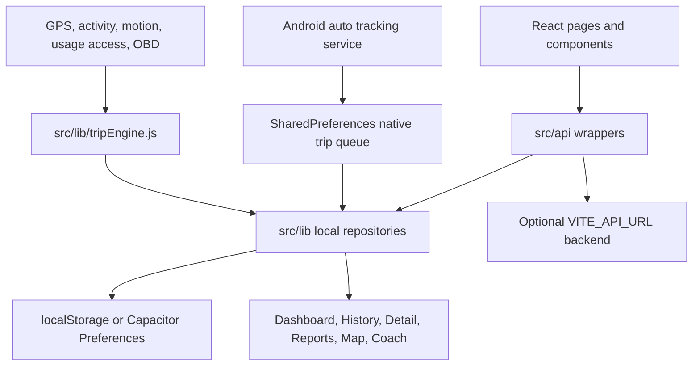

# Road Sage Source-First Technical Reference

Updated: 2026-05-21T17:17:17.003Z

This file is intentionally readable. It avoids giant generated tables and instead documents the app with source excerpts, grouped module notes, and a complete calculation-code index. The calculation index includes every arithmetic/derived-value line found in tracked app, Android, and config source files.

## Table of Contents

- [1. App Overview](#1-app-overview)
- [2. How The App Starts And Routes](#2-how-the-app-starts-and-routes)
- [3. Source Map](#3-source-map)
- [4. Data, Storage, API, And Configuration](#4-data-storage-api-and-configuration)
- [5. Trip Pipeline](#5-trip-pipeline)
- [6. Calculation System Explained](#6-calculation-system-explained)
- [7. Trip Engine Source Excerpts](#7-trip-engine-source-excerpts)
- [8. Other Calculation Modules](#8-other-calculation-modules)
- [9. Complete Calculation Code Index](#9-complete-calculation-code-index)
- [10. Android Native Layer](#10-android-native-layer)
- [11. Tests, Build, Dependencies, Security](#11-tests-build-dependencies-security)

---

## 1. App Overview

Road Sage is a local-first driving tracker. It records route points, detects driving behavior, scores trips, enriches routes with open-source context, stores everything locally on web/native storage, and uses Android native services for background auto tracking.

Package: `drivesense-app`
Version: `0.0.0`
Architecture: Vite React SPA plus Capacitor Android native shell. The client is a modular monolith: UI screens call API wrappers, wrappers choose local repositories or an optional backend, and calculation modules stay in `src/lib`.

Runtime data flow:



---

## 2. How The App Starts And Routes

The browser entry point mounts the React app, auth provider, and React Query provider.

Source: `src/main.jsx:1`
```jsx
    1 | import React from 'react'
    2 | import ReactDOM from 'react-dom/client'
    3 | import App from '@/App.jsx'
    4 | import '@/index.css'
    5 |
    6 | ReactDOM.createRoot(document.getElementById('root')).render(
    7 |   <App />
    8 | )
    9 |
```


The route tree lives in `src/App.jsx`. These are the actual route declarations:


```jsx
  100 |       {!onboardingDone && <Route path="*" element={<Onboarding onComplete={() => setOnboardingDone(true)} />} />}
  103 |       <Route element={<Layout />}>
  104 |         <Route path="/" element={<Dashboard />} />
  105 |         <Route path="/trips" element={<TripHistory />} />
  106 |         <Route path="/trips/:id" element={<TripDetail />} />
  107 |         <Route path="/map" element={<MapScreen />} />
  108 |         <Route path="/coach" element={<DrivingCoach />} />
  109 |         <Route path="/insights" element={<Insights />} />
  110 |         <Route path="/achievements" element={<Achievements />} />
  111 |         <Route path="/reports" element={<Reports />} />
  112 |         <Route path="/diagnostics" element={<Diagnostics />} />
  113 |         <Route path="/settings" element={<Settings />} />
  114 |         <Route path="/android" element={<AndroidReference />} />
  115 |         <Route path="/vehicles" element={<Vehicles />} />
  118 |       <Route path="*" element={<PageNotFound />} />
```


Full app bootstrap and route code excerpt:

Source: `src/App.jsx:1`
```jsx
    1 | import { Toaster } from "@/components/ui/toaster"
    2 | import { QueryClientProvider } from '@tanstack/react-query'
    3 | import { queryClientInstance } from '@/lib/query-client'
    4 | import { BrowserRouter as Router, Route, Routes, useNavigate } from 'react-router-dom';
    5 | import { LocalNotifications } from '@capacitor/local-notifications';
    6 | import PageNotFound from './lib/PageNotFound';
    7 | import { AuthProvider, useAuth } from '@/lib/AuthContext';
    8 | import UserNotRegisteredError from '@/components/UserNotRegisteredError';
    9 | import { lazy, Suspense, useEffect, useState } from 'react';
   10 | import { applyThemeMode, localSettings } from '@/lib/trackingStore';
   11 | import { configureNotificationChannels, syncReminderNotifications } from '@/lib/notificationService';
   12 | import { startNativeAutoTracking } from '@/lib/activityRecognition';
   13 | import { isAndroid } from '@/lib/nativePlatform';
   14 | import { openExportLocation } from '@/lib/nativeDownloads';
   15 | import { Route as RouteIcon } from 'lucide-react';
   16 |
   17 | import Layout from '@/components/Layout';
   18 |
   19 | const Onboarding = lazy(() => import('@/pages/Onboarding'));
   20 | const Dashboard = lazy(() => import('@/pages/Dashboard'));
   21 | const TripHistory = lazy(() => import('@/pages/TripHistory'));
   22 | const TripDetail = lazy(() => import('@/pages/TripDetail'));
   23 | const MapScreen = lazy(() => import('@/pages/MapScreen'));
   24 | const Reports = lazy(() => import('@/pages/Report'));
   25 | const Settings = lazy(() => import('@/pages/Settings'));
   26 | const AndroidReference = lazy(() => import('@/pages/AndroidReference'));
   27 | const Vehicles = lazy(() => import('@/pages/Vehicles'));
   28 | const Achievements = lazy(() => import('@/pages/Achievements'));
   29 | const DrivingCoach = lazy(() => import('@/pages/DrivingCoach'));
   30 | const Diagnostics = lazy(() => import('@/pages/Diagnostics'));
   31 | const Insights = lazy(() => import('@/pages/Insights'));
   32 |
   33 | function AppLoading() {
   34 |   return (
   35 |     <div className="fixed inset-0 flex items-center justify-center bg-background">
   36 |       <div className="flex flex-col items-center gap-4">
   37 |         <div className="w-12 h-12 rounded-2xl bg-gradient-to-br from-teal-500 via-cyan-500 to-slate-900 flex items-center justify-center shadow-lg animate-pulse">
   38 |           <RouteIcon className="h-6 w-6 text-white" />
   39 |         </div>
   40 |         <div className="text-muted-foreground text-sm">Loading Road Sage...</div>
   41 |       </div>
   42 |     </div>
   43 |   );
   44 | }
   45 |
   46 | const AuthenticatedApp = () => {
   47 |   const { isLoadingAuth, isLoadingPublicSettings, authError, navigateToLogin } = useAuth();
   48 |   const [onboardingDone, setOnboardingDone] = useState(null);
   49 |   const navigate = useNavigate();
   50 |
   51 |   useEffect(() => {
   52 |     const bootstrapSettings = async () => {
   53 |       configureNotificationChannels().catch(() => {});
   54 |       const settings = await localSettings.hydrateFromNative();
   55 |       syncReminderNotifications(settings, { requestPermission: false }).catch(() => {});
   56 |       setOnboardingDone(settings.onboarding_completed);
   57 |       if (isAndroid() && settings.tracking_mode === 'background_auto' && !settings.tracking_paused) {
   58 |         startNativeAutoTracking().catch(() => {});
   59 |       }
   60 |
   61 |       applyThemeMode(settings.dark_mode);
   62 |     };
   63 |     bootstrapSettings();
   64 |   }, []);
   65 |
   66 |   useEffect(() => {
   67 |     let listener;
   68 |     LocalNotifications.addListener('localNotificationActionPerformed', (action) => {
   69 |       const extra = action.notification?.extra ?? {};
   70 |       if (extra.tripId) navigate(`/trips/${extra.tripId}`);
   71 |       else if (extra.type === 'phone_use_pattern') navigate('/coach');
   72 |       else if (extra.type === 'maintenance') navigate('/vehicles');
   73 |       else if (extra.type === 'export_saved') {
   74 |         openExportLocation({ uri: extra.uri, mimeType: extra.mimeType }).catch(() => {
   75 |           navigate('/reports');
   76 |         });
   77 |       }
   78 |     }).then((handle) => {
   79 |       listener = handle;
   80 |     }).catch(() => {});
   81 |     return () => {
   82 |       listener?.remove?.();
   83 |     };
   84 |   }, [navigate]);
   85 |
   86 |   if (isLoadingPublicSettings || isLoadingAuth || onboardingDone === null) {
   87 |     return <AppLoading />;
   88 |   }
   89 |
   90 |   if (authError) {
   91 |     if (authError.type === 'user_not_registered') return <UserNotRegisteredError />;
   92 |     if (authError.type === 'auth_required') { navigateToLogin(); return null; }
   93 |     // For other errors (network, unknown), still render the app in public mode
   94 |   }
   95 |
   96 |   return (
   97 |     <Suspense fallback={<AppLoading />}>
   98 |     <Routes>
   99 |       {/* Onboarding (no layout) - only shown to new users */}
  100 |       {!onboardingDone && <Route path="*" element={<Onboarding onComplete={() => setOnboardingDone(true)} />} />}
  101 |
  102 |       {/* Main App with shared Layout */}
  103 |       <Route element={<Layout />}>
  104 |         <Route path="/" element={<Dashboard />} />
  105 |         <Route path="/trips" element={<TripHistory />} />
  106 |         <Route path="/trips/:id" element={<TripDetail />} />
  107 |         <Route path="/map" element={<MapScreen />} />
  108 |         <Route path="/coach" element={<DrivingCoach />} />
  109 |         <Route path="/insights" element={<Insights />} />
  110 |         <Route path="/achievements" element={<Achievements />} />
  111 |         <Route path="/reports" element={<Reports />} />
  112 |         <Route path="/diagnostics" element={<Diagnostics />} />
  113 |         <Route path="/settings" element={<Settings />} />
  114 |         <Route path="/android" element={<AndroidReference />} />
  115 |         <Route path="/vehicles" element={<Vehicles />} />
  116 |       </Route>
  117 |
  118 |       <Route path="*" element={<PageNotFound />} />
  119 |     </Routes>
  120 |     </Suspense>
  121 |   );
  122 | };
  123 |
  124 | function App() {
  125 |   return (
  126 |     <AuthProvider>
  127 |       <QueryClientProvider client={queryClientInstance}>
  128 |         <Router>
  129 |           <AuthenticatedApp />
  130 |         </Router>
  131 |         <Toaster />
  132 |       </QueryClientProvider>
  133 |     </AuthProvider>
  134 |   );
  135 | }
  136 |
  137 | export default App;
  138 |
```


---

## 3. Source Map

### Entry and routing

- `src/main.jsx` - React bootstrap: providers, CSS, root mount. Exports: none. Imports: react, react-dom/client, @/App.jsx, @/index.css.
- `src/App.jsx` - Route tree, onboarding gate, authenticated application shell. Exports: App. Imports: @/components/ui/toaster, @tanstack/react-query, @/lib/query-client, react-router-dom, @capacitor/local-notifications, ./lib/PageNotFound, @/lib/AuthContext, @/components/UserNotRegisteredError.

### Pages

- `src/pages/Achievements.jsx` - Achievements screen and user workflow. Exports: function. Imports: react, framer-motion, @tanstack/react-query, lucide-react, @/api/trips, @/lib/tripInsights, @/lib/notificationService.
- `src/pages/AndroidReference.jsx` - AndroidReference screen and user workflow. Exports: function. Imports: react, framer-motion, lucide-react, react-router-dom.
- `src/pages/Dashboard.jsx` - Dashboard screen and user workflow. Exports: function. Imports: react, framer-motion, @/api/trips, @/api/vehicles, @tanstack/react-query, @/lib/trackingStore, @/lib/trackingService, @/lib/permissions.
- `src/pages/Diagnostics.jsx` - Diagnostics screen and user workflow. Exports: function. Imports: react, @tanstack/react-query, framer-motion, @/api/trips, @/lib/permissions, @/lib/nativePlatform, @/lib/trackingStore.
- `src/pages/DrivingCoach.jsx` - DrivingCoach screen and user workflow. Exports: function. Imports: framer-motion, react, @tanstack/react-query, lucide-react, recharts, @/api/trips, @/lib/tripEngine, @/lib/trackingStore.
- `src/pages/Insights.jsx` - Insights screen and user workflow. Exports: function. Imports: react, framer-motion, @tanstack/react-query, react-router-dom, lucide-react, @/api/trips, @/lib/trackingStore, @/lib/tripEngine.
- `src/pages/MapScreen.jsx` - MapScreen screen and user workflow. Exports: function. Imports: react, framer-motion, @tanstack/react-query, @/api/trips, lucide-react, @/components/TripMap, @/components/TripPlayback, @/lib/tripEngine.
- `src/pages/Onboarding.jsx` - Onboarding screen and user workflow. Exports: function. Imports: react, framer-motion, lucide-react, @/lib/trackingStore, @/lib/sensorFusionModel, @/lib/nativePlatform, @/lib/activityRecognition, react-router-dom.
- `src/pages/Report.jsx` - Report screen and user workflow. Exports: function. Imports: react, framer-motion, @tanstack/react-query, @/api/trips, @/api/vehicles, @/lib/tripEngine, @/components/ScoreRing, @/lib/trackingStore.
- `src/pages/Settings.jsx` - Settings screen and user workflow. Exports: function. Imports: react, framer-motion, @tanstack/react-query, @/api/trips, @/api/vehicles, @/components/ui/use-toast, @/lib/trackingStore, @/lib/tripEngine.
- `src/pages/TripDetail.jsx` - TripDetail screen and user workflow. Exports: function. Imports: react, react-router-dom, @tanstack/react-query, @/api/trips, @/api/vehicles, framer-motion, recharts, @/components/ScoreRing.
- `src/pages/TripHistory.jsx` - TripHistory screen and user workflow. Exports: function. Imports: react, framer-motion, @tanstack/react-query, @/api/trips, @/api/vehicles, lucide-react, @/components/TripCard, @/lib/trackingStore.
- `src/pages/Vehicles.jsx` - Vehicles screen and user workflow. Exports: function. Imports: react, framer-motion, @tanstack/react-query, @/api/trips, @/api/vehicles, lucide-react, @/components/VehicleCompare, @/lib/tripInsights.

### Reusable components

- `src/components/EventBadge.jsx` - EventBadge reusable UI component. Exports: function. Imports: lucide-react.
- `src/components/Layout.jsx` - Layout reusable UI component. Exports: function. Imports: react-router-dom, react, lucide-react, framer-motion.
- `src/components/LiveCoachOverlay.jsx` - LiveCoachOverlay reusable UI component. Exports: function. Imports: react, framer-motion, lucide-react, @/lib/trackingStore, @/lib/nativePlatform, @/lib/activityRecognition, @/lib/phoneUsageAccess, @/lib/voiceAlerts.
- `src/components/ProtectedRoute.jsx` - ProtectedRoute reusable UI component. Exports: function. Imports: react, react-router-dom, @/lib/AuthContext, @/components/UserNotRegisteredError.
- `src/components/ScoreRing.jsx` - ScoreRing reusable UI component. Exports: function. Imports: @/lib/tripEngine, framer-motion.
- `src/components/StatCard.jsx` - StatCard reusable UI component. Exports: function. Imports: framer-motion, lucide-react.
- `src/components/TripCard.jsx` - TripCard reusable UI component. Exports: function. Imports: framer-motion, lucide-react, @/lib/tripEngine, react-router-dom.
- `src/components/TripMap.jsx` - TripMap reusable UI component. Exports: function. Imports: react, leaflet, leaflet/dist/leaflet.css, lucide-react, @/lib/mapPlaybackInsights, @/lib/tripInsights, @/lib/tripEngine, @/lib/trackingStore.
- `src/components/TripPlayback.jsx` - TripPlayback reusable UI component. Exports: function. Imports: react, leaflet, leaflet/dist/leaflet.css, lucide-react, @/lib/mapPlaybackInsights, @/lib/tripEngine, @/lib/trackingStore, @/lib/privacyZones.
- `src/components/UserNotRegisteredError.jsx` - UserNotRegisteredError reusable UI component. Exports: UserNotRegisteredError. Imports: react.
- `src/components/VehicleCompare.jsx` - VehicleCompare reusable UI component. Exports: function. Imports: react, recharts, lucide-react, @/lib/tripEngine.

### UI primitives

- `src/components/ui/accordion.jsx` - Reusable shadcn/Radix UI primitive. Exports: none. Imports: react, @radix-ui/react-accordion, lucide-react, @/lib/utils.
- `src/components/ui/alert-dialog.jsx` - Reusable shadcn/Radix UI primitive. Exports: none. Imports: react, @radix-ui/react-alert-dialog, @/lib/utils, @/components/ui/button.
- `src/components/ui/alert.jsx` - Reusable shadcn/Radix UI primitive. Exports: none. Imports: react, class-variance-authority, @/lib/utils.
- `src/components/ui/aspect-ratio.jsx` - Reusable shadcn/Radix UI primitive. Exports: none. Imports: @radix-ui/react-aspect-ratio.
- `src/components/ui/avatar.jsx` - Reusable shadcn/Radix UI primitive. Exports: none. Imports: react, @radix-ui/react-avatar, @/lib/utils.
- `src/components/ui/badge.jsx` - Reusable shadcn/Radix UI primitive. Exports: none. Imports: react, class-variance-authority, @/lib/utils.
- `src/components/ui/breadcrumb.jsx` - Reusable shadcn/Radix UI primitive. Exports: none. Imports: react, @radix-ui/react-slot, lucide-react, @/lib/utils.
- `src/components/ui/button.jsx` - Reusable shadcn/Radix UI primitive. Exports: none. Imports: react, @radix-ui/react-slot, class-variance-authority, @/lib/utils.
- `src/components/ui/calendar.jsx` - Reusable shadcn/Radix UI primitive. Exports: none. Imports: react, lucide-react, react-day-picker, @/lib/utils, @/components/ui/button.
- `src/components/ui/card.jsx` - Reusable shadcn/Radix UI primitive. Exports: none. Imports: react, @/lib/utils.
- `src/components/ui/carousel.jsx` - Reusable shadcn/Radix UI primitive. Exports: none. Imports: react, embla-carousel-react, lucide-react, @/lib/utils, @/components/ui/button.
- `src/components/ui/chart.jsx` - Reusable shadcn/Radix UI primitive. Exports: none. Imports: react, recharts, @/lib/utils.
- `src/components/ui/checkbox.jsx` - Reusable shadcn/Radix UI primitive. Exports: none. Imports: react, @radix-ui/react-checkbox, lucide-react, @/lib/utils.
- `src/components/ui/collapsible.jsx` - Reusable shadcn/Radix UI primitive. Exports: none. Imports: @radix-ui/react-collapsible.
- `src/components/ui/command.jsx` - Reusable shadcn/Radix UI primitive. Exports: none. Imports: react, cmdk, lucide-react, @/lib/utils, @/components/ui/dialog.
- `src/components/ui/context-menu.jsx` - Reusable shadcn/Radix UI primitive. Exports: none. Imports: react, @radix-ui/react-context-menu, lucide-react, @/lib/utils.
- `src/components/ui/dialog.jsx` - Reusable shadcn/Radix UI primitive. Exports: none. Imports: react, @radix-ui/react-dialog, lucide-react, @/lib/utils.
- `src/components/ui/drawer.jsx` - Reusable shadcn/Radix UI primitive. Exports: none. Imports: react, vaul, @/lib/utils.
- `src/components/ui/dropdown-menu.jsx` - Reusable shadcn/Radix UI primitive. Exports: none. Imports: react, @radix-ui/react-dropdown-menu, lucide-react, @/lib/utils.
- `src/components/ui/form.jsx` - Reusable shadcn/Radix UI primitive. Exports: none. Imports: react, @radix-ui/react-slot, react-hook-form, @/lib/utils, @/components/ui/label.
- `src/components/ui/hover-card.jsx` - Reusable shadcn/Radix UI primitive. Exports: none. Imports: react, @radix-ui/react-hover-card, @/lib/utils.
- `src/components/ui/input-otp.jsx` - Reusable shadcn/Radix UI primitive. Exports: none. Imports: react, input-otp, lucide-react, @/lib/utils.
- `src/components/ui/input.jsx` - Reusable shadcn/Radix UI primitive. Exports: none. Imports: react, @/lib/utils.
- `src/components/ui/label.jsx` - Reusable shadcn/Radix UI primitive. Exports: none. Imports: react, @radix-ui/react-label, class-variance-authority, @/lib/utils.
- `src/components/ui/menubar.jsx` - Reusable shadcn/Radix UI primitive. Exports: none. Imports: react, @radix-ui/react-menubar, lucide-react, @/lib/utils.
- `src/components/ui/navigation-menu.jsx` - Reusable shadcn/Radix UI primitive. Exports: none. Imports: react, @radix-ui/react-navigation-menu, class-variance-authority, lucide-react, @/lib/utils.
- `src/components/ui/pagination.jsx` - Reusable shadcn/Radix UI primitive. Exports: none. Imports: react, lucide-react, @/lib/utils, @/components/ui/button.
- `src/components/ui/popover.jsx` - Reusable shadcn/Radix UI primitive. Exports: none. Imports: react, @radix-ui/react-popover, @/lib/utils.
- `src/components/ui/progress.jsx` - Reusable shadcn/Radix UI primitive. Exports: none. Imports: react, @radix-ui/react-progress, @/lib/utils.
- `src/components/ui/radio-group.jsx` - Reusable shadcn/Radix UI primitive. Exports: none. Imports: react, @radix-ui/react-radio-group, lucide-react, @/lib/utils.
- `src/components/ui/resizable.jsx` - Reusable shadcn/Radix UI primitive. Exports: none. Imports: lucide-react, react-resizable-panels, @/lib/utils.
- `src/components/ui/scroll-area.jsx` - Reusable shadcn/Radix UI primitive. Exports: none. Imports: react, @radix-ui/react-scroll-area, @/lib/utils.
- `src/components/ui/select.jsx` - Reusable shadcn/Radix UI primitive. Exports: none. Imports: react, @radix-ui/react-select, lucide-react, @/lib/utils.
- `src/components/ui/separator.jsx` - Reusable shadcn/Radix UI primitive. Exports: none. Imports: react, @radix-ui/react-separator, @/lib/utils.
- `src/components/ui/sheet.jsx` - Reusable shadcn/Radix UI primitive. Exports: none. Imports: react, @radix-ui/react-dialog, class-variance-authority, lucide-react, @/lib/utils.
- `src/components/ui/sidebar.jsx` - Reusable shadcn/Radix UI primitive. Exports: none. Imports: react, @radix-ui/react-slot, class-variance-authority, lucide-react, @/hooks/use-mobile, @/lib/utils, @/components/ui/button, @/components/ui/input.
- `src/components/ui/skeleton.jsx` - Reusable shadcn/Radix UI primitive. Exports: none. Imports: @/lib/utils.
- `src/components/ui/slider.jsx` - Reusable shadcn/Radix UI primitive. Exports: none. Imports: react, @radix-ui/react-slider, @/lib/utils.
- `src/components/ui/sonner.jsx` - Reusable shadcn/Radix UI primitive. Exports: none. Imports: next-themes, sonner.
- `src/components/ui/switch.jsx` - Reusable shadcn/Radix UI primitive. Exports: none. Imports: react, @radix-ui/react-switch, @/lib/utils.
- `src/components/ui/table.jsx` - Reusable shadcn/Radix UI primitive. Exports: none. Imports: react, @/lib/utils.
- `src/components/ui/tabs.jsx` - Reusable shadcn/Radix UI primitive. Exports: none. Imports: react, @radix-ui/react-tabs, @/lib/utils.
- `src/components/ui/textarea.jsx` - Reusable shadcn/Radix UI primitive. Exports: none. Imports: react, @/lib/utils.
- `src/components/ui/toast.jsx` - Reusable shadcn/Radix UI primitive. Exports: none. Imports: react, class-variance-authority, lucide-react, @/lib/utils.
- `src/components/ui/toaster.jsx` - Reusable shadcn/Radix UI primitive. Exports: Toaster. Imports: @/components/ui/use-toast.
- `src/components/ui/toggle-group.jsx` - Reusable shadcn/Radix UI primitive. Exports: none. Imports: react, @radix-ui/react-toggle-group, @/lib/utils, @/components/ui/toggle.
- `src/components/ui/toggle.jsx` - Reusable shadcn/Radix UI primitive. Exports: none. Imports: react, @radix-ui/react-toggle, class-variance-authority, @/lib/utils.
- `src/components/ui/tooltip.jsx` - Reusable shadcn/Radix UI primitive. Exports: none. Imports: react, @radix-ui/react-tooltip, @/lib/utils.
- `src/components/ui/use-toast.jsx` - Reusable shadcn/Radix UI primitive. Exports: reducer. Imports: react.

### API wrappers

- `src/api/auth.js` - Data access wrapper that chooses local store or optional backend API. Exports: authService. Imports: @/api/client.
- `src/api/client.js` - Data access wrapper that chooses local store or optional backend API. Exports: API_BASE_URL, apiClient. Imports: none.
- `src/api/trips.js` - Data access wrapper that chooses local store or optional backend API. Exports: tripService. Imports: @/api/client, @/lib/localTripRepository, @/lib/nativePlatform, @/lib/tripInsights, @/lib/tripMetadata.
- `src/api/vehicles.js` - Data access wrapper that chooses local store or optional backend API. Exports: vehicleService. Imports: @/api/client, @/lib/localVehicleRepository, @/lib/nativePlatform.

### Domain libraries

- `src/lib/AuthContext.jsx` - AuthContext domain module. Exports: AuthProvider, useAuth. Imports: react, @/api/auth.
- `src/lib/PageNotFound.jsx` - PageNotFound domain module. Exports: function. Imports: react-router-dom, lucide-react.
- `src/lib/activityRecognition.js` - activityRecognition domain module. Exports: ACTIVITY_POLL_INTERVAL_MS, AUTO_START_IN_VEHICLE_CONFIDENCE, AUTO_START_SPEED_KMH, AUTO_START_IN_VEHICLE_SECONDS, AUTO_START_GPS_FALLBACK_SECONDS, WALKING_SPEED_CUTOFF_KMH, ACTIVITY_TYPES, startActivityRecognition, startNativeAutoTracking, stopNativeAutoTracking, getNativeAutoTrackingStatus, getNativeDiagnostics. Imports: @capacitor/core, @/lib/nativePlatform, @/lib/permissions, @/lib/tripEngine.
- `src/lib/dailyFatigueEngine.js` - dailyFatigueEngine domain module. Exports: getTodayTrips, computeDailyFatigue. Imports: none.
- `src/lib/dangerZoneEngine.js` - dangerZoneEngine domain module. Exports: DANGER_ZONES_KEY, buildDangerZones, checkDangerZoneProximity, saveDangerZones, loadDangerZones, invalidateDangerZoneCache. Imports: @/lib/mobileStorage, @/lib/tripEngine.
- `src/lib/dataBackup.js` - dataBackup domain module. Exports: sanitizeSavedTripFilters, buildDriveSenseBackup, exportDriveSenseBackup, parseDriveSenseBackup, importDriveSenseBackup. Imports: @/api/trips, @/api/vehicles, @/lib/nativeDownloads, @/lib/trackingStore, @/lib/privacyZones.
- `src/lib/driverAnomaly.js` - driverAnomaly domain module. Exports: tripFeatureVector, buildOnDeviceDriverModel, scoreTripAnomaly. Imports: none.
- `src/lib/habitProfile.js` - habitProfile domain module. Exports: clamp, getTimeBucket, buildHabitProfile, getFallbackTimeRisk. Imports: none.
- `src/lib/localTripRepository.js` - localTripRepository domain module. Exports: TRIP_SCHEMA_VERSION, applyEventFeedbackToEvents, localTripRepository. Imports: @/lib/mobileStorage, @/lib/activityRecognition, @/lib/nativePlatform, @/lib/tripEngine, @/lib/tripInsights, @/lib/trackingStore, @/lib/dangerZoneEngine, @/lib/routeRiskIndex.
- `src/lib/localVehicleRepository.js` - localVehicleRepository domain module. Exports: localVehicleRepository. Imports: @/lib/mobileStorage, @/lib/tripInsights.
- `src/lib/mapMatching.js` - mapMatching domain module. Exports: mapMatchRoute. Imports: @/lib/mobileStorage.
- `src/lib/mapPlaybackInsights.js` - mapPlaybackInsights domain module. Exports: SPEED_BANDS, pointTimeMs, cleanRoutePoints, speedBandForKmh, hasRecoverableOriginalRouteGeometry, restoreOriginalRouteGeometry, downsampleRoutePoints, prepareMapRoutePoints, eventIndexForRoute, buildPlaybackTimeline, playbackPositionAtElapsed, routeDistanceAtPlaybackPosition. Imports: @/lib/tripEngine.
- `src/lib/mediumInsights.js` - mediumInsights domain module. Exports: routeKeyForTrip, buildRouteComparisons, buildCommuteDetections, buildTripCalendarMonth, buildWeeklyDriverSummary, buildGoalStatus, buildRoadTypeBreakdown, buildRiskHotspots, buildVehicleCostSummary, buildMaintenanceReminders. Imports: @/lib/dangerZoneEngine.
- `src/lib/mobileStorage.js` - mobileStorage domain module. Exports: getJson, setJson, removeJson. Imports: @/lib/nativePlatform.
- `src/lib/nativeDownloads.js` - nativeDownloads domain module. Exports: saveExportToDownloads, openExportLocation. Imports: @capacitor/core.
- `src/lib/nativePlatform.js` - nativePlatform domain module. Exports: isNativePlatform, isAndroid, openNativeSettings. Imports: @capacitor/core.
- `src/lib/notificationService.js` - notificationService domain module. Exports: TRACKING_CHANNEL_ID, SUMMARY_CHANNEL_ID, ACHIEVEMENT_CHANNEL_ID, SAFETY_ALERTS_CHANNEL_ID, COACHING_CHANNEL_ID, VEHICLE_CHANNEL_ID, NOTIFICATION_IDS, isQuietHours, configureNotificationChannels, scheduleLongTripReminder, cancelLongTripReminder, notifyTripStarted. Imports: @capacitor/local-notifications, @/lib/nativePlatform, @/lib/permissions, @/lib/trackingStore.
- `src/lib/obdBluetooth.js` - obdBluetooth domain module. Exports: parseObdPidResponse, getObdBluetoothSupport, getObdBluetoothPermissionStatus, connectObdBleAdapter. Imports: none.
- `src/lib/openSourceTripContext.js` - openSourceTripContext domain module. Exports: buildOpenSourceTripContextPatch, describeOsmSpeedLimitStatus. Imports: @/lib/trackingStore, @/lib/mapMatching, @/lib/speedLimitSource, @/lib/weatherContext, @/lib/phoneUsageAccess.
- `src/lib/pdfExport.js` - pdfExport domain module. Exports: exportMonthlyReportPDF, exportUBIReportPDF. Imports: jspdf, @/lib/nativeDownloads, @/lib/nativePlatform, @/lib/tripInsights, @/lib/tripEngine.
- `src/lib/permissions.js` - permissions domain module. Exports: getPermissionStatus, requestForegroundLocationPermission, requestNotificationPermission, requestActivityRecognitionPermission, requestBackgroundLocationPermission, getPermissionExplanation. Imports: @capacitor/core, @capacitor/geolocation, @capacitor/local-notifications, @/lib/nativePlatform, @/lib/trackingStore, @/lib/obdBluetooth, @/lib/sensorFusionModel.
- `src/lib/phoneUsageAccess.js` - phoneUsageAccess domain module. Exports: buildPhoneUseFromAndroidUsage, buildPhoneUseFromEvents, mergePhoneUseSignals, mergeManyPhoneUseSignals, buildPhoneUseFromTripEvidence, mergePhoneUseEventsIntoDrivingEvents. Imports: none.
- `src/lib/preTripRisk.js` - preTripRisk domain module. Exports: PRE_TRIP_RISK_WEIGHTS, PRE_TRIP_RISK_SIGNAL_GATES, deriveWeights, deriveSignalGates, computePreTripRisk. Imports: @/lib/tripInsights, @/lib/habitProfile.
- `src/lib/predictiveRouteRisk.js` - predictiveRouteRisk domain module. Exports: estimatePredictiveRouteRisk. Imports: @/lib/dangerZoneEngine, @/lib/habitProfile.
- `src/lib/privacyZones.js` - privacyZones domain module. Exports: getPrivacyZones, isPointInPrivacyZone, privacyZonesForRoute, privacyBoundaryPoint, maskRoutePointsForPrivacy, maskEventsForPrivacy, maskTripForPrivacy, upsertPrivacyZone, removePrivacyZone. Imports: @/lib/trackingStore.
- `src/lib/query-client.js` - query-client domain module. Exports: queryClientInstance. Imports: @tanstack/react-query.
- `src/lib/routeRiskIndex.js` - routeRiskIndex domain module. Exports: GRID_PRECISION, ROUTE_RISK_INDEX_KEY, segmentKey, buildRouteRiskIndex, getSegmentsForTrip, saveRouteRiskIndex, loadRouteRiskIndex, invalidateRouteRiskIndex. Imports: @/lib/mobileStorage, @/lib/tripEngine.
- `src/lib/sensorFusionModel.js` - sensorFusionModel domain module. Exports: getMotionSensorSupport, requestMotionSensorPermission, normalizeMotionSample, buildSensorFusionSummary, enrichEventsWithSensorContext, detectCrashIncident, createMotionSensorFusion. Imports: @/lib/tripEngine.
- `src/lib/speedLimitSource.js` - speedLimitSource domain module. Exports: parseMaxspeedKmh, defaultSpeedLimitKmhForOsmHighway, loadOsmSpeedLimitWays, annotateRouteSpeedLimits. Imports: @/lib/mobileStorage, @/lib/tripEngine.
- `src/lib/thresholdCalibration.js` - thresholdCalibration domain module. Exports: CALIBRATION_PROFILE_KEY, computeCalibrationProfile, applyCalibrationProfile, saveCalibrationProfile, loadCalibrationProfile, clearCalibrationProfile. Imports: @/lib/mobileStorage, @/lib/tripEngine.
- `src/lib/trackingDiagnostics.js` - trackingDiagnostics domain module. Exports: getTrackingDiagnostics, recordTrackingDiagnostic, clearTrackingDiagnostics, normalizeNativeDiagnosticEvents, buildParkingTimeline, buildTrackingHealth, buildDashboardTrackingExplanation. Imports: none.
- `src/lib/trackingService.js` - trackingService domain module. Exports: getCurrentLocation, createDrivingTrackingService. Imports: @capacitor/core, @capacitor/geolocation, @/lib/tripEngine, @/lib/nativePlatform.
- `src/lib/trackingStore.js` - trackingStore domain module. Exports: DEFAULT_SETTINGS, getLastParkedLocation, saveLastParkedLocation, localSettings, applyThemeMode, activeTripStore, checkLocationPermission, requestLocationPermission. Imports: @/lib/mobileStorage.
- `src/lib/tripEngine.js` - tripEngine domain module. Exports: DEFAULT_THRESHOLDS, EVENT_TYPES, buildDrivingThresholds, haversineDistance, calculateBearing, headingDiff, headingStdDev, speedStdDev, calculateSpeedKmh, calculateAcceleration, calculateSegmentMetrics, computeSmoothedAccelerations. Imports: ./nativeDownloads, ./tripInsights, ./privacyZones.
- `src/lib/tripInsights.js` - tripInsights domain module. Exports: DEFAULT_FUEL_PRICE_PER_LITER, DEFAULT_L_PER_100KM, GASOLINE_CO2_KG_PER_LITER, WEAR_KM_PER_STRESS_UNIT, STRESS_UNITS, DEFAULT_MAINTENANCE_ITEMS, percentile, getSpeedColor, getSpeedLabel, buildSpeedSegments, detectTripStops, getVehicleTripDistanceKm. Imports: none.
- `src/lib/tripMetadata.js` - tripMetadata domain module. Exports: TRIP_TAG_OPTIONS, normalizeTripTags, getTripTagOption, getTripTagLabel, getTripDisplayName, buildTripSearchText, isHighRiskTrip, buildScoreExplanation, calculateRecentBrakingImprovement, formatParkingReminder. Imports: none.
- `src/lib/ubiReport.js` - ubiReport domain module. Exports: UBI_CATEGORY_WEIGHTS, ubiGrade, computeUBIReport. Imports: none.
- `src/lib/utils.js` - utils domain module. Exports: cn, isIframe. Imports: clsx, tailwind-merge.
- `src/lib/voiceAlerts.js` - voiceAlerts domain module. Exports: canSpeakSafetyAlert, speakSafetyAlert, speakSafetyAlertOnce, resetSafetyAlertCooldowns, testVoiceAlert. Imports: @capacitor/core, @/lib/nativePlatform, @/lib/trackingStore.
- `src/lib/weatherContext.js` - weatherContext domain module. Exports: fetchWeatherContextForTrip, applyWeatherRiskToScores. Imports: @/lib/mobileStorage.
- `src/lib/weeklyCoaching.js` - weeklyCoaching domain module. Exports: buildWeeklyCoachSummary. Imports: @/lib/tripInsights.

### Tests

- `android/app/src/test/java/com/getcapacitor/myapp/ExampleUnitTest.java` - Android Gradle/build configuration. Exports: addition_isCorrect. Imports: org.junit.Test.
- `src/lib/__tests__/activityRecognition.test.js` - activityRecognition.test domain module. Exports: none. Imports: vitest.
- `src/lib/__tests__/advancedOpenSourceFeatures.test.js` - advancedOpenSourceFeatures.test domain module. Exports: none. Imports: vitest, @/lib/driverAnomaly, @/lib/obdBluetooth, @/lib/sensorFusionModel, @/lib/predictiveRouteRisk, @/lib/weeklyCoaching, @/lib/habitProfile.
- `src/lib/__tests__/brakingEfficiency.test.js` - brakingEfficiency.test domain module. Exports: none. Imports: vitest, @/lib/tripEngine.
- `src/lib/__tests__/corneringConsistency.test.js` - corneringConsistency.test domain module. Exports: none. Imports: vitest, @/lib/tripEngine.
- `src/lib/__tests__/dailyFatigueEngine.test.js` - dailyFatigueEngine.test domain module. Exports: none. Imports: vitest, @/lib/dailyFatigueEngine.
- `src/lib/__tests__/dangerZoneEngine.test.js` - dangerZoneEngine.test domain module. Exports: none. Imports: vitest, @/lib/dangerZoneEngine.
- `src/lib/__tests__/driverSignature.test.js` - driverSignature.test domain module. Exports: none. Imports: vitest, @/lib/tripInsights.
- `src/lib/__tests__/fatigueHeatmapData.test.js` - fatigueHeatmapData.test domain module. Exports: none. Imports: vitest, @/lib/tripInsights.
- `src/lib/__tests__/feedbackRescore.test.js` - feedbackRescore.test domain module. Exports: none. Imports: vitest, @/lib/localTripRepository.
- `src/lib/__tests__/mapMatching.test.js` - mapMatching.test domain module. Exports: none. Imports: vitest, @/lib/mapMatching.
- `src/lib/__tests__/mapPlaybackInsights.test.js` - mapPlaybackInsights.test domain module. Exports: none. Imports: vitest.
- `src/lib/__tests__/mediumInsights.test.js` - mediumInsights.test domain module. Exports: none. Imports: vitest.
- `src/lib/__tests__/notifications.test.js` - notifications.test domain module. Exports: none. Imports: vitest.
- `src/lib/__tests__/openSourceContext.test.js` - openSourceContext.test domain module. Exports: none. Imports: vitest, @/lib/speedLimitSource, @/lib/weatherContext, @/lib/privacyZones.
- `src/lib/__tests__/overtakeQuality.test.js` - overtakeQuality.test domain module. Exports: none. Imports: vitest, @/lib/tripEngine.
- `src/lib/__tests__/phoneUsageAccess.test.js` - phoneUsageAccess.test domain module. Exports: none. Imports: vitest.
- `src/lib/__tests__/phoneUseDetection.test.js` - phoneUseDetection.test domain module. Exports: none. Imports: vitest, @/lib/tripEngine.
- `src/lib/__tests__/preTripRisk.test.js` - preTripRisk.test domain module. Exports: none. Imports: vitest, @/lib/preTripRisk.
- `src/lib/__tests__/predictiveMaintenance.test.js` - predictiveMaintenance.test domain module. Exports: none. Imports: vitest, @/lib/tripInsights.
- `src/lib/__tests__/privacyZones.test.js` - privacyZones.test domain module. Exports: none. Imports: vitest, @/lib/tripEngine, @/lib/privacyZones.
- `src/lib/__tests__/reactionTimeProxy.test.js` - reactionTimeProxy.test domain module. Exports: none. Imports: vitest, @/lib/tripEngine.
- `src/lib/__tests__/roadTypeSegmentedScoring.test.js` - roadTypeSegmentedScoring.test domain module. Exports: none. Imports: vitest.
- `src/lib/__tests__/routeRiskIndex.test.js` - routeRiskIndex.test domain module. Exports: none. Imports: vitest.
- `src/lib/__tests__/slipperyConditionProxy.test.js` - slipperyConditionProxy.test domain module. Exports: none. Imports: vitest, @/lib/tripEngine.
- `src/lib/__tests__/speedLimitCompliance.test.js` - speedLimitCompliance.test domain module. Exports: none. Imports: vitest, @/lib/tripEngine.
- `src/lib/__tests__/thresholdCalibration.test.js` - thresholdCalibration.test domain module. Exports: none. Imports: vitest, @/lib/thresholdCalibration.
- `src/lib/__tests__/trackingDiagnostics.test.js` - trackingDiagnostics.test domain module. Exports: none. Imports: vitest.
- `src/lib/__tests__/ubiReport.test.js` - ubiReport.test domain module. Exports: none. Imports: vitest, @/lib/ubiReport.
- `src/lib/__tests__/voiceAlerts.test.js` - voiceAlerts.test domain module. Exports: none. Imports: vitest, @/lib/voiceAlerts.
- `src/lib/tripEngine.test.js` - tripEngine.test domain module. Exports: none. Imports: vitest, @/lib/trackingStore.

### Android native

- `android/app/src/main/java/com/drivesense/app/DriveSenseActivityReceiver.java` - Native Android code for Capacitor plugins, tracking, storage, or phone usage. Exports: onReceive. Imports: com.google.android.gms.location.ActivityRecognitionResult, com.google.android.gms.location.DetectedActivity.
- `android/app/src/main/java/com/drivesense/app/DriveSenseActivityRecognitionPlugin.java` - Native Android code for Capacitor plugins, tracking, storage, or phone usage. Exports: load, handleOnDestroy, checkPermissions, requestPermissions, requestBackgroundLocation, start, stop, startNativeAutoTracking, stopNativeAutoTracking, speakText, openAppLocationSettings, openBatteryOptimizationSettings. Imports: com.getcapacitor.JSObject, com.getcapacitor.PermissionState, com.getcapacitor.Plugin, com.getcapacitor.PluginCall, com.getcapacitor.PluginMethod, com.getcapacitor.annotation.CapacitorPlugin, com.getcapacitor.annotation.Permission, com.getcapacitor.annotation.PermissionCallback.
- `android/app/src/main/java/com/drivesense/app/DriveSenseAutoTrackingService.java` - Native Android code for Capacitor plugins, tracking, storage, or phone usage. Exports: onCreate, onLocationResult, onStartCommand, onDestroy, onBind. Imports: androidx.annotation.Nullable, androidx.core.app.NotificationCompat, androidx.core.app.NotificationManagerCompat, androidx.core.content.ContextCompat, com.google.android.gms.location.ActivityRecognition, com.google.android.gms.location.ActivityRecognitionClient, com.google.android.gms.location.DetectedActivity, com.google.android.gms.location.FusedLocationProviderClient.
- `android/app/src/main/java/com/drivesense/app/DriveSenseAutoTrackingTileService.java` - Native Android code for Capacitor plugins, tracking, storage, or phone usage. Exports: onStartListening, onClick. Imports: androidx.core.content.ContextCompat, org.json.JSONObject.
- `android/app/src/main/java/com/drivesense/app/DriveSenseNativeTripStore.java` - Native Android code for Capacitor plugins, tracking, storage, or phone usage. Exports: none. Imports: org.json.JSONArray, org.json.JSONException, org.json.JSONObject.
- `android/app/src/main/java/com/drivesense/app/DriveSensePhoneUsageTracker.java` - Native Android code for Capacitor plugins, tracking, storage, or phone usage. Exports: none. Imports: org.json.JSONArray, org.json.JSONException, org.json.JSONObject.
- `android/app/src/main/java/com/drivesense/app/MainActivity.java` - Native Android code for Capacitor plugins, tracking, storage, or phone usage. Exports: onCreate. Imports: com.getcapacitor.BridgeActivity.

### Android resources and Gradle

- `android/.gitignore` - Android Gradle/build configuration. Exports: none. Imports: none.
- `android/app/.gitignore` - Android Gradle/build configuration. Exports: none. Imports: none.
- `android/app/build.gradle` - Android Gradle/build configuration. Exports: none. Imports: none.
- `android/app/capacitor.build.gradle` - Android Gradle/build configuration. Exports: none. Imports: none.
- `android/app/proguard-rules.pro` - Android Gradle/build configuration. Exports: none. Imports: none.
- `android/app/src/androidTest/java/com/getcapacitor/myapp/ExampleInstrumentedTest.java` - Android Gradle/build configuration. Exports: useAppContext. Imports: androidx.test.ext.junit.runners.AndroidJUnit4, androidx.test.platform.app.InstrumentationRegistry, org.junit.Test, org.junit.runner.RunWith.
- `android/app/src/main/AndroidManifest.xml` - Android Gradle/build configuration. Exports: none. Imports: none.
- `android/app/src/main/res/drawable-land-hdpi/splash.png` - Android resource asset or XML resource. Exports: none. Imports: none.
- `android/app/src/main/res/drawable-land-mdpi/splash.png` - Android resource asset or XML resource. Exports: none. Imports: none.
- `android/app/src/main/res/drawable-land-xhdpi/splash.png` - Android resource asset or XML resource. Exports: none. Imports: none.
- `android/app/src/main/res/drawable-land-xxhdpi/splash.png` - Android resource asset or XML resource. Exports: none. Imports: none.
- `android/app/src/main/res/drawable-land-xxxhdpi/splash.png` - Android resource asset or XML resource. Exports: none. Imports: none.
- `android/app/src/main/res/drawable-port-hdpi/splash.png` - Android resource asset or XML resource. Exports: none. Imports: none.
- `android/app/src/main/res/drawable-port-mdpi/splash.png` - Android resource asset or XML resource. Exports: none. Imports: none.
- `android/app/src/main/res/drawable-port-xhdpi/splash.png` - Android resource asset or XML resource. Exports: none. Imports: none.
- `android/app/src/main/res/drawable-port-xxhdpi/splash.png` - Android resource asset or XML resource. Exports: none. Imports: none.
- `android/app/src/main/res/drawable-port-xxxhdpi/splash.png` - Android resource asset or XML resource. Exports: none. Imports: none.
- `android/app/src/main/res/drawable-v24/ic_launcher_foreground.xml` - Android resource asset or XML resource. Exports: none. Imports: none.
- `android/app/src/main/res/drawable/ic_launcher_background.xml` - Android resource asset or XML resource. Exports: none. Imports: none.
- `android/app/src/main/res/drawable/ic_qs_roadsage.xml` - Android resource asset or XML resource. Exports: none. Imports: none.
- `android/app/src/main/res/drawable/ic_stat_drivesense.xml` - Android resource asset or XML resource. Exports: none. Imports: none.
- `android/app/src/main/res/drawable/splash.png` - Android resource asset or XML resource. Exports: none. Imports: none.
- `android/app/src/main/res/layout/activity_main.xml` - Android resource asset or XML resource. Exports: none. Imports: none.
- `android/app/src/main/res/mipmap-anydpi-v26/ic_launcher.xml` - Android resource asset or XML resource. Exports: none. Imports: none.
- `android/app/src/main/res/mipmap-anydpi-v26/ic_launcher_round.xml` - Android resource asset or XML resource. Exports: none. Imports: none.
- `android/app/src/main/res/mipmap-hdpi/ic_launcher.png` - Android resource asset or XML resource. Exports: none. Imports: none.
- `android/app/src/main/res/mipmap-hdpi/ic_launcher_foreground.png` - Android resource asset or XML resource. Exports: none. Imports: none.
- `android/app/src/main/res/mipmap-hdpi/ic_launcher_round.png` - Android resource asset or XML resource. Exports: none. Imports: none.
- `android/app/src/main/res/mipmap-mdpi/ic_launcher.png` - Android resource asset or XML resource. Exports: none. Imports: none.
- `android/app/src/main/res/mipmap-mdpi/ic_launcher_foreground.png` - Android resource asset or XML resource. Exports: none. Imports: none.
- `android/app/src/main/res/mipmap-mdpi/ic_launcher_round.png` - Android resource asset or XML resource. Exports: none. Imports: none.
- `android/app/src/main/res/mipmap-xhdpi/ic_launcher.png` - Android resource asset or XML resource. Exports: none. Imports: none.
- `android/app/src/main/res/mipmap-xhdpi/ic_launcher_foreground.png` - Android resource asset or XML resource. Exports: none. Imports: none.
- `android/app/src/main/res/mipmap-xhdpi/ic_launcher_round.png` - Android resource asset or XML resource. Exports: none. Imports: none.
- `android/app/src/main/res/mipmap-xxhdpi/ic_launcher.png` - Android resource asset or XML resource. Exports: none. Imports: none.
- `android/app/src/main/res/mipmap-xxhdpi/ic_launcher_foreground.png` - Android resource asset or XML resource. Exports: none. Imports: none.
- `android/app/src/main/res/mipmap-xxhdpi/ic_launcher_round.png` - Android resource asset or XML resource. Exports: none. Imports: none.
- `android/app/src/main/res/mipmap-xxxhdpi/ic_launcher.png` - Android resource asset or XML resource. Exports: none. Imports: none.
- `android/app/src/main/res/mipmap-xxxhdpi/ic_launcher_foreground.png` - Android resource asset or XML resource. Exports: none. Imports: none.
- `android/app/src/main/res/mipmap-xxxhdpi/ic_launcher_round.png` - Android resource asset or XML resource. Exports: none. Imports: none.
- `android/app/src/main/res/values/ic_launcher_background.xml` - Android resource asset or XML resource. Exports: none. Imports: none.
- `android/app/src/main/res/values/strings.xml` - Android resource asset or XML resource. Exports: none. Imports: none.
- `android/app/src/main/res/values/styles.xml` - Android resource asset or XML resource. Exports: none. Imports: none.
- `android/app/src/main/res/xml/file_paths.xml` - Android resource asset or XML resource. Exports: none. Imports: none.
- `android/app/src/test/java/com/getcapacitor/myapp/ExampleUnitTest.java` - Android Gradle/build configuration. Exports: addition_isCorrect. Imports: org.junit.Test.
- `android/build.gradle` - Android Gradle/build configuration. Exports: none. Imports: none.
- `android/capacitor.settings.gradle` - Android Gradle/build configuration. Exports: none. Imports: none.
- `android/gradle.properties` - Android Gradle/build configuration. Exports: none. Imports: none.
- `android/gradle/wrapper/gradle-wrapper.jar` - Android Gradle/build configuration. Exports: none. Imports: none.
- `android/gradle/wrapper/gradle-wrapper.properties` - Android Gradle/build configuration. Exports: none. Imports: none.
- `android/gradlew` - Android Gradle/build configuration. Exports: none. Imports: none.
- `android/gradlew.bat` - Android Gradle/build configuration. Exports: none. Imports: none.
- `android/settings.gradle` - Android Gradle/build configuration. Exports: none. Imports: none.
- `android/variables.gradle` - Android Gradle/build configuration. Exports: none. Imports: none.

### Root config

- `.gitignore` - Project configuration, metadata, or documentation. Exports: none. Imports: none.
- `README.md` - Project configuration, metadata, or documentation. Exports: none. Imports: none.
- `TECHNICAL_REFERENCE.md` - Project configuration, metadata, or documentation. Exports: Toaster, reducer, useIsMobile, AuthProvider, useAuth, startActivityRecognition, startNativeAutoTracking, stopNativeAutoTracking, getNativeAutoTrackingStatus, getNativeDiagnostics, clearNativeDiagnostics, openAndroidLocationSettings. Imports: none.
- `capacitor.config.ts` - Project configuration, metadata, or documentation. Exports: config. Imports: @capacitor/cli.
- `components.json` - Project configuration, metadata, or documentation. Exports: none. Imports: none.
- `eslint.config.js` - Project configuration, metadata, or documentation. Exports: default. Imports: globals, @eslint/js, eslint-plugin-react, eslint-plugin-react-hooks, eslint-plugin-unused-imports.
- `index.html` - Project configuration, metadata, or documentation. Exports: none. Imports: none.
- `jsconfig.json` - Project configuration, metadata, or documentation. Exports: none. Imports: none.
- `package-lock.json` - Project configuration, metadata, or documentation. Exports: none. Imports: none.
- `package.json` - Project configuration, metadata, or documentation. Exports: none. Imports: none.
- `postcss.config.js` - Project configuration, metadata, or documentation. Exports: default. Imports: none.
- `tailwind.config.js` - Project configuration, metadata, or documentation. Exports: default. Imports: tailwindcss-animate.
- `vite.config.js` - Project configuration, metadata, or documentation. Exports: defineConfig. Imports: @vitejs/plugin-react, vite, node:path, node:url.

---

## 4. Data, Storage, API, And Configuration

### API wrappers

When `VITE_API_URL` is absent or the app is native, trips and vehicles use local repositories. When `VITE_API_URL` is set, `apiRequest` sends JSON requests with an optional Bearer token from storage.

Source: `src/api/client.js:1`
```javascript
    1 | export const API_BASE_URL =
    2 |   import.meta.env.VITE_API_URL || "http://localhost:5000/api";
    3 |
    4 | export class ApiError extends Error {
    5 |   /**
    6 |    * @param {string} message
    7 |    * @param {{status?:number,data?:any,response?:Response}} details
    8 |    */
    9 |   constructor(message, { status, data, response } = {}) {
   10 |     super(message);
   11 |     this.name = "ApiError";
   12 |     this.status = status;
   13 |     this.data = data;
   14 |     this.response = response;
   15 |   }
   16 | }
   17 |
   18 | const getAuthToken = () => {
   19 |   try {
   20 |     return localStorage.getItem("token") || localStorage.getItem("access_token");
   21 |   } catch {
   22 |     return null;
   23 |   }
   24 | };
   25 |
   26 | const buildUrl = (path, query) => {
   27 |   const normalizedBase = API_BASE_URL.replace(/\/+$/, "");
   28 |   const normalizedPath = path.startsWith("/") ? path : `/${path}`;
   29 |   const url = new URL(`${normalizedBase}${normalizedPath}`);
   30 |
   31 |   if (query) {
   32 |     Object.entries(query).forEach(([key, value]) => {
   33 |       if (value === undefined || value === null || value === "") return;
   34 |       url.searchParams.set(key, String(value));
   35 |     });
   36 |   }
   37 |
   38 |   return url.toString();
   39 | };
   40 |
   41 | const parseJsonSafely = async (response) => {
   42 |   const text = await response.text();
   43 |   if (!text) return null;
   44 |
   45 |   try {
   46 |     return JSON.parse(text);
   47 |   } catch {
   48 |     return text;
   49 |   }
   50 | };
   51 |
   52 | /**
   53 |  * @param {string} path
   54 |  * @param {{method?:string,body?:any,headers?:Record<string,string>,query?:Record<string,any>} & RequestInit} options
   55 |  */
   56 | async function request(path, { method = "GET", body, headers, query, ...options } = {}) {
   57 |   const token = getAuthToken();
   58 |   const hasBody = body !== undefined && body !== null;
   59 |
   60 |   const response = await fetch(buildUrl(path, query), {
   61 |     method,
   62 |     ...options,
   63 |     headers: {
   64 |       Accept: "application/json",
   65 |       ...(hasBody ? { "Content-Type": "application/json" } : {}),
   66 |       ...(token ? { Authorization: `Bearer ${token}` } : {}),
   67 |       ...headers,
   68 |     },
   69 |     body: hasBody ? JSON.stringify(body) : undefined,
   70 |   });
   71 |
   72 |   const data = await parseJsonSafely(response);
   73 |
   74 |   if (!response.ok) {
   75 |     const message =
   76 |       (data && typeof data === "object" && (data.message || data.error)) ||
   77 |       response.statusText ||
   78 |       "Request failed";
   79 |
   80 |     throw new ApiError(message, {
   81 |       status: response.status,
   82 |       data,
   83 |       response,
   84 |     });
   85 |   }
   86 |
   87 |   return data;
   88 | }
   89 |
   90 | export const apiClient = {
   91 |   get: (path, options) => request(path, { ...options, method: "GET" }),
   92 |   post: (path, body, options) => request(path, { ...options, method: "POST", body }),
   93 |   put: (path, body, options) => request(path, { ...options, method: "PUT", body }),
   94 |   patch: (path, body, options) => request(path, { ...options, method: "PATCH", body }),
   95 |   delete: (path, options) => request(path, { ...options, method: "DELETE" }),
   96 | };
   97 |
```

Source: `src/api/trips.js:1`
```javascript
    1 | import { apiClient } from "@/api/client";
    2 | import { localTripRepository } from "@/lib/localTripRepository";
    3 | import { isNativePlatform } from "@/lib/nativePlatform";
    4 | import { suggestTripTag } from "@/lib/tripInsights";
    5 | import { normalizeTripTags } from "@/lib/tripMetadata";
    6 |
    7 | const shouldUseLocalStore = () => isNativePlatform() || !import.meta.env.VITE_API_URL;
    8 |
    9 | const repository = () => (shouldUseLocalStore() ? localTripRepository : null);
   10 |
   11 | export const tripService = {
   12 |   list: ({ sort = "-start_time", limit = 100 } = {}) => {
   13 |     const local = repository();
   14 |     return local ? local.list({ sort, limit }) : apiClient.get("/trips", { query: { sort, limit } });
   15 |   },
   16 |
   17 |   getById: (id) => {
   18 |     const local = repository();
   19 |     return local ? local.getById(id) : apiClient.get(`/trips/${encodeURIComponent(id)}`);
   20 |   },
   21 |
   22 |   create: (trip) => {
   23 |     const local = repository();
   24 |     const suggestion = suggestTripTag(trip);
   25 |     const withSuggestion = {
   26 |       ...suggestion,
   27 |       tag: trip.tag ?? null,
   28 |       tags: normalizeTripTags(trip),
   29 |       nickname: trip.nickname ?? "",
   30 |       notes: trip.notes ?? "",
   31 |       is_favorite: trip.is_favorite === true,
   32 |       ...trip,
   33 |       auto_tag: trip.auto_tag ?? suggestion.auto_tag,
   34 |       auto_tag_confidence: trip.auto_tag_confidence ?? suggestion.auto_tag_confidence,
   35 |     };
   36 |     return local ? local.create(withSuggestion) : apiClient.post("/trips", withSuggestion);
   37 |   },
   38 |
   39 |   update: (id, patch) => {
   40 |     const local = repository();
   41 |     return local ? local.update(id, patch) : apiClient.patch(`/trips/${encodeURIComponent(id)}`, patch);
   42 |   },
   43 |
   44 |   delete: (id) => {
   45 |     const local = repository();
   46 |     return local ? local.delete(id) : apiClient.delete(`/trips/${encodeURIComponent(id)}`);
   47 |   },
   48 |
   49 |   upsertMany: (trips) => {
   50 |     const local = repository();
   51 |     if (local) return local.upsertMany(trips);
   52 |     return Promise.all(trips.map((trip) => (
   53 |       trip.id
   54 |         ? apiClient.patch(`/trips/${encodeURIComponent(trip.id)}`, trip).catch(() => apiClient.post("/trips", trip))
   55 |         : apiClient.post("/trips", trip)
   56 |     )));
   57 |   },
   58 |
   59 |   markCompletedForRescore: async () => {
   60 |     const local = repository();
   61 |     if (local?.markCompletedForRescore) return local.markCompletedForRescore();
   62 |     const trips = await apiClient.get("/trips", { query: { sort: "-start_time", limit: 5000 } });
   63 |     const completed = trips.filter((trip) => trip.status === "completed");
   64 |     await Promise.all(completed.map((trip) => (
   65 |       apiClient.patch(`/trips/${encodeURIComponent(trip.id)}`, { needs_rescore: true })
   66 |     )));
   67 |     return completed.length;
   68 |   },
   69 | };
   70 |
```

Source: `src/api/vehicles.js:1`
```javascript
    1 | import { apiClient } from "@/api/client";
    2 | import { localVehicleRepository } from "@/lib/localVehicleRepository";
    3 | import { isNativePlatform } from "@/lib/nativePlatform";
    4 |
    5 | const shouldUseLocalStore = () => isNativePlatform() || !import.meta.env.VITE_API_URL;
    6 |
    7 | const repository = () => (shouldUseLocalStore() ? localVehicleRepository : null);
    8 |
    9 | export const vehicleService = {
   10 |   list: ({ sort = "-created_date", limit = 50 } = {}) => {
   11 |     const local = repository();
   12 |     return local ? local.list({ sort, limit }) : apiClient.get("/vehicles", { query: { sort, limit } });
   13 |   },
   14 |
   15 |   create: (vehicle) => {
   16 |     const local = repository();
   17 |     return local ? local.create(vehicle) : apiClient.post("/vehicles", vehicle);
   18 |   },
   19 |
   20 |   update: (id, patch) => {
   21 |     const local = repository();
   22 |     return local ? local.update(id, patch) : apiClient.patch(`/vehicles/${encodeURIComponent(id)}`, patch);
   23 |   },
   24 |
   25 |   delete: (id) => {
   26 |     const local = repository();
   27 |     return local ? local.delete(id) : apiClient.delete(`/vehicles/${encodeURIComponent(id)}`);
   28 |   },
   29 |
   30 |   upsertMany: (vehicles) => {
   31 |     const local = repository();
   32 |     if (local) return local.upsertMany(vehicles);
   33 |     return Promise.all(vehicles.map((vehicle) => (
   34 |       vehicle.id
   35 |         ? apiClient.patch(`/vehicles/${encodeURIComponent(vehicle.id)}`, vehicle).catch(() => apiClient.post("/vehicles", vehicle))
   36 |         : apiClient.post("/vehicles", vehicle)
   37 |     )));
   38 |   },
   39 | };
   40 |
```

Source: `src/api/auth.js:1`
```javascript
    1 | import { apiClient } from "@/api/client";
    2 |
    3 | // TODO: Implement /auth/me and a matching login flow if you want cloud auth.
    4 | export const authService = {
    5 |   me: () => apiClient.get("/auth/me"),
    6 |
    7 |   logout: () => {
    8 |     localStorage.removeItem("token");
    9 |     localStorage.removeItem("access_token");
   10 |   },
   11 |
   12 |   redirectToLogin: (returnTo = window.location.href) => {
   13 |     // TODO: Replace with your backend login route when authentication is implemented.
   14 |     const loginUrl = new URL("/login", window.location.origin);
   15 |     loginUrl.searchParams.set("returnTo", returnTo);
   16 |     window.location.assign(loginUrl.toString());
   17 |   },
   18 | };
   19 |
```


### Storage and schemas in code

The app does not use SQL migrations. Its durable models are JavaScript objects in localStorage, Capacitor Preferences, and Android SharedPreferences. Trip schema evolution is handled by `TRIP_SCHEMA_VERSION` and rescoring in `localTripRepository.js`.

Source: `src/lib/trackingStore.js:1`
```javascript
    1 | /**
    2 |  * Road Sage Tracking Store
    3 |  * Manages active trip state in memory and persists to sessionStorage for crash recovery.
    4 |  * This is a singleton store used by the tracking service.
    5 |  */
    6 | import { getJson, setJson } from '@/lib/mobileStorage';
    7 |
    8 | const ACTIVE_TRIP_KEY = 'drivesense_active_trip';
    9 | const SETTINGS_KEY = 'drivesense_settings';
   10 | const LAST_PARKED_KEY = 'drivesense_last_parked';
   11 | let lastNativeSettingsSync = '';
   12 |
   13 | const syncSettingsForNative = (settings) => {
   14 |   if (typeof window === 'undefined') return;
   15 |   const serialized = JSON.stringify(settings);
   16 |   if (serialized === lastNativeSettingsSync) return;
   17 |   lastNativeSettingsSync = serialized;
   18 |   import('@capacitor/core')
   19 |     .then(({ Capacitor }) => {
   20 |       if (!Capacitor.isNativePlatform()) return null;
   21 |       return import('@capacitor/preferences');
   22 |     })
   23 |     .then((module) => {
   24 |       if (!module?.Preferences) return;
   25 |       module.Preferences.set({ key: SETTINGS_KEY, value: serialized }).catch(() => {});
   26 |     })
   27 |     .catch(() => {});
   28 | };
   29 |
   30 | // ─── Default Settings ──────────────────────────────────────────────────────────
   31 | export const DEFAULT_SETTINGS = {
   32 |   settings_defaults_version: 2,
   33 |   tracking_mode: 'manual',
   34 |   units: 'metric',
   35 |   dark_mode: 'system',
   36 |   notifications_enabled: true,
   37 |   notification_permission_granted: false,
   38 |   trip_start_notification: true,
   39 |   trip_end_notification: true,
   40 |   weekly_report_notification: true,
   41 |   achievement_notifications: true,
   42 |   safe_driving_reminder: false,
   43 |   background_tracking_enabled: false,
   44 |   auto_tracking_enabled: false,
   45 |   activity_permission_granted: false,
   46 |   data_retention_days: 365,
   47 |   threshold_harsh_brake_ms2: 3.5,
   48 |   threshold_rapid_accel_ms2: 3.0,
   49 |   threshold_tailgate_decel_ms2: 2.5,
   50 |   threshold_sharp_turn_g_low: 0.35,
   51 |   threshold_sharp_turn_g_medium: 0.45,
   52 |   threshold_sharp_turn_g_high: 0.60,
   53 |   threshold_speeding_kmh: 100,
   54 |   threshold_speed_over_kmh: 5,
   55 |   threshold_idle_seconds: 90,
   56 |   threshold_long_drive_minutes: 120,
   57 |   night_detection_mode: 'sunset',
   58 |   night_start_time: '22:00',
   59 |   night_end_time: '06:00',
   60 |   night_sunset_offset_minutes: 0,
   61 |   night_sunrise_offset_minutes: 0,
   62 |   threshold_near_miss_brake_ms2: 3.5,
   63 |   threshold_near_miss_turn_degs: 30,
   64 |   threshold_drowsy_heading_std: 8,
   65 |   threshold_phone_proxy_oscillations: 3,
   66 |   phone_use_detection_enabled: true,
   67 |   phone_use_live_alert_enabled: true,
   68 |   phone_use_show_on_map: true,
   69 |   phone_use_affects_score: true,
   70 |   phone_use_sensitivity: 'medium',
   71 |   phone_micro_steer_count: 4,
   72 |   phone_creep_rate_kmh_s: 1.5,
   73 |   phone_lane_drift_deg: 8,
   74 |   phone_coupling_threshold: 0.15,
   75 |   phone_confidence_threshold: 0.40,
   76 |   phone_min_window_s: 4,
   77 |   threshold_speed_creep_kmh: 5,
   78 |   threshold_overtake_accel_ms2: 3.0,
   79 |   advanced_safety_detection_enabled: true,
   80 |   speed_warning_enabled: true,
   81 |   speed_limit_lookup_enabled: true,
   82 |   weather_context_enabled: true,
   83 |   min_speed_rapid_accel_kmh: 5,
   84 |   min_speed_harsh_brake_kmh: 25,
   85 |   weekly_goal_harsh_brakes: 5,
   86 |   weekly_goal_speeding_events: 3,
   87 |   weekly_goal_min_avg_score: 80,
   88 |   weekly_goal_max_night_trips: 3,
   89 |   weekly_goal_max_night_km: 20,
   90 |   onboarding_completed: false,
   91 |   location_permission_granted: false,
   92 |   background_location_granted: false,
   93 |   tracking_paused: false,
   94 |   live_coaching_enabled: true,
   95 |   voice_alerts_enabled: true,
   96 |   sensor_fusion_enabled: true,
   97 |   crash_detection_enabled: true,
   98 |   emergency_workflow_enabled: false,
   99 |   map_matching_enabled: true,
  100 |   osrm_map_matching_url: 'https://router.project-osrm.org',
  101 |   predictive_route_risk_enabled: true,
  102 |   obd_bluetooth_enabled: false,
  103 |   notif_safety_alerts_enabled: true,
  104 |   notif_phone_use_alert_enabled: true,
  105 |   notif_drowsy_alert_enabled: true,
  106 |   notif_speeding_alert_enabled: true,
  107 |   notif_post_trip_summary_enabled: true,
  108 |   notif_post_trip_score_change: true,
  109 |   notif_post_trip_phone_use: true,
  110 |   notif_post_trip_fuel_saving: true,
  111 |   notif_coaching_enabled: true,
  112 |   notif_streak_enabled: true,
  113 |   notif_weekly_pattern_enabled: true,
  114 |   notif_style_shift_enabled: true,
  115 |   notif_maintenance_enabled: true,
  116 |   notif_inactive_nudge_enabled: true,
  117 |   notif_inactive_nudge_days: 7,
  118 |   notif_quiet_hours_enabled: false,
  119 |   notif_quiet_start: '22:00',
  120 |   notif_quiet_end: '07:00',
  121 |   notif_min_score_for_post_trip: 0,
  122 |   danger_zone_alerts_enabled: true,
  123 |   calibration_profile_key: null,
  124 |   privacy_zones: [],
  125 | };
  126 |
  127 | export async function getLastParkedLocation() {
  128 |   return getJson(LAST_PARKED_KEY, null);
  129 | }
  130 |
  131 | export async function saveLastParkedLocation({ lat, lng, timestamp, tripId, address = null, source = 'trip_end' }) {
  132 |   const parsedLat = Number(lat);
  133 |   const parsedLng = Number(lng);
  134 |   if (!Number.isFinite(parsedLat) || !Number.isFinite(parsedLng)) return null;
  135 |
  136 |   const parkedLocation = {
  137 |     lat: parsedLat,
  138 |     lng: parsedLng,
  139 |     timestamp: timestamp || new Date().toISOString(),
  140 |     tripId: tripId ?? null,
  141 |     address,
  142 |     source,
  143 |   };
  144 |   await setJson(LAST_PARKED_KEY, parkedLocation);
  145 |   return parkedLocation;
  146 | }
  147 |
  148 | // ─── Local Settings Store ──────────────────────────────────────────────────────
  149 | export const localSettings = {
  150 |   async hydrateFromNative() {
  151 |     try {
  152 |       const { Capacitor } = await import('@capacitor/core');
  153 |       if (!Capacitor.isNativePlatform()) return this.get();
  154 |
  155 |       const { Preferences } = await import('@capacitor/preferences');
  156 |       const { value } = await Preferences.get({ key: SETTINGS_KEY });
  157 |       if (!value) return this.get();
  158 |
  159 |       const parsed = JSON.parse(value);
  160 |       const merged = { ...DEFAULT_SETTINGS, ...parsed };
  161 |       const serialized = JSON.stringify(merged);
  162 |       localStorage.setItem(SETTINGS_KEY, serialized);
  163 |       lastNativeSettingsSync = serialized;
  164 |       return merged;
  165 |     } catch {
  166 |       return this.get();
  167 |     }
  168 |   },
  169 |   get() {
  170 |     try {
  171 |       const raw = localStorage.getItem(SETTINGS_KEY);
  172 |       if (raw) {
  173 |         const parsed = JSON.parse(raw);
  174 |         const merged = { ...DEFAULT_SETTINGS, ...parsed };
  175 |         if ((parsed.settings_defaults_version || 1) < 2) {
  176 |           if (parsed.threshold_harsh_brake_ms2 == null || parsed.threshold_harsh_brake_ms2 === 4.5) merged.threshold_harsh_brake_ms2 = 3.5;
  177 |           if (parsed.threshold_rapid_accel_ms2 == null || parsed.threshold_rapid_accel_ms2 === 3.5) merged.threshold_rapid_accel_ms2 = 3.0;
  178 |           if (parsed.threshold_speeding_kmh == null || parsed.threshold_speeding_kmh === 130) merged.threshold_speeding_kmh = 100;
  179 |           if (parsed.threshold_speed_over_kmh == null || parsed.threshold_speed_over_kmh === 10) merged.threshold_speed_over_kmh = 5;
  180 |           if (parsed.threshold_speed_creep_kmh == null || parsed.threshold_speed_creep_kmh === 10) merged.threshold_speed_creep_kmh = 5;
  181 |           if (parsed.threshold_sharp_turn_g_low == null || parsed.threshold_sharp_turn_g_low === 0.30) merged.threshold_sharp_turn_g_low = 0.35;
  182 |           merged.settings_defaults_version = 2;
  183 |           localStorage.setItem(SETTINGS_KEY, JSON.stringify(merged));
  184 |           syncSettingsForNative(merged);
  185 |         }
  186 |         syncSettingsForNative(merged);
  187 |         return merged;
  188 |       }
  189 |       // New user: save defaults immediately so we can detect returning users
  190 |       const defaults = { ...DEFAULT_SETTINGS };
  191 |       localStorage.setItem(SETTINGS_KEY, JSON.stringify(defaults));
  192 |       syncSettingsForNative(defaults);
  193 |       return defaults;
  194 |     } catch {
  195 |       return { ...DEFAULT_SETTINGS };
  196 |     }
  197 |   },
  198 |   set(data) {
  199 |     try {
  200 |       localStorage.setItem(SETTINGS_KEY, JSON.stringify(data));
  201 |       syncSettingsForNative(data);
  202 |     } catch {}
  203 |   },
  204 |   update(patch) {
  205 |     const current = this.get();
  206 |     const updated = { ...current, ...patch };
  207 |     this.set(updated);
  208 |     return updated;
  209 |   },
  210 | };
  211 |
  212 | export function applyThemeMode(mode = localSettings.get().dark_mode || 'system') {
  213 |   if (typeof document === 'undefined') return;
  214 |
  215 |   if (mode === 'dark') {
  216 |     document.documentElement.classList.add('dark');
  217 |     return;
  218 |   }
  219 |
  220 |   if (mode === 'light') {
  221 |     document.documentElement.classList.remove('dark');
  222 |     return;
  223 |   }
  224 |
  225 |   const prefersDark = typeof window !== 'undefined' &&
  226 |     window.matchMedia?.('(prefers-color-scheme: dark)').matches;
  227 |   document.documentElement.classList.toggle('dark', !!prefersDark);
  228 | }
  229 |
  230 | // ─── Active Trip Store (crash recovery) ───────────────────────────────────────
  231 | export const activeTripStore = {
  232 |   get() {
  233 |     try {
  234 |       const raw = localStorage.getItem(ACTIVE_TRIP_KEY);
  235 |       return raw ? JSON.parse(raw) : null;
  236 |     } catch {
  237 |       return null;
  238 |     }
  239 |   },
  240 |   set(trip) {
  241 |     try {
  242 |       localStorage.setItem(ACTIVE_TRIP_KEY, JSON.stringify(trip));
  243 |     } catch {}
  244 |   },
  245 |   clear() {
  246 |     localStorage.removeItem(ACTIVE_TRIP_KEY);
  247 |   },
  248 |   addPoint(point) {
  249 |     const trip = this.get();
  250 |     if (!trip) return;
  251 |     trip.route_points = trip.route_points || [];
  252 |     trip.route_points.push(point);
  253 |     this.set(trip);
  254 |   },
  255 | };
  256 |
  257 | // ─── Permission Checker ────────────────────────────────────────────────────────
  258 | export async function checkLocationPermission() {
  259 |   if (!navigator.permissions) return 'unknown';
  260 |   try {
```

Source: `src/lib/mobileStorage.js:1`
```javascript
    1 | import { isNativePlatform } from '@/lib/nativePlatform';
    2 |
    3 | const memoryFallback = new Map();
    4 |
    5 | const hasLocalStorage = () => {
    6 |   try {
    7 |     return typeof localStorage !== 'undefined';
    8 |   } catch {
    9 |     return false;
   10 |   }
   11 | };
   12 |
   13 | export async function getJson(key, fallback) {
   14 |   try {
   15 |     if (isNativePlatform()) {
   16 |       const { Preferences } = await import('@capacitor/preferences');
   17 |       const { value } = await Preferences.get({ key });
   18 |       return value ? JSON.parse(value) : fallback;
   19 |     }
   20 |
   21 |     if (hasLocalStorage()) {
   22 |       const value = localStorage.getItem(key);
   23 |       return value ? JSON.parse(value) : fallback;
   24 |     }
   25 |
   26 |     return memoryFallback.has(key) ? memoryFallback.get(key) : fallback;
   27 |   } catch {
   28 |     return fallback;
   29 |   }
   30 | }
   31 |
   32 | export async function setJson(key, value) {
   33 |   const serialized = JSON.stringify(value);
   34 |
   35 |   if (isNativePlatform()) {
   36 |     const { Preferences } = await import('@capacitor/preferences');
   37 |     await Preferences.set({ key, value: serialized });
   38 |     return;
   39 |   }
   40 |
   41 |   if (hasLocalStorage()) {
   42 |     localStorage.setItem(key, serialized);
   43 |     return;
   44 |   }
   45 |
   46 |   memoryFallback.set(key, value);
   47 | }
   48 |
   49 | export async function removeJson(key) {
   50 |   if (isNativePlatform()) {
   51 |     const { Preferences } = await import('@capacitor/preferences');
   52 |     await Preferences.remove({ key });
   53 |     return;
   54 |   }
   55 |
   56 |   if (hasLocalStorage()) {
   57 |     localStorage.removeItem(key);
   58 |     return;
   59 |   }
   60 |
   61 |   memoryFallback.delete(key);
   62 | }
   63 |
```

Source: `src/lib/localTripRepository.js:1`
```javascript
    1 | import { getJson, removeJson, setJson } from '@/lib/mobileStorage';
    2 | import { clearNativeCompletedTrips, getNativeCompletedTrips } from '@/lib/activityRecognition';
    3 | import { isAndroid } from '@/lib/nativePlatform';
    4 | import { buildDrivingThresholds, calculateTripScores, calculateTripStats, detectDrivingEvents } from '@/lib/tripEngine';
    5 | import { estimateTripEconomics } from '@/lib/tripInsights';
    6 | import { localSettings, saveLastParkedLocation } from '@/lib/trackingStore';
    7 | import { invalidateDangerZoneCache } from '@/lib/dangerZoneEngine';
    8 | import { invalidateRouteRiskIndex } from '@/lib/routeRiskIndex';
    9 | import {
   10 |   buildPhoneUseFromTripEvidence,
   11 |   mergePhoneUseEventsIntoDrivingEvents,
   12 | } from '@/lib/phoneUsageAccess';
   13 | import { hasRecoverableOriginalRouteGeometry, restoreOriginalRouteGeometry } from '@/lib/mapPlaybackInsights';
   14 |
   15 | const TRIPS_KEY = 'drivesense_trips';
   16 | const DRIVER_SIGNATURE_KEY = 'drivesense_driver_signature';
   17 | const DB_NAME = 'drivesense_mobile';
   18 | const DB_VERSION = 1;
   19 | const TRIP_STORE = 'trips';
   20 | export const TRIP_SCHEMA_VERSION = 9;
   21 | /*
   22 |  * Completed trip record schema additions in version 3:
   23 |  * - road-type segmented scores: highway_score, urban_score, residential_score, dominant_road_type
   24 |  * - reaction proxy: reaction_score, avg_reaction_seconds, reaction_grade, reaction_sample_count
   25 |  * - cornering consistency: cornering_consistency_score, cornering_grade, mean_lateral_g, peak_lateral_g, corner_sample_count
   26 |  * - braking efficiency: braking_efficiency_score, braking_efficiency_grade, braking_sequence_count, avg_braking_smoothness
   27 |  * - compliance: highway_compliance, urban_compliance, residential_compliance, overall_compliance_score
   28 |  * - overtake quality: overtake_quality_score, overtake_quality_grade, overtake_count, unsafe_reentry_count
   29 |  * - road condition proxy: slippery_proxy, wet_signal_count, wet_ratio, safety_condition_bonus, avg_distance_ratio
   30 |  * - stats speed zones: speed_zones
   31 |  *
   32 |  * Completed trip record schema additions in version 4:
   33 |  * - phone use detection: phone_use_events, phone_use_window_count, phone_use_total_seconds,
   34 |  *   phone_use_risk, phone_use_score, phone_use_pct_of_trip, phone_use_high_confidence_count
   35 |  * - native cross-check: native_phone_proxy_count
   36 |  *
   37 |  * Completed trip record schema additions in version 6:
   38 |  * - Android Usage Access phone-use evidence: native_phone_usage_events,
   39 |  *   native_phone_usage_event_count, native_phone_usage_total_seconds,
   40 |  *   native_phone_usage_access_granted
   41 |  *
   42 |  * Version 7 recalculates completed trips with stricter lane-change,
   43 |  * erratic-speed, overtake-quality, traffic-stop, and night-card logic.
   44 |  *
   45 |  * Version 8 preserves and reconstructs phone-use events across rescoring and
   46 |  * OpenStreetMap/weather refreshes so historical phone-use trips remain visible.
   47 |  *
   48 |  * Version 9 recalculates trips after privacy-masked coordinates were excluded
   49 |  * from map, playback, segment, and speed-zone distance calculations.
   50 |  */
   51 |
   52 | const canUseIndexedDb = () => typeof indexedDB !== 'undefined';
   53 |
   54 | const openDb = () => new Promise((resolve, reject) => {
   55 |   if (!canUseIndexedDb()) {
   56 |     reject(new Error('IndexedDB unavailable'));
   57 |     return;
   58 |   }
   59 |
   60 |   const request = indexedDB.open(DB_NAME, DB_VERSION);
   61 |   request.onupgradeneeded = () => {
   62 |     const db = request.result;
   63 |     if (!db.objectStoreNames.contains(TRIP_STORE)) {
   64 |       const store = db.createObjectStore(TRIP_STORE, { keyPath: 'id' });
   65 |       store.createIndex('start_time', 'start_time');
   66 |       store.createIndex('status', 'status');
   67 |     }
   68 |   };
   69 |   request.onsuccess = () => resolve(request.result);
   70 |   request.onerror = () => reject(request.error);
   71 | });
   72 |
   73 | const idbRequest = (request) => new Promise((resolve, reject) => {
   74 |   request.onsuccess = () => resolve(request.result);
   75 |   request.onerror = () => reject(request.error);
   76 | });
   77 |
   78 | const getAllTrips = async () => {
   79 |   try {
   80 |     const db = await openDb();
   81 |     const tx = db.transaction(TRIP_STORE, 'readonly');
   82 |     const trips = await idbRequest(tx.objectStore(TRIP_STORE).getAll());
   83 |     db.close();
   84 |     return trips;
   85 |   } catch {
   86 |     return getJson(TRIPS_KEY, []);
   87 |   }
   88 | };
   89 |
   90 | const putTrip = async (trip) => {
   91 |   try {
   92 |     const db = await openDb();
   93 |     const tx = db.transaction(TRIP_STORE, 'readwrite');
   94 |     await idbRequest(tx.objectStore(TRIP_STORE).put(trip));
   95 |     db.close();
   96 |   } catch {
   97 |     const trips = await getJson(TRIPS_KEY, []);
   98 |     const next = [trip, ...trips.filter((item) => String(item.id) !== String(trip.id))];
   99 |     await setJson(TRIPS_KEY, next);
  100 |   }
  101 | };
  102 |
  103 | const putTrips = async (incomingTrips) => {
  104 |   for (const trip of incomingTrips) {
  105 |     await putTrip(trip);
  106 |   }
  107 | };
  108 |
  109 | const invalidateTripDerivedCaches = async () => {
  110 |   await Promise.all([
  111 |     removeJson(DRIVER_SIGNATURE_KEY),
  112 |     invalidateDangerZoneCache(),
  113 |     invalidateRouteRiskIndex(),
  114 |   ]);
  115 | };
  116 |
  117 | let importingNativeTrips = false;
  118 |
  119 | const mergedPhoneUseForTrip = (trip, routePoints, stats, detectionPhoneUse) => {
  120 |   return buildPhoneUseFromTripEvidence(trip, routePoints, stats.duration_seconds, detectionPhoneUse);
  121 | };
  122 |
  123 | const eventFeedbackKey = (event, index) => [
  124 |   event?.type || 'event',
  125 |   event?.timestamp || index,
  126 |   Number.isFinite(Number(event?.value)) ? Number(event.value).toFixed(2) : '',
  127 | ].join('|');
  128 |
  129 | export const applyEventFeedbackToEvents = (events = [], feedback = {}) => {
  130 |   const reviewed = feedback && typeof feedback === 'object' ? feedback : {};
  131 |   let removed = 0;
  132 |   const filtered = events.filter((event, index) => {
  133 |     const verdict = reviewed[eventFeedbackKey(event, index)]?.verdict;
  134 |     if (verdict === 'wrong') {
  135 |       removed += 1;
  136 |       return false;
  137 |     }
  138 |     return true;
  139 |   });
  140 |   return { events: filtered, removed };
  141 | };
  142 |
  143 | const rescoreTrip = (trip) => {
  144 |   if (!trip || trip.status !== 'completed') return trip;
  145 |   const routePoints = restoreOriginalRouteGeometry(trip.route_points || []);
  146 |   const settings = localSettings.get();
  147 |   const thresholds = buildDrivingThresholds(settings);
  148 |   const stats = calculateTripStats(routePoints, trip.start_time, trip.end_time, thresholds);
  149 |   const detection = detectDrivingEvents(routePoints, thresholds, trip.end_time);
  150 |   const events = Reflect.get(detection, 'events') ?? detection;
  151 |   const feedbackAdjusted = applyEventFeedbackToEvents(events, trip.event_feedback);
  152 |   const phoneUse = mergedPhoneUseForTrip(trip, routePoints, stats, Reflect.get(detection, 'phoneUse') ?? {});
  153 |   const scores = calculateTripScores(feedbackAdjusted.events, stats, routePoints, thresholds, stats.duration_seconds, phoneUse, { endTime: trip.end_time });
  154 |   const economics = estimateTripEconomics({ ...trip, ...stats, ...scores }, {}, settings);
  155 |   const drivingEvents = applyEventFeedbackToEvents(
  156 |     mergePhoneUseEventsIntoDrivingEvents(scores.driving_events || feedbackAdjusted.events, phoneUse),
  157 |     trip.event_feedback
  158 |   );
  159 |   return {
  160 |     ...trip,
  161 |     ...stats,
  162 |     ...scores,
  163 |     co2_saved_kg: economics.co2_saved_kg,
  164 |     route_points: routePoints,
  165 |     driving_events: drivingEvents.events,
  166 |     feedback_adjusted_events_count: feedbackAdjusted.removed + drivingEvents.removed,
  167 |     needs_rescore: false,
  168 |     schema_version: TRIP_SCHEMA_VERSION,
  169 |     updated_at: new Date().toISOString(),
  170 |   };
  171 | };
  172 |
  173 | const needsRescore = (trip) => (
  174 |   trip?.status === 'completed' &&
  175 |   (
  176 |     trip.needs_rescore ||
  177 |     hasRecoverableOriginalRouteGeometry(trip.route_points || []) ||
  178 |     trip.defensive_driving_score == null ||
  179 |     trip.reaction_score == null ||
  180 |     trip.braking_efficiency_grade == null ||
  181 |     trip.overall_compliance_score == null ||
  182 |     trip.dominant_road_type == null ||
  183 |     trip.phone_use_score == null ||
  184 |     trip.phone_use_risk == null ||
  185 |     (Number(trip.phone_use_window_count) > 0 && !(trip.driving_events || []).some((event) => event?.type === 'phone_use')) ||
  186 |     trip.schema_version !== TRIP_SCHEMA_VERSION
  187 |   )
  188 | );
  189 |
  190 | const rescoreTripsIfNeeded = async (trips = []) => {
  191 |   const next = [];
  192 |   for (const trip of trips) {
  193 |     if (needsRescore(trip)) {
  194 |       const rescored = rescoreTrip(trip);
  195 |       await putTrip(rescored);
  196 |       next.push(rescored);
  197 |     } else {
  198 |       next.push(trip);
  199 |     }
  200 |   }
  201 |   return next;
  202 | };
  203 |
  204 | const importNativeCompletedTrips = async () => {
  205 |   if (!isAndroid() || importingNativeTrips) return;
  206 |
  207 |   importingNativeTrips = true;
  208 |   try {
  209 |     const nativeTrips = await getNativeCompletedTrips();
  210 |     if (!nativeTrips.length) return;
  211 |
  212 |     for (const trip of nativeTrips) {
  213 |       const routePoints = trip.route_points || [];
  214 |       const settings = localSettings.get();
  215 |       const thresholds = buildDrivingThresholds(settings);
  216 |       const stats = calculateTripStats(routePoints, trip.start_time, trip.end_time, thresholds);
  217 |       const detection = detectDrivingEvents(routePoints, thresholds, trip.end_time);
  218 |       const events = Reflect.get(detection, 'events') ?? detection;
  219 |       const phoneUse = mergedPhoneUseForTrip(trip, routePoints, stats, Reflect.get(detection, 'phoneUse') ?? {});
  220 |       const scores = calculateTripScores(events, stats, routePoints, thresholds, stats.duration_seconds, phoneUse, { endTime: trip.end_time });
  221 |       const economics = estimateTripEconomics({ ...trip, ...stats, ...scores }, {}, settings);
  222 |       const drivingEvents = mergePhoneUseEventsIntoDrivingEvents(scores.driving_events || events, phoneUse);
  223 |
  224 |       const importedTrip = {
  225 |         ...trip,
  226 |         ...stats,
  227 |         ...scores,
  228 |         co2_saved_kg: economics.co2_saved_kg,
  229 |         route_points: routePoints,
  230 |         route_points_raw_count: Number(trip.route_points_raw_count) || routePoints.length,
  231 |         route_points_map_count: Number(trip.route_points_map_count) || routePoints.length,
  232 |         driving_events: drivingEvents,
  233 |         imported_from_native: true,
  234 |         schema_version: TRIP_SCHEMA_VERSION,
  235 |         updated_at: trip.updated_at || new Date().toISOString(),
  236 |       };
  237 |
  238 |       await putTrip(importedTrip);
  239 |
  240 |       const finalPoint = [...routePoints].reverse().find((point) => point?.lat != null && point?.lng != null);
  241 |       const endedStopped = importedTrip.parking_stop_detected ||
  242 |         Number(importedTrip.parking_stop_duration_seconds || 0) > 0 ||
  243 |         Number(finalPoint?.speed_kmh || 0) < (thresholds.IDLE_SPEED_KMH ?? 5);
  244 |       if (finalPoint && endedStopped) {
  245 |         await saveLastParkedLocation({
  246 |           lat: finalPoint.lat,
  247 |           lng: finalPoint.lng,
  248 |           timestamp: importedTrip.end_time || finalPoint.timestamp || new Date().toISOString(),
  249 |           tripId: importedTrip.id,
  250 |           source: importedTrip.parking_stop_detected ? 'native_parking_stop' : 'native_stopped_trip_end',
  251 |         });
  252 |         // Native background trips update the shared parked location only when they ended stopped.
  253 |       }
  254 |     }
  255 |
  256 |     await clearNativeCompletedTrips();
  257 |     await invalidateTripDerivedCaches();
  258 |   } catch {
  259 |     // The existing JS store remains usable if the native bridge is unavailable.
  260 |   } finally {
  261 |     importingNativeTrips = false;
  262 |   }
  263 | };
  264 |
  265 | const deleteTrip = async (id) => {
  266 |   try {
  267 |     const db = await openDb();
  268 |     const tx = db.transaction(TRIP_STORE, 'readwrite');
  269 |     await idbRequest(tx.objectStore(TRIP_STORE).delete(id));
  270 |     db.close();
  271 |   } catch {
  272 |     const trips = await getJson(TRIPS_KEY, []);
  273 |     await setJson(TRIPS_KEY, trips.filter((trip) => String(trip.id) !== String(id)));
  274 |   }
  275 | };
  276 |
  277 | const pruneExpiredTrips = async () => {
  278 |   const retentionDays = Number(localSettings.get().data_retention_days || 0);
  279 |   if (!retentionDays) return;
  280 |
  281 |   const cutoff = Date.now() - retentionDays * 24 * 60 * 60 * 1000;
  282 |   const trips = await getAllTrips();
  283 |   const expired = trips.filter((trip) => {
  284 |     const when = new Date(trip.end_time || trip.start_time || trip.created_at || 0).getTime();
  285 |     return Number.isFinite(when) && when > 0 && when < cutoff;
  286 |   });
  287 |
  288 |   for (const trip of expired) {
  289 |     await deleteTrip(trip.id);
  290 |   }
  291 | };
  292 |
  293 | const sortTrips = (trips, sort) => {
  294 |   const field = sort?.replace('-', '') || 'start_time';
  295 |   const dir = sort?.startsWith('-') ? -1 : 1;
  296 |   return [...trips].sort((a, b) => {
  297 |     const av = a[field] || '';
  298 |     const bv = b[field] || '';
  299 |     return av > bv ? dir : av < bv ? -dir : 0;
  300 |   });
  301 | };
  302 |
  303 | const withId = (trip) => ({
  304 |   id: trip.id || `trip_${Date.now()}_${Math.random().toString(36).slice(2, 8)}`,
  305 |   ...trip,
  306 |   schema_version: trip.schema_version || TRIP_SCHEMA_VERSION,
  307 |   updated_at: new Date().toISOString(),
  308 | });
  309 |
  310 | export const localTripRepository = {
  311 |   async list({ sort = '-start_time', limit = 100 } = {}) {
  312 |     await importNativeCompletedTrips();
  313 |     await pruneExpiredTrips();
  314 |     const trips = await rescoreTripsIfNeeded(await getAllTrips());
  315 |     return sortTrips(trips, sort).slice(0, limit);
  316 |   },
  317 |
  318 |   async getById(id) {
  319 |     await importNativeCompletedTrips();
  320 |     await pruneExpiredTrips();
  321 |     const trips = await rescoreTripsIfNeeded(await getAllTrips());
  322 |     const trip = trips.find((item) => String(item.id) === String(id));
  323 |     if (!trip) throw new Error('Trip not found');
  324 |     return trip;
  325 |   },
  326 |
  327 |   async create(trip) {
  328 |     const saved = withId({ ...trip, created_at: new Date().toISOString() });
  329 |     await putTrip(saved);
  330 |     if (saved.status === 'completed') await invalidateTripDerivedCaches();
  331 |     await pruneExpiredTrips();
  332 |     return saved;
  333 |   },
  334 |
  335 |   async update(id, patch) {
  336 |     const current = await this.getById(id);
  337 |     const updated = withId({ ...current, ...patch, id: current.id });
  338 |     await putTrip(updated);
  339 |     if (updated.status === 'completed') await invalidateTripDerivedCaches();
  340 |     return updated;
```

Source: `src/lib/localVehicleRepository.js:1`
```javascript
    1 | import { getJson, setJson } from '@/lib/mobileStorage';
    2 | import { DEFAULT_MAINTENANCE_ITEMS } from '@/lib/tripInsights';
    3 |
    4 | const VEHICLES_KEY = 'drivesense_vehicles';
    5 |
    6 | const mergeMaintenanceItems = (items = []) => {
    7 |   const byId = new Map((Array.isArray(items) ? items : []).map((item) => [item.id, item]));
    8 |   return DEFAULT_MAINTENANCE_ITEMS.map((item) => ({
    9 |     ...item,
   10 |     ...(byId.get(item.id) || {}),
   11 |   }));
   12 | };
   13 |
   14 | const normalizeVehicle = (vehicle) => ({
   15 |   id: vehicle.id || `vehicle_${Date.now()}_${Math.random().toString(36).slice(2, 8)}`,
   16 |   name: String(vehicle.name || '').trim(),
   17 |   make: String(vehicle.make || '').trim(),
   18 |   model: String(vehicle.model || '').trim(),
   19 |   year: vehicle.year ? Number(vehicle.year) : '',
   20 |   color: vehicle.color || '#3b82f6',
   21 |   plate: String(vehicle.plate || '').trim().toUpperCase(),
   22 |   odometer_km: Number(vehicle.odometer_km) || 0,
   23 |   odometer_trip_distance_anchor_km: Number(vehicle.odometer_trip_distance_anchor_km) || 0,
   24 |   auto_odometer_last_sync_at: vehicle.auto_odometer_last_sync_at || null,
   25 |   fuel_efficiency_l_per_100km: Number(vehicle.fuel_efficiency_l_per_100km) || 8.5,
   26 |   fuel_price_per_liter: Number(vehicle.fuel_price_per_liter) || 1.65,
   27 |   maintenance_reserve_per_km: Number(vehicle.maintenance_reserve_per_km) || 0.08,
   28 |   registration_renewal_date: vehicle.registration_renewal_date || '',
   29 |   insurance_renewal_date: vehicle.insurance_renewal_date || '',
   30 |   maintenance_items: mergeMaintenanceItems(vehicle.maintenance_items),
   31 |   is_default: Boolean(vehicle.is_default),
   32 |   created_date: vehicle.created_date || vehicle.created_at || new Date().toISOString(),
   33 |   updated_at: new Date().toISOString(),
   34 | });
   35 |
   36 | const sortVehicles = (vehicles, sort) => {
   37 |   const field = sort?.replace('-', '') || 'created_date';
   38 |   const dir = sort?.startsWith('-') ? -1 : 1;
   39 |   return [...vehicles].sort((a, b) => {
   40 |     const av = a[field] || '';
   41 |     const bv = b[field] || '';
   42 |     return av > bv ? dir : av < bv ? -dir : 0;
   43 |   });
   44 | };
   45 |
   46 | const ensureOneDefault = (vehicles) => {
   47 |   if (!vehicles.length) return [];
   48 |   if (vehicles.some((vehicle) => vehicle.is_default)) return vehicles;
   49 |   return vehicles.map((vehicle, index) => ({ ...vehicle, is_default: index === 0 }));
   50 | };
   51 |
   52 | const readVehicles = async () => ensureOneDefault(await getJson(VEHICLES_KEY, []));
   53 |
   54 | const writeVehicles = async (vehicles) => {
   55 |   const normalized = ensureOneDefault(vehicles);
   56 |   await setJson(VEHICLES_KEY, normalized);
   57 |   return normalized;
   58 | };
   59 |
   60 | export const localVehicleRepository = {
   61 |   async list({ sort = '-created_date', limit = 50 } = {}) {
   62 |     const vehicles = await readVehicles();
   63 |     return sortVehicles(vehicles, sort).slice(0, limit);
   64 |   },
   65 |
   66 |   async create(vehicle) {
   67 |     const current = await readVehicles();
   68 |     const saved = normalizeVehicle({
   69 |       ...vehicle,
   70 |       is_default: current.length === 0 || vehicle.is_default === true,
   71 |     });
   72 |     const next = saved.is_default
   73 |       ? current.map((item) => ({ ...item, is_default: false }))
   74 |       : current;
   75 |     await writeVehicles([saved, ...next]);
   76 |     return saved;
   77 |   },
   78 |
   79 |   async update(id, patch) {
   80 |     const current = await readVehicles();
   81 |     const existing = current.find((vehicle) => String(vehicle.id) === String(id));
   82 |     if (!existing) throw new Error('Vehicle not found');
   83 |
   84 |     const updated = normalizeVehicle({ ...existing, ...patch, id: existing.id, created_date: existing.created_date });
   85 |     const next = current.map((vehicle) => {
   86 |       if (String(vehicle.id) === String(id)) return updated;
   87 |       if (updated.is_default) return { ...vehicle, is_default: false };
   88 |       return vehicle;
   89 |     });
   90 |
   91 |     await writeVehicles(next);
   92 |     return updated;
   93 |   },
   94 |
   95 |   async delete(id) {
   96 |     const current = await readVehicles();
   97 |     await writeVehicles(current.filter((vehicle) => String(vehicle.id) !== String(id)));
   98 |     return { success: true };
   99 |   },
  100 |
  101 |   async upsertMany(vehicles = []) {
  102 |     const current = await readVehicles();
  103 |     const incoming = vehicles.filter((vehicle) => vehicle?.name).map(normalizeVehicle);
  104 |     const incomingIds = new Set(incoming.map((vehicle) => String(vehicle.id)));
  105 |     const merged = [
  106 |       ...incoming,
  107 |       ...current.filter((vehicle) => !incomingIds.has(String(vehicle.id))),
  108 |     ];
  109 |     await writeVehicles(merged);
  110 |     return incoming;
  111 |   },
  112 | };
  113 |
```


### Environment variables

- `VITE_API_URL`: optional backend base URL. If missing, the web/native app works in local-first mode. Default in `src/api/client.js` is `http://localhost:5000/api` for direct API wrapper calls, while trips/vehicles choose local store when the env var is absent.
- Android/Gradle variables come from Gradle and SDK tooling rather than app-level `.env` validation.

---

## 5. Trip Pipeline

A completed trip is calculated in this order:

1. Raw GPS/motion/activity points enter the active trip.
2. Points are normalized and filtered.
3. Trip stats are calculated: duration, distance, speed, idle time, fatigue, night driving, road type, and advanced signals.
4. Driving events are detected: harsh braking, rapid acceleration, sharp turns, speeding, idling, tailgating, phone use, near misses, overtakes, and drowsiness proxies.
5. Phone usage evidence is merged from GPS proxy, Android usage access, and native evidence.
6. Scores are calculated from weighted penalties and advanced subscores.
7. Local repository stores the trip, then history/detail/report screens consume it.

Dashboard trip-end code path:

Source: `src/pages/Dashboard.jsx:780`
```jsx
  780 |       cleanedPoints = tailTrim.points;
  781 |       endTime = tailTrim.endTime;
  782 |       recordTrackingDiagnostic({
  783 |         type: 'tail_trimmed',
  784 |         title: 'Trip tail trimmed: walking detected after parking',
  785 |         reason: tailTrim.reason,
  786 |         trip_state: TRIP_STATES.ENDING_REVIEW,
  787 |         trimmed_points: tailTrim.removedPoints,
  788 |       });
  789 |     }
  790 |
  791 |     let pts = cleanedPoints;
  792 |     const preliminaryStats = calculateTripStats(cleanedPoints, tripToEnd.start_time, endTime, thresholds);
  793 |
  794 |     const isManualTrip = tripToEnd.start_source !== 'auto';
  795 |     const shouldDiscard = isManualTrip
  796 |       ? pts.length < 2 ||
  797 |         preliminaryStats.duration_seconds < MIN_MANUAL_SAVE_SECONDS ||
  798 |         preliminaryStats.distance_km < DEFAULT_THRESHOLDS.MIN_TRIP_DISTANCE_KM
  799 |       : preliminaryStats.distance_km < DEFAULT_THRESHOLDS.MIN_TRIP_DISTANCE_KM ||
  800 |         preliminaryStats.duration_seconds < DEFAULT_THRESHOLDS.MIN_TRIP_DURATION_SECONDS;
  801 |
  802 |     if (shouldDiscard) {
  803 |       recordTrackingDiagnostic({
  804 |         type: 'trip_discarded',
  805 |         title: 'Trip discarded',
  806 |         reason: isManualTrip ? 'manual_too_short' : 'auto_too_short',
  807 |         duration_seconds: Math.round(preliminaryStats.duration_seconds || 0),
  808 |         distance_km: preliminaryStats.distance_km || 0,
  809 |       });
  810 |       await activityStopRef.current?.();
  811 |       activityStopRef.current = null;
  812 |       latestActivityRef.current = null;
  813 |       activeTripStore.clear();
  814 |       activeTripRef.current = null;
  815 |       trackingRef.current = false;
  816 |       autoEndingTripRef.current = false;
  817 |       setActiveTrip(null);
  818 |       setTracking(false);
  819 |       setElapsed(0);
  820 |       if (isAndroid() && !cfg.tracking_paused && (tripToEnd.resume_native_auto || cfg.tracking_mode === 'background_auto')) {
  821 |         await startNativeAutoTracking().catch(() => {});
  822 |       }
  823 |       refreshTrackingStatusContext();
  824 |       setLocationError(isManualTrip
  825 |         ? 'Trip was not saved because Road Sage did not detect real movement. Start again when you begin driving.'
  826 |         : 'Auto-detected trip was ignored because it was too short.');
  827 |       return;
  828 |     }
  829 |
  830 |     const mapMatchingContext = await mapMatchRoute(cleanedPoints, cfg);
  831 |     pts = mapMatchingContext.routePoints || cleanedPoints;
  832 |     const speedLimitContext = await annotateRouteSpeedLimits(pts, cfg);
  833 |     pts = speedLimitContext.routePoints || pts;
  834 |     const stats = calculateTripStats(pts, tripToEnd.start_time, endTime, thresholds);
  835 |     const weatherContext = await fetchWeatherContextForTrip(pts, tripToEnd.start_time, endTime, cfg).catch((error) => ({
  836 |       provider: 'open-meteo',
  837 |       status: 'unavailable',
  838 |       riskLevel: 'low',
  839 |       riskScore: 0,
  840 |       riskMultiplier: 1,
  841 |       error: error?.message || 'Weather lookup unavailable',
  842 |     }));
  843 |
  844 |     const detection = detectDrivingEvents(pts, thresholds, endTime);
  845 |     const detectedEvents = Reflect.get(detection, 'events') ?? detection;
  846 |     const activeIncidentEvents = (tripToEnd.driving_events || []).filter((event) => event.type === 'possible_crash');
  847 |     const events = enrichEventsWithSensorContext([...detectedEvents, ...activeIncidentEvents], sensorFusionRef.current?.getSamples?.() || []);
  848 |     const gpsPhoneUse = Reflect.get(detection, 'phoneUse') ?? {};
  849 |     const startMs = new Date(tripToEnd.start_time).getTime();
  850 |     const endMs = new Date(endTime).getTime();
  851 |     let nativePhoneUsageSummary = null;
  852 |     if (isAndroid() && Number.isFinite(startMs) && Number.isFinite(endMs)) {
  853 |       nativePhoneUsageSummary = await getAndroidPhoneUsageSummary(startMs, endMs).catch(() => null);
  854 |     }
  855 |     const usagePhoneUse = buildPhoneUseFromAndroidUsage(nativePhoneUsageSummary || {}, pts, stats.duration_seconds);
  856 |     const phoneUse = mergePhoneUseSignals(gpsPhoneUse, usagePhoneUse, stats.duration_seconds);
  857 |     let scores = calculateTripScores(events, stats, pts, thresholds, stats.duration_seconds, phoneUse, { endTime });
  858 |     scores = applyWeatherRiskToScores(scores, weatherContext);
  859 |     const tripEvents = mergePhoneUseEventsIntoDrivingEvents(scores.driving_events || events, phoneUse);
  860 |     const completedVehicle = vehicles.find((vehicle) => vehicle.is_default) || vehicles[0] || null;
  861 |     const economics = estimateTripEconomics({ ...stats, ...scores }, completedVehicle, settings);
  862 |     const sensorFusionSummary = buildSensorFusionSummary(sensorFusionRef.current?.getSamples?.() || [], pts, latestActivityRef.current);
  863 |     const driverModel = buildOnDeviceDriverModel(completedTrips);
  864 |     const anomaly = scoreTripAnomaly({ ...stats, ...scores }, driverModel);
  865 |
  866 |     const completedTrip = {
  867 |       ...stats,
  868 |       start_time: tripToEnd.start_time,
  869 |       end_time: endTime,
  870 |       vehicle_id: completedVehicle?.id || null,
  871 |       route_points: pts,
  872 |       route_points_raw_count: rawPoints.length,
  873 |       route_points_map_count: pts.length,
  874 |       ...scores,
  875 |       driving_events: tripEvents,
```


Repository rescore/import path:

Source: `src/lib/localTripRepository.js:130`
```javascript
  130 |   const reviewed = feedback && typeof feedback === 'object' ? feedback : {};
  131 |   let removed = 0;
  132 |   const filtered = events.filter((event, index) => {
  133 |     const verdict = reviewed[eventFeedbackKey(event, index)]?.verdict;
  134 |     if (verdict === 'wrong') {
  135 |       removed += 1;
  136 |       return false;
  137 |     }
  138 |     return true;
  139 |   });
  140 |   return { events: filtered, removed };
  141 | };
  142 |
  143 | const rescoreTrip = (trip) => {
  144 |   if (!trip || trip.status !== 'completed') return trip;
  145 |   const routePoints = restoreOriginalRouteGeometry(trip.route_points || []);
  146 |   const settings = localSettings.get();
  147 |   const thresholds = buildDrivingThresholds(settings);
  148 |   const stats = calculateTripStats(routePoints, trip.start_time, trip.end_time, thresholds);
  149 |   const detection = detectDrivingEvents(routePoints, thresholds, trip.end_time);
  150 |   const events = Reflect.get(detection, 'events') ?? detection;
  151 |   const feedbackAdjusted = applyEventFeedbackToEvents(events, trip.event_feedback);
  152 |   const phoneUse = mergedPhoneUseForTrip(trip, routePoints, stats, Reflect.get(detection, 'phoneUse') ?? {});
  153 |   const scores = calculateTripScores(feedbackAdjusted.events, stats, routePoints, thresholds, stats.duration_seconds, phoneUse, { endTime: trip.end_time });
  154 |   const economics = estimateTripEconomics({ ...trip, ...stats, ...scores }, {}, settings);
  155 |   const drivingEvents = applyEventFeedbackToEvents(
  156 |     mergePhoneUseEventsIntoDrivingEvents(scores.driving_events || feedbackAdjusted.events, phoneUse),
  157 |     trip.event_feedback
  158 |   );
  159 |   return {
  160 |     ...trip,
  161 |     ...stats,
  162 |     ...scores,
  163 |     co2_saved_kg: economics.co2_saved_kg,
  164 |     route_points: routePoints,
  165 |     driving_events: drivingEvents.events,
  166 |     feedback_adjusted_events_count: feedbackAdjusted.removed + drivingEvents.removed,
  167 |     needs_rescore: false,
  168 |     schema_version: TRIP_SCHEMA_VERSION,
  169 |     updated_at: new Date().toISOString(),
  170 |   };
  171 | };
  172 |
  173 | const needsRescore = (trip) => (
  174 |   trip?.status === 'completed' &&
  175 |   (
  176 |     trip.needs_rescore ||
  177 |     hasRecoverableOriginalRouteGeometry(trip.route_points || []) ||
  178 |     trip.defensive_driving_score == null ||
  179 |     trip.reaction_score == null ||
  180 |     trip.braking_efficiency_grade == null ||
  181 |     trip.overall_compliance_score == null ||
  182 |     trip.dominant_road_type == null ||
  183 |     trip.phone_use_score == null ||
  184 |     trip.phone_use_risk == null ||
  185 |     (Number(trip.phone_use_window_count) > 0 && !(trip.driving_events || []).some((event) => event?.type === 'phone_use')) ||
  186 |     trip.schema_version !== TRIP_SCHEMA_VERSION
  187 |   )
  188 | );
  189 |
  190 | const rescoreTripsIfNeeded = async (trips = []) => {
  191 |   const next = [];
  192 |   for (const trip of trips) {
  193 |     if (needsRescore(trip)) {
  194 |       const rescored = rescoreTrip(trip);
  195 |       await putTrip(rescored);
  196 |       next.push(rescored);
  197 |     } else {
  198 |       next.push(trip);
  199 |     }
  200 |   }
  201 |   return next;
  202 | };
  203 |
  204 | const importNativeCompletedTrips = async () => {
  205 |   if (!isAndroid() || importingNativeTrips) return;
  206 |
  207 |   importingNativeTrips = true;
  208 |   try {
  209 |     const nativeTrips = await getNativeCompletedTrips();
  210 |     if (!nativeTrips.length) return;
  211 |
  212 |     for (const trip of nativeTrips) {
  213 |       const routePoints = trip.route_points || [];
  214 |       const settings = localSettings.get();
  215 |       const thresholds = buildDrivingThresholds(settings);
  216 |       const stats = calculateTripStats(routePoints, trip.start_time, trip.end_time, thresholds);
  217 |       const detection = detectDrivingEvents(routePoints, thresholds, trip.end_time);
  218 |       const events = Reflect.get(detection, 'events') ?? detection;
  219 |       const phoneUse = mergedPhoneUseForTrip(trip, routePoints, stats, Reflect.get(detection, 'phoneUse') ?? {});
  220 |       const scores = calculateTripScores(events, stats, routePoints, thresholds, stats.duration_seconds, phoneUse, { endTime: trip.end_time });
  221 |       const economics = estimateTripEconomics({ ...trip, ...stats, ...scores }, {}, settings);
  222 |       const drivingEvents = mergePhoneUseEventsIntoDrivingEvents(scores.driving_events || events, phoneUse);
  223 |
  224 |       const importedTrip = {
  225 |         ...trip,
  226 |         ...stats,
  227 |         ...scores,
  228 |         co2_saved_kg: economics.co2_saved_kg,
  229 |         route_points: routePoints,
  230 |         route_points_raw_count: Number(trip.route_points_raw_count) || routePoints.length,
  231 |         route_points_map_count: Number(trip.route_points_map_count) || routePoints.length,
  232 |         driving_events: drivingEvents,
  233 |         imported_from_native: true,
  234 |         schema_version: TRIP_SCHEMA_VERSION,
  235 |         updated_at: trip.updated_at || new Date().toISOString(),
  236 |       };
  237 |
  238 |       await putTrip(importedTrip);
  239 |
  240 |       const finalPoint = [...routePoints].reverse().find((point) => point?.lat != null && point?.lng != null);
```


OSM/context refresh path:

Source: `src/lib/openSourceTripContext.js:1`
```javascript
    1 | import {
    2 |   buildDrivingThresholds,
    3 |   calculateTripScores,
    4 |   calculateTripStats,
    5 |   detectDrivingEvents,
    6 | } from '@/lib/tripEngine';
    7 | import { localSettings } from '@/lib/trackingStore';
    8 | import { mapMatchRoute } from '@/lib/mapMatching';
    9 | import { annotateRouteSpeedLimits } from '@/lib/speedLimitSource';
   10 | import { applyWeatherRiskToScores, fetchWeatherContextForTrip } from '@/lib/weatherContext';
   11 | import { buildPhoneUseFromTripEvidence, mergePhoneUseEventsIntoDrivingEvents } from '@/lib/phoneUsageAccess';
   12 |
   13 | const stage = (onProgress, message) => {
   14 |   if (typeof onProgress === 'function') onProgress(message);
   15 | };
   16 |
   17 | const timeout = (promise, ms, message) => new Promise((resolve, reject) => {
   18 |   const id = setTimeout(() => reject(new Error(message)), ms);
   19 |   promise.then(resolve, reject).finally(() => clearTimeout(id));
   20 | });
   21 |
   22 | export async function buildOpenSourceTripContextPatch(trip, settings = localSettings.get(), options = {}) {
   23 |   if (!trip) throw new Error('Trip not loaded');
   24 |   const { onProgress } = options;
   25 |
   26 |   const originalPoints = trip.route_points || [];
   27 |   const recordedPointCount = Number(trip.route_points_raw_count) || originalPoints.length;
   28 |   if (originalPoints.length < 2) {
   29 |     return {
   30 |       speed_limit_context: {
   31 |         provider: 'openstreetmap_overpass',
   32 |         status: 'empty_route',
   33 |         coverage: 0,
   34 |         source: 'openstreetmap_overpass',
   35 |         error: 'Trip needs at least two GPS points before OSM speed limits can be matched.',
   36 |       },
   37 |       route_points_raw_count: recordedPointCount,
   38 |       route_points_map_count: originalPoints.length,
   39 |       needs_rescore: false,
   40 |     };
   41 |   }
   42 |
   43 |   const thresholds = buildDrivingThresholds(settings);
   44 |   stage(onProgress, 'Checking weather context');
   45 |   const weatherPromise = timeout(
   46 |     fetchWeatherContextForTrip(originalPoints, trip.start_time, trip.end_time, settings),
   47 |     12000,
   48 |     'Weather lookup timed out'
   49 |   ).catch((error) => ({
   50 |     provider: 'open-meteo',
   51 |     status: 'unavailable',
   52 |     riskLevel: 'low',
   53 |     riskScore: 0,
   54 |     riskMultiplier: 1,
   55 |     error: error?.message || 'Weather lookup unavailable',
   56 |   }));
   57 |
   58 |   stage(onProgress, 'Matching route to roads');
   59 |   const mapMatchingContext = await timeout(
   60 |     mapMatchRoute(originalPoints, settings),
   61 |     16000,
   62 |     'OSRM map matching timed out'
   63 |   ).catch((error) => ({
   64 |     routePoints: originalPoints,
   65 |     status: 'unavailable',
   66 |     provider: 'osrm',
   67 |     error: error?.message || 'Map matching unavailable',
   68 |     confidence: null,
   69 |     snapped_coverage: 0,
   70 |   }));
   71 |   let routePoints = mapMatchingContext.routePoints || originalPoints;
   72 |   stage(onProgress, 'Fetching OSM speed limits');
   73 |   const speedLimitContext = await timeout(
   74 |     annotateRouteSpeedLimits(routePoints, settings),
   75 |     18000,
   76 |     'OpenStreetMap speed-limit lookup timed out'
   77 |   ).catch((error) => ({
   78 |     routePoints,
   79 |     coverage: 0,
   80 |     status: 'unavailable',
   81 |     source: 'openstreetmap_overpass',
   82 |     error: error?.message || 'Speed limit lookup unavailable',
   83 |   }));
   84 |   routePoints = speedLimitContext.routePoints || routePoints;
   85 |   stage(onProgress, 'Recalculating trip scores');
   86 |   const stats = calculateTripStats(routePoints, trip.start_time, trip.end_time, thresholds);
   87 |   const detection = detectDrivingEvents(routePoints, thresholds, trip.end_time);
   88 |   const detectedEvents = Reflect.get(detection, 'events') ?? detection;
   89 |   const phoneUse = buildPhoneUseFromTripEvidence(
   90 |     trip,
   91 |     routePoints,
   92 |     stats.duration_seconds,
   93 |     Reflect.get(detection, 'phoneUse') ?? {}
   94 |   );
   95 |   const weatherContext = await weatherPromise;
   96 |   let scores = calculateTripScores(detectedEvents, stats, routePoints, thresholds, stats.duration_seconds, phoneUse, { endTime: trip.end_time });
   97 |   scores = applyWeatherRiskToScores(scores, weatherContext);
   98 |   const events = mergePhoneUseEventsIntoDrivingEvents(scores.driving_events || detectedEvents, phoneUse);
   99 |
  100 |   return {
  101 |     ...stats,
  102 |     ...scores,
  103 |     route_points: routePoints,
  104 |     route_points_raw_count: recordedPointCount,
  105 |     route_points_map_count: routePoints.length,
  106 |     driving_events: events,
  107 |     speed_limit_context: {
  108 |       provider: 'openstreetmap_overpass',
  109 |       status: speedLimitContext.status,
  110 |       coverage: speedLimitContext.coverage,
  111 |       source: speedLimitContext.source,
  112 |       query_count: speedLimitContext.query_count,
  113 |       error: speedLimitContext.error,
  114 |     },
  115 |     map_matching_context: {
  116 |       provider: mapMatchingContext.provider,
  117 |       status: mapMatchingContext.status,
  118 |       confidence: mapMatchingContext.confidence ?? null,
  119 |       snapped_coverage: mapMatchingContext.snapped_coverage ?? 0,
  120 |       error: mapMatchingContext.error,
  121 |     },
  122 |     weather_context: weatherContext,
  123 |     needs_rescore: false,
  124 |   };
  125 | }
  126 |
  127 | export function describeOsmSpeedLimitStatus(context = {}) {
  128 |   if (!context || !context.status) {
  129 |     return 'OpenStreetMap speed limits have not been fetched for this trip yet.';
  130 |   }
  131 |   if (context.status === 'disabled') return 'OpenStreetMap speed-limit lookup is disabled in Settings.';
  132 |   if (context.status === 'empty_route') return 'This trip does not have enough GPS points to fetch OpenStreetMap speed limits.';
  133 |   if (context.status === 'bbox_too_large') return 'This route is too large for one Overpass speed-limit request. Split the trip or refresh a shorter route.';
  134 |   if (context.status === 'no_tagged_ways') return 'OpenStreetMap did not return usable road tags near this route, so GPS fallback thresholds are used.';
  135 |   if (context.status === 'unavailable') return context.error || 'OpenStreetMap speed-limit lookup is unavailable. Check internet access and try refresh again.';
  136 |   if (context.status === 'partial_fetched' && context.coverage === 0) return 'OpenStreetMap partially responded, but no route points matched usable road-limit data.';
  137 |   if (context.status === 'partial_fetched') return `${context.coverage}% of route points have speed limits from partial OpenStreetMap results.`;
  138 |   if (context.coverage === 0) return 'OpenStreetMap was checked, but no route points matched usable road-limit data.';
  139 |   return `${context.coverage}% of route points have OpenStreetMap maxspeed or road-type default limits.`;
  140 | }
  141 |
```


---

## 6. Calculation System Explained

### Calculation source files

- `android/app/build.gradle`: 13 calculation/derived-value lines.
- `android/app/capacitor.build.gradle`: 8 calculation/derived-value lines.
- `android/app/src/androidTest/java/com/getcapacitor/myapp/ExampleInstrumentedTest.java`: 1 calculation/derived-value lines.
- `android/app/src/main/AndroidManifest.xml`: 35 calculation/derived-value lines.
- `android/app/src/main/java/com/drivesense/app/DriveSenseActivityRecognitionPlugin.java`: 4 calculation/derived-value lines.
- `android/app/src/main/java/com/drivesense/app/DriveSenseAutoTrackingService.java`: 99 calculation/derived-value lines.
- `android/app/src/main/java/com/drivesense/app/DriveSensePhoneUsageTracker.java`: 6 calculation/derived-value lines.
- `android/app/src/main/res/drawable-v24/ic_launcher_foreground.xml`: 1 calculation/derived-value lines.
- `android/app/src/main/res/drawable/ic_launcher_background.xml`: 3 calculation/derived-value lines.
- `android/app/src/main/res/drawable/ic_qs_roadsage.xml`: 1 calculation/derived-value lines.
- `android/app/src/main/res/drawable/ic_stat_drivesense.xml`: 1 calculation/derived-value lines.
- `android/app/src/main/res/layout/activity_main.xml`: 4 calculation/derived-value lines.
- `android/app/src/main/res/mipmap-anydpi-v26/ic_launcher.xml`: 5 calculation/derived-value lines.
- `android/app/src/main/res/mipmap-anydpi-v26/ic_launcher_round.xml`: 5 calculation/derived-value lines.
- `android/app/src/main/res/values/ic_launcher_background.xml`: 1 calculation/derived-value lines.
- `android/app/src/main/res/values/strings.xml`: 2 calculation/derived-value lines.
- `android/app/src/main/res/values/styles.xml`: 7 calculation/derived-value lines.
- `android/app/src/main/res/xml/file_paths.xml`: 4 calculation/derived-value lines.
- `android/app/src/test/java/com/getcapacitor/myapp/ExampleUnitTest.java`: 2 calculation/derived-value lines.
- `android/build.gradle`: 1 calculation/derived-value lines.
- `android/capacitor.settings.gradle`: 16 calculation/derived-value lines.
- `android/settings.gradle`: 2 calculation/derived-value lines.
- `eslint.config.js`: 17 calculation/derived-value lines.
- `index.html`: 3 calculation/derived-value lines.
- `scripts/patch-android-gradle.mjs`: 4 calculation/derived-value lines.
- `src/App.jsx`: 19 calculation/derived-value lines.
- `src/api/auth.js`: 1 calculation/derived-value lines.
- `src/api/client.js`: 2 calculation/derived-value lines.
- `src/components/EventBadge.jsx`: 21 calculation/derived-value lines.
- `src/components/Layout.jsx`: 26 calculation/derived-value lines.
- `src/components/LiveCoachOverlay.jsx`: 31 calculation/derived-value lines.
- `src/components/ProtectedRoute.jsx`: 2 calculation/derived-value lines.
- `src/components/ScoreRing.jsx`: 20 calculation/derived-value lines.
- `src/components/StatCard.jsx`: 10 calculation/derived-value lines.
- `src/components/TripCard.jsx`: 54 calculation/derived-value lines.
- `src/components/TripMap.jsx`: 145 calculation/derived-value lines.
- `src/components/TripPlayback.jsx`: 182 calculation/derived-value lines.
- `src/components/UserNotRegisteredError.jsx`: 10 calculation/derived-value lines.
- `src/components/VehicleCompare.jsx`: 39 calculation/derived-value lines.
- `src/components/ui/accordion.jsx`: 5 calculation/derived-value lines.
- `src/components/ui/alert-dialog.jsx`: 7 calculation/derived-value lines.
- `src/components/ui/alert.jsx`: 5 calculation/derived-value lines.
- `src/components/ui/avatar.jsx`: 3 calculation/derived-value lines.
- `src/components/ui/badge.jsx`: 5 calculation/derived-value lines.
- `src/components/ui/breadcrumb.jsx`: 13 calculation/derived-value lines.
- `src/components/ui/button.jsx`: 11 calculation/derived-value lines.
- `src/components/ui/calendar.jsx`: 25 calculation/derived-value lines.
- `src/components/ui/card.jsx`: 6 calculation/derived-value lines.
- `src/components/ui/carousel.jsx`: 16 calculation/derived-value lines.
- `src/components/ui/chart.jsx`: 25 calculation/derived-value lines.
- `src/components/ui/checkbox.jsx`: 3 calculation/derived-value lines.
- `src/components/ui/command.jsx`: 12 calculation/derived-value lines.
- `src/components/ui/context-menu.jsx`: 17 calculation/derived-value lines.
- `src/components/ui/dialog.jsx`: 9 calculation/derived-value lines.
- `src/components/ui/drawer.jsx`: 7 calculation/derived-value lines.
- `src/components/ui/dropdown-menu.jsx`: 17 calculation/derived-value lines.
- `src/components/ui/form.jsx`: 9 calculation/derived-value lines.
- `src/components/ui/hover-card.jsx`: 1 calculation/derived-value lines.
- `src/components/ui/input-otp.jsx`: 7 calculation/derived-value lines.
- `src/components/ui/input.jsx`: 1 calculation/derived-value lines.
- `src/components/ui/label.jsx`: 1 calculation/derived-value lines.
- `src/components/ui/menubar.jsx`: 19 calculation/derived-value lines.
- `src/components/ui/navigation-menu.jsx`: 10 calculation/derived-value lines.
- `src/components/ui/pagination.jsx`: 14 calculation/derived-value lines.
- `src/components/ui/popover.jsx`: 1 calculation/derived-value lines.
- `src/components/ui/progress.jsx`: 3 calculation/derived-value lines.
- `src/components/ui/radio-group.jsx`: 4 calculation/derived-value lines.
- `src/components/ui/resizable.jsx`: 4 calculation/derived-value lines.
- `src/components/ui/scroll-area.jsx`: 6 calculation/derived-value lines.
- `src/components/ui/select.jsx`: 15 calculation/derived-value lines.
- `src/components/ui/separator.jsx`: 2 calculation/derived-value lines.
- `src/components/ui/sheet.jsx`: 13 calculation/derived-value lines.
- `src/components/ui/sidebar.jsx`: 109 calculation/derived-value lines.
- `src/components/ui/skeleton.jsx`: 1 calculation/derived-value lines.
- `src/components/ui/slider.jsx`: 4 calculation/derived-value lines.
- `src/components/ui/sonner.jsx`: 4 calculation/derived-value lines.
- `src/components/ui/switch.jsx`: 2 calculation/derived-value lines.
- `src/components/ui/table.jsx`: 9 calculation/derived-value lines.
- `src/components/ui/tabs.jsx`: 3 calculation/derived-value lines.
- `src/components/ui/textarea.jsx`: 1 calculation/derived-value lines.
- `src/components/ui/toast.jsx`: 11 calculation/derived-value lines.
- `src/components/ui/toaster.jsx`: 2 calculation/derived-value lines.
- `src/components/ui/toggle-group.jsx`: 1 calculation/derived-value lines.
- `src/components/ui/toggle.jsx`: 6 calculation/derived-value lines.
- `src/components/ui/tooltip.jsx`: 1 calculation/derived-value lines.
- `src/components/ui/use-toast.jsx`: 2 calculation/derived-value lines.
- `src/global.d.ts`: 1 calculation/derived-value lines.
- `src/hooks/use-mobile.jsx`: 1 calculation/derived-value lines.
- `src/index.css`: 88 calculation/derived-value lines.
- `src/lib/PageNotFound.jsx`: 7 calculation/derived-value lines.
- `src/lib/__tests__/activityRecognition.test.js`: 9 calculation/derived-value lines.
- `src/lib/__tests__/advancedOpenSourceFeatures.test.js`: 19 calculation/derived-value lines.
- `src/lib/__tests__/brakingEfficiency.test.js`: 5 calculation/derived-value lines.
- `src/lib/__tests__/corneringConsistency.test.js`: 5 calculation/derived-value lines.
- `src/lib/__tests__/dailyFatigueEngine.test.js`: 11 calculation/derived-value lines.
- `src/lib/__tests__/dangerZoneEngine.test.js`: 2 calculation/derived-value lines.
- `src/lib/__tests__/driverSignature.test.js`: 3 calculation/derived-value lines.
- `src/lib/__tests__/fatigueHeatmapData.test.js`: 1 calculation/derived-value lines.
- `src/lib/__tests__/feedbackRescore.test.js`: 6 calculation/derived-value lines.
- `src/lib/__tests__/mapMatching.test.js`: 2 calculation/derived-value lines.
- `src/lib/__tests__/mapPlaybackInsights.test.js`: 7 calculation/derived-value lines.
- `src/lib/__tests__/mediumInsights.test.js`: 9 calculation/derived-value lines.
- `src/lib/__tests__/notifications.test.js`: 11 calculation/derived-value lines.
- `src/lib/__tests__/openSourceContext.test.js`: 2 calculation/derived-value lines.
- `src/lib/__tests__/overtakeQuality.test.js`: 5 calculation/derived-value lines.
- `src/lib/__tests__/phoneUsageAccess.test.js`: 17 calculation/derived-value lines.
- `src/lib/__tests__/phoneUseDetection.test.js`: 21 calculation/derived-value lines.
- `src/lib/__tests__/preTripRisk.test.js`: 13 calculation/derived-value lines.
- `src/lib/__tests__/predictiveMaintenance.test.js`: 3 calculation/derived-value lines.
- `src/lib/__tests__/privacyZones.test.js`: 2 calculation/derived-value lines.
- `src/lib/__tests__/reactionTimeProxy.test.js`: 4 calculation/derived-value lines.
- `src/lib/__tests__/roadTypeSegmentedScoring.test.js`: 5 calculation/derived-value lines.
- `src/lib/__tests__/routeRiskIndex.test.js`: 8 calculation/derived-value lines.
- `src/lib/__tests__/slipperyConditionProxy.test.js`: 6 calculation/derived-value lines.
- `src/lib/__tests__/speedLimitCompliance.test.js`: 8 calculation/derived-value lines.
- `src/lib/__tests__/thresholdCalibration.test.js`: 6 calculation/derived-value lines.
- `src/lib/__tests__/trackingDiagnostics.test.js`: 12 calculation/derived-value lines.
- `src/lib/__tests__/ubiReport.test.js`: 3 calculation/derived-value lines.
- `src/lib/activityRecognition.js`: 4 calculation/derived-value lines.
- `src/lib/dailyFatigueEngine.js`: 23 calculation/derived-value lines.
- `src/lib/dangerZoneEngine.js`: 18 calculation/derived-value lines.
- `src/lib/dataBackup.js`: 4 calculation/derived-value lines.
- `src/lib/driverAnomaly.js`: 13 calculation/derived-value lines.
- `src/lib/habitProfile.js`: 36 calculation/derived-value lines.
- `src/lib/localTripRepository.js`: 14 calculation/derived-value lines.
- `src/lib/mapMatching.js`: 10 calculation/derived-value lines.
- `src/lib/mapPlaybackInsights.js`: 67 calculation/derived-value lines.
- `src/lib/mediumInsights.js`: 88 calculation/derived-value lines.
- `src/lib/mobileStorage.js`: 3 calculation/derived-value lines.
- `src/lib/nativePlatform.js`: 1 calculation/derived-value lines.
- `src/lib/notificationService.js`: 55 calculation/derived-value lines.
- `src/lib/obdBluetooth.js`: 14 calculation/derived-value lines.
- `src/lib/openSourceTripContext.js`: 9 calculation/derived-value lines.
- `src/lib/pdfExport.js`: 27 calculation/derived-value lines.
- `src/lib/permissions.js`: 6 calculation/derived-value lines.
- `src/lib/phoneUsageAccess.js`: 34 calculation/derived-value lines.
- `src/lib/preTripRisk.js`: 37 calculation/derived-value lines.
- `src/lib/predictiveRouteRisk.js`: 24 calculation/derived-value lines.
- `src/lib/privacyZones.js`: 15 calculation/derived-value lines.
- `src/lib/routeRiskIndex.js`: 16 calculation/derived-value lines.
- `src/lib/sensorFusionModel.js`: 33 calculation/derived-value lines.
- `src/lib/speedLimitSource.js`: 41 calculation/derived-value lines.
- `src/lib/thresholdCalibration.js`: 29 calculation/derived-value lines.
- `src/lib/trackingDiagnostics.js`: 30 calculation/derived-value lines.
- `src/lib/trackingService.js`: 1 calculation/derived-value lines.
- `src/lib/trackingStore.js`: 6 calculation/derived-value lines.
- `src/lib/tripEngine.js`: 749 calculation/derived-value lines.
- `src/lib/tripEngine.test.js`: 73 calculation/derived-value lines.
- `src/lib/tripInsights.js`: 253 calculation/derived-value lines.
- `src/lib/tripMetadata.js`: 23 calculation/derived-value lines.
- `src/lib/ubiReport.js`: 36 calculation/derived-value lines.
- `src/lib/voiceAlerts.js`: 1 calculation/derived-value lines.
- `src/lib/weatherContext.js`: 44 calculation/derived-value lines.
- `src/lib/weeklyCoaching.js`: 11 calculation/derived-value lines.
- `src/pages/Achievements.jsx`: 45 calculation/derived-value lines.
- `src/pages/AndroidReference.jsx`: 110 calculation/derived-value lines.
- `src/pages/Dashboard.jsx`: 296 calculation/derived-value lines.
- `src/pages/Diagnostics.jsx`: 59 calculation/derived-value lines.
- `src/pages/DrivingCoach.jsx`: 154 calculation/derived-value lines.
- `src/pages/Insights.jsx`: 103 calculation/derived-value lines.
- `src/pages/MapScreen.jsx`: 132 calculation/derived-value lines.
- `src/pages/Onboarding.jsx`: 74 calculation/derived-value lines.
- `src/pages/Report.jsx`: 232 calculation/derived-value lines.
- `src/pages/Settings.jsx`: 363 calculation/derived-value lines.
- `src/pages/TripDetail.jsx`: 419 calculation/derived-value lines.
- `src/pages/TripHistory.jsx`: 76 calculation/derived-value lines.
- `src/pages/Vehicles.jsx`: 168 calculation/derived-value lines.
- `tailwind.config.js`: 34 calculation/derived-value lines.
- `vite.config.js`: 12 calculation/derived-value lines.

### Core thresholds and event names

Source: `src/lib/tripEngine.js:1`
```javascript
    1 | import { saveExportToDownloads } from './nativeDownloads';
    2 | import { detectTripStops, estimateTripEconomics } from './tripInsights';
    3 | import { maskTripForPrivacy } from './privacyZones';
    4 |
    5 | /**
    6 |  * Road Sage Trip Engine
    7 |  * Core logic for trip tracking, event detection, and scoring.
    8 |  * All thresholds are configurable via the THRESHOLDS object.
    9 |  */
   10 |
   11 | // ─── Default Thresholds ────────────────────────────────────────────────────────
   12 | export const DEFAULT_THRESHOLDS = {
   13 |   // Harsh braking: deceleration > 3.5 m/s2, a common telematics trigger.
   14 |   HARSH_BRAKE_MS2: 3.5,
   15 |   // Rapid acceleration: > 3.0 m/s2, about 10.8 km/h per second gain.
   16 |   RAPID_ACCEL_MS2: 3.0,
   17 |   // Sharp turn: heading change > 45° per GPS sample at > 30 km/h
   18 |   SHARP_TURN_G_LOW: 0.35,
   19 |   SHARP_TURN_G_MEDIUM: 0.45,
   20 |   SHARP_TURN_G_HIGH: 0.60,
   21 |   // Speeding fallback: above 100 km/h when no open-source speed limit data is available.
   22 |   SPEEDING_FALLBACK_KMH: 100,
   23 |   SPEED_OVER_KMH: 5,
   24 |   REACTION_SPEED_TRIGGER_KMH: 5,
   25 |   // Idle threshold: speed < 5 km/h
   26 |   IDLE_SPEED_KMH: 5,
   27 |   // Idle event: idling for > 60 consecutive seconds
   28 |   IDLE_EVENT_SECONDS: 90,
   29 |   // Long drive: > 120 continuous minutes
   30 |   LONG_DRIVE_MINUTES: 120,
   31 |   // Night driving defaults: sunset/sunrise when coordinates exist, otherwise 22:00 - 06:00.
   32 |   NIGHT_DETECTION_MODE: 'sunset',
   33 |   NIGHT_START_TIME: '22:00',
   34 |   NIGHT_END_TIME: '06:00',
   35 |   NIGHT_START_HOUR: 22,
   36 |   NIGHT_END_HOUR: 6,
   37 |   NIGHT_SUNSET_OFFSET_MINUTES: 0,
   38 |   NIGHT_SUNRISE_OFFSET_MINUTES: 0,
   39 |   // Minimum trip distance to save (< 0.1 km = likely noise)
   40 |   MIN_TRIP_DISTANCE_KM: 0.1,
   41 |   // Minimum trip duration
   42 |   MIN_TRIP_DURATION_SECONDS: 30,
   43 |   // GPS accuracy filter: ignore points with accuracy > 50m
   44 |   MAX_GPS_ACCURACY_M: 50,
   45 |   // Ignore small point-to-point hops that are inside normal GPS drift.
   46 |   MIN_POINT_DISTANCE_M: 8,
   47 |   // Do not trust low-speed GPS speed unless movement also backs it up.
   48 |   MIN_TRUSTED_SPEED_KMH: 18,
   49 |   // Stationary / crawling speed used to suppress jitter in stats and events.
   50 |   STATIONARY_SPEED_KMH: 5,
   51 |   MAX_SPEED_SPIKE_DELTA_KMH: 45,
   52 |   MAX_SPEED_SPIKE_RATIO: 1.8,
   53 |   MAX_ALTITUDE_ACCURACY_M: 40,
   54 |   MIN_HILL_SEGMENT_DISTANCE_M: 5,
   55 |   HILL_GRADE_THRESHOLD_PCT: 5,
   56 |   MIN_SPEED_RAPID_ACCEL_KMH: 5,
   57 |   MIN_SPEED_HARSH_BRAKE_KMH: 25,
   58 |   TAILGATE_DECEL_MS2: 2.5,
   59 |   FOLLOWING_GAP_MIN_SPEED_KMH: 55,
   60 |   FOLLOWING_GAP_CRUISE_SECONDS: 4,
   61 |   FOLLOWING_GAP_SPEED_DROP_KMH: 10,
   62 |   LANE_CHANGE_MIN_SPEED_KMH: 50,
   63 |   LANE_CHANGE_HIGHWAY_MIN_SPEED_KMH: 80,
   64 |   LANE_CHANGE_MIN_TURN_RATE_DEG_S: 3,
   65 |   LANE_CHANGE_MAX_TURN_RATE_DEG_S: 20,
   66 |   LANE_CHANGE_MIN_WINDOW_SECONDS: 6,
   67 |   MERGE_ENTRY_SPEED_KMH: 65,
   68 |   MERGE_EXIT_SPEED_KMH: 85,
   69 |   PARKING_LOOKBACK_SECONDS: 90,
   70 |   MAX_TERMINAL_IDLE_SECONDS: 1800,
   71 |   threshold_near_miss_brake_ms2: 3.5,
   72 |   threshold_near_miss_turn_degs: 30,
   73 |   threshold_drowsy_heading_std: 8,
   74 |   threshold_phone_proxy_oscillations: 3,
   75 |   PHONE_MICRO_STEER_COUNT: 4,
   76 |   PHONE_CREEP_RATE_KMH_S: 1.5,
   77 |   PHONE_LANE_DRIFT_DEG: 8,
   78 |   PHONE_COUPLING_THRESHOLD: 0.15,
   79 |   PHONE_CONFIDENCE_THRESHOLD: 0.40,
   80 |   PHONE_MIN_WINDOW_S: 4,
   81 |   PHONE_USE_DETECTION_ENABLED: true,
   82 |   PHONE_USE_AFFECTS_SCORE: true,
   83 |   threshold_speed_creep_kmh: 5,
   84 |   threshold_overtake_accel_ms2: 3.0,
   85 |   ADVANCED_SAFETY_DETECTION_ENABLED: true,
   86 | };
   87 |
   88 | export const EVENT_TYPES = {
   89 |   HARSH_BRAKE: 'harsh_brake',
   90 |   RAPID_ACCELERATION: 'rapid_acceleration',
   91 |   SHARP_TURN: 'sharp_turn',
   92 |   SPEEDING: 'speeding',
   93 |   IDLE: 'idle',
   94 |   LANE_CHANGE: 'lane_change',
   95 |   TAILGATE_CYCLE: 'tailgate_cycle',
   96 |   ERRATIC_SPEED: 'erratic_speed',
   97 |   NEAR_MISS: 'near_miss',
   98 |   AGGRESSIVE_OVERTAKE: 'aggressive_overtake',
   99 |   PHONE_USE: 'phone_use',
  100 | };
  101 |
  102 | function settingNumber(value, fallback) {
  103 |   const parsed = Number(value);
  104 |   return Number.isFinite(parsed) ? parsed : fallback;
  105 | }
  106 |
  107 | export function buildDrivingThresholds(settings = {}) {
  108 |   return {
  109 |     ...DEFAULT_THRESHOLDS,
  110 |     HARSH_BRAKE_MS2: settingNumber(settings.threshold_harsh_brake_ms2, DEFAULT_THRESHOLDS.HARSH_BRAKE_MS2),
  111 |     RAPID_ACCEL_MS2: settingNumber(settings.threshold_rapid_accel_ms2, DEFAULT_THRESHOLDS.RAPID_ACCEL_MS2),
  112 |     TAILGATE_DECEL_MS2: settingNumber(settings.threshold_tailgate_decel_ms2, DEFAULT_THRESHOLDS.TAILGATE_DECEL_MS2),
  113 |     SHARP_TURN_G_LOW: settingNumber(settings.threshold_sharp_turn_g_low, DEFAULT_THRESHOLDS.SHARP_TURN_G_LOW),
  114 |     SHARP_TURN_G_MEDIUM: settingNumber(settings.threshold_sharp_turn_g_medium, DEFAULT_THRESHOLDS.SHARP_TURN_G_MEDIUM),
  115 |     SHARP_TURN_G_HIGH: settingNumber(settings.threshold_sharp_turn_g_high, DEFAULT_THRESHOLDS.SHARP_TURN_G_HIGH),
  116 |     SPEEDING_FALLBACK_KMH: settingNumber(settings.threshold_speeding_kmh, DEFAULT_THRESHOLDS.SPEEDING_FALLBACK_KMH),
  117 |     SPEED_OVER_KMH: settingNumber(settings.threshold_speed_over_kmh, DEFAULT_THRESHOLDS.SPEED_OVER_KMH),
  118 |     REACTION_SPEED_TRIGGER_KMH: settingNumber(settings.reaction_speed_trigger_kmh, DEFAULT_THRESHOLDS.REACTION_SPEED_TRIGGER_KMH),
  119 |     IDLE_EVENT_SECONDS: settingNumber(settings.threshold_idle_seconds, DEFAULT_THRESHOLDS.IDLE_EVENT_SECONDS),
  120 |     LONG_DRIVE_MINUTES: settingNumber(settings.threshold_long_drive_minutes, DEFAULT_THRESHOLDS.LONG_DRIVE_MINUTES),
  121 |     MIN_SPEED_RAPID_ACCEL_KMH: settingNumber(settings.min_speed_rapid_accel_kmh, DEFAULT_THRESHOLDS.MIN_SPEED_RAPID_ACCEL_KMH),
  122 |     MIN_SPEED_HARSH_BRAKE_KMH: settingNumber(settings.min_speed_harsh_brake_kmh, DEFAULT_THRESHOLDS.MIN_SPEED_HARSH_BRAKE_KMH),
  123 |     threshold_harsh_brake_ms2: settingNumber(settings.threshold_harsh_brake_ms2, DEFAULT_THRESHOLDS.HARSH_BRAKE_MS2),
  124 |     threshold_near_miss_brake_ms2: settingNumber(settings.threshold_near_miss_brake_ms2, DEFAULT_THRESHOLDS.threshold_near_miss_brake_ms2),
  125 |     threshold_near_miss_turn_degs: settingNumber(settings.threshold_near_miss_turn_degs, DEFAULT_THRESHOLDS.threshold_near_miss_turn_degs),
  126 |     threshold_drowsy_heading_std: settingNumber(settings.threshold_drowsy_heading_std, DEFAULT_THRESHOLDS.threshold_drowsy_heading_std),
  127 |     threshold_phone_proxy_oscillations: settingNumber(settings.threshold_phone_proxy_oscillations, DEFAULT_THRESHOLDS.threshold_phone_proxy_oscillations),
  128 |     PHONE_MICRO_STEER_COUNT: settingNumber(settings.phone_micro_steer_count, DEFAULT_THRESHOLDS.PHONE_MICRO_STEER_COUNT),
  129 |     PHONE_CREEP_RATE_KMH_S: settingNumber(settings.phone_creep_rate_kmh_s, DEFAULT_THRESHOLDS.PHONE_CREEP_RATE_KMH_S),
  130 |     PHONE_LANE_DRIFT_DEG: settingNumber(settings.phone_lane_drift_deg, DEFAULT_THRESHOLDS.PHONE_LANE_DRIFT_DEG),
```


### Main scoring formula in plain math

The app starts major scores at 100 and subtracts penalties. The exact implementation is in `calculateTripScores` below. The major score shape is:

```text
safety_score     = clamp(100 - safetyPenalty - nearMissPenalty - advancedSafetyPenalties, 20, 100)
smoothness_score = clamp(100 - smoothnessPenalty - jerkPenalty - brakingPenalty - corneringPenalty, 20, 100)
eco_score        = clamp(100 - ecoPenalty - idlePenalty - fuelBandPenalty - speedVariabilityPenalty, 20, 100)
fatigue_score    = clamp(100 - fatiguePenalty - nightPenalty - drowsyPenalty, 20, 100)
score_overall    = weighted blend of safety, smoothness, eco, fatigue, speed compliance, phone use, defensive driving, and advanced scores
```

The actual weights, event points, caps, fallbacks, and clamps are source code, not prose. Read `calculateTripScores`, `detectDrivingEvents`, and the complete calculation index for every exact line.

---

## 7. Trip Engine Source Excerpts

The trip engine is the core calculation module. These are the actual implementations for the app's major formulas and detectors.

#### buildDrivingThresholds

Source: `src/lib/tripEngine.js:107`
```javascript
  107 | export function buildDrivingThresholds(settings = {}) {
  108 |   return {
  109 |     ...DEFAULT_THRESHOLDS,
  110 |     HARSH_BRAKE_MS2: settingNumber(settings.threshold_harsh_brake_ms2, DEFAULT_THRESHOLDS.HARSH_BRAKE_MS2),
  111 |     RAPID_ACCEL_MS2: settingNumber(settings.threshold_rapid_accel_ms2, DEFAULT_THRESHOLDS.RAPID_ACCEL_MS2),
  112 |     TAILGATE_DECEL_MS2: settingNumber(settings.threshold_tailgate_decel_ms2, DEFAULT_THRESHOLDS.TAILGATE_DECEL_MS2),
  113 |     SHARP_TURN_G_LOW: settingNumber(settings.threshold_sharp_turn_g_low, DEFAULT_THRESHOLDS.SHARP_TURN_G_LOW),
  114 |     SHARP_TURN_G_MEDIUM: settingNumber(settings.threshold_sharp_turn_g_medium, DEFAULT_THRESHOLDS.SHARP_TURN_G_MEDIUM),
  115 |     SHARP_TURN_G_HIGH: settingNumber(settings.threshold_sharp_turn_g_high, DEFAULT_THRESHOLDS.SHARP_TURN_G_HIGH),
  116 |     SPEEDING_FALLBACK_KMH: settingNumber(settings.threshold_speeding_kmh, DEFAULT_THRESHOLDS.SPEEDING_FALLBACK_KMH),
  117 |     SPEED_OVER_KMH: settingNumber(settings.threshold_speed_over_kmh, DEFAULT_THRESHOLDS.SPEED_OVER_KMH),
  118 |     REACTION_SPEED_TRIGGER_KMH: settingNumber(settings.reaction_speed_trigger_kmh, DEFAULT_THRESHOLDS.REACTION_SPEED_TRIGGER_KMH),
  119 |     IDLE_EVENT_SECONDS: settingNumber(settings.threshold_idle_seconds, DEFAULT_THRESHOLDS.IDLE_EVENT_SECONDS),
  120 |     LONG_DRIVE_MINUTES: settingNumber(settings.threshold_long_drive_minutes, DEFAULT_THRESHOLDS.LONG_DRIVE_MINUTES),
  121 |     MIN_SPEED_RAPID_ACCEL_KMH: settingNumber(settings.min_speed_rapid_accel_kmh, DEFAULT_THRESHOLDS.MIN_SPEED_RAPID_ACCEL_KMH),
  122 |     MIN_SPEED_HARSH_BRAKE_KMH: settingNumber(settings.min_speed_harsh_brake_kmh, DEFAULT_THRESHOLDS.MIN_SPEED_HARSH_BRAKE_KMH),
  123 |     threshold_harsh_brake_ms2: settingNumber(settings.threshold_harsh_brake_ms2, DEFAULT_THRESHOLDS.HARSH_BRAKE_MS2),
  124 |     threshold_near_miss_brake_ms2: settingNumber(settings.threshold_near_miss_brake_ms2, DEFAULT_THRESHOLDS.threshold_near_miss_brake_ms2),
  125 |     threshold_near_miss_turn_degs: settingNumber(settings.threshold_near_miss_turn_degs, DEFAULT_THRESHOLDS.threshold_near_miss_turn_degs),
  126 |     threshold_drowsy_heading_std: settingNumber(settings.threshold_drowsy_heading_std, DEFAULT_THRESHOLDS.threshold_drowsy_heading_std),
  127 |     threshold_phone_proxy_oscillations: settingNumber(settings.threshold_phone_proxy_oscillations, DEFAULT_THRESHOLDS.threshold_phone_proxy_oscillations),
  128 |     PHONE_MICRO_STEER_COUNT: settingNumber(settings.phone_micro_steer_count, DEFAULT_THRESHOLDS.PHONE_MICRO_STEER_COUNT),
  129 |     PHONE_CREEP_RATE_KMH_S: settingNumber(settings.phone_creep_rate_kmh_s, DEFAULT_THRESHOLDS.PHONE_CREEP_RATE_KMH_S),
  130 |     PHONE_LANE_DRIFT_DEG: settingNumber(settings.phone_lane_drift_deg, DEFAULT_THRESHOLDS.PHONE_LANE_DRIFT_DEG),
  131 |     PHONE_COUPLING_THRESHOLD: settingNumber(settings.phone_coupling_threshold, DEFAULT_THRESHOLDS.PHONE_COUPLING_THRESHOLD),
  132 |     PHONE_CONFIDENCE_THRESHOLD: settings.phone_use_sensitivity === 'low'
  133 |       ? 0.60
  134 |       : settings.phone_use_sensitivity === 'high'
  135 |         ? 0.25
  136 |         : settingNumber(settings.phone_confidence_threshold, DEFAULT_THRESHOLDS.PHONE_CONFIDENCE_THRESHOLD),
  137 |     PHONE_MIN_WINDOW_S: settingNumber(settings.phone_min_window_s, DEFAULT_THRESHOLDS.PHONE_MIN_WINDOW_S),
  138 |     PHONE_USE_DETECTION_ENABLED: settings.phone_use_detection_enabled !== false,
  139 |     PHONE_USE_AFFECTS_SCORE: settings.phone_use_affects_score !== false,
  140 |     threshold_speed_creep_kmh: settingNumber(settings.threshold_speed_creep_kmh, DEFAULT_THRESHOLDS.threshold_speed_creep_kmh),
  141 |     threshold_overtake_accel_ms2: settingNumber(settings.threshold_overtake_accel_ms2, DEFAULT_THRESHOLDS.threshold_overtake_accel_ms2),
  142 |     NIGHT_DETECTION_MODE: settings.night_detection_mode || DEFAULT_THRESHOLDS.NIGHT_DETECTION_MODE,
  143 |     NIGHT_START_TIME: settings.night_start_time || DEFAULT_THRESHOLDS.NIGHT_START_TIME,
  144 |     NIGHT_END_TIME: settings.night_end_time || DEFAULT_THRESHOLDS.NIGHT_END_TIME,
  145 |     NIGHT_SUNSET_OFFSET_MINUTES: settingNumber(settings.night_sunset_offset_minutes, DEFAULT_THRESHOLDS.NIGHT_SUNSET_OFFSET_MINUTES),
  146 |     NIGHT_SUNRISE_OFFSET_MINUTES: settingNumber(settings.night_sunrise_offset_minutes, DEFAULT_THRESHOLDS.NIGHT_SUNRISE_OFFSET_MINUTES),
  147 |     ADVANCED_SAFETY_DETECTION_ENABLED: settings.advanced_safety_detection_enabled !== false,
  148 |   };
  149 | }
```


#### haversineDistance

Source: `src/lib/tripEngine.js:160`
```javascript
  160 | export function haversineDistance(lat1, lng1, lat2, lng2) {
  161 |   const startLat = finiteCoordinate(lat1);
  162 |   const startLng = finiteCoordinate(lng1);
  163 |   const endLat = finiteCoordinate(lat2);
  164 |   const endLng = finiteCoordinate(lng2);
  165 |   if (startLat == null || startLng == null || endLat == null || endLng == null) return 0;
  166 |
  167 |   const R = 6371; // Earth radius in km
  168 |   const dLat = toRad(endLat - startLat);
  169 |   const dLng = toRad(endLng - startLng);
  170 |   const a =
  171 |     Math.sin(dLat / 2) ** 2 +
  172 |     Math.cos(toRad(startLat)) * Math.cos(toRad(endLat)) * Math.sin(dLng / 2) ** 2;
  173 |   const c = 2 * Math.atan2(Math.sqrt(a), Math.sqrt(Math.max(0, 1 - a)));
  174 |   return R * c;
  175 | }
```


#### calculateBearing

Source: `src/lib/tripEngine.js:200`
```javascript
  200 | export function calculateBearing(lat1, lng1, lat2, lng2) {
  201 |   const startLat = finiteCoordinate(lat1);
  202 |   const startLng = finiteCoordinate(lng1);
  203 |   const endLat = finiteCoordinate(lat2);
  204 |   const endLng = finiteCoordinate(lng2);
  205 |   if (startLat == null || startLng == null || endLat == null || endLng == null) return 0;
  206 |
  207 |   const dLng = toRad(endLng - startLng);
  208 |   const rlat1 = toRad(startLat);
  209 |   const rlat2 = toRad(endLat);
  210 |   const y = Math.sin(dLng) * Math.cos(rlat2);
  211 |   const x = Math.cos(rlat1) * Math.sin(rlat2) - Math.sin(rlat1) * Math.cos(rlat2) * Math.cos(dLng);
  212 |   return ((Math.atan2(y, x) * 180) / Math.PI + 360) % 360;
  213 | }
```


#### headingDiff

Source: `src/lib/tripEngine.js:219`
```javascript
  219 | export function headingDiff(h1, h2) {
  220 |   let diff = Math.abs(h1 - h2) % 360;
  221 |   return diff > 180 ? 360 - diff : diff;
  222 | }
```


#### headingStdDev

Source: `src/lib/tripEngine.js:224`
```javascript
  224 | export function headingStdDev(headings) {
  225 |   if (!headings || headings.length < 2) return 0;
  226 |   const valid = headings.filter(h => h != null && Number.isFinite(h));
  227 |   if (valid.length < 2) return 0;
  228 |   const sinMean = valid.reduce((s, h) => s + Math.sin(h * Math.PI / 180), 0) / valid.length;
  229 |   const cosMean = valid.reduce((s, h) => s + Math.cos(h * Math.PI / 180), 0) / valid.length;
  230 |   const R = Math.sqrt(sinMean * sinMean + cosMean * cosMean);
  231 |   const stdRad = R < 1 ? Math.sqrt(-2 * Math.log(Math.max(R, 1e-9))) : 0;
  232 |   return stdRad * 180 / Math.PI;
  233 | }
```


#### speedStdDev

Source: `src/lib/tripEngine.js:235`
```javascript
  235 | export function speedStdDev(speeds) {
  236 |   if (!speeds || speeds.length < 2) return 0;
  237 |   const valid = speeds.filter(s => Number.isFinite(s));
  238 |   if (valid.length < 2) return 0;
  239 |   const mean = valid.reduce((s, v) => s + v, 0) / valid.length;
  240 |   const variance = valid.reduce((s, v) => s + Math.pow(v - mean, 2), 0) / valid.length;
  241 |   return Math.sqrt(variance);
  242 | }
```


#### calculateSpeedKmh

Source: `src/lib/tripEngine.js:251`
```javascript
  251 | export function calculateSpeedKmh(distKm, durationSeconds) {
  252 |   if (durationSeconds <= 0) return 0;
  253 |   return (distKm / durationSeconds) * 3600;
  254 | }
```


#### calculateAcceleration

Source: `src/lib/tripEngine.js:265`
```javascript
  265 | export function calculateAcceleration(speed1Kmh, speed2Kmh, durationSeconds) {
  266 |   if (durationSeconds <= 0) return 0;
  267 |   const v1 = speed1Kmh / 3.6; // convert to m/s
  268 |   const v2 = speed2Kmh / 3.6;
  269 |   return (v2 - v1) / durationSeconds;
  270 | }
```


#### calculateSegmentMetrics

Source: `src/lib/tripEngine.js:295`
```javascript
  295 | export function calculateSegmentMetrics(previousPoint, point, thresholds = DEFAULT_THRESHOLDS) {
  296 |   if (!previousPoint || !point) {
  297 |     return {
  298 |       dt: 0,
  299 |       distanceKm: 0,
  300 |       distanceM: 0,
  301 |       impliedSpeedKmh: 0,
  302 |       reportedSpeedKmh: Number.isFinite(point?.speed_kmh) ? Math.max(0, point.speed_kmh) : null,
  303 |       reliableSpeedKmh: 0,
  304 |       isNoise: false,
  305 |     };
  306 |   }
  307 |
  308 |   const dt = (timestampMs(point) - timestampMs(previousPoint)) / 1000;
  309 |   if (dt <= 0) {
  310 |     return {
  311 |       dt,
  312 |       distanceKm: 0,
  313 |       distanceM: 0,
  314 |       impliedSpeedKmh: 0,
  315 |       reportedSpeedKmh: Number.isFinite(point.speed_kmh) ? Math.max(0, point.speed_kmh) : null,
  316 |       reliableSpeedKmh: 0,
  317 |       isNoise: true,
  318 |     };
  319 |   }
  320 |
  321 |   if (!hasValidCoordinates(previousPoint) || !hasValidCoordinates(point)) {
  322 |     return {
  323 |       dt,
  324 |       distanceKm: 0,
  325 |       distanceM: 0,
  326 |       impliedSpeedKmh: 0,
  327 |       reportedSpeedKmh: Number.isFinite(point.speed_kmh) ? Math.max(0, point.speed_kmh) : null,
  328 |       reliableSpeedKmh: 0,
  329 |       isNoise: true,
  330 |     };
  331 |   }
  332 |
  333 |   const distanceKm = haversineDistance(previousPoint.lat, previousPoint.lng, point.lat, point.lng);
  334 |   const distanceM = distanceKm * 1000;
  335 |   const impliedSpeedKmh = calculateSpeedKmh(distanceKm, dt);
  336 |   const reportedSpeedKmh = Number.isFinite(point.speed_kmh) ? Math.max(0, point.speed_kmh) : null;
  337 |   const noiseFloorM = movementNoiseFloorMeters(point, previousPoint, thresholds);
  338 |   const stationarySpeed = thresholds.STATIONARY_SPEED_KMH ?? 5;
  339 |   const trustedSpeed = thresholds.MIN_TRUSTED_SPEED_KMH ?? 18;
  340 |
  341 |   const tinyMovement = distanceM < noiseFloorM;
  342 |   const displacementSaysStill = impliedSpeedKmh < stationarySpeed && distanceM < noiseFloorM * 1.5;
  343 |   const reportedDisagreesWithDisplacement = reportedSpeedKmh != null &&
  344 |     reportedSpeedKmh < trustedSpeed &&
  345 |     displacementSaysStill;
  346 |   const isNoise = tinyMovement || reportedDisagreesWithDisplacement;
  347 |
  348 |   let reliableSpeedKmh = impliedSpeedKmh;
  349 |   if (!isNoise && reportedSpeedKmh != null) {
  350 |     const reportedCloseToImplied = impliedSpeedKmh >= stationarySpeed ||
  351 |       reportedSpeedKmh >= trustedSpeed ||
  352 |       Math.abs(reportedSpeedKmh - impliedSpeedKmh) <= 12;
  353 |     reliableSpeedKmh = reportedCloseToImplied ? reportedSpeedKmh : impliedSpeedKmh;
  354 |   }
  355 |
  356 |   return {
  357 |     dt,
  358 |     distanceKm,
  359 |     distanceM,
  360 |     impliedSpeedKmh,
  361 |     reportedSpeedKmh,
  362 |     reliableSpeedKmh: isNoise ? 0 : Math.max(0, reliableSpeedKmh),
  363 |     isNoise,
  364 |   };
  365 | }
```


#### shouldAcceptLocationPoint

Source: `src/lib/tripEngine.js:417`
```javascript
  417 | export function shouldAcceptLocationPoint(point, previousPoint = null, thresholds = DEFAULT_THRESHOLDS) {
  418 |   if (!point || !hasValidCoordinates(point)) return false;
  419 |   if (point.accuracy != null && point.accuracy > thresholds.MAX_GPS_ACCURACY_M) return false;
  420 |   if (!previousPoint) return true;
  421 |
  422 |   const dt = (new Date(point.timestamp).getTime() - new Date(previousPoint.timestamp).getTime()) / 1000;
  423 |   if (dt <= 0) return false;
  424 |
  425 |   const segment = calculateSegmentMetrics(previousPoint, point, thresholds);
  426 |   if (segment.isNoise && dt < 45) return false;
  427 |
  428 |   const impliedSpeed = segment.impliedSpeedKmh;
  429 |   const reportedSpeed = segment.reportedSpeedKmh ?? impliedSpeed;
  430 |   if (impliedSpeed > 220 || reportedSpeed > 220) return false;
  431 |
  432 |   return true;
  433 | }
```


#### cleanRoutePoints

Source: `src/lib/tripEngine.js:435`
```javascript
  435 | export function cleanRoutePoints(points, thresholds = DEFAULT_THRESHOLDS) {
  436 |   return (points || []).reduce((accepted, rawPoint) => {
  437 |     const point = normalizeLocationPoint(rawPoint) || rawPoint;
  438 |     const previous = accepted[accepted.length - 1] || null;
  439 |     if (shouldAcceptLocationPoint(point, previous, thresholds)) accepted.push(point);
  440 |     return accepted;
  441 |   }, []);
  442 | }
```


#### validateCandidateTrip

Source: `src/lib/tripEngine.js:512`
```javascript
  512 | export function validateCandidateTrip({
  513 |   points = [],
  514 |   startTime,
  515 |   now = new Date().toISOString(),
  516 |   activity = null,
  517 |   nearParkedLocation = false,
  518 |   forceFinal = false,
  519 |   thresholds = DEFAULT_THRESHOLDS,
  520 |   options = {},
  521 | } = {}) {
  522 |   const config = { ...CANDIDATE_TRIP_DEFAULTS, ...options };
  523 |   const cleanPoints = cleanRoutePoints(points, thresholds);
  524 |   const stats = calculateTripStats(cleanPoints, startTime, now, thresholds);
  525 |   const stablePoints = countStableGpsPoints(cleanPoints, config.MAX_ACCURACY_M);
  526 |   const requiredDistanceM = nearParkedLocation ? config.DISTANCE_PARKING_COOLDOWN_M : config.DISTANCE_M;
  527 |   const requiredSpeedKmh = nearParkedLocation ? config.MAX_SPEED_PARKING_COOLDOWN_KMH : config.MAX_SPEED_KMH;
  528 |   const requiredStablePoints = nearParkedLocation ? config.STABLE_POINTS_PARKING_COOLDOWN : config.STABLE_POINTS;
  529 |   const strongFootSignal = isStrongFootActivity(activity);
  530 |   const vehicleActivity = isVehicleActivity(activity);
  531 |   const enoughGps = stablePoints >= requiredStablePoints;
  532 |   const enoughDistance = (stats.distance_km || 0) * 1000 >= requiredDistanceM;
  533 |   const vehicleSpeedSegment = (stats.max_speed_kmh || 0) >= requiredSpeedKmh;
  534 |   const startMs = parseTimestampMs(startTime);
  535 |   const nowMs = parseTimestampMs(now) ?? Date.now();
  536 |   const candidateAgeMs = startMs == null ? 0 : Math.max(0, nowMs - startMs);
  537 |
  538 |   const result = {
  539 |     state: TRIP_STATES.CANDIDATE,
  540 |     confirmed: false,
  541 |     discarded: false,
  542 |     reason: null,
  543 |     title: null,
  544 |     cleanPoints,
  545 |     metrics: {
  546 |       distance_m: Math.round((stats.distance_km || 0) * 1000),
  547 |       max_speed_kmh: stats.max_speed_kmh || 0,
  548 |       stable_points: stablePoints,
  549 |       required_distance_m: requiredDistanceM,
  550 |       required_speed_kmh: requiredSpeedKmh,
  551 |       required_stable_points: requiredStablePoints,
  552 |       candidate_age_ms: candidateAgeMs,
  553 |       near_parked_location: nearParkedLocation,
  554 |       vehicle_activity: vehicleActivity,
  555 |       strong_foot_signal: strongFootSignal,
  556 |     },
  557 |   };
  558 |
  559 |   if (strongFootSignal && (stats.max_speed_kmh || 0) <= config.WALKING_SPEED_CUTOFF_KMH) {
  560 |     return {
  561 |       ...result,
  562 |       state: TRIP_STATES.DISCARDED,
  563 |       discarded: true,
  564 |       reason: 'movement_looked_like_walking',
  565 |       title: 'Candidate discarded: walking/running signal detected',
  566 |     };
  567 |   }
  568 |
  569 |   if (enoughGps && enoughDistance && vehicleSpeedSegment && !strongFootSignal) {
  570 |     return {
  571 |       ...result,
  572 |       state: TRIP_STATES.CONFIRMED,
  573 |       confirmed: true,
  574 |       reason: vehicleActivity ? 'activity_in_vehicle' : 'vehicle_speed_distance',
  575 |       title: 'Candidate confirmed: vehicle-like movement detected',
  576 |     };
  577 |   }
  578 |
  579 |   if (forceFinal || candidateAgeMs >= config.REVIEW_TIMEOUT_MS) {
  580 |     if (!vehicleSpeedSegment) {
  581 |       return {
  582 |         ...result,
  583 |         state: TRIP_STATES.DISCARDED,
  584 |         discarded: true,
  585 |         reason: 'no_vehicle_speed_segment',
  586 |         title: 'Candidate discarded: no vehicle-speed segment',
  587 |       };
  588 |     }
  589 |     if (!enoughGps) {
  590 |       return {
  591 |         ...result,
  592 |         state: TRIP_STATES.DISCARDED,
  593 |         discarded: true,
  594 |         reason: 'unstable_gps_drift',
  595 |         title: 'Candidate discarded: unstable GPS drift',
  596 |       };
  597 |     }
  598 |     return {
  599 |       ...result,
  600 |       state: TRIP_STATES.DISCARDED,
  601 |       discarded: true,
  602 |       reason: 'gps_movement_too_short',
  603 |       title: 'Candidate discarded: GPS movement too short',
  604 |     };
  605 |   }
  606 |
  607 |   return result;
  608 | }
```


#### trimParkedTail

Source: `src/lib/tripEngine.js:610`
```javascript
  610 | export function trimParkedTail(points = [], {
  611 |   endTime = new Date().toISOString(),
  612 |   reason = '',
  613 |   activity = null,
  614 |   thresholds = DEFAULT_THRESHOLDS,
  615 | } = {}) {
  616 |   const cleanPoints = cleanRoutePoints(points, thresholds);
  617 |   const originalEndTime = endTime;
  618 |   if (cleanPoints.length < 4) {
  619 |     return {
  620 |       points: cleanPoints,
  621 |       endTime: originalEndTime,
  622 |       removedPoints: 0,
  623 |       trimmed: false,
  624 |       reason: null,
  625 |     };
  626 |   }
  627 |
  628 |   const stopLikeReason = /park|still|foot|walking|gps|auto/i.test(String(reason || ''));
  629 |   const strongFootSignal = isStrongFootActivity(activity);
  630 |   if (!stopLikeReason && !strongFootSignal) {
  631 |     return {
  632 |       points: cleanPoints,
  633 |       endTime: originalEndTime,
  634 |       removedPoints: 0,
  635 |       trimmed: false,
  636 |       reason: null,
  637 |     };
  638 |   }
  639 |
  640 |   const vehicleSpeed = CANDIDATE_TRIP_DEFAULTS.MAX_SPEED_KMH;
  641 |   let lastVehicleIndex = -1;
  642 |   for (let i = cleanPoints.length - 1; i >= 0; i--) {
  643 |     if ((Number(cleanPoints[i].speed_kmh) || 0) >= vehicleSpeed) {
  644 |       lastVehicleIndex = i;
  645 |       break;
  646 |     }
  647 |   }
  648 |
  649 |   if (lastVehicleIndex < 0 || lastVehicleIndex >= cleanPoints.length - 1) {
  650 |     return {
  651 |       points: cleanPoints,
  652 |       endTime: originalEndTime,
  653 |       removedPoints: 0,
  654 |       trimmed: false,
  655 |       reason: null,
  656 |     };
  657 |   }
  658 |
  659 |   let keepThrough = Math.min(lastVehicleIndex + 1, cleanPoints.length - 1);
  660 |   for (let i = lastVehicleIndex + 1; i < cleanPoints.length; i++) {
  661 |     if ((Number(cleanPoints[i].speed_kmh) || 0) < (thresholds.IDLE_SPEED_KMH ?? DEFAULT_THRESHOLDS.IDLE_SPEED_KMH)) {
  662 |       keepThrough = i;
  663 |       break;
  664 |     }
  665 |   }
  666 |
  667 |   const removedPoints = cleanPoints.length - (keepThrough + 1);
  668 |   if (removedPoints <= 0) {
  669 |     return {
  670 |       points: cleanPoints,
  671 |       endTime: originalEndTime,
  672 |       removedPoints: 0,
  673 |       trimmed: false,
  674 |       reason: null,
  675 |     };
  676 |   }
  677 |
  678 |   const trimmedPoints = cleanPoints.slice(0, keepThrough + 1);
  679 |   return {
  680 |     points: trimmedPoints,
  681 |     endTime: trimmedPoints[trimmedPoints.length - 1]?.timestamp || originalEndTime,
  682 |     removedPoints,
  683 |     trimmed: true,
  684 |     reason: strongFootSignal ? 'walking_after_parking' : 'parked_tail_review',
  685 |   };
  686 | }
```


#### simplifyRoute

Source: `src/lib/tripEngine.js:702`
```javascript
  702 | export function simplifyRoute(points = [], toleranceMeters = 10, events = []) {
  703 |   const validPoints = points.filter((point) => Number.isFinite(point?.lat) && Number.isFinite(point?.lng));
  704 |   if (validPoints.length <= 2) return validPoints;
  705 |
  706 |   const keepFlags = new Array(validPoints.length).fill(false);
  707 |   keepFlags[0] = true;
  708 |   keepFlags[validPoints.length - 1] = true;
  709 |
  710 |   for (const event of events || []) {
  711 |     if (!Number.isFinite(event?.lat) || !Number.isFinite(event?.lng)) continue;
  712 |     let nearestIndex = 0;
  713 |     let nearestMeters = Infinity;
  714 |     validPoints.forEach((point, index) => {
  715 |       const meters = haversineMeters(point.lat, point.lng, event.lat, event.lng);
  716 |       if (meters < nearestMeters) {
  717 |         nearestMeters = meters;
  718 |         nearestIndex = index;
  719 |       }
  720 |     });
  721 |     keepFlags[nearestIndex] = true;
  722 |   }
  723 |
  724 |   const reduce = (start, end) => {
  725 |     if (end <= start + 1) return;
  726 |
  727 |     let maxDistance = 0;
  728 |     let maxIndex = start;
  729 |     for (let i = start + 1; i < end; i++) {
  730 |       if (keepFlags[i]) continue;
  731 |       const distance = perpendicularDistanceMeters(validPoints[i], validPoints[start], validPoints[end]);
  732 |       if (distance > maxDistance) {
  733 |         maxDistance = distance;
  734 |         maxIndex = i;
  735 |       }
  736 |     }
  737 |
  738 |     if (maxDistance > toleranceMeters) {
  739 |       keepFlags[maxIndex] = true;
  740 |       reduce(start, maxIndex);
  741 |       reduce(maxIndex, end);
  742 |     }
  743 |   };
  744 |
  745 |   const anchors = keepFlags
  746 |     .map((keep, index) => keep ? index : null)
  747 |     .filter((index) => index !== null)
  748 |     .sort((a, b) => a - b);
  749 |
  750 |   for (let i = 1; i < anchors.length; i++) {
  751 |     reduce(anchors[i - 1], anchors[i]);
  752 |   }
  753 |
  754 |   return validPoints.filter((_, index) => keepFlags[index]);
  755 | }
```


#### calculateRouteSummary

Source: `src/lib/tripEngine.js:757`
```javascript
  757 | export function calculateRouteSummary(points, startTime, endTime, thresholds = DEFAULT_THRESHOLDS) {
  758 |   const cleaned = cleanRoutePoints(points, thresholds);
  759 |   const stats = calculateTripStats(points, startTime, endTime, thresholds);
  760 |   const detection = detectDrivingEvents(cleaned, thresholds, endTime);
  761 |   const events = Reflect.get(detection, 'events') ?? detection;
  762 |   const scores = calculateTripScores(events, stats, cleaned, thresholds, stats.duration_seconds, Reflect.get(detection, 'phoneUse') ?? {}, { endTime });
  763 |   return { points: cleaned, stats, events, scores };
  764 | }
```


#### splitTripAtStops

Source: `src/lib/tripEngine.js:771`
```javascript
  771 | export function splitTripAtStops(trip, minParkMinutes = 5, thresholds = DEFAULT_THRESHOLDS) {
  772 |   const routePoints = Array.isArray(trip?.route_points) ? trip.route_points : [];
  773 |   if (routePoints.length < 2) return [];
  774 |
  775 |   const minStopSeconds = Math.max(0, Number(minParkMinutes) || 0) * 60;
  776 |   const stops = detectTripStops(routePoints, {
  777 |     minStopSeconds,
  778 |     maxSpeedKmh: thresholds.IDLE_SPEED_KMH ?? DEFAULT_THRESHOLDS.IDLE_SPEED_KMH,
  779 |   });
  780 |   const sortedPoints = [...routePoints].sort((a, b) => timestampMs(a) - timestampMs(b));
  781 |
  782 |   if (!stops.length) {
  783 |     return [{
  784 |       ...trip,
  785 |       id: generatedTripId('split'),
  786 |       split_parent_id: trip?.id ?? null,
  787 |       split_segment_index: 1,
  788 |       route_points: sortedPoints,
  789 |     }];
  790 |   }
  791 |
  792 |   const splitRanges = [];
  793 |   let segmentStartIndex = 0;
  794 |
  795 |   for (const stop of stops) {
  796 |     const stopStartMs = new Date(stop.start_time).getTime();
  797 |     const stopEndMs = new Date(stop.end_time).getTime();
  798 |     const beforeStopEnd = sortedPoints.findIndex((point, index) => index >= segmentStartIndex && timestampMs(point) >= stopStartMs);
  799 |     const afterStopStart = sortedPoints.findIndex((point) => timestampMs(point) > stopEndMs);
  800 |     const endIndex = beforeStopEnd > segmentStartIndex ? beforeStopEnd - 1 : segmentStartIndex - 1;
  801 |     if (endIndex - segmentStartIndex + 1 >= 2) splitRanges.push([segmentStartIndex, endIndex]);
  802 |     segmentStartIndex = afterStopStart >= 0 ? afterStopStart : sortedPoints.length;
  803 |   }
  804 |
  805 |   if (sortedPoints.length - segmentStartIndex >= 2) {
  806 |     splitRanges.push([segmentStartIndex, sortedPoints.length - 1]);
  807 |   }
  808 |
  809 |   return splitRanges.map(([startIndex, endIndex], index) => {
  810 |     const segmentPoints = sortedPoints.slice(startIndex, endIndex + 1);
  811 |     const startTime = segmentPoints[0].timestamp;
  812 |     const endTime = segmentPoints[segmentPoints.length - 1].timestamp;
  813 |     const stats = calculateTripStats(segmentPoints, startTime, endTime, thresholds);
  814 |     const detection = detectDrivingEvents(segmentPoints, thresholds, endTime);
  815 |     const events = Reflect.get(detection, 'events') ?? detection;
  816 |     const scores = calculateTripScores(events, stats, segmentPoints, thresholds, stats.duration_seconds, Reflect.get(detection, 'phoneUse') ?? {}, { endTime });
  817 |     const drivingEvents = scores.driving_events || events;
  818 |     const economics = estimateTripEconomics({ ...stats, ...scores });
  819 |
  820 |     return {
  821 |       ...stats,
  822 |       ...scores,
  823 |       co2_saved_kg: economics.co2_saved_kg,
  824 |       fuel_cost: economics.cost,
  825 |       fuel_used_liters: economics.liters,
  826 |       co2_kg: economics.co2_kg,
  827 |       fuel_saved_liters: economics.fuel_saved_liters,
  828 |       id: generatedTripId('split'),
  829 |       split_parent_id: trip?.id ?? null,
  830 |       split_segment_index: index + 1,
  831 |       status: 'completed',
  832 |       start_time: startTime,
  833 |       end_time: endTime,
  834 |       vehicle_id: trip?.vehicle_id ?? null,
  835 |       tag: trip?.tag ?? null,
  836 |       background_tracking: trip?.background_tracking ?? false,
  837 |       start_source: trip?.start_source || 'split',
  838 |       route_points: segmentPoints,
  839 |       route_points_raw_count: segmentPoints.length,
  840 |       driving_events: drivingEvents,
  841 |       created_at: new Date().toISOString(),
  842 |       updated_at: new Date().toISOString(),
  843 |     };
  844 |   });
  845 | }
```


#### classifyRoadType

Source: `src/lib/tripEngine.js:956`
```javascript
  956 | export function classifyRoadType(cleanPoints = []) {
  957 |   const speeds = cleanPoints
  958 |     .map((point) => Number(point?.speed_kmh))
  959 |     .filter((speed) => Number.isFinite(speed) && speed > 0);
  960 |
  961 |   if (!speeds.length) {
  962 |     return {
  963 |       road_type: 'urban',
  964 |       avg_highway_speed_kmh: 0,
  965 |       avg_urban_speed_kmh: 0,
  966 |       highway_fraction: 0,
  967 |     };
  968 |   }
  969 |
  970 |   const highwaySpeeds = speeds.filter((speed) => speed >= 80);
  971 |   const urbanSpeeds = speeds.filter((speed) => speed >= 20 && speed < 80);
  972 |   const residentialSpeeds = speeds.filter((speed) => speed < 20);
  973 |   const total = speeds.length;
  974 |   const fHighway = highwaySpeeds.length / total;
  975 |   const fUrban = urbanSpeeds.length / total;
  976 |   const fResidential = residentialSpeeds.length / total;
  977 |   const avgSpeed = average(speeds);
  978 |
  979 |   let roadType = 'urban';
  980 |   if (fHighway >= 0.60) roadType = 'highway';
  981 |   else if (fHighway >= 0.30 && fUrban >= 0.30) roadType = 'mixed';
  982 |   else if (fResidential >= 0.50 && avgSpeed < 30) roadType = 'residential';
  983 |
  984 |   return {
  985 |     road_type: roadType,
  986 |     avg_highway_speed_kmh: round1(average(highwaySpeeds)),
  987 |     avg_urban_speed_kmh: round1(average(urbanSpeeds)),
  988 |     highway_fraction: round1(fHighway * 100) / 100,
  989 |   };
  990 | }
```


#### inferSpeedZones

Source: `src/lib/tripEngine.js:1036`
```javascript
 1036 | export function inferSpeedZones(routePoints = [], thresholds = DEFAULT_THRESHOLDS) {
 1037 |   const points = (routePoints || [])
 1038 |     .map((point, index) => ({ point, index, ts: timestampMs(point), speed: reliablePointSpeed(routePoints, index, thresholds) }))
 1039 |     .filter((entry) => Number.isFinite(entry.ts) && hasValidCoordinates(entry.point));
 1040 |   if (points.length < 2) return [];
 1041 |
 1042 |   const zones = [];
 1043 |   for (let start = 0; start < points.length - 1; start++) {
 1044 |     const startTs = points[start].ts;
 1045 |     let end = start;
 1046 |     while (end + 1 < points.length && points[end + 1].ts - startTs <= 60000) end++;
 1047 |     if (end <= start) continue;
 1048 |
 1049 |     const windowEntries = points.slice(start, end + 1);
 1050 |     const speeds = windowEntries.map((entry) => entry.speed).filter((speed) => Number.isFinite(speed));
 1051 |     if (speeds.length < 2) continue;
 1052 |
 1053 |     const medianSpeed = percentileValue(speeds, 50);
 1054 |     const p85Speed = percentileValue(speeds, 85);
 1055 |     const deviation = speedStdDev(speeds);
 1056 |     const { road_type: roadType, highway_fraction: highwayFraction } = classifyRoadType(windowEntries.map((entry) => entry.point));
 1057 |     const zone = zoneFromP85(p85Speed);
 1058 |     zones.push({
 1059 |       startIndex: windowEntries[0].index,
 1060 |       endIndex: windowEntries[windowEntries.length - 1].index,
 1061 |       inferredZone: zone.inferredZone,
 1062 |       inferredZoneKmh: zone.inferredZoneKmh,
 1063 |       confidence: deviation < 8 ? 'high' : deviation < 18 ? 'medium' : 'low',
 1064 |       median_speed_kmh: round1(medianSpeed),
 1065 |       p85_speed_kmh: round1(p85Speed),
 1066 |       road_type: roadType,
 1067 |       road_type_fraction: highwayFraction,
 1068 |       speed_std_dev: round1(deviation),
 1069 |       threshold_kmh: zone.inferredZone === 'zone_highway'
 1070 |         ? thresholds.SPEEDING_FALLBACK_KMH ?? DEFAULT_THRESHOLDS.SPEEDING_FALLBACK_KMH
 1071 |         : zone.inferredZoneKmh + (thresholds.SPEED_OVER_KMH ?? DEFAULT_THRESHOLDS.SPEED_OVER_KMH),
 1072 |     });
 1073 |   }
 1074 |
 1075 |   return zones;
 1076 | }
```


#### calculateJerkScore

Source: `src/lib/tripEngine.js:1078`
```javascript
 1078 | export function calculateJerkScore(cleanPoints = [], distanceKmOrThresholds = 1) {
 1079 |   if (!cleanPoints || cleanPoints.length < 3) {
 1080 |     return { jerk_score: 100, jerk_event_count: 0, avg_jerk_ms3: 0 };
 1081 |   }
 1082 |
 1083 |   const distanceKm = typeof distanceKmOrThresholds === 'number'
 1084 |     ? distanceKmOrThresholds
 1085 |     : calculateRouteDistanceKm(cleanPoints, distanceKmOrThresholds || DEFAULT_THRESHOLDS);
 1086 |   const thresholds = typeof distanceKmOrThresholds === 'number'
 1087 |     ? DEFAULT_THRESHOLDS
 1088 |     : distanceKmOrThresholds || DEFAULT_THRESHOLDS;
 1089 |   let totalJerkPenalty = 0;
 1090 |   let jerkEventCount = 0;
 1091 |   let jerkAbsTotal = 0;
 1092 |   let jerkSampleCount = 0;
 1093 |
 1094 |   for (let i = 1; i < cleanPoints.length - 1; i++) {
 1095 |     const prev = cleanPoints[i - 1];
 1096 |     const curr = cleanPoints[i];
 1097 |     const next = cleanPoints[i + 1];
 1098 |     const dt1 = (timestampMs(curr) - timestampMs(prev)) / 1000;
 1099 |     const dt2 = (timestampMs(next) - timestampMs(curr)) / 1000;
 1100 |     if (dt1 <= 0 || dt2 <= 0 || dt1 > 60 || dt2 > 60) continue;
 1101 |     const prevSegment = calculateSegmentMetrics(prev, curr, thresholds);
 1102 |     const nextSegment = calculateSegmentMetrics(curr, next, thresholds);
 1103 |     if (prevSegment.isNoise || nextSegment.isNoise) continue;
 1104 |
 1105 |     const s0 = reliablePointSpeed(cleanPoints, i - 1, thresholds) ?? finiteSpeed(prev);
 1106 |     const s1 = reliablePointSpeed(cleanPoints, i, thresholds) ?? finiteSpeed(curr);
 1107 |     const s2 = reliablePointSpeed(cleanPoints, i + 1, thresholds) ?? finiteSpeed(next);
 1108 |     if ((s0 + s1 + s2) / 3 < 8) continue;
 1109 |
 1110 |     const v0 = s0 / 3.6;
 1111 |     const v1 = s1 / 3.6;
 1112 |     const v2 = s2 / 3.6;
 1113 |     const a1 = (v1 - v0) / dt1;
 1114 |     const a2 = (v2 - v1) / dt2;
 1115 |     const jerk = (a2 - a1) / ((dt1 + dt2) / 2);
 1116 |     const absJerk = Math.abs(jerk);
 1117 |     if (!Number.isFinite(absJerk)) continue;
 1118 |
 1119 |     jerkAbsTotal += absJerk;
 1120 |     jerkSampleCount++;
 1121 |     if (absJerk > 6) totalJerkPenalty += 4;
 1122 |     else if (absJerk > 3) totalJerkPenalty += 2;
 1123 |     else if (absJerk > 1.5) totalJerkPenalty += 1;
 1124 |     if (absJerk > 1.5) jerkEventCount++;
 1125 |   }
 1126 |
 1127 |   const distFactor = Math.max(1, distanceKm || 0);
 1128 |   const jerkScore = Math.max(0, 100 - Math.min(totalJerkPenalty * (4 / distFactor), 80));
 1129 |   return {
 1130 |     jerk_score: Math.round(jerkScore),
 1131 |     jerk_event_count: jerkEventCount,
 1132 |     avg_jerk_ms3: round1(jerkSampleCount ? jerkAbsTotal / jerkSampleCount : 0),
 1133 |   };
 1134 | }
```


#### calculateHillDrivingScore

Source: `src/lib/tripEngine.js:1136`
```javascript
 1136 | export function calculateHillDrivingScore(cleanPoints = [], thresholds = DEFAULT_THRESHOLDS) {
 1137 |   const maxAltitudeAccuracy = thresholds.MAX_ALTITUDE_ACCURACY_M ?? DEFAULT_THRESHOLDS.MAX_ALTITUDE_ACCURACY_M;
 1138 |   const hasReliableAltitude = (point) => (
 1139 |     Number.isFinite(point?.altitude) &&
 1140 |     (!Number.isFinite(point?.altitude_accuracy) || point.altitude_accuracy <= maxAltitudeAccuracy)
 1141 |   );
 1142 |   const altitudePoints = cleanPoints.filter(hasReliableAltitude);
 1143 |   if (!cleanPoints.length || altitudePoints.length / cleanPoints.length < 0.5) {
 1144 |     return {
 1145 |       climb_distance_km: null,
 1146 |       descent_distance_km: null,
 1147 |       hill_infraction_count: 0,
 1148 |       hill_driving_score: null,
 1149 |     };
 1150 |   }
 1151 |
 1152 |   let climbDistanceKm = 0;
 1153 |   let descentDistanceKm = 0;
 1154 |   let infractionCount = 0;
 1155 |   let descentWindowStart = null;
 1156 |   let descentWindowSpeed = 0;
 1157 |   let previousReliableSpeed = null;
 1158 |   const harshBrakeThreshold = thresholds.threshold_harsh_brake_ms2 ?? thresholds.HARSH_BRAKE_MS2 ?? DEFAULT_THRESHOLDS.HARSH_BRAKE_MS2;
 1159 |   const minHillDistanceM = thresholds.MIN_HILL_SEGMENT_DISTANCE_M ?? DEFAULT_THRESHOLDS.MIN_HILL_SEGMENT_DISTANCE_M;
 1160 |   const hillGradeThreshold = thresholds.HILL_GRADE_THRESHOLD_PCT ?? DEFAULT_THRESHOLDS.HILL_GRADE_THRESHOLD_PCT;
 1161 |
 1162 |   for (let i = 1; i < cleanPoints.length; i++) {
 1163 |     const prev = cleanPoints[i - 1];
 1164 |     const curr = cleanPoints[i];
 1165 |     if (!hasReliableAltitude(prev) || !hasReliableAltitude(curr)) {
 1166 |       previousReliableSpeed = null;
 1167 |       descentWindowStart = null;
 1168 |       continue;
 1169 |     }
 1170 |
 1171 |     const dt = (timestampMs(curr) - timestampMs(prev)) / 1000;
 1172 |     if (dt <= 0 || dt > 120) {
 1173 |       previousReliableSpeed = null;
 1174 |       descentWindowStart = null;
 1175 |       continue;
 1176 |     }
 1177 |
 1178 |     const distanceM = haversineMeters(prev.lat, prev.lng, curr.lat, curr.lng);
 1179 |     if (distanceM < minHillDistanceM) continue;
 1180 |
 1181 |     const segment = calculateSegmentMetrics(prev, curr, thresholds);
 1182 |     const pointSpeed = reliablePointSpeed(cleanPoints, i, thresholds);
 1183 |     const rawSpeed = pointSpeedKmh(curr);
 1184 |     const speed = pointSpeed ?? rawSpeed ?? segment.impliedSpeedKmh;
 1185 |     const gradient = ((curr.altitude - prev.altitude) / distanceM) * 100;
 1186 |     const accelMs2 = previousReliableSpeed == null
 1187 |       ? 0
 1188 |       : calculateAcceleration(previousReliableSpeed, speed, dt);
 1189 |     const isClimb = gradient >= hillGradeThreshold;
 1190 |     const isDescent = gradient <= -hillGradeThreshold;
 1191 |
 1192 |     if (isClimb) {
 1193 |       climbDistanceKm += distanceM / 1000;
 1194 |       if (!segment.isNoise && speed >= 15 && accelMs2 > 2.5) infractionCount++;
 1195 |       descentWindowStart = null;
 1196 |     } else if (isDescent) {
 1197 |       descentDistanceKm += distanceM / 1000;
 1198 |       if (!segment.isNoise && speed >= 15 && accelMs2 < -harshBrakeThreshold) infractionCount++;
 1199 |
 1200 |       if (!descentWindowStart || (timestampMs(curr) - timestampMs(descentWindowStart)) / 1000 > 10) {
 1201 |         descentWindowStart = curr;
 1202 |         descentWindowSpeed = speed;
 1203 |       } else if (!segment.isNoise && speed >= 15 && speed - descentWindowSpeed > 15) {
 1204 |         infractionCount++;
 1205 |         descentWindowStart = curr;
 1206 |         descentWindowSpeed = speed;
 1207 |       }
 1208 |     } else {
 1209 |       descentWindowStart = null;
 1210 |     }
 1211 |     previousReliableSpeed = speed;
 1212 |   }
 1213 |
 1214 |   if (climbDistanceKm + descentDistanceKm < 0.2) {
 1215 |     return {
 1216 |       climb_distance_km: null,
 1217 |       descent_distance_km: null,
 1218 |       hill_infraction_count: 0,
 1219 |       hill_driving_score: null,
 1220 |     };
 1221 |   }
 1222 |
 1223 |   return {
 1224 |     climb_distance_km: Math.round(climbDistanceKm * 100) / 100,
 1225 |     descent_distance_km: Math.round(descentDistanceKm * 100) / 100,
 1226 |     hill_infraction_count: infractionCount,
 1227 |     hill_driving_score: Math.max(0, 100 - infractionCount * 10),
 1228 |   };
 1229 | }
```


#### calculateEcoDrivingScore

Source: `src/lib/tripEngine.js:1231`
```javascript
 1231 | export function calculateEcoDrivingScore(cleanPoints = [], stats = {}) {
 1232 |   const movingSpeeds = cleanPoints
 1233 |     .map((_, index) => reliablePointSpeed(cleanPoints, index))
 1234 |     .filter((speed) => Number.isFinite(speed) && speed >= 15);
 1235 |
 1236 |   if (movingSpeeds.length < 3) {
 1237 |     return { eco_driving_score: 50, speed_stability: 50, cruise_score: 50 };
 1238 |   }
 1239 |
 1240 |   const mean = average(movingSpeeds);
 1241 |   const variance = average(movingSpeeds.map((speed) => (speed - mean) ** 2));
 1242 |   const cv = Math.sqrt(variance) / Math.max(1, mean);
 1243 |   const speedStability = Math.max(0, 100 - cv * 150);
 1244 |   const cruiseRatio = movingSpeeds.filter((speed) => speed >= 55 && speed <= 90).length / movingSpeeds.length;
 1245 |   const cruiseScore = Math.min(100, cruiseRatio * 130);
 1246 |   const avoidableIdleSeconds = stats.sustained_idle_seconds ?? stats.idle_time_seconds ?? 0;
 1247 |   // FIX: Penalize sustained parked idle instead of unavoidable traffic-stop idle.
 1248 |   const idleRatio = avoidableIdleSeconds / Math.max(1, stats.duration_seconds || 0);
 1249 |   const idlePenalty = Math.min(25, idleRatio * 150);
 1250 |   // FIX: Use a gentler eco idle curve capped at 25 points for avoidable idling.
 1251 |   const ecoDrivingScore = Math.round(
 1252 |     speedStability * 0.40 +
 1253 |     cruiseScore * 0.35 +
 1254 |     Math.max(0, 100 - idlePenalty) * 0.25
 1255 |   );
 1256 |
 1257 |   return {
 1258 |     eco_driving_score: ecoDrivingScore,
 1259 |     speed_stability: Math.round(speedStability),
 1260 |     cruise_score: Math.round(cruiseScore),
 1261 |   };
 1262 | }
```


#### calculateSpeedVariabilityIndex

Source: `src/lib/tripEngine.js:1264`
```javascript
 1264 | export function calculateSpeedVariabilityIndex(cleanPoints = []) {
 1265 |   const samples = cleanPoints
 1266 |     .map((_, index) => reliablePointSpeed(cleanPoints, index))
 1267 |     .filter((speed) => Number.isFinite(speed) && speed > 0);
 1268 |
 1269 |   if (samples.length < 3) {
 1270 |     return { speed_variability_index: 0, svi_score: 100, svi_label: 'unknown' };
 1271 |   }
 1272 |
 1273 |   const mean = average(samples);
 1274 |   const variance = average(samples.map((speed) => (speed - mean) ** 2));
 1275 |   const svi = round1(Math.sqrt(variance));
 1276 |   const sviScore = Math.max(0, Math.round(100 - svi * 1.5));
 1277 |   const sviLabel = svi < 10
 1278 |     ? 'very smooth'
 1279 |     : svi < 20
 1280 |       ? 'smooth'
 1281 |       : svi < 35
 1282 |         ? 'variable'
 1283 |         : svi < 50
 1284 |           ? 'erratic'
 1285 |           : 'very erratic';
 1286 |
 1287 |   return {
 1288 |     speed_variability_index: svi,
 1289 |     svi_score: sviScore,
 1290 |     svi_label: sviLabel,
 1291 |   };
 1292 | }
```


#### calculateFuelBandScore

Source: `src/lib/tripEngine.js:1294`
```javascript
 1294 | export function calculateFuelBandScore(cleanPoints = [], thresholds = DEFAULT_THRESHOLDS) {
 1295 |   let totalMovingSeconds = 0;
 1296 |   let optimalBandSeconds = 0;
 1297 |   let highSpeedSeconds = 0;
 1298 |   let cityCrawlSeconds = 0;
 1299 |
 1300 |   for (let i = 1; i < cleanPoints.length; i++) {
 1301 |     const prev = cleanPoints[i - 1];
 1302 |     const curr = cleanPoints[i];
 1303 |     const segment = calculateSegmentMetrics(prev, curr, thresholds);
 1304 |     if (segment.dt <= 0 || segment.dt > 120 || segment.isNoise) continue;
 1305 |
 1306 |     const pointSpeed = reliablePointSpeed(cleanPoints, i, thresholds);
 1307 |     const rawSpeed = pointSpeedKmh(curr);
 1308 |     const speed = pointSpeed ?? (rawSpeed == null ? segment.reliableSpeedKmh : segment.impliedSpeedKmh);
 1309 |     const previousPointSpeed = reliablePointSpeed(cleanPoints, i - 1, thresholds) ?? finiteSpeed(prev);
 1310 |     const accelMs2 = calculateAcceleration(previousPointSpeed, speed, segment.dt);
 1311 |     if (speed > 5) totalMovingSeconds += segment.dt;
 1312 |     if (speed >= 60 && speed <= 90 && accelMs2 >= -0.5 && accelMs2 <= 0.5) optimalBandSeconds += segment.dt;
 1313 |     if (speed > 100) highSpeedSeconds += segment.dt;
 1314 |     if (speed > 5 && speed < 30) cityCrawlSeconds += segment.dt;
 1315 |   }
 1316 |
 1317 |   const optimalBandRatio = totalMovingSeconds > 0 ? Math.round((optimalBandSeconds / totalMovingSeconds) * 100) : 0;
 1318 |   const fuelBandScore = Math.min(100, Math.round(optimalBandRatio * 1.4));
 1319 |   const bandLabel = fuelBandScore >= 80
 1320 |     ? 'excellent cruise'
 1321 |     : fuelBandScore >= 55
 1322 |       ? 'good cruise'
 1323 |       : fuelBandScore >= 35
 1324 |         ? 'mixed'
 1325 |         : 'stop-and-go';
 1326 |
 1327 |   return {
 1328 |     optimal_band_ratio: optimalBandRatio,
 1329 |     fuel_band_score: fuelBandScore,
 1330 |     band_label: bandLabel,
 1331 |     high_speed_ratio: totalMovingSeconds > 0 ? Math.round((highSpeedSeconds / totalMovingSeconds) * 100) : 0,
 1332 |     city_crawl_ratio: totalMovingSeconds > 0 ? Math.round((cityCrawlSeconds / totalMovingSeconds) * 100) : 0,
 1333 |   };
 1334 | }
```


#### detectLaneChanges

Source: `src/lib/tripEngine.js:1351`
```javascript
 1351 | export function detectLaneChanges(points = [], thresholds = DEFAULT_THRESHOLDS) {
 1352 |   if (!points || points.length < 2) return [];
 1353 |
 1354 |   const candidates = [];
 1355 |   for (let i = 1; i < points.length; i++) {
 1356 |     const prev = points[i - 1];
 1357 |     const curr = points[i];
 1358 |     const speed = Math.max(
 1359 |       reliablePointSpeed(points, i - 1, thresholds) ?? finiteSpeed(prev),
 1360 |       reliablePointSpeed(points, i, thresholds) ?? finiteSpeed(curr)
 1361 |     );
 1362 |     const minSpeed = thresholds.LANE_CHANGE_MIN_SPEED_KMH ?? DEFAULT_THRESHOLDS.LANE_CHANGE_MIN_SPEED_KMH;
 1363 |     if (speed < minSpeed) continue;
 1364 |
 1365 |     const dt = (timestampMs(curr) - timestampMs(prev)) / 1000;
 1366 |     if (dt <= 0 || dt > 30) continue;
 1367 |
 1368 |     const { h1, h2 } = headingBetweenPair(prev, curr, points[i - 2] || null);
 1369 |     const signedDelta = signedHeadingDelta(h1, h2);
 1370 |     const turnRate = Math.abs(signedDelta) / dt;
 1371 |     const minRate = thresholds.LANE_CHANGE_MIN_TURN_RATE_DEG_S ?? DEFAULT_THRESHOLDS.LANE_CHANGE_MIN_TURN_RATE_DEG_S;
 1372 |     const maxRate = thresholds.LANE_CHANGE_MAX_TURN_RATE_DEG_S ?? DEFAULT_THRESHOLDS.LANE_CHANGE_MAX_TURN_RATE_DEG_S;
 1373 |
 1374 |     const highwaySpeed = thresholds.LANE_CHANGE_HIGHWAY_MIN_SPEED_KMH ?? DEFAULT_THRESHOLDS.LANE_CHANGE_HIGHWAY_MIN_SPEED_KMH;
 1375 |     const windowStart = Math.max(0, i - 3);
 1376 |     const windowEnd = Math.min(points.length - 1, i + 3);
 1377 |     const windowPoints = points.slice(windowStart, windowEnd + 1);
 1378 |     const windowDurationS = (timestampMs(points[windowEnd]) - timestampMs(points[windowStart])) / 1000;
 1379 |     if (windowDurationS <= 0 || windowDurationS > 40) continue;
 1380 |     const minWindowSeconds = thresholds.LANE_CHANGE_MIN_WINDOW_SECONDS ?? DEFAULT_THRESHOLDS.LANE_CHANGE_MIN_WINDOW_SECONDS;
 1381 |     if (windowDurationS < minWindowSeconds) continue;
 1382 |
 1383 |     let leftChange = 0;
 1384 |     let rightChange = 0;
 1385 |     let totalAbsChange = Math.abs(signedDelta);
 1386 |     const nearbyHeadingDeltas = [];
 1387 |     for (let j = Math.max(1, windowStart + 1); j <= windowEnd; j++) {
 1388 |       const a = headingForIndex(points, j - 1);
 1389 |       const b = headingForIndex(points, j);
 1390 |       const delta = signedHeadingDelta(a, b);
 1391 |       const deltaSeconds = Math.abs(timestampMs(points[j]) - timestampMs(curr)) / 1000;
 1392 |       const absDelta = Math.abs(delta);
 1393 |       totalAbsChange += j === i ? 0 : absDelta;
 1394 |       if (deltaSeconds <= 8 && absDelta >= 1.5 && absDelta <= 20) nearbyHeadingDeltas.push(delta);
 1395 |       if (delta > 0) rightChange += delta;
 1396 |       if (delta < 0) leftChange += Math.abs(delta);
 1397 |     }
 1398 |     const hasCounterSteer = nearbyHeadingDeltas.some((delta) => (
 1399 |       (signedDelta > 0 && delta < 0) || (signedDelta < 0 && delta > 0)
 1400 |     )) || (leftChange >= 2.5 && rightChange >= 2.5);
 1401 |
 1402 |     const headings = windowPoints.map((_, offset) => headingForIndex(points, windowStart + offset));
 1403 |     const startHeading = headings[0];
 1404 |     const endHeading = headings[headings.length - 1];
 1405 |     const netHeadingChange = Math.abs(signedHeadingDelta(startHeading, endHeading));
 1406 |     const peakExcursion = headings.reduce((peak, heading) => Math.max(peak, Math.abs(signedHeadingDelta(startHeading, heading))), 0);
 1407 |     const windowSpeeds = windowPoints.map((_, offset) => reliablePointSpeed(points, windowStart + offset, thresholds) ?? finiteSpeed(points[windowStart + offset]));
 1408 |     const stableSpeed = speedStdDev(windowSpeeds) <= (speed >= highwaySpeed ? 12 : 8);
 1409 |     const usableGpsShape = windowPoints.every((point, offset) => {
 1410 |       if (point.accuracy != null && point.accuracy > 35) return false;
 1411 |       if (offset === 0) return true;
 1412 |       const segment = calculateSegmentMetrics(windowPoints[offset - 1], point, thresholds);
 1413 |       return segment.dt > 0 && segment.dt <= 10 && !segment.isNoise && segment.distanceM >= 8;
 1414 |     });
 1415 |     if (!usableGpsShape) continue;
 1416 |     const sCurveLaneChange = hasCounterSteer &&
 1417 |       peakExcursion >= 5 &&
 1418 |       peakExcursion <= 18 &&
 1419 |       netHeadingChange <= 6 &&
 1420 |       totalAbsChange >= 10 &&
 1421 |       totalAbsChange <= 32 &&
 1422 |       stableSpeed;
 1423 |     const highwayLaneShift = speed >= highwaySpeed &&
 1424 |       hasCounterSteer &&
 1425 |       peakExcursion >= 4.5 &&
 1426 |       peakExcursion <= 18 &&
 1427 |       netHeadingChange <= 7 &&
 1428 |       totalAbsChange >= 9 &&
 1429 |       totalAbsChange <= 32 &&
 1430 |       stableSpeed;
 1431 |     const pointRateFits = turnRate >= minRate && turnRate <= maxRate;
 1432 |     const pointRateLaneChange = pointRateFits &&
 1433 |       hasCounterSteer &&
 1434 |       peakExcursion >= 5 &&
 1435 |       peakExcursion <= 18 &&
 1436 |       netHeadingChange <= 6 &&
 1437 |       totalAbsChange >= 10 &&
 1438 |       totalAbsChange <= 32 &&
 1439 |       stableSpeed;
 1440 |
 1441 |     if (pointRateLaneChange || sCurveLaneChange || highwayLaneShift) {
 1442 |       candidates.push({ point: curr, turnRate: Math.max(turnRate, totalAbsChange / windowDurationS), speed, pointIndex: i });
 1443 |     }
 1444 |   }
 1445 |
 1446 |   const merged = [];
 1447 |   for (const candidate of candidates) {
 1448 |     const previous = merged[merged.length - 1];
 1449 |     const candidateTime = timestampMs(candidate.point);
 1450 |     if (previous && (candidateTime - previous.lastTime) / 1000 <= 3) {
 1451 |       previous.lastTime = candidateTime;
 1452 |       if (candidate.turnRate > previous.turnRate) {
 1453 |         previous.turnRate = candidate.turnRate;
 1454 |         previous.point = candidate.point;
 1455 |         previous.speed = candidate.speed;
 1456 |         previous.pointIndex = candidate.pointIndex;
 1457 |       }
 1458 |     } else {
 1459 |       merged.push({ ...candidate, lastTime: candidateTime });
 1460 |     }
 1461 |   }
 1462 |
 1463 |   const distanceKm = Math.max(1, calculateRouteDistanceKm(points, thresholds));
 1464 |   const ratePer10Km = (merged.length / distanceKm) * 10;
 1465 |   const severity = ratePer10Km >= 4 ? 'high' : ratePer10Km >= 2 ? 'medium' : 'low';
 1466 |
 1467 |   return merged.map(({ point, turnRate, speed, pointIndex }) => ({
 1468 |     type: EVENT_TYPES.LANE_CHANGE,
 1469 |     severity,
 1470 |     lat: point.lat,
 1471 |     lng: point.lng,
 1472 |     timestamp: point.timestamp,
 1473 |     point_index: pointIndex,
 1474 |     value: round1(turnRate),
 1475 |     speed_kmh: Math.round(speed),
 1476 |   }));
 1477 | }
```


#### detectHighwayMergeBehavior

Source: `src/lib/tripEngine.js:1479`
```javascript
 1479 | export function detectHighwayMergeBehavior(cleanPoints = [], thresholds = DEFAULT_THRESHOLDS) {
 1480 |   let mergeEventCount = 0;
 1481 |   let poorMergeCount = 0;
 1482 |   let harshMergeCount = 0;
 1483 |   let windowStart = null;
 1484 |   let windowPeakAccel = 0;
 1485 |   const entrySpeedThreshold = thresholds.MERGE_ENTRY_SPEED_KMH ?? DEFAULT_THRESHOLDS.MERGE_ENTRY_SPEED_KMH;
 1486 |   const exitSpeedThreshold = thresholds.MERGE_EXIT_SPEED_KMH ?? DEFAULT_THRESHOLDS.MERGE_EXIT_SPEED_KMH;
 1487 |
 1488 |   for (let i = 0; i < cleanPoints.length; i++) {
 1489 |     const point = cleanPoints[i];
 1490 |     const speed = finiteSpeed(point);
 1491 |     if (!windowStart && speed > 20 && speed < entrySpeedThreshold) {
 1492 |       windowStart = point;
 1493 |       windowPeakAccel = 0;
 1494 |       continue;
 1495 |     }
 1496 |
 1497 |     if (!windowStart) continue;
 1498 |
 1499 |     const duration = (timestampMs(point) - timestampMs(windowStart)) / 1000;
 1500 |     if (duration <= 0) continue;
 1501 |     if (duration > 20) {
 1502 |       windowStart = speed > 20 && speed < entrySpeedThreshold ? point : null;
 1503 |       windowPeakAccel = 0;
 1504 |       continue;
 1505 |     }
 1506 |
 1507 |     const previous = cleanPoints[i - 1];
 1508 |     if (previous) {
 1509 |       const dt = (timestampMs(point) - timestampMs(previous)) / 1000;
 1510 |       if (dt > 0 && dt <= 10) {
 1511 |         windowPeakAccel = Math.max(windowPeakAccel, calculateAcceleration(finiteSpeed(previous), speed, dt));
 1512 |       }
 1513 |     }
 1514 |
 1515 |     if (speed >= exitSpeedThreshold) {
 1516 |       const entrySpeed = finiteSpeed(windowStart);
 1517 |       const exitSpeed = speed;
 1518 |       const accelMs2 = ((exitSpeed / 3.6) - (entrySpeed / 3.6)) / duration;
 1519 |       const quality = exitSpeed < exitSpeedThreshold || duration < 5
 1520 |         ? 'poor'
 1521 |         : accelMs2 > 3.8 || windowPeakAccel > 4.5
 1522 |           ? 'harsh'
 1523 |           : 'good';
 1524 |
 1525 |       mergeEventCount++;
 1526 |       if (quality === 'poor') poorMergeCount++;
 1527 |       if (quality === 'harsh') harshMergeCount++;
 1528 |       windowStart = null;
 1529 |       windowPeakAccel = 0;
 1530 |     }
 1531 |   }
 1532 |
 1533 |   return {
 1534 |     merge_event_count: mergeEventCount,
 1535 |     poor_merge_count: poorMergeCount,
 1536 |     harsh_merge_count: harshMergeCount,
 1537 |     merge_score: Math.max(0, 100 - poorMergeCount * 8 - harshMergeCount * 6),
 1538 |   };
 1539 | }
```


#### detectTailgateCycles

Source: `src/lib/tripEngine.js:1541`
```javascript
 1541 | export function detectTailgateCycles(cleanPoints = [], thresholds = DEFAULT_THRESHOLDS) {
 1542 |   if (!cleanPoints || cleanPoints.length < 3) return [];
 1543 |
 1544 |   const events = [];
 1545 |   const decelThreshold = thresholds.TAILGATE_DECEL_MS2 ?? DEFAULT_THRESHOLDS.TAILGATE_DECEL_MS2;
 1546 |   const followingMinSpeed = thresholds.FOLLOWING_GAP_MIN_SPEED_KMH ?? DEFAULT_THRESHOLDS.FOLLOWING_GAP_MIN_SPEED_KMH;
 1547 |   const cruiseSeconds = thresholds.FOLLOWING_GAP_CRUISE_SECONDS ?? DEFAULT_THRESHOLDS.FOLLOWING_GAP_CRUISE_SECONDS;
 1548 |   const speedDropThreshold = thresholds.FOLLOWING_GAP_SPEED_DROP_KMH ?? DEFAULT_THRESHOLDS.FOLLOWING_GAP_SPEED_DROP_KMH;
 1549 |   let state = 'IDLE';
 1550 |   let cruiseStartTime = null;
 1551 |   let cruiseSpeed = 0;
 1552 |   let decelStartTime = null;
 1553 |   let maxDecel = 0;
 1554 |
 1555 |   for (let i = 1; i < cleanPoints.length; i++) {
 1556 |     const prev = cleanPoints[i - 1];
 1557 |     const curr = cleanPoints[i];
 1558 |     const dt = (timestampMs(curr) - timestampMs(prev)) / 1000;
 1559 |     if (dt <= 0 || dt > 30) {
 1560 |       state = 'IDLE';
 1561 |       cruiseStartTime = null;
 1562 |       continue;
 1563 |     }
 1564 |
 1565 |     const prevSpeed = finiteSpeed(prev);
 1566 |     const currSpeed = finiteSpeed(curr);
 1567 |     const accel = calculateAcceleration(prevSpeed, currSpeed, dt);
 1568 |
 1569 |     if (state === 'IDLE') {
 1570 |       if (currSpeed >= followingMinSpeed) {
 1571 |         state = 'CRUISING';
 1572 |         cruiseStartTime = timestampMs(curr);
 1573 |         cruiseSpeed = currSpeed;
 1574 |       }
 1575 |       continue;
 1576 |     }
 1577 |
 1578 |     if (state === 'CRUISING') {
 1579 |       if (currSpeed >= followingMinSpeed) {
 1580 |         cruiseSpeed = Math.max(cruiseSpeed, currSpeed);
 1581 |       } else if ((timestampMs(curr) - cruiseStartTime) / 1000 < cruiseSeconds) {
 1582 |         state = 'IDLE';
 1583 |         cruiseStartTime = null;
 1584 |         continue;
 1585 |       }
 1586 |
 1587 |       const harshBrake = accel <= -(thresholds.HARSH_BRAKE_MS2 ?? DEFAULT_THRESHOLDS.HARSH_BRAKE_MS2);
 1588 |       if (accel < -decelThreshold && !harshBrake) {
 1589 |         state = 'DECELERATING';
 1590 |         decelStartTime = timestampMs(curr);
 1591 |         maxDecel = Math.abs(accel);
 1592 |       }
 1593 |       continue;
 1594 |     }
 1595 |
 1596 |     if (state === 'DECELERATING') {
 1597 |       maxDecel = Math.max(maxDecel, Math.abs(accel));
 1598 |       const elapsed = (timestampMs(curr) - decelStartTime) / 1000;
 1599 |       const speedDrop = cruiseSpeed - currSpeed;
 1600 |
 1601 |       if (speedDrop >= speedDropThreshold && elapsed <= 12) {
 1602 |         events.push({
 1603 |           type: EVENT_TYPES.TAILGATE_CYCLE,
 1604 |           severity: maxDecel > 4.0 && speedDrop > 30 ? 'high' : maxDecel > 3.0 && speedDrop > 18 ? 'medium' : 'low',
 1605 |           lat: curr.lat,
 1606 |           lng: curr.lng,
 1607 |           timestamp: curr.timestamp,
 1608 |           value: Math.round(speedDrop),
 1609 |           speed_kmh: Math.round(cruiseSpeed),
 1610 |         });
 1611 |         state = currSpeed >= followingMinSpeed ? 'CRUISING' : 'IDLE';
 1612 |         cruiseStartTime = timestampMs(curr);
 1613 |         cruiseSpeed = currSpeed;
 1614 |       } else if (elapsed > 12 || currSpeed < Math.max(25, followingMinSpeed - 20)) {
 1615 |         state = currSpeed >= followingMinSpeed ? 'CRUISING' : 'IDLE';
 1616 |         cruiseStartTime = timestampMs(curr);
 1617 |         cruiseSpeed = currSpeed;
 1618 |       }
 1619 |     }
 1620 |   }
 1621 |
 1622 |   return events;
 1623 | }
```


#### calculateWindowStats

Source: `src/lib/tripEngine.js:1625`
```javascript
 1625 | export function calculateWindowStats(speedArray = []) {
 1626 |   const mean = average(speedArray);
 1627 |   const variance = speedArray.length ? average(speedArray.map((speed) => (speed - mean) ** 2)) : 0;
 1628 |   const stddev = Math.sqrt(variance);
 1629 |   return {
 1630 |     mean,
 1631 |     stddev,
 1632 |     oscillationRatio: stddev / Math.max(1, mean),
 1633 |   };
 1634 | }
```


#### calculateAngularStdDev

Source: `src/lib/tripEngine.js:1683`
```javascript
 1683 | export function calculateAngularStdDev(headings = []) {
 1684 |   const finite = headings.filter((heading) => Number.isFinite(heading));
 1685 |   if (finite.length < 2) return 0;
 1686 |
 1687 |   const vectors = finite.map((heading) => {
 1688 |     const rad = toRad(heading);
 1689 |     return { x: Math.cos(rad), y: Math.sin(rad) };
 1690 |   });
 1691 |   const meanX = average(vectors.map((vector) => vector.x));
 1692 |   const meanY = average(vectors.map((vector) => vector.y));
 1693 |   const meanAngle = Math.atan2(meanY, meanX) * 180 / Math.PI;
 1694 |   const deltas = finite.map((heading) => signedHeadingDelta(meanAngle, heading));
 1695 |   return stddev(deltas);
 1696 | }
```


#### detectErraticSpeedWindows

Source: `src/lib/tripEngine.js:1698`
```javascript
 1698 | export function detectErraticSpeedWindows(cleanPoints = [], thresholds = DEFAULT_THRESHOLDS) {
 1699 |   const samples = cleanPoints
 1700 |     .map((point, index) => ({
 1701 |       point,
 1702 |       index,
 1703 |       timestamp: timestampMs(point),
 1704 |       speed_kmh: reliablePointSpeed(cleanPoints, index, thresholds) ?? finiteSpeed(point),
 1705 |     }))
 1706 |     .filter((sample) => Number.isFinite(sample.timestamp) && sample.speed_kmh > 0)
 1707 |     .sort((a, b) => a.timestamp - b.timestamp);
 1708 |
 1709 |   const events = [];
 1710 |   let distractionDurationSeconds = 0;
 1711 |   if (samples.length < 4) return Object.assign(events, { distraction_duration_seconds: 0 });
 1712 |
 1713 |   const flagged = [];
 1714 |   const firstTime = samples[0].timestamp;
 1715 |   const lastTime = samples[samples.length - 1].timestamp;
 1716 |   for (let start = firstTime; start <= lastTime - 30000; start += 5000) {
 1717 |     const end = start + 30000;
 1718 |     const windowSamples = samples.filter((sample) => (
 1719 |       sample.timestamp >= start &&
 1720 |       sample.timestamp <= end &&
 1721 |       sample.speed_kmh >= 15 &&
 1722 |       sample.speed_kmh <= 65
 1723 |     ));
 1724 |     if (windowSamples.length < 4) continue;
 1725 |     if (windowSamples[windowSamples.length - 1].timestamp - windowSamples[0].timestamp < 25000) continue;
 1726 |
 1727 |     const stats = calculateWindowStats(windowSamples.map((sample) => sample.speed_kmh));
 1728 |     const speedRange = Math.max(...windowSamples.map((sample) => sample.speed_kmh)) -
 1729 |       Math.min(...windowSamples.map((sample) => sample.speed_kmh));
 1730 |     let reversals = 0;
 1731 |     let previousSign = 0;
 1732 |     for (let i = 1; i < windowSamples.length; i++) {
 1733 |       const delta = windowSamples[i].speed_kmh - windowSamples[i - 1].speed_kmh;
 1734 |       const sign = Math.abs(delta) >= 4 ? Math.sign(delta) : 0;
 1735 |       if (sign !== 0 && previousSign !== 0 && sign !== previousSign) reversals++;
 1736 |       if (sign !== 0) previousSign = sign;
 1737 |     }
 1738 |     if (stats.oscillationRatio > 0.28 && stats.stddev >= 8 && speedRange >= 18 && reversals >= 2) {
 1739 |       flagged.push({ start, end, point: windowSamples[0].point });
 1740 |     }
 1741 |   }
 1742 |
 1743 |   const merged = [];
 1744 |   for (const window of flagged) {
 1745 |     const previous = merged[merged.length - 1];
 1746 |     if (previous && (window.start - previous.end) / 1000 < 10) {
 1747 |       previous.end = Math.max(previous.end, window.end);
 1748 |     } else {
 1749 |       merged.push({ ...window });
 1750 |     }
 1751 |   }
 1752 |
 1753 |   for (const episode of merged) {
 1754 |     const durationSeconds = Math.round((episode.end - episode.start) / 1000);
 1755 |     if (durationSeconds < 20) continue;
 1756 |     distractionDurationSeconds += durationSeconds;
 1757 |     events.push({
 1758 |       type: EVENT_TYPES.ERRATIC_SPEED,
 1759 |       severity: durationSeconds > 120 ? 'high' : durationSeconds > 60 ? 'medium' : 'low',
 1760 |       lat: episode.point.lat,
 1761 |       lng: episode.point.lng,
 1762 |       timestamp: episode.point.timestamp,
 1763 |       value: durationSeconds,
 1764 |     });
 1765 |   }
 1766 |
 1767 |   return Object.assign(events, { distraction_duration_seconds: distractionDurationSeconds });
 1768 | }
```


#### detectSpeedCreep

Source: `src/lib/tripEngine.js:1770`
```javascript
 1770 | export function detectSpeedCreep(cleanPoints = [], thresholds = DEFAULT_THRESHOLDS) {
 1771 |   const creepThreshold = thresholds.threshold_speed_creep_kmh ?? DEFAULT_THRESHOLDS.threshold_speed_creep_kmh;
 1772 |   const samples = cleanPoints
 1773 |     .map((point, index) => ({
 1774 |       point,
 1775 |       index,
 1776 |       timestamp: timestampMs(point),
 1777 |       speed_kmh: reliablePointSpeed(cleanPoints, index, thresholds),
 1778 |       heading: headingForIndex(cleanPoints, index),
 1779 |     }))
 1780 |     .filter((sample) => Number.isFinite(sample.timestamp) && Number.isFinite(sample.speed_kmh) && sample.speed_kmh > 0);
 1781 |   let count = 0;
 1782 |   let maxCreep = 0;
 1783 |   const severityCounts = { low: 0, medium: 0, high: 0 };
 1784 |   let lastEventTime = 0;
 1785 |
 1786 |   for (let i = 0; i < samples.length; i++) {
 1787 |     const start = samples[i];
 1788 |     if (start.timestamp - lastEventTime < 30000) continue;
 1789 |
 1790 |     const window = samples.filter((sample) => sample.timestamp >= start.timestamp && sample.timestamp <= start.timestamp + 30000);
 1791 |     if (window.length < 3 || window[window.length - 1].timestamp - start.timestamp < 25000) continue;
 1792 |
 1793 |     const headingStdDev = calculateAngularStdDev(window.map((sample) => sample.heading));
 1794 |     if (headingStdDev >= 5) continue;
 1795 |
 1796 |     const creep = window[window.length - 1].speed_kmh - window[0].speed_kmh;
 1797 |     if (creep >= creepThreshold && window[window.length - 1].speed_kmh > 80) {
 1798 |       const severity = creep >= 25 ? 'high' : creep >= 15 ? 'medium' : 'low';
 1799 |       severityCounts[severity]++;
 1800 |       count++;
 1801 |       maxCreep = Math.max(maxCreep, creep);
 1802 |       lastEventTime = start.timestamp;
 1803 |     }
 1804 |   }
 1805 |
 1806 |   return {
 1807 |     speed_creep_event_count: count,
 1808 |     max_speed_creep_kmh: Math.round(maxCreep),
 1809 |     speed_creep_score: Math.max(0, 100 - count * 12),
 1810 |     speed_creep_severity_counts: severityCounts,
 1811 |   };
 1812 | }
```


#### detectSpeedCreepWithThresholds

Source: `src/lib/tripEngine.js:1814`
```javascript
 1814 | export function detectSpeedCreepWithThresholds(cleanPoints = [], thresholds = DEFAULT_THRESHOLDS) {
 1815 |   const creepThreshold = thresholds.threshold_speed_creep_kmh ?? DEFAULT_THRESHOLDS.threshold_speed_creep_kmh;
 1816 |   const result = detectSpeedCreep(cleanPoints, thresholds);
 1817 |   if (creepThreshold === 10) return result;
 1818 |
 1819 |   const samples = cleanPoints
 1820 |     .map((point, index) => ({
 1821 |       point,
 1822 |       index,
 1823 |       timestamp: timestampMs(point),
 1824 |       speed_kmh: reliablePointSpeed(cleanPoints, index, thresholds),
 1825 |       heading: headingForIndex(cleanPoints, index),
 1826 |     }))
 1827 |     .filter((sample) => Number.isFinite(sample.timestamp) && Number.isFinite(sample.speed_kmh) && sample.speed_kmh > 0);
 1828 |   let count = 0;
 1829 |   let maxCreep = 0;
 1830 |   const severityCounts = { low: 0, medium: 0, high: 0 };
 1831 |   let lastEventTime = 0;
 1832 |
 1833 |   for (let i = 0; i < samples.length; i++) {
 1834 |     const start = samples[i];
 1835 |     if (start.timestamp - lastEventTime < 30000) continue;
 1836 |     const window = samples.filter((sample) => sample.timestamp >= start.timestamp && sample.timestamp <= start.timestamp + 30000);
 1837 |     if (window.length < 3 || window[window.length - 1].timestamp - start.timestamp < 25000) continue;
 1838 |     if (calculateAngularStdDev(window.map((sample) => sample.heading)) >= 5) continue;
 1839 |
 1840 |     const creep = window[window.length - 1].speed_kmh - window[0].speed_kmh;
 1841 |     if (creep >= creepThreshold && window[window.length - 1].speed_kmh > 80) {
 1842 |       const severity = creep >= 25 ? 'high' : creep >= 15 ? 'medium' : 'low';
 1843 |       severityCounts[severity]++;
 1844 |       count++;
 1845 |       maxCreep = Math.max(maxCreep, creep);
 1846 |       lastEventTime = start.timestamp;
 1847 |     }
 1848 |   }
 1849 |
 1850 |   return {
 1851 |     speed_creep_event_count: count,
 1852 |     max_speed_creep_kmh: Math.round(maxCreep),
 1853 |     speed_creep_score: Math.max(0, 100 - count * 12),
 1854 |     speed_creep_severity_counts: severityCounts,
 1855 |   };
 1856 | }
```


#### detectPhoneUseWindows

Source: `src/lib/tripEngine.js:1878`
```javascript
 1878 | export function detectPhoneUseWindows(routePoints = [], thresholds = DEFAULT_THRESHOLDS) {
 1879 |   if (thresholds.PHONE_USE_DETECTION_ENABLED === false) return emptyPhoneUseResult();
 1880 |   const points = routePoints || [];
 1881 |   if (points.length < 3) return emptyPhoneUseResult();
 1882 |
 1883 |   const samples = points
 1884 |     .map((point, index) => ({
 1885 |       point,
 1886 |       index,
 1887 |       timestamp: timestampMs(point),
 1888 |       speed_kmh: reliablePointSpeed(points, index, thresholds) ?? finiteSpeed(point),
 1889 |       heading: headingForIndex(points, index),
 1890 |     }))
 1891 |     .filter((sample) => Number.isFinite(sample.timestamp));
 1892 |   if (samples.length < 3) return emptyPhoneUseResult();
 1893 |
 1894 |   const votes = [];
 1895 |   const addVote = (signal, startIndex, endIndex, strength) => {
 1896 |     if (startIndex < 0 || endIndex <= startIndex || !Number.isFinite(strength) || strength <= 0) return;
 1897 |     votes.push({
 1898 |       signal,
 1899 |       startIndex: Math.max(0, startIndex),
 1900 |       endIndex: Math.min(points.length - 1, endIndex),
 1901 |       strength: Math.max(0, strength),
 1902 |     });
 1903 |   };
 1904 |
 1905 |   const signedHeadingDeltas = samples.map((sample, index) => {
 1906 |     if (index === 0) return 0;
 1907 |     return signedHeadingDelta(samples[index - 1].heading, sample.heading);
 1908 |   });
 1909 |   const speedDeltas = samples.map((sample, index) => {
 1910 |     if (index === 0) return 0;
 1911 |     return sample.speed_kmh - samples[index - 1].speed_kmh;
 1912 |   });
 1913 |   const accelSamples = samples.map((sample, index) => {
 1914 |     if (index === 0) return 0;
 1915 |     const dt = (sample.timestamp - samples[index - 1].timestamp) / 1000;
 1916 |     return dt > 0 ? calculateAcceleration(samples[index - 1].speed_kmh, sample.speed_kmh, dt) : 0;
 1917 |   });
 1918 |
 1919 |   // Signal 1: micro-steering oscillations.
 1920 |   for (let i = 0; i < samples.length; i++) {
 1921 |     const start = samples[i];
 1922 |     if (start.speed_kmh < 30) continue;
 1923 |     const window = samples.filter((sample) => sample.timestamp >= start.timestamp && sample.timestamp <= start.timestamp + 10000);
 1924 |     if (window.length < 4) continue;
 1925 |     let oscillations = 0;
 1926 |     for (let j = 2; j < window.length; j++) {
 1927 |       const globalIndex = window[j].index;
 1928 |       const d1 = signedHeadingDeltas[Math.max(0, globalIndex - 1)];
 1929 |       const d2 = signedHeadingDeltas[globalIndex];
 1930 |       const bothMicro = Math.abs(d1) >= 3 && Math.abs(d1) <= 18 && Math.abs(d2) >= 3 && Math.abs(d2) <= 18;
 1931 |       if (bothMicro && Math.sign(d1) !== Math.sign(d2)) oscillations++;
 1932 |     }
 1933 |     if (oscillations >= (thresholds.PHONE_MICRO_STEER_COUNT ?? 4)) {
 1934 |       addVote('micro_steer', window[0].index, window[window.length - 1].index, Math.min(1, oscillations / 8));
 1935 |       i += Math.max(1, Math.floor(window.length / 2));
 1936 |     }
 1937 |   }
 1938 |
 1939 |   // Signal 2: speed creep without intent followed by abrupt correction.
 1940 |   for (let i = 0; i < samples.length; i++) {
 1941 |     const start = samples[i];
 1942 |     if (start.speed_kmh < 30) continue;
 1943 |     const window = samples.filter((sample) => sample.timestamp >= start.timestamp && sample.timestamp <= start.timestamp + 15000);
 1944 |     if (window.length < 5) continue;
 1945 |     const durationS = (window[window.length - 1].timestamp - window[0].timestamp) / 1000;
 1946 |     if (durationS <= 0) continue;
 1947 |     const speeds = window.map((sample) => sample.speed_kmh);
 1948 |     const driftRate = (Math.max(...speeds) - Math.min(...speeds)) / durationS;
 1949 |     const risingPairs = speeds.slice(1).filter((speed, index) => speed >= speeds[index] - 0.5).length;
 1950 |     const trendIsMonotonic = risingPairs / Math.max(1, speeds.length - 1) >= 0.75 &&
 1951 |       Math.max(...window.map((sample) => Math.abs(accelSamples[sample.index] || 0))) < 2.5;
 1952 |     const after = samples.filter((sample) => sample.timestamp > window[window.length - 1].timestamp && sample.timestamp <= window[window.length - 1].timestamp + 3000);
 1953 |     const correctionAbrupt = after.some((sample) => (accelSamples[sample.index] || 0) <= -1.5);
 1954 |     if (driftRate >= (thresholds.PHONE_CREEP_RATE_KMH_S ?? 1.5) && trendIsMonotonic && correctionAbrupt) {
 1955 |       addVote('speed_creep', window[0].index, window[window.length - 1].index, 0.7);
 1956 |     }
 1957 |   }
 1958 |
 1959 |   // Signal 3: attention gap against rolling speed pattern.
 1960 |   for (let i = 0; i < samples.length; i++) {
 1961 |     const sample = samples[i];
 1962 |     if (sample.speed_kmh < 30) continue;
 1963 |     const history = samples.filter((entry) => entry.timestamp >= sample.timestamp - 20000 && entry.timestamp < sample.timestamp);
 1964 |     if (history.length < 5) continue;
 1965 |     const rollingSpeed = average(history.map((entry) => entry.speed_kmh));
 1966 |     if (Math.abs(sample.speed_kmh - rollingSpeed) < 8) continue;
 1967 |     const gap = samples.filter((entry) => entry.timestamp >= sample.timestamp && entry.timestamp <= sample.timestamp + 5000);
 1968 |     if (gap.length < 3 || gap[gap.length - 1].timestamp - gap[0].timestamp < 4000) continue;
 1969 |     const noInput = gap.every((entry) => Math.abs(accelSamples[entry.index] || 0) <= 0.4);
 1970 |     if (noInput) addVote('attention_gap', gap[0].index, gap[gap.length - 1].index, 0.8);
 1971 |   }
 1972 |
 1973 |   // Signal 4: lane drift and recovery.
 1974 |   for (let i = 0; i < samples.length; i++) {
 1975 |     const start = samples[i];
 1976 |     if (start.speed_kmh < 40) continue;
 1977 |     const window = samples.filter((sample) => sample.timestamp >= start.timestamp && sample.timestamp <= start.timestamp + 8000);
 1978 |     if (window.length < 5) continue;
 1979 |     const firstHalf = window.filter((sample) => sample.timestamp <= start.timestamp + 4000);
 1980 |     if (firstHalf.length < 3) continue;
 1981 |     const driftValues = firstHalf.map((sample) => signedHeadingDelta(firstHalf[0].heading, sample.heading));
 1982 |     const driftMagnitude = Math.max(...driftValues.map(Math.abs));
 1983 |     const peakOffset = driftValues.findIndex((value) => Math.abs(value) === driftMagnitude);
 1984 |     const peak = firstHalf[Math.max(0, peakOffset)];
 1985 |     const recovery = window[window.length - 1];
 1986 |     const timeToRecover = Math.max(0.5, (recovery.timestamp - peak.timestamp) / 1000);
 1987 |     const recoverySpeed = headingDiff(recovery.heading, peak.heading) / timeToRecover;
 1988 |     if (driftMagnitude >= (thresholds.PHONE_LANE_DRIFT_DEG ?? 8) && recoverySpeed >= 3) {
 1989 |       addVote('lane_drift', window[0].index, window[window.length - 1].index, Math.min(1, driftMagnitude / 20));
 1990 |     }
 1991 |   }
 1992 |
 1993 |   // Signal 5: speed-heading decoupling.
 1994 |   for (let i = 0; i < samples.length; i++) {
 1995 |     const start = samples[i];
 1996 |     if (start.speed_kmh < 30) continue;
 1997 |     const window = samples.filter((sample) => sample.timestamp >= start.timestamp && sample.timestamp <= start.timestamp + 20000);
 1998 |     if (window.length < 8) continue;
 1999 |     const headingChanges = window.map((sample) => Math.abs(signedHeadingDeltas[sample.index] || 0));
 2000 |     const speedChanges = window.map((sample) => Math.abs(speedDeltas[sample.index] || 0));
 2001 |     if (average(headingChanges) < 1 || average(speedChanges) < 0.2) continue;
 2002 |     const correlation = pearsonCorrelation(headingChanges, speedChanges);
 2003 |     const threshold = thresholds.PHONE_COUPLING_THRESHOLD ?? 0.15;
 2004 |     if (correlation < threshold) {
 2005 |       addVote('speed_heading_decoupling', window[0].index, window[window.length - 1].index, Math.min(1, (threshold - correlation) * 5));
 2006 |     }
 2007 |   }
```


#### detectPhoneUsageProxy

Source: `src/lib/tripEngine.js:2127`
```javascript
 2127 | export function detectPhoneUsageProxy(cleanPoints = [], thresholds = DEFAULT_THRESHOLDS) {
 2128 |   const result = detectPhoneUseWindows(cleanPoints, thresholds);
 2129 |   return {
 2130 |     phone_proxy_count: result.phone_use_window_count,
 2131 |     phone_proxy_risk: result.phone_use_risk === 'none' ? 'none' : result.phone_use_risk === 'low' ? 'possible' : 'likely',
 2132 |   };
 2133 | }
```


#### analyzeIntersectionBehavior

Source: `src/lib/tripEngine.js:2139`
```javascript
 2139 | export function analyzeIntersectionBehavior(cleanPoints = [], thresholds = DEFAULT_THRESHOLDS) {
 2140 |   const intersectionEvents = [];
 2141 |   let state = 'MOVING';
 2142 |   let approachStart = null;
 2143 |   let stopPoint = null;
 2144 |   let minSpeed = Infinity;
 2145 |
 2146 |   for (let i = 1; i < cleanPoints.length; i++) {
 2147 |     const prev = cleanPoints[i - 1];
 2148 |     const curr = cleanPoints[i];
 2149 |     const prevSpeed = finiteSpeed(prev);
 2150 |     const currSpeed = finiteSpeed(curr);
 2151 |
 2152 |     if (state === 'MOVING' && prevSpeed > 20 && currSpeed < 20) {
 2153 |       state = 'APPROACHING';
 2154 |       approachStart = prev;
 2155 |       minSpeed = currSpeed;
 2156 |     }
 2157 |
 2158 |     if (state === 'APPROACHING') {
 2159 |       minSpeed = Math.min(minSpeed, currSpeed);
 2160 |       if (currSpeed < 5) {
 2161 |         state = 'STOPPED';
 2162 |         stopPoint = curr;
 2163 |       } else if (currSpeed > 25) {
 2164 |         state = 'MOVING';
 2165 |         approachStart = null;
 2166 |       }
 2167 |     }
 2168 |
 2169 |     if (state === 'STOPPED') {
 2170 |       minSpeed = Math.min(minSpeed, currSpeed);
 2171 |       if (currSpeed > 8 && approachStart && stopPoint) {
 2172 |         const duration = Math.max(1, (timestampMs(stopPoint) - timestampMs(approachStart)) / 1000);
 2173 |         const decel = (finiteSpeed(approachStart) / 3.6) / duration;
 2174 |         const harshThreshold = thresholds.threshold_harsh_brake_ms2 ?? thresholds.HARSH_BRAKE_MS2 ?? DEFAULT_THRESHOLDS.HARSH_BRAKE_MS2;
 2175 |         const approachGrade = decel < 2.0
 2176 |           ? 'smooth'
 2177 |           : decel <= 3.5 || decel >= harshThreshold
 2178 |             ? 'acceptable'
 2179 |             : 'late';
 2180 |
 2181 |         intersectionEvents.push({
 2182 |           type: 'intersection',
 2183 |           approach_grade: approachGrade,
 2184 |           rolling_stop: minSpeed > 2.5,
 2185 |           lat: stopPoint.lat,
 2186 |           lng: stopPoint.lng,
 2187 |           timestamp: stopPoint.timestamp,
 2188 |         });
 2189 |
 2190 |         state = 'MOVING';
 2191 |         approachStart = null;
 2192 |         stopPoint = null;
 2193 |         minSpeed = Infinity;
 2194 |       }
 2195 |     }
 2196 |   }
 2197 |
 2198 |   const stopCount = intersectionEvents.length;
 2199 |   const rollingStopCount = intersectionEvents.filter((event) => event.rolling_stop).length;
 2200 |   const smoothApproachCount = intersectionEvents.filter((event) => event.approach_grade === 'smooth').length;
 2201 |   const lateCount = intersectionEvents.filter((event) => event.approach_grade === 'late').length;
 2202 |   const penalty = lateCount * 2 + rollingStopCount * 3;
 2203 |   const distFactor = Math.max(1, stopCount / 5);
 2204 |   const intersectionScore = Math.max(0, 100 - Math.min(penalty * (3 / distFactor), 60));
 2205 |
 2206 |   return {
 2207 |     intersection_score: Math.round(intersectionScore),
 2208 |     stop_count: stopCount,
 2209 |     rolling_stop_count: rollingStopCount,
 2210 |     smooth_approach_count: smoothApproachCount,
 2211 |     intersection_events: intersectionEvents,
 2212 |   };
 2213 | }
```


#### calculateSmoothBrakingRatio

Source: `src/lib/tripEngine.js:2215`
```javascript
 2215 | export function calculateSmoothBrakingRatio(cleanPoints = [], thresholds = DEFAULT_THRESHOLDS) {
 2216 |   const harshThreshold = thresholds.threshold_harsh_brake_ms2 ?? thresholds.HARSH_BRAKE_MS2 ?? DEFAULT_THRESHOLDS.HARSH_BRAKE_MS2;
 2217 |   let state = 'MOVING';
 2218 |   let windowPoints = [];
 2219 |   let totalStops = 0;
 2220 |   let harshStops = 0;
 2221 |
 2222 |   const closeWindow = () => {
 2223 |     if (windowPoints.length < 2) return;
 2224 |     totalStops++;
 2225 |     let harsh = false;
 2226 |     for (let i = 1; i < windowPoints.length; i++) {
 2227 |       const prev = windowPoints[i - 1];
 2228 |       const curr = windowPoints[i];
 2229 |       const dt = (timestampMs(curr) - timestampMs(prev)) / 1000;
 2230 |       if (dt <= 0 || dt > 30) continue;
 2231 |       if (calculateAcceleration(finiteSpeed(prev), finiteSpeed(curr), dt) < -harshThreshold) {
 2232 |         harsh = true;
 2233 |         break;
 2234 |       }
 2235 |     }
 2236 |     if (harsh) harshStops++;
 2237 |   };
 2238 |
 2239 |   for (const point of cleanPoints) {
 2240 |     const speed = finiteSpeed(point);
 2241 |     if (state === 'MOVING') {
 2242 |       if (speed >= 20) windowPoints = [point];
 2243 |       else if (windowPoints.length && speed <= 5) {
 2244 |         windowPoints.push(point);
 2245 |         state = 'STOPPED';
 2246 |         closeWindow();
 2247 |       }
 2248 |       else if (windowPoints.length && speed < 20 && speed > 5) {
 2249 |         state = 'SLOWING';
 2250 |         windowPoints.push(point);
 2251 |       }
 2252 |       continue;
 2253 |     }
 2254 |
 2255 |     if (state === 'SLOWING') {
 2256 |       windowPoints.push(point);
 2257 |       if (speed <= 5) {
 2258 |         state = 'STOPPED';
 2259 |         closeWindow();
 2260 |       } else if (speed >= 25) {
 2261 |         state = 'MOVING';
 2262 |         windowPoints = [point];
 2263 |       }
 2264 |       continue;
 2265 |     }
 2266 |
 2267 |     if (state === 'STOPPED' && speed >= 10) {
 2268 |       state = 'MOVING';
 2269 |       windowPoints = speed >= 20 ? [point] : [];
 2270 |     }
 2271 |   }
 2272 |
 2273 |   const smoothStops = Math.max(0, totalStops - harshStops);
 2274 |   const smoothBrakingRatio = totalStops > 0 ? Math.round((smoothStops / totalStops) * 100) : 100;
 2275 |   return {
 2276 |     total_stops_detected: totalStops,
 2277 |     harsh_stops_count: harshStops,
 2278 |     smooth_stops_count: smoothStops,
 2279 |     smooth_braking_ratio: smoothBrakingRatio,
 2280 |     smooth_braking_score: smoothBrakingRatio,
 2281 |   };
 2282 | }
```


#### extractBrakingSequences

Source: `src/lib/tripEngine.js:2293`
```javascript
 2293 | export function extractBrakingSequences(routePoints, thresholds = DEFAULT_THRESHOLDS, {
 2294 |   startSpeedKmh = 25,
 2295 |   endSpeedKmh = 5,
 2296 |   minEntryKmh = 25,
 2297 | } = {}) {
 2298 |   const points = routePoints || [];
 2299 |   if (points.length < 2) return [];
 2300 |
 2301 |   const sequences = [];
 2302 |   let active = null;
 2303 |   let lastAccelNegative = false;
 2304 |
 2305 |   const finishSequence = (includePoint = null) => {
 2306 |     if (!active || active.points.length < 2) {
 2307 |       active = null;
 2308 |       lastAccelNegative = false;
 2309 |       return;
 2310 |     }
 2311 |     const sequencePoints = includePoint && active.points[active.points.length - 1] !== includePoint
 2312 |       ? [...active.points, includePoint]
 2313 |       : [...active.points];
 2314 |     const entrySpeed = finiteSpeed(sequencePoints[0]);
 2315 |     const exitSpeed = finiteSpeed(sequencePoints[sequencePoints.length - 1]);
 2316 |     if (entrySpeed >= minEntryKmh && exitSpeed <= endSpeedKmh) {
 2317 |       const durationS = Math.max(0, (timestampMs(sequencePoints[sequencePoints.length - 1]) - timestampMs(sequencePoints[0])) / 1000);
 2318 |       let distanceM = 0;
 2319 |       for (let j = 1; j < sequencePoints.length; j++) {
 2320 |         distanceM += haversineMeters(sequencePoints[j - 1].lat, sequencePoints[j - 1].lng, sequencePoints[j].lat, sequencePoints[j].lng);
 2321 |       }
 2322 |       if (durationS > 0) {
 2323 |         sequences.push({
 2324 |           points: sequencePoints,
 2325 |           entrySpeed: round1(entrySpeed),
 2326 |           exitSpeed: round1(exitSpeed),
 2327 |           durationS: round1(durationS),
 2328 |           distanceM: round1(distanceM),
 2329 |         });
 2330 |       }
 2331 |     }
 2332 |     active = null;
 2333 |     lastAccelNegative = false;
 2334 |   };
 2335 |
 2336 |   for (let i = 1; i < points.length; i++) {
 2337 |     const prev = points[i - 1];
 2338 |     const curr = points[i];
 2339 |     const dt = (timestampMs(curr) - timestampMs(prev)) / 1000;
 2340 |     if (dt <= 0 || dt > 30) {
 2341 |       finishSequence();
 2342 |       continue;
 2343 |     }
 2344 |
 2345 |     const prevSpeed = finiteSpeed(prev);
 2346 |     const currSpeed = finiteSpeed(curr);
 2347 |     const accel = calculateAcceleration(prevSpeed, currSpeed, dt);
 2348 |     const decelerating = accel < -0.05 && currSpeed <= prevSpeed;
 2349 |
 2350 |     if (!active) {
 2351 |       if (decelerating && prevSpeed >= startSpeedKmh) {
 2352 |         active = { points: [prev, curr] };
 2353 |         lastAccelNegative = true;
 2354 |         if (currSpeed <= endSpeedKmh) finishSequence();
 2355 |       }
 2356 |       continue;
 2357 |     }
 2358 |
 2359 |     if (decelerating || (lastAccelNegative && currSpeed <= prevSpeed + 1)) {
 2360 |       active.points.push(curr);
 2361 |       lastAccelNegative = decelerating;
 2362 |       if (currSpeed <= endSpeedKmh) finishSequence();
 2363 |       continue;
 2364 |     }
 2365 |
 2366 |     if (currSpeed <= endSpeedKmh) finishSequence(curr);
 2367 |     else finishSequence();
 2368 |   }
 2369 |
 2370 |   finishSequence();
 2371 |   return sequences;
 2372 | }
```


#### calculateReactionTimeProxy

Source: `src/lib/tripEngine.js:2383`
```javascript
 2383 | export function calculateReactionTimeProxy(routePoints, drivingEvents = [], thresholds = DEFAULT_THRESHOLDS) {
 2384 |   const points = routePoints || [];
 2385 |   const targetEvents = (drivingEvents || []).filter((event) => (
 2386 |     event.type === EVENT_TYPES.HARSH_BRAKE || event.type === EVENT_TYPES.NEAR_MISS
 2387 |   ));
 2388 |   if (points.length < 2 || !targetEvents.length) {
 2389 |     return {
 2390 |       reaction_score: 100,
 2391 |       avg_reaction_seconds: 0,
 2392 |       reaction_grade: 'anticipatory',
 2393 |       reaction_sample_count: 0,
 2394 |     };
 2395 |   }
 2396 |
 2397 |   const triggerDelta = thresholds.REACTION_SPEED_TRIGGER_KMH ?? DEFAULT_THRESHOLDS.REACTION_SPEED_TRIGGER_KMH;
 2398 |   let totalPenalty = 0;
 2399 |   const windows = [];
 2400 |
 2401 |   for (const event of targetEvents) {
 2402 |     const eventIndex = nearestPointIndexByTimestamp(points, event);
 2403 |     if (eventIndex <= 0) continue;
 2404 |     const eventPoint = points[eventIndex];
 2405 |     const eventSpeed = Number.isFinite(event.speed_kmh)
 2406 |       ? event.speed_kmh
 2407 |       : reliablePointSpeed(points, eventIndex, thresholds) ?? finiteSpeed(eventPoint);
 2408 |     if (eventSpeed < (thresholds.MIN_SPEED_HARSH_BRAKE_KMH ?? DEFAULT_THRESHOLDS.MIN_SPEED_HARSH_BRAKE_KMH)) continue;
 2409 |     const eventMs = timestampMs(eventPoint);
 2410 |     let triggerIndex = -1;
 2411 |
 2412 |     for (let i = eventIndex - 1; i >= 0; i--) {
 2413 |       const deltaS = (eventMs - timestampMs(points[i])) / 1000;
 2414 |       if (deltaS > 5) break;
 2415 |       const speed = reliablePointSpeed(points, i, thresholds) ?? finiteSpeed(points[i]);
 2416 |       const nextSpeed = reliablePointSpeed(points, Math.min(eventIndex, i + 1), thresholds) ?? finiteSpeed(points[Math.min(eventIndex, i + 1)]);
 2417 |       if (speed >= eventSpeed + triggerDelta && nextSpeed <= speed) {
 2418 |         triggerIndex = i;
 2419 |       }
 2420 |     }
 2421 |
 2422 |     if (triggerIndex < 0) continue;
 2423 |     const reactionWindowSeconds = Math.max(0, (eventMs - timestampMs(points[triggerIndex])) / 1000);
 2424 |     windows.push(reactionWindowSeconds);
 2425 |     if (reactionWindowSeconds <= 1.0) totalPenalty += 0;
 2426 |     else if (reactionWindowSeconds <= 2.0) totalPenalty += 2;
 2427 |     else if (reactionWindowSeconds <= 3.5) totalPenalty += 6;
 2428 |     else totalPenalty += 12;
 2429 |   }
 2430 |
 2431 |   if (!windows.length) {
 2432 |     return {
 2433 |       reaction_score: 100,
 2434 |       avg_reaction_seconds: 0,
 2435 |       reaction_grade: 'anticipatory',
 2436 |       reaction_sample_count: 0,
 2437 |     };
 2438 |   }
 2439 |
 2440 |   const distFactor = Math.max(1, calculateRouteDistanceKm(points, thresholds));
 2441 |   const reactionScore = Math.max(20, Math.round(100 - Math.min(totalPenalty * (5 / distFactor), 80)));
 2442 |   return {
 2443 |     reaction_score: reactionScore,
 2444 |     avg_reaction_seconds: round2(average(windows)),
 2445 |     reaction_grade: reactionScore >= 85 ? 'anticipatory' : reactionScore >= 70 ? 'normal' : reactionScore >= 50 ? 'reactive' : 'delayed',
 2446 |     reaction_sample_count: windows.length,
 2447 |   };
 2448 | }
```


#### calculateCorneringConsistency

Source: `src/lib/tripEngine.js:2476`
```javascript
 2476 | export function calculateCorneringConsistency(routePoints, thresholds = DEFAULT_THRESHOLDS) {
 2477 |   const points = routePoints || [];
 2478 |   const cornerSamples = [];
 2479 |   for (let i = 1; i < points.length - 1; i++) {
 2480 |     if (finiteSpeed(points[i]) <= 20) continue;
 2481 |     const lateralG = lateralGForTriplet(points, i, thresholds);
 2482 |     if (Number.isFinite(lateralG) && lateralG > 0.05) cornerSamples.push(lateralG);
 2483 |   }
 2484 |
 2485 |   if (cornerSamples.length < 5) {
 2486 |     return {
 2487 |       cornering_consistency_score: null,
 2488 |       cornering_grade: 'insufficient_data',
 2489 |       mean_lateral_g: 0,
 2490 |       peak_lateral_g: 0,
 2491 |       corner_sample_count: cornerSamples.length,
 2492 |     };
 2493 |   }
 2494 |
 2495 |   const meanG = average(cornerSamples);
 2496 |   const stdG = stddev(cornerSamples);
 2497 |   const cv = stdG / Math.max(0.01, meanG);
 2498 |   const peakG = Math.max(...cornerSamples);
 2499 |   const consistencyBase = Math.max(0, 100 - cv * 120);
 2500 |   const peakPenalty = Math.max(0, (peakG - 0.50) * 60);
 2501 |   const score = Math.max(0, Math.round(consistencyBase - peakPenalty));
 2502 |   return {
 2503 |     cornering_consistency_score: score,
 2504 |     cornering_grade: score >= 85 ? 'fluid' : score >= 70 ? 'controlled' : score >= 50 ? 'variable' : 'erratic',
 2505 |     mean_lateral_g: round2(meanG),
 2506 |     peak_lateral_g: round2(peakG),
 2507 |     corner_sample_count: cornerSamples.length,
 2508 |   };
 2509 | }
```


#### calculateBrakingEfficiency

Source: `src/lib/tripEngine.js:2528`
```javascript
 2528 | export function calculateBrakingEfficiency(routePoints, drivingEvents = [], thresholds = DEFAULT_THRESHOLDS) {
 2529 |   const sequences = extractBrakingSequences(routePoints, thresholds, {
 2530 |     startSpeedKmh: 25,
 2531 |     endSpeedKmh: 5,
 2532 |     minEntryKmh: 25,
 2533 |   });
 2534 |   if (!sequences.length) {
 2535 |     return {
 2536 |       braking_efficiency_score: null,
 2537 |       braking_efficiency_grade: 'insufficient_data',
 2538 |       braking_sequence_count: 0,
 2539 |       avg_braking_smoothness: 0,
 2540 |     };
 2541 |   }
 2542 |
 2543 |   const harshThreshold = thresholds.HARSH_BRAKE_MS2 ?? DEFAULT_THRESHOLDS.HARSH_BRAKE_MS2;
 2544 |   const sequenceScores = [];
 2545 |   const smoothnessValues = [];
 2546 |
 2547 |   for (const sequence of sequences) {
 2548 |     const decelSamples = [];
 2549 |     for (let i = 1; i < sequence.points.length; i++) {
 2550 |       const prev = sequence.points[i - 1];
 2551 |       const curr = sequence.points[i];
 2552 |       const dt = (timestampMs(curr) - timestampMs(prev)) / 1000;
 2553 |       if (dt <= 0 || dt > 30) continue;
 2554 |       const accel = calculateAcceleration(finiteSpeed(prev), finiteSpeed(curr), dt);
 2555 |       if (accel < 0) decelSamples.push(Math.abs(accel));
 2556 |     }
 2557 |     if (!decelSamples.length) continue;
 2558 |
 2559 |     const meanDecel = average(decelSamples);
 2560 |     const smoothnessIndex = clamp(1 - (stddev(decelSamples) / Math.max(0.1, meanDecel)), 0, 1);
 2561 |     const expectedMinDuration = sequence.entrySpeed / (3.6 * harshThreshold);
 2562 |     const efficiencyRatio = expectedMinDuration > 0 ? sequence.durationS / expectedMinDuration : 0;
 2563 |     const sequenceScore = Math.min(100, Math.round(
 2564 |       Math.min(1, efficiencyRatio / 3) * 50 +
 2565 |       smoothnessIndex * 50
 2566 |     ));
 2567 |     sequenceScores.push(sequenceScore);
 2568 |     smoothnessValues.push(smoothnessIndex);
 2569 |   }
 2570 |
 2571 |   const score = sequenceScores.length ? Math.round(average(sequenceScores)) : null;
 2572 |   return {
 2573 |     braking_efficiency_score: score,
 2574 |     braking_efficiency_grade: brakingEfficiencyGrade(score),
 2575 |     braking_sequence_count: sequences.length,
 2576 |     avg_braking_smoothness: round2(average(smoothnessValues)),
 2577 |   };
 2578 | }
```


#### calculateSpeedLimitCompliance

Source: `src/lib/tripEngine.js:2622`
```javascript
 2622 | export function calculateSpeedLimitCompliance(routePoints, stats = {}, thresholds = DEFAULT_THRESHOLDS) {
 2623 |   const points = routePoints || [];
 2624 |   const roadTypes = classifyRoadTypesByPoint(points);
 2625 |   const zones = Array.isArray(stats.speed_zones) ? stats.speed_zones : inferSpeedZones(points, thresholds);
 2626 |   const byType = {
 2627 |     highway: { totalPoints: 0, overLimitPoints: 0, maxSpeed: 0, limitTotal: 0, actualLimitPoints: 0, osmMaxspeedPoints: 0, osmDefaultPoints: 0 },
 2628 |     urban: { totalPoints: 0, overLimitPoints: 0, maxSpeed: 0, limitTotal: 0, actualLimitPoints: 0, osmMaxspeedPoints: 0, osmDefaultPoints: 0 },
 2629 |     residential: { totalPoints: 0, overLimitPoints: 0, maxSpeed: 0, limitTotal: 0, actualLimitPoints: 0, osmMaxspeedPoints: 0, osmDefaultPoints: 0 },
 2630 |   };
 2631 |   const speedOver = thresholds.SPEED_OVER_KMH ?? DEFAULT_THRESHOLDS.SPEED_OVER_KMH;
 2632 |
 2633 |   points.forEach((point, index) => {
 2634 |     const speed = reliablePointSpeed(points, index, thresholds);
 2635 |     if (!Number.isFinite(speed)) return;
 2636 |     if (speed <= (thresholds.STATIONARY_SPEED_KMH ?? DEFAULT_THRESHOLDS.STATIONARY_SPEED_KMH)) return;
 2637 |     const roadType = roadTypes[index] || 'urban';
 2638 |     const zone = zones.find((item) => index >= item.startIndex && index <= item.endIndex);
 2639 |     const speedLimit = speedLimitForIndex(points, index);
 2640 |     const limit = speedLimit?.limitKmh ?? zone?.inferredZoneKmh ?? complianceFallbackLimit(roadType, thresholds);
 2641 |     const bucket = byType[roadType];
 2642 |     bucket.totalPoints++;
 2643 |     bucket.limitTotal += limit;
 2644 |     if (speedLimit) {
 2645 |       bucket.actualLimitPoints++;
 2646 |       if (speedLimit.source === 'openstreetmap') bucket.osmMaxspeedPoints++;
 2647 |       if (speedLimit.source === 'osm_highway_default') bucket.osmDefaultPoints++;
 2648 |     }
 2649 |     bucket.maxSpeed = Math.max(bucket.maxSpeed, speed);
 2650 |     if (speed > limit + speedOver) bucket.overLimitPoints++;
 2651 |   });
 2652 |
 2653 |   const build = (bucket) => {
 2654 |     if (!bucket.totalPoints) return null;
 2655 |     const inferredLimit = Math.round(bucket.limitTotal / bucket.totalPoints);
 2656 |     const rate = 1 - bucket.overLimitPoints / bucket.totalPoints;
 2657 |     const maxExcessKmh = Math.max(0, bucket.maxSpeed - inferredLimit);
 2658 |     const limitSource = bucket.osmMaxspeedPoints > bucket.totalPoints / 2
 2659 |       ? 'openstreetmap'
 2660 |       : bucket.osmDefaultPoints > bucket.totalPoints / 2
 2661 |         ? 'osm_highway_default'
 2662 |         : 'inferred';
 2663 |     return {
 2664 |       score: clamp(Math.round(rate * 100 - maxExcessKmh * 0.5), 0, 100),
 2665 |       rate: round2(rate),
 2666 |       max_excess_kmh: round1(maxExcessKmh),
 2667 |       inferred_limit_kmh: inferredLimit,
 2668 |       limit_source: limitSource,
 2669 |       actual_limit_coverage: round2(bucket.actualLimitPoints / bucket.totalPoints),
 2670 |       osm_maxspeed_coverage: round2(bucket.osmMaxspeedPoints / bucket.totalPoints),
 2671 |       osm_highway_default_coverage: round2(bucket.osmDefaultPoints / bucket.totalPoints),
 2672 |       point_count: bucket.totalPoints,
 2673 |     };
 2674 |   };
 2675 |
 2676 |   const highway = build(byType.highway);
 2677 |   const urban = build(byType.urban);
 2678 |   const residential = build(byType.residential);
 2679 |   const weighted = [highway, urban, residential].filter(Boolean);
 2680 |   const totalPoints = weighted.reduce((sum, item) => sum + item.point_count, 0);
 2681 |   const overall = totalPoints
 2682 |     ? Math.round(weighted.reduce((sum, item) => sum + item.score * item.point_count, 0) / totalPoints)
 2683 |     : 100;
 2684 |
 2685 |   return {
 2686 |     highway_compliance: highway,
 2687 |     urban_compliance: urban,
 2688 |     residential_compliance: residential,
 2689 |     overall_compliance_score: overall,
 2690 |   };
 2691 | }
```


#### calculateOvertakeQualityScore

Source: `src/lib/tripEngine.js:2702`
```javascript
 2702 | export function calculateOvertakeQualityScore(routePoints, drivingEvents = [], thresholds = DEFAULT_THRESHOLDS) {
 2703 |   const points = routePoints || [];
 2704 |   if (points.length < 2) {
 2705 |     return {
 2706 |       overtake_quality_score: null,
 2707 |       overtake_quality_grade: 'none',
 2708 |       overtake_count: 0,
 2709 |       unsafe_reentry_count: 0,
 2710 |     };
 2711 |   }
 2712 |
 2713 |   const windows = [];
 2714 |   for (const event of drivingEvents || []) {
 2715 |     const isOvertake = event.type === EVENT_TYPES.AGGRESSIVE_OVERTAKE ||
 2716 |       (event.type === EVENT_TYPES.LANE_CHANGE && (event.speed_kmh ?? 0) >= 80);
 2717 |     if (!isOvertake) continue;
 2718 |     const index = nearestPointIndexByTimestamp(points, event);
 2719 |     if (index < 0) continue;
 2720 |     const center = timestampMs(points[index]);
 2721 |     const start = center - 4000;
 2722 |     const end = center + 4000;
 2723 |     if (event.type === EVENT_TYPES.LANE_CHANGE) {
 2724 |       const samples = points.filter((point) => {
 2725 |         const time = timestampMs(point);
 2726 |         return time >= start && time <= end;
 2727 |       });
 2728 |       const speeds = samples.map((point, sampleIndex) => reliablePointSpeed(samples, sampleIndex, thresholds) ?? finiteSpeed(point));
 2729 |       const speedDelta = speeds.length ? Math.max(...speeds) - speeds[0] : 0;
 2730 |       const headingSpread = samples.length
 2731 |         ? calculateAngularStdDev(samples.map((point, sampleIndex) => Number.isFinite(point.heading) ? point.heading : headingForIndex(samples, sampleIndex)))
 2732 |         : 0;
 2733 |       if (speedDelta < 12 || headingSpread < 1.5) continue;
 2734 |     }
 2735 |     windows.push({ start, end });
 2736 |   }
 2737 |   windows.sort((a, b) => a.start - b.start);
 2738 |   const merged = [];
 2739 |   for (const window of windows) {
 2740 |     const previous = merged[merged.length - 1];
 2741 |     if (previous && window.start <= previous.end) previous.end = Math.max(previous.end, window.end);
 2742 |     else merged.push({ ...window });
 2743 |   }
 2744 |
 2745 |   if (!merged.length) {
 2746 |     return {
 2747 |       overtake_quality_score: null,
 2748 |       overtake_quality_grade: 'none',
 2749 |       overtake_count: 0,
 2750 |       unsafe_reentry_count: 0,
 2751 |     };
 2752 |   }
 2753 |
 2754 |   const harshBrakeTimes = (drivingEvents || [])
 2755 |     .filter((event) => event.type === EVENT_TYPES.HARSH_BRAKE)
 2756 |     .map((event) => timestampMs(event))
 2757 |     .filter((time) => Number.isFinite(time));
 2758 |   const windowScores = [];
 2759 |   let unsafeReentryCount = 0;
 2760 |
 2761 |   for (const window of merged) {
 2762 |     const samples = points.filter((point) => {
 2763 |       const time = timestampMs(point);
 2764 |       return time >= window.start && time <= window.end;
 2765 |     });
 2766 |     if (samples.length < 2) continue;
 2767 |     const speeds = samples.map((point, index) => reliablePointSpeed(samples, index, thresholds) ?? finiteSpeed(point));
 2768 |     const entrySpeed = speeds[0];
 2769 |     const peakSpeed = Math.max(...speeds);
 2770 |     const speedDelta = peakSpeed - entrySpeed;
 2771 |     if (speedDelta < 8 && !harshBrakeTimes.some((time) => time > window.end && time <= window.end + 5000)) continue;
 2772 |     const headings = samples.map((point, index) => (
 2773 |       Number.isFinite(point.heading) ? point.heading : headingForIndex(samples, index)
 2774 |     ));
 2775 |     const headingVariance = Math.pow(calculateAngularStdDev(headings), 2);
 2776 |     const postOvertakeBrake = harshBrakeTimes.some((time) => time > window.end && time <= window.end + 5000);
 2777 |     if (postOvertakeBrake) unsafeReentryCount++;
 2778 |     const score = clamp(
 2779 |       80 -
 2780 |       (speedDelta > 30 ? 15 : speedDelta > 20 ? 8 : 0) -
 2781 |       (headingVariance > 40 ? 15 : headingVariance > 20 ? 8 : 0) -
 2782 |       (postOvertakeBrake ? 20 : 0),
 2783 |       0,
 2784 |       100
 2785 |     );
 2786 |     windowScores.push(score);
 2787 |   }
 2788 |
 2789 |   const score = windowScores.length ? Math.round(average(windowScores)) : null;
 2790 |   return {
 2791 |     overtake_quality_score: score,
 2792 |     overtake_quality_grade: score == null ? 'none' : score >= 80 ? 'confident' : score >= 60 ? 'adequate' : score >= 40 ? 'borderline' : 'dangerous',
 2793 |     overtake_count: merged.length,
 2794 |     unsafe_reentry_count: unsafeReentryCount,
 2795 |   };
 2796 | }
```


#### detectSlipperyConditionProxy

Source: `src/lib/tripEngine.js:2807`
```javascript
 2807 | export function detectSlipperyConditionProxy(routePoints, drivingEvents = [], thresholds = DEFAULT_THRESHOLDS) {
 2808 |   const sequences = extractBrakingSequences(routePoints, thresholds, {
 2809 |     startSpeedKmh: 30,
 2810 |     endSpeedKmh: 5,
 2811 |     minEntryKmh: 30,
 2812 |   });
 2813 |   const ratios = [];
 2814 |   for (const sequence of sequences) {
 2815 |     const entrySpeedMps = sequence.entrySpeed / 3.6;
 2816 |     const theoreticalDryStoppingDistanceM = (entrySpeedMps * entrySpeedMps) / (2 * 0.75 * 9.81);
 2817 |     if (theoreticalDryStoppingDistanceM > 0) {
 2818 |       ratios.push(sequence.distanceM / theoreticalDryStoppingDistanceM);
 2819 |     }
 2820 |   }
 2821 |
 2822 |   if (ratios.length < 3) {
 2823 |     return {
 2824 |       slippery_proxy: 'insufficient_data',
 2825 |       wet_signal_count: 0,
 2826 |       wet_ratio: 0,
 2827 |       safety_condition_bonus: 0,
 2828 |       avg_distance_ratio: round2(average(ratios)),
 2829 |     };
 2830 |   }
 2831 |
 2832 |   const wetSignalCount = ratios.filter((ratio) => ratio > 1.5).length;
 2833 |   const wetRatio = wetSignalCount / ratios.length;
 2834 |   const slipperyProxy = wetRatio >= 0.50 ? 'likely_wet' : wetRatio >= 0.30 ? 'possible_wet' : 'appears_dry';
 2835 |   return {
 2836 |     slippery_proxy: slipperyProxy,
 2837 |     wet_signal_count: wetSignalCount,
 2838 |     wet_ratio: round2(wetRatio),
 2839 |     safety_condition_bonus: slipperyProxy === 'likely_wet' ? 5 : slipperyProxy === 'possible_wet' ? 2 : 0,
 2840 |     avg_distance_ratio: round2(average(ratios)),
 2841 |   };
 2842 | }
```


#### calculateRoadTypeSegmentedScores

Source: `src/lib/tripEngine.js:2854`
```javascript
 2854 | export function calculateRoadTypeSegmentedScores(routePoints, drivingEvents = [], stats = {}, thresholds = DEFAULT_THRESHOLDS) {
 2855 |   const points = routePoints || [];
 2856 |   const roadTypes = classifyRoadTypesByPoint(points);
 2857 |   const result = {
 2858 |     highway_score: null,
 2859 |     urban_score: null,
 2860 |     residential_score: null,
 2861 |     dominant_road_type: 'mixed',
 2862 |   };
 2863 |   if (points.length < 2) return result;
 2864 |
 2865 |   const eventBuckets = { highway: [], urban: [], residential: [] };
 2866 |   for (const event of drivingEvents || []) {
 2867 |     const index = nearestPointIndexByTimestamp(points, event);
 2868 |     const roadType = roadTypes[index];
 2869 |     if (eventBuckets[roadType]) eventBuckets[roadType].push(event);
 2870 |   }
 2871 |
 2872 |   const typeMetrics = { highway: { distance: 0, seconds: 0 }, urban: { distance: 0, seconds: 0 }, residential: { distance: 0, seconds: 0 } };
 2873 |   for (let i = 1; i < points.length; i++) {
 2874 |     const type = roadTypes[i] || roadTypes[i - 1] || 'urban';
 2875 |     const segment = calculateSegmentMetrics(points[i - 1], points[i], thresholds);
 2876 |     if (segment.dt <= 0 || segment.dt > 120 || segment.isNoise || !typeMetrics[type]) continue;
 2877 |     typeMetrics[type].distance += segment.distanceKm;
 2878 |     typeMetrics[type].seconds += segment.dt;
 2879 |   }
 2880 |
 2881 |   const distances = Object.entries(typeMetrics).sort((a, b) => b[1].distance - a[1].distance);
 2882 |   if (distances[0]?.[1].distance > 0) {
 2883 |     const top = distances[0];
 2884 |     const second = distances[1];
 2885 |     result.dominant_road_type = second && second[1].distance / top[1].distance > 0.55 ? 'mixed' : top[0];
 2886 |   }
 2887 |
 2888 |   for (const type of ['highway', 'urban', 'residential']) {
 2889 |     const metric = typeMetrics[type];
 2890 |     if (metric.distance < 2 || metric.seconds < 60) continue;
 2891 |     const slice = points.filter((_, index) => roadTypes[index] === type);
 2892 |     if (slice.length < 3) continue;
 2893 |     const segmentStats = {
 2894 |       distance_km: round2(metric.distance),
 2895 |       duration_seconds: Math.round(metric.seconds),
 2896 |       avg_speed_kmh: metric.seconds > 0 ? round1(calculateSpeedKmh(metric.distance, metric.seconds)) : 0,
 2897 |       fatigue_risk_score: 0,
 2898 |       intersection_score: 100,
 2899 |       idle_time_seconds: 0,
 2900 |     };
 2901 |     const segmentDetection = detectDrivingEvents(slice, thresholds);
 2902 |     const segmentEvents = Reflect.get(segmentDetection, 'events') ?? segmentDetection;
 2903 |     const segmentScores = calculateTripScores(segmentEvents, segmentStats, slice, thresholds, segmentStats.duration_seconds, Reflect.get(segmentDetection, 'phoneUse') ?? {}, {
 2904 |       includeRoadTypeSegments: false,
 2905 |     });
 2906 |     result[`${type}_score`] = {
 2907 |       overall: segmentScores.score_overall,
 2908 |       safety: segmentScores.score_safety,
 2909 |       smoothness: segmentScores.score_smoothness,
 2910 |       eco: segmentScores.score_eco,
 2911 |       distance_km: round2(metric.distance),
 2912 |       event_count: eventBuckets[type].length || segmentEvents.length,
 2913 |     };
 2914 |   }
 2915 |
 2916 |   return result;
 2917 | }
```


#### analyzeParkingApproach

Source: `src/lib/tripEngine.js:2919`
```javascript
 2919 | export function analyzeParkingApproach(cleanPoints = [], thresholds = DEFAULT_THRESHOLDS, endTime = null) {
 2920 |   if (!cleanPoints || cleanPoints.length < 3) {
 2921 |     return {
 2922 |       parking_approach_score: 100,
 2923 |       parking_approach_grade: 'smooth',
 2924 |       parking_stop_detected: false,
 2925 |       parking_stop_duration_seconds: 0,
 2926 |     };
 2927 |   }
 2928 |
 2929 |   const lastPoint = cleanPoints[cleanPoints.length - 1];
 2930 |   const terminalStoppedSeconds = calculateTerminalStoppedSeconds(cleanPoints, endTime, thresholds);
 2931 |   const lookbackSeconds = thresholds.PARKING_LOOKBACK_SECONDS ?? DEFAULT_THRESHOLDS.PARKING_LOOKBACK_SECONDS;
 2932 |   const cutoff = timestampMs(lastPoint) - lookbackSeconds * 1000;
 2933 |   let startIndex = cleanPoints.findIndex((point) => timestampMs(point) >= cutoff);
 2934 |   if (startIndex < 0) startIndex = Math.max(0, cleanPoints.length - 3);
 2935 |
 2936 |   for (let i = cleanPoints.length - 1; i > 0; i--) {
 2937 |     if (finiteSpeed(cleanPoints[i - 1]) >= 20 && finiteSpeed(cleanPoints[i]) < 20) {
 2938 |       startIndex = Math.min(startIndex, i - 1);
 2939 |       break;
 2940 |     }
 2941 |   }
 2942 |
 2943 |   const window = cleanPoints.slice(startIndex);
 2944 |   if (window.length < 3) {
 2945 |     return {
 2946 |       parking_approach_score: 100,
 2947 |       parking_approach_grade: 'smooth',
 2948 |       parking_stop_detected: finiteSpeed(lastPoint) < (thresholds.IDLE_SPEED_KMH ?? DEFAULT_THRESHOLDS.IDLE_SPEED_KMH),
 2949 |       parking_stop_duration_seconds: Math.round(terminalStoppedSeconds),
 2950 |     };
 2951 |   }
 2952 |
 2953 |   let penalty = 0;
 2954 |   const harshThreshold = thresholds.threshold_harsh_brake_ms2 ?? thresholds.HARSH_BRAKE_MS2 ?? DEFAULT_THRESHOLDS.HARSH_BRAKE_MS2;
 2955 |   for (let i = 1; i < window.length; i++) {
 2956 |     const prev = window[i - 1];
 2957 |     const curr = window[i];
 2958 |     const dt = (timestampMs(curr) - timestampMs(prev)) / 1000;
 2959 |     if (dt <= 0 || dt > 30) continue;
 2960 |
 2961 |     const accelMs2 = calculateAcceleration(finiteSpeed(prev), finiteSpeed(curr), dt);
 2962 |     const { h1, h2 } = headingBetweenPair(prev, curr, window[i - 2] || null);
 2963 |     const headingRate = headingDiff(h1, h2) / dt;
 2964 |     if (accelMs2 < -harshThreshold) penalty += 15;
 2965 |     if (headingRate > 30 && finiteSpeed(curr) > 8) penalty += 8;
 2966 |     if (finiteSpeed(curr) - finiteSpeed(prev) > 5) penalty += 5;
 2967 |   }
 2968 |
 2969 |   const score = Math.max(0, 100 - penalty);
 2970 |   return {
 2971 |     parking_approach_score: score,
 2972 |     parking_approach_grade: score >= 90 ? 'smooth' : score >= 70 ? 'acceptable' : 'rough',
 2973 |     parking_stop_detected: finiteSpeed(lastPoint) < (thresholds.IDLE_SPEED_KMH ?? DEFAULT_THRESHOLDS.IDLE_SPEED_KMH),
 2974 |     parking_stop_duration_seconds: Math.round(terminalStoppedSeconds),
 2975 |   };
 2976 | }
```


#### scoreSegmentPoints

Source: `src/lib/tripEngine.js:2993`
```javascript
 2993 | export function scoreSegmentPoints(points = [], thresholds = DEFAULT_THRESHOLDS) {
 2994 |   if (!points || points.length < 3) return 0;
 2995 |   const detection = detectDrivingEvents(points, thresholds);
 2996 |   const events = Reflect.get(detection, 'events') ?? detection;
 2997 |   const stats = calculateSegmentStats(points, thresholds);
 2998 |   return calculateTripScores(events, stats, points, thresholds, stats.duration_seconds, Reflect.get(detection, 'phoneUse') ?? {}).score_overall;
 2999 | }
```


#### analyzeFatigueProgression

Source: `src/lib/tripEngine.js:3001`
```javascript
 3001 | export function analyzeFatigueProgression(cleanPoints = [], startTimeMs, endTimeMs, thresholds = DEFAULT_THRESHOLDS) {
 3002 |   const start = Number.isFinite(startTimeMs) ? startTimeMs : timestampMs(cleanPoints[0]);
 3003 |   const end = Number.isFinite(endTimeMs) ? endTimeMs : timestampMs(cleanPoints[cleanPoints.length - 1]);
 3004 |   const totalDuration = end - start;
 3005 |   if (!cleanPoints.length || totalDuration <= 0) {
 3006 |     return { fatigue_progression: 'unknown', segment_scores: [] };
 3007 |   }
 3008 |
 3009 |   const third = totalDuration / 3;
 3010 |   const segments = [[], [], []];
 3011 |   for (const point of cleanPoints) {
 3012 |     const offset = timestampMs(point) - start;
 3013 |     const index = Math.min(2, Math.max(0, Math.floor(offset / third)));
 3014 |     segments[index].push(point);
 3015 |   }
 3016 |
 3017 |   if (segments.some((segment) => segment.length < 3)) {
 3018 |     return { fatigue_progression: 'unknown', segment_scores: [] };
 3019 |   }
 3020 |
 3021 |   const scores = segments.map((segment) => scoreSegmentPoints(segment, thresholds));
 3022 |   const degradation = scores[0] - scores[2];
 3023 |   const fatigueProgression = degradation >= 20
 3024 |     ? 'significant'
 3025 |     : degradation >= 10
 3026 |       ? 'moderate'
 3027 |       : degradation >= 0
 3028 |         ? 'slight'
 3029 |         : 'improving';
 3030 |
 3031 |   return {
 3032 |     fatigue_progression: fatigueProgression,
 3033 |     segment_scores: scores,
 3034 |     degradation: Math.round(degradation),
 3035 |   };
 3036 | }
```


#### detectDrowsyDrivingSignature

Source: `src/lib/tripEngine.js:3038`
```javascript
 3038 | export function detectDrowsyDrivingSignature(cleanPoints = [], durationSeconds = 0, thresholds = DEFAULT_THRESHOLDS) {
 3039 |   if (!cleanPoints || cleanPoints.length < 4 || durationSeconds <= 0) {
 3040 |     return { drowsy_window_count: 0, drowsy_risk_score: 0, drowsy_risk_level: 'none' };
 3041 |   }
 3042 |
 3043 |   const headingThreshold = thresholds.threshold_drowsy_heading_std ?? DEFAULT_THRESHOLDS.threshold_drowsy_heading_std;
 3044 |   const startTime = timestampMs(cleanPoints[0]);
 3045 |   let drowsyWindowCount = 0;
 3046 |   let weightedScore = 0;
 3047 |
 3048 |   for (let i = 0; i < cleanPoints.length; i++) {
 3049 |     const start = cleanPoints[i];
 3050 |     const startMs = timestampMs(start);
 3051 |     const window = cleanPoints
 3052 |       .slice(i)
 3053 |       .filter((point) => timestampMs(point) >= startMs && timestampMs(point) <= startMs + 60000);
 3054 |     if (window.length < 4) continue;
 3055 |     if ((timestampMs(window[window.length - 1]) - startMs) < 45000) continue;
 3056 |     if (!window.every((point) => finiteSpeed(point) > 80)) continue;
 3057 |
 3058 |     const windowHeadingStdDev = headingStdDev(window.map((_, offset) => headingForIndex(cleanPoints, i + offset)));
 3059 |     const windowSpeedStdDev = speedStdDev(window.map((point) => finiteSpeed(point)));
 3060 |     if (windowHeadingStdDev > headingThreshold && windowSpeedStdDev < 6) {
 3061 |       const elapsedFraction = Math.max(0, (startMs - startTime) / 1000) / Math.max(1, durationSeconds);
 3062 |       weightedScore += 1 + elapsedFraction;
 3063 |       drowsyWindowCount++;
 3064 |       i += Math.max(1, window.length - 1);
 3065 |     }
 3066 |   }
 3067 |
 3068 |   const riskScore = Math.min(100, Math.round(weightedScore * 15));
 3069 |   return {
 3070 |     drowsy_window_count: drowsyWindowCount,
 3071 |     drowsy_risk_score: riskScore,
 3072 |     drowsy_risk_level: riskScore >= 60 ? 'high' : riskScore >= 30 ? 'medium' : riskScore > 0 ? 'low' : 'none',
 3073 |   };
 3074 | }
```


#### detectAggressiveOvertakes

Source: `src/lib/tripEngine.js:3080`
```javascript
 3080 | export function detectAggressiveOvertakes(cleanPoints = [], thresholds = DEFAULT_THRESHOLDS) {
 3081 |   const events = [];
 3082 |   if (!cleanPoints || cleanPoints.length < 5) {
 3083 |     return Object.assign(events, { overtake_event_count: 0, overtake_score: 100 });
 3084 |   }
 3085 |
 3086 |   const accelThreshold = thresholds.threshold_overtake_accel_ms2 ?? DEFAULT_THRESHOLDS.threshold_overtake_accel_ms2;
 3087 |   let lastEventTime = 0;
 3088 |   for (let i = 0; i < cleanPoints.length; i++) {
 3089 |     const start = cleanPoints[i];
 3090 |     const startMs = timestampMs(start);
 3091 |     if (startMs - lastEventTime < 15000) continue;
 3092 |     const window = cleanPoints
 3093 |       .slice(i)
 3094 |       .filter((point) => timestampMs(point) >= startMs && timestampMs(point) <= startMs + 15000);
 3095 |     if (window.length < 5 || !window.every((point) => finiteSpeed(point) > 80)) continue;
 3096 |
 3097 |     let phase = 'NONE';
 3098 |     let accelSeconds = 0;
 3099 |     let accelEndMs = null;
 3100 |     let changeMs = null;
 3101 |     let changePoint = null;
 3102 |     let maxAccel = 0;
 3103 |     let minDecel = 0;
 3104 |     let headingRatePeak = 0;
 3105 |     let peakSpeedDelta = 0;
 3106 |
 3107 |     for (let j = 1; j < window.length; j++) {
 3108 |       const prev = window[j - 1];
 3109 |       const curr = window[j];
 3110 |       const dt = (timestampMs(curr) - timestampMs(prev)) / 1000;
 3111 |       if (dt <= 0 || dt > 5) continue;
 3112 |       const prevSpeed = reliablePointSpeed(cleanPoints, i + j - 1, thresholds) ?? finiteSpeed(prev);
 3113 |       const currSpeed = reliablePointSpeed(cleanPoints, i + j, thresholds) ?? finiteSpeed(curr);
 3114 |       const accel = calculateAcceleration(prevSpeed, currSpeed, dt);
 3115 |       const { h1, h2 } = headingBetweenPair(prev, curr, window[j - 2] || null);
 3116 |       const headingRate = headingDiff(h1, h2) / dt;
 3117 |       peakSpeedDelta = Math.max(peakSpeedDelta, currSpeed - finiteSpeed(start));
 3118 |
 3119 |       if (phase === 'NONE') {
 3120 |         if (accel > accelThreshold) {
 3121 |           accelSeconds += dt;
 3122 |           maxAccel = Math.max(maxAccel, accel);
 3123 |           if (accelSeconds >= 2) {
 3124 |             phase = 'ACCEL';
 3125 |             accelEndMs = timestampMs(curr);
 3126 |           }
 3127 |         } else {
 3128 |           accelSeconds = 0;
 3129 |         }
 3130 |       } else if (phase === 'ACCEL') {
 3131 |         maxAccel = Math.max(maxAccel, accel);
 3132 |         if ((timestampMs(curr) - accelEndMs) / 1000 > 5) break;
 3133 |         if (headingRate > 15) {
 3134 |           phase = 'CHANGE';
 3135 |           changeMs = timestampMs(curr);
 3136 |           changePoint = curr;
 3137 |           headingRatePeak = headingRate;
 3138 |         }
 3139 |       } else if (phase === 'CHANGE') {
 3140 |         headingRatePeak = Math.max(headingRatePeak, headingRate);
 3141 |         if ((timestampMs(curr) - changeMs) / 1000 > 5) break;
 3142 |         if (accel < -2.5 && peakSpeedDelta >= 12 && headingRatePeak >= 18) {
 3143 |           minDecel = Math.min(minDecel, accel);
 3144 |           const severity = maxAccel > 5.0 && minDecel < -4.0 && headingRatePeak > 30
 3145 |             ? 'high'
 3146 |             : maxAccel > 4.0 && minDecel < -3.0
 3147 |               ? 'medium'
 3148 |               : 'low';
 3149 |           events.push({
 3150 |             type: EVENT_TYPES.AGGRESSIVE_OVERTAKE,
 3151 |             severity,
 3152 |             lat: changePoint?.lat ?? curr.lat,
 3153 |             lng: changePoint?.lng ?? curr.lng,
 3154 |             timestamp: changePoint?.timestamp ?? curr.timestamp,
 3155 |             value: round1(maxAccel),
 3156 |             speed_kmh: Math.round(currSpeed),
 3157 |           });
 3158 |           lastEventTime = startMs;
 3159 |           break;
 3160 |         }
 3161 |       }
 3162 |     }
 3163 |   }
 3164 |
 3165 |   return Object.assign(events, {
 3166 |     overtake_event_count: events.length,
 3167 |     overtake_score: Math.max(0, 100 - events.length * 20),
 3168 |   });
 3169 | }
```


#### detectDrivingEvents

Source: `src/lib/tripEngine.js:3185`
```javascript
 3185 | export function detectDrivingEvents(points, thresholds = DEFAULT_THRESHOLDS, endTime = null) {
 3186 |   const events = [];
 3187 |   if (!points || points.length < 3) return attachEventResult(events);
 3188 |
 3189 |   const EVENT_COOLDOWN_SECONDS = {
 3190 |     [EVENT_TYPES.HARSH_BRAKE]: 4,
 3191 |     [EVENT_TYPES.RAPID_ACCELERATION]: 4,
 3192 |     [EVENT_TYPES.SHARP_TURN]: 3,
 3193 |     [EVENT_TYPES.SPEEDING]: 10,
 3194 |   };
 3195 |   const lastEventTime = {
 3196 |     [EVENT_TYPES.HARSH_BRAKE]: null,
 3197 |     [EVENT_TYPES.RAPID_ACCELERATION]: null,
 3198 |     [EVENT_TYPES.SHARP_TURN]: null,
 3199 |     [EVENT_TYPES.SPEEDING]: null,
 3200 |   };
 3201 |   const MIN_POINTS_BEFORE_EVENTS = 0;
 3202 |   const MIN_SPEEDING_SECONDS = 3;
 3203 |   const advancedSafetyEnabled = thresholds.ADVANCED_SAFETY_DETECTION_ENABLED !== false;
 3204 |   const smoothedAccels = computeSmoothedAccelerations(points, thresholds);
 3205 |   const configuredSpeedThreshold = thresholds.SPEEDING_FALLBACK_KMH ?? DEFAULT_THRESHOLDS.SPEEDING_FALLBACK_KMH;
 3206 |   const inferredZones = inferSpeedZones(points, thresholds);
 3207 |   const zoneForIndex = (index) => inferredZones.find((zone) => index >= zone.startIndex && index <= zone.endIndex) || null;
 3208 |   const roadTypesByPoint = classifyRoadTypesByPoint(points);
 3209 |
 3210 |   let idleStart = null;
 3211 |   let idleAccum = 0;
 3212 |   let previousReliableSpeed = points[0]?.speed_kmh ?? 0;
 3213 |   let acceptedSegmentCount = 0;
 3214 |   let speedingAccumSeconds = 0;
 3215 |   let speedingStart = null;
 3216 |   let speedingPeakPoint = null;
 3217 |   let speedingPeakSpeed = 0;
 3218 |   let speedingZone = null;
 3219 |
 3220 |   const canEmitEvent = (eventType, timestamp) => {
 3221 |     const cooldownSeconds = EVENT_COOLDOWN_SECONDS[eventType];
 3222 |     if (!cooldownSeconds) return true;
 3223 |
 3224 |     const tsSec = new Date(timestamp).getTime() / 1000;
 3225 |     if (!Number.isFinite(tsSec)) return true;
 3226 |
 3227 |     const lastTime = lastEventTime[eventType];
 3228 |     if (lastTime !== null && (tsSec - lastTime) < cooldownSeconds) return false;
 3229 |
 3230 |     lastEventTime[eventType] = tsSec;
 3231 |     return true;
 3232 |   };
 3233 |
 3234 |   const pushEvent = (event) => {
 3235 |     if (!canEmitEvent(event.type, event.timestamp)) return false;
 3236 |     events.push(event);
 3237 |     return true;
 3238 |   };
 3239 |
 3240 |   const speedingSeverity = (speed, limit = null) => (
 3241 |     limit
 3242 |       ? speed > limit + 30 ? 'high' : speed > limit + 20 ? 'medium' : 'low'
 3243 |       : speed > 160 ? 'high' : speed > 140 ? 'medium' : 'low'
 3244 |   );
 3245 |
 3246 |   const flushSpeedingWindow = () => {
 3247 |     if (speedingAccumSeconds >= MIN_SPEEDING_SECONDS && speedingStart) {
 3248 |       const eventPoint = speedingPeakPoint || speedingStart;
 3249 |       pushEvent({
 3250 |         type: EVENT_TYPES.SPEEDING,
 3251 |         severity: speedingSeverity(speedingPeakSpeed, speedingZone?.actualLimitKmh ?? speedingZone?.inferredZoneKmh ?? null),
 3252 |         lat: eventPoint.lat,
 3253 |         lng: eventPoint.lng,
 3254 |         timestamp: speedingStart.timestamp,
 3255 |         value: Math.round(speedingPeakSpeed),
 3256 |         speed_kmh: Math.round(speedingPeakSpeed),
 3257 |         speed_limit_kmh: speedingZone?.actualLimitKmh ?? null,
 3258 |         speed_limit_source: speedingZone?.speedLimitSource || (speedingZone?.actualLimitKmh ? 'openstreetmap' : 'inferred'),
 3259 |         inferred_zone_kmh: speedingZone?.inferredZoneKmh ?? null,
 3260 |         zone_confidence: speedingZone?.confidence ?? null,
 3261 |       });
 3262 |     }
 3263 |
 3264 |     speedingAccumSeconds = 0;
 3265 |     speedingStart = null;
 3266 |     speedingPeakPoint = null;
 3267 |     speedingPeakSpeed = 0;
 3268 |     speedingZone = null;
 3269 |   };
 3270 |
 3271 |   for (let i = 1; i < points.length; i++) {
 3272 |     const prev = points[i - 1];
 3273 |     const curr = points[i];
 3274 |
 3275 |     const dt = (new Date(curr.timestamp).getTime() - new Date(prev.timestamp).getTime()) / 1000; // seconds
 3276 |     if (dt <= 0 || dt > 120) {
 3277 |       flushSpeedingWindow();
 3278 |       continue; // skip gaps > 2 minutes (possible pause)
 3279 |     }
 3280 |
 3281 |     const currSegment = calculateSegmentMetrics(prev, curr, thresholds);
 3282 |     if (currSegment.isNoise) {
 3283 |       flushSpeedingWindow();
 3284 |       continue;
 3285 |     }
 3286 |
 3287 |     acceptedSegmentCount++;
 3288 |     const speed2 = reliablePointSpeed(points, i, thresholds) ?? currSegment.impliedSpeedKmh;
 3289 |
 3290 |     if (acceptedSegmentCount <= MIN_POINTS_BEFORE_EVENTS) {
 3291 |       previousReliableSpeed = speed2;
 3292 |       continue;
 3293 |     }
 3294 |
 3295 |     const smooth = [i - 1, i, i + 1].some((idx) => isLikelySpeedSpike(points, idx, thresholds))
 3296 |       ? null
 3297 |       : smoothedAccels[i];
 3298 |     const speed1 = smooth?.speed_kmh ?? previousReliableSpeed;
 3299 |     const rawAccel = dt <= 10 ? calculateAcceleration(previousReliableSpeed, speed2, dt) : null;
 3300 |     const accel = smooth?.accel_ms2 ?? rawAccel;
 3301 |
 3302 |     // ── Harsh Braking
 3303 |     // Threshold: deceleration > 4.5 m/s² while above 20 km/h (to avoid parking noise)
 3304 |     if (accel != null && accel < -thresholds.HARSH_BRAKE_MS2 && speed1 >= (thresholds.MIN_SPEED_HARSH_BRAKE_KMH ?? 25)) {
 3305 |       pushEvent({
 3306 |         type: EVENT_TYPES.HARSH_BRAKE,
 3307 |         severity: Math.abs(accel) > 6 ? 'high' : Math.abs(accel) > 5 ? 'medium' : 'low',
 3308 |         lat: curr.lat,
 3309 |         lng: curr.lng,
 3310 |         timestamp: curr.timestamp,
 3311 |         point_index: i,
 3312 |         value: Math.abs(accel),
 3313 |         speed_kmh: Math.round(speed1),
 3314 |       });
 3315 |     }
 3316 |
 3317 |     // ── Rapid Acceleration
 3318 |     // Threshold: acceleration > 3.0 m/s2 from speed > 5 km/h
 3319 |     if (accel != null && accel > thresholds.RAPID_ACCEL_MS2 && speed1 >= (thresholds.MIN_SPEED_RAPID_ACCEL_KMH ?? DEFAULT_THRESHOLDS.MIN_SPEED_RAPID_ACCEL_KMH)) {
 3320 |       pushEvent({
 3321 |         type: EVENT_TYPES.RAPID_ACCELERATION,
 3322 |         severity: accel > 5 ? 'high' : accel > 4 ? 'medium' : 'low',
 3323 |         lat: curr.lat,
 3324 |         lng: curr.lng,
 3325 |         timestamp: curr.timestamp,
 3326 |         point_index: i,
 3327 |         value: accel,
 3328 |         speed_kmh: Math.round(speed1),
 3329 |       });
 3330 |     }
 3331 |
 3332 |     // ── Sharp Turn
 3333 |     // Sharp turns use lateral g, with stricter gates to avoid normal city corners.
 3334 |     if (speed2 >= 35 && dt <= 8 && currSegment.distanceM >= 12 && i > 1) {
 3335 |       const prevPrev = points[i - 2];
 3336 |       const prevSegment = calculateSegmentMetrics(prevPrev, prev, thresholds);
 3337 |       if (prevSegment.dt > 0 && prevSegment.dt <= 8 && !prevSegment.isNoise && prevSegment.distanceM >= 12) {
 3338 |         const h1 = calculateBearing(prevPrev.lat, prevPrev.lng, prev.lat, prev.lng);
 3339 |         const h2 = calculateBearing(prev.lat, prev.lng, curr.lat, curr.lng);
 3340 |         const rawHeadingChange = headingDiff(h1, h2);
 3341 |         const effectiveDt = Math.max(1.5, (prevSegment.dt + dt) / 2);
 3342 |         const omegaRadPerSec = (rawHeadingChange * Math.PI / 180) / effectiveDt;
 3343 |         const vMps = speed2 / 3.6;
 3344 |         const lateralG = (vMps * omegaRadPerSec) / 9.81;
 3345 |         const lowG = thresholds.SHARP_TURN_G_LOW ?? DEFAULT_THRESHOLDS.SHARP_TURN_G_LOW;
 3346 |         const mediumG = thresholds.SHARP_TURN_G_MEDIUM ?? DEFAULT_THRESHOLDS.SHARP_TURN_G_MEDIUM;
 3347 |         const highG = thresholds.SHARP_TURN_G_HIGH ?? DEFAULT_THRESHOLDS.SHARP_TURN_G_HIGH;
 3348 |
 3349 |         if (rawHeadingChange >= 30 && lateralG >= lowG) {
 3350 |           pushEvent({
 3351 |             type: EVENT_TYPES.SHARP_TURN,
 3352 |             severity: lateralG >= highG ? 'high' : lateralG >= mediumG ? 'medium' : 'low',
 3353 |             lat: curr.lat,
 3354 |             lng: curr.lng,
 3355 |             timestamp: curr.timestamp,
 3356 |             point_index: i,
 3357 |             value: Math.round(lateralG * 100) / 100,
 3358 |             speed_kmh: Math.round(speed2),
 3359 |           });
 3360 |         }
 3361 |       }
 3362 |     }
 3363 |
 3364 |     // ── Speeding (fallback – no speed limit data)
 3365 |     // Flag when speed exceeds OSM maxspeed + margin, or the fallback threshold.
 3366 |     const nearMissBrakeThreshold = thresholds.threshold_near_miss_brake_ms2 ?? DEFAULT_THRESHOLDS.threshold_near_miss_brake_ms2;
 3367 |     const nearMissTurnThreshold = thresholds.threshold_near_miss_turn_degs ?? DEFAULT_THRESHOLDS.threshold_near_miss_turn_degs;
 3368 |     if (advancedSafetyEnabled && accel != null && dt <= 2.0 && speed2 > 40 && accel < -nearMissBrakeThreshold) {
 3369 |       const { h1, h2 } = headingBetweenPair(prev, curr, points[i - 2] || null);
 3370 |       const headingRate = headingDiff(h1, h2) / dt;
 3371 |       if (headingRate > nearMissTurnThreshold) {
 3372 |         pushEvent({
 3373 |           type: EVENT_TYPES.NEAR_MISS,
 3374 |           severity: accel < -5.5 && headingRate > 60 ? 'high' : accel < -4.5 && headingRate > 45 ? 'medium' : 'low',
 3375 |           lat: curr.lat,
 3376 |           lng: curr.lng,
 3377 |           timestamp: curr.timestamp,
 3378 |           point_index: i,
 3379 |           value: round1(Math.abs(accel)),
 3380 |           speed_kmh: Math.round(speed2),
 3381 |         });
 3382 |       }
 3383 |     }
 3384 |
 3385 |     const speedLimit = speedLimitForIndex(points, i);
 3386 |     const actualLimitKmh = speedLimit?.limitKmh ?? null;
 3387 |     const inferredZone = zoneForIndex(i);
 3388 |     const fallbackLimitKmh = contextualFallbackLimitKmh(points, i, inferredZone, thresholds, roadTypesByPoint);
 3389 |     const speedOverKmh = thresholds.SPEED_OVER_KMH ?? DEFAULT_THRESHOLDS.SPEED_OVER_KMH;
 3390 |     const segmentZone = {
 3391 |       ...(inferredZone || {}),
 3392 |       inferredZoneKmh: inferredZone?.inferredZoneKmh ?? fallbackLimitKmh,
 3393 |       confidence: inferredZone?.confidence ?? 'fallback',
 3394 |       road_type: inferredZone?.road_type ?? roadTypesByPoint[i] ?? 'urban',
 3395 |       actualLimitKmh,
 3396 |       speedLimitSource: speedLimit?.source ?? null,
 3397 |     };
 3398 |     const contextualSpeedingThreshold = actualLimitKmh
 3399 |       ? actualLimitKmh + speedOverKmh
 3400 |       : Math.min(
 3401 |         configuredSpeedThreshold + speedOverKmh,
 3402 |         fallbackLimitKmh + speedOverKmh
 3403 |       );
 3404 |
 3405 |     if (speed2 > contextualSpeedingThreshold) {
 3406 |       if (!speedingStart) speedingStart = curr;
 3407 |       speedingAccumSeconds += dt;
 3408 |       speedingZone = segmentZone;
 3409 |       if (speed2 > speedingPeakSpeed) {
 3410 |         speedingPeakSpeed = speed2;
 3411 |         speedingPeakPoint = curr;
 3412 |         speedingZone = segmentZone;
 3413 |       }
 3414 |     } else {
 3415 |       flushSpeedingWindow();
 3416 |     }
 3417 |
 3418 |     // ── Idle accumulation
 3419 |     if (speed2 < thresholds.IDLE_SPEED_KMH) {
 3420 |       if (!idleStart) idleStart = curr.timestamp;
 3421 |       idleAccum += dt;
 3422 |     } else {
 3423 |       if (idleAccum >= thresholds.IDLE_EVENT_SECONDS) {
 3424 |         events.push({
 3425 |           type: EVENT_TYPES.IDLE,
 3426 |           severity: idleAccum > 300 ? 'high' : idleAccum > 180 ? 'medium' : 'low',
 3427 |           lat: curr.lat,
 3428 |           lng: curr.lng,
 3429 |           timestamp: idleStart,
 3430 |           value: idleAccum,
 3431 |         });
 3432 |       }
 3433 |       idleStart = null;
 3434 |       idleAccum = 0;
 3435 |       // FIX: Reset after an idle event window closes so a continuous stop emits only one IDLE event.
 3436 |     }
 3437 |
 3438 |     previousReliableSpeed = speed2;
 3439 |   }
 3440 |
 3441 |   flushSpeedingWindow();
 3442 |
 3443 |   const terminalStoppedSeconds = calculateTerminalStoppedSeconds(points, endTime, thresholds);
 3444 |   if (terminalStoppedSeconds > 0) {
```


#### detectNearMisses

Source: `src/lib/tripEngine.js:3476`
```javascript
 3476 | export function detectNearMisses(cleanPoints = [], thresholds = DEFAULT_THRESHOLDS) {
 3477 |   const events = [];
 3478 |   if (!cleanPoints || cleanPoints.length < 2) return events;
 3479 |
 3480 |   const brakeThreshold = thresholds.threshold_near_miss_brake_ms2 ?? DEFAULT_THRESHOLDS.threshold_near_miss_brake_ms2;
 3481 |   const turnThreshold = thresholds.threshold_near_miss_turn_degs ?? DEFAULT_THRESHOLDS.threshold_near_miss_turn_degs;
 3482 |
 3483 |   for (let i = 1; i < cleanPoints.length; i++) {
 3484 |     const prev = cleanPoints[i - 1];
 3485 |     const curr = cleanPoints[i];
 3486 |     const dt = (timestampMs(curr) - timestampMs(prev)) / 1000;
 3487 |     if (dt <= 0 || dt > 10) continue;
 3488 |
 3489 |     const speed2 = finiteSpeed(curr);
 3490 |     if (speed2 < 40) continue;
 3491 |
 3492 |     const accelMs2 = calculateAcceleration(finiteSpeed(prev), speed2, dt);
 3493 |     const { h1, h2 } = headingBetweenPair(prev, curr, cleanPoints[i - 2] || null);
 3494 |     const headingRate = h1 != null && h2 != null ? headingDiff(h1, h2) / dt : 0;
 3495 |
 3496 |     if (accelMs2 < -brakeThreshold && headingRate > turnThreshold && dt <= 2.0) {
 3497 |       events.push({
 3498 |         type: EVENT_TYPES.NEAR_MISS,
 3499 |         severity: accelMs2 < -5.5 && headingRate > 60 ? 'high' : accelMs2 < -4.5 && headingRate > 45 ? 'medium' : 'low',
 3500 |         lat: curr.lat,
 3501 |         lng: curr.lng,
 3502 |         timestamp: curr.timestamp,
 3503 |         speed_kmh: Math.round(speed2),
 3504 |         value: round1(Math.abs(accelMs2)),
 3505 |       });
 3506 |     }
 3507 |   }
 3508 |
 3509 |   return events;
 3510 | }
```


#### calculateFatigueScore

Source: `src/lib/tripEngine.js:3512`
```javascript
 3512 | export function calculateFatigueScore(durationSeconds, routePoints = []) {
 3513 |   const durationMinutes = (durationSeconds || 0) / 60;
 3514 |   const durationScore = Math.min(5, durationMinutes / 30);
 3515 |
 3516 |   let timeScore = 0;
 3517 |   if (routePoints.length > 0) {
 3518 |     const startHour = new Date(routePoints[0].timestamp).getHours();
 3519 |     if (startHour >= 2 && startHour < 5) timeScore = 5;
 3520 |     else if (startHour >= 5 && startHour < 7) timeScore = 3;
 3521 |     else if (startHour >= 13 && startHour < 15) timeScore = 2;
 3522 |     else if (startHour >= 22 || startHour < 2) timeScore = 3;
 3523 |     // FIX: Raise the 10pm-2am fatigue bucket to the elevated late-night risk tier.
 3524 |   }
 3525 |
 3526 |   return Math.min(10, Math.round((durationScore + timeScore) * 10) / 10);
 3527 | }
```


#### isNightDrivingTime

Source: `src/lib/tripEngine.js:3589`
```javascript
 3589 | export function isNightDrivingTime(point, thresholds = DEFAULT_THRESHOLDS) {
 3590 |   if (!point?.timestamp) return false;
 3591 |
 3592 |   const date = new Date(point.timestamp);
 3593 |   if (Number.isNaN(date.getTime())) return false;
 3594 |
 3595 |   const minutes = date.getHours() * 60 + date.getMinutes();
 3596 |   if (thresholds.NIGHT_DETECTION_MODE === 'sunset') {
 3597 |     const sunset = sunEventMinutes(date, Number(point.lat), Number(point.lng), false);
 3598 |     const sunrise = sunEventMinutes(date, Number(point.lat), Number(point.lng), true);
 3599 |     if (sunset != null && sunrise != null) {
 3600 |       return isWithinClockWindow(
 3601 |         minutes,
 3602 |         sunset + (thresholds.NIGHT_SUNSET_OFFSET_MINUTES ?? 0),
 3603 |         sunrise + (thresholds.NIGHT_SUNRISE_OFFSET_MINUTES ?? 0)
 3604 |       );
 3605 |     }
 3606 |   }
 3607 |
 3608 |   return isWithinClockWindow(
 3609 |     minutes,
 3610 |     parseClockMinutes(thresholds.NIGHT_START_TIME, thresholds.NIGHT_START_HOUR ?? DEFAULT_THRESHOLDS.NIGHT_START_HOUR),
 3611 |     parseClockMinutes(thresholds.NIGHT_END_TIME, thresholds.NIGHT_END_HOUR ?? DEFAULT_THRESHOLDS.NIGHT_END_HOUR)
 3612 |   );
 3613 | }
```


#### calculateNightPenalty

Source: `src/lib/tripEngine.js:3615`
```javascript
 3615 | export function calculateNightPenalty(routePoints = [], thresholds = DEFAULT_THRESHOLDS) {
 3616 |   if (!routePoints || routePoints.length === 0) return 0;
 3617 |
 3618 |   let nightPoints = 0;
 3619 |   let deepNightPoints = 0;
 3620 |   for (const point of routePoints) {
 3621 |     const hour = new Date(point.timestamp).getHours();
 3622 |     if (isNightDrivingTime(point, thresholds)) nightPoints++;
 3623 |     if (hour >= 2 && hour < 5) deepNightPoints++;
 3624 |   }
 3625 |
 3626 |   const n = routePoints.length;
 3627 |   const normalNightPoints = nightPoints - deepNightPoints;
 3628 |   // FIX: Deep-night points are a subset of night points, so separate them before weighting.
 3629 |   return (normalNightPoints / n) * 8 + (deepNightPoints / n) * 12;
 3630 |   // FIX: Give deep-night points an exclusive higher weight instead of double-counting them.
 3631 | }
```


#### calculateTripStats

Source: `src/lib/tripEngine.js:3642`
```javascript
 3642 | export function calculateTripStats(points, startTime, endTime, thresholds = DEFAULT_THRESHOLDS) {
 3643 |   const routePoints = (points || []).filter(hasValidCoordinates);
 3644 |   const start = new Date(startTime);
 3645 |   const end = endTime ? new Date(endTime) : new Date();
 3646 |   const durationSeconds = Math.max(0, (end.getTime() - start.getTime()) / 1000);
 3647 |
 3648 |   if (!routePoints || routePoints.length < 2) {
 3649 |     const roadStats = classifyRoadType(routePoints || []);
 3650 |     return {
 3651 |       distance_km: 0,
 3652 |       avg_speed_kmh: 0,
 3653 |       avg_running_speed_kmh: 0,
 3654 |       max_speed_kmh: 0,
 3655 |       idle_time_seconds: 0,
 3656 |       traffic_idle_seconds: 0,
 3657 |       // FIX: Return explicit traffic idle even for short/empty trips so stats stay shape-compatible.
 3658 |       sustained_idle_seconds: 0,
 3659 |       // FIX: Return explicit sustained idle for eco scoring fallback compatibility.
 3660 |       gap_seconds: 0,
 3661 |       // FIX: Expose noise-filtered gap time without mixing it into moving or idle totals.
 3662 |       duration_seconds: Math.round(durationSeconds),
 3663 |       night_driving: false,
 3664 |       fatigue_risk_score: calculateFatigueScore(durationSeconds, routePoints || []),
 3665 |       ...roadStats,
 3666 |       intersection_score: 100,
 3667 |       stop_count: 0,
 3668 |       rolling_stop_count: 0,
 3669 |       smooth_approach_count: 0,
 3670 |       intersection_events: [],
 3671 |       fatigue_progression: 'unknown',
 3672 |       segment_scores: [],
 3673 |       speed_zones: [],
 3674 |       climb_distance_km: null,
 3675 |       descent_distance_km: null,
 3676 |       hill_infraction_count: 0,
 3677 |       hill_driving_score: null,
 3678 |       drowsy_window_count: 0,
 3679 |       drowsy_risk_score: 0,
 3680 |       drowsy_risk_level: 'none',
 3681 |       parking_approach_score: 100,
 3682 |       parking_approach_grade: 'smooth',
 3683 |       parking_stop_detected: false,
 3684 |       parking_stop_duration_seconds: 0,
 3685 |     };
 3686 |   }
 3687 |
 3688 |   let totalDistance = 0;
 3689 |   let maxSpeed = 0;
 3690 |   let movingSeconds = 0;
 3691 |   let trafficIdleSeconds = 0;
 3692 |   // FIX: Track short sub-5 km/h traffic stops separately from avoidable parked idle.
 3693 |   let sustainedIdleSeconds = 0;
 3694 |   // FIX: Track sustained sub-5 km/h idle for eco scoring instead of penalizing all idle.
 3695 |   let gapSeconds = 0;
 3696 |   // FIX: Track noise-filtered time excluded from moving and idle buckets.
 3697 |   let idleRunStart = null;
 3698 |   let idleRunDuration = 0;
 3699 |
 3700 |   const flushIdleRun = () => {
 3701 |     if (idleRunDuration <= 0) return;
 3702 |     const parkedIdleSeconds = Math.max(300, thresholds.IDLE_EVENT_SECONDS ?? DEFAULT_THRESHOLDS.IDLE_EVENT_SECONDS);
 3703 |     if (idleRunDuration >= parkedIdleSeconds) {
 3704 |       sustainedIdleSeconds += idleRunDuration;
 3705 |     } else {
 3706 |       trafficIdleSeconds += idleRunDuration;
 3707 |     }
 3708 |     idleRunStart = null;
 3709 |     idleRunDuration = 0;
 3710 |   };
 3711 |   // FIX: Classify each contiguous sub-5 km/h run once it ends or the trip ends.
 3712 |
 3713 |   for (let i = 1; i < routePoints.length; i++) {
 3714 |     const p = routePoints[i - 1];
 3715 |     const c = routePoints[i];
 3716 |     const rawDistance = haversineDistance(p.lat, p.lng, c.lat, c.lng);
 3717 |     if (Number.isFinite(rawDistance)) totalDistance += rawDistance;
 3718 |
 3719 |     const rawSpeed = Number(c.speed_kmh) || 0;
 3720 |     if (rawSpeed > maxSpeed) maxSpeed = rawSpeed;
 3721 |
 3722 |     const segment = calculateSegmentMetrics(p, c, thresholds);
 3723 |     if (segment.dt <= 0 || segment.dt > 120) {
 3724 |       flushIdleRun();
 3725 |       continue;
 3726 |     }
 3727 |     if (segment.isNoise) {
 3728 |       gapSeconds += segment.dt;
 3729 |       // FIX: Count short noise-filtered gaps separately instead of losing them entirely.
 3730 |       flushIdleRun();
 3731 |       continue;
 3732 |     }
 3733 |
 3734 |     const currPointSpeed = reliablePointSpeed(routePoints, i, thresholds);
 3735 |     const currRawSpeed = pointSpeedKmh(routePoints[i]);
 3736 |     const spd = currPointSpeed ?? (currRawSpeed == null ? segment.reliableSpeedKmh : segment.impliedSpeedKmh);
 3737 |     if (spd >= thresholds.STATIONARY_SPEED_KMH) {
 3738 |       movingSeconds += segment.dt;
 3739 |       flushIdleRun();
 3740 |     }
 3741 |
 3742 |     if (spd < thresholds.IDLE_SPEED_KMH) {
 3743 |       if (!idleRunStart) idleRunStart = p.timestamp;
 3744 |       idleRunDuration += segment.dt;
 3745 |     }
 3746 |   }
 3747 |
 3748 |   const terminalStoppedSeconds = calculateTerminalStoppedSeconds(routePoints, endTime, thresholds);
 3749 |   if (terminalStoppedSeconds > 0) {
 3750 |     if (!idleRunStart) idleRunStart = routePoints[routePoints.length - 1].timestamp;
 3751 |     idleRunDuration += terminalStoppedSeconds;
 3752 |   }
 3753 |
 3754 |   flushIdleRun();
 3755 |
 3756 |   const idleTime = trafficIdleSeconds + sustainedIdleSeconds;
 3757 |   // FIX: Keep legacy idle_time_seconds as the sum of traffic and sustained idle buckets.
 3758 |   const effectiveMovingSeconds = movingSeconds;
 3759 |   // FIX: gap_seconds is noise-filtered time excluded from moving and idle buckets; it is debug-only and does not affect scores.
 3760 |   const nightDriving = routePoints.some(p => isNightDrivingTime(p, thresholds));
 3761 |   const avgSpeed = durationSeconds > 0 && totalDistance > 0
 3762 |     ? calculateSpeedKmh(totalDistance, durationSeconds)
 3763 |     : 0;
 3764 |   const avgRunningSpeed = effectiveMovingSeconds > 0 && totalDistance > 0
 3765 |     ? calculateSpeedKmh(totalDistance, effectiveMovingSeconds)
 3766 |     : 0;
 3767 |   const roadStats = classifyRoadType(routePoints);
 3768 |   const speedZones = inferSpeedZones(routePoints, thresholds);
 3769 |   const intersectionStats = analyzeIntersectionBehavior(routePoints, thresholds);
 3770 |   const fatigueProgression = durationSeconds > 1800
 3771 |     ? analyzeFatigueProgression(routePoints, start.getTime(), end.getTime(), thresholds)
 3772 |     : { fatigue_progression: 'unknown', segment_scores: [] };
 3773 |   const hillStats = calculateHillDrivingScore(routePoints, thresholds);
 3774 |   const drowsyStats = thresholds.ADVANCED_SAFETY_DETECTION_ENABLED === false
 3775 |     ? { drowsy_window_count: 0, drowsy_risk_score: 0, drowsy_risk_level: 'none' }
 3776 |     : detectDrowsyDrivingSignature(routePoints, durationSeconds, thresholds);
 3777 |   const parkingStats = analyzeParkingApproach(routePoints, thresholds, endTime);
 3778 |
 3779 |   return {
 3780 |     distance_km: Math.round(totalDistance * 1000) / 1000,
 3781 |     avg_speed_kmh: Math.round(avgSpeed * 10) / 10,
 3782 |     avg_running_speed_kmh: Math.round(avgRunningSpeed * 10) / 10,
 3783 |     max_speed_kmh: Math.round(maxSpeed * 10) / 10,
 3784 |     idle_time_seconds: Math.round(idleTime),
 3785 |     traffic_idle_seconds: Math.round(trafficIdleSeconds),
 3786 |     // FIX: Return sub-90-second traffic idle separately for reporting/debugging.
 3787 |     sustained_idle_seconds: Math.round(sustainedIdleSeconds),
 3788 |     // FIX: Return 90-second-plus parked idle separately for eco scoring.
 3789 |     gap_seconds: Math.round(gapSeconds),
 3790 |     // FIX: Return short noise-filtered gap time without affecting moving speed or scores.
 3791 |     duration_seconds: Math.round(durationSeconds),
 3792 |     night_driving: nightDriving,
 3793 |     fatigue_risk_score: calculateFatigueScore(durationSeconds, routePoints),
 3794 |     ...roadStats,
 3795 |     speed_zones: speedZones,
 3796 |     ...intersectionStats,
 3797 |     ...fatigueProgression,
 3798 |     ...hillStats,
 3799 |     ...drowsyStats,
 3800 |     ...parkingStats,
 3801 |   };
 3802 | }
```


#### calculateEngineStressScore

Source: `src/lib/tripEngine.js:3823`
```javascript
 3823 | export function calculateEngineStressScore(events = [], stats = {}) {
 3824 |   const basePenalty = { low: 2, medium: 5, high: 10 };
 3825 |   const speedMultiplier = (speedKmh) => (
 3826 |     speedKmh >= 100 ? 3.0 : speedKmh >= 70 ? 2.0 : speedKmh >= 40 ? 1.3 : 1.0
 3827 |   );
 3828 |   let engineStressRaw = 0;
 3829 |   let highSpeedAccelCount = 0;
 3830 |
 3831 |   for (const event of events) {
 3832 |     if (event.type !== EVENT_TYPES.RAPID_ACCELERATION) continue;
 3833 |     const speed = Number(event.speed_kmh) || 0;
 3834 |     engineStressRaw += (basePenalty[event.severity] || 0) * speedMultiplier(speed);
 3835 |     if (speed >= 70) highSpeedAccelCount++;
 3836 |   }
 3837 |
 3838 |   const distFactor = Math.max(1, stats.distance_km || 1);
 3839 |   const score = Math.max(0, Math.round(100 - Math.min(engineStressRaw * (5 / distFactor), 100)));
 3840 |   return {
 3841 |     engine_stress_score: score,
 3842 |     engine_stress_grade: score >= 90 ? 'low stress' : score >= 70 ? 'moderate' : score >= 50 ? 'high' : 'critical',
 3843 |     high_speed_accel_count: highSpeedAccelCount,
 3844 |   };
 3845 | }
```


#### calculateTireWearUnits

Source: `src/lib/tripEngine.js:3847`
```javascript
 3847 | export function calculateTireWearUnits(events = []) {
 3848 |   const severityBase = { low: 1, medium: 2.5, high: 5 };
 3849 |   let units = 0;
 3850 |   for (const event of events) {
 3851 |     if (event.type === EVENT_TYPES.HARSH_BRAKE) {
 3852 |       units += (severityBase[event.severity] || 0) * ((event.speed_kmh ?? 50) / 50) ** 2;
 3853 |     }
 3854 |     if (event.type === EVENT_TYPES.SHARP_TURN) {
 3855 |       units += (severityBase[event.severity] || 0) * ((event.speed_kmh ?? 40) / 40) ** 2;
 3856 |     }
 3857 |   }
 3858 |   return { trip_tire_wear_units: round1(units) };
 3859 | }
```


#### calculateAggressiveDrivingScore

Source: `src/lib/tripEngine.js:3861`
```javascript
 3861 | export function calculateAggressiveDrivingScore(events = [], stats = {}) {
 3862 |   const weights = {
 3863 |     [EVENT_TYPES.HARSH_BRAKE]: { low: 3, medium: 7, high: 15 },
 3864 |     [EVENT_TYPES.RAPID_ACCELERATION]: { low: 2, medium: 5, high: 10 },
 3865 |     [EVENT_TYPES.SHARP_TURN]: { low: 2, medium: 5, high: 10 },
 3866 |     [EVENT_TYPES.SPEEDING]: { low: 5, medium: 10, high: 20 },
 3867 |     [EVENT_TYPES.NEAR_MISS]: { low: 8, medium: 18, high: 35 },
 3868 |     [EVENT_TYPES.AGGRESSIVE_OVERTAKE]: { low: 12, medium: 25, high: 45 },
 3869 |   };
 3870 |   const rawPenalty = events.reduce((sum, event) => sum + (weights[event.type]?.[event.severity] || 0), 0);
 3871 |   const avgJerkMs3 = stats.avg_jerk_ms3 ?? 0;
 3872 |   const jerkPenalty = Math.min(Math.max((avgJerkMs3 - 0.3) * 20, 0), 25);
 3873 |   const combinedPenalty = rawPenalty + jerkPenalty;
 3874 |   const distFactor = Math.max(1, stats.distance_km || 1);
 3875 |   const normalizedPenalty = Math.min(combinedPenalty * (5 / distFactor), 100);
 3876 |   const score = Math.max(0, Math.round(100 - normalizedPenalty));
 3877 |   return {
 3878 |     aggressive_driving_score: score,
 3879 |     aggressive_grade: score >= 90 ? 'calm' : score >= 75 ? 'moderate' : score >= 55 ? 'assertive' : 'aggressive',
 3880 |     aggression_penalty_raw: rawPenalty,
 3881 |   };
 3882 | }
```


#### calculateDefensiveDrivingScore

Source: `src/lib/tripEngine.js:3884`
```javascript
 3884 | export function calculateDefensiveDrivingScore(scores = {}) {
 3885 |   const defensiveScore = Math.round(
 3886 |     (scores.smooth_braking_ratio ?? 100) * 0.25 +
 3887 |     (scores.intersection_score ?? 100) * 0.20 +
 3888 |     (scores.svi_score ?? 100) * 0.20 +
 3889 |     (scores.following_distance_score ?? 100) * 0.20 +
 3890 |     (scores.near_miss_score ?? 100) * 0.15
 3891 |   );
 3892 |   return {
 3893 |     defensive_driving_score: defensiveScore,
 3894 |     defensive_grade: defensiveScore >= 90 ? 'exemplary' : defensiveScore >= 75 ? 'defensive' : defensiveScore >= 55 ? 'average' : 'reactive',
 3895 |   };
 3896 | }
```


#### calculateTripScores

Source: `src/lib/tripEngine.js:3898`
```javascript
 3898 | export function calculateTripScores(
 3899 |   events,
 3900 |   stats,
 3901 |   routePoints = [],
 3902 |   thresholds = DEFAULT_THRESHOLDS,
 3903 |   durationSeconds = stats?.duration_seconds || 0,
 3904 |   phoneUseOrOptions = {},
 3905 |   maybeOptions = {}
 3906 | ) {
 3907 |   const eventsList = Array.isArray(events) ? events : events?.events || [];
 3908 |   const serializableEvents = eventsList.map((event) => ({ ...event }));
 3909 |   const phoneUseFromEvents = events?.phoneUse || {};
 3910 |   const options = phoneUseOrOptions?.includeRoadTypeSegments != null
 3911 |     ? phoneUseOrOptions
 3912 |     : maybeOptions;
 3913 |   const phoneUse = phoneUseOrOptions?.includeRoadTypeSegments != null
 3914 |     ? phoneUseFromEvents
 3915 |     : { ...phoneUseFromEvents, ...(phoneUseOrOptions || {}) };
 3916 |   const advancedSafetyEnabled = thresholds.ADVANCED_SAFETY_DETECTION_ENABLED !== false;
 3917 |   const penalties = {
 3918 |     [EVENT_TYPES.HARSH_BRAKE]: { low: 3, medium: 6, high: 12 },
 3919 |     [EVENT_TYPES.RAPID_ACCELERATION]: { low: 2, medium: 5, high: 10 },
 3920 |     [EVENT_TYPES.SHARP_TURN]: { low: 2, medium: 5, high: 10 },
 3921 |     [EVENT_TYPES.SPEEDING]: { low: 5, medium: 10, high: 20 },
 3922 |     [EVENT_TYPES.IDLE]: { low: 1, medium: 3, high: 5 },
 3923 |     [EVENT_TYPES.LANE_CHANGE]: { low: 2, medium: 5, high: 10 },
 3924 |     [EVENT_TYPES.TAILGATE_CYCLE]: { low: 3, medium: 8, high: 15 },
 3925 |     [EVENT_TYPES.ERRATIC_SPEED]: { low: 2, medium: 5, high: 10 },
 3926 |     [EVENT_TYPES.NEAR_MISS]: { low: 8, medium: 18, high: 35 },
 3927 |     [EVENT_TYPES.AGGRESSIVE_OVERTAKE]: { low: 12, medium: 25, high: 45 },
 3928 |   };
 3929 |
 3930 |   // Count events
 3931 |   const counts = {
 3932 |     [EVENT_TYPES.HARSH_BRAKE]: 0,
 3933 |     [EVENT_TYPES.RAPID_ACCELERATION]: 0,
 3934 |     [EVENT_TYPES.SHARP_TURN]: 0,
 3935 |     [EVENT_TYPES.SPEEDING]: 0,
 3936 |     [EVENT_TYPES.IDLE]: 0,
 3937 |     [EVENT_TYPES.LANE_CHANGE]: 0,
 3938 |     [EVENT_TYPES.TAILGATE_CYCLE]: 0,
 3939 |     [EVENT_TYPES.ERRATIC_SPEED]: 0,
 3940 |     [EVENT_TYPES.NEAR_MISS]: 0,
 3941 |     [EVENT_TYPES.AGGRESSIVE_OVERTAKE]: 0,
 3942 |     [EVENT_TYPES.PHONE_USE]: 0,
 3943 |   };
 3944 |   let safetyPenalty = 0;
 3945 |   let smoothnessPenalty = 0;
 3946 |   let ecoPenalty = 0;
 3947 |   let tailgatePenalty = 0;
 3948 |   let distractionPenalty = 0;
 3949 |
 3950 |   for (const evt of eventsList) {
 3951 |     let p = penalties[evt.type]?.[evt.severity] ?? 0;
 3952 |     if (
 3953 |       [EVENT_TYPES.HARSH_BRAKE, EVENT_TYPES.SHARP_TURN].includes(evt.type) &&
 3954 |       evt.speed_kmh != null
 3955 |     ) {
 3956 |       const speedFactor = 1 + Math.max(0, Math.min(1.5, (evt.speed_kmh - 30) / 60));
 3957 |       p *= speedFactor;
 3958 |     }
 3959 |     if (counts[evt.type] !== undefined) counts[evt.type]++;
 3960 |
 3961 |     // Safety: deducts from harsh_brake, speeding, sharp_turn
 3962 |     if ([
 3963 |       EVENT_TYPES.HARSH_BRAKE,
 3964 |       EVENT_TYPES.SPEEDING,
 3965 |       EVENT_TYPES.SHARP_TURN,
 3966 |       EVENT_TYPES.LANE_CHANGE,
 3967 |       EVENT_TYPES.TAILGATE_CYCLE,
 3968 |       EVENT_TYPES.ERRATIC_SPEED,
 3969 |       EVENT_TYPES.NEAR_MISS,
 3970 |       EVENT_TYPES.AGGRESSIVE_OVERTAKE,
 3971 |     ].includes(evt.type)) safetyPenalty += p;
 3972 |     // Smoothness: deducts from harsh_brake, rapid_acceleration, sharp_turn
 3973 |     if ([EVENT_TYPES.HARSH_BRAKE, EVENT_TYPES.RAPID_ACCELERATION, EVENT_TYPES.SHARP_TURN, EVENT_TYPES.NEAR_MISS].includes(evt.type)) smoothnessPenalty += p;
 3974 |     // Eco: deducts from speeding, rapid_acceleration, idle
 3975 |     if ([EVENT_TYPES.SPEEDING, EVENT_TYPES.RAPID_ACCELERATION, EVENT_TYPES.IDLE].includes(evt.type)) ecoPenalty += p;
 3976 |     if (evt.type === EVENT_TYPES.TAILGATE_CYCLE) tailgatePenalty += p;
 3977 |     if (evt.type === EVENT_TYPES.ERRATIC_SPEED) distractionPenalty += p;
 3978 |   }
 3979 |
 3980 |   const speedCreep = advancedSafetyEnabled
 3981 |     ? detectSpeedCreep(routePoints, thresholds)
 3982 |     : {
 3983 |       speed_creep_event_count: 0,
 3984 |       max_speed_creep_kmh: 0,
 3985 |       speed_creep_score: 100,
 3986 |       speed_creep_severity_counts: { low: 0, medium: 0, high: 0 },
 3987 |     };
 3988 |   const phoneUseResult = {
 3989 |     ...emptyPhoneUseResult(),
 3990 |     ...(advancedSafetyEnabled ? phoneUse : {}),
 3991 |   };
 3992 |   const phoneProxy = {
 3993 |     phone_proxy_count: phoneUseResult.phone_use_window_count || 0,
 3994 |     phone_proxy_risk: phoneUseResult.phone_use_risk === 'none' ? 'none' : phoneUseResult.phone_use_risk === 'low' ? 'possible' : 'likely',
 3995 |   };
 3996 |   ecoPenalty += (speedCreep.speed_creep_severity_counts?.low || 0) * 2;
 3997 |   ecoPenalty += (speedCreep.speed_creep_severity_counts?.medium || 0) * 5;
 3998 |   ecoPenalty += (speedCreep.speed_creep_severity_counts?.high || 0) * 10;
 3999 |   safetyPenalty += calculateNightPenalty(routePoints, thresholds);
 4000 |
 4001 |   safetyPenalty += (stats.fatigue_risk_score || 0) * 1.2;
 4002 |
 4003 |   const distKm = Math.max(1, stats.distance_km || 1);
 4004 |   const SCORE_FLOOR = 20;
 4005 |   const MAX_DEDUCTION = 80;
 4006 |   const SCALE_FACTOR = 40.0;
 4007 |   const normalize = (totalPenalty) => {
 4008 |     const penaltyRate = totalPenalty / distKm;
 4009 |     const deduction = Math.min(penaltyRate * SCALE_FACTOR, MAX_DEDUCTION);
 4010 |     return Math.max(SCORE_FLOOR, Math.round(100 - deduction));
 4011 |   };
 4012 |
 4013 |   const baseSafety = Math.round(normalize(safetyPenalty));
 4014 |   const baseSmoothness = Math.round(normalize(smoothnessPenalty));
 4015 |   const baseEco = Math.round(normalize(ecoPenalty));
 4016 |   const jerk = calculateJerkScore(routePoints, stats.distance_km || distKm);
 4017 |   const ecoDriving = calculateEcoDrivingScore(routePoints, stats);
 4018 |   const svi = calculateSpeedVariabilityIndex(routePoints);
 4019 |   const fuelBand = calculateFuelBandScore(routePoints, thresholds);
 4020 |   const merge = detectHighwayMergeBehavior(routePoints, thresholds);
 4021 |   const smoothBraking = calculateSmoothBrakingRatio(routePoints, thresholds);
 4022 |   const engineStress = calculateEngineStressScore(eventsList, stats);
 4023 |   const tireWear = calculateTireWearUnits(eventsList);
 4024 |   const drowsy = advancedSafetyEnabled
 4025 |     ? detectDrowsyDrivingSignature(routePoints, durationSeconds, thresholds)
 4026 |     : { drowsy_window_count: 0, drowsy_risk_score: 0, drowsy_risk_level: 'none' };
 4027 |   const hill = calculateHillDrivingScore(routePoints, thresholds);
 4028 |   const parking = analyzeParkingApproach(routePoints, thresholds, options.endTime ?? null);
 4029 |   const nearMissScore = counts[EVENT_TYPES.NEAR_MISS] === 0
 4030 |     ? 100
 4031 |     : Math.max(0, Math.round(100 * Math.pow(0.60, counts[EVENT_TYPES.NEAR_MISS])));
 4032 |   const aggressive = calculateAggressiveDrivingScore(eventsList, { ...stats, ...jerk });
 4033 |   const highwayKm = Math.max(1, calculateHighwayDistanceKm(routePoints));
 4034 |   const followingDistanceScore = Math.max(0, 100 - Math.min(tailgatePenalty * (4 / highwayKm), 80));
 4035 |   const distractionScore = Math.max(0, 100 - Math.min(distractionPenalty * (3 / distKm), 50));
 4036 |   const reaction = calculateReactionTimeProxy(routePoints, eventsList, thresholds);
 4037 |   const cornering = calculateCorneringConsistency(routePoints, thresholds);
 4038 |   const brakingEfficiency = calculateBrakingEfficiency(routePoints, eventsList, thresholds);
 4039 |   const compliance = calculateSpeedLimitCompliance(routePoints, stats, thresholds);
 4040 |   const overtakeQuality = calculateOvertakeQualityScore(routePoints, eventsList, thresholds);
 4041 |   const slippery = detectSlipperyConditionProxy(routePoints, eventsList, thresholds);
 4042 |
 4043 |   const brakingScoreForSafety = brakingEfficiency.braking_efficiency_score ?? 100;
 4044 |   const complianceScoreForSafety = compliance.overall_compliance_score ?? 100;
 4045 |   const phoneUseScoreForSafety = thresholds.PHONE_USE_AFFECTS_SCORE === false ? 100 : (phoneUseResult.phone_use_score ?? 100);
 4046 |   const safetyWithoutOvertake = Math.round(
 4047 |     baseSafety * 0.60 +
 4048 |     followingDistanceScore * 0.10 +
 4049 |     brakingScoreForSafety * 0.15 +
 4050 |     complianceScoreForSafety * 0.10 +
 4051 |     phoneUseScoreForSafety * 0.05
 4052 |   );
 4053 |   let safety = overtakeQuality.overtake_count > 0
 4054 |     ? Math.round(safetyWithoutOvertake * 0.95 + (overtakeQuality.overtake_quality_score ?? 100) * 0.05)
 4055 |     : safetyWithoutOvertake;
 4056 |   safety = Math.min(100, safety + (slippery.safety_condition_bonus || 0));
 4057 |   const smoothness = Math.round(
 4058 |     baseSmoothness * 0.45 +
 4059 |     jerk.jerk_score * 0.25 +
 4060 |     svi.svi_score * 0.10 +
 4061 |     reaction.reaction_score * 0.10 +
 4062 |     (cornering.cornering_consistency_score ?? 100) * 0.10
 4063 |   );
 4064 |   const eco = Math.round(baseEco * 0.40 + ecoDriving.eco_driving_score * 0.40 + fuelBand.fuel_band_score * 0.20);
 4065 |   const intersectionScore = Number.isFinite(stats.intersection_score) ? stats.intersection_score : 100;
 4066 |
 4067 |   // Overall = weighted combination
 4068 |   const overall = Math.min(100, Math.round(
 4069 |     safety * 0.35 + smoothness * 0.30 + eco * 0.20 + intersectionScore * 0.15
 4070 |   ));
 4071 |
 4072 |   const componentScores = {
 4073 |     score_overall: overall,
 4074 |     score_safety: safety,
 4075 |     score_smoothness: smoothness,
 4076 |     score_eco: eco,
 4077 |     harsh_brakes_count: counts[EVENT_TYPES.HARSH_BRAKE],
 4078 |     rapid_accel_count: counts[EVENT_TYPES.RAPID_ACCELERATION],
 4079 |     sharp_turns_count: counts[EVENT_TYPES.SHARP_TURN],
 4080 |     speeding_events_count: counts[EVENT_TYPES.SPEEDING],
 4081 |     lane_changes_count: counts[EVENT_TYPES.LANE_CHANGE],
 4082 |     lane_changes_per_10km: round1((counts[EVENT_TYPES.LANE_CHANGE] / distKm) * 10),
 4083 |     tailgate_cycle_count: counts[EVENT_TYPES.TAILGATE_CYCLE],
 4084 |     following_distance_score: Math.round(followingDistanceScore),
 4085 |     distraction_events_count: counts[EVENT_TYPES.ERRATIC_SPEED],
 4086 |     distraction_score: Math.round(distractionScore),
 4087 |     near_miss_count: counts[EVENT_TYPES.NEAR_MISS],
 4088 |     near_miss_score: nearMissScore,
 4089 |     overtake_event_count: counts[EVENT_TYPES.AGGRESSIVE_OVERTAKE],
 4090 |     overtake_score: Math.max(0, 100 - counts[EVENT_TYPES.AGGRESSIVE_OVERTAKE] * 20),
 4091 |     intersection_score: intersectionScore,
 4092 |     ...jerk,
 4093 |     ...ecoDriving,
 4094 |     ...svi,
 4095 |     ...fuelBand,
 4096 |     ...merge,
 4097 |     ...smoothBraking,
 4098 |     ...engineStress,
 4099 |     ...tireWear,
 4100 |     ...speedCreep,
 4101 |     ...phoneProxy,
 4102 |     phone_use_events: phoneUseResult.phone_use_events || [],
 4103 |     phone_use_window_count: phoneUseResult.phone_use_window_count || 0,
 4104 |     phone_use_total_seconds: phoneUseResult.phone_use_total_seconds || 0,
 4105 |     phone_use_risk: phoneUseResult.phone_use_risk || 'none',
 4106 |     phone_use_score: phoneUseResult.phone_use_score ?? 100,
 4107 |     phone_use_pct_of_trip: phoneUseResult.phone_use_pct_of_trip || 0,
 4108 |     phone_use_high_confidence_count: phoneUseResult.phone_use_high_confidence_count || 0,
 4109 |     ...drowsy,
 4110 |     ...hill,
 4111 |     ...parking,
 4112 |     ...reaction,
 4113 |     ...cornering,
 4114 |     ...brakingEfficiency,
 4115 |     ...compliance,
 4116 |     ...overtakeQuality,
 4117 |     ...slippery,
 4118 |     ...(options.includeRoadTypeSegments === false ? {} : calculateRoadTypeSegmentedScores(routePoints, eventsList, stats, thresholds)),
 4119 |     ...aggressive,
 4120 |     driving_events: serializableEvents,
 4121 |   };
 4122 |   delete componentScores.speed_creep_severity_counts;
 4123 |
 4124 |   return {
 4125 |     ...componentScores,
 4126 |     ...calculateDefensiveDrivingScore(componentScores),
 4127 |   };
 4128 | }
```


#### generateReportSummary

Source: `src/lib/tripEngine.js:4196`
```javascript
 4196 | export function generateReportSummary(trips) {
 4197 |   if (!trips || trips.length === 0) {
 4198 |     return {
 4199 |       total_trips: 0,
 4200 |       total_distance_km: 0,
 4201 |       total_duration_seconds: 0,
 4202 |       avg_score: 0,
 4203 |       best_trip: null,
 4204 |       worst_trip: null,
 4205 |       total_harsh_brakes: 0,
 4206 |       total_rapid_accels: 0,
 4207 |       total_sharp_turns: 0,
 4208 |       total_speeding_events: 0,
 4209 |       total_lane_changes: 0,
 4210 |       total_tailgate_cycles: 0,
 4211 |       total_distraction_events: 0,
 4212 |       most_common_risk: null,
 4213 |     };
 4214 |   }
 4215 |
 4216 |   const completed = trips.filter(t => t.status === 'completed');
 4217 |   const totalDistance = completed.reduce((s, t) => s + (t.distance_km || 0), 0);
 4218 |   const totalDuration = completed.reduce((s, t) => s + (t.duration_seconds || 0), 0);
 4219 |   const scores = completed.filter(t => t.score_overall > 0).map(t => t.score_overall);
 4220 |   const avgScore = scores.length ? Math.round(scores.reduce((a, b) => a + b, 0) / scores.length) : 0;
 4221 |
 4222 |   const sorted = [...completed].sort((a, b) => (b.score_overall || 0) - (a.score_overall || 0));
 4223 |   const bestTrip = sorted[0] || null;
 4224 |   const worstTrip = sorted[sorted.length - 1] || null;
 4225 |
 4226 |   const hb = completed.reduce((s, t) => s + (t.harsh_brakes_count || 0), 0);
 4227 |   const ra = completed.reduce((s, t) => s + (t.rapid_accel_count || 0), 0);
 4228 |   const st = completed.reduce((s, t) => s + (t.sharp_turns_count || 0), 0);
 4229 |   const sp = completed.reduce((s, t) => s + (t.speeding_events_count || 0), 0);
 4230 |   const lc = completed.reduce((s, t) => s + (t.lane_changes_count || 0), 0);
 4231 |   const tg = completed.reduce((s, t) => s + (t.tailgate_cycle_count || 0), 0);
 4232 |   const er = completed.reduce((s, t) => s + (t.distraction_events_count || 0), 0);
 4233 |
 4234 |   const riskMap = {
 4235 |     [EVENT_TYPES.HARSH_BRAKE]: hb,
 4236 |     [EVENT_TYPES.RAPID_ACCELERATION]: ra,
 4237 |     [EVENT_TYPES.SHARP_TURN]: st,
 4238 |     [EVENT_TYPES.SPEEDING]: sp,
 4239 |     [EVENT_TYPES.LANE_CHANGE]: lc,
 4240 |     [EVENT_TYPES.TAILGATE_CYCLE]: tg,
 4241 |     [EVENT_TYPES.ERRATIC_SPEED]: er,
 4242 |   };
 4243 |   const mostCommonRisk = Object.entries(riskMap).sort((a, b) => b[1] - a[1])[0]?.[0] || null;
 4244 |
 4245 |   return {
 4246 |     total_trips: completed.length,
 4247 |     total_distance_km: Math.round(totalDistance * 10) / 10,
 4248 |     total_duration_seconds: totalDuration,
 4249 |     avg_score: avgScore,
 4250 |     best_trip: bestTrip,
 4251 |     worst_trip: worstTrip,
 4252 |     total_harsh_brakes: hb,
 4253 |     total_rapid_accels: ra,
 4254 |     total_sharp_turns: st,
 4255 |     total_speeding_events: sp,
 4256 |     total_lane_changes: lc,
 4257 |     total_tailgate_cycles: tg,
 4258 |     total_distraction_events: er,
 4259 |     most_common_risk: mostCommonRisk,
 4260 |     score_trend: scores,
 4261 |   };
 4262 | }
```


---

## 8. Other Calculation Modules

These modules calculate reports, coaching, route risk, pre-trip readiness, fatigue, phone evidence, sensor fusion, maintenance, and map playback.

#### calculatePredictiveMaintenance

Source: `src/lib/tripInsights.js:311`
```javascript
  311 | export function calculatePredictiveMaintenance(trips, vehicle = {}, settings = {}) {
  312 |   const completed = (trips || []).filter((trip) => trip.status === 'completed');
  313 |   const mean = (values, fallback = 0) => {
  314 |     const finite = values.filter((value) => Number.isFinite(value));
  315 |     return finite.length ? finite.reduce((sum, value) => sum + value, 0) / finite.length : fallback;
  316 |   };
  317 |   const aggressionIndex = clamp(1 - mean(completed.map((trip) => Number(trip.aggressive_driving_score)), 100) / 100, 0, 1);
  318 |   const brakeStressIndex = clamp(1 - mean(completed.map((trip) => Number(trip.braking_efficiency_score ?? 100)), 100) / 100, 0, 1);
  319 |   const cornerStressIndex = clamp(mean(completed.map((trip) => Number(trip.trip_tire_wear_units)), 0) / 10, 0, 1);
  320 |   const stressIndex = clamp(aggressionIndex * 0.40 + brakeStressIndex * 0.35 + cornerStressIndex * 0.25, 0, 1);
  321 |   const adjustmentFactor = 1 - stressIndex * 0.40;
  322 |   const items = getMaintenanceItems(vehicle);
  323 |   const byId = new Map(items.map((item) => [item.id, item]));
  324 |   const odometer = getVehicleOdometerKm(vehicle, completed);
  325 |   const itemFor = (ids, fallbackInterval) => ids.map((id) => byId.get(id)).find(Boolean) || { interval_km: fallbackInterval, last_service_km: 0 };
  326 |   const build = (item, baseInterval) => {
  327 |     const adjustedInterval = Math.round(baseInterval * adjustmentFactor);
  328 |     const usedKm = odometer - (Number(item.last_service_km) || 0);
  329 |     const remainingKm = Math.round(adjustedInterval - usedKm);
  330 |     return {
  331 |       adjusted_interval_km: adjustedInterval,
  332 |       remaining_km: remainingKm,
  333 |       status: remainingKm <= 0 ? 'due' : remainingKm <= 500 ? 'soon' : 'ok',
  334 |       urgency_delta: adjustedInterval - baseInterval,
  335 |     };
  336 |   };
  337 |
  338 |   const oilBase = Number(vehicle.oil_change_km || vehicle.oil_change_interval_km || settings.oil_change_km) || itemFor(['oil'], 8000).interval_km;
  339 |   const tireBase = Number(vehicle.tire_rotation_km || vehicle.tire_rotation_interval_km || settings.tire_rotation_km) || itemFor(['tires'], 10000).interval_km;
  340 |   const inspectionBase = Number(vehicle.inspection_km || settings.inspection_km) || itemFor(['inspection'], 20000).interval_km;
  341 |
  342 |   return {
  343 |     stress_index: Math.round(stressIndex * 100) / 100,
  344 |     aggression_index: Math.round(aggressionIndex * 100) / 100,
  345 |     brake_stress_index: Math.round(brakeStressIndex * 100) / 100,
  346 |     corner_stress_index: Math.round(cornerStressIndex * 100) / 100,
  347 |     oil_change: build(itemFor(['oil'], oilBase), oilBase),
  348 |     tire_rotation: build(itemFor(['tires'], tireBase), tireBase),
  349 |     inspection: build(itemFor(['inspection'], inspectionBase), inspectionBase),
  350 |   };
  351 | }
```


#### estimateTripEconomics

Source: `src/lib/tripInsights.js:353`
```javascript
  353 | export function estimateTripEconomics(trip, vehicle = {}, settings = {}) {
  354 |   const distanceKm = Number(trip?.distance_km) || 0;
  355 |   const lPer100Km = Number(vehicle?.fuel_efficiency_l_per_100km) || Number(settings.default_l_per_100km) || DEFAULT_L_PER_100KM;
  356 |   const fuelPrice = Number(vehicle?.fuel_price_per_liter) || Number(settings.default_fuel_price_per_liter) || DEFAULT_FUEL_PRICE_PER_LITER;
  357 |   const ecoDrivingScore = Number.isFinite(Number(trip?.eco_driving_score)) ? Number(trip.eco_driving_score) : 50;
  358 |   const efficiencyMultiplier = Math.max(0.7, 1 + (ecoDrivingScore - 50) / 200);
  359 |   const actualLPer100Km = lPer100Km / efficiencyMultiplier;
  360 |   const baselineLiters = distanceKm * lPer100Km / 100;
  361 |   const adjustedLiters = distanceKm * actualLPer100Km / 100;
  362 |   const cost = adjustedLiters * fuelPrice;
  363 |   const baselineCost = baselineLiters * fuelPrice;
  364 |   const co2Kg = adjustedLiters * GASOLINE_CO2_KG_PER_LITER;
  365 |   const fuelSavedLiters = Math.max(0, baselineLiters - adjustedLiters);
  366 |   const roundedCo2Kg = Math.round(co2Kg * 100) / 100;
  367 |   const avgCo2Kg = distanceKm * 12.0 / 100;
  368 |   const co2SavedKg = Math.max(0, Math.round((avgCo2Kg - roundedCo2Kg) * 100) / 100);
  369 |
  370 |   return {
  371 |     liters: Math.round(adjustedLiters * 100) / 100,
  372 |     baseline_liters: Math.round(baselineLiters * 100) / 100,
  373 |     cost: Math.round(cost * 100) / 100,
  374 |     baseline_cost: Math.round(baselineCost * 100) / 100,
  375 |     co2_kg: roundedCo2Kg,
  376 |     co2_saved_kg: co2SavedKg,
  377 |     l_per_100km: lPer100Km,
  378 |     actual_l_per_100km: Math.round(actualLPer100Km * 10) / 10,
  379 |     fuel_saved_liters: Math.round(fuelSavedLiters * 100) / 100,
  380 |     fuel_price_per_liter: fuelPrice,
  381 |   };
  382 | }
```


#### calculateVehicleHealthImpact

Source: `src/lib/tripInsights.js:824`
```javascript
  824 | export function calculateVehicleHealthImpact(vehicleTrips = [], vehicle = {}) {
  825 |   const completed = vehicleTrips.filter((trip) => trip.status === 'completed');
  826 |   let totalStressUnits = 0;
  827 |   let aggressiveKm = 0;
  828 |
  829 |   for (const trip of completed) {
  830 |     const events = Array.isArray(trip.driving_events) ? trip.driving_events : [];
  831 |     const tripStress = events.reduce((sum, event) => (
  832 |       sum + (STRESS_UNITS[event.type]?.[event.severity] || 0)
  833 |     ), 0);
  834 |     totalStressUnits += tripStress;
  835 |     if (events.length > 0) aggressiveKm += Number(trip.distance_km) || 0;
  836 |   }
  837 |
  838 |   const totalDistanceKm = completed.reduce((sum, trip) => sum + (Number(trip.distance_km) || 0), 0);
  839 |   const aggressiveRatio = totalDistanceKm > 0 ? aggressiveKm / totalDistanceKm : 0;
  840 |   const oilBase = Number(vehicle.oil_change_interval_km) || 8000;
  841 |   const tireBase = Number(vehicle.tire_rotation_interval_km) || 10000;
  842 |   const totalTireWear = completed.reduce((sum, trip) => sum + (Number(trip.trip_tire_wear_units) || 0), 0);
  843 |   const tireWearGrade = totalTireWear < 50 ? 'minimal' : totalTireWear < 150 ? 'normal' : totalTireWear < 300 ? 'elevated' : 'accelerated';
  844 |   const engineScores = completed
  845 |     .map((trip) => Number(trip.engine_stress_score))
  846 |     .filter((score) => Number.isFinite(score) && score > 0);
  847 |   const avgEngineStressScore = engineScores.length
  848 |     ? engineScores.reduce((sum, score) => sum + score, 0) / engineScores.length
  849 |     : null;
  850 |   const baseHealthGrade = totalStressUnits < 50 ? 'A' : totalStressUnits < 150 ? 'B' : totalStressUnits < 300 ? 'C' : 'D';
  851 |   const downgrade = (grade) => ({ A: 'B', B: 'C', C: 'D', D: 'D' }[grade] || grade);
  852 |   const healthGrade = avgEngineStressScore != null && avgEngineStressScore < 55
  853 |     ? downgrade(baseHealthGrade)
  854 |     : baseHealthGrade;
  855 |   const engineStressGrade = avgEngineStressScore == null
  856 |     ? 'unknown'
  857 |     : avgEngineStressScore >= 90
  858 |       ? 'low stress'
  859 |       : avgEngineStressScore >= 70
  860 |         ? 'moderate'
  861 |         : avgEngineStressScore >= 50
  862 |           ? 'high'
  863 |           : 'critical';
  864 |
  865 |   return {
  866 |     total_stress_units: Math.round(totalStressUnits * 10) / 10,
  867 |     extra_wear_km: Math.round(totalStressUnits * WEAR_KM_PER_STRESS_UNIT),
  868 |     aggressive_ratio: Math.round(aggressiveRatio * 100),
  869 |     adjusted_oil_change_km: aggressiveRatio > 0.3 ? Math.round(oilBase * 0.85) : oilBase,
  870 |     adjusted_tire_rotation_km: aggressiveRatio > 0.3 ? Math.round(tireBase * 0.80) : tireBase,
  871 |     health_grade: healthGrade,
  872 |     engine_stress_score: avgEngineStressScore == null ? null : Math.round(avgEngineStressScore),
  873 |     engine_stress_grade: engineStressGrade,
  874 |     vehicle_tire_wear_total: Math.round(totalTireWear * 10) / 10,
  875 |     tire_wear_grade: tireWearGrade,
  876 |     tire_life_impact_km: Math.round(totalTireWear * 0.5),
  877 |   };
  878 | }
```


#### calculateCarbonImpact

Source: `src/lib/tripInsights.js:806`
```javascript
  806 | export function calculateCarbonImpact(completedTrips = []) {
  807 |   const totalCo2SavedKg = Math.round(completedTrips.reduce((sum, trip) => sum + (trip.co2_saved_kg || 0), 0) * 10) / 10;
  808 |   const treesEquivalent = Math.round((totalCo2SavedKg / 21.0) * 10) / 10;
  809 |   return {
  810 |     total_co2_saved_kg: totalCo2SavedKg,
  811 |     trees_equivalent: treesEquivalent,
  812 |     carbon_grade: totalCo2SavedKg >= 100
  813 |       ? 'Climate Champion'
  814 |       : totalCo2SavedKg >= 50
  815 |         ? 'Green Driver'
  816 |         : totalCo2SavedKg >= 20
  817 |           ? 'Eco Aware'
  818 |           : totalCo2SavedKg >= 5
  819 |             ? 'Getting There'
  820 |             : 'Starting Out',
  821 |   };
  822 | }
```


#### calculateAchievementBadges

Source: `src/lib/tripInsights.js:1105`
```javascript
 1105 | export function calculateAchievementBadges(trips = []) {
 1106 |   const completed = trips.filter((trip) => trip.status === 'completed');
 1107 |   const totalKm = completed.reduce((sum, trip) => sum + (trip.distance_km || 0), 0);
 1108 |   const nightCount = completed.filter((trip) => trip.night_driving).length;
 1109 |   const cleanTrips = completed.filter((trip) => (
 1110 |     (trip.harsh_brakes_count || 0) === 0 &&
 1111 |     (trip.rapid_accel_count || 0) === 0 &&
 1112 |     (trip.sharp_turns_count || 0) === 0 &&
 1113 |     (trip.speeding_events_count || 0) === 0
 1114 |   ));
 1115 |   const weekAgo = Date.now() - 7 * 86400000;
 1116 |   const weekTrips = completed.filter((trip) => new Date(trip.start_time).getTime() >= weekAgo);
 1117 |   const weekHarshBrakes = weekTrips.reduce((sum, trip) => sum + (trip.harsh_brakes_count || 0), 0);
 1118 |   const noHarshTrips = completed.filter((trip) => (trip.harsh_brakes_count || 0) === 0).length;
 1119 |   const noRapidTrips = completed.filter((trip) => (trip.rapid_accel_count || 0) === 0).length;
 1120 |   const noSharpTrips = completed.filter((trip) => (trip.sharp_turns_count || 0) === 0).length;
 1121 |   const noSpeedingTrips = completed.filter((trip) => (trip.speeding_events_count || 0) === 0).length;
 1122 |   const routeReplayTrips = completed.filter((trip) => {
 1123 |     const points = Array.isArray(trip.route_points) ? trip.route_points : [];
 1124 |     const pointCount = Number(trip.route_points_raw_count) || points.length;
 1125 |     return pointCount >= 20 && points.some((point) => Number(point.speed_kmh) > 0);
 1126 |   }).length;
 1127 |   const cleanLongTrips = cleanTrips.filter((trip) => (trip.duration_seconds || 0) >= 60 * 60).length;
 1128 |   const recentFive = [...completed]
 1129 |     .sort((a, b) => new Date(b.start_time).getTime() - new Date(a.start_time).getTime())
 1130 |     .slice(0, 5);
 1131 |   const recentFiveAvg = recentFive.length
 1132 |     ? recentFive.reduce((sum, trip) => sum + (trip.score_overall || 0), 0) / recentFive.length
 1133 |     : 0;
 1134 |   const avgScore = completed.length
 1135 |     ? completed.reduce((sum, trip) => sum + (trip.score_overall || 0), 0) / completed.length
 1136 |     : 0;
 1137 |   const smoothBrakeTrips = completed.filter((trip) => trip.smooth_braking_ratio === 100).length;
 1138 |   const distractionFreeTrips = completed.filter((trip) => trip.phone_proxy_risk === 'none').length;
 1139 |   const sortedRecent = [...completed].sort((a, b) => new Date(b.start_time).getTime() - new Date(a.start_time).getTime());
 1140 |   const lastTenDefensive = sortedRecent.slice(0, 10);
 1141 |   const defensiveStreak = lastTenDefensive.length >= 10 && lastTenDefensive.every((trip) => (
 1142 |     ['defensive', 'exemplary'].includes(trip.defensive_grade)
 1143 |   ));
 1144 |   const highwayDiplomatTrips = completed.filter((trip) => {
 1145 |     const points = Array.isArray(trip.route_points) ? trip.route_points : [];
 1146 |     const highwayShare = points.length
 1147 |       ? points.filter((point) => Number(point.speed_kmh) > 80).length / points.length
 1148 |       : 0;
 1149 |     return highwayShare >= 0.2 && (trip.overtake_event_count || 0) === 0;
 1150 |   }).length;
 1151 |   const cruiseMasterTrips = completed.filter((trip) => trip.band_label === 'excellent cruise').length;
 1152 |   const nearMissFreeTrips = completed.filter((trip) => (trip.near_miss_count || 0) === 0).length;
 1153 |   const carbon = calculateCarbonImpact(completed);
 1154 |
 1155 |   return [
 1156 |     {
 1157 |       id: 'first_drive',
 1158 |       label: 'First Drive',
 1159 |       description: 'Save your first completed trip.',
 1160 |       category: 'Getting Started',
 1161 |       earned: completed.length >= 1,
 1162 |       current: Math.min(1, completed.length),
 1163 |       target: 1,
 1164 |       unit: 'trip',
 1165 |     },
 1166 |     {
 1167 |       id: 'five_trips',
 1168 |       label: 'Getting Rolling',
 1169 |       description: 'Complete 5 tracked trips.',
 1170 |       category: 'Consistency',
 1171 |       earned: completed.length >= 5,
 1172 |       current: Math.min(5, completed.length),
 1173 |       target: 5,
 1174 |       unit: 'trips',
 1175 |     },
 1176 |     {
 1177 |       id: 'ten_trips',
 1178 |       label: 'Road Regular',
 1179 |       description: 'Complete 10 tracked trips.',
 1180 |       category: 'Consistency',
 1181 |       earned: completed.length >= 10,
 1182 |       current: Math.min(10, completed.length),
 1183 |       target: 10,
 1184 |       unit: 'trips',
 1185 |     },
 1186 |     {
 1187 |       id: 'perfect_trip',
 1188 |       label: 'Perfect Trip',
 1189 |       description: 'Complete a 95+ score trip with no risky events.',
 1190 |       category: 'Score',
 1191 |       earned: completed.some((trip) => (trip.score_overall || 0) >= 95 && cleanTrips.includes(trip)),
 1192 |       current: completed.some((trip) => (trip.score_overall || 0) >= 95 && cleanTrips.includes(trip)) ? 1 : 0,
 1193 |       target: 1,
 1194 |     },
 1195 |     {
 1196 |       id: 'clean_week',
 1197 |       label: 'Clean Week',
 1198 |       description: 'Finish the last 7 days with no harsh braking.',
 1199 |       category: 'Safety',
 1200 |       earned: weekTrips.length > 0 && weekHarshBrakes === 0,
 1201 |       current: weekTrips.length > 0 && weekHarshBrakes === 0 ? 1 : 0,
 1202 |       target: 1,
 1203 |     },
 1204 |     {
 1205 |       id: 'hundred_km',
 1206 |       label: '100 km Club',
 1207 |       description: 'Record 100 km of completed driving.',
 1208 |       category: 'Distance',
 1209 |       earned: totalKm >= 100,
 1210 |       current: Math.min(100, Math.round(totalKm)),
 1211 |       target: 100,
 1212 |       unit: 'km',
 1213 |     },
 1214 |     {
 1215 |       id: 'five_hundred_km',
 1216 |       label: '500 km Club',
 1217 |       description: 'Record 500 km of completed driving.',
 1218 |       category: 'Distance',
 1219 |       earned: totalKm >= 500,
 1220 |       current: Math.min(500, Math.round(totalKm)),
 1221 |       target: 500,
 1222 |       unit: 'km',
 1223 |     },
 1224 |     {
 1225 |       id: 'smooth_driver',
 1226 |       label: 'Smooth Driver',
 1227 |       description: 'Average 85+ over at least 10 trips.',
 1228 |       category: 'Score',
 1229 |       earned: completed.length >= 10 && avgScore >= 85,
 1230 |       current: Math.min(10, completed.length),
 1231 |       target: 10,
 1232 |       unit: 'trips',
 1233 |     },
 1234 |     {
 1235 |       id: 'steady_five',
 1236 |       label: 'Steady Five',
 1237 |       description: 'Average 85+ across your last 5 trips.',
 1238 |       category: 'Score',
 1239 |       earned: recentFive.length >= 5 && recentFiveAvg >= 85,
 1240 |       current: Math.min(5, recentFive.length),
 1241 |       target: 5,
 1242 |       unit: 'trips',
 1243 |     },
 1244 |     {
 1245 |       id: 'gentle_brakes',
 1246 |       label: 'Gentle Brakes',
 1247 |       description: 'Complete 10 trips without harsh braking.',
 1248 |       category: 'Safety',
 1249 |       earned: noHarshTrips >= 10,
 1250 |       current: Math.min(10, noHarshTrips),
 1251 |       target: 10,
 1252 |       unit: 'trips',
 1253 |     },
 1254 |     {
 1255 |       id: 'smooth_starts',
 1256 |       label: 'Smooth Starts',
 1257 |       description: 'Complete 10 trips without rapid acceleration.',
 1258 |       category: 'Safety',
 1259 |       earned: noRapidTrips >= 10,
 1260 |       current: Math.min(10, noRapidTrips),
 1261 |       target: 10,
 1262 |       unit: 'trips',
 1263 |     },
 1264 |     {
 1265 |       id: 'corner_control',
 1266 |       label: 'Corner Control',
 1267 |       description: 'Complete 10 trips without sharp turns.',
 1268 |       category: 'Safety',
 1269 |       earned: noSharpTrips >= 10,
 1270 |       current: Math.min(10, noSharpTrips),
 1271 |       target: 10,
 1272 |       unit: 'trips',
 1273 |     },
 1274 |     {
 1275 |       id: 'speed_sentinel',
 1276 |       label: 'Speed Sentinel',
 1277 |       description: 'Complete 10 trips without speeding events.',
 1278 |       category: 'Speed',
 1279 |       earned: noSpeedingTrips >= 10,
 1280 |       current: Math.min(10, noSpeedingTrips),
 1281 |       target: 10,
 1282 |       unit: 'trips',
 1283 |     },
 1284 |     {
 1285 |       id: 'daily_driver',
 1286 |       label: 'Daily Driver',
 1287 |       description: 'Complete 5 trips in the last 7 days.',
 1288 |       category: 'Consistency',
 1289 |       earned: weekTrips.length >= 5,
 1290 |       current: Math.min(5, weekTrips.length),
 1291 |       target: 5,
 1292 |       unit: 'trips',
 1293 |     },
 1294 |     {
 1295 |       id: 'route_replay_ready',
 1296 |       label: 'Route Replay Ready',
 1297 |       description: 'Record a trip with 20+ GPS points and speed data.',
 1298 |       category: 'Routes',
 1299 |       earned: routeReplayTrips >= 1,
 1300 |       current: Math.min(1, routeReplayTrips),
 1301 |       target: 1,
 1302 |       unit: 'trip',
 1303 |     },
 1304 |     {
 1305 |       id: 'long_drive_clean',
 1306 |       label: 'Clean Long Drive',
 1307 |       description: 'Complete a 60+ minute trip with no risky events.',
 1308 |       category: 'Endurance',
 1309 |       earned: cleanLongTrips >= 1,
 1310 |       current: Math.min(1, cleanLongTrips),
 1311 |       target: 1,
 1312 |       unit: 'trip',
 1313 |     },
 1314 |     {
 1315 |       id: 'night_owl',
 1316 |       label: 'Night Owl',
 1317 |       description: 'Complete 5 night drives.',
 1318 |       category: 'Conditions',
 1319 |       earned: completed.filter((trip) => trip.night_driving).length >= 5,
 1320 |       current: Math.min(5, nightCount),
 1321 |       target: 5,
 1322 |       unit: 'drives',
 1323 |     },
 1324 |     {
```


#### buildDrivingCoachInsights

Source: `src/lib/tripInsights.js:967`
```javascript
  967 | export function buildDrivingCoachInsights(trips = [], settings = {}) {
  968 |   const completed = trips.filter((trip) => trip.status === 'completed');
  969 |   const riskRate = calculateRiskEventRate(completed);
  970 |   const speed = calculateSpeedDiscipline(completed, settings);
  971 |   const consistency = calculateDrivingConsistency(completed);
  972 |   const fatigue = calculateFatigueRisk(completed, settings);
  973 |   const baseline = computePersonalBaseline(completed);
  974 |   const peakHourStress = calculatePeakHourStress(completed);
  975 |   const commutePatterns = identifyCommutePatterns(completed);
  976 |   const carbonImpact = calculateCarbonImpact(completed);
  977 |   const timeOfDay = analyzeTimeOfDay(completed);
  978 |   const bestWindow = timeOfDay
  979 |     .filter((bucket) => bucket.trips > 0 && bucket.avgScore !== null)
  980 |     .sort((a, b) => b.avgScore - a.avgScore || a.events - b.events)[0] || null;
  981 |
  982 |   const eventLabels = {
  983 |     harsh_brakes: 'braking',
  984 |     rapid_accel: 'acceleration',
  985 |     sharp_turns: 'cornering',
  986 |     speeding: 'speed control',
  987 |     lane_changes: 'lane discipline',
  988 |     tailgate_cycles: 'following distance',
  989 |     erratic_speed: 'distraction risk',
  990 |     near_miss: 'hazard response',
  991 |     aggressive_overtake: 'highway patience',
  992 |   };
  993 |   const recentTen = [...completed]
  994 |     .sort((a, b) => new Date(b.start_time).getTime() - new Date(a.start_time).getTime())
  995 |     .slice(0, 10);
  996 |   const recentNearMisses = recentTen.reduce((sum, trip) => sum + (trip.near_miss_count || 0), 0);
  997 |   const recentPhoneRiskyTrips = recentTen.filter((trip) => (
  998 |     trip.phone_use_risk === 'medium' || trip.phone_use_risk === 'high'
  999 |   )).length;
 1000 |   const thirtyDaysAgo = Date.now() - 30 * DAY_MS;
 1001 |   const recentThirty = completed.filter((trip) => new Date(trip.start_time || trip.created_at || 0).getTime() >= thirtyDaysAgo);
 1002 |   const poorReactionTrips = recentThirty.filter((trip) => ['reactive', 'delayed'].includes(trip.reaction_grade)).length;
 1003 |   const emergencyHeavyTrips = recentThirty.filter((trip) => trip.braking_efficiency_grade === 'emergency_heavy').length;
 1004 |   const common = (field) => {
 1005 |     const counts = new Map();
 1006 |     recentTen.forEach((trip) => counts.set(trip[field], (counts.get(trip[field]) || 0) + 1));
 1007 |     return [...counts.entries()].sort((a, b) => b[1] - a[1])[0]?.[0];
 1008 |   };
 1009 |   const focusArea = recentNearMisses > 0
 1010 |     ? 'near-miss prevention'
 1011 |     : recentPhoneRiskyTrips >= 3
 1012 |       ? 'phone_distraction'
 1013 |       : poorReactionTrips >= 3
 1014 |       ? 'anticipation'
 1015 |       : emergencyHeavyTrips > 0
 1016 |         ? 'progressive braking'
 1017 |         : common('drowsy_risk_level') === 'high'
 1018 |       ? 'fatigue management'
 1019 |       : common('aggressive_grade') === 'aggressive'
 1020 |         ? 'aggressive driving'
 1021 |         : common('phone_proxy_risk') === 'likely'
 1022 |           ? 'distraction reduction'
 1023 |           : riskRate.worst_event_count > 0
 1024 |             ? eventLabels[riskRate.worst_event]
 1025 |             : speed.level === 'needs_attention'
 1026 |               ? 'speed control'
 1027 |               : fatigue.level === 'high'
 1028 |                 ? 'fatigue breaks'
 1029 |                 : 'consistency';
 1030 |
 1031 |   const actions = [];
 1032 |   if (recentPhoneRiskyTrips >= 3) {
 1033 |     actions.push(`Put your phone away before driving. Phone use patterns were detected in ${recentPhoneRiskyTrips} of your last 10 trips; use Do Not Disturb, a mount, or Android Auto before starting.`);
 1034 |   }
 1035 |   if (riskRate.worst_event === 'harsh_brakes' && riskRate.worst_event_count > 0) {
 1036 |     actions.push('Brake earlier for the next five stops and leave one extra car length ahead.');
 1037 |   } else if (riskRate.worst_event === 'rapid_accel' && riskRate.worst_event_count > 0) {
 1038 |     actions.push('Use a three-second throttle ramp after each stop instead of jumping to cruising speed.');
 1039 |   } else if (riskRate.worst_event === 'sharp_turns' && riskRate.worst_event_count > 0) {
 1040 |     actions.push('Set corner speed before the turn, then accelerate only after the steering wheel starts straightening.');
 1041 |   } else if (riskRate.worst_event === 'speeding' && riskRate.worst_event_count > 0) {
 1042 |     actions.push('Pick a cruise target 5 km/h below your alert threshold for the next week.');
 1043 |   }
 1044 |
 1045 |   if (speed.level === 'needs_attention') {
 1046 |     actions.push('Review route replay for red/orange speed segments and find the roads where speed climbs most often.');
 1047 |   }
 1048 |   if (fatigue.level !== 'low') {
 1049 |     actions.push(`Take a break before ${fatigue.threshold_minutes} minutes on long drives.`);
 1050 |   }
 1051 |   if ((riskRate.totals.tailgate_cycles || 0) > 0) {
 1052 |     actions.push('Open the gap on highway segments and start easing off before traffic compresses.');
 1053 |   }
 1054 |   if ((riskRate.totals.lane_changes || 0) > 0) {
 1055 |     actions.push('Hold lane position longer at highway speed and plan exits earlier.');
 1056 |   }
 1057 |   if ((riskRate.totals.erratic_speed || 0) > 0) {
 1058 |     actions.push('On city routes, keep a steadier throttle through low-speed stretches.');
 1059 |   }
 1060 |   if (poorReactionTrips >= 3) {
 1061 |     actions.push('Scan two vehicles ahead and lift earlier when traffic compresses; your recent reaction pattern is trending late.');
 1062 |   }
 1063 |   if (emergencyHeavyTrips > 0) {
 1064 |     actions.push('Start braking with light pressure, then build smoothly so full stops are less abrupt.');
 1065 |   }
 1066 |   const maxSpeedCreep = completed.reduce((max, trip) => Math.max(max, trip.max_speed_creep_kmh || 0), 0);
 1067 |   if (maxSpeedCreep > 20) {
 1068 |     actions.push('Set cruise control on highways to prevent unconscious speed creep.');
 1069 |   }
 1070 |   if (peakHourStress.stress_ratio > 1.8) {
 1071 |     actions.push('Your driving becomes significantly more aggressive during rush hour. Try leaving 10 minutes earlier to reduce pressure.');
 1072 |   }
 1073 |   const poorMerges = completed.reduce((sum, trip) => sum + (trip.poor_merge_count || 0), 0);
 1074 |   if (poorMerges > 0) {
 1075 |     actions.push('Accelerate to highway speed before merging; aim for 100 km/h before joining traffic.');
 1076 |   }
 1077 |   const erraticSviTrips = completed.filter((trip) => ['erratic', 'very erratic'].includes(trip.svi_label)).length;
 1078 |   if (erraticSviTrips > 0) {
 1079 |     actions.push('Try to maintain a steadier speed. Anticipate traffic flow rather than reacting to it.');
 1080 |   }
 1081 |   if (baseline.trend === 'improving') {
 1082 |     actions.push(`This week is ${baseline.delta} points above your 4-week baseline. Protect that pattern.`);
 1083 |   }
 1084 |   if (bestWindow) {
 1085 |     actions.push(`Your strongest driving window is ${bestWindow.label.toLowerCase()}; compare tougher trips against that baseline.`);
 1086 |   }
 1087 |
 1088 |   return {
 1089 |     trip_count: completed.length,
 1090 |     focus_area: focusArea,
 1091 |     risk_rate: riskRate,
 1092 |     speed_discipline: speed,
 1093 |     consistency,
 1094 |     fatigue,
 1095 |     baseline,
 1096 |     peak_hour_stress: peakHourStress,
 1097 |     peak_stress: peakHourStress,
 1098 |     commute_patterns: commutePatterns,
 1099 |     carbon_impact: carbonImpact,
 1100 |     best_window: bestWindow,
 1101 |     actions: actions.length ? actions.slice(0, 4) : ['Record more trips to build a personalized driving plan.'],
 1102 |   };
 1103 | }
```


#### deriveWeights

Source: `src/lib/preTripRisk.js:125`
```javascript
  125 | export function deriveWeights(profile = null, now = new Date()) {
  126 |   if (!profile || Number(profile.confidence) < 0.3) {
  127 |     return DEFAULT_WEIGHTS;
  128 |   }
  129 |
  130 |   const adjusted = { ...DEFAULT_WEIGHTS };
  131 |   const currentBucket = getTimeBucket(now.getHours());
  132 |   const currentDow = now.getDay();
  133 |
  134 |   if (profile.timeBuckets?.[currentBucket]?.insufficient) {
  135 |     const freed = adjusted.timeOfDay * 0.5;
  136 |     adjusted.timeOfDay -= freed;
  137 |     adjusted.recentTrend += freed * 0.6;
  138 |     adjusted.dailyFatigue += freed * 0.4;
  139 |   }
  140 |
  141 |   if (profile.dayOfWeek?.[currentDow]?.insufficient) {
  142 |     const freed = adjusted.dayOfWeek * 0.5;
  143 |     adjusted.dayOfWeek -= freed;
  144 |     adjusted.recentTrend += freed * 0.6;
  145 |     adjusted.dailyFatigue += freed * 0.4;
  146 |   }
  147 |
  148 |   return normalizeWeights(adjusted);
  149 | }
```


#### deriveSignalGates

Source: `src/lib/preTripRisk.js:157`
```javascript
  157 | export function deriveSignalGates(profile = null) {
  158 |   if (!profile || Number(profile.confidence) < 0.3) {
  159 |     return {
  160 |       highFloor: RISK_CONSTANTS.HIGH_RISK_FLOOR,
  161 |       moderateFloor: RISK_CONSTANTS.MODERATE_RISK_FLOOR,
  162 |     };
  163 |   }
  164 |
  165 |   const baseline = Number.isFinite(Number(profile.allTimeAvgScore)) ? Number(profile.allTimeAvgScore) : 70;
  166 |   const adjustment = clamp((baseline - 70) / 10, -RISK_CONSTANTS.GATE_ADJUSTMENT_MAX, RISK_CONSTANTS.GATE_ADJUSTMENT_MAX);
  167 |
  168 |   return {
  169 |     highFloor: RISK_CONSTANTS.HIGH_RISK_FLOOR - adjustment,
  170 |     moderateFloor: RISK_CONSTANTS.MODERATE_RISK_FLOOR - adjustment,
  171 |   };
  172 | }
```


#### computePreTripRisk

Source: `src/lib/preTripRisk.js:210`
```javascript
  210 | export function computePreTripRisk(trips = [], settings = {}, dailyFatigueState = null, context = {}, habitProfile = null) {
  211 |   void settings;
  212 |   const completed = (trips || []).filter((trip) => trip?.status === 'completed');
  213 |   const now = context?.now instanceof Date
  214 |     ? context.now
  215 |     : context?.now != null
  216 |       ? new Date(context.now)
  217 |       : new Date();
  218 |   const nowMs = now.getTime();
  219 |   const recent = last90Days(completed, now);
  220 |   const currentBucket = getTimeBucket(now.getHours());
  221 |   const currentDow = now.getDay();
  222 |   const timeData = analyzeTimeOfDay(recent);
  223 |   const dayData = analyzeDayOfWeek(recent);
  224 |   const legacyTimeBucket = timeData.find((bucket) => bucket.label === currentBucket);
  225 |   const legacyDayEntry = dayData[currentDow];
  226 |   const baseline = computePersonalBaseline(recent);
  227 |   const sorted = [...completed].sort((a, b) => (
  228 |     new Date(b.end_time || b.endedAt || b.start_time || b.startedAt || 0).getTime() -
  229 |     new Date(a.end_time || a.endedAt || a.start_time || a.startedAt || 0).getTime()
  230 |   ));
  231 |   const lastTrip = sorted[0] || null;
  232 |   const profileTimeBucket = habitProfile?.timeBuckets?.[currentBucket];
  233 |   const profileDayEntry = habitProfile?.dayOfWeek?.[currentDow];
  234 |
  235 |   const signals = {
  236 |     timeOfDay: habitProfile && profileTimeBucket?.insufficient === false
  237 |       ? profileTimeBucket.riskScore
  238 |       : habitProfile
  239 |         ? getFallbackTimeRisk(now.getHours(), habitProfile)
  240 |         : legacyTimeBucket?.avgScore != null
  241 |           ? 100 - legacyTimeBucket.avgScore
  242 |           : fallbackTimeRisk(now.getHours()),
  243 |     dayOfWeek: habitProfile && profileDayEntry?.insufficient === false
  244 |       ? profileDayEntry.riskScore
  245 |       : habitProfile
  246 |         ? 50
  247 |         : legacyDayEntry?.avgScore != null
  248 |           ? 100 - legacyDayEntry.avgScore
  249 |           : 25,
  250 |     recentTrend: habitProfile
  251 |       ? habitProfile.trendRisk
  252 |       : baseline.trend === 'declining'
  253 |         ? 65
  254 |         : baseline.trend === 'improving'
  255 |           ? 10
  256 |           : 30,
  257 |     dailyFatigue: dailyFatigueRisk(dailyFatigueState),
  258 |     lastTripOutcome: lastTrip ? 100 - (lastTrip.score_overall ?? lastTrip.overall_score ?? lastTrip.score ?? 50) : 25,
  259 |     weather: Number(context.weatherRiskScore) || Number(context.weather_context?.riskScore) || 0,
  260 |     dangerZones: (Number(context.nearbyDangerZoneCount) || 0) * 35,
  261 |     routeForecast: routeRiskFromContext(context),
  262 |     recentRest: recentRestRisk(lastTrip, nowMs),
  263 |   };
  264 |
  265 |   const clampedSignals = Object.fromEntries(Object.entries(signals).map(([key, value]) => [key, clamp(value, 0, 100)]));
  266 |   const weights = deriveWeights(habitProfile, now);
  267 |   const weightedCompositeRisk = weightedRisk(clampedSignals, weights);
  268 |   const compositeRisk = clamp(Math.round(Math.max(weightedCompositeRisk, riskFloorFromSignalGates(clampedSignals, habitProfile))), 0, 100);
  269 |   const riskLevel = compositeRisk >= RISK_CONSTANTS.HIGH_RISK_FLOOR
  270 |     ? 'high'
  271 |     : compositeRisk >= RISK_CONSTANTS.MODERATE_RISK_FLOOR
  272 |       ? 'moderate'
  273 |       : 'low';
  274 |   const primaryKey = Object.entries(clampedSignals).sort((a, b) => b[1] - a[1])[0]?.[0] || 'timeOfDay';
  275 |   const topSignals = Object.entries(clampedSignals)
  276 |     .map(([key, value]) => ({
  277 |       key,
  278 |       value: Math.round(value),
  279 |       label: SIGNAL_LABELS[key],
  280 |       tip: SIGNAL_TIPS[key],
  281 |     }))
  282 |     .filter((signal) => signal.value >= 25)
  283 |     .sort((a, b) => b.value - a.value)
  284 |     .slice(0, 3);
  285 |
  286 |   return {
  287 |     compositeRisk,
  288 |     readinessScore: 100 - compositeRisk,
  289 |     riskLevel,
  290 |     primaryConcern: SIGNAL_LABELS[primaryKey],
  291 |     tipText: SIGNAL_TIPS[primaryKey],
  292 |     topSignals,
  293 |     signals: clampedSignals,
  294 |     habitProfile,
  295 |     dataQuality: {
  296 |       confidence: habitProfile?.confidence ?? 0,
  297 |       sufficientTimeData: habitProfile ? profileTimeBucket?.insufficient === false : false,
  298 |       sufficientDayData: habitProfile ? profileDayEntry?.insufficient === false : false,
  299 |       personalised: (habitProfile?.confidence ?? 0) >= 0.3,
  300 |     },
  301 |   };
  302 | }
```


#### estimatePredictiveRouteRisk

Source: `src/lib/predictiveRouteRisk.js:90`
```javascript
   90 | export function estimatePredictiveRouteRisk({
   91 |   trips = [],
   92 |   dangerZones = [],
   93 |   weatherRiskScore = 0,
   94 |   currentLocation = null,
   95 |   habitProfile = null,
   96 |   now: nowInput = null,
   97 | } = {}) {
   98 |   const completed = (trips || []).filter((trip) => trip.status === 'completed');
   99 |   const recent = completed.slice(0, ROUTE_RISK_CONSTANTS.RECENT_TRIP_WINDOW);
  100 |   const avgScore = recent.length
  101 |     ? recent.reduce((sum, trip) => sum + (Number(trip.score_overall ?? trip.score) || 0), 0) / recent.length
  102 |     : ROUTE_RISK_CONSTANTS.DEFAULT_AVG_SCORE;
  103 |   const eventDensity = recent.reduce((sum, trip) => {
  104 |     const events = (Number(trip.harsh_brakes_count) || 0) +
  105 |       (Number(trip.speeding_events_count) || 0) +
  106 |       (Number(trip.near_miss_count) || 0) * 2 +
  107 |       (Number(trip.sharp_turns_count) || 0);
  108 |     return sum + events / Math.max(1, Number(trip.distance_km) || 1);
  109 |   }, 0) / Math.max(1, recent.length);
  110 |   const nearbyZones = currentLocation
  111 |     ? checkDangerZoneProximity(currentLocation.lat, currentLocation.lng, dangerZones, ROUTE_RISK_CONSTANTS.PROXIMITY_METERS)
  112 |     : [];
  113 |   const now = nowInput instanceof Date
  114 |     ? nowInput
  115 |     : nowInput != null
  116 |       ? new Date(nowInput)
  117 |       : new Date();
  118 |   const hour = now.getHours();
  119 |   const timeRisk = personalTimeRisk(hour, habitProfile);
  120 |   const riskScore = clamp(Math.round(
  121 |     (100 - avgScore) * ROUTE_RISK_CONSTANTS.BASELINE_SCORE_WEIGHT +
  122 |     eventDensity * ROUTE_RISK_CONSTANTS.EVENT_DENSITY_WEIGHT +
  123 |     nearbyZones.length * ROUTE_RISK_CONSTANTS.DANGER_ZONE_WEIGHT +
  124 |     Number(weatherRiskScore || 0) * ROUTE_RISK_CONSTANTS.WEATHER_WEIGHT +
  125 |     timeRisk
  126 |   ), 0, 100);
  127 |
  128 |   return {
  129 |     riskScore,
  130 |     riskLevel: riskScore >= 65 ? 'high' : riskScore >= 40 ? 'moderate' : 'low',
  131 |     safestWindow: saferWindowText(hour, habitProfile),
  132 |     nearbyDangerZoneCount: nearbyZones.length,
  133 |     primaryFactor: nearbyZones.length
  134 |       ? 'Known danger zones nearby'
  135 |       : weatherRiskScore >= 40
  136 |         ? 'Weather risk'
  137 |         : eventDensity >= 0.6
  138 |           ? 'Recent route event density'
  139 |           : 'Personal baseline',
  140 |   };
  141 | }
```


#### computeDailyFatigue

Source: `src/lib/dailyFatigueEngine.js:29`
```javascript
   29 | export function computeDailyFatigue(todayTrips = [], settings = {}, fatigueOnsetMinutes = 60) {
   30 |   const trips = [...(todayTrips || [])]
   31 |     .filter((trip) => trip?.status === 'completed')
   32 |     .sort((a, b) => new Date(a.start_time).getTime() - new Date(b.start_time).getTime());
   33 |   const now = settings?.now instanceof Date
   34 |     ? settings.now
   35 |     : settings?.now != null
   36 |       ? new Date(settings.now)
   37 |       : new Date();
   38 |   const onsetMinutes = Number.isFinite(Number(fatigueOnsetMinutes)) && Number(fatigueOnsetMinutes) > 0
   39 |     ? Number(fatigueOnsetMinutes)
   40 |     : 60;
   41 |   const totalDrivingMinutes = Math.max(0, trips.reduce((sum, trip) => {
   42 |     const movingSeconds = Math.max(0, (Number(trip.duration_seconds) || 0) - (Number(trip.idle_time_seconds) || 0));
   43 |     return sum + movingSeconds / 60;
   44 |   }, 0));
   45 |   const tripCount = trips.length;
   46 |
   47 |   let longestBreakMinutes = 0;
   48 |   for (let i = 1; i < trips.length; i++) {
   49 |     const previousEnd = new Date(trips[i - 1].end_time || trips[i - 1].start_time).getTime();
   50 |     const currentStart = new Date(trips[i].start_time).getTime();
   51 |     if (Number.isFinite(previousEnd) && Number.isFinite(currentStart)) {
   52 |       longestBreakMinutes = Math.max(longestBreakMinutes, Math.max(0, (currentStart - previousEnd) / 60000));
   53 |     }
   54 |   }
   55 |
   56 |   const lastTrip = trips[trips.length - 1] || null;
   57 |   const lastTripEndTime = lastTrip?.end_time || null;
   58 |   const minutesSinceLastTrip = lastTripEndTime
   59 |     ? Math.max(0, (now.getTime() - Date.parse(lastTripEndTime)) / 60000)
   60 |     : null;
   61 |
   62 |   const durationFatigue = Math.min(5, totalDrivingMinutes / onsetMinutes);
   63 |   const tripCountFatigue = Math.min(2, Math.max(0, tripCount - 1) * 0.5);
   64 |   const recoveryCredit = minutesSinceLastTrip != null ? Math.min(2, minutesSinceLastTrip / 30) : 2;
   65 |   const cumulativeFatigueScore = clamp(
   66 |     Math.round((durationFatigue + tripCountFatigue - recoveryCredit) * 10) / 10,
   67 |     0,
   68 |     10
   69 |   );
   70 |   const fatigueLevel = cumulativeFatigueScore >= 7
   71 |     ? 'critical'
   72 |     : cumulativeFatigueScore >= 5
   73 |       ? 'high'
   74 |       : cumulativeFatigueScore >= 3
   75 |         ? 'moderate'
   76 |         : 'low';
   77 |   const recommendedBreakMinutes = fatigueLevel === 'critical'
   78 |     ? 30
   79 |     : fatigueLevel === 'high'
   80 |       ? 20
   81 |       : fatigueLevel === 'moderate'
   82 |         ? 10
   83 |         : 0;
   84 |
   85 |   return {
   86 |     totalDrivingMinutes: Math.round(totalDrivingMinutes),
   87 |     tripCount,
   88 |     longestBreakMinutes: Math.round(longestBreakMinutes),
   89 |     minutesSinceLastTrip: minutesSinceLastTrip == null ? null : Math.round(minutesSinceLastTrip),
   90 |     cumulativeFatigueScore,
   91 |     fatigueLevel,
   92 |     recommendedBreakMinutes,
   93 |     shouldWarnBeforeTrip: fatigueLevel === 'high' || fatigueLevel === 'critical',
   94 |   };
   95 | }
```


#### buildDangerZones

Source: `src/lib/dangerZoneEngine.js:37`
```javascript
   37 | export function buildDangerZones(trips = [], options = {}) {
   38 |   const cellSizeM = Number(options.cellSizeM) || 80;
   39 |   const minEvents = Number(options.minEvents) || 3;
   40 |   const eventTypes = new Set(options.eventTypes || DEFAULT_EVENT_TYPES);
   41 |   const groups = new Map();
   42 |
   43 |   for (const trip of trips || []) {
   44 |     if (trip?.status !== 'completed') continue;
   45 |     for (const event of trip.driving_events || []) {
   46 |       const lat = Number(event?.lat);
   47 |       const lng = Number(event?.lng);
   48 |       if (!eventTypes.has(event?.type) || !Number.isFinite(lat) || !Number.isFinite(lng)) continue;
   49 |
   50 |       const key = formatCellKey(lat, lng, cellSizeM);
   51 |       const current = groups.get(key) || {
   52 |         key,
   53 |         count: 0,
   54 |         latSum: 0,
   55 |         lngSum: 0,
   56 |         severityScore: 0,
   57 |         typeBreakdown: {},
   58 |         lastSeen: null,
   59 |       };
   60 |
   61 |       current.count += 1;
   62 |       current.latSum += lat;
   63 |       current.lngSum += lng;
   64 |       current.severityScore += SEVERITY_POINTS[event.severity] || 1;
   65 |       current.typeBreakdown[event.type] = (current.typeBreakdown[event.type] || 0) + 1;
   66 |       const eventTime = event.timestamp || event.startTime || trip.end_time || trip.start_time;
   67 |       if (eventTime && (!current.lastSeen || new Date(eventTime) > new Date(current.lastSeen))) {
   68 |         current.lastSeen = new Date(eventTime).toISOString();
   69 |       }
   70 |       groups.set(key, current);
   71 |     }
   72 |   }
   73 |
   74 |   return [...groups.values()]
   75 |     .filter((group) => group.count >= minEvents)
   76 |     .map((group) => ({
   77 |       id: hashKey(group.key),
   78 |       lat: group.latSum / group.count,
   79 |       lng: group.lngSum / group.count,
   80 |       radiusM: cellSizeM * 1.2,
   81 |       eventCount: group.count,
   82 |       severityScore: group.severityScore,
   83 |       riskLevel: riskLevelForSeverity(group.severityScore),
   84 |       dominantType: dominantType(group.typeBreakdown),
   85 |       typeBreakdown: group.typeBreakdown,
   86 |       lastSeen: group.lastSeen,
   87 |     }))
   88 |     .sort((a, b) => b.severityScore - a.severityScore || b.eventCount - a.eventCount);
   89 | }
```


#### checkDangerZoneProximity

Source: `src/lib/dangerZoneEngine.js:91`
```javascript
   91 | export function checkDangerZoneProximity(currentLat, currentLng, zones = [], alertRadiusM = 200) {
   92 |   const lat = Number(currentLat);
   93 |   const lng = Number(currentLng);
   94 |   if (!Number.isFinite(lat) || !Number.isFinite(lng) || !Array.isArray(zones)) return [];
   95 |
   96 |   return zones
   97 |     .map((zone) => ({
   98 |       ...zone,
   99 |       distanceM: haversineDistance(lat, lng, Number(zone.lat), Number(zone.lng)) * 1000,
  100 |     }))
  101 |     .filter((zone) => Number.isFinite(zone.distanceM) && zone.distanceM <= alertRadiusM)
  102 |     .sort((a, b) => a.distanceM - b.distanceM);
  103 | }
```


#### segmentKey

Source: `src/lib/routeRiskIndex.js:12`
```javascript
   12 | export function segmentKey(lat1, lng1, lat2, lng2) {
   13 |   const a = `${roundCoord(lat1)},${roundCoord(lng1)}`;
   14 |   const b = `${roundCoord(lat2)},${roundCoord(lng2)}`;
   15 |   return a <= b ? `${a}|${b}` : `${b}|${a}`;
   16 | }
```


#### buildRouteRiskIndex

Source: `src/lib/routeRiskIndex.js:31`
```javascript
   31 | export function buildRouteRiskIndex(trips = []) {
   32 |   const index = new Map();
   33 |
   34 |   for (const trip of trips || []) {
   35 |     if (trip?.status !== 'completed') continue;
   36 |     const points = cleanRoutePoints(trip.route_points || []);
   37 |     if (points.length < 2) continue;
   38 |     const midpoints = [];
   39 |
   40 |     for (let i = 1; i < points.length; i++) {
   41 |       const prev = points[i - 1];
   42 |       const curr = points[i];
   43 |       const key = segmentKey(prev.lat, prev.lng, curr.lat, curr.lng);
   44 |       const segment = calculateSegmentMetrics(prev, curr);
   45 |       const item = index.get(key) || {
   46 |         tripCount: 0,
   47 |         totalEvents: 0,
   48 |         eventTypes: {},
   49 |         avgSpeed: 0,
   50 |         speedSum: 0,
   51 |         harshCount: 0,
   52 |         riskScore: 0,
   53 |         riskLevel: 'low',
   54 |         lat: (Number(prev.lat) + Number(curr.lat)) / 2,
   55 |         lng: (Number(prev.lng) + Number(curr.lng)) / 2,
   56 |       };
   57 |       item.tripCount += 1;
   58 |       item.speedSum += Number(segment.reliableSpeedKmh) || 0;
   59 |       index.set(key, item);
   60 |       midpoints.push({ key, lat: item.lat, lng: item.lng });
   61 |     }
   62 |
   63 |     for (const event of trip.driving_events || []) {
   64 |       const lat = Number(event.lat);
   65 |       const lng = Number(event.lng);
   66 |       if (!Number.isFinite(lat) || !Number.isFinite(lng)) continue;
   67 |       const key = nearestSegmentKey(lat, lng, midpoints);
   68 |       if (!key || !index.has(key)) continue;
   69 |       const item = index.get(key);
   70 |       item.totalEvents += 1;
   71 |       item.eventTypes[event.type] = (item.eventTypes[event.type] || 0) + 1;
   72 |       if (HARSH_EVENT_TYPES.has(event.type)) item.harshCount += 1;
   73 |     }
   74 |   }
   75 |
   76 |   for (const item of index.values()) {
   77 |     item.avgSpeed = item.tripCount ? item.speedSum / item.tripCount : 0;
   78 |     const eventRate = item.totalEvents / Math.max(1, item.tripCount);
   79 |     const harshRate = item.harshCount / Math.max(1, item.tripCount);
   80 |     item.riskScore = Math.min(100, Math.round(
   81 |       eventRate * 20 +
   82 |       harshRate * 40 +
   83 |       (item.avgSpeed >= 100 ? 10 : 0)
   84 |     ));
   85 |     item.riskLevel = item.riskScore >= 60 ? 'high' : item.riskScore >= 30 ? 'moderate' : 'low';
   86 |   }
   87 |
   88 |   return index;
   89 | }
```


#### getSegmentsForTrip

Source: `src/lib/routeRiskIndex.js:91`
```javascript
   91 | export function getSegmentsForTrip(trip, riskIndex = new Map()) {
   92 |   const points = cleanRoutePoints(trip?.route_points || []);
   93 |   const segments = [];
   94 |   for (let i = 1; i < points.length; i++) {
   95 |     const key = segmentKey(points[i - 1].lat, points[i - 1].lng, points[i].lat, points[i].lng);
   96 |     const risk = riskIndex.get(key);
   97 |     if (!risk || risk.tripCount < 2) continue;
   98 |     segments.push({
   99 |       from: { lat: points[i - 1].lat, lng: points[i - 1].lng },
  100 |       to: { lat: points[i].lat, lng: points[i].lng },
  101 |       riskScore: risk.riskScore,
  102 |       riskLevel: risk.riskLevel,
  103 |       tripCount: risk.tripCount,
  104 |       totalEvents: risk.totalEvents,
  105 |       dominantEventType: dominantEventType(risk.eventTypes),
  106 |     });
  107 |   }
  108 |   return segments;
  109 | }
```


#### computeCalibrationProfile

Source: `src/lib/thresholdCalibration.js:67`
```javascript
   67 | export function computeCalibrationProfile(trips = [], /** @type {any} */ currentThresholds = {}) {
   68 |   const completed = (trips || []).filter((trip) => trip?.status === 'completed');
   69 |   const tripsAnalyzed = completed.length;
   70 |   const kmAnalyzedRaw = completed.reduce((sum, trip) => sum + (Number(trip.distance_km) || 0), 0);
   71 |   const feedbackSummary = summarizeEventFeedback(completed);
   72 |
   73 |   if ((tripsAnalyzed < 15 || kmAnalyzedRaw < 200) && feedbackSummary.total < 3) {
   74 |     return {
   75 |       insufficient: true,
   76 |       tripsNeeded: Math.max(0, 15 - tripsAnalyzed),
   77 |       kmNeeded: Math.max(0, Math.ceil(200 - kmAnalyzedRaw)),
   78 |       feedbackSummary,
   79 |     };
   80 |   }
   81 |
   82 |   const accelValues = [];
   83 |   const decelValues = [];
   84 |   const lateralGValues = [];
   85 |
   86 |   for (const trip of completed) {
   87 |     const points = Array.isArray(trip.route_points) ? trip.route_points : [];
   88 |     for (let i = 1; i < points.length; i++) {
   89 |       const segment = calculateSegmentMetrics(points[i - 1], points[i], currentThresholds);
   90 |       if (segment.dt <= 0 || segment.dt > 60 || segment.isNoise) continue;
   91 |       const previousSpeed = Number(points[i - 1]?.speed_kmh);
   92 |       const baselineSpeed = Number.isFinite(previousSpeed) ? previousSpeed : segment.reliableSpeedKmh;
   93 |       const accel = calculateAcceleration(baselineSpeed, segment.reliableSpeedKmh, segment.dt);
   94 |       if (!Number.isFinite(accel) || Math.max(baselineSpeed, segment.reliableSpeedKmh) <= 15) continue;
   95 |       if (accel > 0) accelValues.push(accel);
   96 |       if (accel < 0) decelValues.push(Math.abs(accel));
   97 |     }
   98 |
   99 |     for (const event of trip.driving_events || []) {
  100 |       const lateralG = Number(event.value);
  101 |       if (event.type === 'sharp_turn' && Number.isFinite(lateralG)) lateralGValues.push(Math.abs(lateralG));
  102 |     }
  103 |   }
  104 |
  105 |   const suggested = {
  106 |     threshold_harsh_brake_ms2: round1(clamp(percentile(decelValues, 0.90) ?? currentValue(currentThresholds, 'threshold_harsh_brake_ms2', 'HARSH_BRAKE_MS2'), 3.0, 7.0)),
  107 |     threshold_rapid_accel_ms2: round1(clamp(percentile(accelValues, 0.88) ?? currentValue(currentThresholds, 'threshold_rapid_accel_ms2', 'RAPID_ACCEL_MS2'), 2.0, 6.0)),
  108 |     threshold_sharp_turn_g_low: null,
  109 |     threshold_sharp_turn_g_medium: null,
  110 |     threshold_sharp_turn_g_high: null,
  111 |   };
  112 |
  113 |   if (lateralGValues.length >= 20) {
  114 |     suggested.threshold_sharp_turn_g_low = round2(clamp(percentile(lateralGValues, 0.70), 0.20, 0.50));
  115 |     suggested.threshold_sharp_turn_g_medium = round2(clamp(percentile(lateralGValues, 0.85), 0.25, 0.70));
  116 |     suggested.threshold_sharp_turn_g_high = round2(clamp(percentile(lateralGValues, 0.95), 0.35, 0.90));
  117 |   }
  118 |
  119 |   const current = {
  120 |     threshold_harsh_brake_ms2: currentValue(currentThresholds, 'threshold_harsh_brake_ms2', 'HARSH_BRAKE_MS2'),
  121 |     threshold_rapid_accel_ms2: currentValue(currentThresholds, 'threshold_rapid_accel_ms2', 'RAPID_ACCEL_MS2'),
  122 |     threshold_sharp_turn_g_low: currentValue(currentThresholds, 'threshold_sharp_turn_g_low', 'SHARP_TURN_G_LOW'),
  123 |     threshold_sharp_turn_g_medium: currentValue(currentThresholds, 'threshold_sharp_turn_g_medium', 'SHARP_TURN_G_MEDIUM'),
  124 |     threshold_sharp_turn_g_high: currentValue(currentThresholds, 'threshold_sharp_turn_g_high', 'SHARP_TURN_G_HIGH'),
  125 |   };
  126 |
  127 |   for (const [type, feedback] of Object.entries(feedbackSummary.byType)) {
  128 |     const config = feedbackThresholdMap[type];
  129 |     if (!config || feedback.wrong < 2 || feedback.wrongValues.length === 0) continue;
  130 |     const wrongTarget = (percentile(feedback.wrongValues, 0.75) || current[config.key]) + config.margin;
  131 |     const accurateCeiling = feedback.accurateValues.length >= 3
  132 |       ? (percentile(feedback.accurateValues, 0.95) || wrongTarget) + config.margin
  133 |       : wrongTarget;
  134 |     const feedbackTarget = roundThreshold(config.key, clamp(Math.min(wrongTarget, accurateCeiling), config.min, config.max));
  135 |     suggested[config.key] = Math.max(Number(suggested[config.key] || current[config.key]), feedbackTarget);
  136 |   }
  137 |
  138 |   const delta = Object.fromEntries(Object.entries(suggested).map(([key, value]) => [
  139 |     key,
  140 |     value == null ? null : roundThreshold(key, value - current[key]),
  141 |   ]));
  142 |   const kmAnalyzed = Math.round(kmAnalyzedRaw * 10) / 10;
  143 |   const confidence = tripsAnalyzed >= 40 && kmAnalyzed >= 500
  144 |     ? 'high'
  145 |     : tripsAnalyzed >= 20 && kmAnalyzed >= 250
  146 |       ? 'medium'
  147 |       : feedbackSummary.total >= 6
  148 |         ? 'medium'
  149 |         : 'low';
  150 |
  151 |   return {
  152 |     insufficient: false,
  153 |     confidence,
  154 |     tripsAnalyzed,
  155 |     kmAnalyzed,
  156 |     eventsAnalyzed: accelValues.length + decelValues.length + lateralGValues.length,
  157 |     suggested,
  158 |     current,
  159 |     delta,
  160 |     feedbackSummary,
  161 |     appliedAt: null,
  162 |   };
  163 | }
```


#### buildPhoneUseFromAndroidUsage

Source: `src/lib/phoneUsageAccess.js:60`
```javascript
   60 | export function buildPhoneUseFromAndroidUsage(summary = {}, routePoints = [], tripDurationSeconds = 0) {
   61 |   const sessions = Array.isArray(summary?.events) ? summary.events : [];
   62 |   const events = sessions
   63 |     .map((session, index) => {
   64 |       if (isPassiveUsagePackage(session.package_name || '')) return null;
   65 |       const startMs = Number(session.start_ms) || timestampMs(session.start_time);
   66 |       const endMs = Number(session.end_ms) || timestampMs(session.end_time);
   67 |       if (!Number.isFinite(startMs) || !Number.isFinite(endMs) || endMs <= startMs) return null;
   68 |
   69 |       const durationS = Math.max(1, Math.round(Number(session.duration_seconds) || ((endMs - startMs) / 1000)));
   70 |       if (durationS < MIN_USAGE_SESSION_SECONDS) return null;
   71 |
   72 |       const midpointMs = startMs + (endMs - startMs) / 2;
   73 |       const nearest = nearestRoutePoint(routePoints, midpointMs);
   74 |       const routePoint = nearest.point || routePoints[Math.min(routePoints.length - 1, Math.max(0, index))] || {};
   75 |       if (!nearest.point || nearest.deltaMs > MAX_ROUTE_EVENT_DELTA_MS) return null;
   76 |       const speedKmh = Number(routePoint.speed_kmh) || 0;
   77 |       if (speedKmh < MOVING_USAGE_SPEED_KMH) return null;
   78 |       const confidence = durationS >= 20 ? 0.92 : 0.82;
   79 |       const severity = durationS >= 90 || speedKmh >= 100
   80 |         ? 'high'
   81 |         : durationS >= 20 || speedKmh >= 50
   82 |           ? 'medium'
   83 |           : 'low';
   84 |
   85 |       return {
   86 |         type: 'phone_use',
   87 |         source: 'android_usage_access',
   88 |         package_name: session.package_name,
   89 |         startTime: new Date(startMs).toISOString(),
   90 |         endTime: new Date(endMs).toISOString(),
   91 |         timestamp: new Date(startMs).toISOString(),
   92 |         durationS,
   93 |         duration_seconds: durationS,
   94 |         lat: routePoint.lat,
   95 |         lng: routePoint.lng,
   96 |         speed_kmh: Math.round(speedKmh),
   97 |         confidence,
   98 |         confidence_level: 'high',
   99 |         signals_triggered: ['android_usage_access', 'moving_trip_overlap'],
  100 |         severity,
  101 |         value: confidence,
  102 |       };
  103 |     })
  104 |     .filter(Boolean);
  105 |
  106 |   const totalSeconds = events.reduce((sum, event) => sum + (event.durationS || 0), 0);
  107 |   const highConfidenceCount = events.length;
  108 |   const phoneUseRisk = events.length === 0
  109 |     ? 'none'
  110 |     : totalSeconds >= 60 || events.length >= 3
  111 |       ? 'high'
  112 |       : totalSeconds >= 10
  113 |         ? 'medium'
  114 |         : 'low';
  115 |   const penalty = events.reduce((sum, event) => (
  116 |     sum + (event.severity === 'high' ? 20 : event.severity === 'medium' ? 10 : 4)
  117 |   ), 0);
  118 |   const duration = Math.max(1, Number(tripDurationSeconds) || 1);
  119 |
  120 |   return {
  121 |     phone_use_events: events,
  122 |     phone_use_window_count: events.length,
  123 |     phone_use_total_seconds: totalSeconds,
  124 |     phone_use_high_confidence_count: highConfidenceCount,
  125 |     phone_use_risk: phoneUseRisk,
  126 |     phone_use_score: Math.max(0, Math.round(100 - penalty)),
  127 |     phone_use_pct_of_trip: round2((totalSeconds / duration) * 100),
  128 |   };
  129 | }
```


#### mergePhoneUseSignals

Source: `src/lib/phoneUsageAccess.js:182`
```javascript
  182 | export function mergePhoneUseSignals(gpsPhoneUse = {}, usagePhoneUse = {}, tripDurationSeconds = 0) {
  183 |   const events = [
  184 |     ...(gpsPhoneUse.phone_use_events || []),
  185 |     ...(usagePhoneUse.phone_use_events || []),
  186 |   ];
  187 |   const deduped = [];
  188 |   const seen = new Set();
  189 |   for (const event of events) {
  190 |     const key = eventKey(event);
  191 |     if (seen.has(key)) continue;
  192 |     seen.add(key);
  193 |     deduped.push(event);
  194 |   }
  195 |   deduped.sort((a, b) => timestampMs(a.startTime || a.timestamp) - timestampMs(b.startTime || b.timestamp));
  196 |
  197 |   const totalSeconds = deduped.reduce((sum, event) => sum + (Number(event.durationS ?? event.duration_seconds) || 0), 0);
  198 |   const highConfidenceCount = deduped.filter((event) => (
  199 |     event.confidence_level === 'high' || Number(event.confidence) >= 0.75
  200 |   )).length;
  201 |   const risk = [gpsPhoneUse.phone_use_risk || 'none', usagePhoneUse.phone_use_risk || 'none']
  202 |     .sort((a, b) => (riskRank[b] || 0) - (riskRank[a] || 0))[0] || 'none';
  203 |   const score = Math.min(gpsPhoneUse.phone_use_score ?? 100, usagePhoneUse.phone_use_score ?? 100);
  204 |   const duration = Math.max(1, Number(tripDurationSeconds) || 1);
  205 |
  206 |   return {
  207 |     phone_use_events: deduped,
  208 |     phone_use_window_count: deduped.length,
  209 |     phone_use_total_seconds: Math.round(totalSeconds),
  210 |     phone_use_high_confidence_count: highConfidenceCount,
  211 |     phone_use_risk: risk,
  212 |     phone_use_score: score,
  213 |     phone_use_pct_of_trip: round2((totalSeconds / duration) * 100),
  214 |   };
  215 | }
```


#### buildPhoneUseFromTripEvidence

Source: `src/lib/phoneUsageAccess.js:224`
```javascript
  224 | export function buildPhoneUseFromTripEvidence(trip = {}, routePoints = [], tripDurationSeconds = 0, detectionPhoneUse = {}) {
  225 |   const nativeUsage = buildPhoneUseFromAndroidUsage({
  226 |     usage_access_granted: trip.native_phone_usage_access_granted === true,
  227 |     events: Array.isArray(trip.native_phone_usage_events) ? trip.native_phone_usage_events : [],
  228 |     event_count: Number(trip.native_phone_usage_event_count) || 0,
  229 |     total_seconds: Number(trip.native_phone_usage_total_seconds) || 0,
  230 |   }, routePoints, tripDurationSeconds);
  231 |   const storedEvents = buildPhoneUseFromEvents([
  232 |     ...(Array.isArray(trip.phone_use_events) ? trip.phone_use_events : []),
  233 |     ...(Array.isArray(trip.driving_events) ? trip.driving_events.filter((event) => event?.type === 'phone_use') : []),
  234 |   ], tripDurationSeconds, trip.phone_use_risk || 'none');
  235 |   const summaryOnly = Number(trip.phone_use_window_count) > 0 && !storedEvents.phone_use_events.length
  236 |     ? {
  237 |       phone_use_events: [],
  238 |       phone_use_window_count: Number(trip.phone_use_window_count) || 0,
  239 |       phone_use_total_seconds: Number(trip.phone_use_total_seconds) || 0,
  240 |       phone_use_high_confidence_count: Number(trip.phone_use_high_confidence_count) || 0,
  241 |       phone_use_risk: trip.phone_use_risk || 'low',
  242 |       phone_use_score: Number.isFinite(Number(trip.phone_use_score)) ? Number(trip.phone_use_score) : 90,
  243 |       phone_use_pct_of_trip: Number(trip.phone_use_pct_of_trip) || 0,
  244 |     }
  245 |     : emptyPhoneUse();
  246 |
  247 |   return mergeManyPhoneUseSignals([detectionPhoneUse, nativeUsage, storedEvents, summaryOnly], tripDurationSeconds);
  248 | }
```


#### buildSensorFusionSummary

Source: `src/lib/sensorFusionModel.js:63`
```javascript
   63 | export function buildSensorFusionSummary(samples = [], routePoints = [], activity = null) {
   64 |   const cutoff = Date.now() - MAX_SAMPLE_AGE_MS;
   65 |   const valid = (samples || [])
   66 |     .map(normalizeMotionSample)
   67 |     .filter((sample) => new Date(sample.timestamp).getTime() >= cutoff);
   68 |   if (!valid.length) {
   69 |     return {
   70 |       sample_count: 0,
   71 |       peak_linear_ms2: 0,
   72 |       peak_rotation_deg_s: 0,
   73 |       phone_movement_score: 0,
   74 |       harsh_motion_count: 0,
   75 |       impact_like_count: 0,
   76 |       activity_type: activity?.type || 'unknown',
   77 |       activity_confidence: activity?.confidence || 0,
   78 |       quality: 'unavailable',
   79 |     };
   80 |   }
   81 |
   82 |   const linear = valid.map((sample) => sample.linear_magnitude_ms2);
   83 |   const rotation = valid.map((sample) => sample.rotation_magnitude_deg_s);
   84 |   const peakLinear = Math.max(...linear);
   85 |   const peakRotation = Math.max(...rotation);
   86 |   const harshMotionCount = valid.filter((sample) => sample.linear_magnitude_ms2 >= 5.5).length;
   87 |   const impactLikeCount = valid.filter((sample) => sample.linear_magnitude_ms2 >= 14 && sample.rotation_magnitude_deg_s >= 120).length;
   88 |   const phoneMovementScore = clamp(Math.round(
   89 |     avg(linear) * 5 +
   90 |     avg(rotation) * 0.08 +
   91 |     harshMotionCount * 2
   92 |   ), 0, 100);
   93 |   const routePointCount = Array.isArray(routePoints) ? routePoints.length : 0;
   94 |
   95 |   return {
   96 |     sample_count: valid.length,
   97 |     peak_linear_ms2: round2(peakLinear),
   98 |     peak_rotation_deg_s: round2(peakRotation),
   99 |     phone_movement_score: phoneMovementScore,
  100 |     harsh_motion_count: harshMotionCount,
  101 |     impact_like_count: impactLikeCount,
  102 |     activity_type: activity?.type || 'unknown',
  103 |     activity_confidence: activity?.confidence || 0,
  104 |     quality: valid.length >= Math.min(120, Math.max(20, routePointCount * 2)) ? 'good' : 'partial',
  105 |   };
  106 | }
```


#### detectCrashIncident

Source: `src/lib/sensorFusionModel.js:132`
```javascript
  132 | export function detectCrashIncident({ routePoints = [], motionSamples = [], activity = null, settings = {} } = {}) {
  133 |   const cfg = /** @type {any} */ (settings);
  134 |   if (cfg.crash_detection_enabled === false) return null;
  135 |   const points = routePoints || [];
  136 |   const samples = (motionSamples || []).map(normalizeMotionSample);
  137 |   if (points.length < 2 || samples.length < 3) return null;
  138 |
  139 |   const recentPoints = points.slice(-8);
  140 |   const latestPoint = recentPoints[recentPoints.length - 1];
  141 |   const recentSpeeds = recentPoints.map((point) => Number(point.speed_kmh) || 0);
  142 |   const maxRecentSpeed = Math.max(...recentSpeeds);
  143 |   const stoppedSeconds = recentPoints
  144 |     .filter((point) => (Number(point.speed_kmh) || 0) < 3)
  145 |     .reduce((sum, point, index, list) => {
  146 |       if (index === 0) return sum;
  147 |       return sum + Math.max(0, (new Date(point.timestamp).getTime() - new Date(list[index - 1].timestamp).getTime()) / 1000);
  148 |     }, 0);
  149 |   const recentSamples = samples.filter((sample) => (
  150 |     Math.abs(new Date(sample.timestamp).getTime() - new Date(latestPoint.timestamp || Date.now()).getTime()) <= 12000
  151 |   ));
  152 |   const peakLinear = recentSamples.length ? Math.max(...recentSamples.map((sample) => sample.linear_magnitude_ms2)) : 0;
  153 |   const peakRotation = recentSamples.length ? Math.max(...recentSamples.map((sample) => sample.rotation_magnitude_deg_s)) : 0;
  154 |   const stillActivity = activity?.type === 'still' && (activity.confidence || 0) >= 60;
  155 |   const likelyIncident = maxRecentSpeed >= 20 && peakLinear >= 18 && peakRotation >= 90 && (stoppedSeconds >= 8 || stillActivity);
  156 |   if (!likelyIncident) return null;
  157 |
  158 |   return {
  159 |     type: 'possible_crash',
  160 |     severity: peakLinear >= 28 ? 'high' : 'medium',
  161 |     lat: latestPoint.lat,
  162 |     lng: latestPoint.lng,
  163 |     timestamp: latestPoint.timestamp || new Date().toISOString(),
  164 |     speed_before_kmh: Math.round(maxRecentSpeed),
  165 |     peak_linear_ms2: round2(peakLinear),
  166 |     peak_rotation_deg_s: round2(peakRotation),
  167 |     stopped_seconds: Math.round(stoppedSeconds),
  168 |     activity_type: activity?.type || 'unknown',
  169 |     confidence: peakLinear >= 28 && stoppedSeconds >= 15 ? 0.9 : 0.72,
  170 |   };
  171 | }
```


#### downsampleRoutePoints

Source: `src/lib/mapPlaybackInsights.js:164`
```javascript
  164 | export function downsampleRoutePoints(points = [], maxPoints = 250) {
  165 |   const clean = cleanRoutePoints(restoreOriginalRouteGeometry(points));
  166 |   if (clean.length <= maxPoints) return clean;
  167 |   if (maxPoints < 3) return clean.slice(0, maxPoints);
  168 |
  169 |   const result = [clean[0]];
  170 |   const step = (clean.length - 2) / (maxPoints - 2);
  171 |   for (let i = 1; i < maxPoints - 1; i++) {
  172 |     result.push(clean[Math.round(i * step)]);
  173 |   }
  174 |   result.push(clean[clean.length - 1]);
  175 |   return result;
  176 | }
```


#### buildPlaybackTimeline

Source: `src/lib/mapPlaybackInsights.js:247`
```javascript
  247 | export function buildPlaybackTimeline(points = [], events = []) {
  248 |   const clean = cleanRoutePoints(restoreOriginalRouteGeometry(points));
  249 |   const firstMs = pointTimeMs(clean[0]);
  250 |   const lastMs = pointTimeMs(clean[clean.length - 1]);
  251 |   const totalDurationSeconds = firstMs != null && lastMs != null && lastMs > firstMs
  252 |     ? Math.round((lastMs - firstMs) / 1000)
  253 |     : 0;
  254 |
  255 |   let totalDistanceKm = 0;
  256 |   let maxSpeedKmh = 0;
  257 |   const cumulativeDistancesKm = [0];
  258 |   const segments = [];
  259 |
  260 |   for (let i = 1; i < clean.length; i++) {
  261 |     const prev = clean[i - 1];
  262 |     const curr = clean[i];
  263 |     const distanceKm = haversineDistance(prev.lat, prev.lng, curr.lat, curr.lng);
  264 |     totalDistanceKm += distanceKm;
  265 |
  266 |     const prevMs = pointTimeMs(prev);
  267 |     const currMs = pointTimeMs(curr);
  268 |     const durationSeconds = prevMs != null && currMs != null && currMs > prevMs
  269 |       ? (currMs - prevMs) / 1000
  270 |       : 0;
  271 |     const speedKmh = segmentSpeed(prev, curr, distanceKm, durationSeconds);
  272 |     maxSpeedKmh = Math.max(maxSpeedKmh, speedKmh);
  273 |
  274 |     const speedLimitKmh = finiteNumber(curr.speed_limit_kmh ?? prev.speed_limit_kmh);
  275 |     const overLimitKmh = speedLimitKmh != null ? Math.max(0, speedKmh - speedLimitKmh) : 0;
  276 |     const band = speedBandForKmh(speedKmh);
  277 |     const heading = calculateBearing(prev.lat, prev.lng, curr.lat, curr.lng);
  278 |     const segment = {
  279 |       id: `seg-${i - 1}`,
  280 |       fromIndex: i - 1,
  281 |       toIndex: i,
  282 |       from: prev,
  283 |       to: curr,
  284 |       distanceKm,
  285 |       durationSeconds,
  286 |       speedKmh,
  287 |       speedLimitKmh,
  288 |       overLimitKmh,
  289 |       speedLimitSource: curr.speed_limit_source || prev.speed_limit_source || null,
  290 |       roadName: curr.speed_limit_road_name || prev.speed_limit_road_name || null,
  291 |       heading,
  292 |       band,
  293 |       color: overLimitKmh > 10 ? '#ef4444' : overLimitKmh > 0 ? '#f97316' : band.color,
  294 |       progressStart: progressForIndex(i - 1, clean.length),
  295 |       progressEnd: progressForIndex(i, clean.length),
  296 |       startOffsetSeconds: firstMs != null && prevMs != null ? Math.max(0, (prevMs - firstMs) / 1000) : 0,
  297 |       endOffsetSeconds: firstMs != null && currMs != null ? Math.max(0, (currMs - firstMs) / 1000) : 0,
  298 |     };
  299 |     segment.timeProgressStart = totalDurationSeconds > 0
  300 |       ? Math.max(0, Math.min(100, (segment.startOffsetSeconds / totalDurationSeconds) * 100))
  301 |       : segment.progressStart;
  302 |     segment.timeProgressEnd = totalDurationSeconds > 0
  303 |       ? Math.max(0, Math.min(100, (segment.endOffsetSeconds / totalDurationSeconds) * 100))
  304 |       : segment.progressEnd;
  305 |     segments.push(segment);
  306 |     cumulativeDistancesKm.push(totalDistanceKm);
  307 |   }
  308 |
  309 |   clean.forEach((point) => {
  310 |     maxSpeedKmh = Math.max(maxSpeedKmh, Number(point.speed_kmh) || 0);
  311 |   });
  312 |
  313 |   const timelineEvents = (Array.isArray(events) ? events : [])
  314 |     .filter((event) => finiteNumber(event?.lat) != null && finiteNumber(event?.lng) != null)
  315 |     .map((event) => {
  316 |       const playbackIndex = eventIndexForRoute(event, clean);
  317 |       const eventMs = new Date(event.timestamp || event.startTime || 0).getTime();
  318 |       return {
  319 |         ...event,
  320 |         playbackIndex,
  321 |         progress: progressForIndex(playbackIndex, clean.length),
  322 |         offsetSeconds: firstMs != null && Number.isFinite(eventMs) ? Math.max(0, Math.round((eventMs - firstMs) / 1000)) : 0,
  323 |       };
  324 |     })
  325 |     .sort((a, b) => a.playbackIndex - b.playbackIndex);
  326 |
  327 |   const stops = collectStops(segments).map((stop, index) => ({
  328 |       ...stop,
  329 |       id: `stop-${index}`,
  330 |       progressStart: progressForIndex(stop.startIndex, clean.length),
  331 |       progressEnd: progressForIndex(stop.endIndex, clean.length),
  332 |       timeProgressStart: totalDurationSeconds > 0
  333 |         ? Math.max(0, Math.min(100, ((segments.find((segment) => segment.fromIndex === stop.startIndex)?.startOffsetSeconds || 0) / totalDurationSeconds) * 100))
  334 |         : progressForIndex(stop.startIndex, clean.length),
  335 |       timeProgressEnd: totalDurationSeconds > 0
  336 |         ? Math.max(0, Math.min(100, ((segments.find((segment) => segment.toIndex === stop.endIndex)?.endOffsetSeconds || 0) / totalDurationSeconds) * 100))
  337 |         : progressForIndex(stop.endIndex, clean.length),
  338 |       point: clean[stop.startIndex],
  339 |     }));
  340 |
  341 |   const violations = segments.filter((segment) => segment.overLimitKmh > 0);
  342 |   const avgSpeedKmh = totalDurationSeconds > 0 ? (totalDistanceKm / totalDurationSeconds) * 3600 : 0;
  343 |   const longestStop = stops.reduce((best, stop) => (
  344 |     stop.durationSeconds > (best?.durationSeconds || 0) ? stop : best
  345 |   ), null);
  346 |   const firstEvent = timelineEvents[0] || null;
  347 |   const story = [
  348 |     clean.length > 1 ? `Covered ${totalDistanceKm.toFixed(1)} km in ${Math.round(totalDurationSeconds / 60)} min.` : null,
  349 |     maxSpeedKmh > 0 ? `Peak speed reached ${Math.round(maxSpeedKmh)} km/h.` : null,
  350 |     firstEvent ? `First event was ${String(firstEvent.type || 'event').replace(/_/g, ' ')} at ${Math.round(firstEvent.offsetSeconds / 60)} min.` : null,
  351 |     longestStop ? `Longest stop lasted ${Math.round(longestStop.durationSeconds / 60)} min.` : null,
  352 |     violations.length ? `${violations.length} route segments were above the known/default limit.` : null,
  353 |   ].filter(Boolean);
  354 |
  355 |   return {
  356 |     points: clean,
  357 |     segments,
  358 |     events: timelineEvents,
  359 |     stops,
  360 |     violations,
  361 |     story,
  362 |     cumulativeDistancesKm,
  363 |     stats: {
  364 |       pointCount: clean.length,
  365 |       distanceKm: totalDistanceKm,
  366 |       durationSeconds: totalDurationSeconds,
  367 |       avgSpeedKmh,
  368 |       maxSpeedKmh,
  369 |       eventCount: timelineEvents.length,
  370 |       stopCount: stops.length,
  371 |       violationCount: violations.length,
  372 |     },
  373 |   };
  374 | }
```


#### playbackPositionAtElapsed

Source: `src/lib/mapPlaybackInsights.js:376`
```javascript
  376 | export function playbackPositionAtElapsed(points = [], elapsedSeconds = 0) {
  377 |   const clean = cleanRoutePoints(restoreOriginalRouteGeometry(points));
  378 |   if (!clean.length) return { index: 0, point: null, heading: 0, ratio: 0, fromIndex: 0, toIndex: 0 };
  379 |   if (clean.length === 1) return { index: 0, point: clean[0], heading: Number(clean[0].heading ?? clean[0].bearing ?? 0) || 0, ratio: 0, fromIndex: 0, toIndex: 0 };
  380 |
  381 |   const firstMs = pointTimeMs(clean[0]);
  382 |   if (firstMs == null) {
  383 |     const fallbackIndex = Math.max(0, Math.min(clean.length - 1, Math.round(elapsedSeconds)));
  384 |     return { index: fallbackIndex, point: clean[fallbackIndex], heading: 0, ratio: 0, fromIndex: Math.max(0, fallbackIndex - 1), toIndex: fallbackIndex };
  385 |   }
  386 |   if (elapsedSeconds <= 0) {
  387 |     return {
  388 |       index: 0,
  389 |       point: clean[0],
  390 |       heading: Number(clean[0].heading ?? clean[0].bearing ?? 0) || 0,
  391 |       ratio: 0,
  392 |       fromIndex: 0,
  393 |       toIndex: 0,
  394 |     };
  395 |   }
  396 |
  397 |   const targetMs = firstMs + Math.max(0, elapsedSeconds) * 1000;
  398 |   let index = clean.length - 1;
  399 |   for (let i = 1; i < clean.length; i++) {
  400 |     const currMs = pointTimeMs(clean[i]);
  401 |     if (currMs == null || currMs < targetMs) continue;
  402 |     index = i;
  403 |     break;
  404 |   }
  405 |
  406 |   const prev = clean[Math.max(0, index - 1)];
  407 |   const curr = clean[index];
  408 |   const prevMs = pointTimeMs(prev);
  409 |   const currMs = pointTimeMs(curr);
  410 |   const ratio = prevMs != null && currMs != null && currMs > prevMs
  411 |     ? Math.max(0, Math.min(1, (targetMs - prevMs) / (currMs - prevMs)))
  412 |     : 1;
  413 |   const point = {
  414 |     ...curr,
  415 |     lat: prev.lat + (curr.lat - prev.lat) * ratio,
  416 |     lng: prev.lng + (curr.lng - prev.lng) * ratio,
  417 |     speed_kmh: prev.speed_kmh != null && curr.speed_kmh != null
  418 |       ? Number(prev.speed_kmh) + (Number(curr.speed_kmh) - Number(prev.speed_kmh)) * ratio
  419 |       : curr.speed_kmh,
  420 |   };
  421 |
  422 |   return {
  423 |     index,
  424 |     point,
  425 |     heading: calculateBearing(prev.lat, prev.lng, curr.lat, curr.lng),
  426 |     ratio,
  427 |     fromIndex: Math.max(0, index - 1),
  428 |     toIndex: index,
  429 |   };
  430 | }
```


#### buildRouteComparison

Source: `src/lib/mapPlaybackInsights.js:442`
```javascript
  442 | export function buildRouteComparison(currentTrip = {}, secondaryTrip = {}) {
  443 |   if (!secondaryTrip) return { rows: [], notes: [] };
  444 |   const currentEvents = currentTrip.driving_events?.length || 0;
  445 |   const secondaryEvents = secondaryTrip.driving_events?.length || 0;
  446 |   const currentAvg = Number(currentTrip.avg_running_speed_kmh ?? currentTrip.avg_speed_kmh) || 0;
  447 |   const secondaryAvg = Number(secondaryTrip.avg_running_speed_kmh ?? secondaryTrip.avg_speed_kmh) || 0;
  448 |   const rows = [
  449 |     { label: 'Score', current: Number(currentTrip.score_overall) || 0, other: Number(secondaryTrip.score_overall) || 0, higherWins: true },
  450 |     { label: 'Events', current: currentEvents, other: secondaryEvents, higherWins: false },
  451 |     { label: 'Harsh brakes', current: currentTrip.harsh_brakes_count || 0, other: secondaryTrip.harsh_brakes_count || 0, higherWins: false },
  452 |     { label: 'Avg speed', current: currentAvg, other: secondaryAvg, higherWins: null, speed: true },
  453 |   ];
  454 |   const notes = [];
  455 |   const eventDelta = currentEvents - secondaryEvents;
  456 |   const speedDelta = currentAvg - secondaryAvg;
  457 |   if (eventDelta < 0) notes.push(`${Math.abs(eventDelta)} fewer recorded events than the comparison trip.`);
  458 |   if (eventDelta > 0) notes.push(`${eventDelta} more recorded events than the comparison trip.`);
  459 |   if (Math.abs(speedDelta) >= 5) notes.push(`${Math.abs(Math.round(speedDelta))} km/h ${speedDelta > 0 ? 'faster' : 'slower'} average pace.`);
  460 |   return { rows, notes };
  461 | }
```


#### computeUBIReport

Source: `src/lib/ubiReport.js:27`
```javascript
   27 | export function computeUBIReport(trips = [], settings = {}, vehicles = []) {
   28 |   const completed = (trips || []).filter((trip) => trip?.status === 'completed');
   29 |   const totalKm = completed.reduce((sum, trip) => sum + (Number(trip.distance_km) || 0), 0);
   30 |   const totalDrivingMinutes = completed.reduce((sum, trip) => sum + (Number(trip.duration_seconds) || 0) / 60, 0);
   31 |
   32 |   if (!completed.length) {
   33 |     return {
   34 |       generatedAt: new Date().toISOString(),
   35 |       periodStart: null,
   36 |       periodEnd: null,
   37 |       tripCount: 0,
   38 |       totalKm: 0,
   39 |       totalDrivingMinutes: 0,
   40 |       ubiScore: 0,
   41 |       ubiGrade: 'D',
   42 |       ubiTier: 'Non-preferred',
   43 |       categories: {
   44 |         mileage: category(0, 'Total mileage', '0.0 km'),
   45 |         timeOfDay: category(0, 'Time of day', '0% night'),
   46 |         hardBraking: category(0, 'Hard braking', '0.0/100 km'),
   47 |         acceleration: category(0, 'Rapid acceleration', '0.0/100 km'),
   48 |         cornering: category(0, 'Cornering', '0.0/100 km'),
   49 |         speedCompliance: category(0, 'Speed compliance', '0.0/100 km'),
   50 |       },
   51 |       disclaimer: 'This score is estimated from GPS data collected by Road Sage. It is not an official insurance rating.',
   52 |     };
   53 |   }
   54 |
   55 |   const nightTrips = completed.filter((trip) => trip.night_driving === true);
   56 |   const nightRatio = nightTrips.length / Math.max(1, completed.length);
   57 |   const totalHarshBrakes = completed.reduce((sum, trip) => sum + (Number(trip.harsh_brakes_count) || 0), 0);
   58 |   const totalRapidAccel = completed.reduce((sum, trip) => sum + (Number(trip.rapid_accel_count) || 0), 0);
   59 |   const totalSharpTurns = completed.reduce((sum, trip) => sum + (Number(trip.sharp_turns_count) || 0), 0);
   60 |   const speedingEvents = completed.reduce((sum, trip) => sum + (Number(trip.speeding_events_count) || 0), 0);
   61 |   const per100 = (count) => (count / Math.max(1, totalKm)) * 100;
   62 |   const brakesPer100Km = per100(totalHarshBrakes);
   63 |   const accelPer100Km = per100(totalRapidAccel);
   64 |   const turnsPer100Km = per100(totalSharpTurns);
   65 |   const speedingPer100Km = per100(speedingEvents);
   66 |
   67 |   const mileageScore = clamp(Math.round(100 - Math.max(0, (totalKm - 1000) / 1000) * 5), 20, 100);
   68 |   const timeOfDayScore = Math.round(Math.max(0, 100 - nightRatio * 150));
   69 |   const brakingScore = Math.max(0, Math.round(100 - brakesPer100Km * 8));
   70 |   const accelScore = Math.max(0, Math.round(100 - accelPer100Km * 8));
   71 |   const corneringScore = Math.max(0, Math.round(100 - turnsPer100Km * 6));
   72 |   const speedScore = Math.max(0, Math.round(100 - speedingPer100Km * 10));
   73 |   const ubiScore = Math.round(
   74 |     mileageScore * UBI_CATEGORY_WEIGHTS.mileage +
   75 |     timeOfDayScore * UBI_CATEGORY_WEIGHTS.timeOfDay +
   76 |     brakingScore * UBI_CATEGORY_WEIGHTS.hardBraking +
   77 |     accelScore * UBI_CATEGORY_WEIGHTS.acceleration +
   78 |     corneringScore * UBI_CATEGORY_WEIGHTS.cornering +
   79 |     speedScore * UBI_CATEGORY_WEIGHTS.speedCompliance
   80 |   );
   81 |   const starts = completed.map((trip) => new Date(trip.start_time).getTime()).filter(Number.isFinite);
   82 |   const ends = completed.map((trip) => new Date(trip.end_time || trip.start_time).getTime()).filter(Number.isFinite);
   83 |
   84 |   return {
   85 |     generatedAt: new Date().toISOString(),
   86 |     periodStart: starts.length ? new Date(Math.min(...starts)).toISOString() : null,
   87 |     periodEnd: ends.length ? new Date(Math.max(...ends)).toISOString() : null,
   88 |     tripCount: completed.length,
   89 |     totalKm: Math.round(totalKm * 10) / 10,
   90 |     totalDrivingMinutes: Math.round(totalDrivingMinutes),
   91 |     ubiScore,
   92 |     ubiGrade: ubiGrade(ubiScore),
   93 |     ubiTier: ubiScore >= 85 ? 'Preferred' : ubiScore >= 70 ? 'Standard' : 'Non-preferred',
   94 |     categories: {
   95 |       mileage: category(mileageScore, 'Total mileage', `${totalKm.toFixed(1)} km`),
   96 |       timeOfDay: category(timeOfDayScore, 'Time of day', `${(nightRatio * 100).toFixed(0)}% night`),
   97 |       hardBraking: category(brakingScore, 'Hard braking', `${brakesPer100Km.toFixed(1)}/100 km`),
   98 |       acceleration: category(accelScore, 'Rapid acceleration', `${accelPer100Km.toFixed(1)}/100 km`),
   99 |       cornering: category(corneringScore, 'Cornering', `${turnsPer100Km.toFixed(1)}/100 km`),
  100 |       speedCompliance: category(speedScore, 'Speed compliance', `${speedingPer100Km.toFixed(1)}/100 km`),
  101 |     },
  102 |     disclaimer: 'This score is estimated from GPS data collected by Road Sage. It is not an official insurance rating.',
  103 |   };
  104 | }
```


#### buildWeeklyDriverSummary

Source: `src/lib/mediumInsights.js:191`
```javascript
  191 | export function buildWeeklyDriverSummary(trips = [], settings = {}) {
  192 |   const weekStart = startOfWeek();
  193 |   const completed = trips.filter((trip) => (
  194 |     trip.status === 'completed' &&
  195 |     new Date(trip.start_time).getTime() >= weekStart.getTime()
  196 |   ));
  197 |   const previousStart = new Date(weekStart.getTime() - 7 * DAY_MS);
  198 |   const previous = trips.filter((trip) => {
  199 |     const time = new Date(trip.start_time).getTime();
  200 |     return trip.status === 'completed' && time >= previousStart.getTime() && time < weekStart.getTime();
  201 |   });
  202 |   const totalDistance = completed.reduce((sum, trip) => sum + (Number(trip.distance_km) || 0), 0);
  203 |   const byDay = new Map();
  204 |   completed.forEach((trip) => {
  205 |     const key = new Date(trip.start_time).toLocaleDateString(undefined, { weekday: 'long' });
  206 |     const current = byDay.get(key) || [];
  207 |     current.push(trip);
  208 |     byDay.set(key, current);
  209 |   });
  210 |   const dayScores = [...byDay.entries()].map(([day, dayTrips]) => ({
  211 |     day,
  212 |     avg_score: Math.round(average(dayTrips.map((trip) => Number(trip.score_overall) || 0)) || 0),
  213 |   }));
  214 |   const bestDay = dayScores.sort((a, b) => b.avg_score - a.avg_score)[0]?.day || 'More trips needed';
  215 |   const issueCounts = {
  216 |     'late braking': completed.reduce((sum, trip) => sum + (trip.harsh_brakes_count || 0), 0),
  217 |     'sharp turns': completed.reduce((sum, trip) => sum + (trip.sharp_turns_count || 0), 0),
  218 |     speeding: completed.reduce((sum, trip) => sum + (trip.speeding_events_count || 0), 0),
  219 |     acceleration: completed.reduce((sum, trip) => sum + (trip.rapid_accel_count || 0), 0),
  220 |   };
  221 |   const mainIssue = Object.entries(issueCounts).sort((a, b) => b[1] - a[1])[0];
  222 |   const avgFor = (items, field) => average(items.map((trip) => Number(trip[field])).filter(Number.isFinite));
  223 |   const improvements = previous.length === 0 ? [] : [
  224 |     { label: 'smoother turns', delta: (avgFor(completed, 'cornering_consistency_score') ?? 0) - (avgFor(previous, 'cornering_consistency_score') ?? 0) },
  225 |     { label: 'better braking', delta: (avgFor(completed, 'braking_efficiency_score') ?? 0) - (avgFor(previous, 'braking_efficiency_score') ?? 0) },
  226 |     { label: 'steadier speed', delta: (avgFor(completed, 'svi_score') ?? 0) - (avgFor(previous, 'svi_score') ?? 0) },
  227 |     { label: 'higher safety score', delta: (avgFor(completed, 'score_safety') ?? 0) - (avgFor(previous, 'score_safety') ?? 0) },
  228 |   ].sort((a, b) => b.delta - a.delta);
  229 |
  230 |   return {
  231 |     trip_count: completed.length,
  232 |     distance_km: Math.round(totalDistance * 10) / 10,
  233 |     best_day: bestDay,
  234 |     main_issue: mainIssue?.[1] > 0 ? mainIssue[0] : 'no major risk pattern',
  235 |     biggest_improvement: improvements[0]?.delta > 0 ? improvements[0].label : 'more trips needed',
  236 |     avg_score: completed.length ? Math.round(average(completed.map((trip) => Number(trip.score_overall) || 0))) : null,
  237 |     night_distance_km: Math.round(completed.filter((trip) => trip.night_driving).reduce((sum, trip) => sum + (Number(trip.distance_km) || 0), 0) * 10) / 10,
  238 |     goals: buildGoalStatus(completed, settings),
  239 |   };
  240 | }
```


#### buildGoalStatus

Source: `src/lib/mediumInsights.js:242`
```javascript
  242 | export function buildGoalStatus(weekTrips = [], settings = {}) {
  243 |   const harshBrakes = weekTrips.reduce((sum, trip) => sum + (trip.harsh_brakes_count || 0), 0);
  244 |   const avgScore = weekTrips.length
  245 |     ? Math.round(average(weekTrips.map((trip) => Number(trip.score_overall) || 0)))
  246 |     : 0;
  247 |   const nightKm = weekTrips
  248 |     .filter((trip) => trip.night_driving)
  249 |     .reduce((sum, trip) => sum + (Number(trip.distance_km) || 0), 0);
  250 |   const harshBrakeTarget = Number(settings.weekly_goal_harsh_brakes ?? 0);
  251 |   const minAverageScore = Number(settings.weekly_goal_min_avg_score ?? 85);
  252 |   const maxNightKm = Number(settings.weekly_goal_max_night_km ?? 20);
  253 |   return [
  254 |     {
  255 |       id: 'no_harsh_braking',
  256 |       label:
  257 |         harshBrakeTarget === 0
  258 |           ? 'No harsh braking this week'
  259 |           : `Keep harsh braking at ${harshBrakeTarget} or less`,
  260 |       value: harshBrakes,
  261 |       target: harshBrakeTarget,
  262 |       met: harshBrakes <= harshBrakeTarget,
  263 |       display: `${harshBrakes}/${harshBrakeTarget}`,
  264 |     },
  265 |     {
  266 |       id: 'average_score',
  267 |       label: `Keep average score above ${minAverageScore}`,
  268 |       value: avgScore,
  269 |       target: minAverageScore,
  270 |       met: weekTrips.length > 0 && avgScore >= minAverageScore,
  271 |       display: weekTrips.length ? `${avgScore}/${minAverageScore}` : 'No trips',
  272 |     },
  273 |     {
  274 |       id: 'night_distance',
  275 |       label: `Drive under ${maxNightKm} km at night`,
  276 |       value: Math.round(nightKm * 10) / 10,
  277 |       target: maxNightKm,
  278 |       met: nightKm <= maxNightKm,
  279 |       display: `${Math.round(nightKm * 10) / 10}/${maxNightKm} km`,
  280 |     },
  281 |   ];
  282 | }
```


#### buildVehicleCostSummary

Source: `src/lib/mediumInsights.js:333`
```javascript
  333 | export function buildVehicleCostSummary(vehicle = {}, trips = []) {
  334 |   const completed = trips.filter((trip) => trip.status === 'completed');
  335 |   const totalDistance = completed.reduce((sum, trip) => sum + (Number(trip.distance_km) || 0), 0);
  336 |   const fuelLiters = completed.reduce((sum, trip) => {
  337 |     const lPer100 = Number(vehicle.fuel_efficiency_l_per_100km) || 8.5;
  338 |     return sum + ((Number(trip.distance_km) || 0) * lPer100 / 100);
  339 |   }, 0);
  340 |   const fuelCost = fuelLiters * (Number(vehicle.fuel_price_per_liter) || 1.65);
  341 |   const reservePerKm = Number(vehicle.maintenance_reserve_per_km) || 0.08;
  342 |   const maintenanceReserve = totalDistance * reservePerKm;
  343 |   const monthStart = new Date();
  344 |   monthStart.setDate(1);
  345 |   monthStart.setHours(0, 0, 0, 0);
  346 |   const monthTrips = completed.filter((trip) => new Date(trip.start_time).getTime() >= monthStart.getTime());
  347 |   const monthlyDistance = monthTrips.reduce((sum, trip) => sum + (Number(trip.distance_km) || 0), 0);
  348 |   const monthlyFuelCost = monthlyDistance * (Number(vehicle.fuel_efficiency_l_per_100km) || 8.5) / 100 * (Number(vehicle.fuel_price_per_liter) || 1.65);
  349 |   const monthlyReserve = monthlyDistance * reservePerKm;
  350 |   const totalCost = fuelCost + maintenanceReserve;
  351 |
  352 |   return {
  353 |     total_distance_km: Math.round(totalDistance * 10) / 10,
  354 |     fuel_liters: Math.round(fuelLiters * 10) / 10,
  355 |     fuel_cost: Math.round(fuelCost * 100) / 100,
  356 |     maintenance_reserve: Math.round(maintenanceReserve * 100) / 100,
  357 |     total_cost: Math.round(totalCost * 100) / 100,
  358 |     cost_per_km: totalDistance > 0 ? Math.round((totalCost / totalDistance) * 100) / 100 : 0,
  359 |     monthly_cost: Math.round((monthlyFuelCost + monthlyReserve) * 100) / 100,
  360 |     monthly_distance_km: Math.round(monthlyDistance * 10) / 10,
  361 |     maintenance_reserve_per_km: reservePerKm,
  362 |   };
  363 | }
```


#### buildMaintenanceReminders

Source: `src/lib/mediumInsights.js:365`
```javascript
  365 | export function buildMaintenanceReminders(vehicle = {}, trips = []) {
  366 |   const completed = trips.filter((trip) => trip.status === 'completed');
  367 |   const odometer = (Number(vehicle.odometer_km) || 0) + completed.reduce((sum, trip) => sum + (Number(trip.distance_km) || 0), 0);
  368 |   const items = Array.isArray(vehicle.maintenance_items) ? vehicle.maintenance_items : [];
  369 |   const distanceReminders = items.filter((item) => Number(item.interval_km) > 0).map((item) => {
  370 |     const interval = Number(item.interval_km) || 0;
  371 |     const last = Number(item.last_service_km) || 0;
  372 |     const remaining = last + interval - odometer;
  373 |     return {
  374 |       id: item.id,
  375 |       label: item.label,
  376 |       type: 'distance',
  377 |       remaining_km: Math.round(remaining),
  378 |       status: remaining <= 0 ? 'due' : remaining <= Math.max(500, interval * 0.1) ? 'soon' : 'ok',
  379 |     };
  380 |   });
  381 |   const dateItems = [
  382 |     { id: 'registration', label: 'Registration renewal', date: vehicle.registration_renewal_date },
  383 |     { id: 'insurance', label: 'Insurance renewal', date: vehicle.insurance_renewal_date },
  384 |   ].filter((item) => item.date);
  385 |   const dateReminders = dateItems.map((item) => {
  386 |     const days = Math.ceil((new Date(item.date).getTime() - Date.now()) / DAY_MS);
  387 |     return {
  388 |       ...item,
  389 |       type: 'date',
  390 |       remaining_days: days,
  391 |       status: days <= 0 ? 'due' : days <= 30 ? 'soon' : 'ok',
  392 |     };
  393 |   });
  394 |   return [...distanceReminders, ...dateReminders].sort((a, b) => {
  395 |     const severity = { due: 0, soon: 1, ok: 2 };
  396 |     return severity[a.status] - severity[b.status];
  397 |   });
  398 | }
```


#### shouldAutoStartTracking

Source: `src/lib/activityRecognition.js:132`
```javascript
  132 | export function shouldAutoStartTracking({ activity, currentSpeedKmh = 0, recentMovingSeconds = 0 }) {
  133 |   const activityType = activity?.type;
  134 |   const vehicleConfidence = activityType === ACTIVITY_TYPES.IN_VEHICLE ? activity.confidence || 0 : 0;
  135 |   const speed = Number(currentSpeedKmh) || 0;
  136 |   const movingSeconds = Number(recentMovingSeconds) || 0;
  137 |   if (
  138 |     vehicleConfidence >= AUTO_START_IN_VEHICLE_CONFIDENCE &&
  139 |     speed >= AUTO_START_SPEED_KMH &&
  140 |     movingSeconds >= AUTO_START_IN_VEHICLE_SECONDS
  141 |   ) return true;
  142 |   const activityMissingOrUncertain = !activity ||
  143 |     activityType === ACTIVITY_TYPES.UNKNOWN ||
  144 |     (activityType === ACTIVITY_TYPES.IN_VEHICLE && vehicleConfidence < AUTO_START_IN_VEHICLE_CONFIDENCE);
  145 |   return activityMissingOrUncertain && speed >= AUTO_START_SPEED_KMH && movingSeconds >= AUTO_START_GPS_FALLBACK_SECONDS;
  146 | }
```


#### computeGpsPositionDrift

Source: `src/lib/activityRecognition.js:148`
```javascript
  148 | export function computeGpsPositionDrift(stoppedLat, stoppedLng, recentPoints = []) {
  149 |   const anchorLat = Number(stoppedLat);
  150 |   const anchorLng = Number(stoppedLng);
  151 |   if (!Number.isFinite(anchorLat) || !Number.isFinite(anchorLng) || !Array.isArray(recentPoints)) {
  152 |     return 0;
  153 |   }
  154 |
  155 |   return recentPoints.reduce((maxDrift, point) => {
  156 |     const lat = Number(point?.lat);
  157 |     const lng = Number(point?.lng);
  158 |     if (!Number.isFinite(lat) || !Number.isFinite(lng)) return maxDrift;
  159 |     return Math.max(maxDrift, haversineDistance(anchorLat, anchorLng, lat, lng) * 1000);
  160 |   }, 0);
  161 | }
```


#### shouldAutoStopTracking

Source: `src/lib/activityRecognition.js:163`
```javascript
  163 | export function shouldAutoStopTracking({
  164 |   activity,
  165 |   currentSpeedKmh = 0,
  166 |   stillSeconds = 0,
  167 |   gpsPositionDriftM = Number.POSITIVE_INFINITY,
  168 |   lastMovingSpeedKmh = 0,
  169 | }) {
  170 |   const speed = Number(currentSpeedKmh) || 0;
  171 |   const lastMovingSpeed = Number(lastMovingSpeedKmh) || 0;
  172 |   const secondsStopped = Number(stillSeconds) || 0;
  173 |   const driftM = Number.isFinite(Number(gpsPositionDriftM)) ? Number(gpsPositionDriftM) : Number.POSITIVE_INFINITY;
  174 |   const confidence = activity?.confidence || 0;
  175 |   const type = activity?.type;
  176 |
  177 |   const onFoot = [
  178 |     ACTIVITY_TYPES.WALKING,
  179 |     ACTIVITY_TYPES.RUNNING,
  180 |     ACTIVITY_TYPES.ON_BICYCLE,
  181 |   ].includes(type) && confidence >= 75;
  182 |   if (onFoot && speed <= WALKING_SPEED_CUTOFF_KMH && secondsStopped >= 10) return true;
  183 |
  184 |   const isStill = type === ACTIVITY_TYPES.STILL && confidence >= 70;
  185 |   if (isStill && speed < 5 && driftM < 8 && secondsStopped >= 90) return true;
  186 |   // FIX: Match the JS STILL+stable auto-stop timer to the native 90-second threshold.
  187 |   if (isStill && speed < 5 && driftM >= 8 && secondsStopped >= 150) return true;
  188 |
  189 |   const inVehicle = type === ACTIVITY_TYPES.IN_VEHICLE;
  190 |   if (inVehicle && speed < 2 && secondsStopped >= 90 && driftM < VERY_STABLE_PARKED_DRIFT_M) return true;
  191 |   if (inVehicle && speed < 2 && secondsStopped >= 300 && driftM < PARKED_GPS_DRIFT_M) return true;
  192 |   if (inVehicle && speed < 5 && secondsStopped >= 120) {
  193 |     if (driftM < 5) return true;
  194 |     // FIX: Preserve the fast in-vehicle parked path for very stable GPS drift.
  195 |     if (secondsStopped >= 300 && driftM < 20) return true;
  196 |     // FIX: Add the in_vehicle_extended_stop fallback for realistic urban parked GPS drift.
  197 |     if (secondsStopped >= 300 && speed < 2 && driftM < PARKED_GPS_DRIFT_M) return true;
  198 |     if (secondsStopped >= 420 && speed < 2 && lastMovingSpeed < 5) return true;
  199 |     // FIX: Add the prolonged_zero_speed safety net so trips cannot run forever on GPS drift alone.
  200 |   }
  201 |
  202 |   const activityUnknown = !activity || type === ACTIVITY_TYPES.UNKNOWN;
  203 |   if (activityUnknown && speed < 5 && secondsStopped >= 180) {
  204 |     return driftM < UNKNOWN_GPS_STABLE_M;
  205 |   }
  206 |
  207 |   return false;
  208 | }
```


#### tripFeatureVector

Source: `src/lib/driverAnomaly.js:9`
```javascript
    9 | export function tripFeatureVector(trip = {}) {
   10 |   const distance = Math.max(1, Number(trip.distance_km) || 1);
   11 |   return {
   12 |     score: Number(trip.score_overall) || 0,
   13 |     harsh_per_10km: ((Number(trip.harsh_brakes_count) || 0) / distance) * 10,
   14 |     accel_per_10km: ((Number(trip.rapid_accel_count) || 0) / distance) * 10,
   15 |     turn_per_10km: ((Number(trip.sharp_turns_count) || 0) / distance) * 10,
   16 |     speed_per_10km: ((Number(trip.speeding_events_count) || 0) / distance) * 10,
   17 |     avg_speed: Number(trip.avg_running_speed_kmh ?? trip.avg_speed_kmh) || 0,
   18 |     phone_pct: Number(trip.phone_use_pct_of_trip) || 0,
   19 |     smoothness: Number(trip.score_smoothness) || 0,
   20 |   };
   21 | }
```


#### buildOnDeviceDriverModel

Source: `src/lib/driverAnomaly.js:23`
```javascript
   23 | export function buildOnDeviceDriverModel(trips = []) {
   24 |   const completed = (trips || []).filter((trip) => trip.status === 'completed').slice(0, 60);
   25 |   if (completed.length < 8) return null;
   26 |   const rows = completed.map(tripFeatureVector);
   27 |   const keys = Object.keys(rows[0]);
   28 |   return {
   29 |     provider: 'local_rules',
   30 |     trip_count: completed.length,
   31 |     features: Object.fromEntries(keys.map((key) => {
   32 |       const values = rows.map((row) => row[key]).filter(Number.isFinite);
   33 |       return [key, { mean: mean(values), std: Math.max(std(values), 1) }];
   34 |     })),
   35 |   };
   36 | }
```


#### scoreTripAnomaly

Source: `src/lib/driverAnomaly.js:38`
```javascript
   38 | export function scoreTripAnomaly(trip = {}, model = null) {
   39 |   if (!model?.features) {
   40 |     return { anomaly_score: 0, anomaly_level: 'unknown', reasons: [] };
   41 |   }
   42 |   const vector = tripFeatureVector(trip);
   43 |   const zScores = Object.entries(vector).map(([key, value]) => {
   44 |     const baseline = model.features[key];
   45 |     if (!baseline) return null;
   46 |     return { key, z: Math.abs((value - baseline.mean) / baseline.std), value, mean: baseline.mean };
   47 |   }).filter(Boolean);
   48 |   const score = clamp(Math.round(mean(zScores.map((item) => Math.min(item.z, 4))) * 25), 0, 100);
   49 |   const reasons = zScores
   50 |     .filter((item) => item.z >= 1.8)
   51 |     .sort((a, b) => b.z - a.z)
   52 |     .slice(0, 3)
   53 |     .map((item) => item.key);
   54 |   return {
   55 |     anomaly_score: score,
   56 |     anomaly_level: score >= 70 ? 'high' : score >= 45 ? 'moderate' : 'normal',
   57 |     reasons,
   58 |     model_trip_count: model.trip_count,
   59 |   };
   60 | }
```


#### buildHabitProfile

Source: `src/lib/habitProfile.js:117`
```javascript
  117 | export function buildHabitProfile(trips = []) {
  118 |   const completed = (trips || [])
  119 |     .filter((trip) => !trip?.status || trip.status === 'completed')
  120 |     .map((trip) => ({ trip, start: getTripStartDate(trip), score: getTripScore(trip) }))
  121 |     .filter((entry) => entry.start && entry.score != null);
  122 |
  123 |   const allScores = completed.map((entry) => entry.score);
  124 |   const allTimeAvgScore = allScores.length
  125 |     ? Math.round((allScores.reduce((sum, score) => sum + score, 0) / allScores.length) * 10) / 10
  126 |     : HABIT_CONSTANTS.DEFAULT_AVG_SCORE;
  127 |   const sortedRecent = [...completed].sort((a, b) => b.start.getTime() - a.start.getTime());
  128 |   const recentScores = sortedRecent.slice(0, HABIT_CONSTANTS.TREND_WINDOW).map((entry) => entry.score);
  129 |   const recentAvgScore = recentScores.length
  130 |     ? Math.round((recentScores.reduce((sum, score) => sum + score, 0) / recentScores.length) * 10) / 10
  131 |     : allTimeAvgScore;
  132 |
  133 |   const bucketScores = Object.fromEntries(TIME_BUCKETS.map((bucket) => [bucket, []]));
  134 |   const dayScores = Object.fromEntries(Array.from({ length: 7 }, (_, day) => [day, []]));
  135 |   const hourScores = Object.fromEntries(Array.from({ length: 24 }, (_, hour) => [hour, []]));
  136 |
  137 |   completed.forEach((entry) => {
  138 |     const hour = entry.start.getHours();
  139 |     bucketScores[getTimeBucket(hour)].push(entry.score);
  140 |     dayScores[entry.start.getDay()].push(entry.score);
  141 |     hourScores[hour].push(entry.score);
  142 |   });
  143 |
  144 |   const timeBuckets = Object.fromEntries(TIME_BUCKETS.map((bucket) => {
  145 |     const stats = getStats(bucketScores[bucket]);
  146 |     return [
  147 |       bucket,
  148 |       {
  149 |         ...stats,
  150 |         insufficient: stats.tripCount < HABIT_CONSTANTS.MIN_TRIPS_FOR_BUCKET,
  151 |       },
  152 |     ];
  153 |   }));
  154 |
  155 |   const dayOfWeek = Object.fromEntries(Array.from({ length: 7 }, (_, day) => {
  156 |     const stats = getStats(dayScores[day]);
  157 |     return [
  158 |       day,
  159 |       {
  160 |         avgScore: stats.avgScore,
  161 |         riskScore: stats.riskScore,
  162 |         tripCount: stats.tripCount,
  163 |         insufficient: stats.tripCount < HABIT_CONSTANTS.MIN_TRIPS_FOR_DAY,
  164 |       },
  165 |     ];
  166 |   }));
  167 |
  168 |   const hourlyRisk = Object.fromEntries(Object.entries(hourScores)
  169 |     .filter(([, scores]) => scores.length >= HABIT_CONSTANTS.MIN_TRIPS_FOR_HOUR)
  170 |     .map(([hour, scores]) => {
  171 |       const stats = getStats(scores);
  172 |       return [hour, { riskScore: stats.riskScore, tripCount: stats.tripCount }];
  173 |     }));
  174 |
  175 |   const tripsByDay = new Map();
  176 |   completed.forEach((entry) => {
  177 |     const dayKey = getLocalDayKey(entry.start);
  178 |     const dayTrips = tripsByDay.get(dayKey) || [];
  179 |     dayTrips.push(entry);
  180 |     tripsByDay.set(dayKey, dayTrips);
  181 |   });
  182 |
  183 |   const multiTripDays = [...tripsByDay.values()].filter((dayTrips) => dayTrips.length >= 2);
  184 |   const fatigueBandScores = FATIGUE_BANDS.map(() => []);
  185 |   if (multiTripDays.length >= HABIT_CONSTANTS.MIN_MULTI_TRIP_DAYS_FOR_FATIGUE) {
  186 |     multiTripDays.forEach((dayTrips) => {
  187 |       let cumulativeMinutes = 0;
  188 |       [...dayTrips]
  189 |         .sort((a, b) => a.start.getTime() - b.start.getTime())
  190 |         .forEach((entry) => {
  191 |           cumulativeMinutes += getTripDurationMinutes(entry.trip);
  192 |           const bandIndex = FATIGUE_BANDS.findIndex((band) => cumulativeMinutes >= band.min && cumulativeMinutes < band.max);
  193 |           fatigueBandScores[Math.max(0, bandIndex)].push(entry.score);
  194 |         });
  195 |     });
  196 |   }
  197 |
  198 |   const fatigueBand = fatigueBandScores.find((scores) => {
  199 |     if (!scores.length) return false;
  200 |     const avgScore = scores.reduce((sum, score) => sum + score, 0) / scores.length;
  201 |     return avgScore < allTimeAvgScore - HABIT_CONSTANTS.FATIGUE_DROP_POINTS;
  202 |   });
  203 |   const fatigueBandIndex = fatigueBand ? fatigueBandScores.indexOf(fatigueBand) : -1;
  204 |   const fatigueOnsetMinutes = fatigueBandIndex >= 0
  205 |     ? FATIGUE_BANDS[fatigueBandIndex].midpoint
  206 |     : HABIT_CONSTANTS.DEFAULT_FATIGUE_ONSET_MINUTES;
  207 |
  208 |   return {
  209 |     confidence: clamp(completed.length / HABIT_CONSTANTS.FULL_CALIBRATION_TRIPS, 0, 1),
  210 |     timeBuckets,
  211 |     dayOfWeek,
  212 |     hourlyRisk,
  213 |     trendRisk: clamp(Math.round(100 - recentAvgScore), 0, 100),
  214 |     recentAvgScore,
  215 |     allTimeAvgScore,
  216 |     trendDelta: Math.round((recentAvgScore - allTimeAvgScore) * 10) / 10,
  217 |     fatigueOnsetMinutes,
  218 |   };
  219 | }
```


#### getFallbackTimeRisk

Source: `src/lib/habitProfile.js:228`
```javascript
  228 | export function getFallbackTimeRisk(hour, profile = null) {
  229 |   const normalizedHour = ((Math.trunc(Number(hour) || 0) % 24) + 24) % 24;
  230 |   const baseFallback = hardcodedFallback(normalizedHour);
  231 |   if (!profile || Number(profile.confidence) < 0.5) return baseFallback;
  232 |
  233 |   const avgScore = Number.isFinite(Number(profile.allTimeAvgScore))
  234 |     ? Number(profile.allTimeAvgScore)
  235 |     : HABIT_CONSTANTS.DEFAULT_AVG_SCORE;
  236 |   const personalScale = 1 - (avgScore - 50) / 100;
  237 |   return clamp(Math.round(baseFallback * personalScale), 0, 100);
  238 | }
```


#### applyWeatherRiskToScores

Source: `src/lib/weatherContext.js:201`
```javascript
  201 | export function applyWeatherRiskToScores(scores = {}, weatherContext = null) {
  202 |   if (!weatherContext || weatherContext.riskScore <= 0) return scores;
  203 |   const eventCount =
  204 |     (scores.harsh_brakes_count || 0) +
  205 |     (scores.sharp_turns_count || 0) +
  206 |     (scores.near_miss_count || 0) * 2 +
  207 |     (scores.speeding_events_count || 0);
  208 |   const weatherPenalty = Math.min(12, Math.round(eventCount * ((weatherContext.riskMultiplier || 1) - 1) * 6));
  209 |   if (weatherPenalty <= 0) {
  210 |     return {
  211 |       ...scores,
  212 |       weather_context: weatherContext,
  213 |       weather_risk_score: weatherContext.riskScore,
  214 |       weather_score_adjustment: 0,
  215 |     };
  216 |   }
  217 |
  218 |   const scoreSafety = clamp((scores.score_safety ?? 100) - weatherPenalty, 0, 100);
  219 |   const scoreOverall = clamp(Math.round(
  220 |     scoreSafety * 0.35 +
  221 |     (scores.score_smoothness ?? 100) * 0.30 +
  222 |     (scores.score_eco ?? 100) * 0.20 +
  223 |     (scores.intersection_score ?? 100) * 0.15
  224 |   ), 0, 100);
  225 |
  226 |   return {
  227 |     ...scores,
  228 |     score_safety: scoreSafety,
  229 |     score_overall: scoreOverall,
  230 |     weather_context: weatherContext,
  231 |     weather_risk_score: weatherContext.riskScore,
  232 |     weather_score_adjustment: -weatherPenalty,
  233 |   };
  234 | }
```


---

## 9. Complete Calculation Code Index

This is the exhaustive calculation pass over tracked source. It is grouped by file and kept as code blocks instead of huge tables. Each line number points to the exact arithmetic, Math call, parser-derived number, clamp, percentage, score, or derived value.

### android/app/build.gradle


```groovy
   22 |             proguardFiles getDefaultProguardFile('proguard-android-optimize.txt'), 'proguard-rules.pro'
   27 | def webProjectDir = file("../..")
   28 | def androidPublicAssetsDir = file("src/main/assets/public")
   40 |         "${webProjectDir}/package-lock.json",
   60 |         dirs '../capacitor-cordova-android-plugins/src/main/libs', 'libs'
   68 |     implementation "androidx.core:core-splashscreen:$coreSplashScreenVersion"
   69 |     implementation "com.google.android.gms:play-services-location:21.3.0"
   70 |     implementation project(':capacitor-android')
   73 |     androidTestImplementation "androidx.test.espresso:espresso-core:$androidxEspressoCoreVersion"
   74 |     implementation project(':capacitor-cordova-android-plugins')
   80 |     def servicesJSON = file('google-services.json')
   82 |         apply plugin: 'com.google.gms.google-services'
   85 |     logger.info("google-services.json not found, google-services plugin not applied. Push Notifications won't work")
```

### android/app/capacitor.build.gradle


```groovy
   10 | apply from: "../capacitor-cordova-android-plugins/cordova.variables.gradle"
   12 |     implementation project(':capacitor-community-background-geolocation')
   13 |     implementation project(':capacitor-app')
   14 |     implementation project(':capacitor-filesystem')
   15 |     implementation project(':capacitor-geolocation')
   16 |     implementation project(':capacitor-local-notifications')
   17 |     implementation project(':capacitor-preferences')
   18 |     implementation project(':capacitor-splash-screen')
```

### android/app/src/main/AndroidManifest.xml


```xml
    1 | <?xml version="1.0" encoding="utf-8"?>
    7 |         android:icon="@mipmap/ic_launcher"
    8 |         android:label="@string/app_name"
    9 |         android:roundIcon="@mipmap/ic_launcher_round"
   11 |         android:theme="@style/AppTheme">
   16 |             android:label="@string/title_activity_main"
   17 |             android:theme="@style/AppTheme.NoActionBarLaunch"
   21 |             <intent-filter>
   24 |             </intent-filter>
   33 |             <meta-data
   35 |                 android:resource="@xml/file_paths"></meta-data>
   58 |             android:icon="@drawable/ic_qs_roadsage"
   59 |             android:label="@string/quick_settings_resume_auto_tracking"
   61 |             <intent-filter>
   63 |             </intent-filter>
   64 |             <meta-data
   70 |     <!-- Permissions -->
   72 |     <uses-permission android:name="android.permission.INTERNET" />
   73 |     <uses-permission android:name="android.permission.ACCESS_NETWORK_STATE" />
   74 |     <uses-permission android:name="android.permission.ACCESS_FINE_LOCATION" />
   75 |     <uses-permission android:name="android.permission.ACCESS_COARSE_LOCATION" />
   76 |     <uses-permission android:name="android.permission.ACCESS_BACKGROUND_LOCATION" />
   77 |     <uses-permission android:name="android.permission.ACTIVITY_RECOGNITION" />
   78 |     <uses-permission android:name="android.permission.POST_NOTIFICATIONS" />
   79 |     <uses-permission android:name="android.permission.BLUETOOTH" android:maxSdkVersion="30" />
   80 |     <uses-permission android:name="android.permission.BLUETOOTH_ADMIN" android:maxSdkVersion="30" />
   81 |     <uses-permission android:name="android.permission.BLUETOOTH_CONNECT" />
   82 |     <uses-permission
   85 |     <uses-permission android:name="android.permission.FOREGROUND_SERVICE" />
   86 |     <uses-permission android:name="android.permission.FOREGROUND_SERVICE_LOCATION" />
   87 |     <uses-permission android:name="android.permission.REQUEST_IGNORE_BATTERY_OPTIMIZATIONS" />
   88 |     <uses-permission
   91 |     <uses-feature android:name="android.hardware.bluetooth_le" android:required="false" />
```

### android/app/src/main/java/com/drivesense/app/DriveSenseActivityRecognitionPlugin.java


```java
  184 |                 call.reject("Android text-to-speech is unavailable.");
  340 |         String mimeType = call.getString("mimeType", "application/octet-stream");
  372 |                 intent.setData(Uri.parse("content://com.android.providers.downloads.documents/root/downloads"));
  381 |                 fallback.setData(Uri.parse("content://com.android.externalstorage.documents/root/primary"));
```

### android/app/src/main/java/com/drivesense/app/DriveSenseAutoTrackingService.java


```java
   84 |     private static final long PARKING_COOLDOWN_MS = 5 * 60_000L;
  318 |             now - lastLocationMs >= STALE_LOCATION_STOP_MS &&
  330 |                 now - armedMovingSinceMs >= AUTO_START_MOVING_MS) {
  338 |                 discardCandidate("movement_looked_like_walking", "Candidate discarded: walking/running signal detected", keepServiceArmed());
  352 |         long stoppedElapsed = stillSinceMs == 0L ? 0L : now - stillSinceMs;
  362 |             if (now - nonVehicleSinceMs >= AUTO_STOP_FOOT_MS) {
  371 |             long elapsed = now - stillSinceMs;
  382 |             long elapsed = now - stillSinceMs;
  405 |             long elapsed = now - stillSinceMs;
  469 |                 ? Math.max(0d, triggerLocation.getSpeed() * 3.6d)
  470 |                 : Math.max(0d, lastKnownSpeedKmh);
  476 |         recordTimeline("candidate_started", "Candidate started: speed >= 5 km/h for 2 seconds", reason, lastKnownSpeedKmh, 0L, maxDriftSinceStopM);
  477 |         recordDiagnostic("candidate_started", "Candidate started: speed >= 5 km/h for 2 seconds", reason, lastKnownSpeedKmh, 0L, maxDriftSinceStopM);
  536 |         double speedKmh = location.hasSpeed() ? Math.max(0d, location.getSpeed() * 3.6d) : 0d;
  538 |             long dtMs = Math.max(1L, location.getTime() - previousLocation.getTime());
  539 |             double distanceKm = previousLocation.distanceTo(location) / 1000d;
  540 |             double distanceM = distanceKm * 1000d;
  541 |             double impliedSpeed = distanceKm / (dtMs / 3_600_000d);
  577 |                 double driftM = haversineKm(stoppedAnchorLat, stoppedAnchorLng, location.getLatitude(), location.getLongitude()) * 1000d;
  578 |                 maxDriftSinceStopM = Math.max(maxDriftSinceStopM, driftM);
  587 |         double speedKmh = location.hasSpeed() ? Math.max(0d, location.getSpeed() * 3.6d) : 0d;
  589 |             long dtMs = Math.max(1L, location.getTime() - armedPreviousLocation.getTime());
  591 |                 double distanceKm = armedPreviousLocation.distanceTo(location) / 1000d;
  592 |                 double impliedSpeed = distanceKm / (dtMs / 3_600_000d);
  594 |                 else speedKmh = Math.max(speedKmh, impliedSpeed);
  598 |         lastKnownSpeedKmh = Math.max(0d, speedKmh);
  603 |             if (now - armedMovingSinceMs >= AUTO_START_MOVING_MS) {
  619 |             point.put("speed_kmh", Math.max(0d, speedKmh));
  654 |         if (parkedMs <= 0L || System.currentTimeMillis() - parkedMs > PARKING_COOLDOWN_MS) return false;
  658 |         double distanceM = haversineKm(lat, lng, triggerLocation.getLatitude(), triggerLocation.getLongitude()) * 1000d;
  672 |             discardCandidate("movement_looked_like_walking", "Candidate discarded: walking/running signal detected", keepServiceArmed());
  677 |         boolean enoughDistance = stats.distanceKm * 1000d >= requiredDistanceM;
  684 |             recordTimeline("candidate_confirmed", "Candidate confirmed: vehicle-like movement detected", vehicleActivity ? "activity_in_vehicle" : "vehicle_speed_distance", stats.maxSpeedKmh, 0L, 0d);
  685 |             recordDiagnostic("candidate_confirmed", "Candidate confirmed: vehicle-like movement detected", vehicleActivity ? "activity_in_vehicle" : "vehicle_speed_distance", stats.maxSpeedKmh, 0L, 0d);
  692 |         long candidateAgeMs = Math.max(0L, now - activeStartMs);
  698 |                 title = "Candidate discarded: no vehicle-speed segment";
  757 |         for (int i = points.length() - 1; i >= 0; i--) {
  764 |         if (lastVehicleIndex < 0 || lastVehicleIndex >= points.length() - 1) return result;
  766 |         int keepThrough = Math.min(lastVehicleIndex + 1, points.length() - 1);
  767 |         for (int i = lastVehicleIndex + 1; i < points.length(); i++) {
  775 |         int removed = points.length() - (keepThrough + 1);
  783 |         JSONObject finalPoint = trimmed.optJSONObject(trimmed.length() - 1);
  811 |         long stoppedSeconds = stillSinceMs > 0L ? Math.max(0L, (endMs - stillSinceMs) / 1000L) : 0L;
  843 |         updateNotification(isParkedStopReason(reason) ? "Parked - waiting for movement" : "Ready when you start moving");
  846 |         if (points.length() < MIN_POINTS_TO_SAVE || stats.durationSeconds < MIN_TRIP_MS / 1000L || stats.distanceKm < MIN_TRIP_KM) {
  896 |         JSONObject finalPoint = points.optJSONObject(points.length() - 1);
  914 |         stats.durationSeconds = Math.max(0L, (endMs - startMs) / 1000L);
  918 |             JSONObject prev = points.optJSONObject(i - 1);
  930 |             long dt = Math.max(0L, (currMs - prevMs) / 1000L);
  934 |             double impliedSpeed = distance / (dt / 3600d);
  936 |             double distanceM = distance * 1000d;
  944 |             stats.maxSpeedKmh = Math.max(stats.maxSpeedKmh, speed);
  949 |             int hour = Integer.parseInt(new SimpleDateFormat("H", Locale.US).format(new Date(currMs)));
  953 |         JSONObject last = points.optJSONObject(points.length() - 1);
  956 |             long terminalIdleSeconds = Math.max(0L, (endMs - lastMs) / 1000L);
  959 |                 stats.idleSeconds += Math.min(terminalIdleSeconds, 1800L);
  964 |             ? stats.distanceKm / (stats.durationSeconds / 3600d)
  967 |             ? stats.distanceKm / (stats.movingSeconds / 3600d)
  979 |             ? Math.min(previousAccuracy, currentAccuracy)
  980 |             : Math.max(previousAccuracy, currentAccuracy);
  981 |         return Math.max(MIN_POINT_DISTANCE_M, Math.min(25d, bestAccuracy * 0.6d));
  987 |         boolean displacementSaysStill = impliedSpeedKmh < STATIONARY_SPEED_KMH && distanceM < floor * 1.5d;
  995 |             Math.abs(reportedSpeedKmh - impliedSpeedKmh) <= 12d;
  996 |         return Math.max(0d, reportedCloseToImplied ? reportedSpeedKmh : impliedSpeedKmh);
 1001 |         double dLat = Math.toRadians(lat2 - lat1);
 1002 |         double dLng = Math.toRadians(lng2 - lng1);
 1003 |         double a = Math.pow(Math.sin(dLat / 2d), 2d) +
 1004 |             Math.cos(Math.toRadians(lat1)) * Math.cos(Math.toRadians(lat2)) *
 1005 |             Math.pow(Math.sin(dLng / 2d), 2d);
 1006 |         double c = 2d * Math.atan2(Math.sqrt(a), Math.sqrt(1d - a));
 1007 |         return earthKm * c;
 1012 |         while (!recentHeadings.isEmpty() && timestampMs - recentHeadings.peekFirst()[1] > PHONE_MICRO_STEER_WINDOW_MS) {
 1030 |                 double abs1 = Math.abs(d1);
 1031 |                 double abs2 = Math.abs(d2);
 1041 |         double netHeadingChange = first != null && last != null ? Math.abs(signedHeadingDiff(first[0], last[0])) : 0.0d;
 1046 |             if (timestampMs - lastNativePhoneWindowMs < PHONE_WINDOW_COUNT_COOLDOWN_MS) return;
 1050 |             if (now - lastPhoneUseNotifyMs > PHONE_NOTIFY_COOLDOWN_MS) {
 1089 |         double diff = h2 - h1;
 1103 |         if (now - notificationPrefs().getLong(KEY_LAST_PHONE_USE_NOTIFICATION_MS, 0L) < PHONE_NOTIFY_COOLDOWN_MS) {
 1163 |                 ? "%.1f km recorded in %d min. Trip ended parked."
 1164 |                 : "%.1f km recorded in %d min. Open Road Sage to review events and score.",
 1166 |             Math.max(1L, stats.durationSeconds / 60L)
 1276 |         if (!force && now - lastLiveNotificationMs < LIVE_NOTIFICATION_MIN_INTERVAL_MS) return;
 1285 |         JSONObject usage = DriveSensePhoneUsageTracker.queryTripUsage(this, Math.max(activeStartMs, nowMs - 120_000L), nowMs);
 1289 |         JSONObject latest = sessions.optJSONObject(sessions.length() - 1);
 1297 |         if (nowMs - lastPhoneUseNotifyMs > PHONE_NOTIFY_COOLDOWN_MS) {
 1327 |                 "Checking movement - %.1f km - %.0f km/h",
 1333 |         long durationMinutes = Math.max(0L, stats.durationSeconds / 60L);
 1336 |             "%.1f km - %.0f km/h - %d min",
 1343 |             long stoppedSeconds = Math.max(0L, (nowMs - stillSinceMs) / 1000L);
 1344 |             String stoppedText = String.format(Locale.US, "Stopped %d:%02d", stoppedSeconds / 60L, stoppedSeconds % 60L);
 1345 |             if (stoppedSeconds >= AUTO_STOP_PARKED_GPS_STABLE_MS / 1000L && maxDriftSinceStopM < GPS_VEHICLE_DRIFT_RELAXED_M) {
 1366 |             event.put("id", "native_" + System.currentTimeMillis() + "_" + Math.abs(type.hashCode()));
 1372 |             event.put("speed_kmh", Math.round(speedKmh));
 1374 |             event.put("drift_m", Math.round(driftM));
 1392 |         SimpleDateFormat formatter = new SimpleDateFormat("yyyy-MM-dd'T'HH:mm:ss.SSS'Z'", Locale.US);
 1399 |             SimpleDateFormat formatter = new SimpleDateFormat("yyyy-MM-dd'T'HH:mm:ss.SSS'Z'", Locale.US);
 1408 |         double factor = Math.pow(10d, digits);
 1409 |         return Math.round(value * factor) / factor;
```

### android/app/src/main/java/com/drivesense/app/DriveSensePhoneUsageTracker.java


```java
   17 |     private static final long MAX_SESSION_MS = 30 * 60_000L;
  141 |         long durationMs = Math.min(Math.max(0L, endMs - startMs), MAX_SESSION_MS);
  144 |         JSONObject previous = sessions.length() > 0 ? sessions.optJSONObject(sessions.length() - 1) : null;
  145 |         if (previous != null && packageName.equals(previous.optString("package_name")) && startMs - lastClosedEndMs <= MERGE_GAP_MS) {
  147 |             long mergedDurationSeconds = Math.max(1L, Math.min(MAX_SESSION_MS, endMs - previousStartMs) / 1000L);
  163 |             session.put("duration_seconds", Math.max(1L, durationMs / 1000L));
```

### android/app/src/main/res/drawable/ic_launcher_background.xml


```xml
    1 | <?xml version="1.0" encoding="utf-8"?>
    9 |         android:pathData="M0,0h108v108h-108z" />
```

### android/app/src/main/res/layout/activity_main.xml


```xml
    1 | <?xml version="1.0" encoding="utf-8"?>
```

### android/app/src/main/res/mipmap-anydpi-v26/ic_launcher.xml


```xml
    1 | <?xml version="1.0" encoding="utf-8"?>
    3 |     <background android:drawable="@color/ic_launcher_background"/>
    4 |     <foreground android:drawable="@mipmap/ic_launcher_foreground"/>
    5 | </adaptive-icon>
```

### android/app/src/main/res/mipmap-anydpi-v26/ic_launcher_round.xml


```xml
    1 | <?xml version="1.0" encoding="utf-8"?>
    3 |     <background android:drawable="@color/ic_launcher_background"/>
    4 |     <foreground android:drawable="@mipmap/ic_launcher_foreground"/>
    5 | </adaptive-icon>
```

### android/app/src/main/res/values/ic_launcher_background.xml


```xml
    1 | <?xml version="1.0" encoding="utf-8"?>
```

### android/app/src/main/res/values/strings.xml


```xml
    1 | <?xml version='1.0' encoding='utf-8'?>
    9 |     <string name="capacitor_background_geolocation_notification_icon">drawable/ic_stat_drivesense</string>
```

### android/app/src/main/res/values/styles.xml


```xml
    1 | <?xml version="1.0" encoding="utf-8"?>
    4 |     <!-- Base application theme. -->
    6 |         <!-- Customize your theme here. -->
    7 |         <item name="colorPrimary">@color/colorPrimary</item>
    8 |         <item name="colorPrimaryDark">@color/colorPrimaryDark</item>
    9 |         <item name="colorAccent">@color/colorAccent</item>
   20 |         <item name="android:background">@drawable/splash</item>
```

### android/app/src/main/res/xml/file_paths.xml


```xml
    1 | <?xml version="1.0" encoding="utf-8"?>
    3 |     <external-path name="my_images" path="." />
    4 |     <cache-path name="my_cache_images" path="." />
```

### android/app/src/test/java/com/getcapacitor/myapp/ExampleUnitTest.java


```java
   16 |         assertEquals(4, 2 + 2);
```

### android/build.gradle


```groovy
   11 |         classpath 'com.google.gms:google-services:4.4.4'
```

### android/capacitor.settings.gradle


```groovy
    2 | include ':capacitor-android'
    3 | project(':capacitor-android').projectDir = new File('../node_modules/@capacitor/android/capacitor')
    5 | include ':capacitor-community-background-geolocation'
    6 | project(':capacitor-community-background-geolocation').projectDir = new File('../node_modules/@capacitor-community/background-geolocation/android')
    8 | include ':capacitor-app'
    9 | project(':capacitor-app').projectDir = new File('../node_modules/@capacitor/app/android')
   11 | include ':capacitor-filesystem'
   12 | project(':capacitor-filesystem').projectDir = new File('../node_modules/@capacitor/filesystem/android')
   14 | include ':capacitor-geolocation'
   15 | project(':capacitor-geolocation').projectDir = new File('../node_modules/@capacitor/geolocation/android')
   17 | include ':capacitor-local-notifications'
   18 | project(':capacitor-local-notifications').projectDir = new File('../node_modules/@capacitor/local-notifications/android')
   20 | include ':capacitor-preferences'
   21 | project(':capacitor-preferences').projectDir = new File('../node_modules/@capacitor/preferences/android')
   23 | include ':capacitor-splash-screen'
   24 | project(':capacitor-splash-screen').projectDir = new File('../node_modules/@capacitor/splash-screen/android')
```

### android/settings.gradle


```groovy
    2 | include ':capacitor-cordova-android-plugins'
    3 | project(':capacitor-cordova-android-plugins').projectDir = new File('./capacitor-cordova-android-plugins/')
```

### eslint.config.js


```javascript
   13 |       "src/components/**/*.{js,mjs,cjs,jsx}",
   14 |       "src/pages/**/*.{js,mjs,cjs,jsx}",
   15 |       "src/Layout.jsx",
   17 |     ignores: ["src/lib/**/*", "src/components/ui/**/*"],
   37 |       "react-hooks": pluginReactHooks,
   38 |       "unused-imports": pluginUnusedImports,
   41 |       "no-unused-vars": "off",
   42 |       "react/jsx-uses-vars": "error",
   43 |       "react/jsx-uses-react": "error",
   44 |       "unused-imports/no-unused-imports": "error",
   45 |       "unused-imports/no-unused-vars": [
   50 |           args: "after-used",
   54 |       "react/prop-types": "off",
   55 |       "react/react-in-jsx-scope": "off",
   56 |       "react/no-unknown-property": [
   58 |         { ignore: ["cmdk-input-wrapper", "toast-close"] },
   60 |       "react-hooks/rules-of-hooks": "error",
```

### index.html


```html
    4 |     <meta charset="UTF-8" />
    5 |     <meta name="viewport" content="width=device-width, initial-scale=1.0" />
   10 |     <script type="module" src="/src/main.jsx"></script>
```

### scripts/patch-android-gradle.mjs


```javascript
    5 |   'android/app/build.gradle',
    6 |   'node_modules/@capacitor-community/background-geolocation/android/build.gradle',
   15 |     /getDefaultProguardFile\('proguard-android\.txt'\)/g,
   16 |     "getDefaultProguardFile('proguard-android-optimize.txt')"
```

### src/App.jsx


```jsx
   19 | const Onboarding = lazy(() => import('@/pages/Onboarding'));
   20 | const Dashboard = lazy(() => import('@/pages/Dashboard'));
   21 | const TripHistory = lazy(() => import('@/pages/TripHistory'));
   22 | const TripDetail = lazy(() => import('@/pages/TripDetail'));
   23 | const MapScreen = lazy(() => import('@/pages/MapScreen'));
   24 | const Reports = lazy(() => import('@/pages/Report'));
   25 | const Settings = lazy(() => import('@/pages/Settings'));
   26 | const AndroidReference = lazy(() => import('@/pages/AndroidReference'));
   27 | const Vehicles = lazy(() => import('@/pages/Vehicles'));
   28 | const Achievements = lazy(() => import('@/pages/Achievements'));
   29 | const DrivingCoach = lazy(() => import('@/pages/DrivingCoach'));
   30 | const Diagnostics = lazy(() => import('@/pages/Diagnostics'));
   31 | const Insights = lazy(() => import('@/pages/Insights'));
   35 |     <div className="fixed inset-0 flex items-center justify-center bg-background">
   36 |       <div className="flex flex-col items-center gap-4">
   37 |         <div className="w-12 h-12 rounded-2xl bg-gradient-to-br from-teal-500 via-cyan-500 to-slate-900 flex items-center justify-center shadow-lg animate-pulse">
   38 |           <RouteIcon className="h-6 w-6 text-white" />
   40 |         <div className="text-muted-foreground text-sm">Loading Road Sage...</div>
   99 |       {/* Onboarding (no layout) - only shown to new users */}
```

### src/api/auth.js


```javascript
    5 |   me: () => apiClient.get("/auth/me"),
```

### src/api/client.js


```javascript
   64 |       Accept: "application/json",
   65 |       ...(hasBody ? { "Content-Type": "application/json" } : {}),
```

### src/components/EventBadge.jsx


```jsx
    8 |       low: 'bg-orange-50 text-orange-600 border-orange-200 dark:bg-orange-950/30 dark:border-orange-800/50 dark:text-orange-400',
    9 |       medium: 'bg-orange-100 text-orange-700 border-orange-300 dark:bg-orange-950/50 dark:border-orange-800 dark:text-orange-300',
   10 |       high: 'bg-red-50 text-red-600 border-red-200 dark:bg-red-950/30 dark:border-red-800/50 dark:text-red-400',
   17 |       low: 'bg-yellow-50 text-yellow-600 border-yellow-200 dark:bg-yellow-950/30 dark:border-yellow-800/50 dark:text-yellow-400',
   18 |       medium: 'bg-yellow-100 text-yellow-700 border-yellow-300 dark:bg-yellow-950/50 dark:text-yellow-300',
   19 |       high: 'bg-orange-50 text-orange-600 border-orange-200 dark:bg-orange-950/30 dark:text-orange-400',
   26 |       low: 'bg-blue-50 text-blue-600 border-blue-200 dark:bg-blue-950/30 dark:border-blue-800/50 dark:text-blue-400',
   27 |       medium: 'bg-blue-100 text-blue-700 border-blue-300 dark:bg-blue-950/50 dark:text-blue-300',
   28 |       high: 'bg-purple-50 text-purple-600 border-purple-200 dark:bg-purple-950/30 dark:text-purple-400',
   35 |       low: 'bg-red-50 text-red-500 border-red-200 dark:bg-red-950/30 dark:text-red-400',
   36 |       medium: 'bg-red-100 text-red-600 border-red-300 dark:bg-red-950/50 dark:text-red-300',
   37 |       high: 'bg-red-200 text-red-700 border-red-400 dark:bg-red-900/50 dark:text-red-300',
   44 |       low: 'bg-slate-50 text-slate-500 border-slate-200 dark:bg-slate-800/30 dark:text-slate-400',
   45 |       medium: 'bg-slate-100 text-slate-600 border-slate-300 dark:bg-slate-800/50 dark:text-slate-300',
   46 |       high: 'bg-slate-200 text-slate-700 border-slate-400 dark:bg-slate-700/50 dark:text-slate-200',
   60 |       <div className={`inline-flex items-center gap-1 px-2 py-0.5 rounded-full border text-xs font-medium ${colorClass}`}>
   61 |         <Icon className="w-3 h-3" />
   68 |     <div className={`inline-flex items-center gap-1.5 px-2.5 py-1 rounded-lg border text-xs font-medium ${colorClass}`}>
   69 |       <Icon className="w-3.5 h-3.5" />
   71 |       {count != null && <span className="font-bold">×{count}</span>}
   72 |       <span className="opacity-70 capitalize">({severity})</span>
```

### src/components/Layout.jsx


```jsx
   21 |     <div className={`relative grid place-items-center overflow-hidden rounded-xl bg-gradient-to-br from-teal-500 via-cyan-500 to-slate-900 shadow-lg ${className}`}>
   22 |       <Route className="h-4 w-4 text-white" />
   23 |       <span className="absolute bottom-1 right-1 h-1.5 w-1.5 rounded-full bg-lime-300" />
   51 |     <div className="min-h-screen bg-background flex flex-col">
   53 |       <header className="bg-card/80 backdrop-blur-xl border-b border-border/50 px-4 h-16 flex items-center justify-between pt-[env(safe-area-inset-top)]">
   54 |         <div className="flex items-center gap-3">
   55 |           <BrandMark className="h-8 w-8" />
   56 |           <span className="font-grotesk font-bold text-lg tracking-tight">Road Sage</span>
   61 |               className="flex items-center gap-1.5 bg-red-50 dark:bg-red-950/40 text-red-600 dark:text-red-400 text-xs font-medium px-2.5 py-1 rounded-full border border-red-200 dark:border-red-800/50"
   63 |               <span className="w-1.5 h-1.5 bg-red-500 rounded-full animate-pulse" />
   70 |         <nav className="hidden md:flex items-center gap-1">
   79 |                   `flex items-center gap-2 px-3 py-2 rounded-lg text-sm font-medium transition-all duration-200 ${
   81 |                       ? 'bg-primary text-primary-foreground shadow-sm'
   82 |                       : 'text-muted-foreground hover:text-foreground hover:bg-secondary'
   86 |                 <Icon className="w-4 h-4" />
   95 |           className="md:hidden p-2 rounded-lg hover:bg-secondary transition-colors"
   97 |           aria-label={mobileMenuOpen ? 'Close navigation menu' : 'Open navigation menu'}
   99 |           {mobileMenuOpen ? <X className="w-5 h-5" /> : <Menu className="w-5 h-5" />}
  111 |               className="fixed inset-0 z-40 bg-black/40 md:hidden"
  119 |               className="fixed top-0 right-0 bottom-0 z-50 w-64 bg-card border-l border-border shadow-2xl md:hidden flex flex-col pt-16"
  121 |               <nav className="flex flex-col p-4 gap-1">
  130 |                         `flex items-center gap-3 px-4 py-3 rounded-xl text-sm font-medium transition-all ${
  132 |                             ? 'bg-primary text-primary-foreground'
  133 |                             : 'text-muted-foreground hover:text-foreground hover:bg-secondary'
  137 |                       <Icon className="w-5 h-5" />
  149 |       <main className="flex-1 container max-w-6xl mx-auto px-4 py-6">
```

### src/components/LiveCoachOverlay.jsx


```jsx
    9 | } from '@/lib/tripEngine';
   16 | } from '@/lib/notificationService';
   32 |   drowsy: 10 * 60 * 1000,
   34 |   long_drive: 30 * 60 * 1000,
   35 |   idle: 5 * 60 * 1000,
  106 |         if (now - last < cooldownMs) return false;
  116 |       if (settings.phone_use_detection_enabled !== false && isAndroid() && Number.isFinite(tripStartMs)) {
  121 |       const lastCoachCheckTime = lastCoachCheckRef.current || (now - CHECK_INTERVAL_MS);
  124 |         return Number.isFinite(startMs) && startMs > lastCoachCheckTime;
  128 |         now - new Date(event.timestamp).getTime() <= RECENT_WINDOW_MS
  134 |       const latestSpeeding = speedingEvents[speedingEvents.length - 1];
  135 |       const latestSpeed = Number(currentRoutePoints[currentRoutePoints.length - 1]?.speed_kmh) || 0;
  136 |       const durationMins = Number.isFinite(tripStartMs) ? (now - tripStartMs) / 60000 : 0;
  141 |         const highestConfidence = [...newPhoneWindows].sort((a, b) => (b.confidence || 0) - (a.confidence || 0))[0];
  145 |               <span className="block text-sm font-bold uppercase">Put your phone down</span>
  146 |               <span className="block text-xs font-medium">Distracted driving detected. Keep your eyes on the road.</span>
  162 |           text: 'Near miss detected - increase following distance',
  172 |       } else if (settings.speed_warning_enabled !== false && latestSpeed > (thresholds.SPEEDING_FALLBACK_KMH ?? 100) + (thresholds.SPEED_OVER_KMH ?? 5)) {
  174 |           text: `Speed warning. ${Math.round(latestSpeed)} kilometers per hour.`,
  198 |           text: `Long drive reminder. You have been driving for ${Math.round(durationMins)} minutes.`,
  218 |             text: `Speed warning. ${Math.round(latestSpeeding.speed_kmh || latestSpeed)} kilometers per hour.`,
  227 |           tripDurationMinutes: (stats.duration_seconds || 0) / 60,
  265 |           className={`fixed bottom-4 left-4 right-4 z-50 rounded-2xl border px-4 py-3 shadow-lg ${
  267 |               ? 'border-red-300 bg-gradient-to-r from-red-600 to-red-500 text-white dark:border-red-700'
  268 |               : 'border-amber-200 bg-amber-50 text-amber-900 dark:border-amber-800/60 dark:bg-amber-950 dark:text-amber-100'
  271 |           <div className="flex items-start gap-3">
  272 |             <AlertTriangle className="mt-0.5 h-4 w-4 flex-shrink-0" />
  273 |             <div className="flex-1 text-sm font-medium">{message.text}</div>
  282 |               className={`rounded-lg p-1 ${message.tone === 'danger' ? 'hover:bg-red-700/60' : 'hover:bg-amber-100 dark:hover:bg-amber-900'}`}
  283 |               aria-label="Dismiss live coaching"
  285 |               <X className="h-4 w-4" />
```

### src/components/ProtectedRoute.jsx


```jsx
    7 |   <div className="fixed inset-0 flex items-center justify-center">
    8 |     <div className="w-8 h-8 border-4 border-slate-200 border-t-slate-800 rounded-full animate-spin"></div>
```

### src/components/ScoreRing.jsx


```jsx
    9 |   const radius = (size - strokeWidth * 2) / 2;
   10 |   const circumference = 2 * Math.PI * radius;
   11 |   const progress = Math.max(0, Math.min(100, score));
   12 |   const offset = circumference - (progress / 100) * circumference;
   19 |     <div className="flex flex-col items-center gap-2" title={title || undefined}>
   21 |         <svg width={size} height={size} className="rotate-[-90deg]">
   24 |             cx={size / 2}
   25 |             cy={size / 2}
   30 |             className="text-secondary"
   34 |             cx={size / 2}
   35 |             cy={size / 2}
   49 |         <div className="absolute inset-0 flex flex-col items-center justify-center">
   51 |             className={`font-grotesk font-bold ${color}`}
   52 |             style={{ fontSize: size * 0.22 }}
   57 |             {Math.round(score)}
   60 |             <span className="text-muted-foreground text-xs">{sublabel}</span>
   66 |         <div className="text-center">
   67 |           <div className={`text-sm font-semibold ${color}`}>{scoreLabel}</div>
   68 |           <div className="text-xs text-muted-foreground">{label}</div>
```

### src/components/StatCard.jsx


```jsx
   10 |       transition={{ delay: index * 0.07 }}
   12 |       className={`relative overflow-hidden rounded-2xl p-4 text-white shadow-lg ${gradient} ${onClick ? 'cursor-pointer hover:scale-[1.02] transition-transform' : ''}`}
   15 |       <div className="absolute -top-4 -right-4 w-20 h-20 bg-white/10 rounded-full" />
   16 |       <div className="absolute -bottom-6 -left-6 w-24 h-24 bg-white/5 rounded-full" />
   19 |         <div className="flex items-start justify-between mb-3">
   20 |           <div className="p-2 bg-white/20 rounded-xl">
   21 |             <IconComponent className="w-5 h-5" />
   24 |         <div className="font-grotesk font-bold text-2xl leading-none mb-1">{value}</div>
   25 |         <div className="text-white/80 text-sm font-medium">{label}</div>
   26 |         {sub && <div className="text-white/60 text-xs mt-1">{sub}</div>}
```

### src/components/TripCard.jsx


```jsx
    9 | } from '@/lib/tripMetadata';
   29 |       transition={{ delay: index * 0.05 }}
   31 |       className="bg-card border border-border rounded-2xl p-4 hover:shadow-md hover:border-primary/30 transition-all cursor-pointer group"
   33 |       <div className="flex items-start justify-between gap-3">
   34 |         <div className="flex-1 min-w-0">
   35 |           <div className="mb-2 flex items-center gap-2">
   36 |             <div className="min-w-0 flex-1">
   37 |               <div className="truncate text-sm font-semibold">{title}</div>
   38 |               <div className="mt-0.5 flex items-center gap-1.5 text-xs text-muted-foreground">
   39 |                 <Clock className="w-3.5 h-3.5" />
   52 |               className={`rounded-lg p-1.5 transition-colors ${
   53 |                 trip.is_favorite ? 'text-amber-500' : 'text-muted-foreground hover:bg-secondary'
   56 |               <Star className={`h-4 w-4 ${trip.is_favorite ? 'fill-current' : ''}`} />
   61 |             <div className="flex items-center gap-1.5 mb-2 text-sm">
   62 |               <div className="flex flex-col gap-0.5 min-w-0">
   63 |                 <div className="flex items-center gap-1.5 text-foreground font-medium truncate">
   64 |                   <div className="w-2 h-2 bg-green-500 rounded-full flex-shrink-0" />
   67 |                 <div className="flex items-center gap-1.5 text-muted-foreground truncate">
   68 |                   <div className="w-2 h-2 bg-red-500 rounded-full flex-shrink-0" />
   75 |           <div className="flex items-center gap-3 flex-wrap">
   76 |             <div className="flex items-center gap-1 text-sm text-muted-foreground">
   77 |               <Navigation className="w-3.5 h-3.5" />
   78 |               <span className="font-medium text-foreground">{formatDistance(trip.distance_km || 0, units)}</span>
   80 |             <div className="flex items-center gap-1 text-sm text-muted-foreground">
   81 |               <Clock className="w-3.5 h-3.5" />
   84 |             <div className="flex items-center gap-1 text-sm text-muted-foreground">
   85 |               <Gauge className="w-3.5 h-3.5" />
   89 |               <div className="flex items-center gap-1 text-sm text-muted-foreground" title={trip.notes}>
   90 |                 <StickyNote className="w-3.5 h-3.5" />
   97 |             <div className="mt-2 flex flex-wrap gap-1.5">
  101 |                   <span key={tagId} className={`inline-flex items-center gap-1 rounded-full border px-2 py-0.5 text-xs font-medium ${option?.className || 'bg-secondary text-muted-foreground border-border'}`}>
  102 |                     {tagId === 'night' && <Moon className="h-3 w-3" />}
  111 |             <div className="flex items-center gap-1.5 mt-2 flex-wrap">
  113 |                 <span className="text-xs bg-red-50 dark:bg-red-950/30 text-red-600 dark:text-red-400 border border-red-200 dark:border-red-800/40 px-1.5 py-0.5 rounded-md">
  118 |                 <span className="text-xs bg-yellow-50 dark:bg-yellow-950/30 text-yellow-700 dark:text-yellow-400 border border-yellow-200 dark:border-yellow-800/40 px-1.5 py-0.5 rounded-md">
  123 |                 <span className="text-xs bg-blue-50 dark:bg-blue-950/30 text-blue-600 dark:text-blue-400 border border-blue-200 dark:border-blue-800/40 px-1.5 py-0.5 rounded-md">
  128 |                 <span className="text-xs bg-orange-50 dark:bg-orange-950/30 text-orange-600 dark:text-orange-400 border border-orange-200 dark:border-orange-800/40 px-1.5 py-0.5 rounded-md">
  136 |             <div className="flex items-center gap-1.5 mt-2 flex-wrap">
  138 |                 <span title={`${trip.near_miss_count} near-miss event(s)`} className="inline-flex items-center gap-1 text-xs bg-red-50 dark:bg-red-950/30 text-red-600 dark:text-red-400 border border-red-200 dark:border-red-800/40 px-1.5 py-0.5 rounded-md">
  139 |                   <ShieldAlert className="w-3 h-3" /> {trip.near_miss_count}
  143 |                 <span title="Aggressive driving pattern" className="inline-flex items-center text-xs bg-red-50 dark:bg-red-950/30 text-red-600 dark:text-red-400 border border-red-200 dark:border-red-800/40 px-1.5 py-0.5 rounded-md">
  144 |                   <Flame className="w-3 h-3" />
  148 |                 <span title={`Phone distraction risk: ${trip.phone_proxy_risk}`} className="inline-flex items-center text-xs bg-yellow-50 dark:bg-yellow-950/30 text-yellow-700 dark:text-yellow-400 border border-yellow-200 dark:border-yellow-800/40 px-1.5 py-0.5 rounded-md">
  149 |                   <Smartphone className="w-3 h-3" />
  156 |         <div className="flex flex-col items-end gap-1 flex-shrink-0">
  158 |             className={`w-12 h-12 rounded-2xl ${bg} flex items-center justify-center border`}
  161 |             <span className={`font-grotesk font-bold text-lg ${color}`}>
  166 |             <span className={`text-[10px] font-semibold rounded-full px-1.5 py-0.5 ${
  168 |                 ? 'bg-emerald-50 text-emerald-700 dark:bg-emerald-950/30 dark:text-emerald-300'
  170 |                   ? 'bg-red-50 text-red-700 dark:bg-red-950/30 dark:text-red-300'
  171 |                   : 'bg-secondary text-muted-foreground'
  176 |           <span className={`text-xs font-medium ${color}`}>{scoreLabel}</span>
  180 |       <div className="flex justify-end mt-2 opacity-0 group-hover:opacity-100 transition-opacity">
  181 |         <ChevronRight className="w-4 h-4 text-muted-foreground" />
```

### src/components/TripMap.jsx


```jsx
   63 |   `<b>Privacy zone</b><br>${escapeHtml(zone.label || 'Private place')}<br>${Math.round(Number(zone.radius_m) || 150)} m radius<br>Route coordinates inside this circle are hidden.`
   74 |   .replace(/_/g, ' ')
   75 |   .replace(/\b\w/g, (char) => char.toUpperCase());
   92 |   <div style="width:28px;height:28px;border-radius:50%;background:${color};border:2px solid white;box-shadow:0 2px 8px rgba(0,0,0,0.3);display:flex;align-items:center;justify-content:center">
   93 |     <svg width="15" height="15" viewBox="0 0 24 24" fill="none" stroke="white" stroke-width="2.4" stroke-linecap="round" stroke-linejoin="round" aria-hidden="true">
  106 |     <div style="position:relative;width:30px;height:30px;display:flex;align-items:center;justify-content:center">
  107 |       <div style="position:absolute;inset:0;border-radius:999px;background:${color};opacity:.18"></div>
  108 |       <div style="width:22px;height:22px;background:${color};color:white;border:2px solid white;border-radius:999px;box-shadow:0 5px 14px ${border};display:flex;align-items:center;justify-content:center;font-size:10px;font-weight:800;line-height:1">${escapeHtml(label)}</div>
  119 |   return date && Number.isFinite(date.getTime())
  120 |     ? date.toLocaleString([], { month: 'short', day: 'numeric', hour: '2-digit', minute: '2-digit' })
  126 |   return Number.isFinite(ts) ? ts : null;
  130 |   const clean = points.filter((point) => Number.isFinite(point.lat) && Number.isFinite(point.lng));
  137 |     distanceKm += haversineDistance(clean[i - 1].lat, clean[i - 1].lng, clean[i].lat, clean[i].lng);
  140 |   const speeds = clean.map((point) => Number(point.speed_kmh)).filter(Number.isFinite);
  142 |   const lastTime = timeMs(clean[clean.length - 1].timestamp);
  145 |     durationSeconds: firstTime != null && lastTime != null && lastTime > firstTime ? Math.round((lastTime - firstTime) / 1000) : 0,
  146 |     avgSpeedKmh: speeds.length ? Math.round(speeds.reduce((sum, speed) => sum + speed, 0) / speeds.length) : 0,
  147 |     maxSpeedKmh: speeds.length ? Math.round(Math.max(...speeds)) : 0,
  161 |     if (!Number.isFinite(point.lat) || !Number.isFinite(point.lng)) return;
  172 |       const durationSeconds = startTs != null && lastTs != null ? Math.round((lastTs - startTs) / 1000) : 0;
  182 |     const durationSeconds = startTs != null && lastTs != null ? Math.round((lastTs - startTs) / 1000) : 0;
  192 |     .filter((event) => Number.isFinite(Number(event.lat)) && Number.isFinite(Number(event.lng)))
  194 |       const key = `${Math.round(Number(event.lat) * 1200)},${Math.round(Number(event.lng) * 1200)}`;
  208 |       lat: group.latSum / group.events.length,
  209 |       lng: group.lngSum / group.events.length,
  218 |   <div style="min-width:210px">
  220 |     <div style="margin-top:6px;display:grid;gap:5px">
  222 |       ${events.length > 6 ? `<div style="color:#64748b">+ ${events.length - 6} more</div>` : ''}
  232 |     ['Speed', Number.isFinite(Number(event.speed_kmh)) ? `${Math.round(Number(event.speed_kmh))} km/h` : null],
  233 |     ['Limit', Number.isFinite(Number(event.speed_limit_kmh ?? event.inferred_zone_kmh)) ? `${Math.round(Number(event.speed_limit_kmh ?? event.inferred_zone_kmh))} km/h` : null],
  234 |     ['Over by', Number.isFinite(Number(event.speed_kmh)) && Number.isFinite(Number(event.speed_limit_kmh ?? event.inferred_zone_kmh))
  235 |       ? `${Math.max(0, Math.round(Number(event.speed_kmh) - Number(event.speed_limit_kmh ?? event.inferred_zone_kmh)))} km/h`
  237 |     ['Duration', Number.isFinite(Number(event.durationS ?? event.duration_seconds ?? event.value)) && (event.type === 'phone_use' || event.type === 'idle' || event.duration_seconds != null)
  238 |       ? `${Math.round(Number(event.durationS ?? event.duration_seconds ?? event.value))}s`
  246 |     <div style="min-width:190px">
  248 |       <div style="margin-top:6px;display:grid;gap:3px">
  357 |         .on('tileerror', () => setTileErrorCount((count) => count + 1))
  391 |       .on('tileerror', () => setTileErrorCount((count) => count + 1))
  430 |           lat: (Number(segment.from.lat) + Number(segment.to.lat)) / 2,
  431 |           lng: (Number(segment.from.lng) + Number(segment.to.lng)) / 2,
  440 |         const radius = Math.max(50, Math.min(1000, Number(zone.radius_m) || 150));
  482 |           for (let i = 1; i < route.route_points.length - 1; i++) {
  483 |             const prev = route.route_points[i - 1];
  485 |             const next = route.route_points[i + 1];
  486 |             const dtPrev = (new Date(curr.timestamp).getTime() - new Date(prev.timestamp).getTime()) / 1000;
  487 |             const dtNext = (new Date(next.timestamp).getTime() - new Date(curr.timestamp).getTime()) / 1000;
  494 |               .filter(Number.isFinite);
  496 |               ? speedCandidates.reduce((sum, value) => sum + value, 0) / speedCandidates.length
  499 |             const lateralG = ((speed / 3.6) * ((headingChange * Math.PI / 180) / Math.max(1.5, (dtPrev + dtNext) / 2))) / 9.81;
  502 |             const intensityWeight = band.weight + Math.min(5, Math.max(0, (lateralG - band.min) * 10));
  508 |                 opacity: Math.max(route.opacity, 0.72),
  516 |                 radius: Math.min(14, 4 + lateralG * 12),
  541 |             const limitText = segment.speedLimitKmh ? `<br>Limit: ${Math.round(segment.speedLimitKmh)} km/h` : '';
  553 |               .bindPopup(`${route.label ? `<b>${route.label}</b><br>` : ''}${label}: ${Math.round(speedKmh)} km/h${limitText}`)
  561 |               const prev = route.route_points[i - 1];
  564 |               if (!Number.isFinite(limit) || limit <= 0) continue;
  566 |               const overBy = speed - limit;
  581 |                 .bindPopup(`${route.label ? `<b>${route.label}</b><br>` : ''}${escapeHtml(roadName)}<br>Limit: ${Math.round(limit)} km/h (${escapeHtml(source)})<br>Speed: ${Math.round(speed)} km/h`)
  616 |           .bindPopup(`<b>Stop ${index + 1}</b><br>${formatDuration(stop.durationSeconds)}`)
  621 |         html: '<div style="width:14px;height:14px;background:#22c55e;border:3px solid white;border-radius:50%;box-shadow:0 2px 6px rgba(0,0,0,0.3)"></div>',
  630 |       const endPoint = primaryRoute.route_points[primaryRoute.route_points.length - 1];
  634 |           ? '<div style="width:22px;height:22px;background:#f97316;border:3px solid white;border-radius:50%;box-shadow:0 2px 8px rgba(0,0,0,0.28);display:flex;align-items:center;justify-content:center;color:white;font-size:12px;font-weight:700">P</div>'
  635 |           : '<div style="width:14px;height:14px;background:#ef4444;border:3px solid white;border-radius:50%;box-shadow:0 2px 6px rgba(0,0,0,0.3)"></div>',
  640 |       window.L.marker(latLngs[latLngs.length - 1], { icon: endIcon })
  641 |         .bindPopup(endedStopped ? '<b>Parked / trip ended</b>' : '<b>End</b>')
  662 |             ? `<div style="position:relative;width:34px;height:34px;display:flex;align-items:center;justify-content:center"><div style="position:absolute;inset:0;border-radius:999px;background:${color};opacity:.18"></div><div style="width:28px;height:28px;background:${color};color:white;border:2px solid white;border-radius:50%;box-shadow:0 5px 16px rgba(15,23,42,0.28);display:flex;align-items:center;justify-content:center;font-size:12px;font-weight:800">${cluster.count}</div></div>`
  681 |           const perPass = segment.tripCount ? segment.totalEvents / segment.tripCount : 0;
  693 |         if (!Number.isFinite(Number(zone.lat)) || !Number.isFinite(Number(zone.lng))) return;
  704 |           .bindPopup(`<b>${titleCase(zone.riskLevel)} danger zone</b><br>${zone.eventCount || 0} repeated events<br>Dominant event: ${titleCase(zone.dominantType || 'risk event')}<br>Radius: ${Math.round(zone.radiusM || 100)} m<br>Last seen: ${lastSeen}`)
  711 |         html: '<div style="width:16px;height:16px;background:#3b82f6;border:3px solid white;border-radius:50%;box-shadow:0 0 0 6px rgba(59,130,246,0.2),0 2px 6px rgba(0,0,0,0.2)"></div>',
  722 |         html: '<div style="width:22px;height:22px;background:#f97316;border:3px solid white;border-radius:50%;box-shadow:0 0 0 8px rgba(249,115,22,0.24),0 2px 8px rgba(0,0,0,0.3);display:flex;align-items:center;justify-content:center;color:white;font-size:12px;font-weight:700">P</div>',
  773 |         className="map-container h-full w-full"
  776 |       <div className="absolute right-3 top-3 z-10 flex flex-col gap-2">
  782 |           aria-label="Fit route"
  783 |           className="flex h-10 w-10 items-center justify-center rounded-xl border border-border bg-card/95 shadow backdrop-blur transition-colors hover:bg-card disabled:opacity-45"
  785 |           <Maximize2 className="h-4 w-4 text-primary" />
  791 |           aria-label="Toggle map style"
  792 |           className="flex h-10 w-10 items-center justify-center rounded-xl border border-border bg-card/95 shadow backdrop-blur transition-colors hover:bg-card"
  794 |           <Layers className="h-4 w-4 text-muted-foreground" />
  801 |             aria-label="Center current location"
  802 |             className="flex h-10 w-10 items-center justify-center rounded-xl border border-border bg-card/95 shadow backdrop-blur transition-colors hover:bg-card"
  804 |             <Crosshair className="h-4 w-4 text-blue-500" />
  809 |         <div className="absolute left-3 top-3 z-10 w-[min(340px,calc(100%-5.5rem))] rounded-2xl border border-border bg-card/95 p-3 text-xs shadow backdrop-blur">
  810 |           <div className="mb-2 flex items-center justify-between gap-2">
  811 |             <div className="font-semibold">Segment inspector</div>
  815 |               className="rounded-lg bg-secondary px-2 py-1 text-[11px] font-semibold text-muted-foreground"
  820 |           <div className="grid grid-cols-3 gap-2">
  822 |               <div className="text-muted-foreground">Speed</div>
  823 |               <div className="font-semibold">{Math.round(selectedSegment.speedKmh)} km/h</div>
  826 |               <div className="text-muted-foreground">Limit</div>
  827 |               <div className="font-semibold">{selectedSegment.speedLimitKmh ? `${Math.round(selectedSegment.speedLimitKmh)} km/h` : '-'}</div>
  830 |               <div className="text-muted-foreground">Length</div>
  831 |               <div className="font-semibold">{formatDistance(selectedSegment.distanceKm)}</div>
  835 |             <div className="mt-2 rounded-xl bg-secondary/60 px-3 py-2 text-muted-foreground">
  837 |               {selectedSegment.overLimitKmh > 0 ? ` - ${Math.round(selectedSegment.overLimitKmh)} km/h over` : ''}
  846 |           className="absolute bottom-3 left-3 right-3 z-10 rounded-2xl border border-border bg-card/95 p-3 text-left shadow backdrop-blur sm:left-3 sm:right-auto sm:w-[min(360px,calc(100%-1.5rem))]"
  847 |           aria-label="Hide map trip summary"
  849 |           <div className="mb-2 flex items-center justify-between gap-3">
  850 |             <div className="text-xs font-semibold uppercase tracking-normal text-muted-foreground">Route intelligence</div>
  851 |             <div className="rounded-full bg-secondary px-2 py-0.5 text-[11px] font-semibold text-muted-foreground">{TILE_STYLES[tileStyle].label}</div>
  853 |           <div className="grid grid-cols-4 gap-2 text-center">
  855 |               <div className="font-grotesk text-lg font-bold">{formatDistance(telemetry.distanceKm)}</div>
  856 |               <div className="text-[10px] text-muted-foreground">Distance</div>
  859 |               <div className="font-grotesk text-lg font-bold">{telemetry.maxSpeedKmh}</div>
  860 |               <div className="text-[10px] text-muted-foreground">Max km/h</div>
  863 |               <div className="font-grotesk text-lg font-bold">{events.length}</div>
  864 |               <div className="text-[10px] text-muted-foreground">Events</div>
  867 |               <div className="font-grotesk text-lg font-bold">{stopCount}</div>
  868 |               <div className="text-[10px] text-muted-foreground">Stops</div>
  872 |             <div className="mt-2 flex flex-wrap items-center justify-between gap-x-3 gap-y-1 rounded-xl bg-secondary/60 px-3 py-2 text-xs text-muted-foreground">
  874 |               <span>{telemetry.avgSpeedKmh} km/h avg</span>
  885 |           className="absolute bottom-3 left-3 z-10 rounded-xl border border-border bg-card/95 px-3 py-2 text-xs font-semibold text-muted-foreground shadow backdrop-blur"
  913 |       radius_m: Math.max(50, Math.min(1000, Number(zone.radius_m) || 150)),
  915 |     .filter((zone) => Number.isFinite(zone.lat) && Number.isFinite(zone.lng));
  917 |     const latDelta = zone.radius_m / 111320;
  918 |     const lngDelta = zone.radius_m / (111320 * Math.max(0.2, Math.cos(zone.lat * Math.PI / 180)));
  920 |       { lat: zone.lat - latDelta, lng: zone.lng },
  921 |       { lat: zone.lat + latDelta, lng: zone.lng },
  922 |       { lat: zone.lat, lng: zone.lng - lngDelta },
  923 |       { lat: zone.lat, lng: zone.lng + lngDelta },
  928 |     .filter((event) => Number.isFinite(event.lat) && Number.isFinite(event.lng));
  932 |       <div className={`map-container relative flex items-center justify-center bg-secondary/40 text-sm text-muted-foreground ${className}`} style={{ height }}>
  938 |   const minLat = Math.min(...referencePoints.map((point) => point.lat));
  939 |   const maxLat = Math.max(...referencePoints.map((point) => point.lat));
  940 |   const minLng = Math.min(...referencePoints.map((point) => point.lng));
  941 |   const maxLng = Math.max(...referencePoints.map((point) => point.lng));
  943 |     const x = ((point.lng - minLng) / Math.max(0.00001, maxLng - minLng)) * 92 + 4;
  944 |     const y = 96 - (((point.lat - minLat) / Math.max(0.00001, maxLat - minLat)) * 92 + 4);
  953 |     const latDelta = zone.radius_m / 111320;
  954 |     const lngDelta = zone.radius_m / (111320 * Math.max(0.2, Math.cos(zone.lat * Math.PI / 180)));
  955 |     const latEdge = scalePoint({ lat: zone.lat + latDelta, lng: zone.lng });
  956 |     const lngEdge = scalePoint({ lat: zone.lat, lng: zone.lng + lngDelta });
  960 |       rx: Math.max(1, Math.abs(lngEdge.x - center.x)),
  961 |       ry: Math.max(1, Math.abs(latEdge.y - center.y)),
  966 |     <div className={`map-container relative bg-secondary/40 ${className}`} style={{ height }}>
  967 |       <svg viewBox="0 0 100 100" preserveAspectRatio="none" className="h-full w-full">
  983 |               vectorEffect="non-scaling-stroke"
  995 |             vectorEffect="non-scaling-stroke"
 1000 |           return <circle key={`${event.timestamp}-${index}`} cx={cx} cy={cy} r="1.4" fill={EVENT_COLORS[event.type] || '#ef4444'} vectorEffect="non-scaling-stroke" />;
 1003 |       <div className="pointer-events-none absolute inset-x-3 bottom-3 rounded-xl bg-background/85 px-3 py-2 text-xs font-medium text-muted-foreground shadow-sm">
 1004 |         Offline route preview - map tiles unavailable
```

### src/components/TripPlayback.jsx


```jsx
   40 |   .replace(/_/g, ' ')
   41 |   .replace(/\b\w/g, (char) => char.toUpperCase());
   44 |   `<b>Privacy zone</b><br>${escapeHtml(zone.label || 'Private place')}<br>${Math.round(Number(zone.radius_m) || 150)} m radius<br>Playback starts at the circle edge to hide the exact private location.`
   56 |   return date && Number.isFinite(date.getTime())
   57 |     ? date.toLocaleString([], { month: 'short', day: 'numeric', hour: '2-digit', minute: '2-digit' })
   66 |     ['Speed', Number.isFinite(Number(event.speed_kmh)) ? `${Math.round(Number(event.speed_kmh))} km/h` : null],
   67 |     ['Limit', Number.isFinite(Number(limit)) ? `${Math.round(Number(limit))} km/h` : null],
   68 |     ['Over by', Number.isFinite(Number(event.speed_kmh)) && Number.isFinite(Number(limit))
   69 |       ? `${Math.max(0, Math.round(Number(event.speed_kmh) - Number(limit)))} km/h`
   71 |     ['Duration', Number.isFinite(Number(event.durationS ?? event.duration_seconds)) ? `${Math.round(Number(event.durationS ?? event.duration_seconds))}s` : null],
   72 |     ['Value', Number.isFinite(Number(event.value)) ? Number(event.value).toFixed(event.type === 'sharp_turn' ? 2 : 1) : null],
   79 |     <div style="min-width:200px">
   81 |       <div style="margin-top:6px;display:grid;gap:3px">
  110 | const clamp = (value, min, max) => Math.max(min, Math.min(max, value));
  113 |   <div style="width:34px;height:34px;border-radius:50%;background:rgba(255,255,255,0.94);border:1px solid rgba(15,23,42,0.18);box-shadow:0 4px 16px rgba(15,23,42,0.24);display:flex;align-items:center;justify-content:center">
  114 |     <div style="width:20px;height:20px;border-radius:999px;background:${color};color:white;display:flex;align-items:center;justify-content:center;font-size:9px;font-weight:800;transform:rotate(${heading}deg)">${label || '^'}</div>
  124 |     <div style="position:relative;width:32px;height:32px;display:flex;align-items:center;justify-content:center">
  125 |       <div style="position:absolute;inset:0;border-radius:999px;background:${color};opacity:.16"></div>
  126 |       <div style="width:23px;height:23px;border-radius:999px;background:${color};border:2px solid white;color:white;box-shadow:0 5px 16px ${halo};display:flex;align-items:center;justify-content:center;font-size:10px;font-weight:800;line-height:1">${escapeHtml(label)}</div>
  132 |   <div style="width:24px;height:24px;border-radius:999px;background:${color};border:3px solid white;box-shadow:0 5px 14px rgba(15,23,42,.28);color:white;display:flex;align-items:center;justify-content:center;font-size:11px;font-weight:900">${label}</div>
  166 |     ? `${rawPointCount} GPS readings - ${totalPoints} map/playback points`
  174 |   const playbackDurationSeconds = stats.durationSeconds || Math.max(1, totalPoints - 1);
  177 |   const previousPt = points[Math.max(0, currentIdx - 1)];
  184 |   const displayRouteDistanceKm = Number.isFinite(savedDistanceKm) && savedDistanceKm > 0 ? savedDistanceKm : stats.distanceKm;
  185 |   const displayDurationSeconds = Number.isFinite(savedDurationSeconds) && savedDurationSeconds > 0 ? savedDurationSeconds : stats.durationSeconds;
  186 |   const displayMaxSpeedKmh = Number.isFinite(savedMaxSpeedKmh) && savedMaxSpeedKmh > 0 ? savedMaxSpeedKmh : stats.maxSpeedKmh;
  192 |     ? displayRouteDistanceKm * Math.max(0, Math.min(1, currentMaskedDistanceKm / stats.distanceKm))
  194 |   const elapsedSeconds = Math.round(playbackElapsedSeconds);
  216 |       const firstPoint = points.find((point) => Number.isFinite(point.lat) && Number.isFinite(point.lng));
  245 |             .bindPopup(`${segment.band.label}: ${Math.round(segment.speedKmh)} km/h${segment.speedLimitKmh ? `<br>Limit: ${Math.round(segment.speedLimitKmh)} km/h` : ''}`)
  272 |               .bindPopup(`Comparison: ${Math.round(segment.speedKmh)} km/h`)
  276 |             if (Number.isFinite(point.lat) && Number.isFinite(point.lng)) latLngs.push([point.lat, point.lng]);
  295 |         window.L.marker(latLngs[points.length - 1], { icon: endIcon }).bindPopup('<b>End</b>').addTo(map);
  325 |           const radius = Math.max(50, Math.min(1000, Number(zone.radius_m) || 150));
  366 |       ? Math.min(secondaryPoints.length - 1, Math.round((currentIdx / Math.max(1, totalPoints - 1)) * (secondaryPoints.length - 1)))
  371 |       ? calculateBearing(points[currentIdx - 1].lat, points[currentIdx - 1].lng, pt.lat, pt.lng)
  384 |       const secondaryPrev = secondaryPoints[Math.max(0, secondaryIdx - 1)];
  428 |     const nearEvt = timelineEvents.find((event) => Math.abs(event.playbackIndex - currentIdx) <= 1);
  437 |     const totalSeconds = stats.durationSeconds || Math.max(1, totalPoints - 1);
  438 |     const reviewDurationSeconds = Math.max(8, totalPoints * REVIEW_SECONDS_PER_POINT);
  439 |     const timelineScale = totalSeconds > 0 ? totalSeconds / reviewDurationSeconds : 1;
  443 |       const elapsedMs = ts - last;
  446 |         const next = previous + (elapsedMs / 1000) * speed * timelineScale;
  449 |           setCurrentIdx(totalPoints - 1);
  474 |     const safeIndex = clamp(index, 0, totalPoints - 1);
  505 |     ? Math.max(0, Math.min(100, (playbackElapsedSeconds / playbackDurationSeconds) * 100))
  506 |     : totalPoints > 1 ? (currentIdx / (totalPoints - 1)) * 100 : 0;
  511 |       <div className="rounded-2xl border border-border bg-secondary/30 flex items-center justify-center" style={{ height }}>
  512 |         <p className="text-muted-foreground text-sm">No GPS data for this trip</p>
  518 |     <div className="space-y-3">
  519 |       <div className="rounded-2xl overflow-hidden border border-border shadow-sm relative">
  532 |         <div className="absolute left-3 top-3 z-10 grid max-w-[calc(100%-1.5rem)] grid-cols-2 gap-2 sm:grid-cols-4">
  533 |           <div className="rounded-xl border border-border bg-card/95 px-3 py-2 shadow backdrop-blur">
  534 |             <div className="flex items-center gap-1 text-[10px] font-semibold uppercase tracking-normal text-muted-foreground">
  535 |               <Gauge className="h-3 w-3" /> Speed
  537 |             <div className="font-grotesk text-lg font-bold">{Math.round(currentPt?.speed_kmh || 0)} km/h</div>
  539 |           <div className="rounded-xl border border-border bg-card/95 px-3 py-2 shadow backdrop-blur">
  540 |             <div className="flex items-center gap-1 text-[10px] font-semibold uppercase tracking-normal text-muted-foreground">
  541 |               <Route className="h-3 w-3" /> Traveled
  543 |             <div className="font-grotesk text-lg font-bold">{formatDistance(displayCurrentDistanceKm)}</div>
  545 |           <div className="rounded-xl border border-border bg-card/95 px-3 py-2 shadow backdrop-blur">
  546 |             <div className="flex items-center gap-1 text-[10px] font-semibold uppercase tracking-normal text-muted-foreground">
  547 |               <Clock className="h-3 w-3" /> Time
  549 |             <div className="font-grotesk text-lg font-bold">{formatDuration(elapsedSeconds)}</div>
  551 |           <div className="rounded-xl border border-border bg-card/95 px-3 py-2 shadow backdrop-blur">
  552 |             <div className="flex items-center gap-1 text-[10px] font-semibold uppercase tracking-normal text-muted-foreground">
  553 |               <Activity className="h-3 w-3" /> Heading
  555 |             <div className="font-grotesk text-lg font-bold">{Math.round(currentHeading)} deg</div>
  560 |           <div className="absolute bottom-3 left-3 right-3 z-10 bg-black/70 backdrop-blur text-white rounded-xl px-3 py-2 text-xs font-medium flex items-center gap-2"
  562 |             <span className="grid h-5 w-5 place-items-center rounded-full bg-white/15" style={{ color: EVENT_COLORS[currentEvent.type] }}>
  565 |             <span className="capitalize">{currentEvent.type?.replace(/_/g, ' ')}</span>
  566 |             <span className="text-white/70">- {currentEvent.severity || 'medium'} severity</span>
  571 |       <div className="flex items-center gap-2 text-[10px] text-muted-foreground overflow-x-auto thin-scrollbar pb-1">
  572 |         <span className="flex items-center gap-1 whitespace-nowrap"><span className="w-2 h-2 rounded-full bg-slate-400" />Slow</span>
  573 |         <span className="flex items-center gap-1 whitespace-nowrap"><span className="w-2 h-2 rounded-full bg-blue-500" />City</span>
  574 |         <span className="flex items-center gap-1 whitespace-nowrap"><span className="w-2 h-2 rounded-full bg-green-500" />Cruise</span>
  575 |         <span className="flex items-center gap-1 whitespace-nowrap"><span className="w-2 h-2 rounded-full bg-orange-500" />Fast</span>
  576 |         <span className="flex items-center gap-1 whitespace-nowrap"><span className="w-2 h-2 rounded-full bg-red-500" />Risk</span>
  579 |       <div className="relative h-1.5 bg-secondary rounded-full overflow-hidden cursor-pointer"
  582 |           const pct = (e.clientX - rect.left) / rect.width;
  583 |           seekToElapsed(pct * playbackDurationSeconds);
  589 |             aria-label={`Inspect ${segment.band.label} segment`}
  590 |             className="absolute inset-y-0 rounded-full"
  593 |               width: `${Math.max(0.8, (segment.timeProgressEnd ?? segment.progressEnd) - (segment.timeProgressStart ?? segment.progressStart))}%`,
  607 |             className="absolute bottom-0 top-0 rounded-full bg-slate-900/60"
  610 |               width: `${Math.max(1, (stop.timeProgressEnd ?? stop.progressEnd) - (stop.timeProgressStart ?? stop.progressStart))}%`,
  614 |         <div className="pointer-events-none absolute inset-y-0 left-0 rounded-full border-r-2 border-primary bg-primary/25 transition-all" style={{ width: `${progress}%` }} />
  618 |             className="absolute top-1/2 h-3 w-1 -translate-y-1/2 rounded-full"
  620 |               left: `${playbackDurationSeconds > 0 ? Math.max(0, Math.min(100, (event.offsetSeconds / playbackDurationSeconds) * 100)) : event.progress}%`,
  627 |       <div className="flex flex-wrap items-center gap-2">
  630 |           aria-label="Restart playback"
  631 |           className="p-2 hover:bg-secondary rounded-xl transition-colors">
  632 |           <SkipBack className="w-4 h-4 text-muted-foreground" />
  637 |           aria-label="Previous event"
  638 |           className="p-2 hover:bg-secondary rounded-xl transition-colors disabled:opacity-40">
  639 |           <Flag className="w-4 h-4 text-muted-foreground" />
  643 |           className="flex items-center gap-1.5 px-4 py-2 bg-primary text-primary-foreground rounded-xl text-sm font-medium hover:opacity-90 transition-opacity"
  645 |           {playing ? <Pause className="w-4 h-4" /> : <Play className="w-4 h-4" />}
  650 |           onClick={() => setSpeedIdx(s => (s + 1) % SPEEDS.length)}
  651 |           className="flex items-center gap-1 px-3 py-2 bg-secondary rounded-xl text-xs font-medium hover:bg-border transition-colors"
  653 |           <Gauge className="w-3.5 h-3.5" />
  658 |           className={`flex items-center gap-1 px-3 py-2 rounded-xl text-xs font-medium transition-colors ${
  659 |             followVehicle ? 'bg-blue-50 text-blue-700 dark:bg-blue-950/30 dark:text-blue-300' : 'bg-secondary hover:bg-border'
  662 |           <LocateFixed className="w-3.5 h-3.5" />
  668 |           aria-label="Next event"
  669 |           className="p-2 hover:bg-secondary rounded-xl transition-colors disabled:opacity-40">
  670 |           <SkipForward className="w-4 h-4 text-muted-foreground" />
  673 |         <div className="ml-auto text-xs text-muted-foreground">
  675 |             <span>{Math.round(currentPt.speed_kmh || 0)} km/h - sample {currentIdx + 1}/{totalPoints}</span>
  680 |       <div className="grid grid-cols-2 gap-2 rounded-2xl border border-border bg-card p-3 text-xs sm:grid-cols-4">
  682 |           <div className="text-muted-foreground">Route</div>
  683 |           <div className="font-semibold">{formatDistance(displayRouteDistanceKm)}</div>
  686 |           <div className="text-muted-foreground">Duration</div>
  687 |           <div className="font-semibold">{displayDurationSeconds ? formatDuration(displayDurationSeconds) : '-'}</div>
  690 |           <div className="text-muted-foreground">Max speed</div>
  691 |           <div className="font-semibold">{Math.round(displayMaxSpeedKmh)} km/h</div>
  694 |           <div className="text-muted-foreground">Route data</div>
  695 |           <div className="font-semibold">{pointCountSummary}</div>
  700 |         <div className="rounded-2xl border border-border bg-card p-3 text-xs">
  701 |           <div className="mb-2 flex items-center justify-between gap-2">
  702 |             <div className="font-semibold">Selected segment</div>
  706 |               className="rounded-lg bg-secondary px-2 py-1 text-[11px] font-semibold text-muted-foreground"
  711 |           <div className="grid grid-cols-2 gap-2 sm:grid-cols-4">
  713 |               <div className="text-muted-foreground">Speed</div>
  714 |               <div className="font-semibold">{Math.round(selectedSegment.speedKmh)} km/h</div>
  717 |               <div className="text-muted-foreground">Limit</div>
  718 |               <div className="font-semibold">{selectedSegment.speedLimitKmh ? `${Math.round(selectedSegment.speedLimitKmh)} km/h` : '-'}</div>
  721 |               <div className="text-muted-foreground">Distance</div>
  722 |               <div className="font-semibold">{formatDistance(selectedSegment.distanceKm)}</div>
  725 |               <div className="text-muted-foreground">Duration</div>
  726 |               <div className="font-semibold">{selectedSegment.durationSeconds ? formatDuration(selectedSegment.durationSeconds) : '-'}</div>
  730 |             <div className="mt-2 rounded-xl bg-secondary/60 px-3 py-2 text-muted-foreground">
  732 |               {selectedSegment.overLimitKmh > 0 ? ` - ${Math.round(selectedSegment.overLimitKmh)} km/h over` : ''}
  739 |         <div className="rounded-2xl border border-border bg-card p-3 text-xs">
  740 |           <div className="mb-2 font-semibold">Trip story</div>
  741 |           <div className="grid gap-1.5">
  743 |               <div key={item} className="flex gap-2 text-muted-foreground">
  744 |                 <span className="mt-1 h-1.5 w-1.5 rounded-full bg-primary" />
  753 |         <div className="rounded-2xl border border-border bg-card p-3">
  754 |           <div className="mb-2 flex items-center gap-3 text-xs font-semibold">
  755 |             <span className="inline-flex items-center gap-1"><span className="h-2 w-2 rounded-full bg-blue-500" />This Trip</span>
  756 |             <span className="inline-flex items-center gap-1"><span className="h-2 w-2 rounded-full bg-orange-500" />vs Trip</span>
  758 |           <div className="space-y-2">
  767 |                 <div key={row.label} className="grid grid-cols-3 items-center gap-2 text-xs">
  768 |                   <span className="text-muted-foreground">{row.label}</span>
  769 |                   <span className={`font-semibold ${currentWins === true ? 'text-emerald-600' : currentWins === false ? 'text-red-600' : ''}`}>
  772 |                   <span className={currentWins === false ? 'text-emerald-600 font-semibold' : currentWins === true ? 'text-red-600 font-semibold' : 'font-semibold'}>
  780 |             <div className="mt-3 grid gap-1 rounded-xl bg-secondary/50 px-3 py-2 text-xs text-muted-foreground">
  792 |     .filter((point) => Number.isFinite(point.lat) && Number.isFinite(point.lng));
  798 |       radius_m: Math.max(50, Math.min(1000, Number(zone.radius_m) || 150)),
  800 |     .filter((zone) => Number.isFinite(zone.lat) && Number.isFinite(zone.lng));
  802 |     const latDelta = zone.radius_m / 111320;
  803 |     const lngDelta = zone.radius_m / (111320 * Math.max(0.2, Math.cos(zone.lat * Math.PI / 180)));
  805 |       { lat: zone.lat - latDelta, lng: zone.lng },
  806 |       { lat: zone.lat + latDelta, lng: zone.lng },
  807 |       { lat: zone.lat, lng: zone.lng - lngDelta },
  808 |       { lat: zone.lat, lng: zone.lng + lngDelta },
  814 |       <div className="flex items-center justify-center bg-secondary/40 text-sm text-muted-foreground" style={{ height }}>
  820 |   const minLat = Math.min(...referencePoints.map((point) => point.lat));
  821 |   const maxLat = Math.max(...referencePoints.map((point) => point.lat));
  822 |   const minLng = Math.min(...referencePoints.map((point) => point.lng));
  823 |   const maxLng = Math.max(...referencePoints.map((point) => point.lng));
  825 |     const x = ((point.lng - minLng) / Math.max(0.00001, maxLng - minLng)) * 92 + 4;
  826 |     const y = 96 - (((point.lat - minLat) / Math.max(0.00001, maxLat - minLat)) * 92 + 4);
  835 |     const latDelta = zone.radius_m / 111320;
  836 |     const lngDelta = zone.radius_m / (111320 * Math.max(0.2, Math.cos(zone.lat * Math.PI / 180)));
  837 |     const latEdge = scalePoint({ lat: zone.lat + latDelta, lng: zone.lng });
  838 |     const lngEdge = scalePoint({ lat: zone.lat, lng: zone.lng + lngDelta });
  842 |       rx: Math.max(1, Math.abs(lngEdge.x - center.x)),
  843 |       ry: Math.max(1, Math.abs(latEdge.y - center.y)),
  848 |     <div className="relative bg-secondary/40" style={{ height }}>
  849 |       <svg viewBox="0 0 100 100" preserveAspectRatio="none" className="h-full w-full">
  865 |               vectorEffect="non-scaling-stroke"
  874 |           vectorEffect="non-scaling-stroke"
  883 |             vectorEffect="non-scaling-stroke"
  887 |           if (!Number.isFinite(event.lat) || !Number.isFinite(event.lng)) return null;
  889 |           return <circle key={`${event.timestamp || event.type}-${index}`} cx={cx} cy={cy} r="1.3" fill={EVENT_COLORS[event.type] || '#ef4444'} vectorEffect="non-scaling-stroke" />;
  892 |       <div className="pointer-events-none absolute inset-x-3 bottom-3 rounded-xl bg-background/85 px-3 py-2 text-xs font-medium text-muted-foreground shadow-sm">
  893 |         Offline playback preview - map assets unavailable
```

### src/components/UserNotRegisteredError.jsx


```jsx
    5 |     <div className="flex flex-col items-center justify-center min-h-screen bg-gradient-to-b from-white to-slate-50">
    6 |       <div className="max-w-md w-full p-8 bg-white rounded-lg shadow-lg border border-slate-100">
    7 |         <div className="text-center">
    8 |           <div className="inline-flex items-center justify-center w-16 h-16 mb-6 rounded-full bg-orange-100">
    9 |             <svg className="w-8 h-8 text-orange-600" fill="none" stroke="currentColor" viewBox="0 0 24 24">
   10 |               <path strokeLinecap="round" strokeLinejoin="round" strokeWidth="2" d="M12 9v2m0 4h.01m-6.938 4h13.856c1.54 0 2.502-1.667 1.732-3L13.732 4c-.77-1.333-2.694-1.333-3.464 0L3.34 16c-.77 1.333.192 3 1.732 3z" />
   13 |           <h1 className="text-3xl font-bold text-slate-900 mb-4">Access Restricted</h1>
   14 |           <p className="text-slate-600 mb-8">
   17 |           <div className="p-4 bg-slate-50 rounded-md text-sm text-slate-600">
   19 |             <ul className="list-disc list-inside mt-2 space-y-1">
```

### src/components/VehicleCompare.jsx


```jsx
    7 |   const pct = max > 0 ? (value / max) * 100 : 0;
    9 |     <div className="space-y-1">
   10 |       <div className="flex justify-between text-xs">
   11 |         <span className="text-muted-foreground truncate max-w-[120px]">{label}</span>
   12 |         <span className="font-semibold" style={{ color }}>{value}</span>
   14 |       <div className="h-2 bg-secondary rounded-full overflow-hidden">
   15 |         <div className="h-full rounded-full transition-all duration-700" style={{ width: `${pct}%`, background: color }} />
   28 |       const avgScore = count ? Math.round(vTrips.reduce((s, t) => s + (t.score_overall || 0), 0) / count) : 0;
   29 |       const totalKm = Math.round(vTrips.reduce((s, t) => s + (t.distance_km || 0), 0));
   30 |       const harshBrakes = vTrips.reduce((s, t) => s + (t.harsh_brakes_count || 0), 0);
   31 |       const color = v.color || CHART_COLORS[i % CHART_COLORS.length];
   38 |       <div className="bg-card border border-border rounded-2xl p-6 text-center">
   39 |         <Activity className="w-8 h-8 text-muted-foreground mx-auto mb-2" />
   40 |         <div className="text-sm text-muted-foreground">
   47 |   const maxScore = Math.max(...stats.map(s => s.avgScore), 1);
   48 |   const maxKm = Math.max(...stats.map(s => s.totalKm), 1);
   51 |     <div className="space-y-4">
   52 |       <h2 className="font-grotesk font-bold text-lg">Vehicle Comparison</h2>
   55 |       <div className="bg-card border border-border rounded-2xl p-4">
   56 |         <div className="flex items-center gap-2 mb-4">
   57 |           <Gauge className="w-4 h-4 text-primary" />
   58 |           <span className="font-semibold text-sm">Average Driving Score</span>
   76 |       <div className="bg-card border border-border rounded-2xl p-4">
   77 |         <div className="flex items-center gap-2 mb-4">
   78 |           <Navigation className="w-4 h-4 text-primary" />
   79 |           <span className="font-semibold text-sm">Total Distance (km)</span>
   81 |         <div className="space-y-3">
   89 |       <div className="bg-card border border-border rounded-2xl p-4">
   90 |         <div className="flex items-center gap-2 mb-4">
   91 |           <Activity className="w-4 h-4 text-primary" />
   92 |           <span className="font-semibold text-sm">Score Ranking</span>
   94 |         <div className="space-y-3">
   95 |           {[...stats].sort((a, b) => b.avgScore - a.avgScore).map((s, i) => {
   98 |               <div key={s.id} className="flex items-center gap-3">
   99 |                 <span className="text-xs font-bold text-muted-foreground w-4">#{i + 1}</span>
  100 |                 <div className="w-3 h-3 rounded-full flex-shrink-0" style={{ background: s.color }} />
  101 |                 <span className="flex-1 text-sm font-medium truncate">{s.name}</span>
  102 |                 <span className="text-xs text-muted-foreground">{s.count} trips</span>
  103 |                 <span className={`text-sm font-bold ${color}`}>{s.avgScore}</span>
```

### src/components/ui/accordion.jsx


```jsx
   10 |   <AccordionPrimitive.Item ref={ref} className={cn("border-b", className)} {...props} />
   19 |         "flex flex-1 items-center justify-between py-4 text-sm font-medium transition-all hover:underline text-left [&[data-state=open]>svg]:rotate-180",
   25 |         className="h-4 w-4 shrink-0 text-muted-foreground transition-transform duration-200" />
   34 |     className="overflow-hidden text-sm data-[state=closed]:animate-accordion-up data-[state=open]:animate-accordion-down"
   36 |     <div className={cn("pb-4 pt-0", className)}>{children}</div>
```

### src/components/ui/alert-dialog.jsx


```jsx
   19 |         "fixed inset-0 z-50 bg-black/80 data-[state=open]:animate-in data-[state=closed]:animate-out data-[state=closed]:fade-out-0 data-[state=open]:fade-in-0",
   37 |           "fixed left-[50%] top-[50%] z-50 grid w-full max-w-lg translate-x-[-50%] translate-y-[-50%] gap-4 border bg-background p-6 shadow-lg duration-200 data-[state=open]:animate-in data-[state=closed]:animate-out data-[state=closed]:fade-out-0 data-[state=open]:fade-in-0 data-[state=closed]:zoom-out-95 data-[state=open]:zoom-in-95 data-[state=closed]:slide-out-to-left-1/2 data-[state=closed]:slide-out-to-top-[48%] data-[state=open]:slide-in-from-left-1/2 data-[state=open]:slide-in-from-top-[48%] sm:rounded-lg",
   51 |     className={cn("flex flex-col space-y-2 text-center sm:text-left", className)}
   61 |     className={cn("flex flex-col-reverse sm:flex-row sm:justify-end sm:space-x-2", className)}
   69 |   return <AlertDialogPrimitive.Title ref={ref} className={cn("text-lg font-semibold", className)} {...props} />;
   79 |       className={cn("text-sm text-muted-foreground", className)}
   99 |       className={cn(buttonVariants({ variant: "outline" }), "mt-2 sm:mt-0", className)}
```

### src/components/ui/alert.jsx


```jsx
    7 |   "relative w-full rounded-lg border px-4 py-3 text-sm [&>svg+div]:translate-y-[-3px] [&>svg]:absolute [&>svg]:left-4 [&>svg]:top-4 [&>svg]:text-foreground [&>svg~*]:pl-7",
   11 |         default: "bg-background text-foreground",
   13 |           "border-destructive/50 text-destructive dark:border-destructive [&>svg]:text-destructive",
   34 |     className={cn("mb-1 font-medium leading-none tracking-tight", className)}
   42 |     className={cn("text-sm [&_p]:leading-relaxed", className)}
```

### src/components/ui/avatar.jsx


```jsx
   11 |     className={cn("relative flex h-10 w-10 shrink-0 overflow-hidden rounded-full", className)}
   19 |     className={cn("aspect-square h-full w-full", className)}
   28 |       "flex h-full w-full items-center justify-center rounded-full bg-muted",
```

### src/components/ui/badge.jsx


```jsx
    7 |   "inline-flex items-center rounded-md border px-2.5 py-0.5 text-xs font-semibold transition-colors focus:outline-none focus:ring-2 focus:ring-ring focus:ring-offset-2",
   12 |           "border-transparent bg-primary text-primary-foreground shadow hover:bg-primary/80",
   14 |           "border-transparent bg-secondary text-secondary-foreground hover:bg-secondary/80",
   16 |           "border-transparent bg-destructive text-destructive-foreground shadow hover:bg-destructive/80",
   17 |         outline: "text-foreground",
```

### src/components/ui/breadcrumb.jsx


```jsx
    8 |   ({ ...props }, ref) => <nav ref={ref} aria-label="breadcrumb" {...props} />
   16 |       "flex flex-wrap items-center gap-1.5 break-words text-sm text-muted-foreground sm:gap-2.5",
   26 |     className={cn("inline-flex items-center gap-1.5", className)}
   37 |       className={cn("transition-colors hover:text-foreground", className)}
   47 |     aria-disabled="true"
   48 |     aria-current="page"
   49 |     className={cn("font-normal text-foreground", className)}
   61 |     aria-hidden="true"
   62 |     className={cn("[&>svg]:w-3.5 [&>svg]:h-3.5", className)}
   75 |     aria-hidden="true"
   76 |     className={cn("flex h-9 w-9 items-center justify-center", className)}
   78 |     <MoreHorizontal className="h-4 w-4" />
   79 |     <span className="sr-only">More</span>
```

### src/components/ui/button.jsx


```jsx
    8 |   "inline-flex items-center justify-center gap-2 whitespace-nowrap rounded-md text-sm font-medium transition-colors focus-visible:outline-none focus-visible:ring-1 focus-visible:ring-ring disabled:pointer-events-none disabled:opacity-50 [&_svg]:pointer-events-none [&_svg]:size-4 [&_svg]:shrink-0",
   13 |           "bg-primary text-primary-foreground shadow hover:bg-primary/90",
   15 |           "bg-destructive text-destructive-foreground shadow-sm hover:bg-destructive/90",
   17 |           "border border-input bg-transparent shadow-sm hover:bg-accent hover:text-accent-foreground",
   19 |           "bg-secondary text-secondary-foreground shadow-sm hover:bg-secondary/80",
   20 |         ghost: "hover:bg-accent hover:text-accent-foreground",
   21 |         link: "text-primary underline-offset-4 hover:underline",
   24 |         default: "h-9 px-4 py-2",
   25 |         sm: "h-8 rounded-md px-3 text-xs",
   26 |         lg: "h-10 rounded-md px-8",
   27 |         icon: "h-9 w-9",
```

### src/components/ui/calendar.jsx


```jsx
   17 |       className={cn("p-3", className)}
   19 |         months: "flex flex-col sm:flex-row space-y-4 sm:space-x-4 sm:space-y-0",
   20 |         month: "space-y-4",
   21 |         caption: "flex justify-center pt-1 relative items-center",
   22 |         caption_label: "text-sm font-medium",
   23 |         nav: "space-x-1 flex items-center",
   26 |           "h-7 w-7 bg-transparent p-0 opacity-50 hover:opacity-100"
   28 |         nav_button_previous: "absolute left-1",
   29 |         nav_button_next: "absolute right-1",
   30 |         table: "w-full border-collapse space-y-1",
   33 |           "text-muted-foreground rounded-md w-8 font-normal text-[0.8rem]",
   34 |         row: "flex w-full mt-2",
   36 |           "relative p-0 text-center text-sm focus-within:relative focus-within:z-20 [&:has([aria-selected])]:bg-accent [&:has([aria-selected].day-outside)]:bg-accent/50 [&:has([aria-selected].day-range-end)]:rounded-r-md",
   38 |             ? "[&:has(>.day-range-end)]:rounded-r-md [&:has(>.day-range-start)]:rounded-l-md first:[&:has([aria-selected])]:rounded-l-md last:[&:has([aria-selected])]:rounded-r-md"
   39 |             : "[&:has([aria-selected])]:rounded-md"
   43 |           "h-8 w-8 p-0 font-normal aria-selected:opacity-100"
   45 |         day_range_start: "day-range-start",
   46 |         day_range_end: "day-range-end",
   48 |           "bg-primary text-primary-foreground hover:bg-primary hover:text-primary-foreground focus:bg-primary focus:text-primary-foreground",
   49 |         day_today: "bg-accent text-accent-foreground",
   51 |           "day-outside text-muted-foreground aria-selected:bg-accent/50 aria-selected:text-muted-foreground",
   52 |         day_disabled: "text-muted-foreground opacity-50",
   54 |           "aria-selected:bg-accent aria-selected:text-accent-foreground",
   60 |           <ChevronLeft className={cn("h-4 w-4", className)} {...props} />
   63 |           <ChevronRight className={cn("h-4 w-4", className)} {...props} />
```

### src/components/ui/card.jsx


```jsx
    8 |     className={cn("rounded-xl border bg-card text-card-foreground shadow", className)}
   16 |     className={cn("flex flex-col space-y-1.5 p-6", className)}
   24 |     className={cn("font-semibold leading-none tracking-tight", className)}
   32 |     className={cn("text-sm text-muted-foreground", className)}
   38 |   <div ref={ref} className={cn("p-6 pt-0", className)} {...props} />
   45 |     className={cn("flex items-center p-6 pt-0", className)}
```

### src/components/ui/carousel.jsx


```jsx
  106 |         aria-roledescription="carousel"
  119 |     (<div ref={carouselRef} className="overflow-hidden">
  124 |           orientation === "horizontal" ? "-ml-4" : "-mt-4 flex-col",
  140 |       aria-roledescription="slide"
  142 |         "min-w-0 shrink-0 grow-0 basis-full",
  143 |         orientation === "horizontal" ? "pl-4" : "pt-4",
  159 |       className={cn("absolute  h-8 w-8 rounded-full", orientation === "horizontal"
  160 |         ? "-left-12 top-1/2 -translate-y-1/2"
  161 |         : "-top-12 left-1/2 -translate-x-1/2 rotate-90", className)}
  165 |       <ArrowLeft className="h-4 w-4" />
  166 |       <span className="sr-only">Previous slide</span>
  180 |       className={cn("absolute h-8 w-8 rounded-full", orientation === "horizontal"
  181 |         ? "-right-12 top-1/2 -translate-y-1/2"
  182 |         : "-bottom-12 left-1/2 -translate-x-1/2 rotate-90", className)}
  186 |       <ArrowRight className="h-4 w-4" />
  187 |       <span className="sr-only">Next slide</span>
```

### src/components/ui/chart.jsx


```jsx
   32 |         data-chart={chartId}
   35 |           "flex aspect-video justify-center text-xs [&_.recharts-cartesian-axis-tick_text]:fill-muted-foreground [&_.recharts-cartesian-grid_line[stroke='#ccc']]:stroke-border/50 [&_.recharts-curve.recharts-tooltip-cursor]:stroke-border [&_.recharts-dot[stroke='#fff']]:stroke-transparent [&_.recharts-layer]:outline-none [&_.recharts-polar-grid_[stroke='#ccc']]:stroke-border [&_.recharts-radial-bar-background-sector]:fill-muted [&_.recharts-rectangle.recharts-tooltip-cursor]:fill-muted [&_.recharts-reference-line_[stroke='#ccc']]:stroke-border [&_.recharts-sector[stroke='#fff']]:stroke-transparent [&_.recharts-sector]:outline-none [&_.recharts-surface]:outline-none",
   64 | ${prefix} [data-chart=${id}] {
  117 |         (<div className={cn("font-medium", labelClassName)}>
  127 |     return <div className={cn("font-medium", labelClassName)}>{value}</div>;
  148 |         "grid min-w-[8rem] items-start gap-1.5 rounded-lg border border-border/50 bg-background px-2.5 py-1.5 text-xs shadow-xl",
  152 |       <div className="grid gap-1.5">
  162 |                 "flex w-full flex-wrap items-stretch gap-2 [&>svg]:h-2.5 [&>svg]:w-2.5 [&>svg]:text-muted-foreground",
  163 |                 indicator === "dot" && "items-center"
  174 |                         className={cn("shrink-0 rounded-[2px] border-[--color-border] bg-[--color-bg]", {
  175 |                           "h-2.5 w-2.5": indicator === "dot",
  176 |                           "w-1": indicator === "line",
  177 |                           "w-0 border-[1.5px] border-dashed bg-transparent":
  179 |                           "my-0.5": nestLabel && indicator === "dashed",
  183 |                             "--color-bg": indicatorColor,
  184 |                             "--color-border": indicatorColor
  191 |                       "flex flex-1 justify-between leading-none",
  192 |                       nestLabel ? "items-end" : "items-center"
  194 |                     <div className="grid gap-1.5">
  196 |                       <span className="text-muted-foreground">
  201 |                       <span className="font-mono font-medium tabular-nums text-foreground">
  233 |         "flex items-center justify-center gap-4",
  234 |         verticalAlign === "top" ? "pb-3" : "pt-3",
  245 |               "flex items-center gap-1.5 [&>svg]:h-3 [&>svg]:w-3 [&>svg]:text-muted-foreground"
  251 |                 className="h-2 w-2 shrink-0 rounded-[2px]"
```

### src/components/ui/checkbox.jsx


```jsx
   11 |       "peer h-4 w-4 shrink-0 rounded-sm border border-primary shadow focus-visible:outline-none focus-visible:ring-1 focus-visible:ring-ring disabled:cursor-not-allowed disabled:opacity-50 data-[state=checked]:bg-primary data-[state=checked]:text-primary-foreground",
   15 |     <CheckboxPrimitive.Indicator className={cn("flex items-center justify-center text-current")}>
   16 |       <Check className="h-4 w-4" />
```

### src/components/ui/command.jsx


```jsx
   12 |       "flex h-full w-full flex-col overflow-hidden rounded-md bg-popover text-popover-foreground",
   25 |       <DialogContent className="overflow-hidden p-0">
   27 |           className="[&_[cmdk-group-heading]]:px-2 [&_[cmdk-group-heading]]:font-medium [&_[cmdk-group-heading]]:text-muted-foreground [&_[cmdk-group]:not([hidden])_~[cmdk-group]]:pt-0 [&_[cmdk-group]]:px-2 [&_[cmdk-input-wrapper]_svg]:h-5 [&_[cmdk-input-wrapper]_svg]:w-5 [&_[cmdk-input]]:h-12 [&_[cmdk-item]]:px-2 [&_[cmdk-item]]:py-3 [&_[cmdk-item]_svg]:h-5 [&_[cmdk-item]_svg]:w-5">
   36 |   <div className="flex items-center border-b px-3" cmdk-input-wrapper="">
   37 |     <Search className="mr-2 h-4 w-4 shrink-0 opacity-50" />
   41 |         "flex h-10 w-full rounded-md bg-transparent py-3 text-sm outline-none placeholder:text-muted-foreground disabled:cursor-not-allowed disabled:opacity-50",
   53 |     className={cn("max-h-[300px] overflow-y-auto overflow-x-hidden", className)}
   60 |   <CommandPrimitive.Empty ref={ref} className="py-6 text-center text-sm" {...props} />
   69 |       "overflow-hidden p-1 text-foreground [&_[cmdk-group-heading]]:px-2 [&_[cmdk-group-heading]]:py-1.5 [&_[cmdk-group-heading]]:text-xs [&_[cmdk-group-heading]]:font-medium [&_[cmdk-group-heading]]:text-muted-foreground",
   78 |   <CommandPrimitive.Separator ref={ref} className={cn("-mx-1 h-px bg-border", className)} {...props} />
   86 |       "relative flex cursor-default gap-2 select-none items-center rounded-sm px-2 py-1.5 text-sm outline-none data-[disabled=true]:pointer-events-none data-[selected=true]:bg-accent data-[selected=true]:text-accent-foreground data-[disabled=true]:opacity-50 [&_svg]:pointer-events-none [&_svg]:size-4 [&_svg]:shrink-0",
  100 |       className={cn("ml-auto text-xs tracking-widest text-muted-foreground", className)}
```

### src/components/ui/context-menu.jsx


```jsx
   23 |       "flex cursor-default select-none items-center rounded-sm px-2 py-1.5 text-sm outline-none focus:bg-accent focus:text-accent-foreground data-[state=open]:bg-accent data-[state=open]:text-accent-foreground",
   24 |       inset && "pl-8",
   29 |     <ChevronRight className="ml-auto h-4 w-4" />
   38 |       "z-50 min-w-[8rem] overflow-hidden rounded-md border bg-popover p-1 text-popover-foreground shadow-lg data-[state=open]:animate-in data-[state=closed]:animate-out data-[state=closed]:fade-out-0 data-[state=open]:fade-in-0 data-[state=closed]:zoom-out-95 data-[state=open]:zoom-in-95 data-[side=bottom]:slide-in-from-top-2 data-[side=left]:slide-in-from-right-2 data-[side=right]:slide-in-from-left-2 data-[side=top]:slide-in-from-bottom-2",
   50 |         "z-50 min-w-[8rem] overflow-hidden rounded-md border bg-popover p-1 text-popover-foreground shadow-md data-[state=open]:animate-in data-[state=closed]:animate-out data-[state=closed]:fade-out-0 data-[state=open]:fade-in-0 data-[state=closed]:zoom-out-95 data-[state=open]:zoom-in-95 data-[side=bottom]:slide-in-from-top-2 data-[side=left]:slide-in-from-right-2 data-[side=right]:slide-in-from-left-2 data-[side=top]:slide-in-from-bottom-2",
   62 |       "relative flex cursor-default select-none items-center rounded-sm px-2 py-1.5 text-sm outline-none focus:bg-accent focus:text-accent-foreground data-[disabled]:pointer-events-none data-[disabled]:opacity-50",
   63 |       inset && "pl-8",
   74 |       "relative flex cursor-default select-none items-center rounded-sm py-1.5 pl-8 pr-2 text-sm outline-none focus:bg-accent focus:text-accent-foreground data-[disabled]:pointer-events-none data-[disabled]:opacity-50",
   79 |     <span className="absolute left-2 flex h-3.5 w-3.5 items-center justify-center">
   81 |         <Check className="h-4 w-4" />
   94 |       "relative flex cursor-default select-none items-center rounded-sm py-1.5 pl-8 pr-2 text-sm outline-none focus:bg-accent focus:text-accent-foreground data-[disabled]:pointer-events-none data-[disabled]:opacity-50",
   98 |     <span className="absolute left-2 flex h-3.5 w-3.5 items-center justify-center">
  100 |         <Circle className="h-4 w-4 fill-current" />
  112 |       "px-2 py-1.5 text-sm font-semibold text-foreground",
  113 |       inset && "pl-8",
  123 |     className={cn("-mx-1 my-1 h-px bg-border", className)}
  134 |       className={cn("ml-auto text-xs tracking-widest text-muted-foreground", className)}
```

### src/components/ui/dialog.jsx


```jsx
   24 |         "fixed inset-0 z-50 bg-black/80  data-[state=open]:animate-in data-[state=closed]:animate-out data-[state=closed]:fade-out-0 data-[state=open]:fade-in-0",
   41 |           "fixed left-[50%] top-[50%] z-50 grid w-full max-w-lg translate-x-[-50%] translate-y-[-50%] gap-4 border bg-background p-6 shadow-lg duration-200 data-[state=open]:animate-in data-[state=closed]:animate-out data-[state=closed]:fade-out-0 data-[state=open]:fade-in-0 data-[state=closed]:zoom-out-95 data-[state=open]:zoom-in-95 data-[state=closed]:slide-out-to-left-1/2 data-[state=closed]:slide-out-to-top-[48%] data-[state=open]:slide-in-from-left-1/2 data-[state=open]:slide-in-from-top-[48%] sm:rounded-lg",
   47 |           className="absolute right-4 top-4 rounded-sm opacity-70 ring-offset-background transition-opacity hover:opacity-100 focus:outline-none focus:ring-2 focus:ring-ring focus:ring-offset-2 disabled:pointer-events-none data-[state=open]:bg-accent data-[state=open]:text-muted-foreground">
   48 |           <X className="h-4 w-4" />
   49 |           <span className="sr-only">Close</span>
   62 |     className={cn("flex flex-col space-y-1.5 text-center sm:text-left", className)}
   72 |     className={cn("flex flex-col-reverse sm:flex-row sm:justify-end sm:space-x-2", className)}
   83 |       className={cn("text-lg font-semibold leading-none tracking-tight", className)}
   95 |       className={cn("text-sm text-muted-foreground", className)}
```

### src/components/ui/drawer.jsx


```jsx
   25 |     className={cn("fixed inset-0 z-50 bg-black/80", className)}
   36 |         "fixed inset-x-0 bottom-0 z-50 mt-24 flex h-auto flex-col rounded-t-[10px] border bg-background",
   40 |       <div className="mx-auto mt-4 h-2 w-[100px] rounded-full bg-muted" />
   52 |     className={cn("grid gap-1.5 p-4 text-center sm:text-left", className)}
   61 |   <div className={cn("mt-auto flex flex-col gap-2 p-4", className)} {...props} />
   68 |     className={cn("text-lg font-semibold leading-none tracking-tight", className)}
   76 |     className={cn("text-sm text-muted-foreground", className)}
```

### src/components/ui/dropdown-menu.jsx


```jsx
   23 |       "flex cursor-default gap-2 select-none items-center rounded-sm px-2 py-1.5 text-sm outline-none focus:bg-accent data-[state=open]:bg-accent [&_svg]:pointer-events-none [&_svg]:size-4 [&_svg]:shrink-0",
   24 |       inset && "pl-8",
   29 |     <ChevronRight className="ml-auto" />
   39 |       "z-50 min-w-[8rem] overflow-hidden rounded-md border bg-popover p-1 text-popover-foreground shadow-lg data-[state=open]:animate-in data-[state=closed]:animate-out data-[state=closed]:fade-out-0 data-[state=open]:fade-in-0 data-[state=closed]:zoom-out-95 data-[state=open]:zoom-in-95 data-[side=bottom]:slide-in-from-top-2 data-[side=left]:slide-in-from-right-2 data-[side=right]:slide-in-from-left-2 data-[side=top]:slide-in-from-bottom-2",
   53 |         "z-50 min-w-[8rem] overflow-hidden rounded-md border bg-popover p-1 text-popover-foreground shadow-md",
   54 |         "data-[state=open]:animate-in data-[state=closed]:animate-out data-[state=closed]:fade-out-0 data-[state=open]:fade-in-0 data-[state=closed]:zoom-out-95 data-[state=open]:zoom-in-95 data-[side=bottom]:slide-in-from-top-2 data-[side=left]:slide-in-from-right-2 data-[side=right]:slide-in-from-left-2 data-[side=top]:slide-in-from-bottom-2",
   66 |       "relative flex cursor-default select-none items-center gap-2 rounded-sm px-2 py-1.5 text-sm outline-none transition-colors focus:bg-accent focus:text-accent-foreground data-[disabled]:pointer-events-none data-[disabled]:opacity-50 [&>svg]:size-4 [&>svg]:shrink-0",
   67 |       inset && "pl-8",
   78 |       "relative flex cursor-default select-none items-center rounded-sm py-1.5 pl-8 pr-2 text-sm outline-none transition-colors focus:bg-accent focus:text-accent-foreground data-[disabled]:pointer-events-none data-[disabled]:opacity-50",
   83 |     <span className="absolute left-2 flex h-3.5 w-3.5 items-center justify-center">
   85 |         <Check className="h-4 w-4" />
   98 |       "relative flex cursor-default select-none items-center rounded-sm py-1.5 pl-8 pr-2 text-sm outline-none transition-colors focus:bg-accent focus:text-accent-foreground data-[disabled]:pointer-events-none data-[disabled]:opacity-50",
  102 |     <span className="absolute left-2 flex h-3.5 w-3.5 items-center justify-center">
  104 |         <Circle className="h-2 w-2 fill-current" />
  115 |     className={cn("px-2 py-1.5 text-sm font-semibold", inset && "pl-8", className)}
  123 |     className={cn("-mx-1 my-1 h-px bg-muted", className)}
  134 |       className={cn("ml-auto text-xs tracking-widest opacity-60", className)}
```

### src/components/ui/form.jsx


```jsx
   41 |     formItemId: `${id}-form-item`,
   42 |     formDescriptionId: `${id}-form-item-description`,
   43 |     formMessageId: `${id}-form-item-message`,
   55 |       <div ref={ref} className={cn("space-y-2", className)} {...props} />
   67 |       className={cn(error && "text-destructive", className)}
   81 |       aria-describedby={
   86 |       aria-invalid={!!error}
   99 |       className={cn("text-[0.8rem] text-muted-foreground", className)}
  117 |       className={cn("text-[0.8rem] font-medium text-destructive", className)}
```

### src/components/ui/hover-card.jsx


```jsx
   18 |       "z-50 w-64 rounded-md border bg-popover p-4 text-popover-foreground shadow-md outline-none data-[state=open]:animate-in data-[state=closed]:animate-out data-[state=closed]:fade-out-0 data-[state=open]:fade-in-0 data-[state=closed]:zoom-out-95 data-[state=open]:zoom-in-95 data-[side=bottom]:slide-in-from-top-2 data-[side=left]:slide-in-from-right-2 data-[side=right]:slide-in-from-left-2 data-[side=top]:slide-in-from-bottom-2",
```

### src/components/ui/input-otp.jsx


```jsx
   10 |     containerClassName={cn("flex items-center gap-2 has-[:disabled]:opacity-50", containerClassName)}
   11 |     className={cn("disabled:cursor-not-allowed", className)}
   17 |   <div ref={ref} className={cn("flex items-center", className)} {...props} />
   29 |         "relative flex h-9 w-9 items-center justify-center border-y border-r border-input text-sm shadow-sm transition-all first:rounded-l-md first:border-l last:rounded-r-md",
   30 |         isActive && "z-10 ring-1 ring-ring",
   37 |           className="pointer-events-none absolute inset-0 flex items-center justify-center">
   38 |           <div className="h-4 w-px animate-caret-blink bg-foreground duration-1000" />
```

### src/components/ui/input.jsx


```jsx
   10 |         "flex h-9 w-full rounded-md border border-input bg-transparent px-3 py-1 text-base shadow-sm transition-colors file:border-0 file:bg-transparent file:text-sm file:font-medium file:text-foreground placeholder:text-muted-foreground focus-visible:outline-none focus-visible:ring-1 focus-visible:ring-ring disabled:cursor-not-allowed disabled:opacity-50 md:text-sm",
```

### src/components/ui/label.jsx


```jsx
    8 |   "text-sm font-medium leading-none peer-disabled:cursor-not-allowed peer-disabled:opacity-70"
```

### src/components/ui/menubar.jsx


```jsx
   36 |   return <MenubarPrimitive.Sub data-slot="menubar-sub" {...props} />;
   43 |       "flex h-9 items-center space-x-1 rounded-md border bg-background p-1 shadow-sm",
   54 |       "flex cursor-default select-none items-center rounded-sm px-3 py-1 text-sm font-medium outline-none focus:bg-accent focus:text-accent-foreground data-[state=open]:bg-accent data-[state=open]:text-accent-foreground",
   65 |       "flex cursor-default select-none items-center rounded-sm px-2 py-1.5 text-sm outline-none focus:bg-accent focus:text-accent-foreground data-[state=open]:bg-accent data-[state=open]:text-accent-foreground",
   66 |       inset && "pl-8",
   71 |     <ChevronRight className="ml-auto h-4 w-4" />
   80 |       "z-50 min-w-[8rem] overflow-hidden rounded-md border bg-popover p-1 text-popover-foreground shadow-lg data-[state=open]:animate-in data-[state=closed]:animate-out data-[state=closed]:fade-out-0 data-[state=open]:fade-in-0 data-[state=closed]:zoom-out-95 data-[state=open]:zoom-in-95 data-[side=bottom]:slide-in-from-top-2 data-[side=left]:slide-in-from-right-2 data-[side=right]:slide-in-from-left-2 data-[side=top]:slide-in-from-bottom-2",
   98 |         "z-50 min-w-[12rem] overflow-hidden rounded-md border bg-popover p-1 text-popover-foreground shadow-md data-[state=open]:animate-in data-[state=closed]:fade-out-0 data-[state=open]:fade-in-0 data-[state=closed]:zoom-out-95 data-[state=open]:zoom-in-95 data-[side=bottom]:slide-in-from-top-2 data-[side=left]:slide-in-from-right-2 data-[side=right]:slide-in-from-left-2 data-[side=top]:slide-in-from-bottom-2",
  110 |       "relative flex cursor-default select-none items-center rounded-sm px-2 py-1.5 text-sm outline-none focus:bg-accent focus:text-accent-foreground data-[disabled]:pointer-events-none data-[disabled]:opacity-50",
  111 |       inset && "pl-8",
  122 |       "relative flex cursor-default select-none items-center rounded-sm py-1.5 pl-8 pr-2 text-sm outline-none focus:bg-accent focus:text-accent-foreground data-[disabled]:pointer-events-none data-[disabled]:opacity-50",
  127 |     <span className="absolute left-2 flex h-3.5 w-3.5 items-center justify-center">
  129 |         <Check className="h-4 w-4" />
  141 |       "relative flex cursor-default select-none items-center rounded-sm py-1.5 pl-8 pr-2 text-sm outline-none focus:bg-accent focus:text-accent-foreground data-[disabled]:pointer-events-none data-[disabled]:opacity-50",
  145 |     <span className="absolute left-2 flex h-3.5 w-3.5 items-center justify-center">
  147 |         <Circle className="h-4 w-4 fill-current" />
  158 |     className={cn("px-2 py-1.5 text-sm font-semibold", inset && "pl-8", className)}
  166 |     className={cn("-mx-1 my-1 h-px bg-muted", className)}
  177 |       className={cn("ml-auto text-xs tracking-widest text-muted-foreground", className)}
```

### src/components/ui/navigation-menu.jsx


```jsx
   12 |       "relative z-10 flex max-w-max flex-1 items-center justify-center",
   26 |       "group flex flex-1 list-none items-center justify-center space-x-1",
   36 |   "group inline-flex h-9 w-max items-center justify-center rounded-md bg-background px-4 py-2 text-sm font-medium transition-colors hover:bg-accent hover:text-accent-foreground focus:bg-accent focus:text-accent-foreground focus:outline-none disabled:pointer-events-none disabled:opacity-50 data-[active]:bg-accent/50 data-[state=open]:bg-accent/50"
   46 |       className="relative top-[1px] ml-1 h-3 w-3 transition duration-300 group-data-[state=open]:rotate-180"
   47 |       aria-hidden="true" />
   56 |       "left-0 top-0 w-full data-[motion^=from-]:animate-in data-[motion^=to-]:animate-out data-[motion^=from-]:fade-in data-[motion^=to-]:fade-out data-[motion=from-end]:slide-in-from-right-52 data-[motion=from-start]:slide-in-from-left-52 data-[motion=to-end]:slide-out-to-right-52 data-[motion=to-start]:slide-out-to-left-52 md:absolute md:w-auto ",
   66 |   <div className={cn("absolute left-0 top-full flex justify-center")}>
   69 |         "origin-top-center relative mt-1.5 h-[var(--radix-navigation-menu-viewport-height)] w-full overflow-hidden rounded-md border bg-popover text-popover-foreground shadow data-[state=open]:animate-in data-[state=closed]:animate-out data-[state=closed]:zoom-out-95 data-[state=open]:zoom-in-90 md:w-[var(--radix-navigation-menu-viewport-width)]",
   83 |       "top-full z-[1] flex h-1.5 items-end justify-center overflow-hidden data-[state=visible]:animate-in data-[state=hidden]:animate-out data-[state=hidden]:fade-out data-[state=visible]:fade-in",
   88 |       className="relative top-[60%] h-2 w-2 rotate-45 rounded-tl-sm bg-border shadow-md" />
```

### src/components/ui/pagination.jsx


```jsx
   13 |     aria-label="pagination"
   14 |     className={cn("mx-auto flex w-full justify-center", className)}
   22 |     className={cn("flex flex-row items-center gap-1", className)}
   39 |     aria-current={isActive ? "page" : undefined}
   53 |     aria-label="Go to previous page"
   55 |     className={cn("gap-1 pl-2.5", className)}
   57 |     <ChevronLeft className="h-4 w-4" />
   68 |     aria-label="Go to next page"
   70 |     className={cn("gap-1 pr-2.5", className)}
   73 |     <ChevronRight className="h-4 w-4" />
   83 |     aria-hidden
   84 |     className={cn("flex h-9 w-9 items-center justify-center", className)}
   86 |     <MoreHorizontal className="h-4 w-4" />
   87 |     <span className="sr-only">More pages</span>
```

### src/components/ui/popover.jsx


```jsx
   19 |         "z-50 w-72 rounded-md border bg-popover p-4 text-popover-foreground shadow-md outline-none data-[state=open]:animate-in data-[state=closed]:animate-out data-[state=closed]:fade-out-0 data-[state=open]:fade-in-0 data-[state=closed]:zoom-out-95 data-[state=open]:zoom-in-95 data-[side=bottom]:slide-in-from-top-2 data-[side=left]:slide-in-from-right-2 data-[side=right]:slide-in-from-left-2 data-[side=top]:slide-in-from-bottom-2",
```

### src/components/ui/progress.jsx


```jsx
   12 |       "relative h-2 w-full overflow-hidden rounded-full bg-primary/20",
   17 |       className="h-full w-full flex-1 bg-primary transition-all"
   18 |       style={{ transform: `translateX(-${100 - (value || 0)}%)` }} />
```

### src/components/ui/radio-group.jsx


```jsx
    8 |   return (<RadioGroupPrimitive.Root className={cn("grid gap-2", className)} {...props} ref={ref} />);
   17 |         "aspect-square h-4 w-4 rounded-full border border-primary text-primary shadow focus:outline-none focus-visible:ring-1 focus-visible:ring-ring disabled:cursor-not-allowed disabled:opacity-50",
   21 |       <RadioGroupPrimitive.Indicator className="flex items-center justify-center">
   22 |         <Circle className="h-3.5 w-3.5 fill-primary" />
```

### src/components/ui/resizable.jsx


```jsx
   14 |       "flex h-full w-full data-[panel-group-direction=vertical]:flex-col",
   29 |       "relative flex w-px items-center justify-center bg-border after:absolute after:inset-y-0 after:left-1/2 after:w-1 after:-translate-x-1/2 focus-visible:outline-none focus-visible:ring-1 focus-visible:ring-ring focus-visible:ring-offset-1 data-[panel-group-direction=vertical]:h-px data-[panel-group-direction=vertical]:w-full data-[panel-group-direction=vertical]:after:left-0 data-[panel-group-direction=vertical]:after:h-1 data-[panel-group-direction=vertical]:after:w-full data-[panel-group-direction=vertical]:after:-translate-y-1/2 data-[panel-group-direction=vertical]:after:translate-x-0 [&[data-panel-group-direction=vertical]>div]:rotate-90",
   35 |         className="z-10 flex h-4 w-3 items-center justify-center rounded-sm border bg-border">
   36 |         <GripVertical className="h-2.5 w-2.5" />
```

### src/components/ui/scroll-area.jsx


```jsx
    9 |     className={cn("relative overflow-hidden", className)}
   11 |     <ScrollAreaPrimitive.Viewport className="h-full w-full rounded-[inherit]">
   25 |       "flex touch-none select-none transition-colors",
   27 |         "h-full w-2.5 border-l border-l-transparent p-[1px]",
   29 |         "h-2.5 flex-col border-t border-t-transparent p-[1px]",
   33 |     <ScrollAreaPrimitive.ScrollAreaThumb className="relative flex-1 rounded-full bg-border" />
```

### src/components/ui/select.jsx


```jsx
   19 |       "flex h-9 w-full items-center justify-between whitespace-nowrap rounded-md border border-input bg-transparent px-3 py-2 text-sm shadow-sm ring-offset-background data-[placeholder]:text-muted-foreground focus:outline-none focus:ring-1 focus:ring-ring disabled:cursor-not-allowed disabled:opacity-50 [&>span]:line-clamp-1",
   25 |       <ChevronDown className="h-4 w-4 opacity-50" />
   34 |     className={cn("flex cursor-default items-center justify-center py-1", className)}
   36 |     <ChevronUp className="h-4 w-4" />
   44 |     className={cn("flex cursor-default items-center justify-center py-1", className)}
   46 |     <ChevronDown className="h-4 w-4" />
   57 |         "relative z-50 max-h-96 min-w-[8rem] overflow-hidden rounded-md border bg-popover text-popover-foreground shadow-md data-[state=open]:animate-in data-[state=closed]:animate-out data-[state=closed]:fade-out-0 data-[state=open]:fade-in-0 data-[state=closed]:zoom-out-95 data-[state=open]:zoom-in-95 data-[side=bottom]:slide-in-from-top-2 data-[side=left]:slide-in-from-right-2 data-[side=right]:slide-in-from-left-2 data-[side=top]:slide-in-from-bottom-2",
   59 |           "data-[side=bottom]:translate-y-1 data-[side=left]:-translate-x-1 data-[side=right]:translate-x-1 data-[side=top]:-translate-y-1",
   66 |         className={cn("p-1", position === "popper" &&
   67 |           "h-[var(--radix-select-trigger-height)] w-full min-w-[var(--radix-select-trigger-width)]")}>
   79 |     className={cn("px-2 py-1.5 text-sm font-semibold", className)}
   88 |       "relative flex w-full cursor-default select-none items-center rounded-sm py-1.5 pl-2 pr-8 text-sm outline-none focus:bg-accent focus:text-accent-foreground data-[disabled]:pointer-events-none data-[disabled]:opacity-50",
   92 |     <span className="absolute right-2 flex h-3.5 w-3.5 items-center justify-center">
   94 |         <Check className="h-4 w-4" />
  105 |     className={cn("-mx-1 my-1 h-px bg-muted", className)}
```

### src/components/ui/separator.jsx


```jsx
   15 |       "shrink-0 bg-border",
   16 |       orientation === "horizontal" ? "h-[1px] w-full" : "h-full w-[1px]",
```

### src/components/ui/sheet.jsx


```jsx
   20 |       "fixed inset-0 z-50 bg-black/80  data-[state=open]:animate-in data-[state=closed]:animate-out data-[state=closed]:fade-out-0 data-[state=open]:fade-in-0",
   29 |   "fixed z-50 gap-4 bg-background p-6 shadow-lg transition ease-in-out data-[state=closed]:duration-300 data-[state=open]:duration-500 data-[state=open]:animate-in data-[state=closed]:animate-out",
   33 |         top: "inset-x-0 top-0 border-b data-[state=closed]:slide-out-to-top data-[state=open]:slide-in-from-top",
   35 |           "inset-x-0 bottom-0 border-t data-[state=closed]:slide-out-to-bottom data-[state=open]:slide-in-from-bottom",
   36 |         left: "inset-y-0 left-0 h-full w-3/4 border-r data-[state=closed]:slide-out-to-left data-[state=open]:slide-in-from-left sm:max-w-sm",
   38 |           "inset-y-0 right-0 h-full w-3/4 border-l data-[state=closed]:slide-out-to-right data-[state=open]:slide-in-from-right sm:max-w-sm",
   52 |         className="absolute right-4 top-4 rounded-sm opacity-70 ring-offset-background transition-opacity hover:opacity-100 focus:outline-none focus:ring-2 focus:ring-ring focus:ring-offset-2 disabled:pointer-events-none data-[state=open]:bg-secondary">
   53 |         <X className="h-4 w-4" />
   54 |         <span className="sr-only">Close</span>
   67 |     className={cn("flex flex-col space-y-2 text-center sm:text-left", className)}
   77 |     className={cn("flex flex-col-reverse sm:flex-row sm:justify-end sm:space-x-2", className)}
   85 |     className={cn("text-lg font-semibold text-foreground", className)}
   93 |     className={cn("text-sm text-muted-foreground", className)}
```

### src/components/ui/sidebar.jsx


```jsx
   18 | } from "@/components/ui/tooltip"
   21 | const SIDEBAR_COOKIE_MAX_AGE = 60 * 60 * 24 * 7
   66 |     document.cookie = `${SIDEBAR_COOKIE_NAME}=${openState}; path=/; max-age=${SIDEBAR_COOKIE_MAX_AGE}`
  112 |               "--sidebar-width": SIDEBAR_WIDTH,
  113 |               "--sidebar-width-icon": SIDEBAR_WIDTH_ICON,
  118 |             "group/sidebar-wrapper flex min-h-svh w-full has-[[data-variant=inset]]:bg-sidebar",
  148 |           "flex h-full w-[--sidebar-width] flex-col bg-sidebar text-sidebar-foreground",
  162 |           data-sidebar="sidebar"
  163 |           data-mobile="true"
  164 |           className="w-[--sidebar-width] bg-sidebar p-0 text-sidebar-foreground [&>button]:hidden"
  167 |               "--sidebar-width": SIDEBAR_WIDTH_MOBILE
  171 |           <div className="flex h-full w-full flex-col">{children}</div>
  180 |       className="group peer hidden text-sidebar-foreground md:block"
  181 |       data-state={state}
  182 |       data-collapsible={state === "collapsed" ? collapsible : ""}
  183 |       data-variant={variant}
  184 |       data-side={side}>
  188 |           "relative h-svh w-[--sidebar-width] bg-transparent transition-[width] duration-200 ease-linear",
  189 |           "group-data-[collapsible=offcanvas]:w-0",
  190 |           "group-data-[side=right]:rotate-180",
  192 |             ? "group-data-[collapsible=icon]:w-[calc(var(--sidebar-width-icon)_+_theme(spacing.4))]"
  193 |             : "group-data-[collapsible=icon]:w-[--sidebar-width-icon]"
  197 |           "fixed inset-y-0 z-10 hidden h-svh w-[--sidebar-width] transition-[left,right,width] duration-200 ease-linear md:flex",
  199 |             ? "left-0 group-data-[collapsible=offcanvas]:left-[calc(var(--sidebar-width)*-1)]"
  200 |             : "right-0 group-data-[collapsible=offcanvas]:right-[calc(var(--sidebar-width)*-1)]",
  203 |             ? "p-2 group-data-[collapsible=icon]:w-[calc(var(--sidebar-width-icon)_+_theme(spacing.4)_+2px)]"
  204 |             : "group-data-[collapsible=icon]:w-[--sidebar-width-icon] group-data-[side=left]:border-r group-data-[side=right]:border-l",
  209 |           data-sidebar="sidebar"
  210 |           className="flex h-full w-full flex-col bg-sidebar group-data-[variant=floating]:rounded-lg group-data-[variant=floating]:border group-data-[variant=floating]:border-sidebar-border group-data-[variant=floating]:shadow">
  225 |       data-sidebar="trigger"
  228 |       className={cn("h-7 w-7", className)}
  240 |           <span className="sr-only">Toggle Sidebar</span>
  254 |       data-sidebar="rail"
  255 |       aria-label="Toggle Sidebar"
  260 |         "absolute inset-y-0 z-20 hidden w-4 -translate-x-1/2 transition-all ease-linear after:absolute after:inset-y-0 after:left-1/2 after:w-[2px] hover:after:bg-sidebar-border group-data-[side=left]:-right-4 group-data-[side=right]:left-0 sm:flex",
  261 |         "[[data-side=left]_&]:cursor-w-resize [[data-side=right]_&]:cursor-e-resize",
  262 |         "[[data-side=left][data-state=collapsed]_&]:cursor-e-resize [[data-side=right][data-state=collapsed]_&]:cursor-w-resize",
  263 |         "group-data-[collapsible=offcanvas]:translate-x-0 group-data-[collapsible=offcanvas]:after:left-full group-data-[collapsible=offcanvas]:hover:bg-sidebar",
  264 |         "[[data-side=left][data-collapsible=offcanvas]_&]:-right-2",
  265 |         "[[data-side=right][data-collapsible=offcanvas]_&]:-left-2",
  278 |         "relative flex min-h-svh flex-1 flex-col bg-background",
  279 |         "peer-data-[variant=inset]:min-h-[calc(100svh-theme(spacing.4))] md:peer-data-[variant=inset]:m-2 md:peer-data-[state=collapsed]:peer-data-[variant=inset]:ml-2 md:peer-data-[variant=inset]:ml-0 md:peer-data-[variant=inset]:rounded-xl md:peer-data-[variant=inset]:shadow",
  291 |       data-sidebar="input"
  293 |         "h-8 w-full bg-background shadow-none focus-visible:ring-2 focus-visible:ring-sidebar-ring",
  305 |       data-sidebar="header"
  306 |       className={cn("flex flex-col gap-2 p-2", className)}
  316 |       data-sidebar="footer"
  317 |       className={cn("flex flex-col gap-2 p-2", className)}
  327 |       data-sidebar="separator"
  328 |       className={cn("mx-2 w-auto bg-sidebar-border", className)}
  338 |       data-sidebar="content"
  340 |         "flex min-h-0 flex-1 flex-col gap-2 overflow-auto group-data-[collapsible=icon]:overflow-hidden",
  352 |       data-sidebar="group"
  353 |       className={cn("relative flex w-full min-w-0 flex-col p-2", className)}
  365 |       data-sidebar="group-label"
  367 |         "flex h-8 shrink-0 items-center rounded-md px-2 text-xs font-medium text-sidebar-foreground/70 outline-none ring-sidebar-ring transition-[margin,opacity] duration-200 ease-linear focus-visible:ring-2 [&>svg]:size-4 [&>svg]:shrink-0",
  368 |         "group-data-[collapsible=icon]:-mt-8 group-data-[collapsible=icon]:opacity-0",
  382 |       data-sidebar="group-action"
  384 |         "absolute right-3 top-3.5 flex aspect-square w-5 items-center justify-center rounded-md p-0 text-sidebar-foreground outline-none ring-sidebar-ring transition-transform hover:bg-sidebar-accent hover:text-sidebar-accent-foreground focus-visible:ring-2 [&>svg]:size-4 [&>svg]:shrink-0",
  386 |         "after:absolute after:-inset-2 after:md:hidden",
  387 |         "group-data-[collapsible=icon]:hidden",
  398 |     data-sidebar="group-content"
  399 |     className={cn("w-full text-sm", className)}
  407 |     data-sidebar="menu"
  408 |     className={cn("flex w-full min-w-0 flex-col gap-1", className)}
  416 |     data-sidebar="menu-item"
  417 |     className={cn("group/menu-item relative", className)}
  423 |   "peer/menu-button flex w-full items-center gap-2 overflow-hidden rounded-md p-2 text-left text-sm outline-none ring-sidebar-ring transition-[width,height,padding] hover:bg-sidebar-accent hover:text-sidebar-accent-foreground focus-visible:ring-2 active:bg-sidebar-accent active:text-sidebar-accent-foreground disabled:pointer-events-none disabled:opacity-50 group-has-[[data-sidebar=menu-action]]/menu-item:pr-8 aria-disabled:pointer-events-none aria-disabled:opacity-50 data-[active=true]:bg-sidebar-accent data-[active=true]:font-medium data-[active=true]:text-sidebar-accent-foreground data-[state=open]:hover:bg-sidebar-accent data-[state=open]:hover:text-sidebar-accent-foreground group-data-[collapsible=icon]:!size-8 group-data-[collapsible=icon]:!p-2 [&>span:last-child]:truncate [&>svg]:size-4 [&>svg]:shrink-0",
  427 |         default: "hover:bg-sidebar-accent hover:text-sidebar-accent-foreground",
  429 |           "bg-background shadow-[0_0_0_1px_hsl(var(--sidebar-border))] hover:bg-sidebar-accent hover:text-sidebar-accent-foreground hover:shadow-[0_0_0_1px_hsl(var(--sidebar-accent))]",
  432 |         default: "h-8 text-sm",
  433 |         sm: "h-7 text-xs",
  434 |         lg: "h-12 text-sm group-data-[collapsible=icon]:!p-0",
  462 |       data-sidebar="menu-button"
  463 |       data-size={size}
  464 |       data-active={isActive}
  498 |       data-sidebar="menu-action"
  500 |         "absolute right-1 top-1.5 flex aspect-square w-5 items-center justify-center rounded-md p-0 text-sidebar-foreground outline-none ring-sidebar-ring transition-transform hover:bg-sidebar-accent hover:text-sidebar-accent-foreground focus-visible:ring-2 peer-hover/menu-button:text-sidebar-accent-foreground [&>svg]:size-4 [&>svg]:shrink-0",
  502 |         "after:absolute after:-inset-2 after:md:hidden",
  503 |         "peer-data-[size=sm]/menu-button:top-1",
  504 |         "peer-data-[size=default]/menu-button:top-1.5",
  505 |         "peer-data-[size=lg]/menu-button:top-2.5",
  506 |         "group-data-[collapsible=icon]:hidden",
  508 |         "group-focus-within/menu-item:opacity-100 group-hover/menu-item:opacity-100 data-[state=open]:opacity-100 peer-data-[active=true]/menu-button:text-sidebar-accent-foreground md:opacity-0",
  519 |     data-sidebar="menu-badge"
  521 |       "pointer-events-none absolute right-1 flex h-5 min-w-5 select-none items-center justify-center rounded-md px-1 text-xs font-medium tabular-nums text-sidebar-foreground",
  522 |       "peer-hover/menu-button:text-sidebar-accent-foreground peer-data-[active=true]/menu-button:text-sidebar-accent-foreground",
  523 |       "peer-data-[size=sm]/menu-button:top-1",
  524 |       "peer-data-[size=default]/menu-button:top-1.5",
  525 |       "peer-data-[size=lg]/menu-button:top-2.5",
  526 |       "group-data-[collapsible=icon]:hidden",
  536 |     return `${Math.floor(Math.random() * 40) + 50}%`;
  542 |       data-sidebar="menu-skeleton"
  543 |       className={cn("flex h-8 items-center gap-2 rounded-md px-2", className)}
  546 |         <Skeleton className="size-4 rounded-md" data-sidebar="menu-skeleton-icon" />
  549 |         className="h-4 max-w-[--skeleton-width] flex-1"
  550 |         data-sidebar="menu-skeleton-text"
  553 |             "--skeleton-width": width
  564 |     data-sidebar="menu-sub"
  566 |       "mx-3.5 flex min-w-0 translate-x-px flex-col gap-1 border-l border-sidebar-border px-2.5 py-0.5",
  567 |       "group-data-[collapsible=icon]:hidden",
  584 |         data-sidebar="menu-sub-button"
  585 |         data-size={size}
  586 |         data-active={isActive}
  588 |           "flex h-7 min-w-0 -translate-x-px items-center gap-2 overflow-hidden rounded-md px-2 text-sidebar-foreground outline-none ring-sidebar-ring hover:bg-sidebar-accent hover:text-sidebar-accent-foreground focus-visible:ring-2 active:bg-sidebar-accent active:text-sidebar-accent-foreground disabled:pointer-events-none disabled:opacity-50 aria-disabled:pointer-events-none aria-disabled:opacity-50 [&>span:last-child]:truncate [&>svg]:size-4 [&>svg]:shrink-0 [&>svg]:text-sidebar-accent-foreground",
  589 |           "data-[active=true]:bg-sidebar-accent data-[active=true]:text-sidebar-accent-foreground",
  590 |           size === "sm" && "text-xs",
  591 |           size === "md" && "text-sm",
  592 |           "group-data-[collapsible=icon]:hidden",
```

### src/components/ui/skeleton.jsx


```jsx
    9 |       className={cn("animate-pulse rounded-md bg-primary/10", className)}
```

### src/components/ui/slider.jsx


```jsx
    9 |     className={cn("relative flex w-full touch-none select-none items-center", className)}
   12 |       className="relative h-1.5 w-full grow overflow-hidden rounded-full bg-primary/20">
   13 |       <SliderPrimitive.Range className="absolute h-full bg-primary" />
   16 |       className="block h-4 w-4 rounded-full border border-primary/50 bg-background shadow transition-colors focus-visible:outline-none focus-visible:ring-1 focus-visible:ring-ring disabled:pointer-events-none disabled:opacity-50" />
```

### src/components/ui/sonner.jsx


```jsx
   17 |             "group toast group-[.toaster]:bg-background group-[.toaster]:text-foreground group-[.toaster]:border-border group-[.toaster]:shadow-lg",
   18 |           description: "group-[.toast]:text-muted-foreground",
   20 |             "group-[.toast]:bg-primary group-[.toast]:text-primary-foreground",
   22 |             "group-[.toast]:bg-muted group-[.toast]:text-muted-foreground",
```

### src/components/ui/switch.jsx


```jsx
    9 |       "peer inline-flex h-5 w-9 shrink-0 cursor-pointer items-center rounded-full border-2 border-transparent shadow-sm transition-colors focus-visible:outline-none focus-visible:ring-2 focus-visible:ring-ring focus-visible:ring-offset-2 focus-visible:ring-offset-background disabled:cursor-not-allowed disabled:opacity-50 data-[state=checked]:bg-primary data-[state=unchecked]:bg-input",
   16 |         "pointer-events-none block h-4 w-4 rounded-full bg-background shadow-lg ring-0 transition-transform data-[state=checked]:translate-x-4 data-[state=unchecked]:translate-x-0"
```

### src/components/ui/table.jsx


```jsx
    6 |   <div className="relative w-full overflow-auto">
    9 |       className={cn("w-full caption-bottom text-sm", className)}
   16 |   <thead ref={ref} className={cn("[&_tr]:border-b", className)} {...props} />
   23 |     className={cn("[&_tr:last-child]:border-0", className)}
   31 |     className={cn("border-t bg-muted/50 font-medium [&>tr]:last:border-b-0", className)}
   40 |       "border-b transition-colors hover:bg-muted/50 data-[state=selected]:bg-muted",
   51 |       "h-10 px-2 text-left align-middle font-medium text-muted-foreground [&:has([role=checkbox])]:pr-0 [&>[role=checkbox]]:translate-y-[2px]",
   62 |       "p-2 align-middle [&:has([role=checkbox])]:pr-0 [&>[role=checkbox]]:translate-y-[2px]",
   72 |     className={cn("mt-4 text-sm text-muted-foreground", className)}
```

### src/components/ui/tabs.jsx


```jsx
   12 |       "inline-flex h-9 items-center justify-center rounded-lg bg-muted p-1 text-muted-foreground",
   23 |       "inline-flex items-center justify-center whitespace-nowrap rounded-md px-3 py-1 text-sm font-medium ring-offset-background transition-all focus-visible:outline-none focus-visible:ring-2 focus-visible:ring-ring focus-visible:ring-offset-2 disabled:pointer-events-none disabled:opacity-50 data-[state=active]:bg-background data-[state=active]:text-foreground data-[state=active]:shadow",
   34 |       "mt-2 ring-offset-background focus-visible:outline-none focus-visible:ring-2 focus-visible:ring-ring focus-visible:ring-offset-2",
```

### src/components/ui/textarea.jsx


```jsx
    9 |         "flex min-h-[60px] w-full rounded-md border border-input bg-transparent px-3 py-2 text-base shadow-sm placeholder:text-muted-foreground focus-visible:outline-none focus-visible:ring-1 focus-visible:ring-ring disabled:cursor-not-allowed disabled:opacity-50 md:text-sm",
```

### src/components/ui/toast.jsx


```jsx
    9 |     className="fixed top-0 z-[100] flex max-h-screen w-full flex-col-reverse p-4 sm:bottom-0 sm:right-0 sm:top-auto sm:flex-col md:max-w-[420px]"
   18 |     className="fixed top-0 z-[100] flex max-h-screen w-full flex-col-reverse p-4 sm:bottom-0 sm:right-0 sm:top-auto sm:flex-col md:max-w-[420px]"
   25 |   "group pointer-events-auto relative flex w-full items-center justify-between space-x-4 overflow-hidden rounded-md border p-6 pr-8 shadow-lg transition-all data-[swipe=cancel]:translate-x-0 data-[swipe=end]:translate-x-[var(--radix-toast-swipe-end-x)] data-[swipe=move]:translate-x-[var(--radix-toast-swipe-move-x)] data-[swipe=move]:transition-none data-[state=open]:animate-in data-[state=closed]:animate-out data-[swipe=end]:animate-out data-[state=closed]:fade-out-80 data-[state=closed]:slide-out-to-right-full data-[state=open]:slide-in-from-top-full data-[state=open]:sm:slide-in-from-bottom-full",
   29 |         default: "border bg-background text-foreground",
   31 |           "destructive group border-destructive bg-destructive text-destructive-foreground",
   55 |       "inline-flex h-8 shrink-0 items-center justify-center rounded-md border bg-transparent px-3 text-sm font-medium ring-offset-background transition-colors hover:bg-secondary focus:outline-none focus:ring-2 focus:ring-ring focus:ring-offset-2 disabled:pointer-events-none disabled:opacity-50 group-[.destructive]:border-muted/40 group-[.destructive]:hover:border-destructive/30 group-[.destructive]:hover:bg-destructive group-[.destructive]:hover:text-destructive-foreground group-[.destructive]:focus:ring-destructive",
   67 |       "absolute right-2 top-2 rounded-md p-1 text-foreground/50 opacity-0 transition-opacity hover:text-foreground focus:opacity-100 focus:outline-none focus:ring-2 group-hover:opacity-100 group-[.destructive]:text-red-300 group-[.destructive]:hover:text-red-50 group-[.destructive]:focus:ring-red-400 group-[.destructive]:focus:ring-offset-red-600",
   70 |     toast-close=""
   73 |     <X className="h-4 w-4" />
   81 |     className={cn("text-sm font-semibold", className)}
   90 |     className={cn("text-sm opacity-90", className)}
```

### src/components/ui/toaster.jsx


```jsx
    9 | } from "@/components/ui/toast";
   19 |             <div className="grid gap-1">
```

### src/components/ui/toggle-group.jsx


```jsx
   16 |     className={cn("flex items-center justify-center gap-1", className)}
```

### src/components/ui/toggle.jsx


```jsx
    8 |   "inline-flex items-center justify-center gap-2 rounded-md text-sm font-medium transition-colors hover:bg-muted hover:text-muted-foreground focus-visible:outline-none focus-visible:ring-1 focus-visible:ring-ring disabled:pointer-events-none disabled:opacity-50 data-[state=on]:bg-accent data-[state=on]:text-accent-foreground [&_svg]:pointer-events-none [&_svg]:size-4 [&_svg]:shrink-0",
   12 |         default: "bg-transparent",
   14 |           "border border-input bg-transparent shadow-sm hover:bg-accent hover:text-accent-foreground",
   17 |         default: "h-9 px-2 min-w-9",
   18 |         sm: "h-8 px-1.5 min-w-8",
   19 |         lg: "h-10 px-2.5 min-w-10",
```

### src/components/ui/tooltip.jsx


```jsx
   20 |         "z-50 overflow-hidden rounded-md bg-primary px-3 py-1.5 text-xs text-primary-foreground animate-in fade-in-0 zoom-in-95 data-[state=closed]:animate-out data-[state=closed]:fade-out-0 data-[state=closed]:zoom-out-95 data-[side=bottom]:slide-in-from-top-2 data-[side=left]:slide-in-from-right-2 data-[side=right]:slide-in-from-left-2 data-[side=top]:slide-in-from-bottom-2",
```

### src/components/ui/use-toast.jsx


```jsx
   18 |   count = (count + 1) % Number.MAX_VALUE;
   61 |   if (!Number.isFinite(ms) || ms <= 0) return;
```

### src/global.d.ts


```typescript
   13 | declare module '@capacitor/app' {
```

### src/hooks/use-mobile.jsx


```jsx
    9 |     const mql = window.matchMedia(`(max-width: ${MOBILE_BREAKPOINT - 1}px)`)
```

### src/index.css


```css
    9 |     --background: 220 20% 97%;
   10 |     --foreground: 220 25% 10%;
   11 |     --card: 0 0% 100%;
   12 |     --card-foreground: 220 25% 10%;
   13 |     --popover: 0 0% 100%;
   14 |     --popover-foreground: 220 25% 10%;
   15 |     --primary: 217 91% 50%;
   16 |     --primary-foreground: 0 0% 100%;
   17 |     --secondary: 220 15% 94%;
   18 |     --secondary-foreground: 220 25% 20%;
   19 |     --muted: 220 15% 94%;
   20 |     --muted-foreground: 220 15% 50%;
   21 |     --accent: 142 71% 45%;
   22 |     --accent-foreground: 0 0% 100%;
   23 |     --destructive: 0 84% 60%;
   24 |     --destructive-foreground: 0 0% 100%;
   25 |     --border: 220 15% 88%;
   26 |     --input: 220 15% 88%;
   27 |     --ring: 217 91% 50%;
   31 |     --ds-blue: 217 91% 50%;
   32 |     --ds-green: 142 71% 45%;
   33 |     --ds-orange: 32 95% 55%;
   34 |     --ds-red: 0 84% 60%;
   35 |     --ds-purple: 262 83% 58%;
   36 |     --ds-surface: 220 20% 97%;
   37 |     --ds-card: 0 0% 100%;
   38 |     --ds-glass: 0 0% 100% / 0.7;
   39 |     --chart-1: 217 91% 50%;
   40 |     --chart-2: 142 71% 45%;
   41 |     --chart-3: 32 95% 55%;
   42 |     --chart-4: 262 83% 58%;
   43 |     --chart-5: 0 84% 60%;
   47 |     --background: 222 28% 8%;
   48 |     --foreground: 220 15% 92%;
   49 |     --card: 222 25% 12%;
   50 |     --card-foreground: 220 15% 92%;
   51 |     --popover: 222 25% 12%;
   52 |     --popover-foreground: 220 15% 92%;
   53 |     --primary: 217 91% 60%;
   54 |     --primary-foreground: 0 0% 100%;
   55 |     --secondary: 222 20% 18%;
   56 |     --secondary-foreground: 220 15% 80%;
   57 |     --muted: 222 20% 18%;
   58 |     --muted-foreground: 220 15% 55%;
   59 |     --accent: 142 71% 45%;
   60 |     --accent-foreground: 0 0% 100%;
   61 |     --destructive: 0 70% 55%;
   62 |     --destructive-foreground: 0 0% 100%;
   63 |     --border: 222 20% 20%;
   64 |     --input: 222 20% 20%;
   65 |     --ring: 217 91% 60%;
   67 |     --ds-surface: 222 28% 8%;
   68 |     --ds-card: 222 25% 12%;
   69 |     --chart-1: 217 91% 60%;
   70 |     --chart-2: 142 71% 50%;
   71 |     --chart-3: 32 95% 60%;
   72 |     --chart-4: 262 83% 65%;
   73 |     --chart-5: 0 70% 60%;
   79 |     @apply border-border outline-ring/50;
   82 |     @apply bg-background text-foreground font-inter antialiased;
   83 |     min-height: 100dvh;
   84 |     overscroll-behavior-y: none;
   85 |     -webkit-tap-highlight-color: transparent;
   93 |     touch-action: manipulation;
   98 |   .font-inter { font-family: 'Inter', sans-serif; }
   99 |   .font-grotesk { font-family: 'Space Grotesk', sans-serif; }
  101 |   .glass-card {
  102 |     @apply bg-white/70 dark:bg-card/70 backdrop-blur-xl border border-white/50 dark:border-border/50;
  105 |   .gradient-primary {
  106 |     background: linear-gradient(135deg, hsl(var(--ds-blue)), hsl(var(--ds-purple)));
  109 |   .gradient-success {
  110 |     background: linear-gradient(135deg, hsl(var(--ds-green)), hsl(142 71% 35%));
  113 |   .gradient-warning {
  114 |     background: linear-gradient(135deg, hsl(var(--ds-orange)), hsl(32 95% 45%));
  117 |   .gradient-danger {
  118 |     background: linear-gradient(135deg, hsl(var(--ds-red)), hsl(0 84% 50%));
  121 |   .score-ring {
  122 |     filter: drop-shadow(0 0 8px hsl(var(--ds-blue) / 0.4));
  125 |   .animate-pulse-subtle {
  126 |     animation: pulse-subtle 2s cubic-bezier(0.4, 0, 0.6, 1) infinite;
  129 |   @keyframes pulse-subtle {
  134 |   .map-container {
  135 |     @apply rounded-xl overflow-hidden;
  136 |     min-height: 300px;
  140 |   .thin-scrollbar::-webkit-scrollbar { width: 4px; }
  141 |   .thin-scrollbar::-webkit-scrollbar-track { @apply bg-transparent; }
  142 |   .thin-scrollbar::-webkit-scrollbar-thumb { @apply bg-border rounded-full; }
```

### src/lib/PageNotFound.jsx


```jsx
    6 |     <div className="min-h-screen bg-background flex flex-col items-center justify-center p-6 text-center">
    7 |       <div className="w-20 h-20 gradient-primary rounded-3xl flex items-center justify-center mb-6 shadow-2xl">
    8 |         <Car className="w-10 h-10 text-white" />
   10 |       <h1 className="text-4xl font-grotesk font-bold mb-2">404</h1>
   11 |       <p className="text-muted-foreground mb-8">This road leads nowhere.</p>
   14 |         className="flex items-center gap-2 px-6 py-3 bg-gradient-to-r from-blue-500 to-indigo-600 text-white rounded-2xl font-semibold shadow-lg hover:opacity-90 transition-opacity"
   16 |         <Home className="w-4 h-4" />
```

### src/lib/__tests__/activityRecognition.test.js


```javascript
    7 | } from '@/lib/activityRecognition';
    9 | describe('activityRecognition auto-stop logic', () => {
   10 |   it('auto-starts after a two-second confirmed in-vehicle movement window', () => {
   24 |   it('auto-starts from sustained GPS movement when Android activity is delayed', () => {
   99 |   it('stops when in-vehicle activity is stale but GPS is very stable', () => {
  108 |   it('ends a parked in-vehicle stop sooner when GPS is very stable', () => {
  118 |   it('ends a long parked in-vehicle stop without waiting forever on moderate GPS drift', () => {
  128 |   it('falls back to GPS-only stop when activity is missing and GPS is stable', () => {
  151 |   it('does not GPS-only stop when activity is missing but GPS is drifting', () => {
```

### src/lib/__tests__/advancedOpenSourceFeatures.test.js


```javascript
   11 |   start_time: new Date(Date.UTC(2026, 0, index + 1, 18)).toISOString(),
   22 | describe('advanced open-source features', () => {
   26 |       { ax: 0, ay: 0, az: 9.8, alpha: 0, beta: 0, gamma: 0, timestamp: new Date(now - 2000).toISOString() },
   27 |       { ax: 26, ay: 1, az: 9.8, alpha: 120, beta: 80, gamma: 40, timestamp: new Date(now - 1000).toISOString() },
   31 |       { lat: 43.65, lng: -79.38, speed_kmh: 45, timestamp: new Date(now - 12000).toISOString() },
   32 |       { lat: 43.6501, lng: -79.38, speed_kmh: 0, timestamp: new Date(now - 10000).toISOString() },
   50 |   it('parses common OBD-II PID responses', () => {
   73 |   it('does not describe late-night route timing as acceptable', () => {
  123 |   it('marks all time buckets insufficient with four spread-out trips', () => {
  137 |     const scores = Array.from({ length: 30 }, (_, index) => 70 + (index % 3) * 5);
  139 |       start_time: new Date(2026, 0, index + 1, 23).toISOString(),
  142 |     const mean = scores.reduce((sum, score) => sum + score, 0) / scores.length;
  146 |     expect(profile.timeBuckets.Night.riskScore).toBe(Math.round(100 - mean));
  151 |       start_time: new Date(2026, 0, index + 1, 12).toISOString(),
  162 |       const day = index + 1;
  164 |         trip(95, index * 2, {
  167 |           duration_seconds: 30 * 60,
  169 |         trip(70, index * 2 + 1, {
  172 |           duration_seconds: 45 * 60,
```

### src/lib/__tests__/brakingEfficiency.test.js


```javascript
    5 |   lat: 43.65 + index * 0.00018,
    8 |   timestamp: new Date(Date.UTC(2026, 0, 1, 12, 0, index * 2)).toISOString(),
   26 |   it('grades progressive braking above emergency-heavy braking', () => {
   36 |     const doubled = [...stop, ...stop.map((point, index) => ({ ...point, lat: point.lat + 0.01, timestamp: p(index + 10, point.speed_kmh).timestamp }))];
   37 |     expect(Math.abs(
```

### src/lib/__tests__/corneringConsistency.test.js


```javascript
   12 |   const theta = index * 0.08;
   13 |   return p(index, 43.65 + Math.sin(theta) * radius, -79.38 + Math.cos(theta) * radius, 65);
   35 |       speed_kmh: index % 2 ? 120 : 35,
   44 |       lat: point.lat + 0.02,
   47 |     expect(Math.abs(
```

### src/lib/__tests__/dailyFatigueEngine.test.js


```javascript
   28 |   it('durationFatigue is capped at 5 for 5+ hours of driving', () => {
   31 |       trip(new Date(2026, 0, 2, 6), new Date(2026, 0, 2, 12), 6 * 3600),
   39 |   it('recoveryCredit reduces score after 60+ minutes of rest', () => {
   42 |       trip(new Date(2026, 0, 2, 8), new Date(2026, 0, 2, 13, 45), 5 * 3600),
   45 |       trip(new Date(2026, 0, 2, 8), new Date(2026, 0, 2, 12), 5 * 3600),
   55 |       trip(new Date(2026, 0, 2, 8), new Date(2026, 0, 2, 12), 4 * 3600),
   56 |       trip(new Date(2026, 0, 2, 12, 10), new Date(2026, 0, 2, 15), 3 * 3600),
   57 |       trip(new Date(2026, 0, 2, 15, 10), new Date(2026, 0, 2, 17, 50), 2 * 3600),
   58 |       trip(new Date(2026, 0, 2, 17, 52), new Date(2026, 0, 2, 17, 58), 6 * 60),
   69 |       trip(new Date(2026, 0, 2, 8), new Date(2026, 0, 2, 13), 5 * 3600),
   70 |       trip(new Date(2026, 0, 2, 13, 10), new Date(2026, 0, 2, 17, 50), 3 * 3600),
```

### src/lib/__tests__/dangerZoneEngine.test.js


```javascript
    9 |   timestamp: '2026-01-01T12:00:00.000Z',
   14 |   start_time: '2026-01-01T12:00:00.000Z',
```

### src/lib/__tests__/driverSignature.test.js


```javascript
    7 |   start_time: new Date(Date.UTC(2026, 0, index + 1)).toISOString(),
   26 |   it('builds a deterministic eco-conscious signature', () => {
   43 |       ...Array.from({ length: 5 }, (_, index) => trip(index + 15, { aggressive_driving_score: 45 })),
```

### src/lib/__tests__/fatigueHeatmapData.test.js


```javascript
    5 |   lat: 43.65 + index * 0.001,
```

### src/lib/__tests__/feedbackRescore.test.js


```javascript
    4 | describe('feedback-driven rescoring helpers', () => {
    7 |       { type: 'harsh_brake', timestamp: '2026-01-01T12:00:10.000Z', value: 5.12 },
    8 |       { type: 'sharp_turn', timestamp: '2026-01-01T12:00:20.000Z', value: 0.42 },
    9 |       { type: 'speeding', timestamp: '2026-01-01T12:00:30.000Z', value: 18 },
   12 |       'harsh_brake|2026-01-01T12:00:10.000Z|5.12': { verdict: 'wrong' },
   13 |       'sharp_turn|2026-01-01T12:00:20.000Z|0.42': { verdict: 'accurate' },
```

### src/lib/__tests__/mapMatching.test.js


```javascript
    5 |   lat: 43.65 + index * 0.001,
    8 |   timestamp: new Date(Date.UTC(2026, 0, 1, 12, 0, index * 10)).toISOString(),
```

### src/lib/__tests__/mapPlaybackInsights.test.js


```javascript
   11 | } from '@/lib/mapPlaybackInsights';
   14 |   lat: 43.65 + index * 0.001,
   17 |   timestamp: new Date(Date.UTC(2026, 0, 1, 12, 0, index * 10)).toISOString(),
   96 |   it('drops privacy-masked null coordinates instead of treating them as zero-zero', () => {
  113 |   it('recovers routes collapsed by old map-matching updates', () => {
  117 |       original_lat: 43.65 + index * 0.001,
  120 |       timestamp: new Date(Date.UTC(2026, 0, 1, 12, 0, index * 10)).toISOString(),
```

### src/lib/__tests__/mediumInsights.test.js


```javascript
    9 | } from '@/lib/mediumInsights';
   16 |   start_time: '2026-05-12T08:30:00.000Z',
   17 |   end_time: '2026-05-12T09:00:00.000Z',
   33 |       trip({ id: 'm1', start_time: '2026-05-11T08:30:00', score_overall: 86 }),
   34 |       trip({ id: 'm2', start_time: '2026-05-12T08:30:00', score_overall: 82 }),
   35 |       trip({ id: 'm3', start_time: '2026-05-13T08:30:00', score_overall: 88 }),
   71 |           { type: 'harsh_brake', severity: 'high', lat: 43.65, lng: -79.38, timestamp: '2026-05-12T08:40:00.000Z' },
   72 |           { type: 'speeding', severity: 'medium', lat: 43.65, lng: -79.38, timestamp: '2026-05-12T08:41:00.000Z' },
   86 |         registration_renewal_date: '2026-05-20',
```

### src/lib/__tests__/notifications.test.js


```javascript
    6 | } from '@/lib/notificationService';
   18 |   id: 'trip-1',
   33 |     vi.setSystemTime(new Date('2026-01-01T23:30:00'));
   42 |   it('handles midnight-crossing quiet hours', () => {
   44 |     vi.setSystemTime(new Date('2026-01-01T23:30:00'));
   52 |     vi.setSystemTime(new Date('2026-01-01T12:00:00'));
   60 |   it('fires near-miss summary before lower-priority post-trip alerts', async () => {
   77 |   it('fires nothing during quiet hours for non-safety post-trip notifications', async () => {
   79 |     vi.setSystemTime(new Date('2026-01-01T23:30:00'));
   93 |   it('keeps post-trip branches in priority order', async () => {
  125 |   it('summarizes following gap, merge, and rapid acceleration risks after higher-priority alerts', async () => {
```

### src/lib/__tests__/openSourceContext.test.js


```javascript
    6 | describe('open-source trip context', () => {
   39 |   it('clips route coordinates to privacy-zone boundaries and hides private events', () => {
```

### src/lib/__tests__/overtakeQuality.test.js


```javascript
    5 |   lat: 43.65 + index * 0.0002,
   22 |     const points = Array.from({ length: 8 }, (_, index) => p(index, 90 + Math.min(index, 3) * 4, index));
   28 |   it('penalizes unsafe re-entry after an overtake', () => {
   29 |     const points = Array.from({ length: 12 }, (_, index) => p(index, 90 + Math.min(index, 3) * 5, index));
   48 |     const points = Array.from({ length: 10 }, (_, index) => p(index, 95, index < 5 ? index : 10 - index));
```

### src/lib/__tests__/phoneUsageAccess.test.js


```javascript
    7 | } from '@/lib/phoneUsageAccess';
   12 |   lat: 43.65 + index * 0.0001,
   15 |   timestamp: new Date(baseTime + index * 1000).toISOString(),
   19 |   it('turns foreground app sessions into high-confidence phone-use windows', () => {
   24 |         start_ms: baseTime + 5_000,
   25 |         end_ms: baseTime + 25_000,
   41 |         { package_name: 'com.google.android.apps.maps', start_ms: baseTime + 5_000, end_ms: baseTime + 25_000, duration_seconds: 20 },
   42 |         { package_name: 'com.chat.app', start_ms: baseTime + 5 * 60_000, end_ms: baseTime + 5 * 60_000 + 20_000, duration_seconds: 20 },
   55 |         start_ms: baseTime + 5_000,
   56 |         end_ms: baseTime + 25_000,
   76 |         { package_name: 'com.chat.app', start_ms: baseTime + 1_000, end_ms: baseTime + 31_000, duration_seconds: 30 },
   77 |         { package_name: 'com.mail.app', start_ms: baseTime + 45_000, end_ms: baseTime + 80_000, duration_seconds: 35 },
   88 |   it('adds usage-access phone events to the driving event list once', () => {
   90 |       events: [{ package_name: 'com.chat.app', start_ms: baseTime + 5_000, end_ms: baseTime + 15_000, duration_seconds: 10 }],
   99 |   it('reconstructs visible phone-use events from stored trip evidence', () => {
  107 |         start_ms: baseTime + 5_000,
  108 |         end_ms: baseTime + 25_000,
```

### src/lib/__tests__/phoneUseDetection.test.js


```javascript
    7 |   lat: 43.65 + index * 0.00015,
   10 |   timestamp: new Date(baseTime + index * 1000).toISOString(),
   15 |     lat: 43.65 + (startIndex + offset) * 0.00015,
   16 |     lng: -79.38 + (offset % 2 === 0 ? -amplitude : amplitude),
   18 |     timestamp: new Date(baseTime + (startIndex + offset) * 1000).toISOString(),
   29 |   it('does not flag a straight constant-speed trip', () => {
   37 |       lat: 43.65 + index * 0.00008,
   38 |       lng: -79.38 + index * index * 0.000008,
   40 |       heading: index * 5,
   41 |       timestamp: new Date(baseTime + index * 1000).toISOString(),
   54 |       lat: 43.65 + index * 0.00012,
   55 |       lng: -79.38 + Math.sin(index / 5) * 0.00006,
   56 |       speed_kmh: 58 + Math.sin(index / 3) * 7,
   57 |       timestamp: new Date(baseTime + index * 1000).toISOString(),
   71 |   it('detects injected micro-steer oscillations', () => {
   86 |       ...Array.from({ length: 5 }, (_, index) => straightPoint(12 + index, 70)),
  110 |   it('grades risk from low to high based on high-confidence windows', () => {
  120 |       ...Array.from({ length: 25 }, (_, index) => straightPoint(14 + index, 90)),
  122 |       ...Array.from({ length: 25 }, (_, index) => straightPoint(53 + index, 90)),
  141 |       ...Array.from({ length: 25 }, (_, index) => straightPoint(14 + index, 70)),
  143 |       ...Array.from({ length: 25 }, (_, index) => straightPoint(53 + index, 70)),
```

### src/lib/__tests__/preTripRisk.test.js


```javascript
    5 |   const date = new Date(2026, 0, 10 - offsetDays, 12, 0, 0);
    9 |     end_time: new Date(date.getTime() + 30 * 60000).toISOString(),
   36 |   it('returns low risk with all-good signals', () => {
   51 |     const total = Object.values(PRE_TRIP_RISK_WEIGHTS).reduce((sum, value) => sum + value, 0);
   57 |     expect(state.readinessScore).toBe(100 - state.compositeRisk);
   72 |       Array.from({ length: 6 }, (_, i) => trip(90, i + 1)),
   83 |   it('does not downgrade late-night readiness to low risk', () => {
   86 |       Array.from({ length: 6 }, (_, i) => trip(92, i + 1)),
  113 | describe('computePreTripRisk - with habitProfile', () => {
  143 |     const total = Object.values(weights).reduce((sum, value) => sum + value, 0);
  148 |   it('shifts signal gate floors for a high-scoring driver', () => {
  154 |   it('keeps no-profile calls identical to the baseline optional-argument path', () => {
  155 |     const trips = Array.from({ length: 6 }, (_, i) => trip(88, i + 1));
```

### src/lib/__tests__/predictiveMaintenance.test.js


```javascript
   30 |   it('shortens intervals for high-stress driving', () => {
   49 |   it('keeps same-rate stress stable when trip count doubles', () => {
   52 |     expect(Math.abs(one.stress_index - two.stress_index)).toBeLessThanOrEqual(0.05);
```

### src/lib/__tests__/privacyZones.test.js


```javascript
   23 |     expect(haversineDistance(boundary.lat, boundary.lng, zone.lat, zone.lng) * 1000).toBeCloseTo(100, 0);
   68 |   it('returns privacy zones referenced by already-masked route metadata', () => {
```

### src/lib/__tests__/reactionTimeProxy.test.js


```javascript
    5 |   lat: 43.65 + index * 0.003,
   39 |   it('normalizes same-rate reaction penalties by distance', () => {
   41 |     const doubled = [...base, ...base.map((point, index) => ({ ...point, lat: point.lat + 0.01, timestamp: p(index + 10, point.speed_kmh).timestamp }))];
   48 |     expect(Math.abs(baseScore - doubledScore)).toBeLessThanOrEqual(5);
```

### src/lib/__tests__/roadTypeSegmentedScoring.test.js


```javascript
    7 | } from '@/lib/tripEngine';
   10 |   lat: 43.65 + index * latStep,
   19 | describe('road-type segmented scoring', () => {
   49 |   it('keeps same-rate highway scoring stable across doubled distance', () => {
   57 |     expect(Math.abs(shortScore - longScore)).toBeLessThanOrEqual(5);
```

### src/lib/__tests__/routeRiskIndex.test.js


```javascript
    8 | } from '@/lib/routeRiskIndex';
   11 |   { lat: 43.6532, lng: -79.3832, speed_kmh: 40, accuracy: 5, timestamp: '2026-01-01T12:00:00.000Z' },
   12 |   { lat: 43.6542, lng: -79.3832, speed_kmh: 40, accuracy: 5, timestamp: '2026-01-01T12:00:10.000Z' },
   13 |   { lat: 43.6552, lng: -79.3832, speed_kmh: 40, accuracy: 5, timestamp: '2026-01-01T12:00:20.000Z' },
   18 |   start_time: '2026-01-01T12:00:00.000Z',
   19 |   end_time: '2026-01-01T12:10:00.000Z',
   48 |   it('saveRouteRiskIndex/loadRouteRiskIndex round-trips a small index', async () => {
   68 |     expect(loaded.has('seg-5999')).toBe(true);
```

### src/lib/__tests__/slipperyConditionProxy.test.js


```javascript
    5 |   lat: 43.65 + index * latStep,
    8 |   timestamp: new Date(Date.UTC(2026, 0, 1, 12, 0, index * 2)).toISOString(),
   12 |   ...p(offset + index, speed, latStep),
   13 |   timestamp: new Date(Date.UTC(2026, 0, 1, 12, 0, (offset + index) * 2)).toISOString(),
   36 |   it('keeps same-ratio stops stable when repeated', () => {
   39 |     expect(Math.abs(
```

### src/lib/__tests__/speedLimitCompliance.test.js


```javascript
    5 |   lat: 43.65 + index * 0.00008,
   11 | describe('speed-limit compliance', () => {
   21 |     const points = Array.from({ length: 20 }, (_, index) => p(index, index % 5 === 0 ? 75 : 15));
   27 |   it('scores compliant highway driving higher than over-limit highway driving', () => {
   35 |   it('keeps same-rate compliance stable with doubled samples', () => {
   36 |     const points = Array.from({ length: 20 }, (_, index) => p(index, index % 2 ? 55 : 35));
   37 |     const doubled = points.concat(points.map((point, index) => ({ ...point, lat: point.lat + 0.01, timestamp: p(index + 30, point.speed_kmh).timestamp })));
   38 |     expect(Math.abs(
```

### src/lib/__tests__/thresholdCalibration.test.js


```javascript
    5 |   lat: 43.6532 + seconds * 0.0001,
   16 |   start_time: new Date(Date.UTC(2026, 0, index + 1, 12)).toISOString(),
   17 |   end_time: new Date(Date.UTC(2026, 0, index + 1, 13)).toISOString(),
   18 |   route_points: speeds.map((speed, i) => point(i * 5, speed)),
   67 |       profile.suggested.threshold_harsh_brake_ms2 - profile.current.threshold_harsh_brake_ms2,
   89 |   it('keeps turn feedback calibration at two-decimal g precision', () => {
```

### src/lib/__tests__/trackingDiagnostics.test.js


```javascript
    7 | } from '@/lib/trackingDiagnostics';
   12 |       start_time: '2026-01-01T12:00:00.000Z',
   13 |       end_time: '2026-01-01T12:20:00.000Z',
   21 |         timestamp: '2026-01-01T12:19:30.000Z',
   36 |         timestamp: '2026-01-01T12:00:00.000Z',
   59 |       latestTrip: { parking_stop_detected: true, end_time: '2026-01-01T12:00:00.000Z' },
   66 |     expect(health.find((item) => item.id === 'bluetooth')?.detail).toContain('OBD-II');
   89 |   it('surfaces the last successful auto-start decision on dashboard', () => {
   99 |           title: 'In-app auto-start triggered',
  101 |           timestamp: '2026-01-01T12:00:00.000Z',
  112 |   it('explains the all-green-but-not-started state with next detection signals', () => {
  130 |     expect(explanation.detail).toContain('5 km/h');
```

### src/lib/__tests__/ubiReport.test.js


```javascript
    8 |   start_time: '2026-01-01T12:00:00.000Z',
    9 |   end_time: '2026-01-01T12:30:00.000Z',
   30 |     const total = Object.values(UBI_CATEGORY_WEIGHTS).reduce((sum, value) => sum + value, 0);
```

### src/lib/activityRecognition.js


```javascript
  151 |   if (!Number.isFinite(anchorLat) || !Number.isFinite(anchorLng) || !Array.isArray(recentPoints)) {
  158 |     if (!Number.isFinite(lat) || !Number.isFinite(lng)) return maxDrift;
  159 |     return Math.max(maxDrift, haversineDistance(anchorLat, anchorLng, lat, lng) * 1000);
  173 |   const driftM = Number.isFinite(Number(gpsPositionDriftM)) ? Number(gpsPositionDriftM) : Number.POSITIVE_INFINITY;
```

### src/lib/dailyFatigueEngine.js


```javascript
    3 | const clamp = (value, min, max) => Math.min(max, Math.max(min, value));
   13 |   const end = new Date(start.getTime() + 24 * 60 * 60 * 1000);
   32 |     .sort((a, b) => new Date(a.start_time).getTime() - new Date(b.start_time).getTime());
   38 |   const onsetMinutes = Number.isFinite(Number(fatigueOnsetMinutes)) && Number(fatigueOnsetMinutes) > 0
   41 |   const totalDrivingMinutes = Math.max(0, trips.reduce((sum, trip) => {
   42 |     const movingSeconds = Math.max(0, (Number(trip.duration_seconds) || 0) - (Number(trip.idle_time_seconds) || 0));
   43 |     return sum + movingSeconds / 60;
   49 |     const previousEnd = new Date(trips[i - 1].end_time || trips[i - 1].start_time).getTime();
   51 |     if (Number.isFinite(previousEnd) && Number.isFinite(currentStart)) {
   52 |       longestBreakMinutes = Math.max(longestBreakMinutes, Math.max(0, (currentStart - previousEnd) / 60000));
   56 |   const lastTrip = trips[trips.length - 1] || null;
   59 |     ? Math.max(0, (now.getTime() - Date.parse(lastTripEndTime)) / 60000)
   62 |   const durationFatigue = Math.min(5, totalDrivingMinutes / onsetMinutes);
   63 |   const tripCountFatigue = Math.min(2, Math.max(0, tripCount - 1) * 0.5);
   64 |   const recoveryCredit = minutesSinceLastTrip != null ? Math.min(2, minutesSinceLastTrip / 30) : 2;
   66 |     Math.round((durationFatigue + tripCountFatigue - recoveryCredit) * 10) / 10,
   86 |     totalDrivingMinutes: Math.round(totalDrivingMinutes),
   88 |     longestBreakMinutes: Math.round(longestBreakMinutes),
   89 |     minutesSinceLastTrip: minutesSinceLastTrip == null ? null : Math.round(minutesSinceLastTrip),
```

### src/lib/dangerZoneEngine.js


```javascript
   12 |     hash = ((hash << 5) - hash + key.charCodeAt(i)) | 0;
   14 |   return `dz_${Math.abs(hash).toString(36)}`;
   18 |   const latStep = cellSizeM / EARTH_M_PER_DEG;
   19 |   const lngDenominator = EARTH_M_PER_DEG * Math.max(0.01, Math.cos(lat * Math.PI / 180));
   20 |   const lngStep = cellSizeM / lngDenominator;
   21 |   const cellLat = Math.round(lat / latStep) * latStep;
   22 |   const cellLng = Math.round(lng / lngStep) * lngStep;
   34 |   Object.entries(breakdown).sort((a, b) => b[1] - a[1])[0]?.[0] || null
   48 |       if (!eventTypes.has(event?.type) || !Number.isFinite(lat) || !Number.isFinite(lng)) continue;
   65 |       current.typeBreakdown[event.type] = (current.typeBreakdown[event.type] || 0) + 1;
   78 |       lat: group.latSum / group.count,
   79 |       lng: group.lngSum / group.count,
   80 |       radiusM: cellSizeM * 1.2,
   88 |     .sort((a, b) => b.severityScore - a.severityScore || b.eventCount - a.eventCount);
   94 |   if (!Number.isFinite(lat) || !Number.isFinite(lng) || !Array.isArray(zones)) return [];
   99 |       distanceM: haversineDistance(lat, lng, Number(zone.lat), Number(zone.lng)) * 1000,
  101 |     .filter((zone) => Number.isFinite(zone.distanceM) && zone.distanceM <= alertRadiusM)
  102 |     .sort((a, b) => a.distanceM - b.distanceM);
```

### src/lib/dataBackup.js


```javascript
   71 |   const outputName = safeFilename(filename || `road-sage-full-backup-${new Date().toISOString().split('T')[0]}.json`);
   75 |     const { Capacitor } = await import('@capacitor/core');
   80 |         mimeType: 'application/json',
   88 |   const blob = new Blob([content], { type: 'application/json;charset=utf-8;' });
```

### src/lib/driverAnomaly.js


```javascript
    1 | const clamp = (value, min, max) => Math.max(min, Math.min(max, value));
    2 | const mean = (values) => values.length ? values.reduce((sum, value) => sum + value, 0) / values.length : 0;
    6 |   return Math.sqrt(values.reduce((sum, value) => sum + (value - m) ** 2, 0) / values.length);
   10 |   const distance = Math.max(1, Number(trip.distance_km) || 1);
   13 |     harsh_per_10km: ((Number(trip.harsh_brakes_count) || 0) / distance) * 10,
   14 |     accel_per_10km: ((Number(trip.rapid_accel_count) || 0) / distance) * 10,
   15 |     turn_per_10km: ((Number(trip.sharp_turns_count) || 0) / distance) * 10,
   16 |     speed_per_10km: ((Number(trip.speeding_events_count) || 0) / distance) * 10,
   32 |       const values = rows.map((row) => row[key]).filter(Number.isFinite);
   33 |       return [key, { mean: mean(values), std: Math.max(std(values), 1) }];
   46 |     return { key, z: Math.abs((value - baseline.mean) / baseline.std), value, mean: baseline.mean };
   48 |   const score = clamp(Math.round(mean(zScores.map((item) => Math.min(item.z, 4))) * 25), 0, 100);
   51 |     .sort((a, b) => b.z - a.z)
```

### src/lib/habitProfile.js


```javascript
   38 |   if (!Number.isFinite(numeric)) return min;
   39 |   return Math.min(max, Math.max(min, numeric));
   45 |   return Number.isFinite(date.getTime()) && date.getTime() > 0 ? date : null;
   50 |   return Number.isFinite(score) ? clamp(score, 0, 100) : null;
   54 |   const movingSeconds = Number(trip?.duration_seconds) - Number(trip?.idle_time_seconds || 0);
   55 |   if (Number.isFinite(movingSeconds) && movingSeconds > 0) return movingSeconds / 60;
   59 |   if (!start || !Number.isFinite(end.getTime()) || end <= start) return 0;
   60 |   return Math.max(0, (end.getTime() - start.getTime()) / 60000);
   65 |   String(date.getMonth() + 1).padStart(2, '0'),
   79 |   const avgScore = scores.reduce((sum, score) => sum + score, 0) / scores.length;
   80 |   const variance = scores.reduce((sum, score) => sum + (score - avgScore) ** 2, 0) / scores.length;
   83 |     avgScore: Math.round(avgScore * 10) / 10,
   84 |     riskScore: clamp(Math.round(100 - avgScore), 0, 100),
   85 |     stdDev: Math.round(Math.sqrt(variance) * 10) / 10,
  125 |     ? Math.round((allScores.reduce((sum, score) => sum + score, 0) / allScores.length) * 10) / 10
  127 |   const sortedRecent = [...completed].sort((a, b) => b.start.getTime() - a.start.getTime());
  130 |     ? Math.round((recentScores.reduce((sum, score) => sum + score, 0) / recentScores.length) * 10) / 10
  189 |         .sort((a, b) => a.start.getTime() - b.start.getTime())
  193 |           fatigueBandScores[Math.max(0, bandIndex)].push(entry.score);
  200 |     const avgScore = scores.reduce((sum, score) => sum + score, 0) / scores.length;
  201 |     return avgScore < allTimeAvgScore - HABIT_CONSTANTS.FATIGUE_DROP_POINTS;
  209 |     confidence: clamp(completed.length / HABIT_CONSTANTS.FULL_CALIBRATION_TRIPS, 0, 1),
  213 |     trendRisk: clamp(Math.round(100 - recentAvgScore), 0, 100),
  216 |     trendDelta: Math.round((recentAvgScore - allTimeAvgScore) * 10) / 10,
  229 |   const normalizedHour = ((Math.trunc(Number(hour) || 0) % 24) + 24) % 24;
  233 |   const avgScore = Number.isFinite(Number(profile.allTimeAvgScore))
  236 |   const personalScale = 1 - (avgScore - 50) / 100;
  237 |   return clamp(Math.round(baseFallback * personalScale), 0, 100);
```

### src/lib/localTripRepository.js


```javascript
   12 | } from '@/lib/phoneUsageAccess';
  126 |   Number.isFinite(Number(event?.value)) ? Number(event.value).toFixed(2) : '',
  166 |     feedback_adjusted_events_count: feedbackAdjusted.removed + drivingEvents.removed,
  281 |   const cutoff = Date.now() - retentionDays * 24 * 60 * 60 * 1000;
  285 |     return Number.isFinite(when) && when > 0 && when < cutoff;
```

### src/lib/mapMatching.js


```javascript
   12 |   const last = points[points.length - 1];
   24 |   const step = (points.length - 1) / (MAX_MATCH_POINTS - 1);
   26 |     const index = Math.round(sampleIndex * step);
   32 |   const url = new URL('/match/v1/driving/' + points.map(({ point }) => `${point.lng},${point.lat}`).join(';'), baseUrl);
   36 |   url.searchParams.set('radiuses', points.map(({ point }) => Math.max(10, Math.min(75, Number(point.accuracy) || 25))).join(';'));
   46 |     const score = Math.abs(lat - original.lat) + Math.abs(lng - original.lng);
   56 |   const valid = (routePoints || []).filter((point) => Number.isFinite(point.lat) && Number.isFinite(point.lng));
   95 |       confidence: Math.round((matching.confidence ?? snappedCount / valid.length) * 100) / 100,
   96 |       snapped_coverage: Math.round((snappedCount / valid.length) * 100),
```

### src/lib/mapPlaybackInsights.js


```javascript
   22 |   return Number.isFinite(number) ? number : null;
   29 |   return Number.isFinite(ms) ? ms : null;
   39 |     speed_kmh: speed != null ? Math.max(0, speed) : point?.speed_kmh,
   40 |     accuracy: accuracy != null ? Math.max(0, accuracy) : point?.accuracy,
   49 |   return (distanceKm / ((currMs - prevMs) / 1000)) * 3600;
   55 |   if (Number.isFinite(point.speed_kmh) && point.speed_kmh > MAX_VISUAL_SPEED_KMH) return false;
   86 |     if (index === 0 || index === points.length - 1) return point;
   87 |     const prev = points[index - 1];
   88 |     const next = points[index + 1];
   92 |     const reportedSpeed = finiteNumber(point.speed_kmh) ?? Math.max(prevSpeed || 0, nextSpeed || 0);
   98 |     const midLat = (prev.lat + next.lat) / 2;
   99 |     const midLng = (prev.lng + next.lng) / 2;
  104 |       lat: point.lat + (midLat - point.lat) * strength,
  105 |       lng: point.lng + (midLng - point.lng) * strength,
  117 |   total > 1 ? Math.max(0, Math.min(100, (index / (total - 1)) * 100)) : 0
  130 |     distanceKm += haversineDistance(clean[i - 1].lat, clean[i - 1].lng, clean[i].lat, clean[i].lng);
  144 |   return originalDistanceKm > 0.1 && originalDistanceKm > Math.max(0.1, currentDistanceKm * 2);
  170 |   const step = (clean.length - 2) / (maxPoints - 2);
  171 |   for (let i = 1; i < maxPoints - 1; i++) {
  172 |     result.push(clean[Math.round(i * step)]);
  174 |   result.push(clean[clean.length - 1]);
  192 |   if (Number.isFinite(eventMs)) {
  198 |       const delta = Math.abs(pointMs - eventMs);
  213 |     const distance = Math.abs(lat - point.lat) + Math.abs(lng - point.lng);
  224 |   if (reported != null) return Math.max(0, reported);
  225 |   return durationSeconds > 0 ? (distanceKm / durationSeconds) * 3600 : 0;
  250 |   const lastMs = pointTimeMs(clean[clean.length - 1]);
  252 |     ? Math.round((lastMs - firstMs) / 1000)
  261 |     const prev = clean[i - 1];
  269 |       ? (currMs - prevMs) / 1000
  272 |     maxSpeedKmh = Math.max(maxSpeedKmh, speedKmh);
  275 |     const overLimitKmh = speedLimitKmh != null ? Math.max(0, speedKmh - speedLimitKmh) : 0;
  279 |       id: `seg-${i - 1}`,
  280 |       fromIndex: i - 1,
  294 |       progressStart: progressForIndex(i - 1, clean.length),
  296 |       startOffsetSeconds: firstMs != null && prevMs != null ? Math.max(0, (prevMs - firstMs) / 1000) : 0,
  297 |       endOffsetSeconds: firstMs != null && currMs != null ? Math.max(0, (currMs - firstMs) / 1000) : 0,
  300 |       ? Math.max(0, Math.min(100, (segment.startOffsetSeconds / totalDurationSeconds) * 100))
  303 |       ? Math.max(0, Math.min(100, (segment.endOffsetSeconds / totalDurationSeconds) * 100))
  310 |     maxSpeedKmh = Math.max(maxSpeedKmh, Number(point.speed_kmh) || 0);
  322 |         offsetSeconds: firstMs != null && Number.isFinite(eventMs) ? Math.max(0, Math.round((eventMs - firstMs) / 1000)) : 0,
  325 |     .sort((a, b) => a.playbackIndex - b.playbackIndex);
  333 |         ? Math.max(0, Math.min(100, ((segments.find((segment) => segment.fromIndex === stop.startIndex)?.startOffsetSeconds || 0) / totalDurationSeconds) * 100))
  336 |         ? Math.max(0, Math.min(100, ((segments.find((segment) => segment.toIndex === stop.endIndex)?.endOffsetSeconds || 0) / totalDurationSeconds) * 100))
  342 |   const avgSpeedKmh = totalDurationSeconds > 0 ? (totalDistanceKm / totalDurationSeconds) * 3600 : 0;
  348 |     clean.length > 1 ? `Covered ${totalDistanceKm.toFixed(1)} km in ${Math.round(totalDurationSeconds / 60)} min.` : null,
  349 |     maxSpeedKmh > 0 ? `Peak speed reached ${Math.round(maxSpeedKmh)} km/h.` : null,
  350 |     firstEvent ? `First event was ${String(firstEvent.type || 'event').replace(/_/g, ' ')} at ${Math.round(firstEvent.offsetSeconds / 60)} min.` : null,
  351 |     longestStop ? `Longest stop lasted ${Math.round(longestStop.durationSeconds / 60)} min.` : null,
  352 |     violations.length ? `${violations.length} route segments were above the known/default limit.` : null,
  383 |     const fallbackIndex = Math.max(0, Math.min(clean.length - 1, Math.round(elapsedSeconds)));
  384 |     return { index: fallbackIndex, point: clean[fallbackIndex], heading: 0, ratio: 0, fromIndex: Math.max(0, fallbackIndex - 1), toIndex: fallbackIndex };
  397 |   const targetMs = firstMs + Math.max(0, elapsedSeconds) * 1000;
  398 |   let index = clean.length - 1;
  406 |   const prev = clean[Math.max(0, index - 1)];
  411 |     ? Math.max(0, Math.min(1, (targetMs - prevMs) / (currMs - prevMs)))
  415 |     lat: prev.lat + (curr.lat - prev.lat) * ratio,
  416 |     lng: prev.lng + (curr.lng - prev.lng) * ratio,
  418 |       ? Number(prev.speed_kmh) + (Number(curr.speed_kmh) - Number(prev.speed_kmh)) * ratio
  427 |     fromIndex: Math.max(0, index - 1),
  435 |   const fromIndex = Math.max(0, playbackPosition.fromIndex ?? Math.max(0, fallbackIndex - 1));
  436 |   const toIndex = Math.max(fromIndex, playbackPosition.toIndex ?? fallbackIndex);
  439 |   return baseDistanceKm + (segment?.distanceKm || 0) * (playbackPosition.ratio ?? 0);
  455 |   const eventDelta = currentEvents - secondaryEvents;
  456 |   const speedDelta = currentAvg - secondaryAvg;
  457 |   if (eventDelta < 0) notes.push(`${Math.abs(eventDelta)} fewer recorded events than the comparison trip.`);
  459 |   if (Math.abs(speedDelta) >= 5) notes.push(`${Math.abs(Math.round(speedDelta))} km/h ${speedDelta > 0 ? 'faster' : 'slower'} average pace.`);
```

### src/lib/mediumInsights.js


```javascript
   13 |   date.setDate(date.getDate() - date.getDay());
   20 |   if (!Number.isFinite(lat) || !Number.isFinite(lng)) return null;
   21 |   return `${Math.round(lat * 200) / 200},${Math.round(lng * 200) / 200}`;
   28 |   const end = routeCell(points[points.length - 1]);
   34 |   ? values.reduce((sum, value) => sum + value, 0) / values.length
   39 |   if (!Number.isFinite(date.getTime())) return 'Unknown';
   40 |   const minutes = date.getHours() * 60 + date.getMinutes();
   41 |   const bucket = Math.round(minutes / 30) * 30;
   42 |   const h = Math.floor(bucket / 60) % 24;
   43 |   const m = bucket % 60;
   46 |   return labelDate.toLocaleTimeString(undefined, { hour: 'numeric', minute: '2-digit' });
   52 |     .filter((hour) => Number.isFinite(hour));
   60 |   if (weekdays / Math.max(1, trips.length) >= 0.65 && avgHour >= 5 && avgHour < 11) return 'Morning commute';
   61 |   if (weekdays / Math.max(1, trips.length) >= 0.65 && avgHour >= 15 && avgHour < 20) return 'Evening commute';
   82 |       const sorted = [...group].sort((a, b) => new Date(a.start_time).getTime() - new Date(b.start_time).getTime());
   83 |       const scores = sorted.map((trip) => Number(trip.score_overall)).filter(Number.isFinite);
   95 |         .sort((a, b) => b.avg - a.avg || b.count - a.count)[0] || null;
   97 |       const firstAvg = average(sorted.slice(0, Math.min(3, sorted.length)).map((trip) => Number(trip.score_overall) || 0)) || 0;
  103 |         avg_score: Math.round(average(scores) || 0),
  104 |         best_score: Math.max(...scores, 0),
  105 |         worst_score: Math.min(...scores, 100),
  106 |         avg_distance_km: Math.round((average(distanceValues) || 0) * 10) / 10,
  107 |         avg_duration_minutes: Math.round((average(durationValues) || 0) / 60),
  109 |         safest_time_score: bestWindow ? Math.round(bestWindow.avg) : null,
  110 |         trend: recentAvg > firstAvg + 3 ? 'improving' : recentAvg < firstAvg - 3 ? 'declining' : 'stable',
  111 |         last_trip_id: sorted[sorted.length - 1]?.id,
  114 |     .sort((a, b) => b.trip_count - a.trip_count || b.avg_score - a.avg_score);
  142 |   const monthEnd = new Date(monthDate.getFullYear(), monthDate.getMonth() + 1, 0);
  144 |   firstGridDay.setDate(firstGridDay.getDate() - firstGridDay.getDay());
  149 |     const date = new Date(firstGridDay.getTime() + i * DAY_MS);
  151 |     const scores = dayTrips.map((trip) => Number(trip.score_overall)).filter(Number.isFinite);
  157 |       distance_km: Math.round(dayTrips.reduce((sum, trip) => sum + (Number(trip.distance_km) || 0), 0) * 10) / 10,
  158 |       avg_score: scores.length ? Math.round(average(scores)) : null,
  159 |       best_score: scores.length ? Math.max(...scores) : null,
  160 |       worst_score: scores.length ? Math.min(...scores) : null,
  171 |       bestStreak = Math.max(bestStreak, currentStreak);
  177 |   const bestDay = [...driveDays].sort((a, b) => (b.avg_score || 0) - (a.avg_score || 0))[0] || null;
  178 |   const worstDay = [...driveDays].sort((a, b) => (a.avg_score || 100) - (b.avg_score || 100))[0] || null;
  184 |     total_distance_km: Math.round(driveDays.reduce((sum, day) => sum + day.distance_km, 0) * 10) / 10,
  197 |   const previousStart = new Date(weekStart.getTime() - 7 * DAY_MS);
  202 |   const totalDistance = completed.reduce((sum, trip) => sum + (Number(trip.distance_km) || 0), 0);
  212 |     avg_score: Math.round(average(dayTrips.map((trip) => Number(trip.score_overall) || 0)) || 0),
  214 |   const bestDay = dayScores.sort((a, b) => b.avg_score - a.avg_score)[0]?.day || 'More trips needed';
  216 |     'late braking': completed.reduce((sum, trip) => sum + (trip.harsh_brakes_count || 0), 0),
  217 |     'sharp turns': completed.reduce((sum, trip) => sum + (trip.sharp_turns_count || 0), 0),
  218 |     speeding: completed.reduce((sum, trip) => sum + (trip.speeding_events_count || 0), 0),
  219 |     acceleration: completed.reduce((sum, trip) => sum + (trip.rapid_accel_count || 0), 0),
  221 |   const mainIssue = Object.entries(issueCounts).sort((a, b) => b[1] - a[1])[0];
  222 |   const avgFor = (items, field) => average(items.map((trip) => Number(trip[field])).filter(Number.isFinite));
  224 |     { label: 'smoother turns', delta: (avgFor(completed, 'cornering_consistency_score') ?? 0) - (avgFor(previous, 'cornering_consistency_score') ?? 0) },
  225 |     { label: 'better braking', delta: (avgFor(completed, 'braking_efficiency_score') ?? 0) - (avgFor(previous, 'braking_efficiency_score') ?? 0) },
  226 |     { label: 'steadier speed', delta: (avgFor(completed, 'svi_score') ?? 0) - (avgFor(previous, 'svi_score') ?? 0) },
  227 |     { label: 'higher safety score', delta: (avgFor(completed, 'score_safety') ?? 0) - (avgFor(previous, 'score_safety') ?? 0) },
  228 |   ].sort((a, b) => b.delta - a.delta);
  232 |     distance_km: Math.round(totalDistance * 10) / 10,
  236 |     avg_score: completed.length ? Math.round(average(completed.map((trip) => Number(trip.score_overall) || 0))) : null,
  237 |     night_distance_km: Math.round(completed.filter((trip) => trip.night_driving).reduce((sum, trip) => sum + (Number(trip.distance_km) || 0), 0) * 10) / 10,
  243 |   const harshBrakes = weekTrips.reduce((sum, trip) => sum + (trip.harsh_brakes_count || 0), 0);
  245 |     ? Math.round(average(weekTrips.map((trip) => Number(trip.score_overall) || 0)))
  249 |     .reduce((sum, trip) => sum + (Number(trip.distance_km) || 0), 0);
  276 |       value: Math.round(nightKm * 10) / 10,
  279 |       display: `${Math.round(nightKm * 10) / 10}/${maxNightKm} km`,
  315 |     avg_score: Math.round(average(group.map((trip) => Number(trip.score_overall) || 0)) || 0),
  316 |     avg_safety: Math.round(average(group.map((trip) => Number(trip.score_safety) || 0)) || 0),
  317 |     distance_km: Math.round(group.reduce((sum, trip) => sum + (Number(trip.distance_km) || 0), 0) * 10) / 10,
  323 |   })).sort((a, b) => b.distance_km - a.distance_km);
  335 |   const totalDistance = completed.reduce((sum, trip) => sum + (Number(trip.distance_km) || 0), 0);
  338 |     return sum + ((Number(trip.distance_km) || 0) * lPer100 / 100);
  340 |   const fuelCost = fuelLiters * (Number(vehicle.fuel_price_per_liter) || 1.65);
  342 |   const maintenanceReserve = totalDistance * reservePerKm;
  347 |   const monthlyDistance = monthTrips.reduce((sum, trip) => sum + (Number(trip.distance_km) || 0), 0);
  348 |   const monthlyFuelCost = monthlyDistance * (Number(vehicle.fuel_efficiency_l_per_100km) || 8.5) / 100 * (Number(vehicle.fuel_price_per_liter) || 1.65);
  349 |   const monthlyReserve = monthlyDistance * reservePerKm;
  350 |   const totalCost = fuelCost + maintenanceReserve;
  353 |     total_distance_km: Math.round(totalDistance * 10) / 10,
  354 |     fuel_liters: Math.round(fuelLiters * 10) / 10,
  355 |     fuel_cost: Math.round(fuelCost * 100) / 100,
  356 |     maintenance_reserve: Math.round(maintenanceReserve * 100) / 100,
  357 |     total_cost: Math.round(totalCost * 100) / 100,
  358 |     cost_per_km: totalDistance > 0 ? Math.round((totalCost / totalDistance) * 100) / 100 : 0,
  359 |     monthly_cost: Math.round((monthlyFuelCost + monthlyReserve) * 100) / 100,
  360 |     monthly_distance_km: Math.round(monthlyDistance * 10) / 10,
  367 |   const odometer = (Number(vehicle.odometer_km) || 0) + completed.reduce((sum, trip) => sum + (Number(trip.distance_km) || 0), 0);
  372 |     const remaining = last + interval - odometer;
  377 |       remaining_km: Math.round(remaining),
  378 |       status: remaining <= 0 ? 'due' : remaining <= Math.max(500, interval * 0.1) ? 'soon' : 'ok',
  386 |     const days = Math.ceil((new Date(item.date).getTime() - Date.now()) / DAY_MS);
  396 |     return severity[a.status] - severity[b.status];
```

### src/lib/mobileStorage.js


```javascript
   16 |       const { Preferences } = await import('@capacitor/preferences');
   36 |     const { Preferences } = await import('@capacitor/preferences');
   51 |     const { Preferences } = await import('@capacitor/preferences');
```

### src/lib/nativePlatform.js


```javascript
    9 |   const { App } = await import('@capacitor/app');
```

### src/lib/notificationService.js


```javascript
   66 | const DEDUPE_RETENTION_MS = 14 * 24 * 60 * 60 * 1000;
   67 | const TRIP_NOTIFICATION_DEDUPE_MS = 7 * 24 * 60 * 60 * 1000;
   84 |   const dayIndex = Math.floor(Date.now() / 86400000);
   85 |   return SAFE_DRIVING_TIPS[dayIndex % SAFE_DRIVING_TIPS.length];
  107 |     return Number.isFinite(value) ? value : fallback;
  125 |       value && now - Number(value.at || 0) < DEDUPE_RETENTION_MS
  142 |   return last > 0 && Date.now() - last < cooldownMs;
  155 |     .filter((id) => Number.isFinite(Number(id)))
  196 |     return Number.isFinite(hours) && Number.isFinite(minutes) ? hours * 60 + minutes : 0;
  199 |   const nowMins = now.getHours() * 60 + now.getMinutes();
  208 |   ACHIEVEMENT_BASE_ID + [...String(achievementId)].reduce((sum, char) => sum + char.charCodeAt(0), 0)
  277 |   const originalReminderAt = new Date(startTime).getTime() + 2 * 60 * 60 * 1000;
  278 |   const reminderAt = Number.isFinite(originalReminderAt)
  279 |     ? Math.max(originalReminderAt, Date.now() + 15 * 60 * 1000)
  280 |     : Date.now() + 2 * 60 * 60 * 1000;
  313 |       cooldownMs: 5 * 60 * 1000,
  324 |   if ((trip.near_miss_count || 0) > 0) additions.push(`${trip.near_miss_count} near-miss event(s) detected.`);
  373 |       body: opts.body || 'Heading drift detected - take a break if you can.',
  379 |       cooldownMs: opts.cooldownMs ?? 60 * 1000,
  388 |     title: 'Take a break - high fatigue',
  389 |     body: `${Math.round(fatigueState.totalDrivingMinutes || 0)} min driven today. Rest ${fatigueState.recommendedBreakMinutes || 0} min before your next trip.`,
  401 |   if (now - readNumber(PHONE_NOTIF_LAST_KEY) < 120000) return null;
  423 |   if (now - readNumber(DROWSY_NOTIF_LAST_KEY) < 10 * 60 * 1000) return null;
  430 |       ? `You've been driving for ${Math.round(minutes)} minutes. Consider taking a break.`
  445 |   if (now - readNumber(SPEEDING_NOTIF_LAST_KEY) < 60000) return null;
  454 |     body: `${Math.round(currentSpeed)} km/h - ${Math.max(0, Math.round(currentSpeed - limit))} km/h over the estimated limit.`,
  472 |   const minutes = Math.round(Number(opts.tripDurationMinutes) || 0);
  494 |   const mergeIssueCount = (Number(trip.poor_merge_count) || 0) + (Number(trip.harsh_merge_count) || 0);
  502 |   const later = () => ({ at: new Date(Date.now() + 3000) });
  508 |       body: `${nearMissCount} near-miss events on your last trip. Review the route in Road Sage.`,
  514 |     const minutes = Math.round(((trip.phone_use_total_seconds ?? 0) / 60) * 10) / 10;
  527 |       body: `${followingGapCount || 'Multiple'} close-following pattern${followingGapCount === 1 ? '' : 's'} detected. Leave more room before traffic slows.`,
  553 |     const prevBest = scores.length ? Math.max(...scores) : 0;
  555 |     const recentAvg = recent.length ? Math.round(recent.reduce((sum, score) => sum + score, 0) / recent.length) : 0;
  560 |         body: `Score: ${currentScore}/100 - your best trip yet. Keep it up!`,
  565 |     } else if (settings.notif_post_trip_score_change !== false && recentAvg > 0 && currentScore >= recentAvg + 10) {
  569 |         body: `Score ${currentScore} - ${currentScore - recentAvg} points above your recent average.`,
  575 |       const saved = ((trip.fuel_saved_liters ?? 0) * (trip.fuel_price ?? 1.65)).toFixed(2);
  593 |     } else if (settings.notif_post_trip_score_change !== false && recentAvg > 0 && currentScore <= recentAvg - 15) {
  632 |   const distanceKm = trips.reduce((sum, trip) => sum + (trip.distance_km || 0), 0);
  633 |   const avgScore = trips.length ? Math.round(trips.reduce((sum, trip) => sum + scoreOf(trip), 0) / trips.length) : 0;
  635 |   const harshBrakes = trips.reduce((sum, trip) => sum + (trip.harsh_brakes_count || 0), 0);
  639 |       ? `Great week! Avg score: ${avgScore}. ${trips.length} trips, ${Math.round(distanceKm)} km.`
  660 |     3: '3-Day Smooth Streak!',
  663 |     30: '30-Day Braking Legend!',
  681 |   if (now - readNumber(key) < 48 * 60 * 60 * 1000) return null;
  714 |     body: `${vehicleName}: ${item.item || item.label || 'Service'} ${due ? `overdue by ${Math.abs(item.remaining_km || 0).toLocaleString()} km` : `due in ${(item.remaining_km || 0).toLocaleString()} km`}.`,
  720 |     cooldownMs: 7 * 24 * 60 * 60 * 1000,
  731 |     body: `It's been ${Math.round(daysSinceLastTrip)} days since your last trip. Road Sage is ready when you are.`,
  733 |     schedule: { at: new Date(Date.now() + 60000), allowWhileIdle: true },
  737 |     cooldownMs: 24 * 60 * 60 * 1000,
  787 |     const daysSince = (Date.now() - new Date(lastTripTimestamp).getTime()) / 86400000;
```

### src/lib/obdBluetooth.js


```javascript
    2 |   const cleaned = String(raw).replace(/[>\r\n]/g, ' ').trim().toUpperCase();
    5 |   if (modeIndex < 0 || bytes.length < modeIndex + 3) return null;
    6 |   const pid = bytes[modeIndex + 1];
    7 |   const data = bytes.slice(modeIndex + 2).map((byte) => Number.parseInt(byte, 16));
    8 |   if (data.some((value) => !Number.isFinite(value))) return null;
   11 |     return { pid, label: 'RPM', value: ((data[0] * 256) + data[1]) / 4, unit: 'rpm' };
   14 |     return { pid, label: 'Throttle', value: Math.round((data[0] * 100) / 255), unit: '%' };
   17 |     return { pid, label: 'Engine Load', value: Math.round((data[0] * 100) / 255), unit: '%' };
   20 |     return { pid, label: 'Vehicle Speed', value: data[0], unit: 'km/h' };
   23 |     return { pid, label: 'Coolant Temp', value: data[0] - 40, unit: 'C' };
   35 |       ? 'Supports BLE OBD-II adapters that expose a writable/readable serial characteristic.'
   36 |       : 'This browser/WebView does not expose Web Bluetooth. Classic Bluetooth OBD-II requires a native plugin.',
   54 |       '0000fff0-0000-1000-8000-00805f9b34fb',
   55 |       '6e400001-b5a3-f393-e0a9-e50e24dcca9e',
```

### src/lib/openSourceTripContext.js


```javascript
    6 | } from '@/lib/tripEngine';
   50 |     provider: 'open-meteo',
   76 |     'OpenStreetMap speed-limit lookup timed out'
  131 |   if (context.status === 'disabled') return 'OpenStreetMap speed-limit lookup is disabled in Settings.';
  133 |   if (context.status === 'bbox_too_large') return 'This route is too large for one Overpass speed-limit request. Split the trip or refresh a shorter route.';
  135 |   if (context.status === 'unavailable') return context.error || 'OpenStreetMap speed-limit lookup is unavailable. Check internet access and try refresh again.';
  136 |   if (context.status === 'partial_fetched' && context.coverage === 0) return 'OpenStreetMap partially responded, but no route points matched usable road-limit data.';
  138 |   if (context.coverage === 0) return 'OpenStreetMap was checked, but no route points matched usable road-limit data.';
  139 |   return `${context.coverage}% of route points have OpenStreetMap maxspeed or road-type default limits.`;
```

### src/lib/pdfExport.js


```javascript
   17 |     doc.text(String(value ?? ''), x, y, { maxWidth: widths[index] - 2 });
   36 |     weekStart.setDate(weekStart.getDate() - weekStart.getDay());
   43 |     .map(([key, scores]) => ({ key, avg: scores.reduce((sum, score) => sum + score, 0) / scores.length }))
   47 |     const delta = weeks[i].avg - weeks[i - 1].avg;
   50 |   return best ? `${best.key} (${best.delta >= 0 ? '+' : ''}${Math.round(best.delta)} pts)` : 'Not enough weekly history';
   54 |   const maxValue = Math.max(1, ...rows.map((row) => Number(row.value) || 0));
   65 |     const width = Math.max(1, (value / maxValue) * barWidth);
   69 |     doc.text(String(row.label), 14, y + 3, { maxWidth: barX - 18 });
   72 |     doc.roundedRect(barX, y - 2, barWidth, 5, 1, 1, 'FD');
   74 |     doc.roundedRect(barX, y - 2, width, 5, 1, 1, 'F');
   76 |     doc.text(String(row.display ?? value), barX + barWidth + 5, y + 3);
   85 |     .sort((a, b) => new Date(a.start_time).getTime() - new Date(b.start_time).getTime())
   90 |       display: `${Math.round(Number(trip.score_overall) || 0)} score`,
  100 |   const filename = `road-sage-monthly-report-${period}-${now.toISOString().slice(0, 10)}.pdf`;
  165 |   const sortedByDistance = [...tripList].sort((a, b) => (b.distance_km ?? 0) - (a.distance_km ?? 0));
  169 |       cost: totals.cost + estimate.cost,
  170 |       co2: totals.co2 + estimate.co2_kg,
  181 |     ['No-harsh-brake streak', `${streak} day${streak === 1 ? '' : 's'}`],
  197 |   drawHorizontalBars(doc, 'Risk Event Breakdown', riskRows, y + 12, { barWidth: 82, barX: 78 });
  204 |       mimeType: 'application/pdf',
  217 |   const filename = `road-sage-driver-score-card-${now.toISOString().slice(0, 10)}.pdf`;
  224 |   doc.text('Road Sage - Driver Score Card', 14, 22);
  239 |   const hours = Math.floor((ubiReport.totalDrivingMinutes || 0) / 60);
  240 |   const minutes = Math.round((ubiReport.totalDrivingMinutes || 0) % 60);
  259 |     doc.rect(72, y + 2, Math.max(1, score / 5), 2, 'F');
  266 |   doc.text('Powered by Road Sage - private, local-only data', 14, 280);
  274 |       mimeType: 'application/pdf',
```

### src/lib/permissions.js


```javascript
  155 |     backgroundLocation: 'Background location is only used after you start tracking or enable background auto-tracking. Android requires a persistent notification while this is active.',
  156 |     activityRecognition: 'Physical activity helps Road Sage tell driving apart from walking, cycling, and still time before auto-tracking starts.',
  157 |     notifications: 'Notifications are used for the persistent tracking notice, long-trip reminders, completed-trip summaries, weekly summaries, achievements, and maintenance reminders.',
  158 |     phoneUsageAccess: 'Optional Android Usage Access lets Road Sage detect foreground app use during a trip, so phone-use scoring is based on real phone activity instead of GPS behaviour only.',
  159 |     motionSensors: 'Motion and gyroscope access lets Road Sage confirm harsh braking, sharp turns, phone movement, and possible incidents with on-device sensor samples. Android usually has no separate prompt; some platforms ask when tracking starts.',
  160 |     bluetooth: 'OBD-II Bluetooth is optional and only used when you connect a compatible adapter. Android may ask for Nearby Devices/Bluetooth access before pairing.',
```

### src/lib/phoneUsageAccess.js


```javascript
    1 | const round2 = (value) => Math.round(value * 100) / 100;
    5 |   return Number.isFinite(ms) ? ms : null;
   18 |   /launcher/i,
   19 |   /(keyboard|inputmethod|\.ime$)/i,
   42 |     const delta = Math.abs(pointMs - targetMs);
   56 |     Math.round(Number(event.durationS ?? event.duration_seconds) || 0),
   67 |       if (!Number.isFinite(startMs) || !Number.isFinite(endMs) || endMs <= startMs) return null;
   69 |       const durationS = Math.max(1, Math.round(Number(session.duration_seconds) || ((endMs - startMs) / 1000)));
   72 |       const midpointMs = startMs + (endMs - startMs) / 2;
   74 |       const routePoint = nearest.point || routePoints[Math.min(routePoints.length - 1, Math.max(0, index))] || {};
   96 |         speed_kmh: Math.round(speedKmh),
  106 |   const totalSeconds = events.reduce((sum, event) => sum + (event.durationS || 0), 0);
  116 |     sum + (event.severity === 'high' ? 20 : event.severity === 'medium' ? 10 : 4)
  118 |   const duration = Math.max(1, Number(tripDurationSeconds) || 1);
  126 |     phone_use_score: Math.max(0, Math.round(100 - penalty)),
  127 |     phone_use_pct_of_trip: round2((totalSeconds / duration) * 100),
  138 |         (startMs != null && endMs != null && endMs > startMs ? Math.round((endMs - startMs) / 1000) : 0);
  145 |         durationS: Math.max(0, Math.round(durationS)),
  146 |         duration_seconds: Math.max(0, Math.round(durationS)),
  155 |   const totalSeconds = phoneEvents.reduce((sum, event) => sum + (Number(event.durationS ?? event.duration_seconds) || 0), 0);
  159 |   const duration = Math.max(1, Number(tripDurationSeconds) || 1);
  166 |     .sort((a, b) => (riskRank[b] || 0) - (riskRank[a] || 0))[0] || 'none';
  168 |     sum + (event.severity === 'high' ? 20 : event.severity === 'medium' ? 10 : 4)
  174 |     phone_use_total_seconds: Math.round(totalSeconds),
  177 |     phone_use_score: Math.max(0, Math.round(100 - penalty)),
  178 |     phone_use_pct_of_trip: round2((totalSeconds / duration) * 100),
  195 |   deduped.sort((a, b) => timestampMs(a.startTime || a.timestamp) - timestampMs(b.startTime || b.timestamp));
  197 |   const totalSeconds = deduped.reduce((sum, event) => sum + (Number(event.durationS ?? event.duration_seconds) || 0), 0);
  202 |     .sort((a, b) => (riskRank[b] || 0) - (riskRank[a] || 0))[0] || 'none';
  203 |   const score = Math.min(gpsPhoneUse.phone_use_score ?? 100, usagePhoneUse.phone_use_score ?? 100);
  204 |   const duration = Math.max(1, Number(tripDurationSeconds) || 1);
  209 |     phone_use_total_seconds: Math.round(totalSeconds),
  213 |     phone_use_pct_of_trip: round2((totalSeconds / duration) * 100),
  242 |       phone_use_score: Number.isFinite(Number(trip.phone_use_score)) ? Number(trip.phone_use_score) : 90,
```

### src/lib/preTripRisk.js


```javascript
   47 |   timeOfDay: 'Higher-risk time of day for you',
   71 |   const cutoff = now.getTime() - RISK_CONSTANTS.RECENT_TRIP_DAYS * 24 * 60 * 60 * 1000;
   84 |   if (Number.isFinite(directScore)) return clamp(directScore, 0, 100);
   96 |   if (!Number.isFinite(endMs) || endMs <= 0 || endMs > nowMs) return 10;
   98 |   const minutesSinceLastTrip = (nowMs - endMs) / 60000;
  114 |   const total = Object.values(weights).reduce((sum, value) => sum + value, 0);
  115 |   return Object.fromEntries(Object.entries(weights).map(([key, value]) => [key, value / total]));
  135 |     const freed = adjusted.timeOfDay * 0.5;
  137 |     adjusted.recentTrend += freed * 0.6;
  138 |     adjusted.dailyFatigue += freed * 0.4;
  142 |     const freed = adjusted.dayOfWeek * 0.5;
  144 |     adjusted.recentTrend += freed * 0.6;
  145 |     adjusted.dailyFatigue += freed * 0.4;
  165 |   const baseline = Number.isFinite(Number(profile.allTimeAvgScore)) ? Number(profile.allTimeAvgScore) : 70;
  166 |   const adjustment = clamp((baseline - 70) / 10, -RISK_CONSTANTS.GATE_ADJUSTMENT_MAX, RISK_CONSTANTS.GATE_ADJUSTMENT_MAX);
  169 |     highFloor: RISK_CONSTANTS.HIGH_RISK_FLOOR - adjustment,
  170 |     moderateFloor: RISK_CONSTANTS.MODERATE_RISK_FLOOR - adjustment,
  195 | const weightedRisk = (signals, weights) => Math.round(Object.entries(weights).reduce(
  196 |   (sum, [key, weight]) => sum + clamp(signals[key], 0, 100) * weight,
  241 |           ? 100 - legacyTimeBucket.avgScore
  248 |           ? 100 - legacyDayEntry.avgScore
  258 |     lastTripOutcome: lastTrip ? 100 - (lastTrip.score_overall ?? lastTrip.overall_score ?? lastTrip.score ?? 50) : 25,
  260 |     dangerZones: (Number(context.nearbyDangerZoneCount) || 0) * 35,
  268 |   const compositeRisk = clamp(Math.round(Math.max(weightedCompositeRisk, riskFloorFromSignalGates(clampedSignals, habitProfile))), 0, 100);
  274 |   const primaryKey = Object.entries(clampedSignals).sort((a, b) => b[1] - a[1])[0]?.[0] || 'timeOfDay';
  278 |       value: Math.round(value),
  283 |     .sort((a, b) => b.value - a.value)
  288 |     readinessScore: 100 - compositeRisk,
```

### src/lib/predictiveRouteRisk.js


```javascript
   32 |     return clamp(Math.round(getFallbackTimeRisk(hour, profile) * ROUTE_RISK_CONSTANTS.FALLBACK_TIME_RISK_SCALE), 0, ROUTE_RISK_CONSTANTS.LATE_NIGHT_TIME_RISK);
   35 |   return clamp(Math.round(hourData.riskScore * ROUTE_RISK_CONSTANTS.PERSONAL_TIME_RISK_SCALE), 0, ROUTE_RISK_CONSTANTS.LATE_NIGHT_TIME_RISK);
   39 |   const normalized = ((Math.trunc(Number(hour) || 0) % 24) + 24) % 24;
   41 |   const displayHour = normalized % 12 || 12;
   62 |     const hour = (currentHour + offset) % 24;
   67 |   upcoming.sort((a, b) => a.risk - b.risk);
   71 |   if (best.risk >= currentRisk - ROUTE_RISK_CONSTANTS.RISK_EQUIVALENT_MARGIN) {
   75 |   return `Based on your history, ${formatHour(best.hour)} tends to be a lower-risk window for you.`;
  101 |     ? recent.reduce((sum, trip) => sum + (Number(trip.score_overall ?? trip.score) || 0), 0) / recent.length
  106 |       (Number(trip.near_miss_count) || 0) * 2 +
  108 |     return sum + events / Math.max(1, Number(trip.distance_km) || 1);
  109 |   }, 0) / Math.max(1, recent.length);
  120 |   const riskScore = clamp(Math.round(
  121 |     (100 - avgScore) * ROUTE_RISK_CONSTANTS.BASELINE_SCORE_WEIGHT +
  122 |     eventDensity * ROUTE_RISK_CONSTANTS.EVENT_DENSITY_WEIGHT +
  123 |     nearbyZones.length * ROUTE_RISK_CONSTANTS.DANGER_ZONE_WEIGHT +
  124 |     Number(weatherRiskScore || 0) * ROUTE_RISK_CONSTANTS.WEATHER_WEIGHT +
```

### src/lib/privacyZones.js


```javascript
    8 |   return Number.isFinite(number) ? number : null;
   18 |   const toRad = (value) => value * Math.PI / 180;
   19 |   const dLat = toRad(bLat - aLat);
   20 |   const dLng = toRad(bLng - aLng);
   23 |   const h = Math.sin(dLat / 2) ** 2 +
   24 |     Math.cos(lat1) * Math.cos(lat2) * Math.sin(dLng / 2) ** 2;
   25 |   return 2 * EARTH_RADIUS_M * Math.atan2(Math.sqrt(h), Math.sqrt(Math.max(0, 1 - h)));
   32 |   return Number.isFinite(ms) ? ms : null;
   38 |   return start != null && end != null ? start + (end - start) * ratio : undefined;
   45 |   return new Date(start + (end - start) * ratio).toISOString();
   58 |       Number.isFinite(Number(zone.lat)) &&
   59 |       Number.isFinite(Number(zone.lng)) &&
   88 |     mid = (low + high) / 2;
  136 |     const previous = index > 0 ? points[index - 1] : null;
  179 |     radius_m: Math.max(50, Math.min(1000, Number(zone.radius_m) || 150)),
```

### src/lib/routeRiskIndex.js


```javascript
   19 |   Object.entries(eventTypes).sort((a, b) => b[1] - a[1])[0]?.[0] || null
   25 |     const distanceM = haversineDistance(lat, lng, midpoint.lat, midpoint.lng) * 1000;
   41 |       const prev = points[i - 1];
   54 |         lat: (Number(prev.lat) + Number(curr.lat)) / 2,
   55 |         lng: (Number(prev.lng) + Number(curr.lng)) / 2,
   66 |       if (!Number.isFinite(lat) || !Number.isFinite(lng)) continue;
   71 |       item.eventTypes[event.type] = (item.eventTypes[event.type] || 0) + 1;
   77 |     item.avgSpeed = item.tripCount ? item.speedSum / item.tripCount : 0;
   78 |     const eventRate = item.totalEvents / Math.max(1, item.tripCount);
   79 |     const harshRate = item.harshCount / Math.max(1, item.tripCount);
   80 |     item.riskScore = Math.min(100, Math.round(
   81 |       eventRate * 20 +
   82 |       harshRate * 40 +
   95 |     const key = segmentKey(points[i - 1].lat, points[i - 1].lng, points[i].lat, points[i].lng);
   99 |       from: { lat: points[i - 1].lat, lng: points[i - 1].lng },
  115 |       .sort((a, b) => (b[1].tripCount || 0) - (a[1].tripCount || 0))
```

### src/lib/sensorFusionModel.js


```javascript
    4 | const MAX_SAMPLE_AGE_MS = 2 * 60 * 60 * 1000;
    6 | const clamp = (value, min, max) => Math.max(min, Math.min(max, value));
    7 | const avg = (values) => values.length ? values.reduce((sum, value) => sum + value, 0) / values.length : 0;
    8 | const round2 = (value) => Math.round(value * 100) / 100;
   45 |   const magnitudeMs2 = Math.sqrt(ax * ax + ay * ay + az * az);
   46 |   const linearMagnitudeMs2 = Math.abs(magnitudeMs2 - MS2_PER_G);
   47 |   const rotationMagnitudeDegS = Math.sqrt(alpha * alpha + beta * beta + gamma * gamma);
   51 |     ax: Number.isFinite(ax) ? ax : 0,
   52 |     ay: Number.isFinite(ay) ? ay : 0,
   53 |     az: Number.isFinite(az) ? az : 0,
   54 |     alpha: Number.isFinite(alpha) ? alpha : 0,
   55 |     beta: Number.isFinite(beta) ? beta : 0,
   56 |     gamma: Number.isFinite(gamma) ? gamma : 0,
   64 |   const cutoff = Date.now() - MAX_SAMPLE_AGE_MS;
   84 |   const peakLinear = Math.max(...linear);
   85 |   const peakRotation = Math.max(...rotation);
   88 |   const phoneMovementScore = clamp(Math.round(
   89 |     avg(linear) * 5 +
   90 |     avg(rotation) * 0.08 +
   91 |     harshMotionCount * 2
  104 |     quality: valid.length >= Math.min(120, Math.max(20, routePointCount * 2)) ? 'good' : 'partial',
  113 |     if (!Number.isFinite(eventMs)) return event;
  114 |     const nearby = normalized.filter((sample) => Math.abs(new Date(sample.timestamp).getTime() - eventMs) <= 2500);
  116 |     const peakLinear = Math.max(...nearby.map((sample) => sample.linear_magnitude_ms2));
  117 |     const peakRotation = Math.max(...nearby.map((sample) => sample.rotation_magnitude_deg_s));
  140 |   const latestPoint = recentPoints[recentPoints.length - 1];
  142 |   const maxRecentSpeed = Math.max(...recentSpeeds);
  147 |       return sum + Math.max(0, (new Date(point.timestamp).getTime() - new Date(list[index - 1].timestamp).getTime()) / 1000);
  150 |     Math.abs(new Date(sample.timestamp).getTime() - new Date(latestPoint.timestamp || Date.now()).getTime()) <= 12000
  152 |   const peakLinear = recentSamples.length ? Math.max(...recentSamples.map((sample) => sample.linear_magnitude_ms2)) : 0;
  153 |   const peakRotation = recentSamples.length ? Math.max(...recentSamples.map((sample) => sample.rotation_magnitude_deg_s)) : 0;
  164 |     speed_before_kmh: Math.round(maxRecentSpeed),
  167 |     stopped_seconds: Math.round(stoppedSeconds),
```

### src/lib/speedLimitSource.js


```javascript
   10 | const CACHE_MAX_AGE_MS = 30 * 24 * 60 * 60 * 1000;
   25 |   const match = raw.match(/(\d+(?:\.\d+)?)/);
   28 |   if (!Number.isFinite(parsed) || parsed <= 0) return null;
   29 |   return Math.round(mph ? parsed * 1.60934 : parsed);
   33 |   const valid = points.filter((point) => Number.isFinite(point.lat) && Number.isFinite(point.lng));
   38 |     south: Math.min(...lats) - pad,
   39 |     west: Math.min(...lngs) - pad,
   40 |     north: Math.max(...lats) + pad,
   41 |     east: Math.max(...lngs) + pad,
   56 |     lat: bounds ? bounds.north - bounds.south : 0,
   57 |     lng: bounds ? bounds.east - bounds.west : 0,
   72 |   const valid = points.filter((point) => Number.isFinite(point.lat) && Number.isFinite(point.lng));
   74 |   const step = (valid.length - 1) / (maxPoints - 1);
   75 |   return Array.from({ length: maxPoints }, (_, index) => valid[Math.round(index * step)]);
   81 |   const chunkSize = Math.max(8, Math.ceil(sampled.length / MAX_CORRIDOR_QUERIES));
   84 |     const end = Math.min(sampled.length, start + chunkSize + 1);
  125 |       headers: { 'Content-Type': 'application/x-www-form-urlencoded;charset=UTF-8' },
  140 |   if (cached && Date.now() - cached.savedAt < CACHE_MAX_AGE_MS) {
  151 |       error: error?.name === 'AbortError' ? 'OpenStreetMap speed-limit lookup timed out.' : error?.message,
  180 |           .filter((point) => Number.isFinite(point.lat) && Number.isFinite(point.lon))
  199 |   const lngScale = 111320 * Math.cos((Number(point.lat) || 0) * Math.PI / 180);
  200 |   const px = point.lng * lngScale;
  201 |   const py = point.lat * latScale;
  202 |   const ax = start.lng * lngScale;
  203 |   const ay = start.lat * latScale;
  204 |   const bx = end.lng * lngScale;
  205 |   const by = end.lat * latScale;
  206 |   const dx = bx - ax;
  207 |   const dy = by - ay;
  208 |   if (dx === 0 && dy === 0) return haversineDistance(point.lat, point.lng, start.lat, start.lng) * 1000;
  209 |   const t = Math.max(0, Math.min(1, ((px - ax) * dx + (py - ay) * dy) / (dx * dx + dy * dy)));
  210 |   const nearestX = ax + t * dx;
  211 |   const nearestY = ay + t * dy;
  212 |   return Math.sqrt((px - nearestX) ** 2 + (py - nearestY) ** 2);
  219 |       const prev = way.geometry[i - 1];
  236 |   if ((bounds.north - bounds.south) > MAX_BBOX_SPAN_DEG || (bounds.east - bounds.west) > MAX_BBOX_SPAN_DEG) {
  298 |       if (!Number.isFinite(point?.lat) || !Number.isFinite(point?.lng)) return point;
  314 |       coverage: routePoints.length ? Math.round((matched / routePoints.length) * 100) : 0,
```

### src/lib/thresholdCalibration.js


```javascript
    6 | const clamp = (value, min, max) => Math.min(max, Math.max(min, value));
    7 | const round1 = (value) => Math.round(value * 10) / 10;
    8 | const round2 = (value) => Math.round(value * 100) / 100;
   19 |   const sorted = [...values].sort((a, b) => a - b);
   20 |   const index = (sorted.length - 1) * p;
   21 |   const lower = Math.floor(index);
   22 |   const upper = Math.ceil(index);
   24 |   return sorted[lower] + (sorted[upper] - sorted[lower]) * (index - lower);
   29 |   if (Number.isFinite(localValue) && localValue > 0) return localValue;
   31 |   if (Number.isFinite(legacyValue) && legacyValue > 0) return legacyValue;
   55 |         if (Number.isFinite(Number(item.value))) byType[type].wrongValues.push(Math.abs(Number(item.value)));
   59 |         if (Number.isFinite(Number(item.value))) byType[type].accurateValues.push(Math.abs(Number(item.value)));
   63 |   const total = Object.values(byType).reduce((sum, item) => sum + item.accurate + item.wrong, 0);
   70 |   const kmAnalyzedRaw = completed.reduce((sum, trip) => sum + (Number(trip.distance_km) || 0), 0);
   76 |       tripsNeeded: Math.max(0, 15 - tripsAnalyzed),
   77 |       kmNeeded: Math.max(0, Math.ceil(200 - kmAnalyzedRaw)),
   89 |       const segment = calculateSegmentMetrics(points[i - 1], points[i], currentThresholds);
   91 |       const previousSpeed = Number(points[i - 1]?.speed_kmh);
   92 |       const baselineSpeed = Number.isFinite(previousSpeed) ? previousSpeed : segment.reliableSpeedKmh;
   94 |       if (!Number.isFinite(accel) || Math.max(baselineSpeed, segment.reliableSpeedKmh) <= 15) continue;
   96 |       if (accel < 0) decelValues.push(Math.abs(accel));
  101 |       if (event.type === 'sharp_turn' && Number.isFinite(lateralG)) lateralGValues.push(Math.abs(lateralG));
  130 |     const wrongTarget = (percentile(feedback.wrongValues, 0.75) || current[config.key]) + config.margin;
  132 |       ? (percentile(feedback.accurateValues, 0.95) || wrongTarget) + config.margin
  134 |     const feedbackTarget = roundThreshold(config.key, clamp(Math.min(wrongTarget, accurateCeiling), config.min, config.max));
  135 |     suggested[config.key] = Math.max(Number(suggested[config.key] || current[config.key]), feedbackTarget);
  140 |     value == null ? null : roundThreshold(key, value - current[key]),
  142 |   const kmAnalyzed = Math.round(kmAnalyzedRaw * 10) / 10;
  156 |     eventsAnalyzed: accelValues.length + decelValues.length + lateralGValues.length,
```

### src/lib/trackingDiagnostics.js


```javascript
    4 | } from '@/lib/activityRecognition';
   76 |     auto_start: 'Trip auto-started',
   96 |         ? 'Android native auto-tracking started this trip.'
   98 |           ? 'In-app auto tracking started this trip.'
  118 |   const parkedIdle = Number(trip.sustained_idle_seconds) || Math.max(0, (Number(trip.idle_time_seconds) || 0) - trafficIdle);
  124 |       detail: `${Math.round(trafficIdle)} seconds classified as short traffic-stop idle.`,
  132 |       detail: `${Math.round(parkedIdle)} seconds classified as parked or sustained idle.`,
  140 |       detail: `Trip ended from a parked/stopped state after ${Math.round(trip.parking_stop_duration_seconds || 0)} seconds.`,
  158 |     .sort((a, b) => new Date(a.timestamp).getTime() - new Date(b.timestamp).getTime());
  207 |       label: 'Bluetooth / OBD-II',
  210 |       detail: 'Optional. Used only when pairing a compatible OBD-II adapter.',
  217 |       detail: 'Restricted battery mode can delay auto-start after parking.',
  224 |       detail: 'Optional, but makes phone-use detection use real foreground app activity.',
  227 |       id: 'latest-trip',
  239 |   if (!Number.isFinite(date.getTime())) return 'recently';
  244 |   return reason ? String(reason).replace(/_/g, ' ') : null;
  265 |     .sort((a, b) => new Date(b.timestamp).getTime() - new Date(a.timestamp).getTime())[0] || null;
  314 |     blockerDetails.push('Battery optimization may delay or stop background auto-start checks.');
  318 |   const speedText = Number.isFinite(Number(currentSpeedKmh))
  319 |     ? `${Math.round(Number(currentSpeedKmh))} km/h`
  324 |     autoEnabled ? `Mode: ${backgroundAuto ? 'Background auto' : mode === 'auto_detect' ? 'Auto-detect' : 'Auto enabled'}` : `Mode: ${mode === 'manual' ? 'Manual' : mode}`,
  331 |     Number.isFinite(Number(currentSpeedKmh)) ? `Current speed: ${speedText}` : null,
  346 |     backgroundAuto ? 'If the app was force-stopped by Android or the phone was rebooted, open Road Sage once to re-arm background detection.' : null,
  365 |         : 'Manual mode will not start trips by itself. Tap Start Trip or switch to auto-detect/background auto.',
  400 |         ? 'Road Sage started a hidden candidate near the parked location and is waiting for stronger vehicle-like proof before saving it.'
  401 |         : 'Road Sage started a hidden candidate and will save it only if the movement proves vehicle-like.',
  430 |       headline: 'Latest trip auto-started',
  431 |       detail: `The latest saved trip started from ${latestTrip.start_source === 'native_auto' ? 'Android background auto tracking' : 'in-app auto detection'}.`,
  441 |       ? `Permissions and services are ready. Road Sage will start when it sees in-vehicle activity or about ${AUTO_START_GPS_FALLBACK_SECONDS} seconds of sustained GPS movement at or above ${AUTO_START_SPEED_KMH} km/h. Current reading: ${speedText}.`
  443 |         ? `Auto tracking is armed. It starts when Android reports in-vehicle activity or sustained GPS movement. Current reading: ${speedText}.`
```

### src/lib/trackingService.js


```javascript
    8 | } from '@/lib/permissions';
```

### src/lib/trackingStore.js


```javascript
   21 |       return import('@capacitor/preferences');
  134 |   if (!Number.isFinite(parsedLat) || !Number.isFinite(parsedLng)) return null;
  152 |       const { Capacitor } = await import('@capacitor/core');
  155 |       const { Preferences } = await import('@capacitor/preferences');
  226 |     window.matchMedia?.('(prefers-color-scheme: dark)').matches;
```

### src/lib/tripEngine.js


```javascript
  104 |   return Number.isFinite(parsed) ? parsed : fallback;
  168 |   const dLat = toRad(endLat - startLat);
  169 |   const dLng = toRad(endLng - startLng);
  171 |     Math.sin(dLat / 2) ** 2 +
  172 |     Math.cos(toRad(startLat)) * Math.cos(toRad(endLat)) * Math.sin(dLng / 2) ** 2;
  173 |   const c = 2 * Math.atan2(Math.sqrt(a), Math.sqrt(Math.max(0, 1 - a)));
  174 |   return R * c;
  178 |   return haversineDistance(lat1, lng1, lat2, lng2) * 1000;
  182 |   return (deg * Math.PI) / 180;
  188 |   return Number.isFinite(number) ? number : null;
  207 |   const dLng = toRad(endLng - startLng);
  210 |   const y = Math.sin(dLng) * Math.cos(rlat2);
  211 |   const x = Math.cos(rlat1) * Math.sin(rlat2) - Math.sin(rlat1) * Math.cos(rlat2) * Math.cos(dLng);
  212 |   return ((Math.atan2(y, x) * 180) / Math.PI + 360) % 360;
  220 |   let diff = Math.abs(h1 - h2) % 360;
  221 |   return diff > 180 ? 360 - diff : diff;
  226 |   const valid = headings.filter(h => h != null && Number.isFinite(h));
  228 |   const sinMean = valid.reduce((s, h) => s + Math.sin(h * Math.PI / 180), 0) / valid.length;
  229 |   const cosMean = valid.reduce((s, h) => s + Math.cos(h * Math.PI / 180), 0) / valid.length;
  230 |   const R = Math.sqrt(sinMean * sinMean + cosMean * cosMean);
  231 |   const stdRad = R < 1 ? Math.sqrt(-2 * Math.log(Math.max(R, 1e-9))) : 0;
  232 |   return stdRad * 180 / Math.PI;
  237 |   const valid = speeds.filter(s => Number.isFinite(s));
  239 |   const mean = valid.reduce((s, v) => s + v, 0) / valid.length;
  240 |   const variance = valid.reduce((s, v) => s + Math.pow(v - mean, 2), 0) / valid.length;
  241 |   return Math.sqrt(variance);
  253 |   return (distKm / durationSeconds) * 3600;
  267 |   const v1 = speed1Kmh / 3.6; // convert to m/s
  268 |   const v2 = speed2Kmh / 3.6;
  269 |   return (v2 - v1) / durationSeconds;
  275 |   return Number.isFinite(ms) ? ms : Date.now();
  280 |   return Number.isFinite(ms) ? ms : null;
  284 |   return Number.isFinite(point?.accuracy) ? Math.max(0, point.accuracy) : 0;
  288 |   const bestAccuracy = Math.max(accuracyMeters(point), accuracyMeters(previousPoint));
  289 |   return Math.max(
  291 |     Math.min(25, bestAccuracy * 0.6)
  302 |       reportedSpeedKmh: Number.isFinite(point?.speed_kmh) ? Math.max(0, point.speed_kmh) : null,
  308 |   const dt = (timestampMs(point) - timestampMs(previousPoint)) / 1000;
  315 |       reportedSpeedKmh: Number.isFinite(point.speed_kmh) ? Math.max(0, point.speed_kmh) : null,
  327 |       reportedSpeedKmh: Number.isFinite(point.speed_kmh) ? Math.max(0, point.speed_kmh) : null,
  334 |   const distanceM = distanceKm * 1000;
  336 |   const reportedSpeedKmh = Number.isFinite(point.speed_kmh) ? Math.max(0, point.speed_kmh) : null;
  342 |   const displacementSaysStill = impliedSpeedKmh < stationarySpeed && distanceM < noiseFloorM * 1.5;
  352 |       Math.abs(reportedSpeedKmh - impliedSpeedKmh) <= 12;
  362 |     reliableSpeedKmh: isNoise ? 0 : Math.max(0, reliableSpeedKmh),
  371 |   for (let i = 1; i < points.length - 1; i++) {
  372 |     const prev = points[i - 1];
  374 |     const next = points[i + 1];
  375 |     const dtTotal = (timestampMs(next) - timestampMs(prev)) / 1000;
  402 |   if (!Number.isFinite(lat) || !Number.isFinite(lng)) return null;
  408 |     speed_kmh: coords.speed != null ? Math.max(0, coords.speed * 3.6) : input.speed_kmh ?? null,
  422 |   const dt = (new Date(point.timestamp).getTime() - new Date(previousPoint.timestamp).getTime()) / 1000;
  438 |     const previous = accepted[accepted.length - 1] || null;
  454 |   REVIEW_TIMEOUT_MS: 3 * 60 * 1000,
  463 |   PARKING_COOLDOWN_MS: 5 * 60 * 1000,
  473 |   return Number.isFinite(confidence) ? confidence : 0;
  489 |     return !Number.isFinite(accuracy) || accuracy <= maxAccuracyM;
  499 |   if (![pointLat, pointLng, parkedLat, parkedLng].every(Number.isFinite)) return false;
  502 |   if (!Number.isFinite(parkedMs)) return false;
  506 |   if (nowMs - parkedMs > cooldownMs) return false;
  532 |   const enoughDistance = (stats.distance_km || 0) * 1000 >= requiredDistanceM;
  536 |   const candidateAgeMs = startMs == null ? 0 : Math.max(0, nowMs - startMs);
  546 |       distance_m: Math.round((stats.distance_km || 0) * 1000),
  565 |       title: 'Candidate discarded: walking/running signal detected',
  575 |       title: 'Candidate confirmed: vehicle-like movement detected',
  586 |         title: 'Candidate discarded: no vehicle-speed segment',
  628 |   const stopLikeReason = /park|still|foot|walking|gps|auto/i.test(String(reason || ''));
  642 |   for (let i = cleanPoints.length - 1; i >= 0; i--) {
  649 |   if (lastVehicleIndex < 0 || lastVehicleIndex >= cleanPoints.length - 1) {
  659 |   let keepThrough = Math.min(lastVehicleIndex + 1, cleanPoints.length - 1);
  660 |   for (let i = lastVehicleIndex + 1; i < cleanPoints.length; i++) {
  667 |   const removedPoints = cleanPoints.length - (keepThrough + 1);
  678 |   const trimmedPoints = cleanPoints.slice(0, keepThrough + 1);
  681 |     endTime: trimmedPoints[trimmedPoints.length - 1]?.timestamp || originalEndTime,
  689 |   const dx = lineEnd.lng - lineStart.lng;
  690 |   const dy = lineEnd.lat - lineStart.lat;
  695 |   const t = ((point.lng - lineStart.lng) * dx + (point.lat - lineStart.lat) * dy) / (dx * dx + dy * dy);
  696 |   const tClamped = Math.max(0, Math.min(1, t));
  697 |   const closestLat = lineStart.lat + tClamped * dy;
  698 |   const closestLng = lineStart.lng + tClamped * dx;
  703 |   const validPoints = points.filter((point) => Number.isFinite(point?.lat) && Number.isFinite(point?.lng));
  708 |   keepFlags[validPoints.length - 1] = true;
  711 |     if (!Number.isFinite(event?.lat) || !Number.isFinite(event?.lng)) continue;
  725 |     if (end <= start + 1) return;
  729 |     for (let i = start + 1; i < end; i++) {
  748 |     .sort((a, b) => a - b);
  751 |     reduce(anchors[i - 1], anchors[i]);
  775 |   const minStopSeconds = Math.max(0, Number(minParkMinutes) || 0) * 60;
  780 |   const sortedPoints = [...routePoints].sort((a, b) => timestampMs(a) - timestampMs(b));
  800 |     const endIndex = beforeStopEnd > segmentStartIndex ? beforeStopEnd - 1 : segmentStartIndex - 1;
  801 |     if (endIndex - segmentStartIndex + 1 >= 2) splitRanges.push([segmentStartIndex, endIndex]);
  805 |   if (sortedPoints.length - segmentStartIndex >= 2) {
  806 |     splitRanges.push([segmentStartIndex, sortedPoints.length - 1]);
  810 |     const segmentPoints = sortedPoints.slice(startIndex, endIndex + 1);
  812 |     const endTime = segmentPoints[segmentPoints.length - 1].timestamp;
  830 |       split_segment_index: index + 1,
  849 |   return Number.isFinite(point?.speed_kmh) ? Math.max(0, point.speed_kmh) : 0;
  853 |   return Number.isFinite(point?.speed_kmh) ? Math.max(0, point.speed_kmh) : null;
  860 |   const previousSpeed = pointSpeedKmh(points[index - 1]);
  861 |   const nextSpeed = pointSpeedKmh(points[index + 1]);
  867 |   const neighborMax = Math.max(...neighborSpeeds);
  868 |   if (speed - neighborMax <= spikeDelta || speed <= Math.max(1, neighborMax) * spikeRatio) return false;
  871 |   if (points[index - 1]) {
  872 |     const previousSegment = calculateSegmentMetrics(points[index - 1], points[index], thresholds);
  874 |       maxAdjacentImplied = Math.max(maxAdjacentImplied, previousSegment.impliedSpeedKmh);
  877 |   if (points[index + 1]) {
  878 |     const nextSegment = calculateSegmentMetrics(points[index], points[index + 1], thresholds);
  880 |       maxAdjacentImplied = Math.max(maxAdjacentImplied, nextSegment.impliedSpeedKmh);
  884 |   return speed - maxAdjacentImplied > spikeDelta;
  892 |   return Math.round(value * 10) / 10;
  896 |   return Math.round(value * 100) / 100;
  900 |   return Math.max(min, Math.min(max, value));
  904 |   return values.length ? values.reduce((sum, value) => sum + value, 0) / values.length : 0;
  909 |     .filter((value) => Number.isFinite(value))
  910 |     .sort((a, b) => a - b);
  912 |   const index = (p / 100) * (sorted.length - 1);
  913 |   const lower = Math.floor(index);
  914 |   const upper = Math.ceil(index);
  916 |   return sorted[lower] + (sorted[upper] - sorted[lower]) * (index - lower);
  922 |     const segment = calculateSegmentMetrics(points[i - 1], points[i], thresholds);
  930 |   const lastIndex = points.length - 1;
  941 |   return Math.min(maxTerminalIdle, (endMs - lastMs) / 1000);
  947 |     const segment = calculateSegmentMetrics(points[i - 1], points[i], thresholds);
  949 |     if (Math.max(finiteSpeed(points[i - 1]), finiteSpeed(points[i]), segment.reliableSpeedKmh) >= 80) {
  959 |     .filter((speed) => Number.isFinite(speed) && speed > 0);
  974 |   const fHighway = highwaySpeeds.length / total;
  975 |   const fUrban = urbanSpeeds.length / total;
  976 |   const fResidential = residentialSpeeds.length / total;
  988 |     highway_fraction: round1(fHighway * 100) / 100,
 1002 |   const halfWindow = Math.max(1, Math.floor(windowSize / 2));
 1004 |     const start = Math.max(0, index - halfWindow);
 1005 |     const end = Math.min(points.length, index + halfWindow + 1);
 1015 |   if (!Number.isFinite(eventMs)) return -1;
 1019 |     const delta = Math.abs(timestampMs(point) - eventMs);
 1039 |     .filter((entry) => Number.isFinite(entry.ts) && hasValidCoordinates(entry.point));
 1043 |   for (let start = 0; start < points.length - 1; start++) {
 1046 |     while (end + 1 < points.length && points[end + 1].ts - startTs <= 60000) end++;
 1049 |     const windowEntries = points.slice(start, end + 1);
 1050 |     const speeds = windowEntries.map((entry) => entry.speed).filter((speed) => Number.isFinite(speed));
 1060 |       endIndex: windowEntries[windowEntries.length - 1].index,
 1071 |         : zone.inferredZoneKmh + (thresholds.SPEED_OVER_KMH ?? DEFAULT_THRESHOLDS.SPEED_OVER_KMH),
 1094 |   for (let i = 1; i < cleanPoints.length - 1; i++) {
 1095 |     const prev = cleanPoints[i - 1];
 1097 |     const next = cleanPoints[i + 1];
 1098 |     const dt1 = (timestampMs(curr) - timestampMs(prev)) / 1000;
 1099 |     const dt2 = (timestampMs(next) - timestampMs(curr)) / 1000;
 1105 |     const s0 = reliablePointSpeed(cleanPoints, i - 1, thresholds) ?? finiteSpeed(prev);
 1107 |     const s2 = reliablePointSpeed(cleanPoints, i + 1, thresholds) ?? finiteSpeed(next);
 1108 |     if ((s0 + s1 + s2) / 3 < 8) continue;
 1110 |     const v0 = s0 / 3.6;
 1111 |     const v1 = s1 / 3.6;
 1112 |     const v2 = s2 / 3.6;
 1113 |     const a1 = (v1 - v0) / dt1;
 1114 |     const a2 = (v2 - v1) / dt2;
 1115 |     const jerk = (a2 - a1) / ((dt1 + dt2) / 2);
 1116 |     const absJerk = Math.abs(jerk);
 1117 |     if (!Number.isFinite(absJerk)) continue;
 1127 |   const distFactor = Math.max(1, distanceKm || 0);
 1128 |   const jerkScore = Math.max(0, 100 - Math.min(totalJerkPenalty * (4 / distFactor), 80));
 1130 |     jerk_score: Math.round(jerkScore),
 1132 |     avg_jerk_ms3: round1(jerkSampleCount ? jerkAbsTotal / jerkSampleCount : 0),
 1139 |     Number.isFinite(point?.altitude) &&
 1140 |     (!Number.isFinite(point?.altitude_accuracy) || point.altitude_accuracy <= maxAltitudeAccuracy)
 1143 |   if (!cleanPoints.length || altitudePoints.length / cleanPoints.length < 0.5) {
 1163 |     const prev = cleanPoints[i - 1];
 1171 |     const dt = (timestampMs(curr) - timestampMs(prev)) / 1000;
 1185 |     const gradient = ((curr.altitude - prev.altitude) / distanceM) * 100;
 1193 |       climbDistanceKm += distanceM / 1000;
 1197 |       descentDistanceKm += distanceM / 1000;
 1200 |       if (!descentWindowStart || (timestampMs(curr) - timestampMs(descentWindowStart)) / 1000 > 10) {
 1203 |       } else if (!segment.isNoise && speed >= 15 && speed - descentWindowSpeed > 15) {
 1214 |   if (climbDistanceKm + descentDistanceKm < 0.2) {
 1224 |     climb_distance_km: Math.round(climbDistanceKm * 100) / 100,
 1225 |     descent_distance_km: Math.round(descentDistanceKm * 100) / 100,
 1227 |     hill_driving_score: Math.max(0, 100 - infractionCount * 10),
 1234 |     .filter((speed) => Number.isFinite(speed) && speed >= 15);
 1241 |   const variance = average(movingSpeeds.map((speed) => (speed - mean) ** 2));
 1242 |   const cv = Math.sqrt(variance) / Math.max(1, mean);
 1243 |   const speedStability = Math.max(0, 100 - cv * 150);
 1244 |   const cruiseRatio = movingSpeeds.filter((speed) => speed >= 55 && speed <= 90).length / movingSpeeds.length;
 1245 |   const cruiseScore = Math.min(100, cruiseRatio * 130);
 1248 |   const idleRatio = avoidableIdleSeconds / Math.max(1, stats.duration_seconds || 0);
 1249 |   const idlePenalty = Math.min(25, idleRatio * 150);
 1251 |   const ecoDrivingScore = Math.round(
 1252 |     speedStability * 0.40 +
 1253 |     cruiseScore * 0.35 +
 1254 |     Math.max(0, 100 - idlePenalty) * 0.25
 1259 |     speed_stability: Math.round(speedStability),
 1260 |     cruise_score: Math.round(cruiseScore),
 1267 |     .filter((speed) => Number.isFinite(speed) && speed > 0);
 1274 |   const variance = average(samples.map((speed) => (speed - mean) ** 2));
 1275 |   const svi = round1(Math.sqrt(variance));
 1276 |   const sviScore = Math.max(0, Math.round(100 - svi * 1.5));
 1301 |     const prev = cleanPoints[i - 1];
 1309 |     const previousPointSpeed = reliablePointSpeed(cleanPoints, i - 1, thresholds) ?? finiteSpeed(prev);
 1317 |   const optimalBandRatio = totalMovingSeconds > 0 ? Math.round((optimalBandSeconds / totalMovingSeconds) * 100) : 0;
 1318 |   const fuelBandScore = Math.min(100, Math.round(optimalBandRatio * 1.4));
 1325 |         : 'stop-and-go';
 1331 |     high_speed_ratio: totalMovingSeconds > 0 ? Math.round((highSpeedSeconds / totalMovingSeconds) * 100) : 0,
 1332 |     city_crawl_ratio: totalMovingSeconds > 0 ? Math.round((cityCrawlSeconds / totalMovingSeconds) * 100) : 0,
 1337 |   if (Number.isFinite(prev?.heading) && Number.isFinite(curr?.heading)) {
 1340 |   const h1 = Number.isFinite(prev?.heading)
 1345 |   const h2 = Number.isFinite(curr?.heading)
 1356 |     const prev = points[i - 1];
 1358 |     const speed = Math.max(
 1359 |       reliablePointSpeed(points, i - 1, thresholds) ?? finiteSpeed(prev),
 1365 |     const dt = (timestampMs(curr) - timestampMs(prev)) / 1000;
 1368 |     const { h1, h2 } = headingBetweenPair(prev, curr, points[i - 2] || null);
 1370 |     const turnRate = Math.abs(signedDelta) / dt;
 1375 |     const windowStart = Math.max(0, i - 3);
 1376 |     const windowEnd = Math.min(points.length - 1, i + 3);
 1377 |     const windowPoints = points.slice(windowStart, windowEnd + 1);
 1378 |     const windowDurationS = (timestampMs(points[windowEnd]) - timestampMs(points[windowStart])) / 1000;
 1385 |     let totalAbsChange = Math.abs(signedDelta);
 1387 |     for (let j = Math.max(1, windowStart + 1); j <= windowEnd; j++) {
 1388 |       const a = headingForIndex(points, j - 1);
 1391 |       const deltaSeconds = Math.abs(timestampMs(points[j]) - timestampMs(curr)) / 1000;
 1392 |       const absDelta = Math.abs(delta);
 1396 |       if (delta < 0) leftChange += Math.abs(delta);
 1402 |     const headings = windowPoints.map((_, offset) => headingForIndex(points, windowStart + offset));
 1404 |     const endHeading = headings[headings.length - 1];
 1405 |     const netHeadingChange = Math.abs(signedHeadingDelta(startHeading, endHeading));
 1406 |     const peakExcursion = headings.reduce((peak, heading) => Math.max(peak, Math.abs(signedHeadingDelta(startHeading, heading))), 0);
 1407 |     const windowSpeeds = windowPoints.map((_, offset) => reliablePointSpeed(points, windowStart + offset, thresholds) ?? finiteSpeed(points[windowStart + offset]));
 1412 |       const segment = calculateSegmentMetrics(windowPoints[offset - 1], point, thresholds);
 1442 |       candidates.push({ point: curr, turnRate: Math.max(turnRate, totalAbsChange / windowDurationS), speed, pointIndex: i });
 1448 |     const previous = merged[merged.length - 1];
 1450 |     if (previous && (candidateTime - previous.lastTime) / 1000 <= 3) {
 1463 |   const distanceKm = Math.max(1, calculateRouteDistanceKm(points, thresholds));
 1464 |   const ratePer10Km = (merged.length / distanceKm) * 10;
 1475 |     speed_kmh: Math.round(speed),
 1499 |     const duration = (timestampMs(point) - timestampMs(windowStart)) / 1000;
 1507 |     const previous = cleanPoints[i - 1];
 1509 |       const dt = (timestampMs(point) - timestampMs(previous)) / 1000;
 1511 |         windowPeakAccel = Math.max(windowPeakAccel, calculateAcceleration(finiteSpeed(previous), speed, dt));
 1518 |       const accelMs2 = ((exitSpeed / 3.6) - (entrySpeed / 3.6)) / duration;
 1537 |     merge_score: Math.max(0, 100 - poorMergeCount * 8 - harshMergeCount * 6),
 1556 |     const prev = cleanPoints[i - 1];
 1558 |     const dt = (timestampMs(curr) - timestampMs(prev)) / 1000;
 1580 |         cruiseSpeed = Math.max(cruiseSpeed, currSpeed);
 1581 |       } else if ((timestampMs(curr) - cruiseStartTime) / 1000 < cruiseSeconds) {
 1591 |         maxDecel = Math.abs(accel);
 1597 |       maxDecel = Math.max(maxDecel, Math.abs(accel));
 1598 |       const elapsed = (timestampMs(curr) - decelStartTime) / 1000;
 1599 |       const speedDrop = cruiseSpeed - currSpeed;
 1608 |           value: Math.round(speedDrop),
 1609 |           speed_kmh: Math.round(cruiseSpeed),
 1614 |       } else if (elapsed > 12 || currSpeed < Math.max(25, followingMinSpeed - 20)) {
 1627 |   const variance = speedArray.length ? average(speedArray.map((speed) => (speed - mean) ** 2)) : 0;
 1628 |   const stddev = Math.sqrt(variance);
 1632 |     oscillationRatio: stddev / Math.max(1, mean),
 1639 |   return Math.sqrt(average(values.map((value) => (value - mean) ** 2)));
 1643 |   const count = Math.min(xs.length, ys.length);
 1653 |     const dx = x[i] - meanX;
 1654 |     const dy = y[i] - meanY;
 1655 |     numerator += dx * dy;
 1656 |     denomX += dx * dx;
 1657 |     denomY += dy * dy;
 1659 |   const denominator = Math.sqrt(denomX * denomY);
 1660 |   return denominator > 0 ? numerator / denominator : 0;
 1664 |   let diff = ((to - from + 540) % 360) - 180;
 1665 |   if (!Number.isFinite(diff)) diff = 0;
 1671 |   if (Number.isFinite(point?.heading)) return point.heading;
 1673 |     const prev = points[index - 1];
 1676 |   if (points[index + 1]) {
 1677 |     const next = points[index + 1];
 1684 |   const finite = headings.filter((heading) => Number.isFinite(heading));
 1689 |     return { x: Math.cos(rad), y: Math.sin(rad) };
 1693 |   const meanAngle = Math.atan2(meanY, meanX) * 180 / Math.PI;
 1706 |     .filter((sample) => Number.isFinite(sample.timestamp) && sample.speed_kmh > 0)
 1707 |     .sort((a, b) => a.timestamp - b.timestamp);
 1715 |   const lastTime = samples[samples.length - 1].timestamp;
 1716 |   for (let start = firstTime; start <= lastTime - 30000; start += 5000) {
 1717 |     const end = start + 30000;
 1725 |     if (windowSamples[windowSamples.length - 1].timestamp - windowSamples[0].timestamp < 25000) continue;
 1728 |     const speedRange = Math.max(...windowSamples.map((sample) => sample.speed_kmh)) -
 1729 |       Math.min(...windowSamples.map((sample) => sample.speed_kmh));
 1733 |       const delta = windowSamples[i].speed_kmh - windowSamples[i - 1].speed_kmh;
 1734 |       const sign = Math.abs(delta) >= 4 ? Math.sign(delta) : 0;
 1745 |     const previous = merged[merged.length - 1];
 1746 |     if (previous && (window.start - previous.end) / 1000 < 10) {
 1747 |       previous.end = Math.max(previous.end, window.end);
 1754 |     const durationSeconds = Math.round((episode.end - episode.start) / 1000);
 1780 |     .filter((sample) => Number.isFinite(sample.timestamp) && Number.isFinite(sample.speed_kmh) && sample.speed_kmh > 0);
 1788 |     if (start.timestamp - lastEventTime < 30000) continue;
 1790 |     const window = samples.filter((sample) => sample.timestamp >= start.timestamp && sample.timestamp <= start.timestamp + 30000);
 1791 |     if (window.length < 3 || window[window.length - 1].timestamp - start.timestamp < 25000) continue;
 1796 |     const creep = window[window.length - 1].speed_kmh - window[0].speed_kmh;
 1797 |     if (creep >= creepThreshold && window[window.length - 1].speed_kmh > 80) {
 1801 |       maxCreep = Math.max(maxCreep, creep);
 1808 |     max_speed_creep_kmh: Math.round(maxCreep),
 1809 |     speed_creep_score: Math.max(0, 100 - count * 12),
 1827 |     .filter((sample) => Number.isFinite(sample.timestamp) && Number.isFinite(sample.speed_kmh) && sample.speed_kmh > 0);
 1835 |     if (start.timestamp - lastEventTime < 30000) continue;
 1836 |     const window = samples.filter((sample) => sample.timestamp >= start.timestamp && sample.timestamp <= start.timestamp + 30000);
 1837 |     if (window.length < 3 || window[window.length - 1].timestamp - start.timestamp < 25000) continue;
 1840 |     const creep = window[window.length - 1].speed_kmh - window[0].speed_kmh;
 1841 |     if (creep >= creepThreshold && window[window.length - 1].speed_kmh > 80) {
 1845 |       maxCreep = Math.max(maxCreep, creep);
 1852 |     max_speed_creep_kmh: Math.round(maxCreep),
 1853 |     speed_creep_score: Math.max(0, 100 - count * 12),
 1891 |     .filter((sample) => Number.isFinite(sample.timestamp));
 1896 |     if (startIndex < 0 || endIndex <= startIndex || !Number.isFinite(strength) || strength <= 0) return;
 1899 |       startIndex: Math.max(0, startIndex),
 1900 |       endIndex: Math.min(points.length - 1, endIndex),
 1901 |       strength: Math.max(0, strength),
 1907 |     return signedHeadingDelta(samples[index - 1].heading, sample.heading);
 1911 |     return sample.speed_kmh - samples[index - 1].speed_kmh;
 1915 |     const dt = (sample.timestamp - samples[index - 1].timestamp) / 1000;
 1916 |     return dt > 0 ? calculateAcceleration(samples[index - 1].speed_kmh, sample.speed_kmh, dt) : 0;
 1923 |     const window = samples.filter((sample) => sample.timestamp >= start.timestamp && sample.timestamp <= start.timestamp + 10000);
 1928 |       const d1 = signedHeadingDeltas[Math.max(0, globalIndex - 1)];
 1930 |       const bothMicro = Math.abs(d1) >= 3 && Math.abs(d1) <= 18 && Math.abs(d2) >= 3 && Math.abs(d2) <= 18;
 1934 |       addVote('micro_steer', window[0].index, window[window.length - 1].index, Math.min(1, oscillations / 8));
 1935 |       i += Math.max(1, Math.floor(window.length / 2));
 1943 |     const window = samples.filter((sample) => sample.timestamp >= start.timestamp && sample.timestamp <= start.timestamp + 15000);
 1945 |     const durationS = (window[window.length - 1].timestamp - window[0].timestamp) / 1000;
 1948 |     const driftRate = (Math.max(...speeds) - Math.min(...speeds)) / durationS;
 1949 |     const risingPairs = speeds.slice(1).filter((speed, index) => speed >= speeds[index] - 0.5).length;
 1950 |     const trendIsMonotonic = risingPairs / Math.max(1, speeds.length - 1) >= 0.75 &&
 1951 |       Math.max(...window.map((sample) => Math.abs(accelSamples[sample.index] || 0))) < 2.5;
 1952 |     const after = samples.filter((sample) => sample.timestamp > window[window.length - 1].timestamp && sample.timestamp <= window[window.length - 1].timestamp + 3000);
 1955 |       addVote('speed_creep', window[0].index, window[window.length - 1].index, 0.7);
 1963 |     const history = samples.filter((entry) => entry.timestamp >= sample.timestamp - 20000 && entry.timestamp < sample.timestamp);
 1966 |     if (Math.abs(sample.speed_kmh - rollingSpeed) < 8) continue;
 1967 |     const gap = samples.filter((entry) => entry.timestamp >= sample.timestamp && entry.timestamp <= sample.timestamp + 5000);
 1968 |     if (gap.length < 3 || gap[gap.length - 1].timestamp - gap[0].timestamp < 4000) continue;
 1969 |     const noInput = gap.every((entry) => Math.abs(accelSamples[entry.index] || 0) <= 0.4);
 1970 |     if (noInput) addVote('attention_gap', gap[0].index, gap[gap.length - 1].index, 0.8);
 1977 |     const window = samples.filter((sample) => sample.timestamp >= start.timestamp && sample.timestamp <= start.timestamp + 8000);
 1979 |     const firstHalf = window.filter((sample) => sample.timestamp <= start.timestamp + 4000);
 1982 |     const driftMagnitude = Math.max(...driftValues.map(Math.abs));
 1983 |     const peakOffset = driftValues.findIndex((value) => Math.abs(value) === driftMagnitude);
 1984 |     const peak = firstHalf[Math.max(0, peakOffset)];
 1985 |     const recovery = window[window.length - 1];
 1986 |     const timeToRecover = Math.max(0.5, (recovery.timestamp - peak.timestamp) / 1000);
 1987 |     const recoverySpeed = headingDiff(recovery.heading, peak.heading) / timeToRecover;
 1989 |       addVote('lane_drift', window[0].index, window[window.length - 1].index, Math.min(1, driftMagnitude / 20));
 1997 |     const window = samples.filter((sample) => sample.timestamp >= start.timestamp && sample.timestamp <= start.timestamp + 20000);
 1999 |     const headingChanges = window.map((sample) => Math.abs(signedHeadingDeltas[sample.index] || 0));
 2000 |     const speedChanges = window.map((sample) => Math.abs(speedDeltas[sample.index] || 0));
 2005 |       addVote('speed_heading_decoupling', window[0].index, window[window.length - 1].index, Math.min(1, (threshold - correlation) * 5));
 2017 |     const sourceIndex = index + kernelIndex - 2;
 2018 |     return sum + weight * (timeline[sourceIndex] || 0);
 2026 |     if ((smoothed[i] < confidenceThreshold || i === smoothed.length - 1) && startRun != null) {
 2027 |       const endRun = smoothed[i] < confidenceThreshold ? i - 1 : i;
 2035 |     const previous = merged[merged.length - 1];
 2036 |     const gapS = previous ? (timestampMs(points[run.startIndex]) - timestampMs(points[previous.endIndex])) / 1000 : Infinity;
 2046 |       const durationS = Math.max(0, (endTimeMs - startTimeMs) / 1000);
 2048 |       const midpointIndex = Math.round((run.startIndex + run.endIndex) / 2);
 2056 |       const cumulativeHeadingChange = windowDeltas.reduce((sum, delta) => sum + Math.abs(delta), 0);
 2058 |         ? headingDiff(windowSamples[0].heading, windowSamples[windowSamples.length - 1].heading)
 2068 |       const confidence = Math.min(1, average(smoothed.slice(run.startIndex, run.endIndex + 1)));
 2086 |         durationS: Math.round(durationS),
 2087 |         duration_seconds: Math.round(durationS),
 2090 |         speed_kmh: Math.round(meanSpeed),
 2101 |   const totalSeconds = events.reduce((sum, event) => sum + (event.durationS || 0), 0);
 2112 |     sum + (event.severity === 'high' ? 20 : event.severity === 'medium' ? 8 : 3)
 2113 |   ), 0) + (anyVeryFast ? 15 : 0);
 2114 |   const tripDurationS = Math.max(1, (timestampMs(points[points.length - 1]) - timestampMs(points[0])) / 1000);
 2119 |     phone_use_total_seconds: Math.round(totalSeconds),
 2122 |     phone_use_score: Math.max(0, Math.round(100 - scorePenalty)),
 2123 |     phone_use_pct_of_trip: round2((totalSeconds / tripDurationS) * 100),
 2147 |     const prev = cleanPoints[i - 1];
 2159 |       minSpeed = Math.min(minSpeed, currSpeed);
 2170 |       minSpeed = Math.min(minSpeed, currSpeed);
 2172 |         const duration = Math.max(1, (timestampMs(stopPoint) - timestampMs(approachStart)) / 1000);
 2173 |         const decel = (finiteSpeed(approachStart) / 3.6) / duration;
 2202 |   const penalty = lateCount * 2 + rollingStopCount * 3;
 2203 |   const distFactor = Math.max(1, stopCount / 5);
 2204 |   const intersectionScore = Math.max(0, 100 - Math.min(penalty * (3 / distFactor), 60));
 2207 |     intersection_score: Math.round(intersectionScore),
 2227 |       const prev = windowPoints[i - 1];
 2229 |       const dt = (timestampMs(curr) - timestampMs(prev)) / 1000;
 2273 |   const smoothStops = Math.max(0, totalStops - harshStops);
 2274 |   const smoothBrakingRatio = totalStops > 0 ? Math.round((smoothStops / totalStops) * 100) : 100;
 2311 |     const sequencePoints = includePoint && active.points[active.points.length - 1] !== includePoint
 2315 |     const exitSpeed = finiteSpeed(sequencePoints[sequencePoints.length - 1]);
 2317 |       const durationS = Math.max(0, (timestampMs(sequencePoints[sequencePoints.length - 1]) - timestampMs(sequencePoints[0])) / 1000);
 2320 |         distanceM += haversineMeters(sequencePoints[j - 1].lat, sequencePoints[j - 1].lng, sequencePoints[j].lat, sequencePoints[j].lng);
 2337 |     const prev = points[i - 1];
 2339 |     const dt = (timestampMs(curr) - timestampMs(prev)) / 1000;
 2359 |     if (decelerating || (lastAccelNegative && currSpeed <= prevSpeed + 1)) {
 2405 |     const eventSpeed = Number.isFinite(event.speed_kmh)
 2412 |     for (let i = eventIndex - 1; i >= 0; i--) {
 2413 |       const deltaS = (eventMs - timestampMs(points[i])) / 1000;
 2416 |       const nextSpeed = reliablePointSpeed(points, Math.min(eventIndex, i + 1), thresholds) ?? finiteSpeed(points[Math.min(eventIndex, i + 1)]);
 2417 |       if (speed >= eventSpeed + triggerDelta && nextSpeed <= speed) {
 2423 |     const reactionWindowSeconds = Math.max(0, (eventMs - timestampMs(points[triggerIndex])) / 1000);
 2440 |   const distFactor = Math.max(1, calculateRouteDistanceKm(points, thresholds));
 2441 |   const reactionScore = Math.max(20, Math.round(100 - Math.min(totalPenalty * (5 / distFactor), 80)));
 2451 |   if (index <= 0 || index >= points.length - 1) return null;
 2452 |   const prev = points[index - 1];
 2454 |   const next = points[index + 1];
 2462 |   const effectiveDt = Math.max(1.5, (prevSegment.dt + nextSegment.dt) / 2);
 2463 |   const omegaRadPerSec = (rawHeadingChange * Math.PI / 180) / effectiveDt;
 2464 |   const speed = Math.max(finiteSpeed(prev), finiteSpeed(curr), finiteSpeed(next), nextSegment.reliableSpeedKmh);
 2465 |   return (speed / 3.6 * omegaRadPerSec) / 9.81;
 2479 |   for (let i = 1; i < points.length - 1; i++) {
 2482 |     if (Number.isFinite(lateralG) && lateralG > 0.05) cornerSamples.push(lateralG);
 2497 |   const cv = stdG / Math.max(0.01, meanG);
 2498 |   const peakG = Math.max(...cornerSamples);
 2499 |   const consistencyBase = Math.max(0, 100 - cv * 120);
 2500 |   const peakPenalty = Math.max(0, (peakG - 0.50) * 60);
 2501 |   const score = Math.max(0, Math.round(consistencyBase - peakPenalty));
 2550 |       const prev = sequence.points[i - 1];
 2552 |       const dt = (timestampMs(curr) - timestampMs(prev)) / 1000;
 2555 |       if (accel < 0) decelSamples.push(Math.abs(accel));
 2560 |     const smoothnessIndex = clamp(1 - (stddev(decelSamples) / Math.max(0.1, meanDecel)), 0, 1);
 2561 |     const expectedMinDuration = sequence.entrySpeed / (3.6 * harshThreshold);
 2562 |     const efficiencyRatio = expectedMinDuration > 0 ? sequence.durationS / expectedMinDuration : 0;
 2563 |     const sequenceScore = Math.min(100, Math.round(
 2564 |       Math.min(1, efficiencyRatio / 3) * 50 +
 2565 |       smoothnessIndex * 50
 2571 |   const score = sequenceScores.length ? Math.round(average(sequenceScores)) : null;
 2587 |   const roadType = roadTypes?.[index] || normalizeRoadTypeLabel(classifyRoadType(points.slice(Math.max(0, index - 15), index + 16)).road_type, points[index]);
 2589 |   if (Number.isFinite(Number(zone?.inferredZoneKmh)) && Number(zone.inferredZoneKmh) > 0) {
 2590 |     return Math.min(Number(zone.inferredZoneKmh), roadLimit);
 2598 |     points[index - 1],
 2599 |     points[index + 1],
 2603 |     if (Number.isFinite(limitKmh) && limitKmh > 0) {
 2635 |     if (!Number.isFinite(speed)) return;
 2649 |     bucket.maxSpeed = Math.max(bucket.maxSpeed, speed);
 2650 |     if (speed > limit + speedOver) bucket.overLimitPoints++;
 2655 |     const inferredLimit = Math.round(bucket.limitTotal / bucket.totalPoints);
 2656 |     const rate = 1 - bucket.overLimitPoints / bucket.totalPoints;
 2657 |     const maxExcessKmh = Math.max(0, bucket.maxSpeed - inferredLimit);
 2658 |     const limitSource = bucket.osmMaxspeedPoints > bucket.totalPoints / 2
 2660 |       : bucket.osmDefaultPoints > bucket.totalPoints / 2
 2664 |       score: clamp(Math.round(rate * 100 - maxExcessKmh * 0.5), 0, 100),
 2669 |       actual_limit_coverage: round2(bucket.actualLimitPoints / bucket.totalPoints),
 2670 |       osm_maxspeed_coverage: round2(bucket.osmMaxspeedPoints / bucket.totalPoints),
 2671 |       osm_highway_default_coverage: round2(bucket.osmDefaultPoints / bucket.totalPoints),
 2680 |   const totalPoints = weighted.reduce((sum, item) => sum + item.point_count, 0);
 2682 |     ? Math.round(weighted.reduce((sum, item) => sum + item.score * item.point_count, 0) / totalPoints)
 2721 |     const start = center - 4000;
 2722 |     const end = center + 4000;
 2729 |       const speedDelta = speeds.length ? Math.max(...speeds) - speeds[0] : 0;
 2731 |         ? calculateAngularStdDev(samples.map((point, sampleIndex) => Number.isFinite(point.heading) ? point.heading : headingForIndex(samples, sampleIndex)))
 2737 |   windows.sort((a, b) => a.start - b.start);
 2740 |     const previous = merged[merged.length - 1];
 2741 |     if (previous && window.start <= previous.end) previous.end = Math.max(previous.end, window.end);
 2757 |     .filter((time) => Number.isFinite(time));
 2769 |     const peakSpeed = Math.max(...speeds);
 2770 |     const speedDelta = peakSpeed - entrySpeed;
 2771 |     if (speedDelta < 8 && !harshBrakeTimes.some((time) => time > window.end && time <= window.end + 5000)) continue;
 2773 |       Number.isFinite(point.heading) ? point.heading : headingForIndex(samples, index)
 2775 |     const headingVariance = Math.pow(calculateAngularStdDev(headings), 2);
 2776 |     const postOvertakeBrake = harshBrakeTimes.some((time) => time > window.end && time <= window.end + 5000);
 2789 |   const score = windowScores.length ? Math.round(average(windowScores)) : null;
 2815 |     const entrySpeedMps = sequence.entrySpeed / 3.6;
 2816 |     const theoreticalDryStoppingDistanceM = (entrySpeedMps * entrySpeedMps) / (2 * 0.75 * 9.81);
 2818 |       ratios.push(sequence.distanceM / theoreticalDryStoppingDistanceM);
 2833 |   const wetRatio = wetSignalCount / ratios.length;
 2874 |     const type = roadTypes[i] || roadTypes[i - 1] || 'urban';
 2875 |     const segment = calculateSegmentMetrics(points[i - 1], points[i], thresholds);
 2881 |   const distances = Object.entries(typeMetrics).sort((a, b) => b[1].distance - a[1].distance);
 2885 |     result.dominant_road_type = second && second[1].distance / top[1].distance > 0.55 ? 'mixed' : top[0];
 2895 |       duration_seconds: Math.round(metric.seconds),
 2929 |   const lastPoint = cleanPoints[cleanPoints.length - 1];
 2932 |   const cutoff = timestampMs(lastPoint) - lookbackSeconds * 1000;
 2934 |   if (startIndex < 0) startIndex = Math.max(0, cleanPoints.length - 3);
 2936 |   for (let i = cleanPoints.length - 1; i > 0; i--) {
 2937 |     if (finiteSpeed(cleanPoints[i - 1]) >= 20 && finiteSpeed(cleanPoints[i]) < 20) {
 2938 |       startIndex = Math.min(startIndex, i - 1);
 2949 |       parking_stop_duration_seconds: Math.round(terminalStoppedSeconds),
 2956 |     const prev = window[i - 1];
 2958 |     const dt = (timestampMs(curr) - timestampMs(prev)) / 1000;
 2962 |     const { h1, h2 } = headingBetweenPair(prev, curr, window[i - 2] || null);
 2963 |     const headingRate = headingDiff(h1, h2) / dt;
 2966 |     if (finiteSpeed(curr) - finiteSpeed(prev) > 5) penalty += 5;
 2969 |   const score = Math.max(0, 100 - penalty);
 2974 |     parking_stop_duration_seconds: Math.round(terminalStoppedSeconds),
 2980 |   const end = timestampMs(points[points.length - 1]);
 2982 |   const durationSeconds = Math.max(0, (end - start) / 1000);
 3002 |   const start = Number.isFinite(startTimeMs) ? startTimeMs : timestampMs(cleanPoints[0]);
 3003 |   const end = Number.isFinite(endTimeMs) ? endTimeMs : timestampMs(cleanPoints[cleanPoints.length - 1]);
 3004 |   const totalDuration = end - start;
 3009 |   const third = totalDuration / 3;
 3012 |     const offset = timestampMs(point) - start;
 3013 |     const index = Math.min(2, Math.max(0, Math.floor(offset / third)));
 3022 |   const degradation = scores[0] - scores[2];
 3034 |     degradation: Math.round(degradation),
 3053 |       .filter((point) => timestampMs(point) >= startMs && timestampMs(point) <= startMs + 60000);
 3055 |     if ((timestampMs(window[window.length - 1]) - startMs) < 45000) continue;
 3058 |     const windowHeadingStdDev = headingStdDev(window.map((_, offset) => headingForIndex(cleanPoints, i + offset)));
 3061 |       const elapsedFraction = Math.max(0, (startMs - startTime) / 1000) / Math.max(1, durationSeconds);
 3062 |       weightedScore += 1 + elapsedFraction;
 3064 |       i += Math.max(1, window.length - 1);
 3068 |   const riskScore = Math.min(100, Math.round(weightedScore * 15));
 3091 |     if (startMs - lastEventTime < 15000) continue;
 3094 |       .filter((point) => timestampMs(point) >= startMs && timestampMs(point) <= startMs + 15000);
 3108 |       const prev = window[j - 1];
 3110 |       const dt = (timestampMs(curr) - timestampMs(prev)) / 1000;
 3112 |       const prevSpeed = reliablePointSpeed(cleanPoints, i + j - 1, thresholds) ?? finiteSpeed(prev);
 3113 |       const currSpeed = reliablePointSpeed(cleanPoints, i + j, thresholds) ?? finiteSpeed(curr);
 3115 |       const { h1, h2 } = headingBetweenPair(prev, curr, window[j - 2] || null);
 3116 |       const headingRate = headingDiff(h1, h2) / dt;
 3117 |       peakSpeedDelta = Math.max(peakSpeedDelta, currSpeed - finiteSpeed(start));
 3122 |           maxAccel = Math.max(maxAccel, accel);
 3131 |         maxAccel = Math.max(maxAccel, accel);
 3132 |         if ((timestampMs(curr) - accelEndMs) / 1000 > 5) break;
 3140 |         headingRatePeak = Math.max(headingRatePeak, headingRate);
 3141 |         if ((timestampMs(curr) - changeMs) / 1000 > 5) break;
 3143 |           minDecel = Math.min(minDecel, accel);
 3156 |             speed_kmh: Math.round(currSpeed),
 3167 |     overtake_score: Math.max(0, 100 - events.length * 20),
 3224 |     const tsSec = new Date(timestamp).getTime() / 1000;
 3225 |     if (!Number.isFinite(tsSec)) return true;
 3228 |     if (lastTime !== null && (tsSec - lastTime) < cooldownSeconds) return false;
 3242 |       ? speed > limit + 30 ? 'high' : speed > limit + 20 ? 'medium' : 'low'
 3255 |         value: Math.round(speedingPeakSpeed),
 3256 |         speed_kmh: Math.round(speedingPeakSpeed),
 3272 |     const prev = points[i - 1];
 3275 |     const dt = (new Date(curr.timestamp).getTime() - new Date(prev.timestamp).getTime()) / 1000; // seconds
 3295 |     const smooth = [i - 1, i, i + 1].some((idx) => isLikelySpeedSpike(points, idx, thresholds))
 3307 |         severity: Math.abs(accel) > 6 ? 'high' : Math.abs(accel) > 5 ? 'medium' : 'low',
 3312 |         value: Math.abs(accel),
 3313 |         speed_kmh: Math.round(speed1),
 3328 |         speed_kmh: Math.round(speed1),
 3335 |       const prevPrev = points[i - 2];
 3341 |         const effectiveDt = Math.max(1.5, (prevSegment.dt + dt) / 2);
 3342 |         const omegaRadPerSec = (rawHeadingChange * Math.PI / 180) / effectiveDt;
 3343 |         const vMps = speed2 / 3.6;
 3344 |         const lateralG = (vMps * omegaRadPerSec) / 9.81;
 3357 |             value: Math.round(lateralG * 100) / 100,
 3358 |             speed_kmh: Math.round(speed2),
 3369 |       const { h1, h2 } = headingBetweenPair(prev, curr, points[i - 2] || null);
 3370 |       const headingRate = headingDiff(h1, h2) / dt;
 3379 |           value: round1(Math.abs(accel)),
 3380 |           speed_kmh: Math.round(speed2),
 3399 |       ? actualLimitKmh + speedOverKmh
 3400 |       : Math.min(
 3401 |         configuredSpeedThreshold + speedOverKmh,
 3402 |         fallbackLimitKmh + speedOverKmh
 3445 |     const lastPoint = points[points.length - 1];
 3452 |     const lastPoint = points[points.length - 1];
 3459 |       value: Math.round(idleAccum),
 3484 |     const prev = cleanPoints[i - 1];
 3486 |     const dt = (timestampMs(curr) - timestampMs(prev)) / 1000;
 3493 |     const { h1, h2 } = headingBetweenPair(prev, curr, cleanPoints[i - 2] || null);
 3494 |     const headingRate = h1 != null && h2 != null ? headingDiff(h1, h2) / dt : 0;
 3503 |         speed_kmh: Math.round(speed2),
 3504 |         value: round1(Math.abs(accelMs2)),
 3513 |   const durationMinutes = (durationSeconds || 0) / 60;
 3514 |   const durationScore = Math.min(5, durationMinutes / 30);
 3526 |   return Math.min(10, Math.round((durationScore + timeScore) * 10) / 10);
 3534 |     if (Number.isFinite(h) && Number.isFinite(m)) return h * 60 + m;
 3536 |   return fallbackHour * 60;
 3540 |   const dayMinutes = 24 * 60;
 3541 |   const normalized = ((minutes % dayMinutes) + dayMinutes) % dayMinutes;
 3542 |   const start = ((startMinutes % dayMinutes) + dayMinutes) % dayMinutes;
 3543 |   const end = ((endMinutes % dayMinutes) + dayMinutes) % dayMinutes;
 3553 |   return Math.floor((current - start) / 86400000);
 3557 |   if (!Number.isFinite(lat) || !Number.isFinite(lng) || Math.abs(lat) > 89.8) return null;
 3561 |   const lngHour = lng / 15;
 3562 |   const t = n + (((isSunrise ? 6 : 18) - lngHour) / 24);
 3563 |   const meanAnomaly = (0.9856 * t) - 3.289;
 3565 |     + (1.916 * Math.sin(toRad(meanAnomaly)))
 3566 |     + (0.020 * Math.sin(toRad(2 * meanAnomaly)))
 3568 |   trueLongitude = ((trueLongitude % 360) + 360) % 360;
 3570 |   let rightAscension = Math.atan(0.91764 * Math.tan(toRad(trueLongitude))) * 180 / Math.PI;
 3571 |   rightAscension = ((rightAscension % 360) + 360) % 360;
 3572 |   const longitudeQuadrant = Math.floor(trueLongitude / 90) * 90;
 3573 |   const ascensionQuadrant = Math.floor(rightAscension / 90) * 90;
 3574 |   rightAscension = (rightAscension + longitudeQuadrant - ascensionQuadrant) / 15;
 3576 |   const sinDec = 0.39782 * Math.sin(toRad(trueLongitude));
 3577 |   const cosDec = Math.cos(Math.asin(sinDec));
 3578 |   const cosHour = (Math.cos(toRad(zenith)) - (sinDec * Math.sin(toRad(lat)))) / (cosDec * Math.cos(toRad(lat)));
 3582 |     ? 360 - (Math.acos(cosHour) * 180 / Math.PI)
 3583 |     : Math.acos(cosHour) * 180 / Math.PI;
 3584 |   const localMeanTime = (hourAngle / 15) + rightAscension - (0.06571 * t) - 6.622;
 3585 |   const utcMinutes = ((localMeanTime - lngHour) * 60) % (24 * 60);
 3586 |   return ((utcMinutes - date.getTimezoneOffset()) % (24 * 60) + (24 * 60)) % (24 * 60);
 3595 |   const minutes = date.getHours() * 60 + date.getMinutes();
 3602 |         sunset + (thresholds.NIGHT_SUNSET_OFFSET_MINUTES ?? 0),
 3603 |         sunrise + (thresholds.NIGHT_SUNRISE_OFFSET_MINUTES ?? 0)
 3627 |   const normalNightPoints = nightPoints - deepNightPoints;
 3629 |   return (normalNightPoints / n) * 8 + (deepNightPoints / n) * 12;
 3646 |   const durationSeconds = Math.max(0, (end.getTime() - start.getTime()) / 1000);
 3662 |       duration_seconds: Math.round(durationSeconds),
 3702 |     const parkedIdleSeconds = Math.max(300, thresholds.IDLE_EVENT_SECONDS ?? DEFAULT_THRESHOLDS.IDLE_EVENT_SECONDS);
 3714 |     const p = routePoints[i - 1];
 3717 |     if (Number.isFinite(rawDistance)) totalDistance += rawDistance;
 3750 |     if (!idleRunStart) idleRunStart = routePoints[routePoints.length - 1].timestamp;
 3756 |   const idleTime = trafficIdleSeconds + sustainedIdleSeconds;
 3780 |     distance_km: Math.round(totalDistance * 1000) / 1000,
 3781 |     avg_speed_kmh: Math.round(avgSpeed * 10) / 10,
 3782 |     avg_running_speed_kmh: Math.round(avgRunningSpeed * 10) / 10,
 3783 |     max_speed_kmh: Math.round(maxSpeed * 10) / 10,
 3784 |     idle_time_seconds: Math.round(idleTime),
 3785 |     traffic_idle_seconds: Math.round(trafficIdleSeconds),
 3787 |     sustained_idle_seconds: Math.round(sustainedIdleSeconds),
 3789 |     gap_seconds: Math.round(gapSeconds),
 3791 |     duration_seconds: Math.round(durationSeconds),
 3834 |     engineStressRaw += (basePenalty[event.severity] || 0) * speedMultiplier(speed);
 3838 |   const distFactor = Math.max(1, stats.distance_km || 1);
 3839 |   const score = Math.max(0, Math.round(100 - Math.min(engineStressRaw * (5 / distFactor), 100)));
 3852 |       units += (severityBase[event.severity] || 0) * ((event.speed_kmh ?? 50) / 50) ** 2;
 3855 |       units += (severityBase[event.severity] || 0) * ((event.speed_kmh ?? 40) / 40) ** 2;
 3870 |   const rawPenalty = events.reduce((sum, event) => sum + (weights[event.type]?.[event.severity] || 0), 0);
 3872 |   const jerkPenalty = Math.min(Math.max((avgJerkMs3 - 0.3) * 20, 0), 25);
 3873 |   const combinedPenalty = rawPenalty + jerkPenalty;
 3874 |   const distFactor = Math.max(1, stats.distance_km || 1);
 3875 |   const normalizedPenalty = Math.min(combinedPenalty * (5 / distFactor), 100);
 3876 |   const score = Math.max(0, Math.round(100 - normalizedPenalty));
 3885 |   const defensiveScore = Math.round(
 3886 |     (scores.smooth_braking_ratio ?? 100) * 0.25 +
 3887 |     (scores.intersection_score ?? 100) * 0.20 +
 3888 |     (scores.svi_score ?? 100) * 0.20 +
 3889 |     (scores.following_distance_score ?? 100) * 0.20 +
 3890 |     (scores.near_miss_score ?? 100) * 0.15
 3956 |       const speedFactor = 1 + Math.max(0, Math.min(1.5, (evt.speed_kmh - 30) / 60));
 3996 |   ecoPenalty += (speedCreep.speed_creep_severity_counts?.low || 0) * 2;
 3997 |   ecoPenalty += (speedCreep.speed_creep_severity_counts?.medium || 0) * 5;
 3998 |   ecoPenalty += (speedCreep.speed_creep_severity_counts?.high || 0) * 10;
 4001 |   safetyPenalty += (stats.fatigue_risk_score || 0) * 1.2;
 4003 |   const distKm = Math.max(1, stats.distance_km || 1);
 4008 |     const penaltyRate = totalPenalty / distKm;
 4009 |     const deduction = Math.min(penaltyRate * SCALE_FACTOR, MAX_DEDUCTION);
 4010 |     return Math.max(SCORE_FLOOR, Math.round(100 - deduction));
 4013 |   const baseSafety = Math.round(normalize(safetyPenalty));
 4014 |   const baseSmoothness = Math.round(normalize(smoothnessPenalty));
 4015 |   const baseEco = Math.round(normalize(ecoPenalty));
 4031 |     : Math.max(0, Math.round(100 * Math.pow(0.60, counts[EVENT_TYPES.NEAR_MISS])));
 4033 |   const highwayKm = Math.max(1, calculateHighwayDistanceKm(routePoints));
 4034 |   const followingDistanceScore = Math.max(0, 100 - Math.min(tailgatePenalty * (4 / highwayKm), 80));
 4035 |   const distractionScore = Math.max(0, 100 - Math.min(distractionPenalty * (3 / distKm), 50));
 4046 |   const safetyWithoutOvertake = Math.round(
 4047 |     baseSafety * 0.60 +
 4048 |     followingDistanceScore * 0.10 +
 4049 |     brakingScoreForSafety * 0.15 +
 4050 |     complianceScoreForSafety * 0.10 +
 4051 |     phoneUseScoreForSafety * 0.05
 4054 |     ? Math.round(safetyWithoutOvertake * 0.95 + (overtakeQuality.overtake_quality_score ?? 100) * 0.05)
 4056 |   safety = Math.min(100, safety + (slippery.safety_condition_bonus || 0));
 4057 |   const smoothness = Math.round(
 4058 |     baseSmoothness * 0.45 +
 4059 |     jerk.jerk_score * 0.25 +
 4060 |     svi.svi_score * 0.10 +
 4061 |     reaction.reaction_score * 0.10 +
 4062 |     (cornering.cornering_consistency_score ?? 100) * 0.10
 4064 |   const eco = Math.round(baseEco * 0.40 + ecoDriving.eco_driving_score * 0.40 + fuelBand.fuel_band_score * 0.20);
 4065 |   const intersectionScore = Number.isFinite(stats.intersection_score) ? stats.intersection_score : 100;
 4068 |   const overall = Math.min(100, Math.round(
 4069 |     safety * 0.35 + smoothness * 0.30 + eco * 0.20 + intersectionScore * 0.15
 4082 |     lane_changes_per_10km: round1((counts[EVENT_TYPES.LANE_CHANGE] / distKm) * 10),
 4084 |     following_distance_score: Math.round(followingDistanceScore),
 4086 |     distraction_score: Math.round(distractionScore),
 4090 |     overtake_score: Math.max(0, 100 - counts[EVENT_TYPES.AGGRESSIVE_OVERTAKE] * 20),
 4132 |   if (score >= 85) return { color: 'text-green-500', bg: 'bg-green-50 dark:bg-green-950/30', label: 'Excellent' };
 4133 |   if (score >= 70) return { color: 'text-blue-500', bg: 'bg-blue-50 dark:bg-blue-950/30', label: 'Good' };
 4134 |   if (score >= 55) return { color: 'text-yellow-500', bg: 'bg-yellow-50 dark:bg-yellow-950/30', label: 'Fair' };
 4135 |   if (score >= 40) return { color: 'text-orange-500', bg: 'bg-orange-50 dark:bg-orange-950/30', label: 'Poor' };
 4136 |   return { color: 'text-red-500', bg: 'bg-red-50 dark:bg-red-950/30', label: 'Risky' };
 4140 |   if (score >= 85) return 'from-green-400 to-emerald-500';
 4141 |   if (score >= 70) return 'from-blue-400 to-blue-600';
 4142 |   if (score >= 55) return 'from-yellow-400 to-orange-400';
 4143 |   if (score >= 40) return 'from-orange-400 to-red-400';
 4144 |   return 'from-red-500 to-red-700';
 4150 |   const h = Math.floor(seconds / 3600);
 4151 |   const m = Math.floor((seconds % 3600) / 60);
 4152 |   const s = Math.floor(seconds % 60);
 4160 |     const miles = km * 0.621371;
 4163 |   if (km < 1) return `${Math.round(km * 1000)} m`;
 4168 |   if (units === 'imperial') return `${Math.round(kmh * 0.621371)} mph`;
 4169 |   return `${Math.round(kmh)} km/h`;
 4181 |   return d.toLocaleTimeString(undefined, { hour: '2-digit', minute: '2-digit' });
 4217 |   const totalDistance = completed.reduce((s, t) => s + (t.distance_km || 0), 0);
 4218 |   const totalDuration = completed.reduce((s, t) => s + (t.duration_seconds || 0), 0);
 4220 |   const avgScore = scores.length ? Math.round(scores.reduce((a, b) => a + b, 0) / scores.length) : 0;
 4222 |   const sorted = [...completed].sort((a, b) => (b.score_overall || 0) - (a.score_overall || 0));
 4224 |   const worstTrip = sorted[sorted.length - 1] || null;
 4226 |   const hb = completed.reduce((s, t) => s + (t.harsh_brakes_count || 0), 0);
 4227 |   const ra = completed.reduce((s, t) => s + (t.rapid_accel_count || 0), 0);
 4228 |   const st = completed.reduce((s, t) => s + (t.sharp_turns_count || 0), 0);
 4229 |   const sp = completed.reduce((s, t) => s + (t.speeding_events_count || 0), 0);
 4230 |   const lc = completed.reduce((s, t) => s + (t.lane_changes_count || 0), 0);
 4231 |   const tg = completed.reduce((s, t) => s + (t.tailgate_cycle_count || 0), 0);
 4232 |   const er = completed.reduce((s, t) => s + (t.distraction_events_count || 0), 0);
 4243 |   const mostCommonRisk = Object.entries(riskMap).sort((a, b) => b[1] - a[1])[0]?.[0] || null;
 4247 |     total_distance_km: Math.round(totalDistance * 10) / 10,
 4290 |             speed_kmh: pos.coords.speed != null ? pos.coords.speed * 3.6 : null,
 4318 |     'Avg Speed (km/h)', 'Avg Moving Speed (km/h)', 'Max Speed (km/h)', 'Score', 'Safety', 'Smoothness',
 4329 |     'Overtake Quality Score', 'Overtake Count', 'Unsafe Re-entry Count',
 4346 |     t.duration_seconds ? (t.duration_seconds / 60).toFixed(1) : '',
 4428 |     const { Capacitor } = await import('@capacitor/core');
 4433 |         mimeType: 'text/csv',
 4445 |   const blob = new Blob([content], { type: 'text/csv;charset=utf-8;' });
```

### src/lib/tripEngine.test.js


```javascript
   36 | } from '@/lib/tripEngine';
   42 | } from '@/lib/activityRecognition';
   63 | } from '@/lib/tripInsights';
   80 |   it('ignores privacy-masked null coordinates in segment and trip distances', () => {
   99 |     expect(zones.every((zone) => zone.startIndex > 0 && zone.endIndex < points.length - 1)).toBe(true);
  146 |   it('keeps first-commit distance and max-speed stats for recorded points', () => {
  161 |   it('keeps raw max speed while avoiding spike-generated speeding events', () => {
  163 |       point(43.6532 + index * 0.001, -79.3832, index * 10, speed, 6)
  173 |   it('ignores low-quality altitude samples for hill control', () => {
  175 |       ...point(43.6532 + index * 0.001, -79.3832, index * 10, speed, 6),
  176 |       altitude: index % 2 === 0 ? 100 : 130,
  190 |       ...point(43.6532 + index * 0.00009, -79.3832, index * 2, 25, 6),
  191 |       altitude: 100 + index * 0.55,
  195 |       ...point(43.6543 + index * 0.00009, -79.3832, 24 + index * 2, 25, 6),
  196 |       altitude: 106.05 - index * 0.55,
  208 |       point(43.6532 + index * 0.0025, -79.3832, index * 10, speed, 6)
  211 |       speed_zones: [{ startIndex: 0, endIndex: points.length - 1, inferredZoneKmh: 100 }],
  218 |   it('detects sharp turns using lateral G-force at running speed', () => {
  246 |   it('uses centered acceleration to smooth point-to-point speed changes', () => {
  254 |     const forward = (40 / 3.6 - 60 / 3.6) / 1;
  256 |     expect(Math.abs(smooth.accel_ms2)).toBeLessThan(Math.abs(forward));
  273 |   it('caps safety and overall scores after road-condition bonuses', () => {
  287 |   it('uses exponential near-miss scoring without a flat floor', () => {
  302 |       ...point(43.6532 + index * 0.001, -79.3832, index * 5, 90),
  315 |   it('computes second-wave advanced score components from route points', () => {
  332 |   it('scores 50 percent optimal fuel-band time as 70', () => {
  345 |   it('scales night penalty by night and deep-night route share', () => {
  402 |       ...point(43.6532 + index * 0.001, -79.3832, index * 2, 100),
  413 |   it('uses road-context fallback limits when OSM speed limits are missing', () => {
  415 |       ...point(43.6532 + index * 0.0002, -79.3832, index * 2, 70),
  419 |       ...point(43.6532 + index * 0.001, -79.3832, index * 2, 100),
  433 |   it('keeps OSM highway-default speed sources separate from posted maxspeed', () => {
  435 |       ...point(43.6532 + index * 0.0002, -79.3832, index * 2, 70),
  445 |   it('ignores low-speed parked jitter for jerk, reaction, and hill scoring', () => {
  447 |       ...point(43.6532 + index * 0.00001, -79.3832, index * 5, speed, 6),
  448 |       altitude: 100 + (index % 2 === 0 ? 0 : 8),
  477 |   it('does not emit idle events below the 90 second traffic-stop grace period', () => {
  507 |   it('tracks urban lane changes, following-gap cycles, and merge quality proxies', () => {
  509 |       ...point(43.6532 + index * 0.0003, -79.3832, index * 2, 60),
  513 |       point(43.6532 + index * 0.00035, -79.3832, index * 2, speed)
  516 |       point(43.6532 + index * 0.00045, -79.3832, index * 5, speed)
  526 |       ...point(43.6532 + index * 0.00022, -79.3832, index * 2, 50),
  530 |       ...point(43.6532 + index * 0.00022, -79.3832, index * 2, 50),
  540 |       point(43.6532 + index * 0.00022, -79.3832, index * 5, index % 2 === 0 ? 42 : 45)
  547 |     const straight = Array.from({ length: 10 }, (_, index) => point(43.6532 + index * 0.0001, -79.3832, index, 40));
  549 |     const afterCorner = Array.from({ length: 10 }, (_, index) => point(43.6542, -79.3822 + index * 0.0001, 11 + index, 40));
  569 |       id: 'original-trip',
  572 |       end_time: points[points.length - 1].timestamp,
  574 |       vehicle_id: 'vehicle-1',
  585 |     expect(splits[1].vehicle_id).toBe('vehicle-1');
  588 |     expect(splits[0].split_parent_id).toBe('original-trip');
  591 |   it('infers speed zones from 60-second route windows', () => {
  592 |     const points = Array.from({ length: 7 }, (_, index) => point(43.6532 + index * 0.0002, -79.3832, index * 10, 45));
  602 |   it('round-trips the last parked location through storage', async () => {
  606 |       timestamp: '2026-01-01T12:00:00.000Z',
  607 |       tripId: 'park-test',
  612 |     expect(saved.tripId).toBe('park-test');
  618 |   it('keeps auto-start responsive while requiring vehicle-like proof before confirmation', () => {
  684 |   it('requires the 10 km/h vehicle-speed segment near parking even if movement passes 250 meters', () => {
  707 |   it('allows 10 km/h vehicle-speed proof near parking when walking is not detected', () => {
  787 |   it('stops only after still or non-vehicle signals persist', () => {
  813 |   it('builds speed-colored route segments from GPS points', () => {
  865 |       lat: 43.6532 + index * 0.0001,
  868 |       timestamp: new Date(Date.now() + index * 1000).toISOString(),
  873 |       start_time: new Date(Date.now() - index * 86400000).toISOString(),
  874 |       duration_seconds: index === 0 ? 70 * 60 : 20 * 60,
  899 |   it('detects stops and summarizes driver-focused analytics', () => {
  911 |       duration_seconds: 150 * 60,
  938 |     expect(analyzeTimeOfDay([todayTrip]).reduce((sum, bucket) => sum + bucket.trips, 0)).toBe(1);
  939 |     expect(analyzeDayOfWeek([todayTrip]).reduce((sum, day) => sum + day.trips, 0)).toBe(1);
  947 |       duration_seconds: 30 * 60,
  956 |       start_time: new Date(Date.now() - index * 86400000).toISOString(),
  957 |       score_overall: 80 + index,
```

### src/lib/tripInsights.js


```javascript
   23 | const clamp = (value, min, max) => Math.max(min, Math.min(max, value));
   34 |   d.setDate(d.getDate() - day);
   40 |   const idx = (p / 100) * (sortedArr.length - 1);
   41 |   const lower = Math.floor(idx);
   42 |   const upper = Math.ceil(idx);
   44 |   return sortedArr[lower] + (sortedArr[upper] - sortedArr[lower]) * (idx - lower);
   64 |   const clean = points.filter((point) => Number.isFinite(point.lat) && Number.isFinite(point.lng));
   68 |     const prev = clean[i - 1];
   70 |     const speed = Number.isFinite(curr.speed_kmh) ? curr.speed_kmh : prev.speed_kmh || 0;
   90 |     if (!Number.isFinite(time)) continue;
  101 |       const durationSeconds = Math.round((new Date(lastStoppedPoint.timestamp).getTime() - new Date(stopStart.timestamp).getTime()) / 1000);
  117 |     const durationSeconds = Math.round((new Date(lastStoppedPoint.timestamp).getTime() - new Date(stopStart.timestamp).getTime()) / 1000);
  139 |     .reduce((sum, trip) => sum + (trip.distance_km || 0), 0);
  146 |   return Math.round(baseOdometer + Math.max(0, tripDistance - anchoredDistance));
  163 |     const nextDueKm = item.last_service_km + item.interval_km;
  164 |     const remainingKm = nextDueKm - odometer;
  189 |     const segmentSize = Math.max(1, Math.floor(points.length / trip.segment_scores.length));
  191 |       start_index: index * segmentSize,
  192 |       end_index: index === trip.segment_scores.length - 1 ? points.length - 1 : Math.min(points.length - 1, (index + 1) * segmentSize - 1),
  202 |         Math.round(((Number(segment.start_index) || 0) + (Number(segment.end_index) || 0)) / 2),
  204 |         points.length - 1
  207 |       if (!point || !Number.isFinite(point.lat) || !Number.isFinite(point.lng)) return null;
  208 |       const fatigueLevel = clamp(100 - (Number(segment.score) || 0), 0, 100);
  210 |         minuteOffset: Math.round(((new Date(point.timestamp).getTime() - tripStart) / 60000) * 10) / 10,
  218 |     .sort((a, b) => a.minuteOffset - b.minuteOffset);
  221 |     const window = raw.slice(Math.max(0, index - 1), Math.min(raw.length, index + 2));
  222 |     const smoothed = Math.round(window.reduce((sum, item) => sum + item.fatigueLevel, 0) / window.length);
  232 |   const sorted = values.filter((value) => Number.isFinite(value)).sort((a, b) => a - b);
  234 |   return percentile(sorted, 75) - percentile(sorted, 25);
  247 |     .sort((a, b) => new Date(b.start_time || b.created_at || 0).getTime() - new Date(a.start_time || a.created_at || 0).getTime())
  251 |   const scoreIqr = iqr(completed.map((trip) => Number(trip.score_overall)).filter(Number.isFinite));
  252 |   const consistencyIdx = clamp(1 - scoreIqr / 100, 0, 1);
  254 |     aggression: clamp(1 - (Number(trip.aggressive_driving_score ?? 100) / 100), 0, 1),
  255 |     smoothness: clamp(Number(trip.score_smoothness ?? trip.smoothness_score ?? 0) / 100, 0, 1),
  256 |     ecoMindedness: clamp(Number(trip.score_eco ?? trip.eco_score ?? 0) / 100, 0, 1),
  257 |     speedTolerance: clamp(((Number(trip.avg_speed_kmh) || 0) - 40) / 80, 0, 1),
  258 |     brakingStyle: clamp(Number(trip.braking_efficiency_score ?? 100) / 100, 0, 1),
  265 |     Math.round((featureRows.reduce((sum, row) => sum + row[key], 0) / featureRows.length) * 100) / 100,
  280 |   const avgDim = (rows, key) => rows.length ? rows.reduce((sum, row) => sum + row[key], 0) / rows.length : null;
  286 |       const delta = recentAvg - priorAvg;
  287 |       return Math.abs(delta) > 0.20
  288 |         ? { dimension: key, direction: delta > 0 ? 'increasing' : 'decreasing', delta: Math.round(Math.abs(delta) * 100) / 100 }
  314 |     const finite = values.filter((value) => Number.isFinite(value));
  315 |     return finite.length ? finite.reduce((sum, value) => sum + value, 0) / finite.length : fallback;
  317 |   const aggressionIndex = clamp(1 - mean(completed.map((trip) => Number(trip.aggressive_driving_score)), 100) / 100, 0, 1);
  318 |   const brakeStressIndex = clamp(1 - mean(completed.map((trip) => Number(trip.braking_efficiency_score ?? 100)), 100) / 100, 0, 1);
  319 |   const cornerStressIndex = clamp(mean(completed.map((trip) => Number(trip.trip_tire_wear_units)), 0) / 10, 0, 1);
  320 |   const stressIndex = clamp(aggressionIndex * 0.40 + brakeStressIndex * 0.35 + cornerStressIndex * 0.25, 0, 1);
  321 |   const adjustmentFactor = 1 - stressIndex * 0.40;
  327 |     const adjustedInterval = Math.round(baseInterval * adjustmentFactor);
  328 |     const usedKm = odometer - (Number(item.last_service_km) || 0);
  329 |     const remainingKm = Math.round(adjustedInterval - usedKm);
  334 |       urgency_delta: adjustedInterval - baseInterval,
  343 |     stress_index: Math.round(stressIndex * 100) / 100,
  344 |     aggression_index: Math.round(aggressionIndex * 100) / 100,
  345 |     brake_stress_index: Math.round(brakeStressIndex * 100) / 100,
  346 |     corner_stress_index: Math.round(cornerStressIndex * 100) / 100,
  357 |   const ecoDrivingScore = Number.isFinite(Number(trip?.eco_driving_score)) ? Number(trip.eco_driving_score) : 50;
  358 |   const efficiencyMultiplier = Math.max(0.7, 1 + (ecoDrivingScore - 50) / 200);
  359 |   const actualLPer100Km = lPer100Km / efficiencyMultiplier;
  360 |   const baselineLiters = distanceKm * lPer100Km / 100;
  361 |   const adjustedLiters = distanceKm * actualLPer100Km / 100;
  362 |   const cost = adjustedLiters * fuelPrice;
  363 |   const baselineCost = baselineLiters * fuelPrice;
  364 |   const co2Kg = adjustedLiters * GASOLINE_CO2_KG_PER_LITER;
  365 |   const fuelSavedLiters = Math.max(0, baselineLiters - adjustedLiters);
  366 |   const roundedCo2Kg = Math.round(co2Kg * 100) / 100;
  367 |   const avgCo2Kg = distanceKm * 12.0 / 100;
  368 |   const co2SavedKg = Math.max(0, Math.round((avgCo2Kg - roundedCo2Kg) * 100) / 100);
  371 |     liters: Math.round(adjustedLiters * 100) / 100,
  372 |     baseline_liters: Math.round(baselineLiters * 100) / 100,
  373 |     cost: Math.round(cost * 100) / 100,
  374 |     baseline_cost: Math.round(baselineCost * 100) / 100,
  378 |     actual_l_per_100km: Math.round(actualLPer100Km * 10) / 10,
  379 |     fuel_saved_liters: Math.round(fuelSavedLiters * 100) / 100,
  388 |   const durationMin = (Number(trip.duration_seconds) || 0) / 60;
  428 |     harsh_brake: completed.reduce((sum, trip) => sum + (trip.harsh_brakes_count || 0), 0),
  429 |     rapid_acceleration: completed.reduce((sum, trip) => sum + (trip.rapid_accel_count || 0), 0),
  430 |     sharp_turn: completed.reduce((sum, trip) => sum + (trip.sharp_turns_count || 0), 0),
  431 |     speeding: completed.reduce((sum, trip) => sum + (trip.speeding_events_count || 0), 0),
  434 |   const worst = Object.entries(totals).sort((a, b) => b[1] - a[1])[0];
  448 |   if (nightTrips / completed.length >= 0.35) {
  452 |   const avgScore = completed.reduce((sum, trip) => sum + (trip.score_overall || 0), 0) / completed.length;
  468 |   const harshBrakes = weekTrips.reduce((sum, trip) => sum + (trip.harsh_brakes_count || 0), 0);
  469 |   const speedingEvents = weekTrips.reduce((sum, trip) => sum + (trip.speeding_events_count || 0), 0);
  471 |   const nightDistanceKm = Math.round(weekTrips
  473 |     .reduce((sum, trip) => sum + (Number(trip.distance_km) || 0), 0) * 10) / 10;
  476 |     ? Math.round(weekTrips.reduce((sum, trip) => sum + (trip.score_overall || 0), 0) / scoreCount)
  541 |       .sort((a, b) => b - a)[0];
  552 |     cursor = new Date(cursor.getTime() - DAY_MS);
  559 |     { id: 'morning', label: 'Morning', range: '5a-12p', from: 5, to: 12 },
  560 |     { id: 'afternoon', label: 'Afternoon', range: '12p-5p', from: 12, to: 17 },
  561 |     { id: 'evening', label: 'Evening', range: '5p-10p', from: 17, to: 22 },
  562 |     { id: 'night', label: 'Night', range: '10p-5a', from: 22, to: 29 },
  569 |       const normalized = hour < 5 ? hour + 24 : hour;
  584 |         ? Math.round(bucketTrips.reduce((sum, trip) => sum + (trip.score_overall || 0), 0) / scoreCount)
  606 |       avgScore: scoreCount ? Math.round(dayTrips.reduce((sum, trip) => sum + (trip.score_overall || 0), 0) / scoreCount) : null,
  614 |   const longTrips = trips.filter((trip) => (trip.duration_seconds || 0) / 60 >= thresholdMinutes);
  615 |   const totalLongMinutes = longTrips.reduce((sum, trip) => sum + (trip.duration_seconds || 0) / 60, 0);
  616 |   const longestTripMinutes = trips.reduce((max, trip) => Math.max(max, (trip.duration_seconds || 0) / 60), 0);
  620 |     total_long_minutes: Math.round(totalLongMinutes),
  621 |     longest_trip_minutes: Math.round(longestTripMinutes),
  622 |     level: longTrips.length >= 3 || longestTripMinutes >= thresholdMinutes * 1.5 ? 'high' : longTrips.length > 0 ? 'medium' : 'low',
  628 |   const distanceKm = completed.reduce((sum, trip) => sum + (trip.distance_km || 0), 0);
  630 |     harsh_brakes: completed.reduce((sum, trip) => sum + (trip.harsh_brakes_count || 0), 0),
  631 |     rapid_accel: completed.reduce((sum, trip) => sum + (trip.rapid_accel_count || 0), 0),
  632 |     sharp_turns: completed.reduce((sum, trip) => sum + (trip.sharp_turns_count || 0), 0),
  633 |     speeding: completed.reduce((sum, trip) => sum + (trip.speeding_events_count || 0), 0),
  634 |     lane_changes: completed.reduce((sum, trip) => sum + (trip.lane_changes_count || 0), 0),
  635 |     tailgate_cycles: completed.reduce((sum, trip) => sum + (trip.tailgate_cycle_count || 0), 0),
  636 |     erratic_speed: completed.reduce((sum, trip) => sum + (trip.distraction_events_count || 0), 0),
  637 |     near_miss: completed.reduce((sum, trip) => sum + (trip.near_miss_count || 0), 0),
  638 |     aggressive_overtake: completed.reduce((sum, trip) => sum + (trip.overtake_event_count || 0), 0),
  640 |   const totalEvents = Object.values(totals).reduce((sum, count) => sum + count, 0);
  641 |   const per100Km = distanceKm > 0 ? Math.round((totalEvents / distanceKm) * 1000) / 10 : 0;
  642 |   const worst = Object.entries(totals).sort((a, b) => b[1] - a[1])[0] || ['none', 0];
  645 |     distance_km: Math.round(distanceKm * 10) / 10,
  657 |   date.setDate(date.getDate() + 4 - day);
  659 |   const week = Math.ceil((((date.getTime() - yearStart.getTime()) / DAY_MS) + 1) / 7);
  666 |     .sort((a, b) => new Date(b.start_time).getTime() - new Date(a.start_time).getTime());
  668 |     ? Math.round(items.reduce((sum, trip) => sum + (Number(trip.score_overall) || 0), 0) / items.length)
  672 |   const fourWeeksAgo = new Date(now.getTime() - 28 * DAY_MS);
  678 |   const delta = thisWeekAvg != null && baselineAvg != null ? thisWeekAvg - baselineAvg : null;
  681 |   const twelveWeeksAgo = new Date(now.getTime() - 12 * 7 * DAY_MS);
  694 |     .sort((a, b) => a - b);
  696 |   const percentileValue = weeklyAverages.length ? (weeksBelow / weeklyAverages.length) * 100 : 0;
  703 |     percentile: Math.round(percentileValue),
  704 |     personal_best_week_avg: weeklyAverages.length ? Math.max(...weeklyAverages) : null,
  705 |     personal_best_trip_score: completed.length ? Math.max(...completed.map((trip) => Number(trip.score_overall) || 0)) : null,
  724 |       const eventsPerKm = eventCount / Math.max(1, trip.distance_km || 0);
  729 |   const mean = (values) => values.length ? values.reduce((sum, value) => sum + value, 0) / values.length : 0;
  732 |   const stressRatio = Math.min(5, offPeakAvg > 0.01 ? peakAvg / offPeakAvg : 1.0);
  733 |   const peakStressScore = Math.max(0, Math.round(100 - (stressRatio - 1) * 40));
  736 |     peak_trips_event_rate: Math.round(peakAvg * 100) / 100,
  737 |     off_peak_trips_event_rate: Math.round(offPeakAvg * 100) / 100,
  738 |     stress_ratio: Math.round(stressRatio * 10) / 10,
  745 |           ? 'traffic-affected'
  754 |   const cell = (point) => `${Math.round(point.lat * 200) / 200},${Math.round(point.lng * 200) / 200}`;
  755 |   const mean = (values) => values.length ? values.reduce((sum, value) => sum + value, 0) / values.length : 0;
  761 |       const routeKey = `${cell(points[0])}|${cell(points[points.length - 1])}`;
  770 |       const sorted = [...trips].sort((a, b) => new Date(a.start_time).getTime() - new Date(b.start_time).getTime());
  775 |       const lastDriven = new Date(sorted[sorted.length - 1].start_time).getTime();
  776 |       const weeksInRange = Math.max(1, (lastDriven - firstDriven) / (7 * DAY_MS));
  777 |       const avgDurationMinutes = mean(sorted.map((trip) => (trip.duration_seconds || 0) / 60));
  782 |         avg_distance_km: Math.round(mean(sorted.map((trip) => trip.distance_km || 0)) * 10) / 10,
  783 |         avg_duration_minutes: Math.round(avgDurationMinutes),
  784 |         avg_score: Math.round(avgScore),
  785 |         best_score: Math.max(...scores),
  786 |         worst_score: Math.min(...scores),
  787 |         score_trend: recentAvg > avgScore + 3 ? 'improving' : recentAvg < avgScore - 3 ? 'declining' : 'stable',
  789 |         weekly_minutes_estimate: Math.round((sorted.length / weeksInRange) * avgDurationMinutes),
  792 |     .sort((a, b) => b.trip_count - a.trip_count)
  799 |     if (event.type === 'harsh_brake') return sum + (severityBase[event.severity] || 0) * Math.pow((event.speed_kmh ?? 50) / 50, 2);
  800 |     if (event.type === 'sharp_turn') return sum + (severityBase[event.severity] || 0) * Math.pow((event.speed_kmh ?? 40) / 40, 2);
  803 |   return { trip_tire_wear_units: Math.round(units * 10) / 10 };
  807 |   const totalCo2SavedKg = Math.round(completedTrips.reduce((sum, trip) => sum + (trip.co2_saved_kg || 0), 0) * 10) / 10;
  808 |   const treesEquivalent = Math.round((totalCo2SavedKg / 21.0) * 10) / 10;
  832 |       sum + (STRESS_UNITS[event.type]?.[event.severity] || 0)
  838 |   const totalDistanceKm = completed.reduce((sum, trip) => sum + (Number(trip.distance_km) || 0), 0);
  839 |   const aggressiveRatio = totalDistanceKm > 0 ? aggressiveKm / totalDistanceKm : 0;
  842 |   const totalTireWear = completed.reduce((sum, trip) => sum + (Number(trip.trip_tire_wear_units) || 0), 0);
  846 |     .filter((score) => Number.isFinite(score) && score > 0);
  848 |     ? engineScores.reduce((sum, score) => sum + score, 0) / engineScores.length
  866 |     total_stress_units: Math.round(totalStressUnits * 10) / 10,
  867 |     extra_wear_km: Math.round(totalStressUnits * WEAR_KM_PER_STRESS_UNIT),
  868 |     aggressive_ratio: Math.round(aggressiveRatio * 100),
  869 |     adjusted_oil_change_km: aggressiveRatio > 0.3 ? Math.round(oilBase * 0.85) : oilBase,
  870 |     adjusted_tire_rotation_km: aggressiveRatio > 0.3 ? Math.round(tireBase * 0.80) : tireBase,
  872 |     engine_stress_score: avgEngineStressScore == null ? null : Math.round(avgEngineStressScore),
  874 |     vehicle_tire_wear_total: Math.round(totalTireWear * 10) / 10,
  876 |     tire_life_impact_km: Math.round(totalTireWear * 0.5),
  882 |   const warnLimit = speedLimit + Number(settings.threshold_speed_over_kmh ?? 5);
  887 |     .filter((speed) => Number.isFinite(speed) && speed > 5)
  888 |     .sort((a, b) => a - b);
  907 |   const overLimitPercent = Math.round((overLimit / speeds.length) * 100);
  909 |   const avgSpeed = speeds.reduce((sum, speed) => sum + speed, 0) / speeds.length;
  912 |     : overLimitPercent > 0 || p85Speed > speedLimit * 0.85
  918 |     max_speed_kmh: Math.round(speeds[speeds.length - 1]),
  919 |     avg_speed_kmh: Math.round(avgSpeed * 10) / 10,
  920 |     p85_speed_kmh: Math.round(p85Speed * 10) / 10,
  934 |     .sort((a, b) => a - b);
  939 |       avg_score: scores.length ? Math.round(scores.reduce((sum, score) => sum + score, 0) / scores.length) : 0,
  949 |   const avg = scores.reduce((sum, score) => sum + score, 0) / scores.length;
  952 |   const iqr = q3 - q1;
  953 |   const consistencyScore = Math.max(0, Math.round(100 - iqr * 1.8));
  957 |     avg_score: Math.round(avg),
  958 |     score_variation: Math.round(iqr),
  960 |     iqr: Math.round(iqr * 10) / 10,
  961 |     q1: Math.round(q1 * 10) / 10,
  962 |     q3: Math.round(q3 * 10) / 10,
  980 |     .sort((a, b) => b.avgScore - a.avgScore || a.events - b.events)[0] || null;
  994 |     .sort((a, b) => new Date(b.start_time).getTime() - new Date(a.start_time).getTime())
  996 |   const recentNearMisses = recentTen.reduce((sum, trip) => sum + (trip.near_miss_count || 0), 0);
 1000 |   const thirtyDaysAgo = Date.now() - 30 * DAY_MS;
 1006 |     recentTen.forEach((trip) => counts.set(trip[field], (counts.get(trip[field]) || 0) + 1));
 1007 |     return [...counts.entries()].sort((a, b) => b[1] - a[1])[0]?.[0];
 1010 |     ? 'near-miss prevention'
 1038 |     actions.push('Use a three-second throttle ramp after each stop instead of jumping to cruising speed.');
 1042 |     actions.push('Pick a cruise target 5 km/h below your alert threshold for the next week.');
 1046 |     actions.push('Review route replay for red/orange speed segments and find the roads where speed climbs most often.');
 1058 |     actions.push('On city routes, keep a steadier throttle through low-speed stretches.');
 1066 |   const maxSpeedCreep = completed.reduce((max, trip) => Math.max(max, trip.max_speed_creep_kmh || 0), 0);
 1073 |   const poorMerges = completed.reduce((sum, trip) => sum + (trip.poor_merge_count || 0), 0);
 1075 |     actions.push('Accelerate to highway speed before merging; aim for 100 km/h before joining traffic.');
 1082 |     actions.push(`This week is ${baseline.delta} points above your 4-week baseline. Protect that pattern.`);
 1107 |   const totalKm = completed.reduce((sum, trip) => sum + (trip.distance_km || 0), 0);
 1115 |   const weekAgo = Date.now() - 7 * 86400000;
 1117 |   const weekHarshBrakes = weekTrips.reduce((sum, trip) => sum + (trip.harsh_brakes_count || 0), 0);
 1127 |   const cleanLongTrips = cleanTrips.filter((trip) => (trip.duration_seconds || 0) >= 60 * 60).length;
 1129 |     .sort((a, b) => new Date(b.start_time).getTime() - new Date(a.start_time).getTime())
 1132 |     ? recentFive.reduce((sum, trip) => sum + (trip.score_overall || 0), 0) / recentFive.length
 1135 |     ? completed.reduce((sum, trip) => sum + (trip.score_overall || 0), 0) / completed.length
 1139 |   const sortedRecent = [...completed].sort((a, b) => new Date(b.start_time).getTime() - new Date(a.start_time).getTime());
 1147 |       ? points.filter((point) => Number(point.speed_kmh) > 80).length / points.length
 1162 |       current: Math.min(1, completed.length),
 1172 |       current: Math.min(5, completed.length),
 1182 |       current: Math.min(10, completed.length),
 1189 |       description: 'Complete a 95+ score trip with no risky events.',
 1210 |       current: Math.min(100, Math.round(totalKm)),
 1220 |       current: Math.min(500, Math.round(totalKm)),
 1227 |       description: 'Average 85+ over at least 10 trips.',
 1230 |       current: Math.min(10, completed.length),
 1237 |       description: 'Average 85+ across your last 5 trips.',
 1240 |       current: Math.min(5, recentFive.length),
 1250 |       current: Math.min(10, noHarshTrips),
 1260 |       current: Math.min(10, noRapidTrips),
 1270 |       current: Math.min(10, noSharpTrips),
 1280 |       current: Math.min(10, noSpeedingTrips),
 1290 |       current: Math.min(5, weekTrips.length),
 1297 |       description: 'Record a trip with 20+ GPS points and speed data.',
 1300 |       current: Math.min(1, routeReplayTrips),
 1307 |       description: 'Complete a 60+ minute trip with no risky events.',
 1310 |       current: Math.min(1, cleanLongTrips),
 1320 |       current: Math.min(5, nightCount),
 1327 |       description: '100% smooth braking ratio on 3 separate trips.',
 1330 |       current: Math.min(3, smoothBrakeTrips),
 1340 |       current: defensiveStreak ? 10 : Math.min(10, lastTenDefensive.filter((trip) => ['defensive', 'exemplary'].includes(trip.defensive_grade)).length),
 1346 |       label: 'Distraction-Free',
 1347 |       description: 'Complete 20 trips with no phone-distraction proxy risk.',
 1350 |       current: Math.min(20, distractionFreeTrips),
 1360 |       current: Math.min(50, highwayDiplomatTrips),
 1367 |       description: 'Save at least one tree-year of CO2 versus the average driver.',
 1370 |       current: Math.min(21, Math.round(carbon.total_co2_saved_kg)),
 1377 |       description: 'Save five tree-years of CO2 versus the average driver.',
 1380 |       current: Math.min(105, Math.round(carbon.total_co2_saved_kg)),
 1399 |       current: Math.min(5, cruiseMasterTrips),
 1406 |       description: 'Complete 25 trips with zero near-miss events.',
 1409 |       current: Math.min(25, nearMissFreeTrips),
```

### src/lib/tripMetadata.js


```javascript
    2 |   { id: 'commute', label: 'Commute', className: 'bg-blue-50 text-blue-700 border-blue-200 dark:bg-blue-950/30 dark:text-blue-300 dark:border-blue-800/50' },
    3 |   { id: 'errand', label: 'Errand', className: 'bg-orange-50 text-orange-700 border-orange-200 dark:bg-orange-950/30 dark:text-orange-300 dark:border-orange-800/50' },
    4 |   { id: 'highway', label: 'Highway', className: 'bg-sky-50 text-sky-700 border-sky-200 dark:bg-sky-950/30 dark:text-sky-300 dark:border-sky-800/50' },
    5 |   { id: 'city', label: 'City', className: 'bg-amber-50 text-amber-700 border-amber-200 dark:bg-amber-950/30 dark:text-amber-300 dark:border-amber-800/50' },
    6 |   { id: 'practice', label: 'Practice', className: 'bg-violet-50 text-violet-700 border-violet-200 dark:bg-violet-950/30 dark:text-violet-300 dark:border-violet-800/50' },
    7 |   { id: 'night', label: 'Night', className: 'bg-slate-100 text-slate-700 border-slate-200 dark:bg-slate-800 dark:text-slate-200 dark:border-slate-700' },
    8 |   { id: 'rain', label: 'Rain', className: 'bg-cyan-50 text-cyan-700 border-cyan-200 dark:bg-cyan-950/30 dark:text-cyan-300 dark:border-cyan-800/50' },
  139 |   if ((trip.near_miss_count || 0) > 0) reasons.push(plural(trip.near_miss_count, 'near-miss event'));
  140 |   if ((trip.phone_use_window_count || 0) > 0) reasons.push(plural(trip.phone_use_window_count, 'phone-use window'));
  143 |     return `${label} stayed high because Road Sage found no major harsh braking, sharp turns, speeding, or phone-use patterns.`;
  157 |   d.setDate(d.getDate() - d.getDay());
  162 |   ? values.reduce((sum, value) => sum + value, 0) / values.length
  170 |   const previousWeekStart = new Date(weekStart.getTime() - 7 * 86400000);
  172 |   const scoreFor = (trip) => Number.isFinite(Number(trip.braking_efficiency_score))
  174 |     : Math.max(0, 100 - (Number(trip.harsh_brakes_count) || 0) * 12);
  188 |   const percent = Math.round(((current - previous) / previous) * 100);
  192 |     current: Math.round(current),
  193 |     previous: Math.round(previous),
  204 |   if (!Number.isFinite(parkedAt)) return null;
  205 |   const elapsedMinutes = Math.max(0, Math.floor((Date.now() - parkedAt) / 60000));
  206 |   const hours = Math.floor(elapsedMinutes / 60);
  207 |   const minutes = elapsedMinutes % 60;
  210 |     (Number.isFinite(parkedLocation.lat) && Number.isFinite(parkedLocation.lng)
```

### src/lib/ubiReport.js


```javascript
    1 | const clamp = (value, min, max) => Math.min(max, Math.max(min, value));
   29 |   const totalKm = completed.reduce((sum, trip) => sum + (Number(trip.distance_km) || 0), 0);
   30 |   const totalDrivingMinutes = completed.reduce((sum, trip) => sum + (Number(trip.duration_seconds) || 0) / 60, 0);
   42 |       ubiTier: 'Non-preferred',
   45 |         timeOfDay: category(0, 'Time of day', '0% night'),
   46 |         hardBraking: category(0, 'Hard braking', '0.0/100 km'),
   47 |         acceleration: category(0, 'Rapid acceleration', '0.0/100 km'),
   48 |         cornering: category(0, 'Cornering', '0.0/100 km'),
   49 |         speedCompliance: category(0, 'Speed compliance', '0.0/100 km'),
   56 |   const nightRatio = nightTrips.length / Math.max(1, completed.length);
   57 |   const totalHarshBrakes = completed.reduce((sum, trip) => sum + (Number(trip.harsh_brakes_count) || 0), 0);
   58 |   const totalRapidAccel = completed.reduce((sum, trip) => sum + (Number(trip.rapid_accel_count) || 0), 0);
   59 |   const totalSharpTurns = completed.reduce((sum, trip) => sum + (Number(trip.sharp_turns_count) || 0), 0);
   60 |   const speedingEvents = completed.reduce((sum, trip) => sum + (Number(trip.speeding_events_count) || 0), 0);
   61 |   const per100 = (count) => (count / Math.max(1, totalKm)) * 100;
   67 |   const mileageScore = clamp(Math.round(100 - Math.max(0, (totalKm - 1000) / 1000) * 5), 20, 100);
   68 |   const timeOfDayScore = Math.round(Math.max(0, 100 - nightRatio * 150));
   69 |   const brakingScore = Math.max(0, Math.round(100 - brakesPer100Km * 8));
   70 |   const accelScore = Math.max(0, Math.round(100 - accelPer100Km * 8));
   71 |   const corneringScore = Math.max(0, Math.round(100 - turnsPer100Km * 6));
   72 |   const speedScore = Math.max(0, Math.round(100 - speedingPer100Km * 10));
   73 |   const ubiScore = Math.round(
   74 |     mileageScore * UBI_CATEGORY_WEIGHTS.mileage +
   75 |     timeOfDayScore * UBI_CATEGORY_WEIGHTS.timeOfDay +
   76 |     brakingScore * UBI_CATEGORY_WEIGHTS.hardBraking +
   77 |     accelScore * UBI_CATEGORY_WEIGHTS.acceleration +
   78 |     corneringScore * UBI_CATEGORY_WEIGHTS.cornering +
   79 |     speedScore * UBI_CATEGORY_WEIGHTS.speedCompliance
   81 |   const starts = completed.map((trip) => new Date(trip.start_time).getTime()).filter(Number.isFinite);
   82 |   const ends = completed.map((trip) => new Date(trip.end_time || trip.start_time).getTime()).filter(Number.isFinite);
   86 |     periodStart: starts.length ? new Date(Math.min(...starts)).toISOString() : null,
   87 |     periodEnd: ends.length ? new Date(Math.max(...ends)).toISOString() : null,
   89 |     totalKm: Math.round(totalKm * 10) / 10,
   90 |     totalDrivingMinutes: Math.round(totalDrivingMinutes),
   93 |     ubiTier: ubiScore >= 85 ? 'Preferred' : ubiScore >= 70 ? 'Standard' : 'Non-preferred',
   96 |       timeOfDay: category(timeOfDayScore, 'Time of day', `${(nightRatio * 100).toFixed(0)}% night`),
```

### src/lib/voiceAlerts.js


```javascript
   12 |   return now - last >= cooldownMs;
```

### src/lib/weatherContext.js


```javascript
    4 | const CACHE_MAX_AGE_MS = 6 * 60 * 60 * 1000;
    5 | const HISTORICAL_CACHE_MAX_AGE_MS = 30 * 24 * 60 * 60 * 1000;
    7 | const clamp = (value, min, max) => Math.max(min, Math.min(max, value));
    8 | const avg = (values) => values.length ? values.reduce((sum, value) => sum + value, 0) / values.length : null;
    9 | const round1 = (value) => Math.round(value * 10) / 10;
   12 |   const valid = points.filter((point) => Number.isFinite(point.lat) && Number.isFinite(point.lng));
   22 |   return Number.isFinite(date.getTime()) ? date.toISOString().slice(0, 10) : new Date().toISOString().slice(0, 10);
   39 |   const temperatures = samples.map((sample) => sample.temperature_2m).filter(Number.isFinite);
   40 |   const precipitation = samples.map((sample) => sample.precipitation).filter(Number.isFinite);
   41 |   const rain = samples.map((sample) => sample.rain).filter(Number.isFinite);
   42 |   const snow = samples.map((sample) => sample.snowfall).filter(Number.isFinite);
   43 |   const visibility = samples.map((sample) => sample.visibility).filter(Number.isFinite);
   44 |   const codes = samples.map((sample) => sample.weather_code).filter(Number.isFinite);
   47 |   const totalPrecipMm = precipitation.reduce((sum, value) => sum + value, 0);
   48 |   const totalRainMm = rain.reduce((sum, value) => sum + value, 0);
   49 |   const totalSnowCm = snow.reduce((sum, value) => sum + value, 0);
   50 |   const minVisibilityM = visibility.length ? Math.min(...visibility) : null;
   52 |     codes.filter((code) => code === b).length - codes.filter((code) => code === a).length
   58 |   const rainCodeShare = codes.length ? codes.filter(isRainCode).length / codes.length : 0;
   78 |   riskScore = clamp(Math.round(riskScore), 0, 100);
   81 |     provider: 'open-meteo',
   90 |     min_visibility_m: minVisibilityM == null ? null : Math.round(minVisibilityM),
   99 |   const useArchive = Number.isFinite(tripDate.getTime()) && tripDate < today;
  112 |     if (!response.ok) throw new Error(`Open-Meteo request failed (${response.status})`);
  126 |     if (!Number.isFinite(ms) || ms < startMs || ms > endMs) return null;
  139 |   const midpointMs = Number.isFinite(startMs) && Number.isFinite(endMs)
  140 |     ? startMs + (endMs - startMs) / 2
  146 |     if (!Number.isFinite(ms)) return;
  147 |     const delta = Math.abs(ms - midpointMs);
  148 |     if (delta > 60 * 60 * 1000) return;
  167 |     return { provider: 'open-meteo', status: 'disabled', riskLevel: 'low', riskScore: 0, riskMultiplier: 1 };
  170 |   if (!center) return { provider: 'open-meteo', status: 'empty_route', riskLevel: 'low', riskScore: 0, riskMultiplier: 1 };
  179 |   const historical = Number.isFinite(tripDate.getTime()) && tripDate < today;
  181 |   if (!data || Date.now() - cached.savedAt > maxAge) {
  191 |   if (!samples.length) return { provider: 'open-meteo', status: 'no_hourly_match', riskLevel: 'low', riskScore: 0, riskMultiplier: 1 };
  206 |     (scores.near_miss_count || 0) * 2 +
  208 |   const weatherPenalty = Math.min(12, Math.round(eventCount * ((weatherContext.riskMultiplier || 1) - 1) * 6));
  218 |   const scoreSafety = clamp((scores.score_safety ?? 100) - weatherPenalty, 0, 100);
  219 |   const scoreOverall = clamp(Math.round(
  220 |     scoreSafety * 0.35 +
  221 |     (scores.score_smoothness ?? 100) * 0.30 +
  222 |     (scores.score_eco ?? 100) * 0.20 +
  223 |     (scores.intersection_score ?? 100) * 0.15
```

### src/lib/weeklyCoaching.js


```javascript
    3 | const eventTotal = (trips, key) => trips.reduce((sum, trip) => sum + (Number(trip[key]) || 0), 0);
    8 |     .sort((a, b) => new Date(b.start_time || 0).getTime() - new Date(a.start_time || 0).getTime());
   16 |         id: `weekly-plan-starter-${index + 1}`,
   26 |   const week = completed.filter((trip) => now - new Date(trip.start_time || 0).getTime() <= 7 * 86400000);
   34 |   ].sort((a, b) => b[1] - a[1]);
   38 |     (Number(trip.duration_seconds) || 0) <= 30 * 60
   41 |   const windows = analyzeTimeOfDay(scope).sort((a, b) => (b.events || 0) - (a.events || 0));
   42 |   const pressureWindow = windows[0]?.label || (evening.length >= scope.length / 2 ? 'Evening' : 'mixed times');
   43 |   const avgScore = Math.round(scope.reduce((sum, trip) => sum + (Number(trip.score_overall) || 0), 0) / scope.length);
   57 |       ? ['Set cruise slightly below the limit.', 'Use the first minute of each trip to settle speed.', 'Review OSM speed-limit coverage after trips.']
   62 |     id: `weekly-plan-${index + 1}`,
```

### src/pages/Achievements.jsx


```jsx
   21 |   if (badge.target) return Math.min(100, ((badge.current || 0) / badge.target) * 100);
   22 |   if (badge.progress !== undefined) return Math.min(100, badge.progress);
   29 |     const remaining = Math.max(0, (badge.target || 0) - (badge.current || 0));
   33 |   if (badge.progress !== undefined) return `${Math.max(0, 100 - Math.round(badge.progress))}% left`;
   39 |     queryKey: ['achievement-trips'],
   52 |     <div className="space-y-6 pb-4">
   53 |       <motion.div initial={{ opacity: 0, y: -10 }} animate={{ opacity: 1, y: 0 }} className="flex items-start justify-between">
   55 |           <h1 className="text-2xl font-grotesk font-bold">Achievements</h1>
   56 |           <p className="text-muted-foreground text-sm mt-1">Driving milestones earned from real trip data</p>
   58 |         <div className="w-11 h-11 rounded-2xl bg-primary/10 flex items-center justify-center">
   59 |           <Trophy className="w-5 h-5 text-primary" />
   63 |       <div className="grid grid-cols-2 gap-3">
   64 |         <div className="bg-card border border-border rounded-2xl p-4">
   65 |           <Award className="w-5 h-5 text-primary mb-2" />
   66 |           <div className="font-grotesk font-bold text-2xl">{earned.length}/{badges.length}</div>
   67 |           <div className="text-xs text-muted-foreground">unlocked</div>
   69 |         <div className="bg-card border border-border rounded-2xl p-4">
   70 |           <CheckCircle2 className="w-5 h-5 text-emerald-500 mb-2" />
   71 |           <div className="font-grotesk font-bold text-2xl">{completed.length}</div>
   72 |           <div className="text-xs text-muted-foreground">completed trips counted</div>
   77 |         <div className="space-y-3">
   79 |             <div key={item} className="h-28 rounded-2xl bg-secondary/60 animate-pulse" />
   83 |         <div className="flex flex-col items-center rounded-3xl border border-dashed border-border bg-card py-16 px-4 text-center">
   84 |           <Trophy className="w-12 h-12 text-muted-foreground mb-3" />
   85 |           <div className="font-semibold">No achievements unlocked yet</div>
   86 |           <div className="mt-1 max-w-xs text-sm text-muted-foreground">
   87 |             Finish your first tracked trip to start earning safe-driving, distance, consistency, and improvement badges.
   91 |         <div className="grid md:grid-cols-2 gap-3">
   99 |                 transition={{ delay: index * 0.04 }}
  100 |                 className={`border rounded-2xl p-4 ${
  102 |                     ? 'bg-emerald-50 dark:bg-emerald-950/20 border-emerald-200 dark:border-emerald-800/50'
  103 |                     : 'bg-card border-border'
  106 |                 <div className="flex items-start gap-3">
  107 |                   <div className={`w-10 h-10 rounded-xl flex items-center justify-center ${
  108 |                     badge.earned ? 'bg-emerald-500 text-white' : 'bg-secondary text-muted-foreground'
  110 |                     {badge.earned ? <Award className="w-5 h-5" /> : <Lock className="w-5 h-5" />}
  112 |                   <div className="flex-1 min-w-0">
  113 |                     <div className="flex items-center justify-between gap-3">
  114 |                       <h2 className="font-semibold text-sm">{badge.label}</h2>
  115 |                       <span className={`text-xs font-semibold ${badge.earned ? 'text-emerald-600 dark:text-emerald-300' : 'text-muted-foreground'}`}>
  120 |                       <div className="text-[11px] font-semibold uppercase tracking-wide text-primary mt-1">
  124 |                     <p className="text-xs text-muted-foreground mt-1">{badge.description}</p>
  126 |                       <div className="mt-2 rounded-lg bg-secondary/60 px-2 py-1 text-[11px] font-semibold text-muted-foreground">
  130 |                     <div className="h-2 rounded-full bg-secondary overflow-hidden mt-3">
  132 |                         className={`h-full rounded-full ${badge.earned ? 'bg-emerald-500' : 'bg-primary'}`}
```

### src/pages/AndroidReference.jsx


```jsx
   21 | 1. Create new Android Studio project: "Empty Activity" with Kotlin + Compose
   28 | Uses MapLibre Native (free, OSM-compatible).
   35 | - ACCESS_BACKGROUND_LOCATION (Android 10+, opt-in only)
   44 | Android 12+ requires explicit user action to grant background location.
   53 |     content: `<?xml version="1.0" encoding="utf-8"?>
   57 |     <!-- Location Permissions -->
   58 |     <uses-permission android:name="android.permission.ACCESS_FINE_LOCATION" />
   59 |     <uses-permission android:name="android.permission.ACCESS_COARSE_LOCATION" />
   60 |     <!-- Background location requires explicit user action on Android 10+ -->
   61 |     <uses-permission android:name="android.permission.ACCESS_BACKGROUND_LOCATION" />
   63 |     <!-- Activity Recognition (Android 10+) -->
   64 |     <uses-permission android:name="android.permission.ACTIVITY_RECOGNITION" />
   66 |     <!-- Foreground service permissions -->
   67 |     <uses-permission android:name="android.permission.FOREGROUND_SERVICE" />
   68 |     <uses-permission android:name="android.permission.FOREGROUND_SERVICE_LOCATION" />
   70 |     <!-- Notifications (Android 13+) -->
   71 |     <uses-permission android:name="android.permission.POST_NOTIFICATIONS" />
   73 |     <!-- Boot completed for WorkManager -->
   74 |     <uses-permission android:name="android.permission.RECEIVE_BOOT_COMPLETED" />
   76 |     <!-- Battery optimization -->
   77 |     <uses-permission android:name="android.permission.REQUEST_IGNORE_BATTERY_OPTIMIZATIONS" />
   82 |         android:icon="@mipmap/ic_launcher"
   83 |         android:label="@string/app_name"
   84 |         android:theme="@style/Theme.RoadSage"
   91 |             <intent-filter>
   94 |             </intent-filter>
   97 |         <!-- Trip Tracking Foreground Service -->
  104 |         <!-- WorkManager for weekly reports / scheduled tasks -->
  107 |             android:authorities="\${applicationId}.androidx-startup"
  110 |             <meta-data
  151 |     val composeBom = platform("androidx.compose:compose-bom:2024.04.01")
  154 |     implementation("androidx.compose.ui:ui-graphics")
  156 |     implementation("androidx.compose.material:material-icons-extended")
  157 |     implementation("androidx.activity:activity-compose:1.9.0")
  158 |     implementation("androidx.lifecycle:lifecycle-runtime-compose:2.7.0")
  161 |     implementation("androidx.navigation:navigation-compose:2.7.7")
  164 |     implementation("androidx.room:room-runtime:2.6.1")
  165 |     implementation("androidx.room:room-ktx:2.6.1")
  166 |     ksp("androidx.room:room-compiler:2.6.1")
  169 |     implementation("com.google.dagger:hilt-android:2.51")
  170 |     ksp("com.google.dagger:hilt-android-compiler:2.51")
  171 |     implementation("androidx.hilt:hilt-navigation-compose:1.2.0")
  174 |     implementation("org.jetbrains.kotlinx:kotlinx-coroutines-android:1.8.0")
  177 |     implementation("com.google.android.gms:play-services-location:21.3.0")
  180 |     implementation("com.google.android.gms:play-services-location:21.3.0")
  183 |     implementation("org.maplibre.gl:android-sdk:11.0.0")
  186 |     implementation("androidx.work:work-runtime-ktx:2.9.0")
  189 |     implementation("io.github.ehsannarmani:compose-charts:0.1.0")
  192 |     implementation("androidx.datastore:datastore-preferences:1.1.1")
  195 |     implementation("androidx.core:core-splashscreen:1.0.1")
  199 |     testImplementation("org.jetbrains.kotlinx:kotlinx-coroutines-test:1.8.0")
  201 |     androidTestImplementation("androidx.compose.ui:ui-test-junit4")
  280 |     val value: Float,                 // e.g. deceleration m/s², speed km/h
  342 |     private val serviceScope = CoroutineScope(Dispatchers.IO + SupervisorJob())
  377 |                     val speedKmh = if (location.hasSpeed()) location.speed * 3.6f else 0f
  392 |                             updateNotification("\${stats.distanceKm.format(1)} km · \${speedKmh.toInt()} km/h")
  492 |     /** Deceleration threshold for harsh braking in m/s² (negative = braking) */
  494 |     /** Acceleration threshold for rapid acceleration in m/s² */
  496 |     /** Low sharp-turn threshold in lateral g at >=35 km/h */
  532 |         val dLat = Math.toRadians(lat2 - lat1)
  533 |         val dLon = Math.toRadians(lon2 - lon1)
  534 |         val a = sin(dLat / 2).pow(2) +
  535 |                 cos(Math.toRadians(lat1)) * cos(Math.toRadians(lat2)) * sin(dLon / 2).pow(2)
  536 |         return R * 2 * asin(sqrt(a))
  547 |         val v1 = speed1Kmh / 3.6f
  548 |         val v2 = speed2Kmh / 3.6f
  549 |         return (v2 - v1) / dtSeconds
  554 |         val dLon = Math.toRadians(lon2 - lon1)
  557 |         val y = sin(dLon) * cos(rlat2)
  558 |         val x = cos(rlat1) * sin(rlat2) - sin(rlat1) * cos(rlat2) * cos(dLon)
  559 |         return ((Math.toDegrees(atan2(y, x)) + 360) % 360).toFloat()
  563 |         val diff = abs(h1 - h2) % 360f
  564 |         return if (diff > 180f) 360f - diff else diff
  576 |             val prev = points[i - 1]
  579 |             val dt = (curr.timestamp - prev.timestamp) / 1000f  // seconds
  623 |                 val h1 = if (i >= 2) bearingDeg(points[i-2].lat, points[i-2].lng, prev.lat, prev.lng)
  627 |                 val turnRate = if (dt > 0f) headingChange / maxOf(1.5f, dt) else 0f
  628 |                 val lateralG = ((spd2 / 3.6f) * Math.toRadians(turnRate.toDouble()).toFloat()) / 9.81f
  715 |         fun normalize(p: Int) = maxOf(0, 100 - minOf((p * 5f / distFactor).toInt(), 80))
  720 |         val overall = (safety * 0.4f + smooth * 0.35f + eco * 0.25f).toInt()
  783 |         val thresholds = DEFAULT_THRESHOLDS  // 4.5 m/s²
  798 |             routePoint(3000L, 51.503, -0.12, 50f),   // gentle -3.3 m/s²
  811 |             routePoint(1000L, 51.501, -0.121, 50f),  // +40 km/h in 1s = 11.1 m/s²
  882 |       <div className="flex items-center justify-between bg-slate-800 dark:bg-slate-900 px-4 py-2 rounded-t-xl">
  883 |         <span className="text-xs text-slate-400 font-mono">{language}</span>
  886 |           className="flex items-center gap-1.5 text-xs text-slate-400 hover:text-white transition-colors"
  888 |           {copied ? <Check className="w-3.5 h-3.5 text-green-400" /> : <Copy className="w-3.5 h-3.5" />}
  892 |       <pre className="bg-slate-900 text-slate-300 text-xs p-4 rounded-b-xl overflow-x-auto thin-scrollbar max-h-96 font-mono leading-relaxed">
  904 |     <div className="space-y-5 pb-8">
  905 |       <motion.div initial={{ opacity: 0, y: -10 }} animate={{ opacity: 1, y: 0 }} className="flex items-center gap-3">
  906 |         <button onClick={() => navigate('/')} className="p-2 hover:bg-secondary rounded-xl transition-colors">
  907 |           <ArrowLeft className="w-4 h-4" />
  910 |           <h1 className="text-2xl font-grotesk font-bold">Android Reference</h1>
  911 |           <p className="text-muted-foreground text-sm">Kotlin + Jetpack Compose project structure</p>
  916 |       <div className="bg-blue-50 dark:bg-blue-950/30 border border-blue-200 dark:border-blue-800/50 rounded-2xl p-4">
  917 |         <div className="font-semibold text-blue-700 dark:text-blue-300 mb-1">Full Android Kotlin Code</div>
  918 |         <div className="text-sm text-blue-600 dark:text-blue-400">
  929 |           transition={{ delay: i * 0.05 }}
  930 |           className="bg-card border border-border rounded-2xl overflow-hidden"
  934 |             className="w-full flex items-center justify-between p-4 hover:bg-secondary/50 transition-colors"
  936 |             <span className="font-semibold text-sm">{section.title}</span>
  937 |             {expanded[section.id] ? <ChevronDown className="w-4 h-4 text-muted-foreground" /> : <ChevronRight className="w-4 h-4 text-muted-foreground" />}
  940 |             <div className="px-4 pb-4">
```

### src/pages/Dashboard.jsx


```jsx
   10 | } from 'lucide-react';
   22 | } from '@/lib/tripEngine';
   35 | } from '@/lib/notificationService';
   48 | } from '@/lib/activityRecognition';
   54 | } from '@/lib/phoneUsageAccess';
   71 | } from '@/lib/tripInsights';
   81 | } from '@/lib/trackingDiagnostics';
   92 | } from '@/lib/sensorFusionModel';
  195 |     if (!tracking || Date.now() - lastStayAlertAtRef.current < 10 * 60 * 1000) return;
  199 |     const lastFiveMinutes = points.filter((point) => new Date(point.timestamp).getTime() >= Date.now() - 5 * 60 * 1000);
  202 |       .filter((heading) => Number.isFinite(heading));
  204 |       ? lastFiveMinutes.filter((point) => (point.speed_kmh || 0) > 80).length / lastFiveMinutes.length
  217 |     queryKey: ['recent-trips'],
  229 |     [completedTrips.length, completedTrips[completedTrips.length - 1]?.id]
  279 |       setElapsed(Math.floor((Date.now() - startTime.getTime()) / 1000));
  305 |       duration_seconds: Math.round((decision?.metrics?.candidate_age_ms || 0) / 1000),
  307 |       max_speed_kmh: Math.round(decision?.metrics?.max_speed_kmh || 0),
  322 |     setLocationError('Auto-detected movement was ignored because it did not prove vehicle-like.');
  339 |       title: 'Candidate confirmed: vehicle-like movement detected',
  343 |       max_speed_kmh: Math.round(decision?.metrics?.max_speed_kmh || 0),
  349 |       title: 'In-app auto trip confirmed',
  351 |       speed_kmh: Math.round(decision?.metrics?.max_speed_kmh || 0),
  374 |           if (nearby.length > 0 && Date.now() - lastProximityAlertRef.current > 60 * 1000) {
  377 |             const typeLabel = String(zone.dominantType || 'risk event').replace(/_/g, ' ');
  378 |             const body = `${typeLabel} reported ${Math.round(zone.distanceM || 0)} m ahead`;
  396 |           speed > speedLimitKmh + speedMarginKmh
  400 |             `Speed warning. ${Math.round(speed)} kilometers per hour.`,
  402 |             60 * 1000
  435 |         if (incident && Date.now() - incidentAlertRef.current > 5 * 60 * 1000) {
  439 |             ? 'Possible crash detected. Emergency check-in is active until you end or review the trip.'
  450 |               ? 'Impact-like motion and little movement detected. Open Road Sage to check in.'
  451 |               : 'Road Sage detected impact-like motion followed by little movement.',
  481 |         const stillSeconds = (nowMs - stillSinceRef.current) / 1000;
  483 |           new Date(routePoint.timestamp).getTime() >= stillSinceRef.current - 5000
  507 |             title: 'In-app trip auto-ended',
  509 |             speed_kmh: Math.round(speed),
  510 |             stopped_seconds: Math.round(stillSeconds),
  511 |             drift_m: Math.round(gpsPositionDriftM),
  609 |         title: 'Candidate started: speed >= 5 km/h for 2 seconds',
  612 |         speed_kmh: Math.round(initialPoint?.speed_kmh || 0),
  621 |           speed_kmh: Math.round(initialPoint?.speed_kmh || 0),
  627 |         title: autoStarted ? 'In-app auto trip started' : 'Manual trip started',
  680 |       speed_kmh: Math.round(currentLocation?.speed_kmh || 0),
  721 |           duration_seconds: Math.round((decision.metrics?.candidate_age_ms || 0) / 1000),
  723 |           max_speed_kmh: Math.round(decision.metrics?.max_speed_kmh || 0),
  741 |         setLocationError('Auto-detected movement was ignored because it did not prove vehicle-like.');
  755 |         title: 'Candidate confirmed: vehicle-like movement detected',
  759 |         max_speed_kmh: Math.round(decision.metrics?.max_speed_kmh || 0),
  807 |         duration_seconds: Math.round(preliminaryStats.duration_seconds || 0),
  826 |         : 'Auto-detected trip was ignored because it was too short.');
  836 |       provider: 'open-meteo',
  852 |     if (isAndroid() && Number.isFinite(startMs) && Number.isFinite(endMs)) {
  926 |       duration_seconds: Math.round(completedTrip.duration_seconds || 0),
  932 |     const parkedPoint = pts[pts.length - 1];
 1018 |         ? (Date.now() - recentMovingSinceRef.current) / 1000
 1021 |         ? (Date.now() - stillSinceRef.current) / 1000
 1111 |   const weekAgo = new Date(Date.now() - 7 * 24 * 3600 * 1000);
 1113 |   const weekDistance = weekTrips.reduce((s, t) => s + (t.distance_km || 0), 0);
 1115 |     ? Math.round(completedTrips.reduce((s, t) => s + (t.score_overall || 0), 0) / completedTrips.length)
 1127 |   const activeFatigueAlert = tracking && elapsed > 90 * 60 && (() => {
 1130 |     const firstWindowEnd = new Date(activeTrip.start_time).getTime() + 10 * 60 * 1000;
 1131 |     const lastWindowStart = Date.now() - 10 * 60 * 1000;
 1139 |     const firstStats = calculateTripStats(firstPoints, firstPoints[0].timestamp, firstPoints[firstPoints.length - 1].timestamp);
 1140 |     const lastStats = calculateTripStats(lastPoints, lastPoints[0].timestamp, lastPoints[lastPoints.length - 1].timestamp);
 1142 |       calculateTripScores(firstEvents, firstStats, firstPoints, DEFAULT_THRESHOLDS, firstStats.duration_seconds, Reflect.get(firstDetection, 'phoneUse') ?? {}).score_overall - 15;
 1169 |               : 'Foreground auto-detect is selected.',
 1198 |           ? settings.background_location_granted ? 'Background location is ready.' : 'Allow all-the-time location for background auto tracking.'
 1250 |     good: 'border-emerald-200 bg-emerald-50 dark:border-emerald-900/50 dark:bg-emerald-950/20',
 1251 |     warn: 'border-amber-200 bg-amber-50 dark:border-amber-900/50 dark:bg-amber-950/20',
 1252 |     bad: 'border-red-200 bg-red-50 dark:border-red-900/50 dark:bg-red-950/20',
 1253 |   }[trackingExplanation.status] || 'border-border bg-card';
 1255 |     good: 'text-emerald-600 dark:text-emerald-300',
 1256 |     warn: 'text-amber-600 dark:text-amber-300',
 1257 |     bad: 'text-red-600 dark:text-red-300',
 1258 |   }[trackingExplanation.status] || 'text-primary';
 1260 |     <div className={`rounded-3xl border p-4 shadow-sm ${explanationTone}`}>
 1261 |       <div className="flex items-start gap-3">
 1263 |           <CheckCircle2 className={`mt-0.5 h-5 w-5 flex-shrink-0 ${explanationIconTone}`} />
 1265 |           <AlertTriangle className={`mt-0.5 h-5 w-5 flex-shrink-0 ${explanationIconTone}`} />
 1267 |         <div className="min-w-0 flex-1">
 1268 |           <div className="flex flex-wrap items-start justify-between gap-3">
 1270 |               <div className="text-sm font-semibold">Why tracking did or did not start</div>
 1271 |               <div className="mt-1 text-sm font-semibold">{trackingExplanation.headline}</div>
 1276 |               className="inline-flex items-center gap-1.5 rounded-lg border border-border bg-background/70 px-2.5 py-1.5 text-xs font-semibold hover:bg-background"
 1278 |               <RefreshCw className="h-3.5 w-3.5" />
 1282 |           <div className="mt-1 text-xs text-muted-foreground">{trackingExplanation.detail}</div>
 1284 |             <div className="mt-2 text-[11px] text-muted-foreground">
 1286 |               {trackingExplanation.lastDecision.reason ? ` - ${String(trackingExplanation.lastDecision.reason).replace(/_/g, ' ')}` : ''}
 1289 |           <div className="mt-3 flex flex-wrap gap-2">
 1291 |               <span key={fact} className="rounded-full border border-border bg-background/70 px-2.5 py-1 text-[11px] font-medium text-muted-foreground">
 1301 |     <div className={`rounded-3xl border p-4 shadow-sm ${
 1303 |         ? 'border-emerald-200 bg-emerald-50 dark:border-emerald-900/50 dark:bg-emerald-950/20'
 1304 |         : 'border-amber-200 bg-amber-50 dark:border-amber-900/50 dark:bg-amber-950/20'
 1306 |       <div className="flex items-start gap-3">
 1308 |           <CheckCircle2 className="mt-0.5 h-5 w-5 flex-shrink-0 text-emerald-600 dark:text-emerald-300" />
 1310 |           <AlertTriangle className="mt-0.5 h-5 w-5 flex-shrink-0 text-amber-600 dark:text-amber-300" />
 1312 |         <div className="min-w-0 flex-1">
 1313 |           <div className="text-sm font-semibold">{trackingReadiness.headline}</div>
 1314 |           <div className="mt-1 text-xs text-muted-foreground">{trackingReadiness.detail}</div>
 1315 |           <div className="mt-3 grid gap-2 sm:grid-cols-2 lg:grid-cols-4">
 1317 |               <div key={item.label} className="rounded-xl bg-background/60 px-3 py-2">
 1318 |                 <div className="flex items-center justify-between gap-2">
 1319 |                   <span className="text-xs font-semibold">{item.label}</span>
 1320 |                   <span className={`h-2 w-2 rounded-full ${item.ready ? 'bg-emerald-500' : 'bg-amber-500'}`} />
 1322 |                 <div className="mt-1 line-clamp-2 text-[11px] text-muted-foreground">{item.detail}</div>
 1327 |                     aria-label={`Fix ${item.label} tracking setup`}
 1328 |                     className="mt-2 rounded-lg bg-primary px-2 py-1 text-[11px] font-semibold text-primary-foreground"
 1342 |     <div className="space-y-6 pb-4">
 1345 |         <h1 className="text-2xl font-grotesk font-bold">Dashboard</h1>
 1346 |         <p className="text-muted-foreground text-sm mt-1">
 1358 |             className="flex items-start gap-3 p-4 bg-red-50 dark:bg-red-950/30 border border-red-200 dark:border-red-800/50 rounded-2xl"
 1360 |             <AlertTriangle className="w-5 h-5 text-red-500 flex-shrink-0 mt-0.5" />
 1362 |               <div className="text-sm font-semibold text-red-700 dark:text-red-400">Location Error</div>
 1363 |               <div className="text-xs text-red-600 dark:text-red-500 mt-0.5">{locationError}</div>
 1370 |         <div className="grid gap-3 md:grid-cols-2">
 1372 |             <div className="flex items-center gap-3 rounded-2xl border border-emerald-200 bg-emerald-50 p-4 text-emerald-800 dark:border-emerald-800/50 dark:bg-emerald-950/30 dark:text-emerald-300">
 1373 |               <TrendingDown className="h-5 w-5" />
 1375 |                 <div className="text-sm font-semibold">{brakingImprovement.message}</div>
 1376 |                 <div className="text-xs opacity-80">Braking score {brakingImprovement.previous} to {brakingImprovement.current}</div>
 1381 |             <div className="flex items-center gap-3 rounded-2xl border border-border bg-card p-4">
 1382 |               <ParkingSquare className="h-5 w-5 text-primary" />
 1384 |                 <div className="text-sm font-semibold">Parking reminder</div>
 1385 |                 <div className="text-xs text-muted-foreground">{parkingReminder}</div>
 1398 |             className="fixed inset-0 z-50 flex items-center justify-center bg-black/45 p-4"
 1404 |               className="w-full max-w-sm rounded-3xl border border-border bg-card p-5 shadow-2xl"
 1406 |               <div className="flex items-start gap-3">
 1407 |                 <AlertTriangle className="mt-1 h-5 w-5 text-orange-500" />
 1409 |                   <h2 className="font-semibold">High fatigue detected</h2>
 1410 |                   <p className="mt-2 text-sm text-muted-foreground">
 1415 |               <div className="mt-5 grid grid-cols-2 gap-2">
 1421 |                   className="rounded-xl border border-border px-3 py-2 text-sm font-semibold hover:bg-secondary"
 1432 |                   className="rounded-xl bg-primary px-3 py-2 text-sm font-semibold text-primary-foreground hover:opacity-90"
 1450 |             className="bg-gradient-to-br from-blue-600 to-blue-800 rounded-3xl p-6 text-white shadow-2xl"
 1452 |             <div className="flex items-start justify-between mb-4">
 1454 |                 <div className="flex items-center gap-2 mb-1">
 1455 |                   <span className="w-2.5 h-2.5 bg-red-400 rounded-full animate-pulse" />
 1456 |                   <span className="text-white/80 text-sm font-medium">
 1460 |                 <div className="font-grotesk font-bold text-4xl">{formatDuration(elapsed)}</div>
 1461 |                 <div className="text-white/70 text-sm mt-1">
 1479 |               <div className="p-3 bg-white/10 rounded-2xl">
 1480 |                 <Car className="w-8 h-8" />
 1489 |               const isOverWarn = speedWarningsEnabled && spd > overLimit + warnOffset;
 1491 |                 <div className="flex items-center gap-2 text-sm mb-4">
 1492 |                   <MapPin className="w-3.5 h-3.5 text-white/70" />
 1493 |                   <span className={`font-semibold ${isOverWarn ? 'text-red-300 animate-pulse' : 'text-white/70'}`}>
 1496 |                   <span className="opacity-50 text-white/70">·</span>
 1497 |                   <span className="text-white/70">Acc: {Math.round(currentLocation.accuracy || 0)}m</span>
 1503 |               <div className="mb-4 overflow-hidden rounded-2xl border border-white/15 bg-white/10">
 1516 |               <div className="mb-4 rounded-xl bg-white/15 px-3 py-2 text-sm font-medium text-red-100">
 1521 |             {hazardMessage && (hazardMessage.persistent || Date.now() - hazardMessage.at < 2 * 60 * 1000) && (
 1522 |               <div className="mb-4 rounded-xl bg-red-500/25 px-3 py-2 text-sm font-medium text-red-50">
 1528 |               <div className="mb-4 rounded-2xl border border-red-200/30 bg-red-600/30 p-3 text-red-50 shadow-sm">
 1529 |                 <div className="flex items-start gap-2">
 1530 |                   <AlertTriangle className="mt-0.5 h-4 w-4 flex-shrink-0" />
 1531 |                   <div className="min-w-0 flex-1">
 1532 |                     <div className="text-sm font-bold">Emergency check-in</div>
 1533 |                     <div className="mt-1 text-xs text-red-50/85">
 1538 |                 <div className="mt-3 grid grid-cols-2 gap-2">
 1542 |                     className="inline-flex items-center justify-center gap-1.5 rounded-xl bg-white/90 px-3 py-2 text-xs font-bold text-red-700"
 1544 |                     <CheckCircle2 className="h-3.5 w-3.5" />
 1550 |                     className="inline-flex items-center justify-center gap-1.5 rounded-xl bg-red-900 px-3 py-2 text-xs font-bold text-white"
 1552 |                     <PhoneCall className="h-3.5 w-3.5" />
 1561 |               className="w-full py-3 bg-white/15 hover:bg-white/25 backdrop-blur rounded-xl font-semibold transition-colors flex items-center justify-center gap-2"
 1563 |               <Square className="w-4 h-4" />
 1573 |             className="bg-card border border-border rounded-3xl p-6 shadow-sm"
 1575 |             <div className="flex items-center gap-4">
 1576 |               <div className="flex-1">
 1577 |                 <div className="text-muted-foreground text-sm mb-1">Ready to drive?</div>
 1578 |                 <div className="font-grotesk font-bold text-xl">Start a new trip</div>
 1579 |                 <div className="text-muted-foreground text-xs mt-1">Tap to begin tracking your route</div>
 1583 |                 className="w-16 h-16 bg-gradient-to-br from-blue-500 to-indigo-600 rounded-2xl flex items-center justify-center shadow-lg hover:opacity-90 transition-opacity"
 1585 |                 <Play className="w-7 h-7 text-white ml-0.5" />
 1593 |         <div className="bg-card border border-border rounded-3xl p-4 shadow-sm">
 1594 |           <div className="flex items-start gap-4">
 1596 |               className="grid h-14 w-14 flex-shrink-0 place-items-center rounded-full text-sm font-bold text-white"
 1607 |             <div className="min-w-0 flex-1">
 1608 |               <div className="flex items-center justify-between gap-2">
 1609 |                 <h2 className="min-w-0 break-words font-semibold">Trip readiness</h2>
 1612 |                   className="flex-shrink-0 rounded-lg p-1 text-muted-foreground hover:bg-secondary"
 1613 |                   aria-label="Dismiss readiness card"
 1615 |                   <X className="h-4 w-4" />
 1618 |               <div className="break-words text-sm font-medium capitalize">
 1622 |                 <div className="mt-1 break-words text-xs text-muted-foreground">
 1623 |                   Learning your habits - readiness will personalise after a few more trips.
 1627 |                 <div className="mt-1 break-words text-xs text-muted-foreground">
 1633 |                   <div className="mt-1 break-words text-xs text-muted-foreground">{preTripRisk.primaryConcern}</div>
 1634 |                   <div className="mt-1 break-words text-xs italic text-muted-foreground">{preTripRisk.tipText}</div>
 1637 |               <div className="mt-3 rounded-xl border border-border bg-secondary/40 p-3 text-xs">
 1638 |                 <div className="font-semibold">Recommended before starting</div>
 1639 |                 <div className="mt-1 text-muted-foreground">
 1646 |                 <div className="mt-3 space-y-2">
 1648 |                     <div key={signal.key} className="flex items-start gap-2 text-xs">
 1649 |                       <span className="mt-1.5 h-1.5 w-1.5 flex-shrink-0 rounded-full bg-primary" />
 1650 |                       <span className="min-w-0 flex-1 break-words leading-snug text-muted-foreground">{signal.label}</span>
 1651 |                       <span className="max-w-[45%] break-words text-right font-semibold leading-snug">{signal.value}</span>
 1657 |                 <div className="mt-3 rounded-xl bg-secondary/50 p-3 text-xs">
 1658 |                   <div className="flex items-center justify-between gap-2">
 1659 |                     <span className="min-w-0 break-words font-semibold">Predictive route risk</span>
 1660 |                     <span className={`flex-shrink-0 font-bold capitalize ${
 1661 |                       predictiveRouteRisk.riskLevel === 'high' ? 'text-red-500' : predictiveRouteRisk.riskLevel === 'moderate' ? 'text-orange-500' : 'text-emerald-500'
 1666 |                   <div className="mt-1 break-words text-muted-foreground">{predictiveRouteRisk.primaryFactor}</div>
 1667 |                   <div className="mt-1 break-words text-muted-foreground">{predictiveRouteRisk.safestWindow}</div>
 1669 |                     <div className="mt-1 font-semibold text-orange-600 dark:text-orange-300">
 1681 |       <div className="grid grid-cols-2 gap-3">
 1686 |           gradient="bg-gradient-to-br from-blue-500 to-indigo-600"
 1693 |           gradient="bg-gradient-to-br from-emerald-400 to-green-600"
 1699 |         <div className="bg-card border border-border rounded-3xl p-5 shadow-sm">
 1700 |           <div className="flex items-start justify-between">
 1702 |               <h2 className="font-semibold text-base">Personal Baseline</h2>
 1703 |               <p className="text-xs text-muted-foreground mt-1">
 1706 |                   : `This week is ${baseline.delta >= 0 ? '+' : ''}${baseline.delta} vs your 4-week average.`}
 1709 |             <div className={`text-sm font-bold capitalize ${
 1710 |               baseline.trend === 'improving' ? 'text-emerald-500' : baseline.trend === 'declining' ? 'text-red-500' : 'text-muted-foreground'
 1715 |           <div className="grid grid-cols-2 md:grid-cols-4 gap-3 mt-4">
 1716 |             <div className="bg-secondary/50 rounded-xl p-3">
 1717 |               <div className="font-grotesk font-bold text-xl">{baseline.this_week_avg ?? '-'}</div>
 1718 |               <div className="text-xs text-muted-foreground">this week</div>
 1720 |             <div className="bg-secondary/50 rounded-xl p-3">
 1721 |               <div className="font-grotesk font-bold text-xl">{baseline.baseline_avg ?? '-'}</div>
 1722 |               <div className="text-xs text-muted-foreground">baseline</div>
 1724 |             <div className="bg-secondary/50 rounded-xl p-3">
 1725 |               <div className="font-grotesk font-bold text-xl">{baseline.percentile ?? 0}%</div>
 1726 |               <div className="text-xs text-muted-foreground">percentile</div>
 1728 |             <div className="bg-secondary/50 rounded-xl p-3">
 1729 |               <div className="flex items-center gap-2">
 1730 |                 <TrafficCone className={`w-4 h-4 ${
 1731 |                   peakStress.peak_stress_label === 'consistent' ? 'text-emerald-500' :
 1732 |                     peakStress.peak_stress_label === 'slightly stressed' ? 'text-yellow-500' :
 1733 |                       peakStress.peak_stress_label === 'traffic-affected' ? 'text-orange-500' : 'text-red-500'
 1735 |                 <div className="font-grotesk font-bold text-sm capitalize">{peakStress.peak_stress_label}</div>
 1737 |               <div className="text-xs text-muted-foreground mt-1">rush hour behaviour</div>
 1745 |         <div className="bg-card border border-border rounded-3xl p-5 shadow-sm">
 1746 |           <div className="flex items-center justify-between mb-3">
 1747 |             <h2 className="font-semibold text-base">Weekly Driver Goals</h2>
 1748 |             <Target className="w-4 h-4 text-primary" />
 1750 |           <div className="space-y-2">
 1753 |                 ? Math.min(100, goal.target > 0 ? (goal.value / goal.target) * 100 : 100)
 1754 |                 : Math.min(100, goal.target > 0 ? (goal.value / goal.target) * 100 : 0);
 1757 |                   <div className="flex items-center justify-between text-xs mb-1">
 1758 |                     <span className="font-medium">{goal.label}</span>
 1759 |                     <span className={goal.met ? 'text-emerald-500 font-semibold' : 'text-orange-500 font-semibold'}>
 1763 |                   <div className="h-2 bg-secondary rounded-full overflow-hidden">
 1765 |                       className={`h-full rounded-full ${goal.met ? 'bg-emerald-500' : 'bg-orange-500'}`}
 1778 |         <div className="grid grid-cols-2 gap-3">
 1779 |           <div className="bg-card border border-border rounded-2xl p-4">
 1780 |             <Flame className="w-5 h-5 text-orange-500 mb-2" />
 1781 |             <div className="font-grotesk font-bold text-2xl">{noHarshBrakeStreak}</div>
 1782 |             <div className="text-xs text-muted-foreground">days without harsh braking</div>
 1784 |           <div className="bg-card border border-border rounded-2xl p-4">
 1785 |             <AlertTriangle className={`w-5 h-5 mb-2 ${fatigueRisk.level === 'high' ? 'text-red-500' : fatigueRisk.level === 'medium' ? 'text-orange-500' : 'text-emerald-500'}`} />
 1786 |             <div className="font-grotesk font-bold text-2xl capitalize">{fatigueRisk.level}</div>
 1787 |             <div className="text-xs text-muted-foreground">{fatigueRisk.long_trip_count} long drives this week</div>
 1793 |         <div className="bg-card border border-border rounded-3xl p-5 shadow-sm">
 1794 |           <div className="flex items-center justify-between">
 1796 |               <h2 className="font-semibold text-base capitalize">Daily fatigue · {dailyFatigue.fatigueLevel}</h2>
 1797 |               <p className="mt-1 text-xs text-muted-foreground">
 1801 |                 <p className="mt-1 text-xs text-muted-foreground">Resting {dailyFatigue.minutesSinceLastTrip} min</p>
 1804 |             <div className="font-grotesk text-2xl font-bold">{dailyFatigue.cumulativeFatigueScore}/10</div>
 1806 |           <div className="mt-4 h-2 overflow-hidden rounded-full bg-secondary">
 1808 |               className="h-full rounded-full"
 1810 |                 width: `${Math.min(100, dailyFatigue.cumulativeFatigueScore * 10)}%`,
 1822 |             <div className="mt-3 text-xs font-semibold text-orange-500">
 1830 |       <div className="bg-card border border-border rounded-3xl p-5 shadow-sm">
 1831 |         <div className="flex items-start justify-between mb-4">
 1833 |             <h2 className="font-semibold text-base">Driving Score</h2>
 1834 |             <p className="text-muted-foreground text-xs mt-0.5">Last {Math.min(10, completedTrips.length)} trips</p>
 1858 |           <div className="h-12 flex items-center justify-center text-muted-foreground text-xs">
 1866 |         <div className="bg-card border border-border rounded-3xl p-5 shadow-sm">
 1867 |           <h2 className="font-semibold text-base mb-3">Score Tips</h2>
 1868 |           <div className="space-y-2">
 1870 |               <div key={tip} className="text-sm text-muted-foreground bg-secondary/50 rounded-xl p-3">
 1880 |         const hb = completedTrips.reduce((s, t) => s + (t.harsh_brakes_count || 0), 0);
 1881 |         const ra = completedTrips.reduce((s, t) => s + (t.rapid_accel_count || 0), 0);
 1882 |         const st = completedTrips.reduce((s, t) => s + (t.sharp_turns_count || 0), 0);
 1883 |         const sp = completedTrips.reduce((s, t) => s + (t.speeding_events_count || 0), 0);
 1886 |             <h2 className="font-semibold text-base mb-3">Event Summary</h2>
 1887 |             <div className="grid grid-cols-2 gap-3">
 1889 |                 { label: 'Harsh Brakes', value: hb, icon: TrendingDown, color: 'text-red-500', bg: 'bg-red-50 dark:bg-red-950/30' },
 1890 |                 { label: 'Rapid Accel', value: ra, icon: Zap, color: 'text-yellow-500', bg: 'bg-yellow-50 dark:bg-yellow-950/30' },
 1891 |                 { label: 'Sharp Turns', value: st, icon: CornerUpRight, color: 'text-blue-500', bg: 'bg-blue-50 dark:bg-blue-950/30' },
 1892 |                 { label: 'Speeding', value: sp, icon: Gauge, color: 'text-orange-500', bg: 'bg-orange-50 dark:bg-orange-950/30' },
 1894 |                 <div key={label} className={`${bg} rounded-2xl p-4 border border-border/50`}>
 1895 |                   <Icon className={`w-5 h-5 ${color} mb-2`} />
 1896 |                   <div className={`font-grotesk font-bold text-2xl ${color}`}>{value}</div>
 1897 |                   <div className="text-xs text-muted-foreground mt-0.5">{label}</div>
 1907 |         <div className="flex items-center justify-between mb-3">
 1908 |           <h2 className="font-semibold text-base">Recent Trips</h2>
 1909 |           <button onClick={() => refetch()} className="p-1.5 hover:bg-secondary rounded-lg transition-colors">
 1910 |             <RefreshCw className="w-4 h-4 text-muted-foreground" />
 1915 |           <div className="flex flex-col items-center justify-center py-12 text-center">
 1916 |             <div className="w-16 h-16 bg-secondary rounded-3xl flex items-center justify-center mb-4">
 1917 |               <Car className="w-8 h-8 text-muted-foreground" />
 1919 |             <div className="font-semibold text-foreground mb-1">No trips yet</div>
 1920 |             <div className="text-muted-foreground text-sm">Start your first trip to see it here</div>
 1923 |           <div className="space-y-3">
 1930 |       <div className="space-y-3">
```

### src/pages/Diagnostics.jsx


```jsx
   19 | } from 'lucide-react';
   28 | } from '@/lib/activityRecognition';
   36 | } from '@/lib/trackingDiagnostics';
   40 |   good: 'border-emerald-200 bg-emerald-50 text-emerald-700 dark:border-emerald-900/60 dark:bg-emerald-950/30 dark:text-emerald-300',
   41 |   warn: 'border-yellow-200 bg-yellow-50 text-yellow-700 dark:border-yellow-900/60 dark:bg-yellow-950/30 dark:text-yellow-300',
   42 |   bad: 'border-red-200 bg-red-50 text-red-700 dark:border-red-900/60 dark:bg-red-950/30 dark:text-red-300',
   43 |   unknown: 'border-border bg-secondary/50 text-muted-foreground',
   66 |   if (!Number.isFinite(date.getTime())) return 'time unknown';
   73 |     event.reason ? `reason: ${String(event.reason).replace(/_/g, ' ')}` : null,
   74 |     event.speed_kmh != null ? `${Math.round(event.speed_kmh)} km/h` : null,
   75 |     event.stopped_seconds != null && event.stopped_seconds > 0 ? `stopped ${Math.round(event.stopped_seconds)}s` : null,
   76 |     event.drift_m != null && event.drift_m > 0 ? `drift ${Math.round(event.drift_m)}m` : null,
   80 |     <div className="flex gap-3 rounded-xl border border-border bg-card p-3">
   81 |       <div className="grid h-9 w-9 flex-shrink-0 place-items-center rounded-lg bg-secondary">
   82 |         <Icon className="h-4 w-4 text-primary" />
   84 |       <div className="min-w-0 flex-1">
   85 |         <div className="flex flex-wrap items-center justify-between gap-2">
   86 |           <div className="font-semibold text-sm">{event.title || event.type}</div>
   87 |           <span className="text-[11px] font-medium uppercase text-muted-foreground">{event.source || 'web'}</span>
   89 |         <div className="mt-0.5 text-xs text-muted-foreground">{formatTime(event.timestamp)}</div>
   91 |           <div className="mt-1 text-xs text-muted-foreground">
  111 |     'latest-trip': Car,
  114 |   return <Icon className="h-4 w-4" />;
  126 |     queryKey: ['diagnostics-trips'],
  166 |       .sort((a, b) => new Date(b.timestamp).getTime() - new Date(a.timestamp).getTime())
  187 |     <div className="space-y-6">
  188 |       <div className="flex flex-col gap-3 sm:flex-row sm:items-center sm:justify-between">
  190 |           <h1 className="font-grotesk text-2xl font-bold">Tracking Diagnostics</h1>
  191 |           <p className="mt-1 text-sm text-muted-foreground">
  192 |             Live health, auto-start decisions, parking endings, and Android service history.
  195 |         <div className="flex gap-2">
  199 |               className="inline-flex items-center gap-2 rounded-xl border border-border bg-card px-3 py-2 text-sm font-semibold hover:bg-secondary"
  201 |               <Shield className="h-4 w-4" />
  207 |             className="inline-flex items-center gap-2 rounded-xl bg-primary px-3 py-2 text-sm font-semibold text-primary-foreground"
  209 |             <RefreshCw className={`h-4 w-4 ${refreshing ? 'animate-spin' : ''}`} />
  216 |         <div className="mb-3 flex items-center justify-between">
  217 |           <h2 className="font-semibold">System Health</h2>
  218 |           <span className={`rounded-full border px-2.5 py-1 text-xs font-bold ${backgroundAutoEnabled ? statusStyle.good : statusStyle.warn}`}>
  222 |         <div className="grid gap-3 sm:grid-cols-2 lg:grid-cols-3">
  228 |               transition={{ delay: index * 0.03 }}
  229 |               className="rounded-2xl border border-border bg-card p-4"
  231 |               <div className="flex items-start justify-between gap-3">
  232 |                 <div className="grid h-9 w-9 place-items-center rounded-xl bg-secondary">
  235 |                 <span className={`rounded-full border px-2 py-0.5 text-[11px] font-bold uppercase ${statusStyle[item.status] || statusStyle.unknown}`}>
  239 |               <div className="mt-3 font-semibold">{item.label}</div>
  240 |               <div className="mt-1 text-xs text-muted-foreground">{item.detail}</div>
  246 |       <section className="grid gap-4 lg:grid-cols-[1fr_1fr]">
  248 |           <div className="mb-3 flex items-center justify-between">
  249 |             <h2 className="font-semibold">Latest Parking Timeline</h2>
  250 |             {latestTrip && <span className="text-xs text-muted-foreground">{latestTrip.distance_km?.toFixed?.(1) || latestTrip.distance_km || 0} km</span>}
  252 |           <div className="space-y-2">
  256 |               <div className="rounded-2xl border border-border bg-card p-4 text-sm text-muted-foreground">
  264 |           <div className="mb-3 flex items-center justify-between">
  265 |             <h2 className="font-semibold">Decision Log</h2>
  268 |               className="inline-flex items-center gap-1.5 rounded-lg border border-border px-2.5 py-1 text-xs font-semibold text-muted-foreground hover:text-foreground"
  270 |               <Trash2 className="h-3.5 w-3.5" />
  274 |           <div className="space-y-2">
  278 |               <div className="rounded-2xl border border-border bg-card p-4 text-sm text-muted-foreground">
  279 |                 No diagnostic decisions recorded yet. Start or auto-detect a trip to populate this log.
```

### src/pages/DrivingCoach.jsx


```jsx
   14 | } from '@/lib/tripInsights';
   40 |     queryKey: ['coach-trips'],
   52 |       { dimension: 'Aggression', value: Math.round(driverSignature.dimensions.aggression * 100) },
   53 |       { dimension: 'Smooth', value: Math.round(driverSignature.dimensions.smoothness * 100) },
   54 |       { dimension: 'Eco', value: Math.round(driverSignature.dimensions.ecoMindedness * 100) },
   55 |       { dimension: 'Speed', value: Math.round(driverSignature.dimensions.speedTolerance * 100) },
   56 |       { dimension: 'Braking', value: Math.round(driverSignature.dimensions.brakingStyle * 100) },
   57 |       { dimension: 'Consistent', value: Math.round(driverSignature.dimensions.consistencyIdx * 100) },
   69 |     ? Math.round(completed.reduce((sum, trip) => sum + (trip.merge_score ?? 100), 0) / completed.length)
   72 |     ? Math.round(completed.reduce((sum, trip) => sum + (trip.speed_variability_index || 0), 0) / completed.length * 10) / 10
   77 |     <div className="space-y-6 pb-4">
   78 |       <motion.div initial={{ opacity: 0, y: -10 }} animate={{ opacity: 1, y: 0 }} className="flex items-start justify-between">
   80 |           <h1 className="text-2xl font-grotesk font-bold">Driving Coach</h1>
   81 |           <p className="text-muted-foreground text-sm mt-1">Actionable driving patterns from your trip history</p>
   83 |         <div className="w-11 h-11 rounded-2xl bg-primary/10 flex items-center justify-center">
   84 |           <Brain className="w-5 h-5 text-primary" />
   89 |         <div className="space-y-3">
   91 |             <div key={item} className="h-28 rounded-2xl bg-secondary/60 animate-pulse" />
   95 |         <div className="flex flex-col items-center py-16 text-center">
   96 |           <Brain className="w-12 h-12 text-muted-foreground mb-3" />
   97 |           <div className="font-semibold">No coaching data yet</div>
   98 |           <div className="text-muted-foreground text-sm mt-1">Complete trips to unlock driving insights</div>
  103 |             <div className="rounded-3xl border border-red-200 bg-red-50 p-4 text-sm text-red-700 dark:border-red-800/50 dark:bg-red-950/30 dark:text-red-300">
  104 |               <div className="font-semibold">Style shift detected</div>
  105 |               <div className="mt-1">
  106 |                 Your driving has become more aggressive in the last 5 trips. The shift is +{Math.round(increasingAggressionShift.delta * 100)} percentage points from your prior baseline.
  112 |             <div className="bg-card border border-border rounded-3xl p-5 shadow-sm">
  113 |               <div className="flex items-start justify-between gap-3">
  115 |                   <h2 className="font-semibold">Your Driving Style</h2>
  116 |                   <div className="mt-1 text-2xl font-grotesk font-bold capitalize">
  119 |                   <p className="mt-1 text-xs text-muted-foreground">
  133 |                 <div className="rounded-xl bg-secondary/50 p-3 text-xs text-muted-foreground">
  135 |                     <span key={`${shift.dimension}-${shift.direction}`} className="mr-2 capitalize">
  136 |                       {shift.dimension}: {shift.direction} {Math.round(shift.delta * 100)}%
  144 |           <div className="bg-card border border-border rounded-3xl p-5 shadow-sm">
  145 |             <div className="flex items-start gap-3">
  146 |               <Brain className="mt-0.5 h-5 w-5 text-primary" />
  148 |                 <h2 className="font-semibold">Local Weekly Coach</h2>
  149 |                 <div className="mt-2 text-lg font-grotesk font-bold">{weeklySummary.headline}</div>
  150 |                 <p className="mt-1 text-xs text-muted-foreground">{weeklySummary.insight}</p>
  153 |             <div className="mt-4 space-y-2">
  155 |                 <div key={action} className="rounded-xl bg-secondary/50 p-3 text-sm text-muted-foreground">{action}</div>
  161 |             <div className="bg-card border border-border rounded-3xl p-5 shadow-sm">
  162 |               <div className="flex items-start gap-3">
  163 |                 <Target className="mt-0.5 h-5 w-5 text-primary" />
  165 |                   <h2 className="font-semibold">This Week's Plan</h2>
  166 |                   <p className="mt-1 text-xs text-muted-foreground">Three small actions tied to your current driving pattern</p>
  169 |               <div className="mt-4 grid gap-2 md:grid-cols-3">
  171 |                   <div key={item.id} className="rounded-2xl bg-secondary/50 p-3">
  172 |                     <div className="text-xs font-bold uppercase text-primary">{item.title}</div>
  173 |                     <div className="mt-2 text-sm font-semibold">{item.action}</div>
  174 |                     <div className="mt-1 text-xs text-muted-foreground">{item.target}</div>
  182 |             <div className="bg-card border border-border rounded-3xl p-5 shadow-sm">
  183 |               <div className="flex items-center justify-between gap-3">
  185 |                   <h2 className="font-semibold">On-Device Driver Signature</h2>
  186 |                   <p className="mt-1 text-xs text-muted-foreground">
  190 |                 <span className={`rounded-full px-2.5 py-1 text-xs font-bold uppercase ${
  192 |                     ? 'bg-red-100 text-red-700 dark:bg-red-950/40 dark:text-red-300'
  194 |                       ? 'bg-orange-100 text-orange-700 dark:bg-orange-950/40 dark:text-orange-300'
  195 |                       : 'bg-emerald-100 text-emerald-700 dark:bg-emerald-950/40 dark:text-emerald-300'
  200 |               <div className="mt-3 text-sm text-muted-foreground">
  202 |                 {latestAnomaly.reasons.length ? ` · unusual: ${latestAnomaly.reasons.join(', ').replace(/_/g, ' ')}` : ''}
  207 |           <div className="bg-card border border-border rounded-3xl p-5 shadow-sm">
  208 |             <div className="flex items-start gap-4">
  209 |               <div className="w-12 h-12 rounded-2xl bg-primary/10 flex items-center justify-center">
  210 |                 <Target className="w-6 h-6 text-primary" />
  212 |               <div className="flex-1">
  213 |                 <div className="text-xs text-muted-foreground mb-1">Current focus</div>
  214 |                 <h2 className="font-grotesk font-bold text-2xl">
  217 |                 <p className="text-sm text-muted-foreground mt-1">
  224 |           <div className="grid grid-cols-2 gap-3">
  225 |             <div className="bg-card border border-border rounded-2xl p-4">
  226 |               <AlertTriangle className="w-5 h-5 text-orange-500 mb-2" />
  227 |               <div className="font-grotesk font-bold text-2xl">{coach.risk_rate.events_per_100km}</div>
  228 |               <div className="text-xs text-muted-foreground">events per 100 km</div>
  230 |             <div className="bg-card border border-border rounded-2xl p-4">
  231 |               <ShieldCheck className="w-5 h-5 text-emerald-500 mb-2" />
  232 |               <div className="font-grotesk font-bold text-2xl">{coach.consistency.consistency_score ?? '-'}</div>
  233 |               <div className="text-xs text-muted-foreground">consistency score</div>
  235 |             <div className="bg-card border border-border rounded-2xl p-4">
  236 |               <Gauge className="w-5 h-5 text-blue-500 mb-2" />
  237 |               <div className="font-grotesk font-bold text-2xl">{formatSpeed(coach.speed_discipline.p85_speed_kmh || 0, units)}</div>
  238 |               <div className="text-xs text-muted-foreground">85th percentile speed</div>
  240 |             <div className="bg-card border border-border rounded-2xl p-4">
  241 |               <MapPinned className="w-5 h-5 text-violet-500 mb-2" />
  242 |               <div className="font-grotesk font-bold text-2xl">{formatDistance(coach.risk_rate.distance_km, units)}</div>
  243 |               <div className="text-xs text-muted-foreground">distance analyzed</div>
  245 |             <div className="bg-card border border-border rounded-2xl p-4">
  246 |               <ShieldCheck className="w-5 h-5 text-blue-500 mb-2" />
  247 |               <div className="font-grotesk font-bold text-2xl">{coach.risk_rate.totals.tailgate_cycles || 0}</div>
  248 |               <div className="text-xs text-muted-foreground">following gaps</div>
  250 |             <div className="bg-card border border-border rounded-2xl p-4">
  251 |               <Gauge className="w-5 h-5 text-slate-500 mb-2" />
  252 |               <div className="font-grotesk font-bold text-2xl">{coach.risk_rate.totals.lane_changes || 0}</div>
  253 |               <div className="text-xs text-muted-foreground">lane changes</div>
  258 |             <div className="bg-card border border-border rounded-3xl p-5 shadow-sm">
  259 |               <h2 className="font-semibold mb-1">Adaptive Baseline</h2>
  260 |               <p className="text-xs text-muted-foreground mb-4">This week compared with your rolling 4-week average</p>
  261 |               <div className="grid grid-cols-3 gap-3">
  262 |                 <div className="bg-secondary/50 rounded-xl p-3">
  263 |                   <div className="font-grotesk font-bold text-xl">{coach.baseline.this_week_avg ?? '-'}</div>
  264 |                   <div className="text-xs text-muted-foreground">this week</div>
  266 |                 <div className="bg-secondary/50 rounded-xl p-3">
  267 |                   <div className="font-grotesk font-bold text-xl">{coach.baseline.baseline_avg ?? '-'}</div>
  268 |                   <div className="text-xs text-muted-foreground">baseline</div>
  270 |                 <div className="bg-secondary/50 rounded-xl p-3">
  271 |                   <div className={`font-grotesk font-bold text-xl capitalize ${
  272 |                     coach.baseline.trend === 'improving' ? 'text-emerald-500' : coach.baseline.trend === 'declining' ? 'text-red-500' : ''
  274 |                   <div className="text-xs text-muted-foreground">trend</div>
  280 |           <div className="bg-card border border-border rounded-3xl p-5 shadow-sm">
  281 |             <h2 className="font-semibold mb-3">Next Driving Actions</h2>
  282 |             <div className="space-y-2">
  284 |                 <div key={action} className="text-sm text-muted-foreground bg-secondary/50 rounded-xl p-3">
  291 |           <div className="bg-card border border-border rounded-3xl p-5 shadow-sm">
  292 |             <h2 className="font-semibold mb-1">Speed Discipline</h2>
  293 |             <p className="text-xs text-muted-foreground mb-4">
  296 |             <div className="grid grid-cols-3 gap-3">
  297 |               <div className="bg-secondary/50 rounded-xl p-3">
  298 |                 <div className="font-grotesk font-bold text-xl">{coach.speed_discipline.sample_points}</div>
  299 |                 <div className="text-xs text-muted-foreground">samples</div>
  301 |               <div className="bg-secondary/50 rounded-xl p-3">
  302 |                 <div className="font-grotesk font-bold text-xl">{coach.speed_discipline.over_limit_points}</div>
  303 |                 <div className="text-xs text-muted-foreground">over limit</div>
  305 |               <div className="bg-secondary/50 rounded-xl p-3">
  306 |                 <div className="font-grotesk font-bold text-xl capitalize">{coach.speed_discipline.level.replace('_', ' ')}</div>
  307 |                 <div className="text-xs text-muted-foreground">status</div>
  312 |           <div className="bg-card border border-border rounded-3xl p-5 shadow-sm">
  313 |             <h2 className="font-semibold mb-1">Highway And Traffic Pressure</h2>
  314 |             <p className="text-xs text-muted-foreground mb-4">Merge quality, speed variability, and peak-hour behavior</p>
  315 |             <div className="grid grid-cols-3 gap-3">
  316 |               <div className="bg-secondary/50 rounded-xl p-3">
  317 |                 <div className={`font-grotesk font-bold text-xl ${
  318 |                   (avgMergeScore ?? 100) >= 80 ? 'text-emerald-500' : (avgMergeScore ?? 100) >= 60 ? 'text-yellow-500' : 'text-red-500'
  320 |                 <div className="text-xs text-muted-foreground">merge score</div>
  322 |               <div className="bg-secondary/50 rounded-xl p-3">
  323 |                 <div className="font-grotesk font-bold text-xl">{avgSvi ?? '-'}</div>
  324 |                 <div className="text-xs text-muted-foreground">SVI km/h</div>
  325 |                 <div className="text-[11px] text-muted-foreground capitalize">{latestSviLabel}</div>
  327 |               <div className="bg-secondary/50 rounded-xl p-3">
  328 |                 <div className="font-grotesk font-bold text-xl">{coach.peak_hour_stress.stress_ratio}x</div>
  329 |                 <div className="text-xs text-muted-foreground">peak stress</div>
  330 |                 <div className="text-[11px] text-muted-foreground capitalize">{coach.peak_hour_stress.peak_stress_label}</div>
  335 |           <div className="bg-card border border-border rounded-3xl p-5 shadow-sm">
  336 |             <h2 className="font-semibold mb-1">Best Driving Window</h2>
  337 |             <p className="text-xs text-muted-foreground mb-4">Average score by trip start time</p>
  340 |                 <CartesianGrid strokeDasharray="3 3" className="stroke-border" vertical={false} />
  341 |                 <XAxis dataKey="label" tick={{ fontSize: 10 }} className="fill-muted-foreground" tickLine={false} />
  342 |                 <YAxis tick={{ fontSize: 10 }} className="fill-muted-foreground" tickLine={false} axisLine={false} />
  350 |           <div className="bg-card border border-border rounded-3xl p-5 shadow-sm">
  351 |             <h2 className="font-semibold mb-1">Day Pattern</h2>
  352 |             <p className="text-xs text-muted-foreground mb-4">Risk events and score across the week</p>
  355 |                 <CartesianGrid strokeDasharray="3 3" className="stroke-border" vertical={false} />
  356 |                 <XAxis dataKey="day" tick={{ fontSize: 10 }} className="fill-muted-foreground" tickLine={false} />
  357 |                 <YAxis tick={{ fontSize: 10 }} className="fill-muted-foreground" tickLine={false} axisLine={false} />
```

### src/pages/Insights.jsx


```jsx
   16 | } from '@/lib/mediumInsights';
   27 |     date.setMonth(date.getMonth() + monthOffset);
   32 |     queryKey: ['insight-trips'],
   46 |       d.setDate(d.getDate() - d.getDay());
   53 |     <div className="space-y-6 pb-6">
   55 |         <h1 className="text-2xl font-grotesk font-bold">Driving Insights</h1>
   56 |         <p className="mt-1 text-sm text-muted-foreground">Routes, calendar patterns, weekly summary, and custom goals</p>
   60 |         <div className="space-y-3">
   61 |           {[1, 2, 3].map((item) => <div key={item} className="h-32 rounded-2xl bg-secondary/50 animate-pulse" />)}
   64 |         <div className="flex flex-col items-center rounded-3xl border border-dashed border-border bg-card px-4 py-12 text-center">
   65 |           <TrendingUp className="mb-3 h-12 w-12 text-muted-foreground" />
   66 |           <div className="font-semibold">No insights yet</div>
   67 |           <div className="mt-1 max-w-xs text-sm text-muted-foreground">
   70 |           <div className="mt-6 grid w-full max-w-lg grid-cols-2 gap-2 text-left text-xs md:grid-cols-3">
   72 |               <div key={label} className="rounded-xl bg-secondary/50 px-3 py-2 font-medium text-muted-foreground">
   80 |           <section className="grid gap-3 md:grid-cols-4">
   87 |               <div key={label} className="rounded-2xl border border-border bg-card p-4">
   88 |                 <Icon className="mb-2 h-5 w-5 text-primary" />
   89 |                 <div className="font-grotesk text-2xl font-bold">{value}</div>
   90 |                 <div className="text-xs text-muted-foreground">{label}</div>
   95 |           <section className="rounded-3xl border border-border bg-card p-5 shadow-sm">
   96 |             <div className="mb-4 flex items-start justify-between gap-3">
   98 |                 <h2 className="font-semibold">Weekly Driver Summary</h2>
   99 |                 <p className="mt-1 text-xs text-muted-foreground">Digest for trips since Sunday</p>
  101 |               <Award className="h-5 w-5 text-primary" />
  103 |             <div className="grid gap-3 md:grid-cols-2">
  111 |           <section className="rounded-3xl border border-border bg-card p-5 shadow-sm">
  112 |             <div className="mb-4 flex items-center justify-between">
  114 |                 <h2 className="font-semibold">Trip Calendar</h2>
  115 |                 <p className="mt-1 text-xs text-muted-foreground">
  119 |               <div className="flex gap-1.5">
  120 |                 <button onClick={() => setMonthOffset((value) => value - 1)} className="rounded-lg border border-border px-2 py-1 text-xs">Prev</button>
  121 |                 <button onClick={() => setMonthOffset(0)} className="rounded-lg border border-border px-2 py-1 text-xs">Today</button>
  122 |                 <button onClick={() => setMonthOffset((value) => value + 1)} className="rounded-lg border border-border px-2 py-1 text-xs">Next</button>
  125 |             <div className="mb-2 text-center text-sm font-semibold">{calendar.label}</div>
  126 |             <div className="grid grid-cols-7 gap-1 text-center text-xs">
  127 |               {dayInitials.map((day, index) => <div key={`${day}-${index}`} className="py-1 font-semibold text-muted-foreground">{day}</div>)}
  130 |                 const scoreColor = score >= 85 ? 'bg-emerald-500' : score >= 70 ? 'bg-blue-500' : score >= 55 ? 'bg-yellow-500' : 'bg-red-500';
  135 |                     className={`min-h-16 rounded-xl border p-1.5 text-left ${day.inMonth ? 'border-border bg-secondary/40' : 'border-transparent bg-transparent opacity-40'}`}
  137 |                     <div className="text-[11px] font-semibold">{day.date.getDate()}</div>
  139 |                       <div className="mt-1 space-y-1">
  140 |                         <div className={`h-1.5 rounded-full ${scoreColor}`} />
  141 |                         <div className="text-[10px] text-muted-foreground">{day.trip_count} trip{day.trip_count === 1 ? '' : 's'}</div>
  142 |                         <div className="text-[10px] font-semibold">{day.distance_km} km</div>
  150 |               <div className="mt-3 grid gap-2 text-xs md:grid-cols-2">
  151 |                 {calendar.best_day && <div className="rounded-xl bg-emerald-50 p-3 text-emerald-700 dark:bg-emerald-950/30 dark:text-emerald-300">Best day: {calendar.best_day.date.toLocaleDateString(undefined, { weekday: 'long', month: 'short', day: 'numeric' })} ({calendar.best_day.avg_score})</div>}
  152 |                 {calendar.worst_day && <div className="rounded-xl bg-red-50 p-3 text-red-700 dark:bg-red-950/30 dark:text-red-300">Worst day: {calendar.worst_day.date.toLocaleDateString(undefined, { weekday: 'long', month: 'short', day: 'numeric' })} ({calendar.worst_day.avg_score})</div>}
  157 |           <section className="rounded-3xl border border-border bg-card p-5 shadow-sm">
  158 |             <div className="mb-4 flex items-start justify-between">
  160 |                 <h2 className="font-semibold">Commute Detection</h2>
  161 |                 <p className="mt-1 text-xs text-muted-foreground">Repeated home/work-style routes inferred from timing and route shape, without addresses</p>
  163 |               <Clock className="h-5 w-5 text-primary" />
  166 |               <div className="rounded-2xl bg-secondary/50 p-4 text-sm text-muted-foreground">
  170 |               <div className="grid gap-3 md:grid-cols-2">
  177 |                       className="rounded-2xl bg-secondary/50 p-4 text-left hover:bg-secondary"
  179 |                       <div className="flex items-start justify-between gap-3">
  181 |                           <div className="font-semibold">{commute.label}</div>
  182 |                           <div className="mt-1 text-xs text-muted-foreground">{commute.explanation}</div>
  183 |                           <div className="mt-2 text-xs">
  187 |                         <div className={`font-grotesk text-2xl font-bold ${color}`}>{commute.avg_score}</div>
  196 |           <section className="rounded-3xl border border-border bg-card p-5 shadow-sm">
  197 |             <div className="mb-4 flex items-start justify-between">
  199 |                 <h2 className="font-semibold">Route Comparison</h2>
  200 |                 <p className="mt-1 text-xs text-muted-foreground">Repeated routes grouped by similar start and end areas</p>
  202 |               <MapPinned className="h-5 w-5 text-primary" />
  205 |               <div className="rounded-2xl bg-secondary/50 p-4 text-sm text-muted-foreground">
  209 |               <div className="space-y-3">
  216 |                       className="w-full rounded-2xl border border-border bg-secondary/30 p-4 text-left hover:border-primary/40"
  218 |                       <div className="flex items-start justify-between gap-3">
  220 |                           <div className="font-semibold">{route.label}</div>
  221 |                           <div className="mt-1 text-xs text-muted-foreground">
  224 |                           <div className="mt-2 text-sm">
  225 |                             This route is usually safest at <span className="font-semibold">{route.safest_time}</span>
  229 |                         <div className="text-right">
  230 |                           <div className={`font-grotesk text-3xl font-bold ${color}`}>{route.avg_score}</div>
  231 |                           <div className="text-xs text-muted-foreground">average score</div>
  241 |           <section className="grid gap-5 md:grid-cols-2">
  242 |             <div className="rounded-3xl border border-border bg-card p-5 shadow-sm">
  243 |               <div className="mb-4 flex items-start justify-between">
  245 |                   <h2 className="font-semibold">Custom Goals</h2>
  246 |                   <p className="mt-1 text-xs text-muted-foreground">Editable in Settings</p>
  248 |                 <Flag className="h-5 w-5 text-primary" />
  250 |               <div className="space-y-3">
  252 |                   <div key={goal.id} className="rounded-2xl bg-secondary/50 p-3">
  253 |                     <div className="mb-2 flex items-center justify-between gap-3 text-sm">
  254 |                       <span className="font-medium">{goal.label}</span>
  255 |                       <span className={goal.met ? 'text-emerald-500' : 'text-orange-500'}>{goal.display}</span>
  257 |                     <div className="flex items-center gap-2 text-xs text-muted-foreground">
  258 |                       {goal.met ? <CheckCircle2 className="h-3.5 w-3.5 text-emerald-500" /> : <ShieldAlert className="h-3.5 w-3.5 text-orange-500" />}
  266 |             <div className="rounded-3xl border border-border bg-card p-5 shadow-sm">
  267 |               <div className="mb-4">
  268 |                 <h2 className="font-semibold">Road Type Breakdown</h2>
  269 |                 <p className="mt-1 text-xs text-muted-foreground">Score by city, highway, residential, rural, and parking-style segments</p>
  272 |                 <div className="rounded-2xl bg-secondary/50 p-4 text-sm text-muted-foreground">No scored road types yet.</div>
  274 |                 <div className="space-y-3">
  278 |                       <div key={road.id} className="rounded-2xl bg-secondary/50 p-3">
  279 |                         <div className="mb-1 flex items-center justify-between text-sm">
  280 |                           <span className="font-semibold">{road.label}</span>
  281 |                           <span className={`font-bold ${color}`}>{road.avg_score}</span>
  283 |                         <div className="text-xs text-muted-foreground">
  301 |     <div className="rounded-2xl bg-secondary/50 p-4">
  302 |       <div className="text-xs text-muted-foreground">{label}</div>
  303 |       <div className="mt-1 text-lg font-semibold capitalize">{value}</div>
```

### src/pages/MapScreen.jsx


```jsx
   25 | const routeCell = (point) => `${Math.round(point.lat * 200) / 200},${Math.round(point.lng * 200) / 200}`;
   29 |   return `${routeCell(points[0])}|${routeCell(points[points.length - 1])}`;
   33 |   const elapsed = Date.now() - new Date(value).getTime();
   34 |   if (!Number.isFinite(elapsed)) return 'recently';
   35 |   const minutes = Math.max(0, Math.round(elapsed / 60000));
   38 |   const hours = Math.round(minutes / 60);
   40 |   return `${Math.round(hours / 24)}d ago`;
   47 |     ? `${recorded} GPS readings - ${mapPoints} map/playback points`
   74 |     queryKey: ['map-trips'],
   88 |         qc.setQueryData(['map-trips'], (old = []) => (
   92 |       qc.invalidateQueries({ queryKey: ['map-trips'] });
   93 |       qc.invalidateQueries({ queryKey: ['recent-trips'] });
   94 |       qc.invalidateQueries({ queryKey: ['all-trips'] });
   96 |       const hasSpeedLimits = (updatedTrip?.route_points || []).some((point) => Number.isFinite(Number(point.speed_limit_kmh)));
  119 |   const selectedHasSpeedLimits = (selectedTrip?.route_points || []).some((point) => Number.isFinite(Number(point.speed_limit_kmh)));
  125 |       ? 'Turning the layer on recolors the selected route: green is within the matched/default limit, orange is over, red is well over.'
  127 |         ? selectedTrip.speed_limit_context?.error || 'The OSM speed-limit lookup failed, so the map is still using GPS speed bands and fallback scoring thresholds.'
  130 |         : 'No speed-limit layer is available for this trip, so the map will not visibly change until OSM returns matched limits.';
  146 |       .sort((a, b) => new Date(b.start_time).getTime() - new Date(a.start_time).getTime());
  147 |     const bestRun = [...routeRuns].sort((a, b) => (b.score_overall || 0) - (a.score_overall || 0))[0];
  150 |       ...(bestRun ? [{ ...bestRun, compareLabel: `Best run - score ${bestRun.score_overall ?? '-'}` }] : []),
  170 |       color: MAP_ROUTE_COLORS[index % MAP_ROUTE_COLORS.length],
  228 |         const response = await fetch(url, { headers: { Accept: 'application/json' } });
  245 |     <div className="space-y-5 pb-4">
  247 |         <h1 className="text-2xl font-grotesk font-bold">Map</h1>
  248 |         <p className="text-muted-foreground text-sm mt-1">
  253 |       <div className="flex gap-2">
  255 |           className={`flex-1 py-2 rounded-xl text-sm font-medium border transition-all ${!playbackMode ? 'bg-primary text-primary-foreground border-primary' : 'bg-card border-border text-muted-foreground hover:border-primary/40'}`}>
  259 |           className={`flex-1 py-2 rounded-xl text-sm font-medium border transition-all flex items-center justify-center gap-1.5 ${playbackMode ? 'bg-primary text-primary-foreground border-primary' : 'bg-card border-border text-muted-foreground hover:border-primary/40'}`}>
  260 |           <Play className="w-3.5 h-3.5" /> Playback
  265 |           className={`px-3 py-2 rounded-xl text-sm font-medium border transition-all flex items-center justify-center gap-1.5 ${
  266 |             showLayerPanel ? 'bg-card border-primary text-primary' : 'bg-card border-border text-muted-foreground hover:border-primary/40'
  269 |           <Layers className="w-3.5 h-3.5" /> Layers
  282 |                     className="mb-3 w-full rounded-xl border border-border bg-card px-3 py-2 text-sm text-muted-foreground outline-none"
  289 |                   <div className="-mt-2 mb-3 text-xs text-muted-foreground">
  290 |                     The best-scoring matching route appears first, followed by recent runs.
  297 |             <div className="rounded-2xl border border-border bg-secondary/30 flex items-center justify-center h-48">
  298 |               <p className="text-muted-foreground text-sm">Select a trip below to start playback</p>
  302 |           <div className="rounded-2xl overflow-hidden border border-border shadow-sm relative">
  317 |             <div className="absolute top-3 right-3 flex flex-col gap-2 z-10">
  319 |                 className="w-10 h-10 bg-card/90 backdrop-blur rounded-xl border border-border shadow flex items-center justify-center hover:bg-card transition-colors"
  321 |                 <Crosshair className="w-4 h-4 text-primary" />
  324 |                 className="w-10 h-10 bg-card/90 backdrop-blur rounded-xl border border-border shadow flex items-center justify-center hover:bg-card transition-colors"
  326 |                 <Car className="w-4 h-4 text-orange-500" />
  330 |               <div className="absolute bottom-3 right-3 left-3 z-10 rounded-2xl border border-border bg-card/95 p-3 text-xs shadow backdrop-blur">
  331 |                 <div className="font-semibold text-foreground">📍 Parked here · {relativeTime(parkedLocation.timestamp)}</div>
  332 |                 <div className="mt-1 line-clamp-2 text-muted-foreground">
  343 |           <div className="flex items-center gap-2 mt-2 text-xs text-red-500">
  344 |             <AlertCircle className="w-3.5 h-3.5" />
  351 |         <div className="bg-card border border-border rounded-2xl p-4">
  352 |           <div className="flex items-start justify-between gap-3">
  354 |               <div className="font-semibold text-sm">{formatDate(selectedTrip.start_time)}</div>
  355 |               <div className="text-xs text-muted-foreground mt-1">
  361 |               className="px-3 py-1.5 rounded-lg text-xs font-medium bg-secondary text-muted-foreground hover:text-foreground"
  370 |         <div className="rounded-3xl border border-border bg-card p-4 shadow-sm">
  371 |           <div className="mb-3 flex items-center gap-2">
  372 |             <Layers className="h-4 w-4 text-primary" />
  373 |             <h2 className="font-semibold">Map layers</h2>
  375 |           <div className="grid gap-2 sm:grid-cols-3">
  386 |               className={`rounded-xl border p-3 text-left text-xs font-semibold transition-all disabled:opacity-50 ${
  387 |                 showSpeedLimits ? 'border-emerald-500 bg-emerald-50 text-emerald-700 dark:bg-emerald-950/30 dark:text-emerald-300' : 'border-border bg-secondary/40 text-muted-foreground'
  390 |               <div className="flex items-center gap-2">
  391 |                 <Gauge className="h-4 w-4" />
  392 |                 Speed-limit layer
  394 |               <div className="mt-1 font-normal">
  398 |                     ? `${selectedSpeedLimitCoverage}% coverage - tap to show or hide`
  400 |                       ? osmFetchStatus || 'Fetching OSM/OSRM context...'
  401 |                       : `${selectedSpeedLimitStatus.replace(/_/g, ' ')} - tap to fetch context`}
  407 |               className={`rounded-xl border p-3 text-left text-xs font-semibold transition-all disabled:opacity-50 ${
  408 |                 showRouteRisk ? 'border-orange-500 bg-orange-50 text-orange-700 dark:bg-orange-950/30 dark:text-orange-300' : 'border-border bg-secondary/40 text-muted-foreground'
  412 |               <div className="mt-1 font-normal">{selectedTrip ? `${selectedRiskSegments.length} matched segments` : 'Select a trip first'}</div>
  416 |               className={`rounded-xl border p-3 text-left text-xs font-semibold transition-all ${
  417 |                 showDangerZones ? 'border-red-500 bg-red-50 text-red-700 dark:bg-red-950/30 dark:text-red-300' : 'border-border bg-secondary/40 text-muted-foreground'
  421 |               <div className="mt-1 font-normal">{visibleDangerZones.length} local zones</div>
  425 |             <div className="mt-3 rounded-2xl bg-secondary/40 p-3 text-xs text-muted-foreground">
  426 |               <div className="font-semibold text-foreground">What the OSM button does</div>
  427 |               <div className="mt-1">
  428 |                 Fetch context gets OpenStreetMap speed limits and optional OSRM road matching for the selected trip. The layer then colors the route green, orange, or red against the matched/default limit.
  430 |               <div className="mt-2 rounded-xl bg-background/60 px-3 py-2 font-medium text-foreground">
  431 |                 {contextMutation.isPending ? osmFetchStatus || 'Fetching OSM/OSRM context...' : selectedLayerEffect}
  433 |               <div className="mt-2 grid gap-1 sm:grid-cols-2">
  434 |                 <span>Speed limits: {selectedSpeedLimitStatus.replace(/_/g, ' ')}</span>
  435 |                 <span>Map matching: {selectedMapMatchingStatus.replace(/_/g, ' ')}</span>
  440 |             <div className="mt-3 rounded-2xl border border-dashed border-border bg-secondary/40 p-3 text-xs text-muted-foreground">
  446 |                 className="mt-2 rounded-xl bg-primary px-3 py-2 text-xs font-semibold text-primary-foreground disabled:opacity-50"
  451 |                 <div className="mt-2 text-orange-600 dark:text-orange-300">
  460 |       <div className="rounded-3xl border border-border bg-card p-5 shadow-sm">
  461 |         <div className="mb-3 flex items-start justify-between gap-3">
  463 |             <h2 className="font-semibold text-base">Risk Hotspots</h2>
  464 |             <p className="mt-1 text-xs text-muted-foreground">Places where harsh braking, speeding, or sharp turns repeat</p>
  469 |             className="rounded-xl bg-primary px-3 py-2 text-xs font-semibold text-primary-foreground disabled:opacity-40"
  475 |           <div className="rounded-2xl bg-secondary/50 p-4 text-sm text-muted-foreground">
  479 |           <div className="grid gap-2 md:grid-cols-3">
  481 |               <div key={zone.id} className="rounded-2xl bg-secondary/50 p-3 text-sm">
  482 |                 <div className="flex items-center justify-between gap-2">
  483 |                   <span className="font-semibold capitalize">{String(zone.dominantType || 'risk').replace(/_/g, ' ')}</span>
  484 |                   <span className={`rounded-full px-2 py-0.5 text-[11px] font-semibold capitalize ${
  486 |                       ? 'bg-red-100 text-red-700 dark:bg-red-950/40 dark:text-red-300'
  487 |                       : 'bg-orange-100 text-orange-700 dark:bg-orange-950/40 dark:text-orange-300'
  492 |                 <div className="mt-1 text-xs text-muted-foreground">
  496 |                   <div className="mt-1 text-[11px] text-muted-foreground">Last seen {relativeTime(zone.lastSeen)}</div>
  505 |         <div className="flex items-center justify-between mb-3 gap-3">
  506 |           <h2 className="font-semibold text-base">Select Trip</h2>
  507 |           <div className="flex items-center gap-1.5 overflow-x-auto thin-scrollbar">
  508 |             <Filter className="w-3.5 h-3.5 text-muted-foreground flex-shrink-0" />
  509 |             <div className="flex gap-1">
  512 |                   className={`px-2.5 py-1 rounded-lg text-xs font-medium border transition-all whitespace-nowrap ${
  513 |                     mapFilter === f.id ? 'bg-primary text-primary-foreground border-primary' : 'bg-card border-border text-muted-foreground hover:border-primary/40'
  520 |                 className={`px-2.5 py-1 rounded-lg text-xs font-medium border transition-all whitespace-nowrap ${
  521 |                   showDangerZones ? 'bg-red-500 text-white border-red-500' : 'bg-card border-border text-muted-foreground hover:border-primary/40'
  529 |                 className={`px-2.5 py-1 rounded-lg text-xs font-medium border transition-all whitespace-nowrap disabled:opacity-50 ${
  530 |                   showRouteRisk ? 'bg-orange-500 text-white border-orange-500' : 'bg-card border-border text-muted-foreground hover:border-primary/40'
  545 |                 className={`px-2.5 py-1 rounded-lg text-xs font-medium border transition-all whitespace-nowrap disabled:opacity-50 ${
  546 |                   showSpeedLimits ? 'bg-emerald-500 text-white border-emerald-500' : 'bg-card border-border text-muted-foreground hover:border-primary/40'
  556 |           <div className="flex flex-col items-center py-10 text-center">
  557 |             <Car className="w-10 h-10 text-muted-foreground mb-3" />
  558 |             <div className="text-muted-foreground text-sm">No trips with GPS data yet</div>
  561 |           <div className="space-y-2">
  564 |               className={`w-full p-3 rounded-xl border text-sm text-left transition-all ${
  565 |                 !selectedTripId ? 'border-primary bg-primary/5 text-primary font-medium' : 'border-border bg-card text-muted-foreground hover:border-primary/40'
  568 |               <div className="flex items-center gap-2">
  569 |                 <MapPin className="w-4 h-4" />
  580 |                   className={`w-full p-3 rounded-xl border text-sm text-left transition-all ${
  582 |                       ? 'border-primary bg-primary/5'
  583 |                       : 'border-border bg-card hover:border-primary/40'
  586 |                   <div className="flex items-center justify-between">
  588 |                       <div className="font-medium">{formatDate(trip.start_time)}</div>
  589 |                       <div className="text-xs text-muted-foreground mt-0.5">
  593 |                     <div className={`font-grotesk font-bold text-xl ${color}`}>
  604 |       <div className="bg-secondary/50 rounded-2xl p-4 text-xs text-muted-foreground">
  605 |         <div className="font-medium text-foreground mb-1">About the Map</div>
```

### src/pages/Onboarding.jsx


```jsx
   11 | } from '@/lib/permissions';
   24 |     color: 'gradient-primary',
   25 |     textColor: 'text-white',
   33 |     color: 'gradient-success',
   34 |     textColor: 'text-white',
   43 |     color: 'bg-gradient-to-br from-purple-500 to-purple-700',
   44 |     textColor: 'text-white',
   52 |     color: 'bg-gradient-to-br from-orange-400 to-orange-600',
   53 |     textColor: 'text-white',
   61 |     color: 'bg-gradient-to-br from-slate-700 to-slate-900',
   62 |     textColor: 'text-white',
   77 |     title: 'Auto-Detect',
   94 |     <div className="flex items-center justify-between gap-3 rounded-xl border border-border bg-card p-3">
   95 |       <div className="min-w-0">
   96 |         <div className="text-sm font-semibold">{label}</div>
   97 |         <div className="mt-0.5 text-xs text-muted-foreground">{detail}</div>
  100 |         <span className="inline-flex flex-shrink-0 items-center gap-1 rounded-full bg-emerald-50 px-2 py-1 text-xs font-semibold text-emerald-700 dark:bg-emerald-950/30 dark:text-emerald-300">
  101 |           <Check className="h-3 w-3" />
  109 |           className="flex-shrink-0 rounded-lg bg-primary px-2.5 py-1.5 text-xs font-semibold text-primary-foreground disabled:opacity-50"
  133 |   const isLast = step === STEPS.length - 1;
  268 |     setStep(s => s + 1);
  272 |     setStep(s => s + 1);
  278 |     <div className="min-h-screen bg-background flex flex-col items-center justify-center p-6">
  280 |       <div className="flex gap-2 mb-8">
  284 |             className={`h-1.5 rounded-full transition-all duration-300 ${
  285 |               i === step ? 'w-8 bg-primary' : i < step ? 'w-3 bg-primary/50' : 'w-3 bg-border'
  298 |           className="w-full max-w-sm"
  301 |           <div className={`w-24 h-24 rounded-3xl ${currentStep.color} flex items-center justify-center mx-auto mb-8 shadow-2xl`}>
  302 |             <Icon className={`w-12 h-12 ${currentStep.textColor}`} />
  306 |           <div className="text-center mb-8">
  307 |             <div className="text-xs text-primary font-semibold uppercase tracking-widest mb-2">
  310 |             <h1 className="text-3xl font-grotesk font-bold mb-4 leading-tight">
  313 |             <p className="text-muted-foreground leading-relaxed">
  320 |             <div className="mb-6">
  322 |                 <div className="flex items-center gap-2 p-3 bg-green-50 dark:bg-green-950/30 rounded-xl text-green-700 dark:text-green-400 border border-green-200 dark:border-green-800/50">
  323 |                   <Check className="w-4 h-4" />
  324 |                   <span className="text-sm font-medium">Location access granted</span>
  330 |                   className="w-full p-3 bg-primary/10 hover:bg-primary/20 text-primary rounded-xl text-sm font-medium transition-colors border border-primary/20"
  339 |             <div className="mb-6 space-y-2">
  341 |                 <div className="flex items-center gap-2 p-3 bg-green-50 dark:bg-green-950/30 rounded-xl text-green-700 dark:text-green-400 border border-green-200 dark:border-green-800/50">
  342 |                   <Check className="w-4 h-4" />
  343 |                   <span className="text-sm font-medium">Motion and activity access ready</span>
  349 |                   className="w-full p-3 bg-primary/10 hover:bg-primary/20 text-primary rounded-xl text-sm font-medium transition-colors border border-primary/20"
  354 |               <p className="text-xs text-muted-foreground text-center">
  361 |             <div className="mb-6">
  363 |                 <div className="flex items-center gap-2 p-3 bg-green-50 dark:bg-green-950/30 rounded-xl text-green-700 dark:text-green-400 border border-green-200 dark:border-green-800/50">
  364 |                   <Check className="w-4 h-4" />
  365 |                   <span className="text-sm font-medium">Notifications enabled</span>
  371 |                   className="w-full p-3 bg-primary/10 hover:bg-primary/20 text-primary rounded-xl text-sm font-medium transition-colors border border-primary/20"
  381 |             <div className="space-y-3 mb-6">
  386 |                 className="w-full rounded-2xl border border-primary/30 bg-primary/10 p-3 text-left text-sm font-semibold text-primary disabled:opacity-50"
  389 |                 {setupStatus && <span className="mt-1 block text-xs font-normal text-muted-foreground">{setupStatus}</span>}
  395 |                   className="w-full rounded-2xl border border-border bg-card p-3 text-left text-sm font-semibold text-foreground"
  398 |                   <span className="mt-1 block text-xs font-normal text-muted-foreground">Needed only for real Android app-use detection while driving.</span>
  408 |                   className={`w-full p-4 rounded-2xl border-2 text-left transition-all ${
  410 |                       ? 'border-primary bg-primary/5'
  411 |                       : 'border-border bg-card hover:border-border/80'
  414 |                   <div className="flex items-start gap-3">
  415 |                     <span className="grid h-9 w-9 flex-shrink-0 place-items-center rounded-xl bg-secondary">
  416 |                       <OptionIcon className="h-4 w-4 text-primary" />
  418 |                     <div className="flex-1 min-w-0">
  419 |                       <div className="flex flex-wrap items-center gap-2">
  420 |                         <span className="font-semibold text-sm">{opt.title}</span>
  422 |                           <span className="max-w-full whitespace-normal rounded-full bg-primary/10 px-1.5 py-0.5 text-xs font-medium leading-tight text-primary">
  427 |                       <p className="text-xs text-muted-foreground mt-0.5">{opt.description}</p>
  429 |                         <div className="flex items-center gap-1 mt-1 text-xs text-orange-500">
  435 |                       <Check className="w-4 h-4 text-primary flex-shrink-0 mt-0.5" />
  442 |               <div className="space-y-2 rounded-2xl bg-secondary/40 p-3">
  443 |                 <div className="text-xs font-bold uppercase tracking-normal text-muted-foreground">Setup checklist</div>
  487 |                     detail="Optional, but makes phone-use detection measured instead of inferred."
  501 |       <div className="w-full max-w-sm mt-4 flex flex-col gap-3">
  504 |           className="w-full py-4 bg-gradient-to-r from-blue-500 to-indigo-600 text-white font-semibold rounded-2xl shadow-lg hover:opacity-90 transition-opacity flex items-center justify-center gap-2"
  507 |           <ChevronRight className="w-4 h-4" />
  513 |             className="w-full py-3 text-muted-foreground text-sm hover:text-foreground transition-colors"
```

### src/pages/Report.jsx


```jsx
    9 | } from 'lucide-react';
   32 | } from '@/lib/tripInsights';
   47 |     queryKey: ['report-trips'],
   62 |   const cutoff = period === 'all' ? 0 : now - periodDays * 24 * 3600 * 1000;
   69 |       cost: totals.cost + estimate.cost,
   70 |       liters: totals.liters + estimate.liters,
   71 |       co2: totals.co2 + estimate.co2_kg,
   72 |       saved: totals.saved + estimate.fuel_saved_liters,
   80 |     ? trips.reduce((sum, trip) => sum + (trip.avg_running_speed_kmh ?? trip.avg_speed_kmh ?? 0), 0) / trips.length
   89 |       name: type[0].toUpperCase() + type.slice(1),
   98 |         .filter((value) => Number.isFinite(value));
  100 |         name: type[0].toUpperCase() + type.slice(1),
  101 |         rate: values.length ? Math.round((values.reduce((sum, value) => sum + value, 0) / values.length) * 100) : null,
  107 |     cityCrawl: trips.length ? Math.round(trips.reduce((sum, trip) => sum + (trip.city_crawl_ratio || 0), 0) / trips.length) : 0,
  108 |     cruise: trips.length ? Math.round(trips.reduce((sum, trip) => sum + (trip.optimal_band_ratio || 0), 0) / trips.length) : 0,
  109 |     highSpeed: trips.length ? Math.round(trips.reduce((sum, trip) => sum + (trip.high_speed_ratio || 0), 0) / trips.length) : 0,
  111 |   efficiencyBandsData[0].city = Math.max(0, 100 - efficiencyBandsData[0].cityCrawl - efficiencyBandsData[0].cruise - efficiencyBandsData[0].highSpeed);
  114 |     { label: 'Off-peak', rate: peakHourStress.off_peak_trips_event_rate },
  125 |     for (let i = 5; i >= 0; i--) {
  128 |       d.setMonth(d.getMonth() - i);
  129 |       const label = d.toLocaleDateString('en-US', { month: 'short' });
  138 |         harshBrakes: monthTrips.reduce((s, t) => s + (t.harsh_brakes_count || 0), 0),
  139 |         rapidAccels: monthTrips.reduce((s, t) => s + (t.rapid_accel_count || 0), 0),
  149 |     for (let i = days - 1; i >= 0; i--) {
  150 |       const d = new Date(now - i * 86400000);
  151 |       const key = d.toLocaleDateString('en-US', { month: 'short', day: 'numeric' });
  155 |       const key = new Date(t.start_time).toLocaleDateString('en-US', { month: 'short', day: 'numeric' });
  171 |       distance: Math.round(d.distance * 10) / 10,
  172 |       avgScore: d.scoreCount > 0 ? Math.round(d.score / d.scoreCount) : null,
  173 |       avgSviScore: d.sviCount > 0 ? Math.round(d.svi / d.sviCount) : null,
  185 |     near_miss: 'Near-Miss',
  191 |     const result = await downloadCSV(csv, `road-sage-report-${period}-${new Date().toISOString().split('T')[0]}.csv`);
  202 |         mimeType: 'text/csv',
  220 |         mimeType: 'application/pdf',
  240 |         mimeType: 'application/pdf',
  250 |     const previousCutoff = cutoff - periodDays * 24 * 3600 * 1000;
  261 |       count: trips.reduce((sum, trip) => sum + (trip.driving_events || []).filter((event) => event.type === type).length, 0),
  263 |     .sort((a, b) => b.count - a.count)[0];
  269 |       ? `Compared with the previous period, score ${summary.avg_score >= previousSummary.avg_score ? 'improved' : 'dropped'} by ${Math.abs(summary.avg_score - previousSummary.avg_score)} points.`
  270 |       : 'Complete another matching period to unlock period-over-period comparison.',
  277 |     <div className="space-y-6 pb-4">
  279 |       <motion.div initial={{ opacity: 0, y: -10 }} animate={{ opacity: 1, y: 0 }} className="flex items-start justify-between">
  281 |           <h1 className="text-2xl font-grotesk font-bold">Reports</h1>
  282 |           <p className="text-muted-foreground text-sm mt-1">Driving performance analysis</p>
  284 |         <div className="flex flex-col gap-2">
  287 |             className="flex items-center gap-1.5 px-3 py-2 bg-card border border-border rounded-xl text-sm hover:bg-secondary transition-colors"
  289 |             <Download className="w-4 h-4" />
  294 |             className="flex items-center gap-1.5 px-3 py-2 bg-primary text-primary-foreground rounded-xl text-sm hover:opacity-90 transition-opacity"
  296 |             <FileText className="w-4 h-4" />
  302 |             className="flex items-center gap-1.5 px-3 py-2 bg-card border border-border rounded-xl text-sm hover:bg-secondary transition-colors disabled:opacity-60"
  304 |             <Award className="w-4 h-4" />
  311 |       <div className="flex gap-2">
  316 |             className={`px-4 py-2 rounded-xl text-sm font-medium transition-all ${
  317 |               period === p.id ? 'bg-primary text-primary-foreground shadow-sm' : 'bg-card border border-border text-muted-foreground hover:text-foreground'
  326 |         <div className="space-y-4">
  327 |           {[1, 2, 3].map(i => <div key={i} className="h-32 bg-secondary/50 rounded-2xl animate-pulse" />)}
  330 |         <div className="flex flex-col items-center rounded-3xl border border-dashed border-border bg-card py-16 px-4 text-center">
  331 |           <BarChart3 className="w-12 h-12 text-muted-foreground mb-3" />
  332 |           <div className="font-semibold">No report data yet</div>
  333 |           <div className="mt-1 max-w-xs text-muted-foreground text-sm">
  339 |           <section className="rounded-3xl border border-border bg-card p-5 shadow-sm">
  340 |             <div className="mb-3 flex items-start justify-between gap-3">
  342 |                 <h2 className="font-semibold">What changed</h2>
  343 |                 <p className="mt-1 text-xs text-muted-foreground">Plain-English summary for the selected period</p>
  345 |               <TrendingUp className="h-5 w-5 text-primary" />
  347 |             <div className="space-y-2">
  349 |                 <div key={takeaway} className="rounded-xl bg-secondary/50 p-3 text-sm text-muted-foreground">
  357 |           <div className="grid grid-cols-2 gap-3">
  359 |               { icon: Car, label: 'Total Trips', value: summary.total_trips, gradient: 'gradient-primary' },
  360 |               { icon: Navigation, label: 'Distance', value: formatDistance(summary.total_distance_km, units), gradient: 'gradient-success' },
  361 |               { icon: Clock, label: 'Drive Time', value: formatDuration(summary.total_duration_seconds), gradient: 'bg-gradient-to-br from-purple-500 to-purple-700' },
  362 |               { icon: TrendingUp, label: 'Avg Score', value: summary.avg_score, gradient: getScoreColor(summary.avg_score).color.includes('green') ? 'gradient-success' : 'gradient-warning' },
  363 |               { icon: Gauge, label: 'Avg Moving Speed', value: formatSpeed(avgMovingSpeedKmh || 0, units), gradient: 'bg-gradient-to-br from-sky-500 to-blue-700' },
  365 |               { icon: Fuel, label: 'Fuel Cost', value: `$${economics.cost.toFixed(2)}`, gradient: 'bg-gradient-to-br from-cyan-500 to-blue-600' },
  366 |               { icon: Leaf, label: 'Fuel Saved', value: `${economics.saved.toFixed(2)} L`, gradient: 'bg-gradient-to-br from-lime-500 to-emerald-700' },
  367 |               { icon: Leaf, label: 'CO2', value: `${economics.co2.toFixed(1)} kg`, gradient: 'bg-gradient-to-br from-emerald-500 to-teal-700' },
  373 |                 transition={{ delay: i * 0.06 }}
  374 |                 className={`relative overflow-hidden rounded-2xl p-4 text-white shadow-lg ${gradient}`}
  376 |                 <div className="absolute -top-4 -right-4 w-16 h-16 bg-white/10 rounded-full" />
  377 |                 <Icon className="w-5 h-5 mb-2 opacity-80" />
  378 |                 <div className="font-grotesk font-bold text-2xl leading-none">{value}</div>
  379 |                 <div className="text-white/70 text-xs mt-1">{label}</div>
  388 |             className="bg-card border border-border rounded-3xl p-5 shadow-sm"
  390 |             <div className="mb-5 rounded-2xl border border-border p-4">
  391 |               <div className="flex items-start justify-between gap-3">
  393 |                   <h2 className="font-semibold">Driver Score Card</h2>
  394 |                   <p className="mt-1 text-xs text-muted-foreground">UBI-style telematics report for insurance or personal records</p>
  396 |                 <div className="text-right">
  397 |                   <div className="font-grotesk text-3xl font-bold">{ubiReport.ubiScore}</div>
  398 |                   <div className="text-xs font-semibold text-primary">{ubiReport.ubiGrade} · {ubiReport.ubiTier}</div>
  410 |             <h2 className="font-semibold mb-1">Vs. Your Baseline</h2>
  411 |             <p className="text-xs text-muted-foreground mb-4">
  413 |                 ? 'More recent trips are needed for a rolling 4-week baseline.'
  416 |             <div className="grid grid-cols-3 gap-3">
  417 |               <div className="bg-secondary/50 rounded-xl p-3">
  418 |                 <div className="font-grotesk font-bold text-xl">{baseline.this_week_avg ?? '-'}</div>
  419 |                 <div className="text-xs text-muted-foreground">this week</div>
  421 |               <div className="bg-secondary/50 rounded-xl p-3">
  422 |                 <div className="font-grotesk font-bold text-xl">{baseline.baseline_avg ?? '-'}</div>
  423 |                 <div className="text-xs text-muted-foreground">baseline</div>
  425 |               <div className="bg-secondary/50 rounded-xl p-3">
  426 |                 <div className="font-grotesk font-bold text-xl">{baseline.personal_best_week_avg ?? '-'}</div>
  427 |                 <div className="text-xs text-muted-foreground">best week</div>
  437 |               className="bg-card border border-border rounded-3xl p-5 shadow-sm"
  439 |               <h2 className="font-semibold mb-1">Road Type Breakdown</h2>
  440 |               <p className="text-xs text-muted-foreground mb-4">Trip classification from speed distribution</p>
  445 |                       <Cell key={entry.name} fill={roadColors[index % roadColors.length]} />
  451 |               <div className="grid grid-cols-2 gap-2">
  453 |                   <div key={item.name} className="flex items-center gap-2 text-xs text-muted-foreground">
  454 |                     <span className="w-2.5 h-2.5 rounded-sm" style={{ background: roadColors[index % roadColors.length] }} />
  467 |               className="bg-card border border-border rounded-3xl p-5 shadow-sm"
  469 |               <h2 className="font-semibold mb-1">Compliance</h2>
  470 |               <p className="text-xs text-muted-foreground mb-4">Average speed-limit compliance by road type</p>
  473 |                   <CartesianGrid strokeDasharray="3 3" className="stroke-border" vertical={false} />
  474 |                   <XAxis dataKey="name" tick={{ fontSize: 10 }} className="fill-muted-foreground" tickLine={false} />
  475 |                   <YAxis domain={[0, 100]} tick={{ fontSize: 10 }} className="fill-muted-foreground" tickLine={false} axisLine={false} />
  487 |             className="bg-card border border-border rounded-3xl p-5 shadow-sm"
  489 |             <h2 className="font-semibold mb-1">Drive Efficiency Bands</h2>
  490 |             <p className="text-xs text-muted-foreground mb-4">Average moving time by speed band</p>
  508 |             className="bg-card border border-border rounded-3xl p-5 shadow-sm"
  510 |             <div className="flex items-start gap-3">
  511 |               <Leaf className="w-5 h-5 text-emerald-500 mt-1" />
  513 |                 <h2 className="font-semibold mb-1">Your Environmental Impact</h2>
  514 |                 <div className="font-grotesk font-bold text-2xl">{carbonImpact.trees_equivalent} tree-years of CO2 offset</div>
  515 |                 <p className="text-xs text-muted-foreground mt-1">
  518 |                 <span className="mt-3 inline-flex rounded-full bg-emerald-50 px-2.5 py-1 text-xs font-semibold text-emerald-700 dark:bg-emerald-950/30 dark:text-emerald-300">
  530 |               className="bg-card border border-border rounded-3xl p-5 shadow-sm"
  532 |               <h2 className="font-semibold mb-1">Your Routes</h2>
  533 |               <p className="text-xs text-muted-foreground mb-4">Recurring start/end patterns across your trip history</p>
  534 |               <div className="space-y-3">
  536 |                   <div key={pattern.route_key} className="flex items-center gap-3 rounded-2xl border border-border p-3">
  538 |                     <div className="flex-1 min-w-0">
  539 |                       <div className="text-sm font-semibold">{pattern.trip_count} trips</div>
  540 |                       <div className="text-xs text-muted-foreground">
  541 |                         {formatDistance(pattern.avg_distance_km, units)} avg, {pattern.avg_duration_minutes}m avg, {pattern.weekly_minutes_estimate}m/week
  544 |                     <span className={`rounded-full px-2 py-1 text-xs font-semibold capitalize ${
  545 |                       pattern.score_trend === 'improving' ? 'bg-emerald-100 text-emerald-700' :
  546 |                         pattern.score_trend === 'declining' ? 'bg-red-100 text-red-700' :
  547 |                           'bg-secondary text-muted-foreground'
  559 |             className="bg-card border border-border rounded-3xl p-5 shadow-sm"
  561 |             <h2 className="font-semibold mb-3">Improvement Tips</h2>
  562 |             <div className="space-y-2">
  564 |                 <div key={tip} className="text-sm text-muted-foreground bg-secondary/50 rounded-xl p-3">
  575 |             className="bg-card border border-border rounded-3xl p-5 shadow-sm"
  577 |             <h2 className="font-semibold mb-1">Fatigue Risk</h2>
  578 |             <p className="text-xs text-muted-foreground mb-4">
  579 |               Long-drive threshold: {fatigueRisk.threshold_minutes} minutes
  581 |             <div className="grid grid-cols-3 gap-3">
  582 |               <div className="bg-secondary/50 rounded-xl p-3">
  583 |                 <div className={`font-grotesk font-bold text-xl capitalize ${
  584 |                   fatigueRisk.level === 'high' ? 'text-red-500' : fatigueRisk.level === 'medium' ? 'text-orange-500' : 'text-emerald-500'
  588 |                 <div className="text-xs text-muted-foreground">Risk</div>
  590 |               <div className="bg-secondary/50 rounded-xl p-3">
  591 |                 <div className="font-grotesk font-bold text-xl">{fatigueRisk.long_trip_count}</div>
  592 |                 <div className="text-xs text-muted-foreground">Long drives</div>
  594 |               <div className="bg-secondary/50 rounded-xl p-3">
  595 |                 <div className="font-grotesk font-bold text-xl">{fatigueRisk.longest_trip_minutes}m</div>
  596 |                 <div className="text-xs text-muted-foreground">Longest</div>
  605 |             className="bg-card border border-border rounded-3xl p-5 shadow-sm"
  607 |             <h2 className="font-semibold mb-1">Time of Day</h2>
  608 |             <p className="text-xs text-muted-foreground mb-4">Average score and risky events by trip start time</p>
  611 |                 <CartesianGrid strokeDasharray="3 3" className="stroke-border" vertical={false} />
  612 |                 <XAxis dataKey="label" tick={{ fontSize: 10 }} className="fill-muted-foreground" tickLine={false} />
  613 |                 <YAxis tick={{ fontSize: 10 }} className="fill-muted-foreground" tickLine={false} axisLine={false} />
  627 |             className="bg-card border border-border rounded-3xl p-5 shadow-sm"
  629 |             <h2 className="font-semibold mb-1">Peak Vs Off-Peak</h2>
  630 |             <p className="text-xs text-muted-foreground mb-4">Risk event rate per km by traffic window</p>
  633 |                 <CartesianGrid strokeDasharray="3 3" className="stroke-border" vertical={false} />
  634 |                 <XAxis dataKey="label" tick={{ fontSize: 10 }} className="fill-muted-foreground" tickLine={false} />
  635 |                 <YAxis tick={{ fontSize: 10 }} className="fill-muted-foreground" tickLine={false} axisLine={false} />
  637 |                 <Bar dataKey="rate" fill="#f97316" radius={[4, 4, 0, 0]} name="Events/km" />
  646 |             className="bg-card border border-border rounded-3xl p-5 shadow-sm"
  648 |             <h2 className="font-semibold mb-1">Day of Week</h2>
  649 |             <p className="text-xs text-muted-foreground mb-4">Which days produce the safest drives</p>
  652 |                 <CartesianGrid strokeDasharray="3 3" className="stroke-border" vertical={false} />
  653 |                 <XAxis dataKey="day" tick={{ fontSize: 10 }} className="fill-muted-foreground" tickLine={false} />
  654 |                 <YAxis tick={{ fontSize: 10 }} className="fill-muted-foreground" tickLine={false} axisLine={false} />
  669 |             className="bg-card border border-border rounded-3xl p-5 shadow-sm"
  671 |             <h2 className="font-semibold mb-1">Daily Distance</h2>
  672 |             <p className="text-xs text-muted-foreground mb-4">{units === 'imperial' ? 'Miles' : 'Kilometers'} driven per day</p>
  681 |                 <CartesianGrid strokeDasharray="3 3" className="stroke-border" vertical={false} />
  682 |                 <XAxis dataKey="date" tick={{ fontSize: 10 }} className="fill-muted-foreground" tickLine={false} />
  683 |                 <YAxis tick={{ fontSize: 10 }} className="fill-muted-foreground" tickLine={false} axisLine={false} />
  698 |             className="bg-card border border-border rounded-3xl p-5 shadow-sm"
  700 |             <h2 className="font-semibold mb-1">Score Trend</h2>
  701 |             <p className="text-xs text-muted-foreground mb-4">Average daily driving score</p>
  704 |                 <CartesianGrid strokeDasharray="3 3" className="stroke-border" vertical={false} />
  705 |                 <XAxis dataKey="date" tick={{ fontSize: 10 }} className="fill-muted-foreground" tickLine={false} />
  706 |                 <YAxis domain={[0, 100]} tick={{ fontSize: 10 }} className="fill-muted-foreground" tickLine={false} axisLine={false} />
  717 |           {/* 6-month event trend */}
  722 |             className="bg-card border border-border rounded-3xl p-5 shadow-sm"
  724 |             <h2 className="font-semibold mb-1">Event Trends - Last 6 Months</h2>
  725 |             <p className="text-xs text-muted-foreground mb-4">Harsh braking vs rapid acceleration per month</p>
  728 |                 <CartesianGrid strokeDasharray="3 3" className="stroke-border" vertical={false} />
  729 |                 <XAxis dataKey="month" tick={{ fontSize: 10 }} className="fill-muted-foreground" tickLine={false} />
  730 |                 <YAxis tick={{ fontSize: 10 }} className="fill-muted-foreground" tickLine={false} axisLine={false} allowDecimals={false} />
  739 |             <div className="flex gap-4 mt-2 justify-center text-xs text-muted-foreground">
  740 |               <span className="flex items-center gap-1.5"><span className="w-2.5 h-2.5 rounded-sm bg-red-500 inline-block" />Harsh Braking</span>
  741 |               <span className="flex items-center gap-1.5"><span className="w-2.5 h-2.5 rounded-sm bg-yellow-500 inline-block" />Rapid Acceleration</span>
  750 |             className="bg-card border border-border rounded-3xl p-5 shadow-sm"
  752 |             <h2 className="font-semibold mb-4">Risk Events</h2>
  753 |             <div className="space-y-3">
  755 |                 { key: 'harsh_brake', count: summary.total_harsh_brakes, color: '#ef4444', bg: 'bg-red-500' },
  756 |                 { key: 'rapid_acceleration', count: summary.total_rapid_accels, color: '#f59e0b', bg: 'bg-yellow-500' },
  757 |                 { key: 'sharp_turn', count: summary.total_sharp_turns, color: '#3b82f6', bg: 'bg-blue-500' },
  758 |                 { key: 'speeding', count: summary.total_speeding_events, color: '#f97316', bg: 'bg-orange-500' },
  760 |                 const maxCount = Math.max(summary.total_harsh_brakes, summary.total_rapid_accels, summary.total_sharp_turns, summary.total_speeding_events, 1);
  761 |                 const pct = (count / maxCount) * 100;
  764 |                     <div className="flex justify-between text-xs mb-1">
  765 |                       <span className="text-muted-foreground">{riskLabels[key]}</span>
  766 |                       <span className="font-semibold" style={{ color }}>{count}</span>
  768 |                     <div className="h-2 bg-secondary rounded-full overflow-hidden">
  773 |                         className={`h-full rounded-full ${bg}`}
  781 |               <div className="mt-4 p-3 bg-orange-50 dark:bg-orange-950/20 border border-orange-200 dark:border-orange-800/40 rounded-xl text-sm">
  782 |                 <div className="text-orange-600 dark:text-orange-400 font-medium">
  785 |                 <div className="text-orange-500 dark:text-orange-500/80 text-xs mt-0.5">
  798 |               className="space-y-3"
  800 |               <h2 className="font-semibold">Highlights</h2>
  801 |               <div className="bg-green-50 dark:bg-green-950/20 border border-green-200 dark:border-green-800/40 rounded-2xl p-4">
  802 |                 <div className="flex items-center gap-2 mb-2">
  803 |                   <Award className="w-4 h-4 text-green-600 dark:text-green-400" />
  804 |                   <span className="text-sm font-semibold text-green-700 dark:text-green-300">Best Trip</span>
  806 |                 <div className="flex items-center justify-between">
  807 |                   <div className="text-sm text-muted-foreground">{formatDate(summary.best_trip.start_time)}</div>
  808 |                   <div className={`font-grotesk font-bold text-2xl ${bestColor}`}>{summary.best_trip.score_overall}</div>
  812 |                 <div className="bg-red-50 dark:bg-red-950/20 border border-red-200 dark:border-red-800/40 rounded-2xl p-4">
  813 |                   <div className="flex items-center gap-2 mb-2">
  814 |                     <AlertTriangle className="w-4 h-4 text-red-600 dark:text-red-400" />
  815 |                     <span className="text-sm font-semibold text-red-700 dark:text-red-300">Needs Improvement</span>
  817 |                   <div className="flex items-center justify-between">
  818 |                     <div className="text-sm text-muted-foreground">{formatDate(summary.worst_trip.start_time)}</div>
  819 |                     <div className={`font-grotesk font-bold text-2xl ${worstColor}`}>{summary.worst_trip.score_overall}</div>
```

### src/pages/Settings.jsx


```jsx
    8 | } from 'lucide-react';
   15 | } from '@/components/ui/dialog';
   28 | } from '@/lib/permissions';
   37 | } from '@/lib/activityRecognition';
   46 | } from '@/lib/thresholdCalibration';
   54 |   return <div id={id} className="scroll-mt-24 text-xs font-bold uppercase tracking-widest text-muted-foreground px-1 mb-2 mt-6">{children}</div>;
   60 |       className={`flex items-center justify-between gap-3 py-3 px-1 border-b border-border/50 last:border-0 ${onClick ? 'cursor-pointer hover:bg-secondary/50 rounded-xl -mx-1 px-2 transition-colors' : ''}`}
   63 |       <div className="flex items-center gap-3 flex-1 min-w-0">
   65 |           <div className={`w-8 h-8 rounded-xl flex items-center justify-center ${danger ? 'bg-red-50 dark:bg-red-950/30' : 'bg-secondary'}`}>
   66 |             <Icon className={`w-4 h-4 ${danger ? 'text-red-500' : 'text-muted-foreground'}`} />
   69 |         <div className="min-w-0">
   70 |           <div className={`break-words text-sm font-medium ${danger ? 'text-red-600 dark:text-red-400' : ''}`}>{label}</div>
   71 |           {sublabel && <div className="mt-0.5 break-words text-xs text-muted-foreground">{sublabel}</div>}
   74 |       <div className="flex-shrink-0 max-w-[46%]">{children}</div>
   84 |       className={`relative w-12 h-6 rounded-full transition-colors disabled:opacity-50 ${value ? 'bg-primary' : 'bg-secondary border border-border'}`}
   86 |       <div className={`absolute top-0.5 w-5 h-5 bg-white rounded-full shadow transition-all ${value ? 'left-6' : 'left-0.5'}`} />
   95 |     <span className={`text-xs font-semibold px-2 py-1 rounded-full ${
   97 |         ? 'bg-green-50 text-green-700 dark:bg-green-950/30 dark:text-green-300'
   99 |           ? 'bg-slate-100 text-slate-600 dark:bg-slate-800/50 dark:text-slate-300'
  100 |           : 'bg-amber-50 text-amber-700 dark:bg-amber-950/30 dark:text-amber-300'
  110 |       <span className="rounded-full bg-secondary px-2 py-1 text-xs font-semibold text-muted-foreground">
  125 |     definition: 'Rewards steady speed, safe following behavior, fewer near-miss signatures, fewer distraction signals, and consistent control.',
  137 |     definition: 'Checks how much driving happened in efficient cruising ranges versus stop-and-go, very slow crawling, or high-speed driving.',
  149 |     definition: 'Looks at stop-and-go smoothness around lower-speed points where intersections, turns, parking lots, and traffic controls often happen.',
  157 |     definition: 'Scores the final low-speed part of a trip for smooth deceleration instead of abrupt stopping near the destination.',
  172 |   if (!Number.isFinite(number)) {
  180 |   return { valid: true, radius: Math.round(number), error: '' };
  208 |     queryKey: ['settings-trips'],
  213 |     queryKey: ['settings-vehicles'],
  231 |     if (!Number.isFinite(parsed)) return null;
  232 |     const span = max - min;
  233 |     if (parsed <= min + span * 0.12) return 'Very sensitive';
  234 |     if (parsed >= max - span * 0.12) return 'Very lenient';
  245 |     setVoiceTestStatus(ok ? 'Voice test sent.' : 'Speech output is unavailable in this browser/WebView.');
  265 |     setRescoreStatus(count ? `${count} completed trips queued for re-score.` : 'Calibration applied.');
  513 |     if (!Number.isFinite(lat) || !Number.isFinite(lng)) {
  637 |       const name = result.device?.name || 'OBD-II adapter';
  642 |       setObdPairingStatus(error?.message || 'Could not connect to the OBD-II adapter.');
  663 |     const result = await downloadCSV(csv, `road-sage-all-trips-${new Date().toISOString().split('T')[0]}.csv`);
  717 |     { label: 'Tracking mode', section: 'Tracking', sectionId: 'settings-tracking', detail: 'Manual, foreground auto-detect, background auto, and pause controls.', keywords: 'manual auto detect background pause delayed start not starting drive signal gps movement' },
  718 |     { label: 'Android permissions', section: 'Android Permissions', sectionId: 'settings-android-permissions', detail: 'Location, background location, activity, battery, and native auto service setup.', keywords: 'location activity notification battery unrestricted native service usage bluetooth permission granted denied prompt' },
  719 |     { label: 'Feature permissions', section: 'Feature Permissions', sectionId: 'settings-feature-permissions', detail: 'See which features are blocked by missing permissions.', keywords: 'blocked unavailable permission feature status' },
  720 |     { label: 'Notifications', section: 'Notifications', sectionId: 'settings-notifications', detail: 'Quiet hours, trip summaries, coaching, maintenance, and safety alerts.', keywords: 'quiet hours trip summary coaching maintenance nudges alert' },
  721 |     { label: 'Driving goals', section: 'Driving Goals', sectionId: 'settings-driving-goals', detail: 'Weekly score and behavior targets used by dashboard goals.', keywords: 'weekly score harsh brake speeding night goals target' },
  722 |     { label: 'Detection thresholds', section: 'Detection Thresholds', sectionId: 'settings-detection-thresholds', detail: 'Sensitivity, calibration, re-score, and event feedback behavior.', keywords: 'harsh braking rapid acceleration speeding idle near miss drowsy calibration rescore feedback accurate wrong false positive' },
  723 |     { label: 'Advanced models', section: 'Advanced Models', sectionId: 'settings-advanced-models', detail: 'Weather, OSRM, route risk, voice alerts, OBD, sensor fusion, and crash signals.', keywords: 'weather osrm route risk voice alerts obd bluetooth sensor fusion crash map line event marker cornering heatmap' },
  724 |     { label: 'Phone use detection', section: 'Phone Use Detection', sectionId: 'settings-phone-use', detail: 'Phone distraction detection, map display, and scoring impact.', keywords: 'distraction usage access phone score map foreground app' },
  725 |     { label: 'Speed warning', section: 'Speed Warning', sectionId: 'settings-speed-warning', detail: 'Live speed warnings and OpenStreetMap limit margin.', keywords: 'speed limits overpass osm warning margin over limit' },
  726 |     { label: 'Privacy zones and backup', section: 'Privacy & Data', sectionId: 'settings-privacy-data', detail: 'Privacy zones, backup, import, export, saved filters, and feedback data.', keywords: 'privacy export import backup retention delete data saved filters event feedback' },
  732 |       sum + (item.label.toLowerCase().includes(term) ? 6 : 0)
  737 |   }).filter((item) => item.score > 0).sort((a, b) => b.score - a.score).slice(0, 6);
  744 |     <div className="space-y-4 pb-6">
  746 |       <motion.div initial={{ opacity: 0, y: -10 }} animate={{ opacity: 1, y: 0 }} className="flex items-center justify-between">
  748 |           <h1 className="text-2xl font-grotesk font-bold">Settings</h1>
  749 |           <p className="text-muted-foreground text-sm mt-1">Customize your Road Sage experience</p>
  756 |             className="flex items-center gap-1.5 text-xs text-green-600 font-medium bg-green-50 dark:bg-green-950/30 px-2.5 py-1.5 rounded-full"
  758 |             <Check className="w-3.5 h-3.5" />
  764 |       <div className="rounded-2xl border border-border bg-card p-3 shadow-sm">
  766 |           <Search className="absolute left-3 top-1/2 h-4 w-4 -translate-y-1/2 text-muted-foreground" />
  771 |             className="w-full rounded-xl border border-border bg-background py-2.5 pl-9 pr-10 text-sm outline-none focus:border-primary"
  777 |               aria-label="Clear settings search"
  778 |               className="absolute right-2 top-1/2 rounded-lg p-1 text-muted-foreground hover:bg-secondary hover:text-foreground -translate-y-1/2"
  780 |               <X className="h-4 w-4" />
  785 |           <div className="mt-3 grid gap-2 md:grid-cols-2">
  791 |                 className="rounded-xl border border-border bg-secondary/60 px-3 py-2 text-left text-xs text-muted-foreground hover:border-primary/40 hover:text-foreground"
  793 |                 <span className="font-semibold text-foreground">{item.label}</span>
  794 |                 <span className="ml-1">in {item.section}</span>
  795 |                 <span className="mt-1 block">{item.detail}</span>
  798 |               <span className="text-xs text-muted-foreground">No matching settings found.</span>
  804 |       <div className="bg-card border border-border rounded-3xl p-5 shadow-sm">
  807 |         <SectionTitle id="settings-tracking">Tracking</SectionTitle>
  808 |         <div className="space-y-1">
  810 |             <div className="text-sm font-medium mb-2 px-1">Tracking Mode</div>
  811 |             <div className="space-y-2">
  813 |                 { id: 'manual', label: 'Manual Only', sub: 'Start/stop trips manually' },
  814 |                 { id: 'auto_detect', label: 'Auto-Detect', sub: 'Detects driving when app is open' },
  820 |                   className={`w-full flex items-center justify-between p-3 rounded-xl border transition-all text-left ${
  821 |                     effectiveTrackingMode === opt.id ? 'border-primary bg-primary/5' : 'border-border hover:border-primary/40'
  825 |                     <div className="text-sm font-medium">{opt.label}</div>
  826 |                     <div className="text-xs text-muted-foreground">{opt.sub}</div>
  828 |                   {effectiveTrackingMode === opt.id && <Check className="w-4 h-4 text-primary" />}
  843 |             label="Auto-Tracking"
  875 |         <SectionTitle id="settings-android-permissions">Android Permissions</SectionTitle>
  876 |         <div className="space-y-1">
  892 |             { key: 'bluetooth', label: 'Bluetooth / Nearby Devices', sub: getPermissionExplanation('bluetooth'), action: handleObdPairing },
  896 |               <div className="flex items-center gap-2">
  900 |                     className="text-xs font-semibold text-primary"
  919 |             <div className="flex items-center gap-2">
  923 |               <ChevronRight className="w-4 h-4 text-muted-foreground" />
  929 |         <SectionTitle id="settings-feature-permissions">Feature Permissions</SectionTitle>
  930 |         <div className="space-y-1">
  945 |               sub: 'In-app dashboards need no prompt. Android asks for Notifications only if reminder notifications are enabled.',
  950 |               label: 'Background auto tracking for richer repeated-route history',
  956 |               label: 'Sensor fusion, crash detection, phone movement, and incident check-in',
  963 |               sub: 'Uses open-source map/weather data over the network or cached local route data. Android does not show a runtime prompt for Internet access.',
  968 |               sub: 'Runs on-device with rules and speech output. No microphone, paid AI service, or cloud permission is required.',
  972 |               label: 'OBD-II Bluetooth diagnostics',
  973 |               sub: 'Optional. Pairing a compatible BLE adapter may trigger Android Nearby Devices/Bluetooth permission and the Bluetooth chooser.',
  979 |               <div className="flex items-center gap-2">
  983 |                     className="text-xs font-semibold text-primary"
  999 |         <SectionTitle id="settings-appearance">Appearance</SectionTitle>
 1000 |         <div className="space-y-1">
 1002 |             <div className="text-sm font-medium mb-2 px-1">Theme</div>
 1003 |             <div className="grid grid-cols-3 gap-2">
 1012 |                   className={`flex flex-col items-center gap-1.5 p-3 rounded-xl border transition-all ${
 1013 |                     cfg.dark_mode === id ? 'border-primary bg-primary/5 text-primary' : 'border-border text-muted-foreground hover:border-primary/40'
 1016 |                   <Icon className="w-4 h-4" />
 1017 |                   <span className="text-xs font-medium">{label}</span>
 1023 |           <div className="mt-3">
 1024 |             <div className="text-sm font-medium mb-2 px-1">Units</div>
 1025 |             <div className="grid grid-cols-2 gap-2">
 1027 |                 { id: 'metric', label: 'Metric (km/h)' },
 1033 |                   className={`p-3 rounded-xl border text-sm font-medium transition-all ${
 1034 |                     cfg.units === opt.id ? 'border-primary bg-primary/5 text-primary' : 'border-border text-muted-foreground hover:border-primary/40'
 1045 |         <SectionTitle id="settings-notifications">Notifications</SectionTitle>
 1046 |         <div className="space-y-3">
 1054 |           <div className={`${cfg.notifications_enabled === false ? 'pointer-events-none opacity-50' : ''}`}>
 1055 |             <div className="rounded-2xl bg-secondary/40 p-3">
 1056 |               <div className="mb-2 text-xs font-bold uppercase tracking-widest text-muted-foreground">Quiet Hours</div>
 1057 |               <SettingRow label="Quiet hours" sublabel="Suppress non-safety notifications during this window">
 1060 |               <div className="grid grid-cols-2 gap-3 px-1 pt-3">
 1061 |                 <label className="text-xs font-medium">
 1068 |                     className="mt-1 w-full rounded-lg border border-border bg-background px-3 py-2 text-sm disabled:opacity-60"
 1071 |                 <label className="text-xs font-medium">
 1078 |                     className="mt-1 w-full rounded-lg border border-border bg-background px-3 py-2 text-sm disabled:opacity-60"
 1082 |               <p className="mt-2 px-1 text-xs text-muted-foreground">Safety alerts always come through unless that channel is disabled.</p>
 1085 |             <div className="rounded-2xl bg-secondary/40 p-3">
 1086 |               <div className="mb-2 text-xs font-bold uppercase tracking-widest text-muted-foreground">While Driving</div>
 1089 |                 { key: 'notif_phone_use_alert_enabled', label: 'Phone use warning', sub: 'Immediate warning when phone-use patterns appear' },
 1090 |                 { key: 'notif_drowsy_alert_enabled', label: 'Drowsy / fatigue warning', sub: 'Fatigue and long-drive break alerts' },
 1093 |                 { key: 'live_coaching_enabled', label: 'Live coaching overlay', sub: 'Show real-time coaching feedback during active trips' },
 1101 |             <div className="rounded-2xl bg-secondary/40 p-3">
 1102 |               <div className="mb-2 text-xs font-bold uppercase tracking-widest text-muted-foreground">After Each Trip</div>
 1106 |                 { key: 'notif_post_trip_summary_enabled', label: 'Post-trip smart summary', sub: 'One contextual notification after a notable trip' },
 1108 |                 { key: 'notif_post_trip_phone_use', label: 'Phone use report', sub: 'Post-trip report for high phone-use risk' },
 1115 |               <div className="px-1 pt-3">
 1116 |                 <div className="flex justify-between text-xs mb-1.5">
 1117 |                   <span className="font-medium">Only notify if score is at least</span>
 1118 |                   <span className="text-primary font-semibold">{cfg.notif_min_score_for_post_trip ?? 0}</span>
 1127 |                   className="w-full accent-primary"
 1129 |                 <p className="mt-1 text-xs text-muted-foreground">0 means always notify when a post-trip rule matches.</p>
 1133 |             <div className="rounded-2xl bg-secondary/40 p-3">
 1134 |               <div className="mb-2 text-xs font-bold uppercase tracking-widest text-muted-foreground">Coaching & Milestones</div>
 1138 |                 { key: 'notif_streak_enabled', label: 'Streak milestones', sub: 'Smooth-driving streak notifications' },
 1150 |             <div className="rounded-2xl bg-secondary/40 p-3">
 1151 |               <div className="mb-2 text-xs font-bold uppercase tracking-widest text-muted-foreground">Vehicle</div>
 1155 |               <SettingRow label="No-trip nudge" sublabel="Remind after a period with no recorded trips">
 1163 |                   className="bg-card border border-border rounded-lg text-xs px-2 py-1 disabled:opacity-60"
 1173 |         <SectionTitle id="settings-driving-goals">Driving Goals</SectionTitle>
 1174 |         <p className="text-xs text-muted-foreground px-1 mb-3">
 1177 |         <div className="space-y-4">
 1185 |             <div key={key} className="px-1">
 1186 |               <div className="flex justify-between text-xs mb-1.5">
 1187 |                 <span className="font-medium">{label}</span>
 1188 |                 <span className="text-primary font-semibold">{cfg[key]}</span>
 1197 |                 className="w-full accent-primary"
 1204 |         <SectionTitle id="settings-night-window">Night Driving Window</SectionTitle>
 1205 |         <p className="text-xs text-muted-foreground px-1 mb-3">
 1206 |           Used for night-trip labels, goals, and safety scoring.
 1208 |         <div className="space-y-3">
 1209 |           <div className="grid grid-cols-2 gap-2">
 1211 |               { id: 'sunset', label: 'Sunset', sub: 'GPS-based' },
 1217 |                 className={`flex items-center justify-between p-3 rounded-xl border transition-all text-left ${
 1218 |                   cfg.night_detection_mode === opt.id ? 'border-primary bg-primary/5 text-primary' : 'border-border text-muted-foreground hover:border-primary/40'
 1222 |                   <div className="text-sm font-medium">{opt.label}</div>
 1223 |                   <div className="text-xs">{opt.sub}</div>
 1225 |                 {cfg.night_detection_mode === opt.id && <Check className="w-4 h-4" />}
 1230 |           <div className={`rounded-xl border p-3 ${cfg.night_detection_mode === 'custom' ? 'border-primary/30 bg-primary/5' : 'border-border bg-secondary/30'}`}>
 1231 |             <div className="flex items-center gap-2 text-sm font-medium mb-3">
 1232 |               <Clock className="w-4 h-4 text-primary" />
 1235 |             <div className="grid grid-cols-2 gap-3">
 1236 |               <label className="text-xs font-medium">
 1243 |                   className="mt-1 w-full rounded-lg border border-border bg-background px-3 py-2 text-sm disabled:opacity-60"
 1246 |               <label className="text-xs font-medium">
 1253 |                   className="mt-1 w-full rounded-lg border border-border bg-background px-3 py-2 text-sm disabled:opacity-60"
 1260 |             <div className="space-y-3">
 1261 |               <div className="flex items-start gap-2 rounded-xl bg-blue-50 px-3 py-2 text-xs text-blue-800 dark:bg-blue-950/30 dark:text-blue-200">
 1262 |                 <Info className="w-4 h-4 flex-shrink-0 mt-0.5" />
 1265 |               <div className="grid gap-3 sm:grid-cols-2">
 1270 |                   <div key={key} className="rounded-xl border border-border bg-secondary/30 p-3">
 1271 |                     <div className="mb-1.5 flex justify-between text-xs">
 1272 |                       <span className="font-medium">{label}</span>
 1273 |                       <span className="font-semibold text-primary">{cfg[key] || 0} min</span>
 1282 |                       className="w-full accent-primary"
 1292 |         <SectionTitle id="settings-detection-thresholds">Detection Thresholds</SectionTitle>
 1299 |           <ChevronRight className="w-4 h-4 text-muted-foreground" />
 1301 |         <div className="flex items-start justify-between gap-3 px-1 mb-3">
 1302 |           <p className="text-xs text-muted-foreground">
 1308 |             className={`flex items-center gap-1.5 rounded-lg px-2.5 py-1.5 text-xs font-semibold transition-colors ${
 1309 |               thresholdEditingEnabled ? 'bg-amber-100 text-amber-800 dark:bg-amber-950/40 dark:text-amber-200' : 'bg-secondary text-muted-foreground'
 1312 |             {thresholdEditingEnabled ? <Unlock className="w-3.5 h-3.5" /> : <Lock className="w-3.5 h-3.5" />}
 1317 |           <div className="mb-3 flex items-start gap-2 rounded-xl bg-secondary/70 px-3 py-2 text-xs text-muted-foreground">
 1318 |             <Lock className="w-4 h-4 flex-shrink-0 mt-0.5" />
 1323 |           <div className="mb-3 flex items-start gap-2 rounded-xl bg-amber-50 px-3 py-2 text-xs text-amber-800 dark:bg-amber-950/30 dark:text-amber-200">
 1324 |             <AlertTriangle className="w-4 h-4 flex-shrink-0 mt-0.5" />
 1328 |         <div className="mb-4 rounded-2xl border border-border bg-secondary/30 p-4">
 1329 |           <div className="flex items-start justify-between gap-3">
 1331 |               <div className="text-sm font-semibold">Threshold calibration</div>
 1332 |               <div className="mt-1 text-xs text-muted-foreground">Analyse your driving and event feedback to suggest personalized detection thresholds.</div>
 1338 |               className="rounded-lg bg-primary px-3 py-2 text-xs font-semibold text-primary-foreground disabled:opacity-60"
 1340 |               {calibLoading ? 'Analysing...' : calibProfile?.appliedAt ? 'Re-analyze' : 'Analyse my driving'}
 1344 |             <div className="mt-3 rounded-xl bg-card p-3 text-xs text-muted-foreground">
 1346 |               <div className="mt-2 h-2 rounded-full bg-secondary">
 1348 |                   className="h-full rounded-full bg-primary"
 1349 |                   style={{ width: `${Math.min(100, ((15 - calibProfile.tripsNeeded) / 15) * 100)}%` }}
 1355 |             <div className="mt-3 space-y-3">
 1356 |               <span className="inline-flex rounded-full bg-blue-50 px-2 py-1 text-xs font-semibold capitalize text-blue-700 dark:bg-blue-950/30 dark:text-blue-300">
 1360 |                 <div className="rounded-xl bg-card p-3 text-xs text-muted-foreground">
 1364 |               <div className="overflow-hidden rounded-xl border border-border text-xs">
 1366 |                   <div key={key} className="grid grid-cols-4 gap-2 border-b border-border/50 p-2 last:border-0">
 1367 |                     <div className="col-span-1 truncate">{key.replace('threshold_', '').replace(/_/g, ' ')}</div>
 1369 |                     <div className="font-semibold text-primary">{value}</div>
 1370 |                     <div className={calibProfile.delta[key] >= 0 ? 'text-orange-500' : 'text-emerald-500'}>{calibProfile.delta[key] >= 0 ? '+' : ''}{calibProfile.delta[key]}</div>
 1374 |               <div className="grid grid-cols-2 gap-2">
 1375 |                 <button type="button" onClick={applyCalibration} className="rounded-xl bg-primary px-3 py-2 text-xs font-semibold text-primary-foreground">Apply suggested thresholds</button>
 1376 |                 <button type="button" onClick={dismissCalibration} className="rounded-xl border border-border px-3 py-2 text-xs font-semibold">Dismiss</button>
 1381 |             <div className="mt-3 rounded-xl bg-emerald-50 p-3 text-xs font-semibold text-emerald-700 dark:bg-emerald-950/30 dark:text-emerald-300">
 1385 |           <div className="mt-3 flex flex-wrap items-center gap-2">
 1389 |               className="rounded-xl border border-border bg-card px-3 py-2 text-xs font-semibold hover:bg-secondary"
 1391 |               Re-score completed trips
 1393 |             {rescoreStatus && <span className="text-xs text-muted-foreground">{rescoreStatus}</span>}
 1396 |         <div className="space-y-4">
 1398 |             { key: 'threshold_harsh_brake_ms2', label: 'Harsh Braking', unit: 'm/s²', min: 2, max: 8, step: 0.5 },
 1399 |             { key: 'threshold_rapid_accel_ms2', label: 'Rapid Acceleration', unit: 'm/s²', min: 1.5, max: 6, step: 0.5 },
 1400 |             { key: 'threshold_tailgate_decel_ms2', label: 'Tailgate Decel', unit: 'm/s²', min: 1.5, max: 5, step: 0.25 },
 1404 |             { key: 'threshold_speeding_kmh', label: 'Speeding (fallback)', unit: 'km/h', min: 80, max: 160, step: 5 },
 1406 |             { key: 'min_speed_harsh_brake_kmh', label: 'Harsh Brake Min Speed', unit: 'km/h', min: 5, max: 60, step: 5 },
 1407 |             { key: 'min_speed_rapid_accel_kmh', label: 'Rapid Accel Min Speed', unit: 'km/h', min: 0, max: 40, step: 5 },
 1409 |             <div key={key} className="px-1">
 1410 |               <div className="flex justify-between text-xs mb-1.5">
 1411 |                 <span className="font-medium">{label}</span>
 1412 |                 <span className="flex items-center gap-2 text-primary font-semibold">
 1414 |                     <span className="rounded-full bg-amber-100 px-2 py-0.5 text-[10px] text-amber-800 dark:bg-amber-950/40 dark:text-amber-200">
 1424 |                 onChange={e => updateCfg({ [key]: parseFloat(e.target.value) })}
 1425 |                 className="w-full accent-primary disabled:opacity-45"
 1429 |           <div className="pt-3 border-t border-border/70">
 1433 |               sublabel={cfg.advanced_safety_detection_enabled === false ? 'Near-miss, drowsy, phone-proxy, speed-creep, and overtake detection are off' : 'Extra safety signatures are included in detection and scoring'}
 1440 |             <div className="space-y-4">
 1442 |                 { key: 'threshold_near_miss_brake_ms2', label: 'Near-Miss Brake Threshold', unit: 'm/s²', min: 2.5, max: 5.0, step: 0.5, help: 'How much braking force is needed before Road Sage considers a combined brake-and-turn a near miss.' },
 1443 |                 { key: 'threshold_near_miss_turn_degs', label: 'Near-Miss Turn Threshold', unit: 'deg/s', min: 15, max: 60, step: 5, help: 'How quickly heading must change during braking to count as a near-miss manoeuvre.' },
 1445 |                 { key: 'threshold_phone_proxy_oscillations', label: 'Phone Proxy Sensitivity', unit: 'oscillations', min: 2, max: 6, step: 1, help: 'How many left-right heading corrections are needed before distraction risk is flagged.' },
 1446 |                 { key: 'threshold_speed_creep_kmh', label: 'Speed Creep Alert', unit: 'km/h', min: 5, max: 25, step: 5, help: 'How much speed can rise on straight highway sections before Road Sage logs speed creep.' },
 1447 |                 { key: 'threshold_overtake_accel_ms2', label: 'Overtake Detection Sensitivity', unit: 'm/s²', min: 2.0, max: 5.0, step: 0.5, help: 'How hard acceleration must be to start the aggressive-overtake signature.' },
 1449 |                 <div key={key} className={`px-1 ${cfg.advanced_safety_detection_enabled === false ? 'opacity-60' : ''}`}>
 1450 |                   <div className="flex justify-between text-xs mb-1.5">
 1451 |                     <span className="font-medium">{label}</span>
 1452 |                     <span className="flex items-center gap-2 text-primary font-semibold">
 1454 |                         <span className="rounded-full bg-amber-100 px-2 py-0.5 text-[10px] text-amber-800 dark:bg-amber-950/40 dark:text-amber-200">
 1464 |                     onChange={e => updateCfg({ [key]: parseFloat(e.target.value) })}
 1465 |                     className="w-full accent-primary disabled:opacity-45"
 1467 |                   <p className="text-xs text-muted-foreground mt-1">{help}</p>
 1475 |         <SectionTitle id="settings-advanced-models">Advanced Models</SectionTitle>
 1476 |         <div className="rounded-2xl bg-secondary/40 p-3">
 1482 |             <div className="flex items-center gap-2">
 1485 |                   className="text-xs font-semibold text-primary"
 1503 |             label="Crash / incident detection"
 1504 |             sublabel="Detect impact-like motion followed by little movement"
 1515 |             sublabel="Optional local check-in notice after a possible incident; no SMS or paid emergency service is used"
 1526 |             sublabel="Snap GPS to roads with an open-source OSRM endpoint"
 1533 |           <div className="px-1 py-3 border-b border-border/50">
 1534 |             <div className="mb-1 text-xs font-medium">OSRM endpoint</div>
 1539 |               className="w-full rounded-xl border border-border bg-card px-3 py-2 text-xs disabled:opacity-50"
 1541 |             <p className="mt-1 text-xs text-muted-foreground">Use a self-hosted OSRM server for production privacy and reliability.</p>
 1556 |             sublabel="Speaks during active trips for live coaching, phone use, speeding, drowsy, long-drive, danger-zone, and incident alerts"
 1558 |             <div className="flex items-center gap-2">
 1565 |                 className="rounded-lg bg-secondary px-2.5 py-1.5 text-xs font-semibold text-muted-foreground hover:text-foreground"
 1576 |             <div className="px-1 pb-3 text-xs text-muted-foreground">
 1582 |             label="OBD-II Bluetooth"
 1583 |             sublabel={obdSupport.supported ? 'BLE OBD-II parsing is available for compatible adapters' : obdSupport.note}
 1585 |             <div className="flex items-center gap-2">
 1587 |                 className="text-xs font-semibold text-primary disabled:text-muted-foreground"
 1604 |             <div className="px-1 pb-3 text-xs text-muted-foreground">
 1611 |         <SectionTitle id="settings-phone-use">Phone Use Detection</SectionTitle>
 1612 |         <div className="rounded-2xl bg-secondary/40 p-3">
 1623 |           <div className={`${cfg.phone_use_detection_enabled === false ? 'pointer-events-none opacity-50' : ''}`}>
 1626 |               sublabel="Send an immediate warning when phone-use patterns are detected"
 1634 |             <div className="px-1 py-3 border-b border-border/50">
 1635 |               <div className="mb-2 text-sm font-medium">Detection sensitivity</div>
 1636 |               <div className="grid grid-cols-1 gap-2 min-[420px]:grid-cols-3">
 1647 |                     className={`min-w-0 rounded-xl border p-2 text-left transition-all disabled:opacity-50 ${
 1649 |                         ? 'border-primary bg-primary/5 text-primary'
 1650 |                         : 'border-border text-muted-foreground hover:border-primary/40'
 1653 |                     <div className="text-xs font-semibold">{option.label}</div>
 1654 |                     <div className="mt-0.5 break-words text-[11px] leading-tight">{option.sub}</div>
 1658 |               <p className="mt-2 text-xs text-muted-foreground">
 1662 |             <SettingRow label="Show on trip map" sublabel="Mark suspected phone-use windows on route maps">
 1669 |             <SettingRow label="Include in trip score" sublabel="Apply phone-use penalties to the Safety score">
 1676 |             <div className="mt-3 flex items-start gap-2 rounded-xl bg-blue-50 px-3 py-2 text-xs text-blue-800 dark:bg-blue-950/30 dark:text-blue-200">
 1677 |               <Info className="w-4 h-4 flex-shrink-0 mt-0.5" />
 1680 |             <div className="mt-3 rounded-2xl border border-border bg-card p-3">
 1681 |               <div className="mb-2 flex items-center justify-between gap-2">
 1683 |                   <div className="text-sm font-semibold">Expert phone-use tuning</div>
 1684 |                   <div className="text-xs text-muted-foreground">Backend detection knobs exposed for calibration and testing.</div>
 1686 |                 <span className={`rounded-full px-2 py-1 text-[11px] font-semibold ${thresholdEditingEnabled ? 'bg-amber-100 text-amber-800 dark:bg-amber-950/40 dark:text-amber-200' : 'bg-secondary text-muted-foreground'}`}>
 1690 |               <div className="space-y-3">
 1692 |                   { key: 'phone_micro_steer_count', label: 'Micro-steer count', min: 2, max: 8, step: 1, unit: 'turns' },
 1693 |                   { key: 'phone_creep_rate_kmh_s', label: 'Speed creep rate', min: 0.5, max: 4, step: 0.25, unit: 'km/h/s' },
 1700 |                     <div className="mb-1 flex justify-between text-xs">
 1701 |                       <span className="font-medium">{label}</span>
 1702 |                       <span className="font-semibold text-primary">{cfg[key]} {unit}</span>
 1712 |                       className="w-full accent-primary disabled:opacity-45"
 1722 |         <SectionTitle id="settings-speed-warning">Speed Warning</SectionTitle>
 1736 |           sublabel="Use Overpass maxspeed tags after trips; OSM road-type defaults and GPS thresholds fill gaps"
 1745 |           label="Weather-aware scoring"
 1746 |           sublabel="Use Open-Meteo rain, snow, fog, and temperature context"
 1753 |         <div className="px-1">
 1754 |           <div className="flex justify-between text-xs mb-1.5">
 1755 |             <span className="font-medium">Warn when over limit by</span>
 1756 |             <span className="text-primary font-semibold">+{cfg.threshold_speed_over_kmh ?? 5} km/h</span>
 1762 |             onChange={e => updateCfg({ threshold_speed_over_kmh: parseFloat(e.target.value) })}
 1763 |             className="w-full accent-primary disabled:opacity-45"
 1765 |           <div className="flex justify-between text-xs text-muted-foreground mt-1">
 1766 |             <span>+5 km/h (strict)</span>
 1767 |             <span>+30 km/h (lenient)</span>
 1772 |         <SectionTitle id="settings-privacy-data">Privacy & Data</SectionTitle>
 1780 |             <ChevronRight className="w-4 h-4 text-muted-foreground" />
 1782 |           <div className="my-3 rounded-2xl border border-border bg-secondary/30 p-3">
 1783 |             <div className="mb-3 flex items-start justify-between gap-3">
 1785 |                 <div className="flex items-center gap-2 text-sm font-semibold">
 1786 |                   <MapPin className="h-4 w-4 text-primary" />
 1789 |                 <div className="mt-1 text-xs text-muted-foreground">Mask sensitive places from maps, CSV exports, and backups.</div>
 1791 |               <span className="rounded-full bg-card px-2 py-1 text-xs font-semibold">{privacyZones.length}</span>
 1793 |             <div className="grid grid-cols-1 gap-2 min-[360px]:grid-cols-[minmax(0,1fr)_88px]">
 1797 |                 className="min-w-0 rounded-xl border border-border bg-card px-3 py-2 text-sm"
 1821 |                 className={`min-w-0 rounded-xl border bg-card px-3 py-2 text-sm ${privacyDraftRadiusError ? 'border-red-500 focus:outline-red-500' : 'border-border'}`}
 1822 |                 aria-label="Privacy zone radius in meters"
 1825 |             <div className={`mt-1 flex justify-end text-[11px] font-medium ${privacyDraftRadiusError ? 'text-red-500' : 'text-muted-foreground'}`}>
 1829 |               <div className="mt-1 text-right text-[11px] font-medium text-red-500">
 1833 |             <div className="mt-2 rounded-xl bg-card px-3 py-2 text-xs text-muted-foreground">
 1834 |               Radius can be 50-1000 m. Maps and playback draw this circle and clip the visible route to its edge, while full raw GPS still powers distance, speed, and scoring. Events inside the circle stay hidden from maps and exports.
 1836 |             <div className="mt-2 grid grid-cols-2 gap-2">
 1840 |                 className="flex items-center justify-center gap-1.5 rounded-xl bg-primary px-3 py-2 text-xs font-semibold text-primary-foreground"
 1842 |                 <LocateFixed className="h-3.5 w-3.5" />
 1849 |                 className="flex items-center justify-center gap-1.5 rounded-xl border border-border px-3 py-2 text-xs font-semibold disabled:opacity-50"
 1851 |                 <Plus className="h-3.5 w-3.5" />
 1856 |               <div className="mt-3 space-y-2">
 1858 |                   <div key={zone.id} className="flex flex-wrap items-center justify-between gap-2 rounded-xl bg-card px-3 py-2 text-xs">
 1859 |                     <div className="min-w-0">
 1860 |                       <div className="truncate font-semibold">{zone.label}</div>
 1861 |                       <div className="text-muted-foreground">{Math.round(zone.radius_m)} m mask radius</div>
 1863 |                     <div className="flex shrink-0 items-center gap-1.5">
 1870 |                         value={privacyRadiusDrafts[zone.id] ?? String(Math.round(zone.radius_m))}
 1887 |                         className={`h-8 w-20 rounded-lg border bg-background px-2 text-right text-xs font-semibold ${privacyZoneRadiusErrors[zone.id] ? 'border-red-500 focus:outline-red-500' : 'border-border'}`}
 1888 |                         aria-label={`Radius in meters for ${zone.label}`}
 1893 |                         className="rounded-lg p-1.5 text-muted-foreground hover:bg-secondary hover:text-red-500"
 1894 |                         aria-label={`Delete ${zone.label} privacy zone`}
 1896 |                         <Trash2 className="h-3.5 w-3.5" />
 1900 |                       <div className="basis-full text-right text-[11px] font-medium text-red-500">
 1915 |             <ChevronRight className="w-4 h-4 text-muted-foreground" />
 1923 |             <ChevronRight className="w-4 h-4 text-muted-foreground" />
 1931 |             <ChevronRight className="w-4 h-4 text-muted-foreground" />
 1941 |               className="bg-card border border-border rounded-lg text-xs px-2 py-1"
 1955 |             <ChevronRight className="w-4 h-4 text-red-400" />
 1963 |         accept="application/json,.json"
 1969 |         <DialogContent className="max-h-[85vh] overflow-y-auto rounded-2xl">
 1976 |           <div className="space-y-3">
 1978 |               <div key={term} className="rounded-xl border border-border bg-secondary/40 p-3">
 1979 |                 <div className="text-sm font-semibold">{term}</div>
 1980 |                 <div className="mt-1 text-xs leading-relaxed text-muted-foreground">{definition}</div>
 1988 |       <div className="bg-secondary/50 rounded-2xl p-4 text-xs text-muted-foreground space-y-1">
 1989 |         <div className="font-semibold text-foreground text-sm">Road Sage</div>
 1991 |         <div>Map: OpenStreetMap + Leaflet (free, open-source)</div>
```

### src/pages/TripDetail.jsx


```jsx
   13 | } from 'lucide-react';
   26 | } from '@/lib/tripEngine';
   38 | } from '@/lib/tripMetadata';
   49 | } from '@/components/ui/alert-dialog';
   52 |   highway: { label: 'Highway', icon: Milestone, className: 'bg-blue-50 text-blue-700 border-blue-200 dark:bg-blue-950/30 dark:text-blue-300 dark:border-blue-800/50' },
   53 |   urban: { label: 'Urban', icon: Building, className: 'bg-amber-50 text-amber-700 border-amber-200 dark:bg-amber-950/30 dark:text-amber-300 dark:border-amber-800/50' },
   54 |   mixed: { label: 'Mixed', icon: Shuffle, className: 'bg-slate-100 text-slate-700 border-slate-200 dark:bg-slate-800 dark:text-slate-200 dark:border-slate-700' },
   55 |   residential: { label: 'Residential', icon: Home, className: 'bg-emerald-50 text-emerald-700 border-emerald-200 dark:bg-emerald-950/30 dark:text-emerald-300 dark:border-emerald-800/50' },
   93 |       qc.invalidateQueries({ queryKey: ['all-trips'] });
   94 |       qc.invalidateQueries({ queryKey: ['recent-trips'] });
  107 |       qc.invalidateQueries({ queryKey: ['all-trips'] });
  108 |       qc.invalidateQueries({ queryKey: ['recent-trips'] });
  120 |       qc.invalidateQueries({ queryKey: ['all-trips'] });
  121 |       qc.invalidateQueries({ queryKey: ['recent-trips'] });
  133 |       qc.invalidateQueries({ queryKey: ['all-trips'] });
  134 |       qc.invalidateQueries({ queryKey: ['recent-trips'] });
  165 |       qc.invalidateQueries({ queryKey: ['all-trips'] });
  166 |       qc.invalidateQueries({ queryKey: ['recent-trips'] });
  184 |       qc.invalidateQueries({ queryKey: ['all-trips'] });
  185 |       qc.invalidateQueries({ queryKey: ['recent-trips'] });
  186 |       qc.invalidateQueries({ queryKey: ['map-trips'] });
  206 |     stops.filter((stop) => (stop.duration_seconds || 0) >= 5 * 60)
  220 |       const segment = calculateSegmentMetrics(points[i - 1], points[i]);
  234 |     return [...byZone.values()].sort((a, b) => a.inferredZoneKmh - b.inferredZoneKmh);
  258 |       <div className="space-y-4 pb-4">
  259 |         <div className="h-8 bg-secondary/50 rounded-xl animate-pulse w-32" />
  260 |         <div className="h-64 bg-secondary/50 rounded-2xl animate-pulse" />
  261 |         <div className="h-32 bg-secondary/50 rounded-2xl animate-pulse" />
  268 |       <div className="flex flex-col items-center justify-center py-16 text-center">
  269 |         <AlertTriangle className="w-12 h-12 text-muted-foreground mb-4" />
  270 |         <div className="font-semibold">Trip not found</div>
  271 |         <button onClick={() => navigate('/trips')} className="mt-4 text-primary text-sm">
  329 |   ].filter((item) => item.data && Number.isFinite(item.data.overall));
  346 |     Number.isFinite(Number(point.speed_limit_kmh))
  348 |   const osmSpeedLimits = [...new Set(osmSpeedLimitPoints.map((point) => Number(point.speed_limit_kmh)).filter(Number.isFinite))]
  349 |     .sort((a, b) => a - b);
  358 |     ? Math.round(phoneUseWindows.reduce((sum, event) => sum + (Number(event.speed_kmh) || 0), 0) / phoneUseWindows.length)
  361 |     high: 'bg-red-100 text-red-700 border-red-200 dark:bg-red-950/40 dark:text-red-300 dark:border-red-800/60',
  362 |     medium: 'bg-orange-100 text-orange-700 border-orange-200 dark:bg-orange-950/40 dark:text-orange-300 dark:border-orange-800/60',
  363 |     low: 'bg-amber-100 text-amber-700 border-amber-200 dark:bg-amber-950/40 dark:text-amber-300 dark:border-amber-800/60',
  364 |     none: 'bg-emerald-100 text-emerald-700 border-emerald-200 dark:bg-emerald-950/40 dark:text-emerald-300 dark:border-emerald-800/60',
  365 |   }[phoneUseRisk] || 'bg-secondary text-muted-foreground border-border';
  371 |     Number.isFinite(Number(event.value)) ? Number(event.value).toFixed(2) : '',
  397 |   const trafficIdleSeconds = trip.traffic_idle_seconds ?? Math.max(0, (trip.idle_time_seconds || 0) - (trip.sustained_idle_seconds || 0));
  398 |   const parkedIdleSeconds = trip.sustained_idle_seconds ?? Math.max(0, (trip.idle_time_seconds || 0) - trafficIdleSeconds);
  408 |     ? `${tripRawPointCount} recorded GPS readings - ${tripMapPointCount} map/playback points`
  411 |     ? 'The speed-limit layer recolors this route: green is within the matched/default limit, orange is over, red is well over.'
  413 |       ? speedLimitContext.error || 'The OSM speed-limit lookup failed, so this map is still using GPS speed bands and fallback scoring thresholds.'
  415 |       ? 'OSM context was checked, but no matched limits are available for this trip, so the speed-limit layer cannot visibly change the map yet.'
  419 |     <div className="space-y-5 pb-4">
  421 |       <motion.div initial={{ opacity: 0, y: -10 }} animate={{ opacity: 1, y: 0 }} className="flex items-center justify-between">
  424 |           className="flex items-center gap-2 text-muted-foreground hover:text-foreground transition-colors"
  426 |           <ArrowLeft className="w-4 h-4" />
  427 |           <span className="text-sm">Back</span>
  429 |         <div className="flex gap-2">
  433 |                 <button className="px-3 py-2 rounded-xl bg-primary text-primary-foreground text-xs font-semibold hover:opacity-90 transition-opacity">
  444 |                 <div className="space-y-2">
  446 |                     <div key={`${subTrip.start_time}-${index}`} className="rounded-xl border border-border bg-secondary/50 p-3 text-sm">
  447 |                       <div className="font-semibold">Trip {index + 1}</div>
  448 |                       <div className="text-xs text-muted-foreground mt-1">
  451 |                       <div className="text-xs text-muted-foreground mt-1">
  472 |             className={`p-2 rounded-xl transition-colors ${
  473 |               trip.is_favorite ? 'text-amber-500 bg-amber-50 dark:bg-amber-950/30' : 'text-muted-foreground hover:bg-secondary'
  476 |             <Star className={`w-4 h-4 ${trip.is_favorite ? 'fill-current' : ''}`} />
  482 |             className="p-2 hover:bg-red-50 dark:hover:bg-red-950/30 hover:text-red-500 rounded-xl transition-colors"
  484 |             <Trash2 className="w-4 h-4" />
  493 |           className="bg-primary/5 border border-primary/20 rounded-2xl p-3 flex items-center gap-3"
  495 |           <Tag className="w-4 h-4 text-primary" />
  496 |           <div className="flex-1 min-w-0">
  497 |             <div className="text-sm font-medium">Suggested tag: {getTripTagOption(tagSuggestion.auto_tag)?.label || tagSuggestion.auto_tag}</div>
  498 |             <div className="text-xs text-muted-foreground capitalize">{tagSuggestion.auto_tag_confidence} confidence</div>
  503 |             className="px-2.5 py-1.5 rounded-lg bg-primary text-primary-foreground text-xs font-semibold"
  509 |             className="px-2.5 py-1.5 rounded-lg bg-secondary text-xs font-semibold"
  513 |           <button onClick={dismissTagSuggestion} className="px-2.5 py-1.5 rounded-lg text-xs text-muted-foreground">
  520 |         <div className="rounded-2xl border border-red-200 bg-red-50 p-3 text-sm font-medium text-red-700 dark:border-red-800/50 dark:bg-red-950/30 dark:text-red-300">
  521 |           {trip.near_miss_count} near-miss event{trip.near_miss_count === 1 ? '' : 's'} detected on this trip. Review your route for hazardous zones.
  526 |         <div className="rounded-2xl border border-red-300 bg-red-50 p-3 text-sm text-red-800 dark:border-red-800/60 dark:bg-red-950/40 dark:text-red-200">
  527 |           <div className="flex items-center gap-2 font-semibold">
  528 |             <AlertTriangle className="h-4 w-4" />
  529 |             Possible crash / incident detected
  531 |           <div className="mt-1 text-xs">
  532 |             Impact-like motion and low movement were recorded. {trip.emergency_workflow_acknowledged_at ? `Emergency check-in was acknowledged (${trip.emergency_workflow_acknowledged_action || 'ok'}).` : possibleIncidentEvents.some((event) => event.emergency_workflow_pending) ? 'Emergency check-in was active for this trip.' : 'Review the trip timeline and notes while the details are fresh.'}
  538 |         <div className="rounded-2xl border border-yellow-200 bg-yellow-50 p-3 text-sm font-medium text-yellow-700 dark:border-yellow-800/50 dark:bg-yellow-950/30 dark:text-yellow-300">
  544 |         <div className="rounded-2xl border border-orange-200 bg-orange-50 p-3 text-sm font-medium text-orange-700 dark:border-orange-800/50 dark:bg-orange-950/30 dark:text-orange-300">
  551 |           title="Road condition is inferred from stopping-distance patterns and is not a weather measurement."
  552 |           className="flex items-center gap-2 rounded-2xl border border-border bg-card p-3 text-sm font-medium"
  554 |           <Droplets className={`h-4 w-4 ${trip.slippery_proxy === 'appears_dry' ? 'text-emerald-500' : 'text-sky-500'}`} />
  557 |             <span className="ml-auto rounded-full bg-emerald-50 px-2 py-0.5 text-xs text-emerald-700 dark:bg-emerald-950/40 dark:text-emerald-300">
  565 |         <div className="grid grid-cols-1 gap-3 sm:grid-cols-2">
  567 |             <div className="rounded-2xl border border-border bg-card p-3 text-sm">
  568 |               <div className="flex items-center justify-between gap-2">
  569 |                 <div className="flex items-center gap-2 font-semibold">
  570 |                   <Droplets className="h-4 w-4 text-sky-500" />
  573 |                 <span className="rounded-full bg-secondary px-2 py-0.5 text-xs font-semibold capitalize">
  577 |               <div className="mt-2 text-xs text-muted-foreground capitalize">
  578 |                 {String(weatherContext.condition || 'unknown').replace(/_/g, ' ')}
  583 |                 <div className="mt-2 text-xs font-semibold text-orange-600 dark:text-orange-300">
  590 |             <div className="rounded-2xl border border-border bg-card p-3 text-sm">
  591 |               <div className="flex items-center justify-between gap-2">
  592 |                 <div className="flex items-center gap-2 font-semibold">
  593 |                   <Gauge className="h-4 w-4 text-emerald-500" />
  596 |                 <span className="rounded-full bg-secondary px-2 py-0.5 text-xs font-semibold capitalize">
  597 |                   {speedLimitContext.status?.replace(/_/g, ' ') || 'unknown'}
  600 |               <div className="mt-2 text-xs text-muted-foreground">
  601 |                 {describeOsmSpeedLimitStatus(speedLimitContext)} {osmSpeedLimits.length ? `Detected/default limits: ${osmSpeedLimits.join(', ')} km/h.` : 'GPS fallback thresholds fill gaps.'}
  604 |                 <div className="mt-1 text-xs text-orange-600 dark:text-orange-300">{speedLimitContext.error}</div>
  609 |             <div className="rounded-2xl border border-border bg-card p-3 text-sm">
  610 |               <div className="flex items-center justify-between gap-2">
  611 |                 <div className="flex items-center gap-2 font-semibold">
  612 |                   <Route className="h-4 w-4 text-blue-500" />
  615 |                 <span className="rounded-full bg-secondary px-2 py-0.5 text-xs font-semibold capitalize">
  616 |                   {mapMatchingContext.status?.replace(/_/g, ' ') || 'unknown'}
  619 |               <div className="mt-2 text-xs text-muted-foreground">
  620 |                 OSRM snapped coverage {mapMatchingContext.snapped_coverage ?? 0}% · confidence {mapMatchingContext.confidence ?? 'n/a'}.
  625 |             <div className="rounded-2xl border border-border bg-card p-3 text-sm">
  626 |               <div className="flex items-center justify-between gap-2">
  627 |                 <div className="flex items-center gap-2 font-semibold">
  628 |                   <Smartphone className="h-4 w-4 text-violet-500" />
  631 |                 <span className="rounded-full bg-secondary px-2 py-0.5 text-xs font-semibold capitalize">
  635 |               <div className="mt-2 text-xs text-muted-foreground">
  636 |                 {sensorFusionSummary.sample_count || 0} motion samples · peak {sensorFusionSummary.peak_linear_ms2 || 0} m/s² · phone movement {sensorFusionSummary.phone_movement_score || 0}/100.
  641 |             <div className="rounded-2xl border border-border bg-card p-3 text-sm">
  642 |               <div className="flex items-center justify-between gap-2">
  643 |                 <div className="flex items-center gap-2 font-semibold">
  644 |                   <ShieldCheck className="h-4 w-4 text-emerald-500" />
  647 |                 <span className="rounded-full bg-secondary px-2 py-0.5 text-xs font-semibold capitalize">
  651 |               <div className="mt-2 text-xs text-muted-foreground">
  653 |                 {driverAnomaly.reasons?.length ? ` · ${driverAnomaly.reasons.join(', ').replace(/_/g, ' ')}` : ''}
  664 |           className="bg-card border border-border rounded-3xl p-5 shadow-sm"
  666 |           <div className="flex items-start justify-between gap-3">
  668 |               <h2 className="font-semibold">Phone Use Analysis</h2>
  669 |               <p className="mt-1 text-xs text-muted-foreground">
  673 |             <span className={`rounded-full border px-2.5 py-1 text-xs font-bold uppercase ${phoneUseRiskClass}`}>
  679 |             <div className="mt-4 rounded-2xl bg-emerald-50 p-3 text-sm font-medium text-emerald-700 dark:bg-emerald-950/30 dark:text-emerald-300">
  683 |             <div className="mt-4 space-y-3">
  684 |               <div className="grid grid-cols-2 gap-3">
  685 |                 <div className="rounded-2xl bg-secondary/50 p-3">
  686 |                   <Smartphone className="mb-2 h-4 w-4 text-red-500" />
  687 |                   <div className="font-grotesk text-2xl font-bold">{displayPhoneUse.phone_use_window_count || trip.phone_use_window_count || phoneUseWindows.length}</div>
  688 |                   <div className="text-xs text-muted-foreground">windows detected</div>
  690 |                 <div className="rounded-2xl bg-secondary/50 p-3">
  691 |                   <Clock className="mb-2 h-4 w-4 text-orange-500" />
  692 |                   <div className="font-grotesk text-2xl font-bold">{Math.round(displayPhoneUse.phone_use_total_seconds || trip.phone_use_total_seconds || 0)}s</div>
  693 |                   <div className="text-xs text-muted-foreground">estimated duration</div>
  695 |                 <div className="rounded-2xl bg-secondary/50 p-3">
  696 |                   <Gauge className="mb-2 h-4 w-4 text-blue-500" />
  697 |                   <div className="font-grotesk text-2xl font-bold">{avgPhoneUseSpeed || '-'}</div>
  698 |                   <div className="text-xs text-muted-foreground">avg km/h during detection</div>
  700 |                 <div className="rounded-2xl bg-secondary/50 p-3">
  701 |                   <Focus className="mb-2 h-4 w-4 text-violet-500" />
  702 |                   <div className="font-grotesk text-2xl font-bold">{Math.round((displayPhoneUse.phone_use_pct_of_trip || trip.phone_use_pct_of_trip || 0) * 10) / 10}%</div>
  703 |                   <div className="text-xs text-muted-foreground">of trip time</div>
  707 |               <details className="rounded-2xl bg-secondary/50 p-3">
  708 |                 <summary className="cursor-pointer list-none text-sm font-semibold">Window breakdown</summary>
  709 |                 <div className="mt-3 space-y-2">
  711 |                     <div key={`${event.startTime || event.timestamp}-${index}`} className="rounded-xl bg-card p-3 text-sm">
  712 |                       <div className="flex items-center justify-between gap-2">
  713 |                         <div className="font-semibold">
  714 |                           Window {index + 1} - {event.startTime ? new Date(event.startTime).toLocaleTimeString() : 'time unknown'}
  716 |                         <span className="rounded-full bg-secondary px-2 py-0.5 text-xs font-semibold uppercase">
  720 |                       <div className="mt-1 text-xs text-muted-foreground">
  721 |                         {Math.round(event.durationS ?? event.duration_seconds ?? 0)} seconds - {Math.round(event.speed_kmh || 0)} km/h
  723 |                       <div className="mt-1 text-xs text-muted-foreground">
  729 |                         onClick={() => document.querySelector('.map-container')?.scrollIntoView({ behavior: 'smooth', block: 'center' })}
  730 |                         className="mt-2 rounded-lg border border-border px-2.5 py-1 text-xs font-semibold text-muted-foreground hover:text-foreground"
  740 |                 <div className="rounded-xl bg-red-50 p-3 text-xs font-medium text-red-700 dark:bg-red-950/30 dark:text-red-300">
  741 |                   Phone use reduced your Safety score by about {Math.max(1, Math.round((100 - (displayPhoneUse.phone_use_score || trip.phone_use_score || 100)) * 0.05))} point{Math.round((100 - (displayPhoneUse.phone_use_score || trip.phone_use_score || 100)) * 0.05) === 1 ? '' : 's'}.
  751 |         <div className="mb-2 flex flex-wrap justify-end gap-2">
  755 |             className="inline-flex items-center gap-1.5 rounded-xl bg-primary px-3 py-1.5 text-xs font-semibold text-primary-foreground transition-colors disabled:opacity-60"
  757 |             <Route className="h-3.5 w-3.5" />
  758 |             {contextMutation.isPending ? osmFetchStatus || 'Fetching OSM context...' : 'Fetch / Refresh OSM Context'}
  763 |             className={`inline-flex items-center gap-1.5 rounded-xl px-3 py-1.5 text-xs font-semibold transition-colors disabled:opacity-50 ${
  764 |               showSpeedLimitsOnMap ? 'bg-emerald-600 text-white' : 'bg-card border border-border text-muted-foreground'
  767 |             <Gauge className="h-3.5 w-3.5" />
  768 |             {showSpeedLimitsOnMap ? 'Hide Speed-Limit Layer' : 'Show Speed-Limit Layer'}
  772 |             className={`inline-flex items-center gap-1.5 rounded-xl px-3 py-1.5 text-xs font-semibold transition-colors ${
  773 |               showCorneringHeatmap ? 'bg-primary text-primary-foreground' : 'bg-card border border-border text-muted-foreground'
  776 |             <Route className="h-3.5 w-3.5" />
  781 |           <div className="mb-2 rounded-2xl border border-dashed border-border bg-secondary/40 p-3 text-xs text-muted-foreground">
  782 |             {describeOsmSpeedLimitStatus(speedLimitContext)} Tap Fetch / Refresh OSM Context to run speed limits, OSRM map matching, and weather context for this route.
  785 |         <div className="mb-2 rounded-2xl bg-secondary/40 p-3 text-xs text-muted-foreground">
  786 |           <div className="font-semibold text-foreground">Map data</div>
  787 |           <div className="mt-1 break-words">
  788 |             {tripPointSummary}. OSM context adds road speed limits and names; the speed-limit layer colors matched/default limits green, orange, or red.
  790 |           <div className="mt-2 rounded-xl bg-background/60 px-3 py-2 font-medium text-foreground">
  795 |           <div className="mb-2 rounded-2xl border border-orange-200 bg-orange-50 p-3 text-xs text-orange-700 dark:border-orange-800/50 dark:bg-orange-950/30 dark:text-orange-300">
  796 |             {contextMutation.error?.message || 'Could not refresh open-source context.'}
  799 |         <div className="rounded-2xl overflow-hidden border border-border shadow-sm">
  817 |         className="rounded-3xl border border-border bg-card p-5 shadow-sm"
  819 |         <div className="flex items-start justify-between gap-3">
  820 |           <div className="min-w-0">
  821 |             <h1 className="truncate text-2xl font-grotesk font-bold">{tripTitle}</h1>
  822 |             <div className="mt-1 text-sm text-muted-foreground">{formatDateTime(trip.start_time)}</div>
  826 |             className="rounded-xl border border-border p-2 text-muted-foreground hover:bg-secondary"
  829 |             {editingMetadata ? <X className="h-4 w-4" /> : <Pencil className="h-4 w-4" />}
  834 |           <div className="mt-4 space-y-3">
  836 |               <label className="mb-1 block text-xs font-medium text-muted-foreground">Nickname</label>
  841 |                 className="w-full rounded-xl border border-border bg-background px-3 py-2 text-sm outline-none focus:border-primary"
  845 |               <label className="mb-1 block text-xs font-medium text-muted-foreground">Notes</label>
  851 |                 className="w-full resize-none rounded-xl border border-border bg-background px-3 py-2 text-sm outline-none focus:border-primary"
  855 |               <div className="mb-2 text-xs font-medium text-muted-foreground">Tags</div>
  856 |               <div className="flex flex-wrap gap-2">
  861 |                     className={`rounded-full border px-2.5 py-1 text-xs font-medium ${
  863 |                         ? 'border-primary bg-primary text-primary-foreground'
  875 |               className="inline-flex items-center gap-1.5 rounded-xl bg-primary px-3 py-2 text-sm font-semibold text-primary-foreground disabled:opacity-60"
  877 |               <Save className="h-4 w-4" />
  882 |           <div className="mt-4 space-y-3">
  884 |               <div className="flex flex-wrap gap-2">
  888 |                     <span key={tagId} className={`rounded-full border px-2.5 py-1 text-xs font-medium ${option?.className || 'bg-secondary text-muted-foreground border-border'}`}>
  896 |               <div className="flex gap-2 rounded-2xl bg-secondary/50 p-3 text-sm">
  897 |                 <StickyNote className="mt-0.5 h-4 w-4 text-muted-foreground" />
  901 |               <button onClick={() => setEditingMetadata(true)} className="text-sm font-medium text-primary">
  910 |         <div className="bg-card border border-border rounded-3xl p-5 shadow-sm">
  911 |           <h2 className="font-semibold mb-3">Route history</h2>
  912 |           <div className="space-y-2">
  914 |               const perPass = segment.tripCount ? segment.totalEvents / segment.tripCount : 0;
  916 |                 <div key={`${segment.from.lat}-${segment.to.lat}-${index}`} className="flex gap-3 rounded-2xl bg-secondary/50 p-3">
  917 |                   <span className={`mt-1 h-3 w-3 rounded-full ${segment.riskLevel === 'high' ? 'bg-red-500' : 'bg-orange-500'}`} />
  918 |                   <div className="text-sm">
  919 |                     <div className="font-semibold capitalize">{segment.riskLevel}-risk stretch</div>
  920 |                     <div className="text-xs text-muted-foreground">
  921 |                       You've driven through this area {segment.tripCount} times. Average {perPass.toFixed(1)} events per pass · mostly {(segment.dominantEventType || 'risk events').replace(/_/g, ' ')}
  936 |         className="bg-card border border-border rounded-3xl p-5 shadow-sm"
  938 |         <div className="flex items-center gap-6">
  946 |           <div className="flex-1 grid grid-cols-3 gap-3">
  954 |                 <div key={label} className="text-center" title={buildScoreExplanation(trip, key)}>
  955 |                   <div className={`font-grotesk font-bold text-xl ${c}`}>{value ?? '—'}</div>
  956 |                   <div className="text-xs text-muted-foreground">{label}</div>
  962 |         <div className="grid grid-cols-1 gap-3 mt-5 sm:grid-cols-2">
  967 |             <div key={label} className="flex min-w-0 items-center gap-3 rounded-2xl bg-secondary/50 p-3">
  968 |               <div className="shrink-0">
  976 |               <div className="min-w-0 flex-1">
  977 |                 <div className="text-sm font-semibold leading-tight">{label}</div>
  978 |                 <span className={`mt-1 inline-flex rounded-full px-2 py-0.5 text-xs font-semibold capitalize ${
  979 |                   ['calm', 'exemplary', 'defensive'].includes(grade) ? 'bg-emerald-100 text-emerald-700 dark:bg-emerald-950/40 dark:text-emerald-300' :
  980 |                     grade === 'moderate' ? 'bg-blue-100 text-blue-700 dark:bg-blue-950/40 dark:text-blue-300' :
  981 |                       ['assertive', 'average'].includes(grade) ? 'bg-yellow-100 text-yellow-700 dark:bg-yellow-950/40 dark:text-yellow-300' :
  982 |                         'bg-red-100 text-red-700 dark:bg-red-950/40 dark:text-red-300'
  995 |           className="bg-card border border-border rounded-3xl p-5 shadow-sm"
  998 |           <summary className="cursor-pointer list-none font-semibold">By Road Type</summary>
  999 |           <div className="mt-4 space-y-3">
 1003 |                 <div key={key} className="space-y-1.5">
 1004 |                   <div className="flex items-center justify-between text-sm">
 1005 |                     <span className="font-medium">{label}</span>
 1006 |                     <span className={`font-semibold ${scoreColor}`} title={buildScoreExplanation(trip, 'score_overall')}>{data.overall}</span>
 1008 |                   <div className="h-2 rounded-full bg-secondary">
 1010 |                       className="h-full rounded-full bg-primary"
 1011 |                       style={{ width: `${Math.max(0, Math.min(100, data.overall || 0))}%` }}
 1014 |                   <div className="text-xs text-muted-foreground">
 1029 |         className="bg-card border border-border rounded-3xl p-5 shadow-sm space-y-4"
 1031 |         <h2 className="font-semibold">Trip Details</h2>
 1033 |         <div className="grid grid-cols-2 gap-4">
 1054 |             <div key={label} className="flex items-start gap-3 p-3 bg-secondary/50 rounded-xl">
 1055 |               <Icon className="w-4 h-4 text-muted-foreground mt-0.5" />
 1057 |                 <div className="text-xs text-muted-foreground">{label}</div>
 1058 |                 <div className="font-semibold text-sm">{value}</div>
 1059 |                 {subValue && <div className="text-[11px] text-muted-foreground mt-0.5">{subValue}</div>}
 1065 |         <div className="space-y-2">
 1066 |           <div className="flex items-center gap-2 text-sm">
 1067 |             <div className="w-2.5 h-2.5 bg-green-500 rounded-full" />
 1068 |             <span className="text-muted-foreground">Start:</span>
 1069 |             <span className="font-medium">{formatDateTime(trip.start_time)}</span>
 1072 |             <div className="flex items-center gap-2 text-sm">
 1073 |               <div className="w-2.5 h-2.5 bg-red-500 rounded-full" />
 1074 |               <span className="text-muted-foreground">End:</span>
 1075 |               <span className="font-medium">{formatDateTime(trip.end_time)}</span>
 1079 |             <div className="flex items-center gap-2 text-sm text-purple-600 dark:text-purple-400">
 1080 |               <Moon className="w-4 h-4" />
 1085 |             <div className={`inline-flex w-fit items-center gap-2 text-sm border rounded-full px-3 py-1 ${roadCfg.className}`}>
 1086 |               <RoadIcon className="w-4 h-4" />
 1091 |             <div className={`inline-flex w-fit items-center gap-2 text-sm border rounded-full px-3 py-1 ${dominantRoadCfg.className}`}>
 1092 |               <DominantRoadIcon className="w-4 h-4" />
 1097 |             <div className="flex items-center gap-2 text-sm">
 1098 |               <Car className="w-4 h-4 text-muted-foreground" />
 1099 |               <span className="text-muted-foreground">Vehicle:</span>
 1100 |               <span className="font-medium">{tripVehicle.name}</span>
 1111 |           className="bg-card border border-border rounded-3xl p-5 shadow-sm"
 1113 |           <h2 className="font-semibold mb-3">Speed Zones</h2>
 1114 |           <div className="space-y-2">
 1116 |               <div key={zone.inferredZone} className="flex items-center justify-between rounded-xl bg-secondary/50 p-3">
 1118 |                   <div className="text-sm font-semibold">{zone.inferredZoneKmh} km/h inferred</div>
 1119 |                   <div className="text-xs text-muted-foreground capitalize">{zone.confidence} confidence</div>
 1121 |                 <div className="text-sm font-semibold">{formatDistance(zone.distanceKm, units)}</div>
 1125 |               <div key={`compliance-${key}`} className="rounded-xl bg-secondary/50 p-3">
 1126 |                 <div className="mb-2 flex items-center justify-between text-sm">
 1127 |                   <div className="font-semibold">{label} compliance</div>
 1128 |                   <div className="font-semibold">{Math.round((data.rate || 0) * 100)}%</div>
 1130 |                 <div className="h-2 rounded-full bg-background">
 1132 |                     className={`h-full rounded-full ${
 1133 |                       (data.score || 0) >= 80 ? 'bg-emerald-500' : (data.score || 0) >= 60 ? 'bg-yellow-500' : 'bg-red-500'
 1135 |                     style={{ width: `${Math.max(0, Math.min(100, (data.rate || 0) * 100))}%` }}
 1138 |                 <div className="mt-1 text-xs text-muted-foreground">
 1139 |                   {data.limit_source === 'openstreetmap' ? 'OSM maxspeed' : data.limit_source === 'osm_highway_default' ? 'OSM road-type default' : 'Inferred limit'} {data.inferred_limit_kmh} km/h, max excess {data.max_excess_kmh} km/h, score {data.score}
 1152 |         className="bg-card border border-border rounded-3xl p-5 shadow-sm"
 1154 |         <h2 className="font-semibold mb-4">Driving Pattern</h2>
 1155 |         <div className="grid grid-cols-2 gap-3 mb-4">
 1157 |             { icon: MapPin, label: 'detected stops', value: trip.stop_count ?? stops.length, color: 'text-primary' },
 1158 |             { icon: AlertTriangle, label: 'fatigue risk', value: fatigueRisk.level, color: fatigueRisk.level === 'high' ? 'text-red-500' : fatigueRisk.level === 'medium' ? 'text-orange-500' : 'text-emerald-500', capitalize: true },
 1159 |             { icon: Waves, label: 'jerk score', value: trip.jerk_score ?? '-', color: 'text-sky-500' },
 1160 |             { icon: GitBranch, label: 'reaction', value: trip.avg_reaction_seconds ? `${trip.avg_reaction_seconds}s` : '-', color: ['reactive', 'delayed'].includes(trip.reaction_grade) ? 'text-red-500' : 'text-emerald-500' },
 1161 |             { icon: Leaf, label: 'eco driving', value: trip.eco_driving_score ?? '-', color: 'text-emerald-500' },
 1162 |             { icon: ShieldCheck, label: 'following score', value: trip.following_distance_score ?? '-', color: 'text-blue-500' },
 1163 |             { icon: Focus, label: 'focus score', value: trip.distraction_score ?? '-', color: 'text-violet-500' },
 1164 |             { icon: TimerReset, label: 'intersection score', value: trip.intersection_score ?? '-', color: 'text-amber-500' },
 1165 |             { icon: Gauge, label: 'SVI', value: trip.speed_variability_index ?? '-', color: 'text-indigo-500' },
 1166 |             { icon: Fuel, label: 'fuel band', value: trip.fuel_band_score ?? '-', color: 'text-lime-500' },
 1167 |             { icon: Car, label: 'engine stress', value: trip.engine_stress_score ?? '-', color: 'text-orange-500' },
 1168 |             { icon: ParkingSquare, label: 'parking', value: trip.parking_approach_grade ?? '-', color: 'text-slate-500', capitalize: true },
 1169 |             { icon: AlertTriangle, label: 'drowsy risk', value: trip.drowsy_risk_level ?? 'none', color: 'text-red-500', capitalize: true },
 1170 |             ...(trip.hill_driving_score != null ? [{ icon: Milestone, label: 'hill control', value: trip.hill_driving_score, color: 'text-emerald-500' }] : []),
 1172 |             <div key={label} className="bg-secondary/50 rounded-xl p-3">
 1173 |               <Icon className={`w-4 h-4 mb-2 ${color}`} />
 1174 |               <div className={`font-grotesk font-bold text-xl ${capitalize ? 'capitalize' : ''}`}>{value}</div>
 1175 |               <div className="text-xs text-muted-foreground">{label}</div>
 1181 |           <div className="mb-4 bg-secondary/50 rounded-xl p-3">
 1182 |             <div className="flex items-center justify-between mb-2">
 1183 |               <div className="text-sm font-medium">Fatigue progression</div>
 1184 |               <span className="text-xs text-muted-foreground">fatigue level 0-100</span>
 1215 |           <div className="mb-4 bg-secondary/50 rounded-xl p-3">
 1216 |             <div className="flex items-center justify-between mb-2">
 1217 |               <div className="text-sm font-medium">Driving quality over trip</div>
 1218 |               <span className="text-xs text-muted-foreground">{fatigueText[trip.fatigue_progression] || trip.fatigue_progression}</span>
 1231 |         {(Number.isFinite(trip.braking_efficiency_score) || Number.isFinite(trip.smooth_braking_ratio)) && (
 1232 |           <div className="mb-4 rounded-xl bg-secondary/50 p-3">
 1233 |             <div className="mb-2 flex items-center justify-between text-sm">
 1234 |               <span className="font-medium">Braking Efficiency</span>
 1235 |               <span className="font-semibold capitalize">
 1239 |             {Number.isFinite(trip.braking_efficiency_score) && (
 1240 |               <div className="mb-2 flex items-baseline gap-2">
 1241 |                 <span className="font-grotesk text-2xl font-bold">{trip.braking_efficiency_score}</span>
 1242 |                 <span className="text-xs text-muted-foreground">
 1243 |                   {trip.braking_sequence_count || 0} stop sequence{(trip.braking_sequence_count || 0) === 1 ? '' : 's'}, smoothness {Math.round((trip.avg_braking_smoothness || 0) * 100)}%
 1247 |             <div className="h-2 overflow-hidden rounded-full bg-background">
 1249 |                 className={`h-full rounded-full ${
 1250 |                   (trip.braking_efficiency_score ?? trip.smooth_braking_ratio) >= 80 ? 'bg-emerald-500' : (trip.braking_efficiency_score ?? trip.smooth_braking_ratio) >= 50 ? 'bg-yellow-500' : 'bg-red-500'
 1252 |                 style={{ width: `${Math.max(0, Math.min(100, trip.braking_efficiency_score ?? trip.smooth_braking_ratio))}%` }}
 1259 |           <div className="mb-4 rounded-xl bg-secondary/50 p-3 text-sm">
 1260 |             <div className="font-medium">Hill Control</div>
 1261 |             <div className="mt-1 text-xs text-muted-foreground">
 1268 |           <div className="mb-4 rounded-xl bg-secondary/50 p-3">
 1269 |             <div className="mb-3 flex items-center justify-between">
 1270 |               <div className="text-sm font-medium">Cornering</div>
 1271 |               <span className="rounded-full bg-card px-2 py-0.5 text-xs font-semibold capitalize">
 1275 |             <div className="grid grid-cols-3 gap-2">
 1276 |               <div className="rounded-lg bg-card p-2">
 1277 |                 <div className="font-grotesk text-lg font-bold">{trip.cornering_consistency_score}</div>
 1278 |                 <div className="text-[11px] text-muted-foreground">score</div>
 1280 |               <div className="rounded-lg bg-card p-2">
 1281 |                 <div className="font-grotesk text-lg font-bold">{trip.mean_lateral_g}</div>
 1282 |                 <div className="text-[11px] text-muted-foreground">mean g</div>
 1284 |               <div className="rounded-lg bg-card p-2">
 1285 |                 <div className="font-grotesk text-lg font-bold">{trip.peak_lateral_g}</div>
 1286 |                 <div className="text-[11px] text-muted-foreground">peak g</div>
 1293 |           <div className="space-y-2 max-h-44 overflow-y-auto thin-scrollbar">
 1295 |               <div key={`${stop.start_time}-${index}`} className="flex items-center justify-between border border-border rounded-xl p-2 text-sm">
 1297 |                   <div className="font-medium">Stop {index + 1}</div>
 1298 |                   <div className="text-xs text-muted-foreground">{new Date(stop.start_time).toLocaleTimeString()}</div>
 1300 |                 <div className="text-xs font-semibold text-primary">{formatDuration(stop.duration_seconds)}</div>
 1305 |           <div className="text-sm text-muted-foreground bg-secondary/50 rounded-xl p-3">
 1317 |           className="bg-card border border-border rounded-3xl p-5 shadow-sm"
 1319 |           <h2 className="font-semibold mb-4">
 1321 |             <span className="ml-2 text-xs font-normal text-muted-foreground">
 1326 |             <div className="mb-4 rounded-2xl border border-border bg-secondary/40 p-3 text-xs text-muted-foreground">
 1327 |               Detection feedback: <span className="font-semibold text-emerald-600 dark:text-emerald-300">{feedbackCounts.accurate} accurate</span>
 1328 |               <span className="mx-1">/</span>
 1329 |               <span className="font-semibold text-red-600 dark:text-red-300">{feedbackCounts.wrong} needs review</span>
 1331 |                 <span className="ml-1">/ {trip.feedback_adjusted_events_count} removed from scoring</span>
 1336 |             <div className="mb-4 rounded-2xl border border-border bg-card p-3 text-xs font-medium text-muted-foreground">
 1342 |           <div className="grid grid-cols-2 gap-3 mb-4">
 1344 |               { label: 'Harsh Brakes', value: trip.harsh_brakes_count, icon: TrendingDown, color: 'text-red-500', bg: 'bg-red-50 dark:bg-red-950/30' },
 1345 |               { label: 'Rapid Accel', value: trip.rapid_accel_count, icon: Zap, color: 'text-yellow-500', bg: 'bg-yellow-50 dark:bg-yellow-950/30' },
 1346 |               { label: 'Sharp Turns', value: trip.sharp_turns_count, icon: CornerUpRight, color: 'text-blue-500', bg: 'bg-blue-50 dark:bg-blue-950/30' },
 1347 |               { label: 'Speeding', value: trip.speeding_events_count, icon: AlertTriangle, color: 'text-orange-500', bg: 'bg-orange-50 dark:bg-orange-950/30' },
 1348 |               { label: 'Lane Changes', value: trip.lane_changes_count, icon: Shuffle, color: 'text-slate-500', bg: 'bg-slate-100 dark:bg-slate-800/50' },
 1349 |               { label: 'Tailgate', value: trip.tailgate_cycle_count, icon: ShieldCheck, color: 'text-violet-500', bg: 'bg-violet-50 dark:bg-violet-950/30' },
 1350 |               { label: 'Erratic Speed', value: trip.distraction_events_count, icon: Focus, color: 'text-cyan-500', bg: 'bg-cyan-50 dark:bg-cyan-950/30' },
 1351 |               { label: 'Near-Miss', value: trip.near_miss_count, icon: ShieldCheck, color: 'text-red-500', bg: 'bg-red-50 dark:bg-red-950/30' },
 1352 |               { label: 'Overtakes', value: trip.overtake_event_count, icon: Zap, color: 'text-orange-500', bg: 'bg-orange-50 dark:bg-orange-950/30' },
 1353 |               ...(trip.overtake_count > 0 ? [{ label: 'Overtake Quality', value: trip.overtake_quality_score ?? '-', icon: Shuffle, color: 'text-sky-500', bg: 'bg-sky-50 dark:bg-sky-950/30' }] : []),
 1355 |               <div key={label} className={`${bg} rounded-xl p-3 flex items-center gap-3`}>
 1356 |                 <Icon className={`w-5 h-5 ${color}`} />
 1358 |                   <div className={`font-grotesk font-bold text-xl ${color}`}>{value || 0}</div>
 1359 |                   <div className="text-xs text-muted-foreground">{label}</div>
 1366 |           <div className="space-y-2 max-h-64 overflow-y-auto thin-scrollbar">
 1371 |                 harsh_brake: { label: 'Harsh Brake', icon: '🛑', color: 'text-red-600' },
 1372 |                 rapid_acceleration: { label: 'Rapid Acceleration', icon: '⚡', color: 'text-yellow-600' },
 1373 |                 sharp_turn: { label: 'Sharp Turn', icon: '↰', color: 'text-blue-600' },
 1374 |                 speeding: { label: 'Speeding', icon: '🚀', color: 'text-orange-600' },
 1375 |                 idle: { label: 'Excessive Idle', icon: '⏸', color: 'text-slate-500' },
 1376 |                 near_miss: { label: 'Near-Miss', icon: '!', color: 'text-red-700' },
 1377 |                 aggressive_overtake: { label: 'Aggressive Overtake', icon: '>>', color: 'text-orange-600' },
 1378 |                 lane_change: { label: 'Lane Change', icon: '<>', color: 'text-sky-600' },
 1379 |                 tailgate_cycle: { label: 'Tailgate Cycle', icon: '!!', color: 'text-red-600' },
 1380 |                 erratic_speed: { label: 'Erratic Speed', icon: '~', color: 'text-yellow-600' },
 1381 |                 possible_crash: { label: 'Possible Incident', icon: '!!', color: 'text-red-700' },
 1382 |                 phone_use: { label: 'Phone Use', icon: 'P', color: 'text-red-600' },
 1384 |               const cfg = labels[evt.type] || { label: evt.type, icon: '⚠', color: 'text-foreground' };
 1386 |                 ? `${Math.round(evt.speed_before_kmh || 0)} km/h before - ${evt.peak_linear_ms2 || 0} m/s2 peak`
 1388 |                   ? `${Math.round(evt.durationS ?? evt.duration_seconds ?? 0)}s at ${Math.round(evt.speed_kmh || 0)} km/h`
 1389 |                   : `${evt.value?.toFixed?.(1) ?? '-'} ${evt.type === 'idle' ? 's' : evt.type === 'speeding' ? 'km/h' : 'm/s2'}`;
 1394 |                   ? `Limit from ${String(evt.speed_limit_source).replace(/_/g, ' ')}`
 1399 |                 <div key={i} className="flex flex-col gap-2 py-2 border-b border-border/50 last:border-0 sm:flex-row sm:items-center sm:justify-between">
 1400 |                   <div className="flex items-center gap-2.5">
 1401 |                     <span className="text-lg">{cfg.icon}</span>
 1403 |                       <div className={`text-sm font-medium ${cfg.color}`}>{cfg.label}</div>
 1404 |                       <div className="text-xs text-muted-foreground">
 1407 |                       <div className="mt-0.5 text-[11px] text-muted-foreground">{confidenceText}</div>
 1410 |                   <div className="flex flex-wrap items-center gap-2 pl-8 sm:pl-0">
 1411 |                     <span className={`text-xs px-2 py-0.5 rounded-full font-medium capitalize
 1412 |                       ${evt.severity === 'high' ? 'bg-red-100 text-red-700 dark:bg-red-950/50 dark:text-red-400' :
 1413 |                         evt.severity === 'medium' ? 'bg-orange-100 text-orange-700 dark:bg-orange-950/50 dark:text-orange-400' :
 1414 |                         'bg-slate-100 text-slate-600 dark:bg-slate-800/50 dark:text-slate-400'}`}>
 1418 |                       { id: 'accurate', label: 'Accurate', className: 'border-emerald-200 text-emerald-700 dark:border-emerald-900/60 dark:text-emerald-300' },
 1419 |                       { id: 'wrong', label: 'Wrong', className: 'border-red-200 text-red-700 dark:border-red-900/60 dark:text-red-300' },
 1425 |                         className={`rounded-full border px-2 py-0.5 text-[11px] font-semibold transition-colors ${
 1426 |                           feedback === option.id ? `${option.className} bg-background` : 'border-border text-muted-foreground hover:bg-secondary'
 1445 |         className="bg-secondary/50 rounded-2xl px-5 py-3 flex items-center justify-between"
 1447 |         <span className="text-sm text-muted-foreground">Route Points</span>
 1448 |         <span className="text-right text-sm font-semibold">{tripPointSummary}</span>
```

### src/pages/TripHistory.jsx


```jsx
   17 | } from '@/lib/tripMetadata';
   51 |   date.setDate(date.getDate() - date.getDay());
   64 |   if (!Number.isFinite(start)) return false;
   94 |     queryKey: ['all-trips'],
  105 |     qc.invalidateQueries({ queryKey: ['all-trips'] });
  106 |     qc.invalidateQueries({ queryKey: ['recent-trips'] });
  116 |     .sort((a, b) => new Date(a.start_time).getTime() - new Date(b.start_time).getTime())
  126 |   const tripsByRecentOrder = [...completed].sort((a, b) => new Date(b.start_time).getTime() - new Date(a.start_time).getTime());
  129 |     const previousFive = tripsByRecentOrder.slice(index + 1, index + 6).map((item) => Number(item.score_overall)).filter(Number.isFinite);
  130 |     if (index < 0 || previousFive.length === 0 || !Number.isFinite(Number(trip.score_overall))) return null;
  131 |     const avg = previousFive.reduce((sum, score) => sum + score, 0) / previousFive.length;
  132 |     const delta = Number(trip.score_overall) - avg;
  151 |       case 'date_desc': return new Date(b.start_time).getTime() - new Date(a.start_time).getTime();
  152 |       case 'date_asc': return new Date(a.start_time).getTime() - new Date(b.start_time).getTime();
  153 |       case 'score_desc': return (b.score_overall ?? 0) - (a.score_overall ?? 0);
  154 |       case 'score_asc': return (a.score_overall ?? 0) - (b.score_overall ?? 0);
  155 |       case 'distance_desc': return (b.distance_km ?? 0) - (a.distance_km ?? 0);
  156 |       case 'distance_asc': return (a.distance_km ?? 0) - (b.distance_km ?? 0);
  201 |     <div className="space-y-5 pb-4">
  203 |         <h1 className="text-2xl font-grotesk font-bold">Trip History</h1>
  204 |         <p className="text-muted-foreground text-sm mt-1">{sorted.length} of {completed.length} completed trips</p>
  208 |         <Search className="absolute left-3.5 top-1/2 -translate-y-1/2 w-4 h-4 text-muted-foreground" />
  214 |           className="w-full pl-10 pr-4 py-3 bg-card border border-border rounded-xl text-sm outline-none focus:border-primary transition-colors"
  219 |         <div className="flex items-center gap-3 rounded-2xl border border-emerald-200 bg-emerald-50 p-3 text-sm text-emerald-800 dark:border-emerald-800/50 dark:bg-emerald-950/30 dark:text-emerald-300">
  220 |           <TrendingUp className="h-4 w-4" />
  221 |           <span className="font-semibold">{improvement.message}</span>
  226 |         <div className="grid grid-cols-2 gap-2">
  228 |             const latest = sparklineData[sparklineData.length - 1]?.[score.key] || 0;
  244 |                 transition={{ delay: 0.1 * index }}
  245 |                 className="flex items-center justify-between rounded-xl border border-border bg-card px-3 py-2"
  248 |                   <div className="text-xs font-semibold">{score.label}</div>
  249 |                   <div className="text-[10px] text-muted-foreground">last 5 trips</div>
  251 |                 <div className="h-8 w-20">
  264 |       <div className="flex gap-2 overflow-x-auto pb-1 thin-scrollbar">
  267 |             aria-expanded={showFilters}
  268 |             className={`flex-shrink-0 flex items-center gap-1.5 px-3 py-2 rounded-xl text-xs font-medium border transition-all ${
  269 |             showFilters ? 'bg-primary text-primary-foreground border-primary' : 'bg-card text-muted-foreground border-border hover:border-primary/50'
  272 |           <Filter className="w-3.5 h-3.5" />
  279 |           className="flex-shrink-0 bg-card border border-border rounded-xl text-xs font-medium px-3 py-2 text-muted-foreground outline-none"
  290 |             className={`flex-shrink-0 px-3 py-2 rounded-xl text-xs font-medium border transition-all ${
  292 |                 ? 'bg-primary text-primary-foreground border-primary'
  293 |                 : 'bg-card text-muted-foreground border-border hover:border-primary/50'
  302 |         <div className="space-y-4 rounded-2xl border border-border bg-card p-3">
  303 |           <div className="mb-2 flex items-center gap-2 text-xs font-semibold text-muted-foreground">
  304 |             <Tag className="h-3.5 w-3.5" />
  307 |           <div className="flex flex-wrap gap-2">
  310 |               className={`rounded-full border px-2.5 py-1 text-xs font-medium ${
  311 |                 selectedTag === 'all' ? 'border-primary bg-primary text-primary-foreground' : 'border-border text-muted-foreground'
  320 |                 className={`rounded-full border px-2.5 py-1 text-xs font-medium ${
  321 |                   selectedTag === option.id ? 'border-primary bg-primary text-primary-foreground' : option.className
  329 |           <div className="border-t border-border pt-3">
  330 |             <div className="mb-2 flex items-center gap-2 text-xs font-semibold text-muted-foreground">
  331 |               <Star className="h-3.5 w-3.5" />
  334 |             <div className="flex gap-2">
  339 |                 className="min-w-0 flex-1 rounded-xl border border-border bg-background px-3 py-2 text-xs outline-none focus:border-primary"
  345 |                 className="rounded-xl bg-primary px-3 py-2 text-xs font-semibold text-primary-foreground disabled:opacity-40"
  351 |               <div className="mt-3 flex flex-wrap gap-2">
  353 |                   <span key={preset.id} className="inline-flex items-center gap-1 rounded-full border border-border bg-secondary/50 px-2 py-1 text-xs">
  354 |                     <button type="button" onClick={() => applySavedFilter(preset)} className="font-medium hover:text-primary">
  357 |                     <button type="button" onClick={() => removeSavedFilter(preset.id)} className="text-muted-foreground hover:text-red-500" aria-label={`Delete ${preset.name} filter`}>
  369 |         <div className="space-y-3">
  371 |             <div key={i} className="h-28 bg-secondary/50 rounded-2xl animate-pulse" />
  377 |         <div className="flex flex-col items-center justify-center rounded-3xl border border-dashed border-border bg-card py-16 text-center">
  378 |           <div className="w-16 h-16 bg-secondary rounded-3xl flex items-center justify-center mb-4">
  379 |             <Car className="w-8 h-8 text-muted-foreground" />
  381 |           <div className="font-semibold mb-1">No trips yet</div>
  382 |           <div className="max-w-xs text-muted-foreground text-sm">Start tracking a drive from the Dashboard. Your saved routes, notes, tags, and favorites will appear here.</div>
  387 |         <div className="flex flex-col items-center justify-center rounded-3xl border border-dashed border-border bg-card py-16 text-center">
  388 |           <CalendarDays className="w-10 h-10 text-muted-foreground mb-3" />
  389 |           <div className="font-semibold mb-1">No matching trips</div>
  390 |           <div className="max-w-xs text-muted-foreground text-sm">Try a different search, score range, tag, or quick filter.</div>
  391 |           <button onClick={clearFilters} className="mt-4 rounded-xl bg-primary px-3 py-2 text-sm font-semibold text-primary-foreground">
  398 |         <div className="space-y-3">
  416 |         <div className="flex items-center gap-2 text-xs text-muted-foreground">
  417 |           <Star className="h-3.5 w-3.5 text-amber-500" />
  418 |           Favorited trips stay searchable and can be filtered for repeat-route comparisons.
```

### src/pages/Vehicles.jsx


```jsx
   17 |   const currentYear = new Date().getFullYear() + 1;
   25 |   if (!Number.isFinite(odometer) || odometer < 0) errors.push('Odometer must be zero or higher.');
   26 |   if (!Number.isFinite(efficiency) || efficiency <= 0 || efficiency > 40) errors.push('Fuel efficiency must be between 0 and 40 L/100km.');
   27 |   if (!Number.isFinite(fuelPrice) || fuelPrice < 0 || fuelPrice > 10) errors.push('Fuel price must be between 0 and 10.');
   28 |   if (!Number.isFinite(reserve) || reserve < 0 || reserve > 5) errors.push('Maintenance reserve must be between 0 and 5 per km.');
   53 |     <div className="bg-secondary/50 rounded-2xl p-4 space-y-3">
   54 |       <div className="grid grid-cols-2 gap-2">
   55 |         <div className="col-span-2">
   56 |           <label className="text-xs text-muted-foreground mb-1 block">Nickname *</label>
   60 |             className="w-full px-3 py-2 bg-card border border-border rounded-xl text-sm outline-none focus:border-primary"
   64 |           <label className="text-xs text-muted-foreground mb-1 block">Make</label>
   66 |             className="w-full px-3 py-2 bg-card border border-border rounded-xl text-sm outline-none focus:border-primary" />
   69 |           <label className="text-xs text-muted-foreground mb-1 block">Model</label>
   71 |             className="w-full px-3 py-2 bg-card border border-border rounded-xl text-sm outline-none focus:border-primary" />
   74 |           <label className="text-xs text-muted-foreground mb-1 block">Year</label>
   76 |             className="w-full px-3 py-2 bg-card border border-border rounded-xl text-sm outline-none focus:border-primary" />
   79 |           <label className="text-xs text-muted-foreground mb-1 block">Plate</label>
   81 |             className="w-full px-3 py-2 bg-card border border-border rounded-xl text-sm outline-none focus:border-primary" />
   84 |           <label className="text-xs text-muted-foreground mb-1 block">Odometer (km)</label>
   86 |             className="w-full px-3 py-2 bg-card border border-border rounded-xl text-sm outline-none focus:border-primary" />
   89 |           <label className="text-xs text-muted-foreground mb-1 block">Fuel L/100km</label>
   91 |             className="w-full px-3 py-2 bg-card border border-border rounded-xl text-sm outline-none focus:border-primary" />
   93 |         <div className="col-span-2">
   94 |           <label className="text-xs text-muted-foreground mb-1 block">Fuel Price ($/L)</label>
   96 |             className="w-full px-3 py-2 bg-card border border-border rounded-xl text-sm outline-none focus:border-primary" />
   98 |         <div className="col-span-2">
   99 |           <label className="text-xs text-muted-foreground mb-1 block">Maintenance reserve ($/km)</label>
  101 |             className="w-full px-3 py-2 bg-card border border-border rounded-xl text-sm outline-none focus:border-primary" />
  104 |           <label className="text-xs text-muted-foreground mb-1 block">Registration renewal</label>
  106 |             className="w-full px-3 py-2 bg-card border border-border rounded-xl text-sm outline-none focus:border-primary" />
  109 |           <label className="text-xs text-muted-foreground mb-1 block">Insurance renewal</label>
  111 |             className="w-full px-3 py-2 bg-card border border-border rounded-xl text-sm outline-none focus:border-primary" />
  115 |         <label className="text-xs text-muted-foreground mb-1.5 block">Color</label>
  116 |         <div className="flex gap-2 flex-wrap">
  119 |               className="w-7 h-7 rounded-full border-2 transition-all"
  126 |         <div className="rounded-xl border border-orange-200 bg-orange-50 p-3 text-xs text-orange-700 dark:border-orange-900/60 dark:bg-orange-950/30 dark:text-orange-300">
  130 |       <div className="flex gap-2">
  131 |         <button onClick={onCancel} className="flex-1 py-2 border border-border rounded-xl text-sm font-medium hover:bg-secondary transition-colors flex items-center justify-center gap-1.5">
  132 |           <X className="w-3.5 h-3.5" /> Cancel
  143 |           className="flex-1 py-2 bg-primary text-primary-foreground rounded-xl text-sm font-medium hover:opacity-90 transition-opacity flex items-center justify-center gap-1.5 disabled:opacity-40"
  145 |           <Check className="w-3.5 h-3.5" /> Save
  163 |     queryKey: ['all-trips-vehicles'],
  217 |         if (tripDistance <= anchorDistance + 0.1) continue;
  238 |     nextDate.setFullYear(nextDate.getFullYear() + 1);
  252 |     return Math.round(vTrips.reduce((s, t) => s + (t.score_overall || 0), 0) / vTrips.length);
  257 |       cost: totals.cost + estimate.cost,
  258 |       co2: totals.co2 + estimate.co2_kg,
  263 |     <div className="space-y-5 pb-6">
  264 |       <motion.div initial={{ opacity: 0, y: -10 }} animate={{ opacity: 1, y: 0 }} className="flex items-center justify-between">
  266 |           <h1 className="text-2xl font-grotesk font-bold">My Vehicles</h1>
  267 |           <p className="text-muted-foreground text-sm mt-1">Manage vehicles and track per-car stats</p>
  271 |           className="flex items-center gap-1.5 px-3 py-2 bg-primary text-primary-foreground rounded-xl text-sm font-medium hover:opacity-90 transition-opacity"
  273 |           <Plus className="w-4 h-4" /> Add
  286 |         <div className="space-y-3">
  287 |           {[1, 2].map(i => <div key={i} className="h-24 bg-secondary/50 rounded-2xl animate-pulse" />)}
  292 |         <div className="flex flex-col items-center justify-center rounded-3xl border border-dashed border-border bg-card py-16 px-4 text-center">
  293 |           <div className="w-16 h-16 bg-secondary rounded-3xl flex items-center justify-center mb-4">
  294 |             <Car className="w-8 h-8 text-muted-foreground" />
  296 |           <div className="font-semibold mb-1">No vehicles yet</div>
  297 |           <div className="max-w-xs text-muted-foreground text-sm">Add your first vehicle to connect trips with fuel cost, maintenance, odometer, and per-car scores.</div>
  300 |             className="mt-4 inline-flex items-center gap-1.5 rounded-xl bg-primary px-3 py-2 text-sm font-semibold text-primary-foreground"
  302 |             <Plus className="h-4 w-4" />
  312 |       <div className="space-y-3">
  333 |             ? Math.round(vehicleTrips.reduce((sum, trip) => sum + (trip.engine_stress_score ?? 100), 0) / vehicleTrips.length)
  337 |             <motion.div key={v.id} initial={{ opacity: 0, y: 12 }} animate={{ opacity: 1, y: 0 }} transition={{ delay: i * 0.05 }}
  338 |               className="bg-card border border-border rounded-2xl overflow-hidden">
  340 |                 <div className="p-4">
  348 |                 <div className="p-4">
  349 |                   <div className="flex items-start gap-3">
  351 |                     <div className="w-11 h-11 rounded-2xl flex items-center justify-center flex-shrink-0 mt-0.5"
  353 |                       <Car className="w-5 h-5 text-white" />
  355 |                     <div className="flex-1 min-w-0">
  356 |                       <div className="flex items-center gap-2">
  357 |                         <span className="font-semibold text-sm">{v.name}</span>
  358 |                         <span className={`text-xs border px-1.5 py-0.5 rounded-full ${
  360 |                             ? 'bg-red-50 text-red-600 border-red-200 dark:bg-red-950/30 dark:border-red-800/50'
  362 |                               ? 'bg-yellow-50 text-yellow-700 border-yellow-200 dark:bg-yellow-950/30 dark:border-yellow-800/50'
  363 |                               : 'bg-emerald-50 text-emerald-700 border-emerald-200 dark:bg-emerald-950/30 dark:border-emerald-800/50'
  368 |                           <span className="text-xs bg-amber-50 dark:bg-amber-950/30 text-amber-600 border border-amber-200 dark:border-amber-800/50 px-1.5 py-0.5 rounded-full">
  373 |                       <div className="text-xs text-muted-foreground mt-0.5">
  375 |                         {v.plate && <span className="ml-1.5 bg-secondary px-1.5 py-0.5 rounded font-mono">{v.plate}</span>}
  377 |                       <div className="flex items-center gap-3 mt-2 text-xs text-muted-foreground">
  380 |                           <span className="font-semibold text-primary">Avg score: {score}</span>
  385 |                         <div className="mt-1 text-[11px] text-muted-foreground">
  386 |                           Odometer auto-synced from trips {new Date(v.auto_odometer_last_sync_at).toLocaleDateString()}.
  391 |                     <div className="flex items-center gap-1.5 flex-shrink-0">
  393 |                         className={`p-1.5 rounded-lg transition-colors ${v.is_default ? 'text-amber-500' : 'text-muted-foreground hover:bg-secondary'}`}>
  394 |                         <Star className="w-3.5 h-3.5" />
  397 |                         className="p-1.5 text-muted-foreground hover:bg-secondary rounded-lg transition-colors">
  398 |                         <Pencil className="w-3.5 h-3.5" />
  401 |                         className="p-1.5 text-red-400 hover:bg-red-50 dark:hover:bg-red-950/30 rounded-lg transition-colors">
  402 |                         <Trash2 className="w-3.5 h-3.5" />
  406 |                   <div className="grid grid-cols-2 gap-2 mt-4">
  407 |                     <div className="bg-secondary/50 rounded-xl p-3">
  408 |                       <div className="flex items-center gap-1.5 text-xs text-muted-foreground">
  409 |                         <Fuel className="w-3.5 h-3.5" />
  412 |                       <div className="font-semibold text-sm mt-1">${fuelTotals.cost.toFixed(2)}</div>
  413 |                       <div className="text-xs text-muted-foreground">{fuelTotals.co2.toFixed(1)} kg CO2</div>
  415 |                     <div className="bg-secondary/50 rounded-xl p-3">
  416 |                       <div className="flex items-center gap-1.5 text-xs text-muted-foreground">
  417 |                         <Wrench className="w-3.5 h-3.5" />
  420 |                       <div className={`font-semibold text-sm mt-1 ${dueMaintenance.length ? 'text-orange-500' : 'text-emerald-500'}`}>
  423 |                       <div className="text-xs text-muted-foreground">{v.fuel_efficiency_l_per_100km || 8.5} L/100km</div>
  425 |                     <div className="bg-secondary/50 rounded-xl p-3">
  426 |                       <div className="flex items-center gap-1.5 text-xs text-muted-foreground">
  427 |                         <Activity className="w-3.5 h-3.5" />
  430 |                       <div className={`font-semibold text-sm mt-1 ${
  431 |                         healthImpact.health_grade === 'A' ? 'text-emerald-500' : healthImpact.health_grade === 'B' ? 'text-blue-500' : 'text-orange-500'
  435 |                       <div className="text-xs text-muted-foreground">{healthImpact.extra_wear_km.toLocaleString()} extra wear km</div>
  437 |                     <div className="bg-secondary/50 rounded-xl p-3">
  438 |                       <div className="flex items-center gap-1.5 text-xs text-muted-foreground">
  439 |                         <Wrench className="w-3.5 h-3.5" />
  442 |                       <div className="font-semibold text-sm mt-1">{healthImpact.adjusted_oil_change_km.toLocaleString()} km oil</div>
  443 |                       <div className="text-xs text-muted-foreground">{healthImpact.aggressive_ratio}% aggressive km</div>
  445 |                     <div className="bg-secondary/50 rounded-xl p-3">
  446 |                       <div className="flex items-center gap-1.5 text-xs text-muted-foreground">
  447 |                         <Activity className="w-3.5 h-3.5" />
  450 |                       <div className="font-semibold text-sm mt-1">{avgEngineStress ?? '-'} score</div>
  451 |                       <div className="text-xs text-muted-foreground">High-speed acceleration adds engine and transmission wear.</div>
  453 |                     <div className="bg-secondary/50 rounded-xl p-3">
  454 |                       <div className="flex items-center gap-1.5 text-xs text-muted-foreground">
  455 |                         <AlertTriangle className={`w-3.5 h-3.5 ${
  456 |                           ['elevated', 'accelerated'].includes(healthImpact.tire_wear_grade) ? 'text-yellow-500' : ''
  460 |                       <div className="font-semibold text-sm mt-1 capitalize">{healthImpact.tire_wear_grade}</div>
  461 |                       <div className="text-xs text-muted-foreground">{healthImpact.tire_life_impact_km.toLocaleString()} km estimated tire life reduction</div>
  465 |                   <div className="mt-3 rounded-2xl border border-border bg-card p-3">
  466 |                     <div className="mb-3 flex items-center justify-between">
  467 |                       <div className="flex items-center gap-1.5 text-sm font-semibold">
  468 |                         <Fuel className="h-4 w-4 text-primary" />
  471 |                       <span className="text-xs text-muted-foreground">{costSummary.monthly_distance_km} km this month</span>
  473 |                     <div className="grid grid-cols-2 gap-2 md:grid-cols-4">
  474 |                       <div className="rounded-xl bg-secondary/50 p-3">
  475 |                         <div className="text-xs text-muted-foreground">Monthly cost</div>
  476 |                         <div className="mt-1 text-sm font-semibold">${costSummary.monthly_cost.toFixed(2)}</div>
  478 |                       <div className="rounded-xl bg-secondary/50 p-3">
  479 |                         <div className="text-xs text-muted-foreground">Cost per km</div>
  480 |                         <div className="mt-1 text-sm font-semibold">${costSummary.cost_per_km.toFixed(2)}</div>
  482 |                       <div className="rounded-xl bg-secondary/50 p-3">
  483 |                         <div className="text-xs text-muted-foreground">Fuel estimate</div>
  484 |                         <div className="mt-1 text-sm font-semibold">${costSummary.fuel_cost.toFixed(2)}</div>
  486 |                       <div className="rounded-xl bg-secondary/50 p-3">
  487 |                         <div className="text-xs text-muted-foreground">Maintenance reserve</div>
  488 |                         <div className="mt-1 text-sm font-semibold">${costSummary.maintenance_reserve.toFixed(2)}</div>
  493 |                   <div className="mt-3 rounded-2xl border border-border bg-card p-3">
  494 |                     <div className="mb-3 flex items-center justify-between">
  495 |                       <div className="flex items-center gap-1.5 text-sm font-semibold">
  496 |                         <Wrench className="h-4 w-4 text-primary" />
  499 |                       <span className={`rounded-full px-2 py-0.5 text-xs font-semibold ${
  500 |                         urgentReminders.length ? 'bg-orange-100 text-orange-700 dark:bg-orange-950/40 dark:text-orange-300' : 'bg-emerald-100 text-emerald-700 dark:bg-emerald-950/40 dark:text-emerald-300'
  505 |                     <div className="space-y-2">
  507 |                         <div key={`${reminder.type}-${reminder.id}`} className="flex items-center justify-between gap-3 rounded-xl bg-secondary/50 p-2 text-xs">
  509 |                             <div className="font-medium">{reminder.label}</div>
  510 |                             <div className={`mt-0.5 ${
  511 |                               reminder.status === 'due' ? 'text-red-500' : reminder.status === 'soon' ? 'text-orange-500' : 'text-muted-foreground'
  515 |                                   ? `${Math.abs(reminder.remaining_days)} day${Math.abs(reminder.remaining_days) === 1 ? '' : 's'} overdue`
  518 |                                   ? `${Math.abs(reminder.remaining_km).toLocaleString()} km overdue`
  526 |                             className="rounded-lg bg-card px-2 py-1 text-muted-foreground hover:text-foreground"
  535 |                   <div className="space-y-2 mt-3">
  542 |                       const adjustedFrom = Math.abs((predictive.urgency_delta || 0));
  544 |                         <div key={item.id} className="flex items-center justify-between gap-3 text-xs border border-border rounded-xl p-2">
  545 |                           <div className="min-w-0">
  546 |                             <div className="font-medium">{item.label}</div>
  547 |                             <div className={`mt-0.5 ${
  548 |                               predictive.status === 'due' ? 'text-red-500' : predictive.status === 'soon' ? 'text-orange-500' : 'text-muted-foreground'
  551 |                                 ? `${Math.abs(predictive.remaining_km).toLocaleString()} km overdue`
  554 |                             <div className="mt-0.5 text-[11px] text-muted-foreground">
  560 |                             className="px-2 py-1 rounded-lg bg-secondary text-muted-foreground hover:text-foreground whitespace-nowrap"
  569 |                     <div className="mt-3 rounded-xl border border-yellow-200 bg-yellow-50 p-3 text-xs text-yellow-800 dark:border-yellow-800/50 dark:bg-yellow-950/30 dark:text-yellow-300">
```

### tailwind.config.js


```javascript
    6 |   content: ["./index.html", "./src/**/*.{ts,tsx,js,jsx}"],
   10 |         inter: ['Inter', 'sans-serif'],
   11 |         grotesk: ['Space Grotesk', 'sans-serif'],
   15 |         md: 'calc(var(--radius) - 2px)',
   16 |         sm: 'calc(var(--radius) - 4px)',
   17 |         xl: 'calc(var(--radius) + 4px)',
   18 |         '2xl': 'calc(var(--radius) + 8px)',
   23 |         card: { DEFAULT: 'hsl(var(--card))', foreground: 'hsl(var(--card-foreground))' },
   24 |         popover: { DEFAULT: 'hsl(var(--popover))', foreground: 'hsl(var(--popover-foreground))' },
   25 |         primary: { DEFAULT: 'hsl(var(--primary))', foreground: 'hsl(var(--primary-foreground))' },
   26 |         secondary: { DEFAULT: 'hsl(var(--secondary))', foreground: 'hsl(var(--secondary-foreground))' },
   27 |         muted: { DEFAULT: 'hsl(var(--muted))', foreground: 'hsl(var(--muted-foreground))' },
   28 |         accent: { DEFAULT: 'hsl(var(--accent))', foreground: 'hsl(var(--accent-foreground))' },
   29 |         destructive: { DEFAULT: 'hsl(var(--destructive))', foreground: 'hsl(var(--destructive-foreground))' },
   34 |           '1': 'hsl(var(--chart-1))',
   35 |           '2': 'hsl(var(--chart-2))',
   36 |           '3': 'hsl(var(--chart-3))',
   37 |           '4': 'hsl(var(--chart-4))',
   38 |           '5': 'hsl(var(--chart-5))',
   41 |           blue: 'hsl(var(--ds-blue))',
   42 |           green: 'hsl(var(--ds-green))',
   43 |           orange: 'hsl(var(--ds-orange))',
   44 |           red: 'hsl(var(--ds-red))',
   45 |           purple: 'hsl(var(--ds-purple))',
   49 |         'accordion-down': { from: { height: '0' }, to: { height: 'var(--radix-accordion-content-height)' } },
   50 |         'accordion-up': { from: { height: 'var(--radix-accordion-content-height)' }, to: { height: '0' } },
   51 |         'slide-up': { from: { transform: 'translateY(20px)', opacity: '0' }, to: { transform: 'translateY(0)', opacity: '1' } },
   52 |         'fade-in': { from: { opacity: '0' }, to: { opacity: '1' } },
   53 |         'scale-in': { from: { transform: 'scale(0.95)', opacity: '0' }, to: { transform: 'scale(1)', opacity: '1' } },
   56 |         'accordion-down': 'accordion-down 0.2s ease-out',
   57 |         'accordion-up': 'accordion-up 0.2s ease-out',
   58 |         'slide-up': 'slide-up 0.3s ease-out',
   59 |         'fade-in': 'fade-in 0.3s ease-out',
   60 |         'scale-in': 'scale-in 0.2s ease-out',
```

### vite.config.js


```javascript
   14 |           'react-vendor': ['@tanstack/react-query', 'react', 'react-dom', 'react-router-dom'],
   15 |           'charts-vendor': ['recharts'],
   16 |           'html2canvas-vendor': ['html2canvas'],
   17 |           'jspdf-vendor': ['jspdf'],
   18 |           'capacitor-vendor': [
   19 |             '@capacitor/app',
   20 |             '@capacitor/core',
   21 |             '@capacitor/filesystem',
   22 |             '@capacitor/geolocation',
   23 |             '@capacitor/local-notifications',
   24 |             '@capacitor/preferences',
   32 |       '@': path.resolve(__dirname, './src'),
```


---

## 10. Android Native Layer

Android provides the native activity, foreground background tracking service, activity-recognition Capacitor plugin, native trip queue, quick settings tile, and phone usage bridge.

Source: `android/app/src/main/AndroidManifest.xml:1`
```xml
    1 | <?xml version="1.0" encoding="utf-8"?>
    2 | <manifest xmlns:android="http://schemas.android.com/apk/res/android"
    3 |     xmlns:tools="http://schemas.android.com/tools">
    4 |
    5 |     <application
    6 |         android:allowBackup="true"
    7 |         android:icon="@mipmap/ic_launcher"
    8 |         android:label="@string/app_name"
    9 |         android:roundIcon="@mipmap/ic_launcher_round"
   10 |         android:supportsRtl="true"
   11 |         android:theme="@style/AppTheme">
   12 |
   13 |         <activity
   14 |             android:configChanges="orientation|keyboardHidden|keyboard|screenSize|locale|smallestScreenSize|screenLayout|uiMode|navigation|density"
   15 |             android:name=".MainActivity"
   16 |             android:label="@string/title_activity_main"
   17 |             android:theme="@style/AppTheme.NoActionBarLaunch"
   18 |             android:launchMode="singleTask"
   19 |             android:exported="true">
   20 |
   21 |             <intent-filter>
   22 |                 <action android:name="android.intent.action.MAIN" />
   23 |                 <category android:name="android.intent.category.LAUNCHER" />
   24 |             </intent-filter>
   25 |
   26 |         </activity>
   27 |
   28 |         <provider
   29 |             android:name="androidx.core.content.FileProvider"
   30 |             android:authorities="${applicationId}.fileprovider"
   31 |             android:exported="false"
   32 |             android:grantUriPermissions="true">
   33 |             <meta-data
   34 |                 android:name="android.support.FILE_PROVIDER_PATHS"
   35 |                 android:resource="@xml/file_paths"></meta-data>
   36 |         </provider>
   37 |
   38 |         <receiver
   39 |             android:name=".DriveSenseActivityReceiver"
   40 |             android:exported="false" />
   41 |
   42 |         <service
   43 |             android:name="com.equimaps.capacitor_background_geolocation.BackgroundGeolocationService"
   44 |             android:exported="false"
   45 |             android:foregroundServiceType="location"
   46 |             tools:replace="android:exported,android:foregroundServiceType" />
   47 |
   48 |         <service
   49 |             android:name=".DriveSenseAutoTrackingService"
   50 |             android:enabled="true"
   51 |             android:exported="false"
   52 |             android:foregroundServiceType="location" />
   53 |
   54 |         <service
   55 |             android:name=".DriveSenseAutoTrackingTileService"
   56 |             android:enabled="true"
   57 |             android:exported="true"
   58 |             android:icon="@drawable/ic_qs_roadsage"
   59 |             android:label="@string/quick_settings_resume_auto_tracking"
   60 |             android:permission="android.permission.BIND_QUICK_SETTINGS_TILE">
   61 |             <intent-filter>
   62 |                 <action android:name="android.service.quicksettings.action.QS_TILE" />
   63 |             </intent-filter>
   64 |             <meta-data
   65 |                 android:name="android.service.quicksettings.TOGGLEABLE_TILE"
   66 |                 android:value="true" />
   67 |         </service>
   68 |     </application>
   69 |
   70 |     <!-- Permissions -->
   71 |
   72 |     <uses-permission android:name="android.permission.INTERNET" />
   73 |     <uses-permission android:name="android.permission.ACCESS_NETWORK_STATE" />
   74 |     <uses-permission android:name="android.permission.ACCESS_FINE_LOCATION" />
   75 |     <uses-permission android:name="android.permission.ACCESS_COARSE_LOCATION" />
   76 |     <uses-permission android:name="android.permission.ACCESS_BACKGROUND_LOCATION" />
   77 |     <uses-permission android:name="android.permission.ACTIVITY_RECOGNITION" />
   78 |     <uses-permission android:name="android.permission.POST_NOTIFICATIONS" />
   79 |     <uses-permission android:name="android.permission.BLUETOOTH" android:maxSdkVersion="30" />
   80 |     <uses-permission android:name="android.permission.BLUETOOTH_ADMIN" android:maxSdkVersion="30" />
   81 |     <uses-permission android:name="android.permission.BLUETOOTH_CONNECT" />
   82 |     <uses-permission
   83 |         android:name="android.permission.BLUETOOTH_SCAN"
   84 |         android:usesPermissionFlags="neverForLocation" />
   85 |     <uses-permission android:name="android.permission.FOREGROUND_SERVICE" />
   86 |     <uses-permission android:name="android.permission.FOREGROUND_SERVICE_LOCATION" />
   87 |     <uses-permission android:name="android.permission.REQUEST_IGNORE_BATTERY_OPTIMIZATIONS" />
   88 |     <uses-permission
   89 |         android:name="android.permission.PACKAGE_USAGE_STATS"
   90 |         tools:ignore="ProtectedPermissions" />
   91 |     <uses-feature android:name="android.hardware.bluetooth_le" android:required="false" />
   92 | </manifest>
   93 |
```

Source: `android/app/src/main/java/com/drivesense/app/MainActivity.java:1`
```java
    1 | package com.drivesense.app;
    2 |
    3 | import android.os.Bundle;
    4 |
    5 | import com.getcapacitor.BridgeActivity;
    6 |
    7 | public class MainActivity extends BridgeActivity {
    8 |     @Override
    9 |     public void onCreate(Bundle savedInstanceState) {
   10 |         registerPlugin(DriveSenseActivityRecognitionPlugin.class);
   11 |         super.onCreate(savedInstanceState);
   12 |     }
   13 | }
   14 |
```

Source: `android/app/src/main/java/com/drivesense/app/DriveSenseAutoTrackingService.java:45`
```java
   45 | public class DriveSenseAutoTrackingService extends Service {
   46 |     static final String ACTION_START = "com.drivesense.app.action.START_NATIVE_AUTO";
   47 |     static final String ACTION_STOP = "com.drivesense.app.action.STOP_NATIVE_AUTO";
   48 |     static final String ACTION_END_TRIP = "com.drivesense.app.action.END_NATIVE_TRIP";
   49 |     static final String ACTION_ACTIVITY = "com.drivesense.app.action.ACTIVITY_UPDATE";
   50 |     static final String EXTRA_ACTIVITY_TYPE = "activityType";
   51 |     static final String EXTRA_ACTIVITY_CONFIDENCE = "activityConfidence";
   52 |
   53 |     private static final int NOTIFICATION_ID = 4101;
   54 |     private static final int ACTIVITY_REQUEST_CODE = 4102;
   55 |     private static final int AUTO_STATUS_NOTIFICATION_ID = 4103;
   56 |     private static final String CHANNEL_ID = "drivesense_native_auto_tracking";
   57 |     private static final String AUTO_STATUS_CHANNEL_ID = "drivesense_auto_status";
   58 |     private static final int MIN_VEHICLE_CONFIDENCE = 65;
   59 |     private static final int MIN_STILL_CONFIDENCE = 70;
   60 |     private static final int MIN_POINTS_TO_SAVE = 2;
   61 |     private static final long MIN_TRIP_MS = 30_000L;
   62 |     private static final double MIN_TRIP_KM = 0.1d;
   63 |     private static final long AUTO_STOP_FOOT_MS = 10_000L;
   64 |     private static final long AUTO_STOP_STILL_STABLE_MS = 90_000L;
   65 |     private static final long AUTO_STOP_STILL_DRIFT_MS = 150_000L;
   66 |     private static final long AUTO_STOP_PARKED_GPS_STABLE_MS = 90_000L;
   67 |     private static final long AUTO_STOP_PARKED_GPS_RELAXED_MS = 300_000L;
   68 |     private static final long AUTO_STOP_IN_VEHICLE_MS = 120_000L;
   69 |     private static final long AUTO_STOP_IN_VEHICLE_EXTENDED_MS = 300_000L;
   70 |     private static final long AUTO_STOP_IN_VEHICLE_ABSOLUTE_MS = 420_000L;
   71 |     private static final long AUTO_STOP_NO_ACTIVITY_MS = 180_000L;
   72 |     private static final long STALE_LOCATION_STOP_MS = 30_000L;
   73 |     private static final double GPS_STILL_DRIFT_M = 8.0d;
   74 |     private static final double GPS_VEHICLE_DRIFT_M = 5.0d;
   75 |     private static final double GPS_VEHICLE_DRIFT_RELAXED_M = 20.0d;
   76 |     private static final float MAX_ACCURACY_M = 75f;
   77 |     private static final double MIN_POINT_DISTANCE_M = 8d;
   78 |     private static final double STATIONARY_SPEED_KMH = 5d;
   79 |     private static final double MIN_TRUSTED_SPEED_KMH = 18d;
   80 |     private static final double MAX_SPEED_KMH = 220d;
   81 |     private static final double AUTO_START_SPEED_KMH = 5d;
   82 |     private static final long AUTO_START_MOVING_MS = 2_000L;
   83 |     private static final long ACTIVITY_UPDATE_INTERVAL_MS = 5_000L;
   84 |     private static final long PARKING_COOLDOWN_MS = 5 * 60_000L;
   85 |     private static final double PARKING_COOLDOWN_RADIUS_M = 75.0d;
   86 |     private static final double CANDIDATE_CONFIRM_DISTANCE_M = 150.0d;
   87 |     private static final double CANDIDATE_CONFIRM_DISTANCE_COOLDOWN_M = 250.0d;
   88 |     private static final double CANDIDATE_CONFIRM_SPEED_KMH = 10.0d;
   89 |     private static final double CANDIDATE_CONFIRM_SPEED_COOLDOWN_KMH = 10.0d;
   90 |     private static final double WALKING_SPEED_CUTOFF_KMH = 10.0d;
   91 |     private static final int CANDIDATE_MIN_STABLE_POINTS = 4;
   92 |     private static final int CANDIDATE_MIN_STABLE_POINTS_COOLDOWN = 5;
   93 |     private static final long CANDIDATE_MAX_REVIEW_MS = 180_000L;
   94 |     private static final String SAFETY_ALERTS_CHANNEL_ID = "drivesense_safety_alerts";
   95 |     private static final String SUMMARY_CHANNEL_ID = "drivesense_summary";
   96 |     private static final String CAPACITOR_PREFS = "CapacitorStorage";
   97 |     private static final String SETTINGS_KEY = "drivesense_settings";
   98 |     private static final String NOTIFICATION_PREFS = "drivesense_native_notification_state";
   99 |     private static final String KEY_LAST_PHONE_USE_NOTIFICATION_MS = "last_phone_use_notification_ms";
  100 |     private static final String KEY_LAST_TRIP_COMPLETED_NOTIFICATION_ID = "last_trip_completed_notification_id";
  101 |     private static final int PHONE_USE_NOTIFICATION_ID = 4001;
  102 |     private static final int TRIP_COMPLETED_NOTIFICATION_ID = 2002;
  103 |     private static final int PHONE_MICRO_STEER_WINDOW_MS = 10_000;
  104 |     private static final int PHONE_MICRO_STEER_MIN_COUNT = 4;
  105 |     private static final double PHONE_MICRO_STEER_MIN_DEG = 3.0d;
  106 |     private static final double PHONE_MICRO_STEER_MAX_DEG = 18.0d;
  107 |     private static final double PHONE_DETECT_MIN_SPEED_KMH = 30.0d;
  108 |     private static final long PHONE_NOTIFY_COOLDOWN_MS = 120_000L;
  109 |     private static final long PHONE_WINDOW_COUNT_COOLDOWN_MS = 15_000L;
  110 |     private static final long LIVE_NOTIFICATION_MIN_INTERVAL_MS = 10_000L;
  111 |
  112 |     private ActivityRecognitionClient activityClient;
  113 |     private FusedLocationProviderClient locationClient;
  114 |     private PendingIntent activityIntent;
  115 |     private LocationCallback locationCallback;
  116 |     private JSONArray activePoints;
  117 |     private JSONArray activeTimeline;
  118 |     private long activeStartMs = 0L;
  119 |     private long stillSinceMs = 0L;
  120 |     private long nonVehicleSinceMs = 0L;
  121 |     private Location previousLocation;
  122 |     private Location armedPreviousLocation;
  123 |     private long lastLocationMs = 0L;
  124 |     private long armedMovingSinceMs = 0L;
  125 |     private double lastKnownSpeedKmh = 0.0d;
  126 |     private double stoppedAnchorLat = Double.NaN;
  127 |     private double stoppedAnchorLng = Double.NaN;
  128 |     private double maxDriftSinceStopM = 0.0d;
  129 |     private final Deque<double[]> recentHeadings = new ArrayDeque<>();
  130 |     private int nativeMicroSteerCount = 0;
  131 |     private long lastPhoneUseNotifyMs = 0L;
  132 |     private long lastNativePhoneWindowMs = 0L;
  133 |     private long lastLiveNotificationMs = 0L;
  134 |     private TextToSpeech textToSpeech;
  135 |     private boolean textToSpeechReady = false;
  136 |     private String nativeAutoStartReason = "";
  137 |     private String lastNativeAutoStopReason = "";
  138 |     private boolean candidateTrip = false;
  139 |     private boolean candidateNearParked = false;
  140 |     private long candidateConfirmedMs = 0L;
  141 |     private int lastActivityType = DetectedActivity.UNKNOWN;
  142 |     private int lastActivityConfidence = 0;
  143 |
  144 |     @Override
  145 |     public void onCreate() {
  146 |         super.onCreate();
  147 |         startForeground(NOTIFICATION_ID, buildNotification("Ready when you start moving"));
  148 |         ensureSafetyAlertsChannel();
  149 |         activityClient = ActivityRecognition.getClient(this);
  150 |         locationClient = LocationServices.getFusedLocationProviderClient(this);
  151 |         activityIntent = PendingIntent.getBroadcast(
  152 |             this,
  153 |             ACTIVITY_REQUEST_CODE,
  154 |             new Intent(this, DriveSenseActivityReceiver.class),
  155 |             PendingIntent.FLAG_UPDATE_CURRENT | mutableFlag()
  156 |         );
  157 |         locationCallback = new LocationCallback() {
  158 |             @Override
  159 |             public void onLocationResult(LocationResult result) {
  160 |                 if (result == null) return;
  161 |                 for (Location location : result.getLocations()) {
  162 |                     recordLocation(location);
  163 |                 }
  164 |             }
  165 |         };
  166 |     }
  167 |
  168 |     @Override
  169 |     public int onStartCommand(Intent intent, int flags, int startId) {
  170 |         String action = intent != null ? intent.getAction() : null;
  171 |         startForeground(
  172 |             NOTIFICATION_ID,
  173 |             buildNotification(isTripActive() ? buildLiveTripStatus(System.currentTimeMillis()) : "Ready when you start moving")
  174 |         );
  175 |
  176 |         if (ACTION_STOP.equals(action)) {
  177 |             stopEverything();
  178 |             stopSelf();
  179 |             return START_NOT_STICKY;
  180 |         }
  181 |
  182 |         DriveSenseNativeTripStore.setServiceEnabled(this, true);
  183 |         if (ACTION_END_TRIP.equals(action)) {
  184 |             finishTrip("notification_end_trip", true);
  185 |             recordDiagnostic("service_armed", "Native service is armed for auto tracking.", "notification_end_trip", 0d, 0L, 0d);
  186 |         }
  187 |         if (ACTION_START.equals(action) || action == null) {
  188 |             recordDiagnostic("service_armed", "Native service is armed for auto tracking.", "service_start", 0d, 0L, 0d);
  189 |         }
  190 |         requestActivityUpdates();
  191 |         if (!isTripActive()) startArmedLocationUpdates();
  192 |
  193 |         if (ACTION_ACTIVITY.equals(action) && intent != null) {
  194 |             handleActivity(
  195 |                 intent.getIntExtra(EXTRA_ACTIVITY_TYPE, DetectedActivity.UNKNOWN),
  196 |                 intent.getIntExtra(EXTRA_ACTIVITY_CONFIDENCE, 0)
  197 |             );
  198 |         }
  199 |
  200 |         return START_STICKY;
  201 |     }
  202 |
  203 |     @Override
  204 |     public void onDestroy() {
  205 |         finishTrip("service_destroyed", false);
  206 |         removeActivityUpdates();
  207 |         stopLocationUpdates();
  208 |         DriveSenseNativeTripStore.setServiceEnabled(this, false);
  209 |         if (textToSpeech != null) {
  210 |             textToSpeech.stop();
  211 |             textToSpeech.shutdown();
  212 |             textToSpeech = null;
  213 |             textToSpeechReady = false;
  214 |         }
  215 |         super.onDestroy();
  216 |     }
  217 |
  218 |     @Nullable
  219 |     @Override
  220 |     public IBinder onBind(Intent intent) {
  221 |         return null;
  222 |     }
  223 |
  224 |     static void start(Context context) {
  225 |         cancelAutoTrackingOffNotification(context);
```

Source: `android/app/src/main/java/com/drivesense/app/DriveSenseActivityRecognitionPlugin.java:43`
```java
   43 | @CapacitorPlugin(
   44 |     name = "DriveSenseActivityRecognition",
   45 |     permissions = {
   46 |         @Permission(
   47 |             alias = "activityRecognition",
   48 |             strings = { Manifest.permission.ACTIVITY_RECOGNITION }
   49 |         ),
   50 |         @Permission(
   51 |             alias = "backgroundLocation",
   52 |             strings = { Manifest.permission.ACCESS_BACKGROUND_LOCATION }
   53 |         )
   54 |     }
   55 | )
   56 | public class DriveSenseActivityRecognitionPlugin extends Plugin {
   57 |     private static WeakReference<DriveSenseActivityRecognitionPlugin> instance;
   58 |     private ActivityRecognitionClient activityClient;
   59 |     private PendingIntent activityIntent;
   60 |     private TextToSpeech textToSpeech;
   61 |     private boolean textToSpeechReady = false;
   62 |
   63 |     @Override
   64 |     public void load() {
   65 |         instance = new WeakReference<>(this);
   66 |         activityClient = ActivityRecognition.getClient(getContext());
   67 |         Intent intent = new Intent(getContext(), DriveSenseActivityReceiver.class);
   68 |         activityIntent = PendingIntent.getBroadcast(
   69 |             getContext(),
   70 |             42,
   71 |             intent,
   72 |             PendingIntent.FLAG_UPDATE_CURRENT | PendingIntent.FLAG_MUTABLE
   73 |         );
   74 |     }
   75 |
   76 |     @Override
   77 |     protected void handleOnDestroy() {
   78 |         if (textToSpeech != null) {
   79 |             textToSpeech.stop();
   80 |             textToSpeech.shutdown();
   81 |             textToSpeech = null;
   82 |             textToSpeechReady = false;
   83 |         }
   84 |         super.handleOnDestroy();
   85 |     }
   86 |
   87 |     @PluginMethod
   88 |     public void checkPermissions(PluginCall call) {
   89 |         call.resolve(permissionPayload());
   90 |     }
   91 |
   92 |     @PluginMethod
   93 |     public void requestPermissions(PluginCall call) {
   94 |         if (Build.VERSION.SDK_INT < Build.VERSION_CODES.Q) {
   95 |             call.resolve(permissionPayload());
   96 |             return;
   97 |         }
   98 |         requestPermissionForAlias("activityRecognition", call, "activityPermissionCallback");
   99 |     }
  100 |
  101 |     @PluginMethod
  102 |     public void requestBackgroundLocation(PluginCall call) {
  103 |         if (Build.VERSION.SDK_INT < Build.VERSION_CODES.Q) {
  104 |             call.resolve(permissionPayload());
  105 |             return;
  106 |         }
  107 |         requestPermissionForAlias("backgroundLocation", call, "backgroundLocationPermissionCallback");
  108 |     }
  109 |
  110 |     @PermissionCallback
  111 |     private void activityPermissionCallback(PluginCall call) {
  112 |         call.resolve(permissionPayload());
  113 |     }
  114 |
  115 |     @PermissionCallback
  116 |     private void backgroundLocationPermissionCallback(PluginCall call) {
  117 |         call.resolve(permissionPayload());
  118 |     }
  119 |
  120 |     @PluginMethod
  121 |     public void start(PluginCall call) {
  122 |         int intervalMs = call.getInt("intervalMs", 15000);
  123 |         if (Build.VERSION.SDK_INT >= Build.VERSION_CODES.Q &&
  124 |             getPermissionState("activityRecognition") != PermissionState.GRANTED) {
  125 |             call.reject("ACTIVITY_RECOGNITION permission is not granted.");
  126 |             return;
  127 |         }
  128 |
  129 |         activityClient.requestActivityUpdates(intervalMs, activityIntent)
  130 |             .addOnSuccessListener(unused -> call.resolve())
  131 |             .addOnFailureListener(error -> call.reject(error.getMessage()));
  132 |     }
  133 |
  134 |     @PluginMethod
  135 |     public void stop(PluginCall call) {
  136 |         activityClient.removeActivityUpdates(activityIntent)
  137 |             .addOnSuccessListener(unused -> call.resolve())
  138 |             .addOnFailureListener(error -> call.reject(error.getMessage()));
  139 |     }
  140 |
  141 |     @PluginMethod
  142 |     public void startNativeAutoTracking(PluginCall call) {
  143 |         if (!hasNativeAutoTrackingPermissions()) {
  144 |             call.reject("Location, background location, notification, and physical activity permissions are required for native auto tracking.");
  145 |             return;
  146 |         }
  147 |
  148 |         try {
  149 |             DriveSenseAutoTrackingService.start(getContext());
  150 |         } catch (Exception error) {
  151 |             call.reject(error.getMessage());
  152 |             return;
  153 |         }
  154 |         JSObject payload = new JSObject();
  155 |         payload.put("enabled", true);
  156 |         payload.put("batteryOptimizationIgnored", isBatteryOptimizationIgnored());
  157 |         call.resolve(payload);
  158 |     }
  159 |
  160 |     @PluginMethod
  161 |     public void stopNativeAutoTracking(PluginCall call) {
  162 |         DriveSenseAutoTrackingService.stop(getContext());
  163 |         JSObject payload = new JSObject();
  164 |         payload.put("enabled", false);
  165 |         call.resolve(payload);
  166 |     }
  167 |
  168 |     @PluginMethod
  169 |     public void speakText(PluginCall call) {
  170 |         String text = call.getString("text", "");
  171 |         if (text == null || text.trim().isEmpty()) {
  172 |             call.reject("text is required.");
  173 |             return;
  174 |         }
  175 |
  176 |         if (textToSpeech != null && textToSpeechReady) {
  177 |             speakNow(text);
  178 |             call.resolve();
  179 |             return;
  180 |         }
  181 |
  182 |         textToSpeech = new TextToSpeech(getContext(), status -> {
  183 |             if (status != TextToSpeech.SUCCESS || textToSpeech == null) {
  184 |                 call.reject("Android text-to-speech is unavailable.");
  185 |                 return;
  186 |             }
  187 |             textToSpeech.setLanguage(Locale.getDefault());
  188 |             textToSpeech.setSpeechRate(0.95f);
  189 |             textToSpeechReady = true;
  190 |             speakNow(text);
  191 |             call.resolve();
  192 |         });
  193 |     }
  194 |
  195 |     @PluginMethod
  196 |     public void openAppLocationSettings(PluginCall call) {
  197 |         Intent intent = new Intent(Settings.ACTION_APPLICATION_DETAILS_SETTINGS);
  198 |         intent.setData(Uri.parse("package:" + getContext().getPackageName()));
  199 |         intent.addFlags(Intent.FLAG_ACTIVITY_NEW_TASK);
  200 |         try {
  201 |             getContext().startActivity(intent);
  202 |             call.resolve();
  203 |         } catch (ActivityNotFoundException error) {
  204 |             call.reject(error.getMessage());
  205 |         }
  206 |     }
  207 |
  208 |     private void speakNow(String text) {
  209 |         if (textToSpeech == null) return;
  210 |         String utteranceId = "roadsage_" + System.currentTimeMillis();
  211 |         if (Build.VERSION.SDK_INT >= Build.VERSION_CODES.LOLLIPOP) {
  212 |             textToSpeech.speak(text, TextToSpeech.QUEUE_FLUSH, null, utteranceId);
  213 |         } else {
  214 |             textToSpeech.speak(text, TextToSpeech.QUEUE_FLUSH, null);
  215 |         }
  216 |     }
  217 |
  218 |     @PluginMethod
  219 |     public void openBatteryOptimizationSettings(PluginCall call) {
  220 |         Intent intent;
  221 |         if (!isBatteryOptimizationIgnored()) {
  222 |             intent = new Intent(Settings.ACTION_REQUEST_IGNORE_BATTERY_OPTIMIZATIONS);
  223 |             intent.setData(Uri.parse("package:" + getContext().getPackageName()));
  224 |         } else {
  225 |             intent = new Intent(Settings.ACTION_IGNORE_BATTERY_OPTIMIZATION_SETTINGS);
  226 |         }
  227 |         intent.addFlags(Intent.FLAG_ACTIVITY_NEW_TASK);
  228 |
  229 |         try {
  230 |             getContext().startActivity(intent);
  231 |             JSObject payload = new JSObject();
  232 |             payload.put("batteryOptimizationIgnored", isBatteryOptimizationIgnored());
  233 |             call.resolve(payload);
  234 |         } catch (ActivityNotFoundException error) {
  235 |             try {
  236 |                 Intent fallback = new Intent(Settings.ACTION_IGNORE_BATTERY_OPTIMIZATION_SETTINGS);
  237 |                 fallback.addFlags(Intent.FLAG_ACTIVITY_NEW_TASK);
  238 |                 getContext().startActivity(fallback);
  239 |                 call.resolve();
  240 |             } catch (Exception fallbackError) {
  241 |                 call.reject(fallbackError.getMessage());
  242 |             }
  243 |         }
  244 |     }
  245 |
  246 |     @PluginMethod
  247 |     public void usageAccessStatus(PluginCall call) {
  248 |         JSObject payload = new JSObject();
  249 |         payload.put("usageAccessGranted", DriveSensePhoneUsageTracker.hasUsageAccess(getContext()));
  250 |         call.resolve(payload);
  251 |     }
  252 |
  253 |     @PluginMethod
  254 |     public void openUsageAccessSettings(PluginCall call) {
  255 |         Intent intent = new Intent(Settings.ACTION_USAGE_ACCESS_SETTINGS);
  256 |         intent.addFlags(Intent.FLAG_ACTIVITY_NEW_TASK);
  257 |         try {
  258 |             getContext().startActivity(intent);
  259 |             JSObject payload = new JSObject();
  260 |             payload.put("usageAccessGranted", DriveSensePhoneUsageTracker.hasUsageAccess(getContext()));
  261 |             call.resolve(payload);
  262 |         } catch (ActivityNotFoundException error) {
  263 |             try {
  264 |                 Intent fallback = new Intent(Settings.ACTION_SETTINGS);
  265 |                 fallback.addFlags(Intent.FLAG_ACTIVITY_NEW_TASK);
  266 |                 getContext().startActivity(fallback);
  267 |                 call.resolve();
  268 |             } catch (Exception fallbackError) {
  269 |                 call.reject(fallbackError.getMessage());
  270 |             }
  271 |         }
  272 |     }
  273 |
  274 |     @PluginMethod
  275 |     public void getPhoneUsageSummary(PluginCall call) {
  276 |         Double startMsValue = call.getDouble("startMs");
  277 |         Double endMsValue = call.getDouble("endMs");
  278 |         if (startMsValue == null || endMsValue == null) {
  279 |             call.reject("startMs and endMs are required.");
  280 |             return;
  281 |         }
  282 |         try {
  283 |             call.resolve(JSObject.fromJSONObject(DriveSensePhoneUsageTracker.queryTripUsage(
```

Source: `android/app/src/main/java/com/drivesense/app/DriveSenseNativeTripStore.java:1`
```java
    1 | package com.drivesense.app;
    2 |
    3 | import android.content.Context;
    4 | import android.content.SharedPreferences;
    5 |
    6 | import org.json.JSONArray;
    7 | import org.json.JSONException;
    8 | import org.json.JSONObject;
    9 |
   10 | import java.util.UUID;
   11 |
   12 | class DriveSenseNativeTripStore {
   13 |     private static final String PREFS = "drivesense_native_tracking";
   14 |     private static final String CAPACITOR_PREFS = "CapacitorStorage";
   15 |     private static final String KEY_COMPLETED_TRIPS = "completed_trips";
   16 |     private static final String KEY_SERVICE_ENABLED = "service_enabled";
   17 |     private static final String KEY_DIAGNOSTIC_EVENTS = "diagnostic_events";
   18 |     private static final String KEY_LAST_PARKED = "last_parked_location";
   19 |     private static final String SHARED_LAST_PARKED_KEY = "drivesense_last_parked";
   20 |     private static final int MAX_DIAGNOSTIC_EVENTS = 120;
   21 |
   22 |     static SharedPreferences prefs(Context context) {
   23 |         return context.getSharedPreferences(PREFS, Context.MODE_PRIVATE);
   24 |     }
   25 |
   26 |     static boolean isServiceEnabled(Context context) {
   27 |         return prefs(context).getBoolean(KEY_SERVICE_ENABLED, false);
   28 |     }
   29 |
   30 |     static void setServiceEnabled(Context context, boolean enabled) {
   31 |         prefs(context).edit().putBoolean(KEY_SERVICE_ENABLED, enabled).apply();
   32 |     }
   33 |
   34 |     static JSONArray getCompletedTrips(Context context) {
   35 |         String raw = prefs(context).getString(KEY_COMPLETED_TRIPS, "[]");
   36 |         try {
   37 |             return new JSONArray(raw);
   38 |         } catch (JSONException e) {
   39 |             return new JSONArray();
   40 |         }
   41 |     }
   42 |
   43 |     static void addCompletedTrip(Context context, JSONObject trip) {
   44 |         JSONArray trips = getCompletedTrips(context);
   45 |         trips.put(trip);
   46 |         prefs(context).edit().putString(KEY_COMPLETED_TRIPS, trips.toString()).apply();
   47 |     }
   48 |
   49 |     static void clearCompletedTrips(Context context) {
   50 |         prefs(context).edit().putString(KEY_COMPLETED_TRIPS, "[]").apply();
   51 |     }
   52 |
   53 |     static JSONArray getDiagnosticEvents(Context context) {
   54 |         String raw = prefs(context).getString(KEY_DIAGNOSTIC_EVENTS, "[]");
   55 |         try {
   56 |             return new JSONArray(raw);
   57 |         } catch (JSONException e) {
   58 |             return new JSONArray();
   59 |         }
   60 |     }
   61 |
   62 |     static void addDiagnosticEvent(Context context, JSONObject event) {
   63 |         JSONArray current = getDiagnosticEvents(context);
   64 |         JSONArray next = new JSONArray();
   65 |         next.put(event);
   66 |         for (int i = 0; i < current.length() && next.length() < MAX_DIAGNOSTIC_EVENTS; i++) {
   67 |             JSONObject item = current.optJSONObject(i);
   68 |             if (item != null) next.put(item);
   69 |         }
   70 |         prefs(context).edit().putString(KEY_DIAGNOSTIC_EVENTS, next.toString()).apply();
   71 |     }
   72 |
   73 |     static void clearDiagnosticEvents(Context context) {
   74 |         prefs(context).edit().putString(KEY_DIAGNOSTIC_EVENTS, "[]").apply();
   75 |     }
   76 |
   77 |     static JSONObject getLastParkedLocation(Context context) {
   78 |         String raw = prefs(context).getString(KEY_LAST_PARKED, null);
   79 |         if (raw == null || raw.trim().isEmpty()) {
   80 |             raw = context.getSharedPreferences(CAPACITOR_PREFS, Context.MODE_PRIVATE).getString(SHARED_LAST_PARKED_KEY, null);
   81 |         }
   82 |         if (raw == null || raw.trim().isEmpty()) return null;
   83 |         try {
   84 |             return new JSONObject(raw);
   85 |         } catch (JSONException e) {
   86 |             return null;
   87 |         }
   88 |     }
   89 |
   90 |     static void saveLastParkedLocation(Context context, double lat, double lng, long timestampMs, String tripId, String source) {
   91 |         JSONObject parked = new JSONObject();
   92 |         try {
   93 |             parked.put("lat", lat);
   94 |             parked.put("lng", lng);
   95 |             parked.put("timestamp", DriveSenseAutoTrackingService.iso(timestampMs));
   96 |             parked.put("timestamp_ms", timestampMs);
   97 |             parked.put("tripId", tripId);
   98 |             parked.put("source", source);
   99 |             prefs(context).edit().putString(KEY_LAST_PARKED, parked.toString()).apply();
  100 |         } catch (JSONException ignored) {}
  101 |     }
  102 |
  103 |     static String newTripId() {
  104 |         return "native_trip_" + System.currentTimeMillis() + "_" + UUID.randomUUID().toString().substring(0, 8);
  105 |     }
  106 | }
  107 |
```

Source: `android/app/src/main/java/com/drivesense/app/DriveSensePhoneUsageTracker.java:1`
```java
    1 | package com.drivesense.app;
    2 |
    3 | import android.app.AppOpsManager;
    4 | import android.app.usage.UsageEvents;
    5 | import android.app.usage.UsageStatsManager;
    6 | import android.content.Context;
    7 | import android.os.Build;
    8 | import android.os.Process;
    9 |
   10 | import org.json.JSONArray;
   11 | import org.json.JSONException;
   12 | import org.json.JSONObject;
   13 |
   14 | class DriveSensePhoneUsageTracker {
   15 |     private static final long MIN_SESSION_MS = 5_000L;
   16 |     private static final long MERGE_GAP_MS = 10_000L;
   17 |     private static final long MAX_SESSION_MS = 30 * 60_000L;
   18 |
   19 |     static boolean hasUsageAccess(Context context) {
   20 |         AppOpsManager appOps = (AppOpsManager) context.getSystemService(Context.APP_OPS_SERVICE);
   21 |         if (appOps == null) return false;
   22 |         int mode;
   23 |         if (Build.VERSION.SDK_INT >= Build.VERSION_CODES.Q) {
   24 |             mode = appOps.unsafeCheckOpNoThrow(
   25 |                 AppOpsManager.OPSTR_GET_USAGE_STATS,
   26 |                 Process.myUid(),
   27 |                 context.getPackageName()
   28 |             );
   29 |         } else {
   30 |             mode = appOps.checkOpNoThrow(
   31 |                 AppOpsManager.OPSTR_GET_USAGE_STATS,
   32 |                 Process.myUid(),
   33 |                 context.getPackageName()
   34 |             );
   35 |         }
   36 |         return mode == AppOpsManager.MODE_ALLOWED;
   37 |     }
   38 |
   39 |     static JSONObject queryTripUsage(Context context, long startMs, long endMs) {
   40 |         JSONObject result = emptyResult(false);
   41 |         if (endMs <= startMs || !hasUsageAccess(context)) return result;
   42 |
   43 |         UsageStatsManager usageStats = (UsageStatsManager) context.getSystemService(Context.USAGE_STATS_SERVICE);
   44 |         if (usageStats == null) return result;
   45 |
   46 |         JSONArray sessions = new JSONArray();
   47 |         String activePackage = null;
   48 |         long activeStartMs = 0L;
   49 |         long lastClosedEndMs = 0L;
   50 |         String ownPackage = context.getPackageName();
   51 |
   52 |         UsageEvents usageEvents = usageStats.queryEvents(startMs, endMs);
   53 |         UsageEvents.Event event = new UsageEvents.Event();
   54 |         while (usageEvents != null && usageEvents.hasNextEvent()) {
   55 |             usageEvents.getNextEvent(event);
   56 |             String packageName = event.getPackageName();
   57 |             if (isIgnoredPackage(packageName, ownPackage)) continue;
   58 |
   59 |             int type = event.getEventType();
   60 |             long eventMs = event.getTimeStamp();
   61 |             if (isForegroundEvent(type)) {
   62 |                 if (activePackage != null && !activePackage.equals(packageName)) {
   63 |                     lastClosedEndMs = appendSession(sessions, activePackage, activeStartMs, eventMs, lastClosedEndMs);
   64 |                 }
   65 |                 activePackage = packageName;
   66 |                 activeStartMs = eventMs;
   67 |             } else if (isBackgroundEvent(type) && activePackage != null && activePackage.equals(packageName)) {
   68 |                 lastClosedEndMs = appendSession(sessions, activePackage, activeStartMs, eventMs, lastClosedEndMs);
   69 |                 activePackage = null;
   70 |                 activeStartMs = 0L;
   71 |             }
   72 |         }
   73 |
   74 |         if (activePackage != null) {
   75 |             appendSession(sessions, activePackage, activeStartMs, endMs, lastClosedEndMs);
   76 |         }
   77 |
   78 |         long totalSeconds = 0L;
   79 |         for (int i = 0; i < sessions.length(); i++) {
   80 |             JSONObject session = sessions.optJSONObject(i);
   81 |             if (session == null) continue;
   82 |             totalSeconds += session.optLong("duration_seconds", 0L);
   83 |         }
   84 |
   85 |         try {
   86 |             result.put("usage_access_granted", true);
   87 |             result.put("events", sessions);
   88 |             result.put("event_count", sessions.length());
   89 |             result.put("total_seconds", totalSeconds);
   90 |         } catch (JSONException ignored) {}
   91 |         return result;
   92 |     }
   93 |
   94 |     private static JSONObject emptyResult(boolean granted) {
   95 |         JSONObject result = new JSONObject();
   96 |         try {
   97 |             result.put("usage_access_granted", granted);
   98 |             result.put("events", new JSONArray());
   99 |             result.put("event_count", 0);
  100 |             result.put("total_seconds", 0);
  101 |         } catch (JSONException ignored) {}
  102 |         return result;
  103 |     }
  104 |
  105 |     private static boolean isForegroundEvent(int type) {
  106 |         return type == UsageEvents.Event.MOVE_TO_FOREGROUND ||
  107 |             (Build.VERSION.SDK_INT >= Build.VERSION_CODES.Q && type == UsageEvents.Event.ACTIVITY_RESUMED);
  108 |     }
  109 |
  110 |     private static boolean isBackgroundEvent(int type) {
  111 |         return type == UsageEvents.Event.MOVE_TO_BACKGROUND ||
  112 |             (Build.VERSION.SDK_INT >= Build.VERSION_CODES.Q && (
  113 |                 type == UsageEvents.Event.ACTIVITY_PAUSED ||
  114 |                 type == UsageEvents.Event.ACTIVITY_STOPPED
  115 |             ));
  116 |     }
  117 |
  118 |     private static boolean isIgnoredPackage(String packageName, String ownPackage) {
  119 |         if (packageName == null || packageName.equals(ownPackage)) return true;
  120 |         return packageName.equals("android") ||
  121 |             packageName.startsWith("com.android.systemui") ||
  122 |             packageName.startsWith("com.android.launcher") ||
  123 |             packageName.startsWith("com.android.settings") ||
  124 |             packageName.startsWith("com.android.permissioncontroller") ||
  125 |             packageName.startsWith("com.android.inputmethod") ||
  126 |             packageName.startsWith("com.android.providers") ||
  127 |             packageName.startsWith("com.android.phone") ||
  128 |             packageName.startsWith("com.android.server.telecom") ||
  129 |             packageName.equals("com.google.android.apps.maps") ||
  130 |             packageName.equals("com.google.android.projection.gearhead") ||
  131 |             packageName.equals("com.google.android.apps.youtube.music") ||
  132 |             packageName.equals("com.google.android.googlequicksearchbox") ||
  133 |             packageName.equals("com.spotify.music") ||
  134 |             packageName.equals("com.waze") ||
  135 |             packageName.toLowerCase().contains("launcher") ||
  136 |             packageName.toLowerCase().contains("keyboard") ||
  137 |             packageName.toLowerCase().contains("inputmethod");
  138 |     }
  139 |
  140 |     private static long appendSession(JSONArray sessions, String packageName, long startMs, long endMs, long lastClosedEndMs) {
  141 |         long durationMs = Math.min(Math.max(0L, endMs - startMs), MAX_SESSION_MS);
  142 |         if (durationMs < MIN_SESSION_MS) return lastClosedEndMs;
  143 |
  144 |         JSONObject previous = sessions.length() > 0 ? sessions.optJSONObject(sessions.length() - 1) : null;
  145 |         if (previous != null && packageName.equals(previous.optString("package_name")) && startMs - lastClosedEndMs <= MERGE_GAP_MS) {
  146 |             long previousStartMs = previous.optLong("start_ms", startMs);
  147 |             long mergedDurationSeconds = Math.max(1L, Math.min(MAX_SESSION_MS, endMs - previousStartMs) / 1000L);
  148 |             try {
  149 |                 previous.put("end_ms", endMs);
  150 |                 previous.put("end_time", DriveSenseAutoTrackingService.iso(endMs));
  151 |                 previous.put("duration_seconds", mergedDurationSeconds);
  152 |             } catch (JSONException ignored) {}
  153 |             return endMs;
  154 |         }
  155 |
  156 |         JSONObject session = new JSONObject();
  157 |         try {
  158 |             session.put("package_name", packageName);
  159 |             session.put("start_ms", startMs);
  160 |             session.put("end_ms", endMs);
  161 |             session.put("start_time", DriveSenseAutoTrackingService.iso(startMs));
  162 |             session.put("end_time", DriveSenseAutoTrackingService.iso(endMs));
  163 |             session.put("duration_seconds", Math.max(1L, durationMs / 1000L));
  164 |             session.put("source", "android_usage_access");
  165 |         } catch (JSONException ignored) {}
  166 |         sessions.put(session);
  167 |         return endMs;
  168 |     }
  169 | }
  170 |
```


---

## 11. Tests, Build, Dependencies, Security

### Test files

- `android/app/src/test/java/com/getcapacitor/myapp/ExampleUnitTest.java` - Android Gradle/build configuration.
- `src/lib/__tests__/activityRecognition.test.js` - activityRecognition.test domain module.
- `src/lib/__tests__/advancedOpenSourceFeatures.test.js` - advancedOpenSourceFeatures.test domain module.
- `src/lib/__tests__/brakingEfficiency.test.js` - brakingEfficiency.test domain module.
- `src/lib/__tests__/corneringConsistency.test.js` - corneringConsistency.test domain module.
- `src/lib/__tests__/dailyFatigueEngine.test.js` - dailyFatigueEngine.test domain module.
- `src/lib/__tests__/dangerZoneEngine.test.js` - dangerZoneEngine.test domain module.
- `src/lib/__tests__/driverSignature.test.js` - driverSignature.test domain module.
- `src/lib/__tests__/fatigueHeatmapData.test.js` - fatigueHeatmapData.test domain module.
- `src/lib/__tests__/feedbackRescore.test.js` - feedbackRescore.test domain module.
- `src/lib/__tests__/mapMatching.test.js` - mapMatching.test domain module.
- `src/lib/__tests__/mapPlaybackInsights.test.js` - mapPlaybackInsights.test domain module.
- `src/lib/__tests__/mediumInsights.test.js` - mediumInsights.test domain module.
- `src/lib/__tests__/notifications.test.js` - notifications.test domain module.
- `src/lib/__tests__/openSourceContext.test.js` - openSourceContext.test domain module.
- `src/lib/__tests__/overtakeQuality.test.js` - overtakeQuality.test domain module.
- `src/lib/__tests__/phoneUsageAccess.test.js` - phoneUsageAccess.test domain module.
- `src/lib/__tests__/phoneUseDetection.test.js` - phoneUseDetection.test domain module.
- `src/lib/__tests__/preTripRisk.test.js` - preTripRisk.test domain module.
- `src/lib/__tests__/predictiveMaintenance.test.js` - predictiveMaintenance.test domain module.
- `src/lib/__tests__/privacyZones.test.js` - privacyZones.test domain module.
- `src/lib/__tests__/reactionTimeProxy.test.js` - reactionTimeProxy.test domain module.
- `src/lib/__tests__/roadTypeSegmentedScoring.test.js` - roadTypeSegmentedScoring.test domain module.
- `src/lib/__tests__/routeRiskIndex.test.js` - routeRiskIndex.test domain module.
- `src/lib/__tests__/slipperyConditionProxy.test.js` - slipperyConditionProxy.test domain module.
- `src/lib/__tests__/speedLimitCompliance.test.js` - speedLimitCompliance.test domain module.
- `src/lib/__tests__/thresholdCalibration.test.js` - thresholdCalibration.test domain module.
- `src/lib/__tests__/trackingDiagnostics.test.js` - trackingDiagnostics.test domain module.
- `src/lib/__tests__/ubiReport.test.js` - ubiReport.test domain module.
- `src/lib/__tests__/voiceAlerts.test.js` - voiceAlerts.test domain module.
- `src/lib/tripEngine.test.js` - tripEngine.test domain module.

### Commands


```bash
npm run dev    # vite
npm run build    # vite build
npm run test    # vitest run
npm run postinstall    # node scripts/patch-android-gradle.mjs
npm run lint    # eslint . --quiet
npm run lint:fix    # eslint . --fix
npm run typecheck    # tsc -p ./jsconfig.json
npm run preview    # vite preview
npm run android:sync    # npm run build && npx cap sync android
npm run android:open    # npx cap open android
```


### Dependencies

- `@capacitor-community/background-geolocation` ^1.2.26; resolved 1.2.26; runtime.
- `@capacitor/android` ^8.3.4; resolved 8.3.4; dev/test.
- `@capacitor/app` ^8.1.0; resolved 8.1.0; runtime.
- `@capacitor/cli` ^8.3.4; resolved 8.3.4; dev/test.
- `@capacitor/core` ^8.3.4; resolved 8.3.4; runtime.
- `@capacitor/filesystem` ^8.1.2; resolved 8.1.2; runtime.
- `@capacitor/geolocation` ^8.2.0; resolved 8.2.0; runtime.
- `@capacitor/local-notifications` ^8.1.0; resolved 8.1.0; runtime.
- `@capacitor/preferences` ^8.0.1; resolved 8.0.1; runtime.
- `@capacitor/splash-screen` ^8.0.1; resolved 8.0.1; runtime.
- `@eslint/js` ^9.19.0; resolved 9.39.4; dev/test.
- `@hello-pangea/dnd` ^17.0.0; resolved 17.0.0; runtime.
- `@hookform/resolvers` ^4.1.2; resolved 4.1.3; runtime.
- `@radix-ui/react-accordion` ^1.2.3; resolved 1.2.12; runtime.
- `@radix-ui/react-alert-dialog` ^1.1.6; resolved 1.1.15; runtime.
- `@radix-ui/react-aspect-ratio` ^1.1.2; resolved 1.1.8; runtime.
- `@radix-ui/react-avatar` ^1.1.3; resolved 1.1.11; runtime.
- `@radix-ui/react-checkbox` ^1.1.4; resolved 1.3.3; runtime.
- `@radix-ui/react-collapsible` ^1.1.3; resolved 1.1.12; runtime.
- `@radix-ui/react-context-menu` ^2.2.6; resolved 2.2.16; runtime.
- `@radix-ui/react-dialog` ^1.1.6; resolved 1.1.15; runtime.
- `@radix-ui/react-dropdown-menu` ^2.1.6; resolved 2.1.16; runtime.
- `@radix-ui/react-hover-card` ^1.1.6; resolved 1.1.15; runtime.
- `@radix-ui/react-label` ^2.1.2; resolved 2.1.8; runtime.
- `@radix-ui/react-menubar` ^1.1.6; resolved 1.1.16; runtime.
- `@radix-ui/react-navigation-menu` ^1.2.5; resolved 1.2.14; runtime.
- `@radix-ui/react-popover` ^1.1.6; resolved 1.1.15; runtime.
- `@radix-ui/react-progress` ^1.1.2; resolved 1.1.8; runtime.
- `@radix-ui/react-radio-group` ^1.2.3; resolved 1.3.8; runtime.
- `@radix-ui/react-scroll-area` ^1.2.3; resolved 1.2.10; runtime.
- `@radix-ui/react-select` ^2.1.6; resolved 2.2.6; runtime.
- `@radix-ui/react-separator` ^1.1.2; resolved 1.1.8; runtime.
- `@radix-ui/react-slider` ^1.2.3; resolved 1.3.6; runtime.
- `@radix-ui/react-slot` ^1.1.2; resolved 1.2.4; runtime.
- `@radix-ui/react-switch` ^1.1.3; resolved 1.2.6; runtime.
- `@radix-ui/react-tabs` ^1.1.3; resolved 1.1.13; runtime.
- `@radix-ui/react-toast` ^1.2.2; resolved 1.2.15; runtime.
- `@radix-ui/react-toggle` ^1.1.2; resolved 1.1.10; runtime.
- `@radix-ui/react-toggle-group` ^1.1.2; resolved 1.1.11; runtime.
- `@radix-ui/react-tooltip` ^1.1.8; resolved 1.2.8; runtime.
- `@stripe/react-stripe-js` ^3.0.0; resolved 3.10.0; runtime.
- `@stripe/stripe-js` ^5.2.0; resolved 5.10.0; runtime.
- `@tanstack/react-query` ^5.84.1; resolved 5.100.10; runtime.
- `@types/node` ^22.13.5; resolved 22.19.19; dev/test.
- `@types/react` ^18.2.66; resolved 18.3.28; dev/test.
- `@types/react-dom` ^18.2.22; resolved 18.3.7; dev/test.
- `@vitejs/plugin-react` ^4.3.4; resolved 4.7.0; dev/test.
- `autoprefixer` ^10.4.20; resolved 10.5.0; dev/test.
- `baseline-browser-mapping` ^2.8.32; resolved 2.10.29; dev/test.
- `canvas-confetti` ^1.9.4; resolved 1.9.4; runtime.
- `class-variance-authority` ^0.7.1; resolved 0.7.1; runtime.
- `clsx` ^2.1.1; resolved 2.1.1; runtime.
- `cmdk` ^1.0.0; resolved 1.1.1; runtime.
- `date-fns` ^3.6.0; resolved 3.6.0; runtime.
- `embla-carousel-react` ^8.5.2; resolved 8.6.0; runtime.
- `eslint` ^9.19.0; resolved 9.39.4; dev/test.
- `eslint-plugin-react` ^7.37.4; resolved 7.37.5; dev/test.
- `eslint-plugin-react-hooks` ^5.0.0; resolved 5.2.0; dev/test.
- `eslint-plugin-react-refresh` ^0.4.18; resolved 0.4.26; dev/test.
- `eslint-plugin-unused-imports` ^4.3.0; resolved 4.4.1; dev/test.
- `framer-motion` ^11.16.4; resolved 11.18.2; runtime.
- `globals` ^15.14.0; resolved 15.15.0; dev/test.
- `html2canvas` ^1.4.1; resolved 1.4.1; runtime.
- `input-otp` ^1.4.2; resolved 1.4.2; runtime.
- `jspdf` ^4.2.1; resolved 4.2.1; runtime.
- `leaflet` ^1.9.4; resolved 1.9.4; runtime.
- `lodash` ^4.17.21; resolved 4.18.1; runtime.
- `lucide-react` ^0.475.0; resolved 0.475.0; runtime.
- `moment` ^2.30.1; resolved 2.30.1; runtime.
- `next-themes` ^0.4.4; resolved 0.4.6; runtime.
- `postcss` ^8.5.3; resolved 8.5.14; dev/test.
- `react` ^18.2.0; resolved 18.3.1; runtime.
- `react-day-picker` ^8.10.1; resolved 8.10.2; runtime.
- `react-dom` ^18.2.0; resolved 18.3.1; runtime.
- `react-hook-form` ^7.54.2; resolved 7.75.0; runtime.
- `react-hot-toast` ^2.6.0; resolved 2.6.0; runtime.
- `react-leaflet` ^4.2.1; resolved 4.2.1; runtime.
- `react-markdown` ^9.0.1; resolved 9.1.0; runtime.
- `react-quill` ^2.0.0; resolved 2.0.0; runtime.
- `react-resizable-panels` ^2.1.7; resolved 2.1.9; runtime.
- `react-router-dom` ^6.26.0; resolved 6.30.3; runtime.
- `recharts` ^2.15.4; resolved 2.15.4; runtime.
- `sonner` ^2.0.1; resolved 2.0.7; runtime.
- `tailwind-merge` ^3.0.2; resolved 3.6.0; runtime.
- `tailwindcss` ^3.4.17; resolved 3.4.19; dev/test.
- `tailwindcss-animate` ^1.0.7; resolved 1.0.7; runtime.
- `three` ^0.171.0; resolved 0.171.0; runtime.
- `typescript` ^5.8.2; resolved 5.9.3; dev/test.
- `vaul` ^1.1.2; resolved 1.1.2; runtime.
- `vite` ^6.1.0; resolved 6.4.2; dev/test.
- `vitest` ^4.1.6; resolved 4.1.6; dev/test.
- `zod` ^3.24.2; resolved 3.25.76; runtime.

### Current npm audit note

The latest audit run during documentation work reported two moderate findings: `react-quill` is affected through transitive `quill` XSS advisory GHSA-4943-9vgg-gr5r. Treat this as real tech debt if the editor dependency is used in production screens.

### Security notes from source

- Auth is client-side in `AuthContext` and request-side in `apiRequest`; backend enforcement depends on the optional backend behind `VITE_API_URL`.
- Tokens are read from `localStorage` keys `token` and `access_token`.
- Sensitive device permissions include location, background location, activity recognition, notifications, usage access, Bluetooth, and foreground service permissions.
- Network calls touch optional backend API, OSM/OSRM/Open-Meteo style public services, and map/context enrichment.
- Local-first storage means trip location history remains on-device unless an API URL or export action is used.
