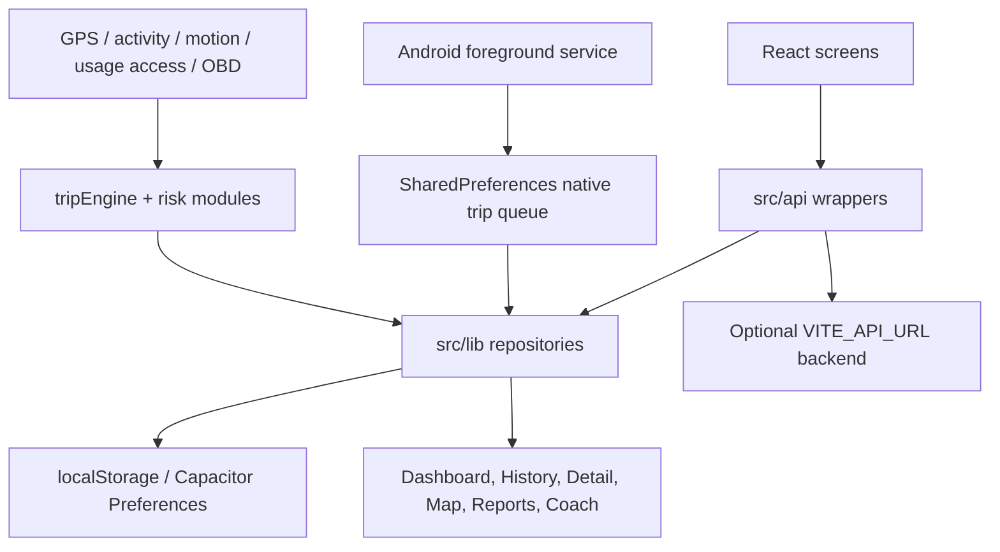

# Road Sage Advanced Calculation Reference

Updated: 2026-05-21T17:35:00.0000000-04:00

This is the readable app reference. It is not a full code dump. It documents the app architecture and shows the actual calculation snippets that matter: thresholds, physics math, event detection, scoring, risk, reporting, maintenance, phone-use evidence, map playback, and Android native tracking math.

## Table Of Contents

- [Coverage Guarantee](#coverage-guarantee)
- [Release Blocker Remediation Update](#release-blocker-remediation-update)
- [1. System Overview](#1-system-overview)
- [2. App Details](#2-app-details)
- [3. Data Flow And Storage](#3-data-flow-and-storage)
- [4. Calculation Pipeline](#4-calculation-pipeline)
- [5. Core Thresholds And Settings](#5-core-thresholds-and-settings)
- [6. Trip Physics And Route Metrics](#6-trip-physics-and-route-metrics)
- [7. Event Detection Calculations](#7-event-detection-calculations)
- [8. Scoring Calculations](#8-scoring-calculations)
- [9. Advanced Risk, Readiness, And Reports](#9-advanced-risk-readiness-and-reports)
- [10. Import, Export, Map Context, And Prediction Support](#10-import-export-map-context-and-prediction-support)
- [11. Android Native Tracking Calculations](#11-android-native-tracking-calculations)
- [12. Complete Calculation Snippet Index](#12-complete-calculation-snippet-index)
- [13. Tests, Dependencies, And Security](#13-tests-dependencies-and-security)

## Coverage Guarantee

The complete snippet index includes every tracked app-source calculation line found in JavaScript, TypeScript, JSX, TSX, MJS, and Android Java files. It intentionally excludes test fixtures from the exhaustive calculation count because tests contain synthetic expected values, not production app calculations. Production import/export, PDF export, native downloads, map playback, map matching, OpenStreetMap speed-limit enrichment, weather scoring, predictive route risk, pre-trip readiness, route risk, UBI, maintenance, and Android native tracking are covered below and in the complete index.

---

## Release Blocker Remediation Update

Status as of 2026-05-21T14:01:05.0138920-04:00: the highest-risk release blockers from the final app analysis have been remediated in code and covered by focused regression tests.

Second-pass status as of 2026-05-21T14:11:25.8865580-04:00: the remaining low-priority and production-grade follow-ups from the report have also been implemented or covered by in-app equivalents.

### Before

- `react-quill`/`quill` remained in the runtime dependency tree even though the app did not import it.
- Backend auth tokens were read from `localStorage`, making persistent tokens extractable by any same-origin XSS.
- Backup import parsed arbitrary files with a raw `JSON.parse`, merged settings without a whitelist, and could restore privacy-zone labels without warning that coordinates were intentionally absent.
- Android native tracking used unclamped haversine math, `SimpleDateFormat` timestamp handling, and `Math.abs(type.hashCode())` for diagnostic IDs.
- Several score and physics helpers could produce `NaN`, `Infinity`, or incomplete aggregates: zero-std anomaly scoring, empty peak arrays, 100-trip aggregate caps, and unbounded eco score economics.
- The default OSRM endpoint pointed to the public demo server, and `/android` debug reference routing was enabled in production.

### After

- Removed `react-quill` and its vulnerable transitive `quill` dependency from `package.json` and `package-lock.json`.
- `getAuthToken()` now reads only `sessionStorage`; logout clears both session and legacy local token keys.
- `parseDriveSenseBackup()` now catches malformed JSON, import rejects files over 50 MB, and imported settings pass through `sanitizeImportedSettings()` with known-key, type, enum, and range validation.
- Backup import now returns `privacy_zones_need_reconfiguration` so Settings can warn users when privacy zones were restored without private coordinates.
- Android native tracking now clamps haversine input, skips non-finite segment distances, formats/parses timestamps with `java.time.Instant`, and generates unsigned diagnostic hash suffixes.
- Added Gradle core-library desugaring so `java.time` compiles against the current min SDK.
- Driver anomaly z-scores guard zero standard deviation; sensor fusion and cornering peaks use safe fallbacks.
- Added `tripService.listAll()` / `localTripRepository.listAll()` and switched aggregate/reporting screens to full-history queries.
- IndexedDB upgrade handling now has an incremental migration shape, and rescore writes are batched in one transaction where IndexedDB is available.
- OSRM map matching is disabled by default with a blank endpoint. Users must explicitly enable it and provide an endpoint before route coordinates leave the app for road snapping.
- Economics now clamps eco scores, supports fuel-type-specific CO2 factors, and uses configurable CO2 baselines.
- Phone-use merge results now include `data_sources` provenance for partial-detection transparency.
- `/android` is gated to dev builds or `VITE_SHOW_DEBUG_ROUTES=true`.
- App package version is now `1.0.0`.
- Rescore progress now emits app events and displays an updating trip-history banner in the shared layout.
- `detectDrivingEvents()` now always returns `{ events, phoneUse }`; callers and tests no longer use brittle `Reflect.get()` return-shape probes.
- Backup export now tells the user when native Downloads export falls back to browser download, and backup import reports saved-filter restore failures.
- OpenStreetMap, Open-Meteo, and OSRM requests now run through a small retry/circuit-breaker helper for transient failures.
- Settings updates validate configurable threshold ranges before saving unsafe values.
- OSRM is blank and disabled by default again. Map matching stays local-off unless the user enables it and enters an endpoint; Settings explains that route GPS coordinates are sent to that endpoint.
- Lightweight production error reporting records sanitized JS errors and unhandled promise rejections into local diagnostics without sending trip data off-device.

### Verification

- `npm.cmd test` passed: 31 test files, 242 tests.
- `npm.cmd run build` passed.
- `android\gradlew.bat assembleDebug` passed.

---

## 1. System Overview

Road Sage is a local-first driving tracker built with React, Vite, Capacitor, and Android native services. The app records trips, detects risky driving events, computes driving scores, enriches routes with open-source map/weather context, stores trips locally, and supports background Android auto tracking.

- Package: `drivesense-app`
- Version: `1.0.0`
- Pattern: React SPA plus Capacitor Android shell; local-first modular monolith
- Main calculation engine: `src/lib/tripEngine.js`
- Main trip repository: `src/lib/localTripRepository.js`
- Android background service: `android/app/src/main/java/com/drivesense/app/DriveSenseAutoTrackingService.java`



---

## 2. App Details

### Runtime entry

Source: `src/main.jsx:1`
```jsx
    1 | import React from 'react'
    2 | import ReactDOM from 'react-dom/client'
    3 | import App from '@/App.jsx'
    4 | import '@/index.css'
    5 |
    6 | ReactDOM.createRoot(document.getElementById('root')).render(
    7 |   <App />
    8 | )
    9 |
```


### Client routes


```jsx
  100 |       {!onboardingDone && <Route path="*" element={<Onboarding onComplete={() => setOnboardingDone(true)} />} />}
  103 |       <Route element={<Layout />}>
  104 |         <Route path="/" element={<Dashboard />} />
  105 |         <Route path="/trips" element={<TripHistory />} />
  106 |         <Route path="/trips/:id" element={<TripDetail />} />
  107 |         <Route path="/map" element={<MapScreen />} />
  108 |         <Route path="/coach" element={<DrivingCoach />} />
  109 |         <Route path="/insights" element={<Insights />} />
  110 |         <Route path="/achievements" element={<Achievements />} />
  111 |         <Route path="/reports" element={<Reports />} />
  112 |         <Route path="/diagnostics" element={<Diagnostics />} />
  113 |         <Route path="/settings" element={<Settings />} />
  114 |         <Route path="/android" element={<AndroidReference />} />
  115 |         <Route path="/vehicles" element={<Vehicles />} />
  118 |       <Route path="*" element={<PageNotFound />} />
```


### Module map

- `android/app/src/main/java/com/drivesense/app/DriveSenseActivityReceiver.java` - Android native service/plugin/store. Exports: onReceive.
- `android/app/src/main/java/com/drivesense/app/DriveSenseActivityRecognitionPlugin.java` - Android native service/plugin/store. Exports: load, handleOnDestroy, checkPermissions, requestPermissions, requestBackgroundLocation, start, stop, startNativeAutoTracking, stopNativeAutoTracking, speakText.
- `android/app/src/main/java/com/drivesense/app/DriveSenseAutoTrackingService.java` - Android native service/plugin/store. Exports: onCreate, onLocationResult, onStartCommand, onDestroy, onBind.
- `android/app/src/main/java/com/drivesense/app/DriveSenseAutoTrackingTileService.java` - Android native service/plugin/store. Exports: onStartListening, onClick.
- `android/app/src/main/java/com/drivesense/app/DriveSenseNativeTripStore.java` - Android native service/plugin/store. Exports: none.
- `android/app/src/main/java/com/drivesense/app/DriveSensePhoneUsageTracker.java` - Android native service/plugin/store. Exports: none.
- `android/app/src/main/java/com/drivesense/app/MainActivity.java` - Android native service/plugin/store. Exports: onCreate.
- `src/api/auth.js` - Optional backend/local-store API wrapper. Exports: authService.
- `src/api/client.js` - Optional backend/local-store API wrapper. Exports: API_BASE_URL, apiClient.
- `src/api/trips.js` - Optional backend/local-store API wrapper. Exports: tripService.
- `src/api/vehicles.js` - Optional backend/local-store API wrapper. Exports: vehicleService.
- `src/components/EventBadge.jsx` - EventBadge component. Exports: function.
- `src/components/Layout.jsx` - Layout component. Exports: function.
- `src/components/LiveCoachOverlay.jsx` - LiveCoachOverlay component. Exports: function.
- `src/components/ProtectedRoute.jsx` - ProtectedRoute component. Exports: function.
- `src/components/ScoreRing.jsx` - ScoreRing component. Exports: function.
- `src/components/StatCard.jsx` - StatCard component. Exports: function.
- `src/components/TripCard.jsx` - TripCard component. Exports: function.
- `src/components/TripMap.jsx` - TripMap component. Exports: function.
- `src/components/TripPlayback.jsx` - TripPlayback component. Exports: function.
- `src/components/UserNotRegisteredError.jsx` - UserNotRegisteredError component. Exports: UserNotRegisteredError.
- `src/components/VehicleCompare.jsx` - VehicleCompare component. Exports: function.
- `src/components/ui/accordion.jsx` - UI primitive. Exports: none.
- `src/components/ui/alert-dialog.jsx` - UI primitive. Exports: none.
- `src/components/ui/alert.jsx` - UI primitive. Exports: none.
- `src/components/ui/aspect-ratio.jsx` - UI primitive. Exports: none.
- `src/components/ui/avatar.jsx` - UI primitive. Exports: none.
- `src/components/ui/badge.jsx` - UI primitive. Exports: none.
- `src/components/ui/breadcrumb.jsx` - UI primitive. Exports: none.
- `src/components/ui/button.jsx` - UI primitive. Exports: none.
- `src/components/ui/calendar.jsx` - UI primitive. Exports: none.
- `src/components/ui/card.jsx` - UI primitive. Exports: none.
- `src/components/ui/carousel.jsx` - UI primitive. Exports: none.
- `src/components/ui/chart.jsx` - UI primitive. Exports: none.
- `src/components/ui/checkbox.jsx` - UI primitive. Exports: none.
- `src/components/ui/collapsible.jsx` - UI primitive. Exports: none.
- `src/components/ui/command.jsx` - UI primitive. Exports: none.
- `src/components/ui/context-menu.jsx` - UI primitive. Exports: none.
- `src/components/ui/dialog.jsx` - UI primitive. Exports: none.
- `src/components/ui/drawer.jsx` - UI primitive. Exports: none.
- `src/components/ui/dropdown-menu.jsx` - UI primitive. Exports: none.
- `src/components/ui/form.jsx` - UI primitive. Exports: none.
- `src/components/ui/hover-card.jsx` - UI primitive. Exports: none.
- `src/components/ui/input-otp.jsx` - UI primitive. Exports: none.
- `src/components/ui/input.jsx` - UI primitive. Exports: none.
- `src/components/ui/label.jsx` - UI primitive. Exports: none.
- `src/components/ui/menubar.jsx` - UI primitive. Exports: none.
- `src/components/ui/navigation-menu.jsx` - UI primitive. Exports: none.
- `src/components/ui/pagination.jsx` - UI primitive. Exports: none.
- `src/components/ui/popover.jsx` - UI primitive. Exports: none.
- `src/components/ui/progress.jsx` - UI primitive. Exports: none.
- `src/components/ui/radio-group.jsx` - UI primitive. Exports: none.
- `src/components/ui/resizable.jsx` - UI primitive. Exports: none.
- `src/components/ui/scroll-area.jsx` - UI primitive. Exports: none.
- `src/components/ui/select.jsx` - UI primitive. Exports: none.
- `src/components/ui/separator.jsx` - UI primitive. Exports: none.
- `src/components/ui/sheet.jsx` - UI primitive. Exports: none.
- `src/components/ui/sidebar.jsx` - UI primitive. Exports: none.
- `src/components/ui/skeleton.jsx` - UI primitive. Exports: none.
- `src/components/ui/slider.jsx` - UI primitive. Exports: none.
- `src/components/ui/sonner.jsx` - UI primitive. Exports: none.
- `src/components/ui/switch.jsx` - UI primitive. Exports: none.
- `src/components/ui/table.jsx` - UI primitive. Exports: none.
- `src/components/ui/tabs.jsx` - UI primitive. Exports: none.
- `src/components/ui/textarea.jsx` - UI primitive. Exports: none.
- `src/components/ui/toast.jsx` - UI primitive. Exports: none.
- `src/components/ui/toaster.jsx` - UI primitive. Exports: Toaster.
- `src/components/ui/toggle-group.jsx` - UI primitive. Exports: none.
- `src/components/ui/toggle.jsx` - UI primitive. Exports: none.
- `src/components/ui/tooltip.jsx` - UI primitive. Exports: none.
- `src/components/ui/use-toast.jsx` - UI primitive. Exports: reducer.
- `src/lib/AuthContext.jsx` - AuthContext domain module. Exports: AuthProvider, useAuth.
- `src/lib/PageNotFound.jsx` - PageNotFound domain module. Exports: function.
- `src/lib/activityRecognition.js` - activityRecognition domain module. Exports: ACTIVITY_POLL_INTERVAL_MS, AUTO_START_IN_VEHICLE_CONFIDENCE, AUTO_START_SPEED_KMH, AUTO_START_IN_VEHICLE_SECONDS, AUTO_START_GPS_FALLBACK_SECONDS, WALKING_SPEED_CUTOFF_KMH, ACTIVITY_TYPES, startActivityRecognition, startNativeAutoTracking, stopNativeAutoTracking.
- `src/lib/dailyFatigueEngine.js` - dailyFatigueEngine domain module. Exports: getTodayTrips, computeDailyFatigue.
- `src/lib/dangerZoneEngine.js` - dangerZoneEngine domain module. Exports: DANGER_ZONES_KEY, buildDangerZones, checkDangerZoneProximity, saveDangerZones, loadDangerZones, invalidateDangerZoneCache.
- `src/lib/dataBackup.js` - dataBackup domain module. Exports: sanitizeSavedTripFilters, buildDriveSenseBackup, exportDriveSenseBackup, parseDriveSenseBackup, importDriveSenseBackup.
- `src/lib/driverAnomaly.js` - driverAnomaly domain module. Exports: tripFeatureVector, buildOnDeviceDriverModel, scoreTripAnomaly.
- `src/lib/habitProfile.js` - habitProfile domain module. Exports: clamp, getTimeBucket, buildHabitProfile, getFallbackTimeRisk.
- `src/lib/localTripRepository.js` - localTripRepository domain module. Exports: TRIP_SCHEMA_VERSION, applyEventFeedbackToEvents, localTripRepository.
- `src/lib/localVehicleRepository.js` - localVehicleRepository domain module. Exports: localVehicleRepository.
- `src/lib/mapMatching.js` - mapMatching domain module. Exports: mapMatchRoute.
- `src/lib/mapPlaybackInsights.js` - mapPlaybackInsights domain module. Exports: SPEED_BANDS, pointTimeMs, cleanRoutePoints, speedBandForKmh, hasRecoverableOriginalRouteGeometry, restoreOriginalRouteGeometry, downsampleRoutePoints, prepareMapRoutePoints, eventIndexForRoute, buildPlaybackTimeline.
- `src/lib/mediumInsights.js` - mediumInsights domain module. Exports: routeKeyForTrip, buildRouteComparisons, buildCommuteDetections, buildTripCalendarMonth, buildWeeklyDriverSummary, buildGoalStatus, buildRoadTypeBreakdown, buildRiskHotspots, buildVehicleCostSummary, buildMaintenanceReminders.
- `src/lib/mobileStorage.js` - mobileStorage domain module. Exports: getJson, setJson, removeJson.
- `src/lib/nativeDownloads.js` - nativeDownloads domain module. Exports: saveExportToDownloads, openExportLocation.
- `src/lib/nativePlatform.js` - nativePlatform domain module. Exports: isNativePlatform, isAndroid, openNativeSettings.
- `src/lib/notificationService.js` - notificationService domain module. Exports: TRACKING_CHANNEL_ID, SUMMARY_CHANNEL_ID, ACHIEVEMENT_CHANNEL_ID, SAFETY_ALERTS_CHANNEL_ID, COACHING_CHANNEL_ID, VEHICLE_CHANNEL_ID, NOTIFICATION_IDS, isQuietHours, configureNotificationChannels, scheduleLongTripReminder.
- `src/lib/obdBluetooth.js` - obdBluetooth domain module. Exports: parseObdPidResponse, getObdBluetoothSupport, getObdBluetoothPermissionStatus, connectObdBleAdapter.
- `src/lib/openSourceTripContext.js` - openSourceTripContext domain module. Exports: buildOpenSourceTripContextPatch, describeOsmSpeedLimitStatus.
- `src/lib/pdfExport.js` - pdfExport domain module. Exports: exportMonthlyReportPDF, exportUBIReportPDF.
- `src/lib/permissions.js` - permissions domain module. Exports: getPermissionStatus, requestForegroundLocationPermission, requestNotificationPermission, requestActivityRecognitionPermission, requestBackgroundLocationPermission, getPermissionExplanation.
- `src/lib/phoneUsageAccess.js` - phoneUsageAccess domain module. Exports: buildPhoneUseFromAndroidUsage, buildPhoneUseFromEvents, mergePhoneUseSignals, mergeManyPhoneUseSignals, buildPhoneUseFromTripEvidence, mergePhoneUseEventsIntoDrivingEvents.
- `src/lib/preTripRisk.js` - preTripRisk domain module. Exports: PRE_TRIP_RISK_WEIGHTS, PRE_TRIP_RISK_SIGNAL_GATES, deriveWeights, deriveSignalGates, computePreTripRisk.
- `src/lib/predictiveRouteRisk.js` - predictiveRouteRisk domain module. Exports: estimatePredictiveRouteRisk.
- `src/lib/privacyZones.js` - privacyZones domain module. Exports: getPrivacyZones, isPointInPrivacyZone, privacyZonesForRoute, privacyBoundaryPoint, maskRoutePointsForPrivacy, maskEventsForPrivacy, maskTripForPrivacy, upsertPrivacyZone, removePrivacyZone.
- `src/lib/query-client.js` - query-client domain module. Exports: queryClientInstance.
- `src/lib/routeRiskIndex.js` - routeRiskIndex domain module. Exports: GRID_PRECISION, ROUTE_RISK_INDEX_KEY, segmentKey, buildRouteRiskIndex, getSegmentsForTrip, saveRouteRiskIndex, loadRouteRiskIndex, invalidateRouteRiskIndex.
- `src/lib/sensorFusionModel.js` - sensorFusionModel domain module. Exports: getMotionSensorSupport, requestMotionSensorPermission, normalizeMotionSample, buildSensorFusionSummary, enrichEventsWithSensorContext, detectCrashIncident, createMotionSensorFusion.
- `src/lib/speedLimitSource.js` - speedLimitSource domain module. Exports: parseMaxspeedKmh, defaultSpeedLimitKmhForOsmHighway, loadOsmSpeedLimitWays, annotateRouteSpeedLimits.
- `src/lib/thresholdCalibration.js` - thresholdCalibration domain module. Exports: CALIBRATION_PROFILE_KEY, computeCalibrationProfile, applyCalibrationProfile, saveCalibrationProfile, loadCalibrationProfile, clearCalibrationProfile.
- `src/lib/trackingDiagnostics.js` - trackingDiagnostics domain module. Exports: getTrackingDiagnostics, recordTrackingDiagnostic, clearTrackingDiagnostics, normalizeNativeDiagnosticEvents, buildParkingTimeline, buildTrackingHealth, buildDashboardTrackingExplanation.
- `src/lib/trackingService.js` - trackingService domain module. Exports: getCurrentLocation, createDrivingTrackingService.
- `src/lib/trackingStore.js` - trackingStore domain module. Exports: DEFAULT_SETTINGS, getLastParkedLocation, saveLastParkedLocation, localSettings, applyThemeMode, activeTripStore, checkLocationPermission, requestLocationPermission.
- `src/lib/tripEngine.js` - tripEngine domain module. Exports: DEFAULT_THRESHOLDS, EVENT_TYPES, buildDrivingThresholds, haversineDistance, calculateBearing, headingDiff, headingStdDev, speedStdDev, calculateSpeedKmh, calculateAcceleration.
- `src/lib/tripInsights.js` - tripInsights domain module. Exports: DEFAULT_FUEL_PRICE_PER_LITER, DEFAULT_L_PER_100KM, GASOLINE_CO2_KG_PER_LITER, WEAR_KM_PER_STRESS_UNIT, STRESS_UNITS, DEFAULT_MAINTENANCE_ITEMS, percentile, getSpeedColor, getSpeedLabel, buildSpeedSegments.
- `src/lib/tripMetadata.js` - tripMetadata domain module. Exports: TRIP_TAG_OPTIONS, normalizeTripTags, getTripTagOption, getTripTagLabel, getTripDisplayName, buildTripSearchText, isHighRiskTrip, buildScoreExplanation, calculateRecentBrakingImprovement, formatParkingReminder.
- `src/lib/ubiReport.js` - ubiReport domain module. Exports: UBI_CATEGORY_WEIGHTS, ubiGrade, computeUBIReport.
- `src/lib/utils.js` - utils domain module. Exports: cn, isIframe.
- `src/lib/voiceAlerts.js` - voiceAlerts domain module. Exports: canSpeakSafetyAlert, speakSafetyAlert, speakSafetyAlertOnce, resetSafetyAlertCooldowns, testVoiceAlert.
- `src/lib/weatherContext.js` - weatherContext domain module. Exports: fetchWeatherContextForTrip, applyWeatherRiskToScores.
- `src/lib/weeklyCoaching.js` - weeklyCoaching domain module. Exports: buildWeeklyCoachSummary.
- `src/pages/Achievements.jsx` - Achievements user workflow. Exports: function.
- `src/pages/AndroidReference.jsx` - AndroidReference user workflow. Exports: function.
- `src/pages/Dashboard.jsx` - Dashboard user workflow. Exports: function.
- `src/pages/Diagnostics.jsx` - Diagnostics user workflow. Exports: function.
- `src/pages/DrivingCoach.jsx` - DrivingCoach user workflow. Exports: function.
- `src/pages/Insights.jsx` - Insights user workflow. Exports: function.
- `src/pages/MapScreen.jsx` - MapScreen user workflow. Exports: function.
- `src/pages/Onboarding.jsx` - Onboarding user workflow. Exports: function.
- `src/pages/Report.jsx` - Report user workflow. Exports: function.
- `src/pages/Settings.jsx` - Settings user workflow. Exports: function.
- `src/pages/TripDetail.jsx` - TripDetail user workflow. Exports: function.
- `src/pages/TripHistory.jsx` - TripHistory user workflow. Exports: function.
- `src/pages/Vehicles.jsx` - Vehicles user workflow. Exports: function.

---

## 3. Data Flow And Storage

### API/local-store switch

Trips and vehicles use local repositories when native or when `VITE_API_URL` is missing. Otherwise, wrappers call the optional backend API.

Source: `src/api/client.js:1`
```javascript
    1 | export const API_BASE_URL =
    2 |   import.meta.env.VITE_API_URL || "http://localhost:5000/api";
    3 |
    4 | export class ApiError extends Error {
    5 |   /**
    6 |    * @param {string} message
    7 |    * @param {{status?:number,data?:any,response?:Response}} details
    8 |    */
    9 |   constructor(message, { status, data, response } = {}) {
   10 |     super(message);
   11 |     this.name = "ApiError";
   12 |     this.status = status;
   13 |     this.data = data;
   14 |     this.response = response;
   15 |   }
   16 | }
   17 |
   18 | const getAuthToken = () => {
   19 |   try {
   20 |     return localStorage.getItem("token") || localStorage.getItem("access_token");
   21 |   } catch {
   22 |     return null;
   23 |   }
   24 | };
   25 |
   26 | const buildUrl = (path, query) => {
   27 |   const normalizedBase = API_BASE_URL.replace(/\/+$/, "");
   28 |   const normalizedPath = path.startsWith("/") ? path : `/${path}`;
   29 |   const url = new URL(`${normalizedBase}${normalizedPath}`);
   30 |
   31 |   if (query) {
   32 |     Object.entries(query).forEach(([key, value]) => {
   33 |       if (value === undefined || value === null || value === "") return;
   34 |       url.searchParams.set(key, String(value));
   35 |     });
   36 |   }
   37 |
   38 |   return url.toString();
   39 | };
   40 |
   41 | const parseJsonSafely = async (response) => {
   42 |   const text = await response.text();
   43 |   if (!text) return null;
   44 |
   45 |   try {
   46 |     return JSON.parse(text);
   47 |   } catch {
   48 |     return text;
   49 |   }
   50 | };
   51 |
   52 | /**
   53 |  * @param {string} path
   54 |  * @param {{method?:string,body?:any,headers?:Record<string,string>,query?:Record<string,any>} & RequestInit} options
   55 |  */
   56 | async function request(path, { method = "GET", body, headers, query, ...options } = {}) {
   57 |   const token = getAuthToken();
   58 |   const hasBody = body !== undefined && body !== null;
   59 |
   60 |   const response = await fetch(buildUrl(path, query), {
   61 |     method,
   62 |     ...options,
   63 |     headers: {
   64 |       Accept: "application/json",
   65 |       ...(hasBody ? { "Content-Type": "application/json" } : {}),
   66 |       ...(token ? { Authorization: `Bearer ${token}` } : {}),
   67 |       ...headers,
   68 |     },
   69 |     body: hasBody ? JSON.stringify(body) : undefined,
   70 |   });
   71 |
   72 |   const data = await parseJsonSafely(response);
   73 |
   74 |   if (!response.ok) {
   75 |     const message =
   76 |       (data && typeof data === "object" && (data.message || data.error)) ||
   77 |       response.statusText ||
   78 |       "Request failed";
   79 |
   80 |     throw new ApiError(message, {
   81 |       status: response.status,
   82 |       data,
   83 |       response,
   84 |     });
   85 |   }
   86 |
   87 |   return data;
   88 | }
   89 |
   90 | export const apiClient = {
   91 |   get: (path, options) => request(path, { ...options, method: "GET" }),
   92 |   post: (path, body, options) => request(path, { ...options, method: "POST", body }),
   93 |   put: (path, body, options) => request(path, { ...options, method: "PUT", body }),
   94 |   patch: (path, body, options) => request(path, { ...options, method: "PATCH", body }),
   95 |   delete: (path, options) => request(path, { ...options, method: "DELETE" }),
   96 | };
   97 |
```


Source: `src/api/trips.js:1`
```javascript
    1 | import { apiClient } from "@/api/client";
    2 | import { localTripRepository } from "@/lib/localTripRepository";
    3 | import { isNativePlatform } from "@/lib/nativePlatform";
    4 | import { suggestTripTag } from "@/lib/tripInsights";
    5 | import { normalizeTripTags } from "@/lib/tripMetadata";
    6 |
    7 | const shouldUseLocalStore = () => isNativePlatform() || !import.meta.env.VITE_API_URL;
    8 |
    9 | const repository = () => (shouldUseLocalStore() ? localTripRepository : null);
   10 |
   11 | export const tripService = {
   12 |   list: ({ sort = "-start_time", limit = 100 } = {}) => {
   13 |     const local = repository();
   14 |     return local ? local.list({ sort, limit }) : apiClient.get("/trips", { query: { sort, limit } });
   15 |   },
   16 |
   17 |   getById: (id) => {
   18 |     const local = repository();
   19 |     return local ? local.getById(id) : apiClient.get(`/trips/${encodeURIComponent(id)}`);
   20 |   },
   21 |
   22 |   create: (trip) => {
   23 |     const local = repository();
   24 |     const suggestion = suggestTripTag(trip);
   25 |     const withSuggestion = {
   26 |       ...suggestion,
   27 |       tag: trip.tag ?? null,
   28 |       tags: normalizeTripTags(trip),
   29 |       nickname: trip.nickname ?? "",
   30 |       notes: trip.notes ?? "",
   31 |       is_favorite: trip.is_favorite === true,
   32 |       ...trip,
   33 |       auto_tag: trip.auto_tag ?? suggestion.auto_tag,
   34 |       auto_tag_confidence: trip.auto_tag_confidence ?? suggestion.auto_tag_confidence,
   35 |     };
   36 |     return local ? local.create(withSuggestion) : apiClient.post("/trips", withSuggestion);
   37 |   },
   38 |
   39 |   update: (id, patch) => {
   40 |     const local = repository();
   41 |     return local ? local.update(id, patch) : apiClient.patch(`/trips/${encodeURIComponent(id)}`, patch);
   42 |   },
   43 |
   44 |   delete: (id) => {
   45 |     const local = repository();
   46 |     return local ? local.delete(id) : apiClient.delete(`/trips/${encodeURIComponent(id)}`);
   47 |   },
   48 |
   49 |   upsertMany: (trips) => {
   50 |     const local = repository();
   51 |     if (local) return local.upsertMany(trips);
   52 |     return Promise.all(trips.map((trip) => (
   53 |       trip.id
   54 |         ? apiClient.patch(`/trips/${encodeURIComponent(trip.id)}`, trip).catch(() => apiClient.post("/trips", trip))
   55 |         : apiClient.post("/trips", trip)
   56 |     )));
   57 |   },
   58 |
   59 |   markCompletedForRescore: async () => {
   60 |     const local = repository();
   61 |     if (local?.markCompletedForRescore) return local.markCompletedForRescore();
   62 |     const trips = await apiClient.get("/trips", { query: { sort: "-start_time", limit: 5000 } });
   63 |     const completed = trips.filter((trip) => trip.status === "completed");
   64 |     await Promise.all(completed.map((trip) => (
   65 |       apiClient.patch(`/trips/${encodeURIComponent(trip.id)}`, { needs_rescore: true })
   66 |     )));
   67 |     return completed.length;
   68 |   },
   69 | };
   70 |
```


### Storage keys and schema migration

Source: `src/lib/trackingStore.js:1`
```javascript
    1 | /**
    2 |  * Road Sage Tracking Store
    3 |  * Manages active trip state in memory and persists to sessionStorage for crash recovery.
    4 |  * This is a singleton store used by the tracking service.
    5 |  */
    6 | import { getJson, setJson } from '@/lib/mobileStorage';
    7 |
    8 | const ACTIVE_TRIP_KEY = 'drivesense_active_trip';
    9 | const SETTINGS_KEY = 'drivesense_settings';
   10 | const LAST_PARKED_KEY = 'drivesense_last_parked';
   11 | let lastNativeSettingsSync = '';
   12 |
   13 | const syncSettingsForNative = (settings) => {
   14 |   if (typeof window === 'undefined') return;
   15 |   const serialized = JSON.stringify(settings);
   16 |   if (serialized === lastNativeSettingsSync) return;
   17 |   lastNativeSettingsSync = serialized;
   18 |   import('@capacitor/core')
   19 |     .then(({ Capacitor }) => {
   20 |       if (!Capacitor.isNativePlatform()) return null;
   21 |       return import('@capacitor/preferences');
   22 |     })
   23 |     .then((module) => {
   24 |       if (!module?.Preferences) return;
   25 |       module.Preferences.set({ key: SETTINGS_KEY, value: serialized }).catch(() => {});
   26 |     })
   27 |     .catch(() => {});
   28 | };
   29 |
   30 | // ─── Default Settings ──────────────────────────────────────────────────────────
   31 | export const DEFAULT_SETTINGS = {
   32 |   settings_defaults_version: 2,
   33 |   tracking_mode: 'manual',
   34 |   units: 'metric',
   35 |   dark_mode: 'system',
   36 |   notifications_enabled: true,
   37 |   notification_permission_granted: false,
   38 |   trip_start_notification: true,
   39 |   trip_end_notification: true,
   40 |   weekly_report_notification: true,
   41 |   achievement_notifications: true,
   42 |   safe_driving_reminder: false,
   43 |   background_tracking_enabled: false,
   44 |   auto_tracking_enabled: false,
   45 |   activity_permission_granted: false,
   46 |   data_retention_days: 365,
   47 |   threshold_harsh_brake_ms2: 3.5,
   48 |   threshold_rapid_accel_ms2: 3.0,
   49 |   threshold_tailgate_decel_ms2: 2.5,
   50 |   threshold_sharp_turn_g_low: 0.35,
   51 |   threshold_sharp_turn_g_medium: 0.45,
   52 |   threshold_sharp_turn_g_high: 0.60,
   53 |   threshold_speeding_kmh: 100,
   54 |   threshold_speed_over_kmh: 5,
   55 |   threshold_idle_seconds: 90,
   56 |   threshold_long_drive_minutes: 120,
   57 |   night_detection_mode: 'sunset',
   58 |   night_start_time: '22:00',
   59 |   night_end_time: '06:00',
   60 |   night_sunset_offset_minutes: 0,
   61 |   night_sunrise_offset_minutes: 0,
   62 |   threshold_near_miss_brake_ms2: 3.5,
   63 |   threshold_near_miss_turn_degs: 30,
   64 |   threshold_drowsy_heading_std: 8,
   65 |   threshold_phone_proxy_oscillations: 3,
   66 |   phone_use_detection_enabled: true,
   67 |   phone_use_live_alert_enabled: true,
   68 |   phone_use_show_on_map: true,
   69 |   phone_use_affects_score: true,
   70 |   phone_use_sensitivity: 'medium',
   71 |   phone_micro_steer_count: 4,
   72 |   phone_creep_rate_kmh_s: 1.5,
   73 |   phone_lane_drift_deg: 8,
   74 |   phone_coupling_threshold: 0.15,
   75 |   phone_confidence_threshold: 0.40,
   76 |   phone_min_window_s: 4,
   77 |   threshold_speed_creep_kmh: 5,
   78 |   threshold_overtake_accel_ms2: 3.0,
   79 |   advanced_safety_detection_enabled: true,
   80 |   speed_warning_enabled: true,
   81 |   speed_limit_lookup_enabled: true,
   82 |   weather_context_enabled: true,
   83 |   min_speed_rapid_accel_kmh: 5,
   84 |   min_speed_harsh_brake_kmh: 25,
   85 |   weekly_goal_harsh_brakes: 5,
   86 |   weekly_goal_speeding_events: 3,
   87 |   weekly_goal_min_avg_score: 80,
   88 |   weekly_goal_max_night_trips: 3,
   89 |   weekly_goal_max_night_km: 20,
   90 |   onboarding_completed: false,
   91 |   location_permission_granted: false,
   92 |   background_location_granted: false,
   93 |   tracking_paused: false,
   94 |   live_coaching_enabled: true,
   95 |   voice_alerts_enabled: true,
   96 |   sensor_fusion_enabled: true,
   97 |   crash_detection_enabled: true,
   98 |   emergency_workflow_enabled: false,
   99 |   map_matching_enabled: false,
  100 |   osrm_map_matching_url: '',
  101 |   predictive_route_risk_enabled: true,
  102 |   obd_bluetooth_enabled: false,
  103 |   notif_safety_alerts_enabled: true,
  104 |   notif_phone_use_alert_enabled: true,
  105 |   notif_drowsy_alert_enabled: true,
  106 |   notif_speeding_alert_enabled: true,
  107 |   notif_post_trip_summary_enabled: true,
  108 |   notif_post_trip_score_change: true,
  109 |   notif_post_trip_phone_use: true,
  110 |   notif_post_trip_fuel_saving: true,
  111 |   notif_coaching_enabled: true,
  112 |   notif_streak_enabled: true,
  113 |   notif_weekly_pattern_enabled: true,
  114 |   notif_style_shift_enabled: true,
  115 |   notif_maintenance_enabled: true,
  116 |   notif_inactive_nudge_enabled: true,
  117 |   notif_inactive_nudge_days: 7,
  118 |   notif_quiet_hours_enabled: false,
  119 |   notif_quiet_start: '22:00',
  120 |   notif_quiet_end: '07:00',
  121 |   notif_min_score_for_post_trip: 0,
  122 |   danger_zone_alerts_enabled: true,
  123 |   calibration_profile_key: null,
  124 |   privacy_zones: [],
  125 | };
  126 |
  127 | export async function getLastParkedLocation() {
  128 |   return getJson(LAST_PARKED_KEY, null);
  129 | }
  130 |
```


Source: `src/lib/localTripRepository.js:1`
```javascript
    1 | import { getJson, removeJson, setJson } from '@/lib/mobileStorage';
    2 | import { clearNativeCompletedTrips, getNativeCompletedTrips } from '@/lib/activityRecognition';
    3 | import { isAndroid } from '@/lib/nativePlatform';
    4 | import { buildDrivingThresholds, calculateTripScores, calculateTripStats, detectDrivingEvents } from '@/lib/tripEngine';
    5 | import { estimateTripEconomics } from '@/lib/tripInsights';
    6 | import { localSettings, saveLastParkedLocation } from '@/lib/trackingStore';
    7 | import { invalidateDangerZoneCache } from '@/lib/dangerZoneEngine';
    8 | import { invalidateRouteRiskIndex } from '@/lib/routeRiskIndex';
    9 | import {
   10 |   buildPhoneUseFromTripEvidence,
   11 |   mergePhoneUseEventsIntoDrivingEvents,
   12 | } from '@/lib/phoneUsageAccess';
   13 | import { hasRecoverableOriginalRouteGeometry, restoreOriginalRouteGeometry } from '@/lib/mapPlaybackInsights';
   14 |
   15 | const TRIPS_KEY = 'drivesense_trips';
   16 | const DRIVER_SIGNATURE_KEY = 'drivesense_driver_signature';
   17 | const DB_NAME = 'drivesense_mobile';
   18 | const DB_VERSION = 1;
   19 | const TRIP_STORE = 'trips';
   20 | export const TRIP_SCHEMA_VERSION = 9;
   21 | /*
   22 |  * Completed trip record schema additions in version 3:
   23 |  * - road-type segmented scores: highway_score, urban_score, residential_score, dominant_road_type
   24 |  * - reaction proxy: reaction_score, avg_reaction_seconds, reaction_grade, reaction_sample_count
   25 |  * - cornering consistency: cornering_consistency_score, cornering_grade, mean_lateral_g, peak_lateral_g, corner_sample_count
   26 |  * - braking efficiency: braking_efficiency_score, braking_efficiency_grade, braking_sequence_count, avg_braking_smoothness
   27 |  * - compliance: highway_compliance, urban_compliance, residential_compliance, overall_compliance_score
   28 |  * - overtake quality: overtake_quality_score, overtake_quality_grade, overtake_count, unsafe_reentry_count
   29 |  * - road condition proxy: slippery_proxy, wet_signal_count, wet_ratio, safety_condition_bonus, avg_distance_ratio
   30 |  * - stats speed zones: speed_zones
   31 |  *
   32 |  * Completed trip record schema additions in version 4:
   33 |  * - phone use detection: phone_use_events, phone_use_window_count, phone_use_total_seconds,
   34 |  *   phone_use_risk, phone_use_score, phone_use_pct_of_trip, phone_use_high_confidence_count
   35 |  * - native cross-check: native_phone_proxy_count
   36 |  *
   37 |  * Completed trip record schema additions in version 6:
   38 |  * - Android Usage Access phone-use evidence: native_phone_usage_events,
   39 |  *   native_phone_usage_event_count, native_phone_usage_total_seconds,
   40 |  *   native_phone_usage_access_granted
   41 |  *
   42 |  * Version 7 recalculates completed trips with stricter lane-change,
   43 |  * erratic-speed, overtake-quality, traffic-stop, and night-card logic.
   44 |  *
   45 |  * Version 8 preserves and reconstructs phone-use events across rescoring and
   46 |  * OpenStreetMap/weather refreshes so historical phone-use trips remain visible.
   47 |  *
   48 |  * Version 9 recalculates trips after privacy-masked coordinates were excluded
   49 |  * from map, playback, segment, and speed-zone distance calculations.
   50 |  */
   51 |
   52 | const canUseIndexedDb = () => typeof indexedDB !== 'undefined';
   53 |
   54 | const openDb = () => new Promise((resolve, reject) => {
   55 |   if (!canUseIndexedDb()) {
   56 |     reject(new Error('IndexedDB unavailable'));
   57 |     return;
   58 |   }
   59 |
   60 |   const request = indexedDB.open(DB_NAME, DB_VERSION);
   61 |   request.onupgradeneeded = () => {
   62 |     const db = request.result;
   63 |     if (!db.objectStoreNames.contains(TRIP_STORE)) {
   64 |       const store = db.createObjectStore(TRIP_STORE, { keyPath: 'id' });
   65 |       store.createIndex('start_time', 'start_time');
   66 |       store.createIndex('status', 'status');
   67 |     }
   68 |   };
   69 |   request.onsuccess = () => resolve(request.result);
   70 |   request.onerror = () => reject(request.error);
   71 | });
   72 |
   73 | const idbRequest = (request) => new Promise((resolve, reject) => {
   74 |   request.onsuccess = () => resolve(request.result);
   75 |   request.onerror = () => reject(request.error);
   76 | });
   77 |
   78 | const getAllTrips = async () => {
   79 |   try {
   80 |     const db = await openDb();
   81 |     const tx = db.transaction(TRIP_STORE, 'readonly');
   82 |     const trips = await idbRequest(tx.objectStore(TRIP_STORE).getAll());
   83 |     db.close();
   84 |     return trips;
   85 |   } catch {
   86 |     return getJson(TRIPS_KEY, []);
   87 |   }
   88 | };
   89 |
   90 | const putTrip = async (trip) => {
```


Trip rescore/import path, with calculation calls:

Source: `src/lib/localTripRepository.js:130`
```javascript
  130 |   const reviewed = feedback && typeof feedback === 'object' ? feedback : {};
  131 |   let removed = 0;
  132 |   const filtered = events.filter((event, index) => {
  133 |     const verdict = reviewed[eventFeedbackKey(event, index)]?.verdict;
  134 |     if (verdict === 'wrong') {
  135 |       removed += 1;
  136 |       return false;
  137 |     }
  138 |     return true;
  139 |   });
  140 |   return { events: filtered, removed };
  141 | };
  142 |
  143 | const rescoreTrip = (trip) => {
  144 |   if (!trip || trip.status !== 'completed') return trip;
  145 |   const routePoints = restoreOriginalRouteGeometry(trip.route_points || []);
  146 |   const settings = localSettings.get();
  147 |   const thresholds = buildDrivingThresholds(settings);
  148 |   const stats = calculateTripStats(routePoints, trip.start_time, trip.end_time, thresholds);
  149 |   const detection = detectDrivingEvents(routePoints, thresholds, trip.end_time);
  150 |   const events = Reflect.get(detection, 'events') ?? detection;
  151 |   const feedbackAdjusted = applyEventFeedbackToEvents(events, trip.event_feedback);
  152 |   const phoneUse = mergedPhoneUseForTrip(trip, routePoints, stats, Reflect.get(detection, 'phoneUse') ?? {});
  153 |   const scores = calculateTripScores(feedbackAdjusted.events, stats, routePoints, thresholds, stats.duration_seconds, phoneUse, { endTime: trip.end_time });
  154 |   const economics = estimateTripEconomics({ ...trip, ...stats, ...scores }, {}, settings);
  155 |   const drivingEvents = applyEventFeedbackToEvents(
  156 |     mergePhoneUseEventsIntoDrivingEvents(scores.driving_events || feedbackAdjusted.events, phoneUse),
  157 |     trip.event_feedback
  158 |   );
  159 |   return {
  160 |     ...trip,
  161 |     ...stats,
  162 |     ...scores,
  163 |     co2_saved_kg: economics.co2_saved_kg,
  164 |     route_points: routePoints,
  165 |     driving_events: drivingEvents.events,
  166 |     feedback_adjusted_events_count: feedbackAdjusted.removed + drivingEvents.removed,
  167 |     needs_rescore: false,
  168 |     schema_version: TRIP_SCHEMA_VERSION,
  169 |     updated_at: new Date().toISOString(),
  170 |   };
  171 | };
  172 |
  173 | const needsRescore = (trip) => (
  174 |   trip?.status === 'completed' &&
  175 |   (
  176 |     trip.needs_rescore ||
  177 |     hasRecoverableOriginalRouteGeometry(trip.route_points || []) ||
  178 |     trip.defensive_driving_score == null ||
  179 |     trip.reaction_score == null ||
  180 |     trip.braking_efficiency_grade == null ||
  181 |     trip.overall_compliance_score == null ||
  182 |     trip.dominant_road_type == null ||
  183 |     trip.phone_use_score == null ||
  184 |     trip.phone_use_risk == null ||
  185 |     (Number(trip.phone_use_window_count) > 0 && !(trip.driving_events || []).some((event) => event?.type === 'phone_use')) ||
  186 |     trip.schema_version !== TRIP_SCHEMA_VERSION
  187 |   )
  188 | );
  189 |
  190 | const rescoreTripsIfNeeded = async (trips = []) => {
  191 |   const next = [];
  192 |   for (const trip of trips) {
  193 |     if (needsRescore(trip)) {
  194 |       const rescored = rescoreTrip(trip);
  195 |       await putTrip(rescored);
  196 |       next.push(rescored);
  197 |     } else {
  198 |       next.push(trip);
  199 |     }
  200 |   }
  201 |   return next;
  202 | };
  203 |
  204 | const importNativeCompletedTrips = async () => {
  205 |   if (!isAndroid() || importingNativeTrips) return;
  206 |
  207 |   importingNativeTrips = true;
  208 |   try {
  209 |     const nativeTrips = await getNativeCompletedTrips();
  210 |     if (!nativeTrips.length) return;
  211 |
  212 |     for (const trip of nativeTrips) {
  213 |       const routePoints = trip.route_points || [];
  214 |       const settings = localSettings.get();
  215 |       const thresholds = buildDrivingThresholds(settings);
  216 |       const stats = calculateTripStats(routePoints, trip.start_time, trip.end_time, thresholds);
  217 |       const detection = detectDrivingEvents(routePoints, thresholds, trip.end_time);
  218 |       const events = Reflect.get(detection, 'events') ?? detection;
  219 |       const phoneUse = mergedPhoneUseForTrip(trip, routePoints, stats, Reflect.get(detection, 'phoneUse') ?? {});
  220 |       const scores = calculateTripScores(events, stats, routePoints, thresholds, stats.duration_seconds, phoneUse, { endTime: trip.end_time });
  221 |       const economics = estimateTripEconomics({ ...trip, ...stats, ...scores }, {}, settings);
  222 |       const drivingEvents = mergePhoneUseEventsIntoDrivingEvents(scores.driving_events || events, phoneUse);
  223 |
  224 |       const importedTrip = {
  225 |         ...trip,
  226 |         ...stats,
  227 |         ...scores,
  228 |         co2_saved_kg: economics.co2_saved_kg,
  229 |         route_points: routePoints,
  230 |         route_points_raw_count: Number(trip.route_points_raw_count) || routePoints.length,
  231 |         route_points_map_count: Number(trip.route_points_map_count) || routePoints.length,
  232 |         driving_events: drivingEvents,
  233 |         imported_from_native: true,
  234 |         schema_version: TRIP_SCHEMA_VERSION,
  235 |         updated_at: trip.updated_at || new Date().toISOString(),
  236 |       };
  237 |
  238 |       await putTrip(importedTrip);
  239 |
  240 |       const finalPoint = [...routePoints].reverse().find((point) => point?.lat != null && point?.lng != null);
```


---

## 4. Calculation Pipeline

A completed trip follows this calculation chain:

1. Normalize/filter raw route points.
2. Calculate segment physics: distance, duration, speed, acceleration, bearing, heading change, lateral g.
3. Detect driving events from thresholds.
4. Merge phone-use evidence from GPS proxy and Android Usage Access.
5. Calculate trip stats and advanced subscores.
6. Calculate final scores and counts.
7. Persist the completed trip and expose it to dashboards, reports, map playback, and coaching.

Dashboard trip-end code path:

Source: `src/pages/Dashboard.jsx:790`
```jsx
  790 |
  791 |     let pts = cleanedPoints;
  792 |     const preliminaryStats = calculateTripStats(cleanedPoints, tripToEnd.start_time, endTime, thresholds);
  793 |
  794 |     const isManualTrip = tripToEnd.start_source !== 'auto';
  795 |     const shouldDiscard = isManualTrip
  796 |       ? pts.length < 2 ||
  797 |         preliminaryStats.duration_seconds < MIN_MANUAL_SAVE_SECONDS ||
  798 |         preliminaryStats.distance_km < DEFAULT_THRESHOLDS.MIN_TRIP_DISTANCE_KM
  799 |       : preliminaryStats.distance_km < DEFAULT_THRESHOLDS.MIN_TRIP_DISTANCE_KM ||
  800 |         preliminaryStats.duration_seconds < DEFAULT_THRESHOLDS.MIN_TRIP_DURATION_SECONDS;
  801 |
  802 |     if (shouldDiscard) {
  803 |       recordTrackingDiagnostic({
  804 |         type: 'trip_discarded',
  805 |         title: 'Trip discarded',
  806 |         reason: isManualTrip ? 'manual_too_short' : 'auto_too_short',
  807 |         duration_seconds: Math.round(preliminaryStats.duration_seconds || 0),
  808 |         distance_km: preliminaryStats.distance_km || 0,
  809 |       });
  810 |       await activityStopRef.current?.();
  811 |       activityStopRef.current = null;
  812 |       latestActivityRef.current = null;
  813 |       activeTripStore.clear();
  814 |       activeTripRef.current = null;
  815 |       trackingRef.current = false;
  816 |       autoEndingTripRef.current = false;
  817 |       setActiveTrip(null);
  818 |       setTracking(false);
  819 |       setElapsed(0);
  820 |       if (isAndroid() && !cfg.tracking_paused && (tripToEnd.resume_native_auto || cfg.tracking_mode === 'background_auto')) {
  821 |         await startNativeAutoTracking().catch(() => {});
  822 |       }
  823 |       refreshTrackingStatusContext();
  824 |       setLocationError(isManualTrip
  825 |         ? 'Trip was not saved because Road Sage did not detect real movement. Start again when you begin driving.'
  826 |         : 'Auto-detected trip was ignored because it was too short.');
  827 |       return;
  828 |     }
  829 |
  830 |     const mapMatchingContext = await mapMatchRoute(cleanedPoints, cfg);
  831 |     pts = mapMatchingContext.routePoints || cleanedPoints;
  832 |     const speedLimitContext = await annotateRouteSpeedLimits(pts, cfg);
  833 |     pts = speedLimitContext.routePoints || pts;
  834 |     const stats = calculateTripStats(pts, tripToEnd.start_time, endTime, thresholds);
  835 |     const weatherContext = await fetchWeatherContextForTrip(pts, tripToEnd.start_time, endTime, cfg).catch((error) => ({
  836 |       provider: 'open-meteo',
  837 |       status: 'unavailable',
  838 |       riskLevel: 'low',
  839 |       riskScore: 0,
  840 |       riskMultiplier: 1,
  841 |       error: error?.message || 'Weather lookup unavailable',
  842 |     }));
  843 |
  844 |     const detection = detectDrivingEvents(pts, thresholds, endTime);
  845 |     const detectedEvents = Reflect.get(detection, 'events') ?? detection;
  846 |     const activeIncidentEvents = (tripToEnd.driving_events || []).filter((event) => event.type === 'possible_crash');
  847 |     const events = enrichEventsWithSensorContext([...detectedEvents, ...activeIncidentEvents], sensorFusionRef.current?.getSamples?.() || []);
  848 |     const gpsPhoneUse = Reflect.get(detection, 'phoneUse') ?? {};
  849 |     const startMs = new Date(tripToEnd.start_time).getTime();
  850 |     const endMs = new Date(endTime).getTime();
  851 |     let nativePhoneUsageSummary = null;
  852 |     if (isAndroid() && Number.isFinite(startMs) && Number.isFinite(endMs)) {
  853 |       nativePhoneUsageSummary = await getAndroidPhoneUsageSummary(startMs, endMs).catch(() => null);
  854 |     }
  855 |     const usagePhoneUse = buildPhoneUseFromAndroidUsage(nativePhoneUsageSummary || {}, pts, stats.duration_seconds);
  856 |     const phoneUse = mergePhoneUseSignals(gpsPhoneUse, usagePhoneUse, stats.duration_seconds);
  857 |     let scores = calculateTripScores(events, stats, pts, thresholds, stats.duration_seconds, phoneUse, { endTime });
  858 |     scores = applyWeatherRiskToScores(scores, weatherContext);
  859 |     const tripEvents = mergePhoneUseEventsIntoDrivingEvents(scores.driving_events || events, phoneUse);
  860 |     const completedVehicle = vehicles.find((vehicle) => vehicle.is_default) || vehicles[0] || null;
  861 |     const economics = estimateTripEconomics({ ...stats, ...scores }, completedVehicle, settings);
  862 |     const sensorFusionSummary = buildSensorFusionSummary(sensorFusionRef.current?.getSamples?.() || [], pts, latestActivityRef.current);
  863 |     const driverModel = buildOnDeviceDriverModel(completedTrips);
  864 |     const anomaly = scoreTripAnomaly({ ...stats, ...scores }, driverModel);
  865 |
```


OSM/weather/context refresh recalculation path:

Source: `src/lib/openSourceTripContext.js:75`
```javascript
   75 |     18000,
   76 |     'OpenStreetMap speed-limit lookup timed out'
   77 |   ).catch((error) => ({
   78 |     routePoints,
   79 |     coverage: 0,
   80 |     status: 'unavailable',
   81 |     source: 'openstreetmap_overpass',
   82 |     error: error?.message || 'Speed limit lookup unavailable',
   83 |   }));
   84 |   routePoints = speedLimitContext.routePoints || routePoints;
   85 |   stage(onProgress, 'Recalculating trip scores');
   86 |   const stats = calculateTripStats(routePoints, trip.start_time, trip.end_time, thresholds);
   87 |   const detection = detectDrivingEvents(routePoints, thresholds, trip.end_time);
   88 |   const detectedEvents = Reflect.get(detection, 'events') ?? detection;
   89 |   const phoneUse = buildPhoneUseFromTripEvidence(
   90 |     trip,
   91 |     routePoints,
   92 |     stats.duration_seconds,
   93 |     Reflect.get(detection, 'phoneUse') ?? {}
   94 |   );
   95 |   const weatherContext = await weatherPromise;
   96 |   let scores = calculateTripScores(detectedEvents, stats, routePoints, thresholds, stats.duration_seconds, phoneUse, { endTime: trip.end_time });
   97 |   scores = applyWeatherRiskToScores(scores, weatherContext);
   98 |   const events = mergePhoneUseEventsIntoDrivingEvents(scores.driving_events || detectedEvents, phoneUse);
   99 |
  100 |   return {
  101 |     ...stats,
  102 |     ...scores,
  103 |     route_points: routePoints,
  104 |     route_points_raw_count: recordedPointCount,
  105 |     route_points_map_count: routePoints.length,
  106 |     driving_events: events,
  107 |     speed_limit_context: {
  108 |       provider: 'openstreetmap_overpass',
  109 |       status: speedLimitContext.status,
  110 |       coverage: speedLimitContext.coverage,
  111 |       source: speedLimitContext.source,
  112 |       query_count: speedLimitContext.query_count,
  113 |       error: speedLimitContext.error,
  114 |     },
  115 |     map_matching_context: {
```


---

## 5. Core Thresholds And Settings

### DEFAULT_THRESHOLDS

Source: `src/lib/tripEngine.js:1`
```javascript
    1 | import { saveExportToDownloads } from './nativeDownloads';
    2 | import { detectTripStops, estimateTripEconomics } from './tripInsights';
    3 | import { maskTripForPrivacy } from './privacyZones';
    4 |
    5 | /**
    6 |  * Road Sage Trip Engine
    7 |  * Core logic for trip tracking, event detection, and scoring.
    8 |  * All thresholds are configurable via the THRESHOLDS object.
    9 |  */
   10 |
   11 | // ─── Default Thresholds ────────────────────────────────────────────────────────
   12 | export const DEFAULT_THRESHOLDS = {
   13 |   // Harsh braking: deceleration > 3.5 m/s2, a common telematics trigger.
   14 |   HARSH_BRAKE_MS2: 3.5,
   15 |   // Rapid acceleration: > 3.0 m/s2, about 10.8 km/h per second gain.
   16 |   RAPID_ACCEL_MS2: 3.0,
   17 |   // Sharp turn: heading change > 45° per GPS sample at > 30 km/h
   18 |   SHARP_TURN_G_LOW: 0.35,
   19 |   SHARP_TURN_G_MEDIUM: 0.45,
   20 |   SHARP_TURN_G_HIGH: 0.60,
   21 |   // Speeding fallback: above 100 km/h when no open-source speed limit data is available.
   22 |   SPEEDING_FALLBACK_KMH: 100,
   23 |   SPEED_OVER_KMH: 5,
   24 |   REACTION_SPEED_TRIGGER_KMH: 5,
   25 |   // Idle threshold: speed < 5 km/h
   26 |   IDLE_SPEED_KMH: 5,
   27 |   // Idle event: idling for > 60 consecutive seconds
   28 |   IDLE_EVENT_SECONDS: 90,
   29 |   // Long drive: > 120 continuous minutes
   30 |   LONG_DRIVE_MINUTES: 120,
   31 |   // Night driving defaults: sunset/sunrise when coordinates exist, otherwise 22:00 - 06:00.
   32 |   NIGHT_DETECTION_MODE: 'sunset',
   33 |   NIGHT_START_TIME: '22:00',
   34 |   NIGHT_END_TIME: '06:00',
   35 |   NIGHT_START_HOUR: 22,
   36 |   NIGHT_END_HOUR: 6,
   37 |   NIGHT_SUNSET_OFFSET_MINUTES: 0,
   38 |   NIGHT_SUNRISE_OFFSET_MINUTES: 0,
   39 |   // Minimum trip distance to save (< 0.1 km = likely noise)
   40 |   MIN_TRIP_DISTANCE_KM: 0.1,
   41 |   // Minimum trip duration
   42 |   MIN_TRIP_DURATION_SECONDS: 30,
   43 |   // GPS accuracy filter: ignore points with accuracy > 50m
   44 |   MAX_GPS_ACCURACY_M: 50,
   45 |   // Ignore small point-to-point hops that are inside normal GPS drift.
   46 |   MIN_POINT_DISTANCE_M: 8,
   47 |   // Do not trust low-speed GPS speed unless movement also backs it up.
   48 |   MIN_TRUSTED_SPEED_KMH: 18,
   49 |   // Stationary / crawling speed used to suppress jitter in stats and events.
   50 |   STATIONARY_SPEED_KMH: 5,
   51 |   MAX_SPEED_SPIKE_DELTA_KMH: 45,
   52 |   MAX_SPEED_SPIKE_RATIO: 1.8,
   53 |   MAX_ALTITUDE_ACCURACY_M: 40,
   54 |   MIN_HILL_SEGMENT_DISTANCE_M: 5,
   55 |   HILL_GRADE_THRESHOLD_PCT: 5,
   56 |   MIN_SPEED_RAPID_ACCEL_KMH: 5,
   57 |   MIN_SPEED_HARSH_BRAKE_KMH: 25,
   58 |   TAILGATE_DECEL_MS2: 2.5,
   59 |   FOLLOWING_GAP_MIN_SPEED_KMH: 55,
   60 |   FOLLOWING_GAP_CRUISE_SECONDS: 4,
   61 |   FOLLOWING_GAP_SPEED_DROP_KMH: 10,
   62 |   LANE_CHANGE_MIN_SPEED_KMH: 50,
   63 |   LANE_CHANGE_HIGHWAY_MIN_SPEED_KMH: 80,
   64 |   LANE_CHANGE_MIN_TURN_RATE_DEG_S: 3,
   65 |   LANE_CHANGE_MAX_TURN_RATE_DEG_S: 20,
   66 |   LANE_CHANGE_MIN_WINDOW_SECONDS: 6,
   67 |   MERGE_ENTRY_SPEED_KMH: 65,
   68 |   MERGE_EXIT_SPEED_KMH: 85,
   69 |   PARKING_LOOKBACK_SECONDS: 90,
   70 |   MAX_TERMINAL_IDLE_SECONDS: 1800,
   71 |   threshold_near_miss_brake_ms2: 3.5,
   72 |   threshold_near_miss_turn_degs: 30,
   73 |   threshold_drowsy_heading_std: 8,
   74 |   threshold_phone_proxy_oscillations: 3,
   75 |   PHONE_MICRO_STEER_COUNT: 4,
   76 |   PHONE_CREEP_RATE_KMH_S: 1.5,
   77 |   PHONE_LANE_DRIFT_DEG: 8,
   78 |   PHONE_COUPLING_THRESHOLD: 0.15,
   79 |   PHONE_CONFIDENCE_THRESHOLD: 0.40,
   80 |   PHONE_MIN_WINDOW_S: 4,
   81 |   PHONE_USE_DETECTION_ENABLED: true,
   82 |   PHONE_USE_AFFECTS_SCORE: true,
   83 |   threshold_speed_creep_kmh: 5,
   84 |   threshold_overtake_accel_ms2: 3.0,
   85 |   ADVANCED_SAFETY_DETECTION_ENABLED: true,
   86 | };
   87 |
   88 | export const EVENT_TYPES = {
   89 |   HARSH_BRAKE: 'harsh_brake',
   90 |   RAPID_ACCELERATION: 'rapid_acceleration',
   91 |   SHARP_TURN: 'sharp_turn',
   92 |   SPEEDING: 'speeding',
   93 |   IDLE: 'idle',
   94 |   LANE_CHANGE: 'lane_change',
   95 |   TAILGATE_CYCLE: 'tailgate_cycle',
   96 |   ERRATIC_SPEED: 'erratic_speed',
   97 |   NEAR_MISS: 'near_miss',
   98 |   AGGRESSIVE_OVERTAKE: 'aggressive_overtake',
   99 |   PHONE_USE: 'phone_use',
  100 | };
  101 |
  102 | function settingNumber(value, fallback) {
  103 |   const parsed = Number(value);
  104 |   return Number.isFinite(parsed) ? parsed : fallback;
  105 | }
  106 |
  107 | export function buildDrivingThresholds(settings = {}) {
  108 |   return {
  109 |     ...DEFAULT_THRESHOLDS,
  110 |     HARSH_BRAKE_MS2: settingNumber(settings.threshold_harsh_brake_ms2, DEFAULT_THRESHOLDS.HARSH_BRAKE_MS2),
  111 |     RAPID_ACCEL_MS2: settingNumber(settings.threshold_rapid_accel_ms2, DEFAULT_THRESHOLDS.RAPID_ACCEL_MS2),
  112 |     TAILGATE_DECEL_MS2: settingNumber(settings.threshold_tailgate_decel_ms2, DEFAULT_THRESHOLDS.TAILGATE_DECEL_MS2),
  113 |     SHARP_TURN_G_LOW: settingNumber(settings.threshold_sharp_turn_g_low, DEFAULT_THRESHOLDS.SHARP_TURN_G_LOW),
  114 |     SHARP_TURN_G_MEDIUM: settingNumber(settings.threshold_sharp_turn_g_medium, DEFAULT_THRESHOLDS.SHARP_TURN_G_MEDIUM),
  115 |     SHARP_TURN_G_HIGH: settingNumber(settings.threshold_sharp_turn_g_high, DEFAULT_THRESHOLDS.SHARP_TURN_G_HIGH),
  116 |     SPEEDING_FALLBACK_KMH: settingNumber(settings.threshold_speeding_kmh, DEFAULT_THRESHOLDS.SPEEDING_FALLBACK_KMH),
  117 |     SPEED_OVER_KMH: settingNumber(settings.threshold_speed_over_kmh, DEFAULT_THRESHOLDS.SPEED_OVER_KMH),
  118 |     REACTION_SPEED_TRIGGER_KMH: settingNumber(settings.reaction_speed_trigger_kmh, DEFAULT_THRESHOLDS.REACTION_SPEED_TRIGGER_KMH),
  119 |     IDLE_EVENT_SECONDS: settingNumber(settings.threshold_idle_seconds, DEFAULT_THRESHOLDS.IDLE_EVENT_SECONDS),
  120 |     LONG_DRIVE_MINUTES: settingNumber(settings.threshold_long_drive_minutes, DEFAULT_THRESHOLDS.LONG_DRIVE_MINUTES),
  121 |     MIN_SPEED_RAPID_ACCEL_KMH: settingNumber(settings.min_speed_rapid_accel_kmh, DEFAULT_THRESHOLDS.MIN_SPEED_RAPID_ACCEL_KMH),
  122 |     MIN_SPEED_HARSH_BRAKE_KMH: settingNumber(settings.min_speed_harsh_brake_kmh, DEFAULT_THRESHOLDS.MIN_SPEED_HARSH_BRAKE_KMH),
  123 |     threshold_harsh_brake_ms2: settingNumber(settings.threshold_harsh_brake_ms2, DEFAULT_THRESHOLDS.HARSH_BRAKE_MS2),
  124 |     threshold_near_miss_brake_ms2: settingNumber(settings.threshold_near_miss_brake_ms2, DEFAULT_THRESHOLDS.threshold_near_miss_brake_ms2),
  125 |     threshold_near_miss_turn_degs: settingNumber(settings.threshold_near_miss_turn_degs, DEFAULT_THRESHOLDS.threshold_near_miss_turn_degs),
  126 |     threshold_drowsy_heading_std: settingNumber(settings.threshold_drowsy_heading_std, DEFAULT_THRESHOLDS.threshold_drowsy_heading_std),
  127 |     threshold_phone_proxy_oscillations: settingNumber(settings.threshold_phone_proxy_oscillations, DEFAULT_THRESHOLDS.threshold_phone_proxy_oscillations),
  128 |     PHONE_MICRO_STEER_COUNT: settingNumber(settings.phone_micro_steer_count, DEFAULT_THRESHOLDS.PHONE_MICRO_STEER_COUNT),
  129 |     PHONE_CREEP_RATE_KMH_S: settingNumber(settings.phone_creep_rate_kmh_s, DEFAULT_THRESHOLDS.PHONE_CREEP_RATE_KMH_S),
  130 |     PHONE_LANE_DRIFT_DEG: settingNumber(settings.phone_lane_drift_deg, DEFAULT_THRESHOLDS.PHONE_LANE_DRIFT_DEG),
```


### DEFAULT_SETTINGS

Source: `src/lib/trackingStore.js:31`
```javascript
   31 | export const DEFAULT_SETTINGS = {
   32 |   settings_defaults_version: 2,
   33 |   tracking_mode: 'manual',
   34 |   units: 'metric',
   35 |   dark_mode: 'system',
   36 |   notifications_enabled: true,
   37 |   notification_permission_granted: false,
   38 |   trip_start_notification: true,
   39 |   trip_end_notification: true,
   40 |   weekly_report_notification: true,
   41 |   achievement_notifications: true,
   42 |   safe_driving_reminder: false,
   43 |   background_tracking_enabled: false,
   44 |   auto_tracking_enabled: false,
   45 |   activity_permission_granted: false,
   46 |   data_retention_days: 365,
   47 |   threshold_harsh_brake_ms2: 3.5,
   48 |   threshold_rapid_accel_ms2: 3.0,
   49 |   threshold_tailgate_decel_ms2: 2.5,
   50 |   threshold_sharp_turn_g_low: 0.35,
   51 |   threshold_sharp_turn_g_medium: 0.45,
   52 |   threshold_sharp_turn_g_high: 0.60,
   53 |   threshold_speeding_kmh: 100,
   54 |   threshold_speed_over_kmh: 5,
   55 |   threshold_idle_seconds: 90,
   56 |   threshold_long_drive_minutes: 120,
   57 |   night_detection_mode: 'sunset',
   58 |   night_start_time: '22:00',
   59 |   night_end_time: '06:00',
   60 |   night_sunset_offset_minutes: 0,
   61 |   night_sunrise_offset_minutes: 0,
   62 |   threshold_near_miss_brake_ms2: 3.5,
   63 |   threshold_near_miss_turn_degs: 30,
   64 |   threshold_drowsy_heading_std: 8,
   65 |   threshold_phone_proxy_oscillations: 3,
   66 |   phone_use_detection_enabled: true,
   67 |   phone_use_live_alert_enabled: true,
   68 |   phone_use_show_on_map: true,
   69 |   phone_use_affects_score: true,
   70 |   phone_use_sensitivity: 'medium',
   71 |   phone_micro_steer_count: 4,
   72 |   phone_creep_rate_kmh_s: 1.5,
   73 |   phone_lane_drift_deg: 8,
   74 |   phone_coupling_threshold: 0.15,
   75 |   phone_confidence_threshold: 0.40,
   76 |   phone_min_window_s: 4,
   77 |   threshold_speed_creep_kmh: 5,
   78 |   threshold_overtake_accel_ms2: 3.0,
   79 |   advanced_safety_detection_enabled: true,
   80 |   speed_warning_enabled: true,
   81 |   speed_limit_lookup_enabled: true,
   82 |   weather_context_enabled: true,
   83 |   min_speed_rapid_accel_kmh: 5,
   84 |   min_speed_harsh_brake_kmh: 25,
   85 |   weekly_goal_harsh_brakes: 5,
   86 |   weekly_goal_speeding_events: 3,
   87 |   weekly_goal_min_avg_score: 80,
   88 |   weekly_goal_max_night_trips: 3,
   89 |   weekly_goal_max_night_km: 20,
   90 |   onboarding_completed: false,
   91 |   location_permission_granted: false,
   92 |   background_location_granted: false,
   93 |   tracking_paused: false,
   94 |   live_coaching_enabled: true,
   95 |   voice_alerts_enabled: true,
   96 |   sensor_fusion_enabled: true,
   97 |   crash_detection_enabled: true,
   98 |   emergency_workflow_enabled: false,
   99 |   map_matching_enabled: false,
  100 |   osrm_map_matching_url: '',
  101 |   predictive_route_risk_enabled: true,
  102 |   obd_bluetooth_enabled: false,
  103 |   notif_safety_alerts_enabled: true,
  104 |   notif_phone_use_alert_enabled: true,
  105 |   notif_drowsy_alert_enabled: true,
  106 |   notif_speeding_alert_enabled: true,
  107 |   notif_post_trip_summary_enabled: true,
  108 |   notif_post_trip_score_change: true,
  109 |   notif_post_trip_phone_use: true,
  110 |   notif_post_trip_fuel_saving: true,
  111 |   notif_coaching_enabled: true,
  112 |   notif_streak_enabled: true,
  113 |   notif_weekly_pattern_enabled: true,
  114 |   notif_style_shift_enabled: true,
  115 |   notif_maintenance_enabled: true,
  116 |   notif_inactive_nudge_enabled: true,
  117 |   notif_inactive_nudge_days: 7,
  118 |   notif_quiet_hours_enabled: false,
  119 |   notif_quiet_start: '22:00',
  120 |   notif_quiet_end: '07:00',
  121 |   notif_min_score_for_post_trip: 0,
  122 |   danger_zone_alerts_enabled: true,
  123 |   calibration_profile_key: null,
  124 |   privacy_zones: [],
  125 | };
```


### Adaptive calibration snippets

### Adaptive threshold calibration

Computes suggested thresholds from percentiles and user feedback, then clamps them to safe ranges.

Source: `src/lib/thresholdCalibration.js:67` calculation lines only.
```javascript
   68 |   const completed = (trips || []).filter((trip) => trip?.status === 'completed');
   70 |   const kmAnalyzedRaw = completed.reduce((sum, trip) => sum + (Number(trip.distance_km) || 0), 0);
   89 |       const segment = calculateSegmentMetrics(points[i - 1], points[i], currentThresholds);
   91 |       const previousSpeed = Number(points[i - 1]?.speed_kmh);
   92 |       const baselineSpeed = Number.isFinite(previousSpeed) ? previousSpeed : segment.reliableSpeedKmh;
   94 |       if (!Number.isFinite(accel) || Math.max(baselineSpeed, segment.reliableSpeedKmh) <= 15) continue;
   96 |       if (accel < 0) decelValues.push(Math.abs(accel));
  101 |       if (event.type === 'sharp_turn' && Number.isFinite(lateralG)) lateralGValues.push(Math.abs(lateralG));
  130 |     const wrongTarget = (percentile(feedback.wrongValues, 0.75) || current[config.key]) + config.margin;
  134 |     const feedbackTarget = roundThreshold(config.key, clamp(Math.min(wrongTarget, accurateCeiling), config.min, config.max));
  135 |     suggested[config.key] = Math.max(Number(suggested[config.key] || current[config.key]), feedbackTarget);
  138 |   const delta = Object.fromEntries(Object.entries(suggested).map(([key, value]) => [
  140 |     value == null ? null : roundThreshold(key, value - current[key]),
  142 |   const kmAnalyzed = Math.round(kmAnalyzedRaw * 10) / 10;
```


---

## 6. Trip Physics And Route Metrics

### GPS distance: haversine formula

Source: `src/lib/tripEngine.js:160` calculation lines only.
```javascript
  168 |   const dLat = toRad(endLat - startLat);
  169 |   const dLng = toRad(endLng - startLng);
  173 |   const c = 2 * Math.atan2(Math.sqrt(a), Math.sqrt(Math.max(0, 1 - a)));
  174 |   return R * c;
```


### Bearing and heading math

Source: `src/lib/tripEngine.js:200` calculation lines only.
```javascript
  207 |   const dLng = toRad(endLng - startLng);
  210 |   const y = Math.sin(dLng) * Math.cos(rlat2);
  211 |   const x = Math.cos(rlat1) * Math.sin(rlat2) - Math.sin(rlat1) * Math.cos(rlat2) * Math.cos(dLng);
  212 |   return ((Math.atan2(y, x) * 180) / Math.PI + 360) % 360;
```


### Speed from distance and time

Source: `src/lib/tripEngine.js:251` calculation lines only.
```javascript
  253 |   return (distKm / durationSeconds) * 3600;
```


### Acceleration from speed delta

Source: `src/lib/tripEngine.js:265` calculation lines only.
```javascript
  267 |   const v1 = speed1Kmh / 3.6; // convert to m/s
  268 |   const v2 = speed2Kmh / 3.6;
  269 |   return (v2 - v1) / durationSeconds;
```


### Segment metrics: distance, speed, acceleration, heading, turn

Source: `src/lib/tripEngine.js:295` calculation lines only.
```javascript
  308 |   const dt = (timestampMs(point) - timestampMs(previousPoint)) / 1000;
  334 |   const distanceM = distanceKm * 1000;
  336 |   const reportedSpeedKmh = Number.isFinite(point.speed_kmh) ? Math.max(0, point.speed_kmh) : null;
  342 |   const displacementSaysStill = impliedSpeedKmh < stationarySpeed && distanceM < noiseFloorM * 1.5;
  352 |       Math.abs(reportedSpeedKmh - impliedSpeedKmh) <= 12;
```


### Trip stats: distance, speed, idle time, route type, night/fatigue fields

Source: `src/lib/tripEngine.js:3642` calculation lines only.
```javascript
 3643 |   const routePoints = (points || []).filter(hasValidCoordinates);
 3646 |   const durationSeconds = Math.max(0, (end.getTime() - start.getTime()) / 1000);
 3702 |     const parkedIdleSeconds = Math.max(300, thresholds.IDLE_EVENT_SECONDS ?? DEFAULT_THRESHOLDS.IDLE_EVENT_SECONDS);
 3714 |     const p = routePoints[i - 1];
 3717 |     if (Number.isFinite(rawDistance)) totalDistance += rawDistance;
 3750 |     if (!idleRunStart) idleRunStart = routePoints[routePoints.length - 1].timestamp;
 3756 |   const idleTime = trafficIdleSeconds + sustainedIdleSeconds;
```


### Playback timeline and segment speed

Source: `src/lib/mapPlaybackInsights.js:247` calculation lines only.
```javascript
  250 |   const lastMs = pointTimeMs(clean[clean.length - 1]);
  261 |     const prev = clean[i - 1];
  272 |     maxSpeedKmh = Math.max(maxSpeedKmh, speedKmh);
  275 |     const overLimitKmh = speedLimitKmh != null ? Math.max(0, speedKmh - speedLimitKmh) : 0;
  296 |       startOffsetSeconds: firstMs != null && prevMs != null ? Math.max(0, (prevMs - firstMs) / 1000) : 0,
  297 |       endOffsetSeconds: firstMs != null && currMs != null ? Math.max(0, (currMs - firstMs) / 1000) : 0,
  310 |     maxSpeedKmh = Math.max(maxSpeedKmh, Number(point.speed_kmh) || 0);
  314 |     .filter((event) => finiteNumber(event?.lat) != null && finiteNumber(event?.lng) != null)
  315 |     .map((event) => {
  322 |         offsetSeconds: firstMs != null && Number.isFinite(eventMs) ? Math.max(0, Math.round((eventMs - firstMs) / 1000)) : 0,
  325 |     .sort((a, b) => a.playbackIndex - b.playbackIndex);
  327 |   const stops = collectStops(segments).map((stop, index) => ({
  333 |         ? Math.max(0, Math.min(100, ((segments.find((segment) => segment.fromIndex === stop.startIndex)?.startOffsetSeconds || 0) / totalDurationSeconds) * 100))
  336 |         ? Math.max(0, Math.min(100, ((segments.find((segment) => segment.toIndex === stop.endIndex)?.endOffsetSeconds || 0) / totalDurationSeconds) * 100))
  341 |   const violations = segments.filter((segment) => segment.overLimitKmh > 0);
  342 |   const avgSpeedKmh = totalDurationSeconds > 0 ? (totalDistanceKm / totalDurationSeconds) * 3600 : 0;
  343 |   const longestStop = stops.reduce((best, stop) => (
```


---

## 7. Event Detection Calculations

### Main driving event detector

This is the central event detector. The snippet shows only calculation/decision lines, not the entire function.

Source: `src/lib/tripEngine.js:3185` calculation lines only.
```javascript
 3224 |     const tsSec = new Date(timestamp).getTime() / 1000;
 3225 |     if (!Number.isFinite(tsSec)) return true;
 3228 |     if (lastTime !== null && (tsSec - lastTime) < cooldownSeconds) return false;
 3272 |     const prev = points[i - 1];
 3275 |     const dt = (new Date(curr.timestamp).getTime() - new Date(prev.timestamp).getTime()) / 1000; // seconds
 3295 |     const smooth = [i - 1, i, i + 1].some((idx) => isLikelySpeedSpike(points, idx, thresholds))
 3335 |       const prevPrev = points[i - 2];
 3341 |         const effectiveDt = Math.max(1.5, (prevSegment.dt + dt) / 2);
 3342 |         const omegaRadPerSec = (rawHeadingChange * Math.PI / 180) / effectiveDt;
 3343 |         const vMps = speed2 / 3.6;
 3344 |         const lateralG = (vMps * omegaRadPerSec) / 9.81;
 3369 |       const { h1, h2 } = headingBetweenPair(prev, curr, points[i - 2] || null);
 3370 |       const headingRate = headingDiff(h1, h2) / dt;
 3445 |     const lastPoint = points[points.length - 1];
 3452 |     const lastPoint = points[points.length - 1];
```


### Lane-change detector

Source: `src/lib/tripEngine.js:1351` calculation lines only.
```javascript
 1356 |     const prev = points[i - 1];
 1358 |     const speed = Math.max(
 1365 |     const dt = (timestampMs(curr) - timestampMs(prev)) / 1000;
 1368 |     const { h1, h2 } = headingBetweenPair(prev, curr, points[i - 2] || null);
 1370 |     const turnRate = Math.abs(signedDelta) / dt;
 1375 |     const windowStart = Math.max(0, i - 3);
 1376 |     const windowEnd = Math.min(points.length - 1, i + 3);
 1377 |     const windowPoints = points.slice(windowStart, windowEnd + 1);
 1378 |     const windowDurationS = (timestampMs(points[windowEnd]) - timestampMs(points[windowStart])) / 1000;
 1385 |     let totalAbsChange = Math.abs(signedDelta);
 1387 |     for (let j = Math.max(1, windowStart + 1); j <= windowEnd; j++) {
 1388 |       const a = headingForIndex(points, j - 1);
 1391 |       const deltaSeconds = Math.abs(timestampMs(points[j]) - timestampMs(curr)) / 1000;
 1392 |       const absDelta = Math.abs(delta);
 1396 |       if (delta < 0) leftChange += Math.abs(delta);
 1402 |     const headings = windowPoints.map((_, offset) => headingForIndex(points, windowStart + offset));
 1404 |     const endHeading = headings[headings.length - 1];
 1405 |     const netHeadingChange = Math.abs(signedHeadingDelta(startHeading, endHeading));
 1406 |     const peakExcursion = headings.reduce((peak, heading) => Math.max(peak, Math.abs(signedHeadingDelta(startHeading, heading))), 0);
 1407 |     const windowSpeeds = windowPoints.map((_, offset) => reliablePointSpeed(points, windowStart + offset, thresholds) ?? finiteSpeed(points[windowStart + offset]));
 1412 |       const segment = calculateSegmentMetrics(windowPoints[offset - 1], point, thresholds);
 1442 |       candidates.push({ point: curr, turnRate: Math.max(turnRate, totalAbsChange / windowDurationS), speed, pointIndex: i });
 1448 |     const previous = merged[merged.length - 1];
 1450 |     if (previous && (candidateTime - previous.lastTime) / 1000 <= 3) {
 1463 |   const distanceKm = Math.max(1, calculateRouteDistanceKm(points, thresholds));
 1464 |   const ratePer10Km = (merged.length / distanceKm) * 10;
 1467 |   return merged.map(({ point, turnRate, speed, pointIndex }) => ({
```


### Tailgate-cycle proxy

Source: `src/lib/tripEngine.js:1541` calculation lines only.
```javascript
 1556 |     const prev = cleanPoints[i - 1];
 1558 |     const dt = (timestampMs(curr) - timestampMs(prev)) / 1000;
 1580 |         cruiseSpeed = Math.max(cruiseSpeed, currSpeed);
 1581 |       } else if ((timestampMs(curr) - cruiseStartTime) / 1000 < cruiseSeconds) {
 1591 |         maxDecel = Math.abs(accel);
 1597 |       maxDecel = Math.max(maxDecel, Math.abs(accel));
 1598 |       const elapsed = (timestampMs(curr) - decelStartTime) / 1000;
 1599 |       const speedDrop = cruiseSpeed - currSpeed;
 1614 |       } else if (elapsed > 12 || currSpeed < Math.max(25, followingMinSpeed - 20)) {
```


### Erratic speed windows

Source: `src/lib/tripEngine.js:1698` calculation lines only.
```javascript
 1700 |     .map((point, index) => ({
 1706 |     .filter((sample) => Number.isFinite(sample.timestamp) && sample.speed_kmh > 0)
 1707 |     .sort((a, b) => a.timestamp - b.timestamp);
 1715 |   const lastTime = samples[samples.length - 1].timestamp;
 1716 |   for (let start = firstTime; start <= lastTime - 30000; start += 5000) {
 1717 |     const end = start + 30000;
 1718 |     const windowSamples = samples.filter((sample) => (
 1725 |     if (windowSamples[windowSamples.length - 1].timestamp - windowSamples[0].timestamp < 25000) continue;
 1727 |     const stats = calculateWindowStats(windowSamples.map((sample) => sample.speed_kmh));
 1728 |     const speedRange = Math.max(...windowSamples.map((sample) => sample.speed_kmh)) -
 1729 |       Math.min(...windowSamples.map((sample) => sample.speed_kmh));
 1733 |       const delta = windowSamples[i].speed_kmh - windowSamples[i - 1].speed_kmh;
 1734 |       const sign = Math.abs(delta) >= 4 ? Math.sign(delta) : 0;
 1745 |     const previous = merged[merged.length - 1];
 1746 |     if (previous && (window.start - previous.end) / 1000 < 10) {
 1747 |       previous.end = Math.max(previous.end, window.end);
 1754 |     const durationSeconds = Math.round((episode.end - episode.start) / 1000);
```


### Phone-use GPS proxy windows

Source: `src/lib/tripEngine.js:1878` calculation lines only.
```javascript
 1884 |     .map((point, index) => ({
 1891 |     .filter((sample) => Number.isFinite(sample.timestamp));
 1896 |     if (startIndex < 0 || endIndex <= startIndex || !Number.isFinite(strength) || strength <= 0) return;
 1905 |   const signedHeadingDeltas = samples.map((sample, index) => {
 1907 |     return signedHeadingDelta(samples[index - 1].heading, sample.heading);
 1909 |   const speedDeltas = samples.map((sample, index) => {
 1911 |     return sample.speed_kmh - samples[index - 1].speed_kmh;
 1913 |   const accelSamples = samples.map((sample, index) => {
 1915 |     const dt = (sample.timestamp - samples[index - 1].timestamp) / 1000;
 1916 |     return dt > 0 ? calculateAcceleration(samples[index - 1].speed_kmh, sample.speed_kmh, dt) : 0;
 1923 |     const window = samples.filter((sample) => sample.timestamp >= start.timestamp && sample.timestamp <= start.timestamp + 10000);
 1928 |       const d1 = signedHeadingDeltas[Math.max(0, globalIndex - 1)];
 1930 |       const bothMicro = Math.abs(d1) >= 3 && Math.abs(d1) <= 18 && Math.abs(d2) >= 3 && Math.abs(d2) <= 18;
 1935 |       i += Math.max(1, Math.floor(window.length / 2));
 1943 |     const window = samples.filter((sample) => sample.timestamp >= start.timestamp && sample.timestamp <= start.timestamp + 15000);
 1945 |     const durationS = (window[window.length - 1].timestamp - window[0].timestamp) / 1000;
 1947 |     const speeds = window.map((sample) => sample.speed_kmh);
 1948 |     const driftRate = (Math.max(...speeds) - Math.min(...speeds)) / durationS;
 1949 |     const risingPairs = speeds.slice(1).filter((speed, index) => speed >= speeds[index] - 0.5).length;
 1950 |     const trendIsMonotonic = risingPairs / Math.max(1, speeds.length - 1) >= 0.75 &&
 1951 |       Math.max(...window.map((sample) => Math.abs(accelSamples[sample.index] || 0))) < 2.5;
 1952 |     const after = samples.filter((sample) => sample.timestamp > window[window.length - 1].timestamp && sample.timestamp <= window[window.length - 1].timestamp + 3000);
 1963 |     const history = samples.filter((entry) => entry.timestamp >= sample.timestamp - 20000 && entry.timestamp < sample.timestamp);
 1965 |     const rollingSpeed = average(history.map((entry) => entry.speed_kmh));
 1966 |     if (Math.abs(sample.speed_kmh - rollingSpeed) < 8) continue;
 1967 |     const gap = samples.filter((entry) => entry.timestamp >= sample.timestamp && entry.timestamp <= sample.timestamp + 5000);
 1968 |     if (gap.length < 3 || gap[gap.length - 1].timestamp - gap[0].timestamp < 4000) continue;
 1969 |     const noInput = gap.every((entry) => Math.abs(accelSamples[entry.index] || 0) <= 0.4);
 1970 |     if (noInput) addVote('attention_gap', gap[0].index, gap[gap.length - 1].index, 0.8);
 1977 |     const window = samples.filter((sample) => sample.timestamp >= start.timestamp && sample.timestamp <= start.timestamp + 8000);
 1979 |     const firstHalf = window.filter((sample) => sample.timestamp <= start.timestamp + 4000);
 1981 |     const driftValues = firstHalf.map((sample) => signedHeadingDelta(firstHalf[0].heading, sample.heading));
 1982 |     const driftMagnitude = Math.max(...driftValues.map(Math.abs));
 1983 |     const peakOffset = driftValues.findIndex((value) => Math.abs(value) === driftMagnitude);
 1984 |     const peak = firstHalf[Math.max(0, peakOffset)];
 1985 |     const recovery = window[window.length - 1];
 1986 |     const timeToRecover = Math.max(0.5, (recovery.timestamp - peak.timestamp) / 1000);
 1987 |     const recoverySpeed = headingDiff(recovery.heading, peak.heading) / timeToRecover;
 1997 |     const window = samples.filter((sample) => sample.timestamp >= start.timestamp && sample.timestamp <= start.timestamp + 20000);
 1999 |     const headingChanges = window.map((sample) => Math.abs(signedHeadingDeltas[sample.index] || 0));
 2000 |     const speedChanges = window.map((sample) => Math.abs(speedDeltas[sample.index] || 0));
 2016 |   const smoothed = timeline.map((_, index) => kernel.reduce((sum, weight, kernelIndex) => {
 2017 |     const sourceIndex = index + kernelIndex - 2;
 2018 |     return sum + weight * (timeline[sourceIndex] || 0);
 2026 |     if ((smoothed[i] < confidenceThreshold || i === smoothed.length - 1) && startRun != null) {
 2027 |       const endRun = smoothed[i] < confidenceThreshold ? i - 1 : i;
 2035 |     const previous = merged[merged.length - 1];
 2036 |     const gapS = previous ? (timestampMs(points[run.startIndex]) - timestampMs(points[previous.endIndex])) / 1000 : Infinity;
 2043 |     .map((run) => {
 2046 |       const durationS = Math.max(0, (endTimeMs - startTimeMs) / 1000);
 2048 |       const midpointIndex = Math.round((run.startIndex + run.endIndex) / 2);
 2050 |         .filter((vote) => vote.startIndex <= run.endIndex && vote.endIndex >= run.startIndex)
 2051 |         .map((vote) => vote.signal))];
 2052 |       const windowSamples = samples.filter((sample) => sample.index >= run.startIndex && sample.index <= run.endIndex);
 2055 |         .map((sample, offset) => signedHeadingDelta(windowSamples[offset].heading, sample.heading));
 2056 |       const cumulativeHeadingChange = windowDeltas.reduce((sum, delta) => sum + Math.abs(delta), 0);
 2067 |       const meanSpeed = average(windowSamples.map((sample) => sample.speed_kmh));
 2068 |       const confidence = Math.min(1, average(smoothed.slice(run.startIndex, run.endIndex + 1)));
 2101 |   const totalSeconds = events.reduce((sum, event) => sum + (event.durationS || 0), 0);
 2102 |   const highConfidenceCount = events.filter((event) => event.confidence >= 0.75).length;
 2111 |   const scorePenalty = events.reduce((sum, event) => (
 2112 |     sum + (event.severity === 'high' ? 20 : event.severity === 'medium' ? 8 : 3)
 2114 |   const tripDurationS = Math.max(1, (timestampMs(points[points.length - 1]) - timestampMs(points[0])) / 1000);
```


### Near-miss proxy

Source: `src/lib/tripEngine.js:3476` calculation lines only.
```javascript
 3484 |     const prev = cleanPoints[i - 1];
 3486 |     const dt = (timestampMs(curr) - timestampMs(prev)) / 1000;
 3493 |     const { h1, h2 } = headingBetweenPair(prev, curr, cleanPoints[i - 2] || null);
 3494 |     const headingRate = h1 != null && h2 != null ? headingDiff(h1, h2) / dt : 0;
```


### Drowsy-driving signature

Source: `src/lib/tripEngine.js:3038` calculation lines only.
```javascript
 3053 |       .filter((point) => timestampMs(point) >= startMs && timestampMs(point) <= startMs + 60000);
 3055 |     if ((timestampMs(window[window.length - 1]) - startMs) < 45000) continue;
 3058 |     const windowHeadingStdDev = headingStdDev(window.map((_, offset) => headingForIndex(cleanPoints, i + offset)));
 3059 |     const windowSpeedStdDev = speedStdDev(window.map((point) => finiteSpeed(point)));
 3061 |       const elapsedFraction = Math.max(0, (startMs - startTime) / 1000) / Math.max(1, durationSeconds);
 3062 |       weightedScore += 1 + elapsedFraction;
 3064 |       i += Math.max(1, window.length - 1);
 3068 |   const riskScore = Math.min(100, Math.round(weightedScore * 15));
```


### Aggressive overtake detector

Source: `src/lib/tripEngine.js:3080` calculation lines only.
```javascript
 3091 |     if (startMs - lastEventTime < 15000) continue;
 3094 |       .filter((point) => timestampMs(point) >= startMs && timestampMs(point) <= startMs + 15000);
 3108 |       const prev = window[j - 1];
 3110 |       const dt = (timestampMs(curr) - timestampMs(prev)) / 1000;
 3112 |       const prevSpeed = reliablePointSpeed(cleanPoints, i + j - 1, thresholds) ?? finiteSpeed(prev);
 3113 |       const currSpeed = reliablePointSpeed(cleanPoints, i + j, thresholds) ?? finiteSpeed(curr);
 3115 |       const { h1, h2 } = headingBetweenPair(prev, curr, window[j - 2] || null);
 3116 |       const headingRate = headingDiff(h1, h2) / dt;
 3117 |       peakSpeedDelta = Math.max(peakSpeedDelta, currSpeed - finiteSpeed(start));
 3122 |           maxAccel = Math.max(maxAccel, accel);
 3131 |         maxAccel = Math.max(maxAccel, accel);
 3132 |         if ((timestampMs(curr) - accelEndMs) / 1000 > 5) break;
 3140 |         headingRatePeak = Math.max(headingRatePeak, headingRate);
 3141 |         if ((timestampMs(curr) - changeMs) / 1000 > 5) break;
 3143 |           minDecel = Math.min(minDecel, accel);
```


### Slippery-condition proxy

Source: `src/lib/tripEngine.js:2807` calculation lines only.
```javascript
 2815 |     const entrySpeedMps = sequence.entrySpeed / 3.6;
 2816 |     const theoreticalDryStoppingDistanceM = (entrySpeedMps * entrySpeedMps) / (2 * 0.75 * 9.81);
 2818 |       ratios.push(sequence.distanceM / theoreticalDryStoppingDistanceM);
 2832 |   const wetSignalCount = ratios.filter((ratio) => ratio > 1.5).length;
 2833 |   const wetRatio = wetSignalCount / ratios.length;
```


---

## 8. Scoring Calculations

The scoring model starts from ideal scores and subtracts normalized penalties. Counts are event-type based; severe events use larger point deductions. Advanced signals add fatigue, night, phone-use, defensive, compliance, overtaking, reaction, braking, cornering, and route-type fields.

### Main trip score calculation

This is the most important scoring snippet. It shows the actual penalty, count, clamp, and final-score math without dumping the entire function body.

Source: `src/lib/tripEngine.js:3898` calculation lines only.
```javascript
 3908 |   const serializableEvents = eventsList.map((event) => ({ ...event }));
 3956 |       const speedFactor = 1 + Math.max(0, Math.min(1.5, (evt.speed_kmh - 30) / 60));
 3996 |   ecoPenalty += (speedCreep.speed_creep_severity_counts?.low || 0) * 2;
 3997 |   ecoPenalty += (speedCreep.speed_creep_severity_counts?.medium || 0) * 5;
 3998 |   ecoPenalty += (speedCreep.speed_creep_severity_counts?.high || 0) * 10;
 4001 |   safetyPenalty += (stats.fatigue_risk_score || 0) * 1.2;
 4003 |   const distKm = Math.max(1, stats.distance_km || 1);
 4008 |     const penaltyRate = totalPenalty / distKm;
 4009 |     const deduction = Math.min(penaltyRate * SCALE_FACTOR, MAX_DEDUCTION);
 4010 |     return Math.max(SCORE_FLOOR, Math.round(100 - deduction));
 4013 |   const baseSafety = Math.round(normalize(safetyPenalty));
 4014 |   const baseSmoothness = Math.round(normalize(smoothnessPenalty));
 4015 |   const baseEco = Math.round(normalize(ecoPenalty));
 4033 |   const highwayKm = Math.max(1, calculateHighwayDistanceKm(routePoints));
 4034 |   const followingDistanceScore = Math.max(0, 100 - Math.min(tailgatePenalty * (4 / highwayKm), 80));
 4035 |   const distractionScore = Math.max(0, 100 - Math.min(distractionPenalty * (3 / distKm), 50));
 4046 |   const safetyWithoutOvertake = Math.round(
 4056 |   safety = Math.min(100, safety + (slippery.safety_condition_bonus || 0));
 4057 |   const smoothness = Math.round(
 4064 |   const eco = Math.round(baseEco * 0.40 + ecoDriving.eco_driving_score * 0.40 + fuelBand.fuel_band_score * 0.20);
 4065 |   const intersectionScore = Number.isFinite(stats.intersection_score) ? stats.intersection_score : 100;
 4068 |   const overall = Math.min(100, Math.round(
```


### Speed-limit compliance scoring

Source: `src/lib/tripEngine.js:2622` calculation lines only.
```javascript
 2635 |     if (!Number.isFinite(speed)) return;
 2649 |     bucket.maxSpeed = Math.max(bucket.maxSpeed, speed);
 2650 |     if (speed > limit + speedOver) bucket.overLimitPoints++;
 2655 |     const inferredLimit = Math.round(bucket.limitTotal / bucket.totalPoints);
 2656 |     const rate = 1 - bucket.overLimitPoints / bucket.totalPoints;
 2657 |     const maxExcessKmh = Math.max(0, bucket.maxSpeed - inferredLimit);
 2658 |     const limitSource = bucket.osmMaxspeedPoints > bucket.totalPoints / 2
 2679 |   const weighted = [highway, urban, residential].filter(Boolean);
 2680 |   const totalPoints = weighted.reduce((sum, item) => sum + item.point_count, 0);
 2682 |     ? Math.round(weighted.reduce((sum, item) => sum + item.score * item.point_count, 0) / totalPoints)
```


### Braking efficiency score

Source: `src/lib/tripEngine.js:2528` calculation lines only.
```javascript
 2550 |       const prev = sequence.points[i - 1];
 2552 |       const dt = (timestampMs(curr) - timestampMs(prev)) / 1000;
 2555 |       if (accel < 0) decelSamples.push(Math.abs(accel));
 2560 |     const smoothnessIndex = clamp(1 - (stddev(decelSamples) / Math.max(0.1, meanDecel)), 0, 1);
 2561 |     const expectedMinDuration = sequence.entrySpeed / (3.6 * harshThreshold);
 2562 |     const efficiencyRatio = expectedMinDuration > 0 ? sequence.durationS / expectedMinDuration : 0;
 2563 |     const sequenceScore = Math.min(100, Math.round(
 2571 |   const score = sequenceScores.length ? Math.round(average(sequenceScores)) : null;
```


### Cornering consistency score

Source: `src/lib/tripEngine.js:2476` calculation lines only.
```javascript
 2479 |   for (let i = 1; i < points.length - 1; i++) {
 2482 |     if (Number.isFinite(lateralG) && lateralG > 0.05) cornerSamples.push(lateralG);
 2497 |   const cv = stdG / Math.max(0.01, meanG);
 2498 |   const peakG = Math.max(...cornerSamples);
 2499 |   const consistencyBase = Math.max(0, 100 - cv * 120);
 2500 |   const peakPenalty = Math.max(0, (peakG - 0.50) * 60);
 2501 |   const score = Math.max(0, Math.round(consistencyBase - peakPenalty));
```


### Reaction-time proxy score

Source: `src/lib/tripEngine.js:2383` calculation lines only.
```javascript
 2385 |   const targetEvents = (drivingEvents || []).filter((event) => (
 2405 |     const eventSpeed = Number.isFinite(event.speed_kmh)
 2412 |     for (let i = eventIndex - 1; i >= 0; i--) {
 2413 |       const deltaS = (eventMs - timestampMs(points[i])) / 1000;
 2416 |       const nextSpeed = reliablePointSpeed(points, Math.min(eventIndex, i + 1), thresholds) ?? finiteSpeed(points[Math.min(eventIndex, i + 1)]);
 2417 |       if (speed >= eventSpeed + triggerDelta && nextSpeed <= speed) {
 2423 |     const reactionWindowSeconds = Math.max(0, (eventMs - timestampMs(points[triggerIndex])) / 1000);
 2440 |   const distFactor = Math.max(1, calculateRouteDistanceKm(points, thresholds));
 2441 |   const reactionScore = Math.max(20, Math.round(100 - Math.min(totalPenalty * (5 / distFactor), 80)));
```


### Road-type segmented scores

Source: `src/lib/tripEngine.js:2854` calculation lines only.
```javascript
 2874 |     const type = roadTypes[i] || roadTypes[i - 1] || 'urban';
 2875 |     const segment = calculateSegmentMetrics(points[i - 1], points[i], thresholds);
 2881 |   const distances = Object.entries(typeMetrics).sort((a, b) => b[1].distance - a[1].distance);
 2885 |     result.dominant_road_type = second && second[1].distance / top[1].distance > 0.55 ? 'mixed' : top[0];
 2891 |     const slice = points.filter((_, index) => roadTypes[index] === type);
```


### Engine stress score

Source: `src/lib/tripEngine.js:3823` calculation lines only.
```javascript
 3834 |     engineStressRaw += (basePenalty[event.severity] || 0) * speedMultiplier(speed);
 3838 |   const distFactor = Math.max(1, stats.distance_km || 1);
 3839 |   const score = Math.max(0, Math.round(100 - Math.min(engineStressRaw * (5 / distFactor), 100)));
```


### Aggressive driving score

Source: `src/lib/tripEngine.js:3861` calculation lines only.
```javascript
 3870 |   const rawPenalty = events.reduce((sum, event) => sum + (weights[event.type]?.[event.severity] || 0), 0);
 3872 |   const jerkPenalty = Math.min(Math.max((avgJerkMs3 - 0.3) * 20, 0), 25);
 3873 |   const combinedPenalty = rawPenalty + jerkPenalty;
 3874 |   const distFactor = Math.max(1, stats.distance_km || 1);
 3875 |   const normalizedPenalty = Math.min(combinedPenalty * (5 / distFactor), 100);
 3876 |   const score = Math.max(0, Math.round(100 - normalizedPenalty));
```


### Defensive driving score

Source: `src/lib/tripEngine.js:3884` calculation lines only.
```javascript
 3885 |   const defensiveScore = Math.round(
```


---

## 9. Advanced Risk, Readiness, And Reports

### Daily fatigue accumulation

Source: `src/lib/dailyFatigueEngine.js:29` calculation lines only.
```javascript
   31 |     .filter((trip) => trip?.status === 'completed')
   32 |     .sort((a, b) => new Date(a.start_time).getTime() - new Date(b.start_time).getTime());
   38 |   const onsetMinutes = Number.isFinite(Number(fatigueOnsetMinutes)) && Number(fatigueOnsetMinutes) > 0
   41 |   const totalDrivingMinutes = Math.max(0, trips.reduce((sum, trip) => {
   42 |     const movingSeconds = Math.max(0, (Number(trip.duration_seconds) || 0) - (Number(trip.idle_time_seconds) || 0));
   43 |     return sum + movingSeconds / 60;
   49 |     const previousEnd = new Date(trips[i - 1].end_time || trips[i - 1].start_time).getTime();
   51 |     if (Number.isFinite(previousEnd) && Number.isFinite(currentStart)) {
   52 |       longestBreakMinutes = Math.max(longestBreakMinutes, Math.max(0, (currentStart - previousEnd) / 60000));
   56 |   const lastTrip = trips[trips.length - 1] || null;
   62 |   const durationFatigue = Math.min(5, totalDrivingMinutes / onsetMinutes);
   63 |   const tripCountFatigue = Math.min(2, Math.max(0, tripCount - 1) * 0.5);
   64 |   const recoveryCredit = minutesSinceLastTrip != null ? Math.min(2, minutesSinceLastTrip / 30) : 2;
   89 |     minutesSinceLastTrip: minutesSinceLastTrip == null ? null : Math.round(minutesSinceLastTrip),
```


### Pre-trip readiness risk score

Source: `src/lib/preTripRisk.js:210` calculation lines only.
```javascript
  212 |   const completed = (trips || []).filter((trip) => trip?.status === 'completed');
  227 |   const sorted = [...completed].sort((a, b) => (
  265 |   const clampedSignals = Object.fromEntries(Object.entries(signals).map(([key, value]) => [key, clamp(value, 0, 100)]));
  268 |   const compositeRisk = clamp(Math.round(Math.max(weightedCompositeRisk, riskFloorFromSignalGates(clampedSignals, habitProfile))), 0, 100);
  274 |   const primaryKey = Object.entries(clampedSignals).sort((a, b) => b[1] - a[1])[0]?.[0] || 'timeOfDay';
  276 |     .map(([key, value]) => ({
  282 |     .filter((signal) => signal.value >= 25)
  283 |     .sort((a, b) => b.value - a.value)
```


### Predictive route risk

Source: `src/lib/predictiveRouteRisk.js:90` calculation lines only.
```javascript
   98 |   const completed = (trips || []).filter((trip) => trip.status === 'completed');
  101 |     ? recent.reduce((sum, trip) => sum + (Number(trip.score_overall ?? trip.score) || 0), 0) / recent.length
  103 |   const eventDensity = recent.reduce((sum, trip) => {
  108 |     return sum + events / Math.max(1, Number(trip.distance_km) || 1);
  120 |   const riskScore = clamp(Math.round(
```


### Route risk index

Source: `src/lib/routeRiskIndex.js:31` calculation lines only.
```javascript
   41 |       const prev = points[i - 1];
   66 |       if (!Number.isFinite(lat) || !Number.isFinite(lng)) continue;
   71 |       item.eventTypes[event.type] = (item.eventTypes[event.type] || 0) + 1;
   77 |     item.avgSpeed = item.tripCount ? item.speedSum / item.tripCount : 0;
   78 |     const eventRate = item.totalEvents / Math.max(1, item.tripCount);
   79 |     const harshRate = item.harshCount / Math.max(1, item.tripCount);
   80 |     item.riskScore = Math.min(100, Math.round(
```


### Danger-zone clustering

Source: `src/lib/dangerZoneEngine.js:37` calculation lines only.
```javascript
   48 |       if (!eventTypes.has(event?.type) || !Number.isFinite(lat) || !Number.isFinite(lng)) continue;
   65 |       current.typeBreakdown[event.type] = (current.typeBreakdown[event.type] || 0) + 1;
   75 |     .filter((group) => group.count >= minEvents)
   76 |     .map((group) => ({
   88 |     .sort((a, b) => b.severityScore - a.severityScore || b.eventCount - a.eventCount);
```


### Android Usage Access phone-use scoring

Source: `src/lib/phoneUsageAccess.js:60` calculation lines only.
```javascript
   63 |     .map((session, index) => {
   67 |       if (!Number.isFinite(startMs) || !Number.isFinite(endMs) || endMs <= startMs) return null;
   69 |       const durationS = Math.max(1, Math.round(Number(session.duration_seconds) || ((endMs - startMs) / 1000)));
   72 |       const midpointMs = startMs + (endMs - startMs) / 2;
   74 |       const routePoint = nearest.point || routePoints[Math.min(routePoints.length - 1, Math.max(0, index))] || {};
  106 |   const totalSeconds = events.reduce((sum, event) => sum + (event.durationS || 0), 0);
  115 |   const penalty = events.reduce((sum, event) => (
  116 |     sum + (event.severity === 'high' ? 20 : event.severity === 'medium' ? 10 : 4)
  118 |   const duration = Math.max(1, Number(tripDurationSeconds) || 1);
```


### Phone-use signal merge

Source: `src/lib/phoneUsageAccess.js:182` calculation lines only.
```javascript
  195 |   deduped.sort((a, b) => timestampMs(a.startTime || a.timestamp) - timestampMs(b.startTime || b.timestamp));
  197 |   const totalSeconds = deduped.reduce((sum, event) => sum + (Number(event.durationS ?? event.duration_seconds) || 0), 0);
  198 |   const highConfidenceCount = deduped.filter((event) => (
  202 |     .sort((a, b) => (riskRank[b] || 0) - (riskRank[a] || 0))[0] || 'none';
  203 |   const score = Math.min(gpsPhoneUse.phone_use_score ?? 100, usagePhoneUse.phone_use_score ?? 100);
  204 |   const duration = Math.max(1, Number(tripDurationSeconds) || 1);
```


### Sensor-fusion movement score

Source: `src/lib/sensorFusionModel.js:63` calculation lines only.
```javascript
   64 |   const cutoff = Date.now() - MAX_SAMPLE_AGE_MS;
   67 |     .filter((sample) => new Date(sample.timestamp).getTime() >= cutoff);
   82 |   const linear = valid.map((sample) => sample.linear_magnitude_ms2);
   83 |   const rotation = valid.map((sample) => sample.rotation_magnitude_deg_s);
   84 |   const peakLinear = Math.max(...linear);
   85 |   const peakRotation = Math.max(...rotation);
   86 |   const harshMotionCount = valid.filter((sample) => sample.linear_magnitude_ms2 >= 5.5).length;
   87 |   const impactLikeCount = valid.filter((sample) => sample.linear_magnitude_ms2 >= 14 && sample.rotation_magnitude_deg_s >= 120).length;
   88 |   const phoneMovementScore = clamp(Math.round(
  104 |     quality: valid.length >= Math.min(120, Math.max(20, routePointCount * 2)) ? 'good' : 'partial',
```


### Crash/incident heuristic

Source: `src/lib/sensorFusionModel.js:132` calculation lines only.
```javascript
  136 |   const samples = (motionSamples || []).map(normalizeMotionSample);
  140 |   const latestPoint = recentPoints[recentPoints.length - 1];
  141 |   const recentSpeeds = recentPoints.map((point) => Number(point.speed_kmh) || 0);
  142 |   const maxRecentSpeed = Math.max(...recentSpeeds);
  144 |     .filter((point) => (Number(point.speed_kmh) || 0) < 3)
  145 |     .reduce((sum, point, index, list) => {
  147 |       return sum + Math.max(0, (new Date(point.timestamp).getTime() - new Date(list[index - 1].timestamp).getTime()) / 1000);
  149 |   const recentSamples = samples.filter((sample) => (
  150 |     Math.abs(new Date(sample.timestamp).getTime() - new Date(latestPoint.timestamp || Date.now()).getTime()) <= 12000
  152 |   const peakLinear = recentSamples.length ? Math.max(...recentSamples.map((sample) => sample.linear_magnitude_ms2)) : 0;
  153 |   const peakRotation = recentSamples.length ? Math.max(...recentSamples.map((sample) => sample.rotation_magnitude_deg_s)) : 0;
```


### Fuel, cost, and CO2 economics

Source: `src/lib/tripInsights.js:353` calculation lines only.
```javascript
  357 |   const ecoDrivingScore = Number.isFinite(Number(trip?.eco_driving_score)) ? Number(trip.eco_driving_score) : 50;
  358 |   const efficiencyMultiplier = Math.max(0.7, 1 + (ecoDrivingScore - 50) / 200);
  359 |   const actualLPer100Km = lPer100Km / efficiencyMultiplier;
  360 |   const baselineLiters = distanceKm * lPer100Km / 100;
  361 |   const adjustedLiters = distanceKm * actualLPer100Km / 100;
  362 |   const cost = adjustedLiters * fuelPrice;
  363 |   const baselineCost = baselineLiters * fuelPrice;
  364 |   const co2Kg = adjustedLiters * GASOLINE_CO2_KG_PER_LITER;
  365 |   const fuelSavedLiters = Math.max(0, baselineLiters - adjustedLiters);
  366 |   const roundedCo2Kg = Math.round(co2Kg * 100) / 100;
  367 |   const avgCo2Kg = distanceKm * 12.0 / 100;
  368 |   const co2SavedKg = Math.max(0, Math.round((avgCo2Kg - roundedCo2Kg) * 100) / 100);
```


### Predictive maintenance

Source: `src/lib/tripInsights.js:311` calculation lines only.
```javascript
  312 |   const completed = (trips || []).filter((trip) => trip.status === 'completed');
  314 |     const finite = values.filter((value) => Number.isFinite(value));
  315 |     return finite.length ? finite.reduce((sum, value) => sum + value, 0) / finite.length : fallback;
  317 |   const aggressionIndex = clamp(1 - mean(completed.map((trip) => Number(trip.aggressive_driving_score)), 100) / 100, 0, 1);
  318 |   const brakeStressIndex = clamp(1 - mean(completed.map((trip) => Number(trip.braking_efficiency_score ?? 100)), 100) / 100, 0, 1);
  319 |   const cornerStressIndex = clamp(mean(completed.map((trip) => Number(trip.trip_tire_wear_units)), 0) / 10, 0, 1);
  320 |   const stressIndex = clamp(aggressionIndex * 0.40 + brakeStressIndex * 0.35 + cornerStressIndex * 0.25, 0, 1);
  321 |   const adjustmentFactor = 1 - stressIndex * 0.40;
  323 |   const byId = new Map(items.map((item) => [item.id, item]));
  325 |   const itemFor = (ids, fallbackInterval) => ids.map((id) => byId.get(id)).find(Boolean) || { interval_km: fallbackInterval, last_service_km: 0 };
  327 |     const adjustedInterval = Math.round(baseInterval * adjustmentFactor);
  328 |     const usedKm = odometer - (Number(item.last_service_km) || 0);
  329 |     const remainingKm = Math.round(adjustedInterval - usedKm);
```


### Vehicle health impact

Source: `src/lib/tripInsights.js:824` calculation lines only.
```javascript
  825 |   const completed = vehicleTrips.filter((trip) => trip.status === 'completed');
  831 |     const tripStress = events.reduce((sum, event) => (
  838 |   const totalDistanceKm = completed.reduce((sum, trip) => sum + (Number(trip.distance_km) || 0), 0);
  839 |   const aggressiveRatio = totalDistanceKm > 0 ? aggressiveKm / totalDistanceKm : 0;
  842 |   const totalTireWear = completed.reduce((sum, trip) => sum + (Number(trip.trip_tire_wear_units) || 0), 0);
  845 |     .map((trip) => Number(trip.engine_stress_score))
  846 |     .filter((score) => Number.isFinite(score) && score > 0);
  848 |     ? engineScores.reduce((sum, score) => sum + score, 0) / engineScores.length
  872 |     engine_stress_score: avgEngineStressScore == null ? null : Math.round(avgEngineStressScore),
```


### Achievement badge progress

Source: `src/lib/tripInsights.js:1105` calculation lines only.
```javascript
 1106 |   const completed = trips.filter((trip) => trip.status === 'completed');
 1107 |   const totalKm = completed.reduce((sum, trip) => sum + (trip.distance_km || 0), 0);
 1108 |   const nightCount = completed.filter((trip) => trip.night_driving).length;
 1109 |   const cleanTrips = completed.filter((trip) => (
 1115 |   const weekAgo = Date.now() - 7 * 86400000;
 1116 |   const weekTrips = completed.filter((trip) => new Date(trip.start_time).getTime() >= weekAgo);
 1117 |   const weekHarshBrakes = weekTrips.reduce((sum, trip) => sum + (trip.harsh_brakes_count || 0), 0);
 1118 |   const noHarshTrips = completed.filter((trip) => (trip.harsh_brakes_count || 0) === 0).length;
 1119 |   const noRapidTrips = completed.filter((trip) => (trip.rapid_accel_count || 0) === 0).length;
 1120 |   const noSharpTrips = completed.filter((trip) => (trip.sharp_turns_count || 0) === 0).length;
 1121 |   const noSpeedingTrips = completed.filter((trip) => (trip.speeding_events_count || 0) === 0).length;
 1122 |   const routeReplayTrips = completed.filter((trip) => {
 1127 |   const cleanLongTrips = cleanTrips.filter((trip) => (trip.duration_seconds || 0) >= 60 * 60).length;
 1129 |     .sort((a, b) => new Date(b.start_time).getTime() - new Date(a.start_time).getTime())
 1132 |     ? recentFive.reduce((sum, trip) => sum + (trip.score_overall || 0), 0) / recentFive.length
 1135 |     ? completed.reduce((sum, trip) => sum + (trip.score_overall || 0), 0) / completed.length
 1137 |   const smoothBrakeTrips = completed.filter((trip) => trip.smooth_braking_ratio === 100).length;
 1138 |   const distractionFreeTrips = completed.filter((trip) => trip.phone_proxy_risk === 'none').length;
 1139 |   const sortedRecent = [...completed].sort((a, b) => new Date(b.start_time).getTime() - new Date(a.start_time).getTime());
 1144 |   const highwayDiplomatTrips = completed.filter((trip) => {
 1147 |       ? points.filter((point) => Number(point.speed_kmh) > 80).length / points.length
 1151 |   const cruiseMasterTrips = completed.filter((trip) => trip.band_label === 'excellent cruise').length;
 1152 |   const nearMissFreeTrips = completed.filter((trip) => (trip.near_miss_count || 0) === 0).length;
 1319 |       earned: completed.filter((trip) => trip.night_driving).length >= 5,
 1340 |       current: defensiveStreak ? 10 : Math.min(10, lastTenDefensive.filter((trip) => ['defensive', 'exemplary'].includes(trip.defensive_grade)).length),
```


### Usage-based insurance report

Source: `src/lib/ubiReport.js:27` calculation lines only.
```javascript
   28 |   const completed = (trips || []).filter((trip) => trip?.status === 'completed');
   29 |   const totalKm = completed.reduce((sum, trip) => sum + (Number(trip.distance_km) || 0), 0);
   30 |   const totalDrivingMinutes = completed.reduce((sum, trip) => sum + (Number(trip.duration_seconds) || 0) / 60, 0);
   55 |   const nightTrips = completed.filter((trip) => trip.night_driving === true);
   56 |   const nightRatio = nightTrips.length / Math.max(1, completed.length);
   57 |   const totalHarshBrakes = completed.reduce((sum, trip) => sum + (Number(trip.harsh_brakes_count) || 0), 0);
   58 |   const totalRapidAccel = completed.reduce((sum, trip) => sum + (Number(trip.rapid_accel_count) || 0), 0);
   59 |   const totalSharpTurns = completed.reduce((sum, trip) => sum + (Number(trip.sharp_turns_count) || 0), 0);
   60 |   const speedingEvents = completed.reduce((sum, trip) => sum + (Number(trip.speeding_events_count) || 0), 0);
   61 |   const per100 = (count) => (count / Math.max(1, totalKm)) * 100;
   67 |   const mileageScore = clamp(Math.round(100 - Math.max(0, (totalKm - 1000) / 1000) * 5), 20, 100);
   68 |   const timeOfDayScore = Math.round(Math.max(0, 100 - nightRatio * 150));
   69 |   const brakingScore = Math.max(0, Math.round(100 - brakesPer100Km * 8));
   70 |   const accelScore = Math.max(0, Math.round(100 - accelPer100Km * 8));
   71 |   const corneringScore = Math.max(0, Math.round(100 - turnsPer100Km * 6));
   72 |   const speedScore = Math.max(0, Math.round(100 - speedingPer100Km * 10));
   73 |   const ubiScore = Math.round(
   81 |   const starts = completed.map((trip) => new Date(trip.start_time).getTime()).filter(Number.isFinite);
   82 |   const ends = completed.map((trip) => new Date(trip.end_time || trip.start_time).getTime()).filter(Number.isFinite);
   93 |     ubiTier: ubiScore >= 85 ? 'Preferred' : ubiScore >= 70 ? 'Standard' : 'Non-preferred',
```


### Weekly driver summary

Source: `src/lib/mediumInsights.js:191` calculation lines only.
```javascript
  193 |   const completed = trips.filter((trip) => (
  197 |   const previousStart = new Date(weekStart.getTime() - 7 * DAY_MS);
  198 |   const previous = trips.filter((trip) => {
  202 |   const totalDistance = completed.reduce((sum, trip) => sum + (Number(trip.distance_km) || 0), 0);
  210 |   const dayScores = [...byDay.entries()].map(([day, dayTrips]) => ({
  212 |     avg_score: Math.round(average(dayTrips.map((trip) => Number(trip.score_overall) || 0)) || 0),
  214 |   const bestDay = dayScores.sort((a, b) => b.avg_score - a.avg_score)[0]?.day || 'More trips needed';
  216 |     'late braking': completed.reduce((sum, trip) => sum + (trip.harsh_brakes_count || 0), 0),
  217 |     'sharp turns': completed.reduce((sum, trip) => sum + (trip.sharp_turns_count || 0), 0),
  218 |     speeding: completed.reduce((sum, trip) => sum + (trip.speeding_events_count || 0), 0),
  219 |     acceleration: completed.reduce((sum, trip) => sum + (trip.rapid_accel_count || 0), 0),
  221 |   const mainIssue = Object.entries(issueCounts).sort((a, b) => b[1] - a[1])[0];
  222 |   const avgFor = (items, field) => average(items.map((trip) => Number(trip[field])).filter(Number.isFinite));
  228 |   ].sort((a, b) => b.delta - a.delta);
  236 |     avg_score: completed.length ? Math.round(average(completed.map((trip) => Number(trip.score_overall) || 0))) : null,
  237 |     night_distance_km: Math.round(completed.filter((trip) => trip.night_driving).reduce((sum, trip) => sum + (Number(trip.distance_km) || 0), 0) * 10) / 10,
```


### Driver anomaly score

Source: `src/lib/driverAnomaly.js:38` calculation lines only.
```javascript
   43 |   const zScores = Object.entries(vector).map(([key, value]) => {
   46 |     return { key, z: Math.abs((value - baseline.mean) / baseline.std), value, mean: baseline.mean };
   48 |   const score = clamp(Math.round(mean(zScores.map((item) => Math.min(item.z, 4))) * 25), 0, 100);
   50 |     .filter((item) => item.z >= 1.8)
   51 |     .sort((a, b) => b.z - a.z)
   53 |     .map((item) => item.key);
```


### Habit profile baselines

Source: `src/lib/habitProfile.js:117` calculation lines only.
```javascript
  119 |     .filter((trip) => !trip?.status || trip.status === 'completed')
  120 |     .map((trip) => ({ trip, start: getTripStartDate(trip), score: getTripScore(trip) }))
  121 |     .filter((entry) => entry.start && entry.score != null);
  123 |   const allScores = completed.map((entry) => entry.score);
  125 |     ? Math.round((allScores.reduce((sum, score) => sum + score, 0) / allScores.length) * 10) / 10
  127 |   const sortedRecent = [...completed].sort((a, b) => b.start.getTime() - a.start.getTime());
  128 |   const recentScores = sortedRecent.slice(0, HABIT_CONSTANTS.TREND_WINDOW).map((entry) => entry.score);
  130 |     ? Math.round((recentScores.reduce((sum, score) => sum + score, 0) / recentScores.length) * 10) / 10
  133 |   const bucketScores = Object.fromEntries(TIME_BUCKETS.map((bucket) => [bucket, []]));
  144 |   const timeBuckets = Object.fromEntries(TIME_BUCKETS.map((bucket) => {
  169 |     .filter(([, scores]) => scores.length >= HABIT_CONSTANTS.MIN_TRIPS_FOR_HOUR)
  170 |     .map(([hour, scores]) => {
  183 |   const multiTripDays = [...tripsByDay.values()].filter((dayTrips) => dayTrips.length >= 2);
  184 |   const fatigueBandScores = FATIGUE_BANDS.map(() => []);
  189 |         .sort((a, b) => a.start.getTime() - b.start.getTime())
  193 |           fatigueBandScores[Math.max(0, bandIndex)].push(entry.score);
  200 |     const avgScore = scores.reduce((sum, score) => sum + score, 0) / scores.length;
  201 |     return avgScore < allTimeAvgScore - HABIT_CONSTANTS.FATIGUE_DROP_POINTS;
```


---


## 10. Import, Export, Map Context, And Prediction Support

These are not just side utilities. They transform app state, create reports, restore backups, calculate chart positions, annotate speed limits, map-match routes, and apply weather/context penalties. This section keeps them visible instead of burying them only in the complete index.

### Backup payload builder

Source: `src/lib/dataBackup.js:31`
```javascript
   31 | export function buildDriveSenseBackup({ trips = [], vehicles = [], settings = localSettings.get() } = {}) {
   32 |   let savedTripFilters = [];
   33 |   try {
   34 |     savedTripFilters = sanitizeSavedTripFilters(JSON.parse(localStorage.getItem(SAVED_FILTERS_KEY) || '[]'));
   35 |   } catch {}
   36 |   const exportSettings = {
   37 |     ...settings,
   38 |     privacy_zones: getPrivacyZones(settings).map((zone) => ({
   39 |       id: zone.id,
   40 |       label: zone.label,
   41 |       radius_m: zone.radius_m,
   42 |       masked_for_privacy: true,
   43 |     })),
   44 |   };
   45 |   return {
   46 |     app: 'Road Sage',
   47 |     version: BACKUP_VERSION,
   48 |     exported_at: new Date().toISOString(),
   49 |     settings: exportSettings,
   50 |     ui: {
   51 |       saved_trip_filters: savedTripFilters,
   52 |     },
   53 |     vehicles,
   54 |     trips: trips.map((trip) => {
   55 |       const masked = /** @type {any} */ (maskTripForPrivacy(trip, settings));
   56 |       return {
   57 |         ...masked,
   58 |         route_points: Array.isArray(masked.route_points) ? masked.route_points : [],
   59 |         driving_events: Array.isArray(masked.driving_events) ? masked.driving_events : [],
   60 |         event_feedback: masked.event_feedback && typeof masked.event_feedback === 'object' ? masked.event_feedback : {},
   61 |       };
   62 |     }),
   63 |   };
   64 | }
```


### Backup export flow

Source: `src/lib/dataBackup.js:69`
```javascript
   69 | export async function exportDriveSenseBackup({ trips, vehicles, settings, filename } = {}) {
   70 |   const backup = buildDriveSenseBackup({ trips, vehicles, settings });
   71 |   const outputName = safeFilename(filename || `road-sage-full-backup-${new Date().toISOString().split('T')[0]}.json`);
   72 |   const content = JSON.stringify(backup, null, 2);
   73 |
   74 |   try {
   75 |     const { Capacitor } = await import('@capacitor/core');
   76 |     if (Capacitor.isNativePlatform()) {
   77 |       const result = await saveExportToDownloads({
   78 |         filename: outputName,
   79 |         data: content,
   80 |         mimeType: 'application/json',
   81 |       });
   82 |       return { native: true, filename: outputName, uri: result.uri, backup };
   83 |     }
   84 |   } catch (error) {
   85 |     console.warn('Native JSON export failed, falling back to browser download.', error);
   86 |   }
   87 |
   88 |   const blob = new Blob([content], { type: 'application/json;charset=utf-8;' });
   89 |   const url = URL.createObjectURL(blob);
   90 |   const a = document.createElement('a');
   91 |   a.href = url;
   92 |   a.download = outputName;
   93 |   a.style.display = 'none';
   94 |   document.body.appendChild(a);
   95 |   a.click();
   96 |   a.remove();
   97 |   URL.revokeObjectURL(url);
   98 |   return { native: false, filename: outputName, backup };
   99 | }
```


### Backup parse/validation flow

Source: `src/lib/dataBackup.js:101`
```javascript
  101 | export function parseDriveSenseBackup(text) {
  102 |   const parsed = JSON.parse(text);
  103 |   if (!parsed || !['Road Sage', 'DriveSense'].includes(parsed.app) || !Array.isArray(parsed.trips)) {
  104 |     throw new Error('This is not a valid Road Sage backup file.');
  105 |   }
  106 |
  107 |   return {
  108 |     version: parsed.version || 0,
  109 |     settings: parsed.settings && typeof parsed.settings === 'object' ? parsed.settings : null,
  110 |     ui: parsed.ui && typeof parsed.ui === 'object' ? parsed.ui : null,
  111 |     vehicles: Array.isArray(parsed.vehicles) ? parsed.vehicles : [],
  112 |     trips: parsed.trips,
  113 |   };
  114 | }
```


### Backup import flow

Source: `src/lib/dataBackup.js:116`
```javascript
  116 | export async function importDriveSenseBackup(file, { includeSettings = true } = {}) {
  117 |   const text = await file.text();
  118 |   const backup = parseDriveSenseBackup(text);
  119 |
  120 |   const importedVehicles = await vehicleService.upsertMany(backup.vehicles);
  121 |   const tripsToImport = backup.version < 4
  122 |     ? backup.trips.map((trip) => ({ ...trip, needs_rescore: true }))
  123 |     : backup.trips;
  124 |   const importedTrips = await tripService.upsertMany(tripsToImport);
  125 |
  126 |   if (includeSettings && backup.settings) {
  127 |     localSettings.set({ ...localSettings.get(), ...backup.settings });
  128 |   }
  129 |
  130 |   const savedFilters = sanitizeSavedTripFilters(backup.ui?.saved_trip_filters);
  131 |   if (savedFilters.length > 0) {
  132 |     try {
  133 |       localStorage.setItem(SAVED_FILTERS_KEY, JSON.stringify(savedFilters));
  134 |     } catch {}
  135 |   }
  136 |
  137 |   return {
  138 |     trips: importedTrips.length,
  139 |     vehicles: importedVehicles.length,
  140 |     settings: includeSettings && Boolean(backup.settings),
  141 |     savedFilters: savedFilters.length,
  142 |   };
  143 | }
```


### Native download/export bridge

Source: `src/lib/nativeDownloads.js:9`
```javascript
    9 | export async function saveExportToDownloads({ filename, data, mimeType, base64 }) {
   10 |   return DriveSenseNative.saveExportToDownloads({ filename, data, mimeType, base64 });
   11 | }
```


### Monthly PDF report derived values

Source: `src/lib/pdfExport.js:95` focused calculation/derived-value lines.
```javascript
  100 |   const filename = `road-sage-monthly-report-${period}-${now.toISOString().slice(0, 10)}.pdf`;
  165 |   const sortedByDistance = [...tripList].sort((a, b) => (b.distance_km ?? 0) - (a.distance_km ?? 0));
  166 |   const economics = tripList.reduce((totals, trip) => {
  181 |     ['No-harsh-brake streak', `${streak} day${streak === 1 ? '' : 's'}`],
```


### UBI PDF report derived values

Source: `src/lib/pdfExport.js:214` focused calculation/derived-value lines.
```javascript
  217 |   const filename = `road-sage-driver-score-card-${now.toISOString().slice(0, 10)}.pdf`;
  239 |   const hours = Math.floor((ubiReport.totalDrivingMinutes || 0) / 60);
  240 |   const minutes = Math.round((ubiReport.totalDrivingMinutes || 0) % 60);
```


### Map playback downsampling

Source: `src/lib/mapPlaybackInsights.js:164` focused calculation/derived-value lines.
```javascript
  170 |   const step = (clean.length - 2) / (maxPoints - 2);
  171 |   for (let i = 1; i < maxPoints - 1; i++) {
  172 |     result.push(clean[Math.round(i * step)]);
  174 |   result.push(clean[clean.length - 1]);
```


### Map playback route preparation

Source: `src/lib/mapPlaybackInsights.js:178` focused calculation/derived-value lines.
```javascript
  178 | export function prepareMapRoutePoints(points = [], options = {}) {
  179 |   const {
  180 |     maxPoints = DEFAULT_RENDER_POINTS,
  181 |     smooth = true,
  182 |   } = options;
  183 |   const clean = cleanRoutePoints(restoreOriginalRouteGeometry(points));
  184 |   const visualPoints = smooth ? smoothRoutePoints(clean) : clean;
  185 |   if (!maxPoints || visualPoints.length <= maxPoints) return visualPoints;
  186 |   return downsampleRoutePoints(visualPoints, maxPoints);
  187 | }
```


### Map playback event-to-route matching

Source: `src/lib/mapPlaybackInsights.js:189` focused calculation/derived-value lines.
```javascript
  192 |   if (Number.isFinite(eventMs)) {
  198 |       const delta = Math.abs(pointMs - eventMs);
  213 |     const distance = Math.abs(lat - point.lat) + Math.abs(lng - point.lng);
```


### Map playback interpolation

Source: `src/lib/mapPlaybackInsights.js:376` focused calculation/derived-value lines.
```javascript
  383 |     const fallbackIndex = Math.max(0, Math.min(clean.length - 1, Math.round(elapsedSeconds)));
  384 |     return { index: fallbackIndex, point: clean[fallbackIndex], heading: 0, ratio: 0, fromIndex: Math.max(0, fallbackIndex - 1), toIndex: fallbackIndex };
  397 |   const targetMs = firstMs + Math.max(0, elapsedSeconds) * 1000;
  398 |   let index = clean.length - 1;
  406 |   const prev = clean[Math.max(0, index - 1)];
```


### Map playback distance interpolation

Source: `src/lib/mapPlaybackInsights.js:432` focused calculation/derived-value lines.
```javascript
  435 |   const fromIndex = Math.max(0, playbackPosition.fromIndex ?? Math.max(0, fallbackIndex - 1));
  436 |   const toIndex = Math.max(fromIndex, playbackPosition.toIndex ?? fallbackIndex);
  439 |   return baseDistanceKm + (segment?.distanceKm || 0) * (playbackPosition.ratio ?? 0);
```


### Map route comparison metrics

Source: `src/lib/mapPlaybackInsights.js:442` focused calculation/derived-value lines.
```javascript
  455 |   const eventDelta = currentEvents - secondaryEvents;
  456 |   const speedDelta = currentAvg - secondaryAvg;
  457 |   if (eventDelta < 0) notes.push(`${Math.abs(eventDelta)} fewer recorded events than the comparison trip.`);
  459 |   if (Math.abs(speedDelta) >= 5) notes.push(`${Math.abs(Math.round(speedDelta))} km/h ${speedDelta > 0 ? 'faster' : 'slower'} average pace.`);
```


### OSRM map-matching enrichment

Source: `src/lib/mapMatching.js:52` focused calculation/derived-value lines.
```javascript
   56 |   const valid = (routePoints || []).filter((point) => Number.isFinite(point.lat) && Number.isFinite(point.lng));
   77 |     const matched = valid.map((point) => {
```


### OSM maxspeed parser

Source: `src/lib/speedLimitSource.js:20` focused calculation/derived-value lines.
```javascript
   25 |   const match = raw.match(/(\d+(?:\.\d+)?)/);
   28 |   if (!Number.isFinite(parsed) || parsed <= 0) return null;
   29 |   return Math.round(mph ? parsed * 1.60934 : parsed);
```


### OSM road-type speed defaults

Source: `src/lib/speedLimitSource.js:156` focused calculation/derived-value lines.
```javascript
  156 | export function defaultSpeedLimitKmhForOsmHighway(highway) {
  157 |   const value = String(highway || '').toLowerCase().trim();
  158 |   if (!value) return null;
  159 |   if (value === 'living_street') return 20;
  160 |   if (value === 'service') return 30;
  161 |   if (value === 'residential') return 40;
  162 |   if (value === 'tertiary' || value === 'tertiary_link' || value === 'unclassified' || value === 'road') return 50;
  163 |   if (value === 'primary' || value === 'primary_link' || value === 'secondary' || value === 'secondary_link') return 60;
  164 |   if (value === 'trunk_link' || value === 'motorway_link') return 80;
  165 |   if (value === 'motorway' || value === 'trunk') return 100;
  166 |   return null;
  167 | }
```


### Route speed-limit annotation

Source: `src/lib/speedLimitSource.js:282` focused calculation/derived-value lines.
```javascript
  297 |     const annotated = routePoints.map((point) => {
  298 |       if (!Number.isFinite(point?.lat) || !Number.isFinite(point?.lng)) return point;
```


### Open-source trip context refresh

Source: `src/lib/openSourceTripContext.js:22` focused calculation/derived-value lines.
```javascript
   22 | export async function buildOpenSourceTripContextPatch(trip, settings = localSettings.get(), options = {}) {
   23 |   if (!trip) throw new Error('Trip not loaded');
   24 |   const { onProgress } = options;
   25 |
   26 |   const originalPoints = trip.route_points || [];
   27 |   const recordedPointCount = Number(trip.route_points_raw_count) || originalPoints.length;
   28 |   if (originalPoints.length < 2) {
   29 |     return {
   30 |       speed_limit_context: {
   31 |         provider: 'openstreetmap_overpass',
   32 |         status: 'empty_route',
   33 |         coverage: 0,
   34 |         source: 'openstreetmap_overpass',
   35 |         error: 'Trip needs at least two GPS points before OSM speed limits can be matched.',
   36 |       },
   37 |       route_points_raw_count: recordedPointCount,
   38 |       route_points_map_count: originalPoints.length,
   39 |       needs_rescore: false,
   40 |     };
   41 |   }
   42 |
   43 |   const thresholds = buildDrivingThresholds(settings);
   44 |   stage(onProgress, 'Checking weather context');
   45 |   const weatherPromise = timeout(
   46 |     fetchWeatherContextForTrip(originalPoints, trip.start_time, trip.end_time, settings),
   47 |     12000,
   48 |     'Weather lookup timed out'
   49 |   ).catch((error) => ({
   50 |     provider: 'open-meteo',
   51 |     status: 'unavailable',
   52 |     riskLevel: 'low',
   53 |     riskScore: 0,
   54 |     riskMultiplier: 1,
   55 |     error: error?.message || 'Weather lookup unavailable',
   56 |   }));
   57 |
```


### Weather context sampling/cache

Source: `src/lib/weatherContext.js:165` focused calculation/derived-value lines.
```javascript
  167 |     return { provider: 'open-meteo', status: 'disabled', riskLevel: 'low', riskScore: 0, riskMultiplier: 1 };
  170 |   if (!center) return { provider: 'open-meteo', status: 'empty_route', riskLevel: 'low', riskScore: 0, riskMultiplier: 1 };
  179 |   const historical = Number.isFinite(tripDate.getTime()) && tripDate < today;
  181 |   if (!data || Date.now() - cached.savedAt > maxAge) {
  191 |   if (!samples.length) return { provider: 'open-meteo', status: 'no_hourly_match', riskLevel: 'low', riskScore: 0, riskMultiplier: 1 };
```


### Weather risk score adjustment

Source: `src/lib/weatherContext.js:201` focused calculation/derived-value lines.
```javascript
  208 |   const weatherPenalty = Math.min(12, Math.round(eventCount * ((weatherContext.riskMultiplier || 1) - 1) * 6));
  218 |   const scoreSafety = clamp((scores.score_safety ?? 100) - weatherPenalty, 0, 100);
  219 |   const scoreOverall = clamp(Math.round(
```


---

## 11. Android Native Tracking Calculations

### Native constants and service fields

Source: `android/app/src/main/java/com/drivesense/app/DriveSenseAutoTrackingService.java:70`
```java
   70 |     private static final long AUTO_STOP_IN_VEHICLE_ABSOLUTE_MS = 420_000L;
   71 |     private static final long AUTO_STOP_NO_ACTIVITY_MS = 180_000L;
   72 |     private static final long STALE_LOCATION_STOP_MS = 30_000L;
   73 |     private static final double GPS_STILL_DRIFT_M = 8.0d;
   74 |     private static final double GPS_VEHICLE_DRIFT_M = 5.0d;
   75 |     private static final double GPS_VEHICLE_DRIFT_RELAXED_M = 20.0d;
   76 |     private static final float MAX_ACCURACY_M = 75f;
   77 |     private static final double MIN_POINT_DISTANCE_M = 8d;
   78 |     private static final double STATIONARY_SPEED_KMH = 5d;
   79 |     private static final double MIN_TRUSTED_SPEED_KMH = 18d;
   80 |     private static final double MAX_SPEED_KMH = 220d;
   81 |     private static final double AUTO_START_SPEED_KMH = 5d;
   82 |     private static final long AUTO_START_MOVING_MS = 2_000L;
   83 |     private static final long ACTIVITY_UPDATE_INTERVAL_MS = 5_000L;
   84 |     private static final long PARKING_COOLDOWN_MS = 5 * 60_000L;
   85 |     private static final double PARKING_COOLDOWN_RADIUS_M = 75.0d;
   86 |     private static final double CANDIDATE_CONFIRM_DISTANCE_M = 150.0d;
   87 |     private static final double CANDIDATE_CONFIRM_DISTANCE_COOLDOWN_M = 250.0d;
   88 |     private static final double CANDIDATE_CONFIRM_SPEED_KMH = 10.0d;
   89 |     private static final double CANDIDATE_CONFIRM_SPEED_COOLDOWN_KMH = 10.0d;
   90 |     private static final double WALKING_SPEED_CUTOFF_KMH = 10.0d;
   91 |     private static final int CANDIDATE_MIN_STABLE_POINTS = 4;
   92 |     private static final int CANDIDATE_MIN_STABLE_POINTS_COOLDOWN = 5;
   93 |     private static final long CANDIDATE_MAX_REVIEW_MS = 180_000L;
   94 |     private static final String SAFETY_ALERTS_CHANNEL_ID = "drivesense_safety_alerts";
   95 |     private static final String SUMMARY_CHANNEL_ID = "drivesense_summary";
   96 |     private static final String CAPACITOR_PREFS = "CapacitorStorage";
   97 |     private static final String SETTINGS_KEY = "drivesense_settings";
   98 |     private static final String NOTIFICATION_PREFS = "drivesense_native_notification_state";
   99 |     private static final String KEY_LAST_PHONE_USE_NOTIFICATION_MS = "last_phone_use_notification_ms";
  100 |     private static final String KEY_LAST_TRIP_COMPLETED_NOTIFICATION_ID = "last_trip_completed_notification_id";
  101 |     private static final int PHONE_USE_NOTIFICATION_ID = 4001;
  102 |     private static final int TRIP_COMPLETED_NOTIFICATION_ID = 2002;
  103 |     private static final int PHONE_MICRO_STEER_WINDOW_MS = 10_000;
  104 |     private static final int PHONE_MICRO_STEER_MIN_COUNT = 4;
  105 |     private static final double PHONE_MICRO_STEER_MIN_DEG = 3.0d;
  106 |     private static final double PHONE_MICRO_STEER_MAX_DEG = 18.0d;
  107 |     private static final double PHONE_DETECT_MIN_SPEED_KMH = 30.0d;
  108 |     private static final long PHONE_NOTIFY_COOLDOWN_MS = 120_000L;
  109 |     private static final long PHONE_WINDOW_COUNT_COOLDOWN_MS = 15_000L;
  110 |     private static final long LIVE_NOTIFICATION_MIN_INTERVAL_MS = 10_000L;
  111 |
  112 |     private ActivityRecognitionClient activityClient;
  113 |     private FusedLocationProviderClient locationClient;
  114 |     private PendingIntent activityIntent;
  115 |     private LocationCallback locationCallback;
  116 |     private JSONArray activePoints;
  117 |     private JSONArray activeTimeline;
  118 |     private long activeStartMs = 0L;
  119 |     private long stillSinceMs = 0L;
  120 |     private long nonVehicleSinceMs = 0L;
  121 |     private Location previousLocation;
  122 |     private Location armedPreviousLocation;
  123 |     private long lastLocationMs = 0L;
  124 |     private long armedMovingSinceMs = 0L;
  125 |     private double lastKnownSpeedKmh = 0.0d;
  126 |     private double stoppedAnchorLat = Double.NaN;
  127 |     private double stoppedAnchorLng = Double.NaN;
  128 |     private double maxDriftSinceStopM = 0.0d;
  129 |     private final Deque<double[]> recentHeadings = new ArrayDeque<>();
  130 |     private int nativeMicroSteerCount = 0;
```


### Native active-trip GPS filtering and speed math

Source: `android/app/src/main/java/com/drivesense/app/DriveSenseAutoTrackingService.java:527` calculation lines only.
```java
  536 |         double speedKmh = location.hasSpeed() ? Math.max(0d, location.getSpeed() * 3.6d) : 0d;
  538 |             long dtMs = Math.max(1L, location.getTime() - previousLocation.getTime());
  539 |             double distanceKm = previousLocation.distanceTo(location) / 1000d;
  540 |             double distanceM = distanceKm * 1000d;
  541 |             double impliedSpeed = distanceKm / (dtMs / 3_600_000d);
  577 |                 double driftM = haversineKm(stoppedAnchorLat, stoppedAnchorLng, location.getLatitude(), location.getLongitude()) * 1000d;
  578 |                 maxDriftSinceStopM = Math.max(maxDriftSinceStopM, driftM);
```

### Native armed-state auto-start math

Source: `android/app/src/main/java/com/drivesense/app/DriveSenseAutoTrackingService.java:585` calculation lines only.
```java
  587 |         double speedKmh = location.hasSpeed() ? Math.max(0d, location.getSpeed() * 3.6d) : 0d;
  589 |             long dtMs = Math.max(1L, location.getTime() - armedPreviousLocation.getTime());
  591 |                 double distanceKm = armedPreviousLocation.distanceTo(location) / 1000d;
  592 |                 double impliedSpeed = distanceKm / (dtMs / 3_600_000d);
  594 |                 else speedKmh = Math.max(speedKmh, impliedSpeed);
  598 |         lastKnownSpeedKmh = Math.max(0d, speedKmh);
  603 |             if (now - armedMovingSinceMs >= AUTO_START_MOVING_MS) {
```


### Native candidate confirmation thresholds

Source: `android/app/src/main/java/com/drivesense/app/DriveSenseAutoTrackingService.java:662` calculation lines only.
```java
  677 |         boolean enoughDistance = stats.distanceKm * 1000d >= requiredDistanceM;
  692 |         long candidateAgeMs = Math.max(0L, now - activeStartMs);
  698 |                 title = "Candidate discarded: no vehicle-speed segment";
```

### Native parked-tail trimming

Source: `android/app/src/main/java/com/drivesense/app/DriveSenseAutoTrackingService.java:750` calculation lines only.
```java
  757 |         for (int i = points.length() - 1; i >= 0; i--) {
  764 |         if (lastVehicleIndex < 0 || lastVehicleIndex >= points.length() - 1) return result;
  766 |         int keepThrough = Math.min(lastVehicleIndex + 1, points.length() - 1);
  767 |         for (int i = lastVehicleIndex + 1; i < points.length(); i++) {
  775 |         int removed = points.length() - (keepThrough + 1);
  783 |         JSONObject finalPoint = trimmed.optJSONObject(trimmed.length() - 1);
```


### Native phone-use session duration and merge math

Source: `android/app/src/main/java/com/drivesense/app/DriveSensePhoneUsageTracker.java:140` calculation lines only.
```java
  141 |         long durationMs = Math.min(Math.max(0L, endMs - startMs), MAX_SESSION_MS);
  144 |         JSONObject previous = sessions.length() > 0 ? sessions.optJSONObject(sessions.length() - 1) : null;
  145 |         if (previous != null && packageName.equals(previous.optString("package_name")) && startMs - lastClosedEndMs <= MERGE_GAP_MS) {
  147 |             long mergedDurationSeconds = Math.max(1L, Math.min(MAX_SESSION_MS, endMs - previousStartMs) / 1000L);
  163 |             session.put("duration_seconds", Math.max(1L, durationMs / 1000L));
```


---

## 12. Complete Calculation Snippet Index

This is the exhaustive calculation pass for the tracked app source. It is grouped by file and function, and contains only calculation/derived-value lines. Total snippets: 4456.

- `android/app/src/main/java/com/drivesense/app/DriveSenseActivityRecognitionPlugin.java`: 1 calculation/derived-value snippets
- `android/app/src/main/java/com/drivesense/app/DriveSenseAutoTrackingService.java`: 82 calculation/derived-value snippets
- `android/app/src/main/java/com/drivesense/app/DriveSensePhoneUsageTracker.java`: 6 calculation/derived-value snippets
- `src/App.jsx`: 18 calculation/derived-value snippets
- `src/api/auth.js`: 1 calculation/derived-value snippets
- `src/api/trips.js`: 3 calculation/derived-value snippets
- `src/api/vehicles.js`: 1 calculation/derived-value snippets
- `src/components/EventBadge.jsx`: 6 calculation/derived-value snippets
- `src/components/Layout.jsx`: 22 calculation/derived-value snippets
- `src/components/LiveCoachOverlay.jsx`: 29 calculation/derived-value snippets
- `src/components/ProtectedRoute.jsx`: 2 calculation/derived-value snippets
- `src/components/ScoreRing.jsx`: 18 calculation/derived-value snippets
- `src/components/StatCard.jsx`: 10 calculation/derived-value snippets
- `src/components/TripCard.jsx`: 50 calculation/derived-value snippets
- `src/components/TripMap.jsx`: 131 calculation/derived-value snippets
- `src/components/TripPlayback.jsx`: 163 calculation/derived-value snippets
- `src/components/UserNotRegisteredError.jsx`: 10 calculation/derived-value snippets
- `src/components/VehicleCompare.jsx`: 44 calculation/derived-value snippets
- `src/components/ui/accordion.jsx`: 5 calculation/derived-value snippets
- `src/components/ui/alert-dialog.jsx`: 7 calculation/derived-value snippets
- `src/components/ui/alert.jsx`: 2 calculation/derived-value snippets
- `src/components/ui/avatar.jsx`: 2 calculation/derived-value snippets
- `src/components/ui/breadcrumb.jsx`: 12 calculation/derived-value snippets
- `src/components/ui/calendar.jsx`: 3 calculation/derived-value snippets
- `src/components/ui/card.jsx`: 6 calculation/derived-value snippets
- `src/components/ui/carousel.jsx`: 11 calculation/derived-value snippets
- `src/components/ui/chart.jsx`: 21 calculation/derived-value snippets
- `src/components/ui/checkbox.jsx`: 3 calculation/derived-value snippets
- `src/components/ui/command.jsx`: 9 calculation/derived-value snippets
- `src/components/ui/context-menu.jsx`: 10 calculation/derived-value snippets
- `src/components/ui/dialog.jsx`: 9 calculation/derived-value snippets
- `src/components/ui/drawer.jsx`: 6 calculation/derived-value snippets
- `src/components/ui/dropdown-menu.jsx`: 11 calculation/derived-value snippets
- `src/components/ui/form.jsx`: 6 calculation/derived-value snippets
- `src/components/ui/hover-card.jsx`: 1 calculation/derived-value snippets
- `src/components/ui/input-otp.jsx`: 5 calculation/derived-value snippets
- `src/components/ui/menubar.jsx`: 13 calculation/derived-value snippets
- `src/components/ui/navigation-menu.jsx`: 8 calculation/derived-value snippets
- `src/components/ui/pagination.jsx`: 13 calculation/derived-value snippets
- `src/components/ui/popover.jsx`: 1 calculation/derived-value snippets
- `src/components/ui/progress.jsx`: 2 calculation/derived-value snippets
- `src/components/ui/radio-group.jsx`: 3 calculation/derived-value snippets
- `src/components/ui/resizable.jsx`: 4 calculation/derived-value snippets
- `src/components/ui/scroll-area.jsx`: 3 calculation/derived-value snippets
- `src/components/ui/select.jsx`: 13 calculation/derived-value snippets
- `src/components/ui/separator.jsx`: 1 calculation/derived-value snippets
- `src/components/ui/sheet.jsx`: 13 calculation/derived-value snippets
- `src/components/ui/sidebar.jsx`: 88 calculation/derived-value snippets
- `src/components/ui/skeleton.jsx`: 1 calculation/derived-value snippets
- `src/components/ui/slider.jsx`: 4 calculation/derived-value snippets
- `src/components/ui/switch.jsx`: 2 calculation/derived-value snippets
- `src/components/ui/table.jsx`: 9 calculation/derived-value snippets
- `src/components/ui/tabs.jsx`: 1 calculation/derived-value snippets
- `src/components/ui/toast.jsx`: 7 calculation/derived-value snippets
- `src/components/ui/toaster.jsx`: 1 calculation/derived-value snippets
- `src/components/ui/toggle-group.jsx`: 1 calculation/derived-value snippets
- `src/components/ui/toggle.jsx`: 1 calculation/derived-value snippets
- `src/components/ui/tooltip.jsx`: 1 calculation/derived-value snippets
- `src/components/ui/use-toast.jsx`: 5 calculation/derived-value snippets
- `src/hooks/use-mobile.jsx`: 1 calculation/derived-value snippets
- `src/lib/PageNotFound.jsx`: 7 calculation/derived-value snippets
- `src/lib/activityRecognition.js`: 5 calculation/derived-value snippets
- `src/lib/dailyFatigueEngine.js`: 17 calculation/derived-value snippets
- `src/lib/dangerZoneEngine.js`: 17 calculation/derived-value snippets
- `src/lib/dataBackup.js`: 8 calculation/derived-value snippets
- `src/lib/driverAnomaly.js`: 15 calculation/derived-value snippets
- `src/lib/habitProfile.js`: 32 calculation/derived-value snippets
- `src/lib/localTripRepository.js`: 10 calculation/derived-value snippets
- `src/lib/localVehicleRepository.js`: 10 calculation/derived-value snippets
- `src/lib/mapMatching.js`: 9 calculation/derived-value snippets
- `src/lib/mapPlaybackInsights.js`: 57 calculation/derived-value snippets
- `src/lib/mediumInsights.js`: 90 calculation/derived-value snippets
- `src/lib/mobileStorage.js`: 3 calculation/derived-value snippets
- `src/lib/nativePlatform.js`: 1 calculation/derived-value snippets
- `src/lib/notificationService.js`: 47 calculation/derived-value snippets
- `src/lib/obdBluetooth.js`: 11 calculation/derived-value snippets
- `src/lib/openSourceTripContext.js`: 6 calculation/derived-value snippets
- `src/lib/pdfExport.js`: 15 calculation/derived-value snippets
- `src/lib/permissions.js`: 3 calculation/derived-value snippets
- `src/lib/phoneUsageAccess.js`: 31 calculation/derived-value snippets
- `src/lib/preTripRisk.js`: 26 calculation/derived-value snippets
- `src/lib/predictiveRouteRisk.js`: 13 calculation/derived-value snippets
- `src/lib/privacyZones.js`: 16 calculation/derived-value snippets
- `src/lib/routeRiskIndex.js`: 11 calculation/derived-value snippets
- `src/lib/sensorFusionModel.js`: 34 calculation/derived-value snippets
- `src/lib/speedLimitSource.js`: 44 calculation/derived-value snippets
- `src/lib/thresholdCalibration.js`: 28 calculation/derived-value snippets
- `src/lib/trackingDiagnostics.js`: 15 calculation/derived-value snippets
- `src/lib/trackingStore.js`: 4 calculation/derived-value snippets
- `src/lib/tripEngine.js`: 622 calculation/derived-value snippets
- `src/lib/tripInsights.js`: 230 calculation/derived-value snippets
- `src/lib/tripMetadata.js`: 19 calculation/derived-value snippets
- `src/lib/ubiReport.js`: 21 calculation/derived-value snippets
- `src/lib/voiceAlerts.js`: 1 calculation/derived-value snippets
- `src/lib/weatherContext.js`: 40 calculation/derived-value snippets
- `src/lib/weeklyCoaching.js`: 13 calculation/derived-value snippets
- `src/pages/Achievements.jsx`: 44 calculation/derived-value snippets
- `src/pages/AndroidReference.jsx`: 65 calculation/derived-value snippets
- `src/pages/Dashboard.jsx`: 248 calculation/derived-value snippets
- `src/pages/Diagnostics.jsx`: 50 calculation/derived-value snippets
- `src/pages/DrivingCoach.jsx`: 146 calculation/derived-value snippets
- `src/pages/Insights.jsx`: 109 calculation/derived-value snippets
- `src/pages/MapScreen.jsx`: 115 calculation/derived-value snippets
- `src/pages/Onboarding.jsx`: 62 calculation/derived-value snippets
- `src/pages/Report.jsx`: 221 calculation/derived-value snippets
- `src/pages/Settings.jsx`: 325 calculation/derived-value snippets
- `src/pages/TripDetail.jsx`: 348 calculation/derived-value snippets
- `src/pages/TripHistory.jsx`: 82 calculation/derived-value snippets
- `src/pages/Vehicles.jsx`: 165 calculation/derived-value snippets
- `tailwind.config.js`: 23 calculation/derived-value snippets

### android/app/src/main/java/com/drivesense/app/DriveSenseActivityRecognitionPlugin.java

#### saveExportToDownloads


```java
  340 |         String mimeType = call.getString("mimeType", "application/octet-stream");
```

### android/app/src/main/java/com/drivesense/app/DriveSenseAutoTrackingService.java

#### module scope


```java
   84 |     private static final long PARKING_COOLDOWN_MS = 5 * 60_000L;
```

#### handleActivity


```java
  318 |             now - lastLocationMs >= STALE_LOCATION_STOP_MS &&
  330 |                 now - armedMovingSinceMs >= AUTO_START_MOVING_MS) {
  352 |         long stoppedElapsed = stillSinceMs == 0L ? 0L : now - stillSinceMs;
  362 |             if (now - nonVehicleSinceMs >= AUTO_STOP_FOOT_MS) {
  371 |             long elapsed = now - stillSinceMs;
  382 |             long elapsed = now - stillSinceMs;
  405 |             long elapsed = now - stillSinceMs;
```

#### startCandidateTrip


```java
  476 |         recordTimeline("candidate_started", "Candidate started: speed >= 5 km/h for 2 seconds", reason, lastKnownSpeedKmh, 0L, maxDriftSinceStopM);
  477 |         recordDiagnostic("candidate_started", "Candidate started: speed >= 5 km/h for 2 seconds", reason, lastKnownSpeedKmh, 0L, maxDriftSinceStopM);
```

#### recordLocation


```java
  536 |         double speedKmh = location.hasSpeed() ? Math.max(0d, location.getSpeed() * 3.6d) : 0d;
  538 |             long dtMs = Math.max(1L, location.getTime() - previousLocation.getTime());
  539 |             double distanceKm = previousLocation.distanceTo(location) / 1000d;
  540 |             double distanceM = distanceKm * 1000d;
  541 |             double impliedSpeed = distanceKm / (dtMs / 3_600_000d);
  577 |                 double driftM = haversineKm(stoppedAnchorLat, stoppedAnchorLng, location.getLatitude(), location.getLongitude()) * 1000d;
  578 |                 maxDriftSinceStopM = Math.max(maxDriftSinceStopM, driftM);
```

#### handleArmedLocation


```java
  587 |         double speedKmh = location.hasSpeed() ? Math.max(0d, location.getSpeed() * 3.6d) : 0d;
  589 |             long dtMs = Math.max(1L, location.getTime() - armedPreviousLocation.getTime());
  591 |                 double distanceKm = armedPreviousLocation.distanceTo(location) / 1000d;
  592 |                 double impliedSpeed = distanceKm / (dtMs / 3_600_000d);
  594 |                 else speedKmh = Math.max(speedKmh, impliedSpeed);
  598 |         lastKnownSpeedKmh = Math.max(0d, speedKmh);
  603 |             if (now - armedMovingSinceMs >= AUTO_START_MOVING_MS) {
```

#### locationToJson


```java
  619 |             point.put("speed_kmh", Math.max(0d, speedKmh));
```

#### isInParkingCooldown


```java
  654 |         if (parkedMs <= 0L || System.currentTimeMillis() - parkedMs > PARKING_COOLDOWN_MS) return false;
  658 |         double distanceM = haversineKm(lat, lng, triggerLocation.getLatitude(), triggerLocation.getLongitude()) * 1000d;
```

#### reviewCandidate


```java
  677 |         boolean enoughDistance = stats.distanceKm * 1000d >= requiredDistanceM;
  692 |         long candidateAgeMs = Math.max(0L, now - activeStartMs);
  698 |                 title = "Candidate discarded: no vehicle-speed segment";
```

#### trimParkedTail


```java
  757 |         for (int i = points.length() - 1; i >= 0; i--) {
  764 |         if (lastVehicleIndex < 0 || lastVehicleIndex >= points.length() - 1) return result;
  766 |         int keepThrough = Math.min(lastVehicleIndex + 1, points.length() - 1);
  767 |         for (int i = lastVehicleIndex + 1; i < points.length(); i++) {
  775 |         int removed = points.length() - (keepThrough + 1);
  783 |         JSONObject finalPoint = trimmed.optJSONObject(trimmed.length() - 1);
```

#### finishTrip


```java
  811 |         long stoppedSeconds = stillSinceMs > 0L ? Math.max(0L, (endMs - stillSinceMs) / 1000L) : 0L;
  843 |         updateNotification(isParkedStopReason(reason) ? "Parked - waiting for movement" : "Ready when you start moving");
  846 |         if (points.length() < MIN_POINTS_TO_SAVE || stats.durationSeconds < MIN_TRIP_MS / 1000L || stats.distanceKm < MIN_TRIP_KM) {
  896 |         JSONObject finalPoint = points.optJSONObject(points.length() - 1);
```

#### calculateStats


```java
  914 |         stats.durationSeconds = Math.max(0L, (endMs - startMs) / 1000L);
  918 |             JSONObject prev = points.optJSONObject(i - 1);
  930 |             long dt = Math.max(0L, (currMs - prevMs) / 1000L);
  934 |             double impliedSpeed = distance / (dt / 3600d);
  936 |             double distanceM = distance * 1000d;
  944 |             stats.maxSpeedKmh = Math.max(stats.maxSpeedKmh, speed);
  949 |             int hour = Integer.parseInt(new SimpleDateFormat("H", Locale.US).format(new Date(currMs)));
  953 |         JSONObject last = points.optJSONObject(points.length() - 1);
  956 |             long terminalIdleSeconds = Math.max(0L, (endMs - lastMs) / 1000L);
  959 |                 stats.idleSeconds += Math.min(terminalIdleSeconds, 1800L);
```

#### noiseFloor


```java
  981 |         return Math.max(MIN_POINT_DISTANCE_M, Math.min(25d, bestAccuracy * 0.6d));
```

#### isNoise


```java
  987 |         boolean displacementSaysStill = impliedSpeedKmh < STATIONARY_SPEED_KMH && distanceM < floor * 1.5d;
```

#### reliableSpeed


```java
  995 |             Math.abs(reportedSpeedKmh - impliedSpeedKmh) <= 12d;
  996 |         return Math.max(0d, reportedCloseToImplied ? reportedSpeedKmh : impliedSpeedKmh);
```

#### haversineKm


```java
 1001 |         double dLat = Math.toRadians(lat2 - lat1);
 1002 |         double dLng = Math.toRadians(lng2 - lng1);
 1003 |         double a = Math.pow(Math.sin(dLat / 2d), 2d) +
 1006 |         double c = 2d * Math.atan2(Math.sqrt(a), Math.sqrt(1d - a));
 1007 |         return earthKm * c;
```

#### updatePhoneUseProxy


```java
 1012 |         while (!recentHeadings.isEmpty() && timestampMs - recentHeadings.peekFirst()[1] > PHONE_MICRO_STEER_WINDOW_MS) {
 1030 |                 double abs1 = Math.abs(d1);
 1031 |                 double abs2 = Math.abs(d2);
 1041 |         double netHeadingChange = first != null && last != null ? Math.abs(signedHeadingDiff(first[0], last[0])) : 0.0d;
 1046 |             if (timestampMs - lastNativePhoneWindowMs < PHONE_WINDOW_COUNT_COOLDOWN_MS) return;
 1050 |             if (now - lastPhoneUseNotifyMs > PHONE_NOTIFY_COOLDOWN_MS) {
```

#### signedHeadingDiff


```java
 1089 |         double diff = h2 - h1;
```

#### sendPhoneUseWarningNotification


```java
 1103 |         if (now - notificationPrefs().getLong(KEY_LAST_PHONE_USE_NOTIFICATION_MS, 0L) < PHONE_NOTIFY_COOLDOWN_MS) {
```

#### updateLiveTripNotification


```java
 1276 |         if (!force && now - lastLiveNotificationMs < LIVE_NOTIFICATION_MIN_INTERVAL_MS) return;
```

#### checkAndroidUsageAccessPhoneUse


```java
 1285 |         JSONObject usage = DriveSensePhoneUsageTracker.queryTripUsage(this, Math.max(activeStartMs, nowMs - 120_000L), nowMs);
 1289 |         JSONObject latest = sessions.optJSONObject(sessions.length() - 1);
 1297 |         if (nowMs - lastPhoneUseNotifyMs > PHONE_NOTIFY_COOLDOWN_MS) {
```

#### buildLiveTripStatus


```java
 1333 |         long durationMinutes = Math.max(0L, stats.durationSeconds / 60L);
 1343 |             long stoppedSeconds = Math.max(0L, (nowMs - stillSinceMs) / 1000L);
 1344 |             String stoppedText = String.format(Locale.US, "Stopped %d:%02d", stoppedSeconds / 60L, stoppedSeconds % 60L);
 1345 |             if (stoppedSeconds >= AUTO_STOP_PARKED_GPS_STABLE_MS / 1000L && maxDriftSinceStopM < GPS_VEHICLE_DRIFT_RELAXED_M) {
```

#### diagnosticEvent


```java
 1366 |             event.put("id", "native_" + System.currentTimeMillis() + "_" + Math.abs(type.hashCode()));
 1372 |             event.put("speed_kmh", Math.round(speedKmh));
 1374 |             event.put("drift_m", Math.round(driftM));
```

#### ensureChannel


```java
 1392 |         SimpleDateFormat formatter = new SimpleDateFormat("yyyy-MM-dd'T'HH:mm:ss.SSS'Z'", Locale.US);
```

#### parseIso


```java
 1399 |             SimpleDateFormat formatter = new SimpleDateFormat("yyyy-MM-dd'T'HH:mm:ss.SSS'Z'", Locale.US);
```

#### round


```java
 1408 |         double factor = Math.pow(10d, digits);
 1409 |         return Math.round(value * factor) / factor;
```

### android/app/src/main/java/com/drivesense/app/DriveSensePhoneUsageTracker.java

#### module scope


```java
   17 |     private static final long MAX_SESSION_MS = 30 * 60_000L;
```

#### appendSession


```java
  141 |         long durationMs = Math.min(Math.max(0L, endMs - startMs), MAX_SESSION_MS);
  144 |         JSONObject previous = sessions.length() > 0 ? sessions.optJSONObject(sessions.length() - 1) : null;
  145 |         if (previous != null && packageName.equals(previous.optString("package_name")) && startMs - lastClosedEndMs <= MERGE_GAP_MS) {
  147 |             long mergedDurationSeconds = Math.max(1L, Math.min(MAX_SESSION_MS, endMs - previousStartMs) / 1000L);
  163 |             session.put("duration_seconds", Math.max(1L, durationMs / 1000L));
```

### src/App.jsx

#### Onboarding


```jsx
   19 | const Onboarding = lazy(() => import('@/pages/Onboarding'));
```

#### Dashboard


```jsx
   20 | const Dashboard = lazy(() => import('@/pages/Dashboard'));
```

#### TripHistory


```jsx
   21 | const TripHistory = lazy(() => import('@/pages/TripHistory'));
```

#### TripDetail


```jsx
   22 | const TripDetail = lazy(() => import('@/pages/TripDetail'));
```

#### MapScreen


```jsx
   23 | const MapScreen = lazy(() => import('@/pages/MapScreen'));
```

#### Reports


```jsx
   24 | const Reports = lazy(() => import('@/pages/Report'));
```

#### Settings


```jsx
   25 | const Settings = lazy(() => import('@/pages/Settings'));
```

#### AndroidReference


```jsx
   26 | const AndroidReference = lazy(() => import('@/pages/AndroidReference'));
```

#### Vehicles


```jsx
   27 | const Vehicles = lazy(() => import('@/pages/Vehicles'));
```

#### Achievements


```jsx
   28 | const Achievements = lazy(() => import('@/pages/Achievements'));
```

#### DrivingCoach


```jsx
   29 | const DrivingCoach = lazy(() => import('@/pages/DrivingCoach'));
```

#### Diagnostics


```jsx
   30 | const Diagnostics = lazy(() => import('@/pages/Diagnostics'));
```

#### Insights


```jsx
   31 | const Insights = lazy(() => import('@/pages/Insights'));
```

#### AppLoading


```jsx
   35 |     <div className="fixed inset-0 flex items-center justify-center bg-background">
   36 |       <div className="flex flex-col items-center gap-4">
   37 |         <div className="w-12 h-12 rounded-2xl bg-gradient-to-br from-teal-500 via-cyan-500 to-slate-900 flex items-center justify-center shadow-lg animate-pulse">
   38 |           <RouteIcon className="h-6 w-6 text-white" />
   40 |         <div className="text-muted-foreground text-sm">Loading Road Sage...</div>
```

### src/api/auth.js

#### authService


```javascript
    5 |   me: () => apiClient.get("/auth/me"),
```

### src/api/trips.js

#### local


```javascript
   52 |     return Promise.all(trips.map((trip) => (
```

#### completed


```javascript
   63 |     const completed = trips.filter((trip) => trip.status === "completed");
   64 |     await Promise.all(completed.map((trip) => (
```

### src/api/vehicles.js

#### local


```javascript
   33 |     return Promise.all(vehicles.map((vehicle) => (
```

### src/components/EventBadge.jsx

#### colorClass


```jsx
   60 |       <div className={`inline-flex items-center gap-1 px-2 py-0.5 rounded-full border text-xs font-medium ${colorClass}`}>
   61 |         <Icon className="w-3 h-3" />
   68 |     <div className={`inline-flex items-center gap-1.5 px-2.5 py-1 rounded-lg border text-xs font-medium ${colorClass}`}>
   69 |       <Icon className="w-3.5 h-3.5" />
   71 |       {count != null && <span className="font-bold">×{count}</span>}
   72 |       <span className="opacity-70 capitalize">({severity})</span>
```

### src/components/Layout.jsx

#### BrandMark


```jsx
   21 |     <div className={`relative grid place-items-center overflow-hidden rounded-xl bg-gradient-to-br from-teal-500 via-cyan-500 to-slate-900 shadow-lg ${className}`}>
   22 |       <Route className="h-4 w-4 text-white" />
   23 |       <span className="absolute bottom-1 right-1 h-1.5 w-1.5 rounded-full bg-lime-300" />
```

#### interval


```jsx
   51 |     <div className="min-h-screen bg-background flex flex-col">
   53 |       <header className="bg-card/80 backdrop-blur-xl border-b border-border/50 px-4 h-16 flex items-center justify-between pt-[env(safe-area-inset-top)]">
   54 |         <div className="flex items-center gap-3">
   55 |           <BrandMark className="h-8 w-8" />
   56 |           <span className="font-grotesk font-bold text-lg tracking-tight">Road Sage</span>
   61 |               className="flex items-center gap-1.5 bg-red-50 dark:bg-red-950/40 text-red-600 dark:text-red-400 text-xs font-medium px-2.5 py-1 rounded-full border border-red-200 dark:border-red-800/50"
   63 |               <span className="w-1.5 h-1.5 bg-red-500 rounded-full animate-pulse" />
   70 |         <nav className="hidden md:flex items-center gap-1">
   71 |           {navItems.map(item => {
```

#### Icon


```jsx
   86 |                 <Icon className="w-4 h-4" />
   95 |           className="md:hidden p-2 rounded-lg hover:bg-secondary transition-colors"
   97 |           aria-label={mobileMenuOpen ? 'Close navigation menu' : 'Open navigation menu'}
   99 |           {mobileMenuOpen ? <X className="w-5 h-5" /> : <Menu className="w-5 h-5" />}
  111 |               className="fixed inset-0 z-40 bg-black/40 md:hidden"
  119 |               className="fixed top-0 right-0 bottom-0 z-50 w-64 bg-card border-l border-border shadow-2xl md:hidden flex flex-col pt-16"
  121 |               <nav className="flex flex-col p-4 gap-1">
  122 |                 {navItems.map(item => {
  137 |                       <Icon className="w-5 h-5" />
  149 |       <main className="flex-1 container max-w-6xl mx-auto px-4 py-6">
```

### src/components/LiveCoachOverlay.jsx

#### plainText


```jsx
   43 |       .map((child) => plainText(child))
```

#### previousCountsRef


```jsx
   58 |     [EVENT_TYPES.HARSH_BRAKE]: currentEvents.filter((event) => event.type === EVENT_TYPES.HARSH_BRAKE).length,
   59 |     [EVENT_TYPES.RAPID_ACCELERATION]: currentEvents.filter((event) => event.type === EVENT_TYPES.RAPID_ACCELERATION).length,
   60 |     [EVENT_TYPES.TAILGATE_CYCLE]: currentEvents.filter((event) => event.type === EVENT_TYPES.TAILGATE_CYCLE).length,
```

#### last


```jsx
  106 |         if (now - last < cooldownMs) return false;
```

#### tripStartMs


```jsx
  116 |       if (settings.phone_use_detection_enabled !== false && isAndroid() && Number.isFinite(tripStartMs)) {
```

#### lastCoachCheckTime


```jsx
  121 |       const lastCoachCheckTime = lastCoachCheckRef.current || (now - CHECK_INTERVAL_MS);
```

#### newPhoneWindows


```jsx
  122 |       const newPhoneWindows = (phoneUse.phone_use_events || []).filter((window) => {
```

#### startMs


```jsx
  124 |         return Number.isFinite(startMs) && startMs > lastCoachCheckTime;
```

#### recentNearMiss


```jsx
  128 |         now - new Date(event.timestamp).getTime() <= RECENT_WINDOW_MS
```

#### harshBrakeCount


```jsx
  130 |       const harshBrakeCount = events.filter((event) => event.type === EVENT_TYPES.HARSH_BRAKE).length;
```

#### rapidAccelCount


```jsx
  131 |       const rapidAccelCount = events.filter((event) => event.type === EVENT_TYPES.RAPID_ACCELERATION).length;
```

#### tailgateCount


```jsx
  132 |       const tailgateCount = events.filter((event) => event.type === EVENT_TYPES.TAILGATE_CYCLE).length;
```

#### speedingEvents


```jsx
  133 |       const speedingEvents = events.filter((event) => event.type === EVENT_TYPES.SPEEDING);
```

#### latestSpeeding


```jsx
  134 |       const latestSpeeding = speedingEvents[speedingEvents.length - 1];
```

#### latestSpeed


```jsx
  135 |       const latestSpeed = Number(currentRoutePoints[currentRoutePoints.length - 1]?.speed_kmh) || 0;
```

#### durationMins


```jsx
  136 |       const durationMins = Number.isFinite(tripStartMs) ? (now - tripStartMs) / 60000 : 0;
```

#### highestConfidence


```jsx
  141 |         const highestConfidence = [...newPhoneWindows].sort((a, b) => (b.confidence || 0) - (a.confidence || 0))[0];
  145 |               <span className="block text-sm font-bold uppercase">Put your phone down</span>
  146 |               <span className="block text-xs font-medium">Distracted driving detected. Keep your eyes on the road.</span>
  172 |       } else if (settings.speed_warning_enabled !== false && latestSpeed > (thresholds.SPEEDING_FALLBACK_KMH ?? 100) + (thresholds.SPEED_OVER_KMH ?? 5)) {
  198 |           text: `Long drive reminder. You have been driving for ${Math.round(durationMins)} minutes.`,
```

#### interval


```jsx
  265 |           className={`fixed bottom-4 left-4 right-4 z-50 rounded-2xl border px-4 py-3 shadow-lg ${
  271 |           <div className="flex items-start gap-3">
  272 |             <AlertTriangle className="mt-0.5 h-4 w-4 flex-shrink-0" />
  273 |             <div className="flex-1 text-sm font-medium">{message.text}</div>
  282 |               className={`rounded-lg p-1 ${message.tone === 'danger' ? 'hover:bg-red-700/60' : 'hover:bg-amber-100 dark:hover:bg-amber-900'}`}
  283 |               aria-label="Dismiss live coaching"
  285 |               <X className="h-4 w-4" />
```

### src/components/ProtectedRoute.jsx

#### DefaultFallback


```jsx
    7 |   <div className="fixed inset-0 flex items-center justify-center">
    8 |     <div className="w-8 h-8 border-4 border-slate-200 border-t-slate-800 rounded-full animate-spin"></div>
```

### src/components/ScoreRing.jsx

#### radius


```jsx
    9 |   const radius = (size - strokeWidth * 2) / 2;
```

#### circumference


```jsx
   10 |   const circumference = 2 * Math.PI * radius;
```

#### progress


```jsx
   11 |   const progress = Math.max(0, Math.min(100, score));
```

#### offset


```jsx
   12 |   const offset = circumference - (progress / 100) * circumference;
```

#### strokeColor


```jsx
   19 |     <div className="flex flex-col items-center gap-2" title={title || undefined}>
   21 |         <svg width={size} height={size} className="rotate-[-90deg]">
   24 |             cx={size / 2}
   25 |             cy={size / 2}
   30 |             className="text-secondary"
   34 |             cx={size / 2}
   35 |             cy={size / 2}
   49 |         <div className="absolute inset-0 flex flex-col items-center justify-center">
   51 |             className={`font-grotesk font-bold ${color}`}
   52 |             style={{ fontSize: size * 0.22 }}
   60 |             <span className="text-muted-foreground text-xs">{sublabel}</span>
   66 |         <div className="text-center">
   67 |           <div className={`text-sm font-semibold ${color}`}>{scoreLabel}</div>
   68 |           <div className="text-xs text-muted-foreground">{label}</div>
```

### src/components/StatCard.jsx

#### IconComponent


```jsx
   10 |       transition={{ delay: index * 0.07 }}
   12 |       className={`relative overflow-hidden rounded-2xl p-4 text-white shadow-lg ${gradient} ${onClick ? 'cursor-pointer hover:scale-[1.02] transition-transform' : ''}`}
   15 |       <div className="absolute -top-4 -right-4 w-20 h-20 bg-white/10 rounded-full" />
   16 |       <div className="absolute -bottom-6 -left-6 w-24 h-24 bg-white/5 rounded-full" />
   19 |         <div className="flex items-start justify-between mb-3">
   20 |           <div className="p-2 bg-white/20 rounded-xl">
   21 |             <IconComponent className="w-5 h-5" />
   24 |         <div className="font-grotesk font-bold text-2xl leading-none mb-1">{value}</div>
   25 |         <div className="text-white/80 text-sm font-medium">{label}</div>
   26 |         {sub && <div className="text-white/60 text-xs mt-1">{sub}</div>}
```

### src/components/TripCard.jsx

#### title


```jsx
   29 |       transition={{ delay: index * 0.05 }}
   31 |       className="bg-card border border-border rounded-2xl p-4 hover:shadow-md hover:border-primary/30 transition-all cursor-pointer group"
   33 |       <div className="flex items-start justify-between gap-3">
   34 |         <div className="flex-1 min-w-0">
   35 |           <div className="mb-2 flex items-center gap-2">
   36 |             <div className="min-w-0 flex-1">
   37 |               <div className="truncate text-sm font-semibold">{title}</div>
   38 |               <div className="mt-0.5 flex items-center gap-1.5 text-xs text-muted-foreground">
   39 |                 <Clock className="w-3.5 h-3.5" />
   52 |               className={`rounded-lg p-1.5 transition-colors ${
   56 |               <Star className={`h-4 w-4 ${trip.is_favorite ? 'fill-current' : ''}`} />
   61 |             <div className="flex items-center gap-1.5 mb-2 text-sm">
   62 |               <div className="flex flex-col gap-0.5 min-w-0">
   63 |                 <div className="flex items-center gap-1.5 text-foreground font-medium truncate">
   64 |                   <div className="w-2 h-2 bg-green-500 rounded-full flex-shrink-0" />
   67 |                 <div className="flex items-center gap-1.5 text-muted-foreground truncate">
   68 |                   <div className="w-2 h-2 bg-red-500 rounded-full flex-shrink-0" />
   75 |           <div className="flex items-center gap-3 flex-wrap">
   76 |             <div className="flex items-center gap-1 text-sm text-muted-foreground">
   77 |               <Navigation className="w-3.5 h-3.5" />
   78 |               <span className="font-medium text-foreground">{formatDistance(trip.distance_km || 0, units)}</span>
   80 |             <div className="flex items-center gap-1 text-sm text-muted-foreground">
   81 |               <Clock className="w-3.5 h-3.5" />
   84 |             <div className="flex items-center gap-1 text-sm text-muted-foreground">
   85 |               <Gauge className="w-3.5 h-3.5" />
   89 |               <div className="flex items-center gap-1 text-sm text-muted-foreground" title={trip.notes}>
   90 |                 <StickyNote className="w-3.5 h-3.5" />
   97 |             <div className="mt-2 flex flex-wrap gap-1.5">
   98 |               {displayTags.map((tagId) => {
```

#### option


```jsx
  101 |                   <span key={tagId} className={`inline-flex items-center gap-1 rounded-full border px-2 py-0.5 text-xs font-medium ${option?.className || 'bg-secondary text-muted-foreground border-border'}`}>
  102 |                     {tagId === 'night' && <Moon className="h-3 w-3" />}
  111 |             <div className="flex items-center gap-1.5 mt-2 flex-wrap">
  113 |                 <span className="text-xs bg-red-50 dark:bg-red-950/30 text-red-600 dark:text-red-400 border border-red-200 dark:border-red-800/40 px-1.5 py-0.5 rounded-md">
  118 |                 <span className="text-xs bg-yellow-50 dark:bg-yellow-950/30 text-yellow-700 dark:text-yellow-400 border border-yellow-200 dark:border-yellow-800/40 px-1.5 py-0.5 rounded-md">
  123 |                 <span className="text-xs bg-blue-50 dark:bg-blue-950/30 text-blue-600 dark:text-blue-400 border border-blue-200 dark:border-blue-800/40 px-1.5 py-0.5 rounded-md">
  128 |                 <span className="text-xs bg-orange-50 dark:bg-orange-950/30 text-orange-600 dark:text-orange-400 border border-orange-200 dark:border-orange-800/40 px-1.5 py-0.5 rounded-md">
  136 |             <div className="flex items-center gap-1.5 mt-2 flex-wrap">
  138 |                 <span title={`${trip.near_miss_count} near-miss event(s)`} className="inline-flex items-center gap-1 text-xs bg-red-50 dark:bg-red-950/30 text-red-600 dark:text-red-400 border border-red-200 dark:border-red-800/40 px-1.5 py-0.5 rounded-md">
  139 |                   <ShieldAlert className="w-3 h-3" /> {trip.near_miss_count}
  143 |                 <span title="Aggressive driving pattern" className="inline-flex items-center text-xs bg-red-50 dark:bg-red-950/30 text-red-600 dark:text-red-400 border border-red-200 dark:border-red-800/40 px-1.5 py-0.5 rounded-md">
  144 |                   <Flame className="w-3 h-3" />
  148 |                 <span title={`Phone distraction risk: ${trip.phone_proxy_risk}`} className="inline-flex items-center text-xs bg-yellow-50 dark:bg-yellow-950/30 text-yellow-700 dark:text-yellow-400 border border-yellow-200 dark:border-yellow-800/40 px-1.5 py-0.5 rounded-md">
  149 |                   <Smartphone className="w-3 h-3" />
  156 |         <div className="flex flex-col items-end gap-1 flex-shrink-0">
  158 |             className={`w-12 h-12 rounded-2xl ${bg} flex items-center justify-center border`}
  161 |             <span className={`font-grotesk font-bold text-lg ${color}`}>
  166 |             <span className={`text-[10px] font-semibold rounded-full px-1.5 py-0.5 ${
  176 |           <span className={`text-xs font-medium ${color}`}>{scoreLabel}</span>
  180 |       <div className="flex justify-end mt-2 opacity-0 group-hover:opacity-100 transition-opacity">
  181 |         <ChevronRight className="w-4 h-4 text-muted-foreground" />
```

### src/components/TripMap.jsx

#### titleCase


```jsx
   75 |   .replace(/\b\w/g, (char) => char.toUpperCase());
```

#### phoneUseIconHtml


```jsx
   92 |   <div style="width:28px;height:28px;border-radius:50%;background:${color};border:2px solid white;box-shadow:0 2px 8px rgba(0,0,0,0.3);display:flex;align-items:center;justify-content:center">
   93 |     <svg width="15" height="15" viewBox="0 0 24 24" fill="none" stroke="white" stroke-width="2.4" stroke-linecap="round" stroke-linejoin="round" aria-hidden="true">
```

#### border


```jsx
  106 |     <div style="position:relative;width:30px;height:30px;display:flex;align-items:center;justify-content:center">
  107 |       <div style="position:absolute;inset:0;border-radius:999px;background:${color};opacity:.18"></div>
  108 |       <div style="width:22px;height:22px;background:${color};color:white;border:2px solid white;border-radius:999px;box-shadow:0 5px 14px ${border};display:flex;align-items:center;justify-content:center;font-size:10px;font-weight:800;line-height:1">${escapeHtml(label)}</div>
```

#### date


```jsx
  119 |   return date && Number.isFinite(date.getTime())
```

#### ts


```jsx
  126 |   return Number.isFinite(ts) ? ts : null;
```

#### clean


```jsx
  130 |   const clean = points.filter((point) => Number.isFinite(point.lat) && Number.isFinite(point.lng));
  137 |     distanceKm += haversineDistance(clean[i - 1].lat, clean[i - 1].lng, clean[i].lat, clean[i].lng);
```

#### speeds


```jsx
  140 |   const speeds = clean.map((point) => Number(point.speed_kmh)).filter(Number.isFinite);
```

#### lastTime


```jsx
  142 |   const lastTime = timeMs(clean[clean.length - 1].timestamp);
  145 |     durationSeconds: firstTime != null && lastTime != null && lastTime > firstTime ? Math.round((lastTime - firstTime) / 1000) : 0,
  146 |     avgSpeedKmh: speeds.length ? Math.round(speeds.reduce((sum, speed) => sum + speed, 0) / speeds.length) : 0,
```

#### stops


```jsx
  161 |     if (!Number.isFinite(point.lat) || !Number.isFinite(point.lng)) return;
```

#### durationSeconds


```jsx
  172 |       const durationSeconds = startTs != null && lastTs != null ? Math.round((lastTs - startTs) / 1000) : 0;
  182 |     const durationSeconds = startTs != null && lastTs != null ? Math.round((lastTs - startTs) / 1000) : 0;
```

#### groups


```jsx
  192 |     .filter((event) => Number.isFinite(Number(event.lat)) && Number.isFinite(Number(event.lng)))
```

#### key


```jsx
  194 |       const key = `${Math.round(Number(event.lat) * 1200)},${Math.round(Number(event.lng) * 1200)}`;
```

#### group


```jsx
  202 |   return [...groups.values()].map((group) => {
```

#### dominant


```jsx
  203 |     const dominant = group.events.reduce((best, event) => (
  204 |       group.events.filter((item) => item.type === event.type).length >
  205 |       group.events.filter((item) => item.type === best.type).length ? event : best
```

#### clusterPopupHtml


```jsx
  218 |   <div style="min-width:210px">
  220 |     <div style="margin-top:6px;display:grid;gap:5px">
  221 |       ${events.slice(0, 6).map((event) => `<div><span style="color:#64748b">${escapeHtml(formatEventTime(event.timestamp) || '')}</span> ${escapeHtml(titleCase(event.type))}</div>`).join('')}
  222 |       ${events.length > 6 ? `<div style="color:#64748b">+ ${events.length - 6} more</div>` : ''}
```

#### rows


```jsx
  237 |     ['Duration', Number.isFinite(Number(event.durationS ?? event.duration_seconds ?? event.value)) && (event.type === 'phone_use' || event.type === 'idle' || event.duration_seconds != null)
  243 |   ].filter(([, value]) => value != null && value !== '');
  246 |     <div style="min-width:190px">
  248 |       <div style="margin-top:6px;display:grid;gap:3px">
  249 |         ${rows.map(([key, value]) => `<div><span style="color:#64748b">${escapeHtml(key)}:</span> ${escapeHtml(value)}</div>`).join('')}
```

#### map


```jsx
  345 |       const map = window.L.map(mapRef.current, {
```

#### tileConfig


```jsx
  357 |         .on('tileerror', () => setTileErrorCount((count) => count + 1))
  391 |       .on('tileerror', () => setTileErrorCount((count) => count + 1))
```

#### validRoutes


```jsx
  412 |       .map((route) => {
```

#### maskedPoints


```jsx
  424 |       .filter((route) => route.route_points.length > 1);
```

#### radius


```jsx
  440 |         const radius = Math.max(50, Math.min(1000, Number(zone.radius_m) || 150));
```

#### latLngs


```jsx
  460 |         const latLngs = route.route_points.map(p => [p.lat, p.lng]);
  605 |       const latLngs = primaryRoute.route_points.map(p => [p.lat, p.lng]);
```

#### speedSegments


```jsx
  482 |           for (let i = 1; i < route.route_points.length - 1; i++) {
```

#### prev


```jsx
  483 |             const prev = route.route_points[i - 1];
  561 |               const prev = route.route_points[i - 1];
```

#### next


```jsx
  485 |             const next = route.route_points[i + 1];
```

#### dtPrev


```jsx
  486 |             const dtPrev = (new Date(curr.timestamp).getTime() - new Date(prev.timestamp).getTime()) / 1000;
```

#### dtNext


```jsx
  487 |             const dtNext = (new Date(next.timestamp).getTime() - new Date(curr.timestamp).getTime()) / 1000;
```

#### speed


```jsx
  496 |               ? speedCandidates.reduce((sum, value) => sum + value, 0) / speedCandidates.length
```

#### lateralG


```jsx
  499 |             const lateralG = ((speed / 3.6) * ((headingChange * Math.PI / 180) / Math.max(1.5, (dtPrev + dtNext) / 2))) / 9.81;
```

#### intensityWeight


```jsx
  502 |             const intensityWeight = band.weight + Math.min(5, Math.max(0, (lateralG - band.min) * 10));
```

#### limitText


```jsx
  541 |             const limitText = segment.speedLimitKmh ? `<br>Limit: ${Math.round(segment.speedLimitKmh)} km/h` : '';
```

#### limit


```jsx
  564 |               if (!Number.isFinite(limit) || limit <= 0) continue;
```

#### overBy


```jsx
  566 |               const overBy = speed - limit;
```

#### startIcon


```jsx
  621 |         html: '<div style="width:14px;height:14px;background:#22c55e;border:3px solid white;border-radius:50%;box-shadow:0 2px 6px rgba(0,0,0,0.3)"></div>',
```

#### endPoint


```jsx
  630 |       const endPoint = primaryRoute.route_points[primaryRoute.route_points.length - 1];
```

#### endIcon


```jsx
  634 |           ? '<div style="width:22px;height:22px;background:#f97316;border:3px solid white;border-radius:50%;box-shadow:0 2px 8px rgba(0,0,0,0.28);display:flex;align-items:center;justify-content:center;color:white;font-size:12px;font-weight:700">P</div>'
  635 |           : '<div style="width:14px;height:14px;background:#ef4444;border:3px solid white;border-radius:50%;box-shadow:0 2px 6px rgba(0,0,0,0.3)"></div>',
```

#### icon


```jsx
  662 |             ? `<div style="position:relative;width:34px;height:34px;display:flex;align-items:center;justify-content:center"><div style="position:absolute;inset:0;border-radius:999px;background:${color};opacity:.18"></div><div style="width:28px;height:28px;background:${color};color:white;border:2px solid white;border-radius:50%;box-shadow:0 5px 16px rgba(15,23,42,0.28);display:flex;align-items:center;justify-content:center;font-size:12px;font-weight:800">${cluster.count}</div></div>`
  678 |         .filter((segment) => segment.riskLevel !== 'low' && !segmentTouchesPrivacy(segment))
```

#### perPass


```jsx
  681 |           const perPass = segment.tripCount ? segment.totalEvents / segment.tripCount : 0;
  692 |       dangerZones.filter((zone) => !isPrivatePoint(zone)).forEach((zone) => {
  693 |         if (!Number.isFinite(Number(zone.lat)) || !Number.isFinite(Number(zone.lng))) return;
```

#### locIcon


```jsx
  711 |         html: '<div style="width:16px;height:16px;background:#3b82f6;border:3px solid white;border-radius:50%;box-shadow:0 0 0 6px rgba(59,130,246,0.2),0 2px 6px rgba(0,0,0,0.2)"></div>',
```

#### parkedIcon


```jsx
  722 |         html: '<div style="width:22px;height:22px;background:#f97316;border:3px solid white;border-radius:50%;box-shadow:0 0 0 8px rgba(249,115,22,0.24),0 2px 8px rgba(0,0,0,0.3);display:flex;align-items:center;justify-content:center;color:white;font-size:12px;font-weight:700">P</div>',
```

#### handleCenterLive


```jsx
  773 |         className="map-container h-full w-full"
  776 |       <div className="absolute right-3 top-3 z-10 flex flex-col gap-2">
  782 |           aria-label="Fit route"
  783 |           className="flex h-10 w-10 items-center justify-center rounded-xl border border-border bg-card/95 shadow backdrop-blur transition-colors hover:bg-card disabled:opacity-45"
  785 |           <Maximize2 className="h-4 w-4 text-primary" />
  791 |           aria-label="Toggle map style"
  792 |           className="flex h-10 w-10 items-center justify-center rounded-xl border border-border bg-card/95 shadow backdrop-blur transition-colors hover:bg-card"
  794 |           <Layers className="h-4 w-4 text-muted-foreground" />
  801 |             aria-label="Center current location"
  802 |             className="flex h-10 w-10 items-center justify-center rounded-xl border border-border bg-card/95 shadow backdrop-blur transition-colors hover:bg-card"
  804 |             <Crosshair className="h-4 w-4 text-blue-500" />
  809 |         <div className="absolute left-3 top-3 z-10 w-[min(340px,calc(100%-5.5rem))] rounded-2xl border border-border bg-card/95 p-3 text-xs shadow backdrop-blur">
  810 |           <div className="mb-2 flex items-center justify-between gap-2">
  811 |             <div className="font-semibold">Segment inspector</div>
  815 |               className="rounded-lg bg-secondary px-2 py-1 text-[11px] font-semibold text-muted-foreground"
  820 |           <div className="grid grid-cols-3 gap-2">
  822 |               <div className="text-muted-foreground">Speed</div>
  823 |               <div className="font-semibold">{Math.round(selectedSegment.speedKmh)} km/h</div>
  826 |               <div className="text-muted-foreground">Limit</div>
  827 |               <div className="font-semibold">{selectedSegment.speedLimitKmh ? `${Math.round(selectedSegment.speedLimitKmh)} km/h` : '-'}</div>
  830 |               <div className="text-muted-foreground">Length</div>
  831 |               <div className="font-semibold">{formatDistance(selectedSegment.distanceKm)}</div>
  835 |             <div className="mt-2 rounded-xl bg-secondary/60 px-3 py-2 text-muted-foreground">
  846 |           className="absolute bottom-3 left-3 right-3 z-10 rounded-2xl border border-border bg-card/95 p-3 text-left shadow backdrop-blur sm:left-3 sm:right-auto sm:w-[min(360px,calc(100%-1.5rem))]"
  847 |           aria-label="Hide map trip summary"
  849 |           <div className="mb-2 flex items-center justify-between gap-3">
  850 |             <div className="text-xs font-semibold uppercase tracking-normal text-muted-foreground">Route intelligence</div>
  851 |             <div className="rounded-full bg-secondary px-2 py-0.5 text-[11px] font-semibold text-muted-foreground">{TILE_STYLES[tileStyle].label}</div>
  853 |           <div className="grid grid-cols-4 gap-2 text-center">
  855 |               <div className="font-grotesk text-lg font-bold">{formatDistance(telemetry.distanceKm)}</div>
  856 |               <div className="text-[10px] text-muted-foreground">Distance</div>
  859 |               <div className="font-grotesk text-lg font-bold">{telemetry.maxSpeedKmh}</div>
  860 |               <div className="text-[10px] text-muted-foreground">Max km/h</div>
  863 |               <div className="font-grotesk text-lg font-bold">{events.length}</div>
  864 |               <div className="text-[10px] text-muted-foreground">Events</div>
  867 |               <div className="font-grotesk text-lg font-bold">{stopCount}</div>
  868 |               <div className="text-[10px] text-muted-foreground">Stops</div>
  872 |             <div className="mt-2 flex flex-wrap items-center justify-between gap-x-3 gap-y-1 rounded-xl bg-secondary/60 px-3 py-2 text-xs text-muted-foreground">
  885 |           className="absolute bottom-3 left-3 z-10 rounded-xl border border-border bg-card/95 px-3 py-2 text-xs font-semibold text-muted-foreground shadow backdrop-blur"
```

#### maskedRoutes


```jsx
  899 |   const maskedRoutes = routeSets.map((route) => ({
  905 |   })).filter((route) => route.route_points.length > 1);
```

#### validPrivacyZones


```jsx
  909 |     .map((zone) => ({
  915 |     .filter((zone) => Number.isFinite(zone.lat) && Number.isFinite(zone.lng));
```

#### latDelta


```jsx
  917 |     const latDelta = zone.radius_m / 111320;
  953 |     const latDelta = zone.radius_m / 111320;
```

#### lngDelta


```jsx
  918 |     const lngDelta = zone.radius_m / (111320 * Math.max(0.2, Math.cos(zone.lat * Math.PI / 180)));
  954 |     const lngDelta = zone.radius_m / (111320 * Math.max(0.2, Math.cos(zone.lat * Math.PI / 180)));
```

#### safeEvents


```jsx
  928 |     .filter((event) => Number.isFinite(event.lat) && Number.isFinite(event.lng));
  932 |       <div className={`map-container relative flex items-center justify-center bg-secondary/40 text-sm text-muted-foreground ${className}`} style={{ height }}>
```

#### minLat


```jsx
  938 |   const minLat = Math.min(...referencePoints.map((point) => point.lat));
```

#### maxLat


```jsx
  939 |   const maxLat = Math.max(...referencePoints.map((point) => point.lat));
```

#### minLng


```jsx
  940 |   const minLng = Math.min(...referencePoints.map((point) => point.lng));
```

#### maxLng


```jsx
  941 |   const maxLng = Math.max(...referencePoints.map((point) => point.lng));
```

#### x


```jsx
  943 |     const x = ((point.lng - minLng) / Math.max(0.00001, maxLng - minLng)) * 92 + 4;
```

#### y


```jsx
  944 |     const y = 96 - (((point.lat - minLat) / Math.max(0.00001, maxLat - minLat)) * 92 + 4);
```

#### latEdge


```jsx
  955 |     const latEdge = scalePoint({ lat: zone.lat + latDelta, lng: zone.lng });
```

#### lngEdge


```jsx
  956 |     const lngEdge = scalePoint({ lat: zone.lat, lng: zone.lng + lngDelta });
  966 |     <div className={`map-container relative bg-secondary/40 ${className}`} style={{ height }}>
  967 |       <svg viewBox="0 0 100 100" preserveAspectRatio="none" className="h-full w-full">
  969 |         {validPrivacyZones.map((zone) => {
```

#### ellipse


```jsx
  983 |               vectorEffect="non-scaling-stroke"
  987 |         {maskedRoutes.map((route) => (
  990 |             points={route.route_points.map(scale).join(' ')}
  995 |             vectorEffect="non-scaling-stroke"
  998 |         {safeEvents.slice(0, 40).map((event, index) => {
  999 |           const [cx, cy] = scale(event).split(',').map(Number);
 1000 |           return <circle key={`${event.timestamp}-${index}`} cx={cx} cy={cy} r="1.4" fill={EVENT_COLORS[event.type] || '#ef4444'} vectorEffect="non-scaling-stroke" />;
 1003 |       <div className="pointer-events-none absolute inset-x-3 bottom-3 rounded-xl bg-background/85 px-3 py-2 text-xs font-medium text-muted-foreground shadow-sm">
```

### src/components/TripPlayback.jsx

#### titleCase


```jsx
   41 |   .replace(/\b\w/g, (char) => char.toUpperCase());
```

#### date


```jsx
   56 |   return date && Number.isFinite(date.getTime())
```

#### rows


```jsx
   72 |     ['Value', Number.isFinite(Number(event.value)) ? Number(event.value).toFixed(event.type === 'sharp_turn' ? 2 : 1) : null],
   76 |   ].filter(([, value]) => value != null && value !== '');
   79 |     <div style="min-width:200px">
   81 |       <div style="margin-top:6px;display:grid;gap:3px">
   82 |         ${rows.map(([key, value]) => `<div><span style="color:#64748b">${escapeHtml(key)}:</span> ${escapeHtml(value)}</div>`).join('')}
```

#### clamp


```jsx
  110 | const clamp = (value, min, max) => Math.max(min, Math.min(max, value));
```

#### carIconHtml


```jsx
  113 |   <div style="width:34px;height:34px;border-radius:50%;background:rgba(255,255,255,0.94);border:1px solid rgba(15,23,42,0.18);box-shadow:0 4px 16px rgba(15,23,42,0.24);display:flex;align-items:center;justify-content:center">
  114 |     <div style="width:20px;height:20px;border-radius:999px;background:${color};color:white;display:flex;align-items:center;justify-content:center;font-size:9px;font-weight:800;transform:rotate(${heading}deg)">${label || '^'}</div>
```

#### halo


```jsx
  124 |     <div style="position:relative;width:32px;height:32px;display:flex;align-items:center;justify-content:center">
  125 |       <div style="position:absolute;inset:0;border-radius:999px;background:${color};opacity:.16"></div>
  126 |       <div style="width:23px;height:23px;border-radius:999px;background:${color};border:2px solid white;color:white;box-shadow:0 5px 16px ${halo};display:flex;align-items:center;justify-content:center;font-size:10px;font-weight:800;line-height:1">${escapeHtml(label)}</div>
```

#### endpointIconHtml


```jsx
  132 |   <div style="width:24px;height:24px;border-radius:999px;background:${color};border:3px solid white;box-shadow:0 5px 14px rgba(15,23,42,.28);color:white;display:flex;align-items:center;justify-content:center;font-size:11px;font-weight:900">${label}</div>
```

#### playbackDurationSeconds


```jsx
  174 |   const playbackDurationSeconds = stats.durationSeconds || Math.max(1, totalPoints - 1);
```

#### previousPt


```jsx
  177 |   const previousPt = points[Math.max(0, currentIdx - 1)];
```

#### displayRouteDistanceKm


```jsx
  184 |   const displayRouteDistanceKm = Number.isFinite(savedDistanceKm) && savedDistanceKm > 0 ? savedDistanceKm : stats.distanceKm;
```

#### displayDurationSeconds


```jsx
  185 |   const displayDurationSeconds = Number.isFinite(savedDurationSeconds) && savedDurationSeconds > 0 ? savedDurationSeconds : stats.durationSeconds;
```

#### displayMaxSpeedKmh


```jsx
  186 |   const displayMaxSpeedKmh = Number.isFinite(savedMaxSpeedKmh) && savedMaxSpeedKmh > 0 ? savedMaxSpeedKmh : stats.maxSpeedKmh;
```

#### elapsedSeconds


```jsx
  194 |   const elapsedSeconds = Math.round(playbackElapsedSeconds);
```

#### map


```jsx
  213 |       const map = window.L.map(mapRef.current, { zoomControl: true, attributionControl: true });
```

#### firstPoint


```jsx
  216 |       const firstPoint = points.find((point) => Number.isFinite(point.lat) && Number.isFinite(point.lng));
```

#### latLngs


```jsx
  222 |         const latLngs = points.map(p => [p.lat, p.lng]);
  251 |           window.L.polyline(secondaryPoints.map((point) => [point.lat, point.lng]), {
  276 |             if (Number.isFinite(point.lat) && Number.isFinite(point.lng)) latLngs.push([point.lat, point.lng]);
```

#### radius


```jsx
  325 |           const radius = Math.max(50, Math.min(1000, Number(zone.radius_m) || 150));
```

#### secondaryPrev


```jsx
  384 |       const secondaryPrev = secondaryPoints[Math.max(0, secondaryIdx - 1)];
```

#### nearEvt


```jsx
  428 |     const nearEvt = timelineEvents.find((event) => Math.abs(event.playbackIndex - currentIdx) <= 1);
```

#### totalSeconds


```jsx
  437 |     const totalSeconds = stats.durationSeconds || Math.max(1, totalPoints - 1);
```

#### reviewDurationSeconds


```jsx
  438 |     const reviewDurationSeconds = Math.max(8, totalPoints * REVIEW_SECONDS_PER_POINT);
```

#### timelineScale


```jsx
  439 |     const timelineScale = totalSeconds > 0 ? totalSeconds / reviewDurationSeconds : 1;
```

#### elapsedMs


```jsx
  443 |       const elapsedMs = ts - last;
```

#### next


```jsx
  446 |         const next = previous + (elapsedMs / 1000) * speed * timelineScale;
```

#### safeIndex


```jsx
  474 |     const safeIndex = clamp(index, 0, totalPoints - 1);
```

#### comparisonRows


```jsx
  511 |       <div className="rounded-2xl border border-border bg-secondary/30 flex items-center justify-center" style={{ height }}>
  512 |         <p className="text-muted-foreground text-sm">No GPS data for this trip</p>
  518 |     <div className="space-y-3">
  519 |       <div className="rounded-2xl overflow-hidden border border-border shadow-sm relative">
  532 |         <div className="absolute left-3 top-3 z-10 grid max-w-[calc(100%-1.5rem)] grid-cols-2 gap-2 sm:grid-cols-4">
  533 |           <div className="rounded-xl border border-border bg-card/95 px-3 py-2 shadow backdrop-blur">
  534 |             <div className="flex items-center gap-1 text-[10px] font-semibold uppercase tracking-normal text-muted-foreground">
  535 |               <Gauge className="h-3 w-3" /> Speed
  537 |             <div className="font-grotesk text-lg font-bold">{Math.round(currentPt?.speed_kmh || 0)} km/h</div>
  539 |           <div className="rounded-xl border border-border bg-card/95 px-3 py-2 shadow backdrop-blur">
  540 |             <div className="flex items-center gap-1 text-[10px] font-semibold uppercase tracking-normal text-muted-foreground">
  541 |               <Route className="h-3 w-3" /> Traveled
  543 |             <div className="font-grotesk text-lg font-bold">{formatDistance(displayCurrentDistanceKm)}</div>
  545 |           <div className="rounded-xl border border-border bg-card/95 px-3 py-2 shadow backdrop-blur">
  546 |             <div className="flex items-center gap-1 text-[10px] font-semibold uppercase tracking-normal text-muted-foreground">
  547 |               <Clock className="h-3 w-3" /> Time
  549 |             <div className="font-grotesk text-lg font-bold">{formatDuration(elapsedSeconds)}</div>
  551 |           <div className="rounded-xl border border-border bg-card/95 px-3 py-2 shadow backdrop-blur">
  552 |             <div className="flex items-center gap-1 text-[10px] font-semibold uppercase tracking-normal text-muted-foreground">
  553 |               <Activity className="h-3 w-3" /> Heading
  555 |             <div className="font-grotesk text-lg font-bold">{Math.round(currentHeading)} deg</div>
  560 |           <div className="absolute bottom-3 left-3 right-3 z-10 bg-black/70 backdrop-blur text-white rounded-xl px-3 py-2 text-xs font-medium flex items-center gap-2"
  562 |             <span className="grid h-5 w-5 place-items-center rounded-full bg-white/15" style={{ color: EVENT_COLORS[currentEvent.type] }}>
  565 |             <span className="capitalize">{currentEvent.type?.replace(/_/g, ' ')}</span>
  566 |             <span className="text-white/70">- {currentEvent.severity || 'medium'} severity</span>
  571 |       <div className="flex items-center gap-2 text-[10px] text-muted-foreground overflow-x-auto thin-scrollbar pb-1">
  572 |         <span className="flex items-center gap-1 whitespace-nowrap"><span className="w-2 h-2 rounded-full bg-slate-400" />Slow</span>
  573 |         <span className="flex items-center gap-1 whitespace-nowrap"><span className="w-2 h-2 rounded-full bg-blue-500" />City</span>
  574 |         <span className="flex items-center gap-1 whitespace-nowrap"><span className="w-2 h-2 rounded-full bg-green-500" />Cruise</span>
  575 |         <span className="flex items-center gap-1 whitespace-nowrap"><span className="w-2 h-2 rounded-full bg-orange-500" />Fast</span>
  576 |         <span className="flex items-center gap-1 whitespace-nowrap"><span className="w-2 h-2 rounded-full bg-red-500" />Risk</span>
  579 |       <div className="relative h-1.5 bg-secondary rounded-full overflow-hidden cursor-pointer"
```

#### pct


```jsx
  582 |           const pct = (e.clientX - rect.left) / rect.width;
  585 |         {speedSegments.map((segment) => (
  589 |             aria-label={`Inspect ${segment.band.label} segment`}
  590 |             className="absolute inset-y-0 rounded-full"
  604 |         {timeline.stops.map((stop) => (
  607 |             className="absolute bottom-0 top-0 rounded-full bg-slate-900/60"
  614 |         <div className="pointer-events-none absolute inset-y-0 left-0 rounded-full border-r-2 border-primary bg-primary/25 transition-all" style={{ width: `${progress}%` }} />
  615 |         {timelineEvents.map((event, index) => (
  618 |             className="absolute top-1/2 h-3 w-1 -translate-y-1/2 rounded-full"
  627 |       <div className="flex flex-wrap items-center gap-2">
  630 |           aria-label="Restart playback"
  631 |           className="p-2 hover:bg-secondary rounded-xl transition-colors">
  632 |           <SkipBack className="w-4 h-4 text-muted-foreground" />
  637 |           aria-label="Previous event"
  638 |           className="p-2 hover:bg-secondary rounded-xl transition-colors disabled:opacity-40">
  639 |           <Flag className="w-4 h-4 text-muted-foreground" />
  643 |           className="flex items-center gap-1.5 px-4 py-2 bg-primary text-primary-foreground rounded-xl text-sm font-medium hover:opacity-90 transition-opacity"
  645 |           {playing ? <Pause className="w-4 h-4" /> : <Play className="w-4 h-4" />}
  650 |           onClick={() => setSpeedIdx(s => (s + 1) % SPEEDS.length)}
  651 |           className="flex items-center gap-1 px-3 py-2 bg-secondary rounded-xl text-xs font-medium hover:bg-border transition-colors"
  653 |           <Gauge className="w-3.5 h-3.5" />
  658 |           className={`flex items-center gap-1 px-3 py-2 rounded-xl text-xs font-medium transition-colors ${
  662 |           <LocateFixed className="w-3.5 h-3.5" />
  668 |           aria-label="Next event"
  669 |           className="p-2 hover:bg-secondary rounded-xl transition-colors disabled:opacity-40">
  670 |           <SkipForward className="w-4 h-4 text-muted-foreground" />
  673 |         <div className="ml-auto text-xs text-muted-foreground">
  680 |       <div className="grid grid-cols-2 gap-2 rounded-2xl border border-border bg-card p-3 text-xs sm:grid-cols-4">
  682 |           <div className="text-muted-foreground">Route</div>
  683 |           <div className="font-semibold">{formatDistance(displayRouteDistanceKm)}</div>
  686 |           <div className="text-muted-foreground">Duration</div>
  687 |           <div className="font-semibold">{displayDurationSeconds ? formatDuration(displayDurationSeconds) : '-'}</div>
  690 |           <div className="text-muted-foreground">Max speed</div>
  691 |           <div className="font-semibold">{Math.round(displayMaxSpeedKmh)} km/h</div>
  694 |           <div className="text-muted-foreground">Route data</div>
  695 |           <div className="font-semibold">{pointCountSummary}</div>
  700 |         <div className="rounded-2xl border border-border bg-card p-3 text-xs">
  701 |           <div className="mb-2 flex items-center justify-between gap-2">
  702 |             <div className="font-semibold">Selected segment</div>
  706 |               className="rounded-lg bg-secondary px-2 py-1 text-[11px] font-semibold text-muted-foreground"
  711 |           <div className="grid grid-cols-2 gap-2 sm:grid-cols-4">
  713 |               <div className="text-muted-foreground">Speed</div>
  714 |               <div className="font-semibold">{Math.round(selectedSegment.speedKmh)} km/h</div>
  717 |               <div className="text-muted-foreground">Limit</div>
  718 |               <div className="font-semibold">{selectedSegment.speedLimitKmh ? `${Math.round(selectedSegment.speedLimitKmh)} km/h` : '-'}</div>
  721 |               <div className="text-muted-foreground">Distance</div>
  722 |               <div className="font-semibold">{formatDistance(selectedSegment.distanceKm)}</div>
  725 |               <div className="text-muted-foreground">Duration</div>
  726 |               <div className="font-semibold">{selectedSegment.durationSeconds ? formatDuration(selectedSegment.durationSeconds) : '-'}</div>
  730 |             <div className="mt-2 rounded-xl bg-secondary/60 px-3 py-2 text-muted-foreground">
  739 |         <div className="rounded-2xl border border-border bg-card p-3 text-xs">
  740 |           <div className="mb-2 font-semibold">Trip story</div>
  741 |           <div className="grid gap-1.5">
  742 |             {timeline.story.map((item) => (
  743 |               <div key={item} className="flex gap-2 text-muted-foreground">
  744 |                 <span className="mt-1 h-1.5 w-1.5 rounded-full bg-primary" />
  753 |         <div className="rounded-2xl border border-border bg-card p-3">
  754 |           <div className="mb-2 flex items-center gap-3 text-xs font-semibold">
  755 |             <span className="inline-flex items-center gap-1"><span className="h-2 w-2 rounded-full bg-blue-500" />This Trip</span>
  756 |             <span className="inline-flex items-center gap-1"><span className="h-2 w-2 rounded-full bg-orange-500" />vs Trip</span>
  758 |           <div className="space-y-2">
  759 |             {comparisonRows.map((row) => {
```

#### otherText


```jsx
  767 |                 <div key={row.label} className="grid grid-cols-3 items-center gap-2 text-xs">
  768 |                   <span className="text-muted-foreground">{row.label}</span>
  769 |                   <span className={`font-semibold ${currentWins === true ? 'text-emerald-600' : currentWins === false ? 'text-red-600' : ''}`}>
  772 |                   <span className={currentWins === false ? 'text-emerald-600 font-semibold' : currentWins === true ? 'text-red-600 font-semibold' : 'font-semibold'}>
  780 |             <div className="mt-3 grid gap-1 rounded-xl bg-secondary/50 px-3 py-2 text-xs text-muted-foreground">
  781 |               {routeComparison.notes.map((note) => <div key={note}>{note}</div>)}
```

#### allPoints


```jsx
  792 |     .filter((point) => Number.isFinite(point.lat) && Number.isFinite(point.lng));
```

#### validPrivacyZones


```jsx
  794 |     .map((zone) => ({
  800 |     .filter((zone) => Number.isFinite(zone.lat) && Number.isFinite(zone.lng));
```

#### latDelta


```jsx
  802 |     const latDelta = zone.radius_m / 111320;
  835 |     const latDelta = zone.radius_m / 111320;
```

#### lngDelta


```jsx
  803 |     const lngDelta = zone.radius_m / (111320 * Math.max(0.2, Math.cos(zone.lat * Math.PI / 180)));
  836 |     const lngDelta = zone.radius_m / (111320 * Math.max(0.2, Math.cos(zone.lat * Math.PI / 180)));
```

#### referencePoints


```jsx
  814 |       <div className="flex items-center justify-center bg-secondary/40 text-sm text-muted-foreground" style={{ height }}>
```

#### minLat


```jsx
  820 |   const minLat = Math.min(...referencePoints.map((point) => point.lat));
```

#### maxLat


```jsx
  821 |   const maxLat = Math.max(...referencePoints.map((point) => point.lat));
```

#### minLng


```jsx
  822 |   const minLng = Math.min(...referencePoints.map((point) => point.lng));
```

#### maxLng


```jsx
  823 |   const maxLng = Math.max(...referencePoints.map((point) => point.lng));
```

#### x


```jsx
  825 |     const x = ((point.lng - minLng) / Math.max(0.00001, maxLng - minLng)) * 92 + 4;
```

#### y


```jsx
  826 |     const y = 96 - (((point.lat - minLat) / Math.max(0.00001, maxLat - minLat)) * 92 + 4);
```

#### latEdge


```jsx
  837 |     const latEdge = scalePoint({ lat: zone.lat + latDelta, lng: zone.lng });
```

#### lngEdge


```jsx
  838 |     const lngEdge = scalePoint({ lat: zone.lat, lng: zone.lng + lngDelta });
  848 |     <div className="relative bg-secondary/40" style={{ height }}>
  849 |       <svg viewBox="0 0 100 100" preserveAspectRatio="none" className="h-full w-full">
  851 |         {validPrivacyZones.map((zone) => {
```

#### ellipse


```jsx
  865 |               vectorEffect="non-scaling-stroke"
  870 |           points={points.map(scale).join(' ')}
  874 |           vectorEffect="non-scaling-stroke"
  878 |             points={secondaryPoints.map(scale).join(' ')}
  883 |             vectorEffect="non-scaling-stroke"
  886 |         {events.slice(0, 40).map((event, index) => {
  887 |           if (!Number.isFinite(event.lat) || !Number.isFinite(event.lng)) return null;
  888 |           const [cx, cy] = scale(event).split(',').map(Number);
  889 |           return <circle key={`${event.timestamp || event.type}-${index}`} cx={cx} cy={cy} r="1.3" fill={EVENT_COLORS[event.type] || '#ef4444'} vectorEffect="non-scaling-stroke" />;
  892 |       <div className="pointer-events-none absolute inset-x-3 bottom-3 rounded-xl bg-background/85 px-3 py-2 text-xs font-medium text-muted-foreground shadow-sm">
```

### src/components/UserNotRegisteredError.jsx

#### UserNotRegisteredError


```jsx
    5 |     <div className="flex flex-col items-center justify-center min-h-screen bg-gradient-to-b from-white to-slate-50">
    6 |       <div className="max-w-md w-full p-8 bg-white rounded-lg shadow-lg border border-slate-100">
    7 |         <div className="text-center">
    8 |           <div className="inline-flex items-center justify-center w-16 h-16 mb-6 rounded-full bg-orange-100">
    9 |             <svg className="w-8 h-8 text-orange-600" fill="none" stroke="currentColor" viewBox="0 0 24 24">
   10 |               <path strokeLinecap="round" strokeLinejoin="round" strokeWidth="2" d="M12 9v2m0 4h.01m-6.938 4h13.856c1.54 0 2.502-1.667 1.732-3L13.732 4c-.77-1.333-2.694-1.333-3.464 0L3.34 16c-.77 1.333.192 3 1.732 3z" />
   13 |           <h1 className="text-3xl font-bold text-slate-900 mb-4">Access Restricted</h1>
   14 |           <p className="text-slate-600 mb-8">
   17 |           <div className="p-4 bg-slate-50 rounded-md text-sm text-slate-600">
   19 |             <ul className="list-disc list-inside mt-2 space-y-1">
```

### src/components/VehicleCompare.jsx

#### pct


```jsx
    7 |   const pct = max > 0 ? (value / max) * 100 : 0;
    9 |     <div className="space-y-1">
   10 |       <div className="flex justify-between text-xs">
   11 |         <span className="text-muted-foreground truncate max-w-[120px]">{label}</span>
   12 |         <span className="font-semibold" style={{ color }}>{value}</span>
   14 |       <div className="h-2 bg-secondary rounded-full overflow-hidden">
   15 |         <div className="h-full rounded-full transition-all duration-700" style={{ width: `${pct}%`, background: color }} />
```

#### stats


```jsx
   25 |     return vehicles.map((v, i) => {
```

#### vTrips


```jsx
   26 |       const vTrips = trips.filter(t => t.vehicle_id === v.id && t.status === 'completed');
```

#### avgScore


```jsx
   28 |       const avgScore = count ? Math.round(vTrips.reduce((s, t) => s + (t.score_overall || 0), 0) / count) : 0;
```

#### totalKm


```jsx
   29 |       const totalKm = Math.round(vTrips.reduce((s, t) => s + (t.distance_km || 0), 0));
```

#### harshBrakes


```jsx
   30 |       const harshBrakes = vTrips.reduce((s, t) => s + (t.harsh_brakes_count || 0), 0);
```

#### color


```jsx
   31 |       const color = v.color || CHART_COLORS[i % CHART_COLORS.length];
   33 |     }).filter(s => s.count > 0);
   38 |       <div className="bg-card border border-border rounded-2xl p-6 text-center">
   39 |         <Activity className="w-8 h-8 text-muted-foreground mx-auto mb-2" />
   40 |         <div className="text-sm text-muted-foreground">
```

#### maxScore


```jsx
   47 |   const maxScore = Math.max(...stats.map(s => s.avgScore), 1);
```

#### maxKm


```jsx
   48 |   const maxKm = Math.max(...stats.map(s => s.totalKm), 1);
   51 |     <div className="space-y-4">
   52 |       <h2 className="font-grotesk font-bold text-lg">Vehicle Comparison</h2>
   55 |       <div className="bg-card border border-border rounded-2xl p-4">
   56 |         <div className="flex items-center gap-2 mb-4">
   57 |           <Gauge className="w-4 h-4 text-primary" />
   58 |           <span className="font-semibold text-sm">Average Driving Score</span>
   69 |               {stats.map((s) => <Cell key={s.id} fill={s.color} />)}
   76 |       <div className="bg-card border border-border rounded-2xl p-4">
   77 |         <div className="flex items-center gap-2 mb-4">
   78 |           <Navigation className="w-4 h-4 text-primary" />
   79 |           <span className="font-semibold text-sm">Total Distance (km)</span>
   81 |         <div className="space-y-3">
   82 |           {stats.map(s => (
   89 |       <div className="bg-card border border-border rounded-2xl p-4">
   90 |         <div className="flex items-center gap-2 mb-4">
   91 |           <Activity className="w-4 h-4 text-primary" />
   92 |           <span className="font-semibold text-sm">Score Ranking</span>
   94 |         <div className="space-y-3">
   95 |           {[...stats].sort((a, b) => b.avgScore - a.avgScore).map((s, i) => {
   98 |               <div key={s.id} className="flex items-center gap-3">
   99 |                 <span className="text-xs font-bold text-muted-foreground w-4">#{i + 1}</span>
  100 |                 <div className="w-3 h-3 rounded-full flex-shrink-0" style={{ background: s.color }} />
  101 |                 <span className="flex-1 text-sm font-medium truncate">{s.name}</span>
  102 |                 <span className="text-xs text-muted-foreground">{s.count} trips</span>
  103 |                 <span className={`text-sm font-bold ${color}`}>{s.avgScore}</span>
```

### src/components/ui/accordion.jsx

#### AccordionItem


```jsx
   10 |   <AccordionPrimitive.Item ref={ref} className={cn("border-b", className)} {...props} />
```

#### AccordionTrigger


```jsx
   19 |         "flex flex-1 items-center justify-between py-4 text-sm font-medium transition-all hover:underline text-left [&[data-state=open]>svg]:rotate-180",
   25 |         className="h-4 w-4 shrink-0 text-muted-foreground transition-transform duration-200" />
```

#### AccordionContent


```jsx
   34 |     className="overflow-hidden text-sm data-[state=closed]:animate-accordion-up data-[state=open]:animate-accordion-down"
   36 |     <div className={cn("pb-4 pt-0", className)}>{children}</div>
```

### src/components/ui/alert-dialog.jsx

#### AlertDialogOverlay


```jsx
   19 |         "fixed inset-0 z-50 bg-black/80 data-[state=open]:animate-in data-[state=closed]:animate-out data-[state=closed]:fade-out-0 data-[state=open]:fade-in-0",
```

#### AlertDialogContent


```jsx
   37 |           "fixed left-[50%] top-[50%] z-50 grid w-full max-w-lg translate-x-[-50%] translate-y-[-50%] gap-4 border bg-background p-6 shadow-lg duration-200 data-[state=open]:animate-in data-[state=closed]:animate-out data-[state=closed]:fade-out-0 data-[state=open]:fade-in-0 data-[state=closed]:zoom-out-95 data-[state=open]:zoom-in-95 data-[state=closed]:slide-out-to-left-1/2 data-[state=closed]:slide-out-to-top-[48%] data-[state=open]:slide-in-from-left-1/2 data-[state=open]:slide-in-from-top-[48%] sm:rounded-lg",
```

#### AlertDialogHeader


```jsx
   51 |     className={cn("flex flex-col space-y-2 text-center sm:text-left", className)}
```

#### AlertDialogFooter


```jsx
   61 |     className={cn("flex flex-col-reverse sm:flex-row sm:justify-end sm:space-x-2", className)}
```

#### AlertDialogTitle


```jsx
   69 |   return <AlertDialogPrimitive.Title ref={ref} className={cn("text-lg font-semibold", className)} {...props} />;
```

#### AlertDialogDescription


```jsx
   79 |       className={cn("text-sm text-muted-foreground", className)}
```

#### AlertDialogCancel


```jsx
   99 |       className={cn(buttonVariants({ variant: "outline" }), "mt-2 sm:mt-0", className)}
```

### src/components/ui/alert.jsx

#### AlertTitle


```jsx
   34 |     className={cn("mb-1 font-medium leading-none tracking-tight", className)}
```

#### AlertDescription


```jsx
   42 |     className={cn("text-sm [&_p]:leading-relaxed", className)}
```

### src/components/ui/avatar.jsx

#### Avatar


```jsx
   11 |     className={cn("relative flex h-10 w-10 shrink-0 overflow-hidden rounded-full", className)}
```

#### AvatarImage


```jsx
   19 |     className={cn("aspect-square h-full w-full", className)}
```

### src/components/ui/breadcrumb.jsx

#### Breadcrumb


```jsx
    8 |   ({ ...props }, ref) => <nav ref={ref} aria-label="breadcrumb" {...props} />
```

#### BreadcrumbItem


```jsx
   26 |     className={cn("inline-flex items-center gap-1.5", className)}
```

#### Comp


```jsx
   37 |       className={cn("transition-colors hover:text-foreground", className)}
```

#### BreadcrumbPage


```jsx
   47 |     aria-disabled="true"
   48 |     aria-current="page"
   49 |     className={cn("font-normal text-foreground", className)}
```

#### BreadcrumbSeparator


```jsx
   61 |     aria-hidden="true"
   62 |     className={cn("[&>svg]:w-3.5 [&>svg]:h-3.5", className)}
```

#### BreadcrumbEllipsis


```jsx
   75 |     aria-hidden="true"
   76 |     className={cn("flex h-9 w-9 items-center justify-center", className)}
   78 |     <MoreHorizontal className="h-4 w-4" />
   79 |     <span className="sr-only">More</span>
```

### src/components/ui/calendar.jsx

#### Calendar


```jsx
   17 |       className={cn("p-3", className)}
   60 |           <ChevronLeft className={cn("h-4 w-4", className)} {...props} />
   63 |           <ChevronRight className={cn("h-4 w-4", className)} {...props} />
```

### src/components/ui/card.jsx

#### Card


```jsx
    8 |     className={cn("rounded-xl border bg-card text-card-foreground shadow", className)}
```

#### CardHeader


```jsx
   16 |     className={cn("flex flex-col space-y-1.5 p-6", className)}
```

#### CardTitle


```jsx
   24 |     className={cn("font-semibold leading-none tracking-tight", className)}
```

#### CardDescription


```jsx
   32 |     className={cn("text-sm text-muted-foreground", className)}
```

#### CardContent


```jsx
   38 |   <div ref={ref} className={cn("p-6 pt-0", className)} {...props} />
```

#### CardFooter


```jsx
   45 |     className={cn("flex items-center p-6 pt-0", className)}
```

### src/components/ui/carousel.jsx

#### handleKeyDown


```jsx
  106 |         aria-roledescription="carousel"
```

#### CarouselContent


```jsx
  119 |     (<div ref={carouselRef} className="overflow-hidden">
  124 |           orientation === "horizontal" ? "-ml-4" : "-mt-4 flex-col",
```

#### CarouselItem


```jsx
  140 |       aria-roledescription="slide"
  143 |         orientation === "horizontal" ? "pl-4" : "pt-4",
```

#### CarouselPrevious


```jsx
  159 |       className={cn("absolute  h-8 w-8 rounded-full", orientation === "horizontal"
  165 |       <ArrowLeft className="h-4 w-4" />
  166 |       <span className="sr-only">Previous slide</span>
```

#### CarouselNext


```jsx
  180 |       className={cn("absolute h-8 w-8 rounded-full", orientation === "horizontal"
  186 |       <ArrowRight className="h-4 w-4" />
  187 |       <span className="sr-only">Next slide</span>
```

### src/components/ui/chart.jsx

#### chartId


```jsx
   32 |         data-chart={chartId}
   35 |           "flex aspect-video justify-center text-xs [&_.recharts-cartesian-axis-tick_text]:fill-muted-foreground [&_.recharts-cartesian-grid_line[stroke='#ccc']]:stroke-border/50 [&_.recharts-curve.recharts-tooltip-cursor]:stroke-border [&_.recharts-dot[stroke='#fff']]:stroke-transparent [&_.recharts-layer]:outline-none [&_.recharts-polar-grid_[stroke='#ccc']]:stroke-border [&_.recharts-radial-bar-background-sector]:fill-muted [&_.recharts-rectangle.recharts-tooltip-cursor]:fill-muted [&_.recharts-reference-line_[stroke='#ccc']]:stroke-border [&_.recharts-sector[stroke='#fff']]:stroke-transparent [&_.recharts-sector]:outline-none [&_.recharts-surface]:outline-none",
```

#### colorConfig


```jsx
   53 |   const colorConfig = Object.entries(config).filter(([, config]) => config.theme || config.color)
   63 |           .map(([theme, prefix]) => `
   64 | ${prefix} [data-chart=${id}] {
   66 | .map(([key, itemConfig]) => {
```

#### value


```jsx
  117 |         (<div className={cn("font-medium", labelClassName)}>
  127 |     return <div className={cn("font-medium", labelClassName)}>{value}</div>;
```

#### nestLabel


```jsx
  152 |       <div className="grid gap-1.5">
  153 |         {payload.map((item, index) => {
```

#### indicatorColor


```jsx
  163 |                 indicator === "dot" && "items-center"
  174 |                         className={cn("shrink-0 rounded-[2px] border-[--color-border] bg-[--color-bg]", {
  175 |                           "h-2.5 w-2.5": indicator === "dot",
  176 |                           "w-1": indicator === "line",
  179 |                           "my-0.5": nestLabel && indicator === "dashed",
  194 |                     <div className="grid gap-1.5">
  196 |                       <span className="text-muted-foreground">
  201 |                       <span className="font-mono font-medium tabular-nums text-foreground">
```

#### ChartLegendContent


```jsx
  234 |         verticalAlign === "top" ? "pb-3" : "pt-3",
  237 |       {payload.map((item) => {
```

#### itemConfig


```jsx
  251 |                 className="h-2 w-2 shrink-0 rounded-[2px]"
```

### src/components/ui/checkbox.jsx

#### Checkbox


```jsx
   11 |       "peer h-4 w-4 shrink-0 rounded-sm border border-primary shadow focus-visible:outline-none focus-visible:ring-1 focus-visible:ring-ring disabled:cursor-not-allowed disabled:opacity-50 data-[state=checked]:bg-primary data-[state=checked]:text-primary-foreground",
   15 |     <CheckboxPrimitive.Indicator className={cn("flex items-center justify-center text-current")}>
   16 |       <Check className="h-4 w-4" />
```

### src/components/ui/command.jsx

#### CommandDialog


```jsx
   25 |       <DialogContent className="overflow-hidden p-0">
   27 |           className="[&_[cmdk-group-heading]]:px-2 [&_[cmdk-group-heading]]:font-medium [&_[cmdk-group-heading]]:text-muted-foreground [&_[cmdk-group]:not([hidden])_~[cmdk-group]]:pt-0 [&_[cmdk-group]]:px-2 [&_[cmdk-input-wrapper]_svg]:h-5 [&_[cmdk-input-wrapper]_svg]:w-5 [&_[cmdk-input]]:h-12 [&_[cmdk-item]]:px-2 [&_[cmdk-item]]:py-3 [&_[cmdk-item]_svg]:h-5 [&_[cmdk-item]_svg]:w-5">
```

#### CommandInput


```jsx
   36 |   <div className="flex items-center border-b px-3" cmdk-input-wrapper="">
   37 |     <Search className="mr-2 h-4 w-4 shrink-0 opacity-50" />
```

#### CommandList


```jsx
   53 |     className={cn("max-h-[300px] overflow-y-auto overflow-x-hidden", className)}
```

#### CommandEmpty


```jsx
   60 |   <CommandPrimitive.Empty ref={ref} className="py-6 text-center text-sm" {...props} />
```

#### CommandSeparator


```jsx
   78 |   <CommandPrimitive.Separator ref={ref} className={cn("-mx-1 h-px bg-border", className)} {...props} />
```

#### CommandItem


```jsx
   86 |       "relative flex cursor-default gap-2 select-none items-center rounded-sm px-2 py-1.5 text-sm outline-none data-[disabled=true]:pointer-events-none data-[selected=true]:bg-accent data-[selected=true]:text-accent-foreground data-[disabled=true]:opacity-50 [&_svg]:pointer-events-none [&_svg]:size-4 [&_svg]:shrink-0",
```

#### CommandShortcut


```jsx
  100 |       className={cn("ml-auto text-xs tracking-widest text-muted-foreground", className)}
```

### src/components/ui/context-menu.jsx

#### ContextMenuSubTrigger


```jsx
   23 |       "flex cursor-default select-none items-center rounded-sm px-2 py-1.5 text-sm outline-none focus:bg-accent focus:text-accent-foreground data-[state=open]:bg-accent data-[state=open]:text-accent-foreground",
   29 |     <ChevronRight className="ml-auto h-4 w-4" />
```

#### ContextMenuSubContent


```jsx
   38 |       "z-50 min-w-[8rem] overflow-hidden rounded-md border bg-popover p-1 text-popover-foreground shadow-lg data-[state=open]:animate-in data-[state=closed]:animate-out data-[state=closed]:fade-out-0 data-[state=open]:fade-in-0 data-[state=closed]:zoom-out-95 data-[state=open]:zoom-in-95 data-[side=bottom]:slide-in-from-top-2 data-[side=left]:slide-in-from-right-2 data-[side=right]:slide-in-from-left-2 data-[side=top]:slide-in-from-bottom-2",
```

#### ContextMenuContent


```jsx
   50 |         "z-50 min-w-[8rem] overflow-hidden rounded-md border bg-popover p-1 text-popover-foreground shadow-md data-[state=open]:animate-in data-[state=closed]:animate-out data-[state=closed]:fade-out-0 data-[state=open]:fade-in-0 data-[state=closed]:zoom-out-95 data-[state=open]:zoom-in-95 data-[side=bottom]:slide-in-from-top-2 data-[side=left]:slide-in-from-right-2 data-[side=right]:slide-in-from-left-2 data-[side=top]:slide-in-from-bottom-2",
```

#### ContextMenuCheckboxItem


```jsx
   79 |     <span className="absolute left-2 flex h-3.5 w-3.5 items-center justify-center">
   81 |         <Check className="h-4 w-4" />
```

#### ContextMenuRadioItem


```jsx
   98 |     <span className="absolute left-2 flex h-3.5 w-3.5 items-center justify-center">
  100 |         <Circle className="h-4 w-4 fill-current" />
```

#### ContextMenuSeparator


```jsx
  123 |     className={cn("-mx-1 my-1 h-px bg-border", className)}
```

#### ContextMenuShortcut


```jsx
  134 |       className={cn("ml-auto text-xs tracking-widest text-muted-foreground", className)}
```

### src/components/ui/dialog.jsx

#### DialogOverlay


```jsx
   24 |         "fixed inset-0 z-50 bg-black/80  data-[state=open]:animate-in data-[state=closed]:animate-out data-[state=closed]:fade-out-0 data-[state=open]:fade-in-0",
```

#### DialogContent


```jsx
   41 |           "fixed left-[50%] top-[50%] z-50 grid w-full max-w-lg translate-x-[-50%] translate-y-[-50%] gap-4 border bg-background p-6 shadow-lg duration-200 data-[state=open]:animate-in data-[state=closed]:animate-out data-[state=closed]:fade-out-0 data-[state=open]:fade-in-0 data-[state=closed]:zoom-out-95 data-[state=open]:zoom-in-95 data-[state=closed]:slide-out-to-left-1/2 data-[state=closed]:slide-out-to-top-[48%] data-[state=open]:slide-in-from-left-1/2 data-[state=open]:slide-in-from-top-[48%] sm:rounded-lg",
   47 |           className="absolute right-4 top-4 rounded-sm opacity-70 ring-offset-background transition-opacity hover:opacity-100 focus:outline-none focus:ring-2 focus:ring-ring focus:ring-offset-2 disabled:pointer-events-none data-[state=open]:bg-accent data-[state=open]:text-muted-foreground">
   48 |           <X className="h-4 w-4" />
   49 |           <span className="sr-only">Close</span>
```

#### DialogHeader


```jsx
   62 |     className={cn("flex flex-col space-y-1.5 text-center sm:text-left", className)}
```

#### DialogFooter


```jsx
   72 |     className={cn("flex flex-col-reverse sm:flex-row sm:justify-end sm:space-x-2", className)}
```

#### DialogTitle


```jsx
   83 |       className={cn("text-lg font-semibold leading-none tracking-tight", className)}
```

#### DialogDescription


```jsx
   95 |       className={cn("text-sm text-muted-foreground", className)}
```

### src/components/ui/drawer.jsx

#### DrawerOverlay


```jsx
   25 |     className={cn("fixed inset-0 z-50 bg-black/80", className)}
```

#### DrawerContent


```jsx
   40 |       <div className="mx-auto mt-4 h-2 w-[100px] rounded-full bg-muted" />
```

#### DrawerHeader


```jsx
   52 |     className={cn("grid gap-1.5 p-4 text-center sm:text-left", className)}
```

#### DrawerFooter


```jsx
   61 |   <div className={cn("mt-auto flex flex-col gap-2 p-4", className)} {...props} />
```

#### DrawerTitle


```jsx
   68 |     className={cn("text-lg font-semibold leading-none tracking-tight", className)}
```

#### DrawerDescription


```jsx
   76 |     className={cn("text-sm text-muted-foreground", className)}
```

### src/components/ui/dropdown-menu.jsx

#### DropdownMenuSubTrigger


```jsx
   23 |       "flex cursor-default gap-2 select-none items-center rounded-sm px-2 py-1.5 text-sm outline-none focus:bg-accent data-[state=open]:bg-accent [&_svg]:pointer-events-none [&_svg]:size-4 [&_svg]:shrink-0",
   29 |     <ChevronRight className="ml-auto" />
```

#### DropdownMenuSubContent


```jsx
   39 |       "z-50 min-w-[8rem] overflow-hidden rounded-md border bg-popover p-1 text-popover-foreground shadow-lg data-[state=open]:animate-in data-[state=closed]:animate-out data-[state=closed]:fade-out-0 data-[state=open]:fade-in-0 data-[state=closed]:zoom-out-95 data-[state=open]:zoom-in-95 data-[side=bottom]:slide-in-from-top-2 data-[side=left]:slide-in-from-right-2 data-[side=right]:slide-in-from-left-2 data-[side=top]:slide-in-from-bottom-2",
```

#### DropdownMenuContent


```jsx
   54 |         "data-[state=open]:animate-in data-[state=closed]:animate-out data-[state=closed]:fade-out-0 data-[state=open]:fade-in-0 data-[state=closed]:zoom-out-95 data-[state=open]:zoom-in-95 data-[side=bottom]:slide-in-from-top-2 data-[side=left]:slide-in-from-right-2 data-[side=right]:slide-in-from-left-2 data-[side=top]:slide-in-from-bottom-2",
```

#### DropdownMenuCheckboxItem


```jsx
   83 |     <span className="absolute left-2 flex h-3.5 w-3.5 items-center justify-center">
   85 |         <Check className="h-4 w-4" />
```

#### DropdownMenuRadioItem


```jsx
  102 |     <span className="absolute left-2 flex h-3.5 w-3.5 items-center justify-center">
  104 |         <Circle className="h-2 w-2 fill-current" />
```

#### DropdownMenuLabel


```jsx
  115 |     className={cn("px-2 py-1.5 text-sm font-semibold", inset && "pl-8", className)}
```

#### DropdownMenuSeparator


```jsx
  123 |     className={cn("-mx-1 my-1 h-px bg-muted", className)}
```

#### DropdownMenuShortcut


```jsx
  134 |       className={cn("ml-auto text-xs tracking-widest opacity-60", className)}
```

### src/components/ui/form.jsx

#### id


```jsx
   55 |       <div ref={ref} className={cn("space-y-2", className)} {...props} />
```

#### FormLabel


```jsx
   67 |       className={cn(error && "text-destructive", className)}
```

#### FormControl


```jsx
   81 |       aria-describedby={
   86 |       aria-invalid={!!error}
```

#### FormDescription


```jsx
   99 |       className={cn("text-[0.8rem] text-muted-foreground", className)}
```

#### body


```jsx
  117 |       className={cn("text-[0.8rem] font-medium text-destructive", className)}
```

### src/components/ui/hover-card.jsx

#### HoverCardContent


```jsx
   18 |       "z-50 w-64 rounded-md border bg-popover p-4 text-popover-foreground shadow-md outline-none data-[state=open]:animate-in data-[state=closed]:animate-out data-[state=closed]:fade-out-0 data-[state=open]:fade-in-0 data-[state=closed]:zoom-out-95 data-[state=open]:zoom-in-95 data-[side=bottom]:slide-in-from-top-2 data-[side=left]:slide-in-from-right-2 data-[side=right]:slide-in-from-left-2 data-[side=top]:slide-in-from-bottom-2",
```

### src/components/ui/input-otp.jsx

#### InputOTP


```jsx
   10 |     containerClassName={cn("flex items-center gap-2 has-[:disabled]:opacity-50", containerClassName)}
   11 |     className={cn("disabled:cursor-not-allowed", className)}
```

#### InputOTPGroup


```jsx
   17 |   <div ref={ref} className={cn("flex items-center", className)} {...props} />
```

#### inputOTPContext


```jsx
   37 |           className="pointer-events-none absolute inset-0 flex items-center justify-center">
   38 |           <div className="h-4 w-px animate-caret-blink bg-foreground duration-1000" />
```

### src/components/ui/menubar.jsx

#### MenubarSub


```jsx
   36 |   return <MenubarPrimitive.Sub data-slot="menubar-sub" {...props} />;
```

#### MenubarTrigger


```jsx
   54 |       "flex cursor-default select-none items-center rounded-sm px-3 py-1 text-sm font-medium outline-none focus:bg-accent focus:text-accent-foreground data-[state=open]:bg-accent data-[state=open]:text-accent-foreground",
```

#### MenubarSubTrigger


```jsx
   65 |       "flex cursor-default select-none items-center rounded-sm px-2 py-1.5 text-sm outline-none focus:bg-accent focus:text-accent-foreground data-[state=open]:bg-accent data-[state=open]:text-accent-foreground",
   71 |     <ChevronRight className="ml-auto h-4 w-4" />
```

#### MenubarSubContent


```jsx
   80 |       "z-50 min-w-[8rem] overflow-hidden rounded-md border bg-popover p-1 text-popover-foreground shadow-lg data-[state=open]:animate-in data-[state=closed]:animate-out data-[state=closed]:fade-out-0 data-[state=open]:fade-in-0 data-[state=closed]:zoom-out-95 data-[state=open]:zoom-in-95 data-[side=bottom]:slide-in-from-top-2 data-[side=left]:slide-in-from-right-2 data-[side=right]:slide-in-from-left-2 data-[side=top]:slide-in-from-bottom-2",
```

#### MenubarContent


```jsx
   98 |         "z-50 min-w-[12rem] overflow-hidden rounded-md border bg-popover p-1 text-popover-foreground shadow-md data-[state=open]:animate-in data-[state=closed]:fade-out-0 data-[state=open]:fade-in-0 data-[state=closed]:zoom-out-95 data-[state=open]:zoom-in-95 data-[side=bottom]:slide-in-from-top-2 data-[side=left]:slide-in-from-right-2 data-[side=right]:slide-in-from-left-2 data-[side=top]:slide-in-from-bottom-2",
```

#### MenubarCheckboxItem


```jsx
  127 |     <span className="absolute left-2 flex h-3.5 w-3.5 items-center justify-center">
  129 |         <Check className="h-4 w-4" />
```

#### MenubarRadioItem


```jsx
  145 |     <span className="absolute left-2 flex h-3.5 w-3.5 items-center justify-center">
  147 |         <Circle className="h-4 w-4 fill-current" />
```

#### MenubarLabel


```jsx
  158 |     className={cn("px-2 py-1.5 text-sm font-semibold", inset && "pl-8", className)}
```

#### MenubarSeparator


```jsx
  166 |     className={cn("-mx-1 my-1 h-px bg-muted", className)}
```

#### MenubarShortcut


```jsx
  177 |       className={cn("ml-auto text-xs tracking-widest text-muted-foreground", className)}
```

### src/components/ui/navigation-menu.jsx

#### navigationMenuTriggerStyle


```jsx
   36 |   "group inline-flex h-9 w-max items-center justify-center rounded-md bg-background px-4 py-2 text-sm font-medium transition-colors hover:bg-accent hover:text-accent-foreground focus:bg-accent focus:text-accent-foreground focus:outline-none disabled:pointer-events-none disabled:opacity-50 data-[active]:bg-accent/50 data-[state=open]:bg-accent/50"
```

#### NavigationMenuTrigger


```jsx
   46 |       className="relative top-[1px] ml-1 h-3 w-3 transition duration-300 group-data-[state=open]:rotate-180"
   47 |       aria-hidden="true" />
```

#### NavigationMenuContent


```jsx
   56 |       "left-0 top-0 w-full data-[motion^=from-]:animate-in data-[motion^=to-]:animate-out data-[motion^=from-]:fade-in data-[motion^=to-]:fade-out data-[motion=from-end]:slide-in-from-right-52 data-[motion=from-start]:slide-in-from-left-52 data-[motion=to-end]:slide-out-to-right-52 data-[motion=to-start]:slide-out-to-left-52 md:absolute md:w-auto ",
```

#### NavigationMenuViewport


```jsx
   66 |   <div className={cn("absolute left-0 top-full flex justify-center")}>
   69 |         "origin-top-center relative mt-1.5 h-[var(--radix-navigation-menu-viewport-height)] w-full overflow-hidden rounded-md border bg-popover text-popover-foreground shadow data-[state=open]:animate-in data-[state=closed]:animate-out data-[state=closed]:zoom-out-95 data-[state=open]:zoom-in-90 md:w-[var(--radix-navigation-menu-viewport-width)]",
```

#### NavigationMenuIndicator


```jsx
   83 |       "top-full z-[1] flex h-1.5 items-end justify-center overflow-hidden data-[state=visible]:animate-in data-[state=hidden]:animate-out data-[state=hidden]:fade-out data-[state=visible]:fade-in",
   88 |       className="relative top-[60%] h-2 w-2 rotate-45 rounded-tl-sm bg-border shadow-md" />
```

### src/components/ui/pagination.jsx

#### Pagination


```jsx
   13 |     aria-label="pagination"
   14 |     className={cn("mx-auto flex w-full justify-center", className)}
```

#### PaginationContent


```jsx
   22 |     className={cn("flex flex-row items-center gap-1", className)}
```

#### PaginationLink


```jsx
   39 |     aria-current={isActive ? "page" : undefined}
```

#### PaginationPrevious


```jsx
   53 |     aria-label="Go to previous page"
   55 |     className={cn("gap-1 pl-2.5", className)}
   57 |     <ChevronLeft className="h-4 w-4" />
```

#### PaginationNext


```jsx
   68 |     aria-label="Go to next page"
   70 |     className={cn("gap-1 pr-2.5", className)}
   73 |     <ChevronRight className="h-4 w-4" />
```

#### PaginationEllipsis


```jsx
   84 |     className={cn("flex h-9 w-9 items-center justify-center", className)}
   86 |     <MoreHorizontal className="h-4 w-4" />
   87 |     <span className="sr-only">More pages</span>
```

### src/components/ui/popover.jsx

#### PopoverContent


```jsx
   19 |         "z-50 w-72 rounded-md border bg-popover p-4 text-popover-foreground shadow-md outline-none data-[state=open]:animate-in data-[state=closed]:animate-out data-[state=closed]:fade-out-0 data-[state=open]:fade-in-0 data-[state=closed]:zoom-out-95 data-[state=open]:zoom-in-95 data-[side=bottom]:slide-in-from-top-2 data-[side=left]:slide-in-from-right-2 data-[side=right]:slide-in-from-left-2 data-[side=top]:slide-in-from-bottom-2",
```

### src/components/ui/progress.jsx

#### Progress


```jsx
   17 |       className="h-full w-full flex-1 bg-primary transition-all"
   18 |       style={{ transform: `translateX(-${100 - (value || 0)}%)` }} />
```

### src/components/ui/radio-group.jsx

#### RadioGroup


```jsx
    8 |   return (<RadioGroupPrimitive.Root className={cn("grid gap-2", className)} {...props} ref={ref} />);
```

#### RadioGroupItem


```jsx
   21 |       <RadioGroupPrimitive.Indicator className="flex items-center justify-center">
   22 |         <Circle className="h-3.5 w-3.5 fill-primary" />
```

### src/components/ui/resizable.jsx

#### ResizablePanelGroup


```jsx
   14 |       "flex h-full w-full data-[panel-group-direction=vertical]:flex-col",
```

#### ResizableHandle


```jsx
   29 |       "relative flex w-px items-center justify-center bg-border after:absolute after:inset-y-0 after:left-1/2 after:w-1 after:-translate-x-1/2 focus-visible:outline-none focus-visible:ring-1 focus-visible:ring-ring focus-visible:ring-offset-1 data-[panel-group-direction=vertical]:h-px data-[panel-group-direction=vertical]:w-full data-[panel-group-direction=vertical]:after:left-0 data-[panel-group-direction=vertical]:after:h-1 data-[panel-group-direction=vertical]:after:w-full data-[panel-group-direction=vertical]:after:-translate-y-1/2 data-[panel-group-direction=vertical]:after:translate-x-0 [&[data-panel-group-direction=vertical]>div]:rotate-90",
   35 |         className="z-10 flex h-4 w-3 items-center justify-center rounded-sm border bg-border">
   36 |         <GripVertical className="h-2.5 w-2.5" />
```

### src/components/ui/scroll-area.jsx

#### ScrollArea


```jsx
    9 |     className={cn("relative overflow-hidden", className)}
   11 |     <ScrollAreaPrimitive.Viewport className="h-full w-full rounded-[inherit]">
```

#### ScrollBar


```jsx
   33 |     <ScrollAreaPrimitive.ScrollAreaThumb className="relative flex-1 rounded-full bg-border" />
```

### src/components/ui/select.jsx

#### SelectTrigger


```jsx
   25 |       <ChevronDown className="h-4 w-4 opacity-50" />
```

#### SelectScrollUpButton


```jsx
   34 |     className={cn("flex cursor-default items-center justify-center py-1", className)}
   36 |     <ChevronUp className="h-4 w-4" />
```

#### SelectScrollDownButton


```jsx
   44 |     className={cn("flex cursor-default items-center justify-center py-1", className)}
   46 |     <ChevronDown className="h-4 w-4" />
```

#### SelectContent


```jsx
   57 |         "relative z-50 max-h-96 min-w-[8rem] overflow-hidden rounded-md border bg-popover text-popover-foreground shadow-md data-[state=open]:animate-in data-[state=closed]:animate-out data-[state=closed]:fade-out-0 data-[state=open]:fade-in-0 data-[state=closed]:zoom-out-95 data-[state=open]:zoom-in-95 data-[side=bottom]:slide-in-from-top-2 data-[side=left]:slide-in-from-right-2 data-[side=right]:slide-in-from-left-2 data-[side=top]:slide-in-from-bottom-2",
   59 |           "data-[side=bottom]:translate-y-1 data-[side=left]:-translate-x-1 data-[side=right]:translate-x-1 data-[side=top]:-translate-y-1",
   66 |         className={cn("p-1", position === "popper" &&
   67 |           "h-[var(--radix-select-trigger-height)] w-full min-w-[var(--radix-select-trigger-width)]")}>
```

#### SelectLabel


```jsx
   79 |     className={cn("px-2 py-1.5 text-sm font-semibold", className)}
```

#### SelectItem


```jsx
   92 |     <span className="absolute right-2 flex h-3.5 w-3.5 items-center justify-center">
   94 |         <Check className="h-4 w-4" />
```

#### SelectSeparator


```jsx
  105 |     className={cn("-mx-1 my-1 h-px bg-muted", className)}
```

### src/components/ui/separator.jsx

#### Separator


```jsx
   16 |       orientation === "horizontal" ? "h-[1px] w-full" : "h-full w-[1px]",
```

### src/components/ui/sheet.jsx

#### SheetOverlay


```jsx
   20 |       "fixed inset-0 z-50 bg-black/80  data-[state=open]:animate-in data-[state=closed]:animate-out data-[state=closed]:fade-out-0 data-[state=open]:fade-in-0",
```

#### sheetVariants


```jsx
   29 |   "fixed z-50 gap-4 bg-background p-6 shadow-lg transition ease-in-out data-[state=closed]:duration-300 data-[state=open]:duration-500 data-[state=open]:animate-in data-[state=closed]:animate-out",
   33 |         top: "inset-x-0 top-0 border-b data-[state=closed]:slide-out-to-top data-[state=open]:slide-in-from-top",
   35 |           "inset-x-0 bottom-0 border-t data-[state=closed]:slide-out-to-bottom data-[state=open]:slide-in-from-bottom",
   36 |         left: "inset-y-0 left-0 h-full w-3/4 border-r data-[state=closed]:slide-out-to-left data-[state=open]:slide-in-from-left sm:max-w-sm",
   38 |           "inset-y-0 right-0 h-full w-3/4 border-l data-[state=closed]:slide-out-to-right data-[state=open]:slide-in-from-right sm:max-w-sm",
```

#### SheetContent


```jsx
   52 |         className="absolute right-4 top-4 rounded-sm opacity-70 ring-offset-background transition-opacity hover:opacity-100 focus:outline-none focus:ring-2 focus:ring-ring focus:ring-offset-2 disabled:pointer-events-none data-[state=open]:bg-secondary">
   53 |         <X className="h-4 w-4" />
   54 |         <span className="sr-only">Close</span>
```

#### SheetHeader


```jsx
   67 |     className={cn("flex flex-col space-y-2 text-center sm:text-left", className)}
```

#### SheetFooter


```jsx
   77 |     className={cn("flex flex-col-reverse sm:flex-row sm:justify-end sm:space-x-2", className)}
```

#### SheetTitle


```jsx
   85 |     className={cn("text-lg font-semibold text-foreground", className)}
```

#### SheetDescription


```jsx
   93 |     className={cn("text-sm text-muted-foreground", className)}
```

### src/components/ui/sidebar.jsx

#### SIDEBAR_COOKIE_MAX_AGE


```jsx
   21 | const SIDEBAR_COOKIE_MAX_AGE = 60 * 60 * 24 * 7
```

#### openState


```jsx
   66 |     document.cookie = `${SIDEBAR_COOKIE_NAME}=${openState}; path=/; max-age=${SIDEBAR_COOKIE_MAX_AGE}`
```

#### contextValue


```jsx
  118 |             "group/sidebar-wrapper flex min-h-svh w-full has-[[data-variant=inset]]:bg-sidebar",
```

#### Sidebar


```jsx
  162 |           data-sidebar="sidebar"
  163 |           data-mobile="true"
  164 |           className="w-[--sidebar-width] bg-sidebar p-0 text-sidebar-foreground [&>button]:hidden"
  171 |           <div className="flex h-full w-full flex-col">{children}</div>
  180 |       className="group peer hidden text-sidebar-foreground md:block"
  181 |       data-state={state}
  182 |       data-collapsible={state === "collapsed" ? collapsible : ""}
  183 |       data-variant={variant}
  184 |       data-side={side}>
  189 |           "group-data-[collapsible=offcanvas]:w-0",
  190 |           "group-data-[side=right]:rotate-180",
  192 |             ? "group-data-[collapsible=icon]:w-[calc(var(--sidebar-width-icon)_+_theme(spacing.4))]"
  193 |             : "group-data-[collapsible=icon]:w-[--sidebar-width-icon]"
  199 |             ? "left-0 group-data-[collapsible=offcanvas]:left-[calc(var(--sidebar-width)*-1)]"
  200 |             : "right-0 group-data-[collapsible=offcanvas]:right-[calc(var(--sidebar-width)*-1)]",
  203 |             ? "p-2 group-data-[collapsible=icon]:w-[calc(var(--sidebar-width-icon)_+_theme(spacing.4)_+2px)]"
  204 |             : "group-data-[collapsible=icon]:w-[--sidebar-width-icon] group-data-[side=left]:border-r group-data-[side=right]:border-l",
  209 |           data-sidebar="sidebar"
  210 |           className="flex h-full w-full flex-col bg-sidebar group-data-[variant=floating]:rounded-lg group-data-[variant=floating]:border group-data-[variant=floating]:border-sidebar-border group-data-[variant=floating]:shadow">
```

#### SidebarTrigger


```jsx
  225 |       data-sidebar="trigger"
  228 |       className={cn("h-7 w-7", className)}
  240 |           <span className="sr-only">Toggle Sidebar</span>
```

#### SidebarRail


```jsx
  254 |       data-sidebar="rail"
  255 |       aria-label="Toggle Sidebar"
  260 |         "absolute inset-y-0 z-20 hidden w-4 -translate-x-1/2 transition-all ease-linear after:absolute after:inset-y-0 after:left-1/2 after:w-[2px] hover:after:bg-sidebar-border group-data-[side=left]:-right-4 group-data-[side=right]:left-0 sm:flex",
  261 |         "[[data-side=left]_&]:cursor-w-resize [[data-side=right]_&]:cursor-e-resize",
  262 |         "[[data-side=left][data-state=collapsed]_&]:cursor-e-resize [[data-side=right][data-state=collapsed]_&]:cursor-w-resize",
  263 |         "group-data-[collapsible=offcanvas]:translate-x-0 group-data-[collapsible=offcanvas]:after:left-full group-data-[collapsible=offcanvas]:hover:bg-sidebar",
  264 |         "[[data-side=left][data-collapsible=offcanvas]_&]:-right-2",
  265 |         "[[data-side=right][data-collapsible=offcanvas]_&]:-left-2",
```

#### SidebarInset


```jsx
  279 |         "peer-data-[variant=inset]:min-h-[calc(100svh-theme(spacing.4))] md:peer-data-[variant=inset]:m-2 md:peer-data-[state=collapsed]:peer-data-[variant=inset]:ml-2 md:peer-data-[variant=inset]:ml-0 md:peer-data-[variant=inset]:rounded-xl md:peer-data-[variant=inset]:shadow",
```

#### SidebarInput


```jsx
  291 |       data-sidebar="input"
```

#### SidebarHeader


```jsx
  305 |       data-sidebar="header"
  306 |       className={cn("flex flex-col gap-2 p-2", className)}
```

#### SidebarFooter


```jsx
  316 |       data-sidebar="footer"
  317 |       className={cn("flex flex-col gap-2 p-2", className)}
```

#### SidebarSeparator


```jsx
  327 |       data-sidebar="separator"
  328 |       className={cn("mx-2 w-auto bg-sidebar-border", className)}
```

#### SidebarContent


```jsx
  338 |       data-sidebar="content"
  340 |         "flex min-h-0 flex-1 flex-col gap-2 overflow-auto group-data-[collapsible=icon]:overflow-hidden",
```

#### SidebarGroup


```jsx
  352 |       data-sidebar="group"
  353 |       className={cn("relative flex w-full min-w-0 flex-col p-2", className)}
```

#### Comp


```jsx
  365 |       data-sidebar="group-label"
  368 |         "group-data-[collapsible=icon]:-mt-8 group-data-[collapsible=icon]:opacity-0",
  382 |       data-sidebar="group-action"
  387 |         "group-data-[collapsible=icon]:hidden",
  498 |       data-sidebar="menu-action"
  503 |         "peer-data-[size=sm]/menu-button:top-1",
  504 |         "peer-data-[size=default]/menu-button:top-1.5",
  505 |         "peer-data-[size=lg]/menu-button:top-2.5",
  506 |         "group-data-[collapsible=icon]:hidden",
  508 |         "group-focus-within/menu-item:opacity-100 group-hover/menu-item:opacity-100 data-[state=open]:opacity-100 peer-data-[active=true]/menu-button:text-sidebar-accent-foreground md:opacity-0",
  584 |         data-sidebar="menu-sub-button"
  585 |         data-size={size}
  586 |         data-active={isActive}
  589 |           "data-[active=true]:bg-sidebar-accent data-[active=true]:text-sidebar-accent-foreground",
  590 |           size === "sm" && "text-xs",
  591 |           size === "md" && "text-sm",
  592 |           "group-data-[collapsible=icon]:hidden",
```

#### SidebarGroupContent


```jsx
  398 |     data-sidebar="group-content"
  399 |     className={cn("w-full text-sm", className)}
```

#### SidebarMenu


```jsx
  407 |     data-sidebar="menu"
  408 |     className={cn("flex w-full min-w-0 flex-col gap-1", className)}
```

#### SidebarMenuItem


```jsx
  416 |     data-sidebar="menu-item"
  417 |     className={cn("group/menu-item relative", className)}
```

#### sidebarMenuButtonVariants


```jsx
  423 |   "peer/menu-button flex w-full items-center gap-2 overflow-hidden rounded-md p-2 text-left text-sm outline-none ring-sidebar-ring transition-[width,height,padding] hover:bg-sidebar-accent hover:text-sidebar-accent-foreground focus-visible:ring-2 active:bg-sidebar-accent active:text-sidebar-accent-foreground disabled:pointer-events-none disabled:opacity-50 group-has-[[data-sidebar=menu-action]]/menu-item:pr-8 aria-disabled:pointer-events-none aria-disabled:opacity-50 data-[active=true]:bg-sidebar-accent data-[active=true]:font-medium data-[active=true]:text-sidebar-accent-foreground data-[state=open]:hover:bg-sidebar-accent data-[state=open]:hover:text-sidebar-accent-foreground group-data-[collapsible=icon]:!size-8 group-data-[collapsible=icon]:!p-2 [&>span:last-child]:truncate [&>svg]:size-4 [&>svg]:shrink-0",
  429 |           "bg-background shadow-[0_0_0_1px_hsl(var(--sidebar-border))] hover:bg-sidebar-accent hover:text-sidebar-accent-foreground hover:shadow-[0_0_0_1px_hsl(var(--sidebar-accent))]",
  434 |         lg: "h-12 text-sm group-data-[collapsible=icon]:!p-0",
```

#### button


```jsx
  462 |       data-sidebar="menu-button"
  463 |       data-size={size}
  464 |       data-active={isActive}
```

#### SidebarMenuBadge


```jsx
  519 |     data-sidebar="menu-badge"
  522 |       "peer-hover/menu-button:text-sidebar-accent-foreground peer-data-[active=true]/menu-button:text-sidebar-accent-foreground",
  523 |       "peer-data-[size=sm]/menu-button:top-1",
  524 |       "peer-data-[size=default]/menu-button:top-1.5",
  525 |       "peer-data-[size=lg]/menu-button:top-2.5",
  526 |       "group-data-[collapsible=icon]:hidden",
```

#### width


```jsx
  536 |     return `${Math.floor(Math.random() * 40) + 50}%`;
  542 |       data-sidebar="menu-skeleton"
  543 |       className={cn("flex h-8 items-center gap-2 rounded-md px-2", className)}
  546 |         <Skeleton className="size-4 rounded-md" data-sidebar="menu-skeleton-icon" />
  549 |         className="h-4 max-w-[--skeleton-width] flex-1"
  550 |         data-sidebar="menu-skeleton-text"
```

#### SidebarMenuSub


```jsx
  564 |     data-sidebar="menu-sub"
  567 |       "group-data-[collapsible=icon]:hidden",
```

### src/components/ui/skeleton.jsx

#### Skeleton


```jsx
    9 |       className={cn("animate-pulse rounded-md bg-primary/10", className)}
```

### src/components/ui/slider.jsx

#### Slider


```jsx
    9 |     className={cn("relative flex w-full touch-none select-none items-center", className)}
   12 |       className="relative h-1.5 w-full grow overflow-hidden rounded-full bg-primary/20">
   13 |       <SliderPrimitive.Range className="absolute h-full bg-primary" />
   16 |       className="block h-4 w-4 rounded-full border border-primary/50 bg-background shadow transition-colors focus-visible:outline-none focus-visible:ring-1 focus-visible:ring-ring disabled:pointer-events-none disabled:opacity-50" />
```

### src/components/ui/switch.jsx

#### Switch


```jsx
    9 |       "peer inline-flex h-5 w-9 shrink-0 cursor-pointer items-center rounded-full border-2 border-transparent shadow-sm transition-colors focus-visible:outline-none focus-visible:ring-2 focus-visible:ring-ring focus-visible:ring-offset-2 focus-visible:ring-offset-background disabled:cursor-not-allowed disabled:opacity-50 data-[state=checked]:bg-primary data-[state=unchecked]:bg-input",
   16 |         "pointer-events-none block h-4 w-4 rounded-full bg-background shadow-lg ring-0 transition-transform data-[state=checked]:translate-x-4 data-[state=unchecked]:translate-x-0"
```

### src/components/ui/table.jsx

#### Table


```jsx
    6 |   <div className="relative w-full overflow-auto">
    9 |       className={cn("w-full caption-bottom text-sm", className)}
```

#### TableHeader


```jsx
   16 |   <thead ref={ref} className={cn("[&_tr]:border-b", className)} {...props} />
```

#### TableBody


```jsx
   23 |     className={cn("[&_tr:last-child]:border-0", className)}
```

#### TableFooter


```jsx
   31 |     className={cn("border-t bg-muted/50 font-medium [&>tr]:last:border-b-0", className)}
```

#### TableRow


```jsx
   40 |       "border-b transition-colors hover:bg-muted/50 data-[state=selected]:bg-muted",
```

#### TableHead


```jsx
   51 |       "h-10 px-2 text-left align-middle font-medium text-muted-foreground [&:has([role=checkbox])]:pr-0 [&>[role=checkbox]]:translate-y-[2px]",
```

#### TableCell


```jsx
   62 |       "p-2 align-middle [&:has([role=checkbox])]:pr-0 [&>[role=checkbox]]:translate-y-[2px]",
```

#### TableCaption


```jsx
   72 |     className={cn("mt-4 text-sm text-muted-foreground", className)}
```

### src/components/ui/tabs.jsx

#### TabsTrigger


```jsx
   23 |       "inline-flex items-center justify-center whitespace-nowrap rounded-md px-3 py-1 text-sm font-medium ring-offset-background transition-all focus-visible:outline-none focus-visible:ring-2 focus-visible:ring-ring focus-visible:ring-offset-2 disabled:pointer-events-none disabled:opacity-50 data-[state=active]:bg-background data-[state=active]:text-foreground data-[state=active]:shadow",
```

### src/components/ui/toast.jsx

#### ToastProvider


```jsx
    9 |     className="fixed top-0 z-[100] flex max-h-screen w-full flex-col-reverse p-4 sm:bottom-0 sm:right-0 sm:top-auto sm:flex-col md:max-w-[420px]"
```

#### ToastViewport


```jsx
   18 |     className="fixed top-0 z-[100] flex max-h-screen w-full flex-col-reverse p-4 sm:bottom-0 sm:right-0 sm:top-auto sm:flex-col md:max-w-[420px]"
```

#### toastVariants


```jsx
   25 |   "group pointer-events-auto relative flex w-full items-center justify-between space-x-4 overflow-hidden rounded-md border p-6 pr-8 shadow-lg transition-all data-[swipe=cancel]:translate-x-0 data-[swipe=end]:translate-x-[var(--radix-toast-swipe-end-x)] data-[swipe=move]:translate-x-[var(--radix-toast-swipe-move-x)] data-[swipe=move]:transition-none data-[state=open]:animate-in data-[state=closed]:animate-out data-[swipe=end]:animate-out data-[state=closed]:fade-out-80 data-[state=closed]:slide-out-to-right-full data-[state=open]:slide-in-from-top-full data-[state=open]:sm:slide-in-from-bottom-full",
```

#### ToastClose


```jsx
   70 |     toast-close=""
   73 |     <X className="h-4 w-4" />
```

#### ToastTitle


```jsx
   81 |     className={cn("text-sm font-semibold", className)}
```

#### ToastDescription


```jsx
   90 |     className={cn("text-sm opacity-90", className)}
```

### src/components/ui/toaster.jsx

#### Toaster


```jsx
   19 |             <div className="grid gap-1">
```

### src/components/ui/toggle-group.jsx

#### ToggleGroup


```jsx
   16 |     className={cn("flex items-center justify-center gap-1", className)}
```

### src/components/ui/toggle.jsx

#### toggleVariants


```jsx
    8 |   "inline-flex items-center justify-center gap-2 rounded-md text-sm font-medium transition-colors hover:bg-muted hover:text-muted-foreground focus-visible:outline-none focus-visible:ring-1 focus-visible:ring-ring disabled:pointer-events-none disabled:opacity-50 data-[state=on]:bg-accent data-[state=on]:text-accent-foreground [&_svg]:pointer-events-none [&_svg]:size-4 [&_svg]:shrink-0",
```

### src/components/ui/tooltip.jsx

#### TooltipContent


```jsx
   20 |         "z-50 overflow-hidden rounded-md bg-primary px-3 py-1.5 text-xs text-primary-foreground animate-in fade-in-0 zoom-in-95 data-[state=closed]:animate-out data-[state=closed]:fade-out-0 data-[state=closed]:zoom-out-95 data-[side=bottom]:slide-in-from-top-2 data-[side=left]:slide-in-from-right-2 data-[side=right]:slide-in-from-left-2 data-[side=top]:slide-in-from-bottom-2",
```

### src/components/ui/use-toast.jsx

#### genId


```jsx
   18 |   count = (count + 1) % Number.MAX_VALUE;
```

#### ms


```jsx
   61 |   if (!Number.isFinite(ms) || ms <= 0) return;
```

#### reducer


```jsx
   82 |         toasts: state.toasts.map((t) =>
  104 |         toasts: state.toasts.map((t) =>
  128 |         toasts: state.toasts.filter((t) => t.id !== action.toastId),
```

### src/hooks/use-mobile.jsx

#### mql


```jsx
    9 |     const mql = window.matchMedia(`(max-width: ${MOBILE_BREAKPOINT - 1}px)`)
```

### src/lib/PageNotFound.jsx

#### module scope


```jsx
    6 |     <div className="min-h-screen bg-background flex flex-col items-center justify-center p-6 text-center">
    7 |       <div className="w-20 h-20 gradient-primary rounded-3xl flex items-center justify-center mb-6 shadow-2xl">
    8 |         <Car className="w-10 h-10 text-white" />
   10 |       <h1 className="text-4xl font-grotesk font-bold mb-2">404</h1>
   11 |       <p className="text-muted-foreground mb-8">This road leads nowhere.</p>
   14 |         className="flex items-center gap-2 px-6 py-3 bg-gradient-to-r from-blue-500 to-indigo-600 text-white rounded-2xl font-semibold shadow-lg hover:opacity-90 transition-opacity"
   16 |         <Home className="w-4 h-4" />
```

### src/lib/activityRecognition.js

#### anchorLng


```javascript
  151 |   if (!Number.isFinite(anchorLat) || !Number.isFinite(anchorLng) || !Array.isArray(recentPoints)) {
  155 |   return recentPoints.reduce((maxDrift, point) => {
```

#### lng


```javascript
  158 |     if (!Number.isFinite(lat) || !Number.isFinite(lng)) return maxDrift;
  159 |     return Math.max(maxDrift, haversineDistance(anchorLat, anchorLng, lat, lng) * 1000);
```

#### driftM


```javascript
  173 |   const driftM = Number.isFinite(Number(gpsPositionDriftM)) ? Number(gpsPositionDriftM) : Number.POSITIVE_INFINITY;
```

### src/lib/dailyFatigueEngine.js

#### clamp


```javascript
    3 | const clamp = (value, min, max) => Math.min(max, Math.max(min, value));
```

#### end


```javascript
   13 |   const end = new Date(start.getTime() + 24 * 60 * 60 * 1000);
   14 |   return (trips || []).filter((trip) => {
```

#### trips


```javascript
   31 |     .filter((trip) => trip?.status === 'completed')
   32 |     .sort((a, b) => new Date(a.start_time).getTime() - new Date(b.start_time).getTime());
```

#### onsetMinutes


```javascript
   38 |   const onsetMinutes = Number.isFinite(Number(fatigueOnsetMinutes)) && Number(fatigueOnsetMinutes) > 0
```

#### totalDrivingMinutes


```javascript
   41 |   const totalDrivingMinutes = Math.max(0, trips.reduce((sum, trip) => {
```

#### movingSeconds


```javascript
   42 |     const movingSeconds = Math.max(0, (Number(trip.duration_seconds) || 0) - (Number(trip.idle_time_seconds) || 0));
   43 |     return sum + movingSeconds / 60;
```

#### previousEnd


```javascript
   49 |     const previousEnd = new Date(trips[i - 1].end_time || trips[i - 1].start_time).getTime();
```

#### currentStart


```javascript
   51 |     if (Number.isFinite(previousEnd) && Number.isFinite(currentStart)) {
   52 |       longestBreakMinutes = Math.max(longestBreakMinutes, Math.max(0, (currentStart - previousEnd) / 60000));
```

#### lastTrip


```javascript
   56 |   const lastTrip = trips[trips.length - 1] || null;
```

#### durationFatigue


```javascript
   62 |   const durationFatigue = Math.min(5, totalDrivingMinutes / onsetMinutes);
```

#### tripCountFatigue


```javascript
   63 |   const tripCountFatigue = Math.min(2, Math.max(0, tripCount - 1) * 0.5);
```

#### recoveryCredit


```javascript
   64 |   const recoveryCredit = minutesSinceLastTrip != null ? Math.min(2, minutesSinceLastTrip / 30) : 2;
```

#### recommendedBreakMinutes


```javascript
   89 |     minutesSinceLastTrip: minutesSinceLastTrip == null ? null : Math.round(minutesSinceLastTrip),
```

### src/lib/dangerZoneEngine.js

#### hashKey


```javascript
   12 |     hash = ((hash << 5) - hash + key.charCodeAt(i)) | 0;
   14 |   return `dz_${Math.abs(hash).toString(36)}`;
```

#### latStep


```javascript
   18 |   const latStep = cellSizeM / EARTH_M_PER_DEG;
```

#### lngDenominator


```javascript
   19 |   const lngDenominator = EARTH_M_PER_DEG * Math.max(0.01, Math.cos(lat * Math.PI / 180));
```

#### lngStep


```javascript
   20 |   const lngStep = cellSizeM / lngDenominator;
```

#### cellLat


```javascript
   21 |   const cellLat = Math.round(lat / latStep) * latStep;
```

#### cellLng


```javascript
   22 |   const cellLng = Math.round(lng / lngStep) * lngStep;
```

#### dominantType


```javascript
   34 |   Object.entries(breakdown).sort((a, b) => b[1] - a[1])[0]?.[0] || null
```

#### lng


```javascript
   48 |       if (!eventTypes.has(event?.type) || !Number.isFinite(lat) || !Number.isFinite(lng)) continue;
   94 |   if (!Number.isFinite(lat) || !Number.isFinite(lng) || !Array.isArray(zones)) return [];
   97 |     .map((zone) => ({
  101 |     .filter((zone) => Number.isFinite(zone.distanceM) && zone.distanceM <= alertRadiusM)
  102 |     .sort((a, b) => a.distanceM - b.distanceM);
```

#### current


```javascript
   65 |       current.typeBreakdown[event.type] = (current.typeBreakdown[event.type] || 0) + 1;
```

#### eventTime


```javascript
   75 |     .filter((group) => group.count >= minEvents)
   76 |     .map((group) => ({
   88 |     .sort((a, b) => b.severityScore - a.severityScore || b.eventCount - a.eventCount);
```

### src/lib/dataBackup.js

#### sanitizeSavedTripFilters


```javascript
   18 |       .filter((item) => item && typeof item === 'object' && filterString(item.name).trim())
   20 |       .map((item, index) => ({
```

#### exportSettings


```javascript
   38 |     privacy_zones: getPrivacyZones(settings).map((zone) => ({
   54 |     trips: trips.map((trip) => {
```

#### outputName


```javascript
   71 |   const outputName = safeFilename(filename || `road-sage-full-backup-${new Date().toISOString().split('T')[0]}.json`);
```

#### content


```javascript
   75 |     const { Capacitor } = await import('@capacitor/core');
```

#### blob


```javascript
   88 |   const blob = new Blob([content], { type: 'application/json;charset=utf-8;' });
```

#### tripsToImport


```javascript
  122 |     ? backup.trips.map((trip) => ({ ...trip, needs_rescore: true }))
```

### src/lib/driverAnomaly.js

#### clamp


```javascript
    1 | const clamp = (value, min, max) => Math.max(min, Math.min(max, value));
```

#### mean


```javascript
    2 | const mean = (values) => values.length ? values.reduce((sum, value) => sum + value, 0) / values.length : 0;
```

#### m


```javascript
    6 |   return Math.sqrt(values.reduce((sum, value) => sum + (value - m) ** 2, 0) / values.length);
```

#### distance


```javascript
   10 |   const distance = Math.max(1, Number(trip.distance_km) || 1);
```

#### completed


```javascript
   24 |   const completed = (trips || []).filter((trip) => trip.status === 'completed').slice(0, 60);
```

#### rows


```javascript
   26 |   const rows = completed.map(tripFeatureVector);
```

#### keys


```javascript
   31 |     features: Object.fromEntries(keys.map((key) => {
```

#### values


```javascript
   32 |       const values = rows.map((row) => row[key]).filter(Number.isFinite);
   33 |       return [key, { mean: mean(values), std: Math.max(std(values), 1) }];
```

#### zScores


```javascript
   43 |   const zScores = Object.entries(vector).map(([key, value]) => {
```

#### baseline


```javascript
   46 |     return { key, z: Math.abs((value - baseline.mean) / baseline.std), value, mean: baseline.mean };
```

#### score


```javascript
   48 |   const score = clamp(Math.round(mean(zScores.map((item) => Math.min(item.z, 4))) * 25), 0, 100);
```

#### reasons


```javascript
   50 |     .filter((item) => item.z >= 1.8)
   51 |     .sort((a, b) => b.z - a.z)
   53 |     .map((item) => item.key);
```

### src/lib/habitProfile.js

#### numeric


```javascript
   38 |   if (!Number.isFinite(numeric)) return min;
   39 |   return Math.min(max, Math.max(min, numeric));
```

#### date


```javascript
   45 |   return Number.isFinite(date.getTime()) && date.getTime() > 0 ? date : null;
```

#### score


```javascript
   50 |   return Number.isFinite(score) ? clamp(score, 0, 100) : null;
```

#### movingSeconds


```javascript
   54 |   const movingSeconds = Number(trip?.duration_seconds) - Number(trip?.idle_time_seconds || 0);
   55 |   if (Number.isFinite(movingSeconds) && movingSeconds > 0) return movingSeconds / 60;
```

#### end


```javascript
   59 |   if (!start || !Number.isFinite(end.getTime()) || end <= start) return 0;
   60 |   return Math.max(0, (end.getTime() - start.getTime()) / 60000);
```

#### avgScore


```javascript
   79 |   const avgScore = scores.reduce((sum, score) => sum + score, 0) / scores.length;
  200 |     const avgScore = scores.reduce((sum, score) => sum + score, 0) / scores.length;
  201 |     return avgScore < allTimeAvgScore - HABIT_CONSTANTS.FATIGUE_DROP_POINTS;
  233 |   const avgScore = Number.isFinite(Number(profile.allTimeAvgScore))
```

#### variance


```javascript
   80 |   const variance = scores.reduce((sum, score) => sum + (score - avgScore) ** 2, 0) / scores.length;
```

#### completed


```javascript
  119 |     .filter((trip) => !trip?.status || trip.status === 'completed')
  120 |     .map((trip) => ({ trip, start: getTripStartDate(trip), score: getTripScore(trip) }))
  121 |     .filter((entry) => entry.start && entry.score != null);
```

#### allScores


```javascript
  123 |   const allScores = completed.map((entry) => entry.score);
```

#### allTimeAvgScore


```javascript
  125 |     ? Math.round((allScores.reduce((sum, score) => sum + score, 0) / allScores.length) * 10) / 10
```

#### sortedRecent


```javascript
  127 |   const sortedRecent = [...completed].sort((a, b) => b.start.getTime() - a.start.getTime());
```

#### recentScores


```javascript
  128 |   const recentScores = sortedRecent.slice(0, HABIT_CONSTANTS.TREND_WINDOW).map((entry) => entry.score);
```

#### recentAvgScore


```javascript
  130 |     ? Math.round((recentScores.reduce((sum, score) => sum + score, 0) / recentScores.length) * 10) / 10
```

#### bucketScores


```javascript
  133 |   const bucketScores = Object.fromEntries(TIME_BUCKETS.map((bucket) => [bucket, []]));
```

#### timeBuckets


```javascript
  144 |   const timeBuckets = Object.fromEntries(TIME_BUCKETS.map((bucket) => {
```

#### hourlyRisk


```javascript
  169 |     .filter(([, scores]) => scores.length >= HABIT_CONSTANTS.MIN_TRIPS_FOR_HOUR)
  170 |     .map(([hour, scores]) => {
```

#### multiTripDays


```javascript
  183 |   const multiTripDays = [...tripsByDay.values()].filter((dayTrips) => dayTrips.length >= 2);
```

#### fatigueBandScores


```javascript
  184 |   const fatigueBandScores = FATIGUE_BANDS.map(() => []);
  189 |         .sort((a, b) => a.start.getTime() - b.start.getTime())
```

#### bandIndex


```javascript
  193 |           fatigueBandScores[Math.max(0, bandIndex)].push(entry.score);
```

#### normalizedHour


```javascript
  229 |   const normalizedHour = ((Math.trunc(Number(hour) || 0) % 24) + 24) % 24;
```

#### personalScale


```javascript
  236 |   const personalScale = 1 - (avgScore - 50) / 100;
  237 |   return clamp(Math.round(baseFallback * personalScale), 0, 100);
```

### src/lib/localTripRepository.js

#### next


```javascript
   98 |     const next = [trip, ...trips.filter((item) => String(item.id) !== String(trip.id))];
```

#### filtered


```javascript
  132 |   const filtered = events.filter((event, index) => {
```

#### trips


```javascript
  273 |     await setJson(TRIPS_KEY, trips.filter((trip) => String(trip.id) !== String(id)));
```

#### cutoff


```javascript
  281 |   const cutoff = Date.now() - retentionDays * 24 * 60 * 60 * 1000;
```

#### expired


```javascript
  283 |   const expired = trips.filter((trip) => {
```

#### when


```javascript
  285 |     return Number.isFinite(when) && when > 0 && when < cutoff;
```

#### dir


```javascript
  296 |   return [...trips].sort((a, b) => {
```

#### normalized


```javascript
  349 |     const normalized = trips.map((trip) => {
```

#### updated


```javascript
  364 |     const updated = trips.map((trip) => (
  371 |     return updated.filter((trip) => trip.status === 'completed').length;
```

### src/lib/localVehicleRepository.js

#### byId


```javascript
    7 |   const byId = new Map((Array.isArray(items) ? items : []).map((item) => [item.id, item]));
    8 |   return DEFAULT_MAINTENANCE_ITEMS.map((item) => ({
```

#### dir


```javascript
   39 |   return [...vehicles].sort((a, b) => {
```

#### ensureOneDefault


```javascript
   49 |   return vehicles.map((vehicle, index) => ({ ...vehicle, is_default: index === 0 }));
```

#### next


```javascript
   73 |       ? current.map((item) => ({ ...item, is_default: false }))
   85 |     const next = current.map((vehicle) => {
```

#### current


```javascript
   97 |     await writeVehicles(current.filter((vehicle) => String(vehicle.id) !== String(id)));
```

#### incoming


```javascript
  103 |     const incoming = vehicles.filter((vehicle) => vehicle?.name).map(normalizeVehicle);
```

#### incomingIds


```javascript
  104 |     const incomingIds = new Set(incoming.map((vehicle) => String(vehicle.id)));
```

#### merged


```javascript
  107 |       ...current.filter((vehicle) => !incomingIds.has(String(vehicle.id))),
```

### src/lib/mapMatching.js

#### last


```javascript
   12 |   const last = points[points.length - 1];
```

#### samplePoints


```javascript
   23 |   if (points.length <= MAX_MATCH_POINTS) return points.map((point, index) => ({ point, index }));
```

#### step


```javascript
   24 |   const step = (points.length - 1) / (MAX_MATCH_POINTS - 1);
```

#### index


```javascript
   26 |     const index = Math.round(sampleIndex * step);
```

#### url


```javascript
   32 |   const url = new URL('/match/v1/driving/' + points.map(({ point }) => `${point.lng},${point.lat}`).join(';'), baseUrl);
   36 |   url.searchParams.set('radiuses', points.map(({ point }) => Math.max(10, Math.min(75, Number(point.accuracy) || 25))).join(';'));
```

#### score


```javascript
   46 |     const score = Math.abs(lat - original.lat) + Math.abs(lng - original.lng);
```

#### valid


```javascript
   56 |   const valid = (routePoints || []).filter((point) => Number.isFinite(point.lat) && Number.isFinite(point.lng));
```

#### matched


```javascript
   77 |     const matched = valid.map((point) => {
```

### src/lib/mapPlaybackInsights.js

#### number


```javascript
   22 |   return Number.isFinite(number) ? number : null;
```

#### ms


```javascript
   29 |   return Number.isFinite(ms) ? ms : null;
```

#### accuracy


```javascript
   39 |     speed_kmh: speed != null ? Math.max(0, speed) : point?.speed_kmh,
   40 |     accuracy: accuracy != null ? Math.max(0, accuracy) : point?.accuracy,
```

#### distanceKm


```javascript
   49 |   return (distanceKm / ((currMs - prevMs) / 1000)) * 3600;
```

#### shouldKeepVisualPoint


```javascript
   55 |   if (Number.isFinite(point.speed_kmh) && point.speed_kmh > MAX_VISUAL_SPEED_KMH) return false;
```

#### smoothRoutePoints


```javascript
   85 |   return points.map((point, index) => {
   86 |     if (index === 0 || index === points.length - 1) return point;
```

#### prev


```javascript
   87 |     const prev = points[index - 1];
  261 |     const prev = clean[i - 1];
  406 |   const prev = clean[Math.max(0, index - 1)];
```

#### next


```javascript
   88 |     const next = points[index + 1];
```

#### reportedSpeed


```javascript
   92 |     const reportedSpeed = finiteNumber(point.speed_kmh) ?? Math.max(prevSpeed || 0, nextSpeed || 0);
```

#### midLat


```javascript
   98 |     const midLat = (prev.lat + next.lat) / 2;
```

#### midLng


```javascript
   99 |     const midLng = (prev.lng + next.lng) / 2;
```

#### clean


```javascript
  122 |     .map((point) => ({
  126 |     .filter((point) => point.lat != null && point.lng != null);
  130 |     distanceKm += haversineDistance(clean[i - 1].lat, clean[i - 1].lng, clean[i].lat, clean[i].lng);
```

#### originalCount


```javascript
  137 |   const originalCount = route.filter((point) => (
```

#### originalDistanceKm


```javascript
  144 |   return originalDistanceKm > 0.1 && originalDistanceKm > Math.max(0.1, currentDistanceKm * 2);
```

#### restoreOriginalRouteGeometry


```javascript
  149 |   return points.map((point) => {
```

#### step


```javascript
  170 |   const step = (clean.length - 2) / (maxPoints - 2);
  171 |   for (let i = 1; i < maxPoints - 1; i++) {
  172 |     result.push(clean[Math.round(i * step)]);
  174 |   result.push(clean[clean.length - 1]);
```

#### eventMs


```javascript
  192 |   if (Number.isFinite(eventMs)) {
  322 |         offsetSeconds: firstMs != null && Number.isFinite(eventMs) ? Math.max(0, Math.round((eventMs - firstMs) / 1000)) : 0,
  325 |     .sort((a, b) => a.playbackIndex - b.playbackIndex);
```

#### delta


```javascript
  198 |       const delta = Math.abs(pointMs - eventMs);
```

#### distance


```javascript
  213 |     const distance = Math.abs(lat - point.lat) + Math.abs(lng - point.lng);
```

#### reported


```javascript
  224 |   if (reported != null) return Math.max(0, reported);
  225 |   return durationSeconds > 0 ? (distanceKm / durationSeconds) * 3600 : 0;
```

#### lastMs


```javascript
  250 |   const lastMs = pointTimeMs(clean[clean.length - 1]);
```

#### speedKmh


```javascript
  272 |     maxSpeedKmh = Math.max(maxSpeedKmh, speedKmh);
```

#### overLimitKmh


```javascript
  275 |     const overLimitKmh = speedLimitKmh != null ? Math.max(0, speedKmh - speedLimitKmh) : 0;
```

#### segment


```javascript
  296 |       startOffsetSeconds: firstMs != null && prevMs != null ? Math.max(0, (prevMs - firstMs) / 1000) : 0,
  297 |       endOffsetSeconds: firstMs != null && currMs != null ? Math.max(0, (currMs - firstMs) / 1000) : 0,
  310 |     maxSpeedKmh = Math.max(maxSpeedKmh, Number(point.speed_kmh) || 0);
```

#### timelineEvents


```javascript
  314 |     .filter((event) => finiteNumber(event?.lat) != null && finiteNumber(event?.lng) != null)
  315 |     .map((event) => {
```

#### stops


```javascript
  327 |   const stops = collectStops(segments).map((stop, index) => ({
  333 |         ? Math.max(0, Math.min(100, ((segments.find((segment) => segment.fromIndex === stop.startIndex)?.startOffsetSeconds || 0) / totalDurationSeconds) * 100))
  336 |         ? Math.max(0, Math.min(100, ((segments.find((segment) => segment.toIndex === stop.endIndex)?.endOffsetSeconds || 0) / totalDurationSeconds) * 100))
```

#### violations


```javascript
  341 |   const violations = segments.filter((segment) => segment.overLimitKmh > 0);
```

#### avgSpeedKmh


```javascript
  342 |   const avgSpeedKmh = totalDurationSeconds > 0 ? (totalDistanceKm / totalDurationSeconds) * 3600 : 0;
```

#### longestStop


```javascript
  343 |   const longestStop = stops.reduce((best, stop) => (
```

#### fallbackIndex


```javascript
  383 |     const fallbackIndex = Math.max(0, Math.min(clean.length - 1, Math.round(elapsedSeconds)));
  384 |     return { index: fallbackIndex, point: clean[fallbackIndex], heading: 0, ratio: 0, fromIndex: Math.max(0, fallbackIndex - 1), toIndex: fallbackIndex };
```

#### targetMs


```javascript
  397 |   const targetMs = firstMs + Math.max(0, elapsedSeconds) * 1000;
  398 |   let index = clean.length - 1;
```

#### fromIndex


```javascript
  435 |   const fromIndex = Math.max(0, playbackPosition.fromIndex ?? Math.max(0, fallbackIndex - 1));
```

#### toIndex


```javascript
  436 |   const toIndex = Math.max(fromIndex, playbackPosition.toIndex ?? fallbackIndex);
```

#### baseDistanceKm


```javascript
  439 |   return baseDistanceKm + (segment?.distanceKm || 0) * (playbackPosition.ratio ?? 0);
```

#### eventDelta


```javascript
  455 |   const eventDelta = currentEvents - secondaryEvents;
```

#### speedDelta


```javascript
  456 |   const speedDelta = currentAvg - secondaryAvg;
  457 |   if (eventDelta < 0) notes.push(`${Math.abs(eventDelta)} fewer recorded events than the comparison trip.`);
  459 |   if (Math.abs(speedDelta) >= 5) notes.push(`${Math.abs(Math.round(speedDelta))} km/h ${speedDelta > 0 ? 'faster' : 'slower'} average pace.`);
```

### src/lib/mediumInsights.js

#### lng


```javascript
   20 |   if (!Number.isFinite(lat) || !Number.isFinite(lng)) return null;
   21 |   return `${Math.round(lat * 200) / 200},${Math.round(lng * 200) / 200}`;
```

#### end


```javascript
   28 |   const end = routeCell(points[points.length - 1]);
```

#### average


```javascript
   34 |   ? values.reduce((sum, value) => sum + value, 0) / values.length
```

#### date


```javascript
   39 |   if (!Number.isFinite(date.getTime())) return 'Unknown';
  149 |     const date = new Date(firstGridDay.getTime() + i * DAY_MS);
```

#### minutes


```javascript
   40 |   const minutes = date.getHours() * 60 + date.getMinutes();
```

#### bucket


```javascript
   41 |   const bucket = Math.round(minutes / 30) * 30;
```

#### h


```javascript
   42 |   const h = Math.floor(bucket / 60) % 24;
```

#### m


```javascript
   43 |   const m = bucket % 60;
```

#### labelDate


```javascript
   46 |   return labelDate.toLocaleTimeString(undefined, { hour: 'numeric', minute: '2-digit' });
```

#### hours


```javascript
   51 |     .map((trip) => new Date(trip.start_time).getHours())
   52 |     .filter((hour) => Number.isFinite(hour));
```

#### weekdays


```javascript
   54 |   const weekdays = trips.filter((trip) => {
```

#### avgDistance


```javascript
   58 |   const avgDistance = average(trips.map((trip) => Number(trip.distance_km) || 0)) ?? 0;
   60 |   if (weekdays / Math.max(1, trips.length) >= 0.65 && avgHour >= 5 && avgHour < 11) return 'Morning commute';
   61 |   if (weekdays / Math.max(1, trips.length) >= 0.65 && avgHour >= 15 && avgHour < 20) return 'Evening commute';
```

#### groups


```javascript
   70 |     .filter((trip) => trip.status === 'completed')
  304 |   trips.filter((trip) => trip.status === 'completed').forEach((trip) => {
```

#### group


```javascript
   80 |     .filter(([, group]) => group.length >= 2)
   81 |     .map(([routeKey, group]) => {
```

#### sorted


```javascript
   82 |       const sorted = [...group].sort((a, b) => new Date(a.start_time).getTime() - new Date(b.start_time).getTime());
```

#### scores


```javascript
   83 |       const scores = sorted.map((trip) => Number(trip.score_overall)).filter(Number.isFinite);
  151 |     const scores = dayTrips.map((trip) => Number(trip.score_overall)).filter(Number.isFinite);
  157 |       distance_km: Math.round(dayTrips.reduce((sum, trip) => sum + (Number(trip.distance_km) || 0), 0) * 10) / 10,
```

#### distanceValues


```javascript
   84 |       const distanceValues = sorted.map((trip) => Number(trip.distance_km) || 0);
```

#### durationValues


```javascript
   85 |       const durationValues = sorted.map((trip) => Number(trip.duration_seconds) || 0);
```

#### bestWindow


```javascript
   94 |         .map(([label, values]) => ({ label, avg: average(values) || 0, count: values.length }))
   95 |         .sort((a, b) => b.avg - a.avg || b.count - a.count)[0] || null;
```

#### firstAvg


```javascript
   97 |       const firstAvg = average(sorted.slice(0, Math.min(3, sorted.length)).map((trip) => Number(trip.score_overall) || 0)) || 0;
```

#### recentAvg


```javascript
   98 |       const recentAvg = average(recent.map((trip) => Number(trip.score_overall) || 0)) || 0;
  114 |     .sort((a, b) => b.trip_count - a.trip_count || b.avg_score - a.avg_score);
```

#### buildCommuteDetections


```javascript
  119 |     .filter((route) => (
  124 |     .map((route) => ({
```

#### monthEnd


```javascript
  142 |   const monthEnd = new Date(monthDate.getFullYear(), monthDate.getMonth() + 1, 0);
```

#### completed


```javascript
  146 |   const completed = trips.filter((trip) => trip.status === 'completed');
  193 |   const completed = trips.filter((trip) => (
  334 |   const completed = trips.filter((trip) => trip.status === 'completed');
  366 |   const completed = trips.filter((trip) => trip.status === 'completed');
```

#### dayTrips


```javascript
  150 |     const dayTrips = completed.filter((trip) => startOfDay(trip.start_time).getTime() === date.getTime());
```

#### monthDays


```javascript
  164 |   const monthDays = days.filter((day) => day.inMonth);
```

#### driveDays


```javascript
  165 |   const driveDays = monthDays.filter((day) => day.trip_count > 0);
  171 |       bestStreak = Math.max(bestStreak, currentStreak);
```

#### bestDay


```javascript
  177 |   const bestDay = [...driveDays].sort((a, b) => (b.avg_score || 0) - (a.avg_score || 0))[0] || null;
  214 |   const bestDay = dayScores.sort((a, b) => b.avg_score - a.avg_score)[0]?.day || 'More trips needed';
```

#### worstDay


```javascript
  178 |   const worstDay = [...driveDays].sort((a, b) => (a.avg_score || 100) - (b.avg_score || 100))[0] || null;
  184 |     total_distance_km: Math.round(driveDays.reduce((sum, day) => sum + day.distance_km, 0) * 10) / 10,
```

#### previousStart


```javascript
  197 |   const previousStart = new Date(weekStart.getTime() - 7 * DAY_MS);
```

#### previous


```javascript
  198 |   const previous = trips.filter((trip) => {
```

#### totalDistance


```javascript
  202 |   const totalDistance = completed.reduce((sum, trip) => sum + (Number(trip.distance_km) || 0), 0);
  335 |   const totalDistance = completed.reduce((sum, trip) => sum + (Number(trip.distance_km) || 0), 0);
```

#### dayScores


```javascript
  210 |   const dayScores = [...byDay.entries()].map(([day, dayTrips]) => ({
  212 |     avg_score: Math.round(average(dayTrips.map((trip) => Number(trip.score_overall) || 0)) || 0),
```

#### issueCounts


```javascript
  216 |     'late braking': completed.reduce((sum, trip) => sum + (trip.harsh_brakes_count || 0), 0),
  217 |     'sharp turns': completed.reduce((sum, trip) => sum + (trip.sharp_turns_count || 0), 0),
  218 |     speeding: completed.reduce((sum, trip) => sum + (trip.speeding_events_count || 0), 0),
  219 |     acceleration: completed.reduce((sum, trip) => sum + (trip.rapid_accel_count || 0), 0),
```

#### mainIssue


```javascript
  221 |   const mainIssue = Object.entries(issueCounts).sort((a, b) => b[1] - a[1])[0];
```

#### avgFor


```javascript
  222 |   const avgFor = (items, field) => average(items.map((trip) => Number(trip[field])).filter(Number.isFinite));
```

#### improvements


```javascript
  228 |   ].sort((a, b) => b.delta - a.delta);
  236 |     avg_score: completed.length ? Math.round(average(completed.map((trip) => Number(trip.score_overall) || 0))) : null,
  237 |     night_distance_km: Math.round(completed.filter((trip) => trip.night_driving).reduce((sum, trip) => sum + (Number(trip.distance_km) || 0), 0) * 10) / 10,
```

#### harshBrakes


```javascript
  243 |   const harshBrakes = weekTrips.reduce((sum, trip) => sum + (trip.harsh_brakes_count || 0), 0);
```

#### avgScore


```javascript
  245 |     ? Math.round(average(weekTrips.map((trip) => Number(trip.score_overall) || 0)))
```

#### nightKm


```javascript
  248 |     .filter((trip) => trip.night_driving)
  249 |     .reduce((sum, trip) => sum + (Number(trip.distance_km) || 0), 0);
```

#### current


```javascript
  311 |   return [...groups.entries()].map(([key, group]) => ({
  315 |     avg_score: Math.round(average(group.map((trip) => Number(trip.score_overall) || 0)) || 0),
  316 |     avg_safety: Math.round(average(group.map((trip) => Number(trip.score_safety) || 0)) || 0),
  317 |     distance_km: Math.round(group.reduce((sum, trip) => sum + (Number(trip.distance_km) || 0), 0) * 10) / 10,
  318 |     risk_events: group.reduce((sum, trip) => sum +
  323 |   })).sort((a, b) => b.distance_km - a.distance_km);
```

#### fuelLiters


```javascript
  336 |   const fuelLiters = completed.reduce((sum, trip) => {
```

#### lPer100


```javascript
  338 |     return sum + ((Number(trip.distance_km) || 0) * lPer100 / 100);
```

#### fuelCost


```javascript
  340 |   const fuelCost = fuelLiters * (Number(vehicle.fuel_price_per_liter) || 1.65);
```

#### maintenanceReserve


```javascript
  342 |   const maintenanceReserve = totalDistance * reservePerKm;
```

#### monthTrips


```javascript
  346 |   const monthTrips = completed.filter((trip) => new Date(trip.start_time).getTime() >= monthStart.getTime());
```

#### monthlyDistance


```javascript
  347 |   const monthlyDistance = monthTrips.reduce((sum, trip) => sum + (Number(trip.distance_km) || 0), 0);
```

#### monthlyFuelCost


```javascript
  348 |   const monthlyFuelCost = monthlyDistance * (Number(vehicle.fuel_efficiency_l_per_100km) || 8.5) / 100 * (Number(vehicle.fuel_price_per_liter) || 1.65);
```

#### monthlyReserve


```javascript
  349 |   const monthlyReserve = monthlyDistance * reservePerKm;
```

#### totalCost


```javascript
  350 |   const totalCost = fuelCost + maintenanceReserve;
```

#### odometer


```javascript
  367 |   const odometer = (Number(vehicle.odometer_km) || 0) + completed.reduce((sum, trip) => sum + (Number(trip.distance_km) || 0), 0);
```

#### distanceReminders


```javascript
  369 |   const distanceReminders = items.filter((item) => Number(item.interval_km) > 0).map((item) => {
```

#### remaining


```javascript
  372 |     const remaining = last + interval - odometer;
  378 |       status: remaining <= 0 ? 'due' : remaining <= Math.max(500, interval * 0.1) ? 'soon' : 'ok',
```

#### dateItems


```javascript
  384 |   ].filter((item) => item.date);
```

#### dateReminders


```javascript
  385 |   const dateReminders = dateItems.map((item) => {
```

#### days


```javascript
  386 |     const days = Math.ceil((new Date(item.date).getTime() - Date.now()) / DAY_MS);
  394 |   return [...distanceReminders, ...dateReminders].sort((a, b) => {
```

#### severity


```javascript
  396 |     return severity[a.status] - severity[b.status];
```

### src/lib/mobileStorage.js

#### getJson


```javascript
   16 |       const { Preferences } = await import('@capacitor/preferences');
```

#### serialized


```javascript
   36 |     const { Preferences } = await import('@capacitor/preferences');
```

#### removeJson


```javascript
   51 |     const { Preferences } = await import('@capacitor/preferences');
```

### src/lib/nativePlatform.js

#### openNativeSettings


```javascript
    9 |   const { App } = await import('@capacitor/app');
```

### src/lib/notificationService.js

#### DEDUPE_RETENTION_MS


```javascript
   66 | const DEDUPE_RETENTION_MS = 14 * 24 * 60 * 60 * 1000;
```

#### TRIP_NOTIFICATION_DEDUPE_MS


```javascript
   67 | const TRIP_NOTIFICATION_DEDUPE_MS = 7 * 24 * 60 * 60 * 1000;
```

#### dayIndex


```javascript
   84 |   const dayIndex = Math.floor(Date.now() / 86400000);
   85 |   return SAFE_DRIVING_TIPS[dayIndex % SAFE_DRIVING_TIPS.length];
```

#### value


```javascript
  107 |     return Number.isFinite(value) ? value : fallback;
```

#### now


```javascript
  124 |     return Object.fromEntries(Object.entries(parsed).filter(([, value]) => (
  401 |   if (now - readNumber(PHONE_NOTIF_LAST_KEY) < 120000) return null;
  423 |   if (now - readNumber(DROWSY_NOTIF_LAST_KEY) < 10 * 60 * 1000) return null;
  445 |   if (now - readNumber(SPEEDING_NOTIF_LAST_KEY) < 60000) return null;
  681 |   if (now - readNumber(key) < 48 * 60 * 60 * 1000) return null;
```

#### last


```javascript
  142 |   return last > 0 && Date.now() - last < cooldownMs;
```

#### notifications


```javascript
  155 |     .filter((id) => Number.isFinite(Number(id)))
  156 |     .map((id) => ({ id: Number(id) }));
  827 |       body: newAchievements.slice(0, 3).map((achievement) => achievement.label).join(', '),
  829 |       extra: { type: 'achievement_batch', achievementIds: newAchievements.map((achievement) => achievement.id) },
```

#### minutes


```javascript
  196 |     return Number.isFinite(hours) && Number.isFinite(minutes) ? hours * 60 + minutes : 0;
  472 |   const minutes = Math.round(Number(opts.tripDurationMinutes) || 0);
  514 |     const minutes = Math.round(((trip.phone_use_total_seconds ?? 0) / 60) * 10) / 10;
  527 |       body: `${followingGapCount || 'Multiple'} close-following pattern${followingGapCount === 1 ? '' : 's'} detected. Leave more room before traffic slows.`,
```

#### nowMins


```javascript
  199 |   const nowMins = now.getHours() * 60 + now.getMinutes();
```

#### achievementNotificationId


```javascript
  208 |   ACHIEVEMENT_BASE_ID + [...String(achievementId)].reduce((sum, char) => sum + char.charCodeAt(0), 0)
```

#### originalReminderAt


```javascript
  277 |   const originalReminderAt = new Date(startTime).getTime() + 2 * 60 * 60 * 1000;
```

#### reminderAt


```javascript
  278 |   const reminderAt = Number.isFinite(originalReminderAt)
```

#### additions


```javascript
  324 |   if ((trip.near_miss_count || 0) > 0) additions.push(`${trip.near_miss_count} near-miss event(s) detected.`);
```

#### granted


```javascript
  373 |       body: opts.body || 'Heading drift detected - take a break if you can.',
```

#### notification


```javascript
  430 |       ? `You've been driving for ${Math.round(minutes)} minutes. Consider taking a break.`
```

#### nearMissCount


```javascript
  489 |   const nearMissCount = trip.driving_events?.filter((event) => event.type === 'near_miss').length ?? (trip.near_miss_count || 0);
```

#### followingGapCount


```javascript
  492 |   const followingGapCount = Number(trip.tailgate_cycle_count) || trip.driving_events?.filter((event) => event.type === 'tailgate_cycle').length || 0;
```

#### mergeIssueCount


```javascript
  494 |   const mergeIssueCount = (Number(trip.poor_merge_count) || 0) + (Number(trip.harsh_merge_count) || 0);
```

#### rapidAccelCount


```javascript
  496 |   const rapidAccelCount = Number(trip.rapid_accel_count) || trip.driving_events?.filter((event) => event.type === 'rapid_acceleration').length || 0;
```

#### later


```javascript
  502 |   const later = () => ({ at: new Date(Date.now() + 3000) });
```

#### scores


```javascript
  551 |     const scores = recentTrips.map(scoreOf).filter(Boolean);
```

#### prevBest


```javascript
  553 |     const prevBest = scores.length ? Math.max(...scores) : 0;
```

#### recentAvg


```javascript
  555 |     const recentAvg = recent.length ? Math.round(recent.reduce((sum, score) => sum + score, 0) / recent.length) : 0;
  565 |     } else if (settings.notif_post_trip_score_change !== false && recentAvg > 0 && currentScore >= recentAvg + 10) {
```

#### saved


```javascript
  575 |       const saved = ((trip.fuel_saved_liters ?? 0) * (trip.fuel_price ?? 1.65)).toFixed(2);
  593 |     } else if (settings.notif_post_trip_score_change !== false && recentAvg > 0 && currentScore <= recentAvg - 15) {
```

#### basic


```javascript
  624 |     replaceIds: Object.values(NOTIFICATION_IDS).filter((id) => id >= 4010 && id <= 4019),
```

#### trips


```javascript
  631 |   const trips = lastWeekTrips.filter((trip) => trip.status === 'completed');
```

#### distanceKm


```javascript
  632 |   const distanceKm = trips.reduce((sum, trip) => sum + (trip.distance_km || 0), 0);
```

#### avgScore


```javascript
  633 |   const avgScore = trips.length ? Math.round(trips.reduce((sum, trip) => sum + scoreOf(trip), 0) / trips.length) : 0;
```

#### phoneTrips


```javascript
  634 |   const phoneTrips = trips.filter((trip) => ['medium', 'high'].includes(trip.phone_use_risk)).length;
```

#### harshBrakes


```javascript
  635 |   const harshBrakes = trips.reduce((sum, trip) => sum + (trip.harsh_brakes_count || 0), 0);
```

#### affected


```javascript
  677 |   const affected = last7.filter((trip) => trip.phone_use_risk === 'medium' || trip.phone_use_risk === 'high').length;
```

#### daysSince


```javascript
  787 |     const daysSince = (Date.now() - new Date(lastTripTimestamp).getTime()) / 86400000;
```

#### earned


```javascript
  801 |   const earned = achievements.filter((achievement) => achievement.earned);
```

#### newAchievements


```javascript
  805 |   const newAchievements = earned.filter((achievement) => !notifiedIds.has(achievement.id));
```

### src/lib/obdBluetooth.js

#### cleaned


```javascript
    2 |   const cleaned = String(raw).replace(/[>\r\n]/g, ' ').trim().toUpperCase();
```

#### bytes


```javascript
    3 |   const bytes = cleaned.split(/\s+/).filter(Boolean);
```

#### modeIndex


```javascript
    5 |   if (modeIndex < 0 || bytes.length < modeIndex + 3) return null;
```

#### pid


```javascript
    6 |   const pid = bytes[modeIndex + 1];
```

#### data


```javascript
    7 |   const data = bytes.slice(modeIndex + 2).map((byte) => Number.parseInt(byte, 16));
    8 |   if (data.some((value) => !Number.isFinite(value))) return null;
   11 |     return { pid, label: 'RPM', value: ((data[0] * 256) + data[1]) / 4, unit: 'rpm' };
   14 |     return { pid, label: 'Throttle', value: Math.round((data[0] * 100) / 255), unit: '%' };
   17 |     return { pid, label: 'Engine Load', value: Math.round((data[0] * 100) / 255), unit: '%' };
   20 |     return { pid, label: 'Vehicle Speed', value: data[0], unit: 'km/h' };
   23 |     return { pid, label: 'Coolant Temp', value: data[0] - 40, unit: 'C' };
```

### src/lib/openSourceTripContext.js

#### describeOsmSpeedLimitStatus


```javascript
  131 |   if (context.status === 'disabled') return 'OpenStreetMap speed-limit lookup is disabled in Settings.';
  133 |   if (context.status === 'bbox_too_large') return 'This route is too large for one Overpass speed-limit request. Split the trip or refresh a shorter route.';
  135 |   if (context.status === 'unavailable') return context.error || 'OpenStreetMap speed-limit lookup is unavailable. Check internet access and try refresh again.';
  136 |   if (context.status === 'partial_fetched' && context.coverage === 0) return 'OpenStreetMap partially responded, but no route points matched usable road-limit data.';
  138 |   if (context.coverage === 0) return 'OpenStreetMap was checked, but no route points matched usable road-limit data.';
  139 |   return `${context.coverage}% of route points have OpenStreetMap maxspeed or road-type default limits.`;
```

### src/lib/pdfExport.js

#### weeks


```javascript
   43 |     .map(([key, scores]) => ({ key, avg: scores.reduce((sum, score) => sum + score, 0) / scores.length }))
   44 |     .sort((a, b) => a.key.localeCompare(b.key));
```

#### delta


```javascript
   47 |     const delta = weeks[i].avg - weeks[i - 1].avg;
   50 |   return best ? `${best.key} (${best.delta >= 0 ? '+' : ''}${Math.round(best.delta)} pts)` : 'Not enough weekly history';
```

#### maxValue


```javascript
   54 |   const maxValue = Math.max(1, ...rows.map((row) => Number(row.value) || 0));
```

#### width


```javascript
   65 |     const width = Math.max(1, (value / maxValue) * barWidth);
```

#### recentTripTrendRows


```javascript
   85 |     .sort((a, b) => new Date(a.start_time).getTime() - new Date(b.start_time).getTime())
   87 |     .map((trip) => ({
```

#### filename


```javascript
  100 |   const filename = `road-sage-monthly-report-${period}-${now.toISOString().slice(0, 10)}.pdf`;
  217 |   const filename = `road-sage-driver-score-card-${now.toISOString().slice(0, 10)}.pdf`;
```

#### sortedByDistance


```javascript
  165 |   const sortedByDistance = [...tripList].sort((a, b) => (b.distance_km ?? 0) - (a.distance_km ?? 0));
```

#### economics


```javascript
  166 |   const economics = tripList.reduce((totals, trip) => {
```

#### summaryRows


```javascript
  181 |     ['No-harsh-brake streak', `${streak} day${streak === 1 ? '' : 's'}`],
```

#### hours


```javascript
  239 |   const hours = Math.floor((ubiReport.totalDrivingMinutes || 0) / 60);
```

#### minutes


```javascript
  240 |   const minutes = Math.round((ubiReport.totalDrivingMinutes || 0) % 60);
```

### src/lib/permissions.js

#### copy


```javascript
  155 |     backgroundLocation: 'Background location is only used after you start tracking or enable background auto-tracking. Android requires a persistent notification while this is active.',
  157 |     notifications: 'Notifications are used for the persistent tracking notice, long-trip reminders, completed-trip summaries, weekly summaries, achievements, and maintenance reminders.',
  160 |     bluetooth: 'OBD-II Bluetooth is optional and only used when you connect a compatible adapter. Android may ask for Nearby Devices/Bluetooth access before pairing.',
```

### src/lib/phoneUsageAccess.js

#### round2


```javascript
    1 | const round2 = (value) => Math.round(value * 100) / 100;
```

#### ms


```javascript
    5 |   return Number.isFinite(ms) ? ms : null;
```

#### delta


```javascript
   42 |     const delta = Math.abs(pointMs - targetMs);
```

#### events


```javascript
   63 |     .map((session, index) => {
```

#### endMs


```javascript
   67 |       if (!Number.isFinite(startMs) || !Number.isFinite(endMs) || endMs <= startMs) return null;
```

#### durationS


```javascript
   69 |       const durationS = Math.max(1, Math.round(Number(session.duration_seconds) || ((endMs - startMs) / 1000)));
  138 |         (startMs != null && endMs != null && endMs > startMs ? Math.round((endMs - startMs) / 1000) : 0);
```

#### midpointMs


```javascript
   72 |       const midpointMs = startMs + (endMs - startMs) / 2;
```

#### routePoint


```javascript
   74 |       const routePoint = nearest.point || routePoints[Math.min(routePoints.length - 1, Math.max(0, index))] || {};
```

#### totalSeconds


```javascript
  106 |   const totalSeconds = events.reduce((sum, event) => sum + (event.durationS || 0), 0);
  155 |   const totalSeconds = phoneEvents.reduce((sum, event) => sum + (Number(event.durationS ?? event.duration_seconds) || 0), 0);
  197 |   const totalSeconds = deduped.reduce((sum, event) => sum + (Number(event.durationS ?? event.duration_seconds) || 0), 0);
```

#### penalty


```javascript
  115 |   const penalty = events.reduce((sum, event) => (
  116 |     sum + (event.severity === 'high' ? 20 : event.severity === 'medium' ? 10 : 4)
  167 |   const penalty = phoneEvents.reduce((sum, event) => (
  168 |     sum + (event.severity === 'high' ? 20 : event.severity === 'medium' ? 10 : 4)
```

#### duration


```javascript
  118 |   const duration = Math.max(1, Number(tripDurationSeconds) || 1);
  159 |   const duration = Math.max(1, Number(tripDurationSeconds) || 1);
  204 |   const duration = Math.max(1, Number(tripDurationSeconds) || 1);
```

#### phoneEvents


```javascript
  133 |     .filter((event) => event?.type === 'phone_use')
  134 |     .map((event) => {
```

#### highConfidenceCount


```javascript
  156 |   const highConfidenceCount = phoneEvents.filter((event) => (
  198 |   const highConfidenceCount = deduped.filter((event) => (
```

#### phoneUseRisk


```javascript
  166 |     .sort((a, b) => (riskRank[b] || 0) - (riskRank[a] || 0))[0] || 'none';
```

#### key


```javascript
  195 |   deduped.sort((a, b) => timestampMs(a.startTime || a.timestamp) - timestampMs(b.startTime || b.timestamp));
```

#### risk


```javascript
  202 |     .sort((a, b) => (riskRank[b] || 0) - (riskRank[a] || 0))[0] || 'none';
```

#### score


```javascript
  203 |   const score = Math.min(gpsPhoneUse.phone_use_score ?? 100, usagePhoneUse.phone_use_score ?? 100);
```

#### mergeManyPhoneUseSignals


```javascript
  218 |   return signals.reduce(
```

#### storedEvents


```javascript
  233 |     ...(Array.isArray(trip.driving_events) ? trip.driving_events.filter((event) => event?.type === 'phone_use') : []),
```

#### existing


```javascript
  251 |   const existing = new Set((drivingEvents || []).map(eventKey));
```

#### additions


```javascript
  252 |   const additions = (phoneUse.phone_use_events || []).filter((event) => {
```

### src/lib/preTripRisk.js

#### SIGNAL_LABELS


```javascript
   47 |   timeOfDay: 'Higher-risk time of day for you',
```

#### cutoff


```javascript
   71 |   const cutoff = now.getTime() - RISK_CONSTANTS.RECENT_TRIP_DAYS * 24 * 60 * 60 * 1000;
   72 |   return trips.filter((trip) => new Date(trip.start_time || trip.startedAt || 0).getTime() >= cutoff);
```

#### directScore


```javascript
   84 |   if (Number.isFinite(directScore)) return clamp(directScore, 0, 100);
```

#### endMs


```javascript
   96 |   if (!Number.isFinite(endMs) || endMs <= 0 || endMs > nowMs) return 10;
```

#### minutesSinceLastTrip


```javascript
   98 |   const minutesSinceLastTrip = (nowMs - endMs) / 60000;
```

#### total


```javascript
  114 |   const total = Object.values(weights).reduce((sum, value) => sum + value, 0);
  115 |   return Object.fromEntries(Object.entries(weights).map(([key, value]) => [key, value / total]));
```

#### freed


```javascript
  135 |     const freed = adjusted.timeOfDay * 0.5;
  137 |     adjusted.recentTrend += freed * 0.6;
  138 |     adjusted.dailyFatigue += freed * 0.4;
  142 |     const freed = adjusted.dayOfWeek * 0.5;
  144 |     adjusted.recentTrend += freed * 0.6;
  145 |     adjusted.dailyFatigue += freed * 0.4;
```

#### baseline


```javascript
  165 |   const baseline = Number.isFinite(Number(profile.allTimeAvgScore)) ? Number(profile.allTimeAvgScore) : 70;
```

#### adjustment


```javascript
  166 |   const adjustment = clamp((baseline - 70) / 10, -RISK_CONSTANTS.GATE_ADJUSTMENT_MAX, RISK_CONSTANTS.GATE_ADJUSTMENT_MAX);
```

#### weightedRisk


```javascript
  195 | const weightedRisk = (signals, weights) => Math.round(Object.entries(weights).reduce(
  196 |   (sum, [key, weight]) => sum + clamp(signals[key], 0, 100) * weight,
```

#### completed


```javascript
  212 |   const completed = (trips || []).filter((trip) => trip?.status === 'completed');
```

#### sorted


```javascript
  227 |   const sorted = [...completed].sort((a, b) => (
```

#### clampedSignals


```javascript
  265 |   const clampedSignals = Object.fromEntries(Object.entries(signals).map(([key, value]) => [key, clamp(value, 0, 100)]));
```

#### compositeRisk


```javascript
  268 |   const compositeRisk = clamp(Math.round(Math.max(weightedCompositeRisk, riskFloorFromSignalGates(clampedSignals, habitProfile))), 0, 100);
```

#### primaryKey


```javascript
  274 |   const primaryKey = Object.entries(clampedSignals).sort((a, b) => b[1] - a[1])[0]?.[0] || 'timeOfDay';
```

#### topSignals


```javascript
  276 |     .map(([key, value]) => ({
  282 |     .filter((signal) => signal.value >= 25)
  283 |     .sort((a, b) => b.value - a.value)
```

### src/lib/predictiveRouteRisk.js

#### hourData


```javascript
   32 |     return clamp(Math.round(getFallbackTimeRisk(hour, profile) * ROUTE_RISK_CONSTANTS.FALLBACK_TIME_RISK_SCALE), 0, ROUTE_RISK_CONSTANTS.LATE_NIGHT_TIME_RISK);
   35 |   return clamp(Math.round(hourData.riskScore * ROUTE_RISK_CONSTANTS.PERSONAL_TIME_RISK_SCALE), 0, ROUTE_RISK_CONSTANTS.LATE_NIGHT_TIME_RISK);
```

#### normalized


```javascript
   39 |   const normalized = ((Math.trunc(Number(hour) || 0) % 24) + 24) % 24;
```

#### displayHour


```javascript
   41 |   const displayHour = normalized % 12 || 12;
```

#### hour


```javascript
   62 |     const hour = (currentHour + offset) % 24;
```

#### risk


```javascript
   67 |   upcoming.sort((a, b) => a.risk - b.risk);
```

#### currentRisk


```javascript
   71 |   if (best.risk >= currentRisk - ROUTE_RISK_CONSTANTS.RISK_EQUIVALENT_MARGIN) {
   75 |   return `Based on your history, ${formatHour(best.hour)} tends to be a lower-risk window for you.`;
```

#### completed


```javascript
   98 |   const completed = (trips || []).filter((trip) => trip.status === 'completed');
```

#### avgScore


```javascript
  101 |     ? recent.reduce((sum, trip) => sum + (Number(trip.score_overall ?? trip.score) || 0), 0) / recent.length
```

#### eventDensity


```javascript
  103 |   const eventDensity = recent.reduce((sum, trip) => {
```

#### events


```javascript
  108 |     return sum + events / Math.max(1, Number(trip.distance_km) || 1);
```

#### riskScore


```javascript
  120 |   const riskScore = clamp(Math.round(
```

### src/lib/privacyZones.js

#### number


```javascript
    8 |   return Number.isFinite(number) ? number : null;
```

#### toRad


```javascript
   18 |   const toRad = (value) => value * Math.PI / 180;
```

#### dLat


```javascript
   19 |   const dLat = toRad(bLat - aLat);
```

#### dLng


```javascript
   20 |   const dLng = toRad(bLng - aLng);
```

#### h


```javascript
   23 |   const h = Math.sin(dLat / 2) ** 2 +
   25 |   return 2 * EARTH_RADIUS_M * Math.atan2(Math.sqrt(h), Math.sqrt(Math.max(0, 1 - h)));
```

#### ms


```javascript
   32 |   return Number.isFinite(ms) ? ms : null;
```

#### end


```javascript
   38 |   return start != null && end != null ? start + (end - start) * ratio : undefined;
   45 |   return new Date(start + (end - start) * ratio).toISOString();
```

#### getPrivacyZones


```javascript
   57 |     ? settings.privacy_zones.filter((zone) => (
```

#### zones


```javascript
   73 |   return zones.filter((zone) => routePoints.some((point) => (
  159 |   return events.filter((event) => !isPointInPrivacyZone(event, zones));
```

#### radius


```javascript
   88 |     mid = (low + high) / 2;
```

#### previous


```javascript
  136 |     const previous = index > 0 ? points[index - 1] : null;
```

#### next


```javascript
  181 |   const next = zones.filter((item) => item.id !== normalized.id).concat(normalized);
  186 |   const next = getPrivacyZones(settings).filter((zone) => zone.id !== id);
```

### src/lib/routeRiskIndex.js

#### dominantEventType


```javascript
   19 |   Object.entries(eventTypes).sort((a, b) => b[1] - a[1])[0]?.[0] || null
```

#### distanceM


```javascript
   25 |     const distanceM = haversineDistance(lat, lng, midpoint.lat, midpoint.lng) * 1000;
```

#### prev


```javascript
   41 |       const prev = points[i - 1];
```

#### lng


```javascript
   66 |       if (!Number.isFinite(lat) || !Number.isFinite(lng)) continue;
```

#### item


```javascript
   71 |       item.eventTypes[event.type] = (item.eventTypes[event.type] || 0) + 1;
   77 |     item.avgSpeed = item.tripCount ? item.speedSum / item.tripCount : 0;
```

#### eventRate


```javascript
   78 |     const eventRate = item.totalEvents / Math.max(1, item.tripCount);
```

#### harshRate


```javascript
   79 |     const harshRate = item.harshCount / Math.max(1, item.tripCount);
   80 |     item.riskScore = Math.min(100, Math.round(
```

#### key


```javascript
   95 |     const key = segmentKey(points[i - 1].lat, points[i - 1].lng, points[i].lat, points[i].lng);
```

#### saveRouteRiskIndex


```javascript
  115 |       .sort((a, b) => (b[1].tripCount || 0) - (a[1].tripCount || 0))
```

### src/lib/sensorFusionModel.js

#### MAX_SAMPLE_AGE_MS


```javascript
    4 | const MAX_SAMPLE_AGE_MS = 2 * 60 * 60 * 1000;
```

#### clamp


```javascript
    6 | const clamp = (value, min, max) => Math.max(min, Math.min(max, value));
```

#### avg


```javascript
    7 | const avg = (values) => values.length ? values.reduce((sum, value) => sum + value, 0) / values.length : 0;
```

#### round2


```javascript
    8 | const round2 = (value) => Math.round(value * 100) / 100;
```

#### magnitudeMs2


```javascript
   45 |   const magnitudeMs2 = Math.sqrt(ax * ax + ay * ay + az * az);
```

#### linearMagnitudeMs2


```javascript
   46 |   const linearMagnitudeMs2 = Math.abs(magnitudeMs2 - MS2_PER_G);
```

#### rotationMagnitudeDegS


```javascript
   47 |   const rotationMagnitudeDegS = Math.sqrt(alpha * alpha + beta * beta + gamma * gamma);
```

#### cutoff


```javascript
   64 |   const cutoff = Date.now() - MAX_SAMPLE_AGE_MS;
```

#### valid


```javascript
   67 |     .filter((sample) => new Date(sample.timestamp).getTime() >= cutoff);
```

#### linear


```javascript
   82 |   const linear = valid.map((sample) => sample.linear_magnitude_ms2);
```

#### rotation


```javascript
   83 |   const rotation = valid.map((sample) => sample.rotation_magnitude_deg_s);
```

#### peakLinear


```javascript
   84 |   const peakLinear = Math.max(...linear);
  116 |     const peakLinear = Math.max(...nearby.map((sample) => sample.linear_magnitude_ms2));
  152 |   const peakLinear = recentSamples.length ? Math.max(...recentSamples.map((sample) => sample.linear_magnitude_ms2)) : 0;
```

#### peakRotation


```javascript
   85 |   const peakRotation = Math.max(...rotation);
  117 |     const peakRotation = Math.max(...nearby.map((sample) => sample.rotation_magnitude_deg_s));
  153 |   const peakRotation = recentSamples.length ? Math.max(...recentSamples.map((sample) => sample.rotation_magnitude_deg_s)) : 0;
```

#### harshMotionCount


```javascript
   86 |   const harshMotionCount = valid.filter((sample) => sample.linear_magnitude_ms2 >= 5.5).length;
```

#### impactLikeCount


```javascript
   87 |   const impactLikeCount = valid.filter((sample) => sample.linear_magnitude_ms2 >= 14 && sample.rotation_magnitude_deg_s >= 120).length;
```

#### phoneMovementScore


```javascript
   88 |   const phoneMovementScore = clamp(Math.round(
```

#### routePointCount


```javascript
  104 |     quality: valid.length >= Math.min(120, Math.max(20, routePointCount * 2)) ? 'good' : 'partial',
```

#### normalized


```javascript
  109 |   const normalized = (samples || []).map(normalizeMotionSample);
  111 |   return (events || []).map((event) => {
```

#### eventMs


```javascript
  113 |     if (!Number.isFinite(eventMs)) return event;
```

#### nearby


```javascript
  114 |     const nearby = normalized.filter((sample) => Math.abs(new Date(sample.timestamp).getTime() - eventMs) <= 2500);
```

#### samples


```javascript
  136 |   const samples = (motionSamples || []).map(normalizeMotionSample);
```

#### latestPoint


```javascript
  140 |   const latestPoint = recentPoints[recentPoints.length - 1];
```

#### recentSpeeds


```javascript
  141 |   const recentSpeeds = recentPoints.map((point) => Number(point.speed_kmh) || 0);
```

#### maxRecentSpeed


```javascript
  142 |   const maxRecentSpeed = Math.max(...recentSpeeds);
```

#### stoppedSeconds


```javascript
  144 |     .filter((point) => (Number(point.speed_kmh) || 0) < 3)
  145 |     .reduce((sum, point, index, list) => {
  147 |       return sum + Math.max(0, (new Date(point.timestamp).getTime() - new Date(list[index - 1].timestamp).getTime()) / 1000);
```

#### recentSamples


```javascript
  149 |   const recentSamples = samples.filter((sample) => (
  150 |     Math.abs(new Date(sample.timestamp).getTime() - new Date(latestPoint.timestamp || Date.now()).getTime()) <= 12000
```

### src/lib/speedLimitSource.js

#### CACHE_MAX_AGE_MS


```javascript
   10 | const CACHE_MAX_AGE_MS = 30 * 24 * 60 * 60 * 1000;
```

#### match


```javascript
   25 |   const match = raw.match(/(\d+(?:\.\d+)?)/);
```

#### parsed


```javascript
   28 |   if (!Number.isFinite(parsed) || parsed <= 0) return null;
   29 |   return Math.round(mph ? parsed * 1.60934 : parsed);
```

#### valid


```javascript
   33 |   const valid = points.filter((point) => Number.isFinite(point.lat) && Number.isFinite(point.lng));
   72 |   const valid = points.filter((point) => Number.isFinite(point.lat) && Number.isFinite(point.lng));
```

#### lats


```javascript
   35 |   const lats = valid.map((point) => point.lat);
```

#### lngs


```javascript
   36 |   const lngs = valid.map((point) => point.lng);
```

#### seen


```javascript
   63 |   return items.filter((item) => {
```

#### step


```javascript
   74 |   const step = (valid.length - 1) / (maxPoints - 1);
   75 |   return Array.from({ length: maxPoints }, (_, index) => valid[Math.round(index * step)]);
```

#### chunkSize


```javascript
   81 |   const chunkSize = Math.max(8, Math.ceil(sampled.length / MAX_CORRIDOR_QUERIES));
```

#### end


```javascript
   84 |     const end = Math.min(sampled.length, start + chunkSize + 1);
```

#### urls


```javascript
  107 |   ].filter(Boolean), (url) => url);
```

#### response


```javascript
  125 |       headers: { 'Content-Type': 'application/x-www-form-urlencoded;charset=UTF-8' },
```

#### cached


```javascript
  140 |   if (cached && Date.now() - cached.savedAt < CACHE_MAX_AGE_MS) {
```

#### ways


```javascript
  151 |       error: error?.name === 'AbortError' ? 'OpenStreetMap speed-limit lookup timed out.' : error?.message,
```

#### normalizeWays


```javascript
  171 |     .map((element) => {
```

#### geometry


```javascript
  180 |           .filter((point) => Number.isFinite(point.lat) && Number.isFinite(point.lon))
  182 |           .map((point) => ({ lat: point.lat, lng: point.lon }))
```

#### lngScale


```javascript
  199 |   const lngScale = 111320 * Math.cos((Number(point.lat) || 0) * Math.PI / 180);
```

#### px


```javascript
  200 |   const px = point.lng * lngScale;
```

#### py


```javascript
  201 |   const py = point.lat * latScale;
```

#### ax


```javascript
  202 |   const ax = start.lng * lngScale;
```

#### ay


```javascript
  203 |   const ay = start.lat * latScale;
```

#### bx


```javascript
  204 |   const bx = end.lng * lngScale;
```

#### by


```javascript
  205 |   const by = end.lat * latScale;
```

#### dx


```javascript
  206 |   const dx = bx - ax;
```

#### dy


```javascript
  207 |   const dy = by - ay;
  208 |   if (dx === 0 && dy === 0) return haversineDistance(point.lat, point.lng, start.lat, start.lng) * 1000;
```

#### t


```javascript
  209 |   const t = Math.max(0, Math.min(1, ((px - ax) * dx + (py - ay) * dy) / (dx * dx + dy * dy)));
```

#### nearestX


```javascript
  210 |   const nearestX = ax + t * dx;
```

#### nearestY


```javascript
  211 |   const nearestY = ay + t * dy;
  212 |   return Math.sqrt((px - nearestX) ** 2 + (py - nearestY) ** 2);
```

#### prev


```javascript
  219 |       const prev = way.geometry[i - 1];
```

#### bounds


```javascript
  236 |   if ((bounds.north - bounds.south) > MAX_BBOX_SPAN_DEG || (bounds.east - bounds.west) > MAX_BBOX_SPAN_DEG) {
```

#### results


```javascript
  251 |   const results = await Promise.all(queryBounds.map((item) => loadCachedWaysForBounds(item, settings, cache, nextCache)));
```

#### failures


```javascript
  255 |   const failures = results.filter((result) => result.status === 'unavailable');
```

#### cacheHits


```javascript
  256 |   const cacheHits = results.filter((result) => result.status === 'cache_hit');
```

#### fetched


```javascript
  257 |   const fetched = results.filter((result) => result.status === 'fetched');
```

#### noTags


```javascript
  258 |   const noTags = results.filter((result) => result.status === 'no_tagged_ways');
```

#### error


```javascript
  259 |   const error = failures.map((result) => result.error).find(Boolean) || null;
```

#### annotated


```javascript
  297 |     const annotated = routePoints.map((point) => {
  298 |       if (!Number.isFinite(point?.lat) || !Number.isFinite(point?.lng)) return point;
```

### src/lib/thresholdCalibration.js

#### clamp


```javascript
    6 | const clamp = (value, min, max) => Math.min(max, Math.max(min, value));
```

#### round1


```javascript
    7 | const round1 = (value) => Math.round(value * 10) / 10;
```

#### round2


```javascript
    8 | const round2 = (value) => Math.round(value * 100) / 100;
```

#### sorted


```javascript
   19 |   const sorted = [...values].sort((a, b) => a - b);
```

#### index


```javascript
   20 |   const index = (sorted.length - 1) * p;
```

#### lower


```javascript
   21 |   const lower = Math.floor(index);
```

#### upper


```javascript
   22 |   const upper = Math.ceil(index);
   24 |   return sorted[lower] + (sorted[upper] - sorted[lower]) * (index - lower);
```

#### localValue


```javascript
   29 |   if (Number.isFinite(localValue) && localValue > 0) return localValue;
```

#### legacyValue


```javascript
   31 |   if (Number.isFinite(legacyValue) && legacyValue > 0) return legacyValue;
```

#### config


```javascript
   55 |         if (Number.isFinite(Number(item.value))) byType[type].wrongValues.push(Math.abs(Number(item.value)));
   59 |         if (Number.isFinite(Number(item.value))) byType[type].accurateValues.push(Math.abs(Number(item.value)));
```

#### total


```javascript
   63 |   const total = Object.values(byType).reduce((sum, item) => sum + item.accurate + item.wrong, 0);
```

#### completed


```javascript
   68 |   const completed = (trips || []).filter((trip) => trip?.status === 'completed');
```

#### kmAnalyzedRaw


```javascript
   70 |   const kmAnalyzedRaw = completed.reduce((sum, trip) => sum + (Number(trip.distance_km) || 0), 0);
```

#### segment


```javascript
   89 |       const segment = calculateSegmentMetrics(points[i - 1], points[i], currentThresholds);
```

#### previousSpeed


```javascript
   91 |       const previousSpeed = Number(points[i - 1]?.speed_kmh);
```

#### baselineSpeed


```javascript
   92 |       const baselineSpeed = Number.isFinite(previousSpeed) ? previousSpeed : segment.reliableSpeedKmh;
```

#### accel


```javascript
   94 |       if (!Number.isFinite(accel) || Math.max(baselineSpeed, segment.reliableSpeedKmh) <= 15) continue;
   96 |       if (accel < 0) decelValues.push(Math.abs(accel));
```

#### lateralG


```javascript
  101 |       if (event.type === 'sharp_turn' && Number.isFinite(lateralG)) lateralGValues.push(Math.abs(lateralG));
```

#### wrongTarget


```javascript
  130 |     const wrongTarget = (percentile(feedback.wrongValues, 0.75) || current[config.key]) + config.margin;
```

#### feedbackTarget


```javascript
  134 |     const feedbackTarget = roundThreshold(config.key, clamp(Math.min(wrongTarget, accurateCeiling), config.min, config.max));
  135 |     suggested[config.key] = Math.max(Number(suggested[config.key] || current[config.key]), feedbackTarget);
```

#### delta


```javascript
  138 |   const delta = Object.fromEntries(Object.entries(suggested).map(([key, value]) => [
  140 |     value == null ? null : roundThreshold(key, value - current[key]),
```

#### kmAnalyzed


```javascript
  142 |   const kmAnalyzed = Math.round(kmAnalyzedRaw * 10) / 10;
```

#### suggested


```javascript
  167 |     Object.entries(profile?.suggested || {}).filter(([, value]) => value != null)
```

### src/lib/trackingDiagnostics.js

#### events


```javascript
   55 |   return events.map((event, index) => ({
```

#### parkedIdle


```javascript
  118 |   const parkedIdle = Number(trip.sustained_idle_seconds) || Math.max(0, (Number(trip.idle_time_seconds) || 0) - trafficIdle);
  157 |     .filter((item) => item.timestamp)
  158 |     .sort((a, b) => new Date(a.timestamp).getTime() - new Date(b.timestamp).getTime());
```

#### date


```javascript
  239 |   if (!Number.isFinite(date.getTime())) return 'recently';
```

#### humanReason


```javascript
  244 |   return reason ? String(reason).replace(/_/g, ' ') : null;
```

#### decisionTypes


```javascript
  264 |     .filter((event) => decisionTypes.has(event.type))
  265 |     .sort((a, b) => new Date(b.timestamp).getTime() - new Date(a.timestamp).getTime())[0] || null;
```

#### batteryClear


```javascript
  314 |     blockerDetails.push('Battery optimization may delay or stop background auto-start checks.');
```

#### speedText


```javascript
  318 |   const speedText = Number.isFinite(Number(currentSpeedKmh))
```

#### facts


```javascript
  324 |     autoEnabled ? `Mode: ${backgroundAuto ? 'Background auto' : mode === 'auto_detect' ? 'Auto-detect' : 'Auto enabled'}` : `Mode: ${mode === 'manual' ? 'Manual' : mode}`,
```

#### advancedFacts


```javascript
  365 |         : 'Manual mode will not start trips by itself. Tap Start Trip or switch to auto-detect/background auto.',
  400 |         ? 'Road Sage started a hidden candidate near the parked location and is waiting for stronger vehicle-like proof before saving it.'
  401 |         : 'Road Sage started a hidden candidate and will save it only if the movement proves vehicle-like.',
  431 |       detail: `The latest saved trip started from ${latestTrip.start_source === 'native_auto' ? 'Android background auto tracking' : 'in-app auto detection'}.`,
```

### src/lib/trackingStore.js

#### serialized


```javascript
   21 |       return import('@capacitor/preferences');
```

#### parsedLng


```javascript
  134 |   if (!Number.isFinite(parsedLat) || !Number.isFinite(parsedLng)) return null;
```

#### localSettings


```javascript
  152 |       const { Capacitor } = await import('@capacitor/core');
  155 |       const { Preferences } = await import('@capacitor/preferences');
```

### src/lib/tripEngine.js

#### parsed


```javascript
  104 |   return Number.isFinite(parsed) ? parsed : fallback;
```

#### dLat


```javascript
  168 |   const dLat = toRad(endLat - startLat);
```

#### dLng


```javascript
  169 |   const dLng = toRad(endLng - startLng);
  207 |   const dLng = toRad(endLng - startLng);
```

#### c


```javascript
  173 |   const c = 2 * Math.atan2(Math.sqrt(a), Math.sqrt(Math.max(0, 1 - a)));
  174 |   return R * c;
```

#### haversineMeters


```javascript
  178 |   return haversineDistance(lat1, lng1, lat2, lng2) * 1000;
```

#### toRad


```javascript
  182 |   return (deg * Math.PI) / 180;
```

#### number


```javascript
  188 |   return Number.isFinite(number) ? number : null;
```

#### y


```javascript
  210 |   const y = Math.sin(dLng) * Math.cos(rlat2);
```

#### x


```javascript
  211 |   const x = Math.cos(rlat1) * Math.sin(rlat2) - Math.sin(rlat1) * Math.cos(rlat2) * Math.cos(dLng);
  212 |   return ((Math.atan2(y, x) * 180) / Math.PI + 360) % 360;
```

#### headingDiff


```javascript
  220 |   let diff = Math.abs(h1 - h2) % 360;
  221 |   return diff > 180 ? 360 - diff : diff;
```

#### valid


```javascript
  226 |   const valid = headings.filter(h => h != null && Number.isFinite(h));
  237 |   const valid = speeds.filter(s => Number.isFinite(s));
```

#### sinMean


```javascript
  228 |   const sinMean = valid.reduce((s, h) => s + Math.sin(h * Math.PI / 180), 0) / valid.length;
```

#### cosMean


```javascript
  229 |   const cosMean = valid.reduce((s, h) => s + Math.cos(h * Math.PI / 180), 0) / valid.length;
```

#### R


```javascript
  230 |   const R = Math.sqrt(sinMean * sinMean + cosMean * cosMean);
```

#### stdRad


```javascript
  231 |   const stdRad = R < 1 ? Math.sqrt(-2 * Math.log(Math.max(R, 1e-9))) : 0;
  232 |   return stdRad * 180 / Math.PI;
```

#### mean


```javascript
  239 |   const mean = valid.reduce((s, v) => s + v, 0) / valid.length;
 1639 |   return Math.sqrt(average(values.map((value) => (value - mean) ** 2)));
```

#### variance


```javascript
  240 |   const variance = valid.reduce((s, v) => s + Math.pow(v - mean, 2), 0) / valid.length;
  241 |   return Math.sqrt(variance);
 1241 |   const variance = average(movingSpeeds.map((speed) => (speed - mean) ** 2));
 1274 |   const variance = average(samples.map((speed) => (speed - mean) ** 2));
 1627 |   const variance = speedArray.length ? average(speedArray.map((speed) => (speed - mean) ** 2)) : 0;
```

#### calculateSpeedKmh


```javascript
  253 |   return (distKm / durationSeconds) * 3600;
```

#### v1


```javascript
  267 |   const v1 = speed1Kmh / 3.6; // convert to m/s
 1111 |     const v1 = s1 / 3.6;
```

#### v2


```javascript
  268 |   const v2 = speed2Kmh / 3.6;
  269 |   return (v2 - v1) / durationSeconds;
 1112 |     const v2 = s2 / 3.6;
```

#### ms


```javascript
  275 |   return Number.isFinite(ms) ? ms : Date.now();
  280 |   return Number.isFinite(ms) ? ms : null;
```

#### accuracyMeters


```javascript
  284 |   return Number.isFinite(point?.accuracy) ? Math.max(0, point.accuracy) : 0;
```

#### bestAccuracy


```javascript
  288 |   const bestAccuracy = Math.max(accuracyMeters(point), accuracyMeters(previousPoint));
  289 |   return Math.max(
```

#### dt


```javascript
  308 |   const dt = (timestampMs(point) - timestampMs(previousPoint)) / 1000;
  422 |   const dt = (new Date(point.timestamp).getTime() - new Date(previousPoint.timestamp).getTime()) / 1000;
 1171 |     const dt = (timestampMs(curr) - timestampMs(prev)) / 1000;
 1365 |     const dt = (timestampMs(curr) - timestampMs(prev)) / 1000;
 1368 |     const { h1, h2 } = headingBetweenPair(prev, curr, points[i - 2] || null);
 1509 |       const dt = (timestampMs(point) - timestampMs(previous)) / 1000;
 1511 |         windowPeakAccel = Math.max(windowPeakAccel, calculateAcceleration(finiteSpeed(previous), speed, dt));
 1558 |     const dt = (timestampMs(curr) - timestampMs(prev)) / 1000;
 1915 |     const dt = (sample.timestamp - samples[index - 1].timestamp) / 1000;
 1916 |     return dt > 0 ? calculateAcceleration(samples[index - 1].speed_kmh, sample.speed_kmh, dt) : 0;
 2229 |       const dt = (timestampMs(curr) - timestampMs(prev)) / 1000;
 2339 |     const dt = (timestampMs(curr) - timestampMs(prev)) / 1000;
 2552 |       const dt = (timestampMs(curr) - timestampMs(prev)) / 1000;
 2958 |     const dt = (timestampMs(curr) - timestampMs(prev)) / 1000;
 3110 |       const dt = (timestampMs(curr) - timestampMs(prev)) / 1000;
 3275 |     const dt = (new Date(curr.timestamp).getTime() - new Date(prev.timestamp).getTime()) / 1000; // seconds
 3486 |     const dt = (timestampMs(curr) - timestampMs(prev)) / 1000;
```

#### distanceM


```javascript
  334 |   const distanceM = distanceKm * 1000;
```

#### reportedSpeedKmh


```javascript
  336 |   const reportedSpeedKmh = Number.isFinite(point.speed_kmh) ? Math.max(0, point.speed_kmh) : null;
```

#### displacementSaysStill


```javascript
  342 |   const displacementSaysStill = impliedSpeedKmh < stationarySpeed && distanceM < noiseFloorM * 1.5;
```

#### reportedCloseToImplied


```javascript
  352 |       Math.abs(reportedSpeedKmh - impliedSpeedKmh) <= 12;
```

#### result


```javascript
  371 |   for (let i = 1; i < points.length - 1; i++) {
```

#### prev


```javascript
  372 |     const prev = points[i - 1];
 1095 |     const prev = cleanPoints[i - 1];
 1163 |     const prev = cleanPoints[i - 1];
 1301 |     const prev = cleanPoints[i - 1];
 1356 |     const prev = points[i - 1];
 1556 |     const prev = cleanPoints[i - 1];
 1673 |     const prev = points[index - 1];
 1676 |   if (points[index + 1]) {
 2147 |     const prev = cleanPoints[i - 1];
 2227 |       const prev = windowPoints[i - 1];
 2337 |     const prev = points[i - 1];
 2452 |   const prev = points[index - 1];
 2550 |       const prev = sequence.points[i - 1];
 2956 |     const prev = window[i - 1];
 3108 |       const prev = window[j - 1];
 3272 |     const prev = points[i - 1];
 3484 |     const prev = cleanPoints[i - 1];
```

#### next


```javascript
  374 |     const next = points[i + 1];
 1097 |     const next = cleanPoints[i + 1];
 1677 |     const next = points[index + 1];
 2454 |   const next = points[index + 1];
```

#### dtTotal


```javascript
  375 |     const dtTotal = (timestampMs(next) - timestampMs(prev)) / 1000;
```

#### lng


```javascript
  402 |   if (!Number.isFinite(lat) || !Number.isFinite(lng)) return null;
```

#### timestampMs


```javascript
  408 |     speed_kmh: coords.speed != null ? Math.max(0, coords.speed * 3.6) : input.speed_kmh ?? null,
```

#### cleanRoutePoints


```javascript
  436 |   return (points || []).reduce((accepted, rawPoint) => {
```

#### previous


```javascript
  438 |     const previous = accepted[accepted.length - 1] || null;
 1448 |     const previous = merged[merged.length - 1];
 1507 |     const previous = cleanPoints[i - 1];
 1745 |     const previous = merged[merged.length - 1];
 1746 |     if (previous && (window.start - previous.end) / 1000 < 10) {
 1747 |       previous.end = Math.max(previous.end, window.end);
 2035 |     const previous = merged[merged.length - 1];
 2740 |     const previous = merged[merged.length - 1];
 2741 |     if (previous && window.start <= previous.end) previous.end = Math.max(previous.end, window.end);
```

#### confidence


```javascript
  473 |   return Number.isFinite(confidence) ? confidence : 0;
 2068 |       const confidence = Math.min(1, average(smoothed.slice(run.startIndex, run.endIndex + 1)));
```

#### countStableGpsPoints


```javascript
  487 |   return (points || []).filter((point) => {
```

#### accuracy


```javascript
  489 |     return !Number.isFinite(accuracy) || accuracy <= maxAccuracyM;
```

#### parkedLng


```javascript
  499 |   if (![pointLat, pointLng, parkedLat, parkedLng].every(Number.isFinite)) return false;
```

#### parkedMs


```javascript
  502 |   if (!Number.isFinite(parkedMs)) return false;
```

#### cooldownMs


```javascript
  506 |   if (nowMs - parkedMs > cooldownMs) return false;
```

#### enoughDistance


```javascript
  532 |   const enoughDistance = (stats.distance_km || 0) * 1000 >= requiredDistanceM;
```

#### candidateAgeMs


```javascript
  536 |   const candidateAgeMs = startMs == null ? 0 : Math.max(0, nowMs - startMs);
```

#### stopLikeReason


```javascript
  628 |   const stopLikeReason = /park|still|foot|walking|gps|auto/i.test(String(reason || ''));
```

#### vehicleSpeed


```javascript
  642 |   for (let i = cleanPoints.length - 1; i >= 0; i--) {
  649 |   if (lastVehicleIndex < 0 || lastVehicleIndex >= cleanPoints.length - 1) {
  659 |   let keepThrough = Math.min(lastVehicleIndex + 1, cleanPoints.length - 1);
  660 |   for (let i = lastVehicleIndex + 1; i < cleanPoints.length; i++) {
```

#### removedPoints


```javascript
  667 |   const removedPoints = cleanPoints.length - (keepThrough + 1);
```

#### trimmedPoints


```javascript
  678 |   const trimmedPoints = cleanPoints.slice(0, keepThrough + 1);
```

#### dx


```javascript
  689 |   const dx = lineEnd.lng - lineStart.lng;
 1653 |     const dx = x[i] - meanX;
```

#### dy


```javascript
  690 |   const dy = lineEnd.lat - lineStart.lat;
 1654 |     const dy = y[i] - meanY;
 1655 |     numerator += dx * dy;
 1656 |     denomX += dx * dx;
 1657 |     denomY += dy * dy;
```

#### t


```javascript
  695 |   const t = ((point.lng - lineStart.lng) * dx + (point.lat - lineStart.lat) * dy) / (dx * dx + dy * dy);
 3562 |   const t = n + (((isSunrise ? 6 : 18) - lngHour) / 24);
```

#### tClamped


```javascript
  696 |   const tClamped = Math.max(0, Math.min(1, t));
```

#### closestLat


```javascript
  697 |   const closestLat = lineStart.lat + tClamped * dy;
```

#### closestLng


```javascript
  698 |   const closestLng = lineStart.lng + tClamped * dx;
```

#### validPoints


```javascript
  703 |   const validPoints = points.filter((point) => Number.isFinite(point?.lat) && Number.isFinite(point?.lng));
```

#### keepFlags


```javascript
  708 |   keepFlags[validPoints.length - 1] = true;
  711 |     if (!Number.isFinite(event?.lat) || !Number.isFinite(event?.lng)) continue;
```

#### reduce


```javascript
  725 |     if (end <= start + 1) return;
  729 |     for (let i = start + 1; i < end; i++) {
```

#### anchors


```javascript
  746 |     .map((keep, index) => keep ? index : null)
  747 |     .filter((index) => index !== null)
  748 |     .sort((a, b) => a - b);
  754 |   return validPoints.filter((_, index) => keepFlags[index]);
```

#### minStopSeconds


```javascript
  775 |   const minStopSeconds = Math.max(0, Number(minParkMinutes) || 0) * 60;
```

#### sortedPoints


```javascript
  780 |   const sortedPoints = [...routePoints].sort((a, b) => timestampMs(a) - timestampMs(b));
```

#### endIndex


```javascript
  800 |     const endIndex = beforeStopEnd > segmentStartIndex ? beforeStopEnd - 1 : segmentStartIndex - 1;
  801 |     if (endIndex - segmentStartIndex + 1 >= 2) splitRanges.push([segmentStartIndex, endIndex]);
  805 |   if (sortedPoints.length - segmentStartIndex >= 2) {
  806 |     splitRanges.push([segmentStartIndex, sortedPoints.length - 1]);
  809 |   return splitRanges.map(([startIndex, endIndex], index) => {
```

#### segmentPoints


```javascript
  810 |     const segmentPoints = sortedPoints.slice(startIndex, endIndex + 1);
```

#### endTime


```javascript
  812 |     const endTime = segmentPoints[segmentPoints.length - 1].timestamp;
```

#### finiteSpeed


```javascript
  849 |   return Number.isFinite(point?.speed_kmh) ? Math.max(0, point.speed_kmh) : 0;
```

#### pointSpeedKmh


```javascript
  853 |   return Number.isFinite(point?.speed_kmh) ? Math.max(0, point.speed_kmh) : null;
```

#### previousSpeed


```javascript
  860 |   const previousSpeed = pointSpeedKmh(points[index - 1]);
```

#### nextSpeed


```javascript
  861 |   const nextSpeed = pointSpeedKmh(points[index + 1]);
 2416 |       const nextSpeed = reliablePointSpeed(points, Math.min(eventIndex, i + 1), thresholds) ?? finiteSpeed(points[Math.min(eventIndex, i + 1)]);
 2417 |       if (speed >= eventSpeed + triggerDelta && nextSpeed <= speed) {
```

#### neighborSpeeds


```javascript
  862 |   const neighborSpeeds = [previousSpeed, nextSpeed].filter((value) => value != null);
```

#### neighborMax


```javascript
  867 |   const neighborMax = Math.max(...neighborSpeeds);
  868 |   if (speed - neighborMax <= spikeDelta || speed <= Math.max(1, neighborMax) * spikeRatio) return false;
  871 |   if (points[index - 1]) {
```

#### previousSegment


```javascript
  872 |     const previousSegment = calculateSegmentMetrics(points[index - 1], points[index], thresholds);
  874 |       maxAdjacentImplied = Math.max(maxAdjacentImplied, previousSegment.impliedSpeedKmh);
  877 |   if (points[index + 1]) {
```

#### nextSegment


```javascript
  878 |     const nextSegment = calculateSegmentMetrics(points[index], points[index + 1], thresholds);
  880 |       maxAdjacentImplied = Math.max(maxAdjacentImplied, nextSegment.impliedSpeedKmh);
  884 |   return speed - maxAdjacentImplied > spikeDelta;
```

#### round1


```javascript
  892 |   return Math.round(value * 10) / 10;
```

#### round2


```javascript
  896 |   return Math.round(value * 100) / 100;
```

#### clamp


```javascript
  900 |   return Math.max(min, Math.min(max, value));
```

#### average


```javascript
  904 |   return values.length ? values.reduce((sum, value) => sum + value, 0) / values.length : 0;
```

#### sorted


```javascript
  909 |     .filter((value) => Number.isFinite(value))
  910 |     .sort((a, b) => a - b);
 4222 |   const sorted = [...completed].sort((a, b) => (b.score_overall || 0) - (a.score_overall || 0));
```

#### index


```javascript
  912 |   const index = (p / 100) * (sorted.length - 1);
 3013 |     const index = Math.min(2, Math.max(0, Math.floor(offset / third)));
```

#### lower


```javascript
  913 |   const lower = Math.floor(index);
```

#### upper


```javascript
  914 |   const upper = Math.ceil(index);
  916 |   return sorted[lower] + (sorted[upper] - sorted[lower]) * (index - lower);
```

#### segment


```javascript
  922 |     const segment = calculateSegmentMetrics(points[i - 1], points[i], thresholds);
  947 |     const segment = calculateSegmentMetrics(points[i - 1], points[i], thresholds);
  949 |     if (Math.max(finiteSpeed(points[i - 1]), finiteSpeed(points[i]), segment.reliableSpeedKmh) >= 80) {
 1412 |       const segment = calculateSegmentMetrics(windowPoints[offset - 1], point, thresholds);
 2875 |     const segment = calculateSegmentMetrics(points[i - 1], points[i], thresholds);
```

#### lastIndex


```javascript
  930 |   const lastIndex = points.length - 1;
```

#### maxTerminalIdle


```javascript
  941 |   return Math.min(maxTerminalIdle, (endMs - lastMs) / 1000);
```

#### speeds


```javascript
  958 |     .map((point) => Number(point?.speed_kmh))
  959 |     .filter((speed) => Number.isFinite(speed) && speed > 0);
 1050 |     const speeds = windowEntries.map((entry) => entry.speed).filter((speed) => Number.isFinite(speed));
 1947 |     const speeds = window.map((sample) => sample.speed_kmh);
 2728 |       const speeds = samples.map((point, sampleIndex) => reliablePointSpeed(samples, sampleIndex, thresholds) ?? finiteSpeed(point));
 2767 |     const speeds = samples.map((point, index) => reliablePointSpeed(samples, index, thresholds) ?? finiteSpeed(point));
```

#### highwaySpeeds


```javascript
  970 |   const highwaySpeeds = speeds.filter((speed) => speed >= 80);
```

#### urbanSpeeds


```javascript
  971 |   const urbanSpeeds = speeds.filter((speed) => speed >= 20 && speed < 80);
```

#### residentialSpeeds


```javascript
  972 |   const residentialSpeeds = speeds.filter((speed) => speed < 20);
```

#### fHighway


```javascript
  974 |   const fHighway = highwaySpeeds.length / total;
```

#### fUrban


```javascript
  975 |   const fUrban = urbanSpeeds.length / total;
```

#### fResidential


```javascript
  976 |   const fResidential = residentialSpeeds.length / total;
```

#### halfWindow


```javascript
 1002 |   const halfWindow = Math.max(1, Math.floor(windowSize / 2));
 1003 |   return points.map((point, index) => {
```

#### start


```javascript
 1004 |     const start = Math.max(0, index - halfWindow);
 1788 |     if (start.timestamp - lastEventTime < 30000) continue;
 1835 |     if (start.timestamp - lastEventTime < 30000) continue;
 2721 |     const start = center - 4000;
 3002 |   const start = Number.isFinite(startTimeMs) ? startTimeMs : timestampMs(cleanPoints[0]);
 3542 |   const start = ((startMinutes % dayMinutes) + dayMinutes) % dayMinutes;
```

#### end


```javascript
 1005 |     const end = Math.min(points.length, index + halfWindow + 1);
 1717 |     const end = start + 30000;
 2722 |     const end = center + 4000;
 2980 |   const end = timestampMs(points[points.length - 1]);
 3003 |   const end = Number.isFinite(endTimeMs) ? endTimeMs : timestampMs(cleanPoints[cleanPoints.length - 1]);
 3543 |   const end = ((endMinutes % dayMinutes) + dayMinutes) % dayMinutes;
```

#### eventMs


```javascript
 1015 |   if (!Number.isFinite(eventMs)) return -1;
 2412 |     for (let i = eventIndex - 1; i >= 0; i--) {
```

#### delta


```javascript
 1019 |     const delta = Math.abs(timestampMs(point) - eventMs);
 1733 |       const delta = windowSamples[i].speed_kmh - windowSamples[i - 1].speed_kmh;
```

#### points


```javascript
 1038 |     .map((point, index) => ({ point, index, ts: timestampMs(point), speed: reliablePointSpeed(routePoints, index, thresholds) }))
 1039 |     .filter((entry) => Number.isFinite(entry.ts) && hasValidCoordinates(entry.point));
```

#### zones


```javascript
 1043 |   for (let start = 0; start < points.length - 1; start++) {
```

#### startTs


```javascript
 1046 |     while (end + 1 < points.length && points[end + 1].ts - startTs <= 60000) end++;
```

#### windowEntries


```javascript
 1049 |     const windowEntries = points.slice(start, end + 1);
```

#### deviation


```javascript
 1056 |     const { road_type: roadType, highway_fraction: highwayFraction } = classifyRoadType(windowEntries.map((entry) => entry.point));
```

#### thresholds


```javascript
 1094 |   for (let i = 1; i < cleanPoints.length - 1; i++) {
```

#### dt1


```javascript
 1098 |     const dt1 = (timestampMs(curr) - timestampMs(prev)) / 1000;
```

#### dt2


```javascript
 1099 |     const dt2 = (timestampMs(next) - timestampMs(curr)) / 1000;
```

#### s0


```javascript
 1105 |     const s0 = reliablePointSpeed(cleanPoints, i - 1, thresholds) ?? finiteSpeed(prev);
```

#### s2


```javascript
 1107 |     const s2 = reliablePointSpeed(cleanPoints, i + 1, thresholds) ?? finiteSpeed(next);
 1108 |     if ((s0 + s1 + s2) / 3 < 8) continue;
```

#### v0


```javascript
 1110 |     const v0 = s0 / 3.6;
```

#### a1


```javascript
 1113 |     const a1 = (v1 - v0) / dt1;
```

#### a2


```javascript
 1114 |     const a2 = (v2 - v1) / dt2;
```

#### jerk


```javascript
 1115 |     const jerk = (a2 - a1) / ((dt1 + dt2) / 2);
```

#### absJerk


```javascript
 1116 |     const absJerk = Math.abs(jerk);
 1117 |     if (!Number.isFinite(absJerk)) continue;
```

#### distFactor


```javascript
 1127 |   const distFactor = Math.max(1, distanceKm || 0);
 2203 |   const distFactor = Math.max(1, stopCount / 5);
 2440 |   const distFactor = Math.max(1, calculateRouteDistanceKm(points, thresholds));
 3838 |   const distFactor = Math.max(1, stats.distance_km || 1);
 3874 |   const distFactor = Math.max(1, stats.distance_km || 1);
```

#### jerkScore


```javascript
 1128 |   const jerkScore = Math.max(0, 100 - Math.min(totalJerkPenalty * (4 / distFactor), 80));
```

#### hasReliableAltitude


```javascript
 1140 |     (!Number.isFinite(point?.altitude_accuracy) || point.altitude_accuracy <= maxAltitudeAccuracy)
```

#### altitudePoints


```javascript
 1142 |   const altitudePoints = cleanPoints.filter(hasReliableAltitude);
 1143 |   if (!cleanPoints.length || altitudePoints.length / cleanPoints.length < 0.5) {
```

#### gradient


```javascript
 1185 |     const gradient = ((curr.altitude - prev.altitude) / distanceM) * 100;
```

#### isDescent


```javascript
 1193 |       climbDistanceKm += distanceM / 1000;
 1197 |       descentDistanceKm += distanceM / 1000;
 1200 |       if (!descentWindowStart || (timestampMs(curr) - timestampMs(descentWindowStart)) / 1000 > 10) {
 1203 |       } else if (!segment.isNoise && speed >= 15 && speed - descentWindowSpeed > 15) {
 1214 |   if (climbDistanceKm + descentDistanceKm < 0.2) {
```

#### movingSpeeds


```javascript
 1233 |     .map((_, index) => reliablePointSpeed(cleanPoints, index))
 1234 |     .filter((speed) => Number.isFinite(speed) && speed >= 15);
```

#### cv


```javascript
 1242 |   const cv = Math.sqrt(variance) / Math.max(1, mean);
 2497 |   const cv = stdG / Math.max(0.01, meanG);
```

#### speedStability


```javascript
 1243 |   const speedStability = Math.max(0, 100 - cv * 150);
```

#### cruiseRatio


```javascript
 1244 |   const cruiseRatio = movingSpeeds.filter((speed) => speed >= 55 && speed <= 90).length / movingSpeeds.length;
```

#### cruiseScore


```javascript
 1245 |   const cruiseScore = Math.min(100, cruiseRatio * 130);
```

#### idleRatio


```javascript
 1248 |   const idleRatio = avoidableIdleSeconds / Math.max(1, stats.duration_seconds || 0);
```

#### idlePenalty


```javascript
 1249 |   const idlePenalty = Math.min(25, idleRatio * 150);
```

#### ecoDrivingScore


```javascript
 1251 |   const ecoDrivingScore = Math.round(
```

#### samples


```javascript
 1266 |     .map((_, index) => reliablePointSpeed(cleanPoints, index))
 1267 |     .filter((speed) => Number.isFinite(speed) && speed > 0);
 1700 |     .map((point, index) => ({
 1706 |     .filter((sample) => Number.isFinite(sample.timestamp) && sample.speed_kmh > 0)
 1707 |     .sort((a, b) => a.timestamp - b.timestamp);
 1773 |     .map((point, index) => ({
 1780 |     .filter((sample) => Number.isFinite(sample.timestamp) && Number.isFinite(sample.speed_kmh) && sample.speed_kmh > 0);
 1820 |     .map((point, index) => ({
 1827 |     .filter((sample) => Number.isFinite(sample.timestamp) && Number.isFinite(sample.speed_kmh) && sample.speed_kmh > 0);
 1884 |     .map((point, index) => ({
 1891 |     .filter((sample) => Number.isFinite(sample.timestamp));
 2724 |       const samples = points.filter((point) => {
 2762 |     const samples = points.filter((point) => {
```

#### svi


```javascript
 1275 |   const svi = round1(Math.sqrt(variance));
```

#### sviScore


```javascript
 1276 |   const sviScore = Math.max(0, Math.round(100 - svi * 1.5));
```

#### previousPointSpeed


```javascript
 1309 |     const previousPointSpeed = reliablePointSpeed(cleanPoints, i - 1, thresholds) ?? finiteSpeed(prev);
```

#### optimalBandRatio


```javascript
 1317 |   const optimalBandRatio = totalMovingSeconds > 0 ? Math.round((optimalBandSeconds / totalMovingSeconds) * 100) : 0;
```

#### fuelBandScore


```javascript
 1318 |   const fuelBandScore = Math.min(100, Math.round(optimalBandRatio * 1.4));
```

#### headingBetweenPair


```javascript
 1337 |   if (Number.isFinite(prev?.heading) && Number.isFinite(curr?.heading)) {
```

#### h1


```javascript
 1340 |   const h1 = Number.isFinite(prev?.heading)
```

#### h2


```javascript
 1345 |   const h2 = Number.isFinite(curr?.heading)
```

#### speed


```javascript
 1358 |     const speed = Math.max(
 2464 |   const speed = Math.max(finiteSpeed(prev), finiteSpeed(curr), finiteSpeed(next), nextSegment.reliableSpeedKmh);
 2465 |   return (speed / 3.6 * omegaRadPerSec) / 9.81;
 2635 |     if (!Number.isFinite(speed)) return;
 3834 |     engineStressRaw += (basePenalty[event.severity] || 0) * speedMultiplier(speed);
```

#### turnRate


```javascript
 1370 |     const turnRate = Math.abs(signedDelta) / dt;
```

#### windowStart


```javascript
 1375 |     const windowStart = Math.max(0, i - 3);
```

#### windowEnd


```javascript
 1376 |     const windowEnd = Math.min(points.length - 1, i + 3);
```

#### windowPoints


```javascript
 1377 |     const windowPoints = points.slice(windowStart, windowEnd + 1);
```

#### windowDurationS


```javascript
 1378 |     const windowDurationS = (timestampMs(points[windowEnd]) - timestampMs(points[windowStart])) / 1000;
```

#### minWindowSeconds


```javascript
 1385 |     let totalAbsChange = Math.abs(signedDelta);
```

#### nearbyHeadingDeltas


```javascript
 1387 |     for (let j = Math.max(1, windowStart + 1); j <= windowEnd; j++) {
```

#### a


```javascript
 1388 |       const a = headingForIndex(points, j - 1);
```

#### deltaSeconds


```javascript
 1391 |       const deltaSeconds = Math.abs(timestampMs(points[j]) - timestampMs(curr)) / 1000;
```

#### absDelta


```javascript
 1392 |       const absDelta = Math.abs(delta);
 1396 |       if (delta < 0) leftChange += Math.abs(delta);
```

#### headings


```javascript
 1402 |     const headings = windowPoints.map((_, offset) => headingForIndex(points, windowStart + offset));
 2772 |     const headings = samples.map((point, index) => (
```

#### endHeading


```javascript
 1404 |     const endHeading = headings[headings.length - 1];
```

#### netHeadingChange


```javascript
 1405 |     const netHeadingChange = Math.abs(signedHeadingDelta(startHeading, endHeading));
```

#### peakExcursion


```javascript
 1406 |     const peakExcursion = headings.reduce((peak, heading) => Math.max(peak, Math.abs(signedHeadingDelta(startHeading, heading))), 0);
```

#### windowSpeeds


```javascript
 1407 |     const windowSpeeds = windowPoints.map((_, offset) => reliablePointSpeed(points, windowStart + offset, thresholds) ?? finiteSpeed(points[windowStart + offset]));
```

#### pointRateLaneChange


```javascript
 1442 |       candidates.push({ point: curr, turnRate: Math.max(turnRate, totalAbsChange / windowDurationS), speed, pointIndex: i });
```

#### candidateTime


```javascript
 1450 |     if (previous && (candidateTime - previous.lastTime) / 1000 <= 3) {
```

#### distanceKm


```javascript
 1463 |   const distanceKm = Math.max(1, calculateRouteDistanceKm(points, thresholds));
```

#### ratePer10Km


```javascript
 1464 |   const ratePer10Km = (merged.length / distanceKm) * 10;
```

#### severity


```javascript
 1467 |   return merged.map(({ point, turnRate, speed, pointIndex }) => ({
 1801 |       maxCreep = Math.max(maxCreep, creep);
 1845 |       maxCreep = Math.max(maxCreep, creep);
```

#### duration


```javascript
 1499 |     const duration = (timestampMs(point) - timestampMs(windowStart)) / 1000;
 2172 |         const duration = Math.max(1, (timestampMs(stopPoint) - timestampMs(approachStart)) / 1000);
```

#### accelMs2


```javascript
 1518 |       const accelMs2 = ((exitSpeed / 3.6) - (entrySpeed / 3.6)) / duration;
 2962 |     const { h1, h2 } = headingBetweenPair(prev, curr, window[i - 2] || null);
 3493 |     const { h1, h2 } = headingBetweenPair(prev, curr, cleanPoints[i - 2] || null);
```

#### accel


```javascript
 1580 |         cruiseSpeed = Math.max(cruiseSpeed, currSpeed);
 1581 |       } else if ((timestampMs(curr) - cruiseStartTime) / 1000 < cruiseSeconds) {
 2555 |       if (accel < 0) decelSamples.push(Math.abs(accel));
 3115 |       const { h1, h2 } = headingBetweenPair(prev, curr, window[j - 2] || null);
```

#### harshBrake


```javascript
 1591 |         maxDecel = Math.abs(accel);
 1597 |       maxDecel = Math.max(maxDecel, Math.abs(accel));
```

#### elapsed


```javascript
 1598 |       const elapsed = (timestampMs(curr) - decelStartTime) / 1000;
```

#### speedDrop


```javascript
 1599 |       const speedDrop = cruiseSpeed - currSpeed;
 1614 |       } else if (elapsed > 12 || currSpeed < Math.max(25, followingMinSpeed - 20)) {
```

#### stddev


```javascript
 1628 |   const stddev = Math.sqrt(variance);
```

#### count


```javascript
 1643 |   const count = Math.min(xs.length, ys.length);
```

#### denominator


```javascript
 1659 |   const denominator = Math.sqrt(denomX * denomY);
 1660 |   return denominator > 0 ? numerator / denominator : 0;
```

#### signedHeadingDelta


```javascript
 1664 |   let diff = ((to - from + 540) % 360) - 180;
 1665 |   if (!Number.isFinite(diff)) diff = 0;
```

#### point


```javascript
 1671 |   if (Number.isFinite(point?.heading)) return point.heading;
```

#### finite


```javascript
 1684 |   const finite = headings.filter((heading) => Number.isFinite(heading));
```

#### vectors


```javascript
 1687 |   const vectors = finite.map((heading) => {
```

#### rad


```javascript
 1689 |     return { x: Math.cos(rad), y: Math.sin(rad) };
```

#### meanX


```javascript
 1691 |   const meanX = average(vectors.map((vector) => vector.x));
```

#### meanY


```javascript
 1692 |   const meanY = average(vectors.map((vector) => vector.y));
```

#### meanAngle


```javascript
 1693 |   const meanAngle = Math.atan2(meanY, meanX) * 180 / Math.PI;
```

#### deltas


```javascript
 1694 |   const deltas = finite.map((heading) => signedHeadingDelta(meanAngle, heading));
```

#### lastTime


```javascript
 1715 |   const lastTime = samples[samples.length - 1].timestamp;
 1716 |   for (let start = firstTime; start <= lastTime - 30000; start += 5000) {
 3228 |     if (lastTime !== null && (tsSec - lastTime) < cooldownSeconds) return false;
```

#### windowSamples


```javascript
 1718 |     const windowSamples = samples.filter((sample) => (
 1725 |     if (windowSamples[windowSamples.length - 1].timestamp - windowSamples[0].timestamp < 25000) continue;
 2052 |       const windowSamples = samples.filter((sample) => sample.index >= run.startIndex && sample.index <= run.endIndex);
```

#### stats


```javascript
 1727 |     const stats = calculateWindowStats(windowSamples.map((sample) => sample.speed_kmh));
```

#### speedRange


```javascript
 1728 |     const speedRange = Math.max(...windowSamples.map((sample) => sample.speed_kmh)) -
 1729 |       Math.min(...windowSamples.map((sample) => sample.speed_kmh));
```

#### sign


```javascript
 1734 |       const sign = Math.abs(delta) >= 4 ? Math.sign(delta) : 0;
```

#### durationSeconds


```javascript
 1754 |     const durationSeconds = Math.round((episode.end - episode.start) / 1000);
 2982 |   const durationSeconds = Math.max(0, (end - start) / 1000);
 3646 |   const durationSeconds = Math.max(0, (end.getTime() - start.getTime()) / 1000);
```

#### window


```javascript
 1790 |     const window = samples.filter((sample) => sample.timestamp >= start.timestamp && sample.timestamp <= start.timestamp + 30000);
 1791 |     if (window.length < 3 || window[window.length - 1].timestamp - start.timestamp < 25000) continue;
 1836 |     const window = samples.filter((sample) => sample.timestamp >= start.timestamp && sample.timestamp <= start.timestamp + 30000);
 1837 |     if (window.length < 3 || window[window.length - 1].timestamp - start.timestamp < 25000) continue;
 1838 |     if (calculateAngularStdDev(window.map((sample) => sample.heading)) >= 5) continue;
 1923 |     const window = samples.filter((sample) => sample.timestamp >= start.timestamp && sample.timestamp <= start.timestamp + 10000);
 1943 |     const window = samples.filter((sample) => sample.timestamp >= start.timestamp && sample.timestamp <= start.timestamp + 15000);
 1977 |     const window = samples.filter((sample) => sample.timestamp >= start.timestamp && sample.timestamp <= start.timestamp + 8000);
 1997 |     const window = samples.filter((sample) => sample.timestamp >= start.timestamp && sample.timestamp <= start.timestamp + 20000);
 3053 |       .filter((point) => timestampMs(point) >= startMs && timestampMs(point) <= startMs + 60000);
 3055 |     if ((timestampMs(window[window.length - 1]) - startMs) < 45000) continue;
 3094 |       .filter((point) => timestampMs(point) >= startMs && timestampMs(point) <= startMs + 15000);
```

#### headingStdDev


```javascript
 1793 |     const headingStdDev = calculateAngularStdDev(window.map((sample) => sample.heading));
```

#### creep


```javascript
 1796 |     const creep = window[window.length - 1].speed_kmh - window[0].speed_kmh;
 1797 |     if (creep >= creepThreshold && window[window.length - 1].speed_kmh > 80) {
 1840 |     const creep = window[window.length - 1].speed_kmh - window[0].speed_kmh;
 1841 |     if (creep >= creepThreshold && window[window.length - 1].speed_kmh > 80) {
```

#### addVote


```javascript
 1896 |     if (startIndex < 0 || endIndex <= startIndex || !Number.isFinite(strength) || strength <= 0) return;
```

#### signedHeadingDeltas


```javascript
 1905 |   const signedHeadingDeltas = samples.map((sample, index) => {
 1907 |     return signedHeadingDelta(samples[index - 1].heading, sample.heading);
```

#### speedDeltas


```javascript
 1909 |   const speedDeltas = samples.map((sample, index) => {
 1911 |     return sample.speed_kmh - samples[index - 1].speed_kmh;
```

#### accelSamples


```javascript
 1913 |   const accelSamples = samples.map((sample, index) => {
```

#### d1


```javascript
 1928 |       const d1 = signedHeadingDeltas[Math.max(0, globalIndex - 1)];
```

#### bothMicro


```javascript
 1930 |       const bothMicro = Math.abs(d1) >= 3 && Math.abs(d1) <= 18 && Math.abs(d2) >= 3 && Math.abs(d2) <= 18;
 1935 |       i += Math.max(1, Math.floor(window.length / 2));
```

#### durationS


```javascript
 1945 |     const durationS = (window[window.length - 1].timestamp - window[0].timestamp) / 1000;
 2046 |       const durationS = Math.max(0, (endTimeMs - startTimeMs) / 1000);
 2317 |       const durationS = Math.max(0, (timestampMs(sequencePoints[sequencePoints.length - 1]) - timestampMs(sequencePoints[0])) / 1000);
 2320 |         distanceM += haversineMeters(sequencePoints[j - 1].lat, sequencePoints[j - 1].lng, sequencePoints[j].lat, sequencePoints[j].lng);
```

#### driftRate


```javascript
 1948 |     const driftRate = (Math.max(...speeds) - Math.min(...speeds)) / durationS;
```

#### risingPairs


```javascript
 1949 |     const risingPairs = speeds.slice(1).filter((speed, index) => speed >= speeds[index] - 0.5).length;
```

#### trendIsMonotonic


```javascript
 1950 |     const trendIsMonotonic = risingPairs / Math.max(1, speeds.length - 1) >= 0.75 &&
 1951 |       Math.max(...window.map((sample) => Math.abs(accelSamples[sample.index] || 0))) < 2.5;
```

#### after


```javascript
 1952 |     const after = samples.filter((sample) => sample.timestamp > window[window.length - 1].timestamp && sample.timestamp <= window[window.length - 1].timestamp + 3000);
```

#### history


```javascript
 1963 |     const history = samples.filter((entry) => entry.timestamp >= sample.timestamp - 20000 && entry.timestamp < sample.timestamp);
```

#### rollingSpeed


```javascript
 1965 |     const rollingSpeed = average(history.map((entry) => entry.speed_kmh));
 1966 |     if (Math.abs(sample.speed_kmh - rollingSpeed) < 8) continue;
```

#### gap


```javascript
 1967 |     const gap = samples.filter((entry) => entry.timestamp >= sample.timestamp && entry.timestamp <= sample.timestamp + 5000);
 1968 |     if (gap.length < 3 || gap[gap.length - 1].timestamp - gap[0].timestamp < 4000) continue;
```

#### noInput


```javascript
 1969 |     const noInput = gap.every((entry) => Math.abs(accelSamples[entry.index] || 0) <= 0.4);
 1970 |     if (noInput) addVote('attention_gap', gap[0].index, gap[gap.length - 1].index, 0.8);
```

#### firstHalf


```javascript
 1979 |     const firstHalf = window.filter((sample) => sample.timestamp <= start.timestamp + 4000);
```

#### driftValues


```javascript
 1981 |     const driftValues = firstHalf.map((sample) => signedHeadingDelta(firstHalf[0].heading, sample.heading));
```

#### driftMagnitude


```javascript
 1982 |     const driftMagnitude = Math.max(...driftValues.map(Math.abs));
```

#### peakOffset


```javascript
 1983 |     const peakOffset = driftValues.findIndex((value) => Math.abs(value) === driftMagnitude);
```

#### peak


```javascript
 1984 |     const peak = firstHalf[Math.max(0, peakOffset)];
```

#### recovery


```javascript
 1985 |     const recovery = window[window.length - 1];
```

#### timeToRecover


```javascript
 1986 |     const timeToRecover = Math.max(0.5, (recovery.timestamp - peak.timestamp) / 1000);
```

#### recoverySpeed


```javascript
 1987 |     const recoverySpeed = headingDiff(recovery.heading, peak.heading) / timeToRecover;
```

#### headingChanges


```javascript
 1999 |     const headingChanges = window.map((sample) => Math.abs(signedHeadingDeltas[sample.index] || 0));
```

#### speedChanges


```javascript
 2000 |     const speedChanges = window.map((sample) => Math.abs(speedDeltas[sample.index] || 0));
```

#### smoothed


```javascript
 2016 |   const smoothed = timeline.map((_, index) => kernel.reduce((sum, weight, kernelIndex) => {
```

#### sourceIndex


```javascript
 2017 |     const sourceIndex = index + kernelIndex - 2;
 2018 |     return sum + weight * (timeline[sourceIndex] || 0);
```

#### runs


```javascript
 2026 |     if ((smoothed[i] < confidenceThreshold || i === smoothed.length - 1) && startRun != null) {
```

#### endRun


```javascript
 2027 |       const endRun = smoothed[i] < confidenceThreshold ? i - 1 : i;
```

#### gapS


```javascript
 2036 |     const gapS = previous ? (timestampMs(points[run.startIndex]) - timestampMs(points[previous.endIndex])) / 1000 : Infinity;
```

#### events


```javascript
 2043 |     .map((run) => {
```

#### midpointIndex


```javascript
 2048 |       const midpointIndex = Math.round((run.startIndex + run.endIndex) / 2);
```

#### signalsTriggered


```javascript
 2050 |         .filter((vote) => vote.startIndex <= run.endIndex && vote.endIndex >= run.startIndex)
 2051 |         .map((vote) => vote.signal))];
```

#### windowDeltas


```javascript
 2055 |         .map((sample, offset) => signedHeadingDelta(windowSamples[offset].heading, sample.heading));
```

#### cumulativeHeadingChange


```javascript
 2056 |       const cumulativeHeadingChange = windowDeltas.reduce((sum, delta) => sum + Math.abs(delta), 0);
```

#### meanSpeed


```javascript
 2067 |       const meanSpeed = average(windowSamples.map((sample) => sample.speed_kmh));
```

#### totalSeconds


```javascript
 2101 |   const totalSeconds = events.reduce((sum, event) => sum + (event.durationS || 0), 0);
```

#### highConfidenceCount


```javascript
 2102 |   const highConfidenceCount = events.filter((event) => event.confidence >= 0.75).length;
```

#### scorePenalty


```javascript
 2111 |   const scorePenalty = events.reduce((sum, event) => (
 2112 |     sum + (event.severity === 'high' ? 20 : event.severity === 'medium' ? 8 : 3)
```

#### tripDurationS


```javascript
 2114 |   const tripDurationS = Math.max(1, (timestampMs(points[points.length - 1]) - timestampMs(points[0])) / 1000);
```

#### currSpeed


```javascript
 2159 |       minSpeed = Math.min(minSpeed, currSpeed);
 2170 |       minSpeed = Math.min(minSpeed, currSpeed);
 3113 |       const currSpeed = reliablePointSpeed(cleanPoints, i + j, thresholds) ?? finiteSpeed(curr);
```

#### decel


```javascript
 2173 |         const decel = (finiteSpeed(approachStart) / 3.6) / duration;
```

#### rollingStopCount


```javascript
 2199 |   const rollingStopCount = intersectionEvents.filter((event) => event.rolling_stop).length;
```

#### smoothApproachCount


```javascript
 2200 |   const smoothApproachCount = intersectionEvents.filter((event) => event.approach_grade === 'smooth').length;
```

#### lateCount


```javascript
 2201 |   const lateCount = intersectionEvents.filter((event) => event.approach_grade === 'late').length;
```

#### penalty


```javascript
 2202 |   const penalty = lateCount * 2 + rollingStopCount * 3;
```

#### intersectionScore


```javascript
 2204 |   const intersectionScore = Math.max(0, 100 - Math.min(penalty * (3 / distFactor), 60));
 4065 |   const intersectionScore = Number.isFinite(stats.intersection_score) ? stats.intersection_score : 100;
```

#### smoothStops


```javascript
 2273 |   const smoothStops = Math.max(0, totalStops - harshStops);
```

#### smoothBrakingRatio


```javascript
 2274 |   const smoothBrakingRatio = totalStops > 0 ? Math.round((smoothStops / totalStops) * 100) : 100;
```

#### sequencePoints


```javascript
 2311 |     const sequencePoints = includePoint && active.points[active.points.length - 1] !== includePoint
```

#### exitSpeed


```javascript
 2315 |     const exitSpeed = finiteSpeed(sequencePoints[sequencePoints.length - 1]);
```

#### decelerating


```javascript
 2359 |     if (decelerating || (lastAccelNegative && currSpeed <= prevSpeed + 1)) {
```

#### targetEvents


```javascript
 2385 |   const targetEvents = (drivingEvents || []).filter((event) => (
```

#### eventSpeed


```javascript
 2405 |     const eventSpeed = Number.isFinite(event.speed_kmh)
```

#### deltaS


```javascript
 2413 |       const deltaS = (eventMs - timestampMs(points[i])) / 1000;
```

#### reactionWindowSeconds


```javascript
 2423 |     const reactionWindowSeconds = Math.max(0, (eventMs - timestampMs(points[triggerIndex])) / 1000);
```

#### reactionScore


```javascript
 2441 |   const reactionScore = Math.max(20, Math.round(100 - Math.min(totalPenalty * (5 / distFactor), 80)));
```

#### lateralGForTriplet


```javascript
 2451 |   if (index <= 0 || index >= points.length - 1) return null;
```

#### effectiveDt


```javascript
 2462 |   const effectiveDt = Math.max(1.5, (prevSegment.dt + nextSegment.dt) / 2);
 3341 |         const effectiveDt = Math.max(1.5, (prevSegment.dt + dt) / 2);
```

#### omegaRadPerSec


```javascript
 2463 |   const omegaRadPerSec = (rawHeadingChange * Math.PI / 180) / effectiveDt;
 3342 |         const omegaRadPerSec = (rawHeadingChange * Math.PI / 180) / effectiveDt;
```

#### cornerSamples


```javascript
 2479 |   for (let i = 1; i < points.length - 1; i++) {
```

#### lateralG


```javascript
 2482 |     if (Number.isFinite(lateralG) && lateralG > 0.05) cornerSamples.push(lateralG);
 3344 |         const lateralG = (vMps * omegaRadPerSec) / 9.81;
```

#### peakG


```javascript
 2498 |   const peakG = Math.max(...cornerSamples);
```

#### consistencyBase


```javascript
 2499 |   const consistencyBase = Math.max(0, 100 - cv * 120);
```

#### peakPenalty


```javascript
 2500 |   const peakPenalty = Math.max(0, (peakG - 0.50) * 60);
```

#### score


```javascript
 2501 |   const score = Math.max(0, Math.round(consistencyBase - peakPenalty));
 2571 |   const score = sequenceScores.length ? Math.round(average(sequenceScores)) : null;
 2789 |   const score = windowScores.length ? Math.round(average(windowScores)) : null;
 2969 |   const score = Math.max(0, 100 - penalty);
 3839 |   const score = Math.max(0, Math.round(100 - Math.min(engineStressRaw * (5 / distFactor), 100)));
 3876 |   const score = Math.max(0, Math.round(100 - normalizedPenalty));
```

#### smoothnessIndex


```javascript
 2560 |     const smoothnessIndex = clamp(1 - (stddev(decelSamples) / Math.max(0.1, meanDecel)), 0, 1);
```

#### expectedMinDuration


```javascript
 2561 |     const expectedMinDuration = sequence.entrySpeed / (3.6 * harshThreshold);
```

#### efficiencyRatio


```javascript
 2562 |     const efficiencyRatio = expectedMinDuration > 0 ? sequence.durationS / expectedMinDuration : 0;
```

#### sequenceScore


```javascript
 2563 |     const sequenceScore = Math.min(100, Math.round(
```

#### roadType


```javascript
 2587 |   const roadType = roadTypes?.[index] || normalizeRoadTypeLabel(classifyRoadType(points.slice(Math.max(0, index - 15), index + 16)).road_type, points[index]);
```

#### roadLimit


```javascript
 2589 |   if (Number.isFinite(Number(zone?.inferredZoneKmh)) && Number(zone.inferredZoneKmh) > 0) {
 2590 |     return Math.min(Number(zone.inferredZoneKmh), roadLimit);
```

#### limitKmh


```javascript
 2603 |     if (Number.isFinite(limitKmh) && limitKmh > 0) {
```

#### bucket


```javascript
 2649 |     bucket.maxSpeed = Math.max(bucket.maxSpeed, speed);
 2650 |     if (speed > limit + speedOver) bucket.overLimitPoints++;
```

#### inferredLimit


```javascript
 2655 |     const inferredLimit = Math.round(bucket.limitTotal / bucket.totalPoints);
```

#### rate


```javascript
 2656 |     const rate = 1 - bucket.overLimitPoints / bucket.totalPoints;
```

#### maxExcessKmh


```javascript
 2657 |     const maxExcessKmh = Math.max(0, bucket.maxSpeed - inferredLimit);
```

#### limitSource


```javascript
 2658 |     const limitSource = bucket.osmMaxspeedPoints > bucket.totalPoints / 2
```

#### weighted


```javascript
 2679 |   const weighted = [highway, urban, residential].filter(Boolean);
```

#### totalPoints


```javascript
 2680 |   const totalPoints = weighted.reduce((sum, item) => sum + item.point_count, 0);
```

#### overall


```javascript
 2682 |     ? Math.round(weighted.reduce((sum, item) => sum + item.score * item.point_count, 0) / totalPoints)
 4068 |   const overall = Math.min(100, Math.round(
```

#### speedDelta


```javascript
 2729 |       const speedDelta = speeds.length ? Math.max(...speeds) - speeds[0] : 0;
 2770 |     const speedDelta = peakSpeed - entrySpeed;
 2771 |     if (speedDelta < 8 && !harshBrakeTimes.some((time) => time > window.end && time <= window.end + 5000)) continue;
```

#### headingSpread


```javascript
 2731 |         ? calculateAngularStdDev(samples.map((point, sampleIndex) => Number.isFinite(point.heading) ? point.heading : headingForIndex(samples, sampleIndex)))
 2737 |   windows.sort((a, b) => a.start - b.start);
```

#### harshBrakeTimes


```javascript
 2755 |     .filter((event) => event.type === EVENT_TYPES.HARSH_BRAKE)
 2756 |     .map((event) => timestampMs(event))
 2757 |     .filter((time) => Number.isFinite(time));
```

#### peakSpeed


```javascript
 2769 |     const peakSpeed = Math.max(...speeds);
```

#### headingVariance


```javascript
 2775 |     const headingVariance = Math.pow(calculateAngularStdDev(headings), 2);
```

#### postOvertakeBrake


```javascript
 2776 |     const postOvertakeBrake = harshBrakeTimes.some((time) => time > window.end && time <= window.end + 5000);
```

#### entrySpeedMps


```javascript
 2815 |     const entrySpeedMps = sequence.entrySpeed / 3.6;
```

#### theoreticalDryStoppingDistanceM


```javascript
 2816 |     const theoreticalDryStoppingDistanceM = (entrySpeedMps * entrySpeedMps) / (2 * 0.75 * 9.81);
 2818 |       ratios.push(sequence.distanceM / theoreticalDryStoppingDistanceM);
```

#### wetSignalCount


```javascript
 2832 |   const wetSignalCount = ratios.filter((ratio) => ratio > 1.5).length;
```

#### wetRatio


```javascript
 2833 |   const wetRatio = wetSignalCount / ratios.length;
```

#### type


```javascript
 2874 |     const type = roadTypes[i] || roadTypes[i - 1] || 'urban';
```

#### distances


```javascript
 2881 |   const distances = Object.entries(typeMetrics).sort((a, b) => b[1].distance - a[1].distance);
```

#### second


```javascript
 2885 |     result.dominant_road_type = second && second[1].distance / top[1].distance > 0.55 ? 'mixed' : top[0];
```

#### slice


```javascript
 2891 |     const slice = points.filter((_, index) => roadTypes[index] === type);
```

#### lastPoint


```javascript
 2929 |   const lastPoint = cleanPoints[cleanPoints.length - 1];
 3445 |     const lastPoint = points[points.length - 1];
 3452 |     const lastPoint = points[points.length - 1];
```

#### cutoff


```javascript
 2932 |   const cutoff = timestampMs(lastPoint) - lookbackSeconds * 1000;
 2934 |   if (startIndex < 0) startIndex = Math.max(0, cleanPoints.length - 3);
 2936 |   for (let i = cleanPoints.length - 1; i > 0; i--) {
 2937 |     if (finiteSpeed(cleanPoints[i - 1]) >= 20 && finiteSpeed(cleanPoints[i]) < 20) {
 2938 |       startIndex = Math.min(startIndex, i - 1);
```

#### headingRate


```javascript
 2963 |     const headingRate = headingDiff(h1, h2) / dt;
 2966 |     if (finiteSpeed(curr) - finiteSpeed(prev) > 5) penalty += 5;
 3116 |       const headingRate = headingDiff(h1, h2) / dt;
 3117 |       peakSpeedDelta = Math.max(peakSpeedDelta, currSpeed - finiteSpeed(start));
 3122 |           maxAccel = Math.max(maxAccel, accel);
 3131 |         maxAccel = Math.max(maxAccel, accel);
 3132 |         if ((timestampMs(curr) - accelEndMs) / 1000 > 5) break;
 3140 |         headingRatePeak = Math.max(headingRatePeak, headingRate);
 3141 |         if ((timestampMs(curr) - changeMs) / 1000 > 5) break;
 3143 |           minDecel = Math.min(minDecel, accel);
 3370 |       const headingRate = headingDiff(h1, h2) / dt;
 3494 |     const headingRate = h1 != null && h2 != null ? headingDiff(h1, h2) / dt : 0;
```

#### totalDuration


```javascript
 3004 |   const totalDuration = end - start;
 4218 |   const totalDuration = completed.reduce((s, t) => s + (t.duration_seconds || 0), 0);
```

#### third


```javascript
 3009 |   const third = totalDuration / 3;
```

#### offset


```javascript
 3012 |     const offset = timestampMs(point) - start;
```

#### scores


```javascript
 3021 |   const scores = segments.map((segment) => scoreSegmentPoints(segment, thresholds));
 4219 |   const scores = completed.filter(t => t.score_overall > 0).map(t => t.score_overall);
```

#### degradation


```javascript
 3022 |   const degradation = scores[0] - scores[2];
```

#### windowHeadingStdDev


```javascript
 3058 |     const windowHeadingStdDev = headingStdDev(window.map((_, offset) => headingForIndex(cleanPoints, i + offset)));
```

#### windowSpeedStdDev


```javascript
 3059 |     const windowSpeedStdDev = speedStdDev(window.map((point) => finiteSpeed(point)));
```

#### elapsedFraction


```javascript
 3061 |       const elapsedFraction = Math.max(0, (startMs - startTime) / 1000) / Math.max(1, durationSeconds);
 3062 |       weightedScore += 1 + elapsedFraction;
 3064 |       i += Math.max(1, window.length - 1);
```

#### riskScore


```javascript
 3068 |   const riskScore = Math.min(100, Math.round(weightedScore * 15));
```

#### startMs


```javascript
 3091 |     if (startMs - lastEventTime < 15000) continue;
```

#### prevSpeed


```javascript
 3112 |       const prevSpeed = reliablePointSpeed(cleanPoints, i + j - 1, thresholds) ?? finiteSpeed(prev);
```

#### tsSec


```javascript
 3224 |     const tsSec = new Date(timestamp).getTime() / 1000;
 3225 |     if (!Number.isFinite(tsSec)) return true;
```

#### smooth


```javascript
 3295 |     const smooth = [i - 1, i, i + 1].some((idx) => isLikelySpeedSpike(points, idx, thresholds))
```

#### prevPrev


```javascript
 3335 |       const prevPrev = points[i - 2];
```

#### vMps


```javascript
 3343 |         const vMps = speed2 / 3.6;
```

#### nearMissTurnThreshold


```javascript
 3369 |       const { h1, h2 } = headingBetweenPair(prev, curr, points[i - 2] || null);
```

#### durationMinutes


```javascript
 3513 |   const durationMinutes = (durationSeconds || 0) / 60;
```

#### durationScore


```javascript
 3514 |   const durationScore = Math.min(5, durationMinutes / 30);
```

#### startHour


```javascript
 3526 |   return Math.min(10, Math.round((durationScore + timeScore) * 10) / 10);
```

#### m


```javascript
 3534 |     if (Number.isFinite(h) && Number.isFinite(m)) return h * 60 + m;
 3536 |   return fallbackHour * 60;
 4151 |   const m = Math.floor((seconds % 3600) / 60);
```

#### dayMinutes


```javascript
 3540 |   const dayMinutes = 24 * 60;
```

#### normalized


```javascript
 3541 |   const normalized = ((minutes % dayMinutes) + dayMinutes) % dayMinutes;
```

#### current


```javascript
 3553 |   return Math.floor((current - start) / 86400000);
```

#### sunEventMinutes


```javascript
 3557 |   if (!Number.isFinite(lat) || !Number.isFinite(lng) || Math.abs(lat) > 89.8) return null;
```

#### lngHour


```javascript
 3561 |   const lngHour = lng / 15;
```

#### meanAnomaly


```javascript
 3563 |   const meanAnomaly = (0.9856 * t) - 3.289;
 3568 |   trueLongitude = ((trueLongitude % 360) + 360) % 360;
 3570 |   let rightAscension = Math.atan(0.91764 * Math.tan(toRad(trueLongitude))) * 180 / Math.PI;
 3571 |   rightAscension = ((rightAscension % 360) + 360) % 360;
```

#### longitudeQuadrant


```javascript
 3572 |   const longitudeQuadrant = Math.floor(trueLongitude / 90) * 90;
```

#### ascensionQuadrant


```javascript
 3573 |   const ascensionQuadrant = Math.floor(rightAscension / 90) * 90;
 3574 |   rightAscension = (rightAscension + longitudeQuadrant - ascensionQuadrant) / 15;
```

#### sinDec


```javascript
 3576 |   const sinDec = 0.39782 * Math.sin(toRad(trueLongitude));
```

#### cosDec


```javascript
 3577 |   const cosDec = Math.cos(Math.asin(sinDec));
```

#### cosHour


```javascript
 3578 |   const cosHour = (Math.cos(toRad(zenith)) - (sinDec * Math.sin(toRad(lat)))) / (cosDec * Math.cos(toRad(lat)));
```

#### localMeanTime


```javascript
 3584 |   const localMeanTime = (hourAngle / 15) + rightAscension - (0.06571 * t) - 6.622;
```

#### utcMinutes


```javascript
 3585 |   const utcMinutes = ((localMeanTime - lngHour) * 60) % (24 * 60);
 3586 |   return ((utcMinutes - date.getTimezoneOffset()) % (24 * 60) + (24 * 60)) % (24 * 60);
```

#### minutes


```javascript
 3595 |   const minutes = date.getHours() * 60 + date.getMinutes();
```

#### normalNightPoints


```javascript
 3627 |   const normalNightPoints = nightPoints - deepNightPoints;
 3629 |   return (normalNightPoints / n) * 8 + (deepNightPoints / n) * 12;
```

#### routePoints


```javascript
 3643 |   const routePoints = (points || []).filter(hasValidCoordinates);
```

#### parkedIdleSeconds


```javascript
 3702 |     const parkedIdleSeconds = Math.max(300, thresholds.IDLE_EVENT_SECONDS ?? DEFAULT_THRESHOLDS.IDLE_EVENT_SECONDS);
```

#### p


```javascript
 3714 |     const p = routePoints[i - 1];
```

#### rawDistance


```javascript
 3717 |     if (Number.isFinite(rawDistance)) totalDistance += rawDistance;
```

#### terminalStoppedSeconds


```javascript
 3750 |     if (!idleRunStart) idleRunStart = routePoints[routePoints.length - 1].timestamp;
```

#### idleTime


```javascript
 3756 |   const idleTime = trafficIdleSeconds + sustainedIdleSeconds;
```

#### severityBase


```javascript
 3852 |       units += (severityBase[event.severity] || 0) * ((event.speed_kmh ?? 50) / 50) ** 2;
 3855 |       units += (severityBase[event.severity] || 0) * ((event.speed_kmh ?? 40) / 40) ** 2;
```

#### rawPenalty


```javascript
 3870 |   const rawPenalty = events.reduce((sum, event) => sum + (weights[event.type]?.[event.severity] || 0), 0);
```

#### jerkPenalty


```javascript
 3872 |   const jerkPenalty = Math.min(Math.max((avgJerkMs3 - 0.3) * 20, 0), 25);
```

#### combinedPenalty


```javascript
 3873 |   const combinedPenalty = rawPenalty + jerkPenalty;
```

#### normalizedPenalty


```javascript
 3875 |   const normalizedPenalty = Math.min(combinedPenalty * (5 / distFactor), 100);
```

#### defensiveScore


```javascript
 3885 |   const defensiveScore = Math.round(
```

#### serializableEvents


```javascript
 3908 |   const serializableEvents = eventsList.map((event) => ({ ...event }));
```

#### speedFactor


```javascript
 3956 |       const speedFactor = 1 + Math.max(0, Math.min(1.5, (evt.speed_kmh - 30) / 60));
```

#### phoneProxy


```javascript
 3996 |   ecoPenalty += (speedCreep.speed_creep_severity_counts?.low || 0) * 2;
 3997 |   ecoPenalty += (speedCreep.speed_creep_severity_counts?.medium || 0) * 5;
 3998 |   ecoPenalty += (speedCreep.speed_creep_severity_counts?.high || 0) * 10;
 4001 |   safetyPenalty += (stats.fatigue_risk_score || 0) * 1.2;
```

#### distKm


```javascript
 4003 |   const distKm = Math.max(1, stats.distance_km || 1);
```

#### penaltyRate


```javascript
 4008 |     const penaltyRate = totalPenalty / distKm;
```

#### deduction


```javascript
 4009 |     const deduction = Math.min(penaltyRate * SCALE_FACTOR, MAX_DEDUCTION);
 4010 |     return Math.max(SCORE_FLOOR, Math.round(100 - deduction));
```

#### baseSafety


```javascript
 4013 |   const baseSafety = Math.round(normalize(safetyPenalty));
```

#### baseSmoothness


```javascript
 4014 |   const baseSmoothness = Math.round(normalize(smoothnessPenalty));
```

#### baseEco


```javascript
 4015 |   const baseEco = Math.round(normalize(ecoPenalty));
```

#### highwayKm


```javascript
 4033 |   const highwayKm = Math.max(1, calculateHighwayDistanceKm(routePoints));
```

#### followingDistanceScore


```javascript
 4034 |   const followingDistanceScore = Math.max(0, 100 - Math.min(tailgatePenalty * (4 / highwayKm), 80));
```

#### distractionScore


```javascript
 4035 |   const distractionScore = Math.max(0, 100 - Math.min(distractionPenalty * (3 / distKm), 50));
```

#### safetyWithoutOvertake


```javascript
 4046 |   const safetyWithoutOvertake = Math.round(
 4056 |   safety = Math.min(100, safety + (slippery.safety_condition_bonus || 0));
```

#### smoothness


```javascript
 4057 |   const smoothness = Math.round(
```

#### eco


```javascript
 4064 |   const eco = Math.round(baseEco * 0.40 + ecoDriving.eco_driving_score * 0.40 + fuelBand.fuel_band_score * 0.20);
```

#### getScoreColor


```javascript
 4132 |   if (score >= 85) return { color: 'text-green-500', bg: 'bg-green-50 dark:bg-green-950/30', label: 'Excellent' };
 4133 |   if (score >= 70) return { color: 'text-blue-500', bg: 'bg-blue-50 dark:bg-blue-950/30', label: 'Good' };
 4134 |   if (score >= 55) return { color: 'text-yellow-500', bg: 'bg-yellow-50 dark:bg-yellow-950/30', label: 'Fair' };
 4135 |   if (score >= 40) return { color: 'text-orange-500', bg: 'bg-orange-50 dark:bg-orange-950/30', label: 'Poor' };
 4136 |   return { color: 'text-red-500', bg: 'bg-red-50 dark:bg-red-950/30', label: 'Risky' };
```

#### getScoreGradient


```javascript
 4140 |   if (score >= 85) return 'from-green-400 to-emerald-500';
 4141 |   if (score >= 70) return 'from-blue-400 to-blue-600';
 4142 |   if (score >= 55) return 'from-yellow-400 to-orange-400';
 4143 |   if (score >= 40) return 'from-orange-400 to-red-400';
 4144 |   return 'from-red-500 to-red-700';
```

#### h


```javascript
 4150 |   const h = Math.floor(seconds / 3600);
```

#### s


```javascript
 4152 |   const s = Math.floor(seconds % 60);
```

#### miles


```javascript
 4160 |     const miles = km * 0.621371;
 4163 |   if (km < 1) return `${Math.round(km * 1000)} m`;
```

#### formatSpeed


```javascript
 4168 |   if (units === 'imperial') return `${Math.round(kmh * 0.621371)} mph`;
 4169 |   return `${Math.round(kmh)} km/h`;
```

#### d


```javascript
 4181 |   return d.toLocaleTimeString(undefined, { hour: '2-digit', minute: '2-digit' });
```

#### completed


```javascript
 4216 |   const completed = trips.filter(t => t.status === 'completed');
```

#### totalDistance


```javascript
 4217 |   const totalDistance = completed.reduce((s, t) => s + (t.distance_km || 0), 0);
```

#### avgScore


```javascript
 4220 |   const avgScore = scores.length ? Math.round(scores.reduce((a, b) => a + b, 0) / scores.length) : 0;
```

#### worstTrip


```javascript
 4224 |   const worstTrip = sorted[sorted.length - 1] || null;
```

#### hb


```javascript
 4226 |   const hb = completed.reduce((s, t) => s + (t.harsh_brakes_count || 0), 0);
```

#### ra


```javascript
 4227 |   const ra = completed.reduce((s, t) => s + (t.rapid_accel_count || 0), 0);
```

#### st


```javascript
 4228 |   const st = completed.reduce((s, t) => s + (t.sharp_turns_count || 0), 0);
```

#### sp


```javascript
 4229 |   const sp = completed.reduce((s, t) => s + (t.speeding_events_count || 0), 0);
```

#### lc


```javascript
 4230 |   const lc = completed.reduce((s, t) => s + (t.lane_changes_count || 0), 0);
```

#### tg


```javascript
 4231 |   const tg = completed.reduce((s, t) => s + (t.tailgate_cycle_count || 0), 0);
```

#### er


```javascript
 4232 |   const er = completed.reduce((s, t) => s + (t.distraction_events_count || 0), 0);
```

#### mostCommonRisk


```javascript
 4243 |   const mostCommonRisk = Object.entries(riskMap).sort((a, b) => b[1] - a[1])[0]?.[0] || null;
```

#### createLocationService


```javascript
 4290 |             speed_kmh: pos.coords.speed != null ? pos.coords.speed * 3.6 : null,
```

#### rows


```javascript
 4337 |   const rows = trips.map((rawTrip) => {
```

#### accurateFeedback


```javascript
 4340 |     const accurateFeedback = feedbackItems.filter((item) => item?.verdict === 'accurate').length;
```

#### wrongFeedback


```javascript
 4341 |     const wrongFeedback = feedbackItems.filter((item) => item?.verdict === 'wrong').length;
```

#### escape


```javascript
 4421 |   return [headers, ...rows].map(r => r.map(escape).join(',')).join('\n');
```

#### safeFilename


```javascript
 4428 |     const { Capacitor } = await import('@capacitor/core');
```

#### blob


```javascript
 4445 |   const blob = new Blob([content], { type: 'text/csv;charset=utf-8;' });
```

### src/lib/tripInsights.js

#### clamp


```javascript
   23 | const clamp = (value, min, max) => Math.max(min, Math.min(max, value));
```

#### idx


```javascript
   40 |   const idx = (p / 100) * (sortedArr.length - 1);
```

#### lower


```javascript
   41 |   const lower = Math.floor(idx);
```

#### upper


```javascript
   42 |   const upper = Math.ceil(idx);
   44 |   return sortedArr[lower] + (sortedArr[upper] - sortedArr[lower]) * (idx - lower);
```

#### clean


```javascript
   64 |   const clean = points.filter((point) => Number.isFinite(point.lat) && Number.isFinite(point.lng));
```

#### prev


```javascript
   68 |     const prev = clean[i - 1];
```

#### speed


```javascript
   70 |     const speed = Number.isFinite(curr.speed_kmh) ? curr.speed_kmh : prev.speed_kmh || 0;
```

#### time


```javascript
   90 |     if (!Number.isFinite(time)) continue;
```

#### durationSeconds


```javascript
  101 |       const durationSeconds = Math.round((new Date(lastStoppedPoint.timestamp).getTime() - new Date(stopStart.timestamp).getTime()) / 1000);
  117 |     const durationSeconds = Math.round((new Date(lastStoppedPoint.timestamp).getTime() - new Date(stopStart.timestamp).getTime()) / 1000);
```

#### getVehicleTripDistanceKm


```javascript
  135 |     .filter((trip) => (
  139 |     .reduce((sum, trip) => sum + (trip.distance_km || 0), 0);
```

#### anchoredDistance


```javascript
  146 |   return Math.round(baseOdometer + Math.max(0, tripDistance - anchoredDistance));
```

#### byId


```javascript
  151 |   const byId = new Map(current.map((item) => [item.id, item]));
  152 |   return DEFAULT_MAINTENANCE_ITEMS.map((item) => ({
  323 |   const byId = new Map(items.map((item) => [item.id, item]));
```

#### odometer


```javascript
  162 |   return getMaintenanceItems(vehicle).map((item) => {
```

#### nextDueKm


```javascript
  163 |     const nextDueKm = item.last_service_km + item.interval_km;
```

#### remainingKm


```javascript
  164 |     const remainingKm = nextDueKm - odometer;
  329 |     const remainingKm = Math.round(adjustedInterval - usedKm);
```

#### segmentSize


```javascript
  189 |     const segmentSize = Math.max(1, Math.floor(points.length / trip.segment_scores.length));
  190 |     segments = trip.segment_scores.map((score, index) => ({
  192 |       end_index: index === trip.segment_scores.length - 1 ? points.length - 1 : Math.min(points.length - 1, (index + 1) * segmentSize - 1),
```

#### raw


```javascript
  200 |     .map((segment) => {
```

#### point


```javascript
  207 |       if (!point || !Number.isFinite(point.lat) || !Number.isFinite(point.lng)) return null;
```

#### fatigueLevel


```javascript
  208 |       const fatigueLevel = clamp(100 - (Number(segment.score) || 0), 0, 100);
  218 |     .sort((a, b) => a.minuteOffset - b.minuteOffset);
  220 |   return raw.map((entry, index) => {
```

#### window


```javascript
  221 |     const window = raw.slice(Math.max(0, index - 1), Math.min(raw.length, index + 2));
```

#### smoothed


```javascript
  222 |     const smoothed = Math.round(window.reduce((sum, item) => sum + item.fatigueLevel, 0) / window.length);
```

#### sorted


```javascript
  232 |   const sorted = values.filter((value) => Number.isFinite(value)).sort((a, b) => a - b);
  234 |   return percentile(sorted, 75) - percentile(sorted, 25);
  770 |       const sorted = [...trips].sort((a, b) => new Date(a.start_time).getTime() - new Date(b.start_time).getTime());
```

#### completed


```javascript
  246 |     .filter((trip) => trip.status === 'completed')
  247 |     .sort((a, b) => new Date(b.start_time || b.created_at || 0).getTime() - new Date(a.start_time || a.created_at || 0).getTime())
  312 |   const completed = (trips || []).filter((trip) => trip.status === 'completed');
  422 |   const completed = trips.filter((trip) => trip.status === 'completed');
  525 |   const completed = trips.filter((trip) => trip.status === 'completed');
  627 |   const completed = trips.filter((trip) => trip.status === 'completed');
  665 |     .filter((trip) => trip.status === 'completed' && Number(trip.score_overall) > 0)
  666 |     .sort((a, b) => new Date(b.start_time).getTime() - new Date(a.start_time).getTime());
  825 |   const completed = vehicleTrips.filter((trip) => trip.status === 'completed');
  968 |   const completed = trips.filter((trip) => trip.status === 'completed');
 1106 |   const completed = trips.filter((trip) => trip.status === 'completed');
```

#### scoreIqr


```javascript
  251 |   const scoreIqr = iqr(completed.map((trip) => Number(trip.score_overall)).filter(Number.isFinite));
```

#### consistencyIdx


```javascript
  252 |   const consistencyIdx = clamp(1 - scoreIqr / 100, 0, 1);
```

#### featureRows


```javascript
  253 |   const featureRows = completed.map((trip) => ({
```

#### dimensions


```javascript
  263 |   const dimensions = Object.fromEntries(keys.map((key) => [
  265 |     Math.round((featureRows.reduce((sum, row) => sum + row[key], 0) / featureRows.length) * 100) / 100,
```

#### avgDim


```javascript
  280 |   const avgDim = (rows, key) => rows.length ? rows.reduce((sum, row) => sum + row[key], 0) / rows.length : null;
```

#### styleShifts


```javascript
  282 |     .map((key) => {
```

#### delta


```javascript
  286 |       const delta = recentAvg - priorAvg;
  287 |       return Math.abs(delta) > 0.20
  678 |   const delta = thisWeekAvg != null && baselineAvg != null ? thisWeekAvg - baselineAvg : null;
```

#### finite


```javascript
  314 |     const finite = values.filter((value) => Number.isFinite(value));
  315 |     return finite.length ? finite.reduce((sum, value) => sum + value, 0) / finite.length : fallback;
```

#### aggressionIndex


```javascript
  317 |   const aggressionIndex = clamp(1 - mean(completed.map((trip) => Number(trip.aggressive_driving_score)), 100) / 100, 0, 1);
```

#### brakeStressIndex


```javascript
  318 |   const brakeStressIndex = clamp(1 - mean(completed.map((trip) => Number(trip.braking_efficiency_score ?? 100)), 100) / 100, 0, 1);
```

#### cornerStressIndex


```javascript
  319 |   const cornerStressIndex = clamp(mean(completed.map((trip) => Number(trip.trip_tire_wear_units)), 0) / 10, 0, 1);
```

#### stressIndex


```javascript
  320 |   const stressIndex = clamp(aggressionIndex * 0.40 + brakeStressIndex * 0.35 + cornerStressIndex * 0.25, 0, 1);
```

#### adjustmentFactor


```javascript
  321 |   const adjustmentFactor = 1 - stressIndex * 0.40;
```

#### itemFor


```javascript
  325 |   const itemFor = (ids, fallbackInterval) => ids.map((id) => byId.get(id)).find(Boolean) || { interval_km: fallbackInterval, last_service_km: 0 };
```

#### adjustedInterval


```javascript
  327 |     const adjustedInterval = Math.round(baseInterval * adjustmentFactor);
```

#### usedKm


```javascript
  328 |     const usedKm = odometer - (Number(item.last_service_km) || 0);
```

#### ecoDrivingScore


```javascript
  357 |   const ecoDrivingScore = Number.isFinite(Number(trip?.eco_driving_score)) ? Number(trip.eco_driving_score) : 50;
```

#### efficiencyMultiplier


```javascript
  358 |   const efficiencyMultiplier = Math.max(0.7, 1 + (ecoDrivingScore - 50) / 200);
```

#### actualLPer100Km


```javascript
  359 |   const actualLPer100Km = lPer100Km / efficiencyMultiplier;
```

#### baselineLiters


```javascript
  360 |   const baselineLiters = distanceKm * lPer100Km / 100;
```

#### adjustedLiters


```javascript
  361 |   const adjustedLiters = distanceKm * actualLPer100Km / 100;
```

#### cost


```javascript
  362 |   const cost = adjustedLiters * fuelPrice;
```

#### baselineCost


```javascript
  363 |   const baselineCost = baselineLiters * fuelPrice;
```

#### co2Kg


```javascript
  364 |   const co2Kg = adjustedLiters * GASOLINE_CO2_KG_PER_LITER;
```

#### fuelSavedLiters


```javascript
  365 |   const fuelSavedLiters = Math.max(0, baselineLiters - adjustedLiters);
```

#### roundedCo2Kg


```javascript
  366 |   const roundedCo2Kg = Math.round(co2Kg * 100) / 100;
```

#### avgCo2Kg


```javascript
  367 |   const avgCo2Kg = distanceKm * 12.0 / 100;
```

#### co2SavedKg


```javascript
  368 |   const co2SavedKg = Math.max(0, Math.round((avgCo2Kg - roundedCo2Kg) * 100) / 100);
```

#### durationMin


```javascript
  388 |   const durationMin = (Number(trip.duration_seconds) || 0) / 60;
```

#### totals


```javascript
  428 |     harsh_brake: completed.reduce((sum, trip) => sum + (trip.harsh_brakes_count || 0), 0),
  429 |     rapid_acceleration: completed.reduce((sum, trip) => sum + (trip.rapid_accel_count || 0), 0),
  430 |     sharp_turn: completed.reduce((sum, trip) => sum + (trip.sharp_turns_count || 0), 0),
  431 |     speeding: completed.reduce((sum, trip) => sum + (trip.speeding_events_count || 0), 0),
  630 |     harsh_brakes: completed.reduce((sum, trip) => sum + (trip.harsh_brakes_count || 0), 0),
  631 |     rapid_accel: completed.reduce((sum, trip) => sum + (trip.rapid_accel_count || 0), 0),
  632 |     sharp_turns: completed.reduce((sum, trip) => sum + (trip.sharp_turns_count || 0), 0),
  633 |     speeding: completed.reduce((sum, trip) => sum + (trip.speeding_events_count || 0), 0),
  634 |     lane_changes: completed.reduce((sum, trip) => sum + (trip.lane_changes_count || 0), 0),
  635 |     tailgate_cycles: completed.reduce((sum, trip) => sum + (trip.tailgate_cycle_count || 0), 0),
  636 |     erratic_speed: completed.reduce((sum, trip) => sum + (trip.distraction_events_count || 0), 0),
  637 |     near_miss: completed.reduce((sum, trip) => sum + (trip.near_miss_count || 0), 0),
  638 |     aggressive_overtake: completed.reduce((sum, trip) => sum + (trip.overtake_event_count || 0), 0),
```

#### worst


```javascript
  434 |   const worst = Object.entries(totals).sort((a, b) => b[1] - a[1])[0];
  642 |   const worst = Object.entries(totals).sort((a, b) => b[1] - a[1])[0] || ['none', 0];
```

#### nightTrips


```javascript
  447 |   const nightTrips = completed.filter((trip) => trip.night_driving).length;
  448 |   if (nightTrips / completed.length >= 0.35) {
  470 |   const nightTrips = weekTrips.filter((trip) => trip.night_driving).length;
```

#### avgScore


```javascript
  452 |   const avgScore = completed.reduce((sum, trip) => sum + (trip.score_overall || 0), 0) / completed.length;
  476 |     ? Math.round(weekTrips.reduce((sum, trip) => sum + (trip.score_overall || 0), 0) / scoreCount)
 1135 |     ? completed.reduce((sum, trip) => sum + (trip.score_overall || 0), 0) / completed.length
```

#### weekTrips


```javascript
  464 |   const weekTrips = trips.filter((trip) => (
 1116 |   const weekTrips = completed.filter((trip) => new Date(trip.start_time).getTime() >= weekAgo);
```

#### harshBrakes


```javascript
  468 |   const harshBrakes = weekTrips.reduce((sum, trip) => sum + (trip.harsh_brakes_count || 0), 0);
```

#### speedingEvents


```javascript
  469 |   const speedingEvents = weekTrips.reduce((sum, trip) => sum + (trip.speeding_events_count || 0), 0);
```

#### nightDistanceKm


```javascript
  471 |   const nightDistanceKm = Math.round(weekTrips
  472 |     .filter((trip) => trip.night_driving)
  473 |     .reduce((sum, trip) => sum + (Number(trip.distance_km) || 0), 0) * 10) / 10;
```

#### scoreCount


```javascript
  474 |   const scoreCount = weekTrips.filter((trip) => trip.score_overall > 0).length;
  572 |     const scoreCount = bucketTrips.filter((trip) => trip.score_overall > 0).length;
  595 |     const scoreCount = dayTrips.filter((trip) => trip.score_overall > 0).length;
```

#### latestTripDay


```javascript
  540 |       .map((trip) => startOfDay(trip.start_time).getTime())
  541 |       .sort((a, b) => b - a)[0];
```

#### day


```javascript
  552 |     cursor = new Date(cursor.getTime() - DAY_MS);
```

#### buckets


```javascript
  565 |   return buckets.map((bucket) => {
```

#### bucketTrips


```javascript
  566 |     const bucketTrips = trips.filter((trip) => {
```

#### normalized


```javascript
  569 |       const normalized = hour < 5 ? hour + 24 : hour;
```

#### events


```javascript
  573 |     const events = bucketTrips.reduce((sum, trip) => (
  584 |         ? Math.round(bucketTrips.reduce((sum, trip) => sum + (trip.score_overall || 0), 0) / scoreCount)
  596 |     const events = dayTrips.reduce((sum, trip) => (
  606 |       avgScore: scoreCount ? Math.round(dayTrips.reduce((sum, trip) => sum + (trip.score_overall || 0), 0) / scoreCount) : null,
```

#### labels


```javascript
  593 |   return labels.map((label, index) => {
```

#### dayTrips


```javascript
  594 |     const dayTrips = trips.filter((trip) => trip.status === 'completed' && new Date(trip.start_time).getDay() === index);
```

#### longTrips


```javascript
  614 |   const longTrips = trips.filter((trip) => (trip.duration_seconds || 0) / 60 >= thresholdMinutes);
```

#### totalLongMinutes


```javascript
  615 |   const totalLongMinutes = longTrips.reduce((sum, trip) => sum + (trip.duration_seconds || 0) / 60, 0);
```

#### longestTripMinutes


```javascript
  616 |   const longestTripMinutes = trips.reduce((max, trip) => Math.max(max, (trip.duration_seconds || 0) / 60), 0);
  622 |     level: longTrips.length >= 3 || longestTripMinutes >= thresholdMinutes * 1.5 ? 'high' : longTrips.length > 0 ? 'medium' : 'low',
```

#### distanceKm


```javascript
  628 |   const distanceKm = completed.reduce((sum, trip) => sum + (trip.distance_km || 0), 0);
```

#### totalEvents


```javascript
  640 |   const totalEvents = Object.values(totals).reduce((sum, count) => sum + count, 0);
```

#### per100Km


```javascript
  641 |   const per100Km = distanceKm > 0 ? Math.round((totalEvents / distanceKm) * 1000) / 10 : 0;
```

#### week


```javascript
  659 |   const week = Math.ceil((((date.getTime() - yearStart.getTime()) / DAY_MS) + 1) / 7);
```

#### avg


```javascript
  668 |     ? Math.round(items.reduce((sum, trip) => sum + (Number(trip.score_overall) || 0), 0) / items.length)
  949 |   const avg = scores.reduce((sum, score) => sum + score, 0) / scores.length;
```

#### fourWeeksAgo


```javascript
  672 |   const fourWeeksAgo = new Date(now.getTime() - 28 * DAY_MS);
```

#### baselineTrips


```javascript
  674 |   const baselineTrips = completed.filter((trip) => new Date(trip.start_time) >= fourWeeksAgo);
```

#### thisWeekTrips


```javascript
  675 |   const thisWeekTrips = completed.filter((trip) => new Date(trip.start_time) >= weekStart);
```

#### twelveWeeksAgo


```javascript
  681 |   const twelveWeeksAgo = new Date(now.getTime() - 12 * 7 * DAY_MS);
```

#### byWeek


```javascript
  684 |     .filter((trip) => new Date(trip.start_time) >= twelveWeeksAgo)
```

#### weeklyAverages


```javascript
  692 |     .map((trips) => avg(trips))
  693 |     .filter((score) => score != null)
  694 |     .sort((a, b) => a - b);
```

#### weeksBelow


```javascript
  695 |   const weeksBelow = thisWeekAvg == null ? 0 : weeklyAverages.filter((score) => score < thisWeekAvg).length;
```

#### percentileValue


```javascript
  696 |   const percentileValue = weeklyAverages.length ? (weeksBelow / weeklyAverages.length) * 100 : 0;
  705 |     personal_best_trip_score: completed.length ? Math.max(...completed.map((trip) => Number(trip.score_overall) || 0)) : null,
```

#### offPeakRates


```javascript
  716 |     .filter((trip) => trip.status === 'completed')
```

#### eventsPerKm


```javascript
  724 |       const eventsPerKm = eventCount / Math.max(1, trip.distance_km || 0);
```

#### mean


```javascript
  729 |   const mean = (values) => values.length ? values.reduce((sum, value) => sum + value, 0) / values.length : 0;
  755 |   const mean = (values) => values.length ? values.reduce((sum, value) => sum + value, 0) / values.length : 0;
  758 |     .filter((trip) => trip.status === 'completed' && Array.isArray(trip.route_points) && trip.route_points.length >= 2)
```

#### stressRatio


```javascript
  732 |   const stressRatio = Math.min(5, offPeakAvg > 0.01 ? peakAvg / offPeakAvg : 1.0);
```

#### peakStressScore


```javascript
  733 |   const peakStressScore = Math.max(0, Math.round(100 - (stressRatio - 1) * 40));
```

#### cell


```javascript
  754 |   const cell = (point) => `${Math.round(point.lat * 200) / 200},${Math.round(point.lng * 200) / 200}`;
```

#### routeKey


```javascript
  761 |       const routeKey = `${cell(points[0])}|${cell(points[points.length - 1])}`;
```

#### group


```javascript
  768 |     .filter(([, trips]) => trips.length >= 3)
  769 |     .map(([routeKey, trips]) => {
```

#### scores


```javascript
  771 |       const scores = sorted.map((trip) => Number(trip.score_overall) || 0);
  932 |     .filter((trip) => trip.status === 'completed' && Number(trip.score_overall) > 0)
  933 |     .map((trip) => Number(trip.score_overall))
  934 |     .sort((a, b) => a - b);
  939 |       avg_score: scores.length ? Math.round(scores.reduce((sum, score) => sum + score, 0) / scores.length) : 0,
```

#### lastDriven


```javascript
  775 |       const lastDriven = new Date(sorted[sorted.length - 1].start_time).getTime();
```

#### weeksInRange


```javascript
  776 |       const weeksInRange = Math.max(1, (lastDriven - firstDriven) / (7 * DAY_MS));
```

#### avgDurationMinutes


```javascript
  777 |       const avgDurationMinutes = mean(sorted.map((trip) => (trip.duration_seconds || 0) / 60));
  782 |         avg_distance_km: Math.round(mean(sorted.map((trip) => trip.distance_km || 0)) * 10) / 10,
  792 |     .sort((a, b) => b.trip_count - a.trip_count)
```

#### units


```javascript
  798 |   const units = events.reduce((sum, event) => {
  799 |     if (event.type === 'harsh_brake') return sum + (severityBase[event.severity] || 0) * Math.pow((event.speed_kmh ?? 50) / 50, 2);
  800 |     if (event.type === 'sharp_turn') return sum + (severityBase[event.severity] || 0) * Math.pow((event.speed_kmh ?? 40) / 40, 2);
  803 |   return { trip_tire_wear_units: Math.round(units * 10) / 10 };
```

#### totalCo2SavedKg


```javascript
  807 |   const totalCo2SavedKg = Math.round(completedTrips.reduce((sum, trip) => sum + (trip.co2_saved_kg || 0), 0) * 10) / 10;
```

#### treesEquivalent


```javascript
  808 |   const treesEquivalent = Math.round((totalCo2SavedKg / 21.0) * 10) / 10;
```

#### tripStress


```javascript
  831 |     const tripStress = events.reduce((sum, event) => (
```

#### totalDistanceKm


```javascript
  838 |   const totalDistanceKm = completed.reduce((sum, trip) => sum + (Number(trip.distance_km) || 0), 0);
```

#### aggressiveRatio


```javascript
  839 |   const aggressiveRatio = totalDistanceKm > 0 ? aggressiveKm / totalDistanceKm : 0;
```

#### totalTireWear


```javascript
  842 |   const totalTireWear = completed.reduce((sum, trip) => sum + (Number(trip.trip_tire_wear_units) || 0), 0);
```

#### engineScores


```javascript
  845 |     .map((trip) => Number(trip.engine_stress_score))
  846 |     .filter((score) => Number.isFinite(score) && score > 0);
```

#### avgEngineStressScore


```javascript
  848 |     ? engineScores.reduce((sum, score) => sum + score, 0) / engineScores.length
```

#### engineStressGrade


```javascript
  872 |     engine_stress_score: avgEngineStressScore == null ? null : Math.round(avgEngineStressScore),
```

#### warnLimit


```javascript
  882 |   const warnLimit = speedLimit + Number(settings.threshold_speed_over_kmh ?? 5);
```

#### speeds


```javascript
  884 |     .filter((trip) => trip.status === 'completed')
  886 |     .map((point) => Number(point.speed_kmh))
  887 |     .filter((speed) => Number.isFinite(speed) && speed > 5)
  888 |     .sort((a, b) => a - b);
```

#### overLimit


```javascript
  905 |   const overLimit = speeds.filter((speed) => speed > speedLimit).length;
```

#### overWarn


```javascript
  906 |   const overWarn = speeds.filter((speed) => speed > warnLimit).length;
```

#### overLimitPercent


```javascript
  907 |   const overLimitPercent = Math.round((overLimit / speeds.length) * 100);
```

#### avgSpeed


```javascript
  909 |   const avgSpeed = speeds.reduce((sum, speed) => sum + speed, 0) / speeds.length;
```

#### iqr


```javascript
  952 |   const iqr = q3 - q1;
```

#### consistencyScore


```javascript
  953 |   const consistencyScore = Math.max(0, Math.round(100 - iqr * 1.8));
```

#### bestWindow


```javascript
  979 |     .filter((bucket) => bucket.trips > 0 && bucket.avgScore !== null)
  980 |     .sort((a, b) => b.avgScore - a.avgScore || a.events - b.events)[0] || null;
```

#### recentTen


```javascript
  994 |     .sort((a, b) => new Date(b.start_time).getTime() - new Date(a.start_time).getTime())
```

#### recentNearMisses


```javascript
  996 |   const recentNearMisses = recentTen.reduce((sum, trip) => sum + (trip.near_miss_count || 0), 0);
```

#### recentPhoneRiskyTrips


```javascript
  997 |   const recentPhoneRiskyTrips = recentTen.filter((trip) => (
```

#### thirtyDaysAgo


```javascript
 1000 |   const thirtyDaysAgo = Date.now() - 30 * DAY_MS;
```

#### recentThirty


```javascript
 1001 |   const recentThirty = completed.filter((trip) => new Date(trip.start_time || trip.created_at || 0).getTime() >= thirtyDaysAgo);
```

#### poorReactionTrips


```javascript
 1002 |   const poorReactionTrips = recentThirty.filter((trip) => ['reactive', 'delayed'].includes(trip.reaction_grade)).length;
```

#### emergencyHeavyTrips


```javascript
 1003 |   const emergencyHeavyTrips = recentThirty.filter((trip) => trip.braking_efficiency_grade === 'emergency_heavy').length;
```

#### counts


```javascript
 1006 |     recentTen.forEach((trip) => counts.set(trip[field], (counts.get(trip[field]) || 0) + 1));
 1007 |     return [...counts.entries()].sort((a, b) => b[1] - a[1])[0]?.[0];
```

#### actions


```javascript
 1038 |     actions.push('Use a three-second throttle ramp after each stop instead of jumping to cruising speed.');
 1042 |     actions.push('Pick a cruise target 5 km/h below your alert threshold for the next week.');
 1046 |     actions.push('Review route replay for red/orange speed segments and find the roads where speed climbs most often.');
 1058 |     actions.push('On city routes, keep a steadier throttle through low-speed stretches.');
```

#### maxSpeedCreep


```javascript
 1066 |   const maxSpeedCreep = completed.reduce((max, trip) => Math.max(max, trip.max_speed_creep_kmh || 0), 0);
```

#### poorMerges


```javascript
 1073 |   const poorMerges = completed.reduce((sum, trip) => sum + (trip.poor_merge_count || 0), 0);
 1075 |     actions.push('Accelerate to highway speed before merging; aim for 100 km/h before joining traffic.');
```

#### erraticSviTrips


```javascript
 1077 |   const erraticSviTrips = completed.filter((trip) => ['erratic', 'very erratic'].includes(trip.svi_label)).length;
 1082 |     actions.push(`This week is ${baseline.delta} points above your 4-week baseline. Protect that pattern.`);
```

#### totalKm


```javascript
 1107 |   const totalKm = completed.reduce((sum, trip) => sum + (trip.distance_km || 0), 0);
```

#### nightCount


```javascript
 1108 |   const nightCount = completed.filter((trip) => trip.night_driving).length;
```

#### cleanTrips


```javascript
 1109 |   const cleanTrips = completed.filter((trip) => (
```

#### weekAgo


```javascript
 1115 |   const weekAgo = Date.now() - 7 * 86400000;
```

#### weekHarshBrakes


```javascript
 1117 |   const weekHarshBrakes = weekTrips.reduce((sum, trip) => sum + (trip.harsh_brakes_count || 0), 0);
```

#### noHarshTrips


```javascript
 1118 |   const noHarshTrips = completed.filter((trip) => (trip.harsh_brakes_count || 0) === 0).length;
```

#### noRapidTrips


```javascript
 1119 |   const noRapidTrips = completed.filter((trip) => (trip.rapid_accel_count || 0) === 0).length;
```

#### noSharpTrips


```javascript
 1120 |   const noSharpTrips = completed.filter((trip) => (trip.sharp_turns_count || 0) === 0).length;
```

#### noSpeedingTrips


```javascript
 1121 |   const noSpeedingTrips = completed.filter((trip) => (trip.speeding_events_count || 0) === 0).length;
```

#### routeReplayTrips


```javascript
 1122 |   const routeReplayTrips = completed.filter((trip) => {
```

#### cleanLongTrips


```javascript
 1127 |   const cleanLongTrips = cleanTrips.filter((trip) => (trip.duration_seconds || 0) >= 60 * 60).length;
```

#### recentFive


```javascript
 1129 |     .sort((a, b) => new Date(b.start_time).getTime() - new Date(a.start_time).getTime())
```

#### recentFiveAvg


```javascript
 1132 |     ? recentFive.reduce((sum, trip) => sum + (trip.score_overall || 0), 0) / recentFive.length
```

#### smoothBrakeTrips


```javascript
 1137 |   const smoothBrakeTrips = completed.filter((trip) => trip.smooth_braking_ratio === 100).length;
```

#### distractionFreeTrips


```javascript
 1138 |   const distractionFreeTrips = completed.filter((trip) => trip.phone_proxy_risk === 'none').length;
```

#### sortedRecent


```javascript
 1139 |   const sortedRecent = [...completed].sort((a, b) => new Date(b.start_time).getTime() - new Date(a.start_time).getTime());
```

#### highwayDiplomatTrips


```javascript
 1144 |   const highwayDiplomatTrips = completed.filter((trip) => {
```

#### highwayShare


```javascript
 1147 |       ? points.filter((point) => Number(point.speed_kmh) > 80).length / points.length
```

#### cruiseMasterTrips


```javascript
 1151 |   const cruiseMasterTrips = completed.filter((trip) => trip.band_label === 'excellent cruise').length;
```

#### nearMissFreeTrips


```javascript
 1152 |   const nearMissFreeTrips = completed.filter((trip) => (trip.near_miss_count || 0) === 0).length;
```

#### carbon


```javascript
 1319 |       earned: completed.filter((trip) => trip.night_driving).length >= 5,
 1340 |       current: defensiveStreak ? 10 : Math.min(10, lastTenDefensive.filter((trip) => ['defensive', 'exemplary'].includes(trip.defensive_grade)).length),
```

### src/lib/tripMetadata.js

#### TAG_BY_ID


```javascript
   32 | const TAG_BY_ID = new Map(TRIP_TAG_OPTIONS.map((tag) => [tag.id, tag]));
```

#### input


```javascript
   47 |     .map((tag) => LEGACY_TAG_MAP[String(tag || '').toLowerCase()] || String(tag || '').toLowerCase())
   48 |     .filter((tag) => TAG_BY_ID.has(tag)))];
```

#### tags


```javascript
   82 |   const tags = normalizeTripTags(trip).map(getTripTagLabel);
```

#### scores


```javascript
   88 |   ].filter((score) => score != null);
```

#### reasons


```javascript
  139 |   if ((trip.near_miss_count || 0) > 0) reasons.push(plural(trip.near_miss_count, 'near-miss event'));
  140 |   if ((trip.phone_use_window_count || 0) > 0) reasons.push(plural(trip.phone_use_window_count, 'phone-use window'));
  143 |     return `${label} stayed high because Road Sage found no major harsh braking, sharp turns, speeding, or phone-use patterns.`;
```

#### average


```javascript
  162 |   ? values.reduce((sum, value) => sum + value, 0) / values.length
```

#### previousWeekStart


```javascript
  170 |   const previousWeekStart = new Date(weekStart.getTime() - 7 * 86400000);
```

#### completed


```javascript
  171 |   const completed = trips.filter((trip) => trip.status === 'completed');
```

#### scoreFor


```javascript
  172 |   const scoreFor = (trip) => Number.isFinite(Number(trip.braking_efficiency_score))
```

#### thisWeek


```javascript
  176 |     .filter((trip) => new Date(trip.start_time).getTime() >= weekStart.getTime())
```

#### previousWeek


```javascript
  179 |     .filter((trip) => {
```

#### percent


```javascript
  188 |   const percent = Math.round(((current - previous) / previous) * 100);
```

#### parkedAt


```javascript
  204 |   if (!Number.isFinite(parkedAt)) return null;
```

#### elapsedMinutes


```javascript
  205 |   const elapsedMinutes = Math.max(0, Math.floor((Date.now() - parkedAt) / 60000));
```

#### hours


```javascript
  206 |   const hours = Math.floor(elapsedMinutes / 60);
```

#### minutes


```javascript
  207 |   const minutes = elapsedMinutes % 60;
```

### src/lib/ubiReport.js

#### clamp


```javascript
    1 | const clamp = (value, min, max) => Math.min(max, Math.max(min, value));
```

#### completed


```javascript
   28 |   const completed = (trips || []).filter((trip) => trip?.status === 'completed');
```

#### totalKm


```javascript
   29 |   const totalKm = completed.reduce((sum, trip) => sum + (Number(trip.distance_km) || 0), 0);
```

#### totalDrivingMinutes


```javascript
   30 |   const totalDrivingMinutes = completed.reduce((sum, trip) => sum + (Number(trip.duration_seconds) || 0) / 60, 0);
```

#### nightTrips


```javascript
   55 |   const nightTrips = completed.filter((trip) => trip.night_driving === true);
```

#### nightRatio


```javascript
   56 |   const nightRatio = nightTrips.length / Math.max(1, completed.length);
```

#### totalHarshBrakes


```javascript
   57 |   const totalHarshBrakes = completed.reduce((sum, trip) => sum + (Number(trip.harsh_brakes_count) || 0), 0);
```

#### totalRapidAccel


```javascript
   58 |   const totalRapidAccel = completed.reduce((sum, trip) => sum + (Number(trip.rapid_accel_count) || 0), 0);
```

#### totalSharpTurns


```javascript
   59 |   const totalSharpTurns = completed.reduce((sum, trip) => sum + (Number(trip.sharp_turns_count) || 0), 0);
```

#### speedingEvents


```javascript
   60 |   const speedingEvents = completed.reduce((sum, trip) => sum + (Number(trip.speeding_events_count) || 0), 0);
```

#### per100


```javascript
   61 |   const per100 = (count) => (count / Math.max(1, totalKm)) * 100;
```

#### mileageScore


```javascript
   67 |   const mileageScore = clamp(Math.round(100 - Math.max(0, (totalKm - 1000) / 1000) * 5), 20, 100);
```

#### timeOfDayScore


```javascript
   68 |   const timeOfDayScore = Math.round(Math.max(0, 100 - nightRatio * 150));
```

#### brakingScore


```javascript
   69 |   const brakingScore = Math.max(0, Math.round(100 - brakesPer100Km * 8));
```

#### accelScore


```javascript
   70 |   const accelScore = Math.max(0, Math.round(100 - accelPer100Km * 8));
```

#### corneringScore


```javascript
   71 |   const corneringScore = Math.max(0, Math.round(100 - turnsPer100Km * 6));
```

#### speedScore


```javascript
   72 |   const speedScore = Math.max(0, Math.round(100 - speedingPer100Km * 10));
```

#### ubiScore


```javascript
   73 |   const ubiScore = Math.round(
```

#### starts


```javascript
   81 |   const starts = completed.map((trip) => new Date(trip.start_time).getTime()).filter(Number.isFinite);
```

#### ends


```javascript
   82 |   const ends = completed.map((trip) => new Date(trip.end_time || trip.start_time).getTime()).filter(Number.isFinite);
   93 |     ubiTier: ubiScore >= 85 ? 'Preferred' : ubiScore >= 70 ? 'Standard' : 'Non-preferred',
```

### src/lib/voiceAlerts.js

#### last


```javascript
   12 |   return now - last >= cooldownMs;
```

### src/lib/weatherContext.js

#### CACHE_MAX_AGE_MS


```javascript
    4 | const CACHE_MAX_AGE_MS = 6 * 60 * 60 * 1000;
```

#### HISTORICAL_CACHE_MAX_AGE_MS


```javascript
    5 | const HISTORICAL_CACHE_MAX_AGE_MS = 30 * 24 * 60 * 60 * 1000;
```

#### clamp


```javascript
    7 | const clamp = (value, min, max) => Math.max(min, Math.min(max, value));
```

#### avg


```javascript
    8 | const avg = (values) => values.length ? values.reduce((sum, value) => sum + value, 0) / values.length : null;
```

#### round1


```javascript
    9 | const round1 = (value) => Math.round(value * 10) / 10;
```

#### valid


```javascript
   12 |   const valid = points.filter((point) => Number.isFinite(point.lat) && Number.isFinite(point.lng));
   15 |     lat: avg(valid.map((point) => point.lat)),
   16 |     lng: avg(valid.map((point) => point.lng)),
```

#### date


```javascript
   22 |   return Number.isFinite(date.getTime()) ? date.toISOString().slice(0, 10) : new Date().toISOString().slice(0, 10);
```

#### temperatures


```javascript
   39 |   const temperatures = samples.map((sample) => sample.temperature_2m).filter(Number.isFinite);
```

#### precipitation


```javascript
   40 |   const precipitation = samples.map((sample) => sample.precipitation).filter(Number.isFinite);
```

#### rain


```javascript
   41 |   const rain = samples.map((sample) => sample.rain).filter(Number.isFinite);
```

#### snow


```javascript
   42 |   const snow = samples.map((sample) => sample.snowfall).filter(Number.isFinite);
```

#### visibility


```javascript
   43 |   const visibility = samples.map((sample) => sample.visibility).filter(Number.isFinite);
```

#### codes


```javascript
   44 |   const codes = samples.map((sample) => sample.weather_code).filter(Number.isFinite);
```

#### totalPrecipMm


```javascript
   47 |   const totalPrecipMm = precipitation.reduce((sum, value) => sum + value, 0);
```

#### totalRainMm


```javascript
   48 |   const totalRainMm = rain.reduce((sum, value) => sum + value, 0);
```

#### totalSnowCm


```javascript
   49 |   const totalSnowCm = snow.reduce((sum, value) => sum + value, 0);
```

#### minVisibilityM


```javascript
   50 |   const minVisibilityM = visibility.length ? Math.min(...visibility) : null;
```

#### dominantCode


```javascript
   51 |   const dominantCode = codes.sort((a, b) => (
   52 |     codes.filter((code) => code === b).length - codes.filter((code) => code === a).length
```

#### rainCodeShare


```javascript
   58 |   const rainCodeShare = codes.length ? codes.filter(isRainCode).length / codes.length : 0;
```

#### condition


```javascript
   78 |   riskScore = clamp(Math.round(riskScore), 0, 100);
   90 |     min_visibility_m: minVisibilityM == null ? null : Math.round(minVisibilityM),
```

#### useArchive


```javascript
   99 |   const useArchive = Number.isFinite(tripDate.getTime()) && tripDate < today;
```

#### response


```javascript
  112 |     if (!response.ok) throw new Error(`Open-Meteo request failed (${response.status})`);
```

#### samples


```javascript
  124 |   const samples = times.map((time, index) => {
  191 |   if (!samples.length) return { provider: 'open-meteo', status: 'no_hourly_match', riskLevel: 'low', riskScore: 0, riskMultiplier: 1 };
```

#### ms


```javascript
  126 |     if (!Number.isFinite(ms) || ms < startMs || ms > endMs) return null;
  146 |     if (!Number.isFinite(ms)) return;
```

#### midpointMs


```javascript
  139 |   const midpointMs = Number.isFinite(startMs) && Number.isFinite(endMs)
```

#### delta


```javascript
  147 |     const delta = Math.abs(ms - midpointMs);
  148 |     if (delta > 60 * 60 * 1000) return;
```

#### fetchWeatherContextForTrip


```javascript
  167 |     return { provider: 'open-meteo', status: 'disabled', riskLevel: 'low', riskScore: 0, riskMultiplier: 1 };
```

#### center


```javascript
  170 |   if (!center) return { provider: 'open-meteo', status: 'empty_route', riskLevel: 'low', riskScore: 0, riskMultiplier: 1 };
```

#### historical


```javascript
  179 |   const historical = Number.isFinite(tripDate.getTime()) && tripDate < today;
```

#### maxAge


```javascript
  181 |   if (!data || Date.now() - cached.savedAt > maxAge) {
```

#### weatherPenalty


```javascript
  208 |   const weatherPenalty = Math.min(12, Math.round(eventCount * ((weatherContext.riskMultiplier || 1) - 1) * 6));
```

#### scoreSafety


```javascript
  218 |   const scoreSafety = clamp((scores.score_safety ?? 100) - weatherPenalty, 0, 100);
```

#### scoreOverall


```javascript
  219 |   const scoreOverall = clamp(Math.round(
```

### src/lib/weeklyCoaching.js

#### eventTotal


```javascript
    3 | const eventTotal = (trips, key) => trips.reduce((sum, trip) => sum + (Number(trip[key]) || 0), 0);
```

#### completed


```javascript
    7 |     .filter((trip) => trip.status === 'completed')
    8 |     .sort((a, b) => new Date(b.start_time || 0).getTime() - new Date(a.start_time || 0).getTime());
```

#### actions


```javascript
   15 |       plan: actions.map((action, index) => ({
```

#### week


```javascript
   26 |   const week = completed.filter((trip) => now - new Date(trip.start_time || 0).getTime() <= 7 * 86400000);
```

#### totals


```javascript
   34 |   ].sort((a, b) => b[1] - a[1]);
```

#### cityShort


```javascript
   36 |   const cityShort = scope.filter((trip) => (
   38 |     (Number(trip.duration_seconds) || 0) <= 30 * 60
```

#### evening


```javascript
   40 |   const evening = scope.filter((trip) => new Date(trip.start_time || 0).getHours() >= 17);
```

#### windows


```javascript
   41 |   const windows = analyzeTimeOfDay(scope).sort((a, b) => (b.events || 0) - (a.events || 0));
```

#### pressureWindow


```javascript
   42 |   const pressureWindow = windows[0]?.label || (evening.length >= scope.length / 2 ? 'Evening' : 'mixed times');
```

#### avgScore


```javascript
   43 |   const avgScore = Math.round(scope.reduce((sum, trip) => sum + (Number(trip.score_overall) || 0), 0) / scope.length);
```

#### plan


```javascript
   61 |   const plan = actions.map((action, index) => ({
```

### src/pages/Achievements.jsx

#### progressValue


```jsx
   21 |   if (badge.target) return Math.min(100, ((badge.current || 0) / badge.target) * 100);
   22 |   if (badge.progress !== undefined) return Math.min(100, badge.progress);
```

#### remaining


```jsx
   29 |     const remaining = Math.max(0, (badge.target || 0) - (badge.current || 0));
```

#### unit


```jsx
   33 |   if (badge.progress !== undefined) return `${Math.max(0, 100 - Math.round(badge.progress))}% left`;
```

#### completed


```jsx
   43 |   const completed = allTrips.filter((trip) => trip.status === 'completed');
```

#### earned


```jsx
   45 |   const earned = badges.filter((badge) => badge.earned);
   52 |     <div className="space-y-6 pb-4">
   53 |       <motion.div initial={{ opacity: 0, y: -10 }} animate={{ opacity: 1, y: 0 }} className="flex items-start justify-between">
   55 |           <h1 className="text-2xl font-grotesk font-bold">Achievements</h1>
   56 |           <p className="text-muted-foreground text-sm mt-1">Driving milestones earned from real trip data</p>
   58 |         <div className="w-11 h-11 rounded-2xl bg-primary/10 flex items-center justify-center">
   59 |           <Trophy className="w-5 h-5 text-primary" />
   63 |       <div className="grid grid-cols-2 gap-3">
   64 |         <div className="bg-card border border-border rounded-2xl p-4">
   65 |           <Award className="w-5 h-5 text-primary mb-2" />
   66 |           <div className="font-grotesk font-bold text-2xl">{earned.length}/{badges.length}</div>
   67 |           <div className="text-xs text-muted-foreground">unlocked</div>
   69 |         <div className="bg-card border border-border rounded-2xl p-4">
   70 |           <CheckCircle2 className="w-5 h-5 text-emerald-500 mb-2" />
   71 |           <div className="font-grotesk font-bold text-2xl">{completed.length}</div>
   72 |           <div className="text-xs text-muted-foreground">completed trips counted</div>
   77 |         <div className="space-y-3">
   78 |           {[1, 2, 3].map((item) => (
   79 |             <div key={item} className="h-28 rounded-2xl bg-secondary/60 animate-pulse" />
   83 |         <div className="flex flex-col items-center rounded-3xl border border-dashed border-border bg-card py-16 px-4 text-center">
   84 |           <Trophy className="w-12 h-12 text-muted-foreground mb-3" />
   85 |           <div className="font-semibold">No achievements unlocked yet</div>
   86 |           <div className="mt-1 max-w-xs text-sm text-muted-foreground">
   91 |         <div className="grid md:grid-cols-2 gap-3">
   92 |           {badges.map((badge, index) => {
```

#### progress


```jsx
   99 |                 transition={{ delay: index * 0.04 }}
  100 |                 className={`border rounded-2xl p-4 ${
  106 |                 <div className="flex items-start gap-3">
  107 |                   <div className={`w-10 h-10 rounded-xl flex items-center justify-center ${
  110 |                     {badge.earned ? <Award className="w-5 h-5" /> : <Lock className="w-5 h-5" />}
  112 |                   <div className="flex-1 min-w-0">
  113 |                     <div className="flex items-center justify-between gap-3">
  114 |                       <h2 className="font-semibold text-sm">{badge.label}</h2>
  115 |                       <span className={`text-xs font-semibold ${badge.earned ? 'text-emerald-600 dark:text-emerald-300' : 'text-muted-foreground'}`}>
  120 |                       <div className="text-[11px] font-semibold uppercase tracking-wide text-primary mt-1">
  124 |                     <p className="text-xs text-muted-foreground mt-1">{badge.description}</p>
  126 |                       <div className="mt-2 rounded-lg bg-secondary/60 px-2 py-1 text-[11px] font-semibold text-muted-foreground">
  130 |                     <div className="h-2 rounded-full bg-secondary overflow-hidden mt-3">
  132 |                         className={`h-full rounded-full ${badge.earned ? 'bg-emerald-500' : 'bg-primary'}`}
```

### src/pages/AndroidReference.jsx

#### ANDROID_CODE


```jsx
   53 |     content: `<?xml version="1.0" encoding="utf-8"?>
   58 |     <uses-permission android:name="android.permission.ACCESS_FINE_LOCATION" />
   59 |     <uses-permission android:name="android.permission.ACCESS_COARSE_LOCATION" />
   61 |     <uses-permission android:name="android.permission.ACCESS_BACKGROUND_LOCATION" />
   64 |     <uses-permission android:name="android.permission.ACTIVITY_RECOGNITION" />
   67 |     <uses-permission android:name="android.permission.FOREGROUND_SERVICE" />
   68 |     <uses-permission android:name="android.permission.FOREGROUND_SERVICE_LOCATION" />
   71 |     <uses-permission android:name="android.permission.POST_NOTIFICATIONS" />
   73 |     <!-- Boot completed for WorkManager -->
   74 |     <uses-permission android:name="android.permission.RECEIVE_BOOT_COMPLETED" />
   77 |     <uses-permission android:name="android.permission.REQUEST_IGNORE_BATTERY_OPTIMIZATIONS" />
   82 |         android:icon="@mipmap/ic_launcher"
   83 |         android:label="@string/app_name"
   84 |         android:theme="@style/Theme.RoadSage"
  104 |         <!-- WorkManager for weekly reports / scheduled tasks -->
  107 |             android:authorities="\${applicationId}.androidx-startup"
  151 |     val composeBom = platform("androidx.compose:compose-bom:2024.04.01")
  342 |     private val serviceScope = CoroutineScope(Dispatchers.IO + SupervisorJob())
```

#### setupLocationCallback


```jsx
  377 |                     val speedKmh = if (location.hasSpeed()) location.speed * 3.6f else 0f
```

#### updateNotification


```jsx
  492 |     /** Deceleration threshold for harsh braking in m/s² (negative = braking) */
  494 |     /** Acceleration threshold for rapid acceleration in m/s² */
  496 |     /** Low sharp-turn threshold in lateral g at >=35 km/h */
  532 |         val dLat = Math.toRadians(lat2 - lat1)
  533 |         val dLon = Math.toRadians(lon2 - lon1)
  534 |         val a = sin(dLat / 2).pow(2) +
  536 |         return R * 2 * asin(sqrt(a))
  547 |         val v1 = speed1Kmh / 3.6f
  548 |         val v2 = speed2Kmh / 3.6f
  549 |         return (v2 - v1) / dtSeconds
  554 |         val dLon = Math.toRadians(lon2 - lon1)
  557 |         val y = sin(dLon) * cos(rlat2)
  558 |         val x = cos(rlat1) * sin(rlat2) - sin(rlat1) * cos(rlat2) * cos(dLon)
  559 |         return ((Math.toDegrees(atan2(y, x)) + 360) % 360).toFloat()
  563 |         val diff = abs(h1 - h2) % 360f
  564 |         return if (diff > 180f) 360f - diff else diff
  576 |             val prev = points[i - 1]
  579 |             val dt = (curr.timestamp - prev.timestamp) / 1000f  // seconds
  623 |                 val h1 = if (i >= 2) bearingDeg(points[i-2].lat, points[i-2].lng, prev.lat, prev.lng)
  627 |                 val turnRate = if (dt > 0f) headingChange / maxOf(1.5f, dt) else 0f
  628 |                 val lateralG = ((spd2 / 3.6f) * Math.toRadians(turnRate.toDouble()).toFloat()) / 9.81f
  715 |         fun normalize(p: Int) = maxOf(0, 100 - minOf((p * 5f / distFactor).toInt(), 80))
  720 |         val overall = (safety * 0.4f + smooth * 0.35f + eco * 0.25f).toInt()
  783 |         val thresholds = DEFAULT_THRESHOLDS  // 4.5 m/s²
  811 |             routePoint(1000L, 51.501, -0.121, 50f),  // +40 km/h in 1s = 11.1 m/s²
```

#### handleCopy


```jsx
  882 |       <div className="flex items-center justify-between bg-slate-800 dark:bg-slate-900 px-4 py-2 rounded-t-xl">
  883 |         <span className="text-xs text-slate-400 font-mono">{language}</span>
  886 |           className="flex items-center gap-1.5 text-xs text-slate-400 hover:text-white transition-colors"
  888 |           {copied ? <Check className="w-3.5 h-3.5 text-green-400" /> : <Copy className="w-3.5 h-3.5" />}
  892 |       <pre className="bg-slate-900 text-slate-300 text-xs p-4 rounded-b-xl overflow-x-auto thin-scrollbar max-h-96 font-mono leading-relaxed">
```

#### navigate


```jsx
  904 |     <div className="space-y-5 pb-8">
  905 |       <motion.div initial={{ opacity: 0, y: -10 }} animate={{ opacity: 1, y: 0 }} className="flex items-center gap-3">
  906 |         <button onClick={() => navigate('/')} className="p-2 hover:bg-secondary rounded-xl transition-colors">
  907 |           <ArrowLeft className="w-4 h-4" />
  910 |           <h1 className="text-2xl font-grotesk font-bold">Android Reference</h1>
  911 |           <p className="text-muted-foreground text-sm">Kotlin + Jetpack Compose project structure</p>
  916 |       <div className="bg-blue-50 dark:bg-blue-950/30 border border-blue-200 dark:border-blue-800/50 rounded-2xl p-4">
  917 |         <div className="font-semibold text-blue-700 dark:text-blue-300 mb-1">Full Android Kotlin Code</div>
  918 |         <div className="text-sm text-blue-600 dark:text-blue-400">
  924 |       {ANDROID_CODE.map((section, i) => (
  929 |           transition={{ delay: i * 0.05 }}
  930 |           className="bg-card border border-border rounded-2xl overflow-hidden"
  934 |             className="w-full flex items-center justify-between p-4 hover:bg-secondary/50 transition-colors"
  936 |             <span className="font-semibold text-sm">{section.title}</span>
  937 |             {expanded[section.id] ? <ChevronDown className="w-4 h-4 text-muted-foreground" /> : <ChevronRight className="w-4 h-4 text-muted-foreground" />}
  940 |             <div className="px-4 pb-4">
```

### src/pages/Dashboard.jsx

#### interval


```jsx
  195 |     if (!tracking || Date.now() - lastStayAlertAtRef.current < 10 * 60 * 1000) return;
```

#### lastFiveMinutes


```jsx
  199 |     const lastFiveMinutes = points.filter((point) => new Date(point.timestamp).getTime() >= Date.now() - 5 * 60 * 1000);
```

#### headings


```jsx
  201 |       .map((point) => Number(point.heading))
  202 |       .filter((heading) => Number.isFinite(heading));
```

#### highwayShare


```jsx
  204 |       ? lastFiveMinutes.filter((point) => (point.speed_kmh || 0) > 80).length / lastFiveMinutes.length
```

#### completedTrips


```jsx
  226 |   const completedTrips = recentTrips.filter(t => t.status === 'completed');
```

#### nearby


```jsx
  374 |           if (nearby.length > 0 && Date.now() - lastProximityAlertRef.current > 60 * 1000) {
```

#### typeLabel


```jsx
  377 |             const typeLabel = String(zone.dominantType || 'risk event').replace(/_/g, ' ');
```

#### body


```jsx
  378 |             const body = `${typeLabel} reported ${Math.round(zone.distanceM || 0)} m ahead`;
```

#### incident


```jsx
  435 |         if (incident && Date.now() - incidentAlertRef.current > 5 * 60 * 1000) {
```

#### stillSeconds


```jsx
  481 |         const stillSeconds = (nowMs - stillSinceRef.current) / 1000;
```

#### recentPoints


```jsx
  482 |         const recentPoints = (trip.route_points || []).filter((routePoint) => (
  483 |           new Date(routePoint.timestamp).getTime() >= stillSinceRef.current - 5000
```

#### tripData


```jsx
  609 |         title: 'Candidate started: speed >= 5 km/h for 2 seconds',
```

#### updated


```jsx
  666 |       driving_events: (current.driving_events || []).map((event) => (
```

#### activeIncidentEvents


```jsx
  846 |     const activeIncidentEvents = (tripToEnd.driving_events || []).filter((event) => event.type === 'possible_crash');
```

#### endMs


```jsx
  852 |     if (isAndroid() && Number.isFinite(startMs) && Number.isFinite(endMs)) {
```

#### parkedPoint


```jsx
  932 |     const parkedPoint = pts[pts.length - 1];
```

#### weekAgo


```jsx
 1111 |   const weekAgo = new Date(Date.now() - 7 * 24 * 3600 * 1000);
```

#### weekTrips


```jsx
 1112 |   const weekTrips = completedTrips.filter(t => new Date(t.start_time) >= weekAgo);
```

#### weekDistance


```jsx
 1113 |   const weekDistance = weekTrips.reduce((s, t) => s + (t.distance_km || 0), 0);
```

#### avgScore


```jsx
 1115 |     ? Math.round(completedTrips.reduce((s, t) => s + (t.score_overall || 0), 0) / completedTrips.length)
```

#### scoreTrend


```jsx
 1118 |   const scoreTrend = completedTrips.slice(0, 10).reverse().map((t, i) => ({ i, score: t.score_overall || 0 }));
```

#### activeFatigueAlert


```jsx
 1127 |   const activeFatigueAlert = tracking && elapsed > 90 * 60 && (() => {
```

#### firstWindowEnd


```jsx
 1130 |     const firstWindowEnd = new Date(activeTrip.start_time).getTime() + 10 * 60 * 1000;
```

#### lastWindowStart


```jsx
 1131 |     const lastWindowStart = Date.now() - 10 * 60 * 1000;
```

#### firstPoints


```jsx
 1132 |     const firstPoints = points.filter((point) => new Date(point.timestamp).getTime() <= firstWindowEnd);
```

#### lastPoints


```jsx
 1133 |     const lastPoints = points.filter((point) => new Date(point.timestamp).getTime() >= lastWindowStart);
```

#### firstStats


```jsx
 1139 |     const firstStats = calculateTripStats(firstPoints, firstPoints[0].timestamp, firstPoints[firstPoints.length - 1].timestamp);
```

#### lastStats


```jsx
 1140 |     const lastStats = calculateTripStats(lastPoints, lastPoints[0].timestamp, lastPoints[lastPoints.length - 1].timestamp);
```

#### checks


```jsx
 1198 |           ? settings.background_location_granted ? 'Background location is ready.' : 'Allow all-the-time location for background auto tracking.'
```

#### blockers


```jsx
 1226 |     const blockers = checks.filter((item) => !item.ready);
```

#### trackingExplanationPanel


```jsx
 1260 |     <div className={`rounded-3xl border p-4 shadow-sm ${explanationTone}`}>
 1261 |       <div className="flex items-start gap-3">
 1263 |           <CheckCircle2 className={`mt-0.5 h-5 w-5 flex-shrink-0 ${explanationIconTone}`} />
 1265 |           <AlertTriangle className={`mt-0.5 h-5 w-5 flex-shrink-0 ${explanationIconTone}`} />
 1267 |         <div className="min-w-0 flex-1">
 1268 |           <div className="flex flex-wrap items-start justify-between gap-3">
 1270 |               <div className="text-sm font-semibold">Why tracking did or did not start</div>
 1271 |               <div className="mt-1 text-sm font-semibold">{trackingExplanation.headline}</div>
 1276 |               className="inline-flex items-center gap-1.5 rounded-lg border border-border bg-background/70 px-2.5 py-1.5 text-xs font-semibold hover:bg-background"
 1278 |               <RefreshCw className="h-3.5 w-3.5" />
 1282 |           <div className="mt-1 text-xs text-muted-foreground">{trackingExplanation.detail}</div>
 1284 |             <div className="mt-2 text-[11px] text-muted-foreground">
 1289 |           <div className="mt-3 flex flex-wrap gap-2">
 1290 |             {trackingExplanation.facts.slice(0, 9).map((fact) => (
 1291 |               <span key={fact} className="rounded-full border border-border bg-background/70 px-2.5 py-1 text-[11px] font-medium text-muted-foreground">
```

#### trackingReadinessPanel


```jsx
 1301 |     <div className={`rounded-3xl border p-4 shadow-sm ${
 1306 |       <div className="flex items-start gap-3">
 1308 |           <CheckCircle2 className="mt-0.5 h-5 w-5 flex-shrink-0 text-emerald-600 dark:text-emerald-300" />
 1310 |           <AlertTriangle className="mt-0.5 h-5 w-5 flex-shrink-0 text-amber-600 dark:text-amber-300" />
 1312 |         <div className="min-w-0 flex-1">
 1313 |           <div className="text-sm font-semibold">{trackingReadiness.headline}</div>
 1314 |           <div className="mt-1 text-xs text-muted-foreground">{trackingReadiness.detail}</div>
 1315 |           <div className="mt-3 grid gap-2 sm:grid-cols-2 lg:grid-cols-4">
 1316 |             {trackingReadiness.checks.map((item) => (
 1317 |               <div key={item.label} className="rounded-xl bg-background/60 px-3 py-2">
 1318 |                 <div className="flex items-center justify-between gap-2">
 1319 |                   <span className="text-xs font-semibold">{item.label}</span>
 1320 |                   <span className={`h-2 w-2 rounded-full ${item.ready ? 'bg-emerald-500' : 'bg-amber-500'}`} />
 1322 |                 <div className="mt-1 line-clamp-2 text-[11px] text-muted-foreground">{item.detail}</div>
 1327 |                     aria-label={`Fix ${item.label} tracking setup`}
 1328 |                     className="mt-2 rounded-lg bg-primary px-2 py-1 text-[11px] font-semibold text-primary-foreground"
 1342 |     <div className="space-y-6 pb-4">
 1345 |         <h1 className="text-2xl font-grotesk font-bold">Dashboard</h1>
 1346 |         <p className="text-muted-foreground text-sm mt-1">
 1358 |             className="flex items-start gap-3 p-4 bg-red-50 dark:bg-red-950/30 border border-red-200 dark:border-red-800/50 rounded-2xl"
 1360 |             <AlertTriangle className="w-5 h-5 text-red-500 flex-shrink-0 mt-0.5" />
 1362 |               <div className="text-sm font-semibold text-red-700 dark:text-red-400">Location Error</div>
 1363 |               <div className="text-xs text-red-600 dark:text-red-500 mt-0.5">{locationError}</div>
 1370 |         <div className="grid gap-3 md:grid-cols-2">
 1372 |             <div className="flex items-center gap-3 rounded-2xl border border-emerald-200 bg-emerald-50 p-4 text-emerald-800 dark:border-emerald-800/50 dark:bg-emerald-950/30 dark:text-emerald-300">
 1373 |               <TrendingDown className="h-5 w-5" />
 1375 |                 <div className="text-sm font-semibold">{brakingImprovement.message}</div>
 1376 |                 <div className="text-xs opacity-80">Braking score {brakingImprovement.previous} to {brakingImprovement.current}</div>
 1381 |             <div className="flex items-center gap-3 rounded-2xl border border-border bg-card p-4">
 1382 |               <ParkingSquare className="h-5 w-5 text-primary" />
 1384 |                 <div className="text-sm font-semibold">Parking reminder</div>
 1385 |                 <div className="text-xs text-muted-foreground">{parkingReminder}</div>
 1398 |             className="fixed inset-0 z-50 flex items-center justify-center bg-black/45 p-4"
 1404 |               className="w-full max-w-sm rounded-3xl border border-border bg-card p-5 shadow-2xl"
 1406 |               <div className="flex items-start gap-3">
 1407 |                 <AlertTriangle className="mt-1 h-5 w-5 text-orange-500" />
 1409 |                   <h2 className="font-semibold">High fatigue detected</h2>
 1410 |                   <p className="mt-2 text-sm text-muted-foreground">
 1415 |               <div className="mt-5 grid grid-cols-2 gap-2">
 1421 |                   className="rounded-xl border border-border px-3 py-2 text-sm font-semibold hover:bg-secondary"
```

#### nextOptions


```jsx
 1432 |                   className="rounded-xl bg-primary px-3 py-2 text-sm font-semibold text-primary-foreground hover:opacity-90"
 1450 |             className="bg-gradient-to-br from-blue-600 to-blue-800 rounded-3xl p-6 text-white shadow-2xl"
 1452 |             <div className="flex items-start justify-between mb-4">
 1454 |                 <div className="flex items-center gap-2 mb-1">
 1455 |                   <span className="w-2.5 h-2.5 bg-red-400 rounded-full animate-pulse" />
 1456 |                   <span className="text-white/80 text-sm font-medium">
 1460 |                 <div className="font-grotesk font-bold text-4xl">{formatDuration(elapsed)}</div>
 1461 |                 <div className="text-white/70 text-sm mt-1">
```

#### stats


```jsx
 1479 |               <div className="p-3 bg-white/10 rounded-2xl">
 1480 |                 <Car className="w-8 h-8" />
```

#### isOverWarn


```jsx
 1489 |               const isOverWarn = speedWarningsEnabled && spd > overLimit + warnOffset;
 1491 |                 <div className="flex items-center gap-2 text-sm mb-4">
 1492 |                   <MapPin className="w-3.5 h-3.5 text-white/70" />
 1493 |                   <span className={`font-semibold ${isOverWarn ? 'text-red-300 animate-pulse' : 'text-white/70'}`}>
 1496 |                   <span className="opacity-50 text-white/70">·</span>
 1497 |                   <span className="text-white/70">Acc: {Math.round(currentLocation.accuracy || 0)}m</span>
 1503 |               <div className="mb-4 overflow-hidden rounded-2xl border border-white/15 bg-white/10">
 1516 |               <div className="mb-4 rounded-xl bg-white/15 px-3 py-2 text-sm font-medium text-red-100">
 1522 |               <div className="mb-4 rounded-xl bg-red-500/25 px-3 py-2 text-sm font-medium text-red-50">
 1528 |               <div className="mb-4 rounded-2xl border border-red-200/30 bg-red-600/30 p-3 text-red-50 shadow-sm">
 1529 |                 <div className="flex items-start gap-2">
 1530 |                   <AlertTriangle className="mt-0.5 h-4 w-4 flex-shrink-0" />
 1531 |                   <div className="min-w-0 flex-1">
 1532 |                     <div className="text-sm font-bold">Emergency check-in</div>
 1533 |                     <div className="mt-1 text-xs text-red-50/85">
 1538 |                 <div className="mt-3 grid grid-cols-2 gap-2">
 1542 |                     className="inline-flex items-center justify-center gap-1.5 rounded-xl bg-white/90 px-3 py-2 text-xs font-bold text-red-700"
 1544 |                     <CheckCircle2 className="h-3.5 w-3.5" />
 1550 |                     className="inline-flex items-center justify-center gap-1.5 rounded-xl bg-red-900 px-3 py-2 text-xs font-bold text-white"
 1552 |                     <PhoneCall className="h-3.5 w-3.5" />
 1561 |               className="w-full py-3 bg-white/15 hover:bg-white/25 backdrop-blur rounded-xl font-semibold transition-colors flex items-center justify-center gap-2"
 1563 |               <Square className="w-4 h-4" />
 1573 |             className="bg-card border border-border rounded-3xl p-6 shadow-sm"
 1575 |             <div className="flex items-center gap-4">
 1576 |               <div className="flex-1">
 1577 |                 <div className="text-muted-foreground text-sm mb-1">Ready to drive?</div>
 1578 |                 <div className="font-grotesk font-bold text-xl">Start a new trip</div>
 1579 |                 <div className="text-muted-foreground text-xs mt-1">Tap to begin tracking your route</div>
 1583 |                 className="w-16 h-16 bg-gradient-to-br from-blue-500 to-indigo-600 rounded-2xl flex items-center justify-center shadow-lg hover:opacity-90 transition-opacity"
 1585 |                 <Play className="w-7 h-7 text-white ml-0.5" />
 1593 |         <div className="bg-card border border-border rounded-3xl p-4 shadow-sm">
 1594 |           <div className="flex items-start gap-4">
 1596 |               className="grid h-14 w-14 flex-shrink-0 place-items-center rounded-full text-sm font-bold text-white"
 1607 |             <div className="min-w-0 flex-1">
 1608 |               <div className="flex items-center justify-between gap-2">
 1609 |                 <h2 className="min-w-0 break-words font-semibold">Trip readiness</h2>
 1612 |                   className="flex-shrink-0 rounded-lg p-1 text-muted-foreground hover:bg-secondary"
 1613 |                   aria-label="Dismiss readiness card"
 1615 |                   <X className="h-4 w-4" />
 1618 |               <div className="break-words text-sm font-medium capitalize">
 1622 |                 <div className="mt-1 break-words text-xs text-muted-foreground">
 1627 |                 <div className="mt-1 break-words text-xs text-muted-foreground">
 1633 |                   <div className="mt-1 break-words text-xs text-muted-foreground">{preTripRisk.primaryConcern}</div>
 1634 |                   <div className="mt-1 break-words text-xs italic text-muted-foreground">{preTripRisk.tipText}</div>
 1637 |               <div className="mt-3 rounded-xl border border-border bg-secondary/40 p-3 text-xs">
 1638 |                 <div className="font-semibold">Recommended before starting</div>
 1639 |                 <div className="mt-1 text-muted-foreground">
 1646 |                 <div className="mt-3 space-y-2">
 1647 |                   {preTripRisk.topSignals.map((signal) => (
 1648 |                     <div key={signal.key} className="flex items-start gap-2 text-xs">
 1649 |                       <span className="mt-1.5 h-1.5 w-1.5 flex-shrink-0 rounded-full bg-primary" />
 1650 |                       <span className="min-w-0 flex-1 break-words leading-snug text-muted-foreground">{signal.label}</span>
 1651 |                       <span className="max-w-[45%] break-words text-right font-semibold leading-snug">{signal.value}</span>
 1657 |                 <div className="mt-3 rounded-xl bg-secondary/50 p-3 text-xs">
 1658 |                   <div className="flex items-center justify-between gap-2">
 1659 |                     <span className="min-w-0 break-words font-semibold">Predictive route risk</span>
 1660 |                     <span className={`flex-shrink-0 font-bold capitalize ${
 1661 |                       predictiveRouteRisk.riskLevel === 'high' ? 'text-red-500' : predictiveRouteRisk.riskLevel === 'moderate' ? 'text-orange-500' : 'text-emerald-500'
 1666 |                   <div className="mt-1 break-words text-muted-foreground">{predictiveRouteRisk.primaryFactor}</div>
 1667 |                   <div className="mt-1 break-words text-muted-foreground">{predictiveRouteRisk.safestWindow}</div>
 1669 |                     <div className="mt-1 font-semibold text-orange-600 dark:text-orange-300">
 1681 |       <div className="grid grid-cols-2 gap-3">
 1686 |           gradient="bg-gradient-to-br from-blue-500 to-indigo-600"
 1693 |           gradient="bg-gradient-to-br from-emerald-400 to-green-600"
 1699 |         <div className="bg-card border border-border rounded-3xl p-5 shadow-sm">
 1700 |           <div className="flex items-start justify-between">
 1702 |               <h2 className="font-semibold text-base">Personal Baseline</h2>
 1703 |               <p className="text-xs text-muted-foreground mt-1">
 1706 |                   : `This week is ${baseline.delta >= 0 ? '+' : ''}${baseline.delta} vs your 4-week average.`}
 1709 |             <div className={`text-sm font-bold capitalize ${
 1710 |               baseline.trend === 'improving' ? 'text-emerald-500' : baseline.trend === 'declining' ? 'text-red-500' : 'text-muted-foreground'
 1715 |           <div className="grid grid-cols-2 md:grid-cols-4 gap-3 mt-4">
 1716 |             <div className="bg-secondary/50 rounded-xl p-3">
 1717 |               <div className="font-grotesk font-bold text-xl">{baseline.this_week_avg ?? '-'}</div>
 1718 |               <div className="text-xs text-muted-foreground">this week</div>
 1720 |             <div className="bg-secondary/50 rounded-xl p-3">
 1721 |               <div className="font-grotesk font-bold text-xl">{baseline.baseline_avg ?? '-'}</div>
 1722 |               <div className="text-xs text-muted-foreground">baseline</div>
 1724 |             <div className="bg-secondary/50 rounded-xl p-3">
 1725 |               <div className="font-grotesk font-bold text-xl">{baseline.percentile ?? 0}%</div>
 1726 |               <div className="text-xs text-muted-foreground">percentile</div>
 1728 |             <div className="bg-secondary/50 rounded-xl p-3">
 1729 |               <div className="flex items-center gap-2">
 1730 |                 <TrafficCone className={`w-4 h-4 ${
 1731 |                   peakStress.peak_stress_label === 'consistent' ? 'text-emerald-500' :
 1732 |                     peakStress.peak_stress_label === 'slightly stressed' ? 'text-yellow-500' :
 1733 |                       peakStress.peak_stress_label === 'traffic-affected' ? 'text-orange-500' : 'text-red-500'
 1735 |                 <div className="font-grotesk font-bold text-sm capitalize">{peakStress.peak_stress_label}</div>
 1737 |               <div className="text-xs text-muted-foreground mt-1">rush hour behaviour</div>
 1745 |         <div className="bg-card border border-border rounded-3xl p-5 shadow-sm">
 1746 |           <div className="flex items-center justify-between mb-3">
 1747 |             <h2 className="font-semibold text-base">Weekly Driver Goals</h2>
 1748 |             <Target className="w-4 h-4 text-primary" />
 1750 |           <div className="space-y-2">
 1751 |             {weeklyGoals.map((goal) => {
```

#### pct


```jsx
 1757 |                   <div className="flex items-center justify-between text-xs mb-1">
 1758 |                     <span className="font-medium">{goal.label}</span>
 1759 |                     <span className={goal.met ? 'text-emerald-500 font-semibold' : 'text-orange-500 font-semibold'}>
 1763 |                   <div className="h-2 bg-secondary rounded-full overflow-hidden">
 1765 |                       className={`h-full rounded-full ${goal.met ? 'bg-emerald-500' : 'bg-orange-500'}`}
 1778 |         <div className="grid grid-cols-2 gap-3">
 1779 |           <div className="bg-card border border-border rounded-2xl p-4">
 1780 |             <Flame className="w-5 h-5 text-orange-500 mb-2" />
 1781 |             <div className="font-grotesk font-bold text-2xl">{noHarshBrakeStreak}</div>
 1782 |             <div className="text-xs text-muted-foreground">days without harsh braking</div>
 1784 |           <div className="bg-card border border-border rounded-2xl p-4">
 1785 |             <AlertTriangle className={`w-5 h-5 mb-2 ${fatigueRisk.level === 'high' ? 'text-red-500' : fatigueRisk.level === 'medium' ? 'text-orange-500' : 'text-emerald-500'}`} />
 1786 |             <div className="font-grotesk font-bold text-2xl capitalize">{fatigueRisk.level}</div>
 1787 |             <div className="text-xs text-muted-foreground">{fatigueRisk.long_trip_count} long drives this week</div>
 1793 |         <div className="bg-card border border-border rounded-3xl p-5 shadow-sm">
 1794 |           <div className="flex items-center justify-between">
 1796 |               <h2 className="font-semibold text-base capitalize">Daily fatigue · {dailyFatigue.fatigueLevel}</h2>
 1797 |               <p className="mt-1 text-xs text-muted-foreground">
 1801 |                 <p className="mt-1 text-xs text-muted-foreground">Resting {dailyFatigue.minutesSinceLastTrip} min</p>
 1804 |             <div className="font-grotesk text-2xl font-bold">{dailyFatigue.cumulativeFatigueScore}/10</div>
 1806 |           <div className="mt-4 h-2 overflow-hidden rounded-full bg-secondary">
 1808 |               className="h-full rounded-full"
 1822 |             <div className="mt-3 text-xs font-semibold text-orange-500">
 1830 |       <div className="bg-card border border-border rounded-3xl p-5 shadow-sm">
 1831 |         <div className="flex items-start justify-between mb-4">
 1833 |             <h2 className="font-semibold text-base">Driving Score</h2>
 1834 |             <p className="text-muted-foreground text-xs mt-0.5">Last {Math.min(10, completedTrips.length)} trips</p>
 1858 |           <div className="h-12 flex items-center justify-center text-muted-foreground text-xs">
 1866 |         <div className="bg-card border border-border rounded-3xl p-5 shadow-sm">
 1867 |           <h2 className="font-semibold text-base mb-3">Score Tips</h2>
 1868 |           <div className="space-y-2">
 1869 |             {tips.map((tip) => (
 1870 |               <div key={tip} className="text-sm text-muted-foreground bg-secondary/50 rounded-xl p-3">
```

#### hb


```jsx
 1880 |         const hb = completedTrips.reduce((s, t) => s + (t.harsh_brakes_count || 0), 0);
```

#### ra


```jsx
 1881 |         const ra = completedTrips.reduce((s, t) => s + (t.rapid_accel_count || 0), 0);
```

#### st


```jsx
 1882 |         const st = completedTrips.reduce((s, t) => s + (t.sharp_turns_count || 0), 0);
```

#### sp


```jsx
 1883 |         const sp = completedTrips.reduce((s, t) => s + (t.speeding_events_count || 0), 0);
 1886 |             <h2 className="font-semibold text-base mb-3">Event Summary</h2>
 1887 |             <div className="grid grid-cols-2 gap-3">
 1893 |               ].map(({ label, value, icon: Icon, color, bg }) => (
 1894 |                 <div key={label} className={`${bg} rounded-2xl p-4 border border-border/50`}>
 1895 |                   <Icon className={`w-5 h-5 ${color} mb-2`} />
 1896 |                   <div className={`font-grotesk font-bold text-2xl ${color}`}>{value}</div>
 1897 |                   <div className="text-xs text-muted-foreground mt-0.5">{label}</div>
 1907 |         <div className="flex items-center justify-between mb-3">
 1908 |           <h2 className="font-semibold text-base">Recent Trips</h2>
 1909 |           <button onClick={() => refetch()} className="p-1.5 hover:bg-secondary rounded-lg transition-colors">
 1910 |             <RefreshCw className="w-4 h-4 text-muted-foreground" />
 1915 |           <div className="flex flex-col items-center justify-center py-12 text-center">
 1916 |             <div className="w-16 h-16 bg-secondary rounded-3xl flex items-center justify-center mb-4">
 1917 |               <Car className="w-8 h-8 text-muted-foreground" />
 1919 |             <div className="font-semibold text-foreground mb-1">No trips yet</div>
 1920 |             <div className="text-muted-foreground text-sm">Start your first trip to see it here</div>
 1923 |           <div className="space-y-3">
 1924 |             {completedTrips.slice(0, 5).map((trip, i) => (
 1930 |       <div className="space-y-3">
```

### src/pages/Diagnostics.jsx

#### date


```jsx
   66 |   if (!Number.isFinite(date.getTime())) return 'time unknown';
```

#### metricBits


```jsx
   74 |     event.speed_kmh != null ? `${Math.round(event.speed_kmh)} km/h` : null,
   75 |     event.stopped_seconds != null && event.stopped_seconds > 0 ? `stopped ${Math.round(event.stopped_seconds)}s` : null,
   76 |     event.drift_m != null && event.drift_m > 0 ? `drift ${Math.round(event.drift_m)}m` : null,
   80 |     <div className="flex gap-3 rounded-xl border border-border bg-card p-3">
   81 |       <div className="grid h-9 w-9 flex-shrink-0 place-items-center rounded-lg bg-secondary">
   82 |         <Icon className="h-4 w-4 text-primary" />
   84 |       <div className="min-w-0 flex-1">
   85 |         <div className="flex flex-wrap items-center justify-between gap-2">
   86 |           <div className="font-semibold text-sm">{event.title || event.type}</div>
   87 |           <span className="text-[11px] font-medium uppercase text-muted-foreground">{event.source || 'web'}</span>
   89 |         <div className="mt-0.5 text-xs text-muted-foreground">{formatTime(event.timestamp)}</div>
   91 |           <div className="mt-1 text-xs text-muted-foreground">
```

#### Icon


```jsx
  114 |   return <Icon className="h-4 w-4" />;
```

#### webEvents


```jsx
  166 |       .sort((a, b) => new Date(b.timestamp).getTime() - new Date(a.timestamp).getTime())
```

#### armNative


```jsx
  187 |     <div className="space-y-6">
  188 |       <div className="flex flex-col gap-3 sm:flex-row sm:items-center sm:justify-between">
  190 |           <h1 className="font-grotesk text-2xl font-bold">Tracking Diagnostics</h1>
  191 |           <p className="mt-1 text-sm text-muted-foreground">
  195 |         <div className="flex gap-2">
  199 |               className="inline-flex items-center gap-2 rounded-xl border border-border bg-card px-3 py-2 text-sm font-semibold hover:bg-secondary"
  201 |               <Shield className="h-4 w-4" />
  207 |             className="inline-flex items-center gap-2 rounded-xl bg-primary px-3 py-2 text-sm font-semibold text-primary-foreground"
  209 |             <RefreshCw className={`h-4 w-4 ${refreshing ? 'animate-spin' : ''}`} />
  216 |         <div className="mb-3 flex items-center justify-between">
  217 |           <h2 className="font-semibold">System Health</h2>
  218 |           <span className={`rounded-full border px-2.5 py-1 text-xs font-bold ${backgroundAutoEnabled ? statusStyle.good : statusStyle.warn}`}>
  222 |         <div className="grid gap-3 sm:grid-cols-2 lg:grid-cols-3">
  223 |           {health.map((item, index) => (
  228 |               transition={{ delay: index * 0.03 }}
  229 |               className="rounded-2xl border border-border bg-card p-4"
  231 |               <div className="flex items-start justify-between gap-3">
  232 |                 <div className="grid h-9 w-9 place-items-center rounded-xl bg-secondary">
  235 |                 <span className={`rounded-full border px-2 py-0.5 text-[11px] font-bold uppercase ${statusStyle[item.status] || statusStyle.unknown}`}>
  239 |               <div className="mt-3 font-semibold">{item.label}</div>
  240 |               <div className="mt-1 text-xs text-muted-foreground">{item.detail}</div>
  246 |       <section className="grid gap-4 lg:grid-cols-[1fr_1fr]">
  248 |           <div className="mb-3 flex items-center justify-between">
  249 |             <h2 className="font-semibold">Latest Parking Timeline</h2>
  250 |             {latestTrip && <span className="text-xs text-muted-foreground">{latestTrip.distance_km?.toFixed?.(1) || latestTrip.distance_km || 0} km</span>}
  252 |           <div className="space-y-2">
  254 |               parkingTimeline.map((event, index) => <EventRow key={`${event.type}-${event.timestamp}-${index}`} event={event} />)
  256 |               <div className="rounded-2xl border border-border bg-card p-4 text-sm text-muted-foreground">
  264 |           <div className="mb-3 flex items-center justify-between">
  265 |             <h2 className="font-semibold">Decision Log</h2>
  268 |               className="inline-flex items-center gap-1.5 rounded-lg border border-border px-2.5 py-1 text-xs font-semibold text-muted-foreground hover:text-foreground"
  270 |               <Trash2 className="h-3.5 w-3.5" />
  274 |           <div className="space-y-2">
  276 |               combinedEvents.map((event) => <EventRow key={event.id} event={event} />)
  278 |               <div className="rounded-2xl border border-border bg-card p-4 text-sm text-muted-foreground">
```

### src/pages/DrivingCoach.jsx

#### completed


```jsx
   44 |   const completed = allTrips.filter((trip) => trip.status === 'completed');
```

#### avgMergeScore


```jsx
   69 |     ? Math.round(completed.reduce((sum, trip) => sum + (trip.merge_score ?? 100), 0) / completed.length)
```

#### avgSvi


```jsx
   72 |     ? Math.round(completed.reduce((sum, trip) => sum + (trip.speed_variability_index || 0), 0) / completed.length * 10) / 10
```

#### latestSviLabel


```jsx
   77 |     <div className="space-y-6 pb-4">
   78 |       <motion.div initial={{ opacity: 0, y: -10 }} animate={{ opacity: 1, y: 0 }} className="flex items-start justify-between">
   80 |           <h1 className="text-2xl font-grotesk font-bold">Driving Coach</h1>
   81 |           <p className="text-muted-foreground text-sm mt-1">Actionable driving patterns from your trip history</p>
   83 |         <div className="w-11 h-11 rounded-2xl bg-primary/10 flex items-center justify-center">
   84 |           <Brain className="w-5 h-5 text-primary" />
   89 |         <div className="space-y-3">
   90 |           {[1, 2, 3].map((item) => (
   91 |             <div key={item} className="h-28 rounded-2xl bg-secondary/60 animate-pulse" />
   95 |         <div className="flex flex-col items-center py-16 text-center">
   96 |           <Brain className="w-12 h-12 text-muted-foreground mb-3" />
   97 |           <div className="font-semibold">No coaching data yet</div>
   98 |           <div className="text-muted-foreground text-sm mt-1">Complete trips to unlock driving insights</div>
  103 |             <div className="rounded-3xl border border-red-200 bg-red-50 p-4 text-sm text-red-700 dark:border-red-800/50 dark:bg-red-950/30 dark:text-red-300">
  104 |               <div className="font-semibold">Style shift detected</div>
  105 |               <div className="mt-1">
  112 |             <div className="bg-card border border-border rounded-3xl p-5 shadow-sm">
  113 |               <div className="flex items-start justify-between gap-3">
  115 |                   <h2 className="font-semibold">Your Driving Style</h2>
  116 |                   <div className="mt-1 text-2xl font-grotesk font-bold capitalize">
  119 |                   <p className="mt-1 text-xs text-muted-foreground">
  133 |                 <div className="rounded-xl bg-secondary/50 p-3 text-xs text-muted-foreground">
  134 |                   {driverSignature.style_shifts.map((shift) => (
  135 |                     <span key={`${shift.dimension}-${shift.direction}`} className="mr-2 capitalize">
  144 |           <div className="bg-card border border-border rounded-3xl p-5 shadow-sm">
  145 |             <div className="flex items-start gap-3">
  146 |               <Brain className="mt-0.5 h-5 w-5 text-primary" />
  148 |                 <h2 className="font-semibold">Local Weekly Coach</h2>
  149 |                 <div className="mt-2 text-lg font-grotesk font-bold">{weeklySummary.headline}</div>
  150 |                 <p className="mt-1 text-xs text-muted-foreground">{weeklySummary.insight}</p>
  153 |             <div className="mt-4 space-y-2">
  154 |               {weeklySummary.actions.map((action) => (
  155 |                 <div key={action} className="rounded-xl bg-secondary/50 p-3 text-sm text-muted-foreground">{action}</div>
  161 |             <div className="bg-card border border-border rounded-3xl p-5 shadow-sm">
  162 |               <div className="flex items-start gap-3">
  163 |                 <Target className="mt-0.5 h-5 w-5 text-primary" />
  165 |                   <h2 className="font-semibold">This Week's Plan</h2>
  166 |                   <p className="mt-1 text-xs text-muted-foreground">Three small actions tied to your current driving pattern</p>
  169 |               <div className="mt-4 grid gap-2 md:grid-cols-3">
  170 |                 {weeklySummary.plan.map((item) => (
  171 |                   <div key={item.id} className="rounded-2xl bg-secondary/50 p-3">
  172 |                     <div className="text-xs font-bold uppercase text-primary">{item.title}</div>
  173 |                     <div className="mt-2 text-sm font-semibold">{item.action}</div>
  174 |                     <div className="mt-1 text-xs text-muted-foreground">{item.target}</div>
  182 |             <div className="bg-card border border-border rounded-3xl p-5 shadow-sm">
  183 |               <div className="flex items-center justify-between gap-3">
  185 |                   <h2 className="font-semibold">On-Device Driver Signature</h2>
  186 |                   <p className="mt-1 text-xs text-muted-foreground">
  190 |                 <span className={`rounded-full px-2.5 py-1 text-xs font-bold uppercase ${
  200 |               <div className="mt-3 text-sm text-muted-foreground">
  207 |           <div className="bg-card border border-border rounded-3xl p-5 shadow-sm">
  208 |             <div className="flex items-start gap-4">
  209 |               <div className="w-12 h-12 rounded-2xl bg-primary/10 flex items-center justify-center">
  210 |                 <Target className="w-6 h-6 text-primary" />
  212 |               <div className="flex-1">
  213 |                 <div className="text-xs text-muted-foreground mb-1">Current focus</div>
  214 |                 <h2 className="font-grotesk font-bold text-2xl">
  217 |                 <p className="text-sm text-muted-foreground mt-1">
  224 |           <div className="grid grid-cols-2 gap-3">
  225 |             <div className="bg-card border border-border rounded-2xl p-4">
  226 |               <AlertTriangle className="w-5 h-5 text-orange-500 mb-2" />
  227 |               <div className="font-grotesk font-bold text-2xl">{coach.risk_rate.events_per_100km}</div>
  228 |               <div className="text-xs text-muted-foreground">events per 100 km</div>
  230 |             <div className="bg-card border border-border rounded-2xl p-4">
  231 |               <ShieldCheck className="w-5 h-5 text-emerald-500 mb-2" />
  232 |               <div className="font-grotesk font-bold text-2xl">{coach.consistency.consistency_score ?? '-'}</div>
  233 |               <div className="text-xs text-muted-foreground">consistency score</div>
  235 |             <div className="bg-card border border-border rounded-2xl p-4">
  236 |               <Gauge className="w-5 h-5 text-blue-500 mb-2" />
  237 |               <div className="font-grotesk font-bold text-2xl">{formatSpeed(coach.speed_discipline.p85_speed_kmh || 0, units)}</div>
  238 |               <div className="text-xs text-muted-foreground">85th percentile speed</div>
  240 |             <div className="bg-card border border-border rounded-2xl p-4">
  241 |               <MapPinned className="w-5 h-5 text-violet-500 mb-2" />
  242 |               <div className="font-grotesk font-bold text-2xl">{formatDistance(coach.risk_rate.distance_km, units)}</div>
  243 |               <div className="text-xs text-muted-foreground">distance analyzed</div>
  245 |             <div className="bg-card border border-border rounded-2xl p-4">
  246 |               <ShieldCheck className="w-5 h-5 text-blue-500 mb-2" />
  247 |               <div className="font-grotesk font-bold text-2xl">{coach.risk_rate.totals.tailgate_cycles || 0}</div>
  248 |               <div className="text-xs text-muted-foreground">following gaps</div>
  250 |             <div className="bg-card border border-border rounded-2xl p-4">
  251 |               <Gauge className="w-5 h-5 text-slate-500 mb-2" />
  252 |               <div className="font-grotesk font-bold text-2xl">{coach.risk_rate.totals.lane_changes || 0}</div>
  253 |               <div className="text-xs text-muted-foreground">lane changes</div>
  258 |             <div className="bg-card border border-border rounded-3xl p-5 shadow-sm">
  259 |               <h2 className="font-semibold mb-1">Adaptive Baseline</h2>
  260 |               <p className="text-xs text-muted-foreground mb-4">This week compared with your rolling 4-week average</p>
  261 |               <div className="grid grid-cols-3 gap-3">
  262 |                 <div className="bg-secondary/50 rounded-xl p-3">
  263 |                   <div className="font-grotesk font-bold text-xl">{coach.baseline.this_week_avg ?? '-'}</div>
  264 |                   <div className="text-xs text-muted-foreground">this week</div>
  266 |                 <div className="bg-secondary/50 rounded-xl p-3">
  267 |                   <div className="font-grotesk font-bold text-xl">{coach.baseline.baseline_avg ?? '-'}</div>
  268 |                   <div className="text-xs text-muted-foreground">baseline</div>
  270 |                 <div className="bg-secondary/50 rounded-xl p-3">
  271 |                   <div className={`font-grotesk font-bold text-xl capitalize ${
  272 |                     coach.baseline.trend === 'improving' ? 'text-emerald-500' : coach.baseline.trend === 'declining' ? 'text-red-500' : ''
  274 |                   <div className="text-xs text-muted-foreground">trend</div>
  280 |           <div className="bg-card border border-border rounded-3xl p-5 shadow-sm">
  281 |             <h2 className="font-semibold mb-3">Next Driving Actions</h2>
  282 |             <div className="space-y-2">
  283 |               {coach.actions.map((action) => (
  284 |                 <div key={action} className="text-sm text-muted-foreground bg-secondary/50 rounded-xl p-3">
  291 |           <div className="bg-card border border-border rounded-3xl p-5 shadow-sm">
  292 |             <h2 className="font-semibold mb-1">Speed Discipline</h2>
  293 |             <p className="text-xs text-muted-foreground mb-4">
  296 |             <div className="grid grid-cols-3 gap-3">
  297 |               <div className="bg-secondary/50 rounded-xl p-3">
  298 |                 <div className="font-grotesk font-bold text-xl">{coach.speed_discipline.sample_points}</div>
  299 |                 <div className="text-xs text-muted-foreground">samples</div>
  301 |               <div className="bg-secondary/50 rounded-xl p-3">
  302 |                 <div className="font-grotesk font-bold text-xl">{coach.speed_discipline.over_limit_points}</div>
  303 |                 <div className="text-xs text-muted-foreground">over limit</div>
  305 |               <div className="bg-secondary/50 rounded-xl p-3">
  306 |                 <div className="font-grotesk font-bold text-xl capitalize">{coach.speed_discipline.level.replace('_', ' ')}</div>
  307 |                 <div className="text-xs text-muted-foreground">status</div>
  312 |           <div className="bg-card border border-border rounded-3xl p-5 shadow-sm">
  313 |             <h2 className="font-semibold mb-1">Highway And Traffic Pressure</h2>
  314 |             <p className="text-xs text-muted-foreground mb-4">Merge quality, speed variability, and peak-hour behavior</p>
  315 |             <div className="grid grid-cols-3 gap-3">
  316 |               <div className="bg-secondary/50 rounded-xl p-3">
  317 |                 <div className={`font-grotesk font-bold text-xl ${
  318 |                   (avgMergeScore ?? 100) >= 80 ? 'text-emerald-500' : (avgMergeScore ?? 100) >= 60 ? 'text-yellow-500' : 'text-red-500'
  320 |                 <div className="text-xs text-muted-foreground">merge score</div>
  322 |               <div className="bg-secondary/50 rounded-xl p-3">
  323 |                 <div className="font-grotesk font-bold text-xl">{avgSvi ?? '-'}</div>
  324 |                 <div className="text-xs text-muted-foreground">SVI km/h</div>
  325 |                 <div className="text-[11px] text-muted-foreground capitalize">{latestSviLabel}</div>
  327 |               <div className="bg-secondary/50 rounded-xl p-3">
  328 |                 <div className="font-grotesk font-bold text-xl">{coach.peak_hour_stress.stress_ratio}x</div>
  329 |                 <div className="text-xs text-muted-foreground">peak stress</div>
  330 |                 <div className="text-[11px] text-muted-foreground capitalize">{coach.peak_hour_stress.peak_stress_label}</div>
  335 |           <div className="bg-card border border-border rounded-3xl p-5 shadow-sm">
  336 |             <h2 className="font-semibold mb-1">Best Driving Window</h2>
  337 |             <p className="text-xs text-muted-foreground mb-4">Average score by trip start time</p>
  340 |                 <CartesianGrid strokeDasharray="3 3" className="stroke-border" vertical={false} />
  341 |                 <XAxis dataKey="label" tick={{ fontSize: 10 }} className="fill-muted-foreground" tickLine={false} />
  342 |                 <YAxis tick={{ fontSize: 10 }} className="fill-muted-foreground" tickLine={false} axisLine={false} />
  350 |           <div className="bg-card border border-border rounded-3xl p-5 shadow-sm">
  351 |             <h2 className="font-semibold mb-1">Day Pattern</h2>
  352 |             <p className="text-xs text-muted-foreground mb-4">Risk events and score across the week</p>
  355 |                 <CartesianGrid strokeDasharray="3 3" className="stroke-border" vertical={false} />
  356 |                 <XAxis dataKey="day" tick={{ fontSize: 10 }} className="fill-muted-foreground" tickLine={false} />
  357 |                 <YAxis tick={{ fontSize: 10 }} className="fill-muted-foreground" tickLine={false} axisLine={false} />
```

### src/pages/Insights.jsx

#### completed


```jsx
   36 |   const completed = trips.filter((trip) => trip.status === 'completed');
```

#### goalStatus


```jsx
   43 |     completed.filter((trip) => new Date(trip.start_time).getTime() >= (() => {
```

#### d


```jsx
   53 |     <div className="space-y-6 pb-6">
   55 |         <h1 className="text-2xl font-grotesk font-bold">Driving Insights</h1>
   56 |         <p className="mt-1 text-sm text-muted-foreground">Routes, calendar patterns, weekly summary, and custom goals</p>
   60 |         <div className="space-y-3">
   61 |           {[1, 2, 3].map((item) => <div key={item} className="h-32 rounded-2xl bg-secondary/50 animate-pulse" />)}
   64 |         <div className="flex flex-col items-center rounded-3xl border border-dashed border-border bg-card px-4 py-12 text-center">
   65 |           <TrendingUp className="mb-3 h-12 w-12 text-muted-foreground" />
   66 |           <div className="font-semibold">No insights yet</div>
   67 |           <div className="mt-1 max-w-xs text-sm text-muted-foreground">
   70 |           <div className="mt-6 grid w-full max-w-lg grid-cols-2 gap-2 text-left text-xs md:grid-cols-3">
   71 |             {['Weekly Driver Summary', 'Trip Calendar', 'Route Comparison', 'Commute Detection', 'Custom Goals', 'Road Type Breakdown'].map((label) => (
   72 |               <div key={label} className="rounded-xl bg-secondary/50 px-3 py-2 font-medium text-muted-foreground">
   80 |           <section className="grid gap-3 md:grid-cols-4">
   85 |               { icon: Target, label: 'Goals met', value: `${goalStatus.filter((goal) => goal.met).length}/${goalStatus.length}` },
   86 |             ].map(({ icon: Icon, label, value }) => (
   87 |               <div key={label} className="rounded-2xl border border-border bg-card p-4">
   88 |                 <Icon className="mb-2 h-5 w-5 text-primary" />
   89 |                 <div className="font-grotesk text-2xl font-bold">{value}</div>
   90 |                 <div className="text-xs text-muted-foreground">{label}</div>
   95 |           <section className="rounded-3xl border border-border bg-card p-5 shadow-sm">
   96 |             <div className="mb-4 flex items-start justify-between gap-3">
   98 |                 <h2 className="font-semibold">Weekly Driver Summary</h2>
   99 |                 <p className="mt-1 text-xs text-muted-foreground">Digest for trips since Sunday</p>
  101 |               <Award className="h-5 w-5 text-primary" />
  103 |             <div className="grid gap-3 md:grid-cols-2">
  111 |           <section className="rounded-3xl border border-border bg-card p-5 shadow-sm">
  112 |             <div className="mb-4 flex items-center justify-between">
  114 |                 <h2 className="font-semibold">Trip Calendar</h2>
  115 |                 <p className="mt-1 text-xs text-muted-foreground">
  119 |               <div className="flex gap-1.5">
  120 |                 <button onClick={() => setMonthOffset((value) => value - 1)} className="rounded-lg border border-border px-2 py-1 text-xs">Prev</button>
  121 |                 <button onClick={() => setMonthOffset(0)} className="rounded-lg border border-border px-2 py-1 text-xs">Today</button>
  122 |                 <button onClick={() => setMonthOffset((value) => value + 1)} className="rounded-lg border border-border px-2 py-1 text-xs">Next</button>
  125 |             <div className="mb-2 text-center text-sm font-semibold">{calendar.label}</div>
  126 |             <div className="grid grid-cols-7 gap-1 text-center text-xs">
  127 |               {dayInitials.map((day, index) => <div key={`${day}-${index}`} className="py-1 font-semibold text-muted-foreground">{day}</div>)}
  128 |               {calendar.days.map((day) => {
```

#### scoreColor


```jsx
  130 |                 const scoreColor = score >= 85 ? 'bg-emerald-500' : score >= 70 ? 'bg-blue-500' : score >= 55 ? 'bg-yellow-500' : 'bg-red-500';
  135 |                     className={`min-h-16 rounded-xl border p-1.5 text-left ${day.inMonth ? 'border-border bg-secondary/40' : 'border-transparent bg-transparent opacity-40'}`}
  137 |                     <div className="text-[11px] font-semibold">{day.date.getDate()}</div>
  139 |                       <div className="mt-1 space-y-1">
  140 |                         <div className={`h-1.5 rounded-full ${scoreColor}`} />
  141 |                         <div className="text-[10px] text-muted-foreground">{day.trip_count} trip{day.trip_count === 1 ? '' : 's'}</div>
  142 |                         <div className="text-[10px] font-semibold">{day.distance_km} km</div>
  150 |               <div className="mt-3 grid gap-2 text-xs md:grid-cols-2">
  151 |                 {calendar.best_day && <div className="rounded-xl bg-emerald-50 p-3 text-emerald-700 dark:bg-emerald-950/30 dark:text-emerald-300">Best day: {calendar.best_day.date.toLocaleDateString(undefined, { weekday: 'long', month: 'short', day: 'numeric' })} ({calendar.best_day.avg_score})</div>}
  152 |                 {calendar.worst_day && <div className="rounded-xl bg-red-50 p-3 text-red-700 dark:bg-red-950/30 dark:text-red-300">Worst day: {calendar.worst_day.date.toLocaleDateString(undefined, { weekday: 'long', month: 'short', day: 'numeric' })} ({calendar.worst_day.avg_score})</div>}
  157 |           <section className="rounded-3xl border border-border bg-card p-5 shadow-sm">
  158 |             <div className="mb-4 flex items-start justify-between">
  160 |                 <h2 className="font-semibold">Commute Detection</h2>
  161 |                 <p className="mt-1 text-xs text-muted-foreground">Repeated home/work-style routes inferred from timing and route shape, without addresses</p>
  163 |               <Clock className="h-5 w-5 text-primary" />
  166 |               <div className="rounded-2xl bg-secondary/50 p-4 text-sm text-muted-foreground">
  170 |               <div className="grid gap-3 md:grid-cols-2">
  171 |                 {commutes.slice(0, 4).map((commute) => {
  177 |                       className="rounded-2xl bg-secondary/50 p-4 text-left hover:bg-secondary"
  179 |                       <div className="flex items-start justify-between gap-3">
  181 |                           <div className="font-semibold">{commute.label}</div>
  182 |                           <div className="mt-1 text-xs text-muted-foreground">{commute.explanation}</div>
  183 |                           <div className="mt-2 text-xs">
  187 |                         <div className={`font-grotesk text-2xl font-bold ${color}`}>{commute.avg_score}</div>
  196 |           <section className="rounded-3xl border border-border bg-card p-5 shadow-sm">
  197 |             <div className="mb-4 flex items-start justify-between">
  199 |                 <h2 className="font-semibold">Route Comparison</h2>
  200 |                 <p className="mt-1 text-xs text-muted-foreground">Repeated routes grouped by similar start and end areas</p>
  202 |               <MapPinned className="h-5 w-5 text-primary" />
  205 |               <div className="rounded-2xl bg-secondary/50 p-4 text-sm text-muted-foreground">
  209 |               <div className="space-y-3">
  210 |                 {routes.slice(0, 6).map((route) => {
  216 |                       className="w-full rounded-2xl border border-border bg-secondary/30 p-4 text-left hover:border-primary/40"
  218 |                       <div className="flex items-start justify-between gap-3">
  220 |                           <div className="font-semibold">{route.label}</div>
  221 |                           <div className="mt-1 text-xs text-muted-foreground">
  224 |                           <div className="mt-2 text-sm">
  225 |                             This route is usually safest at <span className="font-semibold">{route.safest_time}</span>
  229 |                         <div className="text-right">
  230 |                           <div className={`font-grotesk text-3xl font-bold ${color}`}>{route.avg_score}</div>
  231 |                           <div className="text-xs text-muted-foreground">average score</div>
  241 |           <section className="grid gap-5 md:grid-cols-2">
  242 |             <div className="rounded-3xl border border-border bg-card p-5 shadow-sm">
  243 |               <div className="mb-4 flex items-start justify-between">
  245 |                   <h2 className="font-semibold">Custom Goals</h2>
  246 |                   <p className="mt-1 text-xs text-muted-foreground">Editable in Settings</p>
  248 |                 <Flag className="h-5 w-5 text-primary" />
  250 |               <div className="space-y-3">
  251 |                 {goalStatus.map((goal) => (
  252 |                   <div key={goal.id} className="rounded-2xl bg-secondary/50 p-3">
  253 |                     <div className="mb-2 flex items-center justify-between gap-3 text-sm">
  254 |                       <span className="font-medium">{goal.label}</span>
  255 |                       <span className={goal.met ? 'text-emerald-500' : 'text-orange-500'}>{goal.display}</span>
  257 |                     <div className="flex items-center gap-2 text-xs text-muted-foreground">
  258 |                       {goal.met ? <CheckCircle2 className="h-3.5 w-3.5 text-emerald-500" /> : <ShieldAlert className="h-3.5 w-3.5 text-orange-500" />}
  266 |             <div className="rounded-3xl border border-border bg-card p-5 shadow-sm">
  267 |               <div className="mb-4">
  268 |                 <h2 className="font-semibold">Road Type Breakdown</h2>
  269 |                 <p className="mt-1 text-xs text-muted-foreground">Score by city, highway, residential, rural, and parking-style segments</p>
  272 |                 <div className="rounded-2xl bg-secondary/50 p-4 text-sm text-muted-foreground">No scored road types yet.</div>
  274 |                 <div className="space-y-3">
  275 |                   {roadTypes.map((road) => {
  278 |                       <div key={road.id} className="rounded-2xl bg-secondary/50 p-3">
  279 |                         <div className="mb-1 flex items-center justify-between text-sm">
  280 |                           <span className="font-semibold">{road.label}</span>
  281 |                           <span className={`font-bold ${color}`}>{road.avg_score}</span>
  283 |                         <div className="text-xs text-muted-foreground">
```

#### SummaryLine


```jsx
  301 |     <div className="rounded-2xl bg-secondary/50 p-4">
  302 |       <div className="text-xs text-muted-foreground">{label}</div>
  303 |       <div className="mt-1 text-lg font-semibold capitalize">{value}</div>
```

### src/pages/MapScreen.jsx

#### routeCell


```jsx
   25 | const routeCell = (point) => `${Math.round(point.lat * 200) / 200},${Math.round(point.lng * 200) / 200}`;
```

#### points


```jsx
   29 |   return `${routeCell(points[0])}|${routeCell(points[points.length - 1])}`;
```

#### elapsed


```jsx
   33 |   const elapsed = Date.now() - new Date(value).getTime();
   34 |   if (!Number.isFinite(elapsed)) return 'recently';
```

#### minutes


```jsx
   35 |   const minutes = Math.max(0, Math.round(elapsed / 60000));
```

#### hours


```jsx
   38 |   const hours = Math.round(minutes / 60);
   40 |   return `${Math.round(hours / 24)}d ago`;
```

#### patch


```jsx
   88 |         qc.setQueryData(['map-trips'], (old = []) => (
   89 |           Array.isArray(old) ? old.map((trip) => String(trip.id) === String(updatedTrip.id) ? updatedTrip : trip) : old
```

#### hasSpeedLimits


```jsx
   96 |       const hasSpeedLimits = (updatedTrip?.route_points || []).some((point) => Number.isFinite(Number(point.speed_limit_kmh)));
```

#### allCompleted


```jsx
  107 |   const allCompleted = trips.filter(t => t.status === 'completed' && t.route_points?.length > 1);
```

#### completed


```jsx
  108 |   const completed = allCompleted.filter(t => {
```

#### selectedEvents


```jsx
  116 |     ? (selectedTrip?.driving_events || []).filter((event) => event.type !== 'phone_use')
```

#### selectedHasSpeedLimits


```jsx
  119 |   const selectedHasSpeedLimits = (selectedTrip?.route_points || []).some((point) => Number.isFinite(Number(point.speed_limit_kmh)));
```

#### selectedLayerEffect


```jsx
  130 |         : 'No speed-limit layer is available for this trip, so the map will not visibly change until OSM returns matched limits.';
```

#### visibleDangerZones


```jsx
  135 |     () => dangerZones.filter((zone) => !isPointInPrivacyZone(zone, privacyZones)),
```

#### routeRuns


```jsx
  145 |       .filter((trip) => String(trip.id) !== String(selectedTrip.id) && routeKeyForTrip(trip) === selectedKey)
  146 |       .sort((a, b) => new Date(b.start_time).getTime() - new Date(a.start_time).getTime());
```

#### bestRun


```jsx
  147 |     const bestRun = [...routeRuns].sort((a, b) => (b.score_overall || 0) - (a.score_overall || 0))[0];
```

#### recentRuns


```jsx
  152 |         .filter((trip) => String(trip.id) !== String(bestRun?.id))
  153 |         .map((trip) => ({ ...trip, compareLabel: `${formatDate(trip.start_time)} - ${formatDistance(trip.distance_km || 0, units)}` })),
```

#### mapRoutes


```jsx
  165 |     : completed.map((trip, index) => ({
```

#### response


```jsx
  228 |         const response = await fetch(url, { headers: { Accept: 'application/json' } });
```

#### data


```jsx
  245 |     <div className="space-y-5 pb-4">
  247 |         <h1 className="text-2xl font-grotesk font-bold">Map</h1>
  248 |         <p className="text-muted-foreground text-sm mt-1">
  253 |       <div className="flex gap-2">
  255 |           className={`flex-1 py-2 rounded-xl text-sm font-medium border transition-all ${!playbackMode ? 'bg-primary text-primary-foreground border-primary' : 'bg-card border-border text-muted-foreground hover:border-primary/40'}`}>
  259 |           className={`flex-1 py-2 rounded-xl text-sm font-medium border transition-all flex items-center justify-center gap-1.5 ${playbackMode ? 'bg-primary text-primary-foreground border-primary' : 'bg-card border-border text-muted-foreground hover:border-primary/40'}`}>
  260 |           <Play className="w-3.5 h-3.5" /> Playback
  265 |           className={`px-3 py-2 rounded-xl text-sm font-medium border transition-all flex items-center justify-center gap-1.5 ${
  269 |           <Layers className="w-3.5 h-3.5" /> Layers
  282 |                     className="mb-3 w-full rounded-xl border border-border bg-card px-3 py-2 text-sm text-muted-foreground outline-none"
  285 |                     {compareOptions.map((trip) => (
  289 |                   <div className="-mt-2 mb-3 text-xs text-muted-foreground">
  297 |             <div className="rounded-2xl border border-border bg-secondary/30 flex items-center justify-center h-48">
  298 |               <p className="text-muted-foreground text-sm">Select a trip below to start playback</p>
  302 |           <div className="rounded-2xl overflow-hidden border border-border shadow-sm relative">
  317 |             <div className="absolute top-3 right-3 flex flex-col gap-2 z-10">
  319 |                 className="w-10 h-10 bg-card/90 backdrop-blur rounded-xl border border-border shadow flex items-center justify-center hover:bg-card transition-colors"
  321 |                 <Crosshair className="w-4 h-4 text-primary" />
  324 |                 className="w-10 h-10 bg-card/90 backdrop-blur rounded-xl border border-border shadow flex items-center justify-center hover:bg-card transition-colors"
  326 |                 <Car className="w-4 h-4 text-orange-500" />
  330 |               <div className="absolute bottom-3 right-3 left-3 z-10 rounded-2xl border border-border bg-card/95 p-3 text-xs shadow backdrop-blur">
  331 |                 <div className="font-semibold text-foreground">📍 Parked here · {relativeTime(parkedLocation.timestamp)}</div>
  332 |                 <div className="mt-1 line-clamp-2 text-muted-foreground">
  343 |           <div className="flex items-center gap-2 mt-2 text-xs text-red-500">
  344 |             <AlertCircle className="w-3.5 h-3.5" />
  351 |         <div className="bg-card border border-border rounded-2xl p-4">
  352 |           <div className="flex items-start justify-between gap-3">
  354 |               <div className="font-semibold text-sm">{formatDate(selectedTrip.start_time)}</div>
  355 |               <div className="text-xs text-muted-foreground mt-1">
  361 |               className="px-3 py-1.5 rounded-lg text-xs font-medium bg-secondary text-muted-foreground hover:text-foreground"
  370 |         <div className="rounded-3xl border border-border bg-card p-4 shadow-sm">
  371 |           <div className="mb-3 flex items-center gap-2">
  372 |             <Layers className="h-4 w-4 text-primary" />
  373 |             <h2 className="font-semibold">Map layers</h2>
  375 |           <div className="grid gap-2 sm:grid-cols-3">
  386 |               className={`rounded-xl border p-3 text-left text-xs font-semibold transition-all disabled:opacity-50 ${
  390 |               <div className="flex items-center gap-2">
  391 |                 <Gauge className="h-4 w-4" />
  394 |               <div className="mt-1 font-normal">
  407 |               className={`rounded-xl border p-3 text-left text-xs font-semibold transition-all disabled:opacity-50 ${
  412 |               <div className="mt-1 font-normal">{selectedTrip ? `${selectedRiskSegments.length} matched segments` : 'Select a trip first'}</div>
  416 |               className={`rounded-xl border p-3 text-left text-xs font-semibold transition-all ${
  421 |               <div className="mt-1 font-normal">{visibleDangerZones.length} local zones</div>
  425 |             <div className="mt-3 rounded-2xl bg-secondary/40 p-3 text-xs text-muted-foreground">
  426 |               <div className="font-semibold text-foreground">What the OSM button does</div>
  427 |               <div className="mt-1">
  428 |                 Fetch context gets OpenStreetMap speed limits and optional OSRM road matching for the selected trip. The layer then colors the route green, orange, or red against the matched/default limit.
  430 |               <div className="mt-2 rounded-xl bg-background/60 px-3 py-2 font-medium text-foreground">
  433 |               <div className="mt-2 grid gap-1 sm:grid-cols-2">
  440 |             <div className="mt-3 rounded-2xl border border-dashed border-border bg-secondary/40 p-3 text-xs text-muted-foreground">
  446 |                 className="mt-2 rounded-xl bg-primary px-3 py-2 text-xs font-semibold text-primary-foreground disabled:opacity-50"
  451 |                 <div className="mt-2 text-orange-600 dark:text-orange-300">
  460 |       <div className="rounded-3xl border border-border bg-card p-5 shadow-sm">
  461 |         <div className="mb-3 flex items-start justify-between gap-3">
  463 |             <h2 className="font-semibold text-base">Risk Hotspots</h2>
  464 |             <p className="mt-1 text-xs text-muted-foreground">Places where harsh braking, speeding, or sharp turns repeat</p>
  469 |             className="rounded-xl bg-primary px-3 py-2 text-xs font-semibold text-primary-foreground disabled:opacity-40"
  475 |           <div className="rounded-2xl bg-secondary/50 p-4 text-sm text-muted-foreground">
  479 |           <div className="grid gap-2 md:grid-cols-3">
  480 |             {visibleDangerZones.slice(0, 6).map((zone) => (
  481 |               <div key={zone.id} className="rounded-2xl bg-secondary/50 p-3 text-sm">
  482 |                 <div className="flex items-center justify-between gap-2">
  483 |                   <span className="font-semibold capitalize">{String(zone.dominantType || 'risk').replace(/_/g, ' ')}</span>
  484 |                   <span className={`rounded-full px-2 py-0.5 text-[11px] font-semibold capitalize ${
  492 |                 <div className="mt-1 text-xs text-muted-foreground">
  496 |                   <div className="mt-1 text-[11px] text-muted-foreground">Last seen {relativeTime(zone.lastSeen)}</div>
  505 |         <div className="flex items-center justify-between mb-3 gap-3">
  506 |           <h2 className="font-semibold text-base">Select Trip</h2>
  507 |           <div className="flex items-center gap-1.5 overflow-x-auto thin-scrollbar">
  508 |             <Filter className="w-3.5 h-3.5 text-muted-foreground flex-shrink-0" />
  509 |             <div className="flex gap-1">
  510 |               {MAP_FILTERS.map(f => (
  512 |                   className={`px-2.5 py-1 rounded-lg text-xs font-medium border transition-all whitespace-nowrap ${
  513 |                     mapFilter === f.id ? 'bg-primary text-primary-foreground border-primary' : 'bg-card border-border text-muted-foreground hover:border-primary/40'
  520 |                 className={`px-2.5 py-1 rounded-lg text-xs font-medium border transition-all whitespace-nowrap ${
  529 |                 className={`px-2.5 py-1 rounded-lg text-xs font-medium border transition-all whitespace-nowrap disabled:opacity-50 ${
  545 |                 className={`px-2.5 py-1 rounded-lg text-xs font-medium border transition-all whitespace-nowrap disabled:opacity-50 ${
  556 |           <div className="flex flex-col items-center py-10 text-center">
  557 |             <Car className="w-10 h-10 text-muted-foreground mb-3" />
  558 |             <div className="text-muted-foreground text-sm">No trips with GPS data yet</div>
  561 |           <div className="space-y-2">
  564 |               className={`w-full p-3 rounded-xl border text-sm text-left transition-all ${
  568 |               <div className="flex items-center gap-2">
  569 |                 <MapPin className="w-4 h-4" />
  574 |             {completed.slice(0, 30).map(trip => {
  580 |                   className={`w-full p-3 rounded-xl border text-sm text-left transition-all ${
  586 |                   <div className="flex items-center justify-between">
  588 |                       <div className="font-medium">{formatDate(trip.start_time)}</div>
  589 |                       <div className="text-xs text-muted-foreground mt-0.5">
  593 |                     <div className={`font-grotesk font-bold text-xl ${color}`}>
  604 |       <div className="bg-secondary/50 rounded-2xl p-4 text-xs text-muted-foreground">
  605 |         <div className="font-medium text-foreground mb-1">About the Map</div>
```

### src/pages/Onboarding.jsx

#### SetupChecklistRow


```jsx
   94 |     <div className="flex items-center justify-between gap-3 rounded-xl border border-border bg-card p-3">
   95 |       <div className="min-w-0">
   96 |         <div className="text-sm font-semibold">{label}</div>
   97 |         <div className="mt-0.5 text-xs text-muted-foreground">{detail}</div>
  100 |         <span className="inline-flex flex-shrink-0 items-center gap-1 rounded-full bg-emerald-50 px-2 py-1 text-xs font-semibold text-emerald-700 dark:bg-emerald-950/30 dark:text-emerald-300">
  101 |           <Check className="h-3 w-3" />
  109 |           className="flex-shrink-0 rounded-lg bg-primary px-2.5 py-1.5 text-xs font-semibold text-primary-foreground disabled:opacity-50"
```

#### isLast


```jsx
  133 |   const isLast = step === STEPS.length - 1;
```

#### handleNext


```jsx
  268 |     setStep(s => s + 1);
```

#### handleSkip


```jsx
  272 |     setStep(s => s + 1);
```

#### Icon


```jsx
  278 |     <div className="min-h-screen bg-background flex flex-col items-center justify-center p-6">
  280 |       <div className="flex gap-2 mb-8">
  281 |         {STEPS.map((_, i) => (
  284 |             className={`h-1.5 rounded-full transition-all duration-300 ${
  285 |               i === step ? 'w-8 bg-primary' : i < step ? 'w-3 bg-primary/50' : 'w-3 bg-border'
  298 |           className="w-full max-w-sm"
  301 |           <div className={`w-24 h-24 rounded-3xl ${currentStep.color} flex items-center justify-center mx-auto mb-8 shadow-2xl`}>
  302 |             <Icon className={`w-12 h-12 ${currentStep.textColor}`} />
  306 |           <div className="text-center mb-8">
  307 |             <div className="text-xs text-primary font-semibold uppercase tracking-widest mb-2">
  310 |             <h1 className="text-3xl font-grotesk font-bold mb-4 leading-tight">
  313 |             <p className="text-muted-foreground leading-relaxed">
  320 |             <div className="mb-6">
  322 |                 <div className="flex items-center gap-2 p-3 bg-green-50 dark:bg-green-950/30 rounded-xl text-green-700 dark:text-green-400 border border-green-200 dark:border-green-800/50">
  323 |                   <Check className="w-4 h-4" />
  324 |                   <span className="text-sm font-medium">Location access granted</span>
  330 |                   className="w-full p-3 bg-primary/10 hover:bg-primary/20 text-primary rounded-xl text-sm font-medium transition-colors border border-primary/20"
  339 |             <div className="mb-6 space-y-2">
  341 |                 <div className="flex items-center gap-2 p-3 bg-green-50 dark:bg-green-950/30 rounded-xl text-green-700 dark:text-green-400 border border-green-200 dark:border-green-800/50">
  342 |                   <Check className="w-4 h-4" />
  343 |                   <span className="text-sm font-medium">Motion and activity access ready</span>
  349 |                   className="w-full p-3 bg-primary/10 hover:bg-primary/20 text-primary rounded-xl text-sm font-medium transition-colors border border-primary/20"
  354 |               <p className="text-xs text-muted-foreground text-center">
  361 |             <div className="mb-6">
  363 |                 <div className="flex items-center gap-2 p-3 bg-green-50 dark:bg-green-950/30 rounded-xl text-green-700 dark:text-green-400 border border-green-200 dark:border-green-800/50">
  364 |                   <Check className="w-4 h-4" />
  365 |                   <span className="text-sm font-medium">Notifications enabled</span>
  371 |                   className="w-full p-3 bg-primary/10 hover:bg-primary/20 text-primary rounded-xl text-sm font-medium transition-colors border border-primary/20"
  381 |             <div className="space-y-3 mb-6">
  386 |                 className="w-full rounded-2xl border border-primary/30 bg-primary/10 p-3 text-left text-sm font-semibold text-primary disabled:opacity-50"
  389 |                 {setupStatus && <span className="mt-1 block text-xs font-normal text-muted-foreground">{setupStatus}</span>}
  395 |                   className="w-full rounded-2xl border border-border bg-card p-3 text-left text-sm font-semibold text-foreground"
  398 |                   <span className="mt-1 block text-xs font-normal text-muted-foreground">Needed only for real Android app-use detection while driving.</span>
  401 |               {TRACKING_OPTIONS.map(opt => (
```

#### OptionIcon


```jsx
  408 |                   className={`w-full p-4 rounded-2xl border-2 text-left transition-all ${
  414 |                   <div className="flex items-start gap-3">
  415 |                     <span className="grid h-9 w-9 flex-shrink-0 place-items-center rounded-xl bg-secondary">
  416 |                       <OptionIcon className="h-4 w-4 text-primary" />
  418 |                     <div className="flex-1 min-w-0">
  419 |                       <div className="flex flex-wrap items-center gap-2">
  420 |                         <span className="font-semibold text-sm">{opt.title}</span>
  422 |                           <span className="max-w-full whitespace-normal rounded-full bg-primary/10 px-1.5 py-0.5 text-xs font-medium leading-tight text-primary">
  427 |                       <p className="text-xs text-muted-foreground mt-0.5">{opt.description}</p>
  429 |                         <div className="flex items-center gap-1 mt-1 text-xs text-orange-500">
  435 |                       <Check className="w-4 h-4 text-primary flex-shrink-0 mt-0.5" />
  442 |               <div className="space-y-2 rounded-2xl bg-secondary/40 p-3">
  443 |                 <div className="text-xs font-bold uppercase tracking-normal text-muted-foreground">Setup checklist</div>
  487 |                     detail="Optional, but makes phone-use detection measured instead of inferred."
  501 |       <div className="w-full max-w-sm mt-4 flex flex-col gap-3">
  504 |           className="w-full py-4 bg-gradient-to-r from-blue-500 to-indigo-600 text-white font-semibold rounded-2xl shadow-lg hover:opacity-90 transition-opacity flex items-center justify-center gap-2"
  507 |           <ChevronRight className="w-4 h-4" />
  513 |             className="w-full py-3 text-muted-foreground text-sm hover:text-foreground transition-colors"
```

### src/pages/Report.jsx

#### completed


```jsx
   56 |   const completed = allTrips.filter(t => t.status === 'completed');
```

#### vehicleById


```jsx
   57 |   const vehicleById = new Map(vehicles.map((vehicle) => [String(vehicle.id), vehicle]));
```

#### cutoff


```jsx
   62 |   const cutoff = period === 'all' ? 0 : now - periodDays * 24 * 3600 * 1000;
```

#### trips


```jsx
   63 |   const trips = completed.filter(t => new Date(t.start_time).getTime() >= cutoff);
```

#### economics


```jsx
   66 |   const economics = trips.reduce((totals, trip) => {
```

#### avgMovingSpeedKmh


```jsx
   80 |     ? trips.reduce((sum, trip) => sum + (trip.avg_running_speed_kmh ?? trip.avg_speed_kmh ?? 0), 0) / trips.length
```

#### roadTypeData


```jsx
   88 |     .map((type) => ({
   90 |       value: trips.filter((trip) => trip.road_type === type).length,
   92 |     .filter((item) => item.value > 0);
```

#### complianceChartData


```jsx
   95 |     .map((type) => {
```

#### values


```jsx
   97 |         .map((trip) => trip[`${type}_compliance`]?.rate)
   98 |         .filter((value) => Number.isFinite(value));
  101 |         rate: values.length ? Math.round((values.reduce((sum, value) => sum + value, 0) / values.length) * 100) : null,
  104 |     .filter((item) => item.rate != null);
```

#### efficiencyBandsData


```jsx
  107 |     cityCrawl: trips.length ? Math.round(trips.reduce((sum, trip) => sum + (trip.city_crawl_ratio || 0), 0) / trips.length) : 0,
  108 |     cruise: trips.length ? Math.round(trips.reduce((sum, trip) => sum + (trip.optimal_band_ratio || 0), 0) / trips.length) : 0,
  109 |     highSpeed: trips.length ? Math.round(trips.reduce((sum, trip) => sum + (trip.high_speed_ratio || 0), 0) / trips.length) : 0,
  111 |   efficiencyBandsData[0].city = Math.max(0, 100 - efficiencyBandsData[0].cityCrawl - efficiencyBandsData[0].cruise - efficiencyBandsData[0].highSpeed);
```

#### ubiRadarData


```jsx
  117 |   const ubiRadarData = Object.values(ubiReport.categories).map((item) => ({
```

#### months


```jsx
  125 |     for (let i = 5; i >= 0; i--) {
```

#### label


```jsx
  129 |       const label = d.toLocaleDateString('en-US', { month: 'short' });
```

#### monthTrips


```jsx
  132 |       const monthTrips = completed.filter(t => {
```

#### td


```jsx
  138 |         harshBrakes: monthTrips.reduce((s, t) => s + (t.harsh_brakes_count || 0), 0),
  139 |         rapidAccels: monthTrips.reduce((s, t) => s + (t.rapid_accel_count || 0), 0),
```

#### map


```jsx
  149 |     for (let i = days - 1; i >= 0; i--) {
```

#### d


```jsx
  150 |       const d = new Date(now - i * 86400000);
```

#### key


```jsx
  151 |       const key = d.toLocaleDateString('en-US', { month: 'short', day: 'numeric' });
  155 |       const key = new Date(t.start_time).toLocaleDateString('en-US', { month: 'short', day: 'numeric' });
  169 |     return Object.values(map).map(d => ({
```

#### result


```jsx
  191 |     const result = await downloadCSV(csv, `road-sage-report-${period}-${new Date().toISOString().split('T')[0]}.csv`);
```

#### previousCutoff


```jsx
  250 |     const previousCutoff = cutoff - periodDays * 24 * 3600 * 1000;
  251 |     return completed.filter((trip) => {
```

#### topRisk


```jsx
  258 |     .map(([type, label]) => ({
  261 |       count: trips.reduce((sum, trip) => sum + (trip.driving_events || []).filter((event) => event.type === type).length, 0),
  263 |     .sort((a, b) => b.count - a.count)[0];
```

#### reportTakeaways


```jsx
  269 |       ? `Compared with the previous period, score ${summary.avg_score >= previousSummary.avg_score ? 'improved' : 'dropped'} by ${Math.abs(summary.avg_score - previousSummary.avg_score)} points.`
  277 |     <div className="space-y-6 pb-4">
  279 |       <motion.div initial={{ opacity: 0, y: -10 }} animate={{ opacity: 1, y: 0 }} className="flex items-start justify-between">
  281 |           <h1 className="text-2xl font-grotesk font-bold">Reports</h1>
  282 |           <p className="text-muted-foreground text-sm mt-1">Driving performance analysis</p>
  284 |         <div className="flex flex-col gap-2">
  287 |             className="flex items-center gap-1.5 px-3 py-2 bg-card border border-border rounded-xl text-sm hover:bg-secondary transition-colors"
  289 |             <Download className="w-4 h-4" />
  294 |             className="flex items-center gap-1.5 px-3 py-2 bg-primary text-primary-foreground rounded-xl text-sm hover:opacity-90 transition-opacity"
  296 |             <FileText className="w-4 h-4" />
  302 |             className="flex items-center gap-1.5 px-3 py-2 bg-card border border-border rounded-xl text-sm hover:bg-secondary transition-colors disabled:opacity-60"
  304 |             <Award className="w-4 h-4" />
  311 |       <div className="flex gap-2">
  312 |         {PERIODS.map(p => (
  316 |             className={`px-4 py-2 rounded-xl text-sm font-medium transition-all ${
  317 |               period === p.id ? 'bg-primary text-primary-foreground shadow-sm' : 'bg-card border border-border text-muted-foreground hover:text-foreground'
  326 |         <div className="space-y-4">
  327 |           {[1, 2, 3].map(i => <div key={i} className="h-32 bg-secondary/50 rounded-2xl animate-pulse" />)}
  330 |         <div className="flex flex-col items-center rounded-3xl border border-dashed border-border bg-card py-16 px-4 text-center">
  331 |           <BarChart3 className="w-12 h-12 text-muted-foreground mb-3" />
  332 |           <div className="font-semibold">No report data yet</div>
  333 |           <div className="mt-1 max-w-xs text-muted-foreground text-sm">
  339 |           <section className="rounded-3xl border border-border bg-card p-5 shadow-sm">
  340 |             <div className="mb-3 flex items-start justify-between gap-3">
  342 |                 <h2 className="font-semibold">What changed</h2>
  343 |                 <p className="mt-1 text-xs text-muted-foreground">Plain-English summary for the selected period</p>
  345 |               <TrendingUp className="h-5 w-5 text-primary" />
  347 |             <div className="space-y-2">
  348 |               {reportTakeaways.map((takeaway) => (
  349 |                 <div key={takeaway} className="rounded-xl bg-secondary/50 p-3 text-sm text-muted-foreground">
  357 |           <div className="grid grid-cols-2 gap-3">
  368 |             ].map(({ icon: Icon, label, value, gradient }, i) => (
  373 |                 transition={{ delay: i * 0.06 }}
  374 |                 className={`relative overflow-hidden rounded-2xl p-4 text-white shadow-lg ${gradient}`}
  376 |                 <div className="absolute -top-4 -right-4 w-16 h-16 bg-white/10 rounded-full" />
  377 |                 <Icon className="w-5 h-5 mb-2 opacity-80" />
  378 |                 <div className="font-grotesk font-bold text-2xl leading-none">{value}</div>
  379 |                 <div className="text-white/70 text-xs mt-1">{label}</div>
  388 |             className="bg-card border border-border rounded-3xl p-5 shadow-sm"
  390 |             <div className="mb-5 rounded-2xl border border-border p-4">
  391 |               <div className="flex items-start justify-between gap-3">
  393 |                   <h2 className="font-semibold">Driver Score Card</h2>
  394 |                   <p className="mt-1 text-xs text-muted-foreground">UBI-style telematics report for insurance or personal records</p>
  396 |                 <div className="text-right">
  397 |                   <div className="font-grotesk text-3xl font-bold">{ubiReport.ubiScore}</div>
  398 |                   <div className="text-xs font-semibold text-primary">{ubiReport.ubiGrade} · {ubiReport.ubiTier}</div>
  410 |             <h2 className="font-semibold mb-1">Vs. Your Baseline</h2>
  411 |             <p className="text-xs text-muted-foreground mb-4">
  413 |                 ? 'More recent trips are needed for a rolling 4-week baseline.'
  416 |             <div className="grid grid-cols-3 gap-3">
  417 |               <div className="bg-secondary/50 rounded-xl p-3">
  418 |                 <div className="font-grotesk font-bold text-xl">{baseline.this_week_avg ?? '-'}</div>
  419 |                 <div className="text-xs text-muted-foreground">this week</div>
  421 |               <div className="bg-secondary/50 rounded-xl p-3">
  422 |                 <div className="font-grotesk font-bold text-xl">{baseline.baseline_avg ?? '-'}</div>
  423 |                 <div className="text-xs text-muted-foreground">baseline</div>
  425 |               <div className="bg-secondary/50 rounded-xl p-3">
  426 |                 <div className="font-grotesk font-bold text-xl">{baseline.personal_best_week_avg ?? '-'}</div>
  427 |                 <div className="text-xs text-muted-foreground">best week</div>
  437 |               className="bg-card border border-border rounded-3xl p-5 shadow-sm"
  439 |               <h2 className="font-semibold mb-1">Road Type Breakdown</h2>
  440 |               <p className="text-xs text-muted-foreground mb-4">Trip classification from speed distribution</p>
  444 |                     {roadTypeData.map((entry, index) => (
  445 |                       <Cell key={entry.name} fill={roadColors[index % roadColors.length]} />
  451 |               <div className="grid grid-cols-2 gap-2">
  452 |                 {roadTypeData.map((item, index) => (
  453 |                   <div key={item.name} className="flex items-center gap-2 text-xs text-muted-foreground">
  454 |                     <span className="w-2.5 h-2.5 rounded-sm" style={{ background: roadColors[index % roadColors.length] }} />
  467 |               className="bg-card border border-border rounded-3xl p-5 shadow-sm"
  469 |               <h2 className="font-semibold mb-1">Compliance</h2>
  470 |               <p className="text-xs text-muted-foreground mb-4">Average speed-limit compliance by road type</p>
  473 |                   <CartesianGrid strokeDasharray="3 3" className="stroke-border" vertical={false} />
  474 |                   <XAxis dataKey="name" tick={{ fontSize: 10 }} className="fill-muted-foreground" tickLine={false} />
  475 |                   <YAxis domain={[0, 100]} tick={{ fontSize: 10 }} className="fill-muted-foreground" tickLine={false} axisLine={false} />
  487 |             className="bg-card border border-border rounded-3xl p-5 shadow-sm"
  489 |             <h2 className="font-semibold mb-1">Drive Efficiency Bands</h2>
  490 |             <p className="text-xs text-muted-foreground mb-4">Average moving time by speed band</p>
  508 |             className="bg-card border border-border rounded-3xl p-5 shadow-sm"
  510 |             <div className="flex items-start gap-3">
  511 |               <Leaf className="w-5 h-5 text-emerald-500 mt-1" />
  513 |                 <h2 className="font-semibold mb-1">Your Environmental Impact</h2>
  514 |                 <div className="font-grotesk font-bold text-2xl">{carbonImpact.trees_equivalent} tree-years of CO2 offset</div>
  515 |                 <p className="text-xs text-muted-foreground mt-1">
  518 |                 <span className="mt-3 inline-flex rounded-full bg-emerald-50 px-2.5 py-1 text-xs font-semibold text-emerald-700 dark:bg-emerald-950/30 dark:text-emerald-300">
  530 |               className="bg-card border border-border rounded-3xl p-5 shadow-sm"
  532 |               <h2 className="font-semibold mb-1">Your Routes</h2>
  533 |               <p className="text-xs text-muted-foreground mb-4">Recurring start/end patterns across your trip history</p>
  534 |               <div className="space-y-3">
  535 |                 {commutePatterns.map((pattern) => (
  536 |                   <div key={pattern.route_key} className="flex items-center gap-3 rounded-2xl border border-border p-3">
  538 |                     <div className="flex-1 min-w-0">
  539 |                       <div className="text-sm font-semibold">{pattern.trip_count} trips</div>
  540 |                       <div className="text-xs text-muted-foreground">
  544 |                     <span className={`rounded-full px-2 py-1 text-xs font-semibold capitalize ${
  545 |                       pattern.score_trend === 'improving' ? 'bg-emerald-100 text-emerald-700' :
  546 |                         pattern.score_trend === 'declining' ? 'bg-red-100 text-red-700' :
  559 |             className="bg-card border border-border rounded-3xl p-5 shadow-sm"
  561 |             <h2 className="font-semibold mb-3">Improvement Tips</h2>
  562 |             <div className="space-y-2">
  563 |               {tips.map((tip) => (
  564 |                 <div key={tip} className="text-sm text-muted-foreground bg-secondary/50 rounded-xl p-3">
  575 |             className="bg-card border border-border rounded-3xl p-5 shadow-sm"
  577 |             <h2 className="font-semibold mb-1">Fatigue Risk</h2>
  578 |             <p className="text-xs text-muted-foreground mb-4">
  581 |             <div className="grid grid-cols-3 gap-3">
  582 |               <div className="bg-secondary/50 rounded-xl p-3">
  583 |                 <div className={`font-grotesk font-bold text-xl capitalize ${
  584 |                   fatigueRisk.level === 'high' ? 'text-red-500' : fatigueRisk.level === 'medium' ? 'text-orange-500' : 'text-emerald-500'
  588 |                 <div className="text-xs text-muted-foreground">Risk</div>
  590 |               <div className="bg-secondary/50 rounded-xl p-3">
  591 |                 <div className="font-grotesk font-bold text-xl">{fatigueRisk.long_trip_count}</div>
  592 |                 <div className="text-xs text-muted-foreground">Long drives</div>
  594 |               <div className="bg-secondary/50 rounded-xl p-3">
  595 |                 <div className="font-grotesk font-bold text-xl">{fatigueRisk.longest_trip_minutes}m</div>
  596 |                 <div className="text-xs text-muted-foreground">Longest</div>
  605 |             className="bg-card border border-border rounded-3xl p-5 shadow-sm"
  607 |             <h2 className="font-semibold mb-1">Time of Day</h2>
  608 |             <p className="text-xs text-muted-foreground mb-4">Average score and risky events by trip start time</p>
  611 |                 <CartesianGrid strokeDasharray="3 3" className="stroke-border" vertical={false} />
  612 |                 <XAxis dataKey="label" tick={{ fontSize: 10 }} className="fill-muted-foreground" tickLine={false} />
  613 |                 <YAxis tick={{ fontSize: 10 }} className="fill-muted-foreground" tickLine={false} axisLine={false} />
  627 |             className="bg-card border border-border rounded-3xl p-5 shadow-sm"
  629 |             <h2 className="font-semibold mb-1">Peak Vs Off-Peak</h2>
  630 |             <p className="text-xs text-muted-foreground mb-4">Risk event rate per km by traffic window</p>
  633 |                 <CartesianGrid strokeDasharray="3 3" className="stroke-border" vertical={false} />
  634 |                 <XAxis dataKey="label" tick={{ fontSize: 10 }} className="fill-muted-foreground" tickLine={false} />
  635 |                 <YAxis tick={{ fontSize: 10 }} className="fill-muted-foreground" tickLine={false} axisLine={false} />
  637 |                 <Bar dataKey="rate" fill="#f97316" radius={[4, 4, 0, 0]} name="Events/km" />
  646 |             className="bg-card border border-border rounded-3xl p-5 shadow-sm"
  648 |             <h2 className="font-semibold mb-1">Day of Week</h2>
  649 |             <p className="text-xs text-muted-foreground mb-4">Which days produce the safest drives</p>
  652 |                 <CartesianGrid strokeDasharray="3 3" className="stroke-border" vertical={false} />
  653 |                 <XAxis dataKey="day" tick={{ fontSize: 10 }} className="fill-muted-foreground" tickLine={false} />
  654 |                 <YAxis tick={{ fontSize: 10 }} className="fill-muted-foreground" tickLine={false} axisLine={false} />
  669 |             className="bg-card border border-border rounded-3xl p-5 shadow-sm"
  671 |             <h2 className="font-semibold mb-1">Daily Distance</h2>
  672 |             <p className="text-xs text-muted-foreground mb-4">{units === 'imperial' ? 'Miles' : 'Kilometers'} driven per day</p>
  681 |                 <CartesianGrid strokeDasharray="3 3" className="stroke-border" vertical={false} />
  682 |                 <XAxis dataKey="date" tick={{ fontSize: 10 }} className="fill-muted-foreground" tickLine={false} />
  683 |                 <YAxis tick={{ fontSize: 10 }} className="fill-muted-foreground" tickLine={false} axisLine={false} />
  698 |             className="bg-card border border-border rounded-3xl p-5 shadow-sm"
  700 |             <h2 className="font-semibold mb-1">Score Trend</h2>
  701 |             <p className="text-xs text-muted-foreground mb-4">Average daily driving score</p>
  703 |               <LineChart data={dailyData.filter(d => d.avgScore !== null)} margin={{ top: 0, right: 0, left: -20, bottom: 0 }}>
  704 |                 <CartesianGrid strokeDasharray="3 3" className="stroke-border" vertical={false} />
  705 |                 <XAxis dataKey="date" tick={{ fontSize: 10 }} className="fill-muted-foreground" tickLine={false} />
  706 |                 <YAxis domain={[0, 100]} tick={{ fontSize: 10 }} className="fill-muted-foreground" tickLine={false} axisLine={false} />
  722 |             className="bg-card border border-border rounded-3xl p-5 shadow-sm"
  724 |             <h2 className="font-semibold mb-1">Event Trends - Last 6 Months</h2>
  725 |             <p className="text-xs text-muted-foreground mb-4">Harsh braking vs rapid acceleration per month</p>
  728 |                 <CartesianGrid strokeDasharray="3 3" className="stroke-border" vertical={false} />
  729 |                 <XAxis dataKey="month" tick={{ fontSize: 10 }} className="fill-muted-foreground" tickLine={false} />
  730 |                 <YAxis tick={{ fontSize: 10 }} className="fill-muted-foreground" tickLine={false} axisLine={false} allowDecimals={false} />
  739 |             <div className="flex gap-4 mt-2 justify-center text-xs text-muted-foreground">
  740 |               <span className="flex items-center gap-1.5"><span className="w-2.5 h-2.5 rounded-sm bg-red-500 inline-block" />Harsh Braking</span>
  741 |               <span className="flex items-center gap-1.5"><span className="w-2.5 h-2.5 rounded-sm bg-yellow-500 inline-block" />Rapid Acceleration</span>
  750 |             className="bg-card border border-border rounded-3xl p-5 shadow-sm"
  752 |             <h2 className="font-semibold mb-4">Risk Events</h2>
  753 |             <div className="space-y-3">
  759 |               ].map(({ key, count, color, bg }) => {
```

#### maxCount


```jsx
  760 |                 const maxCount = Math.max(summary.total_harsh_brakes, summary.total_rapid_accels, summary.total_sharp_turns, summary.total_speeding_events, 1);
```

#### pct


```jsx
  761 |                 const pct = (count / maxCount) * 100;
  764 |                     <div className="flex justify-between text-xs mb-1">
  765 |                       <span className="text-muted-foreground">{riskLabels[key]}</span>
  766 |                       <span className="font-semibold" style={{ color }}>{count}</span>
  768 |                     <div className="h-2 bg-secondary rounded-full overflow-hidden">
  773 |                         className={`h-full rounded-full ${bg}`}
  781 |               <div className="mt-4 p-3 bg-orange-50 dark:bg-orange-950/20 border border-orange-200 dark:border-orange-800/40 rounded-xl text-sm">
  782 |                 <div className="text-orange-600 dark:text-orange-400 font-medium">
  785 |                 <div className="text-orange-500 dark:text-orange-500/80 text-xs mt-0.5">
  798 |               className="space-y-3"
  800 |               <h2 className="font-semibold">Highlights</h2>
  801 |               <div className="bg-green-50 dark:bg-green-950/20 border border-green-200 dark:border-green-800/40 rounded-2xl p-4">
  802 |                 <div className="flex items-center gap-2 mb-2">
  803 |                   <Award className="w-4 h-4 text-green-600 dark:text-green-400" />
  804 |                   <span className="text-sm font-semibold text-green-700 dark:text-green-300">Best Trip</span>
  806 |                 <div className="flex items-center justify-between">
  807 |                   <div className="text-sm text-muted-foreground">{formatDate(summary.best_trip.start_time)}</div>
  808 |                   <div className={`font-grotesk font-bold text-2xl ${bestColor}`}>{summary.best_trip.score_overall}</div>
  812 |                 <div className="bg-red-50 dark:bg-red-950/20 border border-red-200 dark:border-red-800/40 rounded-2xl p-4">
  813 |                   <div className="flex items-center gap-2 mb-2">
  814 |                     <AlertTriangle className="w-4 h-4 text-red-600 dark:text-red-400" />
  815 |                     <span className="text-sm font-semibold text-red-700 dark:text-red-300">Needs Improvement</span>
  817 |                   <div className="flex items-center justify-between">
  818 |                     <div className="text-sm text-muted-foreground">{formatDate(summary.worst_trip.start_time)}</div>
  819 |                     <div className={`font-grotesk font-bold text-2xl ${worstColor}`}>{summary.worst_trip.score_overall}</div>
```

### src/pages/Settings.jsx

#### SectionTitle


```jsx
   54 |   return <div id={id} className="scroll-mt-24 text-xs font-bold uppercase tracking-widest text-muted-foreground px-1 mb-2 mt-6">{children}</div>;
```

#### SettingRow


```jsx
   60 |       className={`flex items-center justify-between gap-3 py-3 px-1 border-b border-border/50 last:border-0 ${onClick ? 'cursor-pointer hover:bg-secondary/50 rounded-xl -mx-1 px-2 transition-colors' : ''}`}
   63 |       <div className="flex items-center gap-3 flex-1 min-w-0">
   65 |           <div className={`w-8 h-8 rounded-xl flex items-center justify-center ${danger ? 'bg-red-50 dark:bg-red-950/30' : 'bg-secondary'}`}>
   66 |             <Icon className={`w-4 h-4 ${danger ? 'text-red-500' : 'text-muted-foreground'}`} />
   69 |         <div className="min-w-0">
   70 |           <div className={`break-words text-sm font-medium ${danger ? 'text-red-600 dark:text-red-400' : ''}`}>{label}</div>
   71 |           {sublabel && <div className="mt-0.5 break-words text-xs text-muted-foreground">{sublabel}</div>}
   74 |       <div className="flex-shrink-0 max-w-[46%]">{children}</div>
```

#### Toggle


```jsx
   84 |       className={`relative w-12 h-6 rounded-full transition-colors disabled:opacity-50 ${value ? 'bg-primary' : 'bg-secondary border border-border'}`}
   86 |       <div className={`absolute top-0.5 w-5 h-5 bg-white rounded-full shadow transition-all ${value ? 'left-6' : 'left-0.5'}`} />
```

#### unavailable


```jsx
   95 |     <span className={`text-xs font-semibold px-2 py-1 rounded-full ${
```

#### FeaturePermissionBadge


```jsx
  110 |       <span className="rounded-full bg-secondary px-2 py-1 text-xs font-semibold text-muted-foreground">
```

#### DRIVING_PATTERN_DEFINITIONS


```jsx
  157 |     definition: 'Scores the final low-speed part of a trip for smooth deceleration instead of abrupt stopping near the destination.',
```

#### number


```jsx
  172 |   if (!Number.isFinite(number)) {
  180 |   return { valid: true, radius: Math.round(number), error: '' };
```

#### parsed


```jsx
  231 |     if (!Number.isFinite(parsed)) return null;
```

#### span


```jsx
  232 |     const span = max - min;
  233 |     if (parsed <= min + span * 0.12) return 'Very sensitive';
  234 |     if (parsed >= max - span * 0.12) return 'Very lenient';
```

#### count


```jsx
  265 |     setRescoreStatus(count ? `${count} completed trips queued for re-score.` : 'Calibration applied.');
```

#### lng


```jsx
  513 |     if (!Number.isFinite(lat) || !Number.isFinite(lng)) {
```

#### name


```jsx
  637 |       const name = result.device?.name || 'OBD-II adapter';
```

#### completed


```jsx
  661 |     const completed = allTrips.filter(t => t.status === 'completed');
```

#### result


```jsx
  663 |     const result = await downloadCSV(csv, `road-sage-all-trips-${new Date().toISOString().split('T')[0]}.csv`);
```

#### settingSearchResults


```jsx
  727 |   ].map((item) => {
```

#### terms


```jsx
  730 |     const terms = settingsSearchQuery.split(/\s+/).filter(Boolean);
```

#### score


```jsx
  731 |     const score = terms.reduce((sum, term) => (
  737 |   }).filter((item) => item.score > 0).sort((a, b) => b.score - a.score).slice(0, 6);
```

#### scrollSettingSection


```jsx
  744 |     <div className="space-y-4 pb-6">
  746 |       <motion.div initial={{ opacity: 0, y: -10 }} animate={{ opacity: 1, y: 0 }} className="flex items-center justify-between">
  748 |           <h1 className="text-2xl font-grotesk font-bold">Settings</h1>
  749 |           <p className="text-muted-foreground text-sm mt-1">Customize your Road Sage experience</p>
  756 |             className="flex items-center gap-1.5 text-xs text-green-600 font-medium bg-green-50 dark:bg-green-950/30 px-2.5 py-1.5 rounded-full"
  758 |             <Check className="w-3.5 h-3.5" />
  764 |       <div className="rounded-2xl border border-border bg-card p-3 shadow-sm">
  766 |           <Search className="absolute left-3 top-1/2 h-4 w-4 -translate-y-1/2 text-muted-foreground" />
  771 |             className="w-full rounded-xl border border-border bg-background py-2.5 pl-9 pr-10 text-sm outline-none focus:border-primary"
  777 |               aria-label="Clear settings search"
  778 |               className="absolute right-2 top-1/2 rounded-lg p-1 text-muted-foreground hover:bg-secondary hover:text-foreground -translate-y-1/2"
  780 |               <X className="h-4 w-4" />
  785 |           <div className="mt-3 grid gap-2 md:grid-cols-2">
  786 |             {settingSearchResults.length > 0 ? settingSearchResults.map((item) => (
  791 |                 className="rounded-xl border border-border bg-secondary/60 px-3 py-2 text-left text-xs text-muted-foreground hover:border-primary/40 hover:text-foreground"
  793 |                 <span className="font-semibold text-foreground">{item.label}</span>
  794 |                 <span className="ml-1">in {item.section}</span>
  795 |                 <span className="mt-1 block">{item.detail}</span>
  798 |               <span className="text-xs text-muted-foreground">No matching settings found.</span>
  804 |       <div className="bg-card border border-border rounded-3xl p-5 shadow-sm">
  807 |         <SectionTitle id="settings-tracking">Tracking</SectionTitle>
  808 |         <div className="space-y-1">
  810 |             <div className="text-sm font-medium mb-2 px-1">Tracking Mode</div>
  811 |             <div className="space-y-2">
  816 |               ].map(opt => (
  820 |                   className={`w-full flex items-center justify-between p-3 rounded-xl border transition-all text-left ${
  821 |                     effectiveTrackingMode === opt.id ? 'border-primary bg-primary/5' : 'border-border hover:border-primary/40'
  825 |                     <div className="text-sm font-medium">{opt.label}</div>
  826 |                     <div className="text-xs text-muted-foreground">{opt.sub}</div>
  828 |                   {effectiveTrackingMode === opt.id && <Check className="w-4 h-4 text-primary" />}
  843 |             label="Auto-Tracking"
```

#### stopped


```jsx
  875 |         <SectionTitle id="settings-android-permissions">Android Permissions</SectionTitle>
  876 |         <div className="space-y-1">
  894 |           ].map(({ key, label, sub, action }) => (
  896 |               <div className="flex items-center gap-2">
  900 |                     className="text-xs font-semibold text-primary"
  919 |             <div className="flex items-center gap-2">
  923 |               <ChevronRight className="w-4 h-4 text-muted-foreground" />
  929 |         <SectionTitle id="settings-feature-permissions">Feature Permissions</SectionTitle>
  930 |         <div className="space-y-1">
  945 |               sub: 'In-app dashboards need no prompt. Android asks for Notifications only if reminder notifications are enabled.',
  950 |               label: 'Background auto tracking for richer repeated-route history',
  963 |               sub: 'Uses open-source map/weather data over the network or cached local route data. Android does not show a runtime prompt for Internet access.',
  977 |           ].map(({ label, sub, value, action }) => (
  979 |               <div className="flex items-center gap-2">
  983 |                     className="text-xs font-semibold text-primary"
  999 |         <SectionTitle id="settings-appearance">Appearance</SectionTitle>
 1000 |         <div className="space-y-1">
 1002 |             <div className="text-sm font-medium mb-2 px-1">Theme</div>
 1003 |             <div className="grid grid-cols-3 gap-2">
 1008 |               ].map(({ id, icon: Icon, label }) => (
 1012 |                   className={`flex flex-col items-center gap-1.5 p-3 rounded-xl border transition-all ${
 1013 |                     cfg.dark_mode === id ? 'border-primary bg-primary/5 text-primary' : 'border-border text-muted-foreground hover:border-primary/40'
 1016 |                   <Icon className="w-4 h-4" />
 1017 |                   <span className="text-xs font-medium">{label}</span>
 1023 |           <div className="mt-3">
 1024 |             <div className="text-sm font-medium mb-2 px-1">Units</div>
 1025 |             <div className="grid grid-cols-2 gap-2">
 1029 |               ].map(opt => (
 1033 |                   className={`p-3 rounded-xl border text-sm font-medium transition-all ${
 1034 |                     cfg.units === opt.id ? 'border-primary bg-primary/5 text-primary' : 'border-border text-muted-foreground hover:border-primary/40'
 1045 |         <SectionTitle id="settings-notifications">Notifications</SectionTitle>
 1046 |         <div className="space-y-3">
 1054 |           <div className={`${cfg.notifications_enabled === false ? 'pointer-events-none opacity-50' : ''}`}>
 1055 |             <div className="rounded-2xl bg-secondary/40 p-3">
 1056 |               <div className="mb-2 text-xs font-bold uppercase tracking-widest text-muted-foreground">Quiet Hours</div>
 1057 |               <SettingRow label="Quiet hours" sublabel="Suppress non-safety notifications during this window">
 1060 |               <div className="grid grid-cols-2 gap-3 px-1 pt-3">
 1061 |                 <label className="text-xs font-medium">
 1068 |                     className="mt-1 w-full rounded-lg border border-border bg-background px-3 py-2 text-sm disabled:opacity-60"
 1071 |                 <label className="text-xs font-medium">
 1078 |                     className="mt-1 w-full rounded-lg border border-border bg-background px-3 py-2 text-sm disabled:opacity-60"
 1082 |               <p className="mt-2 px-1 text-xs text-muted-foreground">Safety alerts always come through unless that channel is disabled.</p>
 1085 |             <div className="rounded-2xl bg-secondary/40 p-3">
 1086 |               <div className="mb-2 text-xs font-bold uppercase tracking-widest text-muted-foreground">While Driving</div>
 1094 |               ].map(({ key, label, sub }) => (
 1101 |             <div className="rounded-2xl bg-secondary/40 p-3">
 1102 |               <div className="mb-2 text-xs font-bold uppercase tracking-widest text-muted-foreground">After Each Trip</div>
 1108 |                 { key: 'notif_post_trip_phone_use', label: 'Phone use report', sub: 'Post-trip report for high phone-use risk' },
 1110 |               ].map(({ key, label, sub }) => (
 1115 |               <div className="px-1 pt-3">
 1116 |                 <div className="flex justify-between text-xs mb-1.5">
 1117 |                   <span className="font-medium">Only notify if score is at least</span>
 1118 |                   <span className="text-primary font-semibold">{cfg.notif_min_score_for_post_trip ?? 0}</span>
 1127 |                   className="w-full accent-primary"
 1129 |                 <p className="mt-1 text-xs text-muted-foreground">0 means always notify when a post-trip rule matches.</p>
 1133 |             <div className="rounded-2xl bg-secondary/40 p-3">
 1134 |               <div className="mb-2 text-xs font-bold uppercase tracking-widest text-muted-foreground">Coaching & Milestones</div>
 1143 |               ].map(({ key, label, sub }) => (
 1150 |             <div className="rounded-2xl bg-secondary/40 p-3">
 1151 |               <div className="mb-2 text-xs font-bold uppercase tracking-widest text-muted-foreground">Vehicle</div>
 1155 |               <SettingRow label="No-trip nudge" sublabel="Remind after a period with no recorded trips">
 1163 |                   className="bg-card border border-border rounded-lg text-xs px-2 py-1 disabled:opacity-60"
 1165 |                   {[3, 5, 7, 14].map((days) => <option key={days} value={days}>{days} days</option>)}
 1173 |         <SectionTitle id="settings-driving-goals">Driving Goals</SectionTitle>
 1174 |         <p className="text-xs text-muted-foreground px-1 mb-3">
 1177 |         <div className="space-y-4">
 1184 |           ].map(({ key, label, min, max, step }) => (
 1185 |             <div key={key} className="px-1">
 1186 |               <div className="flex justify-between text-xs mb-1.5">
 1187 |                 <span className="font-medium">{label}</span>
 1188 |                 <span className="text-primary font-semibold">{cfg[key]}</span>
 1197 |                 className="w-full accent-primary"
 1204 |         <SectionTitle id="settings-night-window">Night Driving Window</SectionTitle>
 1205 |         <p className="text-xs text-muted-foreground px-1 mb-3">
 1206 |           Used for night-trip labels, goals, and safety scoring.
 1208 |         <div className="space-y-3">
 1209 |           <div className="grid grid-cols-2 gap-2">
 1213 |             ].map(opt => (
 1217 |                 className={`flex items-center justify-between p-3 rounded-xl border transition-all text-left ${
 1218 |                   cfg.night_detection_mode === opt.id ? 'border-primary bg-primary/5 text-primary' : 'border-border text-muted-foreground hover:border-primary/40'
 1222 |                   <div className="text-sm font-medium">{opt.label}</div>
 1223 |                   <div className="text-xs">{opt.sub}</div>
 1225 |                 {cfg.night_detection_mode === opt.id && <Check className="w-4 h-4" />}
 1230 |           <div className={`rounded-xl border p-3 ${cfg.night_detection_mode === 'custom' ? 'border-primary/30 bg-primary/5' : 'border-border bg-secondary/30'}`}>
 1231 |             <div className="flex items-center gap-2 text-sm font-medium mb-3">
 1232 |               <Clock className="w-4 h-4 text-primary" />
 1235 |             <div className="grid grid-cols-2 gap-3">
 1236 |               <label className="text-xs font-medium">
 1243 |                   className="mt-1 w-full rounded-lg border border-border bg-background px-3 py-2 text-sm disabled:opacity-60"
 1246 |               <label className="text-xs font-medium">
 1253 |                   className="mt-1 w-full rounded-lg border border-border bg-background px-3 py-2 text-sm disabled:opacity-60"
 1260 |             <div className="space-y-3">
 1261 |               <div className="flex items-start gap-2 rounded-xl bg-blue-50 px-3 py-2 text-xs text-blue-800 dark:bg-blue-950/30 dark:text-blue-200">
 1262 |                 <Info className="w-4 h-4 flex-shrink-0 mt-0.5" />
 1265 |               <div className="grid gap-3 sm:grid-cols-2">
 1269 |                 ].map(({ key, label, min, max }) => (
 1270 |                   <div key={key} className="rounded-xl border border-border bg-secondary/30 p-3">
 1271 |                     <div className="mb-1.5 flex justify-between text-xs">
 1272 |                       <span className="font-medium">{label}</span>
 1273 |                       <span className="font-semibold text-primary">{cfg[key] || 0} min</span>
 1282 |                       className="w-full accent-primary"
 1292 |         <SectionTitle id="settings-detection-thresholds">Detection Thresholds</SectionTitle>
 1299 |           <ChevronRight className="w-4 h-4 text-muted-foreground" />
 1301 |         <div className="flex items-start justify-between gap-3 px-1 mb-3">
 1302 |           <p className="text-xs text-muted-foreground">
 1308 |             className={`flex items-center gap-1.5 rounded-lg px-2.5 py-1.5 text-xs font-semibold transition-colors ${
 1312 |             {thresholdEditingEnabled ? <Unlock className="w-3.5 h-3.5" /> : <Lock className="w-3.5 h-3.5" />}
 1317 |           <div className="mb-3 flex items-start gap-2 rounded-xl bg-secondary/70 px-3 py-2 text-xs text-muted-foreground">
 1318 |             <Lock className="w-4 h-4 flex-shrink-0 mt-0.5" />
 1323 |           <div className="mb-3 flex items-start gap-2 rounded-xl bg-amber-50 px-3 py-2 text-xs text-amber-800 dark:bg-amber-950/30 dark:text-amber-200">
 1324 |             <AlertTriangle className="w-4 h-4 flex-shrink-0 mt-0.5" />
 1328 |         <div className="mb-4 rounded-2xl border border-border bg-secondary/30 p-4">
 1329 |           <div className="flex items-start justify-between gap-3">
 1331 |               <div className="text-sm font-semibold">Threshold calibration</div>
 1332 |               <div className="mt-1 text-xs text-muted-foreground">Analyse your driving and event feedback to suggest personalized detection thresholds.</div>
 1338 |               className="rounded-lg bg-primary px-3 py-2 text-xs font-semibold text-primary-foreground disabled:opacity-60"
 1344 |             <div className="mt-3 rounded-xl bg-card p-3 text-xs text-muted-foreground">
 1346 |               <div className="mt-2 h-2 rounded-full bg-secondary">
 1348 |                   className="h-full rounded-full bg-primary"
 1349 |                   style={{ width: `${Math.min(100, ((15 - calibProfile.tripsNeeded) / 15) * 100)}%` }}
 1355 |             <div className="mt-3 space-y-3">
 1356 |               <span className="inline-flex rounded-full bg-blue-50 px-2 py-1 text-xs font-semibold capitalize text-blue-700 dark:bg-blue-950/30 dark:text-blue-300">
 1360 |                 <div className="rounded-xl bg-card p-3 text-xs text-muted-foreground">
 1364 |               <div className="overflow-hidden rounded-xl border border-border text-xs">
 1365 |                 {Object.entries(calibProfile.suggested).filter(([, value]) => value != null).map(([key, value]) => (
 1366 |                   <div key={key} className="grid grid-cols-4 gap-2 border-b border-border/50 p-2 last:border-0">
 1367 |                     <div className="col-span-1 truncate">{key.replace('threshold_', '').replace(/_/g, ' ')}</div>
 1369 |                     <div className="font-semibold text-primary">{value}</div>
 1370 |                     <div className={calibProfile.delta[key] >= 0 ? 'text-orange-500' : 'text-emerald-500'}>{calibProfile.delta[key] >= 0 ? '+' : ''}{calibProfile.delta[key]}</div>
 1374 |               <div className="grid grid-cols-2 gap-2">
 1375 |                 <button type="button" onClick={applyCalibration} className="rounded-xl bg-primary px-3 py-2 text-xs font-semibold text-primary-foreground">Apply suggested thresholds</button>
 1376 |                 <button type="button" onClick={dismissCalibration} className="rounded-xl border border-border px-3 py-2 text-xs font-semibold">Dismiss</button>
 1381 |             <div className="mt-3 rounded-xl bg-emerald-50 p-3 text-xs font-semibold text-emerald-700 dark:bg-emerald-950/30 dark:text-emerald-300">
 1385 |           <div className="mt-3 flex flex-wrap items-center gap-2">
 1389 |               className="rounded-xl border border-border bg-card px-3 py-2 text-xs font-semibold hover:bg-secondary"
 1393 |             {rescoreStatus && <span className="text-xs text-muted-foreground">{rescoreStatus}</span>}
 1396 |         <div className="space-y-4">
 1408 |           ].map(({ key, label, unit, min, max, step }) => (
 1409 |             <div key={key} className="px-1">
 1410 |               <div className="flex justify-between text-xs mb-1.5">
 1411 |                 <span className="font-medium">{label}</span>
 1412 |                 <span className="flex items-center gap-2 text-primary font-semibold">
 1414 |                     <span className="rounded-full bg-amber-100 px-2 py-0.5 text-[10px] text-amber-800 dark:bg-amber-950/40 dark:text-amber-200">
 1424 |                 onChange={e => updateCfg({ [key]: parseFloat(e.target.value) })}
 1425 |                 className="w-full accent-primary disabled:opacity-45"
 1429 |           <div className="pt-3 border-t border-border/70">
 1433 |               sublabel={cfg.advanced_safety_detection_enabled === false ? 'Near-miss, drowsy, phone-proxy, speed-creep, and overtake detection are off' : 'Extra safety signatures are included in detection and scoring'}
 1440 |             <div className="space-y-4">
 1448 |               ].map(({ key, label, unit, min, max, step, help }) => (
 1449 |                 <div key={key} className={`px-1 ${cfg.advanced_safety_detection_enabled === false ? 'opacity-60' : ''}`}>
 1450 |                   <div className="flex justify-between text-xs mb-1.5">
 1451 |                     <span className="font-medium">{label}</span>
 1452 |                     <span className="flex items-center gap-2 text-primary font-semibold">
 1454 |                         <span className="rounded-full bg-amber-100 px-2 py-0.5 text-[10px] text-amber-800 dark:bg-amber-950/40 dark:text-amber-200">
 1464 |                     onChange={e => updateCfg({ [key]: parseFloat(e.target.value) })}
 1465 |                     className="w-full accent-primary disabled:opacity-45"
 1467 |                   <p className="text-xs text-muted-foreground mt-1">{help}</p>
 1475 |         <SectionTitle id="settings-advanced-models">Advanced Models</SectionTitle>
 1476 |         <div className="rounded-2xl bg-secondary/40 p-3">
 1482 |             <div className="flex items-center gap-2">
 1485 |                   className="text-xs font-semibold text-primary"
 1503 |             label="Crash / incident detection"
 1504 |             sublabel="Detect impact-like motion followed by little movement"
 1515 |             sublabel="Optional local check-in notice after a possible incident; no SMS or paid emergency service is used"
 1526 |             sublabel="Optional road snapping with a user-provided OSRM endpoint"
 1533 |           <div className="px-1 py-3 border-b border-border/50">
 1534 |             <div className="mb-1 text-xs font-medium">OSRM endpoint</div>
 1539 |               className="w-full rounded-xl border border-border bg-card px-3 py-2 text-xs disabled:opacity-50"
 1541 |             <p className="mt-1 text-xs text-muted-foreground">Leave blank to keep map matching local-only. Adding an endpoint sends route GPS coordinates to that server.</p>
 1556 |             sublabel="Speaks during active trips for live coaching, phone use, speeding, drowsy, long-drive, danger-zone, and incident alerts"
 1558 |             <div className="flex items-center gap-2">
 1565 |                 className="rounded-lg bg-secondary px-2.5 py-1.5 text-xs font-semibold text-muted-foreground hover:text-foreground"
 1576 |             <div className="px-1 pb-3 text-xs text-muted-foreground">
 1582 |             label="OBD-II Bluetooth"
 1583 |             sublabel={obdSupport.supported ? 'BLE OBD-II parsing is available for compatible adapters' : obdSupport.note}
 1585 |             <div className="flex items-center gap-2">
 1587 |                 className="text-xs font-semibold text-primary disabled:text-muted-foreground"
 1604 |             <div className="px-1 pb-3 text-xs text-muted-foreground">
 1611 |         <SectionTitle id="settings-phone-use">Phone Use Detection</SectionTitle>
 1612 |         <div className="rounded-2xl bg-secondary/40 p-3">
 1623 |           <div className={`${cfg.phone_use_detection_enabled === false ? 'pointer-events-none opacity-50' : ''}`}>
 1626 |               sublabel="Send an immediate warning when phone-use patterns are detected"
 1634 |             <div className="px-1 py-3 border-b border-border/50">
 1635 |               <div className="mb-2 text-sm font-medium">Detection sensitivity</div>
 1636 |               <div className="grid grid-cols-1 gap-2 min-[420px]:grid-cols-3">
 1641 |                 ].map((option) => (
 1647 |                     className={`min-w-0 rounded-xl border p-2 text-left transition-all disabled:opacity-50 ${
 1653 |                     <div className="text-xs font-semibold">{option.label}</div>
 1654 |                     <div className="mt-0.5 break-words text-[11px] leading-tight">{option.sub}</div>
 1658 |               <p className="mt-2 text-xs text-muted-foreground">
 1662 |             <SettingRow label="Show on trip map" sublabel="Mark suspected phone-use windows on route maps">
 1669 |             <SettingRow label="Include in trip score" sublabel="Apply phone-use penalties to the Safety score">
 1676 |             <div className="mt-3 flex items-start gap-2 rounded-xl bg-blue-50 px-3 py-2 text-xs text-blue-800 dark:bg-blue-950/30 dark:text-blue-200">
 1677 |               <Info className="w-4 h-4 flex-shrink-0 mt-0.5" />
 1680 |             <div className="mt-3 rounded-2xl border border-border bg-card p-3">
 1681 |               <div className="mb-2 flex items-center justify-between gap-2">
 1683 |                   <div className="text-sm font-semibold">Expert phone-use tuning</div>
 1684 |                   <div className="text-xs text-muted-foreground">Backend detection knobs exposed for calibration and testing.</div>
 1686 |                 <span className={`rounded-full px-2 py-1 text-[11px] font-semibold ${thresholdEditingEnabled ? 'bg-amber-100 text-amber-800 dark:bg-amber-950/40 dark:text-amber-200' : 'bg-secondary text-muted-foreground'}`}>
 1690 |               <div className="space-y-3">
 1698 |                 ].map(({ key, label, min, max, step, unit }) => (
 1700 |                     <div className="mb-1 flex justify-between text-xs">
 1701 |                       <span className="font-medium">{label}</span>
 1702 |                       <span className="font-semibold text-primary">{cfg[key]} {unit}</span>
 1712 |                       className="w-full accent-primary disabled:opacity-45"
 1722 |         <SectionTitle id="settings-speed-warning">Speed Warning</SectionTitle>
 1736 |           sublabel="Use Overpass maxspeed tags after trips; OSM road-type defaults and GPS thresholds fill gaps"
 1745 |           label="Weather-aware scoring"
 1746 |           sublabel="Use Open-Meteo rain, snow, fog, and temperature context"
 1753 |         <div className="px-1">
 1754 |           <div className="flex justify-between text-xs mb-1.5">
 1755 |             <span className="font-medium">Warn when over limit by</span>
 1756 |             <span className="text-primary font-semibold">+{cfg.threshold_speed_over_kmh ?? 5} km/h</span>
 1762 |             onChange={e => updateCfg({ threshold_speed_over_kmh: parseFloat(e.target.value) })}
 1763 |             className="w-full accent-primary disabled:opacity-45"
 1765 |           <div className="flex justify-between text-xs text-muted-foreground mt-1">
 1772 |         <SectionTitle id="settings-privacy-data">Privacy & Data</SectionTitle>
 1780 |             <ChevronRight className="w-4 h-4 text-muted-foreground" />
 1782 |           <div className="my-3 rounded-2xl border border-border bg-secondary/30 p-3">
 1783 |             <div className="mb-3 flex items-start justify-between gap-3">
 1785 |                 <div className="flex items-center gap-2 text-sm font-semibold">
 1786 |                   <MapPin className="h-4 w-4 text-primary" />
 1789 |                 <div className="mt-1 text-xs text-muted-foreground">Mask sensitive places from maps, CSV exports, and backups.</div>
 1791 |               <span className="rounded-full bg-card px-2 py-1 text-xs font-semibold">{privacyZones.length}</span>
 1793 |             <div className="grid grid-cols-1 gap-2 min-[360px]:grid-cols-[minmax(0,1fr)_88px]">
 1797 |                 className="min-w-0 rounded-xl border border-border bg-card px-3 py-2 text-sm"
 1821 |                 className={`min-w-0 rounded-xl border bg-card px-3 py-2 text-sm ${privacyDraftRadiusError ? 'border-red-500 focus:outline-red-500' : 'border-border'}`}
 1822 |                 aria-label="Privacy zone radius in meters"
 1825 |             <div className={`mt-1 flex justify-end text-[11px] font-medium ${privacyDraftRadiusError ? 'text-red-500' : 'text-muted-foreground'}`}>
 1829 |               <div className="mt-1 text-right text-[11px] font-medium text-red-500">
 1833 |             <div className="mt-2 rounded-xl bg-card px-3 py-2 text-xs text-muted-foreground">
 1834 |               Radius can be 50-1000 m. Maps and playback draw this circle and clip the visible route to its edge, while full raw GPS still powers distance, speed, and scoring. Events inside the circle stay hidden from maps and exports.
 1836 |             <div className="mt-2 grid grid-cols-2 gap-2">
 1840 |                 className="flex items-center justify-center gap-1.5 rounded-xl bg-primary px-3 py-2 text-xs font-semibold text-primary-foreground"
 1842 |                 <LocateFixed className="h-3.5 w-3.5" />
 1849 |                 className="flex items-center justify-center gap-1.5 rounded-xl border border-border px-3 py-2 text-xs font-semibold disabled:opacity-50"
 1851 |                 <Plus className="h-3.5 w-3.5" />
 1856 |               <div className="mt-3 space-y-2">
 1857 |                 {privacyZones.map((zone) => (
 1858 |                   <div key={zone.id} className="flex flex-wrap items-center justify-between gap-2 rounded-xl bg-card px-3 py-2 text-xs">
 1859 |                     <div className="min-w-0">
 1860 |                       <div className="truncate font-semibold">{zone.label}</div>
 1861 |                       <div className="text-muted-foreground">{Math.round(zone.radius_m)} m mask radius</div>
 1863 |                     <div className="flex shrink-0 items-center gap-1.5">
 1870 |                         value={privacyRadiusDrafts[zone.id] ?? String(Math.round(zone.radius_m))}
```

#### next


```jsx
 1887 |                         className={`h-8 w-20 rounded-lg border bg-background px-2 text-right text-xs font-semibold ${privacyZoneRadiusErrors[zone.id] ? 'border-red-500 focus:outline-red-500' : 'border-border'}`}
 1888 |                         aria-label={`Radius in meters for ${zone.label}`}
 1893 |                         className="rounded-lg p-1.5 text-muted-foreground hover:bg-secondary hover:text-red-500"
 1894 |                         aria-label={`Delete ${zone.label} privacy zone`}
 1896 |                         <Trash2 className="h-3.5 w-3.5" />
 1900 |                       <div className="basis-full text-right text-[11px] font-medium text-red-500">
 1915 |             <ChevronRight className="w-4 h-4 text-muted-foreground" />
 1923 |             <ChevronRight className="w-4 h-4 text-muted-foreground" />
 1931 |             <ChevronRight className="w-4 h-4 text-muted-foreground" />
 1941 |               className="bg-card border border-border rounded-lg text-xs px-2 py-1"
 1955 |             <ChevronRight className="w-4 h-4 text-red-400" />
 1963 |         accept="application/json,.json"
 1969 |         <DialogContent className="max-h-[85vh] overflow-y-auto rounded-2xl">
 1976 |           <div className="space-y-3">
 1977 |             {DRIVING_PATTERN_DEFINITIONS.map(({ term, definition }) => (
 1978 |               <div key={term} className="rounded-xl border border-border bg-secondary/40 p-3">
 1979 |                 <div className="text-sm font-semibold">{term}</div>
 1980 |                 <div className="mt-1 text-xs leading-relaxed text-muted-foreground">{definition}</div>
 1988 |       <div className="bg-secondary/50 rounded-2xl p-4 text-xs text-muted-foreground space-y-1">
 1989 |         <div className="font-semibold text-foreground text-sm">Road Sage</div>
```

### src/pages/TripDetail.jsx

#### subTrips


```jsx
  102 |       await Promise.all(subTrips.map((subTrip) => tripService.create(subTrip)));
```

#### parkStops


```jsx
  206 |     stops.filter((stop) => (stop.duration_seconds || 0) >= 5 * 60)
```

#### segment


```jsx
  220 |       const segment = calculateSegmentMetrics(points[i - 1], points[i]);
```

#### current


```jsx
  234 |     return [...byZone.values()].sort((a, b) => a.inferredZoneKmh - b.inferredZoneKmh);
```

#### routeRiskSegments


```jsx
  240 |     trip ? getSegmentsForTrip(trip, routeRiskIndex).filter((segment) => segment.riskLevel === 'high' || segment.riskLevel === 'moderate') : []
  258 |       <div className="space-y-4 pb-4">
  259 |         <div className="h-8 bg-secondary/50 rounded-xl animate-pulse w-32" />
  260 |         <div className="h-64 bg-secondary/50 rounded-2xl animate-pulse" />
  261 |         <div className="h-32 bg-secondary/50 rounded-2xl animate-pulse" />
  268 |       <div className="flex flex-col items-center justify-center py-16 text-center">
  269 |         <AlertTriangle className="w-12 h-12 text-muted-foreground mb-4" />
  270 |         <div className="font-semibold">Trip not found</div>
  271 |         <button onClick={() => navigate('/trips')} className="mt-4 text-primary text-sm">
```

#### nextTags


```jsx
  291 |         ? draft.tags.filter((item) => item !== tagId)
```

#### roadTypeScores


```jsx
  329 |   ].filter((item) => item.data && Number.isFinite(item.data.overall));
```

#### complianceRows


```jsx
  334 |   ].filter((item) => item.data);
```

#### osmSpeedLimitPoints


```jsx
  344 |   const osmSpeedLimitPoints = (trip.route_points || []).filter((point) => (
```

#### osmSpeedLimits


```jsx
  348 |   const osmSpeedLimits = [...new Set(osmSpeedLimitPoints.map((point) => Number(point.speed_limit_kmh)).filter(Number.isFinite))]
  349 |     .sort((a, b) => a - b);
```

#### possibleIncidentEvents


```jsx
  352 |   const possibleIncidentEvents = (trip.driving_events || []).filter((event) => event.type === 'possible_crash');
```

#### avgPhoneUseSpeed


```jsx
  358 |     ? Math.round(phoneUseWindows.reduce((sum, event) => sum + (Number(event.speed_kmh) || 0), 0) / phoneUseWindows.length)
```

#### feedbackCounts


```jsx
  373 |   const feedbackCounts = Object.values(eventFeedback).reduce((counts, item) => {
```

#### mapEvents


```jsx
  379 |     ? displayEvents.filter((event) => event.type !== 'phone_use')
```

#### trafficIdleSeconds


```jsx
  397 |   const trafficIdleSeconds = trip.traffic_idle_seconds ?? Math.max(0, (trip.idle_time_seconds || 0) - (trip.sustained_idle_seconds || 0));
```

#### parkedIdleSeconds


```jsx
  398 |   const parkedIdleSeconds = trip.sustained_idle_seconds ?? Math.max(0, (trip.idle_time_seconds || 0) - trafficIdleSeconds);
```

#### speedLimitLayerEffect


```jsx
  415 |       ? 'OSM context was checked, but no matched limits are available for this trip, so the speed-limit layer cannot visibly change the map yet.'
  419 |     <div className="space-y-5 pb-4">
  421 |       <motion.div initial={{ opacity: 0, y: -10 }} animate={{ opacity: 1, y: 0 }} className="flex items-center justify-between">
  424 |           className="flex items-center gap-2 text-muted-foreground hover:text-foreground transition-colors"
  426 |           <ArrowLeft className="w-4 h-4" />
  427 |           <span className="text-sm">Back</span>
  429 |         <div className="flex gap-2">
  433 |                 <button className="px-3 py-2 rounded-xl bg-primary text-primary-foreground text-xs font-semibold hover:opacity-90 transition-opacity">
  444 |                 <div className="space-y-2">
  445 |                   {splitPreviewTrips.map((subTrip, index) => (
  446 |                     <div key={`${subTrip.start_time}-${index}`} className="rounded-xl border border-border bg-secondary/50 p-3 text-sm">
  447 |                       <div className="font-semibold">Trip {index + 1}</div>
  448 |                       <div className="text-xs text-muted-foreground mt-1">
  451 |                       <div className="text-xs text-muted-foreground mt-1">
  472 |             className={`p-2 rounded-xl transition-colors ${
  476 |             <Star className={`w-4 h-4 ${trip.is_favorite ? 'fill-current' : ''}`} />
  482 |             className="p-2 hover:bg-red-50 dark:hover:bg-red-950/30 hover:text-red-500 rounded-xl transition-colors"
  484 |             <Trash2 className="w-4 h-4" />
  493 |           className="bg-primary/5 border border-primary/20 rounded-2xl p-3 flex items-center gap-3"
  495 |           <Tag className="w-4 h-4 text-primary" />
  496 |           <div className="flex-1 min-w-0">
  497 |             <div className="text-sm font-medium">Suggested tag: {getTripTagOption(tagSuggestion.auto_tag)?.label || tagSuggestion.auto_tag}</div>
  498 |             <div className="text-xs text-muted-foreground capitalize">{tagSuggestion.auto_tag_confidence} confidence</div>
  503 |             className="px-2.5 py-1.5 rounded-lg bg-primary text-primary-foreground text-xs font-semibold"
  509 |             className="px-2.5 py-1.5 rounded-lg bg-secondary text-xs font-semibold"
  513 |           <button onClick={dismissTagSuggestion} className="px-2.5 py-1.5 rounded-lg text-xs text-muted-foreground">
  520 |         <div className="rounded-2xl border border-red-200 bg-red-50 p-3 text-sm font-medium text-red-700 dark:border-red-800/50 dark:bg-red-950/30 dark:text-red-300">
  521 |           {trip.near_miss_count} near-miss event{trip.near_miss_count === 1 ? '' : 's'} detected on this trip. Review your route for hazardous zones.
  526 |         <div className="rounded-2xl border border-red-300 bg-red-50 p-3 text-sm text-red-800 dark:border-red-800/60 dark:bg-red-950/40 dark:text-red-200">
  527 |           <div className="flex items-center gap-2 font-semibold">
  528 |             <AlertTriangle className="h-4 w-4" />
  531 |           <div className="mt-1 text-xs">
  532 |             Impact-like motion and low movement were recorded. {trip.emergency_workflow_acknowledged_at ? `Emergency check-in was acknowledged (${trip.emergency_workflow_acknowledged_action || 'ok'}).` : possibleIncidentEvents.some((event) => event.emergency_workflow_pending) ? 'Emergency check-in was active for this trip.' : 'Review the trip timeline and notes while the details are fresh.'}
  538 |         <div className="rounded-2xl border border-yellow-200 bg-yellow-50 p-3 text-sm font-medium text-yellow-700 dark:border-yellow-800/50 dark:bg-yellow-950/30 dark:text-yellow-300">
  544 |         <div className="rounded-2xl border border-orange-200 bg-orange-50 p-3 text-sm font-medium text-orange-700 dark:border-orange-800/50 dark:bg-orange-950/30 dark:text-orange-300">
  551 |           title="Road condition is inferred from stopping-distance patterns and is not a weather measurement."
  552 |           className="flex items-center gap-2 rounded-2xl border border-border bg-card p-3 text-sm font-medium"
  554 |           <Droplets className={`h-4 w-4 ${trip.slippery_proxy === 'appears_dry' ? 'text-emerald-500' : 'text-sky-500'}`} />
  557 |             <span className="ml-auto rounded-full bg-emerald-50 px-2 py-0.5 text-xs text-emerald-700 dark:bg-emerald-950/40 dark:text-emerald-300">
  565 |         <div className="grid grid-cols-1 gap-3 sm:grid-cols-2">
  567 |             <div className="rounded-2xl border border-border bg-card p-3 text-sm">
  568 |               <div className="flex items-center justify-between gap-2">
  569 |                 <div className="flex items-center gap-2 font-semibold">
  570 |                   <Droplets className="h-4 w-4 text-sky-500" />
  573 |                 <span className="rounded-full bg-secondary px-2 py-0.5 text-xs font-semibold capitalize">
  577 |               <div className="mt-2 text-xs text-muted-foreground capitalize">
  583 |                 <div className="mt-2 text-xs font-semibold text-orange-600 dark:text-orange-300">
  590 |             <div className="rounded-2xl border border-border bg-card p-3 text-sm">
  591 |               <div className="flex items-center justify-between gap-2">
  592 |                 <div className="flex items-center gap-2 font-semibold">
  593 |                   <Gauge className="h-4 w-4 text-emerald-500" />
  596 |                 <span className="rounded-full bg-secondary px-2 py-0.5 text-xs font-semibold capitalize">
  600 |               <div className="mt-2 text-xs text-muted-foreground">
  604 |                 <div className="mt-1 text-xs text-orange-600 dark:text-orange-300">{speedLimitContext.error}</div>
  609 |             <div className="rounded-2xl border border-border bg-card p-3 text-sm">
  610 |               <div className="flex items-center justify-between gap-2">
  611 |                 <div className="flex items-center gap-2 font-semibold">
  612 |                   <Route className="h-4 w-4 text-blue-500" />
  615 |                 <span className="rounded-full bg-secondary px-2 py-0.5 text-xs font-semibold capitalize">
  619 |               <div className="mt-2 text-xs text-muted-foreground">
  625 |             <div className="rounded-2xl border border-border bg-card p-3 text-sm">
  626 |               <div className="flex items-center justify-between gap-2">
  627 |                 <div className="flex items-center gap-2 font-semibold">
  628 |                   <Smartphone className="h-4 w-4 text-violet-500" />
  631 |                 <span className="rounded-full bg-secondary px-2 py-0.5 text-xs font-semibold capitalize">
  635 |               <div className="mt-2 text-xs text-muted-foreground">
  641 |             <div className="rounded-2xl border border-border bg-card p-3 text-sm">
  642 |               <div className="flex items-center justify-between gap-2">
  643 |                 <div className="flex items-center gap-2 font-semibold">
  644 |                   <ShieldCheck className="h-4 w-4 text-emerald-500" />
  647 |                 <span className="rounded-full bg-secondary px-2 py-0.5 text-xs font-semibold capitalize">
  651 |               <div className="mt-2 text-xs text-muted-foreground">
  664 |           className="bg-card border border-border rounded-3xl p-5 shadow-sm"
  666 |           <div className="flex items-start justify-between gap-3">
  668 |               <h2 className="font-semibold">Phone Use Analysis</h2>
  669 |               <p className="mt-1 text-xs text-muted-foreground">
  673 |             <span className={`rounded-full border px-2.5 py-1 text-xs font-bold uppercase ${phoneUseRiskClass}`}>
  679 |             <div className="mt-4 rounded-2xl bg-emerald-50 p-3 text-sm font-medium text-emerald-700 dark:bg-emerald-950/30 dark:text-emerald-300">
  683 |             <div className="mt-4 space-y-3">
  684 |               <div className="grid grid-cols-2 gap-3">
  685 |                 <div className="rounded-2xl bg-secondary/50 p-3">
  686 |                   <Smartphone className="mb-2 h-4 w-4 text-red-500" />
  687 |                   <div className="font-grotesk text-2xl font-bold">{displayPhoneUse.phone_use_window_count || trip.phone_use_window_count || phoneUseWindows.length}</div>
  688 |                   <div className="text-xs text-muted-foreground">windows detected</div>
  690 |                 <div className="rounded-2xl bg-secondary/50 p-3">
  691 |                   <Clock className="mb-2 h-4 w-4 text-orange-500" />
  692 |                   <div className="font-grotesk text-2xl font-bold">{Math.round(displayPhoneUse.phone_use_total_seconds || trip.phone_use_total_seconds || 0)}s</div>
  693 |                   <div className="text-xs text-muted-foreground">estimated duration</div>
  695 |                 <div className="rounded-2xl bg-secondary/50 p-3">
  696 |                   <Gauge className="mb-2 h-4 w-4 text-blue-500" />
  697 |                   <div className="font-grotesk text-2xl font-bold">{avgPhoneUseSpeed || '-'}</div>
  698 |                   <div className="text-xs text-muted-foreground">avg km/h during detection</div>
  700 |                 <div className="rounded-2xl bg-secondary/50 p-3">
  701 |                   <Focus className="mb-2 h-4 w-4 text-violet-500" />
  702 |                   <div className="font-grotesk text-2xl font-bold">{Math.round((displayPhoneUse.phone_use_pct_of_trip || trip.phone_use_pct_of_trip || 0) * 10) / 10}%</div>
  703 |                   <div className="text-xs text-muted-foreground">of trip time</div>
  707 |               <details className="rounded-2xl bg-secondary/50 p-3">
  708 |                 <summary className="cursor-pointer list-none text-sm font-semibold">Window breakdown</summary>
  709 |                 <div className="mt-3 space-y-2">
  710 |                   {phoneUseWindows.map((event, index) => (
  711 |                     <div key={`${event.startTime || event.timestamp}-${index}`} className="rounded-xl bg-card p-3 text-sm">
  712 |                       <div className="flex items-center justify-between gap-2">
  713 |                         <div className="font-semibold">
  716 |                         <span className="rounded-full bg-secondary px-2 py-0.5 text-xs font-semibold uppercase">
  720 |                       <div className="mt-1 text-xs text-muted-foreground">
  723 |                       <div className="mt-1 text-xs text-muted-foreground">
  729 |                         onClick={() => document.querySelector('.map-container')?.scrollIntoView({ behavior: 'smooth', block: 'center' })}
  730 |                         className="mt-2 rounded-lg border border-border px-2.5 py-1 text-xs font-semibold text-muted-foreground hover:text-foreground"
  740 |                 <div className="rounded-xl bg-red-50 p-3 text-xs font-medium text-red-700 dark:bg-red-950/30 dark:text-red-300">
  741 |                   Phone use reduced your Safety score by about {Math.max(1, Math.round((100 - (displayPhoneUse.phone_use_score || trip.phone_use_score || 100)) * 0.05))} point{Math.round((100 - (displayPhoneUse.phone_use_score || trip.phone_use_score || 100)) * 0.05) === 1 ? '' : 's'}.
  751 |         <div className="mb-2 flex flex-wrap justify-end gap-2">
  755 |             className="inline-flex items-center gap-1.5 rounded-xl bg-primary px-3 py-1.5 text-xs font-semibold text-primary-foreground transition-colors disabled:opacity-60"
  757 |             <Route className="h-3.5 w-3.5" />
  763 |             className={`inline-flex items-center gap-1.5 rounded-xl px-3 py-1.5 text-xs font-semibold transition-colors disabled:opacity-50 ${
  767 |             <Gauge className="h-3.5 w-3.5" />
  772 |             className={`inline-flex items-center gap-1.5 rounded-xl px-3 py-1.5 text-xs font-semibold transition-colors ${
  776 |             <Route className="h-3.5 w-3.5" />
  781 |           <div className="mb-2 rounded-2xl border border-dashed border-border bg-secondary/40 p-3 text-xs text-muted-foreground">
  782 |             {describeOsmSpeedLimitStatus(speedLimitContext)} Tap Fetch / Refresh OSM Context to run speed limits, OSRM map matching, and weather context for this route.
  785 |         <div className="mb-2 rounded-2xl bg-secondary/40 p-3 text-xs text-muted-foreground">
  786 |           <div className="font-semibold text-foreground">Map data</div>
  787 |           <div className="mt-1 break-words">
  790 |           <div className="mt-2 rounded-xl bg-background/60 px-3 py-2 font-medium text-foreground">
  795 |           <div className="mb-2 rounded-2xl border border-orange-200 bg-orange-50 p-3 text-xs text-orange-700 dark:border-orange-800/50 dark:bg-orange-950/30 dark:text-orange-300">
  799 |         <div className="rounded-2xl overflow-hidden border border-border shadow-sm">
  817 |         className="rounded-3xl border border-border bg-card p-5 shadow-sm"
  819 |         <div className="flex items-start justify-between gap-3">
  820 |           <div className="min-w-0">
  821 |             <h1 className="truncate text-2xl font-grotesk font-bold">{tripTitle}</h1>
  822 |             <div className="mt-1 text-sm text-muted-foreground">{formatDateTime(trip.start_time)}</div>
  826 |             className="rounded-xl border border-border p-2 text-muted-foreground hover:bg-secondary"
  829 |             {editingMetadata ? <X className="h-4 w-4" /> : <Pencil className="h-4 w-4" />}
  834 |           <div className="mt-4 space-y-3">
  836 |               <label className="mb-1 block text-xs font-medium text-muted-foreground">Nickname</label>
  841 |                 className="w-full rounded-xl border border-border bg-background px-3 py-2 text-sm outline-none focus:border-primary"
  845 |               <label className="mb-1 block text-xs font-medium text-muted-foreground">Notes</label>
  851 |                 className="w-full resize-none rounded-xl border border-border bg-background px-3 py-2 text-sm outline-none focus:border-primary"
  855 |               <div className="mb-2 text-xs font-medium text-muted-foreground">Tags</div>
  856 |               <div className="flex flex-wrap gap-2">
  857 |                 {TRIP_TAG_OPTIONS.map((option) => (
  861 |                     className={`rounded-full border px-2.5 py-1 text-xs font-medium ${
  875 |               className="inline-flex items-center gap-1.5 rounded-xl bg-primary px-3 py-2 text-sm font-semibold text-primary-foreground disabled:opacity-60"
  877 |               <Save className="h-4 w-4" />
  882 |           <div className="mt-4 space-y-3">
  884 |               <div className="flex flex-wrap gap-2">
  885 |                 {tripTags.map((tagId) => {
```

#### option


```jsx
  888 |                     <span key={tagId} className={`rounded-full border px-2.5 py-1 text-xs font-medium ${option?.className || 'bg-secondary text-muted-foreground border-border'}`}>
  896 |               <div className="flex gap-2 rounded-2xl bg-secondary/50 p-3 text-sm">
  897 |                 <StickyNote className="mt-0.5 h-4 w-4 text-muted-foreground" />
  901 |               <button onClick={() => setEditingMetadata(true)} className="text-sm font-medium text-primary">
  910 |         <div className="bg-card border border-border rounded-3xl p-5 shadow-sm">
  911 |           <h2 className="font-semibold mb-3">Route history</h2>
  912 |           <div className="space-y-2">
  913 |             {routeRiskSegments.slice(0, 3).map((segment, index) => {
```

#### perPass


```jsx
  914 |               const perPass = segment.tripCount ? segment.totalEvents / segment.tripCount : 0;
  916 |                 <div key={`${segment.from.lat}-${segment.to.lat}-${index}`} className="flex gap-3 rounded-2xl bg-secondary/50 p-3">
  917 |                   <span className={`mt-1 h-3 w-3 rounded-full ${segment.riskLevel === 'high' ? 'bg-red-500' : 'bg-orange-500'}`} />
  918 |                   <div className="text-sm">
  919 |                     <div className="font-semibold capitalize">{segment.riskLevel}-risk stretch</div>
  920 |                     <div className="text-xs text-muted-foreground">
  936 |         className="bg-card border border-border rounded-3xl p-5 shadow-sm"
  938 |         <div className="flex items-center gap-6">
  946 |           <div className="flex-1 grid grid-cols-3 gap-3">
  951 |             ].map(({ label, key, value }) => {
  954 |                 <div key={label} className="text-center" title={buildScoreExplanation(trip, key)}>
  955 |                   <div className={`font-grotesk font-bold text-xl ${c}`}>{value ?? '—'}</div>
  956 |                   <div className="text-xs text-muted-foreground">{label}</div>
  962 |         <div className="grid grid-cols-1 gap-3 mt-5 sm:grid-cols-2">
  966 |           ].map(({ label, score, grade }) => (
  967 |             <div key={label} className="flex min-w-0 items-center gap-3 rounded-2xl bg-secondary/50 p-3">
  968 |               <div className="shrink-0">
  976 |               <div className="min-w-0 flex-1">
  977 |                 <div className="text-sm font-semibold leading-tight">{label}</div>
  978 |                 <span className={`mt-1 inline-flex rounded-full px-2 py-0.5 text-xs font-semibold capitalize ${
  980 |                     grade === 'moderate' ? 'bg-blue-100 text-blue-700 dark:bg-blue-950/40 dark:text-blue-300' :
  995 |           className="bg-card border border-border rounded-3xl p-5 shadow-sm"
  998 |           <summary className="cursor-pointer list-none font-semibold">By Road Type</summary>
  999 |           <div className="mt-4 space-y-3">
 1000 |             {roadTypeScores.map(({ key, label, data }) => {
 1003 |                 <div key={key} className="space-y-1.5">
 1004 |                   <div className="flex items-center justify-between text-sm">
 1005 |                     <span className="font-medium">{label}</span>
 1006 |                     <span className={`font-semibold ${scoreColor}`} title={buildScoreExplanation(trip, 'score_overall')}>{data.overall}</span>
 1008 |                   <div className="h-2 rounded-full bg-secondary">
 1010 |                       className="h-full rounded-full bg-primary"
 1011 |                       style={{ width: `${Math.max(0, Math.min(100, data.overall || 0))}%` }}
 1014 |                   <div className="text-xs text-muted-foreground">
 1029 |         className="bg-card border border-border rounded-3xl p-5 shadow-sm space-y-4"
 1031 |         <h2 className="font-semibold">Trip Details</h2>
 1033 |         <div className="grid grid-cols-2 gap-4">
 1053 |           ].map(({ icon: Icon, label, value, subValue }) => (
 1054 |             <div key={label} className="flex items-start gap-3 p-3 bg-secondary/50 rounded-xl">
 1055 |               <Icon className="w-4 h-4 text-muted-foreground mt-0.5" />
 1057 |                 <div className="text-xs text-muted-foreground">{label}</div>
 1058 |                 <div className="font-semibold text-sm">{value}</div>
 1059 |                 {subValue && <div className="text-[11px] text-muted-foreground mt-0.5">{subValue}</div>}
 1065 |         <div className="space-y-2">
 1066 |           <div className="flex items-center gap-2 text-sm">
 1067 |             <div className="w-2.5 h-2.5 bg-green-500 rounded-full" />
 1068 |             <span className="text-muted-foreground">Start:</span>
 1069 |             <span className="font-medium">{formatDateTime(trip.start_time)}</span>
 1072 |             <div className="flex items-center gap-2 text-sm">
 1073 |               <div className="w-2.5 h-2.5 bg-red-500 rounded-full" />
 1074 |               <span className="text-muted-foreground">End:</span>
 1075 |               <span className="font-medium">{formatDateTime(trip.end_time)}</span>
 1079 |             <div className="flex items-center gap-2 text-sm text-purple-600 dark:text-purple-400">
 1080 |               <Moon className="w-4 h-4" />
 1085 |             <div className={`inline-flex w-fit items-center gap-2 text-sm border rounded-full px-3 py-1 ${roadCfg.className}`}>
 1086 |               <RoadIcon className="w-4 h-4" />
 1091 |             <div className={`inline-flex w-fit items-center gap-2 text-sm border rounded-full px-3 py-1 ${dominantRoadCfg.className}`}>
 1092 |               <DominantRoadIcon className="w-4 h-4" />
 1097 |             <div className="flex items-center gap-2 text-sm">
 1098 |               <Car className="w-4 h-4 text-muted-foreground" />
 1099 |               <span className="text-muted-foreground">Vehicle:</span>
 1100 |               <span className="font-medium">{tripVehicle.name}</span>
 1111 |           className="bg-card border border-border rounded-3xl p-5 shadow-sm"
 1113 |           <h2 className="font-semibold mb-3">Speed Zones</h2>
 1114 |           <div className="space-y-2">
 1115 |             {speedZoneSummary.map((zone) => (
 1116 |               <div key={zone.inferredZone} className="flex items-center justify-between rounded-xl bg-secondary/50 p-3">
 1118 |                   <div className="text-sm font-semibold">{zone.inferredZoneKmh} km/h inferred</div>
 1119 |                   <div className="text-xs text-muted-foreground capitalize">{zone.confidence} confidence</div>
 1121 |                 <div className="text-sm font-semibold">{formatDistance(zone.distanceKm, units)}</div>
 1124 |             {complianceRows.map(({ key, label, data }) => (
 1125 |               <div key={`compliance-${key}`} className="rounded-xl bg-secondary/50 p-3">
 1126 |                 <div className="mb-2 flex items-center justify-between text-sm">
 1127 |                   <div className="font-semibold">{label} compliance</div>
 1128 |                   <div className="font-semibold">{Math.round((data.rate || 0) * 100)}%</div>
 1130 |                 <div className="h-2 rounded-full bg-background">
 1132 |                     className={`h-full rounded-full ${
 1133 |                       (data.score || 0) >= 80 ? 'bg-emerald-500' : (data.score || 0) >= 60 ? 'bg-yellow-500' : 'bg-red-500'
 1135 |                     style={{ width: `${Math.max(0, Math.min(100, (data.rate || 0) * 100))}%` }}
 1138 |                 <div className="mt-1 text-xs text-muted-foreground">
 1139 |                   {data.limit_source === 'openstreetmap' ? 'OSM maxspeed' : data.limit_source === 'osm_highway_default' ? 'OSM road-type default' : 'Inferred limit'} {data.inferred_limit_kmh} km/h, max excess {data.max_excess_kmh} km/h, score {data.score}
 1152 |         className="bg-card border border-border rounded-3xl p-5 shadow-sm"
 1154 |         <h2 className="font-semibold mb-4">Driving Pattern</h2>
 1155 |         <div className="grid grid-cols-2 gap-3 mb-4">
 1158 |             { icon: AlertTriangle, label: 'fatigue risk', value: fatigueRisk.level, color: fatigueRisk.level === 'high' ? 'text-red-500' : fatigueRisk.level === 'medium' ? 'text-orange-500' : 'text-emerald-500', capitalize: true },
 1170 |             ...(trip.hill_driving_score != null ? [{ icon: Milestone, label: 'hill control', value: trip.hill_driving_score, color: 'text-emerald-500' }] : []),
 1171 |           ].map(({ icon: Icon, label, value, color, capitalize }) => (
 1172 |             <div key={label} className="bg-secondary/50 rounded-xl p-3">
 1173 |               <Icon className={`w-4 h-4 mb-2 ${color}`} />
 1174 |               <div className={`font-grotesk font-bold text-xl ${capitalize ? 'capitalize' : ''}`}>{value}</div>
 1175 |               <div className="text-xs text-muted-foreground">{label}</div>
 1181 |           <div className="mb-4 bg-secondary/50 rounded-xl p-3">
 1182 |             <div className="flex items-center justify-between mb-2">
 1183 |               <div className="text-sm font-medium">Fatigue progression</div>
 1184 |               <span className="text-xs text-muted-foreground">fatigue level 0-100</span>
 1215 |           <div className="mb-4 bg-secondary/50 rounded-xl p-3">
 1216 |             <div className="flex items-center justify-between mb-2">
 1217 |               <div className="text-sm font-medium">Driving quality over trip</div>
 1218 |               <span className="text-xs text-muted-foreground">{fatigueText[trip.fatigue_progression] || trip.fatigue_progression}</span>
 1232 |           <div className="mb-4 rounded-xl bg-secondary/50 p-3">
 1233 |             <div className="mb-2 flex items-center justify-between text-sm">
 1234 |               <span className="font-medium">Braking Efficiency</span>
 1235 |               <span className="font-semibold capitalize">
 1240 |               <div className="mb-2 flex items-baseline gap-2">
 1241 |                 <span className="font-grotesk text-2xl font-bold">{trip.braking_efficiency_score}</span>
 1242 |                 <span className="text-xs text-muted-foreground">
 1243 |                   {trip.braking_sequence_count || 0} stop sequence{(trip.braking_sequence_count || 0) === 1 ? '' : 's'}, smoothness {Math.round((trip.avg_braking_smoothness || 0) * 100)}%
 1247 |             <div className="h-2 overflow-hidden rounded-full bg-background">
 1249 |                 className={`h-full rounded-full ${
 1250 |                   (trip.braking_efficiency_score ?? trip.smooth_braking_ratio) >= 80 ? 'bg-emerald-500' : (trip.braking_efficiency_score ?? trip.smooth_braking_ratio) >= 50 ? 'bg-yellow-500' : 'bg-red-500'
 1252 |                 style={{ width: `${Math.max(0, Math.min(100, trip.braking_efficiency_score ?? trip.smooth_braking_ratio))}%` }}
 1259 |           <div className="mb-4 rounded-xl bg-secondary/50 p-3 text-sm">
 1260 |             <div className="font-medium">Hill Control</div>
 1261 |             <div className="mt-1 text-xs text-muted-foreground">
 1268 |           <div className="mb-4 rounded-xl bg-secondary/50 p-3">
 1269 |             <div className="mb-3 flex items-center justify-between">
 1270 |               <div className="text-sm font-medium">Cornering</div>
 1271 |               <span className="rounded-full bg-card px-2 py-0.5 text-xs font-semibold capitalize">
 1275 |             <div className="grid grid-cols-3 gap-2">
 1276 |               <div className="rounded-lg bg-card p-2">
 1277 |                 <div className="font-grotesk text-lg font-bold">{trip.cornering_consistency_score}</div>
 1278 |                 <div className="text-[11px] text-muted-foreground">score</div>
 1280 |               <div className="rounded-lg bg-card p-2">
 1281 |                 <div className="font-grotesk text-lg font-bold">{trip.mean_lateral_g}</div>
 1282 |                 <div className="text-[11px] text-muted-foreground">mean g</div>
 1284 |               <div className="rounded-lg bg-card p-2">
 1285 |                 <div className="font-grotesk text-lg font-bold">{trip.peak_lateral_g}</div>
 1286 |                 <div className="text-[11px] text-muted-foreground">peak g</div>
 1293 |           <div className="space-y-2 max-h-44 overflow-y-auto thin-scrollbar">
 1294 |             {stops.slice(0, 8).map((stop, index) => (
 1295 |               <div key={`${stop.start_time}-${index}`} className="flex items-center justify-between border border-border rounded-xl p-2 text-sm">
 1297 |                   <div className="font-medium">Stop {index + 1}</div>
 1298 |                   <div className="text-xs text-muted-foreground">{new Date(stop.start_time).toLocaleTimeString()}</div>
 1300 |                 <div className="text-xs font-semibold text-primary">{formatDuration(stop.duration_seconds)}</div>
 1305 |           <div className="text-sm text-muted-foreground bg-secondary/50 rounded-xl p-3">
 1317 |           className="bg-card border border-border rounded-3xl p-5 shadow-sm"
 1319 |           <h2 className="font-semibold mb-4">
 1321 |             <span className="ml-2 text-xs font-normal text-muted-foreground">
 1326 |             <div className="mb-4 rounded-2xl border border-border bg-secondary/40 p-3 text-xs text-muted-foreground">
 1327 |               Detection feedback: <span className="font-semibold text-emerald-600 dark:text-emerald-300">{feedbackCounts.accurate} accurate</span>
 1328 |               <span className="mx-1">/</span>
 1329 |               <span className="font-semibold text-red-600 dark:text-red-300">{feedbackCounts.wrong} needs review</span>
 1331 |                 <span className="ml-1">/ {trip.feedback_adjusted_events_count} removed from scoring</span>
 1336 |             <div className="mb-4 rounded-2xl border border-border bg-card p-3 text-xs font-medium text-muted-foreground">
 1342 |           <div className="grid grid-cols-2 gap-3 mb-4">
 1354 |             ].map(({ label, value, icon: Icon, color, bg }) => (
 1355 |               <div key={label} className={`${bg} rounded-xl p-3 flex items-center gap-3`}>
 1356 |                 <Icon className={`w-5 h-5 ${color}`} />
 1358 |                   <div className={`font-grotesk font-bold text-xl ${color}`}>{value || 0}</div>
 1359 |                   <div className="text-xs text-muted-foreground">{label}</div>
 1366 |           <div className="space-y-2 max-h-64 overflow-y-auto thin-scrollbar">
 1367 |             {displayEvents.map((evt, i) => {
```

#### cfg


```jsx
 1384 |               const cfg = labels[evt.type] || { label: evt.type, icon: '⚠', color: 'text-foreground' };
```

#### eventValueText


```jsx
 1389 |                   : `${evt.value?.toFixed?.(1) ?? '-'} ${evt.type === 'idle' ? 's' : evt.type === 'speeding' ? 'km/h' : 'm/s2'}`;
```

#### confidenceText


```jsx
 1399 |                 <div key={i} className="flex flex-col gap-2 py-2 border-b border-border/50 last:border-0 sm:flex-row sm:items-center sm:justify-between">
 1400 |                   <div className="flex items-center gap-2.5">
 1401 |                     <span className="text-lg">{cfg.icon}</span>
 1403 |                       <div className={`text-sm font-medium ${cfg.color}`}>{cfg.label}</div>
 1404 |                       <div className="text-xs text-muted-foreground">
 1407 |                       <div className="mt-0.5 text-[11px] text-muted-foreground">{confidenceText}</div>
 1410 |                   <div className="flex flex-wrap items-center gap-2 pl-8 sm:pl-0">
 1411 |                     <span className={`text-xs px-2 py-0.5 rounded-full font-medium capitalize
 1412 |                       ${evt.severity === 'high' ? 'bg-red-100 text-red-700 dark:bg-red-950/50 dark:text-red-400' :
 1413 |                         evt.severity === 'medium' ? 'bg-orange-100 text-orange-700 dark:bg-orange-950/50 dark:text-orange-400' :
 1420 |                     ].map((option) => (
 1425 |                         className={`rounded-full border px-2 py-0.5 text-[11px] font-semibold transition-colors ${
 1426 |                           feedback === option.id ? `${option.className} bg-background` : 'border-border text-muted-foreground hover:bg-secondary'
 1445 |         className="bg-secondary/50 rounded-2xl px-5 py-3 flex items-center justify-between"
 1447 |         <span className="text-sm text-muted-foreground">Route Points</span>
 1448 |         <span className="text-right text-sm font-semibold">{tripPointSummary}</span>
```

### src/pages/TripHistory.jsx

#### start


```jsx
   64 |   if (!Number.isFinite(start)) return false;
```

#### vehicleById


```jsx
  103 |   const vehicleById = new Map(vehicles.map((vehicle) => [String(vehicle.id), vehicle]));
```

#### completed


```jsx
  114 |   const completed = trips.filter((trip) => trip.status === 'completed');
```

#### recentChronological


```jsx
  116 |     .sort((a, b) => new Date(a.start_time).getTime() - new Date(b.start_time).getTime())
```

#### sparklineData


```jsx
  118 |   const sparklineData = recentChronological.map((trip, index) => ({
```

#### tripsByRecentOrder


```jsx
  126 |   const tripsByRecentOrder = [...completed].sort((a, b) => new Date(b.start_time).getTime() - new Date(a.start_time).getTime());
```

#### previousFive


```jsx
  129 |     const previousFive = tripsByRecentOrder.slice(index + 1, index + 6).map((item) => Number(item.score_overall)).filter(Number.isFinite);
  130 |     if (index < 0 || previousFive.length === 0 || !Number.isFinite(Number(trip.score_overall))) return null;
```

#### avg


```jsx
  131 |     const avg = previousFive.reduce((sum, score) => sum + score, 0) / previousFive.length;
```

#### delta


```jsx
  132 |     const delta = Number(trip.score_overall) - avg;
```

#### filtered


```jsx
  139 |   const filtered = completed.filter((trip) => {
```

#### sorted


```jsx
  149 |   const sorted = [...filtered].sort((a, b) => {
  151 |       case 'date_desc': return new Date(b.start_time).getTime() - new Date(a.start_time).getTime();
  152 |       case 'date_asc': return new Date(a.start_time).getTime() - new Date(b.start_time).getTime();
  153 |       case 'score_desc': return (b.score_overall ?? 0) - (a.score_overall ?? 0);
  154 |       case 'score_asc': return (a.score_overall ?? 0) - (b.score_overall ?? 0);
  155 |       case 'distance_desc': return (b.distance_km ?? 0) - (a.distance_km ?? 0);
  156 |       case 'distance_asc': return (a.distance_km ?? 0) - (b.distance_km ?? 0);
```

#### preset


```jsx
  185 |     setSavedFilters((current) => [preset, ...current.filter((item) => item.name.toLowerCase() !== name.toLowerCase())].slice(0, 8));
```

#### removeSavedFilter


```jsx
  197 |     setSavedFilters((current) => current.filter((item) => item.id !== id));
  201 |     <div className="space-y-5 pb-4">
  203 |         <h1 className="text-2xl font-grotesk font-bold">Trip History</h1>
  204 |         <p className="text-muted-foreground text-sm mt-1">{sorted.length} of {completed.length} completed trips</p>
  208 |         <Search className="absolute left-3.5 top-1/2 -translate-y-1/2 w-4 h-4 text-muted-foreground" />
  214 |           className="w-full pl-10 pr-4 py-3 bg-card border border-border rounded-xl text-sm outline-none focus:border-primary transition-colors"
  219 |         <div className="flex items-center gap-3 rounded-2xl border border-emerald-200 bg-emerald-50 p-3 text-sm text-emerald-800 dark:border-emerald-800/50 dark:bg-emerald-950/30 dark:text-emerald-300">
  220 |           <TrendingUp className="h-4 w-4" />
  221 |           <span className="font-semibold">{improvement.message}</span>
  226 |         <div className="grid grid-cols-2 gap-2">
  227 |           {SCORE_SPARKLINES.map((score, index) => {
```

#### latest


```jsx
  228 |             const latest = sparklineData[sparklineData.length - 1]?.[score.key] || 0;
```

#### color


```jsx
  244 |                 transition={{ delay: 0.1 * index }}
  245 |                 className="flex items-center justify-between rounded-xl border border-border bg-card px-3 py-2"
  248 |                   <div className="text-xs font-semibold">{score.label}</div>
  249 |                   <div className="text-[10px] text-muted-foreground">last 5 trips</div>
  251 |                 <div className="h-8 w-20">
  264 |       <div className="flex gap-2 overflow-x-auto pb-1 thin-scrollbar">
  267 |             aria-expanded={showFilters}
  268 |             className={`flex-shrink-0 flex items-center gap-1.5 px-3 py-2 rounded-xl text-xs font-medium border transition-all ${
  272 |           <Filter className="w-3.5 h-3.5" />
  279 |           className="flex-shrink-0 bg-card border border-border rounded-xl text-xs font-medium px-3 py-2 text-muted-foreground outline-none"
  281 |           {SORT_OPTIONS.map(option => (
  286 |         {QUICK_FILTERS.map(option => (
  290 |             className={`flex-shrink-0 px-3 py-2 rounded-xl text-xs font-medium border transition-all ${
  302 |         <div className="space-y-4 rounded-2xl border border-border bg-card p-3">
  303 |           <div className="mb-2 flex items-center gap-2 text-xs font-semibold text-muted-foreground">
  304 |             <Tag className="h-3.5 w-3.5" />
  307 |           <div className="flex flex-wrap gap-2">
  310 |               className={`rounded-full border px-2.5 py-1 text-xs font-medium ${
  311 |                 selectedTag === 'all' ? 'border-primary bg-primary text-primary-foreground' : 'border-border text-muted-foreground'
  316 |             {TRIP_TAG_OPTIONS.map(option => (
  320 |                 className={`rounded-full border px-2.5 py-1 text-xs font-medium ${
  321 |                   selectedTag === option.id ? 'border-primary bg-primary text-primary-foreground' : option.className
  329 |           <div className="border-t border-border pt-3">
  330 |             <div className="mb-2 flex items-center gap-2 text-xs font-semibold text-muted-foreground">
  331 |               <Star className="h-3.5 w-3.5" />
  334 |             <div className="flex gap-2">
  339 |                 className="min-w-0 flex-1 rounded-xl border border-border bg-background px-3 py-2 text-xs outline-none focus:border-primary"
  345 |                 className="rounded-xl bg-primary px-3 py-2 text-xs font-semibold text-primary-foreground disabled:opacity-40"
  351 |               <div className="mt-3 flex flex-wrap gap-2">
  352 |                 {savedFilters.map((preset) => (
  353 |                   <span key={preset.id} className="inline-flex items-center gap-1 rounded-full border border-border bg-secondary/50 px-2 py-1 text-xs">
  354 |                     <button type="button" onClick={() => applySavedFilter(preset)} className="font-medium hover:text-primary">
  357 |                     <button type="button" onClick={() => removeSavedFilter(preset.id)} className="text-muted-foreground hover:text-red-500" aria-label={`Delete ${preset.name} filter`}>
  369 |         <div className="space-y-3">
  370 |           {[1, 2, 3].map(i => (
  371 |             <div key={i} className="h-28 bg-secondary/50 rounded-2xl animate-pulse" />
  377 |         <div className="flex flex-col items-center justify-center rounded-3xl border border-dashed border-border bg-card py-16 text-center">
  378 |           <div className="w-16 h-16 bg-secondary rounded-3xl flex items-center justify-center mb-4">
  379 |             <Car className="w-8 h-8 text-muted-foreground" />
  381 |           <div className="font-semibold mb-1">No trips yet</div>
  382 |           <div className="max-w-xs text-muted-foreground text-sm">Start tracking a drive from the Dashboard. Your saved routes, notes, tags, and favorites will appear here.</div>
  387 |         <div className="flex flex-col items-center justify-center rounded-3xl border border-dashed border-border bg-card py-16 text-center">
  388 |           <CalendarDays className="w-10 h-10 text-muted-foreground mb-3" />
  389 |           <div className="font-semibold mb-1">No matching trips</div>
  390 |           <div className="max-w-xs text-muted-foreground text-sm">Try a different search, score range, tag, or quick filter.</div>
  391 |           <button onClick={clearFilters} className="mt-4 rounded-xl bg-primary px-3 py-2 text-sm font-semibold text-primary-foreground">
  398 |         <div className="space-y-3">
  399 |           {sorted.map((trip, index) => (
  416 |         <div className="flex items-center gap-2 text-xs text-muted-foreground">
  417 |           <Star className="h-3.5 w-3.5 text-amber-500" />
  418 |           Favorited trips stay searchable and can be filtered for repeat-route comparisons.
```

### src/pages/Vehicles.jsx

#### currentYear


```jsx
   17 |   const currentYear = new Date().getFullYear() + 1;
```

#### reserve


```jsx
   25 |   if (!Number.isFinite(odometer) || odometer < 0) errors.push('Odometer must be zero or higher.');
   26 |   if (!Number.isFinite(efficiency) || efficiency <= 0 || efficiency > 40) errors.push('Fuel efficiency must be between 0 and 40 L/100km.');
   27 |   if (!Number.isFinite(fuelPrice) || fuelPrice < 0 || fuelPrice > 10) errors.push('Fuel price must be between 0 and 10.');
   28 |   if (!Number.isFinite(reserve) || reserve < 0 || reserve > 5) errors.push('Maintenance reserve must be between 0 and 5 per km.');
```

#### canSave


```jsx
   53 |     <div className="bg-secondary/50 rounded-2xl p-4 space-y-3">
   54 |       <div className="grid grid-cols-2 gap-2">
   55 |         <div className="col-span-2">
   56 |           <label className="text-xs text-muted-foreground mb-1 block">Nickname *</label>
   60 |             className="w-full px-3 py-2 bg-card border border-border rounded-xl text-sm outline-none focus:border-primary"
   64 |           <label className="text-xs text-muted-foreground mb-1 block">Make</label>
   66 |             className="w-full px-3 py-2 bg-card border border-border rounded-xl text-sm outline-none focus:border-primary" />
   69 |           <label className="text-xs text-muted-foreground mb-1 block">Model</label>
   71 |             className="w-full px-3 py-2 bg-card border border-border rounded-xl text-sm outline-none focus:border-primary" />
   74 |           <label className="text-xs text-muted-foreground mb-1 block">Year</label>
   76 |             className="w-full px-3 py-2 bg-card border border-border rounded-xl text-sm outline-none focus:border-primary" />
   79 |           <label className="text-xs text-muted-foreground mb-1 block">Plate</label>
   81 |             className="w-full px-3 py-2 bg-card border border-border rounded-xl text-sm outline-none focus:border-primary" />
   84 |           <label className="text-xs text-muted-foreground mb-1 block">Odometer (km)</label>
   86 |             className="w-full px-3 py-2 bg-card border border-border rounded-xl text-sm outline-none focus:border-primary" />
   89 |           <label className="text-xs text-muted-foreground mb-1 block">Fuel L/100km</label>
   91 |             className="w-full px-3 py-2 bg-card border border-border rounded-xl text-sm outline-none focus:border-primary" />
   93 |         <div className="col-span-2">
   94 |           <label className="text-xs text-muted-foreground mb-1 block">Fuel Price ($/L)</label>
   96 |             className="w-full px-3 py-2 bg-card border border-border rounded-xl text-sm outline-none focus:border-primary" />
   98 |         <div className="col-span-2">
   99 |           <label className="text-xs text-muted-foreground mb-1 block">Maintenance reserve ($/km)</label>
  101 |             className="w-full px-3 py-2 bg-card border border-border rounded-xl text-sm outline-none focus:border-primary" />
  104 |           <label className="text-xs text-muted-foreground mb-1 block">Registration renewal</label>
  106 |             className="w-full px-3 py-2 bg-card border border-border rounded-xl text-sm outline-none focus:border-primary" />
  109 |           <label className="text-xs text-muted-foreground mb-1 block">Insurance renewal</label>
  111 |             className="w-full px-3 py-2 bg-card border border-border rounded-xl text-sm outline-none focus:border-primary" />
  115 |         <label className="text-xs text-muted-foreground mb-1.5 block">Color</label>
  116 |         <div className="flex gap-2 flex-wrap">
  117 |           {COLORS.map(c => (
  119 |               className="w-7 h-7 rounded-full border-2 transition-all"
  126 |         <div className="rounded-xl border border-orange-200 bg-orange-50 p-3 text-xs text-orange-700 dark:border-orange-900/60 dark:bg-orange-950/30 dark:text-orange-300">
  130 |       <div className="flex gap-2">
  131 |         <button onClick={onCancel} className="flex-1 py-2 border border-border rounded-xl text-sm font-medium hover:bg-secondary transition-colors flex items-center justify-center gap-1.5">
  132 |           <X className="w-3.5 h-3.5" /> Cancel
  143 |           className="flex-1 py-2 bg-primary text-primary-foreground rounded-xl text-sm font-medium hover:opacity-90 transition-opacity flex items-center justify-center gap-1.5 disabled:opacity-40"
  145 |           <Check className="w-3.5 h-3.5" /> Save
```

#### items


```jsx
  200 |     const items = getMaintenanceStatus(vehicle, trips).map((entry) => (
```

#### anchorDistance


```jsx
  217 |         if (tripDistance <= anchorDistance + 0.1) continue;
```

#### tripListFor


```jsx
  244 |   const tripListFor = (vehicle) => trips.filter(t => (
```

#### vTrips


```jsx
  252 |     return Math.round(vTrips.reduce((s, t) => s + (t.score_overall || 0), 0) / vTrips.length);
```

#### fuelTotalsFor


```jsx
  254 |   const fuelTotalsFor = (vehicle) => tripListFor(vehicle).reduce((totals, trip) => {
```

#### estimate


```jsx
  263 |     <div className="space-y-5 pb-6">
  264 |       <motion.div initial={{ opacity: 0, y: -10 }} animate={{ opacity: 1, y: 0 }} className="flex items-center justify-between">
  266 |           <h1 className="text-2xl font-grotesk font-bold">My Vehicles</h1>
  267 |           <p className="text-muted-foreground text-sm mt-1">Manage vehicles and track per-car stats</p>
  271 |           className="flex items-center gap-1.5 px-3 py-2 bg-primary text-primary-foreground rounded-xl text-sm font-medium hover:opacity-90 transition-opacity"
  273 |           <Plus className="w-4 h-4" /> Add
  286 |         <div className="space-y-3">
  287 |           {[1, 2].map(i => <div key={i} className="h-24 bg-secondary/50 rounded-2xl animate-pulse" />)}
  292 |         <div className="flex flex-col items-center justify-center rounded-3xl border border-dashed border-border bg-card py-16 px-4 text-center">
  293 |           <div className="w-16 h-16 bg-secondary rounded-3xl flex items-center justify-center mb-4">
  294 |             <Car className="w-8 h-8 text-muted-foreground" />
  296 |           <div className="font-semibold mb-1">No vehicles yet</div>
  297 |           <div className="max-w-xs text-muted-foreground text-sm">Add your first vehicle to connect trips with fuel cost, maintenance, odometer, and per-car scores.</div>
  300 |             className="mt-4 inline-flex items-center gap-1.5 rounded-xl bg-primary px-3 py-2 text-sm font-semibold text-primary-foreground"
  302 |             <Plus className="h-4 w-4" />
  312 |       <div className="space-y-3">
  313 |         {vehicles.map((v, i) => {
```

#### dueMaintenance


```jsx
  326 |           const dueMaintenance = maintenance.filter((item) => item.status !== 'ok');
```

#### urgentReminders


```jsx
  331 |           const urgentReminders = reminders.filter((item) => item.status !== 'ok');
```

#### avgEngineStress


```jsx
  333 |             ? Math.round(vehicleTrips.reduce((sum, trip) => sum + (trip.engine_stress_score ?? 100), 0) / vehicleTrips.length)
  337 |             <motion.div key={v.id} initial={{ opacity: 0, y: 12 }} animate={{ opacity: 1, y: 0 }} transition={{ delay: i * 0.05 }}
  338 |               className="bg-card border border-border rounded-2xl overflow-hidden">
  340 |                 <div className="p-4">
  348 |                 <div className="p-4">
  349 |                   <div className="flex items-start gap-3">
  351 |                     <div className="w-11 h-11 rounded-2xl flex items-center justify-center flex-shrink-0 mt-0.5"
  353 |                       <Car className="w-5 h-5 text-white" />
  355 |                     <div className="flex-1 min-w-0">
  356 |                       <div className="flex items-center gap-2">
  357 |                         <span className="font-semibold text-sm">{v.name}</span>
  358 |                         <span className={`text-xs border px-1.5 py-0.5 rounded-full ${
  368 |                           <span className="text-xs bg-amber-50 dark:bg-amber-950/30 text-amber-600 border border-amber-200 dark:border-amber-800/50 px-1.5 py-0.5 rounded-full">
  373 |                       <div className="text-xs text-muted-foreground mt-0.5">
  375 |                         {v.plate && <span className="ml-1.5 bg-secondary px-1.5 py-0.5 rounded font-mono">{v.plate}</span>}
  377 |                       <div className="flex items-center gap-3 mt-2 text-xs text-muted-foreground">
  380 |                           <span className="font-semibold text-primary">Avg score: {score}</span>
  385 |                         <div className="mt-1 text-[11px] text-muted-foreground">
  391 |                     <div className="flex items-center gap-1.5 flex-shrink-0">
  393 |                         className={`p-1.5 rounded-lg transition-colors ${v.is_default ? 'text-amber-500' : 'text-muted-foreground hover:bg-secondary'}`}>
  394 |                         <Star className="w-3.5 h-3.5" />
  397 |                         className="p-1.5 text-muted-foreground hover:bg-secondary rounded-lg transition-colors">
  398 |                         <Pencil className="w-3.5 h-3.5" />
  401 |                         className="p-1.5 text-red-400 hover:bg-red-50 dark:hover:bg-red-950/30 rounded-lg transition-colors">
  402 |                         <Trash2 className="w-3.5 h-3.5" />
  406 |                   <div className="grid grid-cols-2 gap-2 mt-4">
  407 |                     <div className="bg-secondary/50 rounded-xl p-3">
  408 |                       <div className="flex items-center gap-1.5 text-xs text-muted-foreground">
  409 |                         <Fuel className="w-3.5 h-3.5" />
  412 |                       <div className="font-semibold text-sm mt-1">${fuelTotals.cost.toFixed(2)}</div>
  413 |                       <div className="text-xs text-muted-foreground">{fuelTotals.co2.toFixed(1)} kg CO2</div>
  415 |                     <div className="bg-secondary/50 rounded-xl p-3">
  416 |                       <div className="flex items-center gap-1.5 text-xs text-muted-foreground">
  417 |                         <Wrench className="w-3.5 h-3.5" />
  420 |                       <div className={`font-semibold text-sm mt-1 ${dueMaintenance.length ? 'text-orange-500' : 'text-emerald-500'}`}>
  423 |                       <div className="text-xs text-muted-foreground">{v.fuel_efficiency_l_per_100km || 8.5} L/100km</div>
  425 |                     <div className="bg-secondary/50 rounded-xl p-3">
  426 |                       <div className="flex items-center gap-1.5 text-xs text-muted-foreground">
  427 |                         <Activity className="w-3.5 h-3.5" />
  430 |                       <div className={`font-semibold text-sm mt-1 ${
  431 |                         healthImpact.health_grade === 'A' ? 'text-emerald-500' : healthImpact.health_grade === 'B' ? 'text-blue-500' : 'text-orange-500'
  435 |                       <div className="text-xs text-muted-foreground">{healthImpact.extra_wear_km.toLocaleString()} extra wear km</div>
  437 |                     <div className="bg-secondary/50 rounded-xl p-3">
  438 |                       <div className="flex items-center gap-1.5 text-xs text-muted-foreground">
  439 |                         <Wrench className="w-3.5 h-3.5" />
  442 |                       <div className="font-semibold text-sm mt-1">{healthImpact.adjusted_oil_change_km.toLocaleString()} km oil</div>
  443 |                       <div className="text-xs text-muted-foreground">{healthImpact.aggressive_ratio}% aggressive km</div>
  445 |                     <div className="bg-secondary/50 rounded-xl p-3">
  446 |                       <div className="flex items-center gap-1.5 text-xs text-muted-foreground">
  447 |                         <Activity className="w-3.5 h-3.5" />
  450 |                       <div className="font-semibold text-sm mt-1">{avgEngineStress ?? '-'} score</div>
  451 |                       <div className="text-xs text-muted-foreground">High-speed acceleration adds engine and transmission wear.</div>
  453 |                     <div className="bg-secondary/50 rounded-xl p-3">
  454 |                       <div className="flex items-center gap-1.5 text-xs text-muted-foreground">
  455 |                         <AlertTriangle className={`w-3.5 h-3.5 ${
  460 |                       <div className="font-semibold text-sm mt-1 capitalize">{healthImpact.tire_wear_grade}</div>
  461 |                       <div className="text-xs text-muted-foreground">{healthImpact.tire_life_impact_km.toLocaleString()} km estimated tire life reduction</div>
  465 |                   <div className="mt-3 rounded-2xl border border-border bg-card p-3">
  466 |                     <div className="mb-3 flex items-center justify-between">
  467 |                       <div className="flex items-center gap-1.5 text-sm font-semibold">
  468 |                         <Fuel className="h-4 w-4 text-primary" />
  471 |                       <span className="text-xs text-muted-foreground">{costSummary.monthly_distance_km} km this month</span>
  473 |                     <div className="grid grid-cols-2 gap-2 md:grid-cols-4">
  474 |                       <div className="rounded-xl bg-secondary/50 p-3">
  475 |                         <div className="text-xs text-muted-foreground">Monthly cost</div>
  476 |                         <div className="mt-1 text-sm font-semibold">${costSummary.monthly_cost.toFixed(2)}</div>
  478 |                       <div className="rounded-xl bg-secondary/50 p-3">
  479 |                         <div className="text-xs text-muted-foreground">Cost per km</div>
  480 |                         <div className="mt-1 text-sm font-semibold">${costSummary.cost_per_km.toFixed(2)}</div>
  482 |                       <div className="rounded-xl bg-secondary/50 p-3">
  483 |                         <div className="text-xs text-muted-foreground">Fuel estimate</div>
  484 |                         <div className="mt-1 text-sm font-semibold">${costSummary.fuel_cost.toFixed(2)}</div>
  486 |                       <div className="rounded-xl bg-secondary/50 p-3">
  487 |                         <div className="text-xs text-muted-foreground">Maintenance reserve</div>
  488 |                         <div className="mt-1 text-sm font-semibold">${costSummary.maintenance_reserve.toFixed(2)}</div>
  493 |                   <div className="mt-3 rounded-2xl border border-border bg-card p-3">
  494 |                     <div className="mb-3 flex items-center justify-between">
  495 |                       <div className="flex items-center gap-1.5 text-sm font-semibold">
  496 |                         <Wrench className="h-4 w-4 text-primary" />
  499 |                       <span className={`rounded-full px-2 py-0.5 text-xs font-semibold ${
  505 |                     <div className="space-y-2">
  506 |                       {reminders.map((reminder) => (
  507 |                         <div key={`${reminder.type}-${reminder.id}`} className="flex items-center justify-between gap-3 rounded-xl bg-secondary/50 p-2 text-xs">
  509 |                             <div className="font-medium">{reminder.label}</div>
  510 |                             <div className={`mt-0.5 ${
  511 |                               reminder.status === 'due' ? 'text-red-500' : reminder.status === 'soon' ? 'text-orange-500' : 'text-muted-foreground'
  515 |                                   ? `${Math.abs(reminder.remaining_days)} day${Math.abs(reminder.remaining_days) === 1 ? '' : 's'} overdue`
  526 |                             className="rounded-lg bg-card px-2 py-1 text-muted-foreground hover:text-foreground"
  535 |                   <div className="space-y-2 mt-3">
  536 |                     {maintenance.map((item) => {
```

#### adjustedFrom


```jsx
  542 |                       const adjustedFrom = Math.abs((predictive.urgency_delta || 0));
  544 |                         <div key={item.id} className="flex items-center justify-between gap-3 text-xs border border-border rounded-xl p-2">
  545 |                           <div className="min-w-0">
  546 |                             <div className="font-medium">{item.label}</div>
  547 |                             <div className={`mt-0.5 ${
  548 |                               predictive.status === 'due' ? 'text-red-500' : predictive.status === 'soon' ? 'text-orange-500' : 'text-muted-foreground'
  554 |                             <div className="mt-0.5 text-[11px] text-muted-foreground">
  560 |                             className="px-2 py-1 rounded-lg bg-secondary text-muted-foreground hover:text-foreground whitespace-nowrap"
  569 |                     <div className="mt-3 rounded-xl border border-yellow-200 bg-yellow-50 p-3 text-xs text-yellow-800 dark:border-yellow-800/50 dark:bg-yellow-950/30 dark:text-yellow-300">
```

### tailwind.config.js

#### module scope


```javascript
   15 |         md: 'calc(var(--radius) - 2px)',
   16 |         sm: 'calc(var(--radius) - 4px)',
   17 |         xl: 'calc(var(--radius) + 4px)',
   18 |         '2xl': 'calc(var(--radius) + 8px)',
   23 |         card: { DEFAULT: 'hsl(var(--card))', foreground: 'hsl(var(--card-foreground))' },
   24 |         popover: { DEFAULT: 'hsl(var(--popover))', foreground: 'hsl(var(--popover-foreground))' },
   25 |         primary: { DEFAULT: 'hsl(var(--primary))', foreground: 'hsl(var(--primary-foreground))' },
   26 |         secondary: { DEFAULT: 'hsl(var(--secondary))', foreground: 'hsl(var(--secondary-foreground))' },
   27 |         muted: { DEFAULT: 'hsl(var(--muted))', foreground: 'hsl(var(--muted-foreground))' },
   28 |         accent: { DEFAULT: 'hsl(var(--accent))', foreground: 'hsl(var(--accent-foreground))' },
   29 |         destructive: { DEFAULT: 'hsl(var(--destructive))', foreground: 'hsl(var(--destructive-foreground))' },
   34 |           '1': 'hsl(var(--chart-1))',
   35 |           '2': 'hsl(var(--chart-2))',
   36 |           '3': 'hsl(var(--chart-3))',
   37 |           '4': 'hsl(var(--chart-4))',
   38 |           '5': 'hsl(var(--chart-5))',
   41 |           blue: 'hsl(var(--ds-blue))',
   42 |           green: 'hsl(var(--ds-green))',
   43 |           orange: 'hsl(var(--ds-orange))',
   44 |           red: 'hsl(var(--ds-red))',
   45 |           purple: 'hsl(var(--ds-purple))',
   49 |         'accordion-down': { from: { height: '0' }, to: { height: 'var(--radix-accordion-content-height)' } },
   50 |         'accordion-up': { from: { height: 'var(--radix-accordion-content-height)' }, to: { height: '0' } },
```


---

## 13. Tests, Dependencies, And Security

### Tests

The current suite contains focused tests for activity recognition, trip engine calculations, phone use, route risk, calibration, notifications, UBI reports, map playback, OSM context, privacy zones, and advanced scoring.

- `src/lib/__tests__/activityRecognition.test.js`
- `src/lib/__tests__/advancedOpenSourceFeatures.test.js`
- `src/lib/__tests__/brakingEfficiency.test.js`
- `src/lib/__tests__/corneringConsistency.test.js`
- `src/lib/__tests__/dailyFatigueEngine.test.js`
- `src/lib/__tests__/dangerZoneEngine.test.js`
- `src/lib/__tests__/driverSignature.test.js`
- `src/lib/__tests__/fatigueHeatmapData.test.js`
- `src/lib/__tests__/feedbackRescore.test.js`
- `src/lib/__tests__/mapMatching.test.js`
- `src/lib/__tests__/mapPlaybackInsights.test.js`
- `src/lib/__tests__/mediumInsights.test.js`
- `src/lib/__tests__/notifications.test.js`
- `src/lib/__tests__/openSourceContext.test.js`
- `src/lib/__tests__/overtakeQuality.test.js`
- `src/lib/__tests__/phoneUsageAccess.test.js`
- `src/lib/__tests__/phoneUseDetection.test.js`
- `src/lib/__tests__/preTripRisk.test.js`
- `src/lib/__tests__/predictiveMaintenance.test.js`
- `src/lib/__tests__/privacyZones.test.js`
- `src/lib/__tests__/reactionTimeProxy.test.js`
- `src/lib/__tests__/roadTypeSegmentedScoring.test.js`
- `src/lib/__tests__/routeRiskIndex.test.js`
- `src/lib/__tests__/slipperyConditionProxy.test.js`
- `src/lib/__tests__/speedLimitCompliance.test.js`
- `src/lib/__tests__/thresholdCalibration.test.js`
- `src/lib/__tests__/trackingDiagnostics.test.js`
- `src/lib/__tests__/ubiReport.test.js`
- `src/lib/__tests__/voiceAlerts.test.js`
- `src/lib/tripEngine.test.js`

### Commands


```bash
npm run dev    # vite
npm run build    # vite build
npm run test    # vitest run
npm run postinstall    # node scripts/patch-android-gradle.mjs
npm run lint    # eslint . --quiet
npm run lint:fix    # eslint . --fix
npm run typecheck    # tsc -p ./jsconfig.json
npm run preview    # vite preview
npm run android:sync    # npm run build && npx cap sync android
npm run android:open    # npx cap open android
```


### Dependencies

- `@capacitor-community/background-geolocation` ^1.2.26; resolved 1.2.26; runtime.
- `@capacitor/android` ^8.3.4; resolved 8.3.4; dev/test.
- `@capacitor/app` ^8.1.0; resolved 8.1.0; runtime.
- `@capacitor/cli` ^8.3.4; resolved 8.3.4; dev/test.
- `@capacitor/core` ^8.3.4; resolved 8.3.4; runtime.
- `@capacitor/filesystem` ^8.1.2; resolved 8.1.2; runtime.
- `@capacitor/geolocation` ^8.2.0; resolved 8.2.0; runtime.
- `@capacitor/local-notifications` ^8.1.0; resolved 8.1.0; runtime.
- `@capacitor/preferences` ^8.0.1; resolved 8.0.1; runtime.
- `@capacitor/splash-screen` ^8.0.1; resolved 8.0.1; runtime.
- `@eslint/js` ^9.19.0; resolved 9.39.4; dev/test.
- `@hello-pangea/dnd` ^17.0.0; resolved 17.0.0; runtime.
- `@hookform/resolvers` ^4.1.2; resolved 4.1.3; runtime.
- `@radix-ui/react-accordion` ^1.2.3; resolved 1.2.12; runtime.
- `@radix-ui/react-alert-dialog` ^1.1.6; resolved 1.1.15; runtime.
- `@radix-ui/react-aspect-ratio` ^1.1.2; resolved 1.1.8; runtime.
- `@radix-ui/react-avatar` ^1.1.3; resolved 1.1.11; runtime.
- `@radix-ui/react-checkbox` ^1.1.4; resolved 1.3.3; runtime.
- `@radix-ui/react-collapsible` ^1.1.3; resolved 1.1.12; runtime.
- `@radix-ui/react-context-menu` ^2.2.6; resolved 2.2.16; runtime.
- `@radix-ui/react-dialog` ^1.1.6; resolved 1.1.15; runtime.
- `@radix-ui/react-dropdown-menu` ^2.1.6; resolved 2.1.16; runtime.
- `@radix-ui/react-hover-card` ^1.1.6; resolved 1.1.15; runtime.
- `@radix-ui/react-label` ^2.1.2; resolved 2.1.8; runtime.
- `@radix-ui/react-menubar` ^1.1.6; resolved 1.1.16; runtime.
- `@radix-ui/react-navigation-menu` ^1.2.5; resolved 1.2.14; runtime.
- `@radix-ui/react-popover` ^1.1.6; resolved 1.1.15; runtime.
- `@radix-ui/react-progress` ^1.1.2; resolved 1.1.8; runtime.
- `@radix-ui/react-radio-group` ^1.2.3; resolved 1.3.8; runtime.
- `@radix-ui/react-scroll-area` ^1.2.3; resolved 1.2.10; runtime.
- `@radix-ui/react-select` ^2.1.6; resolved 2.2.6; runtime.
- `@radix-ui/react-separator` ^1.1.2; resolved 1.1.8; runtime.
- `@radix-ui/react-slider` ^1.2.3; resolved 1.3.6; runtime.
- `@radix-ui/react-slot` ^1.1.2; resolved 1.2.4; runtime.
- `@radix-ui/react-switch` ^1.1.3; resolved 1.2.6; runtime.
- `@radix-ui/react-tabs` ^1.1.3; resolved 1.1.13; runtime.
- `@radix-ui/react-toast` ^1.2.2; resolved 1.2.15; runtime.
- `@radix-ui/react-toggle` ^1.1.2; resolved 1.1.10; runtime.
- `@radix-ui/react-toggle-group` ^1.1.2; resolved 1.1.11; runtime.
- `@radix-ui/react-tooltip` ^1.1.8; resolved 1.2.8; runtime.
- `@stripe/react-stripe-js` ^3.0.0; resolved 3.10.0; runtime.
- `@stripe/stripe-js` ^5.2.0; resolved 5.10.0; runtime.
- `@tanstack/react-query` ^5.84.1; resolved 5.100.10; runtime.
- `@types/node` ^22.13.5; resolved 22.19.19; dev/test.
- `@types/react` ^18.2.66; resolved 18.3.28; dev/test.
- `@types/react-dom` ^18.2.22; resolved 18.3.7; dev/test.
- `@vitejs/plugin-react` ^4.3.4; resolved 4.7.0; dev/test.
- `autoprefixer` ^10.4.20; resolved 10.5.0; dev/test.
- `baseline-browser-mapping` ^2.8.32; resolved 2.10.29; dev/test.
- `canvas-confetti` ^1.9.4; resolved 1.9.4; runtime.
- `class-variance-authority` ^0.7.1; resolved 0.7.1; runtime.
- `clsx` ^2.1.1; resolved 2.1.1; runtime.
- `cmdk` ^1.0.0; resolved 1.1.1; runtime.
- `date-fns` ^3.6.0; resolved 3.6.0; runtime.
- `embla-carousel-react` ^8.5.2; resolved 8.6.0; runtime.
- `eslint` ^9.19.0; resolved 9.39.4; dev/test.
- `eslint-plugin-react` ^7.37.4; resolved 7.37.5; dev/test.
- `eslint-plugin-react-hooks` ^5.0.0; resolved 5.2.0; dev/test.
- `eslint-plugin-react-refresh` ^0.4.18; resolved 0.4.26; dev/test.
- `eslint-plugin-unused-imports` ^4.3.0; resolved 4.4.1; dev/test.
- `framer-motion` ^11.16.4; resolved 11.18.2; runtime.
- `globals` ^15.14.0; resolved 15.15.0; dev/test.
- `html2canvas` ^1.4.1; resolved 1.4.1; runtime.
- `input-otp` ^1.4.2; resolved 1.4.2; runtime.
- `jspdf` ^4.2.1; resolved 4.2.1; runtime.
- `leaflet` ^1.9.4; resolved 1.9.4; runtime.
- `lodash` ^4.17.21; resolved 4.18.1; runtime.
- `lucide-react` ^0.475.0; resolved 0.475.0; runtime.
- `moment` ^2.30.1; resolved 2.30.1; runtime.
- `next-themes` ^0.4.4; resolved 0.4.6; runtime.
- `postcss` ^8.5.3; resolved 8.5.14; dev/test.
- `react` ^18.2.0; resolved 18.3.1; runtime.
- `react-day-picker` ^8.10.1; resolved 8.10.2; runtime.
- `react-dom` ^18.2.0; resolved 18.3.1; runtime.
- `react-hook-form` ^7.54.2; resolved 7.75.0; runtime.
- `react-hot-toast` ^2.6.0; resolved 2.6.0; runtime.
- `react-leaflet` ^4.2.1; resolved 4.2.1; runtime.
- `react-markdown` ^9.0.1; resolved 9.1.0; runtime.
- `react-quill` ^2.0.0; resolved 2.0.0; runtime.
- `react-resizable-panels` ^2.1.7; resolved 2.1.9; runtime.
- `react-router-dom` ^6.26.0; resolved 6.30.3; runtime.
- `recharts` ^2.15.4; resolved 2.15.4; runtime.
- `sonner` ^2.0.1; resolved 2.0.7; runtime.
- `tailwind-merge` ^3.0.2; resolved 3.6.0; runtime.
- `tailwindcss` ^3.4.17; resolved 3.4.19; dev/test.
- `tailwindcss-animate` ^1.0.7; resolved 1.0.7; runtime.
- `three` ^0.171.0; resolved 0.171.0; runtime.
- `typescript` ^5.8.2; resolved 5.9.3; dev/test.
- `vaul` ^1.1.2; resolved 1.1.2; runtime.
- `vite` ^6.1.0; resolved 6.4.2; dev/test.
- `vitest` ^4.1.6; resolved 4.1.6; dev/test.
- `zod` ^3.24.2; resolved 3.25.76; runtime.

### Security and operational notes

- `VITE_API_URL` is optional; if absent, trips and vehicles use local repositories.
- Auth tokens are read from `localStorage` keys `token` and `access_token` for optional backend calls.
- The app stores sensitive location/trip history locally unless the user exports data or configures backend API use.
- Android permissions include foreground/background location, activity recognition, notifications, usage access, Bluetooth, foreground service, and boot handling.
- Latest npm audit during this documentation work reported two moderate findings through `react-quill`/`quill` XSS advisory GHSA-4943-9vgg-gr5r.
