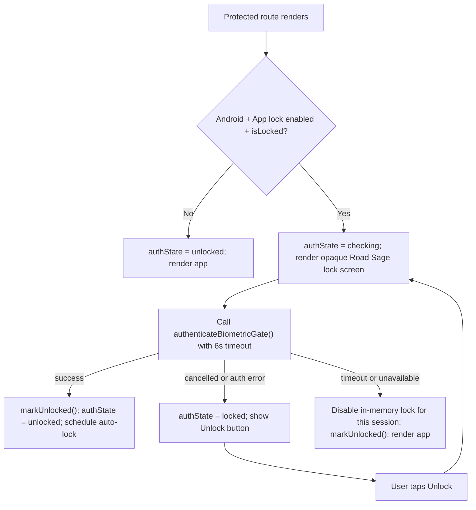

# Complete Fingerprint and App Lock System

Last reviewed: 2026-06-05

This document explains Road Sage's fingerprint/app-lock system from the moment the user turns it on in Settings through runtime locking, Android credential prompts, background screens, persistence, tests, and future implementation notes.

Important naming detail: the app setting is shown as **App lock (optional)**. The implementation does not store or verify fingerprints itself. It asks Android to confirm the device credential, which can be fingerprint, face, PIN, pattern, or password depending on what the user configured at the OS level.

## Purpose

Road Sage stores and displays trip history, route points, driving events, scoring, reports, vehicles, and privacy settings. App lock is an optional privacy layer that requires the device owner to confirm identity before protected app routes are shown after the session becomes locked.

The system has three jobs:

```text
1. Let the user enable App lock only when Android has a secure device credential.
2. Keep the setting persisted with the rest of Road Sage settings.
3. Hide sensitive app screens behind an opaque Road Sage lock screen while Android asks for fingerprint/PIN/pattern/password.
```

## Key Files

```text
src/settings/sections/PrivacySettings.jsx
  Settings UI for App lock and Auto-lock after.

src/lib/biometricLock.js
  In-memory app-lock state, timeout math, lock/unlock helpers, and change event.

src/lib/nativeBiometricGate.js
  JavaScript Capacitor wrapper for the native Android BiometricGate plugin.

android/app/src/main/java/com/roadsage/app/BiometricGatePlugin.java
  Android native credential availability check and device credential prompt.

src/App.jsx
  Launch hydration, background/visibility lock handling, protected route wrapper, lock overlay UI.

src/lib/trackingStore.js
  DEFAULT_SETTINGS, validation ranges, settings migration, durable save path.

android/app/src/main/java/com/roadsage/app/MainActivity.java
  Registers BiometricGatePlugin and applies FLAG_SECURE.

android/app/build.gradle
  Includes androidx.biometric dependency used by availability checks.

src/lib/__tests__/biometricLock.test.js
src/lib/__tests__/trackingStoreDefaults.test.js
  Unit coverage for timeout behavior, defaults, validation, and import sanitizing.
```

## Settings User Flow

The user turns this on from:

```text
Settings
  -> Privacy & Data
  -> App lock (optional)
```

Current UI copy:

```text
App lock (optional)
Requires device credential after inactivity. Off by default.

Auto-lock after
Require biometric re-authentication after this unlocked session timeout. Backgrounding still locks immediately.
```

Current timeout options:

```text
1 minute
5 minutes (default)
15 minutes
30 minutes
Never
```

Enabling sequence:

```text
User toggles App lock on
  -> PrivacySettings.updateBiometricLockEnabled(true)
  -> if Android:
       isBiometricGateAvailable()
       if unavailable: show destructive toast and do not save enabled=true
       authenticateBiometricGate()
       if cancelled: leave setting unchanged
       if success: continue
  -> updateCfg({ biometric_lock_enabled: true })
  -> setBiometricLockEnabled(true)
  -> markUnlocked() when the app was not already locked
  -> notifyBiometricLockSettingsChanged()
```

If the Android device has no secure credential configured, the user gets:

```text
Title: App lock unavailable
Description: Set up a device PIN, password, pattern, or fingerprint before turning on App lock.
```

If enabling fails for another reason, the user gets:

```text
Title: Could not enable App lock
Description: Confirm your device credential and try again.
```

## Stored Settings

The app-lock values live in the normal settings snapshot:

```js
// src/lib/trackingStore.js
export const DEFAULT_SETTINGS = {
  biometric_lock_enabled: BIOMETRIC_LOCK_DEFAULT_ENABLED,
  // PRIVACY: require biometric re-authentication after this many unlocked minutes.
  // 0 = never time out while the app remains visible; backgrounding still locks.
  lock_timeout_minutes: BIOMETRIC_LOCK_TIMEOUT_DEFAULT_MINUTES,
};
```

Constants:

```js
// src/lib/appConstants.js
export const BIOMETRIC_LOCK_TIMEOUT_DEFAULT_MINUTES = 5;
export const BIOMETRIC_LOCK_TIMEOUT_MIN_MINUTES = 0;
export const BIOMETRIC_LOCK_TIMEOUT_MAX_MINUTES = 30;
export const BIOMETRIC_LOCK_DEFAULT_ENABLED = false;
export const BIOMETRIC_AUTH_TIMEOUT_MS = 6000;
```

Validation range:

```js
// src/lib/trackingStore.js
const IMPORT_NUMBER_RANGES = {
  lock_timeout_minutes: [
    BIOMETRIC_LOCK_TIMEOUT_MIN_MINUTES,
    BIOMETRIC_LOCK_TIMEOUT_MAX_MINUTES,
  ],
};
```

Meaning:

```text
biometric_lock_enabled=false
  App routes are not protected by the biometric route guard.

biometric_lock_enabled=true
  Android protected routes require a successful native device credential prompt
  whenever biometricLock.isLocked(settings) returns true.

lock_timeout_minutes=0
  Never auto-lock from inactivity while an unlocked session remains active.

lock_timeout_minutes=1..30
  Auto-lock after that many minutes without recorded pointer/key/touch/wheel activity.
```

Settings are persisted through the app's durable settings path:

```text
Settings UI
  -> updateCfg(patch)
  -> validateSettingsPatch(patch)
  -> optimistic React cfg state
  -> localSettings.setAsync(...)
  -> encrypted Capacitor/browser mirrors
  -> DriveSenseActivityRecognition.saveSettings(...)
  -> NativeSettingsStore.saveSettingsJson(...)
  -> EncryptedSharedPreferences.commit()
```

## Native Android Credential Gate

The JavaScript wrapper registers the custom Capacitor plugin:

```js
// src/lib/nativeBiometricGate.js
import { registerPlugin } from '@capacitor/core';

const BiometricGate = registerPlugin('BiometricGate');

export async function isBiometricGateAvailable() {
  try {
    const result = await BiometricGate.isAvailable();
    return result?.available === true;
  } catch {
    return false;
  }
}

export async function authenticateBiometricGate() {
  const result = await BiometricGate.authenticate();
  if (result?.status === 'unavailable') throw new Error('unavailable');
  if (result?.status === 'cancelled') throw new Error('cancelled');
  if (result?.status !== 'success') {
    throw new Error(result?.message || 'auth_failed');
  }
}
```

The native plugin accepts biometric weak authenticators plus device credentials for availability checks on Android 11+:

```java
// android/app/src/main/java/com/roadsage/app/BiometricGatePlugin.java
private static final int APP_LOCK_AUTHENTICATORS =
    BiometricManager.Authenticators.BIOMETRIC_WEAK |
    BiometricManager.Authenticators.DEVICE_CREDENTIAL;
```

Availability requires Android's keyguard to be secure:

```java
private boolean isDeviceSecure() {
    KeyguardManager keyguardManager = keyguardManager();
    if (keyguardManager == null) return false;
    if (Build.VERSION.SDK_INT >= Build.VERSION_CODES.M) {
        return keyguardManager.isDeviceSecure();
    }
    return keyguardManager.isKeyguardSecure();
}
```

Authentication uses the Android system device credential screen:

```java
private void authenticateWithDeviceCredentialIntent(Activity activity, PluginCall call) {
    KeyguardManager keyguardManager = keyguardManager();
    if (Build.VERSION.SDK_INT < Build.VERSION_CODES.LOLLIPOP || keyguardManager == null) {
        resolveStatus(call, "unavailable", null);
        return;
    }

    String title = call.getString("title", "Unlock Road Sage");
    String description = call.getString("description", "Confirm your identity to access trip data.");
    Intent intent = keyguardManager.createConfirmDeviceCredentialIntent(title, description);
    if (intent == null) {
        resolveStatus(call, "unavailable", null);
        return;
    }
    call.setKeepAlive(true);
    startActivityForResult(call, intent, "credentialResult");
}
```

The result is normalized for JavaScript:

```java
@ActivityCallback
private void credentialResult(PluginCall call, ActivityResult result) {
    resolveStatus(
        call,
        result.getResultCode() == Activity.RESULT_OK ? "success" : "cancelled",
        null
    );
}
```

## MainActivity Registration and Screen Security

`BiometricGatePlugin` must stay in the native plugin allowlist:

```java
// android/app/src/main/java/com/roadsage/app/MainActivity.java
private static final List<Class<? extends Plugin>> ROAD_SAGE_PLUGIN_ALLOWLIST = Arrays.asList(
    DriveSenseActivityRecognitionPlugin.class,
    ClipboardPlugin.class,
    SecureKeyPlugin.class,
    EncryptedCapacitorPlugin.class,
    BiometricGatePlugin.class,
    PlayIntegrityPlugin.class
);
```

`MainActivity` also blocks ordinary screenshots and Android recent-app previews:

```java
getWindow().setFlags(
    WindowManager.LayoutParams.FLAG_SECURE,
    WindowManager.LayoutParams.FLAG_SECURE
);
```

This is separate from App lock. `FLAG_SECURE` protects visual capture, while App lock protects route access after session lock.

The manifest currently does not declare `USE_BIOMETRIC` or `USE_FINGERPRINT`. That is consistent with the current implementation because the app launches Android's system device-credential confirmation UI through `KeyguardManager.createConfirmDeviceCredentialIntent(...)` and uses `BiometricManager` only for availability checks.

## Runtime Session State

The lock state is in memory, not in a custom credential database:

```js
// src/lib/biometricLock.js
let biometricEnabled = BIOMETRIC_LOCK_DEFAULT_ENABLED;
let lastActivityAt = null;
export const BIOMETRIC_LOCK_STATE_CHANGE_EVENT = 'road_sage_biometric_lock_state_change';
```

Core helpers:

```js
export function setBiometricLockEnabled(enabled) {
  biometricEnabled = enabled === true;
  if (!biometricEnabled) lastActivityAt = null;
}

export function markUnlocked(now = Date.now()) {
  return markUserActivity(now);
}

export function markUserActivity(now = Date.now()) {
  lastActivityAt = Number.isFinite(Number(now)) ? Number(now) : Date.now();
  return lastActivityAt;
}

export function lock() {
  lastActivityAt = null;
}
```

Lock decision:

```js
export function isLocked(settings = {}, now = Date.now()) {
  if (!isBiometricLockEnabled()) return false;
  if (!lastActivityAt) return true;

  const timeoutMs = getLockTimeoutMs(settings);
  if (!Number.isFinite(timeoutMs)) return false;

  return Number(now) - lastActivityAt > timeoutMs;
}
```

Timeout calculation:

```js
export function getLockTimeoutMs(settings = {}) {
  if (!isBiometricLockEnabled()) return Number.POSITIVE_INFINITY;

  const rawMinutes = settings.lock_timeout_minutes;
  const minutes = rawMinutes == null || (typeof rawMinutes === 'string' && rawMinutes.trim() === '')
    ? NaN
    : Number(rawMinutes);
  if (!Number.isFinite(minutes) || minutes < 0) {
    return BIOMETRIC_LOCK_TIMEOUT_DEFAULT_MINUTES * 60 * 1000;
  }
  if (minutes === 0) return Number.POSITIVE_INFINITY;
  return minutes * 60 * 1000;
}
```

## App Launch Flow

On startup, `AuthenticatedApp` loads settings and mirrors the persisted app-lock value into the in-memory lock module:

```js
const launchSettings = localSettings.get();
setBiometricLockEnabled(launchSettings?.biometric_lock_enabled === true);
```

Android native settings hydration can update it again:

```js
setBiometricLockEnabled(settings?.biometric_lock_enabled === true);
```

Normal routes are wrapped by the biometric guard after onboarding:

```jsx
<Route element={<BiometricRouteGuard><Layout /></BiometricRouteGuard>}>
  <Route path="/" element={<LazyRoute><Dashboard /></LazyRoute>} />
  <Route path="/trips" element={<LazyRoute><TripHistory /></LazyRoute>} />
  <Route path="/map" element={<LazyRoute><MapScreen /></LazyRoute>} />
  <Route path="/settings" element={<LazyRoute><Settings /></LazyRoute>} />
</Route>
```

The guard protects:

```text
/
/trips
/survey/:tripId
/trips/:id
/map
/coach
/insights
/achievements
/reports
/settings
/android in development
/vehicles
```

The guard does not protect onboarding, auth-loading/error handling, or the unknown-route `PageNotFound` route outside the protected wrapper.

## Locked UI and Background Screens

This is the part most likely to be missed.

There are two different moments when Android's fingerprint/PIN UI can appear:

```text
1. Enabling App lock from Settings.
2. Unlocking an already locked app route.
```

### While enabling App lock in Settings

The user is already inside:

```text
Settings -> Privacy & Data
```

When the user turns the toggle on, the Android credential prompt appears above the current Settings screen. The page behind the Android prompt is the Privacy & Data settings section because that is the screen the user acted from.

After success:

```text
Settings stays open
App lock toggle becomes on
Auto-lock after select is enabled
markUnlocked() records the current session activity
```

After cancel:

```text
Settings stays open
App lock remains unchanged
No locked-route overlay is shown just because the enable prompt was cancelled
```

### While unlocking a protected route

When `BiometricRouteGuard` decides the app is locked, Road Sage renders its own full-screen overlay:

```jsx
return (
  <div className="fixed inset-0 z-[9999] flex items-center justify-center bg-background px-4">
    <div className="max-w-sm rounded-2xl border border-border bg-card p-5 text-center shadow">
      <div className="mb-2 font-semibold">
        {authState === 'locked' ? 'Road Sage is locked' : 'Unlocking Road Sage...'}
      </div>
      <div className="text-sm text-muted-foreground">
        {authState === 'locked'
          ? 'Confirm your device credential to continue.'
          : 'Confirm your device credential to access trip data.'}
      </div>
      {authState === 'locked' && (
        <button type="button" onClick={...}>
          Unlock
        </button>
      )}
    </div>
  </div>
);
```

Because the overlay uses:

```text
fixed inset-0 z-[9999] bg-background
```

the protected route content is covered by an opaque Road Sage background before and while Android asks for the fingerprint/PIN/pattern/password. The user should not see Dashboard, Trip Detail, Map, Trip History, Reports, or Settings content behind the unlock prompt.

Visible lock states:

```text
authState='checking'
  Road Sage screen: "Unlocking Road Sage..."
  Body: "Confirm your device credential to access trip data."
  Android screen: system credential prompt is launched.

authState='locked'
  Road Sage screen: "Road Sage is locked"
  Body: "Confirm your device credential to continue."
  Button: "Unlock"
  Android screen: not visible until the user taps Unlock again.

authState='unlocked'
  Road Sage screen: protected route children render normally.
```

The lock overlay is not a transparent blur over the previous page. It is an opaque app screen.

## Unlock State Machine



Unlock code:

```js
const attemptUnlock = async () => {
  const timeout = new Promise((_, reject) => {
    window.setTimeout(() => reject(new Error('auth_timeout')), BIOMETRIC_AUTH_TIMEOUT_MS);
  });

  try {
    await Promise.race([authenticateBiometricGate(), timeout]);
    if (cancelled) return;
    markUnlocked();
    setAuthState('unlocked');
    scheduleAutoLockTimer();
  } catch (err) {
    if (cancelled) return;
    if (err?.message === 'auth_timeout' || err?.message === 'unavailable') {
      clearAutoLockTimer();
      setBiometricLockEnabled(false);
      markUnlocked();
      setAuthState('unlocked');
      console.warn('[biometricLock] auth unavailable, lock skipped for this session:', err.message);
      return;
    }
    if (err?.message === 'cancelled') {
      setAuthState('locked');
      return;
    }
    logError('biometric_gate_authenticate', err);
    setAuthState('locked');
  }
};
```

Security note: an authentication timeout returns to the opaque locked overlay and requires an explicit retry. A cancelled prompt also remains locked. Only an `unavailable` result disables the in-memory lock for the current session and unlocks the app; it does not persist `biometric_lock_enabled=false`, so the saved setting can be checked again on a later launch.

## Auto-Lock and Activity

When unlocked, these events refresh the last activity time:

```text
pointerdown
keydown
touchstart
wheel
```

Code:

```js
const recordActivity = () => {
  if (authStateRef.current !== 'unlocked' || !isBiometricLockEnabled()) return;
  markUserActivity();
  scheduleAutoLockTimer();
};
```

The auto-lock timer uses `msUntilAutoLock(localSettings.get())`. When the timer fires and the app is visible, the guard checks `isLocked(...)` again and relaunches the credential prompt if needed.

## Visibility and Background Behavior

The app listens to web visibility and Capacitor app state:

```js
const lockWhenEnabled = () => lockWhenBiometricEnabled();

const lockOnHidden = () => {
  if (document.visibilityState === 'hidden') lockWhenEnabled();
};

document.addEventListener('visibilitychange', lockOnHidden);

CapacitorApp.addListener('appStateChange', ({ isActive }) => {
  if (!isActive) lockWhenEnabled();
});
```

Current implementation note:

```text
When App lock is enabled, hiding or backgrounding the app locks immediately.
Returning to the app triggers the route guard and device-credential prompt.
The inactivity timer remains a separate lock path while the app stays visible.
```

## Non-Android Behavior

The route guard intentionally does not enforce App lock outside Android:

```js
if (!isAndroid()) {
  clearAutoLockTimer();
  setBiometricLockEnabled(false);
  setAuthState('unlocked');
  return;
}
```

Reason: the native bridge is Android-specific. Browser/desktop does not have the Road Sage `BiometricGate` plugin.

## Failure Cases

```text
Device has no PIN/pattern/password/fingerprint
  isAvailable returns false.
  Turning on App lock is blocked with an "App lock unavailable" toast.

User cancels while enabling
  Saved setting remains unchanged.
  No error toast for cancelled.

User cancels while unlocking a route
  Road Sage shows the opaque locked overlay with an Unlock button.

Native plugin missing
  JavaScript availability returns false for Settings.
  Route unlock may receive unavailable and disable in-memory lock for the session.

Authentication hangs longer than 6 seconds
  Route guard treats it as auth_timeout, disables in-memory lock for this session, and unlocks.

Imported backup has biometric_lock_enabled=true
  Settings sanitizer permits the boolean, but actual runtime still depends on Android credential availability.

lock_timeout_minutes malformed at runtime
  getLockTimeoutMs falls back to 5 minutes for invalid, negative, null, or empty values.
  validateSettingsPatch rejects invalid values for normal settings saves.
```

## Privacy and Security Boundaries

What App lock does protect:

```text
Sensitive app routes after the route guard reports locked.
Trip data and map pages from being visible behind the Road Sage lock overlay.
Access after successful Android device-credential verification.
```

What App lock does not do:

```text
It does not encrypt trip data by itself.
It does not store fingerprint templates.
It does not replace Android device security.
It does not protect app routes before onboarding completes.
It does not protect unknown routes outside the guarded Layout wrapper.
It does not prevent notifications or widgets from existing; those have their own privacy controls.
```

Other security layers involved:

```text
Encrypted SharedPreferences and Android Keystore protect native settings persistence.
Encrypted Capacitor storage protects app mirrors.
FLAG_SECURE blocks screenshots and task-switcher previews.
Notification code uses privacy-oriented text for lock-screen notification visibility.
Backup import/export has separate encryption and sanitizing.
Local-only mode controls external network sharing; it is separate from App lock.
```

## Tests That Currently Cover the System

`src/lib/__tests__/biometricLock.test.js` covers:

```text
App lock disabled by default.
Explicit true is required to enable in-memory lock.
Timeout conversion for default, 1 minute, never, invalid, empty, and null.
Lock only occurs when enabled and timeout elapsed.
User activity resets timeout.
Disabled lock never locks.
Calling lock() clears the unlock time and makes enabled sessions locked.
```

Representative test:

```js
it('only locks when biometrics are enabled and the timeout has elapsed', () => {
  markUnlocked(1_000);
  expect(isLocked({ lock_timeout_minutes: 1 }, 10 * 60 * 1000)).toBe(false);

  setBiometricLockEnabled(true);
  expect(isBiometricLockEnabled()).toBe(true);
  expect(isLocked({ lock_timeout_minutes: 1 }, 1_000 + 60 * 1000)).toBe(false);
  expect(isLocked({ lock_timeout_minutes: 1 }, 1_000 + 60 * 1000 + 1)).toBe(true);
});
```

`src/lib/__tests__/trackingStoreDefaults.test.js` covers:

```text
DEFAULT_SETTINGS.biometric_lock_enabled is false.
DEFAULT_SETTINGS.lock_timeout_minutes is 5.
Imported lock timeout above 30 clamps to 30.
validateSettingsPatch accepts 0 and rejects 31, empty string, and null.
```

## Manual QA Checklist

Use a real Android device or emulator with lock screen support:

```text
[ ] Device has no secure credential: App lock toggle shows unavailable toast and remains off.
[ ] Device has fingerprint/PIN configured: turning App lock on opens Android credential prompt.
[ ] Successful enable saves biometric_lock_enabled=true.
[ ] Force-stop and relaunch keeps the toggle on.
[ ] Auto-lock timeout select saves 1, 5, 15, 30, and 0.
[ ] With timeout 1 minute, wait past timeout, interact with protected route, and confirm credential prompt appears.
[ ] While credential prompt is visible, protected route content is hidden by Road Sage lock overlay.
[ ] Cancel credential prompt and confirm "Road Sage is locked" plus Unlock button appears.
[ ] Tap Unlock and complete fingerprint/PIN; protected route renders.
[ ] Remove device secure credential in Android settings and relaunch; app lock reports unavailable or skips safely.
[ ] Confirm Android recent apps do not show readable Road Sage content because FLAG_SECURE is active.
```

## Recommended Missing Coverage

Add or verify tests for:

```text
BiometricRouteGuard renders opaque lock overlay before protected children.
BiometricRouteGuard shows Unlock button after native cancellation.
BiometricRouteGuard calls markUnlocked on success.
auth_timeout/unavailable behavior disables only in-memory lock for the session.
Settings App lock toggle does not save true if isBiometricGateAvailable returns false.
Settings App lock toggle saves true only after authenticateBiometricGate succeeds.
Visibility/background behavior matches the intended product copy.
Native Android instrumented test confirms BiometricGatePlugin.isAvailable result on secured vs unsecured device/emulator.
```

## Change Rules

When modifying this system:

```text
Do not add app-owned fingerprint storage.
Do not bypass Android device credential APIs.
Keep BiometricGatePlugin registered in MainActivity.
Keep protected route content covered by an opaque screen while locked.
Keep App lock off by default.
Keep timeout validation within 0..30 minutes unless product explicitly changes it.
Keep cancelled auth different from unavailable auth.
Update this document, README, COMPLETE_SETTINGS_SYSTEM.md, SETTINGS_SYSTEM_ANDROID_SECURITY.md, and tests if behavior changes.
```

## Quick Reviewer Prompt

Use this prompt when asking another AI or reviewer to inspect the fingerprint/app-lock system:

```text
Review Road Sage's Android fingerprint/app-lock behavior. Verify Settings -> Privacy & Data -> App lock only saves enabled=true after Android device credential availability and successful authentication. Verify src/lib/biometricLock.js timeout math, src/App.jsx BiometricRouteGuard state transitions, opaque locked UI, cancellation handling, 6s timeout fallback, background/visibility behavior, native BiometricGatePlugin availability/authenticate methods, MainActivity plugin registration, FLAG_SECURE, settings persistence through localSettings.setAsync, and tests for biometric_lock_enabled and lock_timeout_minutes. Return findings first with file paths and line references.
```
