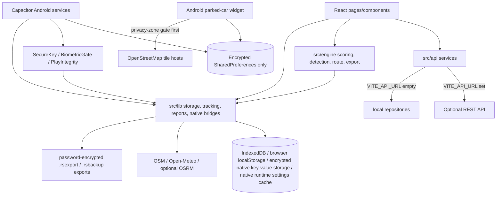

# Road Sage Technical Reference

Updated: 2026-06-04T06:55:13.584Z

This document is generated from the current repository. It is intentionally high-signal: architecture, security, storage, routes, major calculations, test coverage, and deployment notes are kept; exhaustive import/export, function, literal, and handler dumps are omitted.

## Table Of Contents

- [Coverage And Reading Guide](#coverage-and-reading-guide)
- [System Overview](#system-overview)
- [Architecture And Module Map](#architecture-and-module-map)
- [Calculation Deep Dives With Actual Code](#calculation-deep-dives-with-actual-code)
- [Calculation Surface Summary](#calculation-surface-summary)
- [Important Constants And Policies](#important-constants-and-policies)
- [Data Models State And Storage](#data-models-state-and-storage)
- [Routes And API Reference](#routes-and-api-reference)
- [Configuration And Environment](#configuration-and-environment)
- [Operational Diagnostics](#operational-diagnostics)
- [Security Analysis](#security-analysis)
- [Performance Characteristics](#performance-characteristics)
- [Testing Coverage Summary](#testing-coverage-summary)
- [Dependency Summary](#dependency-summary)
- [Deployment And Infra](#deployment-and-infra)

---
## Coverage And Reading Guide

- Text/code files scanned: 529
- App/source files scanned: 473
- Machine-local files excluded from scanning: `android/local.properties`, `roadsage-window.xml`
- Production calculation lines scanned for summary: 2418
- Test calculation/assertion lines scanned separately: 385
- Hard-coded production literals scanned for policy constants: 24072
- Functions/methods scanned for targeted snippets: 2722

> WARNING - ASSUMPTION: There is no server code in this repository. REST endpoints documented here are the optional backend contract called by the client when `VITE_API_URL` is configured; otherwise the app uses local repositories.

> NOTE: Scoring thresholds and domain-significant constants live in named registries such as `DEFAULT_THRESHOLDS`, `ECO_DEFAULTS`, `SVI_DEFAULTS`, `src/lib/appConstants.js`, `ROUTE_RISK_CONSTANTS`, `PRE_TRIP_RISK_SIGNAL_GATES`, `HABIT_CONSTANTS`, and `DAILY_FATIGUE_THRESHOLDS`. The generated constants table keeps only policy/security/storage/tracking values that reviewers are likely to need.

---
## System Overview

| Item | Value |
| --- | --- |
| Application | Road Sage (`drivesense-app`) |
| Version | 1.0.0 |
| Purpose | Local-first driving tracker for trip recording, scoring, playback, reports, evidence-aware context estimates, coaching, backup/import, and Android background auto tracking. |
| Architecture | React/Vite single-page app plus Capacitor Android shell, native background services, and a parked-car widget. Domain logic is split between focused `src/engine/*` modules and `src/lib/*` services, with `src/lib/tripEngine.js` retained as a compatibility export layer. API adapters live in `src/api/*`; routed UI and feature surfaces live in `src/pages/*`, `src/components/*`, `src/settings/*`, and `src/features/*`. |
| Primary storage | IndexedDB/localStorage for browser UI state, encrypted Android key-value storage for native UI values, cached-first plus deferred native settings hydration on Android, Android Keystore-backed encrypted trip fields for sensitive route/event/note payloads on native Android, in-memory session-key encrypted trip fields on web/test surfaces, encrypted Android SharedPreferences for native tracking, native settings, native notification state, privacy zones, and parked-location data, coarse route-risk geohash cells, native motion samples, native download/import files, and Android widget map cache files. Android production paths migrate legacy plaintext Capacitor Preferences into encrypted storage where applicable, no longer mirror native settings JSON into WebView localStorage, no longer read legacy plaintext `SharedPreferences`/Capacitor Preferences for native settings, privacy zones, tracking, notifications, or parked locations, and warm encrypted preference keys shortly after launch; legacy native plaintext preference files are delete-only cleanup targets. Completed-trip retention defaults to 24 months and can be changed in Privacy & Data settings. Backup import preserves restored trips outside an imported retention window by setting retention to Never for that import. Stealth Trip Mode bypasses trip, active-trip, map-center, parked-location, and diagnostic persistence while the ephemeral trip is active. |
| Privacy session and ephemeral trips | Privacy & Data settings expose a configurable biometric auto-lock timeout and Stealth Trip Mode. Stealth mode arms the next manual trip, pauses Android background auto tracking first, scores the trip in memory only, wipes route points/events when the trip ends or the app backgrounds, and leaves only a dismissible session-local score summary. |
| Optional backend | `VITE_API_URL`; absent by default. When configured it must normalize through `src/lib/externalEndpointTrust.js` as a trusted HTTPS public-domain URL, and `VITE_TRUSTED_BACKEND_ORIGINS` can restrict managed deployments to a comma/space-separated origin allowlist. Invalid backend URLs fail clearly instead of falling back to localhost. |
| Local trip database name | `VITE_DB_NAME`; defaults to `road_sage_mobile` and triggers an IndexedDB copy/delete rename migration when changed. |
| Shared numeric clamp | `src/lib/mathUtils.js` exports the canonical `clamp(value, min, max)` helper. Invalid numeric input returns `min`, preventing NaN from leaking through score, risk, report, and playback calculations. |
| Weighted evidence scoring | `weightedBlend` is the canonical composite helper: null or blank component scores are omitted from the denominator instead of being converted to perfect 100s. Safety, Smoothness, Eco, Overall, Defensive, weather-adjusted Overall, merge summaries, peak stress, and compliance paths use unavailable evidence as neutral rather than a bonus. |
| Voice alert TTS contract | `src/lib/voiceAlerts.js` is an on-device-only audio output helper: no speed data, GPS coordinates, route payloads, or network calls are passed through it. It normalizes corrupted stored `voice_alerts_enabled` values so literal `"undefined"`, `"null"`, blank, null, or undefined settings fall back to the enabled default, while explicit false/off values disable speech. Browser speech cancels queued utterances before each alert and waits up to 1.5 seconds for Chrome/Android WebView voices to load before using the default voice. Native Android speech routes through `NativeSpeech.speak` when present or the current `speakText` bridge otherwise, with rate/volume/language payloads kept local. |
| Scoring module split | `src/engine/scoring/*`, `src/engine/detection/*`, `src/engine/route/*`, `src/engine/export/*`, and `src/engine/calibration/*` now hold the calculation-heavy implementation. Compatibility wrappers under `src/lib/scoring`, `src/lib/detection`, and `src/lib/gps` keep existing imports working while pages migrate to focused modules. |
| Metric and confidence contract | `src/lib/metricRegistry.js` defines display names, human-readable data-source labels, evidence minimums, permission requirements, and calibration notes for component/report metrics. `component_scores` envelopes carry value, internal evidence (`high`, `developing`, `low`, or `unavailable`), data sources, and sample counts; public score surfaces render `developing` as "limited evidence", suppress `high` evidence badges, and suppress unavailable values rather than rendering zero. CSV exports add a metric-metadata row and monthly/UBI PDFs add metric-reference pages. |
| Score display and insurance limitation | `src/lib/scoreDisplay.js` centralizes estimated-score formatting. Approximate score surfaces use a leading `~`, monthly PDFs include "Scores are estimates - not validated against real-world crash data", and UBI score-card UI/PDF output is visibly labelled `NOT AN INSURANCE RATING` so internal coaching estimates are not presented as underwriting, pricing, or eligibility decisions. |
| Scoring calibration, provenance, and explanation | `src/lib/scoringConstants.js` owns provisional scoring/risk/UBI constants and their affected metrics. Stored score output is versioned with a generated content-hash `SCORING_VERSION`, and each newly scored trip stores `component_scores`, `score_provenance`, and `score_explanation` so UI surfaces can show why a score moved. `src/lib/scoring/pipeline.js` and `src/lib/scoring/explainer.js` formalize named scoring stages and top contributing factors. Settings lists provenance/input mismatches for explicit re-score actions and marks provisional output as approximate. `PENALTY_SCALE_FACTOR_CALIBRATION_PROCESS` documents the labeled-dataset requirements, fitting command, validation outputs, and promotion checklist before penalty-rate scaling can be treated as calibrated. |
| Post-trip calibration labels | Trip Detail offers a dismissible optional survey after scored trips, including optional 1-5 drive ratings, score-accuracy feedback, driver/passenger confirmation, difficulty/context tags, and readiness-accuracy feedback when a pre-trip readiness context was captured. Feedback remains local unless the user enables calibration sharing in Settings, and upload payloads are summary-only records for `/trip_calibration_labels`: a 30-day rotating anonymous install hash, scoring model version, trip feature summary, score output, survey label, data-quality flags, and a trip-start timestamp protected with Laplace noise calibrated to epsilon=1.0 / 1-hour sensitivity before hour rounding. Raw GPS points, addresses, route polylines, personal identifiers, and free-text notes are excluded. `npm run calibration:fit` refuses calibrated constants until at least 2,000 eligible labeled trips are available. |
| Reviewed event feedback | Trip Detail event rows let drivers mark individual detected events as accurate or wrong. Wrong-event feedback is persisted through `tripService.markEventFeedback` and `localTripRepository.markEventFeedback`, stores the event type/timestamp/value plus the nearest route coordinate when available, immediately rescoring local completed trips so the event is removed from scoring and `feedback_adjusted_events_count` is updated. Removed events stay visible in a Reviewed Events section with a Removed badge and appear on TripMap as struck-through red markers/popup rows so users can audit what changed instead of losing the history. Ephemeral Stealth Trip Mode returns an in-memory feedback result and does not persist the review. |
| Penalty-rate normalization policy | `PENALTY_SCALE_FACTOR` is the named provisional base-score conversion constant. Its current value of 40 makes 2.5 severity-weighted penalty points per km reach a 100-point deduction and the zero-score floor. Recalibrate this value against a labeled driving dataset before treating it as empirically validated policy. |
| Fatigue-to-Safety deduction policy | `FATIGUE_SAFETY_PENALTY_SCALE = 0.15` is a cited conversion from the normalized 0-100 fatigue proxy into raw Safety penalty points, capped by `FATIGUE_SAFETY_MAX_PENALTY = 15` after event-rate normalization. Maximum reported fatigue therefore maps conservatively to the 0.05% BAC-equivalent impairment level reported by Williamson & Feyer (Occupational and Environmental Medicine, 2000); this coefficient is not calibrated against collision outcome data. |
| Permission state model | `src/lib/permissionStateMachine.js` defines canonical permission states (`unknown`, `requesting`, `granted`, `denied`, `needs_settings`, `not_requested`, and `unavailable`) and guards transitions. `src/lib/permissions/PermissionContext.jsx` wraps the app with a shared permission snapshot, refreshes it on load/focus/visibility, and lets consumers update one permission optimistically while native checks settle. `getPermissionStatus()` uses a short 10-second cache for bridge calls, invalidated by permission requests and app foreground returns, and cold-launch stored `false` / `unknown` values remain setup-required instead of being promoted to granted. |
| OBD-II optional evidence | `src/lib/obdBluetooth.js` parses BLE OBD-II PID responses for speed, RPM, throttle, engine load, coolant temperature, and mass-air-flow. Route points annotated with OBD data can supply vehicle-speed sources when GPS accuracy is weak, refine eco/engine-stress signals, and appear in component provenance as `obd_bluetooth`; GPS remains the fallback. Android exposes `BLUETOOTH_CONNECT` through the first-party `DriveSenseActivityRecognition` bridge, `getPermissionStatus()` reports it as the Bluetooth/Nearby Devices state, and Settings requests it before opening the OBD pairing flow. Web Bluetooth must still be available for BLE pairing; Classic Bluetooth OBD-II still requires a separate native transport outside this helper. |
| Sensor fusion and possible incident signals | `src/lib/sensorFusionModel.js` normalizes browser and Android native IMU samples, summarizes peak linear/rotation motion, calibrates phone orientation from harsh-brake events, enriches event evidence, and can raise `possible_crash` incident signals only when impact-like motion is followed by stopped/still evidence. Diagnostics shows motion permission, sample quality, and crash-readiness state; these signals are emergency workflow cues, not crash diagnoses. |
| Lane-changing score | `detectLaneChanges` combines highway-speed GPS heading patterns with calibrated IMU yaw when available, otherwise using a lower-confidence GPS-only fallback. `lane_changing_score` requires at least 5 km and two detected lane-change manoeuvres, penalizes unsafe simultaneous-braking changes, contributes a provisional 5% Safety blend weight when enabled, and clearly states that it cannot detect turn signals, following gaps, slow-traffic changes, or curved-road context reliably. |
| Jerk score reliability | `calculateJerkScore` returns `null` with `jerk_score_confidence: insufficient_data` below 0.5 km or without usable movement samples. Trips from 0.5 km to under 3 km store the real 0-100 jerk score with low confidence, and low-confidence jerk evidence is suppressed from Smoothness blending. |
| Intersection stop reliability | `analyzeIntersectionBehavior` counts traffic-stop windows from at least two valid sub-10 km/h samples spanning 4 seconds, with at most 10 seconds between samples; privacy-masked samples break a window. Routes under 0.5 km or with no observed traffic stops report a null intersection score; observed stops score across the full 0-100 range, with late approaches penalized more heavily than rolling stops. |
| Stop-start pattern proxy | `detectStopStartPatterns` emits low-confidence `stop_start_pattern` events from GPS speed only. `stop_start_pattern_score` now blends contextual city-speed and highway estimates: urban mode can appear after 2 km of eligible city-speed evidence, highway mode after 5 km of highway evidence. Context-specific counts/scores are stored separately, defensive blending requires the matching urban/highway sample gate, and the app explicitly states it cannot measure lead-vehicle distance. |
| Brake onset smoothness | `calculateBrakeOnsetSmoothness` reports low-confidence `brake_onset_smoothness_*` fields only after five detected harsh-braking sequences and uses `100 - clamp(peakDecelerationMs2 / rampDurationSeconds, 0, 100)`. Public UI and CSV labels no longer claim human reaction time and Trip Detail displays the disclaimer. |
| Estimated brake-turn manoeuvre alert | New detections are low-confidence `close_proximity` events after at least 1.5 seconds of simultaneous braking and heading change at 30 km/h or above, with defaults of 4.0 m/s2 and 25 deg/s. They do not establish object proximity or a near miss and are advisory-only; they are excluded from Safety, weather score adjustment, historical-context risk weighting, repeated-event areas, and repeated-event route layers. |
| Heading drift Beta | `detectHeadingDriftBeta` evaluates sustained five-minute highway-speed GPS-heading drift windows, marks confidence low, and applies a 2.5x circadian multiplier between 02:00 and 05:00. Public UI describes a GPS-only attention pattern signal rather than a fatigue measurement, and heading drift no longer feeds the fatigue-to-Safety penalty. |
| Heading event Beta | `detectHeadingDeviationEvents` emits low-confidence `heading_deviation` events labelled Heading Event (Beta) as diagnostic evidence even when Advanced Safety scoring is off. These legacy-compatible heading events are shown for review and no longer deduct from Safety scoring; current lane-changing scoring uses the separate `lane_changing_score` path. |
| Overtake pattern Beta | `detectAggressiveOvertakes` is diagnostic only. It requires a baseline of at least 1 km of straight driving above 80 km/h, a minimum 3.0 m/s2 acceleration threshold, and a bilateral out-and-back heading pattern within 15 seconds. `calculateTripScores` excludes `aggressive_overtake` from Safety, Aggression, coaching, route risk, achievements, and ordinary phone/safety event scoring. |
| Eco score reliability | `ECO_DEFAULTS` supplies cruise and parked-idle scoring fallbacks when migrated settings omit or corrupt the relevant thresholds. `calculateEcoDrivingScore` clamps idle ratios to 0-1, reports `eco_score_confidence: invalid_thresholds` with a null component when both effective multipliers are zero, and `calculateTripScores` then blends only remaining eco evidence. |
| Speed variability reliability | `SVI_DEFAULTS` excludes stopped samples at or below 5 km/h, requires at least ten moving samples, applies separate city and highway variability penalties, and blends mixed routes by observed segment distance. Insufficient SVI evidence is null and neutral in smoothness, reports, coaching summaries, and week-to-week comparisons. |
| Driver signature braking confidence | `buildDriverSignature` excludes trips without measured braking efficiency from its braking dimension, keeps `dimensions.brakingStyle` null until at least three scored trips exist, and exposes `braking_confidence` from 0 to 1 based on up to ten observed braking trips. Driving Coach shows unavailable braking evidence as an em dash rather than a perfect score. |
| Predictive maintenance brake evidence | `calculatePredictiveMaintenance` excludes trips without finite braking efficiency from brake-stress averaging. `brake_stress_index` remains null until there are at least five completed trips and three observed braking scores; unavailable braking evidence is neutral in the combined service-interval adjustment. |
| Tire wear missing-speed evidence | `calculateTireWearUnits` applies a neutral 1.0 speed factor when harsh-braking or sharp-turn speed evidence is unavailable, and stores `trip_tire_wear_has_missing_speed_data` plus the affected-event count. Predictive maintenance exposes `has_missing_speed_data`, vehicle health carries tire-wear-specific evidence metadata, and Vehicles labels the resulting tire-life estimate when it includes missing-speed events. |
| Historical context estimate evidence gate | `estimatePredictiveRouteRisk` sorts completed trips newest-first by `startTime`/`start_time` before applying the recent-trip window and returns `status: insufficient_history` with a null score when the window has no observed completed-trip distance or no scored-distance baseline. The dashboard displays Not enough driving history / Not enough scored driving history rather than constructing an estimate from a default score. |
| Personal baseline confidence | `computePersonalBaseline` withholds a dashboard baseline until 10 completed trips are available in the recent window, then uses exponential recency weighting and displays a confidence interval rather than an unstable simple mean. |
| Personal percentile and best-window gates | `computePersonalBaseline` labels percentile as "Percentile among your recorded weeks" and withholds it until at least four recorded weeks exist. `buildDrivingCoachInsights` requires at least three trips in a time-of-day bucket before selecting a best driving window and includes that sample count in coaching copy. |
| Context-aware score evidence | Braking-efficiency grades use urban or highway thresholds and display their driving context. Hill-driving uses named provisional GPS/altitude-derived assumptions (`HILL_ACCEL_THRESHOLD_MS2 = 2.5` and `HILL_INFRACTION_PENALTY_POINTS_PER_KM = 8`), returns `hill_route: false` with a null score when not applicable, and displays its measurement limitation in Trip Detail. Hill infractions are normalized per km of climb/descent distance instead of using an absolute route count; the rate should still be recalibrated against labelled hill-driving evidence. Null component evidence stays out of composite decisions and score confidence metadata supports low-data UI suppression. |
| Fatigue and playback time integrity | `calculateFatigueScore` stores a normalized 0-100 fatigue risk. Its contribution to Safety uses the cited named `FATIGUE_SAFETY_PENALTY_SCALE` and `FATIGUE_SAFETY_MAX_PENALTY`, not a crash-outcome calibrated impairment-risk model. Fatigue heatmaps use named 30-second segments and require 20 segments before display. Trip duration subtracts tracking gaps, including native Android stats, and map playback uses timestamp progress with index progress only as a missing-time fallback. |
| Phone-use scoring policy | Phone-use scoring requires Android Usage Access evidence. GPS micro-steering windows are collected only as diagnostics with a six-oscillation, 15-second threshold and GPS-accuracy gate; unavailable Usage Access produces `phone_use_score: null` / `usage_access_required`, Trip Card and Trip Detail show a permission banner/action, and proxy events are excluded from Safety, coaching, live warnings, route risk, and normal trip events. |
| Weather context availability | `fetchWeatherContext` returns source-attributed unavailable weather when weather is disabled, the route is empty, all weather candidates are private, the origin/midpoint/destination is inside the expanded weather privacy guard, or Open-Meteo has no matching hourly sample. `applyWeatherRiskToScores` distinguishes `open_meteo`, `gps_inference`, and `unavailable`; GPS stopping-distance context can label weather context for display but unavailable Open-Meteo risk remains neutral in scoring and historical-context weighting. |
| OSRM consent and health checks | OSRM route snapping is disabled until the user saves a trusted HTTPS public-domain endpoint, explicitly consents to sending sampled GPS coordinates, and the endpoint passes a 200 OPTIONS verification with an exposed OSRM-specific response header. The app stores the verified endpoint, origin, domain, and verification time; the current endpoint must match that trust record before snapping can run. The public demo endpoint, HTTP URLs, localhost, private-network addresses, IP literals, credentials, query strings, and origins outside `VITE_TRUSTED_OSRM_ORIGINS` are rejected. `VITE_DEFAULT_OSRM_URL` can prefill trusted deployments and `VITE_OSRM_TIMEOUT_MS` sets the build default timeout before the user overrides it. |
| Speed-limit fallback provenance | `src/lib/speedLimitSource.js` supports global, Canada, United States, United Kingdom, Germany, Australia, and France fallback road-type profiles when OpenStreetMap supplies no posted `maxspeed` tag. Settings labels inferred values approximate, `fallback_country` is preserved through route points, events, context patches, backups, CSV exports, and Trip Detail, and inferred speed-limit scoring adds an explanatory note while half-weighting speeding penalties. |
| Historical context normalization | `estimatePredictiveRouteRisk` normalizes and clamps scored personal baseline, verified driving-event density, repeated driving-event areas, available weather, and time inputs before applying fractional weights. `ROUTE_RISK_CONSTANTS.EVENT_DENSITY_MAX_EVENTS_PER_KM = 5` and `DANGER_ZONE_SATURATION_COUNT = 5` are named provisional saturation assumptions, not collision- or casualty-calibrated thresholds. Low-confidence proxy counts such as current `close_proximity_count` and legacy `near_miss_count` are excluded from context weighting. The dashboard labels this as an estimated historical-context signal, not route prediction, and exposes weighted signal contributions. Repeated-event route indexing persists coarse geohash cells instead of exact segment midpoints, uses prefix lookup for nearby matching, and excludes proxy events. |
| Route risk segment weighting | `buildRouteRiskIndex` applies named internal pattern weights through `ROUTE_RISK_CONSTANTS`: a general observed event adds `ROUTE_RISK_EVENT_WEIGHT = 20` points per traversal rate and a harsh-event classification adds `ROUTE_RISK_HARSH_WEIGHT = 40` additional points per traversal rate. These map and alert indicators are not calibrated to collision or casualty outcomes. |
| UBI minimum evidence and weighting | `computeUBIReport` returns null score, grade, tier, and category scores until 50 km is observed, uses actual distance for event rates, reduces GPS-heading-derived cornering weight to 5% while shifting weight toward braking, and uses configurable mileage assumptions that default to 10,000 km/year optimal mileage with an 8,000 km spread. Named night-driving and per-100-km event-rate deduction constants are explicitly internal approximations, not insurer-validated rates: `TIME_OF_DAY_NIGHT_MULTIPLIER = 150`, `BRAKING_PENALTY_PER_100KM = 8`, `ACCEL_PENALTY_PER_100KM = 8`, `CORNERING_PENALTY_PER_100KM = 6`, and `SPEED_PENALTY_PER_100KM = 10`. Report UI, tooltips, and UBI PDFs now repeat that the score card is not an insurance rating. |
| Commute and coaching policy | `COMMUTE_MATCH_RADIUS_M` documents the 225 m commute route-match radius shown in Settings. Weekly coaching is local/rules-based, returns unavailable when no valid scored distance exists, uses one focus metric, and requires a score delta greater than 3 points; score tips require at least 2 km and confidence of at least 0.5. |
| Economics and carbon claims | `estimateTripEconomics` labels cost/CO2 as estimates, caps eco-driving consumption adjustment to +/-8%, and withholds fuel/CO2 savings until an assigned vehicle baseline is available. Carbon impact and achievement badges use the same vehicle-aware economics source so badges and reports do not disagree. |
| Legacy and native score provenance | Legacy completed trips without current provenance are tagged `unknown_legacy_unrescored` rather than being marked as current scoring output. If more than 20% of recent completed trips in the 28-day window have outdated provenance, local storage auto-re-scores the affected recent trips and broadcasts progress through `road-sage:rescore-progress`; Android native completed trips write null score fields with `score_status: pending_javascript_scoring` until JavaScript scoring calculates evidence-backed values. |
| Visible stale-score recovery | `useSettingsVersion` hashes current scoring inputs, `useStaleTripDetection` identifies completed trips scored with older inputs, Trip History shows an Update now prompt, and Dashboard can surface a sticky re-score banner from `tripService.getScoreMigrationSummary()` so users can deliberately refresh stale history. |
| Tracking health and permission monitoring | `usePermissionMonitor` reads through `PermissionContext` when the provider is present and falls back to direct `getPermissionStatus()` for isolated render/test mounts. It checks foreground/background location, activity recognition, notifications, and Android battery optimization on load, focus, visibility change, and a 60-second cadence. Permission rows now distinguish first-run setup, denied, unavailable, granted, and `needs_settings` states; repeated Android denials are stored as `needs_settings` so badges can direct users to OS Settings instead of implying another dialog will appear. Dashboard displays `PermissionWarningBanner` and `TrackingHealthChip` when background auto tracking is degraded or cannot be verified. |
| Settings modular navigation | Settings uses a searchable grouped navigator and lazy-loaded section modules for Tracking, Scoring, Privacy & Data, Notifications, Appearance, UBI Coaching, and Advanced features. Legacy section anchors still map into the new grouped UI. |
| Road-data prompting and compliance display | `RoadDataPrompt` nudges users when automatic road-data lookup is disabled, and `ComplianceScore` marks inferred GPS speed-limit scoring as half weight with an inline Fetch road data action. OSM speed-limit lookup sends route-area boxes, while OSRM route snapping still requires a trusted endpoint and explicit raw-coordinate consent. |
| Android parked-car widget | `ParkedCarWidgetProvider` reads the last parked location from encrypted native trip storage, shows a dashboard deep link, provides a geo navigation intent, and schedules `MapTileFetchWorker` to cache a pinned OpenStreetMap tile preview per widget. `MapTileFetchWorker` names cache files by rounded parked coordinate, checks privacy zones before serving or fetching a tile, deletes stale private-coordinate cache files, and shows the local privacy placeholder without sending coordinates to external map/geocoding services. Saving privacy zones clears widget map caches and forces a widget refresh so newly private locations stop displaying old tiles. |
| Android release hardening | `AndroidManifest.xml` disables backup and references backup/data-extraction exclusion rules plus `network_security_config.xml`. `MainActivity` registers first-party `SecureKey`, `EncryptedCapacitorPlugin`, `BiometricGate`, and `PlayIntegrity` bridges, sets `FLAG_SECURE`, validates deep links before Capacitor sees them, hardens WebView file/content/geolocation/cache/autofill behavior, injects CSP and security headers into Capacitor WebView responses, and suspends tracking when local runtime checks flag a compromised release environment. Debug builds still log ADB-only runtime-integrity warnings but do not suspend tracking for the exact `adb;` development signal, so connected-device testing does not disable native tracking. Release builds enable R8/resource shrinking/obfuscation with `android.util.Log` calls stripped while keeping Capacitor reflection entry points and native JSON model members. `capacitor.config.ts` disables bridge logging, disables `CapacitorHttp`, keeps WebView navigation allowlisted to the app origin, and syncs only the explicit Capacitor plugin allowlist used by Road Sage. `PendingIntentCompat` centralizes immutable flags for app-owned PendingIntents and mutable flags only for Play Services activity-recognition callbacks. |
| Android network pinning | `network_security_config.xml` denies cleartext traffic, trusts only system public CAs, and pins every built-in third-party external host used for maps, geocoding, weather, and Overpass. Each pin-set carries an expiration date, and `scripts/check_pin_expiry.py` fails CI when a pin is missing, malformed, placeholder-like, has fewer than two SHA-256 pins, or expires within the configured 60-day window. |
| Backup confidentiality and integrity | `src/lib/backupEncryption.js` encrypts backups with PBKDF2-HMAC-SHA256 and AES-256-GCM. Settings exports always produce password-protected `.rsbackup` files with a 12-character password requirement, confirmation field, strength meter, wrong-password messaging, and corrupted encrypted-backup error copy. Legacy plaintext backups remain import-only compatibility inputs and must pass install-bound HMAC verification before merge. |
| Map fallback center policy | Trip playback never hard-codes a city for empty routes. It prefers the trip route midpoint, last parked location, last stored map center, or explicit live device location when available; otherwise it renders a no-location state instead of showing an unrelated city. |
| Trip readiness calibration | `computePreTripRisk` now uses a progressive, per-driver readiness calibration path. It captures pre-trip signal snapshots, pairs them with completed-trip outcomes, learns per-signal weight offsets after 30 paired trips, discounts non-predictive signals, dampens highly correlated signal pairs such as time-of-day/day-of-week, uses adaptive habit half-life, reports a readiness interval from signal variance, and can classify risk with fitted moderate/high thresholds once enough paired records exist. Dashboard exposes bootstrapping/developing/calibrated evidence states instead of treating the estimate as a validated crash, insurance, medical, or traffic prediction. |
| UI section recovery | `src/components/SectionErrorBoundary.jsx` isolates calculation-heavy route maps, trip playback, Trip Detail score summaries, the Trip Detail page shell, and the Dashboard readiness/context panel. Caught render errors are logged through `logError` and show a reloadable fallback instead of blanking the app. |
| Handled operation failures | `src/lib/errorReporting.js` exports `logError(context, error, extra)` for critical async failures. Post-trip notifications, achievement sync, odometer sync, and driver-signature persistence now write tracking diagnostics instead of disappearing behind bare catches. Sanitization redacts coordinate-bearing URL parameters, bare GPS-like coordinates, and sensitive `extra` keys before diagnostics are stored. |
| Shared time-risk windows | `src/lib/appConstants.js` owns night (22:00-04:59), morning-rush (07:00-09:59 by hourly bucket), and evening-rush (16:00-18:59) boundaries used by habit, pre-trip, historical context risk, automatic trip tagging, and fixed-hour trip-engine fallback behavior. Android fixed-hour night classification now evaluates that same 22:00-04:59 boundary in the device local timezone, matching JavaScript `Date#getHours()` semantics for native and JS rescoring agreement. Legacy sunset-mode settings migrate to this fallback; custom night hours remain configurable. |
| Backup migrations | `src/lib/dataBackup.js` migrates schema versions 1 through 6 through the exported `BACKUP_MIGRATIONS` registry before import, accepts trip notes up to 10,000 characters, counts affected truncated notes, and requires explicit confirmation in Settings before completing a truncating import. v6 relabels retired `lane_change` records as `heading_deviation_legacy`, refreshes modern/legacy heading counts, preserves the legacy marker through backup import/export, and newer backup versions produce an actionable update-required error. |
| Development verification fixtures | Development Diagnostics can seed and remove twelve local synthetic completed trips only in development builds with the explicit `allowSyntheticTestData` guard. Production calls throw instead of creating fake trips. Human-verified scoring golden fixtures lock the generated scoring-version contract, while shared Android/JavaScript parity and advanced-feature fixtures exercise native stats, local-time night classification, conservative GPS noise-floor behavior, OBD parsing, sensor fusion, lane-change scoring, and crash-readiness diagnostics. |
| Bounded UI lists | Risk hotspots initially show 6 and route history stretches initially show 3 through named constants, with a show-all control and hidden-item count. |

> SAFETY LIMITATION: Road Sage has no hazard-stimulus timestamp, lead-vehicle ranging sensor, lane camera/HD-lane geometry, turn-signal state, or driver-monitoring sensor. Brake onset smoothness, stop-start patterns, estimated brake-turn manoeuvre alerts, heading events, heading drift Beta, GPS phone-use proxy, OBD-refined powertrain signals, IMU-assisted lane-changing, and overtake-pattern outputs are behavior proxies rather than validated safety outcomes. Estimated brake-turn alerts, overtake patterns, and GPS phone-use proxy outputs are excluded from trip Safety scoring; lane-changing remains provisional and evidence-weighted. Legacy stored identifiers remain readable for older trip records only.



| Technology | Exact project version |
| --- | --- |
| @capacitor/android | 8.3.4 |
| @capacitor/core | 8.3.4 |
| leaflet | 1.9.4 |
| react | 18.3.1 |
| react-dom | 18.3.1 |
| react-leaflet | 4.2.1 |
| typescript | 5.9.3 |
| vite | 6.4.2 |
| vitest | 4.1.6 |

Entry points: `index.html` loads `src/main.jsx`; `src/App.jsx` defines app routes and bootstraps theme, notifications, onboarding, and Android auto tracking; `android/app/src/main/java/com/roadsage/app/MainActivity.java` hosts the Capacitor app; `android/app/src/main/java/com/roadsage/app/RoadSageAutoTrackingService.java` handles native tracking; `android/app/src/main/java/com/roadsage/app/ParkedCarWidgetProvider.java` and `MapTileFetchWorker.java` power the Android parked-car widget.

---
## Architecture And Module Map

| Important file | Responsibility | Key imports | Exports | Functions/methods | Calc lines |
| --- | --- | --- | --- | --- | --- |
| android/app/src/main/java/com/roadsage/app/BiometricGatePlugin.java | Android Capacitor shell, native service, resource, Gradle, or manifest file. | android.app.Activity, android.app.KeyguardManager, android.content.Context, android.content.Intent, android.os.Build, androidx.activity.result.ActivityResult, androidx.biometric.BiometricManager, com.getcapacitor.JSObject | none | 9 | 0 |
| android/app/src/main/java/com/roadsage/app/DriveSenseActivityRecognitionPlugin.java | Android Capacitor shell, native service, resource, Gradle, or manifest file. | android.Manifest, android.app.Activity, android.app.PendingIntent, android.content.ContentResolver, android.content.ContentValues, android.content.ActivityNotFoundException, android.content.Context, android.content.Intent | none | 76 | 3 |
| android/app/src/main/java/com/roadsage/app/DriveSenseNativeTripStore.java | Android Capacitor shell, native service, resource, Gradle, or manifest file. | android.content.Context, android.content.SharedPreferences, org.json.JSONArray, org.json.JSONException, org.json.JSONObject, java.util.UUID | none | 22 | 2 |
| android/app/src/main/java/com/roadsage/app/EncryptedPreferenceStore.java | Android Capacitor shell, native service, resource, Gradle, or manifest file. | android.content.Context, android.content.SharedPreferences, android.os.Build, android.security.keystore.KeyInfo, android.security.keystore.KeyProperties, androidx.security.crypto.EncryptedSharedPreferences, androidx.security.crypto.MasterKey, java.io.IOException | none | 22 | 1 |
| android/app/src/main/java/com/roadsage/app/MainActivity.java | Android Capacitor shell, native service, resource, Gradle, or manifest file. | android.content.Intent, android.net.Uri, android.os.Build, android.os.Bundle, android.util.Log, android.view.View, android.view.WindowManager, android.webkit.CookieManager | none | 24 | 3 |
| android/app/src/main/java/com/roadsage/app/MapTileFetchWorker.java | Android Capacitor shell, native service, resource, Gradle, or manifest file. | android.appwidget.AppWidgetManager, android.content.Context, android.content.SharedPreferences, android.graphics.Bitmap, android.graphics.BitmapFactory, android.graphics.Canvas, android.graphics.Color, android.graphics.ColorMatrixColorFilter | none | 23 | 11 |
| android/app/src/main/java/com/roadsage/app/NativeSettingsStore.java | Android Capacitor shell, native service, resource, Gradle, or manifest file. | android.content.Context, android.content.SharedPreferences | none | 6 | 0 |
| android/app/src/main/java/com/roadsage/app/ParkedCarWidgetProvider.java | Android Capacitor shell, native service, resource, Gradle, or manifest file. | android.app.AlarmManager, android.app.PendingIntent, android.appwidget.AppWidgetManager, android.appwidget.AppWidgetProvider, android.os.Build, android.os.BatteryManager, android.os.Bundle, android.content.ComponentName | none | 24 | 5 |
| android/app/src/main/java/com/roadsage/app/PlayIntegrityPlugin.java | Android Capacitor shell, native service, resource, Gradle, or manifest file. | com.getcapacitor.JSObject, com.getcapacitor.Plugin, com.getcapacitor.PluginCall, com.getcapacitor.PluginMethod, com.getcapacitor.annotation.CapacitorPlugin, com.google.android.play.core.integrity.IntegrityManager, com.google.android.play.core.integrity.IntegrityManagerFactory, com.google.android.play.core.integrity.IntegrityTokenRequest | none | 2 | 0 |
| android/app/src/main/java/com/roadsage/app/RoadSageAutoTrackingService.java | Android Capacitor shell, native service, resource, Gradle, or manifest file. | android.Manifest, android.app.Notification, android.app.NotificationChannel, android.app.NotificationManager, android.app.PendingIntent, android.app.Service, android.content.Context, android.content.Intent | none | 88 | 40 |
| android/app/src/main/java/com/roadsage/app/RuntimeIntegrityCheck.java | Android Capacitor shell, native service, resource, Gradle, or manifest file. | android.content.Context, android.os.Build, android.os.Debug, android.provider.Settings, java.io.File, java.util.Locale | none | 7 | 0 |
| android/app/src/main/java/com/roadsage/app/SecureKeyPlugin.java | Android Capacitor shell, native service, resource, Gradle, or manifest file. | android.os.Build, android.security.keystore.KeyGenParameterSpec, android.security.keystore.KeyInfo, android.security.keystore.KeyProperties, android.util.Base64, com.getcapacitor.JSObject, com.getcapacitor.Plugin, com.getcapacitor.PluginCall | none | 7 | 0 |
| android/app/src/main/res/xml/backup_rules.xml | Android Capacitor shell, native service, resource, Gradle, or manifest file. | none | none | 0 | 0 |
| android/app/src/main/res/xml/config.xml | Android Capacitor shell, native service, resource, Gradle, or manifest file. | none | none | 0 | 0 |
| android/app/src/main/res/xml/data_extraction_rules.xml | Android Capacitor shell, native service, resource, Gradle, or manifest file. | none | none | 0 | 0 |
| android/app/src/main/res/xml/file_paths.xml | Android Capacitor shell, native service, resource, Gradle, or manifest file. | none | none | 0 | 0 |
| android/app/src/main/res/xml/network_security_config.xml | Android Capacitor shell, native service, resource, Gradle, or manifest file. | none | none | 0 | 0 |
| android/app/src/main/res/xml/widget_parked_car_info.xml | Android Capacitor shell, native service, resource, Gradle, or manifest file. | none | none | 0 | 0 |
| capacitor.config.ts | Project configuration or static asset metadata. | @capacitor/cli | config | 0 | 0 |
| package.json | Node package metadata, scripts, and dependency declarations. | none | none | 0 | 0 |
| scripts/generate-technical-reference.mjs | Repository automation script. | node:fs, node:path, @babel/parser, @babel/traverse | none | 68 | 0 |
| src/api/__tests__/clientFallback.test.js | API service adapter with local-first fallback behavior. | vitest, @/api/client, @/api/trips, @/api/vehicles | none | 0 | 0 |
| src/api/auth.js | API service adapter with local-first fallback behavior. | @/api/client | migrateLegacyAuthTokens, consumeLegacyAuthTokenMigration, authService | 2 | 0 |
| src/api/calibrationLabels.js | API service adapter with local-first fallback behavior. | @/api/client, @/lib/calibrationLabeling, @/lib/calibration/readinessSignalCorrelation, @/lib/calibration/readinessThresholdFit, @/lib/localCalibrationLabelRepository, @/lib/localTripRepository, @/lib/nativePlatform, @/lib/nativePlayIntegrity | calibrationLabelService | 9 | 0 |
| src/api/client.js | API service adapter with local-first fallback behavior. | @/lib/externalEndpointTrust | API_ENDPOINT_CONFIGURED, API_ENDPOINT_TRUST, API_BASE_URL, ApiError, getAuthToken, apiClient | 5 | 0 |
| src/api/trips.js | API service adapter with local-first fallback behavior. | @/api/client, @/lib/ephemeralTripMode, @/lib/localTripRepository, @/lib/nativePlatform, @/lib/tripInsights, @/lib/tripMetadata | shouldUseLocalStore, tripService | 2 | 4 |
| src/api/vehicles.js | API service adapter with local-first fallback behavior. | @/api/client, @/lib/localVehicleRepository, @/lib/nativePlatform | shouldUseLocalStore, vehicleService | 2 | 2 |
| src/App.jsx | Project configuration or static asset metadata. | @/components/ui/toaster, @tanstack/react-query, @/lib/query-client, react-router-dom, @capacitor/app, @capacitor/local-notifications, ./lib/PageNotFound, @/lib/AuthContext | App | 17 | 2 |
| src/engine/__tests__/fixtures/scoringPipelineTrip.js | Focused domain engine module for scoring, detection, calibration, routing, export, or shared math. | none | buildRealisticScoringTrip, buildPhoneUseGap | 4 | 0 |
| src/engine/__tests__/scoringPipeline.integration.test.js | Focused domain engine module for scoring, detection, calibration, routing, export, or shared math. | node:perf_hooks, vitest, @/engine/utils, @/engine/detection, @/engine/scoring, @/engine/calibration, @/lib/scoringConstants, ./fixtures/scoringPipelineTrip | none | 3 | 0 |
| src/engine/calibration/baseline.js | Focused domain engine module for scoring, detection, calibration, routing, export, or shared math. | ../../lib/nativeDownloads.js, ../../lib/mathUtils.js, ../../lib/tripInsights.js, ../../lib/privacyZones.js, ../../lib/metricRegistry.js, ../../lib/appConstants.js, ../../lib/scoringConstants.js, ../../lib/scoreDisplay.js | stableSettingsFingerprint, ECO_SPEED_STABILITY_CV_MULTIPLIER, FUEL_BAND_FULL_SCORE_MULTIPLIER, STOP_START_MIN_HIGHWAY_DISTANCE_KM, STOP_START_MIN_URBAN_DISTANCE_KM, STOP_START_NORMALISATION_WINDOW_KM, STOP_START_MAX_CYCLES_PER_5_KM, STOP_START_MIN_DEFENSIVE_SAMPLE_COUNT, STOP_START_MIN_DEFENSIVE_SAMPLE_COUNT_HIGHWAY, STOP_START_MIN_DEFENSIVE_SAMPLE_COUNT_URBAN | 18 | 13 |
| src/engine/calibration/index.js | Focused domain engine module for scoring, detection, calibration, routing, export, or shared math. | none | ECO_SPEED_STABILITY_CV_MULTIPLIER, FUEL_BAND_FULL_SCORE_MULTIPLIER, STOP_START_NORMALISATION_WINDOW_KM, STOP_START_MIN_DEFENSIVE_SAMPLE_COUNT, STOP_START_MIN_DEFENSIVE_SAMPLE_COUNT_HIGHWAY, STOP_START_MIN_DEFENSIVE_SAMPLE_COUNT_URBAN, FATIGUE_SEGMENT_SECONDS, PHONE_USE_SAFETY_WEIGHT, CLOSE_PROXIMITY_DECAY_BASE, TIRE_WEAR_DEFAULT_SPEED_HARSH_KMH | 0 | 0 |
| src/engine/calibration/labelledThresholds.js | Focused domain engine module for scoring, detection, calibration, routing, export, or shared math. | none | buildScoreConstantsSnapshot, buildScoreProvenance, getScoreProvenanceStatus | 0 | 0 |
| src/engine/detection/cornering.js | Focused domain engine module for scoring, detection, calibration, routing, export, or shared math. | ../../lib/nativeDownloads.js, ../../lib/mathUtils.js, ../../lib/tripInsights.js, ../../lib/privacyZones.js, ../../lib/metricRegistry.js, ../../lib/appConstants.js, ../../lib/scoringConstants.js, ../../lib/scoreDisplay.js | analyzeIntersectionBehavior, calculateSmoothBrakingRatio, extractBrakingSequences, scoreBrakeOnsetSmoothness, BRAKE_ONSET_SMOOTHNESS_GRADE_THRESHOLDS, brakeOnsetSmoothnessGrade, calculateBrakeOnsetSmoothness, calculateReactionTimeProxy, lateralGForTriplet, hasSustainedLateralG | 31 | 77 |
| src/engine/detection/gpsTailgate.js | Focused domain engine module for scoring, detection, calibration, routing, export, or shared math. | ../../lib/nativeDownloads.js, ../../lib/mathUtils.js, ../../lib/tripInsights.js, ../../lib/privacyZones.js, ../../lib/metricRegistry.js, ../../lib/appConstants.js, ../../lib/scoringConstants.js, ../../lib/scoreDisplay.js | medianMovingSpeedKmh, detectStopStartPatternsForMode, detectCloseProximityManeuverAlerts, detectStopStartPatterns, detectTailgateCycles, detectNearMisses | 5 | 7 |
| src/engine/detection/harshAcceleration.js | Focused domain engine module for scoring, detection, calibration, routing, export, or shared math. | ../../lib/nativeDownloads.js, ../../lib/mathUtils.js, ../../lib/tripInsights.js, ../../lib/privacyZones.js, ../../lib/metricRegistry.js, ../../lib/appConstants.js, ../../lib/scoringConstants.js, ../../lib/scoreDisplay.js | headingBetweenPair, signedHeadingDelta, headingForIndex, usableHeadingSegment, geometryHeadingForIndex, smoothHeading, headingVarianceForRange, pointHasIntersectionOrRampContext, isNearIntersectionOrRampContext, detectHeadingDeviationEvents | 21 | 50 |
| src/engine/detection/harshBraking.js | Focused domain engine module for scoring, detection, calibration, routing, export, or shared math. | ../../lib/nativeDownloads.js, ../../lib/mathUtils.js, ../../lib/tripInsights.js, ../../lib/privacyZones.js, ../../lib/metricRegistry.js, ../../lib/appConstants.js, ../../lib/scoringConstants.js, ../../lib/scoreDisplay.js | emptyPhoneUseResult, summarizePhoneUseEvents, detectPhoneUseWindows, detectPhoneUsageProxy, detectPhoneProxy, calculateSmoothBrakingRatio, extractBrakingSequences, scoreBrakeOnsetSmoothness, BRAKE_ONSET_SMOOTHNESS_GRADE_THRESHOLDS, brakeOnsetSmoothnessGrade | 22 | 76 |
| src/engine/detection/headingDrift.js | Focused domain engine module for scoring, detection, calibration, routing, export, or shared math. | ../../lib/nativeDownloads.js, ../../lib/mathUtils.js, ../../lib/tripInsights.js, ../../lib/privacyZones.js, ../../lib/metricRegistry.js, ../../lib/appConstants.js, ../../lib/scoringConstants.js, ../../lib/scoreDisplay.js | calculateSegmentStats, scoreSegmentPoints, scoreFatigueSegment, analyzeFatigueProgression, detectHeadingDriftBeta, detectDrowsyDriving | 7 | 30 |
| src/engine/detection/index.js | Focused domain engine module for scoring, detection, calibration, routing, export, or shared math. | none | detectDrivingEvents, detectPhoneUseWindows, detectPhoneUsageProxy, detectPhoneProxy, calculateSmoothBrakingRatio, extractBrakingSequences, scoreBrakeOnsetSmoothness, calculateBrakeOnsetSmoothness, calculateReactionTimeProxy, detectLaneChanges | 0 | 0 |
| src/engine/detection/laneCurvature.js | Focused domain engine module for scoring, detection, calibration, routing, export, or shared math. | ../utils/gps.js | DEFAULT_CURVE_SUPPRESSION_DEG_PER_100M, DEFAULT_CURVE_SUPPRESSION_SECONDS, buildLaneChangeSuppressionWindows, isInsideLaneChangeSuppressionWindow | 6 | 2 |
| src/engine/detection/overtakePattern.js | Focused domain engine module for scoring, detection, calibration, routing, export, or shared math. | ../../lib/nativeDownloads.js, ../../lib/mathUtils.js, ../../lib/tripInsights.js, ../../lib/privacyZones.js, ../../lib/metricRegistry.js, ../../lib/appConstants.js, ../../lib/scoringConstants.js, ../../lib/scoreDisplay.js | detectAggressiveOvertakes | 1 | 5 |
| src/engine/detection/speeding.js | Focused domain engine module for scoring, detection, calibration, routing, export, or shared math. | ../../lib/nativeDownloads.js, ../../lib/mathUtils.js, ../../lib/tripInsights.js, ../../lib/privacyZones.js, ../../lib/metricRegistry.js, ../../lib/appConstants.js, ../../lib/scoringConstants.js, ../../lib/scoreDisplay.js | calculateWindowStats, stddev, signedHeadingDelta, headingForIndex, usableHeadingSegment, geometryHeadingForIndex, smoothHeading, headingVarianceForRange, pointHasIntersectionOrRampContext, isNearIntersectionOrRampContext | 13 | 32 |
| src/engine/export/csv.js | Focused domain engine module for scoring, detection, calibration, routing, export, or shared math. | ../../lib/nativeDownloads.js, @capacitor/core, ../../lib/exportEncryption.js, ../../lib/mathUtils.js, ../../lib/tripInsights.js, ../../lib/privacyZones.js, ../../lib/metricRegistry.js, ../../lib/appConstants.js | distanceWeightedTripScore, generateReportSummary, createLocationService, csvSpeedLimitSources, csvSpeedLimitDefaultCountries, tripsToCSV, downloadCSV | 11 | 16 |
| src/engine/export/index.js | Focused domain engine module for scoring, detection, calibration, routing, export, or shared math. | none | generateReportSummary, tripsToCSV, downloadCSV | 0 | 0 |
| src/engine/export/pdf.js | Focused domain engine module for scoring, detection, calibration, routing, export, or shared math. | none | exportMonthlyReportPDF, exportUBIReportPDF | 0 | 0 |
| src/engine/index.js | Focused domain engine module for scoring, detection, calibration, routing, export, or shared math. | none | none | 0 | 0 |
| src/engine/route/downsampler.js | Focused domain engine module for scoring, detection, calibration, routing, export, or shared math. | ../../lib/nativeDownloads.js, ../../lib/mathUtils.js, ../../lib/tripInsights.js, ../../lib/privacyZones.js, ../../lib/metricRegistry.js, ../../lib/appConstants.js, ../../lib/scoringConstants.js, ../../lib/scoreDisplay.js | perpendicularDistanceMeters, simplifyRoute | 3 | 8 |
| src/engine/route/index.js | Focused domain engine module for scoring, detection, calibration, routing, export, or shared math. | none | simplifyRoute, speedSourceForPoint, vehicleSpeedKmh, classifyRoadType, inferSpeedZones | 0 | 0 |
| src/engine/route/osmLookup.js | Focused domain engine module for scoring, detection, calibration, routing, export, or shared math. | ../../lib/nativeDownloads.js, ../../lib/mathUtils.js, ../../lib/tripInsights.js, ../../lib/privacyZones.js, ../../lib/metricRegistry.js, ../../lib/appConstants.js, ../../lib/scoringConstants.js, ../../lib/scoreDisplay.js | finiteVehicleSpeed, obdSpeedTimestampMs, gpsSpeedTimestampMs, speedSourceForPoint, vehicleSpeedKmh, finiteSpeed, pointSpeedKmh, isLikelySpeedSpike, reliablePointSpeed, round1 | 37 | 38 |
| src/engine/route/privacyMasker.js | Focused domain engine module for scoring, detection, calibration, routing, export, or shared math. | none | isNearRecentParkedLocation, validateCandidateTrip, trimParkedTail | 0 | 0 |
| src/engine/route/smoother.js | Focused domain engine module for scoring, detection, calibration, routing, export, or shared math. | none | cleanRoutePoints, normalizeLocationPoint, shouldAcceptLocationPoint, calculateSegmentMetrics, computeSmoothedAccelerations | 0 | 0 |
| src/engine/scoring/ecoScore.ts | Focused domain engine module for scoring, detection, calibration, routing, export, or shared math. | ../../lib/nativeDownloads.js, ../../lib/mathUtils.js, ../../lib/tripInsights.js, ../../lib/privacyZones.js, ../../lib/metricRegistry.js, ../../lib/appConstants.js, ../../lib/scoringConstants.js, ../../lib/scoreDisplay.js | calculateJerkScore, calculateHillDrivingScore, calculateEcoDrivingScore, unavailableSvi, standardDeviation, calculateObdEcoSignals, sviDistanceKm, calculateSpeedVariabilityIndex, calculateFuelBandScore | 11 | 46 |
| src/engine/scoring/index.ts | Focused domain engine module for scoring, detection, calibration, routing, export, or shared math. | none | calculateJerkScore, calculateHillDrivingScore, calculateEcoDrivingScore, calculateSpeedVariabilityIndex, calculateFuelBandScore, calculateRouteSummary, splitTripAtStops, calculateFatigueScore, isNightDrivingTime, calculateNightPenalty | 0 | 0 |
| src/engine/scoring/pipeline.ts | Focused domain engine module for scoring, detection, calibration, routing, export, or shared math. | ../../lib/nativeDownloads.js, ../../lib/mathUtils.js, ../../lib/tripInsights.js, ../../lib/privacyZones.js, ../../lib/metricRegistry.js, ../../lib/appConstants.js, ../../lib/scoringConstants.js, ../../lib/scoreDisplay.js | calculateRouteSummary, generatedTripId, splitTripAtStops, calculateFatigueScore, parseClockMinutes, isWithinClockWindow, localDateKey, dayOfYear, sunEventMinutes, createTripNightChecker | 35 | 69 |
| src/engine/scoring/safetyScore.ts | Focused domain engine module for scoring, detection, calibration, routing, export, or shared math. | none | calculateEngineStressScore, calculateTireWearUnits, calculateAggressiveDrivingScore, calculateDefensiveDrivingScore | 0 | 0 |
| src/engine/scoring/smoothnessScore.ts | Focused domain engine module for scoring, detection, calibration, routing, export, or shared math. | none | calculateJerkScore, calculateSmoothBrakingRatio, calculateBrakeOnsetSmoothness, calculateCorneringConsistency, calculateBrakingEfficiency | 0 | 0 |
| src/engine/scoring/ubiScore.ts | Focused domain engine module for scoring, detection, calibration, routing, export, or shared math. | none | calculateTripScores, buildScoreProvenance, getScoreProvenanceStatus | 0 | 0 |
| src/engine/utils/gps.js | Focused domain engine module for scoring, detection, calibration, routing, export, or shared math. | ../../lib/scoringConstants.js | haversineDistance, haversineMeters, toRad, finiteCoordinate, hasValidCoordinates, calculateBearing, headingDiff, headingStdDev, speedStdDev, calculateSpeedKmh | 38 | 33 |
| src/engine/utils/index.js | Focused domain engine module for scoring, detection, calibration, routing, export, or shared math. | none | haversineDistance, calculateBearing, headingDiff, headingStdDev, speedStdDev, calculateSpeedKmh, calculateAcceleration, calculateSegmentMetrics, computeSmoothedAccelerations, normalizeLocationPoint | 0 | 0 |
| src/engine/utils/units.js | Focused domain engine module for scoring, detection, calibration, routing, export, or shared math. | none | getScoreColor, getScoreGradient, formatDuration, formatDistance, formatSpeed, formatDate, formatTime, formatDateTime | 8 | 15 |
| src/lib/activityRecognition.js | Domain/service library for scoring, tracking, storage, reports, context, or native integration. | @/lib/nativePlatform, @/lib/permissions, @/lib/gps/math, @/lib/driveSenseNativePlugin | ACTIVITY_STATE_MAX_AGE_MS, ACTIVITY_POLL_INTERVAL_MS, AUTO_START_IN_VEHICLE_CONFIDENCE, AUTO_START_SPEED_KMH, AUTO_START_IN_VEHICLE_SECONDS, AUTO_START_GPS_FALLBACK_SECONDS, WALKING_SPEED_CUTOFF_KMH, ACTIVITY_TYPES, startActivityRecognition, startNativeAutoTracking | 18 | 14 |
| src/lib/appConstants.js | Domain/service library for scoring, tracking, storage, reports, context, or native integration. | ./scoringConstants | NIGHT_START_HOUR, NIGHT_END_HOUR, MORNING_RUSH_START_HOUR, MORNING_RUSH_END_HOUR, EVENING_RUSH_START_HOUR, EVENING_RUSH_END_HOUR, NIGHT_START_TIME, NIGHT_END_TIME, PENALTY_SCALE_FACTOR, FATIGUE_SAFETY_PENALTY_SCALE | 3 | 3 |
| src/lib/dailyFatigueEngine.js | Domain/service library for scoring, tracking, storage, reports, context, or native integration. | @/lib/mathUtils, @/lib/scoringConstants | DAILY_FATIGUE_THRESHOLDS, DAILY_FATIGUE_DEFAULTS, getTodayTrips, computeDailyFatigue | 6 | 8 |
| src/lib/dataBackup.js | Domain/service library for scoring, tracking, storage, reports, context, or native integration. | @/api/trips, @/api/vehicles, @capacitor/core, @/lib/nativeDownloads, @/lib/trackingStore, @/lib/privacyZones, @/lib/mobileStorage, @/lib/appConstants | BACKUP_VERSION, MAX_BACKUP_BYTES, BACKUP_TOO_LARGE_MESSAGE, MAX_IMPORTED_TRIP_ROUTE_POINTS, MAX_IMPORTED_TRIP_DRIVING_EVENTS, MAX_IMPORTED_STRING_LENGTH, MAX_IMPORTED_TRIP_NOTES_LENGTH, BACKUP_INTEGRITY_ERROR, sealPlaintextBackup, verifyPlaintextBackupIntegrity | 29 | 17 |
| src/lib/errorReporting.js | Domain/service library for scoring, tracking, storage, reports, context, or native integration. | @/lib/trackingDiagnostics | scrubDiagnosticText, sanitizeError, logError, initializeErrorReporting | 6 | 2 |
| src/lib/localTripRepository.js | Domain/service library for scoring, tracking, storage, reports, context, or native integration. | @/lib/mobileStorage, @/lib/rescoreEvents, @/lib/activityRecognition, @/lib/ephemeralTripMode, @/lib/nativePlatform, @/lib/tripFieldEncryption, @/lib/gps/sanitize, @/lib/scoring/componentScores | TRIP_SCHEMA_VERSION, TRIP_EVENT_MIGRATION_VERSION, TRIP_EVENT_MIGRATION_KEY, TRIP_EVENT_MIGRATION_NOTE_DISMISSED_KEY, RESCORE_PROGRESS_EVENT, AUTO_RESCORE_RECENT_WINDOW_DAYS, AUTO_RESCORE_OUTDATED_PROVENANCE_RATIO, createIndexedDbMigrationRunner, DB_NAME, DB_NAME_META_KEY | 69 | 23 |
| src/lib/metricRegistry.js | Domain/service library for scoring, tracking, storage, reports, context, or native integration. | ./featureGraduationPolicy | DATA_SOURCE_LABELS, METRIC_REGISTRY, COMPONENT_METRIC_KEYS, CSV_METRIC_COLUMNS, CSV_RAW_COLUMNS, MONTHLY_PDF_METRIC_KEYS, UBI_PDF_METRIC_KEYS, UBI_CATEGORY_METRIC_KEYS, formatMetricMetadata, formatDataSourceLabel | 2 | 63 |
| src/lib/mobileStorage.js | Domain/service library for scoring, tracking, storage, reports, context, or native integration. | @/lib/nativePlatform, @/lib/storageKeyMigration | getJson, setJson, removeJson, getOrCreateInstallHash | 7 | 4 |
| src/lib/nativeBiometricGate.js | Domain/service library for scoring, tracking, storage, reports, context, or native integration. | @capacitor/core | isBiometricGateAvailable, authenticateBiometricGate | 2 | 0 |
| src/lib/nativeDownloads.js | Domain/service library for scoring, tracking, storage, reports, context, or native integration. | @/lib/driveSenseNativePlugin | isEncryptedRoadSageDownload, saveExportToDownloads, openExportLocation, pickBackupFile | 5 | 0 |
| src/lib/nativePlatform.js | Domain/service library for scoring, tracking, storage, reports, context, or native integration. | @capacitor/core, @capacitor/app | isNativePlatform, isAndroid, openNativeSettings | 3 | 0 |
| src/lib/nativeSecureKey.js | Domain/service library for scoring, tracking, storage, reports, context, or native integration. | @capacitor/core | SecureKey | 0 | 0 |
| src/lib/permissions.js | Domain/service library for scoring, tracking, storage, reports, context, or native integration. | @capacitor/geolocation, @capacitor/local-notifications, @/lib/nativePlatform, @/lib/trackingStore, @/lib/obdBluetooth, @/lib/driveSenseNativePlugin, @/lib/errorReporting, @/lib/storageKeyMigration | invalidatePermissionCache, getPermissionStatus, refreshPermissionStatus, requestForegroundLocationPermission, requestNotificationPermission, requestActivityRecognitionPermission, requestBackgroundLocationPermission, requestBluetoothPermission, getPermissionExplanation, openNativeSettings | 21 | 1 |
| src/lib/permissions/PermissionContext.jsx | Domain/service library for scoring, tracking, storage, reports, context, or native integration. | react, @/lib/permissions, @/lib/permissionStateMachine | PERMISSION_KEYS, PermissionProvider, usePermissions, useOptionalPermissions | 7 | 1 |
| src/lib/permissions/usePermissionRequest.js | Domain/service library for scoring, tracking, storage, reports, context, or native integration. | react, @/lib/permissions, @/lib/permissionStateMachine, ./PermissionContext | usePermissionRequest | 2 | 0 |
| src/lib/permissionStateMachine.js | Domain/service library for scoring, tracking, storage, reports, context, or native integration. | none | PERMISSION_STATES, normalizePermissionState, isValidTransition, transitionPermissionState | 3 | 0 |
| src/lib/predictiveRouteRisk.js | Domain/service library for scoring, tracking, storage, reports, context, or native integration. | @/lib/dangerZoneEngine, @/lib/habitProfile, @/lib/mathUtils, @/lib/appConstants, @/lib/scoringConstants, @/lib/routeRiskIndex | ROUTE_RISK_CONSTANTS, estimatePredictiveRouteRisk | 7 | 19 |
| src/lib/preTripRisk.js | Domain/service library for scoring, tracking, storage, reports, context, or native integration. | @/lib/tripInsights, @/lib/scoring/componentScores, @/lib/habitProfile, @/lib/mathUtils, @/lib/scoringConstants, @/lib/predictiveRouteRisk | PRE_TRIP_RISK_WEIGHTS, PRE_TRIP_WEIGHT_REDISTRIBUTION_RATIO, PRE_TRIP_WEIGHT_REDISTRIBUTION_TARGETS, PRE_TRIP_RISK_SIGNAL_GATES, READINESS_HISTORY_MIN_FOR_CORRELATION, READINESS_CORRELATION_DISCOUNT, VIF_CORRELATION_FLOOR, VIF_DAMP_FACTOR, deriveWeights, deriveSignalGates | 26 | 27 |
| src/lib/query-client.js | Domain/service library for scoring, tracking, storage, reports, context, or native integration. | @tanstack/react-query, @/lib/userFeedback | queryClientInstance | 1 | 0 |
| src/lib/routeRisk/aggregate.js | Domain/service library for scoring, tracking, storage, reports, context, or native integration. | @/lib/gps/math, @/lib/routeRisk/constants, @/lib/routeRisk/grid, @/lib/routeRisk/privacy, @/lib/routeRisk/scoring, @/lib/routeRisk/segmentKey, @/lib/routeRisk/tripCells | createRouteRiskIndexMap, sanitizeRouteRiskCellForStorage, mergeCellIntoIndex, mergeRouteRiskTripIntoIndexMap, buildRouteRiskIndexFromTrips, compactRouteRiskIndex, getRouteRiskCellsForBounds, getRouteRiskCellsNearPoint, getSegmentsForTrip | 13 | 4 |
| src/lib/routeRisk/constants.js | Domain/service library for scoring, tracking, storage, reports, context, or native integration. | @/lib/scoringConstants | ROUTE_RISK_INDEX_KEY, ROUTE_RISK_SNAP_DISTANCE_M, ROUTE_RISK_CELL_SIZE_M, ROUTE_RISK_PRIVACY_ZONE_GUARD_M, GRID_PRECISION, ROUTE_RISK_GEOHASH_PRECISION, ROUTE_RISK_GEOHASH_LOOKUP_PRECISION, MAX_SERIALIZED_LENGTH, MAX_STORED_CELLS, ROUTE_RISK_INDEX_SCHEMA_VERSION | 0 | 0 |
| src/lib/routeRisk/grid.js | Domain/service library for scoring, tracking, storage, reports, context, or native integration. | @/lib/routeRisk/constants, @/lib/routeRisk/segmentKey | normalizeBounds, boundsForPoint, boundsForSegment, expandBounds, legacyCellKeyForPoint, legacyCellCenterFromKey, legacyCellBoundsFromKey, legacyCellKeysForBounds, cellKeyForPoint, cellCenterFromKey | 14 | 23 |
| src/lib/routeRisk/migration.js | Domain/service library for scoring, tracking, storage, reports, context, or native integration. | @/lib/routeRisk/storage, @/lib/routeRisk/aggregate | ensureRouteRiskIndexMigration | 4 | 0 |
| src/lib/routeRisk/privacy.js | Domain/service library for scoring, tracking, storage, reports, context, or native integration. | @/lib/gps/math, @/lib/routeRisk/constants | finiteCoord, isPrivacyMaskedPoint, isNearPrivacyZone | 3 | 1 |
| src/lib/routeRisk/routeRiskRebuild.worker.js | Domain/service library for scoring, tracking, storage, reports, context, or native integration. | @/lib/routeRisk/aggregate | none | 0 | 0 |
| src/lib/routeRisk/scoring.js | Domain/service library for scoring, tracking, storage, reports, context, or native integration. | @/lib/routeRisk/constants | speedRiskBonus, riskLevelForScore, scoreRouteRiskCell, dominantEventType | 4 | 5 |
| src/lib/routeRisk/segmentKey.js | Domain/service library for scoring, tracking, storage, reports, context, or native integration. | @/lib/routeRisk/constants | geohashEncode, geohashBounds, geohashCenter, isRouteRiskHash, routeRiskLookupPrefixForHash, segmentKey | 7 | 2 |
| src/lib/routeRisk/storage.js | Domain/service library for scoring, tracking, storage, reports, context, or native integration. | @/lib/mobileStorage, @/lib/localDbConfig, @/lib/routeRisk/constants, @/lib/routeRisk/aggregate | saveRouteRiskIndex, loadRouteRiskIndex, hasRouteRiskIndex, mergeRouteRiskTripIntoIndex, rebuildRouteRiskIndex, invalidateRouteRiskIndex | 18 | 2 |
| src/lib/routeRisk/tripCells.js | Domain/service library for scoring, tracking, storage, reports, context, or native integration. | @/lib/gps/math, @/lib/routeRisk/constants, @/lib/routeRisk/grid, @/lib/routeRisk/privacy, @/lib/routeRisk/scoring, @/lib/routeRisk/segmentKey | segmentKey, buildRouteRiskCellsForTrip | 8 | 4 |
| src/lib/routeRiskIndex.js | Domain/service library for scoring, tracking, storage, reports, context, or native integration. | none | GRID_PRECISION, ROUTE_RISK_CELL_SIZE_M, ROUTE_RISK_CONSTANTS, ROUTE_RISK_INDEX_KEY, ROUTE_RISK_PRIVACY_ZONE_GUARD_M, ROUTE_RISK_SNAP_DISTANCE_M, buildRouteRiskIndex, getRouteRiskCellsForBounds, getRouteRiskCellsNearPoint, getSegmentsForTrip | 0 | 0 |
| src/lib/scoreDisplay.js | Domain/service library for scoring, tracking, storage, reports, context, or native integration. | none | SCORE_ESTIMATE_NOTICE, SCORE_BASELINE_TRIP_TARGET, UBI_INSURANCE_NOTICE, UBI_INSURANCE_NOTICE_DETAIL, isApproximateScoreOutput, formatEstimatedScore, formatScoreWithProvenance, scoreEstimateProgressText, isEstimatedScoreMetric | 5 | 4 |
| src/lib/scoring/componentScores.ts | Domain/service library for scoring, tracking, storage, reports, context, or native integration. | ../../engine/calibration/baseline.js, ../../engine/scoring/pipeline.js | CONFIDENCE_LEVELS, CLOSE_PROXIMITY_DECAY_BASE, DEFAULT_THRESHOLDS, ECO_DEFAULTS, ECO_SPEED_STABILITY_CV_MULTIPLIER, EVENT_TYPES, HEADING_DRIFT_CIRCADIAN_MULTIPLIER, PHONE_USE_SAFETY_WEIGHT, SCORING_VERSION, STOP_START_MIN_DEFENSIVE_SAMPLE_COUNT | 0 | 0 |
| src/lib/scoring/ecoScore.ts | Domain/service library for scoring, tracking, storage, reports, context, or native integration. | none | calculateEcoDrivingScore, calculateFuelBandScore, calculateHillDrivingScore, calculateJerkScore, calculateObdEcoSignals, calculateSpeedVariabilityIndex, sviDistanceKm, unavailableSvi | 0 | 0 |
| src/lib/scoring/explainer.ts | Domain/service library for scoring, tracking, storage, reports, context, or native integration. | @/types | explainScores | 10 | 4 |
| src/lib/scoring/intersectionScore.ts | Domain/service library for scoring, tracking, storage, reports, context, or native integration. | none | analyzeIntersectionBehavior, calculateSpeedLimitCompliance, getInferredLimitForPoint, resolveEffectiveSpeedLimitForIndex, intersectionScoringPoints, sanitizePrivateIntersectionStats | 0 | 0 |
| src/lib/scoring/phoneUseScore.ts | Domain/service library for scoring, tracking, storage, reports, context, or native integration. | none | emptyPhoneUseResult, summarizePhoneUseEvents | 0 | 0 |
| src/lib/scoring/pipeline.ts | Domain/service library for scoring, tracking, storage, reports, context, or native integration. | none | ScoringPipelineContext, ScoringPipelineStage, SCORING_PIPELINE, runScoringPipeline, createScoringPipelineContext | 3 | 0 |
| src/lib/scoring/safetyScore.ts | Domain/service library for scoring, tracking, storage, reports, context, or native integration. | none | calculateAggressiveDrivingScore, calculateDefensiveDrivingScore, calculateEngineStressScore, calculateTireWearUnits | 0 | 0 |
| src/lib/scoring/smoothnessScore.ts | Domain/service library for scoring, tracking, storage, reports, context, or native integration. | none | calculateBrakeOnsetSmoothness, calculateBrakingEfficiency, calculateCorneringConsistency, calculateSmoothBrakingRatio | 0 | 0 |
| src/lib/scoringConstants.js | Domain/service library for scoring, tracking, storage, reports, context, or native integration. | ./scoringVersion.generated.js, ./personalBaselineConstants.js | CALIBRATION_STATUSES, SCORE_OUTPUT_CALIBRATION_STATUSES, SCORING_VERSION, LANE_CHANGING_SAFETY_WEIGHT, PENALTY_SCALE_FACTOR_CALIBRATION_PROCESS, DEFAULT_HOURLY_RISK_PROFILE, SCORING_CONSTANTS, scoringValue, TRIP_THRESHOLD_DEFAULTS, getProvisionalScoringConstants | 6 | 89 |
| src/lib/trackingStore.js | Domain/service library for scoring, tracking, storage, reports, context, or native integration. | @/lib/mobileStorage, @capacitor/core, @/lib/ephemeralTripMode, @/lib/gps/sanitize, @/lib/storageKeyMigration, @/lib/mapDefaults, @/lib/mathUtils, @/lib/currency | PARKED_LOCATION_PRIVACY_GUARD_M, appendLiveRoutePoint, persistActiveTripMeta, getPrivacyZones, savePrivacyZones, isInPrivacyZone, reconcileSettingsHydrationSnapshot, DEFAULT_SETTINGS, migrateDefaultSettings, sanitizeImportedSettings | 56 | 26 |
| src/lib/tripFieldEncryption.js | Domain/service library for scoring, tracking, storage, reports, context, or native integration. | @capacitor/core, @/lib/nativePlatform | encryptTripFields, decryptTripFields | 13 | 0 |
| src/lib/userFeedback.js | Domain/service library for scoring, tracking, storage, reports, context, or native integration. | @/components/ui/use-toast, @/lib/errorReporting | describeUserError, notifyUserError, runWithUserError | 5 | 0 |
| src/main.jsx | Project configuration or static asset metadata. | react, react-dom/client, @/App.jsx, @/index.css, @/lib/errorReporting, @/api/auth, @/lib/storageKeyMigration, @/lib/userFeedback | none | 0 | 0 |
| src/pages/Dashboard.jsx | Routed React page/view with data loading, derived presentation metrics, and user actions. | react, framer-motion, @/api/trips, @/api/vehicles, @tanstack/react-query, lucide-react, @/lib/gps/formatting, @/lib/gps/math | Dashboard | 21 | 52 |
| src/pages/MapScreen.jsx | Routed React page/view with data loading, derived presentation metrics, and user actions. | react, framer-motion, @tanstack/react-query, @/api/trips, lucide-react, @/components/TripMap, @/components/TripPlayback, @/lib/gps/formatting | MapScreen | 7 | 27 |
| src/pages/Onboarding.jsx | Routed React page/view with data loading, derived presentation metrics, and user actions. | react, framer-motion, lucide-react, @/lib/trackingStore, @/lib/permissions, @/lib/sensorFusionModel, @/lib/nativePlatform, @/lib/activityRecognition | Onboarding | 15 | 3 |
| src/pages/Report.jsx | Routed React page/view with data loading, derived presentation metrics, and user actions. | react, framer-motion, @tanstack/react-query, @/api/trips, @/api/vehicles, lucide-react, recharts, @/lib/gps/formatting | Reports | 4 | 65 |
| src/pages/Settings.jsx | Routed React page/view with data loading, derived presentation metrics, and user actions. | react, framer-motion, @tanstack/react-query, @/api/trips, @/api/vehicles, lucide-react, @/components/ui/dialog, @/components/ui/checkbox | Settings | 61 | 22 |
| src/pages/TripDetail.jsx | Routed React page/view with data loading, derived presentation metrics, and user actions. | react, react-router-dom, @tanstack/react-query, @/api/calibrationLabels, @/api/trips, @/api/vehicles, framer-motion, lucide-react | TripDetail | 26 | 96 |
| src/pages/TripHistory.jsx | Routed React page/view with data loading, derived presentation metrics, and user actions. | react, framer-motion, @tanstack/react-query, @tanstack/react-virtual, @/api/trips, @/api/vehicles, @/api/calibrationLabels, lucide-react | SCORE_DELTA_MIN_PREVIOUS_TRIPS, scoreDeltaForTrip, TripHistory | 14 | 17 |
| src/pages/Vehicles.jsx | Routed React page/view with data loading, derived presentation metrics, and user actions. | react, framer-motion, @tanstack/react-query, @/api/trips, @/api/vehicles, lucide-react, @/components/VehicleCompare, @/lib/tripInsights | MAX_FUEL_PRICE_PER_UNIT, validateVehicleForm, getVehicleFormWarnings, calculateAverageVehicleScore, Vehicles | 16 | 21 |
| src/settings/calibration/__tests__/calibrationSettingsHelpers.test.js | Modular Settings screen section, navigator, or shared Settings UI component. | vitest, @/settings/calibration/labelBreakdown, @/settings/calibration/modelStatus, @/settings/calibration/progress, @/settings/calibration/recentUnratedTrips | none | 1 | 0 |
| src/settings/calibration/labelBreakdown.js | Modular Settings screen section, navigator, or shared Settings UI component. | none | EMPTY_LABEL_BREAKDOWN, labelBreakdownFromMarkers, ratedTripCount | 3 | 0 |
| src/settings/calibration/modelStatus.js | Modular Settings screen section, navigator, or shared Settings UI component. | @/lib/scoringConstants | calibrationModelStatus | 1 | 0 |
| src/settings/calibration/progress.js | Modular Settings screen section, navigator, or shared Settings UI component. | @/lib/calibrationLabeling | calibrationProgress | 1 | 1 |
| src/settings/calibration/recentUnratedTrips.js | Modular Settings screen section, navigator, or shared Settings UI component. | @/lib/scoring/componentScores | recentUnratedTripCount | 5 | 0 |
| src/settings/osrm/OsrmEndpointPanel.jsx | Modular Settings screen section, navigator, or shared Settings UI component. | lucide-react, @/lib/osrmEndpointTrust | OsrmEndpointPanel | 2 | 2 |
| src/settings/privacy-zones/privacyZoneConstants.js | Modular Settings screen section, navigator, or shared Settings UI component. | none | ZONE_RADIUS_MIN_M, ZONE_RADIUS_MAX_M, ZONE_RADIUS_DEFAULT_M, EMPTY_ZONE_DRAFT, clampZoneRadius, createZoneDraft, zoneFromDraft | 3 | 0 |
| src/settings/privacy-zones/PrivacyZoneDialog.jsx | Modular Settings screen section, navigator, or shared Settings UI component. | react, lucide-react, @/components/ui/dialog, @/components/ui/slider, ./privacyZoneConstants, ./privacyZoneFormatting | PrivacyZoneDialog | 7 | 1 |
| src/settings/privacy-zones/privacyZoneFormatting.js | Modular Settings screen section, navigator, or shared Settings UI component. | none | formatCoordinateLabel, zoneKey | 2 | 1 |
| src/settings/privacy-zones/PrivacyZoneInfoCard.jsx | Modular Settings screen section, navigator, or shared Settings UI component. | lucide-react | PrivacyZoneInfoCard | 1 | 0 |
| src/settings/privacy-zones/PrivacyZoneList.jsx | Modular Settings screen section, navigator, or shared Settings UI component. | lucide-react, ./privacyZoneFormatting | PrivacyZoneList | 2 | 1 |
| src/settings/privacy-zones/usePrivacyZones.js | Modular Settings screen section, navigator, or shared Settings UI component. | react, @/lib/trackingStore | usePrivacyZones | 1 | 1 |
| src/settings/PrivacyZonesSettings.jsx | Modular Settings screen section, navigator, or shared Settings UI component. | react, lucide-react, ./settingsComponents, ./privacy-zones/PrivacyZoneDialog, ./privacy-zones/PrivacyZoneInfoCard, ./privacy-zones/PrivacyZoneList, ./privacy-zones/usePrivacyZones | PrivacyZonesSettings, PrivacyZonesSettings | 7 | 0 |
| src/settings/sections/__tests__/ScoringSettings.test.jsx | Modular Settings screen section, navigator, or shared Settings UI component. | react, react-dom/server, vitest, @/lib/trackingStore, @/settings/sections/ScoringSettings | none | 3 | 0 |
| src/settings/sections/AdvancedSettings.jsx | Modular Settings screen section, navigator, or shared Settings UI component. | ../settingsComponents, @/settings/osrm/OsrmEndpointPanel, ./CalibrationSettings, @/lib/osrmEndpointTrust | AdvancedSettings | 2 | 8 |
| src/settings/sections/CalibrationSettings.jsx | Modular Settings screen section, navigator, or shared Settings UI component. | react, @tanstack/react-query, react-router-dom, lucide-react, @/api/calibrationLabels, @/api/trips, @/components/CalibrationStatusTag, @/components/ui/dialog | CalibrationSettings | 5 | 1 |
| src/settings/sections/PrivacySettings.jsx | Modular Settings screen section, navigator, or shared Settings UI component. | react, ../settingsComponents, @/lib/legalDisclaimers, @/lib/biometricLock, @/lib/appConstants, @/lib/nativeBiometricGate, @/lib/privacyNotice, @/components/ui/use-toast | PrivacySettings | 4 | 6 |
| src/settings/sections/ScoringSettings.jsx | Modular Settings screen section, navigator, or shared Settings UI component. | ../settingsComponents, @/lib/osrmEndpointTrust | ScoringSettings | 2 | 32 |
| src/settings/sections/TrackingSettings.jsx | Modular Settings screen section, navigator, or shared Settings UI component. | ../settingsComponents | TrackingSettings | 3 | 10 |
| src/settings/sections/UBISettings.jsx | Modular Settings screen section, navigator, or shared Settings UI component. | @/components/CalibrationStatusTag, ../settingsComponents | UBISettings | 2 | 2 |
| src/settings/sections/VehicleSettings.jsx | Modular Settings screen section, navigator, or shared Settings UI component. | ../settingsComponents | VehicleSettings | 2 | 5 |
| src/settings/sections/VoiceAlertSettings.jsx | Modular Settings screen section, navigator, or shared Settings UI component. | lucide-react, ../settingsComponents | VoiceAlertSettings | 3 | 2 |
| src/settings/settingsComponents.jsx | Modular Settings screen section, navigator, or shared Settings UI component. | none | SectionTitle, SettingRow, Toggle, PermissionBadge, FeaturePermissionBadge | 5 | 0 |
| src/settings/SettingsNavigator.jsx | Modular Settings screen section, navigator, or shared Settings UI component. | react, lucide-react, @/components/PageSkeleton, @/components/SectionErrorBoundary, @/features/settings/components/SettingsNav | SettingsNavigator | 4 | 3 |
| tests/android-uiautomator-backup-import.mjs | Standalone Node test or connected-device smoke test. | node:assert/strict, node:child_process, node:util | none | 25 | 0 |
| vite.config.js | Project configuration or static asset metadata. | @vitejs/plugin-react, vitest/config, vite, node:path, node:url, node:module, ./scripts/content-security-policy.mjs | CallExpression | 4 | 0 |

Scanned repository size by top-level area:

| Area | Files scanned | Code files |
| --- | --- | --- |
| .github | 2 | 0 |
| android | 61 | 28 |
| capacitor.config.ts | 1 | 1 |
| components.json | 1 | 0 |
| docs | 11 | 0 |
| e2e | 1 | 1 |
| eslint.config.js | 1 | 1 |
| index.html | 1 | 0 |
| package-lock.json | 1 | 0 |
| package.json | 1 | 0 |
| playwright.config.js | 1 | 1 |
| postcss.config.js | 1 | 1 |
| README.md | 1 | 0 |
| scripts | 34 | 34 |
| src | 404 | 400 |
| tailwind.config.js | 1 | 1 |
| tests | 4 | 4 |
| tsconfig.json | 1 | 0 |
| vite.config.js | 1 | 1 |

---
## Calculation Deep Dives With Actual Code

These are the main production calculations that drive trip physics, scoring, route playback, prediction, reports, and Android tracking.

### Score evidence envelopes and export-facing component contract

Source: `src/engine/calibration/baseline.js:375-387`

```js
export function createComponentScore(value, evidence, dataSource = [], options = {}) {
  const numericValue = value == null || value === '' ? null : Number(value);
  const normalizedValue = Number.isFinite(numericValue) ? numericValue : null;
  const normalizedEvidence = normalizedEvidenceLevel(evidence, normalizedValue);
  const component = {
    value: normalizedEvidence === CONFIDENCE_LEVELS.UNAVAILABLE ? null : normalizedValue,
    evidence: normalizedEvidence,
    dataSource: [...new Set((Array.isArray(dataSource) ? dataSource : []).filter((source) => typeof source === 'string' && source))],
  };
  if (Number.isFinite(Number(options.sampleCount))) component.sampleCount = Math.max(0, Number(options.sampleCount));
  if (options.note) component.note = options.note;
  return component;
}
```

### Score provenance snapshot and version checks

Source: `src/engine/calibration/baseline.js:625-644`

```js
export function buildScoreProvenance(componentScores = {}, thresholds = DEFAULT_THRESHOLDS, computedAt = new Date().toISOString()) {
  const provisionalConstants = getProvisionalScoringConstants()
    .filter((entry) => entry.affected_metrics.includes('score_overall'))
    .map((entry) => entry.key);
  const constantsSnapshot = buildScoreConstantsSnapshot(thresholds);
  return {
    computed_at: computedAt,
    scoring_version: SCORING_VERSION,
    settings_version: stableSettingsFingerprint(constantsSnapshot),
    calibration_status: calibrationStatusForMetrics(['score_overall']),
    provisional_constants: provisionalConstants,
    components: Object.fromEntries(
      Object.entries(componentScores).map(([key, component]) => [
        key,
        component?.evidence ?? CONFIDENCE_LEVELS.UNAVAILABLE,
      ])
    ),
    constants_snapshot: constantsSnapshot,
  };
}
```

### Driving-event detection pipeline

Source: `src/engine/detection/harshBraking.js:877-1167`

```js
export function detectDrivingEvents(points, thresholds = DEFAULT_THRESHOLDS, endTime = null, privacyZones = []) {
  const events = [];
  if (!Array.isArray(points) || points.length < 3) return attachEventResult();

  const EVENT_COOLDOWN_SECONDS = {
    [EVENT_TYPES.HARSH_BRAKE]: 4,
    [EVENT_TYPES.RAPID_ACCELERATION]: 4,
    [EVENT_TYPES.SHARP_TURN]: 3,
    [EVENT_TYPES.SPEEDING]: 10,
  };
  const lastEventTime = {
    [EVENT_TYPES.HARSH_BRAKE]: null,
    [EVENT_TYPES.RAPID_ACCELERATION]: null,
    [EVENT_TYPES.SHARP_TURN]: null,
    [EVENT_TYPES.SPEEDING]: null,
  };
  const MIN_POINTS_BEFORE_EVENTS = 0;
  const MIN_SPEEDING_SECONDS = 3;
  const advancedSafetyEnabled = thresholds.ADVANCED_SAFETY_DETECTION_ENABLED !== false;
  const smoothedAccels = computeSmoothedAccelerations(points, thresholds);
  const configuredSpeedThreshold = thresholds.SPEEDING_FALLBACK_KMH ?? DEFAULT_THRESHOLDS.SPEEDING_FALLBACK_KMH;
  const inferredZones = inferSpeedZones(points, thresholds);
  const zoneForIndex = createZoneLookup(inferredZones);
  const roadTypesByPoint = classifyRoadTypesByPoint(points);

  let idleStart = null;
  let idleAccum = 0;
  let previousReliableSpeed = points[0]?.speed_kmh ?? 0;
  let acceptedSegmentCount = 0;
  let speedingAccumSeconds = 0;
  let speedingStart = null;
  let speedingPeakPoint = null;
  let speedingPeakSpeed = 0;
  let speedingZone = null;

  const canEmitEvent = (eventType, timestamp) => {
    const cooldownSeconds = EVENT_COOLDOWN_SECONDS[eventType];
    if (!cooldownSeconds) return true;

    const tsSec = new Date(timestamp).getTime() / 1000;
    if (!Number.isFinite(tsSec)) return true;

    const lastTime = lastEventTime[eventType];
    if (lastTime !== null && (tsSec - lastTime) < cooldownSeconds) return false;

    lastEventTime[eventType] = tsSec;
    return true;
  };

  const pushEvent = (event) => {
    if (!canEmitEvent(event.type, event.timestamp)) return false;
    events.push(event);
    return true;
  };

  const speedingSeverity = (speed, limit = null) => (
    limit != null
      ? speed > limit + 30 ? 'high' : speed > limit + 20 ? 'medium' : 'low'
      : speed > 160 ? 'high' : speed > 140 ? 'medium' : 'low'
  );

  const flushSpeedingWindow = () => {
    if (speedingAccumSeconds >= MIN_SPEEDING_SECONDS && speedingStart) {
      const eventPoint = speedingPeakPoint || speedingStart;
      const eventLimitKmh = speedingZone?.effectiveLimitKmh ?? speedingZone?.actualLimitKmh ?? speedingZone?.inferredLimitKmh ?? null;
      pushEvent({
        type: EVENT_TYPES.SPEEDING,
        severity: speedingSeverity(speedingPeakSpeed, eventLimitKmh),
        lat: eventPoint.lat,
        lng: eventPoint.lng,
        timestamp: speedingStart.timestamp,
        value: Math.round(speedingPeakSpeed),
        speed_kmh: Math.round(speedingPeakSpeed),
        speed_limit_kmh: eventLimitKmh,
        speed_limit_source: speedingZone?.limitSource ?? null,
        speed_limit_default_country: speedingZone?.speedLimitDefaultCountry ?? null,
        fallback_country: speedingZone?.speedLimitDefaultCountry ?? null,
        inferred_zone_kmh: speedingZone?.inferredZoneKmh ?? null,
        zone_confidence: speedingZone?.confidence ?? null,
      });
    }

    speedingAccumSeconds = 0;
    speedingStart = null;
    speedingPeakPoint = null;
    speedingPeakSpeed = 0;
    speedingZone = null;
  };

  for (let i = 1; i < points.length; i++) {
    const prev = points[i - 1];
    const curr = points[i];

    const dt = (new Date(curr.timestamp).getTime() - new Date(prev.timestamp).getTime()) / 1000; // seconds
    if (dt <= 0 || dt > 120) {
      flushSpeedingWindow();
      continue; // skip gaps > 2 minutes (possible pause)
    }

    const currSegment = calculateSegmentMetrics(prev, curr, thresholds);
    if (currSegment.isNoise) {
      flushSpeedingWindow();
      continue;
    }

    acceptedSegmentCount++;
    const speed2 = reliablePointSpeed(points, i, thresholds) ?? currSegment.impliedSpeedKmh;

    if (acceptedSegmentCount <= MIN_POINTS_BEFORE_EVENTS) {
      previousReliableSpeed = speed2;
      continue;
    }

    const smooth = [i - 1, i, i + 1].some((idx) => isLikelySpeedSpike(points, idx, thresholds))
      ? null
      : smoothedAccels[i];
    const speed1 = smooth?.speed_kmh ?? previousReliableSpeed;
    const rawAccel = dt <= 10 ? calculateAcceleration(previousReliableSpeed, speed2, dt) : null;
    const accel = smooth?.accel_ms2 ?? rawAccel;

    // ── Harsh Braking
    // Threshold: deceleration > 4.5 m/s² while above 20 km/h (to avoid parking noise)
    if (accel != null && accel < -thresholds.HARSH_BRAKE_MS2 && speed1 >= (thresholds.MIN_SPEED_HARSH_BRAKE_KMH ?? 25)) {
      pushEvent({
        type: EVENT_TYPES.HARSH_BRAKE,
        severity: Math.abs(accel) > 6 ? 'high' : Math.abs(accel) > 5 ? 'medium' : 'low',
        lat: curr.lat,
        lng: curr.lng,
        timestamp: curr.timestamp,
        point_index: i,
        value: Math.abs(accel),
        speed_kmh: Math.round(speed1),
      });
    }

    // ── Rapid Acceleration
    // Threshold: acceleration > 3.0 m/s2 from speed > 5 km/h
    if (accel != null && accel > thresholds.RAPID_ACCEL_MS2 && speed1 >= (thresholds.MIN_SPEED_RAPID_ACCEL_KMH ?? DEFAULT_THRESHOLDS.MIN_SPEED_RAPID_ACCEL_KMH)) {
      pushEvent({
        type: EVENT_TYPES.RAPID_ACCELERATION,
        severity: accel > 5 ? 'high' : accel > 4 ? 'medium' : 'low',
        lat: curr.lat,
        lng: curr.lng,
        timestamp: curr.timestamp,
        point_index: i,
        value: accel,
        speed_kmh: Math.round(speed1),
      });
    }

    // ── Sharp Turn
    // Sharp turns use lateral g, with stricter gates to avoid normal city corners.
    if (i > 1 && i < points.length - 1) {
      const lowG = thresholds.SHARP_TURN_G_LOW ?? DEFAULT_THRESHOLDS.SHARP_TURN_G_LOW;
      const mediumG = thresholds.SHARP_TURN_G_MEDIUM ?? DEFAULT_THRESHOLDS.SHARP_TURN_G_MEDIUM;
      const highG = thresholds.SHARP_TURN_G_HIGH ?? DEFAULT_THRESHOLDS.SHARP_TURN_G_HIGH;
      const lateralG = lateralGForTriplet(points, i, thresholds);
      const h0 = smoothHeading(points, i - 1);
      const h2 = smoothHeading(points, i + 1);
      const rawHeadingChange = Number.isFinite(h0) && Number.isFinite(h2) ? headingDiff(h0, h2) : 0;

      if (
        rawHeadingChange >= 30 &&
        Number.isFinite(lateralG) &&
        lateralG >= lowG &&
        hasSustainedLateralG(points, i, lowG, thresholds)
      ) {
        pushEvent({
          type: EVENT_TYPES.SHARP_TURN,
          severity: lateralG >= highG ? 'high' : lateralG >= mediumG ? 'medium' : 'low',
          lat: curr.lat,
          lng: curr.lng,
          timestamp: curr.timestamp,
          point_index: i,
          value: Math.round(lateralG * 100) / 100,
          speed_kmh: Math.round(speed2),
        });
      }
    }

    // ── Speeding (fallback – no speed limit data)
    // Flag when speed exceeds OSM maxspeed + margin, or the fallback threshold.
    const speedLimitContext = resolveEffectiveSpeedLimitForIndex(points, i, thresholds, {
      zoneForIndex,
      roadTypesByPoint,
    });
    const {
      actualLimitKmh,
      effectiveLimitKmh,
      fallbackLimitKmh,
      inferredLimitKmh,
      inferredZone,
      limitSource,
      speedLimitSource,
      speedLimitDefaultCountry,
    } = speedLimitContext;
    const speedOverKmh = thresholds.SPEED_OVER_KMH ?? DEFAULT_THRESHOLDS.SPEED_OVER_KMH;
    const segmentZone = {
      ...(inferredZone || {}),
      inferredZoneKmh: inferredZone?.inferredZoneKmh ?? inferredLimitKmh ?? fallbackLimitKmh,
      inferredLimitKmh,
      confidence: inferredZone?.confidence ?? 'fallback',
      road_type: inferredZone?.road_type ?? roadTypesByPoint[i] ?? 'urban',
      actualLimitKmh,
      effectiveLimitKmh,
      limitSource,
      speedLimitSource,
      speedLimitDefaultCountry,
    };
    const contextualSpeedingThreshold = effectiveLimitKmh != null
      ? effectiveLimitKmh + speedOverKmh
      : configuredSpeedThreshold + speedOverKmh;

    if (speed2 > contextualSpeedingThreshold) {
      if (!speedingStart) speedingStart = curr;
      speedingAccumSeconds += dt;
      speedingZone = segmentZone;
      if (speed2 > speedingPeakSpeed) {
        speedingPeakSpeed = speed2;
        speedingPeakPoint = curr;
        speedingZone = segmentZone;
      }
    } else {
      flushSpeedingWindow();
    }

    // ── Idle accumulation
    if (speed2 < thresholds.IDLE_SPEED_KMH) {
      if (!idleStart) idleStart = curr.timestamp;
      idleAccum += dt;
    } else {
      if (idleAccum >= thresholds.IDLE_EVENT_SECONDS) {
        events.push({
          type: EVENT_TYPES.IDLE,
          severity: idleAccum > 300 ? 'high' : idleAccum > 180 ? 'medium' : 'low',
          lat: curr.lat,
          lng: curr.lng,
          timestamp: idleStart,
          value: idleAccum,
        });
      }
      idleStart = null;
      idleAccum = 0;
      // FIX: Reset after an idle event window closes so a continuous stop emits only one IDLE event.
    }

    previousReliableSpeed = speed2;
  }

  flushSpeedingWindow();

  const terminalStoppedSeconds = calculateTerminalStoppedSeconds(points, endTime, thresholds);
  if (terminalStoppedSeconds > 0) {
    const lastPoint = points[points.length - 1];
    if (!idleStart) idleStart = lastPoint.timestamp;
    idleAccum += terminalStoppedSeconds;
  }

  // Flush any open idle window at trip end.
  if (idleAccum >= thresholds.IDLE_EVENT_SECONDS && idleStart) {
    const lastPoint = points[points.length - 1];
    events.push({
      type: EVENT_TYPES.IDLE,
      severity: idleAccum > 300 ? 'high' : idleAccum > 180 ? 'medium' : 'low',
      lat: lastPoint.lat,
      lng: lastPoint.lng,
      timestamp: lastPoint.timestamp,
      value: Math.round(idleAccum),
    });
    idleAccum = 0;
    // FIX: Clear the flushed trip-end idle window to prevent duplicate IDLE handling.
  }

  const alwaysOnEvents = [
    detectStopStartPatterns(points, thresholds),
    detectErraticSpeedWindows(points, thresholds),
    detectHeadingDeviationEvents(points, thresholds),
  ];
  if (advancedSafetyEnabled) {
    alwaysOnEvents.push(
      detectAggressiveOvertakes(points, thresholds),
      detectCloseProximityManeuverAlerts(points, thresholds)
    );
  }
  const phoneUse = advancedSafetyEnabled ? detectPhoneUseWindows(points, thresholds) : emptyPhoneUseResult();
  const privacySafePhoneUse = privacyZones?.length && Array.isArray(phoneUse.phone_use_events)
    ? { ...phoneUse, phone_use_events: maskDetectedEventsForPrivacy(phoneUse.phone_use_events, privacyZones) }
    : phoneUse;
  const combined = events.concat(...alwaysOnEvents, privacySafePhoneUse.phone_use_events || []);
  return attachEventResult(maskDetectedEventsForPrivacy(combined, privacyZones), privacySafePhoneUse);
}
```

### Historical context estimate

Source: `src/lib/predictiveRouteRisk.js:121-266`

```js
export function estimatePredictiveRouteRisk({
  trips = [],
  dangerZones = [],
  weatherRiskScore = null,
  currentLocation = null,
  habitProfile = null,
  routeRiskIndex = null,
  now: nowInput = null,
} = {}) {
  const completed = (trips || []).filter((trip) => trip.status === 'completed');
  const sorted = [...completed].sort((a, b) => (
    new Date(b.startTime || b.start_time || 0).getTime() - new Date(a.startTime || a.start_time || 0).getTime()
  ));
  const recent = sorted.slice(0, ROUTE_RISK_CONSTANTS.RECENT_TRIP_WINDOW);
  const recentKm = recent.reduce((sum, trip) => sum + (Number(trip.distance_km) || 0), 0);
  if (recentKm <= 0) {
    return {
      status: 'insufficient_history',
      insufficientHistory: true,
      riskScore: null,
      riskLevel: null,
      safestWindow: null,
      nearbyDangerZoneCount: 0,
      dangerZoneRisk: null,
      componentBreakdown: [],
      primaryFactor: 'Not enough driving history',
    };
  }

  const scoredRecent = recent.filter((trip) => Number.isFinite(Number(trip.score_overall ?? trip.score)));
  const scoredKm = scoredRecent.reduce((sum, trip) => sum + (Number(trip.distance_km) || 0), 0);
  if (scoredKm <= 0) {
    return {
      status: 'insufficient_history',
      insufficientHistory: true,
      riskScore: null,
      riskLevel: null,
      safestWindow: null,
      nearbyDangerZoneCount: 0,
      dangerZoneRisk: null,
      componentBreakdown: [],
      primaryFactor: 'Not enough scored driving history',
    };
  }
  const avgScore = scoredKm > 0
    ? scoredRecent.reduce((sum, trip) => sum + Number(trip.score_overall ?? trip.score) * (Number(trip.distance_km) || 0), 0) / scoredKm
    : null;
  const densityTrips = scoredRecent.filter((trip) => (Number(trip.distance_km) || 0) >= ROUTE_RISK_CONSTANTS.MIN_EVENT_DENSITY_TRIP_KM);
  const densityKm = densityTrips.reduce((sum, trip) => sum + (Number(trip.distance_km) || 0), 0);
  const riskEvents = densityTrips.reduce((sum, trip) => {
    const events = (Number(trip.harsh_brakes_count) || 0) +
      (Number(trip.speeding_events_count) || 0) +
      (Number(trip.sharp_turns_count) || 0);
    return sum + events;
  }, 0);
  const eventDensity = densityKm > 0 ? riskEvents / densityKm : 0;
  const nearbyRouteRiskCells = routeRiskCellsNearCurrentLocation(routeRiskIndex, currentLocation, ROUTE_RISK_CONSTANTS.PROXIMITY_METERS);
  const nearbyZones = nearbyRouteRiskCells.length ? nearbyRouteRiskCells : (
    currentLocation
      ? checkDangerZoneProximity(currentLocation.lat, currentLocation.lng, dangerZones, ROUTE_RISK_CONSTANTS.PROXIMITY_METERS)
      : []
  );
  const now = nowInput instanceof Date
    ? nowInput
    : nowInput != null
      ? new Date(nowInput)
      : new Date();
  const hour = now.getHours();
  const timeRisk = personalTimeRisk(hour, habitProfile);
  const zoneRisk = dangerZoneRisk(nearbyZones.length);
  const normalizedBaselineRisk = avgScore == null ? null : clamp(100 - avgScore, 0, 100);
  const normalizedEventDensity = clamp(
    (eventDensity / ROUTE_RISK_CONSTANTS.EVENT_DENSITY_MAX_EVENTS_PER_KM) * 100,
    0,
    100
  );
  const normalizedZoneRisk = clamp(
    (nearbyZones.length / ROUTE_RISK_CONSTANTS.DANGER_ZONE_SATURATION_COUNT) * 100,
    0,
    100
  );
  const hasWeatherRisk = weatherRiskScore != null && Number.isFinite(Number(weatherRiskScore));
  const normalizedWeatherRisk = hasWeatherRisk ? clamp(Number(weatherRiskScore), 0, 100) : null;
  const riskScore = clamp(Math.round(
    (normalizedBaselineRisk ?? 0) * ROUTE_RISK_CONSTANTS.BASELINE_SCORE_WEIGHT +
    normalizedEventDensity * ROUTE_RISK_CONSTANTS.EVENT_DENSITY_WEIGHT +
    normalizedZoneRisk * ROUTE_RISK_CONSTANTS.DANGER_ZONE_WEIGHT +
    (normalizedWeatherRisk ?? 0) * ROUTE_RISK_CONSTANTS.WEATHER_WEIGHT +
    timeRisk * ROUTE_RISK_CONSTANTS.TIME_WEIGHT
  ), 0, 100);
  const componentBreakdown = [
    {
      key: 'baseline',
      label: 'Driving baseline',
      detail: avgScore == null ? 'No scored-distance baseline yet' : `${Math.round(avgScore)}/100 recent average`,
      normalizedRisk: normalizedBaselineRisk == null ? null : Math.round(normalizedBaselineRisk),
      contribution: normalizedBaselineRisk == null ? 0 : Math.round(normalizedBaselineRisk * ROUTE_RISK_CONSTANTS.BASELINE_SCORE_WEIGHT),
    },
    {
      key: 'events',
      label: 'Driving-event density',
      detail: `${eventDensity.toFixed(2)} events/km`,
      normalizedRisk: Math.round(normalizedEventDensity),
      contribution: Math.round(normalizedEventDensity * ROUTE_RISK_CONSTANTS.EVENT_DENSITY_WEIGHT),
    },
    {
      key: 'zones',
      label: 'Repeated event areas',
      detail: `${nearbyZones.length} within ${ROUTE_RISK_CONSTANTS.PROXIMITY_METERS / 1000} km`,
      normalizedRisk: Math.round(normalizedZoneRisk),
      contribution: Math.round(normalizedZoneRisk * ROUTE_RISK_CONSTANTS.DANGER_ZONE_WEIGHT),
    },
    {
      key: 'weather',
      label: 'Weather',
      detail: normalizedWeatherRisk == null ? 'Unavailable' : `${Math.round(normalizedWeatherRisk)}/100 input`,
      normalizedRisk: normalizedWeatherRisk == null ? null : Math.round(normalizedWeatherRisk),
      contribution: normalizedWeatherRisk == null ? 0 : Math.round(normalizedWeatherRisk * ROUTE_RISK_CONSTANTS.WEATHER_WEIGHT),
    },
    {
      key: 'time',
      label: 'Time of day',
      detail: `${formatHour(hour)} window`,
      normalizedRisk: Math.round(timeRisk),
      contribution: Math.round(timeRisk * ROUTE_RISK_CONSTANTS.TIME_WEIGHT),
    },
  ];

  return {
    status: 'estimated',
    insufficientHistory: false,
    riskScore,
    riskLevel: riskScore >= 65 ? 'high' : riskScore >= 40 ? 'moderate' : 'low',
    safestWindow: saferWindowText(hour, habitProfile),
    nearbyDangerZoneCount: nearbyZones.length,
    dangerZoneRisk: zoneRisk,
    componentBreakdown,
    primaryFactor: nearbyZones.length
      ? dangerZonePrimaryFactor(nearbyZones.length)
      : normalizedWeatherRisk != null && normalizedWeatherRisk >= 40
        ? 'Weather context'
        : eventDensity >= 0.6
          ? 'Recent driving-event density'
          : 'Personal baseline',
  };
}
```

### Pre-trip readiness risk

Source: `src/lib/preTripRisk.js:325-569`

```js
export function computePreTripRisk(trips = [], settings = {}, dailyFatigueState = null, context = {}, habitProfile = null, calibrationOffsets = {}, signalCorrelations = {}, pairwiseSignalCorrelations = {}) {
  void settings;
  const completed = (trips || []).filter((trip) => trip?.status === 'completed');
  const now = context?.now instanceof Date
    ? context.now
    : context?.now != null
      ? new Date(context.now)
      : new Date();
  const nowMs = now.getTime();
  const recent = last90Days(completed, now);
  const currentBucket = getTimeBucket(now.getHours());
  const currentDow = now.getDay();
  const halfLifeDays = Number.isFinite(Number(habitProfile?.halfLifeDays))
    ? Number(habitProfile.halfLifeDays)
    : undefined;
  const timeData = analyzeTimeOfDay(recent, now, halfLifeDays);
  const dayData = analyzeDayOfWeek(recent, now, halfLifeDays);
  const legacyTimeBucket = timeData.find((bucket) => bucket.label === currentBucket);
  const legacyDayEntry = dayData[currentDow];
  const baseline = computePersonalBaseline(recent, now);
  const sorted = [...completed].sort((a, b) => (
    new Date(b.end_time || b.endedAt || b.start_time || b.startedAt || 0).getTime() -
    new Date(a.end_time || a.endedAt || a.start_time || a.startedAt || 0).getTime()
  ));
  const lastTrip = context?.lastTrip || sorted[0] || null;
  const profileTimeBucket = habitProfile?.timeBuckets?.[currentBucket];
  const profileDayEntry = habitProfile?.dayOfWeek?.[currentDow];
  const hasProfileTimeRisk = habitProfile && profileBucketHasTrips(profileTimeBucket, RISK_CONSTANTS.MIN_TRIPS_FOR_BUCKET);
  const hasProfileDayRisk = habitProfile && profileBucketHasTrips(profileDayEntry, RISK_CONSTANTS.MIN_TRIPS_FOR_DAY);
  const hasProfileTrendRisk = habitProfile && Number(habitProfile.confidence) > 0 && finiteRisk(habitProfile.trendDelta);
  const hasLegacyTimeRisk = legacyTimeBucket?.avgScore != null && legacyTimeBucket.trips >= RISK_CONSTANTS.MIN_TRIPS_FOR_BUCKET;
  const hasLegacyDayRisk = legacyDayEntry?.avgScore != null && legacyDayEntry.trips >= RISK_CONSTANTS.MIN_TRIPS_FOR_DAY;
  const legacyTimeRisk = hasLegacyTimeRisk
    ? 100 - legacyTimeBucket.avgScore
    : null;
  const legacyDayRisk = hasLegacyDayRisk
    ? 100 - legacyDayEntry.avgScore
    : null;
  const baselineTrendRisk = baseline.baseline_avg != null
    ? declineRiskFromDelta(baseline.delta)
    : null;
  const lastTripScore = lastTrip
    ? nullableRisk(lastTrip.score_overall ?? lastTrip.overall_score ?? lastTrip.score)
    : null;
  const weatherRisk = nullableRisk(context.weatherRiskScore ?? context.weather_context?.riskScore);
  const dangerZoneRisk = context.nearbyDangerZoneCount == null
    ? null
    : dangerZoneRiskFromCount(context.nearbyDangerZoneCount);
  const routeForecastRisk = routeRiskFromContext(context);
  const restRisk = recentRestRisk(lastTrip, nowMs, dailyFatigueState?.recommendedBreakMinutes);
  const fatigueRisk = dailyFatigueRisk(dailyFatigueState);
  const timeOfDayRisk = hasProfileTimeRisk
    ? profileTimeBucket.riskScore
    : hasLegacyTimeRisk
      ? legacyTimeRisk
      : null;
  const dayOfWeekRisk = hasProfileDayRisk
    ? profileDayEntry.riskScore
    : hasLegacyDayRisk
      ? legacyDayRisk
      : null;
  const recentTrendRisk = hasProfileTrendRisk
    ? declineRiskFromDelta(habitProfile.trendDelta)
    : baselineTrendRisk;

  const signals = {
    timeOfDay: timeOfDayRisk,
    dayOfWeek: dayOfWeekRisk,
    recentTrend: recentTrendRisk,
    dailyFatigue: fatigueRisk,
    lastTripOutcome: lastTripScore == null ? null : 100 - lastTripScore,
    weather: weatherRisk,
    dangerZones: dangerZoneRisk,
    routeForecast: routeForecastRisk,
    recentRest: restRisk,
  };
  const signalProvenance = {
    timeOfDay: hasProfileTimeRisk
      ? signalSource('habit_profile_time_bucket', { actualUserData: true })
      : hasLegacyTimeRisk
        ? signalSource('legacy_time_bucket_history', { actualUserData: true })
        : signalSource('unavailable_personal_time_history', { fallback: true }),
    dayOfWeek: hasProfileDayRisk
      ? signalSource('habit_profile_day_bucket', { actualUserData: true })
      : hasLegacyDayRisk
        ? signalSource('legacy_day_history', { actualUserData: true })
        : signalSource('unavailable_personal_day_history', { fallback: true }),
    recentTrend: recentTrendRisk != null
      ? signalSource(hasProfileTrendRisk ? 'habit_profile_trend_delta' : 'personal_baseline_delta', { actualUserData: true })
      : signalSource('unavailable_personal_trend', { fallback: true }),
    dailyFatigue: fatigueRisk != null
      ? signalSource('daily_fatigue_state', { actualUserData: true })
      : signalSource('unavailable_daily_fatigue'),
    lastTripOutcome: lastTripScore != null
      ? signalSource('last_completed_trip_score', { actualUserData: true })
      : signalSource('unavailable_last_trip'),
    weather: weatherRisk != null
      ? signalSource('weather_context')
      : signalSource('unavailable_weather'),
    dangerZones: dangerZoneRisk != null
      ? signalSource('personal_repeated_event_areas', { actualUserData: true })
      : signalSource('unavailable_danger_zones'),
    routeForecast: routeForecastRisk != null
      ? signalSource('personal_route_history', { actualUserData: true })
      : signalSource('unavailable_route_history'),
    recentRest: restRisk != null
      ? signalSource('recent_trip_timing', { actualUserData: true })
      : signalSource('unavailable_recent_rest'),
  };

  const clampedSignals = Object.fromEntries(Object.entries(signals).map(([key, value]) => [
    key,
    value == null || value === '' || !Number.isFinite(Number(value)) ? null : clamp(Number(value), 0, 100),
  ]));
  const availableSignalKeys = Object.entries(clampedSignals)
    .filter(([, value]) => value != null)
    .map(([key]) => key);
  const actualUserSignalKeys = availableSignalKeys.filter((key) => signalProvenance[key]?.actualUserData === true);
  const fallbackSignalKeys = Object.entries(signalProvenance)
    .filter(([, provenance]) => provenance.fallback === true)
    .map(([key]) => key);
  const weights = deriveWeights(habitProfile, now, calibrationOffsets, signalCorrelations, pairwiseSignalCorrelations);
  const missingCoreSignals = [
    clampedSignals.timeOfDay == null ? 'timeOfDay' : null,
    clampedSignals.recentTrend == null ? 'recentTrend' : null,
  ].filter(Boolean);
  const fallbackGateTriggered = fallbackSignalKeys.length > 1;
  const personalSignalCount = actualUserSignalKeys.length;
  const evidenceTier = personalSignalCount >= RISK_CONSTANTS.CALIBRATED_SIGNAL_THRESHOLD
    ? 'calibrated'
    : personalSignalCount >= RISK_CONSTANTS.DEVELOPING_SIGNAL_THRESHOLD
      ? 'developing'
      : 'bootstrapping';
  const hasFullReadinessEvidence = evidenceTier !== 'bootstrapping';
  const weightedCompositeRisk = hasFullReadinessEvidence ? weightedRisk(clampedSignals, weights) : null;
  const gateFloor = hasFullReadinessEvidence ? riskFloorFromSignalGates(clampedSignals, habitProfile) : 0;
  const compositeRisk = weightedCompositeRisk == null && gateFloor <= 0
    ? null
    : clamp(Math.round(Math.max(weightedCompositeRisk ?? 0, gateFloor)), 0, 100);
  const effectiveHighFloor = Number.isFinite(Number(context?.fittedThresholds?.highRiskFloor))
    ? Number(context.fittedThresholds.highRiskFloor)
    : RISK_CONSTANTS.HIGH_RISK_FLOOR;
  const effectiveModFloor = Number.isFinite(Number(context?.fittedThresholds?.moderateRiskFloor))
    ? Number(context.fittedThresholds.moderateRiskFloor)
    : RISK_CONSTANTS.MODERATE_RISK_FLOOR;
  const signalVariances = {
    timeOfDay: squaredStdDev(
      habitProfile?.timeBuckets?.[currentBucket]?.stdDev,
      RISK_CONSTANTS.FALLBACK_VARIANCE_TIME
    ),
    dayOfWeek: squaredStdDev(
      habitProfile?.dayOfWeek?.[currentDow]?.stdDev,
      RISK_CONSTANTS.FALLBACK_VARIANCE_DAY
    ),
    recentTrend: RISK_CONSTANTS.FALLBACK_VARIANCE_TREND,
    dailyFatigue: RISK_CONSTANTS.FALLBACK_VARIANCE_FATIGUE,
    lastTripOutcome: RISK_CONSTANTS.FALLBACK_VARIANCE_LAST_TRIP,
    weather: RISK_CONSTANTS.FALLBACK_VARIANCE_WEATHER,
    dangerZones: RISK_CONSTANTS.FALLBACK_VARIANCE_DANGER,
    routeForecast: RISK_CONSTANTS.FALLBACK_VARIANCE_ROUTE,
    recentRest: RISK_CONSTANTS.FALLBACK_VARIANCE_REST,
  };
  const compositeStdDev = compositeRisk == null
    ? null
    : Math.round(Math.sqrt(Object.entries(weights).reduce((sum, [key, weight]) => {
      const variance = clampedSignals[key] != null ? Number(signalVariances[key]) || 0 : 0;
      return sum + (Number(weight) ** 2) * variance;
    }, 0)) * 10) / 10;
  const readinessInterval = compositeRisk == null || compositeStdDev == null
    ? null
    : {
      low: clamp(100 - Math.round(compositeRisk + compositeStdDev), 0, 100),
      high: clamp(100 - Math.round(compositeRisk - compositeStdDev), 0, 100),
    };
  const bootstrapRisk = evidenceTier === 'bootstrapping'
    ? bootstrapRiskFromSignals(clampedSignals, weights)
    : null;
  const riskLevel = compositeRisk >= effectiveHighFloor
    ? 'high'
    : compositeRisk == null
      ? 'unavailable'
      : compositeRisk >= effectiveModFloor
        ? 'moderate'
        : 'low';
  const availableSignals = Object.entries(clampedSignals).filter(([, value]) => value != null);
  const primaryKey = availableSignals.sort((a, b) => b[1] - a[1])[0]?.[0] || null;
  const topSignals = Object.entries(clampedSignals)
    .filter(([, value]) => value != null)
    .map(([key, value]) => ({
      key,
      value: Math.round(value),
      label: SIGNAL_LABELS[key],
      tip: SIGNAL_TIPS[key],
    }))
    .filter((signal) => signal.value >= 25)
    .sort((a, b) => b.value - a.value)
    .slice(0, 3);

  return {
    compositeRisk,
    readinessScore: compositeRisk == null ? null : 100 - compositeRisk,
    compositeStdDev,
    readinessInterval,
    evidenceTier,
    bootstrapRisk,
    bootstrapReadinessScore: bootstrapRisk == null ? null : 100 - bootstrapRisk,
    riskLevel,
    primaryConcern: SIGNAL_LABELS[primaryKey] || 'Insufficient readiness evidence',
    tipText: SIGNAL_TIPS[primaryKey] || 'Start only when you feel ready and GPS has a clear signal.',
    topSignals,
    signals: clampedSignals,
    weights,
    habitProfile,
    dataQuality: {
      confidence: habitProfile?.confidence ?? 0,
      readinessEvidence: evidenceTier === 'calibrated'
        ? 'high'
        : evidenceTier === 'developing'
          ? 'developing'
          : bootstrapRisk == null ? 'unavailable' : 'bootstrapping',
      evidenceTier,
      availableSignalCount: availableSignals.length,
      personalSignalCount,
      actualUserSignalCount: actualUserSignalKeys.length,
      actualUserSignalKeys,
      fallbackSignalCount: fallbackSignalKeys.length,
      fallbackSignalKeys,
      fallbackGateTriggered,
      missingCoreSignals,
      signalProvenance,
      halfLifeDays: halfLifeDays ?? null,
      signalCorrelations,
      pairwiseSignalCorrelations,
      fittedThresholds: context?.fittedThresholds ?? null,
      effectiveRiskFloors: {
        high: effectiveHighFloor,
        moderate: effectiveModFloor,
      },
      sufficientTimeData: clampedSignals.timeOfDay != null,
      sufficientDayData: clampedSignals.dayOfWeek != null,
      sufficientTrendData: clampedSignals.recentTrend != null,
      personalised: (habitProfile?.confidence ?? 0) >= 0.3,
    },
  };
}
```

### Daily fatigue readiness accumulation

Source: `src/lib/dailyFatigueEngine.js:85-159`

```js
export function computeDailyFatigue(
  todayTrips = [],
  settings = {},
  fatigueOnsetMinutes = DAILY_FATIGUE_DEFAULTS.FATIGUE_ONSET_MINUTES
) {
  const trips = [...(todayTrips || [])]
    .filter((trip) => (
      trip?.status === 'completed' &&
      getTimeMs(trip.start_time) != null &&
      getTimeMs(trip.end_time) != null
    ))
    .sort((a, b) => (getTimeMs(a.start_time) ?? 0) - (getTimeMs(b.start_time) ?? 0));
  const now = settings?.now instanceof Date
    ? settings.now
    : settings?.now != null
      ? new Date(settings.now)
      : new Date();
  const onsetMinutes = Number.isFinite(Number(fatigueOnsetMinutes)) && Number(fatigueOnsetMinutes) > 0
    ? Number(fatigueOnsetMinutes)
    : DAILY_FATIGUE_DEFAULTS.FATIGUE_ONSET_MINUTES;
  const totalDrivingMinutes = Math.max(0, trips.reduce((sum, trip) => sum + getActiveDrivingMinutes(trip), 0));
  const tripCount = trips.length;

  let longestBreakMinutes = 0;
  let accumulatedFatigueMinutes = 0;
  let lastEndTimeMs = null;

  for (const trip of trips) {
    const currentStart = getTimeMs(trip.start_time);
    if (lastEndTimeMs != null && currentStart != null) {
      const breakMinutes = Math.max(0, (currentStart - lastEndTimeMs) / 60000);
      longestBreakMinutes = Math.max(longestBreakMinutes, breakMinutes);
      accumulatedFatigueMinutes = applyBreakRecovery(accumulatedFatigueMinutes, breakMinutes);
    }

    accumulatedFatigueMinutes += getActiveDrivingMinutes(trip);
    lastEndTimeMs = getTimeMs(trip.end_time) ?? currentStart ?? lastEndTimeMs;
  }

  const lastTrip = trips[trips.length - 1] || null;
  const lastTripEndTime = lastTrip ? (getTimeMs(lastTrip.end_time) ?? getTimeMs(lastTrip.start_time)) : null;
  const minutesSinceLastTrip = lastTripEndTime != null && Number.isFinite(now.getTime())
    ? Math.max(0, (now.getTime() - lastTripEndTime) / 60000)
    : null;
  if (minutesSinceLastTrip != null) {
    accumulatedFatigueMinutes = applyBreakRecovery(accumulatedFatigueMinutes, minutesSinceLastTrip);
  }

  const fatigueRatio = clamp(accumulatedFatigueMinutes / onsetMinutes, 0, 2);
  const cumulativeFatigueScore = clamp(
    Math.round((fatigueRatio * DAILY_FATIGUE_DEFAULTS.FATIGUE_SCORE_AT_ONSET) * 10) / 10,
    0,
    10
  );
  const fatigueLevel = cumulativeFatigueScore >= DAILY_FATIGUE_THRESHOLDS.CRITICAL
    ? 'critical'
    : cumulativeFatigueScore >= DAILY_FATIGUE_THRESHOLDS.HIGH
      ? 'high'
      : cumulativeFatigueScore >= DAILY_FATIGUE_THRESHOLDS.MODERATE
        ? 'moderate'
        : 'low';
  const recommendedBreakMinutes = DAILY_FATIGUE_DEFAULTS.RECOMMENDED_BREAK_MINUTES[fatigueLevel] ?? 0;

  return {
    totalDrivingMinutes: Math.round(totalDrivingMinutes),
    accumulatedFatigueMinutes: Math.round(accumulatedFatigueMinutes),
    tripCount,
    longestBreakMinutes: Math.round(longestBreakMinutes),
    minutesSinceLastTrip: minutesSinceLastTrip == null ? null : Math.round(minutesSinceLastTrip),
    cumulativeFatigueScore,
    fatigueLevel,
    recommendedBreakMinutes,
    shouldWarnBeforeTrip: fatigueLevel === 'high' || fatigueLevel === 'critical',
  };
}
```

### Phone-use Usage Access scoring

Source: `src/lib/phoneUsageAccess.js:149-215`

```js
export function buildPhoneUseFromAndroidUsage(summary = {}, routePoints = [], tripDurationSeconds = 0) {
  const sessions = Array.isArray(summary?.events) ? summary.events : [];
  const events = sessions
    .map((session, index) => {
      if (isPassiveUsagePackage(session.package_name || '')) return null;
      const startMs = Number(session.start_ms) || timestampMs(session.start_time);
      const endMs = Number(session.end_ms) || timestampMs(session.end_time);
      if (!Number.isFinite(startMs) || !Number.isFinite(endMs) || endMs <= startMs) return null;

      const durationS = Math.max(1, Math.round(Number(session.duration_seconds) || ((endMs - startMs) / 1000)));
      if (durationS < MIN_USAGE_SESSION_SECONDS) return null;

      const midpointMs = startMs + (endMs - startMs) / 2;
      const nearest = nearestRoutePoint(routePoints, midpointMs);
      const routePoint = nearest.point || routePoints[Math.min(routePoints.length - 1, Math.max(0, index))] || {};
      if (!nearest.point || nearest.deltaMs > MAX_ROUTE_EVENT_DELTA_MS) return null;
      const speedKmh = Number(routePoint.speed_kmh) || 0;
      if (speedKmh < MOVING_USAGE_SPEED_KMH) return null;
      const confidence = durationS >= PHONE_USE_SEVERITY_THRESHOLDS.MEDIUM_DURATION_SECONDS ? 0.92 : 0.82;
      const severity = phoneUseSeverity(durationS, speedKmh);

      return {
        type: 'phone_use',
        source: 'android_usage_access',
        package_name: session.package_name,
        startTime: new Date(startMs).toISOString(),
        endTime: new Date(endMs).toISOString(),
        timestamp: new Date(startMs).toISOString(),
        durationS,
        duration_seconds: durationS,
        lat: routePoint.lat,
        lng: routePoint.lng,
        speed_kmh: Math.round(speedKmh),
        confidence,
        confidence_level: 'high',
        signals_triggered: ['android_usage_access', 'moving_trip_overlap'],
        severity,
        value: confidence,
      };
    })
    .filter(Boolean);

  const totalSeconds = events.reduce((sum, event) => sum + (event.durationS || 0), 0);
  const highConfidenceCount = events.length;
  const phoneUseRisk = events.length === 0
    ? 'none'
    : totalSeconds >= 60 || events.length >= 3
      ? 'high'
      : totalSeconds >= 10
        ? 'medium'
        : 'low';
  const penalty = events.reduce((sum, event) => sum + phoneUsePenalty(event), 0);
  const duration = Math.max(1, Number(tripDurationSeconds) || 1);

  return {
    phone_use_events: events,
    phone_use_window_count: events.length,
    phone_use_total_seconds: totalSeconds,
    phone_use_high_confidence_count: highConfidenceCount,
    phone_use_risk: phoneUseRisk,
    phone_use_score: Math.max(0, Math.round(100 - penalty)),
    phone_use_score_available: summary?.usage_access_granted === true,
    phone_use_score_status: summary?.usage_access_granted === true ? 'android_usage_access' : 'usage_access_required',
    phone_use_pct_of_trip: round2((totalSeconds / duration) * 100),
    data_sources: summary?.usage_access_granted === true ? ['android_usage_access'] : [],
  };
}
```

### Phone-use signal merge and diagnostic gate

Source: `src/lib/phoneUsageAccess.js:299-366`

```js
export function mergePhoneUseSignals(gpsPhoneUse = {}, usagePhoneUse = {}, tripDurationSeconds = 0) {
  const events = [
    ...(gpsPhoneUse.phone_use_events || []),
    ...(usagePhoneUse.phone_use_events || []),
    ...(gpsPhoneUse.phone_proxy_events || []),
    ...(usagePhoneUse.phone_proxy_events || []),
  ];
  const deduped = [];
  const seen = new Set();
  for (const event of events) {
    const key = eventKey(event);
    if (seen.has(key)) continue;
    seen.add(key);
    const overlapIndex = deduped.findIndex((existing) => competingSignalsOverlap(existing, event));
    if (overlapIndex >= 0) {
      if (eventConfidence(event) > eventConfidence(deduped[overlapIndex])) {
        deduped[overlapIndex] = event;
      }
      continue;
    }
    deduped.push(event);
  }
  deduped.sort((a, b) => timestampMs(a.startTime || a.timestamp) - timestampMs(b.startTime || b.timestamp));

  const confirmedEvents = deduped.filter((event) => event.source === 'android_usage_access');
  const proxyEvents = deduped.filter((event) => event.source !== 'android_usage_access');
  const totalSeconds = confirmedEvents.reduce((sum, event) => sum + (Number(event.durationS ?? event.duration_seconds) || 0), 0);
  const highConfidenceCount = confirmedEvents.filter((event) => (
    event.confidence_level === 'high' || Number(event.confidence) >= 0.75
  )).length;
  const duration = Math.max(1, Number(tripDurationSeconds) || 1);
  const dataSources = [
    ...dataSourcesForSignal(gpsPhoneUse, 'gps_proxy'),
    ...dataSourcesForSignal(usagePhoneUse, 'android_usage_access'),
  ];
  const hasUsageAccess = dataSources.includes('android_usage_access') ||
    gpsPhoneUse.phone_use_score_available === true ||
    usagePhoneUse.phone_use_score_available === true;
  const risk = confirmedEvents.length === 0
    ? 'none'
    : totalSeconds >= 60 || confirmedEvents.length >= 3
      ? 'high'
      : totalSeconds >= 10
        ? 'medium'
        : 'low';
  const penalty = confirmedEvents.reduce((sum, event) => sum + phoneUsePenalty(event), 0);
  const proxyRisk = proxyEvents.length === 0
    ? 'none'
    : proxyEvents.some((event) => event.confidence_level === 'high' || Number(event.confidence) >= 0.75)
      ? 'likely'
      : 'possible';

  return {
    phone_use_events: confirmedEvents,
    phone_use_window_count: confirmedEvents.length,
    phone_use_total_seconds: Math.round(totalSeconds),
    phone_use_high_confidence_count: highConfidenceCount,
    phone_use_risk: risk,
    phone_use_score: hasUsageAccess ? Math.max(0, Math.round(100 - penalty)) : null,
    phone_use_score_available: hasUsageAccess,
    phone_use_score_status: hasUsageAccess ? 'android_usage_access' : 'usage_access_required',
    phone_use_pct_of_trip: round2((totalSeconds / duration) * 100),
    phone_proxy_events: proxyEvents,
    phone_proxy_count: proxyEvents.length,
    phone_proxy_risk: proxyRisk,
    data_sources: [...new Set(dataSources)],
  };
}
```

### Estimated score display formatting

Source: `src/lib/scoreDisplay.js:24-29`

```js
export function formatScoreWithProvenance(value, scoreProvenance = null, options = {}) {
  return formatEstimatedScore(value, {
    ...options,
    approximate: isApproximateScoreOutput(scoreProvenance),
  });
}
```

### Retired event migration for local trips

Source: `src/lib/localTripRepository.js:593-635`

```js
export const normalizeRetiredTripEventTypes = (trip = {}) => {
  if (!trip || typeof trip !== 'object') return trip;
  const eventFields = ['driving_events', 'phone_proxy_events', 'phone_use_events'];
  let changed = false;
  const next = { ...trip };

  eventFields.forEach((field) => {
    if (!Array.isArray(trip[field])) return;
    const normalized = trip[field].map(normalizeRetiredEventType);
    if (normalized.some((event, index) => event !== trip[field][index])) {
      next[field] = normalized;
      changed = true;
      if (field === 'driving_events') {
        next.event_feedback = normalizeEventFeedbackKeys(trip.event_feedback, trip[field], normalized);
      }
    }
  });

  const drivingEvents = Array.isArray(next.driving_events) ? next.driving_events : [];
  const modernHeadingCount = drivingEvents.length
    ? drivingEvents.filter((event) => event?.type === 'heading_deviation').length
    : Number(next.heading_deviation_count) || 0;
  const legacyHeadingCount = drivingEvents.length
    ? drivingEvents.filter((event) => event?.type === 'heading_deviation_legacy').length
    : Number(next.heading_deviation_legacy_count ?? next.lane_changes_count) || 0;
  const distanceKm = Math.max(1, Number(next.distance_km) || 1);
  const needsCountRefresh = drivingEvents.length > 0 && (
    next.heading_deviation_count !== modernHeadingCount ||
    next.heading_deviation_legacy_count !== legacyHeadingCount
  );

  if (changed || needsCountRefresh || trip.lane_changes_count != null || trip.lane_changes_per_10km != null) {
    delete next.lane_changes_count;
    delete next.lane_changes_per_10km;
    next.heading_deviation_count = modernHeadingCount;
    next.heading_deviations_per_10km = Math.round((modernHeadingCount / distanceKm) * 100) / 10;
    next.heading_deviation_legacy_count = legacyHeadingCount;
    next.heading_deviation_legacy_per_10km = Math.round((legacyHeadingCount / distanceKm) * 100) / 10;
    changed = true;
  }

  return changed ? { ...next, updated_at: new Date().toISOString() } : trip;
};
```

### UBI report category scoring and minimum-distance gate

Source: `src/lib/ubiReport.js:53-181`

```js
export function computeUBIReport(trips = [], settings = {}, vehicles = []) {
  const completed = (trips || []).filter((trip) => trip?.status === 'completed');
  const totalKm = completed.reduce((sum, trip) => sum + (Number(trip.distance_km) || 0), 0);
  const totalDrivingMinutes = completed.reduce((sum, trip) => sum + (Number(trip.duration_seconds) || 0) / 60, 0);
  const starts = completed.map((trip) => new Date(trip.start_time).getTime()).filter(Number.isFinite);
  const ends = completed.map((trip) => new Date(trip.end_time || trip.start_time).getTime()).filter(Number.isFinite);

  if (!completed.length) {
    return {
      generatedAt: new Date().toISOString(),
      periodStart: starts.length ? new Date(Math.min(...starts)).toISOString() : null,
      periodEnd: ends.length ? new Date(Math.max(...ends)).toISOString() : null,
      tripCount: 0,
      totalKm: 0,
      totalDrivingMinutes: 0,
      ubiScore: null,
      ubiGrade: null,
      ubiTier: null,
      insufficientData: true,
      minimumDistanceKm: MIN_UBI_REPORT_DISTANCE_KM,
      categories: {
        mileage: unavailableCategory('Total mileage', '0.0 km'),
        timeOfDay: unavailableCategory('Time of day', 'Insufficient data'),
        hardBraking: unavailableCategory('Hard braking', 'Insufficient data'),
        acceleration: unavailableCategory('Rapid acceleration', 'Insufficient data'),
        cornering: unavailableCategory('Cornering', 'Insufficient data'),
        speedCompliance: unavailableCategory('Speed compliance', 'Insufficient data'),
      },
      disclaimer: `Complete at least ${MIN_UBI_REPORT_DISTANCE_KM} km before generating a UBI-style score.`,
    };
  }

  if (totalKm < MIN_UBI_REPORT_DISTANCE_KM) {
    return {
      generatedAt: new Date().toISOString(),
      periodStart: starts.length ? new Date(Math.min(...starts)).toISOString() : null,
      periodEnd: ends.length ? new Date(Math.max(...ends)).toISOString() : null,
      tripCount: completed.length,
      totalKm: Math.round(totalKm * 10) / 10,
      totalDrivingMinutes: Math.round(totalDrivingMinutes),
      ubiScore: null,
      ubiGrade: null,
      ubiTier: null,
      insufficientData: true,
      minimumDistanceKm: MIN_UBI_REPORT_DISTANCE_KM,
      categories: {
        mileage: unavailableCategory('Total mileage', `${totalKm.toFixed(1)} km`),
        timeOfDay: unavailableCategory('Time of day', 'Insufficient data'),
        hardBraking: unavailableCategory('Hard braking', 'Insufficient data'),
        acceleration: unavailableCategory('Rapid acceleration', 'Insufficient data'),
        cornering: unavailableCategory('Cornering', 'Insufficient data'),
        speedCompliance: unavailableCategory('Speed compliance', 'Insufficient data'),
      },
      disclaimer: `Complete at least ${MIN_UBI_REPORT_DISTANCE_KM} km before generating a UBI-style score.`,
    };
  }

  const nightDrivingMinutes = completed
    .filter((trip) => trip.night_driving === true)
    .reduce((sum, trip) => sum + (Number(trip.duration_seconds) || 0) / 60, 0);
  const nightRatio = totalDrivingMinutes > 0 ? nightDrivingMinutes / totalDrivingMinutes : 0;
  const totalHarshBrakes = completed.reduce((sum, trip) => sum + (Number(trip.harsh_brakes_count) || 0), 0);
  const totalRapidAccel = completed.reduce((sum, trip) => sum + (Number(trip.rapid_accel_count) || 0), 0);
  const totalSharpTurns = completed.reduce((sum, trip) => sum + (Number(trip.sharp_turns_count) || 0), 0);
  const speedingEvents = completed.reduce((sum, trip) => sum + (Number(trip.speeding_events_count) || 0), 0);
  const per100 = (count) => (count / totalKm) * 100;
  const brakesPer100Km = per100(totalHarshBrakes);
  const accelPer100Km = per100(totalRapidAccel);
  const turnsPer100Km = per100(totalSharpTurns);
  const speedingPer100Km = per100(speedingEvents);

  const generatedAt = new Date();
  const mileageWindowEnd = generatedAt.getTime();
  const mileageWindowStart = mileageWindowEnd - MILEAGE_SCORE_WINDOW_MS;
  const mileageWindowKm = completed
    .filter((trip) => {
      const tripTime = new Date(trip.end_time || trip.start_time).getTime();
      return Number.isFinite(tripTime) && tripTime >= mileageWindowStart && tripTime <= mileageWindowEnd;
    })
    .reduce((sum, trip) => sum + (Number(trip.distance_km) || 0), 0);

  const optimalAnnualKm = Number.isFinite(Number(settings.ubi_optimal_annual_km)) && Number(settings.ubi_optimal_annual_km) > 0
    ? Number(settings.ubi_optimal_annual_km)
    : DEFAULT_OPTIMAL_ANNUAL_KM;
  const mileageScoreSpreadKm = Number.isFinite(Number(settings.ubi_mileage_score_spread_km)) && Number(settings.ubi_mileage_score_spread_km) > 0
    ? Number(settings.ubi_mileage_score_spread_km)
    : DEFAULT_MILEAGE_SCORE_SPREAD_KM;
  const mileageScore = clamp(Math.round(
    100 * Math.exp(-0.5 * ((mileageWindowKm - optimalAnnualKm) / mileageScoreSpreadKm) ** 2)
  ), 0, 100);
  const timeOfDayScore = Math.round(Math.max(0, 100 - nightRatio * TIME_OF_DAY_NIGHT_MULTIPLIER));
  const brakingScore = Math.max(0, Math.round(100 - brakesPer100Km * BRAKING_PENALTY_PER_100KM));
  const accelScore = Math.max(0, Math.round(100 - accelPer100Km * ACCEL_PENALTY_PER_100KM));
  const corneringScore = Math.max(0, Math.round(100 - turnsPer100Km * CORNERING_PENALTY_PER_100KM));
  const speedScore = Math.max(0, Math.round(100 - speedingPer100Km * SPEED_PENALTY_PER_100KM));
  const ubiScore = Math.round(
    mileageScore * UBI_CATEGORY_WEIGHTS.mileage +
    timeOfDayScore * UBI_CATEGORY_WEIGHTS.timeOfDay +
    brakingScore * UBI_CATEGORY_WEIGHTS.hardBraking +
    accelScore * UBI_CATEGORY_WEIGHTS.acceleration +
    corneringScore * UBI_CATEGORY_WEIGHTS.cornering +
    speedScore * UBI_CATEGORY_WEIGHTS.speedCompliance
  );
  return {
    generatedAt: generatedAt.toISOString(),
    periodStart: starts.length ? new Date(Math.min(...starts)).toISOString() : null,
    periodEnd: ends.length ? new Date(Math.max(...ends)).toISOString() : null,
    tripCount: completed.length,
    totalKm: Math.round(totalKm * 10) / 10,
    totalDrivingMinutes: Math.round(totalDrivingMinutes),
    ubiScore,
    ubiGrade: ubiGrade(ubiScore),
    ubiTier: ubiScore >= 85 ? 'Preferred' : ubiScore >= 70 ? 'Standard' : 'Non-preferred',
    insufficientData: false,
    categories: {
      mileage: category(mileageScore, '12-month mileage', `${mileageWindowKm.toFixed(1)} km`),
      timeOfDay: category(timeOfDayScore, 'Time of day', `${(nightRatio * 100).toFixed(0)}% night`),
      hardBraking: category(brakingScore, 'Hard braking', `${brakesPer100Km.toFixed(1)}/100 km`),
      acceleration: category(accelScore, 'Rapid acceleration', `${accelPer100Km.toFixed(1)}/100 km`),
      cornering: category(corneringScore, 'Cornering', `${turnsPer100Km.toFixed(1)}/100 km`),
      speedCompliance: category(speedScore, 'Speed compliance', `${speedingPer100Km.toFixed(1)}/100 km`),
    },
    assumptions: {
      optimalAnnualKm,
      mileageScoreSpreadKm,
    },
    disclaimer: `Estimated score only. This UBI-style report uses internal GPS-derived approximations and is not an insurer-validated insurance rating, eligibility decision, or pricing estimate. Mileage scoring assumes an optimal ${optimalAnnualKm.toLocaleString()} km/year; adjust this in Settings if your region or use case differs.`,
  };
}
```

### Threshold calibration suggestions

Source: `src/lib/thresholdCalibration.js:68-164`

```js
export function computeCalibrationProfile(trips = [], /** @type {any} */ currentThresholds = {}) {
  const completed = (trips || []).filter((trip) => trip?.status === 'completed');
  const tripsAnalyzed = completed.length;
  const kmAnalyzedRaw = completed.reduce((sum, trip) => sum + (Number(trip.distance_km) || 0), 0);
  const feedbackSummary = summarizeEventFeedback(completed);

  if (tripsAnalyzed < 15 && kmAnalyzedRaw < 200 && feedbackSummary.total < 3) {
    return {
      insufficient: true,
      tripsNeeded: Math.max(0, 15 - tripsAnalyzed),
      kmNeeded: Math.max(0, Math.ceil(200 - kmAnalyzedRaw)),
      feedbackSummary,
    };
  }

  const accelValues = [];
  const decelValues = [];
  const lateralGValues = [];

  for (const trip of completed) {
    const points = Array.isArray(trip.route_points) ? trip.route_points : [];
    for (let i = 1; i < points.length; i++) {
      const segment = calculateSegmentMetrics(points[i - 1], points[i], currentThresholds);
      if (segment.dt <= 0 || segment.dt > 60 || segment.isNoise) continue;
      const previousSpeed = Number(points[i - 1]?.speed_kmh);
      const baselineSpeed = Number.isFinite(previousSpeed) ? previousSpeed : segment.reliableSpeedKmh;
      const accel = calculateAcceleration(baselineSpeed, segment.reliableSpeedKmh, segment.dt);
      if (!Number.isFinite(accel) || Math.max(baselineSpeed, segment.reliableSpeedKmh) <= 15) continue;
      if (accel > 0) accelValues.push(accel);
      if (accel < 0) decelValues.push(Math.abs(accel));
    }

    for (const event of trip.driving_events || []) {
      const lateralG = Number(event.value);
      if (event.type === 'sharp_turn' && Number.isFinite(lateralG)) lateralGValues.push(Math.abs(lateralG));
    }
  }

  const suggested = {
    threshold_harsh_brake_ms2: round1(clamp(percentile(decelValues, 0.90) ?? currentValue(currentThresholds, 'threshold_harsh_brake_ms2', 'HARSH_BRAKE_MS2'), 3.0, 7.0)),
    threshold_rapid_accel_ms2: round1(clamp(percentile(accelValues, 0.88) ?? currentValue(currentThresholds, 'threshold_rapid_accel_ms2', 'RAPID_ACCEL_MS2'), 2.0, 6.0)),
    threshold_sharp_turn_g_low: null,
    threshold_sharp_turn_g_medium: null,
    threshold_sharp_turn_g_high: null,
  };

  if (lateralGValues.length >= 20) {
    suggested.threshold_sharp_turn_g_low = round2(clamp(percentile(lateralGValues, 0.70), 0.20, 0.50));
    suggested.threshold_sharp_turn_g_medium = round2(clamp(percentile(lateralGValues, 0.85), 0.25, 0.70));
    suggested.threshold_sharp_turn_g_high = round2(clamp(percentile(lateralGValues, 0.95), 0.35, 0.90));
  }

  const current = {
    threshold_harsh_brake_ms2: currentValue(currentThresholds, 'threshold_harsh_brake_ms2', 'HARSH_BRAKE_MS2'),
    threshold_rapid_accel_ms2: currentValue(currentThresholds, 'threshold_rapid_accel_ms2', 'RAPID_ACCEL_MS2'),
    threshold_sharp_turn_g_low: currentValue(currentThresholds, 'threshold_sharp_turn_g_low', 'SHARP_TURN_G_LOW'),
    threshold_sharp_turn_g_medium: currentValue(currentThresholds, 'threshold_sharp_turn_g_medium', 'SHARP_TURN_G_MEDIUM'),
    threshold_sharp_turn_g_high: currentValue(currentThresholds, 'threshold_sharp_turn_g_high', 'SHARP_TURN_G_HIGH'),
  };

  for (const [type, feedback] of Object.entries(feedbackSummary.byType)) {
    const config = feedbackThresholdMap[type];
    if (!config || feedback.wrong < 2 || feedback.wrongValues.length === 0) continue;
    const wrongTarget = (percentile(feedback.wrongValues, 0.75) || current[config.key]) + config.margin;
    const accurateCeiling = feedback.accurateValues.length >= 3
      ? (percentile(feedback.accurateValues, 0.95) || wrongTarget) + config.margin
      : wrongTarget;
    const feedbackTarget = roundThreshold(config.key, clamp(Math.min(wrongTarget, accurateCeiling), config.min, config.max));
    suggested[config.key] = Math.max(Number(suggested[config.key] || current[config.key]), feedbackTarget);
  }

  const delta = Object.fromEntries(Object.entries(suggested).map(([key, value]) => [
    key,
    value == null ? null : roundThreshold(key, value - current[key]),
  ]));
  const kmAnalyzed = Math.round(kmAnalyzedRaw * 10) / 10;
  const confidence = tripsAnalyzed >= 40 && kmAnalyzed >= 500
    ? 'high'
    : tripsAnalyzed >= 20 && kmAnalyzed >= 250
      ? 'medium'
      : feedbackSummary.total >= 6
        ? 'medium'
        : 'low';

  return {
    insufficient: false,
    confidence,
    tripsAnalyzed,
    kmAnalyzed,
    eventsAnalyzed: accelValues.length + decelValues.length + lateralGValues.length,
    suggested,
    current,
    delta,
    feedbackSummary,
    appliedAt: null,
  };
}
```

### Android native distance, gap-corrected duration, and speed service math

Source: `android/app/src/main/java/com/roadsage/app/RoadSageAutoTrackingService.java:921-1115`

```java
            reviewCandidate(true);
            if (!isTripActive() || candidateTrip) return;
        }

        long endMs = System.currentTimeMillis();
        JSONArray points = activePoints;
        JSONArray timeline = activeTimeline != null ? activeTimeline : new JSONArray();
        JSONArray motionSamples = activeMotionSamples != null ? activeMotionSamples : new JSONArray();
        int motionSampleCount = motionSamples.length();
        long startMs = activeStartMs;
        boolean startedNearParked = candidateNearParked;
        long confirmedMs = candidateConfirmedMs;
        boolean permissionLoss = hasPermissionLoss;
        long stoppedSeconds = stillSinceMs > 0L ? Math.max(0L, (endMs - stillSinceMs) / 1000L) : 0L;
        lastNativeAutoStopReason = reason;
        recordTimeline("ending_review", "Ending review started.", reason, lastKnownSpeedKmh, stoppedSeconds, maxDriftSinceStopM);
        TailTrimResult tailTrim = trimParkedTail(points, reason, endMs);
        points = tailTrim.points;
        endMs = tailTrim.endMs;
        if (tailTrim.removedPoints > 0) {
            recordTimeline("tail_trimmed", "Trip tail trimmed: walking detected after parking", reason, lastKnownSpeedKmh, stoppedSeconds, maxDriftSinceStopM);
            recordDiagnostic("tail_trimmed", "Trip tail trimmed: walking detected after parking", reason, lastKnownSpeedKmh, stoppedSeconds, maxDriftSinceStopM);
        }
        recordTimeline("trip_ended", "Native trip ended.", reason, lastKnownSpeedKmh, stoppedSeconds, maxDriftSinceStopM);
        recordDiagnostic("trip_ended", "Native trip ended.", reason, lastKnownSpeedKmh, stoppedSeconds, maxDriftSinceStopM);
        activePoints = null;
        activeTimeline = null;
        activeMotionSamples = null;
        hasPermissionLoss = false;
        activeStartMs = 0L;
        previousLocation = null;
        armedPreviousLocation = null;
        armedMovingSinceMs = 0L;
        stillSinceMs = 0L;
        nonVehicleSinceMs = 0L;
        lastKnownSpeedKmh = 0.0d;
        lastLocationMs = 0L;
        stoppedAnchorLat = Double.NaN;
        stoppedAnchorLng = Double.NaN;
        maxDriftSinceStopM = 0.0d;
        candidateTrip = false;
        lastLiveNotificationMs = 0L;
        recentHeadings.clear();
        resetMotionState();
        stopMotionSensors();
        stopLocationUpdates();
        if (keepArmed && DriveSenseNativeTripStore.isServiceEnabled(this)) {
            startArmedLocationUpdates();
        }
        updateNotification(isParkedStopReason(reason) ? "Parked - waiting for movement" : "Ready when you start moving");

        TripStats stats = calculateStats(points, startMs, endMs);
        if (points.length() < MIN_POINTS_TO_SAVE || stats.durationSeconds < MIN_TRIP_MS / 1000L || stats.distanceKm < MIN_TRIP_KM) {
            recordDiagnostic("trip_discarded", "Native trip was too short to save.", reason, 0d, stoppedSeconds, 0d);
            zeroMotionSamples(motionSamples);
            return;
        }

        JSONObject trip = new JSONObject();
        String tripId = DriveSenseNativeTripStore.newTripId();
        try {
            JSONObject phoneUsage = DriveSensePhoneUsageTracker.queryTripUsage(this, startMs, endMs);
            trip.put("id", tripId);
            trip.put("start_time", iso(startMs));
            trip.put("end_time", iso(endMs));
            trip.put("duration_seconds", stats.durationSeconds);
            trip.put("wall_clock_duration_seconds", stats.wallClockDurationSeconds);
            trip.put("gap_seconds", stats.gapSeconds);
            trip.put("distance_km", round(stats.distanceKm, 3));
            trip.put("avg_speed_kmh", round(stats.avgSpeedKmh, 1));
            trip.put("avg_running_speed_kmh", round(stats.avgRunningSpeedKmh, 1));
            trip.put("max_speed_kmh", round(stats.maxSpeedKmh, 1));
            trip.put("idle_time_seconds", stats.idleSeconds);
            trip.put("night_driving", stats.nightDriving);
            trip.put("route_points", points);
            trip.put("native_motion_sample_count", motionSampleCount);
            trip.put("driving_events", new JSONArray());
            trip.put("score_overall", JSONObject.NULL);
            trip.put("score_safety", JSONObject.NULL);
            trip.put("score_smoothness", JSONObject.NULL);
            trip.put("score_eco", JSONObject.NULL);
            trip.put("score_confidence_label", "unavailable");
            trip.put("score_safety_confidence", "unavailable");
            trip.put("score_smoothness_confidence", "unavailable");
            trip.put("score_eco_confidence", "unavailable");
            trip.put("needs_rescore", true);
            trip.put("score_status", "pending_javascript_scoring");
            trip.put("harsh_brakes_count", 0);
            trip.put("rapid_accel_count", 0);
            trip.put("sharp_turns_count", 0);
            trip.put("speeding_events_count", 0);
            trip.put("status", "completed");
            trip.put("background_tracking", true);
            trip.put("start_source", "native_auto");
            trip.put("native_trip_state", "confirmed");
            trip.put("native_candidate_started_at", iso(startMs));
            if (confirmedMs > 0L) trip.put("native_candidate_confirmed_at", iso(confirmedMs));
            trip.put("native_candidate_near_parked", startedNearParked);
            trip.put("native_tail_trimmed_points", tailTrim.removedPoints);
            trip.put("native_auto_start_reason", nativeAutoStartReason);
            trip.put("native_auto_stop_reason", lastNativeAutoStopReason);
            trip.put("native_tracking_timeline", timeline);
            if (permissionLoss) {
                JSONArray flags = new JSONArray();
                flags.put("location_permission_loss");
                trip.put("data_quality_flags", flags);
                trip.put("score_confidence_flag", "data_gap_detected");
            }
            trip.put("native_phone_proxy_count", nativeMicroSteerCount);
            trip.put("native_phone_usage_access_granted", phoneUsage.optBoolean("usage_access_granted", false));
            trip.put("native_phone_usage_events", phoneUsage.optJSONArray("events") != null ? phoneUsage.optJSONArray("events") : new JSONArray());
            trip.put("native_phone_usage_event_count", phoneUsage.optInt("event_count", 0));
            trip.put("native_phone_usage_total_seconds", phoneUsage.optLong("total_seconds", 0L));
            trip.put("created_at", iso(endMs));
            trip.put("updated_at", iso(endMs));
        } catch (JSONException ignored) {}

        zeroMotionSamples(motionSamples);
        DriveSenseNativeTripStore.addCompletedTrip(this, trip);
        JSONObject finalPoint = points.optJSONObject(points.length() - 1);
        if (finalPoint != null && isParkedStopReason(reason)) {
            DriveSenseNativeTripStore.saveLastParkedLocation(
                this,
                finalPoint.optDouble("lat"),
                finalPoint.optDouble("lng"),
                endMs,
                tripId,
                tailTrim.removedPoints > 0 ? "native_trimmed_parked_tail" : "native_parking_stop"
            );
            ParkedCarWidgetProvider.refreshAll(this);
        }
        candidateConfirmedMs = 0L;
        candidateNearParked = false;
        sendTripCompletedNotification(trip, stats);
    }

    static void zeroMotionSamples(JSONArray samples) {
        if (samples == null) return;
        for (int i = 0; i < samples.length(); i++) {
            JSONObject sample = samples.optJSONObject(i);
            if (sample == null) continue;
            try {
                sample.put("timestamp", "");
                sample.put("timestamp_ms", 0L);
                sample.put("ax", 0d);
                sample.put("ay", 0d);
                sample.put("az", 0d);
                sample.put("gx", 0d);
                sample.put("gy", 0d);
                sample.put("gz", 0d);
                sample.put("gz_deg_s", 0d);
                sample.put("linear_magnitude_ms2", 0d);
                sample.put("rotation_magnitude_deg_s", 0d);
            } catch (JSONException ignored) {}
        }
    }

    private TripStats calculateStats(JSONArray points, long startMs, long endMs) {
        TripStats stats = new TripStats();
        stats.wallClockDurationSeconds = Math.max(0L, (endMs - startMs) / 1000L);
        stats.durationSeconds = stats.wallClockDurationSeconds;
        if (points == null || points.length() < 2) return stats;

        for (int i = 1; i < points.length(); i++) {
            JSONObject prev = points.optJSONObject(i - 1);
            JSONObject curr = points.optJSONObject(i);
            if (prev == null || curr == null) continue;

            double distance = haversineKm(
                prev.optDouble("lat"),
                prev.optDouble("lng"),
                curr.optDouble("lat"),
                curr.optDouble("lng")
            );
            if (!Double.isFinite(distance)) continue;
            stats.distanceKm += distance;
            long prevMs = parseIso(prev.optString("timestamp"));
            long currMs = parseIso(curr.optString("timestamp"));
            long dt = (currMs - prevMs) / 1000L;
            if (dt <= 0L) continue;
            double impliedSpeed = distance / (dt / 3600d);
            double reportedSpeed = curr.optDouble("speed_kmh", impliedSpeed);
            stats.maxSpeedKmh = Math.max(stats.maxSpeedKmh, reportedSpeed);
            if (dt > STATS_MAX_SAMPLE_GAP_SECONDS) {
                stats.gapSeconds += dt;
                continue;
            }

            double distanceM = distance * 1000d;
            if (isNoise(distanceM, impliedSpeed, reportedSpeed, prev.optDouble("accuracy", 0d), curr.optDouble("accuracy", 0d))) {
                continue;
            }

            double speed = reliableSpeed(impliedSpeed, reportedSpeed);
            stats.speedSamples += 1;
```

---
## Calculation Surface Summary

The scanner still counts calculation-like lines so reviewers can spot large math surfaces, but the generated reference keeps only domain counts and important files rather than every expression.

| Domain | Production lines found | Important files |
| --- | --- | --- |
| scoring | 475 | src/lib/scoringConstants.js (77), src/lib/tripInsights.js (41), src/engine/detection/cornering.js (22), src/pages/Report.jsx (22), src/lib/habitProfile.js (20) |
| risk/prediction | 72 | src/lib/predictiveRouteRisk.js (11), src/lib/scoringConstants.js (9), src/lib/preTripRisk.js (8), src/pages/Dashboard.jsx (6), src/lib/routeRisk/grid.js (3) |
| map/route | 959 | src/components/TripPlayback.jsx (54), src/components/TripMap.jsx (53), src/pages/TripDetail.jsx (51), src/lib/tripInsights.js (33), src/lib/speedLimitSource.js (29) |
| driving physics | 556 | src/engine/detection/harshBraking.js (31), src/lib/tripInsights.js (31), src/lib/metricRegistry.js (30), src/engine/scoring/pipeline.ts (23), src/engine/detection/cornering.js (22) |
| economics | 47 | src/lib/tripInsights.js (20), src/pages/Report.jsx (7), src/pages/Vehicles.jsx (7), src/lib/mediumInsights.js (4), src/lib/pdfExport.js (2) |
| timing/control | 4 | src/lib/tripInsights.js (2), src/lib/mediumInsights.js (1), src/pages/Dashboard.jsx (1) |
| general calculation | 305 | src/lib/tripInsights.js (35), src/engine/detection/cornering.js (18), src/lib/mapPlaybackInsights.js (13), src/engine/detection/harshAcceleration.js (12), src/engine/utils/gps.js (10) |

---
## Important Constants And Policies

Named thresholds and policies are centralized around scoring, route-risk, privacy, retention, backup/import, permission, Android native, and app timing registries. UI copy and ordinary string literals are deliberately excluded from this table.

| Source | Name | Value / expression | Why it matters |
| --- | --- | --- | --- |
| android/app/src/main/java/com/roadsage/app/BiometricGatePlugin.java:97 | keyguardManager | `false` | Inline state/default flag; changing can flip behavior. |
| android/app/src/main/java/com/roadsage/app/DriveSenseActivityRecognitionPlugin.java:77 | BACKUP_ENC_VERSION | `1` | Named or inline threshold, weight, scale, limit, timing value, or native constant; changing can alter scoring, risk classification, UX timing, or Android behavior. |
| android/app/src/main/java/com/roadsage/app/DriveSenseActivityRecognitionPlugin.java:78 | BACKUP_ENC_HEADER_BYTES | `1` | Named or inline threshold, weight, scale, limit, timing value, or native constant; changing can alter scoring, risk classification, UX timing, or Android behavior. |
| android/app/src/main/java/com/roadsage/app/DriveSenseActivityRecognitionPlugin.java:78 | BACKUP_ENC_HEADER_BYTES | `32` | Named or inline threshold, weight, scale, limit, timing value, or native constant; changing can alter scoring, risk classification, UX timing, or Android behavior. |
| android/app/src/main/java/com/roadsage/app/DriveSenseActivityRecognitionPlugin.java:78 | BACKUP_ENC_HEADER_BYTES | `12` | Named or inline threshold, weight, scale, limit, timing value, or native constant; changing can alter scoring, risk classification, UX timing, or Android behavior. |
| android/app/src/main/java/com/roadsage/app/DriveSenseActivityRecognitionPlugin.java:79 | MIN_ENCRYPTED_EXPORT_BYTES | `16` | Named or inline threshold, weight, scale, limit, timing value, or native constant; changing can alter scoring, risk classification, UX timing, or Android behavior. |
| android/app/src/main/java/com/roadsage/app/DriveSenseActivityRecognitionPlugin.java:82 | TTS_SPEECH_RATE | `1` | Named or inline threshold, weight, scale, limit, timing value, or native constant; changing can alter scoring, risk classification, UX timing, or Android behavior. |
| android/app/src/main/java/com/roadsage/app/DriveSenseActivityRecognitionPlugin.java:173 | intervalMs | `"intervalMs"` | Label, key, enum, event name, route, selector, or message; changing can break storage/API/UI contracts. |
| android/app/src/main/java/com/roadsage/app/DriveSenseActivityRecognitionPlugin.java:173 | intervalMs | `15000` | Named or inline threshold, weight, scale, limit, timing value, or native constant; changing can alter scoring, risk classification, UX timing, or Android behavior. |
| android/app/src/main/java/com/roadsage/app/DriveSenseActivityRecognitionPlugin.java:328 | durationMs | `1` | Named or inline threshold, weight, scale, limit, timing value, or native constant; changing can alter scoring, risk classification, UX timing, or Android behavior. |
| android/app/src/main/java/com/roadsage/app/DriveSenseActivityRecognitionPlugin.java:329 | gapMs | `2` | Named or inline threshold, weight, scale, limit, timing value, or native constant; changing can alter scoring, risk classification, UX timing, or Android behavior. |
| android/app/src/main/java/com/roadsage/app/DriveSenseActivityRecognitionPlugin.java:335 | MAX_VALUE | `0.4` | Named or inline threshold, weight, scale, limit, timing value, or native constant; changing can alter scoring, risk classification, UX timing, or Android behavior. |
| android/app/src/main/java/com/roadsage/app/EncryptedPreferenceStore.java:22 | MASTER_KEY_ALIAS | `"road_sage_master_key_v3"` | Label, key, enum, event name, route, selector, or message; changing can break storage/API/UI contracts. |
| android/app/src/main/java/com/roadsage/app/EncryptedPreferenceStore.java:92 | keyStore | `"AndroidKeyStore"` | Label, key, enum, event name, route, selector, or message; changing can break storage/API/UI contracts. |
| android/app/src/main/java/com/roadsage/app/EncryptedPreferenceStore.java:140 | keyStore | `"AndroidKeyStore"` | Label, key, enum, event name, route, selector, or message; changing can break storage/API/UI contracts. |
| android/app/src/main/java/com/roadsage/app/EncryptedPreferenceStore.java:160 | keyStore | `"AndroidKeyStore"` | Label, key, enum, event name, route, selector, or message; changing can break storage/API/UI contracts. |
| android/app/src/main/java/com/roadsage/app/MainActivity.java:44 | SAFE_QUERY_KEYS | `"action"` | Label, key, enum, event name, route, selector, or message; changing can break storage/API/UI contracts. |
| android/app/src/main/java/com/roadsage/app/MainActivity.java:44 | SAFE_QUERY_KEYS | `"tab"` | Label, key, enum, event name, route, selector, or message; changing can break storage/API/UI contracts. |
| android/app/src/main/java/com/roadsage/app/MainActivity.java:44 | SAFE_QUERY_KEYS | `"filter"` | Label, key, enum, event name, route, selector, or message; changing can break storage/API/UI contracts. |
| android/app/src/main/java/com/roadsage/app/RoadSageAutoTrackingService.java:68 | MIN_VEHICLE_CONFIDENCE | `65` | Named or inline threshold, weight, scale, limit, timing value, or native constant; changing can alter scoring, risk classification, UX timing, or Android behavior. |
| android/app/src/main/java/com/roadsage/app/RoadSageAutoTrackingService.java:69 | MIN_STILL_CONFIDENCE | `70` | Named or inline threshold, weight, scale, limit, timing value, or native constant; changing can alter scoring, risk classification, UX timing, or Android behavior. |
| android/app/src/main/java/com/roadsage/app/RoadSageAutoTrackingService.java:70 | MIN_POINTS_TO_SAVE | `2` | Named or inline threshold, weight, scale, limit, timing value, or native constant; changing can alter scoring, risk classification, UX timing, or Android behavior. |
| android/app/src/main/java/com/roadsage/app/RoadSageAutoTrackingService.java:72 | MIN_TRIP_KM | `0` | Named or inline threshold, weight, scale, limit, timing value, or native constant; changing can alter scoring, risk classification, UX timing, or Android behavior. |
| android/app/src/main/java/com/roadsage/app/RoadSageAutoTrackingService.java:96 | PARKING_COOLDOWN_RADIUS_M | `75` | Named or inline threshold, weight, scale, limit, timing value, or native constant; changing can alter scoring, risk classification, UX timing, or Android behavior. |
| android/app/src/main/java/com/roadsage/app/RoadSageAutoTrackingService.java:97 | CANDIDATE_CONFIRM_DISTANCE_M | `150` | Named or inline threshold, weight, scale, limit, timing value, or native constant; changing can alter scoring, risk classification, UX timing, or Android behavior. |
| android/app/src/main/java/com/roadsage/app/RoadSageAutoTrackingService.java:98 | CANDIDATE_CONFIRM_DISTANCE_COOLDOWN_M | `250` | Named or inline threshold, weight, scale, limit, timing value, or native constant; changing can alter scoring, risk classification, UX timing, or Android behavior. |
| android/app/src/main/java/com/roadsage/app/RoadSageAutoTrackingService.java:102 | CANDIDATE_MIN_STABLE_POINTS | `4` | Named or inline threshold, weight, scale, limit, timing value, or native constant; changing can alter scoring, risk classification, UX timing, or Android behavior. |
| android/app/src/main/java/com/roadsage/app/RoadSageAutoTrackingService.java:103 | CANDIDATE_MIN_STABLE_POINTS_COOLDOWN | `5` | Named or inline threshold, weight, scale, limit, timing value, or native constant; changing can alter scoring, risk classification, UX timing, or Android behavior. |
| android/app/src/main/java/com/roadsage/app/RoadSageAutoTrackingService.java:107 | NOTIFICATION_PREFS_OLD | `"drivesense_native_notification_state"` | Label, key, enum, event name, route, selector, or message; changing can break storage/API/UI contracts. |
| android/app/src/main/java/com/roadsage/app/RoadSageAutoTrackingService.java:108 | NOTIFICATION_PREFS | `"road_sage_native_notification_state"` | Label, key, enum, event name, route, selector, or message; changing can break storage/API/UI contracts. |
| android/app/src/main/java/com/roadsage/app/RoadSageAutoTrackingService.java:109 | NOTIFICATION_PREFS_ENCRYPTED | `"road_sage_native_notification_state_v2"` | Label, key, enum, event name, route, selector, or message; changing can break storage/API/UI contracts. |
| android/app/src/main/java/com/roadsage/app/RoadSageAutoTrackingService.java:110 | KEY_LAST_PHONE_USE_NOTIFICATION_MS | `"last_phone_use_notification_ms"` | Label, key, enum, event name, route, selector, or message; changing can break storage/API/UI contracts. |
| android/app/src/main/java/com/roadsage/app/RoadSageAutoTrackingService.java:111 | KEY_LAST_TRIP_COMPLETED_NOTIFICATION_ID | `"last_trip_completed_notification_id"` | Label, key, enum, event name, route, selector, or message; changing can break storage/API/UI contracts. |
| android/app/src/main/java/com/roadsage/app/RoadSageAutoTrackingService.java:112 | PHONE_USE_NOTIFICATION_ID | `4001` | Named or inline threshold, weight, scale, limit, timing value, or native constant; changing can alter scoring, risk classification, UX timing, or Android behavior. |
| android/app/src/main/java/com/roadsage/app/RoadSageAutoTrackingService.java:113 | TRIP_COMPLETED_NOTIFICATION_ID | `2002` | Named or inline threshold, weight, scale, limit, timing value, or native constant; changing can alter scoring, risk classification, UX timing, or Android behavior. |
| android/app/src/main/java/com/roadsage/app/RoadSageAutoTrackingService.java:115 | PHONE_MICRO_STEER_MIN_COUNT | `6` | Named or inline threshold, weight, scale, limit, timing value, or native constant; changing can alter scoring, risk classification, UX timing, or Android behavior. |
| android/app/src/main/java/com/roadsage/app/RoadSageAutoTrackingService.java:117 | PHONE_MICRO_STEER_MIN_DEG | `3` | Named or inline threshold, weight, scale, limit, timing value, or native constant; changing can alter scoring, risk classification, UX timing, or Android behavior. |
| android/app/src/main/java/com/roadsage/app/RoadSageAutoTrackingService.java:118 | PHONE_MICRO_STEER_MAX_DEG | `18` | Named or inline threshold, weight, scale, limit, timing value, or native constant; changing can alter scoring, risk classification, UX timing, or Android behavior. |
| android/app/src/main/java/com/roadsage/app/RoadSageAutoTrackingService.java:119 | PHONE_DETECT_MIN_SPEED_KMH | `30` | Named or inline threshold, weight, scale, limit, timing value, or native constant; changing can alter scoring, risk classification, UX timing, or Android behavior. |
| android/app/src/main/java/com/roadsage/app/RoadSageAutoTrackingService.java:127 | TTS_SPEECH_RATE | `1` | Named or inline threshold, weight, scale, limit, timing value, or native constant; changing can alter scoring, risk classification, UX timing, or Android behavior. |
| android/app/src/main/java/com/roadsage/app/RoadSageAutoTrackingService.java:135 | MAX_NATIVE_MOTION_SAMPLES | `5000` | Named or inline threshold, weight, scale, limit, timing value, or native constant; changing can alter scoring, risk classification, UX timing, or Android behavior. |
| android/app/src/main/java/com/roadsage/app/RoadSageAutoTrackingService.java:159 | maxDriftSinceStopM | `0` | Named or inline threshold, weight, scale, limit, timing value, or native constant; changing can alter scoring, risk classification, UX timing, or Android behavior. |
| android/app/src/main/java/com/roadsage/app/RoadSageAutoTrackingService.java:175 | hasPermissionLoss | `false` | Inline state/default flag; changing can flip behavior. |
| android/app/src/main/java/com/roadsage/app/RoadSageAutoTrackingService.java:411 | maxDriftSinceStopM | `0` | Named or inline threshold, weight, scale, limit, timing value, or native constant; changing can alter scoring, risk classification, UX timing, or Android behavior. |
| android/app/src/main/java/com/roadsage/app/RoadSageAutoTrackingService.java:512 | hasPermissionLoss | `false` | Inline state/default flag; changing can flip behavior. |
| android/app/src/main/java/com/roadsage/app/RoadSageAutoTrackingService.java:522 | maxDriftSinceStopM | `0` | Named or inline threshold, weight, scale, limit, timing value, or native constant; changing can alter scoring, risk classification, UX timing, or Android behavior. |
| android/app/src/main/java/com/roadsage/app/RoadSageAutoTrackingService.java:607 | hasPermissionLoss | `true` | Inline state/default flag; changing can flip behavior. |
| android/app/src/main/java/com/roadsage/app/RoadSageAutoTrackingService.java:651 | maxDriftSinceStopM | `0` | Named or inline threshold, weight, scale, limit, timing value, or native constant; changing can alter scoring, risk classification, UX timing, or Android behavior. |
| android/app/src/main/java/com/roadsage/app/RoadSageAutoTrackingService.java:661 | maxDriftSinceStopM | `0` | Named or inline threshold, weight, scale, limit, timing value, or native constant; changing can alter scoring, risk classification, UX timing, or Android behavior. |
| android/app/src/main/java/com/roadsage/app/RoadSageAutoTrackingService.java:844 | hasPermissionLoss | `false` | Inline state/default flag; changing can flip behavior. |
| android/app/src/main/java/com/roadsage/app/RoadSageAutoTrackingService.java:855 | maxDriftSinceStopM | `0` | Named or inline threshold, weight, scale, limit, timing value, or native constant; changing can alter scoring, risk classification, UX timing, or Android behavior. |
| android/app/src/main/java/com/roadsage/app/RoadSageAutoTrackingService.java:949 | hasPermissionLoss | `false` | Inline state/default flag; changing can flip behavior. |
| android/app/src/main/java/com/roadsage/app/RoadSageAutoTrackingService.java:960 | maxDriftSinceStopM | `0` | Named or inline threshold, weight, scale, limit, timing value, or native constant; changing can alter scoring, risk classification, UX timing, or Android behavior. |
| android/app/src/main/java/com/roadsage/app/RoadSageAutoTrackingService.java:1635 | durationSeconds | `"duration_seconds"` | Label, key, enum, event name, route, selector, or message; changing can break storage/API/UI contracts. |
| android/app/src/main/java/com/roadsage/app/SecureKeyPlugin.java:24 | KEY_ALIAS | `"road_sage_js_enc_key_v4"` | Label, key, enum, event name, route, selector, or message; changing can break storage/API/UI contracts. |
| android/app/src/main/java/com/roadsage/app/SecureKeyPlugin.java:42 | AES | `"Android Keystore did not provide a valid AES-GCM IV."` | Label, key, enum, event name, route, selector, or message; changing can break storage/API/UI contracts. |
| android/app/src/main/java/com/roadsage/app/SecureKeyPlugin.java:93 | keyStore | `"AndroidKeyStore"` | Label, key, enum, event name, route, selector, or message; changing can break storage/API/UI contracts. |
| src/engine/calibration/baseline.js:65 | FUEL_BAND_FULL_SCORE_MULTIPLIER | `'FUEL_BAND_FULL_SCORE_MULTIPLIER'` | Label, key, enum, event name, route, selector, or message; changing can break storage/API/UI contracts. |
| src/engine/calibration/baseline.js:66 | STOP_START_MIN_HIGHWAY_DISTANCE_KM | `'STOP_START_MIN_HIGHWAY_DISTANCE_KM'` | Label, key, enum, event name, route, selector, or message; changing can break storage/API/UI contracts. |
| src/engine/calibration/baseline.js:67 | STOP_START_MIN_URBAN_DISTANCE_KM | `'STOP_START_MIN_URBAN_DISTANCE_KM'` | Label, key, enum, event name, route, selector, or message; changing can break storage/API/UI contracts. |
| src/engine/calibration/baseline.js:69 | STOP_START_MAX_CYCLES_PER_5_KM | `'STOP_START_MAX_CYCLES_PER_WINDOW'` | Label, key, enum, event name, route, selector, or message; changing can break storage/API/UI contracts. |
| src/engine/calibration/baseline.js:74 | STOP_START_MIN_DEFENSIVE_SAMPLE_COUNT | `'STOP_START_MIN_DEFENSIVE_SAMPLE_COUNT'` | Label, key, enum, event name, route, selector, or message; changing can break storage/API/UI contracts. |
| src/engine/calibration/baseline.js:75 | STOP_START_MIN_DEFENSIVE_SAMPLE_COUNT_HIGHWAY | `'STOP_START_MIN_DEFENSIVE_SAMPLE_COUNT_HIGHWAY'` | Label, key, enum, event name, route, selector, or message; changing can break storage/API/UI contracts. |
| src/engine/calibration/baseline.js:76 | STOP_START_MIN_DEFENSIVE_SAMPLE_COUNT_URBAN | `'STOP_START_MIN_DEFENSIVE_SAMPLE_COUNT_URBAN'` | Label, key, enum, event name, route, selector, or message; changing can break storage/API/UI contracts. |
| src/engine/calibration/baseline.js:76 | STOP_START_MIN_DEFENSIVE_SAMPLE_COUNT_URBAN | `1` | Named or inline threshold, weight, scale, limit, timing value, or native constant; changing can alter scoring, risk classification, UX timing, or Android behavior. |
| src/engine/calibration/baseline.js:80 | OBD_SPEED_MAX_SAMPLE_AGE_MS | `2500` | Named or inline threshold, weight, scale, limit, timing value, or native constant; changing can alter scoring, risk classification, UX timing, or Android behavior. |
| src/engine/calibration/baseline.js:81 | OBD_IDLE_RPM_MIN | `500` | Named or inline threshold, weight, scale, limit, timing value, or native constant; changing can alter scoring, risk classification, UX timing, or Android behavior. |
| src/engine/calibration/baseline.js:84 | OBD_ECO_PENALTY_MAX | `15` | Named or inline threshold, weight, scale, limit, timing value, or native constant; changing can alter scoring, risk classification, UX timing, or Android behavior. |
| src/engine/calibration/baseline.js:116 | CRUISE_SCORE_MULTIPLIER | `'ECO_CRUISE_SCORE_MULTIPLIER'` | Label, key, enum, event name, route, selector, or message; changing can break storage/API/UI contracts. |
| src/engine/calibration/baseline.js:118 | IDLE_MAX_PENALTY | `'ECO_IDLE_MAX_PENALTY'` | Label, key, enum, event name, route, selector, or message; changing can break storage/API/UI contracts. |
| src/engine/calibration/baseline.js:122 | MIN_MOVING_SAMPLES | `10` | Named or inline threshold, weight, scale, limit, timing value, or native constant; changing can alter scoring, risk classification, UX timing, or Android behavior. |
| src/engine/calibration/baseline.js:123 | MIN_STRATUM_SAMPLES | `6` | Named or inline threshold, weight, scale, limit, timing value, or native constant; changing can alter scoring, risk classification, UX timing, or Android behavior. |
| src/engine/calibration/baseline.js:124 | HIGHWAY_MIN_KMH | `80` | Named or inline threshold, weight, scale, limit, timing value, or native constant; changing can alter scoring, risk classification, UX timing, or Android behavior. |
| src/engine/calibration/baseline.js:136 | reportedInvalidEcoThresholds | `false` | Inline state/default flag; changing can flip behavior. |
| src/engine/calibration/baseline.js:157 | ECO_CRUISE_MIN_KMH | `'ECO_CRUISE_MIN_KMH'` | Label, key, enum, event name, route, selector, or message; changing can break storage/API/UI contracts. |
| src/engine/calibration/baseline.js:158 | ECO_CRUISE_MAX_KMH | `'ECO_CRUISE_MAX_KMH'` | Label, key, enum, event name, route, selector, or message; changing can break storage/API/UI contracts. |
| src/engine/calibration/baseline.js:166 | ECO_MIN_MOVING_KMH | `'ECO_MIN_MOVING_KMH'` | Label, key, enum, event name, route, selector, or message; changing can break storage/API/UI contracts. |
| src/engine/calibration/baseline.js:172 | LONG_DRIVE_MINUTES | `'LONG_DRIVE_MINUTES'` | Label, key, enum, event name, route, selector, or message; changing can break storage/API/UI contracts. |
| src/engine/calibration/baseline.js:179 | NIGHT_SUNSET_OFFSET_MINUTES | `0` | Named or inline threshold, weight, scale, limit, timing value, or native constant; changing can alter scoring, risk classification, UX timing, or Android behavior. |
| src/engine/calibration/baseline.js:180 | NIGHT_SUNRISE_OFFSET_MINUTES | `0` | Named or inline threshold, weight, scale, limit, timing value, or native constant; changing can alter scoring, risk classification, UX timing, or Android behavior. |
| src/engine/calibration/baseline.js:182 | MIN_TRIP_DISTANCE_KM | `'MIN_TRIP_DISTANCE_KM'` | Label, key, enum, event name, route, selector, or message; changing can break storage/API/UI contracts. |
| src/engine/calibration/baseline.js:184 | MIN_TRIP_DURATION_SECONDS | `'MIN_TRIP_DURATION_SECONDS'` | Label, key, enum, event name, route, selector, or message; changing can break storage/API/UI contracts. |
| src/engine/calibration/baseline.js:186 | MAX_GPS_ACCURACY_M | `'MAX_GPS_ACCURACY_M'` | Label, key, enum, event name, route, selector, or message; changing can break storage/API/UI contracts. |
| src/engine/calibration/baseline.js:188 | MIN_POINT_DISTANCE_M | `'MIN_POINT_DISTANCE_M'` | Label, key, enum, event name, route, selector, or message; changing can break storage/API/UI contracts. |
| src/engine/calibration/baseline.js:190 | MIN_TRUSTED_SPEED_KMH | `'MIN_TRUSTED_SPEED_KMH'` | Label, key, enum, event name, route, selector, or message; changing can break storage/API/UI contracts. |
| src/engine/calibration/baseline.js:195 | TRAFFIC_STOP_MIN_SECONDS | `'TRAFFIC_STOP_MIN_SECONDS'` | Label, key, enum, event name, route, selector, or message; changing can break storage/API/UI contracts. |
| src/engine/calibration/baseline.js:196 | TRAFFIC_STOP_MAX_SAMPLE_GAP_SECONDS | `'TRAFFIC_STOP_MAX_SAMPLE_GAP_SECONDS'` | Label, key, enum, event name, route, selector, or message; changing can break storage/API/UI contracts. |
| src/engine/calibration/baseline.js:197 | INTERSECTION_MIN_DISTANCE_KM | `'INTERSECTION_MIN_DISTANCE_KM'` | Label, key, enum, event name, route, selector, or message; changing can break storage/API/UI contracts. |
| src/engine/calibration/baseline.js:198 | MAX_SPEED_SPIKE_DELTA_KMH | `'MAX_SPEED_SPIKE_DELTA_KMH'` | Label, key, enum, event name, route, selector, or message; changing can break storage/API/UI contracts. |
| src/engine/calibration/baseline.js:199 | MAX_SPEED_SPIKE_RATIO | `'MAX_SPEED_SPIKE_RATIO'` | Label, key, enum, event name, route, selector, or message; changing can break storage/API/UI contracts. |
| src/engine/calibration/baseline.js:200 | MAX_ALTITUDE_ACCURACY_M | `'MAX_ALTITUDE_ACCURACY_M'` | Label, key, enum, event name, route, selector, or message; changing can break storage/API/UI contracts. |
| src/engine/calibration/baseline.js:201 | MIN_HILL_SEGMENT_DISTANCE_M | `'MIN_HILL_SEGMENT_DISTANCE_M'` | Label, key, enum, event name, route, selector, or message; changing can break storage/API/UI contracts. |
| src/engine/calibration/baseline.js:202 | HILL_GRADE_THRESHOLD_PCT | `'HILL_GRADE_THRESHOLD_PCT'` | Label, key, enum, event name, route, selector, or message; changing can break storage/API/UI contracts. |
| src/engine/calibration/baseline.js:204 | HILL_ACCEL_THRESHOLD_MS2 | `'HILL_ACCEL_THRESHOLD_MS2'` | Label, key, enum, event name, route, selector, or message; changing can break storage/API/UI contracts. |
| src/engine/calibration/baseline.js:209 | MIN_SPEED_RAPID_ACCEL_KMH | `'MIN_SPEED_RAPID_ACCEL_KMH'` | Label, key, enum, event name, route, selector, or message; changing can break storage/API/UI contracts. |
| src/engine/calibration/baseline.js:210 | MIN_SPEED_HARSH_BRAKE_KMH | `'MIN_SPEED_HARSH_BRAKE_KMH'` | Label, key, enum, event name, route, selector, or message; changing can break storage/API/UI contracts. |
| src/engine/calibration/baseline.js:212 | STOP_START_MIN_SPEED_KMH | `'STOP_START_MIN_SPEED_KMH'` | Label, key, enum, event name, route, selector, or message; changing can break storage/API/UI contracts. |
| src/engine/calibration/baseline.js:216 | STOP_START_URBAN_MIN_SPEED_KMH | `'STOP_START_URBAN_MIN_SPEED_KMH'` | Label, key, enum, event name, route, selector, or message; changing can break storage/API/UI contracts. |
| src/engine/calibration/baseline.js:219 | HEADING_DEVIATION_MIN_SPEED_KMH | `'HEADING_DEVIATION_MIN_SPEED_KMH'` | Label, key, enum, event name, route, selector, or message; changing can break storage/API/UI contracts. |
| src/engine/calibration/baseline.js:220 | HEADING_DEVIATION_HIGHWAY_MIN_SPEED_KMH | `'HEADING_DEVIATION_HIGHWAY_MIN_SPEED_KMH'` | Label, key, enum, event name, route, selector, or message; changing can break storage/API/UI contracts. |
| src/engine/calibration/baseline.js:221 | HEADING_DEVIATION_MIN_TURN_RATE_DEG_S | `'HEADING_DEVIATION_MIN_TURN_RATE_DEG_S'` | Label, key, enum, event name, route, selector, or message; changing can break storage/API/UI contracts. |
| src/engine/calibration/baseline.js:222 | HEADING_DEVIATION_MAX_TURN_RATE_DEG_S | `'HEADING_DEVIATION_MAX_TURN_RATE_DEG_S'` | Label, key, enum, event name, route, selector, or message; changing can break storage/API/UI contracts. |
| src/engine/calibration/baseline.js:223 | HEADING_DEVIATION_MIN_WINDOW_SECONDS | `'HEADING_DEVIATION_MIN_WINDOW_SECONDS'` | Label, key, enum, event name, route, selector, or message; changing can break storage/API/UI contracts. |
| src/engine/calibration/baseline.js:224 | HEADING_DEVIATION_STRAIGHT_HEADING_STD_MAX_DEG | `'HEADING_DEVIATION_STRAIGHT_STD_MAX_DEG'` | Label, key, enum, event name, route, selector, or message; changing can break storage/API/UI contracts. |
| src/engine/calibration/baseline.js:226 | CORNERING_MIN_SPEED_KMH | `'CORNERING_MIN_SPEED_KMH'` | Label, key, enum, event name, route, selector, or message; changing can break storage/API/UI contracts. |
| src/engine/calibration/baseline.js:230 | MAX_TERMINAL_IDLE_SECONDS | `'MAX_TERMINAL_IDLE_SECONDS'` | Label, key, enum, event name, route, selector, or message; changing can break storage/API/UI contracts. |
| src/engine/calibration/baseline.js:234 | threshold_phone_proxy_oscillations | `'PHONE_MICRO_STEER_COUNT'` | Label, key, enum, event name, route, selector, or message; changing can break storage/API/UI contracts. |
| src/engine/calibration/baseline.js:237 | PHONE_PROXY_MAX_ACCURACY_M | `'PHONE_PROXY_MAX_ACCURACY_M'` | Label, key, enum, event name, route, selector, or message; changing can break storage/API/UI contracts. |
| src/engine/calibration/baseline.js:240 | PHONE_COUPLING_THRESHOLD | `'PHONE_COUPLING_THRESHOLD'` | Label, key, enum, event name, route, selector, or message; changing can break storage/API/UI contracts. |
| src/engine/calibration/baseline.js:241 | PHONE_CONFIDENCE_THRESHOLD | `'PHONE_CONFIDENCE_THRESHOLD'` | Label, key, enum, event name, route, selector, or message; changing can break storage/API/UI contracts. |
| src/engine/calibration/baseline.js:242 | PHONE_MIN_WINDOW_S | `'PHONE_MIN_WINDOW_S'` | Label, key, enum, event name, route, selector, or message; changing can break storage/API/UI contracts. |
| src/engine/calibration/baseline.js:244 | PHONE_USE_AFFECTS_SCORE | `true` | Inline state/default flag; changing can flip behavior. |
| src/engine/calibration/baseline.js:245 | LANE_CHANGE_SCORE_ENABLED | `true` | Inline state/default flag; changing can flip behavior. |
| src/engine/calibration/baseline.js:251 | threshold_speed_creep_kmh | `'SPEED_CREEP_THRESHOLD_KMH'` | Label, key, enum, event name, route, selector, or message; changing can break storage/API/UI contracts. |
| src/engine/calibration/baseline.js:252 | threshold_overtake_accel_ms2 | `'OVERTAKE_ACCEL_THRESHOLD_MS2'` | Label, key, enum, event name, route, selector, or message; changing can break storage/API/UI contracts. |
| src/engine/calibration/baseline.js:253 | OVERTAKE_MIN_BASELINE_SPEED_KMH | `'OVERTAKE_MIN_BASELINE_SPEED_KMH'` | Label, key, enum, event name, route, selector, or message; changing can break storage/API/UI contracts. |
| src/engine/calibration/baseline.js:254 | OVERTAKE_MIN_STRAIGHT_DISTANCE_KM | `'OVERTAKE_MIN_STRAIGHT_DISTANCE_KM'` | Label, key, enum, event name, route, selector, or message; changing can break storage/API/UI contracts. |
| src/engine/calibration/baseline.js:255 | OVERTAKE_STRAIGHT_HEADING_STD_MAX_DEG | `'OVERTAKE_STRAIGHT_STD_MAX_DEG'` | Label, key, enum, event name, route, selector, or message; changing can break storage/API/UI contracts. |
| src/engine/calibration/baseline.js:276 | isDiagnosticOnlyScoringEvent | `true` | Inline state/default flag; changing can flip behavior. |
| src/engine/calibration/baseline.js:282 | MIN_BRAKE_ONSET_SMOOTHNESS_SEQUENCES | `2` | Named or inline threshold, weight, scale, limit, timing value, or native constant; changing can alter scoring, risk classification, UX timing, or Android behavior. |
| src/engine/calibration/baseline.js:290 | score | `''` | Label, key, enum, event name, route, selector, or message; changing can break storage/API/UI contracts. |
| src/engine/calibration/baseline.js:323 | distance | `0` | Named or inline threshold, weight, scale, limit, timing value, or native constant; changing can alter scoring, risk classification, UX timing, or Android behavior. |
| src/engine/calibration/baseline.js:323 | distance | `0` | Named or inline threshold, weight, scale, limit, timing value, or native constant; changing can alter scoring, risk classification, UX timing, or Android behavior. |
| src/engine/calibration/baseline.js:324 | minimumDistance | `0` | Named or inline threshold, weight, scale, limit, timing value, or native constant; changing can alter scoring, risk classification, UX timing, or Android behavior. |
| src/engine/calibration/baseline.js:324 | minimumDistance | `0` | Named or inline threshold, weight, scale, limit, timing value, or native constant; changing can alter scoring, risk classification, UX timing, or Android behavior. |
| src/engine/calibration/baseline.js:326 | minimumSamples | `0` | Named or inline threshold, weight, scale, limit, timing value, or native constant; changing can alter scoring, risk classification, UX timing, or Android behavior. |
| src/engine/calibration/baseline.js:326 | minimumSamples | `0` | Named or inline threshold, weight, scale, limit, timing value, or native constant; changing can alter scoring, risk classification, UX timing, or Android behavior. |
| src/engine/calibration/baseline.js:328 | minimumDistance | `0` | Named or inline threshold, weight, scale, limit, timing value, or native constant; changing can alter scoring, risk classification, UX timing, or Android behavior. |
| src/engine/calibration/baseline.js:328 | minimumDistance | `2` | Named or inline threshold, weight, scale, limit, timing value, or native constant; changing can alter scoring, risk classification, UX timing, or Android behavior. |
| src/engine/calibration/baseline.js:329 | minimumDistance | `0` | Named or inline threshold, weight, scale, limit, timing value, or native constant; changing can alter scoring, risk classification, UX timing, or Android behavior. |
| src/engine/calibration/baseline.js:329 | minimumDistance | `5` | Named or inline threshold, weight, scale, limit, timing value, or native constant; changing can alter scoring, risk classification, UX timing, or Android behavior. |
| src/engine/calibration/baseline.js:413 | speed_limit_compliance | `'overall_compliance_score'` | Label, key, enum, event name, route, selector, or message; changing can break storage/API/UI contracts. |
| src/engine/calibration/baseline.js:413 | speed_limit_compliance | `'overall_compliance_score_confidence'` | Label, key, enum, event name, route, selector, or message; changing can break storage/API/UI contracts. |
| src/engine/calibration/baseline.js:417 | fatigue_risk | `'fatigue_risk_score'` | Label, key, enum, event name, route, selector, or message; changing can break storage/API/UI contracts. |
| src/engine/calibration/baseline.js:417 | fatigue_risk | `'fatigue_risk_score_confidence'` | Label, key, enum, event name, route, selector, or message; changing can break storage/API/UI contracts. |
| src/engine/calibration/baseline.js:471 | reportedInvalidEcoThresholds | `true` | Inline state/default flag; changing can flip behavior. |
| src/engine/calibration/baseline.js:510 | PHONE_CONFIDENCE_THRESHOLD | `'low'` | Label, key, enum, event name, route, selector, or message; changing can break storage/API/UI contracts. |
| src/engine/calibration/baseline.js:517 | PHONE_USE_AFFECTS_SCORE | `false` | Inline state/default flag; changing can flip behavior. |
| src/engine/calibration/baseline.js:518 | LANE_CHANGE_SCORE_ENABLED | `false` | Inline state/default flag; changing can flip behavior. |
| src/engine/calibration/baseline.js:525 | threshold_overtake_accel_ms2 | `3` | Named or inline threshold, weight, scale, limit, timing value, or native constant; changing can alter scoring, risk classification, UX timing, or Android behavior. |
| src/engine/calibration/baseline.js:77 | FATIGUE_SEGMENT_SECONDS | `FATIGUE_HEATMAP_SEGMENT_SECONDS` | Named derived policy/configuration value used by scoring, storage, privacy, Android, or integration behavior. |
| src/engine/calibration/baseline.js:145 | DEFAULT_THRESHOLDS | `{` | Named derived policy/configuration value used by scoring, storage, privacy, Android, or integration behavior. |
| src/engine/calibration/baseline.js:540 | PROVENANCE_THRESHOLD_KEYS | `Object.freeze([` | Named derived policy/configuration value used by scoring, storage, privacy, Android, or integration behavior. |
| src/engine/detection/cornering.js:531 | BRAKE_ONSET_SMOOTHNESS_GRADE_THRESHOLDS | `{` | Named derived policy/configuration value used by scoring, storage, privacy, Android, or integration behavior. |
| src/engine/detection/cornering.js:693 | BRAKING_GRADE_THRESHOLDS | `{` | Named derived policy/configuration value used by scoring, storage, privacy, Android, or integration behavior. |
| src/engine/detection/harshBraking.js:771 | BRAKE_ONSET_SMOOTHNESS_GRADE_THRESHOLDS | `{` | Named derived policy/configuration value used by scoring, storage, privacy, Android, or integration behavior. |
| src/engine/utils/gps.js:6 | DEFAULT_THRESHOLDS | `Object.freeze({` | Named derived policy/configuration value used by scoring, storage, privacy, Android, or integration behavior. |
| src/lib/dailyFatigueEngine.js:5 | DAILY_FATIGUE_THRESHOLDS | `Object.freeze({` | Named derived policy/configuration value used by scoring, storage, privacy, Android, or integration behavior. |
| src/lib/dailyFatigueEngine.js:10 | DAILY_FATIGUE_DEFAULTS | `Object.freeze({` | Named derived policy/configuration value used by scoring, storage, privacy, Android, or integration behavior. |
| src/lib/dataBackup.js:42 | IMPORTED_STRING_LIMITS_BY_FIELD | `{` | Named derived policy/configuration value used by scoring, storage, privacy, Android, or integration behavior. |
| src/lib/dataBackup.js:617 | BACKUP_MIGRATIONS | `Object.freeze([` | Named derived policy/configuration value used by scoring, storage, privacy, Android, or integration behavior. |
| src/lib/metricRegistry.js:938 | COMPONENT_METRIC_KEYS | `Object.freeze({` | Named derived policy/configuration value used by scoring, storage, privacy, Android, or integration behavior. |
| src/lib/metricRegistry.js:1053 | MONTHLY_PDF_METRIC_KEYS | `Object.freeze([` | Named derived policy/configuration value used by scoring, storage, privacy, Android, or integration behavior. |
| src/lib/metricRegistry.js:1064 | UBI_PDF_METRIC_KEYS | `Object.freeze([` | Named derived policy/configuration value used by scoring, storage, privacy, Android, or integration behavior. |
| src/lib/metricRegistry.js:1074 | UBI_CATEGORY_METRIC_KEYS | `Object.freeze({` | Named derived policy/configuration value used by scoring, storage, privacy, Android, or integration behavior. |
| src/lib/permissions.js:17 | STATUS_CACHE_TTL_MS | `10_000` | Named derived policy/configuration value used by scoring, storage, privacy, Android, or integration behavior. |
| src/lib/permissionStateMachine.js:1 | PERMISSION_STATES | `Object.freeze({` | Named derived policy/configuration value used by scoring, storage, privacy, Android, or integration behavior. |
| src/lib/predictiveRouteRisk.js:8 | ROUTE_RISK_CONSTANTS | `{` | Named derived policy/configuration value used by scoring, storage, privacy, Android, or integration behavior. |
| src/lib/routeRisk/constants.js:5 | ROUTE_RISK_CELL_SIZE_M | `ROUTE_RISK_SNAP_DISTANCE_M` | Named derived policy/configuration value used by scoring, storage, privacy, Android, or integration behavior. |
| src/lib/routeRisk/constants.js:10 | MAX_SERIALIZED_LENGTH | `2_000_000` | Named derived policy/configuration value used by scoring, storage, privacy, Android, or integration behavior. |
| src/lib/routeRisk/constants.js:30 | ROUTE_RISK_CONSTANTS | `Object.freeze({` | Named derived policy/configuration value used by scoring, storage, privacy, Android, or integration behavior. |
| src/lib/scoringConstants.js:10 | SCORE_OUTPUT_CALIBRATION_STATUSES | `Object.freeze({` | Named derived policy/configuration value used by scoring, storage, privacy, Android, or integration behavior. |
| src/lib/scoringConstants.js:161 | SCORING_CONSTANTS | `Object.freeze({` | Named derived policy/configuration value used by scoring, storage, privacy, Android, or integration behavior. |
| src/lib/scoringConstants.js:679 | TRIP_THRESHOLD_DEFAULTS | `Object.freeze({` | Named derived policy/configuration value used by scoring, storage, privacy, Android, or integration behavior. |
| src/lib/trackingStore.js:39 | ACTIVE_TRIP_STORAGE_KEY | `resolveStorageKey(ACTIVE_TRIP_KEY)` | Named derived policy/configuration value used by scoring, storage, privacy, Android, or integration behavior. |
| src/lib/trackingStore.js:40 | SETTINGS_STORAGE_KEY | `resolveStorageKey(SETTINGS_KEY)` | Named derived policy/configuration value used by scoring, storage, privacy, Android, or integration behavior. |
| src/lib/trackingStore.js:715 | IMPORT_STRIPPED_KEYS | `new Set([` | Named derived policy/configuration value used by scoring, storage, privacy, Android, or integration behavior. |

---
## Data Models State And Storage

Core persisted models are plain JSON trip, vehicle, settings, diagnostic, route-risk-index, OBD-annotated route-point, Android native event records, saved parked-location records, encrypted backup records, legacy HMAC-sealed plaintext backup import records, and widget map cache files. Sensitive trip fields such as route points, events, notes, tags, and addresses are encrypted before storage and decrypted on repository reads: native Android uses the `SecureKey` bridge with the rotated `road_sage_js_enc_key_v4` Android Keystore alias and Keystore-generated AES-GCM IVs; browser/test surfaces use a non-persistent in-memory session key. Native `SecureKey` encryption/decryption fails closed on Android instead of falling back to web session encryption. Route-risk storage keeps coarse geohash cells rather than exact segment midpoints, and completed trips are pruned by the configurable data-retention setting, defaulting to 24 months, except backup import explicitly skips immediate pruning and sets retention to Never when imported settings would hide older restored trips. Android native trip, settings, notification, privacy-zone, parked-location, and native key-value data use encrypted storage backed by the rotated `road_sage_master_key_v3` alias; native settings writes use committed encrypted storage off the UI thread, JavaScript native storage migrates legacy plaintext Capacitor Preferences into the encrypted bridge when found, and native settings hydrate into memory instead of WebView localStorage. Legacy native plaintext preference files are removed by name without reading them, stale encrypted preference files/keysets can be wiped and recreated when encrypted preferences cannot be opened, and the encrypted preference master key is warmed shortly after launch. Sensitive Android files are best-effort overwritten before deletion, delete-all invokes native file wiping, and native motion samples are zeroed before completed native trip persistence; legacy stored motion samples are stripped on repository rewrite. Completed trips include canonical `component_scores` evidence envelopes, `score_provenance`, `score_explanation`, `event_feedback`, `feedback_reviewed_at`, and `feedback_adjusted_events_count` for scoring version/input auditing, reviewed-event rescoring, and plain-language score contributors. `src/lib/schema/tripSchema.js` documents the canonical v23 trip shape and required fields. Local trip reads run a one-time retired-event migration that converts legacy `lane_change` records to diagnostic `heading_deviation_legacy` records and remaps matching event-feedback keys. There is no ORM schema in this repo; IndexedDB schema creation lives in `src/lib/localTripRepository.js`, local/mobile storage helpers live in `src/lib/mobileStorage.js` and `src/lib/trackingStore.js`, encrypted Android preference helpers live in `EncryptedPreferenceStore.java`, native trip storage lives in `DriveSenseNativeTripStore.java`, native settings live in `NativeSettingsStore.java`, Android backup picking lives on the `DriveSenseActivityRecognition` bridge, and parked-widget image cache files are stored under Android app files by `MapTileFetchWorker.java`.

| Surface | Main implementation | Contract |
| --- | --- | --- |
| IndexedDB trips/vehicles/local UI state | src/lib/localTripRepository.js, src/lib/localVehicleRepository.js, src/lib/trackingStore.js | Primary local-first browser storage; database-name migration copies and verifies before deleting old DBs. |
| Encrypted Android key-value bridge | src/lib/encryptedCapacitorStorage.js, src/lib/mobileStorage.js, EncryptedPreferenceStore.java | Native settings and UI values use encrypted storage; legacy plaintext Capacitor Preferences are migration/delete-only inputs. |
| Sensitive trip fields | src/lib/tripFieldEncryption.js, SecureKeyPlugin.java | Route points, events, notes, tags, and addresses encrypt before persistence; Android uses rotated Keystore AES-GCM key aliases. |
| Native tracking records | DriveSenseNativeTripStore.java, RoadSageAutoTrackingService.java | Android service records compact trip evidence and native motion samples for later JS import/scoring. |
| Backups and exports | src/lib/dataBackup.js, src/engine/export/*, src/lib/nativeDownloads.js | Reports use encrypted `.rsexport`; full backups use password-protected AES-GCM `.rsbackup`. |
| Parked-car widget cache | ParkedCarWidgetProvider.java, MapTileFetchWorker.java | Map tile previews are cached only after privacy-zone checks and are cleared for private coordinates. |
| Diagnostics | src/lib/errorReporting.js, src/lib/trackingDiagnostics.js, src/lib/userFeedback.js | Handled failures and React section crashes are sanitized before diagnostic persistence and user toasts. |

---
## Routes And API Reference

### React Routes

| Route | File/line | Element / behavior | Auth |
| --- | --- | --- | --- |
| * | src/App.jsx:252 | `{!onboardingDone && <Route path="*" element={<Onboarding onComplete={() => setOnboardingDone(true)} />} />}` | Public local-first shell; optional backend token is attached only when configured. |
| * | src/App.jsx:255 | `<Route element={<BiometricRouteGuard><Layout /></BiometricRouteGuard>}>` | Public local-first shell; optional backend token is attached only when configured. |
| / | src/App.jsx:256 | `<Route path="/" element={<Dashboard />} />` | Public local-first shell; optional backend token is attached only when configured. |
| /trips | src/App.jsx:257 | `<Route path="/trips" element={<TripHistory />} />` | Public local-first shell; optional backend token is attached only when configured. |
| /survey/:tripId | src/App.jsx:258 | `<Route path="/survey/:tripId" element={<SurveyPage />} />` | Public local-first shell; optional backend token is attached only when configured. |
| /trips/:id | src/App.jsx:259 | `<Route path="/trips/:id" element={(` | Public local-first shell; optional backend token is attached only when configured. |
| /map | src/App.jsx:268 | `<Route path="/map" element={<MapScreen />} />` | Public local-first shell; optional backend token is attached only when configured. |
| /coach | src/App.jsx:269 | `<Route path="/coach" element={<DrivingCoach />} />` | Public local-first shell; optional backend token is attached only when configured. |
| /insights | src/App.jsx:270 | `<Route path="/insights" element={<Insights />} />` | Public local-first shell; optional backend token is attached only when configured. |
| /achievements | src/App.jsx:271 | `<Route path="/achievements" element={<Achievements />} />` | Public local-first shell; optional backend token is attached only when configured. |
| /reports | src/App.jsx:272 | `<Route path="/reports" element={<Reports />} />` | Public local-first shell; optional backend token is attached only when configured. |
| /diagnostics | src/App.jsx:273 | `{showDebugRoutes && Diagnostics && <Route path="/diagnostics" element={<Diagnostics />} />}` | Public local-first shell; optional backend token is attached only when configured. |
| /settings | src/App.jsx:274 | `<Route path="/settings" element={(` | Public local-first shell; optional backend token is attached only when configured. |
| /android | src/App.jsx:279 | `{showDebugRoutes && AndroidReference && <Route path="/android" element={<AndroidReference />} />}` | Public local-first shell; optional backend token is attached only when configured. |
| /vehicles | src/App.jsx:280 | `<Route path="/vehicles" element={<Vehicles />} />` | Public local-first shell; optional backend token is attached only when configured. |
| * | src/App.jsx:283 | `<Route path="*" element={<PageNotFound />} />` | Public local-first shell; optional backend token is attached only when configured. |

### REST / External Calls

| Method | Path/target | Declared at | Auth | Error behavior |
| --- | --- | --- | --- | --- |
| FETCH | url | src/api/client.js:92 | Session token when API backend exists; public external API calls have no app auth. | Throws or returns status object depending on caller. |
| FETCH | osrmMatchUrl(sampled, endpoint) | src/lib/mapMatching.js:151 | Session token when API backend exists; public external API calls have no app auth. | Throws or returns status object depending on caller. |
| FETCH | url | src/lib/speedLimitSource.js:267 | Session token when API backend exists; public external API calls have no app auth. | Throws or returns status object depending on caller. |
| FETCH | url | src/lib/weatherContext.js:212 | Session token when API backend exists; public external API calls have no app auth. | Throws or returns status object depending on caller. |

When `VITE_API_URL` is configured, event review uses the optional trip backend contract by reading the current trip, PATCHing `event_feedback`, `needs_rescore`, and `feedback_reviewed_at`, and returning the updated trip. Without a backend, `tripService.markEventFeedback` delegates to the local repository, which stores the review and recomputes completed-trip scoring immediately. In Stealth Trip Mode the service returns an ephemeral feedback result without writing to IndexedDB or native storage.

---
## Configuration And Environment

| Variable | Type | Required | Default | Description | Used in |
| --- | --- | --- | --- | --- | --- |
| CI | Node string | No | false/undefined unless set | Continuous-integration switch for test/reporting behavior. | playwright.config.js:10 `reporter: process.env.CI ? 'github' : 'list',` |
| CI | Node string | No | false/undefined unless set | Continuous-integration switch for test/reporting behavior. | playwright.config.js:18 `reuseExistingServer: !process.env.CI,` |
| GITHUB_EVENT_PATH | Node string | No | false/undefined unless set | Feature/debug/build-time switch. | scripts/ci/calibrationGate/githubEvent.mjs:3 `export async function loadGitHubEvent(eventPath = process.env.GITHUB_EVENT_PATH) {` |
| GITHUB_OUTPUT | Node string | No | false/undefined unless set | Feature/debug/build-time switch. | scripts/ci/calibrationGate/githubOutput.mjs:3 `export async function writeGitHubOutput(name, value, outputPath = process.env.GITHUB_OUTPUT) {` |
| GITHUB_EVENT_NAME | Node string | No | false/undefined unless set | Feature/debug/build-time switch. | scripts/evaluate-calibration-gate.mjs:33 `const changedFiles = changedFilesForEvent(process.env.GITHUB_EVENT_NAME, event);` |
| VITE_API_URL | Vite string | No | blank means local-first storage | Optional backend API base URL; must be a trusted HTTPS public-domain URL with no credentials, query string, localhost/private-network host, or IP literal. | src/api/client.js:3 `const RAW_API_BASE_URL = (import.meta.env.VITE_API_URL \|\| "").trim();` |
| VITE_TRUSTED_BACKEND_ORIGINS | Vite string | No | blank allowlist | Optional comma/space-separated HTTPS origin allowlist for managed backend deployments; configured `VITE_API_URL` must match when this is set. | src/api/client.js:4 `const TRUSTED_BACKEND_ORIGINS = parseTrustedOrigins(import.meta.env.VITE_TRUSTED_BACKEND_ORIGINS);` |
| DEV | Node string | No | false/undefined unless set | Vite development-mode boolean used for debug-only routes and actions. | src/App.jsx:39 `// import.meta.env.DEV is a compile-time constant set to true by the Vite dev` |
| DEV | Node string | No | false/undefined unless set | Vite development-mode boolean used for debug-only routes and actions. | src/App.jsx:41 `const showDebugRoutes = import.meta.env.DEV;` |
| DEV | Node string | No | false/undefined unless set | Vite development-mode boolean used for debug-only routes and actions. | src/components/Layout.jsx:9 `const debugNavItems = import.meta.env.DEV` |
| VITE_DEFAULT_MAP_LAT | Vite string | No | 43.6532 | Optional last fallback latitude for the TripPlayback review surface when no trip, settings, privacy-zone, parked, or device context exists. | src/components/TripPlayback.jsx:114 `validLatLng(import.meta.env.VITE_DEFAULT_MAP_LAT, import.meta.env.VITE_DEFAULT_MAP_LNG)` |
| VITE_DEFAULT_MAP_LNG | Vite string | No | -79.3832 | Optional last fallback longitude for the TripPlayback review surface when no trip, settings, privacy-zone, parked, or device context exists. | src/components/TripPlayback.jsx:114 `validLatLng(import.meta.env.VITE_DEFAULT_MAP_LAT, import.meta.env.VITE_DEFAULT_MAP_LNG)` |
| LIVE_EXTERNAL_CONTRACTS | Node string | No | false/undefined unless set | Manual opt-in for tests that call public external services. | src/lib/__tests__/liveExternalContracts.test.js:3 `const runLive = process.env.LIVE_EXTERNAL_CONTRACTS === 'true';` |
| DEV | Node string | No | false/undefined unless set | Vite development-mode boolean used for debug-only routes and actions. | src/lib/__tests__/releaseBlockers.test.js:158 `expect(appSource).toContain('const showDebugRoutes = import.meta.env.DEV;');` |
| DEV | Node string | No | false/undefined unless set | Vite development-mode boolean used for debug-only routes and actions. | src/lib/__tests__/releaseBlockers.test.js:160 `expect(layoutSource).toContain('const debugNavItems = import.meta.env.DEV');` |
| DEV | Node string | No | false/undefined unless set | Vite development-mode boolean used for debug-only routes and actions. | src/lib/__tests__/releaseBlockers.test.js:161 `expect(diagnosticsSource).toContain('if (!import.meta.env.DEV)');` |
| VITE_DB_NAME | Vite string | No | road_sage_mobile | IndexedDB database name for local trip storage; changed names trigger a one-time copy-and-delete migration. | src/lib/localDbConfig.js:5 `export const DB_NAME = String(import.meta.env.VITE_DB_NAME \|\| DEFAULT_DB_NAME).trim() \|\| DEFAULT_DB_NAME;` |
| VITE_OSRM_TIMEOUT_MS | Vite string | No | 12000 | Default OSRM map-matching request timeout in milliseconds; user Settings can override it with a 5-30 second slider. | src/lib/mapMatching.js:11 `export const OSRM_TIMEOUT_MS = Number(import.meta.env.VITE_OSRM_TIMEOUT_MS) \|\| DEFAULT_OSRM_TIMEOUT_MS;` |
| VITE_ALLOW_UNVERIFIED_PLAY_INTEGRITY | Vite string | No | false | Development/test-only override that permits raw Play Integrity tokens without a backend-verified verdict; production native sensitive actions should leave this unset. | src/lib/nativePlayIntegrity.js:6 `const ALLOW_UNVERIFIED_PLAY_INTEGRITY = import.meta.env.VITE_ALLOW_UNVERIFIED_PLAY_INTEGRITY === 'true';` |
| VITE_PLAY_INTEGRITY_CLOUD_PROJECT_NUMBER | Vite string | No | undefined | Optional Google Cloud project number passed to the native Play Integrity request. | src/lib/nativePlayIntegrity.js:27 `const cloudProjectNumber = import.meta.env.VITE_PLAY_INTEGRITY_CLOUD_PROJECT_NUMBER \|\| undefined;` |
| VITE_TRUSTED_OSRM_ORIGINS | Vite string | No | blank allowlist | Optional comma/space-separated HTTPS origin allowlist for managed OSRM deployments; saved/default OSRM endpoints must match when this is set. | src/lib/osrmEndpointTrust.js:4 `const TRUSTED_OSRM_ORIGINS = parseTrustedOrigins(import.meta.env.VITE_TRUSTED_OSRM_ORIGINS);` |
| VITE_DEFAULT_OSRM_URL | Vite string | No | blank | Optional self-hosted OSRM endpoint for deployments that operate a trusted HTTPS public-domain routing server. | src/lib/trackingStore.js:261 `const value = String(import.meta.env.VITE_DEFAULT_OSRM_URL \|\| '').trim();` |
| VITE_OSRM_TIMEOUT_MS | Vite string | No | 12000 | Default OSRM map-matching request timeout in milliseconds; user Settings can override it with a 5-30 second slider. | src/lib/trackingStore.js:267 `const value = Number(import.meta.env.VITE_OSRM_TIMEOUT_MS);` |
| DEV | Node string | No | false/undefined unless set | Vite development-mode boolean used for debug-only routes and actions. | src/pages/Diagnostics.jsx:174 `enabled: import.meta.env.DEV,` |
| DEV | Node string | No | false/undefined unless set | Vite development-mode boolean used for debug-only routes and actions. | src/pages/Diagnostics.jsx:199 `import.meta.env.DEV ? refetchStoredTestTrips() : Promise.resolve(),` |
| DEV | Node string | No | false/undefined unless set | Vite development-mode boolean used for debug-only routes and actions. | src/pages/Diagnostics.jsx:276 `allowSyntheticTestData: import.meta.env.DEV === true,` |
| DEV | Node string | No | false/undefined unless set | Vite development-mode boolean used for debug-only routes and actions. | src/pages/Diagnostics.jsx:325 `{import.meta.env.DEV && (` |
| DEV | Node string | No | false/undefined unless set | Vite development-mode boolean used for debug-only routes and actions. | src/pages/Diagnostics.jsx:591 `if (!import.meta.env.DEV) {` |

App commands: `npm run dev`, `npm run build`, `npm run test`, `npm run lint`, `npm run typecheck`, `npm run android:sync`, `android/gradlew.bat assembleDebug`.

Android SDK location is intentionally machine-local. `android/local.properties` is ignored by `android/.gitignore`, excluded from this generator, and checked by `npm run check:repo-hygiene` so local `sdk.dir` paths are not committed.

---
## Operational Diagnostics

Critical async operations should call `logError(context, error, extra)` when a failure is handled locally. This records an `operation_error` diagnostic with sanitized message and stack preview so Diagnostics can explain missing notifications, stale odometers, failed coaching persistence, or isolated React section crashes without surfacing an unhandled rejection. Error sanitization redacts coordinate-bearing query parameters, bare GPS-like coordinate values, and sensitive `extra` keys such as latitude, longitude, route points, addresses, and geocode payloads before diagnostics are persisted.

| Area | Behavior |
| --- | --- |
| Central user-visible failure path | `notifyUserError(context, error, options)` logs sanitized diagnostics and emits deduplicated toasts. |
| Query failures | `src/lib/query-client.js` reads query meta titles/descriptions and shows bounded, deduped user feedback. |
| React section failures | `SectionErrorBoundary` reports through `notifyUserError` and renders a local reloadable fallback. |
| App bootstrap | Notification setup, reminder sync, OSRM reverify, export open, native settings hydration, and native auto-start use handled diagnostics/toasts. |
| Imports/exports | Backup import/export and report export failures show actionable messages while preserving encrypted-file requirements. |
| Map/tracking actions | Start/end trip, current-location lookup, road-data fetches, map overlays, and parked-location reads fail locally without blanking pages. |

Scanner found 863 try/catch/throw/logging lines; the generated document keeps the strategy summary instead of listing each low-level handler.

---
## Security Analysis

- Auth: optional backend auth relies on an httpOnly, Secure, SameSite=Strict `token` cookie set by POST `/auth/token`; frontend API calls use `credentials: "include"` and do not attach browser-readable bearer tokens.
- Legacy auth migration: old `localStorage` token keys are cleared at startup and backend users are forced to re-login instead of copying tokens into readable browser storage.
- Content Security Policy: Vite injects a CSP meta tag and dev/preview HTTP header with `default-src 'self'`, `script-src 'self'` with no `unsafe-inline`, restricted `connect-src` entries for self, Overpass, Open-Meteo, Nominatim, and only a trusted HTTPS public-domain `VITE_API_URL` when configured and allowed by `VITE_TRUSTED_BACKEND_ORIGINS`. Android `MainActivity` also injects a CSP HTTP response header plus `X-Content-Type-Options`, `X-Frame-Options`, and `Referrer-Policy` into Capacitor WebView local responses so header-only directives such as `frame-ancestors` are enforced. Remote Google Fonts imports have been removed; Tailwind font aliases use system font stacks so no font CDN is required.
- Android platform hardening: app backup is disabled and backed by backup/data-extraction exclusion XML, cleartext traffic is denied by `network_security_config.xml`, system CAs are the only trusted anchors, `FLAG_SECURE` blocks task-switcher screenshots and screen recording, Android Keystore field encryption uses the rotated `road_sage_js_enc_key_v4` alias with randomized AES-GCM encryption and Keystore-provided IVs, Capacitor bridge logging is disabled, `CapacitorHttp` is disabled, WebView navigation is restricted with `server.allowNavigation: []`, release builds run R8/resource shrinking and obfuscation with `android.util.Log` calls stripped, ProGuard keeps only Capacitor reflection entry points and native JSON model members needed at runtime, and app-owned PendingIntents use `FLAG_IMMUTABLE` through `PendingIntentCompat`.
- Capacitor plugin surface: `capacitor.config.ts` uses `includePlugins` allowlists for the Capacitor and background-geolocation plugins Road Sage actually syncs, while custom first-party bridge names such as `SecureClipboard`, `DriveSenseActivityRecognition`, `SecureKey`, `EncryptedCapacitorPlugin`, `BiometricGate`, and `PlayIntegrity` are explicitly documented in plugin config. Native `MainActivity` registers only the Road Sage Java plugins it owns.
- Android deep-link hardening: external deep links and app-owned deeplink extras are validated in `MainActivity` before Capacitor sees them; only allowlisted routes and safe query values are passed through.
- Android WebView hardening: the Capacitor WebView disables file/content URI access, WebView geolocation, saved form/password data, mixed content, third-party cookies, and persistent cache use; cache, history, and form data are cleared on startup and backgrounding.
- Permission state integrity: `src/lib/permissionStateMachine.js` prevents loose permission strings from drifting into invalid UI states, `PermissionProvider` centralizes refresh/update state for app surfaces, and `getPermissionStatus()` preserves cold-launch `unknown` values rather than treating default `false` settings as granted. Repeated Android denials can persist as `needs_settings`, permission requests invalidate the 10-second status cache, and app focus/visibility refreshes force a fresh native read after users return from OS Settings.
- Biometric session lock: `src/lib/biometricLock.js` centralizes the unlocked session state. Privacy & Data settings store `lock_timeout_minutes` with a 5-minute default and a 0-30 minute validated range; `src/App.jsx` protects routes with the native `BiometricGate` device-credential prompt on Android, rechecks when the app becomes visible, and locks immediately on document visibility loss or Capacitor inactive app state. Devices without a configured secure credential report unavailable and keep the app unlocked instead of faking a weaker challenge.
- Stealth Trip Mode: `src/lib/ephemeralTripMode.js` arms the next trip from Privacy & Data settings, consumes that flag when Dashboard starts tracking, disables background auto tracking for that trip, suppresses trip/active-trip/map-center/parked-location/diagnostic writes while active, wipes coordinate-bearing route/event arrays when the trip ends or the app backgrounds, and keeps the post-trip score summary session-local until dismissed.
- Calibration timestamp privacy: shared calibration labels use summary-only payloads, rotate the anonymous upload hash every 30 days, and protect the trip-start timestamp with Laplace noise calibrated to epsilon=1.0 and one-hour sensitivity before hour rounding, limiting correlation between upload logs, model version, trip features, and exact trip time.
- GPS coordinate minimization: route points, parked-location coordinates, and last-map-center coordinates are rounded to 5 decimal places before local or native storage; altitude is rounded to whole meters.
- Android certificate pinning: `network_security_config.xml` pins the built-in OpenStreetMap/Nominatim, Open-Meteo, and Overpass hosts with at least two SHA-256 SPKI pins per host. Security CI runs `scripts/check_pin_expiry.py android/app/src/main/res/xml/network_security_config.xml 60` so expired, soon-expiring, missing, placeholder, or malformed pins fail before release.
- OSRM endpoint validation: saved route-snapping endpoints must first normalize as trusted HTTPS public-domain URLs with no credentials, query strings, localhost/private-network hosts, IP literals, public OSRM demo origin, or allowlist mismatch. They must then pass a 200 OPTIONS check with an exposed `X-OSRM-*` or OSRM-valued response header; Road Sage records the verified endpoint/origin/domain/time, requires the current setting to match that record before snapping, and disables snapping plus notifies the user if launch re-verification fails.
- Authorization: no in-repo backend role matrix exists. The local app is single-user local-first; backend authorization must be enforced by the external API if configured.
- Runtime integrity: `RuntimeIntegrityCheck` detects local root, debugger, emulator, and ADB-enabled signals. `MainActivity` suspends active tracking when a compromised release status is reported. In debug builds, the exact ADB-only status `adb;` is logged but does not suspend tracking so normal connected-device development remains testable. The `PlayIntegrity` bridge requests Play Integrity API tokens with per-action nonces so native calibration uploads and encrypted exports can be gated before sensitive data leaves the app. Calibration uploads and encrypted exports require backend-verified Play Integrity verdicts by default; `VITE_PLAY_INTEGRITY_CLOUD_PROJECT_NUMBER` can be passed to native token requests, and raw-token-only acceptance is limited to explicit development/test override via `VITE_ALLOW_UNVERIFIED_PLAY_INTEGRITY=true`.
- User-controlled data surfaces: encrypted backup import JSON, settings import, trip/vehicle forms, route points, privacy zones, OSRM endpoint input, external context fetches, password-protected CSV/PDF/UBI export content, and Android native intent extras.
- Leaflet maps: `TripMap.jsx` and `TripPlayback.jsx` statically import Leaflet and `leaflet/dist/leaflet.css` from the bundled npm dependency. They do not dynamically inject Leaflet `<script>` tags or load Leaflet from a CDN, removing a third-party script execution path over decrypted trip state.
- Leaflet popups: route labels, event metadata, speed-limit road/source data, repeated-event route segments, repeated driving-event areas, privacy labels, and parked addresses are HTML-escaped before insertion into popup template strings.
- Markdown/PDF XSS guardrails: trip notes render as React text without raw-HTML markdown plugins, ESLint bans `rehype-raw`, and `src/lib/pdfSanitize.js` provides a cloned-DOM capture sanitizer that removes `script`, `iframe`, `object`, `embed`, `foreignObject`, event handlers, and `javascript:` URLs before any HTML-to-canvas export path is introduced or re-enabled.
- External data sharing: Overpass gets route-area boxes, Open-Meteo gets a privacy-safe route point/date only when all weather candidates and the trip origin/midpoint/destination are outside the expanded weather privacy guard, and OSRM receives sampled raw GPS coordinate pairs only when route snapping is explicitly enabled, a trusted endpoint is saved, data sharing has been consented to, and the user requests road data. Android widget OpenStreetMap tile and Nominatim reverse-geocoding requests are blocked for coordinates inside privacy zones; private parked locations use local placeholder/label behavior instead of external coordinate disclosure. Settings rejects saving the public OSRM demo endpoint, stores endpoint health, and shows the raw-coordinate warning beside the custom endpoint input because user-provided endpoints can be untrusted external servers.
- Notification privacy: Android notification channels set explicit lock-screen visibility. Active tracking foreground notifications use secret visibility and generic text; post-trip, coaching, fatigue, achievement, and export notifications use private visibility so bodies are hidden on the lock screen.
- Clipboard privacy: app-initiated clipboard writes go through `SecureClipboard`, mark native Android clips as sensitive where supported, and auto-clear the clipboard after 60 seconds if the copied value is still present.
- Dependency and pin monitoring: security CI runs production `npm audit --audit-level=high --omit=dev`, all-dependency critical audit, Android certificate-pin expiry checks, lint, tests, Android instrumentation, build checks, and production-bundle debug-route scans. Dependabot is configured for npm and Gradle update PRs, with security-sensitive package grouping.
- Export confidentiality: report CSV, monthly PDF, and UBI score-card exports require a 12+ character password and are saved as encrypted `.rsexport` wrappers. Full backups always export as password-protected AES-GCM `.rsbackup` files; plaintext backup export opt-out has been removed.
- Secure deletion and volatile samples: Android plaintext preference cleanup, parked-widget cache deletion, native export/cache cleanup, and delete-all flows use best-effort overwrite-before-unlink through `SecureDelete`, and native motion samples are zeroed after trip handoff or when native completed trips are cleared.
- Backup restore: schema versions 1 through 6 are migrated through `BACKUP_MIGRATIONS` before merge; retired `lane_change` events are relabelled as diagnostic `heading_deviation_legacy` records; encrypted backups require a password and use AES-GCM authentication, legacy plaintext backups are import-only compatibility inputs that must pass install-bound HMAC verification before merge, untrusted records are whitelisted and field-limited, newer-backup errors tell users to update Road Sage, and any note truncation reports the affected trip count and requires explicit user confirmation before completion.
- Secrets: no secrets are checked into this repo by the scanner; endpoint URLs, origin allowlists, and the Play Integrity cloud project number are deployment configuration, not secrets.
- Main residual risks: remaining literals outside domain constant groups still need review before scoring policy changes; optional backend API security is outside this repo; user-provided OSRM endpoint can receive sampled raw coordinate pairs by design after explicit consent; non-private Android parked-car widget map refreshes disclose the parked coordinate to OpenStreetMap tile hosts; OBD and IMU signals improve provenance but do not create a validated crash/claims model.

---
## Performance Characteristics

- Critical loops: trip stats, erratic-speed deque windows, braking-sequence scoring, night detection, fatigue progression, and route playback are linear over route points. Road-type scores pre-classify route points in fixed windows and assign cached full-trip events through indexed or binary timestamp lookup, avoiding the prior quadratic route scan pattern. Route-risk index creation remains an O(trips x route segments x event-proximity checks) candidate; import/export and full-history reports are O(number of local records).
- Platform detection is memoized once at module load, so native/local-store branching does not repeatedly call Capacitor during render or tracking loops.
- Long-trip scoring has a regression budget: a synthetic 2,000-point trip must complete stats plus score calculation in under 500 ms in the trip engine test suite.
- Frontend bundle splitting: `vite.config.js` manually chunks React, charts, html2canvas, jsPDF, and Capacitor vendors.
- Map rendering: `prepareMapRoutePoints`, `downsampleRoutePoints`, route smoothing, and privacy masking constrain heavy routes before Leaflet/SVG playback rendering.
- Render fault isolation: TripMap, TripPlayback, the Trip Detail score overview, the Trip Detail page shell, and the Dashboard readiness/context panel are wrapped with `SectionErrorBoundary` so malformed trip data can fail one section with a reload prompt instead of unmounting the full app tree.
- Native background tracking: Android service filters noisy points, caps native motion samples at 5,000, records compact trip/motion records, refreshes the parked-car widget after parked-location changes, and leaves JavaScript scoring/rescoring to compute evidence-backed scores after import.
- Bottleneck candidates are visible from the calculation summary and snippet set: repeated `sort`, `map`, `filter`, route-window scans, and report aggregation loops.

---
## Testing Coverage Summary

| Area | Scenarios indexed | Representative files |
| --- | --- | --- |
| Playwright browser smoke | 2 | e2e/app-smoke.spec.js |
| Script/CI checks | 9 | scripts/ci/calibrationGate/rules.test.mjs, scripts/scoring-constant-docs/promotionBlockerDocs.test.mjs |
| Vitest unit/component | 793 | src/api/__tests__/clientFallback.test.js, src/components/__tests__/ScoreRing.test.jsx, src/components/__tests__/SectionErrorBoundary.test.jsx, src/components/__tests__/TrackingHealthChip.test.jsx, src/components/__tests__/TripCard.test.jsx, src/engine/__tests__/scoringPipeline.integration.test.js, src/features/settings/hooks/__tests__/useSettingsSections.test.js, src/hooks/__tests__/usePermissionMonitor.test.js |
| Other | 117 | src/lib/tripEngine.test.js |
| Connected-device UIAutomator smoke | 6 | tests/android-uiautomator-full-app.mjs |
| Standalone Node suite | 22 | tests/full-suite.test.mjs |

Coverage boundaries inferred from source shape: browser e2e covers smoke navigation; Android tests cover native trip-store persistence plus shared JavaScript/native trip-stat and noise-floor fixtures; Vitest locks the scoring contract with human-verified golden fixtures, metric-registry coverage, and local synthetic test-trip construction; deterministic tests mock Overpass/Open-Meteo/OSRM contracts; opt-in live contract tests call all three public services through `npm run test:contracts:live`.

---
## Dependency Summary

| Package | package.json spec | Lockfile version | Scope | Why it matters |
| --- | --- | --- | --- | --- |
| @capacitor-community/background-geolocation | ^1.2.26 | 1.2.26 | production | Native Android bridge/runtime capability. |
| @capacitor/android | ^8.3.4 | 8.3.4 | development/test | Native Android bridge/runtime capability. |
| @capacitor/app | ^8.1.0 | 8.1.0 | production | Native Android bridge/runtime capability. |
| @capacitor/core | ^8.3.4 | 8.3.4 | production | Native Android bridge/runtime capability. |
| @capacitor/filesystem | ^8.1.2 | 8.1.2 | production | Native Android bridge/runtime capability. |
| @capacitor/geolocation | ^8.2.0 | 8.2.0 | production | Native Android bridge/runtime capability. |
| @capacitor/local-notifications | ^8.1.0 | 8.1.0 | production | Native Android bridge/runtime capability. |
| @capacitor/preferences | ^8.0.1 | 8.0.1 | production | Native Android bridge/runtime capability. |
| @playwright/test | ^1.60.0 | 1.60.0 | development/test | Verification/build quality gate. |
| @tanstack/react-query | ^5.84.1 | 5.100.10 | production | Core application runtime. |
| html2canvas | 1.4.1 | 1.4.1 | production | PDF/report capture dependency with exact override and audit monitoring. |
| jspdf | ^4.2.1 | 4.2.1 | production | Core application runtime. |
| leaflet | ^1.9.4 | 1.9.4 | production | Bundled map rendering without CDN script injection. |
| react | ^18.2.0 | 18.3.1 | production | Core application runtime. |
| react-dom | ^18.2.0 | 18.3.1 | production | Core application runtime. |
| react-leaflet | ^4.2.1 | 4.2.1 | production | Bundled map rendering without CDN script injection. |
| react-router-dom | ^6.26.0 | 6.30.3 | production | Core application runtime. |
| typescript | ^5.8.2 | 5.9.3 | development/test | Verification/build quality gate. |
| vite | ^6.1.0 | 6.4.2 | development/test | Core application runtime. |
| vitest | ^4.1.6 | 4.1.6 | development/test | Verification/build quality gate. |

---
## Deployment And Infra

- Web build: `npm run build` runs Vite and emits `dist/`.
- Android sync: `npm run android:sync` builds web assets, runs Capacitor sync, and reapplies the tracked AGP 9 compatibility patch for generated/plugin Gradle scripts.
- Android debug build: run `android/gradlew.bat assembleDebug` from the repository root or Android directory as configured.
- CI/CD: `.github/workflows/security-ci.yml` installs dependencies, audits packages, blocks forbidden source imports, runs repository hygiene and Android certificate-pin expiry checks, unit/component tests, Playwright browser smoke e2e, Android instrumentation on an emulator, builds, and scans the production bundle for localhost API fallback on pushes and pull requests. Live public-service contracts run on the weekly schedule or manual workflow dispatch so third-party outages do not block ordinary changes.
- Docker/container setup: no Dockerfile found in the scanned repository.
- Rollback: deploy previous web artifact or Android build; local data is stored client-side and should not require backend rollback unless `VITE_API_URL` points at a managed API.

---
