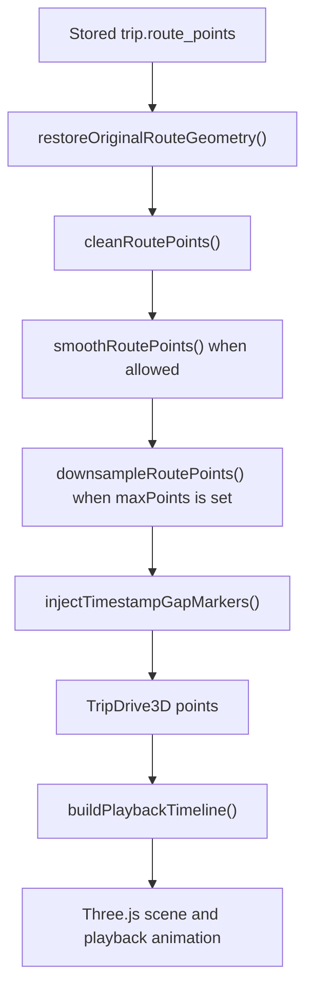

# 3D Replay Documentation

Last updated: 2026-07-08

This document describes the complete current 3D Replay implementation in Road Sage / DriveSense. It covers the routes, data contracts, rendering pipeline, privacy handling, playback behavior, diagnostics, tests, and the main code snippets needed to understand or extend the feature.

## Quick Summary

3D Replay turns a saved trip route into an interactive Three.js drive replay. It loads a trip's GPS route points and driving events, filters and masks them for visual use, projects latitude/longitude into a local 3D coordinate system, builds a stylized road, places event and stop markers, and animates a car along the timeline.

Main files:

| Area | File |
| --- | --- |
| 3D renderer and controls | `src/components/TripDrive3D.jsx` |
| Full trip 3D page | `src/pages/TripDrive3DPage.jsx` |
| Global 3D replay picker page | `src/pages/Trip3DReplay.jsx` |
| Map/playback data helpers | `src/lib/mapPlaybackInsights.js` |
| Trip summary availability flag | `src/lib/tripSummary.js` |
| Local trip storage and route expiry | `src/lib/localTripRepository.js` |
| Trip detail entry button | `src/pages/TripDetail.jsx` |
| Trip card entry button | `src/components/TripCard.jsx` |
| Router entries | `src/App.jsx` |
| Sidebar navigation | `src/components/Layout.jsx` |
| E2E visual/WebGL coverage | `e2e/trip-3d-replay-upgrade.spec.js` |

## User Entry Points

3D Replay can be opened in three ways:

1. Sidebar navigation opens `/3d-replay`.
2. A replayable trip card opens `/3d-replay?tripId=<id>`.
3. A trip detail page opens `/trips/:id/3d`.

The app route definitions are lazy-loaded:

```jsx
const Trip3DReplay = lazy(() => import('@/pages/Trip3DReplay'));
const TripDrive3DPage = lazy(() => import('@/pages/TripDrive3DPage'));

<Route path="/3d-replay" element={(
  <AppRouteBoundary context="trip_3d_replay_page" title="3D replay unavailable">
    <Trip3DReplay />
  </AppRouteBoundary>
)} />

<Route path="/trips/:id/3d" element={(
  <AppRouteBoundary context="trip_3d_page" title="3D drive unavailable">
    <TripDrive3DPage />
  </AppRouteBoundary>
)} />
```

The sidebar exposes the page as:

```jsx
{ path: '/3d-replay', label: '3D Replay', icon: Cuboid }
```

Trip cards only show the shortcut when the summary says replay is available and the trip is not summary-only or expired:

```jsx
const privateTrip = trip.privacy_mode === 'summary_only';
const routeDataExpired = Boolean(trip.route_data_expired_at);
const replay3dAvailable = trip.route_replay_available === true && !privateTrip && !routeDataExpired;
```

Trip detail uses a stricter detail-level check before showing the direct 3D page link:

```jsx
const pointCount = Array.isArray(trip.route_points) ? trip.route_points.length : 0;
const available = !summaryOnly && !expired && pointCount > 1;
```

## Availability Rules

There are two availability levels:

| Level | Purpose | Rule |
| --- | --- | --- |
| Summary availability | Lightweight list/card/picker filtering | `route_replay_available` from `buildTripSummary()` |
| Detail availability | Actual renderer/page gate | trip is not summary-only, route data is not expired, and `route_points.length > 1` |

Summary availability is intentionally stricter because summaries usually do not include full route geometry:

```js
const hasReplayableRoute = (trip = {}) => {
  if (trip.route_data_expired_at || trip.privacy_mode === 'summary_only') return false;
  const points = Array.isArray(trip.route_points) ? trip.route_points : [];
  const pointCount = validCount(trip.route_points_map_count) ?? validCount(trip.route_points_raw_count) ?? points.length;
  return pointCount >= 20 && points.some((point) => Number(point?.speed_kmh) > 0);
};
```

The full 3D page can still render a trip with fewer than 20 summary points if it has at least two valid detail route points. This is useful for direct trip detail access and older records.

Unavailable detail reasons:

```js
function unavailableReason(trip = {}) {
  if (trip?.privacy_mode === 'summary_only') return 'This private trip saved summary data only.';
  if (trip?.route_data_expired_at) return 'Route coordinates for this trip have expired.';
  return 'This trip does not have enough saved GPS points.';
}
```

## Data Sources

3D Replay uses local trip data only. `tripService` always uses the local repository, even when backend URLs are configured for other resources:

```js
// Trip records can contain precise GPS traces. Keep them local-only even when a
// backend API URL is configured for non-trip resources.
export const shouldUseLocalStore = () => true;
```

The picker page first loads summaries:

```js
const { data: summaries = [], isLoading: summariesLoading } =
  useQuery(limitedTripSummaryQueryOptions(PICKER_LIMIT));
```

When a user selects a trip, the page loads full detail:

```js
const { data: selectedTrip, isLoading: selectedLoading } = useQuery({
  ...tripDetailQueryOptions(selectedId),
  enabled: Boolean(selectedId),
});
```

The direct trip route `/trips/:id/3d` also loads full detail:

```js
const { data: fetchedTrip, isLoading: fetchedLoading } = useQuery({
  ...tripDetailQueryOptions(queryId),
  enabled: Boolean(queryId && !embeddedTrip),
});
```

## Required Trip Fields

The renderer expects a completed trip-like object with these useful fields:

| Field | Required | Used for |
| --- | --- | --- |
| `id` | Recommended | Logs, React resets, links |
| `route_points` | Yes | Road geometry and playback positions |
| `driving_events` | Optional | Event markers, event chapters, event camera focus |
| `distance_km` | Optional | Displayed route distance fallback |
| `duration_seconds` | Optional | Page stat fallback |
| `max_speed_kmh` | Optional | Page stat fallback |
| `privacy_mode` | Yes for gating | Blocks summary-only private trips |
| `route_data_expired_at` | Yes for gating | Blocks expired raw GPS data |
| `route_replay_available` | Summary only | Picker/card availability |

Useful route point fields:

| Field | Used for |
| --- | --- |
| `lat`, `lng` | Projection, road, car, marker placement |
| `timestamp` or `time` | Timeline duration, interpolation, event offsets |
| `speed_kmh` | Speed display, visual rate, speed band, dynamics |
| `obd_speed_kmh` | Preferred segment display speed when present |
| `accuracy` | Visual filtering and smoothing decisions |
| `speed_limit_kmh` | Speed limit coloring, signs, over-limit chapters |
| `speed_limit_source` | Timeline metadata |
| `speed_limit_road_name` | Timeline metadata |
| `tracking_gap` or `route_gap` | Segment split / jump prevention |
| `map_matched` | Prevents smoothing and relaxes accuracy behavior |
| `original_lat`, `original_lng` | Recoverable original route geometry |

Useful event fields:

| Field | Used for |
| --- | --- |
| `type` | Color, label, event chapter |
| `severity` | Marker scale |
| `lat`, `lng` | Marker placement |
| `timestamp` or `startTime` | Timeline offset and nearest route index |

## Privacy Handling

The 3D renderer masks route points and events before any visual processing:

```jsx
const privacySettings = useMemo(() => ({
  privacy_zones: settings.privacy_zones,
  show_privacy_circles: settings.show_privacy_circles,
}), [settings.privacy_zones, settings.show_privacy_circles]);

const points = useMemo(() => prepareMapRoutePoints(
  maskRoutePointsForPrivacy(trip?.route_points || [], privacySettings),
  { maxPoints: 720 }
).map(validLatLngPoint).filter(Boolean), [privacySettings, trip?.route_points]);

const visibleEvents = useMemo(() => maskEventsForPrivacy(events, privacySettings)
  .map(validLatLngPoint)
  .filter(Boolean), [events, privacySettings]);
```

If heightened privacy mode is enabled, the UI displays a visible warning over the 3D canvas:

```jsx
{heightenedPrivacy && (
  <div>
    Heightened privacy is masking protected route areas before 3D rendering.
  </div>
)}
```

Raw GPS retention can permanently remove route geometry. When this happens, 3D replay is unavailable and summaries remain:

```js
export function expireTripRouteData(trip, retentionDays, expiredAt = Date.now()) {
  return {
    ...trip,
    route_points: [],
    route_points_raw_count: Number(trip.route_points_raw_count) || routePoints.length,
    route_points_map_count: 0,
    driving_events: stripCoordinatesFromList(trip.driving_events),
    route_data_expired_at: new Date(expiredAt).toISOString(),
    route_data_retention_days: retentionDays,
    route_data_expiration_reason: 'raw_gps_retention_policy',
  };
}
```

## Route Preparation Pipeline

The route preparation flow lives in `src/lib/mapPlaybackInsights.js`.

High-level flow:



Important visual filtering constants:

```js
const MAX_VISUAL_ACCURACY_M = 100;
const MAX_VISUAL_SPEED_KMH = 230;
const MAX_SEGMENT_JUMP_SPEED_KMH = 240;
const MAX_VISUAL_SEGMENT_GAP_SECONDS = 120;
const MAX_SMOOTHING_ACCURACY_M = 45;
const DEFAULT_RENDER_POINTS = 700;
```

Filtering rejects points when:

| Condition | Result |
| --- | --- |
| Invalid latitude/longitude | Drop point |
| Accuracy above 100 m and not map-matched | Drop point |
| Reported speed above 230 km/h | Drop point |
| Timestamp is not increasing | Drop point |
| Implied segment speed above 240 km/h | Drop point |
| Accuracy above 60 m and implied speed above 140 km/h | Drop point |

Gap markers are inserted when:

```js
const hasRouteGap = point?.tracking_gap === true ||
  point?.route_gap === true ||
  (previous && prevMs != null && currMs != null && (currMs - prevMs) / 1000 > MAX_VISUAL_SEGMENT_GAP_SECONDS);
```

Smoothing is skipped when a route has fewer than three points or contains map-matched points:

```js
if (points.length < 3 || points.some((point) => point.map_matched)) return points;
```

## Timeline Construction

`buildPlaybackTimeline(points, events)` creates:

| Output | Meaning |
| --- | --- |
| `points` | Cleaned route points |
| `segments` | Route segments with distance, speed, heading, limits, colors, offsets |
| `events` | Events matched to playback index and offset |
| `stops` | Stop ranges lasting at least 60 seconds |
| `violations` | Segments where speed exceeds known/default limit |
| `story` | Human-readable summary fragments |
| `cumulativeDistancesKm` | Distance lookup by route index |
| `stats` | Point count, distance, duration, average speed, max speed, event count, stop count, violation count |

Speed bands:

```js
export const SPEED_BANDS = [
  { id: 'slow', label: 'Slow', min: 0, color: '#94a3b8' },
  { id: 'city', label: 'City', min: 15, color: '#3b82f6' },
  { id: 'cruise', label: 'Cruise', min: 55, color: '#22c55e' },
  { id: 'fast', label: 'Fast', min: 90, color: '#f97316' },
  { id: 'risk', label: 'Risk', min: 120, color: '#ef4444' },
];
```

Segment display speed prefers OBD speed, then reported GPS speed, then implied distance/time speed:

```js
const segmentDisplaySpeed = (prev, curr, distanceKm, durationSeconds) => {
  const implied = durationSeconds > 0 ? (distanceKm / durationSeconds) * 3600 : null;
  const obd = finiteNumber(curr.obd_speed_kmh ?? prev.obd_speed_kmh);
  if (obd != null) return Math.max(0, obd);

  const reported = finiteNumber(curr.speed_kmh ?? prev.speed_kmh);
  if (reported == null) return Math.max(0, implied || 0);
  if (reported <= IDLE_SPEED_KMH && implied != null && implied >= SPEED_BANDS[1].min) {
    return Math.max(0, implied);
  }
  return Math.max(0, reported);
};
```

Events are matched to the nearest route timestamp first; if no valid timestamp exists, lat/lng proximity is used:

```js
export function eventIndexForRoute(event, points = []) {
  const eventMs = new Date(event?.timestamp || event?.startTime || 0).getTime();
  if (Number.isFinite(eventMs)) {
    // nearest timestamp
  }

  // fallback: nearest lat/lng
}
```

## Projection Into 3D Space

`TripDrive3D` converts latitude/longitude into a local meter-based scene:

```js
const LAT_METERS = 111320;
const MAX_SCENE_SPAN = 92;

function buildProjection(points = []) {
  const centerLat = (minLat + maxLat) / 2;
  const centerLng = (minLng + maxLng) / 2;
  const lngMeters = LAT_METERS * Math.max(0.2, Math.cos(centerLat * Math.PI / 180));
  const spanMeters = Math.max(
    24,
    (maxLat - minLat) * LAT_METERS,
    (maxLng - minLng) * lngMeters
  );
  const sceneScale = Math.min(1.1, MAX_SCENE_SPAN / spanMeters);

  const project = (point) => new THREE.Vector3(
    (lng - centerLng) * lngMeters * sceneScale,
    0,
    -(lat - centerLat) * LAT_METERS * sceneScale
  );
}
```

This keeps short and long routes inside a bounded scene while preserving relative geometry.

## Three.js Scene

The renderer initializes a WebGL scene inside a React effect:

```jsx
renderer = new THREE.WebGLRenderer({
  canvas,
  antialias: true,
  alpha: false,
  powerPreference: 'high-performance',
});

const quality = RENDER_QUALITIES[qualityIdx] || RENDER_QUALITIES[1];
renderer.setPixelRatio(Math.min(window.devicePixelRatio || 1, quality.pixelRatio));
renderer.shadowMap.enabled = true;
renderer.shadowMap.type = THREE.PCFSoftShadowMap;

const scene = new THREE.Scene();
scene.background = new THREE.Color('#0f172a');
scene.fog = new THREE.Fog('#0f172a', 42, 155);

const camera = new THREE.PerspectiveCamera(CAMERA_BASE_FOV, 1, 0.1, 320);
const controls = new OrbitControls(camera, canvas);
```

Scene contents:

| Object | Implementation |
| --- | --- |
| Ground plane | `THREE.PlaneGeometry` with dark material |
| Grid | `THREE.GridHelper` |
| Lighting | `HemisphereLight`, `DirectionalLight`, car `PointLight` |
| Route guide | `THREE.Line` over projected smooth points |
| Road | Curved ribbons and segment overlays |
| Speed signs | Canvas texture applied to sprites |
| Stop markers | Cylinders at stop points |
| Event markers | Poles, spheres, and pulsing rings |
| Car | Custom mesh group using boxes, rounded boxes, custom cabin, wheels, lights |
| Speed trail | Additive transparent meshes behind the car |

Cleanup disposes GPU resources:

```js
return () => {
  window.cancelAnimationFrame(frameId);
  resizeObserver.disconnect();
  canvas.removeEventListener('webglcontextlost', handleContextLost, false);
  canvas.removeEventListener('webglcontextrestored', handleContextRestored, false);
  controls.dispose();
  disposeObject(scene);
  renderer.dispose();
};
```

## Road Rendering

Road rendering groups contiguous timeline segments, projects each segment, smooths centerlines, and draws ribbons:

```js
const roadGroups = projectedRoadGroups(timeline.segments, projection);
addCurvedRoad(scene, roadGroups, colorMode);
```

Road dimensions:

```js
const ROAD_WIDTH = 2.78;
const ROAD_SHOULDER_WIDTH = 3.84;
const ROAD_EDGE_OFFSET = ROAD_WIDTH * 0.48;
```

Each road group draws:

1. Shoulder ribbon.
2. Main road ribbon.
3. Left and right edge lines.
4. Segment color overlay.
5. Red glow overlay for `overLimitKmh > 10`.
6. Dashed center markings on alternating segments.

Road color mode:

```js
const color = colorMode === 'speedLimit' && segment.speedLimitColor
  ? segment.speedLimitColor
  : segment.color || '#3b82f6';
```

The current default prop is:

```jsx
export default function TripDrive3D({
  trip,
  events = [],
  height = '430px',
  colorMode = 'speedBand',
}) {}
```

The full page currently uses the default speed-band coloring.

## Car Model And Dynamics

The car is a custom Three.js group with:

| Part | Geometry/material |
| --- | --- |
| Body | `RoundedBoxGeometry`, blue standard material |
| Cabin | Custom tapered `BufferGeometry`, glass material |
| Wheels/rims | Cylinders |
| Headlights/brake lights | Emissive materials |
| Headlight glow | `PointLight` |

Car movement uses `playbackPositionAtElapsed()` to interpolate between route points:

```js
const position = playbackPositionAtElapsed(points, elapsedRef.current, positionIndex);
const scenePoint = projection.project(position.point);
car.position.copy(scenePoint);
```

Dynamics are inferred from recent segments:

```js
const accelerationKmhPerSecond = (currentSpeed - previousSpeed) / durationSeconds;
const turnDeltaDegrees = previous ? angleDeltaDegrees(previous.heading, segment.heading) : 0;
const overLimitKmh = Number(segment.overLimitKmh) || 0;
const braking = accelerationKmhPerSecond <= -0.45 || ['harsh_brake', 'possible_crash'].includes(String(segment.to?.type || ''));
const accelerating = accelerationKmhPerSecond >= 0.35 || currentSpeed > previousSpeed + 8;
```

Dynamics drive:

| Visual | Behavior |
| --- | --- |
| Car heading | Smoothly lerps toward lookahead heading |
| Body pitch | Nose dips on braking, lifts slightly on acceleration |
| Body roll | Banks into turns |
| Front wheels | Steer based on turn delta |
| Brake lights | Turn bright red while braking or far over limit |
| Camera FOV | Pulls wider at higher speeds |
| Speed trail | Fades in above 32 km/h and reaches full strength around 95 km/h |

## Playback Controls

Playback speeds:

```js
const SPEEDS = [1, 2, 4, 8];
```

Visual playback also scales with vehicle speed:

```js
const VISUAL_REFERENCE_SPEED_KMH = 35;
const MIN_VISUAL_PLAYBACK_RATE = 0.22;
const MAX_VISUAL_PLAYBACK_RATE = 3.1;

function visualPlaybackRateForSpeed(speedKmh = 0) {
  if (speed <= IDLE_SPEED_KMH) return MIN_VISUAL_PLAYBACK_RATE;
  return clampNumber(speed / VISUAL_REFERENCE_SPEED_KMH, MIN_VISUAL_PLAYBACK_RATE, MAX_VISUAL_PLAYBACK_RATE);
}
```

The animation loop advances time only while playing:

```js
if (playingRef.current) {
  const playbackPosition = playbackPositionAtElapsed(points, elapsedRef.current, positionIndex);
  const speed = speedKmhAtPlaybackPosition(timeline, playbackPosition);
  const visualRate = visualPlaybackRateForSpeed(speed);
  const nextElapsed = Math.min(
    durationSeconds,
    elapsedRef.current + delta * speedMultiplierRef.current * visualRate
  );
  elapsedRef.current = nextElapsed;
}
```

Controls exposed in the UI:

| Control | Behavior |
| --- | --- |
| Restart | Seeks to zero and resets camera to cinematic |
| Play/Pause | Toggles animation |
| Speed | Cycles `1x`, `2x`, `4x`, `8x` |
| Quality | Cycles low, medium, high pixel ratios |
| Follow/Free | Toggles automatic vehicle follow |
| Reset camera | Resets OrbitControls and switches to free |
| Range input | Seeks by elapsed seconds |
| Camera mode buttons | Switch camera modes |
| Chapter buttons | Jump to generated chapter |
| Event chips | Jump to event and focus event camera |

## Camera Modes

Camera modes:

```js
const CAMERA_MODES = [
  { id: 'cinematic', label: 'Cinema' },
  { id: 'chase', label: 'Chase' },
  { id: 'top', label: 'Top' },
  { id: 'side', label: 'Side' },
  { id: 'event', label: 'Event' },
  { id: 'free', label: 'Free' },
];
```

Camera behavior:

| Mode | Behavior |
| --- | --- |
| `cinematic` | Follow camera with side drift and event focus when near events |
| `chase` | Rear-following drive camera |
| `top` | Top-down replay view |
| `side` | Side tracking view |
| `event` | Focuses nearest active event marker when possible |
| `free` | OrbitControls only, no automatic follow |

Camera lookahead:

```js
const CAMERA_LOOKAHEAD_SECONDS = 2.2;
const lookAheadElapsed = Math.min(
  durationSeconds,
  elapsedRef.current + CAMERA_LOOKAHEAD_SECONDS + Math.min(2.4, speed / 95)
);
```

## Render Quality

The quality button changes renderer pixel ratio:

```js
const RENDER_QUALITIES = [
  { id: 'low', label: 'Low', pixelRatio: 0.85 },
  { id: 'medium', label: 'Med', pixelRatio: 1.2 },
  { id: 'high', label: 'High', pixelRatio: 2 },
];
```

The renderer caps actual pixel ratio at the lower of device pixel ratio and the selected quality:

```js
renderer.setPixelRatio(Math.min(window.devicePixelRatio || 1, quality.pixelRatio));
```

## Events, Stops, And Chapters

Event colors:

```js
const EVENT_COLORS = {
  harsh_brake: '#ef4444',
  rapid_acceleration: '#f59e0b',
  sharp_turn: '#3b82f6',
  speeding: '#f97316',
  idle: '#64748b',
  heading_deviation: '#0ea5e9',
  heading_deviation_legacy: '#0ea5e9',
  aggressive_overtake: '#f97316',
  near_miss: '#dc2626',
  close_proximity: '#dc2626',
  phone_use: '#dc2626',
  voice_speed_limit_marker: '#2563eb',
  possible_crash: '#991b1b',
};
```

Event markers are capped to the first 120 timeline events:

```js
timeline.events.slice(0, 120).forEach((event, index) => {
  const group = addEventMarker(scene, projection, event, index);
});
```

Event chips in the control panel are capped to 10:

```jsx
{timeline.events.slice(0, 10).map((event, index) => (
  <button onClick={() => jumpToEvent(event)}>
    {titleCase(event.type || 'event')} {formatDuration(Math.round(event.offsetSeconds || 0))}
  </button>
))}
```

Chapters are generated from:

1. Start.
2. Fastest segment.
3. First over-limit segment.
4. Longest stop.
5. First eight events.

The result is de-duplicated, sorted by offset, and capped to 12:

```js
return chapters
  .filter((chapter, index, list) => (
    list.findIndex((item) => chapterKey(item) === chapterKey(chapter)) === index
  ))
  .sort((a, b) => (a.offsetSeconds || 0) - (b.offsetSeconds || 0))
  .slice(0, 12);
```

## UI Overlay

The canvas overlay shows four live stats:

| Stat | Source |
| --- | --- |
| Speed | `speedKmhAtPlaybackPosition()` |
| Traveled | `routeDistanceAtPlaybackPosition()` |
| Motion | `dynamicsAtPlaybackPosition()` |
| Camera | current camera mode |

Motion labels:

```jsx
{currentDynamics.braking
  ? 'Braking'
  : currentDynamics.accelerating
    ? 'Accel'
    : Math.abs(currentDynamics.turnDeltaDegrees) > 12
      ? 'Corner'
      : 'Cruise'}
```

When playback is within five seconds of an event, an event label appears over the canvas:

```js
const currentEvent = timeline.events.find((event) => (
  Math.abs((Number(event.offsetSeconds) || 0) - elapsedSeconds) <= 5
));
```

## Diagnostics And System Events

3D Replay records diagnostic and user-action events with `recordSystemEvent()` and errors with `logSystemFailure()`.

Page and availability events:

| Event | Source |
| --- | --- |
| `trip_3d_replay_page_opened` | Picker page opened |
| `trip_3d_replay_trip_selected` | Trip selected from picker |
| `trip_3d_page_opened` | Direct/full 3D page opened |
| `trip_3d_playback_available` | Trip detail found route can replay |
| `trip_3d_playback_unavailable` | Trip detail or renderer found route cannot replay |

Renderer lifecycle:

| Event/failure | Meaning |
| --- | --- |
| `trip_3d_playback_loaded` | Renderer successfully built scene |
| `trip_3d_webgl_initialize` | WebGL renderer failed to initialize |
| `trip_3d_webgl_context_lost` | Canvas lost WebGL context |
| `trip_3d_webgl_context_restored` | WebGL context restored |
| `trip_3d_playback_completed` | Playback reached trip end |

User actions:

| Event | Action |
| --- | --- |
| `trip_3d_playback_started` | Play |
| `trip_3d_playback_paused` | Pause |
| `trip_3d_playback_seeked` | Slider seek |
| `trip_3d_playback_restarted` | Restart |
| `trip_3d_playback_speed_changed` | Speed cycle |
| `trip_3d_quality_changed` | Quality cycle |
| `trip_3d_camera_follow_changed` | Follow/free toggle |
| `trip_3d_camera_reset` | Camera reset |
| `trip_3d_camera_mode_changed` | Camera mode button |
| `trip_3d_event_selected` | Event chip selected |
| `trip_3d_chapter_selected` | Chapter selected |

The seek log is throttled:

```js
if (now - lastSeekLogRef.current > 2500) {
  lastSeekLogRef.current = now;
  recordSystemEvent('trip_3d_playback_seeked', { ... });
}
```

## Error And Fallback States

No route points:

```jsx
if (!points.length || !projection) {
  return (
    <div>
      3D drive animation needs saved route coordinates for this trip.
    </div>
  );
}
```

WebGL unavailable:

```jsx
if (webglFailed) {
  return (
    <div>
      3D drive animation is unavailable because WebGL could not start on this device.
    </div>
  );
}
```

Renderer initialization failure:

```js
try {
  renderer = new THREE.WebGLRenderer({ canvas, antialias: true, alpha: false, powerPreference: 'high-performance' });
} catch (error) {
  logSystemFailure('trip_3d_webgl_initialize', error, {
    trip_id: trip?.id,
    point_count: points.length,
    event_count: timeline.events.length,
  });
  setWebglFailed(true);
}
```

## Performance Notes

Key performance choices:

| Choice | Why it matters |
| --- | --- |
| Lazy-loaded pages/components | Avoids pulling Three.js into initial app route work |
| Summary picker first | Avoids loading full route geometry for all trips |
| `prepareMapRoutePoints(..., { maxPoints: 720 })` | Keeps renderer geometry bounded |
| Event markers capped to 120 | Prevents huge event-heavy scenes |
| Chapters capped to 12 | Keeps controls usable |
| UI state update throttled to about 110 ms while playing | Keeps React updates lower than render frame rate |
| `ResizeObserver` | Keeps canvas size synced without layout polling |
| GPU disposal on cleanup | Reduces WebGL memory leaks |
| Render quality button | Lets weaker devices lower pixel ratio |

The Vite config has a dedicated Three.js vendor chunk:

```js
if (inNodeModule(moduleId, 'three')) return 'three-vendor';
```

## E2E Test Coverage

The main visual test is `e2e/trip-3d-replay-upgrade.spec.js`.

It:

1. Creates a synthetic trip with 48 route points.
2. Stores it in `localStorage` with IndexedDB disabled.
3. Opens `/trips/${trip.id}/3d`.
4. Checks the heading, chapter UI, and camera button.
5. Screenshots the page.
6. Screenshots the canvas and parses PNG pixels to ensure the WebGL canvas is nonblank.

Core assertion:

```js
const pixelSummary = summarizeCanvasPng(await canvas.screenshot());
expect(pixelSummary.sampled).toBeGreaterThan(100);
expect(pixelSummary.colored).toBeGreaterThan(25);
```

Run the test:

```bash
npm run test:e2e -- e2e/trip-3d-replay-upgrade.spec.js
```

Or run all e2e tests:

```bash
npm run test:e2e
```

## Minimal Synthetic Trip For Manual Testing

Use this shape when seeding a local trip:

```js
const startMs = Date.now() - 20 * 60_000;
const routePoints = Array.from({ length: 48 }, (_, index) => ({
  lat: 43.6508 + index * 0.00016,
  lng: -79.3832 + Math.sin(index / 5) * 0.001,
  timestamp: new Date(startMs + index * 15_000).toISOString(),
  speed_kmh: Math.max(0, 28 + Math.sin(index / 4) * 18 + (index > 24 ? 16 : 0)),
  speed_limit_kmh: index > 24 ? 50 : 40,
  accuracy: 8,
}));

const trip = {
  id: 'visual-3d-upgrade',
  nickname: 'Visual 3D Upgrade',
  status: 'completed',
  privacy_mode: 'standard',
  start_time: new Date(startMs).toISOString(),
  end_time: new Date(startMs + (routePoints.length - 1) * 15_000).toISOString(),
  duration_seconds: (routePoints.length - 1) * 15,
  distance_km: 3.1,
  avg_speed_kmh: 39,
  max_speed_kmh: 67,
  route_replay_available: true,
  route_points_raw_count: routePoints.length,
  route_points_map_count: routePoints.length,
  route_points: routePoints,
  driving_events: [
    {
      type: 'harsh_brake',
      severity: 'high',
      lat: routePoints[14].lat,
      lng: routePoints[14].lng,
      timestamp: routePoints[14].timestamp,
    },
    {
      type: 'speeding',
      severity: 'medium',
      lat: routePoints[31].lat,
      lng: routePoints[31].lng,
      timestamp: routePoints[31].timestamp,
    },
  ],
};
```

## Common Extension Points

### Add a new event color

Add the event type to `EVENT_COLORS` in `TripDrive3D.jsx`:

```js
const EVENT_COLORS = {
  ...,
  new_event_type: '#14b8a6',
};
```

### Add a new camera mode

1. Add it to `CAMERA_MODES`.
2. Extend the `desiredCamera` selection in `updateCar()`.
3. Decide whether `followRef.current` should be true for the mode.
4. Add or update e2e coverage if the mode changes visible UI.

### Change route color behavior

`addCurvedRoad()` accepts `colorMode`. Current behavior is speed band by default, with a speed-limit mode available:

```js
const color = colorMode === 'speedLimit' && segment.speedLimitColor
  ? segment.speedLimitColor
  : segment.color || '#3b82f6';
```

### Increase point limits

Change the renderer call:

```js
prepareMapRoutePoints(routePoints, { maxPoints: 720 })
```

Before raising this significantly, validate mobile WebGL performance and memory.

### Add a new chapter type

Edit `buildReplayChapters(timeline)`, add the chapter object, and keep the de-dupe/sort/cap behavior intact:

```js
chapters.push({
  kind: 'custom',
  label: 'Custom',
  detail: '...',
  offsetSeconds,
  color: '#38bdf8',
  cameraMode: 'cinematic',
});
```

## Troubleshooting

| Symptom | Likely cause | Where to check |
| --- | --- | --- |
| No 3D replay button on trip card | Summary says `route_replay_available !== true`, summary-only trip, or expired route data | `src/lib/tripSummary.js`, `src/components/TripCard.jsx` |
| Direct 3D page says not enough GPS points | Full detail has fewer than two route points | `src/pages/TripDrive3DPage.jsx` |
| Canvas says WebGL unavailable | Renderer creation failed or context was lost | system logs for `trip_3d_webgl_initialize` or `trip_3d_webgl_context_lost` |
| Route looks too straight | Saved GPS points are sparse, gaps are missing, or map matching was not applied before storage | `route_points`, `tracking_gap`, `route_gap`, `mapPlaybackInsights.js` |
| Events do not show | Events lack public lat/lng after privacy masking, or exceed the 120 marker cap | `maskEventsForPrivacy()`, event fields |
| Stops do not appear | Stop segments did not remain below idle speed for at least 60 seconds | `collectStops()` in `mapPlaybackInsights.js` |
| Speed signs missing | Route points do not have usable `speed_limit_kmh` | timeline segments |
| Replay too heavy on a device | Pixel ratio too high, too many points/events, or weak WebGL implementation | quality control, max points, event cap |

## Maintenance Checklist

When changing 3D Replay:

1. Confirm the route remains local-only and privacy-masked before rendering.
2. Confirm summary pages do not load full route geometry until a trip is selected.
3. Keep unavailable states clear for summary-only, expired, and insufficient-route trips.
4. Dispose Three.js resources on unmount.
5. Keep event/point counts bounded for mobile devices.
6. Preserve the e2e canvas nonblank check.
7. Update this document when route fields, camera modes, diagnostics, or controls change.

