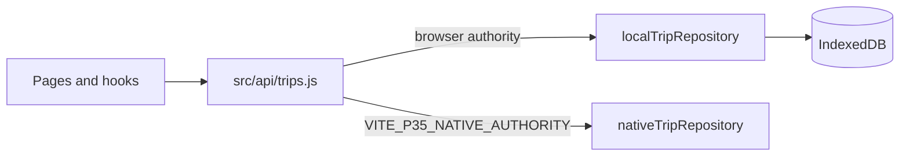

# Browser Storage

Canonical source: `src/lib/localTripRepository.js` (the largest storage module), with
`src/lib/mobileStorage.js` for the storage primitive, `src/lib/browserActiveTripSpool.js` for
in-progress capture, and `src/lib/browserKeyReferences.js` for key references.

This is the trip authority that ships. The native archive authority is an alternative selected by
configuration; see [NATIVE_ARCHIVE.md](NATIVE_ARCHIVE.md).

## What it owns

- Durable storage of completed trips in IndexedDB.
- The in-progress (active) trip spool in the browser.
- Bounded page queries over trip history.
- Scalar population counts.
- Generation and revision markers used to detect concurrent change.
- Retention and deletion of local records.

## What it does not own

- Scoring, which is applied before storage.
- Remote persistence. There is none for trips: `src/api/trips.js` hardcodes
  `shouldUseLocalStore() === true`.

## Access path

Application code should call the `src/api/trips.js` facade rather than a repository directly, so
the authority selection stays in one place.

## Record categories

| Category | Purpose |
|---|---|
| Completed trip records | Canonical trip data including summary, events and route payload |
| Active trip spool | In-progress capture state, written incrementally |
| Derived/projection state | Precomputed values for list and analytics surfaces |
| Key references | Envelope key references for encrypted payloads |

Route payloads are the privacy-sensitive part of a trip record and are treated accordingly:
they are not loaded for list surfaces, and are subject to privacy masking and expiry.

## Query model

Reads are bounded pages. A page result carries the returned rows plus the metadata a caller needs
to be honest about what it has:

- requested limit and returned row count,
- whether more rows exist,
- page completeness (exact or partial),
- the authority, generation and revision the page was taken from.

Population totals are obtained separately with a scalar `count()` on the object store. The
repository reads the query snapshot before and after counting and refuses the result if
generation or revision moved, rather than publishing a torn total.

Detail reads resolve an explicitly requested trip identity directly. A detail surface never
enlarges a page window until the wanted trip appears.

## Generation and revision

Every mutation advances revision state. Readers capture a snapshot with their page and can
compare it later to detect that the underlying data changed. This is what allows a caller to
distinguish "this is a consistent page of a known state" from "this may be stale".

## Failure semantics

| Condition | Behaviour |
|---|---|
| IndexedDB unavailable | Population reports unavailable with a reason; no fabricated zero |
| Snapshot moved during count | Count refused with `snapshot_changed_during_count` |
| Partial page | Reported as partial rather than presented as complete |
| Corrupt or unreadable record | Surfaced as unreadable rather than silently skipped |

## Scale

Cost is proportional to page size, not to history size. No user-visible path loads the whole
archive. Long lists virtualise in the UI. See
[../development/PERFORMANCE.md](../development/PERFORMANCE.md).

## Privacy and security

Trip payloads are encrypted at rest through the payload crypto layer. Authentication tokens live
in `sessionStorage` only. Erasure removes records and derived residue; see
[../security/PRIVACY_AND_DATA_HANDLING.md](../security/PRIVACY_AND_DATA_HANDLING.md).

## Testing

Covered by `localTripRepositoryIndexedDb.test.js` and the surrounding repository, paging,
retention and erasure suites, plus browser-level Playwright specs that observe real IndexedDB
behaviour.
