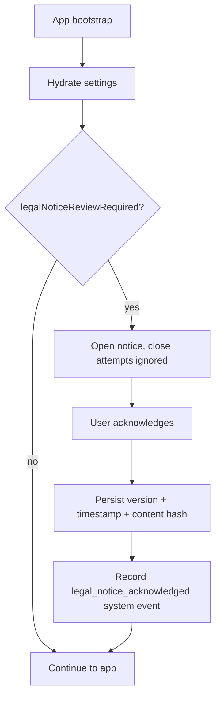

# In-App Legal Notice System

Road Sage presents a versioned safety, legal, tracking and privacy notice at first launch and
keeps it reviewable in Settings. **This system — not the Markdown in `docs/legal/` — is the
canonical user-facing disclosure.**

## Ownership model

| Concern | Owner | Notes |
|---|---|---|
| Disclosure content and version | `src/lib/legalDisclaimers.js` | **Canonical.** Exact user-facing wording, plus `canonicalLegalNoticeContent()` and `LEGAL_NOTICE_CHANGELOG` |
| Content hash | `src/lib/legalNoticeVersion.generated.js` | Generated; do not hand-edit |
| Validity classification | `src/lib/legalNoticeAcknowledgement.js` | States, review decision, acknowledgement record |
| Integrity guard | `scripts/generate-legal-version.mjs` | `npm run legal:version` / `legal:version:check` |
| Presentation | `src/components/LegalNoticeDialog.jsx` | First-launch and Settings review modes |
| First-launch gate | `src/App.jsx` | Delegates to `legalNoticeReviewRequired()` |
| Acknowledgement persistence | `src/lib/trackingStore.js` | `legal_notice_ack_version`, `legal_notice_acknowledged_at`, `legal_notice_ack_content_hash` |
| Settings review | `src/pages/Settings.jsx` | Accepted version/date, review state, reopen |
| Mechanism documentation | this file | How it works |
| Plain-language explanation | `docs/legal/DATA_HANDLING_NOTICE.md` | Explains practice, does not restate wording |
| Review-oriented drafts | `docs/legal/*_DRAFT.md` | Marked draft; require legal review |

Markdown must not reproduce long passages of the notice. Duplicated legal wording drifts
independently and creates two competing sources of truth. Reference
`src/lib/legalDisclaimers.js` instead.

## Content structure

`legalDisclaimers.js` exports:

| Export | Purpose |
|---|---|
| `LEGAL_DISCLAIMER_SHORT` | One-line disclaimer for compact surfaces |
| `LEGAL_DISCLAIMER_SUMMARY` | Short plus an estimate/responsibility summary |
| `LEGAL_NOTICE_ACK_VERSION` | Required acknowledgement version (currently `9`) |
| `LEGAL_NOTICE_INTRO` | Dialog introduction |
| `LEGAL_NOTICE_KEY_POINTS` | Key points shown prominently |
| `LEGAL_DATA_PRACTICES` | Per-category entries with `access` / `use` / `sharing` |
| `LEGAL_DISCLAIMER_ITEMS` | Grouped detail items (`group`, `title`, `body`) |
| `LEGAL_NOTICE_CHANGELOG` | Per-version summaries of what changed for the user; versions 1-8 have no recorded history and are deliberately absent |
| `canonicalLegalNoticeContent()` | The substantive content in a stable shape for hashing |

Groups currently cover safety and responsibility, accuracy limits, records/exports/decisions, and
privacy and data.

## First-launch flow

Raising `LEGAL_NOTICE_ACK_VERSION` re-prompts every user. The dialog's `onOpenChange` only ever
sets open to `true`, so an ordinary dismissal does not bypass the first-run gate. Settings review
mode closes normally, which is the intended difference.

There is **no forced scroll gate and no multi-checkbox flow**: one clearly scoped acknowledgement
action, by deliberate decision.

## Acknowledgement record and content binding

Acknowledging writes `legal_notice_ack_version`, `legal_notice_acknowledged_at` and
`legal_notice_ack_content_hash`, and records a `legal_notice_acknowledged` system event under the
`settings` category.

The content hash identifies the exact disclosure content that was presented, so an
acknowledgement can be proven against the notice rather than against a bare version number.

**Semantics:** acknowledgement means the user confirmed they have read and understand the notice.
It is deliberately **not** consent to data processing and **not** acceptance of contractual terms.

### Canonical hash scope

| Included | Excluded |
|---|---|
| Version, short and summary disclaimers, intro | Styling, CSS classes, layout |
| Key points | Component structure and rendering detail |
| Data practices (title, access, use, sharing) | Dates, timestamps, acknowledgement state |
| Disclaimer items (group, title, body) | Line endings and surrounding whitespace |

Line endings and surrounding whitespace are normalised because they are representation, not
meaning. Any substantive wording change alters the hash.

### Validity states

`classifyLegalAcknowledgement()` returns exactly one state:

| State | Meaning | Review required |
|---|---|---|
| `none` | Never acknowledged | Yes |
| `acknowledged_content_bound` | Current version, hash matches the presented content | No |
| `acknowledged_versioned_legacy` | Current version, acknowledged before hashing existed | **No** |
| `content_mismatch` | Current version, but bound to different content | Yes |
| `outdated` | An older version was acknowledged | Yes |
| `ahead_of_build` | Record from a newer build (e.g. after a downgrade) | No |
| `malformed` | Record unreadable; fails safe | Yes |

### Legacy compatibility

Existing version 9 acknowledgements carry a version and timestamp but no hash. They are
classified `acknowledged_versioned_legacy` and **remain valid**: those users did read the current
notice, and introducing hashing must not push them back through the dialog. They convert naturally
to content-bound records at the next legitimate version change.

## Version-integrity guard

`npm run legal:version:check` fails when the canonical content no longer matches its recorded
hash, mirroring the scoring-version guard. It runs in `prebuild` and `pretest`.

### Strict content binding

An acknowledgement records the **exact** disclosure content presented. That has one unavoidable
consequence, and the design states it plainly rather than working around it:

> If canonical text changes, it is no longer the text the user acknowledged.

So there are exactly two categories, defined technically rather than by legal judgement:

| Category | Examples | Effect on the hash | Action required |
|---|---|---|---|
| **Representation-only** | Styling, CSS classes, layout, component structure, accessibility markup that does not alter the text, line endings, surrounding whitespace | None — excluded or normalised by canonical serialization | None |
| **Canonical substantive content** | Any change to the intro, key points, data practices, disclaimer items, disclaimers or version — **including a spelling correction** | Hash changes | Raise `LEGAL_NOTICE_ACK_VERSION`, add a `LEGAL_NOTICE_CHANGELOG` entry, run `npm run legal:version` |

There is deliberately **no third path**. A spelling fix inside canonical text changes what the
user is shown, so it is handled like any other content change.

"Material" is avoided as an engineering term: legal materiality is a legal-review concept, and
using it here would imply the guard makes a judgement it cannot make.

### Why same-version regeneration is refused

`npm run legal:version` **refuses** to write a different hash under an unchanged acknowledgement
version. Allowing it would silently reclassify every content-bound acknowledgement as
`content_mismatch` and push those users back through the dialog with no changelog explaining why.

The refusal is the mechanism that makes the binding honest: the only way to change canonical
content is to change the version, which is also the only way the user gets told something changed.

Representation-only edits never hit this path, because they do not change the hash at all.

## Settings review

Settings renders the same dialog in `reviewMode` with a `Close` or `Mark reviewed` action, and
shows the accepted version, accepted date, and the review state derived from the classifier —
including a distinct message when the same version was acknowledged against different content.

When a future version carries a `LEGAL_NOTICE_CHANGELOG` entry describing changes, Settings
appends a concise "What's changed in version N" summary. Nothing is shown for versions with no
recorded history. The content hash is internal provenance and is not surfaced to ordinary users.

The notice is therefore not a one-time gate: it remains available under Privacy & Data, and a
version change surfaces there as well as at launch.

## Relationship to per-feature consent

The notice is a **disclosure**. It is not the mechanism by which optional data sharing is enabled.
Those are separate, independently recorded states — for example `weather_context_enabled`,
`external_context_auto_fetch_enabled` with its own consent timestamp, and
`osrm_data_sharing_consented`, which can be invalidated with a recorded reason when privacy
settings change.

Acknowledging the notice does not enable any optional external request.

## Deliberate design decisions

These were considered and **not** adopted:

| Not implemented | Reason |
|---|---|
| Forced scroll-to-end gate | Proves scrolling, not comprehension; accessibility and tall-screen behaviour make it consent theatre |
| Multiple mandatory affirmations | Mixes safety, usage and terms categories; ritualises all three |
| Contractual terms acceptance | Would change the legal character of the action; requires qualified review first |
| Audit-chain persistence | Version + hash + timestamp + build guard already meet the integrity need, without new retention and erasure questions |
| Acknowledgement export or history | Would require an indefinite archive of superseded legal text |

## Testing

- `src/lib/__tests__/legalNoticeAcknowledgement.test.js` — validity states, legacy compatibility,
  content-mismatch discrimination, corrupt records, canonical scope.
- `src/lib/__tests__/legalNoticeVersionGuard.test.js` — mutates real source and runs the real
  script to prove the guard catches changed sharing statements, removed key points, reworded
  disclaimers and an unreconciled version bump, while tolerating line-ending changes.
- `releaseBlockers.test.js` pins the first-launch gate to the central classifier.
