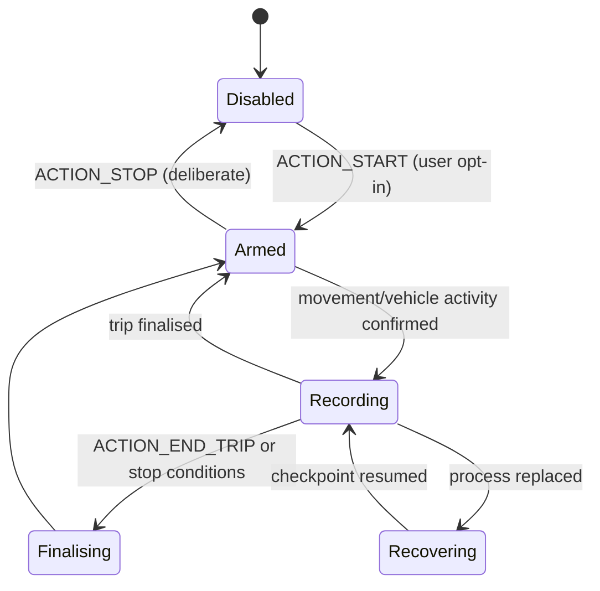

# Native Tracking Service

Canonical source: `android/app/src/main/java/com/drivesense/app/DriveSenseAutoTrackingService.java`
— the largest class in the repository and the highest-risk component in the system.

Related: `DriveSenseActivityRecognitionPlugin`, `DriveSenseActivityReceiver`,
`DriveSenseAutoTrackingTileService`, `DriveSenseBootReceiver`, `DriveSenseTrackingWatchdog`,
`DriveSenseTrackingWatchdogJobService`, `DriveSenseActiveTripSpool`,
`DriveSenseCompletedTripJournal`.

## What this service owns

- The Android foreground service that captures trips in the background.
- Deciding when an automatic trip starts and stops.
- Manual trip start, end and discard on the native side.
- Ownership of the in-progress capture session and its durable checkpoint.
- Finalising a captured trip into the completed-trip journal.
- The live capture notification and speech/voice output.

## What it does not own

- Scoring. It records evidence; the scoring engine interprets it.
- Completed-trip archive storage semantics, owned by the archive layer.
- The user's durable tracking preference, which is a stored setting the service reads.

## Control surface

The service is driven by explicit intent actions rather than implicit state:

| Action | Purpose |
|---|---|
| `ACTION_START` | Arm native automatic tracking |
| `ACTION_START_MANUAL_TRIP` | Begin a manual trip |
| `ACTION_STOP` | Deliberate stop of native auto tracking |
| `ACTION_END_TRIP` | Finalise the current trip |
| `ACTION_DISCARD_MANUAL_TRIP` | Discard a manual trip without committing |
| `ACTION_ACKNOWLEDGE_INCIDENT` | Acknowledge a possible-incident prompt |
| `ACTION_ACTIVITY` | Deliver an activity-recognition update |
| `ACTION_STOP_SPEECH` | Stop native speech output |

## Lifecycle states

- **Disabled** — the durable enabled flag is false. Stale intents cannot re-enable capture.
- **Armed** — the service runs and observes activity/location but is not recording a trip.
- **Recording** — a capture session owns an active-trip spool and writes checkpoints.
- **Recovering** — a replacement process restores an interrupted session from its checkpoint.

Key state is tracked explicitly in fields such as `serviceRunning`, `explicitStopRequested`,
`pendingDeliberateStopRequestId`, `activeStartMs`, `stillSinceMs`, `nonVehicleSinceMs`,
`armedStillSinceMs`, `armedMovingSinceMs`, `lastLocationMs` and `lastActiveCheckpointMs`.

## Deliberate stop semantics

A deliberate stop is authoritative. The service records the stop request identity and refuses to
treat a late or replayed activity update as authority to resume. A stale activity delivered after
a successful stop returns `START_NOT_STICKY`, does not synthesise an enable, and leaves the stop
standing.

Terminal stop success is also refused while a checkpoint remains outstanding, so a stop cannot be
reported as complete while capture state is still unresolved.

## Automatic start and stop

Automatic transitions combine activity recognition with location evidence and a GPS fallback, so
a device that reports poor activity classification can still start a trip from movement. Stillness
and non-vehicle timers gate stopping, so brief stops do not fragment a trip.

Capture tier and fidelity are evaluated periodically (`activeCaptureTierSinceMs`,
`lastCaptureTierEvalMs`); see [CAPTURE_FIDELITY.md](CAPTURE_FIDELITY.md).

## Durability

The active session is checkpointed to the active-trip spool as capture proceeds. If the process is
replaced, the checkpoint is reconciled on the next start and the session resumes rather than being
lost. Checkpoint reconciliation is independently idempotent.

On finalisation the trip is written to the completed-trip journal, which is drained and admitted
into the archive under its own ownership rules. See
[DATA_STORAGE_AND_LIFECYCLE.md](DATA_STORAGE_AND_LIFECYCLE.md).

## Watchdog and restart

`DriveSenseTrackingWatchdog` and its job service observe service health.
`DriveSenseBootReceiver` re-arms tracking after reboot or application replacement, but only when
the durable enabled flag is set; the receiver never grants enablement itself, and it records a
skip when permissions are missing.

`AppExperienceWatchdog` separately records stalls, low-memory events and process-exit records for
Diagnostics; prior-process records are marked historical so they are never attributed to the
current launch.

## Permissions and platform constraints

Requires foreground-service, location (including background), and activity-recognition
permissions; notification permission for the live notification; and battery-optimisation
exemption for reliable long-running capture. Behaviour varies by manufacturer and Android
version — background execution limits, doze behaviour and process-kill aggressiveness are device
characteristics and are a device-qualification concern.

## Browser relationship

The web layer communicates through the activity-recognition plugin and the secure bridge. The
service is the authority for native capture state; the web layer observes it and issues explicit
actions. It does not infer service state from UI state.

## Failure semantics

| Failure | Behaviour |
|---|---|
| Process killed mid-trip | Checkpoint resumed on next start |
| Permission revoked | Capture cannot arm; skip recorded |
| Activity updates stale or replayed | Refused; no implicit enable |
| Location unavailable | Fallback timers govern; no fabricated movement |
| Finalisation interrupted | Journal admission retried under its ownership rules |

## Testing

Covered by JVM/Robolectric suites including `DriveSenseAutoTrackingServiceTest`, the deliberate
stop contract suite, the stale-activity suite, checkpoint and spool fault matrices, and the
emergency acknowledgement continuation suite. Real operating-system behaviour — true process
death, doze, manufacturer background limits — is device-qualified, not covered here.

## Safe modification checklist

1. Prefer adding an explicit action over inferring intent from existing state.
2. Never allow a delivered activity to imply enablement.
3. Preserve checkpoint-before-acknowledge ordering.
4. Run the tracking, stop-contract, stale-activity and checkpoint suites together.
