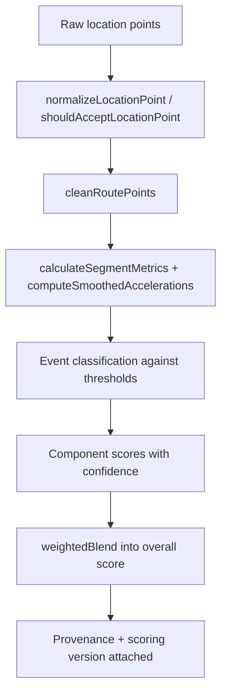

# Scoring Engine

Canonical source: `src/lib/tripEngine.js` (the largest module in the repository), with policy
constants in `src/lib/scoringConstants.js` and `src/lib/appConstants.js`, presentation rules in
`src/lib/scoreDisplay.js`, and numeric helpers in `src/lib/mathUtils.js`.

## What this subsystem owns

- Normalising and validating raw location points into usable route data.
- Deriving segment metrics (speed, acceleration, heading) from those points.
- Classifying driving events and assigning penalties.
- Composing component scores and an overall score.
- Attaching confidence and provenance to every score it produces.
- Declaring the scoring version that a stored score was produced under.

## What it does not own

- Capture. Points arrive from the tracking layer.
- Persistence. Scores are stored by the trip repositories.
- Presentation. Formatting, approximate-score prefixes, evidence labels and colour tiers belong
  to `src/lib/scoreDisplay.js`.
- Long-run analytics and metric aggregation, which belong to the insights layer.

## Calculation flow

Point admission is explicit: `shouldAcceptLocationPoint` decides whether a sample is usable and
`getLocationPointRejectionReason` records why a sample was refused, so rejected data is
explainable rather than silently dropped.

## Score domains

The engine produces an overall score plus component scores. Current component domains include
`safety`, `smoothness`, `eco` and `intersection`, composed into `overall`.

Each component is created through `createComponentScore` and carries its own confidence, so a
domain with insufficient evidence does not silently depress or inflate the overall result.
`weightedBlend` performs the composition.

## Confidence and evidence levels

`CONFIDENCE_LEVELS` defines four levels:

| Level | Meaning |
|---|---|
| `high` | Sufficient evidence for a presented score |
| `developing` | Evidence is accumulating; treat the value as provisional |
| `low` | Weak evidence |
| `unavailable` | No usable evidence; no score is asserted |

`componentConfidence` derives the level from sample evidence. Presentation is required to honour
these levels — an approximate or unavailable score must not be rendered as a definitive number.
That rule lives in `scoreDisplay.js`.

## Provenance

`buildScoreProvenance`, `getScoreProvenanceStatus`, `tierProvenance` and
`buildScoreConstantsSnapshot` record how a score was produced: which constants snapshot applied,
which tier of evidence was available, and whether the result is calibrated or provisional.

This matters because thresholds are provisional. A stored score is only interpretable together
with the provenance and version that produced it.

## Thresholds and event penalties

- `DEFAULT_THRESHOLDS` and `buildDrivingThresholds` produce the effective thresholds, allowing
  user-configurable sensitivity where the product exposes it (for example phone-use sensitivity
  via `phoneSensitivityPresetThreshold`).
- `EVENT_PENALTIES` maps an event class to a `score` impact and a `weight`.
- `SVI_DEFAULTS` holds speed-variability parameters, including a moving-speed floor of 5 km/h,
  minimum moving and stratum sample counts, and an 80 km/h highway boundary. Its calibration
  comments state explicitly that the city multiplier is provisional.

Many exported constants are annotated in source with their calibration status. Treat them as
policy, not as tuning knobs.

## Versioning and rescoring

`src/lib/scoringConstants.js` is hashed by `scripts/generate-scoring-version.mjs` into
`src/lib/scoringVersion.generated.js` as `SCORING_VERSION` (currently `bb1ca1d6`). Build and test
pipelines fail closed when the generated file is stale.

**After editing `scoringConstants.js`, run `npm run scoring:version`.** Never hand-edit the
generated file.

Because stored trips record the version they were scored under, changing constants makes existing
scores comparable only through rescoring. `src/lib/rescoringQueue.js` owns bounded rescoring
turns; it processes a page per turn rather than the whole archive, and is admitted through the
work coordinator.

## Numeric safety

Clamping and NaN-safe arithmetic are centralised in `src/lib/mathUtils.js` and shared across
scoring, fatigue, weather, reports, playback, calibration and import sanitisation. Use those
helpers rather than ad hoc `Math.max`/`Math.min` on these paths.

## Shared policy with Android

`src/lib/appConstants.js` holds cross-cutting policy shared with the native live detector so both
sides agree — for example the fixed 22:00–04:59 night window (`NIGHT_START_HOUR` /
`NIGHT_END_HOUR`), rush-hour boundaries, and penalty scales such as `PENALTY_SCALE_FACTOR` and the
fatigue penalty scales.

Changing a shared constant requires checking both the JavaScript scorer and the Android detector.
Parity is covered by retained golden/parity suites.

## Failure and fallback semantics

- Insufficient evidence yields `unavailable` rather than a fabricated score.
- Rejected points are recorded with a reason rather than discarded silently.
- Derived helpers clamp rather than propagate `NaN`.
- Trip-level guards (`validateCandidateTrip`, `trimParkedTail`, `isNearRecentParkedLocation`,
  `splitTripAtStops`) reject or repair candidate trips that do not represent real driving.

## Privacy interaction

`applyDifferentialPrivacyToTripAggregates` exists for aggregate reporting, and `simplifyRoute`
reduces route fidelity where appropriate. Privacy zones and private-trip mode mask route and
event data upstream of presentation; see
[../security/PRIVACY_AND_DATA_HANDLING.md](../security/PRIVACY_AND_DATA_HANDLING.md).

## Scale

Scoring is per-trip and proportional to that trip's point count, not to history size. Rescoring
across many trips is bounded per turn by the queue.

## Testing

`src/lib/tripEngine.test.js` is the primary suite and includes a hot-path budget test over a
2,000-point trip. Parity suites cover JavaScript/Android agreement on night classification and
trip statistics. Scoring-version staleness is enforced by `npm run scoring:version:check`.

## Safe modification checklist

1. Change constants in `scoringConstants.js`, never the generated version file.
2. Run `npm run scoring:version`.
3. Check whether the constant is mirrored in `appConstants.js` for Android parity.
4. Run `tripEngine.test.js` and the parity suites.
5. Consider whether existing stored scores need rescoring to stay comparable.
