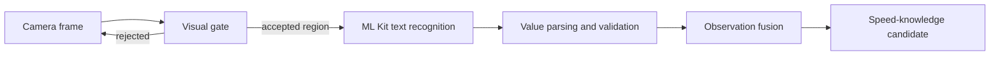

# Speed-Sign Scanning

An Android-only, user-initiated camera feature that reads posted speed-limit signs and offers the
result as evidence for road-speed knowledge.

Canonical sources: `android/app/src/main/java/com/drivesense/app/SpeedSignScannerActivity.java`
and `SpeedSignVisualGate.java`, with settings and scan policy in `SpeedSignScannerSettings` and
`SpeedSignScanPolicy`, and observation fusion in `SpeedSignObservationFusion`.

## What it is

A scanner activity that uses the device camera and on-device ML Kit text recognition to read
speed-limit signs. It is **not** a continuous background vision system: it is an explicit,
user-initiated capture surface.

## Pipeline

### Visual gate

`SpeedSignVisualGate` is an **offline heuristic gate, not a trained model** — the source states
this explicitly. It evaluates real pixels for exposure, contrast, edge sharpness and sign-like
bright/red panels, keeps attention on the forward road region, and proposes and enlarges the
strongest candidate region.

Its purpose is twofold: improve input quality, and avoid spending power running text recognition
on frames that cannot yield a result.

### Recognition and validation

Accepted regions go to on-device ML Kit text recognition. Recognised text is parsed and validated
as a plausible speed value before it is treated as an observation. Implausible or ambiguous
readings are rejected rather than guessed.

### Fusion

`SpeedSignObservationFusion` combines observations rather than trusting a single frame. A
confirmed sign reading becomes a high-trust input to road-speed knowledge —
`user_confirmed_posted_sign` is the strongest source class. See
[ROAD_SPEED_KNOWLEDGE.md](ROAD_SPEED_KNOWLEDGE.md).

## Permissions and platform

Requires `android.permission.CAMERA`. Android only; there is no web equivalent. Text recognition
runs on-device.

## Image handling and retention

The camera is active only while the dedicated scanner surface is visibly open. Scanning must be
started while parked.

**Full camera frames are discarded, and recognised text is not retained.** One tightly cropped
sign image may be retained temporarily so the user can confirm the reading after parking. That
crop is real image data, and its handling is explicit:

| Property | Implementation |
|---|---|
| Owner | `SpeedSignReviewImageStore` |
| Location | `context.getNoBackupFilesDir()/speed_sign_review_images_v1` — excluded from Android backup |
| Encryption | `DriveSensePayloadCrypto.encryptBytesForStorage`, with a per-evidence crypto context |
| Size ceiling | `MAX_ENCODED_BYTES` = 300,000 bytes |
| Retention | `RETENTION_MS` = 24 hours |
| Deletion | `delete(evidenceId)` after the user's decision; `cleanupExpired` for expiry; `eraseAll` for data-rights erasure |

`SpeedSignEvidenceStore` separately holds the encrypted evidence record.

The crop exists only to support a parked confirmation. It is **not** written into the trip record,
is not referenced by the backup or export paths, and is removed once the user confirms, adjusts or
rejects the reading. Choosing "Not sure" keeps it only until the original 24-hour expiry.

A camera prompt never affects scoring or voice alerts unless the user personally confirms the
posted sign after parking.

Any change that would widen retention, extend expiry, write the crop into a trip record, or
include it in exports or backups is a privacy-affecting change requiring review. See
[../security/PRIVACY_AND_DATA_HANDLING.md](../security/PRIVACY_AND_DATA_HANDLING.md) and the
canonical user-facing wording in `src/lib/legalDisclaimers.js`.

## Failure modes

| Condition | Behaviour |
|---|---|
| Camera permission denied | Feature unavailable; no silent degradation |
| Poor exposure, blur, no sign-like region | Gate rejects the frame; recognition not run |
| Text recognised but implausible | Rejected at validation |
| Conflicting readings | Resolved by fusion, or left unconfirmed |

## Limitations

Accuracy depends on lighting, weather, motion, sign condition, occlusion and mounting position.
The gate is heuristic. Recognition can misread damaged, dirty, non-standard or non-Latin-numeral
signs. A scan is evidence, not ground truth — the system treats it as a strong observation, not as
a guaranteed limit.

## Testing

`SpeedSignScannerSettingsTest`, `SpeedSignScanPolicyTest`, `SpeedSignVisualGateTest` and
`SpeedSignObservationFusionTest` cover settings, policy, gating and fusion on the JVM. Real
camera and optical behaviour is a device-qualification obligation.
