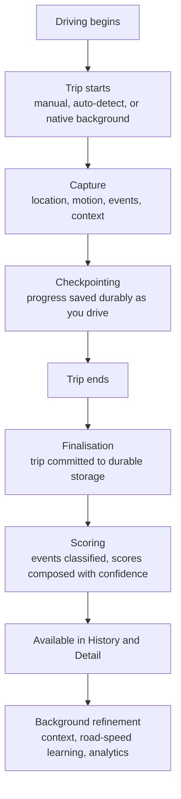

# How Road Sage Works

A conceptual walkthrough for readers who want to understand the product without reading
implementation architecture. Links point to the engineering documentation for detail.

## The lifecycle of a trip

### 1. A trip starts

Three ways: the user starts one manually; the app detects driving in the foreground; or, on
Android, the native background service detects driving using activity recognition with a GPS
fallback. How a trip started is recorded categorically, so the app never has to guess later.

### 2. The trip is captured

Location points are admitted or rejected against quality rules — a rejected point records *why*.
Driving events are identified as they occur. Capture fidelity adapts to conditions.

### 3. Progress is saved as you drive

Capture is checkpointed durably rather than held in memory. If Android kills the app mid-trip, the
next start resumes from the checkpoint instead of losing the drive. This is the single most
important durability property in the product.

### 4. The trip is finalised

At the end, the trip is committed to durable storage. On Android it passes through a journal that
is only acknowledged after the data is verifiably persisted, so an interrupted handoff is retried
rather than dropped.

### 5. Scoring runs

Events are weighted into component scores — safety, smoothness, eco, intersection — and composed
into an overall score. Every score carries a **confidence level** and a record of which constants
produced it. When evidence is too thin, the app says so instead of inventing a number.

### 6. The trip appears in History

History shows a **bounded page** of trips, not the whole archive, and reports separately how many
trips exist in total. This is why History stays responsive as history grows. Opening a specific
trip resolves that trip directly.

### 7. Refinement continues in the background

Afterwards, bounded background work may add road context and weather, update learned road speeds,
and recompute analytics. This work runs in small budgeted turns so it cannot monopolise the device.

## How speed limits are decided

Road Sage combines several sources and always records which one it used:

1. A limit the user confirmed against a posted sign — strongest.
2. A limit learned from repeated observation of that road.
3. A limit from OpenStreetMap map data, where available and permitted.
4. A limit inferred from road classification.
5. Nothing — reported as unavailable rather than guessed.

Each result carries a confidence, and low-confidence values are not allowed to trigger alerts.
On Android the user can also scan a posted sign with the camera to supply strong evidence.

See [../features/ROAD_SPEED_KNOWLEDGE.md](../features/ROAD_SPEED_KNOWLEDGE.md).

## What the app does with your location data

It stays on the device. There is no Road Sage server receiving trips.

Optional context features contact third parties — a weather service and OpenStreetMap road data —
and these are consent-gated with automatic fetching off by default. Privacy zones mask sensitive
places, and private-trip mode withholds route evidence entirely.

See [../legal/DATA_HANDLING_NOTICE.md](../legal/DATA_HANDLING_NOTICE.md).

## What Diagnostics is for

Diagnostics is a self-report: what build is running, whether observed problems came from this
launch or an older one, what the storage subsystems believe their state to be, and how much data
the app is working with. It excludes personal data by design — no coordinates, trip identifiers,
dates or notes — so it can be shared to explain a problem without sharing driving history.

See [../architecture/DIAGNOSTICS.md](../architecture/DIAGNOSTICS.md).

## Recurring design principle

Where the app cannot establish something, it reports that it cannot.

An unavailable score, an unknown speed limit, an expired route, a count it could not take
consistently — each is reported as its own distinct state rather than being rendered as zero,
empty or confident. That principle is why several parts of the product look more cautious than a
typical driving app.
